---

# 结构型模式 ⭐⭐

---

## 适配器模式 ⭐⭐

适配器模式（Adapter Pattern）是结构型设计模式中最常用、最直觉的一种。它的核心思想极其朴素：**当两个已有接口不兼容时，在中间插入一个"转换层"，让它们能够协同工作**。就像你去欧洲旅行时带的电源转换插头——你的中国标准插头无法直接插入欧洲插座，但一个小小的适配器就能解决问题。在 Android 开发中，适配器模式无处不在，最典型的代表就是 `RecyclerView.Adapter`——它将你的数据源"适配"成 `RecyclerView` 能理解和渲染的 `ViewHolder`。

### 接口转换

适配器模式的本质就是 **接口转换（Interface Conversion）**。我们先从最基础的概念说起。

在软件系统演进过程中，一个非常现实的问题是：**现有的类已经实现了我们需要的功能，但它暴露的接口与我们当前系统期望的接口不一致**。此时你面临几个选择：

1. **修改现有类的接口** —— 违反开闭原则（Open-Closed Principle），且如果这个类是第三方库提供的，你根本无法修改。
2. **修改调用方的代码** —— 如果调用方已经大面积使用了目标接口，改动成本巨大。
3. **引入一个适配器** —— 不改变任何一方，通过一个中间层完成接口转换。✅

适配器模式选择了第三条路。它涉及以下三个核心角色：

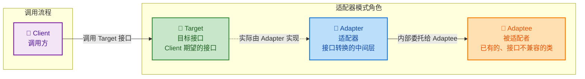

用一个极简的现实例子来建立直觉：假设你有一个老旧的日志库 `OldLogger`，它只有 `logMessage(msg: String)` 方法。而你的新系统统一使用 `Logger` 接口，定义了 `log(level: Level, message: String)` 方法。你不想（或不能）修改 `OldLogger`，此时就需要一个适配器。

```kotlin
// ====== Target：新系统期望的接口 ======
interface Logger {
    // 新系统要求的日志方法：需要日志级别 + 消息
    fun log(level: Level, message: String)
}

// ====== Adaptee：已有的老旧日志类，接口不兼容 ======
class OldLogger {
    // 老旧方法：只接受一个字符串，没有级别概念
    fun logMessage(msg: String) {
        println(msg)  // 内部直接打印
    }
}

// ====== Adapter：适配器，将 OldLogger 适配成 Logger ======
class LoggerAdapter(
    private val oldLogger: OldLogger  // 持有被适配者的引用（组合）
) : Logger {

    // 实现 Target 接口的方法
    override fun log(level: Level, message: String) {
        // 将新接口的参数"转换"成老接口能接受的格式
        val formatted = "[${level.name}] $message"
        // 委托给老旧日志类完成实际工作
        oldLogger.logMessage(formatted)
    }
}
```

上面这段代码清晰地展示了适配器模式的核心流程：**Client 调用 `Logger.log()` → `LoggerAdapter` 接收调用并做参数转换 → 委托给 `OldLogger.logMessage()` 完成实际工作**。三方各司其职，互不修改。

接口转换的价值远不止"让代码编译通过"。它的深层意义在于：

- **解耦（Decoupling）**：Client 只依赖抽象的 `Target` 接口，完全不知道 `Adaptee` 的存在。
- **复用（Reuse）**：`Adaptee` 中已有的、经过验证的逻辑可以直接复用，无需重写。
- **演进（Evolution）**：当需要替换底层实现时，只需更换适配器，Client 代码无需任何改动。

### 类适配器（继承）

类适配器使用 **继承（Inheritance）** 来实现适配。具体来说，适配器类 **同时继承 Target 和 Adaptee**，通过继承获得 Adaptee 的能力，再重写/实现 Target 的接口方法。

> ⚠️ 这种方式在 Java/Kotlin 中有天然限制——**Java/Kotlin 都不支持多重类继承**。因此，类适配器通常要求 Target 是一个 **接口（interface）** 而非具体类。只有在类似 C++ 这种支持多继承的语言中，类适配器才能更自由地使用。

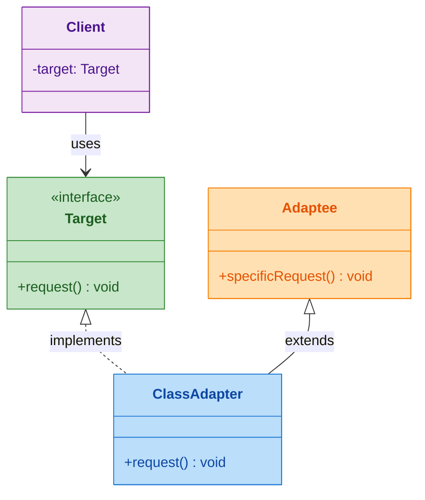

下面用一个完整的 Kotlin 示例演示类适配器。假设场景是：你的系统使用 `MediaPlayer` 接口播放音频，但需要集成一个只支持 VLC 格式的第三方库 `VlcEngine`。

```kotlin
// ====== Target：系统统一的播放器接口 ======
interface MediaPlayer {
    // 播放指定文件
    fun play(fileName: String)
    // 停止播放
    fun stop()
}

// ====== Adaptee：第三方 VLC 引擎，接口风格完全不同 ======
open class VlcEngine {
    // VLC 引擎的打开文件方法
    fun openFile(path: String) {
        println("VlcEngine: opening $path")
    }
    // VLC 引擎的开始解码方法
    fun startDecoding() {
        println("VlcEngine: decoding started")
    }
    // VLC 引擎的释放资源方法
    fun releaseResource() {
        println("VlcEngine: resources released")
    }
}

// ====== 类适配器：同时继承 VlcEngine + 实现 MediaPlayer ======
// Kotlin 中 VlcEngine 必须标记为 open 才能被继承
class VlcAdapter : VlcEngine(), MediaPlayer {

    // 实现 Target 的 play 方法
    override fun play(fileName: String) {
        // 直接调用从父类 VlcEngine 继承来的方法（无需持有引用）
        openFile(fileName)     // 继承的方法：打开文件
        startDecoding()        // 继承的方法：开始解码
    }

    // 实现 Target 的 stop 方法
    override fun stop() {
        releaseResource()      // 继承的方法：释放资源
    }
}

// ====== Client 使用 ======
fun main() {
    // Client 只认识 MediaPlayer 接口
    val player: MediaPlayer = VlcAdapter()
    player.play("music.vlc")  // 内部自动转换成 VLC 引擎的调用
    player.stop()              // 内部自动释放资源
}
```

**类适配器的特点与局限性：**

| 特性 | 说明 |
|------|------|
| **实现方式** | 继承 Adaptee + 实现 Target 接口 |
| **访问能力** | 可以访问 Adaptee 的 `protected` 成员 |
| **重写能力** | 可以重写 Adaptee 的方法（灵活但危险） |
| **灵活性** | ❌ 编译期绑定，无法在运行时切换 Adaptee |
| **多继承限制** | ❌ Java/Kotlin 只能继承一个类，Target 必须是接口 |
| **Adaptee 子类** | ❌ 无法适配 Adaptee 的子类（绑定了具体父类） |

正因为上述局限，在 Java/Kotlin 生态中，类适配器的使用场景比较有限。**绝大多数情况下我们更推荐使用对象适配器**。类适配器更常见于需要重写 Adaptee 某个方法的特殊场景，或在 C++ 等支持多继承的语言环境中。

### 对象适配器（组合）⭐

对象适配器使用 **组合（Composition）** 而非继承来实现适配。适配器类持有 Adaptee 的一个实例引用，在实现 Target 接口时，将调用 **委托（delegate）** 给这个实例。这正是经典的 **"组合优于继承（Favor Composition Over Inheritance）"** 原则的体现。

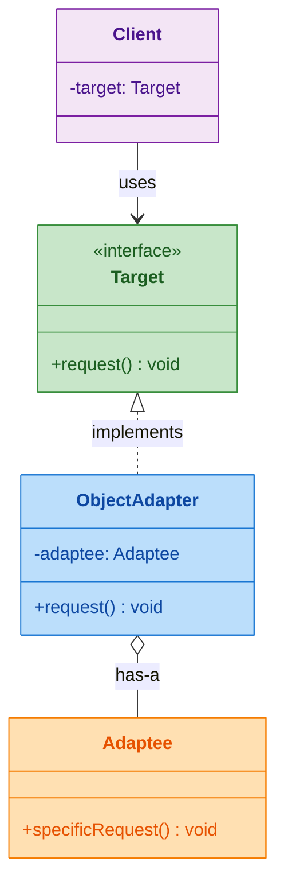

继续用播放器场景来对比演示：

```kotlin
// ====== Target：同上，系统统一的播放器接口 ======
interface MediaPlayer {
    fun play(fileName: String)
    fun stop()
}

// ====== Adaptee：VLC 引擎（不需要 open，因为不再被继承）======
class VlcEngine {
    fun openFile(path: String) {
        println("VlcEngine: opening $path")
    }
    fun startDecoding() {
        println("VlcEngine: decoding started")
    }
    fun releaseResource() {
        println("VlcEngine: resources released")
    }
}

// ====== 对象适配器：持有 VlcEngine 实例，实现 MediaPlayer ======
class VlcAdapter(
    // 通过构造函数注入 Adaptee 实例（组合关系）
    private val engine: VlcEngine
) : MediaPlayer {

    override fun play(fileName: String) {
        // 委托给内部持有的 engine 实例
        engine.openFile(fileName)   // 委托调用：打开文件
        engine.startDecoding()      // 委托调用：开始解码
    }

    override fun stop() {
        engine.releaseResource()    // 委托调用：释放资源
    }
}

// ====== Client 使用 ======
fun main() {
    // 可以在运行时注入不同的 VlcEngine 实例（甚至是其子类）
    val engine = VlcEngine()
    val player: MediaPlayer = VlcAdapter(engine)
    player.play("music.vlc")
    player.stop()
}
```

对象适配器的核心优势在于 **运行时灵活性**。由于 Adaptee 是通过构造函数注入的，你可以：

- 注入 `VlcEngine` 的任意子类（多态）
- 在运行时根据条件动态选择不同的 Adaptee 实例
- 轻松编写单元测试（注入 Mock 对象）

**Kotlin 的 `by` 委托语法** 可以进一步简化对象适配器的编写，让代码更加优雅：

```kotlin
// ====== 使用 Kotlin by 关键字实现委托适配 ======

// 假设 Target 接口有很多方法，手动逐个委托很繁琐
interface AdvancedLogger {
    fun debug(msg: String)   // 调试日志
    fun info(msg: String)    // 信息日志
    fun warn(msg: String)    // 警告日志
    fun error(msg: String)   // 错误日志
}

// 一个默认的日志实现
class ConsoleLogger : AdvancedLogger {
    override fun debug(msg: String) = println("[DEBUG] $msg")
    override fun info(msg: String) = println("[INFO] $msg")
    override fun warn(msg: String) = println("[WARN] $msg")
    override fun error(msg: String) = println("[ERROR] $msg")
}

// 适配器：大部分方法委托给 base，仅重写需要定制的方法
class FilteredLoggerAdapter(
    base: AdvancedLogger            // 被委托的目标实例
) : AdvancedLogger by base {       // by 关键字：自动委托所有方法给 base

    // 只重写 debug 方法：过滤掉调试日志（生产环境不输出）
    override fun debug(msg: String) {
        // 什么也不做，相当于过滤掉 debug 级别的日志
    }
    // info、warn、error 自动委托给 base，无需手写
}
```

**类适配器 vs 对象适配器 全方位对比：**

| 对比维度 | 类适配器（继承） | 对象适配器（组合）⭐ |
|----------|------------------|----------------------|
| **实现机制** | `extends Adaptee implements Target` | 持有 `Adaptee` 引用 + `implements Target` |
| **耦合度** | 高（编译期绑定具体类） | 低（运行时可替换） |
| **Adaptee 子类** | ❌ 只能适配被继承的那个具体类 | ✅ 可以适配 Adaptee 的任意子类 |
| **多个 Adaptee** | ❌ Java/Kotlin 不支持多继承 | ✅ 可以持有多个 Adaptee 引用 |
| **重写 Adaptee** | ✅ 可以直接 override | ❌ 需要包装方法 |
| **protected 访问** | ✅ 继承关系可访问 | ❌ 只能访问 public 成员 |
| **代码量** | 较少（直接调用继承方法） | 略多（需要委托调用） |
| **可测试性** | 较差 | ✅ 优秀（可注入 Mock） |
| **推荐程度** | 特殊场景使用 | **⭐ 首选方案** |

> 💡 **设计原则速记**：当你犹豫选哪个时，记住 GoF 的建议——**"Favor object composition over class inheritance"**。对象适配器几乎总是更好的选择。

### Android 应用（RecyclerView.Adapter、ListAdapter）

适配器模式在 Android Framework 和日常开发中的应用堪称 **教科书级别**。整个列表展示体系都是围绕适配器模式构建的。

#### RecyclerView.Adapter —— Android 最经典的适配器

`RecyclerView.Adapter` 是 Android 开发中使用频率最高的适配器实现。它解决的核心问题是：**将应用层的数据模型（如 `List<User>`）适配为 `RecyclerView` 能理解和渲染的 `ViewHolder` 视图**。

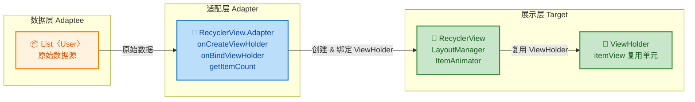

让我们看一个完整的、带逐行注释的 `RecyclerView.Adapter` 实现：

```kotlin
// ====== 数据模型（Adaptee 中的数据）======
data class User(
    val id: Long,          // 用户唯一 ID
    val name: String,      // 用户名
    val avatarUrl: String  // 头像 URL
)

// ====== ViewHolder：RecyclerView 的视图复用单元 ======
class UserViewHolder(
    itemView: View  // 每一行 item 的根视图
) : RecyclerView.ViewHolder(itemView) {

    // 通过 findViewById 获取子视图引用（也可用 ViewBinding）
    val tvName: TextView = itemView.findViewById(R.id.tv_name)
    val ivAvatar: ImageView = itemView.findViewById(R.id.iv_avatar)

    // 将数据绑定到视图上（封装绑定逻辑）
    fun bind(user: User) {
        tvName.text = user.name                   // 设置用户名文本
        Glide.with(itemView).load(user.avatarUrl) // 使用 Glide 加载头像
            .into(ivAvatar)
    }
}

// ====== Adapter：核心适配器，连接数据与 RecyclerView ======
class UserAdapter(
    private var users: List<User> = emptyList()  // 持有数据源引用（组合）
) : RecyclerView.Adapter<UserViewHolder>() {

    // ① 创建 ViewHolder：RecyclerView 需要新的视图时调用
    override fun onCreateViewHolder(
        parent: ViewGroup,   // 父容器（即 RecyclerView 本身）
        viewType: Int        // 视图类型（多类型列表时有用）
    ): UserViewHolder {
        // 从 XML 布局文件 inflate 出 item 视图
        val view = LayoutInflater.from(parent.context)
            .inflate(R.layout.item_user, parent, false)
        // 用 item 视图创建 ViewHolder 并返回
        return UserViewHolder(view)
    }

    // ② 绑定数据：将指定位置的数据绑定到 ViewHolder 上
    override fun onBindViewHolder(
        holder: UserViewHolder,  // 要绑定数据的 ViewHolder
        position: Int            // 当前 item 在列表中的位置
    ) {
        // 从数据源中取出对应位置的 User
        val user = users[position]
        // 委托给 ViewHolder 的 bind 方法完成绑定
        holder.bind(user)
    }

    // ③ 返回数据项总数：RecyclerView 据此决定滚动范围等
    override fun getItemCount(): Int = users.size

    // 更新数据源的方法
    fun submitList(newUsers: List<User>) {
        users = newUsers                 // 替换数据源
        notifyDataSetChanged()           // 通知 RecyclerView 全量刷新（粗暴但简单）
    }
}
```

从设计模式的视角来分析这段代码中的角色映射：

```text
┌──────────────────────────────────────────────────────┐
│             适配器模式角色映射                          │
├──────────────┬───────────────────────────────────────┤
│   Target     │  RecyclerView 期望的接口               │
│              │  (onCreateViewHolder,                  │
│              │   onBindViewHolder, getItemCount)      │
├──────────────┼───────────────────────────────────────┤
│   Adaptee    │  List<User> 原始数据源                  │
├──────────────┼───────────────────────────────────────┤
│   Adapter    │  UserAdapter                           │
│              │  将 List<User> 转换为 ViewHolder 视图    │
├──────────────┼───────────────────────────────────────┤
│   Client     │  RecyclerView + LayoutManager          │
│              │  只调用 Adapter 的标准接口方法            │
└──────────────┴───────────────────────────────────────┘
```

注意 `RecyclerView.Adapter` 是一个 **对象适配器** 的变体——它通过 **组合** 持有 `List<User>` 数据源，而非继承某个数据类。同时它也是一个 **抽象类（abstract class）**，定义了三个必须实现的模板方法，这里又融入了 **模板方法模式（Template Method Pattern）** 的思想。

#### ListAdapter —— 带 DiffUtil 的高效适配器

`notifyDataSetChanged()` 的问题在于它是 **全量刷新**——即使只改了一条数据，整个列表也会重绘。这在数据量大时性能很差且没有动画效果。Android Jetpack 提供的 `ListAdapter` 基于 **DiffUtil** 自动计算列表差异，只刷新实际变化的 item。

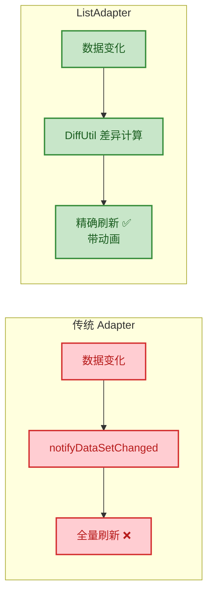

完整的 `ListAdapter` 实现：

```kotlin
// ====== DiffUtil.ItemCallback：定义如何比较两个 item ======
// 这是 DiffUtil 算法的核心配置，告诉框架如何判断"相同"和"内容是否变化"
class UserDiffCallback : DiffUtil.ItemCallback<User>() {

    // 判断两个 item 是否代表"同一个对象"（通常比较唯一 ID）
    // 用于判断 item 是新增、删除还是移动
    override fun areItemsTheSame(oldItem: User, newItem: User): Boolean {
        return oldItem.id == newItem.id  // ID 相同即为同一用户
    }

    // 判断两个相同 item 的"内容是否发生了变化"
    // 只在 areItemsTheSame 返回 true 时才会调用
    // 用于判断是否需要重新绑定（刷新视图）
    override fun areContentsTheSame(oldItem: User, newItem: User): Boolean {
        return oldItem == newItem  // data class 自动生成 equals，比较所有字段
    }
}

// ====== ListAdapter：继承自 RecyclerView.Adapter，内置 DiffUtil ======
class UserListAdapter : ListAdapter<User, UserViewHolder>(
    UserDiffCallback()  // 传入差异比较回调
) {

    // 创建 ViewHolder（与普通 Adapter 完全一致）
    override fun onCreateViewHolder(parent: ViewGroup, viewType: Int): UserViewHolder {
        val view = LayoutInflater.from(parent.context)
            .inflate(R.layout.item_user, parent, false)
        return UserViewHolder(view)
    }

    // 绑定数据：使用 getItem(position) 而非直接访问 list
    override fun onBindViewHolder(holder: UserViewHolder, position: Int) {
        // getItem() 是 ListAdapter 提供的方法，从内部 AsyncListDiffer 获取数据
        val user = getItem(position)
        holder.bind(user)
    }

    // ⚠️ 不需要重写 getItemCount()！ListAdapter 内部已自动管理
}

// ====== Activity / Fragment 中使用 ======
class UserFragment : Fragment() {

    private val adapter = UserListAdapter()

    override fun onViewCreated(view: View, savedInstanceState: Bundle?) {
        super.onViewCreated(view, savedInstanceState)
        // 设置 RecyclerView
        recyclerView.adapter = adapter
        recyclerView.layoutManager = LinearLayoutManager(requireContext())

        // 观察数据变化，自动提交新列表
        viewModel.users.observe(viewLifecycleOwner) { newList ->
            // submitList 内部自动在后台线程执行 DiffUtil 计算
            // 计算完成后在主线程精确刷新变化的 item，并自动触发动画
            adapter.submitList(newList)
        }
    }
}
```

`ListAdapter` 的内部工作流程值得深入了解：

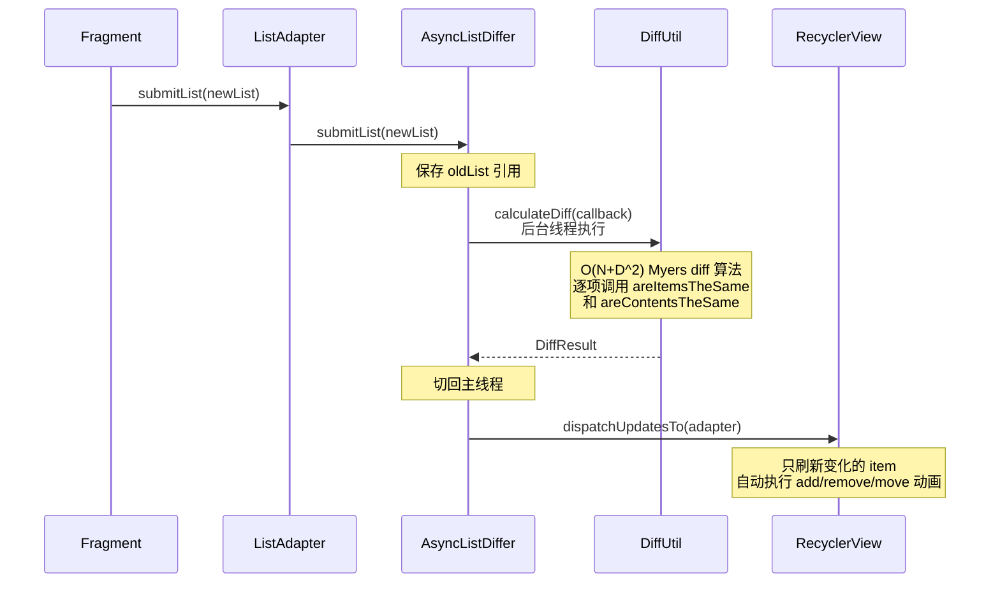

#### 深入理解：为什么 Android 选择适配器模式？

这是一个值得思考的架构问题。Android 的列表展示体系为什么不直接让 `RecyclerView` 读取 `List` 数据？为什么需要一个 Adapter 中间层？

原因在于 **职责分离（Separation of Concerns）**：

1. **数据源的多样性**：你的数据可能来自数据库、网络 API、内存缓存，甚至是 `Cursor`。如果 `RecyclerView` 直接耦合某种数据源，它就失去了通用性。Adapter 将"数据怎么来的"和"数据怎么显示"解耦了。

2. **视图复用策略**：`RecyclerView` 通过 `ViewHolder` 实现了视图对象池复用。这个复用逻辑是 RecyclerView 内部管理的，Adapter 只需要告诉它"怎么创建"和"怎么绑定"。

3. **多视图类型支持**：通过 `getItemViewType(position)` 方法，一个 Adapter 可以在同一个列表中展示完全不同类型的 item（如头部、内容、广告、加载更多）。这种灵活性正是适配器模式赋予的。

```kotlin
// ====== 多视图类型示例 ======
class MultiTypeAdapter : RecyclerView.Adapter<RecyclerView.ViewHolder>() {

    companion object {
        const val TYPE_HEADER = 0   // 头部类型
        const val TYPE_CONTENT = 1  // 内容类型
        const val TYPE_AD = 2       // 广告类型
    }

    private var items: List<Any> = emptyList()  // 混合类型数据源

    // 根据数据类型返回不同的 viewType 标识
    override fun getItemViewType(position: Int): Int {
        return when (items[position]) {
            is HeaderData -> TYPE_HEADER    // 如果是头部数据
            is ContentData -> TYPE_CONTENT  // 如果是内容数据
            is AdData -> TYPE_AD            // 如果是广告数据
            else -> throw IllegalArgumentException("Unknown type")
        }
    }

    // 根据 viewType 创建不同的 ViewHolder
    override fun onCreateViewHolder(
        parent: ViewGroup,
        viewType: Int
    ): RecyclerView.ViewHolder {
        val inflater = LayoutInflater.from(parent.context)
        return when (viewType) {
            // 头部：inflate 头部布局，创建头部 ViewHolder
            TYPE_HEADER -> HeaderViewHolder(
                inflater.inflate(R.layout.item_header, parent, false)
            )
            // 内容：inflate 内容布局，创建内容 ViewHolder
            TYPE_CONTENT -> ContentViewHolder(
                inflater.inflate(R.layout.item_content, parent, false)
            )
            // 广告：inflate 广告布局，创建广告 ViewHolder
            TYPE_AD -> AdViewHolder(
                inflater.inflate(R.layout.item_ad, parent, false)
            )
            else -> throw IllegalArgumentException("Unknown viewType: $viewType")
        }
    }

    // 根据 ViewHolder 类型执行不同的绑定逻辑
    override fun onBindViewHolder(holder: RecyclerView.ViewHolder, position: Int) {
        when (holder) {
            is HeaderViewHolder -> holder.bind(items[position] as HeaderData)
            is ContentViewHolder -> holder.bind(items[position] as ContentData)
            is AdViewHolder -> holder.bind(items[position] as AdData)
        }
    }

    override fun getItemCount(): Int = items.size
}
```

#### Framework 层源码视角

从 Android Framework 的角度看，`RecyclerView` 内部调用 Adapter 的过程大致如下（简化版）：

```java
// ====== RecyclerView 内部简化逻辑（Java）======
// 位于 RecyclerView.java 源码中

// 当需要展示某个位置的 item 时
ViewHolder tryGetViewHolderForPositionByDeadline(int position, ...) {
    ViewHolder holder = null;

    // 第一步：尝试从缓存池（RecycledViewPool）获取复用的 ViewHolder
    holder = getRecycledViewPool().getRecycledView(viewType);

    if (holder == null) {
        // 缓存池中没有可复用的，调用 Adapter 创建新的
        // 这就是我们重写的 onCreateViewHolder 被调用的时机
        holder = mAdapter.createViewHolder(this, viewType);
    }

    // 第二步：调用 Adapter 将数据绑定到 ViewHolder
    // 这就是我们重写的 onBindViewHolder 被调用的时机
    mAdapter.bindViewHolder(holder, position);

    return holder;  // 返回准备好的 ViewHolder 给布局系统
}
```

这段源码清晰地展示了 `RecyclerView`（Client）如何通过 `Adapter` 接口来获取视图，完全不知道（也不关心）数据源是什么、视图长什么样。**这就是适配器模式在 Android 系统设计中的价值**。

#### 补充：ListView 时代的 BaseAdapter

在 `RecyclerView` 出现之前，`ListView` 使用 `BaseAdapter` 完成类似的适配工作。它同样是适配器模式的应用，但设计上有明显缺陷（ViewHolder 模式需要手动实现、没有强制复用机制等）。了解这个演进历史有助于理解为什么 Google 重新设计了 `RecyclerView.Adapter`：

```kotlin
// ====== 旧版 ListView 的 BaseAdapter（已不推荐使用）======
class OldUserAdapter(
    private val context: Context,
    private val users: List<User>
) : BaseAdapter() {

    // 返回数据项总数
    override fun getCount(): Int = users.size

    // 返回指定位置的数据对象
    override fun getItem(position: Int): Any = users[position]

    // 返回 item ID（通常返回 position）
    override fun getItemId(position: Int): Long = position.toLong()

    // 核心方法：返回每个 item 的视图
    // convertView 是系统尝试复用的旧视图（可能为 null）
    override fun getView(position: Int, convertView: View?, parent: ViewGroup?): View {
        val view: View
        val holder: ViewHolder

        if (convertView == null) {
            // 没有可复用的视图，需要新创建
            view = LayoutInflater.from(context)
                .inflate(R.layout.item_user, parent, false)
            // 创建 ViewHolder 并缓存到 view 的 tag 中（手动复用模式）
            holder = ViewHolder(view)
            view.tag = holder  // ⚠️ 这个 tag 复用模式很容易出错
        } else {
            // 有可复用的视图，直接取出 ViewHolder
            view = convertView
            holder = view.tag as ViewHolder
        }

        // 绑定数据
        holder.bind(users[position])
        return view
    }
}
```

`RecyclerView.Adapter` 相比 `BaseAdapter` 的进化体现在：**强制使用 ViewHolder 模式**（通过泛型约束）、**将创建和绑定拆分为两个独立方法**（更清晰的职责划分）、**内置视图复用池**（开发者不再需要手动管理 `convertView`）。

---

**📝 练习题**

在 Android 的 RecyclerView 适配器体系中，`ListAdapter` 相比传统的 `RecyclerView.Adapter` 最核心的改进是什么？以下关于 `ListAdapter` 的说法，**错误**的是：

A. `ListAdapter` 内部使用 `AsyncListDiffer`，在后台线程计算列表差异，避免阻塞主线程


B. `ListAdapter` 不再需要开发者重写 `getItemCount()` 方法，因为内部的 `AsyncListDiffer` 会自动管理数据集大小


C. `ListAdapter` 通过 `DiffUtil.ItemCallback` 的 `areItemsTheSame` 和 `areContentsTheSame` 来精确判断哪些 item 需要刷新，从而实现局部更新和自动动画


D. `ListAdapter` 调用 `submitList()` 时，如果传入的是与当前列表相同的引用（同一个对象），DiffUtil 仍然会重新计算差异并刷新列表


**【答案】** D

**【解析】** 选项 D 是错误的。`ListAdapter`（更准确地说是其内部的 `AsyncListDiffer`）在 `submitList()` 方法中有一个 **引用相等性检查（referential equality check）**：如果传入的新列表与当前列表是 **同一个对象引用**（`newList == currentList`），它会直接 `return`，**不会执行任何 DiffUtil 计算或刷新操作**。这是一个性能优化，同时也是一个常见的坑——如果你只是修改了原列表中的元素内容但没有创建新列表对象，调用 `submitList()` 将不会有任何效果。正确做法是 **每次提交一个新的列表副本**，例如 `adapter.submitList(list.toList())` 或使用不可变列表。选项 A、B、C 的描述都是正确的，分别对应了 `ListAdapter` 的异步差异计算、自动管理 `getItemCount` 和精确局部刷新三大核心特性。

---

## 装饰器模式 ⭐ (Decorator Pattern)

装饰器模式是结构型设计模式中一颗极为璀璨的明珠。它的核心哲学可以用一句话概括：**在不修改原有对象结构的前提下，动态地给对象添加新的职责（功能）**。这与面向对象设计的 **开放-封闭原则 (Open-Closed Principle, OCP)** 高度一致——对扩展开放，对修改关闭。

你可以把装饰器想象成现实生活中的 **穿衣搭配**：一个人（原始对象）本身不变，但你可以给他套上 T 恤（装饰器 A）、再套一件外套（装饰器 B）、再戴一顶帽子（装饰器 C），每加一层都增加了新的"功能"（保暖、防风、遮阳），而人本身并没有被"改造"。更重要的是，这些装饰可以 **自由组合、按需叠加、随时拆卸**。

装饰器模式的 **四个核心角色** 如下：

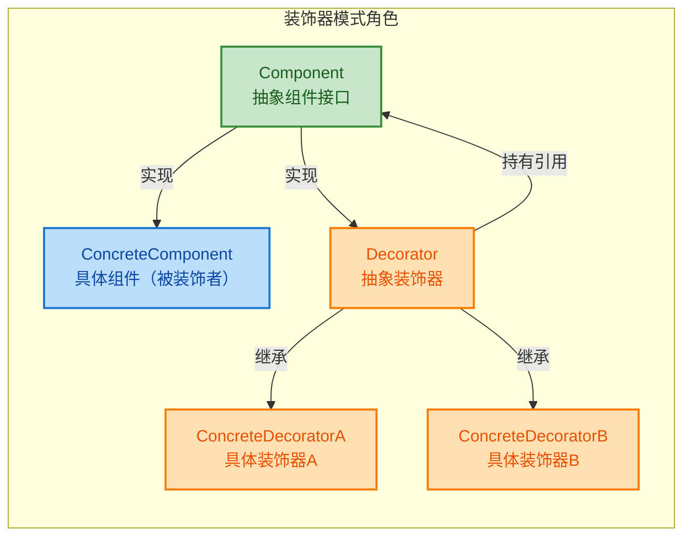

| 角色 | 职责 |
|---|---|
| **Component** | 定义被装饰对象和装饰器共同遵循的接口 |
| **ConcreteComponent** | 被装饰的原始对象，包含核心业务逻辑 |
| **Decorator** | 持有一个 Component 引用，并实现 Component 接口，将调用委托给被装饰对象 |
| **ConcreteDecorator** | 在委托调用的前后，插入自己的增强逻辑 |

---

### 动态添加功能

"动态"二字是装饰器模式的灵魂。与继承在 **编译期** 就固化了类的行为不同，装饰器在 **运行时 (Runtime)** 才决定给对象添加什么功能、添加几层、以什么顺序添加。这种灵活性是继承体系无法比拟的。

我们用一个生动的例子来理解：假设你正在开发一个 **咖啡点单系统**，基础咖啡有"美式"和"拿铁"，配料有"牛奶"、"糖"、"摩卡"。如果用继承，你需要为每种组合创建一个子类（美式+牛奶、美式+糖、美式+牛奶+糖……），类爆炸不可避免。而装饰器允许你在运行时随意"叠加"配料。

```kotlin
// =============================================
// 1. 抽象组件：定义咖啡的统一接口
// =============================================
interface Coffee {
    fun cost(): Double      // 获取价格
    fun description(): String // 获取描述
}

// =============================================
// 2. 具体组件：基础咖啡种类
// =============================================
class Americano : Coffee {
    // 美式咖啡，基础价格 15.0
    override fun cost(): Double = 15.0
    // 返回基础描述
    override fun description(): String = "美式咖啡"
}

class Latte : Coffee {
    // 拿铁咖啡，基础价格 20.0
    override fun cost(): Double = 20.0
    // 返回基础描述
    override fun description(): String = "拿铁咖啡"
}

// =============================================
// 3. 抽象装饰器：持有 Coffee 引用，并实现 Coffee 接口
//    注意：它本身也是一个 Coffee，这是装饰器可以层层嵌套的关键
// =============================================
abstract class CoffeeDecorator(
    protected val coffee: Coffee  // 持有被装饰对象的引用（组合）
) : Coffee {
    // 默认委托给被装饰对象，子类可以在此基础上增强
    override fun cost(): Double = coffee.cost()
    override fun description(): String = coffee.description()
}

// =============================================
// 4. 具体装饰器：每个装饰器负责"添加"一种配料
// =============================================
class MilkDecorator(coffee: Coffee) : CoffeeDecorator(coffee) {
    // 在原有价格基础上加 3.0（牛奶的价格）
    override fun cost(): Double = super.cost() + 3.0
    // 在原有描述后面追加牛奶信息
    override fun description(): String = "${super.description()} + 牛奶"
}

class SugarDecorator(coffee: Coffee) : CoffeeDecorator(coffee) {
    // 在原有价格基础上加 1.5（糖的价格）
    override fun cost(): Double = super.cost() + 1.5
    // 在原有描述后面追加糖的信息
    override fun description(): String = "${super.description()} + 糖"
}

class MochaDecorator(coffee: Coffee) : CoffeeDecorator(coffee) {
    // 在原有价格基础上加 5.0（摩卡的价格）
    override fun cost(): Double = super.cost() + 5.0
    // 在原有描述后面追加摩卡信息
    override fun description(): String = "${super.description()} + 摩卡"
}
```

关键来了——**运行时动态组装**：

```kotlin
fun main() {
    // ====== 第一杯：美式 + 牛奶 + 糖 ======
    // 从最内层（原始对象）开始，一层一层包裹装饰器
    var coffee: Coffee = Americano()           // 核心：美式
    coffee = MilkDecorator(coffee)             // 第1层装饰：加牛奶
    coffee = SugarDecorator(coffee)            // 第2层装饰：加糖

    // 调用时，调用链从最外层逐层委托到最内层再逐层返回
    println(coffee.description())  // 输出: 美式咖啡 + 牛奶 + 糖
    println(coffee.cost())         // 输出: 19.5 (15 + 3 + 1.5)

    // ====== 第二杯：拿铁 + 双份摩卡 ======
    var fancy: Coffee = Latte()                // 核心：拿铁
    fancy = MochaDecorator(fancy)              // 第1层装饰：加摩卡
    fancy = MochaDecorator(fancy)              // 第2层装饰：再加一份摩卡（可以重复叠加！）

    println(fancy.description())   // 输出: 拿铁咖啡 + 摩卡 + 摩卡
    println(fancy.cost())          // 输出: 30.0 (20 + 5 + 5)
}
```

调用链的展开过程可以用下面这张时序图清晰地展示：

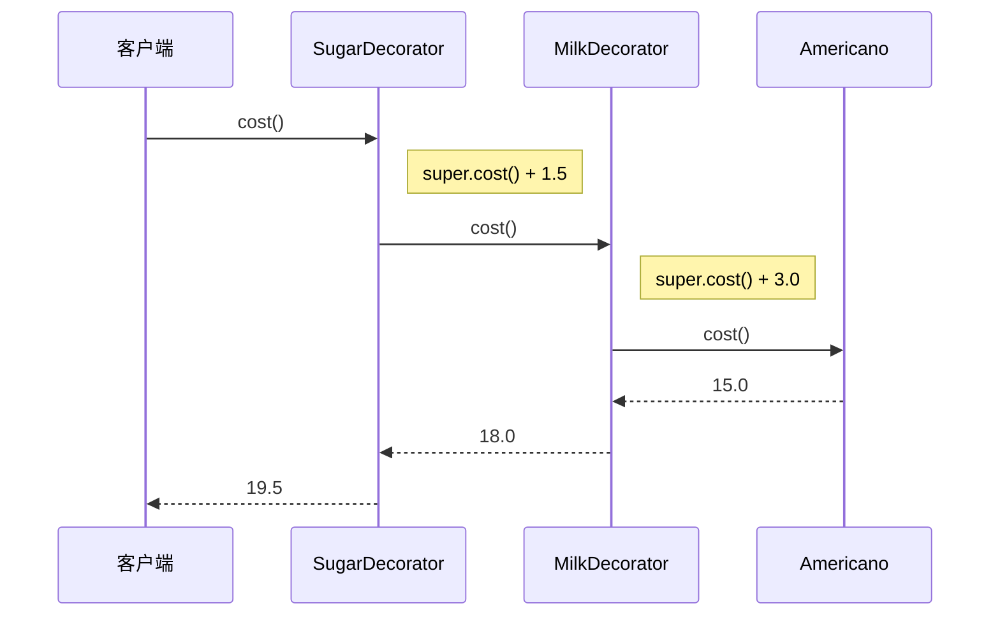

这就是"动态"的含义——**同一个 `Coffee` 接口的变量，在不同的运行路径下，可以被装饰成完全不同的对象**。你甚至可以根据用户的选择在 UI 层动态决定叠加哪些装饰器，而不需要预先定义所有可能的组合类。

---

### 不改变原有类

装饰器模式的第二个核心优势是 **零侵入 (Non-Invasive)**。被装饰者 `Americano`、`Latte` 的代码从始至终没有被修改过一个字符。这在实际工程中至关重要，尤其是以下场景：

**场景一：你无法修改源码**。比如使用第三方库提供的类，你拿不到源码或不应该修改它。装饰器允许你在外部"包一层"来扩展功能。

**场景二：你不想承担修改的风险**。在大型项目中，一个核心类可能被几十个模块引用，直接修改它会牵一发而动全身。装饰器让你在不触碰原有代码的情况下安全地增强行为。

**场景三：功能是可选的、可组合的**。比如日志、缓存、加密、压缩等横切关注点 (Cross-Cutting Concerns)，不是所有调用方都需要。装饰器允许按需装配。

我们用一个更贴近 Android 实际开发的例子来说明——给一个 **网络请求服务** 按需增加日志、缓存、重试功能：

```kotlin
// =============================================
// 抽象组件：网络服务接口
// =============================================
interface ApiService {
    fun fetchData(url: String): String  // 发起网络请求并返回数据
}

// =============================================
// 具体组件：真正执行网络请求的实现
// 这个类我们"不能"或"不想"修改
// =============================================
class RealApiService : ApiService {
    override fun fetchData(url: String): String {
        // 模拟真实的 HTTP 请求
        return "Response from $url"
    }
}

// =============================================
// 抽象装饰器
// =============================================
abstract class ApiServiceDecorator(
    protected val wrapped: ApiService  // 被装饰的服务
) : ApiService

// =============================================
// 具体装饰器 1：日志装饰器 —— 在请求前后打印日志
// =============================================
class LoggingDecorator(wrapped: ApiService) : ApiServiceDecorator(wrapped) {
    override fun fetchData(url: String): String {
        // 请求前：打印开始日志
        Log.d("ApiService", ">>> 开始请求: $url")
        // 委托给被装饰对象执行真正的请求
        val result = wrapped.fetchData(url)
        // 请求后：打印结束日志（包含响应长度）
        Log.d("ApiService", "<<< 请求完成: ${result.length} bytes")
        // 将原始结果原封不动返回
        return result
    }
}

// =============================================
// 具体装饰器 2：缓存装饰器 —— 如果有缓存则直接返回
// =============================================
class CachingDecorator(wrapped: ApiService) : ApiServiceDecorator(wrapped) {
    // 内部维护一个简单的缓存 Map
    private val cache = mutableMapOf<String, String>()

    override fun fetchData(url: String): String {
        // 检查缓存：命中则直接返回，不再走网络
        cache[url]?.let {
            Log.d("ApiService", "缓存命中: $url")
            return it  // 提前返回，短路后续调用
        }
        // 缓存未命中：委托给被装饰对象请求
        val result = wrapped.fetchData(url)
        // 将结果存入缓存，供下次使用
        cache[url] = result
        return result
    }
}

// =============================================
// 具体装饰器 3：重试装饰器 —— 失败时自动重试
// =============================================
class RetryDecorator(
    wrapped: ApiService,
    private val maxRetries: Int = 3  // 最大重试次数，默认 3 次
) : ApiServiceDecorator(wrapped) {

    override fun fetchData(url: String): String {
        // 记录当前已重试的次数
        var lastException: Exception? = null
        // 循环尝试，最多 maxRetries 次
        repeat(maxRetries) { attempt ->
            try {
                // 委托给被装饰对象执行请求
                return wrapped.fetchData(url)
            } catch (e: Exception) {
                // 捕获异常，记录并准备下一次重试
                lastException = e
                Log.w("ApiService", "第 ${attempt + 1} 次重试失败: ${e.message}")
            }
        }
        // 所有重试都失败，抛出最后一次异常
        throw lastException ?: RuntimeException("请求失败")
    }
}
```

**使用方式——像套娃一样自由组装**：

```kotlin
fun createApiService(enableLog: Boolean, enableCache: Boolean): ApiService {
    // 从最核心的真实服务开始
    var service: ApiService = RealApiService()

    // 根据配置动态决定是否添加缓存层
    if (enableCache) {
        service = CachingDecorator(service)    // 包裹一层缓存
    }

    // 根据配置动态决定是否添加日志层
    if (enableLog) {
        service = LoggingDecorator(service)    // 包裹一层日志
    }

    // 始终添加重试保护
    service = RetryDecorator(service, maxRetries = 3)  // 最外层：重试

    return service
}
```

注意：**装饰顺序很重要**。上面的例子中，调用链是 `Retry → Logging → Caching → Real`。日志记录的是缓存命中/未命中的结果，而不是真实网络请求的结果。如果你希望日志只记录真实网络请求，就应该把 `LoggingDecorator` 放在 `CachingDecorator` 的内层。

```text
包裹顺序（由内到外）          调用链（由外到内）
┌──────────────────────────────────────┐
│  RetryDecorator                      │  ← 最外层先拦截
│  ┌──────────────────────────────┐    │
│  │  LoggingDecorator            │    │  ← 第二层打日志
│  │  ┌──────────────────────┐    │    │
│  │  │  CachingDecorator    │    │    │  ← 第三层查缓存
│  │  │  ┌──────────────┐    │    │    │
│  │  │  │ RealApiService│   │    │    │  ← 最内层真正请求
│  │  │  └──────────────┘    │    │    │
│  │  └──────────────────────┘    │    │
│  └──────────────────────────────┘    │
└──────────────────────────────────────┘
```

---

### 与继承的区别

这是装饰器模式中最容易被面试官问到的问题。很多初学者会困惑：**继承也能扩展功能，为什么还需要装饰器？** 两者的本质区别在于 **绑定时机** 和 **扩展维度**。

| 维度 | 继承 (Inheritance) | 装饰器 (Decorator) |
|---|---|---|
| **绑定时机** | 编译期静态绑定（类定义时就确定了父子关系） | 运行时动态绑定（对象创建时才决定包裹哪些装饰器） |
| **扩展方向** | 纵向扩展（单一继承链，越来越深） | 横向扩展（多个装饰器自由组合，越来越宽） |
| **类数量** | N 种功能的排列组合 → 2^N 个子类（类爆炸） | N 种功能 → N 个装饰器类（线性增长） |
| **对原始类的侵入** | 子类与父类强耦合，父类修改可能破坏子类 | 装饰器仅依赖抽象接口，不依赖具体实现 |
| **功能叠加** | 需要多重继承（Java/Kotlin 不支持多继承类） | 天然支持层层包裹，无限叠加 |
| **单一职责** | 子类往往承载多种职责 | 每个装饰器只负责一种增强，职责清晰 |

用一张对比图来说明 **类爆炸** 问题：

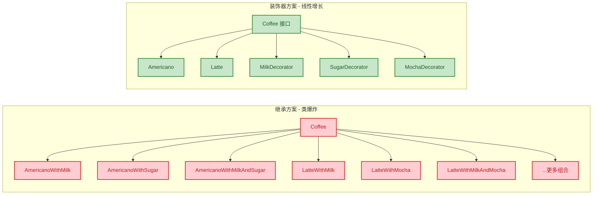

左边的继承方案：2 种咖啡 × 3 种配料的各种排列组合，已经爆炸到 7+ 个类，而且还没穷举完。右边的装饰器方案：2 + 3 = 5 个类，轻松搞定。如果再增加一种配料"香草"，继承方案的类数量近乎翻倍，而装饰器方案只需新增 1 个 `VanillaDecorator`。

**Kotlin 中装饰器的惯用写法——`by` 委托**：

Kotlin 提供了语言级别的委托 (Delegation) 支持，可以大幅简化装饰器的样板代码：

```kotlin
// =============================================
// 使用 Kotlin "by" 关键字实现装饰器
// "by coffee" 自动将 Coffee 接口的所有方法委托给 coffee 对象
// 我们只需 override 想要增强的方法即可
// =============================================
class MilkDecorator(
    private val coffee: Coffee  // 被装饰对象
) : Coffee by coffee {          // 所有未 override 的方法自动委托给 coffee

    // 只 override 需要增强的方法
    override fun cost(): Double {
        // 在委托结果基础上加牛奶价格
        return coffee.cost() + 3.0
    }

    override fun description(): String {
        // 在委托结果基础上追加描述
        return "${coffee.description()} + 牛奶"
    }
}
```

使用 `by` 关键字后，如果 `Coffee` 接口有 10 个方法，你只需要 override 你关心的那 1-2 个，其余的全部自动委托。这比 Java 手写要简洁得多。对比 Java 中的写法：

```java
// Java 版：必须手动覆盖所有接口方法并委托
public class MilkDecorator implements Coffee {
    // 持有被装饰对象的引用
    private final Coffee coffee;

    // 构造函数接收被装饰对象
    public MilkDecorator(Coffee coffee) {
        this.coffee = coffee;
    }

    @Override
    public double cost() {
        // 手动委托 + 增强
        return coffee.cost() + 3.0;
    }

    @Override
    public String description() {
        // 手动委托 + 增强
        return coffee.description() + " + 牛奶";
    }

    // 如果 Coffee 接口还有其他方法，必须逐个手动委托
    // @Override public xxx() { return coffee.xxx(); }
    // ... 大量模板代码
}
```

**何时该用继承，何时该用装饰器？** 一个简洁的判断原则：

- **"is-a"关系且行为固定** → 继承。例如 `Dog extends Animal`，狗就是动物，这种关系不会在运行时变化。
- **"has-a"关系且行为可选/可变** → 装饰器。例如"咖啡可以有牛奶"、"请求可以有缓存"，这些增强是可选的、可组合的。

---

### Android 应用 (ContextWrapper、InputStream)

装饰器模式在 Android 框架和 Java I/O 标准库中有着极为经典的应用。理解这些真实案例，你会发现装饰器模式几乎无处不在。

#### ContextWrapper —— Android 中最大的装饰器

`Context` 是 Android 四大组件的灵魂，它提供了访问应用环境信息、启动 Activity、发送广播、获取资源等几乎所有系统级能力。而 `ContextWrapper` 正是 `Context` 的装饰器。

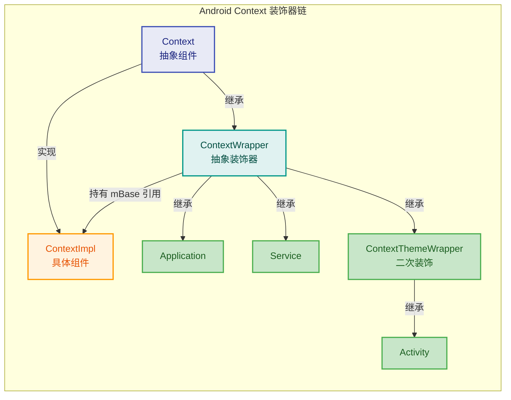

让我们看看 Android Framework 中 `ContextWrapper` 的核心源码（Java）：

```java
// =============================================
// android.content.ContextWrapper —— 典型的装饰器基类
// 源码位于 frameworks/base/core/java/android/content/ContextWrapper.java
// =============================================
public class ContextWrapper extends Context {

    // 持有被装饰对象的引用，这就是装饰器模式的核心
    // mBase 通常是 ContextImpl 的实例
    Context mBase;

    // 构造函数接收被装饰的 Context
    public ContextWrapper(Context base) {
        mBase = base;
    }

    // 允许后续动态替换被装饰对象（attachBaseContext 在 Activity 创建时调用）
    protected void attachBaseContext(Context base) {
        if (mBase != null) {
            throw new IllegalStateException("Base context already set");
        }
        mBase = base;  // 绑定真正的 ContextImpl
    }

    // ====== 以下是典型的委托方法 ======
    // 所有方法都直接委托给 mBase（被装饰者）

    @Override
    public Resources getResources() {
        // 委托给 mBase 获取资源
        return mBase.getResources();
    }

    @Override
    public ContentResolver getContentResolver() {
        // 委托给 mBase 获取 ContentResolver
        return mBase.getContentResolver();
    }

    @Override
    public void startActivity(Intent intent) {
        // 委托给 mBase 启动 Activity
        mBase.startActivity(intent);
    }

    // ... 还有上百个类似的委托方法
}
```

然后是 `ContextThemeWrapper`，它是一个 **二次装饰器**——在 `ContextWrapper` 基础上再加一层主题相关的增强：

```java
// =============================================
// android.view.ContextThemeWrapper —— 装饰器的装饰器
// 在 ContextWrapper 基础上增加了 Theme（主题）相关功能
// =============================================
public class ContextThemeWrapper extends ContextWrapper {

    // 新增的装饰功能：持有主题资源
    private int mThemeResource;
    private Resources.Theme mTheme;

    @Override
    public void setTheme(int resid) {
        // 不再委托给 mBase，而是自己管理主题
        mThemeResource = resid;
        initializeTheme();  // 初始化主题
    }

    @Override
    public Resources.Theme getTheme() {
        // 返回自己管理的主题，而非 mBase 的主题
        if (mTheme == null) {
            // 懒初始化
            initializeTheme();
        }
        return mTheme;  // 装饰器的增强：覆盖了主题行为
    }

    // 其他方法仍然通过 ContextWrapper 委托给 mBase
}
```

**Activity 正是继承自 `ContextThemeWrapper`**，这意味着每个 Activity 都拥有完整的 Context 能力（通过层层委托到 `ContextImpl`），同时还有独立的主题管理能力（`ContextThemeWrapper` 增强的）。这就是装饰器的优雅之处。

对象引用链如下：

```text
Activity                          (继承 ContextThemeWrapper)
  └── ContextThemeWrapper         (继承 ContextWrapper, 增强: Theme)
       └── ContextWrapper         (装饰器基类, 持有 mBase)
            └── mBase ──→ ContextImpl  (真正干活的组件)
```

这种设计使得 Android 可以在不修改 `ContextImpl` 的情况下，轻松扩展出各种"上下文变体"。甚至你自己也可以继承 `ContextWrapper` 来创建自定义装饰器：

```kotlin
// =============================================
// 自定义 ContextWrapper：给所有资源请求加上多语言支持
// =============================================
class LocaleContextWrapper(
    base: Context,                    // 被装饰的原始 Context
    private val newLocale: Locale     // 要覆盖的语言环境
) : ContextWrapper(base) {

    // 只 override 需要增强的方法：getResources()
    override fun getResources(): Resources {
        // 获取原始 Configuration
        val config = Configuration(super.getResources().configuration)
        // 修改语言设置
        config.setLocale(newLocale)
        // 使用新的 Configuration 创建新的 Context
        val localeContext = createConfigurationContext(config)
        // 返回新 Context 的 Resources（语言已切换）
        return localeContext.resources
    }
}

// 使用方式：在 Activity 的 attachBaseContext 中包裹
class MyActivity : AppCompatActivity() {
    override fun attachBaseContext(newBase: Context) {
        // 用 LocaleContextWrapper 包裹原始 Context
        val localeWrapper = LocaleContextWrapper(newBase, Locale("zh", "CN"))
        super.attachBaseContext(localeWrapper)  // 传入装饰后的 Context
    }
}
```

#### Java I/O 流 —— 装饰器模式的教科书案例

Java 的 `InputStream` 体系是装饰器模式最经典的教科书级案例，也是 Android 开发中频繁接触的基础 API：

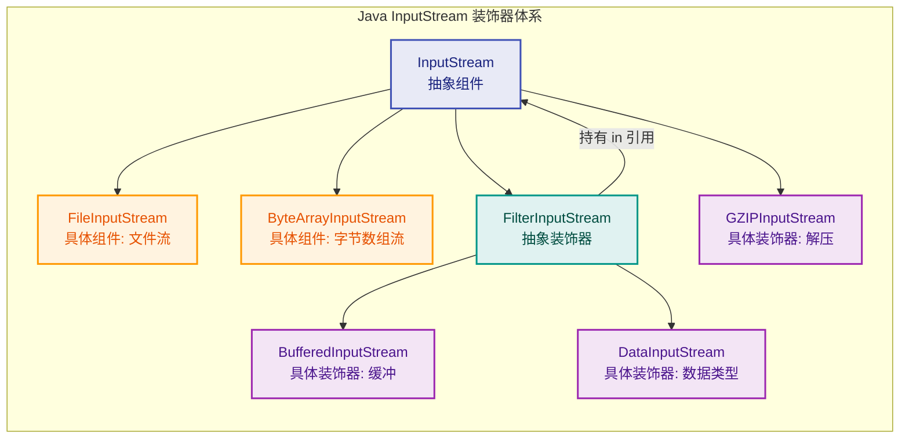

来看 `FilterInputStream` 的源码——它就是装饰器基类：

```java
// =============================================
// java.io.FilterInputStream —— InputStream 的抽象装饰器
// =============================================
public class FilterInputStream extends InputStream {

    // 持有被装饰的 InputStream 引用（装饰器的核心字段）
    protected volatile InputStream in;

    // 构造函数接收被装饰的流
    protected FilterInputStream(InputStream in) {
        this.in = in;
    }

    // 所有 read 方法都委托给被装饰对象
    public int read() throws IOException {
        return in.read();  // 纯粹的委托
    }

    public int read(byte[] b, int off, int len) throws IOException {
        return in.read(b, off, len);  // 纯粹的委托
    }

    public void close() throws IOException {
        in.close();  // 关闭时也委托
    }
}
```

**`BufferedInputStream`** 则在此基础上增加了缓冲功能：

```java
// =============================================
// java.io.BufferedInputStream —— 缓冲装饰器
// 核心增强：引入内部缓冲区，减少实际 I/O 次数
// =============================================
public class BufferedInputStream extends FilterInputStream {

    // 内部缓冲区（装饰器新增的功能）
    protected volatile byte[] buf;
    // 缓冲区中有效字节的数量
    protected int count;
    // 当前读取位置
    protected int pos;

    // 构造函数：指定缓冲区大小
    public BufferedInputStream(InputStream in, int size) {
        super(in);                    // 调用父类构造，保存被装饰对象
        buf = new byte[size];         // 创建缓冲区
    }

    @Override
    public synchronized int read() throws IOException {
        // 增强逻辑：先检查缓冲区是否有数据
        if (pos >= count) {
            // 缓冲区已空，从被装饰流中批量读取数据填充缓冲区
            fill();  // 一次性读取大量数据到 buf 中
            if (pos >= count) {
                return -1;  // 流结束
            }
        }
        // 从缓冲区中返回一个字节（极快，无需真实 I/O）
        return buf[pos++] & 0xff;
    }
}
```

**Android 开发中的实际使用**——层层包裹，各司其职：

```kotlin
// =============================================
// 在 Android 中读取 assets 中的 GZIP 压缩 JSON 文件
// 展示装饰器的层层嵌套
// =============================================
fun readCompressedJson(context: Context): String {
    // 最内层：从 assets 打开原始字节流
    val rawStream: InputStream = context.assets.open("data.json.gz")

    // 第1层装饰：添加 GZIP 解压能力
    val gzipStream = GZIPInputStream(rawStream)

    // 第2层装饰：添加缓冲能力（减少 I/O 次数，提升性能）
    val bufferedStream = BufferedInputStream(gzipStream, 8192)

    // 第3层装饰：添加字符解码能力（byte → char）
    val reader = InputStreamReader(bufferedStream, Charsets.UTF_8)

    // 第4层装饰：添加按行读取能力
    val bufferedReader = BufferedReader(reader)

    // 使用 Kotlin 的 use 扩展函数（自动关闭流，等同于 try-with-resources）
    return bufferedReader.use { it.readText() }
}
```

等价的 Kotlin 简洁写法（利用扩展函数）：

```kotlin
// Kotlin 提供了更优雅的链式写法，但底层仍然是装饰器模式
fun readCompressedJsonKotlin(context: Context): String =
    context.assets.open("data.json.gz")  // 原始流
        .let(::GZIPInputStream)          // 装饰: 解压
        .bufferedReader(Charsets.UTF_8)   // 装饰: 缓冲 + 字符解码
        .use { it.readText() }           // 读取全部内容并自动关闭
```

#### 装饰器在 Android Framework 中的其他身影

装饰器模式的思想渗透在 Android Framework 的方方面面：

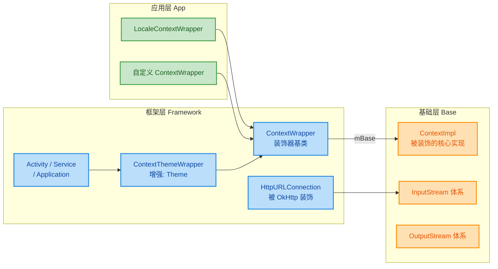

**总结装饰器模式的使用场景判断准则：**

1. **需要在运行时按需增强对象功能** → 装饰器
2. **增强功能是可选的、可组合的** → 装饰器
3. **不希望/不能修改已有类的源码** → 装饰器
4. **想避免因功能组合导致的类爆炸** → 装饰器
5. **增强逻辑可以层层嵌套（洋葱模型）** → 装饰器

一句话记住装饰器的精髓：**用组合替代继承，在不改变对象自身的前提下，通过包裹层来动态扩展其行为。**

---

**📝 练习题**

在 Android Framework 中，`Activity` 可以通过 `getResources()` 获取资源、通过 `startActivity()` 启动新页面、通过 `getTheme()` 获取主题。这些能力的来源链路是怎样的？以下哪个描述最准确？

A. `Activity` 直接继承 `Context` 并自己实现了所有方法，不涉及装饰器模式。


B. `Activity` → `ContextThemeWrapper` → `ContextWrapper` → `ContextImpl`，其中 `getTheme()` 在 `ContextThemeWrapper` 层被增强覆盖，而 `getResources()` 和 `startActivity()` 通过 `ContextWrapper.mBase` 一路委托到 `ContextImpl`。


C. `Activity` 持有一个 `ContextImpl` 的直接引用，所有方法都直接调用 `ContextImpl`，`ContextWrapper` 只是一个空壳。


D. `Activity` 通过动态代理 (Dynamic Proxy) 拦截所有 `Context` 方法调用，并在运行时决定委托给谁。


**【答案】** B

**【解析】** Android 的 `Context` 体系是装饰器模式的典型应用。`ContextImpl` 是真正实现所有系统级功能的 **具体组件** (ConcreteComponent)。`ContextWrapper` 是 **抽象装饰器**，它持有 `mBase`（指向 `ContextImpl`）并将几乎所有方法委托给 `mBase`。`ContextThemeWrapper` 是 **具体装饰器**，它继承 `ContextWrapper`，但 **只覆盖了与主题相关的方法**（如 `getTheme()`、`setTheme()`），这些方法由它自己管理，不再委托给 `mBase`。而其他方法（如 `getResources()`、`startActivity()`）没有被覆盖，仍然沿着继承链走到 `ContextWrapper`，再通过 `mBase` 委托到 `ContextImpl`。`Activity` 继承自 `ContextThemeWrapper`，因此同时享有这两层的能力。选项 A 忽略了中间的装饰器层次；选项 C 忽略了 `ContextThemeWrapper` 对主题方法的增强覆盖；选项 D 混淆了装饰器模式和动态代理模式。

---

## 代理模式 (Proxy Pattern) ⭐⭐⭐

代理模式是结构型设计模式中**最重要**的模式之一，在 Android 开发和 Android Framework 中无处不在。其核心思想极其简洁：**为其他对象提供一种代理（Surrogate / Placeholder），以控制对这个对象的访问**。代理对象在客户端与目标对象之间充当"中间人"，客户端以为自己在和真实对象打交道，实际上所有请求先经过代理，代理可以在请求转发前后做任何额外的事情——权限检查、缓存、延迟加载、日志记录、跨进程通信等。

如果你理解了代理模式，Android 中的 **Binder IPC 机制**、**Retrofit 的接口魔法**、**AOP（面向切面编程）** 就会变得清晰可懂。

代理模式之所以被标记为三星 (⭐⭐⭐) 最高优先级，是因为它同时贯穿了以下三个层面：

- **应用层**：Retrofit 把一个 `interface` 变成可以发起 HTTP 请求的实现对象，就是动态代理。
- **Framework 层**：`ActivityManagerProxy`、`IActivityManager.Stub.Proxy` 等都是 Binder 代理对象。
- **系统层**：整个 Binder 驱动（C/C++ 层）本质上也是代理模式的一种体现。

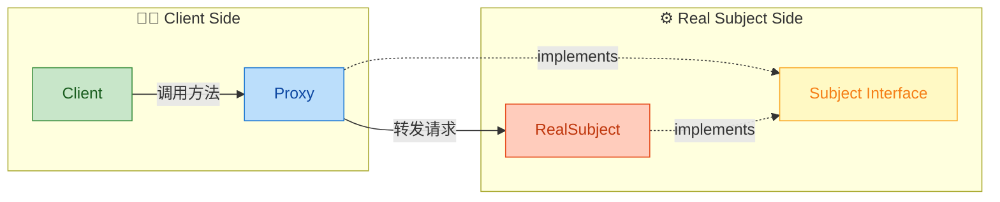

上图展示了代理模式的经典四角关系：Client 只依赖 Subject 接口，Proxy 和 RealSubject 都实现了该接口，Client 持有 Proxy 的引用而非 RealSubject 的直接引用。

---

### 控制对象访问

代理模式的**根本目的**是对目标对象的访问施加某种形式的控制。这里"控制"的含义非常广泛，根据控制目的的不同，代理可以细分为多种类型：

| 代理类型 | 英文名 | 控制目的 | Android 中的典型场景 |
|---------|--------|---------|-------------------|
| 远程代理 | Remote Proxy | 隐藏对象在不同地址空间的事实 | **Binder Proxy**（跨进程通信） |
| 虚拟代理 | Virtual Proxy | 延迟创建开销大的对象 | 图片懒加载占位符 |
| 保护代理 | Protection Proxy | 控制访问权限 | 权限检查中间层 |
| 智能引用 | Smart Reference | 在访问时执行额外操作 | 引用计数、日志、缓存 |

在 Android 中最核心的是**远程代理**（Binder）和**智能引用**（Retrofit 动态代理）。让我们用一段直觉性的代码来理解"控制访问"的含义：

```kotlin
// === 定义统一接口：无论代理还是真实对象，对外暴露相同的契约 ===
interface ImageLoader {
    fun loadImage(url: String): Bitmap  // 加载图片
}

// === 真实对象：直接执行昂贵的网络请求 ===
class RealImageLoader : ImageLoader {
    override fun loadImage(url: String): Bitmap {
        // 真正去网络下载图片（耗时操作）
        println("正在从网络下载: $url")
        return downloadFromNetwork(url)  // 实际下载逻辑
    }
}

// === 代理对象：在访问真实对象之前/之后施加控制 ===
class ImageLoaderProxy(
    private val realLoader: RealImageLoader  // 持有真实对象的引用
) : ImageLoader {

    // 缓存已加载的图片，避免重复下载
    private val cache = mutableMapOf<String, Bitmap>()

    override fun loadImage(url: String): Bitmap {
        // 【控制点1】先检查缓存
        cache[url]?.let {
            println("命中缓存: $url")
            return it               // 有缓存直接返回，不访问真实对象
        }
        // 【控制点2】缓存未命中，委托给真实对象
        val bitmap = realLoader.loadImage(url)
        // 【控制点3】将结果存入缓存
        cache[url] = bitmap
        return bitmap
    }
}
```

上面的代码展示了代理模式最本质的思想——**Proxy 和 RealSubject 实现同一个接口**，Client 无需知道自己到底在跟谁打交道。代理在 `loadImage` 方法内部的三个"控制点"中做了缓存逻辑，而 Client 代码完全不需要修改：

```kotlin
// Client 代码：完全不知道自己在使用代理
fun displayImage(loader: ImageLoader) {  // 依赖接口，不依赖具体类
    val bitmap = loader.loadImage("https://example.com/photo.jpg")
    imageView.setImageBitmap(bitmap)      // 直接使用返回值
}
```

这就是**控制对象访问**的精髓：代理站在 Client 和 RealSubject 之间，充当 Gatekeeper。

---

### 静态代理 (Static Proxy)

静态代理是代理模式最基础、最直观的实现方式。之所以叫"静态"，是因为**代理类在编译期就已经确定**，每一个需要代理的接口都需要手动编写一个对应的代理类。

#### 静态代理的经典结构

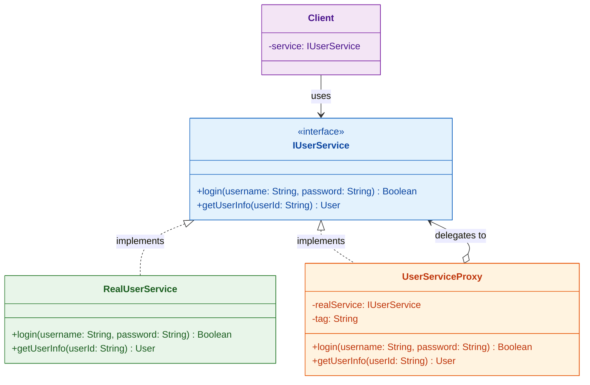

#### 完整代码实现

```kotlin
// ========== 1. 定义 Subject 接口 ==========
interface IUserService {
    fun login(username: String, password: String): Boolean   // 登录
    fun getUserInfo(userId: String): User                    // 获取用户信息
}

// ========== 2. 真实实现类 (RealSubject) ==========
class RealUserService : IUserService {

    override fun login(username: String, password: String): Boolean {
        // 模拟真正的登录逻辑：查询数据库、校验密码等
        println("RealUserService: 正在验证用户 $username")
        return username == "admin" && password == "123456"   // 简化逻辑
    }

    override fun getUserInfo(userId: String): User {
        // 模拟真正的查询逻辑
        println("RealUserService: 正在查询用户 $userId 的信息")
        return User(userId, "张三", "zhangsan@example.com")  // 返回模拟数据
    }
}

// ========== 3. 代理类 (Proxy) — 编译期就写好的，所以叫"静态" ==========
class UserServiceProxy(
    private val realService: IUserService   // 通过构造器注入真实对象（对象适配器的组合思想）
) : IUserService {

    private val tag = "UserServiceProxy"    // 日志标签

    override fun login(username: String, password: String): Boolean {
        // === 前置增强 (Before) ===
        println("$tag: [Before] login() 被调用, username=$username")
        val startTime = System.currentTimeMillis()              // 记录开始时间

        // === 委托给真实对象 ===
        val result = realService.login(username, password)      // 核心：转发调用

        // === 后置增强 (After) ===
        val elapsed = System.currentTimeMillis() - startTime    // 计算耗时
        println("$tag: [After] login() 返回 $result, 耗时 ${elapsed}ms")
        return result                                           // 将真实结果返回给 Client
    }

    override fun getUserInfo(userId: String): User {
        // === 前置增强：权限检查 ===
        println("$tag: [Before] 正在检查权限...")
        if (!checkPermission()) {                               // 保护代理：权限不足则拒绝
            throw SecurityException("无权访问用户信息")
        }

        // === 委托给真实对象 ===
        val user = realService.getUserInfo(userId)              // 转发调用

        // === 后置增强：脱敏处理 ===
        println("$tag: [After] 对返回数据进行脱敏")
        return user.copy(email = "***@***.com")                 // 返回脱敏后的数据
    }

    private fun checkPermission(): Boolean = true               // 简化的权限检查
}

// ========== 4. Client 调用 ==========
fun main() {
    // Client 只依赖接口，不关心背后是代理还是真实对象
    val service: IUserService = UserServiceProxy(RealUserService())
    
    val loginResult = service.login("admin", "123456")    // 通过代理调用
    println("登录结果: $loginResult")
    
    val user = service.getUserInfo("1001")                // 通过代理调用
    println("用户信息: $user")
}
```

#### 静态代理的优缺点

**优点：**
- 实现简单直观，逻辑清晰
- 编译期即可发现类型错误
- 符合**单一职责原则**：真实类专注业务，代理类专注横切关注点（Logging、权限等）
- 符合**开闭原则**：不需要修改真实类即可添加增强逻辑

**缺点（致命问题）：**
- **类爆炸**：每一个 Subject 接口都需要一个对应的 Proxy 类。如果系统中有 50 个 Service 接口，就需要手写 50 个 Proxy 类。
- **代码重复**：如果 50 个 Proxy 类做的事情都是"打日志 + 计时"，那这些逻辑将在 50 个类中重复出现。
- **维护困难**：一旦接口新增方法，所有对应的 Proxy 类都必须同步修改。

正是这些致命缺点催生了**动态代理**——用运行时反射技术一次性解决所有接口的代理问题。

---

### 动态代理 (Dynamic Proxy) ⭐⭐

动态代理是 Java/Android 开发中极其重要的技术，它在**运行时 (Runtime)** 动态生成代理类，而不需要我们手动为每个接口编写代理类。Java 原生提供了 `java.lang.reflect.Proxy` + `InvocationHandler` 组合来实现动态代理。

#### 核心原理

动态代理的运作原理可以分为以下几步：

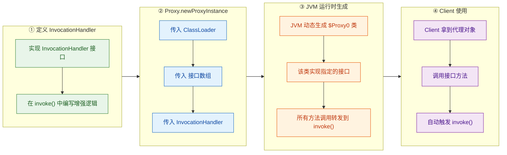

#### `Proxy` 类 与 `InvocationHandler` 接口

Java `java.lang.reflect.Proxy` 是动态代理的入口。它提供了一个关键的静态方法：

```java
// Proxy.newProxyInstance 方法签名
public static Object newProxyInstance(
    ClassLoader loader,          // 类加载器，通常使用接口的 ClassLoader
    Class<?>[] interfaces,       // 要代理的接口数组（可同时代理多个接口）
    InvocationHandler handler    // 调用处理器，所有方法调用都会转发到这里
)
```

`InvocationHandler` 是一个只有单方法的接口：

```java
public interface InvocationHandler {
    /**
     * @param proxy  动态生成的代理对象本身（注意：不是真实对象！）
     * @param method 当前被调用的方法的 Method 对象
     * @param args   方法参数数组
     * @return       方法的返回值
     */
    Object invoke(Object proxy, Method method, Object[] args) throws Throwable;
}
```

这里有一个常见的**新手陷阱**：`invoke` 的第一个参数 `proxy` 是代理对象本身，**不是**真实对象。如果在 `invoke` 中调用 `method.invoke(proxy, args)`（把 proxy 当成委托目标），会造成**无限递归**导致 `StackOverflowError`！

#### 完整动态代理实现

```kotlin
import java.lang.reflect.InvocationHandler
import java.lang.reflect.Method
import java.lang.reflect.Proxy

// ========== 1. 定义接口（与静态代理一样） ==========
interface IUserService {
    fun login(username: String, password: String): Boolean
    fun getUserInfo(userId: String): User
}

interface IOrderService {
    fun createOrder(productId: String, quantity: Int): String
}

// ========== 2. 真实实现类（与静态代理一样） ==========
class RealUserService : IUserService {
    override fun login(username: String, password: String): Boolean {
        println("RealUserService: 验证用户 $username")
        return username == "admin" && password == "123456"
    }

    override fun getUserInfo(userId: String): User {
        println("RealUserService: 查询用户 $userId")
        return User(userId, "张三", "zhangsan@example.com")
    }
}

class RealOrderService : IOrderService {
    override fun createOrder(productId: String, quantity: Int): String {
        println("RealOrderService: 创建订单, 商品=$productId, 数量=$quantity")
        return "ORDER-${System.currentTimeMillis()}"   // 返回订单号
    }
}

// ========== 3. 通用 InvocationHandler（核心！一个 Handler 搞定所有接口） ==========
class LoggingInvocationHandler(
    private val target: Any       // 真实目标对象（注意类型是 Any，通用）
) : InvocationHandler {

    /**
     * 每当 Client 调用代理对象的任何方法时，JVM 都会把调用转发到这里。
     * 
     * @param proxy  JVM 动态生成的代理对象（$Proxy0 实例）
     * @param method 被调用的具体方法（如 login、getUserInfo）
     * @param args   方法参数数组（可能为 null，如无参方法）
     */
    override fun invoke(proxy: Any?, method: Method, args: Array<out Any>?): Any? {
        // === 前置增强 ===
        val methodName = method.name                                  // 获取方法名
        val paramStr = args?.joinToString() ?: "无参数"               // 拼接参数字符串
        println("┌─ [Proxy] 拦截方法: $methodName($paramStr)")
        val startTime = System.nanoTime()                             // 纳秒级计时

        // === 核心：反射调用真实对象的方法 ===
        // 注意这里传的是 target（真实对象），不是 proxy！
        val result = method.invoke(target, *(args ?: emptyArray()))   // 解构参数数组

        // === 后置增强 ===
        val elapsed = (System.nanoTime() - startTime) / 1_000_000.0  // 转为毫秒
        println("└─ [Proxy] $methodName() 返回: $result, 耗时: ${elapsed}ms")

        return result                                                 // 将真实返回值透传给 Client
    }
}

// ========== 4. 动态代理工厂函数 ==========
// 使用 Kotlin 的 reified 泛型 + inline 简化创建过程
@Suppress("UNCHECKED_CAST")
inline fun <reified T> createProxy(target: T): T {
    return Proxy.newProxyInstance(
        T::class.java.classLoader,                    // 使用接口 T 的 ClassLoader
        arrayOf(T::class.java),                       // 代理的接口数组（这里只代理一个接口）
        LoggingInvocationHandler(target as Any)        // 将 target 包装到 Handler 中
    ) as T                                            // 强制转型为接口类型 T
}

// ========== 5. Client 使用 ==========
fun main() {
    // 创建 IUserService 的动态代理（无需手写 UserServiceProxy 类！）
    val userService: IUserService = createProxy<IUserService>(RealUserService())
    userService.login("admin", "123456")
    userService.getUserInfo("1001")

    println("─".repeat(50))

    // 同一个 Handler 类，也能代理 IOrderService（无需额外编写代理类！）
    val orderService: IOrderService = createProxy<IOrderService>(RealOrderService())
    orderService.createOrder("PROD-001", 3)
}
```

运行结果：

```text
┌─ [Proxy] 拦截方法: login(admin, 123456)
RealUserService: 验证用户 admin
└─ [Proxy] login() 返回: true, 耗时: 0.85ms
┌─ [Proxy] 拦截方法: getUserInfo(1001)
RealUserService: 查询用户 1001
└─ [Proxy] getUserInfo() 返回: User(id=1001, name=张三, ...), 耗时: 0.12ms
──────────────────────────────────────────────────
┌─ [Proxy] 拦截方法: createOrder(PROD-001, 3)
RealOrderService: 创建订单, 商品=PROD-001, 数量=3
└─ [Proxy] createOrder() 返回: ORDER-1709312345678, 耗时: 0.09ms
```

可以看到，**一个** `LoggingInvocationHandler` 就代理了**两个完全不同的接口**，这就是动态代理相对于静态代理的巨大优势。

#### JVM 生成的 $Proxy0 到底长什么样？

当我们调用 `Proxy.newProxyInstance()` 时，JVM 在内存中动态生成了一个名为 `$Proxy0` 的类（后续的代理类编号递增：`$Proxy1`、`$Proxy2`...）。这个类**反编译**后大致如下：

```java
// JVM 在运行时动态生成的代理类（伪反编译，简化表示）
final class $Proxy0 extends Proxy implements IUserService {

    // 静态字段：缓存 Method 对象，避免每次反射查找
    private static Method m_login;        // login 方法的 Method 对象
    private static Method m_getUserInfo;  // getUserInfo 方法的 Method 对象

    static {
        try {
            // 类加载时通过反射获取 Method 对象并缓存
            m_login = IUserService.class.getMethod(
                "login", String.class, String.class
            );
            m_getUserInfo = IUserService.class.getMethod(
                "getUserInfo", String.class
            );
        } catch (NoSuchMethodException e) {
            throw new NoSuchMethodError(e.getMessage());
        }
    }

    // 构造函数接收 InvocationHandler
    $Proxy0(InvocationHandler handler) {
        super(handler);  // Proxy 基类持有 handler 引用（字段名为 h）
    }

    // 实现接口方法：所有调用都转发到 handler.invoke()
    @Override
    public boolean login(String username, String password) {
        try {
            // 调用 handler 的 invoke 方法
            // this = 代理对象本身
            // m_login = 当前被调用的 Method
            // new Object[]{username, password} = 参数数组
            return (Boolean) this.h.invoke(this, m_login,
                new Object[]{username, password});
        } catch (Throwable t) {
            throw new UndeclaredThrowableException(t);
        }
    }

    @Override
    public User getUserInfo(String userId) {
        try {
            return (User) this.h.invoke(this, m_getUserInfo,
                new Object[]{userId});
        } catch (Throwable t) {
            throw new UndeclaredThrowableException(t);
        }
    }
}
```

这段伪代码揭示了动态代理的完整机制：`$Proxy0` 实现了 `IUserService` 接口，其中每个方法体都只做一件事——把自己（proxy）、Method 对象、参数打包后调用 `InvocationHandler.invoke()`。这就是为什么我们在 `invoke` 中能拿到完整的方法信息和参数。

#### 动态代理的局限性

Java 原生的 `Proxy` 只能代理**接口**，不能代理**类**。这是因为 `$Proxy0` 已经 `extends Proxy` 了，Java 不支持多继承，所以它无法再 extends 其他类。如果需要代理类（而非接口），需要使用 **CGLIB**（通过生成子类的方式）或 **ByteBuddy** 等字节码操作库。在 Android 中，由于 Dalvik/ART 虚拟机的限制，CGLIB 无法直接使用，通常依赖 **dexmaker** 等库。

#### 静态代理 vs 动态代理 对比

| 对比维度 | 静态代理 | 动态代理 |
|---------|---------|---------|
| 代理类生成时机 | **编译期**（手动编写） | **运行时**（JVM 自动生成） |
| 代码量 | 每个接口一个代理类，大量重复 | 一个 InvocationHandler 通吃 |
| 灵活性 | 低：增删方法需同步修改代理类 | 高：新增方法自动被拦截 |
| 性能 | 无反射开销，略快 | 有反射开销（`Method.invoke`），略慢 |
| 可代理类型 | 接口或类均可 | 仅接口（Java Proxy 限制） |
| 调试难度 | 简单：代码可直接阅读 | 较难：需理解反射和生成类 |
| 典型应用 | 简单场景、性能敏感路径 | AOP、RPC、Retrofit、Binder |

---

### Android 应用 (Binder 代理、Retrofit)

#### 1. Binder 代理 —— Android IPC 的基石

Android 的 **Binder 机制**是代理模式在系统层面最经典、最宏大的应用。当你的 App 调用 `startActivity()`、`getSystemService()` 等方法时，背后实际上跨越了进程边界，Client 进程拿到的其实是一个**代理对象 (Proxy)**，而真实的服务对象 (Stub) 运行在另一个进程（通常是 `system_server`）中。

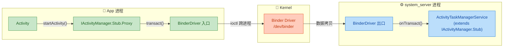

**Binder 代理的工作流程：**

1. **AIDL 编译器**自动生成 `IActivityManager.java`，其中包含 `Stub`（服务端骨架）和 `Stub.Proxy`（客户端代理）两个内部类。
2. App 进程通过 `ServiceManager.getService("activity")` 获取到一个 `IBinder` 对象。
3. 调用 `IActivityManager.Stub.asInterface(binder)`，如果 binder 跟调用方在同一进程，直接返回 Stub 本身；如果跨进程，返回 **`Stub.Proxy`** 包装对象。
4. Client 调用 `Proxy.startActivity()` 时，Proxy 内部将方法名和参数序列化到 `Parcel` 中，通过 `transact()` 发送给 Binder 驱动。
5. Binder 驱动通过内存映射将数据传递到 `system_server` 进程。
6. `system_server` 中的 `Stub.onTransact()` 反序列化参数，调用真正的 `startActivity()` 实现。

下面是 AIDL 生成代码的**简化版本**，展示 Binder 代理模式的本质结构：

```java
// ========== AIDL 自动生成的接口和 Stub/Proxy（大幅简化） ==========

// Subject 接口
public interface IMyService extends IInterface {
    String getData(int id) throws RemoteException;   // 业务方法声明

    // ========== Stub：服务端骨架（RealSubject 的基类） ==========
    abstract class Stub extends Binder implements IMyService {

        private static final String DESCRIPTOR = "com.example.IMyService";  // 唯一标识
        private static final int TRANSACTION_getData = FIRST_CALL_TRANSACTION;  // 方法编号

        public Stub() {
            this.attachInterface(this, DESCRIPTOR);  // 注册到 Binder 框架
        }

        /**
         * 关键方法：判断 binder 是本地还是远程
         * 本地 → 直接返回 Stub（无需代理）
         * 远程 → 返回 Proxy 包装
         */
        public static IMyService asInterface(IBinder obj) {
            if (obj == null) return null;                    // 空检查
            // 尝试查找本地接口（同进程优化）
            IInterface localInterface = obj.queryLocalInterface(DESCRIPTOR);
            if (localInterface instanceof IMyService) {
                return (IMyService) localInterface;          // 同进程：直接返回，无代理开销
            }
            return new Proxy(obj);                           // 跨进程：返回代理对象
        }

        @Override
        protected boolean onTransact(int code, Parcel data, Parcel reply, int flags) {
            switch (code) {
                case TRANSACTION_getData: {
                    data.enforceInterface(DESCRIPTOR);       // 安全校验
                    int id = data.readInt();                  // 从 Parcel 反序列化参数
                    String result = this.getData(id);        // 调用真实实现
                    reply.writeNoException();                 // 写入无异常标记
                    reply.writeString(result);                // 序列化返回值
                    return true;
                }
            }
            return super.onTransact(code, data, reply, flags);
        }

        // ========== Proxy：客户端代理 ==========
        private static class Proxy implements IMyService {
            private IBinder remote;                          // 持有远程 Binder 引用

            Proxy(IBinder remote) {
                this.remote = remote;                        // 保存远程引用
            }

            @Override
            public String getData(int id) throws RemoteException {
                Parcel data = Parcel.obtain();               // 获取输入 Parcel
                Parcel reply = Parcel.obtain();              // 获取输出 Parcel
                try {
                    data.writeInterfaceToken(DESCRIPTOR);    // 写入接口标识
                    data.writeInt(id);                       // 序列化方法参数
                    // 核心：通过 Binder 驱动发起跨进程调用
                    remote.transact(TRANSACTION_getData, data, reply, 0);
                    reply.readException();                   // 检查远程是否有异常
                    return reply.readString();               // 反序列化返回值
                } finally {
                    data.recycle();                          // 回收 Parcel 防止内存泄漏
                    reply.recycle();
                }
            }

            @Override
            public IBinder asBinder() {
                return remote;                               // 返回底层 IBinder
            }
        }
    }
}
```

这段代码完美展现了代理模式的精髓：`Proxy` 和 `Stub` 都实现了 `IMyService` 接口，Client 不需要知道自己拿到的是 Stub（同进程）还是 Proxy（跨进程），调用方式完全一样。`asInterface()` 这个工厂方法自动做了 **Local vs Remote** 的判断，这也是一个 Binder 框架的经典设计。

#### 2. Retrofit —— 动态代理的艺术品

Retrofit 是 Square 公司出品的 HTTP 客户端库，它将动态代理运用到了极致。开发者只需定义一个**接口**，Retrofit 就能在运行时生成该接口的实现。

**使用示例：**

```kotlin
// ========== 1. 定义 API 接口（只是一个接口，没有任何实现！） ==========
interface GitHubApi {
    @GET("users/{user}/repos")                              // HTTP 注解声明请求方式和路径
    suspend fun listRepos(
        @Path("user") user: String                          // 路径参数
    ): List<Repo>

    @POST("repos/{owner}/{repo}/issues")                    // POST 请求
    suspend fun createIssue(
        @Path("owner") owner: String,                       // 路径参数
        @Path("repo") repo: String,                         // 路径参数
        @Body issue: CreateIssueRequest                     // 请求体
    ): Issue
}

// ========== 2. 创建 Retrofit 实例并生成代理对象 ==========
val retrofit = Retrofit.Builder()
    .baseUrl("https://api.github.com/")                     // 基础 URL
    .addConverterFactory(GsonConverterFactory.create())     // JSON 转换器
    .build()

// 🔥 核心：这一行就是动态代理！
// Retrofit.create() 内部调用 Proxy.newProxyInstance()
val api: GitHubApi = retrofit.create(GitHubApi::class.java)

// ========== 3. 使用代理对象发起网络请求 ==========
// api 并不是某个具体的 GitHubApi 实现类，而是 JVM 生成的 $Proxy0 对象！
val repos = api.listRepos("JakeWharton")                    // 自动生成 HTTP GET 请求
```

那么 `Retrofit.create()` 内部到底做了什么？让我们看看其**核心源码**的简化版本：

```java
// Retrofit.java 核心源码（简化）
public <T> T create(final Class<T> service) {
    // 1. 校验：必须是接口
    validateServiceInterface(service);

    // 2. 动态代理！关键就这一步
    return (T) Proxy.newProxyInstance(
        service.getClassLoader(),              // 使用接口的 ClassLoader
        new Class<?>[]{service},               // 代理的接口数组
        new InvocationHandler() {              // 匿名 InvocationHandler
            @Override
            public Object invoke(Object proxy, Method method, Object[] args)
                    throws Throwable {

                // 3. 跳过 Object 类的方法（toString、equals 等）
                if (method.getDeclaringClass() == Object.class) {
                    return method.invoke(this, args);          // 直接调用，不代理
                }

                // 4. 解析方法上的注解（@GET、@POST、@Path、@Body 等）
                //    并缓存为 ServiceMethod 对象
                ServiceMethod<?> serviceMethod = loadServiceMethod(method);

                // 5. 根据注解信息构建 OkHttp 的 Request 并执行
                //    将返回值转换为用户期望的类型（如 List<Repo>）
                return serviceMethod.invoke(args);
            }
        }
    );
}
```

**Retrofit 动态代理的精妙之处：**

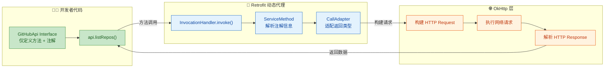

Retrofit 的设计展示了动态代理的真正威力：

1. **零实现类**：开发者永远不需要写 `GitHubApi` 的实现类，所有逻辑由 `InvocationHandler` 在运行时处理。
2. **注解驱动**：方法上的 `@GET`、`@POST`、`@Path`、`@Body` 等注解在 `invoke()` 中通过反射读取，组装成完整的 HTTP 请求。
3. **关注点分离**：接口声明了"要做什么"（What），Retrofit 框架处理"怎么做"（How）。

#### 3. 实战：手写一个迷你版 Retrofit

理解了原理后，让我们动手写一个极简版的 "Retrofit"，加深理解：

```kotlin
import java.lang.reflect.InvocationHandler
import java.lang.reflect.Method
import java.lang.reflect.Proxy

// ========== 自定义注解 ==========
@Target(AnnotationTarget.FUNCTION)                // 只能标注在方法上
@Retention(AnnotationRetention.RUNTIME)           // 运行时保留（反射可读取）
annotation class GET(val path: String)            // GET 请求注解

@Target(AnnotationTarget.VALUE_PARAMETER)         // 只能标注在参数上
@Retention(AnnotationRetention.RUNTIME)
annotation class Path(val value: String)          // 路径参数注解

// ========== 定义 API 接口 ==========
interface SimpleApi {
    @GET("/users/{id}/profile")                   // 注解声明请求路径
    fun getUserProfile(@Path("id") userId: String): String
}

// ========== 迷你版 Retrofit ==========
class MiniRetrofit(private val baseUrl: String) {

    // 核心方法：创建接口的动态代理实现
    @Suppress("UNCHECKED_CAST")
    fun <T> create(serviceClass: Class<T>): T {
        return Proxy.newProxyInstance(
            serviceClass.classLoader,                          // ClassLoader
            arrayOf(serviceClass),                             // 代理接口
            object : InvocationHandler {                       // 匿名 InvocationHandler
                override fun invoke(proxy: Any?, method: Method, args: Array<out Any>?): Any? {
                    // --- Step 1: 获取方法上的 @GET 注解 ---
                    val getAnnotation = method.getAnnotation(GET::class.java)
                        ?: throw IllegalStateException("方法 ${method.name} 缺少 @GET 注解")

                    var path = getAnnotation.path               // 获取原始路径模板

                    // --- Step 2: 解析参数上的 @Path 注解，替换路径占位符 ---
                    val parameters = method.parameters          // 获取参数列表
                    parameters.forEachIndexed { index, param ->
                        val pathAnnotation = param.getAnnotation(Path::class.java)
                        if (pathAnnotation != null) {
                            val placeholder = "{${pathAnnotation.value}}"  // 如 {id}
                            val actualValue = args?.get(index)?.toString() ?: ""
                            path = path.replace(placeholder, actualValue) // 替换为实际值
                        }
                    }

                    // --- Step 3: 构建完整 URL 并"发送请求" ---
                    val fullUrl = "$baseUrl$path"
                    println("🌐 GET $fullUrl")                  // 模拟发送 HTTP 请求

                    // --- Step 4: 返回模拟响应 ---
                    return """{"id": "${args?.get(0)}", "name": "MiniRetrofit User"}"""
                }
            }
        ) as T
    }
}

// ========== 使用 ==========
fun main() {
    val miniRetrofit = MiniRetrofit("https://api.example.com")

    // 创建代理对象（无需手写 SimpleApi 的实现类！）
    val api: SimpleApi = miniRetrofit.create(SimpleApi::class.java)

    // 调用接口方法 → 自动触发 InvocationHandler.invoke()
    val result = api.getUserProfile("42")
    println("响应: $result")
}
// 输出：
// 🌐 GET https://api.example.com/users/42/profile
// 响应: {"id": "42", "name": "MiniRetrofit User"}
```

这个迷你版本虽然简陋，但完整呈现了 Retrofit 的核心思路：**定义接口 → 读取注解 → 构建请求 → 返回结果**，全程无需接口的实现类。

#### 代理模式在 Android 中的全景图

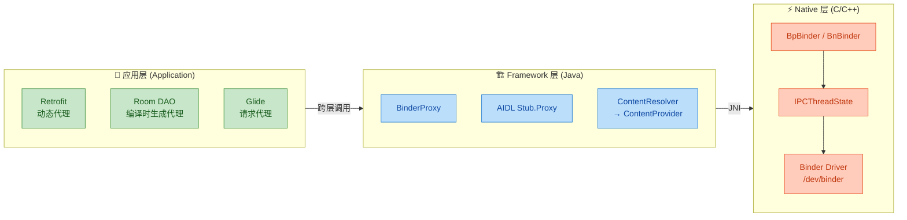

在 Native C++ 层中，Binder 代理模式同样存在对称结构：

```c++
// Native 层的 Binder 代理结构（简化示意）

// ===== 接口层 =====
class IMyService : public IInterface {               // Subject 接口
public:
    DECLARE_META_INTERFACE(MyService);                // 宏展开：定义 descriptor 等
    virtual status_t getData(int id, String* out) = 0; // 纯虚函数 = 接口方法
};

// ===== 代理端 (Client 进程) =====
class BpMyService : public BpInterface<IMyService> {  // Bp = Binder Proxy
public:
    explicit BpMyService(const sp<IBinder>& impl)
        : BpInterface<IMyService>(impl) {}            // 持有远程 IBinder

    virtual status_t getData(int id, String* out) {
        Parcel data, reply;                           // 序列化容器
        data.writeInterfaceToken(                     // 写入接口标识
            IMyService::getInterfaceDescriptor());
        data.writeInt32(id);                          // 序列化参数
        // 通过 Binder 驱动跨进程调用
        remote()->transact(GET_DATA, data, &reply);   // remote() 返回 BpBinder
        *out = reply.readString16();                  // 反序列化返回值
        return reply.readInt32();                     // 返回状态码
    }
};

// ===== 服务端 (Server 进程) =====
class BnMyService : public BnInterface<IMyService> {  // Bn = Binder Native
public:
    virtual status_t onTransact(uint32_t code,
            const Parcel& data, Parcel* reply, uint32_t flags) {
        switch (code) {
            case GET_DATA: {
                CHECK_INTERFACE(IMyService, data, reply); // 安全校验
                int id = data.readInt32();                // 反序列化参数
                String result;
                status_t status = getData(id, &result);   // 调用真实实现
                reply->writeString16(result);             // 序列化返回值
                reply->writeInt32(status);
                return NO_ERROR;
            }
        }
        return BBinder::onTransact(code, data, reply, flags);
    }
};
```

C++ 层的 `BpMyService`（Binder Proxy）和 Java 层的 `Stub.Proxy` 完全对称——同样实现了统一的接口 `IMyService`，同样在内部做序列化/反序列化/transact 调用。这就是代理模式跨语言一致性的体现。

#### 总结对比表

| 维度 | Binder 代理 | Retrofit 代理 |
|------|------------|--------------|
| 代理类型 | 远程代理 (Remote Proxy) | 智能引用 / 虚拟代理 |
| 代理方式 | AIDL 编译时生成（静态） | 运行时动态代理 |
| 核心目的 | 隐藏跨进程通信细节 | 隐藏 HTTP 请求构建细节 |
| 序列化方式 | `Parcel` (二进制) | `Converter`（JSON 等） |
| 传输层 | Binder 驱动 (内核) | OkHttp (网络) |
| 生成技术 | AIDL 编译器 | `java.lang.reflect.Proxy` |
| 接口约束 | 必须继承 `IInterface` | 任意 Java/Kotlin 接口 |

---

**📝 练习题**

**题目 1：** 关于 Java 动态代理 (`java.lang.reflect.Proxy`)，以下说法**正确**的是：

A. 动态代理既可以代理接口，也可以代理普通类


B. `InvocationHandler.invoke()` 的第一个参数 `proxy` 是被代理的真实对象


C. JVM 动态生成的代理类 `$Proxy0` 继承了 `java.lang.reflect.Proxy` 类并实现了指定接口


D. 在 `InvocationHandler.invoke()` 中调用 `method.invoke(proxy, args)` 可以正确地将请求转发给真实对象


**【答案】** C

**【解析】** 逐项分析：
- **A 错误**：Java 原生 `Proxy` 只能代理**接口**，不能代理类。因为生成的 `$Proxy0` 已经 `extends Proxy`，Java 单继承限制使其无法再继承其他类。代理类需要用 CGLIB 等字节码库。
- **B 错误**：`invoke()` 的第一个参数 `proxy` 是**动态生成的代理对象本身**（即 `$Proxy0` 的实例），而不是真实的被代理对象。真实对象需要在 `InvocationHandler` 的构造函数中手动传入并保存。
- **C 正确**：这正是动态代理的核心机制。`$Proxy0 extends Proxy implements YourInterface`，Proxy 基类持有 `InvocationHandler h` 字段，所有接口方法的调用都转发到 `h.invoke()`。
- **D 错误**：这是典型的**无限递归陷阱**。`method.invoke(proxy, args)` 会再次触发 `$Proxy0` 上的方法调用，从而再次进入 `invoke()`，形成无限循环直到 `StackOverflowError`。正确做法是 `method.invoke(realTarget, args)`，其中 `realTarget` 是构造时传入的真实对象。

---

**📝 练习题**

**题目 2：** 在 Android Binder 通信中，`IMyService.Stub.asInterface(IBinder binder)` 方法的核心逻辑是什么？当 Client 与 Service 在同一进程时，返回的对象和跨进程时有什么区别？

A. 无论是否同进程，都返回 `Stub.Proxy` 对象，以保持一致性


B. 同进程返回 `Stub` 本身（即 Service 直接引用），跨进程返回 `Stub.Proxy` 包装对象


C. 同进程返回 `Stub.Proxy`，跨进程返回 `Stub` 本身


D. 无论是否同进程，都通过 Binder 驱动进行 `transact()` 调用


**【答案】** B

**【解析】** `asInterface()` 是 AIDL 生成代码中的关键工厂方法，其逻辑为：首先调用 `binder.queryLocalInterface(DESCRIPTOR)` 尝试在本地查找接口实现。如果 Client 和 Service 在**同一进程**，`queryLocalInterface` 会返回 Stub 对象本身（因为 Stub 构造时已调用 `attachInterface(this, DESCRIPTOR)` 进行了注册），此时直接返回该 Stub 引用——没有代理、没有序列化、没有 IPC 开销，这是一个重要的**同进程优化**。如果在**不同进程**，`queryLocalInterface` 返回 null，此时 `asInterface` 会创建并返回一个 `Stub.Proxy` 对象，该代理对象在每次方法调用时将参数序列化为 `Parcel`，通过 `transact()` 经 Binder 驱动跨进程传输。这种设计使得 Client 代码完全不需要关心 Service 是否在同一进程中，体现了代理模式"**透明化底层差异**"的核心价值。

---

## 外观模式（Facade Pattern）⭐

外观模式是结构型设计模式中最为"直觉化"的一种——它的核心哲学可以用一句话概括：**为一组复杂的子系统提供一个统一的、简化的高层接口（Unified Higher-Level Interface）**。客户端不需要了解子系统的内部细节，只需要和"外观"打交道即可。

在现实生活中，外观模式无处不在。想象你走进一家酒店前台，你只需要说"我要办入住"，前台就会帮你协调房间分配系统、门禁卡系统、计费系统、保洁调度系统等多个后端流程。你作为客户，面对的只有一个"前台"——这就是 Facade。

在 Android 开发中，外观模式的身影更是随处可见：`Context` 本身就是一个巨型 Facade，它把 Activity 管理、资源获取、系统服务访问、文件操作、广播发送等数十种能力统一收拢在一个接口之下。理解外观模式，是理解 Android 框架层架构设计哲学的关键一步。

---

### 简化复杂系统接口

#### 问题的本质：子系统膨胀带来的耦合

在一个中大型系统中，功能模块往往被拆分成许多子系统（Subsystem）。每个子系统都有自己的接口和调用规则。如果客户端代码需要直接与这些子系统交互，就会面临以下问题：

1. **耦合度过高**：客户端需要知道每个子系统的存在及其 API 签名，任何子系统的变更都可能导致客户端的连锁修改。
2. **调用流程冗长**：完成一个业务操作可能需要按特定顺序调用多个子系统，调用逻辑散落在客户端各处。
3. **学习成本高**：新开发者需要理解所有子系统才能完成简单功能。

外观模式的解法非常朴素——**引入一个 Facade 类，将分散的子系统调用封装为若干语义化的高层方法**。客户端只依赖 Facade，而 Facade 内部负责编排（Orchestrate）子系统的协作。

#### 经典结构

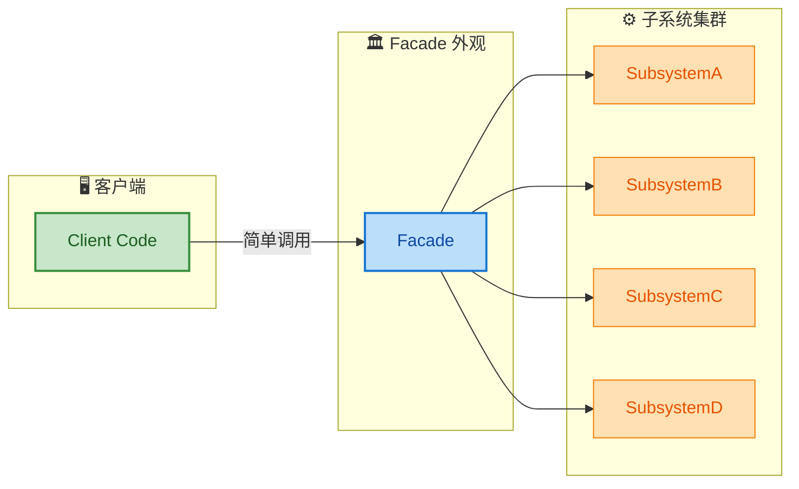

可以看到，Client 只依赖 Facade 一个类，而 Facade 负责将请求分发到底层的四个子系统。这大幅降低了客户端与子系统之间的耦合度（Coupling），体现了 **迪米特法则（Law of Demeter / Least Knowledge Principle）** 的精神。

#### 基础代码示例

设想一个"智能家居一键离家"的场景：离开家时需要关灯、关空调、锁门、启动安防摄像头。没有 Facade 时，客户端需要逐一调用每个子系统：

```kotlin
// ====== 子系统 A：灯光控制 ======
class LightSystem {
    // 关闭所有灯光
    fun turnOffAll() {
        println("LightSystem: 所有灯光已关闭")
    }
}

// ====== 子系统 B：空调控制 ======
class AirConditionerSystem {
    // 关闭空调
    fun shutdown() {
        println("AirConditionerSystem: 空调已关闭")
    }
}

// ====== 子系统 C：门锁控制 ======
class DoorLockSystem {
    // 锁定大门
    fun lockAll() {
        println("DoorLockSystem: 所有门已锁定")
    }
}

// ====== 子系统 D：安防系统 ======
class SecuritySystem {
    // 启动安防摄像头
    fun armCameras() {
        println("SecuritySystem: 安防摄像头已启动")
    }
}
```

**没有 Facade 的客户端代码（高耦合）**：

```kotlin
fun main() {
    // 客户端必须知道每一个子系统的存在和调用顺序
    val lights = LightSystem()          // 直接依赖子系统 A
    val ac = AirConditionerSystem()     // 直接依赖子系统 B
    val door = DoorLockSystem()         // 直接依赖子系统 C
    val security = SecuritySystem()     // 直接依赖子系统 D

    // 离家操作：必须按顺序手动调用
    lights.turnOffAll()
    ac.shutdown()
    door.lockAll()
    security.armCameras()
}
```

这里客户端直接耦合了四个子系统。如果以后新增"关闭窗帘"子系统，或者调整操作顺序（比如必须先锁门再关灯），所有调用处都需要修改。

**引入 Facade 后**：

```kotlin
// ====== 外观类：智能家居控制中心 ======
class SmartHomeFacade(
    // 通过构造函数注入所有子系统（组合关系）
    private val lights: LightSystem = LightSystem(),
    private val ac: AirConditionerSystem = AirConditionerSystem(),
    private val door: DoorLockSystem = DoorLockSystem(),
    private val security: SecuritySystem = SecuritySystem()
) {
    /**
     * 一键离家：封装了对多个子系统的有序调用
     * 客户端无需了解内部有哪些子系统，也不需要关心调用顺序
     */
    fun leaveHome() {
        println("=== 执行离家模式 ===")
        lights.turnOffAll()       // 第一步：关灯
        ac.shutdown()             // 第二步：关空调
        door.lockAll()            // 第三步：锁门
        security.armCameras()     // 第四步：启动安防
        println("=== 离家模式完成 ===")
    }

    /**
     * 一键回家：反向操作
     */
    fun arriveHome() {
        println("=== 执行回家模式 ===")
        security.disarmCameras()  // 先关闭安防（假设有此方法）
        door.unlockMain()         // 解锁大门
        lights.turnOnLiving()     // 打开客厅灯
        ac.startCooling(26)       // 空调制冷 26°C
        println("=== 回家模式完成 ===")
    }
}
```

**引入 Facade 后的客户端代码（低耦合）**：

```kotlin
fun main() {
    // 客户端只依赖 Facade 一个类
    val home = SmartHomeFacade()

    // 一行代码完成复杂操作
    home.leaveHome()

    // 之后回家
    home.arriveHome()
}
```

这就是外观模式的核心价值：**把"我需要了解整个系统"变成"我只需要知道外观提供了什么操作"**。

#### Facade ≠ God Class

一个常见误解是把 Facade 写成一个包揽所有业务逻辑的"上帝类"。需要明确：

| 特征 | 正确的 Facade | God Class（反模式） |
|------|-------------|-------------------|
| 职责 | **委托转发**，编排子系统调用 | 自己实现所有业务逻辑 |
| 子系统暴露 | 子系统仍然可以被直接访问 | 完全隐藏，强制所有调用经过自身 |
| 代码量 | 薄薄一层（Thin Layer） | 膨胀到数千行 |
| 是否可选 | 客户端 **可以** 绕过 Facade 直接调用子系统 | 不允许绕过 |

Facade 的方法体内应该几乎没有复杂逻辑，它的价值在于"选择"和"编排"，而非"实现"。

---

### 统一入口

#### 为什么需要"统一入口"

在大型工程中，功能模块的数量会快速膨胀。如果没有一个统一的入口点，开发者在使用某个功能时往往面临"该调哪个类？"的困惑。外观模式的"统一入口"思想，本质上是在模块边界上建立一个 **API Gateway / Entry Point**，对外暴露清晰的契约（Contract），对内隐藏实现复杂性。

#### 模块化架构中的 Facade

在现代 Android 多模块工程（Multi-Module Architecture）中，外观模式是模块间通信的最佳实践之一。每个 Feature Module 对外暴露一个 Facade 接口，其他模块只依赖这个接口，而非内部实现类：

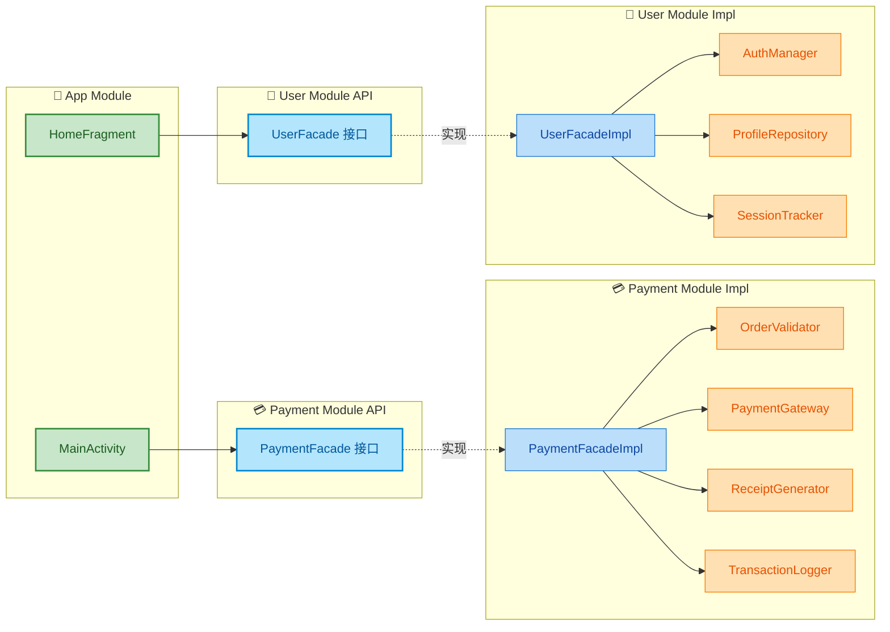

代码层面的实现：

```kotlin
// ====== payment-api 模块：只定义接口（暴露给外部） ======
interface PaymentFacade {
    /**
     * 一键完成支付流程
     * @param orderId 订单 ID
     * @param amount  金额（单位：分）
     * @return 支付结果
     */
    suspend fun processPayment(orderId: String, amount: Long): PaymentResult

    /**
     * 查询支付状态
     */
    suspend fun queryStatus(transactionId: String): PaymentStatus
}

// 支付结果密封类
sealed class PaymentResult {
    data class Success(val transactionId: String) : PaymentResult()  // 成功
    data class Failure(val errorCode: Int, val message: String) : PaymentResult()  // 失败
}
```

```kotlin
// ====== payment-impl 模块：实现 Facade，编排内部子系统 ======
class PaymentFacadeImpl(
    private val validator: OrderValidator,         // 子系统1：订单校验
    private val gateway: PaymentGateway,           // 子系统2：支付网关
    private val receiptGen: ReceiptGenerator,      // 子系统3：收据生成
    private val logger: TransactionLogger          // 子系统4：交易日志
) : PaymentFacade {

    override suspend fun processPayment(orderId: String, amount: Long): PaymentResult {
        // 第一步：校验订单合法性
        val order = validator.validate(orderId)
            ?: return PaymentResult.Failure(1001, "订单不存在或已失效")

        // 第二步：调用支付网关扣款
        val transaction = gateway.charge(order, amount)
        if (!transaction.isSuccess) {
            // 扣款失败，记录日志并返回
            logger.logFailure(orderId, transaction.errorMsg)
            return PaymentResult.Failure(transaction.errorCode, transaction.errorMsg)
        }

        // 第三步：生成电子收据
        receiptGen.generate(transaction.id, order, amount)

        // 第四步：记录成功日志
        logger.logSuccess(transaction.id, orderId, amount)

        // 返回成功结果
        return PaymentResult.Success(transaction.id)
    }

    override suspend fun queryStatus(transactionId: String): PaymentStatus {
        // 委托给支付网关查询
        return gateway.queryTransaction(transactionId)
    }
}
```

```kotlin
// ====== App Module 中的使用：只依赖 payment-api ======
class CheckoutViewModel(
    private val paymentFacade: PaymentFacade  // 注入的是接口，不关心具体实现
) : ViewModel() {

    fun checkout(orderId: String, amount: Long) {
        viewModelScope.launch {
            // 一行调用，屏蔽了 4 个子系统的复杂性
            val result = paymentFacade.processPayment(orderId, amount)
            when (result) {
                is PaymentResult.Success -> {
                    // 更新 UI：显示支付成功
                    _uiState.value = CheckoutState.Success(result.transactionId)
                }
                is PaymentResult.Failure -> {
                    // 更新 UI：显示错误信息
                    _uiState.value = CheckoutState.Error(result.message)
                }
            }
        }
    }
}
```

这种 **接口 Facade + 实现分离** 的模式有几个显著优势：

- **编译隔离**：App Module 只依赖 `payment-api`（纯接口模块），`payment-impl` 内部类的任何改动都不会触发 App 模块的重新编译。
- **可测性**：在单元测试中可以轻松 Mock `PaymentFacade` 接口，无需启动真实的支付子系统。
- **可替换性**：可以为不同的 Build Variant（如测试环境 / 生产环境）提供不同的 `PaymentFacadeImpl`。

#### Facade 与其他模式的配合

外观模式常与其他模式协作形成更强大的架构：

| 配合模式 | 作用 | 典型场景 |
|---------|------|---------|
| **单例模式** | Facade 本身常作为单例存在 | `Context` 系列对象全局唯一入口 |
| **工厂模式** | 通过工厂创建 Facade，隐藏实现选择逻辑 | DI 框架（Hilt/Dagger）注入 Facade 实现 |
| **中介者模式** | 两者都减少直接依赖；中介者侧重双向通信，Facade 侧重单向简化 | Event Bus + Facade 混合架构 |
| **适配器模式** | Facade 内部可能使用 Adapter 兼容旧接口 | 迁移旧系统时，Facade 内部用 Adapter 适配遗留 API |

---

### Android 应用（Context）

Android 中最经典、最重量级的 Facade 案例就是 **`Context`**。几乎每一个 Android 开发者每天都在使用它，但很少有人意识到它的设计本质就是一个外观模式的体现。

#### Context 的 Facade 本质

`Context` 类（`android.content.Context`）是一个抽象类，它提供了关于应用环境（Application Environment）的全局信息访问接口。打开 Android 源码可以发现，`Context` 暴露了 **超过 100 个公共方法**，这些方法分属于完全不同的子系统：

| 子系统领域 | Context 提供的方法（部分） | 底层子系统 |
|-----------|-------------------------|-----------|
| 资源访问 | `getResources()`, `getString()`, `getDrawable()` | `ResourcesManager`, `AssetManager` |
| 系统服务 | `getSystemService()` | `SystemServiceRegistry`, 各种 Manager |
| Activity | `startActivity()` | `ActivityManager`, `Instrumentation` |
| 广播 | `sendBroadcast()`, `registerReceiver()` | `ActivityManagerService` |
| 内容提供者 | `getContentResolver()` | `ContentResolver`, `AMS` |
| 文件/数据库 | `openFileOutput()`, `getSharedPreferences()`, `getDatabasePath()` | 文件 I/O, SQLite |
| 权限 | `checkPermission()`, `enforcePermission()` | `PackageManager`, `PermissionManager` |
| 包信息 | `getPackageManager()`, `getPackageName()` | `PackageManagerService` |

如果没有 `Context` 作为 Facade，开发者每次想获取一个系统服务，就必须自己去查找并调用底层对应的 Manager。`Context` 将这一切收拢，让开发者只需面对一个统一入口。

#### Context 的继承体系

`Context` 作为 Facade 的实现，在 Android Framework 中形成了一个经典的类继承层次：

```mermaid
graph LR
    subgraph Abstract["🏗️ 抽象层"]
        direction TB
        CTX["Context 抽象类<br/>定义 100+ 方法签名"]
        CW["ContextWrapper<br/>装饰器 + 委托"]
    end

    subgraph Impl["⚙️ 实现层"]
        direction TB
        CI["ContextImpl<br/>真正的实现类"]
    end

    subgraph Concrete["📱 应用层"]
        direction TB
        APP["Application"]
        ACT["Activity"]
        SVC["Service"]
        CTW2["ContextThemeWrapper<br/>带主题的 Context"]
    end

    CTX -->|"继承"| CW
    CTX -->|"继承"| CI
    CW -->|"继承"| APP
    CW -->|"继承"| CTW2
    CTW2 -->|"继承"| ACT
    CW -->|"继承"| SVC
    CW -.->|"mBase 委托"| CI

    classDef abstractStyle fill:#E3F2FD,stroke:#1565C0,color:#0D47A1,stroke-width:2px
    classDef implStyle fill:#FFF3E0,stroke:#EF6C00,color:#BF360C,stroke-width:2px
    classDef concreteStyle fill:#E8F5E9,stroke:#2E7D32,color:#1B5E20,stroke-width:2px

    class CTX,CW abstractStyle
    class CI implStyle
    class APP,ACT,SVC,CTW2 concreteStyle
```

各层级角色如下：

- **`Context`（抽象 Facade）**：定义了所有对外暴露的方法签名，本身不包含任何实现。它是整个 Facade 的契约。
- **`ContextImpl`（真正的实现者）**：这是 Framework 内部的类（`@hide`，应用层不可直接访问），它实现了 `Context` 中所有的抽象方法。每个 `Activity`、`Service`、`Application` 在创建时都会绑定一个 `ContextImpl` 实例。
- **`ContextWrapper`（装饰器 + 委托）**：持有一个 `mBase` 字段（类型为 `Context`，实际指向 `ContextImpl`），所有方法默认委托给 `mBase`。这里同时融合了装饰器模式的思想。
- **`Activity` / `Service` / `Application`**：最终的应用层类，通过继承 `ContextWrapper`，获得了全部 Facade 能力。

#### Framework 源码分析

让我们深入 `ContextImpl` 的部分关键源码，看看 Facade 内部是如何编排子系统的：

```java
// ====== ContextImpl.java（Android Framework 源码，简化版） ======

/**
 * ContextImpl 是 Context 抽象类的核心实现
 * 它是一个典型的 Facade：将数十个子系统的访问统一收口
 */
class ContextImpl extends Context {

    // ====== 持有的各个子系统引用（组合关系） ======
    private Resources mResources;                    // 资源子系统
    private ContentResolver mContentResolver;        // 内容提供者子系统
    private PackageManager mPackageManager;          // 包管理子系统
    private ActivityManager mActivityManager;        // Activity 管理子系统
    // ... 还有数十个 Manager 字段

    // ====== Facade 方法：获取资源 ======
    @Override
    public Resources getResources() {
        // 直接委托给内部持有的资源子系统
        return mResources;
    }

    // ====== Facade 方法：获取系统服务（最典型的 Facade 入口） ======
    @Override
    public Object getSystemService(String name) {
        // 委托给 SystemServiceRegistry 这个"注册表"子系统
        // 内部维护了 service name -> ServiceFetcher 的映射
        return SystemServiceRegistry.getSystemService(this, name);
    }

    // ====== Facade 方法：启动 Activity ======
    @Override
    public void startActivity(Intent intent) {
        // 编排多个子系统协作：
        // 1. 校验 Intent 合法性
        // 2. 通过 Instrumentation 执行启动
        // 3. 通过 AMS（ActivityManagerService）跨进程通信
        mMainThread.getInstrumentation().execStartActivity(
            getOuterContext(),    // 外层 Context（如 Activity 自身）
            mMainThread.getApplicationThread(),  // ApplicationThread Binder
            null,                // 无 token
            (Activity) null,     // 非 Activity 内部启动
            intent,              // 目标 Intent
            -1,                  // requestCode
            null                 // options
        );
    }

    // ====== Facade 方法：发送广播 ======
    @Override
    public void sendBroadcast(Intent intent) {
        // 通过 ActivityManager 跨进程发送广播
        ActivityManager.getService().broadcastIntentWithFeature(
            mMainThread.getApplicationThread(),  // 调用者标识
            getAttributionTag(),                 // attribution
            intent,                              // 广播 Intent
            null,    // resolvedType
            null,    // resultTo
            0,       // resultCode
            null,    // resultData
            null,    // resultExtras
            null,    // requiredPermissions
            // ... 省略更多参数
        );
    }

    // ====== Facade 方法：获取 SharedPreferences ======
    @Override
    public SharedPreferences getSharedPreferences(String name, int mode) {
        // 委托给内部的 SharedPreferences 缓存管理子系统
        File file;
        synchronized (ContextImpl.class) {
            // 根据 name 查找或创建对应的 XML 文件
            if (mSharedPrefsPaths == null) {
                mSharedPrefsPaths = new ArrayMap<>();
            }
            file = mSharedPrefsPaths.get(name);
            if (file == null) {
                // 构造文件路径：/data/data/<包名>/shared_prefs/<name>.xml
                file = getSharedPreferencesPath(name);
                mSharedPrefsPaths.put(name, file);
            }
        }
        // 返回 SharedPreferencesImpl 实例
        return getSharedPreferences(file, mode);
    }
}
```

从源码中可以清晰地看到 `ContextImpl` 的 Facade 本质：

1. **它本身不实现核心业务逻辑**，而是持有大量子系统引用（`Resources`、`ActivityManager`、`PackageManager` 等）并进行委托调用。
2. **它编排子系统的协作顺序**，比如 `startActivity()` 内部需要先通过 `Instrumentation`，再通过 `AMS` 跨进程调用。
3. **它对外暴露简洁的 API**，比如 `getSystemService("alarm")` 一行代码就能获取闹钟服务，屏蔽了 `SystemServiceRegistry` 的注册表查询机制。

#### ContextWrapper 的委托链

`ContextWrapper` 的设计体现了 Facade + 装饰器的融合。它通过 `mBase` 字段实现委托：

```java
// ====== ContextWrapper.java（Android Framework 源码，简化版） ======
public class ContextWrapper extends Context {

    // 被委托的真实 Context（通常是 ContextImpl）
    Context mBase;

    // 在 Activity/Service 创建时，Framework 会调用此方法注入 ContextImpl
    protected void attachBaseContext(Context base) {
        if (mBase != null) {
            // 防止重复 attach
            throw new IllegalStateException("Base context already set");
        }
        mBase = base;  // 建立委托关系
    }

    // 所有 Facade 方法都委托给 mBase
    @Override
    public Resources getResources() {
        return mBase.getResources();  // 委托
    }

    @Override
    public Object getSystemService(String name) {
        return mBase.getSystemService(name);  // 委托
    }

    @Override
    public void startActivity(Intent intent) {
        mBase.startActivity(intent);  // 委托
    }

    // ... 100+ 个方法全部委托给 mBase
}
```

整个委托链条如下：

```text
Activity.startActivity(intent)
    ↓  继承自 ContextThemeWrapper → 继承自 ContextWrapper
ContextWrapper.startActivity(intent)
    ↓  mBase 指向 ContextImpl
ContextImpl.startActivity(intent)
    ↓  内部编排子系统
Instrumentation.execStartActivity(...)
    ↓  跨进程 Binder 调用
ActivityManagerService.startActivity(...)
```

#### 实际开发中的 Facade 应用

在日常 Android 开发中，你可以参考 `Context` 的设计，在自己的业务模块中应用 Facade 模式。以下是一个**网络层 Facade** 的实用示例：

```kotlin
// ====== 网络层 Facade 接口 ======
interface NetworkFacade {
    /** 发起 GET 请求并自动反序列化 */
    suspend fun <T> get(url: String, type: Class<T>): Result<T>

    /** 发起 POST 请求 */
    suspend fun <T> post(url: String, body: Any, type: Class<T>): Result<T>

    /** 下载文件，返回进度 Flow */
    fun downloadFile(url: String, dest: File): Flow<DownloadProgress>

    /** 获取当前网络状态 */
    fun getNetworkState(): NetworkState
}

// ====== Facade 实现：编排多个子系统 ======
class NetworkFacadeImpl(
    private val httpClient: OkHttpClient,            // 子系统1：HTTP 引擎
    private val jsonParser: Gson,                    // 子系统2：JSON 解析
    private val cacheManager: CacheManager,          // 子系统3：缓存策略
    private val connectivityMonitor: ConnectivityMonitor,  // 子系统4：网络状态监控
    private val retryPolicy: RetryPolicy             // 子系统5：重试策略
) : NetworkFacade {

    override suspend fun <T> get(url: String, type: Class<T>): Result<T> {
        // 第一步：检查缓存
        val cached = cacheManager.get(url, type)
        if (cached != null) {
            return Result.success(cached)    // 命中缓存，直接返回
        }

        // 第二步：检查网络可用性
        if (!connectivityMonitor.isAvailable()) {
            return Result.failure(NetworkUnavailableException())
        }

        // 第三步：构建请求
        val request = Request.Builder()
            .url(url)                        // 设置 URL
            .get()                           // GET 方法
            .build()

        // 第四步：带重试策略执行请求
        return retryPolicy.execute {
            val response = httpClient
                .newCall(request)
                .await()                     // 挂起等待响应

            // 第五步：解析 JSON
            val body = response.body?.string()
                ?: throw EmptyResponseException()
            val result = jsonParser.fromJson(body, type)

            // 第六步：存入缓存
            cacheManager.put(url, result)

            result                           // 返回解析结果
        }
    }

    override fun getNetworkState(): NetworkState {
        // 直接委托给网络监控子系统
        return connectivityMonitor.currentState()
    }

    // ... 其他方法类似编排
}
```

使用时，ViewModel 只依赖 `NetworkFacade`：

```kotlin
class ProductViewModel(
    private val network: NetworkFacade  // 只依赖 Facade 接口
) : ViewModel() {

    fun loadProducts() {
        viewModelScope.launch {
            // 一行调用，屏蔽了 HTTP、缓存、重试、JSON 解析等复杂性
            val result = network.get(
                url = "https://api.example.com/products",
                type = ProductListResponse::class.java
            )
            result.onSuccess { data ->
                _products.value = data.items
            }.onFailure { error ->
                _error.value = error.message
            }
        }
    }
}
```

#### 外观模式在 Framework 层的其他体现

除了 `Context`，Android Framework 中还有许多 Facade 的应用：

| Facade 类 | 封装的子系统 | 说明 |
|-----------|------------|------|
| `MediaPlayer` | 音频解码器、视频解码器、AudioTrack、Surface、DRM 管理 | 开发者只需 `prepare()` + `start()` 即可播放媒体 |
| `Camera2 CameraManager` | HAL 层相机驱动、图像处理管线、3A 算法 | 统一管理相机设备的打开/配置/拍照 |
| `NotificationManager` | StatusBar 服务、通知排序、通知渠道、DND 策略 | `notify()` 一行代码发送通知 |
| `WifiManager` | Supplicant、WifiNative、ScoringEngine | 扫描/连接/断开 WiFi 的统一入口 |
| `TelephonyManager` | RIL（Radio Interface Layer）、IMS、SIM 管理 | 获取运营商/信号/通话状态的门面 |

这些 Manager 类都遵循同一个设计思路：**将底层极其复杂的跨进程通信（Binder IPC）、硬件抽象层（HAL）调用、系统策略调度封装到一个简洁的 API 后面，让应用开发者专注于业务逻辑**。

#### 设计要点总结

```mermaid
graph LR
    subgraph Principles["📐 设计原则"]
        direction TB
        P1["迪米特法则<br/>最少知识原则"]
        P2["单一职责<br/>Facade 只做编排"]
        P3["依赖倒置<br/>面向接口编程"]
    end

    subgraph Advantages["✅ 优势"]
        direction TB
        A1["降低客户端<br/>与子系统耦合"]
        A2["简化调用<br/>提升开发效率"]
        A3["封装变化<br/>子系统可独立演进"]
    end

    subgraph Risks["⚠️ 风险"]
        direction TB
        R1["Facade 膨胀<br/>变成 God Class"]
        R2["过度封装<br/>丧失灵活性"]
        R3["层次嵌套<br/>Facade 套 Facade"]
    end

    Principles --> Advantages
    Advantages --> Risks

    classDef principleStyle fill:#F3E5F5,stroke:#7B1FA2,color:#4A148C,stroke-width:2px
    classDef advantageStyle fill:#E8F5E9,stroke:#388E3C,color:#1B5E20,stroke-width:2px
    classDef riskStyle fill:#FBE9E7,stroke:#D84315,color:#BF360C,stroke-width:2px

    class P1,P2,P3 principleStyle
    class A1,A2,A3 advantageStyle
    class R1,R2,R3 riskStyle
```

---

**📝 练习题**

在 Android Framework 中，`Context` 抽象类定义了 `startActivity()`、`getResources()`、`getSystemService()` 等大量方法，而 `ContextImpl` 负责真正实现这些方法。当我们在 Activity 中调用 `startActivity()` 时，实际的调用链路是怎样的？以下哪个选项最准确地描述了这一过程？

A. `Activity.startActivity()` → 直接调用 `ActivityManagerService.startActivity()`，因为 Activity 内部持有 AMS 的 Binder 引用


B. `Activity.startActivity()` → `ContextWrapper.startActivity()` → `ContextImpl.startActivity()` → 通过 `Instrumentation` 和 AMS Binder 代理完成跨进程调用


C. `Activity.startActivity()` → `Application.startActivity()` → `ContextImpl.startActivity()`，因为 Application 是全局唯一的 Context


D. `Activity.startActivity()` → `ContextThemeWrapper.startActivity()` → 直接创建目标 Activity 的实例并调用其 `onCreate()`

**【答案】** B

**【解析】** Activity 继承自 `ContextThemeWrapper`，而 `ContextThemeWrapper` 继承自 `ContextWrapper`。`ContextWrapper` 内部所有方法都委托给 `mBase` 字段（即 `ContextImpl` 实例）。因此调用链是：`Activity` → `ContextWrapper.startActivity()` → `ContextImpl.startActivity()`。在 `ContextImpl` 内部，它并不直接调用 AMS，而是先通过 `Instrumentation.execStartActivity()` 进行拦截和预处理（方便测试框架 hook），然后由 `Instrumentation` 通过 `ActivityManager.getService()` 获取 AMS 的 Binder 代理对象，最终跨进程调用 `ActivityManagerService.startActivity()`。选项 A 错误，因为 Activity 不直接持有 AMS 引用，中间有 `ContextWrapper` 委托和 `Instrumentation` 编排两个重要环节。选项 C 错误，调用链不经过 `Application`。选项 D 错误，Activity 的创建不会在客户端进程直接 `new`，而是由 AMS 协调后通过 `ActivityThread` 在目标进程反射创建。

---

**📝 练习题**

关于外观模式（Facade Pattern）的设计原则和使用场景，以下哪个说法是 **错误** 的？

A. 外观模式通过提供统一的高层接口来降低客户端与子系统之间的耦合度，体现了迪米特法则


B. 引入 Facade 后，客户端仍然可以绕过 Facade 直接访问子系统，Facade 不强制屏蔽子系统


C. 在 Android 多模块架构中，每个 Feature Module 对外暴露一个 Facade 接口，可以实现编译隔离和模块独立演进


D. 一个优秀的 Facade 类应该包含尽可能多的业务逻辑实现，以确保子系统的完全封装和最高的复用性

**【答案】** D

**【解析】** 选项 D 描述的实际上是 God Class 反模式，而非正确的 Facade 设计。一个优秀的 Facade 应该是一个"薄薄的委托层（Thin Delegation Layer）"，它的方法体内应以编排和转发为主，而非自己实现复杂的业务逻辑。如果 Facade 包含了大量业务逻辑实现，它就会变得臃肿且难以维护，违反了单一职责原则。选项 A 正确，这正是 Facade 的核心设计目标。选项 B 正确，Facade 模式是"非强制性"的——它提供便捷入口，但不阻止高级用户直接调用子系统以获取更精细的控制。选项 C 正确，这是现代 Android 架构中 Facade 模式的典型应用场景。

---

## 桥接模式（Bridge Pattern）

桥接模式是结构型设计模式中一个非常优雅但常常被低估的模式。它的核心思想可以用一句话概括：**将抽象部分（Abstraction）与它的实现部分（Implementation）分离，使它们都可以独立地变化。** 这里的"抽象"和"实现"并非指 Java/Kotlin 中的 `abstract class` 和 `interface` 这种语法概念，而是指一种更高层次的架构拆分——把一个事物的"是什么"（抽象维度）和"怎么做"（实现维度）解耦为两个独立的继承体系，再通过 **组合（Composition）** 将二者连接起来。这个"连接"就是所谓的"桥"。

为什么需要桥接模式？考虑一个经典的场景：你有多种形状（圆形、方形）和多种颜色（红色、蓝色）。如果用传统继承的方式，你需要创建 `RedCircle`、`BlueCircle`、`RedSquare`、`BlueSquare` 等类。当形状维度增加到 M 种、颜色维度增加到 N 种时，子类数量将 **爆炸式增长为 M × N**。桥接模式将"形状"和"颜色"拆分为两个独立的继承体系，通过组合而非继承来关联它们，子类总数降低为 **M + N**。这就是桥接模式的根本价值——**用组合取代多层继承，化解类爆炸（Class Explosion）问题**。

---

### 抽象与实现分离

#### 什么是"抽象"与"实现"？

在桥接模式的语境中，这两个词有着特殊含义：

- **抽象（Abstraction）**：面向客户端的高层控制逻辑。它定义了"做什么"的接口，但不关心"怎么做"。抽象层持有一个指向实现层的引用（即"桥"）。
- **实现（Implementor）**：底层的具体操作逻辑。它定义了"怎么做"的接口，由各个具体实现类来完成实际工作。

这种分离的关键在于：**抽象层通过组合持有实现层的引用**，而非通过继承绑定。两个层次拥有各自独立的继承体系，可以自由扩展而互不影响。

#### 经典 UML 结构

我们先用 Mermaid 类图呈现桥接模式的标准结构：

```mermaid
graph LR
    subgraph AbstractionHierarchy["抽象层 Abstraction Hierarchy"]
        direction TB
        A["Abstraction<br/>───────────<br/>- impl: Implementor<br/>───────────<br/>+ operation()"]
        RA["RefinedAbstractionA<br/>───────────<br/>+ operation()"]
        RB["RefinedAbstractionB<br/>───────────<br/>+ operation()"]
        A --- RA
        A --- RB
    end

    subgraph ImplementorHierarchy["实现层 Implementor Hierarchy"]
        direction TB
        I["Implementor<br/>───────────<br/>+ operationImpl()"]
        CA["ConcreteImplA<br/>───────────<br/>+ operationImpl()"]
        CB["ConcreteImplB<br/>───────────<br/>+ operationImpl()"]
        I --- CA
        I --- CB
    end

    A -->|"持有引用 (Bridge)"| I

    classDef absClass fill:#C8E6C9,stroke:#388E3C,color:#1B5E20,stroke-width:2px
    classDef refinedClass fill:#E8F5E9,stroke:#66BB6A,color:#2E7D32,stroke-width:1px
    classDef implInterface fill:#BBDEFB,stroke:#1976D2,color:#0D47A1,stroke-width:2px
    classDef concreteImpl fill:#E3F2FD,stroke:#42A5F5,color:#1565C0,stroke-width:1px

    class A absClass
    class RA,RB refinedClass
    class I implInterface
    class CA,CB concreteImpl
```

四个核心角色说明如下：

| 角色 | 定位 | 职责 |
|------|------|------|
| **Abstraction** | 抽象层的顶层接口/抽象类 | 持有 `Implementor` 引用，定义高层业务方法 |
| **RefinedAbstraction** | 抽象层的具体扩展 | 扩展 `Abstraction`，调用 `impl` 完成具体操作 |
| **Implementor** | 实现层的顶层接口 | 定义底层操作的契约（如 `operationImpl()`） |
| **ConcreteImplementor** | 实现层的具体实现 | 实现底层操作的具体逻辑 |

#### Kotlin 完整代码示例

我们以一个非常贴近 Android 开发的场景为例：**消息发送系统**。抽象维度是"消息类型"（普通消息、紧急消息），实现维度是"发送渠道"（Push 推送、SMS 短信）。

```kotlin
// ========================
// 实现层接口 (Implementor)
// ========================

// 定义消息发送渠道的统一契约
// 这是"桥"的右侧——"怎么做"
interface MessageSender {
    // 具体的发送操作，接收标题和内容
    fun send(title: String, body: String)
}

// ========================
// 具体实现 (ConcreteImplementor)
// ========================

// 具体实现A：通过 Push 推送发送消息
class PushNotificationSender : MessageSender {
    // 实现通过 FCM/APNs 等推送通道发送
    override fun send(title: String, body: String) {
        // 实际项目中这里会调用 FirebaseMessaging API
        println("📱 [Push] Title: $title | Body: $body")
    }
}

// 具体实现B：通过 SMS 短信发送消息
class SmsSender : MessageSender {
    // 实现通过短信网关发送
    override fun send(title: String, body: String) {
        // 实际项目中这里会调用 SmsManager API
        println("💬 [SMS] Title: $title | Body: $body")
    }
}

// 新增实现C：通过 Email 发送（扩展时无需修改任何已有代码）
class EmailSender : MessageSender {
    override fun send(title: String, body: String) {
        // 实际项目中这里会调用 JavaMail / SendGrid API
        println("📧 [Email] Title: $title | Body: $body")
    }
}

// ========================
// 抽象层 (Abstraction)
// ========================

// 消息的抽象基类，持有 MessageSender 的引用——这就是"桥"
// 构造函数注入实现层对象，实现了抽象层与实现层的解耦
abstract class Message(
    protected val sender: MessageSender  // ← 这就是"桥"：抽象层通过组合持有实现层
) {
    // 高层业务方法：发送消息
    // 子类可以覆写此方法来添加额外的逻辑
    abstract fun send(title: String, body: String)
}

// ========================
// 精炼抽象 (RefinedAbstraction)
// ========================

// 精炼抽象A：普通消息
// 直接委托给 sender 发送即可
class NormalMessage(sender: MessageSender) : Message(sender) {
    override fun send(title: String, body: String) {
        // 普通消息无额外处理，直接委托给实现层
        sender.send(title, body)
    }
}

// 精炼抽象B：紧急消息
// 在发送前添加"紧急"标记等额外逻辑
class UrgentMessage(sender: MessageSender) : Message(sender) {
    override fun send(title: String, body: String) {
        // 紧急消息在标题前加上 [URGENT] 前缀
        val urgentTitle = "🚨 [URGENT] $title"
        // 紧急消息会连续发送3次以确保送达
        repeat(3) { attempt ->
            // 每次发送都委托给实现层
            sender.send("$urgentTitle (attempt ${attempt + 1})", body)
        }
    }
}

// ========================
// 客户端调用
// ========================

fun main() {
    // 实现层对象（发送渠道）可以自由选择
    val pushSender: MessageSender = PushNotificationSender()
    val smsSender: MessageSender = SmsSender()
    val emailSender: MessageSender = EmailSender()

    // 抽象层对象（消息类型）与实现层对象自由组合
    // 普通消息 + Push推送
    val normalViaPush = NormalMessage(pushSender)
    normalViaPush.send("Daily Report", "Today's metrics look great.")

    // 紧急消息 + SMS短信
    val urgentViaSms = UrgentMessage(smsSender)
    urgentViaSms.send("Server Down", "Production server is unreachable!")

    // 紧急消息 + Email（新渠道，无需修改 UrgentMessage）
    val urgentViaEmail = UrgentMessage(emailSender)
    urgentViaEmail.send("Security Breach", "Unauthorized access detected.")
}
```

运行输出：

```text
📱 [Push] Title: Daily Report | Body: Today's metrics look great.
💬 [SMS] Title: 🚨 [URGENT] Server Down (attempt 1) | Body: Production server is unreachable!
💬 [SMS] Title: 🚨 [URGENT] Server Down (attempt 2) | Body: Production server is unreachable!
💬 [SMS] Title: 🚨 [URGENT] Server Down (attempt 3) | Body: Production server is unreachable!
📧 [Email] Title: 🚨 [URGENT] Security Breach (attempt 1) | Body: Unauthorized access detected.
📧 [Email] Title: 🚨 [URGENT] Security Breach (attempt 2) | Body: Unauthorized access detected.
📧 [Email] Title: 🚨 [URGENT] Security Breach (attempt 3) | Body: Unauthorized access detected.
```

注意关键一点：`UrgentMessage` 完全不知道消息是通过 Push、SMS 还是 Email 发出去的。它只关心自己的"紧急逻辑"（加前缀、重复发送），然后把真正的发送操作 **委托（delegate）** 给 `sender`。这就是抽象与实现分离的精髓。

#### "桥"的本质是组合 + 委托

让我们用一张内存引用图来直观理解运行时的对象关系：

```kotlin
// 运行时对象引用关系 (Runtime Object References)
//
// ┌──────────────────────┐         Bridge (组合引用)         ┌──────────────────────┐
// │   UrgentMessage      │ ──────────────────────────────▶  │   SmsSender          │
// │  (RefinedAbstraction) │        sender: MessageSender     │  (ConcreteImplementor)│
// │                      │                                   │                      │
// │  send() {            │                                   │  send() {            │
// │    // 加紧急前缀      │                                   │    // 调用SmsManager  │
// │    sender.send(...)  │── 委托调用 (Delegation) ─────────▶│  }                   │
// │  }                   │                                   │                      │
// └──────────────────────┘                                   └──────────────────────┘
//
// 关键：UrgentMessage 不继承 SmsSender，而是持有它的引用
//       这条引用就是"桥" (Bridge)
```

#### 与简单"面向接口编程"的区别

有同学可能会问：这不就是依赖注入 + 面向接口编程吗？的确，桥接模式在形式上与依赖注入（DI）高度相似。但桥接模式的特殊之处在于——**它强调两个独立变化的维度**。如果你只有一个变化维度（比如只有"发送渠道"在变化），那就是普通的策略模式或 DI。当你有 **两个或更多正交的变化维度** 需要自由组合时，桥接模式才真正发挥价值。

| 对比维度 | 普通面向接口 / 策略模式 | 桥接模式 |
|---------|----------------------|---------|
| 变化维度 | 单一维度（只有实现在变） | **双维度**（抽象和实现都在变） |
| 继承体系 | 通常只有实现侧有继承 | 两侧都有独立的继承体系 |
| 核心目的 | 算法/策略可替换 | 化解 M × N 类爆炸 |
| 语义重点 | "怎么做"可切换 | "是什么" 与 "怎么做" 独立扩展 |

---

### 多维度变化

桥接模式最强大的能力就是应对 **多维度变化（Multi-Dimensional Variation）**。我们来深入分析为什么继承无法优雅地处理多维度变化，以及桥接模式如何解决这个问题。

#### 继承的困境：类爆炸

假设我们要开发一个跨平台的 UI 控件库。第一个变化维度是**控件类型**（Button、TextField、Checkbox），第二个变化维度是**平台渲染引擎**（Android、iOS、Web）。

如果用纯继承实现：

```mermaid
graph LR
    subgraph InheritanceExplosion["继承方式: 3 x 3 = 9 个子类"]
        direction TB
        W["Widget (基类)"]
        AB["AndroidButton"]
        AT["AndroidTextField"]
        AC["AndroidCheckbox"]
        IB["iOSButton"]
        IT["iOSTextField"]
        IC["iOSCheckbox"]
        WB["WebButton"]
        WT["WebTextField"]
        WC["WebCheckbox"]
        W --- AB
        W --- AT
        W --- AC
        W --- IB
        W --- IT
        W --- IC
        W --- WB
        W --- WT
        W --- WC
    end

    classDef base fill:#FFF9C4,stroke:#F9A825,color:#E65100,stroke-width:2px
    classDef android fill:#C8E6C9,stroke:#388E3C,color:#1B5E20,stroke-width:1px
    classDef ios fill:#BBDEFB,stroke:#1976D2,color:#0D47A1,stroke-width:1px
    classDef web fill:#F8BBD0,stroke:#C2185B,color:#880E4F,stroke-width:1px

    class W base
    class AB,AT,AC android
    class IB,IT,IC ios
    class WB,WT,WC web
```

现在如果再加一个维度——**主题风格**（Light、Dark），子类数量将变成 3 × 3 × 2 = **18 个**！每增加一个维度或一个选项，子类数量都是乘法级别增长。这就是所谓的 **类爆炸问题（Class Explosion Problem）**。

#### 桥接模式的解法：正交分解

桥接模式的核心思路是：**将每个变化维度抽取为独立的继承体系，通过组合连接它们**。

```mermaid
graph LR
    subgraph Abstraction["抽象层: 控件类型 (3个类)"]
        direction TB
        W["Widget"]
        B["Button"]
        T["TextField"]
        C["Checkbox"]
        W --- B
        W --- T
        W --- C
    end

    subgraph Implementation["实现层: 渲染引擎 (3个类)"]
        direction TB
        R["Renderer"]
        AR["AndroidRenderer"]
        IR["iOSRenderer"]
        WR["WebRenderer"]
        R --- AR
        R --- IR
        R --- WR
    end

    W -->|"持有引用 Bridge"| R

    classDef absBase fill:#C8E6C9,stroke:#388E3C,color:#1B5E20,stroke-width:2px
    classDef absChild fill:#E8F5E9,stroke:#66BB6A,color:#2E7D32,stroke-width:1px
    classDef implBase fill:#BBDEFB,stroke:#1976D2,color:#0D47A1,stroke-width:2px
    classDef implChild fill:#E3F2FD,stroke:#42A5F5,color:#1565C0,stroke-width:1px

    class W absBase
    class B,T,C absChild
    class R implBase
    class AR,IR,WR implChild
```

从 **9 个子类** 降为 **3 + 3 = 6 个类**。如果加上主题维度，也只是再加一个独立体系，变成 3 + 3 + 2 = **8 个类**，而非 18 个。

#### 多维桥接的 Kotlin 实现

下面以一个更贴近真实 Android 开发的场景来演示——**日志系统**。变化维度有两个：
- **日志级别策略（抽象层）**：Debug 日志、Production 日志（不同的过滤/格式化策略）
- **日志输出目标（实现层）**：Logcat、File、Remote Server

```kotlin
// =============================================
// 实现层 (Implementor) - 日志输出目标
// =============================================

// 日志输出渠道的统一接口
interface LogOutput {
    // 将一条格式化后的日志消息写入具体目标
    fun write(formattedMessage: String)
}

// 具体实现：输出到 Android Logcat
class LogcatOutput : LogOutput {
    override fun write(formattedMessage: String) {
        // 实际开发中调用 android.util.Log
        // Log.d("Bridge", formattedMessage)
        println("[Logcat] $formattedMessage")
    }
}

// 具体实现：输出到本地文件
class FileOutput(
    private val filePath: String  // 日志文件路径
) : LogOutput {
    override fun write(formattedMessage: String) {
        // 实际开发中使用 BufferedWriter 写入文件
        // File(filePath).appendText(formattedMessage + "\n")
        println("[File -> $filePath] $formattedMessage")
    }
}

// 具体实现：输出到远程服务器
class RemoteOutput(
    private val endpoint: String  // 远程日志收集服务的 URL
) : LogOutput {
    override fun write(formattedMessage: String) {
        // 实际开发中使用 OkHttp/Retrofit POST 请求
        println("[Remote -> $endpoint] $formattedMessage")
    }
}

// =============================================
// 抽象层 (Abstraction) - 日志级别策略
// =============================================

// 日志记录器的抽象基类
// 持有 LogOutput 引用（桥），定义了日志记录的高层接口
abstract class Logger(
    protected val output: LogOutput  // ← Bridge：抽象层 → 实现层
) {
    // 记录 info 级别日志
    abstract fun info(tag: String, message: String)

    // 记录 error 级别日志
    abstract fun error(tag: String, message: String, throwable: Throwable? = null)

    // 记录 debug 级别日志
    abstract fun debug(tag: String, message: String)

    // 获取当前时间戳（辅助方法）
    protected fun timestamp(): String {
        // 简化实现，实际用 SimpleDateFormat 或 java.time
        return java.time.LocalDateTime.now().toString()
    }
}

// 精炼抽象A：Debug 模式日志
// 特点：全级别输出、包含详细堆栈信息、附带线程名
class DebugLogger(output: LogOutput) : Logger(output) {

    // Debug模式下 info 日志携带线程信息
    override fun info(tag: String, message: String) {
        // 获取当前线程名，便于多线程调试
        val thread = Thread.currentThread().name
        // 格式化消息并委托给实现层
        output.write("${timestamp()} [INFO] [$tag] [Thread:$thread] $message")
    }

    // Debug模式下 error 日志输出完整堆栈
    override fun error(tag: String, message: String, throwable: Throwable?) {
        val thread = Thread.currentThread().name
        // 先输出错误消息
        output.write("${timestamp()} [ERROR] [$tag] [Thread:$thread] $message")
        // 如果有异常，输出完整堆栈追踪
        throwable?.let {
            // stackTraceToString() 是 Kotlin 的扩展函数
            output.write("  ↳ StackTrace: ${it.stackTraceToString()}")
        }
    }

    // Debug模式下 debug 日志正常输出
    override fun debug(tag: String, message: String) {
        val thread = Thread.currentThread().name
        // debug 级别在 Debug 模式下完全输出
        output.write("${timestamp()} [DEBUG] [$tag] [Thread:$thread] $message")
    }
}

// 精炼抽象B：Production 模式日志
// 特点：过滤 debug 级别、简化格式、error 只记录消息不记录堆栈
class ProductionLogger(output: LogOutput) : Logger(output) {

    // 生产模式下 info 日志采用简洁格式
    override fun info(tag: String, message: String) {
        // 不包含线程信息，减少日志体积
        output.write("${timestamp()} INFO/$tag: $message")
    }

    // 生产模式下 error 日志不输出堆栈（避免敏感信息泄露）
    override fun error(tag: String, message: String, throwable: Throwable?) {
        // 只记录错误消息和异常类名
        val errorInfo = throwable?.let { " [${it.javaClass.simpleName}]" } ?: ""
        output.write("${timestamp()} ERROR/$tag: $message$errorInfo")
    }

    // 生产模式下 debug 日志被完全过滤
    override fun debug(tag: String, message: String) {
        // 生产环境下 debug 日志不输出，直接丢弃
        // NO-OP: Debug messages are suppressed in production
    }
}

// =============================================
// 客户端使用
// =============================================

fun main() {
    // ─── 组合1：Debug模式 + Logcat ───
    val debugLogcat = DebugLogger(LogcatOutput())
    debugLogcat.info("MainActivity", "Activity created")
    debugLogcat.debug("MainActivity", "savedInstanceState is null")

    println("---")

    // ─── 组合2：Production模式 + 远程服务器 ───
    val prodRemote = ProductionLogger(
        RemoteOutput("https://logs.example.com/api/v1/ingest")
    )
    prodRemote.info("PaymentService", "Payment initiated for order #12345")
    prodRemote.debug("PaymentService", "This will be suppressed") // 不会输出
    prodRemote.error("PaymentService", "Payment failed",
        RuntimeException("Insufficient funds"))

    println("---")

    // ─── 组合3：Debug模式 + 文件 ───
    val debugFile = DebugLogger(FileOutput("/data/logs/app.log"))
    debugFile.error("NetworkRepo", "API call failed",
        java.io.IOException("Connection timeout"))
}
```

运行输出如下：

```text
[Logcat] 2026-03-02T10:30:00 [INFO] [MainActivity] [Thread:main] Activity created
[Logcat] 2026-03-02T10:30:00 [DEBUG] [MainActivity] [Thread:main] savedInstanceState is null
---
[Remote -> https://logs.example.com/api/v1/ingest] 2026-03-02T10:30:00 INFO/PaymentService: Payment initiated for order #12345
[Remote -> https://logs.example.com/api/v1/ingest] 2026-03-02T10:30:00 ERROR/PaymentService: Payment failed [RuntimeException]
---
[File -> /data/logs/app.log] 2026-03-02T10:30:00 [ERROR] [NetworkRepo] [Thread:main] API call failed
[File -> /data/logs/app.log]   ↳ StackTrace: java.io.IOException: Connection timeout ...
```

注意 `ProductionLogger.debug()` 被调用但没有任何输出——这就是抽象层独立于实现层进行的逻辑控制。

#### 三维桥接：当维度超过两个

实际项目中，变化维度可能超过两个。比如在日志系统中，还有第三个维度——**日志格式化器（Formatter）**：PlainText、JSON、XML。此时，我们只需再增加一个独立的接口体系，通过组合注入即可：

```kotlin
// =============================================
// 第三维度：日志格式化器
// =============================================

// 格式化策略接口
interface LogFormatter {
    // 将原始日志数据格式化为字符串
    fun format(level: String, tag: String, message: String, timestamp: String): String
}

// 纯文本格式
class PlainTextFormatter : LogFormatter {
    override fun format(level: String, tag: String, message: String, timestamp: String): String {
        // 返回人类可读的纯文本格式
        return "$timestamp [$level] [$tag] $message"
    }
}

// JSON 格式（适合远程日志收集服务解析）
class JsonFormatter : LogFormatter {
    override fun format(level: String, tag: String, message: String, timestamp: String): String {
        // 返回 JSON 格式，便于 ELK / Splunk 等系统解析
        return """{"ts":"$timestamp","level":"$level","tag":"$tag","msg":"$message"}"""
    }
}

// =============================================
// 升级后的抽象层：同时桥接 LogOutput + LogFormatter
// =============================================

// 抽象基类现在持有两座"桥"
abstract class FormattedLogger(
    protected val output: LogOutput,       // 桥1：输出目标
    protected val formatter: LogFormatter  // 桥2：格式化策略
) {
    abstract fun info(tag: String, message: String)
    abstract fun error(tag: String, message: String)

    protected fun timestamp(): String = java.time.LocalDateTime.now().toString()
}

// Debug 模式 + 格式化器
class FormattedDebugLogger(
    output: LogOutput,
    formatter: LogFormatter
) : FormattedLogger(output, formatter) {

    override fun info(tag: String, message: String) {
        // 先用 formatter 格式化，再交给 output 输出
        val formatted = formatter.format("INFO", tag, message, timestamp())
        output.write(formatted)
    }

    override fun error(tag: String, message: String) {
        val formatted = formatter.format("ERROR", tag, message, timestamp())
        output.write(formatted)
    }
}
```

这样，三个维度的任意组合都可以自由搭配：

```kotlin
fun main() {
    // Debug + Logcat + PlainText
    val logger1 = FormattedDebugLogger(LogcatOutput(), PlainTextFormatter())
    logger1.info("App", "Started")

    // Debug + Remote + JSON（最适合生产环境的远程日志收集）
    val logger2 = FormattedDebugLogger(
        RemoteOutput("https://logs.example.com"),
        JsonFormatter()
    )
    logger2.error("App", "Crash detected")
}
```

```text
[Logcat] 2026-03-02T10:30:00 [INFO] [App] Started
[Remote -> https://logs.example.com] {"ts":"2026-03-02T10:30:00","level":"ERROR","tag":"App","msg":"Crash detected"}
```

类的总数 = 2（Logger策略）+ 3（Output目标）+ 2（Formatter格式）= **7 个类**。用继承则需要 2 × 3 × 2 = **12 个类**，且每新增一个选项，增幅差距将急剧拉大。

#### Android Framework 中的桥接思想

桥接模式的思想在 Android Framework 中有着广泛的体现，尽管并非总是严格的 GoF 形式：

**1. `Window` 与 `WindowManager`**

在 Android Framework 中，`Window` 是一个抽象类，代表"窗口"的抽象概念（抽象层），而 `WindowManagerImpl` / `WindowManagerGlobal` 负责与 `WindowManagerService`（WMS）进行 IPC 通信完成窗口的实际添加、移除、更新操作（实现层）。`Window`（实际是 `PhoneWindow`）持有 `WindowManager` 的引用，这正是一座"桥"。

```kotlin
// Android Framework 简化示意（非真实源码）
//
// 抽象层                                实现层
// ┌──────────────┐    Bridge       ┌──────────────────┐
// │   Window      │ ──────────▶   │  WindowManager    │ (interface)
// │  (abstract)   │   mWindowMgr  │                    │
// └──────┬───────┘                └────────┬───────────┘
//        │                                  │
// ┌──────┴───────┐                ┌────────┴───────────┐
// │  PhoneWindow  │                │ WindowManagerImpl   │
// │               │                │  → WindowManagerGlobal
// └──────────────┘                │    → WMS (Binder)   │
//                                  └────────────────────┘
```

**2. `View` 与 `Canvas` / `DisplayListCanvas`**

`View` 定义了"画什么"（`onDraw()`），而 `Canvas` 定义了"怎么画"（硬件加速 `DisplayListCanvas` vs 软件渲染 `Canvas`）。`View` 在 `draw()` 流程中通过 `Canvas` 引用来完成实际渲染，二者可以独立变化——新增 `View` 子类不影响 `Canvas`，更换渲染后端也不影响 `View`。

**3. `AbstractThreadedSyncAdapter` 与 `ContentProvider`**

同步适配器（SyncAdapter）定义了"同步什么数据、什么策略"（抽象层），而 `ContentProvider` 定义了"数据如何存取"（实现层）。二者通过 `ContentResolver` 桥接，各自独立演化。

#### 桥接模式的适用场景与注意事项

**✅ 适用场景：**

1. **系统存在两个（或更多）独立变化的维度**，且这些维度需要自由组合
2. **希望避免多层继承导致的类爆炸**
3. **需要在运行时切换实现**（桥接模式天然支持，因为实现层是通过组合注入的）
4. **跨平台抽象**——如上文的渲染引擎、日志输出目标等

**⚠️ 注意事项：**

1. **不要过度设计**：如果你的系统只有一个变化维度，简单的策略模式或依赖注入就够了，无需引入桥接的双层继承结构
2. **识别正交维度是关键**：桥接模式的前提是你能正确识别出哪些维度是"正交"的（即彼此独立变化的）。如果两个维度有强耦合关系，强行拆分反而会增加复杂度
3. **增加了间接层**：桥接模式引入了额外的抽象层和委托调用，对于简单场景可能造成不必要的理解负担

#### 桥接 vs 策略 vs 适配器

这三个模式在形式上有相似之处，但语义和意图完全不同：

```mermaid
graph LR
    subgraph Bridge["桥接模式"]
        direction TB
        BA["Abstraction<br/>抽象层独立变化"]
        BI["Implementor<br/>实现层独立变化"]
        BA -->|"双向独立扩展"| BI
    end

    subgraph Strategy["策略模式"]
        direction TB
        SC["Context<br/>固定不变"]
        SS["Strategy<br/>算法可替换"]
        SC -->|"单维度替换"| SS
    end

    subgraph Adapter["适配器模式"]
        direction TB
        AT["Target<br/>期望接口"]
        AA["Adaptee<br/>已有不兼容接口"]
        AT -->|"接口转换"| AA
    end

    classDef bridgeStyle fill:#C8E6C9,stroke:#388E3C,color:#1B5E20,stroke-width:2px
    classDef strategyStyle fill:#BBDEFB,stroke:#1976D2,color:#0D47A1,stroke-width:2px
    classDef adapterStyle fill:#FFF9C4,stroke:#F9A825,color:#E65100,stroke-width:2px

    class BA,BI bridgeStyle
    class SC,SS strategyStyle
    class AT,AA adapterStyle
```

| 模式 | 意图 | 变化维度 | 设计时机 |
|------|------|---------|---------|
| **桥接** | 解耦两个独立变化的维度 | 双维度/多维度 | 架构设计阶段（预防性） |
| **策略** | 让算法可以互换 | 单维度（算法） | 需要切换行为时 |
| **适配器** | 让不兼容接口协同工作 | 无维度变化（转换） | 集成已有代码时（补救性） |

---

**📝 练习题**

在一个图形绘制系统中，有「形状」维度（Circle, Rectangle）和「渲染方式」维度（OpenGL, Vulkan, Software）。使用桥接模式进行设计，以下哪项描述是 **错误** 的？

A. 形状（Shape）作为抽象层，渲染方式（Renderer）作为实现层，Shape 持有 Renderer 的引用

B. 新增一种形状 Triangle 时，只需新增一个 Shape 的子类，无需修改任何 Renderer 相关代码

C. 桥接模式下，子类总数为 2 + 3 = 5，如果用继承则需要 2 × 3 = 6 个子类

D. 如果某种形状只能用特定的渲染方式（如 Circle 必须用 OpenGL），那么桥接模式仍然是最佳选择，因为它总能减少类的数量


**【答案】** D

**【解析】** 选项 A 正确，这是标准的桥接模式结构：抽象层持有实现层引用。选项 B 正确，桥接模式的核心价值之一就是两个维度可以独立扩展——新增 `Triangle` 只需继承 `Shape`，不触碰 `Renderer` 体系。选项 C 正确，这是桥接模式将乘法复杂度降为加法复杂度的典型体现。选项 D **错误**，桥接模式的前提是两个维度是 **正交的（Orthogonal）**，即可以自由组合。如果形状与渲染方式之间存在强绑定关系（某些组合不合法），说明这两个维度并非真正独立，强行使用桥接模式反而会引入运行时的非法组合问题，需要额外的校验逻辑来防护，增加了复杂度。此时更合理的做法可能是使用抽象工厂模式来约束合法组合，或重新审视维度划分是否合理。

---

## 组合模式（Composite Pattern）

组合模式是结构型设计模式中非常经典的一种，其核心思想可以用一句话概括：**将对象组织成树形结构，使得"单个对象"和"组合对象"在客户端看来具有完全一致的接口**。这意味着客户端代码无需关心当前操作的是一个叶子节点（Leaf）还是一个包含子节点的容器（Composite），从而极大简化了对复杂层次结构的操作逻辑。

在 GoF 的定义中，Composite Pattern 的意图是：

> **Compose objects into tree structures to represent part-whole hierarchies. Composite lets clients treat individual objects and compositions of objects uniformly.**

这个模式在 Android 开发中无处不在——整个 UI 系统就建立在组合模式之上。每一个 `View` 是叶子节点，每一个 `ViewGroup` 是容器节点，而它们共享同一个基类 `View`，使得测量（measure）、布局（layout）、绘制（draw）等操作可以通过递归调用统一完成。

---

### 树形结构

#### 为什么需要树形结构？

在现实世界中，很多系统天生具有 **部分-整体（Part-Whole）** 的层级关系。例如：

- 文件系统：文件夹包含文件和子文件夹
- 公司组织：部门包含员工和子部门
- UI 界面：容器控件包含普通控件和子容器控件

如果没有组合模式，客户端需要在每个操作中手动区分"当前对象是叶子还是容器"，再分别调用不同的方法。当层级结构嵌套很深时，这种手动判断的代码会急剧膨胀且极易出错。

组合模式通过定义一个 **统一的抽象组件（Component）**，让叶子和容器都实现相同的接口，从而把"区分类型"这件事从客户端代码中彻底消除。

#### 组合模式的三个核心角色

```mermaid
graph LR
    subgraph 组合模式核心角色
        direction TB
        A["🧩 Component<br/>抽象组件"]
        B["🍃 Leaf<br/>叶子节点"]
        C["📦 Composite<br/>容器节点"]
    end

    A -->|"继承/实现"| B
    A -->|"继承/实现"| C
    C -->|"持有子 Component 列表<br/>children: List〈Component〉"| A

    classDef comp fill:#E3F2FD,stroke:#1565C0,color:#0D47A1,stroke-width:2px
    classDef leaf fill:#E8F5E9,stroke:#2E7D32,color:#1B5E20,stroke-width:2px
    classDef composite fill:#FFF3E0,stroke:#E65100,color:#BF360C,stroke-width:2px

    class A comp
    class B leaf
    class C composite
```

| 角色 | 职责 | 典型实现 |
|------|------|----------|
| **Component（抽象组件）** | 声明所有对象共有的接口（如 `operation()`），可包含管理子节点的默认空实现 | 抽象类或接口 |
| **Leaf（叶子节点）** | 树的末端，没有子节点，实现 `operation()` 的具体行为 | 具体类 |
| **Composite（容器节点）** | 持有一组子 Component，实现 `operation()` 时**递归**调用所有子节点的 `operation()` | 具体类，内部维护 `children` 列表 |

#### 核心机制：递归组合

树形结构最关键的特性是 **递归**：一个 Composite 的子节点可以是 Leaf，也可以是另一个 Composite。这种自引用结构天然形成了一棵 N 叉树。

```kotlin
// ========== 1. 抽象组件 ==========
// 定义所有节点（叶子和容器）共有的操作接口
abstract class FileSystemNode(
    val name: String  // 每个节点都有名称
) {
    // 获取节点大小（叶子直接返回，容器递归累加）
    abstract fun getSize(): Long

    // 以缩进形式打印树结构
    abstract fun display(indent: String = "")

    // 管理子节点的方法（默认抛异常，仅容器覆盖）
    open fun add(node: FileSystemNode) {
        // 叶子节点不支持添加子节点，调用时抛出异常
        throw UnsupportedOperationException("叶子节点不支持 add 操作")
    }

    open fun remove(node: FileSystemNode) {
        // 叶子节点不支持删除子节点
        throw UnsupportedOperationException("叶子节点不支持 remove 操作")
    }
}

// ========== 2. 叶子节点：文件 ==========
class File(
    name: String,                // 文件名
    private val size: Long       // 文件大小（字节）
) : FileSystemNode(name) {

    // 文件直接返回自身大小
    override fun getSize(): Long = size

    // 打印文件信息（叶子节点不需要递归）
    override fun display(indent: String) {
        // 打印当前缩进 + 文件图标 + 文件名 + 大小
        println("${indent}📄 $name (${size}B)")
    }
}

// ========== 3. 容器节点：文件夹 ==========
class Directory(
    name: String  // 文件夹名
) : FileSystemNode(name) {

    // 内部持有一组子节点（可以是 File 也可以是 Directory）
    private val children = mutableListOf<FileSystemNode>()

    // 容器的大小 = 所有子节点大小之和（递归累加）
    override fun getSize(): Long {
        // sumOf 会遍历每个子节点并调用其 getSize()
        // 如果子节点是 Directory，会继续递归
        return children.sumOf { it.getSize() }
    }

    // 递归打印目录树
    override fun display(indent: String) {
        // 先打印自身（文件夹图标 + 名称 + 汇总大小）
        println("${indent}📁 $name/ (total: ${getSize()}B)")
        // 再递归打印每个子节点（增加缩进层级）
        children.forEach { child ->
            child.display("$indent    ")  // 每层增加 4 空格缩进
        }
    }

    // 覆盖 add：将子节点加入列表
    override fun add(node: FileSystemNode) {
        children.add(node)
    }

    // 覆盖 remove：从列表移除子节点
    override fun remove(node: FileSystemNode) {
        children.remove(node)
    }
}
```

客户端使用这套代码可以完全不关心节点类型：

```kotlin
fun main() {
    // 创建叶子节点
    val readme = File("README.md", 1024)          // 1KB 的文件
    val logo = File("logo.png", 20480)             // 20KB 的图片
    val mainKt = File("Main.kt", 2048)             // 2KB 的源码

    // 创建容器节点
    val srcDir = Directory("src")                  // src 目录
    val rootDir = Directory("project")             // 根目录

    // 组装树形结构
    srcDir.add(mainKt)            // src/ 下放 Main.kt
    rootDir.add(readme)           // 根目录放 README.md
    rootDir.add(logo)             // 根目录放 logo.png
    rootDir.add(srcDir)           // 根目录放 src/ 子目录

    // 客户端统一操作——无需区分是 File 还是 Directory
    rootDir.display()
    // 输出：
    // 📁 project/ (total: 23552B)
    //     📄 README.md (1024B)
    //     📄 logo.png (20480B)
    //     📁 src/ (total: 2048B)
    //         📄 Main.kt (2048B)

    // 同样的 getSize() 调用，对叶子和容器行为一致
    println(readme.getSize())     // 1024  —— 叶子直接返回
    println(rootDir.getSize())    // 23552 —— 容器递归累加
}
```

这棵树在内存中的引用结构如下：

```text
rootDir (Directory)
 ├── children[0] ──→ readme (File: "README.md", 1024B)
 ├── children[1] ──→ logo   (File: "logo.png",  20480B)
 └── children[2] ──→ srcDir (Directory: "src")
                       └── children[0] ──→ mainKt (File: "Main.kt", 2048B)
```

#### 透明式 vs 安全式

组合模式有两种经典变体，区别在于 **子节点管理方法（`add`/`remove`/`getChild`）放在哪里**：

| 变体 | `add`/`remove` 声明位置 | 优点 | 缺点 | 代表案例 |
|------|-------------------------|------|------|----------|
| **透明式（Transparency）** | Component 抽象层 | 客户端完全统一操作，无需向下转型 | 叶子节点拥有无意义的方法，运行时可能出错 | Android `View`/`ViewGroup` |
| **安全式（Safety）** | 仅 Composite 中 | 叶子不会暴露无关方法，编译期安全 | 客户端需要判断类型并向下转型 | Java `File`（`listFiles()` 仅目录有效） |

上面的文件系统示例采用的是 **透明式**：`add` / `remove` 定义在基类 `FileSystemNode` 中，叶子节点通过抛出 `UnsupportedOperationException` 来阻止非法调用。Android 的 View 体系实际上也是采用了类似的策略（但做了一些优化，稍后详述）。

---

### 统一处理

组合模式的核心价值正是 **统一处理（Uniform Treatment）**：客户端持有一个 `Component` 引用，调用 `operation()` 时，不需要知道底层实现是叶子还是容器——多态机制会自动路由到正确的实现。

#### 统一处理的三大好处

**1. 消除条件分支**

没有组合模式时，处理异构层级结构的代码通常充斥着 `if-else` 或 `when` 类型判断：

```kotlin
// ❌ 反模式：手动判断类型，逐层递归
fun calculateSize(node: Any): Long {
    return when (node) {
        is File -> node.size                          // 文件：返回大小
        is Directory -> {                             // 文件夹：遍历子节点
            var total = 0L
            for (child in node.children) {            // 需要暴露 children
                total += calculateSize(child)         // 递归调用
            }
            total
        }
        else -> throw IllegalArgumentException("未知节点类型")
    }
}
```

使用组合模式后，上述代码简化为一行：

```kotlin
// ✅ 组合模式：多态自动分派
val size = anyNode.getSize()  // 叶子或容器，行为自动正确
```

**2. 开闭原则（Open/Closed Principle）友好**

新增一种节点类型（例如 `SymbolicLink`），只需新建类并继承 `FileSystemNode`，无需修改任何客户端代码。

**3. 递归算法天然适配**

由于树形结构是自相似的（每棵子树也是一棵树），组合模式完美匹配递归算法：

```kotlin
// 通用的树遍历——对任意深度的组合结构都适用
fun traverseAndCollect(
    node: FileSystemNode,             // 任意节点
    predicate: (FileSystemNode) -> Boolean  // 过滤条件
): List<FileSystemNode> {
    // 结果列表
    val result = mutableListOf<FileSystemNode>()

    // 如果当前节点满足条件，加入结果
    if (predicate(node)) {
        result.add(node)
    }

    // 如果当前节点是容器，递归处理子节点
    if (node is Directory) {
        // node.getChildren() 仅 Directory 暴露
        // 对每个子节点递归调用自身
        node.getChildren().forEach { child ->
            result.addAll(traverseAndCollect(child, predicate))
        }
    }

    return result
}

// 使用示例：找出所有大于 10KB 的文件
val largeFiles = traverseAndCollect(rootDir) { it is File && it.getSize() > 10240 }
```

#### 统一处理的流程可视化

以 `display()` 方法的执行流程为例，展示递归调用链：

```mermaid
sequenceDiagram
    participant Client as 🧑 Client
    participant Root as 📁 rootDir
    participant Readme as 📄 readme
    participant Logo as 📄 logo
    participant Src as 📁 srcDir
    participant MainKt as 📄 mainKt

    Client->>Root: display("")
    Note over Root: 打印 📁 project/

    Root->>Readme: display("    ")
    Note over Readme: 打印 📄 README.md

    Root->>Logo: display("    ")
    Note over Logo: 打印 📄 logo.png

    Root->>Src: display("    ")
    Note over Src: 打印 📁 src/

    Src->>MainKt: display("        ")
    Note over MainKt: 打印 📄 Main.kt
```

可以看到，`display()` 从根节点出发，对叶子直接打印，对容器先打印自身再递归调用所有子节点——这一切对 Client 完全透明。

---

### Android 应用（View / ViewGroup）

Android 的整个 UI 渲染系统是 **组合模式最经典、最大规模的工业级应用之一**。理解它，不仅是面试高频考点，更是日常开发中理解布局测量、事件分发、自定义 View 的基石。

#### View 体系的组合结构

在 Android Framework 的源码中（AOSP `frameworks/base/core/java/android/view/`）：

- **`View`** 充当 Component + Leaf 的角色——它是所有 UI 组件的基类，同时 `TextView`、`ImageView` 等不包含子节点的控件就是叶子节点。
- **`ViewGroup`** 继承自 `View`，充当 Composite 角色——它可以包含子 `View`，并通过 `addView()`、`removeView()` 等方法管理子节点。

```mermaid
graph LR
    subgraph Android UI 树
        direction TB
        V["🧩 View<br/>Component + Leaf<br/>measure / layout / draw"]
        VG["📦 ViewGroup<br/>Composite<br/>addView / removeView<br/>mChildren: View 数组"]
        TV["🍃 TextView"]
        IV["🍃 ImageView"]
        LL["📦 LinearLayout"]
        RL["📦 RelativeLayout"]
        CL["📦 ConstraintLayout"]
    end

    V -->|"extends"| VG
    V -->|"extends"| TV
    V -->|"extends"| IV
    VG -->|"extends"| LL
    VG -->|"extends"| RL
    VG -->|"extends"| CL
    VG -->|"持有子节点<br/>mChildren: View[]"| V

    classDef base fill:#E3F2FD,stroke:#1565C0,color:#0D47A1,stroke-width:2px
    classDef composite fill:#FFF3E0,stroke:#E65100,color:#BF360C,stroke-width:2px
    classDef leaf fill:#E8F5E9,stroke:#2E7D32,color:#1B5E20,stroke-width:2px

    class V base
    class VG,LL,RL,CL composite
    class TV,IV leaf
```

#### Framework 源码解析：Measure / Layout / Draw 的递归

Android UI 渲染的三大核心阶段——**测量（Measure）→ 布局（Layout）→ 绘制（Draw）**——全部基于组合模式的递归遍历实现。

**阶段一：Measure（测量）**

```java
// ===== View.java（简化）=====
public class View {
    // 公共入口：由父容器调用，传入父容器给出的测量约束
    public final void measure(int widthMeasureSpec, int heightMeasureSpec) {
        // ... 缓存判断等省略 ...

        // 调用模板方法 onMeasure()，子类覆盖此方法完成实际测量
        onMeasure(widthMeasureSpec, heightMeasureSpec);
    }

    // 默认实现：设置为建议的最小尺寸
    protected void onMeasure(int widthMeasureSpec, int heightMeasureSpec) {
        // getSuggestedMinimumWidth/Height 取 background 和 minWidth 的较大值
        setMeasuredDimension(
            getDefaultSize(getSuggestedMinimumWidth(), widthMeasureSpec),
            getDefaultSize(getSuggestedMinimumHeight(), heightMeasureSpec)
        );
    }
}

// ===== ViewGroup.java（简化）=====
public abstract class ViewGroup extends View {

    // 子节点数组——这是组合模式的核心数据结构
    private View[] mChildren;
    private int mChildrenCount;

    // ViewGroup 本身没有覆盖 onMeasure()——
    // 具体的测量策略由 LinearLayout / FrameLayout 等子类实现。
    // 但它提供了辅助方法 measureChildren()：
    protected void measureChildren(int widthMeasureSpec, int heightMeasureSpec) {
        final int size = mChildrenCount;  // 子节点总数
        final View[] children = mChildren; // 子节点数组
        for (int i = 0; i < size; ++i) {  // 遍历每一个子节点
            final View child = children[i];
            // 跳过 GONE 的子节点（不参与测量）
            if ((child.mViewFlags & VISIBILITY_MASK) != GONE) {
                // 对每个可见子节点递归调用 measure()
                measureChild(child, widthMeasureSpec, heightMeasureSpec);
            }
        }
    }

    // 测量单个子节点
    protected void measureChild(View child,
            int parentWidthMeasureSpec, int parentHeightMeasureSpec) {
        // 获取子节点的 LayoutParams
        final LayoutParams lp = child.getLayoutParams();
        // 根据父容器约束 + 子节点 LayoutParams 计算子节点的 MeasureSpec
        final int childWidthMeasureSpec = getChildMeasureSpec(
                parentWidthMeasureSpec, mPaddingLeft + mPaddingRight, lp.width);
        final int childHeightMeasureSpec = getChildMeasureSpec(
                parentHeightMeasureSpec, mPaddingTop + mPaddingBottom, lp.height);
        // 递归！child.measure() 如果 child 是 ViewGroup，会继续向下递归
        child.measure(childWidthMeasureSpec, childHeightMeasureSpec);
    }
}
```

**阶段二：Layout（布局）**

```java
// ===== View.java =====
public class View {
    // 由父容器调用，传入子节点应该放置的 left/top/right/bottom
    public void layout(int l, int t, int r, int b) {
        // 记录旧位置
        int oldL = mLeft, oldT = mTop, oldR = mRight, oldB = mBottom;

        // setFrame() 保存新的位置信息
        boolean changed = setFrame(l, t, r, b);

        if (changed || (mPrivateFlags & PFLAG_LAYOUT_REQUIRED) != 0) {
            // 调用 onLayout()——叶子节点通常空实现
            onLayout(changed, l, t, r, b);
        }
    }

    // View 默认 onLayout 为空——叶子节点无需安排子节点
    protected void onLayout(boolean changed, int l, int t, int r, int b) {
        // 空实现
    }
}

// ===== ViewGroup.java =====
public abstract class ViewGroup extends View {
    // ViewGroup 将 onLayout 声明为抽象方法——强制子类实现布局策略
    @Override
    protected abstract void onLayout(boolean changed, int l, int t, int r, int b);

    // 例如 LinearLayout.onLayout() 会遍历子节点，
    // 根据 orientation 依次计算每个子节点的位置，
    // 然后调用 child.layout(childLeft, childTop, childRight, childBottom)
    // —— 如果 child 是 ViewGroup，又会递归触发其 onLayout()
}
```

**阶段三：Draw（绘制）**

```java
// ===== View.java（简化）=====
public class View {
    // 绘制入口
    public void draw(Canvas canvas) {
        // 第 1 步：绘制背景 drawBackground(canvas)
        // 第 2 步：保存 canvas 图层（如有必要）
        // 第 3 步：绘制自身内容
        onDraw(canvas);       // 叶子覆盖此方法绘制自身（如 TextView 绘制文字）
        // 第 4 步：绘制子节点
        dispatchDraw(canvas); // View 默认空实现；ViewGroup 覆盖此方法
        // 第 5 步：绘制前景、滚动条等装饰
    }

    // 叶子节点覆盖此方法绘制自身内容
    protected void onDraw(Canvas canvas) { /* 空 */ }

    // View 基类的 dispatchDraw 是空的——叶子没有子节点可分发
    protected void dispatchDraw(Canvas canvas) { /* 空 */ }
}

// ===== ViewGroup.java =====
public abstract class ViewGroup extends View {
    @Override
    protected void dispatchDraw(Canvas canvas) {
        final int childrenCount = mChildrenCount;   // 子节点数量
        final View[] children = mChildren;           // 子节点数组

        for (int i = 0; i < childrenCount; i++) {
            final View child = children[i];
            // 可见的子节点才需要绘制
            if ((child.mViewFlags & VISIBILITY_MASK) == VISIBLE) {
                // drawChild 内部会调用 child.draw(canvas)
                // 如果 child 是 ViewGroup，又会递归执行整个 draw 流程
                drawChild(canvas, child, drawingTime);
            }
        }
    }
}
```

#### 一个完整 Activity UI 的树结构

一个典型 Activity 的 View 树如下：

```mermaid
graph LR
    subgraph DecorView 层
        direction TB
        DV["📦 DecorView<br/>FrameLayout"]
    end

    subgraph 系统标题栏
        direction TB
        TB["📦 ActionBarContainer"]
        TT["🍃 ActionBarView"]
    end

    subgraph 内容区域
        direction TB
        CF["📦 ContentFrameLayout<br/>android.R.id.content"]
        UL["📦 ConstraintLayout<br/>用户 XML 根布局"]
        TV1["🍃 TextView"]
        BT1["🍃 Button"]
        LL1["📦 LinearLayout"]
        IV1["🍃 ImageView"]
        TV2["🍃 TextView"]
    end

    DV --> TB
    DV --> CF
    TB --> TT
    CF --> UL
    UL --> TV1
    UL --> BT1
    UL --> LL1
    LL1 --> IV1
    LL1 --> TV2

    classDef decor fill:#F3E5F5,stroke:#6A1B9A,color:#4A148C,stroke-width:2px
    classDef system fill:#E3F2FD,stroke:#1565C0,color:#0D47A1,stroke-width:2px
    classDef content fill:#E8F5E9,stroke:#2E7D32,color:#1B5E20,stroke-width:2px
    classDef leaf fill:#FFF8E1,stroke:#F9A825,color:#F57F17,stroke-width:2px

    class DV decor
    class TB,TT system
    class CF,UL,LL1 content
    class TV1,BT1,IV1,TV2 leaf
```

当系统调用 `DecorView.measure()` 时，会以深度优先（DFS）的方式依次递归到每一个叶子节点。整个过程完全由组合模式驱动：

1. `DecorView.measure()` → `DecorView.onMeasure()` → 遍历子节点
2. 对 `ContentFrameLayout` 调用 `measure()` → 递归向下
3. 对用户根布局 `ConstraintLayout` 调用 `measure()` → 递归向下
4. 对 `TextView` / `Button` 等叶子调用 `measure()` → 直接计算自身尺寸，返回
5. 逐层回溯，每个 ViewGroup 根据子节点的测量结果确定自身尺寸

Layout 和 Draw 阶段同理，顺序是 **自顶向下传递约束/位置，自底向上汇总结果**。

#### 事件分发中的组合模式

Android 的触摸事件分发（Touch Event Dispatch）同样依赖组合模式的递归结构：

```java
// ===== ViewGroup.java（核心简化）=====
public abstract class ViewGroup extends View {

    @Override
    public boolean dispatchTouchEvent(MotionEvent ev) {
        boolean handled = false;

        // 第 1 步：询问自身是否拦截此事件
        boolean intercepted = onInterceptTouchEvent(ev);

        if (!intercepted) {
            // 第 2 步：未拦截——将事件传递给子节点（倒序遍历，后添加的在上层）
            for (int i = mChildrenCount - 1; i >= 0; i--) {
                View child = mChildren[i];
                // 判断触摸点是否在子节点范围内
                if (isTransformedTouchPointInView(ev, child)) {
                    // 递归！如果 child 是 ViewGroup，会继续向下分发
                    handled = child.dispatchTouchEvent(ev);
                    if (handled) break; // 一旦有子节点消费，停止分发
                }
            }
        }

        // 第 3 步：如果没有子节点处理，调用自身的 onTouchEvent
        if (!handled) {
            handled = onTouchEvent(ev);
        }
        return handled;
    }
}

// ===== View.java =====
public class View {
    // 叶子节点的 dispatchTouchEvent 不再向下递归
    public boolean dispatchTouchEvent(MotionEvent ev) {
        // 如果设置了 OnTouchListener 且返回 true，消费事件
        if (mOnTouchListener != null && mOnTouchListener.onTouch(this, ev)) {
            return true;
        }
        // 否则走 onTouchEvent，处理 click / longClick 等
        return onTouchEvent(ev);
    }
}
```

事件分发的递归流程用时序图表示：

```mermaid
sequenceDiagram
    participant A as 📦 Activity
    participant D as 📦 DecorView
    participant VG as 📦 ViewGroup
    participant V as 🍃 View

    A->>D: dispatchTouchEvent(ev)
    D->>D: onInterceptTouchEvent(ev)
    Note over D: 不拦截
    D->>VG: dispatchTouchEvent(ev)
    VG->>VG: onInterceptTouchEvent(ev)
    Note over VG: 不拦截
    VG->>V: dispatchTouchEvent(ev)
    V->>V: onTouchEvent(ev)
    Note over V: 消费事件 return true
    V-->>VG: return true
    VG-->>D: return true
    D-->>A: return true
```

这里体现了组合模式的递归本质：`dispatchTouchEvent` 沿着树结构从根到叶传递，事件处理结果沿着相反方向回溯。

#### Kotlin 实战：自定义组合结构模拟 ViewGroup

下面用 Kotlin 模拟一个简化版的 View/ViewGroup 组合模式，帮助深入理解：

```kotlin
// ========== 简化版 View（Component + Leaf）==========
open class SimpleView(
    val id: String,               // 视图标识符
    var width: Int = 0,           // 测量后的宽度
    var height: Int = 0           // 测量后的高度
) {
    // 测量自身（叶子节点的默认行为）
    open fun measure(maxWidth: Int, maxHeight: Int) {
        // 叶子节点简单取最大值的一半作为自身尺寸（模拟 wrap_content）
        width = maxWidth / 2
        height = maxHeight / 2
        println("  📐 Measure [$id]: ${width}x${height}")
    }

    // 绘制自身（叶子节点打印自己即可）
    open fun draw(indent: String = "") {
        println("${indent}🎨 Draw [$id] (${width}x${height})")
    }
}

// ========== 简化版 ViewGroup（Composite）==========
open class SimpleViewGroup(
    id: String  // 容器标识符
) : SimpleView(id) {

    // 子节点列表——组合模式核心
    private val children = mutableListOf<SimpleView>()

    // 添加子视图
    fun addView(child: SimpleView) {
        children.add(child)
        println("  ➕ [$id] addView [${ child.id }]")
    }

    // 移除子视图
    fun removeView(child: SimpleView) {
        children.remove(child)
    }

    // 获取子视图数量
    fun getChildCount(): Int = children.size

    // 获取指定位置的子视图
    fun getChildAt(index: Int): SimpleView = children[index]

    // 容器的测量：先递归测量所有子节点，再汇总
    override fun measure(maxWidth: Int, maxHeight: Int) {
        println("  📐 Measure [$id] (container) start...")
        var totalHeight = 0   // 垂直方向累加高度
        var maxChildWidth = 0 // 水平方向取最宽的子节点

        children.forEach { child ->
            // 递归调用子节点的 measure——这是组合模式的关键
            child.measure(maxWidth, maxHeight - totalHeight)
            totalHeight += child.height      // 累加高度
            maxChildWidth = maxOf(maxChildWidth, child.width) // 更新最大宽度
        }

        // 容器自身尺寸 = 包裹所有子节点
        width = maxChildWidth
        height = totalHeight
        println("  📐 Measure [$id] (container) result: ${width}x${height}")
    }

    // 容器的绘制：先绘制自身背景，再递归绘制子节点
    override fun draw(indent: String) {
        println("${indent}🎨 Draw [$id] (container ${width}x${height}) {")
        children.forEach { child ->
            // 递归调用子节点的 draw
            child.draw("$indent    ")
        }
        println("${indent}}")
    }
}

// ========== 客户端使用 ==========
fun main() {
    // 构建 UI 树
    val root = SimpleViewGroup("root_layout")
    val header = SimpleView("header_text")
    val body = SimpleViewGroup("body_layout")
    val img = SimpleView("image_view")
    val desc = SimpleView("desc_text")

    // 组装树形结构
    root.addView(header)
    body.addView(img)
    body.addView(desc)
    root.addView(body)

    println("\n===== MEASURE PHASE =====")
    root.measure(1080, 1920)  // 传入屏幕尺寸

    println("\n===== DRAW PHASE =====")
    root.draw()

    // 关键：客户端始终通过 SimpleView 的统一接口操作
    val anyNode: SimpleView = root  // 向上转型为基类
    println("\nRoot size: ${anyNode.width}x${anyNode.height}")
}
```

运行输出：

```text
  ➕ [root_layout] addView [header_text]
  ➕ [body_layout] addView [image_view]
  ➕ [body_layout] addView [desc_text]
  ➕ [root_layout] addView [body_layout]

===== MEASURE PHASE =====
  📐 Measure [root_layout] (container) start...
  📐 Measure [header_text]: 540x960
  📐 Measure [body_layout] (container) start...
  📐 Measure [image_view]: 540x480
  📐 Measure [desc_text]: 540x240
  📐 Measure [body_layout] (container) result: 540x720
  📐 Measure [root_layout] (container) result: 540x1680

===== DRAW PHASE =====
🎨 Draw [root_layout] (container 540x1680) {
    🎨 Draw [header_text] (540x960)
    🎨 Draw [body_layout] (container 540x720) {
        🎨 Draw [image_view] (540x480)
        🎨 Draw [desc_text] (540x240)
    }
}

Root size: 540x1680
```

#### 组合模式在 Android 中的其他应用

| 应用场景 | Component | Leaf | Composite |
|----------|-----------|------|-----------|
| **UI 渲染** | `View` | `TextView`, `ImageView` | `ViewGroup`, `LinearLayout` |
| **Menu 菜单** | `MenuItem` | 普通菜单项 | `SubMenu`（可包含子项） |
| **Preference 设置** | `Preference` | `CheckBoxPreference`, `EditTextPreference` | `PreferenceGroup`, `PreferenceCategory` |
| **Compose UI** | `@Composable` 函数 | `Text()`, `Image()` | `Column()`, `Row()`, `Box()` |

值得注意的是，Jetpack Compose 虽然没有使用传统的类继承来实现组合模式，但其 **`@Composable` 函数的嵌套调用** 本质上仍然构建了一棵 Slot Table 树，容器函数（`Column`、`Row`）的 `content` lambda 中嵌套的 Composable 就是子节点。这是组合模式思想在声明式 UI 中的演进。

#### 组合模式 vs 其他结构型模式对比

| 维度 | 组合模式 | 装饰器模式 | 代理模式 |
|------|----------|------------|----------|
| **结构** | 树形（一对多） | 链式（一对一包装） | 一对一代理 |
| **目的** | 统一处理叶子与容器 | 动态添加功能 | 控制访问 |
| **递归** | 核心机制 | 可能存在但非核心 | 通常不涉及 |
| **Android 代表** | `View`/`ViewGroup` | `ContextWrapper` | `Binder` 代理 |

---

**📝 练习题**

在 Android Framework 中，`ViewGroup.dispatchDraw(Canvas)` 方法的核心作用是什么？以下哪个描述最准确？

A. 测量所有子 View 的尺寸，并将结果存储到 MeasureSpec 中

B. 拦截触摸事件，决定是否将事件传递给子 View

C. 遍历所有子 View，依次调用子 View 的绘制方法，体现组合模式的递归分发

D. 将 ViewGroup 自身的背景绘制到 Canvas 上，然后通知父容器绘制完成


**【答案】** C

**【解析】** `ViewGroup.dispatchDraw()` 是组合模式在绘制阶段的核心体现。该方法遍历内部 `mChildren` 数组，对每个可见的子 View 调用 `drawChild()`，而 `drawChild()` 内部最终会调用 `child.draw(canvas)`。如果某个子节点本身也是 ViewGroup，那么 `draw()` 中又会调用该 ViewGroup 的 `dispatchDraw()`，从而形成递归。选项 A 描述的是 Measure 阶段的行为；选项 B 描述的是事件分发阶段 `onInterceptTouchEvent()` 的行为；选项 D 描述的是 `View.draw()` 流程中第一步绘制背景的行为，而非 `dispatchDraw` 的职责。

---

**📝 练习题**

关于组合模式的"透明式"和"安全式"两种变体，以下说法正确的是？

A. 透明式将 `add()`/`remove()` 方法仅定义在 Composite 中，客户端需要向下转型才能调用

B. 安全式将 `add()`/`remove()` 方法定义在 Component 基类中，叶子节点提供空实现或抛异常

C. Android 的 `View`/`ViewGroup` 体系采用的是安全式——`addView()` 仅在 `ViewGroup` 中定义，`View` 基类不包含子节点管理方法

D. 透明式的优点是客户端可以完全统一操作所有节点，缺点是编译期无法阻止对叶子节点的非法调用


**【答案】** C

**【解析】** Android 的做法比较特殊，可以归类为 **安全式变体**。`addView()`、`removeView()`、`getChildAt()` 等子节点管理方法仅定义在 `ViewGroup` 中，`View` 基类并不包含这些方法。因此客户端如果要添加子节点，必须持有 `ViewGroup` 类型的引用。选项 A 和 B 恰好把两种变体的定义反过来了（A 描述的其实是安全式的做法但用了"透明式"的名字，B 同理）。选项 D 对透明式的描述是正确的（将管理方法放在基类，编译期无法阻止叶子调用），但题目问的是哪个说法正确，而 Android 确实采用的是安全式，所以 C 最准确。

---

## 享元模式（Flyweight Pattern）

享元模式是一种以 **共享** 为核心思想的结构型设计模式。它的目标非常明确——当系统中存在大量 **细粒度的、状态相似的对象** 时，通过 **复用已有实例** 而非反复创建新对象，来显著降低内存开销（Memory Footprint）。"享元"二字本身就点明了精髓：**共享** 单元。

在 Android 开发中，享元模式无处不在。你每次调用 `Message.obtain()` 而非 `new Message()`，每次使用字符串字面量而非 `new String()`，背后都是享元模式在默默运作。理解这一模式，不仅能让你写出更省内存的代码，更能帮助你读懂 Android Framework 中大量的对象池（Object Pool）设计。

### 共享对象

#### 核心思想：内部状态 vs 外部状态

享元模式能够运作的前提，是对对象的状态进行一次关键的 **拆分**：

- **内部状态（Intrinsic State）**：存储在享元对象内部，不会随环境改变而改变的、可被共享的部分。例如一个字符对象的 Unicode 编码值，或一个棋子的颜色（黑/白）。
- **外部状态（Extrinsic State）**：随使用场景而变化的、不可共享的部分。例如棋子在棋盘上的坐标位置，或字符在文档中的排版位置。

这种拆分使得我们可以用 **少量的共享对象 + 外部传入的差异化参数** 来替代 **大量独立的完整对象**。

```text
假设一个围棋程序：棋盘上最多 361 个棋子

❌ 不用享元：创建 361 个 ChessPiece 对象，每个都包含 color + position
✅ 使用享元：只创建 2 个 ChessPiece 对象（黑、白），position 作为外部状态传入
```

#### 经典 UML 结构

```mermaid
graph LR
    subgraph Client["🖥️ Client 客户端"]
        direction TB
        C1["持有外部状态\n(Extrinsic State)"]
    end

    subgraph FlyweightFactory["🏭 FlyweightFactory 享元工厂"]
        direction TB
        FF1["HashMap 缓存池"]
        FF2["getFlyweight(key)"]
        FF1 --- FF2
    end

    subgraph FlyweightPool["♻️ 共享享元对象"]
        direction TB
        FW1["ConcreteFlyweight A\n内部状态 A"]
        FW2["ConcreteFlyweight B\n内部状态 B"]
        FW3["ConcreteFlyweight C\n内部状态 C"]
    end

    subgraph Interface["📐 Flyweight 接口"]
        direction TB
        IF1["operation(extrinsicState)"]
    end

    C1 -->|"请求对象"| FF2
    FF2 -->|"查找/创建"| FlyweightPool
    FW1 -.->|"实现"| IF1
    FW2 -.->|"实现"| IF1
    FW3 -.->|"实现"| IF1
    C1 -->|"传入外部状态调用"| IF1

    classDef clientStyle fill:#C8E6C9,stroke:#388E3C,color:#1B5E20,stroke-width:2px
    classDef factoryStyle fill:#BBDEFB,stroke:#1976D2,color:#0D47A1,stroke-width:2px
    classDef poolStyle fill:#FFF9C4,stroke:#F9A825,color:#F57F17,stroke-width:2px
    classDef interfaceStyle fill:#E1BEE7,stroke:#7B1FA2,color:#4A148C,stroke-width:2px

    class Client clientStyle
    class FlyweightFactory factoryStyle
    class FlyweightPool poolStyle
    class Interface interfaceStyle
```

享元模式的四个核心角色：

| 角色 | 职责 | 典型实现 |
|------|------|----------|
| **Flyweight（享元接口）** | 声明对外操作方法，接受外部状态作为参数 | 接口或抽象类 |
| **ConcreteFlyweight（具体享元）** | 存储内部状态，实现享元接口 | 可共享的不可变对象 |
| **FlyweightFactory（享元工厂）** | 管理享元对象的缓存池，确保相同 key 返回同一实例 | 内含 `HashMap` 的工厂类 |
| **Client（客户端）** | 维护外部状态，通过工厂获取享元对象并传入外部状态 | 业务调用方 |

#### 基础代码实现

我们以一个经典的 **围棋棋子** 例子来演示享元模式的标准实现：

```kotlin
/**
 * ========== 享元接口 ==========
 * 定义棋子的操作方法
 * 外部状态（棋盘坐标）通过参数传入，而非存储在对象内部
 */
interface ChessPiece {
    // 将棋子放置在指定坐标（外部状态）
    fun place(x: Int, y: Int)
}

/**
 * ========== 具体享元类 ==========
 * 内部状态：棋子颜色 color（创建后不可变）
 * 这个类的实例数量极少（黑/白各一个），但可被大量引用
 */
class ConcreteChessPiece(
    private val color: String  // 内部状态：不可变，可共享
) : ChessPiece {

    override fun place(x: Int, y: Int) {
        // x, y 是外部状态，每次调用都不同
        println("放置 [$color] 棋子到坐标 ($x, $y)")
    }
}

/**
 * ========== 享元工厂 ==========
 * 核心职责：管理缓存池，确保相同 key 的对象只创建一次
 */
object ChessPieceFactory {

    // 缓存池：key = 颜色字符串, value = 对应的享元对象
    private val pool: MutableMap<String, ChessPiece> = mutableMapOf()

    /**
     * 获取享元对象：
     * - 池中已有 → 直接返回（共享）
     * - 池中没有 → 创建、入池、返回
     */
    fun getChessPiece(color: String): ChessPiece {
        return pool.getOrPut(color) {
            println(">>> 首次创建 [$color] 棋子对象")
            ConcreteChessPiece(color)  // 仅在首次请求时创建
        }
    }

    // 查看当前池中对象数量（调试用）
    fun poolSize(): Int = pool.size
}

/**
 * ========== 客户端使用 ==========
 */
fun main() {
    // 模拟下棋过程：虽然放置了 6 颗棋子，但实际只创建了 2 个对象
    val black1 = ChessPieceFactory.getChessPiece("黑")  // 首次创建
    black1.place(3, 4)

    val white1 = ChessPieceFactory.getChessPiece("白")  // 首次创建
    white1.place(5, 6)

    val black2 = ChessPieceFactory.getChessPiece("黑")  // 从池中复用！
    black2.place(7, 8)

    val white2 = ChessPieceFactory.getChessPiece("白")  // 从池中复用！
    white2.place(9, 10)

    val black3 = ChessPieceFactory.getChessPiece("黑")  // 从池中复用！
    black3.place(15, 16)

    val white3 = ChessPieceFactory.getChessPiece("白")  // 从池中复用！
    white3.place(17, 18)

    // 验证：引用相等（同一个对象）
    println("black1 === black2 ? ${black1 === black2}")  // true
    println("white1 === white2 ? ${white1 === white2}")  // true
    println("池中对象总数: ${ChessPieceFactory.poolSize()}")  // 2
}
```

运行输出：

```text
>>> 首次创建 [黑] 棋子对象
放置 [黑] 棋子到坐标 (3, 4)
>>> 首次创建 [白] 棋子对象
放置 [白] 棋子到坐标 (5, 6)
放置 [黑] 棋子到坐标 (7, 8)
放置 [白] 棋子到坐标 (9, 10)
放置 [黑] 棋子到坐标 (15, 16)
放置 [白] 棋子到坐标 (17, 18)
black1 === black2 ? true
white1 === white2 ? true
池中对象总数: 2
```

可以清晰地看到：6 次"下棋"操作，只创建了 2 个对象。外部状态（坐标）作为参数传入而非存储在享元对象中，这就是享元模式的精髓。

#### 享元模式 vs 单例模式 vs 对象池模式

这三者经常被混淆，有必要严格区分：

| 维度 | 享元模式 | 单例模式 | 对象池模式 |
|------|---------|---------|-----------|
| **实例数量** | 按 key 分类，每类一个 | 全局唯一一个 | 池中维护多个可复用实例 |
| **核心目的** | 共享不可变的内部状态 | 保证全局唯一访问点 | 管理昂贵资源的借还 |
| **对象可变性** | 内部状态不可变 | 可变 | 通常可变（借出后使用，归还后重置） |
| **获取后归还？** | 不需要，持续共享 | 不需要 | **需要归还**（borrow/return） |
| **典型例子** | `String` 常量池 | `Application` | 数据库连接池、线程池 |

> 💡 关键区别：享元对象被获取后 **长期共享、永不归还**；对象池中的对象被 **借出使用、用完归还**。`Message.obtain()` 从设计意图看更接近对象池，但在 Android 社区中常被归类为享元模式的变体讨论，因为其复用思想是一致的。

---

### 减少内存

#### 为什么需要享元模式来减少内存？

在 JVM/ART 运行时中，每个对象都有固有的内存开销：

```text
┌──────────────────────────────────────────────┐
│        JVM 中一个普通对象的内存布局           │
├──────────────────────────────────────────────┤
│  Object Header (对象头)     │  12~16 bytes   │ ← Mark Word + Klass Pointer
│  Instance Fields (字段)     │  N bytes       │ ← 实际业务数据
│  Padding (对齐填充)         │  0~7 bytes     │ ← 8 字节对齐
└──────────────────────────────────────────────┘
```

假设一个棋子对象有 `color`（8 bytes 引用）和 `x`, `y`（各 4 bytes int），单个对象占用约 **32 bytes**。361 个棋子就是 **11,552 bytes**。如果用享元模式只创建 2 个共享对象，加上 361 个轻量坐标结构，内存可以降低到原来的 **30%~40%**。

在 Android 这种内存受限的移动环境中，这种优化至关重要。尤其是以下场景：

1. **高频消息传递**：Android 的 `Handler` 机制每秒可能处理数百条 `Message`，如果每条都 `new` 出来，GC 压力巨大。
2. **文本渲染**：一篇文章可能包含数千个字符，如果每个字符都独立创建对象，内存会爆炸。
3. **图形绘制**：Canvas 绑制中的 `Paint`、`Rect` 等对象如果不复用，每帧 `onDraw()` 都会产生大量临时对象。

#### 内存优化效果的量化分析

以下时序图展示了 **有/无享元模式** 两种场景下的内存分配对比：

```mermaid
sequenceDiagram
    participant C as Client
    participant H as Heap 堆内存
    participant GC as GC 垃圾回收

    rect rgb(255, 235, 238)
        Note over C,GC: ❌ 无享元模式：每次 new 新对象
        C->>H: new Message() → 分配 48 bytes
        C->>H: new Message() → 分配 48 bytes
        C->>H: new Message() → 分配 48 bytes
        C->>H: new Message() → 分配 48 bytes
        Note over H: 累计 192 bytes + 对象头开销
        H->>GC: 内存压力触发 Minor GC
        GC-->>H: Stop-The-World 暂停回收
    end

    rect rgb(232, 245, 233)
        Note over C,GC: ✅ 享元/池化模式：Message.obtain() 复用
        C->>H: Message.obtain() → 从池中取出已有对象
        C->>H: Message.obtain() → 从池中取出已有对象
        C->>H: Message.obtain() → 从池中取出已有对象
        C->>H: Message.obtain() → 从池中取出已有对象
        Note over H: 0 bytes 新分配，复用已有内存
        Note over GC: GC 无需触发 ✓
    end
```

#### 享元模式的适用条件

并非所有场景都适合享元模式。要正确使用它，需要同时满足以下条件：

```mermaid
graph LR
    subgraph Conditions["📋 享元模式适用条件"]
        direction TB
        C1["① 大量相似对象\n系统中存在数百/数千个\n状态高度相似的对象"]
        C2["② 可分离内外状态\n对象状态能被拆分为\n可共享部分 + 差异化部分"]
        C3["③ 内部状态有限\n共享对象的种类数\n远小于实例总数"]
        C4["④ 对象无需唯一标识\n共享后 a === b 为 true\n业务逻辑可接受"]
    end

    subgraph Result["✅ 收益"]
        direction TB
        R1["内存占用大幅下降"]
        R2["GC 频率降低"]
        R3["对象创建速度提升"]
    end

    subgraph Risk["⚠️ 代价"]
        direction TB
        K1["代码复杂度上升\n需要维护工厂和缓存池"]
        K2["线程安全需关注\n并发访问池需同步"]
        K3["调试难度增加\n共享对象难以追踪"]
    end

    Conditions -->|"全部满足"| Result
    Conditions -->|"需要权衡"| Risk

    classDef condStyle fill:#E3F2FD,stroke:#1565C0,color:#0D47A1,stroke-width:2px
    classDef resultStyle fill:#E8F5E9,stroke:#2E7D32,color:#1B5E20,stroke-width:2px
    classDef riskStyle fill:#FFF3E0,stroke:#E65100,color:#BF360C,stroke-width:2px

    class Conditions condStyle
    class Result resultStyle
    class Risk riskStyle
```

#### 线程安全的享元工厂

在 Android 多线程环境中（主线程 + 工作线程），享元工厂必须考虑并发安全：

```kotlin
/**
 * 线程安全的享元工厂实现
 * 使用 ConcurrentHashMap 保证并发访问安全
 */
class ThreadSafeFlyweightFactory<K, V>(
    private val creator: (K) -> V  // 工厂方法：按 key 创建新享元对象
) {
    // ConcurrentHashMap 提供了分段锁机制，读操作无锁，写操作只锁 bucket
    private val pool = ConcurrentHashMap<K, V>()

    /**
     * 获取享元对象
     * computeIfAbsent 是原子操作，保证同一 key 只会创建一次
     */
    fun get(key: K): V {
        return pool.computeIfAbsent(key) { k ->
            creator(k)  // 仅在 key 不存在时执行，且线程安全
        }
    }

    // 池大小（调试用）
    val size: Int get() = pool.size
}

// ===== 使用示例 =====
// 创建一个颜色享元工厂，key 是十六进制颜色字符串
val colorFactory = ThreadSafeFlyweightFactory<String, Paint> { colorHex ->
    Paint().apply {                     // 仅首次创建
        color = Color.parseColor(colorHex)  // 解析颜色
        isAntiAlias = true              // 抗锯齿
        style = Paint.Style.FILL        // 填充模式
    }
}

// 在不同线程中安全地获取相同的 Paint 对象
val redPaint1 = colorFactory.get("#FF0000")  // 创建
val redPaint2 = colorFactory.get("#FF0000")  // 复用，redPaint1 === redPaint2
```

---

### Android 应用（Message.obtain、String 常量池）

享元模式在 Android 中的应用远比大多数人认知的要深入和广泛。我们从最经典的两个案例深入分析。

#### Message.obtain()：Handler 消息池

这是 Android Framework 中最典型、最高频的享元/池化机制。`Message` 是 Android `Handler` 机制的核心数据载体，应用运行时每秒可能产生大量 `Message` 对象（触摸事件、UI 刷新、动画帧等）。如果每次都 `new Message()`，会产生大量短命对象，频繁触发 GC。

**Framework 源码剖析（基于 AOSP）**

```java
/**
 * android.os.Message 类中的享元池化机制
 * 源码基于 AOSP (简化版)
 */
public final class Message implements Parcelable {

    // ========== 享元池的核心数据结构 ==========

    /** 标记当前 Message 是否正在被使用（在池中的对象此标记为 FLAG_IN_USE = 0） */
    /*package*/ int flags;

    /** 池化链表的 next 指针：每个回收的 Message 指向下一个空闲 Message */
    /*package*/ Message next;

    /** 静态链表头：指向池中第一个可用的 Message（单链表结构） */
    private static Message sPool;

    /** 当前池中空闲 Message 的数量 */
    private static int sPoolSize = 0;

    /** 池的最大容量，防止无限缓存导致内存泄漏 */
    private static final int MAX_POOL_SIZE = 50;

    /** 同步锁对象，保证多线程安全 */
    private static final Object sPoolSync = new Object();

    // ========== 获取 Message（享元核心方法） ==========

    /**
     * 从池中获取一个 Message 对象
     * 优先复用池中已有对象，池为空时才创建新对象
     * 
     * 这就是为什么 Android 文档强烈建议使用 Message.obtain() 
     * 而非 new Message() 的原因
     */
    public static Message obtain() {
        synchronized (sPoolSync) {           // 加锁，保证线程安全
            if (sPool != null) {              // 池中有可用对象
                Message m = sPool;            // 取出链表头节点
                sPool = m.next;               // 头指针后移
                m.next = null;                // 断开取出节点与链表的连接
                m.flags = 0;                  // 清除 FLAG_IN_USE 标记
                sPoolSize--;                  // 池大小减 1
                return m;                     // 返回复用的对象 ✓
            }
        }
        return new Message();                 // 池为空，不得已才 new
    }

    // ========== 回收 Message（归还到池中） ==========

    /**
     * 将使用完毕的 Message 回收到池中
     * 由 Looper 在消息分发完成后自动调用
     */
    void recycleUnchecked() {
        // 重置所有字段，避免持有外部引用导致内存泄漏
        flags = FLAG_IN_USE;                  // 标记正在回收
        what = 0;                             // 清空消息类型
        arg1 = 0;                             // 清空参数1
        arg2 = 0;                             // 清空参数2
        obj = null;                           // 清空附带对象 ← 关键！防止内存泄漏
        replyTo = null;                       // 清空回复 Messenger
        sendingUid = UID_NONE;                // 清空发送者 UID
        workSourceUid = UID_NONE;             // 清空工作源 UID
        when = 0;                             // 清空时间戳
        target = null;                        // 清空目标 Handler ← 关键！
        callback = null;                      // 清空回调 Runnable ← 关键！
        data = null;                          // 清空 Bundle 数据

        synchronized (sPoolSync) {            // 加锁
            if (sPoolSize < MAX_POOL_SIZE) {  // 池未满才放入
                next = sPool;                 // 新节点指向原头节点
                sPool = this;                 // 更新头指针为当前节点
                sPoolSize++;                  // 池大小加 1
            }
            // 如果池已满（50个），该 Message 直接丢弃，交给 GC
        }
    }
}
```

**池的内存模型（单链表结构）**

```text
 sPool (静态头指针)
   │
   ▼
┌─────────┐    ┌─────────┐    ┌─────────┐    ┌─────────┐
│ Message  │───▶│ Message  │───▶│ Message  │───▶│ Message  │───▶ null
│ (空闲)   │next│ (空闲)   │next│ (空闲)   │next│ (空闲)   │next
│ flags=1  │    │ flags=1  │    │ flags=1  │    │ flags=1  │
└─────────┘    └─────────┘    └─────────┘    └─────────┘

sPoolSize = 4,  MAX_POOL_SIZE = 50

══════════════════════════════════════════════════

obtain() 操作：从头部取出        recycle() 操作：插入到头部
                                 
   sPool                            sPool
     │                                │
     ▼                                ▼
  ┌─────┐                         ┌─────┐    ┌─────┐
  │ 取出 │──▶ 返回给调用者          │ 归还 │───▶│ 原头 │───▶ ...
  └─────┘                         └─────┘    └─────┘

  ← LIFO（后进先出，栈语义）→
```

**完整生命周期时序图**

```mermaid
sequenceDiagram
    participant App as 应用代码
    participant Pool as Message.sPool<br/>静态链表
    participant Handler as Handler
    participant Looper as Looper
    participant Queue as MessageQueue

    Note over Pool: 初始状态: sPool → M3 → M2 → M1 → null

    App->>Pool: Message.obtain()
    Pool-->>App: 返回 M3 (从链表头取出)
    Note over Pool: sPool → M2 → M1 → null

    App->>App: msg.what = 1<br/>msg.obj = data
    App->>Handler: handler.sendMessage(msg)
    Handler->>Queue: enqueueMessage(msg)

    Looper->>Queue: next() 取出消息
    Queue-->>Looper: 返回 msg
    Looper->>Handler: dispatchMessage(msg)
    Handler->>App: handleMessage(msg)

    Looper->>Pool: msg.recycleUnchecked()
    Note over Pool: 重置所有字段<br/>sPool → M3 → M2 → M1 → null
```

**实际开发最佳实践**

```kotlin
// ❌ 错误做法：直接 new Message
val msg = Message()               // 不会利用对象池，产生额外 GC 压力
msg.what = MSG_UPDATE_UI
handler.sendMessage(msg)

// ✅ 正确做法 1：使用 Message.obtain()
val msg1 = Message.obtain().apply {  // 从池中获取，零分配（池非空时）
    what = MSG_UPDATE_UI              // 设置消息类型
    arg1 = 42                         // 轻量参数用 arg1/arg2
    obj = payload                     // 复杂数据用 obj
}
handler.sendMessage(msg1)

// ✅ 正确做法 2：使用 Handler.obtainMessage()（更简洁）
val msg2 = handler.obtainMessage(    // 内部调用 Message.obtain()
    MSG_UPDATE_UI,                    // what
    42,                               // arg1
    0,                                // arg2
    payload                           // obj
)
handler.sendMessage(msg2)

// ✅ 正确做法 3：使用 Kotlin 扩展（最简洁）
handler.post {                        // 内部也使用 Message.obtain()
    updateUI(payload)                 // lambda 被包装成 Message.callback
}
```

#### String 常量池（String Constant Pool / String Intern Pool）

Java/Kotlin 中的 `String` 常量池是享元模式在语言层面最经典的体现。JVM 和 ART 运行时都维护了一个全局的字符串池，用于存储字符串字面量（String Literal），确保相同内容的字符串字面量在内存中只有一份。

**基本原理**

```kotlin
fun stringPoolDemo() {
    // ===== 字面量赋值：走常量池 =====
    val s1 = "Hello"                 // 在常量池中创建 "Hello"
    val s2 = "Hello"                 // 直接引用常量池中已有的 "Hello"
    println(s1 === s2)               // true ← 引用相同！享元生效！

    // ===== new String()：不走常量池 =====
    val s3 = String("Hello".toCharArray())  // 在堆上创建新对象
    val s4 = String("Hello".toCharArray())  // 又在堆上创建新对象
    println(s3 === s4)               // false ← 不同引用，不同对象
    println(s3 == s4)                // true  ← equals 比较内容相等

    // ===== intern() 手动入池 =====
    val s5 = s3.intern()            // 将 s3 的内容放入常量池（如已存在则返回池中引用）
    println(s5 === s1)               // true ← s5 和 s1 指向同一个池中对象
}
```

**内存模型图解**

```text
 ┌────────────────────────────────────────────────────────────────┐
 │                        JVM / ART 内存                          │
 │                                                                │
 │   ┌───────────── String Constant Pool (方法区/元空间) ────────┐ │
 │   │                                                           │ │
 │   │    ┌─────────┐     ┌─────────┐     ┌─────────┐          │ │
 │   │    │ "Hello" │     │ "World" │     │ "Android"│          │ │
 │   │    │ @0xA001 │     │ @0xA002 │     │ @0xA003  │          │ │
 │   │    └────▲────┘     └─────────┘     └──────────┘          │ │
 │   │         │                                                 │ │
 │   └─────────┼─────────────────────────────────────────────────┘ │
 │             │                                                    │
 │   ┌────────┼──────── Heap (堆内存) ─────────────────────────┐  │
 │   │        │                                                 │  │
 │   │   s1 ──┘  (直接引用常量池)                                │  │
 │   │   s2 ──┘  (直接引用常量池，与 s1 相同)                    │  │
 │   │                                                          │  │
 │   │   s3 ──▶ ┌──────────────┐                                │  │
 │   │          │ String 对象   │ (堆上独立对象，内容也是 "Hello") │  │
 │   │          │ value: [H,e,l,l,o]                            │  │
 │   │          │ @0xB001       │                                │  │
 │   │          └──────────────┘                                │  │
 │   │                                                          │  │
 │   │   s4 ──▶ ┌──────────────┐                                │  │
 │   │          │ String 对象   │ (又一个独立对象)                 │  │
 │   │          │ value: [H,e,l,l,o]                            │  │
 │   │          │ @0xB002       │                                │  │
 │   │          └──────────────┘                                │  │
 │   └──────────────────────────────────────────────────────────┘  │
 └─────────────────────────────────────────────────────────────────┘
```

**String 常量池在 Android 中的特殊意义**

在 Android 环境下，String 常量池有几个值得关注的特性：

```kotlin
/**
 * Android 中 String 常量池的实际影响
 */
class StringPoolInAndroid {

    companion object {
        // ✅ 编译期常量：自动入池
        const val TAG = "MyActivity"         // const val → 编译期确定 → 常量池

        // ⚠️ 运行时 val：不一定入池
        val dynamicTag = "My" + "Activity"   // 编译器可能优化为 "MyActivity" → 入池

        // ❌ 运行时拼接：不入池
        fun buildTag(name: String): String {
            return "Tag_$name"               // 运行时创建，在堆上分配
        }
    }

    fun demonstratePoolBehavior() {
        // === 场景 1: SharedPreferences key ===
        // 建议使用 const val 定义 key，所有引用共享同一字符串对象
        val prefs = context.getSharedPreferences("config", MODE_PRIVATE)
        prefs.getString(KEY_USER_NAME, "")    // KEY_USER_NAME 是 const val，零分配

        // === 场景 2: Intent Action ===
        // Android Framework 中所有 Intent action 都是 String 常量
        // 如 Intent.ACTION_VIEW = "android.intent.action.VIEW"
        // 整个进程中只有一份，享元生效

        // === 场景 3: 大量重复字符串去重 ===
        // 如从网络 JSON 解析出大量相同的 status 字段
        val statusList = listOf("active", "active", "inactive", "active")
        // 字面量 "active" 只有一份，4 个引用指向同一对象
    }
}
```

#### Android Framework 中其他享元应用

除了 `Message` 和 `String` 常量池，Android 系统中还广泛运用了享元/对象池思想：

```mermaid
graph LR
    subgraph AppLayer["📱 应用层享元"]
        direction TB
        A1["RecycledViewPool\nRecyclerView 的 ViewHolder 复用池"]
        A2["BitmapPool\nGlide 的 Bitmap 对象池"]
        A3["Parcel.obtain\nIPC 数据容器复用"]
    end

    subgraph FrameworkLayer["⚙️ Framework 层享元"]
        direction TB
        F1["Message.obtain\nHandler 消息池"]
        F2["MotionEvent.obtain\n触摸事件对象池"]
        F3["VelocityTracker.obtain\n速度追踪器对象池"]
        F4["TypedArray.obtain\n属性数组对象池"]
    end

    subgraph RuntimeLayer["🔧 Runtime 层享元"]
        direction TB
        R1["String Constant Pool\n字符串常量池"]
        R2["Integer Cache\n整数缓存 -128~127"]
        R3["Boolean Cache\nTRUE / FALSE 两个实例"]
    end

    AppLayer --- FrameworkLayer --- RuntimeLayer

    classDef appStyle fill:#C8E6C9,stroke:#388E3C,color:#1B5E20,stroke-width:2px
    classDef fwStyle fill:#BBDEFB,stroke:#1976D2,color:#0D47A1,stroke-width:2px
    classDef rtStyle fill:#FFE0B2,stroke:#E65100,color:#BF360C,stroke-width:2px

    class AppLayer appStyle
    class FrameworkLayer fwStyle
    class RuntimeLayer rtStyle
```

**Integer 缓存（Integer Cache）—— 自动装箱中的享元**

```kotlin
fun integerCacheDemo() {
    // Java/Kotlin 中 Integer 类缓存了 -128 到 127 的实例
    val a: Int? = 127                // 自动装箱 → Integer.valueOf(127) → 缓存命中
    val b: Int? = 127                // 自动装箱 → Integer.valueOf(127) → 同一对象
    println(a === b)                  // true ← 享元生效！

    val c: Int? = 128                // 自动装箱 → Integer.valueOf(128) → 超出缓存范围
    val d: Int? = 128                // 自动装箱 → new Integer(128)
    println(c === d)                  // false ← 不同对象

    // Integer.valueOf() 的源码本质就是享元模式：
    // public static Integer valueOf(int i) {
    //     if (i >= IntegerCache.low && i <= IntegerCache.high)
    //         return IntegerCache.cache[i + (-IntegerCache.low)]; // 返回缓存
    //     return new Integer(i);  // 超出范围才 new
    // }
}
```

**MotionEvent.obtain()：触摸事件对象池**

```java
/**
 * MotionEvent 的对象池机制与 Message 如出一辙
 * 在 Framework 源码 (MotionEvent.java) 中：
 */
public final class MotionEvent extends InputEvent implements Parcelable {
    
    // 池的最大容量
    private static final int MAX_RECYCLED = 10;
    
    // 静态链表头
    private static MotionEvent gRecyclerTop;
    
    // 当前池大小
    private static int gRecyclerUsed;
    
    // 同步锁
    private static final Object gRecyclerLock = new Object();

    /**
     * 从池中获取 MotionEvent
     * 这就是为什么在 onTouchEvent 中收到的 MotionEvent 
     * 不能被长期持有——它随时可能被回收复用！
     */
    static private MotionEvent obtain() {
        final MotionEvent ev;
        synchronized (gRecyclerLock) {       // 加锁
            ev = gRecyclerTop;               // 取链表头
            if (ev == null) {                // 池为空
                return new MotionEvent();    // 新建
            }
            gRecyclerTop = ev.mNext;         // 头指针后移
            gRecyclerUsed--;                 // 池大小减 1
        }
        ev.mNext = null;                     // 断开链表连接
        ev.prepareForReuse();                // 重置状态
        return ev;                           // 返回复用对象
    }
    
    /**
     * 回收 MotionEvent 到池中
     * ⚠️ 开发者在拦截触摸事件时，如果 copy 了 MotionEvent，
     *    用完后必须调用 recycle()！否则会造成对象池耗尽。
     */
    @Override
    public final void recycle() {
        super.recycle();                     // 父类检查
        synchronized (gRecyclerLock) {       // 加锁
            if (gRecyclerUsed < MAX_RECYCLED) {  // 池未满
                gRecyclerUsed++;             // 池大小加 1
                mNext = gRecyclerTop;        // 新节点指向原头
                gRecyclerTop = this;         // 更新头指针
            }
        }
    }
}
```

> ⚠️ **重要提醒**：在处理触摸事件时，如果你通过 `MotionEvent.obtain(event)` 拷贝了一个事件对象，用完后 **必须** 调用 `event.recycle()`。否则对象无法归还到池中，池会逐渐耗尽，后续只能不断 `new`，失去享元优势。

**TypedArray.obtain() 与自定义 View**

```kotlin
/**
 * 自定义 View 获取自定义属性时，TypedArray 也使用了对象池
 */
class MyCustomView @JvmOverloads constructor(
    context: Context,
    attrs: AttributeSet? = null,
    defStyleAttr: Int = 0
) : View(context, attrs, defStyleAttr) {

    private var customColor: Int = Color.BLACK
    private var customSize: Float = 16f

    init {
        // obtainStyledAttributes 内部使用 TypedArray.obtain() 从池中获取
        val typedArray = context.obtainStyledAttributes(
            attrs,                              // XML 属性集
            R.styleable.MyCustomView,           // 声明的自定义属性
            defStyleAttr,                       // 默认 style 属性
            0                                   // 默认 style 资源
        )

        try {
            // 从 TypedArray 中读取属性值
            customColor = typedArray.getColor(
                R.styleable.MyCustomView_customColor,   // 属性索引
                Color.BLACK                             // 默认值
            )
            customSize = typedArray.getDimension(
                R.styleable.MyCustomView_customSize,    // 属性索引
                16f                                     // 默认值
            )
        } finally {
            // ⚠️ 必须调用 recycle()！将 TypedArray 归还到池中
            // 如果忘记调用，Android Studio 的 Lint 会给出警告
            typedArray.recycle()
        }
    }
}
```

#### 享元模式在 Android 中的完整图谱总结

```mermaid
graph LR
    subgraph Core["🎯 享元模式核心"]
        direction TB
        C1["分离内部/外部状态"]
        C2["工厂管理缓存池"]
        C3["共享不可变部分"]
        C1 --- C2 --- C3
    end

    subgraph Pattern1["📨 Message Pool"]
        direction TB
        P1A["内部状态: 无\n(Message 是纯容器)"]
        P1B["池策略: 静态单链表\nMAX = 50"]
        P1C["生命周期: obtain → use\n→ recycleUnchecked"]
        P1A --- P1B --- P1C
    end

    subgraph Pattern2["🔤 String Pool"]
        direction TB
        P2A["内部状态: 字符序列\nchar[] 不可变"]
        P2B["池策略: 全局哈希表\nJVM/ART 管理"]
        P2C["入池方式: 字面量自动\nintern() 手动"]
        P2A --- P2B --- P2C
    end

    subgraph Pattern3["👆 Event Pool"]
        direction TB
        P3A["MotionEvent\nVelocityTracker"]
        P3B["池策略: 静态单链表\nMAX = 10"]
        P3C["注意: 必须手动\nrecycle() 归还"]
        P3A --- P3B --- P3C
    end

    subgraph Pattern4["🔢 Value Cache"]
        direction TB
        P4A["Integer -128~127\nBoolean TRUE/FALSE"]
        P4B["池策略: 静态数组\n启动时初始化"]
        P4C["触发: 自动装箱\nvalueOf() 方法"]
        P4A --- P4B --- P4C
    end

    Core --> Pattern1
    Core --> Pattern2
    Core --> Pattern3
    Core --> Pattern4

    classDef coreStyle fill:#F3E5F5,stroke:#7B1FA2,color:#4A148C,stroke-width:2px
    classDef msgStyle fill:#E8F5E9,stroke:#388E3C,color:#1B5E20,stroke-width:2px
    classDef strStyle fill:#E3F2FD,stroke:#1565C0,color:#0D47A1,stroke-width:2px
    classDef evtStyle fill:#FFF3E0,stroke:#E65100,color:#BF360C,stroke-width:2px
    classDef valStyle fill:#FCE4EC,stroke:#C62828,color:#B71C1C,stroke-width:2px

    class Core coreStyle
    class Pattern1 msgStyle
    class Pattern2 strStyle
    class Pattern3 evtStyle
    class Pattern4 valStyle
```

---

📝 **练习题**

**题目 1：** 关于 Android 中 `Message.obtain()` 的实现，以下说法正确的是？

A. `Message` 对象池使用 `HashMap` 存储空闲对象，以 `what` 字段为 key

B. `Message` 对象池是一个静态单链表结构，使用 `synchronized` 保证线程安全，最大容量为 50

C. `Message.obtain()` 总是返回新创建的对象，`recycle()` 只是将对象标记为可被 GC 回收

D. `Message` 对象池没有大小限制，所有回收的 `Message` 都会被保留在池中


**【答案】B**

**【解析】** `Message` 的对象池在 AOSP 源码中实现为一个 **静态单链表**，头指针为 `sPool`，每个 `Message` 通过 `next` 字段串联。`obtain()` 从链表头取出，`recycleUnchecked()` 插入链表头，形成 LIFO（后进先出）语义。池的最大容量 `MAX_POOL_SIZE = 50`，超过此上限的 `Message` 在回收时不会入池，直接交给 GC。访问池时通过 `synchronized(sPoolSync)` 加锁保证线程安全。选项 A 错误，因为使用的是链表而非 `HashMap`；选项 C 错误，`obtain()` 优先从池中取已有对象；选项 D 错误，存在 50 的上限。

---

**题目 2：** 以下 Kotlin 代码的输出是什么？

```kotlin
val a: Int? = 100
val b: Int? = 100
val c: Int? = 200
val d: Int? = 200

println("${a === b}, ${c === d}")
```

A. `true, true`

B. `false, false`

C. `true, false`

D. `false, true`


**【答案】C**

**【解析】** 在 JVM/ART 上，`Int?`（可空类型）会被装箱为 `java.lang.Integer`。`Integer` 类内部维护了一个缓存（`IntegerCache`），范围是 **-128 到 127**。当值在此范围内时，`Integer.valueOf()` 返回缓存中的同一实例（享元模式）；超出范围则每次创建新对象。

- `a` 和 `b` 的值为 100，在缓存范围内 → `a === b` 为 `true`（引用相同）
- `c` 和 `d` 的值为 200，超出缓存范围 → `c === d` 为 `false`（不同对象）

这道题也提醒我们：在 Kotlin 中比较可空数值类型时，应使用 `==`（结构相等）而非 `===`（引用相等），除非你明确理解装箱机制。如果使用非空类型 `Int`（无问号），Kotlin 编译器会直接使用原始类型 `int`，不涉及装箱，`===` 和 `==` 行为一致。

---

## 本章小结

结构型模式（Structural Patterns）的核心使命只有一个：**在不改变已有类代码的前提下，通过"组合"或"包装"等手段，重新组织类与对象之间的关系，使系统结构更灵活、更易扩展。** 本章涵盖的七种模式——适配器、装饰器、代理、外观、桥接、组合、享元——虽然各自解决的场景不同，但底层哲学高度统一：**优先用组合 (Composition) 而非继承 (Inheritance) 来应对变化。**

本节将从 **横向对比、Android 实战映射、决策指南** 三个维度，对整章知识做一次系统性的融会贯通。

---

### 七种模式的核心定位一览

每种结构型模式都在"对象协作"这条链路上占据一个独特的生态位。它们之间既有明确的边界，也有微妙的重叠。下面的总览图将七种模式按 **"解决什么结构问题"** 进行归类：

```mermaid
graph LR
    subgraph SG_WRAP["包装型 Wrapping"]
        direction TB
        A["🔌 适配器 Adapter<br/>接口不兼容 → 转换"]
        B["🎨 装饰器 Decorator<br/>功能不够 → 增强"]
        C["🛡️ 代理 Proxy<br/>访问不可控 → 拦截"]
    end

    subgraph SG_SIMPLIFY["简化型 Simplifying"]
        direction TB
        D["🏛️ 外观 Facade<br/>系统太复杂 → 统一入口"]
        E["🌉 桥接 Bridge<br/>维度太多 → 解耦抽象与实现"]
    end

    subgraph SG_STRUCTURE["组织型 Organizing"]
        direction TB
        F["🌲 组合 Composite<br/>层次不统一 → 树形递归"]
        G["♻️ 享元 Flyweight<br/>对象太多 → 共享复用"]
    end

    SG_WRAP --> SG_SIMPLIFY
    SG_SIMPLIFY --> SG_STRUCTURE

    classDef wrapStyle fill:#C8E6C9,stroke:#388E3C,color:#1B5E20,rx:8
    classDef simpStyle fill:#BBDEFB,stroke:#1976D2,color:#0D47A1,rx:8
    classDef orgStyle fill:#FFE0B2,stroke:#F57C00,color:#E65100,rx:8
    classDef sgWrap fill:#E8F5E9,stroke:#66BB6A,color:#2E7D32,rx:4
    classDef sgSimp fill:#E3F2FD,stroke:#42A5F5,color:#1565C0,rx:4
    classDef sgOrg fill:#FFF3E0,stroke:#FFA726,color:#EF6C00,rx:4

    class A,B,C wrapStyle
    class D,E simpStyle
    class F,G orgStyle
    class SG_WRAP sgWrap
    class SG_SIMPLIFY sgSimp
    class SG_STRUCTURE sgOrg
```

**三大族群解读：**

- **包装型（Adapter / Decorator / Proxy）**：这三者都在目标对象外面"套了一层壳"，但目的截然不同。适配器是为了 **转换接口**，装饰器是为了 **增强功能**，代理是为了 **控制访问**。面试中最高频的考点就是区分这三者。
- **简化型（Facade / Bridge）**：外观模式把复杂子系统藏在一个统一接口后面，降低客户端认知负担；桥接模式则是在 **抽象层与实现层之间** 建立一座可替换的桥，让两者各自独立演化。
- **组织型（Composite / Flyweight）**：组合模式用递归树形结构统一"个体"与"整体"的操作接口；享元模式用对象池共享不可变状态，在大规模对象场景下节省内存。

---

### 包装型三兄弟：Adapter vs Decorator vs Proxy 深度辨析

这三种模式在 UML 结构上极其相似——都是一个 Wrapper 持有一个被包装对象的引用。但 **意图 (Intent)** 完全不同，这也是面试官最爱挖的地方。

```mermaid
graph LR
    subgraph SG_ADAPTER["适配器 Adapter"]
        direction TB
        CA["Client"] -->|调用 Target 接口| AD["Adapter"]
        AD -->|内部委托| ADPT["Adaptee<br/>旧接口"]
    end

    subgraph SG_DECORATOR["装饰器 Decorator"]
        direction TB
        CB["Client"] -->|调用 Component 接口| DEC["Decorator"]
        DEC -->|增强后委托| COMP["ConcreteComponent<br/>原功能"]
    end

    subgraph SG_PROXY["代理 Proxy"]
        direction TB
        CC["Client"] -->|调用 Subject 接口| PX["Proxy"]
        PX -->|控制后委托| REAL["RealSubject<br/>真实对象"]
    end

    SG_ADAPTER ~~~ SG_DECORATOR
    SG_DECORATOR ~~~ SG_PROXY

    classDef clientDef fill:#E8F5E9,stroke:#43A047,color:#1B5E20
    classDef wrapperDef fill:#E3F2FD,stroke:#1E88E5,color:#0D47A1
    classDef targetDef fill:#FFF3E0,stroke:#FB8C00,color:#E65100

    class CA,CB,CC clientDef
    class AD,DEC,PX wrapperDef
    class ADPT,COMP,REAL targetDef
```

| 维度 | 适配器 Adapter | 装饰器 Decorator | 代理 Proxy |
|---|---|---|---|
| **核心意图** | 接口转换（让不兼容的接口协同工作） | 功能增强（动态叠加新行为） | 访问控制（拦截、延迟、权限） |
| **接口关系** | Adaptee 与 Target 接口 **不同** | Decorator 与 Component 接口 **相同** | Proxy 与 RealSubject 接口 **相同** |
| **是否改变行为** | 不改变行为，只转换接口 | **增加**新行为 | **控制**对已有行为的访问 |
| **包装层数** | 通常单层 | 可多层嵌套（洋葱模型） | 通常单层 |
| **创建时机** | 由客户端显式传入 Adaptee | 由客户端显式组装装饰链 | Proxy 内部自行管理 RealSubject |
| **Android 典型** | `RecyclerView.Adapter` | `ContextWrapper` | `Binder Proxy (BinderProxy)` |

**记忆口诀**：适配器 **换皮不换骨**（接口变了，行为没变）；装饰器 **加料不换碗**（行为加了，接口没变）；代理 **站岗不换人**（控制加了，接口没变，但人还是那个人）。

---

### Android Framework 中的结构型模式全景图

Android 从应用层到 Framework 层，大量使用了结构型模式。下面的时序图展示了一次典型的 "用户滑动 RecyclerView" 场景中，多种结构型模式的协作：

```mermaid
sequenceDiagram
    participant User as 👆 User Touch
    participant RV as RecyclerView
    participant Adapter as Adapter<br/>(适配器模式)
    participant VH as ViewHolder
    participant View as View/ViewGroup<br/>(组合模式)
    participant Ctx as ContextWrapper<br/>(装饰器模式)
    participant Msg as Message.obtain<br/>(享元模式)
    participant Binder as BinderProxy<br/>(代理模式)

    User->>RV: onTouchEvent(滑动)
    RV->>Msg: Message.obtain() 获取缓存消息
    Msg-->>RV: 复用 Message 对象
    RV->>Adapter: onBindViewHolder(vh, pos)
    Adapter->>VH: 绑定数据到 itemView
    VH->>View: addView / measure / layout
    View->>Ctx: getContext() 获取资源
    Ctx->>Ctx: 装饰链委托 (Wrapper → Base)
    Note over Adapter,Binder: 若需跨进程加载数据...
    Adapter->>Binder: transact(LOAD_DATA)
    Binder-->>Adapter: 远程数据返回
    Adapter->>VH: 更新 UI
```

这张图清晰地展示了：**在一次简单的滑动操作背后，适配器模式在做数据→视图的映射，组合模式在递归处理 View 树的测量与布局，装饰器模式在 Context 的包装链中传递调用，享元模式在复用 Message 对象避免 GC 压力，代理模式在跨进程通信中透明地转发请求。**

下面的表格进一步梳理了每种模式在 Android 中的核心落地点：

| 模式 | Android 典型应用 | 作用层级 | 关键类/接口 |
|---|---|---|---|
| **适配器** | RecyclerView 数据绑定 | 应用层 | `RecyclerView.Adapter`, `ListAdapter`, `ArrayAdapter` |
| **装饰器** | Context 包装链、IO 流增强 | 框架层 + 应用层 | `ContextWrapper` → `ContextThemeWrapper` → `Activity`；`BufferedInputStream(FileInputStream(...))` |
| **代理** | Binder IPC、Retrofit 网络请求 | 框架层 + 应用层 | `BinderProxy`, `AIDL Stub/Proxy`, `java.lang.reflect.Proxy` |
| **外观** | Context 统一入口 | 框架层 | `Context` (封装 AMS、WMS、PMS 等) |
| **桥接** | 抽象 Window 与平台实现分离 | 框架层 | `Window` (抽象) ↔ `PhoneWindow` (实现) |
| **组合** | View 树递归操作 | 框架层 | `View` (叶子) / `ViewGroup` (容器)，`measure()` → `onMeasure()` 递归 |
| **享元** | Message 池、连接池 | 框架层 + 应用层 | `Message.obtain()`, `String.intern()`, `Bitmap` 缓存 |

---

### 模式选型决策树

面对一个具体的设计问题，如何快速判断应该使用哪种结构型模式？下面的决策流程图提供了一个实用的思维路径：

```mermaid
graph LR
    subgraph SG_Q1["第一步: 问题是什么?"]
        direction TB
        START(["🤔 遇到结构问题"]) --> Q1{"接口不兼容?"}
        Q1 -->|Yes| R1["✅ 适配器模式"]
        Q1 -->|No| Q2{"需要动态增强功能?"}
        Q2 -->|Yes| R2["✅ 装饰器模式"]
        Q2 -->|No| Q3{"需要控制对象访问?"}
        Q3 -->|Yes| R3["✅ 代理模式"]
    end

    subgraph SG_Q2["第二步: 更多维度"]
        direction TB
        Q3 -->|No| Q4{"子系统太复杂?"}
        Q4 -->|Yes| R4["✅ 外观模式"]
        Q4 -->|No| Q5{"多维度独立变化?"}
        Q5 -->|Yes| R5["✅ 桥接模式"]
        Q5 -->|No| Q6{"树形层次结构?"}
        Q6 -->|Yes| R6["✅ 组合模式"]
        Q6 -->|No| R7["✅ 享元模式<br/>大量相似对象 → 共享"]
    end

    classDef questionDef fill:#E3F2FD,stroke:#1565C0,color:#0D47A1
    classDef answerDef fill:#C8E6C9,stroke:#2E7D32,color:#1B5E20
    classDef startDef fill:#F3E5F5,stroke:#7B1FA2,color:#4A148C
    classDef sgStyle fill:#FAFAFA,stroke:#BDBDBD,color:#424242

    class Q1,Q2,Q3,Q4,Q5,Q6 questionDef
    class R1,R2,R3,R4,R5,R6,R7 answerDef
    class START startDef
    class SG_Q1,SG_Q2 sgStyle
```

当然，现实中模式常常是 **组合使用** 的。比如 `RecyclerView.Adapter` 本身是适配器模式，但其内部的 `ViewHolder` 复用机制带有享元模式的思想；`ContextWrapper` 是装饰器模式，但从 "提供统一入口" 的角度看，`Context` 自身又扮演着外观模式的角色。**不要教条地追求"一个类只用一种模式"，而是要理解每种模式的意图，在适当的抽象层级上识别它们。**

---

### 结构型模式的共同原则

回顾整章内容，可以提炼出几条贯穿所有结构型模式的设计原则：

**① 组合优于继承 (Composition over Inheritance)**

这是结构型模式最核心的哲学。继承是一种 **编译期绑死** 的关系，一旦继承层次建立，子类就被永久地钉在父类的抽象之上。而组合是 **运行时可替换** 的——你可以在运行时换掉被包装的对象、换掉桥接的实现、换掉适配的 Adaptee。七种结构型模式中，除了"类适配器"使用多继承外，其余全部基于组合实现。

**② 开闭原则 (Open-Closed Principle)**

装饰器模式允许你在不修改原有类代码的前提下增加功能；适配器模式让你在不修改第三方库的情况下接入已有系统；代理模式在不修改 RealSubject 的前提下加入横切逻辑。**对扩展开放、对修改关闭** 是结构型模式反复践行的原则。

**③ 单一职责原则 (Single Responsibility Principle)**

外观模式将 "知道子系统如何协作" 的职责集中到一个 Facade 类中，避免客户端承担过多协调逻辑；桥接模式将 "抽象维度" 和 "实现维度" 分别由不同的类层次负责；享元模式将对象的 **内部状态（不变）** 和 **外部状态（可变）** 分离，让不变的部分可以被安全共享。

**④ 依赖倒置原则 (Dependency Inversion Principle)**

客户端依赖的是 Target 接口、Component 接口、Subject 接口——而不是具体的 Adaptee、ConcreteComponent、RealSubject。**面向抽象编程** 使得包装层可以透明地插入，客户端对此一无所知。

---

### 七种模式速记对照表

| 模式 | 一句话总结 | 关键词 | 星级 |
|---|---|---|---|
| **适配器** | 让接口不兼容的类协同工作 | 转换、兼容 | ⭐⭐ |
| **装饰器** | 动态地给对象叠加新职责 | 增强、透明、可嵌套 | ⭐ |
| **代理** | 为对象提供替身以控制访问 | 拦截、延迟、远程 | ⭐⭐⭐ |
| **外观** | 为复杂子系统提供统一简洁入口 | 简化、封装 | ⭐ |
| **桥接** | 分离抽象维度与实现维度 | 解耦、多维度 | — |
| **组合** | 用树形结构统一叶子与容器 | 递归、统一接口 | — |
| **享元** | 共享不可变状态以节省内存 | 池化、内部/外部状态 | — |

---

### Kotlin 特性对结构型模式的简化

Kotlin 的语言特性让许多结构型模式的实现变得极其简洁，甚至"隐形化"：

```kotlin
// ✅ 1. 扩展函数 → 轻量级适配器
// 无需定义 Adapter 类，直接给已有类添加"适配方法"
fun Date.toReadableString(): String =  // 给 Java Date "适配"一个可读格式
    SimpleDateFormat("yyyy-MM-dd", Locale.getDefault()).format(this)

// ✅ 2. by 委托 → 轻量级代理/装饰器
class LoggingList<T>(
    private val inner: MutableList<T> = mutableListOf()  // 被代理的真实对象
) : MutableList<T> by inner {  // by 关键字自动生成所有委托方法
    override fun add(element: T): Boolean {  // 只重写需要增强的方法
        println("Adding: $element")          // 代理逻辑：打印日志
        return inner.add(element)            // 委托给真实对象
    }
}

// ✅ 3. 高阶函数 → 轻量级代理拦截
inline fun <T> withTiming(block: () -> T): T {  // 函数级别的"代理"
    val start = System.nanoTime()               // 记录开始时间
    val result = block()                         // 执行被代理的逻辑
    println("耗时: ${System.nanoTime() - start}ns") // 横切关注点
    return result                                // 返回原始结果
}

// ✅ 4. object 单例 → 享元工厂天然实现
object IconPool {                               // 天然线程安全的单例
    private val cache = mutableMapOf<String, Drawable>()  // 享元池
    fun getIcon(name: String): Drawable =       // 获取或创建
        cache.getOrPut(name) { loadIcon(name) } // getOrPut 原子化操作
}
```

Kotlin 的 `by` 委托关键字是杀手级特性——它让你 **免去手写几十个委托方法**，只需重写你关心的方法即可。这极大地降低了装饰器和代理模式的样板代码量。在 Java 中实现同样的效果，要么手写所有接口方法，要么借助 `java.lang.reflect.Proxy` 的动态代理，两者都远不如 Kotlin 优雅。

---

### 从 "模式" 到 "思维" 的跨越

学完本章最重要的收获不是记住七种模式的 UML 图，而是建立一种 **结构化思维**：

1. **当你发现类与类之间耦合过紧时** → 考虑用适配器或桥接引入一个中间抽象层。
2. **当你想给现有功能加料但不敢改源码时** → 考虑用装饰器层层包裹，或用代理拦截。
3. **当你面对一坨纷乱的子系统调用时** → 考虑用外观模式提供一个简洁的门面。
4. **当你处理树形递归结构时** → 考虑用组合模式统一叶子与容器的接口。
5. **当你面临大量相似对象的内存压力时** → 考虑用享元模式抽取共享的不变状态。

**设计模式不是银弹，而是词汇表。** 它们让你能够用简洁的术语（"这里用了个 Proxy"、"这是个 Decorator chain"）与团队成员高效沟通设计意图。在 Android 开发中，Framework 本身就是设计模式的博物馆——读懂 Framework 源码的第一步，就是识别其中的模式。

---

**📝 练习题 1**

在 Android 中，`Activity` 继承自 `ContextThemeWrapper`，`ContextThemeWrapper` 继承自 `ContextWrapper`，`ContextWrapper` 持有一个 `Context mBase` 的引用并将大部分方法委托给它。与此同时，`Context` 本身提供了 `startActivity()`、`getSystemService()`、`getResources()` 等几十个涉及不同子系统的方法。请问以下关于模式识别的说法，**正确的是**：

A. `ContextWrapper` 体现的是适配器模式，因为它将 `Context` 接口转换为另一种接口


B. `ContextWrapper` 体现的是代理模式，因为它控制了对 `mBase` 的访问权限


C. `ContextWrapper` 体现的是装饰器模式，而 `Context` 作为几十个子系统的统一入口则体现了外观模式


D. `ContextWrapper` 体现的是桥接模式，因为它将抽象（Activity）与实现（ContextImpl）分离在两个层次

**【答案】** C

**【解析】**

- **选项 A 错误**：适配器模式的核心是 **接口转换**——让两个不兼容的接口能够协作。`ContextWrapper` 与 `Context` 是 **相同接口**（`ContextWrapper extends Context`），不存在接口转换。
- **选项 B 错误**：代理模式的重点在于 **控制访问**（如权限检查、延迟加载、远程代理）。`ContextWrapper` 并没有加入访问控制逻辑，而是提供了 **覆写钩子**，让子类（如 `ContextThemeWrapper`）可以选择性地增强某些方法（如 `getTheme()`）。这正是装饰器的特征：**保持相同接口，动态增加功能**。
- **选项 C 正确**：`ContextWrapper` → `ContextThemeWrapper` → `Activity` 形成了一条装饰链，每一层都可以选择性地增强功能（Theme、Window、Lifecycle 等）。而 `Context` 类本身整合了 `ActivityManager`、`WindowManager`、`PackageManager` 等几十个子系统的接口调用，客户端只需拿到一个 `Context` 就能操作一切——这正是 **外观模式** 的精髓。
- **选项 D 错误**：桥接模式要求抽象层次和实现层次 **各自拥有独立的继承体系** 并通过组合关联。虽然 `Context`（抽象）和 `ContextImpl`（实现）确实有分离的意味，但 `ContextWrapper` 本身的设计意图是装饰器而非桥接——它的目的是 **层层增强功能**，而不是 **让两个维度独立变化**。

---

**📝 练习题 2**

某 Android 项目需要实现以下需求：从网络加载图片，加载前显示占位图，加载后缓存到内存和磁盘。以下方案中，**结构型模式运用最恰当的是**：

A. 定义 `ImageLoader` 接口，用 **装饰器模式** 构建链路：`DiskCacheDecorator(MemoryCacheDecorator(NetworkImageLoader()))`，每层透明地增加缓存能力


B. 定义 `ImageLoader` 接口，用 **适配器模式** 将 `OkHttp` 的 `Call` 接口转为 `ImageLoader` 接口，同时在适配器内硬编码缓存逻辑


C. 定义 `ImageLoaderFacade`，用 **外观模式** 将网络加载、内存缓存、磁盘缓存三个子系统整合为一个 `load(url)` 方法，内部协调三者的调用顺序


D. A 和 C 都合理，但解决的问题层面不同

**【答案】** D

**【解析】**

- **选项 A** 是经典的装饰器链设计。每个装饰器只关心自己的职责（磁盘缓存 / 内存缓存 / 网络加载），可以灵活组合和拆卸。这种方式的优势是 **单一职责 + 开闭原则**：新增"图片压缩"只需再包一层 `CompressDecorator`。
- **选项 B** 中适配器的使用是合理的（将 OkHttp 接口适配为统一的 ImageLoader 接口），但 **在适配器内硬编码缓存逻辑** 违反了单一职责原则——适配器只应做接口转换，不应承担业务逻辑。
- **选项 C** 也是合理的设计。外观模式将三个子系统的交互逻辑封装在一个门面中，对外只暴露 `load(url)`。这种方式的优势是 **极简的客户端调用**。
- **选项 D 最准确**：装饰器模式解决的是 **功能层面的可插拔组合**；外观模式解决的是 **调用层面的复杂度封装**。在实际项目中（如 Glide 的设计），两者往往 **同时使用**——内部用装饰器/责任链组织加载管线，对外用外观模式提供 `Glide.with(context).load(url).into(imageView)` 的极简 API。这也再次印证了本章的核心观点：**模式不是互斥的，而是互补的。**

---

