---

# 行为型模式 ⭐⭐⭐

---

## 观察者模式 (Observer Pattern) ⭐⭐⭐

观察者模式是行为型设计模式中**最核心、最高频**的模式之一。它定义了对象之间的一种 **一对多 (one-to-many)** 的依赖关系：当一个对象（被观察者）的状态发生变化时，所有依赖于它的对象（观察者）都会自动收到通知并更新。这种模式也被称为 **发布-订阅模式 (Publish-Subscribe Pattern)**，尽管严格来说两者在是否存在中间消息代理上有细微差别，但核心思想是一致的。

在 Android 开发中，观察者模式无处不在——从 UI 层的点击事件监听、LiveData 的生命周期感知式数据观察，到网络层 RxJava 的响应式流、跨组件通信的 EventBus 和广播机制，都是这一模式的具体体现。理解观察者模式是打通 Android 架构设计的关键一步。

### 一对多依赖 (One-to-Many Dependency)

观察者模式的核心语义是"一对多依赖"。所谓"一"，是指一个 **Subject（主题 / 被观察者）**；所谓"多"，是指可以有 **任意数量的 Observer（观察者）** 注册到这个 Subject 上。

为什么需要一对多？考虑一个实际场景：一个天气数据源（WeatherStation）产生温度数据变化，而多个显示面板（手机通知、桌面 Widget、穿戴设备）都需要实时获取最新温度。如果每个面板都主动去轮询（polling）数据源，不仅浪费资源，还难以保证数据一致性。更优雅的做法是：让数据源在变化时**主动推送（push）**给所有已注册的面板。

```kotlin
// 一个 Subject 对应多个 Observer 的内存关系
// WeatherStation (Subject)
//    ├── PhoneDisplay (Observer 1)
//    ├── WidgetDisplay (Observer 2)
//    └── WearDisplay  (Observer 3)
```

一对多依赖的核心特征：

- **松耦合 (Loose Coupling)**：Subject 不需要知道 Observer 的具体类型，只持有 Observer 接口的引用列表。
- **动态注册 / 注销**：Observer 可以在运行时随时 `subscribe` 或 `unsubscribe`，不影响其他 Observer。
- **广播语义**：当 Subject 状态改变时，**所有** 已注册的 Observer 都会被通知，没有选择性跳过的默认逻辑。

### 状态变化通知 (State Change Notification)

观察者模式的触发时机是 **状态变化（State Change）**。当 Subject 内部维护的状态字段发生改变时，它遍历 Observer 列表，逐一调用通知方法。

通知机制有两种经典变体：

| 模型 | 描述 | 优缺点 |
|------|------|--------|
| **Push 模型** | Subject 将变化的数据**直接推送**给 Observer 的回调方法参数 | Observer 被动接收，可能收到不需要的数据 |
| **Pull 模型** | Subject 仅通知"我变了"，Observer 自行调用 Subject 的 getter 拉取感兴趣的数据 | Observer 更灵活，但增加了对 Subject 的耦合 |

Android 中 LiveData 采用的是 **Pull 模型**——Observer 收到 `onChanged(T value)` 回调时，value 就是最新值，但 LiveData 内部是在 `setValue` 时主动分发的，本质是 Push + Pull 的混合。而 RxJava 的 `onNext(T item)` 则是典型的 **Push 模型**。

通知的时序非常重要。在同步通知中，Subject 会**阻塞式**地逐一调用每个 Observer 的回调方法，这意味着如果某个 Observer 的处理耗时过长，会阻塞后续 Observer 的通知以及 Subject 自身的执行。在 Android 中，如果通知发生在主线程上，这还可能引发 ANR。因此，很多框架（如 RxJava）提供了**异步通知**机制，将回调切换到独立线程执行。

### Subject 与 Observer 的经典结构

下面通过一个完整的 UML 类图和代码实现来展示观察者模式的经典四角色结构：

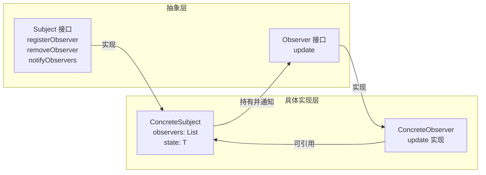
```mermaid
graph LR
    subgraph Abstract[抽象层]
        direction TB
        S[Subject 接口<br/>registerObserver<br/>removeObserver<br/>notifyObservers]
        O[Observer 接口<br/>update]
    end

    subgraph Concrete[具体实现层]
        direction TB
        CS[ConcreteSubject<br/>observers: List<br/>state: T]
        CO[ConcreteObserver<br/>update 实现]
    end

    S -->|实现| CS
    O -->|实现| CO
    CS -->|持有并通知| O
    CO -->|可引用| CS

```

**四个角色说明：**

1. **Subject（抽象主题）**：定义注册、移除、通知三个核心方法的接口。
2. **ConcreteSubject（具体主题）**：维护 Observer 列表和内部状态，状态变化时调用 `notifyObservers()`。
3. **Observer（抽象观察者）**：定义 `update()` 回调接口。
4. **ConcreteObserver（具体观察者）**：实现 `update()`，执行自身的业务逻辑。

下面是 Kotlin 的完整实现：

```kotlin
// ==================== 抽象层 ====================

// 观察者接口：泛型 T 表示接收的数据类型
interface Observer<T> {
    // 当被观察者状态变化时，此方法被回调
    fun update(data: T)
}

// 被观察者接口：定义注册、移除、通知的契约
interface Subject<T> {
    // 注册一个观察者
    fun registerObserver(observer: Observer<T>)
    // 移除一个观察者
    fun removeObserver(observer: Observer<T>)
    // 通知所有已注册的观察者
    fun notifyObservers()
}

// ==================== 具体实现层 ====================

// 具体被观察者：天气数据站
class WeatherStation : Subject<Float> {

    // 内部维护的观察者列表（线程安全可使用 CopyOnWriteArrayList）
    private val observers = mutableListOf<Observer<Float>>()

    // 内部状态：当前温度
    var temperature: Float = 0f
        // 自定义 setter：每次赋值时自动通知所有观察者
        set(value) {
            field = value            // 更新内部状态
            notifyObservers()        // 状态变化 -> 触发通知
        }

    // 将观察者加入列表
    override fun registerObserver(observer: Observer<Float>) {
        observers.add(observer)      // 添加到列表末尾
    }

    // 将观察者从列表移除
    override fun removeObserver(observer: Observer<Float>) {
        observers.remove(observer)   // 从列表中删除
    }

    // 遍历列表，逐一通知
    override fun notifyObservers() {
        // toList() 创建快照，防止遍历中修改列表导致 ConcurrentModificationException
        observers.toList().forEach { observer ->
            observer.update(temperature) // 推送最新温度值
        }
    }
}

// 具体观察者：手机显示面板
class PhoneDisplay(private val name: String) : Observer<Float> {
    // 收到通知时的处理逻辑
    override fun update(data: Float) {
        println("[$name] 收到新温度: ${data}°C")  // 展示最新数据
    }
}
```

使用方式：

```kotlin
fun main() {
    val station = WeatherStation()          // 创建被观察者

    val phone = PhoneDisplay("手机")         // 创建观察者 A
    val widget = PhoneDisplay("桌面小组件")   // 创建观察者 B

    station.registerObserver(phone)          // 注册观察者 A
    station.registerObserver(widget)         // 注册观察者 B

    station.temperature = 25.5f              // 状态变化 -> 自动通知
    // 输出:
    // [手机] 收到新温度: 25.5°C
    // [桌面小组件] 收到新温度: 25.5°C

    station.removeObserver(widget)           // 注销观察者 B
    station.temperature = 30.0f              // 再次变化 -> 只通知 A
    // 输出:
    // [手机] 收到新温度: 30.0°C
}
```

> **关键设计要点**：`notifyObservers()` 中使用 `toList()` 创建快照进行遍历，是一种防御性编程技巧。因为在通知过程中，某个 Observer 的 `update()` 方法可能会调用 `removeObserver()` 注销自身，导致在遍历列表时修改列表，抛出 `ConcurrentModificationException`。实际生产环境中也可以使用 `CopyOnWriteArrayList` 来解决。

### Android 应用 ⭐⭐

观察者模式是 Android 生态中应用最广泛的设计模式，几乎贯穿了从 UI 层到架构层的各个环节。下面逐一深入分析五个典型应用。

#### LiveData — 生命周期感知的观察者

`LiveData` 是 Android Jetpack Architecture Components 中的核心类，它是一个 **可观察的数据持有者（observable data holder）**，同时具备 **生命周期感知（Lifecycle-aware）** 能力。这意味着 LiveData 只会在 Observer 所绑定的 LifecycleOwner（如 Activity、Fragment）处于 **STARTED 或 RESUMED 状态** 时才分发数据更新，自动避免了内存泄漏和因组件已销毁而导致的崩溃。

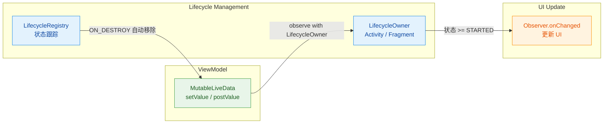
```mermaid
graph LR
    subgraph ViewModel层[ViewModel]
        direction TB
        LD[MutableLiveData<br/>setValue / postValue]
    end

    subgraph Lifecycle层[Lifecycle Management]
        direction TB
        LC[LifecycleOwner<br/>Activity / Fragment]
        LR[LifecycleRegistry<br/>状态跟踪]
    end

    subgraph UI层[UI Update]
        direction TB
        OB[Observer.onChanged<br/>更新 UI]
    end

    LD -->|observe with LifecycleOwner| LC
    LC -->|状态 >= STARTED| OB
    LR -->|ON_DESTROY 自动移除| LD

    classDef vmStyle fill:#E8F5E9,stroke:#43A047,color:#1B5E20
    classDef lcStyle fill:#E3F2FD,stroke:#1E88E5,color:#0D47A1
    classDef uiStyle fill:#FFF3E0,stroke:#FB8C00,color:#E65100
    class LD vmStyle
    class LC,LR lcStyle
    class OB uiStyle
```

**LiveData 的核心原理解析：**

LiveData 内部维护了一个 `SafeIterableMap<Observer, ObserverWrapper>` 结构。每当调用 `observe()` 时，LiveData 会将传入的 Observer 包裹成一个 `LifecycleBoundObserver`（它同时实现了 `LifecycleEventObserver`），然后注册到 LifecycleOwner 的 Lifecycle 上。这样，当 Lifecycle 状态变化时，`LifecycleBoundObserver` 会自动判断是否应该将 Observer 标记为 active。

```java
// Android Framework 源码简化版 —— LiveData.observe()
@MainThread
public void observe(@NonNull LifecycleOwner owner, @NonNull Observer<? super T> observer) {
    // 强制在主线程调用
    assertMainThread("observe");
    // 如果 LifecycleOwner 已经 DESTROYED，直接忽略本次注册
    if (owner.getLifecycle().getCurrentState() == DESTROYED) {
        return;                          // 防止对已销毁组件注册观察者
    }
    // 将 Observer 包裹为具有生命周期感知能力的 LifecycleBoundObserver
    LifecycleBoundObserver wrapper = new LifecycleBoundObserver(owner, observer);
    // 存入 Map，如果已存在则返回旧值
    ObserverWrapper existing = mObservers.putIfAbsent(observer, wrapper);
    // 如果该 Observer 已经绑定了其他 LifecycleOwner，抛出异常
    if (existing != null && !existing.isAttachedTo(owner)) {
        throw new IllegalArgumentException("Cannot add the same observer"
                + " with different lifecycles");
    }
    if (existing != null) {
        return;                          // 已经注册过，直接返回
    }
    // 将 wrapper 注册为 Lifecycle 的观察者，监听生命周期事件
    owner.getLifecycle().addObserver(wrapper);
}
```

**setValue vs postValue：**

```kotlin
class MyViewModel : ViewModel() {
    // 对外暴露不可变的 LiveData（封装原则）
    private val _userName = MutableLiveData<String>()  // 内部可变
    val userName: LiveData<String> get() = _userName    // 外部只读

    // 主线程更新数据 —— 同步分发
    fun updateNameOnMain(name: String) {
        _userName.value = name         // 等价于 setValue()，必须在主线程
    }

    // 子线程更新数据 —— 通过 Handler 切换到主线程后分发
    fun updateNameFromBackground(name: String) {
        _userName.postValue(name)      // 内部通过主线程 Handler post Runnable
    }
}

// Activity 中注册观察者
class MyActivity : AppCompatActivity() {
    private val viewModel: MyViewModel by viewModels()  // 获取 ViewModel 实例

    override fun onCreate(savedInstanceState: Bundle?) {
        super.onCreate(savedInstanceState)
        // observe() 传入 this（LifecycleOwner），绑定生命周期
        viewModel.userName.observe(this) { name ->
            // 只在 STARTED / RESUMED 时回调
            binding.tvName.text = name   // 安全更新 UI
        }
    }
}
```

**LiveData 的粘性事件问题（Sticky Event）：** LiveData 有一个被广泛讨论的特性——当新的 Observer 注册时，如果 LiveData 已经持有数据（version > Observer 的 lastVersion），会**立即**将最新值分发给新 Observer。这在某些场景下是期望的（如屏幕旋转恢复数据），但在事件总线类场景（如导航事件、弹窗事件）中会导致**重复消费**。常见的解决方案包括使用 `SingleLiveEvent`（Google 官方 Sample）或 Kotlin `Channel` / `SharedFlow`。

---

#### RxJava — 响应式编程的观察者

RxJava 是 **Reactive Extensions** 在 JVM 上的实现，它将观察者模式扩展为一套完整的响应式编程框架。RxJava 的核心抽象是 `Observable`（被观察者）和 `Observer`（观察者），但它在经典观察者模式之上增加了三个关键能力：**操作符链式变换（Operators）**、**线程调度（Schedulers）** 和 **背压处理（Backpressure）**。

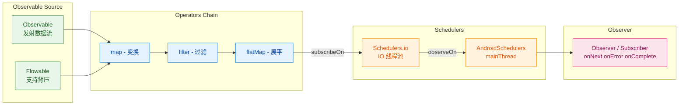
```mermaid
graph LR
    subgraph 数据源[Observable Source]
        direction TB
        OB[Observable<br/>发射数据流]
        FL[Flowable<br/>支持背压]
    end

    subgraph 操作符链[Operators Chain]
        direction TB
        MAP[map - 变换]
        FIL[filter - 过滤]
        FM[flatMap - 展平]
    end

    subgraph 调度器[Schedulers]
        direction TB
        IO[Schedulers.io<br/>IO 线程池]
        MAIN[AndroidSchedulers<br/>mainThread]
    end

    subgraph 消费端[Observer]
        direction TB
        SUB[Observer / Subscriber<br/>onNext onError onComplete]
    end

    OB --> MAP
    FL --> MAP
    MAP --> FIL
    FIL --> FM
    FM -->|subscribeOn| IO
    IO -->|observeOn| MAIN
    MAIN --> SUB

    classDef srcStyle fill:#E8F5E9,stroke:#43A047,color:#1B5E20
    classDef opStyle fill:#E3F2FD,stroke:#1E88E5,color:#0D47A1
    classDef schStyle fill:#FFF3E0,stroke:#FB8C00,color:#E65100
    classDef subStyle fill:#FCE4EC,stroke:#E91E63,color:#880E4F
    class OB,FL srcStyle
    class MAP,FIL,FM opStyle
    class IO,MAIN schStyle
    class SUB subStyle
```

RxJava 观察者模式的完整生命周期包含四个回调：

- `onSubscribe(Disposable d)` — 订阅建立时触发，拿到 Disposable 可用于后续取消订阅
- `onNext(T item)` — 每次数据发射时触发（可多次调用）
- `onError(Throwable e)` — 发生错误时触发（终止事件，与 onComplete 互斥）
- `onComplete()` — 数据流正常结束时触发（终止事件）

```kotlin
// RxJava 在 Android 中的典型使用模式
class UserRepository @Inject constructor(
    private val apiService: ApiService       // Retrofit 接口
) {
    // 返回 Observable 数据流
    fun fetchUsers(): Observable<List<User>> {
        return apiService.getUsers()          // Retrofit 返回 Observable
            .map { response ->                // map 操作符：变换数据
                response.data                 // 从 Response 中提取 data 字段
            }
            .filter { users ->                // filter 操作符：过滤
                users.isNotEmpty()            // 只放行非空列表
            }
            .subscribeOn(Schedulers.io())     // 指定上游在 IO 线程执行
            .observeOn(AndroidSchedulers.mainThread()) // 指定下游在主线程回调
    }
}

// 在 ViewModel 或 Activity 中订阅
class UserViewModel : ViewModel() {

    private val compositeDisposable = CompositeDisposable() // 统一管理所有订阅

    fun loadUsers() {
        val disposable = repository.fetchUsers()
            .subscribe(                          // 订阅 = 建立观察关系
                { users ->                       // onNext：成功接收数据
                    _usersLiveData.value = users // 更新 LiveData
                },
                { error ->                       // onError：异常处理
                    Log.e("VM", "加载失败", error)
                },
                {                                // onComplete：流结束
                    Log.d("VM", "数据加载完成")
                }
            )
        compositeDisposable.add(disposable)      // 加入管理容器
    }

    override fun onCleared() {
        super.onCleared()
        compositeDisposable.clear()              // ViewModel 销毁时取消所有订阅，防止内存泄漏
    }
}
```

**RxJava vs LiveData 的本质对比：**

| 维度 | LiveData | RxJava |
|------|----------|--------|
| **定位** | 生命周期感知的数据持有者 | 通用响应式编程框架 |
| **线程安全** | `setValue` 主线程 / `postValue` 任意线程 | `subscribeOn` / `observeOn` 灵活调度 |
| **操作符** | 仅 `map` / `switchMap` 等少量 Transformations | 数百个操作符（map, flatMap, zip, debounce...） |
| **生命周期** | 自动感知，ON_DESTROY 时自动移除 | 需手动 `dispose()` 或借助 `AutoDispose` 等库 |
| **背压** | 不支持 | `Flowable` 完整支持 |
| **适用场景** | UI 层数据观察 | 复杂异步流、数据管道 |

---

#### EventBus — 基于事件总线的观察者

EventBus（以 greenrobot/EventBus 为代表）是一个轻量级的发布/订阅事件总线框架。它将观察者模式的应用范围从"对象级"提升到了"组件级"——任意 Android 组件（Activity、Fragment、Service 等）都可以在不持有彼此引用的情况下进行通信。

EventBus 的运作机制可以归纳为三步：**定义事件 → 注册订阅 → 发送事件**。

```kotlin
// ========== Step 1: 定义事件类 ==========
// 事件就是一个普通的数据类，无需继承任何基类
data class MessageEvent(
    val message: String,        // 消息内容
    val timestamp: Long         // 时间戳
)

// ========== Step 2: 在接收端注册 / 注销 ==========
class ChatActivity : AppCompatActivity() {

    override fun onStart() {
        super.onStart()
        // 注册当前 Activity 为订阅者
        EventBus.getDefault().register(this)
    }

    override fun onStop() {
        super.onStop()
        // 注销订阅，防止内存泄漏（必须与 register 配对）
        EventBus.getDefault().unregister(this)
    }

    // 使用 @Subscribe 注解标记事件处理方法
    // threadMode 指定回调线程：MAIN 表示在主线程执行
    @Subscribe(threadMode = ThreadMode.MAIN)
    fun onMessageReceived(event: MessageEvent) {
        // 收到事件后更新 UI
        binding.tvMessage.text = event.message
    }
}

// ========== Step 3: 在发送端发布事件 ==========
class MessageService : Service() {
    fun handleNewMessage(msg: String) {
        // 发布事件 —— 所有已注册且订阅了 MessageEvent 的组件都会收到
        EventBus.getDefault().post(
            MessageEvent(msg, System.currentTimeMillis())
        )
    }
}
```

**EventBus 的内部原理简述：** EventBus 在 `register()` 时通过**反射**（或编译时注解处理器 EventBusAnnotationProcessor 生成的索引）扫描订阅者类中所有带 `@Subscribe` 注解的方法，并按事件类型建立一个 `Map<EventType, List<Subscription>>` 的映射表。当 `post(event)` 被调用时，根据 event 的 Class 类型找到所有匹配的 Subscription，按照 `threadMode` 决定在哪个线程执行回调。

**EventBus 的线程模式：**

| ThreadMode | 描述 |
|------------|------|
| `POSTING` | 在发布事件的线程直接执行（默认，最快） |
| `MAIN` | 切换到主线程执行（如果已在主线程则直接调用） |
| `MAIN_ORDERED` | 切换到主线程，但通过 Handler.post() 排队执行 |
| `BACKGROUND` | 如果发布线程是主线程，则切到后台线程；否则直接执行 |
| `ASYNC` | 始终在独立线程执行（使用线程池） |

> **⚠️ 现代 Android 开发的趋势**：EventBus 虽然简单易用，但存在几个问题：事件流难以追踪调试、类型安全依赖运行时反射、事件类容易膨胀。目前 Google 推荐使用 **SharedFlow / StateFlow** 或 **LiveData** 配合 ViewModel 进行组件间通信，EventBus 在新项目中的使用已逐渐减少。

---

#### 广播 (BroadcastReceiver) — Android Framework 级别的观察者

Android 的广播机制是观察者模式在 **系统级 (System-level)** 的实现。`BroadcastReceiver` 就是 Observer，`sendBroadcast()` 的调用者就是 Subject，而 Android 系统的 `ActivityManagerService (AMS)` 充当了中间的**消息调度中心**。

广播分为两大类：

- **系统广播 (System Broadcasts)**：由系统发出，如网络变化 (`CONNECTIVITY_CHANGE`)、电量低 (`BATTERY_LOW`)、屏幕开关等。
- **自定义广播 (Custom Broadcasts)**：由应用自行定义并发送，用于应用内或跨应用通信。

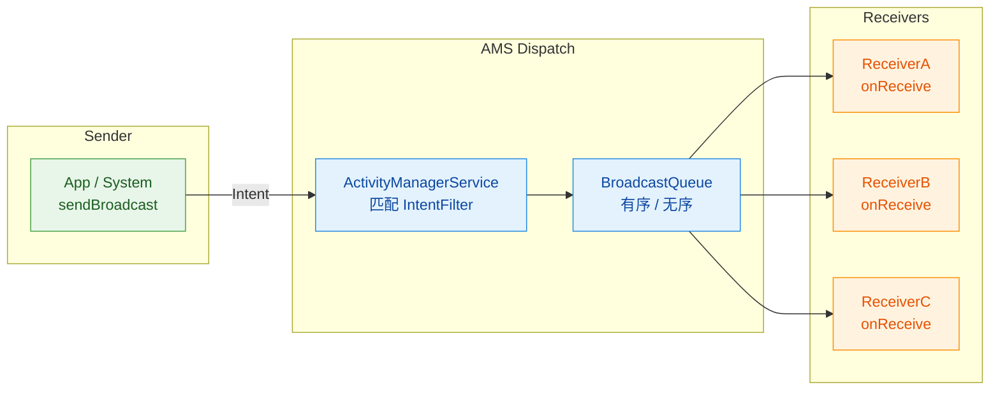
```mermaid
graph LR
    subgraph 发送端[Sender]
        direction TB
        APP[App / System<br/>sendBroadcast]
    end

    subgraph Framework层[AMS Dispatch]
        direction TB
        AMS[ActivityManagerService<br/>匹配 IntentFilter]
        Q[BroadcastQueue<br/>有序 / 无序]
    end

    subgraph 接收端[Receivers]
        direction TB
        R1[ReceiverA<br/>onReceive]
        R2[ReceiverB<br/>onReceive]
        R3[ReceiverC<br/>onReceive]
    end

    APP -->|Intent| AMS
    AMS --> Q
    Q --> R1
    Q --> R2
    Q --> R3

    classDef sendStyle fill:#E8F5E9,stroke:#43A047,color:#1B5E20
    classDef fwStyle fill:#E3F2FD,stroke:#1E88E5,color:#0D47A1
    classDef recvStyle fill:#FFF3E0,stroke:#FB8C00,color:#E65100
    class APP sendStyle
    class AMS,Q fwStyle
    class R1,R2,R3 recvStyle
```

广播注册有两种方式：

```kotlin
// ========== 方式 1: 动态注册 (推荐，生命周期可控) ==========
class NetworkActivity : AppCompatActivity() {

    // 定义 BroadcastReceiver（Observer）
    private val networkReceiver = object : BroadcastReceiver() {
        override fun onReceive(context: Context, intent: Intent) {
            // 收到广播时的回调处理
            val isConnected = intent.getBooleanExtra("is_connected", false)
            updateNetworkUI(isConnected)     // 更新 UI 状态
        }
    }

    override fun onResume() {
        super.onResume()
        // 创建 IntentFilter，指定要监听的广播 Action
        val filter = IntentFilter("android.net.conn.CONNECTIVITY_CHANGE")
        // 动态注册广播接收器
        registerReceiver(networkReceiver, filter)
    }

    override fun onPause() {
        super.onPause()
        // 动态注册必须手动注销，否则内存泄漏
        unregisterReceiver(networkReceiver)
    }
}

// ========== 方式 2: 静态注册 (AndroidManifest.xml) ==========
// 适用于即使 App 未运行也需要接收的广播 (Android 8.0+ 严格限制)
```

```xml
<!-- AndroidManifest.xml 中静态注册 -->
<receiver
    android:name=".BootReceiver"
    android:exported="true">
    <intent-filter>
        <!-- 监听开机完成广播 -->
        <action android:name="android.intent.action.BOOT_COMPLETED"/>
    </intent-filter>
</receiver>
```

**LocalBroadcastManager（已废弃但值得了解）：** 早期 Android 为了实现应用内广播（不跨进程），提供了 `LocalBroadcastManager`。它内部本质是一个进程内的观察者模式实现（基于 Handler），比系统广播效率更高且更安全。但自 AndroidX 1.1.0 起已被标记为 `@Deprecated`，官方建议用 `LiveData` 或 `SharedFlow` 替代。

> **广播 vs EventBus vs LiveData**：系统广播适合监听系统级事件（且可以跨进程）；EventBus 适合组件间解耦通信但缺乏生命周期管理；LiveData 适合 UI 层与 ViewModel 之间的数据观察且自带生命周期感知。在现代 MVVM 架构中，LiveData / StateFlow 是首选。

---

#### OnClickListener — 最直观的观察者模式

`View.OnClickListener` 是每个 Android 开发者最早接触的观察者模式实例。它的模型极其简单：**View 是 Subject，OnClickListener 是 Observer**，当用户点击 View 时，View 通知已注册的 Listener。

```kotlin
// 经典写法
val button = findViewById<Button>(R.id.btn_submit)  // 获取 View（Subject）

// 设置点击监听器 —— 注册 Observer
button.setOnClickListener { view ->
    // 这里是 Observer 的 update() 回调
    handleSubmit()                                   // 处理点击事件
}
```

让我们深入 Android Framework 源码，看看 `setOnClickListener` 的内部实现：

```java
// android.view.View 源码（简化版）
public class View {
    // View 内部持有的 ListenerInfo 对象，集中管理所有监听器
    ListenerInfo mListenerInfo;

    // 获取或创建 ListenerInfo
    ListenerInfo getListenerInfo() {
        if (mListenerInfo != null) {
            return mListenerInfo;                    // 已存在直接返回
        }
        mListenerInfo = new ListenerInfo();          // 延迟初始化
        return mListenerInfo;
    }

    // 注册点击监听器 —— 观察者模式的 registerObserver
    public void setOnClickListener(OnClickListener l) {
        if (!isClickable()) {
            setClickable(true);                      // 如果 View 不可点击，自动设为可点击
        }
        getListenerInfo().mOnClickListener = l;      // 保存监听器引用
    }

    // 执行点击回调 —— 观察者模式的 notifyObservers
    public boolean performClick() {
        final boolean result;
        final ListenerInfo li = mListenerInfo;       // 取出 ListenerInfo
        if (li != null && li.mOnClickListener != null) {
            playSoundEffect(SoundEffectConstants.CLICK); // 播放点击音效
            li.mOnClickListener.onClick(this);        // 回调 Observer 的 onClick()
            result = true;
        } else {
            result = false;
        }
        return result;
    }
}
```

注意一个有趣的设计差异：`setOnClickListener` 是**一对一**的（set 而非 add），每次调用会覆盖之前的 Listener。而经典观察者模式通常是一对多的。这是因为在 UI 层面，一个按钮同时有多个点击处理逻辑在绝大多数场景下是不合理的，用 set 语义更简洁也更安全。

但 View 也有真正的一对多观察者的场景——比如 `ViewTreeObserver`：

```kotlin
// ViewTreeObserver —— 真正的一对多观察者
val view = findViewById<View>(R.id.my_view)
// 添加全局布局监听器（一对多：可以 add 多个）
view.viewTreeObserver.addOnGlobalLayoutListener {
    // 当 View Tree 完成布局计算后回调
    val width = view.measuredWidth                   // 此时可以获取到真实宽高
    val height = view.measuredHeight
}
```

**各种 Listener 的观察者模式映射总结：**

```kotlin
// 一对一观察（set 语义）
// view.setOnClickListener { }        // 点击
// view.setOnLongClickListener { }    // 长按
// view.setOnTouchListener { }        // 触摸

// 一对多观察（add 语义）
// viewTreeObserver.addOnGlobalLayoutListener { }         // 布局完成
// viewTreeObserver.addOnPreDrawListener { }              // 绘制前
// animation.addListener(object : AnimatorListener { })   // 动画状态
```

---

### 观察者模式在 Android 中的全景图

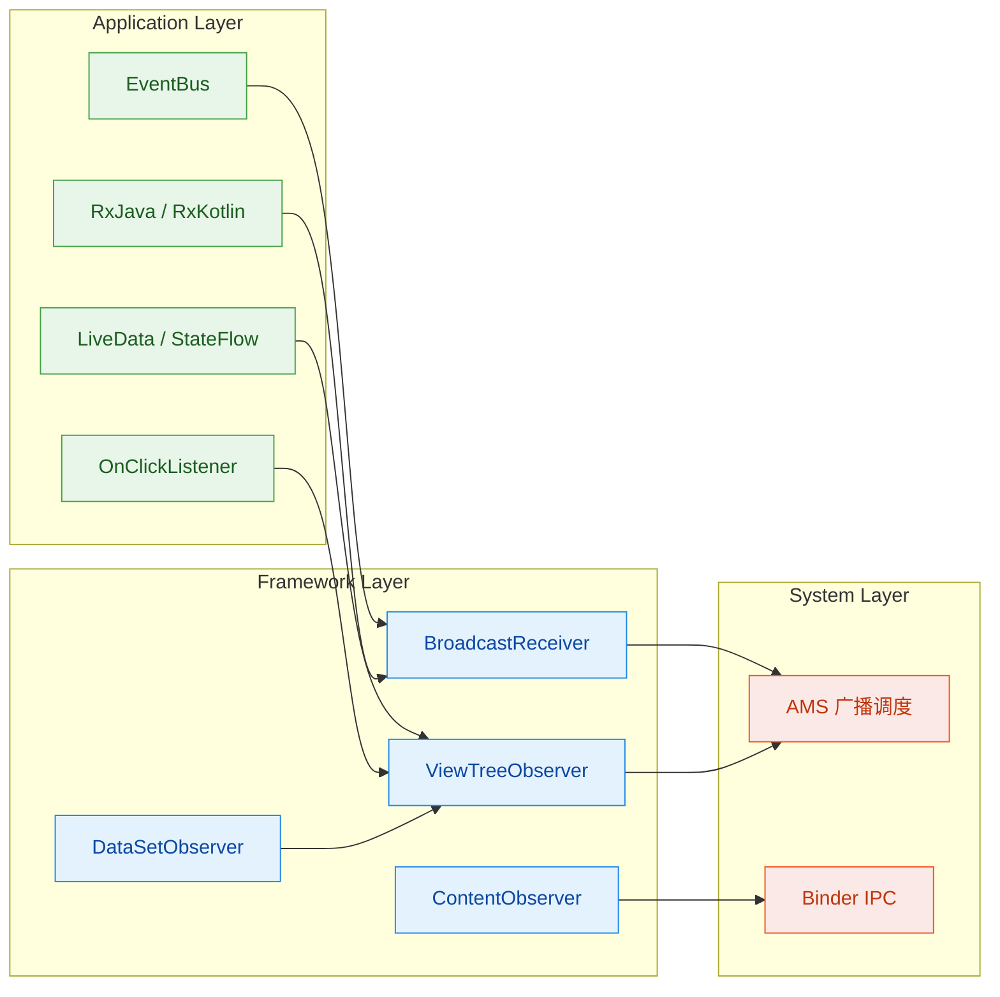
```mermaid
graph LR
    subgraph 应用层[Application Layer]
        direction TB
        LD[LiveData / StateFlow]
        EB[EventBus]
        RX[RxJava / RxKotlin]
        CL[OnClickListener]
    end

    subgraph 框架层[Framework Layer]
        direction TB
        BR[BroadcastReceiver]
        CO[ContentObserver]
        DB[DataSetObserver]
        VT[ViewTreeObserver]
    end

    subgraph 系统层[System Layer]
        direction TB
        AMS[AMS 广播调度]
        BI[Binder IPC]
    end

    LD --> VT
    EB --> BR
    RX --> BR
    CL --> VT
    BR --> AMS
    CO --> BI
    DB --> VT
    VT --> AMS

    classDef appStyle fill:#E8F5E9,stroke:#43A047,color:#1B5E20
    classDef fwStyle fill:#E3F2FD,stroke:#1E88E5,color:#0D47A1
    classDef sysStyle fill:#FBE9E7,stroke:#F4511E,color:#BF360C
    class LD,EB,RX,CL appStyle
    class BR,CO,DB,VT fwStyle
    class AMS,BI sysStyle
```

除了上述五个重点之外，Android Framework 中还有更多观察者模式的身影：

- **ContentObserver**：监听 ContentProvider 数据变化，当另一个进程的数据库数据更新时，注册了 `ContentObserver` 的组件会收到 `onChange()` 回调。
- **DataSetObserver**：`Adapter` 内部使用，当调用 `notifyDataSetChanged()` 时，ListView / Spinner 等 AdapterView 通过 DataSetObserver 接收通知并刷新 UI。
- **SharedPreferences.OnSharedPreferenceChangeListener**：监听 SP 键值对变化。
- **PhoneStateListener / TelephonyCallback**：监听电话状态变化（来电、信号等）。

---

**📝 练习题**

在 Android 中，以下关于 LiveData 观察者模式的描述，哪一项是**错误**的？

A. LiveData 的 `observe()` 方法需要传入一个 `LifecycleOwner`，当该 Owner 处于 `DESTROYED` 状态时，Observer 会被自动移除


B. `setValue()` 只能在主线程调用，`postValue()` 可以在任意线程调用


C. 当新的 Observer 通过 `observe()` 注册时，如果 LiveData 已持有数据，该 Observer 不会立即收到最新值，必须等待下次 `setValue()` 调用


D. LiveData 只会在 Observer 对应的 LifecycleOwner 处于 `STARTED` 或 `RESUMED` 状态时才分发数据更新


**【答案】** C

**【解析】** LiveData 具有**粘性事件（Sticky Event）**特性。当一个新的 Observer 通过 `observe()` 注册时，LiveData 会比较自身的 `mVersion`（每次 setValue 递增）与 Observer 的 `mLastVersion`（初始为 -1）。由于新 Observer 的 `mLastVersion` 必然小于 LiveData 的 `mVersion`（只要 LiveData 曾经被设置过值），LiveData 在 Observer 变为 active 时会**立即**将当前持有的最新值分发给它。这就是所谓的"粘性"行为——observer 会收到注册之前就已经存在的数据。选项 C 描述"不会立即收到"是错误的。A、B、D 的描述均与 LiveData 的实际行为一致。

---

**📝 练习题**

某团队在使用 EventBus 时发现：Activity A `post` 了一个事件，Activity B 的 `@Subscribe` 方法却没有收到。以下哪些可能是原因？（多选）

A. Activity B 尚未调用 `EventBus.getDefault().register(this)`


B. Activity B 的 `@Subscribe` 方法的参数类型与 post 的事件类型不匹配


C. Activity B 的 `@Subscribe` 方法被声明为 `private`


D. Activity B 的 `threadMode` 设置为 `ThreadMode.ASYNC`


**【答案】** A、B、C

**【解析】** EventBus 的事件分发依赖三个条件：① 订阅者必须已 `register`（A 正确，未注册则不在分发列表中）；② 事件类型必须完全匹配，EventBus 根据 `event.getClass()` 查找订阅方法，类型不一致就找不到（B 正确）；③ EventBus 使用**反射**调用订阅方法，默认的 `SubscriberMethodFinder` 要求方法为 `public`（使用注解处理器索引时也有此限制），`private` 方法无法被反射调用或被索引发现（C 正确）。D 选项中 `ThreadMode.ASYNC` 只是指定回调在独立线程执行，不影响事件的分发逻辑，所以不是"收不到"的原因。

---

## 策略模式 (Strategy Pattern) ⭐⭐

策略模式是行为型设计模式中最"直觉友好"的一种：**把一组可互相替换的算法分别封装成独立的类，让它们可以在运行时自由切换，而不影响使用算法的客户端代码。** 其核心哲学是 —— *"变化的部分"与"不变的部分"彻底分离*。

在 Gang of Four (GoF) 的经典定义中：

> *Define a family of algorithms, encapsulate each one, and make them interchangeable. Strategy lets the algorithm vary independently from clients that use it.*

翻译成 Android 开发者的日常理解就是：当你发现一段业务逻辑存在 **多种实现方式**，并且这些方式未来极有可能继续增长时，就应该把每种实现抽取成一个"策略对象"，让调用方只跟一个统一的接口打交道。

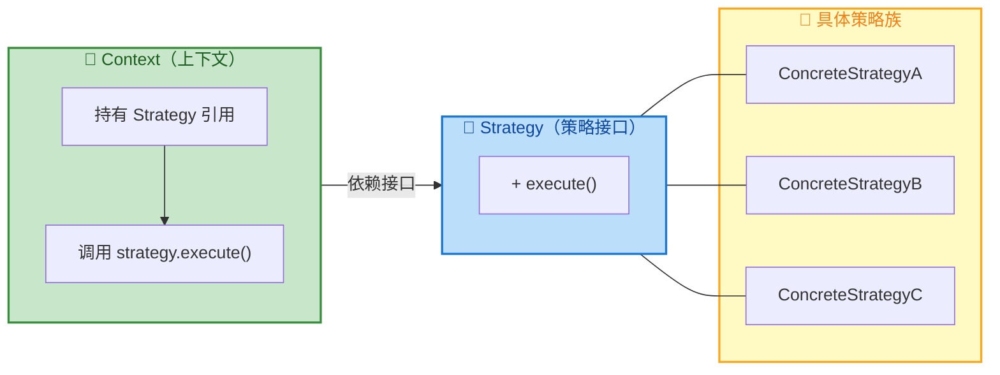
```mermaid
graph LR
    subgraph Client["🧩 Context（上下文）"]
        direction TB
        C1["持有 Strategy 引用"]
        C2["调用 strategy.execute()"]
        C1 --> C2
    end

    subgraph Interface["📐 Strategy（策略接口）"]
        direction TB
        I1["+ execute()"]
    end

    subgraph Concrete["🔧 具体策略族"]
        direction TB
        S1["ConcreteStrategyA"]
        S2["ConcreteStrategyB"]
        S3["ConcreteStrategyC"]
    end

    Client -->|"依赖接口"| Interface
    Interface --- S1
    Interface --- S2
    Interface --- S3

    classDef ctxStyle fill:#C8E6C9,stroke:#388E3C,color:#1B5E20,stroke-width:2px
    classDef ifaceStyle fill:#BBDEFB,stroke:#1976D2,color:#0D47A1,stroke-width:2px
    classDef concreteStyle fill:#FFF9C4,stroke:#F9A825,color:#F57F17,stroke-width:2px

    class Client ctxStyle
    class Interface ifaceStyle
    class Concrete concreteStyle
```

这张图清晰展示了策略模式的三大角色：**Context** 不关心具体算法实现，只通过 **Strategy 接口** 发起调用；而 **ConcreteStrategy** 各自封装了不同的算法细节。运行时，只需替换 Context 中所持有的策略对象引用，即可切换行为——这就是策略模式的全部精髓。

---

### 算法封装 (Encapsulate Algorithms)

#### 为什么要封装算法？

在没有策略模式的世界里，"不同的行为"通常直接硬编码在业务方法中。我们以一个常见场景为例——**电商平台的价格计算**：

```kotlin
// ❌ 反面示例：所有折扣逻辑混在一起
class PriceCalculator {

    // 根据用户类型计算最终价格
    fun calculate(type: String, originalPrice: Double): Double {
        return when (type) {
            "normal"  -> originalPrice                           // 普通用户：原价
            "vip"     -> originalPrice * 0.8                     // VIP：8 折
            "svip"    -> originalPrice * 0.7                     // SVIP：7 折
            "new"     -> if (originalPrice > 100)                // 新用户：满100减20
                             originalPrice - 20 
                         else originalPrice
            else      -> originalPrice
        }
    }
}
```

这段代码的问题清单：

| 问题 | 具体表现 |
|------|---------|
| **开放-封闭原则 (OCP) 违反** | 每新增一种用户类型，必须修改 `calculate` 方法本身 |
| **单一职责原则 (SRP) 违反** | 一个方法承担了所有折扣策略的计算责任 |
| **可测试性差** | 无法对某一种折扣策略做单元测试 |
| **复用性差** | 如果另一个模块也需要"VIP 折扣"，只能复制代码 |

#### 封装后的策略结构

策略模式的第一步，就是把每一种算法（折扣策略）抽取为独立的类：

```kotlin
// ============================================
// 1. 定义策略接口（算法的"契约"）
// ============================================
interface DiscountStrategy {
    // 唯一的算法方法：接收原价，返回折后价
    fun calculate(originalPrice: Double): Double
}

// ============================================
// 2. 具体策略：普通用户 — 不打折
// ============================================
class NormalDiscount : DiscountStrategy {
    override fun calculate(originalPrice: Double): Double {
        return originalPrice  // 原价直接返回
    }
}

// ============================================
// 3. 具体策略：VIP — 打 8 折
// ============================================
class VipDiscount : DiscountStrategy {
    override fun calculate(originalPrice: Double): Double {
        return originalPrice * 0.8  // 原价 × 0.8
    }
}

// ============================================
// 4. 具体策略：SVIP — 打 7 折
// ============================================
class SvipDiscount : DiscountStrategy {
    override fun calculate(originalPrice: Double): Double {
        return originalPrice * 0.7  // 原价 × 0.7
    }
}

// ============================================
// 5. 具体策略：新用户 — 满100减20
// ============================================
class NewUserDiscount : DiscountStrategy {
    override fun calculate(originalPrice: Double): Double {
        // 满 100 减 20，否则原价
        return if (originalPrice > 100) originalPrice - 20.0
               else originalPrice
    }
}
```

每个策略类 **只做一件事**（SRP），且它们彼此独立，互不知晓——这就是 **算法封装** 的本质：**将"做什么"封装到接口后面，将"怎么做"隔离进各自的实现类中。**

#### 策略 vs 简单的多态

初学者常问：这和普通多态有什么区别？区别在于**组合 (Composition)** 取代了**继承 (Inheritance)**。策略模式的"算法对象"是被 Context **持有** 的，而非通过子类重写：

```text
继承方式:   Context ──extends──▶ ConcreteContextA / ConcreteContextB
策略方式:   Context ──has-a──▶ Strategy（可在运行时替换）
```

组合的优势在于：Context 的变化轴和 Strategy 的变化轴是**正交的**，可以独立演进，不会出现"类爆炸"。

---

### 运行时切换 (Runtime Switching)

封装完策略后，策略模式真正的威力在于 **Context（上下文）** 可以在 **运行时** 动态切换所持有的策略对象，而无需改动自身任何逻辑。

#### Context 的标准实现

```kotlin
// ============================================
// Context（上下文）：持有策略引用并委托执行
// ============================================
class PriceCalculator(
    // 通过构造器注入一个默认策略
    private var strategy: DiscountStrategy = NormalDiscount()
) {
    // 运行时切换策略的 setter
    fun setDiscountStrategy(newStrategy: DiscountStrategy) {
        this.strategy = newStrategy  // 替换为新的策略对象
    }

    // 对外暴露的计算方法 —— 完全委托给策略
    fun calculate(originalPrice: Double): Double {
        return strategy.calculate(originalPrice)  // 具体算法由策略决定
    }
}
```

调用方只需在合适的时机切换策略：

```kotlin
fun main() {
    val calculator = PriceCalculator()           // 默认普通用户策略

    // —— 场景 1：普通用户下单 ——
    val price1 = calculator.calculate(200.0)     // 200.0（原价）
    println("普通用户: $price1")

    // —— 场景 2：运行时切换为 VIP 策略 ——
    calculator.setDiscountStrategy(VipDiscount()) // 动态替换！
    val price2 = calculator.calculate(200.0)      // 160.0（8折）
    println("VIP 用户: $price2")

    // —— 场景 3：再切换为新用户策略 ——
    calculator.setDiscountStrategy(NewUserDiscount())
    val price3 = calculator.calculate(200.0)      // 180.0（满100减20）
    println("新用户: $price3")
}
```

输出：

```
普通用户: 200.0
VIP 用户: 160.0
新用户: 180.0
```

整个切换过程中，`PriceCalculator` 的代码 **一行都没有改动**，变化的只是传入的策略对象——这就是**对扩展开放，对修改关闭 (Open/Closed Principle)** 的完美体现。

#### 运行时切换的时序流程

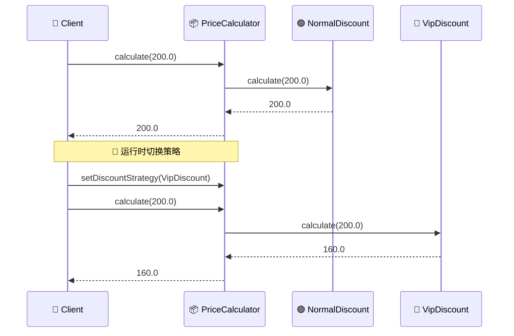
```mermaid
sequenceDiagram
    participant Client as 🧩 Client
    participant Ctx as 📦 PriceCalculator
    participant S1 as 🟢 NormalDiscount
    participant S2 as 🔵 VipDiscount

    Client->>Ctx: calculate(200.0)
    Ctx->>S1: calculate(200.0)
    S1-->>Ctx: 200.0
    Ctx-->>Client: 200.0

    Note over Client,Ctx: 🔄 运行时切换策略

    Client->>Ctx: setDiscountStrategy(VipDiscount)
    Client->>Ctx: calculate(200.0)
    Ctx->>S2: calculate(200.0)
    S2-->>Ctx: 160.0
    Ctx-->>Client: 160.0
```

在这个时序图中可以清楚看到：**Client 与 Context 之间的调用方式始终不变**，变的只是 Context 内部委托的策略对象从 `NormalDiscount` 变成了 `VipDiscount`。

#### Kotlin 的高阶函数：轻量级策略

在 Kotlin 中，当策略接口只有一个方法时（即 SAM 接口 / 函数式接口），可以直接用**高阶函数 (Higher-Order Function)** 或 **Lambda** 作为"轻量级策略"，省去创建一堆类的麻烦：

```kotlin
// ============================================
// 用函数类型代替策略接口
// ============================================
class PriceCalculatorLambda(
    // 策略直接用 (Double) -> Double 函数类型表示
    private var strategy: (Double) -> Double = { it }  // 默认：原价返回
) {
    // 运行时切换
    fun setStrategy(newStrategy: (Double) -> Double) {
        this.strategy = newStrategy
    }

    // 委托计算
    fun calculate(price: Double): Double = strategy(price)
}

fun main() {
    val calc = PriceCalculatorLambda()

    // 传入 Lambda 作为策略
    calc.setStrategy { price -> price * 0.8 }        // VIP 8 折
    println(calc.calculate(200.0))                    // 160.0

    calc.setStrategy { price ->                       // 新用户满100减20
        if (price > 100) price - 20 else price 
    }
    println(calc.calculate(200.0))                    // 180.0
}
```

这种写法在 Android 开发中极为常见。比如 `RecyclerView.Adapter` 中的 `DiffUtil.ItemCallback`、`Comparator` 排序策略等，都可以用 Lambda 快速注入。

> **经验法则**：策略接口方法 ≤ 2 个时，Kotlin Lambda 优先；策略逻辑复杂、需要状态或依赖注入时，用完整的策略类。

---

### 消除 if-else (Eliminating Conditionals)

策略模式最被称赞的实战价值之一，就是 **用多态替代条件分支**。下面我们通过一个完整的重构过程来体会这一点。

#### 重构前：令人绝望的 if-else 地狱

假设我们要根据不同的支付渠道执行不同的支付逻辑：

```kotlin
// ❌ 令人窒息的 if-else 地狱
class PaymentService {

    fun pay(channel: String, amount: Double) {
        if (channel == "alipay") {
            // 支付宝：30 行复杂逻辑...
            println("调用支付宝 SDK，金额：$amount")
        } else if (channel == "wechat") {
            // 微信支付：40 行复杂逻辑...
            println("调用微信支付 SDK，金额：$amount")
        } else if (channel == "unionpay") {
            // 银联支付：50 行复杂逻辑...
            println("调用银联 SDK，金额：$amount")
        } else if (channel == "paypal") {
            // PayPal：35 行复杂逻辑...
            println("调用 PayPal SDK，金额：$amount")
        }
        // 每增加一种支付渠道，这里就要再加一个 else-if...
    }
}
```

这段代码的 **圈复杂度 (Cyclomatic Complexity)** 随支付渠道数量线性增长，维护成本越来越高。

#### 重构后：策略 + 工厂

```kotlin
// ============================================
// Step 1: 策略接口
// ============================================
interface PaymentStrategy {
    fun pay(amount: Double)  // 执行支付
}

// ============================================
// Step 2: 各渠道具体策略
// ============================================
class AlipayStrategy : PaymentStrategy {
    override fun pay(amount: Double) {
        // 调用支付宝 SDK 的完整逻辑
        println("✅ 支付宝支付：$amount 元")
    }
}

class WechatPayStrategy : PaymentStrategy {
    override fun pay(amount: Double) {
        // 调用微信支付 SDK 的完整逻辑
        println("✅ 微信支付：$amount 元")
    }
}

class UnionPayStrategy : PaymentStrategy {
    override fun pay(amount: Double) {
        // 调用银联 SDK 的完整逻辑
        println("✅ 银联支付：$amount 元")
    }
}

// ============================================
// Step 3: 策略注册表（消除选择分支）
// ============================================
object PaymentStrategyFactory {
    // 用 Map 把 channel 名称映射到具体策略实例
    private val strategies = mutableMapOf<String, PaymentStrategy>(
        "alipay"   to AlipayStrategy(),      // 注册支付宝
        "wechat"   to WechatPayStrategy(),   // 注册微信
        "unionpay" to UnionPayStrategy()     // 注册银联
    )

    // 支持动态注册新渠道（不修改任何已有代码！）
    fun register(channel: String, strategy: PaymentStrategy) {
        strategies[channel] = strategy
    }

    // 根据 channel 获取对应策略
    fun get(channel: String): PaymentStrategy {
        return strategies[channel]
            ?: throw IllegalArgumentException("未知支付渠道: $channel")
    }
}

// ============================================
// Step 4: 重构后的 PaymentService（零 if-else！）
// ============================================
class PaymentService {
    fun pay(channel: String, amount: Double) {
        // 从工厂获取策略 → 直接执行，没有任何条件判断
        val strategy = PaymentStrategyFactory.get(channel)
        strategy.pay(amount)
    }
}
```

通过 **策略模式 + 策略工厂（Map 注册表）**，原本的 if-else 链彻底消失了。新增支付渠道时，只需：① 创建新的策略类；② 在工厂中注册。**不需要修改 `PaymentService` 的任何一行代码。**

#### 重构前后对比

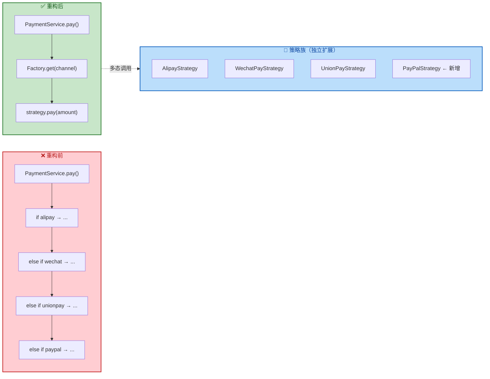
```mermaid
graph LR
    subgraph Before["❌ 重构前"]
        direction TB
        B1["PaymentService.pay()"]
        B2["if alipay → ..."]
        B3["else if wechat → ..."]
        B4["else if unionpay → ..."]
        B5["else if paypal → ..."]
        B1 --> B2 --> B3 --> B4 --> B5
    end

    subgraph After["✅ 重构后"]
        direction TB
        A1["PaymentService.pay()"]
        A2["Factory.get(channel)"]
        A3["strategy.pay(amount)"]
        A1 --> A2 --> A3
    end

    subgraph Strategies["🔧 策略族（独立扩展）"]
        direction TB
        S1["AlipayStrategy"]
        S2["WechatPayStrategy"]
        S3["UnionPayStrategy"]
        S4["PayPalStrategy ← 新增"]
    end

    After -.->|"多态调用"| Strategies

    classDef badStyle fill:#FFCDD2,stroke:#C62828,color:#B71C1C,stroke-width:2px
    classDef goodStyle fill:#C8E6C9,stroke:#2E7D32,color:#1B5E20,stroke-width:2px
    classDef stratStyle fill:#BBDEFB,stroke:#1565C0,color:#0D47A1,stroke-width:2px

    class Before badStyle
    class After goodStyle
    class Strategies stratStyle
```

| 维度 | 重构前 (if-else) | 重构后 (策略模式) |
|------|-----------------|-----------------|
| 新增渠道 | 修改 `pay()` 方法 | 新增策略类 + 注册 |
| 单元测试 | 难以隔离测试单个渠道 | 每个策略独立可测 |
| 圈复杂度 | O(n)，随渠道数增长 | O(1)，始终为常量 |
| 开闭原则 | ❌ 违反 | ✅ 遵守 |

#### 枚举 + 策略：Kotlin 特有技巧

Kotlin 的枚举可以实现接口，因此可以把"策略选择"和"策略实现"合并到枚举中：

```kotlin
// 枚举自身就是策略！
enum class Discount : DiscountStrategy {
    NORMAL {
        override fun calculate(originalPrice: Double) = originalPrice
    },
    VIP {
        override fun calculate(originalPrice: Double) = originalPrice * 0.8
    },
    SVIP {
        override fun calculate(originalPrice: Double) = originalPrice * 0.7
    };
}

// 使用时直接：
val price = Discount.VIP.calculate(200.0)  // 160.0
```

当策略数量 **有限且固定** 时，这种枚举策略非常简洁优雅。

---

### Android 应用 (动画插值器、RecyclerView.LayoutManager)

策略模式在 Android Framework 中无处不在。下面我们深入分析两个最经典的应用场景。

#### 1. 动画插值器 (Animation Interpolator)

Android 动画系统的核心问题是：**动画的进度（0→1）如何映射到可见的视觉效果？** 不同的映射函数会产生线性、加速、减速、弹性等完全不同的视觉效果。这正是策略模式的经典用武之地。

##### Framework 中的 Interpolator 接口

在 Android Framework 源码中，`Interpolator` 的继承链如下：

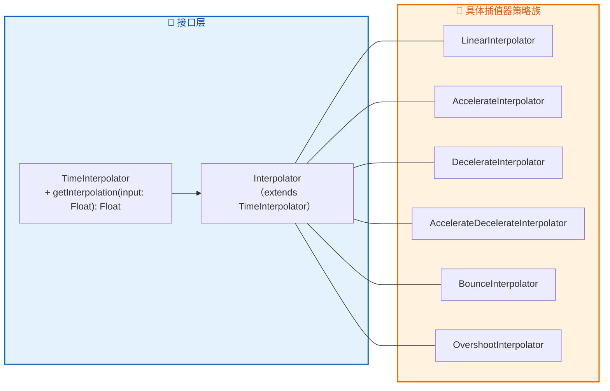
```mermaid
graph LR
    subgraph Interface["📐 接口层"]
        direction TB
        TI["TimeInterpolator<br/>+ getInterpolation(input: Float): Float"]
        I["Interpolator<br/>（extends TimeInterpolator）"]
        TI --> I
    end

    subgraph Concrete["🔧 具体插值器策略族"]
        direction TB
        L["LinearInterpolator"]
        A["AccelerateInterpolator"]
        D["DecelerateInterpolator"]
        AD["AccelerateDecelerateInterpolator"]
        B["BounceInterpolator"]
        O["OvershootInterpolator"]
    end

    I --- L
    I --- A
    I --- D
    I --- AD
    I --- B
    I --- O

    classDef ifaceStyle fill:#E3F2FD,stroke:#1565C0,color:#0D47A1,stroke-width:2px
    classDef concreteStyle fill:#FFF3E0,stroke:#EF6C00,color:#E65100,stroke-width:2px

    class Interface ifaceStyle
    class Concrete concreteStyle
```

Android Framework 中 `TimeInterpolator` 的定义极其简洁（Java 源码）：

```java
// android.animation.TimeInterpolator
// Framework 策略接口：只有一个方法
public interface TimeInterpolator {
    /**
     * @param input  动画的时间进度，范围 [0.0, 1.0]
     *               0.0 = 动画开始，1.0 = 动画结束
     * @return       映射后的插值结果，决定动画的实际位置/透明度/缩放等
     *               通常也在 [0.0, 1.0]，但可超出（如 Overshoot）
     */
    float getInterpolation(float input);
}
```

这就是策略接口！每种具体的插值器只需实现这一个方法，提供不同的数学映射：

```java
// 策略A：线性插值器 —— 匀速运动
// android.view.animation.LinearInterpolator
public class LinearInterpolator implements Interpolator {
    public float getInterpolation(float input) {
        return input;  // y = x，完全线性
    }
}

// 策略B：加速插值器 —— 越来越快
// android.view.animation.AccelerateInterpolator
public class AccelerateInterpolator implements Interpolator {
    private final float mFactor;       // 加速因子
    private final double mDoubleFactor; // 加速因子 × 2

    public AccelerateInterpolator(float factor) {
        mFactor = factor;                        // 保存加速因子
        mDoubleFactor = 2 * factor;              // 预计算
    }

    public float getInterpolation(float input) {
        // 当 factor = 1.0 时：y = x²（标准二次加速）
        // 当 factor 更大时：加速效果更明显
        if (mFactor == 1.0f) {
            return input * input;                // x² 曲线
        } else {
            return (float) Math.pow(input, mDoubleFactor); // x^(2f) 曲线
        }
    }
}

// 策略C：弹跳插值器 —— 像皮球落地一样弹跳
// android.view.animation.BounceInterpolator
public class BounceInterpolator implements Interpolator {
    public float getInterpolation(float t) {
        // 分段函数模拟弹跳物理效果
        t *= 1.1226f;                            // 缩放时间参数
        if (t < 0.3535f) {
            return bounce(t);                    // 第一次弹跳
        } else if (t < 0.7408f) {
            return bounce(t - 0.54719f) + 0.7f;  // 第二次弹跳
        } else if (t < 0.9644f) {
            return bounce(t - 0.8526f) + 0.9f;   // 第三次弹跳
        } else {
            return bounce(t - 1.0435f) + 0.95f;  // 最后一次弹跳
        }
    }

    private static float bounce(float t) {
        return t * t * 8.0f;                     // 弹跳核心公式
    }
}
```

##### 在 Animation 中切换策略

Animation（或 ObjectAnimator）就是 **Context**，它持有一个 `Interpolator` 引用：

```kotlin
// ============================================
// 运行时切换动画插值器策略
// ============================================
val animator = ObjectAnimator.ofFloat(
    myView,          // 目标 View
    "translationY",  // 动画属性
    0f,              // 起始值
    500f             // 终点值
).apply {
    duration = 1000  // 动画时长 1 秒
}

// —— 策略 1：线性匀速 ——
animator.interpolator = LinearInterpolator()
animator.start()

// —— 策略 2：切换为加速效果 ——
animator.interpolator = AccelerateInterpolator(1.5f)  // 运行时切换！
animator.start()

// —— 策略 3：切换为弹跳效果 ——
animator.interpolator = BounceInterpolator()          // 再次切换！
animator.start()
```

可以看到：`ObjectAnimator` 完全不关心插值的数学公式是什么，它只在每一帧调用 `interpolator.getInterpolation(fraction)` 获取映射值。**算法和使用者彻底解耦。**

##### 自定义插值器策略

开发者可以轻松扩展自己的插值策略：

```kotlin
// ============================================
// 自定义弹性插值器（模拟弹簧效果）
// ============================================
class SpringInterpolator(
    private val factor: Float = 0.4f  // 弹簧张力因子
) : TimeInterpolator {

    override fun getInterpolation(input: Float): Float {
        // 指数衰减 × 正弦波 = 弹簧效果
        // pow(2, -10 * input) * sin((input - factor/4) * (2*PI) / factor) + 1
        return (Math.pow(2.0, -10.0 * input)               // 指数衰减
                * Math.sin((input - factor / 4.0)           // 正弦波相位
                * (2.0 * Math.PI) / factor)                 // 正弦波周期
                + 1.0).toFloat()                            // 偏移到 1.0
    }
}

// 使用自定义策略
animator.interpolator = SpringInterpolator(0.3f)
```

**不需要修改 `ObjectAnimator` 的任何源码**，就能实现全新的动画效果——这就是策略模式的开闭原则优势。

##### 插值器与 Framework 源码的交互

我们来看 `ValueAnimator`（`ObjectAnimator` 的父类）中是如何使用策略的：

```java
// android.animation.ValueAnimator 核心源码（简化版）
// 每一帧回调此方法
void animateValue(float fraction) {
    // ① 将时间进度交给插值器策略 —— 策略模式的调用点！
    fraction = mInterpolator.getInterpolation(fraction);
    
    // ② 用插值后的 fraction 计算属性值
    mCurrentFraction = fraction;
    int numValues = mValues.length;
    for (int i = 0; i < numValues; ++i) {
        // 将插值结果传递给 PropertyValuesHolder 计算最终属性值
        mValues[i].calculateValue(fraction);
    }
    
    // ③ 通知监听器（观察者模式 + 策略模式的联合使用）
    if (mUpdateListeners != null) {
        int numListeners = mUpdateListeners.size();
        for (int i = 0; i < numListeners; ++i) {
            mUpdateListeners.get(i).onAnimationUpdate(this);
        }
    }
}
```

这段源码完美展示了策略模式的核心调用模型：`animateValue` 是**不变的算法骨架**（模板方法），而 `mInterpolator.getInterpolation()` 是**可替换的策略点**。

---

#### 2. RecyclerView.LayoutManager

`RecyclerView` 是 Android 最强大的列表控件，其核心设计哲学就是**将所有可变行为抽取为独立的策略对象**：

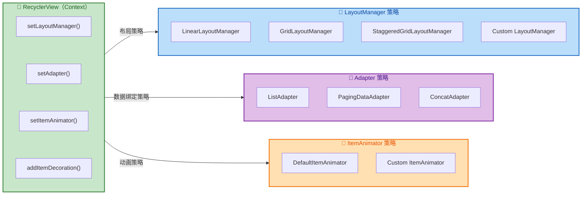
```mermaid
graph LR
    subgraph RV["🧩 RecyclerView（Context）"]
        direction TB
        R1["setLayoutManager()"]
        R2["setAdapter()"]
        R3["setItemAnimator()"]
        R4["addItemDecoration()"]
        R1 ~~~ R2 ~~~ R3 ~~~ R4
    end

    subgraph LM["📐 LayoutManager 策略"]
        direction TB
        L1["LinearLayoutManager"]
        L2["GridLayoutManager"]
        L3["StaggeredGridLayoutManager"]
        L4["Custom LayoutManager"]
    end

    subgraph AD["📐 Adapter 策略"]
        direction TB
        A1["ListAdapter"]
        A2["PagingDataAdapter"]
        A3["ConcatAdapter"]
    end

    subgraph IA["📐 ItemAnimator 策略"]
        direction TB
        I1["DefaultItemAnimator"]
        I2["Custom ItemAnimator"]
    end

    RV -->|"布局策略"| LM
    RV -->|"数据绑定策略"| AD
    RV -->|"动画策略"| IA

    classDef rvStyle fill:#C8E6C9,stroke:#2E7D32,color:#1B5E20,stroke-width:2px
    classDef lmStyle fill:#BBDEFB,stroke:#1565C0,color:#0D47A1,stroke-width:2px
    classDef adStyle fill:#E1BEE7,stroke:#7B1FA2,color:#4A148C,stroke-width:2px
    classDef iaStyle fill:#FFE0B2,stroke:#EF6C00,color:#E65100,stroke-width:2px

    class RV rvStyle
    class LM lmStyle
    class AD adStyle
    class IA iaStyle
```

`RecyclerView` 本身就是一个充满策略模式的 **策略容器**：

| 策略角色 | 接口/基类 | 职责 |
|---------|----------|------|
| **布局策略** | `LayoutManager` | 决定子 View 如何排列（线性/网格/瀑布流） |
| **数据绑定策略** | `Adapter` | 决定数据如何映射到 ViewHolder |
| **动画策略** | `ItemAnimator` | 决定增/删/改的动画效果 |
| **装饰策略** | `ItemDecoration` | 决定分割线、间距等装饰效果 |
| **滑动策略** | `SnapHelper` | 决定列表滑动对齐方式 |

##### LayoutManager：布局策略的深入分析

`LayoutManager` 是一个抽象类，核心方法：

```java
// androidx.recyclerview.widget.RecyclerView.LayoutManager（简化）
public abstract static class LayoutManager {
    
    // 核心策略方法：负责布局所有子 View
    public void onLayoutChildren(Recycler recycler, State state) {
        // 默认空实现，子类必须重写
    }

    // 是否支持水平滚动
    public boolean canScrollHorizontally() {
        return false;  // 默认不支持
    }

    // 是否支持垂直滚动
    public boolean canScrollVertically() {
        return false;  // 默认不支持
    }

    // 处理垂直滚动
    public int scrollVerticallyBy(int dy, Recycler recycler, State state) {
        return 0;      // 默认不滚动
    }

    // 生成默认的 LayoutParams
    public abstract LayoutParams generateDefaultLayoutParams();
}
```

不同的 LayoutManager 子类提供完全不同的布局算法：

```kotlin
val recyclerView = findViewById<RecyclerView>(R.id.recycler_view)

// ============================================
// 策略 1：线性列表（纵向滚动）
// ============================================
recyclerView.layoutManager = LinearLayoutManager(
    this,                             // Context
    LinearLayoutManager.VERTICAL,     // 方向：纵向
    false                             // 是否反转
)

// ============================================
// 策略 2：运行时切换为网格布局（3列）
// ============================================
recyclerView.layoutManager = GridLayoutManager(
    this,                             // Context
    3                                 // 列数
)

// ============================================
// 策略 3：运行时切换为瀑布流布局（2列）
// ============================================
recyclerView.layoutManager = StaggeredGridLayoutManager(
    2,                                           // 列数
    StaggeredGridLayoutManager.VERTICAL          // 方向
)
```

**同一个 RecyclerView、同一份数据、同一个 Adapter**，仅仅通过切换 LayoutManager 策略，就能呈现出完全不同的 UI 形态——列表、网格、瀑布流。这就是策略模式在 Android UI 层面最震撼的应用。

##### 自定义 LayoutManager

正因为是策略模式，开发者可以创建全新的布局策略：

```kotlin
// ============================================
// 自定义：轮播/旋转木马布局管理器（简化示意）
// ============================================
class CarouselLayoutManager : RecyclerView.LayoutManager() {

    // 必须实现：生成默认布局参数
    override fun generateDefaultLayoutParams(): RecyclerView.LayoutParams {
        return RecyclerView.LayoutParams(
            RecyclerView.LayoutParams.WRAP_CONTENT,    // 宽度自适应
            RecyclerView.LayoutParams.WRAP_CONTENT     // 高度自适应
        )
    }

    // 核心：自定义布局逻辑
    override fun onLayoutChildren(
        recycler: RecyclerView.Recycler,    // 回收复用器
        state: RecyclerView.State           // 列表状态
    ) {
        detachAndScrapAttachedViews(recycler)   // 1. 先回收所有已 attached 的 View

        val itemCount = state.itemCount          // 2. 获取数据总数
        if (itemCount == 0) return               // 3. 无数据直接返回

        val centerX = width / 2                  // 4. 计算 RecyclerView 中心 X
        val centerY = height / 2                 // 5. 计算 RecyclerView 中心 Y

        for (i in 0 until itemCount) {
            val view = recycler.getViewForPosition(i)  // 6. 从回收池获取 View
            addView(view)                               // 7. 添加到 RecyclerView
            measureChildWithMargins(view, 0, 0)         // 8. 测量 View

            // 9. 计算圆形排列的角度和位置
            val angle = Math.toRadians(360.0 / itemCount * i)
            val radius = width / 3                      // 旋转半径
            val x = centerX + (radius * Math.cos(angle)).toInt()
            val y = centerY + (radius * Math.sin(angle)).toInt()

            val w = getDecoratedMeasuredWidth(view)     // 10. 获取装饰后宽度
            val h = getDecoratedMeasuredHeight(view)    // 11. 获取装饰后高度

            // 12. 布局 View 到计算出的位置
            layoutDecorated(view, x - w / 2, y - h / 2, x + w / 2, y + h / 2)
        }
    }

    // 支持水平滚动
    override fun canScrollHorizontally(): Boolean = true
}

// 使用自定义策略 —— 无需修改 RecyclerView 的任何代码
recyclerView.layoutManager = CarouselLayoutManager()
```

##### RecyclerView 中策略模式的 Framework 源码分析

`RecyclerView` 是如何使用 LayoutManager 策略的？看 `onLayout` 核心源码：

```java
// androidx.recyclerview.widget.RecyclerView（简化核心链路）
@Override
protected void onLayout(boolean changed, int l, int t, int r, int b) {
    // 委托给 dispatchLayout()
    dispatchLayout();
}

void dispatchLayout() {
    // ...
    if (mState.mLayoutStep == State.STEP_START) {
        dispatchLayoutStep1();    // 处理 Adapter 更新和预布局动画
        dispatchLayoutStep2();    // 真正的布局 ← 策略调用点
    }
    dispatchLayoutStep3();        // 处理动画
}

private void dispatchLayoutStep2() {
    // ...
    mState.mInPreLayout = false;
    
    // ★★★ 策略模式核心调用 ★★★
    // RecyclerView 将真正的布局工作完全委托给 LayoutManager
    mLayout.onLayoutChildren(mRecycler, mState);
    // mLayout 就是通过 setLayoutManager() 注入的策略对象
    // ...
}
```

这段源码清晰地展示了策略模式的运作方式：`RecyclerView` 自己不做任何布局计算，而是通过 `mLayout.onLayoutChildren()` **完全委托**给 LayoutManager 策略对象。这也是为什么如果你忘记设置 LayoutManager，RecyclerView 什么都不会显示——**没有策略，Context 就不知道该怎么做。**

#### 策略模式在 Android 中的更多身影

| 应用场景 | Strategy 接口 | 具体策略示例 |
|---------|-------------|------------|
| 动画插值 | `TimeInterpolator` | `LinearInterpolator`, `BounceInterpolator` |
| 列表布局 | `LayoutManager` | `LinearLayoutManager`, `GridLayoutManager` |
| 列表对齐 | `SnapHelper` | `LinearSnapHelper`, `PagerSnapHelper` |
| 图片加载 | `DiskCacheStrategy` (Glide) | `ALL`, `NONE`, `DATA`, `RESOURCE` |
| 网络请求 | `CallAdapter.Factory` (Retrofit) | `RxJava3CallAdapterFactory`, `CoroutineCallAdapterFactory` |
| JSON 解析 | `Converter.Factory` (Retrofit) | `GsonConverterFactory`, `MoshiConverterFactory` |
| 压缩策略 | `Bitmap.CompressFormat` | `JPEG`, `PNG`, `WEBP` |
| 线程调度 | `Scheduler` (RxJava) | `Schedulers.io()`, `Schedulers.computation()`, `AndroidSchedulers.mainThread()` |

---

#### 策略模式的完整类图

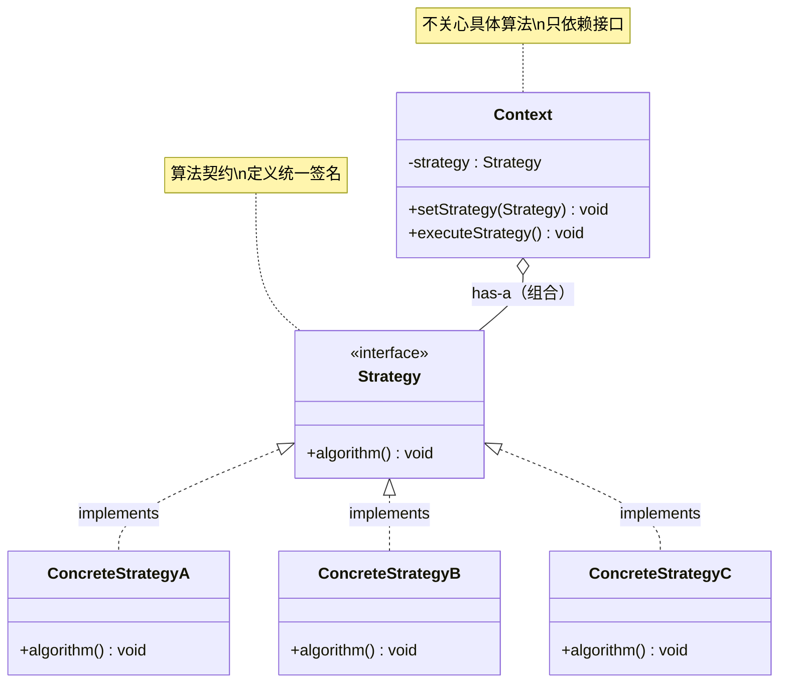
```mermaid
classDiagram
    class Context {
        -strategy : Strategy
        +setStrategy(Strategy) void
        +executeStrategy() void
    }

    class Strategy {
        <<interface>>
        +algorithm() void
    }

    class ConcreteStrategyA {
        +algorithm() void
    }

    class ConcreteStrategyB {
        +algorithm() void
    }

    class ConcreteStrategyC {
        +algorithm() void
    }

    Context o-- Strategy : has-a（组合）
    Strategy <|.. ConcreteStrategyA : implements
    Strategy <|.. ConcreteStrategyB : implements
    Strategy <|.. ConcreteStrategyC : implements

    note for Context "不关心具体算法\n只依赖接口"
    note for Strategy "算法契约\n定义统一签名"
```

#### 策略模式总结

| 要素 | 说明 |
|------|------|
| **模式意图** | 定义一系列算法，封装各自，使其可互换 |
| **核心原则** | 面向接口编程 + 组合优于继承 + 开闭原则 |
| **三大角色** | Context（持有策略）、Strategy（算法接口）、ConcreteStrategy（具体算法） |
| **适用时机** | 同一行为有多种实现，且需要运行时切换 |
| **优势** | 消除 if-else、算法可独立变化、易于测试、易于扩展 |
| **劣势** | 策略类数量增多、客户端需了解不同策略的区别 |
| **与其他模式关系** | 与工厂模式配合消除策略选择分支；与模板方法互补（模板方法用继承，策略用组合） |

---

**📝 练习题**

Android 中 `RecyclerView` 通过 `setLayoutManager()` 切换布局方式（线性/网格/瀑布流），这体现了策略模式的哪个核心特征？

A. 将算法封装为对象，通过继承实现多态，子类重写父类方法来切换算法


B. 将算法封装为独立的策略对象，Context 通过组合（has-a）方式持有策略引用，支持运行时动态替换


C. 通过 if-else 判断不同的布局类型，在 RecyclerView 内部选择对应的布局算法


D. 通过装饰器包装 RecyclerView 来添加不同的布局能力


**【答案】** B

**【解析】** 策略模式的核心在于 **组合 (Composition)** 而非继承。`RecyclerView` 并不是通过创建 `LinearRecyclerView`、`GridRecyclerView` 等子类来实现不同布局的（排除 A），而是通过持有一个 `LayoutManager` 类型的策略引用，将布局算法完全委托给这个策略对象。调用 `setLayoutManager()` 本质上就是在运行时替换策略对象——这正是选项 B 所描述的组合 + 运行时替换。选项 C 是典型的反模式（策略模式正是为了消除 if-else），选项 D 描述的是装饰器模式。在 Framework 源码中，`RecyclerView.dispatchLayoutStep2()` 会调用 `mLayout.onLayoutChildren()`，将布局工作完全委托给策略，`RecyclerView` 自身不包含任何具体的布局算法。

---

**📝 练习题**

以下关于策略模式和 Android `TimeInterpolator` 的说法，哪一项是**错误**的？

A. `TimeInterpolator` 是策略接口，`LinearInterpolator`、`AccelerateInterpolator` 等是具体策略


B. `ObjectAnimator` 扮演 Context 角色，通过 `setInterpolator()` 支持运行时切换插值策略


C. 自定义 `TimeInterpolator` 实现类后，必须修改 `ValueAnimator` 的源码才能使用新的插值器


D. `getInterpolation(float input)` 方法接收时间进度 [0,1]，返回映射后的动画进度


**【答案】** C

**【解析】** 选项 C 是错误的。策略模式的核心优势之一就是**开闭原则 (OCP)**——对扩展开放，对修改关闭。开发者只需创建一个新的类实现 `TimeInterpolator` 接口，然后通过 `animator.interpolator = MyCustomInterpolator()` 注入即可，完全不需要触碰 `ValueAnimator` 的任何源码。这正是策略模式存在的意义：让新算法的添加不影响已有的 Context 代码。选项 A 正确描述了角色映射关系；选项 B 正确指出了 Context + 运行时切换的机制；选项 D 正确描述了 `getInterpolation()` 方法的输入输出语义。

---

## 模板方法模式 (Template Method Pattern) ⭐

模板方法模式是行为型设计模式中最"润物细无声"的一种——你可能每天都在使用它，却从未意识到它的存在。当你重写 `onCreate()`、`onResume()` 时，你就已经深陷模板方法模式的精妙设计之中。

其核心哲学可以用一句话概括：**父类定义「做事的顺序」，子类决定「每一步怎么做」**。这被称为 **Hollywood Principle（好莱坞原则）**——"Don't call us, we'll call you." 子类不需要主动调用流程方法，框架（父类）会在合适的时机回调子类的实现。

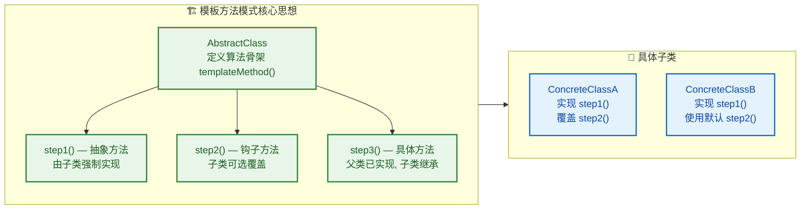
```mermaid
graph LR
    subgraph TemplateMethod["🏗️ 模板方法模式核心思想"]
        direction TB
        A["AbstractClass<br/>定义算法骨架 templateMethod()"]
        B["step1() — 抽象方法<br/>由子类强制实现"]
        C["step2() — 钩子方法<br/>子类可选覆盖"]
        D["step3() — 具体方法<br/>父类已实现, 子类继承"]
        A --> B
        A --> C
        A --> D
    end

    subgraph Concrete["🧩 具体子类"]
        direction TB
        E["ConcreteClassA<br/>实现 step1()<br/>覆盖 step2()"]
        F["ConcreteClassB<br/>实现 step1()<br/>使用默认 step2()"]
    end

    TemplateMethod --> Concrete

    classDef core fill:#E8F5E9,stroke:#2E7D32,color:#1B5E20,stroke-width:2px
    classDef sub fill:#E3F2FD,stroke:#1565C0,color:#0D47A1,stroke-width:2px
    class A,B,C,D core
    class E,F sub
```

---

### 定义算法骨架

模板方法模式的第一要义，就是在**抽象基类**中定义一个 **不可被覆盖的方法**（在 Java 中用 `final`，在 Kotlin 中方法默认 `final`），该方法按照固定顺序调用若干步骤方法。这个"固定顺序"就是所谓的 **算法骨架（Algorithm Skeleton）**。

来看一个经典的泡饮料示例，咖啡和茶的制作流程几乎一致，只是某些步骤有差异：

```kotlin
/**
 * 抽象基类：热饮料制作模板
 * 定义了制作饮料的完整算法骨架
 */
abstract class HotBeverage {

    /**
     * 模板方法 —— 定义算法骨架
     * 注意：在 Kotlin 中方法默认是 final 的，子类无法覆盖此方法
     * 这保证了流程的不可篡改性
     */
    fun prepare() {
        boilWater()       // 第1步：烧水（具体方法，所有饮料一样）
        brew()            // 第2步：冲泡（抽象方法，子类必须实现）
        pourInCup()       // 第3步：倒入杯中（具体方法，所有饮料一样）
        if (wantCondiments()) { // 钩子方法控制是否执行第4步
            addCondiments()     // 第4步：加配料（抽象方法，子类必须实现）
        }
    }

    // ============ 具体方法（Concrete Method）============
    // 所有子类共享的固定实现，子类直接继承即可

    /** 烧水 —— 所有饮料都需要烧开水，逻辑完全一致 */
    private fun boilWater() {
        println("将水煮沸至100°C")
    }

    /** 倒入杯中 —— 统一操作 */
    private fun pourInCup() {
        println("将饮料倒入杯中")
    }

    // ============ 抽象方法（Abstract Method）============
    // 子类 **必须** 实现的步骤，代表算法中的「可变部分」

    /** 冲泡方式 —— 咖啡用滤泡，茶用浸泡，各不相同 */
    protected abstract fun brew()

    /** 添加配料 —— 咖啡加糖和牛奶，茶加柠檬，各不相同 */
    protected abstract fun addCondiments()

    // ============ 钩子方法（Hook Method）============
    // 提供默认实现，子类 **可选** 覆盖来改变部分流程行为

    /** 是否需要配料 —— 默认需要，子类可覆盖为 false 来跳过 */
    protected open fun wantCondiments(): Boolean = true
}
```

这段代码中呈现了模板方法模式的三种方法类型，它们各自承担不同的角色：

| 方法类型 | 关键字 | 职责 | 子类行为 |
|:---|:---|:---|:---|
| **模板方法** (Template Method) | `fun`（Kotlin 默认 final） | 定义算法骨架，编排步骤顺序 | **禁止覆盖** |
| **抽象方法** (Abstract Method) | `abstract fun` | 声明必须由子类实现的可变步骤 | **必须实现** |
| **钩子方法** (Hook Method) | `open fun` + 默认实现 | 提供可选的扩展点或条件开关 | **可选覆盖** |
| **具体方法** (Concrete Method) | `private fun` / `fun` | 所有子类共享的固定逻辑 | **直接继承** |

其中 **钩子方法（Hook）** 是模板方法模式最巧妙的设计之一。它允许子类在不打破算法整体结构的情况下，对流程进行微调。就像上面的 `wantCondiments()`，它是一个返回 `Boolean` 的钩子，子类可以覆盖它来决定是否执行"加配料"这一步。

---

### 子类实现具体步骤

有了算法骨架之后，子类只需要"填空"——实现那些被标记为 `abstract` 的方法，以及根据需要覆盖 `open` 的钩子方法。

```kotlin
/**
 * 具体子类A：咖啡
 * 只需关注"怎么冲泡"和"加什么配料"，不需要关心整体流程
 */
class Coffee : HotBeverage() {

    /** 咖啡的冲泡方式：用滤纸滴漏 */
    override fun brew() {
        println("用滤纸滴漏冲泡咖啡粉")
    }

    /** 咖啡的配料：糖和牛奶 */
    override fun addCondiments() {
        println("加入糖和牛奶")
    }
}

/**
 * 具体子类B：茶
 * 同样只需实现差异化步骤
 */
class Tea : HotBeverage() {

    /** 茶的冲泡方式：浸泡茶叶 */
    override fun brew() {
        println("将茶叶浸泡在热水中 3 分钟")
    }

    /** 茶的配料：柠檬 */
    override fun addCondiments() {
        println("加入柠檬片")
    }

    /**
     * 覆盖钩子方法 —— 这杯茶不需要配料
     * 通过返回 false，跳过 addCondiments() 的调用
     */
    override fun wantCondiments(): Boolean = false
}

// ============ 客户端调用 ============
fun main() {
    println("--- 制作咖啡 ---")
    val coffee = Coffee()    // 创建咖啡实例
    coffee.prepare()         // 调用模板方法，框架自动编排流程

    println("\n--- 制作茶 ---")
    val tea = Tea()          // 创建茶实例
    tea.prepare()            // 同样的模板方法，不同的具体步骤
}
```

输出结果：

```text
--- 制作咖啡 ---
将水煮沸至100°C
用滤纸滴漏冲泡咖啡粉
将饮料倒入杯中
加入糖和牛奶

--- 制作茶 ---
将水煮沸至100°C
将茶叶浸泡在热水中 3 分钟
将饮料倒入杯中
```

注意茶的输出中**没有"加入柠檬片"**这一行，因为 `Tea` 覆盖了钩子方法 `wantCondiments()` 返回 `false`，模板方法中的 `if` 分支被跳过了。这就是钩子的力量——**不修改骨架，就能微调行为**。

下面用类图清晰呈现三者之间的结构关系：

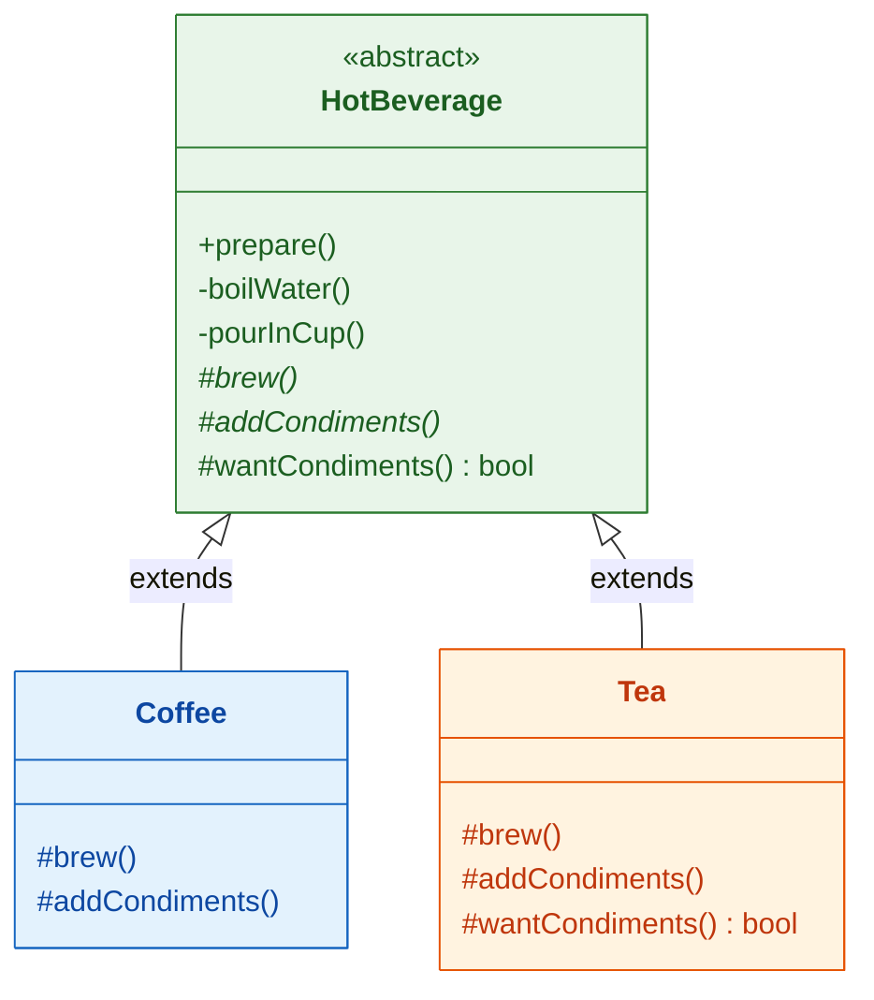
```mermaid
classDiagram
    class HotBeverage {
        <<abstract>>
        +prepare()
        -boilWater()
        -pourInCup()
        #brew()*
        #addCondiments()*
        #wantCondiments() bool
    }

    class Coffee {
        #brew()
        #addCondiments()
    }

    class Tea {
        #brew()
        #addCondiments()
        #wantCondiments() bool
    }

    HotBeverage <|-- Coffee : extends
    HotBeverage <|-- Tea : extends

    style HotBeverage fill:#E8F5E9,stroke:#2E7D32,color:#1B5E20
    style Coffee fill:#E3F2FD,stroke:#1565C0,color:#0D47A1
    style Tea fill:#FFF3E0,stroke:#E65100,color:#BF360C
```

**模板方法模式与策略模式的关键区别**值得在此澄清。两者都能解决"算法可变"问题，但机制截然不同：

| 对比维度 | 模板方法模式 | 策略模式 |
|:---|:---|:---|
| **扩展机制** | **继承**（Inheritance） | **组合**（Composition） |
| **控制权** | 父类控制流程，子类填充步骤 | 客户端选择策略，策略独立执行 |
| **粒度** | 控制算法中的**某些步骤** | 替换**整个算法** |
| **编译时 vs 运行时** | 编译时确定（子类固定） | 运行时可切换策略对象 |
| **典型表现** | `abstract class` + `override` | 接口 + 注入 |

简言之，**模板方法是「固定流程，开放细节」；策略模式是「整体替换算法」**。

---

### Android 应用

模板方法模式在 Android Framework 中的应用可以说是**无处不在**，它是 Framework 设计者控制应用行为、保证系统一致性的核心手段。下面我们深入分析两个最经典的案例。

#### Activity 生命周期 —— Android 中最经典的模板方法

每一个 Android 开发者入门时学的第一件事就是 Activity 生命周期。但你是否想过：**谁在调用 `onCreate()`、`onStart()`、`onResume()` 这些方法？按什么顺序调用的？为什么顺序不可改变？**

答案就是模板方法模式。Android Framework 中的 `ActivityThread`（可以理解为 Android 应用的"main 函数"所在类）扮演着模板方法的角色，它严格控制着 Activity 生命周期回调的调用顺序。

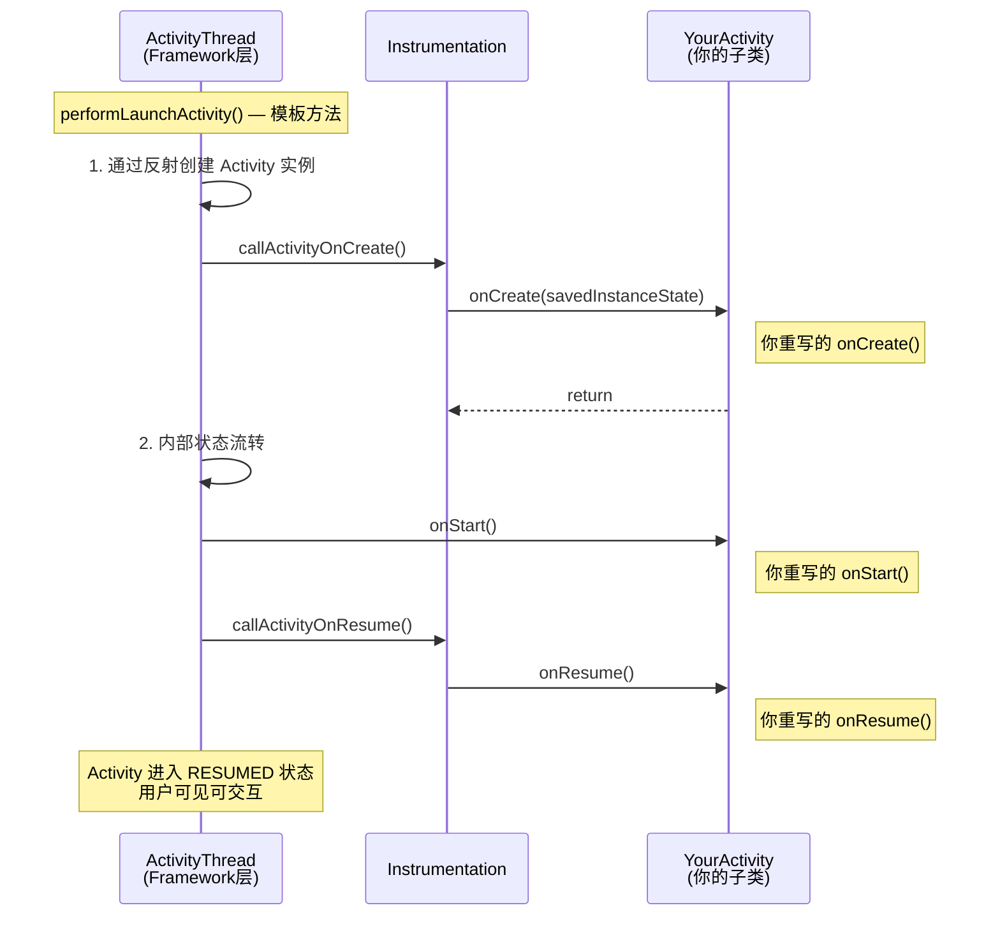
```mermaid
sequenceDiagram
    participant AT as ActivityThread<br/>(Framework层)
    participant Inst as Instrumentation
    participant Act as YourActivity<br/>(你的子类)

    Note over AT: performLaunchActivity() — 模板方法
    AT->>AT: 1. 通过反射创建 Activity 实例
    AT->>Inst: callActivityOnCreate()
    Inst->>Act: onCreate(savedInstanceState)
    Note right of Act: 你重写的 onCreate()
    Act-->>Inst: return
    AT->>AT: 2. 内部状态流转
    AT->>Act: onStart()
    Note right of Act: 你重写的 onStart()
    AT->>Inst: callActivityOnResume()
    Inst->>Act: onResume()
    Note right of Act: 你重写的 onResume()
    Note over AT: Activity 进入 RESUMED 状态<br/>用户可见可交互
```

让我们深入 Framework 源码来印证这一点。以下是 `android.app.Activity` 中的关键源码（简化版）：

```java
/**
 * android.app.Activity（Framework 源码简化版）
 * Activity 本身就是一个"抽象基类"角色（虽然它不是 abstract class）
 * 它定义了生命周期回调方法作为"钩子"，子类选择性覆盖
 */
public class Activity extends ContextThemeWrapper {

    // ========== 模板方法的"骨架"并不在 Activity 内部 ==========
    // 真正的骨架在 ActivityThread.performLaunchActivity() 中
    // Activity 本身提供的是"步骤方法"

    /**
     * 生命周期回调 —— 钩子方法（Hook Method）
     * 提供了空实现或基础实现，子类"可选"覆盖
     * 注意：你必须调用 super.onCreate()，否则会抛异常
     */
    protected void onCreate(@Nullable Bundle savedInstanceState) {
        // ... 恢复 Fragment 状态、恢复 Window 状态等基础逻辑
        // 这些逻辑是"具体方法"的部分，子类通过 super 继承
        mCalled = true;  // 标记 super 被调用，用于检测子类是否遗漏 super 调用
    }

    protected void onStart() {
        mCalled = true;  // 同上，确保 super 被调用
        // ... 启动相关的 Fragment、分发 onStart 给 Fragment
    }

    protected void onResume() {
        mCalled = true;
        // ... 恢复暂停的 Fragment
    }

    protected void onPause() {
        mCalled = true;
        // ... 暂停 Fragment、提交未完成的事务
    }

    protected void onStop() {
        mCalled = true;
        // ... 停止 Fragment
    }

    protected void onDestroy() {
        mCalled = true;
        // ... 关闭对话框、销毁 Fragment、释放资源
    }
}
```

而 **真正的模板方法** 位于 `ActivityThread` 中：

```java
/**
 * android.app.ActivityThread（Framework 源码简化版）
 * 这里才是真正的"模板方法"所在
 * performLaunchActivity() 定义了启动 Activity 的算法骨架
 */
public final class ActivityThread {

    /**
     * 模板方法：启动一个 Activity 的完整流程
     * 此方法严格控制了各步骤的执行顺序，应用开发者无法修改
     */
    private Activity performLaunchActivity(ActivityClientRecord r, Intent customIntent) {
        // Step 1：创建 Activity 实例（具体方法 —— 固定逻辑）
        Activity activity = mInstrumentation.newActivity(
                cl, component.getClassName(), r.intent);

        // Step 2：创建 Application（如果还没有的话）
        Application app = r.packageInfo.makeApplication(false, mInstrumentation);

        // Step 3：创建 Context
        ContextImpl appContext = createBaseContextForActivity(r);

        // Step 4：attach —— 关联 Window、Token 等核心组件（具体方法）
        activity.attach(appContext, this, getInstrumentation(),
                r.token, r.ident, app, r.intent, r.activityInfo, ...);

        // Step 5：调用 onCreate —— 回调到你的子类（抽象/钩子步骤）
        if (r.isPersistable()) {
            mInstrumentation.callActivityOnCreate(activity, r.state, r.persistentState);
        } else {
            mInstrumentation.callActivityOnCreate(activity, r.state);
        }

        // Step 6：调用 onStart（如果 Activity 不是仅部分创建）
        if (!r.activity.mFinished) {
            activity.performStart("performLaunchActivity");
        }

        return activity;
    }

    /**
     * 模板方法：恢复 Activity 的流程
     * onStart -> onResume 的顺序在此被严格保证
     */
    public void handleResumeActivity(ActivityClientRecord r, boolean finalStateRequest, ...) {
        // Step 1：执行 performResume（内部会调用 onResume）
        if (!performResumeActivity(r, finalStateRequest, reason)) {
            return;
        }

        // Step 2：让 Window 可见（具体方法 —— 固定逻辑）
        if (r.activity.mVisibleFromClient) {
            r.activity.makeVisible();
        }

        // Step 3：通知 Looper 空闲时执行 GC 等（具体方法）
        Looper.myQueue().addIdleHandler(new Idler());
    }
}
```

从上面的源码可以看出一个非常重要的设计细节：**`mCalled` 字段**。

```java
// Activity 内部的防御性校验
protected void onStart() {
    mCalled = true;  // 标记 super.onStart() 被调用
}

// ActivityThread 或 Instrumentation 在调用完 onStart() 后会检查：
if (!activity.mCalled) {
    throw new SuperNotCalledException(
        "Activity " + activity.getLocalClassName() +
        " did not call through to super.onStart()");
}
```

这就是为什么如果你在 `onCreate()` 中忘记写 `super.onCreate(savedInstanceState)`，应用会直接崩溃——**Framework 通过 `mCalled` 机制强制要求子类必须调用 super**，以确保父类中的"具体方法"部分（Fragment 管理、状态恢复等）能正常执行。

我们来做一个精确的角色映射：

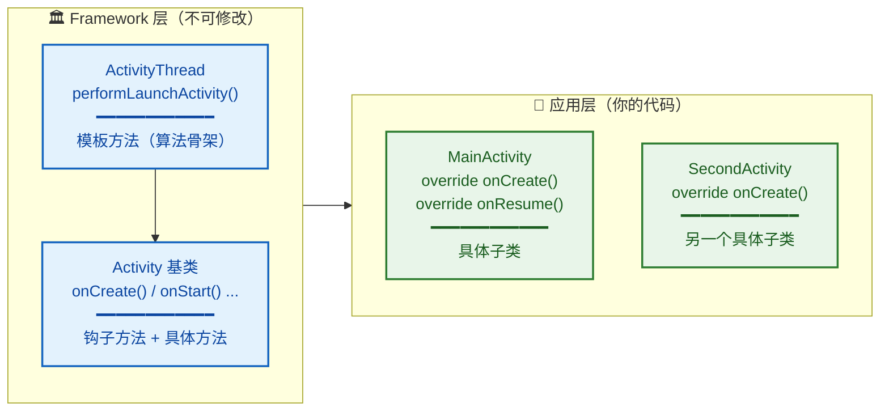
```mermaid
graph LR
    subgraph Framework["🏛️ Framework 层（不可修改）"]
        direction TB
        AT["ActivityThread<br/>performLaunchActivity()<br/>━━━━━━━━━━━━<br/>模板方法（算法骨架）"]
        AC["Activity 基类<br/>onCreate() / onStart() ...<br/>━━━━━━━━━━━━<br/>钩子方法 + 具体方法"]
        AT --> AC
    end

    subgraph App["📱 应用层（你的代码）"]
        direction TB
        MA["MainActivity<br/>override onCreate()<br/>override onResume()<br/>━━━━━━━━━━━━<br/>具体子类"]
        SA["SecondActivity<br/>override onCreate()<br/>━━━━━━━━━━━━<br/>另一个具体子类"]
    end

    Framework --> App

    classDef fw fill:#E3F2FD,stroke:#1565C0,color:#0D47A1,stroke-width:2px
    classDef app fill:#E8F5E9,stroke:#2E7D32,color:#1B5E20,stroke-width:2px
    class AT,AC fw
    class MA,SA app
```

将 Activity 生命周期映射到模板方法模式的术语：

| 模板方法模式角色 | Activity 生命周期中的对应 |
|:---|:---|
| **AbstractClass** | `Activity` 基类 |
| **templateMethod()** | `ActivityThread.performLaunchActivity()` 等 |
| **abstract/hook method** | `onCreate()`, `onStart()`, `onResume()` 等 |
| **concrete method** | `Activity.attach()`, Fragment 分发逻辑, `mCalled` 校验 |
| **ConcreteClass** | 你的 `MainActivity`, `DetailActivity` 等 |
| **Hook (钩子)** | `onContentChanged()`, `onPostCreate()` 等可选回调 |

#### AsyncTask —— 已废弃但设计精妙的模板方法典范

`AsyncTask` 在 Android API 30 中已被标记为 `@Deprecated`，但其设计是模板方法模式的教科书级别案例，非常值得学习。

```java
/**
 * android.os.AsyncTask（Framework 源码简化版）
 * 这是一个泛型抽象类，三个泛型参数分别代表：
 * Params  —— 输入参数类型
 * Progress —— 进度更新类型
 * Result  —— 返回结果类型
 */
public abstract class AsyncTask<Params, Progress, Result> {

    /**
     * 模板方法：execute() 定义了异步任务的完整执行骨架
     * 调用者只需 execute()，内部按固定顺序编排各步骤
     */
    public final AsyncTask<Params, Progress, Result> execute(Params... params) {
        return executeOnExecutor(sDefaultExecutor, params);  // 委托给线程池
    }

    /**
     * 真正的模板方法骨架（简化版）
     * 注意内部编排逻辑：
     * 1. onPreExecute()     —— 主线程，任务开始前
     * 2. doInBackground()   —— 工作线程，执行耗时操作
     * 3. onPostExecute()    —— 主线程，任务完成后
     */
    public final AsyncTask<Params, Progress, Result> executeOnExecutor(
            Executor exec, Params... params) {

        // Step 1：在主线程执行预处理（钩子方法）
        onPreExecute();

        // Step 2：封装 Worker，交给线程池（具体方法 —— 固定逻辑）
        mWorker.mParams = params;
        exec.execute(mFuture);

        return this;
    }

    // ========== 抽象方法：子类必须实现 ==========

    /**
     * 在后台线程执行的核心逻辑
     * 这是唯一一个在工作线程运行的方法
     * @param params 输入参数
     * @return 执行结果
     */
    @WorkerThread
    protected abstract Result doInBackground(Params... params);

    // ========== 钩子方法：子类可选覆盖 ==========

    /** 任务执行前调用（主线程），常用于显示 ProgressDialog */
    @MainThread
    protected void onPreExecute() {
        // 默认空实现 —— 典型的钩子方法
    }

    /** 任务执行完成后调用（主线程），接收 doInBackground 的返回值 */
    @MainThread
    protected void onPostExecute(Result result) {
        // 默认空实现 —— 典型的钩子方法
    }

    /** 进度更新时调用（主线程），由 publishProgress() 触发 */
    @MainThread
    protected void onProgressUpdate(Progress... values) {
        // 默认空实现 —— 典型的钩子方法
    }

    /** 任务被取消时调用（主线程） */
    @MainThread
    protected void onCancelled(Result result) {
        // 默认空实现 —— 典型的钩子方法
    }

    // ========== 具体方法：线程切换的核心机制 ==========

    /**
     * 内部使用 Handler 将结果从工作线程投递到主线程
     * 这段逻辑子类完全不需要关心，由框架保证
     */
    private static class InternalHandler extends Handler {
        public InternalHandler(Looper looper) {
            super(looper);  // 绑定主线程 Looper
        }

        @Override
        public void handleMessage(Message msg) {
            AsyncTaskResult<?> result = (AsyncTaskResult<?>) msg.obj;
            switch (msg.what) {
                case MESSAGE_POST_RESULT:
                    // 框架在此调用 onPostExecute 或 onCancelled
                    result.mTask.finish(result.mData[0]);
                    break;
                case MESSAGE_POST_PROGRESS:
                    // 框架在此调用 onProgressUpdate
                    result.mTask.onProgressUpdate(result.mData);
                    break;
            }
        }
    }
}
```

实际使用时，开发者只需像"填空"一样重写感兴趣的方法：

```kotlin
/**
 * 具体子类：下载文件的异步任务
 * 泛型参数: <输入URL: String, 进度: Int, 结果: ByteArray?>
 */
@Suppress("DEPRECATION") // 仅用于演示模板方法模式，实际开发请用协程
class DownloadTask(
    private val callback: (ByteArray?) -> Unit  // 下载完成的回调
) : AsyncTask<String, Int, ByteArray?>() {

    /** 钩子方法覆盖：任务开始前显示加载状态 */
    override fun onPreExecute() {
        super.onPreExecute()
        showLoadingDialog()  // 显示加载弹窗
    }

    /** 抽象方法实现：在后台线程执行下载（必须实现） */
    override fun doInBackground(vararg params: String?): ByteArray? {
        val url = params[0] ?: return null  // 获取第一个参数作为 URL
        return try {
            val connection = URL(url).openConnection()  // 建立网络连接
            val totalSize = connection.contentLength     // 获取文件总大小
            val inputStream = connection.getInputStream()
            val buffer = ByteArrayOutputStream()

            val data = ByteArray(1024)  // 1KB 缓冲区
            var count: Int              // 每次读取的字节数
            var downloadedSize = 0      // 已下载大小

            // 循环读取数据
            while (inputStream.read(data).also { count = it } != -1) {
                buffer.write(data, 0, count)  // 写入缓冲区
                downloadedSize += count
                // 发布进度 —— 会触发 onProgressUpdate（通过 Handler 切换到主线程）
                publishProgress((downloadedSize * 100) / totalSize)
            }

            buffer.toByteArray()  // 返回结果
        } catch (e: Exception) {
            null  // 下载失败返回 null
        }
    }

    /** 钩子方法覆盖：更新进度条 */
    override fun onProgressUpdate(vararg values: Int?) {
        val progress = values[0] ?: return  // 获取当前进度百分比
        updateProgressBar(progress)          // 更新 UI 上的进度条
    }

    /** 钩子方法覆盖：下载完成后处理结果 */
    override fun onPostExecute(result: ByteArray?) {
        dismissLoadingDialog()  // 关闭加载弹窗
        callback(result)        // 将结果回调给调用方
    }
}
```

下面这张时序图展示了 AsyncTask 中模板方法驱动各步骤在不同线程上执行的全过程：

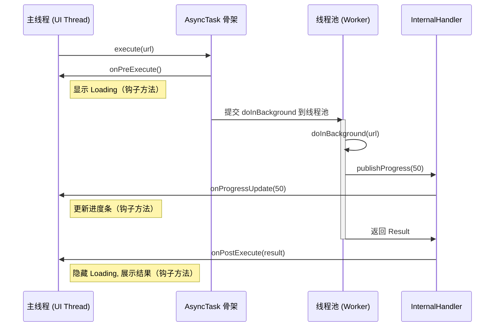
```mermaid
sequenceDiagram
    participant Main as 主线程 (UI Thread)
    participant AT as AsyncTask 骨架
    participant Pool as 线程池 (Worker)
    participant Handler as InternalHandler

    Main->>AT: execute(url)
    AT->>Main: onPreExecute()
    Note right of Main: 显示 Loading（钩子方法）

    AT->>Pool: 提交 doInBackground 到线程池
    activate Pool
    Pool->>Pool: doInBackground(url)
    Pool->>Handler: publishProgress(50)
    Handler->>Main: onProgressUpdate(50)
    Note right of Main: 更新进度条（钩子方法）

    Pool->>Handler: 返回 Result
    deactivate Pool
    Handler->>Main: onPostExecute(result)
    Note right of Main: 隐藏 Loading, 展示结果（钩子方法）
```

AsyncTask 模板方法模式的角色映射：

| 模板方法模式角色 | AsyncTask 中的对应 |
|:---|:---|
| **AbstractClass** | `AsyncTask<Params, Progress, Result>` |
| **templateMethod()** | `execute()` → `executeOnExecutor()` |
| **abstract method** | `doInBackground()` —— 唯一必须实现的方法 |
| **hook methods** | `onPreExecute()`, `onPostExecute()`, `onProgressUpdate()`, `onCancelled()` |
| **concrete method** | `InternalHandler` 线程切换、`SerialExecutor` 任务调度 |
| **ConcreteClass** | 你的 `DownloadTask`, `QueryDatabaseTask` 等 |

#### 更多 Android Framework 中的模板方法实例

模板方法模式在 Android 中绝不仅限于以上两个例子，以下是更多经典案例一览：

| Framework 组件 | 模板方法（骨架） | 钩子/抽象方法（你覆盖的） |
|:---|:---|:---|
| **View** | `draw(Canvas)` | `onDraw()`, `onMeasure()`, `onLayout()` |
| **RecyclerView.Adapter** | 内部 bind 流程 | `onCreateViewHolder()`, `onBindViewHolder()` |
| **Service** | `ActivityThread.handleCreateService()` | `onCreate()`, `onStartCommand()`, `onBind()` |
| **ContentProvider** | `ActivityThread.installProvider()` | `onCreate()`, `query()`, `insert()` 等 |
| **BroadcastReceiver** | `ActivityThread.handleReceiver()` | `onReceive()` |
| **Application** | `ActivityThread.handleBindApplication()` | `onCreate()`, `onTerminate()` |

其中 **`View.draw()`** 是一个非常典型的例子——它在内部按照固定顺序调用：

```java
/**
 * android.view.View.draw() —— 模板方法
 * 定义了 View 绘制的完整算法骨架（6步）
 */
public void draw(Canvas canvas) {
    // Step 1: 绘制背景（具体方法 —— 固定逻辑）
    drawBackground(canvas);

    // Step 2: 保存 canvas 层（如果需要 fading edge）
    // ... 省略

    // Step 3: 绘制内容 —— 钩子方法，子类覆盖此方法来绘制自定义内容
    onDraw(canvas);

    // Step 4: 绘制子 View（具体方法 —— 遍历子 View 并调用其 draw）
    dispatchDraw(canvas);

    // Step 5: 绘制前景、滚动条等装饰（具体方法）
    onDrawForeground(canvas);

    // Step 6: 绘制高亮（焦点状态）
    drawDefaultFocusHighlight(canvas);
}
```

你在自定义 View 时只需要 `override fun onDraw(canvas: Canvas)` 来画你想画的东西，而背景、前景、子 View 分发等全部由框架的模板方法保证顺序。这完美体现了模板方法模式 **"Don't call us, we'll call you"** 的好莱坞原则。

---

**📝 练习题**

在 Android 的 `View.draw(Canvas)` 模板方法中，以下关于绘制顺序的说法，**正确**的是：

A. `onDraw()` 在 `dispatchDraw()` 之后调用，因此自定义内容会覆盖在子 View 之上


B. `drawBackground()` 在 `onDraw()` 之后调用，因为背景需要覆盖在内容之下


C. `onDraw()` 在 `dispatchDraw()` 之前调用，因此子 View 会绘制在自定义内容之上


D. `dispatchDraw()` 在 `drawBackground()` 之前调用，因为子 View 的优先级最高


**【答案】** C

**【解析】** `View.draw()` 这个模板方法定义了严格的绘制顺序：① `drawBackground()` → ② `onDraw()` → ③ `dispatchDraw()` → ④ `onDrawForeground()`。Canvas 是一个图层叠加模型，后绘制的内容会覆盖先绘制的内容。因此 `onDraw()`（Step 3）绘制自定义内容后，`dispatchDraw()`（Step 4）再绘制子 View，子 View 自然叠在父 View 自定义内容之上。选项 A 颠倒了 `onDraw` 和 `dispatchDraw` 的顺序；选项 B 颠倒了 `drawBackground` 和 `onDraw` 的顺序；选项 D 颠倒了 `drawBackground` 和 `dispatchDraw` 的顺序。这道题的核心就是模板方法模式的精髓——**算法骨架的步骤顺序由父类严格定义，子类无权更改**。

---

**📝 练习题**

以下代码存在一个严重的运行时错误，请指出问题所在：

```kotlin
class SplashActivity : AppCompatActivity() {
    override fun onCreate(savedInstanceState: Bundle?) {
        setContentView(R.layout.activity_splash)
        initViews()
    }
    
    private fun initViews() { /* ... */ }
}
```

A. `setContentView()` 不应在 `onCreate()` 中调用


B. 缺少 `super.onCreate(savedInstanceState)` 调用，会触发 `SuperNotCalledException`


C. `initViews()` 应该在 `onResume()` 中调用


D. `savedInstanceState` 参数未使用，导致状态无法恢复


**【答案】** B

**【解析】** 这道题直接考察了模板方法模式中 **父类具体方法必须被执行** 的原则。`Activity.onCreate()` 内部会执行 `mCalled = true`，而 Framework 在调用完你的 `onCreate()` 后会检查 `mCalled` 标志位。如果子类没有调用 `super.onCreate()`，`mCalled` 保持 `false`，Framework 将抛出 `SuperNotCalledException`，应用直接崩溃。这是 Android Framework 通过模板方法模式 **强制保证父类核心逻辑不被跳过** 的防御性设计。正确写法应在 `onCreate()` 的第一行加上 `super.onCreate(savedInstanceState)`。选项 A 错误，`setContentView()` 恰恰就应该在 `onCreate()` 中调用；选项 C 无此要求；选项 D 不会导致运行时崩溃。

---

## 责任链模式 (Chain of Responsibility Pattern) ⭐⭐

责任链模式是行为型设计模式中极为经典的一种，它的核心哲学可以用一句话概括：**让请求沿着一条由处理者节点 (Handler) 组成的链条依次传递，直到某个节点决定处理它，或者链条走到尽头。** 这种模式在 Android 系统中有着极其深入的应用——从用户触摸屏幕那一刻起，事件就开始在 View 树中以责任链的形式层层传递；而网络请求通过 OkHttp 发出时，也要经过一条精心编排的拦截器链。可以说，**不理解责任链模式，就无法真正理解 Android 的事件分发机制和现代网络框架的架构设计。**

### 请求沿链传递 (Passing Request Along the Chain)

责任链模式的第一个核心概念是 **"链"（Chain）** 本身。这条链由多个**处理者 (Handler)** 节点串联而成，每个 Handler 都持有对**下一个 Handler** 的引用（即 `nextHandler`）。当一个请求 (Request) 进入链条时，它会从链首开始，逐个经过每一个 Handler。每个 Handler 面对请求时，有且仅有两种选择：

1. **自己处理** —— 消费 (consume) 这个请求，链条可以终止（也可以继续，取决于变体）。
2. **传递给下一个** —— 自己不处理，将请求原封不动（或经过预处理后）交给链条中的下一个 Handler。

这种机制带来了极大的灵活性：**链条的长度、节点的顺序、每个节点的处理逻辑，都可以在运行时动态配置。**

我们先来看经典的 GoF 责任链结构：

```kotlin
/**
 * 抽象处理者 (Abstract Handler)
 * 定义了处理请求的接口，并持有下一个处理者的引用
 */
abstract class Handler {

    // 指向链条中下一个处理者的引用，可为 null 表示链尾
    protected var nextHandler: Handler? = null

    /**
     * 设置下一个处理者，返回 nextHandler 以支持链式调用
     * 例如: handlerA.setNext(handlerB).setNext(handlerC)
     */
    fun setNext(handler: Handler): Handler {
        this.nextHandler = handler  // 将传入的 handler 设为下一个节点
        return handler              // 返回 handler 本身，方便链式构建
    }

    /**
     * 处理请求的核心方法
     * @param request 待处理的请求对象
     */
    abstract fun handleRequest(request: Request)
}

/**
 * 请求数据类，封装了请求的类型和内容
 */
data class Request(
    val type: String,       // 请求类型，用于匹配处理者
    val content: String     // 请求内容
)
```

接下来实现几个具体的 Handler：

```kotlin
/**
 * 具体处理者 A：只处理 type 为 "AUTH" 的请求
 */
class AuthHandler : Handler() {
    override fun handleRequest(request: Request) {
        if (request.type == "AUTH") {
            // 条件匹配，自己处理这个请求
            println("AuthHandler 处理了认证请求: ${request.content}")
        } else {
            // 条件不匹配，传递给链条中的下一个处理者
            println("AuthHandler 无法处理，传递给下一个...")
            nextHandler?.handleRequest(request)  // 如果有下一个节点就传递
                ?: println("链条结束，无人处理该请求")  // 链尾，无人处理
        }
    }
}

/**
 * 具体处理者 B：只处理 type 为 "LOG" 的请求
 */
class LogHandler : Handler() {
    override fun handleRequest(request: Request) {
        if (request.type == "LOG") {
            // 自己处理日志请求
            println("LogHandler 处理了日志请求: ${request.content}")
        } else {
            // 传递给下一个
            println("LogHandler 无法处理，传递给下一个...")
            nextHandler?.handleRequest(request)
                ?: println("链条结束，无人处理该请求")
        }
    }
}

/**
 * 具体处理者 C：只处理 type 为 "DATA" 的请求
 */
class DataHandler : Handler() {
    override fun handleRequest(request: Request) {
        if (request.type == "DATA") {
            // 自己处理数据请求
            println("DataHandler 处理了数据请求: ${request.content}")
        } else {
            println("DataHandler 无法处理，传递给下一个...")
            nextHandler?.handleRequest(request)
                ?: println("链条结束，无人处理该请求")
        }
    }
}
```

客户端构建并使用责任链：

```kotlin
fun main() {
    // ① 创建各个处理者节点
    val authHandler = AuthHandler()   // 认证处理者
    val logHandler = LogHandler()     // 日志处理者
    val dataHandler = DataHandler()   // 数据处理者

    // ② 构建链条: Auth -> Log -> Data
    authHandler.setNext(logHandler).setNext(dataHandler)

    // ③ 发送不同类型的请求
    println("===== 发送 LOG 请求 =====")
    authHandler.handleRequest(Request("LOG", "用户登录日志"))
    // 输出:
    // AuthHandler 无法处理，传递给下一个...
    // LogHandler 处理了日志请求: 用户登录日志

    println("\n===== 发送 DATA 请求 =====")
    authHandler.handleRequest(Request("DATA", "查询用户列表"))
    // 输出:
    // AuthHandler 无法处理，传递给下一个...
    // LogHandler 无法处理，传递给下一个...
    // DataHandler 处理了数据请求: 查询用户列表

    println("\n===== 发送 UNKNOWN 请求 =====")
    authHandler.handleRequest(Request("UNKNOWN", "未知操作"))
    // 输出:
    // AuthHandler 无法处理，传递给下一个...
    // LogHandler 无法处理，传递给下一个...
    // DataHandler 无法处理，传递给下一个...
    // 链条结束，无人处理该请求
}
```

请求的传递过程可以用下图直观表示：

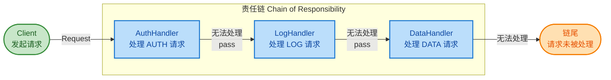
```mermaid
graph LR
    subgraph Chain["责任链 Chain of Responsibility"]
        direction TB
        A["AuthHandler<br/>处理 AUTH 请求"]
        B["LogHandler<br/>处理 LOG 请求"]
        C["DataHandler<br/>处理 DATA 请求"]
    end

    Client(["Client<br/>发起请求"]) -->|"Request"| A
    A -->|"无法处理<br/>pass"| B
    B -->|"无法处理<br/>pass"| C
    C -->|"无法处理"| END(["链尾<br/>请求未被处理"])

    classDef clientDef fill:#C8E6C9,stroke:#388E3C,color:#1B5E20,stroke-width:2px
    classDef handlerDef fill:#BBDEFB,stroke:#1976D2,color:#0D47A1,stroke-width:2px
    classDef endDef fill:#FFE0B2,stroke:#F57C00,color:#E65100,stroke-width:2px

    class Client clientDef
    class A,B,C handlerDef
    class END endDef
```

从上图可以清晰看到：**Client 只需要知道链首节点，完全不关心链中有多少个 Handler，也不关心最终是谁处理了请求。** 这正是责任链模式最核心的价值。

#### 责任链的两种变体

在实际工程中，责任链存在两种主要变体，它们的行为差异非常关键：

| 变体 | 行为 | 典型应用 |
|:---|:---|:---|
| **纯责任链 (Pure)** | 请求**有且仅有一个**节点处理，一旦处理就终止传递 | Android 事件分发（某个 View 消费了 Touch 事件后不再向下传） |
| **不纯责任链 (Impure)** | 请求可以被**多个**节点同时处理，每个节点处理完后继续传递 | OkHttp 拦截器链（每个拦截器都参与处理，最终由网络拦截器发出请求） |

```kotlin
/**
 * 不纯责任链示例：每个 Handler 都参与处理，然后继续传递
 * 类似 OkHttp 的拦截器机制
 */
abstract class ImpureHandler {

    protected var nextHandler: ImpureHandler? = null

    fun setNext(handler: ImpureHandler): ImpureHandler {
        this.nextHandler = handler
        return handler
    }

    /**
     * 处理请求 —— 注意：处理完之后仍然传递给下一个
     */
    fun handleRequest(request: Request) {
        // 第一步：自己先做预处理 (intercept)
        doHandle(request)
        // 第二步：无论是否处理，都传递给下一个节点
        nextHandler?.handleRequest(request)
    }

    // 子类实现自己的处理逻辑
    protected abstract fun doHandle(request: Request)
}
```

### 解耦发送者与接收者 (Decoupling Sender and Receiver)

责任链模式的第二个核心价值在于**彻底解耦请求的发送者 (Sender/Client) 和接收者 (Receiver/Handler)**。这种解耦体现在多个维度：

**维度一：发送者不知道谁会处理请求。** 客户端只需要将请求交给链首节点，至于最终是链中第 1 个、第 3 个还是第 N 个节点处理了这个请求，客户端完全无感知。这与直接调用 `specificHandler.handle(request)` 形成了鲜明对比——后者要求客户端精确知道应该由谁来处理。

**维度二：Handler 之间可以独立变化。** 每个 Handler 只关心自己能否处理当前请求，如果不能就传给下一个。添加新的 Handler、移除已有的 Handler、调整 Handler 的顺序，都不会影响其他 Handler 的代码，也不会影响客户端的代码。这完美符合 **开闭原则 (Open-Closed Principle)**。

**维度三：链条的组装与业务逻辑分离。** 链条的构建（谁在前、谁在后）可以在一个集中的地方配置，而每个 Handler 的处理逻辑则各自独立。这使得系统结构清晰、职责分明。

我们通过一个对比来感受解耦的力量：

```kotlin
// ========= 反面示例：不用责任链，硬编码 if-else =========
class RequestProcessor {
    /**
     * 所有逻辑耦合在一个巨大的方法中
     * 每新增一种请求类型，就要修改这个方法 —— 违反开闭原则
     */
    fun process(request: Request) {
        if (request.type == "AUTH") {           // 认证逻辑
            println("处理认证: ${request.content}")
        } else if (request.type == "LOG") {     // 日志逻辑
            println("处理日志: ${request.content}")
        } else if (request.type == "DATA") {    // 数据逻辑
            println("处理数据: ${request.content}")
        } else if (request.type == "CACHE") {   // 又加了缓存逻辑...
            println("处理缓存: ${request.content}")
        }
        // 每次新增类型都要改这个类 → 高耦合、难测试、易出错
    }
}

// ========= 正面示例：使用责任链，职责分离 =========
fun buildChain(): Handler {
    val auth = AuthHandler()
    val log = LogHandler()
    val data = DataHandler()
    val cache = CacheHandler()      // 新增节点，只需创建类 + 挂到链上
    auth.setNext(log).setNext(data).setNext(cache)
    return auth                     // 返回链首
}
// Client 只需: buildChain().handleRequest(request)
// 新增处理逻辑 = 新增一个 Handler 类 + 链条中多挂一个节点
// 完全无需修改已有的任何 Handler 代码
```

下面的 UML 类图展示了责任链模式的标准结构：

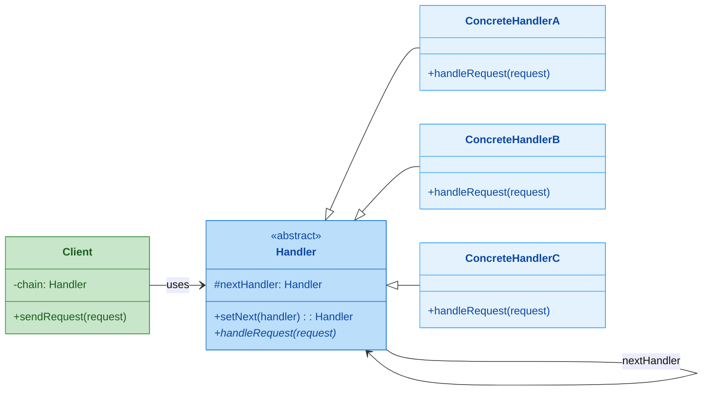
```mermaid
classDiagram
    direction LR

    class Client {
        -chain: Handler
        +sendRequest(request)
    }

    class Handler {
        <<abstract>>
        #nextHandler: Handler
        +setNext(handler): Handler
        +handleRequest(request)*
    }

    class ConcreteHandlerA {
        +handleRequest(request)
    }

    class ConcreteHandlerB {
        +handleRequest(request)
    }

    class ConcreteHandlerC {
        +handleRequest(request)
    }

    Client --> Handler : uses
    Handler --> Handler : nextHandler
    Handler <|-- ConcreteHandlerA
    Handler <|-- ConcreteHandlerB
    Handler <|-- ConcreteHandlerC

    style Client fill:#C8E6C9,stroke:#388E3C,color:#1B5E20
    style Handler fill:#BBDEFB,stroke:#1976D2,color:#0D47A1
    style ConcreteHandlerA fill:#E3F2FD,stroke:#42A5F5,color:#0D47A1
    style ConcreteHandlerB fill:#E3F2FD,stroke:#42A5F5,color:#0D47A1
    style ConcreteHandlerC fill:#E3F2FD,stroke:#42A5F5,color:#0D47A1
```

理解了基础理论之后，我们进入 Android 中责任链模式最重要的两个实战应用。

---

### Android 应用：事件分发 (dispatchTouchEvent) ⭐⭐

Android 的触摸事件分发机制是**责任链模式在整个 Android 框架中最经典、最复杂、也是面试中被考查频率最高的应用**。当用户手指触摸屏幕时，一个 `MotionEvent` 对象就会产生，它需要沿着 View 树从顶层一直传递到最底层的某个 View，再反向回溯——这正是一条完整的责任链。

#### 事件分发的三大角色

Android 事件分发涉及三个层级的组件，每个组件扮演不同的 Handler 角色：

| 层级 | 组件 | 关键方法 | 角色说明 |
|:---|:---|:---|:---|
| 最顶层 | `Activity` | `dispatchTouchEvent()` / `onTouchEvent()` | 事件的入口，也是最后的兜底者 |
| 中间层 | `ViewGroup` | `dispatchTouchEvent()` / `onInterceptTouchEvent()` / `onTouchEvent()` | 既是容器也是拦截者，可以截断链条 |
| 最底层 | `View` | `dispatchTouchEvent()` / `onTouchEvent()` | 最终的事件消费者（如 Button） |

#### 事件分发的完整流程

事件从 `Activity` 出发，经过 `ViewGroup` 的层层传递，最终到达目标 `View`。如果没有任何 View 消费事件，事件会反向回溯，最终由 `Activity.onTouchEvent()` 兜底处理。

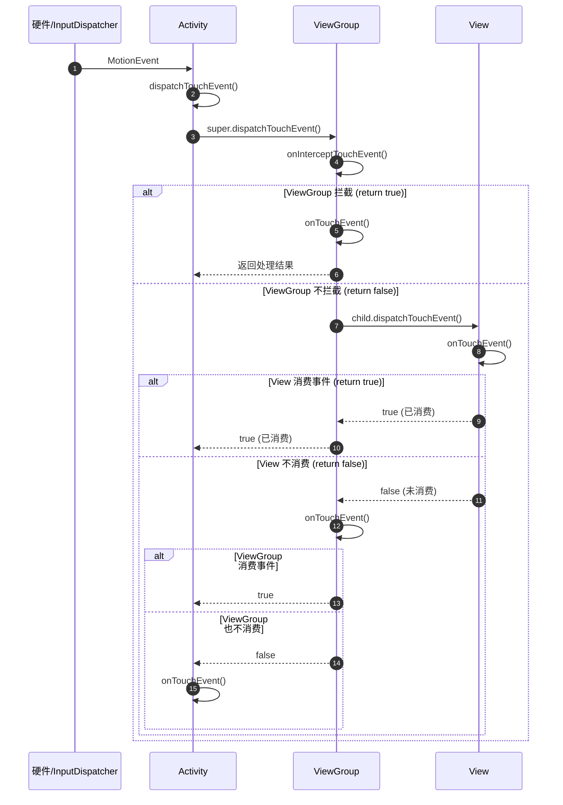
```mermaid
sequenceDiagram
    autonumber
    participant HW as 硬件/InputDispatcher
    participant A as Activity
    participant VG as ViewGroup
    participant V as View

    HW->>A: MotionEvent
    A->>A: dispatchTouchEvent()
    A->>VG: super.dispatchTouchEvent()
    VG->>VG: onInterceptTouchEvent()

    alt ViewGroup 拦截 (return true)
        VG->>VG: onTouchEvent()
        VG-->>A: 返回处理结果
    else ViewGroup 不拦截 (return false)
        VG->>V: child.dispatchTouchEvent()
        V->>V: onTouchEvent()

        alt View 消费事件 (return true)
            V-->>VG: true (已消费)
            VG-->>A: true (已消费)
        else View 不消费 (return false)
            V-->>VG: false (未消费)
            VG->>VG: onTouchEvent()

            alt ViewGroup 消费事件
                VG-->>A: true
            else ViewGroup 也不消费
                VG-->>A: false
                A->>A: onTouchEvent()
            end
        end
    end
```

#### 三大核心方法源码级解析

**① `Activity.dispatchTouchEvent()` —— 链首入口**

```java
// frameworks/base/core/java/android/app/Activity.java
public boolean dispatchTouchEvent(MotionEvent ev) {
    // ACTION_DOWN 表示一次新的触摸序列开始
    if (ev.getAction() == MotionEvent.ACTION_DOWN) {
        // 空方法，子类可覆写以感知用户交互（如重置超时计时器）
        onUserInteraction();
    }
    // 将事件交给 Window（实际是 PhoneWindow）处理
    // PhoneWindow 内部会将事件转发给 DecorView（顶层 ViewGroup）
    if (getWindow().superDispatchTouchEvent(ev)) {
        // 如果 ViewGroup 树中的某个 View 消费了事件，直接返回 true
        return true;
    }
    // 没有任何 View 消费事件，Activity 自己兜底处理
    return onTouchEvent(ev);
}
```

**② `ViewGroup.dispatchTouchEvent()` —— 链的核心中转站（简化版）**

这是整个事件分发机制中最复杂的方法。完整源码有数百行，这里提取核心逻辑：

```java
// frameworks/base/core/java/android/view/ViewGroup.java (精简核心逻辑)
@Override
public boolean dispatchTouchEvent(MotionEvent ev) {
    boolean handled = false;        // 最终返回值：事件是否被处理
    final int action = ev.getAction();

    // ===== 第一步：判断是否拦截 =====
    boolean intercepted;
    if (action == MotionEvent.ACTION_DOWN || mFirstTouchTarget != null) {
        // 检查子 View 是否通过 requestDisallowInterceptTouchEvent()
        // 请求父容器不要拦截
        final boolean disallowIntercept =
            (mGroupFlags & FLAG_DISALLOW_INTERCEPT) != 0;
        if (!disallowIntercept) {
            // 调用 onInterceptTouchEvent() 询问自己是否拦截
            intercepted = onInterceptTouchEvent(ev);
        } else {
            intercepted = false;    // 子 View 要求不拦截，尊重子 View
        }
    } else {
        // 非 DOWN 事件且没有 touch target，说明之前已拦截，继续拦截
        intercepted = true;
    }

    // ===== 第二步：如果不拦截，寻找能处理事件的子 View =====
    if (!intercepted) {
        if (action == MotionEvent.ACTION_DOWN) {
            // 遍历所有子 View（按 Z 轴顺序，从最上层开始）
            for (int i = childrenCount - 1; i >= 0; i--) {
                final View child = children[i];
                // 检查触摸点是否在子 View 的范围内
                if (!child.canReceivePointerEvents()
                    || !isTransformedTouchPointInView(x, y, child, null)) {
                    continue;   // 触摸点不在这个 child 上，跳过
                }
                // 将事件分发给子 View
                if (dispatchTransformedTouchEvent(ev, child)) {
                    // 子 View 消费了事件，记录为 touch target
                    mFirstTouchTarget = addTouchTarget(child);
                    handled = true;
                    break;      // 找到消费者，停止遍历
                }
            }
        }
    }

    // ===== 第三步：如果没有子 View 消费，自己处理 =====
    if (mFirstTouchTarget == null) {
        // 没有子 View 消费事件 → 调用自己的 onTouchEvent()
        // 传入 child=null，最终会执行 super.dispatchTouchEvent(ev)
        // 即调用 View.dispatchTouchEvent() → View.onTouchEvent()
        handled = dispatchTransformedTouchEvent(ev, null);
    }

    return handled;
}
```

**③ `View.dispatchTouchEvent()` —— 链尾的最终消费者**

```java
// frameworks/base/core/java/android/view/View.java
public boolean dispatchTouchEvent(MotionEvent event) {
    boolean result = false;

    // 优先级 1：OnTouchListener（如果设置了的话）
    // 注意：OnTouchListener 的优先级高于 onTouchEvent()
    if (mOnTouchListener != null
        && (mViewFlags & ENABLED_MASK) == ENABLED     // View 是 enabled 状态
        && mOnTouchListener.onTouch(this, event)) {   // listener 返回 true
        result = true;  // OnTouchListener 消费了事件，不再调用 onTouchEvent
    }

    // 优先级 2：onTouchEvent()
    // 只有 OnTouchListener 未消费时才会走到这里
    if (!result && onTouchEvent(event)) {
        result = true;  // onTouchEvent() 消费了事件
    }
    // 注意：OnClickListener 是在 onTouchEvent() 的 ACTION_UP 中触发的
    // 所以 OnClickListener 的优先级最低

    return result;
}
```

#### 事件消费优先级总结

从源码可以推导出 View 层事件处理的优先级：

```
OnTouchListener.onTouch() > onTouchEvent() > OnClickListener.onClick()
```

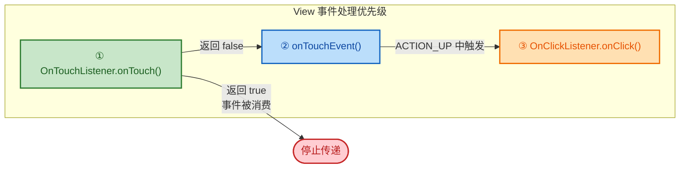
```mermaid
graph LR
    subgraph View_Event["View 事件处理优先级"]
        direction TB
        L1["① OnTouchListener.onTouch()"]
        L2["② onTouchEvent()"]
        L3["③ OnClickListener.onClick()"]
        L1 -->|"返回 false"| L2
        L2 -->|"ACTION_UP 中触发"| L3
    end

    L1 -->|"返回 true<br/>事件被消费"| STOP(["停止传递"])

    classDef highPri fill:#C8E6C9,stroke:#2E7D32,color:#1B5E20,stroke-width:2px
    classDef midPri fill:#BBDEFB,stroke:#1565C0,color:#0D47A1,stroke-width:2px
    classDef lowPri fill:#FFE0B2,stroke:#EF6C00,color:#E65100,stroke-width:2px
    classDef stopDef fill:#FFCDD2,stroke:#C62828,color:#B71C1C,stroke-width:2px

    class L1 highPri
    class L2 midPri
    class L3 lowPri
    class STOP stopDef
```

#### `onInterceptTouchEvent()` 拦截机制详解

`onInterceptTouchEvent()` 是 `ViewGroup` 独有的方法，它是责任链中的 **"截断器"**——允许父容器在事件到达子 View 之前拦截事件。这种机制在滑动冲突 (scroll conflict) 的处理中至关重要。

```kotlin
/**
 * 自定义 ViewGroup：演示外部拦截法解决滑动冲突
 * 场景：外层是横向滑动的 ViewPager，内层是纵向滑动的 RecyclerView
 */
class ConflictResolverLayout @JvmOverloads constructor(
    context: Context,
    attrs: AttributeSet? = null
) : FrameLayout(context, attrs) {

    // 记录上一次触摸的 X/Y 坐标
    private var lastInterceptX = 0f
    private var lastInterceptY = 0f

    /**
     * 外部拦截法的核心：在父容器的 onInterceptTouchEvent 中判断
     */
    override fun onInterceptTouchEvent(ev: MotionEvent): Boolean {
        var intercepted = false                // 默认不拦截
        val x = ev.x                          // 当前触摸点 X
        val y = ev.y                          // 当前触摸点 Y

        when (ev.action) {
            MotionEvent.ACTION_DOWN -> {
                // DOWN 事件必须返回 false，否则后续事件无法传递给子 View
                intercepted = false
                lastInterceptX = x             // 记录起始触摸点
                lastInterceptY = y
            }
            MotionEvent.ACTION_MOVE -> {
                val deltaX = Math.abs(x - lastInterceptX)  // 水平滑动距离
                val deltaY = Math.abs(y - lastInterceptY)  // 垂直滑动距离
                if (deltaX > deltaY) {
                    // 水平滑动距离大于垂直距离 → 父容器（横向滑动）拦截
                    intercepted = true
                } else {
                    // 垂直滑动距离更大 → 不拦截，让子 View（纵向滑动）处理
                    intercepted = false
                }
            }
            MotionEvent.ACTION_UP -> {
                // UP 事件一般不拦截
                intercepted = false
            }
        }

        // 更新上次的坐标
        lastInterceptX = x
        lastInterceptY = y
        return intercepted
    }
}
```

#### `requestDisallowInterceptTouchEvent()` 内部拦截法

子 View 也可以反过来告诉父容器："别拦我的事件！" 这就是**内部拦截法**，通过 `requestDisallowInterceptTouchEvent(true)` 设置 `FLAG_DISALLOW_INTERCEPT` 标志位实现：

```kotlin
/**
 * 内部拦截法：在子 View 的 dispatchTouchEvent 中控制
 * 子 View 主动请求父容器不要拦截
 */
class InnerInterceptView @JvmOverloads constructor(
    context: Context,
    attrs: AttributeSet? = null
) : View(context, attrs) {

    private var lastX = 0f
    private var lastY = 0f

    override fun dispatchTouchEvent(event: MotionEvent): Boolean {
        val x = event.x
        val y = event.y

        when (event.action) {
            MotionEvent.ACTION_DOWN -> {
                // DOWN 时请求父容器不要拦截（设置标志位）
                parent.requestDisallowInterceptTouchEvent(true)
            }
            MotionEvent.ACTION_MOVE -> {
                val deltaX = Math.abs(x - lastX)   // 水平位移
                val deltaY = Math.abs(y - lastY)   // 垂直位移
                if (deltaX > deltaY) {
                    // 水平滑动 → 这个事件应该由父容器处理
                    // 取消"不拦截"标志，允许父容器拦截
                    parent.requestDisallowInterceptTouchEvent(false)
                }
                // 否则保持"不拦截"，自己（子 View）处理垂直滑动
            }
        }

        lastX = x
        lastY = y
        return super.dispatchTouchEvent(event)  // 继续正常分发
    }
}
```

#### 完整事件分发流程图

下图以一个典型的 View 层级结构为例，展示 `MotionEvent` 的完整分发路径：

```mermaid
graph LR
    subgraph Activity_Layer["Activity 层"]
        direction TB
        A_dispatch["Activity<br/>dispatchTouchEvent()"]
        A_touch["Activity<br/>onTouchEvent()"]
    end

    subgraph ViewGroup_Layer["ViewGroup 层"]
        direction TB
        VG_dispatch["ViewGroup<br/>dispatchTouchEvent()"]
        VG_intercept["ViewGroup<br/>onInterceptTouchEvent()"]
        VG_touch["ViewGroup<br/>onTouchEvent()"]
        VG_dispatch --> VG_intercept
    end

    subgraph View_Layer["View 层"]
        direction TB
        V_dispatch["View<br/>dispatchTouchEvent()"]
        V_touch["View<br/>onTouchEvent()"]
        V_dispatch --> V_touch
    end

    A_dispatch -->|"向下分发"| VG_dispatch
    VG_intercept -->|"不拦截"| V_dispatch

    V_touch -->|"未消费 false"| VG_touch
    VG_touch -->|"未消费 false"| A_touch

    VG_intercept -.->|"拦截 true"| VG_touch

    classDef activityDef fill:#C8E6C9,stroke:#2E7D32,color:#1B5E20,stroke-width:2px
    classDef vgDef fill:#BBDEFB,stroke:#1565C0,color:#0D47A1,stroke-width:2px
    classDef viewDef fill:#FFF9C4,stroke:#F9A825,color:#F57F17,stroke-width:2px

    class A_dispatch,A_touch activityDef
    class VG_dispatch,VG_intercept,VG_touch vgDef
    class V_dispatch,V_touch viewDef
```

理解要点：
- **向下分发**（左 → 右）：`Activity` → `ViewGroup` → `View`，这是事件的 **dispatch 阶段**
- **向上回溯**（右 → 左）：`View` → `ViewGroup` → `Activity`，这是事件的 **bubble 阶段**（当没有人消费时）
- `onInterceptTouchEvent()` 只存在于 `ViewGroup`，是链条中的 **截断点**

---

### Android 应用：OkHttp 拦截器 (Interceptor Chain) ⭐⭐

OkHttp 的拦截器机制是**不纯责任链模式**在 Android 开发中最经典的应用。与事件分发的"找到消费者就停止"不同，OkHttp 的每一个拦截器都会参与请求和响应的处理，形成一个 **"洋葱模型"** —— 请求从外层向内层穿透，响应再从内层向外层回溯。

#### OkHttp 拦截器架构概览

当你调用 `OkHttpClient.newCall(request).execute()` 时，OkHttp 会构建一条拦截器链 (Interceptor Chain)，请求按以下顺序依次通过每个拦截器：

```mermaid
graph LR
    subgraph App_Interceptors["应用拦截器 Application"]
        direction TB
        AI1["自定义拦截器 1<br/>如: Logging"]
        AI2["自定义拦截器 2<br/>如: Auth Token"]
    end

    subgraph Core_Interceptors["核心拦截器 Framework"]
        direction TB
        RI["RetryAndFollowUp<br/>重试和重定向"]
        BI["BridgeInterceptor<br/>桥接: 补全 Header"]
        CI["CacheInterceptor<br/>缓存策略"]
        CI2["ConnectInterceptor<br/>建立连接"]
    end

    subgraph Network_Interceptors["网络拦截器 Network"]
        direction TB
        NI["自定义网络拦截器"]
        CSI["CallServerInterceptor<br/>真正发送请求"]
    end

    AI1 -->|"chain.proceed()"| AI2
    AI2 -->|"chain.proceed()"| RI
    RI --> BI
    BI --> CI
    CI --> CI2
    CI2 --> NI
    NI --> CSI
    CSI -->|"Response"| NI
    NI -->|"Response"| CI2

    classDef appDef fill:#C8E6C9,stroke:#2E7D32,color:#1B5E20,stroke-width:2px
    classDef coreDef fill:#BBDEFB,stroke:#1565C0,color:#0D47A1,stroke-width:2px
    classDef netDef fill:#FFE0B2,stroke:#EF6C00,color:#E65100,stroke-width:2px

    class AI1,AI2 appDef
    class RI,BI,CI,CI2 coreDef
    class NI,CSI netDef
```

#### 核心源码解析：`RealInterceptorChain`

OkHttp 的拦截器链实现非常精妙——它没有使用 `nextHandler` 指针，而是通过**索引递增**来推进链条。这种方式更加简洁高效：

```java
// okhttp3/internal/http/RealInterceptorChain.java (核心逻辑精简)
public final class RealInterceptorChain implements Interceptor.Chain {

    private final List<Interceptor> interceptors;  // 所有拦截器的有序列表
    private final int index;                       // 当前执行到的拦截器索引

    // 构造函数：接收拦截器列表和当前索引
    public RealInterceptorChain(List<Interceptor> interceptors, int index,
                                 Request request /* ...其他参数 */) {
        this.interceptors = interceptors;
        this.index = index;
        this.request = request;
    }

    @Override
    public Response proceed(Request request) throws IOException {
        // 安全检查：索引不能超出拦截器列表
        if (index >= interceptors.size()) {
            throw new AssertionError();
        }

        // ★ 核心：创建一个新的 Chain，index + 1，指向下一个拦截器
        RealInterceptorChain next = new RealInterceptorChain(
            interceptors,
            index + 1,     // 索引递增，推进到下一个拦截器
            request
            /* ...其他参数 */
        );

        // 取出当前索引对应的拦截器
        Interceptor interceptor = interceptors.get(index);

        // 调用当前拦截器的 intercept() 方法，并将 next chain 传入
        // 拦截器内部可以：
        //   1. 修改 request 后调用 chain.proceed(modifiedRequest) → 继续链条
        //   2. 直接返回一个 Response → 短路链条（如缓存命中）
        Response response = interceptor.intercept(next);

        return response;
    }
}
```

这种设计的精妙之处在于：**每个拦截器通过调用 `chain.proceed()` 主动将控制权交给链条中的下一个拦截器**，而不是被动等待。这赋予了每个拦截器在 `proceed()` 前后分别处理请求和响应的能力，形成了经典的洋葱模型。

#### Interceptor 接口定义

```java
// okhttp3/Interceptor.java
public interface Interceptor {
    /**
     * 核心方法：拦截请求
     * @param chain 代表当前链条的位置，调用 chain.proceed() 可以推进链条
     * @return Response 响应结果
     */
    Response intercept(Chain chain) throws IOException;

    interface Chain {
        Request request();                          // 获取当前请求
        Response proceed(Request request) throws IOException;  // 推进链条
        // ... 其他方法如 connection(), call() 等
    }
}
```

#### 自定义拦截器实战

**实战 1：日志拦截器 (Logging Interceptor)**

```kotlin
/**
 * 自定义日志拦截器
 * 在请求发出前记录请求信息，在响应返回后记录响应信息
 * 典型的"洋葱模型" —— proceed() 前处理请求，proceed() 后处理响应
 */
class LoggingInterceptor : Interceptor {

    override fun intercept(chain: Interceptor.Chain): Response {
        val request = chain.request()           // 获取原始请求

        // ====== proceed() 之前：处理请求（洋葱外层 → 内层）======
        val startTime = System.nanoTime()       // 记录开始时间
        Log.d("OkHttp", "→ 发送请求: ${request.url}")
        Log.d("OkHttp", "→ 请求头: ${request.headers}")

        // ====== 调用 chain.proceed() 将请求传递给下一个拦截器 ======
        // 这里是链条的推进点，request 向内传递
        val response = chain.proceed(request)

        // ====== proceed() 之后：处理响应（洋葱内层 → 外层）======
        val duration = (System.nanoTime() - startTime) / 1_000_000  // 计算耗时
        Log.d("OkHttp", "← 收到响应: ${response.code} (${duration}ms)")
        Log.d("OkHttp", "← 响应头: ${response.headers}")

        return response                         // 将响应返回给上一个拦截器
    }
}
```

**实战 2：认证令牌拦截器 (Auth Token Interceptor)**

```kotlin
/**
 * 自动为每个请求添加 Authorization Header
 * 如果收到 401 响应，自动刷新 Token 并重试
 */
class AuthTokenInterceptor(
    private val tokenProvider: TokenProvider      // Token 提供者，负责获取/刷新 Token
) : Interceptor {

    override fun intercept(chain: Interceptor.Chain): Response {
        val originalRequest = chain.request()     // 获取原始请求

        // 第一步：在请求头中添加当前 Token
        val authenticatedRequest = originalRequest.newBuilder()
            .header("Authorization", "Bearer ${tokenProvider.getToken()}")  // 添加 Token
            .build()

        // 第二步：将带有 Token 的请求传递给下一个拦截器
        val response = chain.proceed(authenticatedRequest)

        // 第三步：检查响应，如果是 401 Unauthorized
        if (response.code == 401) {
            response.close()                      // 关闭失败的响应体

            // 刷新 Token
            val newToken = tokenProvider.refreshToken()

            // 用新 Token 重新构建请求
            val retryRequest = originalRequest.newBuilder()
                .header("Authorization", "Bearer $newToken")
                .build()

            // 重新执行链条（从当前拦截器位置开始）
            return chain.proceed(retryRequest)
        }

        return response                           // Token 有效，直接返回响应
    }
}
```

**实战 3：缓存控制拦截器 (Offline Cache Interceptor)**

```kotlin
/**
 * 网络不可用时强制使用缓存
 * 作为 Application Interceptor 添加
 */
class OfflineCacheInterceptor(
    private val context: Context                  // 用于检查网络状态
) : Interceptor {

    override fun intercept(chain: Interceptor.Chain): Response {
        var request = chain.request()             // 获取原始请求

        // 检查网络连接状态
        if (!isNetworkAvailable(context)) {
            // 无网络 → 修改请求的缓存控制策略
            // 强制只从缓存读取，即使缓存过期也使用
            request = request.newBuilder()
                .cacheControl(
                    CacheControl.Builder()
                        .maxStale(7, TimeUnit.DAYS)     // 允许使用 7 天内的过期缓存
                        .build()
                )
                .build()
            Log.d("Cache", "网络不可用，强制使用缓存")
        }

        // 将（可能修改过的）请求传递给下一个拦截器
        return chain.proceed(request)
    }

    private fun isNetworkAvailable(context: Context): Boolean {
        val cm = context.getSystemService(Context.CONNECTIVITY_SERVICE)
            as ConnectivityManager                 // 获取连接管理器
        val network = cm.activeNetwork ?: return false  // 无活跃网络
        val capabilities = cm.getNetworkCapabilities(network) ?: return false
        return capabilities.hasCapability(
            NetworkCapabilities.NET_CAPABILITY_INTERNET  // 有 Internet 能力
        )
    }
}
```

#### 拦截器的注册与执行

```kotlin
/**
 * 构建 OkHttpClient，注册自定义拦截器
 */
val client = OkHttpClient.Builder()
    // ① Application Interceptors（应用拦截器）
    //    - 最先被调用，最后收到响应
    //    - 不关心重定向、重试等中间过程
    //    - 可以短路链条（不调用 proceed()，直接返回缓存响应）
    .addInterceptor(LoggingInterceptor())             // 日志
    .addInterceptor(AuthTokenInterceptor(tokenProvider))  // 认证
    .addInterceptor(OfflineCacheInterceptor(context))     // 离线缓存

    // ② Network Interceptors（网络拦截器）
    //    - 在 ConnectInterceptor 之后、CallServerInterceptor 之前执行
    //    - 可以访问 Connection 对象（获取 IP、TLS 版本等）
    //    - 能看到重定向和重试产生的每一次真实网络请求
    .addNetworkInterceptor(NetworkLoggingInterceptor())

    // 配置缓存
    .cache(Cache(File(context.cacheDir, "http_cache"), 10L * 1024 * 1024))
    .build()
```

#### 洋葱模型可视化

```mermaid
graph LR
    subgraph Onion["洋葱模型 Onion Model"]
        direction TB
        R_OUT["Request 进入 →"]
        L1["LoggingInterceptor<br/>记录请求"]
        L2["AuthInterceptor<br/>添加 Token"]
        L3["RetryAndFollowUp<br/>重试逻辑"]
        L4["BridgeInterceptor<br/>补全 Header"]
        L5["CacheInterceptor<br/>查缓存"]
        L6["ConnectInterceptor<br/>建连接"]
        L7["CallServerInterceptor<br/>发请求/收响应"]

        R_OUT --> L1
        L1 --> L2
        L2 --> L3
        L3 --> L4
        L4 --> L5
        L5 --> L6
        L6 --> L7
    end

    L7 -->|"Response 回溯 ←"| RES(["Response"])

    classDef appDef fill:#C8E6C9,stroke:#2E7D32,color:#1B5E20,stroke-width:2px
    classDef fwDef fill:#BBDEFB,stroke:#1565C0,color:#0D47A1,stroke-width:2px
    classDef netDef fill:#FFE0B2,stroke:#EF6C00,color:#E65100,stroke-width:2px
    classDef ioDef fill:#FFCDD2,stroke:#C62828,color:#B71C1C,stroke-width:2px

    class R_OUT appDef
    class L1,L2 appDef
    class L3,L4,L5,L6 fwDef
    class L7 netDef
    class RES ioDef
```

每个拦截器在 `chain.proceed()` **之前**可以修改 Request，在 `chain.proceed()` **之后**可以修改 Response。这正如洋葱一样——请求从外层一层层剥入内核，响应再从内核一层层包裹返回。

#### Application Interceptor vs Network Interceptor

| 维度 | Application Interceptor | Network Interceptor |
|:---|:---|:---|
| 注册方式 | `addInterceptor()` | `addNetworkInterceptor()` |
| 执行位置 | 最外层（RetryAndFollowUp 之前） | ConnectInterceptor 之后 |
| 能否看到重定向 | ❌ 只看到最初请求和最终响应 | ✅ 每次重定向都会经过 |
| 能否访问 Connection | ❌ 尚未建立连接 | ✅ 可获取 IP、TLS 等信息 |
| 缓存命中时是否执行 | ✅ 始终执行 | ❌ 缓存命中则不会执行 |
| 典型用途 | 日志、Token、离线缓存 | 网络级日志、压缩、流量统计 |

#### 与事件分发的对比

| 维度 | 事件分发 (Touch) | OkHttp 拦截器 |
|:---|:---|:---|
| 责任链类型 | 纯责任链（找到消费者就停） | 不纯责任链（每个节点都参与） |
| 链条方向 | 双向（向下分发 + 向上回溯） | 双向（洋葱模型：请求进 + 响应出） |
| 推进方式 | 自动调用子 View 的 dispatch | 手动调用 `chain.proceed()` |
| 截断机制 | `onInterceptTouchEvent()` | 不调用 `proceed()`，直接返回 Response |
| 链条构建 | View 树的层级结构（隐式） | 拦截器列表 + 索引递增（显式） |

---

**📝 练习题 1**

关于 Android 事件分发机制，以下说法正确的是？

A. `View.onTouchEvent()` 的优先级高于 `View.OnTouchListener.onTouch()`


B. 如果所有 View 都不消费 `ACTION_DOWN` 事件，后续的 `ACTION_MOVE` 和 `ACTION_UP` 仍会传递给这些 View


C. 子 View 可以通过 `requestDisallowInterceptTouchEvent(true)` 阻止父 ViewGroup 的 `onInterceptTouchEvent()` 被调用


D. `ViewGroup.onInterceptTouchEvent()` 默认返回 true，即默认拦截所有事件


**【答案】** C

**【解析】** 我们逐项分析：

- **A 错误**：从 `View.dispatchTouchEvent()` 源码可以看到，`OnTouchListener.onTouch()` 会优先于 `onTouchEvent()` 被调用。只有 `onTouch()` 返回 false 时，`onTouchEvent()` 才会执行。优先级顺序为：`OnTouchListener > onTouchEvent > OnClickListener`。

- **B 错误**：这是事件分发中一个非常重要的规则——如果一个 View 在 `ACTION_DOWN` 事件中返回了 false（不消费），那么同一事件序列中后续的 `ACTION_MOVE` 和 `ACTION_UP` 将不会再传递给该 View。`ACTION_DOWN` 是事件序列的"入场券"，只有消费了 DOWN，才能收到后续事件。

- **C 正确**：子 View 调用 `parent.requestDisallowInterceptTouchEvent(true)` 会设置父 ViewGroup 的 `FLAG_DISALLOW_INTERCEPT` 标志位。从源码中可以看到，当该标志位被设置时，`onInterceptTouchEvent()` 不会被调用（`disallowIntercept` 为 true，直接跳过 intercept 逻辑），从而阻止父容器拦截事件。这是 **内部拦截法** 的核心原理。

- **D 错误**：`ViewGroup.onInterceptTouchEvent()` 默认返回 **false**，即默认不拦截。这符合直觉——大多数容器（如 `FrameLayout`、`LinearLayout`）默认行为是将事件传递给子 View，而不是自己拦截。只有需要处理滑动等特殊交互的 ViewGroup（如 `ScrollView`、`ViewPager`）才会覆写此方法。

---

**📝 练习题 2**

以下关于 OkHttp 拦截器的说法，哪项是**错误的**？

A. Application Interceptor 始终会被执行，即使响应来自缓存


B. Network Interceptor 可以访问 `Connection` 对象，获取连接的 IP 地址和 TLS 版本


C. 如果一个 Interceptor 不调用 `chain.proceed()`，链条将被短路，后续的拦截器都不会执行


D. OkHttp 使用 `nextHandler` 指针来推进拦截器链条，每个拦截器持有对下一个拦截器的引用


**【答案】** D

**【解析】** 

- **A 正确**：Application Interceptor 位于 `CacheInterceptor` 之前（链的最外层），无论请求是否命中缓存，Application Interceptor 都会被执行。而 Network Interceptor 位于 `ConnectInterceptor` 之后，如果 CacheInterceptor 直接返回了缓存响应（短路了链条），Network Interceptor 就不会执行。

- **B 正确**：Network Interceptor 在 `ConnectInterceptor` 之后执行，此时 TCP 连接已经建立，可以通过 `chain.connection()` 获取连接信息，包括远程 IP 地址、TLS 握手信息等。

- **C 正确**：这是拦截器链的核心机制——`chain.proceed()` 是推进链条的唯一方式。如果某个拦截器不调用 `proceed()` 而直接构造一个 `Response` 返回，后续所有拦截器都不会被执行。这种"短路"能力正是不纯责任链的一个关键特性，可用于缓存命中、Mock 测试等场景。

- **D 错误**：这是本题的关键。OkHttp 的拦截器链**并非**使用经典的 `nextHandler` 指针模式，而是采用了 **索引递增 (index + 1)** 的方式。所有拦截器存储在一个 `List<Interceptor>` 中，`RealInterceptorChain` 通过 `index` 字段追踪当前执行到哪个拦截器。每次调用 `proceed()` 时，创建一个新的 `RealInterceptorChain` 实例，其 `index = currentIndex + 1`，从而指向下一个拦截器。这种设计比传统链表方式更简洁，也更利于对链条进行统一管理和调试。

---

## 命令模式（Command Pattern）

命令模式是一种将 **请求（Request）封装为独立对象** 的行为型设计模式。它的核心思想是：调用者（Invoker）不直接操作接收者（Receiver），而是通过一个"命令对象"作为中间层，将"发起动作"与"执行动作"**彻底解耦**。这带来了极大的灵活性——命令可以被排队、记录日志、延迟执行，甚至**撤销与重做**。

在 Android 开发中，命令模式无处不在。你每次通过 `Handler.sendMessage()` 发送一条 `Message`，本质上就是在创建一个命令对象，交给 `Looper` 排队，最终由 `Handler.handleMessage()` 执行——这就是经典的命令模式。

---

### 请求封装为对象

#### 为什么要把"请求"变成"对象"？

在面向对象编程中，我们通常通过直接调用方法来完成操作：

```kotlin
// 直接调用：调用者与接收者紧耦合
light.turnOn()   // 调用者直接知道 Light 的存在
light.turnOff()
```

这种方式简单直接，但存在严重的耦合问题：

1. **调用者必须知道接收者是谁**——如果将来要换成控制空调，调用者代码必须修改。
2. **无法对请求做额外处理**——排队、延迟、记录日志等操作都无从下手。
3. **无法参数化调用者**——同一个遥控器按钮不能灵活绑定不同操作。

命令模式的解决之道是：**把"请求"本身抽象成一个对象**，让调用者只依赖抽象的 `Command` 接口，而不关心具体执行了什么。

#### 经典角色划分

```mermaid
graph LR
    subgraph 调用端["🎮 Invoker 调用端"]
        direction TB
        Invoker["Invoker<br/>持有 Command 引用<br/>触发 execute()"]
    end

    subgraph 命令层["📦 Command 命令层"]
        direction TB
        ICommand["«interface» Command<br/>+ execute()<br/>+ undo()"]
        ConcreteA["ConcreteCommandA<br/>封装具体请求A"]
        ConcreteB["ConcreteCommandB<br/>封装具体请求B"]
        ICommand --- ConcreteA
        ICommand --- ConcreteB
    end

    subgraph 接收端["⚙️ Receiver 接收端"]
        direction TB
        ReceiverA["ReceiverA<br/>真正执行业务逻辑"]
        ReceiverB["ReceiverB<br/>真正执行业务逻辑"]
    end

    Invoker -->|"调用 command.execute()"| ICommand
    ConcreteA -->|"委托给"| ReceiverA
    ConcreteB -->|"委托给"| ReceiverB

    classDef invokerStyle fill:#C8E6C9,stroke:#388E3C,color:#1B5E20,stroke-width:2px
    classDef commandStyle fill:#BBDEFB,stroke:#1976D2,color:#0D47A1,stroke-width:2px
    classDef receiverStyle fill:#FFE0B2,stroke:#F57C00,color:#E65100,stroke-width:2px

    class Invoker invokerStyle
    class ICommand,ConcreteA,ConcreteB commandStyle
    class ReceiverA,ReceiverB receiverStyle
```

| 角色 | 职责 | Android 中的映射 |
|---|---|---|
| **Command**（命令接口） | 声明 `execute()` / `undo()` | `Runnable`、`Message` |
| **ConcreteCommand**（具体命令） | 持有 Receiver 引用，实现 execute() | `Message.callback`（Runnable） |
| **Invoker**（调用者） | 持有 Command，决定何时触发 | `Handler`、`Button` |
| **Receiver**（接收者） | 实际执行业务逻辑 | 业务层对象、`Handler.handleMessage()` |
| **Client**（客户端） | 创建 Command 并组装关系 | Activity、Fragment |

#### Kotlin 完整实现：智能家居遥控器

```kotlin
// ==================== 1. Command 接口 ====================
// 所有命令的抽象契约，定义执行与撤销两个核心动作
interface Command {
    fun execute()  // 执行命令
    fun undo()     // 撤销命令（回到执行前的状态）
}

// ==================== 2. Receiver（接收者）====================
// 真正干活的对象——智能灯
class SmartLight(private val name: String) {
    // 记录当前亮度，用于更精细的状态管理
    var brightness: Int = 0
        private set

    // 开灯操作：将亮度设为 100
    fun turnOn() {
        brightness = 100
        println("💡 $name: 已开灯，亮度=$brightness")
    }

    // 关灯操作：将亮度设为 0
    fun turnOff() {
        brightness = 0
        println("💡 $name: 已关灯，亮度=$brightness")
    }

    // 调节亮度
    fun dim(level: Int) {
        brightness = level.coerceIn(0, 100) // 限制在 0-100 范围内
        println("💡 $name: 亮度调节为 $brightness")
    }
}

// ==================== 3. ConcreteCommand（具体命令）====================
// 开灯命令：封装了"对谁开灯"这个完整请求
class LightOnCommand(
    private val light: SmartLight  // 持有接收者引用
) : Command {
    // 记录执行前的亮度，用于撤销时恢复
    private var previousBrightness: Int = 0

    override fun execute() {
        previousBrightness = light.brightness  // 保存当前状态
        light.turnOn()                          // 委托给 Receiver 执行
    }

    override fun undo() {
        light.dim(previousBrightness)  // 恢复到执行前的亮度
        println("   ↩️ 撤销开灯，恢复亮度=$previousBrightness")
    }
}

// 关灯命令
class LightOffCommand(
    private val light: SmartLight
) : Command {
    private var previousBrightness: Int = 0

    override fun execute() {
        previousBrightness = light.brightness
        light.turnOff()
    }

    override fun undo() {
        light.dim(previousBrightness)
        println("   ↩️ 撤销关灯，恢复亮度=$previousBrightness")
    }
}

// 调光命令：支持任意亮度级别
class DimCommand(
    private val light: SmartLight,
    private val targetLevel: Int     // 目标亮度
) : Command {
    private var previousBrightness: Int = 0

    override fun execute() {
        previousBrightness = light.brightness
        light.dim(targetLevel)
    }

    override fun undo() {
        light.dim(previousBrightness)
        println("   ↩️ 撤销调光，恢复亮度=$previousBrightness")
    }
}

// 空命令：Null Object 模式，避免空指针检查
class NoOpCommand : Command {
    override fun execute() { /* 什么都不做 */ }
    override fun undo() { /* 什么都不做 */ }
}

// ==================== 4. Invoker（调用者）====================
// 遥控器：不知道具体控制什么设备，只知道触发命令
class RemoteControl(private val slotCount: Int = 4) {
    // 每个槽位存储一个命令，初始为 NoOpCommand
    private val slots: Array<Command> = Array(slotCount) { NoOpCommand() }
    // 命令历史栈，用于支持多步撤销
    private val history: ArrayDeque<Command> = ArrayDeque()

    // 给槽位绑定命令（参数化调用者）
    fun setCommand(slot: Int, command: Command) {
        if (slot in slots.indices) {       // 检查槽位是否合法
            slots[slot] = command           // 绑定命令到对应槽位
            println("🔧 槽位[$slot] 已绑定: ${command::class.simpleName}")
        }
    }

    // 按下某个槽位的按钮
    fun pressButton(slot: Int) {
        if (slot in slots.indices) {
            println("\n▶️  按下按钮[$slot]:")
            slots[slot].execute()         // 执行命令
            history.addLast(slots[slot])  // 压入历史栈
        }
    }

    // 撤销上一步操作
    fun pressUndo() {
        if (history.isNotEmpty()) {
            val lastCommand = history.removeLast()  // 弹出最后一条命令
            println("\n⏪ 执行撤销:")
            lastCommand.undo()                       // 调用其 undo()
        } else {
            println("\n⏪ 没有可撤销的操作")
        }
    }
}
```

调用方式与运行结果：

```kotlin
fun main() {
    // ===== Client 组装阶段 =====
    val bedroomLight = SmartLight("卧室灯")          // 创建接收者
    val onCmd  = LightOnCommand(bedroomLight)         // 创建具体命令
    val offCmd = LightOffCommand(bedroomLight)
    val dimCmd = DimCommand(bedroomLight, 40)

    val remote = RemoteControl()                      // 创建调用者
    remote.setCommand(0, onCmd)                       // 槽位0 = 开灯
    remote.setCommand(1, offCmd)                      // 槽位1 = 关灯
    remote.setCommand(2, dimCmd)                      // 槽位2 = 调光40%

    // ===== 运行阶段 =====
    remote.pressButton(0)   // 💡 卧室灯: 已开灯，亮度=100
    remote.pressButton(2)   // 💡 卧室灯: 亮度调节为 40
    remote.pressUndo()      // ↩️ 撤销调光，恢复亮度=100
    remote.pressUndo()      // ↩️ 撤销开灯，恢复亮度=0
}
```

#### 命令模式的核心优势总结

```text
┌──────────────────────────────────────────────────────┐
│            命令模式解耦的三层关系                       │
│                                                      │
│   Invoker ──×──▶ Receiver   (直接调用被切断)          │
│      │                                               │
│      ▼                                               │
│   Command ─────▶ Receiver   (通过命令对象间接调用)     │
│                                                      │
│   好处:                                               │
│   ✅ Invoker 可复用（绑定不同 Command 即可）            │
│   ✅ Command 可排队、延迟、序列化                       │
│   ✅ 新增操作只需新增 ConcreteCommand，符合 OCP         │
│   ✅ 支持宏命令（MacroCommand = 一组 Command 的组合）   │
└──────────────────────────────────────────────────────┘
```

---

### 支持撤销（Undo / Redo）

撤销与重做是命令模式最闪耀的能力之一。核心原理非常简单：**每个 Command 对象在执行时保存足够的状态信息，以便在 `undo()` 时恢复到之前的状态。**

#### 撤销/重做的设计原理

```mermaid
graph LR
    subgraph 命令栈["📚 Command Stack"]
        direction TB
        UndoStack["Undo Stack<br/>已执行命令"]
        RedoStack["Redo Stack<br/>已撤销命令"]
    end

    subgraph 操作流["🔄 操作流程"]
        direction TB
        Exec["execute()<br/>执行命令"]
        Undo["undo()<br/>撤销命令"]
        Redo["redo()<br/>重做命令"]
    end

    subgraph 状态["💾 状态快照"]
        direction TB
        Before["执行前状态<br/>previousState"]
        After["执行后状态<br/>currentState"]
    end

    Exec -->|"命令压入"| UndoStack
    Undo -->|"从 UndoStack 弹出"| UndoStack
    Undo -->|"压入"| RedoStack
    Redo -->|"从 RedoStack 弹出"| RedoStack
    Redo -->|"压入"| UndoStack
    Exec -->|"保存"| Before
    Undo -->|"恢复"| Before

    classDef stackStyle fill:#E8EAF6,stroke:#3F51B5,color:#1A237E,stroke-width:2px
    classDef opStyle fill:#E8F5E9,stroke:#4CAF50,color:#1B5E20,stroke-width:2px
    classDef stateStyle fill:#FFF3E0,stroke:#FF9800,color:#E65100,stroke-width:2px

    class UndoStack,RedoStack stackStyle
    class Exec,Undo,Redo opStyle
    class Before,After stateStyle
```

关键设计要点：

1. **每条命令自己负责记录"执行前快照"**——这是最常见的方式，见上面 `previousBrightness` 的用法。
2. **UndoStack**：执行命令时压栈；撤销时弹栈，将命令移入 RedoStack。
3. **RedoStack**：重做时弹栈，再次执行，并移回 UndoStack。
4. **新操作清空 RedoStack**——一旦用户在撤销之后执行了新操作，之前的"重做未来"就失效了。

#### 完整的 Undo/Redo 管理器

```kotlin
// 通用的命令管理器：管理撤销/重做双栈
class CommandManager {
    // 撤销栈：存储已执行的命令
    private val undoStack = ArrayDeque<Command>()
    // 重做栈：存储已撤销的命令
    private val redoStack = ArrayDeque<Command>()

    // 执行命令并压入撤销栈
    fun executeCommand(command: Command) {
        command.execute()              // 执行命令
        undoStack.addLast(command)     // 压入撤销栈
        redoStack.clear()             // 🔑 新操作使重做栈失效
        println("   📊 UndoStack=${undoStack.size}, RedoStack=${redoStack.size}")
    }

    // 撤销最近一条命令
    fun undo() {
        if (undoStack.isEmpty()) {
            println("⚠️ 无法撤销：栈为空")
            return
        }
        val command = undoStack.removeLast()  // 从撤销栈弹出
        command.undo()                         // 执行撤销逻辑
        redoStack.addLast(command)             // 压入重做栈
        println("   📊 UndoStack=${undoStack.size}, RedoStack=${redoStack.size}")
    }

    // 重做最近一条被撤销的命令
    fun redo() {
        if (redoStack.isEmpty()) {
            println("⚠️ 无法重做：栈为空")
            return
        }
        val command = redoStack.removeLast()  // 从重做栈弹出
        command.execute()                      // 重新执行
        undoStack.addLast(command)             // 压入撤销栈
        println("   📊 UndoStack=${undoStack.size}, RedoStack=${redoStack.size}")
    }

    // 查询状态
    val canUndo: Boolean get() = undoStack.isNotEmpty()
    val canRedo: Boolean get() = redoStack.isNotEmpty()
}
```

#### 实战场景：文本编辑器

```kotlin
// ===== Receiver：文本文档 =====
class TextDocument {
    // 使用 StringBuilder 作为文本内容的载体
    private val content = StringBuilder()

    // 在指定位置插入文本
    fun insert(position: Int, text: String) {
        content.insert(position.coerceIn(0, content.length), text)
        println("   📝 插入 \"$text\" → 当前内容: \"$content\"")
    }

    // 删除指定范围的文本，返回被删除的内容（用于撤销时恢复）
    fun delete(start: Int, end: Int): String {
        val safeStart = start.coerceIn(0, content.length)       // 安全边界
        val safeEnd = end.coerceIn(safeStart, content.length)
        val deleted = content.substring(safeStart, safeEnd)      // 保存被删内容
        content.delete(safeStart, safeEnd)                       // 执行删除
        println("   📝 删除 \"$deleted\" → 当前内容: \"$content\"")
        return deleted
    }

    // 获取当前文本内容
    fun getText(): String = content.toString()

    // 获取文本长度
    fun length(): Int = content.length
}

// ===== ConcreteCommand：插入文本命令 =====
class InsertTextCommand(
    private val document: TextDocument,  // 接收者
    private val position: Int,           // 插入位置
    private val text: String             // 插入内容
) : Command {
    override fun execute() {
        document.insert(position, text)  // 执行插入
    }

    override fun undo() {
        // 撤销插入 = 删除刚才插入的那段文本
        document.delete(position, position + text.length)
    }
}

// ===== ConcreteCommand：删除文本命令 =====
class DeleteTextCommand(
    private val document: TextDocument,
    private val start: Int,
    private val end: Int
) : Command {
    // 被删除的文本内容，在 execute 时保存，undo 时用于恢复
    private var deletedText: String = ""

    override fun execute() {
        deletedText = document.delete(start, end)  // 执行删除并记录内容
    }

    override fun undo() {
        document.insert(start, deletedText)  // 撤销删除 = 把文本插回去
    }
}
```

运行示例：

```kotlin
fun main() {
    val doc = TextDocument()
    val manager = CommandManager()

    // 模拟用户编辑操作
    manager.executeCommand(InsertTextCommand(doc, 0, "Hello"))     // "Hello"
    manager.executeCommand(InsertTextCommand(doc, 5, " World"))    // "Hello World"
    manager.executeCommand(InsertTextCommand(doc, 5, ","))         // "Hello, World"
    manager.executeCommand(DeleteTextCommand(doc, 5, 6))           // "Hello World"

    println("\n=== 连续撤销 ===")
    manager.undo()  // 恢复逗号 → "Hello, World"
    manager.undo()  // 撤销 " World" → "Hello, World" → "Hello World" ... 
    
    println("\n=== 重做 ===")
    manager.redo()  // 重做插入 " World"
}
```

#### 宏命令（MacroCommand）

有时候一个用户操作对应**多条原子命令**，例如"一键关闭所有设备"。宏命令将多条命令组合为一条：

```kotlin
// 宏命令：将多条命令打包为一个整体
class MacroCommand(
    private val commands: List<Command>  // 内部持有一组命令
) : Command {
    // 执行时：按顺序执行所有子命令
    override fun execute() {
        commands.forEach { it.execute() }
    }

    // 撤销时：逆序撤销所有子命令（LIFO 语义，确保状态一致性）
    override fun undo() {
        commands.reversed().forEach { it.undo() }
    }
}

// 使用示例
val shutdownAll = MacroCommand(
    listOf(
        LightOffCommand(bedroomLight),       // 关卧室灯
        LightOffCommand(livingRoomLight),     // 关客厅灯
        // ... 关空调、关电视等
    )
)
manager.executeCommand(shutdownAll)  // 一键执行
manager.undo()                       // 一键全部撤销
```

---

### Android 应用：Handler Message 机制

Android 的 `Handler-Looper-MessageQueue` 机制是命令模式在框架层最经典的应用。每一条 `Message` 就是一个封装好的命令对象，它被投递到 `MessageQueue`（命令队列）中排队，由 `Looper` 循环取出，最终交给对应的 `Handler` 执行。

#### Handler 机制与命令模式的角色映射

```mermaid
graph LR
    subgraph 客户端["🟢 Client 客户端"]
        direction TB
        Activity["Activity / Fragment<br/>创建 Message"]
        Worker["WorkerThread<br/>发送 Message"]
    end

    subgraph 调用者["🔵 Invoker 调用者"]
        direction TB
        Handler["Handler<br/>sendMessage()<br/>post(Runnable)"]
        Looper["Looper<br/>loop() 循环取消息"]
        MQ["MessageQueue<br/>按 when 排序的命令队列"]
        Handler --- MQ
        MQ --- Looper
    end

    subgraph 命令对象["🟠 Command 命令"]
        direction TB
        Message["Message<br/>what / obj / data<br/>callback: Runnable"]
    end

    subgraph 接收者["🟢 Receiver 接收者"]
        direction TB
        HandleMsg["Handler.handleMessage()<br/>处理消息的业务逻辑"]
        Callback["Runnable.run()<br/>直接执行的回调"]
    end

    Activity -->|"创建"| Message
    Worker -->|"handler.sendMessage()"| Handler
    Looper -->|"msg.target.dispatchMessage()"| Message
    Message -->|"what 分发"| HandleMsg
    Message -->|"callback 不为 null"| Callback

    classDef clientStyle fill:#C8E6C9,stroke:#388E3C,color:#1B5E20,stroke-width:2px
    classDef invokerStyle fill:#BBDEFB,stroke:#1976D2,color:#0D47A1,stroke-width:2px
    classDef commandStyle fill:#FFE0B2,stroke:#F57C00,color:#E65100,stroke-width:2px
    classDef receiverStyle fill:#DCEDC8,stroke:#689F38,color:#33691E,stroke-width:2px

    class Activity,Worker clientStyle
    class Handler,Looper,MQ invokerStyle
    class Message commandStyle
    class HandleMsg,Callback receiverStyle
```

| 命令模式角色 | Handler 机制对应 |
|---|---|
| **Command** | `Message` 对象（封装了 `what`、`arg1`、`arg2`、`obj`、`data`、`callback`） |
| **Invoker** | `Handler.sendMessage()` / `Handler.post()` —— 发起命令 |
| **命令队列** | `MessageQueue` —— 按执行时间排序的单链表 |
| **调度循环** | `Looper.loop()` —— 不断从队列取出命令 |
| **Receiver** | `Handler.handleMessage()` 或 `Runnable.run()` |
| **Client** | 业务代码（Activity、Service、子线程等） |

#### Framework 源码解析

让我们深入 AOSP 源码，逐步追踪一条 Message 从创建到执行的完整生命周期。

**第 1 步：创建命令对象 — `Message.obtain()`**

```java
// android.os.Message (AOSP 源码精简)
public final class Message implements Parcelable {
    // ===== 命令的"参数"字段 =====
    public int what;        // 命令类型标识（类似于命令的 ID）
    public int arg1;        // 简单整型参数 1
    public int arg2;        // 简单整型参数 2
    public Object obj;      // 任意对象参数
    Bundle data;             // 复杂数据载体

    // ===== 命令的"执行者"绑定 =====
    /*package*/ Handler target;      // 目标 Handler（由谁处理这条命令）
    /*package*/ Runnable callback;   // 若不为 null，则直接执行此 Runnable

    // ===== 调度信息 =====
    /*package*/ long when;           // 期望执行时间（用于排队）

    // ===== 对象池（享元模式复用） =====
    private static final Object sPoolSync = new Object(); // 池同步锁
    private static Message sPool;                          // 池头节点
    private static int sPoolSize = 0;                      // 当前池大小
    private static final int MAX_POOL_SIZE = 50;           // 最大池容量

    // 从对象池中获取 Message（避免频繁 new 造成 GC 压力）
    public static Message obtain() {
        synchronized (sPoolSync) {          // 加锁保证线程安全
            if (sPool != null) {            // 池中有可复用对象
                Message m = sPool;          // 取出头节点
                sPool = m.next;             // 链表前移
                m.next = null;              // 断开链表关系
                m.flags = 0;               // 清除标志位
                sPoolSize--;                // 池大小减一
                return m;                   // 返回复用对象
            }
        }
        return new Message();               // 池空则新建
    }

    // 回收 Message 到对象池
    void recycleUnchecked() {
        // 清空所有字段，恢复初始状态
        flags = FLAG_IN_USE;
        what = 0;
        arg1 = 0;
        arg2 = 0;
        obj = null;
        data = null;
        target = null;
        callback = null;

        synchronized (sPoolSync) {
            if (sPoolSize < MAX_POOL_SIZE) { // 池未满
                next = sPool;                 // 当前节点指向原头节点
                sPool = this;                 // 自己成为新头节点
                sPoolSize++;                  // 池大小加一
            }
        }
    }
}
```

> 💡 **关键洞察**：`Message` 不仅仅是命令模式中的 Command，它还融合了**享元模式（Flyweight）**的对象池设计。通过 `obtain()`/`recycle()` 复用 `Message` 对象，避免了高频消息传递场景下的 GC 压力。

**第 2 步：发送命令 — `Handler.sendMessage()`**

```java
// android.os.Handler (AOSP 源码精简)
public class Handler {
    final Looper mLooper;           // 关联的 Looper（决定在哪个线程执行）
    final MessageQueue mQueue;      // 关联的消息队列
    final Callback mCallback;       // 可选的回调接口

    // 发送消息（设置 delay = 0）
    public final boolean sendMessage(Message msg) {
        return sendMessageDelayed(msg, 0);  // 委托给延迟发送方法
    }

    // 发送延迟消息
    public final boolean sendMessageDelayed(Message msg, long delayMillis) {
        if (delayMillis < 0) delayMillis = 0;
        // 将相对延迟转为绝对时间戳
        return sendMessageAtTime(msg, SystemClock.uptimeMillis() + delayMillis);
    }

    // 指定绝对时间发送
    public boolean sendMessageAtTime(Message msg, long uptimeMillis) {
        MessageQueue queue = mQueue;         // 获取消息队列
        if (queue == null) return false;     // 队列无效则失败
        return enqueueMessage(queue, msg, uptimeMillis); // 入队
    }

    // 🔑 核心：将 Message 入队，同时绑定 target = this
    private boolean enqueueMessage(MessageQueue queue, Message msg, long uptimeMillis) {
        msg.target = this;  // ★ 关键！命令绑定了它的处理者（Receiver）
        // 如果 Handler 设置了异步标志，消息也标记为异步
        if (mAsynchronous) {
            msg.setAsynchronous(true);
        }
        return queue.enqueueMessage(msg, uptimeMillis); // 插入队列
    }

    // post(Runnable) 本质上也是发送一条 Message
    public final boolean post(Runnable r) {
        return sendMessageDelayed(getPostMessage(r), 0);
    }

    // 将 Runnable 包装为 Message
    private static Message getPostMessage(Runnable r) {
        Message m = Message.obtain();  // 从池中获取
        m.callback = r;                // 将 Runnable 存入 callback 字段
        return m;                      // 返回命令对象
    }
}
```

**第 3 步：命令入队 — `MessageQueue.enqueueMessage()`**

```java
// android.os.MessageQueue (AOSP 源码精简)
// MessageQueue 是一个按执行时间 (when) 排序的单链表
boolean enqueueMessage(Message msg, long when) {
    synchronized (this) {                // 入队操作需要加锁
        msg.when = when;                 // 设置期望执行时间
        Message p = mMessages;           // 获取链表头部
        boolean needWake;

        // 情况1：队列为空 / 新消息需要立即执行 / 新消息时间比头部还早
        if (p == null || when == 0 || when < p.when) {
            msg.next = p;                // 新消息插到头部
            mMessages = msg;             // 更新头指针
            needWake = mBlocked;         // 如果 Looper 阻塞中，需要唤醒
        } else {
            // 情况2：遍历链表，找到合适的插入位置（按 when 升序）
            Message prev;
            for (;;) {
                prev = p;               // 记录前驱
                p = p.next;             // 移动到下一个
                if (p == null || when < p.when) {
                    break;              // 找到插入点
                }
            }
            msg.next = p;              // 插入到 prev 和 p 之间
            prev.next = msg;
            needWake = false;
        }

        if (needWake) {
            nativeWake(mPtr);          // 通过 Native 层唤醒 epoll
        }
    }
    return true;
}
```

内存中的 MessageQueue 链表结构可视化：

```text
MessageQueue（按 when 升序排列的单链表）

 mMessages
    │
    ▼
┌─────────┐    ┌─────────┐    ┌─────────┐    ┌─────────┐
│ Message  │───▶│ Message  │───▶│ Message  │───▶│ Message  │───▶ null
│ when=100 │    │ when=200 │    │ when=350 │    │ when=500 │
│ what=1   │    │ what=3   │    │ what=2   │    │ callback │
│ target=H1│    │ target=H2│    │ target=H1│    │ target=H1│
└─────────┘    └─────────┘    └─────────┘    └─────────┘
  ▲ 最先执行                                      最后执行
```

**第 4 步：取出命令并执行 — `Looper.loop()` + `Handler.dispatchMessage()`**

```java
// android.os.Looper (AOSP 源码精简)
public static void loop() {
    final Looper me = myLooper();          // 获取当前线程的 Looper
    final MessageQueue queue = me.mQueue;  // 获取消息队列

    // 🔑 无限循环：不断从队列中取出命令并执行
    for (;;) {
        // 从队列中取出下一条消息（可能阻塞等待）
        Message msg = queue.next();  // 🔑 可能在 Native 层 epoll_wait 阻塞
        if (msg == null) {
            return;                  // null 表示 Looper 退出
        }

        // 🔑 核心分发：msg.target 就是发送它的 Handler
        // 这里体现了"命令找到自己的接收者"
        msg.target.dispatchMessage(msg);

        // 命令执行完毕，回收 Message 到对象池
        msg.recycleUnchecked();
    }
}

// android.os.Handler — 命令分发（三级优先级）
public void dispatchMessage(Message msg) {
    // 优先级 1：Message 自身携带了 Runnable callback
    if (msg.callback != null) {
        handleCallback(msg);          // 直接执行 Runnable.run()
    } else {
        // 优先级 2：Handler 构造时传入的 Callback 接口
        if (mCallback != null) {
            if (mCallback.handleMessage(msg)) {
                return;               // Callback 返回 true 表示已处理
            }
        }
        // 优先级 3：Handler 子类重写的 handleMessage()
        handleMessage(msg);
    }
}

// 执行 Runnable 类型的命令
private static void handleCallback(Message message) {
    message.callback.run();  // 直接调用 Runnable.run()（在 Looper 所在线程）
}

// 默认空实现，子类重写以处理 what 类型消息
public void handleMessage(Message msg) {
    // 子类重写此方法
}
```

#### 消息分发优先级时序图

```mermaid
sequenceDiagram
    participant W as WorkerThread
    participant H as Handler
    participant MQ as MessageQueue
    participant L as Looper
    participant R as Receiver

    W->>H: sendMessage(msg) / post(runnable)
    H->>H: msg.target = this
    H->>MQ: enqueueMessage(msg, when)
    MQ->>MQ: 按 when 排序插入链表

    loop Looper.loop() 无限循环
        L->>MQ: queue.next()
        MQ-->>L: 返回 Message（可能阻塞等待）
        L->>H: msg.target.dispatchMessage(msg)

        alt msg.callback != null
            H->>R: callback.run()
        else mCallback != null
            H->>R: mCallback.handleMessage(msg)
        else 子类重写
            H->>R: handleMessage(msg)
        end

        H->>MQ: msg.recycleUnchecked()
    end
```

#### 应用层使用示例

**示例 1：经典 Handler + Message 通信**

```kotlin
class DownloadActivity : AppCompatActivity() {
    // 命令类型常量
    companion object {
        const val MSG_DOWNLOAD_START = 1     // 开始下载
        const val MSG_DOWNLOAD_PROGRESS = 2  // 进度更新
        const val MSG_DOWNLOAD_COMPLETE = 3  // 下载完成
        const val MSG_DOWNLOAD_ERROR = 4     // 下载失败
    }

    // Receiver：处理不同类型的命令
    // 使用弱引用避免 Handler 持有 Activity 导致内存泄漏
    private class DownloadHandler(
        activity: DownloadActivity
    ) : Handler(Looper.getMainLooper()) {
        // 弱引用持有 Activity，防止内存泄漏
        private val activityRef = WeakReference(activity)

        override fun handleMessage(msg: Message) {
            // 通过弱引用安全获取 Activity
            val activity = activityRef.get() ?: return

            // 根据命令类型（what）执行不同逻辑
            when (msg.what) {
                MSG_DOWNLOAD_START -> {
                    // 显示进度条
                    activity.progressBar.visibility = View.VISIBLE
                    activity.statusText.text = "开始下载..."
                }
                MSG_DOWNLOAD_PROGRESS -> {
                    // 更新进度条（arg1 携带进度值）
                    val progress = msg.arg1
                    activity.progressBar.progress = progress
                    activity.statusText.text = "下载中: $progress%"
                }
                MSG_DOWNLOAD_COMPLETE -> {
                    // 下载完成，隐藏进度条
                    activity.progressBar.visibility = View.GONE
                    val filePath = msg.obj as String  // obj 携带文件路径
                    activity.statusText.text = "下载完成: $filePath"
                }
                MSG_DOWNLOAD_ERROR -> {
                    // 下载失败，显示错误信息
                    activity.progressBar.visibility = View.GONE
                    val error = msg.data.getString("error_msg")
                    activity.statusText.text = "下载失败: $error"
                }
            }
        }
    }

    private lateinit var handler: DownloadHandler

    override fun onCreate(savedInstanceState: Bundle?) {
        super.onCreate(savedInstanceState)
        handler = DownloadHandler(this)  // 创建 Handler（绑定主线程 Looper）

        // 模拟子线程发送命令
        Thread {
            simulateDownload()
        }.start()
    }

    private fun simulateDownload() {
        // ===== 命令 1：通知开始 =====
        handler.sendEmptyMessage(MSG_DOWNLOAD_START)

        // ===== 命令 2-N：发送进度更新 =====
        for (progress in 1..100) {
            Thread.sleep(50)  // 模拟耗时
            // 使用 Message.obtain() 从对象池获取（享元模式）
            val msg = Message.obtain().apply {
                what = MSG_DOWNLOAD_PROGRESS   // 命令类型
                arg1 = progress                 // 命令参数
            }
            handler.sendMessage(msg)            // 发送命令
        }

        // ===== 命令 N+1：通知完成 =====
        val completeMsg = Message.obtain().apply {
            what = MSG_DOWNLOAD_COMPLETE
            obj = "/sdcard/Download/file.zip"   // 携带结果数据
        }
        handler.sendMessage(completeMsg)
    }

    override fun onDestroy() {
        super.onDestroy()
        // 🔑 移除所有待执行的命令，防止内存泄漏
        handler.removeCallbacksAndMessages(null)
    }
}
```

**示例 2：`Handler.post(Runnable)` — 更简洁的命令形式**

```kotlin
class MainViewModel : ViewModel() {
    // 主线程 Handler
    private val mainHandler = Handler(Looper.getMainLooper())

    fun fetchData() {
        // 在子线程执行耗时操作
        Thread {
            val result = repository.loadData()  // 模拟网络请求

            // 🔑 将 Runnable（命令对象）投递到主线程队列
            // Runnable 被封装进 Message.callback 字段
            mainHandler.post {
                // 这个 lambda 就是一个 Command.execute()
                _uiState.value = UiState.Success(result)
            }
        }.start()
    }

    // 延迟执行命令：3秒后隐藏提示
    fun showToastThenDismiss() {
        showToast("操作成功")
        // 延迟 3000ms 执行的命令
        mainHandler.postDelayed({
            dismissToast()
        }, 3000L)
    }

    override fun onCleared() {
        super.onCleared()
        // 清除所有未执行的命令，防止泄漏
        mainHandler.removeCallbacksAndMessages(null)
    }
}
```

#### Handler 机制中命令模式的设计精髓

```mermaid
graph LR
    subgraph 线程安全["🔒 Thread Safety"]
        direction TB
        TS1["MessageQueue<br/>synchronized 入队"]
        TS2["Looper<br/>单线程消费"]
        TS3["生产者-消费者模型<br/>多线程安全投递"]
        TS1 --- TS2 --- TS3
    end

    subgraph 命令队列["📋 Command Queue"]
        direction TB
        CQ1["Message 按 when 排序"]
        CQ2["支持延迟执行"]
        CQ3["支持定时执行"]
        CQ4["支持取消命令"]
        CQ1 --- CQ2 --- CQ3 --- CQ4
    end

    subgraph 对象复用["♻️ Object Pool"]
        direction TB
        OP1["Message.obtain()"]
        OP2["recycleUnchecked()"]
        OP3["MAX_POOL_SIZE=50"]
        OP1 --- OP2 --- OP3
    end

    subgraph 解耦优势["✅ Decoupling"]
        direction TB
        DC1["发送线程 ≠ 执行线程"]
        DC2["发送者不关心何时执行"]
        DC3["接收者不关心谁发送的"]
        DC1 --- DC2 --- DC3
    end

    线程安全 ~~~ 命令队列
    对象复用 ~~~ 解耦优势

    classDef safeStyle fill:#E8F5E9,stroke:#43A047,color:#1B5E20,stroke-width:2px
    classDef queueStyle fill:#E3F2FD,stroke:#1E88E5,color:#0D47A1,stroke-width:2px
    classDef poolStyle fill:#FFF8E1,stroke:#FFB300,color:#E65100,stroke-width:2px
    classDef decoStyle fill:#F3E5F5,stroke:#8E24AA,color:#4A148C,stroke-width:2px

    class TS1,TS2,TS3 safeStyle
    class CQ1,CQ2,CQ3,CQ4 queueStyle
    class OP1,OP2,OP3 poolStyle
    class DC1,DC2,DC3 decoStyle
```

我们来总结 Handler 体系中蕴含的设计模式交叉点：

| 设计模式 | 在 Handler 机制中的体现 |
|---|---|
| **命令模式** | `Message` 封装请求，`Handler` 分发执行 |
| **享元模式** | `Message.obtain()` + `recycle()` 对象池复用 |
| **生产者-消费者** | 多线程 `sendMessage` → `MessageQueue` → 单线程 `loop()` |
| **模板方法** | `dispatchMessage()` 定义三级分发骨架 |
| **责任链** | `dispatchMessage` 中 callback → mCallback → handleMessage 的优先级链 |

#### 常见陷阱与最佳实践

```kotlin
// ❌ 错误：匿名内部类 Handler 隐式持有 Activity 引用 → 内存泄漏
class BadActivity : AppCompatActivity() {
    // 匿名内部类（或非 static 内部类）隐式持有外部类引用
    private val handler = object : Handler(Looper.getMainLooper()) {
        override fun handleMessage(msg: Message) {
            // 即使 Activity 已销毁，如果队列中还有延迟消息
            // 这个 Handler 仍然持有 Activity 引用，导致无法 GC
            updateUI(msg)  // 💀 Activity 可能已 destroyed
        }
    }
}

// ✅ 正确：静态内部类 + WeakReference
class GoodActivity : AppCompatActivity() {
    // 使用 companion object 中的类（等同于 Java static inner class）
    private class SafeHandler(
        activity: GoodActivity
    ) : Handler(Looper.getMainLooper()) {
        private val ref = WeakReference(activity)  // 弱引用

        override fun handleMessage(msg: Message) {
            val activity = ref.get() ?: return     // Activity 已销毁则直接返回
            activity.updateUI(msg)                  // 安全操作
        }
    }

    private val handler = SafeHandler(this)

    override fun onDestroy() {
        super.onDestroy()
        // 🔑 必须清除所有待处理的消息和回调
        handler.removeCallbacksAndMessages(null)
    }
}

// ✅ 最佳实践（现代推荐）：使用 Lifecycle-aware 方案
class ModernActivity : AppCompatActivity() {
    override fun onCreate(savedInstanceState: Bundle?) {
        super.onCreate(savedInstanceState)
        
        // 使用 lifecycleScope 代替 Handler（协程方式）
        lifecycleScope.launch {
            delay(3000L)                   // 替代 postDelayed
            updateUI()                      // 自动跟随 Lifecycle 取消
        }

        // 如果确实需要 Handler，使用 Lifecycle 绑定
        val handler = Handler(Looper.getMainLooper())
        lifecycle.addObserver(object : DefaultLifecycleObserver {
            override fun onDestroy(owner: LifecycleOwner) {
                handler.removeCallbacksAndMessages(null) // 自动清理
            }
        })
    }
}
```

---

**📝 练习题**

在 Android 的 `Handler.dispatchMessage(Message msg)` 中，消息分发遵循严格的优先级顺序。以下哪个描述正确反映了该优先级链？

A. `handleMessage()` → `mCallback.handleMessage()` → `msg.callback.run()`


B. `msg.callback.run()` → `handleMessage()` → `mCallback.handleMessage()`


C. `msg.callback.run()` → `mCallback.handleMessage()` → `handleMessage()`


D. `mCallback.handleMessage()` → `msg.callback.run()` → `handleMessage()`


**【答案】** C

**【解析】** `Handler.dispatchMessage()` 的源码清晰地展示了三级分发优先级：**第一优先级**检查 `msg.callback != null`，如果 Message 自身携带了 `Runnable callback`（通常由 `Handler.post(Runnable)` 设置），则直接执行 `callback.run()`，不再继续分发；**第二优先级**检查 `mCallback != null`，这是 Handler 构造时传入的 `Handler.Callback` 接口，如果其 `handleMessage()` 返回 `true`，分发结束；**第三优先级**才是 Handler 子类重写的 `handleMessage(msg)` 方法。这种设计本身就是一种**责任链**与**模板方法**的结合：先检查最具体的处理者（Message 自带回调），再检查中间拦截层（Callback 接口），最后才落到最通用的处理方法上。这也解释了为什么 `post(Runnable)` 的消息永远不会进入 `handleMessage()` 分支。

---

## 状态模式（State Pattern）

状态模式是一种行为型设计模式，其核心思想是：**当一个对象的内部状态改变时，其行为也随之改变，看起来好像对象本身的类发生了变化**（*An object appears to change its class when its internal state changes*）。它与策略模式在结构上几乎一模一样——都是将可变的行为抽象为一个接口，然后委托给具体实现类。但二者的 **意图（Intent）** 截然不同：策略模式让客户端在外部主动选择算法；状态模式则让对象自身根据内部状态的流转 **自动** 切换行为，客户端甚至不需要知道状态的存在。

在 Android 开发中，状态模式随处可见：一个 `MediaPlayer` 在不同状态下（Idle、Initialized、Prepared、Started、Paused、Stopped……）调用同一个 `start()` 方法会产生完全不同的结果；一个网络请求的生命周期（Idle → Loading → Success / Error）也天然地映射为状态机。可以说，凡是涉及 **有限状态机（Finite State Machine, FSM）** 的场景，都是状态模式的用武之地。

---

### 状态决定行为

#### 问题的引出：膨胀的 if-else / when

假设我们要开发一个简单的音乐播放器控件，它有三种状态：**停止（Stopped）**、**播放中（Playing）**、**暂停（Paused）**。每种状态下用户可以执行 `play()`、`pause()`、`stop()` 三种操作，但不同状态下这些操作的效果完全不同。如果直接在一个类里用条件分支来实现：

```kotlin
// ❌ 反面示例：所有状态逻辑都堆积在一个类中
class MusicPlayer {
    // 用枚举表示当前状态
    enum class State { STOPPED, PLAYING, PAUSED }

    // 当前状态
    var state: State = State.STOPPED

    fun play() {
        when (state) {
            State.STOPPED -> {
                // 停止 → 播放：需要先初始化资源，再开始播放
                println("初始化资源 → 开始播放")
                state = State.PLAYING
            }
            State.PLAYING -> {
                // 已经在播放了，什么都不做
                println("已在播放，忽略")
            }
            State.PAUSED -> {
                // 暂停 → 播放：恢复播放
                println("恢复播放")
                state = State.PLAYING
            }
        }
    }

    fun pause() {
        when (state) {
            State.STOPPED -> println("未播放，无法暂停")
            State.PLAYING -> {
                println("暂停播放")
                state = State.PAUSED
            }
            State.PAUSED -> println("已暂停，忽略")
        }
    }

    fun stop() {
        when (state) {
            State.STOPPED -> println("已停止，忽略")
            State.PLAYING -> {
                println("停止播放，释放资源")
                state = State.STOPPED
            }
            State.PAUSED -> {
                println("停止播放，释放资源")
                state = State.STOPPED
            }
        }
    }
}
```

这段代码现在还能勉强阅读，但一旦状态增加到 5～10 个（比如 `MediaPlayer` 的真实状态），每个方法里的 `when` 分支就会爆炸性增长，**违反了开闭原则（OCP）**——每增加一种新状态，就必须修改所有已有方法。

#### 状态模式的解法

状态模式的做法是：**把每一种状态的行为封装到独立的类中**，让 Context（上下文）持有一个当前状态对象的引用，并将行为委托给该状态对象。

```mermaid
graph LR
    subgraph Context["🎵 MusicPlayer (Context)"]
        direction TB
        F1["currentState: PlayerState"]
        F2["play() → currentState.play(this)"]
        F3["pause() → currentState.pause(this)"]
        F4["stop() → currentState.stop(this)"]
    end

    subgraph StateInterface["📋 PlayerState 接口"]
        direction TB
        M1["play(context)"]
        M2["pause(context)"]
        M3["stop(context)"]
    end

    subgraph ConcreteStates["🔄 具体状态"]
        direction TB
        S1["⏹ StoppedState"]
        S2["▶ PlayingState"]
        S3["⏸ PausedState"]
    end

    Context -->|"委托 delegate"| StateInterface
    StateInterface --- S1
    StateInterface --- S2
    StateInterface --- S3

    classDef ctxStyle fill:#C8E6C9,stroke:#388E3C,color:#1B5E20
    classDef ifaceStyle fill:#BBDEFB,stroke:#1976D2,color:#0D47A1
    classDef stateStyle fill:#FFF9C4,stroke:#F9A825,color:#F57F17

    class Context ctxStyle
    class StateInterface ifaceStyle
    class ConcreteStates stateStyle
```

用 Kotlin 代码来完整实现：

```kotlin
// =====================================================
// 1. 定义状态接口 —— 所有状态都必须响应的操作
// =====================================================
interface PlayerState {
    // 每个方法都接收 Context 引用，以便状态内部可以触发状态切换
    fun play(player: MusicPlayer)   // 用户点击播放
    fun pause(player: MusicPlayer)  // 用户点击暂停
    fun stop(player: MusicPlayer)   // 用户点击停止
}

// =====================================================
// 2. 具体状态：StoppedState（停止态）
// =====================================================
class StoppedState : PlayerState {
    // 在停止态下点击播放：初始化资源并切换到 PlayingState
    override fun play(player: MusicPlayer) {
        println("【Stopped → Playing】初始化资源，开始播放")
        // 关键：由状态对象自己负责切换 Context 的状态
        player.changeState(PlayingState())
    }

    // 在停止态下点击暂停：无意义操作
    override fun pause(player: MusicPlayer) {
        println("【Stopped】尚未播放，无法暂停")
    }

    // 在停止态下点击停止：已经停止，忽略
    override fun stop(player: MusicPlayer) {
        println("【Stopped】已经处于停止状态")
    }
}

// =====================================================
// 3. 具体状态：PlayingState（播放态）
// =====================================================
class PlayingState : PlayerState {
    // 在播放态下点击播放：已在播放，忽略
    override fun play(player: MusicPlayer) {
        println("【Playing】已在播放中，忽略")
    }

    // 在播放态下点击暂停：切换到 PausedState
    override fun pause(player: MusicPlayer) {
        println("【Playing → Paused】暂停播放")
        player.changeState(PausedState())
    }

    // 在播放态下点击停止：释放资源，切换到 StoppedState
    override fun stop(player: MusicPlayer) {
        println("【Playing → Stopped】停止播放，释放资源")
        player.changeState(StoppedState())
    }
}

// =====================================================
// 4. 具体状态：PausedState（暂停态）
// =====================================================
class PausedState : PlayerState {
    // 在暂停态下点击播放：恢复播放，切换到 PlayingState
    override fun play(player: MusicPlayer) {
        println("【Paused → Playing】恢复播放")
        player.changeState(PlayingState())
    }

    // 在暂停态下点击暂停：已暂停，忽略
    override fun pause(player: MusicPlayer) {
        println("【Paused】已处于暂停状态")
    }

    // 在暂停态下点击停止：释放资源，切换到 StoppedState
    override fun stop(player: MusicPlayer) {
        println("【Paused → Stopped】停止播放，释放资源")
        player.changeState(StoppedState())
    }
}

// =====================================================
// 5. Context 上下文：MusicPlayer
// =====================================================
class MusicPlayer {
    // 持有当前状态的引用，初始为 StoppedState
    private var currentState: PlayerState = StoppedState()

    // 对外暴露的状态切换方法（供 State 内部调用）
    fun changeState(newState: PlayerState) {
        currentState = newState  // 替换当前状态对象
    }

    // ---- 以下方法全部委托给当前状态对象 ----
    fun play()  = currentState.play(this)   // 委托
    fun pause() = currentState.pause(this)  // 委托
    fun stop()  = currentState.stop(this)   // 委托
}
```

客户端使用：

```kotlin
fun main() {
    val player = MusicPlayer()

    player.play()   // 【Stopped → Playing】初始化资源，开始播放
    player.play()   // 【Playing】已在播放中，忽略
    player.pause()  // 【Playing → Paused】暂停播放
    player.play()   // 【Paused → Playing】恢复播放
    player.stop()   // 【Playing → Stopped】停止播放，释放资源
    player.pause()  // 【Stopped】尚未播放，无法暂停
}
```

这就是 **"状态决定行为"** 的精髓所在。客户端只管调用 `player.play()`，具体执行什么逻辑完全取决于 `currentState` 是谁。**行为跟着状态走，而不是跟着 if-else 走**。

#### 角色拆解

| 角色 | 本例对应 | 职责 |
|------|---------|------|
| **State（状态接口）** | `PlayerState` | 定义状态可响应的所有操作 |
| **ConcreteState（具体状态）** | `StoppedState` / `PlayingState` / `PausedState` | 封装该状态下的具体行为，并负责触发状态转换 |
| **Context（上下文）** | `MusicPlayer` | 维护当前状态引用，将操作委托给状态对象 |

#### 与策略模式的本质区别

虽然二者的 UML 结构几乎相同（Context + Strategy/State 接口 + 具体实现），但意图截然不同：

| 维度 | 策略模式 | 状态模式 |
|------|---------|---------|
| **谁来切换** | 客户端（外部）选择策略 | 状态对象（内部）自动切换 |
| **关注点** | 算法的可替换性 | 对象在不同状态下的行为差异 |
| **状态之间有无关系** | 策略之间相互独立，互不感知 | 状态之间存在 **转换关系**（状态机） |
| **典型触发** | `setStrategy(xxx)` | 操作执行后，由当前状态自行 `changeState()` |

一句话总结：**策略是"你来挑"，状态是"它自己变"**。

---

### 状态转换

状态模式的另一个核心主题是 **状态之间如何流转（State Transition）**。状态转换的设计直接决定了状态机是否清晰、可维护、可扩展。

#### 状态转换图

在编码之前，先画出 **状态转换图（State Transition Diagram）** 是最佳实践。下面以前文的 `MusicPlayer` 为例：

```mermaid
stateDiagram-v2
    [*] --> Stopped

    Stopped --> Playing : play()
    Playing --> Paused  : pause()
    Playing --> Stopped : stop()
    Paused  --> Playing : play()
    Paused  --> Stopped : stop()

    Stopped --> Stopped : pause() ❌ 无效
    Stopped --> Stopped : stop() ❌ 无效
    Playing --> Playing : play() ❌ 忽略
    Paused  --> Paused  : pause() ❌ 忽略
```

状态转换图清晰地展示了：**从哪来（From State）→ 什么事件（Trigger）→ 到哪去（To State）**。它是状态模式设计的 "蓝图"。

#### 转换的驱动方式

状态转换的驱动可以分为两种主流方式：

**方式一：状态对象内部驱动（推荐）**

上文的代码示例就是这种方式。每个 `ConcreteState` 内部知道 "自己在什么操作后应该切换到什么状态"，直接调用 `context.changeState(newState)`。

优点：
- 每个状态类 **自包含（self-contained）**，转换逻辑和行为逻辑在同一处
- 新增状态时，只需添加新类，不影响 Context

缺点：
- 状态之间存在 **耦合**——`PlayingState` 需要知道 `PausedState` 的存在
- 如果状态转换规则复杂，分散在各个状态类中不便于一览全貌

**方式二：Context 统一驱动**

Context 本身管理一张 **转换表（Transition Table）**，状态对象只负责执行行为，不负责切换：

```kotlin
// =====================================================
// 用 Context 统一管理状态转换（转换表驱动）
// =====================================================
class MusicPlayerV2 {

    // 定义状态枚举（仅作为 key）
    enum class StateType { STOPPED, PLAYING, PAUSED }

    // 定义事件枚举
    enum class Event { PLAY, PAUSE, STOP }

    // 转换表：(当前状态, 事件) → 目标状态
    // 用 Pair<StateType, Event> 作为 key
    private val transitionTable: Map<Pair<StateType, Event>, StateType> = mapOf(
        // 从 STOPPED 出发
        (StateType.STOPPED to Event.PLAY)   to StateType.PLAYING,
        // 从 PLAYING 出发
        (StateType.PLAYING to Event.PAUSE)  to StateType.PAUSED,
        (StateType.PLAYING to Event.STOP)   to StateType.STOPPED,
        // 从 PAUSED 出发
        (StateType.PAUSED  to Event.PLAY)   to StateType.PLAYING,
        (StateType.PAUSED  to Event.STOP)   to StateType.STOPPED
    )

    // 状态对象映射表：StateType → 行为对象
    private val stateMap: Map<StateType, PlayerState> = mapOf(
        StateType.STOPPED to StoppedState(),  // 复用同一个实例
        StateType.PLAYING to PlayingState(),
        StateType.PAUSED  to PausedState()
    )

    // 当前状态类型
    var currentType: StateType = StateType.STOPPED
        private set

    // 触发事件：先查转换表决定是否切换，再执行行为
    fun handleEvent(event: Event) {
        // 查找转换表，看是否有合法转换
        val nextType = transitionTable[currentType to event]
        if (nextType != null) {
            // 合法转换：切换状态
            println("状态转换: $currentType --[$event]--> $nextType")
            currentType = nextType
        } else {
            // 非法转换：忽略或报错
            println("无效操作: 在 $currentType 下触发 $event 被忽略")
        }
    }
}
```

这种方式的优点是 **所有转换规则集中在一张表里**，非常直观，修改转换规则不需要触碰任何状态类。缺点是转换表在复杂场景下可能也很庞大，且转换动作中的"副作用"（比如初始化资源、释放资源）需要额外处理。

#### Android Framework 中的状态模式实例

Android Framework 中最经典的状态模式实例就是 **`MediaPlayer` 的状态机**。

```mermaid
graph LR
    subgraph MediaPlayerStates["🎬 MediaPlayer 状态机"]
        direction TB
        Idle["Idle"]
        Init["Initialized"]
        Prep["Preparing"]
        Prepared["Prepared"]
        Started["Started"]
        Paused["Paused"]
        Stopped["Stopped"]
        PlayComp["PlaybackCompleted"]
        End["End"]
        Error["Error"]
    end

    Idle -->|"setDataSource()"| Init
    Init -->|"prepareAsync()"| Prep
    Prep -->|"onPrepared()"| Prepared
    Prepared -->|"start()"| Started
    Started -->|"pause()"| Paused
    Started -->|"stop()"| Stopped
    Paused -->|"start()"| Started
    Paused -->|"stop()"| Stopped
    Started -->|"completion"| PlayComp
    PlayComp -->|"start()"| Started
    PlayComp -->|"stop()"| Stopped
    Stopped -->|"prepareAsync()"| Prep
    Started -->|"error"| Error
    Error -->|"reset()"| Idle
    Idle -->|"release()"| End

    classDef normalState fill:#E8F5E9,stroke:#43A047,color:#1B5E20
    classDef activeState fill:#E3F2FD,stroke:#1E88E5,color:#0D47A1
    classDef errorState fill:#FFEBEE,stroke:#E53935,color:#B71C1C
    classDef endState fill:#FFF3E0,stroke:#FB8C00,color:#E65100

    class Idle,Init,Prep,Prepared,Stopped normalState
    class Started,Paused,PlayComp activeState
    class Error errorState
    class End endState
```

在 Android Framework 的 C++ 层（`frameworks/av/media/libmedia`），`MediaPlayer` 内部维护了一个 `mCurrentState` 变量，每个 API（如 `start()`、`pause()`）在执行前都会先检查当前状态是否允许该操作。如果在错误的状态下调用方法，就会返回 `INVALID_OPERATION` 错误码。这本质上就是一个状态机的实现，虽然它没有为每个状态建立独立的类（出于性能考虑），但逻辑上完全是状态模式的思维。

#### Android 应用层实战：网络请求 UI 状态管理

在现代 Android 开发中，一个非常典型的状态模式场景是 **UI 状态管理**，尤其是结合 Jetpack 的 `ViewModel` + `sealed class`：

```kotlin
// =====================================================
// 1. 用 sealed class 定义 UI 状态（天然的状态模式）
// =====================================================
sealed class UiState<out T> {
    // 空闲/初始状态
    object Idle : UiState<Nothing>()

    // 加载中状态
    object Loading : UiState<Nothing>()

    // 成功状态：携带数据
    data class Success<T>(val data: T) : UiState<T>()

    // 错误状态：携带异常信息
    data class Error(val message: String) : UiState<Nothing>()
}

// =====================================================
// 2. ViewModel 作为 Context，管理状态
// =====================================================
class ArticleViewModel(
    private val repository: ArticleRepository  // 注入数据仓库
) : ViewModel() {

    // 用 StateFlow 持有当前 UI 状态，初始为 Idle
    private val _uiState = MutableStateFlow<UiState<List<Article>>>(UiState.Idle)
    val uiState: StateFlow<UiState<List<Article>>> = _uiState.asStateFlow()

    // 加载文章列表
    fun loadArticles() {
        // 只有在 Idle 或 Error 状态下才允许加载
        val current = _uiState.value
        if (current is UiState.Loading) return  // 防止重复请求

        viewModelScope.launch {
            _uiState.value = UiState.Loading    // 切换到 Loading 状态
            try {
                val articles = repository.fetchArticles()  // 发起网络请求
                _uiState.value = UiState.Success(articles) // 切换到 Success
            } catch (e: Exception) {
                _uiState.value = UiState.Error(e.message ?: "未知错误") // 切换到 Error
            }
        }
    }

    // 重试操作：从 Error 回到 Loading
    fun retry() {
        if (_uiState.value is UiState.Error) {
            loadArticles()  // 重新加载
        }
    }
}

// =====================================================
// 3. UI 层根据状态渲染不同界面（Compose 示例）
// =====================================================
@Composable
fun ArticleScreen(viewModel: ArticleViewModel) {
    // 收集 StateFlow 为 Compose State
    val state by viewModel.uiState.collectAsState()

    // 根据不同状态渲染不同 UI —— "状态决定行为"
    when (state) {
        is UiState.Idle -> {
            // 空闲态：展示欢迎页或空白
            IdlePlaceholder()
        }
        is UiState.Loading -> {
            // 加载态：展示 Loading 动画
            CircularProgressIndicator()
        }
        is UiState.Success -> {
            // 成功态：展示文章列表
            val articles = (state as UiState.Success<List<Article>>).data
            LazyColumn {
                items(articles) { article ->
                    ArticleItem(article)
                }
            }
        }
        is UiState.Error -> {
            // 错误态：展示错误信息和重试按钮
            val msg = (state as UiState.Error).message
            ErrorView(message = msg, onRetry = { viewModel.retry() })
        }
    }
}
```

这里 Kotlin 的 `sealed class` 是实现状态模式的 **最佳搭档**，因为：
- `sealed class` 限定了所有可能的状态，`when` 表达式可以获得 **编译期穷举检查**
- 每种状态可以携带不同的数据（如 `Success` 携带 `data`，`Error` 携带 `message`）
- 状态不可变（immutable），天然线程安全，与 `StateFlow` 配合完美

其状态转换图如下：

```mermaid
stateDiagram-v2
    [*] --> Idle
    Idle    --> Loading : loadArticles()
    Loading --> Success : 请求成功
    Loading --> Error   : 请求失败
    Error   --> Loading : retry()
    Success --> Loading : refresh()
```

#### 状态模式与 Android WiFi 状态机（Framework 层）

在 Android Framework 中，WiFi 模块使用了一个正式的 **分层状态机（Hierarchical State Machine, HSM）** 实现，位于 `com.android.internal.util.StateMachine`。这是一个功能强大的状态机基类，被 `WifiStateMachine`（较早版本）及后来重构的 `ClientModeImpl` 等组件广泛使用。

```java
// =====================================================
// Android Framework: StateMachine 简化骨架（Java）
// =====================================================
public class StateMachine {

    // 每个状态是一个 State 对象
    // 内部持有 Handler 来处理消息
    protected class State {
        // 进入该状态时的回调
        public void enter() {}
        
        // 处理消息：返回 true 表示已消费，false 则向父状态传递
        public boolean processMessage(Message msg) {
            return false;  // 默认不消费，交给父状态
        }
        
        // 退出该状态时的回调
        public void exit() {}
    }

    // 切换到目标状态
    protected void transitionTo(State destState) {
        // 内部会依次调用旧状态链的 exit() 和新状态链的 enter()
    }

    // 发送消息触发状态处理
    public void sendMessage(int what) {
        // 消息最终被当前状态的 processMessage 处理
    }
}
```

这种分层状态机支持 **父子状态继承**：子状态未处理的消息会 **冒泡** 到父状态处理，这与 Android View 事件分发中 "子 View 不消费则传递给父 View" 的责任链思想异曲同工。

```text
          ┌─────────────────────────────────┐
          │      DefaultState (根状态)        │
          │  ┌───────────────────────────┐  │
          │  │   ConnectModeState        │  │
          │  │  ┌─────────────────────┐  │  │
          │  │  │  ConnectedState     │  │  │
          │  │  │  (处理已连接消息)     │  │  │
          │  │  └─────────────────────┘  │  │
          │  │  ┌─────────────────────┐  │  │
          │  │  │  DisconnectedState  │  │  │
          │  │  │  (处理未连接消息)     │  │  │
          │  │  └─────────────────────┘  │  │
          │  └───────────────────────────┘  │
          │  ┌───────────────────────────┐  │
          │  │   ScanModeState           │  │
          │  │   (只做扫描，不连接)        │  │
          │  └───────────────────────────┘  │
          └─────────────────────────────────┘
               ↑ 消息未处理则向上冒泡
```

#### 状态模式的设计要点总结

| 设计决策 | 选项 A | 选项 B |
|---------|--------|--------|
| **状态对象的创建** | 每次转换创建新对象（简单，无共享状态） | 预创建单例复用（节省 GC，适合无状态的 State） |
| **转换规则的位置** | 放在 ConcreteState 内部（自包含） | 放在 Context 的转换表中（集中管理） |
| **状态是否持有 Context 引用** | 方法参数传入（推荐，松耦合） | 构造时注入（方便，但强耦合） |
| **进入/退出钩子** | 不需要（简单场景） | `onEnter()` / `onExit()` 回调（复杂场景，如资源管理） |

对于 Android 应用层开发，推荐的现代做法是：

1. **用 `sealed class` / `sealed interface`** 定义状态，配合 `when` 穷举
2. **用 `StateFlow` / `LiveData`** 作为状态容器，确保响应式更新
3. **用 MVI（Model-View-Intent）架构** 将状态转换集中到 `Reducer` 中，这本质就是一个转换表驱动的状态机

```kotlin
// MVI 风格的 Reducer —— 集中管理状态转换
// (当前状态, 事件/Intent) → 新状态
fun reduce(currentState: UiState, intent: UserIntent): UiState {
    return when (currentState) {
        is UiState.Idle -> when (intent) {
            is UserIntent.Load -> UiState.Loading      // Idle + Load → Loading
            else -> currentState                        // 其他 Intent 在 Idle 下无效
        }
        is UiState.Loading -> when (intent) {
            is UserIntent.LoadSuccess -> UiState.Success(intent.data)  // 加载成功
            is UserIntent.LoadError   -> UiState.Error(intent.msg)     // 加载失败
            else -> currentState
        }
        is UiState.Error -> when (intent) {
            is UserIntent.Retry -> UiState.Loading     // Error + Retry → Loading
            else -> currentState
        }
        is UiState.Success -> when (intent) {
            is UserIntent.Refresh -> UiState.Loading   // Success + Refresh → Loading
            else -> currentState
        }
    }
}
```

这种 `reduce` 函数就是一个 **纯函数版的状态转换表**，所有转换一目了然，且易于单元测试。

---

**📝 练习题**

某 Android 应用中有一个下载管理器，下载任务有以下状态：`Idle`（空闲）、`Downloading`（下载中）、`Paused`（已暂停）、`Completed`（已完成）、`Failed`（失败）。以下关于使用状态模式的描述，**错误** 的是：

A. 可以为每个状态创建一个实现了 `DownloadState` 接口的类，在各自类中封装该状态下 `start()`、`pause()`、`cancel()` 等操作的行为逻辑


B. 在 `DownloadingState` 的 `pause()` 方法中调用 `context.changeState(PausedState())` 来触发状态切换，这是"状态对象内部驱动转换"的方式


C. 状态模式与策略模式的 UML 结构完全相同，因此二者可以互换使用，没有本质区别


D. 使用 Kotlin `sealed class` 定义下载状态，结合 `StateFlow` 可以让 UI 层响应式地根据状态渲染不同界面（如进度条、错误提示、完成图标）


**【答案】** C

**【解析】** 状态模式与策略模式在 UML 结构上确实高度相似（都是 Context 持有接口引用，委托给具体实现），但二者的 **设计意图完全不同**，绝不能互换。策略模式的核心是让 **客户端（外部）** 在运行时选择不同的算法，各策略之间相互独立，互不感知。而状态模式的核心是对象 **内部** 状态的自动流转——状态之间存在明确的转换关系（状态机），每个状态知道在某些操作后应该切换到哪个状态。选项 A 是标准的状态模式结构；选项 B 是典型的内部驱动转换；选项 D 是现代 Android 开发中状态模式与响应式编程结合的最佳实践。只有选项 C 混淆了两种模式的本质区别，是错误的。

---

## 迭代器模式（Iterator Pattern）

迭代器模式是一种行为型设计模式，其核心思想是：**提供一种方法顺序访问一个聚合对象中的各个元素，而又不需要暴露该对象的内部表示（Provide a way to access the elements of an aggregate object sequentially without exposing its underlying representation）**。

在日常开发中，我们几乎无时无刻不在使用迭代器——`for-in` 循环、`forEach` 高阶函数、`Cursor` 遍历数据库结果集……这些操作的底层都依赖迭代器模式。它之所以被归为"行为型模式"，是因为它控制的不是对象的创建或结构，而是 **对集合元素的访问行为**。迭代器将"遍历"这个职责从集合本身抽离出来，交给一个独立的迭代器对象，从而让集合的存储逻辑和遍历逻辑解耦。

---

### 遍历集合

#### 为什么需要迭代器？

假设你有一个自定义的书架类 `BookShelf`，内部用数组存储 `Book` 对象。如果客户端想遍历书架上的所有书，最直接的做法是：

```kotlin
// 客户端直接访问内部数组 —— 严重破坏封装性
val shelf = BookShelf()
for (i in 0 until shelf.books.size) { // 直接暴露了 books 数组和 size
    println(shelf.books[i].title)
}
```

这种写法有三个致命问题：

1. **暴露内部表示**：客户端知道 `BookShelf` 用的是数组，一旦改为 `LinkedList` 或数据库存储，所有遍历代码全部需要修改。
2. **遍历逻辑分散**：每个需要遍历的地方都要自行维护索引变量和边界检查，极易出错。
3. **不支持多态遍历**：不同的集合类型（数组、链表、树、图）有完全不同的遍历方式，客户端需要针对每种容器写不同的遍历代码。

迭代器模式的解法是：**将遍历行为封装进一个独立的迭代器对象中，客户端只需要面向统一的迭代器接口编程，无需关心集合的内部结构。**

#### 迭代器模式的核心角色

```mermaid
graph LR
    subgraph 抽象层["🔷 抽象层 Abstract"]
        direction TB
        A["«interface»<br/>Aggregate<br/>───────────<br/>+ iterator(): Iterator"]
        B["«interface»<br/>Iterator<br/>───────────<br/>+ hasNext(): Boolean<br/>+ next(): T"]
    end

    subgraph 实现层["🟢 实现层 Concrete"]
        direction TB
        C["ConcreteAggregate<br/>───────────<br/>- items: Array〈T〉<br/>+ iterator(): Iterator"]
        D["ConcreteIterator<br/>───────────<br/>- cursor: Int<br/>+ hasNext(): Boolean<br/>+ next(): T"]
    end

    subgraph 客户端["🟡 客户端 Client"]
        direction TB
        E["Client<br/>───────────<br/>仅依赖抽象接口"]
    end

    A -->|"创建"| B
    C -->|"实现"| A
    D -->|"实现"| B
    C -->|"创建"| D
    E -->|"使用"| A
    E -->|"使用"| B

    classDef abstractStyle fill:#E3F2FD,stroke:#1565C0,color:#0D47A1,stroke-width:2px
    classDef concreteStyle fill:#E8F5E9,stroke:#2E7D32,color:#1B5E20,stroke-width:2px
    classDef clientStyle fill:#FFF8E1,stroke:#F9A825,color:#E65100,stroke-width:2px

    class A,B abstractStyle
    class C,D concreteStyle
    class E clientStyle
```

| 角色 | 职责 |
|---|---|
| **Iterator（迭代器接口）** | 定义 `hasNext()` 和 `next()` 等遍历操作的统一接口 |
| **ConcreteIterator（具体迭代器）** | 实现迭代器接口，内部维护遍历游标（cursor），知晓集合的内部结构 |
| **Aggregate（聚合接口）** | 定义 `iterator()` 工厂方法，返回一个迭代器实例 |
| **ConcreteAggregate（具体聚合）** | 实现聚合接口，持有数据，负责创建与自身匹配的具体迭代器 |

#### 完整手写实现

下面用"书架"这个例子，从零实现一个完整的迭代器模式：

```kotlin
// ============ 1. 迭代器接口 ============
// 定义遍历行为的抽象契约
interface Iterator<T> {
    // 是否还有下一个元素
    fun hasNext(): Boolean
    // 返回当前元素并将游标后移
    fun next(): T
}

// ============ 2. 聚合接口 ============
// 所有可遍历的集合都需要实现此接口
interface Aggregate<T> {
    // 工厂方法：创建并返回与当前集合匹配的迭代器
    fun iterator(): Iterator<T>
}

// ============ 3. 数据类 ============
// 书架中存储的元素
data class Book(
    val title: String,    // 书名
    val author: String    // 作者
)

// ============ 4. 具体聚合：BookShelf ============
// 内部使用 ArrayList 存储 Book，但对外完全隐藏实现细节
class BookShelf : Aggregate<Book> {

    // 私有的存储结构 —— 外部无法直接访问
    private val books = mutableListOf<Book>()

    // 添加书籍的公开方法
    fun addBook(book: Book) {
        books.add(book)     // 委托给内部 list
    }

    // 获取指定索引的书 —— 仅供迭代器内部使用
    internal fun getBookAt(index: Int): Book {
        return books[index] // 按索引取出
    }

    // 获取书架大小 —— 仅供迭代器内部使用
    internal fun size(): Int {
        return books.size   // 返回当前书籍数量
    }

    // 实现聚合接口：创建专属迭代器
    override fun iterator(): Iterator<Book> {
        return BookShelfIterator(this) // 将自身传入迭代器
    }
}

// ============ 5. 具体迭代器：BookShelfIterator ============
// 知道 BookShelf 的内部访问方式，但客户端不知道这个类的存在
class BookShelfIterator(
    private val shelf: BookShelf  // 持有对聚合对象的引用
) : Iterator<Book> {

    // 遍历游标，从 0 开始
    private var cursor: Int = 0

    // 判断是否还有下一本书
    override fun hasNext(): Boolean {
        return cursor < shelf.size() // 游标未越界即有下一个
    }

    // 返回当前书并移动游标
    override fun next(): Book {
        if (!hasNext()) {                                   // 防御性检查
            throw NoSuchElementException("No more books!")  // 越界抛异常
        }
        val book = shelf.getBookAt(cursor) // 取出当前位置的书
        cursor++                           // 游标后移一位
        return book                        // 返回取出的书
    }
}
```

客户端使用代码：

```kotlin
fun main() {
    // 1. 构建聚合对象
    val shelf = BookShelf()
    shelf.addBook(Book("Effective Kotlin", "Marcin"))   // 添加书籍
    shelf.addBook(Book("Clean Code", "Robert C."))      // 添加书籍
    shelf.addBook(Book("Design Patterns", "GoF"))       // 添加书籍

    // 2. 获取迭代器 —— 客户端只面向 Iterator 接口
    val it: Iterator<Book> = shelf.iterator()

    // 3. 统一的遍历方式，完全不知道内部是数组、链表还是其他结构
    while (it.hasNext()) {      // 循环判断
        val book = it.next()    // 取出下一个元素
        println("${book.title} by ${book.author}")
    }
}
// 输出:
// Effective Kotlin by Marcin
// Clean Code by Robert C.
// Design Patterns by GoF
```

关键收益：如果将来 `BookShelf` 内部从 `ArrayList` 改为 `LinkedList`、数据库 `Cursor`，甚至改为从网络分页加载，**客户端的 `while` 遍历代码一行都不需要改**，只需修改 `BookShelfIterator` 内部的取数逻辑即可。

#### 内部迭代器 vs. 外部迭代器

迭代器有两种主要风格，在 Android/Kotlin 开发中都非常常见：

```mermaid
graph LR
    subgraph 外部迭代器["🔵 外部迭代器 External"]
        direction TB
        E1["客户端主动控制遍历"]
        E2["调用 hasNext + next"]
        E3["Java Iterator 接口"]
        E1 --> E2 --> E3
    end

    subgraph 内部迭代器["🟢 内部迭代器 Internal"]
        direction TB
        I1["集合自身控制遍历"]
        I2["客户端传入操作 Lambda"]
        I3["Kotlin forEach / map / filter"]
        I1 --> I2 --> I3
    end

    subgraph 对比["🟠 核心区别"]
        direction TB
        D1["控制权在谁手中?"]
        D2["外部: 客户端控制节奏"]
        D3["内部: 集合控制节奏"]
        D1 --> D2
        D1 --> D3
    end

    外部迭代器 --- 对比
    对比 --- 内部迭代器

    classDef extStyle fill:#E3F2FD,stroke:#1565C0,color:#0D47A1,stroke-width:2px
    classDef intStyle fill:#E8F5E9,stroke:#2E7D32,color:#1B5E20,stroke-width:2px
    classDef cmpStyle fill:#FFF3E0,stroke:#EF6C00,color:#BF360C,stroke-width:2px

    class E1,E2,E3 extStyle
    class I1,I2,I3 intStyle
    class D1,D2,D3 cmpStyle
```

```kotlin
val list = listOf("A", "B", "C")

// ========== 外部迭代器 (External Iterator) ==========
// 客户端手动控制遍历节奏，可以随时 break、skip
val it = list.iterator()           // 获取迭代器对象
while (it.hasNext()) {             // 客户端决定何时前进
    val item = it.next()           // 客户端决定取多少个
    if (item == "B") break         // 客户端可以随时中断！
    println(item)
}

// ========== 内部迭代器 (Internal Iterator) ==========
// 集合自己控制遍历，客户端只需传入"对每个元素做什么"
list.forEach { item ->             // 遍历控制权在 forEach 内部
    println(item)                  // 客户端只负责处理元素
}

// Kotlin 的 Sequence 更进一步 —— 惰性内部迭代
list.asSequence()                  // 转为惰性序列
    .filter { it != "B" }         // 中间操作：惰性，不立即执行
    .map { it.lowercase() }       // 中间操作：惰性
    .forEach { println(it) }      // 终端操作：触发整个管道执行
```

**外部迭代器**赋予客户端完整的控制权（可以暂停、跳过、回退），适合需要精细控制的场景；**内部迭代器**更简洁，把遍历逻辑封装在集合内部，客户端只传入操作，适合批量处理。在 Kotlin 中，`Sequence`、`Flow` 等都是内部迭代器思想的高级演化。

---

### Iterator 接口

#### Java 标准 `java.util.Iterator<E>`

Java 集合框架（Java Collections Framework）从 JDK 1.2 开始就内建了迭代器模式。我们来看 `java.util.Iterator` 接口的核心源码结构：

```java
// java.util.Iterator —— Java 标准迭代器接口
public interface Iterator<E> {

    // 判断是否还有下一个元素
    boolean hasNext();

    // 返回下一个元素，并将内部游标后移
    E next();

    // 删除上一次 next() 返回的元素（可选操作）
    // 默认实现直接抛出 UnsupportedOperationException
    default void remove() {
        throw new UnsupportedOperationException("remove");
    }

    // JDK 8 新增：对剩余元素执行给定操作（内部迭代器风格）
    default void forEachRemaining(Consumer<? super E> action) {
        Objects.requireNonNull(action);       // 空检查
        while (hasNext())                     // 循环遍历剩余元素
            action.accept(next());            // 对每个元素执行 action
    }
}
```

#### `Iterable<T>` —— 聚合角色的标准接口

`Iterable` 就是迭代器模式中 **Aggregate（聚合）** 角色在 Java/Kotlin 中的标准化体现：

```java
// java.lang.Iterable —— 可遍历对象的标准接口
public interface Iterable<T> {

    // 返回一个迭代器 —— 对应模式中的 iterator() 工厂方法
    Iterator<T> iterator();

    // JDK 8：内部迭代接口
    default void forEach(Consumer<? super T> action) {
        Objects.requireNonNull(action);       // 空检查
        for (T t : this) {                    // 增强 for 循环（底层调用 iterator()）
            action.accept(t);                 // 对每个元素执行操作
        }
    }

    // JDK 8：创建 Spliterator（并行迭代器），支持 Stream 并行处理
    default Spliterator<T> spliterator() {
        return Spliterators.spliteratorUnknownSize(iterator(), 0);
    }
}
```

**关键洞察**：Java/Kotlin 中的 `for-in`（增强 for 循环）本质上是 **语法糖**，编译器会将其转换为迭代器调用：

```kotlin
// 你写的代码（Kotlin for-in）
for (book in shelf) {
    println(book.title)
}

// 编译器实际生成的等价代码
val it = shelf.iterator()      // 调用 Iterable.iterator()
while (it.hasNext()) {         // 调用 Iterator.hasNext()
    val book = it.next()       // 调用 Iterator.next()
    println(book.title)
}
```

这意味着：**任何实现了 `Iterable` 接口的类，都可以直接用 `for-in` 遍历**。这也是为什么我们自定义的 `BookShelf` 只要实现 `Iterable<Book>` 就能用 `for-in` 访问。

#### 类继承体系总览

整个 Java 集合框架围绕 `Iterable → Collection → List/Set/Queue` 的层级建立，迭代器是贯穿始终的核心机制：

```mermaid
graph LR
    subgraph 迭代器体系["🔵 迭代器接口体系"]
        direction TB
        IT["«interface»<br/>Iterator〈E〉<br/>───────────<br/>+ hasNext()<br/>+ next()<br/>+ remove()"]
        LIT["«interface»<br/>ListIterator〈E〉<br/>───────────<br/>+ hasPrevious()<br/>+ previous()<br/>+ set(E)<br/>+ add(E)"]
        IT --> LIT
    end

    subgraph 聚合体系["🟢 聚合接口体系"]
        direction TB
        ITA["«interface»<br/>Iterable〈T〉<br/>───────────<br/>+ iterator()"]
        COL["«interface»<br/>Collection〈E〉<br/>───────────<br/>+ size() / add() / remove()"]
        LST["«interface»<br/>List〈E〉"]
        SET["«interface»<br/>Set〈E〉"]
        QUE["«interface»<br/>Queue〈E〉"]
        ITA --> COL
        COL --> LST
        COL --> SET
        COL --> QUE
    end

    subgraph 具体实现["🟠 常见实现"]
        direction TB
        AL["ArrayList"]
        LL["LinkedList"]
        HS["HashSet"]
        TM["TreeMap<br/>(keySet 可迭代)"]
    end

    ITA -->|"创建"| IT
    LST -->|"创建"| LIT
    LST --- AL
    LST --- LL
    SET --- HS

    classDef iterStyle fill:#E3F2FD,stroke:#1565C0,color:#0D47A1,stroke-width:2px
    classDef aggrStyle fill:#E8F5E9,stroke:#2E7D32,color:#1B5E20,stroke-width:2px
    classDef implStyle fill:#FFF3E0,stroke:#EF6C00,color:#BF360C,stroke-width:2px

    class IT,LIT iterStyle
    class ITA,COL,LST,SET,QUE aggrStyle
    class AL,LL,HS,TM implStyle
```

注意 `ListIterator` 是 `Iterator` 的增强版本，它支持 **双向遍历**（`previous()` / `hasPrevious()`）和 **修改操作**（`set()` / `add()`），专为 `List` 设计。

#### `ArrayList.iterator()` 内部实现剖析

来看 Java 标准库中 `ArrayList` 是如何实现迭代器的。这是一个经典的 **内部类迭代器**实现：

```java
// java.util.ArrayList 内部的 Itr 类（简化版）
public class ArrayList<E> extends AbstractList<E> implements List<E> {

    // 底层存储数组
    transient Object[] elementData;
    // 实际元素个数
    private int size;

    // 返回迭代器 —— 每次调用都创建一个全新的迭代器实例
    public Iterator<E> iterator() {
        return new Itr();  // Itr 是私有内部类
    }

    // ============ 私有内部类：具体迭代器 ============
    private class Itr implements Iterator<E> {

        // cursor: 下一个要返回的元素索引
        int cursor;

        // lastRet: 上一次返回的元素索引，-1 表示尚未调用 next()
        int lastRet = -1;

        // expectedModCount: 记录创建迭代器时的修改次数
        // 用于 fail-fast 机制检测并发修改
        int expectedModCount = modCount;

        // 构造函数（空）
        Itr() {}

        // 判断是否还有下一个元素
        public boolean hasNext() {
            return cursor != size;  // 游标未到达末尾
        }

        // 返回下一个元素
        @SuppressWarnings("unchecked")
        public E next() {
            checkForComodification();          // 1. 先检查并发修改
            int i = cursor;                    // 2. 暂存当前游标值
            if (i >= size)                     // 3. 边界检查
                throw new NoSuchElementException();
            Object[] data = ArrayList.this.elementData; // 4. 获取底层数组引用
            if (i >= data.length)              // 5. 防止数组越界（可能被并发修改）
                throw new ConcurrentModificationException();
            cursor = i + 1;                    // 6. 游标前进一步
            lastRet = i;                       // 7. 记录本次返回的索引
            return (E) data[i];                // 8. 返回元素
        }

        // 删除上一次 next() 返回的元素
        public void remove() {
            if (lastRet < 0)                   // 未调用 next() 就调用 remove() —— 非法
                throw new IllegalStateException();
            checkForComodification();          // 检查并发修改
            try {
                ArrayList.this.remove(lastRet); // 从 ArrayList 中移除
                cursor = lastRet;              // 游标回退（因为后面元素整体前移）
                lastRet = -1;                  // 重置
                expectedModCount = modCount;   // 同步修改计数
            } catch (IndexOutOfBoundsException ex) {
                throw new ConcurrentModificationException();
            }
        }

        // ★ fail-fast 核心：检测结构性修改
        final void checkForComodification() {
            if (modCount != expectedModCount)  // 修改次数不一致
                throw new ConcurrentModificationException(); // 立即报错！
        }
    }
}
```

#### Fail-Fast 机制深度解析

上面代码中的 `modCount` / `expectedModCount` 实现了著名的 **fail-fast（快速失败）** 机制。这是 Java 集合迭代器最重要的安全保障：

```kotlin
// ✘ 经典错误：在 for-each 遍历中直接修改集合
val list = mutableListOf("A", "B", "C", "D")

for (item in list) {           // 底层创建 Iterator，记录 expectedModCount
    if (item == "B") {
        list.remove(item)      // ❌ 直接修改集合，modCount++
    }                          // 下一次 next() 检测到 modCount != expectedModCount
}                              // → 抛出 ConcurrentModificationException!

// ✔ 正确做法1：使用 Iterator.remove()
val it = list.iterator()
while (it.hasNext()) {
    val item = it.next()
    if (item == "B") {
        it.remove()            // ✅ 通过迭代器删除，内部会同步 expectedModCount
    }
}

// ✔ 正确做法2：使用 Kotlin 的 removeAll / filter
list.removeAll { it == "B" }                // ✅ 集合自身处理
val filtered = list.filter { it != "B" }    // ✅ 创建新集合
```

用一张内存引用图来理解 fail-fast：

```java
// fail-fast 内存模型示意图

// 创建迭代器时的快照：
// ArrayList                    Itr (Iterator)
// ┌──────────────────┐        ┌─────────────────────┐
// │ elementData: [A,B,C,D]│   │ cursor:         0   │
// │ size:        4   │        │ lastRet:       -1   │
// │ modCount:    5   │───────▶│ expectedModCount: 5 │  ← 同步！
// └──────────────────┘        └─────────────────────┘

// 外部直接 list.remove("B") 后：
// ArrayList                    Itr (Iterator)
// ┌──────────────────┐        ┌─────────────────────┐
// │ elementData: [A,C,D] │    │ cursor:         1   │
// │ size:        3   │        │ lastRet:        0   │
// │ modCount:    6   │───✘───▶│ expectedModCount: 5 │  ← 不一致！BOOM!
// └──────────────────┘        └─────────────────────┘
//                      6 != 5 → ConcurrentModificationException
```

#### Kotlin 中的迭代器扩展

Kotlin 在 Java 迭代器的基础上做了大量扩展，使其更加优雅和实用：

```kotlin
// ============ 1. operator fun：让自定义类支持 for-in ============
class Fibonacci : Iterable<Long> {
    // 实现 Iterable 接口的 iterator() 方法
    override fun iterator(): kotlin.collections.Iterator<Long> {
        return object : kotlin.collections.Iterator<Long> {
            var a = 0L       // 前一个数
            var b = 1L       // 当前数
            var count = 0    // 已生成数量

            override fun hasNext(): Boolean {
                return count < 20        // 限制生成 20 个
            }

            override fun next(): Long {
                count++                  // 计数+1
                val result = a           // 保存当前值
                val temp = a + b         // 计算下一个
                a = b                    // 移动窗口
                b = temp                 // 更新
                return result            // 返回
            }
        }
    }
}

// 直接用 for-in！
for (num in Fibonacci()) {     // Kotlin 发现实现了 Iterable → 可用 for-in
    print("$num ")             // 0 1 1 2 3 5 8 13 21 34 ...
}

// ============ 2. Sequence：惰性迭代器 ============
// Sequence 是 Kotlin 对迭代器模式的高级封装，支持惰性求值
val evenSquares = (1..1_000_000)    // 一百万个数
    .asSequence()                   // 转为 Sequence（惰性）
    .filter { it % 2 == 0 }        // 惰性：不会立即过滤全部
    .map { it.toLong() * it }      // 惰性：不会立即映射全部
    .take(5)                        // 只取前 5 个
    .toList()                       // 终端操作：此时才真正开始计算！
// 结果：[4, 16, 36, 64, 100]
// 实际只遍历了前 10 个元素，而非全部 100 万个！

// ============ 3. 解构声明 + 迭代 ============
val map = mapOf("A" to 1, "B" to 2, "C" to 3)
// Map.Entry 的迭代器支持解构
for ((key, value) in map) {         // 解构为 key 和 value
    println("$key → $value")        // A → 1, B → 2, C → 3
}
```

#### Android 中的迭代器应用

迭代器模式在 Android 框架和应用层中无处不在：

**1. `Cursor` —— 数据库查询结果的迭代器**

```kotlin
// Android 中 Cursor 本质上就是数据库结果集的迭代器
val cursor: Cursor = db.query("books", null, null, null, null, null, null)

// 经典的外部迭代器用法
while (cursor.moveToNext()) {                          // hasNext() + next() 合一
    val title = cursor.getString(                      // 按列索引取值
        cursor.getColumnIndexOrThrow("title")          // 获取列索引
    )
    val author = cursor.getString(
        cursor.getColumnIndexOrThrow("author")
    )
    Log.d("Book", "$title by $author")
}
cursor.close()                                         // 必须手动关闭资源！

// Kotlin 扩展函数让 Cursor 更优雅
// Android KTX 提供了 Cursor.forEach 等扩展
db.query("books", null, null, null, null, null, null).use { cursor ->
    // use 确保自动关闭（类似 try-with-resources）
    while (cursor.moveToNext()) {
        // ... 同上
    }
}
```

**2. `ViewGroup` 子 View 遍历**

```kotlin
// ViewGroup 虽然没有直接实现 Iterable，
// 但 Android KTX 提供了 children 扩展属性（返回 Sequence）
import androidx.core.view.children

val parent: ViewGroup = findViewById(R.id.container)

// KTX 扩展：children 返回 Sequence<View>（惰性迭代器）
parent.children.forEach { child ->        // 内部迭代器风格
    child.visibility = View.GONE          // 隐藏所有子 View
}

// 筛选特定类型的子 View
parent.children
    .filterIsInstance<TextView>()         // 只取 TextView 类型
    .forEach { textView ->
        textView.setTextColor(Color.RED)  // 统一设置红色
    }

// Android KTX 源码揭秘：children 属性的实现
// 本质是一个 Sequence，底层调用 getChildAt(index)
// public val ViewGroup.children: Sequence<View>
//     get() = object : Sequence<View> {
//         override fun iterator() = object : Iterator<View> {
//             private var index = 0
//             override fun hasNext() = index < childCount
//             override fun next() = getChildAt(index++) ?: throw ...
//         }
//     }
```

**3. `SparseArray` 迭代**

```kotlin
// SparseArray 是 Android 特有的高效 int→Object 映射
// 早期版本不支持 for-in，需要手动索引遍历
val sparse = SparseArray<String>()
sparse.put(10, "Ten")
sparse.put(20, "Twenty")
sparse.put(30, "Thirty")

// 传统遍历方式（外部迭代器风格，但无 Iterator 对象）
for (i in 0 until sparse.size()) {       // 手动索引
    val key = sparse.keyAt(i)            // 获取第 i 个 key
    val value = sparse.valueAt(i)        // 获取第 i 个 value
    Log.d("Sparse", "$key → $value")
}

// Android KTX 提供了 forEach 扩展（内部迭代器风格）
import androidx.core.util.forEach
sparse.forEach { key, value ->           // 语义清晰
    Log.d("Sparse", "$key → $value")
}
```

**4. Framework 层：`WindowManager` 遍历窗口列表**

在 Android Framework 的 Java/C++ 层，迭代器模式同样广泛使用。例如 `WindowManagerService` 内部遍历窗口列表时，也是通过类似迭代器的机制逐一访问各个 `WindowState` 对象。

#### 迭代器模式优缺点总结

```mermaid
graph LR
    subgraph 优点["✅ 优点 Advantages"]
        direction TB
        P1["单一职责 SRP<br/>遍历逻辑独立于集合"]
        P2["开闭原则 OCP<br/>新增集合类型无需改客户端"]
        P3["统一遍历接口<br/>不同集合同一种写法"]
        P4["支持多种遍历方式<br/>正序/倒序/过滤/跳步"]
        P5["惰性求值<br/>Sequence / Stream"]
    end

    subgraph 缺点["⚠️ 缺点 Drawbacks"]
        direction TB
        C1["类数量增加<br/>每种集合需配套迭代器"]
        C2["简单集合过度设计<br/>遍历数组不需要迭代器"]
        C3["并发修改复杂<br/>fail-fast / CopyOnWrite"]
        C4["性能开销<br/>对象创建 + 虚方法调用"]
    end

    subgraph 适用场景["🎯 适用场景"]
        direction TB
        S1["复杂数据结构<br/>树、图、复合对象"]
        S2["需要统一遍历接口"]
        S3["隐藏内部数据结构"]
        S4["需要多种遍历策略"]
    end

    优点 --- 适用场景 --- 缺点

    classDef proStyle fill:#E8F5E9,stroke:#2E7D32,color:#1B5E20,stroke-width:2px
    classDef conStyle fill:#FFEBEE,stroke:#C62828,color:#B71C1C,stroke-width:2px
    classDef useStyle fill:#E3F2FD,stroke:#1565C0,color:#0D47A1,stroke-width:2px

    class P1,P2,P3,P4,P5 proStyle
    class C1,C2,C3,C4 conStyle
    class S1,S2,S3,S4 useStyle
```

值得一提的是，在现代 Kotlin/Java 开发中，我们 **几乎从不手动实现迭代器**，因为标准库和 Kotlin 扩展已经提供了极其完善的迭代器支持。迭代器模式更多是作为一种 **底层基础设施** 存在——你每一次写 `for-in`、每一次调用 `.map{}`、`.filter{}`，背后都是迭代器模式在工作。理解它的原理，能帮助你更深入地理解集合操作的性能特征、`Sequence` 和 `Flow` 的惰性求值机制，以及 fail-fast 等并发安全问题。

---

**📝 练习题**

在 Android 开发中，以下哪种遍历 `ViewGroup` 子 View 的方式利用了迭代器模式的惰性求值特性？

A. `for (i in 0 until viewGroup.childCount) { viewGroup.getChildAt(i) }`


B. `viewGroup.children.filter { it is TextView }.forEach { ... }`


C. `val list = mutableListOf<View>(); for (i in 0 until viewGroup.childCount) { list.add(viewGroup.getChildAt(i)) }; list.forEach { ... }`


D. `viewGroup.forEach { child -> ... }`


**【答案】** B

**【解析】** `viewGroup.children` 是 Android KTX 提供的扩展属性，其返回类型为 `Sequence<View>`。`Sequence` 是 Kotlin 的惰性迭代机制，所有中间操作（如 `filter`、`map`）都不会立即执行，而是在终端操作（如 `forEach`、`toList()`）触发时才逐个元素地执行整条管道。

- **A** 选项是传统的索引遍历，没有使用迭代器对象，也没有惰性求值。
- **C** 选项先构建完整的中间列表（急切求值），然后再遍历，与惰性无关。
- **D** 选项虽然也是 KTX 扩展（`ViewGroup.forEach`），但它内部是对索引的即时遍历（`for (index in 0 until count)`），不涉及 `Sequence`，因此不具备惰性求值特性。
- **B** 选项中的 `children` 返回 `Sequence<View>`，后续的 `.filter { ... }` 是惰性中间操作，`.forEach { ... }` 是终端操作，整条链路按需逐元素处理，体现了迭代器模式与惰性求值的结合。

---

## 备忘录模式（Memento Pattern）

备忘录模式是一种行为型设计模式，其核心思想可以用一句话概括：**在不破坏封装性的前提下，捕获一个对象的内部状态，并在该对象之外保存这个状态，以便以后将该对象恢复到先前保存的状态**。这就像你在玩一款游戏时随时可以"存档"和"读档"一样 —— 存档操作保存了角色当前的生命值、等级、装备等所有信息，读档操作则能将角色完整恢复到存档时的样子。

备忘录模式在 GoF（Gang of Four）经典分类中被定义为 Behavioral Pattern，它解决的是**对象状态快照与回滚**的问题。Android 开发中最经典的应用就是 `Activity` / `Fragment` 在配置变更（Configuration Change）或系统回收时，通过 `onSaveInstanceState` / `onRestoreInstanceState` 机制保存和恢复界面状态。

---

### 保存恢复状态

#### 1. 模式的核心动机

在面向对象系统中，一个对象的状态往往由其内部的多个私有字段共同构成。假设你需要实现"撤销（Undo）"功能，最直觉的做法是把对象的所有字段都暴露出去，让外部拷贝一份。但这**严重破坏了封装性** —— 外部代码依赖了对象的内部实现细节，一旦字段增减或类型改变，所有存储和恢复逻辑都要同步修改。

备忘录模式通过引入一个**中间载体（Memento）**来解决这个矛盾：

- 对象自身负责将状态"打包"到 Memento 中（只有它知道该打包哪些字段）。
- 外部只负责**持有** Memento，但**不能查看或篡改**其中的内容。
- 当需要恢复时，将 Memento 交还给对象，由对象自行"解包"。

这样既实现了状态的外部存储，又保持了对象的封装完整性。

#### 2. 三个核心角色

备忘录模式由三个角色协作完成：

| 角色 | 英文名 | 职责 |
|------|--------|------|
| 发起人 | **Originator** | 需要保存/恢复状态的对象，负责创建 Memento 和从 Memento 恢复 |
| 备忘录 | **Memento** | 存储 Originator 内部状态的快照对象，对外部不透明（opaque） |
| 管理者 | **Caretaker** | 负责保管 Memento，但不能修改或检查 Memento 的内容 |

```mermaid
graph LR
    subgraph Caretaker["🗂️ Caretaker / 管理者"]
        direction TB
        C1["持有 Memento 引用"]
        C2["决定何时保存/恢复"]
        C1 --> C2
    end

    subgraph Originator["🎯 Originator / 发起人"]
        direction TB
        O1["内部状态 state"]
        O2["createMemento"]
        O3["restoreMemento"]
        O1 --> O2
        O2 --> O3
    end

    subgraph Memento["💾 Memento / 备忘录"]
        direction TB
        M1["savedState"]
        M2["对 Caretaker 不可见"]
        M1 --> M2
    end

    Caretaker -- "请求保存" --> Originator
    Originator -- "创建" --> Memento
    Memento -- "交给保管" --> Caretaker
    Caretaker -- "请求恢复" --> Originator

    classDef greenNode fill:#C8E6C9,stroke:#388E3C,color:#1B5E20
    classDef blueNode fill:#BBDEFB,stroke:#1976D2,color:#0D47A1
    classDef amberNode fill:#FFE0B2,stroke:#F57C00,color:#E65100

    class C1,C2 amberNode
    class O1,O2,O3 blueNode
    class M1,M2 greenNode
```

#### 3. 经典实现（Kotlin）

下面以一个**文本编辑器**为例，演示备忘录模式的标准实现。编辑器支持保存当前文本内容的快照，并可随时恢复到之前的任意快照：

```kotlin
/**
 * Memento（备忘录）
 * 使用 inner class 或 data class 来封装快照数据
 * 对外只暴露类型，不暴露内部字段（通过接口或 internal 可见性控制）
 */
data class EditorMemento(
    val content: String,    // 保存的文本内容
    val cursorPos: Int,     // 保存的光标位置
    val timestamp: Long     // 快照创建时间戳
)

/**
 * Originator（发起人）—— 文本编辑器
 * 拥有需要被保存/恢复的内部状态
 */
class TextEditor {
    // 当前编辑的文本内容（内部状态之一）
    var content: String = ""
        private set

    // 当前光标位置（内部状态之二）
    var cursorPosition: Int = 0
        private set

    // 输入文本，模拟编辑操作
    fun type(text: String) {
        content += text                       // 追加文本到当前内容
        cursorPosition = content.length       // 光标移到文本末尾
    }

    // 创建备忘录：将当前状态打包为 Memento 对象
    fun save(): EditorMemento {
        return EditorMemento(
            content = content,                // 快照当前文本
            cursorPos = cursorPosition,       // 快照当前光标
            timestamp = System.currentTimeMillis()  // 记录保存时间
        )
    }

    // 从备忘录恢复：用 Memento 中保存的状态覆盖当前状态
    fun restore(memento: EditorMemento) {
        content = memento.content             // 恢复文本内容
        cursorPosition = memento.cursorPos    // 恢复光标位置
    }

    override fun toString(): String =
        "TextEditor(content='$content', cursor=$cursorPosition)"
}

/**
 * Caretaker（管理者）—— 历史记录管理器
 * 只负责保管 Memento 列表，不关心其内部细节
 */
class HistoryManager {
    // 用栈结构保存多个备忘录，支持多级撤销
    private val history = ArrayDeque<EditorMemento>()

    // 将备忘录压入历史栈
    fun push(memento: EditorMemento) {
        history.addLast(memento)              // 将快照追加到栈顶
    }

    // 弹出最近的备忘录（用于撤销操作）
    fun pop(): EditorMemento? {
        return if (history.isNotEmpty()) {
            history.removeLast()              // 取出并移除栈顶快照
        } else {
            null                              // 历史为空，无法撤销
        }
    }

    // 查看当前历史记录数量
    val size: Int get() = history.size
}
```

客户端调用流程：

```kotlin
fun main() {
    val editor = TextEditor()                  // 创建编辑器（Originator）
    val history = HistoryManager()             // 创建历史管理器（Caretaker）

    // 第一次编辑
    editor.type("Hello ")                      // 输入 "Hello "
    history.push(editor.save())                // 保存快照 #1
    println("保存后: $editor")                  // content='Hello ', cursor=6

    // 第二次编辑
    editor.type("World")                       // 追加 "World"
    history.push(editor.save())                // 保存快照 #2
    println("保存后: $editor")                  // content='Hello World', cursor=11

    // 第三次编辑
    editor.type("!!!")                          // 追加 "!!!"
    println("编辑后: $editor")                  // content='Hello World!!!', cursor=14

    // 撤销：恢复到快照 #2
    history.pop()?.let { editor.restore(it) }  // 弹出并恢复最近的快照
    println("撤销后: $editor")                  // content='Hello World', cursor=11

    // 再次撤销：恢复到快照 #1
    history.pop()?.let { editor.restore(it) }  // 弹出并恢复更早的快照
    println("再次撤销: $editor")                // content='Hello ', cursor=6
}
```

#### 4. 封装性的保护策略

在上面的例子中，`EditorMemento` 是一个 `data class`，理论上外部仍可以读取其字段。在实际工程中，有几种方式可以加强封装：

**方式 A：嵌套类 + private 构造**

```kotlin
class TextEditor {
    var content: String = ""
        private set
    var cursorPosition: Int = 0
        private set

    // Memento 作为嵌套类，构造函数 internal 或 private
    // 外部只能拿到 Memento 类型引用，但无法自行创建
    class Memento internal constructor(
        internal val savedContent: String,     // internal: 仅模块内可见
        internal val savedCursor: Int          // 外部模块无法直接读取
    )

    fun save(): Memento = Memento(content, cursorPosition)

    fun restore(memento: Memento) {
        content = memento.savedContent         // 只有 Originator 才"知道"怎么解包
        cursorPosition = memento.savedCursor
    }
}
```

**方式 B：接口隔离（宽窄接口）**

这是 GoF 原著推荐的经典做法 —— 为 Memento 定义两个接口：

```kotlin
// 窄接口：Caretaker 只能看到这个，没有任何 getter
interface MementoToken

// 宽接口 / 具体实现：只有 Originator 内部使用
class TextEditor {
    private var content: String = ""

    // 具体 Memento 实现了窄接口，但字段是 private 的
    private data class EditorSnapshot(
        val savedContent: String               // private class → 外部完全不可见
    ) : MementoToken

    fun save(): MementoToken {
        return EditorSnapshot(content)         // 向上转型为窄接口返回
    }

    fun restore(token: MementoToken) {
        // 向下转型回具体类型，只有 Originator 知道它是 EditorSnapshot
        val snapshot = token as EditorSnapshot
        content = snapshot.savedContent        // 安全恢复
    }
}
```

这种方式下，`Caretaker` 持有的是 `MementoToken` 接口类型，完全无法访问任何内部数据，完美保护了封装性。

#### 5. 类图总览

```mermaid
classDiagram
    class Originator {
        -state: State
        +createMemento(): Memento
        +restore(m: Memento): void
    }

    class Memento {
        -savedState: State
        +getState(): State
    }

    class Caretaker {
        -history: List~Memento~
        +addMemento(m: Memento): void
        +getMemento(index: int): Memento
    }

    Originator ..> Memento : creates
    Caretaker o-- Memento : stores
    Caretaker --> Originator : requests save/restore

    style Originator fill:#BBDEFB,stroke:#1976D2,color:#0D47A1
    style Memento fill:#C8E6C9,stroke:#388E3C,color:#1B5E20
    style Caretaker fill:#FFE0B2,stroke:#F57C00,color:#E65100
```

#### 6. 备忘录模式的优缺点与适用场景

| 维度 | 说明 |
|------|------|
| ✅ **保护封装** | 状态的保存和恢复完全由 Originator 自己控制，外部不知道内部细节 |
| ✅ **简化 Originator** | Originator 不必自己管理历史版本栈，交给 Caretaker 即可 |
| ✅ **支持多级撤销** | Caretaker 用列表/栈保存多个 Memento，可实现任意深度的 Undo/Redo |
| ⚠️ **内存开销** | 如果状态很大且快照频繁，大量 Memento 会占用可观内存 |
| ⚠️ **序列化成本** | 深拷贝复杂对象图（Deep Copy）可能很昂贵 |
| 🎯 **典型场景** | Undo/Redo、事务回滚（Rollback）、游戏存档、**Android 状态保存** |

---

### Android 应用（onSaveInstanceState）

Android Framework 中对备忘录模式的运用堪称教科书级别。当用户旋转屏幕、切到后台、或系统因内存不足杀死 Activity 时，Android 需要一套机制来**保存界面状态**并在稍后**完整恢复**。这套机制的核心就是 `onSaveInstanceState` / `onRestoreInstanceState`，以及底层支撑它的 `Bundle` 和 `Parcelable` 体系。

#### 1. 角色映射

将 Android 状态保存机制映射到备忘录模式的三个角色：

| 备忘录模式角色 | Android 对应 | 说明 |
|---------------|-------------|------|
| **Originator** | `Activity` / `Fragment` / `View` | 拥有需要保存的状态（输入文本、滚动位置、选中项等） |
| **Memento** | `Bundle`（及其内部的 `Parcelable` / `Serializable`） | 存放状态快照的键值对容器 |
| **Caretaker** | `ActivityManager` / `ActivityThread` / 系统进程 | 负责在合适的时机触发保存，并持有 Bundle 直到恢复 |

```mermaid
graph LR
    subgraph SystemProcess["🖥️ System Process / Caretaker"]
        direction TB
        SP1["ActivityManagerService"]
        SP2["持有 Bundle 快照"]
        SP1 --> SP2
    end

    subgraph AppProcess["📱 App Process"]
        direction TB
        subgraph ActivityLayer["Activity / Originator"]
            direction TB
            A1["onSaveInstanceState\n创建快照"]
            A2["onRestoreInstanceState\n恢复快照"]
            A1 --> A2
        end
        subgraph BundleLayer["Bundle / Memento"]
            direction TB
            B1["key-value 键值对"]
            B2["Parcelable 数据"]
            B1 --> B2
        end
    end

    ActivityLayer -- "打包状态" --> BundleLayer
    BundleLayer -- "传递给系统" --> SystemProcess
    SystemProcess -- "Activity 重建时返回" --> BundleLayer
    BundleLayer -- "解包恢复" --> ActivityLayer

    classDef greenNode fill:#C8E6C9,stroke:#388E3C,color:#1B5E20
    classDef blueNode fill:#BBDEFB,stroke:#1976D2,color:#0D47A1
    classDef orangeNode fill:#FFE0B2,stroke:#F57C00,color:#E65100

    class A1,A2 blueNode
    class B1,B2 greenNode
    class SP1,SP2 orangeNode
```

#### 2. 完整生命周期时序

一次完整的"保存 → 销毁 → 重建 → 恢复"流程如下：

```mermaid
sequenceDiagram
    participant U as 👤 User
    participant S as 🖥️ System
    participant A as 📱 Activity
    participant V as 🧩 View Hierarchy
    participant B as 💾 Bundle

    U->>S: 旋转屏幕 / 按 Home 键
    S->>A: onPause()
    S->>A: onSaveInstanceState(outState)
    A->>B: outState.putString("key", value)
    A->>V: 遍历 View 树保存状态
    V->>B: 每个 View 写入自己的状态
    S->>A: onStop()
    S->>A: onDestroy()
    Note over S,B: 系统持有 Bundle（Caretaker 保管 Memento）

    U->>S: 返回 Activity / 配置变更后重建
    S->>A: onCreate(savedInstanceState)
    A->>B: savedInstanceState?.getString("key")
    S->>A: onStart()
    S->>A: onRestoreInstanceState(savedInstanceState)
    A->>V: 遍历 View 树恢复状态
    V->>B: 每个 View 读取自己的状态
    S->>A: onResume()
```

#### 3. Activity 层面的状态保存与恢复

**保存时机**：系统在 `onStop()` 之前（API 28+）或 `onPause()` 之后（API 28 以下）调用 `onSaveInstanceState(Bundle)`。

```kotlin
class ArticleActivity : AppCompatActivity() {

    // 需要保存的业务状态
    private var articleId: Long = 0L                    // 当前文章 ID
    private var scrollY: Int = 0                        // 滚动位置
    private var isDarkMode: Boolean = false             // 夜间模式标记

    companion object {
        // 定义 Bundle key 常量，避免硬编码字符串
        private const val KEY_ARTICLE_ID = "key_article_id"
        private const val KEY_SCROLL_Y = "key_scroll_y"
        private const val KEY_DARK_MODE = "key_dark_mode"
    }

    /**
     * 保存状态 —— 相当于 Originator.createMemento()
     * 系统会在 Activity 可能被销毁前调用此方法
     */
    override fun onSaveInstanceState(outState: Bundle) {
        super.onSaveInstanceState(outState)            // 先调用 super，让系统保存 View 层级状态
        outState.putLong(KEY_ARTICLE_ID, articleId)    // 将文章 ID 写入 Bundle
        outState.putInt(KEY_SCROLL_Y, scrollY)         // 将滚动位置写入 Bundle
        outState.putBoolean(KEY_DARK_MODE, isDarkMode) // 将夜间模式标记写入 Bundle
        // 此时 Bundle（Memento）就包含了 Activity 的完整状态快照
    }

    /**
     * 恢复状态方式一：在 onCreate 中恢复
     * savedInstanceState 非 null 说明是重建，null 说明是首次创建
     */
    override fun onCreate(savedInstanceState: Bundle?) {
        super.onCreate(savedInstanceState)
        setContentView(R.layout.activity_article)

        if (savedInstanceState != null) {
            // Activity 正在从保存的状态恢复（Originator.restore(memento)）
            articleId = savedInstanceState.getLong(KEY_ARTICLE_ID, 0L)
            scrollY = savedInstanceState.getInt(KEY_SCROLL_Y, 0)
            isDarkMode = savedInstanceState.getBoolean(KEY_DARK_MODE, false)
            // 根据恢复的状态重新设置 UI
            applyDarkMode(isDarkMode)
            loadArticle(articleId)
        } else {
            // 首次创建，从 Intent 获取初始数据
            articleId = intent.getLongExtra("article_id", 0L)
            loadArticle(articleId)
        }
    }

    /**
     * 恢复状态方式二：在 onRestoreInstanceState 中恢复
     * 此方法仅在确实有保存状态时才会被调用（savedInstanceState 一定非 null）
     * 它在 onStart() 之后调用
     */
    override fun onRestoreInstanceState(savedInstanceState: Bundle) {
        super.onRestoreInstanceState(savedInstanceState)  // 先调用 super 恢复 View 层级
        // 此处可以做额外的恢复工作
        scrollY = savedInstanceState.getInt(KEY_SCROLL_Y, 0)
        findViewById<ScrollView>(R.id.scrollView).scrollTo(0, scrollY)
    }

    private fun applyDarkMode(dark: Boolean) { /* ... */ }
    private fun loadArticle(id: Long) { /* ... */ }
}
```

> **`onCreate` vs `onRestoreInstanceState` 恢复的区别**：两者都能拿到同一个 `Bundle`。`onCreate` 中需要判空（首次创建时 `savedInstanceState == null`），而 `onRestoreInstanceState` 只在有状态恢复时才被调用，参数一定非空。通常推荐在 `onCreate` 中做核心数据恢复，在 `onRestoreInstanceState` 中做 UI 微调（如滚动位置、焦点等）。

#### 4. View 层面的自动状态保存

Android Framework 内建了一套 View 级别的备忘录机制。当 `Activity.onSaveInstanceState()` 被调用时，系统会自动遍历整个 View 树，让每个拥有 `android:id` 的 View 保存自己的状态：

```mermaid
graph LR
    subgraph SavePhase["💾 保存阶段"]
        direction TB
        S1["Activity.onSaveInstanceState"]
        S2["Window.saveHierarchyState"]
        S3["DecorView.saveHierarchyState"]
        S4["遍历每个子 View"]
        S5["View.onSaveInstanceState"]
        S1 --> S2 --> S3 --> S4 --> S5
    end

    subgraph RestorePhase["♻️ 恢复阶段"]
        direction TB
        R1["Activity.onRestoreInstanceState"]
        R2["Window.restoreHierarchyState"]
        R3["DecorView.restoreHierarchyState"]
        R4["遍历每个子 View"]
        R5["View.onRestoreInstanceState"]
        R1 --> R2 --> R3 --> R4 --> R5
    end

    SavePhase --> RestorePhase

    classDef saveStyle fill:#C8E6C9,stroke:#388E3C,color:#1B5E20
    classDef restoreStyle fill:#BBDEFB,stroke:#1976D2,color:#0D47A1

    class S1,S2,S3,S4,S5 saveStyle
    class R1,R2,R3,R4,R5 restoreStyle
```

**关键前提**：View 必须设置了 `android:id`，否则系统无法在恢复时定位到对应的 View。Framework 内部使用 `SparseArray<Parcelable>` 将 View ID 映射到保存的状态。

以下是自定义 View 保存/恢复状态的标准做法：

```kotlin
/**
 * 自定义计数器 View
 * 演示 View 级别的备忘录模式实现
 */
class CounterView @JvmOverloads constructor(
    context: Context,
    attrs: AttributeSet? = null,
    defStyleAttr: Int = 0
) : View(context, attrs, defStyleAttr) {

    // View 的内部状态：当前计数值
    private var count: Int = 0

    /**
     * 自定义 SavedState —— 相当于 Memento
     * 继承 BaseSavedState，与 Android 状态保存框架兼容
     */
    private class SavedState : BaseSavedState {
        var savedCount: Int = 0                           // 备忘录中保存的计数值

        // 从 Parcel 恢复的构造函数
        constructor(source: Parcel) : super(source) {
            savedCount = source.readInt()                 // 从 Parcel 读取保存的计数
        }

        // 从父状态创建的构造函数
        constructor(superState: Parcelable?) : super(superState)

        // 将状态写入 Parcel（序列化）
        override fun writeToParcel(out: Parcel, flags: Int) {
            super.writeToParcel(out, flags)               // 先写父类状态
            out.writeInt(savedCount)                      // 再写自定义状态
        }

        companion object CREATOR : Parcelable.Creator<SavedState> {
            // Parcelable 反序列化工厂方法
            override fun createFromParcel(source: Parcel): SavedState =
                SavedState(source)
            override fun newArray(size: Int): Array<SavedState?> =
                arrayOfNulls(size)
        }
    }

    /**
     * 保存状态 —— Originator 创建 Memento
     * 系统遍历 View 树时自动调用
     */
    override fun onSaveInstanceState(): Parcelable {
        val superState = super.onSaveInstanceState()      // 获取父类的已保存状态
        return SavedState(superState).apply {
            savedCount = count                            // 将当前计数打包进 Memento
        }
    }

    /**
     * 恢复状态 —— Originator 从 Memento 恢复
     * 系统遍历 View 树时自动调用
     */
    override fun onRestoreInstanceState(state: Parcelable?) {
        if (state is SavedState) {
            super.onRestoreInstanceState(state.superState) // 恢复父类状态
            count = state.savedCount                       // 从 Memento 恢复计数值
            invalidate()                                   // 触发重绘以反映恢复的状态
        } else {
            super.onRestoreInstanceState(state)            // 非预期类型，走默认逻辑
        }
    }

    fun increment() {
        count++                                            // 计数加一
        invalidate()                                       // 重绘
    }
}
```

#### 5. Bundle —— Android 的通用 Memento 容器

`Bundle` 本质上是一个 `ArrayMap<String, Object>` 的包装器，支持存放各种基本类型和 `Parcelable` / `Serializable` 对象。它就是 Android 备忘录模式中最核心的 Memento 实现：

```kotlin
// Bundle 的常用写入方法 —— 打包状态
val bundle = Bundle().apply {
    putInt("count", 42)                       // 存整数
    putString("name", "Android")              // 存字符串
    putBoolean("active", true)                // 存布尔值
    putParcelable("user", userObj)            // 存 Parcelable 对象
    putStringArrayList("tags", tagList)       // 存字符串列表
    putBundle("nested", innerBundle)          // 嵌套 Bundle（复合状态）
}

// Bundle 的常用读取方法 —— 恢复状态
val count = bundle.getInt("count", 0)         // 读取整数，默认值 0
val name = bundle.getString("name", "")       // 读取字符串，默认值 ""
val active = bundle.getBoolean("active")      // 读取布尔值
val user: User? = bundle.getParcelable("user") // 读取 Parcelable 对象
```

**⚠️ Bundle 大小限制**：Android 通过 Binder 传输 Bundle，而 Binder 的事务缓冲区大小通常只有 **~1MB**（所有进行中的事务共享）。如果你在 `onSaveInstanceState` 中塞入太多数据（如大图 Bitmap、大型列表），会抛出 `TransactionTooLargeException`。因此：

- ✅ 保存轻量级标识（ID、位置索引、布尔标记）
- ❌ 不要保存大型数据（图片、完整列表数据）
- 大型数据应通过 `ViewModel`（内存级）或数据库/文件（持久级）保存

#### 6. Fragment 的状态保存

Fragment 的状态保存机制与 Activity 类似，但有自己的特点：

```kotlin
class ArticleFragment : Fragment() {

    private var articleId: Long = 0L

    companion object {
        private const val ARG_ARTICLE_ID = "arg_article_id"
        private const val STATE_SCROLL_POSITION = "state_scroll_pos"

        /**
         * 工厂方法：初始参数通过 arguments Bundle 传递
         * arguments 会被 FragmentManager 自动保存和恢复
         */
        fun newInstance(articleId: Long): ArticleFragment {
            return ArticleFragment().apply {
                arguments = Bundle().apply {
                    putLong(ARG_ARTICLE_ID, articleId)   // 初始参数放入 arguments
                }
            }
        }
    }

    override fun onCreate(savedInstanceState: Bundle?) {
        super.onCreate(savedInstanceState)
        // arguments 由系统自动保存恢复，无需手动处理
        articleId = arguments?.getLong(ARG_ARTICLE_ID, 0L) ?: 0L
    }

    override fun onSaveInstanceState(outState: Bundle) {
        super.onSaveInstanceState(outState)
        // 保存运行时动态变化的状态
        outState.putInt(STATE_SCROLL_POSITION, getCurrentScrollPosition())
    }

    override fun onViewStateRestored(savedInstanceState: Bundle?) {
        super.onViewStateRestored(savedInstanceState)
        // Fragment 专用的恢复回调，在 View 层级恢复之后调用
        savedInstanceState?.let {
            val scrollPos = it.getInt(STATE_SCROLL_POSITION, 0)
            restoreScrollPosition(scrollPos)             // 恢复滚动位置
        }
    }

    private fun getCurrentScrollPosition(): Int = 0      // 实际获取滚动位置
    private fun restoreScrollPosition(pos: Int) {}       // 实际恢复滚动位置
}
```

> Fragment 有三种 Bundle：① `arguments` — 创建参数，自动保存恢复；② `onSaveInstanceState` 的 `outState` — 动态状态；③ `setInitialSavedState` — FragmentManager 管理的快照。三者共同构成了 Fragment 完整的备忘录体系。

#### 7. Framework 源码中的备忘录实现（Java）

在 Android Framework 源码中，`Activity` 的状态保存最终通过 `ActivityThread` 和 `Instrumentation` 协作完成。以下是简化的调用链：

```java
// ActivityThread.java（系统回调的入口）
// 当系统准备暂停/停止 Activity 时调用
private void callActivityOnSaveInstanceState(ActivityClientRecord r) {
    r.state = new Bundle();                              // 创建 Memento（空 Bundle）
    r.state.setAllowFds(false);                          // 禁止传递文件描述符
    // 通过 Instrumentation 委托调用 Activity 的保存方法
    mInstrumentation.callActivityOnSaveInstanceState(r.activity, r.state);
}

// Instrumentation.java
public void callActivityOnSaveInstanceState(
        Activity activity, Bundle outState) {
    activity.performSaveInstanceState(outState);         // 调用 Activity 的保存流程
}

// Activity.java
final void performSaveInstanceState(Bundle outState) {
    onSaveInstanceState(outState);                       // 回调开发者重写的方法
    // 同时保存所有已管理的 Fragment 的状态
    mFragments.saveAllState();                           // Fragment 也执行备忘录保存
    // 保存所有已管理的 Dialog 状态
    saveManagedDialogs(outState);
}

// Activity.java — View 层级的自动保存
protected void onSaveInstanceState(Bundle outState) {
    // 自动保存整个 View 层级的状态（系统默认行为）
    outState.putBundle(WINDOW_HIERARCHY_TAG,
            mWindow.saveHierarchyState());               // Window → DecorView → 遍历所有子 View
    // 保存 ActionBar 状态
    outState.putInt(LAST_AUTOFILL_ID, mLastAutofillId);
}
```

从源码可以清晰看到：

- **`ActivityThread`** 是 Caretaker，它创建空 `Bundle` 并在 Activity 重建时传回。
- **`Activity`** 是 Originator，它在 `onSaveInstanceState` 中将状态写入 `Bundle`。
- **`Bundle`** 就是 Memento，承载所有状态数据。

#### 8. 现代替代方案：ViewModel + SavedStateHandle

随着 Jetpack 架构组件的普及，Google 推荐使用 `SavedStateHandle` 配合 `ViewModel`，将备忘录模式的实现进一步简化和标准化：

```kotlin
/**
 * ViewModel + SavedStateHandle
 * SavedStateHandle 内部封装了 Bundle 的读写，本质上仍是备忘录模式
 */
class ArticleViewModel(
    private val savedStateHandle: SavedStateHandle       // 系统自动注入，内含恢复的 Bundle
) : ViewModel() {

    companion object {
        private const val KEY_ARTICLE_ID = "article_id"
        private const val KEY_SCROLL_POS = "scroll_pos"
    }

    // 使用 SavedStateHandle 的 getLiveData，自动双向同步
    // 值发生变化时自动写入 Bundle，Activity 重建时自动恢复
    val articleId: MutableLiveData<Long> =
        savedStateHandle.getLiveData(KEY_ARTICLE_ID, 0L) // 自动保存 & 恢复

    val scrollPosition: MutableLiveData<Int> =
        savedStateHandle.getLiveData(KEY_SCROLL_POS, 0)  // 自动保存 & 恢复

    // 也可以使用 get/set 进行命令式读写
    fun updateScrollPosition(pos: Int) {
        savedStateHandle[KEY_SCROLL_POS] = pos           // 直接写入，系统自动持久化
    }

    fun getScrollPosition(): Int {
        return savedStateHandle[KEY_SCROLL_POS] ?: 0     // 直接读取
    }
}

// Activity 中使用 —— 极其简洁
class ArticleActivity : AppCompatActivity() {

    // 通过 by viewModels() 委托创建，SavedStateHandle 自动注入
    private val viewModel: ArticleViewModel by viewModels()

    override fun onCreate(savedInstanceState: Bundle?) {
        super.onCreate(savedInstanceState)
        setContentView(R.layout.activity_article)

        // 观察 LiveData，UI 自动响应状态变化
        viewModel.articleId.observe(this) { id ->
            loadArticle(id)                              // 无论首次创建还是恢复，统一逻辑
        }

        viewModel.scrollPosition.observe(this) { pos ->
            scrollTo(pos)                                // 滚动位置也自动恢复
        }
        // 不再需要手动 onSaveInstanceState / onRestoreInstanceState!
    }

    private fun loadArticle(id: Long) { /* ... */ }
    private fun scrollTo(pos: Int) { /* ... */ }
}
```

`SavedStateHandle` 的本质是对传统 `Bundle` 备忘录机制的封装升级：

```kotlin
// SavedStateHandle 内部简化逻辑
// 它在 ViewModel 层面管理一个 Bundle（Memento）
class SavedStateHandle {
    // 内部维护一个 Map，与 Bundle 双向同步
    private val regular = mutableMapOf<String, Any?>()

    // 当 Activity 需要保存状态时，系统调用此方法获取 Bundle
    fun savedStateProvider(): Bundle {
        val bundle = Bundle()
        regular.forEach { (key, value) ->
            // 将 Map 中所有键值对写入 Bundle
            bundle.putSerializable(key, value as Serializable?) // 简化示意
        }
        return bundle                                    // 返回 Memento
    }
}
```

#### 9. 对比总结：三种状态保存方案

| 维度 | `onSaveInstanceState` | `ViewModel` | `SavedStateHandle` |
|------|----------------------|-------------|-------------------|
| **存活范围** | 跨进程死亡 | 仅配置变更（进程死亡后丢失） | 跨进程死亡 + 配置变更 |
| **数据类型** | Bundle 支持的类型 | 任意对象 | Bundle 支持的类型 |
| **大小限制** | ~1MB（Binder 限制） | 仅受堆内存限制 | ~1MB |
| **使用复杂度** | 需手动保存/恢复 | 自动存活于配置变更 | 自动保存/恢复 |
| **模式本质** | 经典备忘录 | 不涉及序列化 | 封装后的备忘录 |
| **推荐用途** | 轻量 UI 状态 | 大型数据、网络结果 | 关键 ID、用户输入 |

最佳实践是**组合使用**：`ViewModel` 处理配置变更（如屏幕旋转），`SavedStateHandle` 保护进程死亡场景下的关键状态，两者互补。

---

**📝 练习题**

关于 Android 中 `onSaveInstanceState` 机制，以下哪个说法是**正确**的？

A. `onSaveInstanceState` 中应将大型 Bitmap 直接 `putParcelable` 存入 Bundle，以保证状态完整恢复。

B. `onRestoreInstanceState` 在每次 `onCreate` 之后都会被调用，其参数 `savedInstanceState` 可能为 null。

C. 自定义 View 要支持状态保存恢复，必须设置 `android:id`，且需重写 `onSaveInstanceState()` 和 `onRestoreInstanceState()` 两个方法。

D. `SavedStateHandle` 是 Jetpack 提供的替代方案，它完全不依赖 `Bundle`，使用了全新的序列化机制。

**【答案】** C

**【解析】** 

- **A 错误**：Bundle 通过 Binder 传输，事务缓冲区大小约 1MB，存入大型 Bitmap 极有可能触发 `TransactionTooLargeException`。大型数据应使用 `ViewModel`（内存级）或持久化存储（数据库/文件）。
- **B 错误**：`onRestoreInstanceState` **仅在确实存在保存状态时**才会被系统调用。如果 Activity 是首次创建（没有被系统杀死过），`onRestoreInstanceState` 根本不会被调用。并且当它被调用时，参数 `savedInstanceState` 一定非 null。
- **C 正确**：自定义 View 的状态保存需要两个条件：① 必须设置 `android:id`（系统通过 View ID 作为 key 存入 `SparseArray`）；② 必须重写 `onSaveInstanceState()` 返回自定义的 `Parcelable` 状态，以及 `onRestoreInstanceState()` 从中恢复。两个条件缺一不可。
- **D 错误**：`SavedStateHandle` 内部仍然基于 `Bundle` 实现。它是对 `Bundle` 备忘录机制的封装和简化，并非全新的序列化方案。当系统需要保存状态时，`SavedStateHandle` 会将其内部数据打包为 `Bundle` 交给系统。

---

## 中介者模式（Mediator Pattern）

中介者模式是行为型设计模式中一个非常实用、但常被低估的模式。它的核心哲学可以用一句话概括：**用一个中介对象来封装一系列对象之间的交互，使各对象不需要显式地相互引用，从而实现松耦合（Loose Coupling），并允许独立地改变它们之间的交互逻辑。**

想象一个现实场景：飞机场的塔台调度系统。如果每架飞机都需要直接与其他所有飞机通信来协调起降顺序，那么 N 架飞机就会产生 N×(N−1)/2 条通信链路——这是一张混乱的全连接网（Mesh Network）。而引入"塔台"之后，每架飞机只需要和塔台通信，塔台负责协调所有飞机的交互。通信链路从 O(N²) 降到了 O(N)，复杂性大幅降低。中介者模式做的正是同样的事。

在 Android 开发中，中介者模式无处不在：从 `ViewModel` 协调多个 UI 组件的数据流，到 `InputMethodManager` 协调输入法与窗口的关系，再到 Jetpack Navigation 统一管理 Fragment 间的跳转——它们的本质都是中介者。

---

### 集中交互逻辑

#### 核心问题：对象间的"蜘蛛网"依赖

在一个复杂系统中，多个组件往往需要相互协作。例如在一个聊天室界面中：

- **发送按钮**被点击后，需要读取**输入框**的文本、清空输入框、通知**消息列表**刷新、让**滚动条**滚动到底部、同时更新**未读计数**Badge。
- **输入框**文本变化时，需要控制**发送按钮**的可用状态、可能触发**表情面板**的关闭。
- **表情面板**打开时，需要收起**软键盘**、调整**消息列表**的高度。

如果让这些组件直接互相引用、互相调用，依赖关系就变成了下面这样：

```kotlin
// ❌ 反模式：组件之间直接互相引用，形成网状依赖
// 每个组件都"认识"其他多个组件，耦合度极高
class SendButton(
    private val inputField: InputField,      // 依赖输入框
    private val messageList: MessageList,    // 依赖消息列表
    private val scrollBar: ScrollBar,        // 依赖滚动条
    private val unreadBadge: UnreadBadge     // 依赖未读标记
) {
    fun onClick() {
        // 直接操作其他所有组件
        val text = inputField.getText()       // 从输入框取文本
        inputField.clear()                    // 清空输入框
        messageList.addMessage(text)          // 添加消息到列表
        scrollBar.scrollToBottom()            // 滚动到底部
        unreadBadge.reset()                   // 重置未读计数
    }
}

class InputField(
    private val sendButton: SendButton,      // 依赖发送按钮
    private val emojiPanel: EmojiPanel       // 依赖表情面板
) {
    fun onTextChanged(text: String) {
        // 直接控制其他组件的状态
        sendButton.setEnabled(text.isNotEmpty())  // 控制按钮可用性
        emojiPanel.dismiss()                       // 关闭表情面板
    }
}
// ... 每个组件都持有一堆其他组件的引用，改一个牵一发动全身
```

这种设计的问题是显而易见的：

| 问题 | 说明 |
|------|------|
| **高耦合** | 每个组件都直接依赖多个其他组件，修改任何一个都可能波及其他 |
| **难以复用** | `SendButton` 脱离了 `InputField`、`MessageList` 就无法独立使用 |
| **交互逻辑分散** | 协调逻辑散布在各个组件内部，无法统一维护 |
| **扩展困难** | 新增一个组件（如"语音按钮"）需要修改多个已有组件的代码 |

#### 中介者的解法：Star Topology（星形拓扑）

中介者模式的核心思想是：**引入一个中介者对象，把所有组件之间的交互逻辑集中到这个中介者中**。每个组件（Colleague）只认识中介者，不认识其他组件。当某个组件状态变化时，它只通知中介者，由中介者决定该协调哪些其他组件做出反应。

```mermaid
graph LR
    subgraph Before["❌ 重构前: 网状依赖 Mesh"]
        direction TB
        A1["SendButton"] --- B1["InputField"]
        A1 --- C1["MessageList"]
        A1 --- D1["ScrollBar"]
        B1 --- C1
        B1 --- E1["EmojiPanel"]
        C1 --- D1
        D1 --- E1
    end

    subgraph After["✅ 重构后: 星形拓扑 Star"]
        direction TB
        M["ChatMediator<br/>中介者"]
        A2["SendButton"] --> M
        B2["InputField"] --> M
        C2["MessageList"] --> M
        D2["ScrollBar"] --> M
        E2["EmojiPanel"] --> M
        M --> A2
        M --> B2
        M --> C2
        M --> D2
        M --> E2
    end

    Before -- "Refactor" --> After

    classDef meshNode fill:#FFCDD2,stroke:#C62828,color:#B71C1C
    classDef starNode fill:#C8E6C9,stroke:#2E7D32,color:#1B5E20
    classDef mediator fill:#BBDEFB,stroke:#1565C0,color:#0D47A1
    classDef subgraphStyle fill:#FAFAFA,stroke:#BDBDBD

    class A1,B1,C1,D1,E1 meshNode
    class A2,B2,C2,D2,E2 starNode
    class M mediator
```

#### GoF 标准结构

中介者模式的参与者（Participants）如下：

| 角色 | 职责 |
|------|------|
| **Mediator**（中介者接口） | 定义同事对象通信的接口，通常包含一个 `notify()` 或 `mediate()` 方法 |
| **ConcreteMediator**（具体中介者） | 实现协调逻辑，持有所有同事对象的引用，知道如何协调它们 |
| **Colleague**（同事基类/接口） | 每个组件的抽象，持有中介者的引用 |
| **ConcreteColleague**（具体同事） | 具体组件，状态变化时通知中介者，从不直接与其他同事通信 |

```mermaid
classDiagram
    class Mediator {
        <<interface>>
        +notify(sender: Colleague, event: String)
    }

    class ConcreteMediator {
        -colleagueA: ColleagueA
        -colleagueB: ColleagueB
        -colleagueC: ColleagueC
        +notify(sender: Colleague, event: String)
    }

    class Colleague {
        <<abstract>>
        #mediator: Mediator
        +Colleague(mediator: Mediator)
    }

    class ColleagueA {
        +operationA()
    }

    class ColleagueB {
        +operationB()
    }

    class ColleagueC {
        +operationC()
    }

    Mediator <|.. ConcreteMediator
    Colleague <|-- ColleagueA
    Colleague <|-- ColleagueB
    Colleague <|-- ColleagueC
    Colleague --> Mediator
    ConcreteMediator --> ColleagueA
    ConcreteMediator --> ColleagueB
    ConcreteMediator --> ColleagueC
```

#### 完整 Kotlin 实现：聊天室场景

下面用一个完整的聊天室界面示例，展示中介者模式如何将散乱的交互逻辑集中管理：

```kotlin
// ===== 1. 中介者接口 =====
// 定义组件间通信的统一协议
interface ChatMediator {
    // sender: 发起通知的组件
    // event: 事件类型标识
    // data: 可选的附带数据
    fun notify(sender: ChatComponent, event: String, data: Any? = null)
}

// ===== 2. 同事基类（Colleague）=====
// 所有 UI 组件的抽象基类，只持有中介者引用
abstract class ChatComponent(
    protected val mediator: ChatMediator   // 唯一的外部依赖：中介者
) {
    // 向中介者发送事件通知
    // 子类在状态变化时调用此方法，而非直接调用其他组件
    protected fun notifyMediator(event: String, data: Any? = null) {
        mediator.notify(this, event, data) // 委托给中介者处理
    }
}

// ===== 3. 具体同事类：各个 UI 组件 =====

// 输入框组件
class InputField(mediator: ChatMediator) : ChatComponent(mediator) {
    var text: String = ""                  // 当前输入的文本内容
        private set

    // 模拟用户输入文本
    fun onTextChanged(newText: String) {
        text = newText                     // 更新内部状态
        println("  [InputField] 文本变化: '$newText'")
        notifyMediator("TEXT_CHANGED", newText)  // 通知中介者，不关心谁会响应
    }

    // 清空输入框（由中介者在合适时机调用）
    fun clear() {
        text = ""                          // 重置文本
        println("  [InputField] 已清空")
    }
}

// 发送按钮组件
class SendButton(mediator: ChatMediator) : ChatComponent(mediator) {
    var isEnabled: Boolean = false         // 按钮是否可点击
        private set

    // 模拟用户点击发送
    fun onClick() {
        if (isEnabled) {                   // 仅在启用时响应点击
            println("  [SendButton] 被点击")
            notifyMediator("SEND_CLICKED") // 通知中介者"发送"事件
        }
    }

    // 设置按钮状态（由中介者控制）
    fun setEnabled(enabled: Boolean) {
        isEnabled = enabled                // 更新可用状态
        println("  [SendButton] 可用状态 -> $enabled")
    }
}

// 消息列表组件
class MessageList(mediator: ChatMediator) : ChatComponent(mediator) {
    private val messages = mutableListOf<String>()  // 存储消息的列表

    // 添加新消息（由中介者调用）
    fun addMessage(msg: String) {
        messages.add(msg)                  // 追加消息
        println("  [MessageList] 新增消息: '$msg' (共 ${messages.size} 条)")
    }

    // 获取消息总数
    fun getCount(): Int = messages.size
}

// 滚动条组件
class ScrollBar(mediator: ChatMediator) : ChatComponent(mediator) {
    // 滚动到底部（由中介者在新消息到达时调用）
    fun scrollToBottom() {
        println("  [ScrollBar] 已滚动到底部")
    }
}

// 表情面板组件
class EmojiPanel(mediator: ChatMediator) : ChatComponent(mediator) {
    var isVisible: Boolean = false         // 面板是否可见
        private set

    // 切换面板显示/隐藏
    fun toggle() {
        isVisible = !isVisible             // 翻转可见状态
        println("  [EmojiPanel] ${if (isVisible) "打开" else "关闭"}")
        notifyMediator("EMOJI_TOGGLED", isVisible) // 通知中介者
    }

    // 强制关闭面板（由中介者调用）
    fun dismiss() {
        if (isVisible) {                   // 仅在打开状态时关闭
            isVisible = false
            println("  [EmojiPanel] 被强制关闭")
        }
    }
}

// ===== 4. 具体中介者：集中所有交互逻辑 =====
class ChatRoomMediator : ChatMediator {

    // 中介者持有所有组件的引用
    // 使用 lateinit 因为组件在构造时需要传入中介者自身引用
    lateinit var inputField: InputField
    lateinit var sendButton: SendButton
    lateinit var messageList: MessageList
    lateinit var scrollBar: ScrollBar
    lateinit var emojiPanel: EmojiPanel

    // ★ 核心方法：所有交互逻辑集中在此 ★
    override fun notify(sender: ChatComponent, event: String, data: Any?) {
        when (event) {
            // 当输入框文本变化时：
            "TEXT_CHANGED" -> {
                val text = data as? String ?: ""
                // 协调1: 根据文本是否为空，控制发送按钮的可用状态
                sendButton.setEnabled(text.isNotEmpty())
                // 协调2: 用户开始打字时，关闭表情面板
                emojiPanel.dismiss()
            }

            // 当发送按钮被点击时：
            "SEND_CLICKED" -> {
                val text = inputField.text         // 从输入框获取文本
                if (text.isNotEmpty()) {
                    // 协调1: 把消息添加到消息列表
                    messageList.addMessage(text)
                    // 协调2: 清空输入框
                    inputField.clear()
                    // 协调3: 发送按钮变为不可用（因为输入框已清空）
                    sendButton.setEnabled(false)
                    // 协调4: 滚动到底部以显示最新消息
                    scrollBar.scrollToBottom()
                }
            }

            // 当表情面板切换状态时：
            "EMOJI_TOGGLED" -> {
                val isVisible = data as? Boolean ?: false
                if (isVisible) {
                    // 协调: 表情面板打开时，可以做其他联动
                    // 例如调整消息列表高度等（此处简化）
                    println("  [Mediator] 表情面板已打开，调整布局...")
                }
            }
        }
    }
}

// ===== 5. 客户端：组装与使用 =====
fun main() {
    // 第一步：创建中介者
    val mediator = ChatRoomMediator()

    // 第二步：创建所有组件，全部传入同一个中介者
    val input = InputField(mediator)
    val send = SendButton(mediator)
    val list = MessageList(mediator)
    val scroll = ScrollBar(mediator)
    val emoji = EmojiPanel(mediator)

    // 第三步：将组件注册到中介者
    mediator.inputField = input
    mediator.sendButton = send
    mediator.messageList = list
    mediator.scrollBar = scroll
    mediator.emojiPanel = emoji

    // 模拟用户操作序列
    println("=== 用户输入文字 ===")
    input.onTextChanged("Hello")           // 触发: 按钮启用 + 表情面板关闭

    println("\n=== 用户点击发送 ===")
    send.onClick()                          // 触发: 添加消息 + 清空输入 + 禁用按钮 + 滚动到底

    println("\n=== 用户打开表情面板 ===")
    emoji.toggle()                          // 触发: 面板打开 + 布局调整

    println("\n=== 用户继续输入 ===")
    input.onTextChanged("😊")              // 触发: 按钮启用 + 面板关闭
}
```

运行输出：

```text
=== 用户输入文字 ===
  [InputField] 文本变化: 'Hello'
  [SendButton] 可用状态 -> true
=== 用户点击发送 ===
  [SendButton] 被点击
  [MessageList] 新增消息: 'Hello' (共 1 条)
  [InputField] 已清空
  [SendButton] 可用状态 -> false
  [ScrollBar] 已滚动到底部
=== 用户打开表情面板 ===
  [EmojiPanel] 打开
  [Mediator] 表情面板已打开，调整布局...
=== 用户继续输入 ===
  [InputField] 文本变化: '😊'
  [SendButton] 可用状态 -> true
  [EmojiPanel] 被强制关闭
```

可以清晰地看到：**每个组件自身只做一件事（自身状态变化 + 通知中介者），所有跨组件的协调逻辑全部在 `ChatRoomMediator.notify()` 方法中集中处理**。这就是"集中交互逻辑"的本质。

#### Android 中的中介者实践

**1. ViewModel 作为中介者**

在 MVVM 架构中，`ViewModel` 本质上就是多个 UI 组件之间的中介者。多个 Fragment 通过共享同一个 `ViewModel` 来通信，而不是直接互相引用：

```kotlin
// ViewModel 充当中介者，协调多个 Fragment 的数据交互
class SharedViewModel : ViewModel() {

    // 用户选择的商品 ID（由 ListFragment 写入，DetailFragment 读取）
    private val _selectedItemId = MutableLiveData<Long>()
    val selectedItemId: LiveData<Long> = _selectedItemId      // 暴露不可变版本

    // 购物车数量（由 DetailFragment 修改，CartBadgeFragment 观察）
    private val _cartCount = MutableLiveData(0)
    val cartCount: LiveData<Int> = _cartCount                 // 暴露不可变版本

    // ListFragment 调用此方法选择商品
    fun selectItem(id: Long) {
        _selectedItemId.value = id          // 更新选中项
        // DetailFragment 通过观察 selectedItemId 自动刷新，无需直接引用
    }

    // DetailFragment 调用此方法添加到购物车
    fun addToCart() {
        _cartCount.value = (_cartCount.value ?: 0) + 1  // 购物车 +1
        // CartBadgeFragment 通过观察 cartCount 自动更新 Badge
    }
}

// ListFragment：只认识 ViewModel，不认识 DetailFragment
class ListFragment : Fragment() {
    // 通过 Activity 作用域获取共享 ViewModel
    private val viewModel: SharedViewModel by activityViewModels()

    private fun onItemClicked(itemId: Long) {
        viewModel.selectItem(itemId)        // 通知"中介者"，不直接操作其他 Fragment
    }
}

// DetailFragment：只认识 ViewModel，不认识 ListFragment 或 CartBadgeFragment
class DetailFragment : Fragment() {
    private val viewModel: SharedViewModel by activityViewModels()

    override fun onViewCreated(view: View, savedInstanceState: Bundle?) {
        super.onViewCreated(view, savedInstanceState)
        // 观察中介者的数据，响应选中项变化
        viewModel.selectedItemId.observe(viewLifecycleOwner) { id ->
            loadItemDetail(id)              // 加载对应商品的详情
        }
    }

    private fun onAddToCartClicked() {
        viewModel.addToCart()               // 通知"中介者"
    }
}
```

```mermaid
graph LR
    subgraph Activity["Activity Scope"]
        direction TB
        VM["SharedViewModel<br/>中介者"]
    end

    subgraph Fragments["Fragment 层"]
        direction TB
        F1["ListFragment<br/>商品列表"]
        F2["DetailFragment<br/>商品详情"]
        F3["CartBadgeFragment<br/>购物车Badge"]
    end

    F1 -- "selectItem(id)" --> VM
    VM -- "selectedItemId" --> F2
    F2 -- "addToCart()" --> VM
    VM -- "cartCount" --> F3

    classDef vm fill:#BBDEFB,stroke:#1565C0,color:#0D47A1
    classDef frag fill:#C8E6C9,stroke:#2E7D32,color:#1B5E20

    class VM vm
    class F1,F2,F3 frag
```

**2. Android Framework 中的 `InputMethodManager`**

在 Android Framework 层，`InputMethodManager`（IMM）是一个典型的中介者。它协调着**应用窗口**、**输入法服务（IME）**、**WindowManagerService** 之间的复杂交互。应用不需要直接与输入法通信，只需通过 IMM 来 `showSoftInput()` 或 `hideSoftInputFromWindow()`。IMM 内部会协调 IME 的显示/隐藏、窗口的 inset 调整、焦点的切换等一系列联动操作。

**3. Jetpack Navigation**

`NavController` 也是一个中介者。多个 Fragment 之间的跳转不再通过 `FragmentTransaction` 直接操作，而是统一通过 `NavController.navigate()` 来协调。NavController 内部管理着回退栈、参数传递、动画过渡等所有细节。

---

### 降低耦合

中介者模式最核心的价值就是**解耦（Decoupling）**。但"降低耦合"不只是一句口号，让我们从多个维度深入理解它的含义和实际效果。

#### 耦合度的量化对比

在没有中介者的网状结构中，N 个组件之间的最大依赖关系数量是 `N×(N−1)/2`（每两个组件之间一条）。引入中介者后，每个组件只与中介者产生一条依赖，总依赖数降为 `N`。

| 组件数量 N | 网状依赖 N(N-1)/2 | 中介者依赖 N | 降幅 |
|:----------:|:-----------------:|:------------:|:----:|
| 3 | 3 | 3 | 0% |
| 5 | 10 | 5 | 50% |
| 8 | 28 | 8 | 71% |
| 10 | 45 | 10 | 78% |
| 20 | 190 | 20 | 89% |

可以看到，**组件越多，中介者模式的解耦收益越显著**。当系统中有 20 个组件互相交互时，依赖关系从 190 条降到 20 条，这是质的飞跃。

#### 解耦带来的具体收益

**1. 组件可独立测试**

由于组件只依赖中介者接口（而非其他组件），单元测试变得极其简单：

```kotlin
// 测试 InputField 组件：只需 mock 中介者，无需 mock 其他 UI 组件
class InputFieldTest {

    @Test
    fun `text changed should notify mediator`() {
        // Arrange: 创建一个 mock 中介者
        val mockMediator = mockk<ChatMediator>(relaxed = true)
        // 传入 mock 中介者，无需传入 SendButton、EmojiPanel 等
        val inputField = InputField(mockMediator)

        // Act: 模拟文本变化
        inputField.onTextChanged("Hello")

        // Assert: 验证中介者收到了正确的通知
        verify {
            mockMediator.notify(
                inputField,             // sender 是自身
                "TEXT_CHANGED",         // 事件类型
                "Hello"                 // 携带的数据
            )
        }
    }

    @Test
    fun `clear should reset text`() {
        val mockMediator = mockk<ChatMediator>(relaxed = true)
        val inputField = InputField(mockMediator)

        inputField.onTextChanged("World") // 先设置文本
        inputField.clear()                // 清空

        assertEquals("", inputField.text) // 验证文本已清空
        // 注意：无需验证其他组件是否响应，那是中介者测试的职责
    }
}
```

**2. 组件可独立复用**

因为 `SendButton` 只依赖 `ChatMediator` 接口，它完全可以在不同的中介者上下文中复用：

```kotlin
// 在聊天室中使用
val chatMediator = ChatRoomMediator()
val sendBtn1 = SendButton(chatMediator)   // 聊天场景的发送按钮

// 在评论区中使用——只需换一个中介者实现
val commentMediator = CommentMediator()
val sendBtn2 = SendButton(commentMediator) // 评论场景的发送按钮
// SendButton 代码零修改，完美复用
```

**3. 交互逻辑集中维护**

当产品需求变更时（例如"发送消息后，需要同时更新消息列表头部的时间戳"），你只需在中介者的 `SEND_CLICKED` 分支中加一行代码，而无需修改 `SendButton`、`MessageList` 等任何组件的源码。这完美符合**开闭原则（OCP，Open-Closed Principle）**。

#### 中介者模式的代价与平衡

任何模式都有 trade-off，中介者也不例外。最大的风险是：**中介者本身可能变成"上帝对象"（God Object）**。当所有交互逻辑都集中到一个 `notify()` 方法中时，这个方法会随着组件和事件类型的增加而膨胀。

```kotlin
// ⚠️ 警告：当事件类型过多时，中介者会变得臃肿
override fun notify(sender: ChatComponent, event: String, data: Any?) {
    when (event) {
        "TEXT_CHANGED" -> { /* ... */ }
        "SEND_CLICKED" -> { /* ... */ }
        "EMOJI_TOGGLED" -> { /* ... */ }
        "VOICE_BTN_CLICKED" -> { /* ... */ }    // 新增
        "IMAGE_SELECTED" -> { /* ... */ }       // 新增
        "MENTION_TRIGGERED" -> { /* ... */ }    // 新增
        "DRAFT_SAVED" -> { /* ... */ }          // 新增
        // ... 越来越多，单方法可能膨胀到数百行
    }
}
```

**应对策略**：

```kotlin
// 策略1: 将中介者的协调逻辑拆分为多个私有方法
class ChatRoomMediator : ChatMediator {

    override fun notify(sender: ChatComponent, event: String, data: Any?) {
        when (event) {
            "TEXT_CHANGED" -> handleTextChanged(data as? String ?: "")
            "SEND_CLICKED" -> handleSendClicked()
            "EMOJI_TOGGLED" -> handleEmojiToggled(data as? Boolean ?: false)
        }
    }

    // 每个事件的协调逻辑封装为独立的私有方法
    private fun handleTextChanged(text: String) {
        sendButton.setEnabled(text.isNotEmpty())   // 控制按钮状态
        emojiPanel.dismiss()                        // 关闭面板
    }

    private fun handleSendClicked() {
        val text = inputField.text                  // 获取文本
        if (text.isNotEmpty()) {
            messageList.addMessage(text)            // 添加消息
            inputField.clear()                      // 清空输入
            sendButton.setEnabled(false)            // 禁用按钮
            scrollBar.scrollToBottom()              // 滚到底部
        }
    }

    private fun handleEmojiToggled(isVisible: Boolean) {
        if (isVisible) {
            println("  [Mediator] 调整布局以适配表情面板")
        }
    }
}

// 策略2: 使用密封类替代字符串事件，获得编译期安全
sealed class ChatEvent {
    data class TextChanged(val text: String) : ChatEvent()      // 文本变化事件
    data object SendClicked : ChatEvent()                       // 发送点击事件
    data class EmojiToggled(val visible: Boolean) : ChatEvent() // 表情面板切换事件
}

// 重构后的中介者接口：类型安全，不再依赖字符串匹配
interface TypeSafeChatMediator {
    fun notify(sender: ChatComponent, event: ChatEvent)         // 密封类作为事件类型
}
```

#### 中介者模式与其他模式的关系

中介者模式和很多行为型模式存在微妙的关系，理解它们的边界有助于在实际开发中做出正确的选择：

```mermaid
graph LR
    subgraph Comparison["模式对比"]
        direction TB
        MED["中介者模式<br/>Mediator"]
        OBS["观察者模式<br/>Observer"]
        FAC["外观模式<br/>Facade"]
        CMD["命令模式<br/>Command"]
    end

    MED -- "常结合使用<br/>中介者内部用观察者<br/>分发通知" --> OBS
    MED -- "结构相似<br/>但中介者是双向协调<br/>Facade是单向简化" --> FAC
    MED -- "可结合<br/>事件封装为Command<br/>中介者路由Command" --> CMD

    classDef med fill:#BBDEFB,stroke:#1565C0,color:#0D47A1
    classDef other fill:#E8F5E9,stroke:#2E7D32,color:#1B5E20

    class MED med
    class OBS,FAC,CMD other
```

| 对比维度 | 中介者（Mediator） | 观察者（Observer） | 外观（Facade） |
|---------|-------------------|-------------------|----------------|
| **通信方向** | 双向协调（组件↔中介者） | 单向通知（Subject→Observer） | 单向简化（Client→Facade→子系统） |
| **核心目的** | 解耦多个对等组件间的复杂交互 | 解耦一对多的状态通知 | 简化复杂子系统的接口 |
| **智能程度** | 中介者"知道"如何协调 | Subject 不关心 Observer 的具体行为 | Facade 只是委派调用 |
| **典型 Android** | ViewModel, NavController | LiveData, BroadcastReceiver | Retrofit, Glide 的链式 API |

实际上，**中介者内部常常使用观察者模式来实现通知机制**。例如 `ViewModel` + `LiveData` 的组合：`ViewModel` 是中介者，`LiveData` 提供观察者模式的通知能力，二者协同实现了 Fragment 间的解耦通信。

#### Android Framework 中的中介者：WindowManagerService

在 Android Framework 的 C++/Java 层，`WindowManagerService`（WMS）是一个超级中介者。它协调着：

- **应用进程**的窗口请求（addWindow / removeWindow）
- **SurfaceFlinger** 的图形合成
- **InputDispatcher** 的输入事件路由
- **ActivityManagerService** 的 Activity 窗口状态同步
- **DisplayManagerService** 的显示屏管理

如果没有 WMS 作为中介者，这些子系统之间将形成不可维护的网状依赖。WMS 把所有窗口相关的交互逻辑集中管理，使得每个子系统只需要和 WMS 通信即可。

```java
// Android Framework 中 WindowManagerService 的简化示意
// 路径: frameworks/base/services/core/java/com/android/server/wm/WindowManagerService.java
public class WindowManagerService extends IWindowManager.Stub {

    // 持有所有需要协调的子系统引用（典型的中介者结构）
    final ActivityManagerService mActivityManager;       // Activity 管理
    final InputManagerService mInputManager;             // 输入管理
    final DisplayManagerService mDisplayManager;         // 显示管理

    // 当应用请求添加窗口时，WMS 协调多个子系统
    public int addWindow(Session session, IWindow client, ...) {
        // 1. 与 ActivityManager 协调：验证窗口所属的 Activity 是否合法
        // 2. 与 DisplayManager 协调：确定窗口显示在哪个屏幕
        // 3. 与 InputManager 协调：为新窗口注册输入通道
        // 4. 分配 Surface 资源供 SurfaceFlinger 合成
        // ... 所有协调逻辑集中在 WMS 中
        return result;
    }
}
```

#### 最佳实践总结

| 准则 | 说明 |
|------|------|
| **当且仅当** 多个对等对象存在复杂的双向交互时使用 | 如果只是简单的一对多通知，用观察者即可 |
| **事件类型用密封类** | 避免字符串匹配的脆弱性，获得编译期检查 |
| **中介者内部方法拆分** | 每个事件的处理逻辑封装为独立的私有方法 |
| **别让中介者变成 God Object** | 如果中介者过于庞大，考虑拆分为多个子中介者 |
| **结合观察者模式** | 中介者内部通过 LiveData/Flow 分发状态，比手动回调更安全 |
| **优先考虑 ViewModel** | 在 Android 中，ViewModel + LiveData/StateFlow 就是最惯用的中介者实现 |

---

**📝 练习题**

在 Android MVVM 架构中，`ViewModel` 常被认为是中介者模式的体现。以下关于 ViewModel 作为中介者的描述，**错误**的是：

A. ViewModel 持有多个 LiveData/StateFlow，不同 Fragment 通过观察这些数据流进行间接通信，Fragment 之间无需直接引用彼此

B. ViewModel 内部常结合观察者模式（LiveData）来实现通知分发，中介者模式与观察者模式在此场景下是互斥的

C. 当 ViewModel 的协调逻辑过于复杂时，可以将其拆分为多个子 ViewModel 或引入 UseCase 层来避免 God Object 问题

D. 通过 `activityViewModels()` 获取共享 ViewModel 的方式，本质上是让 Activity 作用域充当中介者实例的容器


**【答案】** B

**【解析】** 选项 B 的错误在于"互斥"二字。实际上，中介者模式与观察者模式不仅不互斥，反而**经常结合使用**。ViewModel 作为中介者负责协调逻辑（决定哪些数据在什么时机更新），而 LiveData/StateFlow 作为观察者模式的载体负责通知分发（让 Fragment 感知数据变化）。二者是互补的协作关系：中介者解决"多对多协调"的问题，观察者解决"状态变化通知"的问题。在 Android 最佳实践中，`ViewModel`（中介者）+ `LiveData`（观察者）的黄金组合正是两种模式联合使用的典范。选项 A 正确描述了 ViewModel 作为中介者的核心价值——解耦 Fragment 间的直接依赖。选项 C 正确指出了中介者模式的经典风险（God Object）及其应对方案。选项 D 正确解释了共享 ViewModel 的作用域机制。

---

## 本章小结

行为型模式（Behavioral Patterns）是 GoF 23 种经典设计模式中数量最多、应用最广的一族。它们的核心关注点不是对象的**创建**（创建型），也不是对象的**组合结构**（结构型），而是对象之间的**职责分配**与**通信协作**。在 Android 开发中，行为型模式几乎渗透到了从应用层 UI 交互到 Framework 层事件分发、再到网络通信的每一个角落。本节将从全局视角，对本章所有模式进行横向对比、关联梳理和深度总结。

---

### 九大行为型模式全景图

```mermaid
graph LR
    subgraph BehavioralPatterns["行为型模式全景 Behavioral Patterns"]
        direction TB

        subgraph Communication["通信与通知"]
            direction TB
            A["🔔 观察者模式<br/>Observer"]
            B["📬 中介者模式<br/>Mediator"]
        end

        subgraph Decoupling["解耦与传递"]
            direction TB
            C["🔗 责任链模式<br/>Chain of Responsibility"]
            D["📦 命令模式<br/>Command"]
        end

        subgraph Algorithm["算法与流程"]
            direction TB
            E["🎯 策略模式<br/>Strategy"]
            F["📋 模板方法模式<br/>Template Method"]
        end

        subgraph StateAndTraversal["状态与遍历"]
            direction TB
            G["🔄 状态模式<br/>State"]
            H["🔁 迭代器模式<br/>Iterator"]
            I["💾 备忘录模式<br/>Memento"]
        end
    end

    Communication --> Decoupling
    Decoupling --> Algorithm
    Algorithm --> StateAndTraversal

    classDef commStyle fill:#C8E6C9,stroke:#388E3C,color:#1B5E20,rx:8
    classDef decoupStyle fill:#BBDEFB,stroke:#1976D2,color:#0D47A1,rx:8
    classDef algoStyle fill:#FFE0B2,stroke:#F57C00,color:#E65100,rx:8
    classDef stateStyle fill:#E1BEE7,stroke:#7B1FA2,color:#4A148C,rx:8
    classDef groupStyle fill:#FAFAFA,stroke:#9E9E9E,color:#212121

    class A,B commStyle
    class C,D decoupStyle
    class E,F algoStyle
    class G,H,I stateStyle
    class Communication,Decoupling,Algorithm,StateAndTraversal groupStyle
```

上图将九种行为型模式按**核心职责**分为四大族群。这不是唯一的分类方式，但有助于理解它们之间的逻辑关联：

- **通信与通知族**：观察者模式和中介者模式都在解决"多对象间如何高效通信"的问题，但方向截然相反——观察者是去中心化的发布-订阅，中介者则将交互集中到一个协调中心。
- **解耦与传递族**：责任链和命令模式都在解耦请求的**发送者**与**处理者**，但责任链侧重"谁来处理"的动态查找，命令模式侧重"请求本身"的对象化封装。
- **算法与流程族**：策略模式和模板方法模式都在解决"算法可替换"的问题，但策略用**组合**（运行时切换），模板方法用**继承**（编译时确定骨架）。
- **状态与遍历族**：状态模式管理对象行为随状态变化，迭代器负责集合的顺序访问，备忘录则保存与恢复对象快照。

---

### 核心对比矩阵

下面以表格形式对九大行为型模式做横向对比，涵盖意图（Intent）、核心机制、Android 中的典型应用和适用场景：

| 模式 | 核心意图 | 关键机制 | Android 典型应用 | 适用场景 |
|------|---------|---------|-----------------|---------|
| **观察者** ⭐⭐⭐ | 一对多依赖，状态变化自动通知 | Subject 维护 Observer 列表，状态变更后遍历通知 | LiveData、RxJava、EventBus、BroadcastReceiver、OnClickListener | 数据驱动 UI、事件总线、响应式编程 |
| **策略** ⭐⭐ | 封装可互换的算法族 | Context 持有 Strategy 接口引用，运行时可替换 | 动画插值器 Interpolator、RecyclerView.LayoutManager | 多种算法选择、消除 if-else 分支 |
| **模板方法** ⭐ | 定义算法骨架，延迟具体步骤到子类 | 父类定义 final 模板方法，子类 override 钩子步骤 | Activity 生命周期、AsyncTask、View.draw() | 算法流程固定但细节可变 |
| **责任链** ⭐⭐ | 请求沿链传递，直到被处理 | 每个 Handler 持有 next 引用，可处理或传递 | View 事件分发 dispatchTouchEvent、OkHttp Interceptor | 多级审批、过滤管道、事件冒泡 |
| **命令** | 将请求封装为对象 | Command 对象持有 Receiver 引用和 execute() 方法 | Handler + Message、事务操作、撤销/重做 | 请求排队、日志记录、Undo/Redo |
| **状态** | 行为随状态切换而改变 | Context 持有 State 引用，委托给当前状态对象处理 | 播放器状态机、网络连接状态、登录态管理 | 对象行为依赖内部状态，且状态转换复杂 |
| **迭代器** | 顺序访问集合元素 | 提供统一的 Iterator 接口，隐藏集合内部结构 | Cursor、Java/Kotlin 集合迭代、for-in 语法 | 需遍历不同数据结构的统一接口 |
| **备忘录** | 保存并恢复对象先前状态 | Originator 生成 Memento 快照，Caretaker 保管 | onSaveInstanceState / onRestoreInstanceState、ViewModel | 状态保存/恢复、撤销功能 |
| **中介者** | 集中管理对象间交互 | Mediator 持有所有 Colleague 引用，统一协调通信 | Android 中未大规模内置，但适用于复杂表单联动 | 多对象交互关系复杂、网状依赖需解耦 |

---

### 模式间的关联与辨析

行为型模式之间并不是孤立存在的，很多时候它们会**组合使用**，也容易在面试或实践中**混淆**。以下是几组最常见的关联：

```mermaid
graph LR
    subgraph Confusion1["易混淆对 1: 观察者 vs 中介者"]
        direction TB
        OBS["观察者模式<br/>去中心化<br/>1:N 广播"]
        MED["中介者模式<br/>中心化<br/>N:N 协调"]
    end

    subgraph Confusion2["易混淆对 2: 策略 vs 状态"]
        direction TB
        STR["策略模式<br/>客户端主动选择算法<br/>算法间无关联"]
        STA["状态模式<br/>状态自动转换<br/>状态间有转换规则"]
    end

    subgraph Confusion3["易混淆对 3: 策略 vs 模板方法"]
        direction TB
        STR2["策略模式<br/>组合 Composition<br/>运行时切换"]
        TPL["模板方法模式<br/>继承 Inheritance<br/>编译时确定"]
    end

    subgraph Combo["常见组合"]
        direction TB
        C1["责任链 + 命令<br/>OkHttp 拦截器链"]
        C2["观察者 + 命令<br/>EventBus post"]
        C3["状态 + 策略<br/>状态驱动策略选择"]
        C4["备忘录 + 命令<br/>Undo/Redo 系统"]
    end

    Confusion1 --> Confusion2
    Confusion2 --> Confusion3
    Confusion3 --> Combo

    classDef obsStyle fill:#C8E6C9,stroke:#388E3C,color:#1B5E20,rx:6
    classDef medStyle fill:#BBDEFB,stroke:#1976D2,color:#0D47A1,rx:6
    classDef strStyle fill:#FFE0B2,stroke:#F57C00,color:#E65100,rx:6
    classDef staStyle fill:#E1BEE7,stroke:#7B1FA2,color:#4A148C,rx:6
    classDef tplStyle fill:#FFF9C4,stroke:#F9A825,color:#F57F17,rx:6
    classDef comboStyle fill:#B2EBF2,stroke:#00838F,color:#006064,rx:6
    classDef groupStyle fill:#FAFAFA,stroke:#BDBDBD,color:#424242

    class OBS obsStyle
    class MED medStyle
    class STR,STR2 strStyle
    class STA staStyle
    class TPL tplStyle
    class C1,C2,C3,C4 comboStyle
    class Confusion1,Confusion2,Confusion3,Combo groupStyle
```

#### 观察者 vs 中介者

这两个模式都在解决**多对象通信**问题，但思路相反：

- **观察者模式**：Subject 直接通知所有 Observer，通信链路是 **1 → N** 的扇出结构。每个 Observer 独立决定如何响应，Subject 不关心具体有谁在监听。Android 中的 LiveData 就是这种去中心化的典范——ViewModel 持有 LiveData，多个 Fragment 各自 observe，彼此互不干扰。
- **中介者模式**：所有 Colleague 把消息发给 Mediator 中心节点，由 Mediator 统一协调分发。通信链路是 **N → 1 → N** 的星型结构。适用于对象间存在**网状依赖**（比如一个复杂表单中，选择省份要联动城市下拉框、切换配送方式要联动价格显示等）。

> 记忆口诀：**观察者是广播电台（一对多广播），中介者是电话总机（多对多集中转接）**。

#### 策略 vs 状态

这两个模式在 UML 类图上**几乎一模一样**——都是 Context 持有一个接口引用，由不同的实现类提供不同行为。它们的区别在于**驱动行为切换的原因**：

- **策略模式**：切换由**客户端（外部）主动发起**，各个策略之间**没有关联关系**。比如用户选择 "LinearLayout" 还是 "GridLayout"——这是用户的主动选择，两种布局之间不存在 A 必须切换到 B 的内在逻辑。
- **状态模式**：切换由**对象内部状态转换规则**自动驱动，状态之间**存在明确的转换图**。比如播放器的 Playing → Paused → Stopped，转换发生在对象内部，外部调用的是统一的 `play()` / `pause()` 方法。

```kotlin
// 策略模式：客户端显式选择策略
// Client explicitly selects the strategy
recyclerView.layoutManager = LinearLayoutManager(this)  // 用户主动切换
recyclerView.layoutManager = GridLayoutManager(this, 2)  // 无内在转换规则

// 状态模式：状态内部驱动转换
// State transitions are driven internally
mediaPlayer.play()   // Playing 状态自行决定：如果已经在播放，则忽略
mediaPlayer.pause()  // Playing 状态自动转换到 Paused 状态
```

#### 策略 vs 模板方法

两者都是在解决"算法可替换"问题，但底层机制不同：

- **策略模式**用的是**组合/委托**（Has-A），在运行时可以自由切换。接口和实现是分离的，完全独立的类。
- **模板方法**用的是**继承**（Is-A），在编译时就确定了子类。算法骨架在父类中用 `final` 方法锁定，子类只能 override 特定的钩子步骤。

这也是经典的 **"组合优于继承" (Favor composition over inheritance)** 原则的一个缩影。策略模式的灵活性更高，但模板方法在框架层有天然优势——Android Framework 设计者不可能让开发者随意替换 Activity 的生命周期流程，只允许你在 `onCreate()`、`onResume()` 等钩子中填入自己的逻辑。

#### 责任链 + 命令组合

OkHttp 的拦截器（Interceptor）是责任链和命令模式的绝佳组合案例。每个拦截器是责任链上的一个节点，而 `Request` / `Response` 对象就像命令对象一样在链上传递、被处理、被修改。类似地，Android 的 `Handler` + `MessageQueue` 机制中，`Message` 就是命令对象，而 `Handler` 的链式分发（多个 Handler 串联）则体现了责任链的思想。

---

### Android Framework 中行为型模式的层次分布

```mermaid
graph LR
    subgraph AppLayer["应用层 Application Layer"]
        direction TB
        A1["LiveData + Observer<br/>观察者模式"]
        A2["RecyclerView.LayoutManager<br/>策略模式"]
        A3["Activity 生命周期<br/>模板方法模式"]
        A4["onSaveInstanceState<br/>备忘录模式"]
    end

    subgraph FrameworkLayer["框架层 Framework Layer"]
        direction TB
        F1["View.dispatchTouchEvent<br/>责任链模式"]
        F2["Handler + Message<br/>命令模式"]
        F3["BroadcastReceiver<br/>观察者模式"]
        F4["View.draw 模板流程<br/>模板方法模式"]
    end

    subgraph LibLayer["三方库层 Library Layer"]
        direction TB
        L1["RxJava Observable<br/>观察者模式"]
        L2["OkHttp Interceptor<br/>责任链模式"]
        L3["EventBus<br/>观察者模式"]
        L4["Retrofit CallAdapter<br/>策略模式"]
    end

    AppLayer --> FrameworkLayer
    FrameworkLayer --> LibLayer

    classDef appStyle fill:#C8E6C9,stroke:#43A047,color:#1B5E20,rx:8
    classDef fwStyle fill:#BBDEFB,stroke:#1E88E5,color:#0D47A1,rx:8
    classDef libStyle fill:#FFE0B2,stroke:#FB8C00,color:#E65100,rx:8
    classDef groupStyle fill:#FAFAFA,stroke:#BDBDBD,color:#424242

    class A1,A2,A3,A4 appStyle
    class F1,F2,F3,F4 fwStyle
    class L1,L2,L3,L4 libStyle
    class AppLayer,FrameworkLayer,LibLayer groupStyle
```

从图中可以清晰看到：

1. **观察者模式**是出现频率最高的行为型模式，横跨应用层（LiveData）、框架层（BroadcastReceiver）、三方库层（RxJava、EventBus），几乎是 Android 事件驱动架构的基石。
2. **模板方法模式**是 Framework 设计者最钟爱的模式——它允许框架定义不可更改的流程（如 Activity 生命周期、View 的绘制流程），同时给开发者留出明确的扩展点。
3. **责任链模式**在触摸事件分发和网络请求拦截这两个高频场景中发挥了核心作用，是理解 Android 事件机制的关键。
4. **策略模式**为 Android 提供了高度灵活的可配置性——布局管理器、动画插值器、序列化适配器等都是策略模式的体现。

---

### 设计原则的体现

行为型模式不是凭空产生的，它们都是 SOLID 和其他面向对象设计原则的具体实践：

| 设计原则 | 对应模式 | 体现方式 |
|---------|---------|---------|
| **开闭原则** (OCP) | 策略、状态、观察者 | 新增策略/状态/观察者无需修改已有代码 |
| **单一职责** (SRP) | 命令、状态、中介者 | 每个 Command/State 只负责一件事 |
| **依赖倒置** (DIP) | 策略、模板方法、观察者 | 依赖抽象接口而非具体实现 |
| **迪米特法则** (LoD) | 中介者、责任链 | 对象只与直接邻居通信，不知道链上其他节点 |
| **里氏替换** (LSP) | 策略、状态 | 所有策略/状态实现可互相替换，不影响 Context 逻辑 |
| **好莱坞原则** (Don't call us, we'll call you) | 模板方法、观察者 | 框架调用你的代码，而非你调用框架 |

特别值得强调的是**好莱坞原则 (Hollywood Principle)**——"Don't call us, we'll call you"。这个原则在模板方法和观察者模式中体现得淋漓尽致。你不需要主动去轮询 Activity 的状态，Framework 会在适当的时机回调你的 `onCreate()` / `onResume()`；你不需要轮询 LiveData 的值，当数据变化时，它会主动通知你。这也是 Android **事件驱动（Event-Driven）** 架构的哲学基础。

---

### 选型决策流程

当你面对一个具体问题时，如何选择合适的行为型模式？以下决策流程图可以帮助你快速定位：

```mermaid
graph LR
    subgraph Decision["行为型模式选型决策"]
        direction TB
        Q1{"需要解决<br/>什么问题?"}

        Q1 -->|"对象间通信"| Q2{"通信拓扑?"}
        Q2 -->|"一对多广播"| R1["✅ 观察者模式"]
        Q2 -->|"多对多网状"| R2["✅ 中介者模式"]

        Q1 -->|"算法可替换"| Q3{"替换时机?"}
        Q3 -->|"运行时动态切换"| R3["✅ 策略模式"]
        Q3 -->|"编译时确定骨架"| R4["✅ 模板方法模式"]

        Q1 -->|"请求处理解耦"| Q4{"处理方式?"}
        Q4 -->|"多个处理者依次尝试"| R5["✅ 责任链模式"]
        Q4 -->|"请求封装+排队/撤销"| R6["✅ 命令模式"]

        Q1 -->|"对象内部状态管理"| Q5{"具体需求?"}
        Q5 -->|"行为随状态变化"| R7["✅ 状态模式"]
        Q5 -->|"保存/恢复快照"| R8["✅ 备忘录模式"]

        Q1 -->|"遍历集合元素"| R9["✅ 迭代器模式"]
    end

    classDef questionStyle fill:#E3F2FD,stroke:#1565C0,color:#0D47A1,rx:8
    classDef resultStyle fill:#E8F5E9,stroke:#2E7D32,color:#1B5E20,rx:8
    classDef groupStyle fill:#FAFAFA,stroke:#BDBDBD,color:#424242

    class Q1,Q2,Q3,Q4,Q5 questionStyle
    class R1,R2,R3,R4,R5,R6,R7,R8,R9 resultStyle
    class Decision groupStyle
```

需要注意，这个流程图只是一个快速入口，实际项目中往往需要**组合多种模式**。例如一个完整的聊天应用可能同时使用：
- **观察者模式**监听新消息到来
- **责任链模式**过滤违禁词/加密/日志
- **命令模式**实现消息的撤回（Undo）
- **策略模式**切换不同的消息展示样式（气泡/列表/卡片）
- **备忘录模式**保存聊天草稿
- **状态模式**管理连接状态（Connecting → Connected → Disconnected）

---

### 常见陷阱与最佳实践

#### ⚠️ 观察者模式：内存泄漏

这是 Android 中观察者模式最常踩的坑。如果 Observer 的生命周期比 Subject 短（比如 Activity 监听了一个 Singleton 的 Subject），不及时 unregister 就会导致 Activity 无法被 GC 回收。

```kotlin
// ❌ 错误：在 Activity 中注册了全局 EventBus，但忘记注销
// Wrong: registered global EventBus in Activity but forgot to unregister
class LeakyActivity : AppCompatActivity() {
    override fun onCreate(savedInstanceState: Bundle?) {
        super.onCreate(savedInstanceState)
        EventBus.getDefault().register(this)  // 注册 → Activity 被 EventBus 强引用
    }
    // 缺少 onDestroy 中的 unregister！
    // Missing unregister in onDestroy!
}

// ✅ 正确：使用 LiveData 自动管理生命周期，或手动配对注册/注销
// Correct: Use LiveData for automatic lifecycle management, or manually pair register/unregister
class SafeActivity : AppCompatActivity() {
    override fun onCreate(savedInstanceState: Bundle?) {
        super.onCreate(savedInstanceState)
        // LiveData 自动感知生命周期，无需手动注销
        // LiveData is lifecycle-aware, no manual unregister needed
        viewModel.data.observe(this) { value ->
            // 安全更新 UI
            // Safely update UI
            updateUI(value)
        }
    }
}
```

#### ⚠️ 责任链模式：链断裂或死循环

在自定义事件分发链时，忘记调用 `super.dispatchTouchEvent()` 或 `chain.proceed()` 会导致链断裂（后续节点收不到事件）；而错误地将链尾连回链头则会造成无限循环。

#### ⚠️ 策略模式：策略爆炸

当策略数量过多（比如超过 10 种），应当考虑是否需要用**策略注册表**（Map\<Key, Strategy\>）或配合**工厂模式**来管理策略的创建和查找，而非在客户端硬编码大量 `when/switch` 分支。

#### ⚠️ 状态模式：状态转换图不清晰

在使用状态模式前，**必须**先画出完整的状态转换图（State Transition Diagram）。如果状态之间的转换规则模糊或未穷举所有边界情况，运行时很容易出现"对象卡在不正确状态"的 Bug。

#### ✅ 最佳实践总结

1. **优先选择 LiveData / StateFlow 替代手动 Observer**：Jetpack 提供的 lifecycle-aware 组件自动管理注册/注销，极大减少内存泄漏风险。
2. **组合优于继承**：能用策略模式（组合）解决的问题，尽量不要用模板方法（继承），除非你在设计框架本身。
3. **责任链节点保持单一职责**：每个拦截器/Handler 只做一件事，链的可读性和可维护性会大幅提升。
4. **命令模式配合备忘录实现 Undo**：这是经典的组合方案，每次执行 Command 前先用 Memento 保存快照。
5. **状态模式必须先画状态图**：不画图直接编码，迟早会遇到状态混乱的 Bug。

---

### 一张图回顾：行为型模式在 Android 事件流中的协作

以一次完整的「用户点击按钮 → 发起网络请求 → 更新 UI」流程为例，看看行为型模式如何协作：

```mermaid
sequenceDiagram
    participant User as 👆 用户
    participant View as View 层
    participant Chain as 事件分发链
    participant Handler as Handler
    participant OkHttp as OkHttp 拦截器链
    participant LiveData as LiveData
    participant UI as UI Observer

    User->>View: 触摸屏幕
    Note over View,Chain: 📋 模板方法: View.dispatchTouchEvent
    View->>Chain: dispatchTouchEvent()
    Note over Chain: 🔗 责任链: ViewGroup → View
    Chain->>View: onClick 回调
    Note over View: 🔔 观察者: OnClickListener

    View->>Handler: sendMessage(REQUEST)
    Note over Handler: 📦 命令模式: Message 封装请求

    Handler->>OkHttp: execute(request)
    Note over OkHttp: 🔗 责任链: Interceptor Chain
    OkHttp-->>Handler: response

    Handler->>LiveData: setValue(data)
    Note over LiveData: 🔔 观察者: LiveData notify

    LiveData->>UI: onChanged(data)
    Note over UI: 💾 备忘录: onSaveInstanceState 保底
```

这个时序图完美展示了在一次极其普通的用户交互中，**至少 5 种行为型模式**在同时协作。这就是为什么行为型模式是 Android 开发者必须深入掌握的核心知识——它们不是理论上的抽象概念，而是你每天写的每一行代码背后都在运行的真实机制。

---

### 知识点速查表

为了方便日后复习和面试准备，以下是本章所有模式的一句话速记：

| 模式 | 一句话速记 | 核心关键词 |
|------|-----------|-----------|
| 观察者 | 数据变了，自动通知所有关心它的人 | publish-subscribe, lifecycle-aware |
| 策略 | 同一件事有多种做法，运行时选一种 | composition, interchangeable |
| 模板方法 | 爸爸定流程，儿子填细节 | inheritance, hook method |
| 责任链 | 请求沿链传递，谁能处理谁接手 | chain, propagation |
| 命令 | 把"要做的事"包成对象，可以排队、撤销 | encapsulate request, undo |
| 状态 | 对象心情不同，同一句话反应不同 | state transition, context delegation |
| 迭代器 | 不管集合长什么样，统一方式遍历 | uniform traversal, cursor |
| 备忘录 | 拍快照，出事了可以回到过去 | snapshot, save/restore |
| 中介者 | 群里有事找群主，别私聊 | centralized communication |

---

**📝 练习题 1**

在 Android 开发中，以下哪种模式的组合最适合实现"用户操作撤销/重做 (Undo/Redo)"功能？

A. 观察者模式 + 策略模式

B. 命令模式 + 备忘录模式

C. 责任链模式 + 状态模式

D. 中介者模式 + 迭代器模式

**【答案】** B

**【解析】** 实现 Undo/Redo 功能需要解决两个核心问题：**① 如何表示"一次操作"**（命令模式将操作封装为 Command 对象，每个 Command 提供 `execute()` 和 `undo()` 方法）；**② 如何保存操作前的状态快照**（备忘录模式在 Command 执行前保存 Memento，undo 时从 Memento 恢复）。两者组合形成经典方案：维护一个 Command 栈，execute 时压栈并保存快照，undo 时弹栈并恢复快照。选项 A 中策略模式用于算法替换，与撤销无关；选项 C 中责任链用于请求传递，状态模式用于行为切换，均非核心需求；选项 D 的中介者和迭代器与 Undo/Redo 场景几乎无关。

---

**📝 练习题 2**

关于策略模式和状态模式的区别，以下说法**正确**的是：

A. 策略模式使用继承实现算法替换，状态模式使用组合实现状态转换

B. 策略模式中各策略之间存在明确的转换规则，状态模式中各状态之间没有关联

C. 策略模式的切换由客户端主动发起，状态模式的切换由对象内部状态转换规则驱动

D. 策略模式只能在编译时确定使用哪种策略，状态模式可以在运行时动态切换状态

**【答案】** C

**【解析】** 策略模式和状态模式在 UML 结构上几乎相同（Context 持有接口引用，多个实现类），但**驱动切换的原因**不同。策略模式中，是**外部客户端**（调用方）根据业务需求主动选择某个策略（如 `recyclerView.layoutManager = GridLayoutManager(...)`），各个策略之间**没有**内在的转换规则。状态模式中，状态的转换由**对象内部规则**驱动（如播放器在 Playing 状态下调用 `pause()` 自动切换到 Paused 状态），状态之间存在**明确的转换图**。选项 A 说反了，两者都使用组合；选项 B 说反了，策略间无关联、状态间有关联；选项 D 也说反了，策略模式恰恰是运行时可以自由切换的。

---

