---

# 设计原则 ⭐⭐

---

## SOLID 原则 ⭐⭐

SOLID 是面向对象设计（OOD）中最经典、最核心的五大设计原则的首字母缩写，由 Robert C. Martin（"Uncle Bob"）在 2000 年代初系统化提出。这五条原则并非独立存在的"规则"，而是一套相互配合的**设计哲学体系**——它们共同指向一个目标：让软件系统在面对需求变化时，能够以**最小的代价**进行扩展和修改，同时保持**高内聚、低耦合**的健康结构。

在 Android 开发中，SOLID 原则的重要性尤为突出。Android 应用天然具有**生命周期复杂、组件众多、UI 与业务逻辑交织**的特点——一个 Activity 可能同时承担视图渲染、数据加载、事件处理、权限管理等多重职责。如果不遵循良好的设计原则，代码会迅速膨胀为难以测试、难以维护的"God Object"。而在 Android Framework 层（AOSP 源码），Google 的工程师们也大量运用了 SOLID 原则来保证系统的可扩展性——从 `View` 体系的继承层次，到 `Binder` 机制的接口抽象，处处可见这些原则的身影。

```mermaid
graph LR
    subgraph SOLID["🏗️ SOLID 五大原则"]
        direction TB
        S["<b>S</b> - Single Responsibility<br/>单一职责原则"]
        O["<b>O</b> - Open/Closed<br/>开闭原则"]
        L["<b>L</b> - Liskov Substitution<br/>里氏替换原则"]
        I["<b>I</b> - Interface Segregation<br/>接口隔离原则"]
        D["<b>D</b> - Dependency Inversion<br/>依赖倒置原则"]
    end

    subgraph GOAL["🎯 设计目标"]
        direction TB
        G1["高内聚 Low Coupling"]
        G2["易扩展 Extensibility"]
        G3["可测试 Testability"]
        G4["可维护 Maintainability"]
    end

    subgraph ANDROID["📱 Android 实践场景"]
        direction TB
        A1["Activity / Fragment"]
        A2["ViewModel / Repository"]
        A3["View 继承体系"]
        A4["Binder IPC 机制"]
    end

    SOLID --> GOAL
    GOAL --> ANDROID

    classDef solidStyle fill:#C8E6C9,stroke:#2E7D32,stroke-width:2px,color:#1B5E20
    classDef goalStyle fill:#BBDEFB,stroke:#1565C0,stroke-width:2px,color:#0D47A1
    classDef androidStyle fill:#FFF3E0,stroke:#E65100,stroke-width:2px,color:#BF360C

    class S,O,L,I,D solidStyle
    class G1,G2,G3,G4 goalStyle
    class A1,A2,A3,A4 androidStyle
```

接下来，我们逐一深入每个原则，结合 Android 应用层与 Framework 层的真实案例进行详细解析。

---

### S — 单一职责原则 (Single Responsibility Principle) ⭐

#### 核心定义：一个类只负责一件事

单一职责原则（SRP）的经典定义是：

> **A class should have one, and only one, reason to change.**
> （一个类应该有且只有一个引起它变化的原因。）

这里的关键词不是"一件事"，而是 **"一个变化的原因"（one reason to change）**。所谓"职责"，本质上是指**变化的轴线**——如果一个类承担了两个不同的职责，当其中一个职责的需求发生变化时，你不得不修改这个类，而这次修改可能会意外影响另一个职责的正常工作。这就是 SRP 要规避的核心风险。

举个最直观的例子：一个 Android `Activity` 既负责渲染 UI，又负责从网络拉取数据，还负责缓存数据到数据库。当后端 API 格式变更时，你需要修改这个 Activity；当 UI 设计稿改版时，你也要修改同一个 Activity；当数据库 schema 升级时，你还是要改这个 Activity。**三个完全不同的变化原因，都指向同一个类**——这就是典型的 SRP 违反。

#### 降低复杂度

遵循 SRP 最直接的收益就是**降低单个类的复杂度**。一个类只承担一个职责，意味着：

- **代码行数更少**：单个文件通常控制在 200-400 行以内，可读性大幅提升。
- **认知负担更低**：开发者阅读一个类时，只需理解一个维度的逻辑。
- **测试更简单**：单一职责的类通常只需要少量 mock 依赖，单元测试编写成本低。
- **变更影响面小**：修改一个职责不会波及其他不相关的功能。
- **复用性提高**：职责单一的类更容易在不同场景中被复用。

#### 反面案例：God Activity

我们先来看一个在实际 Android 开发中极为常见的 **SRP 违反案例**——所谓的 "God Activity"：

```kotlin
// ❌ 反面案例：一个 Activity 承担了至少 4 种职责
// 这是 Android 开发中最常见的"大泥球"模式
class UserProfileActivity : AppCompatActivity() {

    // ---- 职责1: UI 状态管理 ----
    private lateinit var tvUserName: TextView       // 用户名文本
    private lateinit var tvEmail: TextView           // 邮箱文本
    private lateinit var ivAvatar: ImageView         // 头像图片
    private lateinit var progressBar: ProgressBar    // 加载动画

    // ---- 职责2: 网络请求（数据获取）----
    private val httpClient = OkHttpClient()          // 直接持有网络客户端

    // ---- 职责3: 本地缓存（数据持久化）----
    private lateinit var database: SQLiteDatabase    // 直接持有数据库引用

    override fun onCreate(savedInstanceState: Bundle?) {
        super.onCreate(savedInstanceState)
        setContentView(R.layout.activity_user_profile)

        // 初始化视图（职责1）
        tvUserName = findViewById(R.id.tv_user_name)
        tvEmail = findViewById(R.id.tv_email)
        ivAvatar = findViewById(R.id.iv_avatar)
        progressBar = findViewById(R.id.progress_bar)

        // 加载用户数据：同时涉及网络请求 + 缓存 + UI 更新
        loadUserProfile()
    }

    // 这个方法混合了网络请求、JSON解析、数据库操作、UI更新 —— 4种职责纠缠在一起
    private fun loadUserProfile() {
        progressBar.visibility = View.VISIBLE       // UI操作：显示加载中

        // 职责2: 构建网络请求
        val request = Request.Builder()
            .url("https://api.example.com/user/profile")
            .build()

        // 职责2: 发起异步网络调用
        httpClient.newCall(request).enqueue(object : Callback {
            override fun onFailure(call: Call, e: IOException) {
                // 职责3: 网络失败时尝试从本地数据库读取缓存
                val cursor = database.rawQuery(
                    "SELECT * FROM user_profile LIMIT 1", null
                )
                if (cursor.moveToFirst()) {
                    val name = cursor.getString(cursor.getColumnIndex("name"))
                    val email = cursor.getString(cursor.getColumnIndex("email"))
                    // 职责1 + 职责4(线程切换): 切回主线程更新 UI
                    runOnUiThread {
                        tvUserName.text = name
                        tvEmail.text = email
                        progressBar.visibility = View.GONE
                    }
                }
                cursor.close()
            }

            override fun onResponse(call: Call, response: Response) {
                // 职责2: 手动解析 JSON（职责4: 数据转换）
                val json = JSONObject(response.body?.string() ?: "")
                val name = json.getString("name")
                val email = json.getString("email")
                val avatarUrl = json.getString("avatar_url")

                // 职责3: 写入本地缓存
                database.execSQL(
                    "INSERT OR REPLACE INTO user_profile(name, email, avatar) VALUES(?, ?, ?)",
                    arrayOf(name, email, avatarUrl)
                )

                // 职责1: 主线程更新 UI
                runOnUiThread {
                    tvUserName.text = name
                    tvEmail.text = email
                    progressBar.visibility = View.GONE
                    // 职责1: 图片加载（又混入了图片加载库的调用）
                    Glide.with(this@UserProfileActivity)
                        .load(avatarUrl)
                        .into(ivAvatar)
                }
            }
        })
    }

    // 职责5: 数据校验逻辑也放在 Activity 里
    private fun isValidEmail(email: String): Boolean {
        return Patterns.EMAIL_ADDRESS.matcher(email).matches()
    }
}
```

上面这段代码有什么问题？我们用一张图来直观展示职责的混乱：

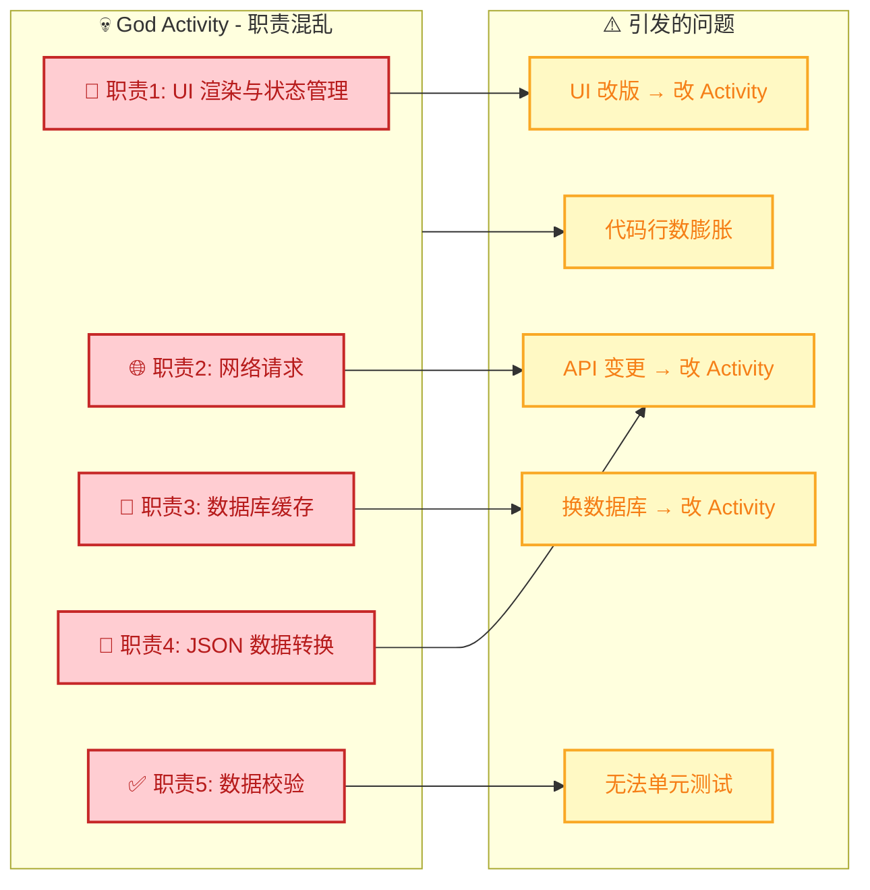

#### 正面案例：职责分离的 MVVM 架构

现在我们用 SRP 来重构。核心思路是：**识别出每个不同的"变化原因"，将其提取到独立的类中**。在 Android 现代架构中，这自然地对应到了 MVVM + Repository 模式：

```kotlin
// ✅ 正面案例 — 第1层：数据模型（职责：定义数据结构）
// 变化原因：后端 API 返回字段变化时才需修改
data class UserProfile(
    val name: String,       // 用户名
    val email: String,      // 邮箱地址
    val avatarUrl: String   // 头像链接
)
```

```kotlin
// ✅ 正面案例 — 第2层：网络数据源（职责：纯粹负责网络请求）
// 变化原因：API 接口地址/协议变化时才需修改
class UserRemoteDataSource(
    private val apiService: UserApiService  // Retrofit 接口，由外部注入
) {
    // 仅负责从远端获取用户数据，不关心缓存、不关心 UI
    suspend fun fetchUserProfile(): UserProfile {
        // Retrofit 自动处理 JSON -> UserProfile 的转换
        return apiService.getUserProfile()
    }
}
```

```kotlin
// ✅ 正面案例 — 第3层：本地数据源（职责：纯粹负责本地持久化）
// 变化原因：数据库 schema 或缓存策略变化时才需修改
class UserLocalDataSource(
    private val userDao: UserDao    // Room DAO，由外部注入
) {
    // 仅负责从本地数据库读取用户数据
    suspend fun getCachedProfile(): UserProfile? {
        return userDao.getUser()?.toUserProfile()   // Entity -> Domain Model
    }

    // 仅负责将用户数据写入本地数据库
    suspend fun cacheProfile(profile: UserProfile) {
        userDao.insertUser(profile.toUserEntity())   // Domain Model -> Entity
    }
}
```

```kotlin
// ✅ 正面案例 — 第4层：Repository（职责：协调远程与本地数据源的策略）
// 变化原因：数据获取策略（先缓存还是先网络）变化时才需修改
class UserRepository(
    private val remoteDataSource: UserRemoteDataSource,  // 远程数据源
    private val localDataSource: UserLocalDataSource     // 本地数据源
) {
    // 策略：优先网络 -> 成功后缓存 -> 网络失败时回退缓存
    suspend fun getUserProfile(): Result<UserProfile> {
        return try {
            // 尝试从网络获取最新数据
            val profile = remoteDataSource.fetchUserProfile()
            // 获取成功后写入本地缓存（不阻塞返回）
            localDataSource.cacheProfile(profile)
            // 返回成功结果
            Result.success(profile)
        } catch (e: Exception) {
            // 网络失败，尝试从本地缓存读取
            val cached = localDataSource.getCachedProfile()
            if (cached != null) {
                Result.success(cached)  // 缓存命中
            } else {
                Result.failure(e)       // 缓存也没有，返回失败
            }
        }
    }
}
```

```kotlin
// ✅ 正面案例 — 第5层：ViewModel（职责：管理 UI 状态 + 连接业务逻辑）
// 变化原因：UI 需要展示的状态字段变化时才需修改
class UserProfileViewModel(
    private val repository: UserRepository  // Repository 由外部注入
) : ViewModel() {

    // 用 sealed class 明确定义 UI 的所有可能状态
    sealed class UiState {
        object Loading : UiState()                          // 加载中
        data class Success(val profile: UserProfile) : UiState()  // 加载成功
        data class Error(val message: String) : UiState()   // 加载失败
    }

    // 使用 StateFlow 暴露 UI 状态（替代 LiveData，更适合 Kotlin 协程）
    private val _uiState = MutableStateFlow<UiState>(UiState.Loading)
    val uiState: StateFlow<UiState> = _uiState.asStateFlow()

    // 加载用户资料 —— ViewModel 不知道数据来自网络还是缓存
    fun loadProfile() {
        viewModelScope.launch {                             // 在 ViewModel 作用域启动协程
            _uiState.value = UiState.Loading                // 发射加载中状态
            val result = repository.getUserProfile()        // 调用 Repository
            _uiState.value = result.fold(                   // 根据结果映射为 UI 状态
                onSuccess = { UiState.Success(it) },        // 成功
                onFailure = { UiState.Error(it.message ?: "Unknown error") }  // 失败
            )
        }
    }
}
```

```kotlin
// ✅ 正面案例 — 第6层：Activity（职责：纯粹负责 UI 渲染 + 用户交互）
// 变化原因：UI布局/交互方式变化时才需修改
class UserProfileActivity : AppCompatActivity() {

    // ViewModel 通过 Activity 扩展函数懒加载
    private val viewModel: UserProfileViewModel by viewModels()

    override fun onCreate(savedInstanceState: Bundle?) {
        super.onCreate(savedInstanceState)
        setContentView(R.layout.activity_user_profile)

        // 观察 UI 状态变化并渲染 —— Activity 只做"展示"
        lifecycleScope.launch {
            repeatOnLifecycle(Lifecycle.State.STARTED) {
                viewModel.uiState.collect { state ->        // 收集 StateFlow
                    when (state) {
                        is UiState.Loading -> showLoading()  // 显示加载动画
                        is UiState.Success -> showProfile(state.profile)  // 渲染数据
                        is UiState.Error -> showError(state.message)      // 显示错误
                    }
                }
            }
        }

        // 触发加载
        viewModel.loadProfile()
    }

    // 以下都是纯 UI 操作方法，不包含任何业务逻辑
    private fun showLoading() {
        findViewById<ProgressBar>(R.id.progress_bar).visibility = View.VISIBLE
    }

    private fun showProfile(profile: UserProfile) {
        findViewById<ProgressBar>(R.id.progress_bar).visibility = View.GONE
        findViewById<TextView>(R.id.tv_user_name).text = profile.name
        findViewById<TextView>(R.id.tv_email).text = profile.email
        Glide.with(this).load(profile.avatarUrl)
            .into(findViewById(R.id.iv_avatar))
    }

    private fun showError(message: String) {
        findViewById<ProgressBar>(R.id.progress_bar).visibility = View.GONE
        Toast.makeText(this, message, Toast.LENGTH_SHORT).show()
    }
}
```

重构后的类图关系如下：

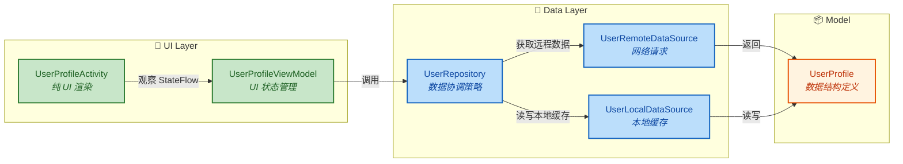

#### Android Framework 中的 SRP 体现

在 AOSP 源码中，SRP 的应用非常典型。以 `View` 体系为例：

- **`View`** 只负责绘制（`onDraw`）、测量（`onMeasure`）、布局（`onLayout`）这些视图自身的核心职责。
- **`ViewGroup`** 在 `View` 基础上增加"子 View 管理"的职责，但它不负责具体的布局算法。
- **`LinearLayout`、`RelativeLayout`、`ConstraintLayout`** 各自只负责自己特定的布局策略。
- **`TouchDelegate`** 专门负责扩展触摸区域，从 `View` 的事件处理中分离出来。
- **`ViewTreeObserver`** 专门负责视图树的全局事件监听（如 `OnGlobalLayoutListener`）。

再看 `RecyclerView` 的设计更是 SRP 的教科书：

| 类名 | 单一职责 |
|------|---------|
| `RecyclerView` | 滚动容器 + 协调者 |
| `LayoutManager` | 子 View 的测量与布局策略 |
| `Adapter` | 数据到 ViewHolder 的绑定 |
| `ViewHolder` | 单个 item 的视图缓存 |
| `ItemDecoration` | item 的装饰（分割线、间距等） |
| `ItemAnimator` | item 增删改的动画 |
| `RecycledViewPool` | ViewHolder 的回收与复用管理 |

每个类都有且只有一个"变化的原因"。当你想换布局方式（从列表变网格），只需替换 `LayoutManager`；想换动画效果，只需替换 `ItemAnimator`——其他组件完全不受影响。

---

### O — 开闭原则 (Open/Closed Principle) ⭐⭐

#### 核心定义

开闭原则（OCP）是 SOLID 中**最重要**的一条原则，由 Bertrand Meyer 于 1988 年首次提出：

> **Software entities (classes, modules, functions, etc.) should be open for extension, but closed for modification.**
> （软件实体应该对扩展开放，对修改关闭。）

翻译成实践语言就是：**当需求变化时，你应该通过"新增代码"来满足需求，而不是"修改已有代码"。** 已有的、经过测试的、稳定运行的代码不应该被轻易改动——每次改动都有引入 bug 的风险。

这听起来似乎不可能——需求变了，怎么可能不改代码？关键在于**提前设计好抽象层**。通过抽象（接口、抽象类）定义稳定的契约，具体实现则通过子类或策略对象来"扩展"。当需求变化时，你新增一个实现类，而不需要修改抽象层或调用方的代码。

#### 对扩展开放

"对扩展开放"意味着系统的行为可以被扩展——你可以增加新的功能、新的类型、新的策略。在 Kotlin/Java 中，主要通过以下机制实现：

- **继承**（inheritance）：新增子类覆写父类方法。
- **接口实现**（interface implementation）：新增接口的实现类。
- **高阶函数 / Lambda**（Kotlin 特有）：通过函数参数注入新行为。
- **装饰器 / 策略模式**：通过组合注入新的行为对象。

#### 对修改关闭

"对修改关闭"意味着已有的源代码不应该被修改。核心是：**抽象层一旦确定就保持稳定**。调用方依赖抽象，不依赖具体实现，因此新增实现不需要改调用方。

#### 反面案例：if-else 硬编码

```kotlin
// ❌ 反面案例：每次新增一种消息类型，都必须修改这个函数
// 这违反了 OCP —— 对修改"敞开大门"
class NotificationHandler {

    // 处理推送通知 —— 用 if-else / when 硬编码所有类型
    fun handleNotification(type: String, data: Bundle) {
        when (type) {
            "chat" -> {
                // 聊天消息的处理逻辑：解析发送者、消息内容...
                val sender = data.getString("sender")
                val message = data.getString("message")
                showChatNotification(sender, message)
            }
            "order" -> {
                // 订单消息的处理逻辑：解析订单号、状态...
                val orderId = data.getString("order_id")
                val status = data.getString("status")
                showOrderNotification(orderId, status)
            }
            "promotion" -> {
                // 促销消息的处理逻辑
                val title = data.getString("title")
                showPromotionNotification(title)
            }
            // ❌ 每新增一种通知类型（如 "system", "payment", "logistics"...）
            //    都必须在这里添加新的分支，修改已有代码
            //    如果这个类已经上线并稳定运行，每次修改都有引入 bug 的风险
        }
    }

    private fun showChatNotification(sender: String?, message: String?) { /* ... */ }
    private fun showOrderNotification(orderId: String?, status: String?) { /* ... */ }
    private fun showPromotionNotification(title: String?) { /* ... */ }
}
```

#### 正面案例：策略模式 + 注册机制

```kotlin
// ✅ 正面案例 — Step 1: 定义通知处理器的抽象接口
// 这是"稳定的抽象层" —— 一旦定义好就不需要修改
interface NotificationProcessor {
    // 该处理器支持的通知类型
    val supportedType: String

    // 处理通知的具体逻辑
    fun process(data: Bundle)
}
```

```kotlin
// ✅ 正面案例 — Step 2: 各类型通知处理器分别实现（对扩展开放）
// 聊天通知处理器
class ChatNotificationProcessor : NotificationProcessor {
    override val supportedType: String = "chat"    // 声明自己处理 "chat" 类型

    override fun process(data: Bundle) {
        val sender = data.getString("sender")       // 解析发送者
        val message = data.getString("message")     // 解析消息内容
        // 构建并显示聊天通知...
        NotificationCompat.Builder(/* ... */)
            .setContentTitle(sender)
            .setContentText(message)
            .build()
    }
}

// 订单通知处理器
class OrderNotificationProcessor : NotificationProcessor {
    override val supportedType: String = "order"   // 声明自己处理 "order" 类型

    override fun process(data: Bundle) {
        val orderId = data.getString("order_id")    // 解析订单号
        val status = data.getString("status")       // 解析订单状态
        // 构建并显示订单通知...
    }
}

// ✅ 未来新增 "logistics" 类型时，只需新增一个类：
class LogisticsNotificationProcessor : NotificationProcessor {
    override val supportedType: String = "logistics"

    override fun process(data: Bundle) {
        // 物流通知的处理逻辑...
    }
}
```

```kotlin
// ✅ 正面案例 — Step 3: 通知分发器（对修改关闭）
// 这个类一旦写好，不管新增多少种通知类型，都不需要修改它
class NotificationDispatcher {

    // 注册表：type -> processor 的映射
    private val processorMap = mutableMapOf<String, NotificationProcessor>()

    // 注册处理器 —— 通过"注册"而非"硬编码"来添加新类型
    fun register(processor: NotificationProcessor) {
        processorMap[processor.supportedType] = processor
    }

    // 分发通知 —— 永远不需要修改这个方法
    fun dispatch(type: String, data: Bundle) {
        val processor = processorMap[type]           // 从注册表查找
            ?: throw IllegalArgumentException("Unknown notification type: $type")
        processor.process(data)                       // 委托给具体处理器
    }
}
```

```kotlin
// ✅ 正面案例 — Step 4: 组装（通常在 Application 或 DI 模块中）
class MyApplication : Application() {
    lateinit var notificationDispatcher: NotificationDispatcher

    override fun onCreate() {
        super.onCreate()
        // 创建分发器
        notificationDispatcher = NotificationDispatcher()

        // 注册所有处理器 —— 新增类型只需在这里多加一行注册
        notificationDispatcher.register(ChatNotificationProcessor())
        notificationDispatcher.register(OrderNotificationProcessor())
        notificationDispatcher.register(LogisticsNotificationProcessor())
        // 未来新增: notificationDispatcher.register(PaymentNotificationProcessor())
    }
}
```

整体流程与扩展机制可以用以下时序图表示：

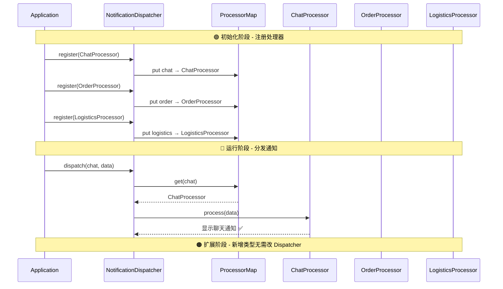

#### Android Framework 中的 OCP 体现

Android Framework 中 OCP 的经典实践随处可见：

- **`View.OnClickListener`**：`View` 类定义了 `setOnClickListener(listener)` 接口，对"点击后做什么"完全开放扩展——你可以传入任何 `OnClickListener` 实现。`View` 内部的点击分发代码（`performClick()`）则是"对修改关闭"的，不管你传入什么 listener，它都不需要改。

- **`RecyclerView.Adapter`**：RecyclerView 定义了 Adapter 抽象，具体的数据绑定逻辑通过子类扩展。RecyclerView 内部的回收、复用、滚动机制不需要因为你换了 Adapter 而修改。

- **`BroadcastReceiver` 机制**：Android 的广播系统天然符合 OCP。系统发送广播（Closed），任何 App 可以注册 Receiver 来响应广播（Open for extension）。

- **`ContentProvider`**：Framework 定义了统一的 CRUD 抽象接口，任何 App 可以实现自己的 ContentProvider 来暴露数据，而访问方（ContentResolver）不需要修改。

---

### L — 里氏替换原则 (Liskov Substitution Principle)

#### 核心定义：子类可替换父类

里氏替换原则（LSP）由 Barbara Liskov 于 1987 年提出，是对"继承"这一 OOP 核心机制的**行为约束**：

> **If S is a subtype of T, then objects of type T may be replaced with objects of type S without altering any of the desirable properties of the program.**
> （如果 S 是 T 的子类型，那么程序中使用 T 的地方都可以用 S 替换，而不改变程序的正确性。）

简单说：**凡是父类能出现的地方，子类都能无缝替换，且程序行为不会出错。** 这不仅仅是语法层面的"编译通过"，而是**语义层面的行为一致**。

#### 不改变程序正确性

LSP 违反的典型标志包括：

1. **子类覆写父类方法后抛出了父类不会抛出的异常。**
2. **子类覆写父类方法后改变了方法的语义契约**（如前置条件更严格，后置条件更宽松）。
3. **子类的行为与父类的"合理预期"不一致**——最经典的就是"正方形继承矩形"问题。

#### 经典反面案例：正方形 vs 矩形

```kotlin
// ❌ 反面案例：经典的 LSP 违反 —— 正方形继承矩形
// 从数学角度看，正方形 IS-A 矩形，但从行为角度看，这个继承关系是有问题的

open class Rectangle(                   // 矩形：宽和高可以独立变化
    open var width: Int,                // 宽度
    open var height: Int                // 高度
) {
    // 计算面积
    open fun area(): Int = width * height
}

class Square(side: Int) : Rectangle(side, side) {  // 正方形继承矩形
    // 正方形的约束：宽 == 高，所以设置宽度时必须同步高度
    override var width: Int
        get() = super.width
        set(value) {
            super.width = value         // 设置宽度
            super.height = value        // ❌ 同步修改高度（改变了父类的行为契约！）
        }

    // 同理，设置高度时也必须同步宽度
    override var height: Int
        get() = super.height
        set(value) {
            super.height = value        // 设置高度
            super.width = value         // ❌ 同步修改宽度
        }
}
```

```kotlin
// 调用方代码 —— 按照 Rectangle 的行为契约编写
fun testArea(rect: Rectangle) {
    rect.width = 5                      // 只修改宽度
    rect.height = 4                     // 只修改高度
    // 按照矩形的语义，面积应该是 5 * 4 = 20
    assert(rect.area() == 20)           // ✅ Rectangle → 20，通过
                                        // ❌ Square → 4 * 4 = 16，断言失败！
}

fun main() {
    testArea(Rectangle(0, 0))           // ✅ 正确
    testArea(Square(0))                 // ❌ 失败！LSP 被违反
}
```

问题在于：`Square` 在语法上是 `Rectangle` 的子类，但在行为上破坏了 `Rectangle` 的契约——"设置宽度不会影响高度"。当调用方按照 `Rectangle` 的预期来操作 `Square` 时，程序行为出错了。

#### 正面案例：用接口抽象替代继承

```kotlin
// ✅ 正面案例：用接口定义"形状"的抽象行为
// 不使用继承，避免行为契约被子类破坏

interface Shape {
    fun area(): Int                     // 所有形状都能计算面积
}

// 矩形：独立的宽和高
class Rectangle(
    val width: Int,                     // 宽度（val，不可变，避免状态变异问题）
    val height: Int                     // 高度
) : Shape {
    override fun area(): Int = width * height
}

// 正方形：只有边长
class Square(
    val side: Int                       // 边长
) : Shape {
    override fun area(): Int = side * side
}

// 调用方依赖抽象接口，不做任何"宽高可独立修改"的假设
fun printArea(shape: Shape) {
    println("面积 = ${shape.area()}")    // ✅ Rectangle 和 Square 都能正确工作
}
```

#### Android 中的 LSP 实践

在 Android 开发中，LSP 最常见的应用场景是**自定义 View**。当你继承 `View` 或 `ViewGroup` 时，必须遵守父类的行为契约：

```kotlin
// ✅ 正确的自定义 View —— 遵守 View 的测量契约
class CircleView @JvmOverloads constructor(
    context: Context,
    attrs: AttributeSet? = null,
    defStyleAttr: Int = 0
) : View(context, attrs, defStyleAttr) {

    override fun onMeasure(widthMeasureSpec: Int, heightMeasureSpec: Int) {
        // ✅ 关键：必须调用 setMeasuredDimension()，这是 View 的行为契约
        // 如果不调用，父类会抛出 IllegalStateException
        val size = minOf(
            MeasureSpec.getSize(widthMeasureSpec),
            MeasureSpec.getSize(heightMeasureSpec)
        )
        setMeasuredDimension(size, size)  // ✅ 遵守契约：必须设置测量结果
    }

    override fun onDraw(canvas: Canvas) {
        super.onDraw(canvas)             // ✅ 调用父类方法，保持契约链
        // 绘制圆形...
        val radius = width / 2f
        canvas.drawCircle(radius, radius, radius, Paint().apply {
            color = Color.BLUE
            isAntiAlias = true
        })
    }
}
```

**违反 LSP 的典型错误**：

```kotlin
// ❌ 违反 LSP 的自定义 View
class BrokenView(context: Context) : View(context) {

    override fun onMeasure(widthMeasureSpec: Int, heightMeasureSpec: Int) {
        // ❌ 忘记调用 setMeasuredDimension() —— 违反了 View.onMeasure 的行为契约
        // 虽然编译通过，但运行时 ViewGroup 调用 child.getMeasuredWidth() 会得到错误结果
    }

    override fun setVisibility(visibility: Int) {
        // ❌ 覆写 setVisibility 但不调用 super —— 破坏了父类的可见性管理契约
        // 其他代码调用 view.visibility = View.GONE 时预期 View 会消失，但实际不会
        // 违反了"子类可替换父类"的原则
        if (visibility == GONE) return    // 忽略 GONE 请求
        super.setVisibility(visibility)
    }
}
```

在 Framework 层，Android 的 `InputStream` 体系也是 LSP 的典范——`FileInputStream`、`ByteArrayInputStream`、`BufferedInputStream` 都可以无缝替换使用 `InputStream` 的地方，行为完全符合预期。

---

### I — 接口隔离原则 (Interface Segregation Principle)

#### 核心定义：接口小而专

接口隔离原则（ISP）指出：

> **No client should be forced to depend on methods it does not use.**
> （客户端不应该被迫依赖它不需要的方法。）

这条原则针对的是**"胖接口"（Fat Interface）** 问题——当一个接口包含了太多方法时，实现这个接口的类被迫实现所有方法，即使其中很多方法对它毫无意义。

#### 不强迫依赖不需要的方法

ISP 的解决方案是：**将一个大接口拆分为多个小的、专注的接口**。每个实现类只需要实现自己真正需要的接口，而不是被迫实现一整个"万能接口"。

#### 反面案例：胖接口

```kotlin
// ❌ 反面案例：一个"万能"的用户操作接口
// 强迫所有实现类都实现所有方法
interface UserAction {
    fun login(username: String, password: String)    // 登录
    fun logout()                                      // 登出
    fun updateProfile(name: String, avatar: String)   // 更新资料
    fun deleteAccount()                               // 注销账号
    fun exportData(): ByteArray                       // 导出数据
    fun sendMessage(to: String, content: String)      // 发送消息
    fun blockUser(userId: String)                     // 拉黑用户
}

// 一个"访客"模块只需要登录功能，但被迫实现所有方法
class GuestModule : UserAction {
    override fun login(username: String, password: String) {
        // ✅ 这是访客唯一需要的功能
    }

    // ❌ 以下所有方法对访客毫无意义，但必须实现
    override fun logout() { /* 空实现 */ }
    override fun updateProfile(name: String, avatar: String) {
        throw UnsupportedOperationException("访客不能修改资料")  // ❌ 被迫抛异常
    }
    override fun deleteAccount() {
        throw UnsupportedOperationException("访客不能注销")
    }
    override fun exportData(): ByteArray = byteArrayOf()
    override fun sendMessage(to: String, content: String) {
        throw UnsupportedOperationException("访客不能发消息")
    }
    override fun blockUser(userId: String) {
        throw UnsupportedOperationException("访客不能拉黑")
    }
}
```

这种代码有几个严重问题：
- **空实现 / 异常抛出**：大量 `UnsupportedOperationException` 是代码的"坏味道"。
- **接口污染**：调用方拿到 `UserAction` 引用后，不知道哪些方法能调、哪些会爆炸。
- **违反 LSP**：`GuestModule` 无法真正替换 `UserAction` 的使用场景。

#### 正面案例：接口拆分

```kotlin
// ✅ 正面案例：将一个胖接口拆分为多个小接口

// 认证相关操作
interface Authenticatable {
    fun login(username: String, password: String)    // 登录
    fun logout()                                      // 登出
}

// 资料管理操作
interface ProfileManageable {
    fun updateProfile(name: String, avatar: String)   // 更新资料
    fun deleteAccount()                               // 注销账号
    fun exportData(): ByteArray                       // 导出数据
}

// 社交操作
interface Socializable {
    fun sendMessage(to: String, content: String)      // 发送消息
    fun blockUser(userId: String)                     // 拉黑用户
}

// 访客模块：只实现需要的认证接口
class GuestModule : Authenticatable {
    override fun login(username: String, password: String) {
        // ✅ 只实现自己需要的方法，干净利落
    }
    override fun logout() {
        // ✅ 清理访客会话
    }
}

// 正式用户模块：实现所有相关接口
class RegisteredUserModule : Authenticatable, ProfileManageable, Socializable {
    override fun login(username: String, password: String) { /* ... */ }
    override fun logout() { /* ... */ }
    override fun updateProfile(name: String, avatar: String) { /* ... */ }
    override fun deleteAccount() { /* ... */ }
    override fun exportData(): ByteArray = byteArrayOf(/* ... */)
    override fun sendMessage(to: String, content: String) { /* ... */ }
    override fun blockUser(userId: String) { /* ... */ }
}
```

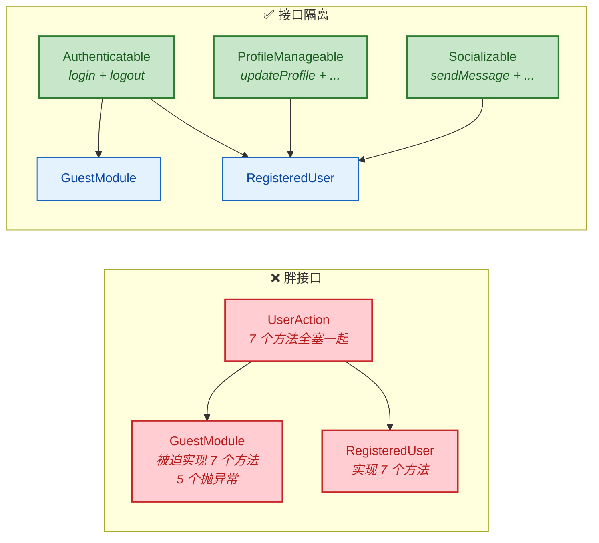

#### Android 中的 ISP 实践

Android Framework 中 ISP 的实践非常典型：

**1. `View` 的事件监听器体系**

Android 没有设计一个 `OnEverythingListener`，而是将不同事件拆分为独立的小接口：

```kotlin
// Android SDK 中的接口设计 —— 每个接口只关注一种事件
view.setOnClickListener { /* 点击 */ }           // View.OnClickListener —— 1 个方法
view.setOnLongClickListener { /* 长按 */ }       // View.OnLongClickListener —— 1 个方法
view.setOnTouchListener { _, _ -> false }         // View.OnTouchListener —— 1 个方法
view.setOnDragListener { _, _ -> false }          // View.OnDragListener —— 1 个方法
view.setOnKeyListener { _, _, _ -> false }        // View.OnKeyListener —— 1 个方法
```

如果这些全合并成一个 `OnViewEventListener`，那只关心点击事件的类就被迫实现拖拽、按键等所有方法。

**2. `TextWatcher` 的设计反思**

有趣的是，`TextWatcher` 接口恰好是 ISP 的一个**轻微违反案例**：

```java
// Android SDK 中的 TextWatcher —— 包含 3 个方法
public interface TextWatcher extends NoCopySpan {
    void beforeTextChanged(CharSequence s, int start, int count, int after);
    void onTextChanged(CharSequence s, int start, int before, int count);
    void afterTextChanged(Editable s);
}
```

实际开发中，大多数场景只需要 `afterTextChanged`，但被迫实现另外两个方法。这就是为什么 Android KTX 提供了扩展函数 `doAfterTextChanged` 来简化使用——本质上就是用 Kotlin 的高阶函数弥补了原始接口设计的 ISP 不足。

**3. Kotlin 的 SAM (Single Abstract Method) 与 ISP**

Kotlin 语言层面天然鼓励 ISP——`fun interface`（SAM 接口）就是最小化接口的极致体现：

```kotlin
// Kotlin 中声明 SAM 接口
fun interface OnItemSelected {
    fun onSelected(position: Int)       // 只有一个抽象方法
}

// 使用时可以直接用 lambda 替代
adapter.setOnItemSelectedListener { position ->
    // 处理选中事件
}
```

---

### D — 依赖倒置原则 (Dependency Inversion Principle) ⭐

#### 核心定义：依赖抽象而非具体

依赖倒置原则（DIP）包含两层含义：

> 1. **High-level modules should not depend on low-level modules. Both should depend on abstractions.**
>    （高层模块不应该依赖低层模块，两者都应该依赖抽象。）
> 2. **Abstractions should not depend on details. Details should depend on abstractions.**
>    （抽象不应该依赖细节，细节应该依赖抽象。）

这里的"倒置"指的是**依赖关系的方向反转**。在传统的分层架构中，高层模块（如业务逻辑）直接依赖低层模块（如数据库访问）。DIP 要求在两者之间插入一个**抽象层**，使得依赖箭头"倒过来"——低层模块去实现高层定义的抽象接口，而不是高层直接依赖低层的具体实现。

#### 高层不依赖低层

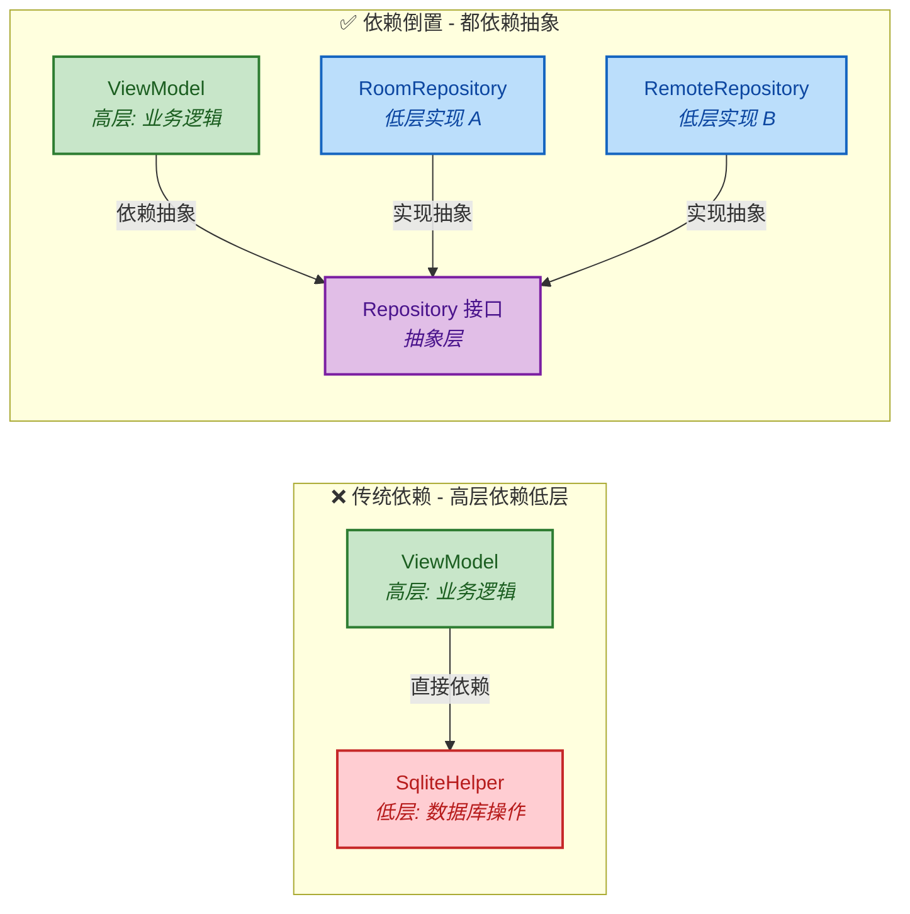

注意看上图中依赖箭头的方向变化。在"倒置后"的架构中：
- `ViewModel` → 依赖 → `Repository` 接口（抽象）
- `RoomRepository` → 实现 → `Repository` 接口（抽象）

**低层模块的依赖箭头"向上"指向了抽象层**——这就是所谓的"倒置"。

#### 反面案例：直接依赖具体实现

```kotlin
// ❌ 反面案例：ViewModel 直接依赖具体的数据库实现类
class UserViewModel : ViewModel() {

    // 直接 new 出具体的数据库 Helper —— 高层直接依赖低层
    private val dbHelper = UserDatabaseHelper()     // ❌ 硬编码依赖

    fun getUser(id: String): LiveData<User> {
        val user = dbHelper.queryUserById(id)       // 直接调用具体方法
        return MutableLiveData(user)
    }
}

// 问题：
// 1. 如果要从 SQLite 换成 Room —— 必须修改 ViewModel
// 2. 如果要加网络缓存层 —— 必须修改 ViewModel
// 3. 单元测试时无法 mock 数据源 —— 因为是 new 出来的，无法替换
// 4. ViewModel（高层业务逻辑）和 SQLite（低层存储细节）紧密耦合
```

#### 正面案例：依赖抽象 + 构造函数注入

```kotlin
// ✅ 正面案例 — Step 1: 定义抽象接口（高层与低层之间的契约）
// 这个接口由"高层"定义，表达的是高层需要什么能力
interface UserRepository {
    suspend fun getUserById(id: String): User?       // 获取用户
    suspend fun saveUser(user: User)                 // 保存用户
    suspend fun deleteUser(id: String)               // 删除用户
}
```

```kotlin
// ✅ 正面案例 — Step 2: 低层模块实现抽象接口
// Room 实现
class RoomUserRepository(
    private val userDao: UserDao                     // Room DAO
) : UserRepository {
    override suspend fun getUserById(id: String): User? {
        return userDao.findById(id)?.toDomainModel() // Entity -> Domain Model
    }
    override suspend fun saveUser(user: User) {
        userDao.insert(user.toEntity())              // Domain Model -> Entity
    }
    override suspend fun deleteUser(id: String) {
        userDao.deleteById(id)
    }
}

// 网络实现（同一个接口，不同的底层技术）
class RemoteUserRepository(
    private val apiService: UserApiService           // Retrofit 接口
) : UserRepository {
    override suspend fun getUserById(id: String): User? {
        return apiService.fetchUser(id)              // 从网络获取
    }
    override suspend fun saveUser(user: User) {
        apiService.updateUser(user)                  // 上传到服务器
    }
    override suspend fun deleteUser(id: String) {
        apiService.deleteUser(id)                    // 远程删除
    }
}
```

```kotlin
// ✅ 正面案例 — Step 3: 高层模块依赖抽象（通过构造函数注入）
class UserViewModel(
    private val repository: UserRepository           // ✅ 依赖抽象接口，不依赖具体实现
) : ViewModel() {

    private val _user = MutableStateFlow<User?>(null)
    val user: StateFlow<User?> = _user.asStateFlow()

    fun loadUser(id: String) {
        viewModelScope.launch {
            _user.value = repository.getUserById(id) // 调用抽象方法
            // ViewModel 完全不知道数据来自 Room 还是网络
            // 未来切换数据源时，这里的代码零修改
        }
    }
}
```

```kotlin
// ✅ 正面案例 — Step 4: 在 DI 层（Hilt/Koin）进行装配
// 使用 Hilt 的示例
@Module
@InstallIn(SingletonComponent::class)               // 全局单例作用域
abstract class RepositoryModule {

    @Binds                                            // 告诉 Hilt：当需要 UserRepository 时
    @Singleton                                        // 单例
    abstract fun bindUserRepository(
        impl: RoomUserRepository                      // 注入 RoomUserRepository 实现
    ): UserRepository                                 // 返回抽象接口类型
}

// 切换实现只需修改 DI 配置，ViewModel 和所有调用方代码零改动：
// impl: RoomUserRepository → impl: RemoteUserRepository
```

#### Android Framework 中的 DIP 体现

在 Android Framework 中，DIP 最经典的体现是 **Binder IPC 机制**：

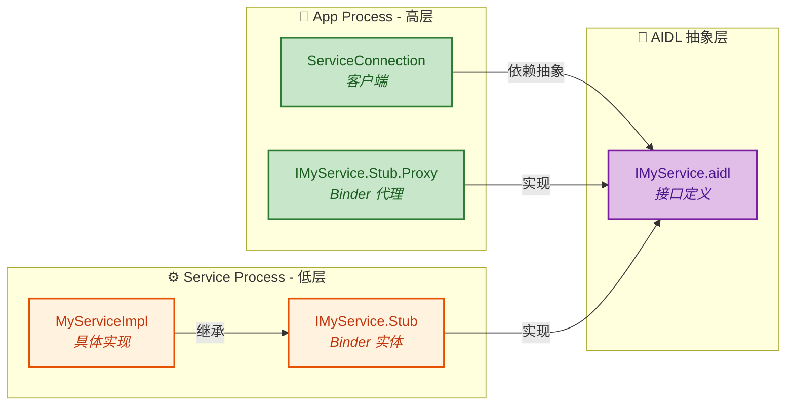

AIDL（Android Interface Definition Language）就是"抽象层"——Client 和 Service 都依赖这个抽象接口定义，而不直接依赖彼此。Client 进程通过 `Proxy` 调用接口方法，Service 进程通过 `Stub` 实现接口方法。两者完全解耦，可以在不同进程、甚至不同设备上运行。

此外，Android 的 `Context` 也是 DIP 的体现——`Context` 是一个抽象类，`Activity`、`Service`、`Application` 都是它的实现。当你调用 `context.getSystemService()` 时，你依赖的是 `Context` 抽象，而不关心它背后是 Activity 还是 Application。

---

**📝 练习题**

**题目 1：** 在 Android MVVM 架构中，以下哪种做法 **违反了** 依赖倒置原则（DIP）？

A. ViewModel 通过构造函数接收一个 `Repository` 接口类型的参数


B. ViewModel 内部直接 `new RetrofitUserService()` 来发起网络请求


C. 使用 Hilt 的 `@Binds` 将 `RoomRepository` 绑定到 `Repository` 接口


D. Repository 接口定义在 domain 层，具体实现定义在 data 层


**【答案】** B

**【解析】** DIP 的核心是"高层模块不应该依赖低层模块，两者都应该依赖抽象"。选项 B 中，`ViewModel`（高层业务逻辑）直接 `new` 了 `RetrofitUserService`（低层网络实现），这就是高层直接依赖低层的典型违反。这样做导致 ViewModel 与 Retrofit 紧耦合，无法单独对 ViewModel 进行单元测试（因为无法 mock 网络层），也无法在不修改 ViewModel 的情况下替换网络库。选项 A 使用构造函数注入抽象类型，选项 C 使用 DI 框架绑定实现到抽象，选项 D 将接口放在高层（domain）、实现放在低层（data），三者都是 DIP 的正确实践。

---

**题目 2：** 以下关于 SOLID 原则在 Android `RecyclerView` 设计中的应用，说法 **错误** 的是？

A. `RecyclerView` 将布局策略委托给 `LayoutManager`，体现了单一职责原则（SRP）


B. 新增一种布局方式只需实现新的 `LayoutManager` 子类，无需修改 `RecyclerView` 源码，体现了开闭原则（OCP）


C. `ItemDecoration` 和 `ItemAnimator` 是两个独立的接口，体现了接口隔离原则（ISP）


D. `RecyclerView.Adapter` 是一个抽象类而非接口，因此它违反了依赖倒置原则（DIP）


**【答案】** D

**【解析】** DIP 的关键是"依赖抽象而非具体"，这里的"抽象"包括 **接口和抽象类** 两种形式。`RecyclerView.Adapter` 虽然是抽象类而非接口，但它仍然是一种"抽象"——`RecyclerView` 内部持有的是 `Adapter` 抽象类型的引用，不知道也不关心具体是哪个子类。因此 D 选项"违反了 DIP"的说法是错误的。选项 A、B、C 的分析都是正确的：`LayoutManager` 的分离体现了 SRP 和 OCP；`ItemDecoration` 与 `ItemAnimator` 的独立设计避免了将装饰逻辑和动画逻辑捆绑在一个接口中，体现了 ISP。

---

## 其他原则

在 SOLID 五大原则之外，面向对象设计领域还有两条极其重要的补充原则——**迪米特法则（Law of Demeter, LoD）** 和 **合成复用原则（Composite Reuse Principle, CRP）**。它们与 SOLID 并非对立关系，而是从不同维度对"高内聚、低耦合"这一终极目标的进一步诠释。如果说 SOLID 侧重于类与接口的"微观结构"设计，那么这两条原则更多着眼于对象之间的"宏观交互"与"复用策略"。在 Android 开发中，无论是应用层的 MVVM 架构，还是 Framework 层的 `Binder`、`WindowManager` 等系统服务，都大量体现了这两条原则的思想。

---

### 迪米特法则（最少知识原则）

#### 核心定义

迪米特法则（Law of Demeter），又称 **最少知识原则（Principle of Least Knowledge）**，由 Ian Holland 于 1987 年在美国东北大学（Northeastern University）的 Demeter 项目中首次提出。其核心表述非常简洁：

> **一个对象应该对其他对象保持最少的了解（Each unit should have only limited knowledge about other units）。**

更具体地说，一个对象 `O` 的某个方法 `M`，只应该调用以下范围内的方法：

1. **O 自身**的方法（`this.xxx()`）
2. **M 的参数对象**的方法
3. **M 内部创建的局部对象**的方法
4. **O 的直接成员变量（组件对象）** 的方法

而**不应该**调用通过上述调用链间接获得的"陌生对象"的方法。这就是著名的 **"只与直接朋友通信（Only talk to your immediate friends）"** 规则。所谓"朋友"，就是上面列出的四类对象。

#### 为什么"链式穿透"是危险的

考虑这样一个反例——在 Android 中，一个 `Activity` 想获取当前用户的城市名称：

```kotlin
// ❌ 违反迪米特法则：链式穿透访问
// Activity 直接"穿透"了 UserManager → User → Address → city
// Activity 不仅知道 UserManager，还知道 User 的内部结构，甚至 Address 的字段
val cityName = userManager.getCurrentUser().getAddress().getCity()
```

这行代码看似简洁，实际暗藏巨大隐患：

- **耦合链条**：`Activity` 对 `UserManager`、`User`、`Address` 三个类都产生了依赖。任何一个中间类的结构变动，都可能导致 `Activity` 编译失败。
- **空安全灾难**：Kotlin 中会变成 `userManager.getCurrentUser()?.getAddress()?.getCity()`，链条越长，`null` 检查越恐怖。
- **违反封装**：`Activity` 根本不需要知道"用户有一个地址对象、地址对象有一个城市字段"这些内部细节。

我们用一张类图来直观对比"违反"与"遵守"迪米特法则的两种设计：

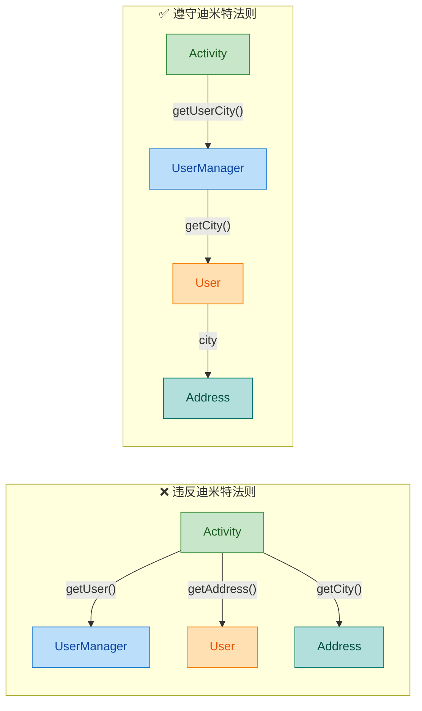

在右侧"遵守"的方案中，`Activity` 只与它的直接朋友 `UserManager` 交互，而 `UserManager` 封装了"获取城市"的细节，对外仅暴露一个 `getUserCity()` 方法。这就是迪米特法则的精髓。

#### Android 中的正确实践

下面给出完整的 Kotlin 重构示例：

```kotlin
// === 数据层：Address 类 ===
data class Address(
    val city: String,       // 城市名
    val district: String    // 区县名
)

// === 数据层：User 类 ===
// User 封装了从自身获取城市的能力，外部无需知道 Address 的存在
data class User(
    val name: String,       // 用户名
    val address: Address    // 地址（内部细节）
) {
    // ✅ User 自己提供 "获取城市" 的方法
    // 外部无需知道 address 字段的结构
    fun getCity(): String = address.city
}

// === 业务层：UserManager ===
// UserManager 对外只暴露"最终结果"，隐藏 User 的获取细节
class UserManager(
    private val userRepository: UserRepository  // 数据仓库（直接朋友）
) {
    // ✅ 封装了获取当前用户城市的完整链路
    // Activity 只需调用这一个方法即可
    fun getCurrentUserCity(): String {
        val user = userRepository.getCurrentUser()  // 获取用户对象
        return user.getCity()                        // 委托 User 获取城市
    }
}

// === 表现层：Activity ===
class ProfileActivity : AppCompatActivity() {

    // UserManager 是 Activity 的"直接朋友"
    private lateinit var userManager: UserManager

    override fun onCreate(savedInstanceState: Bundle?) {
        super.onCreate(savedInstanceState)

        // ✅ 只与直接朋友通信，一步到位
        // Activity 完全不知道 User、Address 的存在
        val city = userManager.getCurrentUserCity()
        binding.tvCity.text = city  // 直接展示
    }
}
```

**关键点**：每一层只与自己的"直接朋友"对话。`Activity` → `UserManager` → `User` → `Address`，每一步只跨一层，绝不越级。

#### 迪米特法则在 Android Framework 中的体现

Android Framework 本身就是迪米特法则的忠实践行者。以 **`Context`** 体系为例：

当你的应用需要获取系统服务（如 `ConnectivityManager`、`WindowManager`）时，你**从来不需要**知道这些服务的内部 Binder 代理是如何创建的。你只需要：

```kotlin
// ✅ 通过 Context 这个"直接朋友"获取系统服务
// 你不需要了解 ServiceManager、IBinder、AIDL Proxy 等底层细节
val connectivityManager = context.getSystemService(Context.CONNECTIVITY_SERVICE)
    as ConnectivityManager
```

在 Framework 内部，这个调用实际上经过了一条很长的链路：

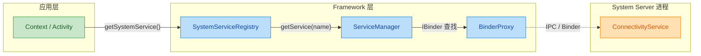

但对于应用开发者来说，你的"世界"只有 `Context` 这一个朋友。`SystemServiceRegistry`、`ServiceManager`、`BinderProxy`——这些全部被封装在 Framework 内部，你无需感知，也不应感知。这正是迪米特法则在系统级架构中的经典应用：**每一层只暴露最少的必要接口给上层调用者**。

#### 迪米特法则的适度把握

迪米特法则虽好，但过度应用也会带来问题。如果严格遵守"不与陌生人说话"，可能会在中间层引入大量**委托方法（Wrapper / Delegate Methods）**，导致：

- **中间类膨胀**：`UserManager` 为了满足上层各种需求，不得不为 `User` 的每一个属性都写一个代理方法。
- **过度封装**：简单的数据传递被包了三四层，阅读成本反而上升。

因此，在实践中需要**权衡**：

| 场景 | 建议 |
|---|---|
| 跨模块调用（Activity → Repository） | **严格遵守**，通过 ViewModel/UseCase 封装 |
| 同模块内部（ViewModel → Entity） | **适度放松**，允许直接访问 data class 属性 |
| Kotlin data class 的属性链 | `user.address.city` 在 Kotlin 中因空安全 `?.` 机制可接受 |
| Framework 层对外 API | **严格遵守**，系统服务对 App 层只暴露接口 |

---

### 合成复用原则（组合优于继承）

#### 核心定义

合成复用原则（Composite Reuse Principle, CRP），也被称为 **"组合/聚合复用原则"** 或更广为人知的 **"Composition over Inheritance"**，其核心表述为：

> **优先使用对象组合（has-a）来实现代码复用，而非通过类继承（is-a）。**

这并不是说"永远不要用继承"，而是说：**当你想复用某个类的功能时，第一反应应该是"我能不能把它组合进来"，而不是"我能不能继承它"。** 继承应该只在真正的 "is-a" 语义关系下使用。

#### 继承复用的致命问题

让我们用一个 Android 场景来说明继承的陷阱。假设我们有一个带日志功能的网络请求类：

```kotlin
// === 基础网络请求类 ===
open class BaseHttpClient {
    // 发送 GET 请求
    open fun get(url: String): String {
        println("HTTP GET: $url")  // 日志输出
        return "response"           // 模拟返回
    }

    // 发送 POST 请求
    open fun post(url: String, body: String): String {
        println("HTTP POST: $url") // 日志输出
        return "response"           // 模拟返回
    }
}

// ❌ 通过继承来添加"缓存"功能
// CachedHttpClient "is-a" BaseHttpClient？语义上不太对
// 缓存和 HTTP 请求是两个独立的关注点
class CachedHttpClient : BaseHttpClient() {

    private val cache = mutableMapOf<String, String>()  // 简单内存缓存

    // 覆写 get，加入缓存逻辑
    override fun get(url: String): String {
        // 先查缓存
        cache[url]?.let { return it }
        // 缓存未命中，调用父类实际请求
        val response = super.get(url)
        cache[url] = response  // 写入缓存
        return response
    }
}

// ❌ 再通过继承添加"认证"功能
// AuthCachedHttpClient 同时需要缓存和认证
// 必须继承 CachedHttpClient，形成脆弱的层级链
class AuthCachedHttpClient : CachedHttpClient() {

    private var token: String = ""  // 认证令牌

    // 覆写 get，加入认证 Header
    override fun get(url: String): String {
        println("Adding auth token: $token")  // 注入认证信息
        return super.get(url)                  // 委托给带缓存的父类
    }
}
```

这种设计的问题是灾难性的：

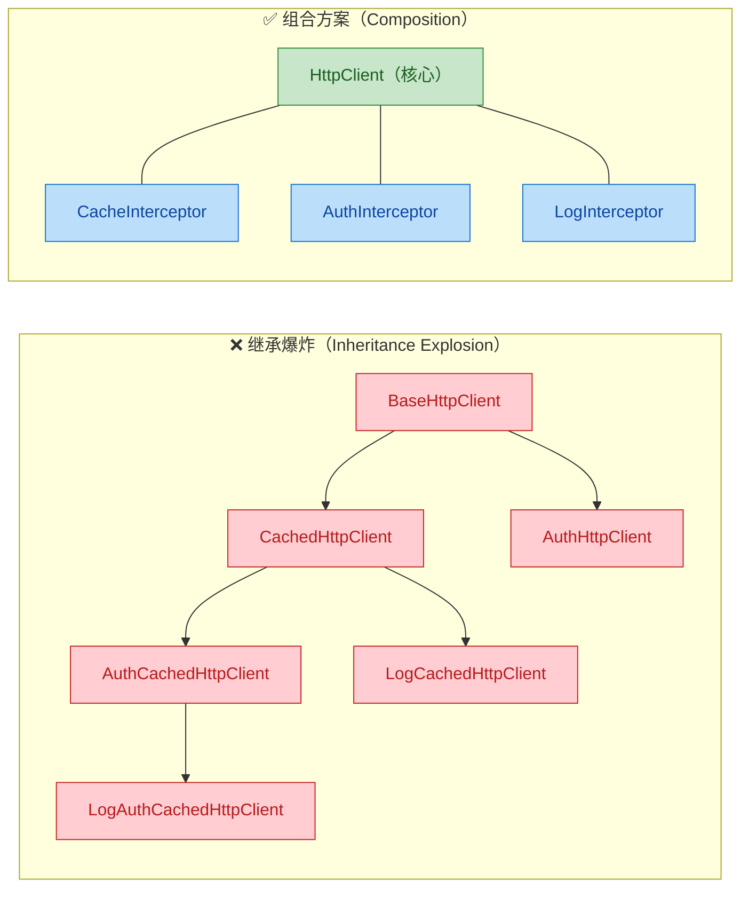

左侧继承方案的根本问题：

- **组合爆炸**：N 个功能会产生 2^N 个子类（缓存、认证、日志三个功能的排列组合就可能需要 7 个子类）。
- **脆弱基类问题（Fragile Base Class Problem）**：父类的任何修改都可能破坏所有子类的行为，这在 Java/Kotlin 中尤为突出，因为方法调用是动态分派的。
- **违反单一职责**：`AuthCachedHttpClient` 同时承担了认证、缓存、HTTP 请求三种职责。
- **无法在运行时动态切换**：继承关系在编译时就固定了，运行时无法灵活地"关闭缓存但保留认证"。

#### 用组合重构：拦截器模式

这正是 **OkHttp** 的核心设计思想——用拦截器（Interceptor）链实现组合：

```kotlin
// === 拦截器接口：定义统一的"处理切面" ===
// 每个拦截器只负责一个关注点
interface Interceptor {
    // 拦截处理，chain 允许将请求传递给下一个拦截器
    fun intercept(chain: Chain): Response

    // 链接口，负责串联多个拦截器
    interface Chain {
        fun request(): Request           // 获取当前请求
        fun proceed(request: Request): Response  // 传递给下一个拦截器
    }
}

// === 缓存拦截器：只负责缓存 ===
class CacheInterceptor(
    private val cache: Cache  // 通过构造器注入缓存实现（又是组合！）
) : Interceptor {

    override fun intercept(chain: Interceptor.Chain): Response {
        val request = chain.request()                   // 获取请求
        val cachedResponse = cache.get(request)         // 查询缓存

        if (cachedResponse != null) {
            return cachedResponse                       // 命中缓存，直接返回
        }

        val response = chain.proceed(request)           // 未命中，传递给下一个拦截器
        cache.put(request, response)                    // 将结果写入缓存
        return response                                 // 返回响应
    }
}

// === 认证拦截器：只负责认证 ===
class AuthInterceptor(
    private val tokenProvider: () -> String  // 令牌提供者（函数式组合）
) : Interceptor {

    override fun intercept(chain: Interceptor.Chain): Response {
        val originalRequest = chain.request()           // 获取原始请求

        // 在请求头中添加认证令牌
        val authenticatedRequest = originalRequest.newBuilder()
            .addHeader("Authorization", "Bearer ${tokenProvider()}")  // 注入 token
            .build()

        return chain.proceed(authenticatedRequest)      // 传递修改后的请求
    }
}

// === 日志拦截器：只负责日志 ===
class LogInterceptor : Interceptor {

    override fun intercept(chain: Interceptor.Chain): Response {
        val request = chain.request()
        println("➡️ Sending: ${request.url}")           // 打印请求日志

        val startTime = System.nanoTime()               // 记录开始时间
        val response = chain.proceed(request)           // 传递给下一个拦截器
        val duration = (System.nanoTime() - startTime) / 1e6  // 计算耗时

        println("⬅️ Received: ${response.code} in ${duration}ms")  // 打印响应日志
        return response
    }
}
```

客户端可以自由组合任意拦截器，**运行时动态增减功能**：

```kotlin
// === 使用组合构建 HttpClient ===
val client = OkHttpClient.Builder()
    .addInterceptor(LogInterceptor())                       // ✅ 添加日志
    .addInterceptor(AuthInterceptor { "my-secret-token" })  // ✅ 添加认证
    .addInterceptor(CacheInterceptor(diskCache))            // ✅ 添加缓存
    .build()

// 想要一个不带缓存的客户端？直接去掉那一行即可！
val noCacheClient = OkHttpClient.Builder()
    .addInterceptor(LogInterceptor())                       // ✅ 只要日志
    .addInterceptor(AuthInterceptor { "my-secret-token" })  // ✅ 和认证
    .build()
```

这就是组合的威力：每个功能独立为一个小模块，可以像**乐高积木**一样任意拼装，无需创建新的子类。

#### 合成复用原则在 Android Framework 中的经典体现

Android Framework 中最典型的"组合优于继承"案例莫过于 **`RecyclerView` 的架构设计**：

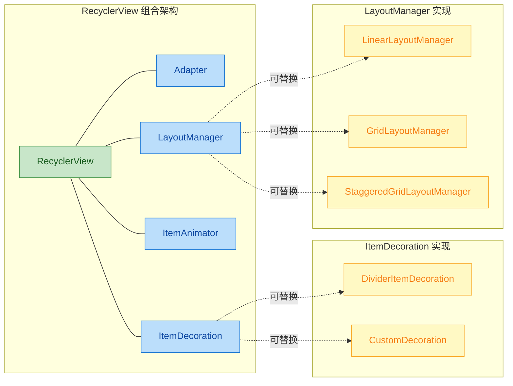

`RecyclerView` **本身不负责布局、不负责动画、不负责分割线**。它通过持有（has-a）各种组件对象来获得这些能力：

| 组件 | 职责 | 替换方式 |
|---|---|---|
| `LayoutManager` | 决定子 View 如何排列 | `setLayoutManager()` |
| `Adapter` | 提供数据和创建 ViewHolder | `setAdapter()` |
| `ItemDecoration` | 绘制分割线、间距等装饰 | `addItemDecoration()` |
| `ItemAnimator` | 处理增删改动画 | `setItemAnimator()` |

试想如果用继承来实现——`LinearRecyclerView`、`GridRecyclerView`、`StaggeredRecyclerView`、`LinearAnimatedRecyclerView`、`GridAnimatedRecyclerView`……这完全是组合爆炸的灾难。

再看一个 Framework Java 层的经典案例——**`Window` 与 `WindowManager`**：

```java
// === Android Framework: Window.java（简化）===
// Window 类通过组合持有 Callback，而非要求 Activity 继承 Window
public abstract class Window {

    // ✅ 组合：Window 持有一个 Callback 接口引用
    // Activity 实现此接口，Window 通过组合调用 Activity 的回调
    private Callback mCallback;  // "has-a" 关系

    // Callback 接口定义了 Window 与上层的通信协议
    public interface Callback {
        boolean dispatchKeyEvent(KeyEvent event);     // 按键事件分发
        boolean dispatchTouchEvent(MotionEvent event); // 触摸事件分发
        void onWindowFocusChanged(boolean hasFocus);   // 焦点变化通知
    }

    // 设置回调——运行时可替换！
    public void setCallback(Callback callback) {
        mCallback = callback;  // 动态绑定
    }
}

// Activity 实现 Window.Callback，而非继承 Window
// 这正是"组合优于继承"的体现
// public class Activity extends ContextThemeWrapper
//     implements Window.Callback, ... { }
```

`Activity` 并没有继承 `Window`，而是**实现了 `Window.Callback` 接口**，与 `Window` 形成组合关系。这使得 `Window` 可以独立演化，`Activity` 也不会被 `Window` 的实现细节所绑架。

#### 何时该用继承

虽然原则叫"组合优于继承"，但继承在以下场景中仍然是正确的选择：

```kotlin
// ✅ 正确使用继承：真正的 "is-a" 关系
// AppCompatActivity 确实"是一个" Activity
class MainActivity : AppCompatActivity() { /* ... */ }

// ✅ 正确使用继承：框架要求的模板方法模式
// 自定义 View 确实"是一个" View
class CircleImageView : ImageView(context, attrs) {
    override fun onDraw(canvas: Canvas) {  // 模板方法
        // 自定义绘制逻辑
    }
}

// ✅ 正确使用继承：密封类层级（Kotlin Sealed Class）
// 代表有限的、封闭的类型集合
sealed class UiState {               // 密封类定义状态集
    object Loading : UiState()        // 加载中——"是一种" UiState
    data class Success(val data: Any) : UiState()  // 成功
    data class Error(val msg: String) : UiState()  // 失败
}
```

#### 组合 vs 继承 决策树

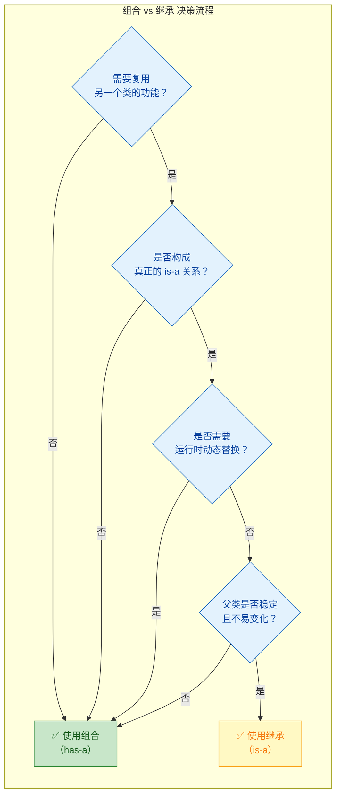

核心判断逻辑：只有同时满足 **"是 is-a 关系"** + **"不需运行时替换"** + **"父类稳定"** 这三个条件时，才考虑继承。否则，默认选择组合。

#### Kotlin 中组合的语法优势

Kotlin 语言本身就提供了丰富的语法糖来鼓励组合：

```kotlin
// === 1. 委托模式：by 关键字 ===
// Kotlin 的 "by" 可以零成本实现组合式委托
// 不需要手动编写所有委托方法
interface Logger {
    fun log(message: String)  // 日志接口
}

// 具体日志实现
class ConsoleLogger : Logger {
    override fun log(message: String) {
        println("[LOG] $message")  // 控制台输出
    }
}

// ✅ UserService 通过 "by" 委托给 consoleLogger
// 编译器自动生成所有接口方法的委托代码
// 这既是组合（has-a ConsoleLogger），又拥有继承的便捷语法
class UserService(
    consoleLogger: ConsoleLogger  // 通过构造器注入
) : Logger by consoleLogger {
    // UserService 自动拥有 log() 方法
    // 但无需手写 override fun log(msg) = consoleLogger.log(msg)

    fun createUser(name: String) {
        log("Creating user: $name")  // 直接调用委托方法
    }
}

// === 2. 扩展函数：不修改原类即可"添加"功能 ===
// 这也是组合思想的体现——不通过继承来扩展类
fun ImageView.loadUrl(url: String) {
    Glide.with(this.context)    // 获取 Glide 实例
        .load(url)              // 加载图片 URL
        .into(this)             // 设置到当前 ImageView
}
// 使用：imageView.loadUrl("https://example.com/photo.jpg")

// === 3. 高阶函数：行为参数化 ===
// 将"行为"作为参数传入，而非通过继承覆写
inline fun <T> measureTimeAndExecute(
    tag: String,           // 标签名
    block: () -> T         // 要执行的代码块（行为参数化）
): T {
    val start = System.currentTimeMillis()  // 记录开始时间
    val result = block()                     // 执行代码块
    val elapsed = System.currentTimeMillis() - start  // 计算耗时
    Log.d(tag, "Executed in ${elapsed}ms")   // 输出日志
    return result                             // 返回结果
}

// 使用
val users = measureTimeAndExecute("DB") {
    database.userDao().getAllUsers()  // 实际的数据库操作
}
```

Kotlin 的 `by` 委托机制特别值得关注——它在**语言层面**解决了"组合时需要手写大量委托方法"的痛点。编译器自动为你生成所有接口方法的转发代码，使得组合在使用体验上几乎等同于继承，却保留了组合的全部灵活性。

---

## 本章小结

| 原则 | 核心思想 | 一句话口诀 | Android 典型案例 |
|---|---|---|---|
| **S** 单一职责 | 一个类只做一件事 | "一个类，一个变化原因" | Activity / ViewModel / Repository 分层 |
| **O** 开闭原则 | 对扩展开放，对修改关闭 | "加功能不改老代码" | RecyclerView.Adapter、OkHttp Interceptor |
| **L** 里氏替换 | 子类可无缝替换父类 | "父类能用的地方，子类也能用" | AppCompatActivity 替换 Activity |
| **I** 接口隔离 | 接口小而专 | "不强迫实现用不到的方法" | `View.OnClickListener` 单方法接口 |
| **D** 依赖倒置 | 依赖抽象不依赖具体 | "面向接口编程" | Retrofit 接口定义、Room DAO |
| **LoD** 迪米特法则 | 只与直接朋友通信 | "不和陌生人说话" | `Context.getSystemService()` 封装 |
| **CRP** 合成复用 | 组合优于继承 | "has-a 优先于 is-a" | RecyclerView 组件化、OkHttp 拦截器链 |

这七条原则并非孤立存在，它们共同指向一个目标：

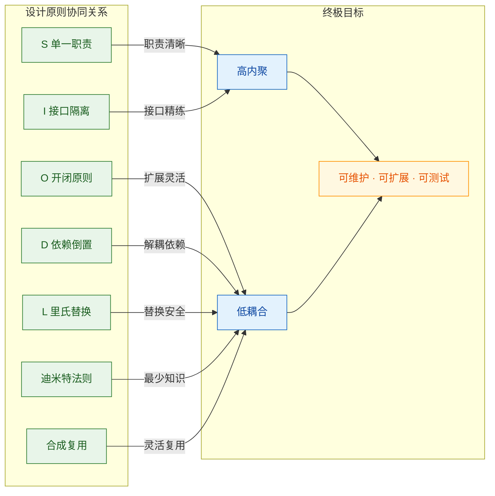

在实际 Android 开发中，**不需要也不可能每行代码都完美遵循所有原则**。重要的是理解每条原则背后的"为什么"，在面对设计决策时能够有意识地权衡取舍。过度设计（Over-engineering）和设计不足（Under-engineering）都是问题——**原则是指南针，不是枷锁**。

---

**📝 练习题 1**

以下代码违反了迪米特法则，请问最佳重构方案是什么？

```kotlin
class OrderActivity : AppCompatActivity() {
    fun showPrice() {
        val price = orderManager.getOrder().getItem().getPrice()
        binding.tvPrice.text = price.toString()
    }
}
```

A. 将 `getOrder()`、`getItem()`、`getPrice()` 合并为 `OrderManager` 的一个内部方法


B. 让 `OrderActivity` 直接持有 `Item` 对象的引用


C. 在 `OrderManager` 中提供 `getOrderItemPrice()` 方法，`Activity` 只调用这一个方法


D. 把 `Order`、`Item`、`Price` 合并成一个类以减少调用链


**【答案】** C

**【解析】** 迪米特法则要求"只与直接朋友通信"。`OrderActivity` 的直接朋友是 `OrderManager`，但代码中 `Activity` 还间接触及了 `Order`、`Item` 这些"陌生对象"。选项 C 是标准的重构手法：在 `OrderManager` 中封装一个 `getOrderItemPrice()` 方法，内部处理链式调用，对外只暴露最终结果。`Activity` 只需调用 `orderManager.getOrderItemPrice()`，完全不感知 `Order` 和 `Item` 的存在。选项 A 表述含糊，没有说明封装到哪个层级；选项 B 是反向违反——让 Activity 直接持有更深层的对象反而增加了耦合；选项 D 是过度简化，破坏了领域模型的合理结构。

---

**📝 练习题 2**

关于"合成复用原则"，以下哪个说法是**错误**的？

A. Kotlin 的 `by` 委托关键字是语言层面对合成复用原则的支持


B. `RecyclerView` 通过组合 `LayoutManager`、`Adapter` 等组件来实现功能，是合成复用的典范


C. 合成复用原则意味着在任何情况下都不应使用继承


D. OkHttp 的 Interceptor 链式设计体现了"组合优于继承"的思想


**【答案】** C

**【解析】** 合成复用原则的核心是"**优先**使用组合"，而非"**禁止**使用继承"。在真正的 is-a 语义关系下（如 `AppCompatActivity` 继承 `Activity`、自定义 View 继承 `View`），继承仍然是正确的选择。判断标准是：是否满足 is-a 语义 + 是否不需要运行时动态替换 + 父类是否稳定。选项 A 正确，`by` 是 Kotlin 提供的类委托语法糖；选项 B 正确，RecyclerView 的组件化架构是合成复用的教科书案例；选项 D 正确，OkHttp 将日志、缓存、认证等功能拆分为独立拦截器，通过组合灵活拼装。

---

## 本章小结

经过对 **SOLID 原则**以及**迪米特法则**、**合成复用原则**的逐一深入剖析，我们已经建立起了面向对象设计中最核心的"指导思想体系"。本章小结将从 **全局视角** 重新审视这些原则之间的内在联系，归纳它们在 Android 实际开发中的落地策略，并提供一张可随时查阅的速查表，帮助你在日常编码和架构设计中迅速做出正确的决策。

---

### 七大原则全景回顾

设计原则并非彼此孤立的教条，而是一套 **相互支撑、环环相扣** 的有机体系。一个违反单一职责原则的类，往往也同时违反了开闭原则和接口隔离原则；而依赖倒置原则的正确实践，天然地促进了里氏替换原则的达成。下面用一张 Mermaid 图来可视化它们之间的协同关系：

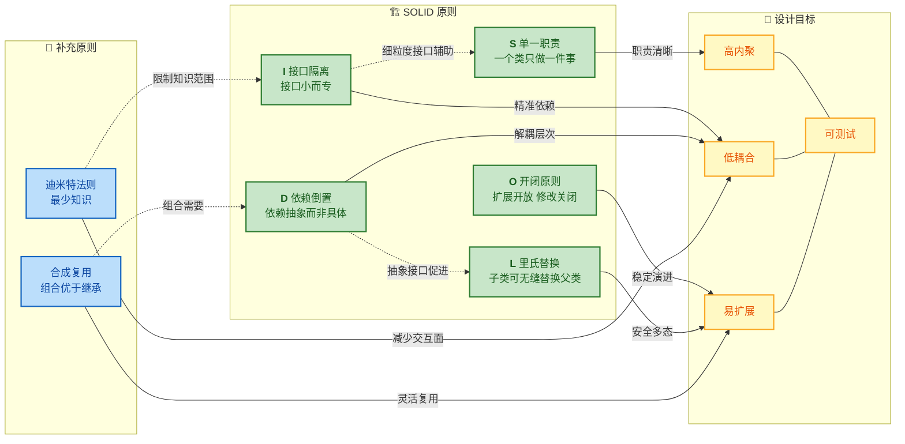

从图中可以清楚看到：**所有原则最终都指向同一个终极目标——构建高内聚、低耦合、易扩展、可测试的软件系统。** 每条原则从不同维度切入，共同形成了一张"防护网"，防止代码随着需求增长而腐化。

---

### 原则速查表：一句话 + Android 映射

以下表格将每条原则浓缩为 **一句核心心法**，并给出其在 Android 开发中最典型的应用场景，方便日后快速查阅：

| 原则 | 一句话心法 | Android 典型映射 | 违反时的典型症状 |
|:---:|:---|:---|:---|
| **S — 单一职责** | 一个类只有一个变化的理由 | Activity 只负责 UI 调度，业务逻辑抽到 ViewModel/UseCase | "God Activity"：一个 Activity 超过 2000 行 |
| **O — 开闭原则** | 新增功能靠扩展，已有代码不动 | RecyclerView.Adapter + 多 ViewType；自定义 `Interceptor` 扩展 OkHttp | 每次加需求都要修改核心 `switch-case` |
| **L — 里氏替换** | 子类在任何父类出现的地方都能安全替换 | 自定义 View 重写 `onDraw()` 不破坏 View 合约 | 子类重写方法后抛出 `UnsupportedOperationException` |
| **I — 接口隔离** | 客户端不应被迫依赖用不到的方法 | 用 `DefaultLifecycleObserver` 替代需要全部实现的旧版 `LifecycleObserver` | 接口有 10 个方法，实现类 8 个留空 |
| **D — 依赖倒置** | 高层模块和低层模块都依赖抽象 | Repository 模式：ViewModel → Repository(接口) ← RemoteDataSource | 直接 `new Retrofit()` 写在 ViewModel 里无法单元测试 |
| **迪米特法则** | 只和"直接朋友"说话 | 通过 Mediator/EventBus 通信，而非链式 `getA().getB().getC()` | 一个改动引发连锁编译错误 |
| **合成复用** | 优先用"有一个"替代"是一个" | `TextWatcher` 组合注入而非继承 `EditText`；Kotlin 委托 `by` | 继承层次超过 3 层，父类修改导致子类全部崩溃 |

---

### 原则之间的协同与张力

在真实项目中，这些原则并不总是完美和谐的，它们之间存在一定的 **设计张力 (Design Tension)**，需要工程师根据场景做出权衡。

#### 协同关系（Synergy）

1. **SRP + ISP → 细粒度抽象**：单一职责驱动我们把大类拆小，接口隔离驱动我们把大接口拆小，两者方向一致，共同促进模块化。
2. **DIP + LSP → 安全的多态替换**：依赖倒置让高层依赖抽象接口，里氏替换保证任何实现该接口的子类都能安全注入，两者形成完美闭环。这在 Android 中的 Repository 模式里体现得淋漓尽致——ViewModel 依赖 `Repository` 接口，`FakeRepository` 和 `RealRepository` 都可以无缝替换。
3. **OCP + CRP → 通过组合实现扩展**：开闭原则要求不修改已有代码，合成复用原则提供了达成途径——通过组合新组件来扩展行为，而不是通过继承修改已有类。

#### 张力关系（Tension）

1. **SRP vs. 过度拆分**：过于极端地追求单一职责，可能导致类的数量爆炸，增加理解成本。**权衡策略**：以"变化的理由"为判断依据，而非机械地"一个方法一个类"。
2. **OCP vs. YAGNI**：开闭原则鼓励提前设计扩展点，但 YAGNI (You Ain't Gonna Need It) 原则告诫我们不要为不确定的未来过度设计。**权衡策略**：对于明确会变化的维度（如网络库切换、数据源切换）预留抽象；对于不确定的维度，先写简单实现，等到需要扩展时再重构。
3. **ISP vs. 接口碎片化**：过于细粒度的接口拆分可能导致接口数量过多，增加组装复杂度。**权衡策略**：以"角色"为单位划分接口，一个角色一个接口，而不是一个方法一个接口。

---

### Android 分层架构中的原则落地全景

让我们将所有原则映射到 Android 推荐的分层架构中，看看每一层最需要关注哪些原则：

```mermaid
graph LR
    subgraph UI["🖥️ UI Layer"]
        direction TB
        UI1["Activity / Fragment"]
        UI2["Compose UI"]
        UI3["关注原则: SRP, 迪米特"]
    end

    subgraph DOMAIN["⚙️ Domain Layer"]
        direction TB
        D1["UseCase"]
        D2["Domain Model"]
        D3["关注原则: SRP, OCP, ISP"]
    end

    subgraph DATA["💾 Data Layer"]
        direction TB
        DA1["Repository 接口"]
        DA2["Repository 实现"]
        DA3["DataSource"]
        DA4["关注原则: DIP, LSP, OCP"]
    end

    subgraph DI["🔌 DI Container"]
        direction TB
        DI1["Hilt / Dagger"]
        DI2["关注原则: DIP, 合成复用"]
    end

    UI --> DOMAIN
    DOMAIN --> DATA
    DI -.->|"注入依赖"| UI
    DI -.->|"注入依赖"| DOMAIN
    DI -.->|"注入依赖"| DATA

    classDef ui fill:#C8E6C9,stroke:#2E7D32,color:#1B5E20,stroke-width:2px
    classDef domain fill:#E1BEE7,stroke:#7B1FA2,color:#4A148C,stroke-width:2px
    classDef data fill:#BBDEFB,stroke:#1565C0,color:#0D47A1,stroke-width:2px
    classDef di fill:#FFE0B2,stroke:#E65100,color:#BF360C,stroke-width:2px

    class UI1,UI2,UI3 ui
    class D1,D2,D3 domain
    class DA1,DA2,DA3,DA4 data
    class DI1,DI2 di
```

**各层要点解读：**

- **UI Layer**：Activity/Fragment/Composable 最容易膨胀为 God Class，因此 **SRP（单一职责）** 是第一要务——只负责 UI 渲染和用户事件分发，绝不处理业务逻辑。同时遵守**迪米特法则**，UI 层不应该知道 DataSource 的存在，只和 ViewModel 对话。

- **Domain Layer**：UseCase 是业务逻辑的原子单元，每个 UseCase 做一件事（**SRP**）。当新增业务规则时，新建 UseCase 而非修改已有的（**OCP**）。UseCase 暴露的接口应当精简（**ISP**）。

- **Data Layer**：Repository **接口**定义在 Domain 层，**实现**放在 Data 层——这是 **DIP** 的经典落地。不同的 DataSource（Remote/Local/Cache）实现同一个 Repository 接口，必须保证行为一致性（**LSP**）。新增数据源时只需新增实现类（**OCP**）。

- **DI Container**：Hilt/Dagger 是 **DIP** 的基础设施，负责将抽象与具体实现绑定。它天然鼓励**合成复用**——通过构造函数注入组合各个模块，而非通过继承获取依赖。

---

### 代码坏味道（Code Smells）与原则对照

在 Code Review 时，以下常见的"坏味道"可以直接映射到被违反的原则，帮助你快速定位问题根因：

```kotlin
// ❌ 坏味道 1：God Class（违反 SRP）
// 一个 Activity 同时处理 UI、网络请求、数据库操作、业务逻辑
class OrderActivity : AppCompatActivity() {
    // 500 行 UI 代码...
    // 300 行网络请求代码...
    // 200 行数据库代码...
    // 400 行业务逻辑代码...
}

// ❌ 坏味道 2：Switch/When 类型判断泛滥（违反 OCP）
// 每新增一种消息类型，都必须修改这个函数
fun handleMessage(type: Int) {
    when (type) {
        1 -> handleText()
        2 -> handleImage()
        3 -> handleVideo()
        // 新增类型 4, 5, 6... 无限 case
    }
}

// ❌ 坏味道 3：火车残骸（Train Wreck，违反迪米特法则）
// 调用链暴露了内部结构，任何中间层的改动都会波及这里
val cityName = order.getCustomer().getAddress().getCity().getName()

// ❌ 坏味道 4：继承仅为复用代码（违反合成复用 + LSP）
// BaseActivity 塞满各种工具方法，子类"是一个"关系根本不成立
open class BaseActivity : AppCompatActivity() {
    fun showToast(msg: String) { /* ... */ }       // 工具方法
    fun checkNetwork(): Boolean { /* ... */ }       // 工具方法
    fun logEvent(event: String) { /* ... */ }       // 工具方法
    // 30 个与 Activity 生命周期无关的工具方法...
}
```

```kotlin
// ✅ 修正方向汇总

// SRP：拆分到 ViewModel + UseCase + Repository
// OCP：用多态（策略模式/工厂模式）替代 when
// 迪米特：提供高层方法 order.getCityName()，封装内部链路
// 合成复用：把工具方法提取为独立工具类，通过组合注入使用

// 例：用组合替代 BaseActivity 里的工具方法
class ToastHelper @Inject constructor(           // 独立的 Toast 工具
    private val context: Context                  // 只依赖必要的 Context
) {
    fun show(msg: String) {                       // 单一职责：只管 Toast
        Toast.makeText(context, msg, Toast.LENGTH_SHORT).show()
    }
}

class NetworkChecker @Inject constructor(        // 独立的网络检测工具
    private val connectivityManager: ConnectivityManager
) {
    fun isAvailable(): Boolean {                  // 单一职责：只管网络状态
        return connectivityManager.activeNetwork != null
    }
}

// Activity 通过组合使用，而非继承获取
class OrderActivity : AppCompatActivity() {
    @Inject lateinit var toastHelper: ToastHelper          // 组合注入
    @Inject lateinit var networkChecker: NetworkChecker     // 组合注入

    override fun onCreate(savedInstanceState: Bundle?) {
        super.onCreate(savedInstanceState)
        if (!networkChecker.isAvailable()) {               // 清晰使用
            toastHelper.show("No network")                 // 职责明确
        }
    }
}
```

---

### 原则应用的"度"：三级心智模型

初学者常犯两个极端错误：要么完全不顾原则（导致代码腐化），要么过度应用原则（导致过度设计）。以下是一个实用的三级心智模型：

```mermaid
graph LR
    subgraph L1["🟢 Level 1 - 基本功"]
        direction TB
        L1A["SRP: 不写 God Class"]
        L1B["DIP: 依赖接口而非实现"]
        L1C["合成复用: 优先组合"]
    end

    subgraph L2["🔵 Level 2 - 进阶"]
        direction TB
        L2A["OCP: 用多态替代条件分支"]
        L2B["ISP: 精简暴露的接口"]
        L2C["迪米特: 控制信息传播范围"]
    end

    subgraph L3["🟣 Level 3 - 架构级"]
        direction TB
        L3A["LSP: 严格契约式设计"]
        L3B["全部原则协同: 分层架构"]
        L3C["识别张力并做出权衡"]
    end

    L1 -->|"熟练后"| L2
    L2 -->|"深入后"| L3

    classDef lv1 fill:#C8E6C9,stroke:#2E7D32,color:#1B5E20,stroke-width:2px
    classDef lv2 fill:#BBDEFB,stroke:#1565C0,color:#0D47A1,stroke-width:2px
    classDef lv3 fill:#E1BEE7,stroke:#7B1FA2,color:#4A148C,stroke-width:2px

    class L1A,L1B,L1C lv1
    class L2A,L2B,L2C lv2
    class L3A,L3B,L3C lv3
```

- **Level 1（基本功）**：每位 Android 开发者都应该从第一天就践行。不写 God Activity、用接口解耦、优先组合——这三条就能避免 80% 的代码腐化。

- **Level 2（进阶）**：当你开始设计供团队使用的 SDK、库或公共模块时，OCP（扩展点设计）、ISP（精简 API 表面积）和迪米特法则（控制模块间耦合）变得至关重要。

- **Level 3（架构级）**：在大型项目的架构设计中，需要同时考虑所有原则的协同效应，并且能够在原则之间发生冲突时做出合理的权衡（Trade-off）。这是从"工程师"到"架构师"的跨越。

---

### Android Framework 中的原则体现

回顾本章内容，Android Framework 本身就是设计原则的一部教科书：

| Framework 组件 | 体现的原则 | 具体分析 |
|:---|:---:|:---|
| `View` / `ViewGroup` 体系 | **OCP + LSP** | 通过继承扩展自定义 View，`onDraw()`、`onMeasure()` 等模板方法保证了子类可安全替换 |
| `RecyclerView` + `Adapter` + `LayoutManager` | **SRP + OCP + DIP** | 数据绑定、布局策略、滑动回收分别由不同组件负责；新增布局只需扩展 `LayoutManager` |
| `ContentProvider` | **DIP + 迪米特** | 应用间数据共享通过统一的 URI 抽象，调用方不知道底层是 SQLite 还是文件 |
| `BroadcastReceiver` | **OCP + 迪米特** | 发送方不知道接收方是谁，新增接收方只需注册，无需修改发送方 |
| `Lifecycle` / `LiveData` | **ISP + SRP** | `DefaultLifecycleObserver` 提供细粒度的生命周期回调接口，`LiveData` 单一职责——只做可观察的数据持有 |
| `OkHttp Interceptor` 链 | **OCP + SRP** | 每个 Interceptor 只做一件事（日志、重试、缓存），新增功能只需添加新的 Interceptor |

---

### 核心要义：三句话总结全章

1. **原则是"为什么"，模式是"怎么做"**——设计原则提供了判断代码好坏的标尺，而设计模式（我们后续章节的内容）是落地这些原则的具体方案。

2. **所有原则的终极目标只有一个：管理变化**——软件开发中唯一不变的就是变化，每条原则都在回答同一个问题："当需求变化时，如何让修改的范围最小、影响最小、成本最低？"

3. **原则不是法律，而是 Trade-off 的指南针**——在工程实践中，100% 遵守所有原则既不现实也不必要。关键是在违反某条原则时，你 **清楚地知道** 自己在做什么 trade-off，以及为什么在当前场景下这个 trade-off 是合理的。

---

**📝 练习题**

**题目 1：** 以下代码违反了哪些设计原则？（多选）

```kotlin
class UserManager {
    fun login(username: String, password: String) { /* 网络请求登录 */ }
    fun saveUserToDb(user: User) { /* 操作数据库 */ }
    fun formatUserName(name: String): String { /* 格式化展示 */ }
    fun sendAnalyticsEvent(event: String) { /* 发送埋点 */ }
}
```

A. 单一职责原则（SRP）

B. 开闭原则（OCP）

C. 接口隔离原则（ISP）

D. 迪米特法则（LoD）


**【答案】** A

**【解析】** `UserManager` 承担了至少四种不同的职责：**认证（login）、持久化（saveUserToDb）、UI 展示格式化（formatUserName）、数据分析（sendAnalyticsEvent）**。这意味着它有四个不同的变化理由（认证逻辑变化、数据库结构变化、UI 格式变化、埋点 SDK 变化），明确违反了 **单一职责原则**。正确做法是拆分为 `AuthRepository`、`UserDao`、`UserFormatter`、`AnalyticsTracker` 四个独立类。虽然代码中未涉及继承或接口定义，因此 OCP、ISP、LoD 在当前代码片段中无法直接判定违反。

---

**题目 2：** 在 Android 项目中，ViewModel 直接创建了 `Retrofit.create(ApiService::class.java)` 来获取网络数据。这主要违反了以下哪条原则？

A. 里氏替换原则（LSP）

B. 依赖倒置原则（DIP）

C. 合成复用原则（CRP）

D. 开闭原则（OCP）


**【答案】** B

**【解析】** ViewModel 属于高层模块（业务逻辑层），Retrofit/ApiService 属于低层模块（网络实现细节层）。ViewModel 直接 `new` 出 Retrofit 实例，意味着高层模块直接依赖了低层模块的具体实现，而非依赖抽象接口——这是典型的 **依赖倒置原则（DIP）** 违反。正确做法是：ViewModel 依赖 `Repository` 接口，Repository 的具体实现（内部使用 Retrofit）通过 DI 框架（如 Hilt）注入。这样 ViewModel 既不知道网络库是什么，也可以在单元测试中轻松替换为 `FakeRepository`。虽然也间接涉及 OCP（切换网络库需要改 ViewModel），但 **根因（root cause）** 是 DIP 的违反。

---
