---

# Android常用C++模式

---

## Singleton 模式（Android 实现）

在大型系统级软件中，某些核心服务或管理器天然地只应存在一个实例——比如 Android 中的 `ProcessState`（Binder 驱动的进程级代理）、`SurfaceFlinger`（显示合成服务）等。Singleton 模式（单例模式）正是为解决"全局唯一实例"这一需求而生的经典设计模式。Android 的 Native 层在 `<utils/Singleton.h>` 中提供了一套 **模板化的 Singleton 基类**，让 Framework 中的 C++ 类可以极其简洁地获得单例能力。本节将从设计模式原理出发，逐层深入到 Android 源码级实现，并剖析其线程安全策略与使用陷阱。

---

### 经典 Singleton 回顾

在正式分析 Android 的实现之前，我们先快速回顾 C++ 中 Singleton 的经典写法及其演进，这有助于理解 Android 为什么要"再造轮子"。

Singleton 模式的核心意图（Intent）只有一句话：**确保一个类仅有一个实例，并提供一个全局访问点（Ensure a class has only one instance, and provide a global point of access to it）**。

实现上，它通常包含三个关键要素：

1. **私有构造函数**（Private Constructor）——阻止外部通过 `new` 创建对象。
2. **静态成员指针/引用**（Static Instance）——持有唯一实例。
3. **静态访问方法**（Static Accessor）——如 `getInstance()`，返回唯一实例。

下面是一个最朴素的 C++ 实现——**懒汉式（Lazy Initialization）**：

```cpp
// 经典懒汉式 Singleton —— 非线程安全版本
class Singleton {
public:
    // 全局唯一访问点，返回单例指针
    static Singleton* getInstance() {
        // 首次调用时才创建实例（Lazy）
        if (sInstance == nullptr) {        // 检查是否已创建
            sInstance = new Singleton();   // 首次进入时分配堆内存并构造
        }
        return sInstance;                  // 返回唯一实例
    }

private:
    Singleton() {}                         // 构造函数私有化，禁止外部直接构造
    Singleton(const Singleton&) = delete;  // 禁止拷贝构造
    Singleton& operator=(const Singleton&) = delete; // 禁止赋值运算符

    static Singleton* sInstance;           // 静态成员：持有唯一实例的指针
};

// 静态成员需在 .cpp 中定义并初始化为 nullptr
Singleton* Singleton::sInstance = nullptr;
```

这个版本有一个致命问题：**非线程安全（Not Thread-Safe）**。在多线程环境下，两个线程可能同时通过 `if (sInstance == nullptr)` 的检查，从而各自创建一个实例，违反了单例的唯一性约束。

为此，业界演进出了多种改进方案：

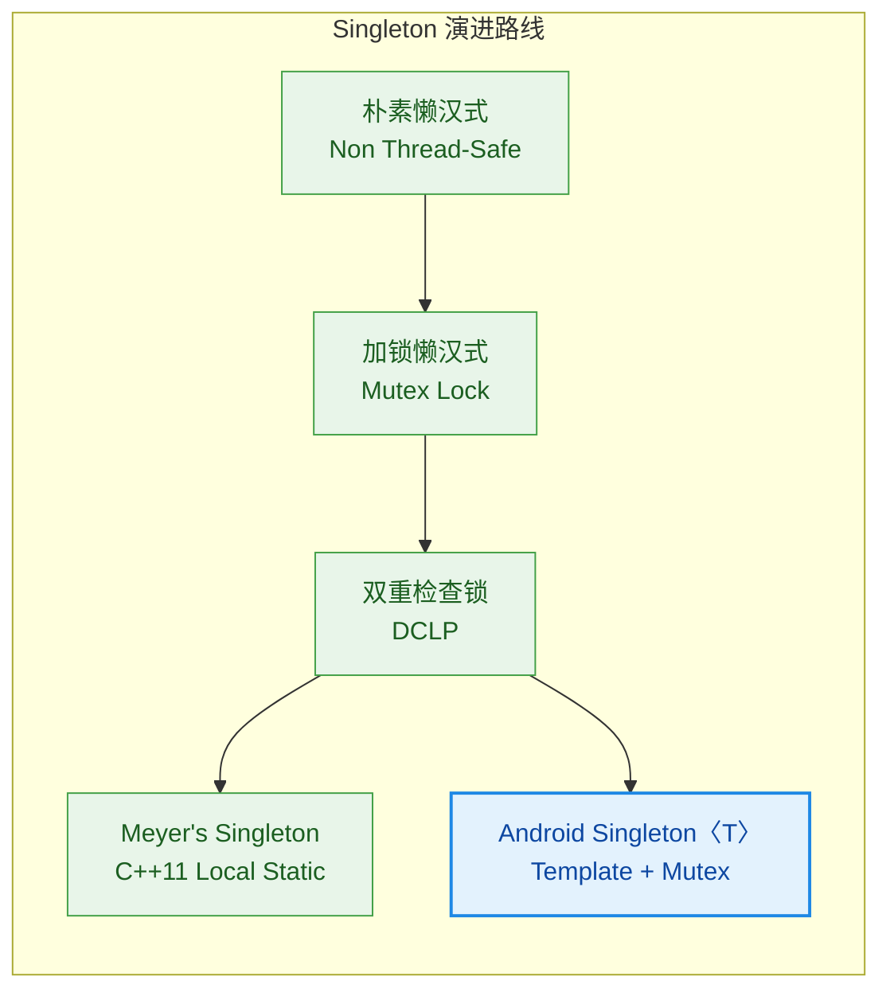
```mermaid
graph LR
    subgraph Evolution["Singleton 演进路线"]
        direction TB
        A["朴素懒汉式<br/>Non Thread-Safe"]
        B["加锁懒汉式<br/>Mutex Lock"]
        C["双重检查锁<br/>DCLP"]
        D["Meyer's Singleton<br/>C++11 Local Static"]
        E["Android Singleton〈T〉<br/>Template + Mutex"]
        A --> B
        B --> C
        C --> D
        C --> E
    end

    classDef evolNode fill:#E8F5E9,stroke:#43A047,color:#1B5E20,stroke-width:1px
    classDef androidNode fill:#E3F2FD,stroke:#1E88E5,color:#0D47A1,stroke-width:2px
    class A,B,C,D evolNode
    class E androidNode
```

**各方案简要对比**：

| 方案 | 线程安全 | 性能 | 缺点 |
|------|:--------:|:----:|------|
| 朴素懒汉 | ❌ | 高 | 多线程下会重复创建 |
| 加锁懒汉 | ✅ | 低 | 每次 `getInstance()` 都加锁，开销大 |
| DCLP（双重检查） | ✅* | 高 | C++11 前因内存模型问题可能失败 |
| Meyer's Singleton | ✅ | 高 | C++11 起保证安全，但不适合需要显式控制生命周期的场景 |
| **Android Singleton\<T\>** | ✅ | 高 | 与 Android 工具链绑定 |

> **DCLP** 全称 Double-Checked Locking Pattern。在 C++11 之前的内存模型中，编译器/CPU 的指令重排（Instruction Reordering）可能导致另一个线程看到一个"已分配内存但尚未完成构造"的半成品对象，这是经典的 C++ 并发陷阱。

---

### Android Singleton\<T\> 源码深度剖析

Android 在 `system/core/include/utils/Singleton.h` 中定义了一个 **CRTP（Curiously Recurring Template Pattern）** 风格的 Singleton 基类模板。我们先完整地看一遍源码（基于 AOSP），然后逐段拆解。

#### 完整源码（带逐行注释）

```cpp
// 文件路径: system/core/include/utils/Singleton.h
// Android 的 Singleton 模板实现

#ifndef ANDROID_UTILS_SINGLETON_H
#define ANDROID_UTILS_SINGLETON_H

#include <stdint.h>          // 标准整型定义
#include <sys/types.h>       // 系统基础类型
#include <utils/Mutex.h>     // Android 自封装的互斥锁

namespace android {

// ---------------------------------------------------------------------------
// Singleton<T> 模板基类
// 使用 CRTP 模式：子类将自身作为模板参数传入
// 例如: class FooManager : public Singleton<FooManager> { ... };
// ---------------------------------------------------------------------------
template <typename TYPE>
class ANDROID_API Singleton
{
public:
    // 全局唯一访问点
    // 返回 TYPE 的引用（不是指针），更安全
    static TYPE& getInstance() {
        Mutex::Autolock _l(sLock);        // RAII 式加锁：构造时 lock()，析构时 unlock()
        TYPE* instance = sInstance;       // 读取当前静态实例指针
        if (instance == 0) {              // 如果实例尚未创建（首次调用）
            instance = new TYPE();        // 在堆上创建 TYPE 的实例
            sInstance = instance;         // 将实例指针保存到静态成员
        }
        return *instance;                // 解引用并返回实例的引用
    }

    // 判断单例是否已经被创建
    static bool hasInstance() {
        Mutex::Autolock _l(sLock);        // 同样需要加锁保护读取
        return sInstance != 0;            // 返回实例是否存在
    }

protected:
    ~Singleton() { }                      // 析构函数为 protected，防止外部 delete
    Singleton() { }                       // 构造函数为 protected，防止外部直接构造

private:
    // 禁止拷贝和赋值
    Singleton(const Singleton&);             // 拷贝构造声明但不实现 = 禁用
    Singleton& operator = (const Singleton&); // 赋值运算符声明但不实现 = 禁用

    static Mutex sLock;                   // 静态互斥锁：保护 sInstance 的并发访问
    static TYPE* sInstance;               // 静态实例指针：指向唯一的 TYPE 对象
};

// ---------------------------------------------------------------------------

// 宏：用于在 .cpp 文件中定义静态成员
// 因为 C++ 模板的静态成员必须在类外显式定义（One Definition Rule）
#define ANDROID_SINGLETON_STATIC_INSTANCE(TYPE)              \
    template<> ::android::Mutex                              \
        (::android::Singleton< TYPE >::sLock)(::android::Mutex::PRIVATE); \
    template<> TYPE* ::android::Singleton< TYPE >::sInstance(0); \
    template class ::android::Singleton< TYPE >;

// ---------------------------------------------------------------------------
}  // namespace android

#endif // ANDROID_UTILS_SINGLETON_H
```

#### CRTP 模式解析

Android Singleton 最精巧的设计在于使用了 **CRTP（Curiously Recurring Template Pattern，奇异递归模板模式）**。这个模式的核心思想是：**子类在继承基类时，将自身的类型作为模板参数传递给基类**。

```cpp
// CRTP 的典型用法
// ProcessState 继承 Singleton，并把自己（ProcessState）作为模板参数 TYPE 传入
class ProcessState : public Singleton<ProcessState> {
    // 此时基类 Singleton<ProcessState> 中的 TYPE 就是 ProcessState
    // getInstance() 返回的就是 ProcessState& 类型
    friend class Singleton<ProcessState>;  // 允许基类访问 private 构造函数
private:
    ProcessState();  // 构造函数私有化
};
```

下面用图示来展示 CRTP 的类型传递关系：

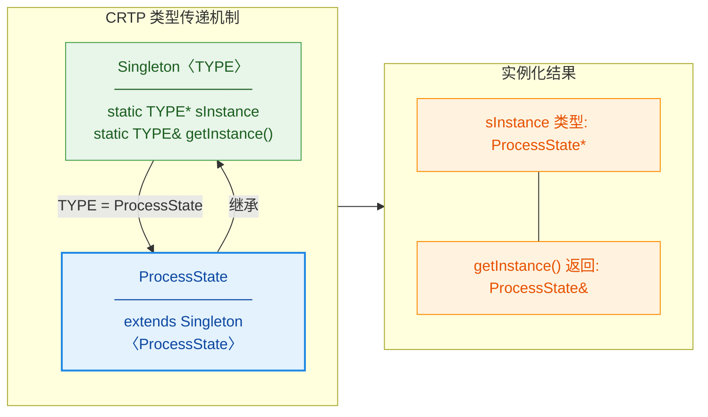
```mermaid
graph LR
    subgraph CRTP["CRTP 类型传递机制"]
        direction TB
        S["Singleton〈TYPE〉<br/>─────────────<br/>static TYPE* sInstance<br/>static TYPE& getInstance()"]
        P["ProcessState<br/>─────────────<br/>extends Singleton〈ProcessState〉"]
        S -->|"TYPE = ProcessState"| P
        P -->|"继承"| S
    end

    subgraph Result["实例化结果"]
        direction TB
        R1["sInstance 类型: ProcessState*"]
        R2["getInstance() 返回: ProcessState&"]
        R1 --- R2
    end

    CRTP --> Result

    classDef tplNode fill:#E8F5E9,stroke:#43A047,color:#1B5E20,stroke-width:1px
    classDef implNode fill:#E3F2FD,stroke:#1E88E5,color:#0D47A1,stroke-width:2px
    classDef resultNode fill:#FFF3E0,stroke:#FB8C00,color:#E65100,stroke-width:1px
    class S tplNode
    class P implNode
    class R1,R2 resultNode
```

为什么用 CRTP 而不是简单的虚函数多态？因为 CRTP 是 **编译期多态（Static Polymorphism）**，没有虚表（vtable）开销，也没有运行时类型转换的成本。对于 Singleton 这种基础设施级别的组件，零额外开销至关重要。

#### 线程安全机制

Android 的 Singleton 采用了最直接的 **Mutex 加锁** 策略来保证线程安全。我们来详细分析 `getInstance()` 的并发行为：

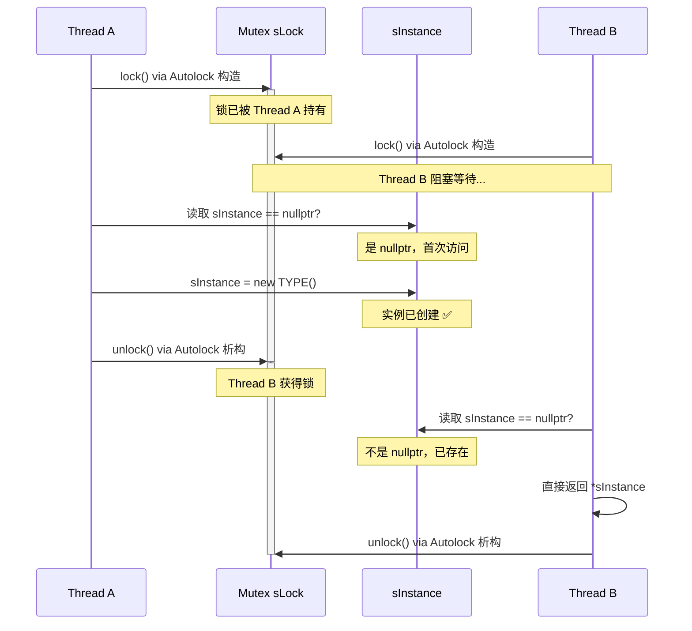
```mermaid
sequenceDiagram
    participant T1 as Thread A
    participant Lock as Mutex sLock
    participant Mem as sInstance
    participant T2 as Thread B

    T1->>Lock: lock() via Autolock 构造
    activate Lock
    Note over Lock: 锁已被 Thread A 持有

    T2->>Lock: lock() via Autolock 构造
    Note over T2,Lock: Thread B 阻塞等待...

    T1->>Mem: 读取 sInstance == nullptr?
    Note over Mem: 是 nullptr，首次访问
    T1->>Mem: sInstance = new TYPE()
    Note over Mem: 实例已创建 ✅
    T1->>Lock: unlock() via Autolock 析构
    deactivate Lock

    activate Lock
    Note over Lock: Thread B 获得锁
    T2->>Mem: 读取 sInstance == nullptr?
    Note over Mem: 不是 nullptr，已存在
    T2->>T2: 直接返回 *sInstance
    T2->>Lock: unlock() via Autolock 析构
    deactivate Lock
```

**关键点在于 `Mutex::Autolock`**，它是一个典型的 **RAII（Resource Acquisition Is Initialization）** 封装：

```cpp
// Mutex::Autolock 简化实现原理
class Mutex::Autolock {
public:
    // 构造时自动加锁
    inline Autolock(Mutex& mutex) : mLock(mutex) {
        mLock.lock();    // 获取互斥锁
    }
    // 析构时自动解锁（离开作用域时触发）
    inline ~Autolock() {
        mLock.unlock();  // 释放互斥锁
    }
private:
    Mutex& mLock;        // 持有锁的引用
};
```

这样做的好处是：**即使 `new TYPE()` 构造函数抛出异常，`Autolock` 的析构函数仍会被调用，锁一定会被释放**，不会发生死锁（Deadlock）。

> 你可能注意到 Android 的实现并没有使用 DCLP（双重检查锁）。这是一个有意的设计选择——代码更简单，正确性更容易验证。对于 `getInstance()` 通常只在初始化阶段被高频调用的场景，这点锁开销完全可以接受。

#### ANDROID_SINGLETON_STATIC_INSTANCE 宏

C++ 模板的静态成员变量有一个特殊要求：**必须在类外进行显式定义（Explicit Instantiation / Definition）**。这个宏就是用来完成这一步的：

```cpp
// 宏展开示例：假设 TYPE = ProcessState
// 原始宏
ANDROID_SINGLETON_STATIC_INSTANCE(ProcessState)

// 展开后等价于:
template<> ::android::Mutex
    (::android::Singleton<ProcessState>::sLock)(::android::Mutex::PRIVATE);
    // ↑ 显式特化 sLock，初始化为 PRIVATE 类型的 Mutex（进程内互斥）

template<> ProcessState*
    ::android::Singleton<ProcessState>::sInstance(0);
    // ↑ 显式特化 sInstance，初始化为 nullptr (0)

template class ::android::Singleton<ProcessState>;
    // ↑ 显式实例化整个 Singleton<ProcessState> 模板类
    //   确保编译器为该特化生成所有成员函数的代码
```

**为什么需要这个宏？** 因为模板的静态成员如果不显式实例化，链接器（Linker）会报 "undefined reference" 错误。这个宏必须放在某个 `.cpp` 文件中（通常是使用单例的那个类的实现文件），确保静态成员在整个程序中**只有一份定义**。

---

### 实战：如何使用 Android Singleton

下面给出一个完整的使用示例，模拟一个 Android Native 层的 `DisplayManager`：

```cpp
// ==================== DisplayManager.h ====================
#ifndef DISPLAY_MANAGER_H
#define DISPLAY_MANAGER_H

#include <utils/Singleton.h>   // 引入 Android Singleton 模板
#include <utils/String8.h>     // Android 字符串类（后续章节详解）

namespace android {

// DisplayManager 通过 CRTP 继承 Singleton<DisplayManager>
// 从而自动获得 getInstance() 静态方法
class DisplayManager : public Singleton<DisplayManager> {
    // 声明 Singleton<DisplayManager> 为友元类
    // 这一步至关重要：因为 getInstance() 内部需要调用 new DisplayManager()
    // 而 DisplayManager 的构造函数是 private 的
    // 如果不声明友元，基类无法访问子类的 private 构造函数
    friend class Singleton<DisplayManager>;

public:
    // 公开业务接口
    int getDisplayCount() const {
        return mDisplayCount;   // 返回当前显示器数量
    }

    void setDisplayCount(int count) {
        mDisplayCount = count;  // 设置显示器数量
    }

private:
    // 构造函数私有化 —— 只能通过 getInstance() 创建
    DisplayManager()
        : mDisplayCount(1) {    // 默认 1 个显示器
        // 初始化逻辑：打开显示设备、读取配置等
    }

    int mDisplayCount;          // 显示器数量
};

}  // namespace android
#endif


// ==================== DisplayManager.cpp ====================
#include "DisplayManager.h"

namespace android {

// 关键步骤：使用宏在 .cpp 中定义静态成员
// 不写这一行，链接时会报 undefined reference 错误
ANDROID_SINGLETON_STATIC_INSTANCE(DisplayManager)

}  // namespace android


// ==================== main.cpp ====================
#include "DisplayManager.h"
#include <stdio.h>

using namespace android;

int main() {
    // 通过 getInstance() 获取唯一实例的引用
    DisplayManager& dm = DisplayManager::getInstance();

    // 调用业务方法
    printf("Display count: %d\n", dm.getDisplayCount()); // 输出: 1

    dm.setDisplayCount(2);

    // 再次获取 —— 返回的是同一个实例
    DisplayManager& dm2 = DisplayManager::getInstance();
    printf("Display count: %d\n", dm2.getDisplayCount()); // 输出: 2

    // dm 和 dm2 指向同一个对象
    printf("Same instance: %s\n",
           (&dm == &dm2) ? "YES" : "NO"); // 输出: YES

    return 0;
}
```

下面用一张图清晰展示各个文件之间的协作关系：

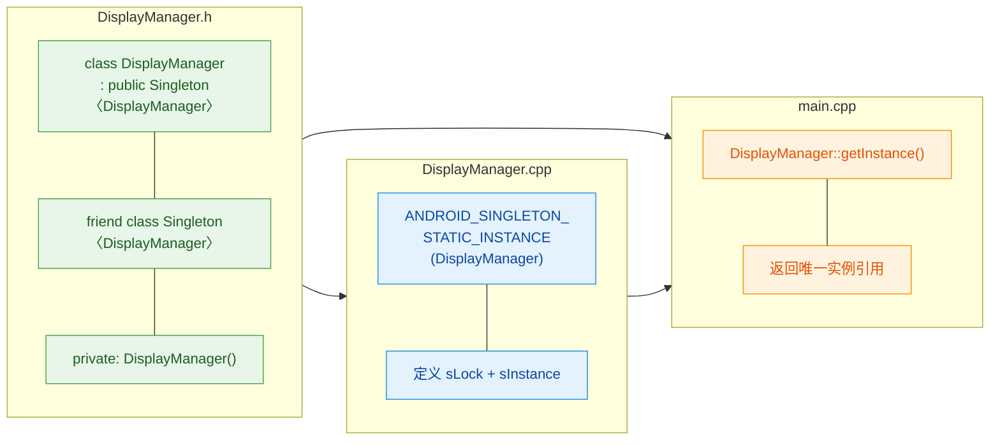
```mermaid
graph LR
    subgraph Header["DisplayManager.h"]
        direction TB
        H1["class DisplayManager<br/>: public Singleton〈DisplayManager〉"]
        H2["friend class Singleton〈DisplayManager〉"]
        H3["private: DisplayManager()"]
        H1 --- H2
        H2 --- H3
    end

    subgraph Source["DisplayManager.cpp"]
        direction TB
        S1["ANDROID_SINGLETON_<br/>STATIC_INSTANCE<br/>(DisplayManager)"]
        S2["定义 sLock + sInstance"]
        S1 --- S2
    end

    subgraph Usage["main.cpp"]
        direction TB
        U1["DisplayManager::getInstance()"]
        U2["返回唯一实例引用"]
        U1 --- U2
    end

    Header --> Source
    Header --> Usage
    Source --> Usage

    classDef headerNode fill:#E8F5E9,stroke:#43A047,color:#1B5E20,stroke-width:1px
    classDef sourceNode fill:#E3F2FD,stroke:#1E88E5,color:#0D47A1,stroke-width:1px
    classDef usageNode fill:#FFF3E0,stroke:#FB8C00,color:#E65100,stroke-width:1px
    class H1,H2,H3 headerNode
    class S1,S2 sourceNode
    class U1,U2 usageNode
```

---

### friend 声明的必要性

这是初学者最容易遗漏的一步，值得专门强调。来看 `getInstance()` 内部的关键一行：

```cpp
instance = new TYPE();  // TYPE = DisplayManager
```

这行代码在 **基类 `Singleton<DisplayManager>` 的静态方法** 中执行，它需要调用 `DisplayManager` 的**构造函数**。但我们已经把构造函数设为 `private`——如果没有 `friend` 声明，编译器会直接报错：

```
error: 'DisplayManager::DisplayManager()' is private within this context
```

`friend class Singleton<DisplayManager>` 的作用就是告诉编译器："虽然我的构造函数是 private 的，但 `Singleton<DisplayManager>` 这个类可以访问它。" 这完美地实现了**既阻止外部随意构造，又允许基类模板内部创建实例**的设计意图。

```cpp
// 内存布局示意（DisplayManager 对象在堆上只有一份）
//
// Stack (Thread A)          Heap                        Static Data (.bss)
// ┌──────────────┐         ┌─────────────────────┐     ┌──────────────────────┐
// │ dm (引用)     │ ──────▶ │ DisplayManager 对象  │ ◀── │ sInstance (指针)      │
// └──────────────┘         │  mDisplayCount = 2   │     ├──────────────────────┤
//                          └─────────────────────┘     │ sLock (Mutex)        │
// Stack (Thread B)                 ▲                   └──────────────────────┘
// ┌──────────────┐                 │
// │ dm2 (引用)    │ ───────────────┘
// └──────────────┘
```

---

### Android 源码中的真实使用案例

Android Framework 中大量使用了这套 Singleton 机制，下面列举几个典型案例：

| 类名 | 作用 | 所在路径 |
|------|------|---------|
| `ProcessState` | Binder IPC 的进程级状态管理 | `frameworks/native/libs/binder/` |
| `ComposerService` | 与 SurfaceFlinger 通信的客户端代理 | `frameworks/native/libs/gui/` |
| `DisplayEventReceiver` | 接收 Vsync 等显示事件 | `frameworks/native/libs/gui/` |

以 `ProcessState` 为例，它的声明简洁到只有关键几行：

```cpp
// frameworks/native/libs/binder/include/binder/ProcessState.h（简化）
class ProcessState : public virtual RefBase,   // 引用计数基类
                     public Singleton<ProcessState> // 单例能力
{
    friend class Singleton<ProcessState>;         // 允许基类构造
    // ... 其他成员 ...

private:
    ProcessState(const char* driver);             // 私有构造，参数为 Binder 驱动路径
};
```

> 注意：较新版本的 AOSP 中，`ProcessState` 已经逐步迁移到 `self()` 方法自行管理单例，不再直接使用 `Singleton<T>` 模板。但 `Singleton<T>` 的设计思想和模式仍然广泛存在于 Android 的 Native 层。

---

### 与 C++11 Meyer's Singleton 的对比

C++11 标准保证了**局部静态变量的线程安全初始化（Thread-safe initialization of function-local statics）**，这催生了一种更简洁的写法——Meyer's Singleton：

```cpp
// Meyer's Singleton —— C++11 起线程安全
class MeyerSingleton {
public:
    // C++11 保证：局部 static 变量只会被初始化一次
    // 即使多线程同时进入，编译器会自动插入同步机制
    static MeyerSingleton& getInstance() {
        static MeyerSingleton instance;   // 局部静态变量，首次执行时构造
        return instance;                  // 直接返回引用
    }

private:
    MeyerSingleton() {}                   // 私有构造
};
```

两者的核心差异：

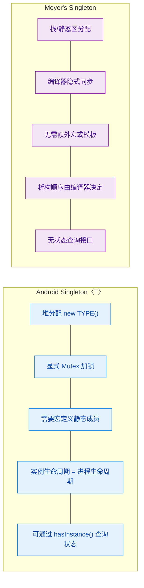
```mermaid
graph LR
    subgraph Android["Android Singleton〈T〉"]
        direction TB
        A1["堆分配 new TYPE()"]
        A2["显式 Mutex 加锁"]
        A3["需要宏定义静态成员"]
        A4["实例生命周期 = 进程生命周期"]
        A5["可通过 hasInstance() 查询状态"]
        A1 --- A2
        A2 --- A3
        A3 --- A4
        A4 --- A5
    end

    subgraph Meyer["Meyer's Singleton"]
        direction TB
        M1["栈/静态区分配"]
        M2["编译器隐式同步"]
        M3["无需额外宏或模板"]
        M4["析构顺序由编译器决定"]
        M5["无状态查询接口"]
        M1 --- M2
        M2 --- M3
        M3 --- M4
        M4 --- M5
    end

    classDef androidStyle fill:#E3F2FD,stroke:#1E88E5,color:#0D47A1,stroke-width:1px
    classDef meyerStyle fill:#F3E5F5,stroke:#8E24AA,color:#4A148C,stroke-width:1px
    class A1,A2,A3,A4,A5 androidStyle
    class M1,M2,M3,M4,M5 meyerStyle
```

**Android 为什么没有直接采用 Meyer's Singleton？** 原因有几个：

1. **历史因素**：Android Singleton 模板诞生于 C++11 标准之前，当时局部 static 的线程安全性是由实现决定（implementation-defined）的，不能依赖。
2. **显式控制**：`Singleton<T>` 使用堆分配（`new`），实例永不析构（除非进程退出），避免了 C++ 中臭名昭著的 **Static Destruction Order Fiasco（静态对象析构顺序问题）**。
3. **可观测性**：`hasInstance()` 方法允许代码在不触发构造的前提下查询单例是否已存在，这在复杂的系统初始化流程中很有用。
4. **统一风格**：Android Framework 有自己的一套 C++ 编码范式（`Mutex`, `RefBase`, `sp<>` 等），Singleton 模板与这些工具配合更自然。

---

### 常见陷阱与最佳实践

#### 陷阱 1：忘记 ANDROID_SINGLETON_STATIC_INSTANCE 宏

这是最常见的编译/链接错误：

```
undefined reference to 'android::Singleton<DisplayManager>::sInstance'
undefined reference to 'android::Singleton<DisplayManager>::sLock'
```

**解决方案**：在对应的 `.cpp` 文件中添加宏调用。

#### 陷阱 2：忘记 friend 声明

```
error: 'DisplayManager::DisplayManager()' is private
```

**解决方案**：在子类中添加 `friend class Singleton<TYPE>;`。

#### 陷阱 3：试图 delete 单例

```cpp
// ❌ 错误！不要这样做
DisplayManager* p = &DisplayManager::getInstance();
delete p;  // 悬空指针灾难！后续 getInstance() 仍返回已释放的内存
```

Android Singleton 的设计意图是**实例与进程同生命周期（Live as long as the process）**，不支持手动销毁。析构函数是 `protected` 的，直接 `delete` 在某些编译器配置下会报错。

#### 最佳实践总结

```cpp
// ✅ 正确的使用模板

// 1. 头文件中：继承 + friend + 私有构造
class MyService : public Singleton<MyService> {
    friend class Singleton<MyService>;   // 必须
private:
    MyService();                         // 必须私有
public:
    void doWork();                       // 公开业务接口
};

// 2. 源文件中：宏定义静态成员
ANDROID_SINGLETON_STATIC_INSTANCE(MyService)  // 必须

// 3. 使用时：始终通过引用接收
MyService& svc = MyService::getInstance();  // 用引用，不用指针
svc.doWork();
```

---

### 📝 练习题

**题目**：以下关于 Android `Singleton<T>` 模板的描述，哪一项是**错误**的？

A. `Singleton<T>` 使用 CRTP 模式，子类将自身类型作为模板参数传入基类


B. `getInstance()` 内部通过 `Mutex::Autolock` 实现线程安全，采用了 DCLP（双重检查锁）优化


C. 子类必须声明 `friend class Singleton<T>`，否则基类无法调用子类的私有构造函数


D. `ANDROID_SINGLETON_STATIC_INSTANCE` 宏用于在 `.cpp` 文件中显式定义模板静态成员变量


**【答案】** B

**【解析】** Android 的 `Singleton<T>::getInstance()` 并**没有**采用 DCLP（Double-Checked Locking Pattern）。它的实现是**先加锁，再检查**——每次调用 `getInstance()` 都会进入 `Mutex::Autolock` 的临界区，然后才判断 `sInstance` 是否为 `nullptr`。这种写法虽然在理论上比 DCLP 多了一些锁竞争开销，但代码更简洁，正确性更容易保证。DCLP 是先做一次无锁检查（if null），再加锁做第二次检查，在 C++11 之前的内存模型中存在潜在风险。选项 A、C、D 均为正确描述。

---

## String8/String16 — Android Native 字符串体系

Android 的 Native 层（C++ Framework）并没有直接使用 C++ 标准库中的 `std::string` 或 `std::u16string`，而是自行设计了一套字符串类：**`String8`** 和 **`String16`**。它们定义在 `<utils/String8.h>` 和 `<utils/String16.h>` 中，隶属于 `android` 命名空间，是 AOSP 中 `libutils` 库的核心组成部分。

### 为什么 Android 不用 std::string

String8.h 的版权标记可以追溯到 2005 年。在那个时期，能够正确编译 ARM 目标代码的 C++ 编译器所自带的 C++ Runtime 和 STL 实现质量非常差。这就是 Android Framework 从一开始就不使用任何 STL、exceptions、RTTI 的主要原因。

Android 平台的 Native C++ 层（frameworks/native, frameworks/av, frameworks/base 等）出于历史原因、代码膨胀（code bloat）、异常处理、依赖控制、甚至许可证等多种因素而回避了 std:: 系列。

这些原因在今天看来虽然部分已经不再成立（现代 NDK 的 STL 已经相当成熟），但 Android Framework 的庞大代码库已经深度依赖 `String8/String16`，全面迁移到标准库的可能性很小，除非有非常充分的理由，例如需要移植大量使用 std:: 的现有代码。

> **注意**：在较新版本的 AOSP 中，官方已经建议 "DO NOT USE: please use std::u16string"。但框架中存量代码极多，短期内不会消失。理解 String8/String16 对阅读 AOSP 源码至关重要。

### String8 与 String16 的核心定位

String8 定义在 `namespace android` 中，是一个 holding UTF-8 characters 的字符串类。相对地，String16 是一个 holding UTF-16 characters 的字符串类。

两者的关系非常简洁：

| 特性 | String8 | String16 |
|------|---------|----------|
| **编码** | UTF-8 | UTF-16 |
| **字符单元** | `char` (1 byte) | `char16_t` (2 bytes) |
| **主要场景** | 文件路径、日志、Native 层内部通信 | Binder IPC、与 Java 层交互（Java 的 String 内部为 UTF-16） |
| **底层缓冲区** | `SharedBuffer` | `SharedBuffer` |
| **可互转** | ✅ 可构造为 String16 | ✅ 可构造为 String8 |

为什么需要两种编码？Java 虚拟机（ART/Dalvik）中 `java.lang.String` 的内部存储是 UTF-16。当 Native 层通过 Binder 与 Java 层交互时，String16 可以直接对接，省去编码转换开销。而在纯 Native 场景下（如文件系统操作、日志打印），UTF-8 更加节省空间且与 Linux 系统 API 兼容，因此使用 String8。

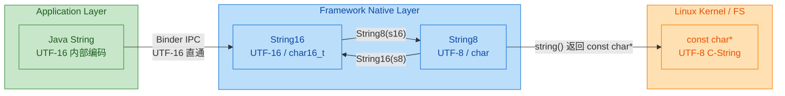
```mermaid
graph LR
    subgraph APP["Application Layer"]
        direction TB
        JAVA["Java String<br/>UTF-16 内部编码"]
    end

    subgraph FW["Framework Native Layer"]
        direction TB
        S16["String16<br/>UTF-16 / char16_t"]
        S8["String8<br/>UTF-8 / char"]
        S16 -- "String8(s16)" --> S8
        S8 -- "String16(s8)" --> S16
    end

    subgraph KERNEL["Linux Kernel / FS"]
        direction TB
        CSTR["const char*<br/>UTF-8 C-String"]
    end

    JAVA -- "Binder IPC<br/>UTF-16 直通" --> S16
    S8 -- "string() 返回 const char*" --> CSTR

    classDef appStyle fill:#C8E6C9,stroke:#388E3C,color:#1B5E20
    classDef fwStyle fill:#BBDEFB,stroke:#1976D2,color:#0D47A1
    classDef kernelStyle fill:#FFE0B2,stroke:#F57C00,color:#E65100

    class APP appStyle
    class JAVA appStyle
    class FW fwStyle
    class S16,S8 fwStyle
    class KERNEL kernelStyle
    class CSTR kernelStyle
```

### SharedBuffer —— 引用计数的内存基石

String8 和 String16 的底层数据并非直接 `new char[]`，而是构建在 Android 自研的 **`SharedBuffer`** 之上。SharedBuffer 是一块带有 **引用计数（Reference Count）** 元数据头的堆内存。

在初始化阶段，系统会通过 `SharedBuffer::alloc(1)` 分配一块只含终止符 `\0` 的全局空字符串 `gEmptyString`，所有默认构造的 String8 对象都指向这个共享的空串，并通过 `acquire()` 增加引用计数。

其内存布局如下：

```c++
// SharedBuffer 内存布局示意（简化）
// ┌─────────────────────┬──────────────────────────┐
// │   SharedBuffer头部    │     实际字符串数据          │
// │  (refCount + size)   │  "hello\0"               │
// │      8~16 bytes      │  由 data() 指针返回        │
// └─────────────────────┴──────────────────────────┘
//                        ↑
//                  mString 指向这里
//
// 关键操作：
//   acquire()  → refCount++  （引用+1）
//   release()  → refCount--  （引用-1，降到0时 free 整块内存）
//   bufferFromData(ptr) → 从数据区指针反推出 SharedBuffer 头部地址
```

这种设计带来了两个核心优势：

1. **廉价的拷贝（Cheap Copy）**：拷贝 String8 时不复制字符数据，只是让新对象的 `mString` 指向相同的 SharedBuffer，并 `acquire()` 使引用计数 +1。
2. **安全的生命周期**：当最后一个持有者调用 `release()` 将引用计数降为 0 时，SharedBuffer 才真正释放内存。

来看拷贝构造函数的源码：

```c++
// String8 拷贝构造 —— 引用计数方案
String8::String8(const String8& o)
    : mString(o.mString)                        // 直接复用同一块数据指针
{
    SharedBuffer::bufferFromData(mString)       // 从 mString 反推出 SharedBuffer 头部
        ->acquire();                            // 引用计数 +1
}

// String8 析构 —— 释放引用
String8::~String8()
{
    SharedBuffer::bufferFromData(mString)       // 找到 SharedBuffer 头部
        ->release();                            // 引用计数 -1，若归零则 free
}
```

当从 C 字符串构造 String8 时，会通过 `allocFromUTF8` 分配一个新的 SharedBuffer，将原始字节 `memcpy` 进去。而拷贝构造则只做 `acquire()`，极其轻量。

String16 的机制完全对称：

```c++
// String16 拷贝赋值 —— 引用计数交换
void String16::setTo(const String16& other)
{
    SharedBuffer::bufferFromData(other.mString)
        ->acquire();                            // 先 acquire 新的
    SharedBuffer::bufferFromData(mString)
        ->release();                            // 再 release 旧的
    mString = other.mString;                    // 指针切换
}
```

String16 的析构函数同样通过 `SharedBuffer::bufferFromData(mString)->release()` 来释放引用。

下图展示两个 String8 对象共享同一 SharedBuffer 的场景：

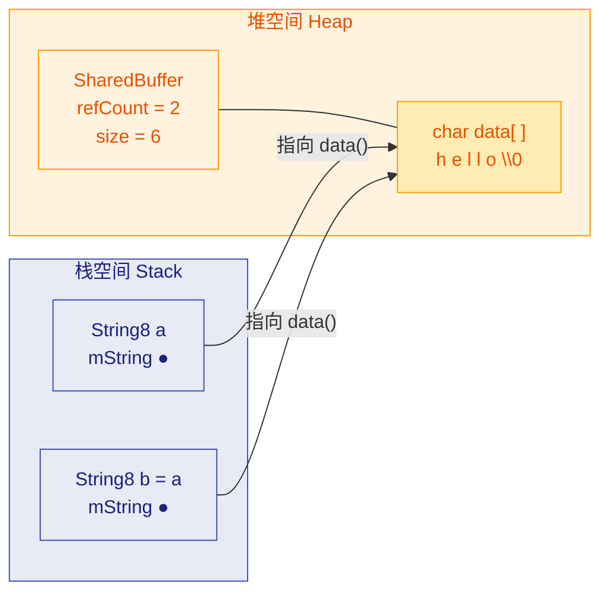
```mermaid
graph LR
    subgraph STACK["栈空间 Stack"]
        direction TB
        A["String8 a<br/>mString ●"]
        B["String8 b = a<br/>mString ●"]
    end

    subgraph HEAP["堆空间 Heap"]
        direction TB
        SB["SharedBuffer<br/>refCount = 2<br/>size = 6"]
        DATA["char data[ ]<br/>h e l l o \\0"]
        SB --- DATA
    end

    A -- "指向 data()" --> DATA
    B -- "指向 data()" --> DATA

    classDef stackStyle fill:#E8EAF6,stroke:#3F51B5,color:#1A237E
    classDef heapStyle fill:#FFF3E0,stroke:#FF9800,color:#E65100
    classDef dataStyle fill:#FFECB3,stroke:#FFA000,color:#E65100

    class STACK stackStyle
    class A,B stackStyle
    class HEAP heapStyle
    class SB heapStyle
    class DATA dataStyle
```

### 写时复制（Copy-on-Write）与修改语义

早期版本的 String8/String16 实现了经典的 **Copy-on-Write (COW)** 语义：当多个对象共享同一个 SharedBuffer 时，任何修改操作（如 `append`、`setTo` 新内容）都会先检查引用计数——如果 `refCount > 1`，就先复制一份独立的 buffer，再进行修改，从而不影响其他持有者。

其流程可以概括为：

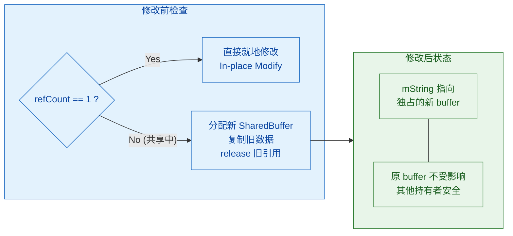
```mermaid
graph LR
    subgraph CHECK["修改前检查"]
        direction TB
        Q{"refCount == 1 ?"}
        YES["直接就地修改<br/>In-place Modify"]
        NO["分配新 SharedBuffer<br/>复制旧数据<br/>release 旧引用"]
        Q -- "Yes" --> YES
        Q -- "No (共享中)" --> NO
    end

    subgraph RESULT["修改后状态"]
        direction TB
        R1["mString 指向<br/>独占的新 buffer"]
        R2["原 buffer 不受影响<br/>其他持有者安全"]
        R1 --- R2
    end

    NO --> RESULT

    classDef checkStyle fill:#E3F2FD,stroke:#1565C0,color:#0D47A1
    classDef resultStyle fill:#E8F5E9,stroke:#2E7D32,color:#1B5E20

    class CHECK checkStyle
    class Q,YES,NO checkStyle
    class RESULT resultStyle
    class R1,R2 resultStyle
```

> **COW 的现代趋势**：在较新的 AOSP 版本中，部分场景下已经弱化或移除了 COW 行为（类似于 `std::string` 在 C++11 后的去 COW 趋势），以避免多线程环境下引用计数的原子操作开销。但理解 COW 仍然是理解 String8/String16 设计哲学的关键。

### String8 核心 API 详解

#### 构造与转换

String8 提供了丰富的构造函数：可以从 `const char*`（UTF-8）、`String16`、`const char16_t*`（UTF-16）、甚至 `const char32_t*`（UTF-32）构造。

```c++
#include <utils/String8.h>
using namespace android;

// 1. 默认构造：指向全局空串
String8 s1;                                     // ""

// 2. 从 C 字符串构造（UTF-8）
String8 s2("Hello Android");                    // 分配 SharedBuffer，拷贝数据

// 3. 从指定长度的 C 字符串构造
String8 s3("Hello Android", 5);                 // 只取前5字节 → "Hello"

// 4. 从 String16 构造（自动 UTF-16 → UTF-8 转换）
String16 wide(u"你好世界");                      // UTF-16 字符串
String8 s4(wide);                               // 内部调用 utf16_to_utf8

// 5. 拷贝构造（引用计数 +1，无数据复制）
String8 s5(s2);                                 // s5 与 s2 共享同一 SharedBuffer
```

#### 格式化构造（类似 sprintf）

String8 提供了 `format()` 和 `formatV()` 两个静态方法，支持类 printf 的格式化字符串构建。

```c++
// format —— 像 sprintf 一样构造字符串
String8 msg = String8::format(
    "Error code: %d, file: %s",                 // 格式模板
    errno,                                      // 替换 %d
    "/data/local/tmp/test.txt"                  // 替换 %s
);
// 结果类似: "Error code: 2, file: /data/local/tmp/test.txt"
```

#### 基本操作

```c++
String8 s("Hello");

// --- 访问 ---
const char* raw = s.string();                   // 获取底层 C 字符串指针（const char*）
size_t len = s.length();                        // 字符串字节长度（不含 \0）
size_t sz = s.size();                           // 同 length()
bool empty = s.isEmpty();                       // 是否为空串

// --- 修改 ---
s.setTo("World");                               // 重新设置内容
s.append(" C++");                               // 追加内容 → "World C++"
s += " Native";                                 // 运算符重载 → "World C++ Native"

// --- 比较 ---
String8 a("abc"), b("abd");
int cmp = a.compare(b);                         // < 0（字典序 a < b）
bool eq = (a == b);                             // false
bool lt = (a < b);                              // true

// --- Unicode 相关 ---
size_t utf32Len = s.getUtf32Length();           // UTF-32 码点数（真实字符数）
```

`string()` 方法返回内部 `mString` 指针；`length()` 通过 `SharedBuffer::sizeFromData(mString) - 1` 计算（减去尾部 `\0`）。

#### 路径操作（Path Utilities）—— String8 的特色功能

String8 内建了一组非常实用的 **文件路径操作** 方法，这在 `std::string` 中是没有的，也是 Android Framework 选择 String8 而非 `char*` 的重要原因之一：

```c++
String8 path("/data/local/tmp/test.conf");

// --- 路径分解 ---
String8 dir  = path.getPathDir();               // "/data/local/tmp"
String8 leaf = path.getPathLeaf();              // "test.conf"
String8 ext  = path.getPathExtension();         // ".conf"
String8 base = path.getBasePath();              // "/data/local/tmp/test"

// --- 路径拼接 ---
String8 root("/sdcard");
root.appendPath("Download");                    // → "/sdcard/Download"
root.appendPath("file.zip");                    // → "/sdcard/Download/file.zip"
// appendPath 自动处理分隔符，不会出现 "/sdcard//Download"

// --- 不修改原始对象的拼接 ---
String8 newPath = root.appendPathCopy("subdir");// root 不变，返回新对象

// --- 路径遍历 ---
String8 full("/system/lib/hw/audio.primary.so");
String8 remains;
String8 first = full.walkPath(&remains);        // first = "system"
                                                // remains = "lib/hw/audio.primary.so"
```

`appendPath` 保证在旧路径和新组件之间恰好有一个路径分隔符。

而 `walkPath` 会取出路径的第一段，并将剩余部分输出到 `outRemains` 参数。

### String16 核心 API 详解

String16 的 API 比 String8 更加精简，没有路径操作功能，专注于 UTF-16 字符串的持有和比较。

String16 可从 String8、`const char*`（自动 UTF-8 → UTF-16 转换）、或 `const char16_t*` 构造，内部使用 `char16_t` 数组存储 UTF-16 字符。

```c++
#include <utils/String16.h>
using namespace android;

// 1. 从 C 字符串构造（UTF-8 → UTF-16 自动转换）
String16 s1("Hello");                           // 内部调用 allocFromUTF8

// 2. 从 String8 构造
String8 narrow("Android Framework");
String16 s2(narrow);                            // UTF-8 → UTF-16

// 3. 从 char16_t 数组构造
String16 s3(u"你好");                            // 直接 UTF-16 数据

// 4. 获取原始数据
const char16_t* raw = s1.string();              // 返回 char16_t* 指针
size_t len = s1.size();                         // UTF-16 编码单元数（非字节数）

// 5. 修改
s1.setTo(s2);                                   // 引用计数方式赋值
s1.append(s3);                                  // 追加

// 6. 比较
int cmp = s1.compare(s2);                       // 使用 strzcmp16 逐单元比较
bool eq = (s1 == s2);
```

String16 的 `size()` 实现为 `SharedBuffer::sizeFromData(mString)/sizeof(char16_t) - 1`，即从 buffer 总字节数反算 char16_t 元素个数再减去末尾的空终止符。

### String8 与 String16 的互转

两者之间的转换是 AOSP 中极其常见的操作，本质上是 UTF-8 ⟷ UTF-16 的编码转换：

```c++
// UTF-8 → UTF-16
String8 utf8Str("Hello 世界");                   // UTF-8 编码
String16 utf16Str(utf8Str);                      // 调用 allocFromUTF8 内部函数
                                                 // 遍历 UTF-8 字节序列 → 生成 char16_t 序列

// UTF-16 → UTF-8
String16 wide(u"Android 安卓");                   // UTF-16 编码
String8 narrow(wide);                             // 调用 utf16_to_utf8 内部函数
                                                 // 遍历 char16_t 序列 → 生成 UTF-8 字节序列
```

String16 从 String8 构造时，内部通过 `allocFromUTF8(o.string(), o.size())` 完成编码转换。

转换的时间复杂度为 **O(n)**，涉及逐字符的编码映射，因此在性能敏感的热路径中应尽量避免频繁互转。

### 在 Binder IPC 中的角色

String8/String16 在 Android Binder 通信中扮演关键角色。Binder 的 `Parcel` 类提供了读写 String16 的原生支持：

```c++
#include <binder/Parcel.h>
using namespace android;

// --- 发送端 (Client) ---
Parcel data;
String16 serviceName("com.example.MyService");   // Binder 服务名用 String16
data.writeString16(serviceName);                 // 序列化到 Parcel

// --- 接收端 (Server) ---
String16 received = data.readString16();         // 从 Parcel 反序列化
String8 narrow(received);                        // 如需 Native 侧使用，转为 UTF-8
ALOGD("Service: %s", narrow.string());           // 日志输出用 string() 获取 C 串
```

为什么 Binder 偏好 String16？因为 Binder 的上层调用者通常是 Java 代码，Java 的 String 内部就是 UTF-16 编码。使用 String16 可以实现 **zero-translation pass-through**——Java 字符串的 UTF-16 字节可以直接写入 Parcel，无需任何编码转换。

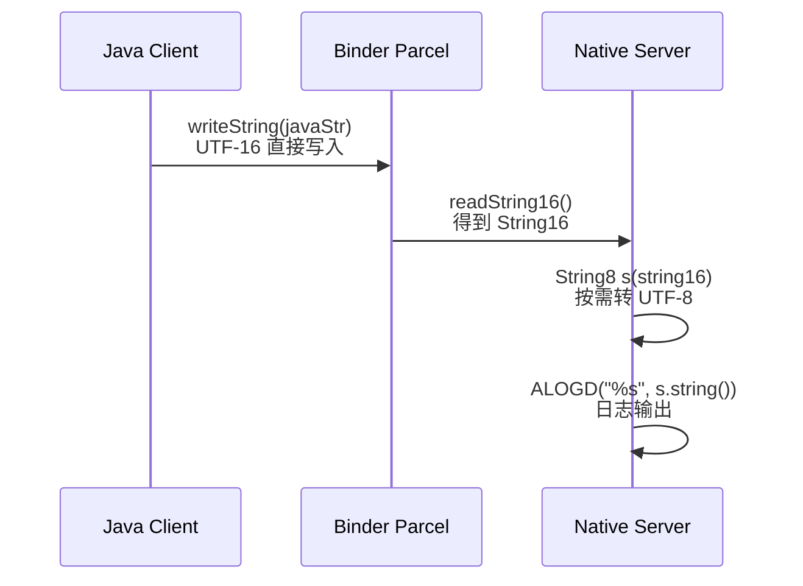
```mermaid
sequenceDiagram
    participant JavaClient as Java Client
    participant Parcel as Binder Parcel
    participant NativeServer as Native Server

    JavaClient->>Parcel: writeString(javaStr)<br/>UTF-16 直接写入
    Parcel->>NativeServer: readString16()<br/>得到 String16
    NativeServer->>NativeServer: String8 s(string16)<br/>按需转 UTF-8
    NativeServer->>NativeServer: ALOGD("%s", s.string())<br/>日志输出
```

### StaticString16 —— 编译期优化

在较新的 AOSP 中引入了 `StaticString16`，它是 String16 的特化版本。与普通 String16 使用引用计数的 SharedBuffer 不同，StaticString16 将数据直接内嵌在对象本身中，不使用引用计数。

官方强调最安全的方式是仅将 StaticString16 用作全局变量，且不应出现在 API 接口中——API 接口应使用 String16。

```c++
// StaticString16 通常用于全局常量定义
// 避免运行时的 SharedBuffer 分配和引用计数开销
static const StaticString16<20> kServiceName(u"android.os.IServiceManager");

// 可以安全地传递给接受 const String16& 的函数
// 因为 StaticString16 继承自 String16
void registerService(const String16& name);
registerService(kServiceName);                   // OK
```

### 与 std::string 的对比总结

| 维度 | `android::String8` | `std::string` (C++17) |
|------|--------------------|-----------------------|
| **编码** | 明确 UTF-8 | 编码无关（按字节存储） |
| **内存管理** | SharedBuffer + 引用计数 | SSO + 堆分配（实现相关） |
| **路径操作** | 内建 `appendPath`, `walkPath`, `getPathExtension` 等 | 无（需 `std::filesystem::path`，C++17） |
| **格式化** | `String8::format()` 静态方法 | 无原生支持（需 `std::format`，C++20） |
| **Unicode 支持** | 内建 UTF-8/16/32 互转 | 无原生 Unicode 感知 |
| **Binder 集成** | 与 `Parcel` 深度集成 | 不兼容 |
| **COW** | 早期版本支持 | C++11 后明确禁止 |
| **线程安全** | 引用计数原子操作保证一定安全 | 无共享状态时安全 |

### 实际 AOSP 源码中的使用模式

下面是一个综合运用 String8/String16 的典型场景——在 Native Service 中处理来自 Java 层的请求：

```c++
#include <utils/String8.h>
#include <utils/String16.h>
#include <binder/Parcel.h>
#include <utils/Log.h>

using namespace android;

// 模拟一个 Native Service 的 onTransact 方法
status_t MyService::onTransact(
    uint32_t code,                               // Binder 事务码
    const Parcel& data,                          // 客户端发来的数据
    Parcel* reply,                               // 返回给客户端的数据
    uint32_t flags)                              // 标志位
{
    switch (code) {
    case LOAD_RESOURCE: {
        // 1. 从 Parcel 读取 UTF-16 字符串（Java 传来的）
        String16 resName16 = data.readString16(); // 读取资源名

        // 2. 转为 UTF-8 用于文件系统操作
        String8 resName8(resName16);              // UTF-16 → UTF-8

        // 3. 利用 String8 的路径操作构建完整路径
        String8 basePath("/data/app/resources");
        basePath.appendPath(resName8);            // 安全拼接路径

        // 4. 获取文件扩展名进行类型判断
        String8 ext = basePath.getPathExtension();// 如 ".png"
        ALOGD("Loading resource: %s (ext: %s)",
              basePath.string(),                  // 转 const char* 用于日志
              ext.string());

        // 5. 返回结果给 Java 层（用 String16）
        String16 result16(String8::format(
            "loaded:%s", basePath.string()));      // 格式化 + 转回 UTF-16
        reply->writeString16(result16);           // 写入 Parcel

        return NO_ERROR;
    }
    default:
        return BBinder::onTransact(code, data, reply, flags);
    }
}
```

### 注意事项与最佳实践

1. **不要长期持有 `string()` 返回的裸指针**——当 String8/String16 对象析构后，该指针悬空（dangling pointer）。

2. **避免在热路径中频繁 String8 ⟷ String16 互转**——每次转换都伴随 O(n) 的编码转换和内存分配。

3. **String8 的路径操作优于手动拼接**——`appendPath()` 自动处理重复分隔符等边界情况，比手写 `snprintf` 更安全。

4. **在新的模块中优先考虑 std::string**——如果你的代码不需要与 Binder/Parcel 直接交互，使用标准库会更具可移植性。

5. **线程安全**——虽然 SharedBuffer 的引用计数使用原子操作，但对同一个 String8 对象的并发读写（如一个线程 append，另一个线程 read）**并不安全**，仍需外部同步。

---

**📝 练习题**

在 Android Native 层开发中，以下关于 `String8` 和 `String16` 的说法，**正确** 的是：


A. String8 内部使用 UTF-16 编码，String16 内部使用 UTF-8 编码


B. String8 的拷贝构造函数会深拷贝整个字符串数据到新的内存空间


C. String16 在 Binder IPC 中被广泛使用，因为 Java 层的 String 内部采用 UTF-16 编码，可以减少编码转换开销


D. String8 和 std::string 完全等价，仅是命名空间不同


**【答案】** C

**【解析】** 

选项 A 恰好颠倒了编码关系。String8 持有 UTF-8 字符（`char`），String16 持有 UTF-16 字符（`char16_t`），这也正是它们名称中 "8" 和 "16" 的由来。

选项 B 不正确。String8 的拷贝构造采用 SharedBuffer 引用计数机制——拷贝时仅增加引用计数（`acquire()`），两个对象共享同一块底层内存，并不会执行深拷贝。只有在实际修改时（写时复制 COW），才可能触发数据复制。

选项 C 正确。Java 的 `java.lang.String` 内部使用 UTF-16 编码。Binder 的 Parcel 原生支持 `writeString16()` / `readString16()`，Java 侧的字符串可以直接以 UTF-16 形式传递到 Native 层的 String16，无需中间编码转换，这是设计 String16 的核心动机之一。

选项 D 明显错误。String8 与 `std::string` 在内存管理策略（SharedBuffer vs SSO+堆分配）、内建功能（路径操作、Unicode 转换、Binder 集成）等方面有本质区别。

---

## Vector（Android 容器）

Android 框架在 `libutils` 中提供了自己的模板容器类 `Vector<T>`，它与 C++ STL 的 `std::vector<T>` 在设计理念上相似——都是基于**动态数组（Dynamic Array）**的连续内存容器。然而，Android 之所以"重新造轮子"，核心原因来自多个维度：早期 Android 系统（2007-2008 年）所用的工具链对 STL 支持极其有限；Android 需要一个与自身 `RefBase`/`sp<T>` 智能指针体系**无缝衔接**的容器；此外还需要在嵌入式低内存环境下拥有更可控的内存增长策略。

尽管现代 Android（AOSP 近年版本）已逐步推荐使用 `std::vector`，但在大量存量 Native 代码（如 `SurfaceFlinger`、`AudioFlinger`、`InputDispatcher` 等核心系统服务）中，`android::Vector<T>` 仍然无处不在。阅读 AOSP 源码时，理解它的设计和 API 是不可绕过的基本功。

---

### Vector 在 Android Native 架构中的定位

Android 的 Native 层拥有一套自成体系的基础工具库，`Vector` 是其中最常用的容器之一。下面的架构图展示了它在整个 Native 工具链中的位置关系：

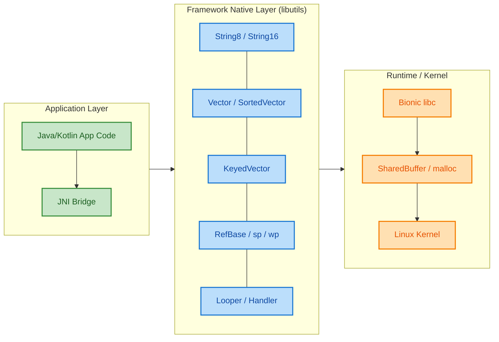
```mermaid
graph LR
    subgraph APP["Application Layer"]
        direction TB
        A1["Java/Kotlin App Code"]
        A2["JNI Bridge"]
        A1 --> A2
    end

    subgraph FWK["Framework Native Layer (libutils)"]
        direction TB
        B1["String8 / String16"]
        B2["Vector / SortedVector"]
        B3["KeyedVector"]
        B4["RefBase / sp / wp"]
        B5["Looper / Handler"]
        B1 --- B2
        B2 --- B3
        B3 --- B4
        B4 --- B5
    end

    subgraph RT["Runtime / Kernel"]
        direction TB
        C1["Bionic libc"]
        C2["SharedBuffer / malloc"]
        C3["Linux Kernel"]
        C1 --> C2
        C2 --> C3
    end

    APP --> FWK
    FWK --> RT

    classDef appStyle fill:#C8E6C9,stroke:#388E3C,stroke-width:2px,color:#1B5E20
    classDef fwkStyle fill:#BBDEFB,stroke:#1976D2,stroke-width:2px,color:#0D47A1
    classDef rtStyle fill:#FFE0B2,stroke:#F57C00,stroke-width:2px,color:#E65100

    class A1,A2 appStyle
    class B1,B2,B3,B4,B5 fwkStyle
    class C1,C2,C3 rtStyle
```

可以看到，`Vector` 与 `String8`、`RefBase`、`KeyedVector` 同处 `libutils` 层，它们共同构成了 Android Native 世界的"标准库"。`Vector` 底层的内存分配最终会走到 **Bionic libc** 的 `malloc/realloc`，而更早期的实现还涉及到 `SharedBuffer` 引用计数机制。

---

### 头文件与基本声明

使用 `android::Vector` 需要引入对应的头文件，并处于 `android` 命名空间中：

```cpp
// 引入 Android Vector 头文件（位于 libutils）
#include <utils/Vector.h>

// Android 所有基础工具类都在 android 命名空间下
using namespace android;

// 声明一个存储 int 的 Vector
Vector<int> intVec;

// 声明一个存储智能指针的 Vector（最常见用法之一）
Vector<sp<IBinder>> binderVec;
```

`Vector.h` 内部会引入 `VectorImpl.h`，后者包含了与类型无关的底层实现（Type-erased implementation）。这是一种经典的 **模板 + 非模板基类** 设计模式，目的是减少模板实例化导致的代码膨胀（code bloat）。

---

### 内部数据结构与内存模型

`android::Vector<T>` 的内存布局本质上就是一段**连续的堆内存**，与 `std::vector` 几乎一致。理解其内部结构对后续分析增长策略和性能特征至关重要。

```
┌─────────────────────────────────────────────────────────────┐
│                   Vector<T> Object (Stack/Heap)             │
│  ┌───────────┐  ┌───────────┐  ┌───────────────────────┐   │
│  │ mStorage  │  │ mCount    │  │ mCapacity (reserved)  │   │
│  │ (T* ptr)  │  │ (size_t)  │  │ (size_t)              │   │
│  └─────┬─────┘  └───────────┘  └───────────────────────┘   │
│        │                                                     │
└────────┼────────────────────────────────────────────────────┘
         │
         ▼  Heap Memory (连续内存块)
         ┌──────┬──────┬──────┬──────┬──────┬──────┬──────┐
         │ T[0] │ T[1] │ T[2] │ T[3] │ T[4] │      │      │
         │(used)│(used)│(used)│(used)│(used)│(free)│(free)│
         └──────┴──────┴──────┴──────┴──────┴──────┴──────┘
         ◄──── mCount = 5 ─────────►◄── reserved ──►
         ◄───────────── mCapacity = 7 ────────────────►
```

这里有三个关键字段：

- **`mStorage`**：指向堆上连续内存块的指针，所有元素 `T[0]` ~ `T[mCount-1]` 存放于此。
- **`mCount`**：当前实际存储的元素数量，等价于 `std::vector::size()`。
- **`mCapacity`**：已分配的总容量（可容纳的元素数），等价于 `std::vector::capacity()`。当 `mCount == mCapacity` 时，下一次插入将触发扩容（reallocation）。

---

### 类继承体系

`Vector<T>` 并非单独一个类，它依赖于一个精心设计的继承链来实现**类型无关的底层操作**与**类型安全的上层接口**的分离：

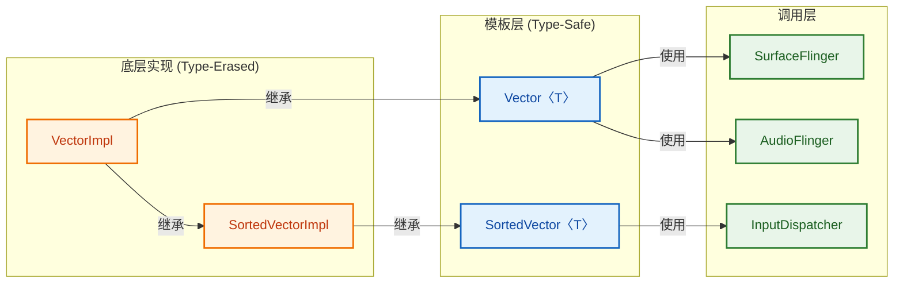
```mermaid
graph LR
    subgraph IMPL["底层实现 (Type-Erased)"]
        direction TB
        V1["VectorImpl"]
        V2["SortedVectorImpl"]
    end

    subgraph TPL["模板层 (Type-Safe)"]
        direction TB
        V3["Vector〈T〉"]
        V4["SortedVector〈T〉"]
    end

    V1 -->|"继承"| V3
    V2 -->|"继承"| V4
    V1 -->|"继承"| V2

    subgraph USER["调用层"]
        direction TB
        U1["SurfaceFlinger"]
        U2["AudioFlinger"]
        U3["InputDispatcher"]
    end

    V3 -->|"使用"| U1
    V3 -->|"使用"| U2
    V4 -->|"使用"| U3

    classDef implStyle fill:#FFF3E0,stroke:#EF6C00,stroke-width:2px,color:#BF360C
    classDef tplStyle fill:#E3F2FD,stroke:#1565C0,stroke-width:2px,color:#0D47A1
    classDef userStyle fill:#E8F5E9,stroke:#2E7D32,stroke-width:2px,color:#1B5E20

    class V1,V2 implStyle
    class V3,V4 tplStyle
    class U1,U2,U3 userStyle
```

这个设计的精妙之处在于：

- **`VectorImpl`**（非模板基类）：完成所有与类型 `T` 无关的操作——内存分配、扩容、元素移动的字节级操作。它通过 `void*` 指针和 `itemSize`（单元素字节数）来操作内存，避免了模板代码膨胀。
- **`Vector<T>`**（模板派生类）：提供类型安全的 API（`add()`、`operator[]`、`itemAt()` 等），在内部将操作委托给 `VectorImpl`，同时负责正确调用元素的**构造函数和析构函数**。
- **`SortedVectorImpl` → `SortedVector<T>`**：在 `VectorImpl` 基础上增加了排序逻辑，保证元素始终有序。

这种 **Thin Template Idiom**（薄模板惯用法）在嵌入式系统和库设计中非常常见，核心思想是"把能不模板化的逻辑都放到非模板基类里"。

---

### 核心 API 详解

#### 创建与基本操作

```cpp
// ═══════════════════════════════════════════════════════
//  Vector 基础操作演示
// ═══════════════════════════════════════════════════════

#include <utils/Vector.h>          // 引入 Vector 头文件
#include <utils/Log.h>             // 引入 Android 日志
using namespace android;           // 使用 android 命名空间

void basicDemo() {
    // 1. 默认构造：创建一个空的 int 型 Vector
    Vector<int> vec;               // mCount=0, mCapacity=0

    // 2. 尾部追加元素 — 最常用的插入方式
    vec.add(10);                   // vec = [10],        返回插入位置的索引 0
    vec.add(20);                   // vec = [10, 20],    返回索引 1
    vec.add(30);                   // vec = [10, 20, 30]

    // 3. 在指定位置插入元素（index=1 的位置）
    vec.insertAt(15, 1);           // vec = [10, 15, 20, 30]
    // 参数说明：insertAt(value, index)
    // 底层会将 index 后的所有元素向后 memmove

    // 4. 获取元素数量（等价于 std::vector::size()）
    size_t count = vec.size();     // count = 4

    // 5. 读取元素 — 三种方式
    int a = vec[0];                // 方式一：operator[]，不做越界检查
    int b = vec.itemAt(1);         // 方式二：itemAt()，带越界断言（debug 模式）
    const int& c = vec.top();      // 方式三：获取最后一个元素的引用

    // 6. 可写引用 — editItemAt()
    vec.editItemAt(2) = 25;        // vec = [10, 15, 25, 30]
    // 注意：operator[] 返回的是 const 引用，修改必须用 editItemAt()

    // 7. 判空
    bool empty = vec.isEmpty();    // false

    // 8. 清空容器（释放所有元素，但不一定释放内存）
    vec.clear();                   // mCount=0，容量可能保留
}
```

这里需要特别注意一个与 `std::vector` 的重要区别：**`operator[]` 在 `android::Vector` 中返回的是 `const T&`（只读引用）**。如果你需要修改已有元素，必须显式调用 `editItemAt(index)`。这个设计体现了 Android 团队"默认只读，显式可写"的防御性编程哲学。

#### 插入与删除操作

```cpp
void insertRemoveDemo() {
    Vector<int> vec;
    // 批量添加测试数据
    vec.add(100);                  // index 0
    vec.add(200);                  // index 1
    vec.add(300);                  // index 2
    vec.add(400);                  // index 3
    vec.add(500);                  // index 4

    // ── 插入操作 ──

    // insertAt(item, index, numItems)：在 index 处插入 numItems 个 item
    vec.insertAt(150, 1);          // 在 index=1 处插入 150
    // vec = [100, 150, 200, 300, 400, 500]

    // replaceAt(item, index)：替换指定位置的元素
    vec.replaceAt(250, 2);         // 把 index=2 的 200 替换为 250
    // vec = [100, 150, 250, 300, 400, 500]

    // ── 删除操作 ──

    // removeAt(index)：删除指定位置的元素
    vec.removeAt(0);               // 删除第一个元素 100
    // vec = [150, 250, 300, 400, 500]
    // 底层操作：将 index 之后的元素整体 memmove 向前

    // removeItemsAt(index, count)：从 index 开始删除 count 个元素
    vec.removeItemsAt(1, 2);       // 从 index=1 开始删除 2 个元素 (250, 300)
    // vec = [150, 400, 500]

    // pop()：删除并返回最后一个元素（等价于 back() + pop_back()）
    // 注意：Android Vector 没有名为 pop() 的函数
    // 但可以组合使用：
    int last = vec.top();          // 获取尾元素 500
    vec.removeAt(vec.size() - 1);  // 手动删除尾元素
    // vec = [150, 400]
}
```

#### 查找与排序

```cpp
void searchSortDemo() {
    Vector<int> vec;
    vec.add(50);                   // index 0
    vec.add(10);                   // index 1
    vec.add(40);                   // index 2
    vec.add(30);                   // index 3
    vec.add(20);                   // index 4

    // ── 线性查找 ──
    // indexOf(item)：从头查找第一个匹配元素，返回索引；找不到返回 -1
    ssize_t idx = vec.indexOf(30); // idx = 3（找到了，位于 index 3）
    ssize_t bad = vec.indexOf(99); // bad = -1（未找到，NAME_NOT_FOUND）

    // ── 排序 ──
    // sort()：使用默认比较（operator<）进行升序排序
    vec.sort();                    // vec = [10, 20, 30, 40, 50]

    // sort(compar)：使用自定义比较函数排序
    // 比较函数签名：int (*compar)(const T* lhs, const T* rhs)
    vec.sort([](const int* a, const int* b) -> int {
        return *b - *a;            // 降序排列
    });
    // vec = [50, 40, 30, 20, 10]
}
```

`sort()` 内部使用的排序算法通常是 **快速排序（Quicksort）** 或 **堆排序（Heapsort）** 的变体（取决于 AOSP 版本），平均时间复杂度为 O(n log n)。

---

### 容量增长策略

当 `mCount` 达到 `mCapacity` 时，继续添加元素会触发**扩容（grow）**。理解增长策略对于在高性能场景（如每帧渲染回调）中避免不必要的内存分配至关重要。

`VectorImpl` 中的增长逻辑大致如下：

```cpp
// 伪代码：VectorImpl::_grow() 核心逻辑简化版
void VectorImpl::_grow(size_t where, size_t amount) {
    // 计算新的需要的最小容量
    size_t newCount = mCount + amount;          // 新的元素总数

    if (newCount > mCapacity) {                 // 需要扩容
        // ── 增长策略核心 ──
        size_t newCapacity = mCapacity;         // 从当前容量开始

        if (mCapacity < 4) {
            newCapacity = 4;                    // 最小容量保证为 4
        } else if (mCapacity < 8) {
            newCapacity = 8;                    // 8 以下直接提到 8
        } else {
            // 关键：每次扩容增加 50%（即乘以 1.5）
            newCapacity = mCapacity + (mCapacity / 2);
        }

        // 确保新容量至少能容纳所有元素
        if (newCapacity < newCount) {
            newCapacity = newCount;
        }

        // 重新分配内存（realloc 或 malloc+memcpy）
        void* newStorage = realloc(mStorage, newCapacity * mItemSize);
        mStorage = newStorage;                  // 更新存储指针
        mCapacity = newCapacity;                // 更新容量
    }

    // 如果是中间插入，需要 memmove 腾出空间
    if (where < mCount) {
        memmove(                                // 将 where 后的元素向后移动
            (char*)mStorage + (where + amount) * mItemSize,
            (char*)mStorage + where * mItemSize,
            (mCount - where) * mItemSize
        );
    }

    mCount = newCount;                          // 更新元素数量
}
```

增长策略对比：

| 特性 | `android::Vector` | `std::vector (GCC/libstdc++)` | `std::vector (Clang/libc++)` |
|:---|:---|:---|:---|
| 增长因子 | **1.5x** | **2x** | **2x** |
| 最小容量 | 4 | 1 | 1 |
| 内存效率 | 更好（浪费更少） | 略差 | 略差 |
| 扩容频率 | 略高 | 略低 | 略低 |
| 旧内存可复用 | 是（1.5x 可复用之前释放的块） | 否（2x 永远无法复用） |否 |

**为什么 1.5x 比 2x 更"内存友好"？** 这涉及到经典的内存分配器理论。假设初始容量为 1，使用 2x 增长：释放的块大小序列为 1, 2, 4, 8...，而下一次需要分配的大小为 16，它总是大于之前所有释放块的总和（1+2+4+8=15 < 16），因此之前释放的内存**永远不可能**被复用。而 1.5x 增长时：释放序列为 1, 2, 3, 5, 8, 12...，需要分配 18，而 1+2+3+5+8+12=31 > 18，之前的内存块有可能被合并复用。

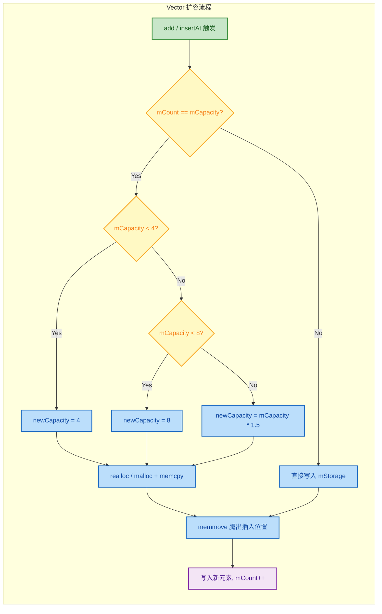
```mermaid
graph LR
    subgraph GROW["Vector 扩容流程"]
        direction TB
        G1["add / insertAt 触发"]
        G2{"mCount == mCapacity?"}
        G3["直接写入 mStorage"]
        G4{"mCapacity < 4?"}
        G5["newCapacity = 4"]
        G6{"mCapacity < 8?"}
        G7["newCapacity = 8"]
        G8["newCapacity = mCapacity * 1.5"]
        G9["realloc / malloc + memcpy"]
        G10["memmove 腾出插入位置"]
        G11["写入新元素, mCount++"]

        G1 --> G2
        G2 -->|"No"| G3
        G2 -->|"Yes"| G4
        G4 -->|"Yes"| G5
        G4 -->|"No"| G6
        G6 -->|"Yes"| G7
        G6 -->|"No"| G8
        G5 --> G9
        G7 --> G9
        G8 --> G9
        G9 --> G10
        G3 --> G10
        G10 --> G11
    end

    classDef startStyle fill:#C8E6C9,stroke:#388E3C,stroke-width:2px,color:#1B5E20
    classDef decStyle fill:#FFF9C4,stroke:#F9A825,stroke-width:2px,color:#F57F17
    classDef actStyle fill:#BBDEFB,stroke:#1565C0,stroke-width:2px,color:#0D47A1
    classDef endStyle fill:#F3E5F5,stroke:#7B1FA2,stroke-width:2px,color:#4A148C

    class G1 startStyle
    class G2,G4,G6 decStyle
    class G3,G5,G7,G8,G9,G10 actStyle
    class G11 endStyle
```

---

### setCapacity 与性能优化

如果你预先知道 Vector 将存储大约多少元素，应该使用 `setCapacity()` 预分配内存，避免多次扩容导致的 `realloc` 开销：

```cpp
void preAllocDemo() {
    Vector<sp<Layer>> layers;

    // 假设我们知道大约有 64 个图层
    layers.setCapacity(64);        // 一次性分配 64 个元素的空间
    // 此时 mCapacity=64, mCount=0
    // 后续 add() 在 count < 64 时都不会触发 realloc

    for (int i = 0; i < 64; i++) {
        layers.add(new Layer());   // 每次 add 都是 O(1)，无扩容开销
    }

    // 如果确定后续不再添加元素，可以收缩内存
    // （减少 mCapacity 到 mCount，释放多余内存）
    // 注意：Android Vector 本身没有 shrink_to_fit()
    // 但可以通过 setCapacity(vec.size()) 近似实现
}
```

在 `SurfaceFlinger` 的真实代码中，绘制管线每帧需要收集所有可见 Layer，通常会预先分配足够容量来避免帧内分配（per-frame allocation），因为帧内的 `malloc` 可能触发内存碎片整理甚至 GC pause（如果涉及 Java 层回调），导致丢帧（jank）。

---

### 存储智能指针对象（sp\<T\> / wp\<T\>）

`Vector` 在 Android 中最强大的用法之一是与 `sp<T>`（Strong Pointer）配合存储引用计数对象。这是 AOSP 中随处可见的模式：

```cpp
#include <utils/Vector.h>
#include <utils/RefBase.h>         // sp<T> 定义
#include <binder/IBinder.h>        // IBinder 定义

using namespace android;

// ── 模拟一个引用计数对象 ──
class MyService : public RefBase {
public:
    MyService(int id) : mId(id) {  // 构造函数，保存服务 ID
        ALOGD("MyService(%d) created", mId);
    }

    ~MyService() {                 // 析构函数
        ALOGD("MyService(%d) destroyed", mId);
    }

    int getId() const { return mId; }

private:
    int mId;                       // 服务标识
};

void smartPointerDemo() {
    Vector<sp<MyService>> services;   // 存储强引用的 Vector

    {
        sp<MyService> svc1 = new MyService(1);  // refCount=1
        sp<MyService> svc2 = new MyService(2);  // refCount=1

        services.add(svc1);        // Vector 内部拷贝 sp<T>，refCount 变为 2
        services.add(svc2);        // 同理，refCount=2
    }
    // svc1, svc2 离开作用域，refCount 各减 1，变为 1
    // 对象仍然存活，因为 Vector 中还持有一份强引用

    // 访问 Vector 中的智能指针
    sp<MyService> ref = services[0];   // refCount 短暂变为 2
    ALOGD("Service ID = %d", ref->getId());

    // 从 Vector 中移除
    services.removeAt(0);          // Vector 释放 sp<T> 副本，refCount 减 1
    // 如果 ref 是最后的持有者（refCount=1），离开作用域后对象被析构

    services.clear();              // 清空，所有 sp<T> 被析构
    // MyService(2) 的 refCount 归零，对象被 delete
}
```

引用计数在 Vector 操作过程中的变化可以用下面的时序图来理解：

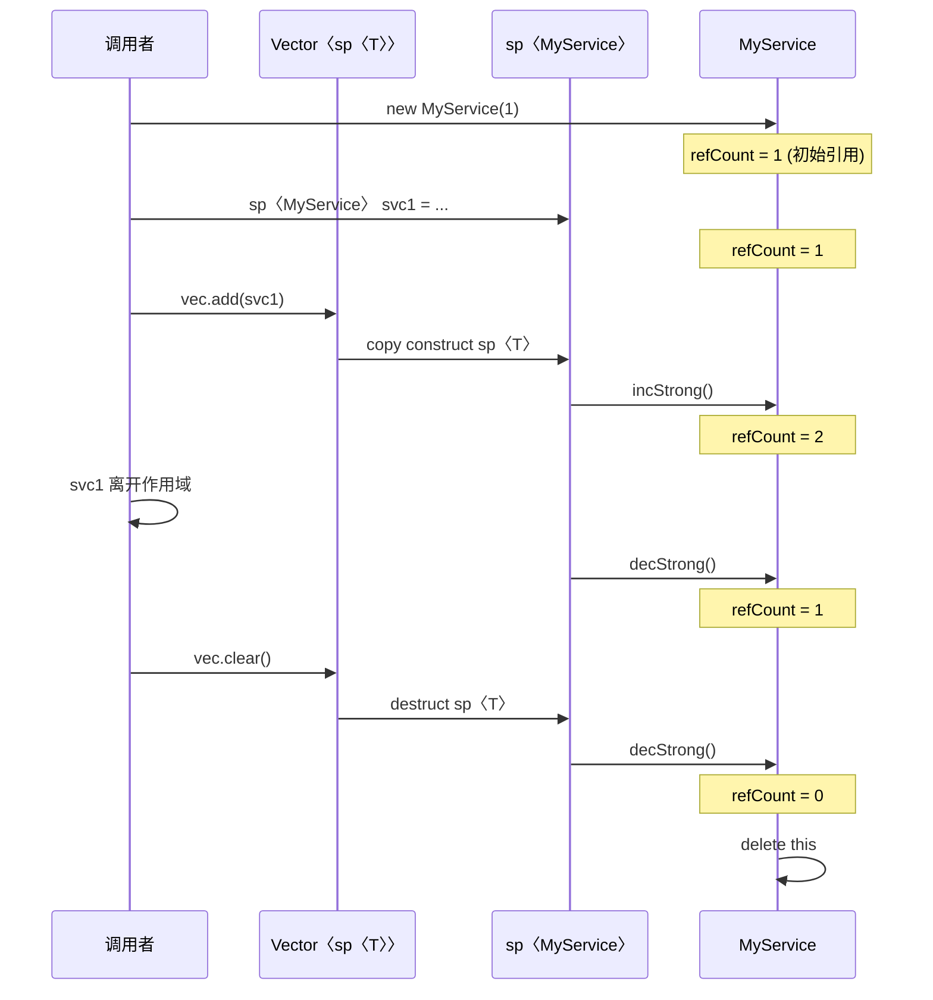
```mermaid
sequenceDiagram
    participant App as 调用者
    participant Vec as Vector〈sp〈T〉〉
    participant SP as sp〈MyService〉
    participant Obj as MyService

    App->>Obj: new MyService(1)
    Note over Obj: refCount = 1 (初始引用)

    App->>SP: sp〈MyService〉 svc1 = ...
    Note over Obj: refCount = 1

    App->>Vec: vec.add(svc1)
    Vec->>SP: copy construct sp〈T〉
    SP->>Obj: incStrong()
    Note over Obj: refCount = 2

    App->>App: svc1 离开作用域
    SP->>Obj: decStrong()
    Note over Obj: refCount = 1

    App->>Vec: vec.clear()
    Vec->>SP: destruct sp〈T〉
    SP->>Obj: decStrong()
    Note over Obj: refCount = 0
    Obj->>Obj: delete this
```

---

### Vector 与 std::vector 的 API 对比

对于有 STL 经验的开发者，下表可以帮助快速建立映射关系：

| 功能 | `android::Vector<T>` | `std::vector<T>` |
|:---|:---|:---|
| 尾部添加 | `add(item)` | `push_back(item)` |
| 指定位置插入 | `insertAt(item, idx)` | `insert(it, item)` |
| 替换元素 | `replaceAt(item, idx)` | `vec[idx] = item` |
| 只读访问 | `operator[]` / `itemAt(idx)` | `operator[]` / `at(idx)` |
| 可写访问 | `editItemAt(idx)` | `operator[]`（直接可写） |
| 获取尾元素 | `top()` | `back()` |
| 删除指定位置 | `removeAt(idx)` | `erase(it)` |
| 批量删除 | `removeItemsAt(idx, count)` | `erase(first, last)` |
| 查找元素 | `indexOf(item)` | `std::find(...)` |
| 排序 | `sort()` / `sort(compar)` | `std::sort(...)` |
| 元素数量 | `size()` | `size()` |
| 判空 | `isEmpty()` | `empty()` |
| 清空 | `clear()` | `clear()` |
| 预分配容量 | `setCapacity(n)` | `reserve(n)` |
| 迭代器 | `begin()` / `end()` (有限支持) | 完整迭代器体系 |

最显著的差异有三个：
1. **只读 `operator[]`**：Android 版本默认只读，修改需要 `editItemAt()`。
2. **索引式 API**：Android 版本全部基于整数索引，而 STL 偏向迭代器范式。
3. **返回索引**：`add()` 返回新元素的索引（`ssize_t`），STL 的 `push_back()` 返回 `void`。

---

### SortedVector 简介

Android 还提供了 `SortedVector<T>`，它是 `Vector<T>` 的有序变体。每次插入时自动通过二分查找（Binary Search）找到正确位置，保证容器内元素**始终有序**。

```cpp
#include <utils/SortedVector.h>
using namespace android;

void sortedDemo() {
    SortedVector<int> sv;

    // add() 会自动插入到正确的有序位置
    sv.add(30);                    // sv = [30]
    sv.add(10);                    // sv = [10, 30]  — 10 插入到 30 之前
    sv.add(20);                    // sv = [10, 20, 30]
    sv.add(50);                    // sv = [10, 20, 30, 50]
    sv.add(40);                    // sv = [10, 20, 30, 40, 50]

    // indexOf() 在 SortedVector 中使用二分查找，O(log n)
    ssize_t idx = sv.indexOf(30);  // idx = 2，O(log n) 高效查找

    // merge()：合并另一个 Vector 的所有元素（归并）
    SortedVector<int> sv2;
    sv2.add(25);
    sv2.add(35);
    sv.merge(sv2);                 // sv = [10, 20, 25, 30, 35, 40, 50]
}
```

**SortedVector 的使用场景**：当你需要频繁查找且数据量不是特别大（几百到几千级别）时，`SortedVector` 是一个轻量级的有序容器选择。它比 `std::set` 缓存友好（连续内存），但插入是 O(n)（需要 memmove），所以不适合频繁插入的超大数据集。

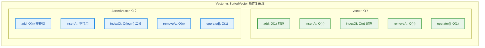
```mermaid
graph LR
    subgraph CMP["Vector vs SortedVector 操作复杂度"]
        direction TB
        subgraph VEC["Vector〈T〉"]
            direction TB
            V1["add: O(1) 摊还"]
            V2["insertAt: O(n)"]
            V3["indexOf: O(n) 线性"]
            V4["removeAt: O(n)"]
            V5["operator[]: O(1)"]
        end
        subgraph SVEC["SortedVector〈T〉"]
            direction TB
            S1["add: O(n) 需移动"]
            S2["insertAt: 不可用"]
            S3["indexOf: O(log n) 二分"]
            S4["removeAt: O(n)"]
            S5["operator[]: O(1)"]
        end
    end

    classDef vecStyle fill:#E8F5E9,stroke:#43A047,stroke-width:2px,color:#1B5E20
    classDef svecStyle fill:#E3F2FD,stroke:#1E88E5,stroke-width:2px,color:#0D47A1

    class V1,V2,V3,V4,V5 vecStyle
    class S1,S2,S3,S4,S5 svecStyle
```

---

### 真实 AOSP 案例：SurfaceFlinger 中的 Vector 使用

`SurfaceFlinger` 是 Android 图形合成服务，它大量使用 `Vector` 来管理 Layer（图层）。以下是从 AOSP 中简化的典型使用模式：

```cpp
// 简化自 AOSP SurfaceFlinger 代码
class SurfaceFlinger : public BnSurfaceComposer {
private:
    // 使用 Vector 存储所有 Display 上的可见图层
    Vector<sp<Layer>> mVisibleLayers;      // 可见图层列表

    // 使用 SortedVector 存储按 Z 轴排序的图层
    SortedVector<sp<Layer>> mLayersByZ;    // Z 轴有序图层

public:
    // 每帧合成时调用
    void rebuildLayerStacks() {
        mVisibleLayers.clear();            // 清空上一帧的可见图层

        // 预分配容量，避免帧内 realloc
        mVisibleLayers.setCapacity(mLayersByZ.size());

        // 遍历所有图层，筛选可见的
        for (size_t i = 0; i < mLayersByZ.size(); i++) {
            const sp<Layer>& layer = mLayersByZ[i];  // 只读访问
            if (layer->isVisible()) {      // 判断是否可见
                mVisibleLayers.add(layer); // 加入可见列表
            }
        }
        // 至此 mVisibleLayers 包含本帧所有需要合成的图层
    }

    // 添加新图层
    status_t addLayer(const sp<Layer>& layer) {
        // SortedVector::add() 自动按 Layer 的 Z 值排序
        mLayersByZ.add(layer);
        return NO_ERROR;
    }

    // 移除图层
    status_t removeLayer(const sp<Layer>& layer) {
        ssize_t idx = mLayersByZ.indexOf(layer);  // O(log n) 查找
        if (idx >= 0) {
            mLayersByZ.removeAt(idx);      // 移除，sp<T> 自动管理引用计数
            return NO_ERROR;
        }
        return NAME_NOT_FOUND;             // Android 错误码：未找到
    }
};
```

这个例子展示了几个关键实践：

1. **`setCapacity()` 预分配**：在帧循环中预分配容量，消除帧内 `realloc`。
2. **`SortedVector` 用于排序需求**：Z 轴排序是图形合成的核心需求，用有序容器天然满足。
3. **`sp<T>` 自动生命周期管理**：从 `Vector` 中 `removeAt()` 后，如果没有其他强引用持有，Layer 对象自动被销毁。
4. **索引式遍历**：使用 `size()` + `operator[]` 的经典 for 循环，而非迭代器。

---

### 注意事项与最佳实践

**1. 线程安全**

`android::Vector` **不是线程安全的**。在多线程环境中使用时，必须外部加锁：

```cpp
Mutex mLock;                       // Android Mutex（基于 pthread_mutex）
Vector<int> mSharedVec;            // 共享容器

void threadSafeAdd(int value) {
    Mutex::Autolock lock(mLock);   // RAII 自动加锁/解锁
    mSharedVec.add(value);         // 在锁保护下操作
}
```

**2. 避免在循环中频繁 removeAt(0)**

从头部删除是 O(n) 操作（需要移动所有后续元素）。如果需要 FIFO 语义，考虑使用 `List`（链表）或 `std::deque`。

**3. POD 类型 vs 非 POD 类型**

`VectorImpl` 底层使用 `memcpy`/`memmove` 来移动元素。对于 POD（Plain Old Data）类型（如 `int`、`float`、`struct` 等）这完全没问题。但对于**含有虚函数表指针、自定义拷贝语义**的复杂对象，需要确保移动操作是安全的。`sp<T>` 本身是 trivially copyable 的（内部只有一个裸指针 + 引用计数操作），所以可以安全使用。

**4. 现代 AOSP 的迁移趋势**

Google 官方在近年的 AOSP 代码审查中，逐步推荐将 `android::Vector` 替换为 `std::vector`，原因包括：标准库经过更广泛的优化和测试；更好的编译器支持（如 move semantics）；更丰富的算法库配合。但这个迁移过程是渐进的，大量核心代码仍在使用 `android::Vector`。

---

### 📝 练习题

**题目一：** 关于 `android::Vector<T>` 的 `operator[]` 和 `editItemAt()`，以下描述正确的是？

A. `operator[]` 返回 `T&`（可写引用），`editItemAt()` 返回 `const T&`（只读引用）

B. `operator[]` 和 `editItemAt()` 都返回 `T&`（可写引用），功能完全相同

C. `operator[]` 返回 `const T&`（只读引用），要修改元素必须使用 `editItemAt()`

D. `operator[]` 不存在于 `android::Vector`，只能使用 `itemAt()` 访问元素


**【答案】** C

**【解析】** 这是 `android::Vector` 与 `std::vector` 最容易混淆的区别之一。在 `android::Vector<T>` 中，`operator[]` 被重载为返回 `const T&`（只读引用），这与 `itemAt()` 的行为一致。如果需要修改容器中已有元素的值，**必须**使用 `editItemAt(index)` 方法，它返回 `T&`（可写引用）。这种设计是 Android 团队刻意为之的**防御性编程**策略——默认只读可以防止意外修改共享数据，而显式调用 `editItemAt()` 使得"写操作"在代码中一目了然，便于 Code Review 时发现潜在的并发问题。

---

**题目二：** 在一个每秒 60 帧的渲染循环中，以下代码可能导致性能问题的是？

```cpp
// 每帧调用一次
void onFrame() {
    Vector<sp<RenderNode>> nodes;     // 每帧创建新 Vector
    collectVisibleNodes(nodes);        // 填充约 200 个节点
    renderAll(nodes);                  // 渲染
}   // 帧结束，nodes 析构
```

A. 没有问题，Vector 的构造和析构开销可以忽略不计

B. 应该将 `nodes` 声明为成员变量，每帧 `clear()` + `setCapacity()` 复用，避免反复 `malloc/free`

C. 应该将 `Vector` 替换为 `SortedVector` 来提高性能

D. 应该将 `sp<RenderNode>` 改为裸指针 `RenderNode*` 来避免引用计数开销


**【答案】** B

**【解析】** 在每秒 60 帧（约 16.6ms 一帧）的渲染循环中，每帧都创建一个新的 `Vector`，添加约 200 个元素，然后销毁，意味着每帧都要经历：`malloc`（或多次 `realloc`）→ 填充 → `free` 的完整生命周期。正确做法是将 `nodes` 提升为类成员变量，每帧开始时调用 `clear()`（仅重置 `mCount=0`，不释放内存），并在首帧用 `setCapacity(200)` 预分配足够空间。这样后续帧的 `add()` 操作都是纯内存写入，没有任何动态分配开销。选项 C 的 `SortedVector` 会增加排序开销，适得其反。选项 D 使用裸指针虽然能避免引用计数，但会引入内存泄漏风险，在 Android 的 `RefBase` 体系中不推荐。

---

## KeyedVector（Android 键值容器）

在 Android Native 开发中，我们经常需要根据一个 **键（Key）** 快速查找对应的 **值（Value）**，这就是经典的 **关联容器（Associative Container）** 需求。标准库提供了 `std::map`（基于红黑树）和 `std::unordered_map`（基于哈希表），但 Android 框架层出于 **内存效率** 和 **嵌入式友好** 的考量，自研了一套更轻量的方案 —— `KeyedVector`。

`KeyedVector` 定义在 `<utils/KeyedVector.h>` 头文件中，位于 `android` 命名空间下。它的核心思想极其简洁：**底层就是一个按 Key 排序的 `SortedVector`，每个元素是一个 Key-Value 对（pair）**。查找操作通过 **二分搜索（Binary Search）** 完成，插入操作维护有序性。这种设计在 **元素数量较少（几十到几百）** 时，无论是内存占用还是缓存友好性，都优于基于树或哈希的方案。

### KeyedVector 的设计动机与定位

要理解 `KeyedVector` 存在的意义，必须先理解 Android 系统的运行环境特征：

**内存敏感**：Android 设备内存有限，每个进程的内存配额受到严格限制。`std::map` 的每个节点都是独立分配的堆内存，带有左右子指针和颜色标记，单个节点的额外开销（overhead）可达 32-48 字节。而 `KeyedVector` 底层是连续数组，元素紧密排列，**零指针开销**。

**缓存友好（Cache Friendly）**：连续内存布局意味着 CPU 在遍历时可以充分利用 L1/L2 缓存的预取机制（prefetch），大幅减少 cache miss。对于系统服务中频繁遍历的小型映射表（如属性表、配置表），这一优势非常显著。

**查找 vs 插入的权衡**：`KeyedVector` 的查找是 O(log n)（二分搜索），插入是 O(n)（需要移动元素维护有序性）。而 `std::map` 的查找和插入都是 O(log n)。因此 `KeyedVector` 适用于 **读多写少** 的场景 —— 这恰恰是 Android 系统服务中大部分映射表的使用模式：启动时初始化，运行时频繁查询。

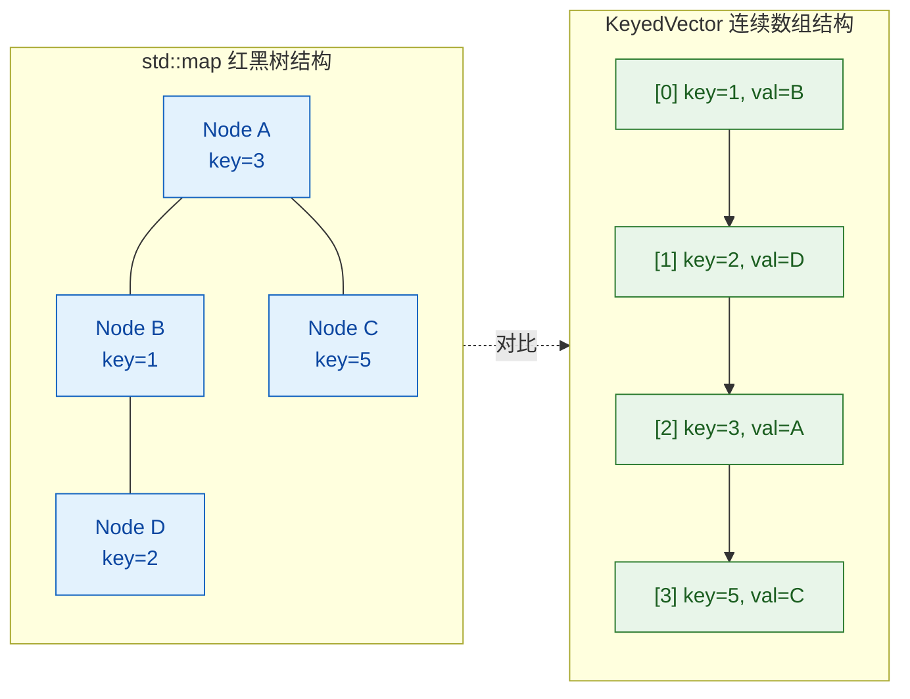
```mermaid
graph LR
    subgraph std_map["std::map 红黑树结构"]
        direction TB
        N1["Node A<br/>key=3"]
        N2["Node B<br/>key=1"]
        N3["Node C<br/>key=5"]
        N4["Node D<br/>key=2"]
        N1 --- N2
        N1 --- N3
        N2 --- N4
    end

    subgraph kv["KeyedVector 连续数组结构"]
        direction TB
        A1["[0] key=1, val=B"]
        A2["[1] key=2, val=D"]
        A3["[2] key=3, val=A"]
        A4["[3] key=5, val=C"]
        A1 --> A2 --> A3 --> A4
    end

    std_map -. "对比" .-> kv

    classDef treeNode fill:#E3F2FD,stroke:#1565C0,color:#0D47A1
    classDef arrNode fill:#E8F5E9,stroke:#2E7D32,color:#1B5E20
    classDef subStyle fill:#FAFAFA,stroke:#BDBDBD,color:#424242

    class N1,N2,N3,N4 treeNode
    class A1,A2,A3,A4 arrNode
```

上图直观展示了两种数据结构的本质区别：左侧 `std::map` 是离散的树节点，每个节点独立分配；右侧 `KeyedVector` 是一块连续内存，元素按 key 升序紧密排列。

### 内部实现原理剖析

`KeyedVector` 的实现精妙地复用了 Android 已有的 `SortedVector` 容器。让我们从源码层面逐层拆解。

#### 核心数据结构：key_value_pair_t

`KeyedVector` 并不是独立地存储 Key 和 Value，而是将它们打包成一个结构体：

```cpp
// 定义在 KeyedVector.h 中
// 这是 KeyedVector 存储的最小单元：键值对
template <typename KEY, typename VALUE>
struct key_value_pair_t {
    typedef KEY    key_t;       // 键的类型别名
    typedef VALUE  value_t;     // 值的类型别名

    KEY   key;                  // 存储键
    VALUE value;                // 存储值

    // 默认构造函数
    key_value_pair_t() {}

    // 带参构造：用给定的 key 和 value 初始化
    key_value_pair_t(const KEY& k, const VALUE& v)
        : key(k), value(v) {}

    // 定义"小于"操作符 —— 这是排序的核心！
    // 只按 key 比较，value 不参与排序逻辑
    inline bool operator<(const key_value_pair_t& o) const {
        return strictly_order_type(key, o.key);  // 调用 Android 的类型安全比较函数
    }

    // "大于"操作符，同样只看 key
    inline bool operator>(const key_value_pair_t& o) const {
        return strictly_order_type(o.key, key);
    }

    // 默认赋值拷贝操作符，不相关代码
    inline const KEY& getKey() const { return key; }   // getter
    inline const VALUE& getValue() const { return value; } // getter
};
```

这个设计的关键在于：**比较操作符只看 Key，不看 Value**。这意味着当这个 pair 被放进 `SortedVector` 时，排序依据完全由 Key 决定。

#### 类模板定义

```cpp
// KeyedVector 类模板
// KEY 必须支持 < 比较操作
// VALUE 可以是任意可拷贝类型
template <typename KEY, typename VALUE>
class KeyedVector {
public:
    typedef KEY    key_type;                          // 键类型
    typedef VALUE  mapped_type;                       // 值类型
    typedef key_value_pair_t<KEY, VALUE> value_type;  // 内部存储的 pair 类型

    // 构造与析构
    inline                  KeyedVector() {}
                            // 默认析构由编译器生成即可

    // =================== 容量相关 ===================
    inline  size_t          size() const { return mVector.size(); }       // 返回元素个数
    inline  bool            isEmpty() const { return mVector.isEmpty(); } // 判空
    inline  size_t          capacity() const { return mVector.capacity(); } // 底层数组容量

    // =================== 查找操作 ===================
    // 根据 key 查找，返回索引；未找到返回负值
    ssize_t                 indexOfKey(const KEY& key) const;

    // 根据 key 取值（const 版本）；key 不存在时行为未定义！
    const VALUE&            valueFor(const KEY& key) const;

    // 根据索引取值 —— 注意是索引不是 key
    const VALUE&            valueAt(size_t index) const;
    const KEY&              keyAt(size_t index) const;

    // =================== 修改操作 ===================
    // 添加键值对（key 不能已存在，否则返回错误）
    status_t                add(const KEY& key, const VALUE& value);

    // 替换键值对（key 已存在则更新 value，不存在则插入）
    status_t                replaceValueFor(const KEY& key, const VALUE& value);

    // 根据 key 删除
    status_t                removeItem(const KEY& key);

    // 根据索引删除
    status_t                removeItemsAt(size_t index, size_t count = 1);

    // 清空
    inline  void            clear() { mVector.clear(); }

private:
    SortedVector<key_value_pair_t<KEY, VALUE>> mVector;  // 核心：底层就是一个排序数组！
};
```

看到了吗？整个 `KeyedVector` 的核心就是一行：

```cpp
SortedVector<key_value_pair_t<KEY, VALUE>> mVector;  // 唯一的成员变量
```

这就是 Android 代码 **组合复用（Composition）** 的教科书示范 —— `KeyedVector` 没有重新发明轮子，而是在 `SortedVector` 之上叠加了一层 Key-Value 语义。

#### 查找流程详解

```cpp
// indexOfKey：根据 key 查找对应的索引位置
template <typename KEY, typename VALUE>
ssize_t KeyedVector<KEY, VALUE>::indexOfKey(const KEY& key) const {
    // 构造一个临时的 key_value_pair_t，只填充 key 部分
    // value 部分使用默认构造（因为排序只看 key，value 无所谓）
    key_value_pair_t<KEY, VALUE> pair(key, VALUE());

    // 委托给 SortedVector 的 indexOf
    // SortedVector::indexOf 内部执行二分搜索
    return mVector.indexOf(pair);
}

// valueFor：根据 key 直接取值
template <typename KEY, typename VALUE>
const VALUE& KeyedVector<KEY, VALUE>::valueFor(const KEY& key) const {
    // 先用 indexOfKey 找到索引
    ssize_t i = this->indexOfKey(key);

    // 断言：key 必须存在！否则直接 crash
    LOG_ALWAYS_FATAL_IF(i < 0, "%s: key not found", __func__);

    // 用索引访问底层数组，取出 pair 的 value 部分
    return mVector.itemAt(i).value;
}
```

整个查找过程可以用下图表示：

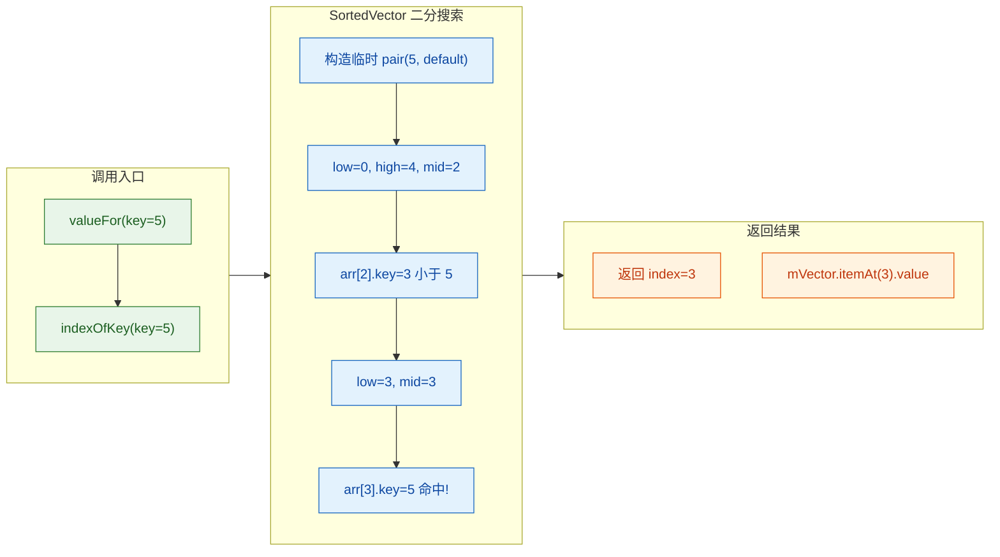
```mermaid
graph LR
    subgraph API["调用入口"]
        direction TB
        Q1["valueFor(key=5)"]
        Q2["indexOfKey(key=5)"]
        Q1 --> Q2
    end

    subgraph BinarySearch["SortedVector 二分搜索"]
        direction TB
        S1["构造临时 pair(5, default)"]
        S2["low=0, high=4, mid=2"]
        S3["arr[2].key=3 小于 5"]
        S4["low=3, mid=3"]
        S5["arr[3].key=5 命中!"]
        S1 --> S2 --> S3 --> S4 --> S5
    end

    subgraph Result["返回结果"]
        direction TB
        R1["返回 index=3"]
        R2["mVector.itemAt(3).value"]
    end

    API --> BinarySearch --> Result

    classDef apiNode fill:#E8F5E9,stroke:#2E7D32,color:#1B5E20
    classDef searchNode fill:#E3F2FD,stroke:#1565C0,color:#0D47A1
    classDef resultNode fill:#FFF3E0,stroke:#E65100,color:#BF360C

    class Q1,Q2 apiNode
    class S1,S2,S3,S4,S5 searchNode
    class R1,R2 resultNode
```

#### 插入流程详解

```cpp
// add：添加新的键值对
template <typename KEY, typename VALUE>
status_t KeyedVector<KEY, VALUE>::add(const KEY& key, const VALUE& value) {
    // 将 key 和 value 打包成 pair
    key_value_pair_t<KEY, VALUE> pair(key, value);

    // 委托给 SortedVector::add
    // SortedVector::add 会：
    //   1. 二分搜索找到插入位置（保持有序）
    //   2. 如果 key 已存在，返回 BAD_VALUE
    //   3. 如果 key 不存在，在正确位置插入（可能触发 memmove）
    ssize_t result = mVector.add(pair);

    // result >= 0 表示成功插入，值为插入后的索引
    // result < 0 表示失败（如 key 已存在）
    return (result >= 0) ? NO_ERROR : result;
}

// replaceValueFor：插入或更新
template <typename KEY, typename VALUE>
status_t KeyedVector<KEY, VALUE>::replaceValueFor(const KEY& key, const VALUE& value) {
    // 先查找 key 是否已存在
    ssize_t i = this->indexOfKey(key);

    if (i >= 0) {
        // key 已存在 —— 原地更新 value（不改变排序）
        // 注意：这里需要获取可变引用，所以用 editValueAt
        mVector.editItemAt(i).value = value;
        return NO_ERROR;
    } else {
        // key 不存在 —— 作为新元素插入
        return this->add(key, value);
    }
}
```

这里有一个关键的 API 设计区分：

| 方法 | Key 已存在 | Key 不存在 |
|------|-----------|-----------|
| `add()` | 返回错误，不修改 | 插入新元素 |
| `replaceValueFor()` | 更新 Value | 插入新元素 |

在实际开发中，`replaceValueFor()` 更常用，因为它的语义等同于 `std::map::operator[]` 的赋值行为 —— "不管有没有，都给我放进去"。

### 复杂度分析与性能特征

让我们系统地对比 `KeyedVector` 与标准库容器的性能：

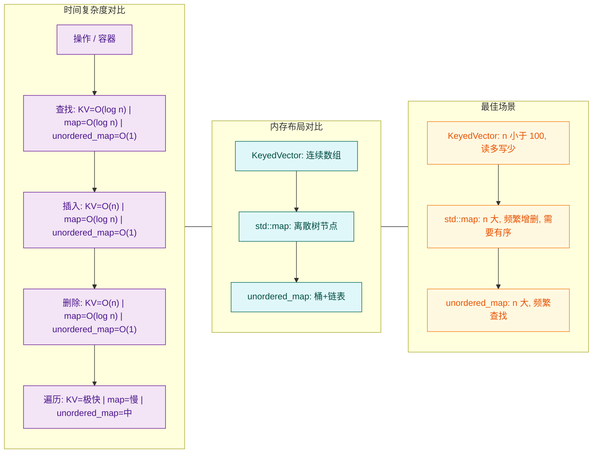
```mermaid
graph LR
    subgraph TimeComplexity["时间复杂度对比"]
        direction TB
        T1["操作 / 容器"]
        T2["查找: KV=O(log n) | map=O(log n) | unordered_map=O(1)"]
        T3["插入: KV=O(n) | map=O(log n) | unordered_map=O(1)"]
        T4["删除: KV=O(n) | map=O(log n) | unordered_map=O(1)"]
        T5["遍历: KV=极快 | map=慢 | unordered_map=中"]
        T1 --> T2 --> T3 --> T4 --> T5
    end

    subgraph MemoryLayout["内存布局对比"]
        direction TB
        M1["KeyedVector: 连续数组"]
        M2["std::map: 离散树节点"]
        M3["unordered_map: 桶+链表"]
        M1 --> M2 --> M3
    end

    subgraph BestFor["最佳场景"]
        direction TB
        B1["KeyedVector: n 小于 100, 读多写少"]
        B2["std::map: n 大, 频繁增删, 需要有序"]
        B3["unordered_map: n 大, 频繁查找"]
        B1 --> B2 --> B3
    end

    TimeComplexity --- MemoryLayout --- BestFor

    classDef infoNode fill:#F3E5F5,stroke:#6A1B9A,color:#4A148C
    classDef memNode fill:#E0F7FA,stroke:#00695C,color:#004D40
    classDef bestNode fill:#FFF8E1,stroke:#F57F17,color:#E65100

    class T1,T2,T3,T4,T5 infoNode
    class M1,M2,M3 memNode
    class B1,B2,B3 bestNode
```

需要特别强调的一点：**在元素数量少于 50-100 的情况下，`KeyedVector` 的二分搜索在实际运行中往往比 `std::map` 的树遍历更快**，因为：

1. 连续数组的 CPU 缓存命中率远高于离散树节点
2. 二分搜索的分支预测模式更规律
3. 无需指针解引用，减少了间接寻址开销

这个 "常数因子优势"（constant factor advantage）在小规模数据上往往能抵消甚至超过渐进复杂度的差距。

### 实战用法与代码示例

#### 基础 CRUD 操作

```cpp
#include <utils/KeyedVector.h>   // Android 头文件
#include <utils/String8.h>       // Android 字符串

using namespace android;

void basicUsage() {
    // =================== 创建 ===================
    // 创建一个 int -> String8 的映射表
    KeyedVector<int, String8> configMap;

    // =================== 插入 ===================
    // add(): 添加新键值对，key 不能重复
    configMap.add(1001, String8("screen_brightness"));   // 添加 key=1001
    configMap.add(1002, String8("volume_level"));        // 添加 key=1002
    configMap.add(1003, String8("wifi_enabled"));        // 添加 key=1003

    // 尝试添加重复 key —— 会失败！
    status_t err = configMap.add(1001, String8("duplicate"));
    // err < 0，表示添加失败（key 已存在）

    // replaceValueFor(): 存在则更新，不存在则插入
    configMap.replaceValueFor(1001, String8("screen_brightness_v2"));  // 更新
    configMap.replaceValueFor(1004, String8("bluetooth_enabled"));     // 新插入

    // =================== 查找 ===================
    // indexOfKey(): 查找 key 对应的索引
    ssize_t idx = configMap.indexOfKey(1002);  // 返回 >= 0 的有效索引
    if (idx >= 0) {
        // valueAt(): 根据索引取值
        const String8& val = configMap.valueAt(idx);   // "volume_level"
        // keyAt(): 根据索引取 key
        const int& k = configMap.keyAt(idx);           // 1002
    }

    // valueFor(): 直接根据 key 取值（key 必须存在！）
    const String8& brightness = configMap.valueFor(1001);  // "screen_brightness_v2"

    // =================== 遍历 ===================
    // 遍历是按 key 升序的（因为底层是排序数组）
    for (size_t i = 0; i < configMap.size(); i++) {
        int key = configMap.keyAt(i);           // 依次为 1001, 1002, 1003, 1004
        const String8& value = configMap.valueAt(i);  // 对应的 value
        ALOGD("Config[%d] = %s", key, value.c_str());
    }

    // =================== 删除 ===================
    // removeItem(): 根据 key 删除
    configMap.removeItem(1003);   // 删除 key=1003 的条目

    // removeItemsAt(): 根据索引删除（可批量）
    configMap.removeItemsAt(0);   // 删除第 0 个元素（即 key 最小的那个）

    // clear(): 清空所有元素
    configMap.clear();
}
```

#### Android 系统中的真实使用场景

`KeyedVector` 在 Android 框架层被大量使用，以下是几个典型场景：

**1. AudioFlinger 的音频会话管理**

```cpp
// frameworks/av/services/audioflinger/AudioFlinger.h
// 音频服务用 KeyedVector 管理所有的音频会话（AudioSession）
// key = audio_session_t (会话ID)
// value = AudioSessionRef (会话引用对象)

// 根据会话 ID 快速查找对应的会话对象
KeyedVector<audio_session_t, sp<AudioSessionRef>> mAudioSessions;

// 新建会话时
mAudioSessions.add(sessionId, new AudioSessionRef(sessionId, pid));

// 查找会话
ssize_t idx = mAudioSessions.indexOfKey(sessionId);
if (idx >= 0) {
    sp<AudioSessionRef> session = mAudioSessions.valueAt(idx);
    // 使用 session...
}
```

**2. SurfaceFlinger 的图层管理**

```cpp
// frameworks/native/services/surfaceflinger/SurfaceFlinger.h
// 显示服务用 KeyedVector 维护 Display 到 Device 的映射
// 典型的 "少量元素 + 频繁查找" 场景
// （手机通常只有 1-3 个显示设备：主屏、副屏、虚拟屏）

KeyedVector<wp<IBinder>, sp<DisplayDevice>> mDisplays;

// 根据 Display token 快速定位 DisplayDevice
sp<DisplayDevice> device = mDisplays.valueFor(displayToken);
```

**3. 传感器服务的客户端管理**

```cpp
// frameworks/native/services/sensorservice/SensorService.h
// 传感器服务管理连接的客户端
KeyedVector<int, sp<SensorEventConnection>> mActiveConnections;

// 遍历所有活跃连接，推送传感器数据
for (size_t i = 0; i < mActiveConnections.size(); i++) {
    sp<SensorEventConnection> conn = mActiveConnections.valueAt(i);
    conn->sendEvents(events, count);  // 向每个客户端推送事件
}
```

### DefaultKeyedVector：带默认值的安全版本

Android 还提供了一个 `KeyedVector` 的子类 —— `DefaultKeyedVector`，它解决了一个常见痛点：**当 key 不存在时，`valueFor()` 会触发 FATAL**。

```cpp
// DefaultKeyedVector 在构造时指定一个"默认值"
// 当 valueFor() 找不到 key 时，返回默认值而不是 crash
template <typename KEY, typename VALUE>
class DefaultKeyedVector : public KeyedVector<KEY, VALUE> {
public:
    // 构造函数接受一个默认值
    inline DefaultKeyedVector(const VALUE& defValue = VALUE())
        : mDefault(defValue) {}                   // 保存默认值

    // 重写 valueFor —— 找不到时返回 mDefault
    const VALUE& valueFor(const KEY& key) const {
        ssize_t i = this->indexOfKey(key);        // 查找 key
        if (i >= 0) {
            return KeyedVector<KEY, VALUE>::valueAt(i);  // 找到了，返回真实值
        } else {
            return mDefault;                       // 没找到，返回默认值
        }
    }

private:
    VALUE mDefault;   // 存储默认返回值
};
```

使用示例：

```cpp
void defaultKeyedVectorDemo() {
    // 创建一个默认值为 "UNKNOWN" 的映射表
    DefaultKeyedVector<int, String8> errorCodeMap(String8("UNKNOWN_ERROR"));

    // 添加已知的错误码映射
    errorCodeMap.add(200, String8("OK"));                    // HTTP 200
    errorCodeMap.add(404, String8("NOT_FOUND"));             // HTTP 404
    errorCodeMap.add(500, String8("INTERNAL_SERVER_ERROR")); // HTTP 500

    // 查找已知 key —— 返回真实值
    String8 msg1 = errorCodeMap.valueFor(200);    // "OK"
    String8 msg2 = errorCodeMap.valueFor(404);    // "NOT_FOUND"

    // 查找未知 key —— 安全返回默认值，不会 crash！
    String8 msg3 = errorCodeMap.valueFor(999);    // "UNKNOWN_ERROR"
    String8 msg4 = errorCodeMap.valueFor(418);    // "UNKNOWN_ERROR" (I'm a teapot 😄)
}
```

在防御性编程（Defensive Programming）中，`DefaultKeyedVector` 比裸 `KeyedVector` 安全得多。Android 系统服务中大量使用它来避免因意外的 key 值导致的 crash。

### KeyedVector vs std::map 完整对比

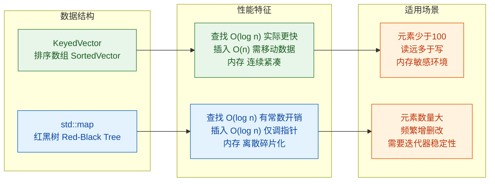
```mermaid
graph LR
    subgraph Structure["数据结构"]
        direction TB
        KV1["KeyedVector<br/>排序数组 SortedVector"]
        MAP1["std::map<br/>红黑树 Red-Black Tree"]
    end

    subgraph Perf["性能特征"]
        direction TB
        KV2["查找 O(log n) 实际更快<br/>插入 O(n) 需移动数据<br/>内存 连续紧凑"]
        MAP2["查找 O(log n) 有常数开销<br/>插入 O(log n) 仅调指针<br/>内存 离散碎片化"]
    end

    subgraph Scene["适用场景"]
        direction TB
        KV3["元素少于100<br/>读远多于写<br/>内存敏感环境"]
        MAP3["元素数量大<br/>频繁增删改<br/>需要迭代器稳定性"]
    end

    KV1 --> KV2 --> KV3
    MAP1 --> MAP2 --> MAP3

    classDef kvStyle fill:#E8F5E9,stroke:#2E7D32,color:#1B5E20
    classDef mapStyle fill:#E3F2FD,stroke:#1565C0,color:#0D47A1
    classDef sceneStyle fill:#FFF3E0,stroke:#E65100,color:#BF360C

    class KV1,KV2 kvStyle
    class MAP1,MAP2 mapStyle
    class KV3,MAP3 sceneStyle
```

还有一个容易被忽略的重要区别：**迭代器失效问题**。

- `std::map`：插入/删除操作**不会**导致其他元素的迭代器失效（树节点地址不变）
- `KeyedVector`：任何插入/删除操作都**可能**导致底层数组重新分配，所有之前保存的 **索引、指针、引用** 全部失效

因此在使用 `KeyedVector` 时要特别注意：**绝对不要在遍历过程中增删元素**。如果必须这样做，需要从后往前遍历删除，或者收集待删除的索引列表后统一处理。

```cpp
// ❌ 错误示范：遍历中删除会导致索引混乱
for (size_t i = 0; i < map.size(); i++) {
    if (shouldRemove(map.valueAt(i))) {
        map.removeItemsAt(i);   // 删除后 i+1 变成了 i，但循环会 i++，跳过一个元素！
    }
}

// ✅ 正确做法：从后向前遍历删除
for (ssize_t i = map.size() - 1; i >= 0; i--) {
    if (shouldRemove(map.valueAt(i))) {
        map.removeItemsAt(i);   // 删除尾部元素不影响前面的索引
    }
}
```

### 线程安全性

`KeyedVector` **不是线程安全的**。在 Android 系统服务中，如果多个线程需要同时访问同一个 `KeyedVector`，必须外部加锁：

```cpp
#include <utils/Mutex.h>   // Android 互斥锁

class MyService {
    mutable Mutex mLock;                              // 互斥锁
    KeyedVector<int, String8> mRegistry;              // 受保护的数据

public:
    // 写操作：获取排他锁
    status_t registerItem(int id, const String8& name) {
        Mutex::Autolock _l(mLock);                    // RAII 方式自动加锁/解锁
        return mRegistry.add(id, name);               // 安全写入
    }

    // 读操作：同样需要锁（防止读到写了一半的数据）
    String8 lookupItem(int id) const {
        Mutex::Autolock _l(mLock);                    // 加锁
        ssize_t idx = mRegistry.indexOfKey(id);       // 安全读取
        if (idx >= 0) {
            return mRegistry.valueAt(idx);            // 返回副本（锁释放后引用失效）
        }
        return String8();                             // key 不存在返回空串
    }
};
```

注意 `lookupItem` 返回的是 **值的副本** 而非引用 —— 因为一旦锁释放，另一个线程可能修改或删除该元素，导致引用悬空（dangling reference）。这是多线程编程中使用容器的通用最佳实践。

### 内存布局可视化

让我们用 ASCII 图直观展示 `KeyedVector<int, String8>` 在内存中的实际布局：

```cpp
// KeyedVector<int, String8> 内存布局示意
//
// KeyedVector 对象本身
// +-----------------------------------------------+
// | mVector (SortedVector)                         |
// |   +-------------------------------------------+
// |   | mStorage ---> [ 指向堆上连续数组的指针 ]    |
// |   | mCount = 3    (当前元素数)                  |
// |   | mCapacity = 4 (预分配容量)                  |
// |   +-------------------------------------------+
// +-----------------------------------------------+
//
// 堆上的连续数组 (mStorage 指向的内存)
// +------------------+------------------+------------------+------------------+
// | pair[0]          | pair[1]          | pair[2]          | (空闲slot)       |
// | key=100          | key=200          | key=300          |                  |
// | value="wifi"     | value="bt"       | value="nfc"      |                  |
// +------------------+------------------+------------------+------------------+
// ^                                                        ^
// |<------- 已用空间 (size=3) -------->|<-- 预留 (cap=4) -->|
//
// 注意：元素严格按 key 升序排列 (100 < 200 < 300)
// 如果插入 key=150，需要将 pair[1] 和 pair[2] 整体后移一位
```

---

**📝 练习题**

Android Native 层中，以下哪种场景 **最不适合** 使用 `KeyedVector`？

A. SurfaceFlinger 维护 3 个显示设备的映射表，启动后极少修改


B. 一个日志收集模块，每秒需要插入上万条新的 `<timestamp, logEntry>` 记录，且很少做查找


C. 传感器服务维护 20 个客户端连接的映射表，主要操作是遍历推送数据


D. AudioFlinger 管理 50 个音频会话，主要操作是根据 session ID 查找对应的会话对象


**【答案】** B

**【解析】** `KeyedVector` 底层是排序数组，每次插入都需要 **二分定位 + 元素搬移**，时间复杂度为 O(n)。当每秒需要插入上万条记录时，这个 O(n) 的插入开销会急剧放大 —— 假设已有 10000 条记录，插入一条平均需要移动 5000 个元素的内存。这种 **写密集（write-heavy）** 的场景完全不适合 `KeyedVector`，应该使用 `std::unordered_map`（O(1) 插入）或 `std::map`（O(log n) 插入）。

而 A、C、D 三个选项都是典型的 "少量元素 + 读多写少" 场景：A 只有 3 个元素且几乎不修改；C 只有 20 个元素且主要是遍历（连续内存遍历极快）；D 有 50 个元素且主要是查找（二分搜索在小规模数据上极快）。这些正是 `KeyedVector` 的甜蜜点（sweet spot）。

---

**📝 练习题**

以下代码存在一个潜在的严重 Bug，请指出问题所在：

```cpp
KeyedVector<int, String8> kvMap;
kvMap.add(1, String8("alpha"));
kvMap.add(2, String8("beta"));
kvMap.add(3, String8("gamma"));

const String8& ref = kvMap.valueFor(2);    // 获取引用
kvMap.add(4, String8("delta"));            // 插入新元素
ALOGD("Value: %s", ref.c_str());          // 使用之前的引用
```

A. `add(4, ...)` 会失败，因为 `KeyedVector` 最多只能存 3 个元素


B. `ref` 在 `add(4, ...)` 之后可能变成悬空引用（dangling reference），导致未定义行为


C. `valueFor()` 返回的是副本不是引用，代码无法编译


D. 代码没有任何问题，可以正常运行


**【答案】** B

**【解析】** 这是一道考察 **迭代器/引用失效**（Iterator/Reference Invalidation）的经典题。`valueFor()` 返回的是底层数组中元素的 **const 引用**。当随后调用 `add(4, ...)` 时，`SortedVector` 可能需要扩容（reallocation）—— 分配一块更大的内存，将旧数据复制过去，然后释放旧内存。此时 `ref` 仍然指向 **已被释放的旧内存地址**，变成了悬空引用。后续通过 `ref.c_str()` 访问该内存是典型的 **Use-After-Free** 未定义行为（UB），可能导致乱码、crash，甚至安全漏洞。正确做法是：要么在插入前完成对引用的使用，要么 **保存值的副本**（`String8 copy = kvMap.valueFor(2);`）。选项 A 错误，`KeyedVector` 无最大元素限制；选项 C 错误，`valueFor()` 确实返回 const 引用；选项 D 忽略了底层数组扩容的可能性。

---

## Looper/Handler（Native 层）

Android 的消息驱动模型（Message-Driven Model）是整个系统运转的心脏。我们熟知的 Java 层 `Looper` / `Handler` / `MessageQueue` 三件套，其底层正是依托 Native C++ 层的 `Looper` 实现真正的 **事件等待与唤醒**。Native 层的 `Looper` 并不是 Java 层的简单镜像——它基于 Linux 的 **epoll** 机制，提供了一套独立、高效、可直接在 C++ 中使用的事件循环框架。理解它，是理解 Android 系统架构的关键一步。

### 为什么需要 Native Looper

在一个典型的 Android 进程中，线程不能 "空转"（busy-wait），否则会浪费 CPU 资源。线程需要一种机制：**没有事情做时休眠，有事件到来时立即唤醒**。这就是 Looper 的核心职责。

Java 层的 `MessageQueue` 在没有消息时会调用 `nativePollOnce()` 进入 Native 层，最终通过 Linux 的 `epoll_wait()` 系统调用将线程挂起。当新消息入队或文件描述符就绪时，`epoll_wait()` 返回，线程被唤醒。整个过程可以概括为：

- **休眠（Sleep）**：无消息时，线程阻塞在 `epoll_wait()`，不消耗 CPU。
- **唤醒（Wake）**：通过向一个 `eventfd`（或早期版本的 pipe）写入数据，触发 `epoll_wait()` 返回。
- **分发（Dispatch）**：唤醒后，依次处理到期的消息（Message）和就绪的文件描述符回调（fd callback）。

Native Looper 的强大之处在于：它不仅能处理 Message，还能 **监听任意文件描述符（fd）上的 I/O 事件**，这使得它成为一个通用的事件循环引擎（Event Loop Engine），能力远超 Java 层的 Handler 消息模型。

### 核心架构总览

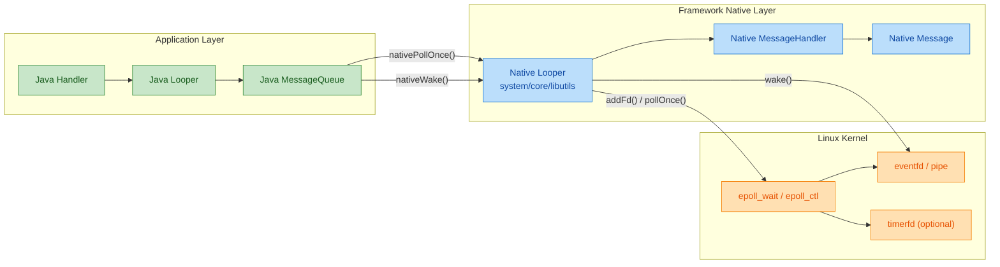
```mermaid
graph LR
    subgraph APP["Application Layer"]
        direction TB
        JHandler["Java Handler"]
        JLooper["Java Looper"]
        JMQ["Java MessageQueue"]
    end

    subgraph FW["Framework Native Layer"]
        direction TB
        NLooper["Native Looper<br/>system/core/libutils"]
        NMH["Native MessageHandler"]
        NMsg["Native Message"]
    end

    subgraph KERNEL["Linux Kernel"]
        direction TB
        EPOLL["epoll_wait / epoll_ctl"]
        EVENTFD["eventfd / pipe"]
        TIMERFD["timerfd (optional)"]
    end

    JHandler --> JLooper
    JLooper --> JMQ
    JMQ -- "nativePollOnce()" --> NLooper
    JMQ -- "nativeWake()" --> NLooper
    NLooper --> NMH
    NMH --> NMsg
    NLooper -- "addFd() / pollOnce()" --> EPOLL
    NLooper -- "wake()" --> EVENTFD
    EPOLL --> EVENTFD
    EPOLL --> TIMERFD

    classDef appStyle fill:#C8E6C9,stroke:#388E3C,color:#1B5E20
    classDef fwStyle fill:#BBDEFB,stroke:#1976D2,color:#0D47A1
    classDef kernelStyle fill:#FFE0B2,stroke:#F57C00,color:#E65100

    class JHandler,JLooper,JMQ appStyle
    class NLooper,NMH,NMsg fwStyle
    class EPOLL,EVENTFD,TIMERFD kernelStyle
```

上面的分层图清晰地展示了三层之间的调用关系：Java 层通过 JNI 进入 Native 层，Native 层通过系统调用与 Linux Kernel 交互。接下来我们逐层深入。

### Native Looper 源码结构与关键类

Native Looper 的源码位于 AOSP 的 `system/core/libutils/Looper.cpp`，头文件为 `utils/Looper.h`。它的设计非常精炼，核心只涉及三个概念：

| 类 / 结构体 | 职责 |
|---|---|
| `Looper` | 事件循环主体，管理 epoll 实例、消息队列、fd 监听 |
| `Message` | 轻量消息结构体，仅包含 `what` 字段 |
| `MessageHandler` | 消息处理回调接口，纯虚函数 `handleMessage()` |
| `LooperCallback` | fd 事件回调接口（也可用函数指针替代） |

下面是这些类的精简定义（基于 AOSP 源码提炼）：

```cpp
// === Message：极简的消息载体 ===
struct Message {
    int what;  // 消息标识符，用于区分消息类型（类似 Java 层 Message.what）
    Message() : what(0) {} // 默认构造，what 初始化为 0
    Message(int w) : what(w) {} // 带参构造，指定消息类型
};

// === MessageHandler：消息处理的抽象基类 ===
class MessageHandler : public virtual RefBase {
public:
    // 纯虚函数，子类必须实现此方法来处理消息
    virtual void handleMessage(const Message& message) = 0;

protected:
    virtual ~MessageHandler(); // 析构函数为 protected，配合 RefBase 引用计数
};

// === LooperCallback：fd 事件回调的抽象基类 ===
class LooperCallback : public virtual RefBase {
public:
    // fd 事件就绪时被调用
    // fd: 触发事件的文件描述符
    // events: 就绪的事件掩码 (EVENT_INPUT / EVENT_OUTPUT / EVENT_ERROR 等)
    // data: addFd() 时传入的用户自定义数据
    // 返回值：1 表示继续监听，0 表示移除该 fd
    virtual int handleEvent(int fd, int events, void* data) = 0;

protected:
    virtual ~LooperCallback();
};
```

可以看到，Native 层的 `Message` 比 Java 层的 `Message` 简单得多——它没有 `arg1`、`arg2`、`obj` 等字段，仅保留一个 `what`。这是因为 Native 层追求极致的轻量化，复杂数据通常通过其他方式（如共享内存、自定义结构体）传递。

### Looper 的创建与线程绑定

Native Looper 采用 **Thread-Local Storage (TLS)** 模式，每个线程最多只能拥有一个 Looper 实例，这与 Java 层的 `ThreadLocal<Looper>` 设计完全一致。

```cpp
// --- Looper 的创建与线程绑定 ---

// 构造函数：创建 epoll 实例和唤醒用的 eventfd
Looper::Looper(bool allowNonCallbacks)
    : mAllowNonCallbacks(allowNonCallbacks) // 是否允许无回调的 fd 监听
{
    // 创建 eventfd，用于线程间唤醒
    // EFD_NONBLOCK: 非阻塞模式
    // EFD_CLOEXEC: exec 时自动关闭
    mWakeEventFd.reset(eventfd(0, EFD_NONBLOCK | EFD_CLOEXEC));

    // 创建 epoll 实例，EPOLL_CLOEXEC 同上
    mEpollFd.reset(epoll_create1(EPOLL_CLOEXEC));

    // 准备 epoll_event 结构体
    struct epoll_event eventItem;
    memset(&eventItem, 0, sizeof(epoll_event)); // 清零，避免未初始化字段
    eventItem.events = EPOLLIN;                  // 监听"可读"事件
    eventItem.data.fd = mWakeEventFd.get();      // 关联到 wake 用的 eventfd

    // 把 wakeEventFd 注册到 epoll，这样 wake() 写入时能唤醒 epoll_wait
    epoll_ctl(mEpollFd.get(), EPOLL_CTL_ADD, mWakeEventFd.get(), &eventItem);
}

// 静态方法：为当前线程准备一个 Looper（类似 Java Looper.prepare()）
void Looper::prepare(bool allowNonCallbacks) {
    // 每个线程通过 TLS 存储自己的 Looper 指针
    sp<Looper> looper = Looper::getForThread(); // 先检查当前线程是否已有 Looper
    if (looper == nullptr) {
        // 若没有，则创建新的 Looper 并绑定到当前线程
        looper = sp<Looper>::make(allowNonCallbacks);
        Looper::setForThread(looper);
    }
}

// 静态方法：获取当前线程绑定的 Looper（类似 Java Looper.myLooper()）
sp<Looper> Looper::getForThread() {
    // 从 TLS 中取出当前线程的 Looper
    // 内部使用 pthread_getspecific() 实现
    ...
}
```

构造函数中最关键的操作是 **创建 `eventfd` 并注册到 `epoll`**。`eventfd` 是 Linux 提供的一种轻量级进程/线程间通知机制——向它写入一个 `uint64_t` 值即可触发可读事件。Looper 正是利用这一机制实现 `wake()` 唤醒。

### epoll 机制详解

要真正理解 Looper，必须理解 Linux `epoll`。`epoll` 是 Linux 内核提供的高效 I/O 多路复用（I/O Multiplexing）机制，它是 `select` / `poll` 的升级版，能高效地监听大量文件描述符。

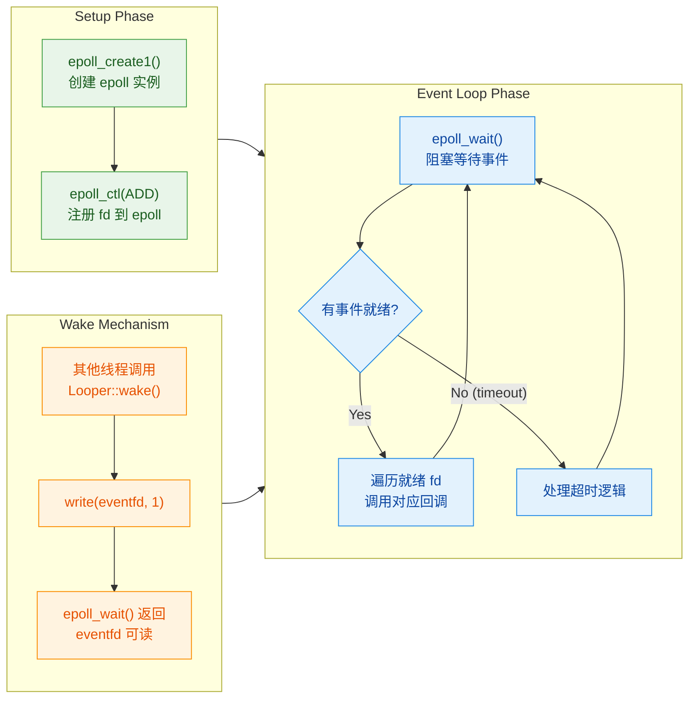
```mermaid
graph LR
    subgraph SETUP["Setup Phase"]
        direction TB
        A["epoll_create1()<br/>创建 epoll 实例"] --> B["epoll_ctl(ADD)<br/>注册 fd 到 epoll"]
    end

    subgraph LOOP["Event Loop Phase"]
        direction TB
        C["epoll_wait()<br/>阻塞等待事件"] --> D{"有事件就绪?"}
        D -- "Yes" --> E["遍历就绪 fd<br/>调用对应回调"]
        D -- "No (timeout)" --> F["处理超时逻辑"]
        E --> C
        F --> C
    end

    subgraph WAKEUP["Wake Mechanism"]
        direction TB
        G["其他线程调用<br/>Looper::wake()"] --> H["write(eventfd, 1)"]
        H --> I["epoll_wait() 返回<br/>eventfd 可读"]
    end

    SETUP --> LOOP
    WAKEUP --> LOOP

    classDef setupStyle fill:#E8F5E9,stroke:#43A047,color:#1B5E20
    classDef loopStyle fill:#E3F2FD,stroke:#1E88E5,color:#0D47A1
    classDef wakeStyle fill:#FFF3E0,stroke:#FB8C00,color:#E65100

    class A,B setupStyle
    class C,D,E,F loopStyle
    class G,H,I wakeStyle
```

`epoll` 的三个核心系统调用：

| 系统调用 | 作用 |
|---|---|
| `epoll_create1(flags)` | 创建一个 epoll 实例，返回 epoll 文件描述符 |
| `epoll_ctl(epfd, op, fd, event)` | 向 epoll 注册/修改/删除要监听的 fd 和事件类型 |
| `epoll_wait(epfd, events, maxevents, timeout)` | 阻塞等待，直到有 fd 就绪或超时返回 |

Looper 在构造时 `epoll_create1` 创建实例，然后 `epoll_ctl` 注册 `eventfd`。此后每次 `pollOnce()` 调用时执行 `epoll_wait()` 阻塞等待。相比 `select` 的 O(n) 线性扫描，`epoll` 只返回就绪的 fd，时间复杂度接近 O(1)，这对于 Android 这种需要同时监听大量事件源（输入事件、Vsync 信号、Binder 等）的系统至关重要。

### pollOnce() —— 事件循环的核心

`pollOnce()` 是 Looper 最重要的方法，它驱动了整个事件循环。Java 层 `MessageQueue.next()` 中的 `nativePollOnce()` 最终就会调用到这里。

```cpp
// --- pollOnce() 的核心实现（简化版）---

// timeoutMillis: 超时时间，-1 表示永久等待，0 表示立即返回
int Looper::pollOnce(int timeoutMillis,
                     int* outFd,         // [输出] 就绪的 fd
                     int* outEvents,     // [输出] 就绪的事件类型
                     void** outData)     // [输出] 用户自定义数据
{
    int result = 0;
    for (;;) { // 无限循环，直到有事件需要返回
        // 1. 先检查并分发已就绪的"响应"（上一次 pollInner 产生的结果）
        while (mResponseIndex < mResponses.size()) {
            const Response& response = mResponses.itemAt(mResponseIndex++);
            int ident = response.request.ident; // 获取 fd 的标识符
            if (ident >= 0) {
                // ident >= 0 表示这是由 addFd 指定了 ident 的 fd（无回调模式）
                // 将结果通过输出参数返回给调用者
                if (outFd != nullptr) *outFd = response.request.fd;
                if (outEvents != nullptr) *outEvents = response.events;
                if (outData != nullptr) *outData = response.request.data;
                return ident; // 返回 ident，调用者根据 ident 判断事件来源
            }
        }

        // 2. 如果上一轮 pollInner 已标记需要返回某个 result，则立即返回
        if (result != 0) {
            if (outFd != nullptr) *outFd = 0;
            if (outEvents != nullptr) *outEvents = 0;
            if (outData != nullptr) *outData = nullptr;
            return result;
        }

        // 3. 进入内部轮询——这里才是真正可能阻塞的地方
        result = pollInner(timeoutMillis);
    }
}
```

`pollOnce()` 本身是一个分发循环（dispatch loop），真正的阻塞等待在 `pollInner()` 中完成。它的逻辑可以归纳为：先处理上一轮积累的响应，如果没有更多事件就调用 `pollInner()` 进入下一轮等待。

### pollInner() —— 深入阻塞等待

```cpp
// --- pollInner() 核心实现（简化版）---

int Looper::pollInner(int timeoutMillis) {
    // ========== 第一阶段：计算超时时间 ==========
    // 如果消息队列中有定时消息即将到期，需要调整超时时间
    if (mNextMessageUptime != LLONG_MAX) {
        nsecs_t now = systemTime(SYSTEM_TIME_MONOTONIC); // 获取当前单调时钟
        int messageTimeoutMillis = toMillisecondTimeoutDelay(now, mNextMessageUptime);
        if (messageTimeoutMillis >= 0
            && (timeoutMillis < 0 || messageTimeoutMillis < timeoutMillis)) {
            timeoutMillis = messageTimeoutMillis; // 取较小的超时值，确保消息能及时被处理
        }
    }

    int result = POLL_WAKE; // 默认返回 POLL_WAKE

    // 清空上一轮的响应列表
    mResponses.clear();
    mResponseIndex = 0;

    // ========== 第二阶段：epoll_wait 阻塞等待 ==========
    struct epoll_event eventItems[EPOLL_MAX_EVENTS]; // 就绪事件数组（栈上分配，高效）
    // 这里是整个消息系统的核心阻塞点！
    // 线程会在此处休眠，直到：
    //   1) 有 fd 事件就绪（包括 wake 事件）
    //   2) 超时时间到达
    int eventCount = epoll_wait(
        mEpollFd.get(),       // epoll 实例
        eventItems,           // 输出：就绪事件数组
        EPOLL_MAX_EVENTS,     // 最大返回事件数（通常为 16）
        timeoutMillis         // 超时毫秒数，-1 = 永久等待
    );

    // ========== 第三阶段：处理 epoll 返回的事件 ==========
    if (eventCount < 0) {
        // epoll_wait 出错（通常是被信号中断 EINTR）
        result = POLL_ERROR;
    } else if (eventCount == 0) {
        // 超时，没有任何事件就绪
        result = POLL_TIMEOUT;
    } else {
        // 有事件就绪，逐个处理
        for (int i = 0; i < eventCount; i++) {
            int fd = eventItems[i].data.fd;       // 就绪的 fd
            uint32_t epollEvents = eventItems[i].events; // 就绪的事件掩码

            if (fd == mWakeEventFd.get()) {
                // 这是 wake 事件——有人调用了 wake() 唤醒我们
                if (epollEvents & EPOLLIN) {
                    awoken(); // 读取 eventfd 中的数据（清除就绪状态）
                }
            } else {
                // 这是用户通过 addFd() 注册的 fd 事件
                // 将其封装为 Response，稍后在 pollOnce() 中分发
                Response response;
                response.events = epollEvents;
                response.request = mRequests.valueAt(requestIndex);
                mResponses.push(response); // 加入响应队列
            }
        }
    }

    // ========== 第四阶段：处理到期的 Native 消息 ==========
    nsecs_t now = systemTime(SYSTEM_TIME_MONOTONIC);
    while (mMessageEnvelopes.size() != 0) {
        const MessageEnvelope& messageEnvelope = mMessageEnvelopes.itemAt(0);
        if (messageEnvelope.uptime <= now) {
            // 消息已到期，取出并调用 handler 处理
            sp<MessageHandler> handler = messageEnvelope.handler;
            Message message = messageEnvelope.message;
            mMessageEnvelopes.removeAt(0); // 从队列中移除

            // 调用用户注册的 MessageHandler
            handler->handleMessage(message);
        } else {
            // 最早的消息尚未到期，记录其到期时间供下次 pollInner 计算超时
            mNextMessageUptime = messageEnvelope.uptime;
            break; // 队列有序，后面的消息更晚到期，无需继续检查
        }
    }

    // ========== 第五阶段：分发 fd 回调 ==========
    for (size_t i = 0; i < mResponses.size(); i++) {
        Response& response = mResponses.editItemAt(i);
        if (response.request.ident == POLL_CALLBACK) {
            // 这是带回调的 fd 事件
            int fd = response.request.fd;
            int events = response.events;
            void* data = response.request.data;
            // 调用用户注册的回调
            int callbackResult = response.request.callback->handleEvent(fd, events, data);
            if (callbackResult == 0) {
                removeFd(fd); // 回调返回 0，表示不再监听该 fd
            }
            response.request.callback.clear(); // 释放回调引用
            result = POLL_CALLBACK; // 标记有回调被处理
        }
    }

    return result;
}
```

`pollInner()` 是整个 Native Looper 的灵魂方法。它完成了五个阶段的工作，我们用一张时序图来梳理：

```mermaid
sequenceDiagram
    participant T as 当前线程
    participant L as Looper
    participant E as epoll_wait
    participant K as Linux Kernel

    T->>L: pollOnce(timeoutMillis)
    L->>L: pollInner(timeoutMillis)
    
    Note over L: Phase 1: 计算超时时间
    L->>L: 检查 mNextMessageUptime
    
    Note over L: Phase 2: 阻塞等待
    L->>E: epoll_wait(epfd, events, timeout)
    E->>K: 线程休眠, 等待事件
    
    Note over K: 事件触发: wake() 或 fd 就绪
    K-->>E: 返回就绪事件数组
    E-->>L: eventCount 个就绪事件
    
    Note over L: Phase 3: 分类处理 epoll 事件
    L->>L: wake fd → awoken()
    L->>L: 用户 fd → mResponses.push()
    
    Note over L: Phase 4: 分发到期 Message
    L->>L: handler.handleMessage()
    
    Note over L: Phase 5: 分发 fd 回调
    L->>L: callback.handleEvent()
    
    L-->>T: 返回 POLL_WAKE / POLL_CALLBACK / POLL_TIMEOUT
```

### wake() 与 awoken() —— 唤醒机制

`wake()` 和 `awoken()` 是一对相互配合的方法，实现了线程间的精准唤醒：

```cpp
// --- wake()：唤醒正在 epoll_wait 中阻塞的线程 ---
void Looper::wake() {
    uint64_t inc = 1; // 写入值为 1（eventfd 会累加）
    // 向 eventfd 写入，触发 EPOLLIN 事件
    // 这会使 epoll_wait() 立即返回
    ssize_t nWrite = TEMP_FAILURE_RETRY(  // TEMP_FAILURE_RETRY: 被信号中断时自动重试
        write(mWakeEventFd.get(), &inc, sizeof(uint64_t))
    );
    if (nWrite != sizeof(uint64_t)) {
        // 写入失败（极少发生，除非 fd 被关闭）
        if (errno != EAGAIN) {
            LOG_ALWAYS_FATAL("Could not write wake signal to fd %d",
                             mWakeEventFd.get());
        }
    }
}

// --- awoken()：消费 eventfd 中的数据，重置就绪状态 ---
void Looper::awoken() {
    uint64_t counter;
    // 读取 eventfd 中的值，读完后 eventfd 计数归零
    // 如果不读取，epoll_wait 下次还会立即返回（水平触发模式 Level-Triggered）
    TEMP_FAILURE_RETRY(
        read(mWakeEventFd.get(), &counter, sizeof(uint64_t))
    );
}
```

这里的关键设计点是：`eventfd` 工作在 **水平触发（Level-Triggered）** 模式下。这意味着只要 `eventfd` 的内部计数器不为 0，`epoll_wait` 就会持续报告它为就绪状态。因此 `awoken()` 中的 `read()` 操作是必须的——它将计数器清零，避免 Looper 陷入无意义的空转。

### sendMessage() —— 发送消息

Native Looper 支持发送延迟消息，消息被封装在 `MessageEnvelope` 中按到期时间排序存储：

```cpp
// --- 发送即时消息 ---
void Looper::sendMessage(const sp<MessageHandler>& handler,
                         const Message& message) {
    // 即时消息 = 到期时间为 0 的延迟消息
    sendMessageAtTime(systemTime(SYSTEM_TIME_MONOTONIC), handler, message);
}

// --- 发送延迟消息 ---
void Looper::sendMessageDelayed(nsecs_t uptimeDelay,
                                const sp<MessageHandler>& handler,
                                const Message& message) {
    // 将"延迟"转换为"绝对到期时间"
    nsecs_t uptime = systemTime(SYSTEM_TIME_MONOTONIC) + uptimeDelay;
    sendMessageAtTime(uptime, handler, message);
}

// --- 核心：按到期时间插入消息队列 ---
void Looper::sendMessageAtTime(nsecs_t uptime,
                               const sp<MessageHandler>& handler,
                               const Message& message) {
    // 构建消息信封（包含 handler + message + 到期时间）
    MessageEnvelope messageEnvelope;
    messageEnvelope.uptime = uptime;       // 到期的绝对时间
    messageEnvelope.handler = handler;     // 处理者（强引用）
    messageEnvelope.message = message;     // 消息体

    {
        AutoMutex _l(mLock); // 加锁保护消息队列

        // 按到期时间升序插入（二分查找插入点，保持有序）
        size_t messageCount = mMessageEnvelopes.size();
        size_t i = 0;
        while (i < messageCount
               && uptime >= mMessageEnvelopes.itemAt(i).uptime) {
            i++; // 找到第一个 uptime 比新消息大的位置
        }
        mMessageEnvelopes.insertAt(messageEnvelope, i); // 在该位置插入

        // 如果新消息插入到了队头（即它是最早到期的消息）
        if (i == 0) {
            // 需要重新计算最近到期时间
            mNextMessageUptime = uptime;
        }
    }

    // 如果插入的消息比当前正在等待的超时更早到期
    // 必须唤醒 Looper，让它重新计算 epoll_wait 的超时时间
    if (i == 0) {
        wake(); // 唤醒！否则 Looper 可能睡过头
    }
}
```

消息队列使用 **有序插入** 策略（类似 Java 层 `MessageQueue` 的链表按时间排序）。特别注意：当新消息成为队头（最早到期的消息）时，**必须调用 `wake()`**。否则 Looper 可能正在 `epoll_wait` 中等待一个更长的超时，会错过新消息的到期时间。

### addFd() —— 监听文件描述符

`addFd()` 是 Native Looper 区别于 Java Handler 的杀手级特性。它允许你监听任意文件描述符上的 I/O 事件：

```cpp
// --- addFd()：向 Looper 注册一个 fd 监听 ---
// fd:       要监听的文件描述符
// ident:    标识符（POLL_CALLBACK = -2 表示使用回调模式）
// events:   感兴趣的事件掩码（EVENT_INPUT, EVENT_OUTPUT 等）
// callback: 事件就绪时的回调（可为 nullptr，此时 ident 必须 >= 0）
// data:     传递给回调的用户数据
int Looper::addFd(int fd, int ident, int events,
                  const sp<LooperCallback>& callback, void* data) {

    if (!callback.get()) {
        // 没有回调的情况下，ident 必须 >= 0
        // 因为 pollOnce() 需要通过 ident 返回事件给调用者
        if (!mAllowNonCallbacks) {
            return -1; // 构造时禁止了无回调模式
        }
        if (ident < 0) {
            return -1; // ident 不合法
        }
    }

    // 构建 Request 对象
    Request request;
    request.fd = fd;
    request.ident = ident;
    request.events = events;
    request.callback = callback;
    request.data = data;

    // 构建 epoll_event
    struct epoll_event eventItem;
    memset(&eventItem, 0, sizeof(epoll_event));
    eventItem.events = events;      // 设置感兴趣的事件
    eventItem.data.fd = fd;         // 关联 fd

    {
        AutoMutex _l(mLock); // 加锁

        // 检查这个 fd 是否已经注册过
        ssize_t requestIndex = mRequests.indexOfKey(fd);
        if (requestIndex < 0) {
            // 新增：用 EPOLL_CTL_ADD 注册
            int epollResult = epoll_ctl(mEpollFd.get(),
                                        EPOLL_CTL_ADD, fd, &eventItem);
            mRequests.add(fd, request); // 保存到内部 KeyedVector
        } else {
            // 修改：用 EPOLL_CTL_MOD 更新
            int epollResult = epoll_ctl(mEpollFd.get(),
                                        EPOLL_CTL_MOD, fd, &eventItem);
            mRequests.replaceValueAt(requestIndex, request);
        }
    }

    return 1; // 成功
}
```

注意这里使用了我们上一节学习的 `KeyedVector`（`mRequests` 的类型就是 `KeyedVector<int, Request>`），以 fd 为 key 快速查找已注册的请求。

`addFd()` 的典型应用场景：

- **InputDispatcher** 监听输入通道（InputChannel）的 fd，接收触摸/键盘事件
- **SurfaceFlinger** 监听 Vsync 信号的 fd，同步显示刷新
- **SensorService** 监听传感器事件管道的 fd

### 完整使用示例

下面是一个在 Native 层独立使用 Looper 的完整示例：

```cpp
#include <utils/Looper.h>
#include <utils/Log.h>

using namespace android;

// === 自定义 MessageHandler ===
class MyHandler : public MessageHandler {
public:
    // 重写消息处理方法
    void handleMessage(const Message& message) override {
        switch (message.what) {
            case 1:
                ALOGI("收到消息: TASK_START (what=1)");
                break;
            case 2:
                ALOGI("收到消息: TASK_STOP (what=2)");
                break;
            default:
                ALOGI("收到未知消息: what=%d", message.what);
                break;
        }
    }
};

// === 自定义 LooperCallback，用于监听 fd ===
class MyFdCallback : public LooperCallback {
public:
    // fd 事件就绪时被调用
    int handleEvent(int fd, int events, void* data) override {
        if (events & Looper::EVENT_INPUT) {
            char buf[256];
            ssize_t n = read(fd, buf, sizeof(buf) - 1); // 读取 fd 数据
            if (n > 0) {
                buf[n] = '\0';                           // 确保字符串结尾
                ALOGI("从 fd=%d 读取到: %s", fd, buf);
            }
        }
        return 1; // 返回 1：继续监听该 fd
                   // 返回 0：Looper 会自动 removeFd
    }
};

// === 主函数 ===
int main() {
    // 1. 创建 Looper（允许无回调的 fd 注册）
    sp<Looper> looper = sp<Looper>::make(true /* allowNonCallbacks */);

    // 2. 创建 MessageHandler
    sp<MyHandler> handler = sp<MyHandler>::make();

    // 3. 发送即时消息（what = 1）
    looper->sendMessage(handler, Message(1));

    // 4. 发送延迟消息（what = 2，延迟 500ms）
    looper->sendMessageDelayed(
        ms2ns(500),           // 500ms 转换为纳秒
        handler,              // 处理者
        Message(2)            // 消息体
    );

    // 5.（可选）监听一个 fd
    int pipeFd[2];
    pipe(pipeFd);             // 创建管道，pipeFd[0] 读端，pipeFd[1] 写端
    sp<MyFdCallback> fdCallback = sp<MyFdCallback>::make();
    looper->addFd(
        pipeFd[0],            // 监听管道读端
        Looper::POLL_CALLBACK,// 使用回调模式
        Looper::EVENT_INPUT,  // 监听"可读"事件
        fdCallback,           // 回调处理者
        nullptr               // 无自定义数据
    );

    // 6. 从另一个线程向管道写入数据（模拟事件触发）
    write(pipeFd[1], "Hello Native Looper!", 20);

    // 7. 事件循环
    for (;;) {
        // pollOnce(-1)：永久等待，直到有事件
        // 返回值：POLL_WAKE / POLL_CALLBACK / POLL_TIMEOUT / POLL_ERROR
        int ret = looper->pollOnce(-1);
        ALOGI("pollOnce 返回: %d", ret);
    }

    return 0;
}
```

### Java 层与 Native 层的对应关系

Java 层的消息机制和 Native 层的 Looper 并非独立系统，而是紧密耦合的。理解它们的映射关系对于排查跨层问题（如 ANR 分析）非常重要：

```mermaid
graph LR
    subgraph JAVA["Java Layer"]
        direction TB
        JH["Handler<br/>发送和处理消息"]
        JL["Looper<br/>消息循环驱动"]
        JMQ["MessageQueue<br/>消息队列管理"]
        JMsg["Message<br/>消息载体"]
        JH --> JL
        JL --> JMQ
        JMQ --> JMsg
    end

    subgraph NATIVE["Native Layer (C++)"]
        direction TB
        NL["Looper<br/>epoll 事件循环"]
        NMH["MessageHandler<br/>消息处理回调"]
        NMsg["Message<br/>仅 what 字段"]
        NLC["LooperCallback<br/>fd 事件回调"]
        NL --> NMH
        NMH --> NMsg
        NL --> NLC
    end

    subgraph JNI["JNI Bridge"]
        direction TB
        NPO["nativePollOnce()<br/>调用 pollOnce"]
        NW["nativeWake()<br/>调用 wake"]
        NI["nativeInit()<br/>创建 NativeMessageQueue"]
    end

    JMQ -- "阻塞等待" --> NPO
    JMQ -- "唤醒" --> NW
    JMQ -- "初始化" --> NI
    NPO --> NL
    NW --> NL
    NI --> NL

    classDef javaStyle fill:#C8E6C9,stroke:#388E3C,color:#1B5E20
    classDef nativeStyle fill:#BBDEFB,stroke:#1976D2,color:#0D47A1
    classDef jniStyle fill:#F3E5F5,stroke:#8E24AA,color:#4A148C

    class JH,JL,JMQ,JMsg javaStyle
    class NL,NMH,NMsg,NLC nativeStyle
    class NPO,NW,NI jniStyle
```

关键映射对比：

| 维度 | Java 层 | Native 层 |
|---|---|---|
| 事件循环 | `Looper.loop()` 驱动 `MessageQueue.next()` | `Looper::pollOnce()` 驱动 `epoll_wait()` |
| 消息载体 | `Message`（丰富：what/arg1/arg2/obj/data） | `Message`（极简：仅 what） |
| 消息处理 | `Handler.handleMessage()` | `MessageHandler::handleMessage()` |
| 线程绑定 | `ThreadLocal<Looper>` | `pthread TLS` |
| 阻塞机制 | 最终委托 Native `epoll_wait` | 直接调用 `epoll_wait` |
| fd 监听 | ❌ 不支持 | ✅ `addFd()` / `removeFd()` |
| 唤醒 | `MessageQueue.nativeWake()` → JNI | `Looper::wake()` → `write(eventfd)` |
| 延迟消息 | `sendMessageDelayed()` → `SystemClock.uptimeMillis` | `sendMessageDelayed()` → `SYSTEM_TIME_MONOTONIC` |

值得特别注意的是：**Java 层不支持 fd 监听**，这是 Native Looper 独有的能力。Android Framework 中的许多关键系统服务（InputFlinger、SurfaceFlinger 等）正是利用这一能力在 Native 层高效处理硬件事件。

### Looper 在 Android 系统中的实际角色

理解了 Native Looper 的内部机制后，我们来看它在 Android 系统中扮演的具体角色：

**1. 主线程消息循环（UI Thread）**

每个 Android 应用的主线程在 `ActivityThread.main()` 中调用 `Looper.prepareMainLooper()`，最终在 Native 层创建一个绑定了 epoll 的 Looper。所有的 Activity 生命周期回调、View 绘制请求、用户输入事件，都是通过这个 Looper 分发的。

**2. InputDispatcher（输入事件分发）**

`InputDispatcher` 在 Native 层运行，使用 Looper 的 `addFd()` 监听 InputChannel 的 fd。当用户触摸屏幕时，内核驱动产生事件 → InputReader 读取 → InputDispatcher 通过 Looper 将事件分发到目标窗口。

**3. SurfaceFlinger（显示合成）**

SurfaceFlinger 使用 Looper 监听 Vsync 信号（通过 `EventThread` 的 fd），在每个 Vsync 周期到来时被唤醒，执行图层合成和显示提交。

**4. Binder 线程池**

虽然 Binder 线程本身不直接使用 Looper（它们有自己的 `IPCThreadState::joinThreadPool` 循环），但某些需要在特定线程处理 Binder 回调的场景（如 `BBinder` 的 `linkToDeath`）也会结合 Looper 使用。

### 线程安全性分析

Native Looper 的线程安全模型值得关注：

- **`sendMessage()` 系列方法**：线程安全。内部使用 `mLock`（Mutex）保护消息队列，可以从任何线程安全地发送消息。
- **`wake()`**：线程安全。`write(eventfd)` 本身是原子操作。
- **`addFd()` / `removeFd()`**：线程安全。内部有 `mLock` 保护。
- **`pollOnce()`**：**仅限 Looper 所属线程调用**。epoll_wait 设计为单线程消费模型，多线程调用会导致事件丢失或竞争。

这种 "多生产者，单消费者"（MPSC, Multi-Producer Single-Consumer）模型是消息队列的经典设计模式，在保证安全性的同时最大化了性能。

```mermaid
graph LR
    subgraph PRODUCERS["Producer Threads (多线程)"]
        direction TB
        T1["Thread A<br/>sendMessage()"]
        T2["Thread B<br/>sendMessage()"]
        T3["Thread C<br/>wake() / addFd()"]
    end

    subgraph LOCK["Mutex mLock"]
        direction TB
        MQ["mMessageEnvelopes<br/>(有序消息队列)"]
        REQ["mRequests<br/>(KeyedVector)"]
    end

    subgraph CONSUMER["Consumer Thread (单线程)"]
        direction TB
        POLL["pollOnce()<br/>epoll_wait()"]
        DISPATCH["分发消息和回调"]
        POLL --> DISPATCH
    end

    T1 --> MQ
    T2 --> MQ
    T3 --> REQ
    MQ --> POLL
    REQ --> POLL

    classDef prodStyle fill:#E8F5E9,stroke:#43A047,color:#1B5E20
    classDef lockStyle fill:#FFF9C4,stroke:#F9A825,color:#F57F17
    classDef consStyle fill:#E3F2FD,stroke:#1E88E5,color:#0D47A1

    class T1,T2,T3 prodStyle
    class MQ,REQ lockStyle
    class POLL,DISPATCH consStyle
```

---

**📝 练习题**

在 Android Native Looper 的 `pollInner()` 方法中，当一个新的即时消息通过 `sendMessage()` 从其他线程插入队列后，以下哪个描述最准确地说明了 Looper 如何被唤醒？


A. `sendMessage()` 直接修改 `epoll_wait()` 的超时参数，使其立即返回


B. `sendMessage()` 调用 `wake()`，向 `eventfd` 写入数据触发 `EPOLLIN` 事件，使 `epoll_wait()` 返回


C. `sendMessage()` 通过 `pthread_cond_signal()` 发送条件变量信号唤醒 Looper 线程


D. `sendMessage()` 将消息直接写入 epoll 内核缓冲区，由内核负责唤醒线程


**【答案】** B

**【解析】** Native Looper 的唤醒机制完全依赖 `eventfd` + `epoll` 的组合。当 `sendMessage()` 将消息插入 `mMessageEnvelopes` 队列后，如果新消息成为队头（最早到期），会调用 `wake()` 方法。`wake()` 内部执行 `write(mWakeEventFd, &inc, sizeof(uint64_t))`，向 `eventfd` 写入一个值。由于 `eventfd` 在 Looper 构造时已通过 `epoll_ctl(EPOLL_CTL_ADD)` 注册到了 epoll 实例上，写入操作会使 `eventfd` 变为可读状态，触发 `EPOLLIN` 事件，导致正在阻塞的 `epoll_wait()` 立即返回。随后 `pollInner()` 在第三阶段检测到 `mWakeEventFd` 就绪，调用 `awoken()` 读取并清除计数，然后在第四阶段处理到期消息。选项 A 错误，因为 `epoll_wait` 一旦被调用，其超时参数就不可修改；选项 C 错误，Looper 不使用 pthread 条件变量；选项 D 错误，消息存储在用户空间的 `Vector` 中，不涉及内核缓冲区。

---

**📝 练习题**

关于 Native Looper 的 `addFd()` 功能，以下哪项说法是**错误的**？


A. `addFd()` 可以监听 socket、pipe、eventfd 等任意文件描述符上的 I/O 事件


B. 当注册的 fd 就绪时，如果设置了 `LooperCallback`，回调返回 0 会导致该 fd 被自动移除


C. Java 层的 `Handler` 也可以通过 `MessageQueue.addFd()` 直接监听文件描述符


D. 如果对同一个 fd 调用两次 `addFd()`，第二次会通过 `EPOLL_CTL_MOD` 更新而非重复注册


**【答案】** C

**【解析】** Java 层的 `MessageQueue` 并没有暴露公开的 `addFd()` API 给应用开发者使用。fd 监听是 Native Looper 独有的能力，Java 层的 Handler/MessageQueue 体系只能处理 `Message` 消息，不支持直接监听文件描述符。选项 A 正确，`epoll` 可以监听任何支持 `poll` 操作的文件描述符；选项 B 正确，在 `pollInner()` 的第五阶段中，如果 `callback->handleEvent()` 返回 0，Looper 会调用 `removeFd()` 移除该 fd 的监听；选项 D 正确，`addFd()` 内部会通过 `mRequests.indexOfKey(fd)` 检查 fd 是否已注册，如果已注册则使用 `EPOLL_CTL_MOD` 修改而非 `EPOLL_CTL_ADD` 新增。

---

## 本章小结

本章系统性地梳理了 Android Native 层最常见、最核心的 C++ 编程模式与基础设施类。这些模式和工具类并非标准 C++ STL 的简单翻版，而是 Google 工程师们根据 **嵌入式系统资源约束**、**跨进程通信需求** 以及 **Android 框架自身架构特点** 量身定制的解决方案。理解它们，是阅读 AOSP 源码、开发 HAL 层或 System Service 的先决条件。

---

### 全章知识点脉络回顾

我们可以从 **"解决了什么问题"** 的视角，将本章五大知识点串成一条逻辑链：

1. **Singleton 模式** —— 解决 "全局唯一资源的安全访问" 问题。
2. **String8 / String16** —— 解决 "跨层、跨进程的字符串编码统一" 问题。
3. **Vector** —— 解决 "轻量级、Binder 友好的动态数组" 问题。
4. **KeyedVector** —— 解决 "小规模键值对的有序检索" 问题。
5. **Looper / Handler (Native)** —— 解决 "Native 线程的事件驱动与跨线程消息通信" 问题。

下面用一张全局架构图，将它们在 Android 系统栈中的位置及相互关系可视化：

```mermaid
graph LR
    subgraph APP["Application / JNI 层"]
        direction TB
        A1["Java Handler / Looper"]
        A2["JNI Bridge"]
    end

    subgraph FWK["Framework Native 层 (libutils / libcutils)"]
        direction TB
        B1["Singleton〈T〉"]
        B2["String8 / String16"]
        B3["Vector〈T〉"]
        B4["KeyedVector〈K,V〉"]
        B5["Looper / MessageHandler"]
    end

    subgraph KERN["Kernel / 底层"]
        direction TB
        C1["epoll / eventfd"]
        C2["pipe / socket"]
        C3["pthread_mutex"]
    end

    A1 -->|"MessageQueue.nativeInit"| A2
    A2 -->|"JNI 调用"| B5
    B5 -->|"epoll_wait"| C1
    B5 -->|"wake via eventfd"| C2
    B1 -->|"pthread_mutex 保护"| C3
    B3 -->|"SharedBuffer 管理内存"| C3
    B2 -->|"UTF-8 / UTF-16 转换"| B3

    classDef appStyle fill:#C8E6C9,stroke:#388E3C,color:#1B5E20
    classDef fwkStyle fill:#BBDEFB,stroke:#1976D2,color:#0D47A1
    classDef kernStyle fill:#FFE0B2,stroke:#F57C00,color:#E65100

    class A1,A2 appStyle
    class B1,B2,B3,B4,B5 fwkStyle
    class C1,C2,C3 kernStyle
```

从图中可以清晰看出：**Framework Native 层 (蓝色)** 是承上启下的枢纽。Java 层的 `Handler/Looper` 最终落地到 Native 的 `Looper`；而 `Looper` 的底层驱动力来自 Linux Kernel 的 `epoll` 机制。`Singleton`、`String8`、`Vector` 等基础设施类则共同依赖 `pthread` 和自定义的 `SharedBuffer` 内存管理。

---

### 核心知识点对比速查表

为便于快速复习与横向对比，以下将五大模式的关键属性汇总：

| 维度 | Singleton | String8 / String16 | Vector | KeyedVector | Looper / Handler |
|:---|:---|:---|:---|:---|:---|
| **头文件** | `Singleton.h` | `String8.h` / `String16.h` | `Vector.h` | `KeyedVector.h` | `Looper.h` |
| **所属库** | `libutils` | `libutils` | `libutils` | `libutils` | `libutils` / `libcutils` |
| **核心目的** | 全局唯一实例 | 编码安全的字符串 | 动态数组容器 | 有序键值对容器 | 事件驱动消息循环 |
| **线程安全** | Mutex 保护（需自行加锁或依赖 `ANDROID_SINGLETON_STATIC_INSTANCE`） | COW (旧版) / 非线程安全 (新版) | 非线程安全 | 非线程安全 | 线程安全（内建唤醒机制） |
| **底层数据结构** | 静态指针 + Mutex | `char*` (UTF-8) / `char16_t*` (UTF-16) | `SharedBuffer` + 连续内存 | 内部持有 `SortedVector` | `epoll` + `eventfd`/`pipe` |
| **与 STL 对比** | 类似 Meyer's Singleton 但加锁 | 类似 `std::string` 但支持 UTF 互转 | 类似 `std::vector` 但 Binder 友好 | 类似 `std::map` 但基于排序数组 | 无直接等价物 |
| **典型使用场景** | `SurfaceFlinger`、`AudioFlinger` 等系统服务 | Binder 传输、属性读写 | 参数列表、临时集合 | 小规模配置映射、属性表 | `InputDispatcher`、`SensorService` 消息循环 |
| **AOSP 趋势** | 逐步被简化，部分场景用局部 `static` 替代 | 持续使用，但部分模块迁移到 `std::string` | 部分模块迁移到 `std::vector` | 被 `std::map`/`std::unordered_map` 逐步替代 | 持续核心地位，无替代趋势 |

---

### 设计哲学总结：为什么 Android 不直接用 STL？

这是初学者最常产生的疑问。本章所有工具类的存在，背后都指向同一组设计考量：

**第一，历史原因与 Bionic C 库的限制。** Android 早期（2007-2008 年）使用的 Bionic libc 对 C++ STL 的支持极为有限。彼时 NDK 尚未成熟，`libstdc++` 在嵌入式 ARM 平台上的表现也不够稳定。Google 选择自建轻量级容器和字符串类，是在 **可控性与稳定性** 之间做出的务实决策。

**第二，Binder IPC 的序列化需求。** Android 的核心通信机制是 Binder。`String16` 直接对应 Binder 协议中的字符串格式（UTF-16），`Vector` 的连续内存布局便于 `Parcel::writeXxx` 系列方法进行零拷贝或浅拷贝序列化。标准 STL 容器的内存布局对 Binder 并不友好。

**第三，资源敏感的嵌入式场景。** 手机设备的内存和 CPU 资源远不及服务器。`SharedBuffer` 引用计数机制（被 `String8` 和 `Vector` 共用）能在一定程度上减少不必要的深拷贝，而 `KeyedVector` 基于排序数组的实现在小数据量下比红黑树 (`std::map`) 更加 cache-friendly。

**第四，AOSP 的渐进式演化。** 随着 NDK 的成熟和 `libc++` 成为 Android 默认 C++ 标准库，Google 已经在逐步将部分内部代码迁移到 STL。但由于 **ABI 兼容性**、**海量存量代码** 以及 **Binder 协议的硬绑定**，这些 Android 自有类在可预见的未来仍会大量存在。阅读 AOSP 源码时，你会同时遇到两套体系并存的情况。

```mermaid
graph LR
    subgraph PAST["早期 Android (API < 21)"]
        direction TB
        P1["Bionic libc 不完整"]
        P2["STL 支持薄弱"]
        P3["自建 libutils 容器"]
        P1 --> P2
        P2 --> P3
    end

    subgraph NOW["现代 Android (API 21+)"]
        direction TB
        N1["libc++ 成为默认"]
        N2["STL 全面可用"]
        N3["自建类与 STL 并存"]
        N1 --> N2
        N2 --> N3
    end

    subgraph FUTURE["未来趋势"]
        direction TB
        F1["新代码优先用 STL"]
        F2["Binder 绑定类保留"]
        F3["Looper 无替代方案"]
        F1 --> F2
        F2 --> F3
    end

    PAST -->|"NDK r10+ / libc++ 引入"| NOW
    NOW -->|"渐进式迁移"| FUTURE

    classDef pastStyle fill:#FFCDD2,stroke:#D32F2F,color:#B71C1C
    classDef nowStyle fill:#BBDEFB,stroke:#1976D2,color:#0D47A1
    classDef futureStyle fill:#C8E6C9,stroke:#388E3C,color:#1B5E20

    class P1,P2,P3 pastStyle
    class N1,N2,N3 nowStyle
    class F1,F2,F3 futureStyle
```

---

### 各模式间的协作关系

在真实的 AOSP 代码中，这五大模式几乎不会孤立使用，而是紧密配合。以下是一个典型场景——**`SurfaceFlinger` 启动并处理 VSync 事件**——来展示它们的协作：

```mermaid
sequenceDiagram
    participant SF as SurfaceFlinger<br/>(Singleton)
    participant Looper as Looper
    participant MH as MessageHandler
    participant KV as KeyedVector<br/>(Display Config)
    participant S8 as String8<br/>(Log Tag)
    participant Vec as Vector<br/>(Layer List)

    Note over SF: ANDROID_SINGLETON_STATIC_INSTANCE<br/>全局唯一实例

    SF->>Looper: 创建 Looper(false)
    SF->>KV: 读取 Display 配置<br/>KeyedVector〈int, DisplayInfo〉
    SF->>S8: 初始化 Log Tag<br/>String8 tag = SurfaceFlinger

    Looper->>Looper: epoll_wait() 阻塞等待

    Note over Looper: VSync 信号到达 (eventfd)

    Looper->>MH: handleMessage(VSYNC)
    MH->>SF: onVSync()
    SF->>Vec: 遍历 Vector〈sp〈Layer〉〉
    Vec-->>SF: 返回所有可见图层
    SF->>S8: ALOGD(tag, Drawing %zu layers)
```

这个序列图揭示了几个关键协作点：

- **Singleton** 保证了 `SurfaceFlinger` 在整个 `system_server` 进程中只有一个实例，所有模块通过 `SurfaceFlinger::getInstance()` 获取同一个对象。
- **Looper** 作为 `SurfaceFlinger` 主线程的事件循环引擎，通过 `epoll` 监听 VSync 信号的 `eventfd`。
- **MessageHandler** 是 `Looper` 分发消息时的回调接口，`SurfaceFlinger` 实现该接口以响应不同类型的消息。
- **KeyedVector** 存储 Display ID 到 `DisplayInfo` 的映射，数量通常只有 1-3 个（主屏、副屏），排序数组的实现非常合适。
- **Vector** 持有所有 `Layer`（图层）的智能指针列表，每帧遍历进行合成。
- **String8** 用于日志 Tag、属性名等 UTF-8 场景，贯穿所有模块的日志输出。

---

### 学习路径建议

掌握本章内容后，建议按以下路径继续深入：

```mermaid
graph LR
    subgraph CURRENT["本章已掌握"]
        direction TB
        C1["Singleton"]
        C2["String8 / String16"]
        C3["Vector / KeyedVector"]
        C4["Looper / Handler"]
    end

    subgraph NEXT1["下一步: 智能指针与内存"]
        direction TB
        N1["sp〈T〉 / wp〈T〉"]
        N2["RefBase 引用计数"]
        N3["SharedBuffer 原理"]
    end

    subgraph NEXT2["进阶: Binder IPC"]
        direction TB
        N4["Parcel 序列化"]
        N5["BpBinder / BnBinder"]
        N6["AIDL 生成代码"]
    end

    subgraph NEXT3["高级: 系统服务"]
        direction TB
        N7["ServiceManager"]
        N8["SurfaceFlinger"]
        N9["AudioFlinger"]
    end

    CURRENT -->|"理解引用计数"| NEXT1
    NEXT1 -->|"理解跨进程传输"| NEXT2
    NEXT2 -->|"完整阅读源码"| NEXT3

    classDef currentStyle fill:#C8E6C9,stroke:#388E3C,color:#1B5E20
    classDef next1Style fill:#BBDEFB,stroke:#1976D2,color:#0D47A1
    classDef next2Style fill:#FFE0B2,stroke:#F57C00,color:#E65100
    classDef next3Style fill:#E1BEE7,stroke:#8E24AA,color:#4A148C

    class C1,C2,C3,C4 currentStyle
    class N1,N2,N3 next1Style
    class N4,N5,N6 next2Style
    class N7,N8,N9 next3Style
```

**智能指针** (`sp<T>` / `wp<T>`) 是理解 Android Native 内存管理的钥匙，也是本章 `Vector<sp<Layer>>` 等用法背后的基础。掌握 `RefBase` 的引用计数机制后，便能自然过渡到 **Binder IPC**——理解 `Parcel` 如何序列化 `String16`、`Vector` 等类型。最终，当你能独立阅读 `SurfaceFlinger` 或 `AudioFlinger` 的完整启动流程时，便标志着对 Android Native 层架构有了全局性的把握。

---

### 常见易混淆点速查

| 易混淆点 | 正确理解 |
|:---|:---|
| `String8` 是 8 位字符？ | ❌ `String8` 是 **UTF-8** 编码，单个字符可能占 1-4 字节 |
| `String16` 能表示所有 Unicode？ | ⚠️ 基本平面 (BMP) 内字符用单个 `char16_t`，补充平面需 **代理对 (Surrogate Pair)** |
| `Vector` 等同于 `std::vector`？ | ❌ Android `Vector` 基于 `SharedBuffer` 引用计数，拷贝语义不同 |
| `KeyedVector` 等同于 `std::map`？ | ❌ `KeyedVector` 底层是 **排序数组**，非红黑树；插入 O(n)，查找 O(log n) |
| Native `Looper` 只服务 Java `Handler`？ | ❌ Native `Looper` 可独立使用，许多纯 Native 服务（如 `InputDispatcher`）直接使用它 |
| `Singleton` 的 `Mutex` 等同于 `std::mutex`？ | ❌ Android 的 `Mutex` 是对 `pthread_mutex_t` 的封装，早期不支持 `std::mutex` |

---

### 📝 练习题

**题目一：** 在 Android AOSP 中，以下关于 `KeyedVector` 和 `std::map` 的对比，哪项描述是 **正确** 的？

A. `KeyedVector` 的插入时间复杂度为 O(log n)，与 `std::map` 相同

B. `KeyedVector` 底层使用红黑树实现，与 `std::map` 数据结构相同

C. `KeyedVector` 在小数据量场景下比 `std::map` 更加 cache-friendly，因为它基于连续内存的排序数组

D. `KeyedVector` 支持自定义 Hash 函数，类似 `std::unordered_map`


**【答案】** C

**【解析】** `KeyedVector` 内部持有一个 `SortedVector`，其底层是一块 **连续内存上的排序数组**。插入新元素时，需要通过二分查找定位位置，然后执行内存搬移以保持有序，因此插入的时间复杂度为 **O(n)**（而非 A 所说的 O(log n)）。`std::map` 基于红黑树，节点分散在堆上，cache miss 率较高。在数据量较小（通常 < 100）的场景下，`KeyedVector` 的连续内存布局能充分利用 CPU L1/L2 Cache 的预取特性，实际性能往往优于 `std::map`，所以 C 正确。B 错在数据结构描述，D 错在 `KeyedVector` 不涉及任何 Hash 机制。

---

**题目二：** 以下代码片段模拟了一个 Native 层 `Looper` 的使用场景。请问，当 `sendMessage` 被工作线程调用后，主线程是如何被唤醒的？

```cpp
// 主线程
sp<Looper> looper = Looper::prepare(false);  // false = 不允许其他线程也调用 pollOnce
// ... 注册 MessageHandler ...
looper->pollOnce(-1);  // 无限期阻塞等待

// 工作线程
looper->sendMessage(handler, Message(MSG_DO_WORK));
```

A. 工作线程直接调用主线程的回调函数，无需唤醒

B. `sendMessage` 内部通过 `eventfd` / `pipe` 写入数据，触发主线程 `epoll_wait` 返回

C. `sendMessage` 通过 `pthread_cond_signal` 发送条件变量信号唤醒主线程

D. `sendMessage` 通过 Binder 跨进程调用唤醒主线程


**【答案】** B

**【解析】** Android Native `Looper` 的唤醒机制基于 Linux 的 **`epoll`** 多路复用。主线程调用 `pollOnce(-1)` 后，最终会阻塞在 `epoll_wait()` 系统调用上。当工作线程调用 `sendMessage` 时，消息被加入队列后，`Looper` 会调用内部的 `wake()` 方法，该方法向一个预先注册到 `epoll` 实例的 `eventfd`（或旧版本中的 `pipe`）写入一个字节。这个写入操作会使主线程的 `epoll_wait` 立即返回，随后 `Looper` 从消息队列中取出消息并调用对应 `MessageHandler` 的 `handleMessage` 回调。A 错误，因为跨线程不能直接调用；C 错误，`Looper` 不使用条件变量机制；D 错误，这是同进程内的线程间通信，不涉及 Binder。

---