---

# Android智能指针 ⭐⭐⭐

---

## RefBase 基类 ⭐⭐

Android 系统在设计之初就面临一个核心问题：**C++ 没有垃圾回收机制（Garbage Collection）**，而 Android Framework 的 Native 层存在大量跨模块、跨线程共享对象的场景。手动管理 `new` / `delete` 极易导致 **内存泄漏（Memory Leak）** 或 **悬空指针（Dangling Pointer）**。为此，Android 从第一个版本起就在 `libutils` 中引入了一套自研的引用计数体系，其基石就是 `RefBase`。

`RefBase` 定义在 AOSP 源码路径：

```
system/core/libutils/include/utils/RefBase.h
system/core/libutils/RefBase.cpp
```

所有需要被 `sp<T>`（强指针）或 `wp<T>`（弱指针）管理的类，都 **必须** 继承自 `RefBase`。它并非一个简单的基类——内部嵌套了一个独立的引用计数管理器 `weakref_impl`，将「强引用计数」和「弱引用计数」分离管理，并通过 **生命周期策略标志（Lifetime Flag）** 控制对象的销毁时机。这种设计的精巧之处在于：即使对象本体已经被销毁，其引用计数信息仍然可以存活，从而让弱指针安全地探测对象是否还存在。

下面我们逐层拆解 `RefBase` 的核心机制。

---

### 引用计数机制

#### 双计数模型：Strong Count 与 Weak Count

与标准库 `std::shared_ptr` / `std::weak_ptr` 使用「控制块（Control Block）」的思路类似，`RefBase` 维护两个独立的原子计数器：

| 计数器 | 含义 | 初始值 | 管理者 |
|---|---|---|---|
| `mStrong`（强引用计数） | 当前有多少个 `sp<T>` 指向该对象 | `INITIAL_STRONG_VALUE` (即 `1 << 28`) | `sp<T>` |
| `mWeak`（弱引用计数） | 当前有多少个 `sp<T>` + `wp<T>` 指向该对象 | 0 | `sp<T>` + `wp<T>` |

> **关键细节**：`mStrong` 的初始值并不是 0，而是一个极大的特殊哨兵值 `INITIAL_STRONG_VALUE`（`0x10000000`）。这样做是为了区分"从未被强引用过"和"强引用计数降为 0"两种状态。第一次 `incStrong` 时会检测到这个哨兵值并做特殊处理。

> **关键细节 2**：每一个 `sp<T>` 在增加强引用计数的同时，也会增加弱引用计数。也就是说 `mWeak` 实际上反映的是 **所有引用（强+弱）的总数**。这保证了在所有 `sp` 和 `wp` 都释放后，引用计数管理器（`weakref_impl`）本身才被安全销毁。

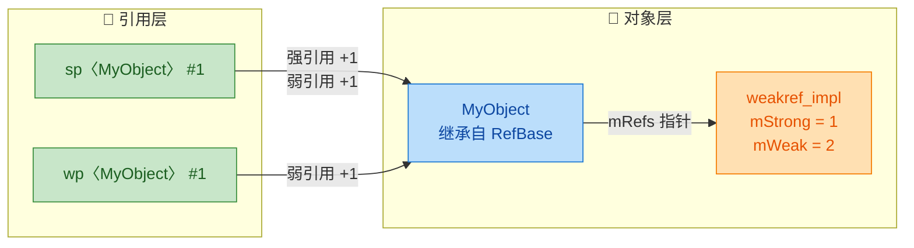
```mermaid
graph LR
    subgraph ObjectLayer["🧱 对象层"]
        direction TB
        OBJ["MyObject\n继承自 RefBase"]
        IMPL["weakref_impl\nmStrong = 1\nmWeak = 2"]
        OBJ -->|"mRefs 指针"| IMPL
    end

    subgraph RefLayer["🔗 引用层"]
        direction TB
        SP1["sp〈MyObject〉 #1"]
        WP1["wp〈MyObject〉 #1"]
    end

    SP1 -->|"强引用 +1\n弱引用 +1"| OBJ
    WP1 -->|"弱引用 +1"| OBJ

    classDef greenNode fill:#C8E6C9,stroke:#388E3C,color:#1B5E20
    classDef blueNode fill:#BBDEFB,stroke:#1976D2,color:#0D47A1
    classDef orangeNode fill:#FFE0B2,stroke:#F57C00,color:#E65100

    class SP1,WP1 greenNode
    class OBJ blueNode
    class IMPL orangeNode
```

上图展示了一个典型场景：1 个强指针 + 1 个弱指针同时指向对象。此时 `mStrong = 1`（1 个 sp），`mWeak = 2`（1 个 sp 贡献 1 + 1 个 wp 贡献 1）。

#### weakref_impl：真正的计数器容器

引用计数并不直接存放在 `RefBase` 对象自身的成员变量中，而是存放在一个 **独立堆分配** 的内部对象 `weakref_impl` 中。`RefBase` 只持有一个指向它的指针 `mRefs`。

```c++
// RefBase 构造函数（简化版）
// 在 RefBase 对象构造时，同步创建 weakref_impl
RefBase::RefBase()
    : mRefs(new weakref_impl(this))  // 在堆上分配独立的引用计数管理器
{
    // mRefs 指向新创建的 weakref_impl
    // weakref_impl 内部持有回指 RefBase 的指针 mBase
}
```

为什么要把计数器放在独立的堆对象里，而不是直接作为 `RefBase` 的成员？答案关乎 **弱指针的安全性**：

1. 当强引用计数降为 0 时，对象本体（`RefBase` 子类）可能被 `delete`。
2. 但此时可能仍有 `wp<T>` 持有弱引用，它们需要通过 `promote()` 来检测对象是否存活。
3. 如果计数器跟着对象一起被销毁了，`wp<T>` 就无法安全地读取计数器——这就是经典的 **use-after-free**。
4. 因此 `weakref_impl` 被设计为独立存活：对象本体可以先销毁，`weakref_impl` 等到弱引用计数也归零后才被 `delete`。

用一张生命周期对比图来理解：

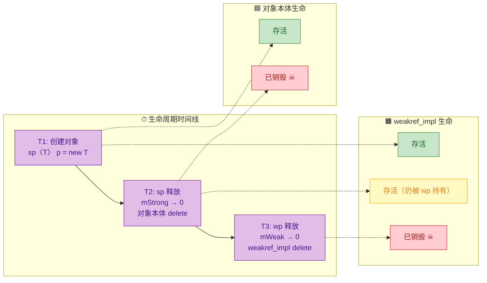
```mermaid
graph LR
    subgraph Timeline["⏱ 生命周期时间线"]
        direction TB
        T1["T1: 创建对象\nsp〈T〉 p = new T"]
        T2["T2: sp 释放\nmStrong → 0\n对象本体 delete"]
        T3["T3: wp 释放\nmWeak → 0\nweakref_impl delete"]
    end

    subgraph ObjLife["🟦 对象本体生命"]
        direction TB
        OA["存活"]
        OB["已销毁 ☠"]
    end

    subgraph ImplLife["🟧 weakref_impl 生命"]
        direction TB
        IA["存活"]
        IB["存活（仍被 wp 持有）"]
        IC["已销毁 ☠"]
    end

    T1 --> T2 --> T3
    T1 -.-> OA
    T2 -.-> OB
    T1 -.-> IA
    T2 -.-> IB
    T3 -.-> IC

    classDef timeNode fill:#E1BEE7,stroke:#7B1FA2,color:#4A148C
    classDef aliveNode fill:#C8E6C9,stroke:#388E3C,color:#1B5E20
    classDef deadNode fill:#FFCDD2,stroke:#D32F2F,color:#B71C1C
    classDef implAlive fill:#FFF9C4,stroke:#F9A825,color:#F57F17

    class T1,T2,T3 timeNode
    class OA,IA aliveNode
    class OB,IC deadNode
    class IB implAlive
```

可以清楚看到：**对象本体在 T2 就死了，但 `weakref_impl` 一直活到 T3**。这就是所谓的"引用计数管理器比被管理对象活得更久"的设计模式，与 `std::shared_ptr` 的 Control Block 异曲同工。

#### 原子操作保障线程安全

Android 的 Native 层大量运行在多线程环境中（Binder 线程池、SurfaceFlinger 渲染线程等），因此引用计数的增减 **必须是原子操作（Atomic Operation）**。`weakref_impl` 中的 `mStrong` 和 `mWeak` 都使用了 `std::atomic<int32_t>` 类型：

```c++
class RefBase::weakref_impl : public RefBase::weakref_type {
public:
    std::atomic<int32_t> mStrong;  // 强引用计数，原子类型
    std::atomic<int32_t> mWeak;    // 弱引用计数，原子类型
    RefBase* const       mBase;    // 回指被管理的 RefBase 对象（const 指针，不可变）
    std::atomic<int32_t> mFlags;   // 生命周期控制标志

    // 构造函数
    explicit weakref_impl(RefBase* base)
        : mStrong(INITIAL_STRONG_VALUE)  // 强引用初始化为哨兵值 0x10000000
        , mWeak(0)                        // 弱引用初始化为 0
        , mBase(base)                     // 记录所管理的对象
        , mFlags(OBJECT_LIFETIME_STRONG)  // 默认：强引用控制生命周期
    {
    }
};
```

所有对 `mStrong`、`mWeak` 的增减都使用 `fetch_add` / `fetch_sub` 等原子操作，配合适当的 **内存序（Memory Order）**，确保在无锁（Lock-Free）情况下的线程安全。

---

### incStrong / decStrong

这两个方法是 `sp<T>` 管理强引用计数的核心入口。每当一个 `sp<T>` 被构造（拷贝构造、赋值等），就会调用 `incStrong`；每当一个 `sp<T>` 被析构或重置，就会调用 `decStrong`。

#### incStrong 详解

```c++
void RefBase::incStrong(const void* id) const
{
    weakref_impl* const refs = mRefs;        // 获取引用计数管理器

    refs->incWeak(id);                        // ① 先增加弱引用计数（每个强引用也占一份弱引用）

    refs->addStrongRef(id);                   // ② Debug 用：记录强引用来源（Release 版为空操作）

    // ③ 原子地将 mStrong 加 1，并返回旧值
    const int32_t c = refs->mStrong.fetch_add(1, std::memory_order_relaxed);

    // ④ 如果旧值不是哨兵值，说明不是第一次被强引用，直接返回
    if (c != INITIAL_STRONG_VALUE) {
        return;
    }

    // ⑤ 第一次被强引用：把哨兵值减掉，使 mStrong 变为真实计数值
    // 此时 mStrong = INITIAL_STRONG_VALUE + 1，减去哨兵后 = 1
    int32_t old __unused = refs->mStrong.fetch_sub(INITIAL_STRONG_VALUE,
                                                     std::memory_order_relaxed);

    // ⑥ 通知子类：对象第一次被强引用（生命周期回调）
    refs->mBase->onFirstRef();
}
```

**执行流程解读**：

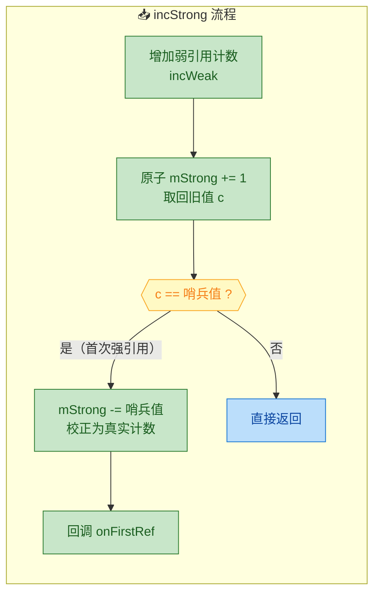
```mermaid
graph LR
    subgraph IncFlow["📥 incStrong 流程"]
        direction TB
        S1["增加弱引用计数\nincWeak"]
        S2["原子 mStrong += 1\n取回旧值 c"]
        S3{{"c == 哨兵值 ?"}}
        S4["mStrong -= 哨兵值\n校正为真实计数"]
        S5["回调 onFirstRef"]
        S6["直接返回"]

        S1 --> S2 --> S3
        S3 -->|"是（首次强引用）"| S4 --> S5
        S3 -->|"否"| S6
    end

    classDef stepNode fill:#C8E6C9,stroke:#2E7D32,color:#1B5E20
    classDef decisionNode fill:#FFF9C4,stroke:#F9A825,color:#F57F17
    classDef returnNode fill:#BBDEFB,stroke:#1976D2,color:#0D47A1

    class S1,S2,S4,S5 stepNode
    class S3 decisionNode
    class S6 returnNode
```

**关于 `onFirstRef()` 回调**：这是 `RefBase` 提供给子类的虚函数钩子。子类可以重写它，在对象 **第一次** 被强指针持有时执行初始化逻辑（例如注册回调、启动线程等）。这比在构造函数中做复杂初始化更安全，因为此时对象已经被 `sp<T>` 保护，不会出现构造期间引用计数为 0 被意外销毁的问题。

#### decStrong 详解

`decStrong` 的逻辑更复杂，因为它要处理"计数归零后是否销毁对象"的决策：

```c++
void RefBase::decStrong(const void* id) const
{
    weakref_impl* const refs = mRefs;        // 获取引用计数管理器

    refs->removeStrongRef(id);               // ① Debug 用：移除强引用记录

    // ② 原子地将 mStrong 减 1，并返回旧值
    const int32_t c = refs->mStrong.fetch_sub(1, std::memory_order_release);

    // ③ 如果旧值为 1，说明减完后变成 0 —— 这是最后一个强引用
    if (c == 1) {
        // 内存屏障：确保所有之前的写操作在析构前可见
        std::atomic_thread_fence(std::memory_order_acquire);

        // ④ 通知子类：最后一个强引用即将消失
        refs->mBase->onLastStrongRef(id);

        // ⑤ 根据生命周期标志决定是否 delete 对象
        int32_t flags = refs->mFlags.load(std::memory_order_relaxed);
        if ((flags & OBJECT_LIFETIME_MASK) == OBJECT_LIFETIME_STRONG) {
            // 默认模式：强引用控制生命周期，直接 delete 对象本体
            delete this;
        }
        // 如果是 OBJECT_LIFETIME_WEAK 模式，则不在此 delete
        // 对象会延迟到弱引用也归零时才销毁
    }

    // ⑥ 最后减少弱引用计数（对应 incStrong 中的 incWeak）
    refs->decWeak(id);
}
```

这里有几个精妙的设计：

**1. Memory Order 的选择**

`fetch_sub` 使用 `memory_order_release`，配合归零后的 `atomic_thread_fence(memory_order_acquire)`，形成经典的 **Release-Acquire** 模式。这确保了：最后一个释放强引用的线程，在执行 `delete this` 之前，能看到所有其他线程之前对该对象的写入。这是多线程引用计数的标准做法，Linux 内核的 `kref` 也使用了类似模式。

**2. 先判断再 delete，还是先 delete 再 decWeak**

注意 `decWeak(id)` 在 `delete this` **之后** 调用。这看起来似乎危险（`this` 已经被删除了），但实际上 `decWeak` 操作的是 `refs`（`weakref_impl`），它是独立分配的堆内存，并不会因 `delete this` 而被释放。

**3. `onLastStrongRef()` 回调**

与 `onFirstRef()` 对称，子类可以重写 `onLastStrongRef()` 在对象即将销毁前做清理工作。

#### 完整的引用计数变化示例

让我们用一个具体的代码场景来追踪两个计数器的变化：

```c++
// 定义一个继承 RefBase 的类
class Camera : public RefBase {
public:
    Camera()  { /* 构造 */ }     // 此时 mStrong=0x10000000, mWeak=0
    ~Camera() { /* 析构 */ }

    void onFirstRef() override {
        // 第一次被 sp 持有时回调
        ALOGD("Camera onFirstRef");
    }

    void onLastStrongRef(const void* id) override {
        // 最后一个 sp 释放时回调
        ALOGD("Camera onLastStrongRef");
    }
};

void example() {
    // --- 阶段 1：创建对象 ---
    Camera* raw = new Camera();
    // mStrong = INITIAL_STRONG_VALUE (0x10000000)
    // mWeak   = 0

    {
        // --- 阶段 2：第一个 sp 持有 ---
        sp<Camera> sp1(raw);
        // incStrong: mWeak 0→1, mStrong 0x10000000→0x10000001
        //            检测到哨兵值，mStrong -= 0x10000000 → mStrong=1
        //            调用 onFirstRef()
        // 结果: mStrong=1, mWeak=1

        {
            // --- 阶段 3：第二个 sp 持有 ---
            sp<Camera> sp2(sp1);
            // incStrong: mWeak 1→2, mStrong 1→2
            // 结果: mStrong=2, mWeak=2

            {
                // --- 阶段 4：一个 wp 持有 ---
                wp<Camera> wp1(sp1);
                // incWeak: mWeak 2→3
                // 结果: mStrong=2, mWeak=3

            }   // --- 阶段 5：wp1 析构 ---
                // decWeak: mWeak 3→2
                // 结果: mStrong=2, mWeak=2

        }   // --- 阶段 6：sp2 析构 ---
            // decStrong: mStrong 2→1 (旧值2, 不是1, 不销毁)
            //            decWeak: mWeak 2→1
            // 结果: mStrong=1, mWeak=1

    }   // --- 阶段 7：sp1 析构 ---
        // decStrong: mStrong 1→0 (旧值1, 触发销毁!)
        //            调用 onLastStrongRef()
        //            delete this → Camera 析构函数执行
        //            decWeak: mWeak 1→0 → weakref_impl 也被 delete
}
```

对应的计数变化表：

| 阶段 | 事件 | `mStrong` | `mWeak` | 备注 |
|------|------|-----------|---------|------|
| 1 | `new Camera()` | 哨兵值 | 0 | 对象刚创建 |
| 2 | `sp1` 构造 | 1 | 1 | 首次强引用，触发 `onFirstRef` |
| 3 | `sp2` 拷贝构造 | 2 | 2 | — |
| 4 | `wp1` 构造 | 2 | 3 | wp 只增加 mWeak |
| 5 | `wp1` 析构 | 2 | 2 | wp 只减少 mWeak |
| 6 | `sp2` 析构 | 1 | 1 | 非最后一个 sp，不销毁 |
| 7 | `sp1` 析构 | 0 | 0 | 最后一个 sp，delete 对象 + impl |

---

### weakref_type

`weakref_type` 是 `RefBase` 内部定义的一个 **公开嵌套类（Public Nested Class）**，它是弱指针 `wp<T>` 与引用计数系统之间的接口层。前面提到的 `weakref_impl` 正是它的派生类。

#### 为什么需要 weakref_type？

这涉及一个面向对象设计中的经典问题：**接口隔离原则（Interface Segregation Principle）**。

`weakref_impl` 包含内部实现细节（原子计数器、调试追踪信息等），这些不应暴露给外部使用者。但 `wp<T>` 需要操作弱引用计数，需要某种接口。于是：

- `weakref_type`：**公开接口**，定义了 `wp<T>` 可以调用的操作。
- `weakref_impl`：**私有实现**，继承 `weakref_type` 并添加具体数据成员。

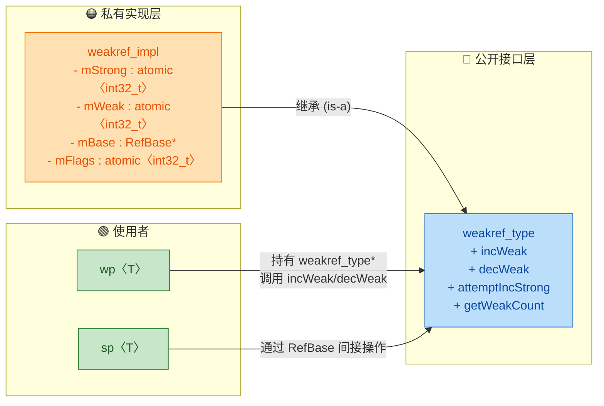
```mermaid
graph LR
    subgraph Interface["🔵 公开接口层"]
        direction TB
        WT["weakref_type\n+ incWeak\n+ decWeak\n+ attemptIncStrong\n+ getWeakCount"]
    end

    subgraph Impl["🟠 私有实现层"]
        direction TB
        WI["weakref_impl\n- mStrong : atomic〈int32_t〉\n- mWeak : atomic〈int32_t〉\n- mBase : RefBase*\n- mFlags : atomic〈int32_t〉"]
    end

    subgraph Users["🟢 使用者"]
        direction TB
        WP["wp〈T〉"]
        SP["sp〈T〉"]
    end

    WI -->|"继承 (is-a)"| WT
    WP -->|"持有 weakref_type*\n调用 incWeak/decWeak"| WT
    SP -->|"通过 RefBase 间接操作"| WT

    classDef blueIF fill:#BBDEFB,stroke:#1565C0,color:#0D47A1
    classDef orangeImpl fill:#FFE0B2,stroke:#EF6C00,color:#E65100
    classDef greenUser fill:#C8E6C9,stroke:#2E7D32,color:#1B5E20

    class WT blueIF
    class WI orangeImpl
    class WP,SP greenUser
```

#### weakref_type 的核心方法

```c++
class RefBase::weakref_type {
public:
    RefBase* refBase() const;               // 获取所管理的 RefBase 对象指针

    void incWeak(const void* id);           // 弱引用计数 +1
    void decWeak(const void* id);           // 弱引用计数 -1

    bool attemptIncStrong(const void* id);  // 尝试将弱引用提升为强引用（核心!）

    bool attemptIncWeak(const void* id);    // 尝试增加弱引用（用于特殊场景）

    int32_t getWeakCount() const;           // 获取当前弱引用计数（仅调试用）
};
```

#### incWeak / decWeak 实现

`incWeak` 相对简单，就是原子地增加 `mWeak`：

```c++
void RefBase::weakref_type::incWeak(const void* id)
{
    weakref_impl* const impl = static_cast<weakref_impl*>(this);  // 向下转型到实现类
    impl->addWeakRef(id);                                          // Debug 记录
    const int32_t c __unused = impl->mWeak.fetch_add(1,           // 原子 +1
                                        std::memory_order_relaxed);
}
```

`decWeak` 较复杂，因为当弱引用计数归零时，它要负责清理 `weakref_impl`：

```c++
void RefBase::weakref_type::decWeak(const void* id)
{
    weakref_impl* const impl = static_cast<weakref_impl*>(this);  // 向下转型
    impl->removeWeakRef(id);                                       // Debug 记录

    // 原子 -1 并返回旧值
    const int32_t c = impl->mWeak.fetch_sub(1, std::memory_order_release);

    if (c != 1) return;  // 旧值不为 1，说明减完后不为 0，还有其他弱引用

    // --- 弱引用计数归零 ---
    atomic_thread_fence(std::memory_order_acquire);  // 获取屏障

    int32_t flags = impl->mFlags.load(std::memory_order_relaxed);

    if ((flags & OBJECT_LIFETIME_MASK) == OBJECT_LIFETIME_STRONG) {
        // 强引用控制模式（默认）：
        // 对象本体已在 decStrong 中被 delete
        // 现在只需 delete weakref_impl 自身
        if (impl->mStrong.load(std::memory_order_relaxed)
                == INITIAL_STRONG_VALUE) {
            // 特殊情况：对象从未被强引用过（只有 wp 指向它）
            // 需要在这里 delete 对象本体
            delete impl->mBase;
        } else {
            // 正常情况：对象本体已被删除，清理 impl
            delete impl;
        }
    } else {
        // OBJECT_LIFETIME_WEAK 模式：
        // 弱引用也控制生命周期，现在弱引用归零，才 delete 对象
        impl->mBase->onLastWeakRef(id);
        delete impl->mBase;  // 对象析构函数中会 delete impl
    }
}
```

这段代码涉及了多种边界场景，用一张决策图来梳理：

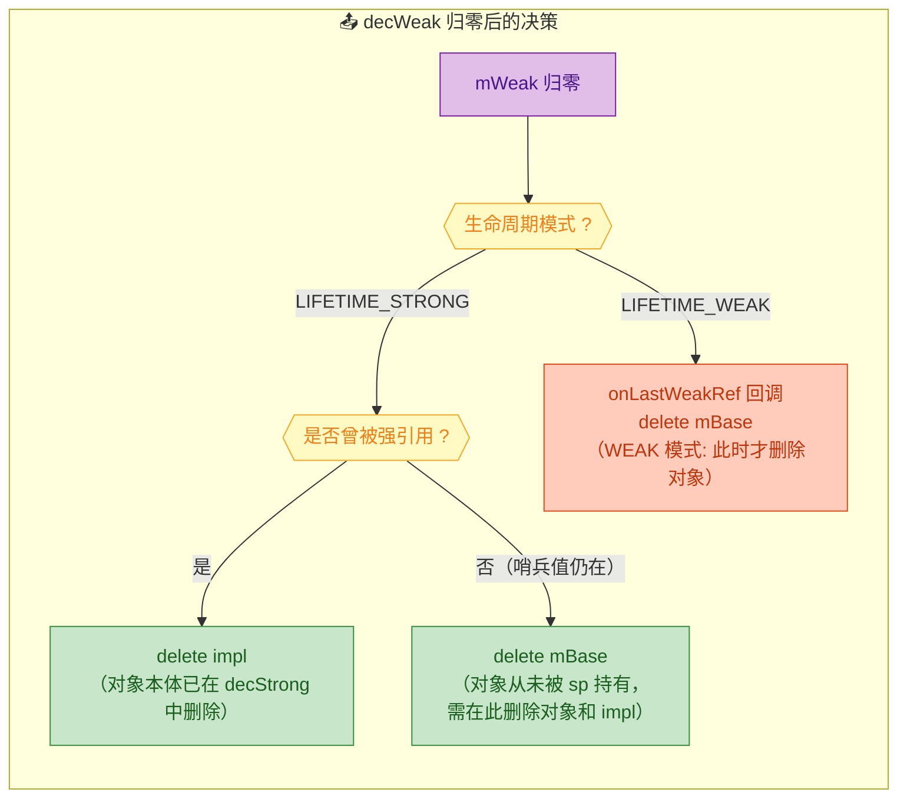
```mermaid
graph LR
    subgraph DecWeakFlow["📤 decWeak 归零后的决策"]
        direction TB
        A["mWeak 归零"]
        B{{"生命周期模式 ?"}}
        C{{"是否曾被强引用 ?"}}
        D["delete impl\n（对象本体已在 decStrong 中删除）"]
        E["delete mBase\n（对象从未被 sp 持有，\n需在此删除对象和 impl）"]
        F["onLastWeakRef 回调\ndelete mBase\n（WEAK 模式: 此时才删除对象）"]

        A --> B
        B -->|"LIFETIME_STRONG"| C
        B -->|"LIFETIME_WEAK"| F
        C -->|"是"| D
        C -->|"否（哨兵值仍在）"| E
    end

    classDef startNode fill:#E1BEE7,stroke:#7B1FA2,color:#4A148C
    classDef decisionNode fill:#FFF9C4,stroke:#F9A825,color:#F57F17
    classDef actionNode fill:#C8E6C9,stroke:#388E3C,color:#1B5E20
    classDef weakAction fill:#FFCCBC,stroke:#E64A19,color:#BF360C

    class A startNode
    class B,C decisionNode
    class D,E actionNode
    class F weakAction
```

#### attemptIncStrong：弱引用提升的核心

`attemptIncStrong` 是 `wp<T>::promote()` 的底层实现，它尝试在对象可能已经开始销毁的竞态条件下，安全地将弱引用"升级"为强引用。这是整个引用计数系统中最复杂的方法：

```c++
bool RefBase::weakref_type::attemptIncStrong(const void* id)
{
    incWeak(id);  // ① 先增加一份弱引用保护（防止 impl 在操作过程中被销毁）

    weakref_impl* const impl = static_cast<weakref_impl*>(this);

    // ② 读取当前强引用计数
    int32_t curCount = impl->mStrong.load(std::memory_order_relaxed);

    // ③ 如果当前强引用计数 > 0 且不是哨兵值，说明对象仍存活
    //    用 CAS 循环尝试 +1
    while (curCount > 0 && curCount != INITIAL_STRONG_VALUE) {
        if (impl->mStrong.compare_exchange_weak(curCount, curCount + 1,
                std::memory_order_relaxed)) {
            break;  // CAS 成功，强引用 +1 完成
        }
        // CAS 失败（其他线程修改了 mStrong），curCount 已被更新，重试
    }

    if (curCount <= 0 || curCount == INITIAL_STRONG_VALUE) {
        // ④ 强引用为 0 或从未被强引用过 —— 需要更复杂的判断
        // 检查生命周期标志和 onIncStrongAttempted 回调来决定是否允许提升
        // ... （此处省略复杂的边界处理逻辑）

        // 如果最终判定无法提升：
        // decWeak(id);  // 回滚 ① 中增加的弱引用
        // return false;
    }

    // ⑤ 提升成功
    impl->addStrongRef(id);  // Debug 记录

    // ⑥ 如果原来是哨兵值（首次强引用），执行同 incStrong 相同的哨兵清除 + onFirstRef
    if (curCount == INITIAL_STRONG_VALUE) {
        impl->mStrong.fetch_sub(INITIAL_STRONG_VALUE);
    }

    return true;
}
```

核心思路是 **CAS（Compare-And-Swap）自旋**：在多线程环境中，`mStrong` 可能随时被其他线程修改，所以不能简单地 `if (mStrong > 0) mStrong++`（这存在 TOCTOU 竞态）。必须用原子 CAS 操作来保证"检查"和"修改"是一个不可分割的原子步骤。

#### wp 如何持有 weakref_type

在 `wp<T>` 的内部，它并不直接持有 `T*` 的引用计数，而是持有一个 `weakref_type*`：

```c++
template <typename T>
class wp {
private:
    T*                  m_ptr;   // 原始对象指针（可能悬空，仅用于 promote 成功后返回）
    weakref_type*       m_refs;  // 弱引用管理器（独立于对象存活）

public:
    // 构造：从 sp 创建 wp
    wp(const sp<T>& other)
        : m_ptr(other.get())                         // 保存原始指针
    {
        if (m_ptr) {
            m_refs = m_ptr->createWeak(this);        // 获取 weakref_type* 并 incWeak
        }
    }

    // 析构
    ~wp() {
        if (m_ptr) {
            m_refs->decWeak(this);                   // 减少弱引用计数
        }
    }

    // 提升为强指针
    sp<T> promote() const {
        sp<T> result;
        if (m_ptr && m_refs->attemptIncStrong(&result)) {
            result.set_pointer(m_ptr);               // 提升成功，设置指针
        }
        return result;                               // 提升失败返回空 sp
    }
};
```

注意 `m_ptr` 和 `m_refs` 的关键区别：

- `m_ptr`（对象指针）：**可能悬空**。当强引用归零后对象被 delete，`m_ptr` 就变成野指针。`wp` 不能直接解引用它。
- `m_refs`（weakref_type 指针）：**始终有效**。只要 `wp` 本身还活着，`m_refs` 就不会被 delete（因为 `mWeak > 0`）。

这就是整个设计的精华：**`wp` 通过始终有效的 `m_refs` 来安全地判断 `m_ptr` 是否还活着**。

```c++
// 内存示意图（对象已被强引用释放后的状态）
//
// Stack                     Heap
// ┌─────────────┐          ┌───────────────────┐
// │ wp<Camera>  │          │  weakref_impl      │
// │  m_ptr ───────────X    │  mStrong = 0       │ (对象已死)
// │  m_refs ──────────────>│  mWeak   = 1       │ (wp 还持有)
// └─────────────┘          │  mBase   = 0xDEAD  │ (已失效)
//                          └───────────────────┘
//                          Camera 对象已被 delete，内存已回收
```

---

**📝 练习题**

当一个 `RefBase` 子类对象被 1 个 `sp` 和 2 个 `wp` 同时持有时，`weakref_impl` 内部的 `mStrong` 和 `mWeak` 值分别是多少？

A. mStrong = 1, mWeak = 2


B. mStrong = 3, mWeak = 3


C. mStrong = 1, mWeak = 3


D. mStrong = 1, mWeak = 1


**【答案】** C

**【解析】** 在 Android 的 `RefBase` 引用计数体系中，每个 `sp<T>` 在执行 `incStrong` 时，会 **同时** 增加 `mStrong` 和 `mWeak` 各 1（因为 `incStrong` 内部会先调用 `incWeak`）。而每个 `wp<T>` 只增加 `mWeak` 1。因此：`mStrong = 1`（1 个 sp 贡献），`mWeak = 1（sp 贡献）+ 2（两个 wp 各贡献 1）= 3`。这种"强引用也占弱引用份额"的设计，保证了 `weakref_impl` 在所有引用（无论强弱）全部释放后才会被销毁，是弱指针安全工作的基石。选项 A 忽略了 sp 对 mWeak 的贡献，选项 B 错误地认为 wp 也增加 mStrong，选项 D 完全忽略了 wp 对 mWeak 的贡献。

---

## sp 强指针 ⭐⭐⭐

`sp`（Strong Pointer）是 Android Native 层中**使用频率最高**的智能指针类型，定义于 `<utils/StrongPointer.h>`。它通过 RAII（Resource Acquisition Is Initialization）语义自动管理 `RefBase` 派生对象的**强引用计数**，当最后一个 `sp` 离开作用域时，目标对象将被自动销毁。可以说，`sp` 在 Android Framework 的 C++ 世界中扮演的角色，与 `std::shared_ptr` 在标准 C++ 世界中扮演的角色高度类似——但两者在设计哲学与实现细节上存在本质差异。

理解 `sp` 的三个维度——**怎么用、怎么计数、与标准库有何不同**——是掌握整个 Android 智能指针体系的核心。

---

### 使用方式

#### 基本声明与构造

`sp` 是一个模板类 `sp<T>`，其中 `T` **必须**是 `RefBase` 的派生类（或至少提供了兼容的 `incStrong` / `decStrong` 接口）。以下是最常见的几种构造方式：

```cpp
#include <utils/RefBase.h>       // RefBase 基类定义
#include <utils/StrongPointer.h> // sp<T> 模板定义

// 定义一个继承 RefBase 的业务类
class MyService : public RefBase {
public:
    MyService() {
        // 构造函数：RefBase 内部的强引用计数初始化为 INITIAL_STRONG_VALUE
        ALOGD("MyService created");
    }

    virtual ~MyService() {
        // 析构函数：当强引用计数归零时被调用
        ALOGD("MyService destroyed");
    }

    void doWork() {
        ALOGD("MyService is doing work...");
    }
};

void demonstrateBasicUsage() {
    // ====== 方式1：直接构造 ======
    // new 出对象后立即交给 sp 托管，强引用计数 → 1
    sp<MyService> svc = new MyService();

    // ====== 方式2：拷贝构造 ======
    // 拷贝 sp 会使强引用计数 +1 → 变为 2
    sp<MyService> svc2 = svc;

    // ====== 方式3：移动构造 (C++11) ======
    // 转移所有权，不改变引用计数（源 sp 变为 nullptr）
    sp<MyService> svc3 = std::move(svc);
    // 此时 svc.get() == nullptr，svc3 持有对象，强引用计数仍为 2

    // ====== 方式4：从裸指针赋值 ======
    MyService* raw = new MyService();   // 新对象，强引用计数 = INITIAL_STRONG_VALUE
    sp<MyService> svc4;                 // 默认构造，内部指针为 nullptr
    svc4 = raw;                         // 赋值操作触发 incStrong，强引用计数 → 1

    // ====== 使用：与裸指针语法完全一致 ======
    svc3->doWork();                     // operator-> 访问成员
    (*svc3).doWork();                   // operator* 解引用
    MyService* p = svc3.get();          // get() 获取裸指针（不增加引用计数）

    // 函数结束时，svc4, svc3, svc2 按逆序析构
    // 每次析构 decStrong → 引用计数 -1
    // 最后一个 sp 析构时计数归零 → delete 对象
}
```

> **⚠️ 关键陷阱**：永远不要对同一个裸指针构造**两条独立的 `sp` 链**。因为 `RefBase` 的引用计数嵌入在对象自身，第一次 `sp` 析构就会 delete 对象，第二条链会变成悬空指针（dangling pointer）。这与 `std::shared_ptr` 的 **"双重管理"** 问题本质相同，但 Android 侧由于 `INITIAL_STRONG_VALUE` 的哨兵机制会在 debug 版本触发 assert。

#### 作为函数参数与返回值

在 Android 框架代码中，`sp` 的传递模式非常有讲究：

```cpp
// ====== 传参方式 ======

// 方式A：const 引用传递（推荐：只读场景，零拷贝，无引用计数开销）
void readService(const sp<MyService>& svc) {
    svc->doWork();   // 可以调用对象方法
    // 不会增减引用计数，性能最优
}

// 方式B：值传递（需要延长生命周期时使用，拷贝触发 incStrong）
void holdService(sp<MyService> svc) {
    // 进入函数时引用计数 +1
    // 可以安全地将 svc 存储到成员变量中
    mCachedService = svc;     // 再次拷贝 → 引用计数 +1
    // 函数退出 → 局部 svc 析构 → 引用计数 -1
}

// 方式C：值返回（利用 RVO/NRVO 优化，通常零开销）
sp<MyService> createService() {
    sp<MyService> svc = new MyService();  // 强引用计数 → 1
    return svc;  // 编译器通常执行 NRVO（Named Return Value Optimization）
                 // 直接在调用方的栈帧上构造，不产生额外的 inc/dec
}
```

#### 实际框架中的典型用法

以下是一个简化版的 Android Camera Service 场景，展示 `sp` 在实际系统服务中的使用模式：

```cpp
// ICameraService.h（AIDL 自动生成的接口）
class ICameraService : public IInterface {
public:
    // 返回 sp 包裹的 Camera 设备代理
    virtual sp<ICameraDeviceUser> connectDevice(
        const String16& cameraId) = 0;       // 纯虚函数
};

// CameraService.cpp（服务端实现）
sp<ICameraDeviceUser> CameraService::connectDevice(
    const String16& cameraId) {

    // 创建设备客户端，sp 自动管理生命周期
    sp<CameraDeviceClient> client = new CameraDeviceClient(/*...*/);

    // 初始化，内部可能继续创建更多 sp 持有的子对象
    status_t err = client->initialize(mCameraProviderManager);

    if (err != OK) {
        // 如果初始化失败，函数结束时 client（sp）自动析构
        // 强引用计数归零 → CameraDeviceClient 被 delete
        return nullptr;   // 返回空 sp
    }

    // 返回 sp：调用方获得所有权，强引用计数不变（RVO优化）
    return client;
}
```

---

### 引用计数管理

`sp` 的引用计数管理是其灵魂所在。不同于将计数存放在独立控制块的 `std::shared_ptr`，`sp` 的计数信息**嵌入在被管理对象自身**的 `RefBase` 基类中。让我们从源码层面深入剖析整个生命周期。

#### sp 类模板核心结构

首先看 `sp<T>` 自身的结构，它极其精简：

```cpp
// frameworks/rs/cpp/util/StrongPointer.h（简化版）
template <typename T>
class sp {
public:
    // ---------- 构造 ----------
    sp() : m_ptr(nullptr) {}                // 默认构造：空指针

    sp(T* other) : m_ptr(other) {           // 裸指针构造
        if (m_ptr) {
            m_ptr->incStrong(this);         // 核心：调用 RefBase::incStrong
                                            // 参数 this 用于 debug 追踪（标识谁持有引用）
        }
    }

    sp(const sp<T>& other) : m_ptr(other.m_ptr) {  // 拷贝构造
        if (m_ptr) {
            m_ptr->incStrong(this);         // 强引用计数 +1
        }
    }

    sp(sp<T>&& other) noexcept              // 移动构造（C++11）
        : m_ptr(other.m_ptr) {
        other.m_ptr = nullptr;              // 转移所有权，无需操作引用计数
    }

    // ---------- 析构 ----------
    ~sp() {
        if (m_ptr) {
            m_ptr->decStrong(this);         // 核心：调用 RefBase::decStrong
                                            // 如果引用计数归零 → delete 对象
        }
    }

    // ---------- 赋值 ----------
    sp& operator=(T* other) {               // 裸指针赋值
        T* oldPtr = m_ptr;                  // 保存旧指针
        if (other) other->incStrong(this);  // 新对象引用计数 +1（先 inc）
        m_ptr = other;                      // 替换指针
        if (oldPtr) oldPtr->decStrong(this);// 旧对象引用计数 -1（后 dec）
        return *this;                       // "先 inc 后 dec" 保证自赋值安全
    }

    // ---------- 访问 ----------
    T* operator->() const { return m_ptr; } // 箭头运算符
    T& operator*() const { return *m_ptr; } // 解引用
    T* get() const { return m_ptr; }        // 获取裸指针

private:
    T* m_ptr;                               // 唯一成员：裸指针
                                            // sizeof(sp<T>) == sizeof(T*)
};
```

注意 `sp` 自身 **没有** 任何控制块、分配器或引用计数字段。所有计数工作都委托给了被指向对象的 `RefBase` 基类。

#### incStrong / decStrong 调用链

当 `sp` 构造或析构时，核心动作就是调用目标对象继承自 `RefBase` 的 `incStrong()` 和 `decStrong()`。以下是简化后的实际实现（基于 AOSP `system/core/libutils/RefBase.cpp`）：

```cpp
// RefBase::incStrong —— 增加强引用计数
void RefBase::incStrong(const void* id) const {
    weakref_impl* const refs = mRefs;       // mRefs 是 RefBase 内部的引用计数实现体
    refs->incWeak(id);                      // ★ 每次 incStrong 也会 incWeak
                                            //   保证弱引用计数 >= 强引用计数

    refs->addStrongRef(id);                 // Debug 构建下记录调用者信息（Release 为空操作）

    // 原子操作：强引用计数 +1，返回旧值
    const int32_t c = refs->mStrong.fetch_add(1, std::memory_order_relaxed);

    if (c != INITIAL_STRONG_VALUE) {
        // 非首次引用：普通 +1，直接返回
        return;
    }

    // ★ 首次引用（从 INITIAL_STRONG_VALUE 变化）：
    // 将强引用计数从 INITIAL_STRONG_VALUE+1 修正为 1
    refs->mStrong.fetch_sub(INITIAL_STRONG_VALUE,
                            std::memory_order_relaxed);

    // 回调通知：对象首次被强引用持有
    refs->mBase->onFirstRef();              // 子类可覆写此虚函数做初始化
}

// RefBase::decStrong —— 减少强引用计数
void RefBase::decStrong(const void* id) const {
    weakref_impl* const refs = mRefs;
    refs->removeStrongRef(id);              // Debug 构建下移除记录

    // 原子操作：强引用计数 -1，返回旧值
    const int32_t c = refs->mStrong.fetch_sub(1, std::memory_order_release);

    if (c == 1) {
        // ★ 旧值为 1 → 减后为 0 → 触发析构流程
        std::atomic_thread_fence(std::memory_order_acquire);

        // 回调通知：最后一个强引用即将释放
        refs->mBase->onLastStrongRef(id);

        // 根据生命周期策略决定是否 delete 对象
        int32_t flags = refs->mFlags.load(std::memory_order_relaxed);
        if ((flags & OBJECT_LIFETIME_MASK) == OBJECT_LIFETIME_STRONG) {
            // 默认策略：强引用控制生命周期 → delete this
            delete this;
        }
        // 若策略为 OBJECT_LIFETIME_WEAK，则不在此处 delete
        // 等到弱引用计数也归零时才释放
    }

    refs->decWeak(id);                      // ★ 与 incStrong 中的 incWeak 配对
}
```

#### 完整生命周期状态机

下面用时序图完整展现一个 `RefBase` 对象从创建到销毁的引用计数变化：

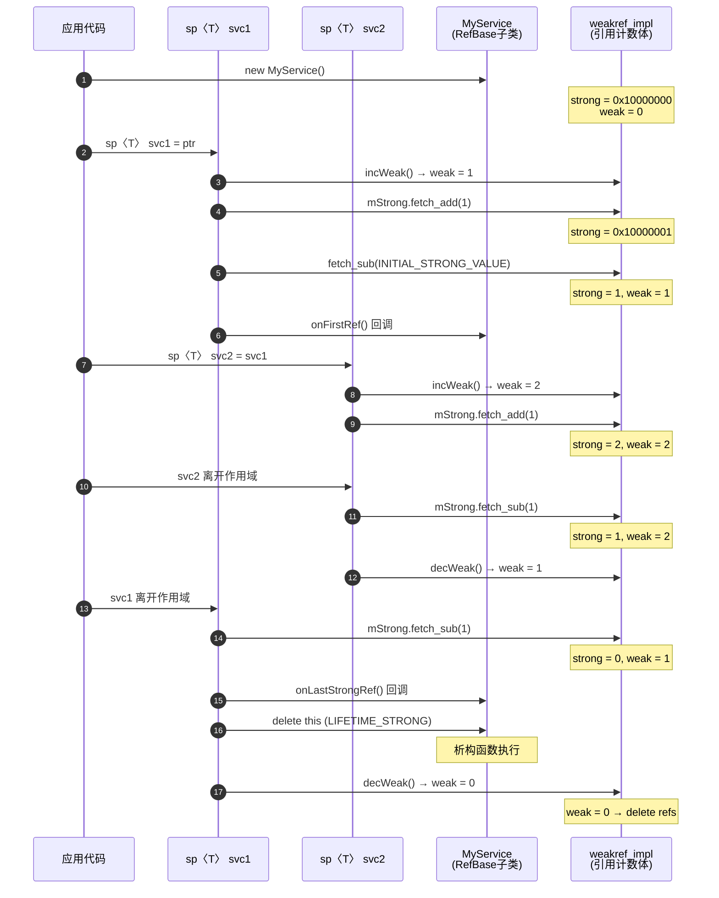
```mermaid
sequenceDiagram
    autonumber
    participant App as 应用代码
    participant SP1 as sp〈T〉 svc1
    participant SP2 as sp〈T〉 svc2
    participant Obj as MyService<br>(RefBase子类)
    participant Refs as weakref_impl<br>(引用计数体)

    App->>Obj: new MyService()
    Note over Refs: strong = 0x10000000<br>weak = 0

    App->>SP1: sp〈T〉 svc1 = ptr
    SP1->>Refs: incWeak() → weak = 1
    SP1->>Refs: mStrong.fetch_add(1)
    Note over Refs: strong = 0x10000001
    SP1->>Refs: fetch_sub(INITIAL_STRONG_VALUE)
    Note over Refs: strong = 1, weak = 1
    SP1->>Obj: onFirstRef() 回调

    App->>SP2: sp〈T〉 svc2 = svc1
    SP2->>Refs: incWeak() → weak = 2
    SP2->>Refs: mStrong.fetch_add(1)
    Note over Refs: strong = 2, weak = 2

    App->>SP2: svc2 离开作用域
    SP2->>Refs: mStrong.fetch_sub(1)
    Note over Refs: strong = 1, weak = 2
    SP2->>Refs: decWeak() → weak = 1

    App->>SP1: svc1 离开作用域
    SP1->>Refs: mStrong.fetch_sub(1)
    Note over Refs: strong = 0, weak = 1
    SP1->>Obj: onLastStrongRef() 回调
    SP1->>Obj: delete this (LIFETIME_STRONG)
    Note over Obj: 析构函数执行
    SP1->>Refs: decWeak() → weak = 0
    Note over Refs: weak = 0 → delete refs
```

#### INITIAL_STRONG_VALUE 哨兵值详解

这是引用计数管理中一个精妙的设计细节，值得单独说明：

```cpp
// 定义在 RefBase.cpp 中
#define INITIAL_STRONG_VALUE (1 << 28)   // 0x10000000，约 2.68 亿
```

为什么不用 `0` 作为初始值？原因有二：

1. **区分 "从未被强引用" 与 "曾被强引用后归零"**。如果初始值为 0，那么 `decStrong` 把计数从 1 减到 0 时，与 "从未有人持有" 的状态无法区分。`INITIAL_STRONG_VALUE` 使得对象在**从未被任何 `sp` 持有**时，强引用计数一直是一个远大于正常范围的值，一眼可辨。

2. **触发 `onFirstRef()` 回调**。`incStrong` 通过检测旧值是否等于 `INITIAL_STRONG_VALUE` 来判断 "这是不是第一次被强引用"，如果是，则修正计数并调用 `onFirstRef()`。这为子类提供了一个**延迟初始化 (lazy init)** 的钩子——在构造函数中无法安全使用 `sp<this>`（因为对象还在构造），但在 `onFirstRef()` 中可以。

以下 ASCII 图展示了强引用计数在不同阶段的值域分布：

```
╔══════════════════════════════════════════════════════════════════╗
║              强引用计数 (mStrong) 值域分布                       ║
╠═════════════════════╦════════════════════════════════════════════╣
║  0x10000000         ║ INITIAL_STRONG_VALUE (从未被强引用)        ║
║  (268435456)        ║ → 对象已 new 但还没有任何 sp 持有          ║
╠═════════════════════╬════════════════════════════════════════════╣
║  0x10000001         ║ 第一个 sp 构造时的瞬态值                   ║
║                     ║ → fetch_add(1) 之后、fetch_sub 之前       ║
╠═════════════════════╬════════════════════════════════════════════╣
║  1, 2, 3 ...       ║ 正常运行范围                               ║
║                     ║ → 有 N 个 sp 持有 = 值为 N                ║
╠═════════════════════╬════════════════════════════════════════════╣
║  0                  ║ 所有 sp 已释放 → 触发 onLastStrongRef     ║
║                     ║ → 默认策略下 delete 对象                   ║
╚═════════════════════╩════════════════════════════════════════════╝
```

#### 线程安全保证

`sp` 的引用计数操作全部基于 **`std::atomic<int32_t>`** 原子变量，因此 **引用计数的增减** 本身是线程安全的。但需要注意的细微差别：

```cpp
// ✅ 线程安全：不同线程各持有自己的 sp 拷贝
void threadA(sp<MyService> svc) {    // 拷贝传入，引用计数原子 +1
    svc->doWork();                   // 安全
}                                    // 退出时原子 -1

void threadB(sp<MyService> svc) {    // 同上
    svc->doWork();                   // 安全
}

// ❌ 非线程安全：多个线程同时读写「同一个 sp 变量」
sp<MyService> g_svc;                 // 全局 sp

void threadC() {
    g_svc = new MyService();         // 写 g_svc
}

void threadD() {
    sp<MyService> local = g_svc;     // 读 g_svc → 数据竞争！
    // 原因：sp 的赋值操作涉及「读指针 + incStrong」两步
    //       这两步合在一起并非原子操作
    //       另一个线程可能在中间替换了 g_svc 的指针
}

// ✅ 正确做法：对共享的 sp 变量本身加锁
std::mutex g_mutex;
void threadC_safe() {
    std::lock_guard<std::mutex> lock(g_mutex);
    g_svc = new MyService();         // 互斥写
}
void threadD_safe() {
    std::lock_guard<std::mutex> lock(g_mutex);
    sp<MyService> local = g_svc;     // 互斥读
}
```

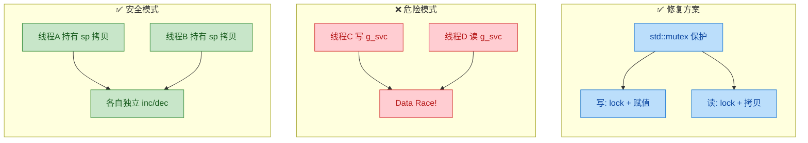
```mermaid
graph LR
    subgraph Safe["✅ 安全模式"]
        direction TB
        S1["线程A 持有 sp 拷贝"]
        S2["线程B 持有 sp 拷贝"]
        S3["各自独立 inc/dec"]
        S1 --> S3
        S2 --> S3
    end

    subgraph Unsafe["❌ 危险模式"]
        direction TB
        U1["线程C 写 g_svc"]
        U2["线程D 读 g_svc"]
        U3["Data Race!"]
        U1 --> U3
        U2 --> U3
    end

    subgraph Fix["✅ 修复方案"]
        direction TB
        F1["std::mutex 保护"]
        F2["写: lock + 赋值"]
        F3["读: lock + 拷贝"]
        F1 --> F2
        F1 --> F3
    end

    Safe ~~~ Unsafe ~~~ Fix

    classDef safeStyle fill:#C8E6C9,stroke:#388E3C,color:#1B5E20
    classDef unsafeStyle fill:#FFCDD2,stroke:#D32F2F,color:#B71C1C
    classDef fixStyle fill:#BBDEFB,stroke:#1976D2,color:#0D47A1

    class S1,S2,S3 safeStyle
    class U1,U2,U3 unsafeStyle
    class F1,F2,F3 fixStyle
```

---

### vs std::shared_ptr

`sp<T>` 和 `std::shared_ptr<T>` 解决的是同一个问题——**共享所有权的自动内存管理**——但它们的设计取舍截然不同。理解差异有助于在 Android 混合开发中做出正确选择。

#### 架构对比全景

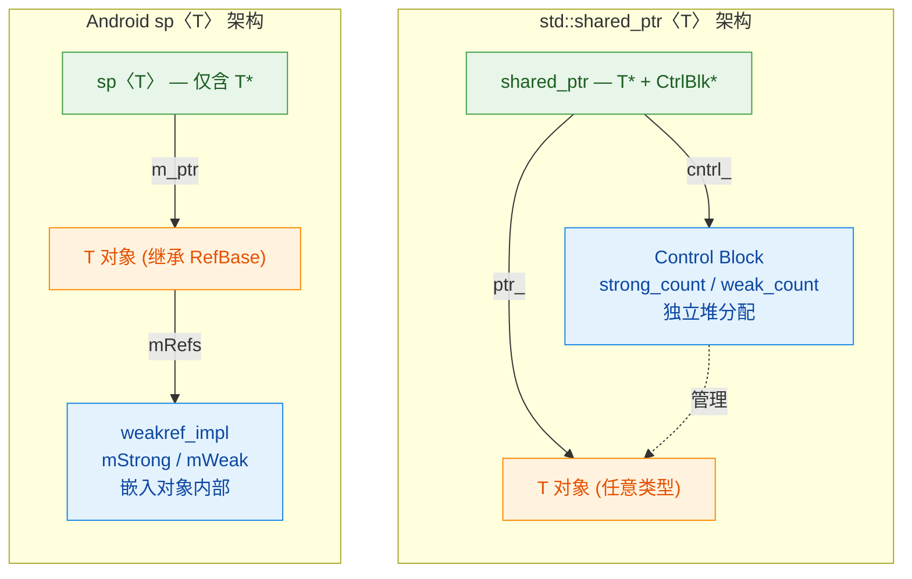
```mermaid
graph LR
    subgraph AndroidSP["Android sp〈T〉 架构"]
        direction TB
        A1["sp〈T〉 — 仅含 T*"]
        A2["T 对象 (继承 RefBase)"]
        A3["weakref_impl<br>mStrong / mWeak<br>嵌入对象内部"]
        A1 -->|"m_ptr"| A2
        A2 -->|"mRefs"| A3
    end

    subgraph StdSP["std::shared_ptr〈T〉 架构"]
        direction TB
        B1["shared_ptr — T* + CtrlBlk*"]
        B2["T 对象 (任意类型)"]
        B3["Control Block<br>strong_count / weak_count<br>独立堆分配"]
        B1 -->|"ptr_"| B2
        B1 -->|"cntrl_"| B3
        B3 -.->|"管理"| B2
    end

    AndroidSP ~~~ StdSP

    classDef spStyle fill:#E8F5E9,stroke:#43A047,color:#1B5E20
    classDef objStyle fill:#FFF3E0,stroke:#FB8C00,color:#E65100
    classDef ctrlStyle fill:#E3F2FD,stroke:#1E88E5,color:#0D47A1

    class A1 spStyle
    class A2,B2 objStyle
    class A3,B3 ctrlStyle
    class B1 spStyle
```

#### 核心差异逐项对比

| 维度 | `sp<T>` (Android) | `std::shared_ptr<T>` (C++ 标准) |
|---|---|---|
| **引用计数位置** | 嵌入对象内部（Intrusive） | 独立控制块（Non-intrusive） |
| **类型约束** | `T` 必须继承 `RefBase` | `T` 可以是任意类型 |
| **sizeof 大小** | `sizeof(T*)` = 一个指针 | `sizeof(T*) + sizeof(CtrlBlk*)` = 两个指针 |
| **控制块分配** | 无额外分配（随对象一起） | 通常需额外 `new`（`make_shared` 可合并） |
| **弱引用支持** | 配套 `wp<T>`，共用 `weakref_impl` | 配套 `std::weak_ptr`，共用 Control Block |
| **Custom Deleter** | 不支持（固定 `delete this`） | 支持任意删除器（type-erased） |
| **Custom Allocator** | 不支持 | 支持（`std::allocate_shared`） |
| **`make_xxx` 工厂** | 无（直接 `new` + 赋给 `sp`） | `std::make_shared<T>(args...)` |
| **线程安全级别** | 引用计数原子，`sp` 变量本身不安全 | 相同：引用计数原子，变量本身不安全 |
| **`enable_shared_from_this`** | `RefBase` 自带（天然支持） | 需显式继承 `enable_shared_from_this` |
| **生命周期策略** | `OBJECT_LIFETIME_STRONG` / `WEAK` | 仅 strong 策略（对象随 strong=0 销毁） |

#### Intrusive vs Non-intrusive：为什么 Android 选择侵入式？

这是最根本的设计分歧。`sp` 采用 **侵入式引用计数（Intrusive Reference Counting）**，将计数器作为对象的一部分；而 `std::shared_ptr` 采用 **非侵入式（Non-intrusive）**，计数器放在独立的控制块中。

**侵入式的优势**：

```cpp
// ====== 优势1：内存布局紧凑，Cache 友好 ======
// Android sp：对象和引用计数在「同一块内存」中（或紧邻）
// 访问计数时不需要额外的指针跳转（pointer indirection）

// RefBase 对象的内存布局（概念）:
// +-------------------+
// | RefBase::mRefs ---|--→ weakref_impl { mStrong, mWeak, mFlags, mBase }
// |                   |    （通常在构造时一次性分配）
// | MyService 成员    |
// | ...               |
// +-------------------+

// std::shared_ptr：T 对象 和 Control Block 可能在不同的堆地址
// 除非使用 make_shared 合并分配

// ====== 优势2：sp 自身只有一个指针，更轻量 ======
static_assert(sizeof(sp<MyService>) == sizeof(void*),
              "sp should be pointer-sized");    // ✅ 通过
// std::shared_ptr 通常是两个指针大小
static_assert(sizeof(std::shared_ptr<int>) == 2 * sizeof(void*),
              "shared_ptr is two pointers");    // ✅ 通常通过

// ====== 优势3：从裸指针可以安全地反向获取 sp ======
class MyService : public RefBase {
public:
    void publishSelf() {
        // RefBase 天然支持：从 this 安全构建 sp
        sp<MyService> self(this);   // ✅ 安全：引用计数嵌入对象，计数 +1
        someManager->register(self);
    }
};

// std::shared_ptr 要实现同样功能，必须继承 enable_shared_from_this：
class StdService : public std::enable_shared_from_this<StdService> {
public:
    void publishSelf() {
        auto self = shared_from_this();  // 需要已有 shared_ptr 管理 this
        someManager->register(self);
    }
};
```

**非侵入式的优势**：

```cpp
// ====== 优势1：无类型约束 ======
std::shared_ptr<int> p1 = std::make_shared<int>(42);    // ✅ int 无需继承任何基类
std::shared_ptr<FILE> p2(fopen("a.txt", "r"), fclose);  // ✅ 支持自定义 deleter

// sp<int> ???  → ❌ 不可能，int 不继承 RefBase

// ====== 优势2：Custom Deleter 支持 ======
// 管理非 new 分配的资源（如文件句柄、mmap 内存等）
std::shared_ptr<void> gpuBuf(
    mapGpuMemory(size),                       // 自定义分配
    [](void* p) { unmapGpuMemory(p); }        // 自定义释放
);
// sp 做不到：它永远只会 delete this

// ====== 优势3：与标准库生态完美兼容 ======
std::vector<std::shared_ptr<Widget>> widgets;            // STL 容器
std::unordered_map<int, std::shared_ptr<Texture>> cache; // 标准关联容器
// sp 也可以放入 STL 容器，但在 Android 旧代码中更常见 Vector<sp<T>>
```

#### 何时用哪个？

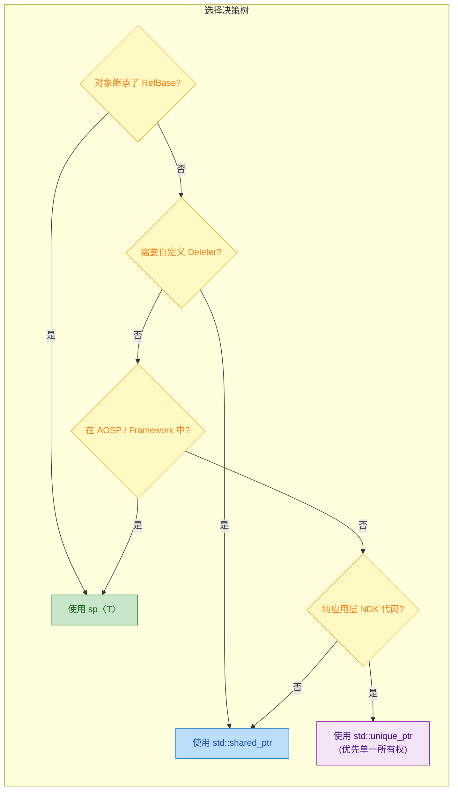
```mermaid
graph LR
    subgraph Decision["选择决策树"]
        direction TB
        Q1{"对象继承了 RefBase?"}
        Q2{"需要自定义 Deleter?"}
        Q3{"在 AOSP / Framework 中?"}
        Q4{"纯应用层 NDK 代码?"}
        R1["使用 sp〈T〉"]
        R2["使用 std::shared_ptr"]
        R3["使用 std::unique_ptr<br>(优先单一所有权)"]

        Q1 -->|"是"| R1
        Q1 -->|"否"| Q2
        Q2 -->|"是"| R2
        Q2 -->|"否"| Q3
        Q3 -->|"是"| R1
        Q3 -->|"否"| Q4
        Q4 -->|"是"| R3
        Q4 -->|"否"| R2
    end

    classDef questionStyle fill:#FFF9C4,stroke:#F9A825,color:#F57F17
    classDef spAnswer fill:#C8E6C9,stroke:#388E3C,color:#1B5E20
    classDef stdAnswer fill:#BBDEFB,stroke:#1976D2,color:#0D47A1
    classDef uniqueAnswer fill:#F3E5F5,stroke:#8E24AA,color:#4A148C

    class Q1,Q2,Q3,Q4 questionStyle
    class R1 spAnswer
    class R2 stdAnswer
    class R3 uniqueAnswer
```

**实用总结**：

- **编写或修改 AOSP Framework / System Service 代码** → 使用 `sp<T>` + `wp<T>`，遵循既有代码风格，因为几乎所有核心对象都继承了 `RefBase`。
- **编写纯 NDK 应用层代码** → 优先使用 `std::unique_ptr`（单一所有权），需要共享所有权时用 `std::shared_ptr`。标准库智能指针与现代 C++ 生态的兼容性更好。
- **跨越两个世界的边界时** → 在接口层做转换。例如从 Binder 回调拿到 `sp<T>`，在应用逻辑中可以 `.get()` 取裸指针后用标准库管理——但要**格外小心生命周期**，确保 `sp` 的生存期覆盖所有使用。

---

**📝 练习题**

以下代码在多线程环境中运行，哪一处存在数据竞争（Data Race）？

```cpp
sp<MyService> g_service = new MyService();   // 全局 sp

// 线程1
void thread1() {
    sp<MyService> local = g_service;    // ① 读取全局 sp 并拷贝
    local->doWork();
}

// 线程2
void thread2() {
    g_service = new MyService();        // ② 替换全局 sp
}

// 线程3
void thread3() {
    sp<MyService> copy = g_service;     // ③ 读取全局 sp 并拷贝
    sp<MyService> copy2 = copy;         // ④ 拷贝局部 sp
}
```

A. 仅 ①② 之间存在竞争


B. 仅 ②③ 之间存在竞争


C. ①②③ 之间都存在竞争，④ 安全


D. ①②③④ 全部存在竞争

**【答案】** C

**【解析】** `sp` 的引用计数操作（`incStrong` / `decStrong`）是基于 `std::atomic` 的原子操作，因此线程安全。但 **`sp` 变量自身的读写**（即指针赋值 + 引用计数操作这一组合）**并非原子的**。

- **① 和 ②**：线程 1 读取 `g_service.m_ptr` 并调用 `incStrong`，线程 2 同时修改 `g_service.m_ptr` 并对旧对象调用 `decStrong`。这两个操作访问同一个 `sp` 变量，读写并发 → **数据竞争**。
- **② 和 ③**：同理，线程 2 写 `g_service`，线程 3 读 `g_service` → **数据竞争**。
- **④**：`copy` 是线程 3 的局部变量，不与任何其他线程共享 → **安全**。局部 `sp` 之间的拷贝仅涉及引用计数的原子操作，完全线程安全。

因此正确答案是 **C**。修复方案是对 `g_service` 的所有访问加 `std::mutex` 保护。

---

## wp 弱指针 ⭐⭐

在 Android Native 世界中，`sp<T>`（强指针）虽然能自动管理对象生命周期，但它并非万能。当两个对象通过 `sp` 互相引用时，会产生经典的**循环引用（Circular Reference）**问题，导致引用计数永远无法归零，对象永远不会被释放——这就是内存泄漏。为了解决这一痛点，Android 引入了 `wp<T>`（Weak Pointer，弱指针）。

`wp<T>` 的核心设计哲学是：**"我知道你在，但我不阻止你离开。"** 弱指针持有对象的弱引用计数（weak reference count），但**不影响**强引用计数（strong reference count）。这意味着，即使 `wp` 还在指向某个对象，只要所有 `sp` 都释放了，对象仍然可以被销毁。当你真正需要使用对象时，必须先通过 `promote()` 尝试将 `wp` 提升为 `sp`，如果对象已经被销毁，`promote()` 会返回空指针。

这种"观察但不拥有"的语义，和 C++ 标准库中 `std::weak_ptr` 的设计理念一脉相承，但 Android 的实现更加轻量且与 `RefBase` 体系深度耦合。

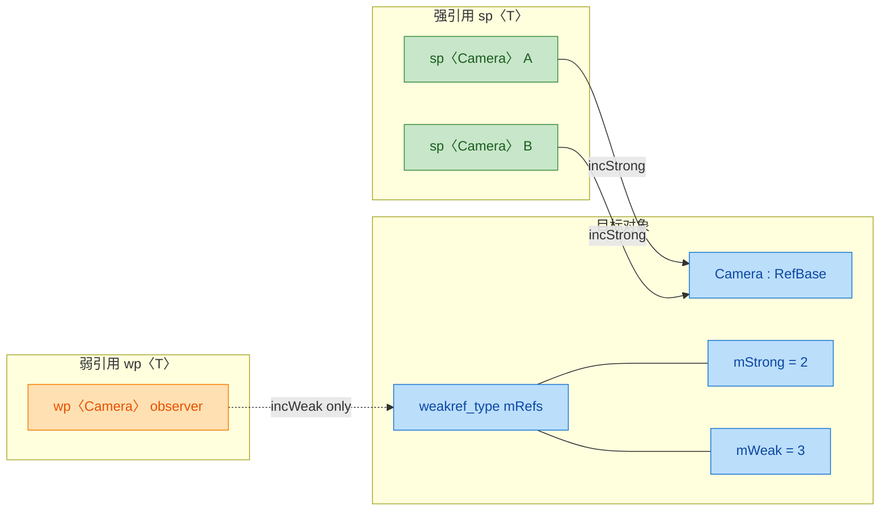
```mermaid
graph LR
    subgraph StrongRef["强引用 sp〈T〉"]
        direction TB
        SP1["sp〈Camera〉 A"]
        SP2["sp〈Camera〉 B"]
    end

    subgraph Target["目标对象"]
        direction TB
        OBJ["Camera : RefBase"]
        REF["weakref_type mRefs"]
        SC["mStrong = 2"]
        WC["mWeak = 3"]
        REF --- SC
        REF --- WC
    end

    subgraph WeakRef["弱引用 wp〈T〉"]
        direction TB
        WP1["wp〈Camera〉 observer"]
    end

    SP1 -->|"incStrong"| OBJ
    SP2 -->|"incStrong"| OBJ
    WP1 -.->|"incWeak only"| REF

    classDef greenNode fill:#C8E6C9,stroke:#388E3C,color:#1B5E20,stroke-width:1px
    classDef blueNode fill:#BBDEFB,stroke:#1976D2,color:#0D47A1,stroke-width:1px
    classDef orangeNode fill:#FFE0B2,stroke:#F57C00,color:#E65100,stroke-width:1px

    class SP1,SP2 greenNode
    class OBJ,REF,SC,WC blueNode
    class WP1 orangeNode
```

上图清晰展示了 `sp` 和 `wp` 的本质区别：`sp` 的箭头是实线（参与强引用计数），而 `wp` 的箭头是虚线（仅参与弱引用计数）。当 `mStrong` 降为 0 时，对象可以被销毁，而 `wp` 此时只能感知到对象已经不在了。

---

### 使用方式

`wp<T>` 的使用方式在语法层面与 `sp<T>` 类似，但在**能力上**有本质差异——`wp` **不能直接解引用访问对象**，它没有重载 `operator->()` 和 `operator*()`。你只能把它当作一个"弱观察者"，真正要操作对象时，必须先 `promote()`。

下面是一个完整的使用示例：

```cpp
#include <utils/RefBase.h>   // Android RefBase 体系头文件
#include <utils/StrongPointer.h>

using namespace android;

// 定义一个继承自 RefBase 的类，使其具备引用计数能力
class SensorService : public RefBase {
public:
    SensorService() {
        // 构造时打印日志，方便跟踪生命周期
        ALOGD("SensorService created");
    }

    virtual ~SensorService() {
        // 析构时打印日志，验证释放时机
        ALOGD("SensorService destroyed");
    }

    void start() {
        ALOGD("SensorService started");
    }
};

void demonstrateWeakPointer() {
    wp<SensorService> weakRef;          // 声明一个弱指针，初始为空

    {
        // 在内部作用域创建一个强指针，引用计数 mStrong=1, mWeak=1
        sp<SensorService> strongRef = sp<SensorService>::make();

        // 用强指针构造弱指针：mStrong 不变仍为1，mWeak 增至 2
        weakRef = strongRef;

        // 此时通过 promote() 一定能成功，因为 strongRef 还活着
        sp<SensorService> promoted = weakRef.promote();
        if (promoted != nullptr) {
            // promote 成功，mStrong 临时变为 2
            promoted->start();          // 安全访问对象方法
        }
        // promoted 离开作用域，mStrong 回到 1
    }
    // strongRef 离开作用域，mStrong 降为 0 → 对象被销毁
    // 此时 weakRef 还在，但它指向的对象已经 gone

    // 再次尝试提升：对象已销毁，promote() 返回 nullptr
    sp<SensorService> promoted = weakRef.promote();
    if (promoted == nullptr) {
        ALOGD("Object already destroyed, promote failed!");
    }
}
```

**关键要点**：`wp` 只有三种核心操作——**构造/赋值**、**promote()** 和 **比较（==, !=）**。它故意不提供 `->` 和 `*` 操作符，这是一种**编译期安全保障**（compile-time safety），强制开发者在访问对象前必须经过 promote 的"安全检查"。

来看一下 `wp` 类的核心接口定义（精简版）：

```cpp
template <typename T>
class wp {
public:
    // === 构造函数族 ===
    wp();                                // 默认构造：空弱指针
    wp(T* other);                        // 从裸指针构造（调用 incWeak）
    wp(const wp<T>& other);              // 拷贝构造（调用 incWeak）
    wp(const sp<T>& other);              // 从强指针构造（仅调用 incWeak，不影响 mStrong）

    // === 析构函数 ===
    ~wp();                               // 调用 decWeak，弱引用计数减 1

    // === 赋值操作符 ===
    wp& operator=(T* other);             // 裸指针赋值
    wp& operator=(const wp<T>& other);   // 弱指针拷贝赋值
    wp& operator=(const sp<T>& other);   // 从强指针赋值

    // === 核心方法 ===
    sp<T> promote() const;               // 尝试提升为强指针（原子操作，线程安全）

    // === 辅助方法 ===
    void clear();                        // 手动释放弱引用（等价于赋值 nullptr）

    // ❌ 注意：没有 operator->() 和 operator*()
    // ❌ 无法直接访问底层对象

private:
    T*                  m_ptr;           // 指向目标对象的裸指针（但不能直接用）
    weakref_type*       m_refs;          // 指向引用计数管理结构
};
```

`wp` 内部持有两个成员：`m_ptr`（目标对象裸指针）和 `m_refs`（`weakref_type` 指针）。值得注意的是，即使对象被销毁（`m_ptr` 指向的内存已释放），`m_refs` 可能仍然有效——这正是 `promote()` 能判断"对象是否还活着"的关键所在。`weakref_type` 结构体的生命周期独立于目标对象，它由弱引用计数管理，只有当强引用和弱引用都归零时，`weakref_type` 才会被释放。

下面这张引用计数变化时序图，展示了 `wp` 在完整生命周期中各计数的变化过程：

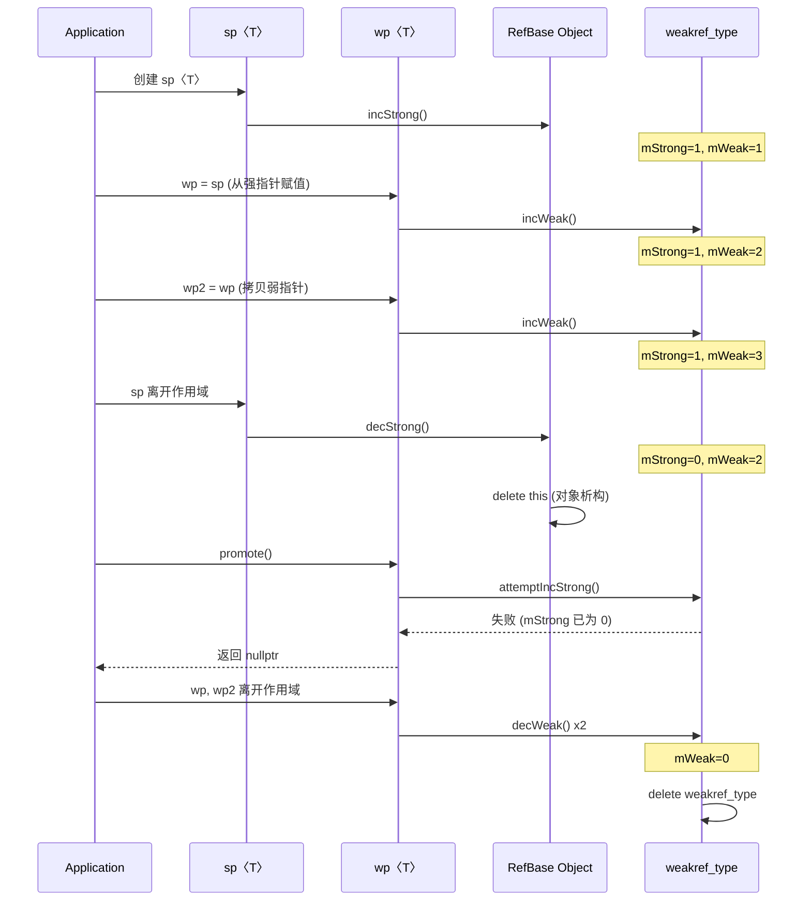
```mermaid
sequenceDiagram
    participant App as Application
    participant SP as sp〈T〉
    participant WP as wp〈T〉
    participant Obj as RefBase Object
    participant Refs as weakref_type

    App->>SP: 创建 sp〈T〉
    SP->>Obj: incStrong()
    Note over Refs: mStrong=1, mWeak=1

    App->>WP: wp = sp (从强指针赋值)
    WP->>Refs: incWeak()
    Note over Refs: mStrong=1, mWeak=2

    App->>WP: wp2 = wp (拷贝弱指针)
    WP->>Refs: incWeak()
    Note over Refs: mStrong=1, mWeak=3

    App->>SP: sp 离开作用域
    SP->>Obj: decStrong()
    Note over Refs: mStrong=0, mWeak=2
    Obj->>Obj: delete this (对象析构)

    App->>WP: promote()
    WP->>Refs: attemptIncStrong()
    Refs-->>WP: 失败 (mStrong 已为 0)
    WP-->>App: 返回 nullptr

    App->>WP: wp, wp2 离开作用域
    WP->>Refs: decWeak() x2
    Note over Refs: mWeak=0
    Refs->>Refs: delete weakref_type
```

---

### promote() 提升为强指针

`promote()` 是 `wp` 最核心、最精妙的方法。它的任务是**原子性地**尝试将弱引用提升为强引用。"原子性"意味着在多线程环境下，不会出现"刚判断对象还在，下一瞬间就被另一个线程销毁"这样的竞态条件（Race Condition）。

#### promote() 的内部实现

我们深入源码来剖析 `promote()` 的完整逻辑：

```cpp
// frameworks/rs/cpp/util/RefBase.h (简化版)
template<typename T>
sp<T> wp<T>::promote() const {
    sp<T> result;                        // 创建一个空的强指针
    if (m_ptr &&                         // 裸指针不为空（曾经指向过一个对象）
        m_refs->attemptIncStrong(&result)) {  // 原子性尝试增加强引用计数
        result.set_pointer(m_ptr);       // 成功：将裸指针设置到 sp 中
    }
    return result;                       // 失败则返回空 sp (nullptr)
}
```

真正的魔法在 `attemptIncStrong()` 中，让我们进入它的实现：

```cpp
// system/core/libutils/RefBase.cpp (关键逻辑，精简注释版)
bool RefBase::weakref_type::attemptIncStrong(const void* id) {
    // ① 先无条件增加弱引用计数（保护 weakref_type 自身不被释放）
    incWeak(id);

    // ② 通过原子操作读取当前强引用计数
    // memory_order_relaxed: 仅需原子性，暂不需要内存序保证
    int32_t curCount = impl->mStrong.load(std::memory_order_relaxed);

    // ③ 核心循环：使用 CAS (Compare-And-Swap) 原子操作尝试 +1
    while (curCount > 0 && curCount != INITIAL_STRONG_VALUE) {
        // 如果当前计数 > 0，说明对象还活着
        // CAS：如果 mStrong 仍然等于 curCount，则原子地将其设为 curCount+1
        // 如果在此期间其他线程修改了 mStrong，CAS 失败，curCount 被更新，循环重试
        if (impl->mStrong.compare_exchange_weak(
                curCount,                // expected: 当前读到的值
                curCount + 1,            // desired:  期望写入的值
                std::memory_order_relaxed)) {
            break;                       // CAS 成功，跳出循环
        }
        // CAS 失败：curCount 已被自动更新为最新值，继续循环重试
    }

    // ④ 判断 promote 是否成功
    if (curCount <= 0 || curCount == INITIAL_STRONG_VALUE) {
        // 分支 A：强引用计数已为 0，或者对象从未被强引用过
        // 这里需要根据对象的生命周期策略做进一步判断
        // 对于 OBJECT_LIFETIME_STRONG（默认策略）：
        //   如果 curCount <= 0，说明对象已被销毁 → promote 失败

        if (curCount <= 0) {
            // 对象已经析构，回滚之前 incWeak 的操作
            decWeak(id);
            return false;                // promote 失败
        }

        // 对于 INITIAL_STRONG_VALUE 的情况：首次强引用
        // 需要从 INITIAL_STRONG_VALUE 调整到 1
        // ...（省略首次引用逻辑）
    }

    // ⑤ 到达此处说明 CAS 成功，promote 完成
    // 此时 mStrong 已经 +1，对象不会被销毁
    return true;
}
```

这段代码的精妙之处在于 **CAS 无锁算法**。传统做法是"加锁 → 读计数 → 判断 → 改计数 → 解锁"，但锁的开销在高并发场景下非常大。Android 采用 `compare_exchange_weak`（底层对应 CPU 的 `CMPXCHG` 或 ARM 的 `LDREX/STREX` 指令），在不加锁的前提下实现了线程安全的引用计数操作。

我们用流程图来可视化 `promote()` 的决策过程：

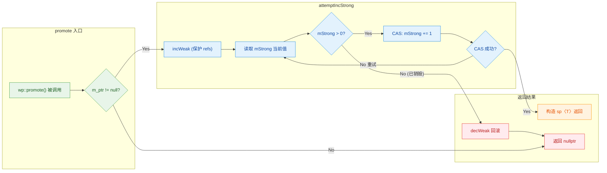
```mermaid
graph LR
    subgraph Entry["promote 入口"]
        direction TB
        A["wp::promote() 被调用"]
        B{"m_ptr != null?"}
        A --> B
    end

    subgraph AttemptInc["attemptIncStrong"]
        direction TB
        C["incWeak (保护 refs)"]
        D["读取 mStrong 当前值"]
        E{"mStrong > 0?"}
        F["CAS: mStrong += 1"]
        G{"CAS 成功?"}
        C --> D
        D --> E
        E -->|Yes| F
        F --> G
        G -->|No 重试| D
    end

    subgraph Result["返回结果"]
        direction TB
        H["构造 sp〈T〉返回"]
        I["decWeak 回滚"]
        J["返回 nullptr"]
        I --> J
    end

    B -->|"No"| J
    B -->|"Yes"| C
    E -->|"No (已销毁)"| I
    G -->|"Yes"| H

    classDef entryStyle fill:#E8F5E9,stroke:#43A047,color:#1B5E20,stroke-width:1px
    classDef coreStyle fill:#E3F2FD,stroke:#1E88E5,color:#0D47A1,stroke-width:1px
    classDef successStyle fill:#FFF3E0,stroke:#FB8C00,color:#E65100,stroke-width:1px
    classDef failStyle fill:#FFEBEE,stroke:#E53935,color:#B71C1C,stroke-width:1px

    class A,B entryStyle
    class C,D,E,F,G coreStyle
    class H successStyle
    class I,J failStyle
```

#### promote() 的线程安全场景

来看一个典型的多线程场景，理解为什么 `promote()` 的原子性如此重要：

```cpp
// 线程 A：持有最后一个 sp，准备释放
void threadA(sp<SensorService>& lastStrongRef) {
    lastStrongRef = nullptr;             // decStrong → mStrong 降为 0 → 触发 delete
}

// 线程 B：持有 wp，准备使用对象
void threadB(wp<SensorService>& weakRef) {
    sp<SensorService> strong = weakRef.promote();  // 原子性尝试提升
    if (strong != nullptr) {
        // 如果 promote 成功，说明 mStrong 已经被原子地 +1
        // 即使线程 A 同时在执行，也不会出问题：
        //   情况1：promote 先执行成功 → mStrong 变为 2 → 线程 A 的 decStrong 只降为 1 → 对象安全
        //   情况2：线程 A 先完成 → mStrong 已为 0 → promote 的 CAS 发现 curCount <= 0 → 返回 nullptr
        strong->start();                 // 安全使用
    } else {
        ALOGD("Too late, object gone");  // 对象已销毁，优雅处理
    }
}
```

这里 **不存在** 第三种情况（"判断时还在，使用时已不在"），因为 `attemptIncStrong` 的判断和计数增加是在**同一个原子操作**内完成的。

#### promote() 与 std::weak_ptr::lock() 的对比

| 特性 | `wp<T>::promote()` | `std::weak_ptr<T>::lock()` |
|------|--------------------|-----------------------------|
| 功能 | 尝试提升为 `sp<T>` | 尝试提升为 `shared_ptr<T>` |
| 线程安全 | ✅ 无锁 CAS | ✅ 原子操作 |
| 失败返回值 | 空 `sp`（nullptr） | 空 `shared_ptr`（nullptr） |
| 判断是否过期 | `promote() == nullptr` | `expired()` 或 `lock() == nullptr` |
| 依赖基类 | 必须继承 `RefBase` | 无侵入，任意类型可用 |
| 控制块 | `weakref_type`（内嵌于 RefBase） | Control Block（独立堆分配） |

---

### 防止循环引用

循环引用是引用计数方案与生俱来的"阿喀琉斯之踵"。无论是 `sp<T>` 还是 `std::shared_ptr<T>`，只要两个对象通过强指针互相持有对方，就会形成引用计数的死锁。下面我们从问题的形成到解决方案，完整剖析。

#### 循环引用如何产生

考虑一个真实场景：在 Android Camera 子系统中，`CameraService` 管理着多个 `CameraClient`，同时每个 `CameraClient` 需要回调通知 `CameraService`。

```cpp
// ❌ 错误示范：双向强引用导致循环引用
class CameraClient;  // 前向声明

class CameraService : public RefBase {
public:
    // CameraService 用 sp 强引用 CameraClient（合理：父管理子的生命周期）
    sp<CameraClient> mClient;

    virtual ~CameraService() {
        ALOGD("~CameraService");         // 永远不会执行！
    }
};

class CameraClient : public RefBase {
public:
    // ❌ CameraClient 也用 sp 强引用 CameraService（问题根源！）
    sp<CameraService> mService;

    virtual ~CameraClient() {
        ALOGD("~CameraClient");          // 永远不会执行！
    }
};

void createCircularReference() {
    sp<CameraService> service = sp<CameraService>::make();
    // 此时: service->mStrong = 1

    sp<CameraClient> client = sp<CameraClient>::make();
    // 此时: client->mStrong = 1

    service->mClient = client;
    // 此时: client->mStrong = 2（service 外部 sp + CameraService::mClient）

    client->mService = service;
    // 此时: service->mStrong = 2（client 外部 sp + CameraClient::mService）

    // === 离开作用域 ===
    // client (外部sp) 析构 → client->mStrong = 2-1 = 1（≠0，不释放）
    // service (外部sp) 析构 → service->mStrong = 2-1 = 1（≠0，不释放）
    //
    // 结果：两个对象都无法释放 → 内存泄漏！ 💀
}
```

让我们用图来直观展示这个死锁局面：

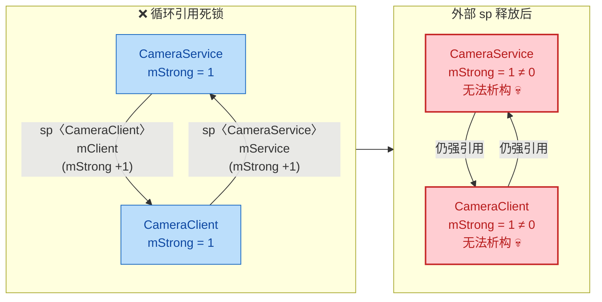
```mermaid
graph LR
    subgraph Problem["❌ 循环引用死锁"]
        direction TB
        CS["CameraService\nmStrong = 1"]
        CC["CameraClient\nmStrong = 1"]
        CS -->|"sp〈CameraClient〉 mClient\n(mStrong +1)"| CC
        CC -->|"sp〈CameraService〉 mService\n(mStrong +1)"| CS
    end

    subgraph After["外部 sp 释放后"]
        direction TB
        CS2["CameraService\nmStrong = 1 ≠ 0\n无法析构 💀"]
        CC2["CameraClient\nmStrong = 1 ≠ 0\n无法析构 💀"]
        CS2 -->|"仍强引用"| CC2
        CC2 -->|"仍强引用"| CS2
    end

    Problem --> After

    classDef deadlock fill:#FFCDD2,stroke:#C62828,color:#B71C1C,stroke-width:2px
    classDef normal fill:#BBDEFB,stroke:#1565C0,color:#0D47A1,stroke-width:1px

    class CS,CC normal
    class CS2,CC2 deadlock
```

外部 `sp` 全部释放后，两个对象依然因为**互相持有对方的强引用**而保持 `mStrong = 1`，永远不会降为 0。垃圾回收器（GC）能解决这个问题，但 C++ 没有 GC——引用计数方案必须依靠开发者的正确设计来避免环路。

#### 使用 wp 打破循环

解决方案的核心原则：**在双向关系中，一方使用强引用（sp），另一方使用弱引用（wp）。** 通常的做法是：

> **"Parent holds Strong, Child holds Weak"**  
> 父对象用 `sp` 持有子对象（掌控生命周期），子对象用 `wp` 回引父对象（仅观察，不阻止父对象销毁）。

```cpp
// ✅ 正确做法：子对象用 wp 回引父对象
class CameraClient;  // 前向声明

class CameraService : public RefBase {
public:
    // 父 → 子：强引用（sp），CameraService 管理 CameraClient 的生命周期
    sp<CameraClient> mClient;

    virtual ~CameraService() {
        ALOGD("~CameraService");         // ✅ 现在可以正确析构
    }
};

class CameraClient : public RefBase {
public:
    // ✅ 子 → 父：弱引用（wp），不影响 CameraService 的强引用计数
    wp<CameraService> mService;

    void notifyService() {
        // 需要用到 CameraService 时，先 promote
        sp<CameraService> service = mService.promote();
        if (service != nullptr) {
            // 对象还活着，安全使用
            ALOGD("Notifying CameraService...");
        } else {
            // CameraService 已销毁，优雅降级
            ALOGD("CameraService already gone, skip notification");
        }
    }

    virtual ~CameraClient() {
        ALOGD("~CameraClient");          // ✅ 可以正确析构
    }
};

void noMoreCircularReference() {
    sp<CameraService> service = sp<CameraService>::make();
    // service->mStrong = 1, service->mWeak = 1

    sp<CameraClient> client = sp<CameraClient>::make();
    // client->mStrong = 1, client->mWeak = 1

    service->mClient = client;
    // client->mStrong = 2, client->mWeak = 2

    client->mService = service;
    // service->mStrong 仍为 1 ← 关键！wp 不增加强计数
    // service->mWeak = 2       ← wp 只增加弱计数

    // === 离开作用域 ===
    // Step 1: 外部 sp<CameraClient> client 析构
    //         → client->mStrong = 2-1 = 1（CameraService::mClient 还持有）

    // Step 2: 外部 sp<CameraService> service 析构
    //         → service->mStrong = 1-1 = 0  ← 降为 0！
    //         → 触发 CameraService 析构
    //         → 析构中 mClient (sp) 释放 → client->mStrong = 1-1 = 0
    //         → 触发 CameraClient 析构
    //         → 析构中 mService (wp) 释放 → service->mWeak -= 1
    //
    // 结果：两个对象都被正确释放 ✅ 🎉
}
```

完整的释放链条如下图所示：

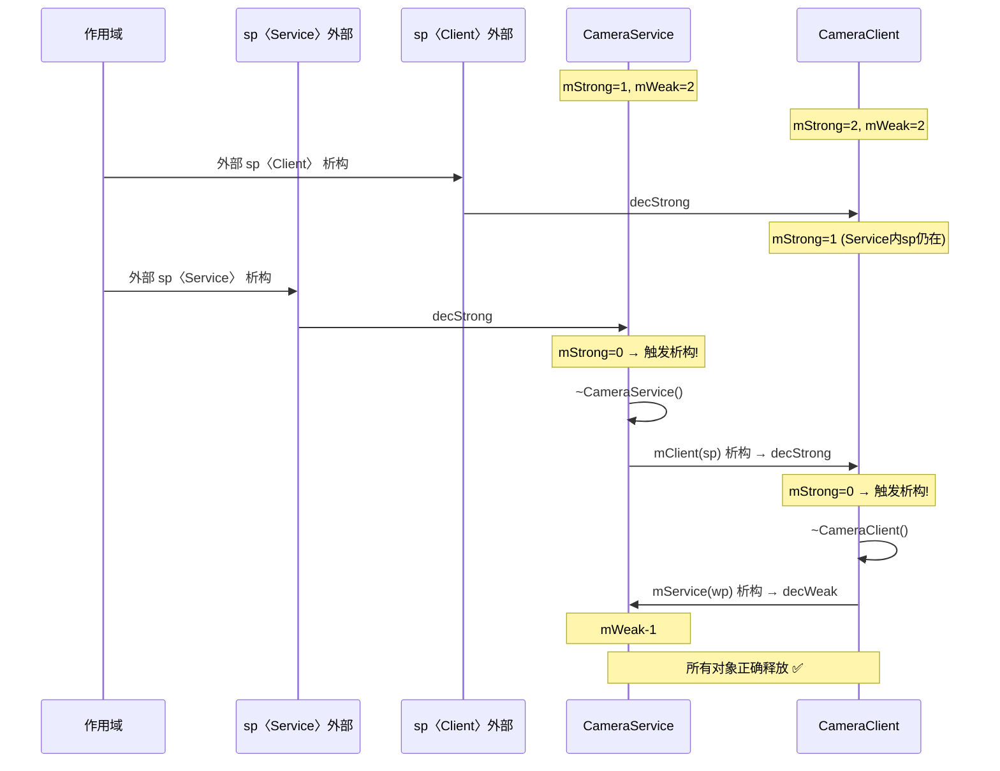
```mermaid
sequenceDiagram
    participant Scope as 作用域
    participant SrvSP as sp〈Service〉外部
    participant CliSP as sp〈Client〉外部
    participant Srv as CameraService
    participant Cli as CameraClient

    Note over Srv: mStrong=1, mWeak=2
    Note over Cli: mStrong=2, mWeak=2

    Scope->>CliSP: 外部 sp〈Client〉 析构
    CliSP->>Cli: decStrong
    Note over Cli: mStrong=1 (Service内sp仍在)

    Scope->>SrvSP: 外部 sp〈Service〉 析构
    SrvSP->>Srv: decStrong
    Note over Srv: mStrong=0 → 触发析构!

    Srv->>Srv: ~CameraService()
    Srv->>Cli: mClient(sp) 析构 → decStrong
    Note over Cli: mStrong=0 → 触发析构!

    Cli->>Cli: ~CameraClient()
    Cli->>Srv: mService(wp) 析构 → decWeak
    Note over Srv: mWeak-1

    Note over Srv,Cli: 所有对象正确释放 ✅
```

#### Android 源码中的真实案例

在 Android 系统源码中，"父强子弱"的模式随处可见。以下是几个典型案例：

```cpp
// === 案例 1: Binder 通信中的 Death Recipient ===
// BpBinder（代理端）用 wp 引用 DeathRecipient
// 源码位置: frameworks/native/libs/binder/BpBinder.cpp
class BpBinder : public IBinder {
    // Weak reference 列表，避免循环引用
    // 因为 DeathRecipient 通常也会持有一个 sp<IBinder>
    KeyedVector<wp<DeathRecipient>, ...> mObituaries;
};

// === 案例 2: SurfaceFlinger Layer 管理 ===
// Layer 弱引用 SurfaceFlinger，SurfaceFlinger 强引用 Layer
class Layer : public RefBase {
    wp<SurfaceFlinger> mFlinger;         // 子 → 父 用弱引用
};

class SurfaceFlinger : public RefBase {
    Vector<sp<Layer>> mLayers;           // 父 → 子 用强引用
};

// === 案例 3: Camera HAL Callback ===
// CameraDevice 弱引用 CameraDeviceCallbacks
class CameraDevice {
    wp<ICameraDeviceCallbacks> mCallbacks;  // 防止 callback 循环引用
    
    void sendResult() {
        sp<ICameraDeviceCallbacks> cb = mCallbacks.promote();  // 使用前 promote
        if (cb != nullptr) {
            cb->onResultReceived(result);
        }
    }
};
```

#### 设计准则速查表

| 关系类型 | 推荐指针 | 原因 |
|---------|---------|------|
| 父 → 子（所有权） | `sp<Child>` | 父管理子的生命周期 |
| 子 → 父（回引） | `wp<Parent>` | 避免循环引用 |
| 观察者 → 被观察者 | `wp<Subject>` | 观察者不应决定被观察者的生死 |
| 缓存持有 | `wp<Cached>` | 缓存不应阻止对象被释放 |
| 回调引用 | `wp<Callback>` | 回调持有者可能已被销毁 |
| 唯一所有者 | `sp<T>` (唯一) | 明确所有权归属 |

最后用一张综合记忆图来串联 `wp` 的全部要点：


```mermaid
graph LR
    subgraph Core["wp 核心特性"]
        direction TB
        A1["不增加 mStrong"]
        A2["只增加 mWeak"]
        A3["不能直接解引用"]
    end

    subgraph API["关键 API"]
        direction TB
        B1["promote() → sp〈T〉"]
        B2["clear() → 释放弱引用"]
        B3["赋值 = sp / wp / raw"]
    end

    subgraph Safety["安全保障"]
        direction TB
        C1["CAS 无锁原子操作"]
        C2["编译期禁止直接访问"]
        C3["运行时 null 检查"]
    end

    subgraph Pattern["设计模式"]
        direction TB
        D1["Parent SP → Child"]
        D2["Child WP → Parent"]
        D3["Observer WP → Subject"]
    end

    Core --> API
    API --> Safety
    Safety --> Pattern

    classDef coreStyle fill:#E8F5E9,stroke:#43A047,color:#1B5E20,stroke-width:1px
    classDef apiStyle fill:#E3F2FD,stroke:#1E88E5,color:#0D47A1,stroke-width:1px
    classDef safeStyle fill:#FFF3E0,stroke:#FB8C00,color:#E65100,stroke-width:1px
    classDef patternStyle fill:#F3E5F5,stroke:#8E24AA,color:#4A148C,stroke-width:1px

    class A1,A2,A3 coreStyle
    class B1,B2,B3 apiStyle
    class C1,C2,C3 safeStyle
    class D1,D2,D3 patternStyle
```

---

**📝 练习题**

**题目：** 在 Android Native 层，`ClassA` 和 `ClassB` 都继承自 `RefBase`。`ClassA` 持有 `sp<ClassB> mB`，`ClassB` 持有 `sp<ClassA> mA`。在某函数中创建了 `sp<ClassA> a` 和 `sp<ClassB> b`，并执行 `a->mB = b; b->mA = a;`。当函数返回后，以下说法正确的是？


A. `ClassA` 和 `ClassB` 的实例都会被正确释放，因为 `sp` 会自动处理循环引用


B. `ClassA` 和 `ClassB` 的实例都不会被释放，因为强引用计数无法归零，形成内存泄漏


C. `ClassA` 的实例被释放，`ClassB` 的实例不被释放，因为 `ClassA` 先创建先析构


D. 程序会在运行时抛出异常，RefBase 会自动检测循环引用并报错


**【答案】** B

**【解析】** 这是一道经典的循环引用问题。函数执行完后，外部 `sp<ClassA> a` 析构使 `ClassA` 的 `mStrong` 从 2 降为 1（还有 `ClassB::mA` 持有），`sp<ClassB> b` 析构使 `ClassB` 的 `mStrong` 从 2 降为 1（还有 `ClassA::mB` 持有）。两者的强引用计数都停留在 1，永远无法触发析构，这就是内存泄漏。选项 A 错误，`sp` 基于引用计数，**不具备**循环引用检测能力（这不是 GC）。选项 C 错误，C++ 局部变量的析构顺序是后进先出（LIFO），但无论哪个先析构，结果都是两者 `mStrong = 1`，谁都无法释放。选项 D 错误，`RefBase` 没有循环引用检测机制，不会抛出异常，泄漏是**静默**发生的，这也是循环引用问题特别危险的原因——它不会崩溃，只会默默吞噬内存。正确的修复方式是将其中一方（通常是"子"指向"父"的方向）改为 `wp<T>`，利用弱引用打破环路。

---

**📝 练习题**

**题目：** 以下代码中，`promote()` 的返回值是什么？

```cpp
sp<MyObject> strong = sp<MyObject>::make();
wp<MyObject> weak = strong;
strong = nullptr;
sp<MyObject> result = weak.promote();
```

A. `result` 指向一个有效的 `MyObject` 对象


B. `result` 为 `nullptr`，因为 `strong` 已被清空，对象已析构


C. 程序崩溃（Segfault），因为 `wp` 指向了已释放的内存


D. 未定义行为（Undefined Behavior），取决于编译器实现


**【答案】** B

**【解析】** 分步分析引用计数变化：① `sp<MyObject> strong` 创建后，`mStrong = 1, mWeak = 1`。② `wp<MyObject> weak = strong` 赋值后，`mStrong = 1, mWeak = 2`（wp 只增加弱计数）。③ `strong = nullptr` 执行 `decStrong()`，`mStrong = 0`，因为默认生命周期策略是 `OBJECT_LIFETIME_STRONG`，强引用归零触发 `delete this`，对象被析构。但此时 `mWeak = 1`（还剩 wp 持有），所以 `weakref_type` 结构体**不会被释放**。④ `weak.promote()` 内部调用 `attemptIncStrong()`，读取到 `mStrong = 0`（或小于等于 0），CAS 循环条件不满足，直接走失败分支 → 执行 `decWeak()` 回滚 → 返回空 `sp`。这里不会崩溃（排除 C），也不是 UB（排除 D），因为 `weakref_type` 仍然存活，`promote()` 能安全地判断出对象已经不在了。这正是 `wp` 设计的精髓——`weakref_type` 的生命周期独立于对象本身，只有当弱引用计数也归零后才会释放。

---

## 生命周期控制 (OBJECT_LIFETIME_STRONG / OBJECT_LIFETIME_WEAK)

在前面的章节中，我们已经深入了解了 `RefBase`、`sp`、`wp` 三大核心组件的工作原理。但有一个关键问题始终悬而未决：**当强引用计数归零时，对象到底该不该被销毁？** 答案并非一成不变——Android 通过 **生命周期控制标志 (Lifetime Flags)** 赋予了开发者对对象析构时机的精确控制权。

这套机制的核心思想是：**将"引用计数归零"与"对象析构"解耦**，让开发者可以根据业务场景选择不同的生命周期策略。这在多线程、异步回调密集的 Android Native 框架中至关重要——试想一个 `Binder` 对象，强引用已经释放，但仍有弱引用持有者正准备 `promote()`，此时对象是否应该存活？

### 两种生命周期模式总览

Android 在 `RefBase` 内部定义了一个 `flags` 字段，用于控制对象的生命周期策略。核心的两个标志位如下：

| 标志常量 | 值 | 含义 | 对象销毁时机 |
|---|---|---|---|
| `OBJECT_LIFETIME_STRONG` | `0x0000` | **默认模式**，强引用控制生命周期 | 强引用计数 → 0 时销毁 |
| `OBJECT_LIFETIME_WEAK` | `0x0001` | 弱引用控制生命周期 | 强引用 **和** 弱引用计数都 → 0 时才销毁 |

用一句话概括差异：**STRONG 模式下，`sp` 说了算；WEAK 模式下，必须等最后一个 `wp` 也放手，对象才真正消亡。**

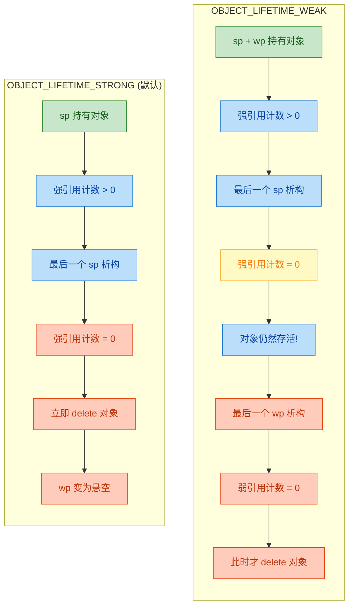
```mermaid
graph LR
    subgraph STRONG_MODE["OBJECT_LIFETIME_STRONG (默认)"]
        direction TB
        S1["sp 持有对象"]:::appLayer
        S2["强引用计数 > 0"]:::fwLayer
        S3["最后一个 sp 析构"]:::fwLayer
        S4["强引用计数 = 0"]:::runtimeLayer
        S5["立即 delete 对象"]:::runtimeLayer
        S6["wp 变为悬空"]:::runtimeLayer
        S1 --> S2 --> S3 --> S4 --> S5 --> S6
    end

    subgraph WEAK_MODE["OBJECT_LIFETIME_WEAK"]
        direction TB
        W1["sp + wp 持有对象"]:::appLayer
        W2["强引用计数 > 0"]:::fwLayer
        W3["最后一个 sp 析构"]:::fwLayer
        W4["强引用计数 = 0"]:::warnLayer
        W5["对象仍然存活!"]:::fwLayer
        W6["最后一个 wp 析构"]:::runtimeLayer
        W7["弱引用计数 = 0"]:::runtimeLayer
        W8["此时才 delete 对象"]:::runtimeLayer
        W1 --> W2 --> W3 --> W4 --> W5 --> W6 --> W7 --> W8
    end

    STRONG_MODE ~~~ WEAK_MODE

    classDef appLayer fill:#C8E6C9,stroke:#388E3C,color:#1B5E20
    classDef fwLayer fill:#BBDEFB,stroke:#1976D2,color:#0D47A1
    classDef runtimeLayer fill:#FFCCBC,stroke:#E64A19,color:#BF360C
    classDef warnLayer fill:#FFF9C4,stroke:#F9A825,color:#F57F17
```

### OBJECT_LIFETIME_STRONG —— 默认的强引用主导模式

这是 `RefBase` 的出厂设定（flags 默认值为 `0x0000`），也是绝大多数 Android Native 对象采用的策略。其行为逻辑非常直觉：

- **对象的生死完全由强引用计数 (`mStrong`) 决定。**
- 当最后一个 `sp<T>` 析构，`decStrong()` 将 `mStrong` 减到 0，立即触发 `delete this`。
- 此时如果还有 `wp<T>` 存在，这些弱指针将变为"悬空"状态（dangling），后续调用 `promote()` 会返回 `nullptr`。
- 弱引用计数 (`mWeak`) 归零时，仅销毁内部的 `weakref_impl` 控制块（不影响对象本体，因为对象早已被 delete）。

来看 `decStrong()` 在 STRONG 模式下的关键源码逻辑：

```cpp
// RefBase::decStrong() 简化逻辑 —— OBJECT_LIFETIME_STRONG 模式
void RefBase::decStrong(const void* id) const
{
    weakref_impl* const refs = mRefs;            // 获取引用计数控制块
    refs->removeStrongRef(id);                     // Debug 用：移除强引用追踪记录

    // 原子递减强引用计数，并获取递减前的旧值
    const int32_t c = refs->mStrong.fetch_sub(1, std::memory_order_release);

    if (c == 1) {
        // 旧值为 1，说明递减后变为 0 —— 这是最后一个强引用
        std::atomic_thread_fence(std::memory_order_acquire); // 内存屏障，确保可见性

        // 检查生命周期标志
        refs->mFlags.load(std::memory_order_relaxed);        // 读取 flags

        // OBJECT_LIFETIME_STRONG 模式 (flags == 0x0000):
        // 直接调用 onLastStrongRef() 回调，然后 delete 对象
        refs->mBase->onLastStrongRef(id);                    // 生命周期回调：最后一个强引用释放
        delete this;                                          // 销毁对象本体！（调用析构函数）
    }

    // 注意：decStrong 内部也会调用 decWeak()
    // 因为每个强引用在 incStrong 时都会同步 incWeak
    refs->decWeak(id);                                       // 配对递减弱引用计数
}
```

**核心要点：`incStrong()` 内部一定会连带调用 `incWeak()`**。这是 Android 智能指针设计的一个精妙之处——每一个强引用同时也算一个弱引用，确保只要有 `sp` 存活，`weakref_impl` 控制块就不会被提前释放。

来看时间线上完整的计数变化：

```cpp
// ============================================================
// 场景：OBJECT_LIFETIME_STRONG 模式下的完整生命周期
// ============================================================

// 假设 MyObject 继承自 RefBase（默认 STRONG 模式）
class MyObject : public RefBase {
public:
    MyObject()  { /* 构造 */ }                   // mStrong=INITIAL_STRONG_VALUE, mWeak=0
    ~MyObject() { /* 析构 */ }
};

void example() {
    // === 阶段 1：创建强指针 ===
    sp<MyObject> strong1 = sp<MyObject>::make();  // mStrong=1, mWeak=1
    //                                             // (incStrong 内部同时 incWeak)

    // === 阶段 2：创建弱指针 ===
    wp<MyObject> weak1(strong1);                  // mStrong=1, mWeak=2
    //                                             // (wp 构造仅 incWeak，不影响 mStrong)

    // === 阶段 3：再创建一个强指针 ===
    sp<MyObject> strong2 = strong1;               // mStrong=2, mWeak=3
    //                                             // (拷贝 sp，incStrong → mStrong+1, mWeak+1)

    // === 阶段 4：strong2 析构 ===
    strong2 = nullptr;                            // mStrong=1, mWeak=2
    //                                             // (decStrong → mStrong-1, decWeak → mWeak-1)

    // === 阶段 5：strong1 析构（关键时刻！）===
    strong1 = nullptr;                            // mStrong=0 → delete MyObject!
    //                                             // mWeak=1（weak1 还持有弱引用）
    //                                             // 对象已死！但 weakref_impl 控制块还活着

    // === 阶段 6：尝试 promote ===
    sp<MyObject> revived = weak1.promote();       // 返回 nullptr！对象已被销毁
    //                                             // STRONG 模式下，对象死了就是死了

    // === 阶段 7：weak1 析构 ===
    // weak1 离开作用域                             // mWeak=0 → delete weakref_impl
    //                                             // 控制块也被回收，彻底清理完毕
}
```

### OBJECT_LIFETIME_WEAK —— 弱引用延寿模式

当对象的 `flags` 被设置为 `OBJECT_LIFETIME_WEAK` 时，行为发生本质变化：

- **即使强引用计数归零，只要还有弱引用存在，对象本体就不会被销毁。**
- 只有当 `mStrong == 0` **并且** `mWeak == 0` 时，对象才会被 `delete`。
- 这意味着在 WEAK 模式下，`wp::promote()` 的成功率大大提高——只要 `wp` 还活着，对象就一定还在。

#### 如何开启 WEAK 模式

开发者需要在对象的构造函数中显式调用 `extendObjectLifetime()`：

```cpp
class LongLivedObject : public RefBase {
public:
    LongLivedObject() {
        // 在构造函数中切换为 WEAK 生命周期模式
        // 这会将内部 flags 设置为 OBJECT_LIFETIME_WEAK (0x0001)
        extendObjectLifetime(OBJECT_LIFETIME_WEAK);
    }

    virtual ~LongLivedObject() {
        // 析构——只有在强弱引用都归零时才会被调用
        ALOGD("LongLivedObject destroyed");
    }

    // 可选：重写生命周期回调
    virtual void onLastStrongRef(const void* id) override {
        // 强引用归零时被调用，但对象不会被销毁
        // 可以在这里做一些"降级"处理，比如暂停某些服务
        ALOGD("All strong refs gone, but I am still alive!");
    }

    virtual void onLastWeakRef(const void* id) override {
        // 弱引用也归零时被调用（对象即将被销毁前的最后回调）
        ALOGD("Truly dying now...");
    }
};
```

#### WEAK 模式下的 decStrong 行为差异

```cpp
// RefBase::decStrong() 简化逻辑 —— OBJECT_LIFETIME_WEAK 模式
void RefBase::decStrong(const void* id) const
{
    weakref_impl* const refs = mRefs;
    refs->removeStrongRef(id);

    const int32_t c = refs->mStrong.fetch_sub(1, std::memory_order_release);

    if (c == 1) {
        // 强引用计数归零了！
        std::atomic_thread_fence(std::memory_order_acquire);

        const uint32_t flags = refs->mFlags.load(std::memory_order_relaxed);

        if ((flags & OBJECT_LIFETIME_MASK) == OBJECT_LIFETIME_WEAK) {
            // WEAK 模式：不 delete！仅调用回调通知
            refs->mBase->onLastStrongRef(id);     // 通知：强引用清零了
            // 注意：这里没有 delete this!          // 对象继续存活！
        } else {
            // STRONG 模式（默认）：立即销毁对象
            refs->mBase->onLastStrongRef(id);
            delete this;                           // 对象被销毁
        }
    }

    refs->decWeak(id);                             // 无论哪种模式，都要递减弱引用
}
```

那么 WEAK 模式下对象到底在哪里被 delete？答案在 `decWeak()` 中：

```cpp
// weakref_type::decWeak() 简化逻辑
void RefBase::weakref_type::decWeak(const void* id)
{
    weakref_impl* const impl = static_cast<weakref_impl*>(this);
    impl->removeWeakRef(id);

    // 原子递减弱引用计数
    const int32_t c = impl->mWeak.fetch_sub(1, std::memory_order_release);

    if (c == 1) {
        // 弱引用计数也归零了！
        std::atomic_thread_fence(std::memory_order_acquire);

        const uint32_t flags = impl->mFlags.load(std::memory_order_relaxed);

        if ((flags & OBJECT_LIFETIME_MASK) == OBJECT_LIFETIME_WEAK) {
            // WEAK 模式：现在才是真正销毁对象的时刻
            // （对象和控制块一起销毁）
            delete impl->mBase;                    // delete 对象本体（析构函数中会清理 impl）
        } else {
            // STRONG 模式：对象早已在 decStrong 中被删除
            // 这里只需要销毁控制块 weakref_impl
            delete impl;                           // 仅删除引用计数控制块
        }
    }
}
```

下面用一个完整的对比示意图来呈现两种模式在 `decStrong` 和 `decWeak` 中的分支走向：

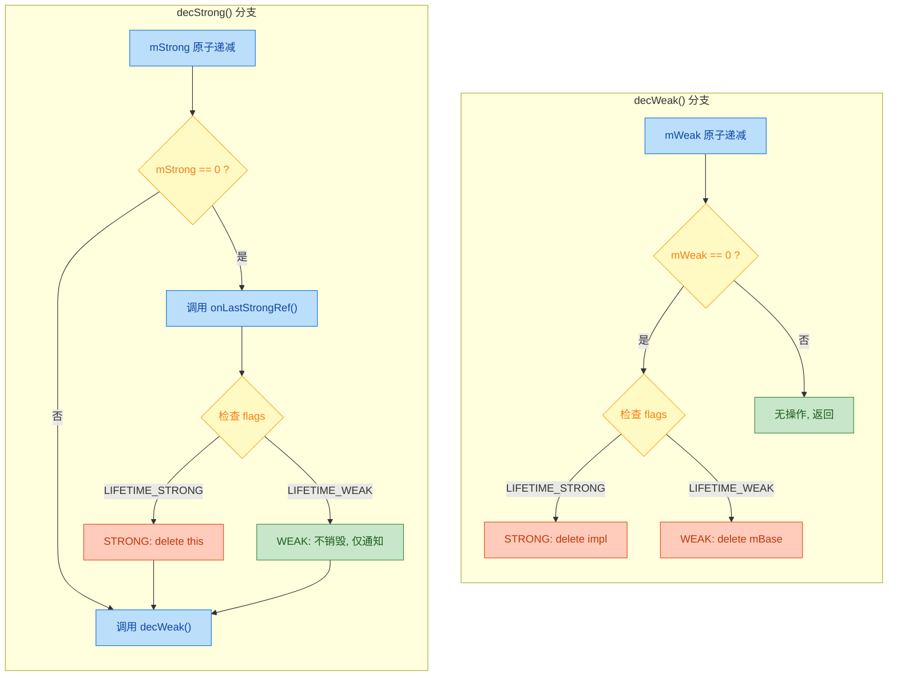
```mermaid
graph LR
    subgraph decStrong["decStrong() 分支"]
        direction TB
        DS1["mStrong 原子递减"]:::fwLayer
        DS2{"mStrong == 0 ?"}:::warnLayer
        DS3["调用 onLastStrongRef()"]:::fwLayer
        DS4{"检查 flags"}:::warnLayer
        DS5["STRONG: delete this"]:::runtimeLayer
        DS6["WEAK: 不销毁, 仅通知"]:::appLayer
        DS7["调用 decWeak()"]:::fwLayer
        DS1 --> DS2
        DS2 -->|"是"| DS3 --> DS4
        DS2 -->|"否"| DS7
        DS4 -->|"LIFETIME_STRONG"| DS5 --> DS7
        DS4 -->|"LIFETIME_WEAK"| DS6 --> DS7
    end

    subgraph decWeak["decWeak() 分支"]
        direction TB
        DW1["mWeak 原子递减"]:::fwLayer
        DW2{"mWeak == 0 ?"}:::warnLayer
        DW3{"检查 flags"}:::warnLayer
        DW4["STRONG: delete impl"]:::runtimeLayer
        DW5["WEAK: delete mBase"]:::runtimeLayer
        DW6["无操作, 返回"]:::appLayer
        DW1 --> DW2
        DW2 -->|"是"| DW3
        DW2 -->|"否"| DW6
        DW3 -->|"LIFETIME_STRONG"| DW4
        DW3 -->|"LIFETIME_WEAK"| DW5
    end

    decStrong ~~~ decWeak

    classDef appLayer fill:#C8E6C9,stroke:#388E3C,color:#1B5E20
    classDef fwLayer fill:#BBDEFB,stroke:#1976D2,color:#0D47A1
    classDef runtimeLayer fill:#FFCCBC,stroke:#E64A19,color:#BF360C
    classDef warnLayer fill:#FFF9C4,stroke:#F9A825,color:#F57F17
```

### WEAK 模式下 promote() 的行为变化

在前面 `wp` 弱指针章节中我们知道，`promote()` 尝试将弱指针提升为强指针。在两种生命周期模式下，`promote()` 的行为有着本质区别：

```cpp
// weakref_type::attemptIncStrong() 简化 —— promote() 的核心实现
bool RefBase::weakref_type::attemptIncStrong(const void* id)
{
    incWeak(id);                                   // 先递增弱引用（保护控制块）

    weakref_impl* const impl = static_cast<weakref_impl*>(this);

    // 尝试用 CAS 循环递增强引用计数
    int32_t curCount = impl->mStrong.load(std::memory_order_relaxed);

    while (curCount > 0 && curCount != INITIAL_STRONG_VALUE) {
        // 强引用计数 > 0：说明还有其他 sp 存在，安全地 +1
        if (impl->mStrong.compare_exchange_weak(
                curCount, curCount + 1, std::memory_order_relaxed)) {
            break;                                 // CAS 成功，promote 成功
        }
        // CAS 失败，说明有并发修改，重新读取并重试
    }

    if (curCount <= 0 || curCount == INITIAL_STRONG_VALUE) {
        // 强引用计数已经是 0（或从未被强引用过）
        // 这里就是两种模式的关键分歧点！

        const uint32_t flags = impl->mFlags.load(std::memory_order_relaxed);

        if ((flags & OBJECT_LIFETIME_MASK) == OBJECT_LIFETIME_STRONG) {
            // STRONG 模式：强引用归零意味着对象已被 delete
            // promote 失败！
            if (curCount <= 0) {
                decWeak(id);                       // 回滚之前的 incWeak
                return false;                      // 返回 false → sp 为 nullptr
            }
        } else {
            // WEAK 模式：即使强引用为 0，对象仍然存活
            // 可以安全地恢复强引用！
            if (!impl->mBase->onIncStrongAttempted(FIRST_INC_STRONG, id)) {
                // onIncStrongAttempted() 返回 false → 对象拒绝被"复活"
                decWeak(id);
                return false;                      // 对象主动拒绝 promote
            }
            // 对象同意被 promote，将强引用计数从 0 提升为 1
            curCount = impl->mStrong.fetch_add(1, std::memory_order_relaxed);
        }
    }

    // ... 后续处理 ...
    return true;                                   // promote 成功
}
```

这里引出了一个重要的回调函数 `onIncStrongAttempted()`。在 WEAK 模式下，当 `promote()` 试图将一个强引用计数为 0 的对象"复活"时，对象自身有权通过此回调 **拒绝** 这次提升。这提供了极其精细的生命周期控制粒度。

```cpp
class SelectiveRevival : public RefBase {
public:
    SelectiveRevival() {
        extendObjectLifetime(OBJECT_LIFETIME_WEAK);   // 开启 WEAK 模式
    }

    // 当有人试图 promote() 一个强引用为 0 的对象时
    virtual bool onIncStrongAttempted(uint32_t flags, const void* id) override {
        // 自定义逻辑：例如检查对象是否已被标记为"废弃"
        if (mDiscarded) {
            ALOGW("Promote rejected: object is discarded");
            return false;                              // 拒绝 promote
        }
        return true;                                   // 允许 promote
    }

private:
    bool mDiscarded = false;
};
```

### 两种模式的实战对比

```cpp
// ============================================================
// 完整对比演示：STRONG vs WEAK 模式
// ============================================================

// ---- STRONG 模式 (默认) ----
class StrongObj : public RefBase { };              // 默认 OBJECT_LIFETIME_STRONG

void testStrong() {
    wp<StrongObj> weakRef;
    {
        sp<StrongObj> strongRef = sp<StrongObj>::make();
        //                        mStrong=1, mWeak=1
        weakRef = strongRef;   // mStrong=1, mWeak=2

    }  // strongRef 析构 → mStrong=0 → delete 对象！mWeak=1

    sp<StrongObj> revived = weakRef.promote();
    // 结果：revived == nullptr
    // 原因：STRONG 模式，对象已随强引用归零而销毁
}


// ---- WEAK 模式 ----
class WeakObj : public RefBase {
public:
    WeakObj() {
        extendObjectLifetime(OBJECT_LIFETIME_WEAK);    // 切换为 WEAK 模式
    }
};

void testWeak() {
    wp<WeakObj> weakRef;
    {
        sp<WeakObj> strongRef = sp<WeakObj>::make();
        //                      mStrong=1, mWeak=1
        weakRef = strongRef;   // mStrong=1, mWeak=2

    }  // strongRef 析构 → mStrong=0 → 调用 onLastStrongRef() 但不 delete！mWeak=1

    sp<WeakObj> revived = weakRef.promote();
    // 结果：revived != nullptr ✅ 成功！
    // 原因：WEAK 模式，对象在弱引用归零前一直存活
    // 此时：mStrong=1 (promote 重新加了强引用), mWeak=2

}  // weakRef 和 revived 都析构 → mStrong=0, mWeak=0 → 对象和控制块一起被销毁
```

### Android 框架中的真实应用场景

在 AOSP 源码中，不同的生命周期模式服务于不同的系统需求：

**STRONG 模式（默认）—— 绝大多数场景：**

大多数 RefBase 子类使用默认的 STRONG 模式，这符合"谁最后松手谁负责销毁"的直觉模型。例如 `Surface`、`GraphicBuffer` 等资源管理类，在没有强引用时应立刻释放底层资源（如 GPU 内存），弱指针只是"观察者"角色。

**WEAK 模式 —— 需要"延寿"的场景：**

WEAK 模式的典型使用场景包括：

1. **`Layer` 对象（SurfaceFlinger）**：一个 `Layer` 可能被多个组件以不同方式引用。即使渲染管线的强引用释放了，事务系统 (Transaction) 的弱引用可能随后需要 `promote()` 来执行清理操作。WEAK 模式保证了在这个时间窗口内对象不会被意外销毁。

2. **某些 Binder 相关对象**：在跨进程通信中，一个对象的强引用可能已经在远端释放，但本地仍持有弱引用等待重连。WEAK 模式让 `promote()` 始终可靠。

3. **缓存系统**：当你希望对象在没有强引用时"待命"而非立即销毁时，WEAK 模式是完美选择。弱引用充当"缓存索引"，需要时可以随时通过 `promote()` 将对象拉回使用。

### 生命周期回调函数全景

`RefBase` 提供了一组虚函数，让子类可以在生命周期的关键节点插入自定义逻辑。下面是完整的回调一览：

```cpp
class RefBase {
protected:
    // --- 生命周期回调函数 ---

    // 当第一个强引用被创建时调用
    // 典型用途：延迟初始化（lazy init）
    virtual void onFirstRef();

    // 当最后一个强引用被释放时调用
    // STRONG 模式：在 delete this 之前调用
    // WEAK 模式：仅通知，对象不会被销毁
    virtual void onLastStrongRef(const void* id);

    // 当最后一个弱引用被释放时调用（仅 WEAK 模式有意义）
    // 在对象真正被 delete 之前调用
    virtual void onLastWeakRef(const void* id);

    // WEAK 模式专属：当 promote() 尝试恢复强引用时调用
    // 返回 true 允许 promote，返回 false 拒绝
    // 默认实现返回 true（允许）
    virtual bool onIncStrongAttempted(uint32_t flags, const void* id);
};
```

它们的触发时序关系如下：

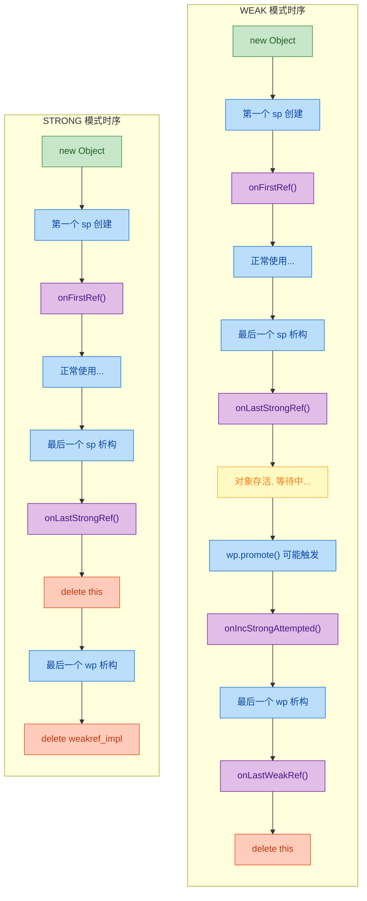
```mermaid
graph LR
    subgraph STRONG_TIMELINE["STRONG 模式时序"]
        direction TB
        ST1["new Object"]:::appLayer
        ST2["第一个 sp 创建"]:::fwLayer
        ST3["onFirstRef()"]:::callbackLayer
        ST4["正常使用..."]:::fwLayer
        ST5["最后一个 sp 析构"]:::fwLayer
        ST6["onLastStrongRef()"]:::callbackLayer
        ST7["delete this"]:::runtimeLayer
        ST8["最后一个 wp 析构"]:::fwLayer
        ST9["delete weakref_impl"]:::runtimeLayer
        ST1 --> ST2 --> ST3 --> ST4 --> ST5 --> ST6 --> ST7 --> ST8 --> ST9
    end

    subgraph WEAK_TIMELINE["WEAK 模式时序"]
        direction TB
        WT1["new Object"]:::appLayer
        WT2["第一个 sp 创建"]:::fwLayer
        WT3["onFirstRef()"]:::callbackLayer
        WT4["正常使用..."]:::fwLayer
        WT5["最后一个 sp 析构"]:::fwLayer
        WT6["onLastStrongRef()"]:::callbackLayer
        WT7["对象存活, 等待中..."]:::warnLayer
        WT8["wp.promote() 可能触发"]:::fwLayer
        WT9["onIncStrongAttempted()"]:::callbackLayer
        WT10["最后一个 wp 析构"]:::fwLayer
        WT11["onLastWeakRef()"]:::callbackLayer
        WT12["delete this"]:::runtimeLayer
        WT1 --> WT2 --> WT3 --> WT4 --> WT5 --> WT6 --> WT7 --> WT8 --> WT9 --> WT10 --> WT11 --> WT12
    end

    STRONG_TIMELINE ~~~ WEAK_TIMELINE

    classDef appLayer fill:#C8E6C9,stroke:#388E3C,color:#1B5E20
    classDef fwLayer fill:#BBDEFB,stroke:#1976D2,color:#0D47A1
    classDef runtimeLayer fill:#FFCCBC,stroke:#E64A19,color:#BF360C
    classDef warnLayer fill:#FFF9C4,stroke:#F9A825,color:#F57F17
    classDef callbackLayer fill:#E1BEE7,stroke:#7B1FA2,color:#4A148C
```

### 内存布局与销毁顺序

理解两种模式的内存布局差异，有助于更深入地把握机制本质：

```cpp
// ============================================================
//  STRONG 模式下的内存状态变迁
// ============================================================
//
//  【阶段 1】sp + wp 都存在
//  ┌───────────────────────┐     ┌────────────────────────┐
//  │    MyObject (堆上)     │ ←── │    weakref_impl         │
//  │  ┌─────────────────┐  │     │  ┌────────────────────┐ │
//  │  │  业务数据         │  │     │  │ mStrong = 1        │ │
//  │  │  mRefs ──────────┼──┼──→  │  │ mWeak   = 2        │ │
//  │  └─────────────────┘  │     │  │ mFlags  = 0x0000   │ │ ← STRONG
//  └───────────────────────┘     │  │ mBase ─────────────┼─┼──→ MyObject*
//           ↑                     │  └────────────────────┘ │
//      sp<T> ref                  └────────────────────────┘
//                                          ↑
//                                     wp<T> ref
//
//  【阶段 2】sp 全部析构，wp 还在
//  ┌───────────────────────┐
//  │  [已释放内存区域]       │     ┌────────────────────────┐
//  │   MyObject 已被 delete │     │    weakref_impl         │
//  │  xxxxxxxxxxxxxxxxxx   │     │  ┌────────────────────┐ │
//  └───────────────────────┘     │  │ mStrong = 0        │ │
//                                 │  │ mWeak   = 1        │ │
//                                 │  │ mBase → 悬空!      │ │
//                                 │  └────────────────────┘ │
//                                 └────────────────────────┘
//                                          ↑
//                                     wp<T> ref (promote→nullptr)


// ============================================================
//  WEAK 模式下的内存状态变迁
// ============================================================
//
//  【阶段 2'】sp 全部析构，wp 还在（对象依然存活！）
//  ┌───────────────────────┐     ┌────────────────────────┐
//  │    MyObject (仍在堆上!) │ ←── │    weakref_impl         │
//  │  ┌─────────────────┐  │     │  ┌────────────────────┐ │
//  │  │  业务数据完好      │  │     │  │ mStrong = 0        │ │
//  │  │  mRefs ──────────┼──┼──→  │  │ mWeak   = 1        │ │
//  │  └─────────────────┘  │     │  │ mFlags  = 0x0001   │ │ ← WEAK
//  └───────────────────────┘     │  │ mBase ─→ 有效!     │ │
//                                 │  └────────────────────┘ │
//                                 └────────────────────────┘
//                                          ↑
//                                     wp<T> ref (promote→成功✅)
```

### 线程安全与 Memory Ordering

生命周期控制机制中大量使用了 C++ 原子操作 (atomic operations)，这不是偶然的——多线程环境下，引用计数的递增递减必须是原子的，否则会产生灾难性的 data race。

核心要点：

- `mStrong` 和 `mWeak` 都是 `std::atomic<int32_t>` 类型。
- `fetch_sub` 使用 `memory_order_release` 语义：保证在递减计数之前，所有对对象的修改对其他线程可见。
- 当计数降到 0 时，执行 `atomic_thread_fence(memory_order_acquire)`：保证在执行 `delete` 之前，能看到其他线程对对象的所有修改。
- 这对 release-acquire 配对构成了经典的 **Release-Acquire Fence Pattern**，是实现无锁引用计数的标准范式。

```cpp
// 为什么需要 Release-Acquire？直觉解释：
//
// Thread A (最后一个 decStrong):
//   对象.data = 42;                    // 修改对象
//   mStrong.fetch_sub(1, release);     // release: 把修改"推出去"
//   if (旧值 == 1) {
//       acquire_fence();               // acquire: 拉取其他线程的所有修改
//       delete this;                   // 安全！此时看到了对象的最终状态
//   }
//
// Thread B (稍早的 decStrong):
//   对象.name = "hello";               // 修改对象
//   mStrong.fetch_sub(1, release);     // release: 把修改"推出去"
//   // 旧值 > 1，不执行 delete
//
// 没有这对 fence，Thread A 执行 delete 时可能看不到 Thread B 的修改，
// 导致析构函数中访问到不一致的状态。
```

### 常见陷阱与最佳实践

**陷阱 1：在 STRONG 模式下过度依赖 `promote()`**

```cpp
// ❌ 错误做法：假设 promote 一定成功
void callback(wp<StrongModeObj> weakObj) {
    sp<StrongModeObj> obj = weakObj.promote();
    obj->doSomething();                            // 如果 promote 返回 nullptr → 崩溃！
}

// ✅ 正确做法：始终检查 promote 返回值
void callback(wp<StrongModeObj> weakObj) {
    sp<StrongModeObj> obj = weakObj.promote();
    if (obj != nullptr) {                          // 必须检查！
        obj->doSomething();
    } else {
        ALOGW("Object already destroyed");         // 优雅降级
    }
}
```

**陷阱 2：不必要地使用 WEAK 模式导致内存泄漏风险**

```cpp
// ⚠️ 注意：WEAK 模式下，如果忘记释放所有 wp，对象永远不会被销毁！
class LeakyCache {
    std::map<int, wp<WeakModeObj>> mCache;         // wp 永远不被清理

    // 如果 WeakModeObj 是 WEAK 模式，只要 mCache 持有 wp，
    // 对象就永远不会被销毁 → 实质上的内存泄漏！
    // STRONG 模式则不存在这个问题（对象随 sp 释放而销毁，wp 自动悬空）
};
```

**最佳实践总结：**

| 场景 | 推荐模式 | 理由 |
|---|---|---|
| 普通资源管理对象 | STRONG（默认） | 简单可靠，强引用释放即回收 |
| 需要在异步回调中 promote 的对象 | WEAK | 保证 promote 在对象有弱引用时一定成功 |
| 缓存中的对象 | 视情况而定 | STRONG + 检查 promote；或 WEAK + 定期清理 wp |
| Binder 服务端对象 | 通常 STRONG | 强引用释放时应停止服务 |
| 跨组件共享的长生命周期对象 | WEAK | 避免因强引用时序不确定导致的过早析构 |

---

**📝 练习题**

在 Android RefBase 体系中，一个对象通过 `extendObjectLifetime(OBJECT_LIFETIME_WEAK)` 设置为 WEAK 生命周期模式。现在有如下代码：

```cpp
wp<MyObj> weak;
{
    sp<MyObj> strong = sp<MyObj>::make();
    weak = strong;
}
sp<MyObj> revived = weak.promote();
```

请问以下哪个描述是正确的？


A. `revived` 为 `nullptr`，因为 `strong` 析构后对象已被销毁


B. `revived` 不为 `nullptr`，因为 WEAK 模式下对象在弱引用归零前不会被销毁，`promote()` 一定成功


C. 代码会崩溃，因为不能对已释放强引用的对象调用 `promote()`


D. `revived` 不为 `nullptr`，但 `promote()` 内部会调用 `onIncStrongAttempted()`，如果该回调返回 `false` 则 `revived` 仍为 `nullptr`


**【答案】** D

**【解析】**

在 `OBJECT_LIFETIME_WEAK` 模式下，当最后一个 `sp` 析构导致强引用计数归零时，`decStrong()` **不会** `delete` 对象——这排除了选项 A 和 C。对象会一直存活到弱引用也全部归零为止。

选项 B 的描述"一定成功"过于绝对。虽然 WEAK 模式保证了对象在 `wp` 存在时不被销毁，但 `promote()` 在尝试将强引用从 0 恢复到 1 时，会调用对象的 `onIncStrongAttempted()` 虚函数。如果该函数返回 `false`（对象主动拒绝被"复活"），`promote()` 依然会失败并返回 `nullptr`。

因此选项 D 最准确：在默认实现中 `onIncStrongAttempted()` 返回 `true`，`revived` 确实不为 `nullptr`；但从机制层面讲，对象拥有拒绝 promote 的权利，这是 WEAK 模式设计的精髓之一——**延寿但可控**。

---

## 本章小结

Android 智能指针体系是 Android Native 层最核心的内存管理基础设施之一。它围绕 **RefBase 基类** 构建了一套精密的引用计数系统，通过 **sp（强指针）** 和 **wp（弱指针）** 两种智能指针类型协同工作，配合 **生命周期策略（OBJECT_LIFETIME_STRONG / WEAK）** 的灵活切换，在 C++ 这门没有 GC 的语言中实现了安全、高效、可控的对象生命周期管理。

---

### 核心知识脉络回顾

我们从最底层的 RefBase 基类出发，逐层向上构建了完整的知识链条。下面用一张全景图将本章所有核心概念串联起来：


```mermaid
graph LR
    subgraph SG_REFBASE["RefBase 基类"]
        direction TB
        A1["weakref_impl* mRefs"]
        A2["mStrong (强引用计数)"]
        A3["mWeak (弱引用计数)"]
        A4["mFlags (生命周期标志)"]
        A1 --> A2
        A1 --> A3
        A1 --> A4
    end

    subgraph SG_SP["sp〈T〉 强指针"]
        direction TB
        B1["构造: incStrong()"]
        B2["析构: decStrong()"]
        B3["操控 mStrong 计数"]
        B1 --> B3
        B2 --> B3
    end

    subgraph SG_WP["wp〈T〉 弱指针"]
        direction TB
        C1["构造: incWeak()"]
        C2["析构: decWeak()"]
        C3["操控 mWeak 计数"]
        C4["promote() 提升"]
        C1 --> C3
        C2 --> C3
        C3 --> C4
    end

    subgraph SG_LIFE["生命周期策略"]
        direction TB
        D1["OBJECT_LIFETIME_STRONG"]
        D2["OBJECT_LIFETIME_WEAK"]
        D1 -. "mStrong→0 销毁对象" .-> D3["默认策略"]
        D2 -. "mWeak→0 销毁对象" .-> D4["延长生命"]
    end

    SG_SP -- "incStrong / decStrong" --> SG_REFBASE
    SG_WP -- "incWeak / decWeak" --> SG_REFBASE
    SG_WP -- "promote() 尝试 incStrong" --> SG_SP
    SG_REFBASE -- "mFlags 决定" --> SG_LIFE

    classDef clsRefBase fill:#E3F2FD,stroke:#1565C0,stroke-width:2px,color:#0D47A1
    classDef clsSP fill:#E8F5E9,stroke:#2E7D32,stroke-width:2px,color:#1B5E20
    classDef clsWP fill:#FFF3E0,stroke:#E65100,stroke-width:2px,color:#BF360C
    classDef clsLife fill:#F3E5F5,stroke:#6A1B9A,stroke-width:2px,color:#4A148C

    class A1,A2,A3,A4 clsRefBase
    class B1,B2,B3 clsSP
    class C1,C2,C3,C4 clsWP
    class D1,D2,D3,D4 clsLife
```

---

### 四大模块要点精炼

**一、RefBase 基类——一切的根基**

RefBase 是 Android 智能指针体系的基石。任何需要被 `sp` 或 `wp` 管理的对象，都必须继承自 RefBase。它的核心设计精髓在于：**将引用计数的存储和管理从对象本身剥离到一个独立的内部结构 `weakref_impl` 中**。`weakref_impl` 内部维护了两个原子计数器 `mStrong` 和 `mWeak`，以及一个决定对象销毁时机的标志位 `mFlags`。这种分离设计是整个体系能够同时支持强/弱引用的关键——即使对象实体已经被销毁，`weakref_impl` 仍然可以独立存活，让弱指针能安全地感知到"对象已死"。

**二、sp 强指针——所有权的直接持有者**

`sp<T>` 是日常开发中最高频使用的指针类型。它在构造时调用 `incStrong()` 将强引用计数 +1，在析构时调用 `decStrong()` 将强引用计数 -1。当强引用计数降至 0 时（在默认的 `OBJECT_LIFETIME_STRONG` 策略下），对象的 `delete this` 被触发。sp 通过运算符重载（`->`, `*`）提供了与裸指针几乎一致的使用体验，但自动管理了引用计数，消除了手动 `delete` 带来的风险。与标准库的 `std::shared_ptr` 相比，sp 采用侵入式计数（计数嵌在对象内部），在内存布局和性能上更有优势，但代价是强制要求继承 RefBase。

**三、wp 弱指针——观察者与循环引用的解药**

`wp<T>` 不增加强引用计数，只增加弱引用计数，因此它不延长对象的生命（在默认策略下）。它的核心价值有二：第一，**打破循环引用**——在父子双向持有的场景中，让一方持有 `wp` 即可切断引用环；第二，**安全的延迟访问**——需要使用对象时，通过 `promote()` 方法尝试提升为 `sp`，若对象仍存活则提升成功（强引用计数 +1），若已销毁则返回空 `sp`，绝不会产生悬垂指针。

**四、生命周期策略——控制权的终极开关**

`OBJECT_LIFETIME_STRONG`（默认）和 `OBJECT_LIFETIME_WEAK` 是 RefBase 提供的两种生命周期策略，通过 `extendObjectLifetime()` 切换。前者以强引用计数归零为对象销毁时机，后者以弱引用计数归零为对象销毁时机。`WEAK` 策略保证了即使所有 `sp` 都释放了，只要还有 `wp` 存在，对象实体就不会被销毁，`promote()` 必然成功。这在某些需要"弱引用者也能保底访问"的特殊场景下非常有用。

---

### 引用计数生命周期全景时序

下面这张时序图完整展示了一个 RefBase 对象从创建到销毁的全过程，涵盖 sp 和 wp 的交互：

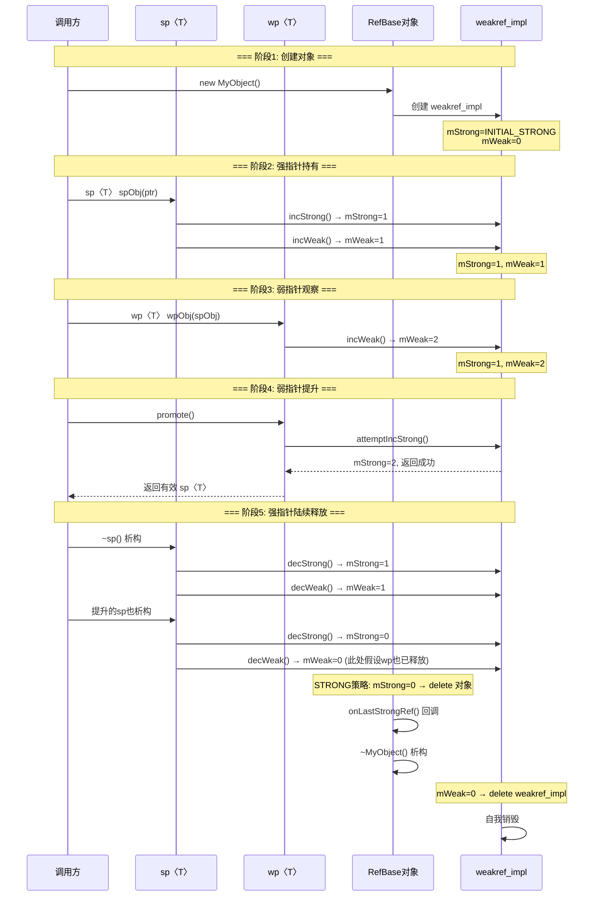
```mermaid
sequenceDiagram
    participant Client as 调用方
    participant SP as sp〈T〉
    participant WP as wp〈T〉
    participant Obj as RefBase对象
    participant Impl as weakref_impl

    Note over Client,Impl: === 阶段1: 创建对象 ===
    Client->>Obj: new MyObject()
    Obj->>Impl: 创建 weakref_impl
    Note over Impl: mStrong=INITIAL_STRONG<br/>mWeak=0

    Note over Client,Impl: === 阶段2: 强指针持有 ===
    Client->>SP: sp〈T〉 spObj(ptr)
    SP->>Impl: incStrong() → mStrong=1
    SP->>Impl: incWeak()  → mWeak=1
    Note over Impl: mStrong=1, mWeak=1

    Note over Client,Impl: === 阶段3: 弱指针观察 ===
    Client->>WP: wp〈T〉 wpObj(spObj)
    WP->>Impl: incWeak() → mWeak=2
    Note over Impl: mStrong=1, mWeak=2

    Note over Client,Impl: === 阶段4: 弱指针提升 ===
    Client->>WP: promote()
    WP->>Impl: attemptIncStrong()
    Impl-->>WP: mStrong=2, 返回成功
    WP-->>Client: 返回有效 sp〈T〉

    Note over Client,Impl: === 阶段5: 强指针陆续释放 ===
    Client->>SP: ~sp() 析构
    SP->>Impl: decStrong() → mStrong=1
    SP->>Impl: decWeak()  → mWeak=1

    Client->>SP: 提升的sp也析构
    SP->>Impl: decStrong() → mStrong=0
    SP->>Impl: decWeak()  → mWeak=0 (此处假设wp也已释放)

    Note over Obj: STRONG策略: mStrong=0 → delete 对象
    Obj->>Obj: onLastStrongRef() 回调
    Obj->>Obj: ~MyObject() 析构

    Note over Impl: mWeak=0 → delete weakref_impl
    Impl->>Impl: 自我销毁
```

---

### 速查对照表

| 维度 | sp〈T〉 | wp〈T〉 |
|---|---|---|
| **引用计数** | 同时 +1 mStrong 和 mWeak | 仅 +1 mWeak |
| **延长对象生命** | ✅ 是（默认策略下） | ❌ 否（默认策略下） |
| **直接解引用** | ✅ 支持 `->` / `*` | ❌ 不支持，必须 `promote()` |
| **线程安全** | 计数操作原子安全 | 计数操作原子安全 |
| **典型用途** | 持有和使用对象 | 观察、缓存、打破循环引用 |
| **对象销毁后行为** | N/A（sp 存在则对象不销毁） | `promote()` 返回空 sp |

| 维度 | OBJECT_LIFETIME_STRONG | OBJECT_LIFETIME_WEAK |
|---|---|---|
| **对象销毁条件** | mStrong → 0 | mWeak → 0 |
| **wp.promote() 保证** | 可能失败 | 只要 wp 存在就一定成功 |
| **典型场景** | 绝大多数常规场景 | 需要弱引用者保底访问的特殊场景 |
| **设置方式** | 默认，无需设置 | `extendObjectLifetime(OBJECT_LIFETIME_WEAK)` |

---

### 常见陷阱速记

1. **裸指针构造多个 sp**：同一个裸指针不要分别传给两个独立的 `sp` 构造函数，这会导致 `incStrong` 被调用两次却对应两个独立的析构路径，引发 double free。正确做法是从一个 sp 拷贝到另一个 sp。

2. **忘记继承 RefBase**：如果对象没有继承 RefBase 就用 `sp<T>` 包裹，编译期会报错找不到 `incStrong` 等方法。

3. **wp 直接访问对象**：`wp` 没有重载 `->` 和 `*`，无法直接访问对象成员。必须先调用 `promote()` 获得 `sp`，并检查返回值是否为空。

4. **循环引用不加 wp**：A 持有 `sp<B>`，B 持有 `sp<A>`，两者的强引用计数永远不会归零，造成内存泄漏。经典解法：让其中一方使用 `wp`。

5. **在构造函数中将 this 传给 sp**：RefBase 的 `mStrong` 初始值为 `INITIAL_STRONG_VALUE`，第一次 `incStrong` 时有特殊处理。如果在构造函数体内就将 `this` 包裹进 `sp`，可能触发未定义行为，因为对象尚未完全构造。

---

### 与标准库智能指针的终极对比

```mermaid
graph LR
    subgraph SG_ANDROID["Android 智能指针体系"]
        direction TB
        A1["RefBase 侵入式基类"]
        A2["sp〈T〉 强指针"]
        A3["wp〈T〉 弱指针"]
        A4["计数嵌入对象内部"]
        A5["生命周期策略可切换"]
        A1 --> A2
        A1 --> A3
        A2 --> A4
        A3 --> A5
    end

    subgraph SG_STD["C++ 标准库智能指针"]
        direction TB
        B1["无基类要求"]
        B2["shared_ptr〈T〉"]
        B3["weak_ptr〈T〉"]
        B4["独立 control block"]
        B5["固定生命周期策略"]
        B1 --> B2
        B1 --> B3
        B2 --> B4
        B3 --> B5
    end

    SG_ANDROID -- "对比" --- SG_STD

    classDef clsAndroid fill:#E8F5E9,stroke:#2E7D32,stroke-width:2px,color:#1B5E20
    classDef clsStd fill:#E3F2FD,stroke:#1565C0,stroke-width:2px,color:#0D47A1

    class A1,A2,A3,A4,A5 clsAndroid
    class B1,B2,B3,B4,B5 clsStd
```

Android 智能指针的**侵入式设计**牺牲了通用性（必须继承 RefBase），但换来了：**更少的内存分配**（无需独立 control block）、**更好的缓存局部性**（计数与对象在同一内存区域）、以及**更灵活的生命周期策略**（`STRONG` / `WEAK` 可切换）。而 `std::shared_ptr` 胜在**无侵入**、**标准化**、**生态广泛**，适合通用 C++ 开发。Android 选择自建体系，是因为在操作系统框架层，对象生命周期的精细控制和跨进程 Binder 传输的需求，远超标准库所能提供的能力边界。

---

**📝 练习题 1**

在默认的 `OBJECT_LIFETIME_STRONG` 策略下，假设某个 RefBase 对象当前状态为：`mStrong = 1, mWeak = 3`（1 个 sp 和 2 个 wp 持有）。当唯一的 sp 被析构后，下列描述正确的是？

A. 对象实体被销毁，`weakref_impl` 被销毁，mWeak = 0

B. 对象实体不被销毁，因为 mWeak 仍大于 0

C. 对象实体被销毁，`weakref_impl` 仍存活，mWeak = 2，wp 的 `promote()` 将返回空

D. 对象实体被销毁，`weakref_impl` 仍存活，mWeak = 2，wp 的 `promote()` 仍可成功


**【答案】** C

**【解析】** 在 `OBJECT_LIFETIME_STRONG` 策略下，对象的生命由**强引用计数 mStrong** 决定。当唯一的 sp 析构时，`decStrong()` 将 mStrong 从 1 降至 0，触发对象实体的 `delete`（调用 `onLastStrongRef()` 后销毁对象）。同时 `decStrong()` 内部也会调用 `decWeak()`，将 mWeak 从 3 降至 2。由于 mWeak ≠ 0（还有 2 个 wp 持有），`weakref_impl` 不会被销毁，它继续存活以便 wp 能感知对象状态。但此时对象实体已经不在了，任何 wp 调用 `promote()` 时，`attemptIncStrong()` 会发现 mStrong = 0 且对象已销毁，返回失败，`promote()` 返回空 sp。选项 B 错误是因为 `STRONG` 策略下对象命运只取决于 mStrong 而非 mWeak；选项 D 错误是因为对象已销毁后 `promote()` 不可能成功（`STRONG` 策略下）；选项 A 错误是因为 mWeak 并非归零，`weakref_impl` 不会被连带销毁。

---

**📝 练习题 2**

在 Android Framework 中，类 A 持有 `sp<B>`，类 B 持有对 A 的引用。为了防止循环引用导致内存泄漏，同时让 B 在需要时能安全地访问 A，最佳实践是？

A. B 持有 A 的裸指针 `A*`，使用前手动判空

B. B 持有 `wp<A>`，使用时调用 `promote()` 获取 `sp<A>` 并检查是否为空

C. B 持有 `sp<A>`，并在 B 的析构函数中手动调用 `A->decStrong()`

D. 将 A 的生命周期策略改为 `OBJECT_LIFETIME_WEAK`，B 持有 `sp<A>`


**【答案】** B

**【解析】** 这是经典的循环引用（circular reference）问题。A 持有 `sp<B>` 意味着 A 对 B 的强引用计数 +1，如果 B 也持有 `sp<A>`，则 B 对 A 的强引用计数也 +1，形成引用环——两者的 mStrong 都无法降至 0，永远不会被销毁。**选项 B** 是标准解法：B 使用 `wp<A>` 只增加弱引用计数，不影响 A 的 mStrong，当外部所有 sp\<A\> 释放后 A 能正常销毁，A 析构时释放 `sp<B>` 使 B 也被销毁。B 需要访问 A 时，通过 `promote()` 安全地尝试获取强指针。选项 A 使用裸指针虽然也不增加强引用计数，但存在悬垂指针风险——A 被销毁后 B 手中的裸指针变成野指针，判空也无法检测（指针值不会自动变为 nullptr）。选项 C 手动操作引用计数极易出错且破坏了 RAII 的封装性。选项 D 改变生命周期策略并不能解决循环引用的根本问题，双方持有 sp 的引用环依然存在。

---

