---

# Binder C++层基础 ⭐⭐

---

## IBinder 接口

在 Android 的进程间通信 (IPC) 体系中，**Binder 机制**是最核心的基石。而在 Binder 的 C++ 层实现里，`IBinder` 接口则扮演着"万物之源"的角色——它是整个 Binder 对象模型的 **根抽象 (Root Abstraction)**。无论是客户端持有的代理对象，还是服务端的本地实体，都必须遵循 `IBinder` 所定义的契约。理解 `IBinder`，就是理解 Binder C++ 世界的入场券。

### IBinder 在 Binder 架构中的定位

Android Binder 的 C++ 层代码主要位于 `frameworks/native/libs/binder/` 目录下。`IBinder` 是一个纯虚类 (pure virtual class)，定义在头文件 `<binder/IBinder.h>` 中。它之所以重要，是因为它建立了一个**统一的多态接口**：不管你拿到的是一个本地对象 (local object) 还是一个远程代理 (remote proxy)，上层代码都只需要面对 `IBinder*` 或 `sp<IBinder>` 这同一种类型。

从继承体系上看，`IBinder` 向下派生出两个关键子类：

- **`BpBinder`**：Binder Proxy，运行在客户端进程中，作为远端服务的"替身"。
- **`BBinder`**：Binder (local) Base，运行在服务端进程中，是真正处理请求的实体。

这种设计完美地实现了**代理模式 (Proxy Pattern)**——客户端和服务端用同样的接口说话，底层的跨进程传输细节被完全隐藏。

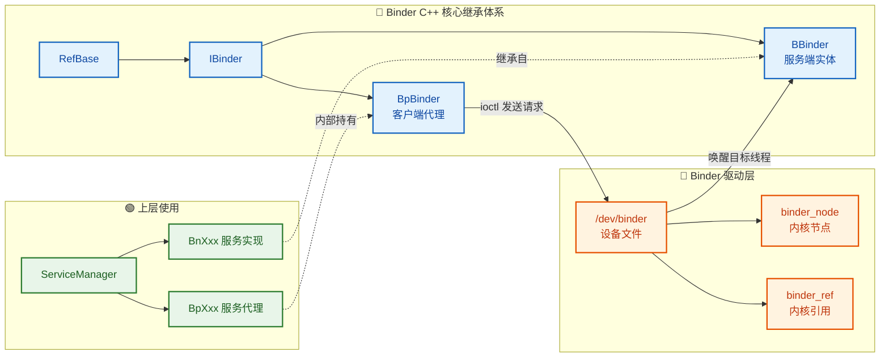

从图中可以清晰看到：上层的 `BpXxx` / `BnXxx` 服务最终都依托于 `IBinder` 体系，经由 Binder 驱动完成跨进程的消息投递。`IBinder` 就是连接"用户空间面向对象模型"和"内核空间 Binder 驱动"之间的关键桥梁。

### IBinder 类的声明与核心方法

`IBinder` 继承自 `RefBase`（Android 的引用计数基类），因此所有 Binder 对象天然支持 `sp<>` (Strong Pointer) 和 `wp<>` (Weak Pointer) 的智能指针管理。下面我们逐一拆解 `IBinder` 中最重要的虚函数：

```cpp
// 文件: frameworks/native/libs/binder/include/binder/IBinder.h
// IBinder 是 Binder 对象模型的根抽象接口

class IBinder : public virtual RefBase {
public:
    // 事务标志位 (Transaction flags)
    enum {
        FIRST_CALL_TRANSACTION = 0x00000001,  // 用户自定义事务码的起始值
        LAST_CALL_TRANSACTION  = 0x00ffffff,  // 用户自定义事务码的最大值
        PING_TRANSACTION       = B_PACK_CHARS('_','P','N','G'),  // 用于探测对端是否存活
        DUMP_TRANSACTION       = B_PACK_CHARS('_','D','M','P'),  // 请求服务 dump 调试信息
        SHELL_COMMAND_TRANSACTION = B_PACK_CHARS('_','C','M','D'), // shell 命令
        INTERFACE_TRANSACTION  = B_PACK_CHARS('_','N','T','F'),  // 查询接口描述符
        SYSPROPS_TRANSACTION   = B_PACK_CHARS('_','S','P','R'),  // 系统属性同步
    };

    // 事务发送的标志 (Flags for transact())
    enum {
        FLAG_ONEWAY = 0x00000001,  // 异步调用, 不等待返回 (one-way / fire-and-forget)
    };

    // ========== 核心虚函数 ==========

    // 查询该 Binder 对象的接口描述符 (Interface Descriptor)
    // 返回类似 "android.os.IServiceManager" 的字符串
    virtual const String16& getInterfaceDescriptor() const = 0;

    // 判断该 Binder 对象所在的进程/线程是否仍然存活
    virtual bool            isBinderAlive() const = 0;

    // 发送 PING_TRANSACTION, 检测对端是否响应
    virtual status_t        pingBinder() = 0;

    // 注册死亡通知回调, 当远端 Binder 死亡时触发
    // recipient: 回调对象 (DeathRecipient)
    virtual status_t        linkToDeath(const sp<DeathRecipient>& recipient,
                                        void* cookie = nullptr,
                                        uint32_t flags = 0) = 0;

    // 取消之前注册的死亡通知
    virtual status_t        unlinkToDeath(const wp<DeathRecipient>& recipient,
                                          void* cookie = nullptr,
                                          uint32_t flags = 0,
                                          wp<DeathRecipient>* outRecipient = nullptr) = 0;

    // ★ 最核心的方法 ★
    // 发起一次 Binder 事务 (transaction)
    // code:  事务码, 标识要调用的远端方法
    // data:  发送给对端的序列化数据 (Parcel)
    // reply: 对端返回的序列化数据 (Parcel)
    // flags: 0 表示同步调用, FLAG_ONEWAY 表示异步
    virtual status_t        transact(uint32_t code,
                                     const Parcel& data,
                                     Parcel* reply,
                                     uint32_t flags = 0) = 0;

    // ========== 类型识别方法 ==========

    // 如果自身是本地 Binder 实体 (BBinder), 则返回 this; 否则返回 nullptr
    virtual BBinder*        localBinder();

    // 如果自身是远程 Binder 代理 (BpBinder), 则返回 this; 否则返回 nullptr
    virtual BpBinder*       remoteBinder();

protected:
    virtual                 ~IBinder();  // 析构函数, protected 防止栈上构造
};
```

### transact()：Binder 通信的心脏

`transact()` 是整个 `IBinder` 接口中**最核心、最关键**的方法。所有的跨进程方法调用，最终都会坍缩为一次 `transact()` 调用。它的工作原理可以类比为一个**"信封-收信"系统**：

1. 客户端把"要调用什么方法"编码为一个**事务码 (transaction code)**。
2. 客户端把方法的参数序列化到一个 **`Parcel` 对象** (`data`) 中——相当于把信件装进信封。
3. 调用 `transact(code, data, reply, flags)` 发送到内核 Binder 驱动。
4. 驱动将请求路由到目标进程中对应的 `BBinder` 对象。
5. `BBinder` 的 `onTransact()` 回调被触发，它根据 `code` 识别方法、从 `data` 中反序列化参数、执行业务逻辑、把返回值写入 `reply`。
6. `reply` 被送回客户端进程，客户端从中反序列化结果。

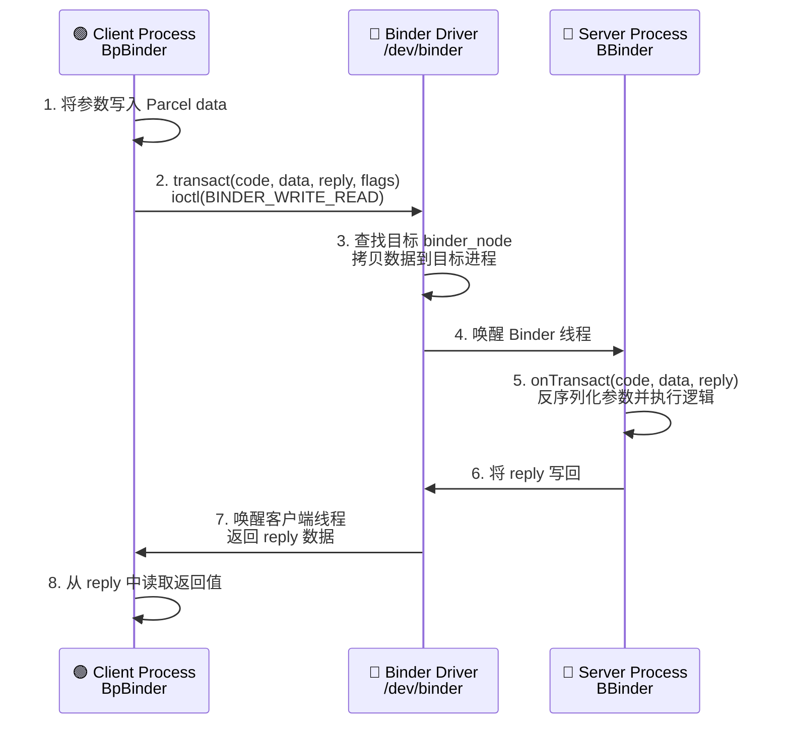

需要特别注意 `flags` 参数：当设置了 `FLAG_ONEWAY` 时，调用变成**异步 (asynchronous)** 的——客户端发出请求后立即返回，**不会等待** `reply`。这常用于不需要返回值的通知型调用，例如广播分发。

### localBinder() 与 remoteBinder()：类型识别的利器

`IBinder` 提供了两个"类型探测"方法，它们的实现非常精巧：

```cpp
// 默认实现: 都返回 nullptr (在 IBinder 基类中)
BBinder*  IBinder::localBinder()  { return nullptr; }  // 默认: 我不是本地对象
BpBinder* IBinder::remoteBinder() { return nullptr; }  // 默认: 我也不是远程代理

// BBinder 重写: 表明"我是本地实体"
BBinder* BBinder::localBinder() { return this; }       // 是的, 我是本地 BBinder

// BpBinder 重写: 表明"我是远程代理"
BpBinder* BpBinder::remoteBinder() { return this; }   // 是的, 我是远程 BpBinder
```

这对方法的经典用途是**判断目标服务是否和调用者在同一个进程中**：

```cpp
// 示例: 判断一个 IBinder 对象是本地还是远程
void inspectBinder(const sp<IBinder>& binder) {
    // 尝试获取本地 BBinder 指针
    BBinder* local = binder->localBinder();
    if (local != nullptr) {
        // 同进程调用! 无需经过 Binder 驱动, 可以直接本地调用
        // 这就是 Binder 的 "短路优化" (short-circuit optimization)
        ALOGI("This is a LOCAL binder object");
    } else {
        // 跨进程调用, 底层会走 ioctl 到 Binder 驱动
        ALOGI("This is a REMOTE binder proxy");
        BpBinder* proxy = binder->remoteBinder();
        // proxy->handle() 可以获取该代理在驱动中的句柄值
    }
}
```

这种设计使得 Binder 框架可以在运行时做出**透明的本地/远程分流决策**——如果服务碰巧在同一进程内，就跳过所有的序列化和驱动交互，直接执行本地方法调用，极大地提升了性能。

### DeathRecipient：死亡通知机制

分布式系统中，远端进程可能随时崩溃。`IBinder` 通过 `linkToDeath()` 和 `unlinkToDeath()` 提供了一套优雅的**死亡监听 (Death Notification)** 机制。

```cpp
// DeathRecipient 是 IBinder 内部定义的嵌套类
class IBinder::DeathRecipient : public virtual RefBase {
public:
    // 当所监听的远端 Binder 对象死亡时, 此回调被调用
    // who: 死亡的那个 IBinder 对象的弱引用
    virtual void binderDied(const wp<IBinder>& who) = 0;
};
```

**使用流程**：

```cpp
// 1. 自定义一个 DeathRecipient 子类
class MyDeathRecipient : public IBinder::DeathRecipient {
public:
    // 当远端服务进程意外退出时, 该方法被 Binder 框架调用
    virtual void binderDied(const wp<IBinder>& who) override {
        ALOGE("Oh no! The remote service has died!");
        // 在此执行清理逻辑, 如: 重新连接服务、释放资源等
    }
};

// 2. 获取远端服务的 IBinder 引用
sp<IBinder> remote = /* 从 ServiceManager 获取 */;

// 3. 创建并注册死亡通知
sp<MyDeathRecipient> dr = new MyDeathRecipient();
status_t err = remote->linkToDeath(dr);  // 向 Binder 驱动注册监听
if (err != NO_ERROR) {
    ALOGE("Failed to link to death: %d", err);
}

// 4. 不再需要监听时, 取消注册
remote->unlinkToDeath(dr);
```

**底层原理**：`linkToDeath()` 会通过 `ioctl` 向 Binder 驱动注册一个 **death notification request**。当驱动检测到目标进程退出（其 `binder_proc` 被销毁），就会向所有注册了监听的进程发送 `BR_DEAD_BINDER` 命令，触发对应的 `binderDied()` 回调。

⚠️ **重要限制**：`linkToDeath()` 只对 **远程 Binder (BpBinder)** 有意义。对本地 BBinder 调用它会直接返回 `INVALID_OPERATION`——因为本地对象和你在同一进程，进程活着它就活着，不存在"死亡"的概念。

### Interface Descriptor：接口的身份证

`getInterfaceDescriptor()` 返回一个 `String16` 类型的**接口描述符**，它是每个 Binder 服务的唯一标识字符串。例如：

- `android.os.IServiceManager`
- `android.hardware.camera.provider.ICameraProvider`
- `android.media.IAudioFlinger`

它的核心用途是在 `transact()` 时进行**接口校验 (Interface Token Enforcement)**：

```cpp
// 客户端发送时: 在 data 头部写入接口描述符
data.writeInterfaceToken(IMyService::getInterfaceDescriptor());

// 服务端接收时: 验证接口描述符是否匹配
status_t MyService::onTransact(uint32_t code, const Parcel& data,
                                Parcel* reply, uint32_t flags) {
    // enforceInterface 会读取 data 中的 token 并与预期值比较
    // 如果不匹配则返回 BAD_TYPE, 防止客户端错误地调用了不属于该服务的方法
    CHECK_INTERFACE(IMyService, data, reply);
    // ... 处理业务逻辑
}
```

这是一道重要的安全屏障，确保客户端不会"打错电话"。

### 事务码 (Transaction Codes) 的约定

`IBinder` 中通过枚举定义了事务码的范围规范：

| 常量 | 值 | 含义 |
|---|---|---|
| `FIRST_CALL_TRANSACTION` | `0x00000001` | 用户自定义事务码的**起始值** |
| `LAST_CALL_TRANSACTION` | `0x00ffffff` | 用户自定义事务码的**最大值** |
| `PING_TRANSACTION` | `'_PNG'` | 内置：心跳探测 |
| `DUMP_TRANSACTION` | `'_DMP'` | 内置：dumpsys 调试 |
| `INTERFACE_TRANSACTION` | `'_NTF'` | 内置：查询接口描述符 |

`0x00000001` ~ `0x00ffffff` 这段区间留给开发者自定义方法编号。`0x00ffffff` 以上的区间为系统保留的内置事务。这种分区设计避免了用户代码和系统内置命令的冲突。

在 AIDL 生成的代码中，每个接口方法会被自动分配一个递增的事务码：

```cpp
// AIDL 自动生成的事务码示例
enum {
    // 第一个方法 => FIRST_CALL_TRANSACTION + 0
    TRANSACTION_getStatus = IBinder::FIRST_CALL_TRANSACTION + 0,  // = 1
    // 第二个方法 => FIRST_CALL_TRANSACTION + 1
    TRANSACTION_setConfig = IBinder::FIRST_CALL_TRANSACTION + 1,  // = 2
    // 第三个方法 => FIRST_CALL_TRANSACTION + 2
    TRANSACTION_doAction  = IBinder::FIRST_CALL_TRANSACTION + 2,  // = 3
};
```

### IBinder 与 RefBase 的生命周期管理

`IBinder` 继承自 `RefBase`，这意味着所有 Binder 对象都受 Android 的**引用计数系统**管控。这套系统通过 `sp<>` (strong pointer) 和 `wp<>` (weak pointer) 来自动管理对象生命周期，避免手动 `new`/`delete` 带来的内存泄漏或 use-after-free 问题。

```cpp
// sp<IBinder> 内部会自动调用 incStrong / decStrong
{
    sp<IBinder> binder = getService();  // 引用计数 +1 (strong ref)
    // 使用 binder...
    binder->transact(...);
}
// 离开作用域, sp 析构, 引用计数 -1
// 当 strong ref 降为 0 时, 对象被自动销毁

// wp<IBinder> 是弱引用, 不阻止对象销毁
wp<IBinder> weakRef = binder;           // 弱引用计数 +1
sp<IBinder> promoted = weakRef.promote(); // 尝试提升为强引用
if (promoted != nullptr) {
    // 对象还活着, 可以安全使用
} else {
    // 对象已被销毁
}
```

在 Binder 驱动层面，引用计数被进一步扩展：驱动维护着每个 `binder_node`（服务端实体）和 `binder_ref`（客户端引用）的强/弱引用计数。当所有客户端都释放了对某个服务的引用时，驱动才会通知服务端进程可以销毁该对象。这保证了**跨进程的生命周期安全**。

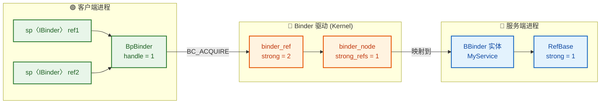

### IBinder 设计哲学总结

`IBinder` 的设计体现了多条经典的面向对象和系统设计原则：

| 设计原则 | 在 IBinder 中的体现 |
|---|---|
| **依赖倒置 (DIP)** | 上层代码依赖抽象的 `IBinder` 接口，而非具体的 `BpBinder` 或 `BBinder` |
| **代理模式 (Proxy Pattern)** | `BpBinder` 是远端 `BBinder` 的透明代理，调用者无感知 |
| **里氏替换 (LSP)** | `BpBinder` 和 `BBinder` 都可以替换 `IBinder` 使用 |
| **单一职责 (SRP)** | `IBinder` 只定义通信契约，序列化交给 `Parcel`，线程管理交给 `IPCThreadState` |
| **位置透明性** | 通过 `localBinder()`/`remoteBinder()` 实现本地与远程的透明切换 |

---

**📝 练习题**

在 Android Binder 的 C++ 层中，当客户端持有一个 `sp<IBinder>` 引用，想要判断该 Binder 对象是否与自己在同一个进程内，以下哪种做法是正确的？

A. 调用 `binder->isBinderAlive()`，如果返回 `true` 则表示同进程


B. 调用 `binder->localBinder()`，如果返回非 `nullptr` 则表示同进程


C. 调用 `binder->pingBinder()`，如果延迟低于 1ms 则表示同进程


D. 调用 `binder->getInterfaceDescriptor()`，如果返回非空则表示同进程


**【答案】** B

**【解析】** `localBinder()` 是 `IBinder` 提供的类型识别方法。其默认实现返回 `nullptr`，但 `BBinder` 重写了该方法，返回 `this`。因此，当 `localBinder()` 返回非空时，说明你拿到的 `IBinder` 实际上是一个 `BBinder` 实体——即服务就在当前进程内，这是一个本地对象，不需要经过 Binder 驱动进行 IPC。选项 A 的 `isBinderAlive()` 只能判断对端进程是否存活，与是否同进程无关；选项 C 的 `pingBinder()` 延迟不能作为判断标准；选项 D 的 `getInterfaceDescriptor()` 返回的是接口名称字符串，与进程位置无关。这一机制也正是 Binder 框架实现 **"短路优化 (short-circuit optimization)"** 的基础——同进程调用可以直接走本地函数调用路径，跳过序列化和内核交互，性能显著提升。

---

## BpBinder（代理端）

在 Android Binder IPC 体系中，**BpBinder**（Binder Proxy）是客户端进程中对远程服务的"本地代言人"。当一个进程需要与另一个进程中的服务通信时，它并不会直接持有对方的对象引用——这在不同的虚拟地址空间中是不可能的。取而代之的是，内核中的 Binder 驱动会为这个远程服务分配一个 **句柄（handle）**，而 BpBinder 就是围绕这个 handle 构建的 C++ 对象。可以形象地理解为：**BpBinder 是一张"名片"，上面印着远程服务在 Binder 驱动中的门牌号（handle），所有对远程服务的调用，都通过这张名片转交给 Binder 驱动去投递。**

BpBinder 继承自 `IBinder` 接口，实现了 `transact()` 等核心方法。它本身并不包含任何业务逻辑，也不知道远程服务长什么样——它唯一的职责就是把调用请求通过 `IPCThreadState` 发送到 Binder 驱动，由驱动路由到目标进程中的 `BBinder`（服务端实体）。

### BpBinder 在 Binder 架构中的位置

要理解 BpBinder 的角色，必须先从宏观上看清整个 Binder C++ 通信链路。下图展示了一次完整的跨进程调用中，各组件的协作关系：

```mermaid
graph LR
    subgraph ClientProcess["🖥️ Client Process"]
        direction TB
        App["Client Code"]
        BpInterface["BpInterface〈IXxx〉"]
        BpBinder["BpBinder(handle)"]
        IPCClient["IPCThreadState"]
    end

    subgraph Kernel["⚙️ Binder Driver"]
        direction TB
        BinderDrv["binder_ioctl()"]
        Route["Handle → Node 路由"]
    end

    subgraph ServerProcess["🖥️ Server Process"]
        direction TB
        IPCServer["IPCThreadState"]
        BBinder["BBinder"]
        BnInterface["BnInterface〈IXxx〉"]
        Impl["Service Impl"]
    end

    App -->|"调用接口方法"| BpInterface
    BpInterface -->|"封装 Parcel + transact()"| BpBinder
    BpBinder -->|"writeTransactionData()"| IPCClient
    IPCClient -->|"ioctl(BINDER_WRITE_READ)"| BinderDrv
    BinderDrv --> Route
    Route -->|"唤醒目标线程"| IPCServer
    IPCServer -->|"onTransact()"| BBinder
    BBinder --> BnInterface
    BnInterface --> Impl

    classDef appCls fill:#C8E6C9,stroke:#388E3C,color:#1B5E20
    classDef fwkCls fill:#BBDEFB,stroke:#1976D2,color:#0D47A1
    classDef kernelCls fill:#FFE0B2,stroke:#F57C00,color:#E65100
    classDef serverCls fill:#D1C4E9,stroke:#7B1FA2,color:#4A148C

    class App,BpInterface appCls
    class BpBinder,IPCClient fwkCls
    class BinderDrv,Route kernelCls
    class IPCServer,BBinder,BnInterface,Impl serverCls
```

从图中可以清晰地看到：**BpBinder 处于客户端调用链的中间环节**，它向上承接 `BpInterface` 封装好的业务请求（Parcel），向下将数据交给 `IPCThreadState` 去执行真正的内核 `ioctl` 系统调用。它是"业务层"与"传输层"之间的**桥梁**。

---

### BpBinder 的类定义与核心成员

BpBinder 的源码位于 `frameworks/native/libs/binder/BpBinder.cpp`，头文件位于 `frameworks/native/include/binder/BpBinder.h`。我们先来看其关键的类结构骨架：

```cpp
// 文件: BpBinder.h (精简核心结构)
class BpBinder : public IBinder {
public:
    // 静态工厂方法，根据 handle 创建 BpBinder
    // BinderHandle 是对 int32_t handle 的封装
    static sp<BpBinder> create(int32_t handle);

    // 获取此代理对应的 Binder 驱动句柄
    int32_t             handle() const;

    // 核心：向远程服务发起事务调用
    // code     - 方法编号（如 TRANSACTION_xxx）
    // data     - 发送的序列化数据（Parcel）
    // reply    - 接收返回数据的 Parcel 指针
    // flags    - 标志位，0 表示同步，FLAG_ONEWAY 表示异步
    virtual status_t    transact(uint32_t code,
                                 const Parcel& data,
                                 Parcel* reply,
                                 uint32_t flags = 0);

    // 注册 Binder 死亡通知回调
    // recipient - 死亡通知接收者
    virtual status_t    linkToDeath(const sp<DeathRecipient>& recipient,
                                    void* cookie = nullptr,
                                    uint32_t flags = 0);

    // 取消死亡通知回调
    virtual status_t    unlinkToDeath(const wp<DeathRecipient>& recipient,
                                      void* cookie = nullptr,
                                      uint32_t flags = 0,
                                      wp<DeathRecipient>* outRecipient = nullptr);

    // 查询此 Binder 是否仍然存活
    virtual bool        isBinderAlive() const;

    // 发送 PING 事务探测远程服务是否存活
    virtual status_t    pingBinder();

private:
    // 私有构造函数，只能通过 create() 工厂方法创建
    explicit            BpBinder(int32_t handle);

    // Binder 驱动中的句柄号——BpBinder 最核心的数据
    const int32_t       mHandle;

    // 标记远程 Binder 是否已死亡
    volatile int32_t    mAlive;

    // 死亡通知回调列表
    // Obituary 结构保存了 recipient、cookie 和 flags
    Vector<Obituary>    mObituaries;

    // 保护 mObituaries 的互斥锁
    Mutex               mLock;
};
```

下面逐一剖析关键成员的设计意图。

---

### mHandle：远程服务的"门牌号"

`mHandle` 是 BpBinder 最核心的数据成员，类型为 `int32_t`。它代表了远程 Binder 实体（BBinder）在 **Binder 驱动内核数据结构**中的引用编号。

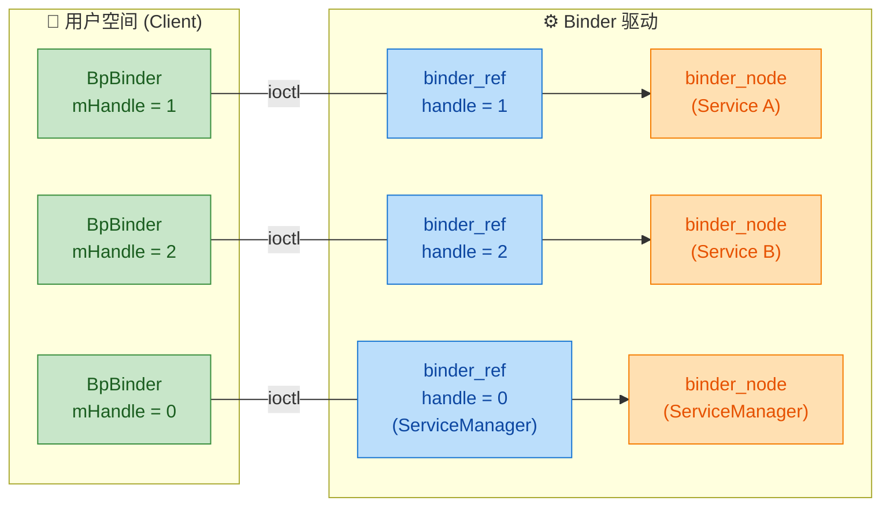

几个关键要点：

- **handle = 0** 是一个特殊约定，它永远指向 **ServiceManager**。这是 Android 系统中唯一一个"众所周知"的 Binder 服务地址，所有其他服务都需要先通过 handle 0 向 ServiceManager 查询才能获取其句柄。
- **handle 是进程级别的（per-process）**：同一个远程服务在不同的客户端进程中可能对应不同的 handle 值。Binder 驱动在每个进程的 `binder_proc` 结构中维护独立的引用表 (`binder_ref` 红黑树)，所以 handle 1 在进程 A 中指向 Service X，在进程 B 中可能指向完全不同的 Service Y。
- **BpBinder 不存储目标进程的 PID 或地址**：它只认 handle，把一切路由逻辑交给内核 Binder 驱动。这种设计将寻址与传输彻底解耦，客户端完全不需要知道目标服务在哪个进程。

---

### BpBinder 的创建过程

BpBinder 并不是由开发者手动 `new` 出来的。它的创建入口是 `ProcessState::getStrongProxyForHandle()`，整个过程精密地与 Binder 驱动交互：

```cpp
// 文件: ProcessState.cpp (关键逻辑精简)
sp<IBinder> ProcessState::getStrongProxyForHandle(int32_t handle) {
    sp<IBinder> result;

    // 1. 在进程级别的"句柄查找表"中查找或创建条目
    //    mHandleToObject 是一个 Vector，下标就是 handle
    handle_entry* e = lookupHandleLocked(handle);

    if (e != nullptr) {
        // 2. 尝试从已有条目中提升弱引用为强引用
        //    如果之前已经为这个 handle 创建过 BpBinder，直接复用
        IBinder* b = e->binder;               // 获取缓存的裸指针
        if (b == nullptr ||                    // 从未创建过
            !e->refs->attemptIncStrong(this))  // 弱引用已失效
        {
            // 3. handle 0 是 ServiceManager，跳过存活检查
            if (handle == 0) {
                // ServiceManager 在系统启动期间一定存在
                // 直接创建其 BpBinder，不需要 PING 探测
            }

            // 4. 核心：创建新的 BpBinder 对象
            //    BpBinder::create 内部会调用私有构造函数
            //    并通过 IPCThreadState 向驱动发送 BC_INCREFS
            //    增加内核中 binder_ref 的引用计数
            sp<BpBinder> b = BpBinder::create(handle);

            // 5. 缓存到查找表中，下次直接复用
            e->binder = b.get();               // 存储裸指针（弱引用语义）
            e->refs = b->getWeakRefs();         // 存储弱引用控制块
            result = b;                         // 返回强引用
        } else {
            // 已有的 BpBinder 仍然存活，直接使用
            result.force_set(b);
        }
    }

    return result;  // 返回 sp<IBinder>，向上层隐藏 BpBinder 类型
}
```

下面用流程图来展示这个创建过程：

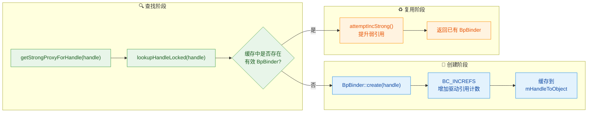

这个设计有几个精妙之处：

1. **单例化缓存**：同一个进程中，相同 handle 的 BpBinder 只会存在一个实例。这避免了重复创建的开销，也保证了引用计数的一致性。`mHandleToObject` 表充当了一个进程级的 Binder 代理缓存池。

2. **弱引用 + 按需提升**：缓存中使用弱引用持有 BpBinder。当外部所有强引用都释放后，BpBinder 可以被正常销毁。下次再需要时，`attemptIncStrong()` 会失败，触发重新创建。这样既避免了内存泄漏，又实现了透明的懒复用（lazy reuse）。

3. **驱动引用计数同步**：`BpBinder::create()` 内部会通过 `IPCThreadState` 向 Binder 驱动发送 `BC_INCREFS` / `BC_ACQUIRE` 命令，确保内核中对应的 `binder_ref` 引用计数与用户空间保持同步。这保证了只要客户端还持有 BpBinder，远程服务的 `binder_node` 就不会被驱动释放。

---

### transact()：核心调用方法

`transact()` 是 BpBinder 最重要的方法，也是整个客户端 IPC 调用链的关键枢纽。当上层的 `BpInterface` 将业务请求编码到 `Parcel` 后，最终就是调用 `BpBinder::transact()` 来发送：

```cpp
// 文件: BpBinder.cpp
status_t BpBinder::transact(
    uint32_t code,           // 事务编号，标识要调用的具体方法
    const Parcel& data,      // 请求数据（已序列化的参数）
    Parcel* reply,           // 响应数据的容器（输出参数）
    uint32_t flags)          // 0=同步阻塞, FLAG_ONEWAY=异步单向
{
    // 1. 检查远程 Binder 是否仍然存活
    //    mAlive 在收到死亡通知时会被置为 0
    if (mAlive) {
        // 2. 检查当前传输是否允许该事务
        //    某些安全策略可能会阻止特定调用
        bool privateVendor = /* flags 检查 */;

        // 3.【核心】将调用委托给 IPCThreadState
        //    IPCThreadState 是线程单例，负责与 Binder 驱动通信
        //    参数说明：
        //      mHandle - 目标服务的驱动句柄
        //      code    - 方法编号
        //      data    - 发送数据
        //      reply   - 接收数据
        //      flags   - 同步/异步标志
        status_t status = IPCThreadState::self()->transact(
            mHandle,         // 告诉驱动要把数据发给哪个 binder_node
            code,            // 服务端 onTransact() 的 code 参数
            data,            // 服务端 onTransact() 的 data 参数
            reply,           // 服务端返回数据写入此 Parcel
            flags);          // 控制调用语义

        // 4. 如果返回 DEAD_OBJECT，说明远程服务已死
        if (status == DEAD_OBJECT) mAlive = 0;

        return status;
    }

    // 远程服务已死亡，直接返回错误
    return DEAD_OBJECT;
}
```

让我们理清 `transact()` 调用后在内核中发生了什么：

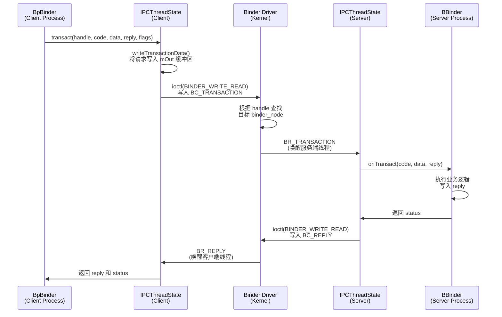

几个关键细节：

- **同步调用（默认）**：客户端线程在 `ioctl()` 中阻塞（sleep），直到服务端处理完毕并通过 `BC_REPLY` 返回结果。这期间客户端线程不占用 CPU。
- **异步调用（FLAG_ONEWAY）**：客户端发送 `BC_TRANSACTION` 后立即返回，不等待服务端的回复。Binder 驱动会将 oneway 事务放入目标进程的异步队列中排队处理，保证 oneway 事务按发送顺序依次执行（不并发）。
- **BpBinder 本身几乎不做逻辑处理**：它只检查 `mAlive`，然后直接调用 `IPCThreadState::self()->transact()`。真正的脏活累活——组装 `binder_transaction_data`、执行 `ioctl` 系统调用、处理返回协议——全部由 `IPCThreadState` 完成。

---

### 死亡通知机制（Death Notification）

在分布式系统中，远程服务随时可能崩溃或被杀。BpBinder 提供了 **linkToDeath / unlinkToDeath** 机制，让客户端能够注册回调，在远程服务死亡时及时收到通知并做出响应（如重连、清理资源）。

```cpp
// 注册死亡通知回调
status_t BpBinder::linkToDeath(
    const sp<DeathRecipient>& recipient,  // 回调对象，需实现 binderDied()
    void* cookie,                          // 用户自定义数据，透传给回调
    uint32_t flags)                        // 保留标志，通常为 0
{
    // 1. 加锁保护 mObituaries 列表
    AutoMutex _l(mLock);

    // 2. 如果远程 Binder 已经死了，直接返回 DEAD_OBJECT
    if (!mAlive) {
        return DEAD_OBJECT;
    }

    // 3. 如果这是第一个注册的死亡回调，需要向驱动注册
    //    驱动层会在 binder_ref 上设置 death 标记
    if (mObituaries == nullptr) {
        mObituaries = new Vector<Obituary>;

        // 4.【关键】通知 Binder 驱动：请在目标 binder_node 死亡时通知我
        //    发送 BC_REQUEST_DEATH_NOTIFICATION 命令
        IPCThreadState::self()->requestDeathNotification(
            mHandle, this);

        // 5. 刷新命令到驱动
        IPCThreadState::self()->flushCommands();
    }

    // 6. 将回调添加到列表
    Obituary ob;
    ob.recipient = recipient;       // 回调接口
    ob.cookie = cookie;             // 用户数据
    ob.flags = flags;               // 标志位
    mObituaries->add(ob);           // 加入列表

    return NO_ERROR;
}
```

当远程服务所在进程死亡时（进程退出或被 kill），Binder 驱动会检测到对应 `binder_node` 的宿主进程已不存在，随后向所有注册了死亡通知的客户端发送 `BR_DEAD_BINDER` 命令。处理流程如下：

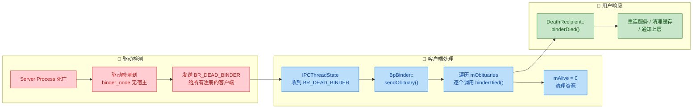

`sendObituary()` 的内部实现：

```cpp
// 文件: BpBinder.cpp
void BpBinder::sendObituary() {
    // 1. 加锁，取出死亡回调列表
    mLock.lock();
    Vector<Obituary>* obits = mObituaries;
    mObituaries = nullptr;         // 清空，防止重复派发

    // 2. 标记为已死亡
    mAlive = 0;

    // 3. 如果存在回调列表，逐个通知
    if (obits != nullptr) {
        mLock.unlock();            // 先释放锁再回调，避免死锁

        const size_t N = obits->size();
        for (size_t i = 0; i < N; i++) {
            // 4. 调用每个 DeathRecipient 的 binderDied()
            //    传入 wp<IBinder> 指向当前 BpBinder
            (*obits)[i].recipient->binderDied(wp<IBinder>(this));
        }
        delete obits;              // 释放列表内存
    }

    // 5. 告知驱动：已处理完死亡通知，清理驱动端资源
    //    发送 BC_DEAD_BINDER_DONE
    IPCThreadState::self()->clearDeathNotification(mHandle, this);
    IPCThreadState::self()->flushCommands();
}
```

死亡通知机制的设计要点：

- **驱动保证**：通知是由 Binder 驱动在内核层面发出的，无论远程服务是正常退出还是被 SIGKILL 强杀，都能可靠地触发。这不同于应用层的心跳探测，不会有"检测滞后"的问题。
- **回调线程**：`binderDied()` 在 Binder 线程池的某个线程中被调用，而非主线程。如果需要更新 UI，必须通过 Handler 切回主线程。
- **避免死锁**：注意 `sendObituary()` 在调用 `binderDied()` 之前先释放了 `mLock`，这是因为 `binderDied()` 的实现中可能会再次调用 `unlinkToDeath()`，如果不释放锁就会造成死锁。

---

### BpBinder 的生命周期与引用计数

BpBinder 继承了 `RefBase`，使用 Android 的强弱引用计数体系（`sp<>` / `wp<>`）管理生命周期。其生命周期与 Binder 驱动中的引用计数紧密耦合：

```cpp
// 文件: BpBinder.cpp
// 当 BpBinder 的最后一个强引用被释放时自动调用
void BpBinder::onLastStrongRef(const void* /*id*/) {
    // 1. 如果有已注册的死亡通知，先清理
    if (mObituaries != nullptr) {
        // 取消驱动端的死亡通知注册
        IPCThreadState::self()->clearDeathNotification(
            mHandle, this);
        // 释放回调列表
        delete mObituaries;
        mObituaries = nullptr;
    }

    // 2.【关键】通知 Binder 驱动减少引用计数
    //    发送 BC_RELEASE 命令
    //    驱动会减少 binder_ref 的强引用计数
    //    如果计数归零，驱动会释放 binder_ref
    //    如果所有客户端都释放了，binder_node 也可能被释放
    IPCThreadState::self()->decStrongHandle(mHandle);
}

// 当 BpBinder 的最后一个弱引用被释放时自动调用
void BpBinder::onLastWeakRef(const void* /*id*/) {
    // 通知驱动减少弱引用计数
    // 发送 BC_DECREFS 命令
    IPCThreadState::self()->decWeakHandle(mHandle);
}
```

用户空间与内核空间的引用计数同步关系：

```text
用户空间操作                      内核空间效果
──────────────────────────────────────────────────────
BpBinder::create()          →     BC_INCREFS  → binder_ref.weak++
                                  BC_ACQUIRE  → binder_ref.strong++
sp<BpBinder> 赋值           →     (用户空间 strong++ 仅本地)
sp<BpBinder> 释放           →     (用户空间 strong-- 仅本地)
onLastStrongRef()           →     BC_RELEASE  → binder_ref.strong--
onLastWeakRef()             →     BC_DECREFS  → binder_ref.weak--
```

这套双重引用计数机制保证了一个核心不变量（invariant）：**只要客户端用户空间还持有 BpBinder 的强/弱引用，驱动中对应的 `binder_ref` 和 `binder_node` 就不会被过早释放**。反过来，当客户端完全不再使用某个远程服务时，驱动中的引用也会被自动清理，不会造成内核内存泄漏。

---

### BpBinder 与 BpInterface 的协作关系

在实际使用中，开发者几乎不会直接操作 BpBinder。它被包装在 `BpInterface<IXxx>` 内部。理解这层包装关系非常重要：

```cpp
// 文件: IInterface.h
template<typename INTERFACE>
class BpInterface : public INTERFACE, public BpRefBase {
public:
    explicit BpInterface(const sp<IBinder>& remote);
    // INTERFACE 中定义的纯虚方法在此实现
};

// BpRefBase 持有一个 sp<IBinder>，实际上就是 BpBinder
class BpRefBase : public virtual RefBase {
protected:
    // 返回内部持有的 BpBinder（以 IBinder 接口暴露）
    inline IBinder* remote() { return mRemote; }

private:
    IBinder* const mRemote;  // 实际类型是 BpBinder
};
```

来看一个具体的业务代理如何使用 BpBinder：

```cpp
// 示例：ICameraService 的代理实现
class BpCameraService : public BpInterface<ICameraService> {
public:
    // 构造函数：将 BpBinder 传给基类
    explicit BpCameraService(const sp<IBinder>& impl)
        : BpInterface<ICameraService>(impl) {}

    // 实现 ICameraService 定义的业务方法
    virtual status_t getNumberOfCameras(int32_t* numCameras) {
        Parcel data, reply;

        // 1. 写入接口描述符（安全校验用）
        data.writeInterfaceToken(
            ICameraService::getInterfaceDescriptor());

        // 2.【核心】调用 remote()->transact()
        //    remote() 返回的就是 BpBinder
        //    TRANSACTION_GET_NUMBER_OF_CAMERAS 是方法编号
        status_t status = remote()->transact(
            GET_NUMBER_OF_CAMERAS,  // 事务 code
            data,                    // 请求数据
            &reply);                 // 响应数据

        // 3. 从 reply 中读取返回值
        if (status == NO_ERROR) {
            *numCameras = reply.readInt32();
        }
        return status;
    }
};
```

调用链的内存布局可以用如下 ASCII 模型表示：

```cpp
// BpCameraService 对象的内存布局（概念性）
//
// +-----------------------------------+
// | BpCameraService                   |
// |   +-------------------------------+
// |   | BpInterface<ICameraService>   |
// |   |   +---------------------------+
// |   |   | ICameraService (vtable)   |  ← 业务接口的虚函数表
// |   |   +---------------------------+
// |   |   | BpRefBase                 |
// |   |   |   mRemote ──────────────────→ BpBinder(handle=N)
// |   |   |                           |      ├── mHandle = N
// |   |   +---------------------------+      ├── mAlive = 1
// |   +-------------------------------+      └── mObituaries
// +-----------------------------------+
```

可以看出：**BpCameraService（业务代理）** → **BpRefBase（持有远程引用）** → **BpBinder（负责 IPC 传输）** 形成了一条清晰的职责链。每一层只关心自己的事情：业务层编码参数，BpBinder 负责传输，IPCThreadState 负责驱动通信。

---

### BpBinder 的关键设计哲学总结

| 设计原则 | BpBinder 中的体现 |
|---|---|
| **单一职责** | 只负责"传输"，不含任何业务逻辑。业务编码由 BpInterface 完成，驱动通信由 IPCThreadState 完成 |
| **面向接口** | 通过 IBinder 接口暴露给上层，上层代码不依赖 BpBinder 具体类型 |
| **代理模式** | 经典的 Proxy Pattern：BpBinder 代表远程 BBinder，对客户端隐藏了跨进程通信的复杂性 |
| **引用计数与资源同步** | 用户空间的生命周期管理（RefBase）与内核空间的引用计数（BC_ACQUIRE/BC_RELEASE）严格同步 |
| **透明寻址** | 客户端无需知道目标服务在哪个进程、哪个线程，一切通过 handle 由驱动路由 |
| **故障感知** | linkToDeath 机制让客户端能够优雅地处理远程服务崩溃，而非被动地等待超时 |

---

**📝 练习题**

在 Android Binder C++ 体系中，以下关于 `BpBinder` 的描述，**错误**的是：

A. BpBinder 的 `mHandle` 是全局唯一的，即同一个远程服务在任何客户端进程中都对应相同的 handle 值


B. BpBinder 的 `transact()` 方法最终通过 `IPCThreadState::self()->transact()` 将数据发送到 Binder 驱动


C. 当 BpBinder 的最后一个强引用被释放时，会通过 `BC_RELEASE` 通知 Binder 驱动减少引用计数


D. `linkToDeath()` 会向 Binder 驱动发送 `BC_REQUEST_DEATH_NOTIFICATION` 命令，让驱动在远程服务死亡时主动通知客户端


**【答案】** A

**【解析】** `mHandle` 是 **进程级别（per-process）** 的，而非全局唯一。Binder 驱动在每个客户端进程的 `binder_proc` 结构体内维护了独立的 `binder_ref` 红黑树，handle 值只是该进程内引用表的索引。因此，同一个远程服务（同一个 `binder_node`）在不同客户端进程中完全可能被分配不同的 handle 值。选项 B 准确描述了 `transact()` 的委托机制；选项 C 正确地指出了 `onLastStrongRef()` 中的驱动引用计数同步逻辑；选项 D 准确描述了死亡通知的注册流程。只有 A 的"全局唯一"说法是错误的。唯一的例外是 **handle = 0 永远指向 ServiceManager**，这是系统级的硬编码约定，但这不意味着其他 handle 也具有全局一致性。

---

## BBinder（服务端）

在 Binder IPC 架构中，**BBinder** 是服务端（Server Side）的核心基类，与客户端的 BpBinder 互为镜像。当一个远程 `transact()` 调用穿越进程边界、经由 Binder 驱动传递到目标进程后，最终的"接球手"就是 BBinder。它负责**接收、解析并分发**这些跨进程事务请求（Transaction），是整个服务端处理逻辑的入口起点。

如果说 BpBinder 是"发信人"，那 BBinder 就是"收信人"——它站在服务进程这一侧，等待 Binder 驱动将来自远端客户端的调用投递过来，然后在 `onTransact()` 回调中完成真正的业务逻辑。

---

### BBinder 在继承体系中的位置

BBinder 直接继承自 `IBinder`，是所有 Binder 服务端对象的 C++ 层基类。我们先用一张类图来定位它：

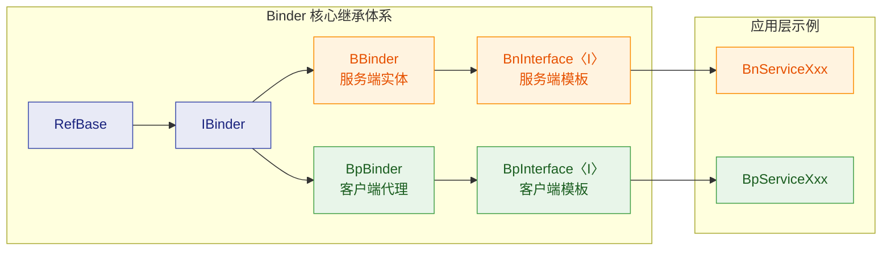

从图中可以清晰地看到：

- **IBinder** 是抽象接口层，定义了 `transact()`、`localBinder()`、`remoteBinder()` 等纯虚函数。
- **BBinder** 实现了 IBinder 中面向**本地服务端**的那一组接口，最关键的就是 `onTransact()`。
- **BnInterface\<I\>** 是在 BBinder 基础上再叠加业务接口 `I` 的模板类，开发者最终继承它来编写具体服务。

因此，BBinder 本质上是一个**半成品**——它完成了 Binder 框架层面的服务端通用逻辑，但把"具体怎么处理某个业务请求"这个问题，通过虚函数 `onTransact()` 留给了子类。

---

### BBinder 的核心源码剖析

BBinder 的实现位于 `frameworks/native/libs/binder/Binder.cpp`，头文件为 `frameworks/native/include/binder/Binder.h`。下面我们逐段分析其关键成员。

#### 类声明概览

```cpp
// 文件: frameworks/native/include/binder/Binder.h
// BBinder 继承自 IBinder，是服务端 Binder 对象的基类
class BBinder : public IBinder {
public:
    BBinder();                                          // 构造函数

    // ---- 来自 IBinder 的重要覆写 ----
    virtual const String16& getInterfaceDescriptor() const; // 返回接口描述符
    virtual bool            isBinderAlive() const;          // 本地对象永远 alive
    virtual status_t        pingBinder();                   // ping 测试，直接返回 OK
    virtual status_t        dump(int fd, const Vector<String16>& args); // dump 信息

    // 核心：接收并处理来自远端的事务调用
    virtual status_t        transact(uint32_t code,         // 事务码
                                     const Parcel& data,    // 输入数据
                                     Parcel* reply,         // 输出回复
                                     uint32_t flags = 0);   // 标志位

    virtual status_t        linkToDeath(const sp<DeathRecipient>& recipient,
                                        void* cookie = nullptr,
                                        uint32_t flags = 0);

    virtual status_t        unlinkToDeath(const wp<DeathRecipient>& recipient,
                                          void* cookie = nullptr,
                                          uint32_t flags = 0,
                                          wp<DeathRecipient>* outRecipient = nullptr);

    // 关键：区分本地/远程
    virtual BBinder*        localBinder();                  // 返回 this
    // remoteBinder() 继承自 IBinder，默认返回 nullptr

protected:
    virtual                 ~BBinder();                     // 析构函数

    // ★★★ 最核心的虚函数 ★★★
    // 子类必须覆写此方法来处理具体的业务逻辑
    virtual status_t        onTransact(uint32_t code,       // 事务码
                                       const Parcel& data,  // 客户端发来的数据
                                       Parcel* reply,       // 要回复给客户端的数据
                                       uint32_t flags = 0); // 标志位

private:
    BBinder(const BBinder& o);                              // 禁止拷贝
    BBinder& operator=(const BBinder& o);                   // 禁止赋值

    class Extras;                                           // 内部扩展数据类
    std::atomic<Extras*>    mExtras;                        // 原子指针，懒加载
    void*                   mReserved0;                     // 保留字段
};
```

这个声明揭示了几个设计要点：

1. **`localBinder()` 返回 `this`**：这是区分 BBinder 和 BpBinder 最本质的标志。当框架需要判断一个 IBinder 指针是否指向本进程内的服务时，调用 `localBinder()`——如果返回非空，说明这是一个本地的 BBinder；如果返回 `nullptr`，说明是远程的 BpBinder。

2. **`transact()` 是公开入口，`onTransact()` 是保护回调**：外部（Binder 驱动回调链路）调用 `transact()`，而 `transact()` 内部再调用 `onTransact()`。这是经典的 **Template Method** 设计模式。

3. **死亡通知 `linkToDeath` 对 BBinder 无意义**：BBinder 是本地对象，你不需要监听自己的死亡。因此这些方法在 BBinder 中只是返回 `INVALID_OPERATION`。

---

#### transact() 的实现：事务分发的入口

```cpp
// 文件: frameworks/native/libs/binder/Binder.cpp
// BBinder::transact() —— 服务端事务处理的入口点
status_t BBinder::transact(
    uint32_t code,          // 事务码，标识客户端要调用哪个方法
    const Parcel& data,     // 客户端发送过来的序列化数据
    Parcel* reply,          // 用于写入返回给客户端的数据
    uint32_t flags)         // 标志位，如 FLAG_ONEWAY 表示异步
{
    // 设置当前 Parcel 的严格模式策略（用于安全检查）
    data.setDataPosition(0);  // 确保从头开始读取数据

    status_t err = NO_ERROR;  // 初始化返回状态

    switch (code) {
        case PING_TRANSACTION:
            // 系统内置的 ping 事务，用于检测服务是否存活
            // 直接回复空数据即可，不需要转发给 onTransact
            err = pingBinder();
            break;

        default:
            // ★ 所有非系统预留的事务码，都转发给 onTransact()
            // 这就是 Template Method 模式的核心：
            // 基类控制流程框架，子类实现具体业务
            err = onTransact(code, data, reply, flags);
            break;
    }

    return err;  // 返回处理结果状态码
}
```

这段代码逻辑非常清晰：`transact()` 先拦截系统级的特殊事务码（如 `PING_TRANSACTION`），然后将所有业务事务码统一转发到 `onTransact()`。这样做的好处是：**子类无需关心系统级事务的处理，只需聚焦自己的业务逻辑**。

---

#### onTransact() 的默认实现

```cpp
// 文件: frameworks/native/libs/binder/Binder.cpp
// BBinder::onTransact() 的默认实现
// 子类如果不覆写，走到这里就返回 UNKNOWN_TRANSACTION
status_t BBinder::onTransact(
    uint32_t code,             // 事务码
    const Parcel& data,        // 输入数据（未使用，用 [[maybe_unused]] 也可）
    Parcel* reply,             // 回复数据
    uint32_t flags)            // 标志位
{
    (void)code;                // 消除未使用参数的编译警告
    (void)data;
    (void)reply;
    (void)flags;

    // 默认返回 UNKNOWN_TRANSACTION
    // 表示当前 BBinder 不识别该事务码
    return UNKNOWN_TRANSACTION;
}
```

这是一个**典型的"do-nothing"默认实现**。它的存在是为了安全兜底——如果子类忘记处理某个事务码，系统不会崩溃，而是返回 `UNKNOWN_TRANSACTION`，客户端会据此得知调用失败。

---

#### 其他关键方法

```cpp
// 文件: frameworks/native/libs/binder/Binder.cpp

// 本地 Binder 永远是"活着"的——因为它就在当前进程中
bool BBinder::isBinderAlive() const {
    return true;                     // 永远返回 true
}

// ping 操作对本地对象来说无意义，直接返回成功
status_t BBinder::pingBinder() {
    return NO_ERROR;                 // 直接返回 NO_ERROR
}

// 返回自身指针，表明"我是本地 Binder 对象"
BBinder* BBinder::localBinder() {
    return this;                     // 返回 this 指针
}

// 死亡通知对本地对象无意义
status_t BBinder::linkToDeath(
    const sp<DeathRecipient>& /*recipient*/,
    void* /*cookie*/,
    uint32_t /*flags*/) {
    return INVALID_OPERATION;        // 本地对象不支持死亡监听
}

// 同理，取消死亡通知也无意义
status_t BBinder::unlinkToDeath(
    const wp<DeathRecipient>& /*recipient*/,
    void* /*cookie*/,
    uint32_t /*flags*/,
    wp<DeathRecipient>* /*outRecipient*/) {
    return INVALID_OPERATION;        // 本地对象不支持取消死亡监听
}
```

这些方法的实现都极其简洁，但背后蕴含着重要的架构语义：

| 方法 | BBinder（本地） | BpBinder（远程） |
|------|:---:|:---:|
| `localBinder()` | 返回 `this` | 返回 `nullptr` |
| `remoteBinder()` | 返回 `nullptr` | 返回 `this` |
| `isBinderAlive()` | 永远 `true` | 可能 `false`（进程死亡） |
| `linkToDeath()` | `INVALID_OPERATION` | 正常注册监听 |
| `transact()` | 直接调用 `onTransact()` | 通过驱动发送到远端 |

这张对比表是理解 Binder C++ 层**对称设计**的关键。

---

### BBinder 如何接收远程调用：完整时序

当客户端通过 BpBinder 发起一次跨进程调用时，消息最终是怎样到达 BBinder 的？我们用时序图来完整展现：

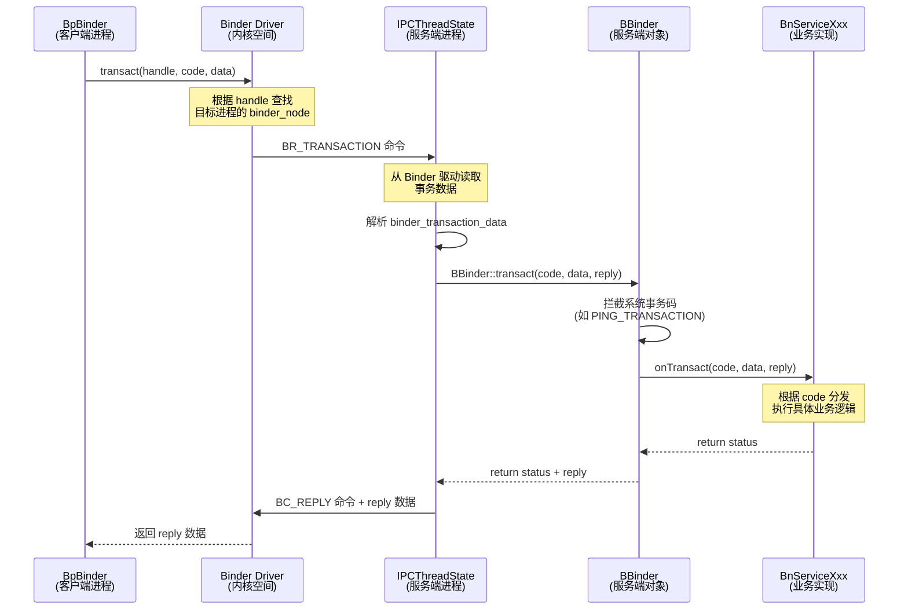

这个时序揭示了一个关键中间角色——**`IPCThreadState`**。它是服务端进程中负责与 Binder 驱动通信的线程级单例。流程可概括为：

1. **BpBinder** 在客户端进程中调用 `transact()`，数据通过 `ioctl()` 系统调用进入 Binder 驱动。
2. **Binder 驱动** 根据 handle 值找到目标服务的 `binder_node`，将事务数据排入目标进程的待处理队列，并发送 `BR_TRANSACTION` 命令唤醒目标线程。
3. **IPCThreadState** 在服务端进程的 Binder 线程中循环等待（`talkWithDriver()`），收到 `BR_TRANSACTION` 后，从事务数据中提取出目标 BBinder 的指针（这个指针保存在 `binder_node.cookie` 中），然后调用 `BBinder::transact()`。
4. **BBinder::transact()** 执行前面分析的分发逻辑，最终调用子类（如 `BnServiceXxx`）的 `onTransact()`。
5. 子类处理完成后，reply 数据沿原路返回给客户端。

> ⚠️ 注意：`binder_node.cookie` 中存储的就是 BBinder 对象在服务端进程用户空间的原始指针。这也是为什么 Binder 通信仅在 Android 受信框架中使用——任意进程不能伪造这个指针。

---

### BBinder 的生命周期管理

BBinder 继承了 `RefBase`（通过 IBinder），因此它的生命周期由 Android 的**强弱引用计数**机制管理。但在 Binder IPC 场景下，生命周期还涉及与**内核 Binder 驱动**的协同：

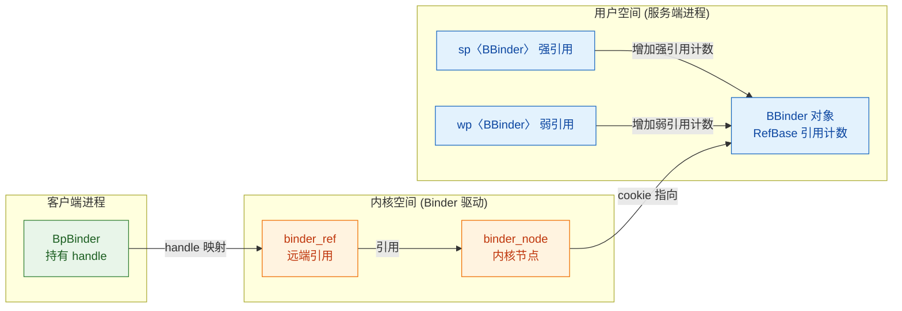

生命周期的关键规则：

1. **服务端进程内**：通过 `sp<BBinder>` 和 `wp<BBinder>` 管理。只要有强引用存在，对象就不会被销毁。
2. **Binder 驱动中**：每个 BBinder 对象在驱动中有一个对应的 `binder_node`。当客户端获取了这个服务的引用，驱动会创建 `binder_ref` 并增加 `binder_node` 的引用计数。
3. **跨进程引用计数同步**：当所有客户端都释放了对某个服务的 BpBinder（即 `binder_ref` 引用归零），驱动会向服务端发送 `BR_RELEASE` 或 `BR_DECREFS` 命令，IPCThreadState 收到后会减少对应 BBinder 的 `sp/wp` 引用计数。当引用归零时，BBinder 对象被析构。

这种**用户态-内核态联动的引用计数**机制，确保了即使在复杂的多进程环境中，Binder 对象也能被正确地回收，不会出现悬空指针或内存泄漏。

---

### 自定义 BBinder 实战：一个最小服务端

虽然实际开发中我们通常继承 `BnInterface<I>` 而不是直接继承 BBinder，但理解直接继承 BBinder 的写法有助于洞察本质：

```cpp
// 文件: MySimpleService.h
// 一个直接继承 BBinder 的最简 Binder 服务示例
#include <binder/Binder.h>         // BBinder 头文件
#include <binder/Parcel.h>         // Parcel 头文件
#include <utils/Log.h>             // Android 日志

using namespace android;           // 使用 android 命名空间

// 定义事务码常量（必须 >= FIRST_CALL_TRANSACTION）
enum {
    // IBinder::FIRST_CALL_TRANSACTION 的值为 1
    // 自定义事务码从这个基准值开始递增
    CYCLOPEDIA_SAY_HELLO = IBinder::FIRST_CALL_TRANSACTION,  // 事务码 = 1
    CYCLOPEDIA_ADD       = IBinder::FIRST_CALL_TRANSACTION + 1, // 事务码 = 2
};

// 直接继承 BBinder，实现一个简单的 Binder 服务
class MySimpleService : public BBinder {
public:
    MySimpleService() {
        // 构造时打印日志，方便追踪对象生命周期
        ALOGI("MySimpleService created");
    }

protected:
    virtual ~MySimpleService() {
        // 析构时打印日志
        ALOGI("MySimpleService destroyed");
    }

    // ★ 覆写 onTransact()，处理来自客户端的请求
    virtual status_t onTransact(
        uint32_t code,              // 客户端指定的事务码
        const Parcel& data,         // 客户端发来的数据
        Parcel* reply,              // 回复给客户端的数据
        uint32_t flags) override    // 标志位
    {
        switch (code) {

            case CYCLOPEDIA_SAY_HELLO: {
                // --- 处理 sayHello 请求 ---
                // 1. 读取接口描述符并校验（安全检查）
                CHECK_INTERFACE(IMyService, data, reply);

                // 2. 从 Parcel 中读取客户端传来的名字
                String16 name = data.readString16();     // 读取一个 UTF-16 字符串

                // 3. 拼接问候语
                String8 greeting = String8::format(      // 格式化字符串
                    "Hello, %s! Welcome to Binder world.",
                    String8(name).c_str());               // String16 转 String8

                // 4. 将结果写入 reply Parcel
                reply->writeNoException();               // 写入"无异常"标记
                reply->writeString8(greeting);           // 写入问候语字符串

                // 5. 返回成功状态
                return NO_ERROR;                         // 表示处理成功
            }

            case CYCLOPEDIA_ADD: {
                // --- 处理 add 请求 ---
                CHECK_INTERFACE(IMyService, data, reply);

                // 1. 从 Parcel 中依次读取两个整数
                int32_t a = data.readInt32();            // 读取第一个整数
                int32_t b = data.readInt32();            // 读取第二个整数

                // 2. 执行加法运算
                int32_t sum = a + b;                     // 计算结果

                // 3. 将结果写入 reply
                reply->writeNoException();               // 无异常
                reply->writeInt32(sum);                  // 写入计算结果

                return NO_ERROR;                         // 处理成功
            }

            default:
                // 未识别的事务码，交给父类 BBinder 处理
                // 父类默认返回 UNKNOWN_TRANSACTION
                return BBinder::onTransact(code, data, reply, flags);
        }
    }
};
```

这个例子清晰地展示了 BBinder 服务端的**核心编程范式**：

1. **定义事务码**：从 `FIRST_CALL_TRANSACTION` 开始递增，确保不与系统保留的事务码冲突。
2. **覆写 `onTransact()`**：用 `switch-case` 根据事务码分发到不同的处理逻辑。
3. **从 Parcel 中读数据**：按照与客户端约定好的**顺序和类型**，从 `data` 中依次读取参数。
4. **向 Parcel 中写数据**：将结果按约定格式写入 `reply`。
5. **兜底处理**：对于不认识的事务码，调用父类的 `onTransact()` 返回 `UNKNOWN_TRANSACTION`。

> 💡 在实际 AOSP 开发中，上述的 `switch-case` + 手动读写 Parcel 的模式会由 **AIDL 编译器自动生成**，开发者只需定义 `.aidl` 接口文件即可。但理解这个底层机制，对排查 Binder 通信问题至关重要。

---

### BBinder 与 BpBinder 的对称设计

Android Binder 的 C++ 层采用了精妙的**Proxy-Stub（代理-存根）对称架构**。BBinder 和 BpBinder 就像一枚硬币的两面：

```mermaid
graph LR
    subgraph ClientProc["客户端进程"]
        direction TB
        A["BpServiceXxx<br/>(业务代理)"]
        B["BpInterface〈I〉"]
        C["BpBinder<br/>(通信代理)"]
        A --> B
        B --> C
    end

    subgraph KernelDriver["Binder 驱动"]
        direction TB
        D["binder_ref<br/>客户端引用"]
        E["binder_node<br/>服务端节点"]
        D ---|handle 映射| E
    end

    subgraph ServerProc["服务端进程"]
        direction TB
        F["BBinder<br/>(通信存根)"]
        G["BnInterface〈I〉"]
        H["BnServiceXxx<br/>(业务实现)"]
        F --> G
        G --> H
    end

    C -->|"ioctl(BINDER_WRITE_READ)"| D
    E -->|"BR_TRANSACTION"| F

    classDef clientCls fill:#E8F5E9,stroke:#388E3C,color:#1B5E20
    classDef kernelCls fill:#FFF3E0,stroke:#F57C00,color:#E65100
    classDef serverCls fill:#E3F2FD,stroke:#1976D2,color:#0D47A1

    class A,B,C clientCls
    class D,E kernelCls
    class F,G,H serverCls
```

对称性体现在以下维度：

| 维度 | BpBinder（客户端） | BBinder（服务端） |
|------|:---:|:---:|
| **角色** | Proxy（代理） | Stub（存根） |
| **transact()** | 将数据发往驱动 | 从驱动接收数据 |
| **核心虚函数** | 无（直接与驱动通信） | `onTransact()`（处理业务） |
| **持有的标识** | `mHandle`（int32_t） | 对象指针本身 |
| **localBinder()** | `nullptr` | `this` |
| **remoteBinder()** | `this` | `nullptr` |
| **死亡通知** | 支持（监听远端死亡） | 不支持（自己就是本地对象） |

这种对称设计使得 **`IBinder*` 指针可以在不关心本地/远程的情况下统一使用**——调用者只需调用 `transact()`，底层自动判断是走本地路径（BBinder 直接调用 `onTransact()`）还是远程路径（BpBinder 通过驱动转发）。这就是 Binder 框架的**位置透明性（Location Transparency）**。

---

### BBinder 的线程安全考量

BBinder 的 `onTransact()` 可能被**多个 Binder 线程同时调用**。这是因为每个服务进程维护着一个 **Binder 线程池**（默认最大 15 个线程 + 1 个主线程），多个客户端的请求可以被不同线程并发处理。

```cpp
// 伪代码：展示 BBinder 的多线程调用场景
// 服务端的 Binder 线程池中有多个线程在循环等待

// 线程 1：处理来自客户端 A 的请求
void binderThread1() {
    // IPCThreadState::self() 是线程局部单例 (Thread-Local Singleton)
    IPCThreadState::self()->joinThreadPool();  // 加入线程池
    // 内部循环：
    //   talkWithDriver()  -> 读取 BR_TRANSACTION
    //   executeCommand()  -> 调用 target BBinder 的 transact()
    //                     -> 最终调用 onTransact()
}

// 线程 2：同时处理来自客户端 B 的请求
void binderThread2() {
    IPCThreadState::self()->joinThreadPool();  // 同样加入线程池
    // 可能同时调用同一个 BBinder 的 onTransact()！
}
```

因此，BBinder 的子类在实现 `onTransact()` 时**必须考虑线程安全**：

- 如果服务内部有**共享可变状态**（Shared Mutable State），必须使用 `Mutex`、`std::mutex` 或 `std::atomic` 来保护。
- 如果业务逻辑本身是无状态的（每次调用独立），则天然线程安全。
- AOSP 中很多系统服务（如 `SurfaceFlinger`、`AudioFlinger`）在 `onTransact()` 内部都大量使用了 `Mutex::Autolock` 来保护临界区。

```cpp
// 线程安全的 BBinder 子类示例
class ThreadSafeService : public BBinder {
private:
    mutable Mutex mLock;          // 互斥锁，用 mutable 修饰以便在 const 方法中使用
    int mCounter = 0;             // 共享可变状态

protected:
    status_t onTransact(uint32_t code, const Parcel& data,
                        Parcel* reply, uint32_t flags) override {
        switch (code) {
            case INCREMENT_COUNTER: {
                // 使用 Autolock 自动获取和释放锁（RAII 模式）
                Mutex::Autolock _l(mLock);   // 构造时加锁
                mCounter++;                   // 安全地修改共享状态
                reply->writeInt32(mCounter);  // 写入当前值
                return NO_ERROR;
                // _l 析构时自动解锁
            }
            default:
                return BBinder::onTransact(code, data, reply, flags);
        }
    }
};
```

---

### 本节核心要点回顾

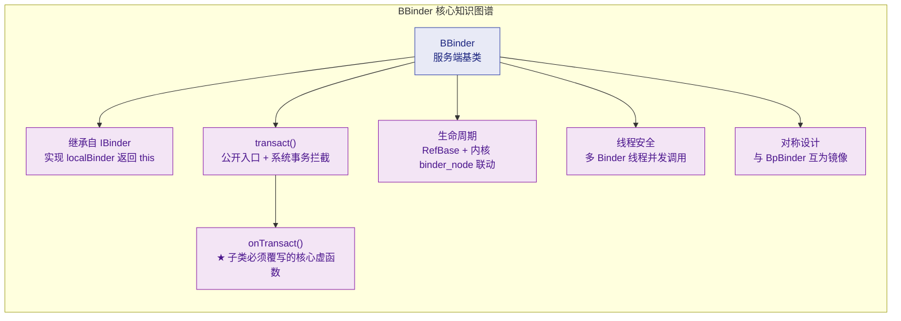

- **BBinder 是服务端 Binder 对象的 C++ 基类**，它实现了 IBinder 接口中面向本地端的方法。
- **`onTransact()` 是 BBinder 最核心的扩展点**，子类通过覆写它来实现具体的业务逻辑分发。
- **`transact()` → `onTransact()`** 采用 Template Method 模式，框架处理系统事务，子类处理业务事务。
- BBinder 与 BpBinder 形成**对称的 Proxy-Stub 架构**，通过 `localBinder()` / `remoteBinder()` 区分。
- 生命周期由 **RefBase 引用计数 + Binder 驱动 binder_node** 联合管理。
- `onTransact()` 可能被多线程并发调用，**子类必须保证线程安全**。

---

**📝 练习题**

在 Android Binder 的 C++ 实现中，某服务端 BBinder 子类的 `onTransact()` 方法被调用时，以下哪个说法是**正确的**？


A. `onTransact()` 始终由服务端的主线程（Main Thread）调用，不存在并发问题


B. `onTransact()` 可能被 Binder 线程池中的多个线程并发调用，因此对共享状态的访问必须加锁保护


C. BBinder 的 `transact()` 方法会直接通过 Binder 驱动将数据发送到客户端进程


D. BBinder 的 `linkToDeath()` 方法可以用来监听客户端进程的死亡


**【答案】** B

**【解析】** Android 服务端进程维护一个 Binder 线程池（默认最大 15+1 个线程），来自不同客户端的并发请求会由不同的 Binder 线程分别处理，因此同一个 BBinder 对象的 `onTransact()` 完全可能被多个线程同时调用。选项 A 错误，因为 Binder 调用不仅限于主线程。选项 C 描述的是 BpBinder 的行为，而非 BBinder——BBinder 的 `transact()` 是**接收**驱动转发过来的事务，而不是向驱动发送。选项 D 也不正确，BBinder 的 `linkToDeath()` 返回 `INVALID_OPERATION`，死亡通知机制是为 **BpBinder**（客户端）设计的，用于监听远端服务的死亡，本地对象无需监听自身。

---

## IInterface 与 BnInterface / BpInterface

在前面的章节中，我们已经认识了 Binder 通信的两个底层基石——`BpBinder`（代理端，持有 handle）和 `BBinder`（服务端，实现 `onTransact`）。但在实际的 Android 系统开发中，**没有人直接操作 `BpBinder` / `BBinder`**。原因很简单：它们提供的是原始的 `transact` / `onTransact` 字节流接口，调用方需要手动构造 `Parcel`、手动填写 `code`、手动解包——这既容易出错，也无法在编译期做类型检查。

Android 框架为此设计了一层 **面向接口的抽象**——`IInterface` / `BnInterface` / `BpInterface`，它们把"粗糙的 IPC 管道"包装成与本地 C++ 虚函数调用几乎一样的体验。这一层是理解所有 Android 系统服务（`SurfaceFlinger`、`AudioFlinger`、`ActivityManager` 等）C++ 端实现的**关键拼图**。

---

### IInterface：所有业务接口的根基类

`IInterface` 定义在 `frameworks/native/libs/binder/include/binder/IInterface.h` 中，它是一个极其精简的抽象基类：

```cpp
// frameworks/native/libs/binder/include/binder/IInterface.h（简化版）

class IInterface : public virtual RefBase {  
    // 继承自 RefBase，获得智能指针引用计数能力
public:
    IInterface();                             // 默认构造
    static sp<IBinder> asBinder(const IInterface*);  // 从 IInterface 获取其底层 IBinder
    static sp<IBinder> asBinder(const sp<IInterface>&); // 重载版本，接受智能指针

protected:
    virtual IBinder* onAsBinder() = 0;        // 纯虚函数，子类必须实现
                                               // BnXxx 返回 this（自己就是 BBinder）
                                               // BpXxx 返回内部持有的 BpBinder
};
```

它的核心职责只有一个：**提供一种从"业务接口指针"反向获取底层 `IBinder` 对象的标准方法**。

为什么需要这个能力？设想你拿到一个 `sp<IServiceManager>`，有时候你需要把它当作 `IBinder` 注册到别的地方、或者跨进程传递给别人——`asBinder()` 就是这个桥梁。

> **关键理解**：`IInterface` 本身不携带任何业务方法（没有 `getService`、`play`、`draw` 之类的东西）。它是一个**标记 + 桥接**角色，真正的业务方法由下一级的 `IXxx` 接口定义。

---

### 从 IInterface 到具体业务接口：IXxx 的诞生

当我们要定义一个 Binder 服务——例如一个简单的 `IDemo` 服务，第一步是声明它的 **业务接口类**：

```cpp
// IDemo.h —— 业务接口声明

#include <binder/IInterface.h>   // 引入 IInterface 基类

class IDemo : public IInterface { 
    // IDemo 继承 IInterface，成为一个"Binder 业务接口"
public:
    // DECLARE_META_INTERFACE 宏（稍后详细展开）
    // 它会自动声明：
    //   static const std::string descriptor;        // 接口描述符
    //   static sp<IDemo> asInterface(const sp<IBinder>&); // 从 IBinder 转为 IDemo
    //   virtual const String16& getInterfaceDescriptor() const;
    DECLARE_META_INTERFACE(Demo);

    // ===== 以下才是真正的业务方法 =====
    virtual int add(int a, int b) = 0;        // 纯虚函数：加法
    virtual String16 greet(const String16& name) = 0; // 纯虚函数：问候
};
```

此时 `IDemo` 就是一个**纯接口**（类似 Java 中的 `interface`），它告诉编译器和开发者：
- 我是一个 Binder 接口（因为继承了 `IInterface`）
- 我的业务能力包括 `add` 和 `greet`
- 我不关心你是本地实现还是远程代理——**多态会帮我搞定一切**

---

### BpInterface：代理端模板基类

`BpInterface` 是一个 **类模板**，定义同样在 `IInterface.h` 中：

```cpp
// 简化后的 BpInterface 模板定义

template<typename INTERFACE>
class BpInterface : public INTERFACE,     // 继承业务接口（如 IDemo）
                    public BpRefBase {     // 继承 BpRefBase（内部持有 BpBinder）
public:
    explicit BpInterface(const sp<IBinder>& remote);
    // remote 参数就是底层的 BpBinder 对象

protected:
    virtual IBinder* onAsBinder();
    // 实现 IInterface 的纯虚函数
    // 返回 BpRefBase::remote()，即内部持有的 BpBinder
};
```

当我们写 `class BpDemo : public BpInterface<IDemo>` 时，模板展开后的继承关系变成：

```
BpDemo → BpInterface<IDemo> → IDemo     (业务接口线)
                              → BpRefBase (Binder 代理线，持有 mRemote = BpBinder)
```

**BpDemo 的职责**：把 `IDemo` 中的每个纯虚业务方法实现为 **"打包 Parcel → 调用 remote()->transact() → 解包 reply"** 的远程调用流程。

```cpp
// BpDemo.cpp —— 代理端业务方法实现

class BpDemo : public BpInterface<IDemo> {
    // 继承 BpInterface<IDemo>，获得 remote() 方法（返回 BpBinder）
public:
    explicit BpDemo(const sp<IBinder>& impl)
        : BpInterface<IDemo>(impl) {}
        // 将 BpBinder 传给 BpInterface 构造函数保存

    // ========== 实现 IDemo::add ==========
    int add(int a, int b) override {
        Parcel data, reply;                         // 创建发送包和回复包
        data.writeInterfaceToken(                   // 写入接口描述符（安全校验用）
            IDemo::getInterfaceDescriptor());
        data.writeInt32(a);                         // 序列化参数 a
        data.writeInt32(b);                         // 序列化参数 b

        remote()->transact(                         // 调用 BpBinder::transact
            ADD_TRANSACTION,                        // 自定义的事务码（枚举常量）
            data,                                   // 发送数据
            &reply);                                // 接收回复

        return reply.readInt32();                   // 从回复中反序列化结果
    }

    // ========== 实现 IDemo::greet ==========
    String16 greet(const String16& name) override {
        Parcel data, reply;                         // 创建发送包和回复包
        data.writeInterfaceToken(                   // 写入接口描述符
            IDemo::getInterfaceDescriptor());
        data.writeString16(name);                   // 序列化参数 name

        remote()->transact(                         // 发起 IPC 调用
            GREET_TRANSACTION,                      // 事务码
            data,
            &reply);

        return reply.readString16();                // 反序列化并返回结果
    }
};
```

可以看到，`BpDemo` 的每个方法都是一个**固定的三步走**：

1. **序列化**（Serialize）：把参数写入 `Parcel data`
2. **传输**（Transact）：通过 `remote()->transact()` 跨进程发送
3. **反序列化**（Deserialize）：从 `Parcel reply` 中读出返回值

调用者使用 `sp<IDemo> demo = ...;  demo->add(3, 5);` 时，**完全不知道**这背后发生了进程间通信——这就是 Binder 的**透明性（Transparency）**。

---

### BnInterface：服务端模板基类

`BnInterface` 与 `BpInterface` 对称，也是一个类模板：

```cpp
// 简化后的 BnInterface 模板定义

template<typename INTERFACE>
class BnInterface : public INTERFACE,     // 继承业务接口（如 IDemo）
                    public BBinder {       // 继承 BBinder（服务端 Binder 实体）
public:
    virtual sp<IInterface> queryLocalInterface(const String16& _descriptor);
    // 如果 descriptor 匹配，返回 this（说明在同进程，不需要走 IPC）

protected:
    virtual IBinder* onAsBinder();
    // 实现 IInterface 的纯虚函数
    // 直接返回 this（BnXxx 自己就是 BBinder）
};
```

当我们写 `class BnDemo : public BnInterface<IDemo>` 时：

```
BnDemo → BnInterface<IDemo> → IDemo    (业务接口线)
                              → BBinder  (Binder 实体线，可被内核引用)
```

**BnDemo 的职责**有两个：
1. **实现 `onTransact`**：把收到的原始 `Parcel` 解包，根据事务码 `code` 分发到对应的业务方法
2. **实现具体的业务逻辑**（也可以再派生一层，让 `BnDemo` 只做分发，具体逻辑放在最终子类中）

```cpp
// BnDemo.cpp —— 服务端事务分发 + 业务实现

class BnDemo : public BnInterface<IDemo> {
    // 继承 BnInterface<IDemo>，自身就是 BBinder
public:
    // ========== onTransact：事务分发入口 ==========
    status_t onTransact(
        uint32_t code,                              // 事务码，对应 BpDemo 中的常量
        const Parcel& data,                         // 客户端发来的数据包
        Parcel* reply,                              // 待填写的回复包
        uint32_t flags = 0) override {              // 标志位（同步/异步等）

        switch (code) {                             // 根据事务码分发

            case ADD_TRANSACTION: {                 // 处理 add 请求
                CHECK_INTERFACE(IDemo, data, reply);// 校验接口描述符（安全宏）
                int a = data.readInt32();           // 反序列化参数 a
                int b = data.readInt32();           // 反序列化参数 b
                int result = add(a, b);             // 调用自身的 add 实现（虚函数）
                reply->writeInt32(result);          // 将结果序列化到回复包
                return NO_ERROR;                    // 返回成功
            }

            case GREET_TRANSACTION: {               // 处理 greet 请求
                CHECK_INTERFACE(IDemo, data, reply);// 校验接口描述符
                String16 name = data.readString16();// 反序列化参数 name
                String16 result = greet(name);      // 调用自身的 greet 实现
                reply->writeString16(result);       // 序列化回复
                return NO_ERROR;
            }

            default:                                // 未知事务码
                return BBinder::onTransact(         // 交给父类 BBinder 处理
                    code, data, reply, flags);
        }
    }

    // ========== 真正的业务逻辑 ==========
    int add(int a, int b) override {
        return a + b;                               // 实际计算加法
    }

    String16 greet(const String16& name) override {
        String16 prefix("Hello, ");                 // 构造问候语
        return prefix + name;                       // 拼接并返回
    }
};
```

注意 `onTransact` 与 `BpDemo` 中的方法是**镜像对称**的：Bp 端写什么顺序，Bn 端就读什么顺序。**顺序必须严格一致**，否则数据会错位——这是 Binder 开发中最常见的 bug 之一。

---

### DECLARE_META_INTERFACE 与 IMPLEMENT_META_INTERFACE 宏

Android 提供了一对宏来消除大量重复的模板代码。它们是连接 `IBinder` 世界和 `IInterface` 世界的**关键粘合剂**。

#### DECLARE_META_INTERFACE(INTERFACE)

展开后大致等价于：

```cpp
// DECLARE_META_INTERFACE(Demo) 展开结果

static const android::String16 descriptor;            
// 接口描述符字符串，如 "android.demo.IDemo"

static android::sp<IDemo> asInterface(               
    const android::sp<android::IBinder>& obj);        
// 核心方法：将 IBinder 转换为 IDemo 智能指针
// 这就是"从管道到接口"的魔法入口

virtual const android::String16& getInterfaceDescriptor() const;
// 返回 descriptor
```

#### IMPLEMENT_META_INTERFACE(INTERFACE, DESCRIPTOR)

```cpp
// IMPLEMENT_META_INTERFACE(Demo, "android.demo.IDemo") 展开（简化）

const android::String16 IDemo::descriptor("android.demo.IDemo");
// 定义描述符常量

const android::String16& IDemo::getInterfaceDescriptor() const {
    return IDemo::descriptor;                         // 返回描述符
}

android::sp<IDemo> IDemo::asInterface(
    const android::sp<android::IBinder>& obj) {
    
    android::sp<IDemo> intr;                          // 待返回的接口指针
    if (obj != nullptr) {                             // 传入的 IBinder 非空
        intr = static_cast<IDemo*>(                   // 先尝试本地查询
            obj->queryLocalInterface(                 // 如果 obj 就是 BnDemo（同进程）
                IDemo::descriptor).get());            // 直接强转，避免 IPC 开销
        if (intr == nullptr) {                        // 本地查询失败（跨进程场景）
            intr = new BpDemo(obj);                   // 创建 BpDemo 代理对象
                                                      // obj 此时是 BpBinder
        }
    }
    return intr;                                      // 返回 IDemo 接口指针
}
```

这段代码是**整个 Binder 接口转换的灵魂**。它实现了一个关键的决策逻辑：

- **同进程**：`obj` 实际是 `BnDemo`（`BBinder` 子类），`queryLocalInterface` 直接返回自身 → **零开销的本地调用**
- **跨进程**：`obj` 实际是 `BpBinder`，`queryLocalInterface` 返回 `nullptr` → 创建 `BpDemo` 代理 → **走 IPC 通道**

调用者只需要写 `sp<IDemo> demo = IDemo::asInterface(binder);`，完全不需要关心对端在哪个进程——**框架自动做了最优选择**。

---

### 完整继承体系：一张全景图

下面的 Mermaid 图展示了以 `IDemo` 为例的完整类继承关系和职责分工：

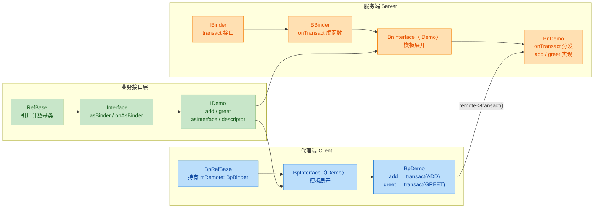

从图中可以直观地看到**菱形继承结构**：

- `BpDemo` 同时拥有 `IDemo`（业务接口）和 `BpRefBase`（Binder 代理）两条血脉
- `BnDemo` 同时拥有 `IDemo`（业务接口）和 `BBinder`（Binder 实体）两条血脉
- 它们通过 `IDemo` 接口统一对外，使用者只面对 `sp<IDemo>`

---

### 一次完整的调用链路

当客户端调用 `demo->add(3, 5)` 时，数据的完整旅程如下：

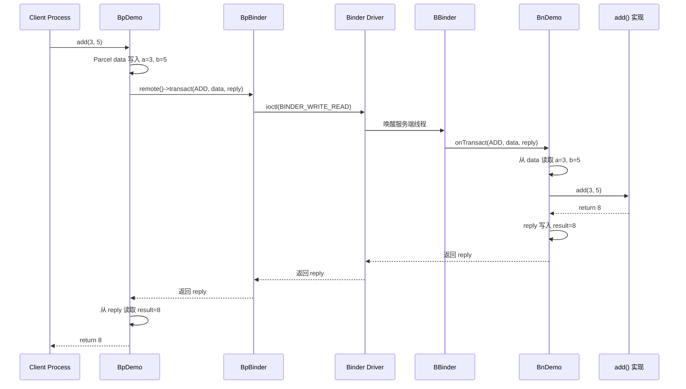

整个过程对 `Client` 来说就像调用了一个普通的 `int add(int, int)` 函数，Binder 框架的分层抽象将 IPC 的复杂性完全隐藏在了 `IInterface` / `BnInterface` / `BpInterface` 这一层之下。

---

### queryLocalInterface：同进程优化的秘密

前面提到 `asInterface` 中会先调用 `queryLocalInterface`，这个机制值得单独拆解：

```cpp
// BnInterface 中的 queryLocalInterface 实现
template<typename INTERFACE>
sp<IInterface> BnInterface<INTERFACE>::queryLocalInterface(
    const String16& _descriptor) {
    
    if (_descriptor == INTERFACE::descriptor) {       // 描述符匹配
        return sp<IInterface>::fromExisting(          // 返回 this
            static_cast<IInterface*>(this));           // BnXxx 自己就是 IInterface 的子类
    }
    return nullptr;                                   // 不匹配则返回空
}
```

而 `BpBinder` 的 `queryLocalInterface` 默认返回 `nullptr`，因为它只是一个远程引用，本地没有真正的实现。

这就构成了**同进程 vs 跨进程**的自动判别：

```cpp
// 内存模型对比

// 场景 A：同进程
// ┌──────────────────────────────────────┐
// │          Process A                    │
// │                                       │
// │  Client ──→ sp<IDemo>                │
// │                  │                    │
// │                  ▼                    │
// │             BnDemo (BBinder)          │
// │             直接调用 add()             │
// │             无 IPC 开销               │
// └──────────────────────────────────────┘

// 场景 B：跨进程
// ┌─────────────────┐    ┌─────────────────┐
// │   Process A      │    │   Process B      │
// │                  │    │                  │
// │ Client           │    │   BnDemo         │
// │   │              │    │     ▲            │
// │   ▼              │    │     │            │
// │ BpDemo           │    │   BBinder        │
// │   │              │    │     ▲            │
// │   ▼              │    │     │            │
// │ BpBinder ════════╪════╪═══ Binder Driver │
// └─────────────────┘    └─────────────────┘
```

这个优化在 Android 系统中非常重要——例如 `SystemServer` 进程内部有大量服务互相调用，如果每次都走 `ioctl` 进内核再回来，性能会惨不忍睹。`queryLocalInterface` 让同进程调用**退化为普通虚函数调用**，开销几乎为零。

---

### interface_cast：更优雅的转换语法糖

Android 还提供了一个模板函数 `interface_cast`，本质是 `asInterface` 的语法糖：

```cpp
// IInterface.h 中的定义
template<typename INTERFACE>
inline sp<INTERFACE> interface_cast(const sp<IBinder>& obj) {
    return INTERFACE::asInterface(obj);               // 直接委托给 asInterface
}

// 使用示例
sp<IBinder> binder = sm->getService(String16("demo"));  // 从 ServiceManager 获取 IBinder
sp<IDemo> demo = interface_cast<IDemo>(binder);          // 转为业务接口
// 等价于：sp<IDemo> demo = IDemo::asInterface(binder);

demo->add(3, 5);  // 像本地调用一样使用
```

这与 Java 层的 `IDemo.Stub.asInterface(binder)` 异曲同工，只是 C++ 用模板实现，Java 用代码生成（AIDL）实现。

---

### 实战中的层级划分模式

在真实的 Android 源码中，`BnXxx` 通常**不直接实现业务逻辑**，而是只做 `onTransact` 分发。具体实现放在再派生的一层中：

```cpp
// 层级划分示例

// 第一层：纯接口
class IDemo : public IInterface {
    virtual int add(int a, int b) = 0;                // 纯虚
};

// 第二层：Bn 端只做协议分发
class BnDemo : public BnInterface<IDemo> {
    status_t onTransact(...) override;                // 解包 + 分发
    // add() 仍然是纯虚的！不在这里实现
};

// 第三层：真正的服务实现
class DemoService : public BnDemo {
    int add(int a, int b) override {                  // 最终的业务实现
        LOG("add called: %d + %d", a, b);             // 可以加日志
        return a + b;                                  // 返回结果
    }
};
```

这种三层结构是 Android 系统服务的标准模式（如 `IAudioFlinger` → `BnAudioFlinger` → `AudioFlinger`），它实现了**接口定义、协议处理、业务逻辑三者的彻底解耦**。

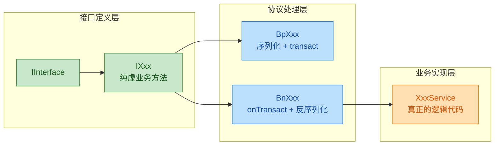

---

### 常见陷阱与注意事项

**1. Parcel 读写顺序必须严格对应**

`BpXxx` 中 `data.writeInt32(a); data.writeInt32(b);` 对应 `BnXxx` 中 `data.readInt32(); data.readInt32();`。如果 Bp 端多写了一个字段或者 Bn 端少读了一个字段，后续所有数据都会**整体错位**，导致难以调试的诡异崩溃。

**2. 接口描述符（Descriptor）必须唯一**

`IMPLEMENT_META_INTERFACE` 中传入的字符串（如 `"android.demo.IDemo"`）是接口的全局唯一标识。如果两个不同的接口使用了相同的描述符，`queryLocalInterface` 和 `CHECK_INTERFACE` 都会产生错误的匹配结果。

**3. 事务码不要与系统保留码冲突**

自定义的事务码应从 `IBinder::FIRST_CALL_TRANSACTION`（值为 1）开始递增。`IBinder` 保留了 `PING_TRANSACTION`、`DUMP_TRANSACTION` 等系统级事务码，自定义码不能与之冲突：

```cpp
// 推荐的事务码定义方式
enum {
    ADD_TRANSACTION   = IBinder::FIRST_CALL_TRANSACTION,      // = 1
    GREET_TRANSACTION = IBinder::FIRST_CALL_TRANSACTION + 1,  // = 2
    // ... 依次递增
};
```

**4. 线程安全**

`BnXxx::onTransact` 可能被 Binder 线程池中的**任意线程**回调。如果业务实现中有共享状态，**必须加锁**（`Mutex`、`std::mutex` 等），否则会出现竞态条件。

---

**📝 练习题**

在 Android Binder C++ 框架中，`IDemo::asInterface(sp<IBinder> obj)` 内部的 `obj->queryLocalInterface()` 返回了非空指针。以下哪个描述最准确？


A. `obj` 是一个 `BpBinder`，表示客户端和服务端在不同进程中，需要创建 `BpDemo` 代理


B. `obj` 是一个 `BBinder`（即 `BnDemo`），说明调用方和服务实现在同一进程，可以直接转型使用，无需 IPC


C. `obj` 是一个 `BpBinder`，但由于缓存机制，返回了之前创建的 `BpDemo` 实例


D. `obj` 是 `nullptr`，`queryLocalInterface` 对空指针有特殊处理，返回默认实现


**【答案】** B

**【解析】** `queryLocalInterface` 是 `BBinder`（具体来说是 `BnInterface`）中的方法，当且仅当 `obj` 本身就是目标接口的 `BnXxx` 实例时，才会返回非空指针——这意味着 `obj` 就在当前进程中，无需走 IPC 通道，直接将其强转为 `IInterface*` 使用即可。而 `BpBinder` 的 `queryLocalInterface` 默认返回 `nullptr`，表示它只是一个远程句柄的本地代表，真正的实现在另一个进程中，此时 `asInterface` 才会走到 `new BpDemo(obj)` 的分支，创建代理对象。选项 A 描述的是返回 `nullptr` 的场景；选项 C 中 `BpBinder` 不具备缓存 `BpDemo` 的能力；选项 D 中 `obj` 为空时根本不会进入 `queryLocalInterface` 调用（外层有 `nullptr` 判断）。

---

## Parcel（数据序列化）

在 Binder IPC 的整个通信链条中，无论是客户端向服务端发起请求，还是服务端返回结果，所有在进程间传递的数据都必须经过**序列化（Serialization）**和**反序列化（Deserialization）**。Android 在 C++ 层为此提供的核心载体就是 `Parcel` 类（定义在 `frameworks/native/libs/binder/include/binder/Parcel.h`）。

你可以把 `Parcel` 想象成一个**高度优化的、线性排布的二进制数据缓冲区**。它不像 JSON 或 XML 那样使用文本格式，而是直接以**原始字节（raw bytes）**的形式按顺序写入/读取数据，因此拥有极高的序列化与反序列化效率——这对于进程间高频通信的 Binder 来说至关重要。

`Parcel` 之所以特殊，在于它不仅可以序列化**普通的基本类型和字符串**，还能够序列化两种极为关键的"活"对象：

- **Binder 对象引用**（`IBinder*`）：跨进程传递 Binder 句柄。
- **文件描述符**（`file descriptor`）：跨进程传递已打开的 fd。

这两种能力是普通序列化框架（如 protobuf）所不具备的，也是 Parcel 与 Binder 驱动紧密耦合的根本原因。

---

### Parcel 在 Binder 通信中的位置

在一次完整的 Binder 事务（Transaction）中，`Parcel` 扮演着**信封**的角色。客户端将参数"装"进 `Parcel`，通过 `BpBinder::transact()` 发送；服务端从 `Parcel` 中"拆"出参数进行处理，再将返回值"装"进另一个 `Parcel` 回传。

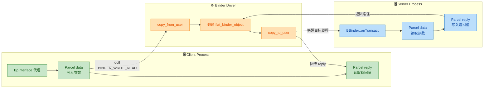

可以看到，`Parcel` 的生命周期贯穿了一次事务的完整闭环：**写入 → 传输 → 读取 → 回写 → 回传 → 读取**。

---

### Parcel 的内存模型

`Parcel` 在内部维护着一块**可动态增长的连续内存缓冲区**（类似 `std::vector<uint8_t>` 的思路），以及一个当前读写位置的游标。理解其内部布局是掌握 Parcel 的关键。

```c++
// ======= Parcel 核心成员（简化示意） =======
class Parcel {
private:
    uint8_t*        mData;          // 指向数据缓冲区起始地址
    size_t          mDataSize;      // 当前已写入的有效数据大小（字节）
    size_t          mDataCapacity;  // 缓冲区总容量（字节）
    mutable size_t  mDataPos;       // 当前读/写游标位置（字节偏移）

    binder_size_t*  mObjects;       // "对象偏移量"数组，记录每个特殊对象在 mData 中的偏移
    size_t          mObjectsSize;   // mObjects 数组中有效元素个数
    size_t          mObjectsCapacity; // mObjects 数组容量
    // ...
};
```

其中最需要关注的两块区域是：

| 区域 | 用途 | 存储内容 |
|------|------|----------|
| **`mData` 缓冲区** | 主数据区 | 基本类型、字符串、以及 `flat_binder_object` 等所有序列化后的字节 |
| **`mObjects` 数组** | 对象索引区 | 记录每个"特殊对象"（Binder 引用、fd）在 `mData` 中的字节偏移量 |

为什么需要 `mObjects`？因为 Binder 驱动在内核态需要找到并**翻译**这些特殊对象（比如将本进程的 Binder 地址转换为目标进程的 handle），如果没有索引，驱动就必须逐字节扫描整个缓冲区——效率太低。有了 `mObjects`，驱动可以**精准定位**每一个需要翻译的对象。

下面用 ASCII 图展示 Parcel 的内存布局：

```c++
// ============== Parcel 内存布局示意 ==============
//
//  mData 缓冲区（连续内存）
//  ┌──────────┬──────────┬─────────────────────┬──────────┬──────────────┐
//  │ int32    │ int32    │ flat_binder_object   │ String16 │ int64        │
//  │ (code)   │ (flags)  │ (Binder 引用)        │ (name)   │ (timestamp)  │
//  │ offset:0 │ offset:4 │ offset:8             │ offset:? │ offset:?     │
//  └──────────┴──────────┴─────────────────────┴──────────┴──────────────┘
//        ▲                       ▲
//        │                       │
//  mObjects 数组                 │
//  ┌─────────────┐               │
//  │ objects[0]=8 │──────────────┘  (记录 flat_binder_object 在 mData 中的偏移)
//  └─────────────┘
//
//  mDataPos (游标) ──────────────────────────────────────────► 指向下一个可写位置
```

**关键设计要点**：

- **4 字节对齐（4-byte alignment）**：Parcel 中所有写入的数据都会被填充到 4 字节的整数倍边界。例如写入一个 `bool`（1 字节），实际占用 4 字节，尾部填充 3 字节的零。这保证了 CPU 访问对齐，也简化了读取逻辑。
- **游标语义**：写入时 `mDataPos` 自动前进；读取时同样从当前 `mDataPos` 读取并前进。这意味着**读和写共享同一个游标**，因此在"先写后读"的场景中，必须调用 `setDataPosition(0)` 重置游标。
- **容量增长策略**：当 `mDataPos + writeSize > mDataCapacity` 时，Parcel 会以类似 `realloc` 的方式扩容，增长因子通常为当前容量的 1.5 倍或新需求大小的较大值。

---

### 基本类型的读写操作

Parcel 为所有常见的基本类型提供了成对的 `writeXxx` / `readXxx` 方法。这些操作是**零拷贝（zero-overhead abstraction）**的薄封装——它们直接将数据 `memcpy` 到/从 `mData` 缓冲区。

```c++
// ============== 基本类型写入示例 ==============
#include <binder/Parcel.h>  // Parcel 头文件

using namespace android;

void demonstrateBasicWrite() {
    Parcel data;                             // 创建一个空的 Parcel 对象

    // --- 写入整型 ---
    data.writeInt32(42);                     // 写入 4 字节有符号整数，mDataPos += 4
    data.writeInt64(1234567890123LL);        // 写入 8 字节有符号整数，mDataPos += 8
    data.writeUint32(0xDEADBEEF);           // 写入 4 字节无符号整数

    // --- 写入浮点 ---
    data.writeFloat(3.14f);                  // 写入 4 字节 float
    data.writeDouble(2.718281828);           // 写入 8 字节 double

    // --- 写入布尔（实际存为 int32） ---
    data.writeBool(true);                    // 内部调用 writeInt32(val ? 1 : 0)

    // --- 写入字符串 ---
    String16 name("AndroidService");         // Binder 中字符串通常使用 UTF-16 编码
    data.writeString16(name);                // 先写入长度(int32)，再写入 UTF-16 字符数据，末尾补对齐

    String8 tag("debug_tag");                // 也支持 UTF-8 字符串
    data.writeString8(tag);                  // 先写入长度(int32)，再写入 UTF-8 字符数据

    // --- 写入原始字节块 ---
    uint8_t buffer[] = {0x01, 0x02, 0x03};   // 原始字节数据
    data.write(buffer, sizeof(buffer));       // 按原始字节写入，自动 4 字节对齐填充
}
```

```c++
// ============== 基本类型读取示例 ==============
void demonstrateBasicRead(Parcel& data) {
    data.setDataPosition(0);                 // ★ 重置游标到缓冲区起始位置

    // --- 读取时必须与写入顺序完全一致 ---
    int32_t code = data.readInt32();         // 读取 4 字节，mDataPos += 4
    int64_t big  = data.readInt64();         // 读取 8 字节，mDataPos += 8
    uint32_t hex = data.readUint32();        // 读取 4 字节无符号

    float  f = data.readFloat();             // 读取 4 字节 float
    double d = data.readDouble();            // 读取 8 字节 double

    bool flag = data.readBool();             // 内部 readInt32() != 0

    String16 name = data.readString16();     // 先读长度，再读字符数据
    String8  tag  = data.readString8();      // 同上，UTF-8 版本

    uint8_t buf[3];                          // 准备接收缓冲区
    data.read(buf, sizeof(buf));             // 按字节读取原始数据
}
```

**⚠️ 严格的读写顺序一致性**：这是 Parcel 最重要的契约。Parcel 是一个纯线性的字节流，没有任何字段名或类型标记。如果客户端以 `writeInt32 → writeString16` 的顺序写入，服务端就**必须**以 `readInt32 → readString16` 的顺序读取——否则会读到错乱的数据，甚至导致进程崩溃。

下面是 `writeInt32` 内部实现的简化版本，帮助你理解其底层机制：

```c++
// ============== writeInt32 内部实现（简化） ==============
status_t Parcel::writeInt32(int32_t val) {
    return writeAligned(val);                // 调用模板化的对齐写入方法
}

template<class T>
status_t Parcel::writeAligned(T val) {
    // 检查类型大小是否满足 4 字节对齐要求
    static_assert(sizeof(T) % 4 == 0, "Must be 4-byte aligned");

    // 如果剩余容量不足，尝试扩容
    if ((mDataPos + sizeof(val)) > mDataCapacity) {
        status_t err = growData(sizeof(val));// 扩容：至少容纳 sizeof(val) 字节
        if (err != NO_ERROR) return err;     // 扩容失败则返回错误
    }

    // ★ 核心操作：将数据直接拷贝到 mData + mDataPos 位置
    *reinterpret_cast<T*>(mData + mDataPos) = val;

    mDataPos += sizeof(val);                 // 游标前进 sizeof(T) 字节
    if (mDataPos > mDataSize) {
        mDataSize = mDataPos;                // 更新有效数据大小
    }
    return NO_ERROR;                         // 返回成功
}
```

---

### 对齐机制深入解析

4 字节对齐是 Parcel 的基础设计原则。这不是任意选择——它与 ARM 和 x86 架构的内存对齐要求、以及 Binder 驱动的数据传输粒度都密切相关。

```c++
// ============== PAD_SIZE 宏：计算对齐后大小 ==============
// 这个宏在 Parcel.cpp 中定义，用于将任意大小向上对齐到 4 字节边界
#define PAD_SIZE_UNSAFE(s) (((s) + 3) & ~3)

// 示例：
// PAD_SIZE_UNSAFE(1)  => ((1+3) & ~3) = (4 & 0xFFFFFFFC) = 4
// PAD_SIZE_UNSAFE(2)  => ((2+3) & ~3) = (5 & 0xFFFFFFFC) = 4
// PAD_SIZE_UNSAFE(3)  => ((3+3) & ~3) = (6 & 0xFFFFFFFC) = 4
// PAD_SIZE_UNSAFE(4)  => ((4+3) & ~3) = (7 & 0xFFFFFFFC) = 4
// PAD_SIZE_UNSAFE(5)  => ((5+3) & ~3) = (8 & 0xFFFFFFFC) = 8
// PAD_SIZE_UNSAFE(7)  => ((7+3) & ~3) = (10& 0xFFFFFFFC) = 8
// PAD_SIZE_UNSAFE(9)  => ((9+3) & ~3) = (12& 0xFFFFFFFC) = 12
```

这意味着在 Parcel 内部，数据实际占用情况如下：

| 数据类型 | 逻辑大小 | Parcel 中实际占用 | 填充字节 |
|----------|----------|-------------------|----------|
| `bool` | 1 byte | 4 bytes | 3 bytes padding |
| `int8_t` (通过 write) | 1 byte | 4 bytes | 3 bytes padding |
| `int16_t` (通过 write) | 2 bytes | 4 bytes | 2 bytes padding |
| `int32_t` | 4 bytes | 4 bytes | 无 |
| `int64_t` | 8 bytes | 8 bytes | 无 |
| `float` | 4 bytes | 4 bytes | 无 |
| `double` | 8 bytes | 8 bytes | 无 |
| 3 字节的 byte[] | 3 bytes | 4 bytes | 1 byte padding |

---

### 字符串的序列化格式

字符串在 Parcel 中的布局值得单独详细说明，因为它是最常见的非基本类型。

```c++
// ============== writeString16 内部逻辑（简化） ==============
status_t Parcel::writeString16(const String16& str) {
    const size_t len = str.size();           // 获取字符串长度（UTF-16 字符数，非字节数）
    
    if (len > INT32_MAX) {                   // 长度越界检查
        return BAD_VALUE;
    }

    // Step 1: 先写入字符串长度（int32），作为后续读取的"契约"
    status_t err = writeInt32(len);          // 4 字节
    if (err != NO_ERROR) return err;

    // Step 2: 写入 UTF-16 字符数据 + 结尾空字符 '\0'
    // 每个 char16_t 占 2 字节，总共 (len + 1) * sizeof(char16_t) 字节
    // 然后 PAD_SIZE 对齐到 4 字节边界
    err = write(str.string(), (len + 1) * sizeof(char16_t));  
    return err;
}
```

以字符串 `"OK"` 为例，其在 Parcel 中的完整二进制布局为：

```c++
// ============== String16("OK") 的 Parcel 二进制布局 ==============
//
//  偏移量   内容（十六进制）            含义
//  ─────────────────────────────────────────────────────
//  [0x00]   02 00 00 00               长度 = 2（int32，2个UTF-16字符）
//  [0x04]   4F 00                     'O' 的 UTF-16 编码 (0x004F)
//  [0x06]   4B 00                     'K' 的 UTF-16 编码 (0x004B)
//  [0x08]   00 00                     结尾空字符 '\0' (UTF-16)
//  [0x0A]   00 00                     2 字节填充（PAD 到 4 字节对齐）
//  ─────────────────────────────────────────────────────
//  总占用 = 4 (长度) + 6 (字符+null) + 2 (pad) = 12 字节
```

对于**空字符串**（`""`），长度为 0，但仍写入长度 0 和一个 null 终止符。而对于 **null 字符串**（Java 层的 `null`），写入的长度为 `-1`，不写入任何字符数据——读取端看到 `-1` 就知道这是 null，不是空串。

---

### 特殊对象的序列化：flat_binder_object

这是 Parcel 最核心、最独特的能力。当你通过 `writeStrongBinder()` 写入一个 `IBinder` 引用时，Parcel 并不是简单地把指针值写进去（指针跨进程无效），而是写入一个结构化的 `flat_binder_object`——这是 Binder 驱动定义的内核数据结构。

```c++
// ============== flat_binder_object 结构体（内核定义） ==============
// 定义在 <linux/android/binder.h>
struct flat_binder_object {
    __u32               hdr_type;    // 类型标识：BINDER_TYPE_BINDER 或 BINDER_TYPE_HANDLE
    __u32               flags;       // 标志位（如调度策略）
    union {
        binder_uintptr_t binder;     // 本地 Binder 地址（仅同进程使用）
        __u32            handle;     // 远程 Binder 句柄（跨进程使用）
    };
    binder_uintptr_t    cookie;      // 附加数据（通常存 BBinder* 指针）
};
```

`writeStrongBinder()` 的简化实现如下：

```c++
// ============== writeStrongBinder 实现（简化） ==============
status_t Parcel::writeStrongBinder(const sp<IBinder>& val) {
    return flattenBinder(val);               // 委托给 flattenBinder
}

status_t Parcel::flattenBinder(const sp<IBinder>& binder) {
    flat_binder_object obj;                  // 创建内核结构体

    if (binder != nullptr) {
        BBinder* local = binder->localBinder();  // 尝试获取本地 BBinder 指针

        if (local != nullptr) {
            // ★ 情况1：binder 是本进程内的真实服务对象（BBinder）
            obj.hdr_type = BINDER_TYPE_BINDER;   // 类型：本地 Binder 实体
            obj.binder   = reinterpret_cast<uintptr_t>(local->getWeakRefs());
            obj.cookie   = reinterpret_cast<uintptr_t>(local);  // 存储 BBinder* 指针
        } else {
            // ★ 情况2：binder 是远程代理（BpBinder），取出其 handle 值
            obj.hdr_type = BINDER_TYPE_HANDLE;   // 类型：远程句柄
            obj.handle   = binder->remoteBinder()->getHandle(); // 获取 handle 编号
        }
    } else {
        // ★ 情况3：传入的是 null
        obj.hdr_type = BINDER_TYPE_BINDER;
        obj.binder   = 0;
        obj.cookie   = 0;
    }

    obj.flags = 0x7f | FLAT_BINDER_FLAG_ACCEPTS_FDS;  // 设置默认优先级和标志

    // 将 flat_binder_object 写入 mData 缓冲区
    status_t status = writeObject(obj, false);
    return status;
}
```

`writeObject` 方法在写入 `flat_binder_object` 字节数据的同时，还会将其**在 mData 中的偏移量**记录到 `mObjects` 数组中——这就是前面提到的对象索引机制。

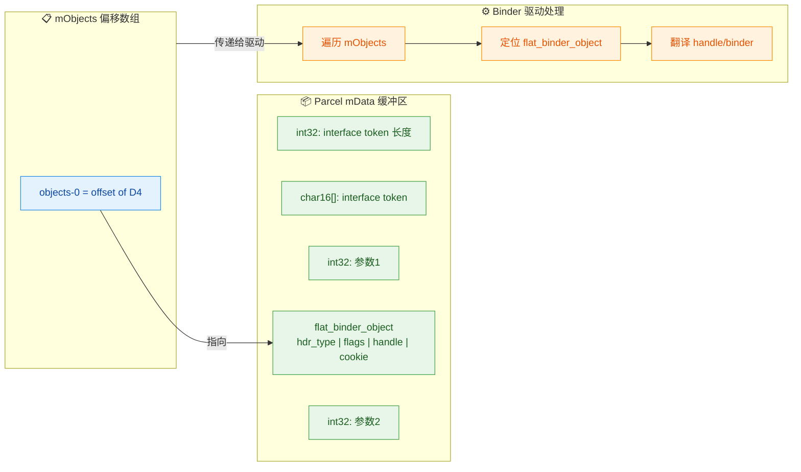

**驱动翻译过程**的关键逻辑：

- 发送端写入 `BINDER_TYPE_BINDER`（本地实体） → 驱动翻译为 `BINDER_TYPE_HANDLE`（远程句柄），分配/查找 handle 号；
- 发送端写入 `BINDER_TYPE_HANDLE`（远程句柄） → 如果目标进程恰好就是该 Binder 的宿主进程，驱动翻译为 `BINDER_TYPE_BINDER`（本地实体）；否则分配新的 handle。

这套翻译机制保证了 Binder 引用在跨进程传递时的**透明性**——应用层完全不需要关心 handle 的分配和管理。

---

### 文件描述符的跨进程传递

Parcel 的另一项独门绝技是通过 `writeFileDescriptor()` 跨进程传递文件描述符。这依赖于 Linux 内核的 **fd 传递机制**——Binder 驱动在内核态为目标进程创建一个**新的 fd**，指向同一个底层文件对象（`struct file`）。

```c++
// ============== 文件描述符的写入与读取 ==============
void sendFd(Parcel& data) {
    int fd = open("/data/local/tmp/test.txt", O_RDONLY);  // 打开文件，获取 fd
    if (fd < 0) return;

    // writeFileDescriptor 内部会创建 BINDER_TYPE_FD 类型的 flat_binder_object
    // 并将 fd 值写入，驱动负责在目标进程中 dup 出新的 fd
    data.writeFileDescriptor(fd, true);      // 第二个参数 takeOwnership=true
                                             // 表示 Parcel 析构时会自动 close(fd)
}

void receiveFd(const Parcel& data) {
    // 读取端拿到的是目标进程中新分配的 fd（值可能不同，但指向同一个文件）
    int fd = data.readFileDescriptor();      // 返回的 fd 在当前进程中有效
    if (fd >= 0) {
        char buf[256];
        read(fd, buf, sizeof(buf));          // 直接使用 fd 读取文件内容
    }
}
```

```c++
// ============== fd 跨进程传递的内核视角 ==============
//
//  进程 A (sender)            Binder 驱动 (kernel)          进程 B (receiver)
//  ┌─────────────┐           ┌──────────────────┐          ┌─────────────┐
//  │ fd=5         │           │                  │          │ fd=12        │
//  │   ↓          │           │  1. 取出 A 的 fd=5│          │   ↓          │
//  │ struct file──┼──────────▶│  2. 获取 file*   │──────────┼─►struct file │
//  │ (test.txt)   │           │  3. 在 B 中分配   │          │ (same file!) │
//  │              │           │     新 fd=12      │          │              │
//  └─────────────┘           └──────────────────┘          └─────────────┘
//
//  A 的 fd=5 和 B 的 fd=12 指向内核中同一个 struct file 对象
//  即同一个文件的同一个打开实例（共享文件偏移量等）
```

---

### Interface Token 与安全校验

在实际的 Binder 通信中，每个 `transact` 调用的 `Parcel data` 开头几乎总是写入一个 **Interface Token**（接口描述符字符串），用于服务端验证"这个请求确实是发给我的"。

```c++
// ============== 客户端写入（BpXxxService::someMethod） ==============
Parcel data, reply;
data.writeInterfaceToken(String16("android.app.IActivityManager"));  // ★ 写入 token
data.writeInt32(userId);                     // 写入业务参数
data.writeString16(packageName);             // 写入业务参数
remote()->transact(SOME_TRANSACTION, data, &reply);  // 发起事务

// ============== 服务端校验（BnXxxService::onTransact） ==============
status_t BnActivityManager::onTransact(uint32_t code, const Parcel& data,
                                        Parcel* reply, uint32_t flags) {
    // ★ 校验 token，防止客户端发错了接口
    CHECK_INTERFACE(IActivityManager, data, reply);
    // 上面的宏展开后大致为：
    // if (!data.enforceInterface(String16("android.app.IActivityManager"))) {
    //     return PERMISSION_DENIED;
    // }

    int32_t userId = data.readInt32();       // 读取业务参数
    String16 pkg   = data.readString16();    // 读取业务参数
    // ... 执行业务逻辑 ...
    return NO_ERROR;
}
```

`writeInterfaceToken` 内部实际上写入了两样东西：

1. **Strict Mode Policy**（`int32_t`）—— 用于在 Java 层追踪 StrictMode 违规。
2. **Interface Descriptor**（`String16`）—— 接口的唯一标识字符串。

`enforceInterface` 则读取并对比这两项，确保调用对象匹配。

---

### Parcel 的生命周期与性能考量

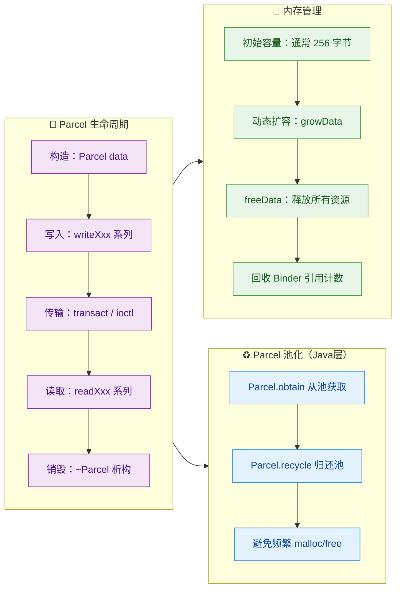

**关于性能的几个重要点**：

1. **避免过大的 Parcel**：Binder 驱动对单次事务的数据大小有限制，默认约为 **1MB**（`BINDER_VM_SIZE` 定义为 `(1 * 1024 * 1024) - sysconf(_SC_PAGE_SIZE) * 2`）。如果超出，`transact` 会返回 `FAILED_TRANSACTION`。传递大数据应使用共享内存（`ashmem`）或文件描述符。

2. **Parcel 不适合持久化**：Parcel 的二进制格式没有版本控制，不同 Android 版本之间格式可能变化。它是为**一次性、同步的 IPC 传输**设计的，不要将 Parcel 数据序列化到磁盘。

3. **`mObjects` 的引用计数管理**：当 Parcel 中包含 Binder 对象时，`writeStrongBinder` 会增加引用计数；当 Parcel 被销毁或调用 `freeData()` 时，会遍历 `mObjects` 数组，对每个 `flat_binder_object` 执行引用计数递减，确保不会泄漏 Binder 对象。

4. **`appendFrom` 的零拷贝语义**：Parcel 提供了 `appendFrom` 方法，可以将另一个 Parcel 的部分数据**直接追加**到当前 Parcel 中，避免逐字段手动复制。但注意，如果被追加的 Parcel 包含 Binder 对象，`appendFrom` 会正确处理 `mObjects` 数组的重映射。

---

### Parcel 与 Binder 驱动的交互全景

将 Parcel 数据传递给 Binder 驱动的最终接口是 `ioctl(fd, BINDER_WRITE_READ, &bwr)`。此时 Parcel 的 `mData` 和 `mObjects` 会被封装进 `binder_transaction_data` 结构体：

```c++
// ============== binder_transaction_data（内核结构体，简化） ==============
struct binder_transaction_data {
    union {
        __u32 handle;                        // 目标 Binder 的 handle（客户端填写）
        binder_uintptr_t ptr;                // 目标 Binder 的地址（驱动填写）
    } target;
    __u32          code;                     // 事务码（如 FIRST_CALL_TRANSACTION + N）
    __u32          flags;                    // 标志（如 TF_ONE_WAY 单向调用）

    binder_uintptr_t data_buffer;            // ★ 指向 Parcel 的 mData 缓冲区
    binder_size_t    data_size;              // ★ 对应 Parcel 的 mDataSize

    binder_uintptr_t data_offsets;           // ★ 指向 Parcel 的 mObjects 数组
    binder_size_t    offsets_size;           // ★ mObjects 数组的字节大小
};
```

```mermaid
graph LR
    subgraph UserSpace["🟢 用户空间"]
        direction TB
        U1["Parcel.mData"]
        U2["Parcel.mObjects"]
        U3["binder_transaction_data"]
        U1 --> U3
        U2 --> U3
    end

    subgraph KernelSpace["🔴 内核空间"]
        direction TB
        K1["copy_from_user<br/>拷贝 transaction_data"]
        K2["copy_from_user<br/>拷贝 mData 内容"]
        K3["遍历 offsets<br/>翻译 flat_binder_object"]
        K4["binder_alloc_buf<br/>在目标进程 mmap 区分配"]
        K5["copy_to_user<br/>映射到目标进程"]
        K1 --> K2
        K2 --> K3
        K3 --> K4
        K4 --> K5
    end

    subgraph TargetProcess["🔵 目标进程"]
        direction TB
        T1["Parcel data<br/>从 mmap 区直接读取"]
        T2["onTransact 回调"]
        T1 --> T2
    end

    U3 -->|"ioctl"| K1
    K5 -->|"唤醒"| T1

    classDef userCls fill:#C8E6C9,stroke:#388E3C,color:#1B5E20
    classDef kernelCls fill:#FFCCBC,stroke:#E64A19,color:#BF360C
    classDef targetCls fill:#BBDEFB,stroke:#1976D2,color:#0D47A1

    class U1,U2,U3 userCls
    class K1,K2,K3,K4,K5 kernelCls
    class T1,T2 targetCls
```

这里有一个极为重要的优化：Binder 驱动使用了 **`mmap` 一次拷贝机制**。目标进程的 Binder 线程在启动时已经 `mmap` 了一块内核/用户空间的共享内存区域。驱动将发送端的数据 `copy_from_user` 拷贝到这块共享区域中，目标进程可以**直接读取**而无需再次 `copy_to_user`——因此整个过程只涉及**一次内存拷贝**，而非传统 IPC（如 socket、pipe）的两次拷贝。这也是 Binder 高性能的关键所在。

---

### 常用 API 速查表

| 方法 | 用途 | 对应读方法 |
|------|------|-----------|
| `writeInt32(int32_t)` | 写入 32 位整数 | `readInt32()` |
| `writeInt64(int64_t)` | 写入 64 位整数 | `readInt64()` |
| `writeFloat(float)` | 写入单精度浮点 | `readFloat()` |
| `writeDouble(double)` | 写入双精度浮点 | `readDouble()` |
| `writeBool(bool)` | 写入布尔值（存为 int32） | `readBool()` |
| `writeCString(const char*)` | 写入 C 风格字符串 | `readCString()` |
| `writeString8(const String8&)` | 写入 UTF-8 字符串 | `readString8()` |
| `writeString16(const String16&)` | 写入 UTF-16 字符串 | `readString16()` |
| `writeStrongBinder(const sp<IBinder>&)` | 写入 Binder 引用 | `readStrongBinder()` |
| `writeFileDescriptor(int, bool)` | 写入文件描述符 | `readFileDescriptor()` |
| `writeInterfaceToken(const String16&)` | 写入接口校验 token | `enforceInterface()` |
| `write(const void*, size_t)` | 写入原始字节 | `read(void*, size_t)` |
| `writeByteVector(const std::vector<uint8_t>&)` | 写入字节数组 | `readByteVector()` |
| `dataSize()` | 获取当前有效数据大小 | — |
| `dataPosition()` | 获取当前游标位置 | — |
| `setDataPosition(size_t)` | 重置游标位置 | — |
| `dataAvail()` | 剩余可读数据大小 | — |
| `appendFrom(const Parcel*, size_t, size_t)` | 追加另一 Parcel 的数据 | — |

---

### 错误处理与异常传递

在实际开发中，Parcel 的读写操作可能失败，良好的错误处理是健壮 Binder 服务的基础：

```c++
// ============== 带错误处理的读写模式 ==============
status_t BnMyService::onTransact(uint32_t code, const Parcel& data,
                                  Parcel* reply, uint32_t flags) {
    switch (code) {
    case MY_TRANSACTION: {
        // 校验接口 token
        CHECK_INTERFACE(IMyService, data, reply);

        // ★ 使用带 status_t 返回值的读取方式（Android 新版推荐）
        int32_t param1;
        status_t err = data.readInt32(&param1);  // 传入指针，返回状态码
        if (err != NO_ERROR) {
            // 读取失败（如数据不足），返回错误
            return err;                          // 会被转换为 DeadObjectException 等
        }

        String16 param2;
        err = data.readString16(&param2);        // 同样检查返回值
        if (err != NO_ERROR) return err;

        // 执行业务逻辑...
        int32_t result = doSomething(param1, param2);

        // 写入返回值
        reply->writeNoException();               // ★ 告知客户端没有异常发生
        reply->writeInt32(result);               // 写入结果

        return NO_ERROR;
    }
    default:
        return BBinder::onTransact(code, data, reply, flags);  // 未知事务码，交给父类
    }
}
```

`writeNoException()` 和 `writeException()` 是 Java/C++ Binder 互操作的桥梁。Java 层的 `Parcel.readException()` 会检查异常标记：如果是 `0` 则无异常；否则会根据异常类型码重建对应的 Java 异常（如 `SecurityException`、`IllegalArgumentException` 等）。

---

**📝 练习题**

关于 Android Binder 中 Parcel 的描述，下列哪项是**错误的**？

A. Parcel 中所有数据的写入都遵循 4 字节对齐原则，写入一个 `bool` 实际占用 4 字节


B. Parcel 可以通过 `writeStrongBinder()` 序列化 Binder 对象引用，驱动会在内核态翻译 `flat_binder_object`


C. Parcel 的读取顺序可以与写入顺序不同，因为内部使用了键值对（key-value）格式存储数据


D. Binder 单次事务的数据大小上限约为 1MB，传递大数据应使用共享内存等替代方案


**【答案】** C

**【解析】** Parcel 是一个**纯线性的字节流缓冲区**，内部没有任何字段名、类型标记或键值映射。数据按照调用 `writeXxx` 的顺序依次排列，读取时必须以**完全相同的顺序和类型**调用对应的 `readXxx` 方法。如果读写顺序不匹配，就会从错误的偏移量读取数据，导致数据错乱甚至进程崩溃。选项 A 正确，这是 `PAD_SIZE` 宏保证的对齐行为；选项 B 正确，`flat_binder_object` 是 Binder 驱动在内核态翻译跨进程引用的核心机制；选项 D 正确，`BINDER_VM_SIZE` 约 1MB 减去两个页面大小，超限会返回 `FAILED_TRANSACTION`。

---

## 本章小结

本章系统地剖析了 Android Binder 在 C++ 层的核心基础架构。从最顶层的 `IBinder` 抽象接口出发，沿着 **代理端 (Proxy)** 与 **服务端 (Service)** 两条主线，逐层深入到 `BpBinder`、`BBinder`、`IInterface` 模板体系以及数据序列化载体 `Parcel`。下面我们将这些散落的知识点串联成一张完整的认知地图。

---

### 核心类层次总览

整个 Binder C++ 层的类继承体系，可以用一棵倒置的树来理解。`IBinder` 是树根，所有参与跨进程通信的对象最终都可追溯到它。理解这棵树的关键在于分清 **两条分支**：左侧是 Client 进程持有的 **代理对象 (Proxy)**，右侧是 Server 进程持有的 **实体对象 (Native/Local)**。

```mermaid
graph LR
    subgraph Abstract["🧩 抽象层 Abstract Layer"]
        direction TB
        RefBase["RefBase<br/>引用计数基类"]
        IBinder["IBinder<br/>Binder 统一接口"]
        IInterface["IInterface<br/>业务接口基类"]
    end

    subgraph Proxy["📡 代理端 Client Proxy"]
        direction TB
        BpRefBase["BpRefBase<br/>持有 BpBinder handle"]
        BpBinder["BpBinder<br/>transact → 驱动"]
        BpInterface["BpInterface〈I〉<br/>= BpRefBase + I"]
        BpXxx["BpServiceXxx<br/>业务 Proxy 实现"]
    end

    subgraph Server["🖥️ 服务端 Service Native"]
        direction TB
        BBinder["BBinder<br/>onTransact 分发"]
        BnInterface["BnInterface〈I〉<br/>= BBinder + I"]
        BnXxx["BnServiceXxx<br/>业务 onTransact 实现"]
    end

    subgraph Data["📦 数据传输 Data Transport"]
        direction TB
        Parcel["Parcel<br/>序列化/反序列化"]
        Flat["flat_binder_object<br/>内核 Binder 描述"]
        IPCThread["IPCThreadState<br/>ioctl 读写驱动"]
    end

    RefBase --> BpRefBase
    RefBase --> IBinder
    IBinder --> BpBinder
    IBinder --> BBinder
    IInterface --> BpInterface
    IInterface --> BnInterface
    BpRefBase --> BpInterface
    BpBinder --> BpRefBase
    BpInterface --> BpXxx
    BBinder --> BnInterface
    BnInterface --> BnXxx

    BpBinder -- "transact()" --> IPCThread
    IPCThread -- "ioctl()" --> Flat
    Flat -- "writeStrongBinder()" --> Parcel
    Parcel -- "data/reply" --> BpBinder
    Parcel -- "data/reply" --> BBinder

    classDef abstract fill:#E8F5E9,stroke:#43A047,stroke-width:2px,color:#1B5E20
    classDef proxy fill:#E3F2FD,stroke:#1E88E5,stroke-width:2px,color:#0D47A1
    classDef server fill:#FFF3E0,stroke:#FB8C00,stroke-width:2px,color:#E65100
    classDef data fill:#F3E5F5,stroke:#8E24AA,stroke-width:2px,color:#4A148C

    class RefBase,IBinder,IInterface abstract
    class BpRefBase,BpBinder,BpInterface,BpXxx proxy
    class BBinder,BnInterface,BnXxx server
    class Parcel,Flat,IPCThread data
```

这张图的核心思想可以浓缩成一句话：**Client 通过 `BpBinder.transact()` 把 `Parcel` 送入内核驱动，Server 端 `BBinder.onTransact()` 从 `Parcel` 中还原数据并执行真正的业务逻辑。** 所有上层的 `BpInterface` / `BnInterface` 只是在这个裸通道之上叠加了类型安全的业务语义。

---

### 关键概念速查表

| 概念 | 角色定位 | 核心职责 | 所在进程 |
|---|---|---|---|
| **IBinder** | 统一抽象接口 | 定义 `transact()` / `localBinder()` / `remoteBinder()` 等公共协议 | 双端 |
| **BpBinder** | 远程代理句柄 | 持有 `mHandle`（int32_t），调用 `IPCThreadState::transact()` 将请求写入驱动 | Client |
| **BBinder** | 服务实体基类 | 实现 `transact()` → 转发到虚函数 `onTransact()` 供子类重写 | Server |
| **IInterface** | 业务接口标记 | 提供 `asBinder()` 桥接；配合 `DECLARE/IMPLEMENT_META_INTERFACE` 宏自动生成 `asInterface()` | 双端 |
| **BpInterface\<I\>** | 业务 Proxy 模板 | 多继承 `BpRefBase` + `I`，在构造时绑定 `BpBinder` | Client |
| **BnInterface\<I\>** | 业务 Native 模板 | 多继承 `BBinder` + `I`，子类重写 `onTransact()` 完成请求分发 | Server |
| **Parcel** | 数据搬运工 | 线性缓冲区，支持基本类型、String16、Binder 对象、文件描述符的序列化与反序列化 | 双端 |

---

### 一次完整 Binder 调用的生命旅程

把所有组件串联起来，一次从 Client 到 Server 再返回的完整调用流程如下：

```mermaid
sequenceDiagram
    autonumber
    participant App as Client App
    participant BpS as BpServiceXxx
    participant BpB as BpBinder
    participant IPC_C as IPCThreadState<br/>(Client)
    participant DRV as Binder Driver<br/>(Kernel)
    participant IPC_S as IPCThreadState<br/>(Server)
    participant BnS as BnServiceXxx
    participant Impl as ServiceImpl

    App->>BpS: foo(arg1, arg2)
    BpS->>BpS: Parcel data<br/>data.writeInterfaceToken()<br/>data.writeInt32(arg1)
    BpS->>BpB: remote()->transact(FOO, data, reply)
    BpB->>IPC_C: transact(mHandle, FOO, data, reply)
    IPC_C->>DRV: ioctl(BINDER_WRITE_READ)
    Note over DRV: 内核拷贝 data 到目标进程<br/>唤醒 Server Binder 线程
    DRV->>IPC_S: BR_TRANSACTION
    IPC_S->>BnS: onTransact(FOO, data, reply)
    BnS->>BnS: data.readInterfaceToken()<br/>data.readInt32() → arg1
    BnS->>Impl: foo(arg1, arg2)
    Impl-->>BnS: result
    BnS->>BnS: reply->writeInt32(result)
    BnS-->>IPC_S: return NO_ERROR
    IPC_S-->>DRV: BC_REPLY
    DRV-->>IPC_C: BR_REPLY
    IPC_C-->>BpB: reply 填充完成
    BpB-->>BpS: return status
    BpS->>BpS: reply.readInt32() → result
    BpS-->>App: return result
```

以下是对这 18 步的分层总结：

**① 业务语义层 (步骤 1-2, 9-12, 17-18)**
Client 调用 `BpServiceXxx::foo()`，该方法将参数写入 `Parcel data`，并在收到 `reply` 后读出结果。对称地，Server 端 `BnServiceXxx::onTransact()` 解析 `data`，调用真正的业务实现，再将返回值写回 `reply`。开发者 **主要在这一层编写代码**。

**② Binder 对象层 (步骤 3, 13)**
`BpBinder::transact()` 将业务调用的 `code` + `Parcel` 原封不动地往下递交。`BBinder::transact()` 则做最基本的校验后，转发到虚函数 `onTransact()`。这一层的代码通常由宏 / 模板自动生成，开发者很少直接修改。

**③ IPC 传输层 (步骤 4-8, 14-16)**
`IPCThreadState` 是与内核驱动打交道的唯一入口。它维护着 `mIn` / `mOut` 两个 `Parcel` 缓冲区，通过 `ioctl(fd, BINDER_WRITE_READ, &bwr)` 完成一次 **"写请求 + 读回复"** 的原子操作。内核驱动负责跨进程内存拷贝（实际上利用了 `mmap` 共享内存，只做 **一次拷贝**）。

---

### 设计思想提炼

回顾整章，Binder C++ 层的设计处处体现着经典的面向对象原则与系统编程的实用主义平衡：

**1. 代理模式 (Proxy Pattern)**

这是 Binder 最显著的设计模式。`BpBinder` 和 `BpInterface<I>` 构成了一个两层代理：

```cpp
// 业务层代理 —— 开发者可见
// BpCalculator 继承自 BpInterface<ICalculator>
class BpCalculator : public BpInterface<ICalculator> {
    // add() 看起来像本地调用，实际会跨进程
    int add(int a, int b) override {
        Parcel data, reply;               // 准备数据容器
        data.writeInterfaceToken(...);    // 写入接口描述符用于校验
        data.writeInt32(a);               // 序列化参数 a
        data.writeInt32(b);               // 序列化参数 b
        // remote() 返回 BpBinder，transact() 走 IPC
        remote()->transact(ADD, data, &reply);
        return reply.readInt32();         // 从回复中反序列化结果
    }
};
```

Client 代码只需要持有 `sp<ICalculator>` 就能调用 `add()`，**完全不感知跨进程的存在**——这正是代理模式的精髓所在。

**2. 模板方法模式 (Template Method)**

`BBinder::transact()` 定义了固定的流程骨架：检查权限 → 调用 `onTransact()` → 返回状态码。子类只需重写 `onTransact()` 这个 **hook point**。这避免了每个服务都重复编写通用的校验逻辑。

**3. 接口描述符 (Interface Descriptor) 防错**

每次 `transact()` 都会携带 `String16` 类型的接口描述符（如 `"android.app.IActivityManager"`），服务端在 `onTransact()` 的第一行调用 `checkInterface()` 验证。如果某个 Proxy 误连了错误的 Service，这道防线可以在运行时立刻暴露问题，而不是产生难以定位的数据错乱。

**4. 引用计数与生命周期**

所有 Binder 对象继承自 `RefBase`，配合 `sp<>` (strong pointer) 和 `wp<>` (weak pointer) 实现自动生命周期管理。特别地，`BpBinder` 析构时会通知内核驱动减少对远端 `BBinder` 的引用计数，确保 **Server 端对象在所有 Client 都释放后才被销毁**——这是跨进程垃圾回收的原型。

**5. Parcel 的零拷贝友好设计**

`Parcel` 内部是一块连续的线性内存缓冲区，这使得它在被传递给内核驱动时，可以直接作为 `binder_transaction_data` 的 buffer 指针传入，无需额外的格式转换。`writeStrongBinder()` / `readStrongBinder()` 则是在这块线性缓冲中嵌入 `flat_binder_object` 结构体，让内核能识别并翻译 Binder 引用。

---

### 易混淆点对比

在学习过程中，以下几组概念最容易混淆，特此做最终澄清：

| 对比维度 | BpBinder | BpInterface\<I\> |
|---|---|---|
| 层级 | IPC 机制层 | 业务语义层 |
| 知道业务接口吗？ | ❌ 不知道，只认识 `transact(code, data, reply)` | ✅ 知道，继承了业务接口 `I` |
| 谁持有谁？ | —— | `BpInterface` 内部（通过 `BpRefBase`）持有 `sp<IBinder>` 指向 `BpBinder` |
| 开发者接触频率 | 几乎不直接使用 | 每个 AIDL 服务都会生成对应的子类 |

| 对比维度 | BBinder | BnInterface\<I\> |
|---|---|---|
| 层级 | IPC 机制层 | 业务语义层 |
| 知道业务接口吗？ | ❌ 只关心 `onTransact()` 调度 | ✅ 继承了业务接口 `I` |
| 谁继承谁？ | `BnInterface` 继承 `BBinder` | 开发者的 `BnServiceXxx` 继承 `BnInterface<IServiceXxx>` |

| 对比维度 | `transact()` | `onTransact()` |
|---|---|---|
| 调用方 | Client (通过 BpBinder) | Server (由 BBinder 框架回调) |
| 数据流向 | 发送请求 | 接收请求 |
| 开发者角色 | 在 BpXxx 中调用 | 在 BnXxx 中重写 |

---

### 从 C++ 层到全局视野

本章聚焦于 C++ Native 层，但 Binder 的世界远不止于此。在实际 Android 系统中：

```mermaid
graph LR
    subgraph Java["☕ Java / Kotlin 层"]
        direction TB
        AIDL["AIDL 生成代码<br/>Stub / Proxy"]
        JavaBBinder["JavaBBinder"]
        BinderProxy["BinderProxy"]
    end

    subgraph CPP["⚙️ C++ Native 层 (本章)"]
        direction TB
        BpBinder_n["BpBinder"]
        BBinder_n["BBinder"]
        IPC["IPCThreadState"]
    end

    subgraph Kernel["🔧 Kernel 层"]
        direction TB
        BinderDrv["binder_proc / binder_node<br/>binder_ref / binder_thread"]
    end

    AIDL --> JavaBBinder
    AIDL --> BinderProxy
    BinderProxy -.->|"JNI: android_util_Binder"| BpBinder_n
    JavaBBinder -.->|"JNI: android_util_Binder"| BBinder_n
    BpBinder_n --> IPC
    BBinder_n --> IPC
    IPC -->|"ioctl()"| BinderDrv

    classDef java fill:#E8F5E9,stroke:#43A047,stroke-width:2px,color:#1B5E20
    classDef cpp fill:#E3F2FD,stroke:#1E88E5,stroke-width:2px,color:#0D47A1
    classDef kernel fill:#FFF3E0,stroke:#FB8C00,stroke-width:2px,color:#E65100

    class AIDL,JavaBBinder,BinderProxy java
    class BpBinder_n,BBinder_n,IPC cpp
    class BinderDrv kernel
```

Java 层的 `BinderProxy` 内部持有一个指向 C++ `BpBinder` 的指针（通过 JNI `mObject` 字段）；Java 层的 `Binder`（即 `JavaBBinder`）同样通过 JNI 回调到 C++ 的 `BBinder::onTransact()`。因此，**本章学习的 C++ 层是整个 Binder 通信的核心枢纽**——无论上层用 Java、Kotlin 还是 AIDL，最终都要经过这一层到达内核驱动。

掌握了本章的 `IBinder` → `BpBinder / BBinder` → `IInterface / BnInterface / BpInterface` → `Parcel` 这条主线，你就拥有了理解 Android IPC 机制的 **底层密码**。后续章节将在此基础上，进一步探讨 ServiceManager 的注册/查询流程、AIDL 代码生成原理，以及 HIDL/Stable AIDL 在 HAL 层的应用。

---

**📝 练习题 1**

在一次完整的 Binder IPC 调用中，Client 进程的 `BpServiceXxx::foo()` 方法内部会依次经历以下步骤。请选出 **正确的执行顺序**：

① `IPCThreadState::transact()` 通过 `ioctl()` 与内核通信
② `Parcel data` 写入接口描述符和参数
③ 从 `reply.readXxx()` 反序列化返回值
④ 调用 `remote()->transact(CODE, data, &reply)`

A. ② → ④ → ① → ③


B. ④ → ② → ① → ③


C. ① → ② → ④ → ③


D. ② → ① → ④ → ③


**【答案】** A

**【解析】** 在 `BpServiceXxx` 的业务方法中，开发者首先构造 `Parcel data` 并写入接口描述符与参数（步骤②）；然后调用 `remote()->transact()`（步骤④），其中 `remote()` 返回的是 `BpBinder`；`BpBinder::transact()` 内部会调用 `IPCThreadState::transact()`，最终通过 `ioctl()` 与内核驱动交互（步骤①）；内核将请求转发给 Server 处理后返回 reply，Client 线程被唤醒，最后从 `reply` 中读取返回值（步骤③）。因此正确顺序为 ② → ④ → ① → ③。

---

**📝 练习题 2**

以下关于 `BpBinder` 与 `BBinder` 的说法，**错误** 的是：

A. `BpBinder` 持有一个 `int32_t mHandle`，它是 Binder 驱动为 Client 分配的引用号，而非 Server 端对象的内存地址


B. `BBinder` 的 `transact()` 方法是 `final` 的，子类不可重写；子类应重写 `onTransact()` 来实现业务分发


C. 当所有持有某个 `BpBinder` 的 `sp<>` 被释放时，`BpBinder` 的析构函数会通知 Binder 驱动减少对远端 `BBinder` 的引用计数


D. `BpBinder` 和 `BBinder` 都直接继承自 `IBinder`，它们是 `IBinder` 的两个平行子类


**【答案】** B

**【解析】** `BBinder::transact()` 在 AOSP 源码中 **并非** 声明为 `final`。它是一个普通的虚函数实现，内部调用了 `onTransact()`。不过在实际开发实践中，我们确实 **约定** 通过重写 `onTransact()` 来实现业务分发，而不是重写 `transact()` 本身——但这是设计约定，不是语言层面的 `final` 强制。选项 A 正确描述了 `mHandle` 的本质；选项 C 正确描述了跨进程引用计数机制；选项 D 正确，`BpBinder` 和 `BBinder` 确实是 `IBinder` 的两个平行派生类。

---