---

# Native层调试

---

## LOG宏（ALOGD / ALOGE）

在 Android Native 开发中，日志系统是最基础、最高频使用的调试手段。与 Java/Kotlin 层的 `Log.d()` / `Log.e()` 对应，Native（C/C++）层拥有一套完整的 **LOG 宏**体系。它们最终都汇入 Android 的 **logd 守护进程**，再通过 `adb logcat` 统一输出，形成从内核到应用的全链路日志通道。

理解 LOG 宏不仅是"会用"的问题——你需要深入了解它的 **分级机制、底层流转路径、编译期过滤原理** 以及 **生产环境的性能规避策略**，才能真正在大型 AOSP 或 NDK 项目中做到日志"用得好、关得掉、查得快"。

---

### Android 日志体系全景

在进入 LOG 宏细节之前，我们先建立一张 Android 日志系统的全局认知地图。从应用层到内核层，日志的产生与消费涉及多个组件：

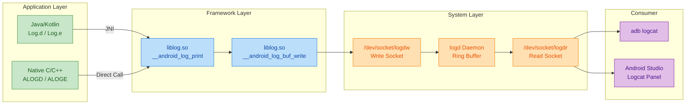

整条链路可以概括为：**产生 → 写入 → 存储 → 读取**。

- **产生**：无论 Java 层还是 Native 层，日志最终都会调用 `liblog.so` 中的 C 函数。Java 层的 `android.util.Log` 通过 JNI 桥接到 `__android_log_print`，而 Native 层的 `ALOGD` 等宏直接展开为该函数调用。
- **写入**：`liblog` 将格式化后的日志消息通过 Unix Domain Socket（`/dev/socket/logdw`）发送给 `logd` 守护进程。
- **存储**：`logd` 使用**环形缓冲区（Ring Buffer）**存储日志。主要有 `main`、`system`、`radio`、`crash` 等多个 buffer，容量有限，满了以后旧日志被覆盖。
- **读取**：`adb logcat` 或 Android Studio 的 Logcat 面板通过读取 socket（`/dev/socket/logdr`）获取日志流。

---

### LOG 宏的头文件与基础使用

Native 层使用 LOG 宏的起点是引入正确的头文件，并配合 `LOG_TAG` 宏定义。

```c++
// ============================================================
// 第一步：定义 LOG_TAG（必须在 #include 之前）
// LOG_TAG 就是 logcat 中 "Tag" 列显示的字符串
// 通常以模块名命名，方便用 logcat -s TAG 过滤
// ============================================================
#define LOG_TAG "MyNativeModule"

// ============================================================
// 第二步：引入 Android Log 头文件
// 在 AOSP 源码树中使用：
#include <log/log.h>            // AOSP 项目（system/logging/liblog）
// 在 NDK 项目中使用：
// #include <android/log.h>     // NDK 独立项目
// ============================================================

// ============================================================
// 第三步：在代码中直接使用 ALOG 系列宏
// ============================================================
void myFunction(int value) {
    ALOGD("myFunction called with value = %d", value);  // Debug 级别
    ALOGI("Initialization complete");                     // Info 级别
    ALOGW("Buffer size %d may be too small", value);      // Warning 级别
    ALOGE("Failed to open file: %s", strerror(errno));    // Error 级别
    ALOGV("Verbose trace: entering loop");                // Verbose 级别
}
```

> ⚠️ **关键细节**：`#define LOG_TAG` 必须写在 `#include <log/log.h>` **之前**。因为 `log.h` 内部的宏展开依赖 `LOG_TAG` 的值。如果遗漏，编译器会报 `LOG_TAG undeclared` 或使用一个空的默认值，导致 logcat 中 Tag 列显示为空或乱码。

对于 **NDK 项目**（使用 CMake / ndk-build），除了头文件不同，还需要在构建脚本中链接 `liblog`：

```cmake
# CMakeLists.txt 中链接 liblog
# find_library 在 NDK sysroot 中查找 liblog.so
find_library(log-lib log)

# 将 log-lib 链接到你的 native library
target_link_libraries(
    my_native_lib       # 你的库名
    ${log-lib}          # 链接 liblog
)
```

---

### 日志级别详解（Log Priority）

Android 日志系统定义了 **6 个级别**（从低到高），每个级别对应一个宏。级别的设计理念是 **严重性递增**——越高级别的日志越应被重视，在生产环境中也越不容易被过滤掉。

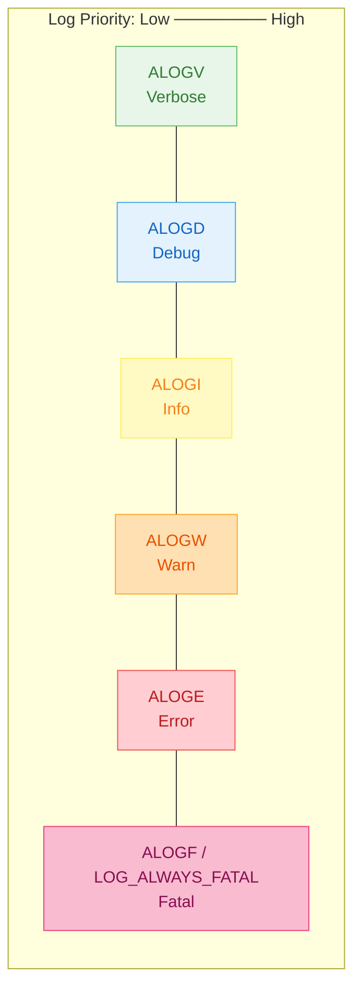

| 宏 | 对应 Priority | 典型用途 | Release 构建可见？ |
|---|---|---|---|
| `ALOGV` | `VERBOSE` (2) | 循环内的逐帧追踪、极细粒度调试 | ❌ 默认编译期移除 |
| `ALOGD` | `DEBUG` (3) | 函数入口、变量值、关键分支走向 | ⚠️ 可被运行时过滤 |
| `ALOGI` | `INFO` (4) | 模块初始化完成、配置加载成功等里程碑 | ✅ 通常保留 |
| `ALOGW` | `WARN` (5) | 非致命异常、降级处理、接近阈值的资源 | ✅ 保留 |
| `ALOGE` | `ERROR` (6) | 错误路径、系统调用失败、不可恢复情况 | ✅ 保留 |
| `LOG_ALWAYS_FATAL` | `FATAL` (7) | 致命断言失败，会触发 `abort()` 终止进程 | ✅ 保留（进程崩溃） |

---

### 宏展开与底层实现

理解"一个 `ALOGD(...)` 到底做了什么"，需要追踪宏的展开链。以 AOSP 的 `system/logging/liblog/include/log/log.h` 为准：

```c++
// ============================================================
// 宏展开链 (Macro Expansion Chain)
// ============================================================

// 第 1 层：用户调用
ALOGD("value = %d", 42);

// 第 2 层：ALOGD 展开为 ALOG，传入级别 LOG_DEBUG
// 定义在 log/log.h 中：
// #define ALOGD(...) ((void)ALOG(LOG_DEBUG, LOG_TAG, __VA_ARGS__))

// 第 3 层：ALOG 检查是否可打印，然后调用底层函数
// #define ALOG(priority, tag, ...)
//     LOG_PRI(ANDROID_##priority, tag, __VA_ARGS__)

// 第 4 层：LOG_PRI 最终调用 C 函数
// #define LOG_PRI(priority, tag, ...)
//     android_printLog(priority, tag, __VA_ARGS__)

// 第 5 层：android_printLog 是 __android_log_print 的别名
// #define android_printLog(prio, tag, ...)
//     __android_log_print(prio, tag, __VA_ARGS__)

// ============================================================
// 最终调用的 C 函数签名（在 liblog.so 中实现）
// ============================================================
// int __android_log_print(int prio,        // 日志级别
//                         const char *tag,  // LOG_TAG 的值
//                         const char *fmt,  // printf 风格的格式串
//                         ...);             // 可变参数
```

整个展开链可视化如下：

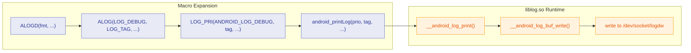

可以看到，**宏在预处理阶段完全展开为一个 C 函数调用**，没有任何运行时 overhead 在宏本身。真正的开销来自 `__android_log_print` 内部的格式化（`vsnprintf`）和 socket 写入。

---

### ALOGV 的编译期消除机制

`ALOGV`（Verbose 级别）在 Android 中有一个特殊待遇：**在非调试构建中，它会被预处理器完全移除**，甚至不会产生一条函数调用指令。这是通过条件编译实现的：

```c++
// ============================================================
// ALOGV 的条件编译定义（简化版，来自 log/log.h）
// ============================================================

// 除非你显式定义 LOG_NDEBUG=0，否则 LOG_NDEBUG 默认为 1
#ifndef LOG_NDEBUG
#ifdef NDEBUG                    // NDEBUG 是 C/C++ 标准的 release 宏
#define LOG_NDEBUG 1             // Release 构建: 关闭 verbose
#else
#define LOG_NDEBUG 1             // 即使 Debug 构建，默认也是关闭的！
#endif
#endif

// 当 LOG_NDEBUG 为 1 时，ALOGV 展开为"什么都不做"
#if LOG_NDEBUG
#define ALOGV(...)               \
    do {                         \
        if (false) {             \
            /* 编译器会完全优化掉这段代码 */  \
            __android_log_print( \
                ANDROID_LOG_VERBOSE, LOG_TAG, __VA_ARGS__); \
        }                        \
    } while (0)
#else
// LOG_NDEBUG=0 时，ALOGV 才真正输出
#define ALOGV(...) \
    __android_log_print(ANDROID_LOG_VERBOSE, LOG_TAG, __VA_ARGS__)
#endif
```

注意 `if (false)` 这个巧妙的技巧——它保证了两件事：

1. **编译期检查**：即使 ALOGV 不执行，编译器仍然会**语法检查**格式串和参数匹配（不会因为禁用就允许写出语法错误的日志）。
2. **零运行时开销**：任何现代编译器都会将 `if (false) { ... }` 优化为空操作（Dead Code Elimination），最终的二进制中不会有任何对应指令。

> 💡 **实战技巧**：如果你在某个特定文件中临时需要打开 Verbose 日志，可以在该文件的 `#include` **之前**加一行：
> ```c++
> #define LOG_NDEBUG 0     // 仅在本文件中启用 ALOGV
> #define LOG_TAG "MyModule"
> #include <log/log.h>
> ```

---

### 条件日志宏 ALOGD_IF / ALOGE_IF

除了基础的 `ALOGD`、`ALOGE`，Android 还提供了 **条件变体**，允许在运行时动态控制是否输出日志，避免在循环内频繁打印：

```c++
// ============================================================
// 条件日志宏 —— 仅当条件为 true 时才输出
// ============================================================

// 原型：ALOGD_IF(condition, fmt, ...)
// 当 condition 为 true 时等同于 ALOGD(fmt, ...)
// 当 condition 为 false 时什么都不做

bool gDebugEnabled = false;      // 全局调试开关，可通过 property 控制

void processFrame(int frameId) {
    // 仅当全局开关打开时才输出 debug 日志
    ALOGD_IF(gDebugEnabled, "Processing frame #%d", frameId);

    // 仅当帧号是 100 的倍数时才输出（降低日志洪泛）
    ALOGD_IF(frameId % 100 == 0, "Milestone frame #%d", frameId);

    // Error 级别也有条件版本
    int result = doSomething();
    ALOGE_IF(result != 0, "doSomething failed with error %d", result);
}
```

条件宏的**内部实现**非常简单：

```c++
// 条件宏展开（简化）
#define ALOGD_IF(cond, ...)          \
    do {                              \
        if (cond) {                   \
            ALOGD(__VA_ARGS__);       \   // 条件满足 → 正常打印
        }                             \
    } while (0)
```

实际上你也可以用普通的 `if` 加 `ALOGD` 达到相同效果，但 `_IF` 变体提供了更好的代码一致性和可读性，在 AOSP 源码中大量使用。

---

### 在 NDK 项目中使用底层 API

如果你的项目是纯 NDK 开发（不在 AOSP 源码树中），`ALOGD` / `ALOGE` 这些宏可能不可用（因为它们定义在 AOSP 的 `<log/log.h>` 中）。此时你需要直接使用 NDK 提供的底层 C API 或自己封装宏：

```c++
// ============================================================
// NDK 项目中的日志使用方式
// ============================================================
#include <android/log.h>           // NDK 提供的头文件

// 定义自己的 LOG_TAG
#define LOG_TAG "MyNDKApp"

// ============================================================
// 方式一：直接调用底层函数
// ============================================================
void exampleDirect() {
    // __android_log_print: 格式化打印，类似 printf
    __android_log_print(
        ANDROID_LOG_DEBUG,         // 日志级别枚举
        LOG_TAG,                   // Tag 字符串
        "Direct call: value = %d", // 格式串
        42                         // 参数
    );

    // __android_log_write: 直接写入一个字符串（无格式化）
    __android_log_write(
        ANDROID_LOG_ERROR,         // 日志级别
        LOG_TAG,                   // Tag
        "Something went wrong!"    // 纯文本消息
    );
}

// ============================================================
// 方式二（推荐）：自己封装宏，模拟 AOSP 风格
// ============================================================
#define LOGD(...) __android_log_print(ANDROID_LOG_DEBUG, LOG_TAG, __VA_ARGS__)
#define LOGE(...) __android_log_print(ANDROID_LOG_ERROR, LOG_TAG, __VA_ARGS__)
#define LOGW(...) __android_log_print(ANDROID_LOG_WARN,  LOG_TAG, __VA_ARGS__)
#define LOGI(...) __android_log_print(ANDROID_LOG_INFO,  LOG_TAG, __VA_ARGS__)
#define LOGV(...) __android_log_print(ANDROID_LOG_VERBOSE, LOG_TAG, __VA_ARGS__)

void exampleWrapped() {
    LOGD("Wrapped macro: x = %d, y = %f", 10, 3.14);  // 简洁易用
    LOGE("Error code: 0x%08X", 0xDEADBEEF);            // 十六进制格式
}
```

> 💡 **最佳实践**：在大型 NDK 项目中，通常会将上面的宏封装在一个公共头文件（如 `log_utils.h`）中，并加入 **编译期开关** 来控制 Release 版本中是否保留低级别日志。

---

### 日志级别的运行时过滤

除了编译期的 `LOG_NDEBUG` 控制，Android 还支持通过 **System Property** 在运行时动态调整某个 Tag 的最低可见级别：

```c++
// ============================================================
// 通过 adb shell 设置运行时日志级别
// ============================================================

// 语法: adb shell setprop log.tag.<TAG> <LEVEL>
// LEVEL 可选值: VERBOSE / DEBUG / INFO / WARN / ERROR / SUPPRESS

// 示例 1: 将 MyNativeModule 的日志级别设为 WARN
// （只显示 WARN 及以上，DEBUG/INFO 被过滤）
// $ adb shell setprop log.tag.MyNativeModule WARN

// 示例 2: 彻底禁止某个 Tag 的所有日志
// $ adb shell setprop log.tag.MyNativeModule SUPPRESS

// 示例 3: 打开 Verbose 级别（需配合 LOG_NDEBUG=0 编译）
// $ adb shell setprop log.tag.MyNativeModule VERBOSE
```

在代码中，你也可以主动检查当前 Tag 是否允许输出某级别的日志：

```c++
#include <log/log.h>

void conditionalWork() {
    // __android_log_is_loggable 检查当前 Tag + 级别是否可输出
    // 返回值: 非零 = 可输出, 0 = 被过滤
    if (__android_log_is_loggable(
            ANDROID_LOG_DEBUG,       // 要检查的级别
            LOG_TAG,                 // 当前 Tag
            ANDROID_LOG_INFO)) {     // 默认最低级别（若 property 未设置）
        // 这里可以执行一些仅调试时需要的耗时操作
        // 例如序列化一个大结构体用于打印
        std::string dump = expensiveDump();
        ALOGD("Dump: %s", dump.c_str());
    }
    // 如果日志被过滤，expensiveDump() 根本不会执行 → 零开销
}
```

这在性能敏感路径上尤其重要——**先检查再构造日志字符串**，避免无谓的 `expensiveDump()` 调用。

---

### 性能考量与生产环境最佳实践

日志看似轻量，但在高频调用路径上（如每帧渲染、音频回调、Binder 事务），不当的日志使用会产生严重的性能问题：

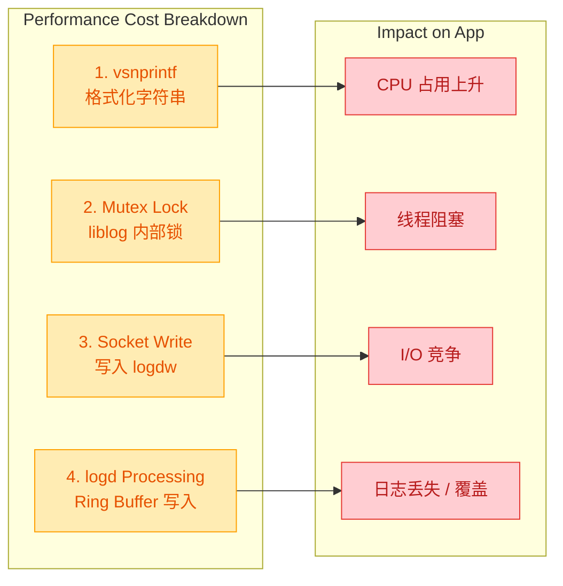

**核心原则**：

| 实践 | 说明 |
|---|---|
| **循环中避免 ALOGD** | 一个 60fps 的渲染循环中每帧打印一条 ALOGD，每秒就是 60 条写入 socket |
| **Release 版关闭 ALOGV/ALOGD** | 使用 `LOG_NDEBUG=1`（默认）消除 ALOGV；对 ALOGD 可自定义宏控制 |
| **先检查再格式化** | 使用 `__android_log_is_loggable()` 保护昂贵的字符串构造 |
| **禁止打印敏感信息** | 用户 token、密码等不得出现在日志中，logcat 对所有 App 可见（Android 11 之前） |
| **Tag 命名规范** | 建议 Tag ≤ 23 字符（旧版限制），使用 `模块名/子模块` 格式便于过滤 |

下面是一个生产级别的日志封装示例，综合了以上所有最佳实践：

```c++
// ============================================================
// log_utils.h —— 生产级日志封装
// ============================================================
#pragma once                       // 防止重复包含

#include <android/log.h>           // NDK 底层 API

// 模块 Tag，统一管理
#ifndef LOG_TAG
#define LOG_TAG "MyApp"
#endif

// ============================================================
// Release 构建开关
// 编译时通过 -DRELEASE_BUILD=1 控制
// ============================================================
#ifndef RELEASE_BUILD
#define RELEASE_BUILD 0            // 默认为 Debug 构建
#endif

// ============================================================
// LOGE / LOGW —— 始终可用（生产环境也需要错误日志）
// ============================================================
#define LOGE(...) __android_log_print(ANDROID_LOG_ERROR, LOG_TAG, __VA_ARGS__)
#define LOGW(...) __android_log_print(ANDROID_LOG_WARN,  LOG_TAG, __VA_ARGS__)

// ============================================================
// LOGI —— 生产环境保留（重要里程碑信息）
// ============================================================
#define LOGI(...) __android_log_print(ANDROID_LOG_INFO, LOG_TAG, __VA_ARGS__)

// ============================================================
// LOGD —— 仅 Debug 构建有效
// Release 构建中展开为空操作（编译器会完全移除）
// ============================================================
#if RELEASE_BUILD
#define LOGD(...)  do { if (false) { __android_log_print(ANDROID_LOG_DEBUG, LOG_TAG, __VA_ARGS__); } } while(0)
#else
#define LOGD(...) __android_log_print(ANDROID_LOG_DEBUG, LOG_TAG, __VA_ARGS__)
#endif

// ============================================================
// LOGV —— 仅显式开启时有效
// 需要在文件顶部 #define ENABLE_VERBOSE 1 才会生效
// ============================================================
#if defined(ENABLE_VERBOSE) && ENABLE_VERBOSE
#define LOGV(...) __android_log_print(ANDROID_LOG_VERBOSE, LOG_TAG, __VA_ARGS__)
#else
#define LOGV(...)  do { if (false) { __android_log_print(ANDROID_LOG_VERBOSE, LOG_TAG, __VA_ARGS__); } } while(0)
#endif
```

---

### logcat 实用过滤技巧

写好日志后，高效地 **检索和过滤** 是调试效率的关键。以下是常用的 `adb logcat` 命令：

```c++
// ============================================================
// adb logcat 常用命令速查
// ============================================================

// 1. 按 Tag 过滤 —— 只显示 MyNativeModule 的 Debug 及以上日志
//    *:S 表示 Silence 其他所有 Tag
// $ adb logcat MyNativeModule:D *:S

// 2. 按多个 Tag 过滤
// $ adb logcat MyNativeModule:D AudioFlinger:W *:S

// 3. 按进程过滤（需先获取 PID）
// $ adb logcat --pid=12345

// 4. 按关键字 grep（Linux/Mac）
// $ adb logcat | grep "Failed"

// 5. 清空日志缓冲区（重新开始）
// $ adb logcat -c

// 6. 输出并保存到文件
// $ adb logcat -v threadtime > log.txt

// 7. 查看 crash buffer（Native Crash 信息）
// $ adb logcat -b crash

// 8. 使用 long 格式查看完整时间戳和 PID/TID
// $ adb logcat -v long MyNativeModule:V *:S

// 9. 使用 color 格式（终端支持 ANSI 颜色时）
// $ adb logcat -v color
```

> 💡 **Android Studio 技巧**：在 Logcat 面板中，你可以直接在搜索框输入 `tag:MyNativeModule level:error` 进行组合过滤，比命令行更直观。

---

### 常见陷阱与排错

**陷阱 1：忘记定义 LOG_TAG**

```c++
// ❌ 错误：LOG_TAG 未定义就使用 ALOGD
#include <log/log.h>
void foo() {
    ALOGD("hello");   // 编译错误: LOG_TAG undeclared
}

// ✅ 正确：先定义 LOG_TAG
#define LOG_TAG "Foo"
#include <log/log.h>
void foo() {
    ALOGD("hello");   // OK
}
```

**陷阱 2：格式化字符串与参数不匹配**

```c++
int count = 10;
const char* name = "test";

// ❌ 危险：%s 期望 char*，传入了 int → 未定义行为 / 崩溃
ALOGD("name = %s, count = %d", count, name);

// ✅ 正确：参数顺序与格式说明符一致
ALOGD("name = %s, count = %d", name, count);
```

由于 `__android_log_print` 是 C 可变参数函数，编译器 **不一定** 能在默认 Warning 级别捕获这类错误。建议在编译选项中添加 `-Wformat` 开启格式串检查。

**陷阱 3：在 C++ 中传入 `std::string` 对象**

```c++
std::string msg = "hello world";

// ❌ 错误：%s 期望 const char*，不能直接传 std::string
ALOGD("message = %s", msg);       // 未定义行为！

// ✅ 正确：使用 .c_str() 获取 C 风格字符串
ALOGD("message = %s", msg.c_str());
```

---

**📝 练习题**

在 Android AOSP 源码中，以下关于 `ALOGV` 宏的描述，哪一项是**正确**的？

A. `ALOGV` 在所有构建类型中都会被完整编译进二进制，只是运行时被 logd 过滤


B. `ALOGV` 在默认情况下（未定义 `LOG_NDEBUG=0`）会被预处理器展开为一个 `if (false)` 包裹的空操作，编译器将完全消除对应代码


C. `ALOGV` 和 `ALOGD` 的编译期行为完全相同，都不受 `LOG_NDEBUG` 影响


D. `ALOGV` 在 Release 构建中会触发编译错误以防止开发者误用


**【答案】** B

**【解析】** `ALOGV` 的实现使用了 `if (false) { __android_log_print(...); }` 这一经典的条件编译技巧。当 `LOG_NDEBUG` 为 1（默认值，无论是否为 Release 构建），宏展开后的代码体在 `if (false)` 中，编译器的 Dead Code Elimination 优化会彻底移除这段代码，使得最终二进制中 **没有任何** 对应的函数调用或字符串常量。之所以保留 `if (false)` 而非直接定义为空宏 `#define ALOGV(...)`，是为了让编译器仍然对格式串和参数进行语法检查，在编译期就能发现 `%s` / `%d` 等与实参不匹配的错误。选项 A 错误：代码在编译期就被消除了，不会进入二进制。选项 C 错误：`ALOGD` 不受 `LOG_NDEBUG` 控制，它在所有构建中都会产生实际的函数调用。选项 D 错误：`ALOGV` 不会触发编译错误，只是被静默优化掉。

---

## 断点调试（gdb/lldb）

在 Native 层开发中，日志（LOG）虽然是最常用的调试手段，但它本质上是一种"被动观察"——你只能看到你 **预先埋点** 的信息。当面对复杂的崩溃、竞态条件或难以复现的 Bug 时，我们需要一种 **主动介入** 程序运行时状态的能力：在任意位置暂停程序、逐行执行、检查变量值、查看寄存器和内存。这就是 **断点调试器（Debugger）** 的核心价值。

Android Native 开发历史上主要使用两款调试器：**GDB**（GNU Debugger）和 **LLDB**（LLVM Debugger）。自 NDK r23 起，Google 已正式移除了 `ndk-gdb`，全面转向 LLDB 作为官方调试器。因此本节以 **LLDB 为主线**，同时对比 GDB 的经典命令，帮助你在新旧项目之间无缝切换。

### 调试器在 Android 架构中的位置

要理解断点调试的工作原理，首先必须清楚调试器在整个 Android 系统中所处的位置。调试是一个 **跨主机-设备** 的过程：调试器前端运行在开发机（Host）上，通过 ADB 与设备上的调试服务器（`lldb-server` 或 `gdbserver`）通信，后者再通过 Linux 内核提供的 `ptrace` 系统调用来控制目标进程。

```mermaid
graph LR
    subgraph Host[开发主机 Host]
        direction TB
        IDE[Android Studio / VS Code]
        LLDB[lldb 客户端]
        ADB_H[adb client]
        IDE --> LLDB
        LLDB --> ADB_H
    end

    subgraph Device[Android 设备 / 模拟器]
        direction TB
        ADB_D[adbd 守护进程]
        SERVER[lldb-server]
        KERNEL[Linux Kernel ptrace]
        TARGET[目标 Native 进程]
        ADB_D --> SERVER
        SERVER --> KERNEL
        KERNEL --> TARGET
    end

    ADB_H -- USB / TCP --> ADB_D

    classDef appLayer fill:#C8E6C9,stroke:#388E3C,color:#1B5E20
    classDef fwLayer fill:#BBDEFB,stroke:#1976D2,color:#0D47A1
    classDef kernelLayer fill:#FFE0B2,stroke:#F57C00,color:#E65100
    classDef deviceBg fill:#F3E5F5,stroke:#7B1FA2,color:#4A148C

    class IDE,LLDB appLayer
    class ADB_H,ADB_D,SERVER fwLayer
    class KERNEL,TARGET kernelLayer
```

整条链路的关键在于 **`ptrace`** 系统调用。它是 Linux 内核提供的进程跟踪接口，允许一个进程（tracer）观察和控制另一个进程（tracee）的执行。调试器的所有核心能力——设置断点、单步执行、读写内存和寄存器——本质上都是通过 `ptrace` 完成的。

### GDB 与 LLDB 的历史演进

**GDB** 诞生于 1986 年，由 Richard Stallman 编写，是 GNU 工具链的核心组件。在 Android 早期（NDK r10 之前），`ndk-gdb` 脚本是官方推荐的 Native 调试方案。GDB 功能极其强大，支持几乎所有架构和语言，但其代码库庞大、架构相对老旧，扩展性受限。

**LLDB** 是 LLVM 项目的调试器组件，由 Apple 主导开发，设计之初就面向现代化架构。它采用插件式设计、支持多线程调试、与 Clang/LLVM 编译器深度集成，能更精确地解析 C++ 模板、lambda 等现代语法产生的调试信息。

两者的关键区别可以总结如下：

| 维度 | GDB | LLDB |
|------|-----|------|
| **项目归属** | GNU | LLVM / Apple |
| **NDK 状态** | r23 起已移除 | 当前官方标配 |
| **Android Studio 集成** | 不再支持 | 原生集成 |
| **C++ 现代语法支持** | 较弱（模板调试信息不完整） | 强（与 Clang 共享前端） |
| **脚本扩展** | Python (GDB API) | Python (LLDB SB API) |
| **远程调试协议** | GDB Remote Protocol | GDB Remote Protocol (兼容) |
| **启动速度** | 较慢（大型符号表加载慢） | 较快（惰性加载符号） |

值得注意的是，LLDB 在远程调试时使用的仍然是 **GDB Remote Serial Protocol**（RSP），这是业界事实标准。这意味着 LLDB 客户端甚至可以连接 `gdbserver`，反之亦然（虽然不推荐混用）。

### 断点的底层原理

断点是调试器最核心的功能，理解其原理对排查调试问题至关重要。

#### 软件断点（Software Breakpoint）

这是最常用的断点类型。当你在某一行代码设置断点时，调试器会：

1. **记录** 目标地址处原始的机器指令（例如 ARM64 上的 4 字节指令）。
2. **替换** 该地址处的指令为一条特殊的 **陷阱指令**（trap instruction）：
   - x86/x86_64：`INT 3`（操作码 `0xCC`，仅 1 字节）
   - ARM32：`BKPT`（操作码 `0xE1200070`）
   - ARM64/AArch64：`BRK #0`（操作码 `0xD4200000`）
3. 当 CPU 执行到这条陷阱指令时，触发 **异常（Exception）**，内核将其转化为 `SIGTRAP` 信号发送给进程。
4. 由于调试器通过 `ptrace` 附着在目标进程上，内核会先通知调试器（tracer），而非直接终止进程。
5. 调试器收到通知后暂停目标进程，进入交互模式。
6. 当用户选择继续执行时，调试器 **恢复** 原始指令、单步执行一次、再重新插入陷阱指令，然后让进程继续运行。

```c++
// ===== 软件断点原理 - 伪代码演示 =====

// 原始内存中的指令（ARM64 示例）
// 地址 0x7F001000: MOV X0, #1    (原始指令)

// 第一步：调试器保存原始指令
uint32_t saved_insn = ptrace(PTRACE_PEEKTEXT, pid, 0x7F001000, NULL);
// saved_insn = 0xD2800020 (MOV X0, #1 的机器码)

// 第二步：写入 BRK 陷阱指令
uint32_t brk_insn = 0xD4200000; // BRK #0
ptrace(PTRACE_POKETEXT, pid, 0x7F001000, brk_insn);
// 此时地址 0x7F001000 处的指令变为 BRK #0

// 第三步：继续执行目标进程
ptrace(PTRACE_CONT, pid, NULL, NULL);
// CPU 执行到 0x7F001000 时触发 SIGTRAP

// 第四步：调试器收到信号，暂停进程
int status;
waitpid(pid, &status, 0);
// WIFSTOPPED(status) == true, WSTOPSIG(status) == SIGTRAP

// 第五步：用户检查完毕，选择继续执行
// 5a. 恢复原始指令
ptrace(PTRACE_POKETEXT, pid, 0x7F001000, saved_insn);
// 5b. 将 PC 寄存器回退到断点地址（因为 BRK 会让 PC 前进）
struct user_regs_struct regs;
ptrace(PTRACE_GETREGS, pid, NULL, &regs);
regs.pc = 0x7F001000; // 回退 PC
ptrace(PTRACE_SETREGS, pid, NULL, &regs);
// 5c. 单步执行一条指令（执行原始的 MOV X0, #1）
ptrace(PTRACE_SINGLESTEP, pid, NULL, NULL);
waitpid(pid, &status, 0);
// 5d. 重新插入断点（以便下次还能命中）
ptrace(PTRACE_POKETEXT, pid, 0x7F001000, brk_insn);
// 5e. 继续运行
ptrace(PTRACE_CONT, pid, NULL, NULL);
```

#### 硬件断点（Hardware Breakpoint）

现代 CPU 提供了专用的 **调试寄存器（Debug Registers）**，可以在硬件层面监控特定地址的访问。ARM64 处理器通常提供 4-6 个硬件断点寄存器和 4 个硬件 watchpoint 寄存器。硬件断点的优势在于 **不需要修改目标内存中的指令**，因此可以用于 ROM、Flash 等只读内存区域的调试，也不会改变程序的指令缓存状态。

**Watchpoint**（数据断点）是硬件断点的一种重要应用：当某个内存地址被 **读取** 或 **写入** 时自动中断。这在追踪"某个变量被谁改了"这类问题时极其有用。

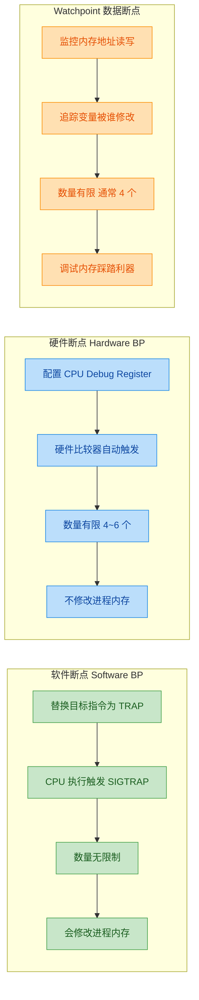

### 环境搭建与连接流程

#### 前置条件

在开始调试之前，需要确认以下几点：

1. **编译时必须包含调试符号**：在 `CMakeLists.txt` 或 `Android.mk` 中确保使用 `-g` 编译选项，并且 **不要 strip** 调试用的 `.so` 文件。NDK 构建系统默认会在 `app/build/intermediates/cmake/debug/obj/` 下保留带符号的 `.so`，安装到设备上的则是 stripped 版本。调试器需要加载 **带符号的版本** 来显示源码映射。

2. **设备必须可调试**：目标 App 的 `AndroidManifest.xml` 中需要设置 `android:debuggable="true"`（debug 构建默认启用），或者设备本身是 `userdebug`/`eng` 版本的系统。

3. **ADB 连接正常**：`adb devices` 能看到设备。

```c++
// CMakeLists.txt 中确保调试符号的关键配置
// cmake_minimum_required(VERSION 3.18.1)

// 方法一：直接设置编译标志
// set(CMAKE_C_FLAGS_DEBUG "${CMAKE_C_FLAGS_DEBUG} -g -O0")
// set(CMAKE_CXX_FLAGS_DEBUG "${CMAKE_CXX_FLAGS_DEBUG} -g -O0")
// -g   : 生成 DWARF 调试信息（行号、变量名、类型信息等）
// -O0  : 禁用优化，确保变量不会被优化掉，代码顺序与源码一致

// 方法二：使用 CMake 内置变量（推荐）
// set(CMAKE_BUILD_TYPE Debug)
// CMake 会自动为 Debug 类型添加 -g 标志
```

#### 手动连接流程（命令行方式）

虽然 Android Studio 已经将 LLDB 调试完全自动化，但理解手动流程对排查 IDE 调试失败的问题非常重要。以下是完整的手动操作步骤：

```bash
# ===== 步骤 1：将 lldb-server 推送到设备 =====
# lldb-server 位于 NDK 目录中，需要选择与目标架构匹配的版本
# 例如 arm64-v8a 设备：
adb push $NDK/toolchains/llvm/prebuilt/linux-x86_64/lib/clang/17/lib/linux/aarch64/lldb-server \
    /data/local/tmp/lldb-server

# 赋予执行权限
adb shell chmod 755 /data/local/tmp/lldb-server

# ===== 步骤 2：在设备上启动 lldb-server =====
# 以 platform 模式启动，监听 Unix domain socket
adb shell run-as com.example.myapp \
    /data/local/tmp/lldb-server platform \
    --server --listen unix-abstract:///com.example.myapp/debug.sock

# ===== 步骤 3：设置 ADB 端口转发 =====
# 将主机的 TCP 端口映射到设备上的 lldb-server 端口
adb forward tcp:1234 tcp:1234

# 或者如果使用 gdbserver（旧方式）：
# adb forward tcp:5039 tcp:5039

# ===== 步骤 4：在主机上启动 lldb 客户端并连接 =====
# 启动 lldb（使用 NDK 自带的版本以确保兼容性）
$NDK/toolchains/llvm/prebuilt/linux-x86_64/bin/lldb

# 在 lldb 交互界面中连接远程服务器
# (lldb) platform select remote-android
# (lldb) platform connect connect://localhost:1234
```

整个连接过程的时序如下：

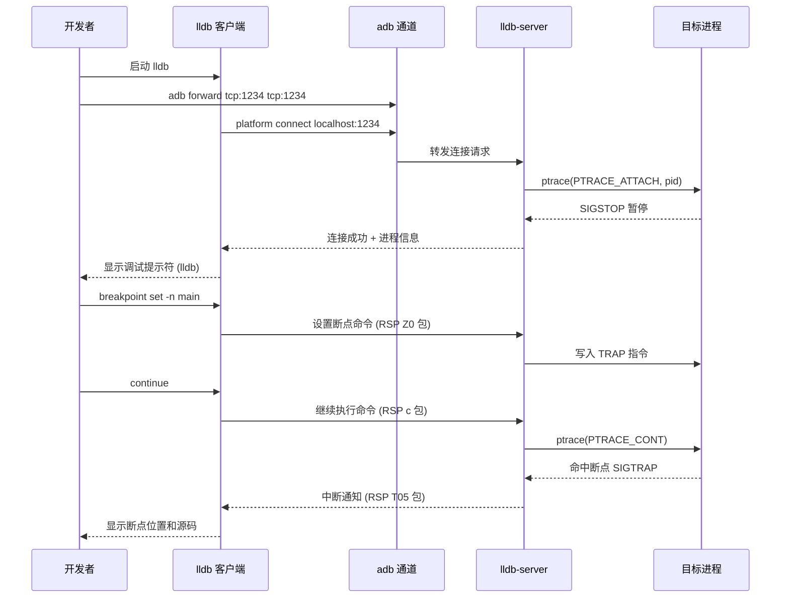

#### Android Studio 自动化调试

在实际开发中，绝大多数情况下我们使用 Android Studio 的图形化调试。Android Studio 内部封装了上述所有步骤，流程如下：

1. 点击 **Debug** 按钮（带小虫子图标的运行按钮）。
2. Studio 自动构建 APK（debug variant），安装到设备。
3. Studio 通过 `am start -D` 启动 App（`-D` 表示 wait for debugger）。
4. Studio 将 NDK 中的 `lldb-server` 推送到设备并启动。
5. Studio 启动本地 LLDB 客户端，通过 ADB 端口转发连接 `lldb-server`。
6. Studio 同时启动 **Java/Kotlin 调试器**（JDWP）和 **Native 调试器**（LLDB），实现 **Dual Debugger** 模式。
7. 你在编辑器中点击行号设置的断点，Studio 会自动判断是 Java 断点还是 Native 断点，路由到对应的调试器。

> **提示**：在 `Run/Debug Configurations` 中，Debugger 类型可选 `Auto`、`Java`、`Native` 或 `Dual`。如果只调试 Native 代码，选择 `Native` 可以减少启动时间。

### LLDB 核心命令详解

以下是 Android Native 调试中最常用的 LLDB 命令，按功能分类讲解。

#### 断点管理

```bash
# ===== 按函数名设置断点 =====
(lldb) breakpoint set --name main
# 简写形式：
(lldb) b main
# 在名为 main 的所有函数入口处设置断点

# ===== 按文件名和行号设置断点 =====
(lldb) breakpoint set --file native-lib.cpp --line 42
# 简写形式：
(lldb) b native-lib.cpp:42
# 在 native-lib.cpp 第 42 行设置断点

# ===== 按 C++ 方法签名设置断点（支持正则） =====
(lldb) breakpoint set --func-regex ".*MyService.*onTransact.*"
# 匹配所有类名含 MyService 且方法名含 onTransact 的函数
# 在 Binder 调试中极其有用

# ===== 条件断点：只在满足条件时中断 =====
(lldb) breakpoint set --name processFrame --condition "frameIndex > 100"
# 仅当 frameIndex 大于 100 时才触发中断
# 避免在循环前 100 次迭代中反复中断

# ===== 一次性断点（命中一次后自动删除） =====
(lldb) breakpoint set --name criticalFunction --one-shot true
# 只中断一次，之后自动移除

# ===== 列出所有断点 =====
(lldb) breakpoint list
# 简写：
(lldb) br l
# 显示断点编号、位置、命中次数、启用状态

# ===== 删除 / 禁用 / 启用断点 =====
(lldb) breakpoint delete 3      # 删除编号为 3 的断点
(lldb) breakpoint disable 2     # 临时禁用编号为 2 的断点
(lldb) breakpoint enable 2      # 重新启用

# ===== 设置 Watchpoint（数据断点） =====
(lldb) watchpoint set variable myGlobalVar
# 当 myGlobalVar 被写入时中断
(lldb) watchpoint set expression -- 0x7F003000
# 当地址 0x7F003000 处的内存被写入时中断
# 追踪内存踩踏问题的利器
(lldb) watchpoint modify -c "myGlobalVar == 42"
# 为 watchpoint 添加条件：只在值变为 42 时中断
```

#### 执行控制

```bash
# ===== 继续执行（直到下一个断点或程序结束） =====
(lldb) continue
# 简写：
(lldb) c

# ===== 单步跳过（Step Over）：执行当前行，不进入函数内部 =====
(lldb) next
# 简写：
(lldb) n
# 如果当前行是 foo()，执行完 foo() 后停在下一行

# ===== 单步进入（Step Into）：进入当前行调用的函数 =====
(lldb) step
# 简写：
(lldb) s
# 如果当前行是 foo()，会进入 foo() 的第一行

# ===== 单步跳出（Step Out）：执行完当前函数，返回调用者 =====
(lldb) finish
# 当你不小心 step 进了一个不感兴趣的函数时使用

# ===== 执行到指定行（Run to Line） =====
(lldb) thread until 85
# 执行到当前文件的第 85 行停下
# 相当于临时设置一个一次性断点然后 continue

# ===== 指令级单步（汇编级别） =====
(lldb) si    # Step Instruction：进入
(lldb) ni    # Next Instruction：跳过
# 在分析编译器生成的代码或排查内联汇编问题时使用
```

#### 查看程序状态

```bash
# ===== 查看调用栈（Backtrace） =====
(lldb) thread backtrace
# 简写：
(lldb) bt
# 显示当前线程的完整调用栈
# 输出示例：
# frame #0: 0x7a3b1234 libnative-lib.so`processFrame(data=0x7a500000, size=1920) at native-lib.cpp:42
# frame #1: 0x7a3b1100 libnative-lib.so`onFrameAvailable(this=0x7a400000) at camera-handler.cpp:88
# frame #2: 0x7b201000 libcameraservice.so`...

# ===== 查看所有线程 =====
(lldb) thread list
# 列出进程中所有线程及其状态
# 带 * 号的是当前活跃线程

# ===== 切换线程 =====
(lldb) thread select 3
# 切换到 3 号线程，查看其调用栈和变量

# ===== 查看局部变量 =====
(lldb) frame variable
# 简写：
(lldb) v
# 显示当前栈帧中所有局部变量及其值

# ===== 查看特定变量（支持表达式） =====
(lldb) frame variable myBuffer
(lldb) p myBuffer          # print 命令，支持表达式求值
(lldb) p myBuffer->size()  # 可以调用对象的方法！
(lldb) p (int*)0x7a500000  # 将地址强制转换为指针查看
(lldb) p/x myInt           # 以十六进制格式显示
(lldb) p/t myInt           # 以二进制格式显示

# ===== 查看内存内容 =====
(lldb) memory read 0x7a500000 --count 64 --format x
# 从地址 0x7a500000 开始读取 64 字节，以十六进制显示
# 简写：
(lldb) x/64xb 0x7a500000
# GDB 风格的内存查看命令，LLDB 也兼容

# ===== 查看寄存器 =====
(lldb) register read
# 显示所有通用寄存器（ARM64: X0-X30, SP, PC 等）
(lldb) register read pc sp x0
# 只查看特定寄存器
```

#### GDB vs LLDB 命令对照表

对于从 GDB 迁移到 LLDB 的开发者，以下对照表是必备参考：

| 功能 | GDB 命令 | LLDB 命令 |
|------|---------|-----------|
| 设置函数断点 | `break main` | `b main` |
| 设置文件行号断点 | `break file.cpp:42` | `b file.cpp:42` |
| 条件断点 | `break foo if x>10` | `b foo --condition 'x>10'` |
| 列出断点 | `info breakpoints` | `br list` |
| 删除断点 | `delete 3` | `br del 3` |
| 继续执行 | `continue` / `c` | `continue` / `c` |
| 单步跳过 | `next` / `n` | `next` / `n` |
| 单步进入 | `step` / `s` | `step` / `s` |
| 跳出函数 | `finish` | `finish` |
| 查看调用栈 | `backtrace` / `bt` | `bt` |
| 查看变量 | `print x` | `p x` |
| 查看局部变量 | `info locals` | `frame variable` / `v` |
| 查看线程列表 | `info threads` | `thread list` |
| 切换线程 | `thread 3` | `thread select 3` |
| 查看内存 | `x/16xw 0xaddr` | `memory read 0xaddr -c 16 -f x` |
| 查看寄存器 | `info registers` | `register read` |
| 设置 watchpoint | `watch myVar` | `watchpoint set variable myVar` |
| 附加到进程 | `attach 1234` | `process attach --pid 1234` |
| 运行程序 | `run` | `process launch` / `r` |

### 高级调试技巧

#### 调试 Release/优化构建

生产环境的崩溃往往发生在开启了 `-O2` 或 `-Os` 优化的 Release 构建上。优化后的代码调试难度显著增加：

- **变量被优化掉**：编译器可能将变量放在寄存器中甚至完全消除，LLDB 会显示 `<variable optimized out>`。
- **函数被内联**：调用栈中看不到被内联的函数，断点也无法命中。
- **代码重排**：执行顺序可能与源码行号不一致，单步执行时会出现"跳来跳去"的现象。

应对策略：

```bash
# 1. 使用 register read 直接查看寄存器中的值
(lldb) register read x0 x1 x2
# ARM64 调用约定：前 8 个参数通过 X0-X7 传递

# 2. 使用 disassemble 查看当前位置的汇编
(lldb) disassemble --frame
# 简写：
(lldb) di -f
# 显示当前函数的反汇编代码，理解编译器的优化行为

# 3. 在编译时使用 -fno-omit-frame-pointer
# 确保帧指针寄存器（FP/X29）被保留，这样即使优化后也能正确回溯调用栈

# 4. 使用 __attribute__((noinline)) 阻止关键函数被内联
// void __attribute__((noinline)) criticalFunction() { ... }
```

#### 多线程调试

Android Native 代码通常涉及多线程，调试时需要特别注意：

```bash
# ===== 查看所有线程的调用栈 =====
(lldb) thread backtrace all
# 一次性打印所有线程的完整调用栈
# 在分析死锁时非常有用

# ===== 只运行当前线程，冻结其他线程 =====
(lldb) thread continue -t 5
# 有时候你希望只让某个线程执行，以避免竞态条件影响调试
# 注意：这可能导致死锁（如果目标线程等待被冻结的线程）

# ===== 查看线程名称（在 Android 中很有用） =====
(lldb) thread list
# Android 系统线程通常有有意义的名称：
# * thread #1: tid = 12345, name = 'main'           (主线程/UI线程)
#   thread #2: tid = 12346, name = 'Binder:1234_1'   (Binder 线程)
#   thread #3: tid = 12347, name = 'RenderThread'     (渲染线程)
#   thread #4: tid = 12348, name = 'FinalizerDaemon'  (GC 终结器)
```

#### LLDB 脚本化（Python 扩展）

LLDB 内置了完整的 Python 解释器，可以编写脚本自动化调试流程：

```python
# ===== 自定义 LLDB 命令：打印 Android Parcel 内容 =====
# 保存为 parcel_printer.py

import lldb  # 导入 LLDB Python 模块

def print_parcel(debugger, command, result, internal_dict):
    """自定义命令：解析并打印 Parcel 对象的数据区"""
    target = debugger.GetSelectedTarget()      # 获取当前调试目标
    process = target.GetProcess()              # 获取目标进程
    thread = process.GetSelectedThread()       # 获取当前线程
    frame = thread.GetSelectedFrame()          # 获取当前栈帧

    # 求值获取 Parcel 指针
    parcel = frame.EvaluateExpression(command) # 对用户输入的表达式求值
    if not parcel.IsValid():                   # 检查求值是否成功
        result.AppendMessage("Invalid expression")
        return

    # 读取 Parcel 内部字段
    data_ptr = parcel.GetChildMemberWithName("mData")    # Parcel::mData 数据指针
    data_size = parcel.GetChildMemberWithName("mDataSize") # Parcel::mDataSize 数据大小

    size_val = data_size.GetValueAsUnsigned()  # 转为 Python 整数
    ptr_val = data_ptr.GetValueAsUnsigned()    # 获取地址值

    # 读取内存内容
    error = lldb.SBError()                     # 错误对象
    memory = process.ReadMemory(ptr_val, size_val, error) # 读取进程内存

    if error.Success():                        # 读取成功
        result.AppendMessage(f"Parcel data ({size_val} bytes):")
        hex_dump = ' '.join(f'{b:02x}' for b in memory) # 格式化为十六进制
        result.AppendMessage(hex_dump)
    else:
        result.AppendMessage(f"Failed to read memory: {error}")

# 注册自定义命令
def __lldb_init_module(debugger, internal_dict):
    debugger.HandleCommand(
        'command script add -f parcel_printer.print_parcel print_parcel'
    )
    # 之后在 LLDB 中就可以使用：
    # (lldb) print_parcel myParcelPtr
```

加载脚本的方式：

```bash
# 方法一：在 LLDB 中手动加载
(lldb) command script import /path/to/parcel_printer.py

# 方法二：写入 ~/.lldbinit 自动加载
# echo 'command script import /path/to/parcel_printer.py' >> ~/.lldbinit
```

### 常见调试场景实战

#### 场景一：JNI 崩溃定位

当 Java 层调用 Native 方法时发生崩溃，logcat 会输出一段 tombstone 信息。用 LLDB 可以更精确地定位：

```bash
# 1. 在 JNI 入口函数设置断点
(lldb) b Java_com_example_myapp_NativeLib_processData
# JNI 函数名遵循固定命名规则：Java_包名_类名_方法名

# 2. 命中断点后查看参数
(lldb) p env           # JNIEnv* 指针
(lldb) p thiz          # jobject (this)
(lldb) p inputData     # jbyteArray 等 JNI 类型

# 3. 单步执行找到崩溃行
(lldb) n               # 逐行执行
# 当执行到问题行时 LLDB 会捕获到 SIGSEGV

# 4. 查看崩溃时的寄存器和内存
(lldb) register read pc    # 查看崩溃发生的精确地址
(lldb) bt                  # 查看完整调用栈
(lldb) p *nullPointer      # 尝试读取可疑指针，确认是否为空
```

#### 场景二：死锁检测

```bash
# 1. 当应用 ANR（Application Not Responding）时附加调试器
(lldb) process attach --name com.example.myapp --waitfor
# --waitfor 参数使 LLDB 等待目标进程启动

# 2. 暂停所有线程
(lldb) process interrupt

# 3. 查看所有线程的调用栈
(lldb) thread backtrace all
# 寻找多个线程都卡在 pthread_mutex_lock / futex 的情况
# 如果线程 A 持有锁 1 等待锁 2，线程 B 持有锁 2 等待锁 1 → 死锁

# 4. 查看 mutex 对象确认持有者
(lldb) p *(pthread_mutex_t*)0x7a600100
# 查看 mutex 内部结构，__owner 字段记录了持有该锁的线程 TID
```

#### 场景三：调试系统服务（需要 root / eng 版本）

```bash
# 1. 查找目标进程 PID
adb shell ps -A | grep surfaceflinger
# 输出：system  1234  1  ...  /system/bin/surfaceflinger

# 2. 以 root 身份在设备上启动 lldb-server 并附加
adb shell su -c "/data/local/tmp/lldb-server gdbserver :5039 --attach 1234"

# 3. 主机端连接
adb forward tcp:5039 tcp:5039
lldb
(lldb) gdb-remote 5039

# 4. 加载符号文件（来自 AOSP 编译产物）
(lldb) target symbols add /path/to/symbols/system/bin/surfaceflinger
(lldb) target symbols add /path/to/symbols/system/lib64/libsurfaceflinger.so
```

### 调试器使用的注意事项与陷阱

1. **信号处理冲突**：Android Runtime（ART）内部使用 `SIGSEGV` 进行 Null Check 优化（implicit null check）。如果不处理，LLDB 会在每次 ART 触发 SIGSEGV 时中断。解决方法：

```bash
# 告诉 LLDB 不要在 SIGSEGV 时停下，而是传递给进程
(lldb) process handle SIGSEGV --stop false --pass true --notify true
# --stop false  : 不暂停
# --pass true   : 将信号传递给进程（让 ART 自己处理）
# --notify true : 在控制台打印通知
```

2. **符号延迟加载**：`.so` 文件是在 `dlopen` 时加载的。如果你在 `.so` 加载前设置断点，LLDB 会标记为 `pending`（待定）。当 `.so` 被加载后，断点会自动激活。可以用以下命令查看：

```bash
(lldb) breakpoint list --verbose
# 查看断点是否处于 pending 状态
```

3. **优化导致的调试信息丢失**：始终建议在调试时使用 `-O0`（无优化）构建。如果必须调试优化后的代码，至少保留 `-g` 和 `-fno-omit-frame-pointer`。

4. **时序敏感型 Bug**：断点会暂停线程，可能改变多线程程序的执行时序（观察者效应/Heisenbug）。对于这类问题，考虑使用 **条件断点 + 日志打印** 而不是中断：

```bash
# 命中断点时自动打印信息但不暂停（相当于动态插入 LOG）
(lldb) breakpoint set --name processFrame
(lldb) breakpoint command add 1
> p frameIndex
> p timestamp
> continue
> DONE
# 每次命中时打印变量值，然后自动继续执行
```

### 与 GDB 的最终告别

虽然 GDB 已从 NDK 移除，但在某些场景下你可能仍需要它：

- 调试 **AOSP 系统组件**（部分旧版 AOSP 构建系统仍集成 GDB 脚本）
- 使用 **嵌入式 Linux** 设备开发（非 Android 的 ARM 设备）
- 某些 **JTAG/SWD 硬件调试器** 只支持 GDB 协议

如果确实需要 GDB，可以从 AOSP prebuilts 获取或自行交叉编译。但对于标准的 Android App Native 开发，**LLDB 是唯一的官方选择**，也是未来的方向。

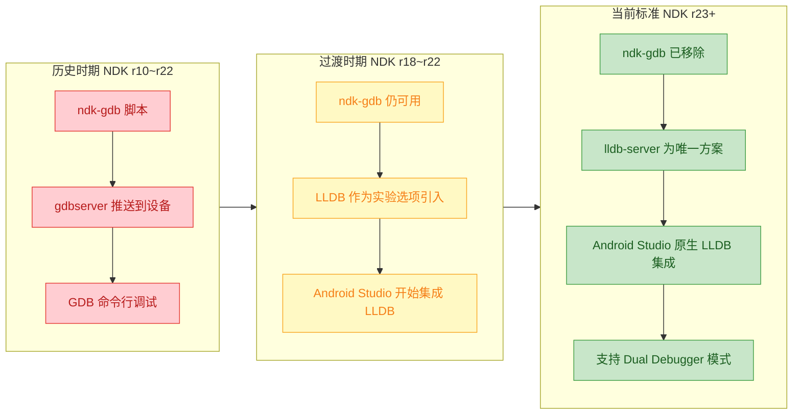

---

**📝 练习题 1**

在 LLDB 中，你想设置一个断点，使其仅在循环变量 `i` 等于 999 时触发中断，以下哪个命令是正确的？

A. `breakpoint set --name myFunc --condition "i == 999"`


B. `breakpoint set --name myFunc --if "i == 999"`


C. `breakpoint set --name myFunc --watch "i == 999"`


D. `breakpoint set --name myFunc --filter "i == 999"`


**【答案】** A

**【解析】** LLDB 中条件断点使用 `--condition`（简写 `-c`）参数来指定触发条件。条件表达式采用目标语言（C/C++）的语法进行求值，当表达式结果为 true（非零）时断点才会真正中断。选项 B 的 `--if` 不是 LLDB 的有效参数；选项 C 的 `--watch` 是设置 watchpoint 的概念，不是条件断点；选项 D 的 `--filter` 同样不存在。在实际调试中，条件断点可以极大地提高效率——当你只关心循环中特定迭代的状态时，无需手动反复 continue 成百上千次。

---

**📝 练习题 2**

调试 Android Native 代码时，ART 虚拟机内部使用 SIGSEGV 信号实现隐式空指针检查（Implicit Null Check），导致 LLDB 频繁中断。以下哪组命令能正确解决此问题？

A. `process handle SIGSEGV --stop true --pass false --notify false`


B. `process handle SIGSEGV --stop false --pass true --notify true`


C. `signal ignore SIGSEGV`


D. `settings set target.process.signal SIGSEGV suppress`


**【答案】** B

**【解析】** 正确做法是告诉 LLDB：收到 SIGSEGV 时不要停下（`--stop false`），但要将信号传递给进程让 ART 自行处理（`--pass true`），同时在控制台打印通知以便开发者知晓（`--notify true`）。选项 A 的 `--stop true` 会继续中断，`--pass false` 会阻止信号传递给 ART，反而会导致 ART 功能异常。选项 C 的 `signal ignore` 不是 LLDB 的有效命令语法。选项 D 的 `settings set` 路径也不正确。`process handle` 是 LLDB 中处理信号行为的标准命令，三个关键参数是 `--stop`、`--pass` 和 `--notify`，分别控制是否暂停调试器、是否传递信号给进程、是否在控制台显示通知。

---

## 堆栈追踪（Stack Trace）

在 Android Native 开发中，当程序发生崩溃（Crash）时，最关键的调试信息莫过于 **堆栈追踪**（Stack Trace / Backtrace）。它记录了程序从入口到崩溃点的完整函数调用链路，是定位 Bug 的"第一现场照片"。与 Java 层 `Exception.printStackTrace()` 不同，Native 层的堆栈追踪涉及 **地址解析（Address Resolution）**、**符号还原（Symbol Demangling）** 和 **信号处理（Signal Handling）** 等底层机制，理解它们是高效排查 Native Crash 的基本功。

堆栈追踪的本质是 **逆向遍历函数调用栈帧（Stack Frame）**。每当一个函数被调用时，CPU 会在栈上压入一个新的栈帧，其中包含返回地址（Return Address）、局部变量、保存的寄存器等。当我们"回溯"这条链路时，就能还原出完整的调用路径。

```
┌─────────────────────────────────────────────┐
│              Stack Memory (High → Low)       │
├─────────────────────────────────────────────┤
│  ┌─────────────────────────────────────┐    │
│  │  Frame: main()                      │    │  ← 最早的调用者
│  │  Return Addr: 0x00000000 (entry)    │    │
│  │  Local Vars: argc, argv             │    │
│  ├─────────────────────────────────────┤    │
│  │  Frame: processData()               │    │
│  │  Return Addr: 0x0040A210 → main+48  │    │
│  │  Local Vars: buffer, size           │    │
│  ├─────────────────────────────────────┤    │
│  │  Frame: parseBuffer()               │    │
│  │  Return Addr: 0x0040B330 → proc+96  │    │
│  │  Local Vars: offset, ptr            │    │
│  ├─────────────────────────────────────┤    │
│  │  Frame: readElement()    ← 崩溃点   │    │  ← SP (Stack Pointer)
│  │  Return Addr: 0x0040C440 → parse+64 │    │
│  │  Local Vars: index (= -1) !!       │    │
│  └─────────────────────────────────────┘    │
└─────────────────────────────────────────────┘
```

上图展示了一个典型的崩溃现场：`main()` → `processData()` → `parseBuffer()` → `readElement()`，崩溃发生在最内层函数。堆栈追踪工具所做的，就是从栈顶（SP 指向的位置）开始，沿着返回地址链逐帧向上回溯，最终输出完整的调用路径。

---

### Android Tombstone 机制

当 Native 层发生致命崩溃（如 `SIGSEGV`、`SIGABRT`、`SIGBUS` 等信号）时，Android 系统会自动触发一套 **Tombstone（墓碑）** 机制来收集崩溃现场信息。这是 Android Native 调试中最核心的堆栈追踪来源。

整个流程涉及多个系统组件的协作：

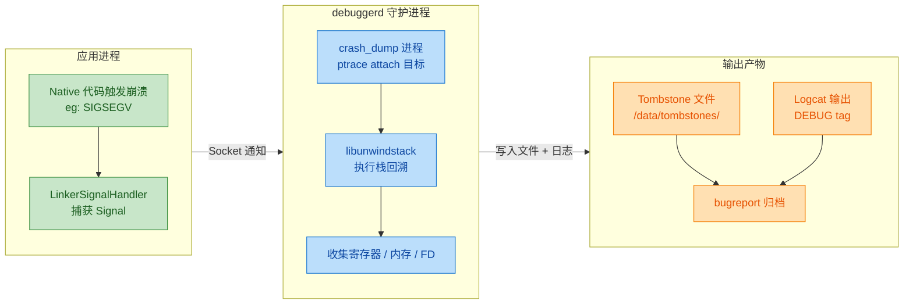

当崩溃信号被内核递送给目标进程后，`linker` 中预注册的信号处理函数会接管控制权，它通过 Unix Domain Socket 通知 `debuggerd` 守护进程。随后 `debuggerd` fork 出一个 `crash_dump` 子进程，该进程使用 `ptrace()` 系统调用 attach 到崩溃进程的所有线程上，冻结它们的执行状态。接着，`crash_dump` 调用 `libunwindstack` 库执行真正的栈帧回溯（Unwinding），同时收集寄存器快照、内存映射（`/proc/pid/maps`）、打开的文件描述符等信息，最终将所有数据写入 `/data/tombstones/` 目录下的 tombstone 文件，并同步输出到 logcat。

一个典型的 Tombstone 文件包含以下关键段落：

```
*** *** *** *** *** *** *** *** *** *** *** *** *** *** *** ***
Build fingerprint: 'google/raven/raven:13/TP1A.221005.002/9012097:userdebug/dev-keys'
Revision: 'MP1.0'
ABI: 'arm64'
Timestamp: 2024-01-15 10:23:45.123456789+0800
Process uptime: 42s
Cmdline: com.example.myapp
pid: 12345, tid: 12367, name: RenderThread  >>> com.example.myapp <<<
uid: 10158
signal 11 (SIGSEGV), code 1 (SEGV_MAPERR), fault addr 0x0000000000000010
    x0  0x0000000000000000  x1  0x0000007fc3a2b8e0  x2  0x0000000000000010
    x3  0x0000007b8c4a5200  x4  0x0000000000000001  x5  0x0000007b8c4a5248
    ...
backtrace:
      #00 pc 0x00023a4c  /data/app/.../lib/arm64/libnative.so (readElement+44)
      #01 pc 0x00025b10  /data/app/.../lib/arm64/libnative.so (parseBuffer+128)
      #02 pc 0x00028c84  /data/app/.../lib/arm64/libnative.so (processData+96)
      #03 pc 0x0002a100  /data/app/.../lib/arm64/libnative.so (Java_com_example_MyClass_nativeInit+64)
      #04 pc 0x000547e8  /apex/com.android.art/lib64/libart.so (art_quick_generic_jni_trampoline+152)
```

在上面的 tombstone 片段中，最重要的信息包括：

- **信号类型**：`signal 11 (SIGSEGV)` 表示段错误，`code 1 (SEGV_MAPERR)` 表示访问了未映射的内存区域。
- **fault addr**：`0x0000000000000010` 是试图访问的非法地址，这里接近 0，极有可能是一个空指针（NULL）偏移了 0x10（16 字节）的位置访问了某个成员变量。
- **backtrace**：按照从栈顶到栈底的顺序排列，`#00` 是崩溃的直接位置，函数名 `readElement` 偏移 `+44` 字节处。

---

### 符号解析与 addr2line

Tombstone 中的 backtrace 通常只包含 **函数名 + 偏移量**，无法直接看到源码行号。在 Release 构建中甚至连函数名都没有（stripped binary），只剩裸地址。这时就需要借助 **带调试符号的 .so 文件** 和工具来还原完整信息。

Android NDK 编译时，默认会在 `obj/` 目录下保留一份 **未剥离符号的共享库（unstripped .so）**，而最终打入 APK 的是 stripped 版本。调试时我们需要用 unstripped 版本进行地址到源码的映射。

**`addr2line`** 是最基础的地址解析工具，它读取 ELF 文件的 DWARF 调试信息段（`.debug_info`、`.debug_line`），将程序计数器（PC）地址转换为源文件名和行号。

```bash
# 使用 NDK 自带的 addr2line 工具
# -C : Demangle C++ 符号名（将 _ZN7MyClass11readElementEi 还原为 MyClass::readElement(int)）
# -f : 显示函数名
# -e : 指定 ELF 文件（必须是 unstripped 的 .so）
# -p : Pretty-print，单行输出

# 针对 arm64-v8a 架构
$NDK/toolchains/llvm/prebuilt/linux-x86_64/bin/llvm-addr2line \
    -C -f -e app/build/intermediates/cmake/debug/obj/arm64-v8a/libnative.so \
    0x00023a4c    # tombstone backtrace 中 #00 的 pc 值

# 输出示例：
# MyClass::readElement(int)
# /home/dev/project/jni/parser.cpp:142
```

**批量解析**场景中，可以一次性传入多个地址：

```bash
# 将 tombstone 中所有属于 libnative.so 的 pc 地址一次性传入
# 每个地址会依次输出对应的函数名和行号
llvm-addr2line -C -f -p \
    -e obj/arm64-v8a/libnative.so \
    0x00023a4c 0x00025b10 0x00028c84 0x0002a100

# 输出：
# MyClass::readElement(int) at /home/dev/project/jni/parser.cpp:142
# MyClass::parseBuffer(char const*, unsigned long) at /home/dev/project/jni/parser.cpp:98
# DataProcessor::processData() at /home/dev/project/jni/processor.cpp:55
# Java_com_example_MyClass_nativeInit at /home/dev/project/jni/jni_bridge.cpp:23
```

> ⚠️ **重要提示**：`addr2line` 使用的 `.so` 文件 **必须** 与生成 tombstone 的 APK 来自同一次构建。即使只改了一行代码重新编译，所有地址偏移都会变化，导致解析结果完全错误。CI/CD 流程中应当归档每个版本对应的 unstripped symbols。

---

### ndk-stack 自动化解析

手动提取地址再逐个运行 `addr2line` 效率很低。NDK 提供了 **`ndk-stack`** 工具，它能直接读取 logcat 输出或 tombstone 文件，自动匹配 `.so` 路径和 pc 地址，批量完成符号化。

```bash
# 方式一：实时管道 —— 将 adb logcat 输出管道传给 ndk-stack
# -sym 参数指向包含 unstripped .so 文件的目录
# ndk-stack 会自动识别 logcat 中的 backtrace 段并就地替换为源码位置
adb logcat | ndk-stack -sym app/build/intermediates/cmake/debug/obj/arm64-v8a/

# 方式二：离线分析 —— 从已保存的 tombstone 文件中解析
# -dump 参数指定 tombstone 文件路径
# 适用于测试同事发送过来的离线崩溃报告
ndk-stack -sym obj/arm64-v8a/ -dump tombstone_00.txt
```

`ndk-stack` 的输出效果如下（对比原始 tombstone）：

```
********** Crash dump: **********
Build fingerprint: 'google/raven/...'
signal 11 (SIGSEGV), code 1 (SEGV_MAPERR), fault addr 0x10
Stack frame #00 pc 00023a4c /data/.../libnative.so (readElement+44)
                             parser.cpp:142:18       ← 自动附加了源码行号
                             MyClass::readElement(int this=0x7b8c4a5200, index=-1)
Stack frame #01 pc 00025b10 /data/.../libnative.so (parseBuffer+128)
                             parser.cpp:98:5
                             MyClass::parseBuffer(char const* data, unsigned long size)
```

---

### 编程式堆栈捕获（Programmatic Stack Capture）

在很多场景中，我们不想等到崩溃才看堆栈——比如追踪内存泄漏的分配点、记录异常分支的执行路径等。这时可以在代码中 **主动获取当前线程的调用栈**。

#### Android 平台专属：`CallStack`

Android Framework 提供了 `android::CallStack` 类（位于 `libutils`），它是 AOSP 内部广泛使用的堆栈抓取工具，封装了 `libunwindstack` 的能力。

```cpp
// 头文件：位于 AOSP 的 system/core/libutils/include/utils/CallStack.h
#include <utils/CallStack.h>   // CallStack 类定义
#include <utils/Log.h>         // ALOG 系列宏

// 在任意需要诊断的函数中调用
void SuspiciousFunction(int param) {
    // 创建 CallStack 对象
    // 构造函数参数 "MyTag" 是日志 Tag，用于 logcat 过滤
    // 第二个参数 1 表示跳过的栈帧数（跳过 CallStack 自身的构造函数帧）
    android::CallStack stack("MyTag", 1);

    // CallStack 对象在构造时就已经完成了栈回溯
    // 直接使用 ALOGD 输出不需要额外操作，构造函数内部会自动打印到 logcat
    // 如果需要手动控制输出，可以调用以下方法：

    // 方式一：输出到 logcat
    stack.log("MyTag",             // logcat Tag
              ANDROID_LOG_DEBUG,   // 日志级别
              "Suspicious call:"); // 前缀信息

    // 方式二：转为 String 存储或发送
    android::String8 traceStr = stack.toString("  ");  // 参数为每行缩进前缀
    // traceStr 内容类似：
    //   #00 pc 00023a4c  libnative.so (SuspiciousFunction+32)
    //   #01 pc 00025b10  libnative.so (CallerFunction+64)
    //   ...
}
```

> ⚠️ `CallStack` 仅在 **AOSP 源码编译** 环境或 **系统级 Native 模块** 中可用，普通 NDK 应用无法直接链接 `libutils`。

#### 通用 NDK 方案：`<unwind.h>` + `dladdr()`

对于普通 NDK 项目，可以使用 C 标准的 `_Unwind_Backtrace` API 配合 `dladdr()` 来实现堆栈捕获：

```cpp
#include <unwind.h>    // _Unwind_Backtrace, _Unwind_GetIP
#include <dlfcn.h>     // dladdr, Dl_info
#include <cxxabi.h>    // __cxa_demangle（C++ 符号反修饰）
#include <android/log.h>
#include <cstdlib>     // free
#include <string>
#include <vector>

// 日志宏简化
#define LOG_TAG "StackTrace"
#define LOGD(...) __android_log_print(ANDROID_LOG_DEBUG, LOG_TAG, __VA_ARGS__)

// ═══════════════════════════════════════════════════════════
// 辅助结构体：用于在回调中收集所有栈帧的 PC 地址
// ═══════════════════════════════════════════════════════════
struct BacktraceState {
    void** current;   // 当前写入位置的指针
    void** end;       // 缓冲区末尾哨兵，防止越界
};

// ═══════════════════════════════════════════════════════════
// 回调函数：_Unwind_Backtrace 每回溯一帧就调用一次
// 返回 _URC_NO_REASON 表示继续回溯
// 返回 _URC_END_OF_STACK 表示终止回溯
// ═══════════════════════════════════════════════════════════
static _Unwind_Reason_Code unwindCallback(
        struct _Unwind_Context* context,  // Unwind 库提供的上下文
        void* arg) {                       // 用户自定义参数（我们传入 BacktraceState）

    // 将 void* 还原为我们的结构体指针
    BacktraceState* state = static_cast<BacktraceState*>(arg);

    // _Unwind_GetIP 获取当前帧的 Instruction Pointer（即 PC 值）
    uintptr_t pc = _Unwind_GetIP(context);

    if (pc != 0) {
        // 如果还没写满缓冲区，存入 PC 值并推进指针
        if (state->current == state->end) {
            return _URC_END_OF_STACK;   // 缓冲区满，停止回溯
        }
        *state->current++ = reinterpret_cast<void*>(pc);
    }

    return _URC_NO_REASON;   // 继续回溯下一帧
}

// ═══════════════════════════════════════════════════════════
// 核心函数：捕获当前线程的完整堆栈并输出
// skip: 跳过的栈帧数（通常传 1 跳过 captureBacktrace 自身）
// ═══════════════════════════════════════════════════════════
void captureBacktrace(int skip = 1) {
    // 最多捕获 64 层调用深度（足以覆盖绝大多数场景）
    const int MAX_DEPTH = 64;
    void* buffer[MAX_DEPTH];

    // 初始化回溯状态
    BacktraceState state = {buffer, buffer + MAX_DEPTH};

    // 执行实际的栈回溯（从当前 PC 位置开始，逐帧回调 unwindCallback）
    _Unwind_Backtrace(unwindCallback, &state);

    // 计算实际捕获的帧数
    int frameCount = static_cast<int>(state.current - buffer);

    LOGD("===== Backtrace (%d frames) =====", frameCount - skip);

    // 遍历每一帧，解析地址为可读的符号信息
    for (int i = skip; i < frameCount; ++i) {
        const void* addr = buffer[i];  // 当前帧的 PC 地址

        Dl_info info;   // dladdr 的输出结构体
        // dladdr 根据地址查找所在的共享库和最近的符号
        if (dladdr(addr, &info) && info.dli_sname) {
            // ── C++ Name Demangling ──
            // 编译器会将 MyClass::readElement(int) 编码为 _ZN7MyClass11readElementEi
            // __cxa_demangle 将其还原为人类可读的形式
            int status = 0;
            char* demangled = abi::__cxa_demangle(
                info.dli_sname,   // 编码后的符号名
                nullptr,          // 输出缓冲区（nullptr = 自动 malloc）
                nullptr,          // 缓冲区大小（配合上参数）
                &status           // 0=成功，-1=内存错误，-2=非法名称，-3=参数错误
            );

            // 计算地址相对于函数起始地址的偏移量（用于和 addr2line 配合）
            uintptr_t offset = reinterpret_cast<uintptr_t>(addr)
                             - reinterpret_cast<uintptr_t>(info.dli_saddr);

            LOGD("  #%02d pc %p  %s (%s+%lu)",
                 i - skip,                          // 帧编号
                 addr,                               // 原始 PC 地址
                 info.dli_fname ? info.dli_fname     // 所在 .so 文件路径
                                : "unknown",
                 (status == 0) ? demangled           // 反修饰成功用 demangled 名
                               : info.dli_sname,    // 否则用原始符号名
                 static_cast<unsigned long>(offset));// 函数内偏移

            // __cxa_demangle 内部使用 malloc，必须用 free 释放
            if (demangled) free(demangled);
        } else {
            // dladdr 查找失败：可能是 JIT 代码或被 strip 的库
            LOGD("  #%02d pc %p  <unknown>", i - skip, addr);
        }
    }

    LOGD("===== End Backtrace =====");
}
```

调用示例和输出：

```cpp
void MyClass::readElement(int index) {
    if (index < 0) {
        // 出现异常参数，主动捕获当前堆栈用于诊断
        // 传入 1 跳过 captureBacktrace 本身的帧
        captureBacktrace(1);
    }
    // ... 正常逻辑
}

// ── logcat 输出示例 ──
// D/StackTrace: ===== Backtrace (4 frames) =====
// D/StackTrace:   #00 pc 0x7b8c023a4c  libnative.so (MyClass::readElement(int)+44)
// D/StackTrace:   #01 pc 0x7b8c025b10  libnative.so (MyClass::parseBuffer(char const*, unsigned long)+128)
// D/StackTrace:   #02 pc 0x7b8c028c84  libnative.so (DataProcessor::processData()+96)
// D/StackTrace:   #03 pc 0x7b8c02a100  libnative.so (Java_com_example_MyClass_nativeInit+64)
// D/StackTrace: ===== End Backtrace =====
```

---

### 自定义信号处理器（Custom Signal Handler）

在某些场景下，我们希望在崩溃发生时 **先执行自定义逻辑**（如上报崩溃堆栈到服务器、写入本地文件），然后再让系统走默认的 tombstone 流程。这需要注册自定义的信号处理器。

```cpp
#include <signal.h>     // sigaction, siginfo_t
#include <unistd.h>     // write (async-signal-safe)
#include <string.h>     // strsignal
#include <android/log.h>

// ═══════════════════════════════════════════════════════════
// 保存系统原有的信号处理器，以便在我们处理完后恢复
// ═══════════════════════════════════════════════════════════
static struct sigaction oldActions[32];   // 按信号编号索引

// 需要拦截的致命信号列表
static const int CAUGHT_SIGNALS[] = {
    SIGSEGV,   // 11 - 段错误（非法内存访问）
    SIGABRT,   // 6  - abort() 调用
    SIGBUS,    // 7  - 总线错误（对齐问题等）
    SIGFPE,    // 8  - 浮点异常（如除零）
    SIGILL,    // 4  - 非法指令
    SIGTRAP,   // 5  - 断点/调试陷阱
};

// ═══════════════════════════════════════════════════════════
// 信号处理函数
// 【极重要】此函数运行在信号上下文中，只允许调用
//   async-signal-safe 的函数（如 write, _exit, sigaction）
//   禁止调用 malloc, printf, ALOG 等非安全函数！
// ═══════════════════════════════════════════════════════════
static void crashSignalHandler(
        int sig,             // 信号编号
        siginfo_t* info,     // 信号详细信息（fault addr 等）
        void* ucontext) {    // CPU 寄存器上下文（ucontext_t*）

    // ── 1. 在信号安全环境下捕获堆栈 ──
    // 使用之前实现的 buffer 方式捕获（_Unwind_Backtrace 是 async-signal-safe 的）
    const int MAX_DEPTH = 32;
    void* frames[MAX_DEPTH];
    BacktraceState state = {frames, frames + MAX_DEPTH};
    _Unwind_Backtrace(unwindCallback, &state);
    int depth = static_cast<int>(state.current - frames);

    // ── 2. 将原始 PC 地址写入预分配的文件 ──
    // 注意：这里不能用 fopen/fprintf，只能用 write() 系统调用
    // 实际项目中通常写入 mmap 的共享内存或预打开的 fd
    int fd = /* 预先打开的崩溃日志文件 fd */ -1;
    if (fd >= 0) {
        for (int i = 0; i < depth; ++i) {
            // 将地址以二进制形式写入文件（后续离线解析）
            write(fd, &frames[i], sizeof(void*));
        }
    }

    // ── 3. 恢复系统默认处理器，让 debuggerd 生成正常的 tombstone ──
    // 如果不恢复，进程会陷入死循环（信号被反复触发和捕获）
    sigaction(sig, &oldActions[sig], nullptr);

    // ── 4. 重新触发信号，交给系统默认处理（生成 tombstone 并终止进程）──
    raise(sig);
}

// ═══════════════════════════════════════════════════════════
// 初始化函数：在 JNI_OnLoad 或模块初始化时调用
// ═══════════════════════════════════════════════════════════
void installCrashHandler() {
    struct sigaction sa;
    memset(&sa, 0, sizeof(sa));

    // 使用 sa_sigaction（三参数版本）而非 sa_handler（单参数版本）
    sa.sa_sigaction = crashSignalHandler;

    // SA_SIGINFO: 启用三参数回调，可获取 siginfo_t 和 ucontext
    // SA_ONSTACK: 使用备用信号栈（防止栈溢出时无法处理信号）
    sa.sa_flags = SA_SIGINFO | SA_ONSTACK;

    // 在处理某个信号时，屏蔽所有其他致命信号，防止嵌套崩溃
    sigemptyset(&sa.sa_mask);
    for (int sig : CAUGHT_SIGNALS) {
        sigaddset(&sa.sa_mask, sig);
    }

    // 逐个注册，同时保存旧的 handler
    for (int sig : CAUGHT_SIGNALS) {
        sigaction(sig, &sa, &oldActions[sig]);  // 第三个参数保存原有 action
    }
}
```

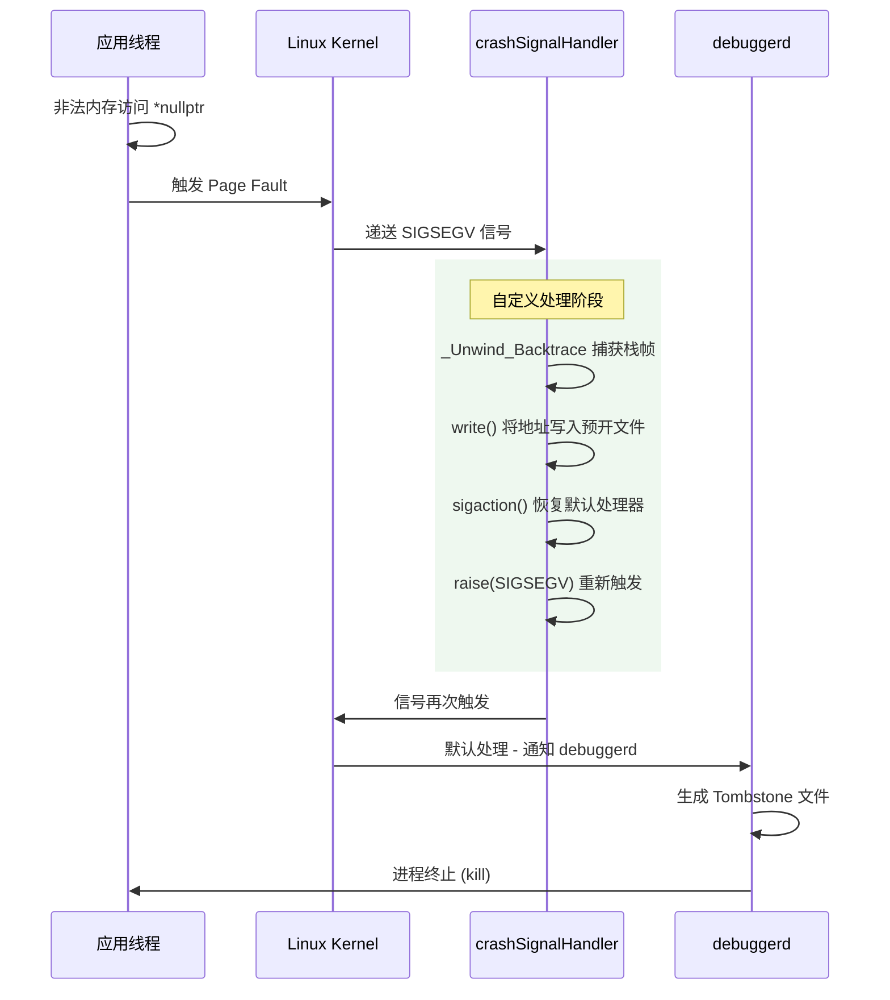

上图展示了完整的信号处理流程：自定义 handler 先执行自己的逻辑（堆栈捕获、数据持久化），然后恢复系统默认行为，最终由 `debuggerd` 生成标准的 tombstone。这种 **"先拦截再放行"** 的模式是 Crashlytics、Bugly 等崩溃收集 SDK 的核心实现思路。

---

### 实战中的堆栈分析技巧

#### 技巧一：识别常见信号与故障模式

| 信号 | 编号 | 常见 `code` | 典型原因 |
|------|------|------------|---------|
| `SIGSEGV` | 11 | `SEGV_MAPERR` | 空指针解引用、野指针、use-after-free |
| `SIGSEGV` | 11 | `SEGV_ACCERR` | 写入只读内存（如 `.rodata` 段） |
| `SIGABRT` | 6 | `SI_TKILL` | `abort()` 调用、`assert` 失败、`std::terminate` |
| `SIGBUS` | 7 | `BUS_ADRALN` | 未对齐内存访问（ARM 严格模式） |
| `SIGFPE` | 8 | `FPE_INTDIV` | 整数除零 |

#### 技巧二：从 fault addr 推断 Bug 类型

```cpp
// ── fault addr 接近 0x0（如 0x0, 0x8, 0x10, 0x20）──
// 诊断：空指针（NULL）访问结构体/类的成员变量
// 偏移量即成员在对象中的内存偏移
struct MyStruct {
    int a;          // offset 0x00 (空指针访问 a → fault addr = 0x0)
    int b;          // offset 0x04 (空指针访问 b → fault addr = 0x4)
    double c;       // offset 0x08 (空指针访问 c → fault addr = 0x8)
    char* name;     // offset 0x10 (空指针访问 name → fault addr = 0x10)
};

MyStruct* ptr = nullptr;
ptr->name;  // fault addr = 0x10 → 立刻定位到空指针 + 成员 name

// ── fault addr 是一个"看起来合理"的大地址（如 0x7b8c023a4c）──
// 诊断：很可能是 use-after-free 或 double-free
// 地址曾经有效，但对象已被释放，内存被回收或重新分配

// ── fault addr 包含规律性模式（如 0xDEADBABE, 0xABCDABCD）──
// 诊断：内存被故意填充了 poison pattern（某些 allocator 的调试模式）
```

#### 技巧三：多线程崩溃分析

Tombstone 会转储崩溃进程的 **所有线程** 堆栈，而不仅仅是崩溃线程。在多线程 bug（如数据竞争、锁顺序死锁）中，需要同时审查多个线程的调用栈：

```
----- pid 12345 at 2024-01-15 10:23:45 -----
...
"RenderThread" sysTid=12367          ← 崩溃线程
  #00 pc 00023a4c  libnative.so (readElement+44)
  #01 pc 00025b10  libnative.so (parseBuffer+128)

"WorkerThread-2" sysTid=12370       ← 可疑：同时在操作同一数据结构
  #00 pc 0003b220  libc.so (__memcpy+128)
  #01 pc 00029f40  libnative.so (DataStore::clear+32)   ← 正在清空数据！
  #02 pc 0002c100  libnative.so (cleanupTask+64)

"WorkerThread-1" sysTid=12369       ← 无关线程，可忽略
  #00 pc 000ab120  libc.so (__futex_wait+24)            ← 正在等待锁，已阻塞
```

在上述例子中，`RenderThread` 正在读取数据（`readElement`），而 `WorkerThread-2` 同时在清空数据（`DataStore::clear`），这是一个典型的 **读写竞争（Read-Write Race）**。单看崩溃线程的堆栈只能看到空指针或野指针，必须结合其他线程才能定位真因。

---

### 常用工具速查表

```mermaid
graph LR
    subgraph Capture["堆栈捕获方式"]
        direction TB
        M1["Tombstone 自动生成<br>系统级 · 崩溃时触发"]
        M2["CallStack 类<br>AOSP 模块 · 编程式"]
        M3["_Unwind_Backtrace<br>NDK 通用 · 编程式"]
        M4["debuggerd -b pid<br>命令行 · 对运行中进程"]
    end

    subgraph Symbolize["符号化工具"]
        direction TB
        T1["llvm-addr2line<br>单地址 → 文件:行号"]
        T2["ndk-stack<br>批量解析 tombstone"]
        T3["llvm-objdump -d<br>反汇编验证偏移"]
        T4["llvm-symbolizer<br>交互式符号化"]
    end

    subgraph BestPractice["工程最佳实践"]
        direction TB
        P1["CI 归档 unstripped .so<br>每次构建必存符号"]
        P2["mapping 文件版本对齐<br>构建号 → 符号目录"]
        P3["Crashlytics / Sentry<br>自动符号化 + 聚合"]
    end

    Capture --> Symbolize --> BestPractice

    classDef captureStyle fill:#C8E6C9,stroke:#43A047,color:#1B5E20
    classDef symbolStyle fill:#BBDEFB,stroke:#1E88E5,color:#0D47A1
    classDef practiceStyle fill:#FFE0B2,stroke:#FB8C00,color:#E65100

    class M1,M2,M3,M4 captureStyle
    class T1,T2,T3,T4 symbolStyle
    class P1,P2,P3 practiceStyle
```

| 工具 | 适用场景 | 关键参数 |
|------|---------|---------|
| `llvm-addr2line` | 已知 PC 地址，需要源码行号 | `-C -f -e <unstripped.so> <addr>` |
| `ndk-stack` | 批量解析 logcat/tombstone | `-sym <obj_dir> -dump <file>` |
| `llvm-objdump` | 反汇编确认崩溃指令 | `-d -S -l <unstripped.so>` |
| `debuggerd` | 对运行中进程抓取堆栈 | `debuggerd -b <pid>` (root) |
| `kill -3 <pid>` | 触发 ANR dump（含 native 栈） | 需系统权限 |

---

**📝 练习题**

在分析一份 Tombstone 报告时，你看到以下关键信息：

```
signal 11 (SIGSEGV), code 1 (SEGV_MAPERR), fault addr 0x0000000000000018
backtrace:
    #00 pc 0x0001a2f0  libnative.so (PlayerManager::getScore+48)
    #01 pc 0x0001b440  libnative.so (GameEngine::updateUI+112)
```

已知 `PlayerManager` 类定义如下：
```cpp
class PlayerManager {
    int id;           // offset 0x00
    int level;        // offset 0x04
    double health;    // offset 0x08
    double mana;      // offset 0x10
    int score;        // offset 0x18
    char* name;       // offset 0x20
};
```

最有可能的崩溃原因是什么？


A. `PlayerManager::getScore` 函数内部发生了整数除零错误


B. `GameEngine::updateUI` 传入了一个空的 `PlayerManager*` 指针，`getScore` 试图访问 `score` 成员


C. `score` 字段的值过大导致整数溢出


D. `libnative.so` 文件被损坏，导致加载时地址映射错误


**【答案】** B

**【解析】** 这道题考察从 tombstone 中推断 Bug 类型的核心技巧。关键线索在于 **fault addr = 0x18**：

1. **信号类型分析**：`SIGSEGV` + `SEGV_MAPERR` 表示程序试图访问一个 **未映射的虚拟地址**，即该地址不属于进程的任何有效内存区域。这排除了选项 A（整数除零应触发 `SIGFPE`）和选项 C（整数溢出在大多数架构上不会触发信号）。

2. **fault addr 分析**：`0x18` 是一个非常接近零的地址。在 64 位系统中，地址空间的最低区域（通常 0x0 ~ 0xFFFF）是 **保留的空页面（null guard page）**，任何对该区域的访问都会触发 SIGSEGV。这是 **空指针解引用** 的典型特征。

3. **偏移量匹配**：查看 `PlayerManager` 类的内存布局，`score` 成员的偏移量恰好是 `0x18`。当一个 `PlayerManager*` 指针为 `nullptr`（即 `0x0`）时，访问 `ptr->score` 等价于读取地址 `0x0 + 0x18 = 0x18`，完美匹配 fault addr。

4. **调用链验证**：`#01` 帧是 `GameEngine::updateUI`，它调用了 `#00` 帧 `PlayerManager::getScore`。最合理的推断是 `updateUI` 中持有一个 `PlayerManager*` 指针，该指针为空（可能对象已被销毁或从未初始化），然后将其传递给 `getScore`（或通过 `this` 指针调用），在函数内部访问 `score` 成员时触发崩溃。

选项 D 的 `.so` 文件损坏理论上可能但极为罕见，且不会表现为如此规律的低地址 fault addr。在实际工程中，遇到接近零的 fault addr，**第一反应应当是空指针**。

---

## AddressSanitizer（内存错误检测）

在 Android Native 开发中，内存错误是最棘手的一类 Bug。悬空指针（Dangling Pointer）、缓冲区溢出（Buffer Overflow）、双重释放（Double Free）……这些问题往往不会立即崩溃，而是在程序运行的某个不确定时刻突然爆发，导致调试成本极高。Google 在 LLVM/Clang 编译器中集成的 **AddressSanitizer（简称 ASan）** 正是为解决这一痛点而生的编译时内存错误检测工具。它能在运行时以极高的精度捕获各类内存违规操作，并输出极其详细的诊断报告，是 Android Native 层开发者的"内存安全守护者"。

---

### ASan 的核心原理：Shadow Memory 与 Instrumentation

ASan 的工作机制建立在两个核心概念之上：**影子内存（Shadow Memory）** 和 **编译时插桩（Compile-time Instrumentation）**。理解它们是高效使用 ASan 的基础。

#### 影子内存（Shadow Memory）

ASan 将进程的整个虚拟地址空间划分为两个区域：**应用内存（Application Memory）** 和 **影子内存（Shadow Memory）**。影子内存是一块独立的区域，用于记录应用内存中每个字节的"可访问性状态"。具体来说，应用内存中每 **8 个字节** 对应影子内存中的 **1 个字节**，这个映射关系可以用一个简单的公式表示：

```c++
// ASan 影子内存地址计算公式
// ShadowAddr = (AppAddr >> 3) + ShadowOffset
// >> 3 相当于除以 8，因为 8 字节应用内存 -> 1 字节影子内存
// ShadowOffset 是一个平台相关的固定偏移量

// 影子字节的值含义：
// 0        : 该 8 字节区域完全可寻址（fully addressable）
// 1~7      : 该 8 字节区域中前 k 字节可寻址，后 (8-k) 字节不可寻址
// 负数(< 0): 该 8 字节区域完全不可寻址（各种负数代表不同的错误类型）
//   0xfa   : Heap left redzone     （堆左侧红区）
//   0xfb   : Heap right redzone    （堆右侧红区）
//   0xfd   : Freed heap region     （已释放的堆区域）
//   0xf1   : Stack left redzone    （栈左侧红区）
//   0xf3   : Stack right redzone   （栈右侧红区）
//   0xf5   : Stack after return    （函数返回后的栈区域）
```

#### 编译时插桩（Compile-time Instrumentation）

当开启 ASan 编译时，Clang 编译器会在 **每一次内存读写操作之前** 自动插入一段检查代码。这段代码会查询影子内存，判断目标地址是否合法。如果不合法，则立即终止程序并输出错误报告。

```c++
// ========== 原始代码 ==========
int arr[10];            // 在栈上分配数组
int val = arr[index];   // 读取数组元素

// ========== ASan 插桩后的等效伪代码 ==========
int arr[10];                                     // 原始数组分配
// --- ASan 插入的检查逻辑 START ---
char *shadow = (char *)((uintptr_t)&arr[index] >> 3) + kShadowOffset;  // 计算影子地址
if (*shadow != 0) {                              // 检查影子字节：非0表示可能有问题
    int last_accessed_byte = ((uintptr_t)&arr[index] & 7) + sizeof(int) - 1; // 计算 8 字节粒度内的偏移
    if (last_accessed_byte >= *shadow) {         // 最后访问的字节超出可寻址范围
        __asan_report_load4(&arr[index]);        // 报告一次非法的 4 字节读取操作
        // 此函数内部会: 打印详细错误信息 -> 打印堆栈 -> abort()
    }
}
// --- ASan 插入的检查逻辑 END ---
int val = arr[index];   // 原始的内存读取操作
```

#### Redzone（红区）机制

ASan 的另一个关键设计是 **Redzone（红区 / 毒区）**。在每次 `malloc` 分配堆内存时，ASan 的运行时库会在分配区域的 **前后** 各添加一段额外的"有毒"内存区域（Redzone），并将它们在影子内存中标记为不可访问。这样，任何越界访问都会踩到 Redzone，触发错误报告。

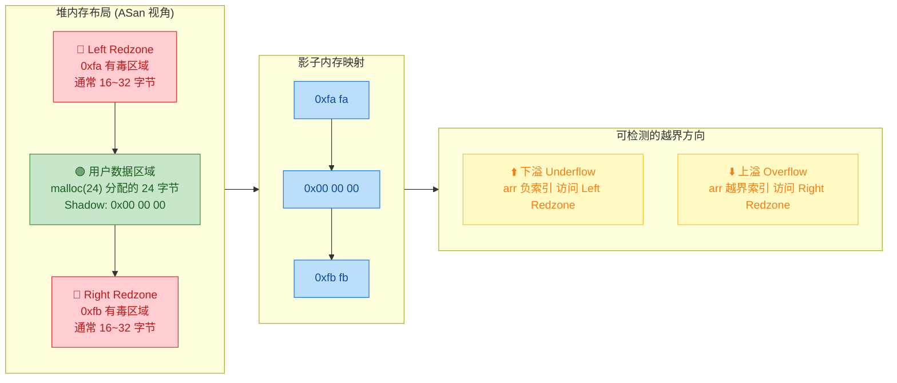

栈上的局部变量也会被类似地包围 Redzone，从而检测栈缓冲区溢出。

---

### 在 Android 项目中启用 ASan

ASan 的启用需要在 **编译** 和 **运行** 两个阶段同时配置。Android NDK 提供了开箱即用的支持。

#### CMake 配置方式（推荐）

在 `CMakeLists.txt` 中添加编译和链接标志：

```cmake
# ==================== CMakeLists.txt ====================

# 定义一个 CMake 选项，方便开关 ASan（默认关闭）
option(ENABLE_ASAN "Enable AddressSanitizer" OFF)

if(ENABLE_ASAN)
    # -fsanitize=address : 启用 ASan 编译插桩
    # -fno-omit-frame-pointer : 保留帧指针，确保堆栈回溯完整准确
    # -O1 : ASan 官方建议至少使用 -O1 优化，兼顾检测精度与性能
    set(CMAKE_C_FLAGS "${CMAKE_C_FLAGS} -fsanitize=address -fno-omit-frame-pointer -O1")
    set(CMAKE_CXX_FLAGS "${CMAKE_CXX_FLAGS} -fsanitize=address -fno-omit-frame-pointer -O1")

    # 链接阶段也必须加 -fsanitize=address，否则链接器找不到 ASan 运行时库
    set(CMAKE_SHARED_LINKER_FLAGS "${CMAKE_SHARED_LINKER_FLAGS} -fsanitize=address")
    set(CMAKE_EXE_LINKER_FLAGS "${CMAKE_EXE_LINKER_FLAGS} -fsanitize=address")
endif()

# 你的正常库定义
add_library(native-lib SHARED native-lib.cpp)
```

在 `build.gradle` 中传递参数：

```groovy
// app/build.gradle
android {
    defaultConfig {
        externalNativeBuild {
            cmake {
                // 通过 -D 传递 CMake 选项来启用 ASan
                arguments "-DENABLE_ASAN=ON"
            }
        }
    }
}
```

#### wrap.sh 运行时配置（Android 8.1+ 必须）

Android 上运行 ASan 插桩后的 Native 库，还需要一个 **`wrap.sh`** 脚本来正确设置运行环境。这是因为 ASan 运行时库需要在应用启动 **之前** 就被加载。

```bash
#!/system/bin/sh
# ==================== wrap.sh ====================
# 该脚本会在应用进程启动前由 Android 系统执行
# 它的作用是设置 ASan 运行时环境并启动应用

# ASAN_OPTIONS 环境变量控制 ASan 的运行时行为
# log_to_syslog=false      : 不输出到 syslog，避免日志混乱
# allow_user_segv_handler=1: 允许应用注册自己的 SIGSEGV handler
# detect_leaks=0           : 关闭内存泄漏检测（Android 上 LSan 支持有限）
export ASAN_OPTIONS="log_to_syslog=false:allow_user_segv_handler=1:detect_leaks=0"

# $@ 表示传入的所有参数，即原始的应用启动命令
# 此行实际执行应用的启动
exec "$@"
```

将 `wrap.sh` 放入项目的正确位置：

```
app/src/main/resources/lib/
├── arm64-v8a/
│   └── wrap.sh          # 64位 ARM 设备
├── armeabi-v7a/
│   └── wrap.sh          # 32位 ARM 设备
└── x86_64/
    └── wrap.sh          # x86_64 模拟器
```

> **注意**：`wrap.sh` 脚本的文件权限必须是可执行的。在 `build.gradle` 中需要将 `resources` 目录正确配置，或使用 `jniLibs` 目录来放置。

#### 关键前提：debuggable 必须为 true

```groovy
// wrap.sh 仅在 debuggable 构建中生效
android {
    buildTypes {
        debug {
            debuggable true   // wrap.sh 需要此项为 true 才能被系统执行
        }
    }
}
```

---

### ASan 可检测的内存错误类型

ASan 能够检测的错误类型非常丰富，几乎涵盖了 C/C++ 中最常见的内存安全问题。以下逐一详解。

#### 1. Heap Buffer Overflow（堆缓冲区溢出）

这是最经典的内存错误。程序写入或读取了 `malloc`/`new` 分配的内存区域之外的地址。

```c++
#include <cstdlib>   // 引入 malloc/free
#include <cstring>   // 引入 memset

void heap_overflow_example() {
    // 分配 10 个字节的堆内存
    char *buffer = (char *)malloc(10);

    // ❌ 错误：写入第 11 个字节（索引 10），超出分配范围
    // ASan 会检测到该写入踩到了 Right Redzone
    buffer[10] = 'A';

    // 释放内存
    free(buffer);
}
```

ASan 输出的错误报告（关键部分解读）：

```
==12345==ERROR: AddressSanitizer: heap-buffer-overflow on address 0x60200000001a
WRITE of size 1 at 0x60200000001a thread T0
    #0 0x... in heap_overflow_example() native-lib.cpp:9    <-- 出错位置
    #1 0x... in Java_com_example_app_MainActivity_nativeTest  <-- JNI 调用者

0x60200000001a is located 0 bytes to the right of 10-byte region [0x602000000010, 0x60200000001a)
allocated by thread T0 here:                                  <-- 内存分配位置
    #0 0x... in malloc
    #1 0x... in heap_overflow_example() native-lib.cpp:6
```

报告中的关键信息解读：
- **`heap-buffer-overflow`**：错误类型——堆缓冲区溢出
- **`WRITE of size 1`**：写入了 1 个字节
- **`0 bytes to the right of 10-byte region`**：恰好越过 10 字节区域的右边界
- **`allocated by thread T0 here`**：内存在哪里分配的，完整调用栈

#### 2. Stack Buffer Overflow（栈缓冲区溢出）

与堆溢出类似，但发生在栈上的局部变量：

```c++
void stack_overflow_example() {
    int arr[5];                  // 在栈上分配 5 个 int（20 字节）

    // ❌ 循环条件错误：i <= 5 应为 i < 5
    // 当 i == 5 时，arr[5] 越界访问了栈上 arr 之后的 Redzone
    for (int i = 0; i <= 5; i++) {
        arr[i] = i * 100;       // i=5 时触发 stack-buffer-overflow
    }
}
```

报告中会显示 **`stack-buffer-overflow`** 并指出具体是哪个栈变量以及在哪个函数中定义的。

#### 3. Use-After-Free（释放后使用）

程序在 `free`/`delete` 之后继续访问已释放的内存。这是引发安全漏洞最常见的内存错误之一。

```c++
void use_after_free_example() {
    int *ptr = new int(42);      // 在堆上分配一个 int，值为 42
    delete ptr;                  // 释放该内存，ptr 成为悬空指针

    // ❌ ptr 已经被释放，但程序仍然通过它读取数据
    // ASan 影子内存中该区域已标记为 0xfd (freed heap region)
    int value = *ptr;            // 触发 heap-use-after-free
    (void)value;                 // 防止编译器 unused 警告
}
```

ASan 报告会同时给出 **三个** 堆栈信息：
1. **错误发生处**（非法访问的代码位置）
2. **内存释放处**（`delete`/`free` 的调用位置）
3. **内存分配处**（`new`/`malloc` 的调用位置）

这使得 Use-After-Free 的根因分析变得极为容易。

#### 4. Double Free（双重释放）

对同一块内存释放两次，会导致堆管理器状态混乱，引发不可预测的行为：

```c++
void double_free_example() {
    char *data = (char *)malloc(64);  // 分配 64 字节
    free(data);                       // 第一次释放 ✅

    // ... 中间可能有大量其他代码 ...

    free(data);                       // ❌ 第二次释放同一块内存
    // ASan 报告: attempting double-free on 0x...
}
```

#### 5. Use-After-Return（返回后使用）—— 可选检测

当函数返回后，其栈帧中的局部变量已失效。如果有指针仍然指向这些变量，就会产生 Use-After-Return 错误。此检测 **默认关闭**，需要显式启用：

```c++
// 通过环境变量启用: ASAN_OPTIONS=detect_stack_use_after_return=1

int *get_local_ptr() {
    int local_var = 999;          // 局部变量，存在于该函数的栈帧中
    return &local_var;            // ❌ 返回局部变量的地址（编译器通常也会警告）
}

void use_after_return_example() {
    int *p = get_local_ptr();     // p 指向已失效的栈帧
    int val = *p;                 // ❌ 访问已销毁的栈内存 -> stack-use-after-return
    (void)val;
}
```

#### 6. Memory Leaks（内存泄漏）—— LSan 集成

ASan 内部集成了 **LeakSanitizer（LSan）**，可在程序退出时报告未释放的内存。但在 Android 上，LSan 的支持比较有限（因为 Android App 进程通常不会正常 exit），所以一般在 **独立可执行程序** 或 **测试用例** 中使用。

```c++
void memory_leak_example() {
    // 分配了 1024 字节，但函数返回前没有释放
    char *leaked = (char *)malloc(1024);

    // 用 leaked 做一些操作...
    leaked[0] = 'X';

    // ❌ 函数结束，leaked 指针丢失，内存泄漏
    // 如果 detect_leaks=1 且程序正常退出，LSan 会报告此泄漏
}
```

---

### ASan 错误诊断报告的完整解读

一个典型的 ASan 错误报告包含多个信息层次。掌握其结构可以让你在数秒内定位问题。

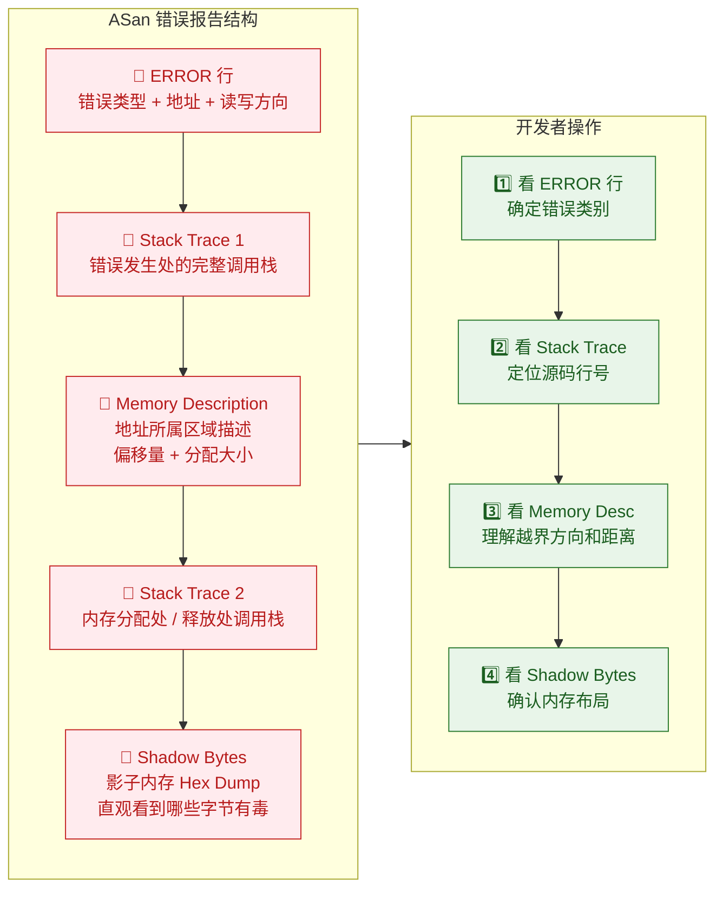

#### Shadow Bytes 区域的实际阅读示例

```
Shadow bytes around the buggy address:
  0x0c047fff7fc0: 00 00 00 00 00 00 00 00 00 00 00 00 00 00 00 00
  0x0c047fff7fd0: 00 00 00 00 00 00 00 00 00 00 00 00 00 00 00 00
  0x0c047fff7fe0: 00 00 00 02 fa fa fa fa fa fa fa fa 00 00 00 00
                              ^^                          ^^^^^^^^
                              ||                          用户数据(可访问)
                              部分可访问(前2字节ok)
=>0x0c047fff7ff0: 00 00 00 00[02]fa fa fa fa fa fa fa fa fa fa fa
                              ^^^^
                              出错位置! 02表示只有前2字节可访问
                              但程序尝试访问了后面的字节
```

- `00`：8 字节全可访问
- `02`：仅前 2 字节可访问
- `fa`：Heap Redzone（有毒）
- `fd`：Freed Memory（有毒）
- `[02]`：方括号标记的是出错的具体影子字节

---

### HWASan：硬件辅助的 AddressSanitizer（Android 10+）

Android 10 引入了 **HWAddressSanitizer（HWASan）**，它利用 ARMv8 的 **Top-Byte Ignore（TBI）** 特性，在指针的高 8 位中嵌入一个 Tag 值，以极低的开销实现内存错误检测。

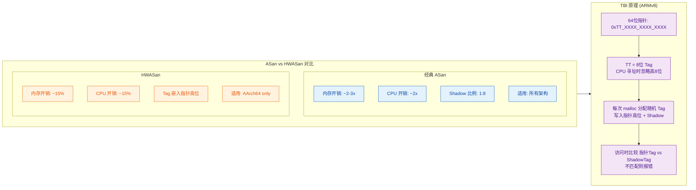

HWASan 的启用方式与 ASan 类似，但使用不同的标志：

```cmake
# HWASan 编译选项（仅支持 arm64-v8a）
if(ENABLE_HWASAN)
    # -fsanitize=hwaddress : 启用 HWASan
    # -fno-omit-frame-pointer : 保留帧指针用于堆栈回溯
    set(CMAKE_CXX_FLAGS "${CMAKE_CXX_FLAGS} -fsanitize=hwaddress -fno-omit-frame-pointer")
    set(CMAKE_SHARED_LINKER_FLAGS "${CMAKE_SHARED_LINKER_FLAGS} -fsanitize=hwaddress")
endif()
```

HWASan 的核心优势在于 **内存开销和 CPU 开销远低于经典 ASan**，使其更适合在接近真实用户场景的测试中长时间运行。不过 HWASan **仅支持 64 位 ARM 架构（AArch64）**，在模拟器（x86_64）上无法使用。

---

### 实战：一个完整的 JNI 场景排查

以下是一个贴近实际 Android 开发的完整例子，展示如何用 ASan 排查一个隐蔽的内存错误。

```c++
#include <jni.h>       // JNI 头文件
#include <cstring>     // memcpy
#include <cstdlib>     // malloc / free
#include <android/log.h>

#define TAG "ASanDemo"
#define ALOGD(...) __android_log_print(ANDROID_LOG_DEBUG, TAG, __VA_ARGS__)
#define ALOGE(...) __android_log_print(ANDROID_LOG_ERROR, TAG, __VA_ARGS__)

// 模拟一个图像处理函数，存在隐蔽的越界写入
static void process_pixel_data(uint8_t *pixels, int width, int height) {
    int total = width * height;           // 计算像素总数

    // ❌ Bug: 循环条件应为 i < total，但写成了 i <= total
    // 当 i == total 时，pixels[total] 越界写入 1 字节
    for (int i = 0; i <= total; i++) {
        pixels[i] = (uint8_t)(i & 0xFF); // 当 i == total 时触发 heap-buffer-overflow
    }
}

extern "C" JNIEXPORT void JNICALL
Java_com_example_app_ImageProcessor_nativeProcess(
        JNIEnv *env,
        jobject /* this */,
        jint width,
        jint height) {

    ALOGD("开始处理图像: %dx%d", width, height);

    int size = width * height;                     // 计算所需缓冲区大小
    uint8_t *buffer = (uint8_t *)malloc(size);     // 分配堆内存
    if (!buffer) {                                 // 检查分配是否成功
        ALOGE("内存分配失败!");
        return;
    }

    // 调用存在 Bug 的处理函数
    process_pixel_data(buffer, width, height);     // ← ASan 会在这里报错

    ALOGD("处理完成，释放内存");
    free(buffer);                                  // 释放缓冲区
}
```

启用 ASan 后运行，输出类似：

```
==28721==ERROR: AddressSanitizer: heap-buffer-overflow on address 0x61900000c800
WRITE of size 1 at 0x61900000c800 thread T15
    #0 0x... in process_pixel_data(unsigned char*, int, int) native-lib.cpp:18
    #1 0x... in Java_com_example_app_ImageProcessor_nativeProcess native-lib.cpp:35
    ...

0x61900000c800 is located 0 bytes to the right of 51200-byte region
[0x61900000bb00, 0x61900000c800)
allocated by thread T15 here:
    #0 0x... in malloc
    #1 0x... in Java_com_example_app_ImageProcessor_nativeProcess native-lib.cpp:29
```

从报告可以立即得知：
1. **错误类型**：heap-buffer-overflow（堆溢出）
2. **位置**：`native-lib.cpp:18`，即 `pixels[i] = ...` 那行
3. **越界距离**：恰好超过 51200 字节缓冲区右边界 0 字节（即 `off-by-one`）
4. **分配处**：`native-lib.cpp:29`，`malloc(size)` 调用

修复方案显而易见：将 `i <= total` 改为 `i < total`。

---

### ASan 使用的最佳实践与注意事项

#### 性能开销

| 指标 | ASan | HWASan |
|:---|:---:|:---:|
| CPU 开销 | ~2x 减速 | ~15-20% 减速 |
| 内存开销 | ~2-3x 膨胀 | ~15% 膨胀 |
| 代码体积增长 | ~1.5-2x | ~1.1x |
| 架构支持 | arm, arm64, x86, x86_64 | arm64 only |
| 适用场景 | 开发/CI 测试 | 预发布/长时间测试 |

#### 关键实践建议

**1. 不要在 Release 版本中启用 ASan。** ASan 引入了巨大的性能和内存开销，绝不应该出现在发布给用户的 APK 中。建议通过 CMake 变量或 Build Variant 来控制开关。

**2. 与 CI（持续集成）结合。** 在 CI 流水线中增加一个 ASan 构建变体，让每次代码提交都自动进行内存安全检测。这是 Google 内部对 Android 平台自身代码使用 ASan 的标准做法。

**3. 优先使用 `-O1` 而非 `-O0`。** ASan 官方推荐至少使用 `-O1` 优化级别。`-O0`（无优化）会导致过多的冗余栈变量，增加误报的可能性，也更慢。

**4. 符号化（Symbolication）堆栈。** 确保编译时带有调试符号（`-g`），否则 ASan 的调用栈只会显示内存地址而非源码文件名和行号。在 Android Studio 中，Debug 构建默认包含符号。

**5. 结合 `addr2line` 离线解析。** 如果堆栈没有被自动符号化，可以手动使用 NDK 中的 `llvm-addr2line` 工具：

```bash
# 使用 NDK 的 llvm-addr2line 将地址翻译为源码位置
# -e 指定 so 文件路径（需要带符号的未 strip 版本）
# -f 同时输出函数名
# -C 进行 C++ name demangling（还原可读函数名）
$NDK/toolchains/llvm/prebuilt/linux-x86_64/bin/llvm-addr2line \
    -e app/build/intermediates/cmake/debug/obj/arm64-v8a/libnative-lib.so \
    -f -C \
    0x12a4 0x1388    # 替换为 ASan 报告中的实际地址
```

**6. ASan 与其他 Sanitizer 的兼容性。**
- ASan **不能** 与 TSan（ThreadSanitizer）同时启用
- ASan **可以** 与 UBSan（UndefinedBehaviorSanitizer）同时启用：`-fsanitize=address,undefined`
- HWASan **不能** 与 ASan 同时启用

---

### 常见问题 FAQ

**Q: ASan 能检测所有内存错误吗？**
A: 不能。ASan 无法检测未初始化内存的读取（这是 **MSan / MemorySanitizer** 的职责）。ASan 也无法检测逻辑上的内存误用（例如向正确的地址写入了错误的值）。

**Q: 为什么我的 App 在启用 ASan 后启动就崩溃？**
A: 最常见的原因是 `wrap.sh` 没有正确配置，或 `debuggable` 未设为 `true`。另一个常见原因是 ASan 运行时库（`libclang_rt.asan-*.so`）没有被正确打包进 APK。

**Q: ASan 报告了一个 `SEGV on unknown address`，这是什么？**
A: 这通常意味着空指针解引用（NULL dereference）。ASan 会拦截 SIGSEGV 信号并报告访问的地址。如果地址非常小（接近 `0x0`），几乎可以确定是空指针问题。

---

**📝 练习题**

以下代码启用 ASan 后运行，ASan 会报告什么类型的错误？

```c++
void quiz_function() {
    int *array = new int[100];
    delete[] array;
    array[50] = 42;
}
```

A. heap-buffer-overflow


B. stack-buffer-overflow


C. heap-use-after-free


D. double-free


**【答案】** C

**【解析】** 代码首先通过 `new int[100]` 在堆上分配了 100 个 int 的数组，随后通过 `delete[] array` 释放了这块内存。此时 `array` 变成了悬空指针（Dangling Pointer）。紧接着 `array[50] = 42` 尝试通过该悬空指针写入数据，此时该内存区域在 ASan 的影子内存中已被标记为 `0xfd`（Freed Heap Region），因此 ASan 会检测到这是一次 **heap-use-after-free** 错误。选项 A（heap-buffer-overflow）描述的是越界访问仍然存活的堆内存，此处内存已被释放，不属于越界。选项 B 发生在栈上，与本题无关。选项 D（double-free）是对同一块内存释放两次，而本题只释放了一次。

---

**📝 练习题**

关于 ASan 与 HWASan，以下说法 **错误** 的是：

A. ASan 通过编译时插桩在每次内存访问前检查影子内存


B. HWASan 利用 ARMv8 的 TBI 特性，在指针高位嵌入 Tag


C. ASan 和 HWASan 可以同时启用以获得更全面的检测


D. HWASan 的内存和 CPU 开销远低于经典 ASan


**【答案】** C

**【解析】** ASan 和 HWASan **不能同时启用**，它们是两种互斥的内存检测方案。ASan 使用 1:8 的 Shadow Memory 映射机制，而 HWASan 使用指针高位 Tag 机制，两者的运行时库和插桩策略完全不同，同时启用会导致编译或链接错误。选项 A 正确描述了 ASan 的核心工作原理——编译器在每次 load/store 之前插入影子内存检查代码。选项 B 正确描述了 HWASan 利用 Top-Byte Ignore 将 Tag 嵌入指针的机制。选项 D 也是正确的，HWASan 的典型开销约为 15-20%，而 ASan 通常会导致 2-3 倍的内存膨胀和约 2 倍的 CPU 减速。

---

## 本章小结

Native 层调试是 Android 系统开发与 NDK 应用开发中不可回避的核心技能。与 Java/Kotlin 层拥有成熟的 Android Studio 图形化调试体验不同，Native 层（C/C++）的调试往往更接近底层、更依赖工具链的熟练度，同时也更能暴露系统级的深层问题。本章从四个维度构建了一套完整的 Native 调试方法论，下面做一个系统性的回顾与串联。

---

### 知识体系全景图

本章四大核心工具并非孤立存在，而是在实际开发中形成一条**由浅入深、逐层递进**的调试链路（Debugging Pipeline）。当 Native 层出现问题时，开发者通常会按照"日志定位 → 断点精查 → 堆栈回溯 → 内存检测"的顺序逐步深入：

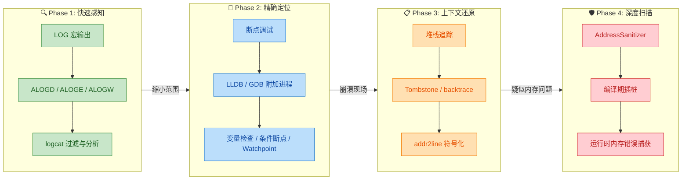

这张图展示了一个典型的**问题排查升级路径**（Escalation Path）：

1. **Phase 1 — LOG 宏**：成本最低、侵入最小的手段。在代码关键路径中埋入 `ALOGD` / `ALOGE`，通过 `logcat` 快速确认执行流和变量状态。适用于**可复现的逻辑错误**和**初步范围收敛**。
2. **Phase 2 — 断点调试**：当日志无法精确定位时，启用 LLDB/GDB 进行交互式调试。可以暂停进程、逐行步进、检查寄存器与内存，适用于**复杂的状态依赖 Bug**。
3. **Phase 3 — 堆栈追踪**：当程序已经崩溃（Crash），无法再进行实时调试时，通过 Tombstone 文件或 `debuggerd` 捕获的 backtrace 还原崩溃现场，用 `addr2line` / `ndk-stack` 将地址映射回源码，适用于**生产环境崩溃分析**。
4. **Phase 4 — ASan**：当堆栈追踪指向内存损坏（corruption）但无法确定根因时，开启 AddressSanitizer 进行编译期插桩，在运行时精确捕获越界、UAF、双重释放等内存错误，适用于**隐蔽的内存安全问题**。

---

### 核心知识点速查矩阵

下表将四大工具的关键属性做横向对比，方便快速查阅与选型：

| 维度 | LOG 宏 | 断点调试 (LLDB/GDB) | 堆栈追踪 | AddressSanitizer |
|---|---|---|---|---|
| **介入时机** | 编码期埋点 | 运行时附加 | 崩溃后分析 | 编译期插桩 |
| **侵入性** | 低（仅输出） | 中（暂停进程） | 无（事后分析） | 高（修改二进制） |
| **性能开销** | 极低 | 中等 | 无 | 2~3x 减速，2x 内存 |
| **适用场景** | 逻辑流确认、状态打印 | 复杂状态检查、单步跟踪 | 崩溃根因定位 | 内存越界/UAF/泄漏检测 |
| **产出物** | logcat 文本流 | 交互式终端会话 | Tombstone / backtrace | 带源码定位的错误报告 |
| **可用于 Release** | ✅ (可控制级别) | ❌ (需 debuggable) | ✅ (需符号表) | ⚠️ (仅限测试构建) |
| **学习曲线** | ⭐ | ⭐⭐⭐ | ⭐⭐ | ⭐⭐ |

---

### 各节核心要点回顾

#### LOG 宏（ALOGD / ALOGE）

- Android Native 日志基于 `liblog` 库，通过 `<android/log.h>` 或 AOSP 内部的 `<log/log.h>` 使用。
- 日志级别从低到高：`ALOGV` → `ALOGD` → `ALOGI` → `ALOGW` → `ALOGE` → `ALOGF`，对应 Verbose 到 Fatal。
- **`LOG_TAG` 宏**必须在 `#include` 之前定义，它决定了 logcat 中的 Tag 列过滤标识。
- 生产环境应通过 `LOG_NDEBUG` 宏或条件编译关闭 Verbose/Debug 级别，避免性能损耗与信息泄漏。
- `logcat` 的过滤语法（`TAG:LEVEL`）和格式控制（`-v threadtime`）是日常使用的基本功。

#### 断点调试（GDB / LLDB）

- Android Studio 集成的 Native 调试底层基于 **LLDB**，这是当前 Android NDK 官方推荐的调试器。
- 调试流程的核心三步：**编译带符号的 Debug 版本** → **附加到目标进程** → **设置断点并交互操作**。
- 关键命令速记：`b`(breakpoint)、`n`(next/步过)、`s`(step/步入)、`c`(continue)、`p`(print)、`bt`(backtrace)、`watch`(watchpoint)。
- **条件断点**（`b file.cpp:42 --condition 'count > 100'`）和 **Watchpoint**（监控变量写入）是排查复杂问题的利器。
- 远程调试通过 `lldb-server` 在设备端运行、主机 `lldb` 通过 TCP 连接，Android Studio 的 Debug 按钮本质上就是自动化了这一过程。

#### 堆栈追踪

- Native 崩溃时系统触发信号（如 `SIGSEGV`），`debuggerd` 守护进程捕获并生成 **Tombstone** 文件（`/data/tombstones/`）。
- Tombstone 中包含：信号类型、故障地址、寄存器快照、**backtrace（调用栈）**、内存映射。
- **符号化**是堆栈分析的关键步骤——裸地址无意义，必须通过 `addr2line`、`ndk-stack` 或 `llvm-symbolizer` 将 PC 地址映射为 `文件名:行号`。
- `ndk-stack` 可直接管道读取 logcat 输出，实时符号化 crash 堆栈，是 NDK 开发者最常用的快捷工具。
- 对于 Release 版本，需要保留 **unstripped** 的 `.so` 文件（带 debug symbol），通常在 CI/CD 中作为 artifact 归档。

#### AddressSanitizer（ASan）

- ASan 是 Clang/GCC 编译器内置的**内存错误检测工具**，通过编译期插桩（Compile-time Instrumentation）+ 运行时库（Runtime Library）协同工作。
- 可检测的错误类型涵盖：**堆/栈缓冲区溢出**、**Use-After-Free**、**Double-Free**、**Use-After-Return**、**内存泄漏**（LeakSanitizer）等。
- 启用方式：在 CMake 中添加 `-fsanitize=address -fno-omit-frame-pointer` 编译和链接标志，Android 项目还需在 `wrap.sh` 中配置 ASan 运行时。
- ASan 的核心原理是**影子内存（Shadow Memory）**：每 8 字节应用内存对应 1 字节影子内存，用于记录可访问性状态，每次内存访问前插入检查代码。
- **性能代价显著**（~2x 减速、~2x 内存增长），因此仅应在开发和测试阶段开启，不适合生产环境。
- HWASan（Hardware-assisted ASan）在 AArch64 上利用 TBI（Top Byte Ignore）特性，以更低开销实现类似检测，是 Android 10+ 推荐的替代方案。

---

### 实战调试决策流程

当面对一个 Native 层问题时，可以按以下决策树选择工具：

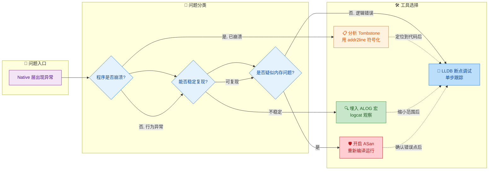

这个决策流程体现了一个核心理念：**LLDB 断点调试是最终的精确打击武器**，而其他三个工具都是帮助你**收敛问题范围**的前置手段。实际工作中，经验丰富的开发者往往会组合使用——先用日志和堆栈确定大致区域，再用 LLDB 精确定位，如果涉及内存问题则加挂 ASan 进行验证。

---

### 延伸工具生态速览

本章聚焦的四大工具是 Native 调试的基石，但 Android 平台还有一系列进阶工具值得了解：

| 工具 | 定位 | 典型用途 |
|---|---|---|
| **Perfetto** | 系统级 Tracing | 跨进程性能分析、调度延迟可视化 |
| **Simpleperf** | CPU Profiling | Native 函数热点分析、火焰图生成 |
| **malloc debug** | 内存分配调试 | 原生堆内存泄漏检测（轻量级替代 ASan） |
| **HWASan** | 硬件辅助内存检测 | ARM64 上低开销替代 ASan |
| **UBSan** | 未定义行为检测 | 整数溢出、空指针解引用等 UB 检测 |
| **TSan** | 线程安全检测 | 数据竞争（Data Race）检测 |
| **Valgrind** | 全功能内存调试 | Linux 环境下的重量级内存分析（Android 支持有限） |

这些工具与本章内容形成互补，构成了完整的 **Android Native 可观测性（Observability）** 体系。

---

### 最佳实践清单

结合全章内容，提炼以下**实战最佳实践**：

```text
✅ DO（推荐做法）
──────────────────────────────
1. 在所有 Native 模块中统一定义 LOG_TAG，保持 logcat 输出可过滤
2. CI/CD 流程中归档 unstripped .so，确保线上崩溃可符号化
3. 开发阶段默认开启 ASan，将内存错误消灭在测试期
4. 为关键函数入口/出口添加 ALOGD，形成执行路径"面包屑"
5. 使用 LLDB 的条件断点代替大量临时 LOG，减少代码污染
6. Tombstone 分析时同时关注 memory map，判断地址合法性

❌ DON'T（避免事项）
──────────────────────────────
1. 生产包中保留 ALOGV/ALOGD 输出（性能 + 安全风险）
2. 依赖 GDB（已过时），应迁移到 LLDB
3. 在 Release 构建中开启 ASan（严重性能退化）
4. 忽略编译警告（-Wall -Werror 应始终开启）
5. 仅看 backtrace 第一行就下结论（崩溃点 ≠ 根因）
6. 用 strip 后的 .so 做 addr2line（无符号信息，无法解析）
```

---

**📝 练习题**

某团队的 Android Native 库在线上频繁出现 `SIGSEGV` 崩溃。通过 Tombstone 分析，backtrace 显示崩溃点在一个 `std::vector::push_back` 调用内部，fault address 为 `0x0000006f4a00beef`，该地址不在任何已映射的内存区域内。以下哪种调试策略最适合作为**下一步**排查手段？

A. 在 `push_back` 调用前后添加 `ALOGD`，打印 vector 的 `size()` 和 `capacity()`


B. 使用 LLDB 远程附加到线上进程，在 `push_back` 处设置断点


C. 使用 ASan 重新编译该 Native 库，在测试环境中复现并捕获内存错误


D. 使用 `addr2line` 对 backtrace 中的其他地址进行符号化，查看完整调用链


**【答案】** C

**【解析】**

这道题考察的是根据问题特征选择最优调试工具的能力。题目关键信息：

1. **崩溃在 `std::vector::push_back` 内部**——这是标准库函数，本身几乎不可能有 Bug，极大概率是调用方的内存已被损坏（corruption），例如 vector 内部指针被野指针覆写、堆内存被越界写入破坏了 allocator 元数据等。

2. **fault address (`0x6f4a00beef`) 不在任何映射区域**——这是典型的**堆损坏（Heap Corruption）** 特征。vector 内部存储的指针已经被非法修改，指向了一个无效地址。

逐项分析：

- **A（LOG 打印 size/capacity）**：能获取表面信息，但堆损坏导致的问题是 vector 内部元数据被破坏，`size()` 和 `capacity()` 的返回值本身可能就是错误的（因为内存已损坏）。即使打印出来，也无法告诉你"是谁、在什么时候破坏了这块内存"。**治标不治本**。

- **B（LLDB 附加线上进程）**：首先，线上进程通常不具备 `debuggable` 属性，无法附加调试器；其次，即便可以附加，堆损坏通常发生在崩溃点之前很远的地方（temporal gap），在 `push_back` 处设断点只能观察到"已经损坏后的状态"，无法定位真正的写入者。**不可行且无效**。

- **C（ASan 重编译）** ✅：这正是 AddressSanitizer 的核心价值场景。ASan 通过影子内存和 redzone 机制，能在**内存被非法写入的那一刻**立即报错并输出精确的调用栈——包括"谁分配了这块内存"、"谁非法访问了它"。对于堆损坏类问题，ASan 是最高效的根因定位工具。在测试环境重编译运行，可以直接抓到真正的 offender。

- **D（addr2line 符号化完整调用链）**：这是一个合理的辅助步骤，可以帮助理解崩溃时的调用上下文，但它只能告诉你"崩溃时调用栈长什么样"，无法揭示堆损坏的真正来源（因为破坏内存的代码可能完全不在这条调用链上）。**有帮助但不够**。

**核心原则**：当问题特征指向**内存损坏**时，应当优先使用专门的内存检测工具（ASan/HWASan），而非通用的日志或断点调试。因为内存损坏的"案发现场"与"崩溃现场"往往存在时间和空间上的分离（The point of corruption ≠ The point of crash），只有 ASan 这类工具能捕获到真正的第一现场。

---

**📝 练习题**

阅读以下 `CMakeLists.txt` 片段，该配置意图为 Native 库开启 AddressSanitizer，但存在一个关键错误会导致链接失败或 ASan 不生效。请找出问题所在：

```cmake
# CMakeLists.txt
cmake_minimum_required(VERSION 3.18)
project(mylib)

# 设置编译标志：启用 ASan + 保留帧指针
set(CMAKE_CXX_FLAGS "${CMAKE_CXX_FLAGS} -fsanitize=address -fno-omit-frame-pointer")

# 构建共享库
add_library(mylib SHARED native-lib.cpp)

# 链接系统库
target_link_libraries(mylib log)
```

A. 缺少 `-fno-omit-frame-pointer`，ASan 无法正确回溯堆栈


B. `CMAKE_CXX_FLAGS` 只影响编译阶段，缺少对链接标志（`CMAKE_SHARED_LINKER_FLAGS`）添加 `-fsanitize=address`，导致 ASan 运行时库未被链接


C. `add_library` 应使用 `STATIC` 而非 `SHARED`，ASan 不支持动态库


D. 应该使用 `-fsanitize=hwaddress` 替代 `-fsanitize=address`，后者在 Android 上不被支持


**【答案】** B

**【解析】**

ASan 的工作机制由两部分组成：**编译期插桩**和**运行时库链接**。`-fsanitize=address` 这个标志需要同时出现在编译阶段和链接阶段：

- **编译阶段**（`CMAKE_CXX_FLAGS`）：编译器会在每次内存访问前插入检查代码（Check Shadow Memory），这部分题目中已正确设置。
- **链接阶段**（`CMAKE_SHARED_LINKER_FLAGS` 或 `CMAKE_EXE_LINKER_FLAGS`）：链接器需要将 ASan 的运行时库（`libclang_rt.asan-*.so`）链入最终的二进制文件。这个运行时库提供了影子内存管理、错误报告输出等核心功能。**题目中缺少了这一步**。

正确的写法应补充：

```cmake
# 编译标志（已有）
set(CMAKE_CXX_FLAGS "${CMAKE_CXX_FLAGS} -fsanitize=address -fno-omit-frame-pointer")
# 链接标志（缺失，必须补充）
set(CMAKE_SHARED_LINKER_FLAGS "${CMAKE_SHARED_LINKER_FLAGS} -fsanitize=address")
```

其他选项分析：

- **A**：`-fno-omit-frame-pointer` 已经在代码中设置了，且它只是增强堆栈回溯的准确性，缺少它不会导致链接失败。
- **C**：ASan 完全支持动态库（`.so`），Android 上的 Native 库绑定 JNI 就是 `SHARED` 形式，与 ASan 无冲突。
- **D**：`-fsanitize=address`（经典 ASan）在 Android 上完全支持；`hwaddress` 是 HWASan，属于可选的替代方案而非必须。

---