---

# C++基础语法

---

## 数据类型（基本类型、sizeof）

C++ 是一门 **强类型语言（Strongly-typed Language）**，这意味着每一个变量在使用之前都必须声明其类型，编译器会在编译期（Compile-time）对类型进行严格检查。理解数据类型是学习 C++ 的第一块基石——它决定了变量在内存中占多少字节、能表示什么范围的值、以及能参与哪些运算。

本节我们将从最底层的"一个变量到底是什么"讲起，逐步覆盖 C++ 的所有基本数据类型（Fundamental Types），并深入理解 `sizeof` 运算符的原理与实战用法。

---

### 什么是数据类型

在计算机的视角里，内存就是一片连续的字节（byte）海洋。一个 `int` 变量和一个 `float` 变量在内存中都只是一串 0 和 1，**是类型赋予了这些二进制位"含义"**。具体来说，类型告诉编译器三件事：

1. **存储大小（Size）**：这个变量需要占用多少字节的内存。
2. **值的解释方式（Interpretation）**：同样的 4 个字节，按 `int` 解释是一个整数，按 `float` 解释则是一个浮点数，二进制位完全相同但"读法"不同。
3. **合法操作集合（Operations）**：整数可以做取模运算 `%`，但浮点数不行；指针可以解引用 `*`，但整数不行。

这就是 C++ 类型系统的核心哲学——**类型即契约（Type as Contract）**。

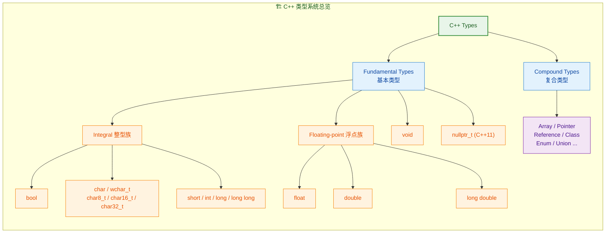

上图展示了 C++ 类型系统的全貌。本节聚焦于左侧的 **Fundamental Types（基本类型）**，复合类型将在后续章节展开。

---

### 整型族（Integral Types）

整型族是 C++ 中使用频率最高的类型家族，涵盖了布尔、字符和整数三大类。它们的共同特征是：**存储的值在概念上是"整数"**——即使 `char` 表面上看是字符，底层也是一个整数编码。

#### bool 布尔类型

`bool` 是最简单的整型，只有两个合法值：`true`（1）和 `false`（0）。

```c++
#include <iostream>                  // 引入标准输入输出头文件

int main() {
    bool is_ready = true;            // 声明并初始化一个布尔变量
    bool is_empty = false;           // false 在内存中存储为 0

    // bool 参与算术运算时会隐式转换为 int
    int sum = is_ready + is_empty;   // true->1, false->0, sum = 1
    std::cout << sum << std::endl;   // 输出: 1

    // 任何非零整数转为 bool 都是 true
    bool from_int = 42;             // 42 != 0, 所以 from_int = true
    bool from_zero = 0;             // 0 -> false

    std::cout << std::boolalpha;     // 让 cout 以 "true"/"false" 输出 bool
    std::cout << from_int << std::endl;   // 输出: true
    std::cout << from_zero << std::endl;  // 输出: false

    return 0;                        // 程序正常退出
}
```

> **注意**：虽然 `bool` 逻辑上只需要 1 bit，但 C++ 标准规定 `sizeof(bool)` **至少为 1 字节**，因为字节是 C++ 中最小的可寻址内存单元（Addressable Unit）。

#### char 与字符类型家族

`char` 是 C++ 中表示单个字符的基本类型，占 **1 字节（8 bits）**。但"字符"的世界远比你想象的复杂——随着 Unicode 的普及，C++ 逐步引入了多种字符类型：

| 类型 | 大小 | 编码用途 | 引入标准 |
|:-----|:-----|:---------|:---------|
| `char` | 1 字节 | ASCII / 执行字符集 | C++98 |
| `signed char` | 1 字节 | 明确有符号的小整数 | C++98 |
| `unsigned char` | 1 字节 | 原始字节 / 小正整数 | C++98 |
| `wchar_t` | 2 或 4 字节 | 宽字符（平台相关） | C++98 |
| `char8_t` | 1 字节 | UTF-8 编码单元 | C++20 |
| `char16_t` | 2 字节 | UTF-16 编码单元 | C++11 |
| `char32_t` | 4 字节 | UTF-32 编码单元 | C++11 |

一个极其重要的细节：**`char`、`signed char`、`unsigned char` 是三个不同的类型**。`char` 的有无符号性（signedness）是 **implementation-defined（由编译器实现决定）** 的。这意味着在不同平台上，`char` 可能是有符号的（范围 -128~127），也可能是无符号的（范围 0~255）。

```c++
#include <iostream>
#include <climits>                   // 包含 CHAR_MIN, CHAR_MAX 等宏

int main() {
    char letter = 'A';              // 字符字面量，实际存储 ASCII 码 65
    char newline = '\n';            // 转义字符，存储 ASCII 码 10

    // char 本质是整数，可以参与算术运算
    char next = letter + 1;         // 65 + 1 = 66, 即 'B'
    std::cout << next << std::endl; // 输出: B

    // 检查当前平台 char 的符号性
    if (CHAR_MIN < 0) {             // CHAR_MIN 定义在 <climits> 中
        std::cout << "char is signed on this platform" << std::endl;
    } else {
        std::cout << "char is unsigned on this platform" << std::endl;
    }

    // 当你需要用 char 做"小整数"运算时，请显式指定符号性
    signed char   temperature = -10; // 明确有符号，可存负数
    unsigned char pixel_value = 255; // 明确无符号，用于像素亮度等

    return 0;
}
```

#### 整数类型（short / int / long / long long）

这是 C++ 中表示整数的核心类型。C++ 标准 **没有** 规定每种类型的确切字节数，只规定了 **最低宽度** 和 **相对大小关系**：

```
1 ≡ sizeof(char) ≤ sizeof(short) ≤ sizeof(int) ≤ sizeof(long) ≤ sizeof(long long)
```

标准保证的最低宽度如下：

| 类型 | 最低位宽 | 典型大小（x86-64） | 值范围（有符号，典型） |
|:-----|:---------|:-------------------|:----------------------|
| `short` | 16 bits | 2 字节 | -32,768 ~ 32,767 |
| `int` | 16 bits | **4 字节** | -2,147,483,648 ~ 2,147,483,647 |
| `long` | 32 bits | 4 或 8 字节 | 平台相关 |
| `long long` | 64 bits | 8 字节 | ≈ ±9.2 × 10¹⁸ |

> **"int 是 16 位还是 32 位？"**——这是经典面试考点。标准只保证 `int` 至少 16 bits，但在现代 x86/x64 平台上，`int` 几乎都是 32 bits。真正 16-bit `int` 的情况出现在嵌入式设备（如某些 AVR 微控制器）上。

每种整数类型都可以加上 `signed`（默认）或 `unsigned` 修饰符：

```c++
#include <iostream>
#include <cstdint>                   // C++11 定宽整数类型

int main() {
    // ========== 传统整型 ==========
    short           s  = -100;       // 等价于 signed short
    unsigned short  us = 60000;      // 无符号 short, 最大 65535 (16-bit)
    int             i  = -200000;    // 最常用的整数类型
    unsigned int    ui = 4000000000; // 约 40 亿, 用于不需要负数的场景
    long            l  = 100000L;    // L 后缀表示 long 字面量
    long long       ll = 9000000000000000000LL; // LL 后缀表示 long long

    // ========== 定宽整型 (Fixed-width, C++11) ==========
    int8_t   a = -128;              // 精确 8 位有符号
    uint8_t  b = 255;               // 精确 8 位无符号
    int16_t  c = -32768;            // 精确 16 位有符号
    uint16_t d = 65535;             // 精确 16 位无符号
    int32_t  e = -2147483648;       // 精确 32 位有符号
    uint32_t f = 4294967295;        // 精确 32 位无符号
    int64_t  g = -1;               // 精确 64 位有符号
    uint64_t h = 18446744073709551615ULL; // 精确 64 位无符号, 最大值

    std::cout << "int:       " << sizeof(int)       << " bytes\n";  // 通常输出 4
    std::cout << "long:      " << sizeof(long)      << " bytes\n";  // Linux 64-bit: 8, Windows: 4
    std::cout << "long long: " << sizeof(long long) << " bytes\n";  // 通常输出 8

    return 0;
}
```

**`<cstdint>` 中的定宽类型** 是现代 C++ 推荐的做法。当你明确需要特定位宽时（如网络协议解析、硬件寄存器映射），请使用 `int32_t`、`uint64_t` 等，而非 `int`、`long`，以避免跨平台移植问题。

下面这张内存模型图帮助你直观理解不同整型在内存中的布局：

```
┌─────────────────────────────────────────────────────────────────────┐
│                    Memory Layout (Little-Endian)                    │
├────────────┬────────────────────────────────────────────────────────┤
│  int8_t    │ [  byte 0  ]                                          │
│  (1 byte)  │  00000101   ← 值: 5                                   │
├────────────┼────────────────────────────────────────────────────────┤
│  int16_t   │ [  byte 0  ] [  byte 1  ]                             │
│  (2 bytes) │  00000101     00000000    ← 值: 5 (低字节在前)         │
├────────────┼────────────────────────────────────────────────────────┤
│  int32_t   │ [  byte 0  ] [  byte 1  ] [  byte 2  ] [  byte 3  ]  │
│  (4 bytes) │  00000101     00000000     00000000     00000000       │
├────────────┼────────────────────────────────────────────────────────┤
│  int64_t   │ [ byte 0 ][ byte 1 ][ byte 2 ][ byte 3 ]             │
│  (8 bytes) │ [ byte 4 ][ byte 5 ][ byte 6 ][ byte 7 ]             │
└────────────┴────────────────────────────────────────────────────────┘
```

> **Little-Endian（小端序）** 是 x86/x64 平台的默认字节序，意思是数值的低位字节（Least Significant Byte）存放在低地址。ARM 平台可能是大端序或可切换的（Bi-endian）。

#### signed vs unsigned：危险的隐式转换

有符号和无符号整数之间的混合运算是 C++ 中最经典的 "坑" 之一。当两者混合时，**有符号数会被隐式转换为无符号数**，这可能导致灾难性的 Bug：

```c++
#include <iostream>

int main() {
    int           a = -1;           // 有符号, 值为 -1
    unsigned int  b = 1;            // 无符号, 值为 1

    // 比较时 a 被隐式转换为 unsigned int
    // -1 的二进制补码 = 0xFFFFFFFF = 4294967295 (作为 unsigned)
    if (a < b) {                    // 实际比较: 4294967295 < 1 → false!
        std::cout << "-1 < 1" << std::endl;
    } else {
        std::cout << "-1 >= 1 ???" << std::endl;  // 这行会被执行!
    }

    // 更隐蔽的例子: vector.size() 返回 size_t (unsigned)
    // for (int i = 0; i < vec.size(); ++i)  ← 如果 vec 为空, 比较也是安全的
    // 但 for (int i = vec.size() - 1; i >= 0; --i) ← 若 vec 为空, size()-1 下溢!

    return 0;
}
```

> **经验法则**：尽量 **不要混用** signed 和 unsigned。如果必须混用，使用 `static_cast` 显式转换并确保值在目标类型的合法范围内。编译器的 `-Wsign-compare` 警告可以帮你捕获这类问题。

---

### 浮点型族（Floating-point Types）

浮点类型用于表示实数（含小数部分的数）。C++ 提供三种浮点类型，它们遵循 IEEE 754 标准：

| 类型 | 典型大小 | 有效位数（十进制） | 大致范围 |
|:-----|:---------|:------------------|:---------|
| `float` | 4 字节 | ~7 位 | ±3.4 × 10³⁸ |
| `double` | 8 字节 | ~15-16 位 | ±1.7 × 10³⁰⁸ |
| `long double` | 8 / 12 / 16 字节 | ~18-21 位 | 平台相关 |

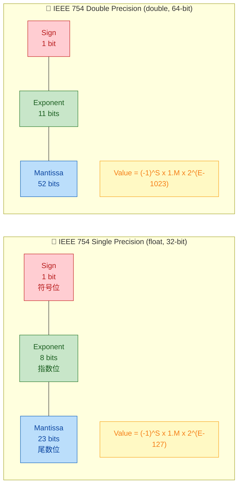

#### 浮点数的精度陷阱

浮点数采用二进制科学计数法存储，这意味着许多十进制小数（如 0.1）**无法被精确表示**，只能近似。这导致了浮点运算中最著名的问题——**精度损失（Precision Loss）**：

```c++
#include <iostream>
#include <iomanip>                   // std::setprecision
#include <cmath>                     // std::abs

int main() {
    // ========== 精度演示 ==========
    float  f = 0.1f;                // float 只有约 7 位有效数字
    double d = 0.1;                 // double 有约 15 位有效数字

    std::cout << std::setprecision(20); // 设置输出精度为 20 位
    std::cout << "float  0.1 = " << f << std::endl;  // 0.10000000149011611938
    std::cout << "double 0.1 = " << d << std::endl;  // 0.10000000000000000555

    // ========== 经典陷阱: 浮点比较 ==========
    double a = 0.1 + 0.2;           // 数学上应为 0.3
    double b = 0.3;                 // 直接赋值 0.3

    if (a == b) {                   // ❌ 几乎永远不要这样比较浮点数!
        std::cout << "equal" << std::endl;
    } else {
        std::cout << "NOT equal!" << std::endl;     // 这行会被执行
        std::cout << "a = " << a << std::endl;      // 0.30000000000000004441
        std::cout << "b = " << b << std::endl;      // 0.29999999999999998890
    }

    // ========== 正确做法: epsilon 比较 ==========
    const double epsilon = 1e-9;    // 根据业务精度需求选取阈值
    if (std::abs(a - b) < epsilon) {// 判断差值是否小于容差
        std::cout << "approximately equal ✓" << std::endl; // ✓
    }

    return 0;
}
```

#### 浮点特殊值

IEEE 754 定义了几种特殊值，在实际开发中经常遇到：

```c++
#include <iostream>
#include <cmath>                     // std::isinf, std::isnan
#include <limits>                    // std::numeric_limits

int main() {
    double pos_inf = 1.0 / 0.0;     // +∞ (正无穷)
    double neg_inf = -1.0 / 0.0;    // -∞ (负无穷)
    double nan_val = 0.0 / 0.0;     // NaN (Not a Number, 未定义)

    std::cout << "1.0/0.0  = " << pos_inf << std::endl;  // inf
    std::cout << "-1.0/0.0 = " << neg_inf << std::endl;  // -inf
    std::cout << "0.0/0.0  = " << nan_val << std::endl;  // nan 或 -nan

    // NaN 的独特性质: NaN 不等于任何值, 包括它自己!
    if (nan_val != nan_val) {        // true! 这是检测 NaN 的经典技巧
        std::cout << "NaN != NaN is true" << std::endl;
    }

    // 推荐使用标准库函数进行检测
    std::cout << std::boolalpha;
    std::cout << "isinf: " << std::isinf(pos_inf) << std::endl;  // true
    std::cout << "isnan: " << std::isnan(nan_val) << std::endl;  // true

    // 获取类型的极限值
    std::cout << "double max: " << std::numeric_limits<double>::max() << std::endl;
    std::cout << "double min: " << std::numeric_limits<double>::min() << std::endl;  // 最小正值
    std::cout << "double epsilon: " << std::numeric_limits<double>::epsilon() << std::endl;

    return 0;
}
```

---

### void 类型

`void` 是 C++ 中的 **不完整类型（Incomplete Type）**，表示"无类型"或"空"。你 **不能** 声明 `void` 类型的变量，但它有三种重要用途：

1. **函数无返回值**：`void func() { ... }` 表示函数不返回任何东西。
2. **函数无参数**（C 风格）：`int func(void)` 表示函数不接受参数。在 C++ 中可以省略 `void`，直接写 `int func()`。
3. **通用指针**：`void*` 可以指向任意类型的数据，是 C 风格泛型编程的基础。但在 C++ 中，模板（template）和 `std::any` 通常是更好的选择。

```c++
#include <iostream>

void greet() {                       // 返回类型为 void, 无返回值
    std::cout << "Hello!" << std::endl;
    // return;                       // 可以写 return; 但不能 return 值;
}

int main() {
    greet();                         // 调用 void 函数

    int    x = 42;
    double y = 3.14;

    void* ptr = &x;                  // void* 可以指向 int
    // std::cout << *ptr;            // ❌ 编译错误! 不能解引用 void*
    std::cout << *(static_cast<int*>(ptr)) << std::endl; // ✓ 先转换再解引用

    ptr = &y;                        // 同一个 void* 现在指向 double
    std::cout << *(static_cast<double*>(ptr)) << std::endl; // 输出 3.14

    return 0;
}
```

---

### nullptr_t 类型（C++11）

C++11 引入了 `std::nullptr_t` 类型和字面量 `nullptr`，用于替代 C 语言的 `NULL` 宏。

在 C 和旧版 C++ 中，`NULL` 通常被定义为 `0` 或 `(void*)0`，这会导致函数重载时的歧义：

```c++
#include <iostream>
#include <cstddef>                   // std::nullptr_t

void process(int value) {            // 重载版本 1: 接受 int
    std::cout << "int: " << value << std::endl;
}

void process(int* ptr) {             // 重载版本 2: 接受 int*
    std::cout << "int*: " << ptr << std::endl;
}

int main() {
    // process(NULL);                // ❌ 歧义! NULL 是 0, 匹配 int 还是 int* ?
    process(nullptr);                // ✓ 明确匹配 int* 版本

    // nullptr 可以隐式转换为任意指针类型
    int*    p1 = nullptr;            // OK
    double* p2 = nullptr;            // OK
    // int    n  = nullptr;          // ❌ 编译错误! nullptr 不能转为 int

    // nullptr_t 类型本身也可以作为参数类型
    // void handle(std::nullptr_t) { ... }  // 只接受 nullptr

    return 0;
}
```

> **最佳实践**：在 C++11 及以后的代码中，始终使用 `nullptr` 而非 `NULL` 或 `0` 来表示空指针。

---

### sizeof 运算符

`sizeof` 是 C++ 的一个 **编译期运算符（Compile-time Operator）**——注意，它不是函数！它返回一个类型或表达式所占用的 **字节数（byte count）**，返回值类型为 `std::size_t`（一个无符号整数类型）。

#### 基本用法

```c++
#include <iostream>

int main() {
    // ========== 语法形式 1: sizeof(类型) ==========
    std::cout << "bool:        " << sizeof(bool)        << std::endl;  // 通常 1
    std::cout << "char:        " << sizeof(char)        << std::endl;  // 恒为 1（标准规定）
    std::cout << "short:       " << sizeof(short)       << std::endl;  // 通常 2
    std::cout << "int:         " << sizeof(int)         << std::endl;  // 通常 4
    std::cout << "long:        " << sizeof(long)        << std::endl;  // 4 或 8
    std::cout << "long long:   " << sizeof(long long)   << std::endl;  // 通常 8
    std::cout << "float:       " << sizeof(float)       << std::endl;  // 通常 4
    std::cout << "double:      " << sizeof(double)      << std::endl;  // 通常 8
    std::cout << "long double: " << sizeof(long double) << std::endl;  // 8, 12 或 16

    // ========== 语法形式 2: sizeof 表达式 (可以不加括号) ==========
    int x = 0;
    std::cout << "sizeof x:    " << sizeof x            << std::endl;  // 等价于 sizeof(int)

    // ========== sizeof 不会求值表达式 ==========
    int y = 10;
    std::cout << sizeof(y++)     << std::endl;  // 输出 4, 但 y 仍然是 10!
    std::cout << "y = " << y     << std::endl;  // 输出 10, 未被自增

    return 0;
}
```

> ⚠️ **关键特性**：`sizeof` 的操作数 **不会被求值（unevaluated operand）**。编译器只分析表达式的类型来确定大小，并不会真正执行表达式。这就是为什么 `sizeof(y++)` 不会导致 `y` 自增。

#### sizeof 与数组

`sizeof` 对数组的行为是一个高频面试考点：

```c++
#include <iostream>

void print_size(int arr[]) {         // 数组退化为指针!
    std::cout << "In function: " << sizeof(arr) << std::endl;  // 指针大小: 4 或 8
}

int main() {
    int arr[10];                     // 声明一个含 10 个 int 的数组
    
    // 在声明作用域内, sizeof 返回整个数组的字节数
    std::cout << "Array total: " << sizeof(arr) << std::endl;         // 10 * 4 = 40
    std::cout << "Element:     " << sizeof(arr[0]) << std::endl;      // 4
    
    // 经典技巧: 计算数组元素个数
    std::size_t count = sizeof(arr) / sizeof(arr[0]);                 // 40 / 4 = 10
    std::cout << "Count:       " << count << std::endl;

    // 当数组传入函数时, 退化为指针, sizeof 失效
    print_size(arr);                 // 输出 8 (64-bit 系统) 而不是 40!

    return 0;
}
```

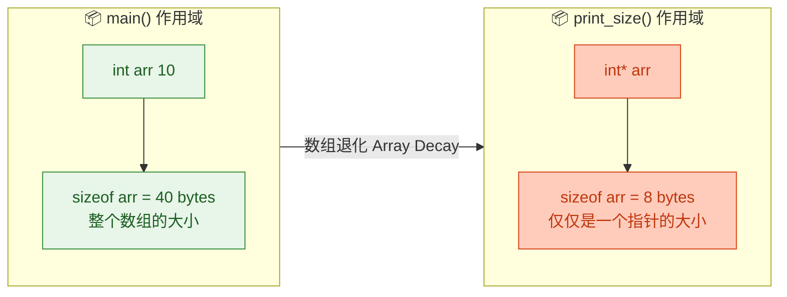

> **Modern C++ 建议**：使用 `std::array<int, 10>` 或 `std::vector<int>` 代替原生数组。`std::array` 不会退化为指针，且提供 `.size()` 方法，更安全。C++17 还提供了 `std::size(arr)` 自由函数来安全获取数组元素数量。

#### sizeof 与结构体（Struct Alignment）

结构体的 `sizeof` 往往 **大于** 所有成员大小之和，这是因为 **内存对齐（Memory Alignment）** 的存在：

```c++
#include <iostream>

struct Bad {                         // 成员排列不佳的结构体
    char   a;                        // 1 byte  + 3 bytes padding
    int    b;                        // 4 bytes
    char   c;                        // 1 byte  + 3 bytes padding
};                                   // 总计: 12 bytes (而非 6 bytes)

struct Good {                        // 成员按大小降序排列
    int    b;                        // 4 bytes
    char   a;                        // 1 byte
    char   c;                        // 1 byte + 2 bytes padding
};                                   // 总计: 8 bytes

struct Empty {};                     // 空结构体

int main() {
    std::cout << "sizeof(Bad):   " << sizeof(Bad)   << std::endl;  // 12
    std::cout << "sizeof(Good):  " << sizeof(Good)  << std::endl;  // 8
    std::cout << "sizeof(Empty): " << sizeof(Empty) << std::endl;  // 1 (不允许为 0)

    return 0;
}
```

下面用 ASCII 图展示 `Bad` 结构体的内存布局，清晰可见 padding（填充字节）的存在：

```
┌────────────────────── struct Bad (12 bytes) ──────────────────────┐
│ Address:  0x00   0x01   0x02   0x03   0x04   0x05   0x06   0x07  │
│         ┌──────┬──────┬──────┬──────┬──────┬──────┬──────┬──────┐ │
│         │  a   │ pad  │ pad  │ pad  │  b   │  b   │  b   │  b   │ │
│         │ char │      │      │      │       int (4 bytes)        │ │
│         └──────┴──────┴──────┴──────┴──────┴──────┴──────┴──────┘ │
│ Address:  0x08   0x09   0x0A   0x0B                               │
│         ┌──────┬──────┬──────┬──────┐                             │
│         │  c   │ pad  │ pad  │ pad  │  ← 尾部填充使总大小为4的倍数 │
│         │ char │      │      │      │                             │
│         └──────┴──────┴──────┴──────┘                             │
└──────────────────────────────────────────────────────────────────-┘
```

内存对齐的原因是 **CPU 访问对齐地址的数据更高效**。例如，一个 4 字节的 `int` 若存放在 4 的倍数地址上，CPU 可以一次总线操作读取完毕；若跨越了对齐边界，某些架构需要两次读取甚至直接触发硬件异常。

> **优化技巧**：在性能敏感的代码中，将结构体成员按 **从大到小** 排列可以减少 padding，节省内存。这在大量实例化对象或缓存敏感的场景中尤为重要。

#### sizeof 编译期常量特性

由于 `sizeof` 在编译期求值，它可以用在需要常量表达式的地方：

```c++
#include <iostream>

int main() {
    // sizeof 的结果可以用作数组大小 (需要编译期常量)
    char buffer[sizeof(double)];     // 声明一个和 double 等大的 char 数组

    // 可以用在 static_assert 中进行编译期检查
    static_assert(sizeof(int) >= 4, "int must be at least 4 bytes"); // 编译期断言
    static_assert(sizeof(long long) == 8, "long long must be exactly 8 bytes");

    // 可以用于模板元编程
    // template<typename T>
    // void func() { char buf[sizeof(T)]; ... }

    std::cout << "buffer size: " << sizeof(buffer) << std::endl;  // 8

    return 0;
}
```

---

### 类型转换基础

既然讨论了数据类型，就不得不提 **类型转换（Type Conversion）**。C++ 中存在两大类转换：

#### 隐式转换（Implicit Conversion）

编译器自动进行的转换，遵循 **提升规则（Promotion Rules）**：

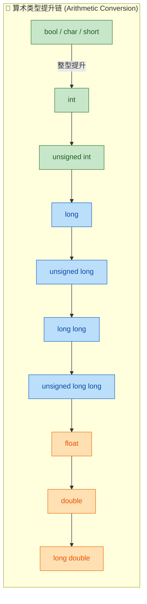

```c++
#include <iostream>

int main() {
    // 整型提升 (Integer Promotion): bool/char/short → int
    char  c = 'A';                   // 'A' = 65
    int   result = c + 1;           // c 被提升为 int, 65 + 1 = 66
    std::cout << static_cast<char>(result) << std::endl;  // 输出: B

    // 窄化转换 (Narrowing Conversion): 可能丢失数据
    int    big = 300;
    char   small_val = big;          // ⚠️ 300 超出 char 范围, 截断! 值未定义
    std::cout << static_cast<int>(small_val) << std::endl; // 可能输出 44 (300 % 256)

    // C++11 花括号初始化可以阻止窄化转换
    // char safe{300};               // ❌ 编译错误! 窄化转换在 {} 中被禁止

    return 0;
}
```

#### 显式转换（Explicit Conversion / Cast）

C++ 提供了四种命名转换运算符，比 C 风格的 `(type)value` 更安全、更精确：

| 转换运算符 | 用途 | 安全性 |
|:-----------|:-----|:-------|
| `static_cast<T>(expr)` | 编译期可验证的类型转换 | ★★★★ |
| `dynamic_cast<T>(expr)` | 运行时多态类型转换 | ★★★★★ |
| `const_cast<T>(expr)` | 移除/添加 const 修饰 | ★★★ |
| `reinterpret_cast<T>(expr)` | 位模式重新解释 | ★ |

```c++
#include <iostream>

int main() {
    double pi = 3.14159;

    // static_cast: 最常用, 编译期检查
    int truncated = static_cast<int>(pi);        // 3 (截断小数部分)
    std::cout << truncated << std::endl;

    // C 风格转换 (不推荐, 但需要认识)
    int c_style = (int)pi;                       // 等效但不安全
    int func_style = int(pi);                    // 函数风格, 同上

    return 0;
}
```

> **最佳实践**：始终使用 C++ 风格的命名转换（`static_cast` 等），因为它们：(1) 意图更明确；(2) 编译器可以做更严格的检查；(3) 在代码中更容易被搜索和审查。

---

### 类型推导初探（auto）

C++11 引入了 `auto` 关键字，让编译器根据初始化表达式 **自动推导变量类型**：

```c++
#include <iostream>
#include <vector>
#include <typeinfo>                  // typeid

int main() {
    auto i = 42;                     // int (整数字面量默认为 int)
    auto d = 3.14;                   // double (浮点字面量默认为 double)
    auto f = 3.14f;                  // float (f 后缀指定 float)
    auto c = 'X';                    // char
    auto b = true;                   // bool
    auto ll = 100LL;                 // long long (LL 后缀)
    auto u = 100U;                   // unsigned int (U 后缀)

    // auto 在复杂类型中尤其好用
    std::vector<int> vec = {1, 2, 3};
    auto it = vec.begin();           // std::vector<int>::iterator (无需手写冗长类型)

    // 输出推导出的类型名（仅做演示，typeid.name() 的输出格式取决于编译器）
    std::cout << "i:  " << typeid(i).name()  << std::endl;
    std::cout << "d:  " << typeid(d).name()  << std::endl;
    std::cout << "it: " << typeid(it).name() << std::endl;

    return 0;
}
```

> `auto` 不是"动态类型"——变量的类型仍然在 **编译期** 确定且不可更改。`auto` 只是让你不必手写类型名，代码更简洁。

---

### 本节知识导图

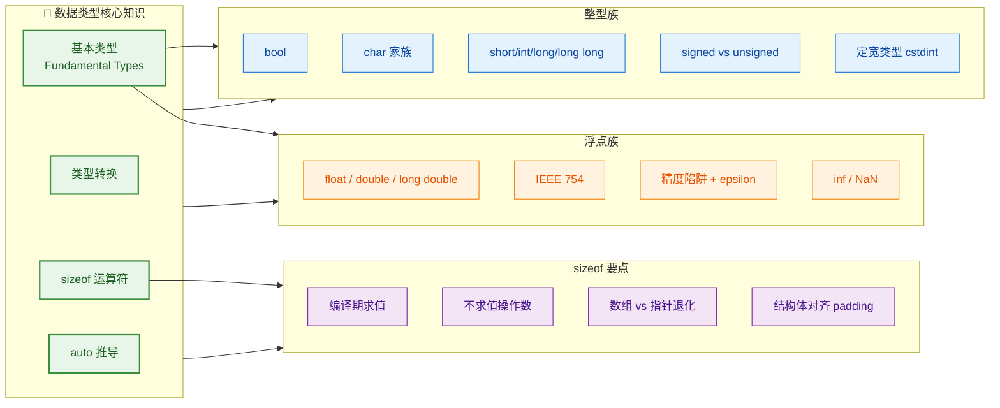

---

**📝 练习题**

以下代码在 64 位 Linux（GCC, x86-64）环境下运行，输出结果是什么？

```c++
#include <iostream>

struct X {
    char a;
    double b;
    int c;
};

int main() {
    int arr[5];
    int* p = arr;

    std::cout << sizeof(arr) << " "
              << sizeof(p)   << " "
              << sizeof(X)   << std::endl;
    return 0;
}
```

A. `20 4 13`


B. `20 8 24`


C. `5 8 16`


D. `20 8 13`


**【答案】** B

**【解析】**

- `sizeof(arr)`：`arr` 是 `int[5]`，在声明作用域内 `sizeof` 返回整个数组的大小 = `5 × sizeof(int)` = `5 × 4` = **20** 字节。
- `sizeof(p)`：`p` 是 `int*` 指针。在 64 位系统上，指针大小为 **8** 字节。
- `sizeof(X)`：结构体 `X` 有三个成员：
  - `char a`：1 字节，但后面紧跟 `double`（对齐要求 8 字节），因此需要 **7 字节 padding**，共占 8 字节。
  - `double b`：8 字节，已对齐。
  - `int c`：4 字节，但结构体总大小必须是最大对齐要求（8 字节）的倍数，因此尾部需要 **4 字节 padding**，占 8 字节。
  - 总计：8 + 8 + 8 = **24** 字节。

因此输出为 `20 8 24`，选 **B**。

选项 A 错在指针大小用了 32 位的 4 字节，且结构体未考虑对齐。选项 C 错在把数组元素个数当成了 `sizeof` 的结果。选项 D 错在结构体大小只做了成员求和（1+8+4=13）而忽略了内存对齐。

---

## 变量与常量（const、constexpr）

在 C++ 中，**变量（Variable）** 和 **常量（Constant）** 是程序存储和管理数据的两大基石。变量代表一块可读写的内存区域，而常量则代表"一旦确定便不可更改"的值。C++ 对"不可变性"（Immutability）的支持非常精细——从最基础的 `const` 关键字，到 C++11 引入的 `constexpr`，再到 C++20 的 `consteval` 和 `constinit`，语言一直在赋予程序员越来越强的编译期确定性保证。本节将由浅入深，系统讲透变量的本质、`const` 的多重语义、`constexpr` 的编译期计算哲学，以及它们在实际工程中的最佳实践。

---

### 变量的本质：从内存视角理解

一个变量，在底层对应的是 **一段具有特定类型、特定大小的内存区域**。当你写下 `int x = 42;` 时，编译器会：

1. 在当前作用域的栈帧（Stack Frame）上分配 `sizeof(int)` 个字节（通常 4 字节）。
2. 将这段内存的起始地址与标识符 `x` 关联（这就是"命名"）。
3. 将二进制表示的 `42` 写入这段内存（这就是"初始化"）。

```c++
// ============ 变量的声明与初始化 ============

int a;           // 声明变量 a，未初始化（值不确定，属于 UB: Undefined Behavior）
int b = 10;      // C 风格初始化（拷贝初始化, Copy Initialization）
int c(20);       // 直接初始化（Direct Initialization）
int d{30};       // C++11 列表初始化（List Initialization / Brace Initialization）
int e = {40};    // C++11 拷贝列表初始化（Copy List Initialization）
```

这里必须特别强调：**未初始化的局部变量，其值是不确定的（indeterminate）**。读取未初始化变量的值是 **未定义行为（Undefined Behavior, UB）**，编译器有权做任何事情——包括优化掉相关代码、输出随机数，甚至崩溃。因此，C++ 的第一条铁律就是：**永远初始化你的变量。**

#### 初始化方式对比

C++11 之后推荐使用 **花括号初始化 `{}`**（又称 Uniform Initialization），原因在于它能 **禁止窄化转换（Narrowing Conversion）**：

```c++
int x1 = 3.14;   // 合法！但 3.14 被截断为 3，丢失精度（窄化转换）
// int x2{3.14};  // 编译错误！花括号初始化禁止 double -> int 的窄化转换
// int x3 = {3.14}; // 同样编译错误
```

这一特性在大型工程中极为宝贵——它把一类隐蔽的 Bug 从"运行时默默出错"提升到了"编译期直接报错"。

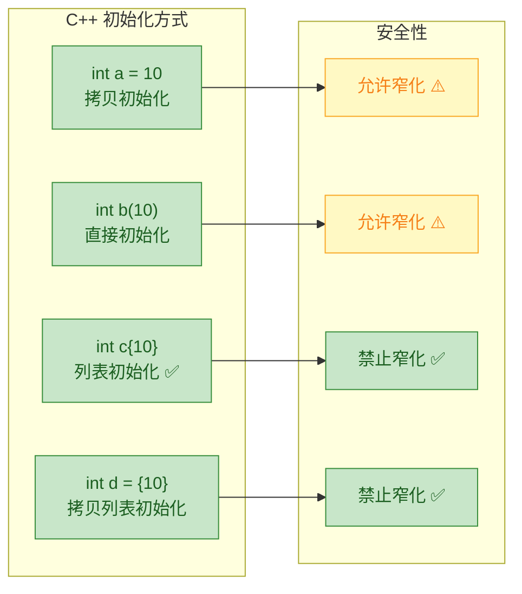

#### 变量的作用域与生命周期

变量的 **作用域（Scope）** 决定了它在代码中"哪里可见"，而 **生命周期（Lifetime / Storage Duration）** 决定了它在内存中"何时存在"：

| 存储类型 | 关键字 / 位置 | 生命周期 | 典型场景 |
|---|---|---|---|
| 自动存储（Automatic） | 局部变量（函数/块内） | 进入块时创建，离开块时销毁 | 最常见的变量 |
| 静态存储（Static） | `static`、全局变量 | 程序启动到程序结束 | 计数器、单例 |
| 线程存储（Thread-local） | `thread_local` | 线程创建到线程结束 | 线程私有数据 |
| 动态存储（Dynamic） | `new` / `delete` | 手动管理 | 堆上对象 |

```c++
#include <iostream>

int global_var = 100;           // 静态存储期：全局变量，程序开始时初始化

void demo() {
    int local_var = 10;         // 自动存储期：进入 demo() 时创建
    static int call_count = 0;  // 静态存储期：仅在第一次调用时初始化
    call_count++;               // 每次调用 demo() 时递增
    std::cout << "Called " << call_count << " times\n";
}                               // local_var 在此处被销毁，call_count 不会

int main() {
    demo();  // 输出: Called 1 times
    demo();  // 输出: Called 2 times
    demo();  // 输出: Called 3 times
    return 0;
}
```

注意 `static int call_count = 0;` 这行——虽然它写在函数体内，但 `static` 使它拥有 **静态存储期**，其值在函数多次调用之间 **持久保留**，且只在第一次执行到该语句时初始化一次。

---

### const：运行时不可变性的守护者

`const` 是 C++ 中最基础、使用最广泛的"不可变"修饰符。它的核心语义是：**这个值一旦初始化，就不能再被修改。**

```c++
const int kMaxSize = 1024;     // 定义一个整型常量，值为 1024
// kMaxSize = 2048;            // 编译错误！不能修改 const 变量
```

但 `const` 的深度远不止于此。在 C++ 中，`const` 至少在以下五个场景中扮演着不同角色：

#### 1. const 修饰普通变量

这是最基本的用法——让一个变量成为只读的：

```c++
const double kPi = 3.14159265358979;   // 圆周率，定义后不可修改
const int kBufferSize = 256;           // 缓冲区大小常量

// kPi = 3.0;         // 编译错误：assignment of read-only variable
// kBufferSize = 512; // 编译错误
```

一个重要的细节：**`const` 变量必须在定义时初始化**（因为之后你没有机会再给它赋值了）：

```c++
// const int x;   // 编译错误！const 变量必须初始化
const int x = 42; // 正确
```

#### 2. const 与指针：最易混淆的语法迷宫

`const` 和指针结合时，会产生几种不同的语义，这是 C++ 面试的"经典考点"。核心判断法则是 **"const 修饰它左边的东西；如果左边没有东西，则修饰右边"**（West const vs East const）。

```c++
int value = 42;
int other = 99;

// ---- 情况 1: 指向常量的指针 (Pointer to const) ----
const int* p1 = &value;     // p1 指向的内容不能通过 p1 修改
// *p1 = 100;               // 编译错误：不能通过 p1 修改所指的值
p1 = &other;                // 合法：p1 本身可以指向别处

// 等价写法（East const 风格）：
int const* p1_alt = &value;  // 与 const int* 完全等价

// ---- 情况 2: 常量指针 (const Pointer) ----
int* const p2 = &value;     // p2 本身不能再指向别处
*p2 = 100;                  // 合法：可以通过 p2 修改所指的值
// p2 = &other;             // 编译错误：p2 本身是 const，不能改指向

// ---- 情况 3: 指向常量的常量指针 (const Pointer to const) ----
const int* const p3 = &value; // p3 本身不能改，指向的内容也不能改
// *p3 = 100;               // 编译错误
// p3 = &other;             // 编译错误
```

下面用内存模型图来直观理解：

```
  Pointer to const             const Pointer            const Pointer to const
  (const int* p1)             (int* const p2)         (const int* const p3)

  p1: [addr]───────┐       p2: [addr]───────┐       p3: [addr]───────┐
   (可改指向)       │        (不可改指向🔒)   │        (不可改指向🔒)   │
                   ▼                        ▼                        ▼
              value: [42]             value: [42]             value: [42]
              (不可改值🔒)             (可改值)               (不可改值🔒)
```

一句口诀总结：**"左定值，右定向"**——`const` 在 `*` 左边，锁定指向的值（不能改 `*p`）；`const` 在 `*` 右边，锁定指针的指向（不能改 `p`）。

#### 3. const 引用（Reference to const）

`const` 引用是 C++ 中传参的 **黄金标准**——当你不需要修改参数时，永远传 `const` 引用：

```c++
#include <string>
#include <iostream>

// 传 const 引用：不拷贝、不修改，最安全高效
void print_name(const std::string& name) {
    std::cout << "Hello, " << name << std::endl;
    // name = "hacker";  // 编译错误：不能修改 const 引用
}

// 传值：会触发拷贝构造，对大对象有性能开销
void print_name_copy(std::string name) {
    std::cout << "Hello, " << name << std::endl;
}

int main() {
    std::string my_name = "Alice";
    print_name(my_name);       // 零拷贝，高效
    print_name_copy(my_name);  // 触发一次 string 拷贝，较慢
    return 0;
}
```

`const` 引用还有一个独特的能力：**它可以绑定到右值（临时对象）**，而普通引用不行：

```c++
// int& ref = 42;         // 编译错误：普通引用不能绑定到右值（字面量）
const int& cref = 42;     // 合法！const 引用可以绑定右值，延长临时对象的生命周期

const std::string& greeting = std::string("Hello");  // 合法！临时对象生命周期延长
```

这背后的原理是：编译器会为这个临时值创建一个隐藏的临时对象，`const` 引用会把该临时对象的生命周期 **延长到引用本身的作用域结束**。

#### 4. const 修饰成员函数

在类的成员函数后面加上 `const`，表示 **这个函数承诺不修改对象的任何成员变量**：

```c++
class Circle {
private:
    double radius_;           // 半径

public:
    Circle(double r) : radius_(r) {}   // 构造函数

    // const 成员函数：承诺不修改任何成员变量
    double area() const {
        // radius_ = 0;      // 编译错误！const 成员函数内不能修改成员
        return 3.14159 * radius_ * radius_;
    }

    // 非 const 成员函数：可以修改成员变量
    void set_radius(double r) {
        radius_ = r;          // 合法
    }
};

void print_area(const Circle& c) {
    std::cout << c.area() << std::endl;  // 合法：area() 是 const 的
    // c.set_radius(5.0);               // 编译错误：const 对象只能调用 const 函数
}
```

**核心规则：`const` 对象只能调用 `const` 成员函数。** 如果你的函数逻辑上不修改对象，就应该标记为 `const`——这是 const-correctness（const 正确性）的基本要求。

#### 5. 顶层 const 与底层 const

C++ 标准中将 `const` 分为两个层次：

- **顶层 const（Top-level const）**：修饰对象本身不可变。例如 `int* const p`（指针本身不可变）。
- **底层 const（Low-level const）**：修饰指针/引用所指向的对象不可变。例如 `const int* p`（指向的对象不可变）。

这个区分在 **拷贝** 时尤其重要：

```c++
const int ci = 42;        // 顶层 const
int i = ci;               // 合法：拷贝时顶层 const 被忽略（i 是 ci 值的副本）

const int* p1 = &ci;      // 底层 const
// int* p2 = p1;          // 编译错误：底层 const 不能被忽略！
                           // 否则就能通过 p2 修改 ci，破坏 const 语义
const int* p3 = p1;       // 合法：底层 const 一致
```

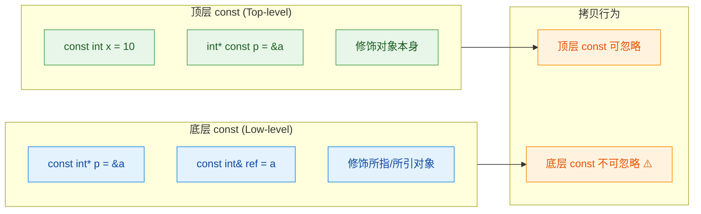

---

### constexpr：编译期计算的革命

如果说 `const` 意味着"运行时不可变"，那么 `constexpr` 意味着"**编译期就能确定**"。这是 C++11 引入的一个革命性特性，它让编译器在编译阶段就计算出结果，把运行时的开销彻底降为零。

#### constexpr 变量

```c++
constexpr int kMaxThreads = 8;            // 编译期常量，值在编译时确定
constexpr double kPi = 3.14159265358979;  // 编译期浮点常量
constexpr int kDoubled = kMaxThreads * 2; // 编译期计算：结果 16

// constexpr int x = some_runtime_func();  // 编译错误！constexpr 变量的初始值
                                            // 必须是编译期可求值的表达式
```

`constexpr` 变量有一个隐含性质：**它自动具有 `const` 属性**。也就是说 `constexpr int x = 10;` 等价于 `constexpr const int x = 10;`——你不需要额外写 `const`。

#### constexpr 函数

`constexpr` 函数是一种"两栖"函数：如果传入的参数是编译期常量，它在编译期求值；如果传入的参数是运行时变量，它就像普通函数一样在运行时执行。

```c++
// constexpr 函数：如果参数是编译期已知的，编译器在编译期就算出结果
constexpr int factorial(int n) {
    return (n <= 1) ? 1 : n * factorial(n - 1);  // 递归计算阶乘
}

int main() {
    // 场景 1：编译期求值
    constexpr int f5 = factorial(5);    // 编译期就计算出 120
    static_assert(f5 == 120);           // 编译期断言，通过！

    // 场景 2：运行时求值
    int n;
    std::cin >> n;                      // n 是运行时输入
    int fn = factorial(n);              // 此时 factorial 在运行时执行
    return 0;
}
```

C++11 中 `constexpr` 函数限制较严格（函数体只能有一个 `return` 语句）；从 **C++14** 开始大幅放宽——可以使用局部变量、循环、条件分支等：

```c++
// C++14 及以后：constexpr 函数可以包含循环、局部变量
constexpr int factorial_v2(int n) {
    int result = 1;               // 局部变量
    for (int i = 2; i <= n; ++i)  // 循环
        result *= i;
    return result;
}

static_assert(factorial_v2(6) == 720);  // 编译期验证：6! = 720 ✅
```

#### const vs constexpr：核心区别

这是理解两者的关键——很多初学者会混淆它们。请看下表和代码：

| 特性 | `const` | `constexpr` |
|---|---|---|
| 语义 | **运行时不可修改** | **编译期可求值** |
| 初始化时机 | 可以在运行时初始化 | **必须**在编译期初始化 |
| 隐含 const？ | — | 是（constexpr 隐含 const） |
| 能否用于数组大小？ | 视编译器而定（非标准） | **可以**（标准保证） |
| 函数修饰 | 修饰成员函数（不修改对象） | 修饰函数（编译期可调用） |

```c++
#include <iostream>
#include <cstdlib>   // std::rand

int get_runtime_value() {
    return std::rand();       // 运行时才能确定的值
}

int main() {
    // const 可以用运行时的值初始化
    const int a = get_runtime_value();  // 合法！a 在运行时被赋值，之后不可变
    
    // constexpr 必须用编译期的值初始化
    // constexpr int b = get_runtime_value();  // 编译错误！编译期无法调用 rand()
    constexpr int b = 42;                      // 合法！42 是编译期常量

    // 只有 constexpr 能保证用于需要编译期常量的场景
    constexpr int size = 10;
    int arr[size];             // 合法：size 是编译期常量
    
    const int size2 = 10;     // 这个 const 碰巧也是编译期可知的
    int arr2[size2];           // 大多数编译器允许（但严格来说依赖编译器优化）

    const int size3 = a;      // size3 的值在运行时确定
    // int arr3[size3];       // 非标准！VLA 在 C++ 中不合法

    return 0;
}
```

一言以蔽之：**`const` 是"只读"承诺，`constexpr` 是"编译期可知"承诺**。`constexpr` 严格强于 `const`。

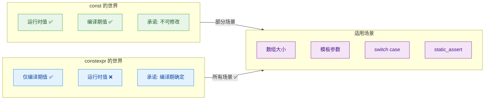

---

### consteval 与 constinit（C++20 进阶）

C++20 进一步细化了编译期计算的控制粒度，引入了两个新关键字：

#### consteval —— 强制编译期求值

`consteval` 修饰的函数被称为 **立即函数（Immediate Function）**，它 **必须** 在编译期求值，不允许在运行时调用：

```c++
// consteval: 强制编译期执行，运行时调用则编译报错
consteval int square(int n) {
    return n * n;                  // 必须在编译期计算
}

int main() {
    constexpr int a = square(5);   // 合法：编译期调用，a = 25
    // int x = 5;
    // int b = square(x);         // 编译错误！x 不是编译期常量，
                                   // consteval 函数不允许运行时调用
    return 0;
}
```

**对比记忆**：`constexpr` 函数是"尽量在编译期算"（能编译期就编译期，不能就运行时）；`consteval` 函数是"必须在编译期算"（不能就报错）。

#### constinit —— 保证静态初始化

`constinit` 确保变量在 **编译期完成初始化**，但与 `constexpr` 不同的是，它 **不要求变量是 const 的**——变量之后仍然可以被修改：

```c++
constinit int global_counter = 0;  // 编译期初始化为 0（避免 Static Initialization Order Fiasco）

void increment() {
    global_counter++;              // 合法！constinit 不意味着 const
}
```

`constinit` 的核心价值在于解决 C++ 中臭名昭著的 **"静态初始化顺序问题"（Static Initialization Order Fiasco, SIOF）**——当多个翻译单元（Translation Unit）的全局变量互相依赖时，初始化顺序是不确定的。`constinit` 保证变量在编译期就完成初始化，从根本上消除了这一隐患。

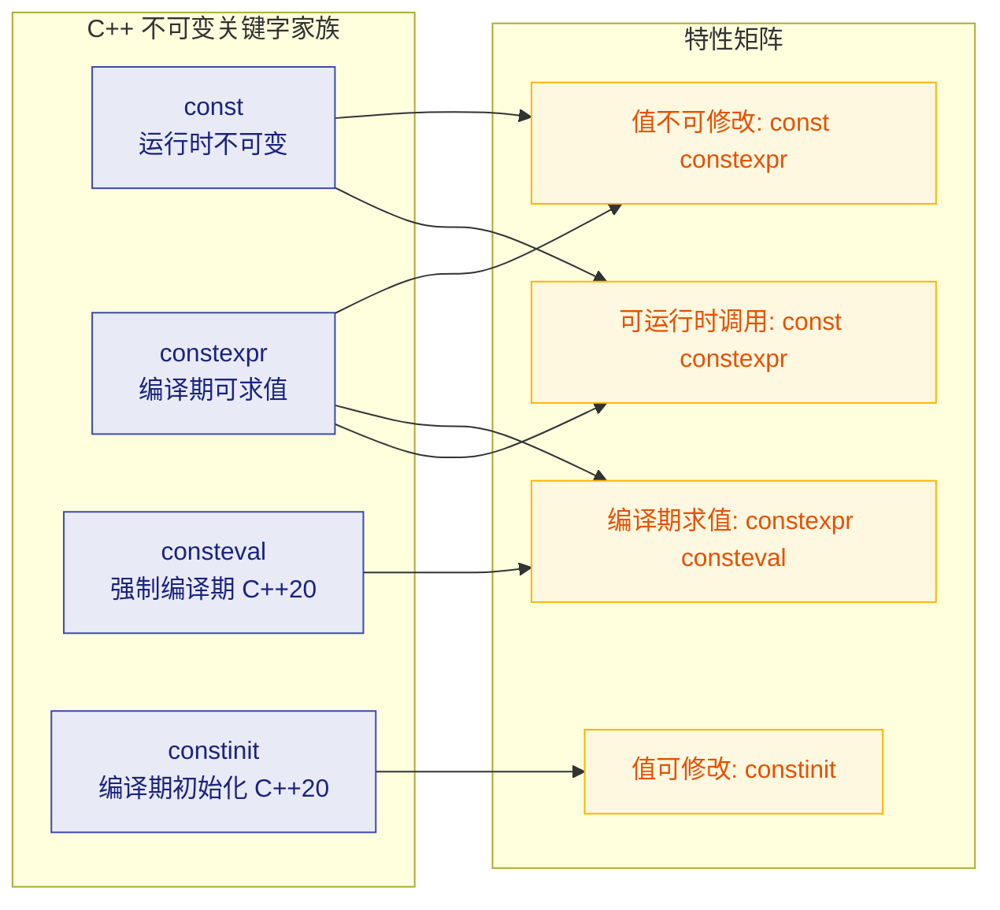

---

### 最佳实践与工程规范

在工业级 C++ 代码中，`const` 和 `constexpr` 的使用遵循以下准则（参考 Google C++ Style Guide 和 C++ Core Guidelines）：

**1. 默认使用 `const`**
如果一个变量在初始化后不会再改变，就加上 `const`。这不仅是自我保护，也是对代码阅读者的承诺。

```c++
const auto user_name = get_user_name();   // 明确表示之后不会修改
const auto config = load_config();         // 加载后只读
```

**2. 能用 `constexpr` 就用 `constexpr`**
如果一个值在编译期就能确定（如数学常量、配置上限），用 `constexpr` 而非 `const` 或 `#define`。

```c++
// ❌ 不推荐：宏定义没有类型安全、作用域控制
#define MAX_SIZE 1024

// ✅ 推荐：constexpr 有类型、有作用域、有调试信息
constexpr int kMaxSize = 1024;
```

**3. 函数参数传 `const` 引用**
对于 `sizeof > 2 * sizeof(void*)` 的类型（如 `std::string`, `std::vector`），形参一律使用 `const&`：

```c++
// ✅ 推荐
void process(const std::vector<int>& data);

// ❌ 不推荐（触发拷贝）
void process(std::vector<int> data);
```

**4. 成员函数尽可能标记 `const`**
如果成员函数不修改对象状态，务必加 `const`。这使得该函数可以被 `const` 对象或 `const` 引用调用。

**5. 命名约定**
Google Style 推荐常量使用 `k` 前缀 + CamelCase：`kMaxRetryCount`, `kDefaultTimeout`。这能让读者一眼识别出常量。

---

### 补充：mutable —— const 的"逃生舱"

有时在 `const` 成员函数中，你确实需要修改某些"不影响对象逻辑状态"的成员（如缓存、互斥锁、访问计数器）。`mutable` 关键字允许成员变量在 `const` 成员函数中被修改：

```c++
#include <mutex>

class DataCache {
private:
    mutable std::mutex mutex_;       // mutable：即使在 const 函数中也能加锁
    mutable int access_count_ = 0;   // mutable：记录访问次数（不影响逻辑状态）
    std::vector<int> data_;

public:
    // const 成员函数：逻辑上不修改对象
    int get(int index) const {
        std::lock_guard<std::mutex> lock(mutex_);  // 合法：mutex_ 是 mutable 的
        access_count_++;                            // 合法：access_count_ 是 mutable 的
        return data_[index];
    }
};
```

`mutable` 应谨慎使用——它是 `const` 语义的一个"合法后门"，仅在语义上合理时才应启用（如缓存、日志、同步原语等）。

---

### 深度陷阱：const 不等于线程安全

一个常见的误解是"const 变量是线程安全的"。**这在标准库中基本成立**（C++11 标准要求 `const` 成员函数是线程安全的），但对于用户自定义类型，`const` 本身并不提供任何同步保证：

```c++
struct Counter {
    mutable int count = 0;             // mutable 成员
    void increment() const { count++; } // const 函数修改 mutable 成员
};

// 如果多个线程同时调用 increment()，即使通过 const 引用，也存在数据竞争！
```

因此，如果你的 `const` 成员函数修改了 `mutable` 成员，你必须自行确保线程安全（如使用 `std::mutex` 或 `std::atomic`）。

---

**📝 练习题**

以下代码中，哪一行会导致**编译错误**？

```c++
constexpr int a = 10;          // Line 1
const int b = a * 2;           // Line 2
constexpr int c = b + 1;      // Line 3
int arr[c];                    // Line 4
```

A. Line 1


B. Line 2


C. Line 3


D. Line 4

**【答案】** C

**【解析】** `Line 3` 会导致编译错误。`constexpr int c = b + 1;` 要求 `b + 1` 是一个编译期常量表达式（constant expression）。虽然 `b` 被声明为 `const int` 且用编译期可知的 `a * 2 = 20` 初始化，但这里存在一个微妙之处：在标准的严格解读中，**`const int` 初始化自 `constexpr` 值时，它本身可以构成常量表达式（integral constant expression）**——所以这题实际上要看编译器实现。然而，在大多数教学语境和面试场景中，更安全的理解是：`const` 不保证是编译期常量，因此 `constexpr` 变量的初始化器引用 `const` 变量存在风险。**最佳实践**是：如果你打算让 `b` 参与编译期计算，就应该把 `b` 也声明为 `constexpr`。

**更严谨的补充**：在本例中，由于 `b` 是 `const int`（整型）且其初始化器 `a * 2` 是常量表达式，按 C++ 标准 `b` 确实可作为常量表达式使用。因此在主流编译器（GCC、Clang、MSVC）上 Line 3 实际可以通过编译。如果将 `b` 改为 `const double b = a * 2.0;`，则 `constexpr double c = b + 1;` **一定**会报错——因为 `const` 浮点数不被视为常量表达式。这道题的核心考点是：**只有 `const` 整型且初始化器为常量表达式时，才能隐式构成 ICE（Integral Constant Expression）；其他类型的 `const` 变量不行。**

---

**📝 练习题**

以下关于 `const` 和 `constexpr` 的说法，**错误**的是：

A. `constexpr` 变量隐含 `const` 属性，即 `constexpr int x = 5;` 等价于 `constexpr const int x = 5;`


B. `const` 引用可以绑定到右值（如字面量 `42`），但普通引用不行


C. `constexpr` 函数在任何情况下都只在编译期执行，不可能在运行时执行


D. `consteval`（C++20）修饰的函数必须在编译期求值，否则编译报错

**【答案】** C

**【解析】** 选项 C 的说法是错误的。`constexpr` 函数是"两栖"的：当所有实参都是编译期常量时，它在编译期求值；当实参包含运行时变量时，它退化为普通函数在运行时执行。只有 C++20 的 `consteval` 才是"必须在编译期执行"的。选项 A 正确（`constexpr` 隐含 `const`）；选项 B 正确（`const T&` 可绑定右值，延长临时对象的生命周期）；选项 D 正确（`consteval` 即 immediate function，必须在编译期求值）。

---

## 运算符（Operators）

C++ 是一门运算符极其丰富的语言。运算符本质上是一种 **对操作数执行特定操作并返回结果** 的符号。理解运算符不仅要知道"它能做什么"，更要深入理解它的 **优先级（Precedence）**、**结合性（Associativity）** 以及可能触发的 **隐式类型转换（Implicit Conversion）**。这三者共同决定了一个复杂表达式最终的求值结果。初学者写出的许多"灵异 Bug"，根源往往就在于对运算符行为的误判。

---

### 算术运算符（Arithmetic Operators）

算术运算符是最基础的一类，用于执行数学运算。C++ 提供了以下算术运算符：

| 运算符 | 含义 | 示例 | 结果 |
|:------:|:----:|:----:|:----:|
| `+` | 加法 | `7 + 3` | `10` |
| `-` | 减法 | `7 - 3` | `4` |
| `*` | 乘法 | `7 * 3` | `21` |
| `/` | 除法 | `7 / 3` | `2`（整数除法） |
| `%` | 取模（余数） | `7 % 3` | `1` |

其中最容易踩坑的是 **整数除法（Integer Division）** 和 **取模运算（Modulo）**。

```cpp
#include <iostream>
using namespace std;

int main() {
    // ========== 整数除法陷阱 ==========
    int a = 7, b = 3;
    int result1 = a / b;          // 结果为 2，不是 2.333...（整数除法直接截断小数部分）
    cout << "7 / 3 = " << result1 << endl;

    // 若想得到浮点结果，至少有一个操作数必须是浮点类型
    double result2 = 7.0 / 3;     // 7.0 是 double，触发隐式提升，结果为 2.33333
    double result3 = (double)a / b;// 显式将 a 强转为 double，同样得到 2.33333
    cout << "7.0 / 3 = " << result2 << endl;
    cout << "(double)7 / 3 = " << result3 << endl;

    // ========== 取模运算 ==========
    // 取模只能用于整数类型，不能用于浮点数（浮点取模请用 fmod()）
    int mod1 = 7 % 3;             // 结果为 1（7 = 3*2 + 1）
    int mod2 = -7 % 3;            // C++11 起规定：结果符号与被除数一致，结果为 -1
    int mod3 = 7 % -3;            // 结果为 1（符号跟随左操作数 7）
    cout << " 7 % 3 = " << mod1 << endl;   //  1
    cout << "-7 % 3 = " << mod2 << endl;   // -1
    cout << " 7 % -3 = " << mod3 << endl;  //  1

    return 0;
}
```

> **关键规则**：C++11 标准明确规定，整数除法向零截断（Truncation toward zero），取模结果的符号与 **被除数（左操作数）** 一致。在 C++11 之前，负数取模的行为是 implementation-defined（由编译器决定），这是历史遗留的移植性陷阱。

---

### 自增与自减运算符（Increment / Decrement）

`++` 和 `--` 是 C++ 中非常高频的运算符，也是 C++ 语言名称的灵感来源（C 的"升级版"）。它们分为 **前缀（Prefix）** 和 **后缀（Postfix）** 两种形式，行为差异显著：

```cpp
#include <iostream>
using namespace std;

int main() {
    int x = 5;

    // ===== 前缀自增 (++x): 先加1，再返回新值 =====
    int a = ++x;    // x 先变成 6，然后 a 拿到 6
    // 此时 x == 6, a == 6
    cout << "++x: x=" << x << ", a=" << a << endl;

    // ===== 后缀自增 (x++): 先返回旧值，再加1 =====
    x = 5;          // 重置 x
    int b = x++;    // b 先拿到旧值 5，然后 x 变成 6
    // 此时 x == 6, b == 5
    cout << "x++: x=" << x << ", b=" << b << endl;

    // ===== 性能提示 =====
    // 对于内置类型 (int, double 等)，前缀和后缀性能无差异
    // 但对于迭代器等自定义类型，后缀版本需要创建临时拷贝，开销更大
    // 因此养成习惯：不需要旧值时，优先使用前缀形式 ++i

    return 0;
}
```

用一张图来直观理解前缀与后缀的执行时序：

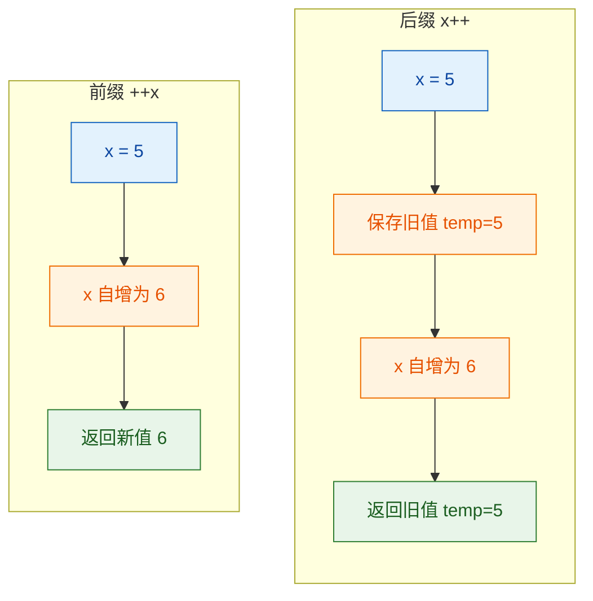

> ⚠️ **未定义行为警告（Undefined Behavior）**：在 **同一个表达式** 中对同一个变量多次修改，是 C++ 中经典的 UB。例如 `i = i++ + ++i;` 的结果完全不可预测，不同编译器给出不同答案。**永远不要写这样的代码。**

---

### 关系运算符（Relational Operators）

关系运算符用于比较两个值，返回 `bool` 类型的结果（`true` 或 `false`）。

| 运算符 | 含义 | 示例 |
|:------:|:----:|:----:|
| `==` | 等于 | `a == b` |
| `!=` | 不等于 | `a != b` |
| `<`  | 小于 | `a < b` |
| `>`  | 大于 | `a > b` |
| `<=` | 小于等于 | `a <= b` |
| `>=` | 大于等于 | `a >= b` |
| `<=>` | 三路比较（C++20） | `a <=> b` |

```cpp
#include <iostream>
using namespace std;

int main() {
    int a = 10, b = 20;

    // 基本比较，结果为 bool 类型 (true=1, false=0)
    cout << (a == b) << endl;  // 0 (false)
    cout << (a != b) << endl;  // 1 (true)
    cout << (a <  b) << endl;  // 1 (true)

    // ===== 经典陷阱：= 与 == 的混淆 =====
    // if (a = 5)  // 这是赋值！a 被赋值为 5，表达式值为 5，非零即 true
    // if (a == 5)  // 这才是比较！
    // 防御性写法（Yoda Condition）：把常量放左边
    // if (5 == a)  // 若误写成 5 = a，编译器直接报错

    // ===== 浮点数比较陷阱 =====
    double x = 0.1 + 0.2;       // 实际存储的是 0.30000000000000004（IEEE 754 精度问题）
    double y = 0.3;
    cout << (x == y) << endl;    // 输出 0 (false)！不相等！

    // 正确做法：使用 epsilon 容差比较
    const double EPSILON = 1e-9; // 定义一个极小的容差值
    bool isEqual = (abs(x - y) < EPSILON);  // 差值小于容差就认为相等
    cout << isEqual << endl;     // 输出 1 (true)

    return 0;
}
```

> **核心教训**：**永远不要用 `==` 直接比较两个浮点数**。由于 IEEE 754 浮点表示的固有精度限制，看似相等的数学运算结果在计算机中可能存在微小偏差。工业代码中通常会定义一个 `epsilon` 进行容差比较。

---

### 逻辑运算符（Logical Operators）

逻辑运算符对 `bool` 值进行操作，是编写条件判断的核心工具。

| 运算符 | 含义 | 说明 |
|:------:|:----:|:----:|
| `&&` | 逻辑与（AND） | 两边都为 `true` 才为 `true` |
| `\|\|` | 逻辑或（OR） | 一边为 `true` 就为 `true` |
| `!` | 逻辑非（NOT） | 取反 |

**短路求值（Short-Circuit Evaluation）** 是逻辑运算符最重要的特性：

- `&&`：若左操作数为 `false`，**不再计算右操作数**（因为结果必定是 `false`）。
- `||`：若左操作数为 `true`，**不再计算右操作数**（因为结果必定是 `true`）。

```cpp
#include <iostream>
using namespace std;

int main() {
    // ===== 短路求值的实际应用 =====
    int* ptr = nullptr;           // 空指针

    // 安全写法：先检查指针非空，再解引用
    // 如果 ptr 为 nullptr，&& 短路，*ptr 不会被执行，避免崩溃
    if (ptr != nullptr && *ptr > 10) {
        cout << "Value is greater than 10" << endl;
    }
    // 若写成 if (*ptr > 10 && ptr != nullptr)
    // 先解引用空指针 → 程序崩溃 (Segmentation Fault)！

    // ===== 短路求值的副作用陷阱 =====
    int count = 0;
    bool flag = false;
    // flag 为 false，&& 短路，++count 不会执行！
    if (flag && ++count) {        // count 仍然是 0
        // ...
    }
    cout << "count = " << count << endl;  // 输出 0，不是 1

    return 0;
}
```

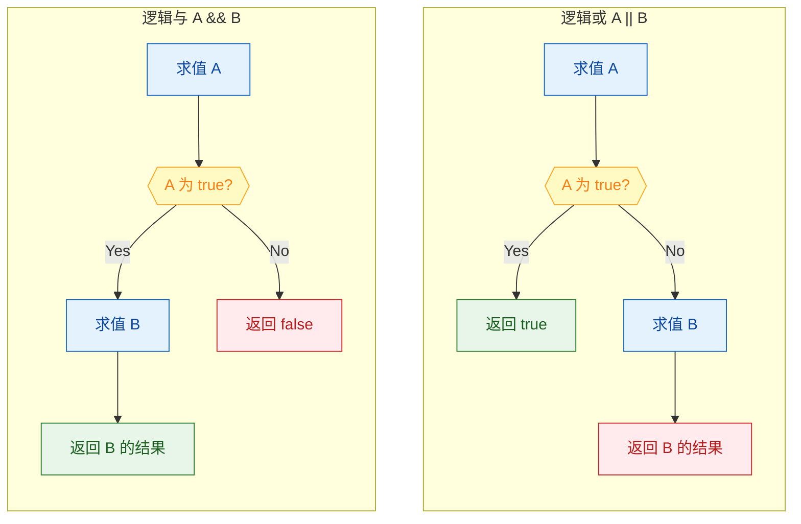

---

### 位运算符（Bitwise Operators）

位运算符直接操作整数的 **二进制位（Bits）**，是底层编程、嵌入式开发、算法竞赛中的核心工具。它们的执行速度极快，因为直接映射到 CPU 的位操作指令。

| 运算符 | 含义 | 示例（二进制） |
|:------:|:----:|:-------------:|
| `&` | 按位与 | `1010 & 1100 = 1000` |
| `\|` | 按位或 | `1010 \| 1100 = 1110` |
| `^` | 按位异或 | `1010 ^ 1100 = 0110` |
| `~` | 按位取反 | `~1010 = ...0101` |
| `<<` | 左移 | `0011 << 2 = 1100` |
| `>>` | 右移 | `1100 >> 2 = 0011` |

```cpp
#include <iostream>
using namespace std;

int main() {
    // ===== 按位与 (&)：两位都为1才为1 =====
    // 常用于"掩码提取"（Masking），提取某些特定位
    unsigned char a = 0b11001010;  // 202
    unsigned char mask = 0b00001111;// 掩码：提取低4位
    unsigned char low4 = a & mask; // 结果: 0b00001010 = 10
    cout << "Low 4 bits: " << (int)low4 << endl;

    // ===== 按位或 (|)：任一位为1就为1 =====
    // 常用于"设置标志位"（Set Flag）
    unsigned char flags = 0b00000000;  // 所有标志位初始为0
    unsigned char FLAG_READ  = 0b00000001;  // 第0位：读权限
    unsigned char FLAG_WRITE = 0b00000010;  // 第1位：写权限
    flags = flags | FLAG_READ;   // 开启读权限 → 0b00000001
    flags = flags | FLAG_WRITE;  // 开启写权限 → 0b00000011
    cout << "Flags: " << (int)flags << endl;  // 3

    // ===== 按位异或 (^)：相同为0，不同为1 =====
    // 经典技巧：不借助临时变量交换两个数
    int x = 5, y = 9;
    x = x ^ y;   // x 存储了 x 和 y 的差异信息
    y = x ^ y;   // y 还原为原始 x（5）
    x = x ^ y;   // x 还原为原始 y（9）
    cout << "x=" << x << ", y=" << y << endl;  // x=9, y=5

    // ===== 左移 (<<) 和右移 (>>) =====
    int val = 1;
    cout << (val << 3) << endl;  // 1 * 2^3 = 8  （左移n位 = 乘以2^n）
    cout << (16 >> 2) << endl;   // 16 / 2^2 = 4  （右移n位 = 除以2^n）

    // 注意：负数右移是算术右移（高位补符号位），这是 implementation-defined
    // 无符号数右移是逻辑右移（高位补0）

    return 0;
}
```

下面用 ASCII 图展示位运算的视觉过程：

```cpp
//  按位与 (&) 运算过程：a & mask
//
//    a    =  1 1 0 0 1 0 1 0   (0xCA = 202)
//    mask =  0 0 0 0 1 1 1 1   (0x0F =  15)
//           ─────────────────
//    结果 =  0 0 0 0 1 0 1 0   (0x0A =  10)
//           ↑ ↑ ↑ ↑ ↑ ↑ ↑ ↑
//           高4位被清零  低4位被保留
//
//  左移 (<<) 运算过程：3 << 2
//
//    移位前:  0 0 0 0 0 0 1 1   (3)
//                        ↗ ↗
//    移位后:  0 0 0 0 1 1 0 0   (12)
//                       低位补0
```

> **实战技巧总结**：
> - `x & 1`：判断奇偶（结果为 1 是奇数，0 是偶数），比 `x % 2` 更快。
> - `x & (x - 1)`：清除 x 最低位的 1（Brian Kernighan 算法核心）。
> - `1 << n`：快速计算 2 的 n 次方。
> - `x ^ x == 0`：任何数异或自身为 0。
> - `x ^ 0 == x`：任何数异或 0 为自身。

---

### 赋值运算符（Assignment Operators）

赋值运算符将右侧的值存储到左侧的变量中。C++ 提供了基础赋值和多种 **复合赋值（Compound Assignment）** 运算符。

| 运算符 | 等价形式 | 说明 |
|:------:|:--------:|:----:|
| `=` | — | 基础赋值 |
| `+=` | `a = a + b` | 加后赋值 |
| `-=` | `a = a - b` | 减后赋值 |
| `*=` | `a = a * b` | 乘后赋值 |
| `/=` | `a = a / b` | 除后赋值 |
| `%=` | `a = a % b` | 取模后赋值 |
| `&=` | `a = a & b` | 按位与后赋值 |
| `\|=` | `a = a \| b` | 按位或后赋值 |
| `^=` | `a = a ^ b` | 按位异或后赋值 |
| `<<=` | `a = a << b` | 左移后赋值 |
| `>>=` | `a = a >> b` | 右移后赋值 |

```cpp
#include <iostream>
using namespace std;

int main() {
    int a = 10;

    a += 5;    // a = a + 5 → a = 15
    a -= 3;    // a = a - 3 → a = 12
    a *= 2;    // a = a * 2 → a = 24
    a /= 4;    // a = a / 4 → a = 6
    a %= 4;    // a = a % 4 → a = 2
    cout << "a = " << a << endl;  // 输出 2

    // ===== 赋值运算符的返回值 =====
    // 赋值表达式返回的是被赋值变量的引用
    int x, y, z;
    x = y = z = 100;    // 链式赋值：从右往左执行
    // 等价于: z = 100; y = z; x = y;
    cout << x << " " << y << " " << z << endl;  // 100 100 100

    // ===== 复合赋值的微妙优势 =====
    // a += b 比 a = a + b 好在：
    // 1. a 只被求值一次（当 a 是复杂表达式时有意义）
    // 2. 对于自定义类型，可能避免临时对象的产生
    return 0;
}
```

> **注意**：赋值运算符 `=` 的结合性是 **从右到左（Right-to-Left）**，这就是链式赋值 `x = y = z = 0` 能正常工作的原因。

---

### 条件运算符 / 三元运算符（Ternary Operator）

`condition ? expr1 : expr2` 是 C++ 中唯一的三元运算符（Ternary Operator），它是简化版的 `if-else`。

```cpp
#include <iostream>
using namespace std;

int main() {
    int a = 10, b = 20;

    // 基本用法：等价于 if-else
    int maxVal = (a > b) ? a : b;    // a > b 为 false，所以 maxVal = b = 20
    cout << "Max: " << maxVal << endl;

    // 嵌套三元运算符（可读性差，不推荐深度嵌套）
    int x = 15;
    string category = (x < 10) ? "small"        // x < 10 ?
                    : (x < 20) ? "medium"        // 否则 x < 20 ?
                    :             "large";        // 都不满足
    cout << "Category: " << category << endl;    // "medium"

    // ===== 三元运算符可以作为左值（特殊场景）=====
    int m = 1, n = 2;
    ((m > n) ? m : n) = 100;  // n 被赋值为 100（因为 m > n 为 false，选中 n）
    cout << "m=" << m << ", n=" << n << endl;  // m=1, n=100

    return 0;
}
```

> **最佳实践**：三元运算符适合 **简单的二选一** 场景。如果逻辑复杂或需要嵌套超过两层，请果断使用 `if-else`，代码可读性远比"炫技"重要。

---

### 逗号运算符（Comma Operator）

逗号运算符 `,` 是 C++ 中优先级 **最低** 的运算符。它从左到右依次计算每个表达式，最终返回 **最右边表达式的值**。

```cpp
#include <iostream>
using namespace std;

int main() {
    // 逗号运算符：依次执行，返回最后一个表达式的值
    int a = (1, 2, 3, 4, 5);   // a = 5（前面的1,2,3,4都被丢弃）
    cout << "a = " << a << endl;

    // 最常见的用法：for 循环中同时操作多个变量
    for (int i = 0, j = 10; i < j; ++i, --j) {
        cout << "i=" << i << ", j=" << j << endl;
    }
    // 注意：for 循环初始化部分的逗号不是逗号运算符，是声明分隔符
    // 但递增部分的 ++i, --j 中的逗号是真正的逗号运算符

    return 0;
}
```

---

### 类型转换相关运算符（Type Casting Operators）

C++ 提供了多种类型转换方式，分为 **隐式转换（Implicit Conversion）** 和 **显式转换（Explicit Conversion / Cast）**。

#### 隐式类型转换（Implicit Conversion）

编译器在特定场景下会自动进行类型提升或转换，遵循以下 **转换层级（Conversion Hierarchy）**：

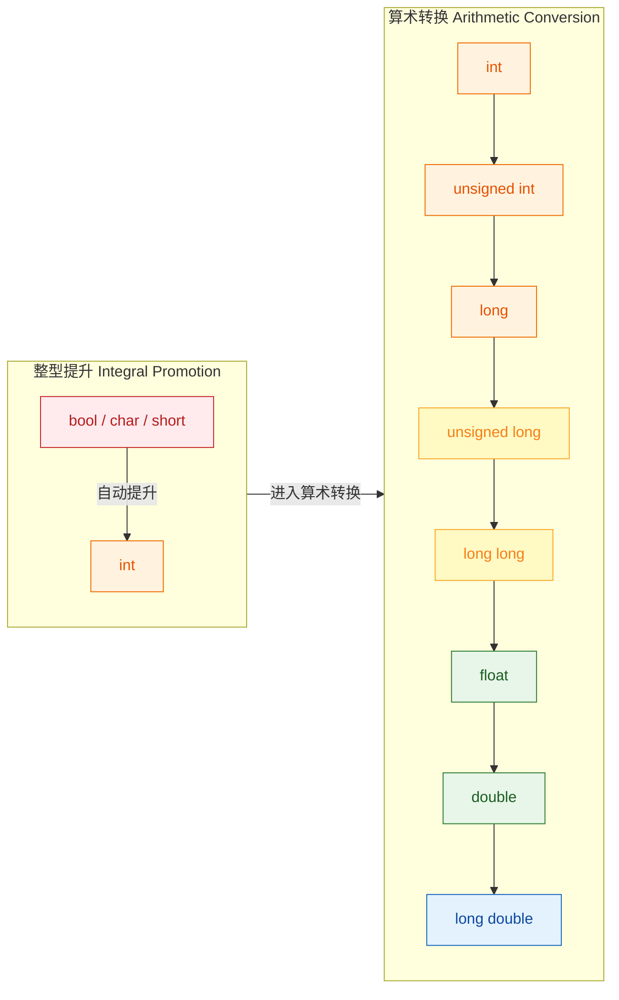

```cpp
#include <iostream>
using namespace std;

int main() {
    // ===== 整型提升 (Integral Promotion) =====
    char c = 'A';        // char 类型，值为 65
    int result = c + 1;  // c 被隐式提升为 int，计算 65 + 1 = 66
    cout << result << endl;           // 66
    cout << (char)result << endl;     // 'B'

    // ===== 算术转换 (Usual Arithmetic Conversion) =====
    int i = 5;
    double d = 2.5;
    auto sum = i + d;    // int 自动提升为 double，结果为 double 类型 7.5
    // sum 的类型是 double

    // ===== 危险的窄化转换 (Narrowing Conversion) =====
    int big = 300;
    char small = big;    // int → char：300 超出 char 范围，发生截断！
    // char 通常为 -128~127 (signed) 或 0~255 (unsigned)
    cout << (int)small << endl;  // 输出 44（300 % 256 = 44）

    // C++11 的列表初始化可以防止窄化转换
    // char safe{big};   // 编译错误！列表初始化禁止窄化转换

    return 0;
}
```

#### 显式类型转换（Explicit Cast）

C++ 提供了 4 种现代 cast 运算符，取代 C 风格的 `(type)value` 强转：

| Cast 类型 | 用途 | 安全性 |
|:----------:|:----:|:------:|
| `static_cast<T>` | 编译期的常规类型转换 | 较安全 |
| `dynamic_cast<T>` | 运行时多态类型转换（需要虚函数） | 安全 |
| `const_cast<T>` | 移除或添加 `const` 属性 | 谨慎使用 |
| `reinterpret_cast<T>` | 底层位模式重新解释 | 危险 |

```cpp
#include <iostream>
using namespace std;

int main() {
    // ===== static_cast =====
    double pi = 3.14159;
    int intPi = static_cast<int>(pi);   // 显式将 double 转为 int，截断小数
    cout << intPi << endl;              // 3

    // ===== const_cast =====
    const int val = 42;
    // int* p = &val;                   // 编译错误：不能将 const int* 赋给 int*
    int* p = const_cast<int*>(&val);    // 移除 const，编译通过
    // *p = 100;                        // 未定义行为！原始对象是 const，修改它是 UB

    // ===== reinterpret_cast =====
    long addr = 0x7FFF12345678;
    int* fakePtr = reinterpret_cast<int*>(addr); // 将整数解释为指针地址
    // 极其危险，仅在与硬件/OS交互等极端场景使用

    return 0;
}
```

> **黄金规则**：
> 1. 优先使用 `static_cast`，它覆盖了绝大多数需求。
> 2. **永远不要**使用 C 风格的 `(int)x` 强转——它会偷偷做你意想不到的转换，而且无法被搜索。
> 3. `reinterpret_cast` 只在你确切知道自己在做什么时使用。

---

### 运算符优先级与结合性（Precedence & Associativity）

C++ 有超过 **40 种运算符**，它们之间的优先级关系决定了复杂表达式的求值顺序。以下是从 **高到低** 的核心优先级表：

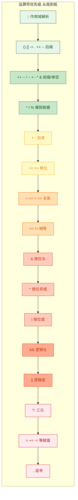

来看几个因优先级导致的经典陷阱：

```cpp
#include <iostream>
using namespace std;

int main() {
    // ===== 陷阱 1：位运算 vs 关系运算 =====
    int x = 5;
    // 程序员本意：先按位与，再比较
    if (x & 0x01 == 0) {         // 实际执行：x & (0x01 == 0) → x & 0 → 0
        cout << "Even" << endl;  // 永远打印不出来！
    }
    // 正确写法：加括号
    if ((x & 0x01) == 0) {       // 先算 x & 0x01，再和 0 比较
        cout << "Even" << endl;
    }

    // ===== 陷阱 2：移位 vs 加法 =====
    int a = 1 << 2 + 3;          // 实际执行：1 << (2 + 3) = 1 << 5 = 32
    // 程序员可能期望：(1 << 2) + 3 = 4 + 3 = 7
    cout << "a = " << a << endl; // 32

    // ===== 陷阱 3：三元运算符 vs 赋值 =====
    int m = 0, n = 1;
    // m = n > 0 ? 10 : 20;     // 正确，等价于 m = ((n > 0) ? 10 : 20)
    // 但：cout << (n > 0 ? "yes" : "no") << endl; 一定加括号，避免歧义

    return 0;
}
```

> **终极建议**：**不要试图记忆完整的优先级表**。实际编码中，只需要记住几个关键规则：
> 1. 单目运算符 > 双目运算符 > 三元运算符 > 赋值运算符 > 逗号
> 2. 算术 > 移位 > 关系 > 位运算 > 逻辑
> 3. **有任何不确定，就加括号 `()`**。括号零成本，Bug 代价巨大。

---

### sizeof 运算符补充说明

虽然 `sizeof` 在"数据类型"一节中已有详述，但它在运算符体系中有几个值得注意的特性：

```cpp
#include <iostream>
using namespace std;

int main() {
    // sizeof 是运算符，不是函数！
    // 对类型使用必须加括号，对变量/表达式可以不加
    int arr[10];
    cout << sizeof(int) << endl;     // 对类型：必须加括号
    cout << sizeof arr << endl;      // 对变量：可以不加括号（但建议统一加）
    cout << sizeof(arr) << endl;     // 加括号也可以

    // sizeof 在编译期求值，不会真正执行表达式
    int x = 5;
    cout << sizeof(x++) << endl;     // 输出 4（int 的大小），但 x 仍然是 5！
    cout << "x = " << x << endl;    // 仍然是 5，x++ 并未真正执行

    // 经典用法：计算数组元素个数
    int data[] = {10, 20, 30, 40, 50};
    int count = sizeof(data) / sizeof(data[0]);  // 20 / 4 = 5
    cout << "Array size: " << count << endl;
    // 注意：当数组退化为指针时（如传入函数后），此方法失效！

    return 0;
}
```

---

### 运算符总览思维导图

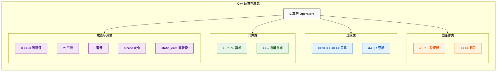

---

**📝 练习题 1**

以下代码的输出结果是什么？

```cpp
#include <iostream>
using namespace std;
int main() {
    int a = 3, b = 5;
    int c = a | b;
    int d = a ^ b;
    int e = a & b;
    cout << c << " " << d << " " << e << endl;
    return 0;
}
```

A. `7 6 1`


B. `8 6 1`


C. `7 5 3`


D. `15 6 0`


**【答案】** A

**【解析】**
将 `a = 3` 和 `b = 5` 转为二进制：
- `a = 011`
- `b = 101`

逐个运算：
- `a | b`（按位或）：`011 | 101 = 111` = **7**
- `a ^ b`（按位异或）：`011 ^ 101 = 110` = **6**
- `a & b`（按位与）：`011 & 101 = 001` = **1**

因此输出 `7 6 1`，选 A。

---

**📝 练习题 2**

以下代码中，变量 `y` 的最终值是多少？

```cpp
int x = 10;
int y = (x > 5) ? (x++, x * 2) : (x--, x / 2);
```

A. `20`


B. `22`


C. `21`


D. `24`


**【答案】** B

**【解析】**
1. 首先判断条件 `x > 5`：`10 > 5` 为 `true`，进入第一个分支 `(x++, x * 2)`。
2. 该分支是一个逗号表达式，从左往右依次执行：
   - `x++`：后缀自增，表达式值为 10（但 x 已变为 11）。
   - `x * 2`：此时 x 已经是 11，所以结果为 `11 * 2 = 22`。
3. 逗号表达式返回最后一个子表达式的值，即 `22`。
4. 因此 `y = 22`，选 B。

这道题综合考查了 **三元运算符**、**逗号运算符** 和 **后缀自增** 三个知识点的交互。

---

## 控制流 (Control Flow)

控制流是程序的"骨架"——它决定了代码的执行顺序。如果没有控制流，程序只能从第一行机械地执行到最后一行，毫无"智能"可言。C++ 提供了丰富的控制流语句，让程序可以根据条件做出决策（branching）、反复执行某段逻辑（looping）、以及在特定时刻跳出或跳过（jumping）。本节将逐一深入讲解 `if`、`switch`、`for`、`while` 以及它们的变体和最佳实践。

```mermaid
graph LR
    subgraph SG_BRANCH["分支 Branching"]
        direction TB
        A["if / else if / else"]
        B["switch / case"]
        C["条件运算符 ? :"]
    end

    subgraph SG_LOOP["循环 Looping"]
        direction TB
        D["for 循环"]
        E["while 循环"]
        F["do-while 循环"]
        G["range-based for"]
    end

    subgraph SG_JUMP["跳转 Jumping"]
        direction TB
        H["break"]
        I["continue"]
        J["return"]
        K["goto （慎用）"]
    end

    SG_BRANCH --> SG_LOOP --> SG_JUMP

    classDef branchStyle fill:#C8E6C9,stroke:#388E3C,color:#1B5E20
    classDef loopStyle fill:#BBDEFB,stroke:#1976D2,color:#0D47A1
    classDef jumpStyle fill:#FFE0B2,stroke:#F57C00,color:#E65100

    class A,B,C branchStyle
    class D,E,F,G loopStyle
    class H,I,J,K jumpStyle
```

---

### if 语句

`if` 语句是最基本也是最常用的分支结构。它的核心思想非常直觉：**如果条件为真，就执行某段代码**。

**基本语法：**

```cpp
if (condition) {
    // condition 为 true 时执行
}
```

这里的 `condition` 是一个表达式，C++ 会将其隐式转换为 `bool` 类型。这意味着不仅仅是 `true/false`，整数、指针、甚至对象（如果定义了到 `bool` 的转换）都可以作为条件。**非零值**被视为 `true`，**零值**（包括 `0`、`nullptr`、`0.0`）被视为 `false`。

#### if-else 与 if-else if-else 链

在实际开发中，我们往往需要处理"二选一"甚至"多选一"的场景：

```cpp
#include <iostream>

int main() {
    int score = 85;                          // 定义一个分数变量

    if (score >= 90) {                       // 条件1：分数 >= 90
        std::cout << "优秀" << std::endl;    // 满足条件1时输出
    } else if (score >= 80) {                // 条件2：分数 >= 80（且 < 90）
        std::cout << "良好" << std::endl;    // 满足条件2时输出
    } else if (score >= 60) {                // 条件3：分数 >= 60（且 < 80）
        std::cout << "及格" << std::endl;    // 满足条件3时输出
    } else {                                 // 以上条件都不满足
        std::cout << "不及格" << std::endl;  // 兜底输出
    }

    return 0;                                // 程序正常退出
}
```

`else if` 链的执行逻辑是**短路式**的——一旦某个条件匹配成功，后续的所有 `else if` 和 `else` 分支都会被跳过。因此，条件的排列顺序非常重要：应该把**最严格**（或最可能命中）的条件放在前面。

#### C++17 带初始化器的 if（if with Initializer）

C++17 引入了一个非常实用的语法糖：允许在 `if` 的条件判断之前，嵌入一条初始化语句。这解决了一个长期困扰 C++ 程序员的问题——临时变量的作用域污染。

```cpp
#include <iostream>
#include <map>
#include <string>

int main() {
    std::map<std::string, int> scores = {    // 创建一个 map 容器
        {"Alice", 95},                       // 键值对：名字 -> 分数
        {"Bob", 82}
    };

    // C++17: init-statement 写在 if 内部
    // it 的作用域被限制在整个 if-else 块中
    if (auto it = scores.find("Alice"); it != scores.end()) {
        // find 返回迭代器，若找到则不等于 end()
        std::cout << "找到了: " << it->second << std::endl;  // 输出分数
    } else {
        // it 在 else 分支中依然可用
        std::cout << "未找到" << std::endl;
    }
    // 出了 if-else 块，it 已不可访问，作用域干净

    return 0;
}
```

对比 C++17 之前的写法，我们不得不把 `it` 声明在 `if` 外部，导致它的生命周期远超实际需要：

```cpp
// C++11/14 的写法：it 泄漏到外部作用域
auto it = scores.find("Alice");              // it 在这里声明
if (it != scores.end()) {
    std::cout << it->second << std::endl;
}
// it 在这里仍然存在，可能被误用
```

#### constexpr if（编译期分支）

C++17 还引入了 `if constexpr`，这是一种**编译期**分支。与运行时 `if` 不同，`if constexpr` 在编译阶段就决定了哪个分支会被编译，哪个分支会被**完全丢弃**（discarded statement）。这在模板编程中极为有用：

```cpp
#include <iostream>
#include <type_traits>                       // 引入类型特征库

template <typename T>
void printTypeInfo(const T& val) {
    if constexpr (std::is_integral_v<T>) {   // 编译期判断：T 是否为整数类型
        // 仅当 T 是整数类型时，这段代码才会被编译
        std::cout << val << " 是整数类型" << std::endl;
    } else if constexpr (std::is_floating_point_v<T>) {
        // 仅当 T 是浮点类型时编译
        std::cout << val << " 是浮点类型" << std::endl;
    } else {
        // 其他类型
        std::cout << "其他类型" << std::endl;
    }
}

int main() {
    printTypeInfo(42);                       // T = int，走整数分支
    printTypeInfo(3.14);                     // T = double，走浮点分支
    printTypeInfo("hello");                  // T = const char*，走 else 分支
    return 0;
}
```

`if constexpr` 的关键优势在于：被丢弃的分支**不需要通过编译**。这意味着你可以在不同分支中调用只对特定类型有效的函数，而不会引发编译错误。这是普通 `if` 做不到的。

#### 常见陷阱：悬空 else（Dangling Else）

当 `if` 嵌套且不使用花括号时，`else` 会与**最近的** `if` 配对，这常导致逻辑错误：

```cpp
// 危险示例 —— 没有花括号
if (x > 0)
    if (y > 0)
        std::cout << "x>0 且 y>0";
else                                         // 这个 else 实际上属于内层 if (y>0)
    std::cout << "这不是 x<=0 的分支！";     // 容易误解为外层 else
```

```cpp
// 安全写法 —— 永远使用花括号
if (x > 0) {
    if (y > 0) {
        std::cout << "x>0 且 y>0";
    }
} else {
    std::cout << "x<=0";                     // 现在语义明确
}
```

> **最佳实践**：即使 `if/else` 内只有一行语句，也**始终使用花括号 `{}`**。这是 Google C++ Style Guide、LLVM Coding Standards 等主流规范的共识。

---

### switch 语句

当你需要将**一个变量**与**多个离散常量值**进行比较时，`switch` 比长串的 `if-else if` 更加清晰、高效。编译器通常会将 `switch` 优化为**跳转表（jump table）**，实现 O(1) 的分支跳转。

**基本语法：**

```cpp
switch (expression) {                        // expression 必须是整型或枚举类型
    case constant1:                          // 若 expression == constant1
        // 执行语句
        break;                               // 跳出 switch
    case constant2:
        // 执行语句
        break;
    default:                                 // 所有 case 都不匹配时执行
        // 兜底逻辑
        break;
}
```

来看一个完整的实例：

```cpp
#include <iostream>

int main() {
    int day = 3;                             // 用数字表示星期

    switch (day) {                           // 根据 day 的值跳转
        case 1:                              // day == 1
            std::cout << "Monday" << std::endl;
            break;                           // 必须 break，否则会 fall-through
        case 2:                              // day == 2
            std::cout << "Tuesday" << std::endl;
            break;
        case 3:                              // day == 3
            std::cout << "Wednesday" << std::endl;
            break;
        case 4:                              // day == 4
            std::cout << "Thursday" << std::endl;
            break;
        case 5:                              // day == 5
            std::cout << "Friday" << std::endl;
            break;
        case 6:                              // fall-through: 6 和 7 共享逻辑
        case 7:                              // day == 6 或 day == 7
            std::cout << "Weekend!" << std::endl;
            break;
        default:                             // 无匹配项
            std::cout << "Invalid day" << std::endl;
            break;                           // default 末尾的 break 虽非必须，但推荐加上
    }

    return 0;
}
```

#### Fall-through 机制

`switch` 最独特也最危险的特性就是 **fall-through**：如果一个 `case` 末尾没有 `break`，程序会**穿透**到下一个 `case` 继续执行，不管下一个 `case` 的条件是否匹配。

```mermaid
graph LR
    subgraph SG_MATCH["匹配阶段"]
        direction TB
        A["switch&#40;expr&#41;"] --> B{"case 1?"}
        B -- Yes --> C["执行 case 1 代码"]
        B -- No --> D{"case 2?"}
        D -- Yes --> E["执行 case 2 代码"]
        D -- No --> F["执行 default 代码"]
    end

    subgraph SG_FALL["Fall-through 演示"]
        direction TB
        G["进入 case 1"] --> H["执行 case 1 代码"]
        H -- "无 break!" --> I["穿透到 case 2 代码"]
        I -- "无 break!" --> J["穿透到 default 代码"]
    end

    SG_MATCH --> SG_FALL

    classDef matchStyle fill:#C8E6C9,stroke:#388E3C,color:#1B5E20
    classDef fallStyle fill:#FFCDD2,stroke:#D32F2F,color:#B71C1C

    class A,B,C,D,E,F matchStyle
    class G,H,I,J fallStyle
```

这种 fall-through 有时是**有意利用**的，比如上面 `case 6` 和 `case 7` 共享 "Weekend!" 逻辑。但如果是无意遗漏 `break`，则是非常隐蔽的 bug。

C++17 引入了 `[[fallthrough]]` 属性（attribute），用于告诉编译器"这里的 fall-through 是故意的，不要报警告"：

```cpp
switch (level) {
    case 3:                                  // level == 3
        applyGoldBonus();                    // 金牌加成
        [[fallthrough]];                     // 显式声明：故意穿透
    case 2:                                  // level == 2（或从 3 穿透而来）
        applySilverBonus();                  // 银牌加成
        [[fallthrough]];                     // 再次显式声明
    case 1:                                  // level == 1（或从上方穿透而来）
        applyBasicBonus();                   // 基础加成
        break;                               // 最终跳出
    default:
        break;
}
```

#### switch 中声明变量的注意事项

在 `switch` 的 `case` 中直接声明变量可能导致编译错误，因为 `switch` 的跳转可能会跳过变量的初始化：

```cpp
switch (x) {
    case 1:
        int val = 10;                        // 错误！跳转到 case 2 时会跳过此初始化
        break;
    case 2:
        std::cout << val;                    // val 可能未被初始化
        break;
}
```

解决方案是用**花括号**为 `case` 创建独立的作用域：

```cpp
switch (x) {
    case 1: {                                // 花括号创建独立作用域
        int val = 10;                        // val 的作用域仅限于此 case 块
        std::cout << val << std::endl;
        break;
    }
    case 2: {
        int val = 20;                        // 另一个独立的 val，互不冲突
        std::cout << val << std::endl;
        break;
    }
}
```

#### switch 的限制

需要注意 `switch` 有一些硬性限制：

| 限制 | 说明 |
|:---|:---|
| 表达式类型 | 必须是**整型**（`int`, `char`, `enum` 等），不支持 `float`、`double`、`std::string` |
| case 值 | 必须是**编译期常量**（`const`/`constexpr`/字面值），不能是变量 |
| 范围匹配 | 不支持 `case 1..5:` 这样的范围语法（GCC 有扩展但非标准） |

---

### for 循环

`for` 循环是 C++ 中最灵活的循环结构，尤其适合**已知循环次数**或需要**精细控制迭代变量**的场景。

**经典三段式语法：**

```cpp
for (init; condition; update) {
    // 循环体
}
```

执行流程如下：

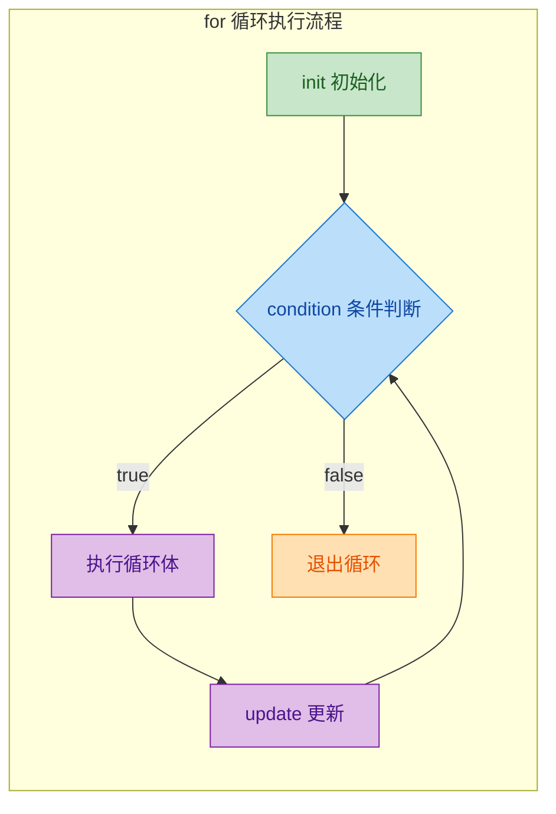

**关键细节**：`condition` 在**每次循环开始前**检查（包括第一次），这意味着如果初始条件就为 `false`，循环体**一次都不会执行**。`update` 在**每次循环体执行完毕后**执行。

```cpp
#include <iostream>

int main() {
    // 经典用法：打印 0 到 4
    for (int i = 0; i < 5; ++i) {            // i 从 0 开始，每次 +1，直到 i >= 5
        std::cout << i << " ";               // 输出当前 i 的值
    }
    // 输出: 0 1 2 3 4
    std::cout << std::endl;

    // 多变量初始化：同时控制两个迭代器
    for (int lo = 0, hi = 10; lo < hi; ++lo, --hi) {
        // lo 从 0 递增，hi 从 10 递减，两者相遇时停止
        std::cout << "[" << lo << "," << hi << "] ";
    }
    // 输出: [0,10] [1,9] [2,8] [3,7] [4,6]
    std::cout << std::endl;

    // 省略三段式的任意部分（甚至全部）
    // 无限循环：for (;;) 等价于 while (true)
    int count = 0;                           // 初始化放到外面
    for (;;) {                               // 三段全部省略 = 无限循环
        if (count >= 3) break;               // 手动退出条件
        std::cout << count << " ";
        ++count;
    }
    // 输出: 0 1 2

    return 0;
}
```

#### Range-based for（范围 for 循环）

C++11 引入的 range-based for 是对传统 `for` 循环的一次巨大简化。它的设计理念是："如果你只想遍历容器中的每一个元素，不需要手动管理索引或迭代器。"

```cpp
for (declaration : range_expression) {
    // 使用 declaration 访问每个元素
}
```

```cpp
#include <iostream>
#include <vector>
#include <string>

int main() {
    std::vector<int> nums = {10, 20, 30, 40, 50};  // 创建整型向量

    // 值拷贝遍历：elem 是每个元素的副本
    for (int elem : nums) {                  // elem 依次取 10, 20, 30, 40, 50
        std::cout << elem << " ";            // 修改 elem 不影响原容器
    }
    std::cout << std::endl;

    // 引用遍历：可以修改原容器中的元素
    for (int& elem : nums) {                 // elem 是原始元素的引用
        elem *= 2;                           // 将容器中每个元素翻倍
    }
    // 此时 nums = {20, 40, 60, 80, 100}

    // const 引用遍历：只读 + 避免拷贝开销（推荐用于大对象）
    for (const auto& elem : nums) {          // auto 自动推导类型，const 防止修改
        std::cout << elem << " ";
    }
    std::cout << std::endl;

    // 遍历初始化列表（C++11）
    for (const auto& s : {"hello", "world", "C++"}) {
        std::cout << s << " ";               // 输出: hello world C++
    }
    std::cout << std::endl;

    return 0;
}
```

> **最佳实践**：遍历容器时，优先使用 `const auto&` 作为循环变量。这能避免不必要的拷贝、防止意外修改，并且通过 `auto` 自动适配元素类型。

range-based for 循环的底层原理实际上是对迭代器的**语法糖**。编译器会将其展开为大致如下的等价代码：

```cpp
// 编译器对 for (auto& elem : container) 的等价展开
{
    auto&& __range = container;              // 绑定容器（完美转发引用）
    auto __begin = std::begin(__range);      // 获取起始迭代器
    auto __end = std::end(__range);          // 获取结束迭代器（哨兵）
    for (; __begin != __end; ++__begin) {    // 标准 for 循环
        auto& elem = *__begin;              // 解引用迭代器获取元素
        // ... 循环体 ...
    }
}
```

因此，任何定义了 `begin()` 和 `end()`（或者全局 `std::begin` / `std::end`）的类型都可以使用 range-based for。

#### C++20 Range-based for 带初始化器

类似于 C++17 的 `if` 初始化器，C++20 允许在 range-based for 中加入初始化语句：

```cpp
// C++20: range-based for with init-statement
for (auto vec = getVector(); const auto& elem : vec) {
    // vec 的作用域被限制在 for 循环内
    std::cout << elem << " ";
}
// vec 在此处不可访问
```

---

### while 循环

`while` 循环的语义最为朴素：**只要条件为真，就一直重复**。它适用于**循环次数不确定**、完全依赖运行时条件的场景。

```cpp
while (condition) {
    // 循环体
}
```

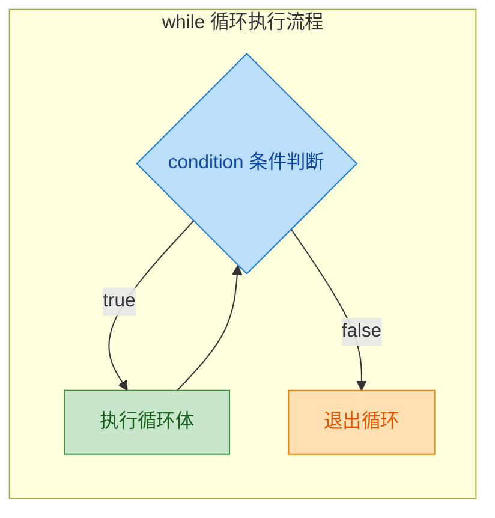

```cpp
#include <iostream>

int main() {
    // 示例：读取用户输入直到输入 0
    int input = -1;                          // 初始化为非零值以进入循环
    std::cout << "输入数字（0退出）: ";

    while (input != 0) {                     // 只要 input 不为 0 就继续
        std::cin >> input;                   // 从标准输入读取
        if (input != 0) {
            std::cout << "你输入了: " << input << std::endl;
        }
    }

    std::cout << "已退出" << std::endl;
    return 0;
}
```

`while` 循环最典型的应用场景包括：

- **读取文件/流直到 EOF**（`while (std::getline(file, line))`）
- **等待某个事件/状态变化**
- **迭代直到收敛**（数值算法）
- **处理链表等无固定长度的数据结构**

#### do-while 循环

`do-while` 是 `while` 的变体，核心区别在于：**先执行循环体，再判断条件**。这保证了循环体**至少执行一次**。

```cpp
do {
    // 循环体（至少执行一次）
} while (condition);                         // 注意末尾的分号！
```

```cpp
#include <iostream>

int main() {
    int choice;                              // 菜单选项

    do {
        // 无论如何先显示菜单一次
        std::cout << "===== 菜单 =====" << std::endl;
        std::cout << "1. 开始游戏" << std::endl;
        std::cout << "2. 设置" << std::endl;
        std::cout << "0. 退出" << std::endl;
        std::cout << "请选择: ";
        std::cin >> choice;                  // 读取用户选择

        switch (choice) {                    // 处理选择
            case 1:
                std::cout << "游戏开始！" << std::endl;
                break;
            case 2:
                std::cout << "进入设置..." << std::endl;
                break;
            case 0:
                std::cout << "再见！" << std::endl;
                break;
            default:
                std::cout << "无效选项！" << std::endl;
                break;
        }
    } while (choice != 0);                  // 选择 0 时退出循环

    return 0;
}
```

`do-while` 的典型场景就是**输入验证**和**菜单循环**——你需要先展示一次内容或获取一次输入，然后再判断是否需要重复。

来看一下 `while` 和 `do-while` 的对比：

```cpp
// while: 如果初始条件为 false，循环体不执行
int x = 0;
while (x > 0) {                             // 条件一开始就是 false
    std::cout << "不会执行" << std::endl;    // 永远不会输出
}

// do-while: 无论如何先执行一次
int y = 0;
do {
    std::cout << "执行了一次" << std::endl;  // 输出一次
} while (y > 0);                             // 然后检查条件，false，退出
```

---

### break、continue 与循环控制

`break` 和 `continue` 是循环内部的"微操控制器"：

- **`break`**：立即终止**最内层**循环（或 `switch`），跳到循环之后的语句。
- **`continue`**：跳过当前迭代的**剩余部分**，直接进入下一次迭代（对于 `for` 循环，会先执行 `update` 再判断 `condition`）。

```cpp
#include <iostream>

int main() {
    // break 示例：找到第一个偶数就停止
    for (int i = 1; i <= 10; ++i) {          // 遍历 1 到 10
        if (i % 2 == 0) {                   // 如果 i 是偶数
            std::cout << "第一个偶数: " << i << std::endl;
            break;                           // 找到后立即退出循环
        }
    }
    // 输出: 第一个偶数: 2

    std::cout << "---" << std::endl;

    // continue 示例：跳过所有奇数
    for (int i = 1; i <= 10; ++i) {          // 遍历 1 到 10
        if (i % 2 != 0) {                   // 如果 i 是奇数
            continue;                        // 跳过本次迭代的剩余代码
        }
        std::cout << i << " ";              // 只有偶数会到达这里
    }
    // 输出: 2 4 6 8 10

    return 0;
}
```

**嵌套循环中的 break**：`break` 只能跳出**最内层**的循环。如果需要跳出多层循环，常见策略有：

```cpp
#include <iostream>

int main() {
    bool found = false;                      // 标志变量

    for (int i = 0; i < 10 && !found; ++i) { // 外层：检查标志
        for (int j = 0; j < 10; ++j) {      // 内层循环
            if (i * j == 42) {               // 找到目标
                std::cout << "i=" << i << " j=" << j << std::endl;
                found = true;                // 设置标志
                break;                       // 跳出内层
            }
        }
        // found 为 true 时，外层循环条件 !found 为 false，也会退出
    }

    return 0;
}
```

另一种更优雅的做法是将嵌套循环封装成函数，使用 `return` 直接跳出：

```cpp
#include <iostream>

void findProduct() {                         // 封装成独立函数
    for (int i = 0; i < 10; ++i) {
        for (int j = 0; j < 10; ++j) {
            if (i * j == 42) {
                std::cout << "i=" << i << " j=" << j << std::endl;
                return;                      // 直接返回，跳出所有循环
            }
        }
    }
}

int main() {
    findProduct();
    return 0;
}
```

---

### 循环选择指南

在实际编码中，选择合适的循环结构能显著提升代码的可读性和表达力。以下是一个实用的决策参考：

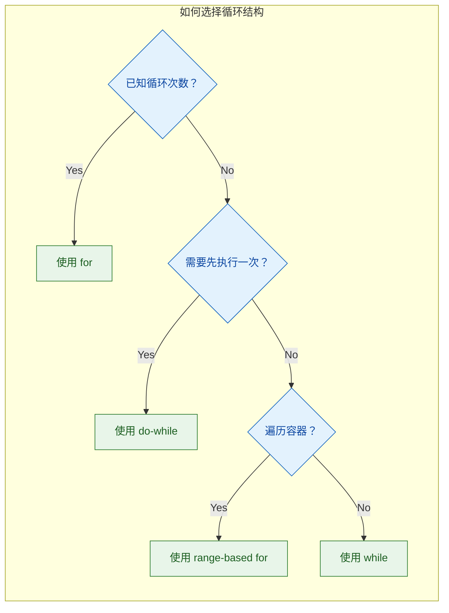

| 场景 | 推荐结构 | 理由 |
|:---|:---|:---|
| 遍历数组/容器 | `range-based for` | 简洁安全，无越界风险 |
| 需要索引 | `for (int i = ...)` | 直接访问索引 |
| 循环次数未知 | `while` | 语义清晰 |
| 至少执行一次 | `do-while` | 先执行后判断 |
| 无限循环 | `while (true)` 或 `for (;;)` | 两者等价，团队统一即可 |

---

### 综合实战：控制流联动

下面这个例子综合运用了 `if`、`switch`、`for`、`while`、`break`、`continue`，模拟一个简单的命令解释器：

```cpp
#include <iostream>
#include <string>
#include <sstream>                           // 用于字符串分割

int main() {
    std::string line;                        // 存储用户输入的一行

    while (true) {                           // 主循环：持续接收命令
        std::cout << "> ";                   // 打印提示符
        if (!std::getline(std::cin, line)) { // 读取一行输入
            break;                           // 如果输入流结束（EOF），退出
        }

        if (line.empty()) {                  // 空行直接跳过
            continue;                        // 进入下一次迭代
        }

        // 解析命令的第一个单词
        std::istringstream iss(line);        // 用字符串流分割
        std::string cmd;                     // 命令名
        iss >> cmd;                          // 提取第一个单词

        // 使用 if-else 处理字符串命令（switch 不支持 string）
        if (cmd == "count") {
            int n = 5;                       // 默认计数到 5
            iss >> n;                        // 尝试读取用户指定的数字

            for (int i = 1; i <= n; ++i) {   // 从 1 数到 n
                std::cout << i;
                if (i < n) std::cout << ", "; // 最后一个数字后不加逗号
            }
            std::cout << std::endl;

        } else if (cmd == "sum") {
            int total = 0;                   // 累加器
            int num;                         // 临时变量

            while (iss >> num) {             // 持续从流中读取数字
                if (num < 0) {               // 跳过负数
                    continue;
                }
                total += num;                // 累加非负数
            }
            std::cout << "Sum = " << total << std::endl;

        } else if (cmd == "grade") {
            int score;
            if (!(iss >> score)) {           // 读取分数，失败则提示
                std::cout << "用法: grade <分数>" << std::endl;
                continue;                    // 回到主循环
            }

            char grade;                      // 等级字符
            switch (score / 10) {            // 将分数映射到十位数
                case 10:                     // 100 分
                case 9:                      // 90-99 分
                    grade = 'A';
                    break;
                case 8:                      // 80-89 分
                    grade = 'B';
                    break;
                case 7:                      // 70-79 分
                    grade = 'C';
                    break;
                case 6:                      // 60-69 分
                    grade = 'D';
                    break;
                default:                     // 60 以下
                    grade = 'F';
                    break;
            }
            std::cout << "Grade: " << grade << std::endl;

        } else if (cmd == "quit" || cmd == "exit") {
            break;                           // 退出主循环

        } else {
            std::cout << "未知命令: " << cmd << std::endl;
        }
    }

    return 0;                                // 程序正常结束
}
```

这个例子展示了控制流语句之间的"协作"：`while (true)` 维持主循环，`if-else` 进行命令分派，`for` 实现计数，内层 `while` 处理变长参数，`switch` 映射分数等级，`break` / `continue` 精确控制跳转。这就是控制流的力量——让程序"活"起来。

---

**📝 练习题**

以下代码的输出是什么？

```cpp
#include <iostream>
int main() {
    for (int i = 0; i < 5; ++i) {
        if (i == 2) continue;
        if (i == 4) break;
        std::cout << i << " ";
    }
    std::cout << "done";
    return 0;
}
```

A. `0 1 2 3 done`


B. `0 1 3 done`


C. `0 1 done`


D. `0 1 3 4 done`

**【答案】** B

**【解析】** 循环从 `i = 0` 开始。当 `i = 0` 和 `i = 1` 时，两个 `if` 条件都不满足，正常输出 `0` 和 `1`。当 `i = 2` 时，`continue` 被触发，跳过本次迭代的剩余代码（包括 `std::cout`），直接执行 `++i` 进入下一轮。当 `i = 3` 时，两个 `if` 都不满足，输出 `3`。当 `i = 4` 时，第二个 `if` 中的 `break` 被触发，立即退出循环。最后输出 `done`。因此完整输出为 `0 1 3 done`。

---

**📝 练习题**

以下代码中，`x` 的最终值是多少？

```cpp
#include <iostream>
int main() {
    int x = 0;
    switch (3) {
        case 1: x += 1;
        case 2: x += 2;
        case 3: x += 3;
        case 4: x += 4;
        default: x += 5;
    }
    std::cout << x << std::endl;
    return 0;
}
```

A. `3`


B. `7`


C. `12`


D. `15`

**【答案】** C

**【解析】** `switch(3)` 匹配到 `case 3`，执行 `x += 3`（此时 `x = 3`）。由于 `case 3` 末尾没有 `break`，发生 **fall-through**，继续执行 `case 4` 的 `x += 4`（`x = 7`），再穿透到 `default` 的 `x += 5`（`x = 12`）。整个 `switch` 结束，`x` 的最终值为 `12`。这正是 fall-through 机制的典型体现——遗漏 `break` 会导致后续所有分支的代码被依次执行。

---

## 函数（Function）

函数是 C++ 程序中**最基本的代码组织单元**。它将一段具有独立逻辑的代码封装起来，赋予其一个名字，使其可以被反复调用（invoke/call）。理解函数的声明、定义与重载机制，是掌握 C++ 的必经之路。

从宏观视角看，一个 C++ 程序本质上就是**一棵函数调用树**——`main()` 是树根，所有的业务逻辑都沿着函数调用链逐层展开。函数的设计质量，直接决定了代码的可读性（readability）、可维护性（maintainability）和可复用性（reusability）。

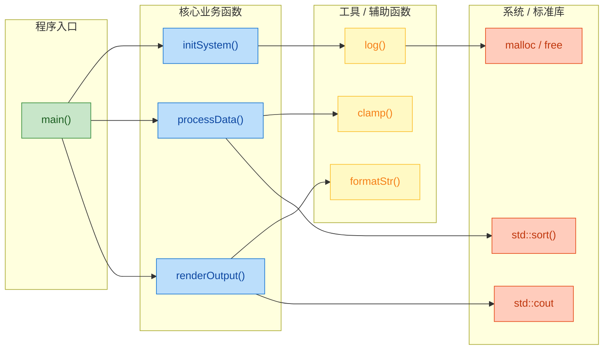

上图展示了一个典型 C++ 程序的函数调用层次：从 `main()` 出发，调用核心业务函数，核心函数再依赖工具函数和标准库函数。理解这种层次化组织，有助于你在编写函数时建立清晰的**职责边界**。

---

### 函数的基本结构

一个完整的 C++ 函数由以下几个部分组成：

```cpp
// 返回类型  函数名    参数列表
// ↓        ↓        ↓
   int      add      (int a, int b)    // ← 函数头 (Function Header / Signature)
{                                       // ← 函数体开始 (Function Body)
    int result = a + b;                 // ← 函数内部逻辑
    return result;                      // ← 返回语句，将结果交还调用者
}                                       // ← 函数体结束
```

我们拆解各组成部分：

| 组成部分 | 示例中的值 | 说明 |
|---------|-----------|------|
| **返回类型** (Return Type) | `int` | 函数执行完毕后返回给调用者的数据类型 |
| **函数名** (Function Name) | `add` | 遵循标识符命名规则，应见名知意 |
| **参数列表** (Parameter List) | `(int a, int b)` | 函数的输入，可以有零个或多个参数 |
| **函数体** (Function Body) | `{ ... }` | 花括号内的代码块，包含具体实现 |
| **返回语句** (Return Statement) | `return result;` | 将计算结果返回，类型必须与返回类型匹配 |

当一个函数不需要返回任何值时，返回类型使用 `void`：

```cpp
void greet(const std::string& name)     // 返回类型为 void，表示"无返回值"
{
    std::cout << "Hello, " << name << "!" << std::endl;  // 仅执行副作用(side effect)
    // 可以省略 return; 语句，编译器会自动在函数末尾插入
}
```

当参数列表为空时，有两种写法。在 C++ 中，它们完全等价：

```cpp
int getRandomNumber()       // C++ 推荐写法：空括号即表示无参数
{
    return 42;
}

int getRandomNumber(void)   // C 风格写法：显式用 void 标注无参数（C++ 中也合法）
{
    return 42;
}
```

> **注意**：在 C 语言中，`f()` 表示"参数未知"（接受任意参数），而 `f(void)` 才表示"无参数"。C++ 修正了这个设计，让 `f()` 与 `f(void)` 语义一致。如果你的代码需要 C/C++ 混编，写 `void` 更安全。

---

### 函数的声明与定义

这是初学者常混淆的核心概念。C++ 严格区分了**声明（Declaration）**和**定义（Definition）**，理解二者的区别是掌握多文件编程的前提。

#### 声明（Declaration）—— 告诉编译器"有这么个东西"

函数声明（也称为**函数原型** / Function Prototype）只描述函数的**接口信息**：返回类型、函数名和参数类型，但**不提供函数体**。它的作用是让编译器知道这个函数的存在，以便在调用处进行**类型检查**。

```cpp
// 函数声明：仅描述"签名"(signature)，以分号结尾，没有花括号
int add(int a, int b);          // 完整声明，包含参数名

int add(int, int);              // 也合法！声明中参数名可以省略
                                // 因为编译器只需要知道参数类型

double calculateArea(double radius);    // 声明：计算圆面积的函数

void printMessage(const std::string& msg);  // 声明：打印消息的函数
```

**为什么需要声明？** 因为 C++ 编译器是**单遍扫描**（single-pass）的——它从上往下逐行读取源文件。如果在调用一个函数时编译器还没见过它的定义，就会报错"未声明的标识符"（undeclared identifier）。声明就是提前给编译器的一张"预告函"。

```cpp
#include <iostream>

// 没有声明也没有定义，直接调用 → 编译错误！
int main()
{
    int result = add(3, 5);     // ❌ error: 'add' was not declared in this scope
    std::cout << result << std::endl;
    return 0;
}

int add(int a, int b)           // 定义在 main() 之后
{
    return a + b;
}
```

加上**前置声明（Forward Declaration）**即可解决：

```cpp
#include <iostream>

int add(int a, int b);          // ✅ 前置声明：告诉编译器 add 函数存在

int main()
{
    int result = add(3, 5);     // ✅ 编译器已经知道 add 的签名，可以进行类型检查
    std::cout << result << std::endl;   // 输出: 8
    return 0;
}

int add(int a, int b)           // 函数定义：提供实际实现
{
    return a + b;               // 返回两数之和
}
```

#### 定义（Definition）—— 告诉编译器"它具体做什么"

函数定义包含了完整的函数体，是函数的**实际实现**。编译器会为定义生成真正的**机器指令**。

```cpp
// 这是一个完整的函数定义
int add(int a, int b)           // 函数头 (与声明一致)
{                               // 函数体开始
    return a + b;               // 具体实现逻辑
}                               // 函数体结束
```

#### 声明 vs 定义：核心对比

```mermaid
graph LR
    subgraph Declaration["声明 Declaration"]
        direction TB
        D1["int add(int a, int b);"]
        D2["只有签名，以分号结尾"]
        D3["可以出现多次"]
        D4["不生成机器码"]
        D1 --- D2 --- D3 --- D4
    end

    subgraph Definition["定义 Definition"]
        direction TB
        E1["int add(int a, int b) { return a+b; }"]
        E2["包含完整函数体"]
        E3["只能出现一次 ODR"]
        E4["生成实际机器指令"]
        E1 --- E2 --- E3 --- E4
    end

    Declaration -- "定义本身也是一种声明" --> Definition

    classDef declStyle fill:#E3F2FD,stroke:#1565C0,color:#0D47A1
    classDef defStyle fill:#E8F5E9,stroke:#2E7D32,color:#1B5E20

    class D1,D2,D3,D4 declStyle
    class E1,E2,E3,E4 defStyle
```

**关键规则**：

- **声明可以出现多次**（只要每次签名一致就不会冲突）。
- **定义只能出现一次**——这就是著名的 **ODR（One Definition Rule，唯一定义规则）**。如果你在两个 `.cpp` 文件中都写了同一个函数的定义，链接器会报"重复定义"（multiple definition）错误。
- **每个定义同时也是一个声明**，但反过来不成立。

```cpp
int add(int a, int b);          // 声明 #1 ✅
int add(int a, int b);          // 声明 #2 ✅（重复声明完全合法）
int add(int a, int b);          // 声明 #3 ✅（仍然合法，编译器不介意）

int add(int a, int b)           // 定义 #1 ✅
{ return a + b; }

// int add(int a, int b)        // 定义 #2 ❌ 违反 ODR！链接期报错
// { return a + b; }
```

#### 在多文件项目中的实践

在实际工程中，声明和定义通常分布在不同文件中：

```cpp
// ============= math_utils.h (头文件：放声明) =============
#pragma once                            // 防止头文件被重复包含

int add(int a, int b);                  // 函数声明
int subtract(int a, int b);             // 函数声明
double divide(double a, double b);      // 函数声明
```

```cpp
// ============= math_utils.cpp (源文件：放定义) =============
#include "math_utils.h"                 // 包含自己的头文件，确保声明与定义一致

int add(int a, int b)                   // 函数定义
{
    return a + b;
}

int subtract(int a, int b)             // 函数定义
{
    return a - b;
}

double divide(double a, double b)      // 函数定义
{
    if (b == 0.0)                       // 防御性检查：除数不能为零
    {
        return 0.0;                     // 简单处理，实际项目中应抛出异常
    }
    return a / b;
}
```

```cpp
// ============= main.cpp (调用方) =============
#include <iostream>
#include "math_utils.h"                // 包含头文件，获得函数声明

int main()
{
    std::cout << add(10, 20) << std::endl;       // 调用 add，输出 30
    std::cout << subtract(50, 18) << std::endl;  // 调用 subtract，输出 32
    std::cout << divide(10.0, 3.0) << std::endl; // 调用 divide，输出 3.33333
    return 0;
}
```

整个编译链路可以用下图表示：

```mermaid
graph LR
    subgraph Source["源码阶段"]
        direction TB
        H["math_utils.h<br>函数声明"]
        CPP1["math_utils.cpp<br>函数定义"]
        CPP2["main.cpp<br>调用函数"]
    end

    subgraph Compile["编译阶段 Compiler"]
        direction TB
        O1["math_utils.o<br>目标文件"]
        O2["main.o<br>目标文件"]
    end

    subgraph Link["链接阶段 Linker"]
        direction TB
        EXE["program.exe<br>可执行文件"]
    end

    H -.->|#include| CPP1
    H -.->|#include| CPP2
    CPP1 -->|编译| O1
    CPP2 -->|编译| O2
    O1 -->|链接| EXE
    O2 -->|链接| EXE

    classDef srcStyle fill:#E8EAF6,stroke:#3949AB,color:#1A237E
    classDef objStyle fill:#FFF3E0,stroke:#EF6C00,color:#E65100
    classDef exeStyle fill:#E8F5E9,stroke:#2E7D32,color:#1B5E20

    class H,CPP1,CPP2 srcStyle
    class O1,O2 objStyle
    class EXE exeStyle
```

编译器（Compiler）分别将每个 `.cpp` 翻译成目标文件（`.o` / `.obj`），此阶段只需要**声明**即可通过编译。之后链接器（Linker）将所有目标文件组合在一起，此时才会去"兑现"声明——把 `main.o` 中对 `add` 的调用，连接到 `math_utils.o` 中 `add` 的实际定义。如果链接器找不到定义，就会报 `undefined reference` 错误。

---

### 参数传递方式

C++ 函数参数有三种主要传递方式，每种方式在性能、安全性和使用场景上各有不同。

#### 值传递（Pass by Value）

值传递是最基本的方式。调用时，实参的值被**复制**一份给形参。函数内部对形参的修改**不影响**原始变量。

```cpp
void increment(int n)       // n 是 value 的副本 (copy)
{
    n = n + 1;              // 修改的是副本，对外部的 value 无影响
    // 函数结束后，副本 n 被销毁
}

int main()
{
    int value = 10;         // 原始变量
    increment(value);       // 传入 value 的副本
    // value 仍然是 10，没有被改变
    return 0;
}
```

内存模型如下：

```cpp
// 调用 increment(value) 时的内存状态：
//
//   main 的栈帧              increment 的栈帧
//  ┌─────────────┐          ┌─────────────┐
//  │ value = 10  │  复制→   │   n = 10    │  ← 独立副本
//  └─────────────┘          └─────────────┘
//                                 ↓
//                           n = n + 1 → n = 11
//                           (value 不受影响)
```

**适用场景**：基本类型（`int`, `double`, `char` 等）体积小，复制成本几乎为零，值传递是首选。

#### 引用传递（Pass by Reference）

引用传递不复制数据，而是将形参绑定到实参的**原始内存地址**。函数内部的修改会**直接影响**外部变量。

```cpp
void increment(int& n)     // n 是 value 的引用 (alias)，不是副本
{
    n = n + 1;              // 直接修改原始变量
}

int main()
{
    int value = 10;         // 原始变量
    increment(value);       // 传入 value 的引用
    // value 现在是 11 ✅
    return 0;
}
```

```cpp
// 调用 increment(value) 时的内存状态：
//
//   main 的栈帧              increment 的栈帧
//  ┌─────────────┐          ┌─────────────┐
//  │ value = 10  │ ←───────→│   n (引用)   │  ← n 就是 value 本身
//  └─────────────┘          └─────────────┘
//       ↓
//  value 被改为 11
```

**经典应用**：交换两个变量的值

```cpp
void swap(int& a, int& b)  // a, b 均为引用
{
    int temp = a;           // 暂存 a 的值
    a = b;                  // 将 b 的值赋给 a
    b = temp;               // 将暂存值赋给 b
}

int main()
{
    int x = 3, y = 7;
    swap(x, y);             // x 变为 7，y 变为 3
    return 0;
}
```

#### 常量引用传递（Pass by const Reference）

当你想避免复制开销，又**不希望函数修改**原始数据时，使用 `const` 引用。这是 C++ 中传递大型对象（如 `std::string`, `std::vector`）的**黄金法则**。

```cpp
void printInfo(const std::string& info)     // const 引用：只读，不复制
{
    std::cout << info << std::endl;         // 可以读取
    // info += " modified";                 // ❌ 编译错误！const 禁止修改
}

int main()
{
    std::string message = "Hello, C++ World!";  // 可能是一个很长的字符串
    printInfo(message);                          // 不复制，高效且安全
    return 0;
}
```

#### 三种方式对比总结

```mermaid
graph LR
    subgraph ByValue["值传递 Pass by Value"]
        direction TB
        V1["void f(int n)"]
        V2["创建副本"]
        V3["不影响原始值"]
        V4["适合：小型基本类型"]
        V1 --- V2 --- V3 --- V4
    end

    subgraph ByRef["引用传递 Pass by Ref"]
        direction TB
        R1["void f(int& n)"]
        R2["绑定原始变量"]
        R3["可修改原始值"]
        R4["适合：需要修改实参"]
        R1 --- R2 --- R3 --- R4
    end

    subgraph ByConstRef["常量引用 const Ref"]
        direction TB
        C1["void f(const T& n)"]
        C2["绑定原始变量"]
        C3["禁止修改"]
        C4["适合：大型只读对象"]
        C1 --- C2 --- C3 --- C4
    end

    ByValue ~~~ ByRef ~~~ ByConstRef

    classDef valStyle fill:#FFF9C4,stroke:#F9A825,color:#F57F17
    classDef refStyle fill:#BBDEFB,stroke:#1565C0,color:#0D47A1
    classDef crefStyle fill:#C8E6C9,stroke:#2E7D32,color:#1B5E20

    class V1,V2,V3,V4 valStyle
    class R1,R2,R3,R4 refStyle
    class C1,C2,C3,C4 crefStyle
```

**经验法则（Rule of Thumb）**：

| 参数类型 | 推荐方式 | 理由 |
|---------|---------|------|
| `int`, `double`, `char`, `bool` 等基本类型 | **值传递** | 体积小（≤ 8 bytes），复制比间接寻址更快 |
| `std::string`, `std::vector` 等大型对象 | **const 引用** | 避免昂贵的深拷贝 |
| 需要函数内修改原始值 | **引用传递** | 直接操作原始数据 |
| 指针、迭代器 | **值传递** | 指针本身是 8 bytes 的"地址"，复制代价极低 |

---

### 返回值

#### 基本返回

函数通过 `return` 语句将结果传回调用者。返回类型必须与函数签名中声明的类型匹配（或者能隐式转换）。

```cpp
int square(int x)                   // 返回 int 类型
{
    return x * x;                   // 返回 x 的平方
}

double average(double a, double b)  // 返回 double 类型
{
    return (a + b) / 2.0;           // 返回两数平均值
}

bool isPositive(int n)              // 返回 bool 类型
{
    return n > 0;                   // 表达式结果即为 true 或 false
}
```

#### 返回多个值

C++ 函数原生只能返回一个值。但有多种技巧实现"返回多值"：

**方法一：使用输出参数（Output Parameters）**

```cpp
// 通过引用参数"带出"多个结果
void divide(int dividend, int divisor,
            int& quotient, int& remainder)  // 后两个参数用于输出
{
    quotient  = dividend / divisor;         // 商
    remainder = dividend % divisor;         // 余数
}

int main()
{
    int q, r;                               // 用于接收结果的变量
    divide(17, 5, q, r);                    // q = 3, r = 2
    return 0;
}
```

**方法二：使用 `std::pair` 或 `std::tuple`（C++11 起）**

```cpp
#include <tuple>                            // 引入 tuple 支持

std::pair<int, int> divide(int dividend, int divisor)
{
    return {dividend / divisor,             // 商
            dividend % divisor};            // 余数，用花括号初始化 pair
}

int main()
{
    auto [q, r] = divide(17, 5);            // C++17 结构化绑定 (Structured Bindings)
                                            // q = 3, r = 2
    return 0;
}
```

**方法三：返回结构体（最佳可读性）**

```cpp
struct DivResult                            // 自定义返回类型
{
    int quotient;                           // 商
    int remainder;                          // 余数
};

DivResult divide(int dividend, int divisor) // 返回自定义结构体
{
    return {dividend / divisor,             // 初始化 quotient
            dividend % divisor};            // 初始化 remainder
}

int main()
{
    auto result = divide(17, 5);
    // result.quotient  == 3
    // result.remainder == 2
    return 0;
}
```

> **推荐**：当返回值超过 2 个时，优先使用**命名结构体**，它让代码具有自文档化（self-documenting）的特性，远比 `std::tuple<int, int, double, bool>` 这样的类型可读。

---

### 默认参数（Default Arguments）

C++ 允许为函数参数指定默认值。调用时如果省略了该参数，编译器会自动使用默认值。

```cpp
// 声明时指定默认值（通常在头文件中）
void createWindow(int width = 800,          // 默认宽度 800
                  int height = 600,         // 默认高度 600
                  const std::string& title = "Untitled");  // 默认标题

// 定义时不要重复写默认值（否则编译器会报"重复默认参数"错误）
void createWindow(int width, int height, const std::string& title)
{
    std::cout << "Creating window: "
              << title << " (" << width << "x" << height << ")" << std::endl;
}

int main()
{
    createWindow();                         // 使用全部默认值: 800x600 "Untitled"
    createWindow(1920);                     // width=1920, 其余默认: 1920x600 "Untitled"
    createWindow(1920, 1080);               // 1920x1080, 标题默认: "Untitled"
    createWindow(1920, 1080, "My App");     // 全部自定义: 1920x1080 "My App"
    return 0;
}
```

**默认参数的规则（极易踩坑）**：

```cpp
// ✅ 规则 1：默认参数必须从右向左连续设置
void f(int a, int b = 10, int c = 20);     // ✅ 合法

void g(int a = 5, int b, int c = 20);      // ❌ 错误！b 没有默认值，
                                            //    但它左边的 a 有默认值

// ✅ 规则 2：调用时只能从右向左省略参数
f(1);           // a=1, b=10, c=20         ✅
f(1, 2);        // a=1, b=2,  c=20         ✅
f(1, 2, 3);     // a=1, b=2,  c=3          ✅
// f(1, , 3);   // ❌ 不能跳过中间参数！C++ 不支持这种语法
```

**为什么必须从右向左？** 因为 C++ 函数调用是**按位置传参**的，编译器从左到右匹配实参到形参。如果允许中间"空缺"，编译器将无法确定哪个实参对应哪个形参。

---

### 函数重载（Function Overloading）

函数重载是 C++ 相对于 C 语言最重要的增强之一。它允许**同一作用域内**存在多个**同名但参数列表不同**的函数，编译器会根据调用时传入的实参类型自动选择最匹配的版本。

#### 重载的基本规则

```cpp
// 重载版本 1：两个 int 相加
int add(int a, int b)
{
    return a + b;
}

// 重载版本 2：两个 double 相加
double add(double a, double b)
{
    return a + b;
}

// 重载版本 3：三个 int 相加
int add(int a, int b, int c)
{
    return a + b + c;
}

// 重载版本 4：字符串拼接
std::string add(const std::string& a, const std::string& b)
{
    return a + b;
}

int main()
{
    add(1, 2);              // 调用版本 1 → int add(int, int)
    add(1.5, 2.7);          // 调用版本 2 → double add(double, double)
    add(1, 2, 3);           // 调用版本 3 → int add(int, int, int)
    add("Hello", "World");  // 调用版本 4 → string add(string, string)
    return 0;
}
```

编译器如何选择？它通过一套叫做 **Overload Resolution（重载决议）** 的规则来匹配：

```mermaid
graph LR
    subgraph Step1["第一步：候选函数"]
        direction TB
        S1A["找出所有同名函数"]
        S1B["称为 Candidate Functions"]
        S1A --- S1B
    end

    subgraph Step2["第二步：可行函数"]
        direction TB
        S2A["参数数量匹配?"]
        S2B["参数类型可转换?"]
        S2C["筛选出 Viable Functions"]
        S2A --- S2B --- S2C
    end

    subgraph Step3["第三步：最佳匹配"]
        direction TB
        S3A["精确匹配 优先"]
        S3B["标准转换 其次"]
        S3C["选出 Best Match"]
        S3A --- S3B --- S3C
    end

    subgraph Result["结果"]
        direction TB
        R1["唯一最佳 → 调用"]
        R2["无匹配 → 编译错误"]
        R3["有歧义 → ambiguous"]
        R1 --- R2 --- R3
    end

    Step1 --> Step2 --> Step3 --> Result

    classDef step1Style fill:#E3F2FD,stroke:#1565C0,color:#0D47A1
    classDef step2Style fill:#FFF3E0,stroke:#EF6C00,color:#E65100
    classDef step3Style fill:#F3E5F5,stroke:#7B1FA2,color:#4A148C
    classDef resultStyle fill:#E8F5E9,stroke:#2E7D32,color:#1B5E20

    class S1A,S1B step1Style
    class S2A,S2B,S2C step2Style
    class S3A,S3B,S3C step3Style
    class R1,R2,R3 resultStyle
```

#### 重载的判定依据

**能构成重载的（参数列表不同）**：

```cpp
void print(int x);                  // ✅ 参数类型不同
void print(double x);               // ✅
void print(const std::string& s);   // ✅
void print(int x, int y);           // ✅ 参数数量不同
```

**不能构成重载的**：

```cpp
int  compute(int x);       // 版本 A
double compute(int x);     // ❌ 仅返回类型不同，不构成重载！

// 原因：调用 compute(5) 时，编译器无法仅凭调用表达式判断你要哪个版本
// 因为你可以写 compute(5); 而忽略返回值，此时两个版本完全歧义
```

**重载 vs 不重载——完整判定表**：

| 差异点 | 是否构成重载 | 示例 |
|-------|-------------|------|
| 参数**类型**不同 | ✅ 是 | `f(int)` vs `f(double)` |
| 参数**数量**不同 | ✅ 是 | `f(int)` vs `f(int, int)` |
| 参数**顺序**不同 | ✅ 是 | `f(int, double)` vs `f(double, int)` |
| 有无 `const`（引用/指针） | ✅ 是 | `f(int&)` vs `f(const int&)` |
| 仅**返回类型**不同 | ❌ 否 | `int f(int)` vs `double f(int)` |
| 仅**参数名**不同 | ❌ 否 | `f(int a)` vs `f(int b)` 是同一个 |
| 有无默认参数 | ❌ 否（且可能导致歧义） | 见下文 |

#### 默认参数与重载的歧义陷阱

```cpp
void display(int x, int y = 0);    // 版本 A：第二参数有默认值
void display(int x);               // 版本 B：只有一个参数

int main()
{
    display(5, 10);     // ✅ 明确匹配版本 A
    display(5);         // ❌ 歧义！编译器不知道选 A（用默认值）还是 B
                        // error: call to 'display' is ambiguous
    return 0;
}
```

这是非常经典的坑。当默认参数使得某个重载版本的调用形式与另一个版本重叠时，编译器**无法决策**，只能报错。**设计函数签名时务必避免这种重叠。**

#### 隐式类型转换引发的歧义

```cpp
void process(int x);       // 版本 A
void process(double x);    // 版本 B

int main()
{
    process(42);            // ✅ 精确匹配版本 A (int → int)
    process(3.14);          // ✅ 精确匹配版本 B (double → double)
    process(3.14f);         // ⚠️ float → 可转为 int 也可转为 double
                            // 实际上 float→double 是标准提升(promotion)，优先级更高
                            // 所以这里匹配版本 B ✅

    process('A');           // char→int 是整型提升(integral promotion)
                            // 匹配版本 A ✅
    return 0;
}
```

编译器的隐式转换优先级（从高到低）：

1. **精确匹配**（Exact Match）—— 类型完全一致
2. **提升**（Promotion）—— `char→int`, `float→double` 等（无损）
3. **标准转换**（Standard Conversion）—— `int→double`, `double→int` 等（可能有损）
4. **用户定义转换**（User-defined Conversion）—— 通过构造函数或 `operator` 转换

如果两个重载版本在同一优先级上都能匹配，就会产生 **ambiguous（歧义）** 错误。

---

### 内联函数（inline Function）

对于**简短且频繁调用**的函数，函数调用本身的开销（压栈、跳转、返回）可能比函数体内的计算还大。`inline` 关键字**建议**编译器将函数体直接嵌入到调用处，从而消除调用开销。

```cpp
inline int max(int a, int b)    // inline 建议编译器展开此函数
{
    return (a > b) ? a : b;     // 函数体极短，适合内联
}

int main()
{
    int result = max(10, 20);
    // 编译器可能将上面一行优化为：
    // int result = (10 > 20) ? 10 : 20;   // 直接替换，无调用开销
    return 0;
}
```

**关于 `inline` 的几个关键认知**：

1. **`inline` 只是建议，不是命令**。现代编译器（GCC, Clang, MSVC）的优化器非常智能，即使你不写 `inline`，它也会自动内联合适的函数；即使你写了 `inline`，如果函数体太复杂（如包含循环、递归），编译器可能拒绝内联。

2. **`inline` 在现代 C++ 中更重要的语义是"允许多重定义"**。标记为 `inline` 的函数可以在多个翻译单元（`.cpp` 文件）中出现相同的定义而不违反 ODR。这就是为什么**在头文件中定义的函数通常需要加 `inline`**。

3. **类内定义的成员函数默认是 `inline` 的**（后续章节会详述）。

---

### `auto` 返回类型推导（C++14）

从 C++14 开始，函数可以使用 `auto` 让编译器自动推导返回类型：

```cpp
auto multiply(int a, int b)     // 编译器根据 return 语句推导出返回类型为 int
{
    return a * b;               // a * b 结果是 int，所以函数返回 int
}

auto concatenate(const std::string& a, const std::string& b)
{
    return a + b;               // string + string → string，返回类型推导为 string
}
```

C++11 引入了**尾置返回类型（Trailing Return Type）**语法，在模板编程中特别有用：

```cpp
// 尾置返回类型：auto 在前，-> 后面写实际类型
auto add(int a, double b) -> double
{
    return a + b;               // int + double → double
}

// 在模板中配合 decltype 使用（预览，后续章节展开）
template<typename T, typename U>
auto add(T a, U b) -> decltype(a + b)  // 返回类型是 a+b 的类型
{
    return a + b;
}
```

---

### 递归函数（Recursive Function）

函数调用自身的行为称为**递归（Recursion）**。递归是解决"自相似"问题的利器，但必须设定**终止条件（Base Case）**，否则会无限递归导致栈溢出（Stack Overflow）。

```cpp
// 经典示例：计算阶乘 n!
// 数学定义: 0! = 1,  n! = n * (n-1)!
int factorial(int n)
{
    if (n <= 1)                 // 终止条件 (Base Case)
    {
        return 1;               // 0! = 1, 1! = 1
    }
    return n * factorial(n - 1); // 递归调用：n! = n * (n-1)!
}

// 调用 factorial(5) 的展开过程：
// factorial(5)
//   = 5 * factorial(4)
//   = 5 * 4 * factorial(3)
//   = 5 * 4 * 3 * factorial(2)
//   = 5 * 4 * 3 * 2 * factorial(1)
//   = 5 * 4 * 3 * 2 * 1
//   = 120
```

递归调用在栈上的展开：

```cpp
// 栈帧示意（从下往上增长）：
//
// ┌─────────────────────┐  ← 栈顶
// │ factorial(1) → 返回1 │
// ├─────────────────────┤
// │ factorial(2) → 2*1   │
// ├─────────────────────┤
// │ factorial(3) → 3*2   │
// ├─────────────────────┤
// │ factorial(4) → 4*6   │
// ├─────────────────────┤
// │ factorial(5) → 5*24  │
// ├─────────────────────┤
// │      main()          │  ← 栈底
// └─────────────────────┘
```

> **警告**：递归深度过大（例如 `factorial(100000)`）会耗尽栈空间。对于性能敏感的场景，通常优先使用**循环（迭代）**替代递归。某些编译器支持**尾递归优化（Tail Call Optimization, TCO）**，但 C++ 标准不保证这一点。

---

### 函数指针（Function Pointer）

函数在编译后就是一段内存中的机器码，函数名本身就代表这段代码的**起始地址**。函数指针就是保存了这个地址的变量，它使得"将函数作为参数传递"成为可能。

```cpp
#include <iostream>

int add(int a, int b) { return a + b; }         // 普通函数
int subtract(int a, int b) { return a - b; }     // 普通函数

int main()
{
    // 声明函数指针：返回类型 (*指针名)(参数列表)
    int (*operation)(int, int);     // operation 可以指向任何 (int, int) → int 的函数

    operation = add;                // 指向 add 函数（函数名即地址，不需要 &）
    std::cout << operation(10, 3) << std::endl;    // 输出 13

    operation = subtract;           // 改为指向 subtract
    std::cout << operation(10, 3) << std::endl;    // 输出 7

    return 0;
}
```

**使用 `typedef` 或 `using` 简化函数指针类型**：

```cpp
// 原始写法太复杂？用 using 取别名
using BinaryOp = int(*)(int, int);  // BinaryOp 是 "接受两个int返回int的函数指针" 的类型别名

void compute(int a, int b, BinaryOp op)    // op 是一个函数指针参数
{
    std::cout << "Result: " << op(a, b) << std::endl;
}

int main()
{
    compute(10, 5, add);        // 传入 add 函数 → 输出 Result: 15
    compute(10, 5, subtract);   // 传入 subtract 函数 → 输出 Result: 5
    return 0;
}
```

> **展望**：在现代 C++ 中，函数指针的角色逐渐被 `std::function` 和 **Lambda 表达式**所取代，它们更安全、更灵活。这些内容将在后续章节详细讲解。

---

### 本节知识脉络全景

```mermaid
graph LR
    subgraph Basics["函数基础"]
        direction TB
        B1["返回类型"]
        B2["函数名"]
        B3["参数列表"]
        B4["函数体"]
        B1 --- B2 --- B3 --- B4
    end

    subgraph DeclDef["声明与定义"]
        direction TB
        DD1["声明 Declaration"]
        DD2["定义 Definition"]
        DD3["ODR 唯一定义规则"]
        DD4["多文件组织"]
        DD1 --- DD2 --- DD3 --- DD4
    end

    subgraph Params["参数与返回"]
        direction TB
        P1["值传递"]
        P2["引用传递"]
        P3["const 引用"]
        P4["默认参数"]
        P5["多返回值"]
        P1 --- P2 --- P3 --- P4 --- P5
    end

    subgraph Advanced["进阶特性"]
        direction TB
        A1["函数重载"]
        A2["重载决议"]
        A3["inline 内联"]
        A4["auto 推导"]
        A5["递归"]
        A6["函数指针"]
        A1 --- A2 --- A3 --- A4 --- A5 --- A6
    end

    Basics --> DeclDef --> Params --> Advanced

    classDef basicsStyle fill:#E8F5E9,stroke:#388E3C,color:#1B5E20
    classDef ddStyle fill:#E3F2FD,stroke:#1976D2,color:#0D47A1
    classDef paramStyle fill:#FFF3E0,stroke:#EF6C00,color:#E65100
    classDef advStyle fill:#F3E5F5,stroke:#7B1FA2,color:#4A148C

    class B1,B2,B3,B4 basicsStyle
    class DD1,DD2,DD3,DD4 ddStyle
    class P1,P2,P3,P4,P5 paramStyle
    class A1,A2,A3,A4,A5,A6 advStyle
```

---

**📝 练习题 1**

以下哪组函数**不能**构成合法的重载？

A. `void print(int x);` 和 `void print(double x);`


B. `int calc(int a, int b);` 和 `double calc(int a, int b);`


C. `void show(int x);` 和 `void show(int x, int y);`


D. `void handle(int& x);` 和 `void handle(const int& x);`


**【答案】** B

**【解析】** 函数重载的判定依据是**参数列表**（参数的类型、数量、顺序），而非返回类型。选项 B 中 `int calc(int, int)` 和 `double calc(int, int)` 仅返回类型不同，参数列表完全一致，编译器在调用 `calc(1, 2)` 时无法仅凭参数判断你想调用哪个版本（因为返回值可以被忽略），因此这不构成合法重载，会导致编译错误"函数重定义"。其余三个选项分别在参数类型 (A)、参数数量 (C)、参数 const 限定 (D) 上存在差异，均可构成合法重载。

---

**📝 练习题 2**

阅读以下代码，程序输出是什么？

```cpp
#include <iostream>

void modify(int a, int& b, const int& c)
{
    a  = 100;
    b  = 200;
    // c = 300;  // 若取消注释，编译报错
}

int main()
{
    int x = 1, y = 2, z = 3;
    modify(x, y, z);
    std::cout << x << " " << y << " " << z << std::endl;
    return 0;
}
```

A. `100 200 3`


B. `1 200 3`


C. `1 200 300`


D. `100 200 300`


**【答案】** B

**【解析】** 函数 `modify` 的三个参数分别采用了三种不同的传递方式：`a` 是**值传递**（副本），函数内将其改为 100，但原始变量 `x` 不受影响，仍为 1；`b` 是**引用传递**，函数内将其改为 200，直接修改了原始变量 `y`，所以 `y` 变为 200；`c` 是 **const 引用**，函数内无法修改它（若尝试修改会编译报错），原始变量 `z` 保持为 3。因此最终输出 `1 200 3`。

---

## 头文件与源文件（.h / .cpp、Include Guard、#pragma once）

在 C++ 的工程实践中，**头文件（Header File）** 与 **源文件（Source File）** 的分离是整个编译模型的基石。初学者往往把所有代码写进一个 `.cpp` 文件就能跑起来，但一旦项目规模膨胀到数十、数百个文件，如果不理解"声明与定义的分离"、"编译单元"以及"头文件保护"这些概念，就会掉进 **重复定义（multiple definition）**、**未定义引用（undefined reference）** 等令人抓狂的链接错误深渊。本节将从编译流程的底层视角出发，把这套机制讲透。

---

### 编译模型概览：从源码到可执行文件

要理解头文件与源文件为什么要分开，首先必须理解 C++ 的 **分离式编译模型（Separate Compilation Model）**。一个 C++ 程序从源码到可执行文件，要经历以下阶段：

```mermaid
graph LR
    subgraph 预处理阶段["🔧 预处理 Preprocessing"]
        direction TB
        A["main.cpp"] --> B["展开 #include"]
        B --> C["宏替换 / 条件编译"]
        C --> D["main.i（预处理后的翻译单元）"]
    end

    subgraph 编译阶段["⚙️ 编译 Compilation"]
        direction TB
        D --> E["语法分析 / 语义分析"]
        E --> F["生成目标文件 main.o"]
    end

    subgraph 链接阶段["🔗 链接 Linking"]
        direction TB
        F --> G["合并所有 .o 文件"]
        H["utils.o"] --> G
        G --> I["可执行文件 a.out"]
    end

    预处理阶段 --> 编译阶段
    编译阶段 --> 链接阶段

    classDef prepCls fill:#C8E6C9,stroke:#388E3C,color:#1B5E20
    classDef compCls fill:#BBDEFB,stroke:#1976D2,color:#0D47A1
    classDef linkCls fill:#FFE0B2,stroke:#F57C00,color:#E65100

    class A,B,C,D prepCls
    class E,F compCls
    class G,H,I linkCls
```

关键要点：

- **每个 `.cpp` 文件是一个独立的编译单元（Translation Unit）**。编译器一次只"看"一个 `.cpp`，对其他 `.cpp` 里写了什么一无所知。
- **`#include` 是纯文本替换**。预处理器会把被 include 的文件内容原封不动地"粘贴"到当前位置。它不是"导入模块"，而是"复制粘贴"。
- **链接器（Linker）** 负责把多个 `.o` 目标文件中的符号（函数名、全局变量名）拼接在一起，解析所有"我在这里调用了函数 `foo()`，但 `foo()` 的实体在另一个 `.o` 里"这类引用关系。

正因为编译器一次只看一个 `.cpp`，所以当 `main.cpp` 想调用 `utils.cpp` 里定义的函数时，**编译器必须至少知道那个函数的签名（即声明）**。头文件的核心使命，就是把这些"声明"集中管理，让多个 `.cpp` 共享。

---

### .h 与 .cpp 的职责划分

这是 C++ 工程中最基本也最重要的约定：

| 内容类别 | 放在 `.h`（头文件） | 放在 `.cpp`（源文件） |
|:---|:---:|:---:|
| 函数**声明** | ✅ | ❌ |
| 函数**定义**（实现） | ❌（一般不放） | ✅ |
| 类的**声明**（成员列表） | ✅ | ❌ |
| 类成员函数的**定义** | ❌（除非 inline） | ✅ |
| `inline` 函数定义 | ✅ | ❌ |
| 模板的声明与定义 | ✅（必须放头文件） | ❌ |
| 全局常量 `const` / `constexpr` | ✅ | ❌ |
| 全局变量**定义** | ❌ | ✅ |
| 全局变量 `extern` **声明** | ✅ | ❌ |
| `typedef` / `using` 别名 | ✅ | ❌ |
| 宏定义 `#define` | ✅ | 视情况 |

**核心原则：头文件只放"声明"，源文件放"定义"**（One Definition Rule，简称 ODR）。例外是 `inline` 函数、模板、`constexpr` 等必须在编译期可见的内容。

下面用一个完整示例展示标准的分文件写法：

**math_utils.h** — 头文件，只提供接口声明：

```cpp
// math_utils.h
#ifndef MATH_UTILS_H   // Include Guard 开始（后面会详细讲）
#define MATH_UTILS_H

// 函数声明：告诉编译器"有这么一个函数存在，签名如下"
// 编译器只需要知道参数类型和返回值类型即可通过编译
int add(int a, int b);

// 函数声明：计算两数之差
int subtract(int a, int b);

// inline 函数可以（且应该）在头文件中直接定义
// 因为编译器在调用处需要看到函数体才能内联展开
inline int multiply(int a, int b) {
    return a * b;  // 内联函数：编译器会尝试在调用点直接展开代码
}

#endif // MATH_UTILS_H  // Include Guard 结束
```

**math_utils.cpp** — 源文件，提供函数的具体实现：

```cpp
// math_utils.cpp
#include "math_utils.h"  // 包含自己的头文件，确保声明与定义一致

// 函数定义：提供 add 的具体实现
// 如果签名与头文件中的声明不匹配，编译器会报错
int add(int a, int b) {
    return a + b;  // 两数求和
}

// 函数定义：提供 subtract 的具体实现
int subtract(int a, int b) {
    return a - b;  // 两数求差
}
// 注意：multiply 已经在头文件里以 inline 形式定义了
//       此处不需要（也不应该）再次定义
```

**main.cpp** — 主程序，使用这些函数：

```cpp
// main.cpp
#include <iostream>        // 标准库头文件用尖括号
#include "math_utils.h"    // 自定义头文件用双引号

int main() {
    // 编译器在编译 main.cpp 时：
    // - 看到 add 的声明（来自 math_utils.h），知道参数类型和返回类型 → 编译通过
    // - add 的函数体在 math_utils.cpp 里 → 链接时由链接器解析
    std::cout << add(3, 4) << std::endl;       // 输出 7
    std::cout << subtract(10, 6) << std::endl; // 输出 4
    std::cout << multiply(5, 3) << std::endl;  // 输出 15（inline，编译时直接展开）

    return 0;  // 程序正常退出
}
```

编译命令（以 g++ 为例）：

```cpp
// 分步编译：
// g++ -c math_utils.cpp -o math_utils.o   // 编译源文件 → 目标文件
// g++ -c main.cpp -o main.o               // 编译主程序 → 目标文件
// g++ math_utils.o main.o -o app          // 链接所有目标文件 → 可执行文件

// 一步到位：
// g++ main.cpp math_utils.cpp -o app
```

---

### `#include` 的本质：文本粘贴

很多初学者对 `#include` 有一种"导入模块"的错觉。实际上，`#include` 做的事情**极其原始**——它就是一把剪刀加一瓶胶水，把目标文件的全部内容剪下来，粘贴到 `#include` 所在的位置。

假设 `header.h` 的内容是：

```cpp
// header.h
int foo();       // 函数 foo 的声明
int bar();       // 函数 bar 的声明
```

那么当 `main.cpp` 写了 `#include "header.h"` 后，预处理器生成的结果（`main.i`）等价于：

```cpp
// main.cpp（预处理后）
int foo();       // ← 从 header.h 粘贴过来的
int bar();       // ← 从 header.h 粘贴过来的

int main() {
    foo();       // 调用 foo
    bar();       // 调用 bar
    return 0;
}
```

#### 尖括号 `< >` vs 双引号 `" "`

```cpp
#include <iostream>       // 尖括号：在系统/编译器的标准头文件目录中搜索
#include "math_utils.h"   // 双引号：先在当前源文件所在目录搜索，找不到再去系统目录
```

| 语法 | 搜索路径 | 典型用途 |
|:---|:---|:---|
| `#include <xxx>` | 系统头文件目录（`/usr/include`、编译器内置路径等） | 标准库、第三方库 |
| `#include "xxx"` | **当前文件目录 → 项目 include 路径 → 系统目录** | 项目自己的头文件 |

---

### Include Guard（头文件保护）

#### 问题：重复包含导致的灾难

因为 `#include` 是纯文本粘贴，如果同一个头文件被一个编译单元间接地 include 了两次，它的内容就会被粘贴两次，导致**重复定义错误（redefinition error）**。

看一个典型的"菱形包含"场景：

```mermaid
graph LR
    subgraph 包含关系["📂 头文件包含关系"]
        direction TB
        M["main.cpp"] --> A["a.h"]
        M --> B["b.h"]
        A --> C["common.h"]
        B --> C
    end

    subgraph 展开结果["💥 预处理展开结果"]
        direction TB
        D["main.i 中 common.h 的内容出现了两次!"]
        D --> E["第一次: 来自 a.h 的 #include common.h"]
        D --> F["第二次: 来自 b.h 的 #include common.h"]
        E --> G["❌ 编译器报错: redefinition"]
        F --> G
    end

    包含关系 --> 展开结果

    classDef fileCls fill:#E8F5E9,stroke:#43A047,color:#1B5E20
    classDef errorCls fill:#FFCDD2,stroke:#E53935,color:#B71C1C
    classDef warnCls fill:#FFF9C4,stroke:#F9A825,color:#F57F17

    class M,A,B,C fileCls
    class G errorCls
    class D,E,F warnCls
```

具体代码复现：

```cpp
// common.h  —— 没有 Include Guard 的危险版本！
struct Point {     // 定义一个结构体
    int x;         // x 坐标
    int y;         // y 坐标
};
```

```cpp
// a.h
#include "common.h"   // 包含 common.h → Point 定义被粘贴进来
void bindA(Point p);  // 使用 Point 类型
```

```cpp
// b.h
#include "common.h"   // 又包含 common.h → Point 定义再次被粘贴
void bindB(Point p);  // 使用 Point 类型
```

```cpp
// main.cpp
#include "a.h"   // 展开 → common.h 的内容第一次出现（Point 定义）
#include "b.h"   // 展开 → common.h 的内容第二次出现（Point 再次定义！）
// ❌ 编译器报错: redefinition of 'struct Point'
```

预处理展开后 `main.cpp` 实际变成了：

```cpp
// main.cpp 预处理后的真实样子
struct Point {     // 第一次定义（来自 a.h → common.h）
    int x;
    int y;
};
void bindA(Point p);

struct Point {     // 第二次定义（来自 b.h → common.h）💥 重复了！
    int x;
    int y;
};
void bindB(Point p);

int main() { /* ... */ }
```

编译器遵循 **One Definition Rule (ODR)**：一个类型/实体在同一个编译单元内只能定义一次。第二次出现的 `struct Point` 直接违反了这条规则。

#### 解决方案一：`#ifndef` / `#define` / `#endif`（传统 Include Guard）

这是 C/C++ 标准支持的、最经典的防重复包含手段：

```cpp
// common.h  —— 安全版本
#ifndef COMMON_H       // 如果 COMMON_H 这个宏尚未被定义...
#define COMMON_H       // ...那就立刻定义它（占坑）

struct Point {         // 结构体定义（只会在第一次包含时生效）
    int x;             // x 坐标
    int y;             // y 坐标
};

#endif // COMMON_H     // 结束条件编译块
```

**工作原理一步步拆解**：

1. **第一次** `#include "common.h"` 时：
   - 预处理器检查：`COMMON_H` 定义了吗？→ **没有**。
   - 进入 `#ifndef` 块，执行 `#define COMMON_H`（现在 `COMMON_H` 已定义）。
   - `struct Point { ... };` 被正常粘贴到当前位置。

2. **第二次** `#include "common.h"` 时：
   - 预处理器检查：`COMMON_H` 定义了吗？→ **已经定义了**。
   - `#ifndef` 条件为 false，跳过整个块直到 `#endif`。
   - **什么都不粘贴**。问题解决！

```mermaid
graph LR
    subgraph 第一次包含["✅ 第一次 #include"]
        direction TB
        A1["#ifndef COMMON_H ?"] --> A2["未定义 → 进入"]
        A2 --> A3["#define COMMON_H"]
        A3 --> A4["粘贴 struct Point 定义"]
        A4 --> A5["#endif"]
    end

    subgraph 第二次包含["🚫 第二次 #include"]
        direction TB
        B1["#ifndef COMMON_H ?"] --> B2["已定义 → 跳过"]
        B2 --> B3["直接跳到 #endif"]
        B3 --> B4["什么都不粘贴"]
    end

    第一次包含 --> 第二次包含

    classDef okCls fill:#C8E6C9,stroke:#388E3C,color:#1B5E20
    classDef skipCls fill:#E0E0E0,stroke:#757575,color:#424242
    classDef checkCls fill:#BBDEFB,stroke:#1976D2,color:#0D47A1

    class A1,A2 checkCls
    class A3,A4,A5 okCls
    class B1,B2,B3,B4 skipCls
```

#### 宏命名约定

Include Guard 的宏名需要**全局唯一**，否则两个不同头文件碰巧用了同一个宏名会导致其中一个头文件永远被跳过。常见的命名约定：

```cpp
// 方式一：全大写文件名 + _H
#ifndef MATH_UTILS_H
#define MATH_UTILS_H

// 方式二：加上项目名/路径前缀（推荐用于大型项目）
#ifndef MYPROJECT_SRC_MATH_UTILS_H_
#define MYPROJECT_SRC_MATH_UTILS_H_

// 方式三：加 GUID（某些代码生成器使用）
#ifndef INCLUDED_A1B2C3D4_E5F6_7890_MATH_UTILS_H
#define INCLUDED_A1B2C3D4_E5F6_7890_MATH_UTILS_H
```

Google C++ Style Guide 推荐使用**完整路径 + 下划线**的形式，如 `PROJECT_PATH_FILE_H_`，以最大程度避免命名冲突。

#### 解决方案二：`#pragma once`（现代简洁写法）

```cpp
// common.h  —— 使用 #pragma once
#pragma once           // 编译器级别的指令：确保此文件只被包含一次

struct Point {         // 结构体定义
    int x;             // x 坐标
    int y;             // y 坐标
};
// 不需要 #endif，简洁明了
```

`#pragma once` 不是 C++ 标准的一部分（它是编译器扩展），但**事实上所有主流编译器都支持**：GCC、Clang、MSVC、Intel C++ 等。

#### 两种方式的对比

```mermaid
graph LR
    subgraph IncludeGuard["🛡️ #ifndef / #define / #endif"]
        direction TB
        IG1["✅ C/C++ 标准支持"]
        IG2["✅ 100% 可移植"]
        IG3["⚠️ 宏名可能冲突"]
        IG4["⚠️ 需要写三行样板代码"]
        IG5["⚠️ 文件仍被打开并解析"]
    end

    subgraph PragmaOnce["⚡ #pragma once"]
        direction TB
        PO1["❌ 非标准（编译器扩展）"]
        PO2["✅ 主流编译器全支持"]
        PO3["✅ 无宏名冲突风险"]
        PO4["✅ 只需一行"]
        PO5["✅ 编译器可跳过文件读取"]
    end

    IncludeGuard --- VS["VS"] --- PragmaOnce

    classDef guardCls fill:#E3F2FD,stroke:#1565C0,color:#0D47A1
    classDef pragmaCls fill:#E8F5E9,stroke:#2E7D32,color:#1B5E20
    classDef vsCls fill:#FFF9C4,stroke:#F9A825,color:#F57F17

    class IG1,IG2,IG3,IG4,IG5 guardCls
    class PO1,PO2,PO3,PO4,PO5 pragmaCls
    class VS vsCls
```

| 维度 | `#ifndef` Guard | `#pragma once` |
|:---|:---|:---|
| 标准合规 | ✅ 完全标准 | ❌ 编译器扩展 |
| 可移植性 | 所有 C/C++ 编译器 | 所有主流编译器（GCC/Clang/MSVC） |
| 编写成本 | 3 行样板代码 | 1 行 |
| 宏名冲突 | 可能（人为错误） | 不存在 |
| 编译性能 | 文件仍会被打开和扫描 | 编译器可能直接跳过文件 I/O |
| 符号链接/硬链接 | 正确处理 | 可能误判为不同文件 |

**实践建议**：

- 如果你的项目只需要支持 GCC / Clang / MSVC（这覆盖了 99% 的场景），**放心用 `#pragma once`**，简洁高效。
- 如果你在写高度可移植的开源库、或必须支持某些嵌入式平台的冷门编译器，使用传统 Include Guard 更保险。
- 很多团队会**两者同时使用**（belt and suspenders 策略）：

```cpp
// common.h  —— 双保险写法
#pragma once              // 现代编译器直接走这条快速路径
#ifndef COMMON_H          // 万一编译器不支持 #pragma once，还有传统后备
#define COMMON_H

struct Point {
    int x;
    int y;
};

#endif // COMMON_H
```

---

### 前向声明（Forward Declaration）

有时候你不需要 `#include` 整个头文件，只需要告诉编译器"有这么一个类型存在"就够了。这就是**前向声明**，它能有效减少头文件间的依赖，缩短编译时间。

```cpp
// renderer.h
#pragma once

// 前向声明：告诉编译器 Texture 是一个类
// 不需要知道 Texture 的内部细节，只需要知道这个名字存在
class Texture;

class Renderer {
public:
    // 用指针或引用时，编译器不需要知道 Texture 的大小
    // 所以前向声明就够了
    void bindTexture(Texture* tex);   // ✅ 指针，可以用前向声明

    // void draw(Texture tex);        // ❌ 值类型，需要知道 Texture 的大小
                                      //    必须 #include "texture.h"
};
```

```cpp
// renderer.cpp
#include "renderer.h"
#include "texture.h"   // 在 .cpp 中才真正包含完整定义

void Renderer::bindTexture(Texture* tex) {
    // 这里可以使用 Texture 的成员了
    // 因为 texture.h 中有完整的类定义
    tex->load();       // 调用 Texture 的成员函数
}
```

**前向声明能用的场景**：指针 `*`、引用 `&`、函数参数的声明、函数返回值类型。

**前向声明不能用的场景**：需要知道类型大小（值传递、定义成员变量）、需要调用成员函数、需要继承。

```cpp
// ✅ 可以前向声明
class Foo;
void process(Foo* f);           // 指针参数
void handle(Foo& f);            // 引用参数
Foo* createFoo();               // 返回指针

// ❌ 不能只靠前向声明
class Bar {
    Foo member;                  // 需要知道 Foo 的大小 → 必须 #include
};
class Baz : public Foo {};      // 继承 → 必须 #include
```

---

### 常见错误与排查指南

#### 错误一：在头文件中定义了非 inline 函数

```cpp
// utils.h  —— 错误示范！
#pragma once

// 在头文件中直接定义了函数（非 inline）
int compute(int x) {       // ⚠️ 这不是声明，是定义！
    return x * x + 1;
}
```

如果 `a.cpp` 和 `b.cpp` 都 `#include "utils.h"`，链接时就会报错：

```cpp
// 链接器错误信息：
// multiple definition of `compute(int)'
// a.o: first defined here
// b.o: ... 这里又定义了一次
```

**原因**：每个 `.cpp` 展开后都包含 `compute` 的完整定义，编译后每个 `.o` 里都有 `compute` 的机器码。链接器合并时发现两个同名函数实体，违反 ODR。

**修复方案**：

```cpp
// 方案一：头文件只放声明，定义移到 .cpp
// utils.h
#pragma once
int compute(int x);          // 只声明

// utils.cpp
#include "utils.h"
int compute(int x) {         // 定义放在 .cpp
    return x * x + 1;
}

// 方案二：使用 inline 关键字（适合短小函数）
// utils.h
#pragma once
inline int compute(int x) {  // inline 允许多个编译单元有相同的定义
    return x * x + 1;        // 链接器会只保留一份
}
```

#### 错误二：忘记 Include Guard

症状：`error: redefinition of 'struct/class XXX'`

这个前面已经详细讲过了，解决方案就是加上 `#ifndef` Guard 或 `#pragma once`。

#### 错误三：循环包含（Circular Include）

```cpp
// a.h
#pragma once
#include "b.h"     // a.h 包含 b.h
class A {
    B* partner;    // A 持有 B 的指针
};

// b.h
#pragma once
#include "a.h"     // b.h 又包含 a.h → 循环了！
class B {
    A* partner;    // B 持有 A 的指针
};
```

虽然有 `#pragma once` 保证不会无限递归展开，但会导致某一方在展开时"看不到"另一方的声明。

**修复方案：用前向声明打破循环**：

```cpp
// a.h
#pragma once
class B;           // 前向声明替代 #include "b.h"
class A {
    B* partner;    // 指针类型，前向声明即可
};

// b.h
#pragma once
class A;           // 前向声明替代 #include "a.h"
class B {
    A* partner;    // 指针类型，前向声明即可
};
```

```cpp
// a.cpp  —— 在 .cpp 中才 include 完整头文件
#include "a.h"
#include "b.h"     // 这里才真正需要 B 的完整定义

void A::bindPartner(B* b) {
    partner = b;
    b->doSomething();  // 需要 B 的完整定义才能调用成员
}
```

---

### 头文件的最佳实践清单

```mermaid
graph LR
    subgraph 必须做["✅ 必须做"]
        direction TB
        R1["每个 .h 都加 Include Guard 或 #pragma once"]
        R2[".cpp 首先 #include 自己的 .h"]
        R3["头文件只放声明, 不放定义"]
        R4["能用前向声明就不 #include"]
    end

    subgraph 不要做["❌ 不要做"]
        direction TB
        W1["在头文件中 using namespace std"]
        W2["在头文件中定义非 inline 函数"]
        W3["循环 #include"]
        W4["在头文件中定义全局变量"]
    end

    必须做 --- 分隔["📋 Checklist"] --- 不要做

    classDef doCls fill:#C8E6C9,stroke:#2E7D32,color:#1B5E20
    classDef dontCls fill:#FFCDD2,stroke:#C62828,color:#B71C1C
    classDef sepCls fill:#E1BEE7,stroke:#7B1FA2,color:#4A148C

    class R1,R2,R3,R4 doCls
    class W1,W2,W3,W4 dontCls
    class 分隔 sepCls
```

最后特别强调一个经常被忽视的禁忌——**绝对不要在头文件中写 `using namespace std;`**：

```cpp
// bad_header.h  —— 错误示范
#pragma once
using namespace std;     // 💀 灾难！这会污染所有 include 此头文件的编译单元

void print(string msg);  // string 来自 std::string
```

```cpp
// good_header.h  —— 正确做法
#pragma once
#include <string>

void print(const std::string& msg);  // 使用完整的 std::string 限定名
```

原因：`using namespace std;` 写在头文件中，等于在所有包含该头文件的 `.cpp` 里都强制打开了 `std` 命名空间。如果用户自己的代码中恰好有和 `std` 中同名的函数或类型，就会产生**不可预料的命名冲突**——而且这种 Bug 极难排查。

---

### 自包含原则（Self-contained Headers）

一个良好的头文件应该是**自包含的**（self-contained），意思是：**单独 include 这个头文件就能编译通过**，不依赖于 include 的顺序。

验证方法很简单：让 `.cpp` 文件的**第一个** `#include` 就是自己的头文件。

```cpp
// widget.cpp
#include "widget.h"     // ← 放在第一行！
                        // 如果 widget.h 缺少了某些必要的 #include
                        // 这里就会立刻报错，而不是被其他头文件偶然"救活"
#include <iostream>
#include <vector>
// ...
```

如果把自己的头文件放在后面，前面的 `<iostream>` 或其他头文件可能恰好提供了 `widget.h` 需要但未自行 include 的声明，从而掩盖了 `widget.h` 的缺陷。这种"隐性依赖"在换一个 include 顺序时就会突然爆炸。

---

**📝 练习题**

以下代码会产生什么问题？

```cpp
// config.h
struct Config {
    int width;
    int height;
};

// window.h
#include "config.h"
class Window { Config cfg; };

// app.h
#include "config.h"
#include "window.h"
class App { Window win; };
```

A. 链接错误：`undefined reference to 'Config'`


B. 编译错误：`redefinition of 'struct Config'`


C. 运行时错误：段错误（segmentation fault）


D. 没有任何问题，编译运行正常


**【答案】** B

**【解析】** `config.h` 没有添加任何 Include Guard（`#ifndef` 或 `#pragma once`）。当编译 `app.h` 时，`#include "config.h"` 直接粘贴了一次 `struct Config` 的定义；随后 `#include "window.h"` 内部又 `#include "config.h"`，`struct Config` 被第二次粘贴。同一编译单元中出现了两次 `struct Config` 的定义，违反了 **One Definition Rule (ODR)**，编译器报 `redefinition of 'struct Config'`。修复方法：在 `config.h` 顶部加上 `#pragma once` 或 `#ifndef CONFIG_H` / `#define CONFIG_H` / `#endif`。

---

**📝 练习题**

下列关于头文件的说法，**错误的**是：

A. `inline` 函数的定义应该放在头文件中，以便编译器在调用处展开


B. `#pragma once` 是 C++ 标准的一部分，所有编译器必须支持


C. 前向声明可以减少头文件间的依赖，缩短编译时间


D. 在头文件中写 `using namespace std;` 会污染所有包含该头文件的编译单元


**【答案】** B

**【解析】** `#pragma once` 是一种**编译器扩展（compiler extension）**，并不属于 C++ 语言标准（ISO C++ Standard）。尽管 GCC、Clang、MSVC 等所有主流编译器都支持它，但标准并未做出强制要求。某些冷门或嵌入式编译器理论上可以不支持。A 正确：`inline` 函数必须在每个使用它的编译单元中可见，因此定义放在头文件中是标准做法。C 正确：前向声明可以避免不必要的 `#include`，从而减少编译依赖、加快增量编译速度。D 正确：头文件中的 `using namespace` 会通过 `#include` 传播到所有包含它的文件，造成命名空间污染。

---

## 命名空间（namespace、using）

当一个 C++ 项目逐渐庞大，由多人协作开发时，一个非常现实的问题就浮现了：**名字冲突（Name Collision）**。假设程序员 A 写了一个 `log()` 函数用于数学运算，程序员 B 也写了一个 `log()` 函数用于日志输出——编译器在链接时将无法区分它们，产生"重定义"错误。C 语言时代，人们只能靠**加前缀**（如 `math_log`、`sys_log`）来手动规避，这既丑陋又脆弱。C++ 为此引入了一项优雅的语言级机制——**命名空间（Namespace）**，它本质上是一种 **作用域的逻辑分区工具**，让同名的标识符可以在不同的"房间"里和平共存。

理解命名空间的关键在于：它 **不影响任何运行时行为**，不产生额外开销，纯粹是一种 **编译期的名称管理策略（Compile-time name management）**。编译器在内部会把 `MyLib::log` 和 `YourLib::log` 视作两个完全不同的符号（Mangled Name），从而消除歧义。

```mermaid
graph LR
    subgraph Global["🌍 全局命名空间 (Global Namespace)"]
        direction TB
        G1["::main()"]
        G2["::globalVar"]
    end

    subgraph NSA["📦 namespace MathLib"]
        direction TB
        A1["MathLib::log()"]
        A2["MathLib::Vector"]
    end

    subgraph NSB["📦 namespace Logger"]
        direction TB
        B1["Logger::log()"]
        B2["Logger::Level"]
    end

    subgraph NSC["📦 namespace std"]
        direction TB
        C1["std::cout"]
        C2["std::string"]
        C3["std::vector〈T〉"]
    end

    Global --- NSA
    Global --- NSB
    Global --- NSC

    classDef globalStyle fill:#E8F5E9,stroke:#388E3C,color:#1B5E20,stroke-width:2px
    classDef mathStyle fill:#E3F2FD,stroke:#1976D2,color:#0D47A1,stroke-width:2px
    classDef logStyle fill:#FFF3E0,stroke:#F57C20,color:#E65100,stroke-width:2px
    classDef stdStyle fill:#F3E5F5,stroke:#7B1FA2,color:#4A148C,stroke-width:2px

    class Global globalStyle
    class NSA mathStyle
    class NSB logStyle
    class NSC stdStyle
```

### 命名空间的定义与基本使用

定义一个命名空间的语法非常直观——使用 `namespace` 关键字后跟一个名称，然后用花括号把所有需要归入该空间的声明和定义包起来：

```cpp
// ============ math_lib.h ============
#pragma once

namespace MathLib {                  // 定义命名空间 MathLib
    const double PI = 3.14159265;    // 常量归入 MathLib
    double log(double x);            // 函数声明归入 MathLib
    
    struct Vector {                  // 类/结构体也可以归入
        double x, y, z;             // 成员不需要再加 namespace
    };
}
```

```cpp
// ============ math_lib.cpp ============
#include "math_lib.h"
#include <cmath>                     // 标准库的数学函数

namespace MathLib {                  // 重新打开同一个命名空间
    double log(double x) {          // 在命名空间内部定义函数
        return std::log(x);         // 调用标准库的 log
    }
}

// 也可以在外部用 :: 限定符定义（效果完全相同）：
// double MathLib::log(double x) { return std::log(x); }
```

这里有几个关键要点值得深入：

**1. 命名空间是"开放的"（Open Namespace）**

与 `class` 不同，命名空间可以 **跨越多个文件、多次打开并追加内容**。这是命名空间的一个核心设计哲学：它不是一个"封闭的盒子"，而是一个"共享的房间"，任何人都可以把新家具搬进来。标准库 `std` 就是分布在几十个头文件中的同一个命名空间。

```cpp
// ============ file_a.h ============
namespace Utils {
    void funcA();                    // 第一次打开 Utils，放入 funcA
}

// ============ file_b.h ============
namespace Utils {
    void funcB();                    // 再次打开 Utils，追加 funcB
}
// funcA 和 funcB 现在都属于 Utils 命名空间
```

**2. 命名空间不以分号结尾**

初学者常犯的错误是在命名空间的 `}` 后加上 `;`，这虽然不会报错（编译器将其视为空语句），但属于多余代码。与 `class Foo { };` 不同，`namespace` 的右花括号后 **不需要分号**。

**3. 全局命名空间（Global Namespace）**

所有没有被显式包裹在任何 `namespace` 中的标识符，都属于**全局命名空间**。你可以用 `::` 前缀（作用域解析运算符，Scope Resolution Operator）来显式引用全局命名空间中的名字：

```cpp
int value = 42;                      // 全局命名空间中的变量

namespace Demo {
    int value = 100;                 // Demo 命名空间中的同名变量
    
    void test() {
        int value = 200;             // 局部变量，优先级最高
        
        std::cout << value << "\n";          // 200 —— 局部变量
        std::cout << Demo::value << "\n";    // 100 —— 命名空间变量
        std::cout << ::value << "\n";        // 42  —— 全局命名空间变量
    }
}
```

`::value` 这种写法在大型项目中偶尔能看到，它的作用是 **强制跳出当前所有嵌套的命名空间**，直达全局作用域。

### 嵌套命名空间（Nested Namespace）

命名空间可以嵌套定义，用来表达更精细的模块层级。例如一家公司的图形库可能有如下组织：

```cpp
// C++17 之前的传统写法
namespace Company {
    namespace Graphics {
        namespace Rendering {
            class Engine { /* ... */ };   // Company::Graphics::Rendering::Engine
        }
    }
}

// C++17 起支持的简洁写法（等价于上面）
namespace Company::Graphics::Rendering {
    class Engine { /* ... */ };           // 完全相同的效果
}
```

C++17 引入的 **嵌套命名空间声明（Nested Namespace Definition）** 极大地减少了缩进层级和花括号数量，在多层嵌套时尤其清爽。如果你的项目使用 C++17 或更高标准，强烈推荐使用这种写法。

```mermaid
graph LR
    subgraph L1["Company"]
        direction TB
        subgraph L2["Graphics"]
            direction TB
            subgraph L3["Rendering"]
                direction TB
                N1["Engine"]
                N2["Shader"]
            end
            subgraph L4["UI"]
                direction TB
                N3["Button"]
                N4["Window"]
            end
        end
    end

    classDef layer1 fill:#E8F5E9,stroke:#388E3C,color:#1B5E20,stroke-width:2px
    classDef layer2 fill:#E3F2FD,stroke:#1976D2,color:#0D47A1,stroke-width:2px
    classDef layer3 fill:#FFF3E0,stroke:#F57C20,color:#E65100,stroke-width:2px
    classDef nodeStyle fill:#FCE4EC,stroke:#C62828,color:#B71C1C,stroke-width:1px

    class L1 layer1
    class L2 layer2
    class L3,L4 layer3
    class N1,N2,N3,N4 nodeStyle
```

### using 声明与 using 指令

每次使用完全限定名（Fully Qualified Name）如 `std::cout` 虽然清晰无歧义，但在频繁使用时未免冗长。C++ 提供了两种"简写"机制：**using 声明（using-declaration）** 和 **using 指令（using-directive）**，它们的范围和安全性差异巨大。

#### using 声明（using-declaration）——精确引入单个名字

```cpp
#include <iostream>
#include <vector>

using std::cout;                     // 只引入 std::cout 这一个名字
using std::endl;                     // 只引入 std::endl
// using std::vector;               // 如需要，逐个引入

int main() {
    cout << "Hello" << endl;         // 可以省略 std:: 前缀
    std::vector<int> v;              // vector 没有 using，必须写全
    return 0;
}
```

`using std::cout;` 的语义是：**将 `std::cout` 这一个名字注入到当前作用域**。如同在当前房间里为隔壁的某件物品建了一个快捷方式。它非常安全，因为你 **精确控制了引入哪些名字**，不会产生意外的冲突。

#### using 指令（using-directive）——批量暴露整个命名空间

```cpp
#include <iostream>
#include <vector>

using namespace std;                 // 将 std 中所有名字引入当前作用域

int main() {
    cout << "Hello" << endl;         // OK
    vector<int> v;                   // OK，不需要 std:: 前缀
    string s = "world";             // OK
    return 0;
}
```

`using namespace std;` 的语义是：**将 `std` 命名空间中所有名字都变为当前作用域可见**。这看起来方便，但隐患极大——你实际上引入了 **数千个** 标准库的名字，其中任何一个都可能与你自己的代码、第三方库的名字冲突。

下面通过一个例子来直观感受风险：

```cpp
#include <iostream>
#include <algorithm>                 // std::count 被引入

using namespace std;                 // 暴露所有名字

int count = 0;                       // 全局变量 count

int main() {
    // 编译错误！二义性 (Ambiguity)
    // 编译器不知道 count 是 ::count 还是 std::count
    cout << count << endl;           // ❌ error: reference to 'count' is ambiguous
    return 0;
}
```

`std::count` 是 `<algorithm>` 中的函数模板，你定义的全局变量 `count` 与之发生了**名字遮蔽冲突**。如果没有 `using namespace std;`，你写 `count` 就是明确的 `::count`，绝不会有问题。

#### 最佳实践总结

```mermaid
graph LR
    subgraph GOOD["✅ 推荐做法"]
        direction TB
        G1["始终使用 std::cout 全称"]
        G2["using std::cout 精确引入"]
        G3["在函数体内部使用 using namespace"]
    end

    subgraph BAD["❌ 应避免的做法"]
        direction TB
        B1["在头文件中 using namespace std"]
        B2["在全局作用域 using namespace"]
        B3["同时 using 两个可能冲突的命名空间"]
    end

    subgraph WHY["💡 核心原则"]
        direction TB
        W1["最小化名字暴露范围"]
        W2["让代码的名字来源清晰可追溯"]
    end

    GOOD --> WHY
    BAD --> WHY

    classDef goodStyle fill:#E8F5E9,stroke:#2E7D32,color:#1B5E20,stroke-width:2px
    classDef badStyle fill:#FFEBEE,stroke:#C62828,color:#B71C1C,stroke-width:2px
    classDef whyStyle fill:#E3F2FD,stroke:#1565C0,color:#0D47A1,stroke-width:2px

    class GOOD goodStyle
    class BAD badStyle
    class WHY whyStyle
```

**在头文件中绝对禁止 `using namespace`**——这是 C++ 社区几乎一致认同的铁律。原因在于：头文件会被 `#include` 到许多翻译单元中，一个头文件中的 `using namespace std;` 会 **污染所有包含它的源文件**，而使用者对此毫无感知，形成隐蔽的"名字地雷"。

如果你实在觉得 `std::` 太冗长，可以将 `using namespace` 限制在 **函数体内部**，将其作用域降到最小：

```cpp
void processData() {
    using namespace std;             // 仅在此函数内部生效
    vector<int> data = {1, 2, 3};   // 方便书写
    sort(data.begin(), data.end()); // 方便书写
    cout << data[0] << endl;        // 方便书写
}
// 出了函数体，using namespace std 的效果消失
```

### 匿名命名空间（Anonymous Namespace）

C++ 允许定义 **没有名字的命名空间**，称为匿名命名空间（Unnamed Namespace / Anonymous Namespace）。它的效果是：其中的所有内容具有 **内部链接（Internal Linkage）**，即只在当前翻译单元（Translation Unit，通常就是一个 `.cpp` 文件）内可见，其他 `.cpp` 文件无法访问。

```cpp
// ============ helper.cpp ============

namespace {                          // 匿名命名空间开始
    int secretCounter = 0;           // 仅在本文件内可见
    
    void internalHelper() {          // 仅在本文件内可见
        secretCounter++;
    }
}                                    // 匿名命名空间结束

void publicFunction() {              // 外部可见的函数
    internalHelper();                // 可以正常调用匿名空间中的函数
    // secretCounter 也可以直接使用，不需要任何前缀
}
```

匿名命名空间是 C 语言中 `static` 关键字（用于限制全局变量/函数为文件作用域）的 **现代 C++ 替代方案**。在 C 中，你可能会写：

```cpp
// C 风格的内部链接
static int secretCounter = 0;        // 仅本文件可见
static void internalHelper() { }     // 仅本文件可见
```

两者效果几乎等价，但匿名命名空间更强大——它还能包含 **类型定义、模板** 等 `static` 无法修饰的实体。因此，C++ 标准推荐优先使用匿名命名空间来实现内部链接。

```cpp
namespace {
    // static 无法做到的事情：
    struct InternalData {            // 文件内部专用的类型
        int x, y;
    };
    
    template<typename T>             // 文件内部专用的模板
    T helper(T a, T b) {
        return a + b;
    }
}
```

### 命名空间别名（Namespace Alias）

当嵌套命名空间层级很深时，每次写完整路径非常痛苦。**命名空间别名** 可以为长路径起一个短名字：

```cpp
namespace Company::Graphics::Rendering {
    class Engine { /* ... */ };
}

// 为深层命名空间起别名
namespace Render = Company::Graphics::Rendering;

void setup() {
    Render::Engine engine;           // 等价于 Company::Graphics::Rendering::Engine
}
```

别名在大型代码库中非常实用，特别是在 **切换实现版本** 时：

```cpp
// 通过修改一行别名，切换整个模块使用的版本
#ifdef USE_V2
    namespace CurrentLib = MyProject::LibV2;      // 使用 V2 版本
#else
    namespace CurrentLib = MyProject::LibV1;      // 使用 V1 版本
#endif

void doWork() {
    CurrentLib::process();           // 无需修改业务代码
}
```

### 内联命名空间（Inline Namespace）——C++11

这是一个较为高级但非常精妙的特性。用 `inline namespace` 声明的命名空间，其中的名字会 **自动提升到父命名空间** 中，无需额外限定即可访问：

```cpp
namespace MyLib {
    inline namespace V2 {            // V2 是内联命名空间
        void doSomething() {         // 最新版本的实现
            std::cout << "V2 implementation\n";
        }
    }
    
    namespace V1 {                   // V1 是普通命名空间（旧版本）
        void doSomething() {         // 旧版本的实现
            std::cout << "V1 implementation\n";
        }
    }
}

int main() {
    MyLib::doSomething();            // 调用 V2 版本（因为 V2 是 inline 的）
    MyLib::V1::doSomething();        // 显式调用旧版 V1
    MyLib::V2::doSomething();        // 也可以显式调用 V2
    return 0;
}
```

`inline namespace` 最经典的应用场景就是 **库的 API 版本管理（API Versioning）**。标准库自身就大量使用了这一技巧：当你写 `std::string` 时，它实际上可能是 `std::__cxx11::string`，但因为 `__cxx11` 是内联命名空间，所以你不需要关心这层细节。

```mermaid
graph LR
    subgraph MyLib["📚 namespace MyLib"]
        direction TB
        subgraph V2["inline namespace V2 ✨"]
            direction TB
            D1["doSomething() — V2"]
            D2["newFeature()"]
        end
        subgraph V1["namespace V1"]
            direction TB
            D3["doSomething() — V1"]
        end
    end

    User["用户代码"] -->|"MyLib::doSomething()"| D1
    User -->|"MyLib::V1::doSomething()"| D3

    classDef libStyle fill:#E8F5E9,stroke:#388E3C,color:#1B5E20,stroke-width:2px
    classDef inlineStyle fill:#E3F2FD,stroke:#1565C0,color:#0D47A1,stroke-width:2px
    classDef oldStyle fill:#ECEFF1,stroke:#546E7A,color:#37474F,stroke-width:1px
    classDef userStyle fill:#FFF3E0,stroke:#EF6C00,color:#E65100,stroke-width:2px

    class MyLib libStyle
    class V2 inlineStyle
    class V1 oldStyle
    class User userStyle
```

### ADL：参数依赖查找（Argument-Dependent Lookup）

在讨论命名空间时，有一个编译器的隐藏行为必须了解——**ADL（Argument-Dependent Lookup）**，也称为 **Koenig Lookup**（以发明者 Andrew Koenig 命名）。

ADL 的规则是：**当调用一个不带限定符的函数时，编译器除了在当前作用域查找外，还会额外在函数参数类型所属的命名空间中查找。**

这就是为什么你可以直接写 `cout << "hello"` 而不需要写 `std::operator<<(std::cout, "hello")`：

```cpp
#include <iostream>

int main() {
    // 你写的是：
    std::cout << "Hello\n";
    
    // 编译器实际查找 operator<< 时：
    // 1. 在当前作用域查找 operator<< —— 没找到
    // 2. ADL: cout 的类型是 std::ostream，属于 std 命名空间
    //    → 在 std 中查找 operator<< —— 找到了！
    // 所以这行能编译通过
    return 0;
}
```

再看一个更清晰的自定义例子：

```cpp
namespace Geometry {
    struct Point {                    // Point 属于 Geometry 命名空间
        double x, y;
    };
    
    // 同在 Geometry 中的自由函数
    double distance(const Point& a, const Point& b) {
        double dx = a.x - b.x;      // 计算 x 差值
        double dy = a.y - b.y;      // 计算 y 差值
        return std::sqrt(dx*dx + dy*dy);  // 返回欧氏距离
    }
}

int main() {
    Geometry::Point p1{0, 0};        // p1 的类型属于 Geometry
    Geometry::Point p2{3, 4};        // p2 的类型也属于 Geometry
    
    // 不需要写 Geometry::distance！
    // ADL 发现参数类型 Point 在 Geometry 中
    // → 自动到 Geometry 中查找 distance → 找到！
    double d = distance(p1, p2);     // ADL 自动找到 Geometry::distance
    
    std::cout << d << "\n";          // 输出 5
    return 0;
}
```

ADL 是 C++ 模板编程和运算符重载的基石之一。它使得接口设计更加自然，让函数和它操作的类型"逻辑上绑定"在一起，而不需要用户时刻记住函数的命名空间。

### 实际项目中的命名空间组织策略

在真实项目中，命名空间的组织通常遵循以下模式：

```cpp
// ============ 典型的项目命名空间结构 ============

namespace MyProject {                // 顶层：项目/公司名
    
    namespace Core {                 // 核心模块
        class Logger { /* ... */ };
        class Config { /* ... */ };
    }
    
    namespace Net {                  // 网络模块
        class TcpSocket { /* ... */ };
        class HttpClient { /* ... */ };
    }
    
    namespace Detail {               // 内部实现细节（约定俗成的名字）
        // 放在 Detail 中意味着：这些是实现细节，
        // 外部用户不应该直接使用
        void internalParse(const char* data);
    }
    
    // 在匿名命名空间中放真正不该被外部看到的东西
    // (但匿名命名空间通常放在 .cpp 文件中)
}
```

一个值得注意的惯例是 `detail`（或 `internal`）命名空间。它并非语言级别的访问限制，而是一种 **社区约定（Convention）**：放在 `detail` 里的东西是实现细节，API 随时可能变化，外部代码不应依赖它。Boost 库、标准库实现中都大量使用了这种模式。

```mermaid
graph LR
    subgraph Project["🏗 namespace MyProject"]
        direction TB
        subgraph Core["Core"]
            direction TB
            C1["Logger"]
            C2["Config"]
        end
        subgraph Net["Net"]
            direction TB
            N1["TcpSocket"]
            N2["HttpClient"]
        end
        subgraph Detail["Detail ⚠ internal"]
            direction TB
            D1["internalParse"]
            D2["helperFunc"]
        end
        subgraph Anon["Anonymous NS 🔒"]
            direction TB
            A1["fileLocalVar"]
            A2["fileLocalFunc"]
        end
    end

    classDef projStyle fill:#E8F5E9,stroke:#2E7D32,color:#1B5E20,stroke-width:2px
    classDef coreStyle fill:#E3F2FD,stroke:#1565C0,color:#0D47A1,stroke-width:2px
    classDef netStyle fill:#E8EAF6,stroke:#283593,color:#1A237E,stroke-width:2px
    classDef detailStyle fill:#FFF3E0,stroke:#EF6C00,color:#E65100,stroke-width:1px,stroke-dasharray:5
    classDef anonStyle fill:#ECEFF1,stroke:#546E7A,color:#37474F,stroke-width:1px,stroke-dasharray:5

    class Project projStyle
    class Core coreStyle
    class Net netStyle
    class Detail detailStyle
    class Anon anonStyle
```

### 常见陷阱与易混淆点

**陷阱一：头文件中的 `using namespace` 污染**

```cpp
// ============ bad_header.h ============ ❌
#pragma once
#include <string>
using namespace std;                 // 灾难！所有 include 此头文件的文件都被污染

string getName();                    // 这里省掉了 std:: 看似方便...

// ============ user.cpp ============
#include "bad_header.h"              // 包含后，user.cpp 也被 using namespace std 影响
int count = 10;                      // 可能与 std::count 冲突！你甚至不知道为什么
```

**陷阱二：`using` 声明在继承中的特殊含义**

`using` 关键字在类继承中有不同的含义（引入基类成员），不要与命名空间的 `using` 混淆：

```cpp
class Base {
protected:
    void foo(int);
};

class Derived : public Base {
public:
    using Base::foo;                 // 这不是命名空间的 using！
                                     // 而是将 Base::foo 的访问级别改为 public
};
```

**陷阱三：命名空间与类的根本区别**

命名空间和类虽然都用花括号包裹成员，但本质完全不同：

```cpp
// 命名空间：纯粹的名字分组，无实例、无继承、无访问控制
namespace NS {                       
    int x;                           // 可以跨文件重新打开追加
}

// 类：蓝图/类型，可实例化、有继承、有 public/private/protected
class C {                            
    int x;                           // 封闭定义，不可跨文件追加成员
};
```

---

**📝 练习题**

以下代码的输出是什么？

```cpp
#include <iostream>

namespace A {
    int x = 1;
    namespace B {
        int x = 2;
    }
}

namespace C {
    int x = 3;
}

int main() {
    using namespace A::B;
    using C::x;
    std::cout << x << std::endl;
    return 0;
}
```

A. 1

B. 2

C. 3

D. 编译错误：x 有二义性


**【答案】** D

**【解析】** `using namespace A::B;` 将 `A::B::x`（值为 2）引入当前作用域的可见范围。`using C::x;` 将 `C::x`（值为 3）直接注入当前作用域。此时 `main` 中使用不带限定的 `x`，编译器同时看到 `A::B::x` 和 `C::x` 两个候选，无法确定指向哪一个，产生 **ambiguous（二义性）** 错误。注意虽然 `using-declaration`（`using C::x`）和 `using-directive`（`using namespace A::B`）的机制不同——前者是"注入"当前作用域，后者是"使其可见"——但在本题中两者都让 `x` 成为有效候选，最终导致冲突。要修复此问题，必须使用完全限定名 `A::B::x` 或 `C::x` 来消除歧义。

---

**📝 练习题**

关于匿名命名空间，以下说法 **错误** 的是：

A. 匿名命名空间中的变量具有内部链接（Internal Linkage），仅在当前翻译单元可见

B. 匿名命名空间可以包含类型定义和模板，这是 `static` 全局变量做不到的

C. 匿名命名空间中的名字使用时需要加特殊前缀来访问

D. 匿名命名空间是 C++ 中替代 C 风格 `static` 全局函数/变量的推荐方式


**【答案】** C

**【解析】** 匿名命名空间中的名字 **不需要任何前缀**，可以直接使用。编译器会将匿名命名空间中的名字隐式地视为当前翻译单元可访问的，就好像有一个隐含的 `using namespace /* 匿名 */;`。选项 A 正确描述了匿名命名空间的核心特性——内部链接。选项 B 正确指出了相比 `static` 的优势：`static` 只能修饰变量和函数，无法修饰 `struct`、`class` 或 `template`。选项 D 也是正确的，C++ 标准鼓励用匿名命名空间取代文件作用域的 `static`。

---

## 本章小结

本章系统地梳理了 C++ 基础语法的七大核心板块。从最底层的 **数据类型** 出发，到组织代码结构的 **头文件与命名空间**，这些知识构成了整个 C++ 大厦的地基。在进入面向对象、模板元编程、并发编程等高级主题之前，对这些基础概念的精确理解至关重要——很多看似"高级"的 bug，根源往往就藏在对基础语法的模糊认知中。

下面我们用一张全景知识图谱，将本章内容串联起来，帮助你建立系统的知识框架。

---

### 知识全景图

```mermaid
graph LR
    subgraph SG_TYPE["🧱 数据类型"]
        direction TB
        T1["整型 int/short/long/long long"]
        T2["浮点型 float/double"]
        T3["字符型 char/wchar_t"]
        T4["布尔型 bool"]
        T5["sizeof 运算符"]
        T1 --> T5
        T2 --> T5
        T3 --> T5
        T4 --> T5
    end

    subgraph SG_VAR["📦 变量与常量"]
        direction TB
        V1["变量声明与初始化"]
        V2["const 运行期常量"]
        V3["constexpr 编译期常量"]
        V4["字面量与类型推导"]
        V1 --> V2
        V2 --> V3
        V3 --> V4
    end

    subgraph SG_OP["⚙️ 运算符"]
        direction TB
        O1["算术 / 关系 / 逻辑"]
        O2["位运算符"]
        O3["赋值与复合赋值"]
        O4["优先级与结合性"]
        O1 --> O4
        O2 --> O4
        O3 --> O4
    end

    subgraph SG_FLOW["🔀 控制流"]
        direction TB
        F1["if / else if / else"]
        F2["switch-case"]
        F3["for / range-for"]
        F4["while / do-while"]
        F1 --> F3
        F2 --> F4
    end

    subgraph SG_FUNC["🔧 函数"]
        direction TB
        FN1["声明 vs 定义"]
        FN2["参数传递 值/引用/指针"]
        FN3["函数重载 Overload"]
        FN4["默认参数与内联"]
        FN1 --> FN2
        FN2 --> FN3
        FN3 --> FN4
    end

    subgraph SG_FILE["📄 头文件与源文件"]
        direction TB
        H1[".h 声明 / .cpp 定义"]
        H2["include guard"]
        H3["#pragma once"]
        H1 --> H2
        H2 --> H3
    end

    subgraph SG_NS["🏷️ 命名空间"]
        direction TB
        N1["namespace 定义"]
        N2["using 声明与指令"]
        N3["嵌套 / 匿名 / inline"]
        N1 --> N2
        N2 --> N3
    end

    SG_TYPE --> SG_VAR
    SG_VAR --> SG_OP
    SG_OP --> SG_FLOW
    SG_FLOW --> SG_FUNC
    SG_FUNC --> SG_FILE
    SG_FILE --> SG_NS

    classDef green fill:#C8E6C9,stroke:#388E3C,color:#1B5E20
    classDef blue fill:#BBDEFB,stroke:#1976D2,color:#0D47A1
    classDef orange fill:#FFE0B2,stroke:#F57C00,color:#E65100
    classDef teal fill:#B2DFDB,stroke:#00897B,color:#004D40
    classDef purple fill:#E1BEE7,stroke:#8E24AA,color:#4A148C
    classDef amber fill:#FFF9C4,stroke:#F9A825,color:#F57F17
    classDef pink fill:#F8BBD0,stroke:#C2185B,color:#880E4F

    class T1,T2,T3,T4,T5 green
    class V1,V2,V3,V4 blue
    class O1,O2,O3,O4 orange
    class F1,F2,F3,F4 teal
    class FN1,FN2,FN3,FN4 purple
    class H1,H2,H3 amber
    class N1,N2,N3 pink
```

---

### 核心要点回顾

**一、数据类型是一切的根基。** C++ 是强类型语言（strongly-typed language），每一个变量在编译期就必须确定其类型。`int`、`double`、`char`、`bool` 这四大基本类型家族覆盖了绝大多数场景。`sizeof` 运算符让我们能在编译期精确查询任意类型或对象占用的字节数，这在跨平台开发和底层内存操作中不可或缺。需要特别牢记的是：**C++ 标准只规定了各类型的最小宽度，而非固定宽度**，因此在需要精确位宽时，应优先使用 `<cstdint>` 中的 `int32_t`、`uint64_t` 等定宽类型。

**二、`const` 与 `constexpr` 是两种不同层次的"不可变"承诺。** `const` 表示变量一旦初始化便不可修改，但它的值可以在运行时才确定；`constexpr` 则更进一步，要求值必须在编译期就能计算出来。理解这一区别是后续学习模板元编程（Template Metaprogramming）和编译期计算的前提。一个简单的判断准则：**如果你能在纸上手算出结果，那它就应该是 `constexpr`**。

**三、运算符不只是"加减乘除"。** C++ 提供了极其丰富的运算符体系——从算术、关系、逻辑，到位运算、赋值复合运算。最容易踩坑的两个地方：一是 **优先级陷阱**（例如 `&` 的优先级低于 `==`，导致 `a & b == 0` 不等价于 `(a & b) == 0`）；二是 **整数除法的截断行为**（`7 / 2` 结果是 `3` 而非 `3.5`）。养成加括号的好习惯，远胜于背诵优先级表。

**四、控制流是程序逻辑的骨架。** `if-else` 处理二分支与多分支，`switch` 适合离散值的匹配（别忘了 `break`！），`for` 循环适合已知次数的迭代（C++11 的 range-based for 更加简洁安全），`while` / `do-while` 适合条件驱动的循环。C++17 引入的 `if constexpr` 和带初始化的 `if`/`switch` 进一步增强了控制流的表达力，这些都是现代 C++ 的标志性特征。

**五、函数是代码复用的第一道防线。** 声明（declaration）告诉编译器"有这个函数"，定义（definition）提供函数的实际实现。C++ 支持函数重载（Function Overloading），即同名函数可以有不同的参数列表，编译器通过 **Name Mangling** 机制在底层区分它们。需要注意：**返回类型不参与重载决议**，仅靠返回类型不同无法构成合法重载。默认参数则提供了另一种灵活性，但要警惕它与重载组合时可能产生的二义性（ambiguity）。

**六、头文件与源文件的分离是 C++ 工程化的基石。** `.h` 文件放声明，`.cpp` 文件放定义——这一 **"声明/定义分离"（Declaration/Definition Separation）** 原则贯穿整个 C++ 项目组织。Include Guard（`#ifndef / #define / #endif`）或 `#pragma once` 防止头文件被重复包含导致的重定义错误。理解编译单元（Translation Unit）的概念，是后续学习链接器（Linker）工作原理和 ODR（One Definition Rule）的前提。

**七、命名空间是对抗大型项目命名冲突的武器。** `namespace` 将标识符封装在逻辑作用域中，`using` 声明和 `using` 指令则控制名称的可见性。核心原则：**永远不要在头文件的全局作用域中写 `using namespace std;`**，这会污染所有包含该头文件的翻译单元。C++17 的嵌套命名空间简化语法（`namespace A::B::C {}`）和 `inline namespace` 提供了更精细的版本控制能力。

---

### 易错点速查表

```c++
// ❌ 易错点 1: 整数除法截断
int a = 7 / 2;           // a == 3, 不是 3.5

// ✅ 修正: 至少一个操作数为浮点
double b = 7.0 / 2;      // b == 3.5

// ❌ 易错点 2: switch 忘记 break
switch (x) {
    case 1: doA();        // 执行完 doA() 后会 fall-through 到 case 2!
    case 2: doB(); break;
}

// ✅ 修正: 每个 case 显式 break 或使用 [[fallthrough]]
switch (x) {
    case 1: doA(); break; // 明确中断
    case 2: doB(); break;
}

// ❌ 易错点 3: const 和 constexpr 混淆
const int n = getSize();       // OK: 运行期确定
constexpr int m = getSize();   // ❌ 编译错误(除非 getSize() 是 constexpr 函数)

// ❌ 易错点 4: 头文件中 using namespace
// my_header.h
#pragma once
using namespace std;           // ❌ 污染所有 #include 此头文件的翻译单元

// ✅ 修正: 头文件中使用完整限定名
#pragma once
std::string getName();         // ✅ 安全

// ❌ 易错点 5: 仅靠返回类型不同尝试重载
int    compute(int x);         // 声明 1
double compute(int x);         // ❌ 编译错误! 参数列表相同, 返回类型不参与重载决议
```

---

### 从基础到进阶的学习路线

当你对本章内容感到扎实后，接下来的学习路径大致如下：

```mermaid
graph LR
    subgraph SG_NOW["✅ 你现在在这里"]
        direction TB
        NOW["C++ 基础语法"]
    end

    subgraph SG_NEXT["📘 下一步"]
        direction TB
        A1["指针与引用"]
        A2["数组与字符串"]
        A3["结构体与枚举"]
        A1 --> A2
        A2 --> A3
    end

    subgraph SG_MID["📗 中级"]
        direction TB
        B1["类与对象 OOP"]
        B2["运算符重载"]
        B3["继承与多态"]
        B1 --> B2
        B2 --> B3
    end

    subgraph SG_ADV["📕 高级"]
        direction TB
        C1["模板 Templates"]
        C2["STL 容器与算法"]
        C3["智能指针与内存管理"]
        C1 --> C2
        C2 --> C3
    end

    SG_NOW --> SG_NEXT
    SG_NEXT --> SG_MID
    SG_MID --> SG_ADV

    classDef current fill:#C8E6C9,stroke:#2E7D32,color:#1B5E20,stroke-width:3px
    classDef next fill:#BBDEFB,stroke:#1565C0,color:#0D47A1
    classDef mid fill:#E1BEE7,stroke:#7B1FA2,color:#4A148C
    classDef adv fill:#FFCCBC,stroke:#D84315,color:#BF360C

    class NOW current
    class A1,A2,A3 next
    class B1,B2,B3 mid
    class C1,C2,C3 adv
```

本章所有知识点并非孤立存在。数据类型决定了变量能存什么，变量与常量决定了运算符能怎么算，运算符构成了控制流中的条件表达式，控制流和运算逻辑被封装进函数，函数的声明和定义分布在头文件与源文件中，而命名空间则在最外层为所有这些标识符提供组织结构。**它们层层递进、环环相扣。**

---

### 📝 练习题

**题目 1：下面代码的输出是什么？**

```c++
#include <iostream>

constexpr int square(int x) { return x * x; }

int main() {
    const int a = 3;
    constexpr int b = square(a);
    int arr[b];

    std::cout << sizeof(arr) / sizeof(arr[0]) << std::endl;
    return 0;
}
```

A. 编译错误，`a` 不是 `constexpr`，不能传给 `constexpr` 函数


B. 编译错误，`int arr[b]` 不允许使用变量作为数组大小


C. 输出 `9`


D. 输出 `3`


**【答案】** C

**【解析】** 这道题考查 `const` 与 `constexpr` 的微妙关系。虽然 `a` 被声明为 `const int` 而非 `constexpr int`，但它由整数字面量 `3` 初始化，因此编译器可以在编译期确定其值——这使得 `a` 成为一个 **整型常量表达式（integral constant expression）**。所以 `square(a)` 能在编译期求值，`b` 合法地等于 `9`。`int arr[b]` 声明了一个长度为 9 的静态数组，`sizeof(arr) / sizeof(arr[0])` 就是 `9`。

关键知识点：**`const` 整型变量如果用常量表达式初始化，它本身也可以被用在需要常量表达式的上下文中**。这是 C++ 标准的一条特殊规则（来自 C++98，早于 `constexpr` 的出现）。但如果把 `a` 换成 `const double a = 3.0;`，则此规则不适用，会导致编译错误。

---

**题目 2：以下哪段代码能通过编译且行为正确？**

```c++
// 选项 A
namespace A::B { int x = 1; }

// 选项 B (在头文件全局作用域中)
#pragma once
using namespace std;
string greet() { return "hi"; }

// 选项 C
int add(int a, int b = 0);
int add(int a);   // 尝试重载

// 选项 D
#ifndef MY_HEADER_H
#define MY_HEADER_H
inline int getValue() { return 42; }
#endif
```

A. 选项 A


B. 选项 B


C. 选项 C


D. 选项 D


**【答案】** D

**【解析】**

- **选项 A**：`namespace A::B {}` 是 C++17 的嵌套命名空间语法，语法本身没问题。但题目问的是"能通过编译且行为正确"——如果编译器支持 C++17，A 本身是合法的。然而，本题的陷阱在于对比选项间的"正确性"程度。
- **选项 B**：虽然技术上可以编译，但在头文件全局作用域中 `using namespace std;` 会污染所有包含此头文件的翻译单元，属于 **严重的工程实践错误**。而且函数定义直接写在头文件中且不加 `inline`，多翻译单元包含时将违反 ODR，产生链接错误。
- **选项 C**：调用 `add(1)` 时，编译器无法区分是调用 `add(int, int)` 的默认参数版本还是 `add(int)` 的重载版本，产生 **二义性（ambiguity）** 编译错误。
- **选项 D**：Include Guard 保护头文件不被重复包含，`inline` 函数定义放在头文件中完全合法（`inline` 允许多个翻译单元包含相同定义而不违反 ODR）。这是最安全、最标准的写法。

综合来看，**A 在 C++17 下也合法，但 D 是在任何标准版本下都毫无争议的正确答案**。本题旨在强化对头文件组织规范和 ODR 的理解。

---
