---

# STL容器

---

## vector ⭐ — 动态数组

`std::vector` 是 C++ 标准模板库（STL）中**使用频率最高**的容器，没有之一。它本质上是一个**动态数组（Dynamic Array）**，能够在运行时自动管理内存、按需扩容，同时保持与原生数组几乎相同的**随机访问性能（O(1)）**。无论是刷算法题、做工程开发，还是参加面试，`vector` 都是你最先要掌握的容器。

理解 `vector`，核心要抓住三个维度：**内存模型**、**增删操作**和**迭代器**。下面逐一深入。

---

### 内存模型与底层原理

#### 连续内存布局

`vector` 的元素在内存中是**严格连续存储**的，和 C 语言的原生数组 `int arr[N]` 在布局上完全一致。这意味着：

- 你可以通过指针算术或下标 `[]` 以 **O(1)** 的时间复杂度访问任意元素。
- CPU 缓存命中率极高（Cache-friendly），遍历性能优异。
- 可以直接把 `vector` 的内部指针传给期望 C 风格数组的 API（通过 `data()` 方法）。

#### size 与 capacity 的区别

这是理解 `vector` 的**关键中的关键**。`vector` 内部维护着三个指针（不同实现可能稍有差异，但逻辑等价）：

```c++
// vector 内部逻辑上等价的三个指针
T* _start;          // 指向第一个元素
T* _finish;         // 指向最后一个元素的下一个位置（即 end()）
T* _end_of_storage; // 指向当前分配内存的末尾
```

由此引出两个核心概念：

| 概念 | 含义 | 获取方式 |
|------|------|----------|
| **size**（大小） | 容器中**实际存储的元素个数** | `v.size()` |
| **capacity**（容量） | 当前已分配内存**能容纳的最大元素数** | `v.capacity()` |

**永远有** `size() <= capacity()`。当 `size() == capacity()` 时，再插入新元素就会触发**扩容（Reallocation）**。

```c++
#include <iostream>  // 标准输入输出
#include <vector>    // vector 头文件

int main() {
    std::vector<int> v;  // 创建一个空的 int 型 vector

    for (int i = 0; i < 10; ++i) {
        v.push_back(i);  // 尾部插入元素 i

        // 每次插入后打印 size 和 capacity 的变化
        std::cout << "size: " << v.size()        // 实际元素个数
                  << "  capacity: " << v.capacity() // 已分配空间大小
                  << std::endl;
    }
    return 0;
}
```

在主流实现（如 GCC libstdc++）中，你会看到类似这样的输出：

```
size: 1   capacity: 1
size: 2   capacity: 2
size: 3   capacity: 4
size: 4   capacity: 4
size: 5   capacity: 8
size: 6   capacity: 8
size: 7   capacity: 8
size: 8   capacity: 8
size: 9   capacity: 16
size: 10  capacity: 16
```

#### 扩容机制（Growth Strategy）

当 `size == capacity` 时插入新元素，`vector` 会执行以下步骤：

1. **申请一块更大的新内存**（通常是当前 capacity 的 **2 倍**，MSVC 实现为 **1.5 倍**）。
2. **将旧元素逐个拷贝或移动**到新内存。
3. **释放旧内存**。
4. 更新内部指针。

```mermaid
graph LR
    subgraph OldMemory["旧内存 capacity = 4"]
        direction TB
        A1["elem 0"]
        A2["elem 1"]
        A3["elem 2"]
        A4["elem 3"]
    end

    subgraph Trigger["触发扩容"]
        direction TB
        T1["push_back 新元素"]
        T2["size == capacity!"]
    end

    subgraph NewMemory["新内存 capacity = 8"]
        direction TB
        B1["elem 0 (copied)"]
        B2["elem 1 (copied)"]
        B3["elem 2 (copied)"]
        B4["elem 3 (copied)"]
        B5["elem 4 (new!)"]
        B6["--- 空闲 ---"]
        B7["--- 空闲 ---"]
        B8["--- 空闲 ---"]
    end

    OldMemory --> Trigger --> NewMemory

    classDef greenBlock fill:#C8E6C9,stroke:#388E3C,color:#1B5E20
    classDef blueBlock fill:#BBDEFB,stroke:#1976D2,color:#0D47A1
    classDef orangeBlock fill:#FFE0B2,stroke:#F57C00,color:#E65100

    class A1,A2,A3,A4 greenBlock
    class T1,T2 orangeBlock
    class B1,B2,B3,B4,B5,B6,B7,B8 blueBlock
```

> ⚠️ **核心考点**：扩容意味着**所有旧迭代器、指针、引用全部失效（Invalidated）**！因为元素已经搬到了新的内存地址。这是 C++ 面试中的经典陷阱。

#### 用 reserve() 避免不必要的扩容

如果你提前知道大致需要存多少个元素，可以用 `reserve()` 预分配空间，从而**完全避免**中途扩容带来的性能损耗：

```c++
#include <vector>  // vector 头文件

int main() {
    std::vector<int> v;     // 创建空 vector
    v.reserve(1000);        // 预分配 1000 个 int 的空间，size 仍然为 0

    // 此后插入 1000 个元素的过程中不会发生任何扩容
    for (int i = 0; i < 1000; ++i) {
        v.push_back(i);     // 直接写入已分配好的内存，无需 reallocation
    }
    return 0;
}
```

`reserve()` 只改变 **capacity**，不改变 **size**。而 `resize(n)` 既改变 capacity（如有必要），也改变 size（会默认构造或截断元素）。

| 方法 | 改变 size? | 改变 capacity? | 是否构造/销毁元素? |
|------|:---:|:---:|:---:|
| `reserve(n)` | ❌ | ✅ (仅增大) | ❌ |
| `resize(n)` | ✅ | ✅ (仅增大) | ✅ |
| `shrink_to_fit()` | ❌ | ✅ (可能缩小) | ❌ |

---

### 构造与初始化

`vector` 提供了丰富的构造方式，覆盖了几乎所有常见场景：

```c++
#include <vector>      // vector 头文件
#include <iostream>    // 标准输入输出
#include <algorithm>   // 标准算法（此处备用）

int main() {
    // ========== 1. 默认构造：空 vector ==========
    std::vector<int> v1;                    // size=0, capacity=0

    // ========== 2. 指定大小，元素值默认初始化（int 为 0）==========
    std::vector<int> v2(5);                 // {0, 0, 0, 0, 0}

    // ========== 3. 指定大小 + 填充值 ==========
    std::vector<int> v3(5, 42);             // {42, 42, 42, 42, 42}

    // ========== 4. 初始化列表（C++11 起）==========
    std::vector<int> v4 = {1, 2, 3, 4, 5}; // 直接指定每个元素

    // ========== 5. 拷贝构造 ==========
    std::vector<int> v5(v4);                // v5 是 v4 的深拷贝（独立副本）

    // ========== 6. 移动构造（C++11 起）==========
    std::vector<int> v6(std::move(v5));     // v5 的资源被"偷走"，v5 变为空

    // ========== 7. 范围构造（迭代器区间）==========
    std::vector<int> v7(v4.begin(), v4.begin() + 3);  // {1, 2, 3}，取前 3 个元素

    // ========== 8. 从原生数组构造 ==========
    int arr[] = {10, 20, 30};               // C 风格数组
    std::vector<int> v8(arr, arr + 3);      // 利用指针作为迭代器: {10, 20, 30}

    return 0;
}
```

---

### 元素访问

```c++
#include <vector>    // vector 头文件
#include <iostream>  // 标准输入输出

int main() {
    std::vector<int> v = {10, 20, 30, 40, 50};  // 初始化 5 个元素

    // ====== 1. operator[]：下标访问，不做越界检查 ======
    std::cout << v[0] << std::endl;   // 输出 10，最快但不安全
    // v[100]; // ❌ 未定义行为（UB），不会抛异常，可能读到垃圾值甚至 crash

    // ====== 2. at()：带边界检查的访问 ======
    std::cout << v.at(2) << std::endl; // 输出 30
    // v.at(100); // ✅ 抛出 std::out_of_range 异常，可被 catch 捕获

    // ====== 3. front() / back()：首尾元素 ======
    std::cout << v.front() << std::endl; // 输出 10（等价于 v[0]）
    std::cout << v.back() << std::endl;  // 输出 50（等价于 v[size()-1]）

    // ====== 4. data()：获取底层 C 风格数组指针 ======
    int* ptr = v.data();                 // 返回指向内部数组的原始指针
    std::cout << ptr[1] << std::endl;    // 输出 20，可传给 C API

    return 0;
}
```

> 💡 **实践建议**：在性能敏感的内层循环中用 `operator[]`；在外部输入、用户交互等不确定场景中用 `at()` 保安全。

---

### 增删操作（Modifiers）

这是 `vector` 最常用的功能集，也是面试重灾区。

#### push_back 与 emplace_back

```c++
#include <vector>   // vector 头文件
#include <string>   // string 头文件
#include <iostream>  // 标准输入输出

int main() {
    std::vector<std::string> names;  // 空的 string vector

    // ====== push_back：先构造临时对象，再拷贝/移动进 vector ======
    std::string s = "Alice";         // 先构造好字符串
    names.push_back(s);              // 拷贝 s 进 vector（s 仍然有效）
    names.push_back("Bob");          // 从字面量构造临时 string，再移动进去

    // ====== emplace_back（C++11）：直接在 vector 内存中原地构造 ======
    names.emplace_back("Charlie");   // 直接用 "Charlie" 在尾部原地构造
    // 省去了临时对象的创建和拷贝/移动，对复杂对象更高效

    for (const auto& name : names) { // 范围 for 遍历（const 引用避免拷贝）
        std::cout << name << " ";    // 输出: Alice Bob Charlie
    }
    std::cout << std::endl;

    return 0;
}
```

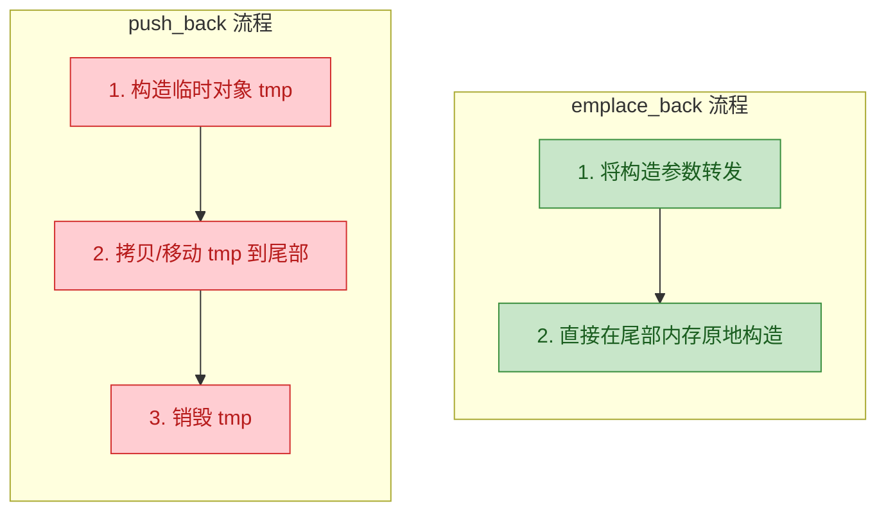

> 💡 **总结**：对于简单类型（`int`, `double`），两者性能几乎无差别。对于**构造开销大的对象**（如 `std::string`、自定义类），`emplace_back` 可以省去一次拷贝或移动，推荐优先使用。

#### pop_back

```c++
std::vector<int> v = {1, 2, 3};  // 初始化 {1, 2, 3}
v.pop_back();                     // 移除尾部元素，v 变为 {1, 2}
// 注意：pop_back() 不返回被删除的值！如果需要，先用 back() 取出
```

#### insert 与 erase

`vector` 的中间插入/删除效率为 **O(n)**，因为需要移动后续所有元素。

```c++
#include <vector>    // vector 头文件
#include <iostream>  // 标准输入输出

int main() {
    std::vector<int> v = {10, 20, 30, 40, 50};  // 初始化

    // ====== insert：在指定位置之前插入 ======
    auto it = v.begin() + 2;         // 迭代器指向下标 2 的位置（值 30）
    v.insert(it, 25);                // 在 30 前面插入 25 → {10, 20, 25, 30, 40, 50}
    // ⚠️ insert 之后，it 可能已失效（若发生扩容），不要再使用旧 it

    // ====== erase：删除指定位置的元素 ======
    v.erase(v.begin());              // 删除第一个元素 → {20, 25, 30, 40, 50}

    // ====== erase 范围：删除一个区间 [first, last) ======
    v.erase(v.begin() + 1, v.begin() + 3); // 删除下标 1~2 → {20, 40, 50}

    for (int x : v) {                // 遍历输出
        std::cout << x << " ";       // 输出: 20 40 50
    }
    std::cout << std::endl;

    return 0;
}
```

#### 各操作的时间复杂度一览

| 操作 | 时间复杂度 | 说明 |
|------|:---:|------|
| `push_back` / `emplace_back` | **均摊 O(1)** | 偶尔触发扩容时为 O(n) |
| `pop_back` | **O(1)** | 仅移除尾部 |
| `insert` (中间) | **O(n)** | 需移动后续元素 |
| `erase` (中间) | **O(n)** | 需移动后续元素 |
| `operator[]` / `at` | **O(1)** | 随机访问 |
| `front` / `back` | **O(1)** | 首尾访问 |
| `clear` | **O(n)** | 需逐个析构元素 |

---

### 迭代器（Iterator）

迭代器是 STL 的灵魂概念。`vector` 的迭代器属于**随机访问迭代器（Random Access Iterator）**，是功能最强大的一类，支持 `+n`、`-n`、`<`、`>` 等运算。

#### 迭代器的基本使用

```c++
#include <vector>    // vector 头文件
#include <iostream>  // 标准输入输出

int main() {
    std::vector<int> v = {10, 20, 30, 40, 50};  // 初始化

    // ====== 正向迭代 ======
    // begin() 指向第一个元素，end() 指向最后一个元素的"下一个位置"（past-the-end）
    for (std::vector<int>::iterator it = v.begin(); it != v.end(); ++it) {
        std::cout << *it << " ";     // 解引用 *it 获取元素值
    }
    // 输出: 10 20 30 40 50
    std::cout << std::endl;

    // ====== 使用 auto 简化（C++11 起，强烈推荐）======
    for (auto it = v.begin(); it != v.end(); ++it) {
        *it += 100;                  // 通过迭代器修改元素值
    }
    // v 变为 {110, 120, 130, 140, 150}

    // ====== 反向迭代 ======
    for (auto rit = v.rbegin(); rit != v.rend(); ++rit) {
        std::cout << *rit << " ";    // 从尾到头遍历
    }
    // 输出: 150 140 130 120 110
    std::cout << std::endl;

    // ====== const 迭代器（只读，不可修改元素）======
    for (auto cit = v.cbegin(); cit != v.cend(); ++cit) {
        std::cout << *cit << " ";    // 只能读取，不能写入
        // *cit = 0; // ❌ 编译错误！cbegin() 返回 const_iterator
    }
    std::cout << std::endl;

    return 0;
}
```

#### 迭代器类型总览

```mermaid
graph LR
    subgraph ForwardIter["正向迭代器"]
        direction TB
        F1["begin()"]
        F2["end()"]
        F3["cbegin() - const"]
        F4["cend() - const"]
    end

    subgraph ReverseIter["反向迭代器"]
        direction TB
        R1["rbegin()"]
        R2["rend()"]
        R3["crbegin() - const"]
        R4["crend() - const"]
    end

    subgraph Capability["随机访问能力"]
        direction TB
        C1["it + n / it - n"]
        C2["it1 - it2 得距离"]
        C3["it[n] 下标访问"]
        C4["比较: 〈 〉 〈= 〉="]
    end

    ForwardIter ~~~ ReverseIter ~~~ Capability

    classDef fwdStyle fill:#BBDEFB,stroke:#1976D2,color:#0D47A1
    classDef revStyle fill:#D1C4E9,stroke:#7B1FA2,color:#4A148C
    classDef capStyle fill:#FFF9C4,stroke:#F9A825,color:#F57F17

    class F1,F2,F3,F4 fwdStyle
    class R1,R2,R3,R4 revStyle
    class C1,C2,C3,C4 capStyle
```

用 ASCII 图来直观地理解 `begin()` 和 `end()` 的指向关系：

```c++
// vector v = {10, 20, 30, 40, 50}
//
//  begin()                                     end()
//    |                                           |
//    v                                           v
//  +------+------+------+------+------+--------------------+
//  |  10  |  20  |  30  |  40  |  50  |  past-the-end      |
//  +------+------+------+------+------+--------------------+
//  [0]    [1]    [2]    [3]    [4]       ← 不可解引用!
//
//  rbegin() 指向 50（逻辑上的反向第一个）
//  rend()   指向 10 之前的位置（逻辑上的反向 past-the-end）
```

#### ⚠️ 迭代器失效问题（Iterator Invalidation）

这是 `vector` 使用中**最容易犯错**的地方，也是面试超高频考点。

**导致迭代器失效的操作**：

| 操作 | 失效范围 |
|------|---------|
| `push_back` / `emplace_back` | 若触发扩容 → **全部失效**；未扩容 → 仅 `end()` 失效 |
| `insert` | 若触发扩容 → **全部失效**；未扩容 → 插入点及其之后的失效 |
| `erase` | 被删除元素及其**之后的**全部失效 |
| `clear` / `assign` / `resize` | **全部失效** |

**经典错误示例——在遍历中删除元素**：

```c++
#include <vector>    // vector 头文件
#include <iostream>  // 标准输入输出

int main() {
    std::vector<int> v = {1, 2, 3, 2, 4, 2, 5};  // 含重复值 2

    // ====== ❌ 错误写法：erase 后继续使用旧迭代器 ======
    // for (auto it = v.begin(); it != v.end(); ++it) {
    //     if (*it == 2) {
    //         v.erase(it);  // erase 之后 it 已经失效
    //         // 下一次循环的 ++it 是未定义行为（UB）！
    //     }
    // }

    // ====== ✅ 正确写法：利用 erase 的返回值更新迭代器 ======
    for (auto it = v.begin(); it != v.end(); /* 不在这里 ++ */) {
        if (*it == 2) {
            it = v.erase(it);  // erase 返回指向被删元素下一个元素的有效迭代器
        } else {
            ++it;              // 不删除时才手动前进
        }
    }

    for (int x : v) {           // 遍历打印结果
        std::cout << x << " ";  // 输出: 1 3 4 5
    }
    std::cout << std::endl;

    return 0;
}
```

> 💡 **更优雅的写法（Erase-Remove Idiom）**：利用 `<algorithm>` 中的 `std::remove` 配合 `erase`，一行搞定：

```c++
#include <vector>     // vector 头文件
#include <algorithm>  // std::remove 算法
#include <iostream>   // 标准输入输出

int main() {
    std::vector<int> v = {1, 2, 3, 2, 4, 2, 5};  // 含重复值 2

    // std::remove 把所有不等于 2 的元素移到前面，返回"新逻辑末尾"的迭代器
    // erase 从该位置到 end() 删除剩余的"垃圾"元素
    v.erase(std::remove(v.begin(), v.end(), 2), v.end());

    for (int x : v) {           // 遍历打印
        std::cout << x << " ";  // 输出: 1 3 4 5
    }
    std::cout << std::endl;

    // C++20 更简洁：std::erase(v, 2); 一步到位
    return 0;
}
```

---

### 实用技巧与常见模式

#### 二维 vector（矩阵）

```c++
#include <vector>    // vector 头文件
#include <iostream>  // 标准输入输出

int main() {
    int rows = 3, cols = 4;   // 3 行 4 列

    // 构造 3x4 的二维 vector，所有元素初始化为 0
    std::vector<std::vector<int>> matrix(rows, std::vector<int>(cols, 0));
    //          外层 vector 有 rows 个元素，每个元素是 vector<int>(cols, 0)

    matrix[1][2] = 42;        // 访问第 2 行第 3 列，赋值 42

    // 嵌套范围 for 遍历
    for (const auto& row : matrix) {      // row 是 const vector<int>&
        for (int val : row) {             // val 是 int（拷贝，因为 int 很小）
            std::cout << val << "\t";     // tab 分隔
        }
        std::cout << std::endl;
    }
    return 0;
}
```

#### swap 技巧：释放多余内存

`clear()` 会把 `size` 变为 0，但 **capacity 不变**，内存仍然被占着。如果你想真正释放内存：

```c++
#include <vector>    // vector 头文件
#include <iostream>  // 标准输入输出

int main() {
    std::vector<int> v(10000, 1);  // 分配 10000 个元素

    v.clear();                     // size=0，但 capacity 仍然 >= 10000
    std::cout << "After clear - capacity: " << v.capacity() << std::endl;

    // ====== 方法一：swap 技巧（C++11 之前的经典做法）======
    std::vector<int>().swap(v);    // 用一个空 vector 与 v 交换，v 的内存被释放
    std::cout << "After swap  - capacity: " << v.capacity() << std::endl; // 0

    // ====== 方法二：shrink_to_fit()（C++11 起，更直观但不保证）======
    v.assign(10000, 1);            // 重新填充
    v.clear();                     // size=0
    v.shrink_to_fit();             // 请求释放多余内存（实现可以忽略此请求）
    std::cout << "After shrink - capacity: " << v.capacity() << std::endl;

    return 0;
}
```

#### vector\<bool\> 的特殊性

`std::vector<bool>` 是一个**特化版本**，它将每个 `bool` 压缩为 **1 bit** 而非 1 byte，以节省空间。但这带来了严重的副作用：

- `operator[]` 返回的不是 `bool&`，而是一个**代理对象（Proxy Object）**。
- 无法获取元素的真实地址（`&v[0]` 不合法）。
- 与泛型代码的兼容性很差。

> ⚠️ **工程建议**：如果你需要一个真正的 `bool` 数组，使用 `std::vector<char>` 或 `std::deque<bool>` 替代。如果你需要位操作，用 `std::bitset`。

---

### 本节知识脉络总结

```mermaid
graph LR
    subgraph Core["vector 核心"]
        direction TB
        C1["连续内存布局"]
        C2["size vs capacity"]
        C3["自动扩容 x2/x1.5"]
    end

    subgraph Operations["增删操作"]
        direction TB
        O1["push_back / emplace_back"]
        O2["pop_back"]
        O3["insert / erase O-n"]
        O4["Erase-Remove Idiom"]
    end

    subgraph Iterators["迭代器"]
        direction TB
        I1["Random Access Iterator"]
        I2["begin / end / rbegin / rend"]
        I3["迭代器失效规则 !!!"]
    end

    subgraph Tips["实用技巧"]
        direction TB
        T1["reserve 预分配"]
        T2["swap 释放内存"]
        T3["避免 vector-bool"]
    end

    Core --> Operations --> Iterators --> Tips

    classDef coreStyle fill:#C8E6C9,stroke:#2E7D32,color:#1B5E20
    classDef opsStyle fill:#BBDEFB,stroke:#1565C0,color:#0D47A1
    classDef iterStyle fill:#FFE0B2,stroke:#EF6C00,color:#E65100
    classDef tipStyle fill:#F3E5F5,stroke:#8E24AA,color:#4A148C

    class C1,C2,C3 coreStyle
    class O1,O2,O3,O4 opsStyle
    class I1,I2,I3 iterStyle
    class T1,T2,T3 tipStyle
```

---

**📝 练习题**

以下代码的输出是什么？

```c++
#include <vector>
#include <iostream>

int main() {
    std::vector<int> v;
    v.reserve(10);
    v.push_back(1);
    v.push_back(2);
    v.push_back(3);

    std::cout << v.size() << " " << v.capacity() << std::endl;
    
    v.resize(6);
    std::cout << v.size() << " " << v.capacity() << std::endl;
    
    v.shrink_to_fit();
    std::cout << v.size() << " " << v.capacity() << std::endl;

    return 0;
}
```

A. `3 10` → `6 10` → `6 6`


B. `3 3` → `6 6` → `6 6`


C. `3 10` → `6 6` → `6 6`


D. `3 10` → `6 10` → `6 10`


**【答案】** A

**【解析】**

1. `reserve(10)` 将 capacity 预分配到 10，但 size 仍为 0。之后三次 `push_back` 让 size 变为 3，capacity 不变（因为 3 < 10 未触发扩容）。所以第一行输出 `3 10`。

2. `resize(6)` 将 size 扩展到 6（新增的 3 个元素被值初始化为 0），但当前 capacity = 10 已足够容纳 6 个元素，因此 capacity **不变**。第二行输出 `6 10`。

3. `shrink_to_fit()` 向编译器**请求**将 capacity 缩减到与 size 相等。虽然标准说这是 non-binding request（实现可以忽略），但**主流实现（GCC / Clang / MSVC）通常都会执行**，所以 capacity 缩减为 6。第三行输出 `6 6`。

> ⚡ 面试追问点：如果选 D，说明不理解 `shrink_to_fit` 的作用；如果选 B，说明混淆了 `reserve` 和 `resize` 的区别——`reserve` **只改 capacity 不改 size**。

---

**📝 练习题**

下面代码存在什么问题？

```c++
std::vector<int> v = {1, 2, 3, 4, 5};
auto it = v.begin() + 2;  // 指向元素 3
v.push_back(6);
std::cout << *it << std::endl;
```

A. 没有任何问题，输出 `3`


B. 编译错误，`auto` 不能推导迭代器类型


C. 迭代器 `it` 可能失效，解引用 `*it` 是未定义行为（UB）


D. `push_back` 不允许在获取迭代器后调用


**【答案】** C

**【解析】** `push_back(6)` 之后，如果 `size()` 超过了 `capacity()`，`vector` 会触发**扩容**：申请新内存 → 拷贝旧元素 → 释放旧内存。此时 `it` 仍然指向**旧内存地址**，该地址已被释放，解引用它是**未定义行为（Undefined Behavior）**。即使本次没有触发扩容（capacity 恰好够用），标准也规定 `push_back` 后 `end()` 迭代器失效。而在可能扩容的情况下，**所有迭代器、指针、引用全部失效**。正确做法是在 `push_back` 之后重新获取迭代器。

---

## string（字符串操作）

在 C++ 的世界里，字符串处理是最高频的操作之一。C 语言时代，我们只能依赖 `char[]` 数组和一系列 `str*` 函数（如 `strlen`, `strcpy`, `strcat`）来操纵字符串，这不仅繁琐，而且极易引发 **缓冲区溢出（Buffer Overflow）** 等内存安全问题。C++ 标准库提供的 `std::string` 类彻底改变了这一局面——它将动态内存管理、长度追踪、边界安全等底层细节全部封装起来，让开发者可以像使用 Python 字符串一样自然地操作文本，同时保持 C++ 的高性能特性。

`std::string` 定义在头文件 `<string>` 中，它本质上是模板类 `std::basic_string<char>` 的一个 **类型别名（type alias）**。这意味着它底层仍然是一个管理 `char` 序列的动态数组容器，与 `std::vector<char>` 有诸多相似之处，但额外提供了大量专为文本处理设计的成员函数。

```mermaid
graph LR
    subgraph Foundation["🧱 底层基础"]
        direction TB
        A["char 数组 / C-String"]
        B["std::basic_string〈charT〉<br/>模板基类"]
    end

    subgraph Aliases["📦 常用类型别名"]
        direction TB
        C["std::string<br/>basic_string〈char〉"]
        D["std::wstring<br/>basic_string〈wchar_t〉"]
        E["std::u16string<br/>basic_string〈char16_t〉"]
        F["std::u32string<br/>basic_string〈char32_t〉"]
    end

    subgraph Features["✨ 核心能力"]
        direction TB
        G["动态内存管理"]
        H["丰富的文本 API"]
        I["运算符重载<br/>+ == 〈 〉 []"]
        J["与 C-String 互操作"]
    end

    A --> B
    B --> Aliases
    Aliases --> Features

    classDef base fill:#FFF3E0,stroke:#FF9800,color:#E65100,stroke-width:2px
    classDef alias fill:#E3F2FD,stroke:#1E88E5,color:#0D47A1,stroke-width:2px
    classDef feat fill:#E8F5E9,stroke:#43A047,color:#1B5E20,stroke-width:2px

    class A,B base
    class C,D,E,F alias
    class G,H,I,J feat
```

### 构造与初始化

`std::string` 提供了极为丰富的构造方式，覆盖了从空串到复杂子串拷贝的各种场景。理解这些构造函数是灵活使用 string 的第一步。

```cpp
#include <string>  // 必须包含此头文件
#include <iostream>
using namespace std;

int main() {
    // ========== 1. 默认构造：创建空字符串 ==========
    string s1;                        // s1 = ""，长度为0

    // ========== 2. 从 C 风格字符串（const char*）构造 ==========
    string s2("Hello, C++");          // 直接用字面量初始化
    string s2b = "Hello, C++";        // 等价写法（拷贝初始化）

    // ========== 3. 拷贝构造：从另一个 string 复制 ==========
    string s3(s2);                    // s3 是 s2 的完整副本（深拷贝）
    string s3b = s2;                  // 等价写法

    // ========== 4. 移动构造（C++11）：窃取临时对象的资源 ==========
    string s4(std::move(s1));         // s4 接管 s1 的内部缓冲区，s1 变为空

    // ========== 5. 填充构造：用 n 个相同字符填充 ==========
    string s5(10, '*');               // s5 = "**********"（10个星号）

    // ========== 6. 子串构造：从已有字符串截取一段 ==========
    string s6(s2, 7, 3);             // 从 s2 的第7个字符起，取3个字符 → "C++"
    // 参数：(源字符串, 起始位置, 截取长度)
    // 如果省略第三个参数，则截取到末尾

    // ========== 7. 迭代器范围构造 ==========
    string s7(s2.begin(), s2.begin() + 5);  // 取 s2 前5个字符 → "Hello"

    // ========== 8. 初始化列表构造（C++11） ==========
    string s8{'H', 'i', '!'};        // s8 = "Hi!"

    // 输出验证
    cout << "s2: " << s2 << endl;     // Hello, C++
    cout << "s5: " << s5 << endl;     // **********
    cout << "s6: " << s6 << endl;     // C++
    cout << "s7: " << s7 << endl;     // Hello

    return 0;
}
```

这里特别要强调**深拷贝（Deep Copy）** 与 **移动语义（Move Semantics）** 的区别。拷贝构造会分配新的堆内存并逐字节复制内容，时间复杂度为 O(n)；而移动构造仅仅交换内部指针，时间复杂度为 O(1)。在处理大字符串时，移动语义带来的性能提升是非常可观的。

```
 拷贝构造 (Deep Copy)                 移动构造 (Move)
 ┌──────────┐    ┌──────────┐        ┌──────────┐    ┌──────────┐
 │   s2     │    │   s3     │        │ s1(原)   │    │ s4(新)   │
 │ ptr ─────┼──→ │ ptr ─────┼──→     │ ptr ──┐  │    │ ptr ──┐  │
 │ len: 10  │    │ len: 10  │        │ len:5 │  │    │ len:5 │  │
 └──────────┘    └──────────┘        └───────┼──┘    └───────┼──┘
      │               │                      │    ✂️ 剪切      │
      ▼               ▼                      └──────→ X       ▼
 ┌──────────┐    ┌──────────┐              ┌──────────────────────┐
 │"Hello,C+"│    │"Hello,C+"│              │     "Hello"          │
 │  堆内存1  │    │  堆内存2  │              │    (同一块堆内存)      │
 └──────────┘    └──────────┘              └──────────────────────┘
  两块独立内存，内容相同                     s1.ptr 被置空，s4 接管资源
```

### 容量与大小

了解 string 的"大小"相关接口，是避免越界、优化性能的关键。`size()` / `length()` 返回的是字符数量（不含末尾的 `\0`），而 `capacity()` 返回的是当前已分配的内存能容纳的字符数。两者的关系类似于 `vector` 的 `size` 与 `capacity`。

```cpp
#include <string>
#include <iostream>
using namespace std;

int main() {
    string s = "Hello";

    // ========== 基本大小查询 ==========
    cout << s.size()     << endl;  // 5  —— 字符个数
    cout << s.length()   << endl;  // 5  —— 与 size() 完全等价
    cout << s.capacity() << endl;  // >= 5，通常为 15（SSO）或更大
    cout << s.empty()    << endl;  // 0 (false)，非空
    cout << s.max_size() << endl;  // 理论最大长度，通常为一个极大的值

    // ========== 主动管理容量 ==========
    s.reserve(100);                // 预分配至少100字符的空间（不改变内容）
    cout << s.capacity() << endl;  // >= 100
    cout << s.size()     << endl;  // 仍然是 5，内容未变

    s.shrink_to_fit();             // 请求释放多余内存（C++11，非强制）
    cout << s.capacity() << endl;  // 可能回落到接近 size() 的值

    // ========== 调整大小 ==========
    s.resize(10, '!');             // 扩展到10个字符，新位置用 '!' 填充
    cout << s << endl;             // "Hello!!!!!"
    cout << s.size() << endl;      // 10

    s.resize(3);                   // 截断到3个字符
    cout << s << endl;             // "Hel"

    return 0;
}
```

这里有一个非常重要的底层优化概念——**SSO（Small String Optimization，小字符串优化）**。大多数主流标准库实现（如 libstdc++、libc++、MSVC STL）都会在 `string` 对象**内部**预留一小块栈上缓冲区（通常为 15~22 字节）。当字符串足够短时，内容直接存放在对象本身内部，**完全不需要堆分配（heap allocation）**。只有当字符串超过这个阈值时，才会退化为堆上分配。这个优化对短字符串密集的场景（如 JSON 解析、日志系统）能带来显著的性能提升。

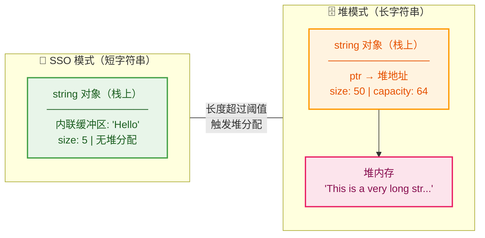

### 元素访问

访问字符串中的单个字符有两种主流方式：`operator[]` 和 `at()`。它们的核心差异在于**边界检查（Bounds Checking）**。

```cpp
#include <string>
#include <iostream>
#include <stdexcept>
using namespace std;

int main() {
    string s = "ABCDEF";

    // ========== operator[] —— 无边界检查，极致性能 ==========
    cout << s[0] << endl;          // 'A' —— 第一个字符
    cout << s[5] << endl;          // 'F' —— 最后一个字符
    s[0] = 'Z';                    // 可以直接修改：s 变为 "ZBCDEF"
    // s[100] → 未定义行为！不会抛异常，可能读到垃圾值或直接崩溃

    // ========== at() —— 有边界检查，更安全 ==========
    cout << s.at(1) << endl;       // 'B'
    try {
        cout << s.at(100) << endl; // 越界！抛出 std::out_of_range 异常
    } catch (const out_of_range& e) {
        cout << "越界异常: " << e.what() << endl;  // 会执行到这里
    }

    // ========== front() / back() —— 快捷访问首尾 ==========
    cout << s.front() << endl;     // 'Z' —— 等价于 s[0]
    cout << s.back()  << endl;     // 'F' —— 等价于 s[s.size()-1]

    // ========== c_str() / data() —— 获取底层 C 字符串 ==========
    const char* p = s.c_str();     // 返回以 '\0' 结尾的 const char*
    cout << p << endl;             // "ZBCDEF"
    // 常用于与 C 库函数（如 fopen, printf）交互

    return 0;
}
```

**选用建议**：在性能敏感的内循环中使用 `operator[]`（前提是你能保证索引合法）；在外部输入、不确定长度的场景中使用 `at()` 以获得安全的异常保护。`front()` 和 `back()` 在空字符串上调用同样是**未定义行为（Undefined Behavior）**，使用前务必检查 `empty()`。

### 修改操作

这是 `std::string` 最丰富的能力区——拼接、插入、替换、删除、追加等操作应有尽有。

```cpp
#include <string>
#include <iostream>
using namespace std;

int main() {
    // ============================================
    //  1. 追加（Append）—— 在末尾添加内容
    // ============================================
    string s = "Hello";
    s += " World";                 // 运算符重载，最直观的追加方式
    s.append("!!!");               // 等价方式，函数调用
    s.append(3, '?');              // 追加3个 '?' → "Hello World!!!???"
    s.push_back('~');              // 追加单个字符 → "Hello World!!!???~"
    cout << s << endl;

    // ============================================
    //  2. 插入（Insert）—— 在任意位置插入内容
    // ============================================
    string t = "HelloWorld";
    t.insert(5, ", ");             // 在位置5插入 ", " → "Hello, World"
    t.insert(0, ">> ");            // 在开头插入 → ">> Hello, World"
    t.insert(t.end(), '!');        // 用迭代器在末尾插入 → ">> Hello, World!"
    cout << t << endl;

    // ============================================
    //  3. 删除（Erase）—— 移除字符
    // ============================================
    string u = "ABCDEFGH";
    u.erase(2, 3);                 // 从位置2开始，删除3个字符 → "ABFGH"
    u.erase(u.begin());            // 删除第一个字符 → "BFGH"
    u.erase(u.end() - 1);         // 删除最后一个字符 → "BFG"
    cout << u << endl;

    // ============================================
    //  4. 替换（Replace）—— 用新内容替换一段区间
    // ============================================
    string v = "I love Java";
    v.replace(7, 4, "C++");        // 从位置7起，将4个字符替换为 "C++"
    cout << v << endl;             // "I love C++"
    // 注意：替换内容长度可以不等于被替换长度，string 会自动调整

    // ============================================
    //  5. 清空（Clear）与赋值（Assign）
    // ============================================
    string w = "temporary";
    w.clear();                     // 清空内容，size 变为 0，但 capacity 不变
    cout << w.empty() << endl;     // 1 (true)

    w.assign("New Content");       // 重新赋值
    w = "Also Works";              // 赋值运算符，等价方式
    cout << w << endl;

    return 0;
}
```

关于 **`+` 拼接 vs `append` vs `+=`** 的性能差异，这是面试中常见的考点：

| 方式 | 示例 | 性能特点 |
|------|------|----------|
| `operator+` | `s = a + b + c` | 每次 `+` 产生一个 **临时对象**，多次拼接会导致多次堆分配（C++11 后移动语义可缓解） |
| `operator+=` | `s += a; s += b;` | 原地追加，无临时对象，性能优于 `+` |
| `append()` | `s.append(a).append(b)` | 与 `+=` 性能相当，且支持链式调用 |
| `reserve` + `append` | 先预分配再追加 | **最优方案**：预先计算总长度，一次性分配，避免多次扩容 |

```cpp
// 高性能字符串拼接的最佳实践
string build_greeting(const string& name, int age) {
    string result;
    result.reserve(50);             // 预估总长度，一次性分配
    result.append("Hello, ");       // 无需重新分配
    result.append(name);            // 无需重新分配
    result.append("! You are ");    // 无需重新分配
    result.append(to_string(age));  // to_string 将 int 转为 string
    result.append(" years old.");   // 无需重新分配
    return result;                  // RVO/NRVO 优化，通常无拷贝
}
```

### 查找与搜索

`std::string` 提供了一整套查找接口，能应对绝大多数文本搜索需求。所有查找函数在**找不到目标**时返回 `string::npos`（一个值为 `-1` 的 `size_t` 常量，实际是一个极大的无符号数）。

```cpp
#include <string>
#include <iostream>
using namespace std;

int main() {
    string text = "C++ is powerful. C++ is fast. C++ is everywhere.";

    // ========== find —— 从左向右查找第一次出现的位置 ==========
    size_t pos1 = text.find("C++");          // 返回 0（第一个 "C++" 在位置0）
    size_t pos2 = text.find("C++", 1);       // 从位置1开始找 → 返回 17
    size_t pos3 = text.find("Rust");         // 没找到 → 返回 string::npos
    cout << pos1 << ", " << pos2 << endl;    // 0, 17

    // 判断是否找到的标准写法
    if (text.find("Rust") == string::npos) {
        cout << "未找到 Rust" << endl;        // 会执行到这里
    }

    // ========== rfind —— 从右向左查找（最后一次出现） ==========
    size_t last = text.rfind("C++");         // 返回 30（最后一个 "C++"）
    cout << "最后出现位置: " << last << endl;

    // ========== find_first_of / find_last_of —— 查找字符集合中的任意字符 ==========
    string vowels = "aeiou";
    size_t v1 = text.find_first_of(vowels);  // 找到第一个元音字母的位置
    size_t v2 = text.find_last_of(vowels);   // 找到最后一个元音字母的位置
    cout << "第一个元音在位置: " << v1 << endl;

    // ========== find_first_not_of —— 查找第一个 不在 集合中的字符 ==========
    string digits = "0123456789";
    string mixed = "123abc456";
    size_t non_digit = mixed.find_first_not_of(digits);  // 返回 3（'a' 的位置）
    cout << "第一个非数字在位置: " << non_digit << endl;

    return 0;
}
```

这些查找函数构成了一个对称的体系，可以用下表来梳理：

| 函数 | 方向 | 含义 |
|------|------|------|
| `find(str, pos)` | → 正向 | 从 pos 起向右找 str 第一次出现 |
| `rfind(str, pos)` | ← 逆向 | 从 pos 起向左找 str 最后一次出现 |
| `find_first_of(chars)` | → 正向 | 找 chars 中任意字符的**第一个**出现位置 |
| `find_last_of(chars)` | ← 逆向 | 找 chars 中任意字符的**最后一个**出现位置 |
| `find_first_not_of(chars)` | → 正向 | 找**不在** chars 中的第一个字符 |
| `find_last_not_of(chars)` | ← 逆向 | 找**不在** chars 中的最后一个字符 |

### 子串与比较

```cpp
#include <string>
#include <iostream>
using namespace std;

int main() {
    string s = "Hello, World!";

    // ========== substr —— 提取子串 ==========
    string sub1 = s.substr(7);       // 从位置7到末尾 → "World!"
    string sub2 = s.substr(0, 5);    // 从位置0取5个字符 → "Hello"
    cout << sub1 << endl;
    cout << sub2 << endl;

    // ========== compare —— 字典序比较 ==========
    string a = "apple";
    string b = "banana";
    int cmp = a.compare(b);         // < 0，因为 "apple" < "banana"
    // 返回值：< 0 表示 a 在 b 前面，0 表示相等，> 0 表示 a 在 b 后面

    // 更常用的方式：直接使用关系运算符
    if (a == b) cout << "相等" << endl;
    if (a != b) cout << "不等" << endl;     // ✓ 会执行
    if (a < b)  cout << "a 更小" << endl;   // ✓ 会执行（字典序）
    // ==, !=, <, >, <=, >= 全部支持，且可与 const char* 混用

    // ========== starts_with / ends_with（C++20） ==========
    string url = "https://www.example.com";
    // C++20 新增，非常实用
    // cout << url.starts_with("https") << endl;  // 1 (true)
    // cout << url.ends_with(".com")    << endl;   // 1 (true)

    // C++20 之前的替代方案
    bool starts = (url.find("https") == 0);               // 判断前缀
    bool ends   = (url.rfind(".com") == url.size() - 4);   // 判断后缀
    cout << starts << ", " << ends << endl;                // 1, 1

    return 0;
}
```

`substr()` 会创建一个**新的 string 对象**（涉及堆分配和拷贝），如果只是想"查看"子串而不需要拥有它，C++17 引入的 `std::string_view` 是一个零开销的替代方案。它只持有一个指针和长度，不拥有内存，非常适合只读场景。

### 数值转换

在实际开发中，字符串与数值之间的相互转换是极其常见的需求（如读取配置文件、解析用户输入）。C++11 提供了一组简洁的全局函数来完成这项工作。

```cpp
#include <string>
#include <iostream>
using namespace std;

int main() {
    // ========== string → 数值 ==========
    string s1 = "42";
    string s2 = "3.14159";
    string s3 = "0xFF";

    int    n1 = stoi(s1);           // string to int → 42
    long   n2 = stol(s1);           // string to long
    float  f1 = stof(s2);           // string to float → 3.14159
    double d1 = stod(s2);           // string to double
    int    n3 = stoi(s3, nullptr, 16);  // 十六进制转换 → 255
    // stoi 第三个参数指定进制：0(自动检测), 2, 8, 10, 16 等

    cout << n1 << ", " << d1 << ", " << n3 << endl;

    // 如果转换失败会抛异常
    try {
        int bad = stoi("not_a_number"); // 抛出 std::invalid_argument
    } catch (const invalid_argument& e) {
        cout << "转换失败: " << e.what() << endl;
    }

    try {
        int overflow = stoi("99999999999999999"); // 抛出 std::out_of_range
    } catch (const out_of_range& e) {
        cout << "数值溢出: " << e.what() << endl;
    }

    // ========== 数值 → string ==========
    string from_int    = to_string(42);        // "42"
    string from_double = to_string(3.14);      // "3.140000"（注意精度）
    string from_bool   = to_string(true);      // "1"

    cout << from_int << ", " << from_double << endl;

    return 0;
}
```

完整的转换函数族：

| 函数 | 目标类型 | 函数 | 目标类型 |
|------|---------|------|---------|
| `stoi` | `int` | `stoul` | `unsigned long` |
| `stol` | `long` | `stoull` | `unsigned long long` |
| `stoll` | `long long` | `stof` | `float` |
| `stod` | `double` | `stold` | `long double` |

> **注意**：`to_string(double)` 默认输出 6 位小数，如果需要精确控制格式，应使用 `std::ostringstream` 或 C++20 的 `std::format`。

### 常用算法与技巧

标准库 `<algorithm>` 中的通用算法对 string 同样适用，因为 string 满足**随机访问迭代器（RandomAccessIterator）** 的要求。

```cpp
#include <string>
#include <algorithm>  // sort, reverse, transform, ...
#include <iostream>
#include <cctype>     // toupper, tolower, isdigit, isalpha ...
using namespace std;

int main() {
    // ========== 1. 排序 ==========
    string s = "dcba";
    sort(s.begin(), s.end());       // 按 ASCII 升序排列
    cout << s << endl;              // "abcd"

    // ========== 2. 反转 ==========
    string r = "Hello";
    reverse(r.begin(), r.end());    // 原地反转
    cout << r << endl;              // "olleH"

    // ========== 3. 大小写转换 ==========
    string text = "Hello, World!";
    // transform 对每个字符应用函数并写回
    transform(text.begin(), text.end(),  // 输入范围
              text.begin(),              // 输出起始位置（原地修改）
              ::toupper);                // 对每个 char 调用 toupper
    cout << text << endl;                // "HELLO, WORLD!"

    transform(text.begin(), text.end(), text.begin(), ::tolower);
    cout << text << endl;                // "hello, world!"

    // ========== 4. 统计字符出现次数 ==========
    string data = "abracadabra";
    int cnt = count(data.begin(), data.end(), 'a');  // 统计 'a' 的个数
    cout << "'a' 出现了 " << cnt << " 次" << endl;   // 5 次

    // ========== 5. 判断是否全是数字 ==========
    string num = "12345";
    bool all_digits = all_of(num.begin(), num.end(),
                             [](char c) { return isdigit(c); });
    cout << "全是数字: " << all_digits << endl;       // 1 (true)

    // ========== 6. 去除空白（Trim）—— 标准库无内置，手动实现 ==========
    string padded = "   Hello   ";
    // 去除前导空白
    size_t start = padded.find_first_not_of(" \t\n\r");
    // 去除尾部空白
    size_t end   = padded.find_last_not_of(" \t\n\r");
    // 提取中间内容
    string trimmed = (start == string::npos) ? "" : padded.substr(start, end - start + 1);
    cout << "[" << trimmed << "]" << endl;            // "[Hello]"

    return 0;
}
```

### string 与 C 风格字符串的互操作

在与 C 库函数、操作系统 API、第三方 C 接口打交道时，经常需要在 `std::string` 和 `const char*` 之间转换。

```cpp
#include <string>
#include <cstring>   // strlen, strcmp 等 C 函数
#include <cstdio>    // printf, snprintf
#include <iostream>
using namespace std;

int main() {
    // ========== string → const char* ==========
    string cpp_str = "Hello from C++";
    const char* c_str = cpp_str.c_str();   // 返回 '\0' 结尾的 C 字符串
    printf("C 风格输出: %s\n", c_str);      // 传给 C 函数

    // ⚠️ 注意：c_str() 返回的指针在 string 被修改/销毁后失效！
    // const char* dangling = cpp_str.c_str();
    // cpp_str += " modified";  // 可能触发重新分配
    // printf("%s\n", dangling); // 未定义行为！dangling 可能已经指向被释放的内存

    // ========== const char* → string ==========
    const char* raw = "Hello from C";
    string from_c(raw);                     // 隐式构造
    string from_c2 = raw;                   // 等价写法

    // ========== 与 C 函数混用 ==========
    cout << "长度: " << strlen(cpp_str.c_str()) << endl;   // C 方式取长度
    cout << "长度: " << cpp_str.size()          << endl;    // C++ 方式（推荐）

    return 0;
}
```

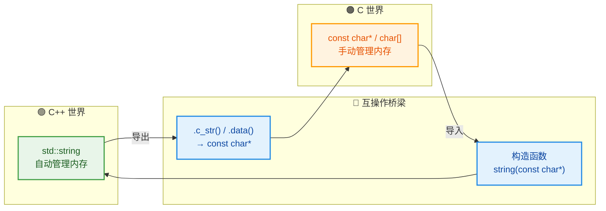

### string_view（C++17 高效只读视图）

`std::string_view` 是 C++17 引入的轻量级字符串引用类型。它**不拥有字符串数据**，仅保存一个指针和长度，类似于一个"只读窗口"。这使得它在传递字符串参数时可以避免不必要的拷贝和堆分配。

```cpp
#include <string>
#include <string_view>  // C++17
#include <iostream>
using namespace std;

// 使用 string_view 作为参数类型 —— 同时接受 string 和 const char*
void print_info(string_view sv) {
    // string_view 支持大部分 string 的只读操作
    cout << "内容: " << sv << endl;
    cout << "长度: " << sv.size() << endl;
    cout << "前3字符: " << sv.substr(0, 3) << endl;  // 返回 string_view，零拷贝！
}

int main() {
    string str = "Hello, string_view!";
    const char* cstr = "Hello, C string!";

    print_info(str);     // 从 string 隐式构造 string_view（零拷贝）
    print_info(cstr);    // 从 const char* 隐式构造 string_view（零拷贝）
    print_info("literal"); // 从字面量构造（零拷贝）

    // ⚠️ 危险用法 —— string_view 不拥有数据，原始数据销毁后 view 悬空
    // string_view dangling;
    // {
    //     string temp = "temporary";
    //     dangling = temp;          // dangling 指向 temp 的内部缓冲区
    // }  // temp 析构，缓冲区被释放
    // cout << dangling << endl;     // 未定义行为！悬空引用

    return 0;
}
```

**`string` vs `string_view` 选用指南**：

| 场景 | 推荐类型 | 理由 |
|------|---------|------|
| 需要**拥有**和修改字符串 | `string` | 拥有独立内存，可读可写 |
| 函数参数只需**只读**访问 | `string_view` | 零拷贝，兼容 string 和 char* |
| 需要**存储**字符串（类成员等） | `string` | string_view 不管理生命周期 |
| 高频解析/切片操作 | `string_view` | substr 返回 view 而非新 string |

### getline 与流操作

在读取用户输入时，`cin >> s` 会在遇到**空白字符（空格、制表符、换行符）** 时停止读取。如果需要读取一整行（包括其中的空格），就必须使用 `std::getline`。

```cpp
#include <string>
#include <iostream>
#include <sstream>   // istringstream, ostringstream
using namespace std;

int main() {
    // ========== getline —— 读取完整一行 ==========
    string line;
    cout << "请输入一行文字: ";
    getline(cin, line);              // 读取到换行符为止（换行符被丢弃）
    cout << "你输入了: " << line << endl;

    // 自定义分隔符（例如用逗号分隔）
    // getline(cin, line, ',');      // 读取到逗号为止

    // ========== istringstream —— 字符串流分割 ==========
    string csv = "Alice,Bob,Charlie,Diana";
    istringstream iss(csv);          // 将字符串包装为输入流
    string token;
    while (getline(iss, token, ',')) {  // 以逗号为分隔符逐段读取
        cout << "姓名: " << token << endl;
    }
    // 输出：
    // 姓名: Alice
    // 姓名: Bob
    // 姓名: Charlie
    // 姓名: Diana

    // ========== ostringstream —— 格式化拼接 ==========
    ostringstream oss;
    oss << "Pi = " << 3.14159 << ", e = " << 2.71828;
    string result = oss.str();       // 提取拼接结果
    cout << result << endl;          // "Pi = 3.14159, e = 2.71828"

    return 0;
}
```

`istringstream` + `getline` 的组合是一个**非常实用的字符串分割（split）模式**，弥补了 C++ 标准库中缺少原生 `split` 函数的不足。

```mermaid
graph LR
    subgraph Input["📥 输入方式"]
        direction TB
        A["cin >> str<br/>遇空白停止"]
        B["getline(cin, str)<br/>读取整行"]
        C["getline(iss, str, delim)<br/>自定义分隔符"]
    end

    subgraph Stream["🔄 字符串流"]
        direction TB
        D["istringstream<br/>string → 输入流"]
        E["ostringstream<br/>输出流 → string"]
    end

    subgraph Output["📤 典型用途"]
        direction TB
        F["分割字符串<br/>Split by delimiter"]
        G["格式化拼接<br/>Format & Concatenate"]
        H["类型转换<br/>Parse tokens"]
    end

    Input --> Stream
    Stream --> Output

    classDef input fill:#E8F5E9,stroke:#43A047,color:#1B5E20,stroke-width:2px
    classDef stream fill:#E3F2FD,stroke:#1E88E5,color:#0D47A1,stroke-width:2px
    classDef output fill:#FFF3E0,stroke:#FF9800,color:#E65100,stroke-width:2px

    class A,B,C input
    class D,E stream
    class F,G,H output
```

### string 的时间复杂度速查

在算法竞赛和系统级编程中，对各操作的时间复杂度了然于胸至关重要：

| 操作 | 时间复杂度 | 说明 |
|------|----------|------|
| `operator[]` / `at()` | **O(1)** | 随机访问 |
| `push_back()` | **均摊 O(1)** | 类似 vector 的动态扩容策略 |
| `append()` / `+=` | **均摊 O(k)** | k 为追加内容的长度 |
| `insert(pos, ...)` | **O(n)** | 需要移动 pos 之后的所有字符 |
| `erase(pos, len)` | **O(n)** | 需要移动后续字符填补空隙 |
| `find()` / `rfind()` | **O(n·m)** | n=串长, m=模式长度（朴素匹配） |
| `substr()` | **O(k)** | k 为子串长度，涉及堆分配和拷贝 |
| `compare()` / `==` | **O(min(n,m))** | 逐字符比较 |
| `c_str()` | **O(1)** | 仅返回指针 |
| `size()` / `length()` | **O(1)** | 内部缓存了长度值 |

---

**📝 练习题 1**

以下代码的输出结果是什么？

```cpp
#include <string>
#include <iostream>
using namespace std;

int main() {
    string s = "Hello, World!";
    s.erase(5, 7);
    s.insert(5, " C++");
    cout << s << endl;
    return 0;
}
```

A. `Hello C++!`


B. `Hello C++`


C. `Hello, C++!`


D. `Hello C++World!`


**【答案】** A

**【解析】** 初始字符串为 `"Hello, World!"`（长度 13）。`s.erase(5, 7)` 从位置 5 开始删除 7 个字符，即删除 `", World"`，剩余 `"Hello!"`（注意 `!` 仍在）。然后 `s.insert(5, " C++")` 在位置 5 插入 `" C++"`，得到 `"Hello C++!"`。关键是理解 `erase` 不会删除末尾的感叹号，因为从位置 5 开始的 7 个字符恰好是 `, Worl` 这 7 个字符（索引 5~11），而 `d!` 中的 `d` 是第 12 个位置……等一下，让我重新数：`H(0) e(1) l(2) l(3) o(4) ,(5) (6) W(7) o(8) r(9) l(10) d(11) !(12)`。从位置 5 删除 7 个字符即删除索引 5~11 的 `, World`，剩余 `"Hello!"`。再在位置 5 插入 `" C++"` 得到 `"Hello C++!"`。

---

**📝 练习题 2**

关于 `std::string` 和 `std::string_view`，以下说法**错误**的是：

A. `string_view` 的 `substr()` 返回一个新的 `string_view`，不涉及堆分配


B. `string_view` 可以作为类的成员变量安全地长期持有字符串数据


C. `string::c_str()` 返回的指针在 `string` 被修改后可能失效


D. SSO（小字符串优化）可以让短字符串避免堆分配


**【答案】** B

**【解析】** `std::string_view` 不拥有底层数据的所有权，它只是一个指向外部内存的"只读窗口"。如果原始字符串（`string` 对象或 `char` 数组）被销毁或修改，`string_view` 就会变成**悬空引用（dangling reference）**，访问它是未定义行为。因此，将 `string_view` 作为类成员变量**长期持有**是危险的做法——你无法保证外部数据的生命周期比 `string_view` 更长。需要持久存储字符串时，应使用 `std::string`。选项 A 正确，`string_view::substr` 返回的仍是 `string_view`，仅调整指针和长度。选项 C 正确，`string` 内部扩容可能导致重新分配内存，旧指针失效。选项 D 正确，SSO 是主流实现中的标准优化。

---

## map / unordered_map ⭐

在 C++ STL 中，`map` 和 `unordered_map` 是两种最核心的 **关联容器（Associative Containers）**。它们以 **键值对（Key-Value Pair）** 的形式存储数据，是日常开发中使用频率极高的数据结构。两者看似功能相近，但底层实现、性能特征和适用场景截然不同。本节将从底层原理到实战用法，全面剖析这两大容器。

---

### 核心概念：键值对与关联容器

关联容器的本质是提供一种 **通过 Key 快速检索 Value** 的能力。C++ 使用 `std::pair<const Key, Value>` 来表达一个键值对，而 `map` / `unordered_map` 就是管理这些 pair 的容器。

```cpp
// 一个最简单的键值对示例
#include <map>
#include <string>
#include <iostream>

int main() {
    // 创建一个 map，Key 是 string，Value 是 int
    std::map<std::string, int> ages;

    // 插入键值对：学生姓名 -> 年龄
    ages["Alice"] = 25;       // 使用 operator[] 插入
    ages["Bob"]   = 30;       // Key="Bob", Value=30
    ages["Carol"] = 28;       // Key="Carol", Value=28

    // 通过 Key 检索 Value
    std::cout << "Bob's age: " << ages["Bob"] << std::endl; // 输出 30

    return 0;
}
```

你可以把 `map` 想象成一本 **字典**：你通过"单词（Key）"去查找"释义（Value）"。而 `map` 和 `unordered_map` 的区别，就好比一本 **按字母排好序的字典** 与一本 **通过索引页跳转的字典**——前者有序但查找稍慢，后者无序但查找极快。

---

### std::map —— 有序映射

#### 底层结构：红黑树（Red-Black Tree）

`std::map` 的底层实现是一棵 **自平衡二叉搜索树（Self-Balancing BST）**，具体来说是 **红黑树（Red-Black Tree）**。红黑树是一种特殊的二叉搜索树，它通过对节点着色（红/黑）并在插入、删除时执行旋转操作，保证树的高度始终维持在 **O(log n)** 级别，从而确保所有核心操作的最坏时间复杂度都是对数级。

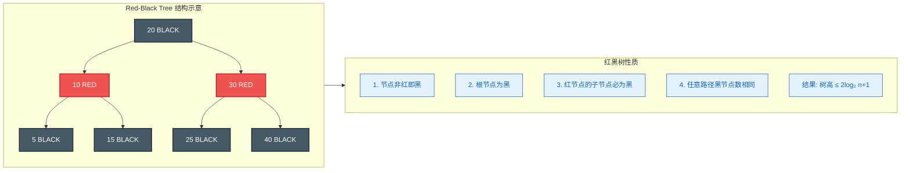

正因为底层是二叉搜索树，`map` 中的元素 **始终按 Key 的升序排列**（默认使用 `operator<` 比较）。这意味着你遍历 `map` 时，得到的结果一定是有序的。

#### 时间复杂度一览

| 操作 | 时间复杂度 | 说明 |
|------|-----------|------|
| 插入 `insert` / `emplace` | O(log n) | 红黑树查找位置 + 可能的旋转 |
| 删除 `erase` | O(log n) | 查找 + 删除 + 可能的旋转 |
| 查找 `find` / `count` | O(log n) | 二叉搜索 |
| `operator[]` / `at()` | O(log n) | 本质是查找操作 |
| 遍历（全部） | O(n) | 中序遍历 |

#### 构造与初始化

```cpp
#include <map>
#include <string>

int main() {
    // 1. 默认构造：空 map
    std::map<std::string, int> m1;

    // 2. 初始化列表构造 (C++11)
    std::map<std::string, int> m2 = {
        {"apple",  3},   // Key="apple",  Value=3
        {"banana", 5},   // Key="banana", Value=5
        {"cherry", 2}    // Key="cherry", Value=2
    };

    // 3. 拷贝构造
    std::map<std::string, int> m3(m2);  // m3 是 m2 的深拷贝

    // 4. 范围构造：从另一个容器的迭代器区间构造
    std::map<std::string, int> m4(m2.begin(), m2.end());

    // 5. 自定义排序：使用 std::greater 让 Key 降序排列
    std::map<std::string, int, std::greater<std::string>> m5 = {
        {"apple",  3},
        {"banana", 5},
        {"cherry", 2}
    };
    // m5 遍历顺序: cherry -> banana -> apple（降序）

    return 0;
}
```

#### 插入操作详解

`map` 的插入方式多样，每种方式都有微妙的行为差异，这是面试中的高频考点。

```cpp
#include <map>
#include <string>
#include <iostream>

int main() {
    std::map<std::string, int> scores;

    // ========== 方式1: operator[] ==========
    // 若 Key 不存在 -> 插入新键值对，Value 被值初始化（int 为 0），然后赋值
    // 若 Key 已存在 -> 直接返回已有 Value 的引用，执行赋值（覆盖）
    scores["Alice"] = 90;    // 插入 {"Alice", 90}
    scores["Alice"] = 95;    // Key 已存在，覆盖为 95

    // ⚠️ 陷阱：仅读取时 operator[] 也会插入！
    int val = scores["Ghost"]; // "Ghost" 不存在，但会被插入，val = 0
    // 此时 scores 已包含 {"Ghost", 0}！

    // ========== 方式2: insert ==========
    // 若 Key 不存在 -> 插入成功，返回 {iterator, true}
    // 若 Key 已存在 -> 插入失败（不覆盖），返回 {iterator, false}
    auto [it1, ok1] = scores.insert({"Bob", 88});       // 插入成功, ok1=true
    auto [it2, ok2] = scores.insert({"Alice", 100});     // 失败! Alice 已存在, ok2=false
    // Alice 的值仍是 95，不会被 100 覆盖

    // ========== 方式3: emplace (C++11) ==========
    // 原地构造，避免临时对象的拷贝，语义与 insert 相同（不覆盖）
    auto [it3, ok3] = scores.emplace("Carol", 77);       // 原地构造并插入

    // ========== 方式4: insert_or_assign (C++17) ==========
    // 若 Key 不存在 -> 插入，返回 {iterator, true}
    // 若 Key 已存在 -> 覆盖 Value，返回 {iterator, false}
    auto [it4, ok4] = scores.insert_or_assign("Alice", 100); // Alice 被覆盖为 100
    // 这是 operator[] 赋值的"安全替代品"

    // ========== 方式5: try_emplace (C++17) ==========
    // 若 Key 不存在 -> 原地构造并插入
    // 若 Key 已存在 -> 什么都不做（参数甚至不会被 move）
    scores.try_emplace("Dave", 66);   // Dave 不存在，插入成功
    scores.try_emplace("Alice", 0);   // Alice 已存在，什么都不发生

    return 0;
}
```

我们用一张流程图来梳理这几种插入方式的行为差异：

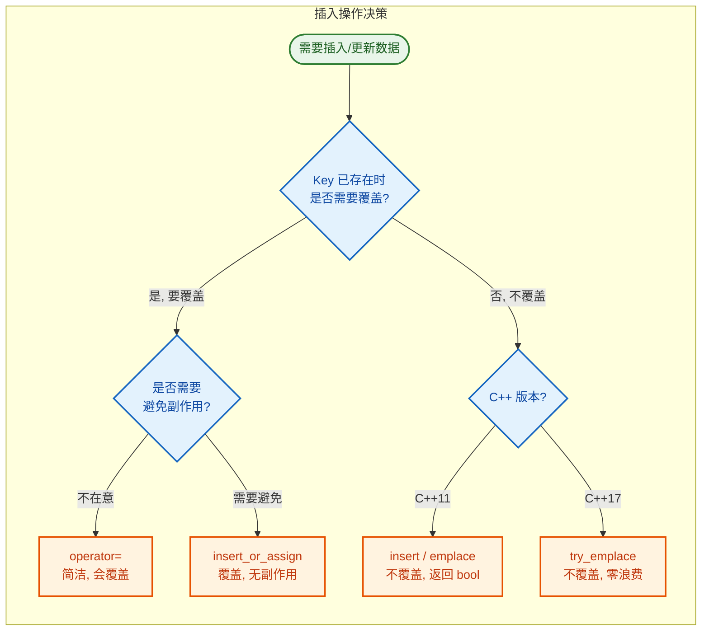

> **重要提醒**：`operator[]` 的"副作用插入"是新手最常踩的坑。如果你只想 **查询** Key 是否存在而不想插入，请使用 `find()` 或 `count()`。

#### 查找与访问

```cpp
#include <map>
#include <string>
#include <iostream>

int main() {
    std::map<std::string, int> m = {
        {"Alice", 90}, {"Bob", 85}, {"Carol", 77}
    };

    // ========== 方式1: find ==========
    // 返回迭代器，找不到返回 end()
    auto it = m.find("Bob");              // 在红黑树中 O(log n) 搜索
    if (it != m.end()) {                  // 判断是否找到
        // it->first 是 Key，it->second 是 Value
        std::cout << it->first << ": " << it->second << std::endl;
    }

    // ========== 方式2: count ==========
    // 对于 map，Key 唯一，count 只会返回 0 或 1
    if (m.count("Dave") == 0) {           // O(log n)
        std::cout << "Dave not found" << std::endl;
    }

    // ========== 方式3: contains (C++20) ==========
    // 语义最清晰的存在性检查
    if (m.contains("Alice")) {            // O(log n)，返回 bool
        std::cout << "Alice exists!" << std::endl;
    }

    // ========== 方式4: at() ==========
    // 安全访问：Key 不存在时抛出 std::out_of_range 异常
    try {
        int score = m.at("Ghost");        // Ghost 不存在，抛异常
    } catch (const std::out_of_range& e) {
        std::cout << "Exception: " << e.what() << std::endl;
    }

    return 0;
}
```

#### 遍历方式

```cpp
#include <map>
#include <string>
#include <iostream>

int main() {
    std::map<std::string, int> m = {
        {"cherry", 2}, {"apple", 3}, {"banana", 5}
    };
    // 注意：内部已按 Key 排序 -> apple, banana, cherry

    // ========== 方式1: 范围 for + 结构化绑定 (C++17, 推荐) ==========
    for (const auto& [key, value] : m) {  // 自动解包为 key 和 value
        std::cout << key << " => " << value << std::endl;
    }
    // 输出：apple => 3, banana => 5, cherry => 2（有序！）

    // ========== 方式2: 范围 for + pair ==========
    for (const auto& pair : m) {          // pair 类型是 std::pair<const string, int>
        std::cout << pair.first << " => " << pair.second << std::endl;
    }

    // ========== 方式3: 迭代器 ==========
    for (auto it = m.begin(); it != m.end(); ++it) {
        std::cout << it->first << " => " << it->second << std::endl;
    }

    // ========== 方式4: 反向遍历 ==========
    for (auto rit = m.rbegin(); rit != m.rend(); ++rit) {
        std::cout << rit->first << " => " << rit->second << std::endl;
    }
    // 输出：cherry => 2, banana => 5, apple => 3（降序）

    return 0;
}
```

#### 删除操作

```cpp
#include <map>
#include <string>
#include <iostream>

int main() {
    std::map<std::string, int> m = {
        {"Alice", 90}, {"Bob", 85}, {"Carol", 77}, {"Dave", 66}
    };

    // 1. 按 Key 删除，返回删除的元素个数（0 或 1）
    size_t removed = m.erase("Bob");      // removed = 1
    m.erase("Ghost");                     // Key 不存在，removed = 0，不会报错

    // 2. 按迭代器删除
    auto it = m.find("Carol");            // 先查找
    if (it != m.end()) {
        m.erase(it);                      // 删除迭代器指向的元素
    }

    // 3. 范围删除：删除 [first, last) 区间
    m.erase(m.begin(), m.end());          // 等价于 m.clear()

    return 0;
}
```

#### 自定义排序

默认情况下，`map` 使用 `std::less<Key>` 进行升序排序。你可以传入第三个模板参数来自定义排序规则。

```cpp
#include <map>
#include <string>
#include <iostream>

// 自定义比较器：按字符串长度排序，长度相同按字典序
struct LengthCompare {
    bool operator()(const std::string& a, const std::string& b) const {
        if (a.length() != b.length())     // 先比长度
            return a.length() < b.length();
        return a < b;                     // 长度相同，按字典序
    }
};

int main() {
    // 使用自定义比较器
    std::map<std::string, int, LengthCompare> m;
    m["hi"]      = 1;   // 长度 2
    m["hello"]   = 2;   // 长度 5
    m["hey"]     = 3;   // 长度 3
    m["world"]   = 4;   // 长度 5（与 hello 同长度，按字典序排在后面）

    for (const auto& [k, v] : m) {
        std::cout << k << "(" << k.length() << ") => " << v << std::endl;
    }
    // 输出: hi(2), hey(3), hello(5), world(5)

    return 0;
}
```

---

### std::unordered_map —— 无序哈希映射

#### 底层结构：哈希表（Hash Table）

`std::unordered_map` 的底层是一个 **哈希表（Hash Table）**，具体采用 **拉链法（Separate Chaining）** 解决哈希冲突。整个结构由一个 **桶数组（Bucket Array）** 组成，每个桶是一个链表（或在某些实现中是一段连续内存），用来存放哈希值相同的元素。

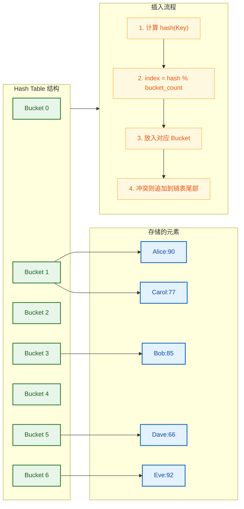

当元素数量增长导致 **负载因子（Load Factor）** 超过阈值（默认 `max_load_factor() = 1.0`）时，哈希表会自动 **rehash**——扩大桶数组并重新分配所有元素，这是一个 O(n) 的操作。

#### 时间复杂度一览

| 操作 | 平均复杂度 | 最坏复杂度 | 说明 |
|------|-----------|-----------|------|
| 插入 | **O(1)** | O(n) | 平均常数，最坏退化为链表 |
| 删除 | **O(1)** | O(n) | 同上 |
| 查找 | **O(1)** | O(n) | 哈希冲突严重时退化 |
| rehash | — | O(n) | 桶扩容时触发 |

> **关键理解**：`unordered_map` 的 **平均** O(1) 是建立在 **良好哈希函数** 基础上的。如果所有 Key 都映射到同一个桶，性能会退化为 O(n)——这就是为什么自定义类型作为 Key 时必须提供高质量的哈希函数。

#### 基本用法

`unordered_map` 的 API 与 `map` **高度一致**，初学时可以将两者视为"接口相同、底层不同"的容器。

```cpp
#include <unordered_map>
#include <string>
#include <iostream>

int main() {
    // 初始化列表构造
    std::unordered_map<std::string, int> um = {
        {"cherry", 2}, {"apple", 3}, {"banana", 5}
    };

    // 插入（与 map 完全相同的接口）
    um["date"] = 7;                                 // operator[]
    um.insert({"elderberry", 1});                   // insert
    um.emplace("fig", 4);                           // emplace

    // 查找（与 map 完全相同的接口）
    auto it = um.find("apple");                     // 返回迭代器
    if (it != um.end()) {
        std::cout << it->second << std::endl;       // 输出 3
    }

    // 遍历（顺序不确定！）
    for (const auto& [key, value] : um) {
        std::cout << key << " => " << value << std::endl;
    }
    // 输出顺序可能每次运行都不同！

    // 删除
    um.erase("banana");                             // 按 Key 删除

    return 0;
}
```

#### 哈希表内部控制

`unordered_map` 提供了一组独有的接口，允许你窥探和调控哈希表的内部状态：

```cpp
#include <unordered_map>
#include <string>
#include <iostream>

int main() {
    std::unordered_map<std::string, int> um;

    // 预分配桶数量，减少 rehash 次数（性能优化的关键）
    um.reserve(1000);                // 预留至少能容纳 1000 个元素的桶

    // 插入一些数据
    for (int i = 0; i < 500; ++i) {
        um["key_" + std::to_string(i)] = i;
    }

    // ========== 哈希表状态查询 ==========
    std::cout << "元素数量:      " << um.size()             << std::endl;
    std::cout << "桶的数量:      " << um.bucket_count()     << std::endl;
    std::cout << "当前负载因子:   " << um.load_factor()      << std::endl;
    std::cout << "最大负载因子:   " << um.max_load_factor()  << std::endl;

    // 查看某个 Key 在哪个桶
    size_t bucket_idx = um.bucket("key_42");        // 返回桶的索引
    std::cout << "key_42 在桶 #" << bucket_idx << std::endl;
    std::cout << "该桶元素数量: " << um.bucket_size(bucket_idx) << std::endl;

    // 手动 rehash
    um.rehash(2000);               // 将桶数量调整为至少 2000
    std::cout << "rehash 后桶数: " << um.bucket_count() << std::endl;

    return 0;
}
```

#### 自定义类型作为 Key

对于内置类型和 `std::string`，标准库已经提供了默认的哈希函数。但如果你想用 **自定义 struct/class** 作为 Key，则必须同时提供 **哈希函数** 和 **相等比较函数**。

```cpp
#include <unordered_map>
#include <string>
#include <iostream>
#include <functional>    // std::hash

// 自定义类型
struct Point {
    int x, y;            // 二维坐标

    // 必须提供 operator==，用于桶内链表的精确匹配
    bool operator==(const Point& other) const {
        return x == other.x && y == other.y;
    }
};

// 方式1：特化 std::hash（推荐，最通用）
namespace std {
    template<>
    struct hash<Point> {
        size_t operator()(const Point& p) const {
            // 经典的哈希组合公式：将两个字段的哈希值混合
            size_t h1 = std::hash<int>{}(p.x);   // 对 x 计算哈希
            size_t h2 = std::hash<int>{}(p.y);   // 对 y 计算哈希
            // 使用异或 + 位移来混合（Boost 推荐的做法）
            return h1 ^ (h2 << 1);
        }
    };
}

int main() {
    // 特化 std::hash 后可以直接使用，无需额外模板参数
    std::unordered_map<Point, std::string> points;
    points[{1, 2}] = "A";           // Point{1,2} -> "A"
    points[{3, 4}] = "B";           // Point{3,4} -> "B"

    // 方式2：使用 Lambda 作为哈希函数（局部使用时方便）
    auto hasher = [](const Point& p) -> size_t {
        return std::hash<int>{}(p.x) ^ (std::hash<int>{}(p.y) << 1);
    };
    auto equal = [](const Point& a, const Point& b) -> bool {
        return a.x == b.x && a.y == b.y;
    };

    // 模板参数需要指定哈希和相等比较的类型
    std::unordered_map<Point, std::string,
                       decltype(hasher), decltype(equal)> points2(10, hasher, equal);
    //                                                     ^初始桶数

    points2[{5, 6}] = "C";
    std::cout << points2[{5, 6}] << std::endl;   // 输出 "C"

    return 0;
}
```

> **哈希质量很重要**：一个差的哈希函数会导致大量冲突，使性能从 O(1) 退化为 O(n)。实际项目中，推荐使用更高质量的哈希组合方式，例如 Boost 的 `hash_combine`。

---

### map vs unordered_map：全面对比

```mermaid
graph LR
    subgraph MapSide["std::map"]
        direction TB
        M1["底层: 红黑树 Red-Black Tree"]
        M2["元素有序: 按 Key 排序"]
        M3["查找: O log n"]
        M4["内存: 树节点, 指针开销大"]
        M5["迭代器: 稳定, 不会失效"]
        M6["Key 要求: 需要 operator 小于"]
    end

    subgraph UnorderedSide["std::unordered_map"]
        direction TB
        U1["底层: 哈希表 Hash Table"]
        U2["元素无序: 顺序不可预测"]
        U3["查找: O 1 平均"]
        U4["内存: 桶数组 + 链表"]
        U5["迭代器: rehash 后全部失效"]
        U6["Key 要求: 需要 hash + operator=="]
    end

    subgraph Choose["如何选择?"]
        direction TB
        C1["需要有序遍历 -> map"]
        C2["纯查找, 追求速度 -> unordered_map"]
        C3["数据量小 1000 以下 -> 差异不大"]
        C4["需要范围查询 -> map"]
        C5["需要稳定迭代器 -> map"]
    end

    MapSide --> Choose
    UnorderedSide --> Choose

    classDef mapStyle fill:#E8F5E9,stroke:#2E7D32,color:#1B5E20,stroke-width:2px
    classDef umapStyle fill:#E3F2FD,stroke:#1565C0,color:#0D47A1,stroke-width:2px
    classDef chooseStyle fill:#FFF3E0,stroke:#EF6C00,color:#BF360C,stroke-width:2px

    class M1,M2,M3,M4,M5,M6 mapStyle
    class U1,U2,U3,U4,U5,U6 umapStyle
    class C1,C2,C3,C4,C5 chooseStyle
```

用一张表做更精确的对比：

| 维度 | `std::map` | `std::unordered_map` |
|------|-----------|---------------------|
| **底层结构** | 红黑树 | 哈希表（拉链法） |
| **有序性** | ✅ 按 Key 升序 | ❌ 无序 |
| **查找复杂度** | O(log n) | O(1) 平均，O(n) 最坏 |
| **插入复杂度** | O(log n) | O(1) 平均，O(n) 最坏 |
| **内存效率** | 较差（树节点+指针） | 一般（桶数组+链表） |
| **缓存友好性** | 差（节点分散） | 较好（桶连续） |
| **迭代器稳定性** | 插入/删除不影响其他迭代器 | rehash 时全部失效 |
| **Key 要求** | 需要 `<` 运算符 | 需要 `hash` + `==` |
| **范围查询** | ✅ `lower_bound`/`upper_bound` | ❌ 不支持 |
| **头文件** | `<map>` | `<unordered_map>` |

---

### 高级话题：迭代器失效规则

这是面试中的高频考点。两种容器的迭代器失效行为截然不同：

```cpp
#include <map>
#include <unordered_map>
#include <iostream>

int main() {
    // ========== map 的迭代器稳定性 ==========
    std::map<int, int> m = {{1,1}, {2,2}, {3,3}, {4,4}, {5,5}};

    auto it_map = m.find(3);          // 指向 {3, 3}
    m.erase(2);                       // 删除 {2,2}，it_map 仍然有效！
    m.insert({6, 6});                 // 插入新元素，it_map 仍然有效！
    std::cout << it_map->second;      // 安全输出 3

    // 只有删除迭代器自身指向的元素才会使其失效
    m.erase(it_map);                  // it_map 现在失效了！

    // ========== unordered_map 的迭代器稳定性 ==========
    std::unordered_map<int, int> um = {{1,1}, {2,2}, {3,3}};

    auto it_um = um.find(2);          // 指向 {2, 2}
    // 如果插入操作触发了 rehash，则 it_um 可能失效！
    um.reserve(10000);                // 强制 rehash -> 所有迭代器失效
    // it_um 现在是悬空的(dangling)，使用它是未定义行为(UB)！

    return 0;
}
```

```cpp
// 安全的遍历删除模式（两种容器通用）
#include <map>
#include <iostream>

int main() {
    std::map<int, int> m = {{1,10}, {2,20}, {3,30}, {4,40}, {5,50}};

    // 删除所有 Value 为偶数十位的元素
    for (auto it = m.begin(); it != m.end(); /* 不在这里 ++ */) {
        if (it->second % 20 == 0) {       // 满足删除条件
            it = m.erase(it);             // erase 返回下一个有效迭代器
        } else {
            ++it;                         // 不删除时才手动前进
        }
    }
    // 或使用 C++20 的 std::erase_if
    // std::erase_if(m, [](const auto& p){ return p.second % 20 == 0; });

    for (const auto& [k, v] : m) {
        std::cout << k << " => " << v << std::endl;
    }
    return 0;
}
```

---

### 高级话题：map 的范围查询

`map` 作为有序容器，支持强大的范围查询操作，这是 `unordered_map` 完全无法实现的：

```cpp
#include <map>
#include <iostream>

int main() {
    std::map<int, std::string> students = {
        {60, "Dave"}, {70, "Carol"}, {80, "Bob"},
        {85, "Eve"},  {90, "Alice"}, {95, "Frank"}
    };

    // lower_bound(key): 返回第一个 >= key 的迭代器
    auto lo = students.lower_bound(75);   // 指向 {80, "Bob"}

    // upper_bound(key): 返回第一个 > key 的迭代器
    auto hi = students.upper_bound(90);   // 指向 {95, "Frank"}

    // 遍历分数在 [75, 90] 区间内的学生
    std::cout << "Scores in [75, 90]:" << std::endl;
    for (auto it = lo; it != hi; ++it) {  // [lower_bound, upper_bound)
        std::cout << it->first << ": " << it->second << std::endl;
    }
    // 输出: 80:Bob, 85:Eve, 90:Alice

    // equal_range(key): 返回 {lower_bound, upper_bound} 的 pair
    auto [eq_lo, eq_hi] = students.equal_range(85);
    // eq_lo 指向 {85, "Eve"}，eq_hi 指向 {90, "Alice"}

    return 0;
}
```

---

### multimap 与 unordered_multimap

标准库还提供了允许 **重复 Key** 的变体：

```cpp
#include <map>
#include <unordered_map>
#include <string>
#include <iostream>

int main() {
    // multimap: 有序 + 允许重复 Key
    std::multimap<std::string, int> mm;
    mm.insert({"Alice", 90});     // 第一个 Alice
    mm.insert({"Alice", 95});     // 第二个 Alice（允许！）
    mm.insert({"Bob",   85});

    // count 可能返回 > 1
    std::cout << "Alice count: " << mm.count("Alice") << std::endl; // 2

    // equal_range 获取同一 Key 的所有元素
    auto [lo, hi] = mm.equal_range("Alice");
    for (auto it = lo; it != hi; ++it) {
        std::cout << it->first << " => " << it->second << std::endl;
    }
    // 输出：Alice => 90, Alice => 95

    // ⚠️ multimap 没有 operator[]！（因为一个 Key 对应多个 Value，返回哪个？）

    // unordered_multimap: 无序 + 允许重复 Key
    std::unordered_multimap<std::string, int> umm;
    umm.insert({"X", 1});
    umm.insert({"X", 2});
    umm.insert({"X", 3});
    std::cout << "X count: " << umm.count("X") << std::endl; // 3

    return 0;
}
```

---

### 实战场景与最佳实践

#### 场景1：词频统计（经典面试题）

```cpp
#include <unordered_map>
#include <string>
#include <sstream>
#include <iostream>

int main() {
    std::string text = "the quick brown fox jumps over the lazy dog the fox";

    std::unordered_map<std::string, int> freq;   // 单词 -> 出现次数
    std::istringstream iss(text);                 // 字符串流，用于分词
    std::string word;

    while (iss >> word) {          // 按空格分词
        freq[word]++;              // 关键技巧：operator[] 对不存在的 Key 值初始化为 0
    }                              // 然后 ++ 变为 1，后续再 ++ 递增

    for (const auto& [w, c] : freq) {
        std::cout << w << ": " << c << std::endl;
    }
    // the: 3, fox: 2, quick: 1, ...

    return 0;
}
```

#### 场景2：LRU 缓存思路（map + list 经典组合）

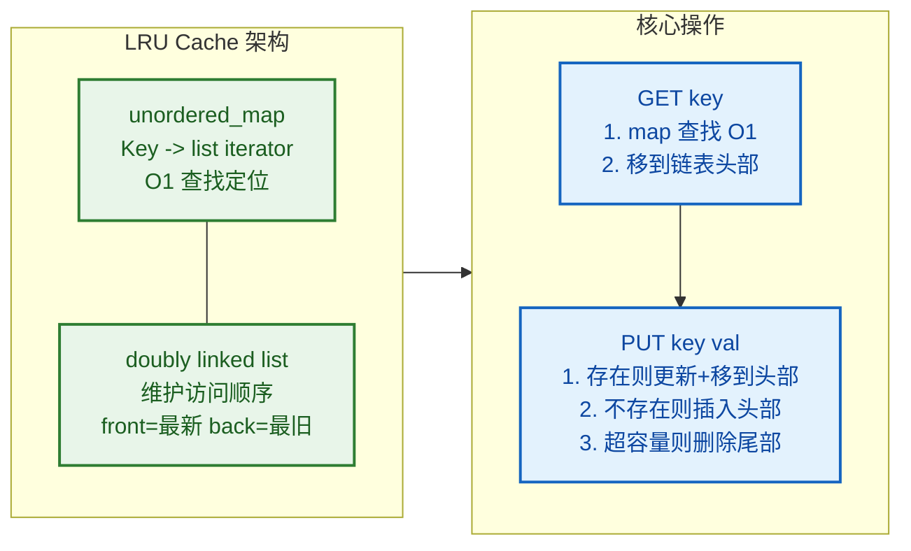

#### 最佳实践总结

```cpp
// ✅ DO: 用 reserve 预分配，减少 rehash
std::unordered_map<int, int> um;
um.reserve(expected_size);           // 预先分配足够的桶

// ✅ DO: 用 find 而非 operator[] 做只读查询
if (auto it = um.find(key); it != um.end()) {  // C++17 init-statement
    use(it->second);                 // 不会产生副作用插入
}

// ✅ DO: 用 emplace / try_emplace 避免不必要的对象拷贝
um.try_emplace(key, expensive_arg1, expensive_arg2);

// ✅ DO: 需要有序或范围查询时用 map
std::map<int, std::string> ordered_data;
auto it = ordered_data.lower_bound(100);  // 高效范围查询

// ❌ DON'T: 用 operator[] 做存在性检查
// if (um[key] == 0)  // 错！即使 key 不存在也会被插入

// ❌ DON'T: 在遍历中直接删除而不更新迭代器
// for (auto it = m.begin(); it != m.end(); ++it)
//     if (cond) m.erase(it);  // UB! 应使用 it = m.erase(it)
```

---

### 本节小结

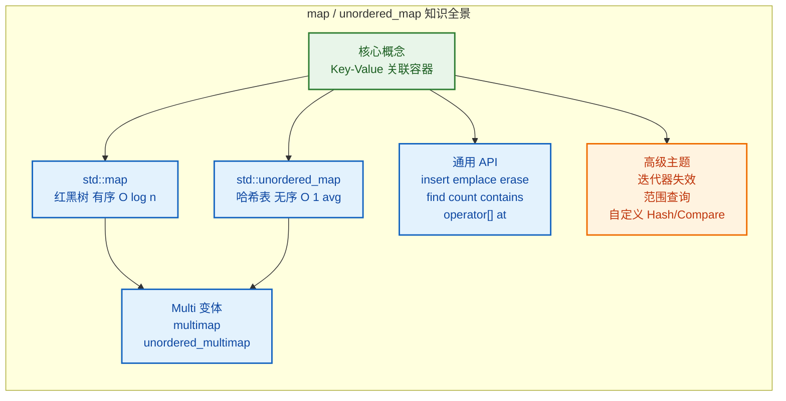

---

**📝 练习题**

以下代码执行后，`m.size()` 的值是多少？

```cpp
std::map<std::string, int> m;
m["A"] = 1;
m.insert({"B", 2});
m.insert({"A", 3});
m["C"];
m.emplace("B", 4);
```

A. 2

B. 3

C. 4

D. 5


**【答案】** B

**【解析】**
逐行分析：
1. `m["A"] = 1;` → 插入 `{"A", 1}`，size = 1
2. `m.insert({"B", 2});` → B 不存在，插入成功 `{"B", 2}`，size = 2
3. `m.insert({"A", 3});` → A **已存在**，`insert` 不覆盖，插入失败，size 仍 = 2
4. `m["C"];` → C 不存在，`operator[]` 会自动插入 `{"C", 0}`（副作用插入！），size = 3
5. `m.emplace("B", 4);` → B **已存在**，`emplace` 语义等同于 `insert`，不覆盖，size 仍 = 3

最终 `m` 包含：`{"A", 1}, {"B", 2}, {"C", 0}`，size = **3**。本题考查重点：`insert`/`emplace` 对已有 Key **不覆盖**，以及 `operator[]` 的副作用插入行为。

---

**📝 练习题**

关于 `std::map` 和 `std::unordered_map` 的迭代器，以下说法正确的是？

A. 对 `map` 执行 `insert` 操作后，所有已有迭代器均失效

B. 对 `unordered_map` 执行 `insert` 操作后，所有已有迭代器均失效

C. 对 `map` 执行 `erase` 操作后，只有被删除元素的迭代器失效

D. 对 `unordered_map` 执行 `erase` 操作后，只有被删除元素的迭代器失效，即使发生了 rehash


**【答案】** C

**【解析】**
- **A 错误**：`map` 基于红黑树，插入操作 **不会** 使已有迭代器失效（只可能旋转，不影响已有节点的地址）。
- **B 错误**：`unordered_map` 的 `insert` **只有在触发 rehash 时** 才会使所有迭代器失效，不触发 rehash 时已有迭代器仍然有效。"所有均失效"表述过于绝对。
- **C 正确**：`map` 的 `erase` 操作只使被删除元素的迭代器失效，其余迭代器（包括指向其他元素的）全部保持有效。这是红黑树的结构保证。
- **D 错误**：`erase` 本身不会触发 rehash（rehash 只在扩容时发生），但说法中"即使发生了 rehash"是错误前提——`erase` 不触发 rehash，且如果假设性地发生了 rehash，所有迭代器都会失效，不仅仅是被删除的。

---

## set / unordered_set —— 集合容器全解析

在数学中，**集合 (Set)** 的核心特征是"元素唯一、无重复"。C++ STL 将这一概念具象化为两个容器家族：基于**红黑树 (Red-Black Tree)** 的有序集合 `std::set`，以及基于**哈希表 (Hash Table)** 的无序集合 `std::unordered_set`。它们都保证元素的**唯一性 (Uniqueness)**，但在内部实现、性能特征和使用场景上有着本质区别。理解这两个容器，不仅能帮助你高效地处理"去重"与"查找"问题，还能让你深入理解**树结构**与**哈希结构**这两大数据结构基石。

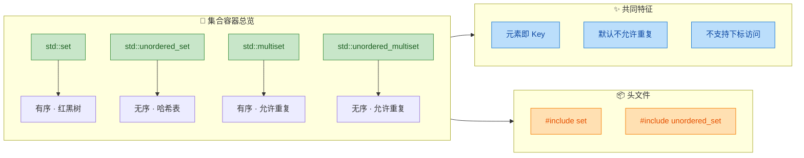

与 `map` 不同，`set` 中存储的**不是键值对**，而是**单一的值 (Value)**，并且这个值本身就充当了键 (Key)。换句话说，`set` 是一种 **"值即键"** 的容器。这意味着你无法修改 `set` 中已有的元素（因为修改值就等于修改键，会破坏内部结构），只能**插入 (insert)** 或**删除 (erase)**。

---

### std::set —— 有序集合（红黑树实现）

`std::set` 是 C++ 中最经典的集合容器。它底层采用**自平衡二叉搜索树（通常是红黑树, Red-Black Tree）** 来组织数据，因此所有元素在容器内部始终保持**严格的升序排列**（默认使用 `operator<` 比较）。

#### 核心性质

| 性质 | 说明 |
|------|------|
| **有序性** | 元素自动按升序排列（可自定义比较器） |
| **唯一性** | 不允许重复元素，插入重复值会被忽略 |
| **插入/查找/删除** | 时间复杂度均为 **O(log n)** |
| **迭代器** | 双向迭代器 (Bidirectional Iterator)，不支持随机访问 |
| **元素不可修改** | 迭代器指向的是 `const` 元素 |

#### 声明与初始化

```cpp
#include <set>
#include <iostream>
using namespace std;

int main() {
    // 1. 默认构造：空集合，元素默认升序
    set<int> s1;

    // 2. 初始化列表构造：重复的 3 会被自动去除
    set<int> s2 = {5, 3, 8, 1, 3, 9};
    // s2 内部实际存储: {1, 3, 5, 8, 9}

    // 3. 范围构造：从另一个容器的迭代器区间构造
    vector<int> v = {10, 20, 10, 30};
    set<int> s3(v.begin(), v.end());
    // s3 内部: {10, 20, 30}  —— 自动去重

    // 4. 自定义排序：使用 greater<int> 实现降序
    set<int, greater<int>> s4 = {5, 3, 8, 1, 9};
    // s4 内部: {9, 8, 5, 3, 1}  —— 降序排列

    // 5. 拷贝构造
    set<int> s5(s2);  // s5 是 s2 的完整副本

    return 0;
}
```

#### 插入操作 —— insert 与 emplace

`set` 的插入操作是最核心的操作之一。由于元素唯一性的约束，每次插入都可能"成功"或"失败"（元素已存在时），因此 `insert` 的返回值携带了丰富的信息。

```cpp
#include <set>
#include <iostream>
using namespace std;

int main() {
    set<int> s = {10, 20, 30};

    // ========== insert 单个元素 ==========
    // 返回 pair<iterator, bool>
    //   - first:  指向插入元素（或已存在的相同元素）的迭代器
    //   - second: true 表示插入成功，false 表示元素已存在
    auto result1 = s.insert(25);        // 插入 25（不存在，成功）
    cout << *result1.first << endl;     // 输出: 25
    cout << result1.second << endl;     // 输出: 1 (true)

    auto result2 = s.insert(20);        // 插入 20（已存在，失败）
    cout << *result2.first << endl;     // 输出: 20（指向已有的 20）
    cout << result2.second << endl;     // 输出: 0 (false)

    // ========== insert 初始化列表 ==========
    // 批量插入，重复元素自动忽略
    s.insert({5, 15, 20, 35});
    // s: {5, 10, 15, 20, 25, 30, 35}

    // ========== emplace：原地构造，避免拷贝 ==========
    // 对于 int 等基础类型差别不大，
    // 但对于复杂对象（如 string），emplace 可以减少一次拷贝
    auto result3 = s.emplace(40);       // 原地构造 40
    cout << *result3.first << endl;     // 输出: 40
    cout << result3.second << endl;     // 输出: 1

    // ========== hint insert：提供位置提示加速插入 ==========
    // 如果提示位置正确，插入可从 O(log n) 降为 O(1) 摊还
    auto it = s.end();                  // 提示：在末尾附近插入
    s.insert(it, 50);                   // 50 比所有元素都大，提示有效
    // s: {5, 10, 15, 20, 25, 30, 35, 40, 50}

    // 遍历验证
    for (int x : s) {
        cout << x << " ";              // 输出: 5 10 15 20 25 30 35 40 50
    }
    cout << endl;

    return 0;
}
```

`insert` 返回的 `pair<iterator, bool>` 是一个非常优雅的设计模式。在实际开发中，你经常需要"插入并判断是否为新元素"这种原子操作，而 `set::insert` 天然支持。

#### 查找操作 —— find、count 与边界查询

```cpp
#include <set>
#include <iostream>
using namespace std;

int main() {
    set<int> s = {10, 20, 30, 40, 50, 60, 70};

    // ========== find：精确查找 ==========
    // 返回指向目标元素的迭代器；未找到则返回 end()
    auto it = s.find(30);              // 查找 30
    if (it != s.end()) {
        cout << "Found: " << *it << endl;   // 输出: Found: 30
    }

    auto it2 = s.find(35);            // 查找 35（不存在）
    if (it2 == s.end()) {
        cout << "35 not found" << endl;     // 输出: 35 not found
    }

    // ========== count：判断元素是否存在 ==========
    // 对于 set，返回值只可能是 0 或 1
    // 对于 multiset，可能返回 > 1 的值
    cout << s.count(40) << endl;       // 输出: 1（存在）
    cout << s.count(45) << endl;       // 输出: 0（不存在）

    // ========== contains (C++20)：更直观的存在性判断 ==========
    // if (s.contains(50)) { ... }     // 返回 bool，语义更清晰

    // ========== lower_bound / upper_bound：边界查询 ==========
    // lower_bound(x): 返回第一个 >= x 的元素的迭代器
    // upper_bound(x): 返回第一个 >  x 的元素的迭代器
    auto lb = s.lower_bound(25);       // 第一个 >= 25 的元素
    cout << "lower_bound(25): " << *lb << endl;  // 输出: 30

    auto ub = s.upper_bound(30);       // 第一个 > 30 的元素
    cout << "upper_bound(30): " << *ub << endl;  // 输出: 40

    // ========== equal_range：返回 [lower_bound, upper_bound) 区间 ==========
    auto range = s.equal_range(30);
    // range.first  == lower_bound(30) -> 指向 30
    // range.second == upper_bound(30) -> 指向 40
    for (auto it = range.first; it != range.second; ++it) {
        cout << *it << " ";           // 输出: 30
    }
    cout << endl;

    return 0;
}
```

> **⚠️ 重要提醒**：请务必使用 `set` 自身的 `s.find()` 而非全局的 `std::find(s.begin(), s.end(), val)`。前者利用红黑树结构，时间复杂度为 **O(log n)**；后者是线性遍历，时间复杂度为 **O(n)**。这是初学者最常犯的性能错误之一。

#### 删除操作 —— erase

```cpp
#include <set>
#include <iostream>
using namespace std;

int main() {
    set<int> s = {10, 20, 30, 40, 50, 60, 70};

    // 1. 按值删除：返回删除的元素个数（0 或 1）
    size_t removed = s.erase(30);       // 删除值为 30 的元素
    cout << "Removed: " << removed << endl;  // 输出: 1

    size_t removed2 = s.erase(35);      // 35 不存在
    cout << "Removed: " << removed2 << endl; // 输出: 0

    // 2. 按迭代器删除：删除迭代器指向的元素
    auto it = s.find(50);              // 先找到 50
    if (it != s.end()) {
        s.erase(it);                   // 删除 50，O(1) 摊还
    }

    // 3. 范围删除：删除 [first, last) 区间内的所有元素
    auto from = s.lower_bound(20);     // 指向 20
    auto to   = s.upper_bound(60);     // 指向 70
    s.erase(from, to);                 // 删除 [20, 60] 范围内的元素
    // s: {10, 70}

    // 4. 清空
    s.clear();                         // 删除所有元素
    cout << "Size: " << s.size() << endl;  // 输出: 0

    return 0;
}
```

#### 自定义排序 —— 使用仿函数或 lambda

`set` 默认使用 `std::less<T>`（即 `operator<`）进行升序排序。如果你需要自定义排序规则，可以通过第二个模板参数传入**比较器 (Comparator)**。

```cpp
#include <set>
#include <iostream>
#include <string>
using namespace std;

// ========== 方式一：仿函数 (Functor) ==========
struct CaseInsensitiveCompare {
    // 重载 operator()，实现不区分大小写的字符串比较
    bool operator()(const string& a, const string& b) const {
        string la = a, lb = b;                     // 创建副本
        transform(la.begin(), la.end(), la.begin(), ::tolower);  // 全转小写
        transform(lb.begin(), lb.end(), lb.begin(), ::tolower);
        return la < lb;                             // 按小写形式比较
    }
};

int main() {
    // 使用自定义比较器：不区分大小写的字符串集合
    set<string, CaseInsensitiveCompare> s;
    s.insert("Apple");                // 插入 "Apple"
    s.insert("apple");                // "apple" 与 "Apple" 被视为相同，插入失败
    s.insert("Banana");               // 插入 "Banana"

    cout << s.size() << endl;         // 输出: 2（只有 Apple 和 Banana）
    for (const auto& str : s) {
        cout << str << " ";           // 输出: Apple Banana
    }
    cout << endl;

    // ========== 方式二：lambda（需配合 decltype） ==========
    auto comp = [](int a, int b) {
        return a > b;                 // 降序排列
    };
    set<int, decltype(comp)> s2(comp);
    s2.insert({3, 1, 4, 1, 5, 9});
    // s2: {9, 5, 4, 3, 1}  —— 降序

    for (int x : s2) {
        cout << x << " ";            // 输出: 9 5 4 3 1
    }
    cout << endl;

    return 0;
}
```

#### set 底层结构 —— 红黑树速览

为了理解 `set` 的 O(log n) 性能保证，有必要对红黑树有一个直觉性的理解。红黑树是一种**自平衡二叉搜索树 (Self-Balancing BST)**，它通过"着色规则"和"旋转操作"来保证树的高度始终维持在 **O(log n)** 级别。

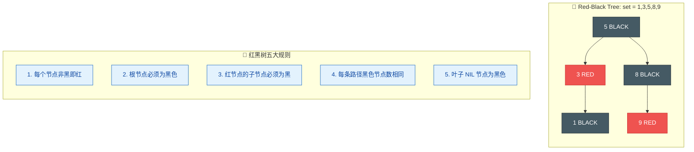

正因为红黑树的这些严格约束，`set` 才能保证：
- **插入 (insert)**：O(log n) —— 找到位置后插入，可能触发旋转/重染色
- **查找 (find)**：O(log n) —— 标准的二叉搜索
- **删除 (erase)**：O(log n) —— 删除后可能触发树结构调整
- **遍历有序**：中序遍历 (in-order traversal) 天然得到排序结果

---

### std::unordered_set —— 无序集合（哈希表实现）

`std::unordered_set` 是 C++11 引入的基于**哈希表 (Hash Table)** 的集合容器。它不维护元素的排列顺序，但在理想情况下提供 **O(1)** 的查找、插入和删除性能，这使它在"纯去重"和"纯查找"场景中比 `set` 更快。

#### 核心性质

| 性质 | 说明 |
|------|------|
| **无序性** | 元素不保证任何特定顺序 |
| **唯一性** | 不允许重复元素 |
| **插入/查找/删除** | **平均** O(1)，**最坏** O(n)（哈希冲突严重时） |
| **迭代器** | 前向迭代器 (Forward Iterator)，功能最弱 |
| **底层结构** | 哈希表（桶数组 + 链表/开放寻址） |

#### 哈希表工作原理

理解 `unordered_set` 的关键在于理解哈希表。其核心思想是：通过**哈希函数 (Hash Function)** 将元素映射到一个**桶 (Bucket)** 数组的某个位置，从而实现近乎常数时间的定位。

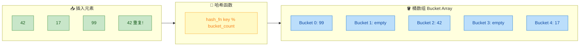

当两个不同的元素被哈希到同一个桶时，就会产生**哈希冲突 (Hash Collision)**。STL 的 `unordered_set` 通常使用**链地址法 (Separate Chaining)** 来处理冲突——每个桶维护一个链表，冲突元素依次挂在链表上。如果冲突过多，某个桶的链表会变很长，查找退化为 O(n)，这就是"最坏情况"的来源。

#### 声明与基本操作

```cpp
#include <unordered_set>
#include <iostream>
using namespace std;

int main() {
    // 1. 默认构造
    unordered_set<int> us1;

    // 2. 初始化列表构造（注意：遍历顺序不确定！）
    unordered_set<int> us2 = {50, 10, 30, 20, 40, 10};
    // 内部: {50, 10, 30, 20, 40}（去重，但顺序不保证）

    // 3. 插入：接口与 set 完全一致
    auto [iter, success] = us2.insert(60);  // C++17 结构化绑定
    cout << *iter << " " << success << endl; // 输出: 60 1

    auto [iter2, success2] = us2.insert(10); // 10 已存在
    cout << *iter2 << " " << success2 << endl; // 输出: 10 0

    // 4. 查找
    auto it = us2.find(30);            // O(1) 平均
    if (it != us2.end()) {
        cout << "Found: " << *it << endl;   // 输出: Found: 30
    }

    // 5. count / contains
    cout << us2.count(20) << endl;     // 输出: 1
    // C++20: us2.contains(20) 返回 true

    // 6. 删除
    us2.erase(40);                     // 按值删除
    us2.erase(us2.find(50));           // 按迭代器删除

    // 7. 遍历（顺序不确定，每次运行可能不同）
    for (int x : us2) {
        cout << x << " ";
    }
    cout << endl;

    return 0;
}
```

#### 桶接口 —— 深入哈希表内部

`unordered_set` 暴露了丰富的桶操作接口，让你可以观察和调控哈希表的内部状态。这在性能调优时非常有用。

```cpp
#include <unordered_set>
#include <iostream>
using namespace std;

int main() {
    unordered_set<int> us = {1, 2, 3, 4, 5, 6, 7, 8, 9, 10};

    // ========== 容量与桶信息 ==========
    cout << "size:         " << us.size() << endl;         // 元素个数: 10
    cout << "bucket_count: " << us.bucket_count() << endl; // 桶的数量（由实现决定）
    cout << "load_factor:  " << us.load_factor() << endl;  // 负载因子 = size / bucket_count
    cout << "max_load_factor: " << us.max_load_factor() << endl; // 默认 1.0

    // ========== 查看每个桶的情况 ==========
    for (size_t i = 0; i < us.bucket_count(); ++i) {
        cout << "Bucket " << i << ": ";
        for (auto it = us.begin(i); it != us.end(i); ++it) {
            cout << *it << " ";        // 遍历第 i 个桶中的所有元素
        }
        cout << "  (size=" << us.bucket_size(i) << ")" << endl;
    }

    // ========== 查询某个元素在哪个桶 ==========
    cout << "Element 7 is in bucket: " << us.bucket(7) << endl;

    // ========== 手动调控 ==========
    us.reserve(100);   // 预分配至少能容纳 100 个元素的桶空间（减少 rehash）
    us.rehash(50);     // 将桶数量调整为至少 50

    return 0;
}
```

**负载因子 (Load Factor)** 是哈希表性能的关键指标。它等于 `元素数量 / 桶数量`。当负载因子超过 `max_load_factor()`（默认为 1.0）时，容器会自动进行 **rehash**——增大桶数组并重新分配所有元素。Rehash 是一个 **O(n)** 的操作，如果你提前知道元素数量，应使用 `reserve()` 预分配空间以避免反复 rehash。

#### 自定义类型作为元素

`set` 只需要 `operator<`（或自定义比较器），而 `unordered_set` 需要两样东西：**哈希函数**和**相等判断**。对于 `int`、`string` 等内置类型，标准库已经提供了默认实现；但对于自定义类型，你必须手动提供。

```cpp
#include <unordered_set>
#include <iostream>
#include <string>
using namespace std;

struct Point {
    int x, y;                          // 二维坐标点

    // 必须提供 operator== 用于哈希冲突时的相等判断
    bool operator==(const Point& other) const {
        return x == other.x && y == other.y;  // x 和 y 都相等才视为同一点
    }
};

// 自定义哈希函数（仿函数形式）
struct PointHash {
    size_t operator()(const Point& p) const {
        // 经典技巧：组合多个字段的哈希值
        // 使用 std::hash 分别计算 x 和 y 的哈希，再用异或+位移组合
        size_t h1 = hash<int>{}(p.x);          // 计算 x 的哈希
        size_t h2 = hash<int>{}(p.y);          // 计算 y 的哈希
        return h1 ^ (h2 << 1);                 // 异或组合，左移 1 位减少冲突
    }
};

int main() {
    // 模板参数：unordered_set<元素类型, 哈希函数, 相等比较>
    // 相等比较默认使用 operator==，所以这里可以省略第三个参数
    unordered_set<Point, PointHash> points;

    points.insert({1, 2});             // 插入点 (1,2)
    points.insert({3, 4});             // 插入点 (3,4)
    points.insert({1, 2});             // 重复，插入失败

    cout << points.size() << endl;     // 输出: 2

    // 查找
    if (points.count({1, 2})) {        // 查找点 (1,2)
        cout << "Point(1,2) exists!" << endl;  // 输出: Point(1,2) exists!
    }

    return 0;
}
```

> **💡 哈希函数设计提示**：简单的 `h1 ^ h2` 异或会导致 `(a,b)` 和 `(b,a)` 产生相同的哈希值（对称冲突）。`h1 ^ (h2 << 1)` 通过位移打破了对称性。更专业的做法是使用 Boost 库的 `hash_combine` 方法。

---

### set vs. unordered_set —— 全方位对比

这是面试和实际开发中必须烂熟于心的对比知识。

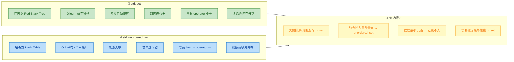

用表格更直观地对比：

| 维度 | `std::set` | `std::unordered_set` |
|------|-----------|---------------------|
| **底层结构** | 红黑树 | 哈希表 |
| **元素顺序** | 升序（可自定义） | 无序 |
| **插入** | O(log n) | O(1) 平均 / O(n) 最坏 |
| **查找** | O(log n) | O(1) 平均 / O(n) 最坏 |
| **删除** | O(log n) | O(1) 平均 / O(n) 最坏 |
| **范围查询** | ✅ lower_bound/upper_bound | ❌ 不支持 |
| **内存开销** | 较小（节点指针） | 较大（桶数组 + 链表） |
| **迭代器失效** | 删除仅失效被删元素 | rehash 导致所有迭代器失效 |
| **自定义类型要求** | 比较函数 | 哈希函数 + 等于判断 |
| **头文件** | `<set>` | `<unordered_set>` |

**选择策略总结**：
- 如果你需要**有序遍历**或**范围查询** (`lower_bound`, `upper_bound`)，选 `set`
- 如果你只需要**快速查找/去重**，且数据量较大，选 `unordered_set`
- 如果你需要**稳定的最坏情况性能**（比如实时系统），选 `set`（因为 O(log n) 是确定性的）
- 如果数据量很小（几百个元素以内），两者性能差距可忽略，选用哪个都行

---

### multiset —— 允许重复的有序集合

标准库还提供了 `std::multiset`，它与 `set` 的唯一区别是**允许存储重复元素**。底层同样是红黑树，所有性能特征与 `set` 相同。

```cpp
#include <set>
#include <iostream>
using namespace std;

int main() {
    // multiset 允许重复元素
    multiset<int> ms = {3, 1, 4, 1, 5, 9, 2, 6, 5, 3, 5};
    // ms: {1, 1, 2, 3, 3, 4, 5, 5, 5, 6, 9}  —— 有序，允许重复

    cout << "size: " << ms.size() << endl;      // 输出: 11
    cout << "count(5): " << ms.count(5) << endl; // 输出: 3（有 3 个 5）

    // ========== insert 始终成功（不会因重复而失败） ==========
    // 注意：multiset 的 insert 返回 iterator（非 pair）
    auto it = ms.insert(5);            // 第 4 个 5，插入成功
    cout << "count(5): " << ms.count(5) << endl; // 输出: 4

    // ========== erase 按值删除会删掉所有相同元素 ==========
    ms.erase(5);                       // 删除所有的 5！
    cout << "count(5): " << ms.count(5) << endl; // 输出: 0

    // 如果只想删除一个，需要用迭代器
    ms.insert({7, 7, 7});             // 插入三个 7
    auto pos = ms.find(7);            // 找到第一个 7
    if (pos != ms.end()) {
        ms.erase(pos);                // 只删除一个 7
    }
    cout << "count(7): " << ms.count(7) << endl; // 输出: 2

    // ========== equal_range 在 multiset 中更有意义 ==========
    ms.insert({10, 10, 10});
    auto [lo, hi] = ms.equal_range(10);   // 所有 10 的范围
    cout << "All 10s: ";
    for (auto it = lo; it != hi; ++it) {
        cout << *it << " ";           // 输出: 10 10 10
    }
    cout << endl;

    return 0;
}
```

> **⚠️ multiset::erase(value) 的陷阱**：按值调用 `erase` 会删除**所有**等于该值的元素。如果你只想删除其中一个，必须先用 `find` 获取迭代器，再用 `erase(iterator)` 删除单个元素。这是一个经典的面试考点。

---

### 实战场景与典型用法

#### 场景一：高效去重

```cpp
#include <vector>
#include <set>
#include <unordered_set>
#include <iostream>
using namespace std;

int main() {
    vector<int> data = {5, 3, 8, 3, 1, 5, 9, 1, 8, 2, 7, 3};

    // 方法一：set 去重（结果有序）
    set<int> s(data.begin(), data.end());
    cout << "set (sorted unique): ";
    for (int x : s) cout << x << " ";     // 输出: 1 2 3 5 7 8 9
    cout << endl;

    // 方法二：unordered_set 去重（更快，结果无序）
    unordered_set<int> us(data.begin(), data.end());
    cout << "unordered_set (unique): ";
    for (int x : us) cout << x << " ";    // 顺序不确定
    cout << endl;

    // 方法三：去重后放回 vector
    vector<int> unique_data(us.begin(), us.end());

    return 0;
}
```

#### 场景二：快速判断是否已访问（BFS/DFS）

```cpp
#include <unordered_set>
#include <queue>
#include <iostream>
using namespace std;

// 经典 BFS 场景：判断节点是否已访问
void bfs(int start) {
    unordered_set<int> visited;        // 记录已访问节点，O(1) 查找
    queue<int> q;

    q.push(start);                     // 起点入队
    visited.insert(start);             // 标记为已访问

    while (!q.empty()) {
        int node = q.front();          // 取出队首
        q.pop();
        cout << "Visiting: " << node << endl;

        // 假设获取邻居节点的函数 get_neighbors(node)
        // for (int neighbor : get_neighbors(node)) {
        //     if (visited.find(neighbor) == visited.end()) {  // 未访问过
        //         visited.insert(neighbor);                    // 标记
        //         q.push(neighbor);                            // 入队
        //     }
        // }
    }
}
```

#### 场景三：集合运算（交集、并集、差集）

```cpp
#include <set>
#include <algorithm>
#include <iterator>
#include <iostream>
using namespace std;

int main() {
    set<int> A = {1, 2, 3, 4, 5};
    set<int> B = {3, 4, 5, 6, 7};

    // ========== 交集 (Intersection): A ∩ B ==========
    set<int> intersection;
    set_intersection(
        A.begin(), A.end(),            // 集合 A 的范围
        B.begin(), B.end(),            // 集合 B 的范围
        inserter(intersection, intersection.begin())  // 输出到 intersection
    );
    cout << "A ∩ B: ";
    for (int x : intersection) cout << x << " ";  // 输出: 3 4 5
    cout << endl;

    // ========== 并集 (Union): A ∪ B ==========
    set<int> union_set;
    set_union(
        A.begin(), A.end(),
        B.begin(), B.end(),
        inserter(union_set, union_set.begin())
    );
    cout << "A ∪ B: ";
    for (int x : union_set) cout << x << " ";     // 输出: 1 2 3 4 5 6 7
    cout << endl;

    // ========== 差集 (Difference): A - B ==========
    set<int> diff;
    set_difference(
        A.begin(), A.end(),
        B.begin(), B.end(),
        inserter(diff, diff.begin())
    );
    cout << "A - B: ";
    for (int x : diff) cout << x << " ";           // 输出: 1 2
    cout << endl;

    return 0;
}
```

> **注意**：`set_intersection`、`set_union`、`set_difference` 这些算法要求输入范围**已排序**，因此它们天然适用于 `std::set`，但**不能**直接用于 `unordered_set`（因为无序）。

---

### 性能实测对比

以下是典型数据规模下，`set` 与 `unordered_set` 的性能对比（仅供参考，实际结果取决于硬件和编译器）：

```
操作: 插入 100 万个随机整数
┌────────────────────┬──────────────┬────────────────────┐
│      容器          │    耗时      │       备注         │
├────────────────────┼──────────────┼────────────────────┤
│ set<int>           │  ~350 ms     │ O(log n) 稳定      │
│ unordered_set<int> │  ~120 ms     │ O(1) 平均          │
│ unordered_set      │  ~80 ms      │ 使用 reserve 预分配│
│   (with reserve)   │              │                    │
└────────────────────┴──────────────┴────────────────────┘

操作: 查找 100 万次
┌────────────────────┬──────────────┬────────────────────┐
│      容器          │    耗时      │       备注         │
├────────────────────┼──────────────┼────────────────────┤
│ set<int>           │  ~280 ms     │ 树的高度 ~20 层    │
│ unordered_set<int> │  ~60 ms      │ 大多数 1 次哈希定位│
└────────────────────┴──────────────┴────────────────────┘
```

可以看到，在大数据量的纯查找/插入场景下，`unordered_set` 的性能优势非常明显。但如果你需要有序遍历或范围查询，`set` 是唯一的选择。

---

### 常见陷阱与最佳实践

**陷阱 1：修改 set 中的元素**

```cpp
set<int> s = {1, 2, 3};
auto it = s.begin();
// *it = 10;  // ❌ 编译错误！set 的元素是 const 的
// 原因：修改元素值会破坏红黑树的排序不变量
```

**陷阱 2：unordered_set 的迭代器在 rehash 后失效**

```cpp
unordered_set<int> us = {1, 2, 3};
auto it = us.find(2);          // 获取迭代器
us.insert(100);                // 可能触发 rehash!
// *it;                        // ⚠️ 未定义行为！it 可能已失效
// 最佳实践：插入后重新获取迭代器
```

**陷阱 3：用 `[]` 访问 set**

```cpp
set<int> s = {1, 2, 3};
// s[0];  // ❌ 编译错误！set 不支持下标访问
// 原因：红黑树不是连续存储，无法 O(1) 随机访问
// 如需第 k 个元素，只能用 std::next(s.begin(), k)，O(k)
```

**最佳实践汇总**：

| 实践 | 说明 |
|------|------|
| 用 `s.find()` 而非 `std::find()` | 利用内部结构，O(log n) vs O(n) |
| 用 `reserve()` 预分配 `unordered_set` | 减少 rehash 次数 |
| 优先用 `emplace` 而非 `insert` | 对复杂类型减少拷贝开销 |
| C++20 用 `contains()` 判断存在性 | 比 `count()` 或 `find()` 更语义化 |
| `multiset` 删除单个用迭代器 | `erase(value)` 会删所有相同值 |

---

**📝 练习题**

以下代码的输出是什么？

```cpp
#include <set>
#include <iostream>
using namespace std;

int main() {
    set<int> s = {5, 3, 8, 1, 3, 9, 1};
    auto [it1, ok1] = s.insert(5);
    auto [it2, ok2] = s.insert(6);
    s.erase(s.lower_bound(3), s.upper_bound(8));
    
    cout << s.size() << " " << ok1 << " " << ok2;
    return 0;
}
```

A. `3 0 1`

B. `2 0 1`

C. `3 1 1`

D. `2 1 0`


**【答案】** B

**【解析】**

逐步分析：

1. **初始化**：`set<int> s = {5, 3, 8, 1, 3, 9, 1};` —— `set` 自动去重并排序，内部实际为 `{1, 3, 5, 8, 9}`，共 5 个元素。

2. **insert(5)**：5 已存在于集合中，插入失败。`ok1 = false (0)`，`it1` 指向已有的 5。

3. **insert(6)**：6 不存在，插入成功。`ok2 = true (1)`。此时 `s = {1, 3, 5, 6, 8, 9}`，共 6 个元素。

4. **范围删除**：`s.lower_bound(3)` 返回指向 3（第一个 ≥ 3 的元素）的迭代器；`s.upper_bound(8)` 返回指向 9（第一个 > 8 的元素）的迭代器。所以 `erase` 删除的范围是 `[3, 9)`，即删除 `{3, 5, 6, 8}` 这四个元素。

5. **最终状态**：`s = {1, 9}`，`s.size() = 2`。

6. **输出**：`2 0 1`，对应选项 **B**。

---

## list（双向链表）

`std::list` 是 C++ STL 中基于 **双向链表（Doubly Linked List）** 实现的序列容器。与 `vector` 的连续内存模型截然不同，`list` 的每个元素（节点）都独立分配在堆上，通过前驱指针（prev）和后继指针（next）串联成链。这种结构赋予了它独特的性能特征：**任意位置的插入/删除为 O(1)**，但 **不支持随机访问**，且由于缓存不友好（Cache Unfriendly），线性遍历的常数因子远大于 `vector`。

理解 `list` 的关键在于理解链表的本质——**用空间和缓存局部性换取插入/删除的灵活性**。在实际工程中，`list` 的使用频率远低于 `vector`，但在特定场景下（如需要频繁在中间位置增删元素、需要迭代器永不失效等），它是不可替代的选择。

### 内部结构与内存模型

`std::list` 底层是一个 **带哨兵节点（Sentinel Node）的环形双向链表**。每个节点（Node）的结构大致如下：

```cpp
// 伪代码：list 节点的内部结构（实际实现因编译器而异）
template <typename T>
struct __list_node {
    T data;                 // 存储的实际数据
    __list_node* prev;      // 指向前一个节点
    __list_node* next;      // 指向后一个节点
};
```

所谓"哨兵节点"，是一个不存储有效数据的特殊节点，它的 `next` 指向链表第一个元素，`prev` 指向链表最后一个元素，形成一个环形结构。这样做的好处是简化边界处理——空链表就是哨兵节点自己指向自己。

```
 ┌──────────────────────────────────────────────────────────┐
 │                                                          │
 │  prev                                              next  │
 ▼       next     next     next     next     next           │
┌─────┐──────►┌─────┐──────►┌─────┐──────►┌─────┐──────►┌─────┐
│Senti│       │  A  │       │  B  │       │  C  │       │  D  │
│ nel │◄──────│     │◄──────│     │◄──────│     │◄──────│     │
└─────┘ prev  └─────┘ prev  └─────┘ prev  └─────┘ prev  └─────┘
 ▲                                                    │
 │                        prev                        │
 └────────────────────────────────────────────────────┘

 begin() 指向 A，end() 指向 Sentinel
```

这里的关键要点：

- `begin()` 返回指向第一个有效节点（A）的迭代器。
- `end()` 返回指向哨兵节点的迭代器，它不是有效数据，只是一个"尾后"标记。
- **每个节点独立分配在堆上**，地址不连续，因此无法通过指针算术进行随机访问。

下面用一张 Mermaid 图对比 `list` 与 `vector` 的内存布局差异：

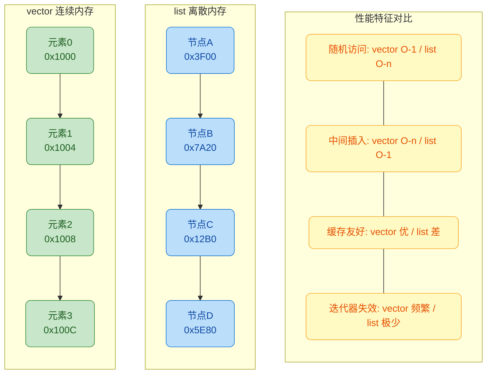

### 基本使用：创建与初始化

`std::list` 位于 `<list>` 头文件中。它支持多种初始化方式：

```cpp
#include <list>       // 引入 list 头文件
#include <iostream>   // 用于输出
#include <vector>     // 用于演示从其他容器构造

int main() {
    // 1. 默认构造：创建一个空链表
    std::list<int> lst1;                          // lst1: {}

    // 2. 填充构造：5 个值为 42 的元素
    std::list<int> lst2(5, 42);                   // lst2: {42, 42, 42, 42, 42}

    // 3. 初始化列表构造（C++11）
    std::list<int> lst3 = {10, 20, 30, 40, 50};  // lst3: {10, 20, 30, 40, 50}

    // 4. 拷贝构造
    std::list<int> lst4(lst3);                    // lst4 是 lst3 的深拷贝

    // 5. 移动构造（C++11）：lst3 被掏空
    std::list<int> lst5(std::move(lst3));          // lst5: {10,20,30,40,50}, lst3: {}

    // 6. 范围构造：从迭代器范围 [first, last) 构造
    std::vector<int> vec = {1, 2, 3, 4};          // 先准备一个 vector
    std::list<int> lst6(vec.begin(), vec.end());   // lst6: {1, 2, 3, 4}

    // 输出 lst2 验证
    for (const auto& val : lst2) {                 // 范围 for 遍历
        std::cout << val << " ";                   // 输出: 42 42 42 42 42
    }
    std::cout << std::endl;

    return 0;
}
```

### 核心操作详解

#### 头尾插入与删除

`list` 最常用的操作就是在头部和尾部进行增删，这些操作的时间复杂度都是 **O(1)**：

```cpp
#include <list>
#include <iostream>

int main() {
    std::list<int> lst = {2, 3, 4};    // 初始: {2, 3, 4}

    // ---- 尾部操作 ----
    lst.push_back(5);                   // 尾部追加 5    → {2, 3, 4, 5}
    lst.emplace_back(6);                // 尾部原位构造 6 → {2, 3, 4, 5, 6}
    lst.pop_back();                     // 移除尾部元素   → {2, 3, 4, 5}

    // ---- 头部操作 ----
    lst.push_front(1);                  // 头部插入 1     → {1, 2, 3, 4, 5}
    lst.emplace_front(0);               // 头部原位构造 0  → {0, 1, 2, 3, 4, 5}
    lst.pop_front();                    // 移除头部元素    → {1, 2, 3, 4, 5}

    // ---- 访问头尾元素（不删除） ----
    std::cout << "front: " << lst.front() << std::endl;  // 输出: 1
    std::cout << "back:  " << lst.back()  << std::endl;  // 输出: 5

    // ---- 注意：list 没有 operator[] 和 at() ----
    // lst[2];       // ❌ 编译错误！不支持随机访问
    // lst.at(2);    // ❌ 编译错误！

    return 0;
}
```

> **为什么 `list` 不支持 `operator[]`？** 因为链表节点在内存中不连续，要访问第 n 个元素，必须从头节点开始逐个跳转 n 次，复杂度为 O(n)。如果提供了 `[]` 运算符，用户可能会错误地在循环中使用 `lst[i]`，导致 O(n²) 的灾难性性能。STL 的设计哲学是 **不提供误导性的接口**。

#### 中间插入与删除（insert / erase）

这是 `list` 相对于 `vector` 最大的优势所在。只要你持有目标位置的迭代器，插入/删除就是 **O(1)** 的纯指针操作，无需移动任何其他元素。

```cpp
#include <list>
#include <iostream>
#include <algorithm>    // std::find

int main() {
    std::list<int> lst = {10, 20, 30, 40, 50};

    // ---- insert: 在指定位置之前插入 ----
    auto it = std::find(lst.begin(), lst.end(), 30);  // 找到值为 30 的迭代器
    // 注意：std::find 对 list 是 O(n) 的线性查找
    
    lst.insert(it, 25);                  // 在 30 之前插入 25 → {10, 20, 25, 30, 40, 50}
    // 此时 it 仍然指向 30，未失效！

    lst.insert(it, 3, 99);              // 在 30 之前插入 3 个 99
    // → {10, 20, 25, 99, 99, 99, 30, 40, 50}

    // ---- erase: 删除指定位置的元素 ----
    it = std::find(lst.begin(), lst.end(), 25);  // 找到 25
    it = lst.erase(it);                 // 删除 25，返回指向下一个元素(99)的迭代器
    // → {10, 20, 99, 99, 99, 30, 40, 50}

    // ---- erase: 删除一个范围 [first, last) ----
    auto first = std::find(lst.begin(), lst.end(), 99);   // 第一个 99
    auto last  = std::find(lst.begin(), lst.end(), 30);    // 30
    lst.erase(first, last);             // 删除 [first, last) 即所有 99
    // → {10, 20, 30, 40, 50}

    // 输出验证
    for (const auto& v : lst) {
        std::cout << v << " ";          // 输出: 10 20 30 40 50
    }
    std::cout << std::endl;

    return 0;
}
```

**关键理解**：虽然 `insert` 和 `erase` 本身是 O(1)，但 **找到插入/删除位置** 通常需要 O(n) 的遍历。所以实际使用中，`list` 的中间操作总复杂度 = **O(n) 查找 + O(1) 增删**。只有当你已经持有迭代器（比如在遍历过程中决定增删），才能真正享受 O(1) 的优势。

### 迭代器稳定性（Iterator Stability）

这是 `list` 最独特也最重要的特性之一。**`list` 的插入操作不会使任何已有迭代器失效，删除操作只会使指向被删除元素的迭代器失效**。

```cpp
#include <list>
#include <iostream>

int main() {
    std::list<int> lst = {10, 20, 30, 40, 50};

    auto it20 = lst.begin();            // 指向 10
    ++it20;                             // 现在指向 20

    auto it40 = it20;                   // 先复制
    ++it40; ++it40;                     // 跳到 40

    // 在 20 之后插入 25（在 it40 之前的某处插入）
    auto pos = it20;
    ++pos;                              // pos 指向 30
    lst.insert(pos, 25);               // 在 30 前插入 25 → {10, 20, 25, 30, 40, 50}

    // 关键验证：it20 和 it40 是否仍然有效？
    std::cout << *it20 << std::endl;    // 输出: 20  ✅ 仍然有效！
    std::cout << *it40 << std::endl;    // 输出: 40  ✅ 仍然有效！

    // 对比：如果这是 vector，在中间 insert 后，
    // it20 和 it40 都可能失效（因为可能发生 reallocation）

    // 删除 it20 指向的元素
    lst.erase(it20);                    // 删除 20 → {10, 25, 30, 40, 50}
    // 此时 it20 已失效，不能再使用！
    // 但 it40 仍然有效：
    std::cout << *it40 << std::endl;    // 输出: 40  ✅

    return 0;
}
```

这个特性使 `list` 非常适合以下场景：

- **遍历过程中频繁增删元素**（如游戏中的实体管理、事件队列清理）。
- **需要长期持有迭代器作为"书签"**，在未来某个时刻回来操作对应元素。

### list 的独有成员函数

`std::list` 提供了一系列其他序列容器没有的成员函数，因为链表结构可以更高效地实现这些操作：

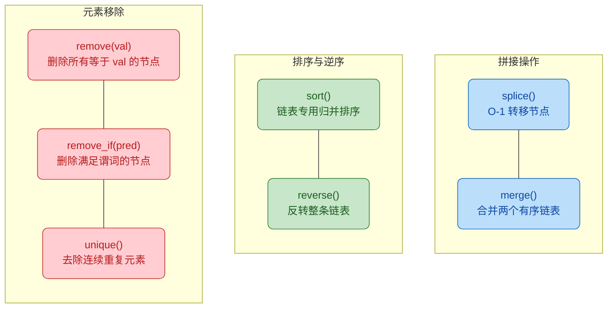

#### remove / remove_if

```cpp
#include <list>
#include <iostream>

int main() {
    std::list<int> lst = {1, 2, 3, 2, 4, 2, 5};

    // remove(val)：删除所有值为 2 的元素
    lst.remove(2);                      // → {1, 3, 4, 5}
    // 注意：这是 list 的成员函数，不是 <algorithm> 中的 std::remove
    // 成员版本直接删除节点、释放内存，不需要配合 erase

    // remove_if(pred)：删除所有满足条件的元素
    lst.remove_if([](int x) {          // Lambda：删除所有奇数
        return x % 2 != 0;             // 奇数返回 true → 被删除
    });
    // → {4}

    std::cout << lst.front() << std::endl;  // 输出: 4
    return 0;
}
```

> **对比 `std::remove`**：`<algorithm>` 中的 `std::remove` 只是将不需要的元素"移到末尾"，并不真正删除，需要配合容器的 `erase` 使用（Erase-Remove Idiom）。而 `list::remove` 是真正的删除+释放内存，一步到位。

#### sort（链表专用排序）

`std::sort`（在 `<algorithm>` 中）要求 **随机访问迭代器（RandomAccessIterator）**，`list` 只有 **双向迭代器（BidirectionalIterator）**，因此 **不能使用 `std::sort` 对 list 排序**。`list` 提供了自己的 `sort()` 成员函数，内部采用 **归并排序（Merge Sort）**，复杂度为 O(n log n)。

```cpp
#include <list>
#include <iostream>

int main() {
    std::list<int> lst = {50, 10, 40, 20, 30};

    // std::sort(lst.begin(), lst.end());  // ❌ 编译错误！需要随机访问迭代器

    // 使用成员函数 sort()
    lst.sort();                         // 默认升序 → {10, 20, 30, 40, 50}

    // 自定义排序：降序
    lst.sort([](int a, int b) {         // 传入比较器 Lambda
        return a > b;                   // a > b 时 a 排在前面 → 降序
    });
    // → {50, 40, 30, 20, 10}

    for (const auto& v : lst) {
        std::cout << v << " ";          // 输出: 50 40 30 20 10
    }
    std::cout << std::endl;

    return 0;
}
```

#### splice（零拷贝节点转移）

`splice` 是 `list` 最强大的独有操作。它能在 **O(1)** 时间内将一个 `list` 的节点"摘下来"并"嫁接"到另一个 `list` 上，**不涉及任何内存分配或拷贝**，纯粹是修改指针。

```cpp
#include <list>
#include <iostream>

// 辅助函数：打印 list 内容
void print(const std::string& label, const std::list<int>& lst) {
    std::cout << label << ": ";
    for (const auto& v : lst) {
        std::cout << v << " ";
    }
    std::cout << "(size=" << lst.size() << ")" << std::endl;
}

int main() {
    std::list<int> lstA = {1, 2, 3, 4, 5};    // 源链表 A
    std::list<int> lstB = {100, 200, 300};     // 目标链表 B

    // ====== 形式1：将整个 lstA 转移到 lstB 的某个位置之前 ======
    auto pos = lstB.begin();                    // 指向 100
    ++pos;                                      // 指向 200
    lstB.splice(pos, lstA);                     // 将 lstA 全部节点插入 200 之前
    // lstB: {100, 1, 2, 3, 4, 5, 200, 300}
    // lstA: {} （已被掏空！）

    print("lstA", lstA);                        // lstA: (size=0)
    print("lstB", lstB);                        // lstB: 100 1 2 3 4 5 200 300 (size=8)

    // ====== 形式2：转移单个元素 ======
    lstA.splice(lstA.begin(), lstB, lstB.begin());
    // 把 lstB 的第一个元素(100) 转移到 lstA 的 begin() 之前
    // lstA: {100}
    // lstB: {1, 2, 3, 4, 5, 200, 300}

    print("lstA", lstA);
    print("lstB", lstB);

    // ====== 形式3：转移一个范围 [first, last) ======
    auto first = lstB.begin();                  // 指向 1
    auto last  = first;
    std::advance(last, 3);                      // last 指向 4（即范围是 1,2,3）
    lstA.splice(lstA.end(), lstB, first, last); // 将 {1,2,3} 转移到 lstA 末尾
    // lstA: {100, 1, 2, 3}
    // lstB: {4, 5, 200, 300}

    print("lstA", lstA);
    print("lstB", lstB);

    return 0;
}
```

`splice` 的实际应用非常广泛，典型场景包括：

- **LRU Cache 实现**：将最近访问的节点从链表中间 splice 到头部，O(1) 完成。
- **任务调度队列**：在不同优先级队列间转移任务节点，零拷贝开销。
- **合并有序数据流**：配合 `merge()` 将两个有序链表合并为一个。

#### merge 与 unique

```cpp
#include <list>
#include <iostream>

int main() {
    // ---- merge：合并两个已排序的链表 ----
    std::list<int> a = {1, 3, 5, 7};    // 必须已排序
    std::list<int> b = {2, 4, 6, 8};    // 必须已排序

    a.merge(b);                          // 将 b 合并进 a，b 变为空
    // a: {1, 2, 3, 4, 5, 6, 7, 8}
    // b: {}

    // ---- unique：去除连续重复元素 ----
    std::list<int> lst = {1, 1, 2, 3, 3, 3, 4, 4, 5};
    lst.unique();                        // 去除连续重复 → {1, 2, 3, 4, 5}
    // 注意：只去除"连续"重复！如果 {1, 2, 1}，结果仍是 {1, 2, 1}
    // 若需要去除所有重复，先 sort() 再 unique()

    for (const auto& v : lst) {
        std::cout << v << " ";          // 输出: 1 2 3 4 5
    }
    std::cout << std::endl;

    return 0;
}
```

### list vs forward_list

C++11 还引入了 `std::forward_list`，它是 **单向链表**，每个节点只有 `next` 指针。它比 `list` 更轻量，但功能也更受限（不支持反向遍历、没有 `size()` 成员函数等）。

```mermaid
graph LR
    subgraph SG1["std::list 双向链表"]
        direction TB
        D1["prev + data + next"]
        D2["双向迭代器"]
        D3["O-1 的 size"]
        D4["支持 reverse 遍历"]
        D1 --- D2 --- D3 --- D4
    end

    subgraph SG2["std::forward_list 单向链表"]
        direction TB
        F1["data + next 仅单向"]
        F2["前向迭代器"]
        F3["无 size 成员 需 distance"]
        F4["不支持 reverse 遍历"]
        F1 --- F2 --- F3 --- F4
    end

    subgraph SG3["选择建议"]
        direction TB
        S1["需要双向遍历 选 list"]
        S2["极致省内存 选 forward_list"]
        S3["大多数场景 优先选 vector"]
        S1 --- S2 --- S3
    end

    SG1 ~~~ SG2 ~~~ SG3

    classDef listCls fill:#E1BEE7,stroke:#7B1FA2,color:#4A148C,rx:8
    classDef fwdCls fill:#B2EBF2,stroke:#00838F,color:#004D40,rx:8
    classDef tipCls fill:#FFF9C4,stroke:#F57F17,color:#E65100,rx:8

    class D1,D2,D3,D4 listCls
    class F1,F2,F3,F4 fwdCls
    class S1,S2,S3 tipCls
```

### 性能陷阱与最佳实践

#### 1. 不要用 list 做"默认容器"

很多初学者认为链表是基础数据结构，就默认使用 `list`。但在现代硬件上，**`vector` 几乎在所有场景下都优于 `list`**。原因在于 CPU 缓存：`vector` 的连续内存可以被 CPU 预取（Prefetch），而 `list` 的离散节点会导致大量 **缓存未命中（Cache Miss）**。

```cpp
// ❌ 反模式：用 list 存储大量数据并遍历
std::list<int> data;                    // 节点分散在堆的各处
for (auto& item : data) {              // 每次跳转都可能 cache miss
    process(item);                      // 性能可能比 vector 慢 10-50 倍
}

// ✅ 正确选择：默认用 vector，只在确认需要时用 list
std::vector<int> data;                  // 连续内存，cache 友好
for (auto& item : data) {              // 顺序访问，CPU 预取高效
    process(item);
}
```

#### 2. 善用 splice 避免不必要的拷贝

```cpp
// ❌ 低效：从一个容器复制到另一个，再删除原来的
auto it = std::find(srcList.begin(), srcList.end(), target);
dstList.push_back(*it);                 // 拷贝元素
srcList.erase(it);                      // 再删除原节点

// ✅ 高效：用 splice 零拷贝转移
auto it = std::find(srcList.begin(), srcList.end(), target);
dstList.splice(dstList.end(), srcList, it);  // O(1)，无拷贝
```

#### 3. list 适用场景总结

| 场景 | 为什么选 list |
|------|-------------|
| 遍历中频繁增删 | 迭代器不失效，增删 O(1) |
| LRU Cache | splice 实现 O(1) 节点移动 |
| 需要保证迭代器/引用永不失效 | 插入不影响已有迭代器 |
| 元素极大（sizeof > 1KB） | 避免 vector 扩容时的大量拷贝 |
| 需要频繁在两个容器间转移元素 | splice 零开销 |

### 经典应用：LRU Cache

LRU（Least Recently Used）缓存是 `list` + `unordered_map` 的经典组合，也是高频面试题。核心思路是：`list` 维护访问顺序，`unordered_map` 提供 O(1) 键查找。

```cpp
#include <list>
#include <unordered_map>
#include <iostream>

class LRUCache {
    int capacity;                                           // 缓存容量上限
    std::list<std::pair<int, int>> items;                   // 双向链表：{key, value}，头部是最近使用的
    std::unordered_map<int, std::list<std::pair<int, int>>::iterator> cache;
    // 哈希表：key → 链表中对应节点的迭代器（O(1) 定位）

public:
    LRUCache(int cap) : capacity(cap) {}                    // 构造函数，设定容量

    int get(int key) {
        auto it = cache.find(key);                          // 在哈希表中查找 key
        if (it == cache.end()) return -1;                   // 未命中，返回 -1

        // 命中：将该节点 splice 到链表头部（标记为"最近使用"）
        items.splice(items.begin(), items, it->second);     // O(1) 转移
        return it->second->second;                          // 返回 value
    }

    void put(int key, int value) {
        auto it = cache.find(key);                          // 先查找是否已存在

        if (it != cache.end()) {                            // 已存在：更新值并移到头部
            it->second->second = value;                     // 更新 value
            items.splice(items.begin(), items, it->second); // 移到头部
            return;
        }

        // 不存在：检查是否需要淘汰
        if ((int)items.size() >= capacity) {                // 容量满了
            auto last = items.back();                       // 取尾部元素（最久未使用）
            cache.erase(last.first);                        // 从哈希表删除该 key
            items.pop_back();                               // 从链表删除尾节点
        }

        // 在头部插入新节点
        items.emplace_front(key, value);                    // 插入链表头部
        cache[key] = items.begin();                         // 在哈希表中记录迭代器
    }
};

int main() {
    LRUCache lru(3);                    // 容量为 3

    lru.put(1, 10);                     // 缓存: {1:10}
    lru.put(2, 20);                     // 缓存: {2:20, 1:10}
    lru.put(3, 30);                     // 缓存: {3:30, 2:20, 1:10}

    std::cout << lru.get(1) << std::endl;  // 输出 10，1 移到头部 → {1:10, 3:30, 2:20}

    lru.put(4, 40);                     // 容量满，淘汰尾部的 2 → {4:40, 1:10, 3:30}

    std::cout << lru.get(2) << std::endl;  // 输出 -1（已被淘汰）
    std::cout << lru.get(3) << std::endl;  // 输出 30

    return 0;
}
```

这段代码完美展示了 `list` 的核心价值：**迭代器持久有效** + **splice O(1) 转移**，使得 `get` 和 `put` 操作都是严格 O(1) 的。

---

**📝 练习题**

以下代码的输出是什么？

```cpp
#include <list>
#include <iostream>

int main() {
    std::list<int> a = {1, 2, 3, 4, 5};
    auto it = a.begin();
    std::advance(it, 2);       // it 指向 3

    std::list<int> b = {10, 20};
    b.splice(b.end(), a, it);  // 将 a 中 it 指向的节点转移到 b 末尾

    std::cout << a.size() << " " << b.size() << std::endl;
    std::cout << *it << std::endl;
}
```

A. `4 3` 然后 `3`


B. `5 2` 然后未定义行为


C. `4 3` 然后未定义行为


D. 编译错误


**【答案】** A

**【解析】** `splice` 将 `a` 中 `it` 指向的节点（值为 3）**物理转移**到 `b` 的末尾。转移后，`a` 少了一个元素（size = 4），`b` 多了一个元素（size = 3，内容为 `{10, 20, 3}`）。关键点在于：**`splice` 不会使被转移节点的迭代器失效**。`it` 仍然指向那个值为 3 的节点，只是这个节点现在属于 `b` 了。因此 `*it` 仍然合法，输出 `3`。这正是 `list` 迭代器稳定性的又一体现——即使节点换了"主人"（从 `a` 到 `b`），迭代器依然有效。

---

## deque（双端队列）

`deque`（读作 "deck"，全称 **D**ouble-**E**nded **Que**ue）是 STL 中一种极具特色的序列容器。它同时支持在 **头部** 和 **尾部** 进行高效的插入与删除操作，时间复杂度均为 **O(1)**。从接口上看，它几乎是 `vector` 的超集——`vector` 能做的它都能做，而且还额外支持 `push_front` / `pop_front`。但天下没有免费的午餐，这种"万能"能力背后隐藏着更复杂的内存布局和微妙的性能权衡。理解 `deque` 的内部结构，是掌握它的关键。

---

### deque 的内部结构：分段连续内存

很多初学者会误以为 `deque` 和 `vector` 一样，底层就是一段连续内存。实际上，`deque` 采用的是一种 **分段连续（Segmented Contiguous）** 的存储策略。它的底层由一个 **中控数组（Map Array）** 管理着若干个 **固定大小的缓冲区（Buffer / Chunk）**，每个缓冲区内部是连续的，但缓冲区之间并不一定在物理内存上相邻。

这种设计堪称精妙：

- **头部扩展**：当需要在前端插入元素时，只需要在第一个 buffer 的前方填充，如果该 buffer 已满，则在 Map 前方分配一个新 buffer 即可，**无需移动任何已有元素**。
- **尾部扩展**：与 `vector` 的 `push_back` 类似，在最后一个 buffer 后方填充，满了就加新 buffer。
- **随机访问**：通过 Map 数组定位到目标 buffer，再通过偏移量定位到具体元素，实现 **O(1)** 的下标访问。

```mermaid
graph LR
    subgraph MAP["中控数组 Map Array"]
        direction TB
        M0["ptr 0"]
        M1["ptr 1"]
        M2["ptr 2"]
        M3["ptr 3"]
    end

    subgraph BUF0["Buffer 0 (Head)"]
        direction TB
        B0E0["_ "]
        B0E1["elem A"]
        B0E2["elem B"]
        B0E3["elem C"]
    end

    subgraph BUF1["Buffer 1"]
        direction TB
        B1E0["elem D"]
        B1E1["elem E"]
        B1E2["elem F"]
        B1E3["elem G"]
    end

    subgraph BUF2["Buffer 2"]
        direction TB
        B2E0["elem H"]
        B2E1["elem I"]
        B2E2["elem J"]
        B2E3["elem K"]
    end

    subgraph BUF3["Buffer 3 (Tail)"]
        direction TB
        B3E0["elem L"]
        B3E1["elem M"]
        B3E2["_ "]
        B3E3["_ "]
    end

    M0 --> BUF0
    M1 --> BUF1
    M2 --> BUF2
    M3 --> BUF3

    classDef mapStyle fill:#E3F2FD,stroke:#1565C0,color:#0D47A1,stroke-width:2px
    classDef bufHead fill:#E8F5E9,stroke:#2E7D32,color:#1B5E20,stroke-width:2px
    classDef bufMid fill:#FFF8E1,stroke:#F9A825,color:#E65100,stroke-width:1px
    classDef bufTail fill:#FCE4EC,stroke:#C62828,color:#B71C1C,stroke-width:2px

    class MAP mapStyle
    class BUF0 bufHead
    class BUF1,BUF2 bufMid
    class BUF3 bufTail
```

图中 `_` 表示该位置当前为空闲。注意 Buffer 0 的头部有空位——这正是为 `push_front` 预留的空间。当执行 `push_front` 时，只需将 `start` 迭代器前移一格，将新元素写入 `_` 位置即可，无需搬移。

与 `vector` 的 **单块连续内存 + 倍增扩容** 策略相比，`deque` 的这种设计有如下差异：

| 特性 | `vector` | `deque` |
|---|---|---|
| 内存布局 | 单段连续 | 分段连续 |
| `push_back` | 均摊 O(1)，扩容时拷贝全部 | 均摊 O(1)，扩容只加新 buffer |
| `push_front` | O(n)，需移动所有元素 | **O(1)** |
| 随机访问 `[]` | O(1)，一次寻址 | O(1)，两次寻址（Map + Buffer 偏移） |
| 迭代器失效 | 插入/删除后大面积失效 | 中间插入/删除使全部失效；两端操作更温和 |
| 缓存友好性 | 极佳（连续内存） | 较好（段内连续，段间跳跃） |

可以看到，`deque` 在 **两端操作** 上拥有显著优势，但在纯随机访问密集型场景中，由于多了一层 Map 间接寻址和段间跳跃带来的 cache miss，性能会略逊于 `vector`。

---

### 基本用法：构造与初始化

使用 `deque` 需要包含头文件 `<deque>`。它的构造方式和 `vector` 高度一致：

```cpp
#include <deque>       // 引入 deque 头文件
#include <iostream>    // 标准输入输出

int main() {
    // 1. 默认构造：创建空 deque
    std::deque<int> d1;

    // 2. 指定大小：5 个元素，全部初始化为 0
    std::deque<int> d2(5);

    // 3. 指定大小和初始值：5 个元素，全部初始化为 42
    std::deque<int> d3(5, 42);

    // 4. 初始化列表（C++11）
    std::deque<int> d4 = {10, 20, 30, 40, 50};

    // 5. 拷贝构造
    std::deque<int> d5(d4);          // d5 是 d4 的副本

    // 6. 范围构造：从其他容器的迭代器区间构造
    std::deque<int> d6(d4.begin(), d4.begin() + 3);  // {10, 20, 30}

    // 输出 d4 验证
    for (int val : d4) {             // 范围 for 遍历
        std::cout << val << " ";     // 10 20 30 40 50
    }
    std::cout << std::endl;

    return 0;
}
```

---

### 两端操作：deque 的核心能力

`deque` 最引以为傲的能力，就是头尾双向的高效插入与删除。这是它区别于 `vector` 的最大特征。

```cpp
#include <deque>
#include <iostream>

int main() {
    std::deque<int> dq = {3, 4, 5};

    // ========== 尾部操作 ==========
    dq.push_back(6);    // 尾部插入 6 → {3, 4, 5, 6}
    dq.push_back(7);    // 尾部插入 7 → {3, 4, 5, 6, 7}

    // ========== 头部操作（vector 做不到 O(1)）==========
    dq.push_front(2);   // 头部插入 2 → {2, 3, 4, 5, 6, 7}
    dq.push_front(1);   // 头部插入 1 → {1, 2, 3, 4, 5, 6, 7}

    // 遍历输出当前状态
    std::cout << "当前: ";
    for (int v : dq) {               // 范围 for 遍历
        std::cout << v << " ";       // 1 2 3 4 5 6 7
    }
    std::cout << std::endl;

    // ========== 尾部删除 ==========
    dq.pop_back();      // 删除尾部 → {1, 2, 3, 4, 5, 6}

    // ========== 头部删除 ==========
    dq.pop_front();     // 删除头部 → {2, 3, 4, 5, 6}

    // 访问两端元素
    std::cout << "front: " << dq.front() << std::endl;  // 2
    std::cout << "back: "  << dq.back()  << std::endl;   // 6

    // 随机访问（和 vector 一样支持 [] 和 at()）
    std::cout << "dq[2]: " << dq[2] << std::endl;       // 4
    std::cout << "dq.at(3): " << dq.at(3) << std::endl; // 5（带越界检查）

    return 0;
}
```

**关键要点**：

- `push_front` / `pop_front` 是 `deque` 相比 `vector` 的最大优势。如果你的业务场景需要频繁在序列头部进行增删，`deque` 几乎是唯一的顺序容器选择（`list` 也行，但没有随机访问）。
- `front()` 返回首元素引用，`back()` 返回尾元素引用，与 `vector` 一致。
- `operator[]` 不做边界检查，`at()` 会在越界时抛出 `std::out_of_range` 异常。

---

### 中间插入与删除

虽然 `deque` 的两端操作是 O(1)，但 **中间位置的插入和删除** 仍然是 **O(n)** 的——需要移动元素。不过 `deque` 有一个聪明的优化：它会判断插入点距离头部近还是尾部近，**选择移动更少元素的那一端**。

```cpp
#include <deque>
#include <iostream>

int main() {
    std::deque<int> dq = {10, 20, 30, 40, 50};

    // ========== 中间插入 ==========
    auto it = dq.begin() + 2;          // 指向第 3 个元素 (30)
    dq.insert(it, 25);                 // 在 30 前插入 25
    // dq: {10, 20, 25, 30, 40, 50}
    // 插入点靠近头部(距头2) vs 尾部(距尾3)
    // deque 选择移动头部方向的 2 个元素（10, 20 前移），更高效

    // ========== 中间删除 ==========
    auto it2 = dq.begin() + 4;         // 指向第 5 个元素 (40)
    dq.erase(it2);                     // 删除 40
    // dq: {10, 20, 25, 30, 50}
    // 删除点靠近尾部，只需将 50 前移 1 位

    // ========== 范围删除 ==========
    dq.erase(dq.begin() + 1, dq.begin() + 3);  // 删除 [20, 25)... 包含20和25
    // dq: {10, 30, 50}

    for (int v : dq) {
        std::cout << v << " ";         // 10 30 50
    }
    std::cout << std::endl;

    return 0;
}
```

这个 "选择移动较少一端" 的优化，使得 `deque` 在中间操作时平均只需移动 **n/2** 个元素，虽然复杂度量级不变（仍为 O(n)），但常数因子约为 `vector` 的一半。

---

### 容量管理：deque 没有 capacity()

这是一个容易被忽略的重要区别：**`deque` 没有 `capacity()` 和 `reserve()` 方法**。

```mermaid
graph LR
    subgraph VEC["vector 的容量模型"]
        direction TB
        V1["size = 5"]
        V2["capacity = 8"]
        V3["连续内存块, 预留空间"]
        V1 --> V2 --> V3
    end

    subgraph DEQ["deque 的容量模型"]
        direction TB
        D1["size = 5"]
        D2["无 capacity 概念"]
        D3["按需分配新 Buffer"]
        D1 --> D2 --> D3
    end

    VEC ~~~ DEQ

    classDef vecStyle fill:#E8EAF6,stroke:#283593,color:#1A237E,stroke-width:2px
    classDef deqStyle fill:#FFF3E0,stroke:#E65100,color:#BF360C,stroke-width:2px

    class VEC vecStyle
    class DEQ deqStyle
```

原因在于二者扩容机制的本质不同：

- **`vector`**：单块连续内存，扩容时需要重新分配更大的内存块并拷贝全部元素，所以提供 `reserve()` 让你提前预分配，避免多次扩容。
- **`deque`**：分段存储，扩容只需新增一个 buffer 并在 Map 中注册，已有 buffer 不动，已有元素不搬迁。因此 `reserve()` 对它意义不大。

但 `deque` 仍然提供以下容量相关接口：

```cpp
#include <deque>
#include <iostream>

int main() {
    std::deque<int> dq = {1, 2, 3, 4, 5};

    std::cout << "size: " << dq.size() << std::endl;       // 5，当前元素个数
    std::cout << "empty: " << dq.empty() << std::endl;     // 0（false），是否为空
    std::cout << "max_size: " << dq.max_size() << std::endl; // 理论最大元素数

    dq.resize(8);        // 扩展到 8 个，新增的用 0 填充 → {1,2,3,4,5,0,0,0}
    dq.resize(3);        // 截断到 3 个 → {1, 2, 3}
    dq.shrink_to_fit();  // 请求释放多余的内存（C++11，非强制）
    dq.clear();          // 清空全部元素，size 变为 0

    return 0;
}
```

---

### 迭代器特性与失效规则

`deque` 的迭代器属于 **随机访问迭代器（Random Access Iterator）**，支持 `+`、`-`、`[]`、`<` 等运算，使用体验和 `vector` 相同。但其内部实现远比 `vector` 复杂——每个迭代器内部需要维护 4 个指针：

```cpp
// deque 迭代器的概念模型（简化示意，非实际源码）
struct deque_iterator {
    T* cur;     // 指向当前 buffer 中的当前元素
    T* first;   // 当前 buffer 的起始地址
    T* last;    // 当前 buffer 的末尾地址（past-the-end）
    T** node;   // 指向 Map 中"当前 buffer 对应的指针"
};
```

当迭代器在一个 buffer 内移动时，只操作 `cur`；当跨越 buffer 边界时（比如从 Buffer 1 的末尾前进到 Buffer 2 的开头），需要通过 `node` 跳转到 Map 的下一个槽位，并更新 `first`、`last`、`cur`。这就是 `deque` 迭代器为什么比 `vector` 的裸指针迭代器更"重"的原因。

**迭代器失效规则**（重要考点）：

| 操作 | 迭代器/引用是否失效 |
|---|---|
| `push_back` / `push_front` | **所有迭代器失效**，但元素的引用和指针**不失效** |
| `pop_back` / `pop_front` | 仅被删除端的迭代器失效，其余不受影响 |
| 在中间 `insert` / `erase` | **所有迭代器和引用全部失效** |

> ⚠️ **注意**：`push_back` / `push_front` 后迭代器失效但引用不失效，这是因为已有 buffer 中的元素地址不变（没有搬迁），但 Map 数组可能重新分配导致迭代器内部的 `node` 指针悬空。这个细节在面试中经常被考到。

```cpp
#include <deque>
#include <iostream>

int main() {
    std::deque<int> dq = {10, 20, 30};

    int& ref = dq[1];                  // 获取第 2 个元素的引用
    auto it = dq.begin() + 1;          // 获取指向第 2 个元素的迭代器

    dq.push_front(5);                  // 头部插入

    // ref 仍然有效！可以安全使用
    std::cout << "ref: " << ref << std::endl;    // 20（合法）

    // it 已失效！使用属于未定义行为 (UB)
    // std::cout << *it << std::endl;  // ❌ 危险！UB！

    return 0;
}
```

---

### deque 作为其他容器的底层

`deque` 的一个重要角色，是作为 STL 适配器（Adapter）的 **默认底层容器**：

```mermaid
graph LR
    subgraph ADAPTERS["容器适配器 Container Adapters"]
        direction TB
        S["stack〈T〉"]
        Q["queue〈T〉"]
    end

    subgraph UNDERLYING["默认底层容器"]
        direction TB
        D["deque〈T〉"]
    end

    S -->|"默认使用"| D
    Q -->|"默认使用"| D

    classDef adapterStyle fill:#E8F5E9,stroke:#2E7D32,color:#1B5E20,stroke-width:2px
    classDef dequeStyle fill:#E3F2FD,stroke:#1565C0,color:#0D47A1,stroke-width:2px

    class ADAPTERS adapterStyle
    class S,Q adapterStyle
    class UNDERLYING,D dequeStyle
```

- **`std::stack<T>`** 默认底层是 `deque<T>`，只暴露 `push`(→`push_back`)、`pop`(→`pop_back`)、`top`(→`back`)。
- **`std::queue<T>`** 默认底层也是 `deque<T>`，只暴露 `push`(→`push_back`)、`pop`(→`pop_front`)、`front`、`back`。

为什么选 `deque` 而不是 `vector`？

- `stack` 只需要尾部操作，`vector` 也能胜任，但 `deque` 不会出现整体搬迁的扩容，行为更稳定。
- `queue` 需要头部删除 + 尾部插入，`vector` 的 `pop_front` 是 O(n)，完全不适合，而 `deque` 两端均为 O(1)，完美匹配。

当然，你也可以显式指定底层容器：

```cpp
#include <stack>
#include <queue>
#include <vector>
#include <list>

// 使用 vector 作为 stack 底层（合法，vector 有 push_back/pop_back）
std::stack<int, std::vector<int>> s1;

// 使用 list 作为 queue 底层（合法，list 有 push_back/pop_front）
std::queue<int, std::list<int>> q1;
```

---

### 什么时候该用 deque？

选择容器时的决策依据，可以归纳为以下流程：

```mermaid
graph LR
    subgraph Q1["需要随机访问?"]
        direction TB
        A1{"Yes / No"}
    end

    subgraph Q2["需要两端操作?"]
        direction TB
        A2{"Yes / No"}
    end

    subgraph Q3["只需尾部操作?"]
        direction TB
        A3{"Yes / No"}
    end

    subgraph R1["选择容器"]
        direction TB
        R_DEQ["deque"]
        R_VEC["vector"]
        R_LIST["list"]
    end

    A1 -->|"Yes"| Q2
    A1 -->|"No"| R_LIST
    A2 -->|"Yes"| R_DEQ
    A2 -->|"No"| Q3
    A3 -->|"Yes"| R_VEC
    A3 -->|"No"| R_DEQ

    classDef questionStyle fill:#F3E5F5,stroke:#6A1B9A,color:#4A148C,stroke-width:2px
    classDef resultStyle fill:#E0F2F1,stroke:#00695C,color:#004D40,stroke-width:2px

    class Q1,Q2,Q3 questionStyle
    class A1,A2,A3 questionStyle
    class R1,R_DEQ,R_VEC,R_LIST resultStyle
```

**总结实战建议**：

- **优先选 `vector`**：大多数场景下 `vector` 因为缓存友好、结构简单，综合性能最优。
- **需要 `push_front`? 选 `deque`**：这是 `deque` 最核心的使用场景。
- **作为 `stack`/`queue` 底层**：默认就是 `deque`，不需要你特别操心。
- **数据量极大且担心扩容拷贝开销**：`deque` 不会搬迁已有元素，比 `vector` 更平滑。
- **需要 stable pointer/reference**：`deque` 两端操作不会使引用失效，某些场景很有用。

---

### emplace 系列与 C++11 增强

和 `vector` 一样，`deque` 也支持 C++11 引入的就地构造（emplace）系列函数，用于避免不必要的拷贝或移动：

```cpp
#include <deque>
#include <string>
#include <iostream>

struct Student {
    std::string name;  // 学生姓名
    int age;           // 年龄

    // 构造函数
    Student(const std::string& n, int a) : name(n), age(a) {
        std::cout << "Construct: " << name << std::endl;
    }
};

int main() {
    std::deque<Student> dq;

    // push_back: 先构造临时对象，再移动/拷贝到容器中
    dq.push_back(Student("Alice", 20));    // Construct → Move

    // emplace_back: 直接在容器的内存空间内就地构造，零拷贝
    dq.emplace_back("Bob", 21);            // 直接 Construct，无 Move

    // emplace_front: 头部就地构造
    dq.emplace_front("Charlie", 22);       // 直接在头部构造

    // emplace: 在指定位置就地构造
    auto it = dq.begin() + 1;             // 指向第 2 个位置
    dq.emplace(it, "David", 19);          // 在该位置就地构造

    // 遍历输出
    for (const auto& s : dq) {
        std::cout << s.name << "(" << s.age << ") ";
    }
    // Charlie(22) David(19) Alice(20) Bob(21)
    std::cout << std::endl;

    return 0;
}
```

---

### deque 完整 API 速查表

| 分类 | 方法 | 说明 | 时间复杂度 |
|---|---|---|---|
| **构造** | `deque<T> d` | 默认构造 | O(1) |
| | `deque<T> d(n, val)` | n 个 val | O(n) |
| | `deque<T> d{a,b,c}` | 初始化列表 | O(n) |
| **两端** | `push_back(val)` | 尾部插入 | O(1) |
| | `push_front(val)` | 头部插入 | O(1) |
| | `pop_back()` | 尾部删除 | O(1) |
| | `pop_front()` | 头部删除 | O(1) |
| | `emplace_back(args...)` | 尾部就地构造 | O(1) |
| | `emplace_front(args...)` | 头部就地构造 | O(1) |
| **访问** | `operator[](i)` | 下标访问（无检查） | O(1) |
| | `at(i)` | 下标访问（有检查） | O(1) |
| | `front()` | 首元素引用 | O(1) |
| | `back()` | 尾元素引用 | O(1) |
| **中间** | `insert(pos, val)` | 指定位置插入 | O(n) |
| | `erase(pos)` | 指定位置删除 | O(n) |
| | `emplace(pos, args...)` | 指定位置就地构造 | O(n) |
| **容量** | `size()` | 元素个数 | O(1) |
| | `empty()` | 是否为空 | O(1) |
| | `resize(n)` | 调整大小 | O(n) |
| | `shrink_to_fit()` | 请求释放多余内存 | 实现定义 |
| | `clear()` | 清空 | O(n) |
| **迭代器** | `begin()` / `end()` | 正向迭代器 | O(1) |
| | `rbegin()` / `rend()` | 反向迭代器 | O(1) |

---

**📝 练习题**

以下关于 `std::deque` 的描述，哪一项是**正确**的？


A. `deque` 的底层是一块连续内存，与 `vector` 完全相同


B. 对 `deque` 执行 `push_front` 后，所有已有元素的**引用（reference）**将失效


C. `deque` 支持 `reserve()` 方法来预分配内存


D. `std::stack` 和 `std::queue` 的默认底层容器都是 `deque`


**【答案】** D

**【解析】** 逐项分析：
- **A 错误**：`deque` 采用分段连续内存（Segmented Contiguous），由 Map 数组管理多个固定大小的 Buffer，并非像 `vector` 那样的单块连续内存。
- **B 错误**：这是 `deque` 最容易混淆的考点。`push_front` / `push_back` 会导致所有**迭代器**失效，但已有元素的**引用和指针不失效**——因为已有 Buffer 内的元素不会被搬移，地址不变。失效的原因是 Map 可能重新分配，导致迭代器内部的 `node` 指针悬空。
- **C 错误**：`deque` 不提供 `capacity()` 和 `reserve()`，因为其扩容机制是按需增加新 Buffer，无需一次性预分配。
- **D 正确**：`std::stack` 和 `std::queue` 默认底层容器均为 `std::deque`，`deque` 的两端 O(1) 操作完美适配这两种适配器的需求。

---

## 迭代器（Iterators）

迭代器是 C++ STL 中最核心的"粘合剂"概念之一。它在 **容器（Containers）** 和 **算法（Algorithms）** 之间架起了一座桥梁——算法不需要知道数据存储在什么容器里，只需要通过迭代器就能统一地访问元素。你可以把迭代器想象成一个**广义化的指针（Generalized Pointer）**：它指向容器中的某个元素，支持解引用 `*`、递增 `++` 等操作，但其底层实现可能是裸指针，也可能是一个复杂的类对象——这取决于容器的数据结构。

理解迭代器，就是理解 STL 设计哲学的钥匙。Alexander Stepanov（STL 之父）设计 STL 时的核心理念就是：**将数据结构与算法解耦（Decouple data structures from algorithms）**。迭代器正是实现这一目标的抽象层。

```mermaid
graph LR
    subgraph Containers["🗃️ 容器层 Containers"]
        direction TB
        V["vector"]
        L["list"]
        M["map"]
        S["set"]
        D["deque"]
    end

    subgraph Iterators["🔗 迭代器层 Iterators"]
        direction TB
        RI["Random Access"]
        BI["Bidirectional"]
        FI["Forward"]
        II["Input / Output"]
    end

    subgraph Algorithms["⚙️ 算法层 Algorithms"]
        direction TB
        SO["sort"]
        FN["find"]
        FE["for_each"]
        CP["copy"]
        AC["accumulate"]
    end

    V --> RI
    D --> RI
    L --> BI
    M --> BI
    S --> BI

    RI --> SO
    RI --> FN
    BI --> FE
    FI --> CP
    II --> AC

    classDef containerCls fill:#C8E6C9,stroke:#388E3C,color:#1B5E20,stroke-width:2px
    classDef iteratorCls fill:#BBDEFB,stroke:#1976D2,color:#0D47A1,stroke-width:2px
    classDef algoCls fill:#FFE0B2,stroke:#F57C00,color:#E65100,stroke-width:2px

    class V,L,M,S,D containerCls
    class RI,BI,FI,II iteratorCls
    class SO,FN,FE,CP,AC algoCls
```

上图清晰展示了三层架构：**容器**产出迭代器，**迭代器**喂给**算法**。不同容器产出不同能力等级的迭代器，而算法根据自己的需求"挑选"最低能力要求的迭代器类别。这就是为什么 `std::sort` 只能用于 `vector`/`deque`（需要 Random Access Iterator），却不能直接排序 `list`（只提供 Bidirectional Iterator）。

---

### begin() / end() 与半开区间

C++ 中所有标准容器都提供 `begin()` 和 `end()` 成员函数，它们构成了一个**半开区间 `[begin, end)`**：

- `begin()` 返回指向容器**第一个元素**的迭代器。
- `end()` 返回指向容器**最后一个元素之后（past-the-end）** 的迭代器，**它不指向任何有效元素**。

这种半开区间设计（Half-Open Range）是 STL 中最天才的设计之一，好处有三：

1. **空区间的自然表示**：当容器为空时，`begin() == end()`，无需特判。
2. **遍历终止条件统一**：循环永远写成 `it != end()`，不需要区分"最后一个"和"越界"。
3. **区间长度计算简洁**：元素个数 = `end() - begin()`（对 Random Access Iterator）。

```cpp
// ====== 半开区间内存模型 ======
// 假设 vector<int> v = {10, 20, 30, 40};
//
//   begin()                              end()
//     |                                    |
//     v                                    v
//   +----+----+----+----+- - - - - - - - -+
//   | 10 | 20 | 30 | 40 |  past-the-end   |
//   +----+----+----+----+- - - - - - - - -+
//   [0]   [1]   [2]   [3]    ← 不可解引用
//
//   有效范围: [begin, end)  ← 包含 begin, 不包含 end
```

除了普通的 `begin()`/`end()`，C++ 还提供了多种变体：

| 函数 | 返回类型 | 说明 |
|:---|:---|:---|
| `begin()` / `end()` | `iterator` | 可读写的正向迭代器 |
| `cbegin()` / `cend()` | `const_iterator` | 只读正向迭代器（C++11） |
| `rbegin()` / `rend()` | `reverse_iterator` | 反向迭代器（从尾到头） |
| `crbegin()` / `crend()` | `const_reverse_iterator` | 只读反向迭代器（C++11） |

```cpp
#include <vector>
#include <iostream>

int main() {
    std::vector<int> v = {10, 20, 30, 40, 50};

    // ---- 正向遍历（可修改）----
    for (auto it = v.begin(); it != v.end(); ++it) {  // it 类型: vector<int>::iterator
        *it += 1;  // 通过迭代器修改元素值，每个元素 +1
    }

    // ---- 正向只读遍历 ----
    for (auto it = v.cbegin(); it != v.cend(); ++it) {  // it 类型: vector<int>::const_iterator
        std::cout << *it << " ";  // 只读访问，尝试 *it = 0 会编译报错
    }
    // 输出: 11 21 31 41 51

    std::cout << "\n";

    // ---- 反向遍历 ----
    for (auto it = v.rbegin(); it != v.rend(); ++it) {  // it 类型: vector<int>::reverse_iterator
        std::cout << *it << " ";  // 从最后一个元素开始，向前遍历
    }
    // 输出: 51 41 31 21 11

    return 0;
}
```

> **最佳实践**：当你只需要读取元素、不需要修改时，优先使用 `cbegin()`/`cend()`。这不仅能防止意外修改，还能向阅读代码的人传递"这里只读"的意图（Intent Communication）。

---

### 迭代器的五大类别（Iterator Categories）

C++ 标准把迭代器按**能力强弱**划分为五个类别，形成一个层次体系。上层迭代器拥有下层迭代器的所有能力，并在此基础上增加新操作：

```mermaid
graph LR
    subgraph Hierarchy["📊 迭代器能力层次 Iterator Category Hierarchy"]
        direction TB
        INPUT["Input Iterator\n输入迭代器\n单遍只读"]
        OUTPUT["Output Iterator\n输出迭代器\n单遍只写"]
        FORWARD["Forward Iterator\n前向迭代器\n多遍 + 只能 ++"]
        BIDIR["Bidirectional Iterator\n双向迭代器\n支持 --"]
        RANDOM["Random Access Iterator\n随机访问迭代器\n支持 + - [] 比较"]
        CONTIG["Contiguous Iterator\n连续迭代器 C++20\n内存连续保证"]
    end

    INPUT --> FORWARD
    OUTPUT --> FORWARD
    FORWARD --> BIDIR
    BIDIR --> RANDOM
    RANDOM --> CONTIG

    classDef basicCls fill:#FFECB3,stroke:#FFA000,color:#E65100,stroke-width:2px
    classDef midCls fill:#B3E5FC,stroke:#0288D1,color:#01579B,stroke-width:2px
    classDef advCls fill:#C8E6C9,stroke:#388E3C,color:#1B5E20,stroke-width:2px

    class INPUT,OUTPUT basicCls
    class FORWARD,BIDIR midCls
    class RANDOM,CONTIG advCls
```

下面逐一剖析各类别及其对应的典型容器：

**1. Input Iterator（输入迭代器）**

最弱的迭代器，只能**单次前进、只读**。典型代表是 `std::istream_iterator`，从输入流中逐个读取数据。它只保证**单遍扫描（Single-Pass）**——一旦 `++it` 向前移动，之前的位置就不能再访问了。

**2. Output Iterator（输出迭代器）**

与 Input 对称，只能**单次前进、只写**。典型代表是 `std::ostream_iterator` 和 `std::back_insert_iterator`。你只能对它执行 `*it = value` 写入操作。

**3. Forward Iterator（前向迭代器）**

在 Input 的基础上增加了**多遍扫描（Multi-Pass）** 的保证——你可以保存一个迭代器的副本，之后两个副本各自独立遍历。`std::forward_list` 和 `std::unordered_set`/`std::unordered_map` 提供的就是 Forward Iterator。

**4. Bidirectional Iterator（双向迭代器）**

在 Forward 的基础上增加了 `--`（后退）操作。`std::list`、`std::set`、`std::map` 提供的就是 Bidirectional Iterator。这也解释了为什么 `std::list` 有专属的 `sort()` 成员函数——通用的 `std::sort()` 要求 Random Access，但 list 只提供 Bidirectional。

**5. Random Access Iterator（随机访问迭代器）**

最强大的经典迭代器，在 Bidirectional 的基础上增加了：
- **算术运算**：`it + n`、`it - n`、`it1 - it2`
- **下标访问**：`it[n]`
- **比较运算**：`<`、`>`、`<=`、`>=`

`std::vector` 和 `std::deque` 提供 Random Access Iterator。`std::sort`、`std::nth_element` 等高效排序算法都依赖此类别。

**6. Contiguous Iterator（连续迭代器，C++20）**

C++20 新增，在 Random Access 的基础上保证元素在内存中是**物理连续**的。`std::vector`、`std::array`、`std::string` 以及原生指针都满足此要求。`std::deque` 虽然是 Random Access，但内存不连续，因此不属于 Contiguous Iterator。

| 迭代器类别 | 支持操作 | 典型容器 |
|:---|:---|:---|
| Input | `*it`(读), `++`, `==`, `!=` | `istream_iterator` |
| Output | `*it = val`(写), `++` | `ostream_iterator`, `back_inserter` |
| Forward | Input + 多遍扫描 | `forward_list`, `unordered_map/set` |
| Bidirectional | Forward + `--` | `list`, `map`, `set` |
| Random Access | Bidirectional + `+n`, `-n`, `[]`, `<>` | `vector`, `deque` |
| Contiguous (C++20) | Random Access + 内存连续保证 | `vector`, `array`, `string` |

---

### 遍历容器的多种方式

C++ 提供了从低级到高级的多种遍历方式，理解它们之间的差异有助于在不同场景下做出最佳选择。

#### 方式一：经典 for 循环 + 迭代器

这是最"原始"也最灵活的方式，你对迭代器有完全控制权：

```cpp
#include <vector>
#include <iostream>

int main() {
    std::vector<int> v = {10, 20, 30, 40, 50};

    // 显式声明迭代器类型（C++98 风格，冗长但清晰）
    for (std::vector<int>::iterator it = v.begin(); it != v.end(); ++it) {
        std::cout << *it << " ";  // 解引用迭代器获取当前元素
    }
    // 输出: 10 20 30 40 50

    std::cout << "\n";

    // 使用 auto 自动推导类型（C++11 风格，简洁推荐）
    for (auto it = v.begin(); it != v.end(); ++it) {
        std::cout << *it << " ";  // auto 推导为 vector<int>::iterator
    }

    return 0;
}
```

> **注意**：始终使用**前置 `++it`** 而非后置 `it++`。对于简单类型（如裸指针）两者性能相同，但对于复杂迭代器类（如 `map::iterator`），后置 `++` 需要创建一个临时副本然后再递增，有额外开销。养成写 `++it` 的习惯是零成本的优化。

#### 方式二：Range-based for loop（范围 for 循环）

C++11 引入的语法糖，是最推荐的日常遍历方式：

```cpp
#include <vector>
#include <map>
#include <iostream>

int main() {
    // ---- 遍历 vector ----
    std::vector<int> v = {10, 20, 30, 40};

    for (int x : v) {                // 按值拷贝，适合基本类型
        std::cout << x << " ";       // x 是元素的副本，修改 x 不影响原容器
    }
    std::cout << "\n";

    for (int& x : v) {              // 按引用，可修改原元素
        x *= 2;                      // 直接修改容器中的元素
    }

    for (const int& x : v) {        // 按 const 引用，只读且避免拷贝
        std::cout << x << " ";      // 对大对象（如 string）建议用此方式
    }
    // 输出: 20 40 60 80
    std::cout << "\n";

    // ---- 遍历 map（结构化绑定 C++17）----
    std::map<std::string, int> scores = {
        {"Alice", 95},               // map 的元素类型是 std::pair<const Key, Value>
        {"Bob", 87},
        {"Carol", 92}
    };

    for (const auto& [name, score] : scores) {  // C++17 结构化绑定
        std::cout << name << ": " << score << "\n";  // 直接拆分 key 和 value
    }

    // C++11/14 等价写法（无结构化绑定）
    for (const auto& pair : scores) {
        std::cout << pair.first << ": " << pair.second << "\n";
    }

    return 0;
}
```

Range-based for 的本质就是编译器帮你展开成了迭代器循环。下面是其等价形式：

```cpp
// 你写的:
for (auto& x : v) { /* ... */ }

// 编译器实际生成的（简化版）:
{
    auto __begin = v.begin();        // 获取起始迭代器
    auto __end   = v.end();          // 获取终止迭代器（只求值一次！）
    for (; __begin != __end; ++__begin) {  // 循环直到 past-the-end
        auto& x = *__begin;         // 解引用并绑定到变量 x
        /* ... */                    // 你的循环体
    }
}
```

#### 方式三：std::for_each 算法

当你想将遍历逻辑与容器解耦、或想传入函数对象/lambda 时使用：

```cpp
#include <vector>
#include <algorithm>  // std::for_each
#include <iostream>

int main() {
    std::vector<int> v = {1, 2, 3, 4, 5};

    // 使用 lambda 表达式作为操作
    std::for_each(v.begin(), v.end(), [](int x) {  // 对 [begin, end) 中每个元素执行 lambda
        std::cout << x * x << " ";                  // 输出每个元素的平方
    });
    // 输出: 1 4 9 16 25

    std::cout << "\n";

    // 使用 lambda 修改元素（需要引用捕获）
    std::for_each(v.begin(), v.end(), [](int& x) {  // 注意参数是 int& 引用
        x += 10;                                      // 每个元素加 10
    });

    // 验证修改结果
    for (auto x : v) {
        std::cout << x << " ";  // 输出: 11 12 13 14 15
    }

    return 0;
}
```

#### 三种方式对比

| 特性 | 迭代器 for 循环 | Range-based for | `std::for_each` |
|:---|:---|:---|:---|
| 灵活性 | ⭐⭐⭐ 最高 | ⭐⭐ 中等 | ⭐⭐ 中等 |
| 简洁性 | ⭐ 较繁琐 | ⭐⭐⭐ 最简洁 | ⭐⭐ 中等 |
| 可中途 break | ✅ 可以 | ✅ 可以 | ❌ 不可以 |
| 可反向遍历 | ✅ 用 rbegin/rend | ❌ 不直接支持 | ✅ 用 rbegin/rend |
| 可访问迭代器本身 | ✅ 可以 | ❌ 不可以 | ❌ 不可以 |
| 推荐场景 | 需要删除/插入/跳跃 | 简单的逐个遍历 | 函数式风格、算法组合 |

---

### 迭代器失效（Iterator Invalidation）

迭代器失效是 C++ 中最阴险的 bug 来源之一。当你对容器执行**插入或删除**操作时，某些已有迭代器可能变成"悬空"的——继续使用它们将导致**未定义行为（Undefined Behavior）**。

不同容器的失效规则差异巨大，这背后的原因是它们的**内存模型**不同：

```mermaid
graph LR
    subgraph VEC["vector 内存模型"]
        direction TB
        V1["连续内存块"]
        V2["插入/扩容 → 整块搬迁"]
        V3["❌ 所有迭代器失效"]
    end

    subgraph LST["list 内存模型"]
        direction TB
        L1["离散节点 + 指针链接"]
        L2["插入/删除 → 只改指针"]
        L3["✅ 其他迭代器不受影响"]
    end

    subgraph MAP_["map/set 内存模型"]
        direction TB
        M1["红黑树节点"]
        M2["插入/删除 → 只改树结构"]
        M3["✅ 其他迭代器不受影响"]
    end

    VEC ~~~ LST ~~~ MAP_

    classDef vecCls fill:#FFCDD2,stroke:#D32F2F,color:#B71C1C,stroke-width:2px
    classDef listCls fill:#C8E6C9,stroke:#388E3C,color:#1B5E20,stroke-width:2px
    classDef mapCls fill:#BBDEFB,stroke:#1976D2,color:#0D47A1,stroke-width:2px

    class V1,V2,V3 vecCls
    class L1,L2,L3 listCls
    class M1,M2,M3 mapCls
```

**各容器迭代器失效规则速查表**：

| 容器 | 插入操作 | 删除操作 |
|:---|:---|:---|
| `vector` | 若触发扩容：**全部失效**；未扩容：插入点之后失效 | 被删元素及之后的迭代器全部失效 |
| `deque` | 在头尾插入：迭代器失效但引用不失效；在中间插入：**全部失效** | 在头尾删除：只有被删元素失效；中间删除：**全部失效** |
| `list` | **不会失效**（任何位置插入都安全） | **仅被删除元素**的迭代器失效 |
| `map`/`set` | **不会失效** | **仅被删除元素**的迭代器失效 |
| `unordered_map`/`set` | 若触发 rehash：**全部失效**；否则不失效 | **仅被删除元素**的迭代器失效 |

下面看一个**经典错误**及其正确修复方式——在遍历中删除满足条件的元素：

```cpp
#include <vector>
#include <iostream>

int main() {
    std::vector<int> v = {1, 2, 3, 4, 5, 6, 7, 8};

    // ============ ❌ 错误写法：迭代器失效 ============
    // for (auto it = v.begin(); it != v.end(); ++it) {
    //     if (*it % 2 == 0) {       // 想删除所有偶数
    //         v.erase(it);           // erase 后 it 已失效！
    //     }                          // 下一次 ++it 是未定义行为！
    // }

    // ============ ✅ 正确写法一：利用 erase 的返回值 ============
    for (auto it = v.begin(); it != v.end(); /* 注意：这里不写 ++it */) {
        if (*it % 2 == 0) {           // 检查是否为偶数
            it = v.erase(it);         // erase 返回被删元素的下一个有效迭代器
                                      // 不需要 ++it，因为 erase 已经"前进"了
        } else {
            ++it;                     // 不删除时才手动前进
        }
    }
    // v = {1, 3, 5, 7}

    for (auto x : v) {
        std::cout << x << " ";       // 输出: 1 3 5 7
    }
    std::cout << "\n";

    // ============ ✅ 正确写法二：erase-remove 惯用法（更高效）============
    std::vector<int> v2 = {1, 2, 3, 4, 5, 6, 7, 8};

    // std::remove_if 将不满足条件的元素"搬"到前面，返回新的逻辑末尾
    auto new_end = std::remove_if(v2.begin(), v2.end(),
        [](int x) { return x % 2 == 0; }   // 条件：偶数要被移除
    );
    // 此时 v2 内部: {1, 3, 5, 7, ?, ?, ?, ?}  (? 是残留的无意义值)
    //                              ^new_end

    v2.erase(new_end, v2.end());    // 真正删除 [new_end, end) 区间的残留元素
    // v2 = {1, 3, 5, 7}

    // ============ ✅ 正确写法三：C++20 std::erase_if（最简洁）============
    // std::erase_if(v2, [](int x) { return x % 2 == 0; });
    // 一行搞定，内部自动执行 erase-remove

    return 0;
}
```

**Erase-Remove 惯用法的执行过程可视化**：

```cpp
// 原始状态:       {1, 2, 3, 4, 5, 6, 7, 8}
//
// remove_if 执行后（将"存活"元素搬到前面）:
//                  {1, 3, 5, 7, 5, 6, 7, 8}
//                               ^--- new_end（逻辑末尾）
//                  |← 存活元素 →|← 待删废料 →|
//
// erase(new_end, end()) 执行后:
//                  {1, 3, 5, 7}
//                  容器 size 缩小为 4
```

> **为什么 Erase-Remove 更高效？** 逐个 `erase` 的时间复杂度是 O(n²)——每次 erase 都要把后面的元素往前搬。而 `remove_if` + 一次 `erase` 只需要 O(n)，因为 `remove_if` 用覆盖而非删除的方式把存活元素紧凑排列，最后统一截断尾部。

---

### 迭代器辅助函数

`<iterator>` 头文件提供了一系列辅助函数，能以**迭代器类别感知**的方式执行操作——对 Random Access 使用 O(1) 算术运算，对 Bidirectional/Forward 退化为 O(n) 逐步移动：

```cpp
#include <vector>
#include <list>
#include <iterator>   // std::advance, std::distance, std::next, std::prev
#include <iostream>

int main() {
    // ===== std::advance(it, n) =====
    // 将迭代器 it 原地前进（或后退）n 步
    std::vector<int> v = {10, 20, 30, 40, 50};
    auto it = v.begin();            // it -> 10
    std::advance(it, 3);            // it -> 40（前进3步，vector 上 O(1)）
    std::cout << *it << "\n";       // 输出: 40

    std::list<int> lst = {10, 20, 30, 40, 50};
    auto lit = lst.begin();         // lit -> 10
    std::advance(lit, 3);           // lit -> 40（前进3步，list 上 O(n)，逐步 ++）
    std::cout << *lit << "\n";      // 输出: 40

    // ===== std::distance(first, last) =====
    // 计算两个迭代器之间的距离
    auto d1 = std::distance(v.begin(), v.end());    // 返回 5（vector 上 O(1)）
    auto d2 = std::distance(lst.begin(), lst.end()); // 返回 5（list 上 O(n)）
    std::cout << d1 << ", " << d2 << "\n";           // 输出: 5, 5

    // ===== std::next(it, n) / std::prev(it, n) =====
    // 返回新的迭代器，原迭代器不变（C++11）
    auto it2 = std::next(v.begin(), 2);  // 返回指向 v[2]=30 的迭代器
    auto it3 = std::prev(v.end(), 1);    // 返回指向 v[4]=50 的迭代器（end 前退1步）
    std::cout << *it2 << ", " << *it3 << "\n";  // 输出: 30, 50

    // ===== advance vs next 的关键区别 =====
    // advance: 原地修改（无返回值）  → 类似 it += n
    // next:    返回新迭代器（不修改原迭代器） → 类似 it + n

    return 0;
}
```

---

### 迭代器适配器（Iterator Adaptors）

STL 还提供了一些"特殊迭代器"，它们不指向已有容器的元素，而是将某种操作**包装成迭代器接口**，从而能无缝接入 STL 算法：

```cpp
#include <vector>
#include <iterator>    // 各种迭代器适配器
#include <algorithm>   // std::copy, std::sort
#include <iostream>
#include <sstream>

int main() {
    // ===== 1. back_insert_iterator =====
    // 每次赋值（*it = val）自动调用容器的 push_back
    std::vector<int> src = {1, 2, 3, 4, 5};
    std::vector<int> dst;                           // dst 初始为空

    std::copy(src.begin(), src.end(),
              std::back_inserter(dst));              // 等价于循环 dst.push_back(x)
    // dst = {1, 2, 3, 4, 5}

    // ===== 2. ostream_iterator =====
    // 将赋值操作转换为向输出流写入
    std::cout << "dst: ";
    std::copy(dst.begin(), dst.end(),
              std::ostream_iterator<int>(std::cout, ", "));  // 每个元素后跟 ", "
    // 输出: dst: 1, 2, 3, 4, 5,
    std::cout << "\n";

    // ===== 3. istream_iterator =====
    // 将输入流转换为迭代器范围
    std::istringstream iss("100 200 300");          // 模拟输入流
    std::vector<int> parsed(
        std::istream_iterator<int>(iss),            // 起始：从流中读取 int
        std::istream_iterator<int>()                // 终止：默认构造 = EOF
    );
    // parsed = {100, 200, 300}

    std::cout << "parsed: ";
    for (auto x : parsed) std::cout << x << " ";   // 输出: parsed: 100 200 300
    std::cout << "\n";

    // ===== 4. reverse_iterator =====
    // 已内置在大多数容器中 (rbegin/rend)，也可手动构造
    std::vector<int> nums = {5, 3, 1, 4, 2};
    std::sort(nums.rbegin(), nums.rend());          // 利用反向迭代器实现降序排序
    // nums = {5, 4, 3, 2, 1}

    for (auto x : nums) std::cout << x << " ";     // 输出: 5 4 3 2 1
    std::cout << "\n";

    return 0;
}
```

迭代器适配器体现了 STL 的设计哲学——一切皆迭代器。输入流是迭代器，输出流是迭代器，`push_back` 是迭代器，反向遍历也是迭代器。这种统一的抽象让 `std::copy` 这样的算法能在完全不同的"数据源"和"数据目标"之间自由组合。

---

### C++20 Ranges 与迭代器的进化

C++20 的 Ranges 库是迭代器概念的一次重大升级。传统 STL 要求你总是传一对迭代器 `(begin, end)`，而 Ranges 允许你直接传一个**范围对象（Range）**，并用 **`|` 管道操作符**组合多个变换（类似 Unix 管道）：

```cpp
#include <vector>
#include <ranges>     // C++20 Ranges
#include <iostream>

int main() {
    std::vector<int> v = {1, 2, 3, 4, 5, 6, 7, 8, 9, 10};

    // 传统写法：需要中间容器 + 多次遍历
    // std::vector<int> temp;
    // std::copy_if(v.begin(), v.end(), std::back_inserter(temp), [](int x){ return x%2==0; });
    // std::transform(temp.begin(), temp.end(), temp.begin(), [](int x){ return x*x; });

    // C++20 Ranges 管道写法：惰性求值，零中间容器
    auto result = v
        | std::views::filter([](int x) { return x % 2 == 0; })  // 筛选偶数
        | std::views::transform([](int x) { return x * x; });    // 平方变换

    for (int x : result) {           // 遍历时才真正计算（惰性求值 Lazy Evaluation）
        std::cout << x << " ";      // 输出: 4 16 36 64 100
    }

    // 注意：result 不是容器，是一个 View（视图），不拥有数据
    // 它只是"记住"了变换规则，在遍历时即时计算

    return 0;
}
```

Ranges 的核心进化在于引入了 **Concepts（概念）** 来替代传统的迭代器 Tag Dispatch。编译器现在能在你传入错误类型的迭代器时，给出**清晰的错误信息**，而不是过去那种几百行模板报错。例如 `std::ranges::sort(my_list)` 会直接告诉你 `list` 不满足 `random_access_range` 概念，而不是在模板展开深处报一个看不懂的错误。

---

**📝 练习题**

以下代码的输出是什么？

```cpp
#include <vector>
#include <iostream>

int main() {
    std::vector<int> v = {1, 2, 3, 4, 5};
    auto it = v.begin() + 2;
    v.insert(v.begin(), 0);
    std::cout << *it << std::endl;
    return 0;
}
```

A. 输出 `3`


B. 输出 `2`


C. 输出 `0`


D. 未定义行为（Undefined Behavior）


**【答案】** D

**【解析】** `it` 最初指向 `v[2]`（值为 3）。随后 `v.insert(v.begin(), 0)` 在头部插入元素。对于 `vector`，在插入点之后的所有迭代器都会失效（因为元素需要整体后移，甚至可能触发扩容导致整个内存块重新分配）。`it` 指向的位置在插入点之后，因此 `it` 已经失效。对失效迭代器执行 `*it` 解引用是**未定义行为**。虽然在某些编译器/运行环境下可能"碰巧"输出某个数字，但这不是可依赖的行为。正确做法是在 `insert` 后用其返回值重新获取有效迭代器，或者重新用 `v.begin() + 3` 来定位原来的元素。

---

## 本章小结

经过前面对 `vector`、`string`、`map/unordered_map`、`set/unordered_set`、`list`、`deque` 以及迭代器的逐一剖析，我们已经建立了对 STL 容器体系相当完整的认知。本节将以**全局视角**对这些容器进行横向对比、纵向归类，帮助你在实际工程中做出**最优的容器选型决策**。

---

### 容器家族全景图

STL 容器并非杂乱无章的工具集合，而是由 C++ 标准委员会精心设计的**分层分类体系**。每一类容器解决一类特定的数据组织问题，理解这个分类是掌握 STL 的关键。

```mermaid
graph LR
    subgraph SEQ["顺序容器 Sequential"]
        direction TB
        V["vector\n动态数组"]
        D["deque\n双端队列"]
        L["list\n双向链表"]
        FL["forward_list\n单向链表"]
        AR["array\n定长数组"]
        S["string\n字符串"]
    end

    subgraph ASSOC["关联容器 Associative"]
        direction TB
        MAP["map\n有序键值对"]
        SET["set\n有序集合"]
        MM["multimap\n允许重复键"]
        MS["multiset\n允许重复元素"]
    end

    subgraph UNORD["无序容器 Unordered"]
        direction TB
        UM["unordered_map\n哈希键值对"]
        US["unordered_set\n哈希集合"]
        UMM["unordered_multimap"]
        UMS["unordered_multiset"]
    end

    subgraph ADAPT["容器适配器 Adaptor"]
        direction TB
        STK["stack\n栈 LIFO"]
        QUE["queue\n队列 FIFO"]
        PQ["priority_queue\n优先队列"]
    end

    STL(("STL\nContainers")) --> SEQ
    STL --> ASSOC
    STL --> UNORD
    STL --> ADAPT

    classDef seqStyle fill:#C8E6C9,stroke:#388E3C,color:#1B5E20
    classDef assocStyle fill:#BBDEFB,stroke:#1976D2,color:#0D47A1
    classDef unordStyle fill:#FFE0B2,stroke:#F57C00,color:#E65100
    classDef adaptStyle fill:#E1BEE7,stroke:#7B1FA2,color:#4A148C
    classDef rootStyle fill:#F5F5F5,stroke:#616161,color:#212121

    class V,D,L,FL,AR,S seqStyle
    class MAP,SET,MM,MS assocStyle
    class UM,US,UMM,UMS unordStyle
    class STK,QUE,PQ adaptStyle
    class STL rootStyle
```

简要回顾四大类别的核心思想：

- **顺序容器 (Sequence Containers)**：元素按**插入顺序**线性排列。你放进去的顺序，就是它们在内存中（逻辑上）的顺序。`vector`、`deque`、`list`、`string` 都属于此类。
- **关联容器 (Associative Containers)**：元素按**键 (Key) 的排序规则**自动维护有序状态，底层通常是红黑树。`map`、`set` 是其代表。
- **无序容器 (Unordered Containers)**：元素按**哈希值**分桶存储，不维护顺序，但换来了均摊 O(1) 的查找性能。`unordered_map`、`unordered_set` 是其代表。
- **容器适配器 (Container Adaptors)**：它们不是独立容器，而是对已有容器（通常是 `deque` 或 `vector`）的**接口封装**，提供受限但语义明确的操作，如 `stack`（LIFO）、`queue`（FIFO）。

---

### 底层数据结构对照

理解每个容器"长什么样"，才能理解它"为什么快、为什么慢"。下表将本章所有容器与其底层实现一一对应：

| 容器 | 底层结构 | 内存布局特征 |
|:---|:---|:---|
| `vector` | **连续动态数组** | 单块连续内存，`size ≤ capacity`，扩容时整体搬迁 |
| `string` | **连续字符数组 + SSO** | 短字符串栈上存储 (Small String Optimization)，长字符串堆分配 |
| `deque` | **分段连续数组** | 多个固定大小的内存块 (chunk)，由中控 map 索引 |
| `list` | **双向链表** | 每个节点独立堆分配，通过前驱/后继指针串联 |
| `map / set` | **红黑树 (Red-Black Tree)** | 自平衡二叉搜索树，每个节点独立分配 |
| `unordered_map / unordered_set` | **哈希表 (Hash Table)** | 桶数组 + 链表/开放寻址，动态 rehash |

这张表揭示了一个深刻的设计哲学：**没有万能容器**。连续内存带来缓存友好性 (cache-friendly) 但牺牲了插入灵活性；链式结构带来了 O(1) 的任意位置插入但牺牲了随机访问能力；树和哈希带来了高效查找但引入了额外的内存开销。每一种选择都是 trade-off。

---

### 核心操作时间复杂度速查

这是本章最具实用价值的一张表，建议**反复查阅直至内化**：

| 操作 | `vector` | `deque` | `list` | `map`/`set` | `unordered_map`/`unordered_set` |
|:---|:---:|:---:|:---:|:---:|:---:|
| **随机访问 `[]`** | **O(1)** ✅ | **O(1)** ✅ | ❌ 不支持 | ❌ 不支持 | **O(1)** 均摊（仅 map） |
| **头部插入/删除** | O(n) 🐢 | **O(1)** ✅ | **O(1)** ✅ | — | — |
| **尾部插入/删除** | **O(1)** 均摊 ✅ | **O(1)** ✅ | **O(1)** ✅ | — | — |
| **中间插入/删除** | O(n) 🐢 | O(n) | **O(1)** ✅* | — | — |
| **查找 (by key)** | O(n) | O(n) | O(n) | **O(log n)** ✅ | **O(1)** 均摊 ✅ |
| **插入 (by key)** | — | — | — | **O(log n)** | **O(1)** 均摊 |
| **有序遍历** | ✅ 天然有序 | ✅ 天然有序 | ✅ 插入序 | ✅ 键有序 | ❌ 无序 |

> **\*** `list` 的中间插入本身是 O(1)，但**定位到插入点**需要 O(n) 的遍历，因此实际总操作往往是 O(n)。只有当你已经持有目标位置的迭代器时，才能真正享受 O(1) 的插入。

---

### 迭代器类别与容器的绑定关系

迭代器是将算法与容器解耦的**桥梁**。不同容器提供不同能力等级的迭代器，而算法会根据迭代器类别选择最优实现策略。

```mermaid
graph LR
    subgraph RANDOM["随机访问迭代器\nRandom Access"]
        direction TB
        RV["vector"]
        RD["deque"]
        RS["string"]
        RA["array"]
    end

    subgraph BIDIR["双向迭代器\nBidirectional"]
        direction TB
        BL["list"]
        BM["map / set"]
        BU["unordered_map\nunordered_set"]
    end

    subgraph FWD["前向迭代器\nForward"]
        direction TB
        FF["forward_list"]
    end

    RANDOM -- "能力降级包含" --> BIDIR
    BIDIR -- "能力降级包含" --> FWD

    classDef randStyle fill:#C8E6C9,stroke:#2E7D32,color:#1B5E20
    classDef bidirStyle fill:#BBDEFB,stroke:#1565C0,color:#0D47A1
    classDef fwdStyle fill:#FFE0B2,stroke:#EF6C00,color:#E65100

    class RV,RD,RS,RA randStyle
    class BL,BM,BU bidirStyle
    class FF fwdStyle
```

这个层级关系意味着：

- **随机访问迭代器**最强大，支持 `it + n`、`it[n]`、`it1 - it2` 等指针算术运算。`std::sort` 要求此级别。
- **双向迭代器**支持 `++` 和 `--`，但不能跳跃。`std::reverse` 要求此级别。
- **前向迭代器**只支持 `++`，只能单向前进。

实际编码启示：如果你写了一个算法需要 `std::sort`，那它就无法直接作用于 `list`（`list` 提供自己的成员函数 `list::sort()`）。如果你的算法只需要单次前向遍历，那它可以兼容所有容器。**写泛型代码时，要求越少的迭代器能力，代码的适用性越广。**

---

### 迭代器失效规则总结

这是 C++ 面试中**出镜率最高**的知识点之一，也是实际开发中最容易踩坑的地方。以下是各容器的迭代器失效规则汇总：

| 容器 | 插入操作对迭代器的影响 | 删除操作对迭代器的影响 |
|:---|:---|:---|
| `vector` | 若触发扩容：**全部失效**；未扩容：插入点之后失效 | 被删元素及其之后的迭代器**全部失效** |
| `deque` | 在头尾插入：迭代器失效但引用不失效；在中间插入：**全部失效** | 删头尾：仅被删元素失效；删中间：**全部失效** |
| `list` | **不影响**任何已有迭代器 ✅ | **仅被删元素**的迭代器失效 ✅ |
| `map/set` | **不影响**任何已有迭代器 ✅ | **仅被删元素**的迭代器失效 ✅ |
| `unordered_*` | 若触发 rehash：**全部失效**；否则不影响 | **仅被删元素**的迭代器失效 |

核心记忆法则：
- **连续内存容器**（`vector`、`deque`）的迭代器最脆弱，因为元素搬移会导致地址变化。
- **节点式容器**（`list`、`map`、`set`）的迭代器最稳定，因为节点地址不变。
- `unordered` 容器介于两者之间，rehash 是唯一的"大地震"。

最经典的错误模式：

```cpp
// ❌ 危险：在 vector 遍历中直接 erase
std::vector<int> v = {1, 2, 3, 4, 5};
for (auto it = v.begin(); it != v.end(); ++it) {  // erase 后 it 已失效，++it 是未定义行为
    if (*it % 2 == 0) {
        v.erase(it);  // 返回值被忽略！
    }
}

// ✅ 正确：使用 erase 的返回值更新迭代器
std::vector<int> v = {1, 2, 3, 4, 5};
for (auto it = v.begin(); it != v.end(); /* 不在此处 ++ */) {
    if (*it % 2 == 0) {
        it = v.erase(it);  // erase 返回下一个有效迭代器
    } else {
        ++it;              // 仅在不删除时前进
    }
}

// ✅ 更现代的写法：erase-remove idiom (C++20 之前)
v.erase(std::remove_if(v.begin(), v.end(),
    [](int x) { return x % 2 == 0; }),  // remove_if 将不满足条件的移到前面
    v.end());                            // erase 真正删除尾部的"垃圾"元素

// ✅ 最现代的写法：C++20 std::erase_if
std::erase_if(v, [](int x) { return x % 2 == 0; });  // 一行搞定
```

---

### 容器选型决策流程

面对一个实际问题时，如何选择合适的容器？以下决策流程图可以作为你的**快速参考指南**：

```mermaid
graph LR
    START(("需要存储\n一组数据")) --> Q1{"需要键值\n映射?"}

    subgraph KV_PATH["键值映射路径"]
        direction TB
        Q1Y{"需要有序\n遍历?"}
        MAP_R["✅ map"]
        UMAP_R["✅ unordered_map"]
        Q1Y -- "是" --> MAP_R
        Q1Y -- "否, 要速度" --> UMAP_R
    end

    subgraph SEQ_PATH["序列存储路径"]
        direction TB
        Q2{"需要快速\n查找/去重?"}
        Q3{"需要有序\n查找?"}
        SET_R["✅ set"]
        USET_R["✅ unordered_set"]
        Q4{"需要频繁\n头部操作?"}
        Q5{"需要频繁\n中间插删?"}
        LIST_R["✅ list"]
        DEQ_R["✅ deque"]
        VEC_R["✅ vector\n(默认首选)"]
        Q2 -- "是" --> Q3
        Q3 -- "是" --> SET_R
        Q3 -- "否" --> USET_R
        Q2 -- "否" --> Q4
        Q4 -- "是" --> DEQ_R
        Q4 -- "否" --> Q5
        Q5 -- "是, 且有迭代器" --> LIST_R
        Q5 -- "否" --> VEC_R
    end

    Q1 -- "是" --> KV_PATH
    Q1 -- "否" --> SEQ_PATH

    classDef startStyle fill:#EDE7F6,stroke:#512DA8,color:#311B92
    classDef questionStyle fill:#FFF9C4,stroke:#F9A825,color:#F57F17
    classDef answerStyle fill:#C8E6C9,stroke:#2E7D32,color:#1B5E20
    classDef pathStyle fill:#F5F5F5,stroke:#9E9E9E,color:#424242

    class START startStyle
    class Q1,Q1Y,Q2,Q3,Q4,Q5 questionStyle
    class MAP_R,UMAP_R,SET_R,USET_R,LIST_R,DEQ_R,VEC_R answerStyle
```

核心选型原则可以浓缩为一句话：**When in doubt, use `vector`.** 这是 C++ 之父 Bjarne Stroustrup 和标准委员会反复强调的建议。原因很简单：

1. **缓存友好性 (Cache Locality)**：`vector` 的连续内存布局对 CPU 缓存极其友好。在现代硬件上，缓存未命中 (cache miss) 的代价远超几次额外的元素搬移。即便理论复杂度上 `list` 的中间插入是 O(1)，但在绝大多数实际场景中，`vector` 因为缓存优势反而更快。
2. **内存效率**：`vector` 没有节点指针开销。一个 `list<int>` 中，每个 `int`（4 字节）可能需要额外 16-24 字节的节点开销（前驱指针 + 后继指针 + 内存分配器元数据）。
3. **简单可预测**：`vector` 的行为最接近原生数组，心智模型最简单。

只有在以下情况才应考虑其他容器：
- 需要键值查找 → `map` / `unordered_map`
- 需要去重或集合运算 → `set` / `unordered_set`
- 频繁在**已知位置**做中间插删，且元素搬移代价极高 → `list`
- 频繁在头尾两端操作 → `deque`

---

### 常用操作 API 速查

以下表格汇总了本章各容器的高频操作，方便日常编码时快速查阅：

| 操作类别 | `vector` | `string` | `list` | `deque` | `map` | `unordered_map` |
|:---|:---|:---|:---|:---|:---|:---|
| **创建** | `vector<int> v(n,val)` | `string s("hi")` | `list<int> l{1,2}` | `deque<int> d` | `map<int,string> m` | `unordered_map<int,string> um` |
| **尾部添加** | `push_back(x)` | `push_back(c)` / `+= s2` | `push_back(x)` | `push_back(x)` | — | — |
| **头部添加** | — | — | `push_front(x)` | `push_front(x)` | — | — |
| **按键插入** | — | — | — | — | `m[k]=v` / `insert` / `emplace` | `um[k]=v` / `insert` / `emplace` |
| **访问元素** | `v[i]` / `v.at(i)` | `s[i]` / `s.at(i)` | 仅迭代器 | `d[i]` / `d.at(i)` | `m[k]` / `m.at(k)` | `um[k]` / `um.at(k)` |
| **查找** | `find(b,e,val)` | `s.find("sub")` | `find(b,e,val)` | `find(b,e,val)` | `m.find(k)` / `m.count(k)` | `um.find(k)` / `um.count(k)` |
| **删除** | `erase(it)` | `erase(pos,len)` | `erase(it)` / `remove(val)` | `erase(it)` | `erase(k)` / `erase(it)` | `erase(k)` / `erase(it)` |
| **大小** | `size()` / `empty()` | `size()` / `length()` | `size()` | `size()` | `size()` | `size()` |
| **清空** | `clear()` | `clear()` | `clear()` | `clear()` | `clear()` | `clear()` |

---

### C++11 到 C++20：容器相关的重要演进

本章内容以 C++11/14 为主线，但 C++ 标准在持续进化，以下列出了影响容器使用方式的重要新特性：

| 标准版本 | 特性 | 影响 |
|:---|:---|:---|
| **C++11** | 移动语义 (`std::move`) | `push_back` 可接受右值引用，避免深拷贝 |
| **C++11** | `emplace_back` / `emplace` | 原地构造对象，省去临时对象的创建和移动 |
| **C++11** | 初始化列表 `{}` | `vector<int> v = {1,2,3};` 统一初始化语法 |
| **C++11** | 范围 `for` 循环 | `for (auto& x : v)` 简洁遍历 |
| **C++17** | 结构化绑定 | `for (auto& [k, v] : m)` 优雅遍历 map |
| **C++17** | `std::optional` | 替代 `map::find` 返回迭代器的部分场景 |
| **C++17** | `try_emplace` / `insert_or_assign` | `map` 的更精细插入控制 |
| **C++20** | `std::erase` / `std::erase_if` | 容器统一删除接口，替代 erase-remove idiom |
| **C++20** | `contains()` | `map.contains(key)` 替代 `map.count(key)` |
| **C++20** | Ranges 库 | `std::ranges::sort(v)` 直接传容器而非迭代器对 |
| **C++23** | `flat_map` / `flat_set` | 基于排序 `vector` 的有序容器，缓存更友好 |

特别值得注意的是 **C++23 的 `flat_map`**——它本质上就是一个排好序的 `vector<pair<K,V>>`，兼具 `map` 的有序查找能力和 `vector` 的缓存友好性，是"当你的 `map` 很小但查找很频繁"时的理想选择。

---

### 性能意识：从理论到实践的鸿沟

本章反复提到了时间复杂度，但在真实工程中，**常数因子 (constant factor)** 往往比渐进复杂度更重要。一个经典的例子：

```cpp
// 场景：存储 1000 个 int，需要频繁在中间插入

// 理论上 list 更优：O(1) 插入 vs vector 的 O(n) 插入
std::list<int> l;    // 每个节点 ~24 字节（4 字节 int + 两个 8 字节指针）
                     // 节点分散在堆内存各处，遍历时大量 cache miss

std::vector<int> v;  // 1000 * 4 = 4000 字节连续内存
                     // 搬移 500 个 int = memcpy 2000 字节
                     // 但全部在 L1/L2 cache 中完成，速度极快
```

在现代 CPU 上（L1 cache 延迟 ~1ns，主内存延迟 ~100ns），`vector` 对小型元素的搬移速度可以是 `list` 节点跳转速度的 **10-100 倍**。这就是为什么 `vector` 是默认首选：它的"O(n) 搬移"往往比 `list` 的"O(1) 但 cache miss"更快。

只有当元素**体积巨大**（搬移代价高）、**数量庞大**（n 很大使得 O(n) 搬移确实成为瓶颈）、且**你已经持有插入位置的迭代器**时，`list` 才可能真正胜出。

---

### 给初学者的五条黄金建议

1. **默认用 `vector`**。不知道选什么就选它，90% 的情况下它是最优解。

2. **需要查找就用 `unordered_map`/`unordered_set`**。当你发现自己在 `vector` 上写 `std::find` 且数据量不小时，是时候换容器了。

3. **需要有序就用 `map`/`set`**。当你需要"按键排序遍历"或"找到第一个大于 X 的键"（`lower_bound`/`upper_bound`），有序容器不可替代。

4. **永远注意迭代器失效**。在循环中修改容器是 bug 的温床。优先使用 erase-remove idiom 或 C++20 的 `std::erase_if`。

5. **用 `emplace_back` 替代 `push_back`**。当你构造的对象需要参数时，`emplace_back` 可以原地构造，避免多余的拷贝或移动。

---

**📝 练习题 1**

以下关于 STL 容器的说法，**错误**的是：

A. `vector` 的 `push_back` 时间复杂度是均摊 O(1)，但单次操作可能是 O(n)


B. `unordered_map` 的元素按插入顺序存储，遍历时会按插入顺序输出


C. `list` 在任意已知位置插入/删除元素的时间复杂度是 O(1)，且不会导致其他迭代器失效


D. `map` 的 `operator[]` 在键不存在时会自动插入一个默认构造的值

**【答案】** B

**【解析】** 逐项分析：

- **A 正确**：`vector` 在 `capacity` 不足时会触发扩容（通常 2 倍），需要将所有元素搬移到新内存，单次为 O(n)。但均摊下来，每次 `push_back` 的代价是 O(1)，这是经典的动态数组均摊分析。
- **B 错误**：`unordered_map` 基于哈希表，元素按**哈希值分桶**存储，遍历顺序取决于桶的内部排列，**与插入顺序无关**。如果需要保持插入顺序，标准库中没有直接支持，需要自行维护（例如用 `list` + `unordered_map` 组合实现 LRU Cache）。
- **C 正确**：`list` 是双向链表，在已持有迭代器的位置执行插入/删除只需修改指针，O(1) 完成，且不影响其他节点的地址，因此其他迭代器保持有效。
- **D 正确**：`map::operator[]` 的语义是"找到则返回引用，找不到则插入默认值后返回引用"。这也是为什么 `operator[]` 不能用于 `const map`——它可能会修改容器。如果只想查找而不想插入，应使用 `find()` 或 C++20 的 `contains()`。

---

**📝 练习题 2**

阅读以下代码，程序的输出是什么？

```cpp
#include <iostream>
#include <vector>
#include <map>
#include <set>

int main() {
    // 片段 1：vector 扩容
    std::vector<int> v;
    v.reserve(4);          // capacity = 4
    v.push_back(10);       // size=1, capacity=4
    v.push_back(20);       // size=2, capacity=4
    v.push_back(30);       // size=3, capacity=4
    v.push_back(40);       // size=4, capacity=4
    
    auto it = v.begin();   // 指向 v[0]=10
    v.push_back(50);       // size=5 > capacity=4, 触发扩容!
    // 此时 it 是否还有效?

    // 片段 2：map 自动排序 + operator[]
    std::map<std::string, int> m;
    m["banana"] = 2;
    m["apple"] = 5;
    m["cherry"] = 3;
    m["apple"] += 10;

    for (auto& [k, v] : m) {
        std::cout << k << ":" << v << " ";
    }
    std::cout << std::endl;

    // 片段 3：set 去重
    std::set<int> s = {3, 1, 4, 1, 5, 9, 2, 6, 5, 3};
    std::cout << s.size() << std::endl;

    return 0;
}
```

A. `apple:15 banana:2 cherry:3` 换行 `7`


B. `banana:2 apple:15 cherry:3` 换行 `10`


C. `apple:15 banana:2 cherry:3` 换行 `10`


D. `apple:5 banana:2 cherry:3` 换行 `7`

**【答案】** A

**【解析】**

- **片段 1** 中，`v.push_back(50)` 时 `size` 超过了 `capacity`，触发扩容，`vector` 会分配一块更大的内存并搬移所有元素。此时之前通过 `v.begin()` 获取的迭代器 `it` **已经失效**，对它的任何解引用或递增操作都是**未定义行为 (Undefined Behavior)**。虽然这段代码没有使用 `it`，但这是一个需要警惕的陷阱。

- **片段 2** 中，`map` 按键的字典序自动排序：`"apple" < "banana" < "cherry"`。`m["apple"] = 5` 插入 `apple:5`，随后 `m["apple"] += 10` 将其更新为 `apple:15`。因此遍历输出为 `apple:15 banana:2 cherry:3`。

- **片段 3** 中，`set` 自动去重。初始化列表 `{3,1,4,1,5,9,2,6,5,3}` 共 10 个元素，去重后剩下 `{1,2,3,4,5,6,9}` 共 **7** 个唯一元素。

综合以上分析，输出为 `apple:15 banana:2 cherry:3` 换行 `7`，选 **A**。

---