---

# STL算法与工具

---

## 常用算法（sort、find、for\_each）

C++ 标准模板库（Standard Template Library, STL）的核心哲学是 **将数据结构与算法解耦**。容器（Container）负责存储数据，迭代器（Iterator）负责提供统一的遍历接口，而 **算法（Algorithm）** 则是真正执行操作的"工人"。所有通用算法都声明在头文件 `<algorithm>` 中，它们不依赖于任何特定容器，而是通过迭代器范围 `[first, last)` 来操作元素——这就是著名的 **左闭右开区间** 约定。

这种设计带来了极高的复用性：同一个 `sort` 算法，既可以排序 `vector`，也可以排序原生数组（raw array），只要你能提供合法的迭代器（或指针）即可。理解这一点，是掌握 STL 算法的第一步。

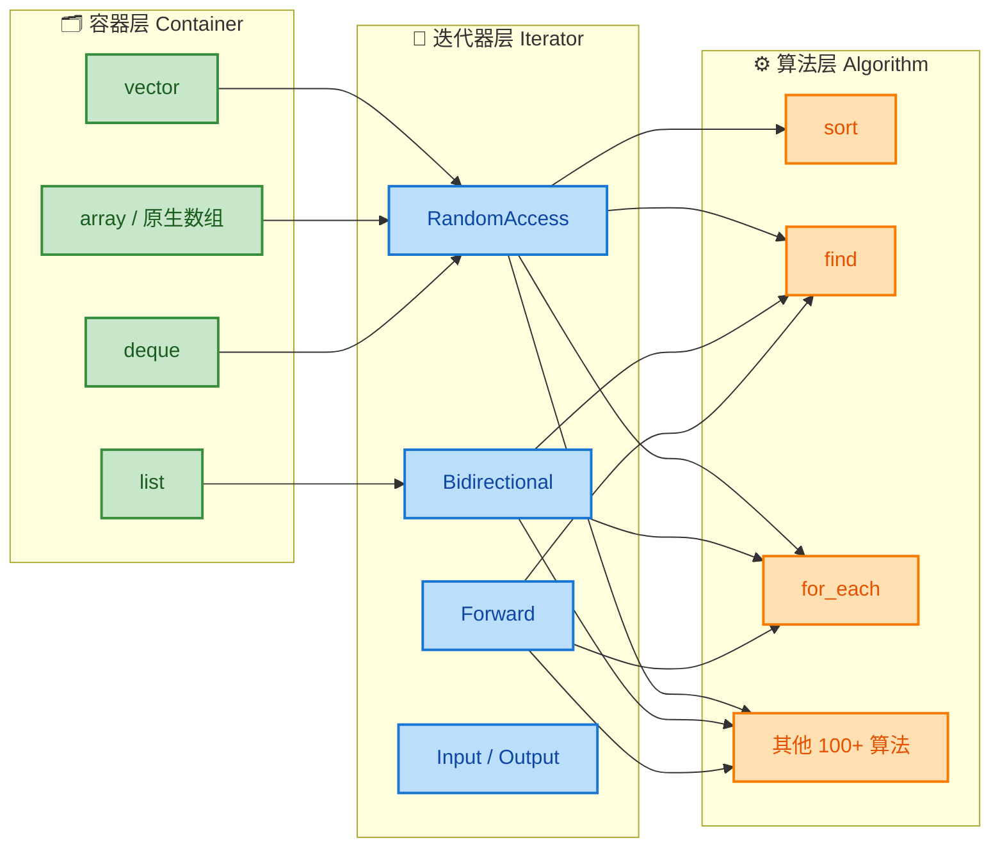

上图清晰地展示了三层架构的关系：容器产生迭代器，迭代器喂给算法。**算法从不直接感知容器的存在**——它只认迭代器。这也意味着，不同迭代器的能力等级（Iterator Category）决定了它能使用哪些算法。例如 `sort` 要求随机访问迭代器（RandomAccessIterator），所以 `std::list` 不能直接使用 `std::sort`，它有自己的成员函数 `list::sort()`。

---

### sort —— 排序算法

`std::sort` 是 STL 中使用频率最高的算法之一，它对给定范围内的元素进行 **原地排序（in-place sorting）**。其底层实现通常是 **IntroSort（内省排序）**，这是一种混合算法，综合了快速排序（QuickSort）、堆排序（HeapSort）和插入排序（InsertionSort）的优点，保证最坏时间复杂度为 **O(N log N)**。

#### 函数签名

```cpp
// 版本1：使用默认 operator< 进行升序排序
template <class RandomIt>
void sort(RandomIt first, RandomIt last);

// 版本2：使用自定义比较函数/函数对象
template <class RandomIt, class Compare>
void sort(RandomIt first, RandomIt last, Compare comp);
```

这里有几个关键点：

- **`RandomIt`**：模板参数，要求必须是 **随机访问迭代器（RandomAccessIterator）**。这意味着 `std::list` 和 `std::forward_list` **不能** 使用 `std::sort`。能使用的典型容器有 `std::vector`、`std::deque`，以及原生数组。
- **`[first, last)`**：左闭右开区间，`last` 指向的元素 **不参与** 排序。
- **`Compare comp`**：一个可调用对象（Callable），接受两个元素，返回 `bool`。当 `comp(a, b)` 返回 `true` 时，表示 `a` 应排在 `b` 前面。

#### 基础用法：升序与降序

```cpp
#include <iostream>     // 标准输入输出
#include <vector>       // vector 容器
#include <algorithm>    // sort 算法
#include <functional>   // greater<> 函数对象

int main() {
    // 创建一个包含无序整数的 vector
    std::vector<int> nums = {5, 2, 8, 1, 9, 3, 7};

    // ========== 升序排序（默认行为）==========
    // sort 使用 operator< 比较元素，将最小值放在前面
    std::sort(nums.begin(), nums.end());

    std::cout << "升序: ";
    for (int n : nums) {          // 范围 for 循环遍历
        std::cout << n << " ";    // 输出：1 2 3 5 7 8 9
    }
    std::cout << std::endl;

    // ========== 降序排序（传入比较器）==========
    // std::greater<int>() 是一个函数对象，实现 a > b 的比较逻辑
    // 当 a > b 返回 true 时，a 排在 b 前面，即降序
    std::sort(nums.begin(), nums.end(), std::greater<int>());

    std::cout << "降序: ";
    for (int n : nums) {          // 遍历排序后的结果
        std::cout << n << " ";    // 输出：9 8 7 5 3 2 1
    }
    std::cout << std::endl;

    return 0;
}
```

> **关于 `std::greater<int>()`**：这是定义在 `<functional>` 头文件中的一个 **函数对象（Functor）**，它重载了 `operator()`，内部逻辑等价于 `return a > b;`。后续章节会详细讲解 Functor 的机制。C++14 之后你也可以写成 `std::greater<>()`（透明比较器，Transparent Comparator），让编译器自动推导类型。

#### 对原生数组排序

`std::sort` 同样适用于 C 风格数组，因为原生指针天然满足随机访问迭代器的要求：

```cpp
#include <iostream>
#include <algorithm>    // sort

int main() {
    int arr[] = {42, 17, 8, 55, 3};       // C 风格数组
    int n = sizeof(arr) / sizeof(arr[0]);  // 计算数组元素个数：5

    // arr 退化为指向首元素的指针 (int*)
    // arr + n 指向数组末尾的下一个位置（past-the-end）
    std::sort(arr, arr + n);

    for (int i = 0; i < n; ++i) {   // 传统 for 循环遍历
        std::cout << arr[i] << " "; // 输出：3 8 17 42 55
    }
    std::cout << std::endl;

    return 0;
}
```

#### 自定义排序：对结构体排序

实际开发中，我们经常需要对自定义类型排序。此时必须告诉 `sort` "如何比较两个对象"：

```cpp
#include <iostream>
#include <vector>
#include <algorithm>
#include <string>

// 定义一个学生结构体
struct Student {
    std::string name;   // 姓名
    int score;          // 分数
};

int main() {
    // 初始化学生列表
    std::vector<Student> students = {
        {"Alice", 88},
        {"Bob",   95},
        {"Carol", 72},
        {"Dave",  95}
    };

    // 使用 Lambda 表达式作为比较器
    // 规则：先按分数降序；分数相同时，按姓名字典序升序
    std::sort(students.begin(), students.end(),
        [](const Student& a, const Student& b) {  // Lambda 接受两个 const 引用
            if (a.score != b.score)                // 如果分数不同
                return a.score > b.score;          // 分数高的排前面（降序）
            return a.name < b.name;                // 分数相同，按姓名升序
        }
    );

    // 输出排序结果
    for (const auto& s : students) {               // const 引用避免拷贝
        std::cout << s.name << ": " << s.score << std::endl;
    }
    // 输出：
    // Bob: 95
    // Dave: 95
    // Alice: 88
    // Carol: 72

    return 0;
}
```

#### sort 的"兄弟"算法

STL 提供了多个与排序相关的变体算法，适用于不同场景：

| 算法 | 功能 | 时间复杂度 | 稳定性 |
|------|------|-----------|--------|
| `std::sort` | 完整排序 | O(N log N) | ❌ 不稳定 |
| `std::stable_sort` | 完整排序（保持相等元素原始顺序） | O(N log N) ~ O(N log²N) | ✅ 稳定 |
| `std::partial_sort` | 只排序前 K 个最小元素 | O(N log K) | ❌ 不稳定 |
| `std::nth_element` | 将第 N 小的元素放到正确位置 | O(N) 平均 | ❌ 不稳定 |

> **稳定性（Stability）** 是排序算法的重要属性：如果两个元素"相等"（按比较器判断），稳定排序会保留它们在原始序列中的先后顺序，不稳定排序则不保证。上例中如果使用 `std::stable_sort`，Bob 和 Dave 分数相同（95），即使不写姓名比较逻辑，它们的顺序也一定与原始输入一致。

```cpp
#include <iostream>
#include <vector>
#include <algorithm>

int main() {
    std::vector<int> v = {9, 4, 7, 2, 5, 1, 8, 3, 6};

    // ========== partial_sort ==========
    // 只让前 3 个位置放最小的 3 个元素（排好序），其余元素顺序未定义
    std::partial_sort(v.begin(), v.begin() + 3, v.end());
    // v 现在可能是：{1, 2, 3, 9, 5, 4, 8, 7, 6}
    // 只保证 v[0]~v[2] 是排好序的最小 3 个

    std::cout << "partial_sort 前3: ";
    for (int x : v) std::cout << x << " ";   // 前三位一定是 1 2 3
    std::cout << std::endl;

    // ========== nth_element ==========
    v = {9, 4, 7, 2, 5, 1, 8, 3, 6};
    // 将第 4 小的元素（下标 3）放到正确位置
    // 它左边的都 <= 它，右边的都 >= 它，但各自内部不保证有序
    std::nth_element(v.begin(), v.begin() + 3, v.end());

    std::cout << "第4小的元素: " << v[3] << std::endl;  // 输出 4

    return 0;
}
```

#### sort 的底层原理：IntroSort

为了帮助你建立更深层的理解，下面用图展示 `std::sort` 的内部决策逻辑：

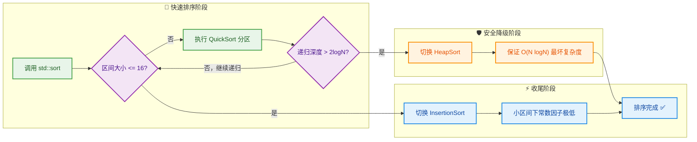

这种三段式策略非常精妙：
1. **大区间**用 QuickSort，享受优秀的平均性能和缓存友好性。
2. **递归过深**时切换 HeapSort，避免 QuickSort 在特殊输入下退化到 O(N²)。
3. **小区间**用 InsertionSort，因为它的常数因子极低，在元素少时反而比 QuickSort 更快。

---

### find —— 查找算法

`std::find` 是最基本的 **线性查找（Linear Search）** 算法。它从 `first` 开始，逐个检查元素，直到找到第一个等于目标值的元素，或者遍历到 `last` 为止。

#### 函数签名

```cpp
// 精确查找：使用 operator== 比较
template <class InputIt, class T>
InputIt find(InputIt first, InputIt last, const T& value);

// 条件查找：使用谓词 (Predicate)
template <class InputIt, class UnaryPredicate>
InputIt find_if(InputIt first, InputIt last, UnaryPredicate pred);

// 否定条件查找 (C++11)：找第一个使谓词返回 false 的元素
template <class InputIt, class UnaryPredicate>
InputIt find_if_not(InputIt first, InputIt last, UnaryPredicate pred);
```

**关键要点**：
- 返回值是一个 **迭代器**。如果找到目标，返回指向该元素的迭代器；如果没找到，返回 `last`。
- 只要求 **InputIterator**，所以几乎适用于所有容器（包括 `std::list`、`std::set` 等）。
- 时间复杂度 **O(N)**——纯线性扫描，不要求容器有序。

> **⚠️ 性能警告**：如果你的容器是已排序的，请使用 `std::binary_search`、`std::lower_bound` 等二分查找算法（O(log N)）。如果你使用的是 `std::set` / `std::map`，请优先使用其成员函数 `.find()`（O(log N)）或 `std::unordered_set` / `std::unordered_map` 的 `.find()`（O(1) 平均）。`std::find` 对这些容器虽然能用，但性能是浪费的。

#### 基础用法

```cpp
#include <iostream>
#include <vector>
#include <algorithm>    // find, find_if, find_if_not

int main() {
    std::vector<int> nums = {10, 20, 30, 40, 50};

    // ========== std::find：精确匹配 ==========
    auto it = std::find(nums.begin(), nums.end(), 30);  // 查找值为 30 的元素

    if (it != nums.end()) {                              // 判断是否找到
        // std::distance 计算两个迭代器之间的距离（即下标）
        std::cout << "找到 30，下标: "
                  << std::distance(nums.begin(), it)     // 输出：2
                  << std::endl;
    } else {
        std::cout << "未找到" << std::endl;
    }

    // ========== std::find_if：条件查找 ==========
    // 查找第一个大于 25 的元素
    auto it2 = std::find_if(nums.begin(), nums.end(),
        [](int x) {             // Lambda 谓词（Predicate）
            return x > 25;      // 条件：元素值 > 25
        }
    );

    if (it2 != nums.end()) {
        std::cout << "第一个 > 25 的元素: " << *it2 << std::endl;  // 输出：30
    }

    // ========== std::find_if_not：否定条件查找 ==========
    // 查找第一个 "不小于 30" 的元素（即 >= 30）
    auto it3 = std::find_if_not(nums.begin(), nums.end(),
        [](int x) {
            return x < 30;      // 谓词：x < 30
        }                       // find_if_not 找第一个使此谓词返回 false 的
    );

    if (it3 != nums.end()) {
        std::cout << "第一个 >= 30 的元素: " << *it3 << std::endl; // 输出：30
    }

    return 0;
}
```

#### 在字符串中查找

`std::find` 也能操作 `std::string`，因为 `string` 的迭代器也满足 InputIterator 的要求：

```cpp
#include <iostream>
#include <string>
#include <algorithm>

int main() {
    std::string str = "Hello, World!";

    // 查找第一个逗号
    auto it = std::find(str.begin(), str.end(), ',');

    if (it != str.end()) {
        // 计算逗号的位置（下标）
        size_t pos = std::distance(str.begin(), it);
        std::cout << "逗号位于下标: " << pos << std::endl;  // 输出：5

        // 利用迭代器范围提取子串：从开头到逗号之前
        std::string before_comma(str.begin(), it);  // 用迭代器范围构造新字符串
        std::cout << "逗号前内容: " << before_comma << std::endl;  // 输出：Hello
    }

    return 0;
}
```

> 当然，对于 `std::string` 的查找任务，通常更推荐使用其成员函数 `str.find(',')` ——它返回的是 `size_t` 类型的下标，语义更直观，且支持从指定位置开始查找（`str.find(',', start_pos)`）。

#### find 家族一览

| 算法 | 功能 | 要求 |
|------|------|------|
| `std::find` | 精确值匹配 | InputIterator |
| `std::find_if` | 满足谓词的第一个元素 | InputIterator |
| `std::find_if_not` | 不满足谓词的第一个元素（C++11） | InputIterator |
| `std::find_first_of` | 在范围 A 中找到任意一个属于范围 B 的元素 | ForwardIterator |
| `std::adjacent_find` | 找到第一对相邻的相等元素 | ForwardIterator |
| `std::search` | 在范围 A 中查找子序列 B 首次出现的位置 | ForwardIterator |

---

### for\_each —— 遍历算法

`std::for_each` 对范围 `[first, last)` 中的每个元素依次调用一个可调用对象（函数、函数指针、函数对象、Lambda）。它是 **最简单但最灵活的遍历工具** 之一。

#### 函数签名

```cpp
template <class InputIt, class UnaryFunction>
UnaryFunction for_each(InputIt first, InputIt last, UnaryFunction f);
```

注意返回值：`for_each` 会返回传入的函数对象 `f` 的一个 **副本（copy）**——如果 `f` 是一个有状态的函数对象（stateful functor），你可以通过返回值来获取遍历过程中累积的状态。这是一个常被忽视但很有用的特性。

#### 基础用法

```cpp
#include <iostream>
#include <vector>
#include <algorithm>    // for_each

// 普通函数：打印元素并换行
void printElement(int x) {
    std::cout << "[" << x << "] ";   // 格式化输出每个元素
}

int main() {
    std::vector<int> nums = {1, 2, 3, 4, 5};

    // ========== 方式1：传入普通函数指针 ==========
    std::cout << "函数指针: ";
    std::for_each(nums.begin(), nums.end(), printElement);
    // 输出：[1] [2] [3] [4] [5]
    std::cout << std::endl;

    // ========== 方式2：传入 Lambda 表达式 ==========
    std::cout << "Lambda:   ";
    std::for_each(nums.begin(), nums.end(),
        [](int x) {                           // Lambda：匿名函数
            std::cout << x * x << " ";        // 输出每个元素的平方
        }
    );
    // 输出：1 4 9 16 25
    std::cout << std::endl;

    // ========== 方式3：修改元素（通过引用）==========
    // Lambda 参数使用引用 (int&)，可以直接修改原容器中的元素
    std::for_each(nums.begin(), nums.end(),
        [](int& x) {                          // 注意：int& 引用
            x *= 2;                           // 每个元素翻倍
        }
    );

    std::cout << "翻倍后:   ";
    for (int n : nums) std::cout << n << " "; // 输出：2 4 6 8 10
    std::cout << std::endl;

    return 0;
}
```

#### 利用返回值获取累积状态

这是 `for_each` 一个精妙且容易被忽略的特性——它会返回函数对象的最终状态：

```cpp
#include <iostream>
#include <vector>
#include <algorithm>

// 一个有状态的函数对象（Functor）
struct Accumulator {
    int sum = 0;       // 内部状态：累加和
    int count = 0;     // 内部状态：计数

    // 重载 operator()，使对象可以像函数一样被调用
    void operator()(int x) {
        sum += x;      // 累加当前元素
        ++count;       // 计数 +1
    }
};

int main() {
    std::vector<int> data = {10, 20, 30, 40, 50};

    // for_each 返回函数对象的副本，包含遍历后的最终状态
    Accumulator result = std::for_each(data.begin(), data.end(), Accumulator());

    std::cout << "总和: " << result.sum << std::endl;       // 输出：150
    std::cout << "个数: " << result.count << std::endl;     // 输出：5
    std::cout << "均值: " << static_cast<double>(result.sum) / result.count
              << std::endl;                                  // 输出：30

    return 0;
}
```

> **为什么要用 `for_each` 返回值？** 因为 `for_each` 内部会 **拷贝** 传入的函数对象，遍历期间对拷贝版本做的状态修改不会反映在外部的原始对象上。只有通过返回值才能拿到最终结果。当然，在现代 C++ 中，Lambda 配合外部变量捕获（capture）通常更直观，这个 functor 返回值的技巧更多见于传统风格代码。

#### for\_each vs 范围 for 循环

自 C++11 引入范围 for（range-based for）后，很多人会问："`for_each` 是否已经过时了？" 答案是 **没有**，它们各有适用场景：

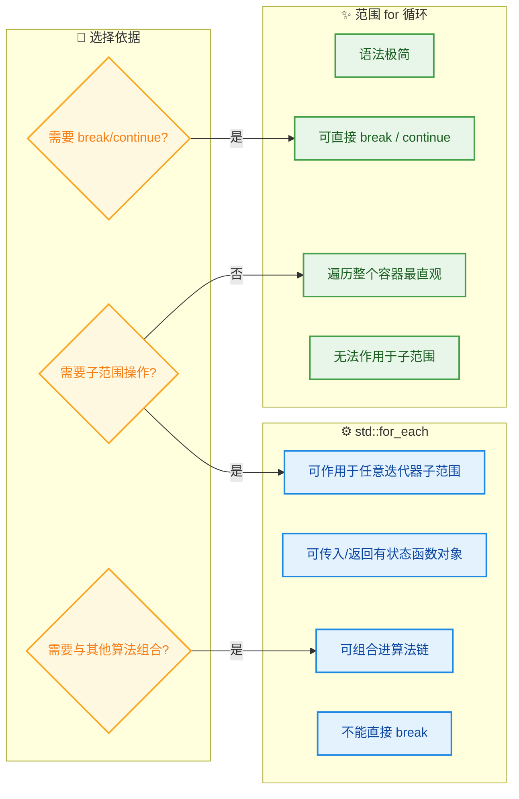

一个典型的 `for_each` 优势场景——**只操作容器的一部分元素**：

```cpp
#include <iostream>
#include <vector>
#include <algorithm>

int main() {
    std::vector<int> v = {1, 2, 3, 4, 5, 6, 7, 8, 9, 10};

    // 只对下标 [2, 7)（即第 3~7 个元素）执行操作
    // 范围 for 做不到这一点（除非手动加 if 判断，但很不优雅）
    std::for_each(v.begin() + 2, v.begin() + 7,
        [](int& x) {
            x = 0;    // 将这个子范围内的元素清零
        }
    );

    for (int n : v) std::cout << n << " ";
    // 输出：1 2 0 0 0 0 0 8 9 10
    std::cout << std::endl;

    return 0;
}
```

#### 补充：std::for\_each\_n（C++17）

C++17 引入了 `std::for_each_n`，它接受一个起始迭代器和一个计数值 `n`，对前 `n` 个元素执行操作：

```cpp
#include <iostream>
#include <vector>
#include <algorithm>    // for_each_n (C++17)

int main() {
    std::vector<int> v = {10, 20, 30, 40, 50};

    // 只对前 3 个元素执行操作
    std::for_each_n(v.begin(), 3,
        [](int& x) {
            x += 100;      // 前 3 个元素各加 100
        }
    );

    for (int n : v) std::cout << n << " ";
    // 输出：110 120 130 40 50
    std::cout << std::endl;

    return 0;
}
```

---

### 三种算法的对比总结

| 特性 | `std::sort` | `std::find` | `std::for_each` |
|------|------------|-------------|-----------------|
| **功能** | 排序 | 查找 | 遍历/变换 |
| **迭代器要求** | RandomAccessIterator | InputIterator | InputIterator |
| **时间复杂度** | O(N log N) | O(N) | O(N) |
| **返回值** | `void` | 迭代器（指向目标或 `last`） | 函数对象副本 |
| **是否修改元素** | ✅ 原地重排 | ❌ 只读 | 取决于传入的函数 |
| **常用搭档** | `greater<>`, Lambda | `find_if`, Lambda | Lambda, Functor |

> **记忆口诀**：**sort 排、find 找、for_each 绕一圈跑**。三者构成了 STL 算法最基本的三驾马车——排序、查找、遍历，覆盖了日常编码中绝大多数的容器操作需求。

---

**📝 练习题**

以下代码的输出是什么？

```cpp
#include <iostream>
#include <vector>
#include <algorithm>

int main() {
    std::vector<int> v = {3, 1, 4, 1, 5, 9, 2, 6};
    
    std::sort(v.begin(), v.begin() + 4);
    
    auto it = std::find(v.begin(), v.end(), 5);
    
    std::cout << std::distance(v.begin(), it) << std::endl;
    
    return 0;
}
```

A. 3


B. 4


C. 5


D. 编译错误

**【答案】** B

**【解析】** 关键在于 `sort` 只排序了 **前 4 个元素** `{3, 1, 4, 1}`，排序后变为 `{1, 1, 3, 4}`。后半部分 `{5, 9, 2, 6}` 不变。拼起来完整序列是 `{1, 1, 3, 4, 5, 9, 2, 6}`。接着 `std::find` 线性扫描查找值 `5`，它位于下标 **4**（从 0 开始计数）。`std::distance(v.begin(), it)` 正是计算迭代器距离，结果为 `4`。故选 **B**。

---

**📝 练习题**

关于 `std::find` 和 `std::sort` 的迭代器要求，以下哪个说法是 **正确的**？

A. `std::find` 要求 RandomAccessIterator，所以不能用于 `std::list`


B. `std::sort` 要求 InputIterator，所以可以用于任何容器


C. `std::sort` 要求 RandomAccessIterator，所以 `std::list` 必须使用其成员函数 `list::sort()`


D. `std::find` 和 `std::sort` 对迭代器的要求完全相同

**【答案】** C

**【解析】** `std::sort` 内部需要随机跳转元素位置（如 QuickSort 的分区操作），因此要求 **RandomAccessIterator**。`std::list` 是双向链表，其迭代器只支持前移/后移（BidirectionalIterator），不支持随机访问，所以无法使用 `std::sort`。`std::list` 提供了自己的成员函数 `list::sort()`，它基于归并排序实现，天然适配链表结构。而 `std::find` 只需要从头到尾逐个扫描，要求最低等级的 **InputIterator** 即可，因此几乎适用于所有容器。故 **C** 正确。

---

## pair 与 tuple

在 C++ 的日常开发中，我们经常需要把 **两个或多个不同类型的值** 打包在一起，作为一个逻辑单元来传递或返回。例如，一个函数需要同时返回"是否成功"和"结果值"，或者我们需要在一个容器中存储"键值对"。如果每次都为此定义一个 `struct`，未免过于繁琐。C++ 标准库提供了两个轻量级的通用"打包"工具：`std::pair`（头文件 `<utility>`）和 `std::tuple`（头文件 `<tuple>`，C++11 起）。它们是 STL 中最基础也最常用的工具类型之一，贯穿于容器、算法和各种库接口之中。

---

### pair：两个值的轻量组合

`std::pair` 是一个 **类模板（class template）**，定义在 `<utility>` 头文件中。它的作用极其简单——将两个可以不同类型的值绑定为一个整体。其模板签名如下：

```cpp
template <class T1, class T2>
struct pair {
    T1 first;   // 第一个元素
    T2 second;  // 第二个元素
};
```

可以看到，`pair` 本质上就是一个拥有两个公有成员（`first` 和 `second`）的结构体。正因为如此简洁，它成为了 C++ 中使用频率最高的工具类之一。`std::map` 的每个元素就是一个 `std::pair<const Key, Value>`，`std::set::insert()` 的返回值是一个 `std::pair<iterator, bool>`——`pair` 无处不在。

#### 创建 pair 的多种方式

```cpp
#include <utility>  // pair 所在头文件
#include <string>
#include <iostream>

int main() {
    // ① 直接构造：显式指定模板参数
    std::pair<int, std::string> p1(1, "Alice");

    // ② 使用 std::make_pair —— 自动推导模板参数（C++11 前最常用）
    auto p2 = std::make_pair(2, "Bob");
    // 编译器自动推导为 pair<int, const char*>

    // ③ C++11 列表初始化
    std::pair<double, int> p3 = {3.14, 42};

    // ④ C++17 类模板参数推导 (CTAD)
    // 无需写模板参数，编译器从构造函数参数推导
    std::pair p4(100, 200);  // 推导为 pair<int, int>

    // 访问成员
    std::cout << p1.first << ", " << p1.second << std::endl;
    // 输出: 1, Alice

    return 0;
}
```

上面展示了四种典型的创建方式。在 C++11 之前，`std::make_pair` 是最主流的写法，因为它免去了手写模板参数的麻烦。而从 C++17 开始，CTAD（Class Template Argument Deduction）让我们连 `make_pair` 都可以省略，直接写 `std::pair(a, b)` 即可。

#### pair 的比较运算

`std::pair` 默认支持 **字典序比较（lexicographical comparison）**。比较规则是：**先比 `first`，若 `first` 相同，再比 `second`**。这在排序场景中非常实用。

```cpp
#include <utility>
#include <iostream>
#include <vector>
#include <algorithm>  // sort

int main() {
    std::vector<std::pair<int, int>> vec = {
        {3, 1},   // 第一个 pair
        {1, 5},   // 第二个 pair
        {3, 0},   // 第三个 pair
        {1, 2}    // 第四个 pair
    };

    // 默认按字典序排序: 先按 first 升序，first 相同则按 second 升序
    std::sort(vec.begin(), vec.end());

    for (const auto& p : vec) {           // 范围 for 遍历
        std::cout << "(" << p.first       // 输出 first
                  << ", " << p.second     // 输出 second
                  << ")" << std::endl;
    }
    // 输出:
    // (1, 2)
    // (1, 5)
    // (3, 0)
    // (3, 1)

    return 0;
}
```

这一特性在竞赛编程（competitive programming）中极为常见：当你需要对一组坐标或带优先级的任务进行排序时，直接放进 `pair` 即可利用默认的字典序比较，省去自定义比较函数的工作。

#### pair 在 STL 中的典型应用

`pair` 绝不是一个独立的"小工具"，它深度嵌入在 STL 的设计之中。下面是两个最经典的场景：

**场景一：`std::map` 的元素类型**

`std::map<K, V>` 的每一个元素本质上就是 `std::pair<const K, V>`。当我们遍历 map 时，迭代器解引用得到的就是一个 pair：

```cpp
#include <map>
#include <string>
#include <iostream>

int main() {
    std::map<std::string, int> scores;  // 创建一个 string->int 的映射
    scores["Alice"] = 95;               // 插入键值对
    scores["Bob"]   = 87;               // 插入键值对

    // 遍历 map：it->first 是 key，it->second 是 value
    for (const auto& elem : scores) {
        // elem 的类型是 const std::pair<const std::string, int>&
        std::cout << elem.first         // 输出键 (name)
                  << ": "
                  << elem.second        // 输出值 (score)
                  << std::endl;
    }

    return 0;
}
```

**场景二：`insert` 的返回值**

`std::set::insert()` 和 `std::map::insert()` 返回的是 `std::pair<iterator, bool>`，其中 `first` 是指向被插入元素（或已存在元素）的迭代器，`second` 表示插入是否成功：

```cpp
#include <set>
#include <iostream>

int main() {
    std::set<int> s = {1, 2, 3};           // 初始化集合

    auto result = s.insert(4);             // 尝试插入 4
    // result 类型: std::pair<std::set<int>::iterator, bool>

    if (result.second) {                   // second == true 表示插入成功
        std::cout << "插入成功: "
                  << *result.first         // first 指向新插入的元素
                  << std::endl;
    }

    auto result2 = s.insert(2);            // 尝试插入已存在的 2
    if (!result2.second) {                 // second == false 表示元素已存在
        std::cout << "元素已存在: "
                  << *result2.first        // first 指向已有的元素
                  << std::endl;
    }

    return 0;
}
```

#### C++17 结构化绑定（Structured Bindings）与 pair

在 C++17 之前，访问 pair 的成员只能通过 `.first` / `.second`，代码可读性较差（尤其嵌套时，`p.first.second` 让人头晕）。C++17 引入了 **结构化绑定（Structured Bindings）**，可以直接将 pair "拆包"为独立变量：

```cpp
#include <map>
#include <string>
#include <iostream>

int main() {
    std::map<std::string, int> scores = {  // 初始化 map
        {"Alice", 95},
        {"Bob", 87}
    };

    // C++17 结构化绑定: 将 pair 拆分为 name 和 score
    for (const auto& [name, score] : scores) {
        std::cout << name << ": " << score << std::endl;
        // 不再需要 .first / .second，代码可读性大幅提升
    }

    // 也可用于 insert 的返回值
    auto [iter, success] = scores.insert({"Charlie", 77});
    // iter  -> 迭代器
    // success -> bool，是否插入成功

    if (success) {
        std::cout << "插入: " << iter->first << std::endl;
    }

    return 0;
}
```

结构化绑定让 pair 的使用体验产生了质的飞跃，是 C++17 中最受欢迎的语法糖之一。

---

### tuple：pair 的泛化，任意多个值的组合

如果说 `pair` 是"两个值的组合"，那么 `std::tuple` 就是它的 **通用版本**（generalization）——可以容纳 **任意数量、任意类型** 的值。它定义在 `<tuple>` 头文件中，自 C++11 起可用。

```cpp
// tuple 的概念模型（非实际实现）
template <class... Types>
class tuple;  // 可变参数模板（variadic template）
```

你可以将 tuple 理解为一个 **编译期确定大小和类型的异构容器**：每个元素的类型可以不同，但总数和每个位置的类型在编译期就已经固定。

#### 创建 tuple 的方式

```cpp
#include <tuple>
#include <string>
#include <iostream>

int main() {
    // ① 直接构造
    std::tuple<int, double, std::string> t1(1, 3.14, "Hello");

    // ② 使用 std::make_tuple —— 自动推导类型
    auto t2 = std::make_tuple(42, 2.718, std::string("World"));

    // ③ C++17 CTAD
    std::tuple t3(100, 'A', 3.14f);
    // 推导为 tuple<int, char, float>

    return 0;
}
```

#### 访问 tuple 元素：`std::get<N>`

与 `pair` 直接通过 `.first` / `.second` 访问不同，`tuple` 的元素必须通过 **`std::get<N>()`** 来访问，其中 `N` 是编译期常量（即索引必须在编译时确定）：

```cpp
#include <tuple>
#include <string>
#include <iostream>

int main() {
    auto student = std::make_tuple(
        std::string("Alice"),  // 索引 0: 姓名
        20,                    // 索引 1: 年龄
        3.95                   // 索引 2: GPA
    );

    // 使用 std::get<索引> 访问元素（索引从 0 开始）
    std::cout << "姓名: " << std::get<0>(student) << std::endl;  // Alice
    std::cout << "年龄: " << std::get<1>(student) << std::endl;  // 20
    std::cout << "GPA:  " << std::get<2>(student) << std::endl;  // 3.95

    // 修改元素（get 返回引用）
    std::get<1>(student) = 21;   // 将年龄改为 21

    // C++14: 按类型访问（前提：类型在 tuple 中唯一）
    std::cout << "姓名: " << std::get<std::string>(student) << std::endl;
    // 若 tuple 中有两个 string，则编译报错（ambiguous）

    return 0;
}
```

注意 `std::get<N>` 中的 `N` 必须是 **编译期常量**，不能用运行时变量。这是因为 tuple 中每个位置的类型可能不同，编译器必须在编译期就确定你要访问哪个元素及其类型。

#### tuple 的辅助工具

标准库为 tuple 提供了一组强大的辅助工具：

```cpp
#include <tuple>
#include <iostream>
#include <string>

int main() {
    auto t = std::make_tuple(1, 3.14, std::string("Hi"));

    // ① std::tuple_size: 获取 tuple 中元素个数（编译期）
    constexpr size_t sz = std::tuple_size<decltype(t)>::value;
    std::cout << "元素个数: " << sz << std::endl;  // 输出: 3

    // ② std::tuple_element: 获取第 N 个元素的类型（编译期）
    // tuple_element<0, decltype(t)>::type  →  int
    // tuple_element<1, decltype(t)>::type  →  double
    // tuple_element<2, decltype(t)>::type  →  std::string

    // ③ std::tie: 将 tuple 解包到已有变量
    int    a;        // 用于接收第 0 个元素
    double b;        // 用于接收第 1 个元素
    std::string c;   // 用于接收第 2 个元素
    std::tie(a, b, c) = t;  // 解包: a=1, b=3.14, c="Hi"
    std::cout << a << ", " << b << ", " << c << std::endl;

    // ④ std::ignore: 忽略不关心的元素
    int x;
    std::tie(x, std::ignore, std::ignore) = t;
    // 只取第一个元素，其余忽略
    std::cout << "只取第一个: " << x << std::endl;

    // ⑤ std::tuple_cat: 拼接多个 tuple
    auto t1 = std::make_tuple(1, 2);           // tuple<int, int>
    auto t2 = std::make_tuple(3.0, "four");    // tuple<double, const char*>
    auto t3 = std::tuple_cat(t1, t2);          // tuple<int, int, double, const char*>
    std::cout << std::get<3>(t3) << std::endl;  // 输出: four

    return 0;
}
```

其中 `std::tie` 是 C++11 中解包 tuple 的经典方式。它创建一个由 **左值引用** 构成的 tuple，然后利用赋值操作将源 tuple 的值逐个绑定到对应的变量上。在 C++17 之后，结构化绑定提供了更简洁的替代方案：

```cpp
// C++17 结构化绑定：比 std::tie 更简洁
auto [name, age, gpa] = std::make_tuple(
    std::string("Alice"), 20, 3.95
);
// name = "Alice", age = 20, gpa = 3.95
```

#### `std::tie` 的妙用：简化多字段比较

`std::tie` 有一个非常巧妙的用法——利用 tuple 的字典序比较来 **一行实现多字段结构体的比较运算符**：

```cpp
#include <tuple>
#include <string>
#include <iostream>
#include <vector>
#include <algorithm>

struct Student {
    std::string name;   // 姓名
    int age;            // 年龄
    double gpa;         // 绩点

    // 利用 std::tie 实现 < 运算符
    // 比较优先级: age -> gpa -> name（字典序）
    bool operator<(const Student& other) const {
        // tie 创建引用 tuple，直接利用 tuple 的字典序比较
        return std::tie(age, gpa, name)
             < std::tie(other.age, other.gpa, other.name);
    }
};

int main() {
    std::vector<Student> students = {
        {"Charlie", 21, 3.5},   // 学生 1
        {"Alice",   20, 3.9},   // 学生 2
        {"Bob",     20, 3.9},   // 学生 3
        {"Diana",   20, 3.5}    // 学生 4
    };

    std::sort(students.begin(), students.end());  // 使用自定义 operator

    for (const auto& s : students) {
        std::cout << s.name << " (age=" << s.age
                  << ", gpa=" << s.gpa << ")" << std::endl;
    }
    // 输出 (先按 age，再按 gpa，最后按 name):
    // Diana (age=20, gpa=3.5)
    // Alice (age=20, gpa=3.9)
    // Bob   (age=20, gpa=3.9)
    // Charlie (age=21, gpa=3.5)

    return 0;
}
```

如果没有 `std::tie`，你需要手写一大段 `if-else` 嵌套来实现多字段比较，既冗长又容易出错。这个技巧在实际工程代码中非常普遍。

---

### pair 与 tuple 的对比与选择

下面用一张图来梳理两者的关系和使用场景：

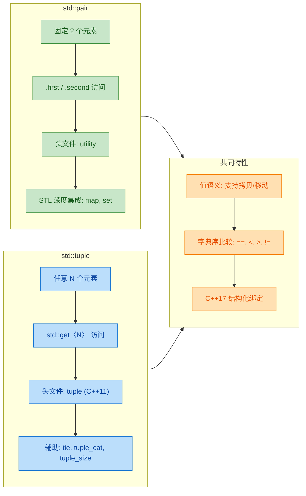

**选择指南：**

| 场景 | 推荐 | 理由 |
|:---|:---|:---|
| 只有两个值 | `pair` | 更简洁，`.first`/`.second` 可读性好 |
| 三个及以上值 | `tuple` | `pair` 无法容纳 |
| 与 STL 交互（map, set） | `pair` | STL 接口本身就返回/使用 pair |
| 函数返回多值（临时） | `tuple` | 灵活，配合结构化绑定很优雅 |
| 字段有明确语义 | `struct` | pair/tuple 的 `.first`/`get<0>` 缺乏语义 |

最后一点至关重要：**当字段含义重要且代码需要长期维护时，请定义具名的 `struct`**。`pair` 和 `tuple` 的字段名（`first`/`second`、索引 0/1/2）没有任何语义信息，在复杂逻辑中会严重损害可读性。它们最适合用在 **短暂的、局部的、含义显而易见** 的场景中。

---

### pair 与 tuple 的内存布局

`pair` 和 `tuple` 都是 **值类型**，其内部元素直接存储在对象内部（而非堆上）。让我们看一下内存布局：

```cpp
// std::pair<int, double> 的内存布局（可能有 padding）
// 假设 int=4字节, double=8字节, 对齐要求
//
// 地址偏移:  [0]    [4]      [8]              [16]
//            |--int--|--pad---|----double-------|
//             first           second
//
// sizeof(pair<int,double>) 通常 = 16（因为 double 要求 8 字节对齐）

// std::tuple<int, double, char> 的内存布局
// 注意：tuple 的存储顺序可能与声明顺序不同（实现相关）
// 某些实现会倒序存储以优化对齐
//
// 可能的布局:
// 地址偏移:  [0]         [8]    [12] [13]   [16]
//            |--double---|--int--|char|--pad--|
//             (idx 1)    (idx 0) (idx 2)
//
// sizeof(tuple<int, double, char>) 通常 = 16（经过对齐优化）
```

标准并未规定 `tuple` 内部的存储顺序，不同编译器的实现可能不同。但你不需要关心这些细节——只要通过 `std::get<N>` 访问，一切都是正确的。

---

### 实战案例：函数返回多个值

在 C 语言时代，函数返回多个值通常需要用 **指针参数**（output parameter）。在 C++ 中，`pair` 和 `tuple` 提供了更优雅的方案：

```cpp
#include <tuple>
#include <string>
#include <iostream>
#include <cmath>

// 场景: 解一元二次方程 ax^2 + bx + c = 0
// 返回: (是否有实数根, 根1, 根2)
std::tuple<bool, double, double> solveQuadratic(
    double a, double b, double c)
{
    double discriminant = b * b - 4 * a * c;   // 计算判别式

    if (discriminant < 0) {
        return {false, 0.0, 0.0};              // 无实数根
    }

    double sqrtD = std::sqrt(discriminant);    // 判别式开方
    double x1 = (-b + sqrtD) / (2 * a);       // 根1
    double x2 = (-b - sqrtD) / (2 * a);       // 根2
    return {true, x1, x2};                    // 返回结果
}

int main() {
    // C++17 结构化绑定接收返回值
    auto [hasRoot, r1, r2] = solveQuadratic(1, -3, 2);

    if (hasRoot) {
        std::cout << "根: x1=" << r1            // 输出根1
                  << ", x2=" << r2 << std::endl; // 输出根2
        // 输出: 根: x1=2, x2=1
    } else {
        std::cout << "无实数根" << std::endl;
    }

    return 0;
}
```

这种 "用 `tuple` 返回多值 + 结构化绑定接收" 的模式在现代 C++ 中极为常见，代码简洁且类型安全，远优于传统的指针输出参数（output parameter）方式。

---

**📝 练习题**

以下代码的输出是什么？

```cpp
#include <tuple>
#include <iostream>
#include <string>

int main() {
    auto t1 = std::make_tuple(1, 2, 3);
    auto t2 = std::make_tuple(1, 2, 4);
    auto t3 = std::make_tuple(1, 2, 3);

    std::cout << (t1 < t2) << " "
              << (t1 == t3) << " "
              << std::tuple_size<decltype(t1)>::value
              << std::endl;
    return 0;
}
```

A. `0 1 3`


B. `1 1 3`


C. `1 0 3`


D. `编译错误`


**【答案】** B

**【解析】** `std::tuple` 的比较运算遵循 **字典序（lexicographical order）**：从第 0 个元素开始逐个比较，遇到不相等的元素即得出结论。

- `t1 < t2`：前两个元素 `(1,2)` 相同，比较第三个元素 `3 < 4` 为 `true`，所以结果为 `1`。
- `t1 == t3`：三个元素 `(1,2,3)` 完全相同，结果为 `true`，即 `1`。
- `std::tuple_size<decltype(t1)>::value`：`t1` 是 `tuple<int,int,int>`，包含 3 个元素，值为 `3`。

因此输出为 `1 1 3`，选 **B**。这道题的核心考点是 tuple 的字典序比较规则以及 `tuple_size` 编译期获取元素个数的能力。

---

## 函数对象（Functor）

在 C++ 的 STL 世界中，算法的威力不仅来自于算法本身，更来自于你能传递给算法的**"行为"**。函数对象（Function Object），俗称 **Functor**，正是 C++ 实现"将行为作为参数传递"这一核心思想的经典机制。它比普通函数指针更强大、更灵活，是理解 Lambda 表达式的重要前置知识，也是 STL 设计哲学的基石之一。

### 什么是函数对象

一句话概括：**函数对象就是一个重载了 `operator()` 的类的实例**。当一个类（或结构体）定义了 `operator()` 运算符后，它的对象就可以像普通函数一样被"调用"。这种对象在英文中被称为 **Callable Object**，而这种特定的实现方式称为 **Functor**。

来看最简单的例子：

```cpp
#include <iostream>

// 定义一个函数对象类
struct Greeter {
    // 重载函数调用运算符 operator()
    void operator()(const std::string& name) const {
        std::cout << "Hello, " << name << "!" << std::endl; // 像函数一样执行逻辑
    }
};

int main() {
    Greeter greet;          // 创建一个 Greeter 类型的对象（这就是 functor）
    greet("World");         // 调用 operator()，输出: Hello, World!
    greet("C++ Learner");   // 再次调用，输出: Hello, C++ Learner!

    Greeter()("Temp");      // 也可以用匿名临时对象直接调用

    return 0;
}
```

从调用语法 `greet("World")` 来看，它和调用普通函数 `greet("World")` **完全一样**。这就是"函数对象"名字的由来——它是一个对象，但表现得像一个函数。编译器在遇到 `greet("World")` 时，会将其解析为 `greet.operator()("World")`。

### 函数对象 vs 普通函数指针

你可能会问：既然函数指针也能传递行为，为什么还需要函数对象？答案在于函数对象拥有**状态（State）**。

```cpp
#include <iostream>

// ========== 方式一：普通函数 ==========
// 普通函数没有自己的"记忆"，无法在调用之间保持状态
bool is_greater_than_5(int x) {
    return x > 5;   // 阈值 5 被硬编码，无法灵活修改
}

// ========== 方式二：函数对象 ==========
// 函数对象可以携带状态（成员变量），极其灵活
struct IsGreaterThan {
    int threshold;   // 成员变量：存储阈值，这就是"状态"

    // 构造函数：在创建对象时设定阈值
    IsGreaterThan(int t) : threshold(t) {}

    // 重载 operator()：使用存储的阈值进行比较
    bool operator()(int x) const {
        return x > threshold;  // 阈值来自成员变量，完全可配置
    }
};

int main() {
    IsGreaterThan gt10(10);   // 创建一个"大于10"的判断器
    IsGreaterThan gt100(100); // 创建一个"大于100"的判断器

    std::cout << gt10(15)  << std::endl;  // 输出 1 (true)，15 > 10
    std::cout << gt10(5)   << std::endl;  // 输出 0 (false)，5 > 10 不成立
    std::cout << gt100(50) << std::endl;  // 输出 0 (false)，50 > 100 不成立

    return 0;
}
```

这段代码揭示了函数对象相对于函数指针最核心的优势。下面用一张图来对比：

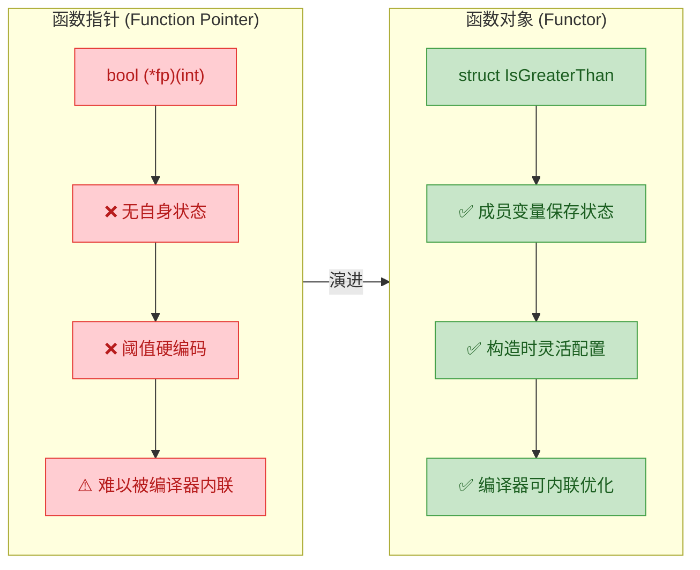

**关于内联优化的深入解释**：当你把函数指针传给 `std::sort` 等 STL 算法时，编译器看到的是一个指针变量，它在编译期**无法确定**指针指向哪个函数，因此**很难进行内联（inline）优化**。而函数对象的类型是确定的（例如 `IsGreaterThan`），编译器在实例化模板时，明确知道 `operator()` 的具体实现，可以毫无障碍地将其内联展开，从而消除函数调用的开销。这在百万级数据排序中，性能差距可以非常显著。

### 函数对象的有状态特性：计数器示例

函数对象的"有状态"能力让它可以在多次调用之间**积累信息**，这是函数指针做不到的（除非借助全局变量，而全局变量有诸多弊端）。

```cpp
#include <iostream>
#include <vector>
#include <algorithm> // std::for_each

// 一个有状态的函数对象：调用计数器
struct CallCounter {
    int count;   // 状态：记录被调用的次数

    // 构造函数：初始化计数为 0
    CallCounter() : count(0) {}

    // 每次被调用时，计数器自增，并打印当前元素
    void operator()(int x) {
        ++count;                                       // 状态更新：计数 +1
        std::cout << "第 " << count << " 次调用，值: " << x << std::endl;
    }
};

int main() {
    std::vector<int> nums = {10, 20, 30, 40, 50};

    // ⚠️ 重要细节：std::for_each 会【拷贝】传入的函数对象
    // 它返回的是内部使用的那份拷贝（已累积了状态）
    CallCounter result = std::for_each(nums.begin(), nums.end(), CallCounter());

    // 通过返回值获取最终状态
    std::cout << "总共调用了 " << result.count << " 次" << std::endl; // 输出: 5

    return 0;
}
```

> ⚠️ **重要陷阱**：`std::for_each` 在内部会**拷贝**你传入的函数对象。如果你直接在外部访问原始对象的状态，会发现状态没有改变。正确的做法是使用 `std::for_each` 的**返回值**，它会把内部使用的那个带有最终状态的副本返回给你。这个知识点在面试中出现频率很高。

### STL 内置函数对象

C++ 标准库在 `<functional>` 头文件中提供了一整套现成的函数对象，覆盖了算术运算、比较运算和逻辑运算三大类。它们免去了你手写 Functor 类的麻烦，与 STL 算法配合天衣无缝。

```cpp
#include <iostream>
#include <vector>
#include <algorithm>   // std::sort, std::transform
#include <functional>  // STL 内置函数对象的头文件

int main() {
    std::vector<int> v = {5, 2, 8, 1, 9, 3};

    // ========== 比较类函数对象 ==========
    // std::greater<int>() 创建一个"大于"比较器的临时对象
    // 等价于传入一个 bool cmp(int a, int b) { return a > b; } 的函数
    std::sort(v.begin(), v.end(), std::greater<int>()); // 降序排列
    // 排序结果: 9, 8, 5, 3, 2, 1

    for (int x : v) std::cout << x << " ";  // 输出: 9 8 5 3 2 1
    std::cout << std::endl;

    // ========== 算术类函数对象 ==========
    std::vector<int> a = {1, 2, 3, 4};
    std::vector<int> b = {10, 20, 30, 40};
    std::vector<int> result(4);  // 存放结果的容器，预留空间

    // std::plus<int>() 创建一个"加法"函数对象
    // transform 对 a 和 b 的对应元素执行 plus，结果写入 result
    std::transform(a.begin(), a.end(),     // 第一个输入范围
                   b.begin(),              // 第二个输入范围的起始
                   result.begin(),         // 输出范围的起始
                   std::plus<int>());      // 二元操作：加法

    for (int x : result) std::cout << x << " ";  // 输出: 11 22 33 44
    std::cout << std::endl;

    return 0;
}
```

下面是 STL 内置函数对象的完整分类：

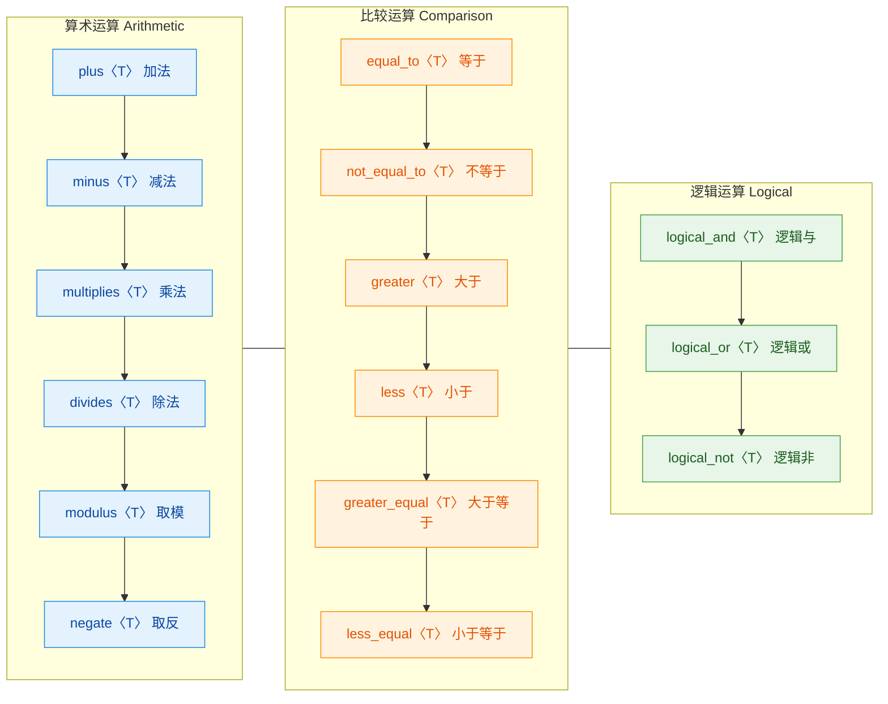

> 💡 **C++14 透明比较器**：从 C++14 起，你可以写 `std::greater<>()` 而不指定类型参数（即使用 `void` 特化版本），编译器会自动推导类型。这在处理异构比较时特别有用。

### 自定义函数对象的设计模式

在实际工程中，函数对象常用于封装复杂的业务逻辑。一个设计良好的 Functor 通常具备以下特征：构造时配置策略，调用时执行判断。

```cpp
#include <iostream>
#include <vector>
#include <algorithm>
#include <string>

// 实际场景：一个可配置的字符串过滤器
struct StringFilter {
    size_t min_length;       // 最小长度阈值
    std::string must_contain; // 必须包含的子串
    bool case_sensitive;     // 是否区分大小写

    // 构造函数：接收所有配置参数
    StringFilter(size_t len, const std::string& substr, bool cs = true)
        : min_length(len)          // 初始化最小长度
        , must_contain(substr)     // 初始化必须包含的子串
        , case_sensitive(cs) {}    // 初始化大小写敏感标志

    // operator()：执行过滤逻辑，返回是否通过筛选
    bool operator()(const std::string& s) const {
        // 条件1：长度必须达标
        if (s.length() < min_length) return false;

        // 条件2：必须包含指定子串
        if (case_sensitive) {
            return s.find(must_contain) != std::string::npos;  // 精确查找
        } else {
            // 不区分大小写时，先将两者都转成小写再比较
            std::string lower_s = s;           // 拷贝原始字符串
            std::string lower_sub = must_contain; // 拷贝子串
            // 将字符串转为小写
            std::transform(lower_s.begin(), lower_s.end(),
                           lower_s.begin(), ::tolower);
            std::transform(lower_sub.begin(), lower_sub.end(),
                           lower_sub.begin(), ::tolower);
            return lower_s.find(lower_sub) != std::string::npos; // 小写后查找
        }
    }
};

int main() {
    std::vector<std::string> words = {
        "Hello", "C++", "Programming", "cpp", "Hi", "Computer"
    };

    // 创建过滤器：长度 >= 3，必须包含 "c"，不区分大小写
    StringFilter filter(3, "c", false);

    // 使用 std::count_if 统计满足条件的元素数量
    int count = std::count_if(words.begin(), words.end(), filter);
    std::cout << "满足条件的单词数: " << count << std::endl; // 输出: 3

    // 使用 std::copy_if 提取满足条件的元素
    std::vector<std::string> matched;
    std::copy_if(words.begin(), words.end(),
                 std::back_inserter(matched),  // 动态插入到 matched 尾部
                 filter);                       // 传入同一个过滤器对象

    for (const auto& w : matched) {
        std::cout << w << " ";  // 输出: C++ Programming cpp Computer
    }
    std::cout << std::endl;

    return 0;
}
```

### 一元函数对象与二元函数对象

STL 根据 `operator()` 接收的参数数量，将函数对象分为两类：

- **一元函数对象（Unary Functor）**：`operator()` 接收 **1 个参数**。常用于 `std::for_each`、`std::transform`（单范围版本）、`std::find_if` 等。
- **二元函数对象（Binary Functor）**：`operator()` 接收 **2 个参数**。常用于 `std::sort`、`std::transform`（双范围版本）、`std::accumulate` 等。

```cpp
#include <iostream>
#include <numeric>    // std::accumulate
#include <vector>

// 一元函数对象：将值翻倍
struct DoubleValue {
    int operator()(int x) const {
        return x * 2;   // 接收 1 个参数，返回其两倍
    }
};

// 二元函数对象：加权累加
struct WeightedSum {
    double weight;   // 权重因子

    WeightedSum(double w) : weight(w) {}  // 构造时配置权重

    // 接收 2 个参数：当前累加值 和 当前元素值
    double operator()(double accumulated, int current) const {
        return accumulated + current * weight;  // 加权累加
    }
};

int main() {
    std::vector<int> data = {1, 2, 3, 4, 5};

    // 使用二元函数对象进行加权累加
    // accumulate(first, last, init, binary_op)
    double result = std::accumulate(
        data.begin(), data.end(),  // 输入范围
        0.0,                       // 初始累加值
        WeightedSum(1.5)           // 权重 1.5 的加权求和器
    );
    // 计算过程: 0 + 1*1.5 + 2*1.5 + 3*1.5 + 4*1.5 + 5*1.5 = 22.5
    std::cout << "加权累加结果: " << result << std::endl;  // 输出: 22.5

    return 0;
}
```

### 函数对象与适配器（Adaptors）

在 C++11 之前的时代，STL 提供了函数适配器（如 `std::bind1st`、`std::bind2nd`、`std::not1` 等）来组合和变换函数对象。**这些在 C++11 中已被废弃，C++17 中被移除**。取而代之的是更加强大的 `std::bind` 和 Lambda 表达式。但理解这段历史有助于你领会"函数组合"的设计思想。

```cpp
#include <iostream>
#include <vector>
#include <algorithm>
#include <functional>  // std::bind, std::placeholders

int main() {
    std::vector<int> nums = {12, 5, 8, 23, 3, 17, 9};

    // === 现代方式：std::bind (C++11) ===
    // std::bind 将 std::greater<int>() 的第二个参数绑定为 10
    // _1 是占位符，代表调用时传入的第一个参数
    auto greater_than_10 = std::bind(
        std::greater<int>(),          // 原始二元函数对象
        std::placeholders::_1,        // 第一个参数由调用时提供
        10                            // 第二个参数固定为 10
    );

    // 统计大于 10 的元素个数
    int count = std::count_if(nums.begin(), nums.end(), greater_than_10);
    std::cout << "大于10的元素个数: " << count << std::endl;  // 输出: 3

    // === 对比：用 Lambda 更简洁 (C++11) ===
    int count2 = std::count_if(nums.begin(), nums.end(),
                               [](int x) { return x > 10; });  // Lambda 一行搞定
    std::cout << "Lambda 方式: " << count2 << std::endl;        // 同样输出: 3

    return 0;
}
```

`std::bind` 虽然强大，但可读性不如 Lambda。在现代 C++ 工程中，**Lambda 已经几乎完全取代了 `std::bind`** 的使用场景。但在阅读老代码或面试中，你仍需要理解 `std::bind` 的工作方式。

### 函数对象在 STL 中的角色总览

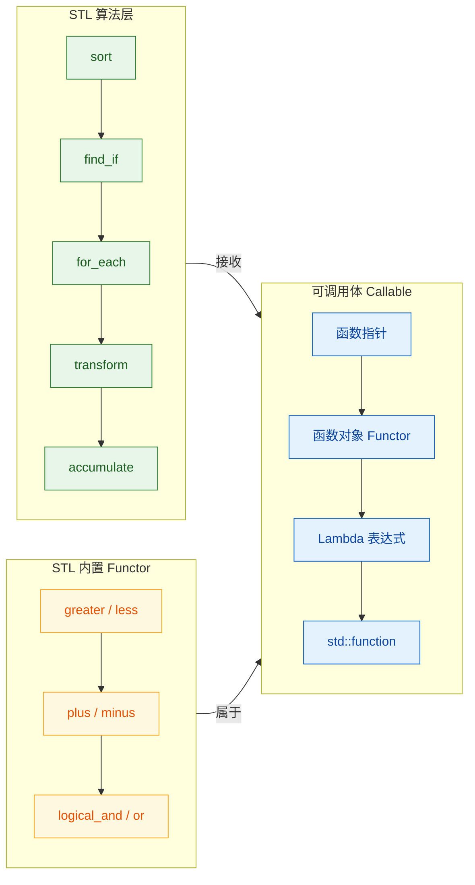

从这张图可以看出，**函数对象（Functor）只是 C++ 中"可调用体"家族的一员**。STL 算法通过模板参数接收任何可调用体。Functor 是最"古老"但最能揭示底层机制的方式；Lambda 是现代 C++ 的语法糖，本质上编译器会将其转化为一个匿名的函数对象类。理解了 Functor，你就理解了 Lambda 的底层实现。

### 核心要点总结

| 特性 | 函数指针 | 函数对象 (Functor) | Lambda (预告) |
|---|---|---|---|
| **携带状态** | ❌ 不行 | ✅ 成员变量 | ✅ 捕获列表 |
| **内联优化** | ⚠️ 困难 | ✅ 编译器友好 | ✅ 编译器友好 |
| **语法简洁度** | ⭐⭐ | ⭐ | ⭐⭐⭐ |
| **可复用性** | ⭐⭐ | ⭐⭐⭐ | ⭐ (通常一次性) |
| **可读性** | ⭐⭐ | ⭐⭐ | ⭐⭐⭐ |

函数对象在**可复用性**方面独占优势。当你的判断逻辑需要在多个地方、多个算法中反复使用时，定义一个具名的 Functor 类远比到处复制 Lambda 更加清晰、可维护。

---

**📝 练习题**

以下代码的输出是什么？

```cpp
#include <iostream>
#include <vector>
#include <algorithm>

struct Counter {
    int count = 0;
    void operator()(int x) {
        if (x % 2 == 0) ++count;
    }
};

int main() {
    std::vector<int> v = {1, 2, 3, 4, 5, 6};
    Counter c;
    std::for_each(v.begin(), v.end(), c);
    std::cout << c.count << std::endl;
    return 0;
}
```

A. 3


B. 6


C. 0


D. 编译错误

**【答案】** C

**【解析】** 这道题考察的是 `std::for_each` 对函数对象的**拷贝语义**。`std::for_each` 在接收函数对象 `c` 时，会在内部创建一份**副本**来使用。内部副本的 `count` 确实被累加到了 3，但外部的原始对象 `c` 自始至终没有被修改，其 `count` 仍为初始值 `0`。正确获取状态的方式是使用 `std::for_each` 的返回值：`Counter result = std::for_each(v.begin(), v.end(), c);`，此时 `result.count` 才是 3。这是 STL 函数对象的经典陷阱，也是高频面试考点。

---

## Lambda 表达式（C++11）

Lambda 表达式是 C++11 引入的一项里程碑级特性，它允许我们在代码中**就地定义匿名函数对象（anonymous function object）**。在 Lambda 出现之前，如果想向 STL 算法传递自定义行为，要么写一个普通函数，要么定义一个完整的仿函数类（functor class）——两者都不够简洁，尤其当逻辑只有一两行的时候，代码会显得异常冗余。Lambda 的诞生彻底改变了这一局面：你可以把"做什么"直接写在"用到它的地方"，让代码的**意图与位置高度统一**。

从本质上讲，编译器会将每个 Lambda 表达式转换为一个**唯一的、匿名的仿函数类**，并在调用点自动生成该类的实例。理解这一点至关重要——Lambda 并不是什么"魔法"，它只是编译器帮你写了一个 functor，语法更甜（syntactic sugar）罢了。

---

### Lambda 的基本语法

Lambda 表达式的完整语法形式如下：

```
[capture](parameters) mutable -> return_type { body }
```

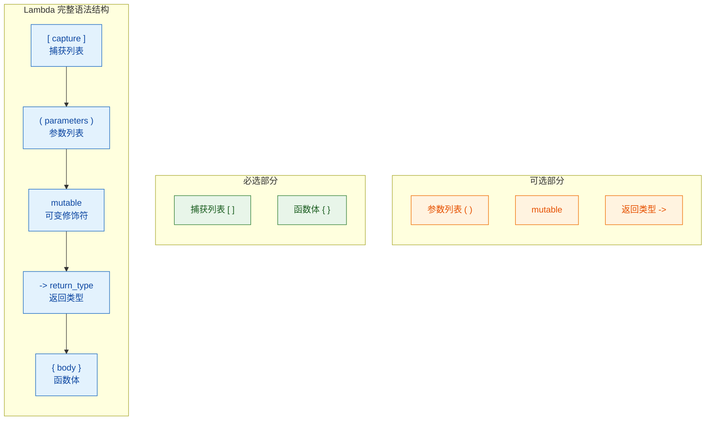

其中，**捕获列表 `[]`** 和 **函数体 `{}`** 是唯二不可省略的部分。其余组件可根据需要灵活组合。下面来看最简形式与逐步扩展：

```cpp
// ====== 最简 Lambda：无参数、无捕获 ======
auto greet = []() {                    // [] 空捕获列表；() 空参数列表
    std::cout << "Hello Lambda!\n";    // 函数体
};                                     // Lambda 赋值给变量 greet
greet();                               // 像普通函数一样调用

// ====== 省略空括号（无参时允许） ======
auto greet2 = [] {                     // 无参数时 () 可以省略
    std::cout << "Hello again!\n";
};

// ====== 带参数的 Lambda ======
auto add = [](int a, int b) {         // 接收两个 int 参数
    return a + b;                      // 编译器自动推断返回类型为 int
};
int sum = add(3, 5);                   // sum == 8

// ====== 显式指定返回类型 ======
auto divide = [](double a, double b) -> double {  // 尾置返回类型
    if (b == 0.0) return 0.0;                      // 分支一：返回 double
    return a / b;                                   // 分支二：返回 double
};
```

值得强调的是，当函数体内只有单一 `return` 语句时，编译器可以自动推断返回类型（return type deduction）。但若存在多条 `return` 且类型不一致，就必须用 `-> type` 显式声明，否则编译失败。

---

### 捕获列表详解

捕获列表（capture clause）是 Lambda 与普通函数最核心的区别。它决定了 Lambda 体内能"看到"外部作用域中的哪些变量，以及以何种方式访问它们。

```mermaid
graph LR
    subgraph CaptureByValue["按值捕获 (by value)"]
        direction TB
        V1["[x] — 捕获 x 的副本"]
        V2["[=] — 捕获所有外部变量的副本"]
        V3["副本在 Lambda 创建时确定"]
        V4["Lambda 内部修改不影响原变量"]
    end

    subgraph CaptureByRef["按引用捕获 (by reference)"]
        direction TB
        R1["[&ampx] — 捕获 x 的引用"]
        R2["[&amp] — 捕获所有外部变量的引用"]
        R3["Lambda 内部修改直接影响原变量"]
        R4["需注意悬空引用问题"]
    end

    subgraph MixedCapture["混合捕获 (mixed)"]
        direction TB
        M1["[=, &ampx] — 默认按值，x 按引用"]
        M2["[&amp, x] — 默认按引用，x 按值"]
        M3["[this] — 捕获当前对象指针"]
        M4["[*this] — 捕获当前对象副本 C++17"]
    end

    CaptureByValue ~~~ CaptureByRef ~~~ MixedCapture

    classDef valStyle fill:#E8F5E9,stroke:#388E3C,color:#1B5E20
    classDef refStyle fill:#E3F2FD,stroke:#1565C0,color:#0D47A1
    classDef mixStyle fill:#F3E5F5,stroke:#7B1FA2,color:#4A148C

    class V1,V2,V3,V4 valStyle
    class R1,R2,R3,R4 refStyle
    class M1,M2,M3,M4 mixStyle
```

下面用一段完整代码展示各种捕获方式的行为差异：

```cpp
#include <iostream>

int main() {
    int x = 10;                        // 外部变量 x
    int y = 20;                        // 外部变量 y

    // ===== 1. 按值捕获单个变量 =====
    auto byVal = [x]() {              // 捕获 x 的副本（此刻 x==10）
        std::cout << x << "\n";        // 输出 10（是副本，不随原变量变化）
        // x = 99;                     // ❌ 编译错误！按值捕获默认为 const
    };

    x = 999;                           // 修改外部 x
    byVal();                           // 仍然输出 10 — 副本不受影响

    // ===== 2. 按引用捕获单个变量 =====
    auto byRef = [&y]() {             // 捕获 y 的引用
        y += 5;                        // 直接修改外部的 y
        std::cout << y << "\n";        // 输出 25
    };
    byRef();                           // y 现在变成了 25
    std::cout << y << "\n";            // 验证：输出 25，外部 y 确实被修改

    // ===== 3. 全部按值捕获 =====
    auto allVal = [=]() {             // 捕获所有用到的外部变量的副本
        std::cout << x << " " << y;   // 可以访问 x 和 y 的副本
    };

    // ===== 4. 全部按引用捕获 =====
    auto allRef = [&]() {             // 捕获所有用到的外部变量的引用
        x += 1;                        // 修改外部 x
        y += 1;                        // 修改外部 y
    };

    // ===== 5. 混合捕获 =====
    auto mixed = [=, &y]() {          // 默认按值，但 y 按引用
        std::cout << x << "\n";        // x 是副本，只读
        y = 100;                       // y 是引用，可修改
    };

    return 0;
}
```

#### 捕获的本质：编译器做了什么？

当你写下一个带捕获的 Lambda 时，编译器其实在背后生成了一个匿名类，捕获的变量变成了该类的**成员变量**。我们用 ASCII 图来展示这个对应关系：

```cpp
// 你写的 Lambda：
int a = 42;
auto lam = [a](int x) { return a + x; };

// 编译器实际生成的等价代码（伪代码）：
// class __lambda_unique_name {
// private:
//     int a;                           // 按值捕获 → 成员变量副本
// public:
//     __lambda_unique_name(int a) : a(a) {}   // 构造时复制
//     int operator()(int x) const {           // const! 所以不能改 a
//         return a + x;
//     }
// };
// auto lam = __lambda_unique_name(a);         // 用当前 a 值构造
```

正因为 `operator()` 默认是 `const` 的，所以按值捕获的变量在 Lambda 内部不可修改——除非使用 `mutable` 关键字。

---

### mutable 关键字

默认情况下，按值捕获的变量在 Lambda 体内被视为 `const`，这是因为编译器生成的 `operator()` 函数被标记为 `const` 成员函数。如果你确实需要在 Lambda 内部**修改按值捕获变量的副本**（注意：修改的只是副本，不会影响原始变量），就必须加上 `mutable`：

```cpp
#include <iostream>

int main() {
    int count = 0;                     // 外部计数器

    // ===== 不加 mutable：编译失败 =====
    // auto bad = [count]() {
    //     count++;                     // ❌ 错误：不能修改 const 副本
    // };

    // ===== 加上 mutable：可以修改副本 =====
    auto counter = [count]() mutable { // mutable 移除了 operator() 的 const
        count++;                       // ✅ 修改的是 Lambda 内部的副本
        std::cout << "内部 count = " << count << "\n";
    };

    counter();                         // 输出：内部 count = 1
    counter();                         // 输出：内部 count = 2（副本在调用间保持状态！）
    counter();                         // 输出：内部 count = 3

    std::cout << "外部 count = " << count << "\n";  // 输出：外部 count = 0（原变量不变）

    return 0;
}
```

这里有一个容易被忽略的重点：**Lambda 对象是有状态的**。每次调用 `counter()` 时，其内部副本 `count` 的值会被保留到下一次调用。这与 functor 对象保持成员变量状态的机制完全相同。

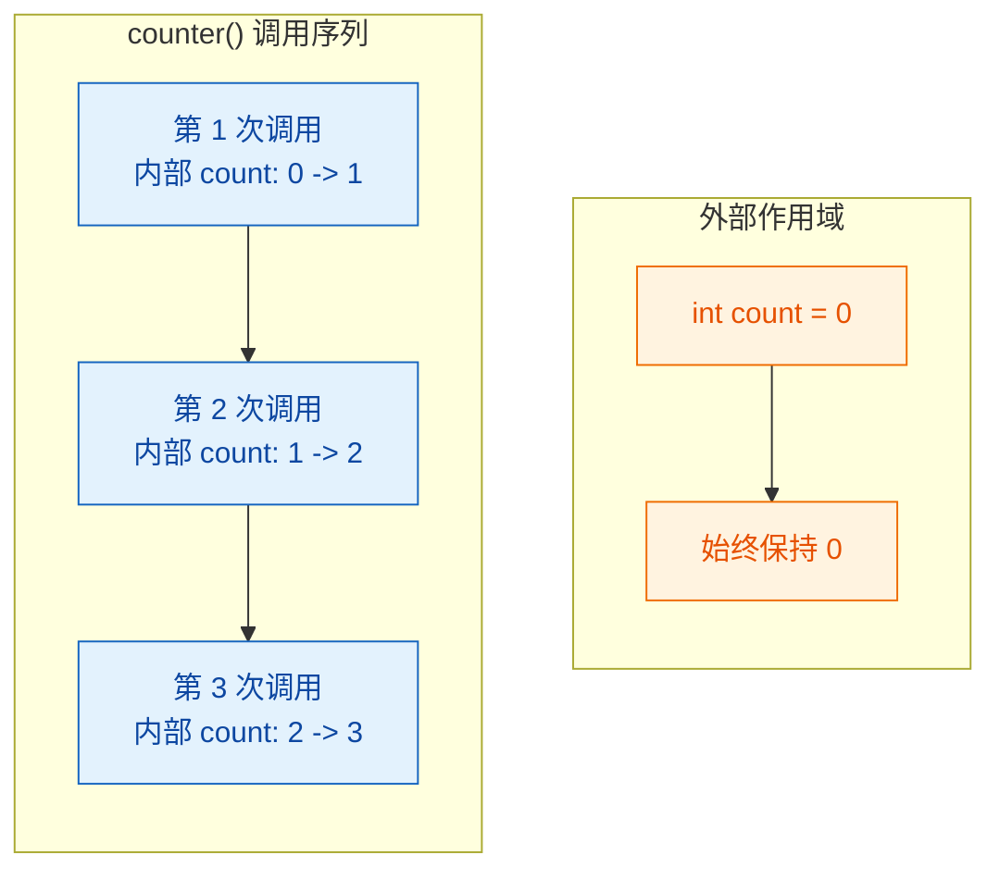

---

### Lambda 与 STL 算法的协作

Lambda 最常见、最强大的用武之地就是作为 STL 算法的**谓词（predicate）**或**操作（operation）**。它让原本需要单独定义函数/仿函数才能完成的任务变得行云流水：

```cpp
#include <iostream>
#include <vector>
#include <algorithm>                   // sort, find_if, for_each, count_if, transform
#include <numeric>                     // accumulate

int main() {
    std::vector<int> nums = {5, 2, 8, 1, 9, 3, 7, 4, 6};

    // ===== 1. sort：自定义排序规则 =====
    std::sort(nums.begin(), nums.end(),
        [](int a, int b) {            // 比较谓词
            return a > b;              // 降序排列
        }
    );
    // nums: {9, 8, 7, 6, 5, 4, 3, 2, 1}

    // ===== 2. find_if：查找第一个满足条件的元素 =====
    auto it = std::find_if(nums.begin(), nums.end(),
        [](int n) {                    // 一元谓词
            return n < 5;              // 找第一个小于 5 的元素
        }
    );
    if (it != nums.end()) {
        std::cout << "第一个 < 5 的元素: " << *it << "\n";  // 输出 4
    }

    // ===== 3. for_each：对每个元素执行操作 =====
    std::for_each(nums.begin(), nums.end(),
        [](int n) {                    // 对每个元素调用此 Lambda
            std::cout << n << " ";     // 输出每个元素
        }
    );
    std::cout << "\n";

    // ===== 4. count_if：统计满足条件的元素个数 =====
    int evenCount = std::count_if(nums.begin(), nums.end(),
        [](int n) {                    // 一元谓词
            return n % 2 == 0;         // 判断是否为偶数
        }
    );
    std::cout << "偶数个数: " << evenCount << "\n";  // 输出 4

    // ===== 5. transform：对每个元素进行变换 =====
    std::vector<int> doubled(nums.size());     // 存放变换结果的容器
    std::transform(nums.begin(), nums.end(),
        doubled.begin(),                        // 输出迭代器
        [](int n) {                             // 变换函数
            return n * 2;                       // 每个元素乘以 2
        }
    );

    // ===== 6. accumulate + Lambda：自定义累积逻辑 =====
    int product = std::accumulate(nums.begin(), nums.end(),
        1,                                      // 初始值为 1（乘法单位元）
        [](int acc, int n) {                    // 二元操作
            return acc * n;                     // 累积乘积
        }
    );
    std::cout << "所有元素之积: " << product << "\n";

    return 0;
}
```

对比一下 **不用 Lambda（传统仿函数）** vs **使用 Lambda** 的代码量差异，以 `sort` 降序为例：

```cpp
// ========== 传统方式：定义仿函数类 ==========
struct DescendingCompare {                // 需要单独定义一个类
    bool operator()(int a, int b) const { // 重载 operator()
        return a > b;
    }
};
std::sort(nums.begin(), nums.end(), DescendingCompare());  // 传入实例

// ========== Lambda 方式：就地完成 ==========
std::sort(nums.begin(), nums.end(), [](int a, int b) { return a > b; });
// 一行搞定，意图清晰，无需跳转到别处查看定义
```

这种"意图就地表达"的能力，就是 Lambda 被广泛采纳的核心原因。

---

### 捕获与 STL 算法的结合

Lambda 捕获使得我们能够在算法中引入**外部上下文**，这是普通函数难以实现的：

```cpp
#include <iostream>
#include <vector>
#include <algorithm>

int main() {
    std::vector<int> scores = {88, 72, 95, 60, 45, 83, 77, 91};
    int threshold = 80;                // 外部阈值，可以动态变化

    // ===== 捕获外部变量，实现参数化过滤 =====
    auto highScores = std::count_if(scores.begin(), scores.end(),
        [threshold](int score) {       // 按值捕获 threshold
            return score >= threshold; // 使用外部阈值进行比较
        }
    );
    std::cout << ">=80 的成绩数: " << highScores << "\n";  // 输出 4

    // ===== 按引用捕获，在遍历中累积信息 =====
    int sum = 0;                       // 外部累加器
    int count = 0;                     // 外部计数器
    std::for_each(scores.begin(), scores.end(),
        [&sum, &count](int score) {    // 按引用捕获 sum 和 count
            sum += score;              // 累加分数
            count++;                   // 累加计数
        }
    );
    double avg = static_cast<double>(sum) / count;
    std::cout << "平均分: " << avg << "\n";

    // ===== 捕获 + 状态：为每个元素生成序号 =====
    int index = 0;                     // 外部序号
    std::for_each(scores.begin(), scores.end(),
        [&index](int score) {          // 按引用捕获 index
            std::cout << "#" << ++index << ": " << score << "\n";
        }
    );

    return 0;
}
```

---

### 泛型 Lambda（C++14）

C++14 进一步增强了 Lambda 的能力，允许参数类型使用 `auto`，使 Lambda 变成**泛型的（generic）**——这类似于函数模板，但不需要显式写模板声明：

```cpp
#include <iostream>
#include <string>
#include <vector>
#include <algorithm>

int main() {
    // ===== 泛型 Lambda：参数类型由编译器推断 =====
    auto print = [](const auto& value) {   // auto 参数 → 泛型
        std::cout << value << " ";         // 适用于任何支持 << 的类型
    };

    print(42);                             // int → 输出 42
    print(3.14);                           // double → 输出 3.14
    print(std::string("hello"));           // string → 输出 hello
    std::cout << "\n";

    // ===== 泛型比较器 =====
    auto greater = [](const auto& a, const auto& b) {
        return a > b;                      // 适用于任何支持 > 的类型
    };

    std::vector<int> vi = {3, 1, 4, 1, 5};
    std::sort(vi.begin(), vi.end(), greater);      // 对 int 降序

    std::vector<std::string> vs = {"banana", "apple", "cherry"};
    std::sort(vs.begin(), vs.end(), greater);      // 对 string 降序（字典序）

    // ===== 编译器为每种参数类型组合生成不同的 operator() =====
    // greater(int, int)    → 生成 operator()(const int&, const int&)
    // greater(string, string) → 生成 operator()(const string&, const string&)

    return 0;
}
```

泛型 Lambda 的本质是：编译器将 `auto` 参数转化为匿名类的**模板化 `operator()`**。等价伪代码如下：

```cpp
// auto greater = [](const auto& a, const auto& b) { return a > b; };
// 等价于：
// struct __lambda {
//     template<typename T1, typename T2>
//     bool operator()(const T1& a, const T2& b) const {
//         return a > b;
//     }
// };
```

---

### Lambda 与 `std::function`

Lambda 本身的类型是编译器生成的**匿名类型（unnamed type）**，每个 Lambda 都有独一无二的类型，即使两个 Lambda 长得一模一样。这意味着你无法显式写出它的类型，所以通常用 `auto` 来接收。但当你需要**存储、传递或统一管理不同 Lambda** 时，`std::function` 就登场了：

```cpp
#include <iostream>
#include <functional>                  // std::function
#include <vector>
#include <map>

int main() {
    // ===== auto：最高效，零开销 =====
    auto lam1 = [](int x) { return x * 2; };  // 编译器知道确切类型

    // ===== std::function：类型擦除容器 =====
    std::function<int(int)> func1 = [](int x) { return x * 2; };  // 包装 Lambda
    std::function<int(int)> func2 = [](int x) { return x + 10; }; // 另一个 Lambda

    // ===== 用 std::function 实现回调注册 =====
    std::vector<std::function<int(int)>> callbacks;   // 存储多个回调
    callbacks.push_back([](int x) { return x * 2; }); // 加倍
    callbacks.push_back([](int x) { return x + 1; }); // 加一
    callbacks.push_back([](int x) { return x * x; }); // 平方

    int val = 5;
    for (auto& cb : callbacks) {                       // 遍历所有回调
        std::cout << cb(val) << " ";                   // 输出 10 6 25
    }
    std::cout << "\n";

    // ===== 用 map 实现命令分发器 =====
    std::map<std::string, std::function<double(double, double)>> ops;
    ops["add"] = [](double a, double b) { return a + b; };  // 加法
    ops["sub"] = [](double a, double b) { return a - b; };  // 减法
    ops["mul"] = [](double a, double b) { return a * b; };  // 乘法
    ops["div"] = [](double a, double b) {                    // 除法
        return b != 0 ? a / b : 0.0;
    };

    std::cout << ops["mul"](3.0, 4.0) << "\n";   // 输出 12

    return 0;
}
```

> **性能提示**：`std::function` 内部使用了类型擦除（type erasure）技术，可能涉及堆内存分配和虚函数调用，比 `auto` 直接持有 Lambda 要慢。在性能敏感的热路径（hot path）中，优先使用 `auto` 或模板参数。只在确实需要运行时多态（如回调容器、策略模式）时才使用 `std::function`。

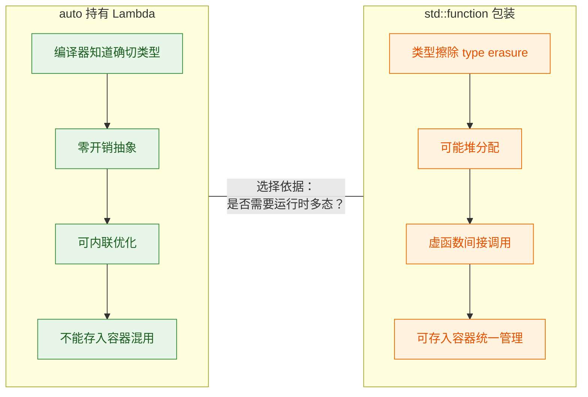

---

### 常见陷阱与最佳实践

#### 陷阱一：悬空引用（Dangling Reference）

按引用捕获时，如果 Lambda 的生命周期超过了被捕获变量的生命周期，就会产生**悬空引用（dangling reference）**——这是未定义行为（Undefined Behavior）：

```cpp
#include <functional>

std::function<int()> createLambda() {
    int local = 42;                    // 局部变量，函数结束即销毁
    return [&local]() {                // ⚠️ 按引用捕获局部变量
        return local;                  // 💀 函数返回后 local 已被销毁！
    };                                 // 返回的 Lambda 持有悬空引用
}

// 正确做法：按值捕获
std::function<int()> createLambdaSafe() {
    int local = 42;                    // 局部变量
    return [local]() {                 // ✅ 按值捕获，副本随 Lambda 存活
        return local;                  // 安全访问副本
    };
}
```

#### 陷阱二：循环中的引用捕获

```cpp
#include <vector>
#include <functional>
#include <iostream>

int main() {
    std::vector<std::function<void()>> funcs;

    for (int i = 0; i < 5; i++) {
        // ❌ 错误：所有 Lambda 都引用同一个 i
        // funcs.push_back([&i]() { std::cout << i << " "; });
        // 循环结束后 i == 5，所有 Lambda 输出 5 5 5 5 5（甚至 UB）

        // ✅ 正确：按值捕获，每个 Lambda 持有 i 的当时副本
        funcs.push_back([i]() {        // 按值捕获当前循环的 i
            std::cout << i << " ";     // 输出 0 1 2 3 4
        });
    }

    for (auto& f : funcs) f();         // 输出: 0 1 2 3 4
    std::cout << "\n";

    return 0;
}
```

#### 最佳实践速查表

```mermaid
graph LR
    subgraph Practices["Lambda 最佳实践"]
        direction TB
        P1["优先用 auto 接收 Lambda"]
        P2["短小 Lambda 不需要显式返回类型"]
        P3["明确列出捕获变量，避免 = 和 &amp 全捕获"]
        P4["跨作用域传递时，按值捕获更安全"]
        P5["性能敏感路径避免 std::function"]
        P6["Lambda 超过 3-5 行时，考虑提取为命名函数"]
    end

    subgraph Pitfalls["常见陷阱"]
        direction TB
        T1["悬空引用：Lambda 比被引用变量活得更久"]
        T2["循环引用捕获：所有闭包共享同一变量"]
        T3["忘记 mutable：按值捕获默认 const"]
        T4["this 捕获：对象销毁后 Lambda 仍在使用"]
    end

    Practices ~~~ Pitfalls

    classDef goodStyle fill:#E8F5E9,stroke:#388E3C,color:#1B5E20
    classDef badStyle fill:#FFEBEE,stroke:#C62828,color:#B71C1C

    class P1,P2,P3,P4,P5,P6 goodStyle
    class T1,T2,T3,T4 badStyle
```

---

### 进阶：立即调用的 Lambda（IIFE）

借鉴 JavaScript 的 IIFE（Immediately Invoked Function Expression）模式，C++ 中也可以定义并**立即调用**一个 Lambda。这在需要复杂初始化 `const` 变量时非常有用：

```cpp
#include <iostream>
#include <vector>

int main() {
    const int mode = 2;                // 假设由配置决定

    // ===== 用 IIFE 初始化 const 变量 =====
    const auto config = [&]() {        // Lambda 立即执行
        if (mode == 1) return std::string("Debug");     // 分支初始化
        if (mode == 2) return std::string("Release");
        return std::string("Unknown");
    }();                               // 注意末尾的 ()，立即调用！

    // config 是 const std::string，值为 "Release"
    std::cout << config << "\n";

    // ===== 复杂容器的 const 初始化 =====
    const auto table = []() {          // 无捕获，纯计算
        std::vector<int> t;            // 临时构建
        for (int i = 0; i < 10; i++) {
            t.push_back(i * i);        // 平方表
        }
        return t;                      // 返回构建好的容器
    }();                               // 立即调用

    // table 是 const vector<int>，不可再修改
    for (int v : table) {
        std::cout << v << " ";         // 0 1 4 9 16 25 36 49 64 81
    }

    return 0;
}
```

IIFE 的核心价值在于：它允许你用**任意复杂的逻辑**来初始化一个 `const` 变量，而不必牺牲常量性（constness）。没有 IIFE，你要么把变量声明为非 `const`（放弃不变性保证），要么把初始化逻辑提取为一个单独的函数（增加代码跳转）。

---

### Lambda 演进时间线

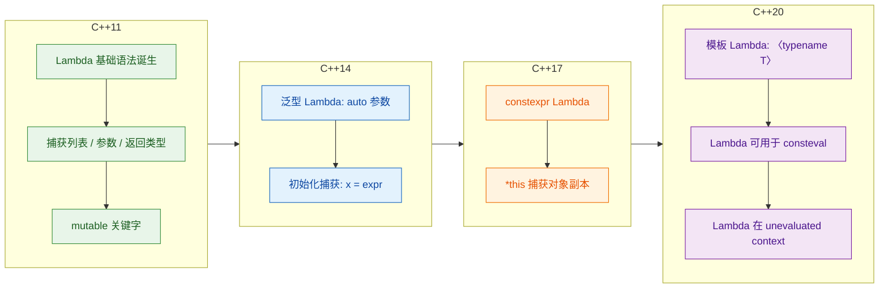

值得特别提及的是 **C++14 的初始化捕获（init capture）**，它允许在捕获列表中创建新变量并赋初始值，最经典的用法是实现**移动捕获（move capture）**：

```cpp
#include <memory>
#include <iostream>

int main() {
    auto ptr = std::make_unique<int>(42);  // unique_ptr 不可复制

    // ===== C++14 初始化捕获：移动语义 =====
    auto lam = [p = std::move(ptr)]() {    // 将 ptr 移动进 Lambda
        std::cout << *p << "\n";           // 在 Lambda 内使用
    };
    // 此时 ptr 已为空（ownership 已转移给 Lambda）

    lam();                                 // 输出 42

    return 0;
}
```

---

**📝 练习题**

以下代码的输出是什么？

```cpp
#include <iostream>
#include <functional>

int main() {
    int x = 1;
    auto a = [x]() mutable { return ++x; };
    auto b = a;

    std::cout << a() << " " << a() << "\n";
    std::cout << b() << " " << x << "\n";
    return 0;
}
```

A. `2 3` 然后 `2 1`


B. `2 3` 然后 `4 1`


C. `2 3` 然后 `2 3`


D. 编译错误，mutable Lambda 不能被复制


**【答案】** A

**【解析】** 这道题考查三个核心知识点：

1. **按值捕获 + mutable**：`a` 捕获了 `x` 的副本（值为 1），`mutable` 允许在 Lambda 内部修改这个副本。外部 `x` 始终为 1，不受影响。
2. **Lambda 的状态性**：第一次调用 `a()` 时内部副本从 1 变为 2 并返回 2；第二次调用 `a()` 时从 2 变为 3 并返回 3。所以第一行输出 `2 3`。
3. **Lambda 对象的拷贝**：`auto b = a;` 发生在 `a` 被调用两次**之前还是之后**是关键。代码中 `b` 的拷贝发生在**定义时**（即 `a` 未被调用之前），此时 `a` 内部副本还是初始值 1。所以 `b()` 第一次调用返回 2，外部 `x` 仍为 1。最终第二行输出 `2 1`。

> **注意**：严格来说，`std::cout << a() << " " << a()` 中两个 `a()` 的求值顺序在 C++17 之前是未指定的（unspecified）。本题假设从左到右求值（C++17 保证 `<<` 的左操作数先于右操作数求值），结果为 `2 3`。在 C++17 之前的编译器中，可能输出 `3 2`。

---

**📝 练习题**

以下哪种捕获方式会导致**未定义行为（Undefined Behavior）**？

```cpp
std::function<int()> make_counter() {
    int n = 0;
    // 选项 A
    return [n]() mutable { return ++n; };
    // 选项 B
    return [&n]() { return ++n; };
    // 选项 C
    return [k = n]() mutable { return ++k; };
    // 选项 D
    return [](){ static int s = 0; return ++s; };
}
```

A. 选项 A


B. 选项 B


C. 选项 C


D. 选项 D


**【答案】** B

**【解析】** 

- **选项 A**：按值捕获 `n` 的副本，`mutable` 允许修改副本。Lambda 返回后，副本随 Lambda 对象一起存活。✅ 安全。
- **选项 B**：按引用捕获局部变量 `n`。`make_counter()` 返回后，`n` 被销毁，但返回的 `std::function` 仍持有对 `n` 的引用——这是典型的**悬空引用（dangling reference）**，使用时是未定义行为。❌ UB。
- **选项 C**：C++14 初始化捕获，`k = n` 创建了一个新的按值成员，等价于选项 A 的效果。✅ 安全。
- **选项 D**：不捕获任何变量，使用函数内的 `static` 局部变量。`static` 变量生命周期贯穿整个程序。✅ 安全（但注意线程安全性）。

---

## auto 类型推断

C++11 引入的 `auto` 关键字，是现代 C++ 中最具代表性的语法糖之一。它让编译器根据**初始化表达式**自动推导变量的类型，从而大幅减少冗余的类型声明，提升代码可读性与可维护性。在 STL 的日常使用中，`auto` 几乎无处不在——它让你从诸如 `std::vector<std::pair<std::string, int>>::const_iterator` 这类令人窒息的类型书写中解放出来。

但 `auto` 远不只是"少写几个字"这么简单。它背后牵涉到 **类型推导规则 (Type Deduction Rules)**、**引用与 cv 限定符的剥离 (Reference & CV-qualifier Stripping)**、**`decltype(auto)` 的差异**等核心话题。只有深入理解这些规则，才能在实际工程中真正驾驭 `auto`，避免写出隐含 Bug 的代码。

---

### auto 的基本用法与动机

在 C++11 之前，声明变量时必须显式写出完整类型。对于简单类型（`int`、`double`）这并不是问题，但当类型名称变得冗长时，代码就会迅速膨胀：

```cpp
// ========== C++03 风格：类型冗长，阅读困难 ==========
#include <vector>
#include <map>
#include <string>

int main() {
    std::map<std::string, std::vector<int>> data;  // 声明一个 map

    // 迭代器类型极其冗长，可读性差
    std::map<std::string, std::vector<int>>::iterator it = data.begin();

    // 即使用 typedef 缓解，也需要额外定义
    typedef std::map<std::string, std::vector<int>>::iterator MapIter;
    MapIter it2 = data.begin();

    return 0;
}
```

`auto` 的出现彻底解决了这个问题：

```cpp
// ========== C++11 风格：使用 auto 简化声明 ==========
#include <vector>
#include <map>
#include <string>

int main() {
    std::map<std::string, std::vector<int>> data;  // 声明一个 map

    auto it = data.begin();   // 编译器自动推导为 std::map<...>::iterator
    auto it2 = data.cbegin(); // 编译器自动推导为 std::map<...>::const_iterator

    auto x = 42;              // int
    auto pi = 3.14;           // double
    auto name = std::string("hello"); // std::string（注意不是 const char*）

    return 0;
}
```

`auto` 的核心原则是：**变量的类型由其初始化表达式 (initializer) 决定**。因此，使用 `auto` 声明变量时，**必须同时提供初始化值**，否则编译器无法推导类型，会直接报错。

```cpp
auto z;        // ❌ 编译错误！没有初始化表达式，无法推导类型
auto z = 0;    // ✅ 正确，z 被推导为 int
```

这其实也是 `auto` 的一个隐含好处——它**强制你初始化变量**，从根本上杜绝了"未初始化变量"这一经典 Bug 来源。

---

### auto 的类型推导规则

`auto` 的推导规则与**函数模板的参数推导 (Template Argument Deduction)** 基本一致。理解这套规则是正确使用 `auto` 的关键。我们可以把 `auto` 想象成一个隐含的模板参数 `T`：

```cpp
// 当你写：
auto x = expr;
// 编译器内部等价于：
template<typename T>
void f(T param);    // auto x = expr  →  f(expr)  →  推导 T

// 当你写：
auto& x = expr;
// 编译器内部等价于：
template<typename T>
void f(T& param);   // auto& x = expr  →  f(expr)  →  推导 T
```

基于这个类比，`auto` 的推导可以分为**三大场景**：

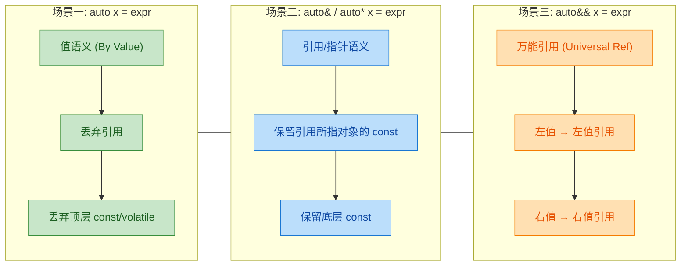

下面逐一展开。

#### 场景一：`auto x = expr`（值语义，By Value）

这是最常见的用法。编译器会**创建一个全新的副本**，推导规则是：

1. 如果 `expr` 是引用类型，**去掉引用**。
2. 去掉引用后，如果还有**顶层 (top-level) `const` 或 `volatile`**，也一并**去掉**。

```cpp
#include <iostream>

int main() {
    int a = 10;                // a 是 int
    const int b = 20;          // b 是 const int
    const int& c = a;          // c 是 const int& (对 a 的常量引用)

    auto x1 = a;               // x1 → int          (直接拷贝, 无特殊处理)
    auto x2 = b;               // x2 → int          (顶层 const 被剥离!)
    auto x3 = c;               // x3 → int          (先去引用得 const int, 再去顶层 const)

    x2 = 99;                   // ✅ 完全合法, x2 只是 int, 不是 const
    x3 = 88;                   // ✅ 同理

    // ---------- 指针的情况 ----------
    const int* p = &b;         // p 是 "指向 const int 的指针" (底层 const)
    auto x4 = p;               // x4 → const int*   (底层 const 被保留!)

    // *x4 = 5;                // ❌ 错误! 底层 const 没被去掉, 不能修改所指内容
    // 但 x4 本身可以指向别的地方:
    x4 = &a;                   // ✅ x4 本身不是 const 指针, 可以重新赋值

    int* const q = &a;         // q 是 "const 指针, 指向 int" (顶层 const)
    auto x5 = q;               // x5 → int*         (顶层 const 被剥离!)

    return 0;
}
```

这里必须理解**顶层 const (top-level const)** 与**底层 const (low-level const)** 的区别：

```cpp
//         顶层 const (修饰变量本身)
//              ↓
int* const p1 = &a;    // p1 本身不可改, 但 *p1 可改
//    ↑
// 底层 const (修饰变量所指/所引用的对象)
const int* p2 = &a;    // p2 可改, 但 *p2 不可改
```

> **记忆口诀**：`auto x = expr` 拷贝出一个**全新独立的对象**，新对象自己当然不需要继承原对象的"不可修改"属性（顶层 const），但它**必须尊重所指对象的约束**（底层 const）。

#### 场景二：`auto&` 和 `auto*`（引用/指针语义）

当你显式写出 `&` 或 `*` 时，你在告诉编译器："我要的是引用/指针，不是副本。"此时推导规则变为：

1. 如果 `expr` 是引用，**去掉引用**（因为你已经自己写了 `&`）。
2. 然后将 `expr` 的剩余类型与 `auto&` 做模式匹配。
3. **`const` 不会被丢弃**——因为你拿的是别人的引用，必须尊重原对象的所有限定符。

```cpp
#include <iostream>

int main() {
    int a = 10;
    const int b = 20;
    const int& c = b;

    auto& r1 = a;             // r1 → int&           (a 是 int, 绑定为 int&)
    auto& r2 = b;             // r2 → const int&     (b 是 const int, const 被保留!)
    auto& r3 = c;             // r3 → const int&     (c 去掉引用后是 const int)

    r1 = 100;                 // ✅ r1 是 int&, 可以修改
    // r2 = 200;              // ❌ r2 是 const int&, 不能修改
    // r3 = 300;              // ❌ r3 是 const int&, 不能修改

    // ---------- 指针语义 ----------
    const int* p = &b;
    auto* p1 = p;             // p1 → const int*     (auto 推导为 const int)
    // *p1 = 5;               // ❌ 不能修改底层 const 所指

    return 0;
}
```

> **关键区别**：`auto x = expr` 会剥离顶层 const，而 `auto& x = expr` 不会。因为引用不是副本，它直接绑定到原对象，必须忠实保留原对象的所有性质。

#### 场景三：`auto&&`（万能引用 / Universal Reference）

`auto&&` 是 C++11 引入的**万能引用 (Universal Reference)**，也被 Scott Meyers 后来称作 **Forwarding Reference**。它的推导规则非常特殊：

- 如果 `expr` 是**左值 (lvalue)**，`auto` 被推导为**左值引用**，最终结果通过**引用折叠 (Reference Collapsing)** 变为**左值引用**。
- 如果 `expr` 是**右值 (rvalue)**，`auto` 被推导为**非引用类型**，最终结果是**右值引用**。

```cpp
#include <iostream>

int main() {
    int a = 10;
    const int b = 20;

    // expr 是左值 → auto 推导为 int& → int& && 折叠为 int&
    auto&& r1 = a;            // r1 → int&

    // expr 是左值 → auto 推导为 const int& → const int& && 折叠为 const int&
    auto&& r2 = b;            // r2 → const int&

    // expr 是右值 (字面量 42) → auto 推导为 int → int&& 就是右值引用
    auto&& r3 = 42;           // r3 → int&&

    // expr 是右值 (临时对象) → auto 推导为 std::string → std::string&&
    auto&& r4 = std::string("tmp"); // r4 → std::string&&

    r1 = 99;                  // ✅ r1 是 int&, 可以修改 a
    // r2 = 99;               // ❌ r2 是 const int&, 不能修改
    r3 = 88;                  // ✅ r3 绑定了临时值, 但右值引用本身是左值, 可修改

    return 0;
}
```

引用折叠规则可以用下面的表格概括：

```
┌───────────────────┬────────────────┬──────────────┐
│   auto 推导结果    │  与 && 组合后   │   折叠结果    │
├───────────────────┼────────────────┼──────────────┤
│   T               │   T&&          │   T&&  (右值) │
│   T&              │   T& &&        │   T&   (左值) │
│   T&&             │   T&& &&       │   T&&  (右值) │
└───────────────────┴────────────────┴──────────────┘
规则：只要有一个 & 就折叠为左值引用，两个 && 才保持右值引用
```

---

### auto 与 STL 的化学反应

`auto` 在 STL 编程中的价值是革命性的。以下是几个典型场景：

#### 迭代器简化

```cpp
#include <vector>
#include <map>
#include <string>
#include <iostream>

int main() {
    std::map<std::string, std::vector<int>> scoreBoard = {
        {"Alice", {90, 85, 92}},
        {"Bob",   {78, 88, 95}}
    };

    // ===== C++03 写法：令人崩溃的类型名 =====
    // std::map<std::string, std::vector<int>>::const_iterator it;
    // for (it = scoreBoard.begin(); it != scoreBoard.end(); ++it) { ... }

    // ===== C++11 写法：auto 一步到位 =====
    for (auto it = scoreBoard.begin(); it != scoreBoard.end(); ++it) {
        std::cout << it->first << ": ";       // it->first 是 const std::string
        for (auto vit = it->second.begin(); vit != it->second.end(); ++vit) {
            std::cout << *vit << " ";          // *vit 是 int
        }
        std::cout << "\n";
    }

    // ===== 更简洁：范围 for + auto =====
    for (const auto& [name, scores] : scoreBoard) {   // C++17 结构化绑定
        std::cout << name << ": ";
        for (auto s : scores) {                        // s 是 int 的拷贝
            std::cout << s << " ";
        }
        std::cout << "\n";
    }

    return 0;
}
```

#### 配合 Lambda 表达式

Lambda 表达式的类型是编译器生成的**匿名类 (unnamed closure type)**，程序员根本无法手写其类型名。这时 `auto` 是唯一的自然选择（除了 `std::function`，但后者有运行时开销）：

```cpp
#include <vector>
#include <algorithm>
#include <iostream>

int main() {
    std::vector<int> nums = {5, 3, 8, 1, 9, 2};

    // lambda 的类型是编译器生成的匿名类, 只能用 auto 接收
    auto cmp = [](int a, int b) { return a > b; };  // 降序比较器

    std::sort(nums.begin(), nums.end(), cmp);        // 传入自定义比较器

    // auto 配合 for_each + lambda
    auto print = [](int x) { std::cout << x << " "; };
    std::for_each(nums.begin(), nums.end(), print);  // 输出: 9 8 5 3 2 1
    std::cout << "\n";

    return 0;
}
```

#### 配合 STL 算法返回值

许多 STL 算法返回复杂的迭代器或 pair 类型，`auto` 可以完美接住：

```cpp
#include <vector>
#include <algorithm>
#include <iostream>

int main() {
    std::vector<int> v = {3, 1, 4, 1, 5, 9, 2, 6};

    // std::minmax_element 返回 std::pair<Iterator, Iterator>
    auto [minIt, maxIt] = std::minmax_element(v.begin(), v.end()); // C++17
    std::cout << "min=" << *minIt << ", max=" << *maxIt << "\n";   // min=1, max=9

    // std::find 返回迭代器
    auto it = std::find(v.begin(), v.end(), 5);
    if (it != v.end()) {
        std::cout << "Found 5 at index " << std::distance(v.begin(), it) << "\n";
    }

    // std::partition 返回分界点迭代器
    auto pivot = std::partition(v.begin(), v.end(), [](int x) {
        return x % 2 == 0;     // 偶数放前面
    });
    // pivot 指向第一个不满足条件的元素

    return 0;
}
```

---

### auto 的进阶话题

#### `decltype(auto)`（C++14）

C++14 引入了 `decltype(auto)`，它的推导规则与 `auto` 不同：**它完全按照 `decltype` 的规则来推导**，不会剥离引用和 const。

```cpp
#include <iostream>

int x = 10;

int& getRef() { return x; }       // 返回 int&

int main() {
    // auto 推导: 去掉引用 → int
    auto a = getRef();             // a → int  (拷贝! 修改 a 不影响 x)

    // decltype(auto) 推导: 保留引用 → int&
    decltype(auto) b = getRef();   // b → int& (引用! 修改 b 会影响 x)

    b = 42;                        // x 也变成了 42
    std::cout << x << "\n";        // 输出 42

    return 0;
}
```

`decltype(auto)` 在**完美转发返回值**的场景中非常有用：

```cpp
// 一个完美转发返回值的包装函数
template<typename F, typename... Args>
decltype(auto) wrapper(F&& f, Args&&... args) {
    // 如果 f 返回引用, decltype(auto) 也返回引用
    // 如果 f 返回值, decltype(auto) 也返回值
    return std::forward<F>(f)(std::forward<Args>(args)...);
}
```

#### `auto` 在返回类型推导中的应用（C++14）

C++14 允许函数直接用 `auto` 作为返回类型，编译器从 `return` 语句推导：

```cpp
// C++14: 编译器从 return 语句推导返回类型
auto add(int a, int b) {
    return a + b;       // 推导返回类型为 int
}

// C++11: 尾置返回类型 (trailing return type)
auto add11(int a, int b) -> decltype(a + b) {
    return a + b;       // 显式指定返回类型为 decltype(a + b), 即 int
}

// 注意: 多条 return 语句时, 所有 return 的类型必须一致
auto ambiguous(bool flag) {
    if (flag) return 1;       // int
    else return 2.0;          // double  ❌ 编译错误! 类型不一致
}
```

#### `auto` 用于非类型模板参数（C++17）

C++17 进一步扩展了 `auto` 的使用范围：

```cpp
// C++17: auto 用于非类型模板参数
template<auto N>               // N 的类型由传入的值决定
struct Constant {
    static constexpr auto value = N;  // value 的类型与 N 一致
};

Constant<42> c1;               // N 是 int, value 是 int
Constant<'A'> c2;              // N 是 char, value 是 char
Constant<true> c3;             // N 是 bool, value 是 bool
```

---

### auto 使用的最佳实践与常见陷阱

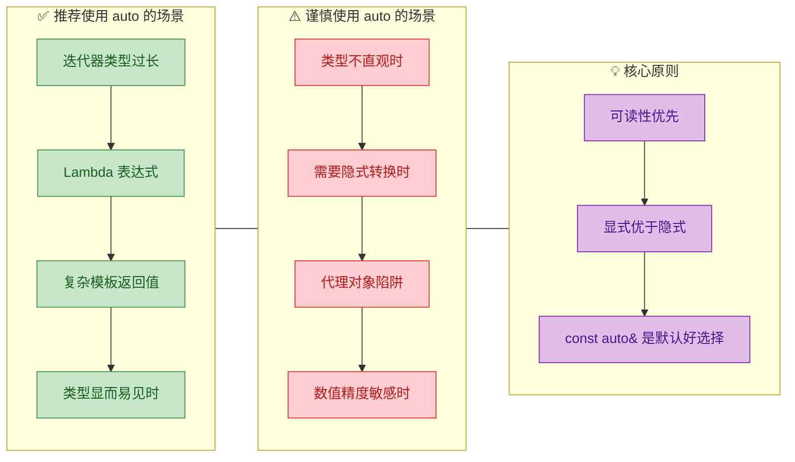

#### 陷阱一：代理对象 (Proxy Object)

这是 `auto` 最危险的陷阱之一。某些 STL 类型会返回**代理对象**而非真实值，`auto` 会忠实地推导出代理类型，导致未定义行为：

```cpp
#include <vector>
#include <iostream>

int main() {
    std::vector<bool> flags = {true, false, true};

    // ⚠️ 危险! vector<bool> 的 operator[] 返回的不是 bool&,
    //    而是一个代理对象: std::vector<bool>::reference
    auto val = flags[0];       // val → std::vector<bool>::reference (代理对象!)
    // val 内部持有指向 flags 内存的指针

    flags.push_back(false);    // push_back 可能导致内存重分配!
    // 此时 val 内部的指针悬空 → 未定义行为 (Undefined Behavior)

    // ✅ 正确做法: 显式声明类型, 强制转换
    bool realVal = flags[0];   // 触发隐式转换, realVal 是独立的 bool 值

    // ✅ 或者使用 static_cast
    auto safeVal = static_cast<bool>(flags[0]); // safeVal → bool

    return 0;
}
```

#### 陷阱二：意外拷贝

```cpp
#include <map>
#include <string>

int main() {
    std::map<std::string, int> m = {{"a", 1}, {"b", 2}};

    // ⚠️ 每次循环都在拷贝 pair! 性能浪费!
    for (auto p : m) {                         // p → std::pair<const std::string, int> 的拷贝
        // p.second = 10;                      // 修改的是副本, 不影响 m
    }

    // ✅ 使用 const auto& 避免拷贝
    for (const auto& p : m) {                  // p → const std::pair<const std::string, int>&
        std::cout << p.first << "=" << p.second << "\n";
    }

    // ✅ 需要修改时使用 auto&
    for (auto& p : m) {                        // p → std::pair<const std::string, int>&
        p.second *= 10;                        // 直接修改 m 中的值
    }

    return 0;
}
```

#### 陷阱三：`auto` 与花括号初始化

C++11/14 中 `auto` 对花括号 `{}` 的推导规则经历了变化，这是一个著名的"怪癖"：

```cpp
#include <initializer_list>

int main() {
    // C++11 规则:
    auto a = {1, 2, 3};       // a → std::initializer_list<int> (不是你想的 vector!)
    auto b = {1};              // b → std::initializer_list<int> (也不是 int!)
    auto c{1};                 // C++11: c → std::initializer_list<int>
                               // C++17: c → int  (规则被修改了!)

    // auto d = {1, 2.0};     // ❌ 错误! initializer_list 要求元素类型一致

    // ✅ 如果你只想要一个 int, 不要用花括号:
    auto e = 1;                // e → int

    return 0;
}
```

> **最佳实践建议**：除非你确实想要 `std::initializer_list`，否则避免 `auto` 与 `{}` 搭配使用。

---

### 何时该用 / 不该用 auto：决策指南

下面给出一个实际开发中的决策思路：

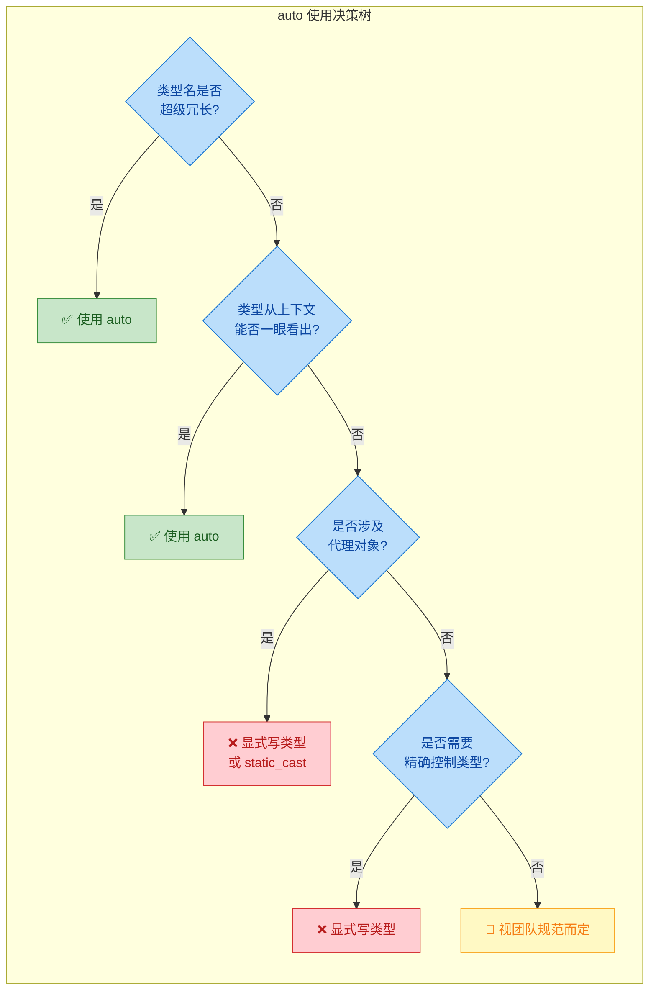

总结为一句话：**当类型显而易见或者冗长到影响阅读时，大胆用 `auto`；当类型不直观或存在陷阱时，显式写出类型。** 在大多数遍历场景中，`const auto&` 是最安全的默认选择。

---

### auto 在各 C++ 标准中的演进

| 标准     | 新增能力                                                                                   |
| -------- | ------------------------------------------------------------------------------------------ |
| C++11    | 变量声明推导、范围 for 循环、尾置返回类型 (`auto f() -> T`)、Lambda 参数不可用 auto          |
| C++14    | 函数返回类型推导 (`auto f()`)、`decltype(auto)`、泛型 Lambda (`[](auto x) {}`)              |
| C++17    | 非类型模板参数 `template<auto N>`、结构化绑定 `auto [a, b] = ...`、`auto c{1}` 改推导为 int |
| C++20    | 函数参数使用 `auto`（缩写函数模板）、Concepts 约束 `auto`                                    |

C++20 的缩写函数模板 (Abbreviated Function Template) 值得一提：

```cpp
// C++20: auto 参数等价于模板参数
auto add(auto a, auto b) {    // 等价于 template<typename T, typename U> auto add(T a, U b)
    return a + b;
}

// 配合 Concepts 约束
#include <concepts>
auto add(std::integral auto a, std::integral auto b) {  // 限制为整数类型
    return a + b;
}
```

---

**📝 练习题**

以下代码中，变量 `x` 的最终类型是什么？

```cpp
const int ci = 42;
const int& cr = ci;
auto x = cr;
x = 100;
```

A. `const int`，赋值 `x = 100` 编译错误

B. `const int&`，赋值 `x = 100` 编译错误

C. `int`，赋值 `x = 100` 编译通过，`ci` 不受影响

D. `int&`，赋值 `x = 100` 编译通过，`ci` 变为 100


**【答案】** C

**【解析】** `auto x = cr` 是**值语义**推导（场景一）。推导步骤：① `cr` 的声明类型是 `const int&`，首先**去掉引用**，得到 `const int`；② 接着**去掉顶层 const**，得到 `int`。因此 `x` 的类型是 `int`，它是一个**全新的独立副本**。`x = 100` 完全合法，且不会影响 `ci` 或 `cr` 的值。这道题的核心在于理解 `auto` 值推导会**同时剥离引用和顶层 const**，产生一个与原对象完全独立的拷贝。

---

## 范围 for 循环（Range-based For Loop, C++11）

在 C++11 之前，遍历一个容器或数组，我们通常需要手写迭代器循环或使用下标索引。这种写法冗长、易出错（off-by-one、迭代器类型拼写等）。C++11 引入了 **范围 for 循环（range-based for loop）**，它以一种极其简洁的语法，让编译器自动处理迭代的起始与终止逻辑，极大地提升了代码的 **可读性** 和 **安全性**。

范围 for 循环的设计哲学与 STL 算法（如 `std::for_each`）一脉相承——**将"如何遍历"的细节隐藏起来，只暴露"对每个元素做什么"的意图**。它不是语法糖那么简单，其背后涉及 `begin()`/`end()` 协议、类型推断（`auto`）、引用语义等多个核心概念的交汇。

---

### 基本语法与等价展开

范围 for 循环的一般形式为：

```cpp
for (declaration : expression) {
    statement;
}
```

其中 `expression` 必须是一个 **范围（range）**——即拥有 `begin()` 和 `end()` 的对象（或可被 ADL 找到的自由函数 `begin()`/`end()`），而 `declaration` 声明了一个变量，依次绑定到范围中的每一个元素。

编译器会将其等价展开为如下伪代码（C++17 起 `begin` 和 `end` 可返回不同类型，即 sentinel）：

```cpp
// 范围 for 循环的编译器等价展开（C++11/14 版本）
{
    auto && __range = expression;        // 绑定到范围对象（万能引用，避免拷贝）
    auto __begin   = begin(__range);     // 获取起始迭代器
    auto __end     = end(__range);       // 获取末尾哨兵迭代器
    for ( ; __begin != __end; ++__begin) {
        declaration = *__begin;          // 将当前元素绑定到循环变量
        statement;                       // 执行循环体
    }
}
```

这段展开揭示了几个关键细节：

- **`auto&&` 绑定范围**：编译器用万能引用（universal reference）绑定 `expression` 的结果。如果 `expression` 是左值，`__range` 就是左值引用；如果是右值（如函数返回的临时对象），则延长其生命周期到循环结束。
- **`begin()` / `end()` 查找**：编译器优先调用成员函数 `.begin()` / `.end()`，若不存在则通过 ADL（Argument-Dependent Lookup）查找自由函数 `begin()` / `end()`，对原生数组则直接推导首尾指针。
- **`!=` 比较与 `++` 前缀自增**：这意味着你的自定义迭代器至少要支持 `operator!=`、`operator++`（前缀）和 `operator*`。

下面用一张流程图来可视化编译器的完整展开过程：

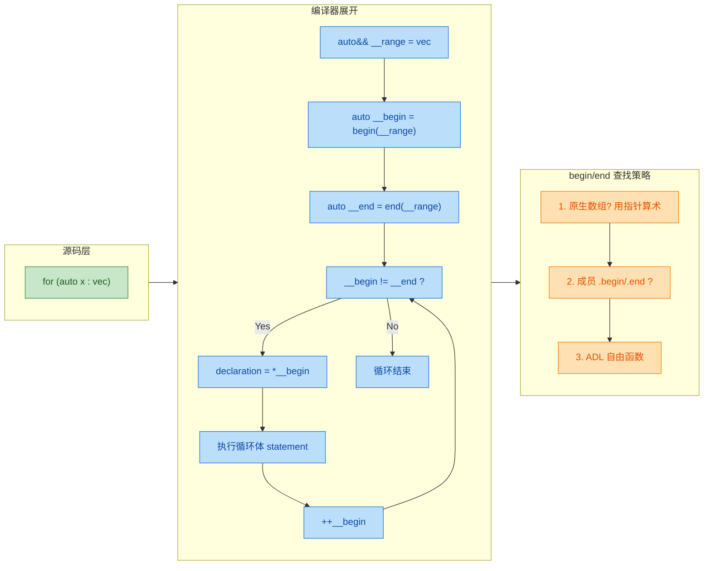

---

### 循环变量的四种绑定方式

范围 for 循环的威力与陷阱，主要体现在循环变量的 **声明方式** 上。选错方式，轻则性能下降，重则逻辑错误。以下是四种常见的绑定方式，配合 `auto` 类型推断来分析：

```cpp
#include <iostream>
#include <vector>
#include <string>

int main() {
    std::vector<std::string> words = {"Hello", "Range", "For"};

    // ========== 方式1：值拷贝（auto） ==========
    // 每次迭代都会拷贝一份元素到局部变量 w
    // 修改 w 不影响原容器，适合只读 + 元素廉价拷贝的场景
    for (auto w : words) {
        w += "!";                  // 修改的是拷贝，原容器不变
        std::cout << w << " ";     // 输出: Hello! Range! For!
    }
    std::cout << "\n";

    // 验证原容器未被修改
    for (auto w : words) {
        std::cout << w << " ";     // 输出: Hello Range For（无感叹号）
    }
    std::cout << "\n";

    // ========== 方式2：左值引用（auto&） ==========
    // w 直接绑定到容器中的元素本身，零拷贝
    // 可以修改原容器中的元素
    for (auto& w : words) {
        w += "!";                  // 直接修改原容器中的字符串
    }
    for (auto& w : words) {
        std::cout << w << " ";     // 输出: Hello! Range! For!
    }
    std::cout << "\n";

    // ========== 方式3：const 引用（const auto&） ==========
    // 零拷贝 + 只读保护，最推荐的"只读遍历"方式
    for (const auto& w : words) {
        // w += "?";               // 编译错误！const 引用禁止修改
        std::cout << w << " ";     // 安全读取
    }
    std::cout << "\n";

    // ========== 方式4：万能引用（auto&&）C++11 ==========
    // 可以绑定左值也可以绑定右值
    // 常用于泛型代码或需要完美转发的高级场景
    for (auto&& w : words) {
        std::cout << w << " ";     // w 推导为 std::string&（左值引用）
    }
    std::cout << "\n";

    return 0;
}
```

为了一目了然地选出正确的绑定方式，这里给出决策图：

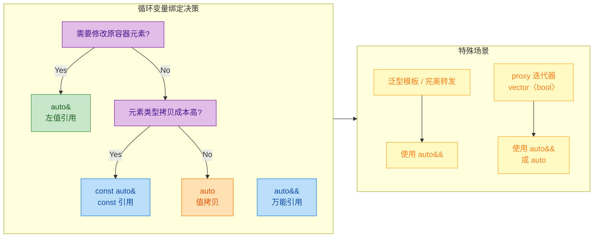

> **黄金法则**：**默认使用 `const auto&`**。只有当你确实需要修改元素时才用 `auto&`；对 `int`、`double` 等基本类型，直接 `auto` 值拷贝反而可能更快（避免间接寻址）。

---

### 可遍历的范围类型

范围 for 循环并不只能用于 `std::vector`。任何满足 **范围协议（Range Protocol）** 的类型都可以用。下面逐一展示：

#### 原生数组（C-style Array）

```cpp
#include <iostream>

int main() {
    int arr[] = {10, 20, 30, 40, 50};  // C 风格原生数组

    // 编译器知道 arr 的大小（sizeof(arr)/sizeof(arr[0])）
    // 自动推导出 begin = arr, end = arr + 5
    for (auto x : arr) {
        std::cout << x << " ";          // 输出: 10 20 30 40 50
    }
    std::cout << "\n";
    return 0;
}
```

> ⚠️ **注意**：如果数组退化为指针（如作为函数参数传入 `void f(int arr[])`），则 **无法** 使用范围 for 循环，因为编译器丢失了数组长度信息。此时应改用 `std::array` 或 `std::span`（C++20）。

#### STL 容器

所有标准容器（`vector`、`list`、`deque`、`map`、`set`、`unordered_map` 等）天然支持范围 for：

```cpp
#include <iostream>
#include <map>
#include <set>

int main() {
    // ===== std::map 遍历 =====
    std::map<std::string, int> scores = {
        {"Alice", 95},
        {"Bob", 87},
        {"Carol", 92}
    };

    // map 的每个元素是 std::pair<const Key, Value>
    // 使用 const auto& 避免拷贝 pair
    for (const auto& [name, score] : scores) {   // C++17 结构化绑定
        std::cout << name << ": " << score << "\n";
    }

    // 如果不支持 C++17，传统写法：
    for (const auto& kv : scores) {
        std::cout << kv.first << ": " << kv.second << "\n";
    }

    // ===== std::set 遍历 =====
    std::set<int> nums = {3, 1, 4, 1, 5, 9};     // 自动去重排序
    for (auto n : nums) {
        std::cout << n << " ";                     // 输出: 1 3 4 5 9
    }
    std::cout << "\n";

    return 0;
}
```

#### `std::initializer_list`

范围 for 循环可以直接遍历花括号初始化列表（brace-enclosed initializer list），编译器会构造一个临时的 `std::initializer_list`：

```cpp
#include <iostream>

int main() {
    // expression 是一个 braced-init-list
    // 编译器生成临时 std::initializer_list<int>
    for (auto x : {2, 3, 5, 7, 11, 13}) {
        std::cout << x << " ";          // 输出: 2 3 5 7 11 13
    }
    std::cout << "\n";
    return 0;
}
```

#### `std::string`（字符遍历）

`std::string` 本质上是字符容器，自然支持范围 for：

```cpp
#include <iostream>
#include <string>
#include <cctype>

int main() {
    std::string msg = "hello, c++11!";

    // 使用 auto& 修改每个字符：转大写
    for (auto& ch : msg) {
        ch = std::toupper(static_cast<unsigned char>(ch)); // 逐字符转为大写
    }
    std::cout << msg << "\n";           // 输出: HELLO, C++11!
    return 0;
}
```

---

### 自定义类型支持范围 for

如果你编写了自己的容器类，只需让它满足范围协议——提供 `begin()` 和 `end()` 成员函数（或对应的自由函数），且返回的迭代器支持 `*`、`!=`、`++` 三个操作符：

```cpp
#include <iostream>

// ===== 一个简单的整数范围生成器 =====
class IntRange {
public:
    // 构造函数：指定起始值和结束值（左闭右开 [start, end)）
    IntRange(int start, int end) 
        : start_(start), end_(end) {}

    // ===== 内部迭代器类 =====
    class Iterator {
    public:
        Iterator(int val) : val_(val) {}           // 构造：记录当前值

        int operator*() const { return val_; }     // 解引用：返回当前值
        
        Iterator& operator++() {                   // 前缀自增：移动到下一个值
            ++val_;
            return *this;
        }
        
        bool operator!=(const Iterator& other) const {  // 不等比较
            return val_ != other.val_;
        }

    private:
        int val_;                                  // 当前值
    };

    // 返回起始迭代器
    Iterator begin() const { return Iterator(start_); }
    
    // 返回末尾哨兵迭代器
    Iterator end() const { return Iterator(end_); }

private:
    int start_;   // 范围起始
    int end_;     // 范围终止（不包含）
};

int main() {
    // 使用自定义范围类，遍历 [1, 6)
    for (auto i : IntRange(1, 6)) {
        std::cout << i << " ";           // 输出: 1 2 3 4 5
    }
    std::cout << "\n";

    // 等价于 Python 的 range(10, 20)
    for (auto i : IntRange(10, 20)) {
        std::cout << i << " ";           // 输出: 10 11 12 13 14 15 16 17 18 19
    }
    std::cout << "\n";

    return 0;
}
```

迭代器所需的最小接口总结如下：

```cpp
// 范围 for 对迭代器的最小要求（概念模型）
// class Iterator {
//     T    operator*()  const;     // 解引用，返回当前元素
//     Iter& operator++();          // 前缀自增，移动到下一个
//     bool operator!=(Iter) const; // 不等比较，判断是否到达末尾
// };
//
// class Range {
//     Iterator begin();            // 返回起始迭代器
//     Iterator end();              // 返回末尾哨兵
// };
```

内存模型如下图所示，展示 `IntRange(1, 4)` 的遍历过程：

```
IntRange(1, 4)
┌─────────────────────────────────────────────────────┐
│  begin() → Iterator{1}    end() → Iterator{4}      │
└─────────────────────────────────────────────────────┘

遍历过程:
  Step 1:  *it → 1,  ++it → Iterator{2},  2 != 4 ✓
  Step 2:  *it → 2,  ++it → Iterator{3},  3 != 4 ✓
  Step 3:  *it → 3,  ++it → Iterator{4},  4 != 4 ✗ → 结束
```

---

### 常见陷阱与最佳实践

#### 陷阱一：遍历时修改容器大小

这是最经典的错误。范围 for 循环在展开时，`__end` 只计算一次。如果在循环体中向容器插入或删除元素，会导致迭代器失效（iterator invalidation），引发 **未定义行为**：

```cpp
#include <vector>
#include <iostream>

int main() {
    std::vector<int> v = {1, 2, 3, 4, 5};

    // ❌ 危险！循环内修改容器大小
    // push_back 可能触发 reallocation，导致所有迭代器失效
    for (auto& x : v) {
        if (x == 3) {
            v.push_back(99);   // 未定义行为！迭代器可能已经失效
        }
    }

    // ✅ 正确做法：使用传统 index 循环，或者先收集再修改
    // 方案A：索引循环
    for (size_t i = 0; i < v.size(); ++i) {
        if (v[i] == 3) {
            v.push_back(99);   // 注意：push_back 后 v.size() 变了
            break;             // 若只插一次，break 最安全
        }
    }

    return 0;
}
```

#### 陷阱二：`vector<bool>` 的代理迭代器

`std::vector<bool>` 是标准库中一个臭名昭著的特化版本。它的 `operator[]` 和迭代器解引用返回的不是 `bool&`，而是一个 **proxy 对象**（`std::vector<bool>::reference`）。这导致 `auto&` 绑定失败：

```cpp
#include <vector>
#include <iostream>

int main() {
    std::vector<bool> flags = {true, false, true};

    // ❌ 编译错误！*__begin 返回的是临时 proxy 对象，不能绑定到 auto&
    // for (auto& f : flags) { ... }

    // ✅ 方案1：使用 auto（值拷贝 proxy）
    for (auto f : flags) {
        std::cout << f << " ";       // 输出: 1 0 1
    }

    // ✅ 方案2：使用 auto&&（万能引用，可以绑定临时对象）
    for (auto&& f : flags) {
        f = true;                    // 通过 proxy 修改原始值
    }

    return 0;
}
```

#### 陷阱三：对临时对象的成员调用范围 for

```cpp
#include <vector>
#include <iostream>

struct Data {
    std::vector<int> values;           // 成员容器
    const std::vector<int>& getValues() const { return values; }
};

Data makeData() {                      // 返回临时对象
    return Data{{1, 2, 3, 4, 5}};
}

int main() {
    // ❌ C++20 之前：悬垂引用风险！
    // 展开后: auto&& __range = makeData().getValues();
    // makeData() 返回的临时 Data 对象在该行结束就析构了
    // __range 绑定的是已析构对象的成员 vector 的引用 → 悬垂引用！
    // for (auto x : makeData().getValues()) { ... }

    // ✅ 正确做法：先保存临时对象
    auto data = makeData();            // 延长生命周期
    for (auto x : data.getValues()) {
        std::cout << x << " ";         // 安全访问
    }
    std::cout << "\n";

    return 0;
}
```

> 📌 **C++23 修复**：P2718R0 提案使得范围 for 循环中所有临时对象的生命周期都被延长到循环结束，彻底解决了这个问题。

#### 最佳实践速查表

| 场景 | 推荐写法 | 原因 |
|------|----------|------|
| 只读遍历大对象 | `const auto&` | 零拷贝 + 防误改 |
| 只读遍历基本类型 | `auto` | `int`/`double` 拷贝比间接寻址更快 |
| 需要修改元素 | `auto&` | 直接操作原始元素 |
| 泛型代码 / proxy | `auto&&` | 兼容左值和右值 |
| 遍历 `map` | `const auto& [k, v]` | C++17 结构化绑定，清晰优雅 |
| 需要索引 | 传统 `for` 循环 | 范围 for 不直接提供索引 |

---

### C++20 增强：`std::ranges` 与范围 for 的协同

C++20 引入了 `<ranges>` 库，让范围 for 循环的威力进一步释放。你可以在 `expression` 处直接使用 **视图（view）** 进行惰性变换和过滤，无需创建中间容器：

```cpp
#include <iostream>
#include <vector>
#include <ranges>      // C++20 ranges

int main() {
    std::vector<int> nums = {1, 2, 3, 4, 5, 6, 7, 8, 9, 10};

    // 使用管道语法：过滤偶数 → 每个乘以 10
    // 所有操作都是惰性的，不产生中间 vector
    auto view = nums
        | std::views::filter([](int n) { return n % 2 == 0; })   // 只保留偶数
        | std::views::transform([](int n) { return n * 10; });    // 乘以 10

    // 范围 for 直接遍历 view
    for (auto x : view) {
        std::cout << x << " ";   // 输出: 20 40 60 80 100
    }
    std::cout << "\n";

    // 遍历前 3 个元素
    for (auto x : nums | std::views::take(3)) {
        std::cout << x << " ";   // 输出: 1 2 3
    }
    std::cout << "\n";

    // 反向遍历
    for (auto x : nums | std::views::reverse) {
        std::cout << x << " ";   // 输出: 10 9 8 7 6 5 4 3 2 1
    }
    std::cout << "\n";

    return 0;
}
```

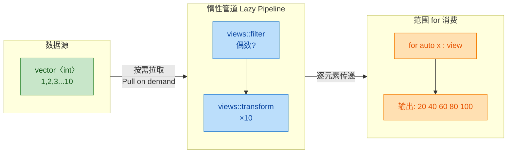

惰性管道的关键在于——**没有任何中间容器被创建**。`filter` 和 `transform` 只是记录了"要做什么"，真正的计算发生在范围 for 循环的每次 `++__begin` 和 `*__begin` 调用时，按需拉取（pull-based evaluation）。

---

### 范围 for vs 传统 for vs `std::for_each`

三种遍历方式各有其适用场景，下面做一个横向对比：

```cpp
#include <iostream>
#include <vector>
#include <algorithm>

int main() {
    std::vector<int> v = {1, 2, 3, 4, 5};

    // ===== 方式1：传统 for（索引） =====
    // 优点：可获取索引，可修改容器大小
    // 缺点：冗长，容易 off-by-one
    for (size_t i = 0; i < v.size(); ++i) {
        std::cout << "v[" << i << "] = " << v[i] << "\n";
    }

    // ===== 方式2：传统 for（迭代器） =====
    // 优点：通用，适用于所有容器
    // 缺点：类型名冗长（C++11 前没有 auto）
    for (auto it = v.begin(); it != v.end(); ++it) {
        std::cout << *it << " ";
    }
    std::cout << "\n";

    // ===== 方式3：范围 for =====
    // 优点：最简洁，意图清晰
    // 缺点：无法获取索引，不能在循环中修改容器大小
    for (const auto& x : v) {
        std::cout << x << " ";
    }
    std::cout << "\n";

    // ===== 方式4：std::for_each =====
    // 优点：函数式风格，可传入可复用的函数对象
    // 缺点：对简单遍历而言过于间接
    std::for_each(v.begin(), v.end(), [](int x) {
        std::cout << x << " ";
    });
    std::cout << "\n";

    return 0;
}
```

| 特性 | 索引 for | 迭代器 for | 范围 for | `std::for_each` |
|------|----------|-----------|---------|----------------|
| 简洁性 | ★★☆ | ★★☆ | ★★★ | ★★☆ |
| 可获取索引 | ✅ | ❌（需计算） | ❌ | ❌ |
| 可中途 break/continue | ✅ | ✅ | ✅ | ❌（需异常） |
| 可修改容器大小 | ✅（需谨慎） | ❌ | ❌ | ❌ |
| 支持所有容器 | ❌（需随机访问） | ✅ | ✅ | ✅ |
| 函数对象复用 | ❌ | ❌ | ❌ | ✅ |

---

**📝 练习题**

以下代码的输出是什么？

```cpp
#include <iostream>
#include <vector>

int main() {
    std::vector<int> v = {1, 2, 3, 4, 5};
    for (auto x : v) {
        x *= 2;
    }
    for (const auto& x : v) {
        std::cout << x << " ";
    }
}
```

A. `2 4 6 8 10 `


B. `1 2 3 4 5 `


C. 编译错误


D. 未定义行为


**【答案】** B

**【解析】** 第一个循环使用 `auto x`（值拷贝），`x` 是每个元素的副本。`x *= 2` 修改的是这个局部副本，原容器 `v` 中的元素完全不受影响。第二个循环用 `const auto&` 遍历原容器，输出的是未被修改的原始值 `1 2 3 4 5`。若要真正修改容器元素，第一个循环应写为 `for (auto& x : v)`。这是范围 for 循环中最常见的初学者陷阱——忘记加 `&` 引用符号。

---

## 本章小结

本章围绕 **STL 算法与工具（STL Algorithms & Utilities）** 这一核心主题，系统性地梳理了 C++ 标准库中最常用的一批"武器"。从底层的函数对象到现代 C++ 的语法糖，它们共同构成了编写 **高效、简洁、可读** C++ 代码的基石。下面我们从全局视角对本章进行一次系统回顾。

---

### 知识全景图

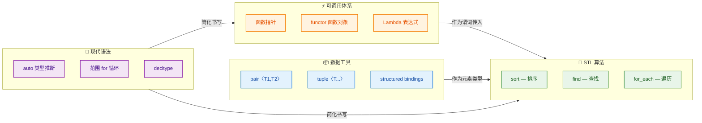

这张全景图揭示了本章六大知识点之间的内在联系：**可调用体系**（functor、Lambda、函数指针）是 STL 算法的"灵魂注入口"；**数据工具**（pair、tuple）为算法提供灵活的元素载体；而 **现代语法**（auto、范围 for）则像润滑剂一样，让前两者的使用变得丝滑流畅。

---

### 核心要点回顾

#### ① 常用算法：sort / find / for_each

STL 算法的设计哲学是 **"算法与数据结构解耦"**——所有算法通过 **迭代器（iterator）** 操作容器，而非直接依赖容器类型。这意味着同一个 `sort` 可以排序 `vector`、`deque`、甚至原生数组。

| 算法 | 头文件 | 复杂度 | 核心签名概要 |
|------|--------|--------|-------------|
| `std::sort` | `<algorithm>` | O(N log N) 平均 | `sort(first, last, comp)` |
| `std::find` | `<algorithm>` | O(N) | `find(first, last, value)` |
| `std::for_each` | `<algorithm>` | O(N) | `for_each(first, last, func)` |

关键记忆点：

- **`sort`** 默认升序，内部通常实现为 **IntroSort**（快排 + 堆排 + 插入排序的混合体），要求容器支持 **随机访问迭代器（RandomAccessIterator）**，因此 `list` 不能直接使用 `std::sort`，而需要调用 `list::sort()` 成员函数。
- **`find`** 返回迭代器，找不到时返回 `last`，务必与 `end()` 比较而非与 `nullptr` 比较。
- **`for_each`** 在 C++11 之后被范围 for 循环大量替代，但在需要"将函数应用到区间并获取返回的函数对象"这种场景下仍有价值。

```c++
#include <vector>
#include <algorithm>
#include <iostream>

int main() {
    std::vector<int> v = {5, 2, 8, 1, 9, 3};   // 初始化一个无序向量

    // 1. sort — 默认升序排序
    std::sort(v.begin(), v.end());                // 排序后: {1, 2, 3, 5, 8, 9}

    // 2. find — 查找值为 8 的元素
    auto it = std::find(v.begin(), v.end(), 8);   // 返回指向 8 的迭代器
    if (it != v.end()) {                          // 判断是否找到（与 end() 比较）
        std::cout << "Found: " << *it << "\n";    // 输出: Found: 8
    }

    // 3. for_each — 对每个元素执行操作
    std::for_each(v.begin(), v.end(), [](int n) { // Lambda 作为一元操作
        std::cout << n << " ";                    // 逐个打印元素
    });
    // 输出: 1 2 3 5 8 9

    return 0;
}
```

---

#### ② pair 与 tuple：轻量数据打包

**`std::pair`** 是两个值的组合，**`std::tuple`** 是任意个值的泛化。它们的核心价值在于：**无需定义新 struct，就能临时组合多个异构数据**。

```mermaid
graph LR
    subgraph SG_PAIR["pair〈K, V〉"]
        direction TB
        P1[".first"]
        P2[".second"]
    end

    subgraph SG_TUPLE["tuple〈T1, T2, ..., Tn〉"]
        direction TB
        T1["get〈0〉(t)"]
        T2["get〈1〉(t)"]
        T3["get〈N-1〉(t)"]
    end

    subgraph SG_MODERN_ACCESS["C++17 结构化绑定"]
        direction TB
        M1["auto [a, b] = pair"]
        M2["auto [x, y, z] = tuple"]
    end

    SG_PAIR -->|"泛化为"| SG_TUPLE
    SG_PAIR -->|"解包"| SG_MODERN_ACCESS
    SG_TUPLE -->|"解包"| SG_MODERN_ACCESS

    classDef pairStyle fill:#E8F5E9,stroke:#43A047,color:#1B5E20,stroke-width:1.5px
    classDef tupleStyle fill:#E3F2FD,stroke:#1E88E5,color:#0D47A1,stroke-width:1.5px
    classDef modernStyle fill:#FFF8E1,stroke:#FFA000,color:#E65100,stroke-width:1.5px

    class P1,P2 pairStyle
    class T1,T2,T3 tupleStyle
    class M1,M2 modernStyle
```

关键记忆点：

- `std::map` 的每个元素就是 `std::pair<const Key, Value>`，这是 pair 最高频的使用场景。
- `std::tuple` 配合 `std::tie()` 可以实现多返回值的优雅解包；C++17 的 **structured bindings** (`auto [a, b, c] = ...`) 更进一步消除了样板代码。
- `std::make_pair` / `std::make_tuple` 利用模板参数推导，避免手写冗长类型。C++17 起类模板参数推导（CTAD）让你可以直接写 `std::pair p{1, 3.14};`。

---

#### ③ 函数对象（Functor）

Functor 的本质是 **重载了 `operator()` 的类实例**。相比普通函数指针，functor 的杀手锏在于 **携带状态（state）**。编译器还能对其进行 **内联优化（inlining）**，而函数指针通常无法内联。

```c++
class Counter {
    int count_ = 0;                               // 内部状态：计数器
public:
    void operator()(int x) {                       // 重载调用运算符
        if (x > 0) ++count_;                       // 满足条件时累加
    }
    int get() const { return count_; }             // 获取当前计数
};

// 使用方式
Counter c;                                         // 创建函数对象实例
c = std::for_each(v.begin(), v.end(), c);          // for_each 返回函数对象的副本
std::cout << c.get();                              // 输出正数的个数
```

关键记忆点：

- STL 内置了大量函数对象，如 `std::less<>`、`std::greater<>`、`std::plus<>` 等，定义在 `<functional>` 中。
- Functor 可以作为模板参数传递（如 `std::sort` 的第三个参数），此时编译器知道确切类型，极有可能内联；而函数指针需要间接调用，通常阻碍内联。
- 在 C++11 Lambda 出现后，**一次性使用的简单 functor 几乎都被 Lambda 取代**，但复杂的、需要复用的可调用逻辑仍建议封装为 functor 类。

---

#### ④ Lambda 表达式（C++11）

Lambda 是 C++11 引入的**匿名函数对象语法糖**。编译器会将每个 Lambda 转化为一个唯一的、不可见的 functor 类（closure type）。

```
[capture](params) mutable -> ReturnType { body }
 ───┬───  ──┬──   ──┬──     ───┬──       ──┬──
    │       │       │          │            └─ 函数体
    │       │       │          └─ 显式返回类型(可省略)
    │       │       └─ 允许修改按值捕获的变量
    │       └─ 参数列表
    └─ 捕获列表: [=]按值全捕获 [&]按引用全捕获 [x, &y]混合捕获
```

捕获方式对比：

| 捕获语法 | 含义 | 注意事项 |
|---------|------|---------|
| `[x]` | 按值捕获 x | Lambda 内 x 默认 const，需 `mutable` 才能改 |
| `[&x]` | 按引用捕获 x | 注意悬垂引用（dangling reference）风险 |
| `[=]` | 按值捕获所有外部变量 | 可能意外捕获 `this`，C++20 已弃用隐式捕获 this |
| `[&]` | 按引用捕获所有外部变量 | 便捷但危险，不宜跨作用域使用 |
| `[this]` | 捕获当前对象指针 | 成员函数内使用 |
| `[*this]` | 按值捕获当前对象副本（C++17） | 安全，避免悬垂 this |

关键记忆点：

- 每个 Lambda 的类型都是**唯一的匿名类型**，即使两个 Lambda 代码完全相同，它们的类型也不同。因此必须用 `auto` 接收，或者用 `std::function` 擦除类型。
- **无捕获的 Lambda 可以隐式转换为函数指针**，这是它与 functor 的一个重要区别。
- C++14 引入 **泛型 Lambda**（`auto` 参数），C++20 引入 **模板 Lambda**（`[]<typename T>(T x){...}`），能力持续进化。

---

#### ⑤ auto 类型推断

`auto` 让编译器根据初始化表达式 **自动推导变量类型**，核心规则与模板参数推导一致。

```mermaid
graph LR
    subgraph SG_SAFE["✅ 推荐使用场景"]
        direction TB
        S1["迭代器类型过长"]
        S2["Lambda 接收"]
        S3["模板函数返回值"]
    end

    subgraph SG_CAUTION["⚠️ 谨慎使用场景"]
        direction TB
        C1["基本类型 int/double"]
        C2["API 返回值语义不明"]
        C3["代理对象 如 vector〈bool〉"]
    end

    subgraph SG_RULES["📐 推导规则"]
        direction TB
        R1["auto x = expr 去掉引用和顶层const"]
        R2["auto& x = expr 保留引用和const"]
        R3["auto&& x = expr 万能引用"]
        R4["decltype auto 完全保留"]
    end

    SG_RULES -->|"指导"| SG_SAFE
    SG_RULES -->|"指导"| SG_CAUTION

    classDef safeStyle fill:#E8F5E9,stroke:#43A047,color:#1B5E20,stroke-width:1.5px
    classDef cautionStyle fill:#FFF3E0,stroke:#EF6C00,color:#BF360C,stroke-width:1.5px
    classDef ruleStyle fill:#E3F2FD,stroke:#1565C0,color:#0D47A1,stroke-width:1.5px

    class S1,S2,S3 safeStyle
    class C1,C2,C3 cautionStyle
    class R1,R2,R3,R4 ruleStyle
```

关键记忆点：

- `auto` 默认 **丢弃顶层 const 和引用**（与模板 `T` 推导一致）。想保留引用特性，用 `auto&` 或 `auto&&`。想完全保留表达式的值类别和 cv 限定，用 `decltype(auto)`。
- `auto` 与 `std::initializer_list` 的交互是一个经典陷阱：`auto x = {1, 2, 3};` 推导为 `std::initializer_list<int>`，而非 `vector` 或数组。
- C++14 允许函数返回类型使用 `auto`，C++17 允许非类型模板参数使用 `auto`，应用范围在不断扩大。

---

#### ⑥ 范围 for 循环（Range-based for loop）

范围 for 的本质是 **语法糖**，编译器会将其展开为基于 `begin()` / `end()` 的传统迭代器循环。

```c++
// 你写的代码
for (auto& elem : container) {       // 按引用遍历，避免拷贝
    process(elem);
}

// 编译器实际展开为（概念等价）
{
    auto&& __range = container;       // 绑定到容器（支持临时对象）
    auto __begin = __range.begin();   // 获取起始迭代器
    auto __end   = __range.end();     // 获取终止迭代器（哨兵）
    for (; __begin != __end; ++__begin) {  // 经典迭代器循环
        auto& elem = *__begin;        // 解引用获取元素
        process(elem);
    }
}
```

关键记忆点：

- **遍历时修改容器结构（增删元素）是未定义行为**，因为迭代器会失效。
- 推荐使用 `const auto&` 做只读遍历，`auto&` 做修改遍历，`auto&&` 做通用转发遍历。
- C++20 引入 **Ranges 库**，进一步升级了范围 for 的搭档——可以使用管道语法 `|` 组合视图（views），做到惰性求值（lazy evaluation）。

---

### 知识点联动：一段代码串联全章

下面这段代码用一个小例子将本章所有知识点**有机融合**在一起：

```c++
#include <vector>
#include <algorithm>     // sort, find_if, for_each
#include <tuple>         // tuple, make_tuple
#include <iostream>
#include <string>

int main() {
    // ——— pair & tuple: 构建复合数据 ———
    using Student = std::tuple<std::string, int, double>;  // 姓名, 年龄, GPA

    std::vector<Student> students = {                      // 学生列表
        {"Alice",   20, 3.9},                              // CTAD (C++17) 或 make_tuple
        {"Bob",     22, 3.5},
        {"Charlie", 21, 3.7},
        {"Diana",   20, 3.95}
    };

    // ——— Lambda + sort: 按 GPA 降序排列 ———
    std::sort(students.begin(), students.end(),            // sort 要求随机访问迭代器
        [](const Student& a, const Student& b) {          // Lambda 作为自定义比较器
            return std::get<2>(a) > std::get<2>(b);       // 按第 3 个元素 (GPA) 降序
        }
    );

    // ——— auto + 范围 for + structured bindings: 优雅遍历 ———
    std::cout << "=== GPA Ranking ===\n";
    for (const auto& [name, age, gpa] : students) {       // C++17 结构化绑定
        std::cout << name << " (age " << age               // auto 推导每个绑定的类型
                  << ") - GPA: " << gpa << "\n";           // const auto& 避免拷贝
    }

    // ——— functor 风格: 统计 GPA > 3.8 的人数 ———
    struct GpaFilter {                                     // 函数对象: 携带阈值状态
        double threshold;                                  // 内部状态: GPA 阈值
        int count = 0;                                     // 内部状态: 计数器
        void operator()(const Student& s) {                // 重载 () 运算符
            if (std::get<2>(s) > threshold) ++count;       // 满足条件则累加
        }
    };

    auto result = std::for_each(                           // for_each 返回函数对象副本
        students.begin(), students.end(),
        GpaFilter{3.8}                                     // 传入阈值 3.8
    );
    std::cout << "GPA > 3.8: " << result.count << " students\n";  // 输出: 2

    // ——— find_if + Lambda: 查找特定学生 ———
    auto it = std::find_if(students.begin(), students.end(),       // find_if 带谓词查找
        [](const Student& s) {                                     // Lambda 作为谓词
            return std::get<0>(s) == "Bob";                        // 查找名为 Bob 的学生
        }
    );
    if (it != students.end()) {                                    // 检查是否找到
        auto [n, a, g] = *it;                                      // 结构化绑定解包
        std::cout << "Found " << n << " with GPA " << g << "\n";  // 输出 Bob 的信息
    }

    return 0;
}
```

**输出结果：**

```
=== GPA Ranking ===
Diana (age 20) - GPA: 3.95
Alice (age 20) - GPA: 3.9
Charlie (age 21) - GPA: 3.7
Bob (age 22) - GPA: 3.5
GPA > 3.8: 2 students
Found Bob with GPA 3.5
```

这段代码完美展示了：`tuple` 定义复合数据 → `sort` + `Lambda` 自定义排序 → `auto` + 范围 for + 结构化绑定遍历 → `functor` 有状态统计 → `find_if` + `Lambda` 条件查找。**六大知识点环环相扣，形成完整的工具链闭环。**

---

### 进阶方向指引

```mermaid
graph LR
    subgraph SG_NOW["📘 本章已掌握"]
        direction TB
        N1["sort / find / for_each"]
        N2["pair / tuple"]
        N3["functor"]
        N4["Lambda"]
        N5["auto"]
        N6["范围 for"]
    end

    subgraph SG_NEXT["📗 下一步学习"]
        direction TB
        X1["std::function 与类型擦除"]
        X2["C++20 Ranges 与 Views"]
        X3["constexpr Lambda"]
        X4["std::invoke 统一调用"]
        X5["Concepts 约束模板"]
    end

    subgraph SG_ADVANCED["📕 高阶目标"]
        direction TB
        A1["自定义迭代器适配器"]
        A2["编译期计算 consteval"]
        A3["协程 Coroutines"]
        A4["并行算法 Execution Policy"]
    end

    SG_NOW -->|"夯实基础"| SG_NEXT
    SG_NEXT -->|"深入研究"| SG_ADVANCED

    classDef nowStyle fill:#E8F5E9,stroke:#2E7D32,color:#1B5E20,stroke-width:1.5px
    classDef nextStyle fill:#E3F2FD,stroke:#1565C0,color:#0D47A1,stroke-width:1.5px
    classDef advStyle fill:#FCE4EC,stroke:#C62828,color:#B71C1C,stroke-width:1.5px

    class N1,N2,N3,N4,N5,N6 nowStyle
    class X1,X2,X3,X4,X5 nextStyle
    class A1,A2,A3,A4 advStyle
```

---

**📝 练习题 1**

以下代码的输出是什么？

```c++
#include <vector>
#include <algorithm>
#include <iostream>

int main() {
    std::vector<int> v = {3, 1, 4, 1, 5, 9};
    int sum = 0;
    std::for_each(v.begin(), v.end(), [&sum](int x) {
        if (x % 2 != 0) sum += x;
    });
    std::cout << sum << std::endl;
    return 0;
}
```

A. 23


B. 19


C. 14


D. 编译错误


**【答案】** B

**【解析】** Lambda 通过 `[&sum]` 按引用捕获了外部变量 `sum`，因此 Lambda 内部对 `sum` 的修改直接反映到外部。`for_each` 对 `v` 中的每个元素执行 Lambda：判断是否为奇数（`x % 2 != 0`），是则累加到 `sum`。向量中的奇数为 `3, 1, 1, 5, 9`，其和为 `3 + 1 + 1 + 5 + 9 = 19`。注意如果捕获方式改为按值 `[sum]`，则由于 Lambda 内的 `sum` 默认是 `const` 的，代码将无法编译（除非加 `mutable`，但即使加了 `mutable`，外部的 `sum` 也不会被修改）。

---

**📝 练习题 2**

关于以下代码，说法正确的是？

```c++
auto f1 = [](int x) { return x * 2; };
auto f2 = [](int x) { return x * 2; };
```

A. `f1` 和 `f2` 的类型相同，因为它们的函数体完全一致


B. `f1` 和 `f2` 的类型不同，每个 Lambda 表达式都有唯一的匿名类型


C. `f1` 和 `f2` 都可以赋值给 `int(*)(int)` 类型的函数指针，且二者指针值相等


D. `decltype(f1)` 与 `decltype(f2)` 相同


**【答案】** B

**【解析】** C++ 标准规定，**每个 Lambda 表达式都会生成一个独一无二的闭包类型（unique closure type）**，即使两个 Lambda 的参数列表、返回类型和函数体完全相同，它们的类型依然不同。因此 A 和 D 错误。对于选项 C，虽然无捕获的 Lambda 确实可以隐式转换为对应签名的函数指针（`int(*)(int)`），但标准并不保证转换后的函数指针值相等——它们可能指向不同的内部实现函数，所以 C 也不完全正确。正确答案为 B：每个 Lambda 的类型都是编译器生成的匿名类，全局唯一，这也是为什么必须用 `auto` 来接收 Lambda，或用 `std::function` 进行类型擦除的根本原因。

---

