---

# 内存管理 ⭐⭐⭐

---

## 内存区域（栈、堆、全局/静态、代码区）

C++ 程序在运行时，操作系统会为其分配一块虚拟地址空间（Virtual Address Space）。这块空间并非铁板一块，而是被精心划分成若干**功能各异的区域**，每个区域承担着不同的职责、拥有不同的生命周期和管理方式。理解这些区域，是掌握 C++ 内存管理的**绝对根基**——后续所有关于 `new/delete`、内存泄漏、RAII 的讨论，都建立在这个基础之上。

我们先用一张全景图鸟瞰整个进程的内存布局，然后逐一深入每个区域。

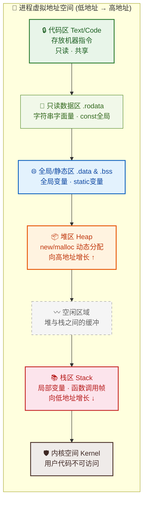

> 💡 **关键直觉**：堆（Heap）向上增长，栈（Stack）向下增长，它们在中间相向而行。当两者相遇时，程序就会因为内存耗尽而崩溃。

---

### 栈区（Stack）

栈区是 C++ 程序员最"亲密"的内存区域——你声明的每一个局部变量、每一次函数调用，都在栈上发生。

**核心特征一览：**

| 特征 | 说明 |
|------|------|
| **管理方式** | 编译器自动分配与释放，程序员无需干预 |
| **增长方向** | 从高地址向低地址增长（↓） |
| **默认大小** | 通常 1~8 MB（Linux 默认 8MB，Windows 默认 1MB） |
| **分配速度** | **极快**——仅需移动栈指针（ESP/RSP），一条 CPU 指令 |
| **生命周期** | 与所在作用域（Scope）绑定，出了花括号 `{}` 自动销毁 |
| **碎片问题** | **无碎片**——严格的 LIFO（后进先出）结构 |

#### 栈帧（Stack Frame）的运作机制

每当一个函数被调用，CPU 会在栈顶"压入"（push）一个新的**栈帧**（Stack Frame），也叫活动记录（Activation Record）。这个栈帧包含了函数运行所需的全部上下文：

```cpp
#include <iostream>

// 一个简单的函数调用示例，用来观察栈帧的创建与销毁
int add(int a, int b) {       // 参数 a, b 被压入 add() 的栈帧
    int result = a + b;        // 局部变量 result 也在 add() 的栈帧中
    return result;             // 函数返回后，add() 的栈帧被弹出（pop）
}

int main() {                   // main() 的栈帧是最底层的用户栈帧
    int x = 10;                // x 存储在 main() 的栈帧中
    int y = 20;                // y 紧接着 x，也在 main() 的栈帧中
    int z = add(x, y);         // 调用 add()：新栈帧被压入栈顶
    // add() 返回后，其栈帧已被销毁，z 接收返回值
    std::cout << z << std::endl; // 输出 30
    return 0;                  // main() 返回后，其栈帧也被销毁
}
```

下面用 ASCII 图展示调用 `add(x, y)` **瞬间**的栈内存布局：

```cpp
// ============ 栈内存布局（调用 add() 时的快照） ============
//
//        低地址 (栈顶方向)
//        ┌─────────────────────────┐
//        │   result = 30           │  ← add() 的局部变量
//        │   b = 20                │  ← add() 的参数
//        │   a = 10                │  ← add() 的参数
//        │   返回地址 (Return Addr) │  ← 返回到 main() 的哪一行
//        │   旧 EBP (帧指针)       │  ← 用于恢复 main() 的栈帧基址
//        ├─────────────────────────┤  ← ─── 栈帧边界 ───
//        │   z = ?  (尚未赋值)     │  ← main() 的局部变量
//        │   y = 20                │  ← main() 的局部变量
//        │   x = 10                │  ← main() 的局部变量
//        │   旧 EBP                │
//        │   ...                   │
//        └─────────────────────────┘
//        高地址 (栈底方向)
```

#### 栈溢出（Stack Overflow）

由于栈的大小是**有限的**（通常只有几 MB），当递归过深或局部变量过大时，就会发生**栈溢出**：

```cpp
// 🚨 危险示例：无限递归导致栈溢出
void infiniteRecursion() {
    int bigArray[1024];           // 每次调用分配 4KB 局部数组
    infiniteRecursion();          // 不断压入新栈帧，直到栈空间耗尽
    // 最终触发 Stack Overflow → 程序崩溃 (Segmentation Fault)
}

// 🚨 危险示例：局部变量过大
void hugeLocalVariable() {
    int matrix[1000][1000];       // 约 4MB！可能直接撑爆默认栈空间
    // 如果需要这么大的数组，应该使用 堆（Heap） 分配
}
```

**经验法则**：如果一个局部对象的大小超过几十 KB，就应该考虑把它放到堆上。

---

### 堆区（Heap）

堆区是 C++ 中最"自由"也最"危险"的内存区域。它赋予程序员**完全的控制权**——你可以在任何时候分配任意大小的内存，也可以在任何时候释放它。但这种自由的代价是：**你必须亲自管理每一块堆内存的生命周期**。

| 特征 | 说明 |
|------|------|
| **管理方式** | 程序员手动分配（`new`/`malloc`）与释放（`delete`/`free`） |
| **增长方向** | 从低地址向高地址增长（↑） |
| **大小限制** | 理论上受限于系统可用虚拟内存，远大于栈（可达 GB 级别） |
| **分配速度** | **较慢**——需要遍历空闲链表、合并碎片等复杂操作 |
| **生命周期** | 从 `new` 到 `delete`，完全由程序员掌控 |
| **碎片问题** | **存在碎片**——频繁分配/释放不同大小的块会产生外部碎片 |

#### 堆分配的底层过程

当你写下 `new int(42)` 时，底层经历了一个相当复杂的过程：

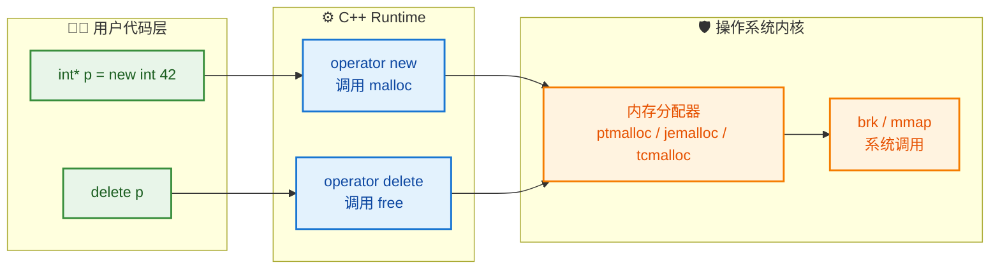

来看一个完整的堆分配与释放示例：

```cpp
#include <iostream>

int main() {
    // ===== 堆上分配单个对象 =====
    int* p = new int(42);         // 在堆上分配 4 字节，存入值 42
                                   // p 本身（指针变量）存在栈上，占 8 字节（64位系统）
                                   // p 指向的数据存在堆上

    std::cout << *p << std::endl;  // 通过指针访问堆上的值：42
    std::cout << &p << std::endl;  // 打印 p 本身的地址（栈地址）
    std::cout << p << std::endl;   // 打印 p 指向的地址（堆地址）

    delete p;                      // 释放堆内存，归还给操作系统/内存分配器
    p = nullptr;                   // 良好习惯：释放后置空指针，防止悬垂指针

    // ===== 堆上分配对象 =====
    struct Point {                 // 定义一个简单的结构体
        double x, y;               // 两个 double 成员
    };

    Point* pt = new Point{3.14, 2.72};  // 堆上分配 Point，使用列表初始化
    std::cout << pt->x << std::endl;     // 通过箭头运算符访问成员
    delete pt;                           // 必须手动释放！忘记就会内存泄漏
    pt = nullptr;                        // 置空

    return 0;
}
```

用 ASCII 图展示指针 `p` 与堆对象的关系：

```cpp
// ============ 栈与堆的关系 ============
//
//   栈 (Stack)                堆 (Heap)
//   ┌──────────┐             ┌──────────┐
//   │  p ───────┼──────────→ │  42      │  (4 bytes)
//   │  (8 bytes)│             └──────────┘
//   └──────────┘              地址: 0x55A3...
//   地址: 0x7FFE...
//
//   p 是栈上的"遥控器"，堆上的 42 是被遥控的"电视机"
//   delete p → 销毁电视机
//   p = nullptr → 遥控器清零，不再指向已销毁的电视机
```

#### 堆碎片（Heap Fragmentation）

频繁地分配和释放不同大小的内存块，会导致堆上出现许多不连续的"空洞"，这就是**外部碎片**（External Fragmentation）。即使总剩余空间足够，也可能找不到一块**连续**的空间来满足大分配请求：

```cpp
// ============ 堆碎片可视化 ============
//
//   分配后:  [A:16B][B:32B][C:16B][D:64B][E:16B]
//
//   释放 B 和 D 后:
//            [A:16B][空:32B][C:16B][空:64B][E:16B]
//                    ^^^^^^         ^^^^^^
//              两个空闲块总共 96B，但不连续！
//              此时请求分配 80B → 失败（最大连续空闲仅 64B）
```

这也是为什么现代 C++ 强烈推荐使用**智能指针**和**容器**来管理堆内存，而不是裸 `new/delete`。

---

### 全局/静态区（Global / Static Segment）

全局/静态区存储的是那些**生命周期贯穿整个程序运行期**的变量。这个区域在编译期就确定了大小，在程序启动时分配，在程序结束时才释放。

它又细分为两个子区域：

| 子区域 | 存储内容 | 初始值 |
|--------|----------|--------|
| **`.data` 段** | 已初始化的全局变量和 static 变量 | 程序员指定的值 |
| **`.bss` 段** | 未初始化的全局变量和 static 变量 | 自动清零（Zero-initialized） |

> 💡 `.bss` 的名称来源于历史上的汇编伪指令 "Block Started by Symbol"。`.bss` 段在可执行文件中**不占实际空间**（只记录大小），加载到内存后才分配并清零，这是一个经典的空间优化技巧。

```cpp
#include <iostream>

// ===== 全局变量（.data 段 或 .bss 段）=====
int globalInit = 100;            // 已初始化 → 存入 .data 段
int globalUninit;                // 未初始化 → 存入 .bss 段（自动初始化为 0）

// ===== const 全局变量 =====
const int MAX_SIZE = 1024;       // 可能放在 .rodata（只读数据段）

void counter() {
    // ===== 静态局部变量 =====
    static int count = 0;        // 第一次调用时初始化，之后不再重新初始化
                                  // 存储在全局/静态区（.data 段），而非栈上
    count++;                      // 每次调用递增
    std::cout << "第 " << count << " 次调用" << std::endl;
}

class MyClass {
public:
    static int instanceCount;    // 静态成员变量声明（需在类外定义）
    MyClass() { instanceCount++; }  // 每次构造对象，计数加 1
    ~MyClass() { instanceCount--; } // 每次析构对象，计数减 1
};

int MyClass::instanceCount = 0;  // 静态成员变量定义 + 初始化 → .data 段

int main() {
    std::cout << globalInit << std::endl;   // 输出 100
    std::cout << globalUninit << std::endl;  // 输出 0（.bss 段保证清零）

    counter();  // 输出：第 1 次调用
    counter();  // 输出：第 2 次调用
    counter();  // 输出：第 3 次调用
    // 注意：static int count 没有被重新初始化为 0！

    {
        MyClass a, b, c;                            // 创建 3 个对象
        std::cout << MyClass::instanceCount << std::endl;  // 输出 3
    }  // a, b, c 离开作用域被析构
    std::cout << MyClass::instanceCount << std::endl;      // 输出 0

    return 0;
}
```

#### static 局部变量的特殊性

`static` 局部变量是一个容易令人困惑的概念：它的**作用域**（Scope）是局部的（只能在函数内访问），但它的**生命周期**（Lifetime）是全局的（从第一次执行到程序结束）。这种"局部名字 + 全局寿命"的组合非常独特：

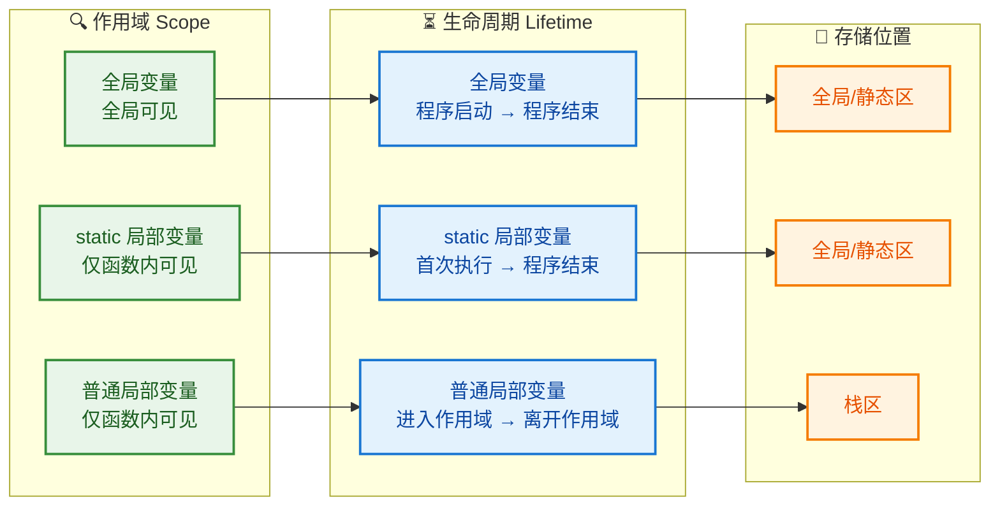

C++11 还保证了 `static` 局部变量的**线程安全初始化**（Thread-safe initialization），即使多个线程同时首次调用同一个函数，`static` 局部变量也只会被初始化一次。这在实现 **Meyers' Singleton** 模式时非常有用：

```cpp
// Meyers' Singleton —— 利用 static 局部变量的线程安全初始化
class Singleton {
public:
    static Singleton& getInstance() {      // 返回单例的引用
        static Singleton instance;         // C++11 保证线程安全的初始化
                                            // 只在第一次调用时构造
        return instance;                   // 后续调用直接返回同一个对象
    }

    void doSomething() { /* ... */ }

private:
    Singleton() = default;                 // 构造函数私有化，禁止外部创建
    Singleton(const Singleton&) = delete;  // 禁止拷贝
    Singleton& operator=(const Singleton&) = delete; // 禁止赋值
};
```

---

### 代码区（Text / Code Segment）

代码区存储的是编译后的**机器指令**（Machine Instructions），即你的 C++ 源码经过编译器翻译后产生的二进制指令序列。

**核心特征：**

- **只读（Read-Only）**：防止程序意外或恶意修改自身指令。试图写入代码区会触发 Segmentation Fault。
- **共享（Shared）**：如果同一个程序启动了多个进程（比如同时打开多个终端运行同一个可执行文件），它们可以共享同一份代码区的物理内存，从而节省资源。
- **包含函数体**：你定义的所有函数（包括 `main()`）的指令都在这里。
- **函数指针指向这里**：当你获取一个函数的地址时，得到的就是代码区中的某个地址。

```cpp
#include <iostream>

void greet() {                              // greet() 的机器码存在代码区
    std::cout << "Hello!" << std::endl;
}

int main() {
    // 函数指针指向代码区中 greet() 的起始地址
    void (*funcPtr)() = &greet;             // funcPtr 存储在栈上
                                             // funcPtr 的值是代码区的某个地址
    std::cout << "代码地址: " << (void*)funcPtr << std::endl;
    // 典型输出: 0x401136（低地址，属于代码区范围）

    funcPtr();                               // 通过函数指针调用 greet()

    return 0;
}
```

#### 常量区 / 只读数据区（.rodata）

与代码区紧密相邻的还有一块**只读数据段**（`.rodata`），用于存放：
- **字符串字面量**（String Literals）：如 `"Hello, World!"`
- **const 修饰的全局常量**（某些编译器优化下）

```cpp
#include <iostream>

int main() {
    // 字符串字面量 "Hello" 存储在 .rodata 段
    const char* str = "Hello";      // str 是栈上的指针，指向 .rodata 段
    // str[0] = 'h';               // ❌ 未定义行为！试图修改只读数据

    // 两个相同的字符串字面量可能共享同一块内存（编译器优化：字符串池）
    const char* str2 = "Hello";     // str2 可能 == str（指向同一地址）
    std::cout << std::boolalpha << (str == str2) << std::endl;
    // 大多数编译器输出: true（字符串池优化生效）

    return 0;
}
```

---

### 四大区域综合对比

下面通过一个完整的程序，用注释标注出每个变量所属的内存区域：

```cpp
#include <iostream>
#include <string>

// ==================== 内存区域标注示例 ====================

int g_data = 42;                   // 【全局/静态区 .data】已初始化全局变量
int g_bss;                         // 【全局/静态区 .bss】 未初始化全局变量 → 自动为 0
const char* g_str = "Global";      // g_str 在【.data】, "Global" 在【.rodata】
static int g_static = 7;           // 【全局/静态区 .data】静态全局变量

void demo() {                      // demo() 函数体在【代码区】
    int localVar = 10;             // 【栈区】局部变量
    static int callCount = 0;      // 【全局/静态区 .data】静态局部变量
    callCount++;

    int* heapPtr = new int(99);    // heapPtr 在【栈区】, *heapPtr 在【堆区】
    std::cout << *heapPtr << std::endl;
    delete heapPtr;                // 释放堆内存
}

int main() {                       // main() 函数体在【代码区】
    int a = 1;                     // 【栈区】
    double b = 3.14;               // 【栈区】
    const char* msg = "Hi";        // msg 在【栈区】, "Hi" 在【.rodata】

    demo();                        // 调用 demo()，压入新栈帧
    demo();                        // 再次调用，callCount 保持递增

    int* arr = new int[100];       // arr 在【栈区】, 100个int 在【堆区】
    delete[] arr;                  // 释放堆上的数组

    return 0;
}
```

最后，以一张表格总结四大内存区域的关键差异：

| 维度 | 栈 Stack | 堆 Heap | 全局/静态 Global/Static | 代码区 Text |
|------|----------|---------|------------------------|-------------|
| **管理者** | 编译器自动 | 程序员手动 | 编译器 + 链接器 | 编译器 + 加载器 |
| **分配速度** | ⚡ 极快 | 🐢 较慢 | — 编译期确定 | — 编译期确定 |
| **大小** | 小（1~8 MB） | 大（可达 GB） | 编译期确定 | 编译期确定 |
| **生命周期** | 作用域内 | `new` 到 `delete` | 程序整个运行期 | 程序整个运行期 |
| **碎片** | 无 | 有 | 无 | 无 |
| **可写性** | ✅ 可读写 | ✅ 可读写 | ✅ 可读写 | ❌ 只读 |
| **典型内容** | 局部变量、函数参数 | 动态分配的对象 | 全局变量、static 变量 | 机器指令、字面量 |
| **安全风险** | 栈溢出 | 内存泄漏/悬垂指针 | 线程竞争 | 被攻击篡改 |

---

**📝 练习题**

以下代码中，变量 `x`、`y`、`z`、`*p` 分别存储在哪些内存区域？

```cpp
int x = 10;                   // 全局作用域
void foo() {
    static int y = 20;
    int z = 30;
    int* p = new int(40);
    delete p;
}
```

A. `x`：栈，`y`：栈，`z`：栈，`*p`：堆

B. `x`：全局/静态区，`y`：栈，`z`：栈，`*p`：堆

C. `x`：全局/静态区，`y`：全局/静态区，`z`：栈，`*p`：堆

D. `x`：全局/静态区，`y`：全局/静态区，`z`：堆，`*p`：堆


**【答案】** C

**【解析】**
- `x` 是**全局变量**且已初始化，存储在全局/静态区的 `.data` 段。
- `y` 是 `static` 修饰的**静态局部变量**。尽管它的作用域仅限于 `foo()` 函数内部，但由于 `static` 关键字，它的**存储位置**在全局/静态区（`.data` 段），生命周期贯穿整个程序。这正是 `static` 局部变量的"局部可见、全局生存"特性。
- `z` 是普通的局部变量，存储在**栈区**，随着 `foo()` 的调用创建，函数返回后销毁。
- `*p`（即 `p` 所指向的 `int(40)`）通过 `new` 分配，存储在**堆区**。注意 `p` 本身（指针变量）是局部变量，存储在栈上，但它指向的目标在堆上。选项 B 错误在于将 `y` 放在了栈区，忽略了 `static` 的存储语义。选项 D 错误在于将 `z` 放在了堆区，普通局部变量永远在栈上。

---

## new/delete（vs malloc/free）

在上一节中，我们已经了解了 C++ 程序运行时的四大内存区域。其中**堆区（Heap）**是程序员手动管理的"自由领地"——你亲手申请，也必须亲手归还。C 语言时代，我们用 `malloc/free` 这对组合拳来操作堆内存；进入 C++ 后，语言提供了更强大的 `new/delete` 运算符。它们不仅仅是"换了个名字的 malloc/free"，而是在**类型安全、对象生命周期管理**上实现了质的飞跃。本节将从底层原理到使用细节，把这两对"堆内存管家"彻底讲透。

---

### malloc/free —— C 风格的内存操作

`malloc` 和 `free` 是 C 标准库 `<cstdlib>`（或 `<stdlib.h>`）提供的函数，它们的工作非常"原始"：

- **`malloc(size_t size)`**：向操作系统申请 `size` 个**字节**的连续内存，返回 `void*` 指针。申请成功返回首地址，失败返回 `NULL`。
- **`free(void* ptr)`**：释放 `ptr` 所指向的那块由 `malloc`（或 `calloc`、`realloc`）申请的内存。

来看一个典型的 C 风格堆内存使用流程：

```cpp
#include <cstdlib>   // malloc, free
#include <cstring>   // memset
#include <iostream>

int main() {
    // 1. 申请：需要手动计算字节数，返回 void*，必须强制类型转换
    int* p = (int*)malloc(sizeof(int));  // 申请 4 字节（假设 int = 4B）

    if (p == NULL) {                      // 2. 必须手动检查是否申请成功
        std::cerr << "malloc failed!" << std::endl;
        return 1;
    }

    *p = 42;                              // 3. 手动赋值（malloc 不会初始化，内存是"脏"的）
    std::cout << *p << std::endl;         // 输出 42

    free(p);                              // 4. 释放内存
    p = nullptr;                          // 5. 良好习惯：释放后置空，防止悬空指针（dangling pointer）

    return 0;
}
```

需要特别注意的几个痛点：

1. **返回 `void*`**：`malloc` 不知道你要什么类型，它只管"给你一坨字节"。你必须自己 `(int*)` 强转，编译器不会帮你检查类型匹配。
2. **不会调用构造函数**：`malloc` 只是分配了一块"裸内存"（raw memory），里面的值是未定义的垃圾数据。如果你用它来创建 C++ 对象（如 `std::string`），对象内部的成员根本没有被正确初始化，**这是致命的**。
3. **失败返回 `NULL`**：你需要在每次调用后手动判空。
4. **`free` 不会调用析构函数**：它只是把内存标记为"可用"还给操作系统，对象内部的清理工作（如释放内部持有的资源）完全被跳过。

用一句话总结 `malloc/free` 的本质：**它们只管"内存的字节块"，不管"对象的生死"。**

---

### new/delete —— C++ 的对象级内存管理

C++ 的 `new` 和 `delete` 是**运算符（operator）**，不是函数。这意味着编译器会在编译阶段介入处理，而不仅仅是运行时的一个库函数调用。它们天生就是为 **对象（Object）** 设计的。

#### 基本用法

```cpp
#include <iostream>

int main() {
    // 1. new：分配内存 + 调用构造函数（一步到位）
    int* p = new int(42);        // 分配 sizeof(int) 字节，并初始化为 42

    std::cout << *p << std::endl; // 输出 42

    // 2. delete：调用析构函数 + 释放内存（一步到位）
    delete p;                     // 先析构（int 是 POD 类型，析构是空操作），再释放内存
    p = nullptr;                  // 良好习惯：置空

    return 0;
}
```

看起来比 `malloc` 简洁得多，但真正的威力在操作**自定义类**时才展现出来：

```cpp
#include <iostream>
#include <string>

class Student {
public:
    std::string name;  // 成员：std::string 自身会在堆上管理字符数据
    int age;

    // 构造函数
    Student(const std::string& n, int a) : name(n), age(a) {
        std::cout << "Constructor: " << name << std::endl;  // 标记构造
    }

    // 析构函数
    ~Student() {
        std::cout << "Destructor: " << name << std::endl;   // 标记析构
    }
};

int main() {
    // new 做了两件事：① 分配 sizeof(Student) 字节 ② 调用 Student("Alice", 20)
    Student* s = new Student("Alice", 20);

    std::cout << s->name << " is " << s->age << std::endl;

    // delete 做了两件事：① 调用 ~Student()  ② 释放内存
    delete s;      // 输出 "Destructor: Alice"
    s = nullptr;

    return 0;
}
```

输出：
```
Constructor: Alice
Alice is 20
Destructor: Alice
```

如果这里用 `malloc` 代替 `new`，`Student` 的构造函数**永远不会被调用**，`name` 成员（一个 `std::string`）将处于未初始化的混沌状态，后续任何对 `name` 的操作都是**未定义行为（Undefined Behavior）**，大概率直接崩溃。

---

### new/delete 的底层执行流程

理解 `new` 和 `delete` 背后到底发生了什么，是区分初级和中级 C++ 程序员的分水岭。

#### `new` 的两步操作

当编译器看到 `Student* s = new Student("Alice", 20);` 时，它会生成等价于以下伪代码的逻辑：

```cpp
// 伪代码：编译器对 new 的展开
void* raw = operator new(sizeof(Student));  // 第一步：分配裸内存（底层通常调用 malloc）
Student* s = static_cast<Student*>(raw);    // 类型转换
s->Student("Alice", 20);                   // 第二步：在这块内存上调用构造函数（placement 语义）
```

#### `delete` 的两步操作

当编译器看到 `delete s;` 时：

```cpp
// 伪代码：编译器对 delete 的展开
s->~Student();                // 第一步：调用析构函数，清理对象内部资源
operator delete(s);           // 第二步：释放裸内存（底层通常调用 free）
```

我们用一张流程图来直观对比：

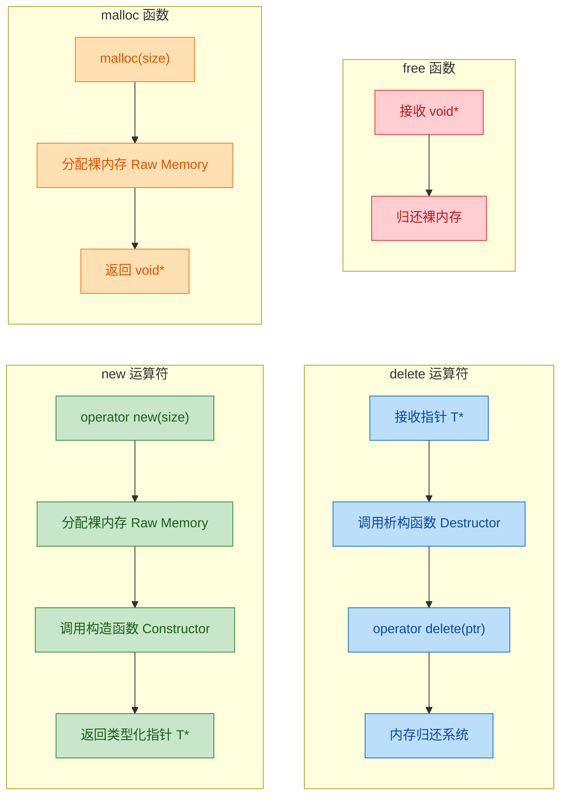

从图中可以非常清晰地看到：**`new/delete` 比 `malloc/free` 多出了"构造/析构"这一关键环节。** 这正是 C++ 面向对象体系的命脉——对象不仅仅是一段字节，它有**出生（构造）** 和**死亡（析构）** 的完整生命周期。

---

### 全面对比：new/delete vs malloc/free

下面这张表，值得你打印贴在显示器旁边：

| 对比维度 | `new` / `delete` | `malloc` / `free` |
|---|---|---|
| **本质** | C++ **运算符**（operator） | C **标准库函数** |
| **头文件** | 无需额外引入（语言内建） | `<cstdlib>` |
| **返回类型** | 返回**精确类型指针** `T*` | 返回 `void*`，需手动强转 |
| **大小计算** | **自动** `sizeof(T)` | **手动** 传入字节数 |
| **初始化** | ✅ 调用**构造函数** | ❌ 不初始化（垃圾值） |
| **清理** | ✅ 调用**析构函数** | ❌ 不调用析构 |
| **失败处理** | 默认抛出 `std::bad_alloc` 异常 | 返回 `NULL` |
| **可重载** | ✅ 可重载 `operator new/delete` | ❌ 不可重载 |
| **配对规则** | `new` ↔ `delete`，`new[]` ↔ `delete[]` | `malloc` ↔ `free` |

---

### 失败处理机制的差异

这是一个常被忽略但极其重要的区别。

**malloc 失败** → 返回 `NULL`，你必须手动检查：

```cpp
int* p = (int*)malloc(sizeof(int) * 1000000000L);  // 申请巨量内存
if (p == NULL) {                                     // 必须判空！
    std::cerr << "Allocation failed!" << std::endl;
    // 处理错误...
}
```

**new 失败** → 默认抛出 `std::bad_alloc` 异常：

```cpp
#include <iostream>
#include <new>       // std::bad_alloc

int main() {
    try {
        // 故意申请超大内存，触发失败
        int* p = new int[100000000000L];  // 可能抛出 std::bad_alloc
    }
    catch (const std::bad_alloc& e) {     // 捕获异常
        std::cerr << "new failed: " << e.what() << std::endl;
    }

    return 0;
}
```

C++ 还提供了一个**不抛异常的版本** —— `nothrow new`：

```cpp
#include <new>  // std::nothrow

int* p = new(std::nothrow) int[100000000000L];  // 失败时不抛异常
if (p == nullptr) {                              // 而是返回 nullptr，类似 malloc
    std::cerr << "Allocation failed (nothrow)" << std::endl;
}
```

`nothrow new` 在一些不允许使用异常的嵌入式项目或游戏引擎中比较常见，但一般推荐使用默认的异常版本，配合 RAII 和 try-catch 来处理。

---

### 严禁混用！配对错误是未定义行为

这是一条**铁律**——`new` 必须配 `delete`，`malloc` 必须配 `free`，绝对不能交叉使用：

```cpp
// ❌ 错误示范：混用是未定义行为（Undefined Behavior）！
int* p1 = new int(10);
free(p1);             // 💥 UB! new 出来的必须用 delete

int* p2 = (int*)malloc(sizeof(int));
delete p2;            // 💥 UB! malloc 出来的必须用 free
```

为什么？原因很直接：

- `new` 内部可能在返回给你的指针**前面**偷偷存了一些簿记信息（bookkeeping metadata），比如数组长度。`free` 根本不知道这些元数据的存在，直接释放会导致**堆损坏（heap corruption）**。
- 反过来，`delete` 会尝试调用析构函数，而 `malloc` 分配的内存上根本没有合法对象，析构一个不存在的对象同样是灾难。

用一张内存示意图来理解 `new` 的额外开销：

```cpp
// 内存布局示意（概念模型，实际因编译器而异）

// malloc 返回的指针直接指向可用区域：
// ┌──────────────────────┐
// │    用户可用内存区域     │ ← malloc 返回的 void*
// └──────────────────────┘

// new 可能在前面存储元数据（尤其是 new[]）：
// ┌──────────┬──────────────────────┐
// │ 元数据    │    用户可用内存区域     │ ← new 返回的 T*
// │ (如数组   │                       │
// │  长度等)  │                       │
// └──────────┴──────────────────────┘
//             ↑
//        operator new 实际分配的起始地址可能在更前面
```

---

### operator new / operator delete 的重载

`new` 和 `delete` 作为运算符，支持**重载（overloading）**。这在需要自定义内存池（Memory Pool）、跟踪内存分配、或做性能调优时极为有用。

#### 全局重载

```cpp
#include <iostream>
#include <cstdlib>   // malloc, free

// 全局重载 operator new
void* operator new(std::size_t size) {
    std::cout << "[Global] Allocating " << size << " bytes" << std::endl;
    void* ptr = std::malloc(size);   // 底层仍然可以用 malloc
    if (!ptr) {
        throw std::bad_alloc();      // 分配失败时必须抛异常（遵循标准约定）
    }
    return ptr;                      // 返回裸内存指针
}

// 全局重载 operator delete
void operator delete(void* ptr) noexcept {
    std::cout << "[Global] Freeing memory" << std::endl;
    std::free(ptr);                  // 底层用 free 归还
}

int main() {
    int* p = new int(100);           // 触发自定义的 operator new
    std::cout << *p << std::endl;
    delete p;                        // 触发自定义的 operator delete
    return 0;
}
```

输出：
```
[Global] Allocating 4 bytes
100
[Global] Freeing memory
```

#### 类级别重载

```cpp
#include <iostream>
#include <cstdlib>

class Pool {
public:
    // 类内重载 operator new —— 仅对 Pool 类生效
    static void* operator new(std::size_t size) {
        std::cout << "[Pool] Custom alloc: " << size << " bytes" << std::endl;
        return std::malloc(size);    // 可替换为内存池分配
    }

    // 类内重载 operator delete
    static void operator delete(void* ptr) noexcept {
        std::cout << "[Pool] Custom free" << std::endl;
        std::free(ptr);              // 可替换为内存池回收
    }

    int data;

    Pool(int d) : data(d) {
        std::cout << "[Pool] Constructor" << std::endl;
    }

    ~Pool() {
        std::cout << "[Pool] Destructor" << std::endl;
    }
};

int main() {
    Pool* obj = new Pool(7);   // 调用 Pool::operator new → Pool::Pool(7)
    std::cout << obj->data << std::endl;
    delete obj;                // 调用 Pool::~Pool() → Pool::operator delete

    int* x = new int(5);      // 不受影响，走全局 operator new
    delete x;

    return 0;
}
```

输出：
```
[Pool] Custom alloc: 16 bytes
[Pool] Constructor
7
[Pool] Destructor
[Pool] Custom free
```

注意：类级别的 `operator new/delete` 是**隐式 static** 的（即使你不写 `static`），因为在调用 `operator new` 时对象还不存在，不可能是成员函数。

---

### Placement new —— 在指定地址构造对象

`placement new` 是 `new` 的一个特殊变体。它**不分配内存**，而是在你预先提供的内存地址上**直接调用构造函数**。这在内存池、嵌入式开发、以及标准库容器（如 `std::vector`）的内部实现中被大量使用。

```cpp
#include <iostream>
#include <new>       // placement new 需要此头文件

class Widget {
public:
    int id;
    Widget(int i) : id(i) {
        std::cout << "Widget(" << id << ") constructed" << std::endl;
    }
    ~Widget() {
        std::cout << "Widget(" << id << ") destroyed" << std::endl;
    }
};

int main() {
    // 第一步：预先分配一块足够大的裸内存（这里用栈上的 buffer 演示）
    alignas(Widget) unsigned char buffer[sizeof(Widget)];  // 对齐 + 大小足够

    // 第二步：placement new —— 在 buffer 的地址上构造 Widget 对象
    Widget* w = new(buffer) Widget(42);  // 不分配内存！只调用构造函数

    std::cout << "Widget id = " << w->id << std::endl;

    // 第三步：必须手动调用析构函数（因为不能用 delete，内存不是 new 分配的）
    w->~Widget();  // 显式析构 —— 这是 C++ 中极少数需要手动调析构的场景

    // buffer 是栈上的，函数结束自动回收，无需 free/delete
    return 0;
}
```

输出：
```
Widget(42) constructed
Widget id = 42
Widget(42) destroyed
```

> **⚠️ 关键点**：`placement new` 构造的对象，**绝对不能用 `delete`**，因为内存不是 `operator new` 分配的。你必须**手动调用析构函数**，然后由原始内存的所有者负责释放内存（或者像栈 buffer 一样自动回收）。

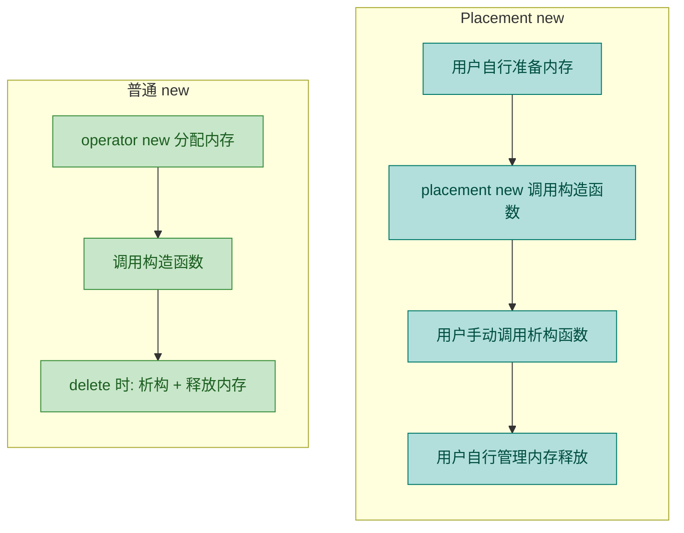

---

### 实战场景指南：什么时候用谁？

| 场景 | 推荐 | 理由 |
|---|---|---|
| C++ 日常开发 | `new/delete`（更推荐智能指针） | 类型安全 + 自动构造/析构 |
| 与 C 库交互（如 `fopen` 风格的 API） | `malloc/free` | C API 期望 `void*`，保持一致性 |
| 自定义内存池 / 嵌入式场景 | `placement new` + 手动析构 | 需要精确控制内存分配位置 |
| 性能极致要求（游戏引擎等） | 重载 `operator new/delete` | 替换全局分配器为高效内存池 |
| 现代 C++（C++11 及以上） | **`std::make_unique` / `std::make_shared`** | 零手动 `delete`，杜绝泄漏 |

在现代 C++ 中，你应该尽量**避免裸 `new/delete`**，转而使用智能指针（`std::unique_ptr`、`std::shared_ptr`）。但理解 `new/delete` 的底层机制，是掌握智能指针和 RAII 的**必要前提**。

---

### 常见错误与陷阱汇总

```cpp
// 陷阱 1：delete 后使用（Use After Free / Dangling Pointer）
int* p = new int(10);
delete p;
std::cout << *p;      // 💥 未定义行为！p 已经是悬空指针

// 陷阱 2：重复 delete（Double Free）
int* q = new int(20);
delete q;
delete q;              // 💥 未定义行为！同一块内存被释放两次

// 陷阱 3：delete 空指针 —— 这其实是安全的！
int* r = nullptr;
delete r;              // ✅ C++ 标准保证：delete nullptr 是空操作（no-op）

// 陷阱 4：用 delete 释放栈内存
int x = 5;
int* s = &x;
delete s;              // 💥 未定义行为！x 在栈上，不是 new 出来的

// 陷阱 5：new[] 配 delete（缺少 []）
int* arr = new int[10];
delete arr;            // 💥 未定义行为！应该用 delete[] arr;
```

---

**📝 练习题**

以下代码的输出是什么？

```cpp
#include <iostream>

class Foo {
public:
    Foo()  { std::cout << "C "; }
    ~Foo() { std::cout << "D "; }
};

int main() {
    Foo* p = (Foo*)malloc(sizeof(Foo));
    free(p);
    return 0;
}
```

A. `C D`


B. 无任何输出


C. `C`


D. 编译错误


**【答案】** B

**【解析】** `malloc` 只负责分配裸内存，**不会调用构造函数**，因此 `"C "` 不会被打印。同样，`free` 只负责释放内存，**不会调用析构函数**，因此 `"D "` 也不会被打印。整个过程中 `Foo` 对象从未被"真正创建"——内存里虽然有 `sizeof(Foo)` 个字节的空间，但没有合法的 `Foo` 对象存在。这就是 `malloc/free` 与 `new/delete` 的核心区别：**前者只管内存字节，后者管理对象完整生命周期**。如果将代码改为 `Foo* p = new Foo; delete p;`，输出就会是 `C D`。

---

## 数组 new/delete（new[] 与 delete[]）

在 C++ 中，动态分配单个对象使用 `new` / `delete`，而动态分配**一组连续对象（数组）**时，则必须使用专门的 `new[]` / `delete[]` 运算符。这对"数组版"运算符与单对象版看似只差了一对方括号，但其背后的内存布局、构造/析构语义、以及误用后果都有着本质区别。深入理解它们，是写出安全、无泄漏 C++ 代码的关键一环。

---

### 基本语法与使用

#### 分配数组：`new T[n]`

`new[]` 表达式的基本形式如下：

```cpp
// 动态分配一个包含 n 个 int 的数组，返回首元素指针
int* arr = new int[5];          // 5 个 int，值未初始化（内容不确定）

// 值初始化：所有元素被零初始化
int* arr2 = new int[5]();       // 5 个 int，全部为 0

// C++11 起支持列表初始化
int* arr3 = new int[5]{1, 2, 3, 4, 5};  // 逐个赋初值

// 动态分配自定义类型数组
std::string* strs = new std::string[3];  // 3 个 string，各自调用默认构造函数
```

这里有几个要点值得注意：

- **`new int[5]`**（无括号）：对于 POD 类型（Plain Old Data），元素**不会被初始化**，内存中是随机值。对于类类型，仍会调用默认构造函数。
- **`new int[5]()`**（带空括号）：执行 **value-initialization**，POD 类型全部归零，类类型调用默认构造函数。
- **`new int[5]{...}`**（花括号列表）：C++11 引入的 **list-initialization**，可逐元素指定初始值，未指定的部分执行零初始化。

#### 释放数组：`delete[] p`

```cpp
int* arr = new int[100];       // 分配 100 个 int
// ... 使用 arr ...
delete[] arr;                  // 释放整个数组，注意方括号不可省略
arr = nullptr;                 // 良好习惯：释放后置空
```

`delete[]` 会做两件事（顺序很关键）：

1. **逆序调用**数组中每个元素的析构函数（从最后一个元素到第一个）。
2. **释放**整块内存。

---

### 内存布局：编译器如何记住数组大小？

当你写 `delete[] arr` 时，编译器怎么知道要析构多少个对象？答案是：**编译器在 `new[]` 分配时，会额外存储数组的元素个数**。这个信息通常被藏在返回指针的"前方"——一块你看不到的隐藏区域中，常被称为 **Array Cookie（数组饼干 / 数组前缀）**。

```
┌─────────────────────────────────────────────────────────┐
│              new Widget[4] 的实际内存布局                  │
├─────────────────────────────────────────────────────────┤
│                                                         │
│   operator new[]() 实际分配的起始地址                      │
│   ↓                                                     │
│   ┌────────────┬──────────┬──────────┬──────────┬──────────┐
│   │  Cookie    │ Widget   │ Widget   │ Widget   │ Widget   │
│   │  (size_t)  │  [0]     │  [1]     │  [2]     │  [3]     │
│   │  值 = 4    │          │          │          │          │
│   └────────────┴──────────┴──────────┴──────────┴──────────┘
│        ↑              ↑                                 │
│   实际 malloc 地址    new[] 返回给用户的指针               │
│                                                         │
└─────────────────────────────────────────────────────────┘
```

下面用 Mermaid 图更清晰地展示这个过程：

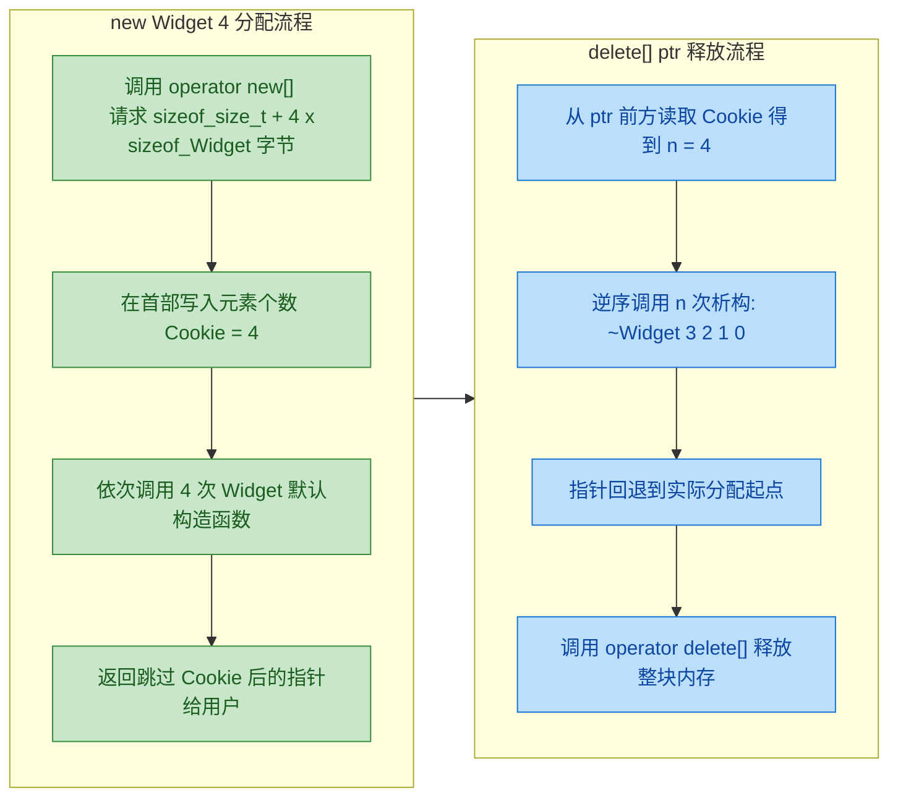

> **注意**：Array Cookie 机制是**实现定义（implementation-defined）**的。有些编译器（如 GCC、Clang、MSVC）仅在类型拥有**非平凡析构函数（non-trivial destructor）**时才会插入 Cookie。对于 `int` 这样的基本类型，析构是空操作，编译器可能优化掉 Cookie。但这属于编译器内部行为，我们在编码时**一律按照规范来**——`new[]` 永远搭配 `delete[]`。

---

### new/delete 与 new[]/delete[] 的本质区别

很多初学者的疑问是："既然都是分配内存，为什么一定要区分带不带 `[]`？" 下面从编译器行为层面做一个完整对比：

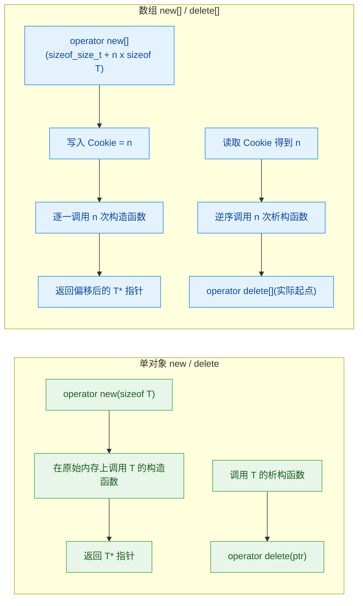

| 维度 | `new` / `delete` | `new[]` / `delete[]` |
|------|-------------------|----------------------|
| **分配函数** | `operator new(size)` | `operator new[](size)` |
| **内存额外开销** | 无 Cookie | 可能有 Cookie（size_t） |
| **构造** | 调用 **1 次** 构造函数 | 调用 **n 次** 构造函数 |
| **析构** | 调用 **1 次** 析构函数 | **逆序**调用 **n 次** 析构函数 |
| **释放函数** | `operator delete(ptr)` | `operator delete[](实际起点)` |
| **指针语义** | 指向单个完整对象 | 指向数组首元素 |

---

### 混用的灾难：Undefined Behavior 详解

这是面试和实战中的**高频坑点**。我们来逐一分析三种典型混用场景：

#### 场景一：`new[]` 分配，`delete`（无方括号）释放

```cpp
class Widget {
public:
    Widget()  { std::cout << "构造 Widget" << std::endl; }  // 构造函数
    ~Widget() { std::cout << "析构 Widget" << std::endl; }  // 析构函数
};

int main() {
    Widget* w = new Widget[4];  // 分配 4 个 Widget，调用 4 次构造
    delete w;                   // ❌ 严重错误！应该用 delete[]
    return 0;
}
```

**后果分析：**

1. `delete w` 只会调用 **1 次**析构函数（对 `w[0]`），**剩余 3 个对象的析构函数永远不会执行** —— 如果它们持有资源（如堆内存、文件句柄），这些资源就泄漏了。
2. `delete` 会把 `w` 直接传给 `operator delete()`，但实际的分配起点是 `w - sizeof(size_t)`（Cookie 的位置）。传入错误地址给底层 `free()`，**直接导致堆损坏（heap corruption）**，程序可能崩溃、静默出错或产生不可预测的行为。

```
错误释放的指针偏移示意：

实际分配起点       用户拿到的指针 (w)
    ↓                  ↓
    ┌──────────┬───────────────────────────────┐
    │  Cookie  │  Widget[0] Widget[1] ...      │
    └──────────┴───────────────────────────────┘
    ↑
    正确的 free 应该从这里开始
    但 delete w 会从 w 位置开始 free → 💥 堆损坏
```

#### 场景二：`new` 分配，`delete[]`（带方括号）释放

```cpp
int main() {
    Widget* w = new Widget;     // 只分配 1 个 Widget
    delete[] w;                 // ❌ 未定义行为！
    return 0;
}
```

**后果分析：**

`delete[]` 会尝试**往前偏移**读取一个根本不存在的 Cookie 值。读到的是一段随机内存，编译器会将其解释为"数组元素个数"，然后试图调用**若干次**析构函数——析构一片根本不属于你的内存区域。结果：**疯狂踩内存 → 崩溃 / 数据损坏**。

#### 场景三：基本类型混用——看似没事，实则仍是 UB

```cpp
int main() {
    int* p = new int[100];  // 分配 100 个 int
    delete p;               // ❌ 仍是未定义行为！
    return 0;
}
```

有人会说："int 没有析构函数，也没有 Cookie，所以没问题。" 在某些编译器、某些优化级别下确实可能碰巧不出错。但 C++ 标准明确规定：**这是 Undefined Behavior**。编译器有权做任何事情——包括让你的程序在发布版中崩溃。**永远不要依赖未定义行为的"巧合正确"。**

> **黄金法则**：`new` ↔ `delete`，`new[]` ↔ `delete[]`，**严格配对，永不交叉。**

---

### 构造与析构的顺序

`new[]` 按**下标升序**构造（0 → n-1），`delete[]` 按**下标降序**析构（n-1 → 0）。这遵循 C++ 中的 **LIFO（Last In, First Out）** 对象生命周期哲学——最后构造的最先析构，与栈上局部变量的销毁顺序一致。

```cpp
#include <iostream>

class Tracer {
    int id_;                                          // 对象编号
public:
    Tracer(int id) : id_(id) {                        // 带参构造函数
        std::cout << "  构造 Tracer #" << id_ << std::endl;
    }
    ~Tracer() {                                       // 析构函数
        std::cout << "  析构 Tracer #" << id_ << std::endl;
    }
};

int main() {
    std::cout << "=== 分配阶段 ===" << std::endl;
    // C++11 列表初始化，按下标 0,1,2,3 依次构造
    Tracer* arr = new Tracer[4]{0, 1, 2, 3};

    std::cout << "=== 释放阶段 ===" << std::endl;
    // delete[] 按下标 3,2,1,0 逆序析构
    delete[] arr;

    return 0;
}
```

**输出：**

```
=== 分配阶段 ===
  构造 Tracer #0
  构造 Tracer #1
  构造 Tracer #2
  构造 Tracer #3
=== 释放阶段 ===
  析构 Tracer #3
  析构 Tracer #2
  析构 Tracer #1
  析构 Tracer #0
```

---

### new[] 中途构造失败的异常安全

一个很容易被忽视的问题：如果 `new Widget[4]` 在构造第 3 个元素时抛出异常，已经构造好的前 2 个元素怎么办？

**C++ 标准保证**：编译器会**自动逆序析构所有已成功构造的元素**，然后调用 `operator delete[]` 释放内存，最后将异常继续传播。你不需要手动清理。

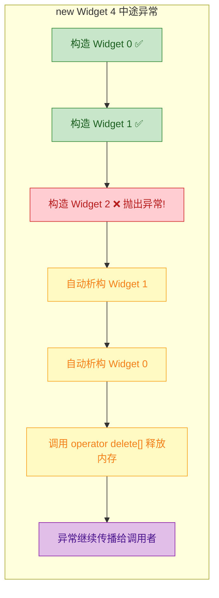

```cpp
#include <iostream>
#include <stdexcept>

class Bomb {
    int id_;
public:
    Bomb(int id) : id_(id) {                                // 构造函数
        std::cout << "  构造 Bomb #" << id_ << std::endl;
        if (id_ == 2) {                                     // 第 3 个对象故意抛异常
            throw std::runtime_error("Bomb #2 爆炸了!");
        }
    }
    ~Bomb() {                                               // 析构函数
        std::cout << "  析构 Bomb #" << id_ << std::endl;
    }
};

int main() {
    try {
        // 尝试构造 4 个 Bomb，第 3 个 (id=2) 会抛异常
        Bomb* arr = new Bomb[4]{0, 1, 2, 3};
        delete[] arr;  // 这一行永远不会执行
    } catch (const std::exception& e) {
        // 捕获异常后的处理
        std::cout << "捕获异常: " << e.what() << std::endl;
    }
    return 0;
}
```

**输出：**

```
  构造 Bomb #0
  构造 Bomb #1
  构造 Bomb #2       ← 抛出异常
  析构 Bomb #1       ← 编译器自动回滚：逆序析构已完成的对象
  析构 Bomb #0
捕获异常: Bomb #2 爆炸了!
```

可以看到，`Bomb #3` 从未被构造，`Bomb #0` 和 `Bomb #1` 被正确析构，内存也被自动释放。这是 C++ 异常安全（Exception Safety）机制的重要体现。

---

### 二维数组的动态分配

实际开发中，我们经常需要动态分配二维数组。这里有两种常见方式，各有优劣：

#### 方式一：指针数组（锯齿数组，Jagged Array）

```cpp
int rows = 3, cols = 4;

// 第一步：分配一个"指针数组"，包含 rows 个 int* 指针
int** matrix = new int*[rows];

// 第二步：为每一行分别分配 cols 个 int
for (int i = 0; i < rows; ++i) {
    matrix[i] = new int[cols]();   // 每行 cols 个 int，零初始化
}

// 使用：matrix[i][j] 访问
matrix[1][2] = 42;

// 释放：必须逐行释放，顺序与分配相反
for (int i = 0; i < rows; ++i) {
    delete[] matrix[i];            // 先释放每一行
}
delete[] matrix;                   // 再释放指针数组本身
```

```
内存布局（非连续）：

matrix (int**)
  ┌─────────┐
  │ ptr[0] ─────→ [ int, int, int, int ]   ← 堆上某位置 A
  ├─────────┤
  │ ptr[1] ─────→ [ int, int, int, int ]   ← 堆上某位置 B
  ├─────────┤
  │ ptr[2] ─────→ [ int, int, int, int ]   ← 堆上某位置 C
  └─────────┘
  ↑ 堆上某位置 D

  注意：A、B、C 三块内存在堆上不一定连续！
```

**优点**：每行长度可以不同（锯齿数组），灵活性高。  
**缺点**：多次 `new` 调用，内存碎片多，**缓存不友好（cache-unfriendly）**，因为各行不连续。

#### 方式二：一维数组模拟二维（推荐）

```cpp
int rows = 3, cols = 4;

// 一次性分配 rows * cols 个连续 int
int* matrix = new int[rows * cols]();  // 全部零初始化

// 访问 [i][j] → 手动计算偏移: i * cols + j
matrix[1 * cols + 2] = 42;            // 等价于 matrix[1][2]

// 释放：只需一次 delete[]
delete[] matrix;
```

```
内存布局（完全连续）：

matrix (int*)
  ┌─────┬─────┬─────┬─────┬─────┬─────┬─────┬─────┬─────┬─────┬─────┬─────┐
  │ 0,0 │ 0,1 │ 0,2 │ 0,3 │ 1,0 │ 1,1 │ 1,2 │ 1,3 │ 2,0 │ 2,1 │ 2,2 │ 2,3 │
  └─────┴─────┴─────┴─────┴─────┴─────┴─────┴─────┴─────┴─────┴─────┴─────┘
  ←───── row 0 ─────→←───── row 1 ─────→←───── row 2 ─────→
```

**优点**：单次分配/释放，内存连续，**缓存友好**，性能远优于方式一。  
**缺点**：不能直接用 `[][]` 语法，需要手动算偏移（可封装为类解决）。

---

### 现代 C++ 的最佳实践：远离裸 new[]

在现代 C++（C++11 及以后）中，**直接使用 `new[]` / `delete[]` 的场景已经非常少了**。标准库提供了更安全、更优雅的替代方案：

| 需求 | 裸指针写法 | 现代 C++ 替代 |
|------|-----------|---------------|
| 动态数组 | `new T[n]` / `delete[]` | `std::vector<T>` |
| 固定大小数组 | `new T[N]` / `delete[]` | `std::array<T, N>` |
| 智能指针管数组 | 手动 `delete[]` | `std::unique_ptr<T[]>` |
| 二维数组 | 指针数组嵌套 | `std::vector<std::vector<T>>` |

```cpp
#include <vector>
#include <memory>
#include <array>

// ✅ 方案一：std::vector（最常用）
std::vector<int> v(100, 0);         // 100 个 int，初始为 0
v.push_back(42);                    // 还能动态扩容
// 离开作用域自动释放，无需手动 delete

// ✅ 方案二：std::unique_ptr<T[]>（需要裸数组语义时）
std::unique_ptr<int[]> up(new int[100]());  // 持有动态数组
up[0] = 10;                                 // 支持下标访问
// 离开作用域自动调用 delete[]

// ✅ C++14 更优写法：
auto up2 = std::make_unique<int[]>(100);    // 无需直接写 new

// ✅ 方案三：编译期固定大小
std::array<int, 100> sa{};                  // 栈上分配，零初始化
```

`std::vector` 内部封装了 `new[]` / `delete[]`（或等价的 allocator 操作），并且：
- **自动管理内存**，无泄漏风险
- 支持**动态扩容**（`push_back`、`resize`）
- 记住自身大小（`.size()`），不需要额外变量
- 拷贝、移动语义完备
- 与 STL 算法完美配合

> **实战原则**：除非你在写底层库、内存池或自定义 allocator，否则**永远优先使用 `std::vector`** 而非裸 `new[]`。

---

### 本节知识脉络总览

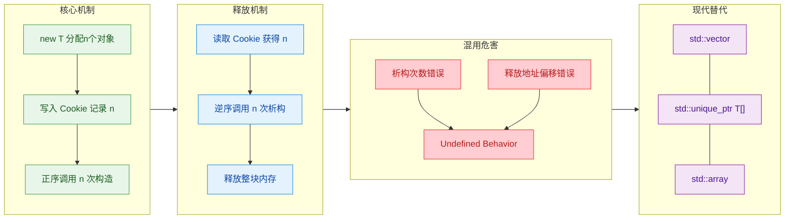

---

**📝 练习题**

以下代码在运行时的行为是什么？

```cpp
class Resource {
public:
    Resource()  { std::cout << "ctor "; }
    ~Resource() { std::cout << "dtor "; }
};

int main() {
    Resource* p = new Resource[3];
    delete p;  // 注意这里没有 []
    return 0;
}
```

A. 输出 `ctor ctor ctor dtor dtor dtor`，程序正常结束

B. 输出 `ctor ctor ctor dtor`，程序正常结束，但有内存泄漏

C. 输出 `ctor ctor ctor dtor`，然后行为未定义，程序可能崩溃

D. 编译错误，`delete` 不能用于 `new[]` 分配的指针


**【答案】** C

**【解析】** `new Resource[3]` 使用了 `new[]`，分配了 3 个 `Resource` 对象并依次调用构造函数（输出 3 次 `ctor`）。当执行 `delete p`（缺少 `[]`）时，编译器将其视为释放单个对象：它只对 `p[0]` 调用一次析构函数（输出 1 次 `dtor`）。到此为止输出看似确定，但接下来 `operator delete()` 收到的地址是用户指针 `p`，而实际分配起点因为 Array Cookie 的存在可能在 `p` 之前——传入错误地址给底层内存管理器，这就是**未定义行为（Undefined Behavior）**。常见后果包括：堆元数据损坏导致程序崩溃、静默的内存破坏在后续操作中引发诡异 bug、甚至某些平台上"碰巧"不出事（但绝不可依赖）。选项 A 错误是因为只会调用 1 次析构；选项 B 错误是因为不只是"内存泄漏"那么温和，实质是 UB；选项 D 错误是因为 C++ 不会在编译期阻止这种混用——类型系统层面 `Resource*` 就是 `Resource*`，编译器无法区分它来自 `new` 还是 `new[]`。

---

## 内存泄漏（Memory Leak）

内存泄漏是 C++ 程序中最常见、最隐蔽、也最致命的 Bug 类型之一。它不会像空指针解引用那样让程序立刻崩溃，而是像一个"慢性毒药"——程序表面上运行正常，实则不断蚕食系统可用内存，直到资源耗尽才暴露出问题。理解内存泄漏的本质、掌握其成因分类以及检测手段，是每个 C++ 开发者的必修课。

### 什么是内存泄漏

简单来说，**内存泄漏（Memory Leak）** 指的是：程序通过 `new`、`malloc` 等方式在**堆区（Heap）**申请了一块内存，但在这块内存不再被需要时，**没有调用对应的 `delete` / `free` 将其归还给操作系统**，同时又**丢失了指向这块内存的所有指针**，导致这块内存成为"孤岛"——既不可用，也不可回收。

用一个生活中的类比来说明：你在图书馆借了一本书（`new`），放在了某个角落，然后忘记了放在哪里（指针丢失）。你既没有归还它（`delete`），图书馆也无法回收它，这本书就"泄漏"了。

```c++
void leak_demo() {
    int* p = new int(42);   // 在堆上分配 4 字节，p 指向它
    p = nullptr;             // 指针被重置，原来那块内存的地址丢失了！
    // 此时：堆上的 4 字节永远无法被 delete，发生内存泄漏
}
```

**关键认知**：内存泄漏的核心矛盾不是"忘记 delete"那么简单，而是**所有权（Ownership）不清晰**。当多个代码路径、多个函数、多个模块都在传递同一个裸指针时，"谁来负责释放？什么时候释放？"这个问题如果没有明确的约定，泄漏就是必然结果。

下面这张图直观展示了正常内存生命周期 vs 泄漏场景的对比：

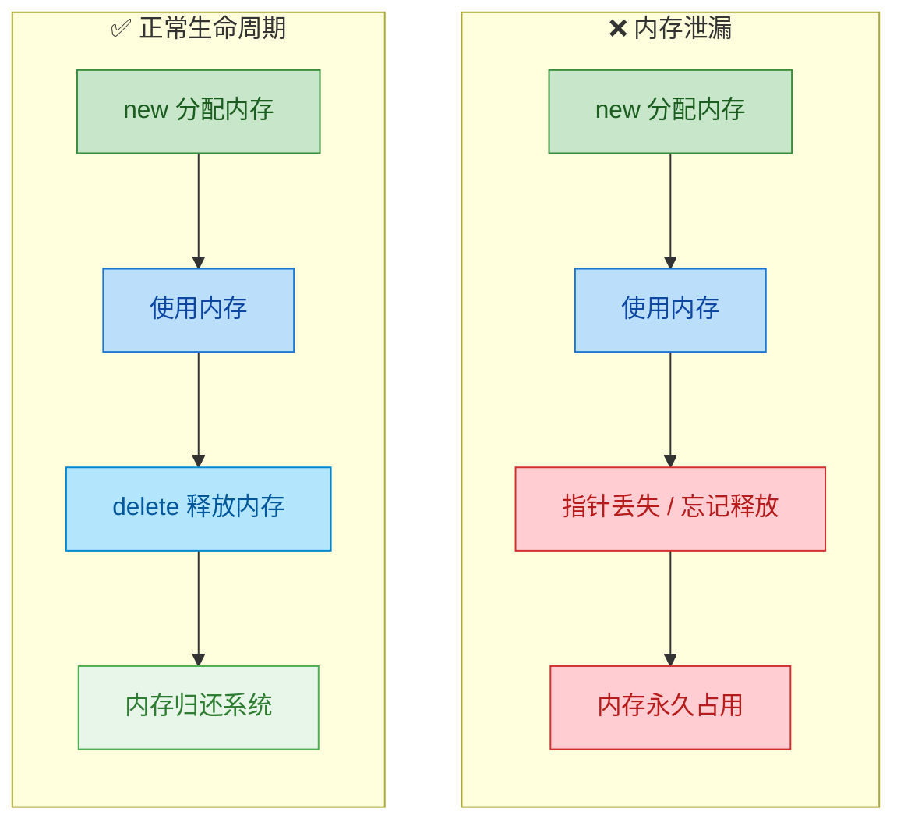

---

### 内存泄漏的六大常见原因

内存泄漏不是一种单一的 Bug，它有多种"变体"。下面逐一拆解最常见的六大成因。

#### 原因一：最基础的 —— 忘记 `delete`

这是最直觉的原因，也是初学者最容易犯的错误。分配了内存，但在函数返回前压根没有写 `delete`。

```c++
void basic_leak() {
    int* arr = new int[1000];    // 分配 1000 个 int 的堆内存
    // ... 使用 arr 做一些计算 ...
    // 函数结束，arr 是栈上的局部变量，被自动销毁
    // 但 arr 指向的堆内存没有被 delete[]，泄漏了！
}
```

这个例子看起来很"低级"，但在大型项目中，分配和使用往往隔着几百行代码、甚至跨越多个文件，遗漏 `delete` 的概率其实相当高。

#### 原因二：提前 `return` 导致跳过释放

这是一个非常经典的场景。函数中有多个 `return` 分支，某些分支在 `delete` 语句之前就退出了，导致释放逻辑被"跳过"。

```c++
bool process_data() {
    char* buffer = new char[4096];   // 分配 4KB 缓冲区

    if (!read_file(buffer)) {
        return false;                // ⚠️ 提前返回！buffer 没有被 delete[]
    }

    if (!validate(buffer)) {
        return false;                // ⚠️ 又一个提前返回！同样泄漏
    }

    // 只有走到这里才会释放
    delete[] buffer;                 // 正常路径可以释放
    return true;
}
```

这段代码有 3 条执行路径，但只有 1 条路径执行了 `delete[]`。其余 2 条路径都会导致泄漏。随着业务逻辑变复杂、`if-else` 分支增多，这种 Bug 几乎无法通过肉眼 Review 完全杜绝。

**修复思路**：使用 **RAII（下一节详细讲解）** 或 `std::unique_ptr` 让资源释放与作用域绑定，而非依赖手动 `delete`。

```c++
#include <memory>                             // 引入智能指针头文件
bool process_data_safe() {
    auto buffer = std::make_unique<char[]>(4096);  // RAII 管理内存

    if (!read_file(buffer.get())) {
        return false;                         // 安全！buffer 自动析构释放
    }

    if (!validate(buffer.get())) {
        return false;                         // 安全！同上
    }

    return true;                              // buffer 离开作用域，自动释放
}
```

#### 原因三：异常（Exception）打断正常流程

这是比"提前 return"更隐蔽的陷阱。即使你在函数末尾老老实实写了 `delete`，一旦中途抛出异常，控制流直接跳到 `catch` 块，`delete` 语句永远不会被执行。

```c++
void exception_leak() {
    int* data = new int[500];       // 分配堆内存

    risky_operation();               // ⚠️ 如果这个函数抛出异常...

    delete[] data;                   // 这一行永远不会被执行！
}
```

在异常安全（Exception Safety）这个概念中，上面的代码连最基本的 **Basic Guarantee（基本保证）** 都达不到。而在现代 C++ 中，异常是标准库大量使用的机制（比如 `std::vector::at()` 越界会抛 `std::out_of_range`），因此如果你用裸指针管理资源，就必须时刻警惕异常带来的泄漏。

修复方式同上——使用 RAII / 智能指针，让析构函数在栈展开（Stack Unwinding）时自动释放资源。

#### 原因四：指针被覆盖（Overwrite）

当一个指针先后指向两块堆内存，如果在指向新内存之前没有释放旧内存，旧内存就泄漏了。

```c++
void overwrite_leak() {
    int* p = new int(10);     // p 指向第一块内存（值为 10）
    p = new int(20);          // p 指向第二块内存（值为 20）
                              // ⚠️ 第一块内存（值为 10）的地址丢失了！泄漏！
    delete p;                 // 只释放了第二块内存
}
```

这段代码在内存中发生的事情可以用下面的 ASCII 图直观表示：

```c++
// ===== 第一步：int* p = new int(10) =====
//
//   栈(Stack)          堆(Heap)
//  +--------+        +---------+
//  |  p ----+------->|   10    |   <-- 地址 0xA000
//  +--------+        +---------+
//
// ===== 第二步：p = new int(20)  (未先 delete) =====
//
//   栈(Stack)          堆(Heap)
//  +--------+        +---------+
//  |  p ----+--+     |   10    |   <-- 0xA000（泄漏！无人引用）
//  +--------+  |     +---------+
//              |     +---------+
//              +---->|   20    |   <-- 0xB000（p 现在指向这里）
//                    +---------+
```

#### 原因五：容器中存放裸指针

当你在 `std::vector`、`std::map` 等 STL 容器中存放裸指针时，容器的析构函数只会销毁指针本身（栈上的几个字节），**不会自动 `delete` 指针所指向的堆内存**。

```c++
#include <vector>
void container_leak() {
    std::vector<int*> vec;              // 存放 int* 的 vector

    for (int i = 0; i < 100; ++i) {
        vec.push_back(new int(i));      // 每次循环都 new 一个 int
    }

    // vec 离开作用域，vector 析构
    // vector 会销毁内部存的 100 个「指针值」
    // 但不会对每个指针调用 delete
    // ⚠️ 100 块堆内存全部泄漏！
}
```

**修复方式**：容器中存放智能指针而非裸指针。

```c++
#include <vector>
#include <memory>
void container_safe() {
    std::vector<std::unique_ptr<int>> vec;    // 存放 unique_ptr<int>

    for (int i = 0; i < 100; ++i) {
        vec.push_back(std::make_unique<int>(i)); // 用 make_unique 创建
    }

    // vec 析构时，会依次析构每个 unique_ptr
    // 每个 unique_ptr 的析构函数会自动 delete 管理的内存
    // ✅ 零泄漏
}
```

#### 原因六：循环引用（Circular Reference）

这是智能指针时代特有的"高级"泄漏模式。当两个对象通过 `std::shared_ptr` 互相引用时，它们的引用计数永远不会降为 0，导致析构函数永远不会被调用。

```c++
#include <memory>
#include <iostream>

struct Node {
    std::shared_ptr<Node> peer;           // 指向对方的 shared_ptr
    ~Node() { std::cout << "~Node\n"; }   // 析构时打印，用于验证
};

void circular_leak() {
    auto a = std::make_shared<Node>();    // a 的引用计数 = 1
    auto b = std::make_shared<Node>();    // b 的引用计数 = 1

    a->peer = b;                          // b 的引用计数 = 2
    b->peer = a;                          // a 的引用计数 = 2

    // 函数结束，局部变量 a、b 被销毁
    // a 引用计数 2 -> 1 (不为 0，不析构)
    // b 引用计数 2 -> 1 (不为 0，不析构)
    // ⚠️ 两个 Node 对象都不会被析构！析构信息不会打印！
}
```

下面用 Mermaid 图展示循环引用的引用计数僵局：

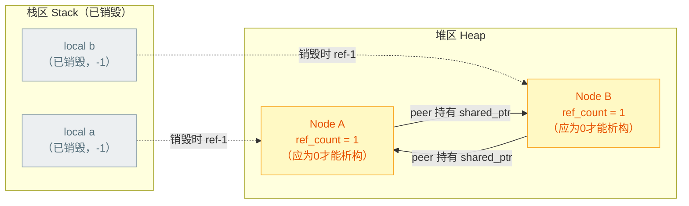

可以看到：栈上的局部变量销毁后各减了 1，但堆上的两个 Node 互相持有对方，各自仍有 1 个引用计数剩余，陷入了"你不死我也不死"的僵局。

**修复方式**：将其中一方的 `shared_ptr` 改为 `std::weak_ptr`。`weak_ptr` 不增加引用计数，从而打破循环。

```c++
struct NodeFixed {
    std::shared_ptr<NodeFixed> strong_peer;   // 一方用 shared_ptr（强引用）
    std::weak_ptr<NodeFixed>   weak_peer;     // 另一方用 weak_ptr（弱引用）
    ~NodeFixed() { std::cout << "~NodeFixed\n"; }
};

void no_circular_leak() {
    auto a = std::make_shared<NodeFixed>();    // a ref_count = 1
    auto b = std::make_shared<NodeFixed>();    // b ref_count = 1

    a->strong_peer = b;                       // b ref_count = 2
    b->weak_peer   = a;                       // a ref_count 仍为 1（weak_ptr 不加计数）

    // 函数结束：
    // a ref_count 1 -> 0 => Node A 析构 => 释放 strong_peer => b ref_count 2->1
    // b ref_count 1 -> 0 => Node B 析构
    // ✅ 两个对象都正常析构！
}
```

---

### 内存泄漏的六大原因总览

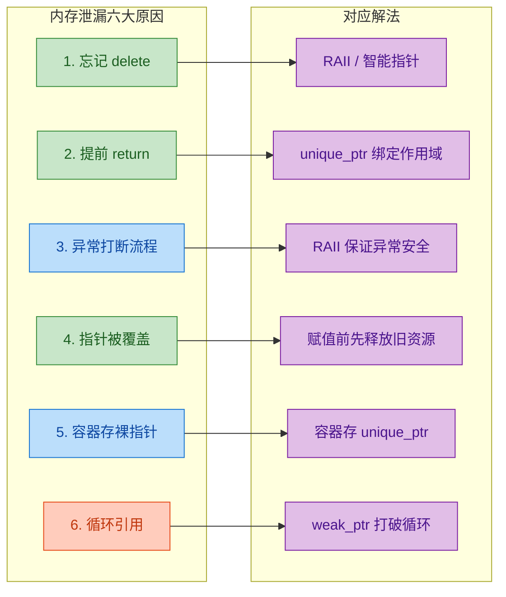

---

### 内存泄漏的危害 —— 不仅仅是"浪费内存"

很多初学者对内存泄漏的态度是"反正内存大，泄漏一点没关系"。这种想法极其危险。以下是内存泄漏的实际危害：

**1. 长期运行的服务会被杀死**

服务器程序（如 Web Server、游戏服务器、数据库）通常 7×24 小时运行。哪怕每次请求只泄漏 1KB，每秒 1000 个请求，一天下来就是 `1KB × 1000 × 86400 ≈ 82GB`。操作系统的 OOM Killer（Out-Of-Memory Killer）会直接把你的进程杀掉，毫无商量余地。

**2. 内存碎片化（Fragmentation）**

泄漏的内存块散落在堆的各个角落，导致即使总剩余内存充足，也无法分配出连续的大块内存，`new` 会抛出 `std::bad_alloc` 异常。

**3. 性能退化**

随着进程占用内存增大，操作系统可能将部分物理内存页换出到磁盘（Swap），导致后续的内存访问触发 **Page Fault（缺页中断）**，性能急剧下降。

**4. 掩盖更深层的 Bug**

内存泄漏往往只是表象。它的背后可能是错误的所有权设计、缺失的析构函数、异常处理不当等架构层面的问题。

---

### 内存泄漏的检测方法

知道了原因，接下来学习如何"抓"泄漏。检测方法可以分为三个层次：**手动检测**、**工具检测**、**操作系统级诊断**。

#### 方法一：手动计数法（Debug 阶段）

最朴素但有效的方法——自己维护一个全局计数器，跟踪 `new` 和 `delete` 的调用次数。如果程序结束时两者不一致，说明有泄漏。

```c++
#include <iostream>

int g_alloc_count = 0;    // 全局分配计数器

// 重载全局 operator new
void* operator new(std::size_t size) {
    ++g_alloc_count;       // 每次 new，计数器 +1
    std::cout << "[new]  alloc " << size << " bytes, count=" 
              << g_alloc_count << "\n";
    void* ptr = std::malloc(size);   // 底层仍调用 malloc 分配
    if (!ptr) throw std::bad_alloc();// 分配失败抛异常
    return ptr;
}

// 重载全局 operator delete
void operator delete(void* ptr) noexcept {
    --g_alloc_count;       // 每次 delete，计数器 -1
    std::cout << "[del]  free, count=" << g_alloc_count << "\n";
    std::free(ptr);        // 底层调用 free 释放
}

// 程序结束时检查
struct LeakChecker {
    ~LeakChecker() {       // 利用全局对象析构，在 main 结束后执行
        if (g_alloc_count != 0) {
            std::cerr << "⚠️ LEAK DETECTED! Unfreed allocations: " 
                      << g_alloc_count << "\n";
        } else {
            std::cout << "✅ No memory leak.\n";
        }
    }
};

static LeakChecker checker; // 全局静态对象，析构在 main() 之后

int main() {
    int* a = new int(1);   // count: 0 -> 1
    int* b = new int(2);   // count: 1 -> 2
    delete a;               // count: 2 -> 1
    // 故意不 delete b      // count 最终为 1 => 检测到泄漏！
    return 0;
}
```

运行输出类似：

```
[new]  alloc 4 bytes, count=1
[new]  alloc 4 bytes, count=2
[del]  free, count=1
⚠️ LEAK DETECTED! Unfreed allocations: 1
```

这种方法简单直接，但缺点也很明显：**只能告诉你"有泄漏"，不能告诉你"在哪里泄漏"**。在大型项目中实用性有限，但作为学习原理的工具非常好。

#### 方法二：Valgrind（Linux 平台的神器）

**Valgrind** 是 Linux/macOS 平台上最权威的内存检测工具，其中的 **Memcheck** 子工具能检测内存泄漏、越界访问、使用未初始化内存等问题。

使用方式极其简单，只需在运行程序前加上 `valgrind` 命令：

```bash
# 编译时加 -g 选项以保留调试符号（否则 Valgrind 无法显示源码行号）
g++ -g -o my_program my_program.cpp

# 使用 Valgrind 的 Memcheck 工具运行程序
valgrind --leak-check=full ./my_program
```

Valgrind 的输出报告会非常详细，关键信息如下：

```
==12345== HEAP SUMMARY:
==12345==   in use at exit: 4 bytes in 1 blocks    <-- 退出时仍有 4 字节未释放
==12345==   total heap usage: 2 allocs, 1 frees     <-- 分配 2 次，释放 1 次
==12345== 
==12345== 4 bytes in 1 blocks are definitely lost in loss record 1 of 1
==12345==    at 0x4C2A8B0: operator new(unsigned long) (vg_replace_malloc.c:334)
==12345==    by 0x400847: main (my_program.cpp:15)   <-- 精确定位到源文件第 15 行
```

Valgrind 的核心价值在于它不仅能检测泄漏，还能分类报告泄漏类型：

| Valgrind 泄漏分类 | 英文名 | 含义 |
|:--|:--|:--|
| **确定泄漏** | Definitely lost | 没有任何指针指向这块内存，100% 泄漏 |
| **间接泄漏** | Indirectly lost | 这块内存被另一块"确定泄漏"的内存引用 |
| **可能泄漏** | Possibly lost | 有指针指向内存块中间（非起始位置），可能是泄漏 |
| **仍可达** | Still reachable | 程序退出时仍有指针指向它，通常是全局变量（不一定是 Bug） |

**注意**：Valgrind 的原理是对程序进行**动态二进制插桩（Dynamic Binary Instrumentation）**，会让程序运行速度降低 10~30 倍，因此仅用于测试/Debug 环境，绝不能在生产环境使用。

#### 方法三：AddressSanitizer（ASan，编译器内建）

**AddressSanitizer (ASan)** 是 GCC 和 Clang 编译器内置的内存错误检测工具，性能开销比 Valgrind 低很多（通常只慢 2 倍左右），且检测到错误时输出的堆栈信息非常详细。

```bash
# 编译时添加 -fsanitize=address 和 -g 选项
g++ -fsanitize=address -g -o my_program my_program.cpp

# 直接运行（不需要额外工具包裹）
./my_program
```

如果需要专门检测内存泄漏，可以配合 **LeakSanitizer (LSan)** 使用：

```bash
# LSan 通常内嵌在 ASan 中，通过环境变量开启泄漏检测
ASAN_OPTIONS=detect_leaks=1 ./my_program
```

ASan 检测到泄漏时的输出类似：

```
==ERROR: LeakSanitizer: detected memory leaks

Direct leak of 4 byte(s) in 1 object(s) allocated from:
    #0 0x7f... in operator new(unsigned long)
    #1 0x40... in main /home/user/my_program.cpp:15:16   <-- 精确到行号和列号
    #2 0x7f... in __libc_start_main

SUMMARY: AddressSanitizer: 4 byte(s) leaked in 1 allocation(s).
```

#### 方法四：Windows 平台 —— CRT Debug 与 Visual Leak Detector

在 Windows + Visual Studio 环境下，有两个常用方案：

**方案 A：CRT（C Runtime Library）Debug 功能**

MSVC 的 C 运行时库自带内存泄漏检测，只需在代码中添加几行宏即可：

```c++
#define _CRTDBG_MAP_ALLOC          // 让 new/malloc 记录文件名和行号
#include <cstdlib>                  // 标准 C 头文件
#include <crtdbg.h>                 // CRT Debug 头文件

int main() {
    // 在 main 最开头设置：程序退出时自动输出泄漏报告
    _CrtSetDbgFlag(_CRTDBG_ALLOC_MEM_DF | _CRTDBG_LEAK_CHECK_DF);

    int* leak = new int(42);        // 故意泄漏
    // 程序退出时，Output 窗口会自动打印泄漏详情
    return 0;
}
```

Visual Studio 的 Output 窗口会输出类似信息：

```
Detected memory leaks!
Dumping objects ->
{150} normal block at 0x00F71050, 4 bytes long.
 Data: 2A 00 00 00       <-- 0x2A = 42，就是我们 new 的那个值
Object dump complete.
```

**方案 B：Visual Leak Detector (VLD)**

VLD 是一个开源的第三方库，集成到 Visual Studio 后只需 `#include <vld.h>` 即可自动检测泄漏，并输出完整的调用栈（Call Stack），非常方便。

#### 各检测工具对比

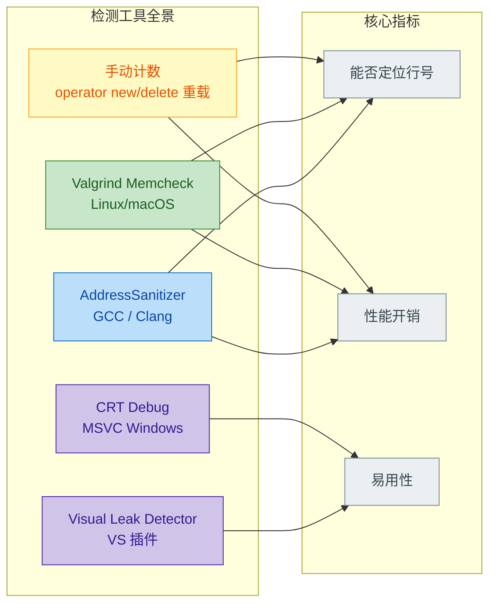

| 工具 | 平台 | 能否定位行号 | 性能开销 | 侵入性 |
|:--|:--|:--|:--|:--|
| 手动计数 | 跨平台 | ❌ 不能 | 极低 | 需改代码 |
| Valgrind | Linux/macOS | ✅ 能 | 10~30x 慢 | 无需改代码 |
| ASan/LSan | Linux/macOS/Win | ✅ 能 | 约 2x 慢 | 需重新编译 |
| CRT Debug | Windows (MSVC) | ✅ 能 | 低 | 需加宏定义 |
| VLD | Windows (VS) | ✅ 能 | 低 | 需加 include |

---

### 实战：一段代码中的多重泄漏

下面给出一个综合示例，把前面讲的多种泄漏原因融合到一个"看似合理"的函数中，然后逐一分析：

```c++
#include <vector>
#include <string>
#include <stdexcept>

class Image {
public:
    int* pixels;                                  // 裸指针成员
    int  width, height;

    Image(int w, int h) : width(w), height(h) {  // 构造函数
        pixels = new int[w * h];                  // 分配像素数组
    }

    // ⚠️ 没有定义析构函数！Rule of Three 被违反
    // 编译器默认析构不会 delete[] pixels
};

void process_images() {
    // ===== 泄漏点 1：容器存裸指针 =====
    std::vector<Image*> gallery;                  // 存 Image 裸指针
    for (int i = 0; i < 10; ++i) {
        gallery.push_back(new Image(100, 100));   // new 了 10 个 Image
    }

    // ===== 泄漏点 2：指针覆盖 =====
    Image* current = new Image(200, 200);         // 分配第 1 张大图
    current = new Image(300, 300);                // 覆盖！第 1 张大图泄漏

    // ===== 泄漏点 3：异常中断 =====
    Image* temp = new Image(50, 50);              // 分配临时图像
    if (temp->width < 100) {
        throw std::runtime_error("Image too small"); // 抛出异常！
    }
    delete temp;                                  // 永远不会执行

    // ===== 泄漏点 4：缺少析构函数 =====
    // 即使所有 Image* 都被 delete 了，Image 内部的 pixels 也不会被释放
    // 因为 Image 没有写析构函数 ~Image() { delete[] pixels; }

    delete current;
    for (auto* img : gallery) delete img;         // 这些代码也因异常到不了
}
```

上面的函数至少有 **4 处泄漏**，每一处都对应我们前面讲过的一个原因。这就是真实项目中的缩影——裸指针 + 手动管理 = 泄漏的温床。

---

### 防泄漏的黄金法则

在学习下一节 RAII 之前，先记住这几条原则：

1. **最小化裸 `new` / `delete`**：能用智能指针（`unique_ptr`, `shared_ptr`）就绝不用裸指针。
2. **谁分配谁释放**：如果一定要用裸指针，必须明确约定所有权。分配者负责释放，或者文档中清晰标注"调用者负责释放"。
3. **一个 `new` 对应一个 `delete`，一个 `new[]` 对应一个 `delete[]`**：绝不能混用。
4. **容器中存智能指针**：`std::vector<std::unique_ptr<T>>` 而非 `std::vector<T*>`。
5. **编写析构函数**：如果你的类拥有裸指针成员，必须遵守 **Rule of Three/Five**，编写析构函数、拷贝构造、拷贝赋值（C++11 还有移动构造和移动赋值）。
6. **善用工具**：把 ASan 或 Valgrind 集成到 CI/CD 流水线中，让每次代码提交都经过泄漏检测。

---

**📝 练习题**

以下代码运行后，总共泄漏了几块堆内存？

```c++
#include <memory>

struct Node {
    std::shared_ptr<Node> next;
};

int main() {
    int* a = new int(1);                          // 语句 ①
    int* b = new int(2);                          // 语句 ②
    delete a;                                      // 语句 ③

    int* c = new int(3);                          // 语句 ④
    c = new int(4);                               // 语句 ⑤

    auto x = std::make_shared<Node>();            // 语句 ⑥
    auto y = std::make_shared<Node>();            // 语句 ⑦
    x->next = y;                                  // 语句 ⑧
    y->next = x;                                  // 语句 ⑨

    delete c;                                      // 语句 ⑩
    return 0;
}
```

A. 2 块


B. 3 块


C. 4 块


D. 5 块

**【答案】** C

**【解析】** 逐条分析每块堆内存的命运：

- **语句 ①** `new int(1)` → 语句 ③ `delete a` 释放。✅ 不泄漏。
- **语句 ②** `new int(2)` → `b` 始终未被 `delete`。❌ **泄漏 1 块**。
- **语句 ④** `new int(3)` → 语句 ⑤ 中 `c` 被覆盖指向新内存，旧地址丢失。❌ **泄漏 1 块**。
- **语句 ⑤** `new int(4)` → 语句 ⑩ `delete c` 释放（此时 `c` 指向语句 ⑤ 分配的内存）。✅ 不泄漏。
- **语句 ⑥⑦** `make_shared<Node>` 创建了两个 Node 对象。语句 ⑧⑨ 形成循环引用（`x->next = y`, `y->next = x`），`main` 结束后引用计数各自从 2 降到 1，不为 0，两个 Node 都不会被析构。❌ **泄漏 2 块**。

总计泄漏：1（`b`）+ 1（`c` 旧值）+ 2（循环引用的两个 Node）= **4 块**。选 C。

---

## RAII 原则 ⭐（Resource Acquisition Is Initialization）

RAII 是 C++ 中**最核心、最具影响力的编程范式之一**，由 C++ 之父 Bjarne Stroustrup 提出。它的名字虽然直译为"资源获取即初始化"，但其真正表达的思想远比名字深刻——**将资源的生命周期与对象的生命周期绑定在一起**，利用 C++ 的构造函数和析构函数的确定性调用（Deterministic Destruction），来自动、安全、无泄漏地管理资源。

理解 RAII，是从"手动管理内存的 C 风格程序员"蜕变为"现代 C++ 工程师"的**分水岭**。前面几节我们探讨了内存区域、`new/delete`、内存泄漏——这些痛点，RAII 几乎全部根治。可以说，如果你写的 C++ 代码中到处充斥着裸 `new`/`delete`，那几乎可以断定你还没有真正理解 RAII。

---

### 问题的根源：手动资源管理的脆弱性

在深入 RAII 之前，让我们重新审视"手动管理资源"为何如此容易出错。资源（Resource）不仅仅指堆内存，还包括：

- **堆内存**（`new` / `malloc` 分配的内存）
- **文件句柄**（`fopen` 返回的 `FILE*`）
- **网络套接字**（Socket fd）
- **互斥锁**（`mutex.lock()`）
- **数据库连接**
- **GPU 资源、纹理对象**……

所有这些资源都有一个共同特征：**获取后必须释放，否则就是泄漏**。手动管理的经典灾难模式如下：

```cpp
void processFile(const std::string& filename) {
    FILE* fp = fopen(filename.c_str(), "r");  // 获取资源：打开文件
    if (!fp) return;                           // 打开失败，直接返回

    int* buffer = new int[1024];               // 获取资源：分配堆内存

    // ---- 中间有大量业务逻辑 ----
    if (someErrorCondition()) {
        // 😱 程序员记得关文件，但忘了 delete buffer！
        fclose(fp);
        return;                                // 内存泄漏！
    }

    if (anotherError()) {
        // 😱 程序员记得 delete buffer，但忘了关文件！
        delete[] buffer;
        return;                                // 文件句柄泄漏！
    }

    // 如果中间某行代码抛出异常（exception）...
    riskyOperation();                          // 💀 异常直接跳出函数
                                               // fclose 和 delete 全都不会执行！

    // ---- 正常路径 ----
    delete[] buffer;                           // 释放内存
    fclose(fp);                                // 关闭文件
}
```

问题一目了然：随着代码路径增多（`if`、`return`、异常），**每条路径上都必须手动释放每一个资源**。这是一种 **O(路径数 × 资源数)** 的复杂度，对人类大脑来说根本不可持续。哪怕最优秀的程序员，在面对十几条路径和五六个资源时也会犯错。

> **核心矛盾**：C++ 的控制流极其灵活（多 return、异常），但手动资源管理要求**每条出口都不遗漏**，两者本质冲突。

RAII 就是为了**彻底消解这个矛盾**而诞生的。

---

### RAII 的核心思想

RAII 的完整语义可以精炼为一句话：

> **在构造函数中获取资源，在析构函数中释放资源。对象生，资源生；对象亡，资源亡。**

这利用了 C++ 语言的一个**铁律级保证**：

- 当一个**栈对象（局部变量）**离开作用域时，无论是正常执行完毕、`return`、还是异常抛出（Stack Unwinding），它的**析构函数一定会被调用**。

这个保证是编译器级别的，不依赖程序员的记忆力。RAII 正是将资源的释放"焊死"在析构函数里，搭上这趟"确定性析构"的列车，实现自动化。

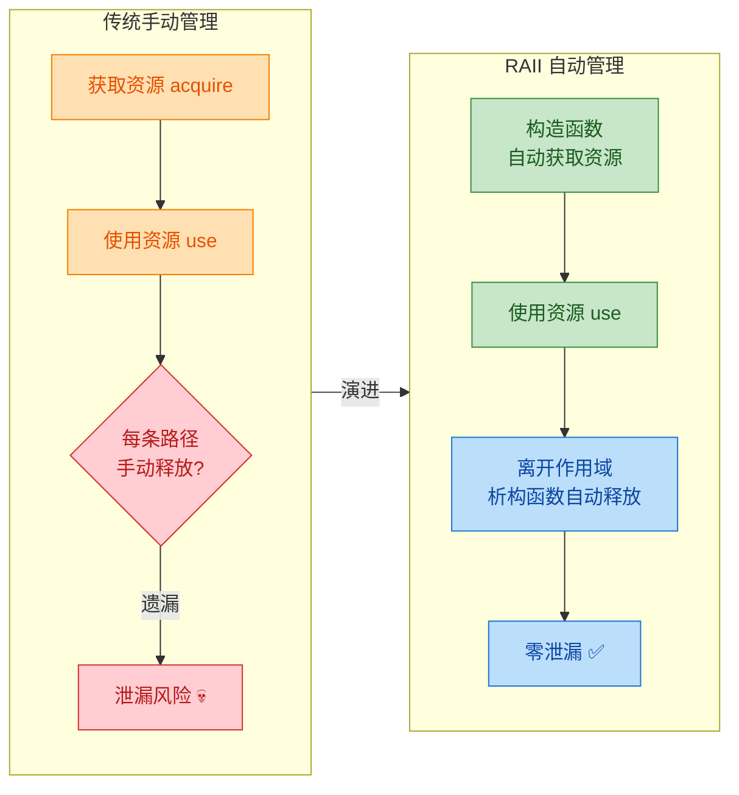

---

### 最简 RAII 示例：从零手写一个资源管理器

让我们从最简单的场景开始——用 RAII 管理一块堆内存。

```cpp
#include <iostream>   // 引入标准输入输出
#include <cstddef>    // 引入 size_t

class IntBuffer {
private:
    int* data_;       // 底层裸指针，指向堆内存
    size_t size_;     // 缓冲区大小

public:
    // ========== 构造函数：获取资源 ==========
    explicit IntBuffer(size_t size)
        : data_(new int[size]{}),   // 在构造函数中 new 分配内存（RAII 的 "RA" 部分）
          size_(size)               // 记录大小
    {
        std::cout << "资源已获取: 分配了 " << size_ << " 个 int\n";
    }

    // ========== 析构函数：释放资源 ==========
    ~IntBuffer() {
        delete[] data_;             // 在析构函数中 delete 释放内存（RAII 的核心保证）
        std::cout << "资源已释放: 归还了 " << size_ << " 个 int 的内存\n";
    }

    // ========== 禁止拷贝（防止双重释放） ==========
    IntBuffer(const IntBuffer&) = delete;              // 禁用拷贝构造
    IntBuffer& operator=(const IntBuffer&) = delete;   // 禁用拷贝赋值

    // ========== 提供访问接口 ==========
    int& operator[](size_t index) {         // 重载下标运算符，方便使用
        return data_[index];                // 直接返回引用
    }

    size_t size() const { return size_; }   // 获取大小
};
```

使用这个 RAII 类：

```cpp
void demo() {
    IntBuffer buf(10);     // 构造时自动分配 10 个 int 的堆内存

    buf[0] = 42;           // 像普通数组一样使用
    buf[1] = 100;          // 写入数据

    std::cout << buf[0] << std::endl;  // 输出 42

    if (true) {
        return;            // 提前返回——不用担心！析构函数照样会被调用 ✅
    }

    // 无论从哪条路径离开这个函数
    // buf 的析构函数 ~IntBuffer() 都会自动执行
    // delete[] data_ 一定会被调用，内存一定会被释放
}  // <-- buf 离开作用域，~IntBuffer() 在这里自动调用
```

```
输出：
资源已获取: 分配了 10 个 int
42
资源已释放: 归还了 10 个 int 的内存
```

注意关键点：**我们没有写任何 `delete`**。内存的释放完全交给了析构函数，而析构函数的调用完全交给了编译器。程序员只需要管好"创建对象"，"销毁"是自动的。

---

### RAII 与异常安全（Exception Safety）

RAII 最闪耀的时刻是在**异常**面前。C++ 的异常机制保证：当异常抛出时，会进行**栈展开（Stack Unwinding）**，所有已构造的栈对象的析构函数会被**逆序调用**。

```cpp
void riskyWork() {
    IntBuffer a(100);     // ① 构造 a，分配 100 个 int
    IntBuffer b(200);     // ② 构造 b，分配 200 个 int

    throw std::runtime_error("出错了！");  // ③ 抛出异常！

    // 下面的代码不会执行，但不用担心：
    // 栈展开时，先析构 b（后构造的先析构），再析构 a
    // 内存全部自动释放，零泄漏 ✅
}

int main() {
    try {
        riskyWork();
    } catch (const std::exception& e) {
        std::cout << "捕获异常: " << e.what() << std::endl;
        // 此时 a 和 b 的内存早已被安全释放
    }
}
```

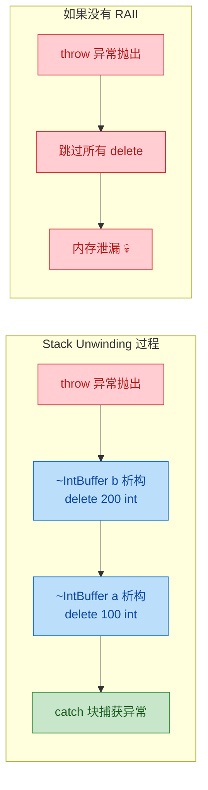

这就是为什么现代 C++ 强烈反对裸 `new`/`delete`——它们无法在异常面前自保，而 RAII 对象可以。

---

### RAII 的经典应用场景

RAII 不仅仅用于管理内存，它是一种**通用的资源管理哲学**。以下是 C++ 标准库和工程实践中最常见的 RAII 应用：

#### 场景一：智能指针管理堆内存

这是 RAII 最广为人知的应用。C++11 引入了 `std::unique_ptr` 和 `std::shared_ptr`，它们就是标准库提供的 RAII 内存管理器。

```cpp
#include <memory>     // 智能指针头文件
#include <iostream>

class Monster {
public:
    std::string name;                              // 怪物名称
    Monster(std::string n) : name(std::move(n)) {  // 构造函数
        std::cout << name << " 诞生了!\n";
    }
    ~Monster() {                                   // 析构函数
        std::cout << name << " 被消灭了!\n";
    }
};

void battle() {
    // unique_ptr: 独占所有权的智能指针（最常用）
    // make_unique 在内部调用 new，返回一个 unique_ptr
    auto goblin = std::make_unique<Monster>("哥布林");

    // shared_ptr: 共享所有权的智能指针（引用计数）
    auto dragon = std::make_shared<Monster>("巨龙");

    std::cout << "战斗开始！\n";

    // 使用 -> 访问成员，和裸指针用法一致
    std::cout << goblin->name << " vs " << dragon->name << "\n";

    // 无需 delete！离开作用域时：
    // dragon 的引用计数降为 0，自动 delete
    // goblin 自动 delete
}  // <-- 析构函数自动调用，内存自动释放
```

```
输出：
哥布林 诞生了!
巨龙 诞生了!
战斗开始！
哥布林 vs 巨龙
巨龙 被消灭了!
哥布林 被消灭了!
```

> **现代 C++ 黄金法则**：用 `std::make_unique` 替代 `new`，用 `std::unique_ptr` 替代裸指针。当你的代码中没有一个裸 `new`/`delete` 时，你已经掌握了 RAII 的精髓。

#### 场景二：文件句柄管理（std::fstream）

标准库的文件流对象本身就是 RAII 的：

```cpp
#include <fstream>    // 文件流头文件
#include <string>

void readConfig() {
    // ifstream 构造时自动打开文件（资源获取）
    std::ifstream file("config.txt");

    if (!file.is_open()) {              // 检查是否打开成功
        std::cerr << "无法打开配置文件\n";
        return;                         // 即使这里 return，file 也会被正确析构
    }

    std::string line;
    while (std::getline(file, line)) {  // 逐行读取
        std::cout << line << "\n";      // 输出每一行
    }

    // 无需手动 file.close()！
    // ifstream 的析构函数会自动关闭文件句柄
}  // <-- ~ifstream() 自动调用 close()
```

对比 C 语言的 `fopen`/`fclose`，C++ 的 `fstream` 完全消除了忘记关闭文件的风险。

#### 场景三：互斥锁管理（std::lock_guard）

在多线程编程中，忘记解锁（unlock）是比忘记 `delete` 更致命的 Bug——它会导致**死锁**（Deadlock），整个程序永久卡死。RAII 是解决这一问题的标准方案：

```cpp
#include <mutex>      // 互斥锁头文件
#include <iostream>

std::mutex mtx;       // 全局互斥锁
int shared_counter = 0;  // 共享计数器

void safeIncrement() {
    // lock_guard 构造时自动调用 mtx.lock()（获取锁资源）
    std::lock_guard<std::mutex> guard(mtx);

    // 临界区：此时只有一个线程能执行到这里
    ++shared_counter;                          // 安全地修改共享数据
    std::cout << "counter = " << shared_counter << "\n";

    if (shared_counter > 100) {
        return;   // 提前返回？没关系！guard 析构会自动 unlock ✅
    }

    // 如果这里抛异常？也没关系！栈展开会析构 guard，自动 unlock ✅

}  // <-- ~lock_guard() 自动调用 mtx.unlock()，绝不会忘记解锁
```

如果用手动 `lock()`/`unlock()`，一旦中间有 `return` 或异常，锁就永远不会释放。`lock_guard` 彻底解决了这个问题。

---

### 手写一个通用 RAII 包装器

为了加深理解，我们来实现一个可以管理**任意资源**的通用 RAII 类。这种技巧在实际工程中非常实用——当你需要和 C 风格 API 交互时，可以快速将其包装为 RAII 风格。

```cpp
#include <functional>  // std::function
#include <iostream>

// ========== 通用 RAII 守卫类 ==========
class ScopeGuard {
private:
    std::function<void()> cleanup_;  // 存储清理函数（释放资源的操作）
    bool active_;                    // 标记是否需要执行清理

public:
    // 构造函数：接收一个"清理函数"
    explicit ScopeGuard(std::function<void()> cleanup)
        : cleanup_(std::move(cleanup)),  // 移动语义保存清理函数
          active_(true)                  // 默认激活
    {}

    // 析构函数：如果仍处于激活状态，执行清理
    ~ScopeGuard() {
        if (active_) {          // 只有激活状态才清理
            cleanup_();         // 调用清理函数（释放资源）
        }
    }

    // 手动取消清理（在某些场景下有用）
    void dismiss() {
        active_ = false;        // 标记为非激活，析构时不再清理
    }

    // 禁止拷贝
    ScopeGuard(const ScopeGuard&) = delete;
    ScopeGuard& operator=(const ScopeGuard&) = delete;
};
```

使用它包装 C 风格的资源：

```cpp
#include <cstdio>     // C 风格文件操作

void processWithCApi() {
    // 用 C API 打开文件
    FILE* fp = fopen("data.bin", "rb");          // C 风格打开文件
    if (!fp) return;                              // 打开失败则返回

    // 创建 RAII 守卫：无论函数怎么退出，都会执行 fclose
    ScopeGuard fileGuard([fp]() {                 // lambda 捕获 fp
        fclose(fp);                               // 清理操作：关闭文件
        std::cout << "文件已自动关闭\n";
    });

    // 分配 C 风格内存
    void* rawMem = malloc(4096);                  // C 风格分配内存
    ScopeGuard memGuard([rawMem]() {              // 再创建一个守卫
        free(rawMem);                             // 清理操作：释放内存
        std::cout << "内存已自动释放\n";
    });

    // ---- 大量业务逻辑 ----
    // 可以有任意多的 return、可以抛异常
    // 不需要在每条路径上手动释放资源

    if (ferror(fp)) {
        return;   // 提前返回：memGuard 先析构(free)，fileGuard 再析构(fclose) ✅
    }

    // 正常结束也一样安全
}  // <-- 离开作用域：两个 ScopeGuard 自动执行清理
```

这个 `ScopeGuard` 模式在工业代码中极为常见，Facebook 的 Folly 库就提供了更完善的 `SCOPE_EXIT` / `SCOPE_FAIL` / `SCOPE_SUCCESS` 宏。

---

### RAII 的设计要点与陷阱

#### 要点 1：拷贝语义的处理

一个 RAII 对象"拥有"资源，如果允许随意拷贝，两个对象会指向同一份资源，导致**双重释放**（Double Free）。有三种经典策略：

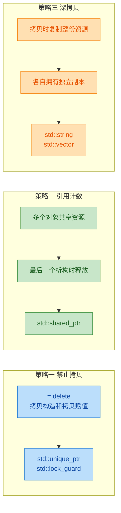

```cpp
// 策略一：禁止拷贝（最简单、最常用）
class NoCopy {
    int* p;
public:
    NoCopy() : p(new int(0)) {}           // 构造：获取资源
    ~NoCopy() { delete p; }               // 析构：释放资源
    NoCopy(const NoCopy&) = delete;       // 禁止拷贝构造
    NoCopy& operator=(const NoCopy&) = delete;  // 禁止拷贝赋值
    // 可以提供移动语义（转移所有权）
    NoCopy(NoCopy&& other) noexcept       // 移动构造
        : p(other.p) {                    // 接管对方的资源
        other.p = nullptr;                // 对方置空，避免双重释放
    }
};
```

#### 要点 2：析构函数不应抛异常

RAII 的整个机制建立在"析构函数一定能安全执行"的基础上。如果析构函数本身抛出异常，在栈展开过程中会导致 `std::terminate()`，程序直接崩溃。

```cpp
class BadRAII {
public:
    ~BadRAII() {
        // ❌ 绝对不要在析构函数中抛异常！
        // throw std::runtime_error("析构出错");

        // ✅ 正确做法：捕获并处理/忽略异常
        try {
            riskyCleanup();        // 如果清理操作可能出错
        } catch (...) {
            // 记录日志，但不要重新抛出
            std::cerr << "清理时发生错误，已忽略\n";
        }
    }
};
```

#### 要点 3：资源获取失败时应在构造函数中抛异常

如果资源获取失败（如文件打不开、内存分配失败），应该在构造函数中抛出异常。这样对象"未能完成构造"，析构函数**不会被调用**（C++ 保证只析构完全构造的对象），不会产生错误的清理操作。

```cpp
class DatabaseConnection {
    Connection* conn_;              // 数据库连接句柄
public:
    DatabaseConnection(const std::string& url) {
        conn_ = db_connect(url.c_str());  // 尝试连接数据库
        if (!conn_) {
            // 获取资源失败，抛出异常
            // 由于构造未完成，~DatabaseConnection() 不会被调用
            throw std::runtime_error("数据库连接失败: " + url);
        }
    }
    ~DatabaseConnection() {
        db_disconnect(conn_);       // 只有构造成功才会执行到这里
    }
};
```

---

### RAII 与"三/五/零法则"的关系

RAII 类通常需要遵循 C++ 的资源管理法则：

| 法则 | 含义 | 适用场景 |
|:---|:---|:---|
| **Rule of Zero**（零法则） | 不自定义析构、拷贝、移动中的任何一个 | 类只使用 RAII 成员（如 `unique_ptr`、`string`、`vector`） |
| **Rule of Three**（三法则） | 自定义了析构，就必须同时自定义拷贝构造和拷贝赋值 | C++11 之前的资源管理类 |
| **Rule of Five**（五法则） | 在三法则基础上，还需自定义移动构造和移动赋值 | C++11 及之后的资源管理类 |

**最佳实践：追求 Rule of Zero。** 如果你的类只使用标准库的 RAII 组件（智能指针、容器、`string`等）作为成员变量，编译器自动生成的析构/拷贝/移动函数就能正确工作，你不需要手写任何一个：

```cpp
// ✅ Rule of Zero 的典范——完美的资源管理，零手写特殊函数
class GameWorld {
    std::unique_ptr<Player> player_;             // 独占所有权的玩家对象
    std::vector<std::shared_ptr<Monster>> monsters_;  // 共享所有权的怪物列表
    std::string worldName_;                      // 世界名称

    // 不需要写析构函数 —— unique_ptr 自动 delete Player
    // 不需要写拷贝/移动 —— unique_ptr 已禁止拷贝，移动自动生效
    // 一切都是自动的！
public:
    GameWorld(std::string name) : worldName_(std::move(name)) {}
    // ... 业务方法 ...
};
```

---

### RAII 在现代 C++ 标准库中的全面渗透

RAII 不是一个孤立的技巧，它是整个 C++ 标准库的**设计哲学基石**。你能想到的几乎所有标准库组件都遵循 RAII：

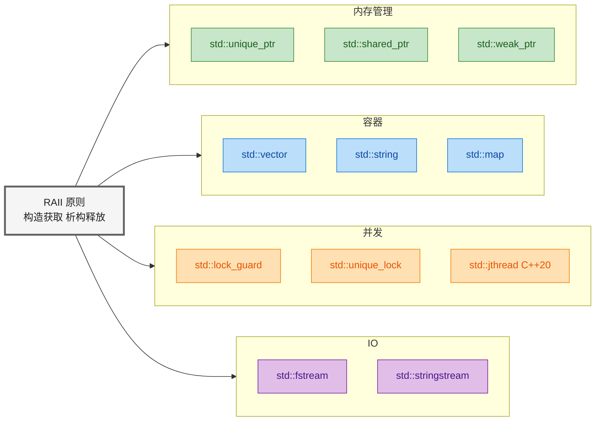

每一个标准容器（`vector`、`map`、`set`……）都在析构时自动释放内存；每一个智能指针都在析构时自动 `delete`；每一个锁守卫都在析构时自动 `unlock`。当你使用这些组件时，你已经在享受 RAII 的好处了。

---

### RAII 的哲学总结

最后，让我们从更高的视角审视 RAII：

| 维度 | 手动管理 | RAII |
|:---|:---|:---|
| **正确性** | 依赖程序员记忆力 | 依赖编译器保证 |
| **异常安全** | 极难做到 | 天然具备 |
| **代码简洁** | 充斥 `if/goto/cleanup` | 业务逻辑清晰纯粹 |
| **可维护性** | 新增路径需逐一检查 | 新增路径无需额外处理 |
| **并发安全** | 死锁风险高 | `lock_guard` 自动解锁 |

RAII 之所以成为 C++ 的灵魂，是因为它将"人的责任"转化为"编译器的保证"。正如 Bjarne Stroustrup 所说的理念——C++ 的核心设计目标之一就是让资源管理既安全又高效，而 RAII 正是实现这一目标的基石。

> **一句话总结**：在现代 C++ 中，**裸 `new`/`delete` 是代码异味（code smell）**。优先使用智能指针和标准容器，让 RAII 为你守护每一份资源。这不是建议，而是**工程纪律**。

---

**📝 练习题**

以下代码存在资源管理问题，请选出**最符合 RAII 原则**的修复方案：

```cpp
void loadTexture(const std::string& path) {
    int* pixels = new int[1024 * 1024];
    FILE* file = fopen(path.c_str(), "rb");
    if (!file) {
        delete[] pixels;
        return;
    }
    fread(pixels, sizeof(int), 1024 * 1024, file);
    processPixels(pixels);   // 可能抛出异常
    fclose(file);
    delete[] pixels;
}
```

A. 在 `processPixels` 前后加 `try-catch`，在 `catch` 块中手动执行 `fclose` 和 `delete[]`


B. 使用 `std::unique_ptr<int[]>` 管理 `pixels`，使用 `std::ifstream` 替代 `fopen/fclose`


C. 把 `delete[] pixels` 和 `fclose(file)` 移动到函数开头


D. 将 `pixels` 改为全局变量，函数结束后由 `main` 函数统一释放


**【答案】** B

**【解析】**

选项 B 是标准的 RAII 改造方案。`std::unique_ptr<int[]> pixels(new int[1024 * 1024])` （或更好的 `auto pixels = std::make_unique<int[]>(1024 * 1024)`）将堆内存的释放绑定在 `unique_ptr` 的析构函数上；`std::ifstream` 将文件句柄的关闭绑定在 `ifstream` 的析构函数上。无论 `processPixels` 是否抛出异常，无论函数从哪条路径返回，两者的析构函数都会在离开作用域时自动调用。

选项 A 的 `try-catch` 方案虽然能临时修补异常路径，但属于典型的"手动管理"思维——每新增一个资源或一条代码路径，就要在 `catch` 中多写一行释放代码，**复杂度随路径数指数增长**，完全没有利用 C++ 的语言特性。

选项 C 在语法上毫无意义——资源还没使用就释放，属于逻辑错误。

选项 D 使用全局变量是严重的反模式：破坏封装、引入并发隐患、生命周期不可控，与 RAII 原则完全背道而驰。

---

## 本章小结

本章系统地梳理了 C++ 内存管理的五大核心板块：**内存区域划分**、**new/delete 操作符**、**数组 new[]/delete[]**、**内存泄漏**以及 **RAII 原则**。这些知识点环环相扣，构成了 C++ 程序员必须精通的底层能力体系。下面我们以"**回顾 → 串联 → 提炼**"的思路，对全章做一次深度总结。

---

### 全章知识脉络总览

我们先用一张全景图，把本章所有知识点之间的逻辑关系可视化呈现。理解它们的层级与依赖，比孤立记忆每个点要高效得多。

```mermaid
graph LR
    subgraph SG1["🧠 内存区域"]
        direction TB
        A1["栈 Stack<br/>自动分配/释放"]
        A2["堆 Heap<br/>手动分配/释放"]
        A3["全局/静态区<br/>程序生命周期"]
        A4["代码区 .text<br/>只读指令"]
    end

    subgraph SG2["🔧 手动管理工具"]
        direction TB
        B1["new / delete<br/>单对象"]
        B2["new[] / delete[]<br/>数组对象"]
        B3["malloc / free<br/>C 风格"]
    end

    subgraph SG3["⚠️ 内存问题"]
        direction TB
        C1["内存泄漏<br/>忘记释放"]
        C2["重复释放<br/>double free"]
        C3["悬空指针<br/>dangling ptr"]
        C4["new/delete 不匹配<br/>UB"]
    end

    subgraph SG4["🛡️ 解决方案 RAII"]
        direction TB
        D1["unique_ptr<br/>独占所有权"]
        D2["shared_ptr<br/>共享所有权"]
        D3["weak_ptr<br/>打破循环引用"]
        D4["自定义 RAII 类<br/>封装资源"]
    end

    SG1 -->|"堆区需要"| SG2
    SG2 -->|"使用不当导致"| SG3
    SG3 -->|"根治方案"| SG4

    classDef green fill:#C8E6C9,stroke:#388E3C,color:#1B5E20
    classDef blue fill:#BBDEFB,stroke:#1976D2,color:#0D47A1
    classDef orange fill:#FFE0B2,stroke:#F57C00,color:#E65100
    classDef red fill:#FFCDD2,stroke:#E53935,color:#B71C1C

    class A1,A2,A3,A4 green
    class B1,B2,B3 blue
    class C1,C2,C3,C4 orange
    class D1,D2,D3,D4 red
```

这张图揭示了一条清晰的**因果链**：

> **内存区域划分** → 堆区需要手动管理 → **new/delete** 是管理工具 → 工具使用不当引发 **内存问题** → **RAII** 是终极解决方案。

掌握这条主线，就等于掌握了本章的灵魂。

---

### 核心知识点回顾与串联

#### 一、四大内存区域 —— 一切的起点

C++ 程序运行时的内存被操作系统划分为四大区域，每个区域的生命周期管理方式截然不同：

| 区域 | 分配方式 | 释放方式 | 存储内容 | 核心特征 |
|:---:|:---:|:---:|:---:|:---:|
| **栈 (Stack)** | 编译器自动 | 函数返回时自动 | 局部变量、函数参数 | 速度极快，空间有限（通常 1-8 MB） |
| **堆 (Heap)** | 程序员手动 (`new`) | 程序员手动 (`delete`) | 动态分配的对象 | 空间大，但需自行管理 |
| **全局/静态区** | 程序启动时 | 程序结束时 | `static`、全局变量 | 生命周期贯穿整个进程 |
| **代码区 (.text)** | 加载时映射 | 程序结束时卸载 | 机器指令、字面常量 | 只读，共享 |

**关键认知**：栈、全局/静态区、代码区的内存都是"自动管理"的，**唯独堆区需要程序员负责**。这就是为什么本章后续所有的知识点——`new/delete`、内存泄漏、RAII——全部围绕着堆区展开。

```c++
// ======= 一图胜千言：各变量住在哪里？ =======
int g_val = 10;                  // 全局区（BSS/Data 段）

static int s_val = 20;           // 全局/静态区

const char* literal = "hello";   // "hello" 在代码区（字符串常量区）
                                 // literal 指针本身：全局区

void func() {
    int local = 30;              // 栈区：函数返回即销毁
    static int s_local = 40;     // 全局/静态区：函数结束不销毁
    int* p = new int(50);        // p 在栈区，*p (值50) 在堆区
    delete p;                    // 手动释放堆区内存
}
```

#### 二、new/delete vs malloc/free —— C++ 的灵魂升级

这是 C++ 相对 C 在内存管理上最重要的进化。区别不止于语法糖，而是**类型安全 + 对象语义**的根本变革。

| 对比维度 | `malloc` / `free` | `new` / `delete` |
|:---:|:---:|:---:|
| 类型 | 函数（库函数） | 运算符（operator） |
| 返回值 | `void*`，需强转 | 精确类型指针 |
| 构造/析构 | ❌ 不调用 | ✅ 自动调用 |
| 失败处理 | 返回 `NULL` | 抛出 `std::bad_alloc` |
| 可重载 | ❌ | ✅ `operator new` |
| 大小计算 | 手动 `sizeof` | 自动推断 |

**总结口诀**：在 C++ 中，**永远用 new/delete，拒绝 malloc/free**。除非你在与 C 库交互或实现自定义内存池。

#### 三、new[] / delete[] —— 必须严格配对

这是新手最容易踩的坑之一。`new[]` 与 `delete[]` 的配对关系是**强制性**的，不可混用。

```c++
// ===== 正确用法 =====
int* arr = new int[5];       // 分配 5 个 int 的数组
delete[] arr;                // 必须用 delete[]，逐个析构 + 释放

MyClass* objs = new MyClass[3]; // 调用 3 次构造函数
delete[] objs;                  // 调用 3 次析构函数 + 释放整块内存

// ===== 灾难用法 =====
int* arr2 = new int[5];
delete arr2;                 // ❌ 未定义行为 (Undefined Behavior)！

MyClass* objs2 = new MyClass[3];
delete objs2;                // ❌ 只调用了 1 次析构函数，资源泄漏 + UB
```

**本质原因**：`new[]` 会在内存块头部额外存储**元素个数 (count)**，`delete[]` 据此得知需要调用多少次析构函数。如果用 `delete` 去释放 `new[]` 的内存，它无法正确解析这个 count，导致未定义行为。

```
  new int[5] 的内存布局（典型实现）:
  ┌──────────┬───────┬───────┬───────┬───────┬───────┐
  │ count: 5 │ [0]   │ [1]   │ [2]   │ [3]   │ [4]   │
  └──────────┴───────┴───────┴───────┴───────┴───────┘
  ↑                   ↑
  实际分配起点         new[] 返回的指针
```

#### 四、内存泄漏 —— 堆区的慢性毒药

内存泄漏 (Memory Leak) 是堆区内存分配后未释放、且丢失了最后一个指向它的指针，导致这块内存再也无法被回收的现象。

**六大常见泄漏场景速查**：

| # | 场景 | 根本原因 |
|:---:|:---|:---|
| 1 | 忘记 `delete` | 最原始的错误 |
| 2 | 异常中途抛出 | `new` 和 `delete` 之间的代码抛异常，`delete` 被跳过 |
| 3 | 指针被覆盖 | 旧地址丢失，无法释放 |
| 4 | 容器存裸指针 | 容器析构不会 `delete` 元素指向的堆内存 |
| 5 | 循环引用 | `shared_ptr` 互相引用，引用计数永远不为 0 |
| 6 | 基类析构非虚 | 通过基类指针 `delete` 派生类对象，派生部分泄漏 |

**检测工具**：Valgrind（Linux）、AddressSanitizer（GCC/Clang `-fsanitize=address`）、Visual Studio CRT Debug、Dr. Memory 等。

#### 五、RAII —— C++ 内存管理的终极哲学

**RAII (Resource Acquisition Is Initialization)** 是 C++ 最具标志性的编程范式：将资源的获取绑定到对象的构造中，将资源的释放绑定到对象的析构中。由于 C++ 保证局部对象在离开作用域时一定会调用析构函数（即使是异常退出），RAII 天然地实现了异常安全的资源管理。

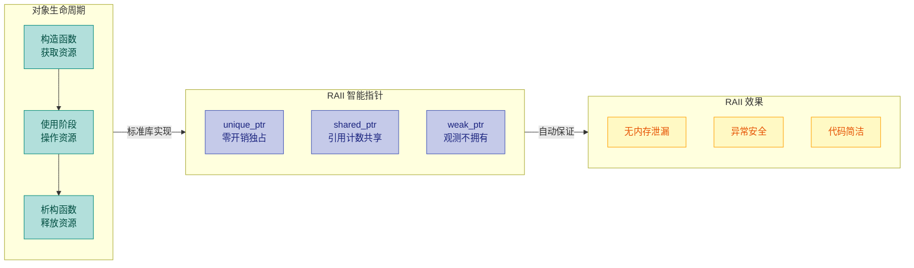

RAII 的核心智能指针选型指南：

| 场景 | 选择 | 理由 |
|:---:|:---:|:---|
| 独占资源，不需共享 | `unique_ptr` | 零开销，移动语义，默认首选 |
| 多处共享同一资源 | `shared_ptr` | 引用计数自动管理生命周期 |
| 观测共享资源，不参与所有权 | `weak_ptr` | 打破循环引用，安全观测 |
| 管理非内存资源（文件、锁等） | 自定义 RAII 类 | 构造获取、析构释放 |

---

### 黄金法则提炼

经过整章学习，我们可以把 C++ 内存管理的最佳实践浓缩为 **五条黄金法则**：

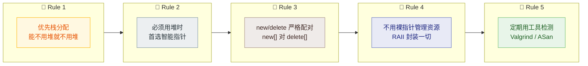

1. **栈优先 (Prefer Stack)**：局部变量、小对象、固定大小数组，全部放栈上。编译器自动管理，零泄漏风险，缓存命中率高。

2. **智能指针优先 (Prefer Smart Pointers)**：当必须使用堆分配时，`std::make_unique` 和 `std::make_shared` 是你的第一选择，而不是裸 `new`。

3. **严格配对 (Strict Pairing)**：如果不得不使用裸 `new`/`delete`，务必保证 `new` 配 `delete`，`new[]` 配 `delete[]`，绝不混用。

4. **RAII 封装一切资源 (RAII Wraps Everything)**：不只是内存——文件句柄、互斥锁、数据库连接、网络 socket，所有资源都应该用 RAII 类封装。

5. **工具检测常态化 (Use Tools Regularly)**：Valgrind、AddressSanitizer、LeakSanitizer 应成为 CI/CD 流水线的标配，而非事后补救。

---

### 现代 C++ 的趋势：走向"零裸指针"

最后值得一提的是，现代 C++（C++11 及之后）的内存管理哲学正在经历一场**范式转移**：

```c++
// ===== 古典 C++ 风格（C++98）=====
Widget* w = new Widget();        // 裸 new
// ... 几百行代码后 ...
delete w;                        // 祈祷没人忘记这行

// ===== 现代 C++ 风格（C++14+）=====
auto w = std::make_unique<Widget>(); // 智能指针，自动管理
// ... 几百行代码后 ...
// 什么都不用做，离开作用域自动释放
```

在现代 C++ 的最佳实践中：

- **`new` 和 `delete` 几乎不应该出现在业务代码中**。它们应该被封装在库代码、容器实现或自定义分配器中。
- **所有权语义通过类型系统表达**：`unique_ptr` 表示独占，`shared_ptr` 表示共享，裸指针（`T*`）和引用（`T&`）仅表示"借用 / 观察"，不拥有资源。
- **`std::make_unique` / `std::make_shared`** 替代直接 `new`，同时避免了异常安全问题和潜在的内存泄漏窗口。

这就是 C++ 内存管理的完整图景：从最底层的内存区域划分，到手动管理工具 `new`/`delete`，到手动管理可能引发的内存泄漏，再到终极解决方案 RAII。理解了这条线索，你就掌握了 C++ 最核心也最困难的部分之一。

---

**📝 练习题 1**

以下代码存在内存管理问题，请问最准确的描述是？

```c++
class Engine {
public:
    Engine() { std::cout << "Engine()\n"; }
    ~Engine() { std::cout << "~Engine()\n"; }
};

int main() {
    Engine* engines = new Engine[3];
    delete engines;  // 注意：没有用 delete[]
    return 0;
}
```

A. 编译错误，`delete` 不能用于数组指针


B. 运行时一定崩溃 (Segmentation Fault)


C. 未定义行为 (UB)，可能只调用 1 次析构函数，且可能导致堆损坏


D. 行为正确，`delete` 和 `delete[]` 在 POD 类型以外没有区别


**【答案】** C

**【解析】** `new Engine[3]` 分配了 3 个 `Engine` 对象的数组，必须用 `delete[]` 释放。使用 `delete`（不带 `[]`）释放 `new[]` 分配的内存属于**未定义行为 (Undefined Behavior)**。在典型实现中，`delete` 只会调用第一个元素的析构函数（输出 1 次 `~Engine()`），剩余 2 个对象的析构函数不会被调用，造成资源泄漏。更严重的是，由于 `new[]` 通常在内存块头部存储了数组元素个数，`delete` 按单对象方式释放时传给底层 `free` 的地址可能偏移不正确，导致**堆损坏 (heap corruption)**。选项 A 错误，因为编译器不会报错（语法合法但语义错误）；选项 B 不准确，UB 不一定立刻崩溃，可能表面正常运行但已埋下隐患；选项 D 完全错误，`delete` 和 `delete[]` 在任何包含析构函数的类型上都有本质区别。

---

**📝 练习题 2**

以下哪段代码**最符合**现代 C++ 的 RAII 最佳实践？

```c++
// 选项 A
void processA() {
    Widget* w = new Widget();
    w->doWork();
    delete w;
}

// 选项 B
void processB() {
    std::shared_ptr<Widget> w(new Widget());
    w->doWork();
}

// 选项 C
void processC() {
    auto w = std::make_unique<Widget>();
    w->doWork();
}

// 选项 D
void processD() {
    Widget* w = (Widget*)malloc(sizeof(Widget));
    w->doWork();
    free(w);
}
```

A. `processA`


B. `processB`


C. `processC`


D. `processD`


**【答案】** C

**【解析】** 逐一分析四个选项：

- **选项 A** 使用裸 `new`/`delete`，如果 `doWork()` 抛出异常，`delete` 将被跳过，造成内存泄漏，不满足异常安全要求。
- **选项 B** 使用了 `shared_ptr`，虽然实现了自动释放，但存在两个问题：① 这里不需要共享所有权，`shared_ptr` 的引用计数带来不必要的开销；② 直接用 `new` 构造 `shared_ptr` 而非 `make_shared`，会导致两次内存分配（一次分配对象，一次分配控制块），且在某些表达式中可能存在异常安全漏洞。
- **选项 C** 是**最佳实践**：`make_unique` 一步到位完成分配和智能指针构造，零开销独占所有权，异常安全，离开作用域自动析构。不需要共享时，`unique_ptr` 永远是首选。
- **选项 D** 使用 C 风格的 `malloc`/`free`，完全不会调用 `Widget` 的构造和析构函数，在 C++ 中对非 POD 类型使用是严重错误。

---

