---

# 指针与引用 ⭐⭐

---

## 指针基础（声明、取地址 `&`、解引用 `*`）

在 C++ 的世界里，**指针 (Pointer)** 是最强大也最容易令人困惑的核心概念之一。它让你能够直接操控内存，是理解动态分配、数据结构、操作系统接口乃至整个 C++ 对象模型的基石。本节将从最底层的内存模型出发，一步一步带你彻底理解指针的声明、取地址和解引用。

---

### 什么是指针？—— 从内存模型谈起

要理解指针，必须先理解**内存 (Memory)** 的工作方式。你可以把计算机内存想象成一排连续的、编了号的小格子。每个格子可以存放一定大小的数据（通常以**字节 Byte** 为单位），而每个格子的编号就是它的**内存地址 (Memory Address)**。

当你声明一个变量时，编译器会在内存中为这个变量分配一块空间。例如 `int a = 42;`，编译器可能会把 `a` 放在地址 `0x7ffc01` 开始的 4 个字节里（`int` 通常占 4 字节）。

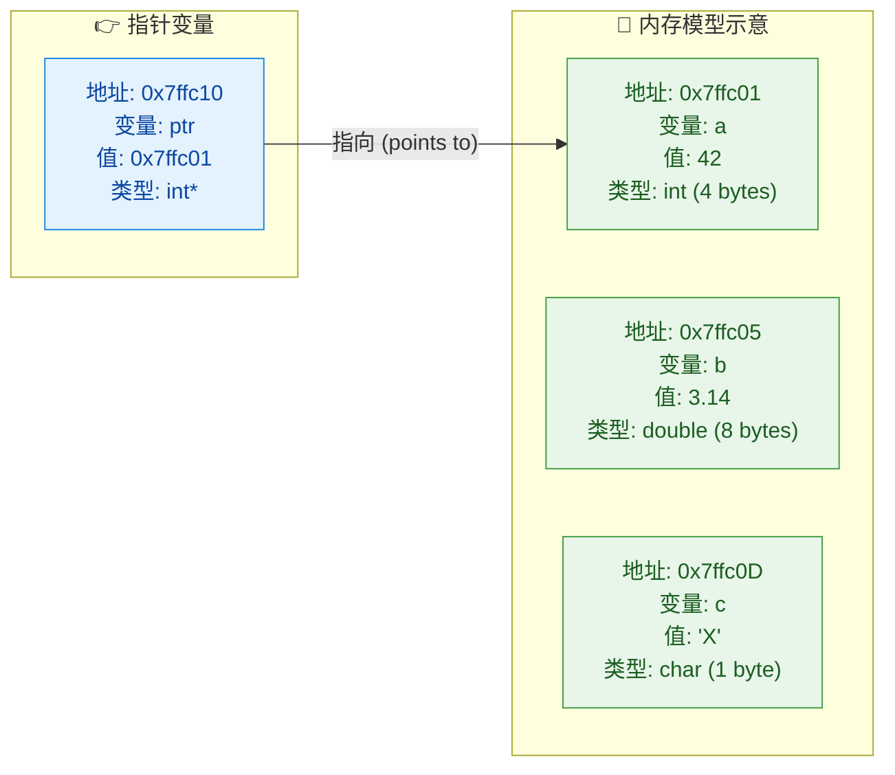

从图中可以清晰地看到：**指针变量 `ptr` 本身也是一个变量**，它也有自己的地址（`0x7ffc10`），它也存放着一个值——只不过这个值不是普通的数字，而是**另一个变量的内存地址**（`0x7ffc01`，即变量 `a` 的地址）。

> 💡 **一句话总结**：指针就是一个**存储内存地址的变量**。它的值 (value) 是另一个变量在内存中的地址。(A pointer is a variable that holds the memory address of another variable.)

---

### 指针的声明

声明一个指针变量的语法如下：

```
数据类型* 指针变量名;
```

其中 `*` 号（星号）紧跟在类型后面（或变量名前面），表示 "这是一个指向该类型的指针"。来看几种常见的声明风格：

```cpp
// ============ 指针声明的三种书写风格 ============
// 它们在语义上完全等价，只是代码风格不同

int* p1;    // 风格一：星号靠近类型 (推荐，C++ 社区主流风格)
int *p2;    // 风格二：星号靠近变量名 (C 语言传统风格)
int * p3;   // 风格三：星号两边都有空格 (较少见)
```

虽然三种风格功能相同，但**强烈推荐风格一** `int* p`，因为它在视觉上更直观地表达了 "p 的类型是 `int*`（指向 int 的指针）" 这一含义。

#### ⚠️ 经典陷阱：同一行声明多个指针

这是初学者最容易踩的坑之一：

```cpp
int* p1, p2;   // 注意！p1 是 int*（指针），但 p2 只是一个普通 int！
```

在 C++ 的语法中，`*` 是**绑定到变量名**而不是类型的。所以 `int* p1, p2;` 实际上被编译器解析为 `int (*p1), (p2);`。如果你需要在同一行声明两个指针，必须每个变量都带 `*`：

```cpp
int *p1, *p2;   // 正确：p1 和 p2 都是 int* 类型
// 或者更好的做法 —— 分开写（最推荐）
int* p1;        // p1 是 int*
int* p2;        // p2 是 int*
```

#### 指针可以指向各种类型

指针本身只存储地址，但**类型信息**决定了编译器如何解读该地址处的数据：

```cpp
int* pi;        // 指向 int 的指针
double* pd;     // 指向 double 的指针
char* pc;       // 指向 char 的指针
std::string* ps;// 指向 std::string 对象的指针
```

不同类型的指针在**大小**上通常是一样的（在 64 位系统上都是 8 字节），但它们在**解引用时读取的字节数**和**指针运算的步长**上完全不同——这就是为什么指针必须携带类型信息。

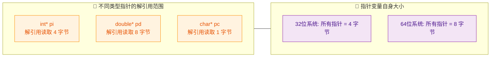

---

### 取地址运算符 `&` (Address-of Operator)

我们已经知道每个变量都占据内存中的一块空间，那么如何获取这个地址呢？答案就是**取地址运算符 `&`**。

```cpp
#include <iostream>

int main() {
    int score = 95;               // 声明一个 int 变量，值为 95

    std::cout << "score 的值: "   // 输出变量的值
              << score             // 结果: 95
              << std::endl;

    std::cout << "score 的地址: " // 输出变量的内存地址
              << &score            // 结果类似: 0x7ffee3b4a8bc (每次运行可能不同)
              << std::endl;

    return 0;
}
```

`&score` 返回的就是变量 `score` 在内存中的首字节地址。这个地址的类型是 `int*`——也就是 "指向 int 的指针"。因此，我们可以自然地将它赋值给一个 `int*` 类型的指针变量：

```cpp
int score = 95;       // 普通 int 变量
int* ptr = &score;    // ptr 现在存储了 score 的地址，即 ptr "指向" score
```

这一步操作可以用下面的内存模型来直观理解：

```cpp
// ===== 内存模型 (概念示意，非真实地址) =====
//
//  变量名     地址          值
//  ─────────────────────────────────
//  score      0x1000        95          ← int, 占 4 字节
//  ptr        0x1008        0x1000      ← int*, 存的是 score 的地址
//
//  ptr ──────────────► score
//  (值=0x1000)           (值=95)
```

#### `&` 的使用规则

`&` 只能作用于**左值 (lvalue)**——即在内存中有确定存储位置的表达式。以下是合法与非法的用法对比：

```cpp
int a = 10;
int* p1 = &a;        // ✅ 合法：a 是一个有地址的变量(左值)

int* p2 = &42;       // ❌ 编译错误！42 是字面量(右值)，没有可取的内存地址
int* p3 = &(a + 1);  // ❌ 编译错误！(a + 1) 是临时计算结果(右值)

int arr[3] = {1,2,3};
int* p4 = &arr[0];   // ✅ 合法：数组元素是左值
```

> 📌 **技术要点**：左值 (lvalue) 是指在内存中有持久地址的表达式，它"可以出现在赋值号左侧"。右值 (rvalue) 则是临时值或字面量，没有稳定的内存地址。这个概念在后续学习 **移动语义 (Move Semantics)** 和 **右值引用 (Rvalue Reference)** 时会非常关键。

---

### 解引用运算符 `*` (Dereference Operator)

如果说 `&` 是"从变量到地址"的桥梁，那么 `*` 就是反方向——"从地址到变量的值"的桥梁。对一个指针使用 `*`，意味着"访问这个指针所指向的那块内存中的数据"。

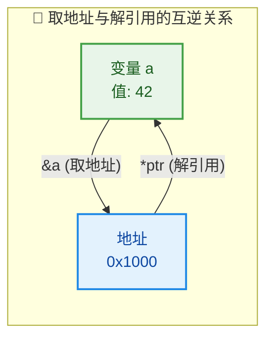

它们是一对**互逆操作 (inverse operations)**：

- `&a` → 拿到 `a` 的地址
- `*ptr` → 通过地址拿到值

因此有一个恒等关系：**`*(&a) == a`** 始终成立。

来看一个完整的代码示例：

```cpp
#include <iostream>

int main() {
    int health = 100;            // 声明变量 health，初始化为 100
    int* ptr = &health;          // 指针 ptr 指向 health

    // -------- 读取：通过指针间接访问变量的值 --------
    std::cout << "health 的值: "
              << health          // 直接访问：100
              << std::endl;

    std::cout << "通过指针读取: "
              << *ptr            // 解引用访问：100（与上面结果相同）
              << std::endl;

    // -------- 修改：通过指针间接修改变量的值 --------
    *ptr = 75;                   // 通过解引用，将 ptr 指向的内存（即 health）改为 75

    std::cout << "修改后 health: "
              << health          // 输出: 75（health 的值确实被改变了！）
              << std::endl;

    // -------- 验证互逆关系 --------
    std::cout << std::boolalpha  // 让 bool 输出 true/false 而不是 1/0
              << "(*(&health) == health): "
              << (*(&health) == health)  // 输出: true
              << std::endl;

    return 0;                    // 程序正常结束
}
```

**输出结果**：
```
health 的值: 100
通过指针读取: 100
修改后 health: 75
(*(&health) == health): true
```

这段代码最核心的一行是 `*ptr = 75;`。它说明**解引用不仅可以读，还可以写**。通过指针修改值，其实就是在直接操作目标变量所在的那块内存。

---

### 深入理解：`*` 号的双重身份

初学者常见的困惑：`*` 号有时出现在声明中，有时出现在表达式中，它们是同一个东西吗？

答案是：**语法上是同一个符号，但语义完全不同**。

| 场景 | 代码示例 | `*` 的含义 | 术语 |
|:---|:---|:---|:---|
| **声明时** | `int* ptr;` | 表示 ptr 是"指向 int 的指针"类型 | 类型修饰符 (type modifier) |
| **表达式中** | `*ptr = 10;` | 访问 ptr 所指向的内存内容 | 解引用运算符 (dereference operator) |

来看一段代码把两种身份放在一起：

```cpp
int val = 50;        // 普通 int 变量
int* ptr = &val;     // 这里的 * 是「声明」中的类型修饰符，表示 ptr 是 int* 类型
*ptr = 99;           // 这里的 * 是「解引用」运算符，通过 ptr 修改 val 的值为 99
```

> 🧠 **记忆技巧**：如果 `*` 出现在**类型名和变量名之间**，它是声明；如果 `*` 出现在**已声明的指针变量前面**（作为一元运算符），它是解引用。

---

### 未初始化指针与野指针 (Dangling / Wild Pointer)

指针的强大之处在于它直接操控内存，但这也意味着它非常**危险**。如果不小心使用，可能导致程序崩溃 (Segmentation Fault) 甚至安全漏洞。

```cpp
int* p;              // ⚠️ 未初始化！p 的值是随机的垃圾地址
*p = 42;             // 💥 未定义行为 (Undefined Behavior)！
                     // 可能崩溃，可能"看起来正常"，可能破坏其他数据
```

未初始化的指针被称为**野指针 (Wild Pointer)**，它指向一个不确定的内存位置。对它解引用就像"闭着眼睛往随机的门里扔炸弹"——后果不可预测。

```mermaid
graph LR
    subgraph Safe["✅ 安全的指针使用"]
        direction TB
        S1["int a = 10;"]
        S2["int* p = &a;"]
        S3["*p = 20; // OK"]
    end

    subgraph Dangerous["❌ 危险的指针使用"]
        direction TB
        D1["int* p;"]
        D2["// p 未初始化"]
        D3["*p = 42; // 💥 UB!"]
    end

    subgraph BestPractice["💡 最佳实践"]
        direction TB
        B1["int* p = nullptr;"]
        B2["// 明确初始化为空"]
        B3["if (p) *p = 42;"]
    end

    Safe --- Dangerous --- BestPractice

    classDef safeStyle fill:#E8F5E9,stroke:#43A047,color:#1B5E20,stroke-width:1px
    classDef dangerStyle fill:#FFEBEE,stroke:#E53935,color:#B71C1C,stroke-width:1px
    classDef bestStyle fill:#E3F2FD,stroke:#1E88E5,color:#0D47A1,stroke-width:1px
    class S1,S2,S3 safeStyle
    class D1,D2,D3 dangerStyle
    class B1,B2,B3 bestStyle
```

**最佳实践**：

```cpp
// ✅ 规则 1：声明指针时，要么立即指向有效变量，要么初始化为 nullptr
int* p1 = nullptr;   // 明确表示"当前不指向任何对象"

// ✅ 规则 2：使用前检查是否为空
if (p1 != nullptr) { // 或者简写为 if (p1)
    *p1 = 42;        // 只有确认非空才解引用
}

// ✅ 规则 3：指针不再使用时，置为 nullptr
p1 = nullptr;        // 防止成为悬空指针 (dangling pointer)
```

> 关于 `nullptr` 与 `NULL` 的区别，我们将在后续 **空指针** 一节中详细展开。

---

### 指针的完整操作链路：综合示例

下面用一个稍微复杂的例子，把声明、取地址、解引用三者串联起来，并展示指针的"间接修改"能力：

```cpp
#include <iostream>

int main() {
    // ===== Step 1: 声明变量 =====
    int x = 10;                  // 声明 int 变量 x，值为 10
    int y = 20;                  // 声明 int 变量 y，值为 20

    // ===== Step 2: 声明指针并初始化 =====
    int* ptr = &x;               // ptr 指向 x

    // ===== Step 3: 通过指针读取 =====
    std::cout << "ptr 指向的值: " 
              << *ptr             // 输出: 10 (即 x 的值)
              << std::endl;

    // ===== Step 4: 通过指针修改 =====
    *ptr = 100;                  // 将 x 的值从 10 改为 100
    std::cout << "x = " << x    // 输出: x = 100
              << std::endl;

    // ===== Step 5: 指针重新指向另一个变量 =====
    ptr = &y;                    // ptr 不再指向 x，转而指向 y
    *ptr = 200;                  // 将 y 的值从 20 改为 200
    std::cout << "y = " << y    // 输出: y = 200
              << std::endl;

    // ===== Step 6: 验证地址信息 =====
    std::cout << "x 的地址: " << &x << std::endl;   // 输出 x 的地址
    std::cout << "y 的地址: " << &y << std::endl;   // 输出 y 的地址
    std::cout << "ptr 的值: " << ptr << std::endl;   // 等于 &y
    std::cout << "ptr 自身地址: " << &ptr << std::endl; // ptr 自己的地址

    return 0;
}
```

**关键观察**：
- **Step 4** 体现了指针的核心能力——**间接修改 (Indirect Modification)**：你没有直接写 `x = 100;`，但通过 `*ptr = 100;` 达到了相同效果。这在函数参数传递中极为重要。
- **Step 5** 说明**指针可以重新指向 (rebind)**。这是指针和引用 (reference) 的重要区别之一（引用一旦绑定就不能更换目标）。

---

### 指针的大小与平台相关性

前面提到，指针的大小取决于操作系统的位数而非指向的数据类型：

```cpp
#include <iostream>

int main() {
    // 不同类型的指针
    int* pi    = nullptr;        // 指向 int
    double* pd = nullptr;        // 指向 double
    char* pc   = nullptr;        // 指向 char

    // 在 64 位系统上，所有指针大小都是 8 字节
    std::cout << "sizeof(int*):    " << sizeof(pi) << std::endl;  // 8
    std::cout << "sizeof(double*): " << sizeof(pd) << std::endl;  // 8
    std::cout << "sizeof(char*):   " << sizeof(pc) << std::endl;  // 8

    // 但它们指向的数据大小不同！
    std::cout << "sizeof(int):     " << sizeof(int) << std::endl;    // 4
    std::cout << "sizeof(double):  " << sizeof(double) << std::endl; // 8
    std::cout << "sizeof(char):    " << sizeof(char) << std::endl;   // 1

    return 0;
}
```

这揭示了一个核心设计理念：**指针的类型不影响自身的大小，但决定了解引用时"看多远"**。一个 `int*` 解引用时读 4 字节，`double*` 读 8 字节，`char*` 只读 1 字节。这也直接影响后续将学到的**指针运算 (Pointer Arithmetic)** 的步长。

---

### 本节核心关系速查

```mermaid
graph LR
    subgraph Declare["📦 声明"]
        direction TB
        DC1["int a = 42;"]
        DC2["int* ptr = &a;"]
    end

    subgraph AddressOf["📍 取地址 &"]
        direction TB
        AO1["&a → 返回 a 的地址"]
        AO2["类型: int → int*"]
    end

    subgraph Deref["🔓 解引用 *"]
        direction TB
        DR1["*ptr → 访问 ptr 指向的值"]
        DR2["类型: int* → int"]
    end

    subgraph Rules["📋 核心规则"]
        direction TB
        R1["& 只能用于左值"]
        R2["* 只能用于有效指针"]
        R3["*和& 互为逆运算"]
        R4["声明时立即初始化"]
    end

    Declare --> AddressOf --> Deref --> Rules

    classDef declStyle fill:#E8F5E9,stroke:#43A047,color:#1B5E20,stroke-width:1px
    classDef addrStyle fill:#E3F2FD,stroke:#1E88E5,color:#0D47A1,stroke-width:1px
    classDef derefStyle fill:#FFF3E0,stroke:#FB8C00,color:#E65100,stroke-width:1px
    classDef ruleStyle fill:#F3E5F5,stroke:#8E24AA,color:#4A148C,stroke-width:1px
    class DC1,DC2 declStyle
    class AO1,AO2 addrStyle
    class DR1,DR2 derefStyle
    class R1,R2,R3,R4 ruleStyle
```

---

**📝 练习题**

以下代码的输出结果是什么？

```cpp
#include <iostream>
int main() {
    int a = 5;
    int b = 10;
    int* p = &a;
    *p = 20;
    p = &b;
    *p = *p + a;
    std::cout << a << " " << b << std::endl;
    return 0;
}
```

A. `5 10`


B. `20 30`


C. `20 10`


D. `5 30`


**【答案】** B

**【解析】**

我们逐行追踪变量的值：

1. `int a = 5;` → a = 5
2. `int b = 10;` → b = 10
3. `int* p = &a;` → p 指向 a
4. `*p = 20;` → 通过指针修改 a 的值，a = **20**，b = 10
5. `p = &b;` → p 重新指向 b（注意 a 的值不受影响，仍为 20）
6. `*p = *p + a;` → `*p` 即 b（当前值 10），a 当前值为 20，所以 b = 10 + 20 = **30**

最终：`a = 20`，`b = 30`，输出 `20 30`，选 **B**。

此题考察两个关键点：① **通过解引用修改变量**（`*p = 20` 实际修改了 a）；② **指针 rebind 后操作的目标改变**（`p = &b` 之后 `*p` 就代表 b 了）。

---

## 指针运算（Pointer Arithmetic）

在上一节中，我们学会了如何声明指针、使用取地址运算符 `&` 获取变量地址、以及通过解引用运算符 `*` 访问指针所指向的值。这一节，我们将深入探讨 C++ 中极为重要的 **指针运算**（Pointer Arithmetic）。指针运算是 C++ 区别于许多高级语言的核心特性之一，它赋予程序员直接在内存地址层面进行"移动"和"跳跃"的能力，是理解数组底层机制、手动内存遍历、以及后续学习动态内存分配的基石。

很多初学者会疑惑：一个存放地址的变量，为什么可以做加减法？它加 1 到底意味着什么？为什么两个指针可以相减却不能相加？这些问题的答案，都藏在指针运算的规则里。

### 指针的加减整数运算

指针运算中最基础、也最常用的操作，就是对指针进行 **加减整数**。但这里有一个至关重要的概念必须首先厘清——**指针加 1，并不是地址值加 1 个字节**。

当你对一个类型为 `T*` 的指针执行 `ptr + n` 操作时，编译器实际偏移的字节数是 `n * sizeof(T)`。这被称为 **缩放运算**（Scaled Arithmetic）。编译器会根据指针所指向的数据类型，自动计算出正确的偏移量。这就是为什么指针必须有类型——类型决定了"一步"跨多远。

```c++
#include <iostream>
using namespace std;

int main() {
    int arr[5] = {10, 20, 30, 40, 50};   // 声明一个含5个int元素的数组
    int* ptr = arr;                        // ptr 指向数组首元素 arr[0]，等价于 &arr[0]

    cout << "ptr 的地址: " << ptr << endl;         // 输出 ptr 当前指向的地址
    cout << "ptr 的值:   " << *ptr << endl;        // 解引用，输出 10

    ptr = ptr + 1;  // 指针前进"1步"，实际地址偏移 1 * sizeof(int) = 4 字节
    cout << "ptr+1 的地址: " << ptr << endl;       // 地址比原来大了 4
    cout << "ptr+1 的值:   " << *ptr << endl;      // 解引用，输出 20

    ptr = ptr + 3;  // 再前进3步，偏移 3 * sizeof(int) = 12 字节
    cout << "ptr+3 的地址: " << ptr << endl;       // 地址又增加了 12
    cout << "ptr+3 的值:   " << *ptr << endl;      // 解引用，输出 50（arr[4]）

    return 0;
}
```

我们用一张内存布局图来直观理解这个过程。假设数组 `arr` 的起始地址为 `0x1000`，在一个 `sizeof(int) == 4` 的平台上：

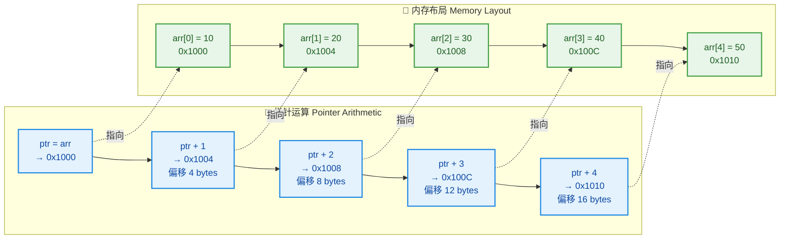

这张图清晰地展示了：`ptr + n` 并非简单的地址数值加 `n`，而是地址数值加 `n * sizeof(int)`。如果指针类型是 `double*`（`sizeof(double)` 通常为 8），那么 `ptr + 1` 的实际地址偏移就是 8 个字节；如果是 `char*`（`sizeof(char)` 为 1），偏移则恰好是 1 个字节。

**减法同理**。`ptr - 2` 表示指针向"低地址方向"回退 2 个元素的位置，实际偏移 `2 * sizeof(T)` 字节。

```c++
#include <iostream>
using namespace std;

int main() {
    double data[4] = {1.1, 2.2, 3.3, 4.4};  // double 数组
    double* dp = &data[3];                     // dp 指向最后一个元素 data[3]

    cout << *dp << endl;      // 输出 4.4
    dp = dp - 2;              // 回退2步，偏移 2 * sizeof(double) = 16 字节
    cout << *dp << endl;      // 输出 2.2，即 data[1]

    return 0;
}
```

#### 自增 / 自减运算符与指针

指针同样支持 `++` 和 `--` 运算符，它们分别等价于 `ptr = ptr + 1` 和 `ptr = ptr - 1`。在实际开发中，这是最常见的指针移动方式，尤其在循环遍历时。

需要特别注意 **前置 vs 后置** 的语义差别，这在与解引用 `*` 配合使用时尤为关键：

| 表达式 | 含义 | 执行顺序 |
|:---:|:---:|:---|
| `*ptr++` | 先解引用当前位置，再将指针后移一步 | 等价于 `*(ptr++)`，取值后指针 +1 |
| `*++ptr` | 先将指针前移一步，再解引用新位置 | 等价于 `*(++ptr)`，指针 +1 后取值 |
| `(*ptr)++` | 解引用后，将 **指向的值** 自增 | 取出值，值 +1，指针不动 |

```c++
#include <iostream>
using namespace std;

int main() {
    int arr[4] = {100, 200, 300, 400};
    int* p = arr;               // p 指向 arr[0]

    // 场景1: *p++  →  先取 *p 的值，再 p++
    cout << *p++ << endl;       // 输出 100，之后 p 指向 arr[1]

    // 场景2: *++p  →  先 ++p，再取 *p 的值
    cout << *++p << endl;       // p 先移到 arr[2]，输出 300

    // 场景3: (*p)++  →  取 *p 的值后，将该值自增
    cout << (*p)++ << endl;     // 输出 300（arr[2]的当前值），之后 arr[2] 变为 301
    cout << *p << endl;         // 验证：输出 301，p 仍指向 arr[2]

    return 0;
}
```

这三种写法在面试中出现的频率极高。记忆的诀窍在于理解 **运算符优先级**：后置 `++` 的优先级高于 `*`，所以 `*p++` 中 `p++` 先执行（但返回旧值），然后 `*` 对旧值解引用。而前置 `++p` 也高于 `*`，所以 `*++p` 中 `++p` 先执行（返回新值），然后 `*` 对新值解引用。

### 指针与指针之间的运算

除了指针与整数的加减之外，C++ 还允许 **两个同类型指针之间做减法**。结果的类型是 `ptrdiff_t`（定义在 `<cstddef>` 中），表示两个指针之间相隔多少个 **元素**（而非字节）。

```c++
#include <iostream>
using namespace std;

int main() {
    int arr[6] = {0, 10, 20, 30, 40, 50};

    int* p1 = &arr[1];      // p1 指向 arr[1]
    int* p2 = &arr[5];      // p2 指向 arr[5]

    // 指针相减：结果是元素间距，而非字节距离
    ptrdiff_t diff = p2 - p1;   // diff = 4（相隔4个int元素）
    cout << "p2 - p1 = " << diff << endl;   // 输出 4

    // 反过来减也可以，结果为负数
    cout << "p1 - p2 = " << (p1 - p2) << endl;  // 输出 -4

    return 0;
}
```

但有一个铁律必须牢记：**两个指针相加是非法的（Undefined / Compile Error）**。你可以理解为——两个地址相减能得到"距离"（有物理意义），但两个地址相加得到的数值没有任何意义。

```c++
int* p1 = &arr[0];
int* p2 = &arr[3];
// auto result = p1 + p2;  // ❌ 编译错误！指针不能相加
```

下面这张图总结了指针间合法与非法的运算：

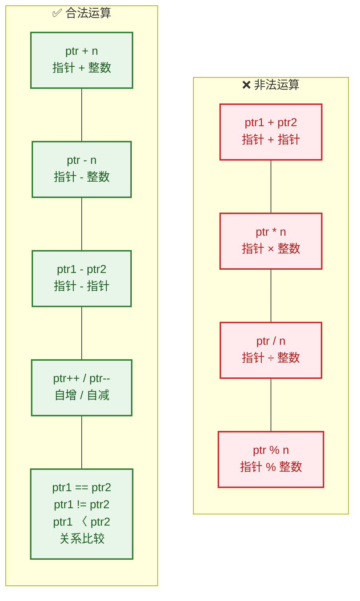

### 指针的关系比较运算

指针支持所有六种关系运算符：`==`、`!=`、`<`、`>`、`<=`、`>=`。当两个指针指向 **同一个数组** 的元素时，比较的结果取决于它们在数组中的位置——地址越大，表示越靠后。

这在实际编程中非常有用，例如判断指针是否已经越过了数组末尾（作为循环终止条件）：

```c++
#include <iostream>
using namespace std;

int main() {
    int arr[5] = {1, 2, 3, 4, 5};
    int* begin = arr;           // 指向首元素
    int* end   = arr + 5;      // 指向数组"末尾之后"（past-the-end）

    // 用指针比较来判断是否遍历完毕
    int* cur = begin;           // cur 从首元素开始
    while (cur < end) {         // 当 cur 还没到 end 时继续
        cout << *cur << " ";    // 输出当前元素
        cur++;                  // 指针后移一步
    }
    // 输出：1 2 3 4 5

    return 0;
}
```

> ⚠️ **注意**：C++ 标准规定，只有指向 **同一个数组**（或同一块连续内存区域）内的指针之间的比较才是有意义的（Well-defined）。比较两个不相关对象的指针，行为是 **未定义的**（Undefined Behavior in C++17 and earlier, implementation-defined in C++20 for `<=>` with `std::less` etc.）。

### 用指针遍历数组（核心实战）

这是本节的重中之重。在 C++ 中，用指针遍历数组是最经典的应用场景之一，它的效率与下标访问几乎相同（现代编译器优化后通常完全等价），但它能帮助你深刻理解数组在内存中的连续存储本质。

#### 方式一：下标法（Index-Based）

这是初学者最熟悉的方式，以它为参照。

```c++
#include <iostream>
using namespace std;

int main() {
    int arr[5] = {10, 20, 30, 40, 50};

    // 传统的下标遍历
    for (int i = 0; i < 5; i++) {
        cout << arr[i] << " ";    // arr[i] 等价于 *(arr + i)
    }
    cout << endl;
    return 0;
}
```

#### 方式二：指针递增法（Pointer Increment）

用一个指针变量从头走到尾，每次 `++` 移动一步。

```c++
#include <iostream>
using namespace std;

int main() {
    int arr[5] = {10, 20, 30, 40, 50};
    int* ptr = arr;               // ptr 指向数组首元素

    // 指针递增遍历
    for (int i = 0; i < 5; i++) {
        cout << *ptr << " ";      // 解引用取当前值
        ptr++;                    // 指针后移一步（偏移 sizeof(int) 字节）
    }
    cout << endl;
    return 0;
}
```

#### 方式三：begin/end 指针法（STL 风格）

这种风格模仿了 STL 容器的 `begin()` / `end()` 迭代器范式，是 C++ 中最地道、最推荐的写法。

```c++
#include <iostream>
using namespace std;

int main() {
    int arr[5] = {10, 20, 30, 40, 50};
    int* begin = arr;             // 指向第一个元素
    int* end   = arr + 5;        // 指向最后一个元素的"下一个位置"（past-the-end）

    // begin/end 风格遍历，与 STL 迭代器写法一致
    for (int* p = begin; p != end; p++) {
        cout << *p << " ";        // 解引用当前指针
    }
    cout << endl;
    return 0;
}
```

> 💡 **为什么 `end` 指向的是"尾后位置"？** 这是 C++ 中一个极为重要的设计哲学——**左闭右开区间 `[begin, end)`**。它的好处包括：元素个数 = `end - begin`；空区间表示为 `begin == end`；循环终止条件统一为 `p != end`。整个 STL 都建立在这一约定之上。

#### 方式四：指针偏移法（Pointer + Offset）

不移动指针本身，而是通过 `*(ptr + i)` 来访问各个元素。

```c++
#include <iostream>
using namespace std;

int main() {
    int arr[5] = {10, 20, 30, 40, 50};
    int* ptr = arr;               // ptr 始终指向首元素

    // 偏移法遍历
    for (int i = 0; i < 5; i++) {
        cout << *(ptr + i) << " ";  // ptr不动，每次通过偏移量 i 访问
    }
    cout << endl;
    return 0;
}
```

我们将这四种方式做一个对比：

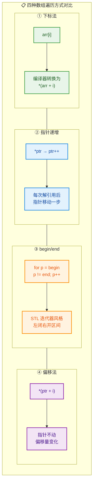

### 实战：用指针实现数组反转

学习了指针运算后，让我们用一个经典的实战案例来巩固——**原地反转数组**（In-Place Array Reversal）。这个算法使用两个指针，一个从数组头部开始，一个从尾部开始，两者向中间靠拢，每步交换所指元素。

```c++
#include <iostream>
using namespace std;

// 使用指针反转数组
void reverseArray(int* begin, int* end) {
    // end 传入时指向 past-the-end，先回退一步指向最后一个元素
    end--;

    // 当左指针在右指针左边时，继续交换
    while (begin < end) {
        // 交换 begin 和 end 所指向的值
        int temp = *begin;        // 暂存左侧值
        *begin = *end;            // 右侧值赋给左侧
        *end = temp;              // 暂存值赋给右侧

        begin++;                  // 左指针右移一步
        end--;                    // 右指针左移一步
    }
}

int main() {
    int arr[6] = {1, 2, 3, 4, 5, 6};

    cout << "反转前: ";
    for (int* p = arr; p != arr + 6; p++) {   // 用 begin/end 风格输出
        cout << *p << " ";
    }
    cout << endl;

    reverseArray(arr, arr + 6);   // 传入 [begin, end) 左闭右开区间

    cout << "反转后: ";
    for (int* p = arr; p != arr + 6; p++) {   // 再次遍历输出
        cout << *p << " ";
    }
    cout << endl;

    return 0;
}
// 输出:
// 反转前: 1 2 3 4 5 6
// 反转后: 6 5 4 3 2 1
```

用 ASCII 图来展示这个双指针交换过程：

```c++
// 初始状态：
// begin                        end (回退后)
//   ↓                            ↓
// [ 1 ]  [ 2 ]  [ 3 ]  [ 4 ]  [ 5 ]  [ 6 ]
//
// 第1轮交换后 (swap 1 和 6)，begin++, end--：
//         begin          end
//           ↓              ↓
// [ 6 ]  [ 2 ]  [ 3 ]  [ 4 ]  [ 5 ]  [ 1 ]
//
// 第2轮交换后 (swap 2 和 5)，begin++, end--：
//                begin  end
//                  ↓      ↓
// [ 6 ]  [ 5 ]  [ 3 ]  [ 4 ]  [ 2 ]  [ 1 ]
//
// 第3轮交换后 (swap 3 和 4)，begin++, end--：
//                 end  begin    ← begin > end, 循环终止!
//                  ↓     ↓
// [ 6 ]  [ 5 ]  [ 4 ]  [ 3 ]  [ 2 ]  [ 1 ]
```

### 指针运算的越界与未定义行为

指针运算虽然强大，但它是一把 **双刃剑**。C++ 不会在运行时对指针是否越界做任何检查（这与 Java、Python 等语言截然不同）。如果你的指针运算超出了数组的有效范围，程序不会报错，但行为是 **未定义的**（Undefined Behavior, UB）。

```c++
#include <iostream>
using namespace std;

int main() {
    int arr[3] = {10, 20, 30};
    int* p = arr + 3;     // ✅ 指向 past-the-end 是合法的（但不可解引用）

    // cout << *p << endl; // ❌ UB! 解引用 past-the-end 指针

    int* q = arr + 10;    // ❌ UB! 指针偏移远超数组范围
    int* r = arr - 1;     // ❌ UB! 指针跑到数组起始位置之前

    return 0;
}
```

关于 past-the-end 指针，C++ 标准有明确规定：

- ✅ **可以**获取数组尾后（past-the-end）位置的指针，即 `arr + size`
- ✅ **可以**对该指针进行比较运算（如 `p != arr + size`）
- ❌ **不可以**对该指针进行解引用（因为它不指向有效元素）

这个规定正是 STL `end()` 迭代器设计的基础。

### 指针运算的本质总结

让我们用一张全景图来总结指针运算的核心公式：

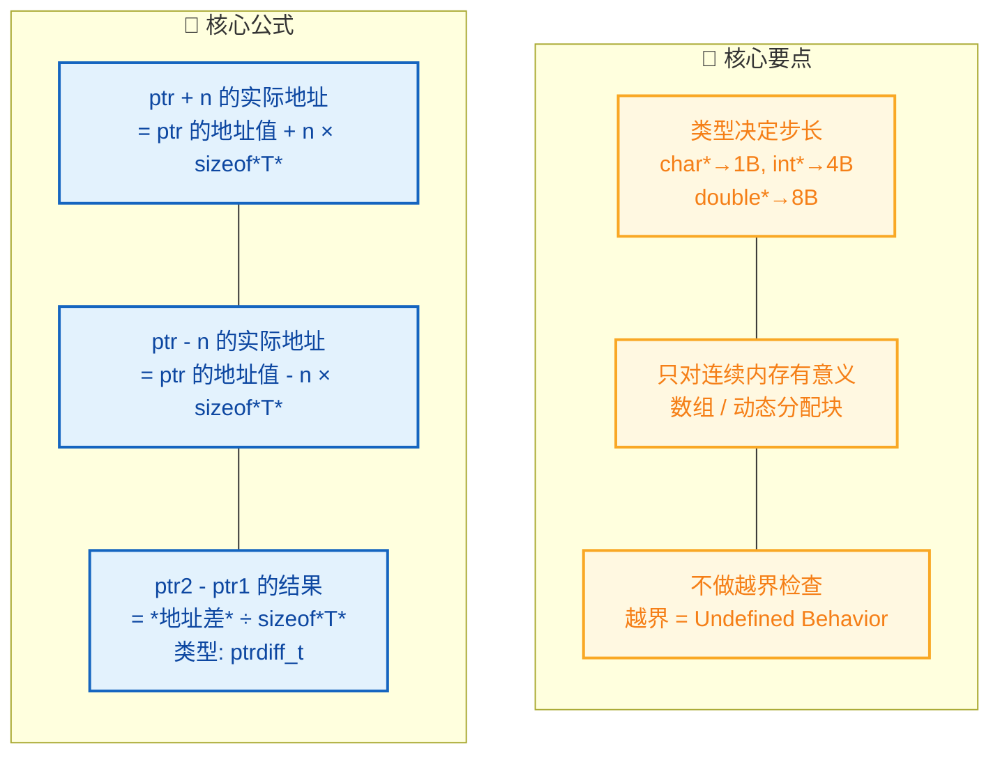

理解了指针运算，你就掌握了 C++ 中手动操控内存的核心能力。在后续的「指针与数组」章节中，我们会进一步揭示 `arr[i]` 与 `*(arr + i)` 之间的等价关系，以及数组名在表达式中"退化"为指针的机制。

---

**📝 练习题**

以下代码的输出结果是什么？

```c++
int arr[5] = {2, 4, 6, 8, 10};
int* p = arr + 4;
cout << *p << " ";
p = p - 3;
cout << *p << " ";
cout << *(p + 2) << " ";
cout << p[1] << endl;
```

A. `10 4 8 6`


B. `10 2 6 4`


C. `8 4 8 6`


D. `10 4 8 4`

**【答案】** A

**【解析】**
逐行分析：
1. `int* p = arr + 4;` → `p` 指向 `arr[4]`，值为 `10`。所以 `*p` 输出 `10`。
2. `p = p - 3;` → `p` 从 `arr[4]` 回退 3 步到 `arr[1]`，值为 `4`。所以 `*p` 输出 `4`。
3. `*(p + 2)` → `p` 当前在 `arr[1]`，偏移 2 步到 `arr[3]`，值为 `8`。输出 `8`。注意这里 `p` 本身并没有移动。
4. `p[1]` → 这其实是指针的下标运算，等价于 `*(p + 1)`。`p` 仍在 `arr[1]`，偏移 1 步到 `arr[2]`，值为 `6`。输出 `6`。

所以最终输出为 `10 4 8 6`，选 A。这道题的关键在于：`*(p + n)` 和 `p[n]` 都不会改变 `p` 本身的值，只有赋值语句 `p = ...` 或 `p++` / `p--` 才会改变指针的指向。

---

## 空指针（nullptr vs NULL）

在 C++ 编程中，**空指针（Null Pointer）** 是一个极其基础却又极易引发 Bug 的概念。它表示"该指针当前不指向任何有效对象"。理解空指针的本质、历史演进以及现代 C++ 的最佳实践，是写出安全、健壮代码的关键一步。

---

### 为什么需要空指针？

当我们声明一个指针变量时，如果暂时没有合适的对象让它指向，就需要一个"安全的占位值"来表示"我还没有指向任何东西"。如果不做初始化，指针会持有一个**随机的垃圾地址（Wild Pointer / 野指针）**，对它解引用将导致**未定义行为（Undefined Behavior）**——轻则读到乱码，重则程序崩溃（Segmentation Fault）。

```cpp
// ❌ 危险：未初始化的指针（野指针）
int* p;            // p 的值是随机的垃圾地址
// *p = 42;        // 未定义行为！可能崩溃

// ✅ 安全：初始化为空指针
int* q = nullptr;  // q 明确表示"不指向任何对象"
if (q != nullptr) {
    *q = 42;       // 只有非空时才解引用，安全
}
```

空指针的核心语义就是：**一个已知的、可判断的"无效"状态**，让程序员可以在解引用前做安全检查。

---

### C 时代的 NULL：宏定义的陷阱

在 C 语言以及早期 C++（C++98/03）中，空指针通过宏 `NULL` 来表示。打开 C 标准头文件（`<stddef.h>` 或 `<cstddef>`），你通常会看到类似这样的定义：

```cpp
// --- C 语言中的典型定义 ---
#define NULL ((void*)0)   // 将整数 0 强转为 void* 类型

// --- C++ 中的典型定义（不同编译器略有差异）---
#define NULL 0            // 直接是整数字面量 0
// 或者
#define NULL 0L           // long 类型的 0
```

注意 C 和 C++ 的关键区别：

- **C 语言**：`NULL` 通常被定义为 `((void*)0)`，它是一个 **`void*` 指针类型**。C 语言允许 `void*` 隐式转换为任何指针类型，所以使用起来没有太大问题。
- **C++ 语言**：C++ **不允许** `void*` 隐式转换为其他指针类型（类型系统更严格），因此大多数 C++ 编译器将 `NULL` 定义为纯粹的**整数 `0`**。

问题来了——既然 C++ 中的 `NULL` 本质上就是 **整数 `0`**，那它在**函数重载（Function Overloading）** 的场景下就会引发歧义：

```cpp
#include <iostream>

// 重载 1：接收整数
void process(int value) {
    std::cout << "process(int): " << value << std::endl;
}

// 重载 2：接收指针
void process(int* ptr) {
    std::cout << "process(int*): " << ptr << std::endl;
}

int main() {
    process(NULL);      // ⚠️ 调用的是 process(int)，而非 process(int*)！
                        // 因为 NULL == 0，0 是 int 字面量
                        // 编译器优先匹配 process(int)
    return 0;
}
```

**程序员的本意**是传递一个空指针调用 `process(int*)`，但编译器看到的 `NULL` 就是 `0`，于是匹配了 `process(int)`。这就是 `NULL` 作为宏定义带来的**类型安全漏洞**——它在类型系统中没有"指针"的身份。

---

### C++11 的救星：nullptr

为了彻底解决 `NULL` 的歧义问题，**C++11 标准** 引入了一个全新的关键字：**`nullptr`**。

`nullptr` 的类型是 **`std::nullptr_t`**（定义在 `<cstddef>` 中），它是一种**专门的空指针类型**，具有以下核心特性：

1. **可以隐式转换为任何指针类型**（`int*`, `double*`, `Widget*`, `void*`, ...）
2. **不可以隐式转换为整数类型**（`int`, `long`, ...）
3. **可以与任何指针进行 `==` / `!=` 比较**
4. **`nullptr` 本身不是整数，不是指针，而是 `std::nullptr_t` 类型的纯右值（prvalue）**

```cpp
#include <iostream>
#include <cstddef>    // std::nullptr_t 定义在此

void process(int value) {
    std::cout << "process(int): " << value << std::endl;
}

void process(int* ptr) {
    std::cout << "process(int*): " << ptr << std::endl;
}

int main() {
    process(nullptr);   // ✅ 明确调用 process(int*)
                        // nullptr 的类型是 std::nullptr_t
                        // 它可以隐式转换为 int*，但不能转为 int
                        // 因此无歧义地匹配 process(int*)

    // 验证 nullptr 的类型
    std::nullptr_t np = nullptr;  // np 的类型就是 std::nullptr_t
    int* p = np;                  // ✅ 合法：nullptr_t 可隐式转为 int*
    // int n = np;                // ❌ 编译错误：nullptr_t 不能转为 int

    return 0;
}
```

用下面的流程图总结 `nullptr` 在函数重载中的匹配逻辑：

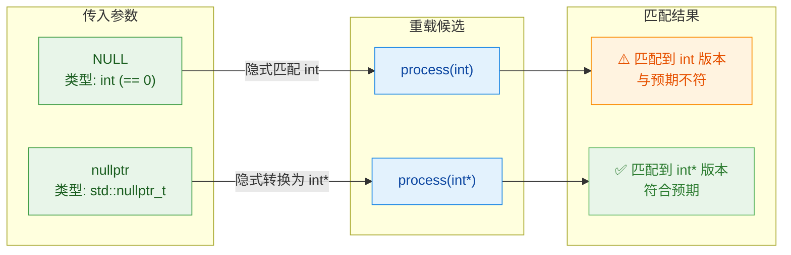

---

### 三者的本质对比：0 vs NULL vs nullptr

让我们从多个维度做一个精确对比：

| 特性 | `0` | `NULL` | `nullptr` |
|---|---|---|---|
| **引入版本** | C / C++ 始终支持 | C / C++98 | **C++11** |
| **本质** | 整数字面量 | 宏，展开为 `0` 或 `0L` | 关键字（keyword） |
| **类型** | `int` | `int`（C++ 中） | `std::nullptr_t` |
| **能否表示空指针** | ✅ 能（隐式转换） | ✅ 能（隐式转换） | ✅ 能（隐式转换） |
| **能否隐式转为 int** | ✅ 本身就是 int | ✅ 本身就是 int | ❌ 不能 |
| **重载安全** | ❌ 有歧义 | ❌ 有歧义 | ✅ 无歧义 |
| **模板推导** | 推导为 `int` | 推导为 `int` / `long` | 推导为 `std::nullptr_t` |
| **推荐使用** | ❌ 不推荐 | ❌ 不推荐 | ✅ **唯一推荐** |

一个模板推导（Template Deduction）的经典陷阱：

```cpp
#include <iostream>
#include <typeinfo>   // 用于 typeid

template<typename T>
void check(T arg) {
    // 打印模板推导出的类型名称
    std::cout << "T = " << typeid(T).name() << std::endl;
}

int main() {
    check(0);        // T 被推导为 int        → 输出类似 "i"
    check(NULL);     // T 被推导为 int 或 long → 输出类似 "i" 或 "l"
                     // 完全丢失了"指针"的语义！

    check(nullptr);  // T 被推导为 std::nullptr_t → 输出类似 "Dn"
                     // 保留了空指针的类型信息 ✅

    return 0;
}
```

在模板场景中，如果你传 `NULL` 给一个期望接收指针的模板函数，模板会把参数推导为 `int`，后续的指针操作就会编译失败。而 `nullptr` 不会有这个问题。

---

### 空指针解引用：未定义行为

无论你用什么方式表示空指针，**对空指针解引用都是未定义行为（Undefined Behavior, UB）**。编译器不保证任何结果——可能崩溃、可能返回垃圾值、甚至可能"看起来正常"但在别的平台上挂掉。

```cpp
int* p = nullptr;   // p 是空指针
// *p = 10;         // ❌ 未定义行为！不要这样做

// 正确做法：解引用前必须检查
if (p != nullptr) { // 先判空
    *p = 10;        // 确认非空后才安全
}
```

下面用内存模型图展示空指针的底层状态：

```cpp
// === 空指针 vs 有效指针 的内存模型 ===

//  变量 p (空指针)
//  ┌──────────────────┐
//  │  p: 0x00000000   │──────→  ╳ (不指向任何地址)
//  │  (nullptr)       │         解引用 = 未定义行为!
//  └──────────────────┘
//
//  变量 q (有效指针)
//  ┌──────────────────┐         ┌──────────┐
//  │  q: 0x7FFE1234   │──────→  │  42      │  (int 变量 x)
//  │  (合法地址)       │         │ 地址:    │
//  └──────────────────┘         │ 0x7FFE1234│
//                               └──────────┘
```

---

### 安全编码最佳实践

#### 1. 始终使用 nullptr，弃用 NULL 和 0

```cpp
// ❌ 旧风格（C++98）
int* p1 = NULL;
int* p2 = 0;

// ✅ 现代 C++（C++11 及以后）
int* p3 = nullptr;       // 明确、类型安全
```

#### 2. 指针判空的惯用写法

```cpp
int* ptr = getSomePointer();  // 可能返回 nullptr

// 写法 1：显式比较（推荐，意图清晰）
if (ptr != nullptr) {
    // 使用 *ptr
}

// 写法 2：利用隐式布尔转换（简洁，C++ 社区常见）
if (ptr) {                     // 非空指针在 bool 上下文中为 true
    // 使用 *ptr
}

// 写法 3：取反判空
if (!ptr) {                    // 空指针在 bool 上下文中为 false
    std::cerr << "Error: null pointer!" << std::endl;
    return;
}
```

> **注意**：`nullptr` 在布尔上下文中被求值为 `false`，任何非空指针被求值为 `true`。这是 C++ 标准保证的行为。

#### 3. 删除后置空（Dangling Pointer 防护）

```cpp
int* data = new int(100);     // 动态分配内存
// ... 使用 data ...
delete data;                   // 释放内存
data = nullptr;                // ✅ 立即置空，避免悬垂指针（Dangling Pointer）

// 后续代码即使误操作也能安全检查
if (data != nullptr) {
    *data = 200;               // 不会执行，因为 data 已是 nullptr
}
```

#### 4. 函数返回空指针表示"失败"或"未找到"

```cpp
#include <iostream>

// 在数组中查找目标值，找到返回其地址，否则返回 nullptr
int* findValue(int arr[], int size, int target) {
    for (int i = 0; i < size; ++i) {  // 遍历数组每个元素
        if (arr[i] == target) {        // 找到目标
            return &arr[i];            // 返回该元素的地址
        }
    }
    return nullptr;                    // 未找到，返回空指针
}

int main() {
    int nums[] = {10, 20, 30, 40, 50};          // 测试数组
    int* result = findValue(nums, 5, 30);        // 查找 30

    if (result != nullptr) {                      // 判空检查
        std::cout << "Found: " << *result << std::endl;  // 输出: Found: 30
    } else {
        std::cout << "Not found." << std::endl;
    }

    result = findValue(nums, 5, 99);             // 查找不存在的 99
    if (result) {                                 // 隐式判空
        std::cout << "Found: " << *result << std::endl;
    } else {
        std::cout << "Not found." << std::endl;  // 输出: Not found.
    }

    return 0;
}
```

---

### nullptr 在现代 C++ 中的延伸

随着 C++ 标准的持续演进，`nullptr` 的使用场景越来越广泛：

- **智能指针（Smart Pointers）**：`std::shared_ptr<T>` 和 `std::unique_ptr<T>` 的默认构造状态就是"空"，可以与 `nullptr` 比较和赋值。

```cpp
#include <memory>

std::shared_ptr<int> sp;             // 默认构造，内部为空
if (sp == nullptr) {                  // ✅ 合法比较
    sp = std::make_shared<int>(42);   // 分配并指向 42
}

std::unique_ptr<int> up = nullptr;    // ✅ 直接用 nullptr 初始化
up = std::make_unique<int>(100);      // 分配并指向 100
up = nullptr;                         // ✅ 释放资源并重置为空
```

- **`std::nullptr_t` 作为函数参数类型**：可以编写只接受 `nullptr` 的重载版本，用于特殊处理。

```cpp
#include <iostream>

void handle(int* ptr) {
    std::cout << "Handling a valid pointer" << std::endl;
}

void handle(std::nullptr_t) {                   // 只匹配 nullptr
    std::cout << "Handling nullptr (no-op)" << std::endl;
}

int main() {
    int x = 10;
    handle(&x);        // 调用 handle(int*)        → "Handling a valid pointer"
    handle(nullptr);   // 调用 handle(nullptr_t)   → "Handling nullptr (no-op)"
    return 0;
}
```

---

### 本节知识脉络总结

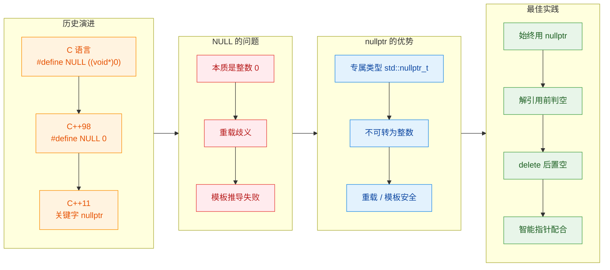

---

**📝 练习题**

以下代码的输出结果是什么？

```cpp
#include <iostream>

void foo(int)         { std::cout << "A"; }
void foo(int*)        { std::cout << "B"; }
void foo(bool)        { std::cout << "C"; }

int main() {
    foo(NULL);
    foo(nullptr);
    foo(false);
    return 0;
}
```

A. `ABB`


B. `ABC`


C. `ABD`


D. `编译错误`


**【答案】** D

**【解析】** `foo(NULL)` 会导致**编译错误（ambiguous call）**。在大多数编译器中，`NULL` 被定义为 `0`（`int` 类型），而 `0` 既可以匹配 `foo(int)`，也可以隐式转换为 `int*`（整数字面量 `0` 是合法的空指针常量）和 `bool`（`0` → `false`），三个重载版本都是合法的候选。编译器无法确定最优匹配，因此报出 **ambiguous overload** 错误。如果移除 `foo(bool)` 重载，`NULL`（即 `0`）会精确匹配 `foo(int)`，`nullptr` 会匹配 `foo(int*)`，此时输出为 `AB`。这正是 `nullptr` 存在的意义——消除这类歧义，提供明确的类型安全保障。


---

## 指针与数组

指针与数组是 C++ 中关系最为紧密的两个概念，理解它们之间的"暧昧关系"是迈向 C++ 进阶的必经之路。很多初学者会说"数组就是指针"，但这句话 **只对了一半**。本节将彻底厘清它们之间的联系与本质区别。

---

### 数组名的本质：隐式转换为指针

在 C++ 中，当你声明一个数组时，数组名在 **绝大多数表达式上下文** 中会发生一种被称为 **数组到指针的隐式转换**（Array-to-Pointer Decay）的现象。也就是说，数组名会"退化"（decay）为一个指向其首元素的指针。

```cpp
#include <iostream>
using namespace std;

int main() {
    int arr[5] = {10, 20, 30, 40, 50}; // 声明一个含 5 个 int 的数组

    // arr 在表达式中 decay 为 int* 类型，指向首元素 arr[0]
    int* p = arr;                       // 等价于 int* p = &arr[0];

    cout << *p << endl;                 // 输出 10，解引用得到首元素的值
    cout << p << endl;                  // 输出首元素的内存地址，如 0x7ffd1234
    cout << arr << endl;               // 输出同样的地址，验证 arr decay 为 &arr[0]

    return 0;
}
```

注意这里 `int* p = arr;` 并没有使用取地址运算符 `&`，因为编译器自动将 `arr` 转换成了 `&arr[0]`。这种转换是隐式的、自动的，但并不意味着数组"就是"指针。

---

### 数组名 ≠ 指针：三大关键区别

虽然数组名在大多数场合会 decay 为指针，但它们在本质上是不同的东西。记住一句核心结论：**数组是数组，指针是指针，decay 只是一种语法便利（syntactic convenience）**。

#### 区别一：`sizeof` 运算符

这是最经典的区分手段。`sizeof` 作用于数组名时，返回的是 **整个数组占用的字节数**；而作用于指针时，返回的是 **指针本身的大小**（在 64 位系统上通常为 8 字节）。

```cpp
#include <iostream>
using namespace std;

int main() {
    int arr[5] = {10, 20, 30, 40, 50}; // 5 个 int，共 5 * 4 = 20 字节

    int* p = arr;                       // p 是指针，指向 arr 首元素

    // sizeof(arr) 返回整个数组的大小：5 * sizeof(int) = 20
    cout << "sizeof(arr) = " << sizeof(arr) << endl;   // 输出 20

    // sizeof(p) 返回指针变量自身的大小（64位系统通常为8）
    cout << "sizeof(p)   = " << sizeof(p) << endl;     // 输出 8

    // 利用此特性计算数组元素个数（仅限数组未 decay 时有效）
    size_t len = sizeof(arr) / sizeof(arr[0]);          // 20 / 4 = 5
    cout << "元素个数 = " << len << endl;               // 输出 5

    return 0;
}
```

> ⚠️ **经典坑点**：当数组作为函数参数传递后，它已经 decay 为指针，此时 `sizeof` 得到的是指针大小，而非数组大小。这是无数 Bug 的根源。

#### 区别二：取地址 `&` 的语义不同

对数组名取地址和对指针取地址，得到的类型截然不同：

```cpp
#include <iostream>
using namespace std;

int main() {
    int arr[5] = {1, 2, 3, 4, 5};
    int* p = arr;

    // &arr 的类型是 int(*)[5] —— 指向"含5个int的数组"的指针
    // &p   的类型是 int**     —— 指向"int指针"的指针

    cout << "arr  = " << arr << endl;    // 首元素地址，如 0x1000
    cout << "&arr = " << &arr << endl;   // 数值相同，但类型是 int(*)[5]

    // 虽然数值相同，但 +1 的步长完全不同！
    cout << "arr + 1  = " << (arr + 1) << endl;  // 0x1000 + 4  = 0x1004（跳过1个int）
    cout << "&arr + 1 = " << (&arr + 1) << endl;  // 0x1000 + 20 = 0x1014（跳过整个数组）

    return 0;
}
```

这里出现了一个非常重要的类型：`int(*)[5]`，它是一个 **数组指针**（pointer to an array），与普通的 `int*` 完全不同。后面我们会进一步讨论。

#### 区别三：不可赋值性

数组名是一个 **不可修改的左值**（non-modifiable lvalue），你不能对它重新赋值；而指针变量可以随意指向其他地址。

```cpp
int arr[5] = {1, 2, 3, 4, 5};
int brr[5] = {6, 7, 8, 9, 10};
int* p = arr;

p = brr;     // ✅ 合法：指针变量可以重新指向另一个数组
// arr = brr; // ❌ 编译错误：数组名不是可修改的左值
// arr++;     // ❌ 编译错误：不能对数组名做自增
p++;         // ✅ 合法：指针可以自增，现在 p 指向 brr[1]
```

下面这张图清晰地总结了三大区别：

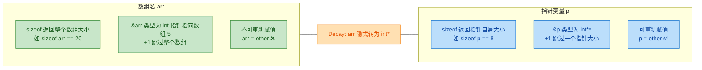

---

### 指针算术与下标运算的等价性

C++ 中一个优雅而强大的设计是：**下标运算符 `[]` 本质上是指针算术的语法糖**。编译器在底层会将 `arr[i]` 转换为 `*(arr + i)`。

```cpp
#include <iostream>
using namespace std;

int main() {
    int arr[5] = {10, 20, 30, 40, 50};

    // 以下四种写法完全等价，都访问第 3 个元素（值为 30）
    cout << arr[2] << endl;          // 下标访问，最常见写法
    cout << *(arr + 2) << endl;      // 指针算术 + 解引用
    cout << *(2 + arr) << endl;      // 加法交换律，仍然合法
    cout << 2[arr] << endl;          // 等价于 *(2 + arr)，语法合法但可读性极差

    // 用指针遍历数组
    int* p = arr;                    // p 指向 arr[0]
    for (int i = 0; i < 5; i++) {
        // p[i] 等价于 *(p + i) 等价于 arr[i]
        cout << "p[" << i << "] = " << p[i] << "  ";
        cout << "*(p+" << i << ") = " << *(p + i) << endl;
    }

    return 0;
}
```

为什么 `2[arr]` 也是合法的？因为 `a[b]` 被定义为 `*(a + b)`，而加法满足交换律，所以 `2[arr]` 就是 `*(2 + arr)` 就是 `*(arr + 2)` 就是 `arr[2]`。当然，实际编码中 **绝不推荐** 这么写，这里只是为了揭示底层机制。

下面用一张内存模型图来直观展示指针算术与数组下标的对应关系：

```
假设 arr 首地址为 0x1000，int 占 4 字节

地址:     0x1000    0x1004    0x1008    0x100C    0x1010
         ┌─────────┬─────────┬─────────┬─────────┬─────────┐
  arr:   │   10    │   20    │   30    │   40    │   50    │
         └─────────┴─────────┴─────────┴─────────┴─────────┘
下标:      arr[0]    arr[1]    arr[2]    arr[3]    arr[4]
指针:      *(p+0)    *(p+1)    *(p+2)    *(p+3)    *(p+4)
偏移:      p         p+1       p+2       p+3       p+4
字节偏移:  +0        +4        +8        +12       +16
```

**指针 +1 并不是地址 +1**，而是地址 **+ sizeof(所指类型)**。这就是所谓的 **指针算术的缩放特性**（Scaled Pointer Arithmetic）。`p + i` 实际在底层等价于 `(char*)p + i * sizeof(*p)`。

---

### 用指针遍历数组的三种经典范式

在实际项目中，用指针遍历数组是非常常见的手法，尤其在底层和性能敏感的场景中。

```cpp
#include <iostream>
using namespace std;

int main() {
    int arr[5] = {10, 20, 30, 40, 50};
    int n = 5;                              // 数组元素个数

    // ========== 方法一：下标法 ==========
    // 最直观，适合大多数场景
    cout << "方法一（下标法）: ";
    for (int i = 0; i < n; i++) {
        cout << arr[i] << " ";              // 编译器翻译为 *(arr + i)
    }
    cout << endl;

    // ========== 方法二：指针偏移法 ==========
    // 用固定基址 + 偏移量，语义与方法一等价
    cout << "方法二（指针偏移法）: ";
    for (int i = 0; i < n; i++) {
        cout << *(arr + i) << " ";          // 手动指针算术
    }
    cout << endl;

    // ========== 方法三：指针递增法 ==========
    // 用一个移动的指针，每次 ++ 前进一个元素
    cout << "方法三（指针递增法）: ";
    int* begin = arr;                       // 指向首元素
    int* end = arr + n;                     // 指向"尾后"位置（past-the-end）
    for (int* p = begin; p != end; p++) {   // p 从 begin 走到 end
        cout << *p << " ";                  // 解引用当前元素
    }
    cout << endl;

    return 0;
}
```

方法三中出现了一个极为重要的概念——**尾后指针**（past-the-end pointer）。`arr + n` 指向数组最后一个元素 **之后** 的位置，它本身 **不可解引用**，但可以合法地参与比较运算。这个思想直接影响了 C++ STL 中迭代器的设计哲学：`[begin, end)` 左闭右开区间。

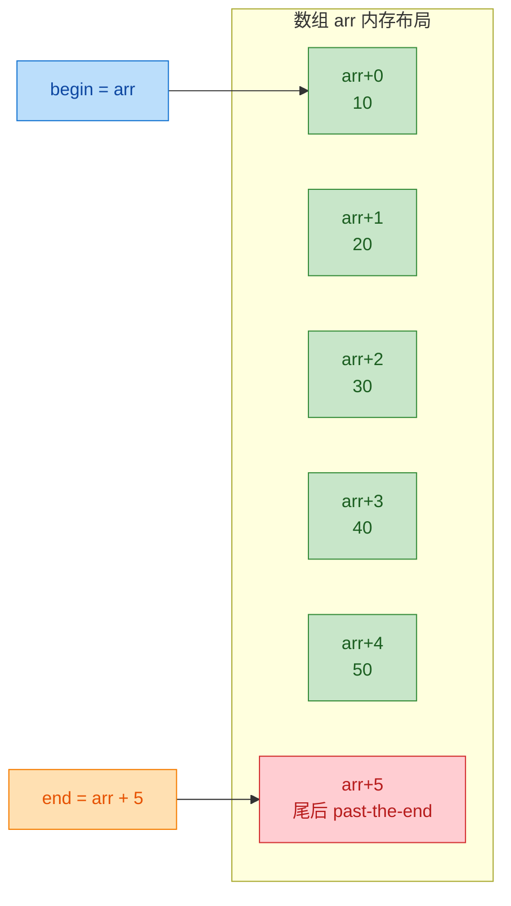

---

### 数组作为函数参数时的 Decay

这是指针与数组关系中 **最容易出 Bug 的地方**。当你把数组传给函数时，无论你用哪种语法形式声明参数，它 **都会 decay 为指针**。

```cpp
#include <iostream>
using namespace std;

// 以下三种函数签名在编译器眼中完全等价！
// 它们接收的都是一个 int* 指针，而非数组。
void func_v1(int arr[5])  { cout << "sizeof = " << sizeof(arr) << endl; }
void func_v2(int arr[])   { cout << "sizeof = " << sizeof(arr) << endl; }
void func_v3(int* arr)    { cout << "sizeof = " << sizeof(arr) << endl; }

int main() {
    int data[5] = {1, 2, 3, 4, 5};

    cout << "main 中 sizeof(data) = " << sizeof(data) << endl;  // 20

    func_v1(data);   // 输出 8（64位系统），已经 decay 了！
    func_v2(data);   // 输出 8，同上
    func_v3(data);   // 输出 8，同上

    return 0;
}
```

> 🔑 **黄金法则**：在函数内部，你 **永远无法** 通过 `sizeof` 得到原数组的长度。因此，传递数组时必须 **额外传递数组长度**，这是 C/C++ 编程的基本规范。

正确的做法：

```cpp
#include <iostream>
using namespace std;

// 正确做法：额外传一个 size 参数
void printArray(const int* arr, size_t size) {   // const 防止修改
    for (size_t i = 0; i < size; i++) {          // 用传入的 size 控制循环
        cout << arr[i] << " ";                   // 下标访问仍然可用
    }
    cout << endl;
}

int main() {
    int data[5] = {10, 20, 30, 40, 50};
    // 在 main 中计算长度，然后传入
    printArray(data, sizeof(data) / sizeof(data[0]));  // 传入 5
    return 0;
}
```

在现代 C++（C++11 及以后）中，更推荐使用 `std::array` 或 `std::span`（C++20）来彻底避免这类问题，但理解原始数组的 decay 机制仍然是基本功。

---

### 数组指针与指针数组

这两个概念名称极其相似，但含义天差地别，是面试高频考点。

| 概念 | 声明语法 | 本质 | 示例 |
|:---:|:---:|:---:|:---:|
| **指针数组** (Array of Pointers) | `int* arr[5]` | 一个数组，里面存了 5 个 `int*` 指针 | 5 个指针组成的数组 |
| **数组指针** (Pointer to Array) | `int (*p)[5]` | 一个指针，指向一个含 5 个 `int` 的数组 | 1 个指向数组的指针 |

**记忆口诀**：看 `*` 和谁先结合。`[]` 优先级高于 `*`，所以 `int* arr[5]` 中 `arr` 先和 `[5]` 结合——它首先是个数组。而 `int (*p)[5]` 用括号强制 `*` 先和 `p` 结合——它首先是个指针。

```cpp
#include <iostream>
using namespace std;

int main() {
    // ========== 指针数组（Array of Pointers）==========
    int a = 1, b = 2, c = 3;
    int* ptrArr[3];          // 声明一个数组，包含 3 个 int* 元素
    ptrArr[0] = &a;          // 第 0 个指针指向变量 a
    ptrArr[1] = &b;          // 第 1 个指针指向变量 b
    ptrArr[2] = &c;          // 第 2 个指针指向变量 c

    for (int i = 0; i < 3; i++) {
        cout << *ptrArr[i] << " ";   // 解引用每个指针，输出: 1 2 3
    }
    cout << endl;

    // ========== 数组指针（Pointer to Array）==========
    int arr[5] = {10, 20, 30, 40, 50};
    int (*pArr)[5] = &arr;   // pArr 是指向"含5个int的数组"的指针

    // 解引用 pArr 得到整个数组，再用下标访问
    cout << (*pArr)[2] << endl;       // 输出 30

    // pArr + 1 会跳过 5*4=20 字节（跳过整个数组）
    cout << "pArr     = " << pArr << endl;
    cout << "pArr + 1 = " << pArr + 1 << endl;  // 地址差 20

    return 0;
}
```

数组指针最常见的用途是处理 **二维数组**：

```cpp
#include <iostream>
using namespace std;

// 二维数组在参数传递时 decay 为"数组指针"
// matrix 的类型实际是 int(*)[4]，即指向"含4个int的数组"的指针
void print2D(int (*matrix)[4], int rows) {
    for (int i = 0; i < rows; i++) {         // 遍历每一行
        for (int j = 0; j < 4; j++) {        // 遍历每一列
            cout << matrix[i][j] << "\t";    // matrix[i] 取出第i行数组，[j]再取元素
        }
        cout << endl;
    }
}

int main() {
    // 声明 3x4 的二维数组
    int matrix[3][4] = {
        {1,  2,  3,  4},
        {5,  6,  7,  8},
        {9, 10, 11, 12}
    };

    // matrix decay 为 int(*)[4]
    print2D(matrix, 3);

    return 0;
}
```

下面展示二维数组在内存中的布局，以及数组指针如何在其上"跳跃"：

```
二维数组 matrix[3][4] 的内存布局（连续存储，行优先 Row-Major）

地址:  0x1000                                    0x1010                                    0x1020
       ┌──────┬──────┬──────┬──────┐             ┌──────┬──────┬──────┬──────┐             ┌──────┬──────┬──────┬──────┐
       │  1   │  2   │  3   │  4   │             │  5   │  6   │  7   │  8   │             │  9   │  10  │  11  │  12  │
       └──────┴──────┴──────┴──────┘             └──────┴──────┴──────┴──────┘             └──────┴──────┴──────┴──────┘
       ◄────── matrix[0] (16B) ──────►           ◄────── matrix[1] (16B) ──────►           ◄────── matrix[2] (16B) ──────►

       ↑ int(*p)[4] = matrix;                    ↑ p + 1（跳 16 字节）                     ↑ p + 2（再跳 16 字节）
```

当 `p` 的类型是 `int(*)[4]` 时，`p + 1` 跳过的是 `4 * sizeof(int) = 16` 字节，刚好跳过一整行。这就是数组指针在二维数组上能正确工作的数学基础。

---

### C++11 的 `std::begin` / `std::end`

为了更安全地获取数组的首尾指针，C++11 引入了 `std::begin()` 和 `std::end()` 函数模板，避免手动计算尾后指针时出错：

```cpp
#include <iostream>
#include <iterator>   // std::begin, std::end
using namespace std;

int main() {
    int arr[5] = {50, 40, 30, 20, 10};

    // std::begin 返回指向首元素的指针
    // std::end   返回指向尾后位置的指针
    int* first = begin(arr);     // 等价于 arr
    int* last  = end(arr);       // 等价于 arr + 5

    cout << "元素个数: " << (last - first) << endl;   // 指针相减得到元素间距: 5

    // 用 begin/end 遍历
    for (int* p = begin(arr); p != end(arr); ++p) {
        cout << *p << " ";       // 输出: 50 40 30 20 10
    }
    cout << endl;

    return 0;
}
```

这种 `begin/end` 的范式与 STL 容器的接口风格完全一致，写出来的代码也更具一般性。如果将来把原始数组换成 `std::vector`，只需极少的改动。

---

### 本节核心知识脉络总结

```mermaid
graph LR
    subgraph SG_DECAY["Decay 机制"]
        direction TB
        D1["数组名在表达式中<br/>隐式转换为首元素指针"]:::green
        D2["sizeof / & / decltype<br/>是三个例外场景"]:::green
    end

    subgraph SG_ARITH["指针算术 与 下标"]
        direction TB
        A1["arr 下标 i 等价于<br/>*( arr + i )"]:::blue
        A2["p + i 实际偏移<br/>i * sizeof *p 字节"]:::blue
        A3["尾后指针 past-the-end<br/>可比较 不可解引用"]:::blue
    end

    subgraph SG_PARAM["函数参数 Decay"]
        direction TB
        P1["int arr 下标 5 等价于<br/>int arr 下标 等价于 int*"]:::orange
        P2["必须额外传长度参数"]:::orange
        P3["现代替代: std::array<br/>std::span C++20"]:::orange
    end

    subgraph SG_TYPE["指针数组 vs 数组指针"]
        direction TB
        T1["int* arr下标5<br/>数组 内含5个指针"]:::red
        T2["int (*p)下标5<br/>指针 指向含5元素的数组"]:::red
    end

    SG_DECAY --> SG_ARITH --> SG_PARAM --> SG_TYPE

    classDef green fill:#C8E6C9,stroke:#388E3C,color:#1B5E20
    classDef blue fill:#BBDEFB,stroke:#1976D2,color:#0D47A1
    classDef orange fill:#FFE0B2,stroke:#F57C00,color:#E65100
    classDef red fill:#FFCDD2,stroke:#D32F2F,color:#B71C1C
```

---

**📝 练习题**

以下代码的输出结果是什么？（假设 64 位系统，`sizeof(int) == 4`，`sizeof(int*) == 8`）

```cpp
#include <iostream>
using namespace std;

void mystery(int arr[10]) {
    cout << sizeof(arr) << " ";
}

int main() {
    int data[10] = {};
    cout << sizeof(data) << " ";
    mystery(data);
    cout << sizeof(&data) << " ";
    cout << sizeof(*data) << endl;
    return 0;
}
```

A. `40 40 40 4`

B. `40 8 8 4`

C. `40 40 8 4`

D. `40 8 40 4`


**【答案】** B

**【解析】**

- `sizeof(data)`：`data` 是 `int[10]` 类型的数组名，在 `sizeof` 中**不会 decay**，返回整个数组大小 = `10 * 4 = 40`。
- `mystery` 函数参数 `int arr[10]`：虽然写了 `[10]`，但函数参数中的数组声明会被编译器**自动改写为指针** `int* arr`，因此 `sizeof(arr)` 得到的是指针大小 = `8`。
- `sizeof(&data)`：`&data` 的类型是 `int(*)[10]`（数组指针），它本质上是一个指针，大小 = `8`。注意不要和 `sizeof(data)` 混淆。
- `sizeof(*data)`：`*data` 等价于 `data[0]`，类型是 `int`，大小 = `4`。

这道题完美覆盖了本节的核心知识点：`sizeof` 对数组不 decay、函数参数 decay、`&` 对数组取地址产生数组指针类型。

---

## 引用 ⭐（声明、vs 指针、使用场景）

在 C++ 的类型系统中，**引用（Reference）** 是一个极其重要且优雅的语言特性。它在 C 语言的基础上被引入，旨在提供一种比指针更安全、更直观的 **间接访问（Indirect Access）** 机制。如果说指针是"拿着一张写有地址的纸条去找房子"，那么引用就是"给房子起了一个别名，喊哪个名字进的都是同一间房"。

理解引用，不仅是掌握 C++ 函数参数传递的基石，更是后续学习**移动语义（Move Semantics）**、**右值引用（Rvalue Reference）**、**完美转发（Perfect Forwarding）** 等现代 C++ 高级特性的前提。本节将从最基础的声明语法出发，深入剖析引用的内存本质，并与指针进行全方位对比。

---

### 引用的声明与基本语法

引用的声明使用 `&` 符号，放在类型名之后、变量名之前。其核心语义是：**为一个已经存在的变量创建一个别名（Alias）**。从声明的那一刻起，引用和它所绑定的原始变量就"合二为一"——对引用的一切操作，等价于对原始变量的操作。

```cpp
#include <iostream>

int main() {
    int a = 42;          // 声明一个整型变量 a，值为 42
    int& ref = a;        // 声明一个引用 ref，绑定到变量 a（ref 是 a 的别名）

    std::cout << "a   = " << a   << std::endl;   // 输出: 42
    std::cout << "ref = " << ref << std::endl;   // 输出: 42（ref 和 a 是同一个东西）

    ref = 100;           // 通过引用修改值，等价于 a = 100
    std::cout << "a   = " << a   << std::endl;   // 输出: 100（a 的值被引用修改了）

    a = 200;             // 通过原变量修改值
    std::cout << "ref = " << ref << std::endl;   // 输出: 200（引用同步反映变化）

    // 验证地址：引用和原变量指向完全相同的内存地址
    std::cout << "&a   = " << &a   << std::endl; // 两者地址完全一致
    std::cout << "&ref = " << &ref << std::endl; // 两者地址完全一致

    return 0;
}
```

上面的代码揭示了一个关键事实：`&a` 和 `&ref` 返回的是**同一个地址**。引用并不是一个独立的对象，它不"拥有"自己的存储空间（至少在语义层面上如此），它只是原变量的一面镜子。

#### 引用声明的三条铁律

引用的语法简洁，但它有三条**不可违背**的规则，这也是引用与指针最根本的设计差异：

**铁律一：声明时必须初始化（Must Be Initialized）**

```cpp
int a = 10;
int& ref = a;    // ✅ 正确：声明时立刻绑定到 a
// int& ref2;    // ❌ 编译错误！引用必须在声明时初始化
```

指针可以先声明、后赋值，甚至可以不初始化（虽然不推荐）。但引用不行——它从"出生"那一刻就必须知道自己是谁的别名。这条规则从根源上杜绝了"悬空引用"（Dangling Reference）在声明阶段出现的可能性。

**铁律二：一旦绑定，终身不变（Cannot Be Reseated）**

```cpp
int a = 10;
int b = 20;
int& ref = a;    // ref 绑定到 a

ref = b;         // ⚠️ 这不是让 ref 改为绑定 b！
                 // 这是把 b 的值(20)赋给 a！
                 // 此时 a == 20, b == 20, ref 仍然是 a 的别名

std::cout << "a = " << a << std::endl;    // 输出: 20
std::cout << "&ref == &a ? " << (&ref == &a) << std::endl;  // 输出: 1 (true)
std::cout << "&ref == &b ? " << (&ref == &b) << std::endl;  // 输出: 0 (false)
```

这一点初学者极易混淆。`ref = b` 这行代码的含义是**赋值（Assignment）**，而非**重新绑定（Rebinding）**。引用一旦绑定，就像焊死了一样，终生不可更改。

**铁律三：不能绑定到字面量或临时值（左值引用的限制）**

```cpp
// int& ref = 42;       // ❌ 编译错误！42 是右值（Rvalue），不能绑定到非 const 左值引用
const int& cref = 42;   // ✅ 正确：const 引用可以绑定到右值（编译器会创建临时变量）
```

普通的左值引用（Lvalue Reference）只能绑定到**左值（Lvalue）**——即有明确内存地址、可以取地址的表达式。字面量 `42` 是一个右值（Rvalue），没有持久的内存地址，因此不能被普通引用绑定。但 `const` 引用是个例外，这一点我们稍后会详细讨论。

> **术语提示**：左值（Lvalue）可以简单理解为"可以出现在赋值号左边的表达式"，如变量名、数组元素等；右值（Rvalue）则是"临时的、即将消亡的值"，如字面量、函数返回的临时对象等。

---

### 引用的底层本质：编译器视角

很多教材会说"引用不是对象，不占内存"。这在**语义层面**是对的——C++ 标准明确规定引用不是对象（A reference is not an object）。但在**实现层面**，编译器通常会将引用实现为一个**隐藏的常量指针（Hidden Constant Pointer）**。

来看下面的对比：

```cpp
// --- 你写的 C++ 代码 ---
int a = 42;
int& ref = a;       // 引用
ref = 100;           // 通过引用修改

// --- 编译器在底层大致做的事情（伪代码） ---
int a = 42;
int* const ref = &a; // 引用被实现为一个 int* const（指向不可变的指针）
*ref = 100;          // 通过解引用指针修改
```

也就是说，编译器帮你做了**自动取地址**和**自动解引用**的工作。引用的全部优雅，都建立在编译器替你隐藏了指针操作的复杂性之上。

我们可以用一张内存模型图来直观感受：

```
  变量名      内存地址        存储内容
 ┌────────┬──────────────┬──────────────┐
 │   a    │  0x7FFE0040  │      42      │  ← 实际的整型变量
 ├────────┼──────────────┼──────────────┤
 │  ref   │  (无独立地址) │  ─────────➤  │  ← 别名，直接映射到 a
 └────────┴──────────────┴──────────────┘

  对 ref 的所有操作 ══════> 直接作用于 0x7FFE0040（即 a 所在的地址）
```

在优化后的机器码中，编译器甚至可能完全**消除**引用的存在——直接用原始变量的地址替代所有出现引用的地方。这种"零成本抽象（Zero-Cost Abstraction）"正是 C++ 设计哲学的精髓。

---

### 引用 vs 指针：全方位对比

引用和指针都能实现"间接访问"，但它们在设计理念、使用方式和安全性上有着本质差异。下面我们从多个维度进行系统对比。

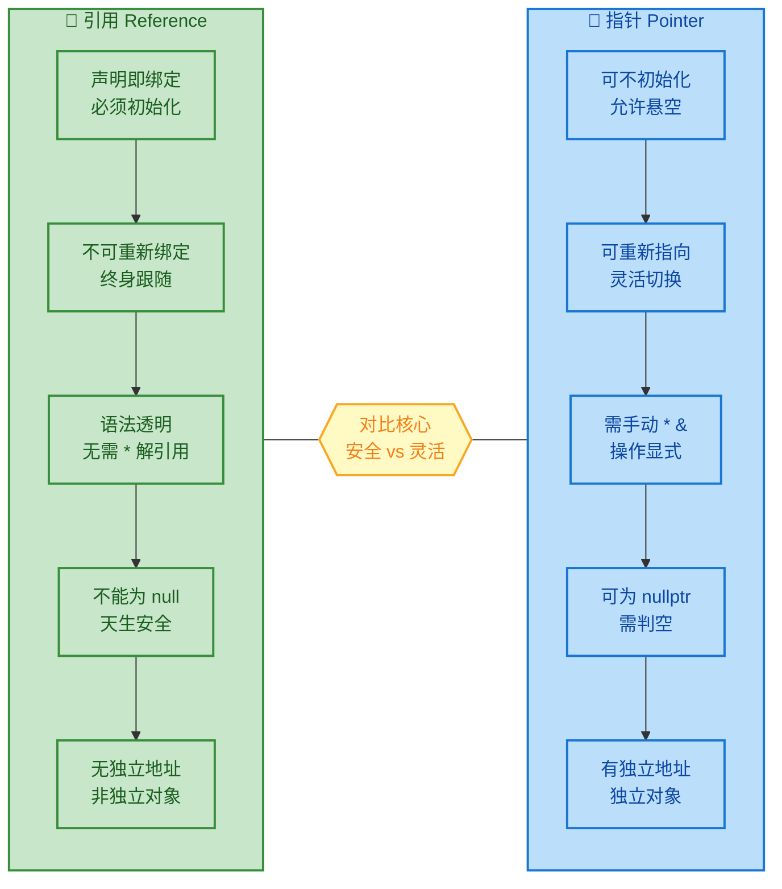

#### 逐项深入对比

**1. 初始化要求**

```cpp
int a = 10;

// 指针：可以不初始化（危险！），也可以初始化为 nullptr
int* p;             // ⚠️ 未初始化，指向随机地址（野指针）
int* p2 = nullptr;  // ✅ 初始化为空
int* p3 = &a;       // ✅ 初始化指向 a

// 引用：必须在声明时绑定
int& ref = a;       // ✅ 唯一合法的声明方式
// int& ref2;       // ❌ 编译失败
```

**2. 可否重新绑定 / 重新指向**

```cpp
int a = 10, b = 20;

// 指针：可以随时改变指向
int* p = &a;        // p 指向 a
p = &b;             // p 改为指向 b ✅

// 引用：绑定后无法更改
int& ref = a;       // ref 绑定到 a
ref = b;            // ⚠️ 这是把 b 的值赋给 a，不是重新绑定！
                    // 结果：a == 20, ref 仍然是 a 的别名
```

**3. 语法层面的透明度**

```cpp
int a = 10;
int* p = &a;        // 指针需要 & 取地址
int& ref = a;       // 引用直接用变量名

// 修改值
*p = 20;            // 指针需要 * 解引用才能修改目标值
ref = 20;           // 引用直接赋值，语法和普通变量完全一致

// 访问结构体成员（假设有 struct S { int x; }; S s; ）
// S* ps = &s;
// ps->x = 10;     // 指针用箭头运算符 ->
// S& rs = s;
// rs.x = 10;      // 引用用点运算符 .（和普通对象一样）
```

引用的语法透明性是它最大的魅力之一。使用引用时，代码的读写体验和操作普通变量**完全一样**，极大降低了心智负担。

**4. 空值（Null）与安全性**

```cpp
int* p = nullptr;   // ✅ 指针可以为空
// 使用前必须检查
if (p != nullptr) {
    *p = 10;        // 安全访问
}

// 引用不能为 null（没有语法支持绑定到"空"）
// int& ref = *nullptr; // ⚠️ 语法上可写，但这是未定义行为（UB），绝对禁止！
```

引用天生不能为空，这意味着当你收到一个引用参数时，**无需做空值检查**，可以直接放心使用。这是引用比指针更安全的核心原因之一。

**5. 多级间接（Multi-level Indirection）**

```cpp
int a = 10;

// 指针可以有多级：指向指针的指针
int* p = &a;        // 一级指针
int** pp = &p;      // 二级指针（指向指针的指针）
int*** ppp = &pp;   // 三级指针（指向指向指针的指针）

// 引用没有多级概念
int& ref = a;       // 一级引用
// int&& rref = ref; // ⚠️ 这不是"引用的引用"！这是右值引用（C++11新特性），完全不同的概念
int& ref2 = ref;    // ✅ 这只是让 ref2 也绑定到 a，不存在"二级引用"
```

**6. sizeof 的区别**

```cpp
int a = 10;
int* p = &a;
int& ref = a;

std::cout << sizeof(p)   << std::endl;  // 输出: 8（64位系统上指针占 8 字节）
std::cout << sizeof(ref) << std::endl;  // 输出: 4（返回的是 a 的大小，即 int 的大小）
std::cout << sizeof(a)   << std::endl;  // 输出: 4
```

`sizeof` 对引用求值时，返回的是**被引用对象的大小**，而非引用自身。这再次印证了"引用不是独立对象"这一核心语义。

#### 一表总览

| 对比维度 | 指针 (Pointer) | 引用 (Reference) |
|:---:|:---:|:---:|
| 声明语法 | `int* p = &a;` | `int& ref = a;` |
| 是否必须初始化 | ❌ 否（但强烈建议） | ✅ 是（强制） |
| 可否重新指向/绑定 | ✅ 可以随时更改 | ❌ 终身绑定 |
| 可否为 null | ✅ 可以（`nullptr`） | ❌ 不可以 |
| 访问目标值 | 需要 `*p` 解引用 | 直接用 `ref` |
| 有独立内存地址 | ✅ 是独立对象 | ❌ 非独立对象 |
| 支持多级间接 | ✅ `int**`, `int***` | ❌ 不支持 |
| `sizeof` 结果 | 指针自身大小（4/8字节） | 被引用对象的大小 |
| 支持算术运算 | ✅ `p++`, `p+n` | ❌ 不支持 |
| 安全性 | 较低（需手动判空） | 较高（天然非空） |

---

### 引用的典型使用场景

引用不是用来替代指针的——它们各有擅长的领域。掌握"何时用引用、何时用指针"是 C++ 工程实践中的关键判断力。

#### 场景一：函数参数传递（避免拷贝 + 修改原值）

这是引用最经典、最高频的使用场景。通过引用传参，可以避免昂贵的对象拷贝，同时允许函数直接修改调用者的变量。

```cpp
#include <iostream>
#include <string>

// 通过引用传递：避免拷贝 string（string 可能很长，拷贝代价高）
// 同时允许函数修改原始字符串
void toUpperCase(std::string& str) {  // str 是调用者传入变量的别名
    for (char& c : str) {             // 范围 for 中也用引用，直接修改每个字符
        if (c >= 'a' && c <= 'z') {   // 如果是小写字母
            c -= 32;                  // 转为大写（ASCII 差值为 32）
        }
    }
}

int main() {
    std::string name = "hello world";     // 原始字符串
    toUpperCase(name);                     // 传入引用，函数直接修改 name
    std::cout << name << std::endl;        // 输出: HELLO WORLD
    return 0;
}
```

#### 场景二：const 引用传参（只读访问，避免拷贝）

当函数只需要**读取**参数而不修改它时，应使用 `const` 引用。这是 C++ 中最推荐的"只读传参"方式。

```cpp
#include <iostream>
#include <vector>

// const 引用：承诺不修改 vec，同时避免拷贝整个 vector
void printVector(const std::vector<int>& vec) {  // vec 是只读别名
    for (const int& val : vec) {                  // 每个元素也用 const 引用，避免拷贝
        std::cout << val << " ";                  // 只读访问
    }
    std::cout << std::endl;
    // vec.push_back(1);  // ❌ 编译错误！const 引用禁止修改
}

int main() {
    std::vector<int> data = {1, 2, 3, 4, 5};  // 创建一个 vector
    printVector(data);                          // 传入 const 引用
    return 0;
}
```

> **最佳实践（Best Practice）**：C++ Core Guidelines 建议——对于"廉价拷贝"的小类型（如 `int`, `double`, `char`），直接值传递即可；对于"昂贵拷贝"的大类型（如 `std::string`, `std::vector`, 自定义类），优先使用 `const&` 传递。

#### 场景三：函数返回引用（返回容器元素的直接访问权）

函数可以返回引用，使调用者能直接操作函数内部（或对象内部）的数据，无需拷贝。`std::vector` 的 `operator[]` 就是典型案例。

```cpp
#include <iostream>
#include <vector>

class MyArray {
private:
    int data[5] = {10, 20, 30, 40, 50};  // 内部数组

public:
    // 返回引用：允许调用者直接读写内部元素
    int& at(int index) {                  // 返回类型是 int&
        return data[index];               // 返回的是数组元素本身（别名），而非拷贝
    }

    // const 版本：只允许读取
    const int& at(int index) const {      // const 成员函数中返回 const 引用
        return data[index];
    }
};

int main() {
    MyArray arr;
    std::cout << arr.at(2) << std::endl;  // 输出: 30（读取）
    arr.at(2) = 999;                       // 通过引用直接修改内部数组！
    std::cout << arr.at(2) << std::endl;  // 输出: 999（已被修改）
    return 0;
}
```

> ⚠️ **危险警告**：**绝对不要返回局部变量的引用！** 函数返回后局部变量被销毁，引用将指向已释放的内存——这是经典的**悬空引用（Dangling Reference）** 错误。

```cpp
// ❌ 严重错误示范！
int& createValue() {
    int local = 42;         // local 是局部变量，存储在栈上
    return local;           // 返回局部变量的引用 → 函数返回后 local 被销毁！
}   // ← local 的生命周期在这里结束

int main() {
    int& ref = createValue();  // ref 绑定到已销毁的内存 → 未定义行为（UB）！
    std::cout << ref;           // 可能输出 42，也可能输出垃圾值，也可能崩溃
    return 0;
}
```

#### 场景四：范围 for 循环中的引用

C++11 引入的范围 for（Range-based for）循环中，引用的使用极为常见：

```cpp
#include <iostream>
#include <vector>

int main() {
    std::vector<int> nums = {1, 2, 3, 4, 5};

    // 不用引用：val 是每个元素的拷贝，修改 val 不影响原容器
    for (int val : nums) {
        val *= 2;            // 只修改了拷贝，nums 不变
    }
    // nums 仍然是 {1, 2, 3, 4, 5}

    // 使用引用：val 是每个元素的别名，修改 val 直接修改原容器
    for (int& val : nums) {
        val *= 2;            // 直接修改 nums 中的元素
    }
    // nums 变为 {2, 4, 6, 8, 10}

    // 只读遍历：使用 const 引用，既避免拷贝又防止意外修改
    for (const int& val : nums) {
        std::cout << val << " ";  // 只读访问
    }
    // 输出: 2 4 6 8 10

    return 0;
}
```

#### 场景五："该用指针还是引用"的决策流程

在实际工程中，选择引用还是指针，可以遵循以下决策逻辑：

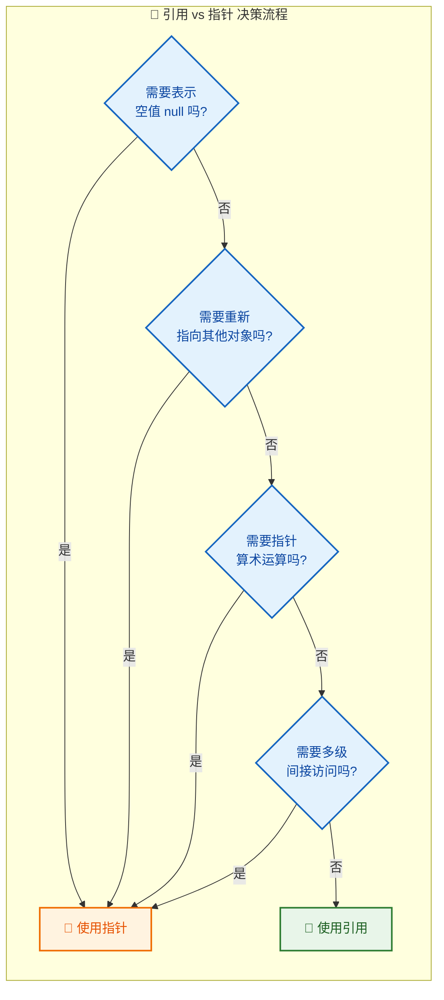

**核心原则**：**能用引用就用引用，必须用指针才用指针（Prefer references over pointers）。** 引用更安全、更简洁，是 C++ 相对于 C 的一大进步。只有当你确实需要"可空性"、"可重指向"、"指针算术"或"多级间接"时，才应该使用指针。

---

### 左值引用 vs 右值引用（预览）

本节聚焦的是 C++ 中最基础的**左值引用（Lvalue Reference）**，用 `&` 声明。但从 C++11 开始，还引入了**右值引用（Rvalue Reference）**，用 `&&` 声明。两者共同构成了 C++ 现代内存模型的基石：

```cpp
int a = 10;
int& lref = a;              // 左值引用：绑定到左值（有名字、有地址的对象）
// int& lref2 = 42;         // ❌ 不能绑定到右值

int&& rref = 42;            // 右值引用：绑定到右值（临时值、即将消亡的值）
// int&& rref2 = a;         // ❌ 不能直接绑定到左值

const int& cref = 42;       // const 左值引用：特殊，既能绑定左值也能绑定右值
```

右值引用是**移动语义（Move Semantics）** 和**完美转发（Perfect Forwarding）** 的基础，属于中高级 C++ 内容。此处仅作预告，提醒大家注意 `&` 和 `&&` 的根本区别——它们绑定的"值类别（Value Category）"不同。

---

### 常见陷阱与注意事项

**陷阱一：引用不延长局部变量的生命周期（除 const 引用绑定临时值外）**

```cpp
const int& ref = 42;   // ✅ 特殊规则：const 引用会延长临时值的生命周期
                        // 临时值 42 的生命周期被延长到 ref 的作用域结束
std::cout << ref;       // 安全，输出 42
```

这是 C++ 标准的一个特殊规定：当 `const` 引用绑定到一个**临时值（Temporary）** 时，该临时值的生命周期会被延长到引用的生命周期结束。但这个规则**不适用于**通过函数返回的引用间接绑定的情况，使用时需格外小心。

**陷阱二：引用类型转换可能产生临时变量**

```cpp
double pi = 3.14;
// const int& ref = pi;   // 编译器会创建一个 int 临时变量 = (int)3.14 = 3
                           // ref 绑定到这个临时变量，而不是 pi！
                           // 修改 pi 不会影响 ref，ref 也不是 pi 的别名
```

当引用类型与被绑定对象类型不一致时，编译器可能进行隐式转换并创建临时变量。此时引用绑定的是**临时变量**而非原始对象，这可能导致出人意料的行为。

---

**📝 练习题**

以下代码的输出是什么？

```cpp
#include <iostream>

int main() {
    int a = 10;
    int b = 20;
    int& ref = a;
    ref = b;
    b = 30;
    std::cout << a << " " << ref << " " << b << std::endl;
    return 0;
}
```

A. `10 20 30`

B. `20 20 30`

C. `10 10 30`

D. `20 30 30`


**【答案】** B

**【解析】** 这道题考查的核心是**引用不可重新绑定**这一铁律。

1. `int& ref = a;` —— `ref` 绑定到 `a`，从此 `ref` 永远是 `a` 的别名。
2. `ref = b;` —— **这不是让 ref 重新绑定到 b！** 这是把 `b` 的值（20）**赋值**给 `ref` 所绑定的变量——也就是 `a`。执行后 `a == 20`。
3. `b = 30;` —— 修改 `b` 为 30，与 `ref`/`a` 无关。
4. 最终状态：`a == 20`, `ref`（即 `a`）`== 20`, `b == 30`。

输出：`20 20 30`，选 B。

这道题是面试中考查引用理解深度的经典问题。很多人会误以为 `ref = b` 让 `ref` 转而绑定 `b`，从而错选 D。牢记：**引用一旦绑定，终身不变；对引用的赋值就是对原变量的赋值。**

---

## const 与指针 ⭐

`const` 与指针的组合是 C++ 中最经典的"绕晕"知识点之一。很多初学者看到 `const int*`、`int* const`、`const int* const` 就开始头疼——它们长得很像，但语义截然不同。本节将从底层内存模型出发，用一套**万能阅读法则**彻底拆解这三种形式，让你再也不会搞混。

### 理解 const 的本质：一把"锁"

在深入指针之前，先回顾 `const` 本身的语义。`const` 的作用是**对一个变量施加"只读约束"**——被它修饰的东西，在初始化之后就不可再被修改。

```cpp
const int x = 42;   // x 被锁定为 42
x = 100;             // ❌ 编译错误：不能修改 const 变量
```

当 `const` 遇上指针，问题就变成了：**这把锁到底锁的是谁？** 一个指针变量身上有两样东西可以被锁：

1. **指针所指向的数据**（即 `*p` 的值）
2. **指针本身存储的地址**（即 `p` 的值）

`const` 放的位置不同，锁的对象就不同。这就是三种组合的核心区别。

---

### 万能阅读法则：从右往左读（Right-to-Left Rule）

面对任何复杂的 `const` 指针声明，你只需要掌握一条规则——**从变量名出发，向左逐词阅读**（也称 Clockwise/Spiral Rule 的简化版）。

| 声明 | 从右往左读 | 含义 |
|---|---|---|
| `const int* p` | p is a **pointer** to **const int** | 指向常量的指针 |
| `int* const p` | p is a **const pointer** to **int** | 常量指针（指向整型） |
| `const int* const p` | p is a **const pointer** to **const int** | 指向常量的常量指针 |

下面用一张 Mermaid 图来直观呈现三种形式的关系：

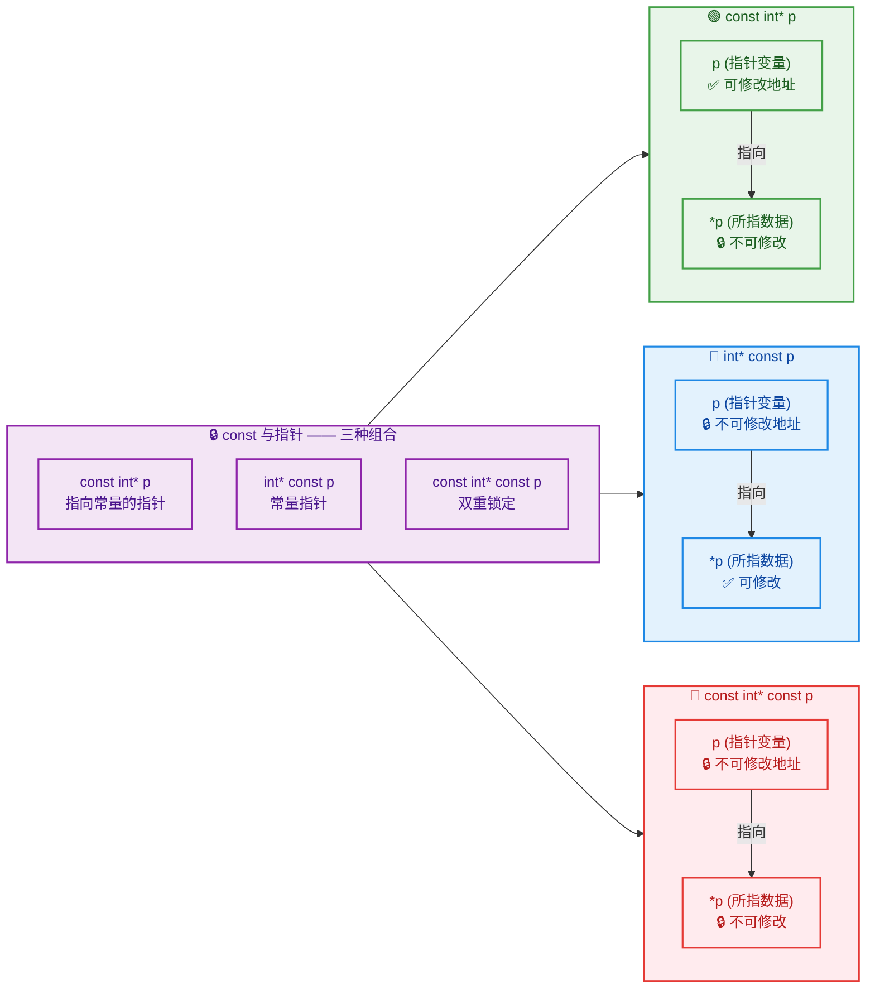

---

### 第一种：`const int* p` — 指向常量的指针（Pointer to Const）

这是最常见的形式。`const` 修饰的是 `int`（即指针所指向的数据），意味着**你不能通过这个指针去修改它所指向的值**，但**指针本身可以指向其他地方**。

等价写法：`int const* p`（`const` 在 `*` 左边即可，与 `int` 的前后顺序无关）。

```cpp
int a = 10;                // 定义普通整型变量 a，值为 10
int b = 20;                // 定义普通整型变量 b，值为 20

const int* p = &a;         // p 指向 a，但承诺"不通过 p 修改 a"

// *p = 100;               // ❌ 编译错误！不能通过 p 修改所指向的数据
std::cout << *p << "\n";   // ✅ 可以读取：输出 10

p = &b;                    // ✅ 可以改变 p 的指向，让它指向 b
std::cout << *p << "\n";   // ✅ 输出 20

a = 999;                   // ✅ 直接修改 a 本身是完全合法的！
std::cout << *p << "\n";   // 输出 20（p 已经指向 b，与 a 无关）
```

**关键理解**：`const int* p` 并不是说 `a` 本身变成了常量。`a` 依然可以直接被修改。`const` 只是**约束了 p 这条访问路径**——"我承诺不通过 `p` 去改 `a`"。这一点非常重要，来看内存模型：

```cpp
//  变量       地址         值
// ┌────────┬────────────┬─────────┐
// │   a    │  0x1000    │   10    │  ← a 本身不是 const，可以直接改
// ├────────┼────────────┼─────────┤
// │   b    │  0x1004    │   20    │
// ├────────┼────────────┼─────────┤
// │   p    │  0x1008    │ 0x1000  │  ← p 存的地址可以改（指向 a 或 b）
// └────────┴────────────┴─────────┘
//
//   const 锁住的是：通过 *p 去写入的行为
//   const 没有锁：p 本身存储的地址值
```

#### 典型使用场景

`const int*`（更一般地说 `const T*`）最常出现在**函数参数**中，表达"我只读取你的数据，绝不修改"这一语义承诺：

```cpp
// 打印数组内容：承诺不修改数组中的任何元素
void printArray(const int* arr, int size) {
    for (int i = 0; i < size; ++i) {       // 遍历每个元素
        // arr[i] = 0;                      // ❌ 如果取消注释，编译报错
        std::cout << arr[i] << " ";         // ✅ 只读访问，完全合法
    }
    std::cout << "\n";                      // 换行
}
```

这种设计思想在 C++ 标准库中随处可见，例如 `strlen(const char* s)` —— 计算字符串长度时，显然不应该修改原字符串。

---

### 第二种：`int* const p` — 常量指针（Const Pointer）

这次 `const` 紧贴在 `p` 的左边（在 `*` 的右边），它修饰的是**指针变量本身**。意味着**指针一旦初始化就不能再指向其他地方**，但**可以通过它修改所指向的数据**。

```cpp
int a = 10;                // 定义整型变量 a
int b = 20;                // 定义整型变量 b

int* const p = &a;         // p 被锁定指向 a，此后不能改指向

*p = 100;                  // ✅ 可以通过 p 修改 a 的值
std::cout << a << "\n";    // 输出 100（a 的值已被修改）

// p = &b;                 // ❌ 编译错误！p 是 const，不能改变指向
```

**关键理解**：`int* const p` 就像一根**焊死在某个地址上的钢针**——它永远指着同一个位置，但你可以随意改变那个位置里存放的值。

```cpp
//  变量       地址         值
// ┌────────┬────────────┬──────────┐
// │   a    │  0x1000    │ 10→100   │  ← 值可以通过 *p 修改
// ├────────┼────────────┼──────────┤
// │   b    │  0x1004    │   20     │
// ├────────┼────────────┼──────────┤
// │   p    │  0x1008    │ 0x1000 🔒│  ← 地址被焊死，不能改
// └────────┴────────────┴──────────┘
//
//   const 锁住的是：p 自身保存的地址值
//   const 没有锁：通过 *p 写入数据的行为
```

#### 典型使用场景

`int* const` 在日常代码中直接出现的频率不如 `const int*` 高，但有一个你每天都在用却可能没意识到的东西就是它——**数组名**。数组名在语义上就相当于一个 `int* const`：它指向数组首地址且不可被重新赋值。

```cpp
int arr[5] = {1, 2, 3, 4, 5};  // arr 本质上类似 int* const

arr[0] = 99;                    // ✅ 可以修改所指向的数据
// arr = nullptr;               // ❌ 不能改变 arr 的指向（虽然报错原因不完全一样）
```

另一个场景是在类中持有一个"绑定后不变"的指针成员（类似引用的效果，但允许为 `nullptr`）：

```cpp
class Logger {
private:
    std::ostream* const output_;            // 一旦绑定输出流，就不再更换

public:
    // 构造时绑定，此后 output_ 不可被重新赋值
    explicit Logger(std::ostream* os)
        : output_(os) {}                    // 必须在初始化列表中初始化

    void log(const std::string& msg) {
        *output_ << "[LOG] " << msg << "\n"; // ✅ 可以通过指针写入数据
    }
};
```

---

### 第三种：`const int* const p` — 指向常量的常量指针（Const Pointer to Const）

这是**终极锁定**：`const` 同时出现在 `*` 的左边和右边，既锁住了所指向的数据，又锁住了指针本身。**两边都不能改。**

```cpp
int a = 10;                        // 定义整型变量 a
int b = 20;                        // 定义整型变量 b

const int* const p = &a;           // p 被完全锁定

// *p = 100;                       // ❌ 不能修改所指向的数据
// p = &b;                         // ❌ 不能修改指针的指向
std::cout << *p << "\n";           // ✅ 唯一合法操作：读取，输出 10
```

```cpp
//  变量       地址         值
// ┌────────┬────────────┬──────────┐
// │   a    │  0x1000    │   10  🔒 │  ← 不能通过 *p 修改
// ├────────┼────────────┼──────────┤
// │   p    │  0x1008    │ 0x1000 🔒│  ← 地址也不能改
// └────────┴────────────┴──────────┘
//
//   双重锁定：p 只能在初始化时设定好，此后完全只读
```

#### 典型使用场景

当你需要传递一个**纯只读的观察窗口**时，`const T* const` 是最严格的保证。它在嵌入式开发中特别常见，用于映射硬件寄存器：

```cpp
// 映射一个只读的硬件状态寄存器
// 地址固定（指针不可变），值由硬件写入（软件不可改）
const volatile uint32_t* const STATUS_REG =
    reinterpret_cast<const volatile uint32_t*>(0x40021000);
    // volatile 告诉编译器：即使代码没改它，值也可能变化（硬件在改）
    // const uint32_t* → 软件不允许写入
    // * const        → 寄存器地址固定不变
```

---

### 三种形式对比速查表

| 形式 | 能否 `*p = ...`（改数据） | 能否 `p = ...`（改指向） | 助记 |
|:---:|:---:|:---:|:---|
| `const int* p` | ❌ 不能 | ✅ 能 | "数据上锁，指针自由" |
| `int* const p` | ✅ 能 | ❌ 不能 | "指针焊死，数据自由" |
| `const int* const p` | ❌ 不能 | ❌ 不能 | "双重锁定，全部只读" |

> **一句话速记**：`const` 在 `*` **左边** → 锁 **数据**；`const` 在 `*` **右边** → 锁 **指针**。

---

### 进阶：const_cast 与 const 指针的绕行

C++ 提供了 `const_cast` 来**移除 const 限制**，但这是一个非常危险的操作，只在极少数场景下合理使用。

```cpp
const int a = 42;                          // a 是一个真正的常量
const int* p = &a;                         // p 指向常量 a

int* q = const_cast<int*>(p);             // 强制移除 const 限制
*q = 100;                                  // ⚠️ 未定义行为（Undefined Behavior）！
// a 在编译期可能被优化为字面量 42，修改它的内存不一定生效
// 甚至可能导致程序崩溃

std::cout << a << "\n";                    // 可能输出 42（编译器优化）
std::cout << *q << "\n";                   // 可能输出 100（直接读内存）
```

**核心原则**：如果原始对象本身就是 `const` 的，用 `const_cast` 去写它就是 **Undefined Behavior（未定义行为）**。`const_cast` 唯一合理的场景是：原始对象本身**不是** `const`，但你手上拿到的是一个 `const` 指针/引用，需要临时恢复写权限。

```cpp
int value = 10;                            // 原始对象不是 const
const int* cp = &value;                    // 通过 const 指针观察

int* mp = const_cast<int*>(cp);           // 合法：因为 value 本身不是 const
*mp = 20;                                  // ✅ 安全，因为 value 本来就是可写的
std::cout << value << "\n";                // 输出 20
```

---

### 与引用的类比

`const` 与引用的组合规则其实更简单，因为**引用本身就不能被"重新绑定"**（引用天生就是 `const` 的"指针"），所以只有一种主流形式：

```cpp
int a = 10;

const int& ref = a;        // 相当于 const int* (不能通过 ref 改 a)
// ref = 20;               // ❌ 不能通过 ref 修改

// 不存在 int& const ref;  // 因为引用本身就不可重绑定，加 const 是多余的
```

用一张表对比指针和引用在 `const` 上的对应关系：

| 指针形式 | 引用对应 | 说明 |
|:---|:---|:---|
| `const int* p` | `const int& r` | 不可修改目标数据 |
| `int* const p` | `int& r`（天然如此） | 不可更改绑定对象 |
| `const int* const p` | `const int& r` | 引用天然不可重绑，再加 const 锁数据 |

由此可见，**引用天生自带了 `* const` 的语义**，所以引用在很多场景下比指针更简洁安全。

---

### 实战：`const` 正确性（Const Correctness）

在真实项目中，C++ 社区大力倡导 **Const Correctness**（const 正确性）原则，即：**尽可能多地使用 const**。原因有三：

1. **安全性**：编译器帮你检查是否意外修改了不该改的数据。
2. **可读性**：函数签名里的 `const` 是一种**自文档化**的承诺——"我不会改你的数据"。
3. **优化**：编译器知道数据不变后，可以做更激进的优化（如常量折叠、寄存器缓存等）。

来看一个综合示例，展示 const 在函数设计中的最佳实践：

```cpp
#include <iostream>
#include <cstring>

class MyString {
private:
    char* data_;                             // 指向堆上的字符数组
    size_t length_;                          // 字符串长度

public:
    // 构造函数
    explicit MyString(const char* str)       // const char*：承诺不修改传入的 C 字符串
        : length_(std::strlen(str))          // 计算长度
        , data_(new char[length_ + 1])       // 分配内存（+1 存 '\0'）
    {
        std::strcpy(data_, str);             // 拷贝内容
    }

    // 析构函数
    ~MyString() {
        delete[] data_;                      // 释放堆内存
    }

    // ✅ 只读访问：返回 const char*，函数本身也标记为 const
    const char* c_str() const {              // 末尾的 const 表示"不修改成员变量"
        return data_;                        // 返回只读指针
    }

    // ✅ 获取长度：纯读取操作，标记为 const
    size_t length() const {                  // const 成员函数
        return length_;                      // 不修改任何成员
    }

    // ✅ 可写访问：返回 char&，允许修改
    char& operator[](size_t index) {         // 非 const 版本：可读可写
        return data_[index];                 // 返回可修改的引用
    }

    // ✅ 只读访问重载：const 对象调用此版本
    const char& operator[](size_t index) const {  // const 版本：只读
        return data_[index];                      // 返回不可修改的引用
    }
};

// 函数参数使用 const 引用 + const 指针
void demonstrate(const MyString& s) {        // const 引用：不修改 s
    std::cout << s.c_str() << "\n";          // ✅ 调用 const 成员函数
    std::cout << s[0] << "\n";               // ✅ 调用 const 版本的 operator[]
    // s[0] = 'X';                           // ❌ 编译错误：const 对象不能调用非 const 方法
}
```

在上面的代码中，`const` 出现在了多个位置——函数参数里、返回值里、成员函数末尾。这种层层加锁的做法就是 **Const Correctness** 的体现。

---

### 容易踩的坑与常见面试陷阱

#### 坑 1：`const int*` 与 `int const*` 是同一个东西

```cpp
const int* p1;     // 指向 const int 的指针
int const* p2;     // 同上！完全等价！

// 记住：const 只要在 * 左边，不管在 int 前还是后，都是锁数据
```

#### 坑 2：顶层 const vs 底层 const（Top-level vs Low-level const）

这是 C++ 标准中的官方术语，也是面试高频考点：

- **Top-level const**（顶层 const）：修饰的是变量**本身**。例如 `int* const p` 中的 `const`。
- **Low-level const**（底层 const）：修饰的是指针/引用**所指向的对象**。例如 `const int* p` 中的 `const`。

**为什么区分它们很重要？** 因为在**拷贝**时，规则不同：

```cpp
int a = 10;

const int* p1 = &a;          // p1 有底层 const
int* p2 = p1;                // ❌ 编译错误！不能忽略底层 const
                              //    （否则就能通过 p2 偷改 const 数据了）

int* const p3 = &a;          // p3 有顶层 const
int* p4 = p3;                // ✅ 合法！顶层 const 在拷贝时被忽略
                              //    （p4 是 p3 的副本，指向同一地址）
```

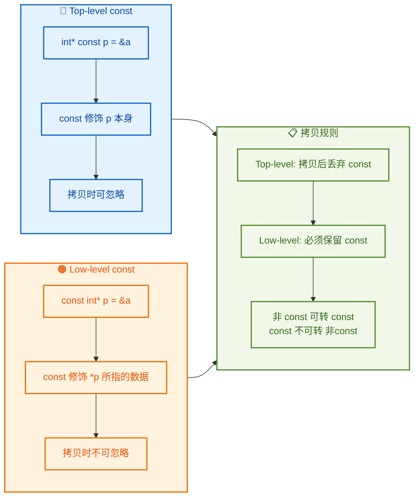

#### 坑 3：隐式转换的方向——只能"加锁"不能"解锁"

```cpp
int* p = &a;                  // 普通指针
const int* cp = p;            // ✅ 合法：从 int* → const int*（加锁，安全）

const int* cp2 = &a;
int* p2 = cp2;                // ❌ 非法：从 const int* → int*（解锁，危险）

// 类比：把钥匙交出去（加锁）容易，想凭空变出钥匙（解锁）不行
```

这条规则的直觉是：**你可以主动放弃修改权（加 const），但不能凭空获得修改权（去 const）**。

---

### 本节小结

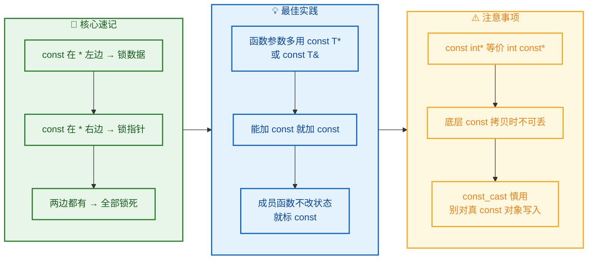

---

**📝 练习题**

以下代码中，哪一行会导致**编译错误**？

```cpp
int x = 5, y = 10;
const int* p1 = &x;       // 第 1 行
int* const p2 = &x;       // 第 2 行
*p1 = 20;                 // 第 3 行
*p2 = 20;                 // 第 4 行
p1 = &y;                  // 第 5 行
p2 = &y;                  // 第 6 行
```

A. 第 3 行和第 4 行


B. 第 3 行和第 6 行


C. 第 5 行和第 6 行


D. 第 4 行和第 5 行

**【答案】** B

**【解析】**

- `p1` 的类型是 `const int*`（指向常量的指针）：`const` 在 `*` 左边，锁住的是数据。因此 `*p1 = 20`（第 3 行）试图修改数据，**编译错误**；`p1 = &y`（第 5 行）改变指向，合法。
- `p2` 的类型是 `int* const`（常量指针）：`const` 在 `*` 右边，锁住的是指针本身。因此 `*p2 = 20`（第 4 行）修改数据，合法；`p2 = &y`（第 6 行）试图改变指向，**编译错误**。
- 所以编译错误出现在**第 3 行和第 6 行**，选 B。

---

**📝 练习题**

关于 Top-level const 和 Low-level const，以下说法正确的是？

A. `int* const p` 中的 `const` 是 Low-level const


B. `const int* p` 中的 `const` 是 Top-level const


C. 拷贝时，Top-level const 会被忽略，Low-level const 必须保留


D. `const_cast` 可以安全地移除任何对象上的 `const`

**【答案】** C

**【解析】**

- **A 错误**：`int* const p` 中的 `const` 修饰的是指针变量 `p` 本身，属于 **Top-level const**（顶层 const）。
- **B 错误**：`const int* p` 中的 `const` 修饰的是 `p` 所指向的对象（`*p`），属于 **Low-level const**（底层 const）。
- **C 正确**：这是 C++ 标准的规定。当你把 `int* const p3` 拷贝给 `int* p4` 时，顶层 const 被丢弃，合法。但把 `const int* p1` 赋给 `int* p2` 时，底层 const 不能被忽略，非法。
- **D 错误**：如果原始对象本身就是用 `const` 声明的（如 `const int a = 42;`），对其使用 `const_cast` 后进行写入是 **Undefined Behavior**，并不安全。`const_cast` 只在原始对象本身非 `const` 的情况下才安全。

---

## 函数参数传递（Pass by Value / Pass by Pointer / Pass by Reference）

在 C++ 中，函数参数传递机制是理解整个语言内存模型的**核心拼图**。当你调用一个函数并传入实参（argument）时，编译器必须决定：**函数内部操作的，到底是原始数据本身，还是原始数据的一份副本？** 这个问题的答案，直接决定了函数能否修改外部变量、程序的性能开销、以及代码的安全性。

C++ 提供了三种主要的参数传递方式：**值传递（Pass by Value）**、**指针传递（Pass by Pointer）** 和 **引用传递（Pass by Reference）**。它们并非孤立存在——每一种都对应着不同的内存操作语义，理解它们之间的本质差异，是写出高效、安全 C++ 代码的基础。

我们先从一张全局对比图开始，建立直觉：

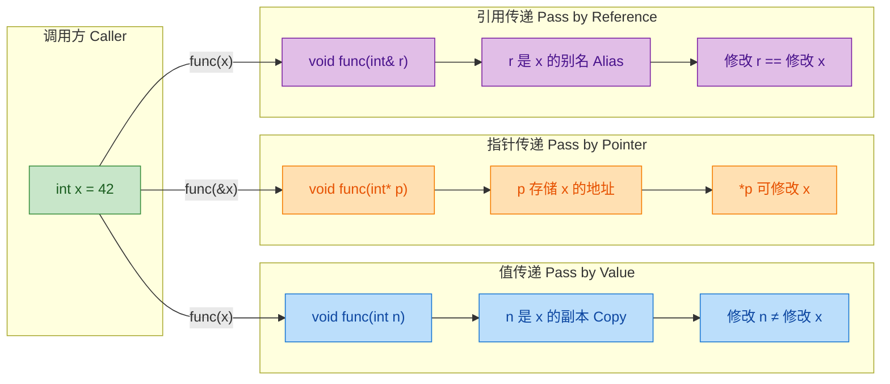

---

### 值传递（Pass by Value）

值传递是 C++ 中**最基础、最安全**的参数传递方式，也是**默认**的传递方式。其核心语义可以用一句话概括：**函数接收的是实参的一份完整拷贝（copy），函数内部的任何修改都不会影响到原始变量。**

#### 原理深入

当编译器遇到一次值传递的函数调用时，它会在**被调函数的栈帧（stack frame）** 中分配一块新的内存空间，然后将实参的值**逐字节复制**到这块新空间中。从此刻起，形参（parameter）和实参（argument）就是两个**完全独立**的变量——它们住在不同的内存地址，互不干扰。

```c++
#include <iostream>
using namespace std;

// 值传递：形参 n 是实参 x 的一份副本
void increment(int n) {
    n = n + 1;               // 只修改了副本 n，原始 x 不受影响
    cout << "函数内 n = " << n          // 输出: 43
         << ", 地址: " << &n << endl;   // 地址与 x 不同
}

int main() {
    int x = 42;              // 原始变量 x
    cout << "调用前 x = " << x          // 输出: 42
         << ", 地址: " << &x << endl;

    increment(x);            // 传入 x 的值（42 被复制给 n）

    cout << "调用后 x = " << x << endl; // 输出: 42（未被修改）
    return 0;
}
```

运行时的内存布局如下：

```
┌──────────────────────────────────────────────────┐
│                   Stack（栈）                      │
│                                                    │
│  ┌─────────────── main 栈帧 ──────────────┐       │
│  │  x :  [ 42 ]    地址: 0x7ffc0010       │       │
│  └────────────────────────────────────────-┘       │
│                                                    │
│  ┌────────── increment 栈帧 ──────────────┐       │
│  │  n :  [ 42 ] → [ 43 ]  地址: 0x7ffbfff0│       │
│  │  (n 是独立副本，修改不影响 x)            │       │
│  └─────────────────────────────────────────┘       │
└──────────────────────────────────────────────────┘
```

可以清晰地看到：`x` 和 `n` 占据不同的内存地址。`n` 从 42 变成 43 的过程，与 `x` 毫无关系。

#### 值传递的性能开销

对于 `int`、`double`、`char` 等**基本类型（primitive types）**，值传递的拷贝开销极小（通常就是一次寄存器操作），完全可以忽略。但当传递的对象是**大型结构体或类**时，情况就截然不同了：

```c++
#include <iostream>
#include <string>
using namespace std;

struct BigData {
    int    arr[10000];        // 40,000 字节的数组
    string name;              // 额外的堆内存
};

// 值传递：每次调用都要完整复制 BigData（开销极大！）
void processByValue(BigData data) {
    data.arr[0] = 999;       // 修改的是副本，不影响原始对象
    // ... 处理逻辑
}

int main() {
    BigData bd;               // 创建一个大对象
    bd.arr[0] = 1;

    processByValue(bd);       // ⚠️ 这里发生了约 40KB+ 的内存拷贝！

    cout << bd.arr[0] << endl; // 输出: 1（原始对象未变）
    return 0;
}
```

每次调用 `processByValue(bd)` 都会触发一次**深拷贝**（如果类定义了拷贝构造函数的话）。在高频调用的场景下，这种开销是不可接受的。这正是指针传递和引用传递存在的核心原因之一。

#### 值传递的适用场景

| 场景 | 原因 |
|------|------|
| 传递基本类型（`int`, `double`, `bool` 等） | 拷贝开销极小，且安全 |
| 函数**需要**一份独立副本来修改（不影响原始数据） | 语义正确 |
| 函数参数是小型 trivial 对象 | 拷贝成本可忽略 |

---

### 指针传递（Pass by Pointer）

指针传递的本质是：**将变量的地址作为实参传递给函数，函数通过解引用（dereference）这个地址来间接操作原始数据**。从技术上讲，指针传递仍然是值传递——只不过被复制的"值"不再是数据本身，而是数据的**内存地址**。

#### 原理深入

```c++
#include <iostream>
using namespace std;

// 指针传递：形参 p 接收的是 x 的地址
void increment(int* p) {
    // p 本身是地址的副本，但 *p 可以访问原始变量
    cout << "p  的值(地址): " << p << endl;    // 与 &x 相同
    cout << "p  自身地址:   " << &p << endl;   // 与 &x 不同（p 是副本）

    *p = *p + 1;             // 解引用后修改，直接作用于原始变量 x
}

int main() {
    int x = 42;              // 原始变量
    cout << "x 的地址: " << &x << endl;

    increment(&x);           // 传入 x 的地址（&x）

    cout << "调用后 x = " << x << endl; // 输出: 43（已被修改！）
    return 0;
}
```

内存布局一目了然：

```
┌──────────────────────────────────────────────────────────┐
│                      Stack（栈）                          │
│                                                           │
│  ┌─────────── main 栈帧 ────────────────┐                │
│  │  x :  [ 42 ] → [ 43 ]                │                │
│  │  地址: 0x7ffc0010                     │                │
│  └───────────────────────────────────────┘                │
│               ▲                                           │
│               │ 解引用 *p 直达 x                           │
│               │                                           │
│  ┌─────────── increment 栈帧 ───────────┐                │
│  │  p :  [ 0x7ffc0010 ]  ← 存的是 x 的地址│               │
│  │  地址: 0x7ffbffe8 (p 自身的地址)       │               │
│  └────────────────────────────────────────┘               │
└──────────────────────────────────────────────────────────┘
```

关键洞察：**`p` 本身是 `&x` 的一份副本**（所以 `p` 和 `&x` 的值相同，但 `&p` 和 `&(&x)` 的地址不同）。虽然指针变量自身被复制了，但通过解引用 `*p`，我们能穿透这层副本，直接触及 `x`。

#### 用指针传递交换两个变量

这是最经典的示例——如果不借助指针或引用，**值传递无法实现两个变量的交换**：

```c++
#include <iostream>
using namespace std;

// ❌ 错误版本：值传递，只交换了副本
void swapWrong(int a, int b) {
    int temp = a;             // temp = a 的副本
    a = b;                    // 修改的是副本 a
    b = temp;                 // 修改的是副本 b
    // 函数结束，a 和 b 被销毁，原始变量毫无变化
}

// ✅ 正确版本：指针传递，通过地址操作原始变量
void swapCorrect(int* pa, int* pb) {
    int temp = *pa;           // temp 保存 pa 指向的原始值
    *pa = *pb;                // 将 pb 指向的值写入 pa 指向的位置
    *pb = temp;               // 将 temp 写入 pb 指向的位置
}

int main() {
    int x = 10, y = 20;

    swapWrong(x, y);          // 值传递：无效交换
    cout << "swapWrong 后:   x=" << x << " y=" << y << endl;
    // 输出: x=10 y=20（没变）

    swapCorrect(&x, &y);     // 指针传递：有效交换
    cout << "swapCorrect 后: x=" << x << " y=" << y << endl;
    // 输出: x=20 y=10（成功交换）

    return 0;
}
```

```mermaid
graph LR
    subgraph SG_BEFORE["交换前 Before Swap"]
        direction TB
        X1["x = 10<br/>addr: 0x10"]
        Y1["y = 20<br/>addr: 0x20"]
    end

    subgraph SG_FUNC["swapCorrect 执行中"]
        direction TB
        PA["pa → 0x10"]
        PB["pb → 0x20"]
        S1["temp = *pa → 10"]
        S2["*pa = *pb → x 变为 20"]
        S3["*pb = temp → y 变为 10"]
        PA --> S1
        PB --> S2
        S1 --> S2 --> S3
    end

    subgraph SG_AFTER["交换后 After Swap"]
        direction TB
        X2["x = 20"]
        Y2["y = 10"]
    end

    SG_BEFORE --> SG_FUNC --> SG_AFTER

    classDef beforeStyle fill:#C8E6C9,stroke:#388E3C,color:#1B5E20
    classDef funcStyle fill:#BBDEFB,stroke:#1976D2,color:#0D47A1
    classDef afterStyle fill:#FFE0B2,stroke:#F57C00,color:#E65100

    class X1,Y1 beforeStyle
    class PA,PB,S1,S2,S3 funcStyle
    class X2,Y2 afterStyle
```

#### 指针传递的"危险面"

指针传递虽然强大，但它引入了一个值传递不曾有的问题——**空指针（null pointer）和野指针（dangling pointer）**。函数内部如果不进行防御性检查，就可能对非法地址进行解引用，导致**未定义行为（Undefined Behavior）**：

```c++
#include <iostream>
using namespace std;

// 安全的指针传递：必须检查指针合法性
void safeIncrement(int* p) {
    if (p == nullptr) {       // 防御性检查：指针是否为空？
        cout << "错误：空指针！" << endl;
        return;               // 安全退出，避免崩溃
    }
    *p = *p + 1;              // 确认合法后才解引用
}

int main() {
    int x = 42;
    int* valid = &x;          // 合法指针
    int* invalid = nullptr;   // 空指针

    safeIncrement(valid);     // 正常执行
    cout << x << endl;        // 输出: 43

    safeIncrement(invalid);   // 输出: 错误：空指针！（不会崩溃）

    return 0;
}
```

这种**每次都要手动检查 nullptr** 的负担，正是 C++ 后来引入引用传递的动机之一。

#### 指针传递的适用场景

| 场景 | 原因 |
|------|------|
| 需要修改调用方的变量 | 通过解引用操作原始数据 |
| 参数可以为"空"（表示"没有"） | 引用不能为 null，指针可以 |
| 需要在函数内部切换指向不同对象 | 指针可以重新赋值，引用不行 |
| 与 C 语言接口交互 | C 没有引用机制 |
| 动态分配内存（`new`/`delete`） | 必须用指针操作堆内存 |

---

### 引用传递（Pass by Reference）

引用传递是 C++ 对指针传递的**高层抽象与语法简化**。其核心语义是：**形参是实参的别名（alias），它们是同一个变量的两个名字，共享同一块内存**。引用传递既拥有指针传递"修改原始数据"的能力，又消除了指针传递的语法噪声和空指针风险。

#### 原理深入

```c++
#include <iostream>
using namespace std;

// 引用传递：形参 r 是实参 x 的别名
void increment(int& r) {
    // r 就是 x，不需要解引用，不需要检查 null
    cout << "r 的地址: " << &r << endl;  // 与 &x 完全相同！
    r = r + 1;               // 直接修改 x 本身
}

int main() {
    int x = 42;
    cout << "x 的地址: " << &x << endl;

    increment(x);            // 语法上和值传递一样！但行为完全不同

    cout << "调用后 x = " << x << endl;  // 输出: 43
    return 0;
}
```

注意两个关键点：

1. **调用处语法相同**：`increment(x)` 和值传递写法一模一样，区别只在函数**声明**处（`int& r` vs `int n`）。
2. **地址完全相同**：`&r == &x`，证明 `r` 不是 `x` 的副本，而是 `x` 本身的另一个名字。

内存布局：

```
┌─────────────────────────────────────────────────────────┐
│                      Stack（栈）                         │
│                                                          │
│  ┌─────────── main 栈帧 ──────────────┐                 │
│  │  x :  [ 42 ] → [ 43 ]              │                 │
│  │  地址: 0x7ffc0010                   │                 │
│  └─────────────────────────────────────┘                 │
│           ▲                                              │
│           │ r 就是 x 的别名（alias）                      │
│           │ 编译器内部: r ≡ *(0x7ffc0010)                 │
│           │ 对程序员: 直接当普通变量用                      │
│           │                                              │
│  ┌─────────── increment 栈帧 ─────────┐                 │
│  │  r :  (别名, 无独立存储*)            │                 │
│  │  *编译器可能用隐藏指针实现, 但语义上   │                 │
│  │   r 没有自己的地址                   │                 │
│  └──────────────────────────────────────┘                │
└─────────────────────────────────────────────────────────┘
```

> **编译器实现细节**：在底层，引用几乎总是被实现为一个**隐式指针（implicit pointer）**——编译器自动生成取地址和解引用的代码。但在语言**语义层面**，引用不是指针，它是别名。程序员不需要也不应该去关心这个底层细节。

#### 用引用传递实现 swap

对比指针版本，引用版本的语法干净了许多：

```c++
#include <iostream>
using namespace std;

// 引用传递版 swap：语法简洁，语义清晰
void swapRef(int& a, int& b) {
    int temp = a;             // a 就是原始变量，无需解引用
    a = b;                    // 直接赋值
    b = temp;                 // 直接赋值
}

int main() {
    int x = 10, y = 20;

    swapRef(x, y);            // 调用语法和值传递一样简洁

    cout << "x=" << x << " y=" << y << endl;
    // 输出: x=20 y=10（成功交换）

    return 0;
}
```

事实上，C++ 标准库中的 `std::swap()` 就是基于引用传递实现的。

#### const 引用传递：两全其美

在很多场景下，我们既不想拷贝大对象（性能），也不想让函数修改原始数据（安全）。**`const` 引用传递（pass by const reference）** 完美解决了这个矛盾：

```c++
#include <iostream>
#include <string>
#include <vector>
using namespace std;

// const 引用传递：不拷贝、不可修改 → 既高效又安全
void printInfo(const string& name, const vector<int>& scores) {
    cout << "姓名: " << name << endl;     // 可以读取
    // name = "Hacker";                   // ❌ 编译错误！const 禁止修改
    // scores.push_back(0);               // ❌ 编译错误！const 禁止修改

    cout << "成绩: ";
    for (const int& s : scores) {         // 遍历时也用 const 引用，避免拷贝
        cout << s << " ";
    }
    cout << endl;
}

int main() {
    string studentName = "Alice";
    vector<int> studentScores = {95, 87, 92, 78, 100};

    printInfo(studentName, studentScores); // 零拷贝，零修改风险

    return 0;
}
```

**现代 C++ 最佳实践**：对于所有**不需要修改**的非基本类型参数，一律使用 `const T&` 传递。这是 C++ Core Guidelines 中反复强调的规则。

```mermaid
graph LR
    subgraph SG_DECISION["参数传递决策树"]
        direction TB
        Q1{"需要修改<br/>原始数据?"}
        Q2{"基本类型<br/>或小对象?"}
        Q3{"参数<br/>可为空?"}
        Q4{"基本类型<br/>或小对象?"}

        R1["值传递<br/>void f(int n)"]
        R2["const 引用<br/>void f(const T& x)"]
        R3["指针传递<br/>void f(T* p)"]
        R4["引用传递<br/>void f(T& x)"]
        R5["值传递<br/>void f(int n)"]

        Q1 -- "否" --> Q2
        Q1 -- "是" --> Q3
        Q2 -- "是" --> R1
        Q2 -- "否" --> R2
        Q3 -- "是" --> R3
        Q3 -- "否" --> Q4
        Q4 -- "是" --> R5
        Q4 -- "否" --> R4
    end

    classDef question fill:#E3F2FD,stroke:#1565C0,color:#0D47A1
    classDef valResult fill:#C8E6C9,stroke:#388E3C,color:#1B5E20
    classDef refResult fill:#E1BEE7,stroke:#7B1FA2,color:#4A148C
    classDef ptrResult fill:#FFE0B2,stroke:#F57C00,color:#E65100
    classDef constResult fill:#F3E5F5,stroke:#8E24AA,color:#4A148C

    class Q1,Q2,Q3,Q4 question
    class R1,R5 valResult
    class R2 constResult
    class R3 ptrResult
    class R4 refResult
```

---

### 三种传递方式的终极对比

以下是一张横向对比表，涵盖了所有关键维度：

| 维度 | 值传递 `f(T x)` | 指针传递 `f(T* p)` | 引用传递 `f(T& r)` | const 引用 `f(const T& r)` |
|------|:---:|:---:|:---:|:---:|
| **函数内操作对象** | 副本 | 原始（通过 `*p`） | 原始 | 原始（只读） |
| **能否修改原始数据** | ❌ | ✅ | ✅ | ❌ |
| **参数可以为 null** | — | ✅ | ❌ | ❌ |
| **拷贝开销** | 有（可能很大） | 极小（仅复制地址） | 无 | 无 |
| **语法噪声** | 低 | 高（`&`, `*` 满天飞） | 低 | 低 |
| **需要防御 null** | — | ✅ 必须检查 | 不需要 | 不需要 |
| **形参可重新绑定** | — | ✅（`p = &other`） | ❌ | ❌ |
| **推荐使用场景** | 基本类型 / 需要副本 | 可选参数 / C 接口 | 需要修改原始 | 只读大对象 ⭐ |

---

### 深入底层：三种方式的汇编视角

为了让你从根本上理解三者的区别，我们来看编译器生成的简化伪汇编。这不需要你完全读懂汇编，只需要感受其中的**关键差异**：

```c++
// 假设调用: int x = 42;

// ===== 值传递 =====
// void f(int n) { n++; }
// f(x);
mov  eax, [x]         // 将 x 的值（42）加载到寄存器 eax
push eax               // 把值 42 压入栈 → 这就是形参 n
call f                  // 调用 f，f 内部修改的是栈上的副本

// ===== 指针传递 =====
// void f(int* p) { (*p)++; }
// f(&x);
lea  eax, [x]         // 将 x 的地址加载到寄存器 eax（lea = load effective address）
push eax               // 把地址压入栈 → 这就是形参 p
call f                  // f 内部通过地址找到 x 并修改

// ===== 引用传递 =====
// void f(int& r) { r++; }
// f(x);
lea  eax, [x]         // 将 x 的地址加载到寄存器 eax
push eax               // 把地址压入栈 → 这就是隐式指针
call f                  // f 内部通过地址找到 x 并修改（与指针传递完全一样！）
```

**惊人的发现**：在汇编层面，**引用传递和指针传递生成的代码几乎完全相同！** 引用传递只是 C++ 在语法层面提供的"语法糖"——它让程序员不必手动写 `&` 和 `*`，编译器在幕后自动完成了这些操作。

---

### 综合实战：三种传递方式的对比演示

```c++
#include <iostream>
using namespace std;

// 值传递：接收副本，无法修改原始值
void addByValue(int n, int delta) {
    n += delta;                        // 修改副本
    cout << "[值传递]  函数内 n = " << n << endl;
}

// 指针传递：通过地址间接修改原始值
void addByPointer(int* p, int delta) {
    if (p == nullptr) return;          // 防御性检查
    *p += delta;                       // 解引用后修改原始值
    cout << "[指针传递] 函数内 *p = " << *p << endl;
}

// 引用传递：别名，直接修改原始值
void addByReference(int& r, int delta) {
    r += delta;                        // 直接修改原始值
    cout << "[引用传递] 函数内 r = " << r << endl;
}

// const 引用传递：只读，不能修改
void printValue(const int& r) {
    cout << "[const引用] 值 = " << r << endl;
    // r += 1;                         // ❌ 编译错误：const 禁止修改
}

int main() {
    int a = 100, b = 100, c = 100;

    // 1. 值传递
    addByValue(a, 50);                 // a 的副本被修改为 150
    cout << "值传递后   a = " << a << endl;   // a = 100（不变）
    cout << "---" << endl;

    // 2. 指针传递
    addByPointer(&b, 50);             // 通过地址修改 b 为 150
    cout << "指针传递后 b = " << b << endl;   // b = 150（已修改）
    cout << "---" << endl;

    // 3. 引用传递
    addByReference(c, 50);            // 通过别名修改 c 为 150
    cout << "引用传递后 c = " << c << endl;   // c = 150（已修改）
    cout << "---" << endl;

    // 4. const 引用
    printValue(c);                     // 只读访问，不会修改 c

    return 0;
}
```

**输出结果**：

```
[值传递]  函数内 n = 150
值传递后   a = 100
---
[指针传递] 函数内 *p = 150
指针传递后 b = 150
---
[引用传递] 函数内 r = 150
引用传递后 c = 150
---
[const引用] 值 = 150
```

---

### 特殊话题：数组作为函数参数

数组在 C++ 中有一个非常特殊的行为——**数组名作为函数参数时，会退化（decay）为指向首元素的指针**。这意味着你**无法**对数组进行真正的值传递：

```c++
#include <iostream>
using namespace std;

// 以下三种写法完全等价！编译器都把 arr 当做 int* 处理
void printArray1(int arr[], int size) {       // 看起来像数组，实际是指针
    cout << "sizeof(arr) = " << sizeof(arr)   // 输出 8（指针大小），不是数组大小！
         << endl;
}

void printArray2(int* arr, int size) {        // 显式写成指针
    // 完全等价于上面
}

void printArray3(int arr[100], int size) {    // 写了大小也没用
    // 编译器忽略 [100]，仍然当做 int*
}

// 如果确实需要传"固定大小的数组"，可以用引用：
void printArrayRef(int (&arr)[5]) {           // 引用传递：保留数组大小信息
    cout << "sizeof(arr) = " << sizeof(arr)   // 输出 20（5 * sizeof(int)）
         << endl;
    for (int i = 0; i < 5; i++) {
        cout << arr[i] << " ";
    }
    cout << endl;
}

int main() {
    int data[5] = {10, 20, 30, 40, 50};

    printArray1(data, 5);     // sizeof = 8（退化为指针）
    printArrayRef(data);      // sizeof = 20（保留了数组信息）

    return 0;
}
```

这个"退化"机制是 C++ 从 C 继承来的历史遗留问题。在现代 C++ 中，推荐使用 `std::array` 或 `std::span` (C++20) 来传递数组，它们可以完美保留大小信息：

```c++
#include <iostream>
#include <array>
using namespace std;

// 使用 std::array 传递：大小信息完整保留
void printModern(const array<int, 5>& arr) {
    for (const auto& elem : arr) {            // 支持 range-based for
        cout << elem << " ";
    }
    cout << endl;
}

int main() {
    array<int, 5> data = {10, 20, 30, 40, 50};
    printModern(data);        // 安全、现代、类型完整
    return 0;
}
```

---

### 返回值优化（RVO）与移动语义简述

你可能会问：**函数返回大对象时，是不是也会产生昂贵的拷贝？** 答案是：现代编译器已经非常聪明了。

```c++
#include <iostream>
#include <vector>
using namespace std;

// 看起来是值返回（拷贝），但编译器会优化掉拷贝
vector<int> createVector() {
    vector<int> v = {1, 2, 3, 4, 5};   // 在函数内构造
    return v;                           // RVO: 直接在调用方的内存中构造
}

int main() {
    vector<int> result = createVector(); // 无拷贝发生！（RVO/NRVO）

    for (int x : result) {
        cout << x << " ";              // 输出: 1 2 3 4 5
    }
    cout << endl;

    return 0;
}
```

**RVO（Return Value Optimization，返回值优化）** 和 **NRVO（Named RVO）** 允许编译器将返回对象直接构造在调用方的栈空间中，完全跳过拷贝。C++17 标准更是将 RVO 从"编译器可选优化"提升为了**强制要求**（mandatory copy elision）。

所以，**不要因为害怕拷贝而刻意返回指针或引用**——让编译器帮你优化，代码会更简洁安全。

---

### 本节知识图谱总结

```mermaid
graph LR
    subgraph SG_CORE["函数参数传递 Function Parameter Passing"]
        direction TB
        CENTER["三种核心方式"]
        V["值传递<br/>Pass by Value"]
        P["指针传递<br/>Pass by Pointer"]
        R["引用传递<br/>Pass by Reference"]
        CENTER --> V
        CENTER --> P
        CENTER --> R
    end

    subgraph SG_VAL_DETAIL["值传递特性"]
        direction TB
        V1["拷贝实参"]
        V2["不影响原始"]
        V3["适合基本类型"]
        V1 --> V2 --> V3
    end

    subgraph SG_PTR_DETAIL["指针传递特性"]
        direction TB
        P1["传递地址"]
        P2["可修改原始"]
        P3["需检查 nullptr"]
        P4["可为空 / 可重绑定"]
        P1 --> P2 --> P3 --> P4
    end

    subgraph SG_REF_DETAIL["引用传递特性"]
        direction TB
        R1["别名机制"]
        R2["可修改原始"]
        R3["不可为 null"]
        R4["const T& 只读高效"]
        R1 --> R2 --> R3 --> R4
    end

    V --> SG_VAL_DETAIL
    P --> SG_PTR_DETAIL
    R --> SG_REF_DETAIL

    classDef coreStyle fill:#E8F5E9,stroke:#2E7D32,color:#1B5E20
    classDef valStyle fill:#E3F2FD,stroke:#1565C0,color:#0D47A1
    classDef ptrStyle fill:#FFF3E0,stroke:#EF6C00,color:#E65100
    classDef refStyle fill:#F3E5F5,stroke:#8E24AA,color:#4A148C

    class CENTER,V,P,R coreStyle
    class V1,V2,V3 valStyle
    class P1,P2,P3,P4 ptrStyle
    class R1,R2,R3,R4 refStyle
```

---

**📝 练习题 1**

以下代码的输出结果是什么？

```c++
#include <iostream>
using namespace std;

void mystery(int a, int* b, int& c) {
    a = a + 10;
    *b = *b + 20;
    c = c + 30;
}

int main() {
    int x = 1, y = 2, z = 3;
    mystery(x, &y, z);
    cout << x << " " << y << " " << z;
    return 0;
}
```

A. `11 22 33`

B. `1 22 33`

C. `1 2 33`

D. `11 2 3`


**【答案】** B

**【解析】**
函数 `mystery` 的三个参数分别使用了三种不同的传递方式：

- `a` 是**值传递**：`a = a + 10` 修改的是 `x` 的副本，`x` 本身不变，仍为 **1**。
- `b` 是**指针传递**：`*b = *b + 20` 通过解引用修改了 `y` 的原始值，`y` 变为 **2 + 20 = 22**。
- `c` 是**引用传递**：`c = c + 30` 直接修改了 `z` 本身，`z` 变为 **3 + 30 = 33**。

所以最终输出为 `1 22 33`，选 B。

---

**📝 练习题 2**

关于以下函数声明，哪个说法是**错误的**？

```c++
void processA(vector<string> data);         // 声明 1
void processB(const vector<string>& data);  // 声明 2
void processC(vector<string>* data);        // 声明 3
void processD(vector<string>& data);        // 声明 4
```

A. 声明 1 会在每次调用时拷贝整个 `vector`，对大数据量有性能问题

B. 声明 2 是传递大对象的最佳实践（只读场景），既避免拷贝又防止修改

C. 声明 3 的参数可以传入 `nullptr`，函数内部需要做空指针检查

D. 声明 4 和声明 2 的底层实现完全相同，所以 `const` 修饰没有任何实际作用


**【答案】** D

**【解析】**

- **A 正确**：值传递会触发 `vector` 的拷贝构造函数，对于包含大量 `string` 元素的 vector，这意味着深拷贝所有字符串数据，开销巨大。
- **B 正确**：`const vector<string>&` 既不产生拷贝（引用传递），又在编译期禁止对 `data` 的任何修改操作。这是 C++ Core Guidelines 推荐的只读大对象传递方式。
- **C 正确**：指针参数天然可以接收 `nullptr`，因此函数实现者有责任在解引用前检查指针合法性。
- **D 错误**：虽然底层实现可能相似（都通过隐式指针传递地址），但 `const` 在**编译期**提供了强制的只读约束。声明 4 (`vector<string>&`) 允许函数修改 `data`，而声明 2 (`const vector<string>&`) 在编译期就会阻止任何修改尝试。`const` 的作用是**语义级别的安全保证**，绝非"没有实际作用"。


---

## 本章小结

本章是 C++ 学习旅途中一座真正的 **分水岭**。指针与引用不仅是语言语法层面的工具，更是理解 C++ **内存模型（Memory Model）** 和 **值语义（Value Semantics）vs 引用语义（Reference Semantics）** 的钥匙。下面我们从 **知识脉络、核心对比、心智模型、常见陷阱** 四个维度对全章内容进行系统回顾。

---

### 全章知识脉络总览

本章的知识点并非孤立存在，它们构成了一条从 **底层内存** 到 **上层抽象** 的递进链路。我们先用一张全景图将所有知识点的逻辑关系可视化：

```mermaid
graph LR
    subgraph SG1["🧱 底层基石"]
        direction TB
        A["变量与内存地址"]
        B["取地址 & / 解引用 *"]
        C["指针声明与类型"]
        A --> B --> C
    end

    subgraph SG2["🔢 指针能力"]
        direction TB
        D["指针运算 +n / -n"]
        E["指针与数组等价性"]
        F["空指针 nullptr"]
        D --> E --> F
    end

    subgraph SG3["🛡️ 安全与约束"]
        direction TB
        G["const int *"]
        H["int * const"]
        I["const int * const"]
        G --> H --> I
    end

    subgraph SG4["🚀 上层抽象"]
        direction TB
        J["引用 Reference"]
        K["值传递 / 指针传递 / 引用传递"]
        L["最佳实践与选择策略"]
        J --> K --> L
    end

    SG1 --> SG2
    SG2 --> SG3
    SG3 --> SG4

    classDef base fill:#E8F5E9,stroke:#43A047,color:#1B5E20
    classDef ability fill:#E3F2FD,stroke:#1E88E5,color:#0D47A1
    classDef safety fill:#FFF3E0,stroke:#FB8C00,color:#E65100
    classDef abstraction fill:#FCE4EC,stroke:#E53935,color:#B71C1C

    class A,B,C base
    class D,E,F ability
    class G,H,I safety
    class J,K,L abstraction
```

这张图清晰展示了学习路径：**先理解地址与指针是什么** → **再掌握指针能做什么** → **然后学会如何用 `const` 约束它** → **最终上升到引用和参数传递的工程实践**。

---

### 七大核心知识点速记卡

以下对每个一级知识点做 **一句话精髓提炼**，帮助你在脑中快速建立索引：

| # | 知识点 | 一句话精髓 |
|---|--------|-----------|
| 1 | **指针基础** | 指针是一个 **存储内存地址的变量**，`&` 取地址，`*` 解引用，类型决定解引用时读取的字节数。 |
| 2 | **指针运算** | `p + n` 实际偏移 `n * sizeof(*p)` 字节，这是数组遍历的底层原理。 |
| 3 | **空指针** | 永远使用 `nullptr`（类型安全）代替 `NULL`（可能是整数 `0`），解引用空指针是 **未定义行为（UB）**。 |
| 4 | **指针与数组** | 数组名在绝大多数上下文中 **退化（decay）** 为首元素指针，`a[i]` 等价于 `*(a + i)`。 |
| 5 | **引用** | 引用是变量的 **别名（alias）**，必须初始化、不可重新绑定、无独立存储（逻辑上）。 |
| 6 | **const 与指针** | 口诀 **"const 在星左值不变，const 在星右针不变"**，双 const 则两者都不变。 |
| 7 | **参数传递** | 只读大对象传 `const T&`；需要修改实参传 `T&`；需要表达"可选/可空"时传 `T*`。 |

---

### 指针 vs 引用：终极对比

这是面试中 **出现频率最高** 的对比题，我们用一张表做彻底终结：

| 对比维度 | 指针 `T*` | 引用 `T&` |
|---------|-----------|-----------|
| **本质** | 存储地址的变量 | 已有变量的别名 |
| **是否必须初始化** | ❌ 可以不初始化（但不推荐） | ✅ 必须在声明时绑定 |
| **能否为空** | ✅ 可以为 `nullptr` | ❌ 不存在"空引用" |
| **能否重新绑定** | ✅ 可随时指向其他对象 | ❌ 一旦绑定终身不变 |
| **有无独立地址** | ✅ `&ptr` 返回指针自身地址 | ❌ `&ref` 返回被引用对象地址 |
| **语法开销** | 需要 `*` 和 `->` 访问 | 与原变量语法完全相同 |
| **多级间接** | ✅ 支持 `T**`、`T***` | ❌ 不存在"引用的引用"（`T&&` 是右值引用，另一概念） |
| **sizeof** | 返回指针大小（4/8 字节） | 返回被引用对象的大小 |
| **算术运算** | ✅ 支持 `p+n` 等 | ❌ 不支持 |

**选择策略的黄金法则**：

```mermaid
graph LR
    subgraph SG1["❓ 决策入口"]
        direction TB
        Q1{"需要表达 '无对象' 语义?"}
    end

    subgraph SG2["🔀 可空分支"]
        direction TB
        R1["使用指针 T*"]
        R1a["配合 nullptr 检查"]
        R1 --> R1a
    end

    subgraph SG3["🔀 非空分支"]
        direction TB
        Q2{"需要重新绑定?"}
        R2["使用指针 T*"]
        R3["使用引用 T&"]
        Q2 -- "Yes" --> R2
        Q2 -- "No" --> R3
    end

    Q1 -- "Yes" --> SG2
    Q1 -- "No" --> SG3

    classDef entry fill:#EDE7F6,stroke:#5E35B1,color:#311B92
    classDef ptrNode fill:#FFF3E0,stroke:#FB8C00,color:#E65100
    classDef refNode fill:#E8F5E9,stroke:#43A047,color:#1B5E20
    classDef question fill:#E3F2FD,stroke:#1E88E5,color:#0D47A1

    class Q1 entry
    class Q2 question
    class R1,R1a,R2 ptrNode
    class R3 refNode
```

简而言之：**能用引用就用引用，必须用指针才用指针**。引用更安全、语法更简洁，是 Modern C++ 的首选。

---

### const 与指针：三种组合心智模型

很多初学者在 `const` 与 `*` 的排列组合上反复困惑。牢记以下 **阅读法则**：

> **从右往左读（Right-to-Left Rule）**：从变量名出发，向左逐词翻译。

```cpp
// 声明三种 const 指针组合
int val = 42;

// 1. 指向常量的指针 (Pointer to const)
const int* p1 = &val;       // p1 是一个 指针(*) → 指向 const int
// ✅ p1 = &other;           → 指针本身可改
// ❌ *p1 = 10;              → 所指之值不可改

// 2. 常量指针 (Const pointer)
int* const p2 = &val;       // p2 是一个 const → 的 指针(*) → 指向 int
// ❌ p2 = &other;           → 指针本身不可改
// ✅ *p2 = 10;              → 所指之值可改

// 3. 指向常量的常量指针 (Const pointer to const)
const int* const p3 = &val; // p3 是一个 const → 的 指针(*) → 指向 const int
// ❌ p3 = &other;           → 指针本身不可改
// ❌ *p3 = 10;              → 所指之值不可改
```

用一张内存图加深直觉：

```
          const int* p1          int* const p2        const int* const p3
         ┌──────────┐           ┌──────────┐          ┌──────────┐
   p1    │ 0x7FF004 │──┐  p2   │ 0x7FF004 │──┐  p3   │ 0x7FF004 │──┐
         └──────────┘  │       └──────────┘  │        └──────────┘  │
         🔓指针可改     │       🔒指针不可改    │        🔒指针不可改    │
                       ▼                     ▼                      ▼
                 ┌──────────┐         ┌──────────┐          ┌──────────┐
          val    │    42    │  val    │    42    │   val    │    42    │
                 └──────────┘         └──────────┘          └──────────┘
                 🔒值不可改            🔓值可改               🔒值不可改
```

口诀再背一遍：**"左定值，右定针"**——`const` 在 `*` 左边，锁的是指向的值；在 `*` 右边，锁的是指针本身。

---

### 函数参数传递：三种方式全景对比

参数传递是指针与引用最核心的 **工程应用场景**。三种方式的本质差异如下：

```mermaid
graph LR
    subgraph SG1["📋 值传递 Pass by Value"]
        direction TB
        A1["调用者: int a = 5"]
        A2["形参: int x = a  ← 拷贝"]
        A3["修改 x 不影响 a"]
        A1 --> A2 --> A3
    end

    subgraph SG2["📌 指针传递 Pass by Pointer"]
        direction TB
        B1["调用者: int a = 5"]
        B2["形参: int* p = &a  ← 传地址"]
        B3["*p = 10 修改了 a"]
        B1 --> B2 --> B3
    end

    subgraph SG3["🔗 引用传递 Pass by Reference"]
        direction TB
        C1["调用者: int a = 5"]
        C2["形参: int& r = a  ← 绑定别名"]
        C3["r = 10 修改了 a"]
        C1 --> C2 --> C3
    end

    SG1 ~~~ SG2 ~~~ SG3

    classDef valStyle fill:#E8F5E9,stroke:#43A047,color:#1B5E20
    classDef ptrStyle fill:#FFF3E0,stroke:#FB8C00,color:#E65100
    classDef refStyle fill:#E3F2FD,stroke:#1E88E5,color:#0D47A1

    class A1,A2,A3 valStyle
    class B1,B2,B3 ptrStyle
    class C1,C2,C3 refStyle
```

**实战选择速查表**：

| 场景 | 推荐方式 | 理由 |
|------|---------|------|
| 基本类型（`int`, `double` 等）只读 | 值传递 | 拷贝代价极低，比传引用更直观 |
| 基本类型需要修改 | 引用传递 `int&` | 语法简洁，避免解引用 |
| 大对象只读 | `const T&` | 零拷贝 + 禁止修改，最佳实践 |
| 大对象需要修改 | `T&` | 零拷贝 + 允许修改 |
| 可能传"无对象" | `T*` / `const T*` | 只有指针能表达 `nullptr` 语义 |
| 需要转移所有权 | `std::unique_ptr<T>` | Modern C++ 的资源管理方式 |

---

### 常见陷阱与避坑指南

本章涉及的陷阱在实际开发中 **极其常见**，以下列举 Top 5：

```cpp
// ❌ 陷阱 1: 悬空指针 (Dangling Pointer)
int* createValue() {
    int local = 42;       // local 是栈上局部变量
    return &local;        // 函数返回后 local 被销毁，指针悬空！
}                         // 编译器通常会警告，但不会阻止编译

// ❌ 陷阱 2: 未初始化指针 (Wild Pointer)
int* p;                   // p 指向随机内存地址（垃圾值）
*p = 10;                  // 未定义行为！可能崩溃，也可能"看似正常"

// ❌ 陷阱 3: 空指针解引用
int* p = nullptr;
std::cout << *p;          // 未定义行为！运行时通常 Segmentation Fault

// ❌ 陷阱 4: 数组越界访问
int arr[3] = {1, 2, 3};
int* p = arr;
std::cout << *(p + 5);   // 越界！读取未知内存，未定义行为

// ❌ 陷阱 5: 混淆 const 位置
const int* p1 = &val;    // 以为 p1 不能改 → 错！p1 本身可以改
                          // 不能改的是 *p1（所指之值）
```

**防御性编程建议**：

1. **声明即初始化**：`int* p = nullptr;` 永远比 `int* p;` 安全。
2. **用完即置空**：`delete p; p = nullptr;` 防止悬空指针被再次使用。
3. **优先用引用**：引用天然不可能为空，从语法层面消灭了空指针问题。
4. **拥抱智能指针**：`std::unique_ptr` / `std::shared_ptr` 是 Modern C++ 管理堆内存的标准答案（后续章节会详细展开）。
5. **编译器开高警告**：`-Wall -Wextra` (GCC/Clang) 能在编译期捕获大量潜在问题。

---

### 一张图总结全章知识密度

```mermaid
graph LR
    subgraph SG_PTR["📌 指针体系"]
        direction TB
        P1["声明: int* p"]
        P2["取地址: &var"]
        P3["解引用: *p"]
        P4["运算: p+n, p-n, p-q"]
        P5["空指针: nullptr"]
        P6["const组合: 3种"]
        P1 --> P2 --> P3 --> P4 --> P5 --> P6
    end

    subgraph SG_REF["🔗 引用体系"]
        direction TB
        R1["声明: int& r = var"]
        R2["必须初始化"]
        R3["不可重绑定"]
        R4["无独立地址"]
        R5["无空引用"]
        R1 --> R2 --> R3 --> R4 --> R5
    end

    subgraph SG_PASS["🚀 参数传递"]
        direction TB
        F1["值传递: 拷贝"]
        F2["指针传递: 传地址"]
        F3["引用传递: 传别名"]
        F4["最佳实践: const T&"]
        F1 --> F2 --> F3 --> F4
    end

    SG_PTR --> SG_REF --> SG_PASS

    classDef ptr fill:#FFF3E0,stroke:#FB8C00,color:#E65100
    classDef ref fill:#E3F2FD,stroke:#1E88E5,color:#0D47A1
    classDef pass fill:#E8F5E9,stroke:#43A047,color:#1B5E20

    class P1,P2,P3,P4,P5,P6 ptr
    class R1,R2,R3,R4,R5 ref
    class F1,F2,F3,F4 pass
```

---

### 📝 练习题

**题目 1：** 以下代码的输出结果是什么？

```cpp
#include <iostream>

void mystery(int* p, int& r) {
    *p = 20;
    r = 30;
    p = nullptr;   // 这行对调用者的指针有影响吗？
}

int main() {
    int a = 10, b = 10;
    int* pa = &a;
    mystery(pa, b);
    std::cout << a << " " << b << " " << (pa == nullptr) << std::endl;
    return 0;
}
```

A. `20 30 1`

B. `20 30 0`

C. `10 30 0`

D. `20 10 1`


**【答案】** B

**【解析】**

- `*p = 20;`：`p` 是 `pa` 的 **拷贝**（指针按值传递），但它和 `pa` 指向同一个地址 `&a`。因此 `*p = 20` 成功修改了 `a` 的值为 `20`。
- `r = 30;`：`r` 是 `b` 的 **引用**（别名），`r = 30` 直接修改了 `b` 的值为 `30`。
- `p = nullptr;`：这里是关键！`p` 只是 `pa` 的拷贝，让 `p = nullptr` 只修改了 **形参 `p`** 的值，**不会** 影响调用者的 `pa`。所以 `pa` 仍然指向 `&a`，`pa == nullptr` 为 `false`，输出 `0`。

> **核心考点**：指针传递时，指针本身是按值传递的。函数内可以通过解引用修改指向的对象，但无法修改调用者的指针变量本身。如果想修改调用者的指针，需要传 **指针的指针（`int**`）** 或 **指针的引用（`int*&`）**。

---

**题目 2：** 以下哪段代码能够通过编译？

```cpp
// 代码 A
int val = 42;
const int* p = &val;
*p = 100;

// 代码 B
int val = 42;
int* const p = &val;
*p = 100;

// 代码 C
const int val = 42;
int* p = &val;

// 代码 D
int val = 42;
const int* const p = &val;
p = nullptr;
```

A. 仅代码 A

B. 仅代码 B

C. 代码 B 和代码 C

D. 代码 A 和代码 D


**【答案】** B

**【解析】**

- **代码 A** ❌：`const int* p` 意为"指向 const int 的指针"，`*p` 是只读的，`*p = 100` 企图修改所指之值，编译报错。
- **代码 B** ✅：`int* const p` 意为"指向 int 的常量指针"，指针本身不可改（不能 `p = &other`），但 `*p` 可以修改。`*p = 100` 合法，编译通过。
- **代码 C** ❌：`val` 是 `const int`，用非 `const` 的 `int*` 指向它会 **丢弃底层 const（discard qualifiers）**，编译报错。这是 C++ 类型安全的重要保障——如果允许，就能通过 `*p` 绕过 `const` 保护去修改 `val`。
- **代码 D** ❌：`const int* const p` 是"指向 const int 的常量指针"，指针本身和所指之值都不可改。`p = nullptr` 企图修改指针本身，编译报错。

> **核心考点**：`const` 在 `*` 左侧锁值，在 `*` 右侧锁针。`const` 对象的地址只能赋给 **指向 const 的指针**，否则类型系统无法保证 `const` 的语义。

---

