---

# 智能指针 ⭐⭐⭐

---

## 智能指针概述（自动内存管理）

### 从原始指针说起：手动内存管理的困境

在 C++ 的世界里，**指针（Pointer）** 是最强大也最危险的武器之一。通过 `new` 和 `delete`，程序员可以精确地控制堆内存的分配与释放——这种能力赋予了 C++ 极致的性能，却也带来了沉重的心智负担。

来看一段"看似正常"的代码：

```cpp
void processData() {
    int* p = new int(42);       // 在堆上分配一个 int，值为 42
    // ... 中间有大量业务逻辑 ...
    doSomething(p);             // 如果此函数抛出异常呢？
    delete p;                   // 这一行可能永远不会被执行！
}
```

这段代码至少暗藏以下 **三大经典隐患**：

| 隐患类型 | 英文术语 | 具体表现 |
|:--|:--|:--|
| **内存泄漏** | Memory Leak | `delete` 未执行，堆内存永远无法回收 |
| **悬空指针** | Dangling Pointer | 内存已释放，但指针仍指向原地址，再次访问导致未定义行为 |
| **重复释放** | Double Free | 对同一块内存调用两次 `delete`，导致堆损坏甚至程序崩溃 |

在小型程序中，你或许可以靠"小心谨慎"来避免这些问题。但在工业级项目——动辄数十万行代码、多线程并发、异常随时可能飞出——**手动管理内存几乎是灾难的代名词**。

### 核心思想：RAII —— 用对象的生命周期管理资源

C++ 社区给出的解药叫做 **RAII（Resource Acquisition Is Initialization）**，中文常译为"**资源获取即初始化**"。这个名字有些令人费解，但它的思想极为优雅：

> **把资源（如堆内存）的生命周期，绑定到一个栈对象的生命周期上。对象构造时获取资源，对象析构时释放资源。**

由于 C++ **保证**栈对象在离开作用域时一定会调用析构函数（即使发生异常），因此资源的释放变成了**自动的、确定性的、无法被遗忘的**。

让我们用一个极简的包装类感受这一思想：

```cpp
class AutoIntPtr {
private:
    int* raw_;                              // 内部持有的原始指针

public:
    explicit AutoIntPtr(int* p = nullptr)   // 构造时"获取"资源（接管指针所有权）
        : raw_(p) {}

    ~AutoIntPtr() {                         // 析构时"释放"资源
        delete raw_;                        // 自动调用 delete，无需手动操心
        raw_ = nullptr;                     // 置空，防止悬空（防御性编程）
    }

    int& operator*() const {                // 重载解引用运算符，模拟原始指针行为
        return *raw_;
    }

    int* operator->() const {               // 重载箭头运算符
        return raw_;
    }

    // 禁止拷贝（先简单处理，后面 unique_ptr 章节会深入讨论）
    AutoIntPtr(const AutoIntPtr&) = delete;             // 禁止拷贝构造
    AutoIntPtr& operator=(const AutoIntPtr&) = delete;  // 禁止拷贝赋值
};
```

使用时：

```cpp
void safeProcess() {
    AutoIntPtr p(new int(42));   // p 是栈对象，持有堆上的 int
    std::cout << *p << "\n";     // 像原始指针一样使用：输出 42
    // 不需要写 delete！
}   // <-- p 离开作用域，析构函数自动调用 delete
```

**无论函数正常返回还是异常退出，`p` 的析构函数都会被调用**——内存泄漏从根本上被消灭了。

### 什么是智能指针（Smart Pointer）

上面的 `AutoIntPtr` 本质上就是一个"智能指针"的雏形。**智能指针是一种行为像指针的 RAII 包装类**，它通过重载 `operator*` 和 `operator->` 来模拟原始指针的使用方式，同时在析构时自动释放所管理的资源。

C++11 标准在 `<memory>` 头文件中提供了三种开箱即用的智能指针：

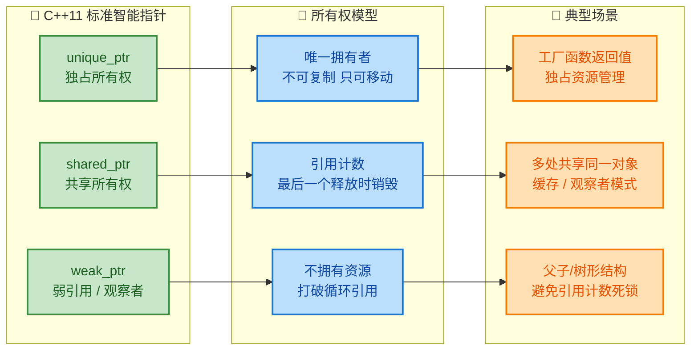

三者各司其职，覆盖了日常开发中绝大多数的动态内存管理需求。简单来说：

- **`std::unique_ptr`**：你是这块内存的**唯一主人**。当 `unique_ptr` 被销毁时，内存随之释放。它**不能被复制**，但可以通过 `std::move` 转移所有权。
- **`std::shared_ptr`**：多个指针可以**共同拥有**同一块内存。内部维护一个**引用计数（Reference Count）**，每多一个 `shared_ptr` 指向该内存，计数 +1；每销毁一个，计数 -1；**当计数归零时，内存自动释放**。
- **`std::weak_ptr`**：它**不拥有**内存，仅仅是一个"观察者"。它必须从 `shared_ptr` 创建，用来**打破循环引用（Circular Reference）**，防止引用计数永远无法归零。

### 智能指针 vs 原始指针：一张对比全景图

下面的表格从多个维度对比智能指针与原始指针（Raw Pointer），帮助你建立全局视角：

| 维度 | 原始指针 `T*` | `unique_ptr<T>` | `shared_ptr<T>` | `weak_ptr<T>` |
|:--|:--|:--|:--|:--|
| **所有权语义** | 无（语义模糊） | 独占 | 共享 | 无（仅观察） |
| **自动释放** | ❌ 需手动 `delete` | ✅ 离开作用域自动释放 | ✅ 引用计数归零时释放 | ❌ 不释放资源 |
| **可复制** | ✅ | ❌ 仅可移动 | ✅ | ✅ |
| **内存开销** | 1 个指针大小 | 1 个指针大小（零开销） | 2 个指针 + 控制块 | 2 个指针 |
| **线程安全** | ❌ | ❌（对象本身） | 引用计数原子操作 | 引用计数原子操作 |
| **典型用途** | 非拥有引用、C 接口 | 独占资源、工厂返回 | 多处共享、缓存 | 打破循环、缓存观察 |

### 智能指针的内存模型（全局概览）

为了更好地理解三者的关系，我们用一张内存示意图展示它们在运行时的结构：

```cpp
// ==================== unique_ptr 内存模型 ====================
//
//  栈 (Stack)                    堆 (Heap)
//  ┌────────────────┐           ┌──────────────┐
//  │ unique_ptr<Foo> │──────────▶│  Foo 对象     │
//  │  (仅一个指针)    │           │  data: 42    │
//  └────────────────┘           └──────────────┘
//      唯一拥有者                   被管理的资源
//
//
// ==================== shared_ptr 内存模型 ====================
//
//  栈 (Stack)                    堆 (Heap)
//  ┌────────────────┐
//  │ shared_ptr<Foo> │─────┐    ┌──────────────────┐
//  │  ptr + ctrl     │     ├───▶│  控制块 (Control  │
//  └────────────────┘     │    │   Block)          │
//  ┌────────────────┐     │    │  strong_count: 2  │
//  │ shared_ptr<Foo> │─────┘    │  weak_count:   1  │
//  │  ptr + ctrl     │         └──────────────────┘
//  └────────────────┘                  │
//  ┌────────────────┐                  ▼
//  │  weak_ptr<Foo>  │──────▶   ┌──────────────┐
//  │  ptr + ctrl     │          │  Foo 对象     │
//  └────────────────┘          │  data: 42    │
//                              └──────────────┘
//
//  两个 shared_ptr 共享同一个控制块和对象
//  weak_ptr 也指向控制块，但 不增加 strong_count
```

关键要点：

- **`unique_ptr`** 几乎是零开销的：它的大小等于一个原始指针（如果使用默认删除器），编译器甚至会将其优化到与裸指针完全一致的机器码。
- **`shared_ptr`** 需要一个额外的 **控制块（Control Block）** 来维护引用计数。控制块中包含 `strong_count`（`shared_ptr` 的数量）和 `weak_count`（`weak_ptr` 的数量）。当 `strong_count` 降为 0 时，对象被销毁；当 `weak_count` 也降为 0 时，控制块本身被释放。
- **`weak_ptr`** 指向控制块但**不增加 `strong_count`**，因此它不会阻止对象的销毁——这正是它能打破循环引用的关键。

### 被废弃的 `auto_ptr`：一段历史教训

在 C++11 之前，标准库中有一个叫 **`std::auto_ptr`** 的智能指针。它试图实现独占所有权的语义，但由于 C++03 **没有移动语义（Move Semantics）**，它不得不用**拷贝构造函数来"偷走"所有权**——这导致了极其反直觉的行为：

```cpp
std::auto_ptr<int> a(new int(10));  // a 拥有这块内存
std::auto_ptr<int> b = a;           // b "拷贝" a —— 但实际上 a 被掏空了！
// 此时 a 为 nullptr，b 拥有内存
// 这违反了 "拷贝" 的基本语义：拷贝后原对象应该不变
```

这种"**破坏性拷贝**"使得 `auto_ptr` 无法安全地放入 STL 容器（如 `std::vector`），因为容器内部的复制、排序等操作会悄悄地使元素失效。

> **`auto_ptr` 在 C++11 中被标记为 deprecated（弃用），在 C++17 中被正式移除。** 它的精神继承者是 `unique_ptr`——通过移动语义，`unique_ptr` 用**编译期错误**而非运行时"惊喜"来阻止非法拷贝。

### 现代 C++ 的内存管理哲学

C++ Core Guidelines（由 Bjarne Stroustrup 和 Herb Sutter 主导编写）中有一条核心原则：

> **R.11: Avoid calling `new` and `delete` explicitly.**
> （避免显式调用 `new` 和 `delete`。）

这并不意味着 C++ 不再使用堆内存，而是说：**让智能指针和工厂函数（如 `make_unique` / `make_shared`）替你管理 `new` 和 `delete`**。在现代 C++ 代码中，你应该极少直接看到裸 `new` 和 `delete`。

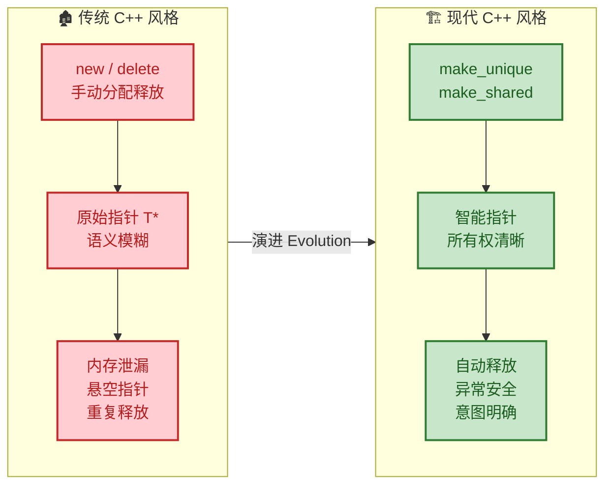

总结这一思想转变：

1. **所有权优先思考**（Ownership First）：拿到一个指针时，首先问自己——"谁拥有这块内存？谁负责释放它？"
2. **用类型表达意图**：`unique_ptr` 明确表示"我独占"，`shared_ptr` 明确表示"大家共享"，原始指针 `T*` 则表示"我只是借用，不负责释放"。
3. **编译器是你的盟友**：智能指针将许多运行时错误提前到了编译期——试图拷贝 `unique_ptr` 会直接编译失败，这比运行时崩溃好一万倍。

---

**📝 练习题**

以下关于 C++ 智能指针和 RAII 的描述，**错误**的是？

A. RAII 的核心思想是将资源的生命周期与栈对象绑定，利用析构函数自动释放资源

B. `std::auto_ptr` 使用拷贝语义转移所有权，已在 C++17 中被正式移除

C. `std::unique_ptr` 的大小通常等于两个原始指针（一个指向对象，一个指向控制块）

D. 在现代 C++ 中，应尽量避免直接使用 `new` 和 `delete`，优先使用智能指针

**【答案】** C

**【解析】** `std::unique_ptr`（使用默认删除器时）的大小通常**等于一个原始指针**，它没有控制块。控制块是 `shared_ptr` 的概念，用于维护引用计数。`unique_ptr` 因为是独占所有权，不需要引用计数，因此几乎是**零开销抽象（Zero-overhead Abstraction）**。选项 A 准确描述了 RAII；选项 B 准确描述了 `auto_ptr` 的历史；选项 D 是 C++ Core Guidelines 的明确建议。

---

## unique_ptr ⭐（独占所有权、std::move）

`std::unique_ptr` 是 C++11 引入的最轻量、最常用的智能指针，它体现了一个极其简洁的核心哲学：**一个对象在任意时刻，有且仅有一个拥有者（owner）**。当这个拥有者生命周期结束时，它所管理的堆内存会被自动释放。这种 **独占所有权（Exclusive Ownership）** 语义，使得资源的生命周期变得清晰可预测，是现代 C++ 中替代裸指针 `new/delete` 的首选方案。

### 为什么需要 unique_ptr

在传统 C++ 中，动态内存管理是 bug 的重灾区。我们先回顾一个典型的"灾难现场"：

```cpp
void processData() {
    int* data = new int(42);       // 在堆上分配内存

    if (someCondition()) {
        return;                    // ⚠️ 提前返回，data 未被释放 → 内存泄漏!
    }

    doSomething(data);

    delete data;                   // 只有走到这里才能释放
}
```

这段代码至少存在三个风险：
- **提前返回（Early Return）**：函数中间的 `return` 导致 `delete` 被跳过。
- **异常安全（Exception Safety）**：如果 `doSomething()` 抛出异常，`delete` 同样不会执行。
- **重复释放（Double Free）**：如果有人复制了 `data` 指针并在别处 `delete`，就会触发未定义行为。

`unique_ptr` 利用 C++ 的 **RAII（Resource Acquisition Is Initialization）** 机制，将资源的释放绑定到对象的析构函数上，从根本上解决了上述所有问题：

```cpp
#include <memory>                             // 智能指针头文件

void processData() {
    auto data = std::make_unique<int>(42);    // 创建 unique_ptr，自动管理内存

    if (someCondition()) {
        return;                               // ✅ 安全！data 离开作用域时自动释放
    }

    doSomething(data.get());                  // .get() 获取裸指针传给旧接口
}                                             // ✅ 函数结束，data 析构，内存自动释放
```

无论函数以何种方式退出——正常返回、提前返回、还是抛出异常——`unique_ptr` 的析构函数都会被调用，内存一定会被释放。这就是 RAII 的威力。

### unique_ptr 的内部原理

`unique_ptr` 的实现其实非常精简。为了帮助你建立直觉，下面是一个极度简化的"手写版"：

```cpp
template <typename T>
class SimpleUniquePtr {
private:
    T* raw_ptr;                                // 内部持有一个裸指针

public:
    // 构造函数：接管裸指针的所有权
    explicit SimpleUniquePtr(T* p = nullptr)
        : raw_ptr(p) {}

    // 析构函数：释放所管理的内存（RAII 的核心）
    ~SimpleUniquePtr() {
        delete raw_ptr;                        // 离开作用域时自动 delete
    }

    // ========== 禁止拷贝（独占语义的关键）==========
    SimpleUniquePtr(const SimpleUniquePtr&) = delete;             // 拷贝构造 → 禁用
    SimpleUniquePtr& operator=(const SimpleUniquePtr&) = delete;  // 拷贝赋值 → 禁用

    // ========== 允许移动（所有权转移）==========
    SimpleUniquePtr(SimpleUniquePtr&& other) noexcept             // 移动构造
        : raw_ptr(other.raw_ptr) {             // 接管 other 的指针
        other.raw_ptr = nullptr;               // 将 other 置空，断开它与资源的关联
    }

    SimpleUniquePtr& operator=(SimpleUniquePtr&& other) noexcept { // 移动赋值
        if (this != &other) {                  // 防止自赋值
            delete raw_ptr;                    // 先释放自己当前管理的资源
            raw_ptr = other.raw_ptr;           // 接管 other 的指针
            other.raw_ptr = nullptr;           // 将 other 置空
        }
        return *this;
    }

    // 解引用运算符，模拟裸指针的行为
    T& operator*() const { return *raw_ptr; }  // *ptr
    T* operator->() const { return raw_ptr; }  // ptr->member

    // 获取底层裸指针（不转移所有权）
    T* get() const { return raw_ptr; }

    // 释放所有权，返回裸指针，自己不再管理
    T* release() {
        T* tmp = raw_ptr;                      // 暂存当前指针
        raw_ptr = nullptr;                     // 自身置空
        return tmp;                            // 返回裸指针，调用者负责释放
    }

    // 重置：释放旧资源，接管新资源
    void reset(T* p = nullptr) {
        delete raw_ptr;                        // 释放旧资源
        raw_ptr = p;                           // 接管新指针（可以为空）
    }
};
```

从这个实现中可以提炼出 `unique_ptr` 的三大设计支柱：

1. **RAII**：构造时获取资源，析构时释放资源。
2. **禁止拷贝（Copy Semantics = delete）**：从编译期杜绝"两个指针指向同一资源"的可能性。
3. **允许移动（Move Semantics）**：通过 `std::move` 显式转移所有权，语义明确。

> 💡 **零开销抽象（Zero-Overhead Abstraction）**：标准库的 `unique_ptr`（使用默认删除器时）与裸指针的大小完全相同（通常 8 字节），且所有操作都会被编译器内联优化。你获得了内存安全，却没有付出任何运行时代价。这正是 C++ "you don't pay for what you don't use" 哲学的典范。

### 独占所有权模型详解

"独占所有权"意味着在任何时刻，一块堆内存只能被 **一个** `unique_ptr` 实例所管理。让我们用一个 Mermaid 图来可视化所有权的生命周期：

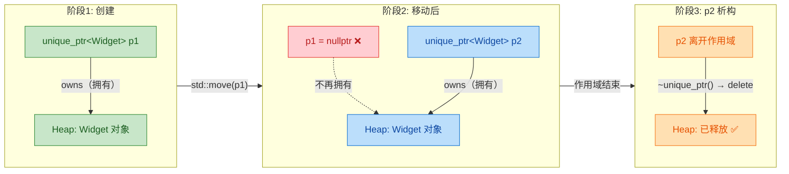

这张图清晰地展示了核心法则：**所有权像接力棒，可以传递（move），但不能复制（copy）。任何时刻只有一个人握着棒。**

### 拷贝被禁止——编译器为你站岗

`unique_ptr` 的拷贝构造函数和拷贝赋值运算符被显式 `= delete`，这意味着任何试图"复制"一个 `unique_ptr` 的操作都会在 **编译期** 直接报错：

```cpp
#include <memory>

int main() {
    auto p1 = std::make_unique<int>(100);      // p1 拥有一个值为 100 的 int

    // std::unique_ptr<int> p2 = p1;           // ❌ 编译错误！拷贝构造被 delete
    // std::unique_ptr<int> p3;
    // p3 = p1;                                // ❌ 编译错误！拷贝赋值被 delete

    // 编译器报错信息类似：
    // error: call to deleted constructor of 'std::unique_ptr<int>'
    // note: 'unique_ptr' has been explicitly marked deleted here

    return 0;
}
```

**为什么要禁止拷贝？** 如果允许拷贝，那么 `p1` 和 `p2` 就会同时指向同一块内存。当两者相继析构时，同一块内存被 `delete` 两次——这就是经典的 **Double Free** 问题，会导致程序崩溃或更隐蔽的内存损坏。禁止拷贝从根源上杜绝了这种可能。

### std::move —— 所有权转移的唯一通道

既然不能拷贝，那如果我确实需要把资源从一个 `unique_ptr` 交给另一个怎么办？答案是 **移动语义（Move Semantics）**，通过 `std::move()` 来实现。

`std::move()` 本身不做任何"移动"操作——它只是一个 **类型转换（cast）**，将左值（lvalue）转换为右值引用（rvalue reference），从而触发移动构造函数或移动赋值运算符。

```cpp
#include <memory>
#include <iostream>

class Sensor {
public:
    std::string name;                           // 传感器名称
    Sensor(std::string n) : name(std::move(n)) {
        std::cout << "Sensor [" << name << "] 创建\n";
    }
    ~Sensor() {
        std::cout << "Sensor [" << name << "] 销毁\n";
    }
};

int main() {
    // 阶段1：p1 独占 Sensor 对象
    auto p1 = std::make_unique<Sensor>("Temperature");  // 创建 Sensor
    std::cout << "p1 是否有效: " << (p1 ? "是" : "否") << "\n";   // 是

    // 阶段2：所有权从 p1 转移到 p2
    std::unique_ptr<Sensor> p2 = std::move(p1);         // p1 → p2 移动

    std::cout << "移动后:\n";
    std::cout << "  p1 是否有效: " << (p1 ? "是" : "否") << "\n"; // 否（已被掏空）
    std::cout << "  p2 是否有效: " << (p2 ? "是" : "否") << "\n"; // 是

    // ⚠️ 此时访问 p1 是未定义行为之前的状态——p1 为 nullptr
    // p1->name;  // 💥 解引用空指针，未定义行为！

    // 阶段3：可以给 p1 重新赋一个新对象
    p1 = std::make_unique<Sensor>("Humidity");           // p1 重新拥有新对象

    std::cout << "  p1 管理的传感器: " << p1->name << "\n";       // Humidity
    std::cout << "  p2 管理的传感器: " << p2->name << "\n";       // Temperature

    return 0;
}   // p1、p2 依次析构，各自管理的 Sensor 自动释放
```

**输出：**
```
Sensor [Temperature] 创建
p1 是否有效: 是
移动后:
  p1 是否有效: 否
  p2 是否有效: 是
Sensor [Humidity] 创建
  p1 管理的传感器: Humidity
  p2 管理的传感器: Temperature
Sensor [Humidity] 销毁
Sensor [Temperature] 销毁
```

> ⚠️ **黄金法则**：对一个 `unique_ptr` 调用 `std::move()` 之后，原指针变为 **空（nullptr）**。此后对它解引用（`*p` 或 `p->`）是**未定义行为（Undefined Behavior）**。养成习惯：move 之后，不再触碰原变量。

### unique_ptr 的核心 API 全景

下面的表格涵盖了 `unique_ptr` 最常用的成员函数，每一个都值得熟记：

| API | 功能描述 | 是否释放旧资源 |
|---|---|---|
| `get()` | 返回底层裸指针，**不**转移所有权 | 否 |
| `release()` | 放弃所有权，返回裸指针，自身变为 `nullptr` | **否**（调用者负责） |
| `reset()` | 释放当前资源，可选地接管新指针 | **是** |
| `reset(new T)` | 释放旧资源，接管新的裸指针 | **是** |
| `swap(other)` | 与另一个 `unique_ptr` 交换所管理的指针 | 否 |
| `operator bool` | 判断是否非空（`if (ptr) {...}`） | 否 |
| `operator*` / `operator->` | 解引用，访问所管理的对象 | 否 |

逐一演示关键 API 的使用：

```cpp
#include <memory>
#include <iostream>

int main() {
    // ===== get() =====
    auto p = std::make_unique<int>(42);
    int* raw = p.get();                  // 获取裸指针，p 仍然拥有资源
    std::cout << *raw << "\n";           // 42（通过裸指针访问）
    // 注意：不要 delete raw！p 仍在管理这块内存

    // ===== release() =====
    int* extracted = p.release();        // p 放弃所有权，变成 nullptr
    std::cout << (p == nullptr) << "\n"; // 1（true，p 已经为空）
    std::cout << *extracted << "\n";     // 42（内存还在，但现在你自己负责）
    delete extracted;                    // ⬅️ 必须手动释放！release 不会帮你 delete

    // ===== reset() =====
    auto q = std::make_unique<int>(10);  // q 管理值为 10 的 int
    q.reset(new int(20));                // 释放旧的(10)，接管新的(20)
    std::cout << *q << "\n";             // 20
    q.reset();                           // 释放当前资源，q 变成 nullptr
    std::cout << (q == nullptr) << "\n"; // 1（true）

    // ===== swap() =====
    auto a = std::make_unique<int>(1);   // a → 1
    auto b = std::make_unique<int>(2);   // b → 2
    a.swap(b);                           // 交换！a → 2, b → 1
    std::cout << *a << ", " << *b << "\n"; // 2, 1

    return 0;
}
```

> 🔑 **`release()` vs `reset()` 的区别**是高频面试考点：`release()` **不释放**内存，只是"脱手"把裸指针还给你；`reset()` **会释放**当前管理的内存。混淆两者会导致要么内存泄漏（该 `delete` 没 `delete`），要么 double free（不该 `delete` 却 `delete` 了）。

### unique_ptr 与函数交互

`unique_ptr` 在函数参数和返回值中的使用方式，体现了 C++ 现代设计的核心理念：**通过类型系统表达所有权意图**。

#### 1. 通过值传递 unique_ptr —— 转移所有权给函数（Sink）

```cpp
#include <memory>
#include <iostream>

class Engine {
public:
    int horsepower;                                     // 马力
    Engine(int hp) : horsepower(hp) {
        std::cout << "Engine(" << hp << "hp) 创建\n";
    }
    ~Engine() {
        std::cout << "Engine(" << horsepower << "hp) 销毁\n";
    }
};

// 函数接收 unique_ptr 的值 → 调用者必须 move → 所有权转移给函数
void installEngine(std::unique_ptr<Engine> engine) {    // 值传递，触发移动构造
    std::cout << "安装引擎，马力: " << engine->horsepower << "\n";
}   // engine 在函数结束时析构，资源被释放

int main() {
    auto eng = std::make_unique<Engine>(300);            // 创建引擎
    installEngine(std::move(eng));                       // 必须 std::move，所有权交出
    // installEngine(eng);                               // ❌ 编译错误：不能拷贝
    std::cout << "eng 是否有效: " << (eng ? "是" : "否") << "\n"; // 否
    return 0;
}
```

这种模式叫做 **Sink Pattern（沉没模式）**：函数"吞掉"了资源，调用者不再需要关心释放。函数签名本身就在对调用者大喊："**把所有权给我，之后这东西归我管了！**"

#### 2. 函数返回 unique_ptr —— 工厂模式（Factory）

```cpp
#include <memory>
#include <iostream>

class Widget {
public:
    int id;
    Widget(int i) : id(i) {
        std::cout << "Widget #" << id << " 创建\n";
    }
    ~Widget() {
        std::cout << "Widget #" << id << " 销毁\n";
    }
};

// 工厂函数：创建并返回 unique_ptr
// 返回值是 unique_ptr → 告诉调用者："你获得了这个对象的所有权"
std::unique_ptr<Widget> createWidget(int id) {
    auto w = std::make_unique<Widget>(id);               // 在函数内创建
    return w;                                            // ✅ 编译器自动 move（NRVO 或隐式移动）
    // 注意：这里不需要写 std::move(w)，编译器足够聪明
}

int main() {
    auto w1 = createWidget(1);                           // 调用者获得所有权
    auto w2 = createWidget(2);                           // 每个 widget 有独立的 owner

    std::cout << "w1 = Widget #" << w1->id << "\n";     // Widget #1
    std::cout << "w2 = Widget #" << w2->id << "\n";     // Widget #2

    return 0;
}   // w2 先析构，再 w1（栈上 LIFO 顺序）
```

> 💡 **为什么返回局部 `unique_ptr` 不需要 `std::move`？** 因为 C++ 标准规定，返回局部变量时编译器会优先尝试 **NRVO（Named Return Value Optimization）** 直接在调用者的内存构造对象。即使 NRVO 不生效，编译器也会自动将返回的局部变量视为右值，触发移动构造。这是标准给出的特殊待遇（implicit move）。

#### 3. 通过引用传递 unique_ptr —— 不转移所有权

```cpp
// 只是"借用"资源，不夺取所有权
void inspect(const std::unique_ptr<Widget>& ptr) {      // const 引用，只读借用
    if (ptr) {
        std::cout << "检查 Widget #" << ptr->id << "\n";
    }
}

// 更推荐的做法：如果函数不关心智能指针本身，直接传裸指针或引用
void inspectBetter(const Widget& widget) {               // 直接传对象引用
    std::cout << "检查 Widget #" << widget.id << "\n";
}

int main() {
    auto w = std::make_unique<Widget>(42);
    inspect(w);                                          // 不需要 move，所有权不变
    inspectBetter(*w);                                   // 解引用后传引用，更通用
    // w 仍然有效
    return 0;
}
```

下面用流程图总结三种交互模式：

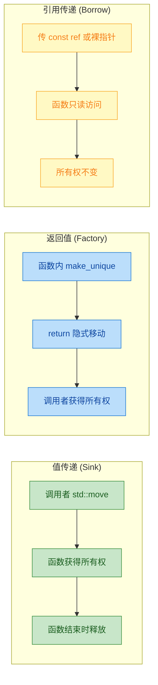

### unique_ptr 管理数组

`unique_ptr` 提供了专门的数组特化版本 `unique_ptr<T[]>`，它在析构时会调用 `delete[]` 而非 `delete`：

```cpp
#include <memory>
#include <iostream>

int main() {
    // 管理动态数组：使用 unique_ptr<T[]>
    auto arr = std::make_unique<int[]>(5);    // 分配 5 个 int 的数组，值初始化为 0

    for (int i = 0; i < 5; ++i) {
        arr[i] = i * 10;                     // 通过 operator[] 访问元素
    }

    for (int i = 0; i < 5; ++i) {
        std::cout << arr[i] << " ";          // 输出: 0 10 20 30 40
    }
    std::cout << "\n";

    // 注意：数组版本没有 operator* 和 operator->
    // *arr;        // ❌ 编译错误
    // arr->xxx;    // ❌ 编译错误

    return 0;
}   // arr 析构时调用 delete[]，正确释放整个数组
```

> 💡 **实践建议**：在大多数场景下，优先使用 `std::vector<T>` 而非 `unique_ptr<T[]>`。`vector` 提供了大小追踪、范围检查、迭代器等丰富功能。`unique_ptr<T[]>` 主要用于与 C API 交互或对性能有极致要求的场景。

### 自定义删除器（Custom Deleter）

默认情况下，`unique_ptr` 使用 `delete`（或 `delete[]`）释放资源。但有时我们管理的资源并不是通过 `new` 分配的——比如 C 库的文件句柄、数据库连接、操作系统句柄等。这时需要自定义删除器：

```cpp
#include <memory>
#include <cstdio>                                       // C 标准 I/O
#include <iostream>

int main() {
    // 方式1：Lambda 作为删除器（最常用，推荐）
    auto fileDeleter = [](FILE* fp) {                   // 定义删除逻辑
        if (fp) {
            std::cout << "关闭文件\n";
            std::fclose(fp);                            // 用 fclose 而非 delete
        }
    };

    {
        // unique_ptr<资源类型, 删除器类型>
        std::unique_ptr<FILE, decltype(fileDeleter)> file(
            std::fopen("test.txt", "w"),                // 打开文件（C 风格）
            fileDeleter                                 // 传入删除器
        );

        if (file) {                                     // 检查文件是否成功打开
            std::fputs("Hello, RAII!\n", file.get());   // 写入内容
        }
    }   // 离开作用域 → 自动调用 fileDeleter → fclose

    // 方式2：函数指针作为删除器
    // 注意：使用函数指针会增加 unique_ptr 的大小（额外存储一个指针）
    std::unique_ptr<FILE, int(*)(FILE*)> file2(
        std::fopen("test2.txt", "w"),                   // 打开文件
        &std::fclose                                    // 直接使用 fclose 的函数指针
    );

    return 0;
}
```

不同删除器类型对 `unique_ptr` 大小的影响：

```cpp
// 内存布局对比（64 位系统）

// 默认删除器（空类优化）
// sizeof(unique_ptr<int>) == 8 字节（与裸指针相同）
// ┌──────────────────┐
// │   T* raw_ptr     │  8 bytes
// └──────────────────┘

// Lambda 删除器（无捕获，空类优化生效）
// sizeof == 8 字节
// ┌──────────────────┐
// │   T* raw_ptr     │  8 bytes
// └──────────────────┘

// 函数指针删除器
// sizeof == 16 字节（多了一个函数指针）
// ┌──────────────────┐
// │   T* raw_ptr     │  8 bytes
// ├──────────────────┤
// │  void(*)(T*)     │  8 bytes  ← 额外开销
// └──────────────────┘
```

> 💡 **最佳实践**：优先使用 **无捕获的 Lambda** 或 **函数对象（Functor）** 作为删除器。它们是空类型，可以被 **空基类优化（EBO, Empty Base Optimization）** 吃掉，不增加 `unique_ptr` 的大小。函数指针则无法优化，会多占 8 字节。

### unique_ptr 与多态（Polymorphism）

`unique_ptr` 天然支持多态，是管理继承体系对象的理想工具：

```cpp
#include <memory>
#include <iostream>
#include <vector>

class Shape {                                            // 基类
public:
    virtual void draw() const = 0;                       // 纯虚函数
    virtual ~Shape() = default;                          // ⚠️ 虚析构函数！必须！
};

class Circle : public Shape {                            // 派生类：圆形
public:
    void draw() const override {
        std::cout << "绘制圆形 ●\n";
    }
};

class Rectangle : public Shape {                         // 派生类：矩形
public:
    void draw() const override {
        std::cout << "绘制矩形 ■\n";
    }
};

int main() {
    // unique_ptr<基类> 可以指向派生类对象（向上转型）
    std::vector<std::unique_ptr<Shape>> shapes;          // 存储不同形状的容器

    shapes.push_back(std::make_unique<Circle>());        // 添加圆形
    shapes.push_back(std::make_unique<Rectangle>());     // 添加矩形
    shapes.push_back(std::make_unique<Circle>());        // 再添加一个圆形

    // 多态调用
    for (const auto& shape : shapes) {                   // const auto& 避免拷贝
        shape->draw();                                   // 虚函数分派，调用正确的派生类版本
    }

    return 0;
}   // vector 析构 → 每个 unique_ptr 析构 → 每个 Shape 被正确释放
// 输出:
// 绘制圆形 ●
// 绘制矩形 ■
// 绘制圆形 ●
```

> ⚠️ **关键提醒**：当通过基类指针（包括智能指针）管理派生类对象时，基类 **必须** 声明 **虚析构函数（virtual destructor）**。否则 `delete` 基类指针时只会调用基类的析构函数，派生类的析构函数不会被调用，导致资源泄漏。这是 C++ 多态使用中最常见的陷阱之一。

### 常见陷阱与最佳实践

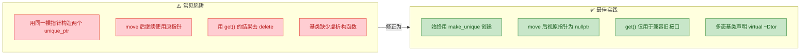

**陷阱详解：**

```cpp
// ❌ 陷阱1：同一裸指针构造两个 unique_ptr → Double Free
int* raw = new int(42);
std::unique_ptr<int> a(raw);         // a 拥有 raw
std::unique_ptr<int> b(raw);         // b 也拥有 raw → 💥 两次 delete！

// ✅ 正确做法：永远用 make_unique，避免接触裸指针
auto a = std::make_unique<int>(42);  // 安全，无裸指针暴露

// ❌ 陷阱2：move 后使用原指针
auto p = std::make_unique<int>(10);
auto q = std::move(p);
// std::cout << *p;                  // 💥 未定义行为！p 已经是 nullptr

// ✅ 正确做法
if (p) {                             // 先检查
    std::cout << *p;                 // 安全
}

// ❌ 陷阱3：get() 返回的裸指针被手动 delete
auto ptr = std::make_unique<int>(5);
int* r = ptr.get();
// delete r;                         // 💥 ptr 析构时会再次 delete → Double Free

// ✅ 正确做法：get() 只用于"只读借用"，绝不 delete
legacyCFunction(ptr.get());          // 传给需要裸指针的旧函数
```

### unique_ptr 在容器中的使用

`unique_ptr` 不能拷贝，但可以移动。这意味着它可以安全地存入 STL 容器，但需要注意一些细节：

```cpp
#include <memory>
#include <vector>
#include <algorithm>
#include <iostream>

int main() {
    std::vector<std::unique_ptr<int>> vec;

    // 添加元素必须使用移动语义或 emplace
    vec.push_back(std::make_unique<int>(3));              // ✅ make_unique 返回右值，隐式移动
    vec.emplace_back(new int(1));                         // ✅ emplace 原地构造（但不推荐用 new）
    vec.push_back(std::make_unique<int>(2));              // ✅ 推荐方式

    // 排序：unique_ptr 支持移动，所以 sort 可以正常工作
    std::sort(vec.begin(), vec.end(),
        [](const std::unique_ptr<int>& a,                // 比较时用 const 引用
           const std::unique_ptr<int>& b) {
            return *a < *b;                              // 按指向的值排序
        }
    );

    for (const auto& p : vec) {                          // 遍历时用 const auto&
        std::cout << *p << " ";                          // 输出: 1 2 3
    }
    std::cout << "\n";

    // 从容器中取出元素（转移所有权）
    auto extracted = std::move(vec[0]);                   // 从容器中"偷"出来
    // 注意：vec[0] 现在是 nullptr，容器大小不变！
    // 通常还需要 erase 掉这个空位

    return 0;
}
```

---

**📝 练习题**

以下代码的输出是什么？

```cpp
#include <memory>
#include <iostream>

struct Node {
    int val;
    Node(int v) : val(v) { std::cout << "C" << v << " "; }
    ~Node() { std::cout << "D" << val << " "; }
};

int main() {
    auto a = std::make_unique<Node>(1);
    auto b = std::make_unique<Node>(2);
    a.reset(new Node(3));
    b = std::move(a);
    std::cout << "E ";
    return 0;
}
```

A. `C1 C2 C3 D1 D2 E D3`


B. `C1 C2 C3 D1 E D2 D3`


C. `C1 C2 C3 D1 D2 E D3`


D. `C1 C2 D2 C3 D1 E D3`


**【答案】** A

**【解析】**

逐行分析执行过程：

1. `make_unique<Node>(1)` → 输出 `C1`，`a` 拥有 Node(1)
2. `make_unique<Node>(2)` → 输出 `C2`，`b` 拥有 Node(2)
3. `a.reset(new Node(3))` → 先构造 Node(3) 输出 `C3`，然后 `reset` 释放旧的 Node(1) 输出 `D1`。此时 `a` 拥有 Node(3)
4. `b = std::move(a)` → 这是移动赋值。`b` 要先释放自己当前管理的 Node(2)，输出 `D2`，然后接管 `a` 的 Node(3)。`a` 变为 `nullptr`
5. `std::cout << "E "` → 输出 `E`
6. `return 0`，局部变量逆序析构：`b` 析构释放 Node(3) 输出 `D3`，`a` 为 `nullptr` 析构不做事

最终输出：`C1 C2 C3 D1 D2 E D3`

本题考察的核心知识点：`reset()` 会先构造新对象再销毁旧对象（构造在前，析构在后），移动赋值会先释放目标已有的资源，以及 `unique_ptr` 的 RAII 保证了作用域结束时自动释放。

---

## shared_ptr ⭐⭐（共享所有权、引用计数）

`std::shared_ptr` 是 C++11 引入的最强大、也最常用的智能指针。它的核心思想极其优雅——**多个指针可以共同拥有（shared ownership）同一个堆上对象**，当最后一个拥有者销毁时，对象才被释放。这种"谁最后离开谁关灯"的机制，依赖的就是经典的 **引用计数（Reference Counting）** 技术。

与 `unique_ptr` 的"独裁式"独占不同，`shared_ptr` 更像一种"民主式"的共享协议。它让多个模块、多个数据结构可以安全地持有同一个资源的引用，彻底解决了"这个指针到底谁来 `delete`？"这个困扰 C++ 程序员数十年的经典难题。

---

### shared_ptr 的基本用法

最基本的使用方式非常直观：

```cpp
#include <memory>   // 智能指针头文件
#include <iostream>

class Sensor {
public:
    std::string name_;                              // 传感器名称
    Sensor(const std::string& n) : name_(n) {      // 构造函数
        std::cout << "Sensor [" << name_ << "] created\n";
    }
    ~Sensor() {                                     // 析构函数
        std::cout << "Sensor [" << name_ << "] destroyed\n";
    }
    void read() const {                             // 读取数据的成员函数
        std::cout << "Reading from [" << name_ << "]\n";
    }
};

int main() {
    // ---- 创建 shared_ptr ----
    std::shared_ptr<Sensor> sp1 = std::make_shared<Sensor>("Gyroscope");  // 推荐方式，引用计数 = 1

    {
        std::shared_ptr<Sensor> sp2 = sp1;   // 拷贝构造：sp2 与 sp1 共享同一对象，引用计数 = 2
        std::shared_ptr<Sensor> sp3 = sp1;   // 再次拷贝：引用计数 = 3

        sp2->read();                          // 通过 sp2 访问对象，完全合法
        sp3->read();                          // 通过 sp3 访问对象，完全合法

        std::cout << "use_count = " << sp1.use_count() << "\n";  // 输出 3
    }   // sp2, sp3 离开作用域 → 引用计数降为 1

    std::cout << "use_count = " << sp1.use_count() << "\n";      // 输出 1
    // sp1 离开 main 作用域 → 引用计数降为 0 → Sensor 对象被析构
}
```

**输出：**

```
Sensor [Gyroscope] created
Reading from [Gyroscope]
Reading from [Gyroscope]
use_count = 3
use_count = 1
Sensor [Gyroscope] destroyed
```

可以看到，对象 `Sensor("Gyroscope")` 始终只被创建一次、销毁一次，但被三个 `shared_ptr` 同时持有。这就是共享所有权的精髓。

---

### 引用计数（Reference Counting）机制详解

引用计数是 `shared_ptr` 的灵魂。每一个被 `shared_ptr` 管理的对象，在堆上都会附带一个 **控制块（Control Block）**，其中维护着两个关键计数器：

| 计数器 | 名称 | 何时递增 | 何时递减 | 降为 0 时的动作 |
|:---:|:---:|:---:|:---:|:---:|
| `strong_count` | 强引用计数 | `shared_ptr` 拷贝构造/赋值 | `shared_ptr` 析构/reset | **销毁托管对象** |
| `weak_count` | 弱引用计数 | `weak_ptr` 拷贝构造/赋值 | `weak_ptr` 析构/reset | **释放控制块** |

> 注意：控制块本身的释放，要等到 `strong_count` **和** `weak_count` 都为 0 才发生。这是因为 `weak_ptr` 需要通过控制块来检测对象是否还活着。

我们用一张流程图来完整呈现引用计数的生命周期：

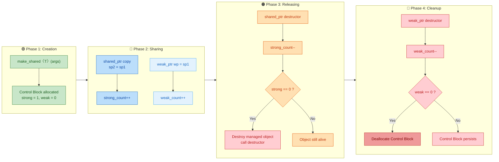

---

### 控制块（Control Block）的内存布局

理解 `shared_ptr` 的底层，关键在于理解 **控制块** 的结构。当你创建一个 `shared_ptr` 时，实际上在内存中存在 **两个实体**：`shared_ptr` 对象本身（通常在栈上）和控制块 + 托管对象（在堆上）。

```cpp
// ====== shared_ptr 的典型内部结构（伪代码） ======
// 注意：这是概念性模型，实际实现因编译器而异

struct ControlBlock {                     // 控制块：堆上分配
    std::atomic<int> strong_count;        // 强引用计数（原子操作，线程安全）
    std::atomic<int> weak_count;          // 弱引用计数（原子操作，线程安全）
    Deleter deleter;                      // 删除器（可自定义）
    Allocator allocator;                  // 分配器（可自定义）
};

template<typename T>
class shared_ptr {                        // shared_ptr 本身只有两个裸指针大小
    T* ptr_;                              // 指向托管对象的指针
    ControlBlock* ctrl_;                  // 指向控制块的指针
};
```

因此，`sizeof(shared_ptr<T>)` 通常是 **2 个指针大小**（64 位系统上是 16 字节），比 `unique_ptr`（通常 8 字节）大一倍。

下面用 ASCII 图来表达在 `make_shared` 和 `new` 两种创建方式下的内存布局差异：

**方式一：`std::make_shared<T>()`（推荐，单次内存分配）**

```cpp
//  Stack                          Heap (单块连续内存)
//  ┌──────────────────┐          ┌─────────────────────────────────────┐
//  │  shared_ptr sp   │          │         Control Block               │
//  │ ┌──────────────┐ │          │ ┌─────────────┬─────────────┐      │
//  │ │ ptr_ ────────┼─┼────┐    │ │ strong = 1  │ weak = 0    │      │
//  │ ├──────────────┤ │    │    │ ├─────────────┴─────────────┤      │
//  │ │ ctrl_ ───────┼─┼────┼──▶ │ │ deleter / allocator       │      │
//  │ └──────────────┘ │    │    │ ├───────────────────────────┤      │
//  └──────────────────┘    └──▶ │ │     T object (原地构造)    │      │
//                               │ │     (data members...)      │      │
//                               │ └───────────────────────────┘      │
//                               └─────────────────────────────────────┘
//                                ▲ 一次 new：控制块 + 对象在同一块内存中
```

**方式二：`shared_ptr<T>(new T(...))`（两次内存分配）**

```cpp
//  Stack                       Heap 块 ①                 Heap 块 ②
//  ┌──────────────────┐       ┌────────────────────┐    ┌─────────────────┐
//  │  shared_ptr sp   │       │   Control Block     │    │   T object       │
//  │ ┌──────────────┐ │       │ ┌────────┬────────┐ │    │ (data members)   │
//  │ │ ptr_ ────────┼─┼──────┼─▶        │        │ │    │                  │
//  │ ├──────────────┤ │  ┌──▶│ │strong=1│weak=0  │ │    └─────────────────┘
//  │ │ ctrl_ ───────┼─┼──┘   │ ├────────┴────────┤ │              ▲
//  │ └──────────────┘ │       │ │ ptr_to_object ──┼─┼──────────────┘
//  └──────────────────┘       │ └─────────────────┘ │
//                             └────────────────────┘
//                              ▲ 两次 new：控制块和对象分别分配
```

> **性能启示**：`make_shared` 只做一次堆分配，而 `shared_ptr<T>(new T())` 要做两次。因此 **`make_shared` 在性能和异常安全性上都更优**。但代价是：由于对象和控制块共享同一块内存，即使对象已被销毁（`strong_count == 0`），只要还有 `weak_ptr` 存活（`weak_count > 0`），**整块内存都无法释放**。

---

### 引用计数的递增与递减全景

让我们用一段代码和逐步注释来精确追踪引用计数的每一次变化：

```cpp
#include <memory>
#include <iostream>

struct Widget {
    int id;
    Widget(int i) : id(i) { std::cout << "Widget " << id << " born\n"; }
    ~Widget()              { std::cout << "Widget " << id << " dead\n"; }
};

int main() {
    // ====== Step 1: 创建 ======
    auto sp1 = std::make_shared<Widget>(42);
    // 堆上创建: Widget(42) + ControlBlock{ strong=1, weak=0 }
    std::cout << "[Step1] strong=" << sp1.use_count() << "\n";       // 1

    // ====== Step 2: 拷贝构造 ======
    std::shared_ptr<Widget> sp2(sp1);               // strong: 1 → 2
    std::cout << "[Step2] strong=" << sp1.use_count() << "\n";       // 2

    // ====== Step 3: 拷贝赋值 ======
    std::shared_ptr<Widget> sp3;                    // sp3 为空（nullptr）
    sp3 = sp1;                                      // strong: 2 → 3
    std::cout << "[Step3] strong=" << sp1.use_count() << "\n";       // 3

    // ====== Step 4: 移动语义 ======
    std::shared_ptr<Widget> sp4(std::move(sp2));    // sp2 变空，sp4 接管
    // strong 计数 **不变**，仍为 3（所有权转移，无需原子操作）
    std::cout << "[Step4] strong=" << sp1.use_count() << "\n";       // 3
    std::cout << "[Step4] sp2 is " << (sp2 ? "valid" : "null") << "\n"; // null

    // ====== Step 5: reset ======
    sp3.reset();                                    // sp3 放弃所有权，strong: 3 → 2
    std::cout << "[Step5] strong=" << sp1.use_count() << "\n";       // 2

    // ====== Step 6: 重新指向新对象 ======
    sp4.reset(new Widget(99));                      // sp4 放弃 Widget(42)，strong: 2 → 1
    // sp4 现在指向新的 Widget(99)，其自身 strong = 1
    std::cout << "[Step6] sp1.strong=" << sp1.use_count() << "\n";   // 1
    std::cout << "[Step6] sp4.strong=" << sp4.use_count() << "\n";   // 1

    // ====== Step 7: 作用域结束 ======
    // sp4 析构 → Widget(99) strong: 1→0 → Widget 99 dead
    // sp1 析构 → Widget(42) strong: 1→0 → Widget 42 dead
}
```

**输出：**

```
Widget 42 born
[Step1] strong=1
[Step2] strong=2
[Step3] strong=3
[Step4] strong=3
[Step4] sp2 is null
[Step5] strong=2
Widget 99 born
[Step6] sp1.strong=1
[Step6] sp4.strong=1
Widget 99 dead
Widget 42 dead
```

这里有一个极为重要的细节：**Step 4 的 `std::move` 不会改变引用计数**。移动构造只是把内部的两个裸指针从源 `shared_ptr` 转移到目标 `shared_ptr`，然后把源置为 `nullptr`，整个过程无需任何原子操作，因此 **移动 `shared_ptr` 比拷贝更快**。

---

### 自定义删除器（Custom Deleter）

`shared_ptr` 支持用户传入自定义的删除策略（Custom Deleter），这在管理非 `new` 分配的资源时极为重要。与 `unique_ptr` 不同的是，**`shared_ptr` 的删除器不参与类型签名**，这是通过 **类型擦除（Type Erasure）** 技术实现的——删除器存储在控制块中，而非模板参数中。

```cpp
#include <memory>
#include <iostream>
#include <cstdio>    // FILE*, fopen, fclose

int main() {
    // ---- 示例 1: Lambda 作为删除器管理 FILE* ----
    std::shared_ptr<FILE> filePtr(
        fopen("data.txt", "r"),           // 通过 fopen 获取 FILE*
        [](FILE* fp) {                     // 自定义删除器：用 fclose 替代 delete
            if (fp) {
                std::cout << "Closing file via custom deleter\n";
                fclose(fp);                // 正确的资源释放方式
            }
        }
    );
    // filePtr 离开作用域时，自动调用 fclose，而不是 delete

    // ---- 示例 2: 管理 C 风格数组 (C++17 之前) ----
    std::shared_ptr<int> arrPtr(
        new int[100],                      // 分配 int 数组
        [](int* p) {                       // 删除器必须用 delete[]
            std::cout << "Deleting array via custom deleter\n";
            delete[] p;                    // 匹配 new[] 的正确释放方式
        }
    );

    // ---- 示例 3: 类型擦除的威力 ----
    // 不同删除器的 shared_ptr 可以放进同一个容器！
    auto d1 = [](int* p) { delete p; };                  // 删除器 A
    auto d2 = [](int* p) { std::cout << *p; delete p; }; // 删除器 B

    // 类型完全相同：都是 shared_ptr<int>，尽管删除器不同
    std::shared_ptr<int> x(new int(1), d1);
    std::shared_ptr<int> y(new int(2), d2);

    std::vector<std::shared_ptr<int>> vec;
    vec.push_back(x);    // ✅ 合法！类型一致
    vec.push_back(y);    // ✅ 合法！删除器的差异被"擦除"了
}
```

这种类型擦除的设计，使得 `shared_ptr` 在接口设计中远比 `unique_ptr` 灵活。你可以在一个 `std::vector<std::shared_ptr<Base>>` 中混装各种不同删除策略的对象，调用方完全无需关心底层资源的释放细节。

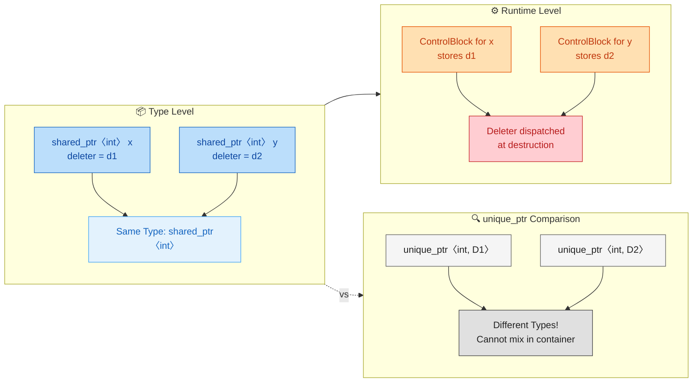

---

### shared_ptr 与多态（Polymorphism）

`shared_ptr` 天然支持多态，并且比裸指针更安全。当基类析构函数忘记声明为 `virtual` 时，裸指针 `delete` 会导致 **未定义行为（Undefined Behavior）**，但 `shared_ptr` 在某些情况下可以正确处理——前提是你通过 `shared_ptr<Derived>` 构造后赋值给 `shared_ptr<Base>`。

```cpp
#include <memory>
#include <iostream>

class Animal {
public:
    // 注意：这里故意没有 virtual 析构函数（教学演示用）
    ~Animal() { std::cout << "~Animal\n"; }
    virtual void speak() = 0;         // 纯虚函数
};

class Dog : public Animal {
public:
    ~Dog() { std::cout << "~Dog\n"; }
    void speak() override { std::cout << "Woof!\n"; }
};

int main() {
    // ---- 情况 A: shared_ptr 构造时知道真实类型 ----
    std::shared_ptr<Animal> pet = std::make_shared<Dog>();
    pet->speak();  // 输出 "Woof!" —— 多态正常工作

    // pet 析构时：make_shared<Dog>() 在控制块中记录了 Dog 的析构方式
    // 因此即使 Animal 没有 virtual 析构函数，Dog 的析构函数也会被正确调用！
    // 输出: ~Dog 然后 ~Animal

    // ---- 情况 B: 裸指针的灾难 ----
    // Animal* raw = new Dog();
    // delete raw;  // ⚠️ UB! ~Animal 不是 virtual，~Dog 不会被调用
}
```

> **原理**：`make_shared<Dog>()` 在控制块中存储的删除器是根据 `Dog*` 类型生成的。当转换为 `shared_ptr<Animal>` 后，控制块不变，删除器仍然知道要调用 `Dog` 的析构函数。但这**不意味着你可以省略 `virtual` 析构函数**——这只是 `shared_ptr` 的"附赠保险"，好的工程实践仍应确保基类有虚析构函数。

---

### shared_ptr 的线程安全性

这是面试高频考点，也是很多人混淆的地方。`shared_ptr` 的线程安全性分为 **两个层面**：

| 层面 | 线程安全？ | 原因 |
|:---|:---:|:---|
| **控制块（引用计数）的递增/递减** | ✅ 安全 | 内部使用 `std::atomic` 原子操作 |
| **`shared_ptr` 对象本身的读写** | ❌ 不安全 | 修改指针指向（如赋值）不是原子操作 |
| **托管对象的读写** | ❌ 不安全 | `shared_ptr` 不管对象的并发访问 |

```cpp
#include <memory>
#include <thread>
#include <iostream>

struct Data { int value = 0; };

int main() {
    auto sp = std::make_shared<Data>();

    // ✅ 安全：各线程拷贝自己的 shared_ptr（只影响引用计数）
    auto reader = [](std::shared_ptr<Data> local_sp) {    // 按值传递 → 引用计数+1
        std::cout << local_sp->value << "\n";              // 读取托管对象
    };  // local_sp 析构 → 引用计数-1（原子操作，安全）

    std::thread t1(reader, sp);    // sp 被拷贝给 t1 的 local_sp
    std::thread t2(reader, sp);    // sp 被拷贝给 t2 的 local_sp
    t1.join();
    t2.join();

    // ❌ 危险：多线程同时修改同一个 shared_ptr 对象
    // std::shared_ptr<Data> shared_sp = sp;
    // std::thread t3([&]() { shared_sp = std::make_shared<Data>(); }); // 写
    // std::thread t4([&]() { shared_sp = std::make_shared<Data>(); }); // 写
    // 两个线程同时修改 shared_sp 的内部指针 → Data Race → UB!

    // ❌ 危险：多线程同时修改托管对象
    // std::thread t5([&]() { sp->value = 1; }); // 写对象
    // std::thread t6([&]() { sp->value = 2; }); // 写对象
    // shared_ptr 不保护对象本身 → 需要自行加 mutex
}
```

简而言之：**拷贝/析构 `shared_ptr` 是线程安全的，但读写同一个 `shared_ptr` 变量或它管理的对象不是线程安全的。** 对于后两种情况，你仍然需要 `std::mutex` 或 `std::atomic<std::shared_ptr<T>>`（C++20）。

---

### shared_ptr 的常见陷阱

#### 陷阱一：用同一个裸指针创建多个 shared_ptr

这是最致命的错误之一，会导致 **双重释放（Double Free）**：

```cpp
int main() {
    int* raw = new int(42);

    std::shared_ptr<int> sp1(raw);   // 创建控制块 A，strong = 1
    std::shared_ptr<int> sp2(raw);   // 创建控制块 B，strong = 1 ← 灾难！

    // sp1 和 sp2 各有自己的控制块，各自认为自己独立拥有 *raw
    // sp2 析构 → strong_B 降为 0 → delete raw  (第一次释放)
    // sp1 析构 → strong_A 降为 0 → delete raw  (第二次释放) → UB!
}
```

```cpp
//  控制块 A (sp1 的)         控制块 B (sp2 的)
//  ┌──────────────┐         ┌──────────────┐
//  │ strong = 1   │         │ strong = 1   │
//  │ ptr ─────────┼────┐    │ ptr ─────────┼────┐
//  └──────────────┘    │    └──────────────┘    │
//                      ▼                        ▼
//                   ┌──────┐  ◄──── 同一个对象被两个控制块管理！
//                   │  42  │
//                   └──────┘
//                   💥 Double Free!
```

**解决方案**：永远不要把同一个裸指针传给两个 `shared_ptr` 构造函数。使用 `make_shared`，或者只从一个 `shared_ptr` 拷贝出其他 `shared_ptr`。

#### 陷阱二：从 `this` 创建 shared_ptr

```cpp
class Node {
public:
    std::shared_ptr<Node> getShared() {
        return std::shared_ptr<Node>(this);  // ❌ 致命错误！同陷阱一
    }
};

int main() {
    auto sp = std::make_shared<Node>();    // 控制块 A
    auto sp2 = sp->getShared();            // 控制块 B（用 this 裸指针构建）
    // 双重释放！
}
```

**解决方案**：继承 `std::enable_shared_from_this<T>`：

```cpp
class Node : public std::enable_shared_from_this<Node> {  // CRTP 模式
public:
    std::shared_ptr<Node> getShared() {
        return shared_from_this();  // ✅ 返回与已有 shared_ptr 共享控制块的副本
    }
};

int main() {
    auto sp = std::make_shared<Node>();    // 控制块中记录了 weak_ptr 给 enable_shared_from_this
    auto sp2 = sp->getShared();            // ✅ sp2 与 sp 共享同一个控制块
    std::cout << sp.use_count() << "\n";   // 输出 2，正确！
}
```

`enable_shared_from_this` 的内部原理是：它在基类中埋了一个 `weak_ptr<T>` 成员，当第一次被 `shared_ptr` 管理时，这个 `weak_ptr` 会被自动初始化指向控制块。之后调用 `shared_from_this()` 时，就从这个 `weak_ptr` `.lock()` 得到一个合法的 `shared_ptr`。

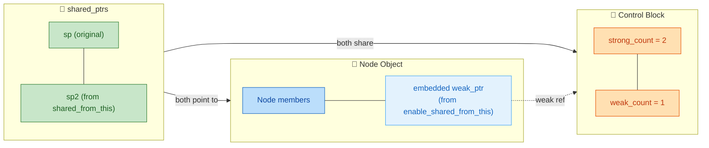

#### 陷阱三：循环引用（Circular Reference）

这是 `shared_ptr` 最经典的问题，将在 `weak_ptr` 章节中详细展开。简单预告：

```cpp
struct A {
    std::shared_ptr<B> b_ptr;    // A 持有 B
};
struct B {
    std::shared_ptr<A> a_ptr;    // B 持有 A
};

int main() {
    auto a = std::make_shared<A>();   // A strong = 1
    auto b = std::make_shared<B>();   // B strong = 1
    a->b_ptr = b;                     // B strong = 2
    b->a_ptr = a;                     // A strong = 2

    // 离开作用域：a 析构 → A strong: 2→1 (不为0，不销毁)
    //             b 析构 → B strong: 2→1 (不为0，不销毁)
    // A 和 B 互相引用，strong 永远无法降为 0 → 内存泄漏！💀
}
```

**解决方案**：将其中一方改为 `weak_ptr`。

---

### shared_ptr 的性能开销

`shared_ptr` 的便利性并非没有代价。了解其性能特征，才能在正确的场景使用它：

| 开销来源 | 详情 |
|:---|:---|
| **内存开销** | 每个托管对象额外需要一个控制块（通常 16~32 字节），`shared_ptr` 自身也是 2 指针大小 |
| **引用计数原子操作** | 每次拷贝/析构都触发 `atomic_increment` / `atomic_decrement`，比普通 `++/--` 慢 10~40 倍 |
| **Cache 不友好** | `shared_ptr` → 控制块 → 对象，可能需要两次间接寻址（`make_shared` 可缓解一次） |
| **移动 vs 拷贝** | 移动 `shared_ptr` **不触发原子操作**，因此显著快于拷贝 |

> **经验法则**：如果不需要共享所有权，首选 `unique_ptr`。当函数只是"使用"而不"拥有"资源时，传裸指针或引用，不要传 `shared_ptr`。只在真正需要多方共享生命周期的场景使用 `shared_ptr`。

---

### shared_ptr 的常用 API 速查

```cpp
#include <memory>

// ---- 构造 ----
std::shared_ptr<int> sp1;                         // 空指针，use_count() == 0
std::shared_ptr<int> sp2(new int(10));            // 从裸指针构造
auto sp3 = std::make_shared<int>(10);             // 推荐方式
std::shared_ptr<int> sp4(sp3);                    // 拷贝构造
std::shared_ptr<int> sp5(std::move(sp3));         // 移动构造（sp3 变空）

// ---- 观察 ----
sp4.get();            // 返回裸指针 int*（不影响引用计数）
sp4.use_count();      // 返回当前 strong_count
sp4.unique();         // C++17 废弃，等价于 use_count() == 1
sp4.operator bool();  // 是否持有对象（sp4 != nullptr）
*sp4;                 // 解引用
sp4.operator->();     // 成员访问

// ---- 修改 ----
sp4.reset();                  // 放弃所有权，变为空（strong_count--）
sp4.reset(new int(20));       // 放弃旧对象，接管新对象
sp4.swap(sp5);                // 交换两个 shared_ptr 的内容（高效，无原子操作）

// ---- 比较 ----
sp4 == sp5;           // 比较持有的裸指针是否相同
sp4 == nullptr;       // 是否为空
sp4 < sp5;            // 基于裸指针地址排序（可放入 std::set）

// ---- 类型转换 ----
std::static_pointer_cast<Derived>(base_sp);       // 等价于 static_cast
std::dynamic_pointer_cast<Derived>(base_sp);      // 等价于 dynamic_cast（失败返回空）
std::const_pointer_cast<NonConst>(const_sp);      // 去 const
std::reinterpret_pointer_cast<Other>(sp);         // C++17，慎用
```

---

### shared_ptr 的 Aliasing Constructor（别名构造）

这是 `shared_ptr` 一个鲜为人知但非常强大的特性。别名构造允许一个 `shared_ptr` **共享另一个 `shared_ptr` 的控制块（从而共享引用计数和生命周期管理），但指向不同的对象（或子对象）**。

```cpp
#include <memory>
#include <iostream>

struct Outer {
    int inner_value = 99;       // 内嵌的子对象
};

int main() {
    auto outer_sp = std::make_shared<Outer>();   // 管理整个 Outer 对象

    // 别名构造：sp_inner 与 outer_sp 共享控制块，但指向 inner_value
    std::shared_ptr<int> sp_inner(outer_sp, &outer_sp->inner_value);

    std::cout << *sp_inner << "\n";                    // 输出 99
    std::cout << outer_sp.use_count() << "\n";         // 输出 2（共享控制块）

    outer_sp.reset();   // outer_sp 放弃所有权，strong: 2 → 1
    // Outer 对象仍然活着！因为 sp_inner 仍持有控制块的强引用

    std::cout << *sp_inner << "\n";                    // 仍然输出 99，安全！
    // sp_inner 析构 → strong: 1 → 0 → Outer 对象被销毁
}
```

```cpp
//  sp_inner                       outer_sp (已 reset)
//  ┌──────────────────┐
//  │ ptr_ ──────────┐ │           (nullptr)
//  │ ctrl_ ─────┐   │ │
//  └────────────┼───┼─┘
//               │   │
//               ▼   │    Heap
//  ┌────────────────────────────────────────┐
//  │ ControlBlock  │      Outer Object      │
//  │ strong = 1    │  ┌─────────────────┐   │
//  │ weak = 0      │  │ inner_value: 99 │ ◄─┘  ← sp_inner->ptr_ 指向这里
//  │               │  └─────────────────┘   │
//  └────────────────────────────────────────┘
```

**典型应用场景**：你有一个大型对象被 `shared_ptr` 管理，但某个函数只关心其中一个成员。通过 aliasing constructor，你可以传递一个指向成员的 `shared_ptr`，同时保证整个大对象在该成员被使用期间不会被析构。

---

**📝 练习题 1**

以下代码的输出是什么？

```cpp
#include <memory>
#include <iostream>

int main() {
    auto sp1 = std::make_shared<int>(10);
    auto sp2 = sp1;
    auto sp3 = std::move(sp1);

    std::cout << sp1.use_count() << " "
              << sp2.use_count() << " "
              << sp3.use_count() << "\n";
}
```

A. `2 2 2`

B. `0 2 2`

C. `1 2 2`

D. `0 3 3`


**【答案】** B

**【解析】** 逐步分析引用计数：
1. `auto sp1 = make_shared<int>(10);` → 创建对象，`strong = 1`（sp1 持有）。
2. `auto sp2 = sp1;` → 拷贝构造，`strong = 2`（sp1, sp2 持有）。
3. `auto sp3 = std::move(sp1);` → **移动构造**，sp1 的内部指针被转移给 sp3，sp1 变为空。`strong` 仍为 **2**（sp2, sp3 持有），因为移动不改变引用计数。
4. `sp1.use_count()` → sp1 为空指针，返回 **0**。
5. `sp2.use_count()` 和 `sp3.use_count()` 都查询同一个控制块，返回 **2**。

因此输出为 `0 2 2`。**关键考点**：`std::move` 对 `shared_ptr` 的作用是转移所有权而非增减引用计数。

---

**📝 练习题 2**

以下哪种做法会导致未定义行为（Undefined Behavior）？

```cpp
int* raw = new int(42);
```

A. `std::shared_ptr<int> a(raw); std::shared_ptr<int> b = a;`

B. `std::shared_ptr<int> a(raw); std::shared_ptr<int> b(raw);`

C. `std::shared_ptr<int> a(raw); std::weak_ptr<int> w = a;`

D. `auto a = std::make_shared<int>(42); auto b = std::move(a);`


**【答案】** B

**【解析】** 选项 B 将同一个裸指针 `raw` 分别传给两个 `shared_ptr` 的构造函数。这会创建 **两个独立的控制块**，每个控制块的 `strong_count` 各为 1。当两者分别析构时，各自认为自己是最后一个持有者，都会尝试 `delete raw`，造成 **双重释放（Double Free）**，属于 UB。

- **选项 A**：`b = a` 是拷贝构造，共享同一控制块，完全正确。
- **选项 C**：`weak_ptr` 从 `shared_ptr` 构造，共享控制块，完全正确。
- **选项 D**：`make_shared` 安全构造，`move` 转移所有权，完全正确。

---

## weak_ptr ⭐（打破循环引用）

### weak_ptr 的本质与设计动机

在前面学习 `shared_ptr` 时，我们知道它通过 **引用计数（Reference Counting）** 来管理对象生命周期：每多一个 `shared_ptr` 指向同一对象，计数加一；每销毁一个，计数减一；当计数归零时，对象被释放。这套机制在绝大多数场景下运行完美，但在一个极其常见的结构中——**对象之间的双向引用（Bidirectional / Cyclic Reference）**——它会彻底失效，导致内存永远无法被释放。

`std::weak_ptr` 正是为解决这一致命问题而生。它的核心设计哲学可以用一句话概括：

> **"我知道你在那里，但我不拥有你。" （I know you're there, but I don't own you.）**

`weak_ptr` 是一种 **非拥有型（Non-owning）** 智能指针。它可以指向一个由 `shared_ptr` 管理的对象，但 **不会增加引用计数**（准确地说，不增加 **strong reference count**，只增加 **weak reference count**）。这意味着 `weak_ptr` 的存在与否，完全不影响对象的生命周期。

---

### 循环引用：shared_ptr 的阿喀琉斯之踵

在深入 `weak_ptr` 的 API 之前，我们必须先彻底理解它要解决的问题。下面用一个经典的"双向好友关系"来演示。

```c++
#include <iostream>
#include <memory>
#include <string>

class Person {
public:
    std::string name;                          // 人物名称
    std::shared_ptr<Person> best_friend;       // 用 shared_ptr 指向"最好的朋友"

    Person(const std::string& n) : name(n) {   // 构造函数
        std::cout << name << " created.\n";
    }
    ~Person() {                                 // 析构函数——如果看不到这条输出，说明泄漏了
        std::cout << name << " destroyed.\n";
    }
};

int main() {
    // 在一个局部作用域中创建两个 Person
    {
        auto alice = std::make_shared<Person>("Alice");   // Alice 引用计数 = 1
        auto bob   = std::make_shared<Person>("Bob");     // Bob   引用计数 = 1

        // 建立双向好友关系
        alice->best_friend = bob;    // Bob   引用计数 = 2（alice 局部变量 + Alice 的成员）
        bob->best_friend   = alice;  // Alice 引用计数 = 2（bob   局部变量 + Bob   的成员）

        // 作用域结束：
        //   alice 局部变量销毁 → Alice 引用计数 从 2 降到 1（≠0，不释放）
        //   bob   局部变量销毁 → Bob   引用计数 从 2 降到 1（≠0，不释放）
    }
    // Alice 和 Bob 互相引用，计数永远不会归零 → 内存泄漏！
    std::cout << "End of main.\n";
    return 0;
}
```

运行这段代码，你只会看到：

```
Alice created.
Bob created.
End of main.
```

**没有任何 `destroyed` 输出**——两个对象永远驻留在堆上，它们的析构函数永远不会被调用。这就是 **循环引用（Circular Reference）** 造成的内存泄漏。

下面用 Mermaid 图来展示循环引用的形成过程与问题本质：

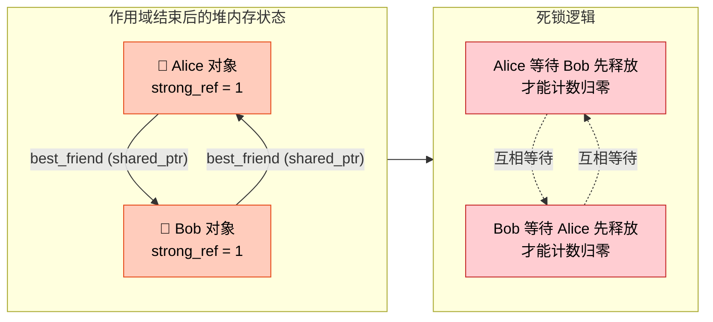

这种"你等我先放、我等你先放"的死锁逻辑，与数据库中的死锁（Deadlock）非常相似。两个对象被自己的 `shared_ptr` 成员永远"锁住"了。

用一段 ASCII 图可以更直观地看清引用计数的变化轨迹：

```c++
// ============ 循环引用计数变化时间线 ============
//
// 时刻 T1: 创建 alice, bob
//   ┌───────────┐          ┌───────────┐
//   │  Alice     │          │  Bob      │
//   │ strong = 1 │          │ strong = 1│
//   └───────────┘          └───────────┘
//       ↑                       ↑
//     alice                    bob       (局部 shared_ptr 各持有一份)
//
// 时刻 T2: alice->best_friend = bob;  bob->best_friend = alice;
//   ┌───────────┐  shared   ┌───────────┐
//   │  Alice     │ ───────► │  Bob      │
//   │ strong = 2 │ ◄─────── │ strong = 2│
//   └───────────┘  shared   └───────────┘
//       ↑                       ↑
//     alice                    bob
//
// 时刻 T3: 离开作用域, 局部变量 alice 和 bob 析构
//   ┌───────────┐  shared   ┌───────────┐
//   │  Alice     │ ───────► │  Bob      │
//   │ strong = 1 │ ◄─────── │ strong = 1│
//   └───────────┘  shared   └───────────┘
//
//   没有外部指针能触及它们, 但 strong ≠ 0 → 永远不会释放 → 泄漏!
```

---

### weak_ptr 的核心 API

`weak_ptr` 不能直接通过裸指针或 `new` 创建，它 **只能从 `shared_ptr` 或另一个 `weak_ptr` 构造**。以下是它最关键的几个操作：

| 操作 | 说明 |
|---|---|
| `weak_ptr<T> wp(sp)` | 从一个 `shared_ptr<T>` 构造，不增加 strong count |
| `wp.expired()` | 检查所指对象是否已被销毁（strong count 是否为 0） |
| `wp.lock()` | 尝试获取一个 `shared_ptr<T>`；若对象存活则返回有效的 `shared_ptr`，否则返回空 `shared_ptr` |
| `wp.use_count()` | 返回当前的 strong reference count（调试用） |
| `wp.reset()` | 释放对被观测对象的引用（weak count 减一） |

最核心的方法是 **`lock()`**——它是你从 `weak_ptr` 安全访问对象的唯一途径。为什么不能直接解引用 `weak_ptr`？因为对象可能在你用它的那一刻已经被销毁了！`lock()` 提供了一种 **原子性的"检查并提升"（Check-and-Promote）** 操作，保证了线程安全。

```c++
#include <iostream>
#include <memory>

int main() {
    std::weak_ptr<int> wp;                      // 默认构造，空的 weak_ptr

    {
        auto sp = std::make_shared<int>(42);    // 创建 shared_ptr, strong=1, weak=0
        wp = sp;                                // weak_ptr 绑定到 sp, strong=1, weak=1

        std::cout << "Inside scope:\n";
        std::cout << "  expired?   " << std::boolalpha << wp.expired() << "\n";   // false
        std::cout << "  use_count: " << wp.use_count() << "\n";                   // 1

        if (auto locked = wp.lock()) {          // lock() 返回有效 shared_ptr, strong 临时变为 2
            std::cout << "  value:     " << *locked << "\n";                      // 42
        }
        // locked 离开 if 作用域, strong 回到 1
    }
    // sp 离开作用域, strong = 0, 对象被销毁; weak = 1 (控制块仍存活)

    std::cout << "Outside scope:\n";
    std::cout << "  expired?   " << std::boolalpha << wp.expired() << "\n";       // true
    std::cout << "  use_count: " << wp.use_count() << "\n";                       // 0

    if (auto locked = wp.lock()) {              // lock() 返回空 shared_ptr
        std::cout << "  value: " << *locked << "\n";    // 不会执行
    } else {
        std::cout << "  Object has been destroyed.\n";   // ✅ 执行这里
    }

    return 0;
}
```

> **关键细节**：当 strong count 降为 0 时，**托管对象被销毁**，但 **控制块（Control Block）还活着**——因为 `weak_ptr` 仍需要读取控制块中的计数来判断 `expired()`。只有当 strong count 和 weak count **都** 为 0 时，控制块本身才会被释放。

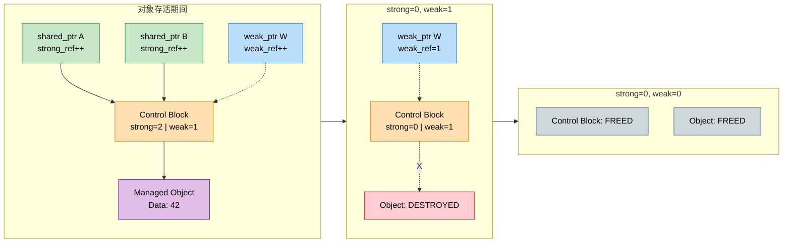

这就解释了为什么 `make_shared` 在只用 `shared_ptr` 时效率最高（一次分配同时容纳对象和控制块），但在有 `weak_ptr` 长期存活的场景下，对象所占内存无法提前释放——因为控制块和对象在同一块内存中，控制块要等到 weak count 也归零才能释放。

---

### 用 weak_ptr 打破循环引用

现在我们回到之前的"好友关系"问题。解决方案非常直接：**将双向引用中的一个方向改为 `weak_ptr`**。

设计原则是：在一对互相引用的关系中，判断哪一方是 **拥有者（Owner）**，哪一方是 **观察者（Observer）**。拥有者用 `shared_ptr`，观察者用 `weak_ptr`。

```c++
#include <iostream>
#include <memory>
#include <string>

class Person {
public:
    std::string name;
    std::shared_ptr<Person> best_friend;   // 强引用：我"拥有"我最好的朋友的引用
    std::weak_ptr<Person>   known_by;      // 弱引用：知道谁把我当最好的朋友，但我不"拥有"他

    Person(const std::string& n) : name(n) {
        std::cout << name << " created.\n";
    }
    ~Person() {
        std::cout << name << " destroyed.\n";
    }

    // 安全地打印 "被谁视为好友" 的信息
    void print_known_by() const {
        if (auto sp = known_by.lock()) {            // 尝试提升为 shared_ptr
            std::cout << name << " is known by " << sp->name << "\n";
        } else {
            std::cout << name << " is known by nobody (expired).\n";
        }
    }
};

int main() {
    {
        auto alice = std::make_shared<Person>("Alice");  // Alice strong=1
        auto bob   = std::make_shared<Person>("Bob");    // Bob   strong=1

        alice->best_friend = bob;     // Alice 拥有 Bob → Bob strong=2
        bob->known_by      = alice;   // Bob "知道" Alice，但不拥有 → Alice strong 仍=1 ✅

        alice->print_known_by();      // Alice is known by nobody (expired).
        bob->print_known_by();        // Bob is known by Alice

        std::cout << "Alice use_count: " << alice.use_count() << "\n";  // 1
        std::cout << "Bob   use_count: " << bob.use_count()   << "\n";  // 2
    }
    // 离开作用域:
    //   alice 销毁 → Alice strong: 1→0 → Alice 对象被销毁
    //                 → Alice 对象内 best_friend (指向 Bob) 被销毁 → Bob strong: 2→1
    //   bob   销毁 → Bob strong: 1→0 → Bob 对象被销毁 ✅
    //
    // 输出:
    //   Alice destroyed.
    //   Bob destroyed.

    std::cout << "End of main. No leak!\n";
    return 0;
}
```

完整输出：

```
Alice created.
Bob created.
Alice is known by nobody (expired).
Bob is known by Alice
Alice use_count: 1
Bob   use_count: 2
Alice destroyed.
Bob destroyed.
End of main. No leak!
```

让我们用 Mermaid 图追踪整个生命周期中引用计数的变化：

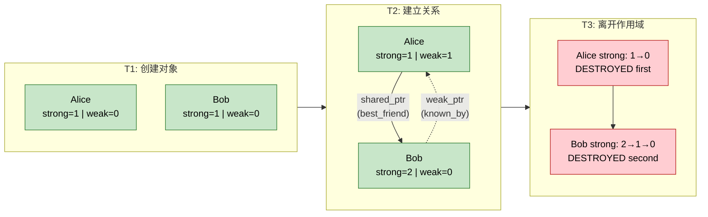

---

### 经典案例：Parent-Child 双向引用

循环引用最常见的工程场景之一是 **树形结构（Tree Structure）** 中父子节点的双向引用。每个父节点"拥有"子节点，子节点需要"回指"父节点但不应"拥有"父节点。

```c++
#include <iostream>
#include <memory>
#include <string>
#include <vector>

class TreeNode {
public:
    std::string name;
    std::vector<std::shared_ptr<TreeNode>> children;  // 父拥有子：shared_ptr
    std::weak_ptr<TreeNode> parent;                    // 子观察父：weak_ptr ✅

    TreeNode(const std::string& n) : name(n) {
        std::cout << "  [+] " << name << " created.\n";
    }
    ~TreeNode() {
        std::cout << "  [-] " << name << " destroyed.\n";
    }

    // 添加子节点，并设置子节点的 parent 指针
    void add_child(std::shared_ptr<TreeNode> child) {
        child->parent = std::shared_ptr<TreeNode>(
            // 不能用 this 直接构造 shared_ptr!
            // 需要该类继承 enable_shared_from_this，这里简化处理
        );
        // 简化版：由外部设置 parent
        children.push_back(std::move(child));          // 移动语义，避免不必要的引用计数操作
    }

    // 安全打印父节点名称
    void print_parent() const {
        if (auto p = parent.lock()) {                  // 尝试锁定
            std::cout << "  " << name << "'s parent: " << p->name << "\n";
        } else {
            std::cout << "  " << name << " has no parent (root).\n";
        }
    }
};

int main() {
    std::cout << "=== Building tree ===\n";
    {
        auto root  = std::make_shared<TreeNode>("Root");      // Root strong=1
        auto childA = std::make_shared<TreeNode>("ChildA");   // ChildA strong=1
        auto childB = std::make_shared<TreeNode>("ChildB");   // ChildB strong=1

        // 建立父子关系
        childA->parent = root;       // Root weak+1（不影响 strong count）
        childB->parent = root;       // Root weak+1

        root->children.push_back(childA);   // ChildA strong=2
        root->children.push_back(childB);   // ChildB strong=2

        childA->print_parent();      // ChildA's parent: Root
        childB->print_parent();      // ChildB's parent: Root

        std::cout << "  Root   use_count: " << root.use_count()   << "\n";  // 1 ✅ (没被 shared_ptr 循环引用)
        std::cout << "  ChildA use_count: " << childA.use_count() << "\n";  // 2
        std::cout << "  ChildB use_count: " << childB.use_count() << "\n";  // 2
    }
    std::cout << "=== Tree destroyed ===\n";

    return 0;
}
```

```
=== Building tree ===
  [+] Root created.
  [+] ChildA created.
  [+] ChildB created.
  ChildA's parent: Root
  ChildB's parent: Root
  Root   use_count: 1
  ChildA use_count: 2
  ChildB use_count: 2
  [-] ChildB destroyed.
  [-] ChildA destroyed.
  [-] Root destroyed.
=== Tree destroyed ===
```

所有节点都被正确销毁。这里的核心规则是：

```c++
// ============ 所有权方向决定指针类型 ============
//
//        ┌──────────────┐
//        │     Root     │
//        │  (strong=1)  │
//        └──┬───────┬───┘
//  shared_ptr│       │shared_ptr     ← 父"拥有"子 → 用 shared_ptr
//        ┌──▼──┐ ┌──▼──┐
//        │ A   │ │ B   │
//        └──┬──┘ └──┬──┘
//  weak_ptr │       │ weak_ptr      ← 子"观察"父 → 用 weak_ptr
//           ▼       ▼
//        (指向 Root, 不增加 strong count)
```

---

### weak_ptr 的线程安全注意事项

`weak_ptr::lock()` 本身是 **线程安全** 的——多个线程可以同时对同一个 `weak_ptr` 调用 `lock()`，不会引发数据竞争。这是因为 `lock()` 内部是通过对控制块中 strong count 的原子 CAS（Compare-And-Swap）操作来实现的。

但需要注意的是：

```c++
// ❌ 错误模式：expired() + lock() 分两步，不是原子的
if (!wp.expired()) {
    // 在这里，另一个线程可能恰好释放了最后一个 shared_ptr
    auto sp = wp.lock();   // 可能得到空的 shared_ptr！
    *sp;                   // 未定义行为！
}

// ✅ 正确模式：直接用 lock()，一步到位
if (auto sp = wp.lock()) {
    // sp 是有效的 shared_ptr，对象在此作用域内保证存活
    use(*sp);              // 安全
}
```

`expired()` 的唯一安全用途是 **快速判断对象是否已经死亡**（比如日志、调试），但绝不能作为"安全访问"的前置检查。

---

### weak_ptr 与 enable_shared_from_this

在实际工程中，一个对象经常需要在自己的成员函数中获取指向自身的 `shared_ptr`。直接用 `this` 构造 `shared_ptr` 是灾难性的：

```c++
// ❌ 绝对禁止！这会创建一个独立的控制块，导致同一对象被 delete 两次！
std::shared_ptr<Foo> bad_ptr(this);
```

标准库提供了 `std::enable_shared_from_this<T>` 来解决这个问题。它的底层实现正是利用了 `weak_ptr`：

```c++
#include <iostream>
#include <memory>

class Widget : public std::enable_shared_from_this<Widget> {
    // enable_shared_from_this 内部持有一个 weak_ptr<Widget>
    // 当第一个 shared_ptr<Widget> 被创建时，这个 weak_ptr 会被自动初始化
public:
    std::string tag;

    Widget(const std::string& t) : tag(t) {}

    // 安全地获取指向自身的 shared_ptr
    std::shared_ptr<Widget> get_self() {
        return shared_from_this();       // 内部调用 weak_ptr::lock()
    }

    void register_callback() {
        // 典型场景：把自身注册到某个异步回调系统中
        auto self = shared_from_this();  // strong count +1, 保证回调执行时对象存活
        // async_system.register(self, ...);
        std::cout << "Registered: " << self->tag
                  << " (use_count=" << self.use_count() << ")\n";
    }
};

int main() {
    auto w = std::make_shared<Widget>("MyWidget");   // 此时内部 weak_ptr 被初始化
    w->register_callback();                          // use_count 临时为 2

    std::cout << "Final use_count: " << w.use_count() << "\n";  // 回到 1
    return 0;
}
```

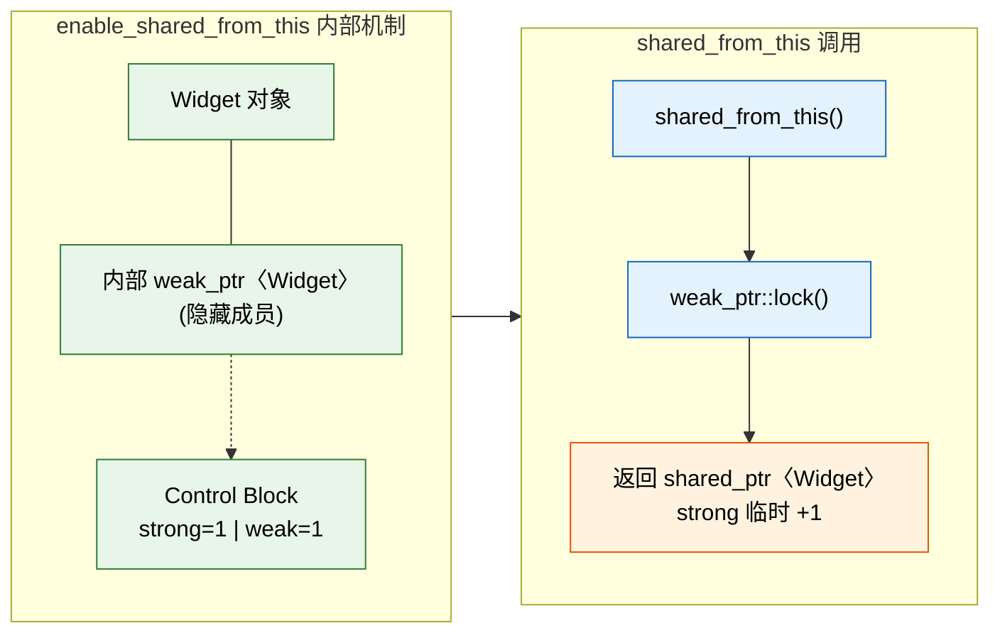

**注意事项**：`shared_from_this()` 只能在对象已经被至少一个 `shared_ptr` 管理时调用。在构造函数中调用会导致 `std::bad_weak_ptr` 异常（C++17）或未定义行为（C++11/14），因为此时内部的 `weak_ptr` 尚未被初始化。

---

### weak_ptr 的典型应用模式汇总

除了打破循环引用，`weak_ptr` 在工程实践中还有几种极为重要的用法：

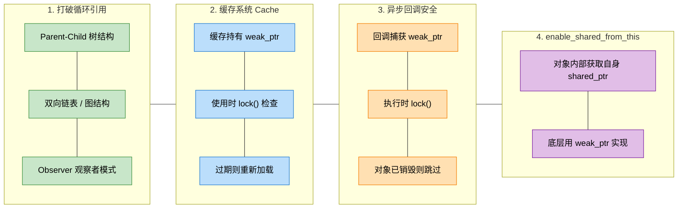

最后给出一个 **缓存系统** 的简洁示例，展示 `weak_ptr` 在非循环引用场景下的价值：

```c++
#include <iostream>
#include <memory>
#include <unordered_map>
#include <string>

class Texture {
public:
    std::string name;
    Texture(const std::string& n) : name(n) {
        std::cout << "  [Load] " << name << " from disk.\n";   // 模拟耗时加载
    }
    ~Texture() {
        std::cout << "  [Free] " << name << " released.\n";
    }
};

class TextureCache {
    // 缓存只持有 weak_ptr: 不阻止纹理被释放
    std::unordered_map<std::string, std::weak_ptr<Texture>> cache_;

public:
    std::shared_ptr<Texture> get(const std::string& name) {
        auto it = cache_.find(name);                        // 查找缓存
        if (it != cache_.end()) {
            if (auto sp = it->second.lock()) {              // 尝试提升
                std::cout << "  [Hit]  " << name << " from cache.\n";
                return sp;                                  // 缓存命中，返回已有对象
            }
            // weak_ptr 已过期，纹理已被释放
            cache_.erase(it);                               // 清理过期条目
        }
        // 缓存未命中或已过期，重新加载
        auto sp = std::make_shared<Texture>(name);          // 从磁盘加载
        cache_[name] = sp;                                  // 存入 weak_ptr
        return sp;
    }
};

int main() {
    TextureCache cache;

    {
        auto t1 = cache.get("sky.png");     // [Load] sky.png from disk.
        auto t2 = cache.get("sky.png");     // [Hit]  sky.png from cache.
        // t1 和 t2 共享同一对象, strong count = 2
    }
    // t1, t2 离开作用域 → Texture 被销毁

    auto t3 = cache.get("sky.png");          // [Load] sky.png from disk. (重新加载)

    return 0;
}
```

这种缓存模式的优雅之处在于：缓存 **不会阻止资源被释放**（不会造成内存浪费），但只要资源还在使用中，就能 **避免重复加载**（提高性能）。这是 `weak_ptr` 非拥有语义的完美体现。

---

**📝 练习题**

以下代码存在内存泄漏，请问最合理的修复方式是什么？

```c++
struct Node {
    std::shared_ptr<Node> next;
    std::shared_ptr<Node> prev;
};

int main() {
    auto a = std::make_shared<Node>();
    auto b = std::make_shared<Node>();
    a->next = b;
    b->prev = a;
}
```

A. 将 `next` 改为 `weak_ptr<Node>`


B. 将 `prev` 改为 `weak_ptr<Node>`


C. 将 `next` 和 `prev` 都改为 `weak_ptr<Node>`


D. 在 `main` 函数末尾手动调用 `a.reset()` 和 `b.reset()`


**【答案】** B

**【解析】** 这是一个典型的双向链表结构，`a->next` 指向 `b`，`b->prev` 指向 `a`，形成了循环引用。打破循环引用只需要将 **其中一个方向** 改为 `weak_ptr`。在双向链表的语义中，`next` 代表"正向拥有权"，通常是链表遍历的主方向；而 `prev`（反向指针）仅用于回溯，天然适合作为"观察者"角色。因此将 `prev` 改为 `weak_ptr<Node>` 是最符合所有权语义的做法。选项 A 也能打破循环，但在链表语义中将 `next` 弱化会让正向遍历变得不便（每次都需要 `lock()`）。选项 C 过度弱化，虽然不会泄漏，但两个方向都需要 `lock()` 才能访问，丧失了智能指针的便利性，且没有任何一方"拥有"对方，对象可能被过早释放。选项 D 虽然能手动打破循环，但违背了智能指针"自动管理"的设计初衷，且在复杂程序中极易遗漏，不被视为合理的修复方案。

---

## make_unique / make_shared

在前面的章节中，我们已经深入了解了 `unique_ptr`、`shared_ptr` 和 `weak_ptr` 的核心语义与使用方式。你可能已经注意到，我们创建智能指针时经常使用 `new` 关键字，例如 `std::unique_ptr<int> p(new int(42))`。然而，C++ 标准库提供了一对**工厂函数**——`std::make_unique`（C++14）和 `std::make_shared`（C++11）——它们才是现代 C++ 中创建智能指针的**首选方式**（preferred idiom）。这并非仅仅是语法糖（syntactic sugar），背后涉及**异常安全**（exception safety）、**内存分配效率**以及**代码可读性**等多维度的考量。

---

### 为什么不直接用 new？——异常安全隐患

在理解 `make_unique` / `make_shared` 的价值之前，我们必须先搞清楚"直接用 `new`"到底有什么问题。来看一个经典的反面案例：

```cpp
// 假设有一个接收两个智能指针的函数
void process(std::shared_ptr<Widget> pw, std::shared_ptr<Gadget> pg);

// ❌ 危险的调用方式：直接在函数参数中 new
process(
    std::shared_ptr<Widget>(new Widget),   // 步骤 A: new Widget → 构造 shared_ptr
    std::shared_ptr<Gadget>(new Gadget)    // 步骤 B: new Gadget → 构造 shared_ptr
);
```

这段代码看起来没什么问题，但实际上**在 C++17 之前**，编译器对函数参数的**求值顺序是未定义的**（unspecified order of evaluation）。编译器可能按以下顺序执行：

```
1. new Widget          — 在堆上分配 Widget
2. new Gadget          — 在堆上分配 Gadget
3. 构造 shared_ptr<Widget>
4. 构造 shared_ptr<Gadget>
```

如果步骤 2 的 `new Gadget` 抛出异常，此时 `Widget` 已经分配在堆上，但还**没有被任何 `shared_ptr` 接管**，于是这块内存就泄漏了！

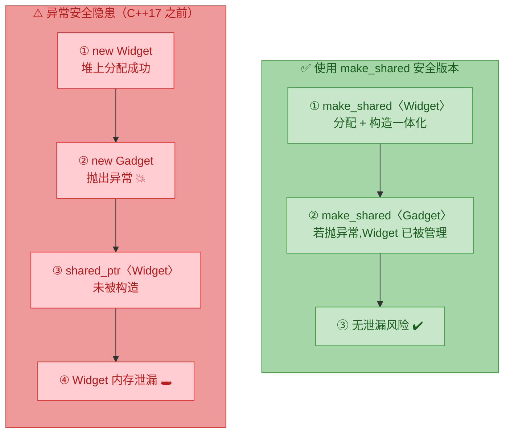

使用 `make_shared` / `make_unique` 就可以彻底消除这个隐患：

```cpp
// ✅ 安全的调用方式
process(
    std::make_shared<Widget>(),   // 分配和构造在一步完成,要么全成功,要么全失败
    std::make_shared<Gadget>()    // 即使抛异常,前一个已被 shared_ptr 保护
);
```

> **Note**: C++17 标准修复了函数参数的求值顺序问题（每个参数的完整求值不再交错），但使用 `make_` 系列函数仍然是最佳实践，因为它还带来了性能优势和代码简洁性。

---

### std::make_unique 详解

`std::make_unique` 是 C++14 引入的工厂函数，用于创建 `std::unique_ptr`。它的基本形态非常直观：

```cpp
#include <memory>   // 智能指针头文件
#include <iostream>
#include <vector>

class Sensor {
public:
    // 带参构造函数
    Sensor(int id, double threshold)
        : id_(id), threshold_(threshold) {
        std::cout << "Sensor " << id_ << " created\n";
    }

    ~Sensor() {
        std::cout << "Sensor " << id_ << " destroyed\n";
    }

    void report() const {
        std::cout << "Sensor " << id_ << ": threshold=" << threshold_ << "\n";
    }

private:
    int id_;              // 传感器 ID
    double threshold_;    // 阈值
};

int main() {
    // ✅ 推荐写法：make_unique 自动推导模板参数,将构造函数参数完美转发
    auto sensor1 = std::make_unique<Sensor>(1, 3.14);   // 构造 Sensor(1, 3.14)
    sensor1->report();                                    // 调用成员函数

    // ❌ 旧式写法（不推荐,存在异常安全隐患）
    // std::unique_ptr<Sensor> sensor2(new Sensor(2, 2.72));

    // ✅ 创建数组类型的 unique_ptr（C++14 起）
    auto arr = std::make_unique<int[]>(5);   // 创建包含 5 个 int 的数组,值初始化为 0
    for (int i = 0; i < 5; ++i) {
        arr[i] = i * 10;                     // 通过下标访问数组元素
        std::cout << arr[i] << " ";          // 输出: 0 10 20 30 40
    }
    std::cout << "\n";

    // ✅ 在容器中使用
    std::vector<std::unique_ptr<Sensor>> sensors;          // 存储独占指针的容器
    sensors.push_back(std::make_unique<Sensor>(3, 1.0));   // 直接构造并移入容器
    sensors.push_back(std::make_unique<Sensor>(4, 2.0));   // 无需手动 new
    // 离开作用域时,vector 析构 → 每个 unique_ptr 析构 → 每个 Sensor 被 delete

    return 0;
}
```

#### make_unique 的内部原理

`std::make_unique` 的实现极其简洁。它本质上是一个**完美转发**（perfect forwarding）的模板函数：

```cpp
// 简化版 make_unique 实现（非数组版本）
// 帮助理解其内部工作原理
namespace my {

    template<typename T, typename... Args>              // 可变参数模板
    std::unique_ptr<T> make_unique(Args&&... args) {    // 万能引用接收所有参数
        // 1. 使用 new 在堆上分配内存
        // 2. 使用 std::forward 完美转发参数给 T 的构造函数
        // 3. 将裸指针包装进 unique_ptr 并返回
        return std::unique_ptr<T>(
            new T(std::forward<Args>(args)...)          // 完美转发 + new
        );
    }

    // 数组版本的特化
    template<typename T>
    std::unique_ptr<T> make_unique(std::size_t size) {              // 接收数组大小
        // 对数组类型使用 new[] 并值初始化（零初始化）
        return std::unique_ptr<T>(
            new std::remove_extent_t<T>[size]()         // new int[size]() 值初始化
        );
    }

} // namespace my
```

**关键技术点**：

- `Args&&... args` 是**万能引用**（universal reference）+ **参数包**（parameter pack），能接收任意数量、任意类型的参数。
- `std::forward<Args>(args)...` 执行**完美转发**，确保左值参数以左值传递、右值参数以右值传递，不会引入不必要的拷贝。
- 返回值是 `std::unique_ptr<T>`，利用**RVO**（Return Value Optimization）或**移动语义**，零开销返回。

---

### std::make_shared 详解

`std::make_shared` 自 C++11 就已经存在，是创建 `shared_ptr` 的最佳方式。它的使用方式与 `make_unique` 几乎对称：

```cpp
#include <memory>
#include <iostream>
#include <string>

class Connection {
public:
    // 构造函数：接受主机名和端口号
    Connection(std::string host, int port)
        : host_(std::move(host)), port_(port) {
        std::cout << "Connected to " << host_ << ":" << port_ << "\n";
    }

    ~Connection() {
        std::cout << "Disconnected from " << host_ << ":" << port_ << "\n";
    }

    void ping() const {
        std::cout << "Ping " << host_ << ":" << port_ << " OK\n";
    }

private:
    std::string host_;   // 主机名
    int port_;           // 端口号
};

int main() {
    // ✅ 使用 make_shared 创建,参数直接转发给 Connection 构造函数
    auto conn = std::make_shared<Connection>("192.168.1.1", 8080);
    conn->ping();                            // 调用成员函数

    std::cout << "use_count = " << conn.use_count() << "\n";   // 1

    {
        auto conn2 = conn;                   // 共享所有权,引用计数 +1
        std::cout << "use_count = " << conn.use_count() << "\n";   // 2
        conn2->ping();                       // 通过第二个 shared_ptr 访问
    }   // conn2 离开作用域,引用计数 -1

    std::cout << "use_count = " << conn.use_count() << "\n";   // 1

    return 0;   // conn 离开作用域,引用计数归零,Connection 被销毁
}
```

#### make_shared 的内存分配优势（核心亮点）

这是 `make_shared` 最为重要的优势——**单次内存分配**（single allocation）。要理解这一点，我们必须知道 `shared_ptr` 的内部结构：

一个 `shared_ptr` 内部需要维护两块数据：
1. **被管理的对象**（managed object）本身
2. **控制块**（control block）：存储引用计数（strong count）、弱引用计数（weak count）、自定义删除器等

当你使用 `new` + `shared_ptr` 构造时：

```cpp
// ❌ 两次内存分配
auto p = std::shared_ptr<Widget>(new Widget);
// 第一次 new: 在堆上分配 Widget 对象
// 第二次 new: shared_ptr 内部再 new 一个控制块
```

而使用 `make_shared` 时：

```cpp
// ✅ 一次内存分配
auto p = std::make_shared<Widget>();
// 一次性分配足够大的连续内存,同时容纳 Widget 对象 + 控制块
```

下面的图展示了两种方式的内存布局差异：

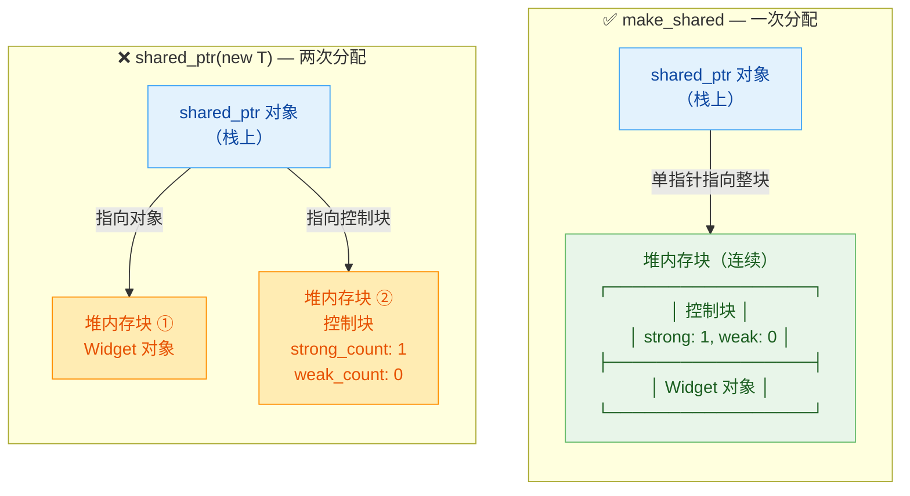

**性能影响量化分析**：

| 对比维度 | `shared_ptr(new T)` | `make_shared<T>()` |
|:---|:---|:---|
| **堆内存分配次数** | 2 次 | 1 次 |
| **内存碎片** | 可能产生两块不连续碎片 | 单块连续内存 |
| **Cache 友好性** | 对象和控制块可能不在同一缓存行 | 对象和控制块紧邻,局部性更好 |
| **异常安全** | C++17 前有泄漏风险 | 天生安全 |
| **代码简洁性** | 类型名写两遍 | 类型名只写一遍 |
| **总分配开销** | 每次 `new` 有固定开销（内存管理器 bookkeeping） | 单次分配,开销减半 |

---

### make_shared 的局限性

尽管 `make_shared` 在绝大多数场景下都是首选，但它并非万能。以下是几种**不能或不宜使用** `make_shared` 的情况：

#### 局限 1：自定义删除器（Custom Deleter）

`make_shared` 不支持传入自定义删除器。如果你需要管理非 `new` 分配的资源（如文件句柄、`malloc` 分配的内存、共享内存等），必须回退到 `shared_ptr` 构造函数：

```cpp
#include <memory>
#include <cstdlib>   // malloc / free
#include <iostream>

int main() {
    // 场景: 管理 C 风格 malloc 分配的内存
    // ❌ make_shared 无法指定自定义删除器
    // auto p = std::make_shared<int>(???);  // 无法传入 free

    // ✅ 必须使用 shared_ptr 构造函数 + 自定义删除器（lambda）
    std::shared_ptr<int> p(
        static_cast<int*>(std::malloc(sizeof(int))),   // 用 malloc 分配内存
        [](int* ptr) {                                  // 自定义删除器: 用 free 释放
            std::cout << "Freeing malloc memory\n";
            std::free(ptr);                             // 配对 malloc 使用 free
        }
    );

    *p = 42;                                            // 正常使用
    std::cout << *p << "\n";                            // 输出: 42

    return 0;   // 离开作用域,调用自定义删除器 free(ptr)
}
```

#### 局限 2：内存延迟释放问题

由于 `make_shared` 将**对象**和**控制块**分配在同一块内存中，这意味着只有当控制块也不再需要时，这整块内存才能被释放。控制块的生命周期不仅取决于 `shared_ptr`（strong count），还取决于 `weak_ptr`（weak count）：

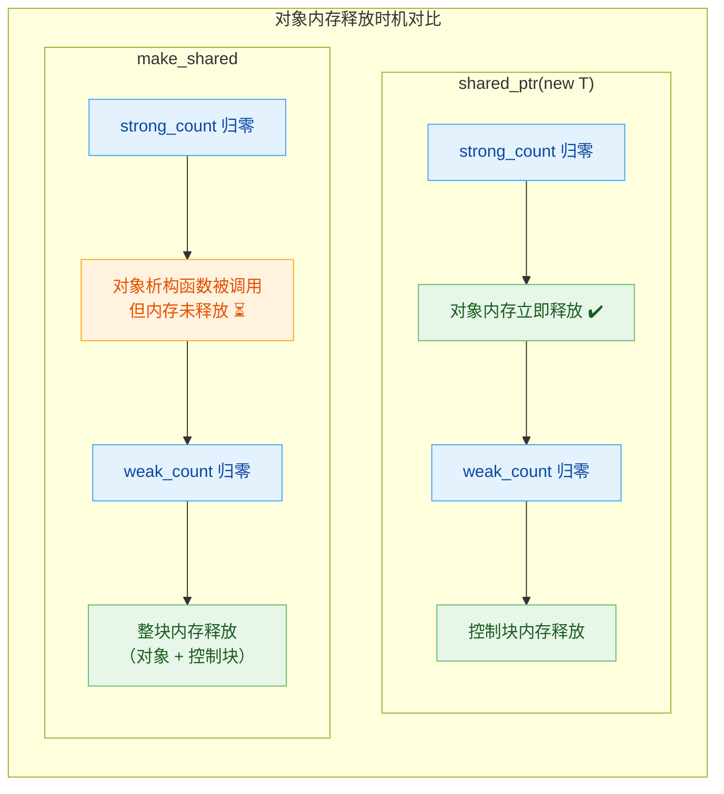

来看一个具体的代码示例：

```cpp
#include <memory>
#include <iostream>

class HugeBuffer {
    char data_[1024 * 1024];   // 1 MB 的大缓冲区
public:
    HugeBuffer()  { std::cout << "HugeBuffer allocated (1MB)\n"; }
    ~HugeBuffer() { std::cout << "HugeBuffer destructor called\n"; }
};

int main() {
    std::weak_ptr<HugeBuffer> weak;

    {
        // make_shared: 对象和控制块在同一块内存中
        auto shared = std::make_shared<HugeBuffer>();   // 分配 1MB+控制块 的连续内存
        weak = shared;                                   // weak_ptr 观察该对象

        std::cout << "use_count = " << shared.use_count() << "\n";   // 1
    }
    // shared 离开作用域:
    //   - strong_count 归零 → HugeBuffer 析构函数被调用 ✅
    //   - 但 weak 仍存在 → weak_count != 0 → 那 1MB 内存仍未归还给操作系统! ⚠️

    std::cout << "HugeBuffer destroyed, but memory might still be held\n";
    std::cout << "weak expired? " << weak.expired() << "\n";   // 1 (true)

    // 只有当 weak 也被销毁（或 reset）后,整块内存才真正释放
    weak.reset();   // weak_count 归零 → 释放 1MB 内存
    std::cout << "Now memory is fully freed\n";

    return 0;
}
```

**关键要点**：如果你的对象非常大，且存在长生命周期的 `weak_ptr`，使用 `make_shared` 可能导致大块内存被延迟释放。此时应考虑使用 `shared_ptr(new T)` 将对象和控制块分开分配。

#### 局限 3：私有/受保护构造函数

`make_shared` 内部通过 `new T(args...)` 构造对象，因此它需要能够访问 `T` 的构造函数。如果构造函数是 `private` 或 `protected` 的（如工厂模式），`make_shared` 将无法编译：

```cpp
#include <memory>

class Singleton {
private:
    Singleton() = default;                   // 私有构造函数

public:
    // ❌ 编译失败: make_shared 无法访问 private 构造函数
    // static std::shared_ptr<Singleton> create() {
    //     return std::make_shared<Singleton>();
    // }

    // ✅ 解决方案 1: 使用 shared_ptr 构造函数（借助友元或在类内部使用 new）
    static std::shared_ptr<Singleton> create() {
        // 类自身可以访问 private 构造函数
        return std::shared_ptr<Singleton>(new Singleton());
    }

    // ✅ 解决方案 2: Passkey idiom（推荐,可以配合 make_shared 使用）
    struct Token { private: Token() = default; friend class Singleton; };

    Singleton(Token) {}   // 公开构造函数,但只有持有 Token 的人才能调用

    static std::shared_ptr<Singleton> createV2() {
        return std::make_shared<Singleton>(Token{});   // 类内部可以构造 Token
    }
};
```

#### 局限 4：列表初始化（Brace Initialization）

`make_shared` / `make_unique` 使用**圆括号**（parentheses）进行构造，不支持**花括号**（brace initialization / initializer_list）。如果你需要 `initializer_list` 构造：

```cpp
#include <memory>
#include <vector>

int main() {
    // ❌ 编译失败: make_shared 不支持花括号初始化
    // auto p = std::make_shared<std::vector<int>>({1, 2, 3});

    // ✅ 解决方案: 先创建 initializer_list,再传入
    auto init = {1, 2, 3};                                       // std::initializer_list<int>
    auto p = std::make_shared<std::vector<int>>(init);           // OK: 转发 initializer_list

    // ✅ 或者直接用 shared_ptr 构造函数
    std::shared_ptr<std::vector<int>> p2(
        new std::vector<int>{1, 2, 3}                            // 花括号初始化
    );

    return 0;
}
```

---

### 决策指南：何时用 make，何时不用

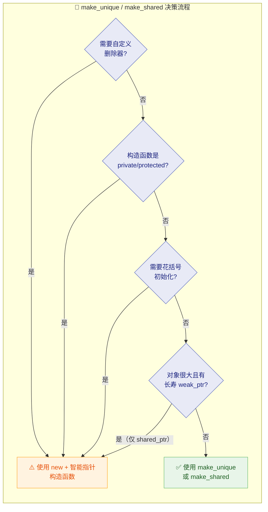

简明总结规则：

| 场景 | 推荐方式 |
|:---|:---|
| 常规创建 `unique_ptr` | `std::make_unique<T>(args...)` |
| 常规创建 `shared_ptr` | `std::make_shared<T>(args...)` |
| 需要自定义删除器 | `std::shared_ptr<T>(ptr, deleter)` |
| 私有构造函数 | `std::shared_ptr<T>(new T)` 或 Passkey 模式 |
| `initializer_list` 构造 | 先声明 `auto il = {...};` 再传入 |
| 超大对象 + 长寿 `weak_ptr` | `std::shared_ptr<T>(new T)` 分离分配 |

---

### make_unique 与 make_shared 对比表

| 特性 | `std::make_unique` | `std::make_shared` |
|:---|:---|:---|
| **引入标准** | C++14 | C++11 |
| **创建目标** | `std::unique_ptr<T>` | `std::shared_ptr<T>` |
| **内存分配优化** | 无（只有一次 `new`） | 有（合并对象与控制块为一次 `new`） |
| **支持数组** | ✅ `make_unique<T[]>(n)` | ✅ C++20 起 `make_shared<T[]>(n)` |
| **异常安全** | ✅ | ✅ |
| **自定义删除器** | ❌ 不支持 | ❌ 不支持 |
| **头文件** | `<memory>` | `<memory>` |

---

### 实战最佳实践

```cpp
#include <memory>
#include <iostream>
#include <string>
#include <vector>

// ─────────── 领域模型 ───────────
class Logger {
    std::string name_;                       // 日志器名称
public:
    explicit Logger(std::string name)
        : name_(std::move(name)) {
        std::cout << "[Logger] " << name_ << " initialized\n";
    }
    ~Logger() {
        std::cout << "[Logger] " << name_ << " shut down\n";
    }
    void log(const std::string& msg) const {
        std::cout << "[" << name_ << "] " << msg << "\n";
    }
};

class Service {
    std::string name_;                       // 服务名称
    std::shared_ptr<Logger> logger_;         // 共享的日志器
public:
    Service(std::string name, std::shared_ptr<Logger> logger)
        : name_(std::move(name)),            // 移动字符串,避免拷贝
          logger_(std::move(logger)) {}      // 移动 shared_ptr,引用计数不变

    void execute() {
        logger_->log(name_ + " is executing");   // 使用共享的日志器
    }
};

// ─────────── 工厂函数:返回 unique_ptr ───────────
// 推荐: 工厂函数返回 unique_ptr,调用者决定所有权策略
auto createLogger(const std::string& name) {
    return std::make_unique<Logger>(name);       // 返回独占指针
}

int main() {
    // 1. 工厂创建 unique_ptr,然后按需转换为 shared_ptr
    auto uniqueLogger = createLogger("MainLogger");      // unique_ptr<Logger>

    // unique_ptr 可以隐式转换为 shared_ptr（所有权转移）
    std::shared_ptr<Logger> sharedLogger = std::move(uniqueLogger);
    // 此时 uniqueLogger 为 nullptr

    // 2. 多个 Service 共享同一个 Logger
    auto svc1 = std::make_unique<Service>("AuthService", sharedLogger);     // 共享日志器
    auto svc2 = std::make_unique<Service>("DataService", sharedLogger);     // 共享日志器

    std::cout << "Logger use_count = " << sharedLogger.use_count() << "\n"; // 3

    svc1->execute();   // [MainLogger] AuthService is executing
    svc2->execute();   // [MainLogger] DataService is executing

    // 3. 管理在容器中
    std::vector<std::unique_ptr<Service>> services;      // 容器持有独占指针
    // ❌ services.push_back(svc1);                       // 编译错误: unique_ptr 不能拷贝
    services.push_back(std::move(svc1));                  // ✅ 移动进容器
    services.push_back(std::move(svc2));                  // ✅ 移动进容器

    // 4. 遍历执行
    for (const auto& svc : services) {                   // const 引用遍历
        svc->execute();                                   // 通过 unique_ptr 调用
    }

    return 0;
    // 退出顺序:
    //   services 析构 → Service 析构 → shared_ptr<Logger> 引用计数 -1
    //   sharedLogger 析构 → 引用计数归零 → Logger 被销毁
}
```

这段代码展示了现代 C++ 中智能指针的典型协作模式：

1. **工厂函数返回 `unique_ptr`**——这是最灵活的设计，因为 `unique_ptr` 可以无损转换为 `shared_ptr`，反之则不行。
2. **`make_unique` / `make_shared` 全程无 `new`**——代码中没有出现任何裸 `new` / `delete`，完全消除内存泄漏风险。
3. **语义清晰**：`unique_ptr` 表达独占，`shared_ptr` 表达共享，代码即文档。

---

**📝 练习题**

以下代码在 C++14 环境中编译运行，请问输出结果是什么？

```cpp
#include <memory>
#include <iostream>

struct Node {
    int val;
    Node(int v) : val(v) { std::cout << "C" << val << " "; }
    ~Node()               { std::cout << "D" << val << " "; }
};

int main() {
    auto p1 = std::make_shared<Node>(1);
    auto p2 = std::make_shared<Node>(2);
    p1 = p2;
    std::cout << "V" << p1->val << " ";
    return 0;
}
```

A. `C1 C2 V2 D2 D1`


B. `C1 C2 D1 V2 D2`


C. `C1 C2 V2 D1 D2`


D. `C1 C2 D2 V2 D1`


**【答案】** B

**【解析】**

程序执行流程如下：

1. `make_shared<Node>(1)` 构造 `Node(1)`，输出 `C1`，`p1` 持有它（strong\_count = 1）。
2. `make_shared<Node>(2)` 构造 `Node(2)`，输出 `C2`，`p2` 持有它（strong\_count = 1）。
3. `p1 = p2`：`p1` 放弃对 `Node(1)` 的所有权。此时 `Node(1)` 的 strong\_count 从 1 降为 0，**立即析构**，输出 `D1`。然后 `p1` 指向 `Node(2)`，`Node(2)` 的 strong\_count 变为 2。
4. `std::cout << "V" << p1->val`：输出 `V2`。
5. `return 0` 时，`p2` 先析构（栈上后进先出），strong\_count 从 2 降为 1；然后 `p1` 析构，strong\_count 从 1 降为 0，`Node(2)` 被销毁，输出 `D2`。

最终输出：`C1 C2 D1 V2 D2`，对应选项 **B**。

---

## 智能指针使用场景

在前面的章节中，我们已经系统地学习了 `unique_ptr`、`shared_ptr` 和 `weak_ptr` 的各自特性与底层原理。然而，**知道"是什么"远远不够，关键在于知道"什么时候用哪个"**。这正是区分初级与中高级 C++ 开发者的分水岭。本节将从**实际工程场景**出发，系统性地梳理三种智能指针的最佳使用时机、典型模式和常见反模式（Anti-pattern），帮助你在真实项目中做出正确的设计决策。

---

### 核心选型决策模型

在选择智能指针之前，你需要回答一个根本性问题：**这块堆内存的"所有权"（Ownership）归谁？有几个人拥有？**

所有权模型是 Modern C++ 资源管理的灵魂。不同的所有权语义，直接决定了你应该选择哪种智能指针：

| 所有权语义 | 智能指针选型 | 核心特征 |
|:---|:---|:---|
| **独占所有权** — 有且仅有一个拥有者 | `std::unique_ptr` | 零开销，移动语义转移 |
| **共享所有权** — 多个拥有者共同管理生命周期 | `std::shared_ptr` | 引用计数，最后一个释放 |
| **非拥有观察** — 只是"看看"，不参与生命周期管理 | `std::weak_ptr` / 裸指针 | 不增加引用计数 |
| **无动态分配** — 栈上对象或成员对象 | **不需要智能指针** | 值语义，RAII 自然管理 |

> **黄金法则（Golden Rule）**：**优先选择 `unique_ptr`**。只有在确实需要共享所有权时才升级到 `shared_ptr`。`weak_ptr` 仅作为 `shared_ptr` 的辅助观察者存在。

下面的决策流程图将这一思路可视化：

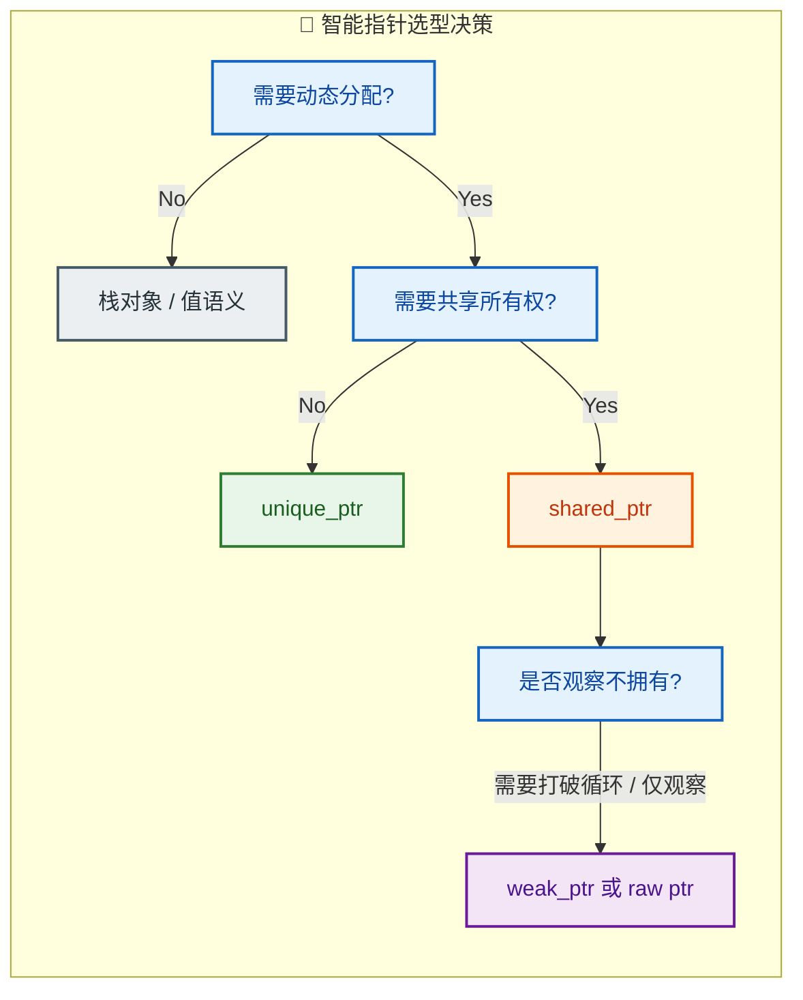

---

### 场景一：工厂函数与独占资源 — `unique_ptr` 的主战场

这是 `unique_ptr` 最经典、最高频的使用场景。**工厂模式**（Factory Pattern）天然符合独占所有权语义：工厂负责"创造"对象，然后将**完整的所有权**移交给调用者。

```c++
#include <memory>  // 智能指针头文件
#include <string>
#include <iostream>
#include <stdexcept>

// ============ 基类与派生类 ============
class Shape {                            // 形状基类（抽象接口）
public:
    virtual ~Shape() = default;          // 虚析构函数：保证通过基类指针正确析构派生类
    virtual void draw() const = 0;       // 纯虚函数：每个形状都必须实现自己的绘制
    virtual double area() const = 0;     // 纯虚函数：计算面积
};

class Circle : public Shape {            // 圆形 —— 继承自 Shape
    double radius_;                      // 半径
public:
    explicit Circle(double r) : radius_(r) {}  // explicit 防止隐式转换
    void draw() const override {         // 实现纯虚函数 draw
        std::cout << "Drawing Circle (r=" << radius_ << ")\n";
    }
    double area() const override {       // 实现纯虚函数 area
        return 3.14159265 * radius_ * radius_;  // πr²
    }
};

class Rectangle : public Shape {         // 矩形 —— 继承自 Shape
    double w_, h_;                       // 宽、高
public:
    Rectangle(double w, double h) : w_(w), h_(h) {}
    void draw() const override {
        std::cout << "Drawing Rectangle (" << w_ << "x" << h_ << ")\n";
    }
    double area() const override {
        return w_ * h_;                  // 宽 × 高
    }
};

// ============ 工厂函数 ============
// 返回 unique_ptr<Shape>：调用者获得独占所有权
// 工厂内部创建对象，外部负责生命周期
std::unique_ptr<Shape> createShape(const std::string& type, double a, double b = 0) {
    if (type == "circle") {
        return std::make_unique<Circle>(a);      // 创建圆形并转移所有权
    } else if (type == "rectangle") {
        return std::make_unique<Rectangle>(a, b); // 创建矩形并转移所有权
    }
    throw std::invalid_argument("Unknown shape: " + type);  // 未知类型则抛异常
}

// ============ 使用工厂 ============
int main() {
    // shape1 独占这个 Circle 对象的所有权
    auto shape1 = createShape("circle", 5.0);
    shape1->draw();                      // 多态调用 Circle::draw()
    std::cout << "Area: " << shape1->area() << "\n";  // 输出面积

    // shape2 独占这个 Rectangle 对象
    auto shape2 = createShape("rectangle", 3.0, 4.0);
    shape2->draw();                      // 多态调用 Rectangle::draw()

    // 当 shape1, shape2 离开作用域时，unique_ptr 自动释放堆内存
    // 无需手动 delete，且异常安全
    return 0;
}
```

**为什么这里必须用 `unique_ptr` 而不是 `shared_ptr`？**

1. **语义清晰**：工厂"生产"并"移交"，调用者"独占"——这是最自然的所有权流转。如果用 `shared_ptr`，就暗示"可能有多个拥有者"，让代码阅读者困惑。
2. **零额外开销**：`unique_ptr` 在大多数平台上和裸指针一样大（8 字节），没有引用计数的原子操作开销。
3. **可升级**：如果后续确实需要共享，`unique_ptr` 可以**隐式转换**为 `shared_ptr`，反之不行。

```c++
// unique_ptr -> shared_ptr：合法，隐式转换
std::unique_ptr<Shape> up = createShape("circle", 3.0);  // 工厂返回 unique_ptr
std::shared_ptr<Shape> sp = std::move(up);                // 所有权从 unique 转移到 shared
// 注意：此时 up == nullptr，所有权已完全转移

// shared_ptr -> unique_ptr：不合法！编译错误！
// std::unique_ptr<Shape> up2 = std::move(sp);  // ❌ 无法从 shared 退回 unique
```

---

### 场景二：共享缓存 / 共享配置 — `shared_ptr` 的经典用例

当**多个模块需要同时持有某个资源，并且你无法确定谁先释放、谁后释放**时，`shared_ptr` 就是正确的选择。最典型的场景是**共享缓存**（Shared Cache）和**全局配置对象**（Shared Configuration）。

```c++
#include <memory>
#include <string>
#include <unordered_map>
#include <iostream>
#include <mutex>

// ============ 大型纹理资源 ============
class Texture {                          // 模拟一个昂贵的纹理资源
    std::string name_;                   // 纹理名称
    // 假设这里还有几百 MB 的像素数据...
public:
    explicit Texture(const std::string& name) : name_(name) {
        std::cout << "  [Texture] Loading: " << name_ << " (expensive!)\n";
    }
    ~Texture() {
        std::cout << "  [Texture] Unloading: " << name_ << "\n";
    }
    const std::string& name() const { return name_; }
};

// ============ 纹理缓存管理器 ============
class TextureCache {
    // 缓存表：多个使用者可以共享同一个 Texture
    std::unordered_map<std::string, std::shared_ptr<Texture>> cache_;
    std::mutex mtx_;                     // 线程安全锁

public:
    // 获取纹理：若缓存命中则返回已有的 shared_ptr，否则加载新纹理
    std::shared_ptr<Texture> getTexture(const std::string& name) {
        std::lock_guard<std::mutex> lock(mtx_);   // 加锁保证线程安全
        auto it = cache_.find(name);               // 在缓存中查找
        if (it != cache_.end()) {                  // 缓存命中
            std::cout << "  [Cache] Hit: " << name << "\n";
            return it->second;                     // 返回 shared_ptr 的拷贝(引用计数+1)
        }
        // 缓存未命中：创建新的纹理并存入缓存
        std::cout << "  [Cache] Miss: " << name << "\n";
        auto tex = std::make_shared<Texture>(name);  // 引用计数 = 1
        cache_[name] = tex;                           // 缓存也持有一份（引用计数 = 2）
        return tex;                                   // 返回给调用者（引用计数维持 2）
    }

    // 从缓存中移除纹理（但只要还有使用者，纹理对象不会被销毁）
    void evict(const std::string& name) {
        std::lock_guard<std::mutex> lock(mtx_);
        cache_.erase(name);  // 缓存不再持有 -> 引用计数 -1
        // 如果外部还有 shared_ptr 持有该纹理，纹理不会被释放！
    }
};

// ============ 模拟多个模块共享纹理 ============
int main() {
    TextureCache cache;

    // 模块 A 获取 "sky.png" 纹理
    auto texA = cache.getTexture("sky.png");     // Cache Miss -> 加载纹理

    // 模块 B 也获取同一个 "sky.png" 纹理
    auto texB = cache.getTexture("sky.png");     // Cache Hit -> 共享同一对象

    std::cout << "texA and texB same object? "
              << (texA.get() == texB.get() ? "YES" : "NO") << "\n";  // YES

    std::cout << "Reference count: " << texA.use_count() << "\n";     // 3 (cache + A + B)

    cache.evict("sky.png");              // 缓存释放持有权
    std::cout << "After evict, ref count: " << texA.use_count() << "\n";  // 2 (A + B)

    texA.reset();                        // 模块 A 不再需要
    std::cout << "After A reset, ref count: " << texB.use_count() << "\n"; // 1 (只剩 B)

    // texB 离开作用域时引用计数归零 -> Texture 被自动销毁
    return 0;
}
```

**共享所有权的本质**：没有任何一个模块可以"独裁"地决定纹理何时销毁。生命周期由**所有持有者共同决定**——最后一个放手的人负责收尸。这就是 `shared_ptr` 的价值所在。

---

### 场景三：观察者模式与循环引用 — `weak_ptr` 救场

`weak_ptr` 的两大核心使命：**打破循环引用** 和 **安全观察**。在 Observer Pattern（观察者模式）中，Subject（被观察者）通常需要持有 Observer（观察者）的指针以便发送通知，但 Subject **不应该"拥有"** Observer——否则就会形成循环引用，导致内存泄漏。

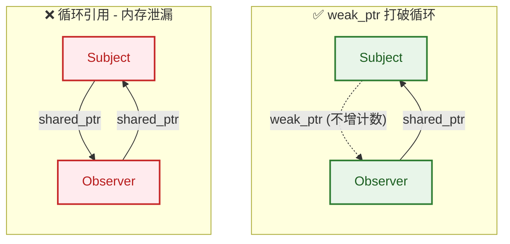

```c++
#include <memory>
#include <vector>
#include <string>
#include <iostream>
#include <algorithm>

// ============ 观察者接口 ============
class IObserver {                            // 观察者抽象接口
public:
    virtual ~IObserver() = default;
    virtual void onNotify(const std::string& event) = 0;  // 收到通知的回调
};

// ============ 事件源 (Subject) ============
class EventSource {
    // 关键：用 weak_ptr 持有观察者，不参与生命周期管理！
    std::vector<std::weak_ptr<IObserver>> observers_;

public:
    // 注册观察者：接受 weak_ptr
    void subscribe(std::weak_ptr<IObserver> obs) {
        observers_.push_back(std::move(obs));        // 存储弱引用
    }

    // 通知所有存活的观察者
    void notify(const std::string& event) {
        // 使用 erase-remove idiom 清理已失效的 weak_ptr
        observers_.erase(
            std::remove_if(observers_.begin(), observers_.end(),
                [](const std::weak_ptr<IObserver>& wp) {
                    return wp.expired();             // 观察者已被销毁？
                }),
            observers_.end()
        );

        // 逐一通知存活的观察者
        for (auto& wp : observers_) {
            // lock() 尝试提升为 shared_ptr
            if (auto sp = wp.lock()) {               // 提升成功 -> 观察者仍然存活
                sp->onNotify(event);                 // 安全调用
            }
            // 如果 lock() 返回 nullptr，说明观察者已被销毁，跳过即可
        }
    }
};

// ============ 具体观察者 ============
class Logger : public IObserver {
    std::string tag_;                                // 日志标签
public:
    explicit Logger(const std::string& tag) : tag_(tag) {
        std::cout << "[" << tag_ << "] Created\n";
    }
    ~Logger() override {
        std::cout << "[" << tag_ << "] Destroyed\n";
    }
    void onNotify(const std::string& event) override {
        std::cout << "[" << tag_ << "] Received: " << event << "\n";
    }
};

// ============ 演示 ============
int main() {
    EventSource source;                              // 事件源

    // 创建两个观察者（shared_ptr 管理生命周期）
    auto logger1 = std::make_shared<Logger>("A");
    auto logger2 = std::make_shared<Logger>("B");

    // 订阅事件：传入 weak_ptr
    source.subscribe(logger1);                       // 隐式转换 shared_ptr -> weak_ptr
    source.subscribe(logger2);

    source.notify("Event_1");                        // A 和 B 都收到通知
    std::cout << "--- Destroying Logger B ---\n";

    logger2.reset();                                 // 手动销毁 B

    source.notify("Event_2");                        // 只有 A 收到通知，B 的 weak_ptr 已失效
    return 0;
}
```

**`weak_ptr` 在此场景的三大优势**：

1. **不延长观察者的生命周期**：观察者何时销毁完全由其自身的 `shared_ptr` 持有者决定，Subject 不干预。
2. **安全检测**：通过 `expired()` 或 `lock()` 可以在使用前确认对象是否还活着，避免悬空指针。
3. **自动清理**：通知时顺便清除已失效的弱引用，保持列表干净。

---

### 场景四：数据结构中的父子关系 — 混合使用三种指针

树形数据结构（如 DOM 树、场景图 Scene Graph、文件系统目录树）是混合使用智能指针的经典场景：

- **父 → 子**：`unique_ptr` 或 `shared_ptr`（父"拥有"子）
- **子 → 父**：`weak_ptr` 或裸指针（子"引用"父，但不拥有）

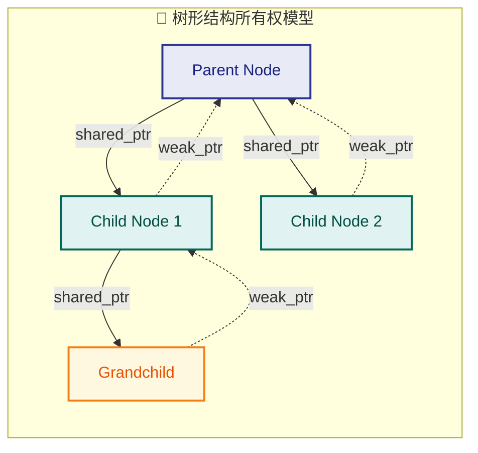

```c++
#include <memory>
#include <vector>
#include <string>
#include <iostream>

class TreeNode : public std::enable_shared_from_this<TreeNode> {
    // enable_shared_from_this 允许从 this 指针安全地获取 shared_ptr<TreeNode>
    std::string name_;                                       // 节点名称
    std::weak_ptr<TreeNode> parent_;                         // 弱引用指向父节点（不拥有）
    std::vector<std::shared_ptr<TreeNode>> children_;        // 强引用拥有所有子节点

public:
    explicit TreeNode(const std::string& name) : name_(name) {
        std::cout << "  [+] Node created: " << name_ << "\n";
    }
    ~TreeNode() {
        std::cout << "  [-] Node destroyed: " << name_ << "\n";
    }

    // 添加子节点
    void addChild(const std::string& childName) {
        auto child = std::make_shared<TreeNode>(childName);  // 创建子节点
        child->parent_ = shared_from_this();                 // 子 -> 父 用 weak_ptr
        children_.push_back(std::move(child));               // 父 -> 子 用 shared_ptr
    }

    // 获取父节点名称（安全访问）
    std::string parentName() const {
        if (auto p = parent_.lock()) {    // 尝试提升 weak_ptr
            return p->name_;              // 父节点仍存活，返回名称
        }
        return "(no parent)";             // 父节点已被销毁或不存在
    }

    // 打印树结构
    void print(int depth = 0) const {
        std::string indent(depth * 2, ' ');                  // 缩进：每层2个空格
        std::cout << indent << name_
                  << " [parent: " << parentName() << "]\n";
        for (const auto& child : children_) {                // 递归打印每个子节点
            child->print(depth + 1);
        }
    }

    const std::string& name() const { return name_; }
};

int main() {
    auto root = std::make_shared<TreeNode>("root");     // 根节点
    root->addChild("src");                              // 添加 src 目录
    root->addChild("include");                          // 添加 include 目录

    // 获取 src 节点并在其下再添加子节点
    // 注意：这里简化处理，直接通过下标访问
    // 真实项目中应提供 findChild() 等接口

    std::cout << "\n=== Tree Structure ===\n";
    root->print();

    std::cout << "\n=== Destroying tree ===\n";
    root.reset();   // 释放 root -> 所有子节点引用计数归零 -> 级联销毁
    // 因为子->父是 weak_ptr，不会阻止父节点的销毁
    // 整棵树被干净地释放，零泄漏

    return 0;
}
```

**关键设计原则**：所有权沿着**一个方向**流动（父 → 子），反向引用（子 → 父）使用 `weak_ptr`。这样当根节点被释放时，整棵树会**级联销毁**，不会出现循环引用导致的内存泄漏。

---

### 场景五：函数参数传递 — 指针的"语义契约"

函数参数中使用哪种指针类型，本质上是一种**接口契约**（API Contract），它向调用者传递明确的所有权意图。这是 Herb Sutter 在 CppCoreGuidelines 中反复强调的设计哲学：

```mermaid
graph LR
    subgraph Params["📋 函数参数智能指针契约"]
        direction TB
        A["void process(Widget* w)"]
        B["void consume(unique_ptr〈Widget〉 w)"]
        C["void share(shared_ptr〈Widget〉 w)"]
        D["void observe(const shared_ptr〈Widget〉& w)"]
        E["void mayExtend(weak_ptr〈Widget〉 w)"]

        A1["不涉及所有权,仅使用"]
        B1["转移独占所有权给函数"]
        C1["共享所有权,计数+1"]
        D1["只读访问,不改变引用计数"]
        E1["可能提升,不保证存活"]

        A --- A1
        B --- B1
        C --- C1
        D --- D1
        E --- E1
    end

    classDef func fill:#E8EAF6,stroke:#3949AB,color:#1A237E,stroke-width:2px
    classDef desc fill:#F1F8E9,stroke:#558B2F,color:#33691E,stroke-width:1px

    class A,B,C,D,E func
    class A1,B1,C1,D1,E1 desc
```

每种参数形式的详细解释与代码示例：

```c++
#include <memory>
#include <iostream>

class Widget {
public:
    int id;
    explicit Widget(int i) : id(i) {}
    ~Widget() { std::cout << "  Widget " << id << " destroyed\n"; }
};

// ───────────────────────────────────────────
// 【1】裸指针 / 引用：不涉及所有权，仅 "借用"
// 含义：函数只需要使用该对象，不管它的生命周期
// ───────────────────────────────────────────
void inspect(const Widget& w) {           // 最推荐的 "借用" 方式
    std::cout << "Inspecting Widget " << w.id << "\n";
}

void inspectPtr(Widget* w) {              // 当可能为 nullptr 时用裸指针
    if (w) {                              // 必须判空
        std::cout << "Inspecting Widget " << w->id << "\n";
    }
}

// ───────────────────────────────────────────
// 【2】unique_ptr 按值传递：转移所有权给函数（Sink 函数）
// 含义：调用者放弃所有权，函数接管并负责销毁
// ───────────────────────────────────────────
void consume(std::unique_ptr<Widget> w) { // "吞噬" 语义
    std::cout << "Consuming Widget " << w->id << "\n";
    // w 在函数结束时自动销毁
}

// ───────────────────────────────────────────
// 【3】unique_ptr& 引用传递：函数可能 "重置" 或 "替换" 调用者的指针
// 含义：函数需要修改调用者持有的 unique_ptr 本身
// ───────────────────────────────────────────
void resetWidget(std::unique_ptr<Widget>& w) {
    w.reset();                            // 销毁原对象
    w = std::make_unique<Widget>(999);    // 替换为新对象
}

// ───────────────────────────────────────────
// 【4】shared_ptr 按值传递：函数参与共享所有权
// 含义：函数会存储一份 shared_ptr（引用计数 +1）
// ───────────────────────────────────────────
class WidgetHolder {
    std::shared_ptr<Widget> stored_;      // 长期持有
public:
    void store(std::shared_ptr<Widget> w) {
        stored_ = std::move(w);           // move 进来，避免额外的引用计数操作
        std::cout << "Stored Widget " << stored_->id
                  << ", ref_count = " << stored_.use_count() << "\n";
    }
};

// ───────────────────────────────────────────
// 【5】const shared_ptr& 引用传递：只读查看，不影响生命周期
// 含义：函数不需要延长对象寿命，只是 "看一眼"
// ───────────────────────────────────────────
void peek(const std::shared_ptr<Widget>& w) {
    std::cout << "Peeking Widget " << w->id
              << ", ref_count = " << w.use_count() << "\n";
    // use_count 不会因为这个函数调用而增加
}

int main() {
    // 场景 1：借用
    auto up = std::make_unique<Widget>(1);
    inspect(*up);                         // 传引用，不涉及所有权
    inspectPtr(up.get());                 // 传裸指针，同样不涉及所有权

    // 场景 2：转移
    auto up2 = std::make_unique<Widget>(2);
    consume(std::move(up2));              // 所有权转移给 consume，up2 变 nullptr
    // std::cout << up2->id;             // ❌ 未定义行为！up2 已为空

    // 场景 3：重置
    auto up3 = std::make_unique<Widget>(3);
    std::cout << "Before reset: " << up3->id << "\n";   // 3
    resetWidget(up3);                     // 函数内部替换了对象
    std::cout << "After reset: " << up3->id << "\n";    // 999

    // 场景 4-5：共享
    auto sp = std::make_shared<Widget>(4);
    peek(sp);                             // ref_count 不变
    WidgetHolder holder;
    holder.store(sp);                     // ref_count +1（holder 也持有一份）

    return 0;
}
```

**速查表**（背下来！面试高频考点）：

| 参数形式 | 所有权语义 | 何时使用 |
|:---|:---|:---|
| `Widget&` / `const Widget&` | 无（借用） | 函数只需使用对象，不关心生命周期 |
| `Widget*` | 无（可空借用） | 同上，但对象可能为 `nullptr` |
| `unique_ptr<Widget>` | **转移**（Sink） | 函数要"吞掉"对象，调用者不再拥有 |
| `unique_ptr<Widget>&` | **修改权** | 函数需要 reset/replace 调用者的指针 |
| `shared_ptr<Widget>` | **共享** | 函数需要长期持有一份所有权 |
| `const shared_ptr<Widget>&` | **只读查看** | 函数只需短暂使用，不延长生命周期 |
| `weak_ptr<Widget>` | **可能观察** | 不确定对象是否存活，需先 `lock()` |

---

### 场景六：自定义 Deleter — 管理非堆内存资源

智能指针不仅能管理 `new` 出来的内存，还能管理**任何需要清理的资源**：文件句柄、网络连接、GPU 纹理、C 库分配的内存等。通过**自定义删除器**（Custom Deleter），你可以将任何资源纳入 RAII 管理。

```c++
#include <memory>
#include <cstdio>     // C 风格文件操作：fopen, fclose, fprintf
#include <iostream>

// ============ 示例 1：管理 C 风格 FILE* ============
// 自定义删除器：用 fclose 代替 delete
struct FileCloser {
    void operator()(FILE* fp) const {             // 仿函数（functor）
        if (fp) {
            std::cout << "  [FileCloser] Closing file\n";
            std::fclose(fp);                      // 调用 C 标准库的 fclose
        }
    }
};

void writeLog() {
    // unique_ptr 的第二个模板参数指定删除器类型
    std::unique_ptr<FILE, FileCloser> logFile(
        std::fopen("app.log", "w")                // fopen 返回 FILE*
    );                                            // FileCloser{} 作为默认构造的删除器

    if (!logFile) {                               // 检查文件是否打开成功
        std::cerr << "Failed to open log file\n";
        return;
    }

    std::fprintf(logFile.get(), "Hello, RAII!\n");  // 使用 .get() 获取裸指针
    std::fprintf(logFile.get(), "Auto-closed on scope exit.\n");

    // logFile 离开作用域 -> FileCloser::operator()(fp) 被调用 -> fclose(fp)
    // 即使中间抛出异常，文件也会被正确关闭！
}

// ============ 示例 2：用 Lambda 作为删除器（更简洁） ============
void processData() {
    // 使用 Lambda 作为自定义删除器
    auto mallocDeleter = [](int* p) {
        std::cout << "  [Lambda] Freeing malloc memory\n";
        std::free(p);                             // 用 free 释放 malloc 分配的内存
    };

    // malloc 分配的内存必须用 free 释放，不能用 delete！
    std::unique_ptr<int, decltype(mallocDeleter)> data(
        static_cast<int*>(std::malloc(sizeof(int) * 100)),  // 分配 100 个 int
        mallocDeleter                                        // 传入删除器实例
    );

    if (!data) {                                  // malloc 可能返回 nullptr
        std::cerr << "malloc failed\n";
        return;
    }

    data.get()[0] = 42;                           // 使用分配的内存
    std::cout << "data[0] = " << data.get()[0] << "\n";

    // data 离开作用域 -> lambda 被调用 -> free(p)
}

// ============ 示例 3：shared_ptr 的删除器更简单（类型擦除） ============
void sharedWithCustomDeleter() {
    // shared_ptr 的删除器不是模板参数的一部分！（类型擦除 Type Erasure）
    // 所以不同删除器的 shared_ptr<T> 类型完全相同，可以放在同一个容器中
    std::shared_ptr<FILE> file(
        std::fopen("data.txt", "w"),
        [](FILE* fp) {                            // Lambda 直接写在构造函数里
            if (fp) std::fclose(fp);
        }
    );

    if (file) {
        std::fprintf(file.get(), "shared_ptr with custom deleter!\n");
    }
    // file 引用计数归零时 -> lambda(fp) -> fclose(fp)
}

int main() {
    writeLog();
    processData();
    sharedWithCustomDeleter();
    return 0;
}
```

**`unique_ptr` vs `shared_ptr` 自定义删除器的差异**（重要！）：

```c++
// unique_ptr：删除器是类型的一部分
std::unique_ptr<FILE, FileCloser>       up1;  // 类型 A
std::unique_ptr<FILE, void(*)(FILE*)>   up2;  // 类型 B ← 和 up1 类型不同！

// shared_ptr：删除器通过类型擦除隐藏，不影响类型
std::shared_ptr<FILE> sp1(fopen("a.txt","r"), [](FILE* f){ fclose(f); });
std::shared_ptr<FILE> sp2(fopen("b.txt","r"), FileCloser{});
// sp1 和 sp2 是同一类型 shared_ptr<FILE>，可以放进同一个 vector！
```

这个差异的根本原因在于：`unique_ptr` 为了实现**零开销**抽象（Zero-Overhead Abstraction），将删除器编码在类型中，编译期绑定。而 `shared_ptr` 由于本身就有控制块（Control Block）的额外开销，所以可以将删除器存储在控制块中，实现运行时多态（Type Erasure）。

---

### 常见反模式（Anti-Patterns）— 避坑指南

在实际开发中，以下是新手最容易犯的智能指针误用错误：

```mermaid
graph LR
    subgraph Antipatterns["🚫 常见反模式"]
        direction TB
        E1["1. 过度使用 shared_ptr"]
        E2["2. 裸指针与智能指针混用"]
        E3["3. 循环引用忘用 weak_ptr"]
        E4["4. get() 后手动 delete"]
        E5["5. 用 shared_ptr 管理栈对象"]
    end

    subgraph Fixes["✅ 正确做法"]
        direction TB
        F1["默认 unique_ptr 按需升级"]
        F2["明确所有权边界"]
        F3["反向引用一律 weak_ptr"]
        F4["永远不要 delete get()"]
        F5["只管理 new/make 出的堆对象"]
    end

    E1 --> F1
    E2 --> F2
    E3 --> F3
    E4 --> F4
    E5 --> F5

    classDef bad fill:#FFEBEE,stroke:#C62828,color:#B71C1C,stroke-width:2px
    classDef good fill:#E8F5E9,stroke:#2E7D32,color:#1B5E20,stroke-width:2px

    class E1,E2,E3,E4,E5 bad
    class F1,F2,F3,F4,F5 good
```

逐个详解：

**反模式 1：过度使用 `shared_ptr`（"万物 shared" 综合征）**

```c++
// ❌ 错误：不需要共享，却用了 shared_ptr
std::shared_ptr<Widget> w = std::make_shared<Widget>(1);
// 引入了不必要的引用计数原子操作开销
// 模糊了所有权语义：谁是真正的 Owner？

// ✅ 正确：独占场景用 unique_ptr
std::unique_ptr<Widget> w = std::make_unique<Widget>(1);
// 零开销，所有权清晰
```

**反模式 2：同一个裸指针构造多个 `shared_ptr`**

```c++
// ❌ 致命错误！Double Free！
Widget* raw = new Widget(1);              // 裸指针
std::shared_ptr<Widget> sp1(raw);         // 控制块 A，引用计数 = 1
std::shared_ptr<Widget> sp2(raw);         // 控制块 B，引用计数 = 1（另一个控制块！）
// sp1 和 sp2 各自有独立的控制块，各自认为自己"独占"
// 当两者都析构时 -> raw 被 delete 两次 -> 未定义行为！

// ✅ 正确：从已有 shared_ptr 拷贝
std::shared_ptr<Widget> sp1 = std::make_shared<Widget>(1);
std::shared_ptr<Widget> sp2 = sp1;        // 共享同一个控制块，引用计数 = 2
```

**反模式 3：对 `get()` 返回的裸指针执行 `delete`**

```c++
// ❌ 致命错误！
auto sp = std::make_shared<Widget>(1);
Widget* raw = sp.get();                   // 获取裸指针（仅为了观察/传递给 C API）
delete raw;                               // 手动 delete！
// 之后 sp 析构时还会再 delete 一次 -> Double Free！

// ✅ 正确：get() 只用于"借用"，永远不要 delete 它
auto sp = std::make_shared<Widget>(1);
cStyleFunction(sp.get());                 // 传给需要裸指针的 C API
// sp 负责生命周期管理，你不要插手
```

**反模式 4：用 `shared_ptr` 管理栈上的对象**

```c++
// ❌ 致命错误！
Widget stackObj(1);                       // 栈上的对象
std::shared_ptr<Widget> sp(&stackObj);    // 用栈对象的地址构造 shared_ptr
// sp 析构时会尝试 delete &stackObj -> 对栈内存执行 delete -> 未定义行为！

// ✅ 正确：智能指针只管理堆上的对象
auto sp = std::make_shared<Widget>(1);    // make_shared 在堆上创建对象
```

**反模式 5：在构造函数中调用 `shared_from_this()`**

```c++
class Bad : public std::enable_shared_from_this<Bad> {
public:
    Bad() {
        // ❌ 致命！构造函数执行时 shared_ptr 尚未完成构造
        // auto self = shared_from_this();  // 抛出 std::bad_weak_ptr 异常！
    }
};

class Good : public std::enable_shared_from_this<Good> {
public:
    Good() = default;                     // 构造函数不调用 shared_from_this

    void init() {                         // 提供单独的初始化方法
        auto self = shared_from_this();   // ✅ 此时 shared_ptr 已构造完成
        // 安全使用 self ...
    }
};
```

---

### 性能考量与选型总结

三种智能指针的性能特征对比，帮助你在性能敏感场景做出取舍：

| 维度 | `unique_ptr` | `shared_ptr` | `weak_ptr` |
|:---|:---|:---|:---|
| **大小** | 通常 8 字节（= 裸指针） | 通常 16 字节（对象指针 + 控制块指针） | 通常 16 字节（同 shared） |
| **创建开销** | 与 `new` 相同 | `make_shared` 一次分配；否则两次 | 从 `shared_ptr` 构造，原子操作 |
| **拷贝开销** | ❌ 不可拷贝 | 原子引用计数递增（有开销） | 原子弱引用计数递增 |
| **销毁开销** | 直接 `delete` | 原子递减 + 可能 `delete` | 原子递减弱计数 |
| **解引用开销** | 零开销 | 零开销（直接访问对象指针） | 需先 `lock()` 提升 |
| **线程安全** | 对象本身非线程安全 | 控制块线程安全，对象本身不是 | 同 shared |
| **适用场景** | 默认首选 | 真正需要共享的场景 | 观察、缓存、打破循环 |

> **经验法则**：在一个设计良好的 C++ 项目中，`unique_ptr` 的使用量应该远远超过 `shared_ptr`。如果你发现你的代码里 `shared_ptr` 到处都是，很可能是所有权设计有问题。

```mermaid
graph LR
    subgraph Summary["📊 智能指针使用频率金字塔"]
        direction TB
        L1["unique_ptr - 默认首选 80%+"]
        L2["shared_ptr - 真正共享 15%"]
        L3["weak_ptr - 辅助观察 5%"]

        L1 --> L2
        L2 --> L3
    end

    classDef top fill:#C8E6C9,stroke:#2E7D32,color:#1B5E20,stroke-width:2px
    classDef mid fill:#BBDEFB,stroke:#1565C0,color:#0D47A1,stroke-width:2px
    classDef bot fill:#F3E5F5,stroke:#6A1B9A,color:#4A148C,stroke-width:2px

    class L1 top
    class L2 mid
    class L3 bot
```

---

**📝 练习题**

以下代码存在一个严重的资源管理 Bug，请判断其产生的后果：

```c++
#include <memory>
#include <iostream>

class Node {
public:
    std::shared_ptr<Node> next;
    std::shared_ptr<Node> prev;  // ← 注意这里
    ~Node() { std::cout << "Node destroyed\n"; }
};

int main() {
    auto a = std::make_shared<Node>();
    auto b = std::make_shared<Node>();
    a->next = b;    // a -> b
    b->prev = a;    // b -> a
    return 0;
}
```

A. 程序正常运行，输出两次 "Node destroyed"


B. 程序正常运行，但不输出 "Node destroyed"，发生内存泄漏


C. 程序编译失败，因为 `shared_ptr` 不支持循环引用


D. 程序运行时抛出 `std::bad_weak_ptr` 异常

**【答案】** B

**【解析】** 这是经典的 **循环引用（Circular Reference）** 问题。分析引用计数变化：

1. `auto a = make_shared<Node>();` — 节点 A 的引用计数 = 1（`a` 持有）
2. `auto b = make_shared<Node>();` — 节点 B 的引用计数 = 1（`b` 持有）
3. `a->next = b;` — 节点 B 的引用计数 = 2（`b` + `a->next`）
4. `b->prev = a;` — 节点 A 的引用计数 = 2（`a` + `b->prev`）

当 `main()` 结束时：
- 局部变量 `b` 销毁 → B 的引用计数从 2 降到 1（`a->next` 仍指向 B）→ **不为 0，不销毁**
- 局部变量 `a` 销毁 → A 的引用计数从 2 降到 1（`b->prev` 仍指向 A）→ **不为 0，不销毁**

结果：A 和 B **互相引用，引用计数永远无法归零**，析构函数永远不会被调用，内存泄漏。修复方法是将 `prev` 成员改为 `std::weak_ptr<Node>`，打破循环。

---

## 本章小结

本章系统地学习了 C++ 现代智能指针体系。智能指针是 C++11 引入的**最重要的内存管理工具之一**，它通过 RAII（Resource Acquisition Is Initialization）机制，将动态分配的堆内存生命周期绑定到栈对象的作用域上，从根本上解决了手动 `new`/`delete` 带来的**内存泄漏（memory leak）**、**悬空指针（dangling pointer）**和**重复释放（double free）**三大经典问题。以下是本章全部知识点的回顾与升华。

---

### 核心知识脉络回顾

```mermaid
graph LR
    subgraph RAW["❌ 原始指针时代"]
        direction TB
        R1["new / delete 手动配对"]
        R2["异常路径泄漏"]
        R3["悬空指针 / 重复释放"]
        R1 --> R2 --> R3
    end

    subgraph SMART["✅ 智能指针时代"]
        direction TB

        subgraph UNIQUE["unique_ptr 独占"]
            direction TB
            U1["零开销抽象"]
            U2["std::move 转移"]
            U3["自定义 Deleter"]
            U1 --> U2 --> U3
        end

        subgraph SHARED["shared_ptr 共享"]
            direction TB
            S1["引用计数 ref count"]
            S2["控制块 control block"]
            S3["线程安全计数操作"]
            S1 --> S2 --> S3
        end

        subgraph WEAK["weak_ptr 观察"]
            direction TB
            W1["不增加引用计数"]
            W2["lock 提升为 shared"]
            W3["打破循环引用"]
            W1 --> W2 --> W3
        end

        UNIQUE --> SHARED
        SHARED --> WEAK
    end

    subgraph FACTORY["🏭 工厂函数"]
        direction TB
        F1["make_unique C++14"]
        F2["make_shared C++11"]
        F3["异常安全 + 性能优化"]
        F1 --> F2 --> F3
    end

    RAW -->|"演进 Evolution"| SMART
    SMART -->|"最佳实践"| FACTORY

    classDef rawStyle fill:#FFCDD2,stroke:#E53935,color:#B71C1C
    classDef uniqueStyle fill:#C8E6C9,stroke:#43A047,color:#1B5E20
    classDef sharedStyle fill:#BBDEFB,stroke:#1E88E5,color:#0D47A1
    classDef weakStyle fill:#FFF9C4,stroke:#FDD835,color:#F57F17
    classDef factoryStyle fill:#E1BEE7,stroke:#8E24AA,color:#4A148C
    classDef eraRaw fill:#FFEBEE,stroke:#E53935,color:#B71C1C
    classDef eraSmart fill:#E8F5E9,stroke:#43A047,color:#1B5E20
    classDef eraFactory fill:#F3E5F5,stroke:#8E24AA,color:#4A148C

    class R1,R2,R3 rawStyle
    class U1,U2,U3 uniqueStyle
    class S1,S2,S3 sharedStyle
    class W1,W2,W3 weakStyle
    class F1,F2,F3 factoryStyle
    class RAW eraRaw
    class SMART eraSmart
    class FACTORY eraFactory
```

---

### 三大智能指针对比总表

| 维度 | `unique_ptr` | `shared_ptr` | `weak_ptr` |
|:---|:---|:---|:---|
| **所有权模型** | 独占 Exclusive | 共享 Shared | 无所有权 Observer |
| **引用计数** | 无（零开销） | 有（strong count） | 依附 shared_ptr（weak count） |
| **可拷贝？** | ❌ 仅可移动 | ✅ 拷贝时计数 +1 | ✅ 拷贝时 weak count +1 |
| **可移动？** | ✅ `std::move` | ✅ 移后原指针为空 | ✅ |
| **何时释放资源？** | 指针析构或被 move | strong count 归零 | 不负责释放 |
| **控制块** | 无 | 有（堆上分配或与对象合并） | 与关联的 shared_ptr 共享 |
| **sizeof 大小** | 通常 = 裸指针（8 字节） | 通常 = 2 个裸指针（16 字节） | 通常 = 2 个裸指针（16 字节） |
| **线程安全** | 不适用（独占） | 计数操作原子安全；指向对象不安全 | `lock()` 是原子操作 |
| **自定义 Deleter** | 模板参数（零开销） | 构造函数参数（类型擦除） | 无 |
| **推荐工厂函数** | `std::make_unique` (C++14) | `std::make_shared` (C++11) | 由 `shared_ptr` 构造 |
| **典型使用场景** | 独占资源、工厂返回值、容器元素 | 共享生命周期、缓存、观察者模式 | 打破循环引用、缓存弱引用、观测 |

---

### 控制块内存模型回顾

当你使用 `make_shared` 时，对象本体与控制块（Control Block）在同一块连续内存中分配，这被称为 **Single Allocation Optimization**。而直接用 `shared_ptr<T>(new T)` 则会产生两次独立的堆分配。

```cpp
// ============================================
//   make_shared 的内存布局（单次分配）
// ============================================
//
//   堆上一整块连续内存:
//   ┌─────────────────────────────────────────┐
//   │         Control Block (控制块)           │
//   │  ┌─────────────────────────────────────┐ │
//   │  │  strong_count (强引用计数) = 1       │ │
//   │  │  weak_count   (弱引用计数) = 1*      │ │  * 初始化为 1 作为哨兵
//   │  │  deleter      (删除器, 可选)         │ │
//   │  │  allocator    (分配器, 可选)         │ │
//   │  └─────────────────────────────────────┘ │
//   │─────────────────────────────────────────│
//   │         Managed Object (托管对象 T)      │
//   │  ┌─────────────────────────────────────┐ │
//   │  │  T 的成员数据...                     │ │
//   │  └─────────────────────────────────────┘ │
//   └─────────────────────────────────────────┘
//           ▲
//           │  shared_ptr 内部指针指向此处
//
//
// ============================================
//   new + shared_ptr 的内存布局（两次分配）
// ============================================
//
//   堆内存块 A:                      堆内存块 B:
//   ┌───────────────────┐           ┌───────────────────┐
//   │   Control Block   │           │  Managed Object T │
//   │  strong = 1       │     ┌────▶│  T 的成员数据...   │
//   │  weak   = 1       │     │     └───────────────────┘
//   │  ptr ─────────────│─────┘
//   └───────────────────┘
//           ▲
//           │  两块独立的堆内存, 增加了分配开销和缓存不友好
```

> **关键差异**：`make_shared` 只需一次 `operator new`，对象与控制块连续排列在同一块内存中，对 CPU Cache 更友好；但有一个折中——即使 `strong_count` 归零（对象逻辑上已析构），只要仍有 `weak_ptr` 存在（`weak_count > 0`），**整块内存（含对象区域）都不能归还给操作系统**，因为控制块和对象同在一块内存上。这在对象体积很大时需要注意。

---

### 所有权转移与生命周期流程

下面的流程图展示了一个对象从创建、共享、弱引用观察到最终释放的**完整生命周期**：

```mermaid
graph LR
    subgraph PHASE1["Phase 1: 创建"]
        direction TB
        A1["make_shared〈Widget〉()"]
        A2["strong=1 weak=1"]
        A1 --> A2
    end

    subgraph PHASE2["Phase 2: 共享"]
        direction TB
        B1["shared_ptr 拷贝"]
        B2["strong=2 weak=1"]
        B1 --> B2
    end

    subgraph PHASE3["Phase 3: 弱观察"]
        direction TB
        C1["weak_ptr 创建"]
        C2["strong=2 weak=2"]
        C1 --> C2
    end

    subgraph PHASE4["Phase 4: 部分释放"]
        direction TB
        D1["一个 shared_ptr 析构"]
        D2["strong=1 weak=2"]
        D1 --> D2
    end

    subgraph PHASE5["Phase 5: 对象析构"]
        direction TB
        E1["最后 shared_ptr 析构"]
        E2["strong=0 weak=1"]
        E3["~Widget() 被调用"]
        E1 --> E2 --> E3
    end

    subgraph PHASE6["Phase 6: 完全释放"]
        direction TB
        F1["最后 weak_ptr 析构"]
        F2["weak=0"]
        F3["控制块内存释放"]
        F1 --> F2 --> F3
    end

    PHASE1 -->|"拷贝 copy"| PHASE2
    PHASE2 -->|"weak_ptr wp = sp"| PHASE3
    PHASE3 -->|"sp1 离开作用域"| PHASE4
    PHASE4 -->|"sp2 离开作用域"| PHASE5
    PHASE5 -->|"wp 离开作用域"| PHASE6

    classDef createStyle fill:#C8E6C9,stroke:#388E3C,color:#1B5E20
    classDef shareStyle fill:#BBDEFB,stroke:#1976D2,color:#0D47A1
    classDef weakStyle fill:#FFF9C4,stroke:#F9A825,color:#F57F17
    classDef partialStyle fill:#FFE0B2,stroke:#FB8C00,color:#E65100
    classDef destructStyle fill:#FFCDD2,stroke:#E53935,color:#B71C1C
    classDef freeStyle fill:#D7CCC8,stroke:#6D4C41,color:#3E2723

    class A1,A2 createStyle
    class B1,B2 shareStyle
    class C1,C2 weakStyle
    class D1,D2 partialStyle
    class E1,E2,E3 destructStyle
    class F1,F2,F3 freeStyle

    class PHASE1 createStyle
    class PHASE2 shareStyle
    class PHASE3 weakStyle
    class PHASE4 partialStyle
    class PHASE5 destructStyle
    class PHASE6 freeStyle
```

这张图清晰地表明了两个关键阈值：
- **`strong_count → 0`**：触发托管对象 `T` 的析构函数 `~T()`，对象生命周期结束。
- **`weak_count → 0`**（且 strong 已为 0）：控制块本身的内存被释放，整个智能指针体系的清理工作完成。

---

### 黄金法则速查表

以下是在实际工程中应当牢记的**使用准则**，帮助你在面对复杂场景时迅速做出正确选择：

```mermaid
graph LR
    subgraph RULE1["Rule 1: 默认选择"]
        direction TB
        R1A["需要堆对象?"]
        R1B["首选 unique_ptr"]
        R1C["零开销, 最简洁"]
        R1A --> R1B --> R1C
    end

    subgraph RULE2["Rule 2: 共享时升级"]
        direction TB
        R2A["多处需要共享?"]
        R2B["升级为 shared_ptr"]
        R2C["注意避免循环引用"]
        R2A --> R2B --> R2C
    end

    subgraph RULE3["Rule 3: 打破环路"]
        direction TB
        R3A["双向/循环引用?"]
        R3B["一侧用 weak_ptr"]
        R3C["lock() 前判断 expired()"]
        R3A --> R3B --> R3C
    end

    subgraph RULE4["Rule 4: 工厂优先"]
        direction TB
        R4A["创建智能指针?"]
        R4B["make_unique / make_shared"]
        R4C["异常安全 + 性能更优"]
        R4A --> R4B --> R4C
    end

    subgraph RULE5["Rule 5: 绝不裸 new"]
        direction TB
        R5A["现代 C++ 项目"]
        R5B["杜绝裸 new / delete"]
        R5C["RAII 管理一切资源"]
        R5A --> R5B --> R5C
    end

    RULE1 --> RULE2 --> RULE3 --> RULE4 --> RULE5

    classDef rule1Style fill:#E8F5E9,stroke:#43A047,color:#1B5E20
    classDef rule2Style fill:#E3F2FD,stroke:#1E88E5,color:#0D47A1
    classDef rule3Style fill:#FFF8E1,stroke:#FFB300,color:#E65100
    classDef rule4Style fill:#F3E5F5,stroke:#8E24AA,color:#4A148C
    classDef rule5Style fill:#FFEBEE,stroke:#E53935,color:#B71C1C

    class R1A,R1B,R1C rule1Style
    class R2A,R2B,R2C rule2Style
    class R3A,R3B,R3C rule3Style
    class R4A,R4B,R4C rule4Style
    class R5A,R5B,R5C rule5Style

    class RULE1 rule1Style
    class RULE2 rule2Style
    class RULE3 rule3Style
    class RULE4 rule4Style
    class RULE5 rule5Style
```

**补充要点：**

1. **函数参数传递原则**：如果函数只是"使用"指针指向的对象而不参与生命周期管理，传 `T*` 或 `T&` 即可（即所谓的 **non-owning view**）。不要无脑传递 `shared_ptr`——每次拷贝都会触发原子操作，产生不必要的性能开销。

2. **`enable_shared_from_this` 陷阱**：当一个对象需要在自己的成员函数内部获取指向自身的 `shared_ptr` 时，必须继承 `std::enable_shared_from_this<T>` 并调用 `shared_from_this()`。**绝对不能** 写 `shared_ptr<T>(this)`，因为这会创建一个独立的控制块，导致同一个对象被两个不相关的 `shared_ptr` 各自管理，最终触发 **double free**。

3. **`unique_ptr` → `shared_ptr` 单向转换**：`unique_ptr` 可以通过 `std::move` 隐式转换为 `shared_ptr`（编译器会为其创建控制块），但反向转换不可能——因为一旦多个 `shared_ptr` 共享所有权，就无法再保证独占性了。

4. **自定义 Deleter 的代价差异**：`unique_ptr` 的 Deleter 是模板参数的一部分（如 `unique_ptr<FILE, decltype(&fclose)>`），编译器可以完全内联，通常零开销。而 `shared_ptr` 的 Deleter 存储在控制块中通过类型擦除（type erasure）实现，运行时有间接调用开销，但好处是不同 Deleter 的 `shared_ptr<T>` 类型相同，可以放在同一个容器中。

---

### 常见陷阱清单

| # | 陷阱 | 后果 | 正确做法 |
|:--|:--|:--|:--|
| 1 | 用同一个裸指针构造多个 `shared_ptr` | Double free | 从首个 `shared_ptr` 拷贝，或用 `enable_shared_from_this` |
| 2 | 循环引用（A ↔ B 互持 `shared_ptr`） | 内存泄漏 | 一侧改用 `weak_ptr` |
| 3 | `shared_ptr<T>(new T, deleter)` 与另一个 `new` 在同一表达式 | 异常泄漏 | 使用 `make_shared` 或拆分语句 |
| 4 | 多线程中不加锁地读写同一个 `shared_ptr` 对象 | 数据竞争 UB | 用 `std::atomic<shared_ptr>` (C++20) 或加互斥锁 |
| 5 | 对 `unique_ptr` 执行拷贝 | 编译错误 | 使用 `std::move` 转移所有权 |
| 6 | `weak_ptr::lock()` 后不检查返回值 | 空指针解引用 | `if (auto sp = wp.lock()) { ... }` |
| 7 | 大对象使用 `make_shared` 且存在长生命周期 `weak_ptr` | 内存延迟回收 | 改用 `shared_ptr<T>(new T)` 分开分配 |

---

### 综合代码回顾

以下是一段精炼的综合代码，在一个场景中串联了本章所有核心知识点：

```cpp
#include <iostream>    // 标准输入输出
#include <memory>      // 智能指针头文件
#include <vector>      // 容器
#include <string>      // 字符串

// ==========================================
// 场景: 一个简单的文档编辑器,
//   Document 拥有多个 Paragraph,
//   每个 Paragraph 反向引用所属 Document.
// ==========================================

class Paragraph;  // 前向声明

// Document 类: 拥有所有段落的 shared 所有权
class Document : public std::enable_shared_from_this<Document> {
    // ↑ 继承 enable_shared_from_this, 允许内部安全地获取 shared_ptr<Document>
public:
    std::string title_;                                   // 文档标题
    std::vector<std::shared_ptr<Paragraph>> paragraphs_;  // 拥有所有段落 (shared 所有权)

    // 构造函数
    explicit Document(std::string title)
        : title_(std::move(title)) {                      // move 语义避免拷贝
        std::cout << "[Document] Created: " << title_ << "\n";
    }

    // 析构函数 — 验证资源是否正确释放
    ~Document() {
        std::cout << "[Document] Destroyed: " << title_ << "\n";
    }

    // 添加段落 — 注意此处使用 shared_from_this()
    void addParagraph(const std::string& text);
};

// Paragraph 类: 反向引用 Document 用 weak_ptr 避免循环引用
class Paragraph {
public:
    std::string text_;                      // 段落文本
    std::weak_ptr<Document> owner_;         // ⭐ weak_ptr 打破循环引用!

    // 构造函数: 接收文本和所属文档的 weak 引用
    Paragraph(std::string text, std::weak_ptr<Document> owner)
        : text_(std::move(text))            // move 语义
        , owner_(std::move(owner)) {        // weak_ptr 可以 move
        std::cout << "  [Paragraph] Created: " << text_ << "\n";
    }

    ~Paragraph() {
        std::cout << "  [Paragraph] Destroyed: " << text_ << "\n";
    }

    // 通过 weak_ptr 安全地访问 Document
    void printOwner() const {
        if (auto doc = owner_.lock()) {     // ⭐ lock() 尝试提升为 shared_ptr
            // 提升成功: Document 仍然存活
            std::cout << "  [Paragraph] \"" << text_
                      << "\" belongs to \"" << doc->title_ << "\"\n";
        } else {
            // 提升失败: Document 已被销毁
            std::cout << "  [Paragraph] \"" << text_
                      << "\" has no owner (expired)\n";
        }
    }
};

// Document::addParagraph 的实现 (需要 Paragraph 完整定义)
void Document::addParagraph(const std::string& text) {
    // shared_from_this() 安全获取 this 的 shared_ptr
    // ⭐ 绝对不能写 shared_ptr<Document>(this) — 会 double free!
    auto para = std::make_shared<Paragraph>(text, shared_from_this());
    paragraphs_.push_back(para);            // 将段落加入容器
}

// ==========================================
// 工厂函数: 返回 unique_ptr (推荐的现代 C++ 模式)
// ==========================================
struct Config {
    int width;                              // 配置: 宽度
    int height;                             // 配置: 高度

    Config(int w, int h) : width(w), height(h) {
        std::cout << "[Config] Created " << w << "x" << h << "\n";
    }
    ~Config() {
        std::cout << "[Config] Destroyed\n";
    }
};

// 工厂函数返回 unique_ptr — 调用方决定所有权策略
std::unique_ptr<Config> createConfig(int w, int h) {
    return std::make_unique<Config>(w, h);  // ⭐ make_unique: 异常安全的创建方式
}

// ==========================================
// 主函数: 演示所有智能指针的协作
// ==========================================
int main() {
    std::cout << "===== Part 1: unique_ptr 工厂 =====\n";
    {
        auto cfg = createConfig(1920, 1080);        // unique_ptr<Config> 独占
        std::cout << "Config: " << cfg->width       // 使用 -> 访问成员
                  << "x" << cfg->height << "\n";

        // unique_ptr → shared_ptr 单向隐式转换
        std::shared_ptr<Config> sharedCfg = std::move(cfg);  // ⭐ move 转移
        // 此时 cfg == nullptr, sharedCfg 拥有所有权
        std::cout << "cfg is null? " << (cfg == nullptr ? "Yes" : "No") << "\n";
    }   // sharedCfg 离开作用域 → strong_count=0 → Config 析构

    std::cout << "\n===== Part 2: shared_ptr + weak_ptr 协作 =====\n";
    std::weak_ptr<Paragraph> observerWeak;          // 声明一个外部 weak 观察者
    {
        // make_shared 创建 Document (单次堆分配: 控制块 + 对象)
        auto doc = std::make_shared<Document>("My Article");

        doc->addParagraph("Introduction");          // 添加段落
        doc->addParagraph("Conclusion");            // 添加段落

        // 验证反向引用正常工作
        doc->paragraphs_[0]->printOwner();          // 输出所属文档

        // 保存一个 weak_ptr 到外部, 观察生命周期
        observerWeak = doc->paragraphs_[1];         // weak_ptr 赋值

        std::cout << "  use_count of doc: "
                  << doc.use_count() << "\n";       // 查看 strong 引用计数
        // (= 1, 因为 Paragraph 用 weak_ptr 引用 Document)
        // ⭐ 如果 Paragraph 用的是 shared_ptr, 这里会是 3, 且永远无法释放!
    }   // doc 离开作用域 → Document析构 → paragraphs_ 清空 → 所有 Paragraph 析构

    std::cout << "\n===== Part 3: weak_ptr 过期检测 =====\n";
    // 此时 observerWeak 指向的 Paragraph 已析构
    std::cout << "observerWeak expired? "
              << (observerWeak.expired() ? "Yes" : "No") << "\n";   // Yes

    if (auto sp = observerWeak.lock()) {            // 尝试 lock
        std::cout << "Still alive: " << sp->text_ << "\n";
    } else {
        std::cout << "Object already destroyed.\n"; // ⭐ 走这个分支
    }

    return 0;                                       // 程序正常结束, 无泄漏
}
```

**预期输出**：

```
===== Part 1: unique_ptr 工厂 =====
[Config] Created 1920x1080
Config: 1920x1080
cfg is null? Yes
[Config] Destroyed

===== Part 2: shared_ptr + weak_ptr 协作 =====
[Document] Created: My Article
  [Paragraph] Created: Introduction
  [Paragraph] Created: Conclusion
  [Paragraph] "Introduction" belongs to "My Article"
  use_count of doc: 1
  [Paragraph] Destroyed: Conclusion
  [Paragraph] Destroyed: Introduction
[Document] Destroyed: My Article

===== Part 3: weak_ptr 过期检测 =====
observerWeak expired? Yes
Object already destroyed.
```

输出的析构顺序完美验证了：`weak_ptr` 不参与所有权计数，`Document` 持有 `shared_ptr<Paragraph>` 形成**单向所有权链条**，`Paragraph` 持有 `weak_ptr<Document>` 实现**安全反向引用**。当 `doc` 离开作用域，整个对象图被**干净利落地级联析构**——零泄漏。

---

### 一句话记忆口诀

> **独占用 unique，共享用 shared，反向用 weak，创建用 make，裸 new 永不来。**

这五条法则覆盖了现代 C++ 项目中 **99%** 的智能指针使用场景。当你能够在代码中自然地运用它们时，就意味着你已经迈过了 C++ 内存管理最关键的一道门槛——从"手动管理"进化到了 **"资源自动化"** 的现代 C++ 范式。

---

**📝 练习题 1**

以下代码存在严重的内存管理 Bug，该 Bug 会导致什么后果？

```cpp
#include <memory>
struct Node {
    std::shared_ptr<Node> next;
    std::shared_ptr<Node> prev;
};
int main() {
    auto a = std::make_shared<Node>();
    auto b = std::make_shared<Node>();
    a->next = b;    // a → b
    b->prev = a;    // b → a
    return 0;
}
```

A. 编译错误，`shared_ptr` 不允许自引用类型


B. 运行时抛出 `std::bad_weak_ptr` 异常


C. `a` 和 `b` 的 `strong_count` 永远无法归零，导致内存泄漏


D. 程序行为未定义 (Undefined Behavior)


**【答案】** C

**【解析】** 这是典型的 **循环引用（Circular Reference）** 问题。当 `main` 结束时，局部变量 `a` 和 `b` 析构，各自将外部的 `strong_count` 减 1。但此时 `a` 所管理的 Node 仍被 `b->prev` 所持有（`strong_count = 1`），`b` 所管理的 Node 仍被 `a->next` 所持有（`strong_count = 1`）。两者互相"绑架"，`strong_count` 永远无法归零，析构函数永远不会被调用，造成**内存泄漏**。修复方法：将其中一个方向（通常是 `prev`）改为 `std::weak_ptr<Node>`。这正是 `weak_ptr` 存在的核心价值——**打破循环引用**。

---

**📝 练习题 2**

关于 `std::make_shared<T>(args...)` 和 `std::shared_ptr<T>(new T(args...))` 的区别，以下说法 **错误** 的是：

A. `make_shared` 只需一次堆内存分配，后者需要两次


B. `make_shared` 在含有多个函数参数求值的表达式中提供更好的异常安全性


C. 使用 `make_shared` 时，如果存在 `weak_ptr` 引用，即使对象的 `strong_count` 已归零，对象占用的内存也无法立即释放


D. `make_shared` 支持自定义 Deleter 作为额外参数传入


**【答案】** D

**【解析】** 选项 A 正确：`make_shared` 将控制块与对象合并在一次 `operator new` 中分配，而 `shared_ptr<T>(new T)` 先为对象分配一次，再为控制块分配一次。选项 B 正确：在 C++17 之前，`f(shared_ptr<A>(new A), g())` 中 `new A`、`g()`、`shared_ptr` 构造的求值顺序是未指定的。若 `new A` 执行后、`shared_ptr` 构造前 `g()` 抛出异常，则 `new A` 的内存泄漏。`make_shared` 将分配和构造封装为一个函数调用，消除了这个风险。选项 C 正确：由于对象和控制块同处一块内存，即使对象析构了（`strong_count = 0`），只要 `weak_count > 0`，控制块仍需保留，而控制块所在的整块内存无法释放，对象区域虽已析构但内存未归还。选项 D **错误**：`make_shared` **不支持**传入自定义 Deleter。如果需要自定义删除器，只能使用 `shared_ptr<T>(new T, customDeleter)` 这种构造方式。这是 `make_shared` 的一个已知局限。

---