---

# 模板基础

---

## 函数模板（Function Templates）

在 C++ 的日常开发中，我们经常会遇到这样的场景：逻辑完全一致，仅仅因为数据类型不同，就不得不编写多份几乎重复的函数。例如，你需要一个求两数之中较大值的函数，就可能写出 `int` 版本、`double` 版本、`std::string` 版本……每增加一个类型，就复制粘贴一次，这不仅违反了 **DRY（Don't Repeat Yourself）** 原则，更让代码库变得臃肿且难以维护。

**函数模板（Function Template）** 正是 C++ 为解决这一问题而提供的核心机制。它允许你编写一份 **与类型无关（type-independent）** 的函数"蓝图"，由编译器在需要时根据实际传入的类型 **自动生成（instantiate）** 对应的具体函数。这是 C++ **泛型编程（Generic Programming）** 的基石。

### 从重复代码到模板：动机与直觉

我们先看一个没有模板时的典型困境：

```cpp
// ========== 没有模板的世界：类型爆炸 ==========

// 针对 int 类型的 max 函数
int maxInt(int a, int b) {        // 接受两个 int 参数
    return (a > b) ? a : b;       // 返回较大值
}

// 针对 double 类型的 max 函数
double maxDouble(double a, double b) {  // 接受两个 double 参数
    return (a > b) ? a : b;             // 逻辑完全相同，只是类型不同
}

// 针对 std::string 类型的 max 函数
std::string maxString(std::string a, std::string b) {  // 又一份拷贝
    return (a > b) ? a : b;                             // 依然是同样的逻辑
}

// 如果还有 float, long, char... 每个类型都要写一份？
```

三个函数的**算法逻辑完全一致**——都是用 `>` 运算符比较，然后返回较大的那个。唯一的区别只是类型签名。函数模板的思想就是：**把类型本身也变成一个"参数"**，让编译器帮你自动填充。

### 基本语法与声明

函数模板的声明使用关键字 `template`，后跟一个 **模板参数列表（template parameter list）**，用尖括号 `< >` 包裹：

```cpp
// ========== 函数模板的基本语法 ==========

// template  —— 模板声明的开始
// <typename T>    —— 模板参数列表，T 是一个类型参数（type parameter）
// typename 也可以替换成 class，两者在此处完全等价
template <typename T>
T myMax(T a, T b) {               // T 在此处充当一个"占位类型"
    return (a > b) ? a : b;       // 要求 T 类型必须支持 > 运算符
}

// 等价写法：使用 class 关键字
template <class T>                // class 和 typename 在模板参数中无区别
T myMax(T a, T b) {
    return (a > b) ? a : b;
}
```

> **`typename` vs `class`**：在模板参数列表中，二者完全等价。现代 C++ 风格更推荐使用 `typename`，因为它语义更明确——这里声明的是一个"类型名"，不一定是一个"类"。`class` 是历史遗留用法。

下面用一张流程图来展示函数模板从定义到最终执行的完整生命周期：

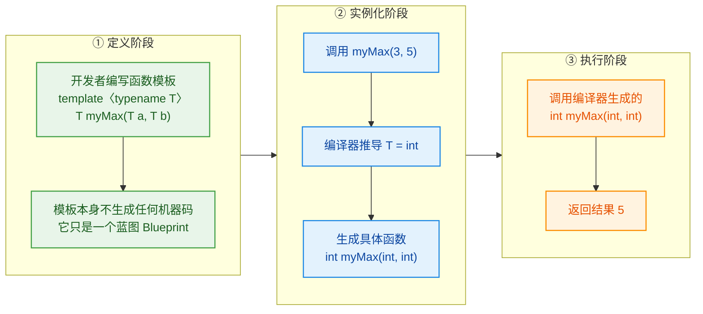

这张图揭示了一个极其重要的事实：**模板本身不是函数，它是生成函数的"配方"**。只有当模板被实际使用（调用或显式实例化）时，编译器才会根据具体类型生成真正的函数代码。这个过程称为 **模板实例化（Template Instantiation）**。

### 模板参数推导（Template Argument Deduction）

当你调用一个函数模板时，大多数情况下 **不需要** 显式指定模板参数——编译器会根据你传入的实参类型 **自动推导（deduce）** 出模板参数的具体类型：

```cpp
#include <iostream>
#include <string>

template <typename T>
T myMax(T a, T b) {               // 模板函数：返回两者中的较大值
    return (a > b) ? a : b;
}

int main() {
    // ====== 隐式推导（Implicit Deduction）======
    // 编译器根据实参类型自动推导 T
    int result1 = myMax(10, 20);                 // T 被推导为 int
    double result2 = myMax(3.14, 2.72);          // T 被推导为 double
    std::string result3 = myMax(
        std::string("hello"),                    // T 被推导为 std::string
        std::string("world")
    );

    // ====== 显式指定（Explicit Specification）======
    // 在函数名后用 <> 手动指定模板参数
    double result4 = myMax<double>(10, 3.14);    // 显式指定 T = double
    // 此时 int 10 会被隐式转换为 double 10.0

    std::cout << result1 << std::endl;           // 输出 20
    std::cout << result2 << std::endl;           // 输出 3.14
    std::cout << result3 << std::endl;           // 输出 "world"（字典序更大）
    std::cout << result4 << std::endl;           // 输出 10（因为 10.0 > 3.14）

    return 0;
}
```

#### 推导失败的场景

模板参数推导并非万能。当编译器从不同的实参中推导出 **矛盾的类型** 时，推导会失败：

```cpp
template <typename T>
T myMax(T a, T b) {
    return (a > b) ? a : b;
}

int main() {
    // ❌ 编译错误！a 推导出 T=int，b 推导出 T=double，产生歧义
    // auto result = myMax(10, 3.14);

    // ✅ 解决方案 1：显式指定模板参数
    auto r1 = myMax<double>(10, 3.14);   // 强制 T=double，10 隐式转换为 10.0

    // ✅ 解决方案 2：手动强制实参类型一致
    auto r2 = myMax(static_cast<double>(10), 3.14);  // 两个参数都是 double

    // ✅ 解决方案 3：使用两个模板参数（见下文）
    return 0;
}
```

这里的核心规则是：**在隐式推导中，编译器不会主动对模板参数进行隐式类型转换**（Implicit Conversion）。每个模板参数必须从各实参中推导出完全一致的类型，否则编译失败。这与普通函数调用中允许的隐式转换行为形成了鲜明对比。

### 多模板参数（Multiple Template Parameters）

一个函数模板可以拥有多个模板参数，这为我们提供了更大的灵活性：

```cpp
#include <iostream>

// ========== 双模板参数：参数类型可以不同 ==========
template <typename T1, typename T2>
// 返回值类型使用 auto，让编译器根据三目运算符的结果自动推导（C++14 起）
auto myMax(T1 a, T2 b) {
    return (a > b) ? a : b;       // T1 和 T2 可以是不同类型
}                                  // 返回类型由编译器根据 ?: 表达式推导

int main() {
    auto result = myMax(10, 3.14); // T1=int, T2=double
    // 三目运算符 (int > double) ? int : double
    // 根据 C++ 的算术转换规则，结果类型为 double
    std::cout << result << std::endl;  // 输出 10（实际是 double 类型的 10.0）

    return 0;
}
```

对于 C++11，如果不能使用返回类型 `auto` 推导，可以借助 **尾置返回类型（trailing return type）** 配合 `decltype`：

```cpp
// ========== C++11 兼容写法：尾置返回类型 ==========
template <typename T1, typename T2>
auto myMax(T1 a, T2 b) -> decltype((a > b) ? a : b) {
    // decltype 在编译期检查表达式 (a>b)?a:b 的类型，将其作为返回类型
    return (a > b) ? a : b;
}

// ========== 另一种方案：std::common_type ==========
#include <type_traits>  // 包含 std::common_type

template <typename T1, typename T2>
typename std::common_type<T1, T2>::type   // 求 T1 和 T2 的公共类型
myMax(T1 a, T2 b) {
    return (a > b) ? a : b;
}
// std::common_type<int, double>::type  →  double
// 它能找到两个类型都能安全转换到的"公共类型"
```

### 非类型模板参数（Non-type Template Parameters）

模板参数并不仅限于类型。C++ 还允许使用 **编译期常量值** 作为模板参数，称为 **非类型模板参数（Non-type Template Parameter, NTTP）**：

```cpp
#include <iostream>
#include <array>

// ========== 非类型模板参数示例 ==========
// N 是一个非类型参数，它的类型是 int，值在编译期确定
template <typename T, int N>
T arraySum(const T (&arr)[N]) {   // 接受一个大小为 N 的 T 类型数组的引用
    T sum = T();                   // 值初始化，对于数值类型即为 0
    for (int i = 0; i < N; ++i) { // 遍历数组的每一个元素
        sum += arr[i];             // 累加到 sum 中
    }
    return sum;                    // 返回总和
}

int main() {
    int nums[] = {1, 2, 3, 4, 5};       // 编译器知道数组大小为 5
    double vals[] = {1.1, 2.2, 3.3};     // 编译器知道数组大小为 3

    // 编译器推导：T=int, N=5
    std::cout << arraySum(nums) << std::endl;   // 输出 15

    // 编译器推导：T=double, N=3
    std::cout << arraySum(vals) << std::endl;   // 输出 6.6

    return 0;
}
```

非类型模板参数的合法类型在 C++ 不同标准中有所扩展：

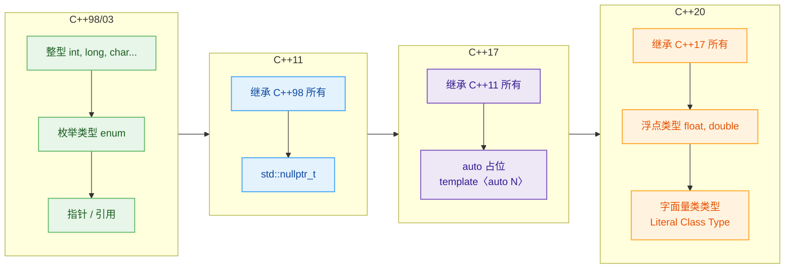

C++17 中引入的 `auto` 非类型模板参数尤其值得关注：

```cpp
// ========== C++17: auto 非类型模板参数 ==========
template <auto N>                  // N 的类型由传入的值自动推导
void printValue() {
    std::cout << N << std::endl;   // 输出编译期常量 N 的值
}

int main() {
    printValue<42>();              // N 推导为 int 类型，值为 42
    printValue<'A'>();             // N 推导为 char 类型，值为 'A'
    printValue<true>();            // N 推导为 bool 类型，值为 true
    return 0;
}
```

### 模板实例化机制深入理解

理解模板实例化的工作方式，对于掌握模板至关重要。模板实例化分为两种：

**隐式实例化（Implicit Instantiation）**：当代码中首次使用某个具体类型调用函数模板时，编译器自动生成该类型的函数版本。

**显式实例化（Explicit Instantiation）**：程序员主动要求编译器为特定类型生成函数版本，即使该类型尚未被调用。

```cpp
#include <iostream>

template <typename T>
void greet(T value) {                     // 函数模板定义
    std::cout << "Value: " << value << std::endl;
}

// ========== 显式实例化声明 ==========
// 告诉编译器："请现在就为 int 类型生成 greet<int> 的代码"
template void greet<int>(int);            // 显式实例化 int 版本

// 也可以不写 <int>，让编译器从参数类型推导
template void greet(double);              // 显式实例化 double 版本

int main() {
    greet(42);            // 使用已显式实例化的 int 版本
    greet(3.14);          // 使用已显式实例化的 double 版本
    greet("hello");       // 隐式实例化 const char* 版本（首次使用时生成）
    return 0;
}
```

在大型项目中，显式实例化有一个重要用途——**控制编译时间和符号生成**。你可以在一个 `.cpp` 文件中集中做显式实例化，在其他翻译单元（Translation Unit）中使用 `extern template` 来阻止隐式实例化，从而避免同一个模板在多个 `.cpp` 文件中被重复实例化：

```cpp
// ========== math_ops.h ==========
template <typename T>
T square(T x) {                    // 函数模板定义（在头文件中）
    return x * x;
}

// ========== math_ops.cpp ==========
#include "math_ops.h"
template int square<int>(int);     // 在此处集中进行显式实例化
template double square<double>(double);

// ========== main.cpp ==========
#include "math_ops.h"
extern template int square<int>(int);      // 阻止此翻译单元隐式实例化 int 版本
extern template double square<double>(double); // 阻止隐式实例化 double 版本

int main() {
    square(5);       // 不会在 main.cpp 中生成代码，链接时使用 math_ops.o 中的版本
    square(2.5);     // 同理
    return 0;
}
```

### 函数模板的重载（Overloading）

函数模板可以和 **普通函数** 共存，也可以和 **其他函数模板** 形成重载。编译器根据 **重载决议（Overload Resolution）** 规则来选择最佳匹配：

```cpp
#include <iostream>
#include <cstring>

// ========== 重载 1：通用模板 ==========
template <typename T>
T myMax(T a, T b) {                        // 泛型版本：适用于大多数类型
    std::cout << "[Template Version] ";
    return (a > b) ? a : b;
}

// ========== 重载 2：普通函数（非模板） ==========
const char* myMax(const char* a, const char* b) {  // 针对 C 风格字符串的特化处理
    std::cout << "[Non-template Version] ";
    return (std::strcmp(a, b) > 0) ? a : b;         // 使用 strcmp 进行字典序比较
}                                                    // 而非比较指针地址

// ========== 重载 3：另一个模板 ==========
template <typename T>
T myMax(T a, T b, T c) {                   // 三参数版本
    std::cout << "[Three-arg Template] ";
    return myMax(myMax(a, b), c);           // 复用两参数版本
}

int main() {
    std::cout << myMax(10, 20) << std::endl;
    // 输出: [Template Version] 20
    // 匹配 template myMax(T, T)，T=int

    std::cout << myMax("apple", "banana") << std::endl;
    // 输出: [Non-template Version] banana
    // 普通函数完全匹配 (const char*, const char*)，优先于模板

    std::cout << myMax(1, 2, 3) << std::endl;
    // 输出: [Three-arg Template] [Template Version] [Template Version] 3
    // 匹配三参数模板

    std::cout << myMax<>("apple", "banana") << std::endl;
    // 输出: [Template Version] banana（或 apple，取决于指针值大小）
    // 空尖括号 <> 显式要求使用模板版本，此时比较的是指针地址！
    // ⚠️ 这可能不是你想要的行为

    return 0;
}
```

重载决议的核心优先级规则：

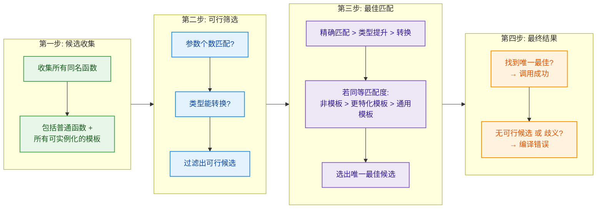

牢记一个关键原则：**在同等匹配度下，非模板函数优先于模板函数。** 这是因为编译器认为，如果程序员专门写了一个非模板的重载版本，说明他有特殊意图，应该被优先采纳。

### 默认模板参数（Default Template Arguments）

从 C++11 开始，函数模板也支持默认模板参数（此前仅类模板支持）：

```cpp
#include <iostream>
#include <functional>  // std::less, std::greater

// ========== 带默认模板参数的函数模板 ==========
// Compare 是第二个模板参数，默认值为 std::less<T>
template <typename T, typename Compare = std::less<T>>
T myMax(T a, T b, Compare comp = Compare()) {
    // comp 是一个可调用对象（callable），默认为 std::less<T> 的实例
    // std::less<T> 的 operator() 实现的是 a < b
    return comp(a, b) ? b : a;    // 如果 a < b，返回 b（较大值）
}

int main() {
    // 使用默认比较器 std::less<int>
    std::cout << myMax(10, 20) << std::endl;      // 输出 20

    // 显式传入 std::greater<int>，逻辑反转：返回较小值
    std::cout << myMax(10, 20, std::greater<int>()) << std::endl;  // 输出 10

    return 0;
}
```

这种设计模式在标准库中随处可见，例如 `std::sort` 的第三个参数就是一个默认为 `std::less` 的比较器。

### 编译模型：为什么模板通常放在头文件中？

这是初学者最常踩的坑之一。我们来深入理解其原因。

C++ 的编译采用 **分离编译模型（Separate Compilation Model）**：每个 `.cpp` 文件（翻译单元）被独立编译成 `.o` 目标文件，最后由链接器合并。普通函数可以在头文件中声明、在 `.cpp` 中定义，因为编译器只要看到声明就能生成调用指令，链接时再解析实际地址。

但模板不同——**模板不是代码，是生成代码的配方。** 编译器在实例化模板时，必须看到模板的 **完整定义**，才能为具体类型生成代码。如果模板的定义被放在 `.cpp` 文件中，其他翻译单元无法看到它，就无法实例化，导致 **链接错误（Linker Error）**。

```cpp
// ========== 错误示范：模板定义放在 .cpp 中 ==========

// --- myMax.h ---
template <typename T>
T myMax(T a, T b);                // 仅声明，无定义

// --- myMax.cpp ---
#include "myMax.h"
template <typename T>
T myMax(T a, T b) {               // 定义在此
    return (a > b) ? a : b;
}
// 此翻译单元没有任何调用，所以不会实例化任何版本

// --- main.cpp ---
#include "myMax.h"
int main() {
    myMax(1, 2);   // 编译通过（声明可见），但链接失败！
    // ❌ Linker Error: undefined reference to `int myMax<int>(int, int)`
    // 因为编译 main.cpp 时看不到模板定义，无法实例化
    return 0;
}
```

```cpp
// ========== 正确做法：模板定义放在头文件中 ==========

// --- myMax.h ---
template <typename T>
T myMax(T a, T b) {               // 声明 + 定义都在头文件中
    return (a > b) ? a : b;       // 每个 #include 此头文件的翻译单元都能看到完整定义
}

// --- main.cpp ---
#include "myMax.h"
int main() {
    myMax(1, 2);    // ✅ 编译器看到完整定义，可以实例化 myMax<int>
    return 0;
}
```

你可能会担心：如果多个 `.cpp` 都 `#include` 了同一个模板头文件并调用了同一类型版本，岂不是会生成多份相同的代码？没错，确实会。但 **链接器会自动合并（deduplicate）相同的模板实例**，最终只保留一份，所以不会导致"重复定义"链接错误。

### SFINAE 简介（Substitution Failure Is Not An Error）

SFINAE 是 C++ 模板系统中一条优雅而强大的规则，中文可译为"替换失败不是错误"。当编译器尝试用某个类型去实例化一个函数模板，如果在 **替换模板参数** 的过程中导致了类型错误，编译器不会报错，而是静默地将该候选从重载集中移除，继续寻找其他匹配。

```cpp
#include <iostream>
#include <type_traits>

// ========== SFINAE 基础示例 ==========

// 版本 1：仅当 T 是整数类型时启用
template <typename T>
typename std::enable_if<std::is_integral<T>::value, T>::type
process(T value) {                         // 只有 T 是整型时此函数才"存在"
    std::cout << "Integer: " << value << std::endl;
    return value;
}

// 版本 2：仅当 T 是浮点类型时启用
template <typename T>
typename std::enable_if<std::is_floating_point<T>::value, T>::type
process(T value) {                         // 只有 T 是浮点型时此函数才"存在"
    std::cout << "Floating: " << value << std::endl;
    return value;
}

int main() {
    process(42);         // 匹配版本 1（int 是整型）
                         // 版本 2 替换失败 → SFINAE → 静默排除，不报错

    process(3.14);       // 匹配版本 2（double 是浮点型）
                         // 版本 1 替换失败 → SFINAE → 静默排除

    // process("hello"); // ❌ 两个版本都替换失败，没有可行候选，编译错误
    return 0;
}
```

`std::enable_if` 的工作原理很简单：当条件为 `true` 时，`std::enable_if<true, T>::type` 就是 `T`；当条件为 `false` 时，`::type` 成员 **不存在**，替换失败触发 SFINAE。

> **C++20 的进化**：在 C++20 中，`Concepts` 和 `requires` 子句提供了更优雅、更可读的方式来替代 SFINAE，但理解 SFINAE 仍然是深入掌握 C++ 模板的基础。

### 常见陷阱与最佳实践

**陷阱 1：数组和字符串字面量的类型推导**

```cpp
template <typename T>
void foo(T a, T b) {}

int main() {
    // foo("abc", "abcd");  // ❌ 编译错误！
    // "abc" 的类型是 const char[4]，"abcd" 的类型是 const char[5]
    // T 不能同时是两个不同大小的数组类型

    // ✅ 解决方案：使用按引用传递，或者让参数类型退化
}

// 方案 A：传引用，保留数组类型
template <typename T, int N, int M>
void foo_ref(const T (&a)[N], const T (&b)[M]) {  // 两个数组可以不同大小
    // T=char, N=4, M=5
}

// 方案 B：传值，数组退化为指针
template <typename T>
void foo_decay(T a, T b) {}      // 按值传递时，数组退化为 const char*
// 但此时 foo_decay("abc", "abcd") 的 T 都推导为 const char*，可以编译
```

**陷阱 2：返回悬垂引用（Dangling Reference）**

```cpp
template <typename T>
const T& myMax(const T& a, const T& b) {  // 返回引用以避免拷贝
    return (a > b) ? a : b;
}

int main() {
    int x = 10, y = 20;
    const int& ref = myMax(x, y);  // ✅ 安全：ref 绑定到 y，y 仍然活着

    // ⚠️ 危险场景：
    const int& bad = myMax(42, 100);
    // 42 和 100 是临时对象（rvalue），函数结束后销毁
    // bad 成为悬垂引用（dangling reference）！
    // 使用 bad 是未定义行为（Undefined Behavior）
    return 0;
}
```

**最佳实践总结：**

| 实践 | 说明 |
|------|------|
| 模板定义放头文件 | 确保所有翻译单元都能看到完整定义进行实例化 |
| 优先使用 `typename` | 比 `class` 语义更清晰 |
| 注意参数传递方式 | 按值传递会导致数组退化；按引用传递保留完整类型 |
| 为复杂约束使用 Concepts（C++20） | 比 SFINAE 更可读，错误信息更友好 |
| 使用 `static_assert` 提供友好错误信息 | 当模板被错误类型实例化时，给出清晰提示 |
| 大型项目考虑 `extern template` | 减少重复实例化，加速编译 |

---

**📝 练习题**

以下代码的输出是什么？

```cpp
#include <iostream>

template <typename T>
void print(T value) {
    std::cout << "Template: " << value << std::endl;
}

void print(int value) {
    std::cout << "Non-template: " << value << std::endl;
}

int main() {
    print(42);
    print(3.14);
    print<>(42);
    return 0;
}
```

A. `Template: 42` → `Template: 3.14` → `Non-template: 42`


B. `Non-template: 42` → `Template: 3.14` → `Non-template: 42`


C. `Non-template: 42` → `Template: 3.14` → `Template: 42`


D. `Template: 42` → `Template: 3.14` → `Template: 42`


**【答案】** C

**【解析】**

- **`print(42)`**：`42` 是 `int` 类型。此时有两个候选——函数模板实例化的 `print<int>(int)` 和非模板的 `print(int)`。两者都是精确匹配，根据重载决议规则，**同等匹配度下非模板函数优先**，所以调用非模板版本，输出 `Non-template: 42`。

- **`print(3.14)`**：`3.14` 是 `double` 类型。非模板的 `print(int)` 需要 `double → int` 的窄化转换，而函数模板可以实例化为 `print<double>(double)` 实现精确匹配。**精确匹配优于需要转换的匹配**，所以调用模板版本，输出 `Template: 3.14`。

- **`print<>(42)`**：空尖括号 `<>` 是显式语法，**强制要求编译器只从函数模板中选择**，非模板函数被排除在候选之外。因此即使非模板版本也能匹配 `int`，仍然调用模板版本 `print<int>(42)`，输出 `Template: 42`。

---

## 类模板（Class Template）

在上一节中，我们学习了函数模板——它让我们可以编写与类型无关的函数。但当我们需要构建**与类型无关的数据结构**（如动态数组、链表、栈、队列）时，仅靠函数模板是不够的。我们需要的是一种能让**整个类**都参数化的机制，这就是 **类模板（Class Template）**。

类模板是 C++ 泛型编程的第二块基石。标准库中你最常使用的 `std::vector<T>`、`std::map<K, V>`、`std::shared_ptr<T>` 等，无一不是类模板的产物。可以说，理解类模板是真正进入现代 C++ 世界的门票。

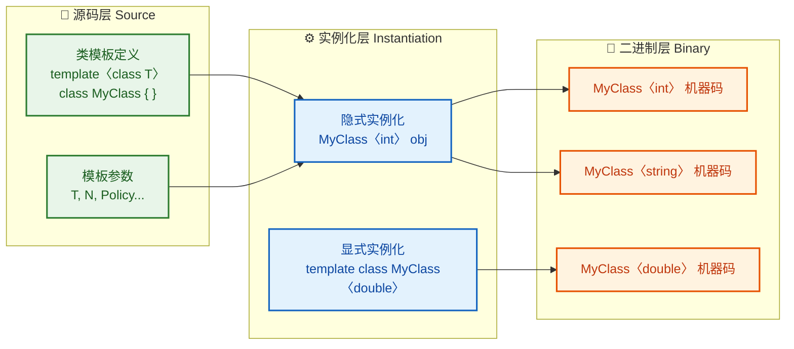

类模板的核心思想与函数模板一脉相承：**编译器并不会为模板本身生成任何代码**，只有当你用具体类型去"使用"它时（即实例化），编译器才会像一台精密的代码印刷机一样，为该类型"印刷"出一份完整的类定义及其成员函数。每一组不同的模板实参，都会产生一个**完全独立的类类型**。`MyClass<int>` 和 `MyClass<double>` 在编译器眼中是两个毫无关系的类，就像 `Cat` 和 `Dog` 一样。

---

### 类模板的定义与基本语法

类模板的声明以 `template` 关键字开头，后接用尖括号 `< >` 包裹的**模板参数列表（Template Parameter List）**。让我们从一个最经典的例子开始——实现一个简易的栈（Stack）：

```cpp
#include <iostream>  // 标准输入输出
#include <vector>    // 底层容器
#include <stdexcept> // 异常类

// template 关键字声明这是一个模板
// typename T 是模板类型参数，T 是占位符，代表任意类型
// 也可以写成 class T，在此处 typename 和 class 完全等价
template <typename T>
class Stack {
private:
    std::vector<T> elems_;  // 用 vector<T> 存储元素，T 被用作 vector 的模板实参

public:
    // 将元素压入栈顶
    // 参数类型为 const T&，接受任意类型 T 的常量引用
    void push(const T& elem) {
        elems_.push_back(elem);  // 委托给 vector 的 push_back
    }

    // 弹出栈顶元素
    void pop() {
        if (elems_.empty()) {                        // 空栈检查
            throw std::out_of_range("Stack::pop(): empty stack");  // 抛出异常
        }
        elems_.pop_back();  // 移除最后一个元素（即栈顶）
    }

    // 返回栈顶元素的常量引用
    // 返回类型为 const T&，与模板参数 T 关联
    const T& top() const {
        if (elems_.empty()) {                        // 空栈检查
            throw std::out_of_range("Stack::top(): empty stack");
        }
        return elems_.back();  // 返回最后一个元素的引用
    }

    // 判断栈是否为空
    bool empty() const {
        return elems_.empty();  // 委托给 vector 的 empty()
    }

    // 返回栈内元素个数
    std::size_t size() const {
        return elems_.size();   // 委托给 vector 的 size()
    }
};
```

这段代码中有几个关键点值得深入理解：

**第一，`T` 的本质是一个占位符。** 它不是一个真正的类型，而是一个"类型变量"。在模板被实例化之前，编译器不会对 `T` 做任何具体的类型检查。只有当你写下 `Stack<int>` 时，编译器才会将所有的 `T` 替换为 `int`，然后对替换后的代码进行编译。

**第二，`typename` vs `class`。** 在模板参数列表中，`typename T` 和 `class T` 是完全等价的。历史上 `class` 先出现，但它容易让人误以为 `T` 只能是类类型。C++ 标准后来引入了 `typename` 来消除歧义。现代 C++ 社区的主流风格推荐使用 `typename`。

**第三，成员函数中对 `T` 的使用。** 注意 `push` 的参数是 `const T&` 而不是 `T`——这是一个重要的性能考量。如果 `T` 是一个很大的对象（比如 `std::string` 或一个自定义的矩阵类），按值传递会触发拷贝构造，代价昂贵。使用常量引用可以避免不必要的拷贝。

---

### 类模板的实例化（Instantiation）

类模板的实例化分为 **隐式实例化（Implicit Instantiation）** 和 **显式实例化（Explicit Instantiation）** 两种。

#### 隐式实例化

当你使用具体类型创建对象时，编译器自动触发实例化：

```cpp
int main() {
    Stack<int> intStack;         // 隐式实例化 Stack<int>，T = int
    Stack<std::string> strStack; // 隐式实例化 Stack<std::string>，T = std::string

    intStack.push(42);           // 调用 Stack<int>::push(const int&)
    intStack.push(17);           // 再次压入一个 int
    std::cout << intStack.top() << std::endl;  // 输出 17（栈顶）
    intStack.pop();              // 弹出 17
    std::cout << intStack.top() << std::endl;  // 输出 42

    strStack.push("hello");     // 调用 Stack<std::string>::push(const std::string&)
    strStack.push("world");     // 字符串字面量会隐式转换为 std::string
    std::cout << strStack.top() << std::endl;  // 输出 "world"

    return 0;
}
```

这里有一个非常重要的特性——**惰性实例化（Lazy Instantiation）**。编译器只会实例化那些**实际被调用的成员函数**。如果你从未调用 `Stack<int>::pop()`，那么 `pop()` 的代码就不会被编译器实例化。这带来一个实用的好处：**即使某个成员函数的实现对特定类型 `T` 是非法的，只要你不调用它，代码就能正常编译。**

```cpp
template <typename T>
class Wrapper {
public:
    T value_;                          // 存储一个 T 类型的值

    void print() {                     // 打印值
        std::cout << value_ << std::endl;  // 要求 T 支持 operator<<
    }

    void increment() {                 // 自增
        value_ += 1;                   // 要求 T 支持 operator+=
    }
};

int main() {
    Wrapper<std::string> w{"hello"};   // 实例化 Wrapper<std::string>
    w.print();                         // ✅ OK，std::string 支持 <<
    // w.increment();                  // ❌ 若取消注释则编译失败：string 不支持 += 1
    // 但只要不调用 increment()，整个程序就能编译通过！
    return 0;
}
```

#### 显式实例化

你可以主动要求编译器在特定翻译单元（Translation Unit）中生成某个类模板的完整实例：

```cpp
// 显式实例化声明（通常放在 .cpp 文件中）
template class Stack<int>;           // 强制编译器生成 Stack<int> 的所有成员函数
template class Stack<double>;        // 强制编译器生成 Stack<double> 的所有成员函数
```

显式实例化的典型应用场景是**减少编译时间和控制代码膨胀（Code Bloat）**。在大型项目中，同一个模板可能在数十个 `.cpp` 文件中被隐式实例化，导致重复编译。通过在一个 `.cpp` 中显式实例化，并在头文件中使用 `extern template` 声明来抑制其他翻译单元的隐式实例化，可以显著加速编译：

```cpp
// ---- stack.h ----
template <typename T>
class Stack { /* ... 完整定义 ... */ };

// 告诉编译器：不要在本翻译单元中实例化 Stack<int>，
// 它会在别处被显式实例化
extern template class Stack<int>;

// ---- stack.cpp ----
#include "stack.h"
// 在此处显式实例化，整个项目中只编译这一次
template class Stack<int>;
```

---

### 成员函数的类外定义（Out-of-Class Definition）

当类模板的成员函数体较为复杂时，我们通常将声明放在类体内，将定义移到类体外。此时需要**重复书写 `template` 前缀**，并使用 `ClassName<T>::` 作为作用域限定符：

```cpp
template <typename T>
class Stack {
private:
    std::vector<T> elems_;  // 底层存储容器

public:
    void push(const T& elem);   // 仅声明
    void pop();                  // 仅声明
    const T& top() const;       // 仅声明
    bool empty() const;         // 仅声明
};

// 类外定义 push：必须重复 template<typename T>
// 作用域写成 Stack<T>::，而不是 Stack::
template <typename T>
void Stack<T>::push(const T& elem) {
    elems_.push_back(elem);     // 将元素追加到 vector 尾部
}

// 类外定义 pop
template <typename T>
void Stack<T>::pop() {
    if (elems_.empty()) {       // 检查栈是否为空
        throw std::out_of_range("Stack::pop(): empty stack");
    }
    elems_.pop_back();          // 移除栈顶元素
}

// 类外定义 top
template <typename T>
const T& Stack<T>::top() const {
    if (elems_.empty()) {       // 检查栈是否为空
        throw std::out_of_range("Stack::top(): empty stack");
    }
    return elems_.back();       // 返回栈顶元素的引用
}

// 类外定义 empty
template <typename T>
bool Stack<T>::empty() const {
    return elems_.empty();      // 委托给 vector::empty()
}
```

⚠️ **重要限制**：类模板的成员函数定义（无论类内还是类外）通常**必须放在头文件中**。因为编译器在实例化模板时需要看到完整的函数体。如果你将定义放在 `.cpp` 文件中，其他翻译单元无法看到它，链接时就会报 "undefined reference" 错误。这是模板编程与普通类编程最大的工程差异之一。

---

### 多模板参数与默认模板参数

类模板可以拥有多个模板参数，而且可以为它们指定默认值，这与函数的默认参数非常相似：

```cpp
// T: 元素类型，默认为 int
// Container: 底层容器类型，默认为 std::vector<T>
// 这种"以一个模板参数作为另一个参数的默认值"的用法非常常见
template <typename T = int, typename Container = std::vector<T>>
class Stack {
private:
    Container elems_;             // 使用 Container 而非硬编码的 vector<T>

public:
    void push(const T& elem) {
        elems_.push_back(elem);   // 要求 Container 支持 push_back
    }

    void pop() {
        if (elems_.empty()) {     // 要求 Container 支持 empty()
            throw std::out_of_range("Stack::pop(): empty stack");
        }
        elems_.pop_back();        // 要求 Container 支持 pop_back()
    }

    const T& top() const {
        if (elems_.empty()) {
            throw std::out_of_range("Stack::top(): empty stack");
        }
        return elems_.back();     // 要求 Container 支持 back()
    }

    bool empty() const {
        return elems_.empty();
    }
};
```

使用方式非常灵活：

```cpp
int main() {
    // 全部使用默认参数：T=int, Container=vector<int>
    Stack<> s1;
    s1.push(10);                          // 存储 int 元素

    // 指定 T=double，Container 使用默认的 vector<double>
    Stack<double> s2;
    s2.push(3.14);                        // 存储 double 元素

    // 指定 T=int，Container=std::deque<int>
    // 用双端队列替代 vector 作为底层存储
    Stack<int, std::deque<int>> s3;
    s3.push(99);                          // 底层使用 deque 存储

    return 0;
}
```

注意 `Stack<> s1` 中的空尖括号 `<>` 不能省略。它告诉编译器"我在使用一个类模板，请用默认参数实例化"。如果写成 `Stack s1`（不带尖括号），在 C++17 之前会编译失败。C++17 引入的 **类模板实参推导（CTAD, Class Template Argument Deduction）** 在某些场景下允许省略，我们稍后会讨论。

这个设计模式实际上就是标准库 `std::stack` 的实现思路——它就是一个接受元素类型和底层容器类型的类模板适配器（Adapter）。

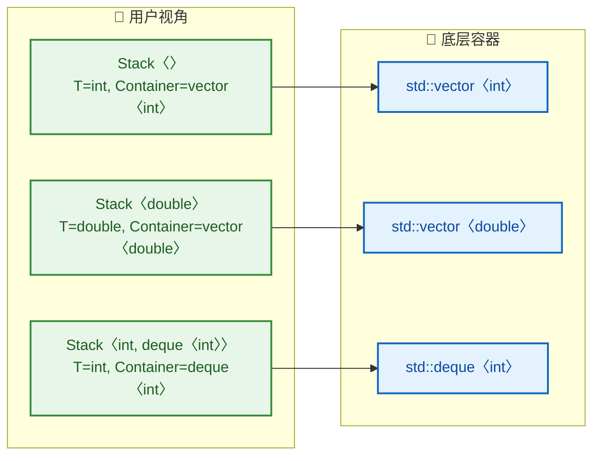

---

### 非类型模板参数（Non-type Template Parameter）

模板参数不仅可以是类型，还可以是**编译期常量值**。这类参数称为非类型模板参数（Non-type Template Parameter, NTTP）。最经典的应用就是固定大小的数组：

```cpp
#include <iostream>
#include <stdexcept>
#include <array>

// T: 元素类型
// MaxSize: 栈的最大容量，是一个编译期常量
// 注意 MaxSize 的类型是 std::size_t（无符号整型）
template <typename T, std::size_t MaxSize>
class FixedStack {
private:
    std::array<T, MaxSize> elems_;  // 用 std::array 在栈上分配固定大小的存储
    std::size_t count_ = 0;         // 当前元素个数，初始化为 0

public:
    // 压入元素
    void push(const T& elem) {
        if (count_ >= MaxSize) {    // 检查是否已满
            throw std::overflow_error("FixedStack::push(): stack is full");
        }
        elems_[count_] = elem;      // 在当前位置存储元素
        ++count_;                    // 元素计数 +1
    }

    // 弹出元素
    void pop() {
        if (count_ == 0) {          // 检查是否为空
            throw std::underflow_error("FixedStack::pop(): stack is empty");
        }
        --count_;                    // 元素计数 -1（无需真正擦除数据）
    }

    // 获取栈顶元素
    const T& top() const {
        if (count_ == 0) {
            throw std::underflow_error("FixedStack::top(): stack is empty");
        }
        return elems_[count_ - 1];  // 返回最顶部的元素
    }

    // 返回最大容量（编译期常量）
    constexpr std::size_t capacity() const {
        return MaxSize;              // MaxSize 在编译期就已确定
    }

    // 返回当前元素个数
    std::size_t size() const {
        return count_;
    }
};
```

使用示例：

```cpp
int main() {
    FixedStack<int, 5> s1;         // 最多存 5 个 int
    FixedStack<double, 100> s2;    // 最多存 100 个 double

    s1.push(10);                   // 压入第一个元素
    s1.push(20);                   // 压入第二个元素
    std::cout << s1.top() << std::endl;     // 输出 20
    std::cout << s1.capacity() << std::endl; // 输出 5（编译期常量）

    // FixedStack<int, 5> 和 FixedStack<int, 10> 是完全不同的类型！
    // FixedStack<int, 5> a;
    // FixedStack<int, 10> b;
    // a = b;  // ❌ 编译错误！类型不匹配

    return 0;
}
```

`FixedStack<int, 5>` 和 `FixedStack<int, 10>` 是两个**完全不同的类型**，它们之间不能赋值、不能隐式转换。非类型模板参数在编译期就被"烙印"到类型系统中，这是其强大之处——也是需要谨慎使用之处，因为不同的常量值会导致不同的类型实例，造成代码膨胀。

标准库中的 `std::array<T, N>` 就是非类型模板参数的典范。

**NTTP 允许的类型**（随 C++ 标准版本不断放宽）：

| 标准版本 | 允许的 NTTP 类型 |
|---------|---------------|
| C++98/03 | 整型、枚举、指针、引用 |
| C++11 | 同上 + `nullptr_t` |
| C++17 | 同上 + `auto` 占位（`template<auto N>`） |
| C++20 | 同上 + 满足结构化要求的字面量类类型（Literal Class Type） |

---

### 类模板中的友元（Friend）

在类模板中声明友元关系比普通类更微妙，需要特别注意模板参数的作用域。

#### 场景一：非模板友元函数

```cpp
template <typename T>
class Box {
private:
    T value_;                               // 存储的值

public:
    explicit Box(const T& v) : value_(v) {} // 构造函数

    // 在类体内定义友元函数
    // 这个 operator<< 不是模板函数，而是为每个 Box<T> 实例化生成的普通函数
    friend std::ostream& operator<<(std::ostream& os, const Box& b) {
        os << "[Box: " << b.value_ << "]";  // 直接访问 private 成员 value_
        return os;                           // 返回流以支持链式输出
    }
};
```

这种写法最简洁，也最常用。每次 `Box<T>` 被实例化时，编译器会为该特定类型生成一个对应的 `operator<<` 普通函数。

#### 场景二：模板友元函数（类外定义）

如果你希望在类外定义友元函数，语法会稍复杂，需要前置声明（Forward Declaration）：

```cpp
// 第一步：前置声明类模板
template <typename T>
class Box;

// 第二步：前置声明函数模板
template <typename T>
std::ostream& operator<<(std::ostream& os, const Box<T>& b);

// 第三步：定义类模板
template <typename T>
class Box {
private:
    T value_;

public:
    explicit Box(const T& v) : value_(v) {}

    // 声明友元时，必须在函数名后加 <T> 或 <>，
    // 表明这是一个函数模板的特定实例化
    friend std::ostream& operator<< <T>(std::ostream& os, const Box<T>& b);
};

// 第四步：类外定义函数模板
template <typename T>
std::ostream& operator<<(std::ostream& os, const Box<T>& b) {
    os << "[Box: " << b.value_ << "]";  // 访问 private 成员
    return os;
}
```

`operator<< <T>` 中的 `<T>` 至关重要——它将友元关系限定在 **同类型的实例化** 之间。即 `Box<int>` 只与 `operator<< <int>` 是友元，而不是与所有 `operator<<` 的实例化都是友元。这保证了封装性。

---

### 类模板的静态成员（Static Members）

类模板的每一个实例化类型都拥有**独立的一套静态成员**。这一点极其重要，也是初学者常犯错误的地方：

```cpp
template <typename T>
class Counter {
public:
    static int count_;                  // 静态成员变量声明

    Counter() { ++count_; }             // 构造时 +1
    ~Counter() { --count_; }            // 析构时 -1
};

// 类外定义静态成员变量（每个实例化类型各有一份）
// 必须加 template<typename T> 前缀
template <typename T>
int Counter<T>::count_ = 0;             // 初始化为 0
```

```cpp
int main() {
    Counter<int> a, b, c;               // 创建 3 个 Counter<int> 对象
    Counter<double> x;                  // 创建 1 个 Counter<double> 对象

    // Counter<int>::count_ == 3   (a, b, c 三个对象)
    // Counter<double>::count_ == 1 (x 一个对象)
    std::cout << Counter<int>::count_ << std::endl;     // 输出 3
    std::cout << Counter<double>::count_ << std::endl;  // 输出 1

    // Counter<int> 和 Counter<double> 的 count_ 是完全独立的！
    return 0;
}
```

其内存模型可以这样理解：

```cpp
// ===== 内存布局示意 =====
//
//  Counter<int> 的静态区域          Counter<double> 的静态区域
//  ┌─────────────────────┐         ┌─────────────────────┐
//  │  count_ = 3         │         │  count_ = 1         │
//  └─────────────────────┘         └─────────────────────┘
//         ▲  ▲  ▲                          ▲
//         │  │  │                          │
//     ┌───┘  │  └───┐                     │
//     a      b      c                     x
//   (int)  (int)  (int)               (double)
//
//  每个实例化类型拥有独立的 static 变量副本
```

---

### 类模板的继承

类模板之间的继承关系比普通类更丰富，存在多种组合方式：

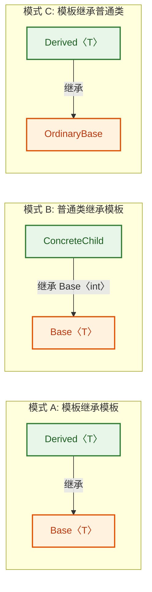

#### 模式 A：模板类继承模板类

```cpp
// 基类模板：提供通用的数组功能
template <typename T>
class Array {
protected:
    T* data_;                   // 指向动态分配内存的指针
    std::size_t size_;          // 数组大小

public:
    // 构造函数：分配 n 个 T 类型的空间
    explicit Array(std::size_t n) : data_(new T[n]{}), size_(n) {}

    // 析构函数：释放内存
    virtual ~Array() { delete[] data_; }

    // 下标访问运算符
    T& operator[](std::size_t i) { return data_[i]; }

    // 获取大小
    std::size_t size() const { return size_; }
};

// 派生类模板：在 Array 基础上添加排序功能
template <typename T>
class SortableArray : public Array<T> {   // 继承自 Array<T>
public:
    // 构造函数：转发参数给基类
    explicit SortableArray(std::size_t n) : Array<T>(n) {}

    // 冒泡排序（要求 T 支持 operator<）
    void sort() {
        for (std::size_t i = 0; i < this->size_; ++i) {        // 外层循环
            for (std::size_t j = i + 1; j < this->size_; ++j) { // 内层循环
                if (this->data_[j] < this->data_[i]) {          // 比较元素
                    std::swap(this->data_[i], this->data_[j]);  // 交换
                }
            }
        }
    }
};
```

⚠️ **关键陷阱**：在 `SortableArray<T>` 中访问基类 `Array<T>` 的成员时，必须使用 `this->data_` 或 `Array<T>::data_`，而不能直接写 `data_`。这是因为 C++ 的 **两阶段名称查找（Two-Phase Name Lookup）** 机制——对于依赖于模板参数 `T` 的基类，编译器在第一阶段不会在其中查找非限定名称。使用 `this->` 将名称变为依赖名称（Dependent Name），推迟到第二阶段查找。

#### 模式 B：普通类继承模板类

```cpp
// 用具体类型实例化基类模板，然后继承
class IntStack : public Stack<int> {   // 继承自 Stack<int>（一个具体的类）
public:
    // 添加额外功能：打印所有元素
    void printAll() const {
        // IntStack 继承了 Stack<int> 的所有 public 成员
        std::cout << "IntStack contents" << std::endl;
    }
};
```

这种模式常用于为特定类型提供额外的便利接口，同时复用模板基类的通用逻辑。

---

### C++17 类模板实参推导（CTAD）

C++17 之前，使用类模板时必须显式指定所有模板实参。C++17 引入了 **CTAD（Class Template Argument Deduction）**，允许编译器从构造函数的实参中自动推导模板参数：

```cpp
#include <vector>
#include <mutex>

// C++17 之前：必须显式指定类型
std::pair<int, double> p1(42, 3.14);       // 冗长
std::vector<int> v1 = {1, 2, 3};           // 必须写 <int>

// C++17 CTAD：编译器自动推导
std::pair p2(42, 3.14);                    // 推导为 pair<int, double>
std::vector v2 = {1, 2, 3};               // 推导为 vector<int>
std::tuple t(1, 2.5, "hello");            // 推导为 tuple<int, double, const char*>
```

对于自定义类模板，CTAD 同样适用：

```cpp
template <typename T>
class Wrapper {
public:
    T value_;

    // 编译器会根据这个构造函数的参数类型推导 T
    Wrapper(T v) : value_(v) {}
};

int main() {
    Wrapper w1(42);             // T 被推导为 int
    Wrapper w2(3.14);           // T 被推导为 double
    Wrapper w3("hello");        // T 被推导为 const char*（注意不是 string！）
    return 0;
}
```

你还可以通过**用户自定义推导指引（Deduction Guide）** 来控制推导行为：

```cpp
// 推导指引：当传入 const char* 时，将 T 推导为 std::string
// 格式：模板名(参数) -> 模板名<期望类型>
Wrapper(const char*) -> Wrapper<std::string>;

int main() {
    Wrapper w("hello");         // 现在 T 被推导为 std::string 而非 const char*
    // w.value_ 的类型是 std::string
    return 0;
}
```

推导指引本质上是给编译器的一个"提示"——当构造函数参数匹配特定模式时，应该使用什么模板实参。标准库中大量使用了推导指引，例如 `std::vector` 从迭代器对构造时会推导出正确的元素类型。

---

### 类模板与类型别名（Type Alias）

为了简化复杂模板类型的书写，C++11 引入了 **模板别名（Alias Template）**，使用 `using` 关键字：

```cpp
#include <vector>
#include <map>
#include <string>

// 传统 typedef（无法直接用于模板）
typedef std::vector<int> IntVec;            // OK，但只能为具体类型起别名

// C++11 using 别名声明（更强大，支持模板）
using IntVec2 = std::vector<int>;           // 等价于上面的 typedef

// ✨ 模板别名：typedef 做不到的事
template <typename T>
using Vec = std::vector<T>;                 // Vec<T> 是 vector<T> 的别名

template <typename V>
using StringMap = std::map<std::string, V>; // StringMap<V> 是 map<string, V> 的别名

int main() {
    Vec<double> v = {1.1, 2.2, 3.3};       // 等价于 vector<double>
    StringMap<int> m;                        // 等价于 map<string, int>
    m["age"] = 25;                           // 使用方式完全相同
    m["score"] = 100;

    return 0;
}
```

模板别名在实际工程中被大量使用，它不仅简化了类型书写，还能提升代码的可读性和可维护性。例如，你可以为某个策略模式的模板组合创建简洁的别名，让使用者无需关心底层的模板参数细节。

---

### 类模板综合实例：SimpleVector

让我们把以上知识融会贯通，实现一个简化版的动态数组 `SimpleVector`：

```cpp
#include <iostream>
#include <algorithm>    // std::copy
#include <stdexcept>    // std::out_of_range
#include <initializer_list> // std::initializer_list

template <typename T>
class SimpleVector {
private:
    T* data_;               // 指向堆上动态分配的数组
    std::size_t size_;      // 当前存储的元素个数
    std::size_t capacity_;  // 当前分配的总容量

    // 私有辅助函数：扩容
    void grow() {
        // 新容量 = 旧容量的 2 倍（若为 0 则初始化为 1）
        std::size_t newCap = (capacity_ == 0) ? 1 : capacity_ * 2;

        T* newData = new T[newCap];               // 分配新的更大的内存块
        std::copy(data_, data_ + size_, newData);  // 将旧数据拷贝到新内存
        delete[] data_;                            // 释放旧内存
        data_ = newData;                           // 指向新内存
        capacity_ = newCap;                        // 更新容量
    }

public:
    // 默认构造函数
    SimpleVector()
        : data_(nullptr)     // 初始无内存分配
        , size_(0)           // 元素个数为 0
        , capacity_(0)       // 容量为 0
    {}

    // initializer_list 构造函数：支持 SimpleVector<int> v = {1, 2, 3};
    SimpleVector(std::initializer_list<T> init)
        : data_(new T[init.size()])      // 分配刚好够用的内存
        , size_(init.size())             // 设置元素个数
        , capacity_(init.size())         // 初始容量等于元素个数
    {
        std::copy(init.begin(), init.end(), data_);  // 将初始化列表中的元素拷贝过来
    }

    // 拷贝构造函数（深拷贝）
    SimpleVector(const SimpleVector& other)
        : data_(new T[other.capacity_])  // 分配与源对象相同容量的内存
        , size_(other.size_)             // 拷贝元素个数
        , capacity_(other.capacity_)     // 拷贝容量
    {
        std::copy(other.data_, other.data_ + other.size_, data_);  // 深拷贝数据
    }

    // 拷贝赋值运算符（copy-and-swap idiom）
    SimpleVector& operator=(SimpleVector other) {  // 注意：按值传递，触发拷贝构造
        std::swap(data_, other.data_);             // 交换数据指针
        std::swap(size_, other.size_);             // 交换大小
        std::swap(capacity_, other.capacity_);     // 交换容量
        return *this;                              // other 析构时自动释放旧数据
    }

    // 移动构造函数
    SimpleVector(SimpleVector&& other) noexcept
        : data_(other.data_)             // "窃取"源对象的指针
        , size_(other.size_)             // 接管大小
        , capacity_(other.capacity_)     // 接管容量
    {
        other.data_ = nullptr;           // 源对象指针置空，防止 double free
        other.size_ = 0;                 // 源对象大小归零
        other.capacity_ = 0;             // 源对象容量归零
    }

    // 析构函数
    ~SimpleVector() {
        delete[] data_;                  // 释放动态分配的内存
    }

    // 尾部追加元素
    void push_back(const T& value) {
        if (size_ >= capacity_) {        // 空间不足时扩容
            grow();
        }
        data_[size_] = value;            // 在末尾位置放置新元素
        ++size_;                         // 元素计数 +1
    }

    // 下标访问（带边界检查）
    T& operator[](std::size_t index) {
        if (index >= size_) {            // 越界检查
            throw std::out_of_range("SimpleVector: index out of range");
        }
        return data_[index];             // 返回对应元素的引用
    }

    // const 版本的下标访问
    const T& operator[](std::size_t index) const {
        if (index >= size_) {
            throw std::out_of_range("SimpleVector: index out of range");
        }
        return data_[index];
    }

    // 获取元素个数
    std::size_t size() const { return size_; }

    // 获取容量
    std::size_t capacity() const { return capacity_; }

    // 判空
    bool empty() const { return size_ == 0; }

    // 友元：重载输出运算符，直接在类体内定义
    friend std::ostream& operator<<(std::ostream& os, const SimpleVector& vec) {
        os << "[";                             // 左括号
        for (std::size_t i = 0; i < vec.size_; ++i) {
            if (i > 0) os << ", ";             // 元素间用逗号分隔
            os << vec.data_[i];                // 输出每个元素
        }
        os << "]";                             // 右括号
        return os;
    }
};
```

使用示例：

```cpp
int main() {
    // 使用 initializer_list 构造
    SimpleVector<int> v1 = {10, 20, 30};       // [10, 20, 30]
    std::cout << "v1 = " << v1 << std::endl;   // 输出 [10, 20, 30]

    // push_back 触发扩容
    v1.push_back(40);                          // [10, 20, 30, 40]，容量从 3 扩到 6
    v1.push_back(50);                          // [10, 20, 30, 40, 50]
    std::cout << "v1 = " << v1 << std::endl;
    std::cout << "size=" << v1.size()
              << ", capacity=" << v1.capacity() << std::endl;

    // 拷贝构造（深拷贝）
    SimpleVector<int> v2 = v1;                 // v2 是 v1 的独立副本
    v2.push_back(60);                          // 修改 v2 不影响 v1
    std::cout << "v1 = " << v1 << std::endl;   // v1 不受影响
    std::cout << "v2 = " << v2 << std::endl;

    // 移动构造
    SimpleVector<int> v3 = std::move(v1);      // v1 的资源被转移给 v3
    std::cout << "v3 = " << v3 << std::endl;   // v3 拥有原 v1 的数据
    std::cout << "v1 is empty: " << v1.empty() << std::endl;  // v1 现在为空

    // 存储 string 类型
    SimpleVector<std::string> sv = {"hello", "world", "cpp"};
    std::cout << "sv = " << sv << std::endl;   // [hello, world, cpp]

    return 0;
}
```

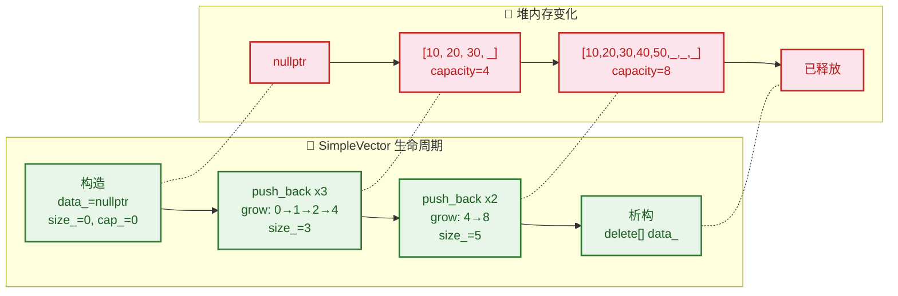

---

### 常见编译错误与调试技巧

类模板的编译错误信息以"冗长且难以阅读"著称。以下是几条实用建议：

**1. "undefined reference to ..." 链接错误**
这几乎一定是因为**模板定义放在了 `.cpp` 文件中**。解决方法：将所有成员函数的定义移到头文件中，或者使用显式实例化。

**2. 模板参数推导失败**
C++17 的 CTAD 并非万能。当构造函数参数不足以推导所有模板参数时，必须显式指定。

**3. 依赖名称（Dependent Name）问题**
当你在模板代码中使用依赖于 `T` 的嵌套类型时，必须加 `typename` 关键字：

```cpp
template <typename T>
void printSize(const T& container) {
    // typename 告诉编译器 T::size_type 是一个类型，而不是静态成员变量
    typename T::size_type sz = container.size();   // 必须加 typename
    std::cout << sz << std::endl;
}
```

**4. 使用 `static_assert` 提前校验**（C++11）

```cpp
#include <type_traits>    // 类型萃取工具

template <typename T>
class NumericStack {
    // 在编译期就检查 T 是否为算术类型
    // 若不是，则编译器直接给出清晰的错误消息
    static_assert(std::is_arithmetic<T>::value,
                  "NumericStack requires an arithmetic type!");

private:
    std::vector<T> elems_;

public:
    void push(T val) { elems_.push_back(val); }
    // ...
};

// NumericStack<int> ok;          // ✅ int 是算术类型
// NumericStack<std::string> bad; // ❌ 编译错误，给出清晰提示
```

`static_assert` 是改善模板错误信息可读性的利器。在 C++20 中，Concepts 进一步系统化了这一思路，但 `static_assert` 仍然是 C++11/14/17 项目中最实用的手段。

---

**📝 练习题**

以下代码的编译和运行结果是什么？

```cpp
template <typename T>
class Foo {
public:
    static int count;
    Foo() { ++count; }
};

template <typename T>
int Foo<T>::count = 0;

int main() {
    Foo<int> a, b;
    Foo<double> c;
    Foo<int> d;
    std::cout << Foo<int>::count << " " << Foo<double>::count << std::endl;
    return 0;
}
```

A. `4 4`

B. `3 1`

C. `2 1`

D. 编译错误

**【答案】** B

**【解析】** 类模板的每一个实例化类型都拥有自己**独立的一份静态成员变量**。`Foo<int>` 和 `Foo<double>` 是两个完全不同的类。在 `main` 中，`a`、`b`、`d` 是 `Foo<int>` 的实例，共构造了 3 次，所以 `Foo<int>::count == 3`；`c` 是 `Foo<double>` 的唯一实例，构造了 1 次，所以 `Foo<double>::count == 1`。输出为 `3 1`。选项 A 的错误在于把所有实例化类型的 `count` 当成了共享变量——这是对类模板静态成员最常见的误解。

---

**📝 练习题**

关于 C++17 CTAD（Class Template Argument Deduction），以下哪个说法是**错误**的？

A. CTAD 允许编译器从构造函数实参推导类模板参数，从而省略显式模板实参

B. `std::pair p(1, 2.0);` 会被推导为 `std::pair<int, double>`

C. 如果类模板没有任何构造函数，CTAD 仍然可以从聚合初始化推导模板参数（C++20 起）

D. CTAD 可以推导出所有模板参数，包括非类型模板参数和模板模板参数，无需任何推导指引


**【答案】** D

**【解析】** 选项 A 正确，这是 CTAD 的核心功能。选项 B 正确，编译器根据 `1`（int）和 `2.0`（double）推导出 `pair<int, double>`。选项 C 正确，C++20 扩展了 CTAD，支持聚合类型（Aggregate）的模板实参推导。选项 D 是错误的——CTAD 的推导能力是有限的。对于非类型模板参数（如 `template<typename T, int N>`），如果构造函数参数中没有提供足够的信息让编译器推导 `N`，则必须显式指定或提供用户自定义推导指引（Deduction Guide）。CTAD 并非"万能推导"，它的推导范围受构造函数签名的约束。

---

## 模板特化（Template Specialization）

在前面的章节中，我们学习了函数模板和类模板——它们的核心思想是"一套代码适配所有类型"。然而，现实中总有一些类型具有特殊性质，通用逻辑并不适用。例如，一个通用的 `compare<T>` 模板对大多数类型都能正常工作，但当 `T = const char*` 时，你期望比较的是字符串内容而非指针地址。**模板特化（Template Specialization）** 正是为了解决这类问题而生的机制：它允许我们为模板的某些特定类型（或类型模式）提供定制化的实现，从而在保留泛型灵活性的同时，针对特殊场景做出精准优化。

模板特化分为两大类：

- **全特化（Full / Explicit Specialization）**：为模板参数指定一组 **完全确定** 的类型。
- **偏特化（Partial Specialization）**：只约束模板参数的 **部分特征**（如指针、引用、某个参数固定等），模板仍保留一定的泛型能力。

> ⚠️ 关键限制：C++ 标准 **只允许类模板进行偏特化**，函数模板 **不支持** 偏特化（Partial Specialization）。函数模板只能全特化，或通过 **重载（Overloading）** 来达到类似效果。

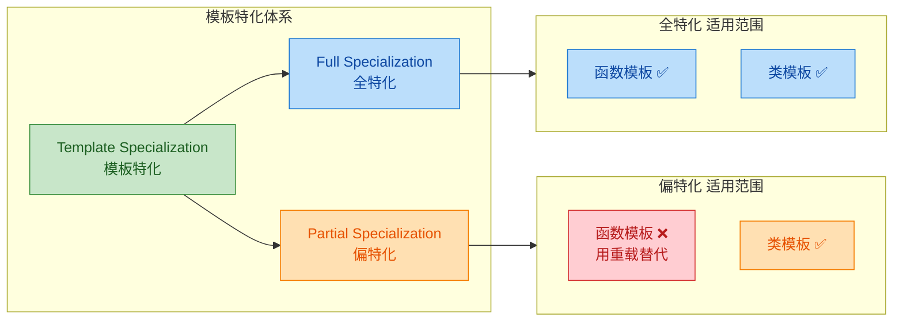

---

### 全特化（Full Specialization）

全特化是最直观的特化形式。当编译器在实例化模板时发现存在一个完全匹配目标类型的特化版本，它就会优先选用该版本，而不是从主模板（Primary Template）生成代码。

**语法核心**：在全特化声明中，`template<>` 的尖括号内 **留空**（因为所有参数都已确定），同时在模板名称后用 `<具体类型>` 显式指定。

#### 函数模板的全特化

我们先来看一个经典例子：比较操作。

```cpp
#include <iostream>
#include <cstring>  // std::strcmp

// ============ 主模板 (Primary Template) ============
template <typename T>
bool isEqual(const T& a, const T& b) {
    // 对于大多数类型，直接使用 operator== 比较
    return a == b;
}

// ============ 全特化：T = const char* ============
// template<> 尖括号留空，表示所有模板参数都已确定
// 函数名后 <const char*> 指定特化的目标类型
template <>
bool isEqual<const char*>(const char* const& a, const char* const& b) {
    // 对于 C 风格字符串，比较内容而非指针地址
    // std::strcmp 返回 0 表示两个字符串内容相同
    return std::strcmp(a, b) == 0;
}

int main() {
    // 调用主模板：T = int，使用 operator== 比较
    std::cout << std::boolalpha;
    std::cout << isEqual(1, 1) << "\n";           // true

    // 调用全特化版本：T = const char*
    const char* s1 = "hello";
    const char* s2 = "hello";
    // 虽然 s1 和 s2 可能指向不同地址，但内容相同 → true
    std::cout << isEqual(s1, s2) << "\n";          // true

    return 0;
}
```

这段代码的关键在于：如果没有对 `const char*` 进行全特化，主模板会对两个指针执行 `==`，比较的是 **地址** 而非字符串 **内容**——这在大多数场景下是错误的语义。

> 💡 **实践建议**：对于函数模板，很多 C++ 专家（如 Herb Sutter）更推荐使用 **重载** 而非全特化。原因在于函数重载与特化在重载决议（Overload Resolution）中的交互规则非常微妙，容易踩坑。我们在后面会详细讨论这个话题。

#### 类模板的全特化

类模板的全特化允许你对整个类体重新定义——成员变量、成员函数、甚至类的整体结构都可以和主模板完全不同。

```cpp
#include <iostream>
#include <cstring>

// ============ 主模板 ============
template <typename T>
class Storage {
    T value_;                         // 存储任意类型的值
public:
    Storage(const T& val) : value_(val) {}  // 构造函数，拷贝初始化
    T getValue() const { return value_; }   // 返回存储的值
    void print() const {                     // 打印值
        std::cout << "Storage<T>: " << value_ << "\n";
    }
};

// ============ 全特化：T = const char* ============
template <>
class Storage<const char*> {
    char* value_;                     // 不再存储指针，而是深拷贝字符串
public:
    Storage(const char* val) {
        // 计算字符串长度（含 '\0'）
        size_t len = std::strlen(val) + 1;
        // 在堆上分配内存
        value_ = new char[len];
        // 将源字符串内容拷贝到新分配的内存中
        std::strcpy(value_, val);
    }

    ~Storage() {
        // 释放堆上分配的内存，防止内存泄漏
        delete[] value_;
    }

    // 返回内部字符串指针（只读）
    const char* getValue() const { return value_; }

    void print() const {
        // 使用特化版本特有的输出格式
        std::cout << "Storage<const char*>: \"" << value_ << "\"\n";
    }
};

int main() {
    Storage<int> si(42);              // 实例化主模板，T = int
    si.print();                       // 输出: Storage<T>: 42

    Storage<const char*> ss("hello"); // 实例化全特化版本
    ss.print();                       // 输出: Storage<const char*>: "hello"

    return 0;
}
```

注意全特化的类和主模板可以拥有 **完全不同的内部结构**。这里主模板只是简单持有一个 `T value_`，而特化版本则进行了 **深拷贝（Deep Copy）**，在堆上管理自己的字符串副本。

让我们用 ASCII 图来观察二者的内存布局差异：

```
  Storage<int> si(42)               Storage<const char*> ss("hello")
  ┌─────────────────┐              ┌─────────────────┐
  │  value_ = 42    │              │  value_ ────────────┐
  │  (直接存储)      │              │  (指向堆内存)     │  │
  └─────────────────┘              └─────────────────┘  │
                                                        ▼
                                   Heap: ┌─h─e─l─l─o─\0─┐
                                         └───────────────┘
                                         (深拷贝，独立拥有)
```

---

### 偏特化（Partial Specialization）

偏特化是 C++ 模板系统中最强大也最精妙的机制之一。它不像全特化那样将所有模板参数都锁死，而是对模板参数施加 **部分约束** 或 **结构性约束**（如"是指针类型""是数组类型"等），让模板在满足约束的类型子集上使用定制实现。

**再次强调**：偏特化 **仅适用于类模板**（以及变量模板，C++14 起）。函数模板无法偏特化。

#### 固定部分参数

最常见的偏特化形式是在多个模板参数中，**固定其中一个或多个**，剩余参数保持泛型：

```cpp
#include <iostream>

// ============ 主模板：两个类型参数 ============
template <typename T, typename U>
class Pair {
public:
    void describe() const {
        // 通用版本，两个参数都未确定
        std::cout << "Pair<T, U> - 完全泛型版本\n";
    }
};

// ============ 偏特化：固定第二个参数为 int ============
// template<typename T> 表示仍有一个参数未确定
// Pair<T, int> 表示第二个参数被固定为 int
template <typename T>
class Pair<T, int> {
public:
    void describe() const {
        // 当第二个类型是 int 时，使用此版本
        std::cout << "Pair<T, int> - 第二参数固定为 int 的偏特化\n";
    }
};

// ============ 偏特化：两个参数类型相同 ============
template <typename T>
class Pair<T, T> {
public:
    void describe() const {
        // 当两个类型完全相同时，使用此版本
        std::cout << "Pair<T, T> - 两参数同类型的偏特化\n";
    }
};

int main() {
    Pair<double, char>  p1;   // 匹配主模板
    Pair<double, int>   p2;   // 匹配偏特化 Pair<T, int>，T=double
    Pair<float, float>  p3;   // 匹配偏特化 Pair<T, T>，T=float
    // Pair<int, int>   p4;   // ⚠ 歧义！同时匹配 <T,int> 和 <T,T>
                               // 编译器无法决定，会报 ambiguous 错误

    p1.describe();  // Pair<T, U> - 完全泛型版本
    p2.describe();  // Pair<T, int> - 第二参数固定为 int 的偏特化
    p3.describe();  // Pair<T, T> - 两参数同类型的偏特化

    return 0;
}
```

注意 `Pair<int, int>` 会导致编译错误——它同时满足 `<T, int>` 和 `<T, T>` 两个偏特化，编译器无法判断哪个更"特殊"。这种情况被称为 **歧义（Ambiguity）**，需要通过提供一个更特殊的版本（如全特化 `Pair<int, int>`）来消除。

#### 指针类型偏特化

这是实际工程中极其常用的偏特化模式——为所有指针类型提供统一的特殊处理：

```cpp
#include <iostream>

// ============ 主模板 ============
template <typename T>
class TypeTraits {
public:
    static void info() {
        // 默认：非指针类型
        std::cout << "TypeTraits<T>: 普通值类型 (Value Type)\n";
    }
};

// ============ 偏特化：匹配所有指针类型 T* ============
// 这里 T 仍然是泛型参数，但整体模式被约束为"T 的指针"
template <typename T>
class TypeTraits<T*> {
public:
    // 使用 typedef 暴露"去除指针后的底层类型"
    using baseType = T;

    static void info() {
        std::cout << "TypeTraits<T*>: 指针类型 (Pointer Type)\n";
    }
};

// ============ 偏特化：匹配所有 const 指针类型 const T* ============
template <typename T>
class TypeTraits<const T*> {
public:
    using baseType = T;

    static void info() {
        std::cout << "TypeTraits<const T*>: 常量指针类型\n";
    }
};

int main() {
    TypeTraits<int>::info();          // 普通值类型
    TypeTraits<int*>::info();         // 指针类型
    TypeTraits<const int*>::info();   // 常量指针类型
    TypeTraits<double**>::info();     // 指针类型 (T = double*)

    return 0;
}
```

最后一行特别有意思：`double**` 匹配 `T*` 模式时，`T` 被推导为 `double*`。这说明偏特化的模式匹配是一层一层剥离的——如果你要处理多级指针，可以递归地应用偏特化。

这种技术正是 STL 中 `std::iterator_traits` 和 `std::remove_pointer` 等 **类型萃取（Type Traits）** 工具的实现基础。

#### 引用与数组偏特化

除了指针，我们还可以对引用类型、数组类型进行偏特化。以下展示对固定大小数组的偏特化：

```cpp
#include <iostream>

// ============ 主模板 ============
template <typename T>
class Inspector {
public:
    static void analyze() {
        std::cout << "Inspector<T>: 标量或普通类型\n";
    }
};

// ============ 偏特化：固定大小数组 T[N] ============
// 这里有两个模板参数：类型 T 和非类型参数 N
template <typename T, size_t N>
class Inspector<T[N]> {
public:
    static void analyze() {
        // 能够在编译期获取数组元素类型和长度
        std::cout << "Inspector<T[N]>: 数组类型, "
                  << "元素数量 = " << N << "\n";
    }
};

// ============ 偏特化：引用类型 T& ============
template <typename T>
class Inspector<T&> {
public:
    static void analyze() {
        std::cout << "Inspector<T&>: 左值引用类型\n";
    }
};

int main() {
    Inspector<int>::analyze();           // 标量或普通类型
    Inspector<int[5]>::analyze();        // 数组类型, 元素数量 = 5
    Inspector<double&>::analyze();       // 左值引用类型
    Inspector<char[128]>::analyze();     // 数组类型, 元素数量 = 128

    return 0;
}
```

注意 `Inspector<T[N]>` 的偏特化引入了一个 **非类型模板参数** `size_t N`——主模板只有一个参数 `T`，但偏特化的模板参数列表可以比主模板多，只要这些额外参数出现在偏特化的类型模式中即可。

---

### 特化的匹配与优先级

当编译器遇到一个模板实例化请求（如 `Storage<const char*>`）时，它需要在主模板和所有特化版本中选择"最佳匹配"。规则如下：

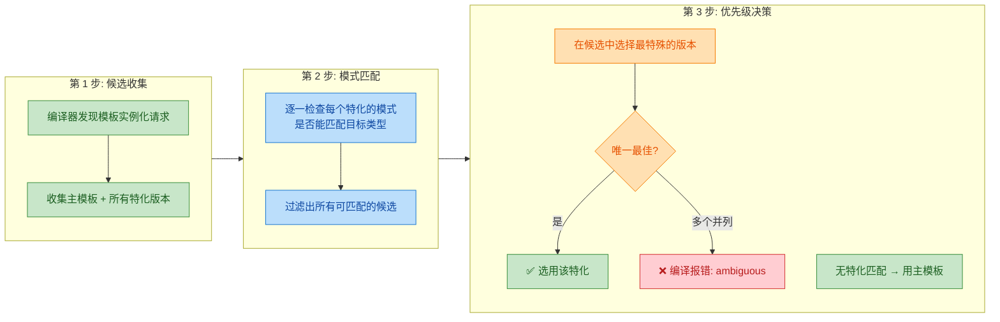

**"最特殊"（Most Specialized）** 的判定标准是：如果特化 A 能匹配的所有类型，特化 B 也都能匹配，但反过来不成立，那么 A 比 B 更特殊。直觉上就是"约束更多的那个赢"。

优先级总结如下（从高到低）：

| 优先级 | 版本 | 说明 |
|:---:|:---|:---|
| 🥇 | **全特化** | 所有参数完全确定，是最精确的匹配 |
| 🥈 | **偏特化** | 部分参数确定或有结构约束 |
| 🥉 | **主模板** | 兜底方案，匹配一切 |

```cpp
#include <iostream>

// 主模板
template <typename T>
class Match {
public:
    static void who() { std::cout << "主模板\n"; }
};

// 偏特化：指针类型
template <typename T>
class Match<T*> {
public:
    static void who() { std::cout << "偏特化 T*\n"; }
};

// 全特化：int*
template <>
class Match<int*> {
public:
    static void who() { std::cout << "全特化 int*\n"; }
};

int main() {
    Match<double>::who();   // → 主模板 (无特化匹配)
    Match<double*>::who();  // → 偏特化 T* (T=double)
    Match<int*>::who();     // → 全特化 int* (精确匹配，优先级最高)

    return 0;
}
```

输出：

```
主模板
偏特化 T*
全特化 int*
```

`int*` 同时满足偏特化 `T*`（令 `T=int`）和全特化 `int*`，但全特化优先级更高，因此被选中。

---

### 函数模板：特化 vs 重载

前面提到过，函数模板只能全特化，不能偏特化。但更重要的是，**函数模板的全特化在实际开发中也往往不是最佳选择**。原因在于 C++ 的 **重载决议（Overload Resolution）** 和 **模板特化选择** 是两个独立的阶段——重载决议先于特化选择执行。这会导致一些违反直觉的行为：

```cpp
#include <iostream>

// ============ 主模板 A ============
template <typename T>
void process(T val) {
    std::cout << "[主模板 A] process(T)\n";
}

// ============ 对主模板 A 的全特化：T = int* ============
template <>
void process<int*>(int* val) {
    std::cout << "[全特化] process(int*)\n";
}

// ============ 主模板 B（重载）============
template <typename T>
void process(T* val) {
    std::cout << "[主模板 B] process(T*)\n";
}

int main() {
    int x = 42;
    int* p = &x;
    process(p);   // 你以为会调用全特化 int* 版本？
    return 0;
}
```

输出：

```
[主模板 B] process(T*)
```

**为什么？** 这里的关键步骤是：

1. **重载决议阶段**：编译器只看 **主模板** 和普通函数（特化版本不参与重载决议）。候选有：主模板 A `process(T)` 和主模板 B `process(T*)`。对于 `int*` 参数，B 更匹配（`T` 推导为 `int`），所以选择主模板 B。
2. **特化选择阶段**：确定了使用主模板 B 后，编译器检查 B 是否有特化版本——没有。所以直接用主模板 B 生成代码。
3. 那个 `process<int*>` 的全特化是 **主模板 A 的特化**，根本不会被考虑。

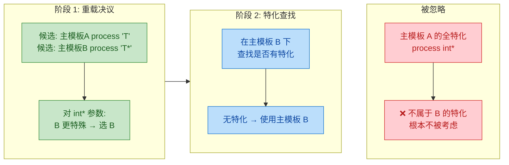

**正确做法**：用 **普通函数重载** 替代函数模板特化：

```cpp
#include <iostream>

// 主模板
template <typename T>
void process(T val) {
    std::cout << "[模板] process(T)\n";
}

// 普通函数重载（非模板）
// 普通函数在重载决议中优先级高于模板
void process(int* val) {
    std::cout << "[普通重载] process(int*)\n";
}

int main() {
    int x = 42;
    int* p = &x;
    process(p);   // → [普通重载] process(int*)  ✅ 符合预期
    return 0;
}
```

普通函数在重载决议中天然优先于模板实例，因此行为清晰可预测。这就是为什么 C++ 社区广泛流传的最佳实践是：

> **"Don't specialize function templates. Use overloads instead."**
> —— Herb Sutter, *"Why Not Specialize Function Templates?"*

---

### 特化的实际应用场景

模板特化不只是语言特性的展示，它在真实项目和标准库中有大量应用。以下梳理几个核心场景：

#### 类型萃取（Type Traits）

C++11 的 `<type_traits>` 头文件中，几乎所有工具都依赖偏特化实现。我们来实现一个简化版的 `is_pointer`：

```cpp
#include <iostream>

// 主模板：默认情况，T 不是指针
template <typename T>
struct is_pointer {
    // 编译期常量：false
    static constexpr bool value = false;
};

// 偏特化：当 T 的形式是 U* 时匹配
template <typename U>
struct is_pointer<U*> {
    // 编译期常量：true
    static constexpr bool value = true;
};

// 进一步：处理 const 指针
template <typename U>
struct is_pointer<U* const> {
    static constexpr bool value = true;
};

int main() {
    std::cout << std::boolalpha;
    std::cout << is_pointer<int>::value      << "\n";  // false
    std::cout << is_pointer<int*>::value     << "\n";  // true
    std::cout << is_pointer<double**>::value << "\n";  // true (U = double*)
    std::cout << is_pointer<char* const>::value << "\n"; // true

    return 0;
}
```

这正是标准库 `std::is_pointer` 的核心思路（实际实现还会处理 `volatile` 等 CV 限定符）。

#### 容器优化：`std::vector<bool>`

标准库中最著名（也最具争议）的特化案例就是 `std::vector<bool>`。主模板 `std::vector<T>` 为每个元素分配完整的 `sizeof(T)` 字节，但 `bool` 只需要 1 bit。因此标准库提供了全特化 `std::vector<bool>`，使用位压缩（bit-packing）存储，将 8 个 `bool` 塞进 1 个字节：

```
std::vector<int>  (主模板)          std::vector<bool> (全特化)
┌────┬────┬────┬────┐              ┌─────────────────────────────┐
│ 32 │ 32 │ 32 │ 32 │ bits        │ 1 1 0 1 0 0 1 0 │ ...       │
│bit │bit │bit │bit │              │  一个字节存 8 个 bool       │
└────┴────┴────┴────┘              └─────────────────────────────┘
  每元素 4 bytes                     每元素 1 bit (理论)
```

不过这个特化也引入了问题——`operator[]` 返回的不是 `bool&` 而是一个代理对象（proxy），导致很多泛型代码无法正常工作。这也是为什么很多 C++ 专家建议避免使用 `std::vector<bool>`，转而使用 `std::bitset` 或 `std::deque<bool>`。

#### 编译期计算（Template Metaprogramming）

模板特化是模板元编程的基石。经典的编译期阶乘计算就依赖全特化作为递归终止条件：

```cpp
#include <iostream>

// 主模板：递归定义 N! = N * (N-1)!
template <int N>
struct Factorial {
    // 编译期递归：值 = N 乘以 Factorial<N-1> 的值
    static constexpr long long value = N * Factorial<N - 1>::value;
};

// 全特化：N = 0 时，0! = 1，递归终止
template <>
struct Factorial<0> {
    static constexpr long long value = 1;
};

int main() {
    // 所有计算在编译期完成，运行时只是读取常量
    std::cout << "5!  = " << Factorial<5>::value  << "\n"; // 120
    std::cout << "10! = " << Factorial<10>::value << "\n"; // 3628800
    std::cout << "20! = " << Factorial<20>::value << "\n"; // 2432902008176640000

    return 0;
}
```

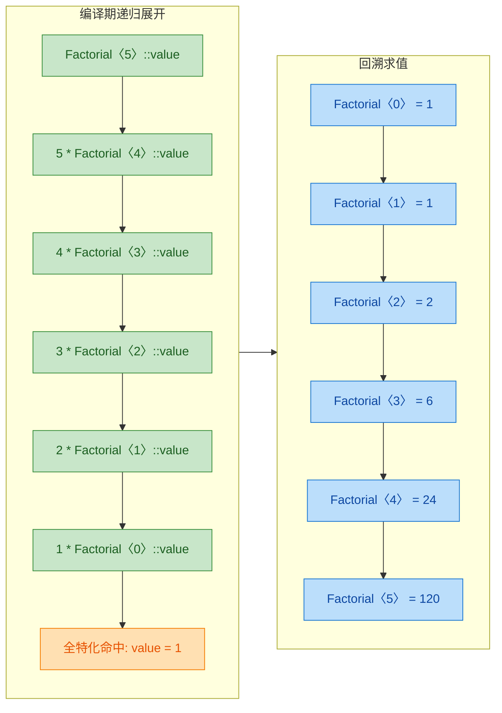

虽然 C++11 之后有了 `constexpr` 函数，可以用更直观的方式完成编译期计算，但理解这种基于模板特化的递归技术仍然是掌握 TMP（Template Metaprogramming）的必经之路。

---

### 特化使用注意事项

以下总结在工程实践中使用模板特化时应注意的关键要点：

| 序号 | 注意事项 | 说明 |
|:---:|:---|:---|
| 1 | **先声明主模板** | 特化版本必须出现在主模板声明之后，否则编译器无法将其关联到正确的主模板 |
| 2 | **ODR 一致性** | 同一个特化在整个程序中只能定义一次（One Definition Rule）。通常将特化放在头文件中，和主模板在一起 |
| 3 | **避免函数模板特化** | 优先使用重载；特化与重载的交互规则过于复杂 |
| 4 | **注意歧义** | 多个偏特化可能对同一类型产生歧义，需要用更精确的特化消除 |
| 5 | **特化不继承主模板** | 全特化的类与主模板 **没有** 隐式关系——成员函数不会自动继承，需要完整重新定义 |
| 6 | **与 `if constexpr` 的关系** | C++17 的 `if constexpr` 能替代很多简单的特化场景，代码更直观 |

---

**📝 练习题**

以下代码的输出是什么？

```cpp
#include <iostream>

template <typename T, typename U>
struct X {
    static void f() { std::cout << "1"; }
};

template <typename T>
struct X<T, T> {
    static void f() { std::cout << "2"; }
};

template <typename T>
struct X<T, int> {
    static void f() { std::cout << "3"; }
};

template <>
struct X<int, int> {
    static void f() { std::cout << "4"; }
};

int main() {
    X<double, char>::f();
    X<double, double>::f();
    X<double, int>::f();
    X<int, int>::f();
}
```

A. `1234`


B. `1232`


C. `1224`


D. `1334`


**【答案】** A

**【解析】**

逐个分析四次调用的模板匹配过程：

- `X<double, char>::f()` → `T=double, U=char`。两个参数既不相同，`U` 也不是 `int`，所以两个偏特化都不匹配，命中 **主模板**，输出 `1`。
- `X<double, double>::f()` → `T=double, U=double`。两参数相同，匹配偏特化 `X<T, T>`（`T=double`）。`X<T, int>` 不匹配（`double ≠ int`），输出 `2`。
- `X<double, int>::f()` → `T=double, U=int`。匹配偏特化 `X<T, int>`（`T=double`）。`X<T, T>` 不匹配（`double ≠ int`），输出 `3`。
- `X<int, int>::f()` → 这是最关键的一步。`X<T, T>`（`T=int`）和 `X<T, int>`（`T=int`）都能匹配，会产生歧义。但此处存在全特化 `X<int, int>`，**全特化优先级最高**，直接命中，输出 `4`。

最终输出 `1234`，选 A。这道题完美展示了主模板 → 偏特化 → 全特化的优先级链，以及全特化能够消除偏特化歧义的作用。

---

## 本章小结

本章系统地学习了 C++ **模板（Templates）** 的三大基石：**函数模板（Function Templates）**、**类模板（Class Templates）** 以及 **模板特化（Template Specialization）**。模板是 C++ 区别于其他主流语言的核心武器之一，它将"类型"从硬编码中解放出来，使之成为一种可参数化的维度，从而在 **编译期（compile-time）** 就完成代码的生成与优化。本节将对全章知识进行系统回顾、横向对比与深度串联。

---

### 知识全景图

下面这张 Mermaid 图以从左到右的全局流向，将本章三大核心知识点及其内部要素进行可视化梳理：

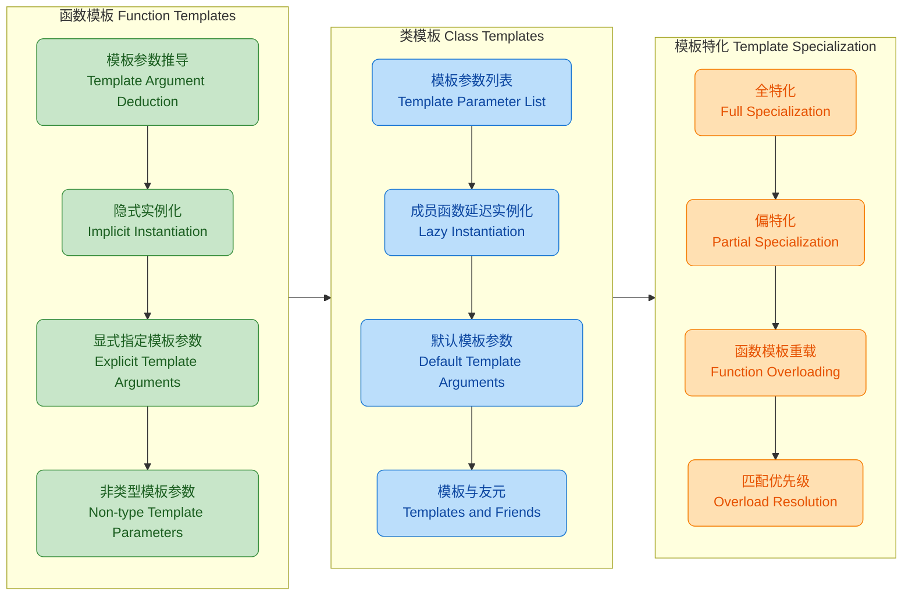

---

### 核心概念回顾

#### 一、函数模板 —— 泛型算法的基石

函数模板允许我们编写一份与类型无关的函数逻辑，由编译器在调用点根据实际参数类型自动生成对应版本。其核心机制可以浓缩为以下几点：

1. **模板参数推导（Template Argument Deduction）**：编译器通过分析函数调用时传入的实参类型，自动推导出模板参数 `T` 的具体类型。这是函数模板最常用、也最优雅的使用方式——调用者无需显式指定类型。

2. **隐式实例化（Implicit Instantiation）**：当编译器首次遇到某个具体类型的函数模板调用时，会自动生成该类型对应的函数实体。例如 `max<int>` 和 `max<double>` 是两个完全独立的函数，它们各自拥有独立的机器码。

3. **显式指定模板参数**：当推导失败或需要强制转换时，可通过 `func<Type>(args)` 的语法显式指定。典型场景包括返回值类型无法从参数推导的情况。

4. **非类型模板参数（Non-type Template Parameters, NTTP）**：模板参数不仅可以是类型，还可以是编译期常量值（如 `int N`），这为编译期计算和固定尺寸容器提供了强大支持。

```c++
// 综合回顾：一个同时使用类型参数与非类型参数的函数模板
template <typename T, int N>        // T: 类型参数, N: 非类型参数(编译期常量)
T arraySum(const T (&arr)[N]) {     // 接收一个大小为 N 的数组引用
    T sum = T();                    // 值初始化，对内置类型为 0
    for (int i = 0; i < N; ++i) {  // 遍历数组每个元素
        sum += arr[i];              // 累加到 sum
    }
    return sum;                     // 返回总和
}

int main() {
    int a[] = {1, 2, 3, 4, 5};         // 定义整型数组, 大小 5
    double b[] = {1.1, 2.2, 3.3};      // 定义浮点数组, 大小 3
    // 编译器自动推导：T=int, N=5
    auto s1 = arraySum(a);              // s1 = 15
    // 编译器自动推导：T=double, N=3
    auto s2 = arraySum(b);             // s2 = 6.6
}
```

> **要点**：编译器不仅推导出了 `T` 的类型，还从数组的声明中推导出了非类型参数 `N` 的值，这就是模板参数推导的强大之处。

---

#### 二、类模板 —— 泛型数据结构的骨架

类模板将泛型的思想从"算法"扩展到了"数据结构"。标准库中 `std::vector<T>`、`std::map<K,V>`、`std::shared_ptr<T>` 等容器与智能指针，全部建立在类模板之上。关键要点：

1. **显式指定类型**：与函数模板不同，类模板在 C++17 之前**必须**显式指定模板参数（如 `vector<int>`），因为类的构造场景更加复杂，编译器难以自动推导。C++17 引入的 **CTAD（Class Template Argument Deduction）** 才部分缓解了这一限制。

2. **成员函数延迟实例化（Lazy Instantiation）**：类模板的成员函数只有在被**实际调用**时才会实例化。这意味着即使某个成员函数对特定类型 `T` 在语法上不合法，只要你不调用它，编译器也不会报错。这是一个重要的设计特性，它允许类模板拥有"部分适用"的接口。

3. **默认模板参数（Default Template Arguments）**：类似于函数的默认参数，模板参数也可以设定默认值。标准库大量使用了这一特性，例如 `std::vector<T, Allocator = std::allocator<T>>`，绝大多数用户只需写 `vector<int>` 即可。

4. **模板与友元（Templates and Friends）**：类模板中的 `friend` 声明有多种形式——可以让特定实例化版本成为友元，也可以让整个模板成为友元，灵活性极高但也需要谨慎使用。

```c++
// 综合回顾：一个支持默认分配策略的简易栈类模板
template <typename T, typename Container = std::vector<T>>  // 默认使用 vector 作底层容器
class Stack {
private:
    Container elems_;          // 底层容器存储元素

public:
    void push(const T& val) {  // 压入一个元素
        elems_.push_back(val); // 委托给底层容器的 push_back
    }

    void pop() {               // 弹出栈顶元素
        if (elems_.empty()) {  // 安全检查：栈为空时抛出异常
            throw std::out_of_range("Stack<>::pop(): empty stack");
        }
        elems_.pop_back();     // 委托给底层容器的 pop_back
    }

    const T& top() const {     // 获取栈顶元素（只读）
        if (elems_.empty()) {  // 安全检查
            throw std::out_of_range("Stack<>::top(): empty stack");
        }
        return elems_.back();  // 返回底层容器最后一个元素
    }

    bool empty() const {       // 判断栈是否为空
        return elems_.empty(); // 委托给底层容器
    }
};

int main() {
    Stack<int> s1;                    // 使用默认容器 vector<int>
    Stack<std::string, std::deque<std::string>> s2;  // 显式指定 deque 作底层容器
    s1.push(42);                      // 压入整型 42
    s2.push("hello");                 // 压入字符串
}
```

> **要点**：通过第二个模板参数 `Container` 的默认值设计，用户在 99% 的场景下只需 `Stack<int>` 即可，但在特殊场景下仍保留了完全的定制能力——这就是 **Policy-Based Design（基于策略的设计）** 的雏形。

---

#### 三、模板特化 —— 泛型与定制的平衡术

模板特化机制让我们在保留泛型通用性的同时，为特殊类型提供定制实现。它是模板系统中 **"先泛化，再特化"** 设计哲学的直接体现。

| 特化类型 | 适用对象 | 语法标志 | 说明 |
|:---:|:---:|:---:|:---|
| **全特化（Full）** | 函数模板 / 类模板 | `template<>` | 所有模板参数都被具体类型替换 |
| **偏特化（Partial）** | **仅**类模板 | `template<部分参数>` | 只替换部分参数，或对参数施加约束（如指针、引用） |
| **函数重载** | 函数模板 | 普通重载语法 | 替代函数模板偏特化的推荐方案 |

其中最容易混淆的是 **函数模板不支持偏特化**。当你需要对函数模板做"部分定制"时，标准做法是使用**普通函数重载**（Overloading），而不是试图偏特化。

```c++
// ============ 全特化 ============
template <typename T>               // 主模板（Primary Template）
struct TypeName {
    static const char* get() {      // 返回类型名字符串
        return "unknown";           // 默认返回 "unknown"
    }
};

template <>                         // 全特化：T = int
struct TypeName<int> {
    static const char* get() {      // 为 int 定制的版本
        return "int";               // 返回 "int"
    }
};

template <>                         // 全特化：T = double
struct TypeName<double> {
    static const char* get() {      // 为 double 定制的版本
        return "double";            // 返回 "double"
    }
};

// ============ 偏特化 ============
template <typename T>               // 偏特化：匹配所有指针类型 T*
struct TypeName<T*> {
    static const char* get() {      // 针对指针类型的定制
        return "pointer";           // 返回 "pointer"
    }
};
```

> **要点**：偏特化 `TypeName<T*>` 并没有完全固定 `T`，而是对模板参数施加了一个**模式约束**（pattern constraint）——它匹配所有指针类型。这种"对参数形式做匹配"的能力是偏特化最强大的地方。

---

### 编译器视角：模板实例化全流程

下面用一张流程图，从编译器的视角展示模板从"定义"到"生成机器码"的全生命周期：

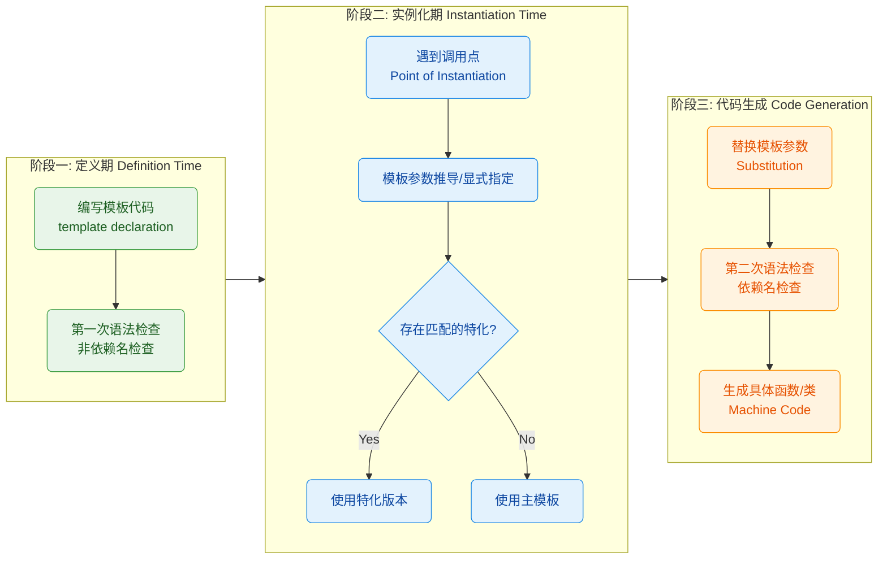

**关于"两阶段查找"（Two-Phase Lookup）**，这是理解模板编译行为的关键：

- **第一阶段**（定义时）：编译器检查模板代码中与模板参数 `T` **无关的**名称（non-dependent names）。例如，如果你调用了一个不存在的全局函数 `foo()`，即使模板未被实例化，编译器也会在此阶段报错。
- **第二阶段**（实例化时）：编译器将 `T` 替换为具体类型后，检查所有 **依赖名（dependent names）**，例如 `T::value_type` 或 `obj.method()`。如果此时发现类型不匹配或成员不存在，才会报出真正的实例化错误。

这种两阶段机制解释了为什么模板错误信息往往又长又难读——编译器需要展示从调用点到模板内部的整个替换链条。

---

### 三大模板机制对比

| 维度 | 函数模板 | 类模板 | 模板特化 |
|:---|:---|:---|:---|
| **核心目标** | 泛型算法 | 泛型数据结构 | 定制特殊类型行为 |
| **类型推导** | ✅ 支持自动推导 | ⚠️ C++17 起支持 CTAD | N/A（用于已知类型） |
| **偏特化** | ❌ 不支持（用重载替代） | ✅ 支持 | — |
| **全特化** | ✅ 支持 | ✅ 支持 | — |
| **延迟实例化** | 整个函数按需实例化 | 成员函数粒度的延迟实例化 | 同主模板规则 |
| **默认模板参数** | ✅ C++11 起支持 | ✅ 一直支持 | N/A |
| **典型应用** | `std::sort`, `std::swap` | `std::vector`, `std::map` | `std::hash` 对自定义类型的特化 |

---

### 匹配优先级速记

当编译器遇到一个调用或类型使用时，它按照以下优先级选择最合适的版本：

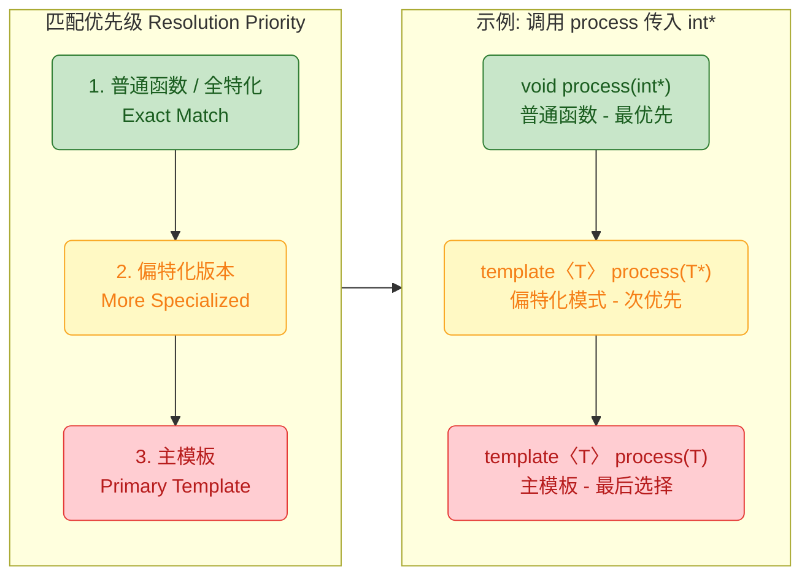

简单记忆口诀：**"普通 > 特化 > 主模板"**，更具体的（more specialized）永远优先于更泛化的。

---

### 常见陷阱与最佳实践

**陷阱一：函数模板全特化 vs 重载的坑**

```c++
template <typename T>
void handle(T) { std::cout << "primary\n"; }       // 主模板 (A)

template <typename T>
void handle(T*) { std::cout << "overload T*\n"; }  // 重载版本 (B)

template <>
void handle<int*>(int*) { std::cout << "spec\n"; } // (A) 的全特化 (C)
```

当调用 `handle((int*)nullptr)` 时，结果是 `"overload T*"` 而非 `"spec"`。原因是编译器**先在主模板之间做重载决议**，选出 (B) 后，才会检查 (B) 有没有全特化——而 (C) 是 (A) 的特化，不是 (B) 的，因此被完全忽略。

> **最佳实践**：**优先使用函数重载而非函数模板全特化**。重载参与正常的重载决议，行为更可预测。

**陷阱二：模板定义与实现分离**

模板的定义（包括成员函数实现）通常**必须放在头文件中**。因为编译器在实例化模板时需要看到完整的定义，如果实现被放在 `.cpp` 文件中，其他翻译单元就无法实例化，导致链接错误（linker error: undefined reference）。

> **最佳实践**：将模板的声明与实现都放在 `.h` / `.hpp` 头文件中。如果实现过长，可以使用 `.inl` 或 `.tpp` 后缀的包含文件来分离可读性，但本质上仍是被 `#include` 到头文件中。

**陷阱三：忘记 `typename` 关键字**

当在模板内部访问依赖于模板参数的嵌套类型时，必须用 `typename` 关键字消除歧义：

```c++
template <typename T>
void printAll(const T& container) {
    // 错误！编译器不知道 T::iterator 是类型还是静态成员
    // T::iterator it = container.begin();

    // 正确：用 typename 告诉编译器这是一个类型
    typename T::iterator it = container.begin();   // 声明迭代器
    for (; it != container.end(); ++it) {          // 遍历容器
        std::cout << *it << " ";                   // 输出每个元素
    }
}
```

---

### 知识延伸路线图

模板基础是通往 C++ 高级泛型编程的起点。下面展示从本章出发的进阶路径：

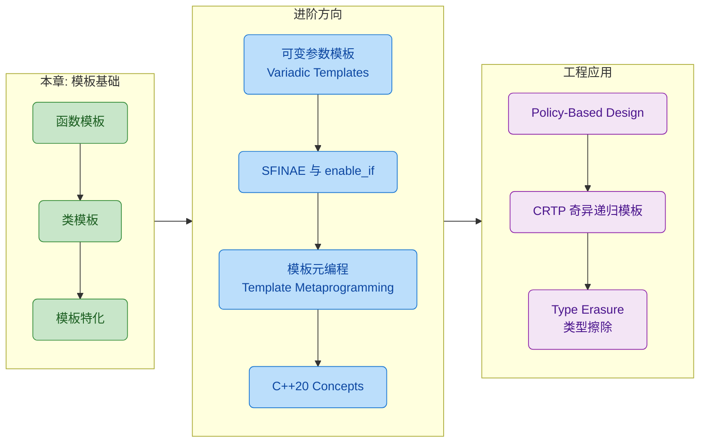

从 **可变参数模板（Variadic Templates）** 开始，你将学会处理任意数量、任意类型的参数包（parameter pack）；接着 **SFINAE**（Substitution Failure Is Not An Error）和 `std::enable_if` 赋予你在编译期根据类型特征开关函数重载的能力；**模板元编程（TMP）** 则将模板系统当作一门图灵完备的编译期语言来使用；最终 **C++20 Concepts** 以声明式的方式优雅地约束模板参数，取代了大量晦涩的 SFINAE 技巧。

在工程层面，**Policy-Based Design** 利用模板参数注入策略实现极致灵活的组件设计；**CRTP（Curiously Recurring Template Pattern）** 实现静态多态，避免虚函数开销；**Type Erasure** 则在模板的编译期多态和虚函数的运行期多态之间找到优雅的中间方案。

---

**📝 练习题 1**

以下代码的输出是什么？

```c++
#include <iostream>

template <typename T>
void print(T) { std::cout << "A"; }

template <typename T>
void print(T*) { std::cout << "B"; }

template <>
void print<int>(int) { std::cout << "C"; }

template <>
void print<int*>(int*) { std::cout << "D"; }

int main() {
    int x = 0;
    print(x);
    print(&x);
}
```

A. CA


B. CB


C. CD


D. DB


**【答案】** C

**【解析】** 

分析分两步：**先做重载决议（Overload Resolution），再看全特化（Full Specialization）**。

**第一个调用 `print(x)`**：`x` 是 `int` 类型。候选的主模板有 `print(T)` 和 `print(T*)`。`int` 不是指针，所以 `print(T*)` 不匹配，选中 `print(T)` 主模板（`T=int`）。然后检查该主模板是否有全特化——存在 `print<int>(int)`，即输出 `C` 的版本。因此打印 **C**。

**第二个调用 `print(&x)`**：`&x` 是 `int*` 类型。两个主模板都能匹配：`print(T)` 推导 `T=int*`，`print(T*)` 推导 `T=int`。根据偏序规则，`print(T*)` 更特化，选中它。然后检查 `print(T*)` 这个主模板是否有全特化——**没有**（`print<int*>(int*)` 是第一个主模板 `print(T)` 的全特化，不是 `print(T*)` 的）。所以使用 `print(T*)` 本身，输出 **D**。

最终输出：`CD`。

这道题深刻说明了 **"全特化不参与重载决议"** 这一关键规则——全特化只是对某个已选中的主模板的替换实现，它不会影响主模板之间的竞争。

---

**📝 练习题 2**

以下代码能否编译通过？如果能，输出是什么？

```c++
#include <iostream>

template <typename T, int Size>
class Array {
    T data_[Size];
public:
    int size() const { return Size; }
    void fill(const T& val) {
        for (int i = 0; i < Size; ++i)
            data_[i] = val;
    }
    void print() const {
        for (int i = 0; i < Size; ++i)
            std::cout << data_[i] << " ";
    }
};

template <typename T>
class Array<T, 0> {
public:
    int size() const { return 0; }
    void print() const { std::cout << "(empty)"; }
};

int main() {
    Array<int, 3> a;
    a.fill(7);
    a.print();
    std::cout << "\n";

    Array<double, 0> b;
    b.print();
    std::cout << "\n" << b.size();
}
```

A. 编译失败：偏特化语法错误


B. `7 7 7`（换行）`(empty)`（换行）`0`


C. `7 7 7`（换行）编译失败：`b.fill()` 未定义


D. 运行时错误：零大小数组越界


**【答案】** B

**【解析】**

代码完全合法。`Array<T, 0>` 是 `Array<T, Size>` 的**偏特化版本**——它固定了第二个非类型参数 `Size = 0`，但保留了类型参数 `T`。

对于 `Array<int, 3> a`：匹配主模板，`T=int, Size=3`。调用 `fill(7)` 将三个元素都设为 7，`print()` 输出 `7 7 7`。

对于 `Array<double, 0> b`：`Size=0` 精确匹配偏特化版本。偏特化版本中没有 `fill()` 方法，但 `main` 中也没有调用 `b.fill()`，所以不会报错。调用 `b.print()` 输出 `(empty)`，`b.size()` 返回 `0`。

这道题综合考察了：偏特化可以针对**非类型参数的特定值**进行定制；偏特化版本是一个完全独立的类定义，可以拥有与主模板不同的成员集合；以及类模板的**延迟实例化**特性——未调用的成员函数不会被实例化。

---

