---

# 类与对象

---

## 类定义（Class Definition）

在 C++ 中，**类（Class）** 是面向对象编程（OOP）的基石。它将**数据（Data）**和**操作数据的行为（Behavior）**封装成一个独立的逻辑单元。你可以把类理解为一张"蓝图"或"模板"——它本身并不占用运行时内存，只有当你用它创建出**对象（Object/Instance）**时，才会在内存中分配实际空间。

类的基本语法结构如下：

```cpp
// 使用 class 关键字定义一个类
class ClassName {
    // 成员变量 (Member Variables / Data Members)
    // 成员函数 (Member Functions / Methods)
};  // ⚠️ 注意：类定义末尾的分号是强制的，遗漏会导致编译错误
```

这里有一个关键的概念对比需要在一开始就理清：**类（Class）vs 对象（Object）**。类是抽象的类型描述，对象是具体的内存实体。这与"int 是类型，而 `int x = 5;` 中的 `x` 是变量"的关系完全一致。C++ 允许你自定义类型，而 `class` 就是实现这一目标的核心机制。

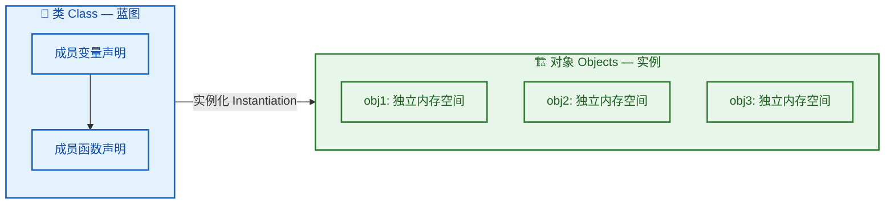

每一个对象（`obj1`, `obj2`, `obj3`）都拥有属于自己的成员变量副本，但它们共享同一套成员函数的代码。这种"数据独立、行为共享"的机制是类的核心内存模型，我们在后面会详细展开。

---

### 成员变量（Member Variables / Data Members）

成员变量，也叫**数据成员（Data Members）**或**字段（Fields）**，是类内部定义的变量，用于保存对象的**状态（State）**。每当你创建一个对象时，编译器会为该对象分配内存，其中就包含了所有非静态成员变量各自的存储空间。

#### 基本声明与使用

```cpp
#include <iostream>  // 引入输入输出流库
#include <string>    // 引入 string 类型

class Student {
public:                          // 访问控制符，暂时用 public 以便外部访问
    std::string name;            // 成员变量：学生姓名（string 类型）
    int age;                     // 成员变量：学生年龄（int 类型）
    double gpa;                  // 成员变量：学生绩点（double 类型）
};                               // ⚠️ 分号不可省略

int main() {
    Student s1;                  // 创建 Student 类的一个对象 s1
    s1.name = "Alice";           // 通过 . 运算符访问并赋值成员变量
    s1.age = 20;                 // 设置年龄
    s1.gpa = 3.85;               // 设置绩点

    Student s2;                  // 创建另一个对象 s2
    s2.name = "Bob";             // s2 拥有完全独立的数据副本
    s2.age = 22;
    s2.gpa = 3.60;

    // s1 和 s2 的 name/age/gpa 互不干扰
    std::cout << s1.name << ": " << s1.gpa << std::endl;  // 输出: Alice: 3.85
    std::cout << s2.name << ": " << s2.gpa << std::endl;  // 输出: Bob: 3.6
    return 0;
}
```

上面的代码展示了最简单的场景。注意 `s1` 和 `s2` 虽然都是 `Student` 类型，但它们在内存中是**完全独立**的两块区域，修改 `s1.name` 不会影响 `s2.name`。

#### 对象的内存布局（Memory Layout）

理解成员变量在内存中如何排列，对于写出高性能的 C++ 代码至关重要。编译器会按照成员变量的**声明顺序**在内存中依次排列它们，但为了满足 CPU 对齐要求，可能会在成员之间插入**填充字节（Padding）**。

```cpp
class Example {
public:
    char   a;   // 1 字节
    int    b;   // 4 字节
    char   c;   // 1 字节
};
// sizeof(Example) 通常不是 6，而是 12！
```

为什么是 12 而不是 1 + 4 + 1 = 6？因为**内存对齐（Memory Alignment）**。`int` 通常要求 4 字节对齐，即它的起始地址必须是 4 的倍数。我们来看内存分布：

```
┌─────────────────────────────────────────────────┐
│ 地址偏移:  0     1  2  3     4  5  6  7     8     9  10 11  │
│ 内容:     [a]  [pad pad pad] [  b (4B)  ]  [c]  [pad pad pad] │
│            ▲                   ▲                  ▲            │
│         char a              int b              char c          │
└─────────────────────────────────────────────────┘
            总大小 = 12 字节（含 6 字节 padding）
```

如果你重新排列成员变量的顺序，就可以减少浪费：

```cpp
class ExampleOptimized {
public:
    int    b;   // 4 字节（偏移 0）
    char   a;   // 1 字节（偏移 4）
    char   c;   // 1 字节（偏移 5）
    // 尾部填充 2 字节，使总大小为 8（4 的倍数）
};
// sizeof(ExampleOptimized) = 8，节省了 4 字节！
```

> 💡 **实践准则**：在性能敏感的代码中，将**大的成员变量排在前面**，**小的成员变量聚在一起排在后面**，可以有效减少 padding 浪费。这在大量创建对象或对象数组时尤为重要。

#### 成员变量的分类

成员变量根据是否使用 `static` 关键字，可分为两大类：

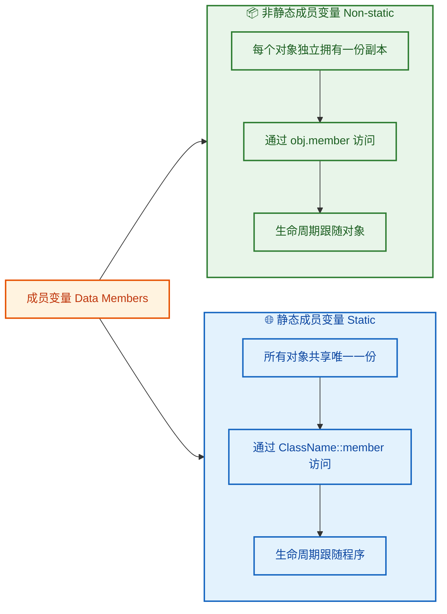

**静态成员变量**是一个非常重要的概念，它属于类本身而不属于任何一个对象：

```cpp
#include <iostream>

class Student {
public:
    std::string name;             // 非静态：每个对象各一份
    static int totalStudents;     // 静态：所有 Student 对象共享

    // 构造函数中递增计数器（构造函数详见后续章节）
    Student(const std::string& n) : name(n) {
        ++totalStudents;          // 每创建一个对象，计数器 +1
    }
};

// ⚠️ 静态成员变量必须在类外进行定义（分配存储空间）
// 这一步容易遗忘，遗忘会导致链接错误 (linker error)
int Student::totalStudents = 0;

int main() {
    Student s1("Alice");          // totalStudents 变为 1
    Student s2("Bob");            // totalStudents 变为 2
    Student s3("Charlie");        // totalStudents 变为 3

    // 推荐通过 类名::成员 的方式访问静态变量
    std::cout << "Total: " << Student::totalStudents << std::endl;  // 输出: Total: 3

    // 也可以通过对象访问（不推荐，容易造成误解）
    std::cout << "Total: " << s1.totalStudents << std::endl;        // 输出: Total: 3
    return 0;
}
```

#### 类内初始化（In-Class Member Initializer, C++11）

从 C++11 开始，你可以直接在成员变量声明时赋予**默认值**，这叫做**非静态成员初始化器（Non-Static Data Member Initializer, NSDMI）**：

```cpp
class Config {
public:
    int width = 1920;                  // C++11: 类内直接给默认值
    int height = 1080;                 // 如果构造函数没有显式初始化，就使用这个默认值
    std::string title = "My Window";   // string 类型同样支持
    bool fullscreen = false;           // bool 类型
};

int main() {
    Config cfg;                        // 无需手动赋值，所有成员已有默认值
    // cfg.width == 1920, cfg.height == 1080, cfg.title == "My Window"
    return 0;
}
```

这种写法的好处是：当类有多个构造函数时，不需要在每个构造函数里都重复写一遍初始化代码。如果构造函数显式初始化了某个成员，则构造函数的值**优先级更高**，会覆盖类内默认值。

---

### 成员函数（Member Functions / Methods）

成员函数定义了对象能执行的**行为（Behavior）**。与普通函数不同，成员函数隐含一个指向调用它的对象的 `this` 指针（`this` 指针将在后续章节详解），因此它可以直接访问该对象的所有成员变量。

#### 声明与定义的两种方式

成员函数的实现有两种常见风格：**类内定义（Inline Definition）** 和 **类外定义（Out-of-Class Definition）**。

```cpp
#include <iostream>
#include <string>

class Student {
public:
    std::string name;
    int age;
    double gpa;

    // ========== 方式一：类内定义 (Inline Definition) ==========
    // 直接在 class {} 内部写函数体
    // 编译器会隐式将其视为 inline 候选
    void display() {
        std::cout << "Name: " << name           // 直接访问成员变量 name
                  << ", Age: " << age            // 直接访问成员变量 age
                  << ", GPA: " << gpa            // 直接访问成员变量 gpa
                  << std::endl;
    }

    // ========== 方式二：类内只放声明 ==========
    void setInfo(const std::string& n, int a, double g);  // 只有声明，没有函数体
};

// ========== 方式二的定义部分：类外定义 (Out-of-Class Definition) ==========
// 使用 ClassName::functionName 语法，明确该函数属于哪个类
void Student::setInfo(const std::string& n, int a, double g) {
    name = n;     // 等价于 this->name = n;
    age = a;      // 等价于 this->age = a;
    gpa = g;      // 等价于 this->gpa = g;
}

int main() {
    Student s;                         // 创建对象
    s.setInfo("Alice", 20, 3.85);     // 调用成员函数设置数据
    s.display();                       // 调用成员函数展示数据
    return 0;                          // 输出: Name: Alice, Age: 20, GPA: 3.85
}
```

两种方式在语义上完全等价。那么在实际工程中如何选择呢？

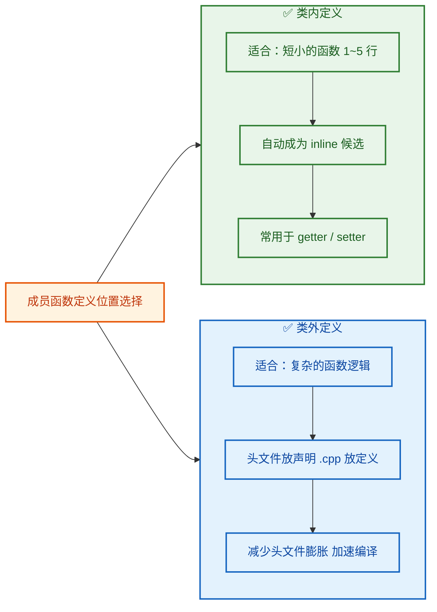

> 💡 **工程规范**：在大型项目中，通常将类的声明放在 **头文件（.h / .hpp）**，将成员函数的类外定义放在 **源文件（.cpp）** 中。这种分离可以显著减少编译依赖，加快增量编译速度。

#### const 成员函数

当一个成员函数**不修改**对象的任何成员变量时，应该将其声明为 `const` 成员函数。这是 C++ 中非常重要的**契约式设计（Design by Contract）**理念的体现：

```cpp
class Circle {
private:
    double radius;                        // 半径

public:
    // 构造函数：设置半径
    Circle(double r) : radius(r) {}

    // ✅ const 成员函数：承诺不修改任何成员变量
    double getArea() const {
        return 3.14159265358979 * radius * radius;  // 只读访问 radius
    }

    // ✅ const 成员函数：只读操作
    double getRadius() const {
        return radius;                    // 只是返回值，不做修改
    }

    // ✅ 非 const 成员函数：需要修改成员变量
    void setRadius(double r) {
        radius = r;                       // 修改了 radius
    }
};

int main() {
    const Circle c(5.0);                  // 创建一个 const 对象
    // c.setRadius(10.0);                 // ❌ 编译错误！const 对象不能调用非 const 成员函数
    double a = c.getArea();               // ✅ 合法：getArea() 是 const 函数
    return 0;
}
```

`const` 成员函数的关键规则可以总结为下表：

| 调用方 | 能调 const 成员函数？ | 能调非 const 成员函数？ |
|:---:|:---:|:---:|
| **普通对象** | ✅ 可以 | ✅ 可以 |
| **const 对象** | ✅ 可以 | ❌ 不可以 |
| **const 引用/指针** | ✅ 可以 | ❌ 不可以 |

背后的逻辑很简单：`const` 是一种**只读承诺**。`const` 对象说"我不允许被修改"，所以它只能调用同样承诺"我不会修改你"的 `const` 成员函数。这是编译器强制执行的类型安全检查。

#### 函数重载在类中的应用

类中的成员函数与普通函数一样支持**重载（Overloading）**——同名函数拥有不同的参数列表：

```cpp
#include <iostream>
#include <string>

class Printer {
public:
    // 重载 1：打印整数
    void print(int value) {
        std::cout << "Integer: " << value << std::endl;
    }

    // 重载 2：打印浮点数
    void print(double value) {
        std::cout << "Double: " << value << std::endl;
    }

    // 重载 3：打印字符串
    void print(const std::string& value) {
        std::cout << "String: " << value << std::endl;
    }
};

int main() {
    Printer p;
    p.print(42);                  // 调用重载 1 → Integer: 42
    p.print(3.14);                // 调用重载 2 → Double: 3.14
    p.print(std::string("Hi"));   // 调用重载 3 → String: Hi
    return 0;
}
```

编译器根据**实参类型**在编译期（Compile Time）就决定了调用哪个版本，这叫做**静态多态（Static Polymorphism）**或**编译期多态**。

一个特别值得注意的重载场景是**基于 const 的重载**：

```cpp
class TextBuffer {
private:
    std::string data;

public:
    TextBuffer(const std::string& s) : data(s) {}

    // 非 const 版本：返回可修改的引用
    char& at(size_t index) {
        std::cout << "[non-const at called]" << std::endl;
        return data[index];                 // 返回引用，调用者可以修改
    }

    // const 版本：返回只读的引用
    const char& at(size_t index) const {
        std::cout << "[const at called]" << std::endl;
        return data[index];                 // 返回 const 引用，调用者不可修改
    }
};

int main() {
    TextBuffer buf("Hello");
    buf.at(0) = 'h';                       // 调用非 const 版本，可以修改

    const TextBuffer cbuf("World");
    char ch = cbuf.at(0);                   // 调用 const 版本，只能读取
    // cbuf.at(0) = 'w';                    // ❌ 编译错误：const 引用不可赋值
    return 0;
}
```

这种模式在标准库中随处可见，比如 `std::vector` 的 `operator[]` 就同时提供了 `const` 和非 `const` 两个重载版本。

#### 完整示例：综合运用

最后，我们把上面所有知识点串联起来，构建一个稍微完整的类：

```cpp
#include <iostream>
#include <string>
#include <cmath>       // 用于 std::sqrt

class Vec2D {
public:
    double x;          // x 坐标分量
    double y;          // y 坐标分量

    // ---- 成员函数 ----

    // 设置坐标值（类内定义）
    void set(double newX, double newY) {
        x = newX;      // 设置 x 分量
        y = newY;      // 设置 y 分量
    }

    // 计算向量长度（模）—— const 函数，不修改对象
    double length() const {
        return std::sqrt(x * x + y * y);   // 勾股定理: sqrt(x² + y²)
    }

    // 向量加法：返回一个新的 Vec2D 对象
    Vec2D add(const Vec2D& other) const {
        Vec2D result;                       // 创建临时对象存放结果
        result.x = x + other.x;            // 分量相加
        result.y = y + other.y;            // 分量相加
        return result;                      // 按值返回（编译器会做 RVO 优化）
    }

    // 打印向量信息
    void display() const {
        std::cout << "(" << x << ", " << y << ")"  // 格式化输出
                  << "  |v| = " << length()         // 调用自身的 const 成员函数
                  << std::endl;
    }
};

int main() {
    Vec2D v1;                    // 创建向量 v1
    v1.set(3.0, 4.0);           // 设置为 (3, 4)

    Vec2D v2;                    // 创建向量 v2
    v2.set(1.0, 2.0);           // 设置为 (1, 2)

    Vec2D v3 = v1.add(v2);      // v3 = v1 + v2 = (4, 6)

    v1.display();                // 输出: (3, 4)  |v| = 5
    v2.display();                // 输出: (1, 2)  |v| = 2.23607
    v3.display();                // 输出: (4, 6)  |v| = 7.2111
    return 0;
}
```

这个 `Vec2D` 类虽然简单，但已经体现了类设计的核心思想：**数据（x, y）和操作（set, length, add, display）封装在一起**，外部代码只需要通过成员函数与对象交互，无需关心内部实现细节。

---

### `struct` 与 `class` 的区别

在 C++ 中，`struct` 和 `class` 几乎可以互换使用，它们唯一的区别在于**默认访问级别（Default Access Level）**：

| 特性 | `class` | `struct` |
|:---:|:---:|:---:|
| 默认成员访问级别 | `private` | `public` |
| 默认继承方式 | `private` 继承 | `public` 继承 |
| 功能完备性 | 完全一致 | 完全一致 |

```cpp
// 以下两个定义在行为上完全等价：

struct PointA {
    double x;          // 默认 public
    double y;          // 默认 public
};

class PointB {
public:                // 必须显式声明 public
    double x;
    double y;
};
```

> 💡 **惯例约定**：在 C++ 社区中，`struct` 通常用于**纯数据聚合体（POD / Plain Old Data）**，即只有数据成员、没有或只有简单行为的类型；而 `class` 用于拥有**复杂行为、不变量（invariants）和封装需求**的类型。这是一种**语义约定**，而非语法强制。

---

**📝 练习题**

以下代码的 `sizeof(Widget)` 在典型的 64 位平台上（`int` = 4B, `double` = 8B, `char` = 1B）最可能的值是？

```cpp
class Widget {
    char   tag;
    double value;
    int    id;
};
```

A. 13

B. 16

C. 24

D. 32


**【答案】** C

**【解析】** 内存对齐的规则是：每个成员变量的偏移地址必须是其自身大小（或编译器指定的对齐值，取较小者）的整数倍，而整个结构的总大小必须是**最大对齐要求成员**大小的整数倍。

逐步分析 `Widget`：
1. `char tag`（1B）→ 偏移 0，占 1 字节。
2. `double value`（8B）→ 需要 8 字节对齐 → 偏移跳到 8（跳过 7 字节 padding），占 8 字节（偏移 8~15）。
3. `int id`（4B）→ 需要 4 字节对齐 → 偏移 16 已是 4 的倍数，占 4 字节（偏移 16~19）。
4. 总大小 = 20，但需要是最大对齐值 `8` 的倍数 → **补齐到 24**。

所以 `sizeof(Widget) = 24`。如果将成员重新排列为 `double, int, char`，则 `sizeof` 可以降为 **16**。这再次验证了成员排列顺序对内存效率的影响。

---

## 访问控制（public、private、protected）

在 C++ 的面向对象体系中，**访问控制（Access Control）** 是实现 **封装（Encapsulation）** 这一核心思想的基石。封装的本质是：**将数据与操作数据的方法绑定在一起，并对外界隐藏内部实现细节，只暴露安全的接口**。C++ 通过三个访问说明符（Access Specifiers）—— `public`、`private`、`protected` —— 来精确地控制类成员的可见性与可访问性。

理解访问控制，不仅仅是记住"谁能访问谁"这样的规则表，更重要的是理解 **为什么要这样设计**。一个设计良好的类，应当像一台精密仪器：用户只需要知道按钮在哪里（public 接口），而不需要了解内部齿轮如何运转（private 实现）。这种思想贯穿了整个现代软件工程。

---

### public：公开接口

被 `public` 修饰的成员，是类对外暴露的"门面"。**任何地方** —— 类的内部、类的外部、派生类 —— 都可以自由访问 `public` 成员。它构成了类的 **公共契约（Public Contract / API）**。

```cpp
class BankAccount {
public:
    // --- public 接口：外界与该类交互的唯一合法途径 ---

    // 存款操作，外部可以调用
    void deposit(double amount) {
        if (amount > 0) {           // 对输入进行合法性校验
            balance_ += amount;     // 修改内部状态（私有数据）
        }
    }

    // 查询余额，外部可以调用（const 表示不修改对象状态）
    double getBalance() const {
        return balance_;            // 返回私有数据的只读副本
    }

private:
    double balance_ = 0.0;         // 余额：外界不可直接触碰
};

int main() {
    BankAccount acc;                // 创建银行账户对象
    acc.deposit(1000.0);           // ✅ 合法：deposit 是 public
    double b = acc.getBalance();   // ✅ 合法：getBalance 是 public
    // acc.balance_ = 999999.0;    // ❌ 编译错误：balance_ 是 private
    return 0;
}
```

注意上面的设计：用户想要修改余额，**必须** 经过 `deposit()` 函数，而 `deposit()` 内部做了 `amount > 0` 的校验。这就是封装的力量 —— **数据的一致性由类自身保证，而不是依赖外部调用者的自觉**。如果 `balance_` 是 `public` 的，任何人都可以写出 `acc.balance_ = -99999;` 这样的灾难性代码。

**设计原则**：`public` 区域应当 **只放接口，不放数据**。成员变量几乎永远不应该是 `public` 的（`struct` 做纯数据聚合时除外）。

---

### private：内部实现

`private` 是 C++ 中 **最严格** 的访问级别。被 `private` 修饰的成员，**只有类自身的成员函数和友元（friend）** 才能访问。派生类也无法访问基类的 `private` 成员。

`private` 的核心价值在于 **实现自由（Implementation Freedom）**：既然外界看不到也摸不到私有成员，那么类的作者可以随时修改内部实现，而不影响任何外部代码。这就是所谓的 **编译防火墙**。

```cpp
class TemperatureSensor {
public:
    // 外部通过此接口获取温度（摄氏度）
    double getCelsius() const {
        return rawTocelsius(raw_value_);  // 调用私有转换函数
    }

    // 外部通过此接口更新传感器读数
    void updateReading(int raw) {
        raw_value_ = raw;                 // 更新内部原始数据
    }

private:
    int raw_value_ = 0;                   // 传感器的原始 ADC 值（实现细节）

    // 私有辅助函数：将原始值转换为摄氏度
    // 外部不需要知道转换公式，也不应该直接调用
    double rawTocelsius(int raw) const {
        return raw * 0.0625;              // 假设每个 ADC 单位 = 0.0625°C
    }
};
```

在这个例子中，如果有一天传感器硬件升级了，转换公式从 `raw * 0.0625` 变为 `raw * 0.03125 + offset`，我们只需修改 `rawTocelsius()` 内部的一行代码。所有通过 `getCelsius()` 获取温度的外部代码 **无需任何改动**，甚至不需要重新编译（如果使用了 Pimpl 模式的话）。

**关键细节**：`private` 是对 **类** 而言的，不是对 **对象** 而言的。同一个类的两个不同对象，可以互相访问对方的 `private` 成员：

```cpp
class Point {
public:
    Point(double x, double y) : x_(x), y_(y) {}  // 参数化构造

    // 计算当前点与另一个点的距离
    double distanceTo(const Point& other) const {
        // ✅ 合法！虽然 other.x_ 是 private，但我们在 Point 类内部
        double dx = x_ - other.x_;               // 直接访问 other 的私有成员
        double dy = y_ - other.y_;               // 同类对象之间无访问壁垒
        return std::sqrt(dx * dx + dy * dy);     // 计算欧几里得距离
    }

private:
    double x_, y_;                                // 坐标数据
};
```

这种设计是合理的：同一个类的代码是由同一个作者维护的，不存在"信任边界"问题。

> **`class` vs `struct` 的默认访问级别**：在 C++ 中，`class` 的成员默认是 `private`，而 `struct` 的成员默认是 `public`。这是两者 **唯一的语义区别**（继承的默认方式也不同，后续章节会讲）。惯例上，`struct` 用于纯数据聚合（Plain Old Data），`class` 用于有行为和不变式的类型。

---

### protected：继承通道

`protected` 介于 `public` 和 `private` 之间：**类外部不可访问，但派生类（子类）可以访问**。它专门为继承体系设计，提供了一条"仅限家族内部使用"的通道。

```cpp
class Shape {
public:
    // 纯虚函数：所有形状都必须能计算面积
    virtual double area() const = 0;

    // 公开接口：打印形状信息
    void printInfo() const {
        std::cout << "Color: " << color_        // 访问 protected 成员
                  << ", Area: " << area()        // 调用虚函数（多态）
                  << std::endl;
    }

protected:
    std::string color_ = "red";                  // 颜色：子类可能需要访问/修改
    // 外部不应直接改颜色，但 Circle、Rectangle 等子类需要

private:
    int internal_id_ = 0;                        // 内部 ID：连子类都不需要知道
};

class Circle : public Shape {
public:
    Circle(double r) : radius_(r) {}             // 构造函数

    double area() const override {               // 实现基类的纯虚函数
        return 3.14159265 * radius_ * radius_;   // π * r²
    }

    void setColor(const std::string& c) {
        color_ = c;                              // ✅ 合法：color_ 是 protected
        // internal_id_ = 42;                    // ❌ 编译错误：internal_id_ 是 private
    }

private:
    double radius_;                              // 半径：Circle 自己的私有数据
};

int main() {
    Circle c(5.0);
    c.printInfo();          // ✅ 合法：printInfo 是 public
    c.setColor("blue");     // ✅ 合法：setColor 是 public
    // c.color_ = "green";  // ❌ 编译错误：color_ 是 protected，外部不可访问
    return 0;
}
```

**`protected` 的争议**：在实践中，`protected` 成员变量应该 **谨慎使用**。许多 C++ 专家（如 Scott Meyers、Herb Sutter）认为，`protected` 数据成员与 `public` 数据成员一样危险 —— 因为任何人都可以写一个派生类来绕过封装。推荐的做法是：**数据成员一律 `private`，如果派生类需要访问，则提供 `protected` 的 getter/setter 函数**。

---

### 三者的完整对比

下面用一张 Mermaid 图和一张对比表来总结三种访问级别的可访问范围：

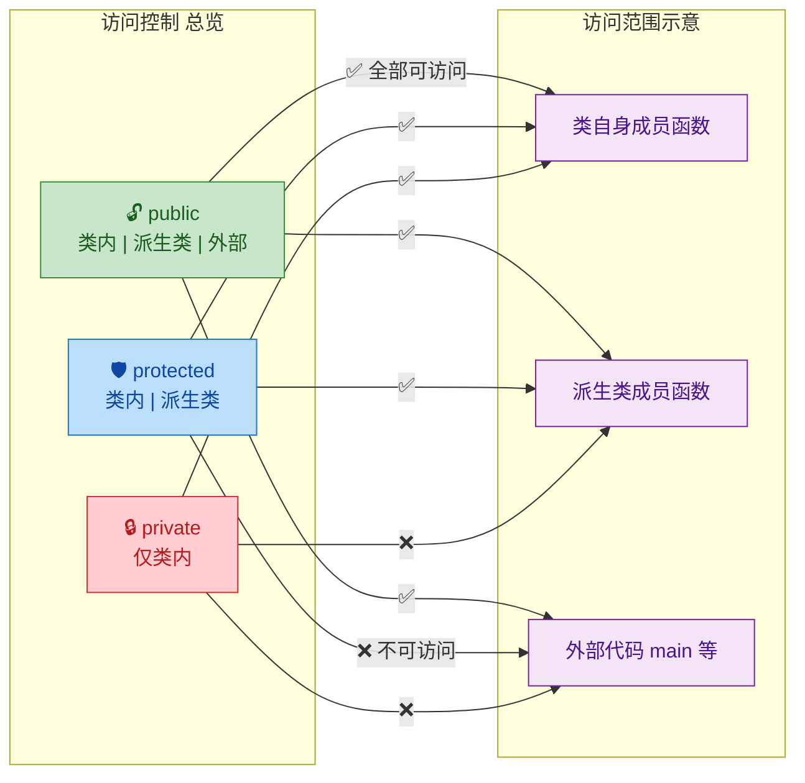

| 访问级别 | 类自身 (Self) | 友元 (Friend) | 派生类 (Derived) | 外部 (External) |
|:---:|:---:|:---:|:---:|:---:|
| **`public`** | ✅ | ✅ | ✅ | ✅ |
| **`protected`** | ✅ | ✅ | ✅ | ❌ |
| **`private`** | ✅ | ✅ | ❌ | ❌ |

> 注意 **友元（friend）** 的特殊性：无论是 `private` 还是 `protected`，`friend` 函数/类都能无视访问限制。友元是"开后门"机制，应极度慎用。

---

### 访问控制与封装的实战模式

#### 1. Getter / Setter 模式

这是最经典的封装模式。数据用 `private` 藏起来，通过 `public` 函数暴露受控的读写接口：

```cpp
class Student {
public:
    // Getter：只读访问，用 const 修饰
    const std::string& getName() const {
        return name_;                    // 返回常引用，避免拷贝开销
    }

    // Setter：写入时可以加入校验逻辑
    void setAge(int age) {
        if (age >= 0 && age <= 150) {    // 校验：年龄必须合理
            age_ = age;                  // 通过校验后才真正赋值
        }
        // 不合理的值直接忽略（也可抛异常）
    }

    int getAge() const {
        return age_;                     // 返回年龄的只读副本
    }

private:
    std::string name_ = "Unknown";      // 姓名：外部不可直接修改
    int age_ = 0;                        // 年龄：外部不可直接修改
};
```

**为什么不直接用 `public` 变量？** 因为一旦你把 `age_` 设为 `public`，就永远无法在赋值时插入校验逻辑 —— 除非修改所有调用点，这在大型项目中是灾难性的。

#### 2. 不可变类（Immutable Class）

如果数据在构造后永远不变，可以只提供 Getter 而不提供 Setter：

```cpp
class ImmutablePoint {
public:
    // 构造时一次性设定所有数据
    ImmutablePoint(double x, double y) : x_(x), y_(y) {}

    double getX() const { return x_; }  // 只读
    double getY() const { return y_; }  // 只读
    // 没有 setX / setY —— 构造后不可修改

private:
    const double x_;                    // const 成员：双重保险
    const double y_;
};
```

不可变对象天然线程安全（Thread-Safe），在并发编程中极有价值。

#### 3. 接口与实现分离（Pimpl Idiom 的思想前导）

`private` 的终极应用是将实现完全隔离。即使在头文件中，`private` 成员虽然"不可访问"，却仍然"可见" —— 外部代码虽然不能用它们，但修改它们仍会导致依赖该头文件的所有翻译单元重新编译。后续高级章节会讲到的 **Pimpl（Pointer to Implementation）** 模式就是为了解决这一问题。

---

### 访问控制的常见误区

**误区一："protected 比 private 更灵活，所以应多用 protected"**

错。`protected` 意味着你对所有可能的派生类做出了承诺 —— 这些成员的名称、类型、语义都不能轻易改变。这大大降低了重构的自由度。**优先使用 `private`，只有在派生类确实需要直接访问时才考虑 `protected`**。

**误区二："访问控制等于安全机制"**

访问控制是 **编译期** 机制，是给 **程序员** 看的约束，而非运行时安全措施。通过指针运算、`reinterpret_cast` 等手段，理论上可以绕过任何访问限制。它的目的是 **防止误用**，而非防止恶意攻击。

**误区三："子类对象可以访问父类对象的 protected 成员"**

这个误区非常隐蔽。派生类只能通过 **自身类型**（或自身的进一步派生类型）的对象访问基类的 `protected` 成员，不能通过一个 **基类类型** 的对象来访问：

```cpp
class Base {
protected:
    int value_ = 10;                         // protected 成员
};

class Derived : public Base {
public:
    void foo(Derived& d, Base& b) {
        value_ = 20;                         // ✅ 合法：访问自身继承来的 protected
        d.value_ = 30;                       // ✅ 合法：通过 Derived 类型访问
        // b.value_ = 40;                    // ❌ 编译错误！通过 Base 类型访问
    }
    // 原因：编译器无法确认 b 实际上是不是 Derived
    // 如果 b 是另一个派生类(如 OtherDerived)的对象，
    // 那 Derived 无权访问 OtherDerived 的 protected 成员
};
```

这条规则来自 C++ 标准 [class.access.base]，其目的是防止一个派生类"越权"访问同级兄弟类的受保护数据。

---

### 访问说明符的布局惯例

在实际项目中，类成员的排列顺序也有讲究。**Google C++ Style Guide** 推荐的顺序是：

```cpp
class MyClass {
public:          // 1. 公开接口放最前面 —— 用户最关心的
    // 类型别名 (Type aliases)
    // 构造函数 / 析构函数
    // 公有成员函数
    // 公有静态函数

protected:       // 2. 继承接口次之
    // protected 成员函数
    // protected 数据（尽量避免）

private:         // 3. 内部实现放最后 —— 用户不需要关心
    // 私有辅助函数
    // 私有数据成员
};
```

这种排列方式的逻辑是 **"读者视角优先"**：使用你的类的开发者，首先看到 `public` 接口就能知道怎么用，不需要滚动到 `private` 区域去了解实现。

---

**📝 练习题**

以下代码能否编译通过？如果不能，指出错误所在并解释原因。

```cpp
class Animal {
protected:
    std::string name_ = "Animal";
};

class Dog : public Animal {
public:
    void printName(Animal& a) {
        std::cout << a.name_ << std::endl;   // 第 A 行
    }
    void printOwn() {
        std::cout << name_ << std::endl;      // 第 B 行
    }
};

int main() {
    Dog d;
    Animal a;
    d.printName(a);
    d.printOwn();
    return 0;
}
```

A. 编译通过，正常输出两行 `"Animal"`

B. 第 A 行编译错误：不能通过 `Animal&` 访问 `protected` 成员

C. 第 B 行编译错误：派生类不能访问基类的 `protected` 成员

D. 第 A 行和第 B 行均编译错误


**【答案】** B

**【解析】** 第 B 行完全合法 —— `Dog` 作为 `Animal` 的派生类，可以直接访问自身继承来的 `protected` 成员 `name_`。但第 A 行违反了 C++ 标准中 `protected` 访问的特殊规则：派生类 `Dog` **只能通过 `Dog` 类型（或 `Dog` 的派生类型）的对象** 来访问基类的 `protected` 成员，而不能通过一个 **基类类型 `Animal&`** 的引用来访问。编译器无法在编译期确认参数 `a` 的实际类型是否为 `Dog`（它可能是 `Cat` 或其他 `Animal` 的派生类），因此拒绝这种访问，防止跨派生类的越权操作。修复方式是将参数类型改为 `Dog&`，或在 `Animal` 中提供 `public` 的 getter 函数。

---

## 构造函数（Constructors）

构造函数是 C++ 类中一种**极其特殊的成员函数**，它在对象被创建的那一刻自动调用，负责将一块"原始的、未初始化的内存"塑造成一个**合法的、可用的对象**。你可以把它理解为对象的"出生仪式"——没有构造函数的参与，对象就不算真正地"活"过来。

构造函数有几个与普通成员函数截然不同的特征：

- **函数名必须与类名完全相同**。
- **没有返回值类型**，连 `void` 都不写。
- **可以被重载**（Overload），一个类可以拥有多个构造函数。
- **由编译器在对象创建时自动调用**，程序员不能手动像普通函数那样 `obj.ClassName()` 调用它（placement new 等高级场景除外）。

构造函数的核心使命只有一个：**确保对象在诞生之初就处于一个有效（valid）且一致（consistent）的状态**。如果成员变量未被初始化，程序可能读到垃圾值（garbage value），这是 C++ 中最常见的 bug 来源之一。

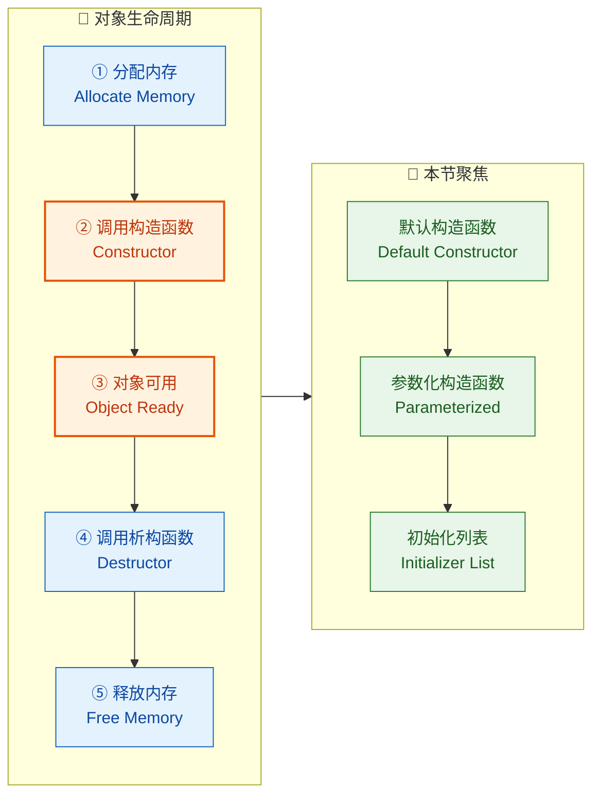

---

### 默认构造函数（Default Constructor）

默认构造函数是指**不需要传入任何实参就能调用的构造函数**。它通常有两种形态：一种是**无参数**的构造函数；另一种是**所有参数都有默认值**的构造函数。两者在调用时的效果一样——不传任何东西，对象就能被创建。

#### 编译器隐式生成的默认构造函数

当你**没有在类中声明任何构造函数**时，编译器会自动为你合成一个默认构造函数（Implicitly-declared default constructor）。但请注意，这个合成版本的行为可能会让你大吃一惊：

```cpp
class Point {
public:
    int x;  // 成员变量：x 坐标
    int y;  // 成员变量：y 坐标
    // 没有写任何构造函数
    // 编译器会隐式生成: Point() {}
};

int main() {
    Point p;              // 调用编译器生成的默认构造函数
    std::cout << p.x;     // ⚠️ 未定义行为！x 是垃圾值（garbage value）
    return 0;
}
```

编译器合成的默认构造函数对**内置类型**（int、double、指针等）的成员变量**不做任何初始化**。这意味着 `p.x` 和 `p.y` 的值是内存中残留的随机数据。只有**类类型**（class type）的成员才会被调用其自身的默认构造函数来初始化。

这是 C++ 从 C 语言继承来的哲学：**你不用的东西，就不为它付出代价**（You don't pay for what you don't use）。初始化有运行时开销，所以语言选择把主动权交给程序员。

#### 用户定义的默认构造函数

更推荐的做法是自己写一个默认构造函数，把所有成员都初始化到已知的安全值：

```cpp
class Point {
public:
    int x;  // x 坐标
    int y;  // y 坐标

    // 用户定义的默认构造函数（无参数）
    Point() {
        x = 0;  // 将 x 初始化为 0
        y = 0;  // 将 y 初始化为 0
    }
};

int main() {
    Point p;              // 调用用户定义的默认构造函数
    std::cout << p.x;     // ✅ 安全，输出 0
    return 0;
}
```

#### `= default` 与 `= delete`（C++11）

C++11 引入了两个强大的关键字来精确控制构造函数的生成：

```cpp
class Widget {
public:
    // 显式要求编译器生成默认构造函数
    // 即使类中存在其他构造函数，也能保留默认版本
    Widget() = default;

    // 参数化构造函数
    Widget(int val) : value(val) {}

private:
    int value;  // 成员变量
};

class NonCopyable {
public:
    NonCopyable() = default;                          // 允许默认构造
    NonCopyable(const NonCopyable&) = delete;         // 禁止拷贝构造
    NonCopyable& operator=(const NonCopyable&) = delete; // 禁止拷贝赋值
};
```

`= default` 的意义在于**显式的意图表达**（explicit intent）。当你在类中定义了一个参数化构造函数后，编译器就**不再自动生成**默认构造函数。此时如果你仍然需要无参构造的能力，就必须用 `= default` 显式要求编译器帮你生成。

`= delete` 则是**彻底禁止**某个函数的调用。任何尝试调用被 `delete` 的函数都会导致编译错误。这比 C++03 时代把函数声明为 `private` 且不提供实现的 trick 优雅得多。

#### 重要规则：构造函数的抑制效应

这是初学者最容易踩的坑之一：

```cpp
class Foo {
public:
    Foo(int x) {}   // 只定义了参数化构造函数
};

int main() {
    Foo f1(42);   // ✅ 正常：匹配参数化构造函数
    Foo f2;       // ❌ 编译错误！没有默认构造函数可用
    return 0;
}
```

**一旦你手动声明了任何构造函数，编译器就不再隐式生成默认构造函数。** 这是 C++ 的一条铁律。编译器的逻辑是："你既然已经操心构造函数的事了，说明你知道自己在做什么，我就不插手了。"

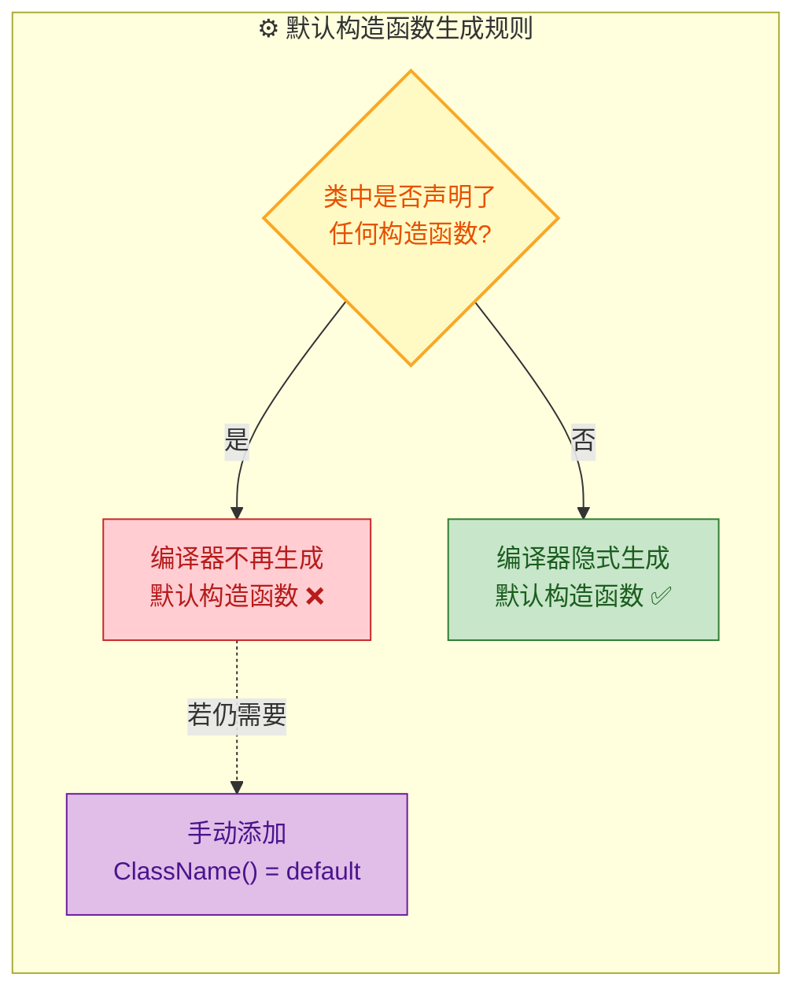

---

### 参数化构造函数（Parameterized Constructor）

参数化构造函数允许在创建对象时**通过实参传入初始值**，这是最常用的构造方式。它使得对象的初始状态可以被外部灵活控制，而不是永远从相同的默认值开始。

#### 基本形式

```cpp
class Rectangle {
public:
    double width;   // 矩形的宽
    double height;  // 矩形的高

    // 参数化构造函数：接收宽和高作为参数
    Rectangle(double w, double h) {
        width = w;    // 用传入的 w 初始化 width
        height = h;   // 用传入的 h 初始化 height
    }

    // 计算面积的成员函数
    double area() const {
        return width * height;  // 返回宽 × 高
    }
};

int main() {
    Rectangle r1(3.0, 4.0);    // 直接初始化（Direct initialization）
    Rectangle r2 = {5.0, 6.0}; // 列表初始化（C++11 List initialization）
    Rectangle r3{7.0, 8.0};    // 列表初始化（不带等号的简洁形式）

    std::cout << r1.area();     // 输出 12
    return 0;
}
```

上面展示了三种调用参数化构造函数的语法。C++11 之后，推荐使用**花括号 `{}`** 的列表初始化形式，因为它能防止窄化转换（narrowing conversion）：

```cpp
Rectangle r4(3.5, 7);      // ✅ int 7 隐式转换为 double 7.0，允许
Rectangle r5{3.5, 7};      // ✅ 同上，允许（int → double 是扩展，不是窄化）

int a = 3.14;               // ⚠️ 窄化转换，编译器可能只给 warning
// int b{3.14};             // ❌ 编译错误！花括号禁止窄化转换
```

#### 构造函数重载（Overloading）

一个类可以拥有多个构造函数，通过不同的**参数列表**（参数数量或类型不同）来区分。编译器会根据你传入的实参自动选择最匹配的版本，这就是**重载决议**（Overload Resolution）：

```cpp
class Color {
public:
    int r, g, b;    // RGB 三通道
    float alpha;    // 透明度

    // 版本1：无参数 → 默认白色不透明
    Color() {
        r = 255;            // 红色通道最大值
        g = 255;            // 绿色通道最大值
        b = 255;            // 蓝色通道最大值
        alpha = 1.0f;       // 完全不透明
    }

    // 版本2：三参数 → 指定 RGB，透明度默认为 1.0
    Color(int red, int green, int blue) {
        r = red;            // 设置红色通道
        g = green;          // 设置绿色通道
        b = blue;           // 设置蓝色通道
        alpha = 1.0f;       // 透明度默认不透明
    }

    // 版本3：四参数 → 指定 RGB + 透明度
    Color(int red, int green, int blue, float a) {
        r = red;            // 设置红色通道
        g = green;          // 设置绿色通道
        b = blue;           // 设置蓝色通道
        alpha = a;          // 设置透明度
    }
};

int main() {
    Color white;                    // 调用版本1
    Color red(255, 0, 0);          // 调用版本2
    Color semiBlue(0, 0, 255, 0.5f); // 调用版本3
    return 0;
}
```

#### 默认参数：减少重载数量

上面 `Color` 类的三个构造函数其实可以用**默认参数**（Default Arguments）合并成一个：

```cpp
class Color {
public:
    int r, g, b;     // RGB 三通道
    float alpha;     // 透明度

    // 一个构造函数通过默认参数覆盖多种使用场景
    Color(int red = 255, int green = 255, int blue = 255, float a = 1.0f)
        : r(red)         // 初始化 r
        , g(green)       // 初始化 g
        , b(blue)        // 初始化 b
        , alpha(a)       // 初始化 alpha
    {}
};

int main() {
    Color white;                       // 全部使用默认值 → (255,255,255,1.0)
    Color red(255, 0, 0);             // 只传3个 → alpha 使用默认值 1.0
    Color semiBlue(0, 0, 255, 0.5f);  // 全部自定义
    return 0;
}
```

> ⚠️ **注意歧义陷阱**：如果你同时有 `Color()` 和 `Color(int r = 255, ...)` 两个版本，当调用 `Color white;` 时，编译器无法决定该调用哪一个，会报**二义性错误**（ambiguity error）。使用默认参数时要确保不会与其他构造函数冲突。

#### `explicit` 关键字：防止隐式转换

当构造函数**只接受一个参数**（或除第一个参数外其余都有默认值）时，它可以被编译器用作**隐式类型转换**的途径。这种行为有时会导致意想不到的 bug：

```cpp
class Meter {
public:
    double value;  // 长度值（米）

    // 单参数构造函数 → 可作为隐式转换函数
    Meter(double v) : value(v) {}
};

void printLength(Meter m) {
    std::cout << m.value << " meters" << std::endl;
}

int main() {
    printLength(3.14);  // 😱 编译通过！double 被隐式转换为 Meter
    // 等价于: printLength(Meter(3.14));
    return 0;
}
```

一个裸 `double` 值 `3.14` 被悄无声息地转换成了 `Meter` 对象，这可能不是程序员的本意。用 `explicit` 关键字可以阻止这种隐式转换：

```cpp
class Meter {
public:
    double value;  // 长度值（米）

    // explicit 阻止隐式转换
    explicit Meter(double v) : value(v) {}
};

void printLength(Meter m) {
    std::cout << m.value << " meters" << std::endl;
}

int main() {
    // printLength(3.14);          // ❌ 编译错误！不允许隐式转换
    printLength(Meter(3.14));      // ✅ 显式构造，意图清晰
    return 0;
}
```

**经验法则**：除非你确实希望类型之间能自然隐式转换（如 `std::string` 接受 `const char*`），否则**所有单参数构造函数都应标记为 `explicit`**。这是 C++ Core Guidelines 中的推荐做法（C.46: By default, declare single-argument constructors explicit）。

---

### 初始化列表（Member Initializer List）

初始化列表是构造函数中一个**极其重要但常被忽视**的特性。它出现在构造函数参数列表的右括号 `)` 之后、函数体 `{` 之前，以冒号 `:` 开头，各初始化项以逗号分隔。

#### 赋值 vs 初始化：一个根本性的区别

先来看一个最关键的概念区分——**在构造函数体内赋值**与**在初始化列表中初始化**是两件截然不同的事：

```cpp
class Student {
public:
    std::string name;  // 姓名
    int age;           // 年龄

    // 方式一：函数体内赋值（Assignment in body）
    Student(std::string n, int a) {
        // 进入函数体之前，name 已经被默认构造（调用了 string()）
        // 然后这里再用 = 赋值覆盖 → 做了两次工作！
        name = n;   // 赋值操作（operator=）
        age = a;    // 赋值操作
    }

    // 方式二：初始化列表（Member Initializer List）
    Student(std::string n, int a)
        : name(n)   // 直接用 n 构造 name → 只调用一次拷贝构造
        , age(a)     // 直接初始化 age
    {
        // 函数体为空，所有初始化已在列表中完成
    }
};
```

它们的区别可以用下面的内存时间线来理解：

```
方式一（函数体内赋值）的执行过程：
┌─────────────────────────────────────────────────────┐
│ Step 1: 分配内存给 Student 对象                       │
│ Step 2: name 被默认构造 → string() → 空字符串 ""      │  ← 浪费的工作
│ Step 3: age 未初始化（垃圾值）                         │
│ Step 4: 进入构造函数体                                │
│ Step 5: name = n → 调用 string::operator= → 赋新值   │  ← 第二次操作
│ Step 6: age = a → 赋值                               │
└─────────────────────────────────────────────────────┘

方式二（初始化列表）的执行过程：
┌─────────────────────────────────────────────────────┐
│ Step 1: 分配内存给 Student 对象                       │
│ Step 2: name 用 n 直接拷贝构造 → string(n)           │  ← 一步到位
│ Step 3: age 直接初始化为 a                            │
│ Step 4: 进入构造函数体（空）                           │
└─────────────────────────────────────────────────────┘
```

对于 `int` 这样的内置类型，两种方式在性能上几乎没有差别。但对于 `std::string`、`std::vector` 等**类类型**成员来说，方式一多了一次默认构造 + 一次赋值，而方式二只需一次拷贝构造。在大型项目中，这种差异会被放大。

#### 必须使用初始化列表的场景

有三种情况下，你**别无选择**，只能使用初始化列表：

**① `const` 成员变量**

```cpp
class Config {
public:
    const int MAX_SIZE;  // 常量成员：一旦初始化就不能修改

    // ❌ 错误写法：const 变量不能被赋值
    // Config(int size) { MAX_SIZE = size; }  // 编译错误！

    // ✅ 正确写法：在初始化列表中初始化
    Config(int size)
        : MAX_SIZE(size)     // const 成员必须在这里初始化
    {}
};
```

`const` 成员变量在诞生之后就不可修改。而进入构造函数体时，成员已经"诞生"了（被默认初始化），此时再赋值就是在修改 `const` 变量——这是非法的。

**② 引用成员变量**

```cpp
class Observer {
public:
    int& target;  // 引用成员：必须绑定到某个变量

    // ❌ 引用不能先悬空再绑定
    // Observer(int& t) { target = t; }  // 编译错误！

    // ✅ 引用必须在初始化时绑定
    Observer(int& t)
        : target(t)          // 引用在这里绑定到 t
    {}
};
```

引用（Reference）从语义上就要求在声明时就绑定到一个对象。和 `const` 一样，它不能"先空着，再赋值"。

**③ 没有默认构造函数的类类型成员**

```cpp
class Engine {
public:
    int horsepower;  // 马力

    // Engine 只有参数化构造函数，没有默认构造函数
    Engine(int hp) : horsepower(hp) {}
};

class Car {
public:
    Engine engine;   // 成员类型 Engine 没有默认构造函数

    // ❌ 编译器无法默认构造 engine
    // Car() { engine = Engine(150); }  // 编译错误！

    // ✅ 必须在初始化列表中构造 engine
    Car()
        : engine(150)        // 直接调用 Engine(int) 构造 engine
    {}
};
```

如果成员所属的类没有提供默认构造函数，编译器在进入构造函数体之前无法默认构造这个成员，因此**必须**在初始化列表中显式告诉编译器该如何构造它。

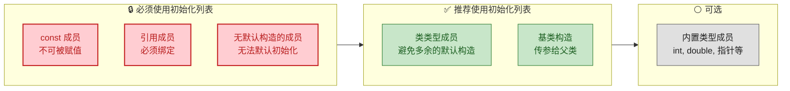

#### 初始化顺序的陷阱 ⚠️

这是 C++ 中一个**臭名昭著的坑**：**成员变量的初始化顺序由它们在类中的声明顺序决定，与初始化列表中的书写顺序无关**。

```cpp
class Trap {
public:
    int a;  // 声明顺序：先 a
    int b;  // 声明顺序：后 b

    // 初始化列表的书写顺序：先 b 后 a
    // 但实际执行顺序仍然是：先 a 后 b（按声明顺序）
    Trap(int val)
        : b(val)         // 虽然写在前面，但实际第二个执行
        , a(b)           // 虽然写在后面，但实际第一个执行
    {                    // ⚠️ 此时 b 还未初始化！a 得到的是垃圾值！
    }
};
```

上面的代码中，程序员可能期望 `b` 先被 `val` 初始化，然后 `a` 拿到 `b` 的值。但实际上 `a` 在类中声明得更早，所以它先被初始化。此时 `b` 还没被初始化，`a(b)` 读取的是垃圾值——**未定义行为（Undefined Behavior）**！

**最佳实践**：**永远让初始化列表的书写顺序与成员变量的声明顺序保持一致。** 开启编译器的 `-Wreorder` 警告（GCC/Clang 默认开启），它会帮你检测顺序不匹配的问题。

#### 类内成员初始化器（In-class Member Initializer，C++11）

C++11 允许你在**声明成员变量时直接给出默认值**，这叫做 NSDMI（Non-Static Data Member Initializer）：

```cpp
class GameCharacter {
public:
    std::string name = "Unknown";   // 类内默认值
    int health = 100;                // 类内默认值
    int level = 1;                   // 类内默认值
    bool isAlive = true;             // 类内默认值

    // 默认构造函数：什么都不用写，成员会使用类内默认值
    GameCharacter() = default;

    // 参数化构造函数：初始化列表中的值会覆盖类内默认值
    GameCharacter(std::string n, int hp, int lv)
        : name(std::move(n))  // 覆盖默认值 "Unknown"
        , health(hp)          // 覆盖默认值 100
        , level(lv)           // 覆盖默认值 1
        // isAlive 没有出现在列表中 → 使用类内默认值 true
    {}
};
```

类内默认值和初始化列表的优先级关系是：**初始化列表 > 类内默认值 > 编译器默认行为**。如果初始化列表中指定了某成员的值，类内默认值就被忽略；如果初始化列表没提到某个成员，则使用类内默认值；如果连类内默认值都没有，对内置类型就不做初始化（垃圾值），对类类型则调用默认构造函数。

#### 综合示例：一个完整的类

将本节所有知识融合在一起：

```cpp
#include <iostream>   // 标准输入输出
#include <string>     // std::string
#include <utility>    // std::move

class BankAccount {
public:
    // ─── 类内默认值（C++11 NSDMI）───
    std::string owner = "Anonymous";  // 账户持有人
    double balance = 0.0;             // 余额
    const int id;                     // 账户 ID（const，必须初始化列表）
    bool isActive = true;             // 账户状态

    // ─── 默认构造函数 ───
    // id 是 const，必须在初始化列表中给值
    BankAccount()
        : id(0)                       // const 成员在此初始化
    {
        // owner, balance, isActive 使用类内默认值
        std::cout << "Default account created." << std::endl;
    }

    // ─── 参数化构造函数 ───
    explicit BankAccount(int accountId, std::string name, double initialBalance)
        : owner(std::move(name))      // 移动构造 string，高效
        , balance(initialBalance)     // 初始化余额
        , id(accountId)               // 初始化 const 成员
        // isActive 未出现 → 使用类内默认值 true
    {
        // 可以在函数体中做额外的验证逻辑
        if (balance < 0.0) {          // 如果初始余额为负数
            balance = 0.0;            // 修正为 0
            std::cout << "Warning: negative balance corrected to 0." << std::endl;
        }
    }

    // ─── 成员函数 ───
    void display() const {
        std::cout << "[ID: " << id            // 输出账户 ID
                  << "] " << owner            // 输出持有人
                  << " | Balance: $" << balance  // 输出余额
                  << " | Active: " << std::boolalpha << isActive  // 输出状态
                  << std::endl;
    }
};

int main() {
    BankAccount defaultAcc;                              // 调用默认构造函数
    BankAccount myAcc(1001, "Alice", 5000.0);            // 调用参数化构造函数
    BankAccount badAcc(1002, "Bob", -100.0);             // 触发余额修正

    defaultAcc.display();  // [ID: 0] Anonymous | Balance: $0 | Active: true
    myAcc.display();       // [ID: 1001] Alice | Balance: $5000 | Active: true
    badAcc.display();      // [ID: 1002] Bob | Balance: $0 | Active: true

    return 0;
}
```

---

### 委托构造函数（Delegating Constructor，C++11）

当多个构造函数之间存在**重复的初始化逻辑**时，C++11 提供了委托构造函数来消除冗余。一个构造函数可以在其初始化列表中**调用同一个类的另一个构造函数**：

```cpp
class Logger {
public:
    std::string tag;       // 日志标签
    int level;             // 日志级别
    bool enabled;          // 是否启用

    // "主"构造函数：包含完整的初始化逻辑
    Logger(std::string t, int lv, bool en)
        : tag(std::move(t))   // 初始化标签
        , level(lv)           // 初始化级别
        , enabled(en)         // 初始化启用状态
    {
        std::cout << "Logger [" << tag << "] initialized." << std::endl;
    }

    // 委托构造函数：两个参数的版本，默认 enabled = true
    Logger(std::string t, int lv)
        : Logger(std::move(t), lv, true)   // 委托给三参数版本
    {
        // 注意：此处函数体在被委托构造函数体之后执行
    }

    // 委托构造函数：无参版本
    Logger()
        : Logger("DEFAULT", 0)             // 委托给两参数版本（链式委托）
    {}
};

int main() {
    Logger l1;                                // Logger() → Logger(s,i) → Logger(s,i,b)
    Logger l2("Network", 3);                  // Logger(s,i) → Logger(s,i,b)
    Logger l3("Database", 5, false);          // 直接调用三参数版本
    return 0;
}
```

> ⚠️ **重要限制**：委托构造函数的初始化列表中**只能有被委托的构造函数调用**，不能同时初始化其他成员。也就是说，你不能写 `Logger() : Logger("DEFAULT", 0), enabled(false) {}`——这会编译错误。

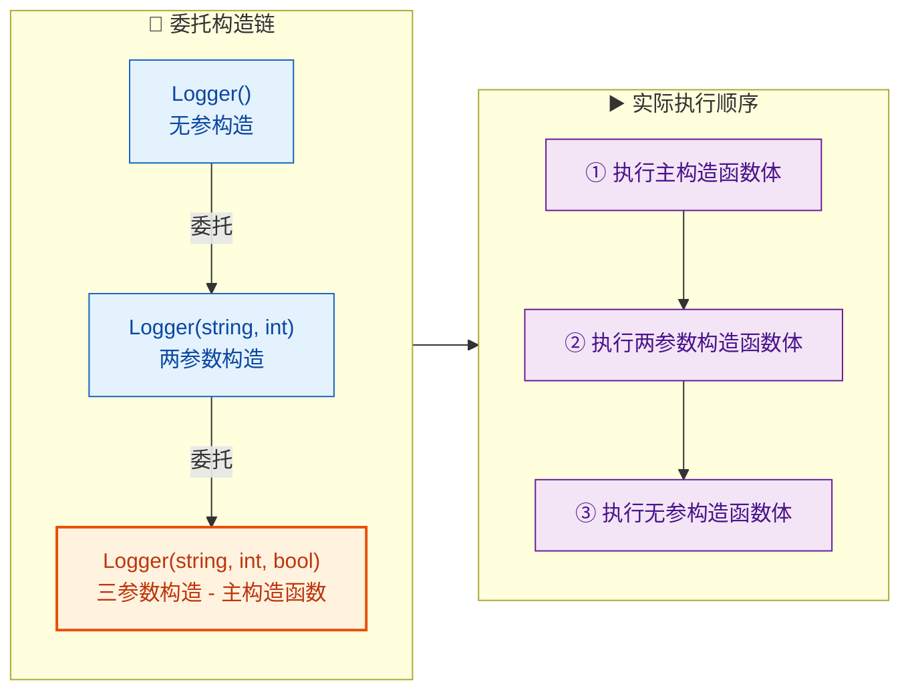

---

### 构造函数与继承

在有继承关系时，构造函数的调用遵循**从基类到派生类**的顺序。派生类的构造函数必须负责告知基类如何构造自己，这通过初始化列表完成：

```cpp
class Animal {
public:
    std::string species;   // 物种名

    // 基类的参数化构造函数
    Animal(std::string s)
        : species(std::move(s))    // 初始化物种名
    {
        std::cout << "Animal(" << species << ") constructed." << std::endl;
    }
};

class Dog : public Animal {
public:
    std::string name;      // 狗的名字

    // 派生类构造函数：必须在初始化列表中调用基类构造函数
    Dog(std::string dogName)
        : Animal("Canis lupus familiaris")  // 先构造基类部分
        , name(std::move(dogName))          // 再初始化派生类成员
    {
        std::cout << "Dog(" << name << ") constructed." << std::endl;
    }
};

int main() {
    Dog myDog("Buddy");
    // 输出:
    // Animal(Canis lupus familiaris) constructed.
    // Dog(Buddy) constructed.
    return 0;
}
```

构造顺序严格如下：

```
┌──────────────────────────────────────┐
│    构造 Dog 对象的完整流程             │
│                                      │
│  ① 分配内存（包含 Animal + Dog 部分） │
│  ② 调用 Animal 构造函数（基类先行）   │
│  ③ 初始化 Dog 自身的成员变量          │
│  ④ 执行 Dog 构造函数体               │
│                                      │
│    析构顺序则完全相反：               │
│  ① Dog 析构函数体                    │
│  ② Animal 析构函数体                 │
│  ③ 释放内存                          │
└──────────────────────────────────────┘
```

---

**📝 练习题**

以下代码的输出是什么？

```cpp
#include <iostream>

class X {
public:
    int a;
    int b;

    X(int val) : b(val), a(b) {}
};

int main() {
    X obj(42);
    std::cout << obj.a << " " << obj.b << std::endl;
    return 0;
}
```

A. `42 42`


B. 编译错误，因为 `a(b)` 在 `b(val)` 之前


C. 未定义行为（Undefined Behavior），`a` 的值不可预测，`b` 为 42


D. `0 42`


**【答案】** C

**【解析】** 成员变量的初始化顺序**由声明顺序决定，而非初始化列表的书写顺序**。在类 `X` 中，`a` 先于 `b` 声明，因此 `a` 先被初始化。执行 `a(b)` 时，`b` 尚未被初始化，其值是**未定义的垃圾值**，所以 `a` 获得一个不可预测的值——这属于未定义行为。随后 `b` 才被 `val`（即 42）初始化。最终 `b` 为 42，但 `a` 的值无法确定。编译器通常会对此发出 `-Wreorder` 警告。这正是本节强调的"**初始化列表书写顺序务必与声明顺序一致**"的原因。

---

## 析构函数 ⭐（资源释放、虚析构）

当一个对象的生命周期走向终结——无论是局部变量离开作用域、`delete` 被调用，还是程序正常退出——C++ 都会自动调用一个特殊的成员函数来执行"善后工作"。这个函数就是 **析构函数（Destructor）**。如果说构造函数是对象的"出生仪式"，那么析构函数就是对象的"遗嘱执行人"。它负责在对象销毁前，释放该对象所持有的一切资源，防止 **资源泄漏（Resource Leak）**。

析构函数看似简单——只有一个、不能重载、没有参数——但围绕它的设计决策却深刻影响着程序的正确性与健壮性。尤其是在涉及 **继承（Inheritance）** 的场景下，一个小小的 `virtual` 关键字的缺失，就可能导致灾难性的内存泄漏。这正是析构函数被标记为 ⭐ 重点的原因。

---

### 析构函数的基本语法与特性

析构函数的声明非常简洁：在类名前加上波浪号 `~`，无返回值，无参数。

```cpp
class MyClass {
public:
    MyClass() {                        // 构造函数：对象诞生时调用
        std::cout << "构造" << std::endl;
    }
    ~MyClass() {                       // 析构函数：对象销毁时调用
        std::cout << "析构" << std::endl;
    }
};
```

析构函数有几条铁律，必须牢记：

| 特性 | 说明 |
|------|------|
| **名称** | `~ClassName()`，波浪号 + 类名 |
| **参数** | 不接受任何参数（因此也不能被重载） |
| **数量** | 每个类 **有且仅有一个** 析构函数 |
| **返回值** | 无（连 `void` 都不写） |
| **自动生成** | 若未显式定义，编译器会生成一个 **默认析构函数（Default Destructor）** |
| **调用时机** | 对象生命周期结束时 **自动调用**，极少需要手动调用 |

编译器自动生成的默认析构函数，其函数体为空——它什么额外的事情都不做。对于只包含基本类型（`int`、`double` 等）或自身拥有正确析构函数的成员的类来说，默认析构函数完全够用。但一旦你的类手动管理了资源（如 `new` 出来的堆内存、打开的文件句柄、网络连接等），你就 **必须** 自己编写析构函数。

---

### 对象销毁的时机

理解析构函数 **何时被调用**，是理解 C++ 对象生命周期的关键。不同存储类型的对象，其销毁时机各不相同：

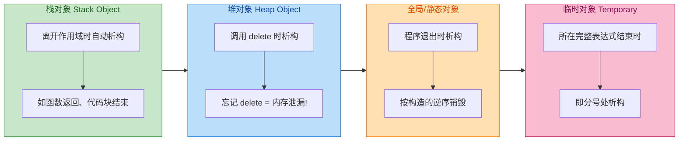

用一段完整的代码来观察这些时机：

```cpp
#include <iostream>
#include <string>

class Tracer {
public:
    std::string name_;                                  // 用于标识当前对象
    Tracer(const std::string& name) : name_(name) {    // 参数化构造，记录名字
        std::cout << "[构造] " << name_ << std::endl;
    }
    ~Tracer() {                                         // 析构时打印，方便追踪
        std::cout << "[析构] " << name_ << std::endl;
    }
};

Tracer global("全局对象");        // 全局对象：程序启动时构造，程序退出时析构

void foo() {
    Tracer local("foo局部对象");  // 栈对象：进入 foo 时构造
    // ... foo 返回时，local 被析构
}

int main() {
    std::cout << "--- main 开始 ---" << std::endl;

    Tracer a("栈对象A");          // 栈对象：声明处构造

    {                              // 花括号开辟一个新的作用域
        Tracer b("栈对象B");      // b 在这个小作用域内有效
    }                              // b 在此处被析构

    foo();                         // 调用 foo，内部 local 在 foo 结束时析构

    Tracer* p = new Tracer("堆对象P");  // 堆对象：new 时构造
    delete p;                            // 必须手动 delete，此处调用析构

    std::cout << "--- main 结束 ---" << std::endl;
    return 0;
    // 栈对象A 在 main 返回后析构
    // 全局对象 最后析构
}
```

预期输出如下：

```
[构造] 全局对象
--- main 开始 ---
[构造] 栈对象A
[构造] 栈对象B
[析构] 栈对象B          ← 离开内层花括号
[构造] foo局部对象
[析构] foo局部对象      ← foo() 返回
[构造] 堆对象P
[析构] 堆对象P          ← delete p
--- main 结束 ---
[析构] 栈对象A          ← main 返回
[析构] 全局对象          ← 程序退出
```

一个极其重要的规则浮现出来：**同一作用域内的对象，析构顺序与构造顺序严格相反**（LIFO，Last In First Out）。这就像叠盘子——最后放上去的盘子要最先拿走。这种"栈式析构"保证了对象之间的依赖关系不会在析构过程中被破坏。

---

### 资源释放：析构函数的核心职责

析构函数最重要的使命，就是 **释放对象所持有的资源**。这里的"资源"不仅仅是内存，还包括一切需要"获取——使用——归还"的系统资源。这正是 C++ 独有的 **RAII（Resource Acquisition Is Initialization）** 思想的核心——在构造函数中获取资源，在析构函数中释放资源，将资源的生命周期与对象的生命周期绑定。

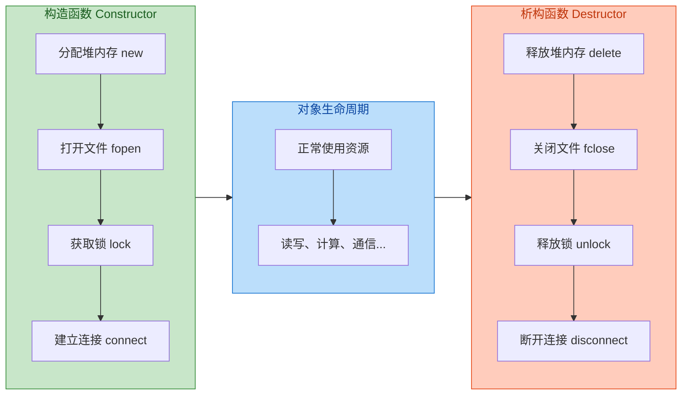

下面是一个手动管理动态数组的经典例子：

```cpp
#include <iostream>
#include <cstring>       // std::strlen, std::strcpy

class SimpleString {
private:
    char* data_;         // 指向堆上字符数组的指针（资源）
    size_t length_;      // 字符串长度

public:
    // 构造函数：获取资源
    SimpleString(const char* str = "") {
        length_ = std::strlen(str);                 // 计算传入字符串的长度
        data_ = new char[length_ + 1];              // 在堆上分配 length+1 个字节（+1 给 '\0'）
        std::strcpy(data_, str);                     // 将内容复制到堆内存中
        std::cout << "  [构造] 分配了 " << (length_ + 1) << " 字节" << std::endl;
    }

    // 析构函数：释放资源
    ~SimpleString() {
        std::cout << "  [析构] 释放 \"" << data_ << "\" 占用的 "
                  << (length_ + 1) << " 字节" << std::endl;
        delete[] data_;   // 释放构造函数中 new[] 分配的数组内存
        data_ = nullptr;  // 良好习惯：释放后置空指针，防止悬空指针（dangling pointer）
    }

    void print() const {
        std::cout << "  内容: \"" << data_ << "\", 长度: " << length_ << std::endl;
    }
};

int main() {
    SimpleString s1("Hello, RAII!");    // 构造时分配内存
    s1.print();                          // 正常使用
    // main 结束时 s1 自动析构 → 堆内存自动释放，无需手动 delete
    return 0;
}
```

内存模型如下：

```cpp
// ======== 栈（Stack） ========        ======== 堆（Heap） ========
//
//  s1:                                   +---+---+---+---+---+---+---+
//  +-----------+                         | H | e | l | l | o | , |   |
//  | data_   ------>  (指向堆)   ------> +---+---+---+---+---+---+---+
//  | length_ = 12 |                      | R | A | I | I | ! |\0 |
//  +-----------+                         +---+---+---+---+---+---+
//
// 当 s1 析构时，delete[] data_ 释放堆上这 13 字节
```

如果没有析构函数（或者忘记写 `delete[]`），`data_` 指向的堆内存在 `s1` 销毁后将永远无法被回收——这就是经典的 **内存泄漏（Memory Leak）**。程序短期运行可能看不出问题，但在长时间运行的服务器程序中，泄漏会像慢性病一样不断蚕食可用内存，直到程序崩溃。

> **黄金法则**：每一个 `new` 都必须有对应的 `delete`；每一个 `new[]` 都必须有对应的 `delete[]`。析构函数是确保这条规则被遵守的最佳场所。

---

### 析构函数中的注意事项

在编写析构函数时，有几个容易踩坑的地方需要特别注意：

**① 析构函数不应抛出异常（Never throw in destructors）**

这是 C++ 社区广泛遵守的铁律。原因在于：当一个异常正在传播的过程中（即栈展开 Stack Unwinding 进行中），如果析构函数再抛出一个新异常，C++ 运行时将调用 `std::terminate()` 直接终止程序。换句话说，析构函数抛异常可能导致程序 **立即崩溃**，连任何补救的机会都没有。

```cpp
~MyClass() noexcept {           // C++11 起，析构函数默认就是 noexcept
    try {
        // 如果清理操作可能失败，在内部 try-catch
        riskyCleanup();
    } catch (...) {
        // 吞掉异常，记录日志即可，绝不让异常逃逸
        std::cerr << "清理失败，但不能抛出异常" << std::endl;
    }
}
```

**② 避免在析构函数中调用虚函数**

在析构过程中，对象的类型会"逐层剥离"——派生类部分先被销毁，然后才轮到基类部分。因此，如果在基类析构函数中调用虚函数，此时派生类已经不存在了，调用的将是基类版本而非派生类版本，这通常不是你期望的行为。

**③ `delete` 后将指针置为 `nullptr`**

虽然对同一个指针 `delete` 两次是未定义行为（Undefined Behavior），但 `delete nullptr` 是安全的（什么都不做）。因此在析构中 `delete` 之后将指针置空是一种防御性编程习惯。

---

### 虚析构函数：多态安全的守护者

这是析构函数最高频的面试考点，也是实战中最容易犯错的地方。

#### 问题的引出

考虑一个经典的继承场景：

```cpp
#include <iostream>

class Base {
public:
    Base() { std::cout << "Base 构造" << std::endl; }
    ~Base() { std::cout << "Base 析构" << std::endl; }   // ⚠️ 非虚析构！
};

class Derived : public Base {
private:
    int* data_;                                           // 派生类持有堆资源
public:
    Derived() : Base(), data_(new int[100]) {             // 构造时分配 400 字节
        std::cout << "Derived 构造，分配了 100 个 int" << std::endl;
    }
    ~Derived() {                                          // 派生类析构释放资源
        delete[] data_;                                   // 释放堆数组
        std::cout << "Derived 析构，释放了 100 个 int" << std::endl;
    }
};

int main() {
    Base* ptr = new Derived();   // 基类指针指向派生类对象（多态的标准用法）
    delete ptr;                   // ⚠️ 通过基类指针 delete
    return 0;
}
```

输出结果将令人心惊：

```
Base 构造
Derived 构造，分配了 100 个 int
Base 析构                        ← 只调用了 Base 的析构！Derived 的析构被跳过了！
```

**灾难发生了**：`Derived` 的析构函数没有被调用，`data_` 指向的 400 字节堆内存永远泄漏了。而且这不仅仅是"泄漏"那么简单——根据 C++ 标准，通过基类指针 `delete` 一个派生类对象，如果基类的析构函数不是虚函数，其行为是 **未定义的（Undefined Behavior）**。

#### 原因分析

`delete ptr` 时，编译器需要决定调用哪个析构函数。由于 `ptr` 的 **静态类型**（编译期类型）是 `Base*`，而析构函数是非虚的，编译器直接按静态类型绑定，调用 `Base::~Base()`。它根本不知道 `ptr` 实际指向的是一个 `Derived` 对象。

这和普通虚函数的道理一模一样——没有 `virtual`，就没有动态绑定（Dynamic Dispatch）。

#### 解决方案：加上 `virtual`

只需将基类析构函数声明为虚函数：

```cpp
class Base {
public:
    Base() { std::cout << "Base 构造" << std::endl; }
    virtual ~Base() {                                   // ✅ 虚析构函数！
        std::cout << "Base 析构" << std::endl;
    }
};

class Derived : public Base {
private:
    int* data_;
public:
    Derived() : Base(), data_(new int[100]) {
        std::cout << "Derived 构造" << std::endl;
    }
    ~Derived() override {                               // override 明确标注重写
        delete[] data_;
        std::cout << "Derived 析构" << std::endl;
    }
};

int main() {
    Base* ptr = new Derived();
    delete ptr;                  // ✅ 现在会正确调用 Derived 的析构函数
    return 0;
}
```

现在输出正确了：

```
Base 构造
Derived 构造
Derived 析构                     ← Derived 的析构被正确调用，资源已释放
Base 析构                        ← 然后自动调用 Base 的析构
```

#### 虚析构的调用链

当 `delete ptr` 时，由于虚函数表（vtable）的动态分派，运行时找到了 `Derived::~Derived()`。执行完 `Derived` 的析构体后，编译器会 **自动** 链式调用基类的析构函数 `Base::~Base()`。你不需要（也不应该）手动调用基类析构。

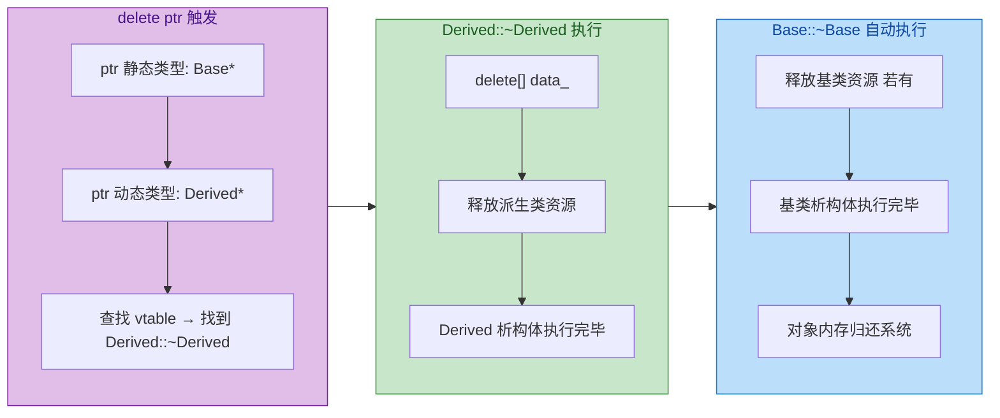

#### 何时需要虚析构函数？

记住这条简洁的规则：

> **如果一个类打算作为基类使用，并且可能通过基类指针/引用来 `delete` 派生类对象，那么它的析构函数就必须是 `virtual` 的。**

反过来说，如果一个类：
- **不打算被继承**（如工具类、值语义类），则不需要虚析构。可以用 C++11 的 `final` 关键字明确禁止继承。
- **不会通过基类指针 delete**（如只在栈上使用），理论上可以不加 `virtual`，但为安全起见，只要有虚函数，就应该加虚析构。

事实上，许多编码规范（如 Google C++ Style Guide、C++ Core Guidelines）都建议：**只要类中有任何一个虚函数，就应该将析构函数声明为 `virtual`。**

#### 纯虚析构函数

C++ 甚至允许将析构函数声明为 **纯虚函数（Pure Virtual）**，使类成为抽象类。但与普通纯虚函数不同的是，纯虚析构函数 **仍然必须提供实现**——因为派生类析构时会自动调用基类析构，没有函数体就会链接报错。

```cpp
class Interface {
public:
    virtual ~Interface() = 0;    // 声明为纯虚析构 → Interface 变成抽象类
};

// 必须在类外提供实现！否则链接器报错（linker error）
Interface::~Interface() {
    std::cout << "Interface 纯虚析构函数体" << std::endl;
}

class Impl : public Interface {
public:
    ~Impl() override {
        std::cout << "Impl 析构" << std::endl;
    }
};

int main() {
    // Interface obj;            // ❌ 编译错误：不能实例化抽象类
    Interface* p = new Impl();   // ✅ 可以通过指针使用
    delete p;                    // Impl 析构 → Interface 析构
    return 0;
}
```

纯虚析构的实际用途比较小众，通常出现在：你想让一个类成为抽象类，但它又没有其他合适的函数可以声明为纯虚函数时。

---

### 虚析构函数的底层机制（vtable 视角）

为了彻底理解虚析构函数的工作原理，我们需要深入到虚函数表（Virtual Table, vtable）的层面。

当一个类声明了 `virtual` 函数后，编译器会为该类生成一张虚函数表，每个含虚函数的对象内部都会有一个隐藏的指针 `vptr` 指向所属类的虚函数表。析构函数一旦声明为 `virtual`，它也会占据 vtable 中的一个槽位（slot）。

```cpp
// ============= 内存布局（简化示意） =============
//
// Base 的 vtable:                   Derived 的 vtable:
// +-----------------------+         +-----------------------+
// | slot 0: ~Base()       |         | slot 0: ~Derived()    |  ← 覆盖了 Base 的析构
// | slot 1: virtualFunc() |         | slot 1: virtualFunc() |
// +-----------------------+         +-----------------------+
//
// 当 Base* ptr = new Derived() 时：
//
// ptr ---> [ vptr | Base成员 | Derived成员 | data_ ]
//             |
//             v
//         Derived 的 vtable
//             |
//             slot 0 → ~Derived()   ← delete ptr 时通过 vptr 找到这里
```

`delete ptr` 时，运行时通过 `ptr` 内部的 `vptr` 找到 `Derived` 的 vtable，从 slot 0 取出 `~Derived()` 的地址并调用。之后编译器插入的隐含代码会继续调用 `~Base()`。整个过程完全自动，无需程序员干预。

这也解释了为什么非虚析构会出问题——如果析构函数不在 vtable 中，编译器就只能按指针的静态类型（`Base*`）直接调用 `Base::~Base()`，完全绕过了动态分派机制。

---

### `default` 与 `delete`：现代析构控制

C++11 引入了 `= default` 和 `= delete` 语法，让你可以更精确地控制析构函数的行为：

```cpp
class DefaultDemo {
public:
    ~DefaultDemo() = default;     // 显式要求编译器生成默认析构函数
    // 等价于不写析构函数，但更具自文档性（self-documenting）
};

class NoCopy {
public:
    ~NoCopy() = delete;           // 禁止析构！对象无法被正常销毁
    // ⚠️ 极端用法：栈对象无法编译，堆对象 delete 也会报错
    // 实际应用非常罕见，几乎不会用到
};
```

`= default` 更常见的用途是配合虚析构：

```cpp
class PolymorphicBase {
public:
    virtual ~PolymorphicBase() = default;   // ✅ 虚析构 + 默认实现，简洁优雅
};
```

这一行声明同时做了三件事：① 使类具有多态性；② 析构函数仍使用编译器默认逻辑；③ 代码意图清晰可读。

---

### 析构顺序总结：从外到内，从派生到基

当一个复杂对象被销毁时，析构的顺序遵循严格的规则，与构造顺序完全相反：

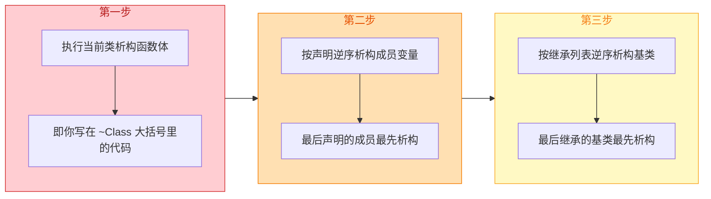

用一个具体例子验证：

```cpp
#include <iostream>

class Member {
    std::string tag_;                                   // 成员标识
public:
    Member(const std::string& t) : tag_(t) {
        std::cout << "  Member(" << tag_ << ") 构造" << std::endl;
    }
    ~Member() {
        std::cout << "  Member(" << tag_ << ") 析构" << std::endl;
    }
};

class GrandBase {
public:
    GrandBase()  { std::cout << "GrandBase 构造" << std::endl; }
    virtual ~GrandBase() { std::cout << "GrandBase 析构" << std::endl; }
};

class Parent : public GrandBase {
    Member m1_{"Parent::m1"};                           // 第一个成员
    Member m2_{"Parent::m2"};                           // 第二个成员
public:
    Parent()  { std::cout << "Parent 构造" << std::endl; }
    ~Parent() override { std::cout << "Parent 析构" << std::endl; }
};

class Child : public Parent {
    Member m3_{"Child::m3"};                            // 派生类的成员
public:
    Child()  { std::cout << "Child 构造" << std::endl; }
    ~Child() override { std::cout << "Child 析构" << std::endl; }
};

int main() {
    std::cout << "===== 构造过程 =====" << std::endl;
    Child c;
    std::cout << "\n===== 析构过程 =====" << std::endl;
    return 0;
}
```

输出：

```
===== 构造过程 =====
GrandBase 构造             ← 最顶层基类先构造
  Member(Parent::m1) 构造  ← Parent 的成员按声明顺序构造
  Member(Parent::m2) 构造
Parent 构造                ← Parent 构造函数体
  Member(Child::m3) 构造   ← Child 的成员
Child 构造                 ← Child 构造函数体

===== 析构过程 =====
Child 析构                 ← 第一步：Child 析构函数体
  Member(Child::m3) 析构   ← 第二步：Child 的成员逆序析构
Parent 析构                ← Parent 析构函数体
  Member(Parent::m2) 析构  ← Parent 的成员逆序析构（先 m2 后 m1）
  Member(Parent::m1) 析构
GrandBase 析构             ← 第三步：最顶层基类最后析构
```

完美的对称——**构造从基到派生，析构从派生到基**。这种对称性是 C++ 对象模型最优美的设计之一。

---

### 实战建议与最佳实践

| 场景 | 建议 |
|------|------|
| 类管理了任何资源（`new`、文件、锁等） | **必须** 编写析构函数释放资源 |
| 类有任何 `virtual` 函数 | 析构函数 **必须** 声明为 `virtual` |
| 类设计为基类 | 析构函数应声明为 `virtual` |
| 类不打算被继承 | 考虑用 `final` 标记类，无需虚析构 |
| 尽量避免手动资源管理 | 优先使用智能指针（`std::unique_ptr`, `std::shared_ptr`）、`std::vector`、`std::string` 等 RAII 容器 |
| 析构函数中可能发生异常 | 在内部 `try-catch`，**绝不让异常逃逸** |

事实上，现代 C++ 的终极建议是：**尽量不要自己写析构函数**。如果你的类成员全部使用智能指针和标准容器，编译器生成的默认析构函数就能正确处理一切。这被称为 **"Rule of Zero"**——如果你不手动管理资源，就不需要自定义析构函数、拷贝构造、拷贝赋值、移动构造、移动赋值中的任何一个。

但当你确实需要手动管理资源时（如实现底层数据结构、封装 C 库资源等），请记住 **"Rule of Five"**：如果你自定义了析构函数、拷贝构造、拷贝赋值、移动构造、移动赋值中的任何一个，你很可能需要自定义所有五个。

---

**📝 练习题**

以下代码的输出是什么？

```cpp
#include <iostream>
class Animal {
public:
    Animal()          { std::cout << "A"; }
    virtual ~Animal() { std::cout << "a"; }
};

class Dog : public Animal {
public:
    Dog()          { std::cout << "D"; }
    ~Dog() override { std::cout << "d"; }
};

class Puppy : public Dog {
public:
    Puppy()          { std::cout << "P"; }
    ~Puppy() override { std::cout << "p"; }
};

int main() {
    Animal* p = new Puppy();
    std::cout << "|";
    delete p;
    return 0;
}
```

A. `ADP|pda`


B. `PDA|adp`


C. `ADP|da`


D. `ADP|p`


**【答案】** A

**【解析】** 构造顺序是从基类到派生类：先 `Animal()` 输出 `A`，再 `Dog()` 输出 `D`，最后 `Puppy()` 输出 `P`，得到 `ADP`。然后输出分隔符 `|`。`delete p` 时，因为 `Animal` 的析构函数是 `virtual` 的，运行时通过 vtable 找到实际类型 `Puppy` 的析构函数。析构顺序与构造严格相反：先执行 `~Puppy()` 输出 `p`，然后自动调用 `~Dog()` 输出 `d`，最后自动调用 `~Animal()` 输出 `a`，得到 `pda`。完整输出为 `ADP|pda`。选项 C 是基类析构非 `virtual` 时可能出现的错误结果（跳过了 `Puppy` 的析构），选项 D 则是只调用了最派生类析构而误以为不会链式调用基类析构的错误理解。

---

**📝 练习题**

以下关于析构函数的说法，**错误** 的是：

A. 纯虚析构函数 `virtual ~Base() = 0;` 使类成为抽象类，但仍需在类外提供函数体实现


B. 如果基类析构函数非虚，通过基类指针 `delete` 派生类对象是未定义行为（UB）


C. 析构函数可以被重载，例如定义一个接受 `int` 参数的析构函数用于调试


D. 同一作用域内多个对象的析构顺序与构造顺序相反（LIFO）


**【答案】** C

**【解析】** 析构函数 **不能被重载**，这是 C++ 语言的硬性规定。析构函数不接受任何参数、没有返回值，每个类有且仅有一个析构函数，因此不存在"多个重载版本"的可能。选项 A 正确：纯虚析构函数确实会使类成为抽象类，但由于派生类析构时会自动链式调用基类析构函数，所以基类的纯虚析构函数必须有实现体，否则链接器会报错。选项 B 正确：C++ 标准明确规定，若基类析构非虚，通过基类指针 `delete` 派生类对象的行为是 undefined behavior。选项 D 正确：这是 C++ 对象模型的基本保证，确保依赖关系不会在析构过程中被破坏。

---

## 拷贝构造与拷贝赋值

在 C++ 的对象生命周期管理中，**拷贝构造函数（Copy Constructor）** 与 **拷贝赋值运算符（Copy Assignment Operator）** 是两块极其关键的拼图。它们共同决定了"当一个对象被复制时，究竟会发生什么"。如果你的类管理了堆内存、文件句柄、网络连接等资源，不正确地处理拷贝将直接导致 **悬空指针（Dangling Pointer）**、**双重释放（Double Free）** 甚至 **内存泄漏（Memory Leak）** 等致命问题。

理解拷贝语义，是从"写能跑的代码"迈向"写正确的、安全的代码"的分水岭。

---

### 拷贝构造函数（Copy Constructor）

拷贝构造函数是一种**特殊的构造函数**，它以**同类型对象的 const 引用**作为参数，用于创建一个新对象，使其成为已有对象的"副本"。其标准签名为：

```cpp
ClassName(const ClassName& other);
```

这里参数**必须是引用**——如果你写成值传递 `ClassName(ClassName other)`，那么传参时本身就需要调用拷贝构造，这将导致**无限递归**，编译器会直接报错。

#### 拷贝构造函数的触发时机

拷贝构造并不只在你显式写 `MyClass b(a);` 时才触发。以下**四种场景**都会调用它：

```cpp
// ========== 场景 1：直接初始化 ==========
MyClass a;           // 默认构造
MyClass b(a);        // 拷贝构造：用 a 初始化 b

// ========== 场景 2：拷贝初始化（= 号初始化） ==========
MyClass c = a;       // 注意！这是拷贝构造，不是赋值！
                     // 因为 c 正在被创建（初始化），不是已存在的对象

// ========== 场景 3：函数参数按值传递 ==========
void process(MyClass obj) {   // obj 是 a 的拷贝
    // ...
}
process(a);          // 调用拷贝构造，将 a 复制到形参 obj

// ========== 场景 4：函数按值返回 ==========
MyClass create() {
    MyClass local;   // 局部对象
    return local;    // 理论上触发拷贝构造（实际中常被 RVO/NRVO 优化掉）
}
```

> **关于 RVO（Return Value Optimization）**：现代编译器在大多数情况下会通过 **命名返回值优化（NRVO）** 直接在调用方的内存空间中构造对象，从而省略拷贝。C++17 起，部分场景下这一优化变成了**强制要求（Mandatory Copy Elision）**，但理解拷贝构造的语义仍然至关重要。

#### 编译器生成的默认拷贝构造

如果你没有手动定义拷贝构造函数，编译器会**隐式合成（Implicitly Synthesized）** 一个。它的行为非常简单——对每个成员变量进行**逐成员拷贝（Member-wise Copy）**：

- 对于基本类型（`int`, `double`, 指针等）：直接按位复制。
- 对于类类型成员：递归调用该成员自身的拷贝构造函数。

对于只包含基本类型或"行为良好"的类类型成员的简单类，默认拷贝构造就够用了。但一旦类中持有**裸指针指向动态分配的资源**，问题就来了。

---

### 浅拷贝与深拷贝（Shallow Copy vs. Deep Copy）

这是拷贝语义中最核心的概念分界线。

**浅拷贝（Shallow Copy）** 只复制指针本身的值（即地址），两个对象最终指向**同一块内存**。**深拷贝（Deep Copy）** 则会分配新的内存，并将原始数据完整地复制一份，两个对象各自拥有**独立的资源**。

我们用一个管理动态数组的类 `IntArray` 来演示这一灾难性的差异：

```cpp
class IntArray {
private:
    int* data_;       // 指向堆上动态数组的裸指针
    size_t size_;     // 数组大小

public:
    // ---------- 参数化构造函数 ----------
    explicit IntArray(size_t size)
        : data_(new int[size]())   // 在堆上分配数组，零初始化
        , size_(size)              // 记录大小
    {}

    // ---------- 析构函数 ----------
    ~IntArray() {
        delete[] data_;            // 释放堆内存
        data_ = nullptr;           // 防止悬空指针（好习惯）
    }

    // ---------- 访问接口 ----------
    int& operator[](size_t index) {       // 下标运算符重载
        return data_[index];              // 返回引用以支持读写
    }

    size_t size() const { return size_; } // 返回数组大小
};
```

如果我们**不手动定义**拷贝构造函数，编译器合成的版本将执行浅拷贝：

```cpp
int main() {
    IntArray a(5);       // a.data_ -> [0, 0, 0, 0, 0]（堆内存块 A）
    a[0] = 42;           // 修改第一个元素

    IntArray b(a);       // 编译器合成的拷贝构造：浅拷贝
                         // b.data_ 现在也指向堆内存块 A！
                         // b.size_ = 5

    b[0] = 99;           // 修改 b 的数据——但 a 的数据也被改了！
    // 此时 a[0] == 99，因为 a 和 b 共享同一块内存

    return 0;            // 灾难发生：a 和 b 的析构函数都会 delete[] 同一块内存
                         // 第二次 delete[] -> 未定义行为（通常是崩溃）
}
```

下面用 Mermaid 图来直观对比浅拷贝与深拷贝的内存布局差异：

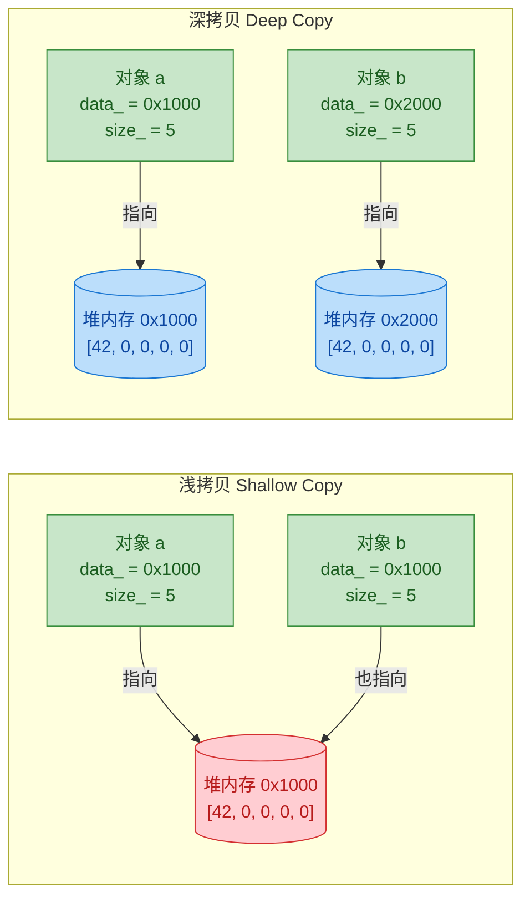

浅拷贝中，堆内存块标红表示危险——它被两个对象共享，析构时将被 double free。

#### 编写正确的深拷贝构造函数

```cpp
class IntArray {
    // ... （成员变量与析构同上）

public:
    // ---------- 深拷贝构造函数 ----------
    IntArray(const IntArray& other)
        : data_(new int[other.size_])   // 关键：分配全新的堆内存
        , size_(other.size_)            // 拷贝大小
    {
        // 将 other 的数据逐元素复制到新内存中
        for (size_t i = 0; i < size_; ++i) {
            data_[i] = other.data_[i];  // 复制每个元素的值
        }
        // 也可以使用 std::copy 或 std::memcpy 替代循环：
        // std::copy(other.data_, other.data_ + size_, data_);
    }
};
```

现在 `IntArray b(a);` 会为 `b` 分配独立的堆内存，并将 `a` 的数据完整复制过去。两个对象的生命周期彼此独立，析构时各自释放各自的内存，完全安全。

---

### 拷贝赋值运算符（Copy Assignment Operator）

拷贝赋值运算符处理的是另一种场景：**当一个已经存在的对象**被另一个同类型对象赋值时调用。其标准签名为：

```cpp
ClassName& operator=(const ClassName& other);
```

返回 `ClassName&`（自身引用）是为了支持**链式赋值**：`a = b = c;`。

#### 拷贝构造 vs 拷贝赋值：关键区别

很多初学者会混淆这两者，但区分标准非常清晰：

| 特征 | 拷贝构造函数 | 拷贝赋值运算符 |
|:---|:---|:---|
| **调用时机** | 对象**正在被创建** | 对象**已经存在** |
| **语法示例** | `MyClass b(a);` 或 `MyClass b = a;` | `b = a;`（b 已存在） |
| **需要释放旧资源？** | 不需要（对象刚创建，没有旧资源） | **需要！**（对象可能已持有资源） |
| **需要检查自赋值？** | 不需要（不可能用自己初始化自己） | **需要！**（`a = a;` 是合法的） |

```cpp
IntArray a(5);       // 默认构造
IntArray b(a);       // 拷贝构造（b 正在被创建）
IntArray c(3);       // 默认构造
c = a;               // 拷贝赋值（c 已经存在，被重新赋值）
```

#### 朴素实现与自赋值陷阱

下面先看一个**有缺陷**的朴素实现：

```cpp
// ❌ 危险的拷贝赋值实现
IntArray& operator=(const IntArray& other) {
    delete[] data_;                      // 先释放自己的旧内存
    data_ = new int[other.size_];        // 分配新内存
    size_ = other.size_;                 // 拷贝大小
    for (size_t i = 0; i < size_; ++i) {
        data_[i] = other.data_[i];       // 拷贝数据
    }
    return *this;                        // 返回自身引用
}
```

这段代码在 `a = b;` 时能正常工作，但遇到 **自赋值 `a = a;`** 时就是灾难：

1. `delete[] data_;` → `a` 的数据被释放
2. `data_ = new int[other.size_];` → 分配新内存，但 `other` 就是 `a` 本身！
3. `data_[i] = other.data_[i];` → 从已被释放的内存中读取 → **未定义行为！**

#### 自赋值检查方案

最直观的修复方式是在开头加一个**自赋值守卫（Self-assignment Guard）**：

```cpp
// ✅ 带自赋值检查的拷贝赋值
IntArray& operator=(const IntArray& other) {
    if (this == &other) {               // 检查：是否在给自己赋值？
        return *this;                    // 如果是，直接返回，什么都不做
    }

    delete[] data_;                      // 释放旧资源
    data_ = new int[other.size_];        // 分配新资源
    size_ = other.size_;                 // 更新大小
    for (size_t i = 0; i < size_; ++i) {
        data_[i] = other.data_[i];       // 深拷贝数据
    }
    return *this;                        // 返回自身引用以支持链式赋值
}
```

这个方案能解决自赋值问题，但还有一个隐患：如果 `new int[other.size_]` 抛出异常（例如内存不足），此时旧的 `data_` 已经被 `delete[]` 了，对象处于一个**无效的中间状态**——这违反了 **异常安全（Exception Safety）** 原则。

---

### Copy-and-Swap 惯用法

**Copy-and-Swap Idiom** 是 C++ 社区公认的编写拷贝赋值运算符的最佳实践。它同时解决了自赋值安全和异常安全两大问题，代码还更加简洁优雅。

其核心思想分三步：

1. **Copy**：利用拷贝构造函数创建一个参数的临时副本。
2. **Swap**：将当前对象的内部状态与临时副本交换。
3. **（自动）Destroy**：临时副本在作用域结束时析构，释放的是当前对象的旧资源。

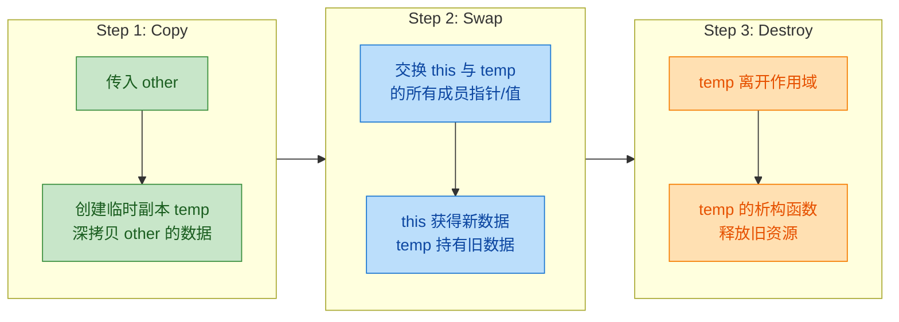

#### 完整实现

```cpp
class IntArray {
private:
    int* data_;
    size_t size_;

public:
    // ---------- 构造函数 ----------
    explicit IntArray(size_t size = 0)
        : data_(size ? new int[size]() : nullptr)  // 条件分配
        , size_(size)
    {}

    // ---------- 析构函数 ----------
    ~IntArray() {
        delete[] data_;            // 释放堆内存（delete nullptr 是安全的）
    }

    // ---------- 深拷贝构造函数 ----------
    IntArray(const IntArray& other)
        : data_(other.size_ ? new int[other.size_] : nullptr)  // 分配新内存
        , size_(other.size_)                                    // 拷贝大小
    {
        std::copy(other.data_, other.data_ + size_, data_);     // 拷贝全部数据
    }

    // ---------- swap 友元函数 ----------
    // 使用 friend 函数而非成员函数，以便支持 ADL（Argument-Dependent Lookup）
    friend void swap(IntArray& first, IntArray& second) noexcept {
        using std::swap;                 // 引入 std::swap 作为候选
        swap(first.data_, second.data_); // 交换指针（极轻量，不抛异常）
        swap(first.size_, second.size_); // 交换大小
    }

    // ---------- 拷贝赋值运算符（Copy-and-Swap） ----------
    IntArray& operator=(IntArray other) {  // ⚠️ 注意：参数是按值传递！
        // 按值传递已经完成了 "Copy" 这一步（调用了拷贝构造函数）
        swap(*this, other);                // "Swap"：交换 this 和 other 的内部状态
        return *this;                      // other 在函数结束时析构，释放旧资源
    }

    // ---------- 下标访问 ----------
    int& operator[](size_t i) { return data_[i]; }
    const int& operator[](size_t i) const { return data_[i]; }
    size_t size() const { return size_; }
};
```

注意 `operator=` 的参数是**按值传递** `IntArray other`，而不是 `const IntArray& other`。这是 Copy-and-Swap 的精髓所在：

- 按值传递时，编译器会自动调用拷贝构造函数来创建 `other`，完成了 "Copy" 步骤。
- 如果传入的是右值（如 `a = IntArray(10);`），编译器会直接调用**移动构造**（如果有定义的话），自动获得移动语义的优化——**一个 `operator=` 同时兼顾拷贝赋值和移动赋值**。

#### 为什么 Copy-and-Swap 能保证异常安全？

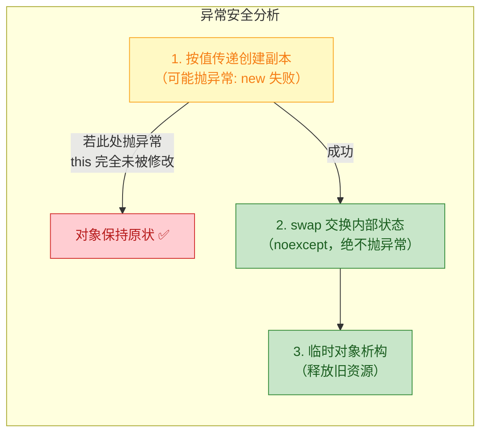

关键在于：**所有可能抛异常的操作（`new` 分配内存）都发生在 `swap` 之前**。如果分配失败，异常在创建临时副本时就被抛出，`*this` 根本没有被修改，仍然保持有效状态。这就提供了**强异常保证（Strong Exception Guarantee）**：操作要么完全成功，要么对象状态完全不变。

---

### Rule of Three（三法则）

C++ 有一条著名的经验法则——**如果你需要手动定义以下三个特殊成员函数中的任何一个，那么你很可能需要同时定义全部三个**：

1. **析构函数（Destructor）**
2. **拷贝构造函数（Copy Constructor）**
3. **拷贝赋值运算符（Copy Assignment Operator）**

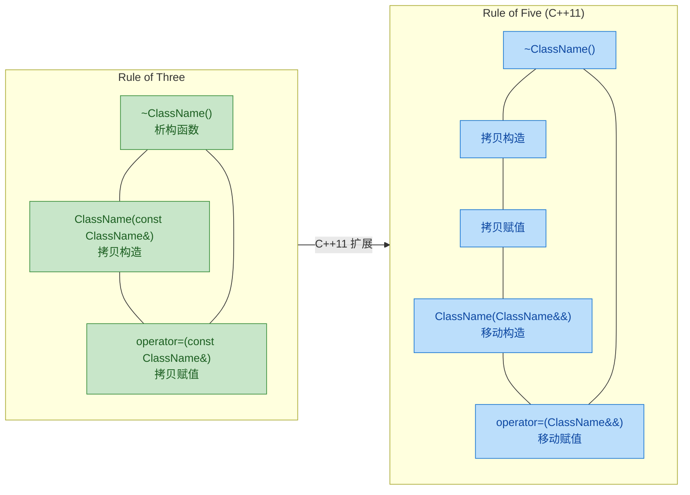

原因很简单：如果你需要自定义析构函数来释放资源，说明你的类管理了某种资源。那么默认的逐成员浅拷贝几乎一定是错误的，你必须同时提供正确的拷贝构造和拷贝赋值。

在 C++11 之后，这条法则扩展为 **Rule of Five（五法则）**，增加了移动构造函数和移动赋值运算符。而现代 C++ 更推崇 **Rule of Zero（零法则）**——尽量使用智能指针（`std::unique_ptr`, `std::shared_ptr`）和标准库容器来管理资源，让编译器合成的默认特殊函数就能正确工作。

---

### 显式控制：`= default` 与 `= delete`

C++11 允许你显式地告诉编译器"使用默认版本"或"禁止这个操作"：

```cpp
class Widget {
public:
    // 显式要求编译器生成默认拷贝构造
    Widget(const Widget&) = default;

    // 显式要求编译器生成默认拷贝赋值
    Widget& operator=(const Widget&) = default;
};

class UniqueResource {
public:
    // 禁止拷贝构造——此类型的对象不可被复制
    UniqueResource(const UniqueResource&) = delete;

    // 禁止拷贝赋值
    UniqueResource& operator=(const UniqueResource&) = delete;

    // 这就是 std::unique_ptr 不能被拷贝的原理！
};
```

```cpp
UniqueResource a;
UniqueResource b(a);     // ❌ 编译错误：use of deleted function
UniqueResource c;
c = a;                   // ❌ 编译错误：use of deleted function
```

`= delete` 不仅仅是"不提供"，而是**主动声明这个操作是被禁止的**。任何试图调用它的代码都会在**编译期**直接报错，这比 C++03 时代把拷贝构造放在 `private` 里的做法更加清晰和安全。

---

### 完整示例：String 类

最后，让我们把本节所有知识融会贯通，手写一个简化版的 `String` 类：

```cpp
#include <cstring>    // strlen, strcpy
#include <algorithm>  // std::swap
#include <iostream>   // std::ostream

class String {
private:
    char* data_;      // 指向堆上字符数组的指针
    size_t length_;   // 字符串长度（不含 '\0'）

public:
    // ========== 构造函数 ==========
    // 从 C 风格字符串构造
    String(const char* str = "")                    // 默认参数为空串
        : length_(std::strlen(str))                 // 计算长度
        , data_(new char[std::strlen(str) + 1])     // 分配 长度+1 的空间（含 '\0'）
    {
        std::strcpy(data_, str);                    // 将字符串内容拷贝到堆内存
    }

    // ========== 析构函数 ==========
    ~String() {
        delete[] data_;                             // 释放字符数组
    }

    // ========== 拷贝构造函数（深拷贝） ==========
    String(const String& other)
        : length_(other.length_)                    // 拷贝长度
        , data_(new char[other.length_ + 1])        // 分配独立的新内存
    {
        std::strcpy(data_, other.data_);            // 深拷贝字符串内容
    }

    // ========== swap 函数 ==========
    friend void swap(String& a, String& b) noexcept {
        using std::swap;                            // 启用 ADL
        swap(a.data_, b.data_);                     // 交换指针
        swap(a.length_, b.length_);                 // 交换长度
    }

    // ========== 拷贝赋值（Copy-and-Swap） ==========
    String& operator=(String other) {               // 按值传递 → 自动拷贝
        swap(*this, other);                         // 交换内部状态
        return *this;                               // other 析构时释放旧资源
    }

    // ========== 工具函数 ==========
    size_t length() const { return length_; }       // 返回长度
    const char* c_str() const { return data_; }     // 返回 C 风格字符串

    // ========== 输出运算符重载 ==========
    friend std::ostream& operator<<(std::ostream& os, const String& s) {
        return os << s.data_;                       // 输出字符串内容
    }
};
```

测试代码与内存行为分析：

```cpp
int main() {
    String s1("Hello");      // 构造：堆上分配 "Hello\0"
    String s2(s1);           // 拷贝构造：堆上独立分配 "Hello\0"

    String s3("World");      // 构造：堆上分配 "World\0"
    s3 = s1;                 // 拷贝赋值（Copy-and-Swap）：
                             //   1. 按值传递 → s1 被拷贝构造到 other
                             //   2. swap(s3, other) → s3 获得 "Hello"，other 获得 "World"
                             //   3. other 析构 → "World" 被释放

    std::cout << s1 << " " << s2 << " " << s3 << std::endl;
    // 输出：Hello Hello Hello

    s1 = s1;                 // 自赋值：
                             //   1. s1 被拷贝构造到 other（独立副本）
                             //   2. swap → 安全交换
                             //   3. other 析构 → 安全
                             // 完全正确，无需特殊检查！

    return 0;                // s1, s2, s3 各自析构，各释放各的堆内存
}
```

```
Hello Hello Hello
```

---

### 本节知识脉络总览

```mermaid
graph LR
    subgraph CoreConcepts["核心概念"]
        direction TB
        CC["拷贝构造函数<br/>创建新对象时复制"]
        CA["拷贝赋值运算符<br/>已有对象被重新赋值"]
    end

    subgraph CopyDepth["拷贝深度"]
        direction TB
        SC["浅拷贝 Shallow<br/>共享资源 - 危险"]
        DC["深拷贝 Deep<br/>独立资源 - 安全"]
    end

    subgraph BestPractice["最佳实践"]
        direction TB
        CS["Copy-and-Swap<br/>异常安全 + 自赋值安全"]
        R3["Rule of Three/Five<br/>特殊函数要么全写要么全不写"]
        R0["Rule of Zero<br/>用智能指针 避免手写"]
    end

    subgraph Control["显式控制"]
        direction TB
        DEF["= default<br/>使用编译器默认版本"]
        DEL["= delete<br/>禁止该操作"]
    end

    CoreConcepts --> CopyDepth
    CopyDepth --> BestPractice
    BestPractice --> Control

    classDef coreStyle fill:#C8E6C9,stroke:#388E3C,color:#1B5E20
    classDef depthStyle fill:#BBDEFB,stroke:#1976D2,color:#0D47A1
    classDef bestStyle fill:#FFE0B2,stroke:#F57C00,color:#E65100
    classDef ctrlStyle fill:#E1BEE7,stroke:#7B1FA2,color:#4A148C

    class CC,CA coreStyle
    class SC,DC depthStyle
    class CS,R3,R0 bestStyle
    class DEF,DEL ctrlStyle
```

---

**📝 练习题**

以下代码中，一共调用了多少次 `MyClass` 的拷贝构造函数？

```cpp
class MyClass { /* 假设已正确定义拷贝构造和拷贝赋值 */ };

MyClass create() {
    MyClass local;
    return local;        // 假设此处 **未发生** RVO/NRVO 优化
}

int main() {
    MyClass a;           // ① 默认构造
    MyClass b(a);        // ② 
    MyClass c = a;       // ③ 
    MyClass d;           // ④ 默认构造
    d = a;               // ⑤ 
    MyClass e = create();// ⑥ create() 内部 return + 外部初始化
    return 0;
}
```

A. 2 次


B. 3 次


C. 4 次


D. 5 次


**【答案】** C

**【解析】**

逐行分析：

- **①** `MyClass a;` → **默认构造**，不是拷贝。
- **②** `MyClass b(a);` → **拷贝构造** ✅（用 `a` 初始化新对象 `b`）。
- **③** `MyClass c = a;` → **拷贝构造** ✅（`=` 出现在声明语句中，这是**拷贝初始化**，不是赋值）。
- **④** `MyClass d;` → **默认构造**。
- **⑤** `d = a;` → **拷贝赋值**（`d` 已经存在，调用的是 `operator=`，**不是**拷贝构造）。
- **⑥** `MyClass e = create();` → 在无 RVO 的假设下：`return local;` 触发一次拷贝构造（从 `local` 到返回值临时对象），`MyClass e = ...` 再触发一次拷贝构造（从临时对象到 `e`）。共 **2 次拷贝构造** ✅。

总计：② + ③ + ⑥（2次） = **4 次**拷贝构造。

> **实际中**，现代编译器几乎一定会对 ⑥ 做 NRVO 优化，将次数降为 2 甚至更少。C++17 起，从纯右值（prvalue）初始化时的拷贝省略是强制的。但理解"无优化时的语义"是面试和笔试的高频考点。

---

## 移动语义 ⭐（右值引用 `&&`、`std::move`）

移动语义（Move Semantics）是 C++11 引入的最具革命性的特性之一。在它出现之前，C++ 中对象的传递几乎都依赖**拷贝**——即使那个源对象即将被销毁，编译器也只能老老实实地深拷贝一份完整的副本，然后再把原来的扔掉。这就好比你搬家时，不是把家具搬上卡车，而是在新家一模一样地造一套新家具，再把旧家具全部烧掉——荒谬且浪费。

移动语义的核心哲学很简单：**如果一个对象即将"死亡"（即是临时对象或被显式标记为可移动），那么我们不复制它的资源，而是直接"偷走"它的内部资源，把它的指针据为己有，然后让原来的对象变成一个安全的空壳。** 这将许多场景下的 O(n) 深拷贝优化为 O(1) 的指针转移。

---

### 值类别：左值与右值的本质区分

要理解移动语义，首先必须精确理解 C++ 的**值类别（Value Categories）**。这是整套机制的理论根基。

在 C++11 之后，表达式的值类别被细化为一棵分类树：

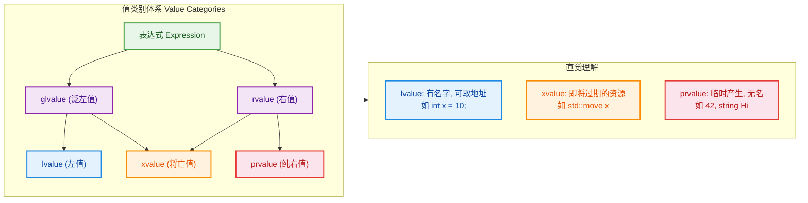

用最简洁的话概括：

- **左值（lvalue）**：有**持久身份**的表达式。它有名字，你可以对它取地址（`&x` 合法）。变量、函数返回的引用、解引用操作 `*ptr` 都是左值。
- **纯右值（prvalue）**：**临时产生**的值。字面量 `42`、表达式 `a + b` 的结果、函数按值返回的临时对象等。它们没有持久地址，用完就消失。
- **将亡值（xvalue）**：这是 C++11 新增的关键类别。它代表一个**资源即将被移走**的对象——典型的来源就是 `std::move(x)` 的返回值，或者返回右值引用的函数调用。

**为什么这套分类如此重要？** 因为编译器根据值类别来决定调用哪个重载：传入左值时调用拷贝构造，传入右值时调用移动构造。整个移动语义的重载决议（Overload Resolution）都建立在这个分类之上。

```cpp
int a = 10;          // a 是左值 (lvalue)：有名字，能取 &a
int b = a + 5;       // (a + 5) 是纯右值 (prvalue)：临时计算结果
int&& r = a + 5;     // r 绑定到纯右值，延长了临时值的生命周期
                      // 但注意: r 本身是一个左值！（它有名字）
int&& m = std::move(a); // std::move(a) 是将亡值 (xvalue)
```

> ⚠️ **极易犯错的关键点**：右值引用变量**本身是左值**。`int&& r = 42;` 中，`42` 是右值，但 `r` 有名字、可取地址，所以 `r` 是左值。如果你把 `r` 传给另一个函数，它会匹配**左值引用**重载，而不是右值引用重载！这是初学者最大的陷阱。

---

### 右值引用 `&&`：绑定到临时对象的能力

C++11 之前只有两种引用：`T&`（左值引用）和 `const T&`（常量左值引用）。`const T&` 可以绑定到右值（这是允许 `void foo(const string& s)` 接受临时字符串的原因），但它是 `const` 的，你无法通过它修改对象内部、偷走资源。

C++11 引入了**右值引用（Rvalue Reference）**`T&&`，它专门用来绑定右值，并且**允许你修改绑定的对象**。这就为"偷资源"打开了大门：

```cpp
// 左值引用：只能绑定左值
int x = 10;             // x 是左值
int& ref = x;           // OK: 左值引用绑定左值
// int& ref2 = 42;      // ERROR: 左值引用无法绑定右值

// const 左值引用：可以绑定左值，也可以绑定右值
const int& cref = x;    // OK: 绑定左值
const int& cref2 = 42;  // OK: 绑定右值（临时值生命期延长）
                         // 但无法通过 cref2 修改值

// 右值引用：只能绑定右值
int&& rref = 42;        // OK: 右值引用绑定纯右值
int&& rref2 = x + 1;    // OK: (x+1) 是纯右值
// int&& rref3 = x;     // ERROR: 右值引用无法绑定左值
int&& rref4 = std::move(x); // OK: std::move 将左值转为将亡值(xvalue)
```

引用类型与值类别的绑定规则可以总结为下表：

| 引用类型 | 绑定左值 | 绑定右值 | 可修改 |
|:---|:---:|:---:|:---:|
| `T&` (左值引用) | ✅ | ❌ | ✅ |
| `const T&` (常量左值引用) | ✅ | ✅ | ❌ |
| `T&&` (右值引用) | ❌ | ✅ | ✅ |
| `const T&&` (常量右值引用) | ❌ | ✅ | ❌ |

其中 `const T&&` 在实践中极少使用，因为它能绑定右值却不能修改，几乎没有应用场景。

---

### 移动构造函数与移动赋值运算符

理解了右值引用，就可以为类编写**移动构造函数（Move Constructor）** 和**移动赋值运算符（Move Assignment Operator）** 了。它们的核心思想完全一致：**从源对象偷走资源，然后把源对象置于一个合法但未定义的空状态（valid but unspecified state）。**

下面以一个管理动态数组的 `MyVector` 类为例，完整展示拷贝 vs 移动的对比：

```cpp
#include <cstring>    // std::memcpy
#include <utility>    // std::move, std::exchange
#include <algorithm>  // std::swap
#include <iostream>

class MyVector {
private:
    int* data_;       // 指向堆上动态数组的指针
    size_t size_;     // 当前元素个数

public:
    // ========== 普通构造函数 ==========
    explicit MyVector(size_t n = 0)
        : data_(n ? new int[n]() : nullptr)  // 分配 n 个 int 并零初始化
        , size_(n)                            // 记录大小
    {
        std::cout << "Constructor: size=" << n << "\n";
    }

    // ========== 析构函数 ==========
    ~MyVector() {
        delete[] data_;   // 释放堆内存（delete nullptr 是安全的）
        std::cout << "Destructor: size=" << size_ << "\n";
    }

    // ========== 拷贝构造函数：深拷贝，O(n) ==========
    MyVector(const MyVector& other)
        : data_(other.size_ ? new int[other.size_] : nullptr) // 分配同等大小的新内存
        , size_(other.size_)                                   // 拷贝大小
    {
        if (data_) {
            std::memcpy(data_, other.data_, size_ * sizeof(int)); // 逐字节复制数据
        }
        std::cout << "Copy Constructor: size=" << size_ << "\n";
    }

    // ========== 拷贝赋值运算符：深拷贝，O(n) ==========
    MyVector& operator=(const MyVector& other) {
        if (this != &other) {                          // 自赋值检查
            delete[] data_;                            // 释放旧资源
            size_ = other.size_;                       // 拷贝大小
            data_ = size_ ? new int[size_] : nullptr;  // 分配新内存
            if (data_) {
                std::memcpy(data_, other.data_, size_ * sizeof(int)); // 复制数据
            }
        }
        std::cout << "Copy Assignment: size=" << size_ << "\n";
        return *this;                                  // 返回自身引用，支持链式赋值
    }

    // ========== 移动构造函数：资源转移，O(1) ==========
    MyVector(MyVector&& other) noexcept        // 参数是右值引用
        : data_(other.data_)                   // 直接偷走指针（不分配新内存！）
        , size_(other.size_)                   // 偷走大小信息
    {
        other.data_ = nullptr;                 // 将源对象的指针置空（防止双重释放）
        other.size_ = 0;                       // 将源对象的大小归零
        std::cout << "Move Constructor: size=" << size_ << "\n";
    }

    // ========== 移动赋值运算符：资源转移，O(1) ==========
    MyVector& operator=(MyVector&& other) noexcept {  // 参数是右值引用
        if (this != &other) {                         // 自赋值检查（虽然罕见但必须防御）
            delete[] data_;                           // 释放当前持有的旧资源

            data_ = other.data_;                      // 偷走源对象的指针
            size_ = other.size_;                      // 偷走大小信息

            other.data_ = nullptr;                    // 将源对象置为安全的空状态
            other.size_ = 0;                          // 大小归零
        }
        std::cout << "Move Assignment: size=" << size_ << "\n";
        return *this;                                 // 返回自身引用
    }

    size_t size() const { return size_; } // 获取大小的访问器
};
```

下面用一张内存图来展示**拷贝 vs 移动**的本质区别：

```
 ┌─────────────────────────── 拷贝构造 (Deep Copy) ───────────────────────────┐
 │                                                                            │
 │   source (other)                     dest (this)                           │
 │  ┌──────────────┐                   ┌──────────────┐                       │
 │  │ data_ ───────┤──┐               │ data_ ───────┤──┐                    │
 │  │ size_ = 4    │  │               │ size_ = 4    │  │                    │
 │  └──────────────┘  │               └──────────────┘  │                    │
 │                     ▼                                 ▼                    │
 │              ┌──┬──┬──┬──┐                     ┌──┬──┬──┬──┐              │
 │   Heap A:    │1 │2 │3 │4 │      Heap B (新):   │1 │2 │3 │4 │ ← 逐个复制  │
 │              └──┴──┴──┴──┘                     └──┴──┴──┴──┘              │
 │   两块独立内存，O(n) 时间 + O(n) 空间                                       │
 └────────────────────────────────────────────────────────────────────────────┘

 ┌─────────────────────────── 移动构造 (Move) ────────────────────────────────┐
 │                                                                            │
 │   source (other) 移动前:             dest (this) 移动后:                    │
 │  ┌──────────────┐                   ┌──────────────┐                       │
 │  │ data_ ─ ─ ─ X│ (置 nullptr)     │ data_ ───────┤──┐                    │
 │  │ size_ = 0    │                   │ size_ = 4    │  │                    │
 │  └──────────────┘                   └──────────────┘  │                    │
 │                                                       ▼                    │
 │                                                ┌──┬──┬──┬──┐              │
 │                                     Heap A:    │1 │2 │3 │4 │ ← 同一块内存  │
 │                                                └──┴──┴──┴──┘              │
 │   零拷贝！只转移指针，O(1) 时间 + O(1) 空间                                  │
 └────────────────────────────────────────────────────────────────────────────┘
```

来看实际调用效果：

```cpp
int main() {
    MyVector v1(1000000);            // Constructor: 分配 100 万个 int

    MyVector v2(v1);                 // Copy Constructor: 深拷贝 100 万个 int → O(n)
    MyVector v3(std::move(v1));      // Move Constructor: 偷指针 → O(1)，v1 变为空壳

    std::cout << "v1.size()=" << v1.size() << "\n";  // 输出 0，v1 已被移走
    std::cout << "v3.size()=" << v3.size() << "\n";  // 输出 1000000

    MyVector v4(500);               // Constructor
    v4 = std::move(v3);             // Move Assignment: v4 释放旧资源，偷走 v3 的资源

    return 0;
}
```

---

### `noexcept`：移动语义的性能守门员

你可能注意到移动构造和移动赋值都标注了 **`noexcept`**。这不是装饰——**它是移动语义发挥性能优势的关键条件**。

原因在于 STL 容器（如 `std::vector`）在扩容（reallocation）时需要把旧元素搬到新内存。如果搬到一半抛出异常，已经搬过去的元素和还没搬的元素都处于混乱状态，强异常安全保证（Strong Exception Guarantee）就被破坏了。

- 如果移动构造是 `noexcept` 的，`vector` 放心使用移动——因为保证不会抛异常，搬运过程要么全成功要么不开始。
- 如果移动构造**没有** `noexcept`，`vector` 会退而求其次使用**拷贝构造**——虽然慢，但拷贝失败不会影响源对象，异常安全性有保障。

```cpp
// 标准库使用 std::move_if_noexcept 来决策
// 伪代码逻辑：
template <typename T>
void vector<T>::reallocate() {
    // 如果 T 的移动构造是 noexcept → 用 std::move 搬运（快！）
    // 如果 T 的移动构造可能抛异常 → 用拷贝搬运（慢但安全）
}
```

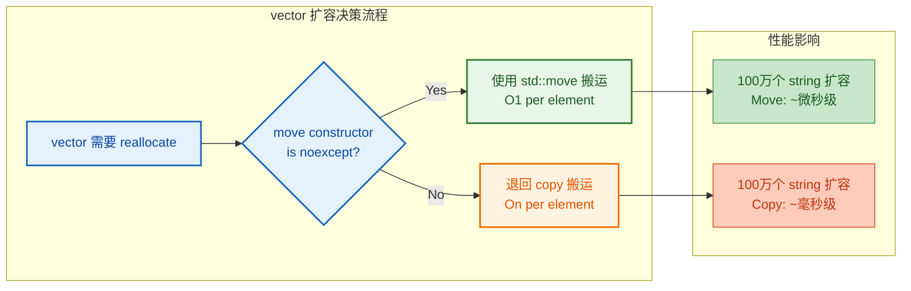

**规则：永远为你的移动构造函数和移动赋值运算符加上 `noexcept`，除非它们确实可能抛异常。**

---

### `std::move`：它什么都没"移动"

`std::move` 是移动语义中最容易被误解的函数。**它并不执行任何移动操作。** 它的全部工作就是一个**无条件的类型转换（unconditional cast）**，将参数从左值转换为右值引用（xvalue），从而使其能匹配移动构造/移动赋值的重载。

来看它的实际实现（简化版）：

```cpp
// std::move 的简化实现 —— 本质上就是一个 static_cast
template <typename T>
typename std::remove_reference<T>::type&& move(T&& arg) noexcept {
    // 移除 T 上可能存在的引用修饰，然后转为右值引用
    return static_cast<typename std::remove_reference<T>::type&&>(arg);
}

// 使用示例
std::string s = "hello";
// std::move(s) 只是把 s 的类型从 string& 转换成 string&&
// 真正的资源转移发生在 string 的移动构造函数里
std::string s2 = std::move(s);  // 调用 string(string&&)
```

这意味着：

1. **`std::move` 之后，源对象并没有立刻被清空。** 资源转移发生在接收端（移动构造/移动赋值）被调用时。
2. **如果没有人接收这个右值引用，什么都不会发生。**

```cpp
std::string s = "hello";
std::move(s);                  // 这一行什么都没做！没有接收者
std::cout << s << std::endl;   // 输出 "hello"，s 完好无损

std::string s2 = std::move(s); // 现在才真正发生移动
// s 现在处于 valid but unspecified state
```

> 🎯 **更好的命名**：Bjarne Stroustrup 和 Scott Meyers 都曾指出，`std::move` 应该叫 `std::rvalue_cast` 更准确，因为它只做类型转换，不做任何移动。但为时已晚，名字已定。

---

### 移动后的对象状态

C++ 标准对被移动后的对象只做一个保证：**它处于一个合法但未指定的状态（valid but unspecified state）**。这意味着：

- ✅ 你可以**安全地析构**它。
- ✅ 你可以**赋予它新值**（重新使用）。
- ⚠️ 你**不应该假设**它的值是什么（可能是空的，也可能不是）。
- ❌ 在没有重新赋值的情况下**不应该读取**它的内容。

```cpp
std::string a = "C++ is powerful";
std::string b = std::move(a);         // a 被移动

// a 现在处于 valid but unspecified state
// 以下操作是安全的：
a = "new value";                       // ✅ 重新赋值
a.clear();                             // ✅ 调用成员函数使其回到已知状态
std::cout << a.size() << std::endl;    // ⚠️ 技术上合法，但值不可预测

// 标准库的 string 实现通常会让被移动后的 string 变为空串
// 但不应依赖这个行为，因为标准没有保证
```

---

### 移动语义的实战场景

#### 场景一：函数返回大对象

```cpp
MyVector createLargeVector() {
    MyVector temp(1000000);    // 在函数内创建大对象
    // ... 填充数据 ...
    return temp;               // 返回时：编译器优先尝试 NRVO（零拷贝）
                               // 如果 NRVO 失败，则自动调用移动构造（而非拷贝）
}

int main() {
    MyVector v = createLargeVector();  // 大概率 NRVO 直接构造到 v 的位置
    return 0;                          // 零开销或仅 O(1) 移动开销
}
```

> 📌 **关于 NRVO/RVO**：现代编译器几乎总能通过 **Named Return Value Optimization (NRVO)** 或 **Return Value Optimization (RVO)** 直接在调用者的栈帧上构造对象，彻底消除拷贝和移动。C++17 甚至将部分 RVO 写入标准（Guaranteed Copy Elision）。但即使 NRVO 没有触发，有了移动语义也只需 O(1) 的指针转移。

#### 场景二：向容器高效插入临时对象

```cpp
#include <vector>
#include <string>

int main() {
    std::vector<std::string> names;

    std::string name = "Alexander";
    names.push_back(name);              // 拷贝: name 还需要继续使用
    names.push_back(std::move(name));   // 移动: name 不再需要了，偷走资源
    names.push_back("Temporary");       // 移动: 字面量构造的临时 string 是右值
    names.emplace_back("InPlace");      // 原地构造: 连临时对象都不创建

    return 0;
}
```

#### 场景三：高效交换（swap）

C++11 的 `std::swap` 利用移动语义实现了零拷贝交换：

```cpp
// C++11 std::swap 的简化实现
template <typename T>
void swap(T& a, T& b) noexcept(/* ... */) {
    T temp = std::move(a);   // 移动构造: a 的资源转给 temp
    a = std::move(b);        // 移动赋值: b 的资源转给 a
    b = std::move(temp);     // 移动赋值: temp 的资源转给 b
}
// 三次 O(1) 移动，而非三次 O(n) 深拷贝！
```

#### 场景四：unique_ptr 的所有权转移

`std::unique_ptr` 禁止拷贝，只能移动——这完美体现了**所有权语义**：

```cpp
#include <memory>

void process(std::unique_ptr<int> ptr) {  // 接管所有权
    std::cout << *ptr << std::endl;
}   // ptr 在此析构，释放内存

int main() {
    auto p = std::make_unique<int>(42);  // p 拥有资源
    // process(p);                       // ERROR: unique_ptr 不可拷贝
    process(std::move(p));               // OK: 显式转移所有权给 process
    // p 现在为 nullptr，所有权已转移
    return 0;
}
```

---

### 五法则（Rule of Five）

C++11 之后，如果你的类管理资源（动态内存、文件句柄、网络连接等），需要考虑定义以下**五个特殊成员函数**：

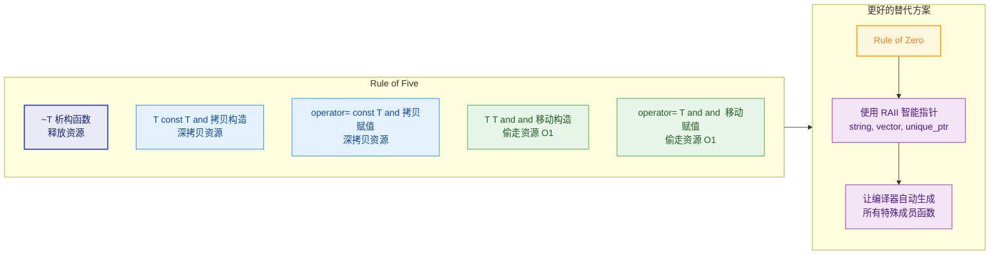

**但在实践中，更推荐的是 Rule of Zero**：让你的类只持有 RAII 类型的成员（`std::string`、`std::vector`、`std::unique_ptr` 等），编译器自动生成的默认特殊成员函数就能正确工作——你一个都不需要手写。只有当你确实需要自定义资源管理逻辑时，才应用 Rule of Five。

```cpp
// ===== Rule of Zero 示例 =====
// 不需要手写任何特殊成员函数！
class Person {
    std::string name_;                      // string 自带正确的拷贝/移动
    std::vector<std::string> hobbies_;      // vector 自带正确的拷贝/移动
    std::unique_ptr<Address> address_;      // unique_ptr 自带正确的移动（禁止拷贝）
    // 编译器自动生成的移动构造 = 逐成员移动，完美正确
    // 编译器自动生成的析构 = 逐成员析构，完美正确
};
```

---

### 编译器何时自动生成移动操作？

编译器并不总是为你生成移动构造和移动赋值。规则如下：

| 你声明了什么 | 编译器还会自动生成移动操作吗？ |
|:---|:---:|
| 什么都不声明 | ✅ 自动生成 |
| 只声明了析构函数 | ❌ 不会生成（deprecated 行为可能生成拷贝） |
| 声明了拷贝构造 | ❌ 不会生成 |
| 声明了拷贝赋值 | ❌ 不会生成 |
| 声明了移动构造 | ❌ 拷贝操作被 delete |
| 声明了移动赋值 | ❌ 拷贝操作被 delete |

**核心规则**：只要你声明了析构函数、拷贝构造、拷贝赋值中的**任何一个**，编译器就**不会**自动生成移动操作。如果你确实需要，可以用 `= default` 显式请求：

```cpp
class Widget {
public:
    ~Widget() { /* 自定义析构逻辑 */ }                // 声明了析构函数

    Widget(const Widget&) = default;                  // 显式请求默认拷贝构造
    Widget& operator=(const Widget&) = default;       // 显式请求默认拷贝赋值
    Widget(Widget&&) = default;                       // 显式请求默认移动构造
    Widget& operator=(Widget&&) = default;            // 显式请求默认移动赋值
};
```

---

### 常见陷阱与最佳实践

**陷阱 1：对 `const` 对象使用 `std::move`**

```cpp
const std::string s = "hello";
std::string s2 = std::move(s);  // 调用的是拷贝构造，不是移动构造！
```

`std::move(s)` 将 `s` 转为 `const string&&`。移动构造的参数是 `string&&`，无法绑定 `const string&&`。但 `const string&` 可以绑定任何东西，于是匹配到了拷贝构造函数。**移动悄无声息地退化为拷贝，毫无性能收益。**

**陷阱 2：对局部变量 `return` 时不要画蛇添足**

```cpp
std::string bad_func() {
    std::string result = "data";
    return std::move(result);   // ❌ 反而阻止了 NRVO 优化！
}

std::string good_func() {
    std::string result = "data";
    return result;              // ✅ 编译器自动应用 NRVO 或隐式移动
}
```

当你返回一个局部变量时，编译器会：① 首先尝试 NRVO（零开销）；② 如果 NRVO 失败，自动将其视为右值并调用移动构造。手动加 `std::move` 会禁用 NRVO，强制走移动路径，反而更慢。

**陷阱 3：移动后继续使用源对象**

```cpp
std::vector<int> v = {1, 2, 3, 4, 5};
std::vector<int> v2 = std::move(v);

// v 已被移动，以下行为虽然不是 UB，但值不可预测
for (auto x : v) {          // ⚠️ 可能什么都不输出，也可能崩溃
    std::cout << x << " ";
}
// 正确做法：移动后要么不再使用 v，要么先重新赋值
v = {10, 20, 30};           // ✅ 重新赋值后可以安全使用
```

**最佳实践总结**：

```mermaid
graph LR
    subgraph DOs["✅ 应该做"]
        direction TB
        D1["移动构造/赋值<br/>加 noexcept"]
        D2["优先 Rule of Zero<br/>使用 RAII 成员"]
        D3["return 局部变量<br/>不加 std::move"]
        D4["对不再使用的对象<br/>才 std::move"]
    end

    subgraph DONTs["❌ 不应该做"]
        direction TB
        N1["对 const 对象<br/>使用 std::move"]
        N2["移动后继续<br/>读取源对象"]
        N3["return 时画蛇添足<br/>加 std::move"]
        N4["忘记将源对象<br/>置为安全空状态"]
    end

    classDef doStyle fill:#E8F5E9,stroke:#2E7D32,color:#1B5E20,stroke-width:2px
    classDef dontStyle fill:#FFEBEE,stroke:#C62828,color:#B71C1C,stroke-width:2px

    class D1,D2,D3,D4 doStyle
    class N1,N2,N3,N4 dontStyle
```

---

### 完整示例：一个生产级的 String 类

将前面所有知识串联起来，下面是一个实现了 Rule of Five 的简化 String 类：

```cpp
#include <cstring>    // strlen, strcpy
#include <utility>    // std::exchange
#include <iostream>
#include <algorithm>  // std::swap

class String {
private:
    char* data_;      // 指向堆上 C 风格字符串的指针
    size_t length_;   // 字符串长度（不含 '\0'）

public:
    // ===== 构造函数 =====
    String(const char* str = "")                     // 接受 C 风格字符串，默认为空串
        : length_(std::strlen(str))                  // 计算源字符串长度
        , data_(new char[std::strlen(str) + 1])      // 分配足够容纳字符串 + '\0' 的内存
    {
        std::strcpy(data_, str);                     // 将源字符串复制到新分配的内存中
    }

    // ===== 析构函数 =====
    ~String() {
        delete[] data_;                              // 释放动态分配的字符数组
    }

    // ===== 拷贝构造函数 =====
    String(const String& other)
        : length_(other.length_)                     // 拷贝长度
        , data_(new char[other.length_ + 1])         // 分配新内存
    {
        std::strcpy(data_, other.data_);             // 深拷贝字符串内容
    }

    // ===== 拷贝赋值运算符（Copy-and-Swap 惯用法）=====
    String& operator=(String other) {                // 注意：参数按值传递（触发拷贝/移动构造）
        swap(*this, other);                          // 交换当前对象与临时对象的资源
        return *this;                                // other 在此析构，释放旧资源
    }
    // Copy-and-Swap 的妙处：
    // 1. 自赋值安全（交换的是副本）
    // 2. 强异常安全（如果拷贝失败，this 不受影响）
    // 3. 同时兼容拷贝赋值和移动赋值！
    //    - 传入左值 → 参数通过拷贝构造创建 → 拷贝赋值
    //    - 传入右值 → 参数通过移动构造创建 → 移动赋值

    // ===== 移动构造函数 =====
    String(String&& other) noexcept
        : data_(std::exchange(other.data_, nullptr)) // 偷走指针，同时将源置为 nullptr
        , length_(std::exchange(other.length_, 0))   // 偷走长度，同时将源置为 0
    {
        // std::exchange(obj, new_val) 返回 obj 的旧值，并将 obj 设为 new_val
        // 比手动三行代码更简洁安全
    }

    // ===== 友元 swap =====
    friend void swap(String& a, String& b) noexcept {
        using std::swap;                             // 启用 ADL (Argument-Dependent Lookup)
        std::swap(a.data_, b.data_);                 // 交换指针
        std::swap(a.length_, b.length_);             // 交换长度
    }

    // ===== 工具函数 =====
    size_t length() const { return length_; }        // 获取长度
    const char* c_str() const { return data_; }      // 获取 C 风格字符串

    friend std::ostream& operator<<(std::ostream& os, const String& s) {
        return os << s.data_;                        // 支持 cout << myString
    }
};
```

注意这里使用了两个精妙的技巧：

1. **`std::exchange`**（C++14）：在移动构造中，`std::exchange(other.data_, nullptr)` 一行完成"偷值 + 置空"两步操作，比手写三行更安全简洁。

2. **Copy-and-Swap 惯用法**：拷贝赋值运算符的参数按值传递，编译器根据传入实参是左值还是右值自动选择拷贝构造或移动构造，从而让**一个 `operator=` 同时充当拷贝赋值和移动赋值**。这是一种非常优雅的设计模式，自动具备异常安全和自赋值安全。

---

**📝 练习题 1**

以下代码的输出是什么？

```cpp
#include <iostream>
#include <string>

void process(std::string&& s) {
    std::cout << "rvalue: " << s << "\n";
}

void process(const std::string& s) {
    std::cout << "lvalue: " << s << "\n";
}

int main() {
    std::string a = "hello";
    std::string&& b = std::move(a);
    process(b);
    return 0;
}
```

A. `rvalue: hello`

B. `lvalue: hello`

C. 编译错误：`b` 不能传递给任何重载

D. 未定义行为


**【答案】** B

**【解析】** 这道题考察的是移动语义中最核心的陷阱：**具名右值引用是左值**。`b` 的类型虽然是 `std::string&&`（右值引用），但 `b` 有名字、可以取地址，因此 `b` 作为表达式时是一个 **左值**。当 `process(b)` 被调用时，重载决议会将 `b` 匹配到 `process(const std::string&)` 版本。如果想调用右值引用版本，必须写 `process(std::move(b))`，再次将其显式转为右值。

---

**📝 练习题 2**

下面哪段代码能正确触发移动语义而非拷贝？

```cpp
// 选项 A
const std::vector<int> v1 = {1,2,3};
std::vector<int> v2 = std::move(v1);

// 选项 B
std::vector<int> v1 = {1,2,3};
std::vector<int> v2 = std::move(v1);

// 选项 C
std::vector<int> v1 = {1,2,3};
const std::vector<int>& v2 = std::move(v1);

// 选项 D
std::vector<int> v1 = {1,2,3};
std::vector<int>& v2 = std::move(v1);
```

A. 选项 A

B. 选项 B

C. 选项 C

D. 选项 D


**【答案】** B

**【解析】** 

- **选项 A**：`v1` 是 `const`，`std::move(v1)` 得到 `const vector<int>&&`。移动构造的参数是 `vector<int>&&`，无法绑定 `const` 右值引用，于是退化为拷贝构造 `vector(const vector&)`。**没有触发移动。**
- **选项 B**：`v1` 是非 const 的左值，`std::move(v1)` 得到 `vector<int>&&`，完美匹配移动构造函数 `vector(vector&&)`。**正确触发移动。** ✅
- **选项 C**：`const vector<int>&` 绑定到了 `std::move(v1)` 的结果，但这只是一个引用绑定，**没有任何构造发生**，自然不涉及移动或拷贝。`v1` 的资源完好无损。
- **选项 D**：`std::move(v1)` 返回右值引用，而 `vector<int>&`（非 const 左值引用）无法绑定右值。**编译错误。**

---

## this 指针

在 C++ 的类体系中，每一个**非静态成员函数**（non-static member function）在被调用时，都会隐式地接收一个指向调用它的对象自身的指针——这就是 `this` 指针。它是理解 C++ 对象模型、成员函数调用机制以及诸多高级用法的基石。表面上看它只是一个"自动可用的指针"，但深入理解 `this`，你会发现它贯穿了从最基础的成员访问到链式调用、运算符重载、CRTP 等高级模式的方方面面。

---

### this 指针的本质与底层机制

当你在一个类中定义了一个成员函数并通过某个对象去调用它时，编译器在幕后做了一件关键的事：**将调用对象的地址作为隐藏的第一个参数传入该成员函数**。也就是说，成员函数的调用方式，在编译器看来，与普通函数并无本质区别——只是多了一个隐含参数。

```cpp
class Box {
    int width_;  // 成员变量：宽度
public:
    void setWidth(int w) {   // 你写的成员函数
        width_ = w;          // 实际上等价于 this->width_ = w;
    }
};

// ═══ 编译器视角下的等价伪代码 ═══
// void Box_setWidth(Box* const this, int w) {
//     this->width_ = w;
// }
//
// 调用 box.setWidth(10); 
// 等价于 Box_setWidth(&box, 10);
```

注意这里的类型：`this` 的类型是 `Box* const`——**它是一个常量指针**（指针本身不可修改，即你不能让 `this` 指向别的对象），但它指向的对象内容是可以修改的。如果成员函数被声明为 `const`，那么 `this` 的类型将进一步变成 `const Box* const`，即指向的内容也不可修改。

下面用一张图来全面展示 `this` 指针在不同上下文中的类型变化：

```mermaid
graph LR
    subgraph 调用场景["调用场景 (Calling Context)"]
        direction TB
        A["obj.func()
        普通对象调用"]
        B["obj.func() const
        const 成员函数"]
        C["static func()
        静态成员函数"]
    end

    subgraph this类型["this 指针类型"]
        direction TB
        D["T* const this
        可修改对象内容"]
        E["const T* const this
        不可修改对象内容"]
        F["❌ 无 this 指针
        不绑定任何对象"]
    end

    subgraph 可访问性["可执行操作"]
        direction TB
        G["✅ 读写成员变量
        ✅ 调用任意成员函数"]
        H["✅ 读成员变量
        ❌ 写成员变量
        ✅ 只能调用 const 函数"]
        I["✅ 访问静态成员
        ❌ 访问非静态成员"]
    end

    A --> D --> G
    B --> E --> H
    C --> F --> I

    classDef ctx fill:#C8E6C9,stroke:#388E3C,color:#1B5E20
    classDef ptr fill:#BBDEFB,stroke:#1976D2,color:#0D47A1
    classDef ops fill:#FFE0B2,stroke:#F57C00,color:#E65100

    class A,B,C ctx
    class D,E,F ptr
    class G,H,I ops
```

理解以上类型变化是正确使用 `this` 的前提。接下来我们从最常见的应用场景出发，逐一展开。

---

### 解决成员变量与参数的命名冲突

这是 `this` 指针最直觉、最常见的用途。当构造函数或成员函数的**形参名**与**成员变量名**完全相同时，编译器无法自动区分二者，此时必须用 `this->` 显式指定成员变量。

```cpp
class Student {
    std::string name;  // 成员变量
    int age;           // 成员变量

public:
    // 参数名与成员变量名相同 —— 必须用 this-> 消歧义
    Student(std::string name, int age) {
        this->name = name;  // this->name 指成员变量，name 指形参
        this->age = age;    // this->age  指成员变量，age  指形参
    }

    void setName(std::string name) {
        this->name = name;  // 同理，消歧义
    }
};
```

> **最佳实践**：很多团队通过**命名约定**（naming convention）从根源上规避这个问题。例如成员变量加下划线后缀 `name_`、`age_`，或加前缀 `m_name`、`m_age`。但即便如此，理解 `this->` 消歧义的原理依然是必修课——你在阅读他人代码、标准库源码时会频繁遇到。

---

### 链式调用（Method Chaining）

链式调用是 `this` 指针最优雅的应用之一。核心思想是：让成员函数**返回 `*this`（即对象自身的引用）**，这样调用者就可以在一条语句中连续调用多个方法，形成流畅的链式风格（fluent interface）。

```cpp
class QueryBuilder {
    std::string table_;    // 表名
    std::string where_;    // 条件
    int limit_;            // 限制条数

public:
    QueryBuilder() : limit_(0) {}  // 默认构造

    // 每个 setter 返回自身引用 (*this)，以支持链式调用
    QueryBuilder& from(const std::string& table) {
        table_ = table;            // 设置表名
        return *this;              // 返回自身引用 ← 关键！
    }

    QueryBuilder& where(const std::string& condition) {
        where_ = condition;        // 设置查询条件
        return *this;              // 返回自身引用
    }

    QueryBuilder& limit(int n) {
        limit_ = n;                // 设置限制条数
        return *this;              // 返回自身引用
    }

    // 构建最终 SQL 字符串（const 方法，不修改对象）
    std::string build() const {
        std::string sql = "SELECT * FROM " + table_;  // 拼接基础语句
        if (!where_.empty())                           // 若有条件
            sql += " WHERE " + where_;                 // 追加 WHERE 子句
        if (limit_ > 0)                                // 若有限制
            sql += " LIMIT " + std::to_string(limit_); // 追加 LIMIT
        return sql;                                    // 返回完整 SQL
    }
};

int main() {
    // ✅ 链式调用 —— 一气呵成，简洁明了
    std::string sql = QueryBuilder()
        .from("users")              // 返回 *this → 继续调用
        .where("age > 18")          // 返回 *this → 继续调用
        .limit(10)                  // 返回 *this → 继续调用
        .build();                   // 最终构建

    // sql = "SELECT * FROM users WHERE age > 18 LIMIT 10"
}
```

链式调用的流程可以这样可视化：

```mermaid
graph LR
    subgraph 链式调用流["QueryBuilder 链式调用流程"]
        direction TB
        S["QueryBuilder()
        构造临时对象"] 
        A[".from('users')
        设置 table_
        return *this"]
        B[".where('age〉18')
        设置 where_
        return *this"]
        C[".limit(10)
        设置 limit_
        return *this"]
        D[".build()
        拼接并返回 SQL"]

        S -->|"*this"| A
        A -->|"*this"| B
        B -->|"*this"| C
        C -->|"*this"| D
    end

    subgraph 最终结果["输出"]
        direction TB
        R["SELECT * FROM users
        WHERE age 〉 18
        LIMIT 10"]
    end

    D -->|"string"| R

    classDef chain fill:#C8E6C9,stroke:#388E3C,color:#1B5E20
    classDef result fill:#BBDEFB,stroke:#1976D2,color:#0D47A1

    class S,A,B,C,D chain
    class R result
```

**返回引用 vs 返回值**——这里有一个关键的设计选择：

| 返回类型 | 语义 | 效果 |
|---------|------|------|
| `T&`（引用） | 返回**同一个对象** | 链上所有操作都修改**同一个对象**，零拷贝 |
| `T`（值） | 返回**对象的副本** | 每次调用产生新副本，原对象不变（不可变风格） |

绝大多数链式调用场景使用**返回引用**，因为我们就是要连续配置同一个对象。只有在刻意需要不可变语义（immutable builder pattern）时才返回值。

---

### 在拷贝赋值运算符中防止自赋值

`this` 指针在赋值运算符重载中扮演着**守门员**的角色。当一个对象被赋值给自身时（`a = a;`），如果不加检测，可能导致先释放自身资源、再试图从已释放的资源拷贝——这是一个典型的**未定义行为**（undefined behavior）。

```cpp
class DynamicArray {
    int* data_;    // 堆上动态分配的数组
    size_t size_;  // 数组大小

public:
    // 拷贝赋值运算符
    DynamicArray& operator=(const DynamicArray& other) {
        // ⚠️ 第一步：自赋值检测 —— 比较地址
        if (this == &other) {       // this 指向左操作数，&other 是右操作数地址
            return *this;           // 如果是同一个对象，直接返回，什么都不做
        }

        // 第二步：释放当前对象持有的旧资源
        delete[] data_;             // 释放旧内存

        // 第三步：深拷贝新资源
        size_ = other.size_;        // 拷贝大小
        data_ = new int[size_];     // 分配新内存
        std::copy(other.data_,      // 从源数组起始位置
                  other.data_ + size_,  // 到源数组结束位置
                  data_);           // 拷贝到目标数组

        // 第四步：返回自身引用（支持连续赋值 a = b = c）
        return *this;
    }

    // ... 构造函数、析构函数等省略
};
```

如果没有 `if (this == &other)` 这一行，执行 `arr = arr;` 时：

```cpp
// 灾难性流程：
// 1. delete[] data_;         ← 把 arr 自己的内存释放了！
// 2. size_ = other.size_;    ← other 就是 arr 自身，size_ 没变
// 3. data_ = new int[size_]; ← 分配新内存
// 4. std::copy(other.data_,  ← other.data_ 已经是野指针！💥 UB!
//              other.data_ + size_, data_);
```

```mermaid
graph LR
    subgraph 自赋值检测["自赋值检测流程"]
        direction TB
        Start["a = b 触发
        operator="]
        Check{"this == &other ?
        同一对象?"}
        Yes["直接 return *this
        跳过所有操作"]
        No["执行深拷贝逻辑
        释放旧 → 分配新 → 复制"]
        End["return *this
        支持链式赋值"]

        Start --> Check
        Check -->|"Yes"| Yes
        Check -->|"No"| No
        No --> End
    end

    classDef decision fill:#FFF9C4,stroke:#F9A825,color:#F57F17
    classDef safe fill:#C8E6C9,stroke:#388E3C,color:#1B5E20
    classDef normal fill:#BBDEFB,stroke:#1976D2,color:#0D47A1

    class Check decision
    class Yes safe
    class Start,No,End normal
```

> **进阶说明**：现代 C++ 中推荐使用 **copy-and-swap 惯用法**，它天然具备自赋值安全性和异常安全性（exception safety），无需手动检测 `this == &other`。但理解 `this` 在自赋值检测中的作用，仍然是面试和基础学习的重点。

---

### this 指针与 const 成员函数

当成员函数被标记为 `const` 时，`this` 的类型从 `T* const` 变为 `const T* const`，意味着你**不能通过 `this` 修改任何成员变量**。这是 C++ **const 正确性**（const-correctness）体系的核心组成部分。

```cpp
class Temperature {
    double celsius_;          // 摄氏温度

public:
    Temperature(double c) : celsius_(c) {}  // 构造函数

    // const 成员函数：this 类型为 const Temperature* const
    double getCelsius() const {
        // celsius_ = 0;      // ❌ 编译错误！不能修改成员变量
        return celsius_;       // ✅ 只读访问
    }

    // 非 const 成员函数：this 类型为 Temperature* const
    void setCelsius(double c) {
        celsius_ = c;          // ✅ 可以修改成员变量
    }
};
```

那么如果你**确实需要**在 `const` 成员函数中修改某个成员变量呢？C++ 提供了 `mutable` 关键字来打破这一限制。典型场景包括：缓存（cache）、延迟计算（lazy evaluation）、互斥锁（mutex）等。

```cpp
class DataProcessor {
    std::vector<int> data_;             // 原始数据
    mutable bool cache_valid_ = false;  // mutable：即使在 const 函数中也可修改
    mutable double cached_avg_ = 0.0;   // mutable：缓存的平均值

public:
    // const 成员函数 —— 但可以修改 mutable 成员
    double getAverage() const {
        if (!cache_valid_) {                          // 缓存无效？
            double sum = 0;                           // 初始化累加器
            for (int val : data_)                     // 遍历所有数据
                sum += val;                           // 累加
            cached_avg_ = sum / data_.size();         // ✅ mutable 成员可修改
            cache_valid_ = true;                      // ✅ 标记缓存有效
        }
        return cached_avg_;                           // 返回缓存结果
    }

    void addData(int val) {
        data_.push_back(val);    // 添加新数据
        cache_valid_ = false;    // 数据变了，缓存失效
    }
};
```

`mutable` 的语义是："这个成员变量**不属于对象的逻辑状态**（logical state），它只是一个实现细节"。因此修改它并不违背 `const` 函数"不改变对象可观测状态"的承诺。

---

### this 指针与静态成员函数

**静态成员函数（static member function）没有 `this` 指针。** 这是因为静态成员函数属于**类本身**，而不属于任何特定的对象实例。既然没有"调用对象"，自然就不存在 `this`。

```cpp
class Counter {
    static int count_;        // 静态成员变量：属于类，而非对象
    int id_;                  // 非静态成员变量：属于每个对象

public:
    Counter() : id_(++count_) {}  // 每创建一个对象，count_ 递增

    // 静态成员函数 —— 无 this 指针
    static int getCount() {
        // std::cout << id_;  // ❌ 编译错误！无 this，无法访问非静态成员
        return count_;        // ✅ 可以访问静态成员
    }

    // 非静态成员函数 —— 有 this 指针
    int getId() const {
        return this->id_;     // ✅ 通过 this 访问实例成员
    }
};

int Counter::count_ = 0;     // 静态成员变量在类外定义并初始化
```

```cpp
// ═══ 对比：静态 vs 非静态成员函数内部的 this ═══
//
//  Counter::getCount()       →  编译器不会传入 this
//  counter.getId()           →  编译器传入 Counter* const this = &counter
```

---

### this 指针在继承体系中的行为

在继承中，`this` 指针会根据上下文被隐式转换为基类或派生类类型。这种转换是 C++ 多态机制的基础之一。

```cpp
class Animal {
public:
    void whoAmI() {
        // 在 Animal 的方法中，this 类型是 Animal*
        std::cout << "Animal this: " << this << std::endl;
    }
    virtual ~Animal() = default;
};

class Dog : public Animal {
    int barkVolume_;
public:
    void dogInfo() {
        // 在 Dog 的方法中，this 类型是 Dog*
        std::cout << "Dog this: " << this << std::endl;

        // 调用基类方法时，this (Dog*) 被隐式转换为 Animal*
        whoAmI();  // Animal::whoAmI() 收到的 this 与上面地址相同（单继承时）
    }
};
```

在**单继承**中，基类子对象通常位于派生类对象的起始地址，所以 `this` 的数值不会变。但在**多继承**中，不同基类子对象可能在不同的偏移量上，`this` 指针在转换时会发生**地址调整**（pointer adjustment）：

```cpp
// ═══ 多继承中 this 指针的地址调整 ═══
//
// 假设 class C : public A, public B { ... };
// 对象 c 的内存布局：
//
// 低地址 ┌─────────────┐ ← this (as C*) == this (as A*)
//        │  A 的子对象  │
//        ├─────────────┤ ← this (as B*)  ← 注意：地址偏移了！
//        │  B 的子对象  │
//        ├─────────────┤
//        │ C 自身成员   │
// 高地址 └─────────────┘
//
// 当 C* 转换为 B* 时，编译器自动加上 sizeof(A) 的偏移量
```

这就是为什么在多继承下，将 `this` 简单地 `reinterpret_cast` 到另一个基类类型是**极其危险**的——编译器的隐式转换（`static_cast`）会正确计算偏移，而 `reinterpret_cast` 不会。

---

### this 指针的常见陷阱与注意事项

#### 陷阱一：在构造函数/析构函数中使用 this

在构造函数中，对象尚未完全构造完成（尤其是在继承体系中，派生类部分尚未初始化）。此时使用 `this` 调用虚函数，**不会触发多态**，只会调用当前正在构造的类的版本：

```cpp
class Base {
public:
    Base() {
        print();  // ⚠️ 调用 Base::print()，而非 Derived::print()
    }
    virtual void print() {
        std::cout << "Base" << std::endl;
    }
    virtual ~Base() = default;
};

class Derived : public Base {
    int value_ = 42;
public:
    void print() override {
        std::cout << "Derived: " << value_ << std::endl;  // 如果在 Base 构造中被调用
    }                                                       // value_ 尚未初始化！
};

int main() {
    Derived d;  // 输出 "Base"，而不是 "Derived: 42"
}
```

#### 陷阱二：在 this 上 delete 自身

C++ **允许**在成员函数中 `delete this;`，但这是一个极其危险的操作，必须满足严格条件：

```cpp
class SelfManaged {
public:
    void release() {
        // ... 清理工作 ...
        delete this;       // 合法，但之后 this 变成悬垂指针
        // ⚠️ 此行之后，不能再访问任何成员变量或调用成员函数
        // ⚠️ 调用者也不能再使用该对象的指针
    }
};

// 使用限制：
// 1. 对象必须是 new 出来的（不能是栈上或全局对象）
// 2. delete this 之后，不能再访问任何成员
// 3. 调用者必须知道对象已被销毁
```

> 这种用法在引用计数（reference counting）的实现中偶尔出现，例如 COM 组件的 `Release()` 方法。但在现代 C++ 中，应优先使用 `std::shared_ptr` 等智能指针来管理生命周期。

#### 陷阱三：Lambda 捕获 this

在 Lambda 表达式中捕获 `this` 时，捕获的是**指针的副本**，而不是对象的副本。如果 Lambda 的生命周期超过了对象的生命周期，就会产生悬垂指针：

```cpp
class EventHandler {
    int state_ = 0;  // 成员变量

public:
    std::function<void()> getCallback() {
        // 捕获 this 指针（C++11/14 风格）
        return [this]() {
            state_++;  // 通过捕获的 this 访问成员
            // ⚠️ 如果 EventHandler 对象已被销毁，这里是 UB！
        };
    }

    std::function<void()> getSafeCallback() {
        // C++17：捕获 *this（拷贝整个对象）
        return [*this]() mutable {
            state_++;  // 操作的是对象的副本，安全！
        };
    }
};
```

```mermaid
graph LR
    subgraph 危险捕获["[this] 捕获指针"]
        direction TB
        L1["Lambda 内部
        持有 this 指针副本"]
        O1["原对象
        可能已销毁 💀"]
        L1 -->|"悬垂指针!"| O1
    end

    subgraph 安全捕获["[*this] 捕获副本 (C++17)"]
        direction TB
        L2["Lambda 内部
        持有对象完整副本"]
        O2["原对象
        生命周期无关"]
        L2 -.-|"互不影响"| O2
    end

    classDef danger fill:#FFCDD2,stroke:#D32F2F,color:#B71C1C
    classDef safe fill:#C8E6C9,stroke:#388E3C,color:#1B5E20

    class L1,O1 danger
    class L2,O2 safe
```

---

### this 指针使用总结

| 使用场景 | 示例 | 备注 |
|---------|------|------|
| 消歧义 | `this->name = name;` | 当参数名与成员名相同 |
| 链式调用 | `return *this;` | 返回引用支持 `a.f().g().h()` |
| 自赋值检测 | `if (this == &other)` | 拷贝赋值运算符中防御性编程 |
| 传递自身 | `callback(this);` | 把当前对象注册到外部系统 |
| 类型获取 | `decltype(*this)` | 模板编程中获取对象精确类型 |
| Lambda 捕获 | `[this]` / `[*this]` | 捕获指针 vs 捕获副本 |

---

**📝 练习题**

以下代码的输出是什么？

```cpp
#include <iostream>

class Chain {
    int val_;
public:
    Chain(int v) : val_(v) {}

    Chain& add(int x) {
        val_ += x;
        return *this;
    }

    Chain& multiply(int x) {
        val_ *= x;
        return *this;
    }

    void print() const {
        std::cout << val_ << std::endl;
    }
};

int main() {
    Chain c(2);
    c.add(3).multiply(4).add(1).print();
    return 0;
}
```

A. 2


B. 21


C. 24


D. 13


**【答案】** B

**【解析】** 这是一道考察链式调用与 `return *this` 的题目。由于 `add()` 和 `multiply()` 都返回 `*this`（即同一个对象 `c` 的引用），所有操作都在同一个对象上按顺序执行：初始值 `val_ = 2` → `add(3)` 后 `val_ = 5` → `multiply(4)` 后 `val_ = 20` → `add(1)` 后 `val_ = 21` → `print()` 输出 `21`。如果这些函数返回的是值（`Chain` 而非 `Chain&`），则每次调用都会生成一个临时副本，原对象 `c` 的值不会改变，但最终输出仍然是 21（操作在临时副本链上传递）。区分引用返回和值返回的关键影响在于：链式操作后，原对象 `c` 本身是否被修改。

---

**📝 练习题**

以下关于 `this` 指针的说法，哪一项是**错误**的？

A. `this` 是一个隐式参数，类型为指向当前对象的常量指针（`T* const`）


B. 静态成员函数中可以使用 `this` 指针来访问静态成员变量


C. 在 `const` 成员函数中，`this` 的类型为 `const T* const`，不能修改非 `mutable` 成员


D. 在构造函数中调用虚函数不会触发多态派发，只会调用当前类的版本


**【答案】** B

**【解析】** 选项 B 是错误的。**静态成员函数没有 `this` 指针**，因为它不与任何对象实例绑定，自然也无法通过 `this` 来访问任何内容（不管是静态还是非静态的）。静态成员函数可以直接通过 `类名::变量名` 访问静态成员变量，但这与 `this` 无关。选项 A 正确描述了 `this` 的类型；选项 C 正确描述了 `const` 成员函数中 `this` 的类型升级；选项 D 正确描述了构造函数中虚函数调用的行为——因为在基类构造函数执行期间，对象的虚表指针（vptr）指向的是基类的虚表，派生类部分尚未构造完成。

---

## 本章小结

本章围绕 C++ 最核心的编程范式——**面向对象编程（Object-Oriented Programming, OOP）**，系统性地剖析了「类与对象」的完整生命周期。从一个对象的**诞生（构造）**、**复制与转移（拷贝/移动语义）**，到最终的**消亡（析构）**，每一个环节都有其严格的语言规则和深刻的设计哲学。下面，我们以全局视角将所有知识点串联起来，形成一张完整的认知地图。

---

### 知识全景图

```mermaid
graph LR
    subgraph DEF["① 类的定义"]
        direction TB
        MV["成员变量<br/>Member Variables"]
        MF["成员函数<br/>Member Functions"]
        THIS["this 指针<br/>隐式参数"]
        MV --> THIS
        MF --> THIS
    end

    subgraph ACC["② 访问控制"]
        direction TB
        PUB["public<br/>对外接口"]
        PRI["private<br/>内部实现"]
        PRO["protected<br/>继承开放"]
    end

    subgraph LIFE["③ 生命周期管理"]
        direction TB
        CTOR["构造函数<br/>默认 / 参数化 / 初始化列表"]
        DTOR["析构函数<br/>资源释放 / 虚析构"]
        CTOR --> DTOR
    end

    subgraph COPY["④ 值语义"]
        direction TB
        CC["拷贝构造<br/>Copy Constructor"]
        CA["拷贝赋值<br/>Copy Assignment"]
        CC --> CA
    end

    subgraph MOVE["⑤ 移动语义"]
        direction TB
        RV["右值引用 &&<br/>Rvalue Reference"]
        MC["移动构造<br/>Move Constructor"]
        MA["移动赋值<br/>Move Assignment"]
        SM["std::move<br/>强制转右值"]
        RV --> MC
        RV --> MA
        SM --> RV
    end

    DEF --> ACC
    ACC --> LIFE
    LIFE --> COPY
    COPY --> MOVE

    classDef defStyle fill:#C8E6C9,stroke:#388E3C,color:#1B5E20
    classDef accStyle fill:#BBDEFB,stroke:#1976D2,color:#0D47A1
    classDef lifeStyle fill:#FFE0B2,stroke:#F57C00,color:#E65100
    classDef copyStyle fill:#D1C4E9,stroke:#7B1FA2,color:#4A148C
    classDef moveStyle fill:#FFCDD2,stroke:#D32F2F,color:#B71C1C

    class MV,MF,THIS defStyle
    class PUB,PRI,PRO accStyle
    class CTOR,DTOR lifeStyle
    class CC,CA copyStyle
    class RV,MC,MA,SM moveStyle
```

---

### 对象一生的完整旅程

一个 C++ 对象从创建到销毁，可能经历以下所有阶段。理解这条「生命线」，就是理解本章的灵魂：

```mermaid
sequenceDiagram
    participant User as 用户代码
    participant Ctor as 构造函数
    participant Obj as 对象实例
    participant Copy as 拷贝/移动
    participant Dtor as 析构函数

    User->>Ctor: 1. 创建对象（默认/参数化）
    Ctor->>Obj: 初始化列表 → 函数体
    Note over Obj: 对象存活期<br/>通过 this 指针访问自身

    User->>Copy: 2a. 拷贝构造（深拷贝）
    Copy->>Obj: 新对象诞生，资源独立

    User->>Copy: 2b. 移动构造（资源窃取）
    Copy->>Obj: 新对象诞生，原对象被掏空

    User->>Obj: 3. 正常使用（调用成员函数）

    Obj->>Dtor: 4. 离开作用域 / delete
    Dtor->>Dtor: 释放资源（堆内存/文件/锁）
    Note over Dtor: 若为基类，虚析构保证<br/>派生类正确清理
```

---

### 核心知识点回顾

#### ▎类定义与 this 指针

类是 C++ 的**自定义类型蓝图**，由**成员变量（data members）** 描述状态，**成员函数（member functions）** 定义行为。每个非静态成员函数都隐含一个 **`this` 指针**，它是编译器自动传入的指向当前对象的常量指针（`ClassName* const this`）。`this` 指针是链式调用（method chaining）和在成员函数中消除同名歧义的关键机制。

```cpp
class Widget {
    int id_;                              // 成员变量：对象的状态
public:
    Widget& setId(int id_) {              // 参数与成员同名
        this->id_ = id_;                  // this-> 消除歧义
        return *this;                     // 返回自身引用，支持链式调用
    }
};
```

#### ▎访问控制——封装的三道门

| 关键字 | 可见范围 | 设计意图 |
|:---:|:---:|:---|
| `public` | 任何外部代码 | 对外暴露**最小必要接口** |
| `private` | 仅类自身及友元 | 隐藏实现细节，保护**数据不变量 (invariant)** |
| `protected` | 类自身 + 派生类 | 为继承体系保留**扩展通道** |

封装（Encapsulation）的核心原则：**将数据设为 `private`，通过 `public` 成员函数暴露行为**。这使得内部实现可以自由修改，而不破坏外部调用者的代码——这就是所谓的 **ABI/API 稳定性**。

#### ▎构造函数——对象的诞生

构造函数有三个关键变体：

| 变体 | 特征 | 触发时机 |
|:---|:---|:---|
| 默认构造 | 无参数（或全有默认值） | `Widget w;` 或 `new Widget()` |
| 参数化构造 | 接收外部参数 | `Widget w(42);` 或 `Widget w{42}` |
| 初始化列表 | 在函数体 `{}` 之前完成初始化 | 所有构造函数均可使用 |

**初始化列表（Member Initializer List）** 是性能和正确性的关键：对于**引用成员、`const` 成员、无默认构造函数的成员对象**，初始化列表是唯一合法的初始化途径。即使对于普通成员，初始化列表也避免了「先默认构造再赋值」的额外开销。

#### ▎析构函数——对象的终章 ⭐

析构函数 `~ClassName()` 在对象生命周期结束时**自动调用**，负责释放该对象持有的**所有资源**（堆内存、文件句柄、网络连接、互斥锁等）。这正是 C++ 独特的 **RAII（Resource Acquisition Is Initialization）** 范式的基石。

**虚析构函数**是多态体系中的**安全网**：当通过**基类指针 `delete` 派生类对象**时，若基类析构函数不是 `virtual` 的，则派生类的析构函数**不会被调用**，导致资源泄漏和未定义行为（Undefined Behavior）。经验法则：**只要类中有任何 `virtual` 函数，析构函数就必须声明为 `virtual`。**

#### ▎拷贝语义——值的克隆

拷贝构造函数和拷贝赋值运算符共同定义了「如何正确复制一个对象」。最关键的分水岭是**浅拷贝 vs 深拷贝**：

```text
  浅拷贝（Shallow Copy）           深拷贝（Deep Copy）
  ┌──────────┐                    ┌──────────┐
  │ objA     │                    │ objA     │
  │ ptr_ ────┼──┐                 │ ptr_ ──┼──→ [Data A]
  └──────────┘  │                 └──────────┘
                ▼                 ┌──────────┐
            [Shared Data] ← 危险! │ objB     │
                ▲                 │ ptr_ ──┼──→ [Data B] (独立副本)
  ┌──────────┐  │                 └──────────┘
  │ objB     │  │
  │ ptr_ ────┼──┘
  └──────────┘
  → 双重释放 (Double Free)!       → 安全，各自管理各自的资源
```

**三/五法则（Rule of Three / Five）** 是本章最重要的工程准则之一：如果你自定义了**析构函数、拷贝构造、拷贝赋值**中的任何一个，你**几乎肯定**需要自定义全部三个（C++11 后扩展为五个，加上移动构造和移动赋值）。

#### ▎移动语义——性能的飞跃 ⭐

C++11 引入的**右值引用（`T&&`）和 `std::move`** 彻底改变了 C++ 的资源管理格局。移动语义的核心思想是：**对于即将销毁的临时对象（右值），与其昂贵地深拷贝，不如直接"窃取"其内部资源。**

```mermaid
graph LR
    subgraph BEFORE["移动前"]
        direction TB
        SRC1["源对象 src<br/>ptr_ → HeapData"]
        DST1["目标对象 dst<br/>ptr_ → nullptr"]
    end

    subgraph AFTER["移动后"]
        direction TB
        SRC2["源对象 src<br/>ptr_ → nullptr (被掏空)"]
        DST2["目标对象 dst<br/>ptr_ → HeapData (已接管)"]
    end

    BEFORE -->|"移动构造 / 移动赋值"| AFTER

    classDef beforeStyle fill:#FFECB3,stroke:#FFA000,color:#E65100
    classDef afterStyle fill:#C8E6C9,stroke:#388E3C,color:#1B5E20

    class SRC1,DST1 beforeStyle
    class SRC2,DST2 afterStyle
```

`std::move` 本身**不移动任何东西**——它仅仅是一个到右值引用的**无条件强制类型转换（unconditional cast）**，真正的资源转移发生在移动构造函数或移动赋值运算符的函数体内。移动后的源对象必须处于一个**有效但未指定（valid but unspecified）** 的状态，至少能安全析构。

---

### 特殊成员函数速查表

编译器在特定条件下会自动生成以下六个特殊成员函数。理解其**自动生成规则**是避免隐性 Bug 的关键：

| 特殊成员函数 | 默认行为 | 被抑制的条件 |
|:---|:---|:---|
| 默认构造函数 | 无操作（POD）/ 调用成员默认构造 | 用户声明了**任何**构造函数 |
| 析构函数 | 无操作 / 调用成员析构 | — |
| 拷贝构造函数 | 逐成员浅拷贝 | 用户声明了**移动操作** |
| 拷贝赋值运算符 | 逐成员浅赋值 | 用户声明了**移动操作** |
| 移动构造函数 | 逐成员移动 | 用户声明了**拷贝操作、移动赋值或析构函数** |
| 移动赋值运算符 | 逐成员移动赋值 | 用户声明了**拷贝操作、移动构造或析构函数** |

> **最佳实践**：要么全部使用 `= default` 让编译器生成（Rule of Zero），要么按需全部自定义（Rule of Five）。**不要**只定义其中一两个而忽略其余——这是 C++ 中最常见的资源管理 Bug 来源。

---

### 一句话记住每个知识点

| # | 知识点 | 一句话精髓 |
|:--:|:---|:---|
| 1 | 类定义 | 类 = 数据（成员变量）+ 行为（成员函数）的封装蓝图 |
| 2 | 访问控制 | `private` 守护不变量，`public` 暴露最小接口 |
| 3 | 构造函数 | 初始化列表是「真正的初始化」，函数体只是「补充赋值」 |
| 4 | 析构函数 | RAII 的执行者；多态基类**必须**虚析构 |
| 5 | 拷贝语义 | 管理资源的类**必须**深拷贝，否则双重释放 |
| 6 | 移动语义 | 窃取将亡对象的资源，`O(n)` 拷贝变 `O(1)` 转移 |
| 7 | this 指针 | 每个成员函数的隐藏第一参数，指向调用者自身 |

---

### 📝 练习题

**题目一：** 以下代码的输出是什么？

```cpp
#include <iostream>
using namespace std;

class Trace {
public:
    Trace()             { cout << "D"; }    // 默认构造
    Trace(const Trace&) { cout << "C"; }    // 拷贝构造
    Trace(Trace&&)      { cout << "M"; }    // 移动构造
    ~Trace()            { cout << "X"; }    // 析构
};

Trace make() {
    Trace t;          // (1)
    return t;         // (2)
}

int main() {
    Trace a = make(); // (3)
    return 0;
}
```

*假设编译器**未启用**任何形式的返回值优化（No NRVO/RVO, 即 `-fno-elide-constructors`）。*

A. `DMXX`

B. `DMMXX`

C. `DMXMXX`

D. `DCXCXX`


**【答案】** C

**【解析】**

逐步分析对象的构造与析构序列：

1. **`Trace t;`** — 在 `make()` 函数内部调用**默认构造函数**，输出 `D`。
2. **`return t;`** — `t` 是一个具名局部变量（lvalue），但 C++ 标准规定，当返回一个即将销毁的局部对象时，编译器会**隐式地将其视为右值**（implicit move）。因此调用**移动构造函数**将 `t` 的资源转移到一个临时返回值对象中，输出 `M`。随后局部变量 `t` 被析构，输出 `X`。
3. **`Trace a = make();`** — 函数返回的临时对象（右值）再次通过**移动构造函数**初始化 `a`，输出 `M`。随后临时对象被析构，输出 `X`。
4. **`main()` 结束** — `a` 被析构，输出 `X`。

最终输出：**`D` → `M` → `X` → `M` → `X` → `X`**，即 `DMXMXX`。

> 💡 **关键知识点**：在**现代编译器默认开启 RVO/NRVO** 的情况下（C++17 起，返回纯右值时**强制**省略拷贝/移动），实际输出很可能只是 `DX`——这体现了 copy elision 的巨大威力。本题特意禁用优化，以考察你对构造/析构调用链的底层理解。

---

**题目二：** 下列关于 Rule of Five 的说法，**错误**的是：

A. 如果一个类自定义了析构函数，编译器仍会隐式生成拷贝构造函数（虽然这是 deprecated 行为）

B. 如果一个类自定义了拷贝构造函数，编译器将**不会**隐式生成移动构造函数

C. `std::move(x)` 会立即将 `x` 的资源转移给另一个对象

D. 移动构造函数执行后，被移动的源对象必须处于「可安全析构」的有效状态


**【答案】** C

**【解析】**

- **A 正确**：这是 C++ 标准中一个著名的历史遗留问题。自定义析构函数后，编译器仍会生成拷贝构造和拷贝赋值，但该行为已被 C++ 标准标记为 **deprecated**（未来标准可能移除）。这恰恰是 Rule of Five 存在的原因——提醒开发者**显式管理**所有五个特殊成员函数。

- **B 正确**：一旦用户声明了任何拷贝操作（拷贝构造或拷贝赋值），编译器就**不会**自动生成移动构造函数和移动赋值运算符。此时对右值的绑定会退化（fallback）为调用拷贝版本。

- **C 错误**：`std::move` 的本质只是一个 `static_cast<T&&>(x)`，即**无条件转换为右值引用**。它本身**不执行任何资源转移操作**。真正的转移发生在接收该右值引用的移动构造函数或移动赋值运算符中。如果没有函数接收这个右值引用，什么都不会发生。

- **D 正确**：C++ 标准要求被移动后的对象（moved-from object）处于一个 **valid but unspecified** 的状态。最低要求是能够安全调用析构函数和赋值运算符，而不触发未定义行为。

---

