---

# 继承与多态 ⭐⭐

---

## 继承（Inheritance）

继承是面向对象编程（OOP）三大核心特性之一（封装、继承、多态）。它允许我们基于一个已有的类（**基类 / Base Class**，也称父类）来创建新的类（**派生类 / Derived Class**，也称子类），从而实现代码复用与层次化的类型设计。

在 C++ 中，继承不仅仅是"子类获得父类的成员"这么简单。C++ 独有的 **三种继承方式**（public / protected / private）赋予了开发者对"继承关系的对外可见性"进行精细控制的能力，这是 Java、Python 等语言所不具备的。理解这三种继承方式的区别，是掌握 C++ 面向对象体系的第一步。

---

### 继承的基本语法与概念

一个最基本的继承关系可以用如下语法声明：

```cpp
// 基类（父类）
class Base {
public:
    int pub_val;        // 公有成员
protected:
    int prot_val;       // 受保护成员
private:
    int priv_val;       // 私有成员
};

// 派生类（子类），以 public 方式继承 Base
// 语法：class 派生类名 : 继承方式 基类名
class Derived : public Base {
    // Derived 继承了 Base 的所有成员
    // 但对它们的"访问权限"取决于继承方式
};
```

这里有一个极其重要的概念需要先厘清——**继承 ≠ 访问**。无论使用哪种继承方式，派生类在内存中都**完整包含**基类的所有成员（包括 `private` 成员），只是编译器在**编译期**会根据继承方式来限制你的访问权限。换句话说，这是一种**编译期的访问控制（compile-time access control）**，而非运行时的数据裁剪。

为了更好地理解继承后成员的"身份变化"，我们先回顾一下三种访问修饰符的基本含义：

| 访问修饰符 | 类内部 | 派生类内部 | 类外部（对象访问） |
|:---:|:---:|:---:|:---:|
| `public` | ✅ | ✅ | ✅ |
| `protected` | ✅ | ✅ | ❌ |
| `private` | ✅ | ❌ | ❌ |

可以看到，`protected` 专为继承而设计——它对"外人"关闭，但对"后代"开放。

---

### public 继承（Is-A 关系）

**public 继承**是最常用、最自然的继承方式，它表达的语义是 **"Is-A"（是一种）** 关系。例如：`Dog is a Animal`，`Circle is a Shape`。

在 public 继承下，基类成员在派生类中的访问权限**保持不变**：

| 基类中的访问权限 | public 继承后，在派生类中变为 |
|:---:|:---:|
| `public` | `public` |
| `protected` | `protected` |
| `private` | **不可访问**（存在但无法直接使用） |

来看一个具体的例子：

```cpp
#include <iostream>
#include <string>
using namespace std;

// ========== 基类：Animal ==========
class Animal {
public:
    string name;                        // 公有：名字，任何地方都能访问

    void eat() {                        // 公有方法
        cout << name << " is eating." << endl;
    }

protected:
    int age;                            // 受保护：年龄，仅类内和派生类可访问

    void sleep() {                      // 受保护方法
        cout << name << " is sleeping." << endl;
    }

private:
    string secret_id = "X-001";         // 私有：秘密编号，仅 Animal 类内可访问

    void internal_check() {             // 私有方法
        cout << "Internal check: " << secret_id << endl;
    }
};

// ========== 派生类：Dog，public 继承 Animal ==========
class Dog : public Animal {
public:
    void bark() {                       // Dog 自己的公有方法
        cout << name << " says: Woof!" << endl;  // ✅ name 是 public，可以访问
    }

    void show_info() {
        cout << "Name: " << name << endl;   // ✅ public 成员 → 可访问
        cout << "Age: " << age << endl;     // ✅ protected 成员 → 派生类内可访问
        sleep();                            // ✅ protected 方法 → 派生类内可调用
        // cout << secret_id;              // ❌ 编译错误！private 成员不可访问
        // internal_check();               // ❌ 编译错误！private 方法不可访问
    }
};

int main() {
    Dog dog;                            // 创建 Dog 对象
    dog.name = "Buddy";                 // ✅ name 在 public 继承后仍是 public
    dog.eat();                          // ✅ eat() 在 public 继承后仍是 public
    dog.bark();                         // ✅ Dog 自己的 public 方法
    // dog.age = 3;                     // ❌ age 是 protected，外部不可访问
    // dog.sleep();                     // ❌ sleep() 是 protected，外部不可访问
    dog.show_info();                    // ✅ 通过 public 方法间接访问 protected 成员
    return 0;
}
```

**public 继承的核心特征**是：它维持了基类的接口契约（interface contract）。也就是说，基类对外公开的东西，派生类也对外公开；基类保护的东西，派生类也保护。正因为如此，public 继承支持一个极其重要的特性——**基类指针/引用可以指向派生类对象**（向上转型 / Upcasting），这是多态的基石：

```cpp
Animal* ptr = new Dog();    // ✅ 向上转型：基类指针指向派生类对象
ptr->name = "Rex";          // ✅ 通过基类指针访问 public 成员
ptr->eat();                 // ✅ 调用基类的 eat()
// ptr->bark();             // ❌ 基类指针看不到派生类独有的方法
delete ptr;                 // 注意：后续章节会讲虚析构函数的必要性
```

> 📌 **经验法则**：在实际开发中，**90%以上的继承都应该使用 public 继承**。如果你不确定该用哪种，那就用 public。

---

### protected 继承（Implementation Inheritance）

**protected 继承**相对少用。它的语义可以理解为：**"我继承了你的实现，但我不想让外界知道这层关系"**。

在 protected 继承下，基类成员的访问权限变化如下：

| 基类中的访问权限 | protected 继承后，在派生类中变为 |
|:---:|:---:|
| `public` | **`protected`** ⬇️ 降级了！ |
| `protected` | `protected` |
| `private` | **不可访问** |

关键变化：基类的 `public` 成员被"降级"为 `protected`。这意味着**外部代码无法通过派生类对象访问原本基类的公有接口**，但**派生类的"后代"（孙子类）仍然可以**：

```cpp
// ========== protected 继承示例 ==========
class Base {
public:
    void hello() {                          // 基类的 public 方法
        cout << "Hello from Base!" << endl;
    }
protected:
    int value = 42;                         // 基类的 protected 成员
};

// protected 继承
class Mid : protected Base {
public:
    void use_base() {
        hello();                            // ✅ hello() 在 Mid 中变为 protected，类内可访问
        cout << value << endl;              // ✅ value 仍然是 protected，类内可访问
    }
};

// Mid 的派生类
class Bottom : public Mid {
public:
    void deep_access() {
        hello();                            // ✅ hello() 在 Mid 中是 protected，Bottom 作为派生类可访问
        cout << value << endl;              // ✅ 同理
    }
};

int main() {
    Mid m;
    // m.hello();                           // ❌ hello() 已变为 protected，外部无法调用
    m.use_base();                           // ✅ 通过 Mid 自己的 public 方法间接调用

    Bottom b;
    b.deep_access();                        // ✅ Bottom 可以访问 protected 成员
    // b.hello();                           // ❌ 仍然是 protected，外部不可访问
    return 0;
}
```

protected 继承还有一个重要的影响——**它打断了向上转型（Upcasting）的外部可用性**：

```cpp
Mid m;
// Base* ptr = &m;                          // ❌ 编译错误！protected 继承不允许外部进行向上转型
// 原因：外部"不知道" Mid 和 Base 有继承关系（这层关系被 protected 隐藏了）
```

但在 `Mid` 类内部或其派生类内部，向上转型仍然是合法的：

```cpp
class Mid : protected Base {
public:
    Base* get_base_ptr() {
        return this;                        // ✅ 类内部可以向上转型
    }
};
```

---

### private 继承（Has-A / Implemented-in-terms-of）

**private 继承**是限制最严格的继承方式。它的语义不再是 "Is-A"，而更接近 **"Implemented-in-terms-of"（用……来实现）** 或者 **"Has-A"（拥有）**。

在 private 继承下：

| 基类中的访问权限 | private 继承后，在派生类中变为 |
|:---:|:---:|
| `public` | **`private`** ⬇️ 降级！ |
| `protected` | **`private`** ⬇️ 降级！ |
| `private` | **不可访问** |

这意味着基类的**所有可见成员**在派生类中都变成了 `private`，外部完全无法感知继承关系。更关键的是，**派生类的后代（孙子类）也无法访问**这些成员，因为它们已经是 `private` 了：

```cpp
// ========== private 继承示例 ==========
class Engine {
public:
    void start() {                          // 基类 public 方法
        cout << "Engine started." << endl;
    }
protected:
    int horsepower = 200;                   // 基类 protected 成员
};

// Car 以 private 方式继承 Engine
// 语义：Car 不是一种 Engine，但 Car 内部用了 Engine 来实现功能
class Car : private Engine {
public:
    void ignite() {
        start();                            // ✅ start() 在 Car 中变为 private，类内可访问
        cout << "HP: " << horsepower << endl; // ✅ horsepower 变为 private，类内可访问
    }
};

// Car 的派生类
class SportsCar : public Car {
public:
    void turbo() {
        // start();                         // ❌ start() 在 Car 中已变为 private，孙子类无法访问
        // cout << horsepower;              // ❌ 同理，无法访问
    }
};

int main() {
    Car car;
    car.ignite();                           // ✅
    // car.start();                         // ❌ 外部无法调用，已变为 private
    // Engine* ptr = &car;                  // ❌ private 继承不允许外部向上转型
    return 0;
}
```

> 📌 **一个经典问题**：private 继承 vs 组合（composition），该选哪个？
>
> 在大多数情况下，**优先使用组合**。比如上面的 `Car` 完全可以改为持有一个 `Engine` 成员变量。只有在以下情况才考虑 private 继承：
> - 需要**重写（override）基类的虚函数**
> - 需要**访问基类的 protected 成员**
> - 利用**空基类优化（Empty Base Optimization, EBO）** 来节省内存

---

### 三种继承方式的完整对比

下面用一张 Mermaid 图来展示三种继承方式对成员访问权限的"降级"效果：

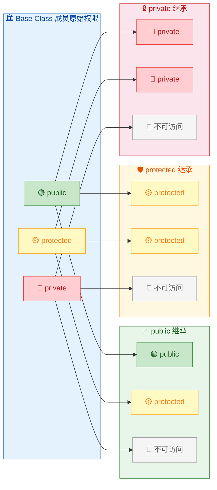

记忆口诀：**继承方式就像一道"天花板"，基类成员的权限不能高于这道天花板**。public 天花板最高（不限制），protected 居中，private 最低（全部压到最低）。用公式表达就是：

```
派生类中的访问权限 = min(基类成员原始权限, 继承方式)
```

其中权限等级：`public > protected > private`。

---

### 默认继承方式

一个容易忽略的细节：**`class` 和 `struct` 的默认继承方式不同**：

```cpp
class Derived1 : Base { };             // 等价于 class Derived1 : private Base { }
                                        // class 默认是 private 继承

struct Derived2 : Base { };            // 等价于 struct Derived2 : public Base { }
                                        // struct 默认是 public 继承
```

这与 `class` 默认成员权限为 `private`、`struct` 默认为 `public` 的规则是一致的。在实际编码中，**强烈建议显式写出继承方式**，不要依赖默认值，以提高代码可读性。

---

### 继承中的构造与析构顺序

当创建一个派生类对象时，构造函数的调用顺序是**从基类到派生类**；而析构函数的调用顺序则完全相反，是**从派生类到基类**。这遵循一个直觉：先打地基，再盖房子；拆房子时先拆屋顶，最后挖地基。

```cpp
#include <iostream>
using namespace std;

class Base {
public:
    Base() { cout << "[1] Base 构造" << endl; }       // 基类构造函数
    ~Base() { cout << "[4] Base 析构" << endl; }      // 基类析构函数
};

class Derived : public Base {
public:
    Derived() { cout << "[2] Derived 构造" << endl; }  // 派生类构造函数
    ~Derived() { cout << "[3] Derived 析构" << endl; } // 派生类析构函数
};

int main() {
    cout << "--- 创建对象 ---" << endl;
    Derived d;                                          // 创建派生类对象
    cout << "--- 对象即将销毁 ---" << endl;
    return 0;                                           // d 离开作用域，自动析构
}
```

输出结果：

```
--- 创建对象 ---
[1] Base 构造
[2] Derived 构造
--- 对象即将销毁 ---
[3] Derived 析构
[4] Base 析构
```

如果基类没有默认构造函数（即需要参数），派生类必须在**初始化列表**中显式调用基类构造函数：

```cpp
class Base {
public:
    Base(int x) {                                       // 基类没有默认构造函数
        cout << "Base(" << x << ")" << endl;
    }
};

class Derived : public Base {
public:
    // 必须在初始化列表中调用 Base(int)
    Derived(int x, int y) : Base(x) {                  // 先初始化基类部分
        cout << "Derived(" << y << ")" << endl;
    }
};

int main() {
    Derived d(10, 20);                                  // 输出：Base(10) → Derived(20)
    return 0;
}
```

---

### 继承中的隐藏（Name Hiding）

当派生类定义了一个与基类**同名**的成员（无论参数列表是否相同），基类的同名成员会被**隐藏（hide）**。这与函数重载（overload）不同——隐藏是跨作用域的"遮挡"，而重载发生在同一作用域内：

```cpp
#include <iostream>
using namespace std;

class Base {
public:
    void func() {                                       // 基类无参版本
        cout << "Base::func()" << endl;
    }
    void func(int x) {                                  // 基类有参版本
        cout << "Base::func(" << x << ")" << endl;
    }
};

class Derived : public Base {
public:
    void func() {                                       // 派生类定义了同名 func()
        cout << "Derived::func()" << endl;
    }
    // 注意：此时 Base::func() 和 Base::func(int) 都被隐藏了！
};

int main() {
    Derived d;
    d.func();                                           // ✅ 调用 Derived::func()
    // d.func(42);                                      // ❌ 编译错误！Base::func(int) 被隐藏了
    d.Base::func(42);                                   // ✅ 使用作用域限定符显式调用
    return 0;
}
```

如果你想在派生类中同时保留基类的重载版本，可以使用 `using` 声明把基类的名字"引入"到派生类的作用域中：

```cpp
class Derived : public Base {
public:
    using Base::func;                                   // 将 Base 的所有 func 引入 Derived 作用域
    void func() {                                       // 派生类自己的版本仍然存在
        cout << "Derived::func()" << endl;
    }
};

int main() {
    Derived d;
    d.func();                                           // ✅ Derived::func()（精确匹配）
    d.func(42);                                         // ✅ Base::func(int)（通过 using 引入）
    return 0;
}
```

---

### 继承体系下的内存布局（简化模型）

一个派生类对象在内存中的布局，本质上就是**基类子对象 + 派生类新增成员**的组合。以如下代码为例：

```cpp
class Base {
public:
    int a;          // 4 bytes
    int b;          // 4 bytes
};

class Derived : public Base {
public:
    int c;          // 4 bytes
    int d;          // 4 bytes
};
```

内存布局可以用 ASCII 图表示：

```
        Derived 对象的内存布局
       ┌──────────────────────┐  低地址
       │   Base::a  (4 bytes) │  ← 基类子对象
       ├──────────────────────┤     开始
       │   Base::b  (4 bytes) │  ← 基类子对象
       ├──────────────────────┤     结束
       │ Derived::c (4 bytes) │  ← 派生类新增
       ├──────────────────────┤
       │ Derived::d (4 bytes) │  ← 派生类新增
       └──────────────────────┘  高地址

       总大小 = sizeof(Derived) = 16 bytes
```

当基类指针指向派生类对象时，指针实际上指向的是对象起始处的**基类子对象部分**。这就是为什么向上转型（Upcasting）在 public 继承下是安全的——基类指针只能"看到"属于自己的那部分数据，不会越界访问派生类的新增成员。

---

### 本节小结

| 特性 | public 继承 | protected 继承 | private 继承 |
|:---|:---:|:---:|:---:|
| **语义** | Is-A | Is-A（隐藏） | Implemented-in-terms-of |
| **外部向上转型** | ✅ | ❌ | ❌ |
| **基类 public → 派生类中** | public | protected | private |
| **基类 protected → 派生类中** | protected | protected | private |
| **基类 private → 派生类中** | 不可访问 | 不可访问 | 不可访问 |
| **孙子类能否访问基类成员** | ✅ | ✅ | ❌ |
| **使用频率** | ⭐⭐⭐⭐⭐ | ⭐ | ⭐⭐ |

---

**📝 练习题**

以下代码的输出结果是什么？

```cpp
#include <iostream>
using namespace std;

class A {
public:
    A() { cout << "A "; }
    ~A() { cout << "~A "; }
};

class B : public A {
public:
    B() { cout << "B "; }
    ~B() { cout << "~B "; }
};

class C : public B {
public:
    C() { cout << "C "; }
    ~C() { cout << "~C "; }
};

int main() {
    C obj;
    return 0;
}
```

A. `C B A ~A ~B ~C`

B. `A B C ~A ~B ~C`

C. `A B C ~C ~B ~A`

D. `C B A ~C ~B ~A`


**【答案】** C

**【解析】** C++ 继承体系中，构造函数的调用顺序严格遵循**从最顶层基类到最底层派生类**（A → B → C）。这是因为派生类的初始化可能依赖于基类已经构造好的状态，所以必须"先打地基"。析构函数则完全相反，遵循**从最底层派生类到最顶层基类**（~C → ~B → ~A）。这保证了在析构过程中，派生类部分先被清理，此时基类部分仍然完整可用；随后才销毁基类部分。整个过程可以概括为 **LIFO（Last In, First Out）** 原则——最后构造的最先析构。因此输出为 `A B C ~C ~B ~A`。

---

## 虚函数 ⭐⭐（virtual、动态绑定）

在上一节中我们学习了继承的三种方式，知道了派生类可以"继承"基类的成员。但继承真正强大的地方，并不仅仅是"代码复用"——而是 **多态（Polymorphism）**。多态的核心机制，就是 **虚函数（Virtual Function）**。

可以毫不夸张地说，理解虚函数就是理解 C++ 面向对象编程的分水岭。它回答了一个关键问题：**当我们通过基类的指针或引用调用一个函数时，程序到底执行的是哪个版本的函数？** 是基类自己的？还是派生类重写（Override）后的？

---

### 从一个问题开始：静态绑定的局限

在没有 `virtual` 关键字的世界里，C++ 的函数调用遵循 **静态绑定（Static Binding / Early Binding）**。也就是说，编译器在 **编译期（Compile Time）** 就根据指针或引用的 **声明类型（Static Type）** 决定了调用哪个函数。来看一个经典的例子：

```cpp
#include <iostream>
using namespace std;

// 基类：动物
class Animal {
public:
    // 注意：这里没有 virtual 关键字
    void speak() {                          // 基类版本的 speak
        cout << "Animal speaks..." << endl;
    }
};

// 派生类：猫
class Cat : public Animal {
public:
    void speak() {                          // 派生类"隐藏"了基类的 speak
        cout << "Meow~" << endl;
    }
};

int main() {
    Cat myCat;                              // 创建一个 Cat 对象
    Animal* ptr = &myCat;                   // 用基类指针指向派生类对象（向上转型，完全合法）
    ptr->speak();                           // ❓ 输出什么？
    return 0;
}
```

你可能期望输出 `Meow~`，毕竟 `ptr` 指向的是一个真正的 `Cat` 对象。但实际输出是：

```
Animal speaks...
```

**为什么？** 因为在静态绑定下，编译器只看 `ptr` 的声明类型——它是 `Animal*`，所以编译器直接把这次调用"绑定"到了 `Animal::speak()`。编译器根本不关心 `ptr` 在运行时究竟指向的是什么对象。这就是静态绑定的本质：**类型决定行为，而非对象决定行为。**

这带来一个巨大的限制。在实际工程中，我们经常需要用一个统一的基类指针来管理一批不同类型的派生类对象（比如一个 `Animal*` 数组里既有 `Cat` 也有 `Dog`），然后逐一调用它们的 `speak()`。如果行为总是被"钉死"在基类版本上，那继承还有什么意义？

**这就是虚函数要解决的核心问题。**

---

### virtual 关键字：开启动态绑定

只需要在基类函数声明前加上 `virtual` 关键字，一切就不同了：

```cpp
#include <iostream>
using namespace std;

class Animal {
public:
    // ✅ 加上 virtual —— 这个函数现在是"虚函数"
    virtual void speak() {                  // 声明为虚函数
        cout << "Animal speaks..." << endl;
    }
};

class Cat : public Animal {
public:
    // 派生类重写（Override）基类的虚函数
    // 这里加不加 virtual 都可以，它已经"继承"了虚函数的性质
    void speak() {                          // 重写基类的 speak
        cout << "Meow~" << endl;
    }
};

class Dog : public Animal {
public:
    void speak() {                          // 重写基类的 speak
        cout << "Woof!" << endl;
    }
};

int main() {
    Cat myCat;                              // Cat 对象
    Dog myDog;                              // Dog 对象

    Animal* p1 = &myCat;                    // 基类指针 → Cat 对象
    Animal* p2 = &myDog;                    // 基类指针 → Dog 对象

    p1->speak();                            // ✅ 输出 "Meow~"  —— 调用的是 Cat::speak()
    p2->speak();                            // ✅ 输出 "Woof!"  —— 调用的是 Dog::speak()

    return 0;
}
```

输出：

```
Meow~
Woof!
```

现在，程序的行为不再由指针的声明类型（`Animal*`）决定，而是由指针在运行时 **实际指向的对象类型** 来决定。`p1` 指向 `Cat`，就调用 `Cat::speak()`；`p2` 指向 `Dog`，就调用 `Dog::speak()`。

**这就是动态绑定（Dynamic Binding / Late Binding）**——函数调用的"绑定"被推迟到了 **运行期（Runtime）**，而非编译期。

---

### 静态绑定 vs 动态绑定：本质对比

我们用一张图来清晰地对比这两种绑定机制的全过程：

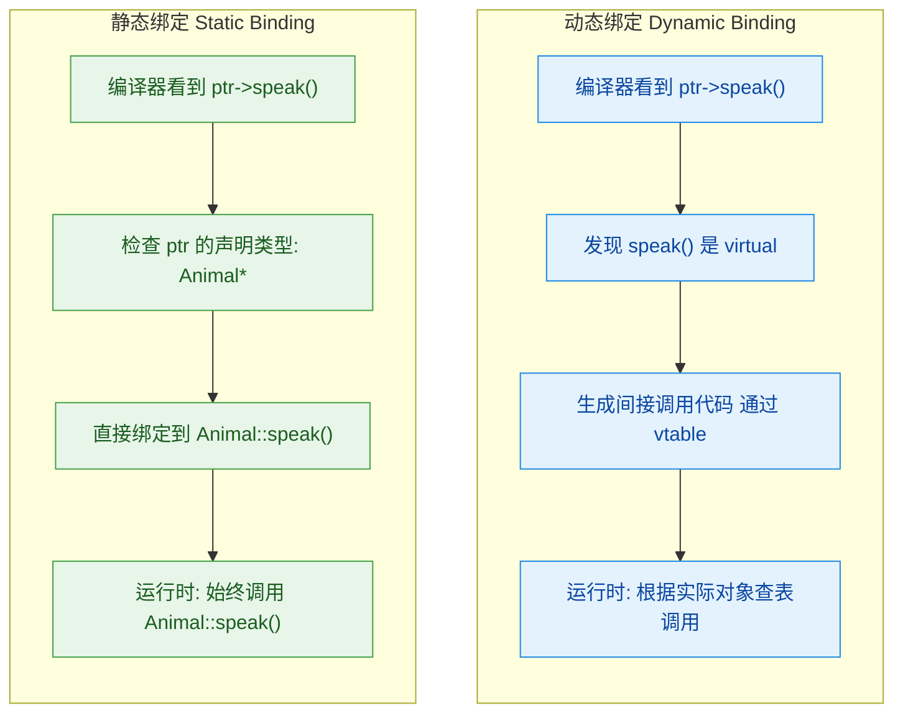

用一句话概括核心区别：

| 维度 | 静态绑定 (Static) | 动态绑定 (Dynamic) |
|---|---|---|
| **决定时机** | 编译期 (Compile Time) | 运行期 (Runtime) |
| **依据** | 指针/引用的 **声明类型** (Static Type) | 指针/引用 **实际指向的对象类型** (Dynamic Type) |
| **条件** | 非虚函数 | **虚函数** + 通过指针或引用调用 |
| **性能** | 零开销（直接调用） | 微小开销（间接跳转，通常一次指针解引用） |
| **灵活性** | 死板 | 极度灵活，是多态的基石 |

---

### 动态绑定的三个必要条件

动态绑定不是"默认行为"，它需要 **三个条件同时满足** 才能触发。缺少任何一个，都会退化为静态绑定：

**条件一：函数必须是虚函数（`virtual`）**

基类中的目标函数必须用 `virtual` 声明。如果基类的函数不是虚函数，那么无论如何都是静态绑定。

**条件二：必须通过指针（`*`）或引用（`&`）来调用**

这是很多初学者忽视的关键点。如果你通过 **对象本身（值类型）** 来调用虚函数，那么编译器会使用静态绑定，因为对象的类型在编译期是完全确定的。

```cpp
void makeItSpeak(Animal animal) {           // ⚠️ 值传递：发生了对象切片（Object Slicing）！
    animal.speak();                         // 静态绑定 → 始终调用 Animal::speak()
}

void makeItSpeak(Animal& animal) {          // ✅ 引用传递：保留了多态性
    animal.speak();                         // 动态绑定 → 根据实际对象类型调用
}

void makeItSpeak(Animal* animal) {          // ✅ 指针传递：保留了多态性
    animal->speak();                        // 动态绑定 → 根据实际对象类型调用
}
```

> ⚠️ **对象切片（Object Slicing）** 是一个经典陷阱：当派生类对象通过 **值传递** 给一个基类类型的参数时，派生类特有的部分会被"切掉"，只留下基类的部分。此时对象的类型就是 `Animal`，不再是 `Cat` 或 `Dog`，多态性完全丧失。

**条件三：派生类必须重写（Override）该虚函数**

派生类中的函数必须与基类的虚函数具有 **完全相同的签名**（函数名、参数列表、const 修饰符）。返回类型通常也要相同（有一个例外叫协变返回类型 Covariant Return Type，后面会讲）。如果签名不匹配，派生类的函数就不是"重写"，而是"隐藏（Hide）"，不会参与动态绑定。

```cpp
class Animal {
public:
    virtual void speak() {                  // 虚函数
        cout << "Animal speaks..." << endl;
    }
};

class Cat : public Animal {
public:
    // ❌ 参数列表不同 → 这不是重写（Override），而是隐藏（Hide）！
    void speak(int volume) {                // 签名与基类不匹配
        cout << "Meow at volume " << volume << endl;
    }
};

int main() {
    Cat myCat;
    Animal* ptr = &myCat;
    ptr->speak();                           // 调用的依然是 Animal::speak()
    return 0;                               // 因为 Cat 并没有真正"重写"它
}
```

为了防止这种"以为重写了实际没有"的 Bug，C++11 引入了 `override` 关键字（将在后续小节详述）。

---

### 虚函数的继承传递性

一个非常重要的特性是：**虚函数的"虚"性会沿着继承链自动传递。** 一旦基类中某个函数被声明为 `virtual`，那么所有派生类中同签名的函数 **自动也是虚函数**，无论派生类有没有显式写 `virtual`。

```cpp
class Animal {
public:
    virtual void speak() {                  // 声明为 virtual
        cout << "Animal" << endl;
    }
};

class Cat : public Animal {
public:
    void speak() {                          // 没写 virtual，但它自动是虚函数
        cout << "Cat" << endl;
    }
};

class Kitten : public Cat {
public:
    void speak() {                          // 同样自动是虚函数（从 Animal 一路传递下来）
        cout << "Kitten" << endl;
    }
};

int main() {
    Kitten k;
    Animal* p1 = &k;                        // Animal 指针指向 Kitten
    Cat* p2 = &k;                           // Cat 指针指向 Kitten

    p1->speak();                            // 输出 "Kitten" ✅ 动态绑定
    p2->speak();                            // 输出 "Kitten" ✅ 动态绑定
    return 0;
}
```

虽然虚性会自动继承，但 **良好的编码习惯** 是在派生类中也显式加上 `virtual`（或更好的，使用 `override`），以提高代码的可读性和可维护性。

---

### 协变返回类型（Covariant Return Type）

前面提到，重写虚函数要求返回类型通常也要相同。但有一个重要的例外：如果基类虚函数返回的是 **基类的指针或引用**，那么派生类重写时可以返回 **派生类的指针或引用**。这就是所谓的 **协变返回类型（Covariant Return Type）**。

```cpp
class Animal {
public:
    virtual Animal* clone() {               // 返回 Animal*
        return new Animal(*this);           // 拷贝自身
    }
    virtual ~Animal() {}                    // 虚析构（良好实践）
};

class Cat : public Animal {
public:
    // ✅ 返回 Cat* 而不是 Animal* —— 这是合法的协变返回
    Cat* clone() override {                 // 返回类型是基类返回类型的派生类指针
        return new Cat(*this);              // 拷贝自身
    }
};

int main() {
    Cat myCat;
    Animal* pAnimal = &myCat;
    Animal* cloned = pAnimal->clone();      // 动态绑定 → 调用 Cat::clone()，返回的实际是 Cat*
    // cloned 的声明类型是 Animal*，但实际指向的是一个 Cat 对象
    delete cloned;
    return 0;
}
```

协变返回类型在 **工厂模式（Factory Pattern）** 和 **克隆模式（Prototype Pattern）** 中非常有用，它使得 API 的类型更加精确。

---

### 深入理解动态绑定的运行时机制

你可能会好奇：程序在运行时是"怎么做到"根据对象类型来选择函数的？答案是 **虚函数表（Virtual Table，简称 vtable）**。这里做一个概要说明（详细内容在后续 vtable 专题中展开）。

当一个类中包含至少一个虚函数时，编译器会为这个类生成一张 **虚函数表**——一个函数指针数组，里面存放着这个类的每个虚函数的实际地址。同时，每个对象的内存布局中会被插入一个隐藏的指针 **vptr（虚表指针）**，指向所属类的 vtable。

```
┌──────────────────────────────────────────────────────────┐
│                     对象内存布局                           │
├──────────────────────────────────────────────────────────┤
│                                                          │
│   Animal 对象              Cat 对象              Dog 对象  │
│  ┌──────────┐           ┌──────────┐         ┌──────────┐│
│  │  vptr ───┼──┐        │  vptr ───┼──┐      │  vptr ───┼┼─┐  │
│  │  ...data │  │        │  ...data │  │      │  ...data ││ │  │
│  └──────────┘  │        └──────────┘  │      └──────────┘│ │  │
│                │                      │                  │ │  │
│                ▼                      ▼                  │ ▼  │
│       Animal vtable          Cat vtable          Dog vtable   │
│      ┌──────────────┐    ┌──────────────┐    ┌──────────────┐ │
│      │Animal::speak │    │ Cat::speak   │    │ Dog::speak   │ │
│      └──────────────┘    └──────────────┘    └──────────────┘ │
│                                                          │
└──────────────────────────────────────────────────────────┘
```

当执行 `ptr->speak()` 时，实际发生的步骤（伪代码）：

```cpp
// ptr->speak() 的底层等价操作：
// 1. 通过 ptr 找到对象
// 2. 从对象中读取 vptr（虚表指针）
// 3. 在 vtable 中找到 speak() 对应的条目（假设是第 0 个）
// 4. 调用该条目中存储的函数指针

(*(ptr->vptr[0]))(ptr);                    // 伪代码：间接调用
```

这就是为什么动态绑定有一个微小的运行时开销：比起直接调用（`call 固定地址`），它多了一次指针解引用（查表操作）。但在现代 CPU 上，这个开销几乎可以忽略不计。

---

### 虚函数的实际应用：多态的威力

让我们用一个更贴近工程实际的例子来展示虚函数的威力——一个简单的图形绘制系统：

```cpp
#include <iostream>
#include <vector>
#include <memory>
using namespace std;

// 基类：图形（Shape）
class Shape {
public:
    virtual void draw() const {             // 虚函数：绘制图形
        cout << "Drawing a generic shape" << endl;
    }
    virtual double area() const {           // 虚函数：计算面积
        return 0.0;
    }
    virtual ~Shape() = default;             // 虚析构函数（最佳实践）
};

// 派生类：圆形
class Circle : public Shape {
private:
    double radius;                          // 半径
public:
    Circle(double r) : radius(r) {}         // 构造函数

    void draw() const override {            // 重写 draw
        cout << "Drawing a Circle (r=" << radius << ")" << endl;
    }
    double area() const override {          // 重写 area
        return 3.14159 * radius * radius;   // πr²
    }
};

// 派生类：矩形
class Rectangle : public Shape {
private:
    double width, height;                   // 宽和高
public:
    Rectangle(double w, double h)           // 构造函数
        : width(w), height(h) {}

    void draw() const override {            // 重写 draw
        cout << "Drawing a Rectangle (" << width << "x" << height << ")" << endl;
    }
    double area() const override {          // 重写 area
        return width * height;              // 宽 × 高
    }
};

// 派生类：三角形
class Triangle : public Shape {
private:
    double base, height;                    // 底和高
public:
    Triangle(double b, double h)            // 构造函数
        : base(b), height(h) {}

    void draw() const override {            // 重写 draw
        cout << "Drawing a Triangle (b=" << base << ", h=" << height << ")" << endl;
    }
    double area() const override {          // 重写 area
        return 0.5 * base * height;         // ½ × 底 × 高
    }
};

// ✅ 这个函数完全不知道具体是什么图形，但它能正确工作！
void renderAll(const vector<unique_ptr<Shape>>& shapes) {
    for (const auto& s : shapes) {          // 遍历所有图形
        s->draw();                          // 动态绑定：调用实际类型的 draw()
        cout << "  Area = " << s->area()    // 动态绑定：调用实际类型的 area()
             << endl;
    }
}

int main() {
    vector<unique_ptr<Shape>> canvas;       // 画布：存放各种图形

    canvas.push_back(make_unique<Circle>(5.0));         // 添加圆形
    canvas.push_back(make_unique<Rectangle>(4.0, 6.0)); // 添加矩形
    canvas.push_back(make_unique<Triangle>(3.0, 8.0));  // 添加三角形

    renderAll(canvas);                      // 渲染所有图形

    return 0;
}
```

输出：

```
Drawing a Circle (r=5)
  Area = 78.5398
Drawing a Rectangle (4x6)
  Area = 24
Drawing a Triangle (b=3, h=8)
  Area = 12
```

这个例子完美体现了多态的价值：

- **`renderAll()` 函数只依赖基类 `Shape` 的接口**，它不需要知道具体有哪些图形。
- **新增图形类型（如 `Pentagon`）时，`renderAll()` 完全不需要修改**——这就是 **开闭原则（Open-Closed Principle）**：对扩展开放，对修改关闭。
- 所有的类型判断和函数调度都由 vtable 在运行时自动完成。

---

### 虚函数的使用注意事项与最佳实践

**1. 构造函数中不要依赖虚函数的多态行为**

在构造函数执行期间，对象的类型是"逐层构建"的。当基类构造函数运行时，派生类部分还没有被构造，所以此时虚函数调用 **不会** 触发动态绑定，只会调用当前正在构造的类的版本。

```cpp
class Base {
public:
    Base() {
        speak();                            // ⚠️ 这里调用的永远是 Base::speak()
    }                                       // 即使实际创建的是 Derived 对象
    virtual void speak() {
        cout << "Base::speak()" << endl;
    }
};

class Derived : public Base {
public:
    Derived() {}                            // 先执行 Base()，此时 Derived 还未构造完成
    void speak() override {
        cout << "Derived::speak()" << endl;
    }
};

int main() {
    Derived d;                              // 输出 "Base::speak()"，不是 "Derived::speak()"
    return 0;
}
```

> 🔑 **Scott Meyers（《Effective C++》作者）的名言**：Never call virtual functions during construction or destruction.（永远不要在构造或析构期间调用虚函数。）

**2. 析构函数中也不要依赖虚函数的多态行为**

原理与构造函数相同但方向相反：在析构函数执行时，派生类部分已经被销毁，对象"退化"回了基类类型。

**3. 虚函数有（很小的）开销**

每个含虚函数的对象会多一个 vptr（通常 8 字节，64 位系统）。每次虚函数调用比普通调用多一次间接跳转。在 99% 的场景下可以忽略，但在极端性能敏感的热路径（如游戏引擎的每帧百万次调用）中需要注意。

**4. 不要把所有函数都设为 virtual**

只有那些 **你期望派生类会重写** 的函数才应该声明为虚函数。非虚函数表达的语义是"我不打算让派生类改变这个行为"（Non-Virtual Interface 模式正是基于这一思想）。

---

### 虚函数 vs 函数重载 vs 函数隐藏：三者对比

初学者经常混淆这三个概念，下面的流程图帮助你快速区分：

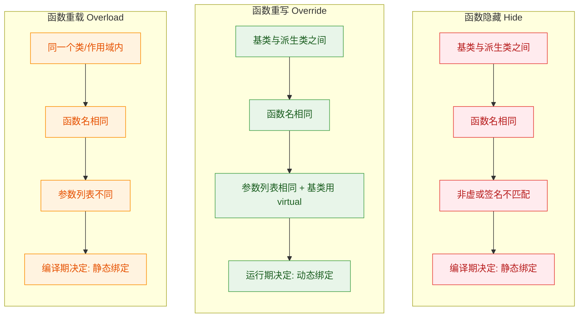

| 特性 | 重载 (Overload) | 重写 (Override) | 隐藏 (Hide) |
|---|---|---|---|
| **作用域** | 同一个类内 | 基类 ↔ 派生类 | 基类 ↔ 派生类 |
| **函数名** | 相同 | 相同 | 相同 |
| **参数列表** | **必须不同** | **必须相同** | 相同或不同均可 |
| **virtual** | 不涉及 | **基类必须 virtual** | 非 virtual，或签名不匹配 |
| **绑定方式** | 静态 | **动态** | 静态 |
| **是否多态** | 否（编译期选择） | **是（运行时选择）** | 否（且容易导致 Bug） |

一句话速记：

- **Overload（重载）**：同一个类里，名字一样但参数不同。
- **Override（重写）**：父子之间，名字和参数都一样，基类有 `virtual`。
- **Hide（隐藏）**：父子之间，名字一样但不满足 Override 条件，派生类"遮住"了基类的函数。

---

### 补充：用 `using` 解除隐藏

当派生类不小心隐藏了基类的重载函数时，可以用 `using` 声明将基类版本"拉"到派生类的作用域中：

```cpp
class Base {
public:
    virtual void func(int x) {              // 版本 A：接收 int
        cout << "Base::func(int)" << endl;
    }
    virtual void func(double x) {           // 版本 B：接收 double
        cout << "Base::func(double)" << endl;
    }
};

class Derived : public Base {
public:
    using Base::func;                       // ✅ 将 Base 的所有 func 重载引入 Derived 作用域

    void func(int x) override {             // 只重写 int 版本
        cout << "Derived::func(int)" << endl;
    }
    // func(double) 依然可见，来自 Base
};

int main() {
    Derived d;
    d.func(42);                             // 调用 Derived::func(int)
    d.func(3.14);                           // 调用 Base::func(double)  ← 没有 using 就会编译报错
    return 0;
}
```

如果不写 `using Base::func;`，`Derived` 中的 `func(int)` 会隐藏 `Base` 中所有叫 `func` 的函数（包括 `func(double)`），导致 `d.func(3.14)` 编译错误或产生非预期行为。

---

### 本节核心总结

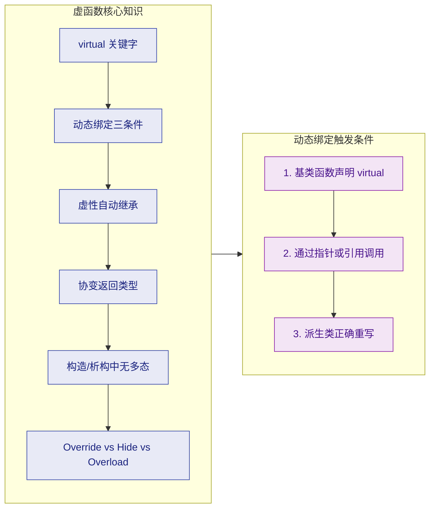

---

**📝 练习题**

以下代码的输出是什么？

```cpp
#include <iostream>
using namespace std;

class A {
public:
    virtual void foo() { cout << "A::foo "; }
    void bar()         { cout << "A::bar "; }
};

class B : public A {
public:
    void foo() override { cout << "B::foo "; }
    void bar()          { cout << "B::bar "; }
};

int main() {
    B b;
    A* p = &b;
    p->foo();
    p->bar();
    return 0;
}
```

A. `A::foo A::bar`

B. `B::foo B::bar`

C. `B::foo A::bar`

D. `A::foo B::bar`


**【答案】** C

**【解析】** `p` 的声明类型是 `A*`，指向的实际对象类型是 `B`。调用 `p->foo()` 时，因为 `foo()` 是 **虚函数**，触发动态绑定，根据实际对象类型 `B` 调用 `B::foo()`，输出 `B::foo`。而调用 `p->bar()` 时，因为 `bar()` 是 **非虚函数**，采用静态绑定，根据指针声明类型 `A*` 调用 `A::bar()`，输出 `A::bar`。这道题精准考察了虚函数动态绑定与非虚函数静态绑定的区别——同一个指针、同一个对象，虚函数和非虚函数的调用路径截然不同。

---

**📝 练习题**

以下代码中，`Derived` 类的 `func` 是否成功重写了 `Base` 的虚函数？

```cpp
class Base {
public:
    virtual void func(int x) const { }
};

class Derived : public Base {
public:
    void func(int x) { }   // 注意：没有 const
};
```

A. 是，成功重写了

B. 否，`Derived::func` 只是隐藏了 `Base::func`

C. 编译错误

D. 运行时错误


**【答案】** B

**【解析】** 虚函数的重写（Override）要求签名 **完全匹配**，其中 **`const` 修饰符也是函数签名的一部分**。`Base::func(int) const` 和 `Derived::func(int)`（无 `const`）被编译器视为两个不同的函数。因此 `Derived::func` 并没有重写基类的虚函数，而是在派生类作用域中引入了一个新函数，**隐藏（Hide）** 了基类版本。这类 Bug 非常隐蔽，正是 C++11 引入 `override` 关键字的动机——如果加上 `override`，编译器会立即报错，提醒你签名不匹配。

---

## 纯虚函数与抽象类（Pure Virtual Functions & Abstract Classes）

在上一节中，我们学习了虚函数如何通过动态绑定（Dynamic Binding）让基类指针在运行时调用到派生类的重写版本。但有一个关键问题浮现了：**如果基类本身就是一个"抽象概念"，它根本不应该有函数的具体实现，该怎么办？** 比如，"形状（Shape）"这个概念本身没有面积计算公式，只有"圆形""矩形"等具体形状才有。此时，我们需要一种机制来**强制**派生类必须提供自己的实现——这就是 **纯虚函数（Pure Virtual Function）** 的用武之地，而包含纯虚函数的类，就被称为 **抽象类（Abstract Class）**。

### 纯虚函数的语法与语义

纯虚函数的声明方式非常简洁，只需要在虚函数声明的末尾加上 `= 0`：

```c++
class Shape {
public:
    // 纯虚函数：声明末尾 = 0，表示该函数没有默认实现
    // 任何继承 Shape 的派生类，必须重写(override)此函数，否则自身也变成抽象类
    virtual double area() const = 0;

    // 纯虚函数同样可以有多个
    virtual void draw() const = 0;

    // 普通虚函数（非纯虚），基类可以提供默认实现
    virtual std::string color() const {
        return "none";  // 默认颜色
    }

    // 虚析构函数（良好习惯，后续章节详述）
    virtual ~Shape() = default;
};
```

这里的 `= 0` 并不是赋值，它是 C++ 的一种**特殊语法标记（pure-specifier）**，告诉编译器：

> "这个函数**在本类中没有实现体（no definition in this class）**，派生类**必须**提供重写。"

一旦一个类中存在**至少一个**纯虚函数，该类就自动成为 **抽象类**。抽象类有一条铁律：

```c++
Shape s;           // ❌ 编译错误！不能实例化抽象类
Shape* p = new Shape();  // ❌ 同样错误！
```

但是，抽象类可以作为**指针或引用**的类型，这正是多态的基石：

```c++
Shape* p = nullptr;      // ✅ 合法，只是声明指针
Shape& r = someCircle;   // ✅ 合法，引用一个具体的派生类对象
```

我们可以用一张图来直观地理解纯虚函数、虚函数和普通函数的区别层级：

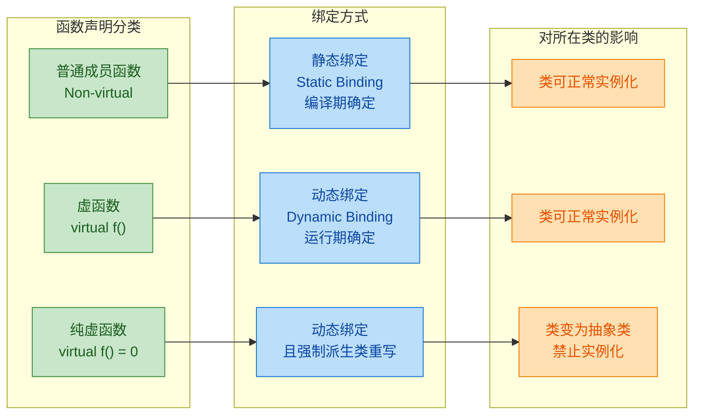

关键对比总结如下：

| 特性 | 普通函数 | 虚函数 `virtual` | 纯虚函数 `= 0` |
|---|---|---|---|
| 绑定时机 | 编译期（静态） | 运行期（动态） | 运行期（动态） |
| 基类可否提供实现 | 必须提供 | 可以提供（默认实现） | 通常不提供（但**允许**提供） |
| 派生类是否必须重写 | 不需要 | 不强制 | **强制**，否则派生类也变抽象类 |
| 基类能否实例化 | 能 | 能 | **不能** |

### 抽象类的本质：定义接口契约

抽象类最核心的设计哲学是：**它定义了一套"接口契约"（Interface Contract），规定派生类必须具备哪些能力，但不规定这些能力如何实现。** 这与面向对象设计中的 **"Program to an interface, not an implementation"（面向接口编程）** 原则完全一致。

我们用一个完整的例子来感受这种设计模式：

```c++
#include <iostream>
#include <cmath>     // M_PI
#include <vector>
#include <memory>    // std::unique_ptr

// ============ 抽象基类：Shape ============
// Shape 定义了所有形状必须遵守的"契约"
class Shape {
public:
    // 纯虚函数：计算面积 —— 每种形状的面积公式不同，基类无法给出通用实现
    virtual double area() const = 0;

    // 纯虚函数：计算周长 —— 同理，必须由具体形状自己实现
    virtual double perimeter() const = 0;

    // 纯虚函数：打印形状信息
    virtual void print() const = 0;

    // 虚析构函数：确保通过基类指针 delete 时能正确析构派生类
    virtual ~Shape() = default;
};

// ============ 具体派生类：Circle ============
class Circle : public Shape {
private:
    double radius_;  // 圆的半径

public:
    // 构造函数：使用初始化列表设置半径
    explicit Circle(double r) : radius_(r) {}

    // 重写 area()：圆面积 = π * r²
    double area() const override {
        return M_PI * radius_ * radius_;
    }

    // 重写 perimeter()：圆周长 = 2 * π * r
    double perimeter() const override {
        return 2.0 * M_PI * radius_;
    }

    // 重写 print()：输出圆的信息
    void print() const override {
        std::cout << "Circle(r=" << radius_
                  << ", area=" << area()
                  << ", perimeter=" << perimeter() << ")" << std::endl;
    }
};

// ============ 具体派生类：Rectangle ============
class Rectangle : public Shape {
private:
    double width_;   // 矩形的宽
    double height_;  // 矩形的高

public:
    // 构造函数
    Rectangle(double w, double h) : width_(w), height_(h) {}

    // 重写 area()：矩形面积 = 宽 × 高
    double area() const override {
        return width_ * height_;
    }

    // 重写 perimeter()：矩形周长 = 2 * (宽 + 高)
    double perimeter() const override {
        return 2.0 * (width_ + height_);
    }

    // 重写 print()：输出矩形的信息
    void print() const override {
        std::cout << "Rectangle(w=" << width_ << ", h=" << height_
                  << ", area=" << area()
                  << ", perimeter=" << perimeter() << ")" << std::endl;
    }
};
```

使用这个体系的客户端代码可以完全面向 `Shape` 接口编程，而无需关心具体类型：

```c++
int main() {
    // 使用智能指针管理对象生命周期，基类指针指向派生类对象
    std::vector<std::unique_ptr<Shape>> shapes;

    // emplace_back 直接在容器尾部构造元素（避免额外拷贝）
    shapes.emplace_back(std::make_unique<Circle>(5.0));        // 半径为 5 的圆
    shapes.emplace_back(std::make_unique<Rectangle>(3.0, 4.0)); // 3×4 矩形
    shapes.emplace_back(std::make_unique<Circle>(1.0));        // 半径为 1 的圆

    // 多态遍历：同一个循环处理所有不同类型的形状
    double totalArea = 0.0;  // 累计总面积
    for (const auto& shape : shapes) {
        shape->print();                // 动态绑定 → 调用各自的 print()
        totalArea += shape->area();    // 动态绑定 → 调用各自的 area()
    }

    std::cout << "Total area: " << totalArea << std::endl;
    // 输出:
    // Circle(r=5, area=78.5398, perimeter=31.4159)
    // Rectangle(w=3, h=4, area=12, perimeter=14)
    // Circle(r=1, area=3.14159, perimeter=6.28319)
    // Total area: 93.6814

    return 0;  // unique_ptr 自动释放所有对象
}
```

这段代码的精髓在于：`main` 函数中没有任何 `if (is Circle)` 或 `if (is Rectangle)` 的判断逻辑。当你未来新增一个 `Triangle` 类时，只需让它继承 `Shape` 并实现三个纯虚函数，`main` 中的代码 **无需任何修改** 就能正确处理三角形——这就是多态带来的 **开放-封闭原则（Open-Closed Principle, OCP）** 的威力。

### 纯虚函数也可以有函数体

很多初学者会误以为纯虚函数 **绝对不能** 有实现，但事实并非如此。C++ **允许** 为纯虚函数提供函数体（definition），只是调用方式比较特殊：

```c++
class Animal {
public:
    // 纯虚函数：声明为 = 0
    virtual void speak() const = 0;

    virtual ~Animal() = default;
};

// 在类外为纯虚函数提供函数体（注意：不能在类内直接写 = 0 和 {} 并存）
void Animal::speak() const {
    // 这是一个"默认的兜底实现"
    std::cout << "..." << std::endl;  // 动物默认发出沉默的声音
}

class Dog : public Animal {
public:
    // 派生类仍然必须重写（= 0 的强制性不变）
    void speak() const override {
        Animal::speak();  // 显式调用基类的纯虚函数实现（用作兜底逻辑）
        std::cout << "Woof!" << std::endl;  // 再追加自己的行为
    }
};
```

这种技巧的典型使用场景是：

1. **提供公共的默认逻辑**：纯虚函数体中放置所有派生类都需要执行的"基础步骤"，派生类在重写时通过 `Base::func()` 显式调用它，再追加自己的特化逻辑。
2. **安全的兜底行为**：如果派生类不小心在某条路径上调用了基类版本，至少不会是未定义行为。

尽管这种用法在实际工程中较少见，但理解它有助于你更深刻地认识 C++ 的设计哲学：**`= 0` 的含义是"派生类必须重写"，而非"基类不能有实现"。**

### 抽象类的继承链与"传递性"

如果一个派生类没有重写基类的 **所有** 纯虚函数，那么这个派生类本身也会成为抽象类，无法实例化。这种抽象性具有 **传递性**：

```c++
// 第一层：抽象基类
class Shape {
public:
    virtual double area() const = 0;      // 纯虚函数 ①
    virtual double perimeter() const = 0; // 纯虚函数 ②
    virtual ~Shape() = default;
};

// 第二层：只重写了 area()，没有重写 perimeter()
// → ClosedShape 仍然是抽象类！
class ClosedShape : public Shape {
public:
    // 重写了纯虚函数 ①
    // 但纯虚函数 ② 未被重写 → 继承为纯虚 → 本类仍然抽象
};

// 第三层：补全所有纯虚函数 → 具体类
class Square : public ClosedShape {
private:
    double side_;

public:
    explicit Square(double s) : side_(s) {}

    // 继承自 Shape 的 area() 已在 ClosedShape 中被重写?
    // 不！ClosedShape 并没有重写 area()（上面的注释写错了，我们修正）
    // 实际上 ClosedShape 也没重写 area()，所以两个都需要在 Square 中重写

    double area() const override {        // 重写纯虚函数 ①
        return side_ * side_;
    }

    double perimeter() const override {   // 重写纯虚函数 ②
        return 4.0 * side_;
    }
};
```

让我们用更清晰的流程图来可视化这条继承链中抽象性的传递：

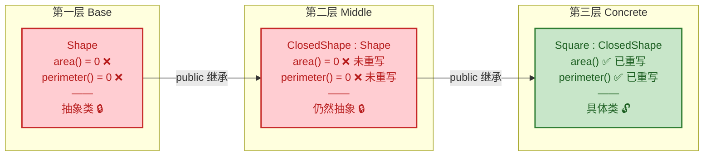

核心规则非常清晰：**沿继承链向下，只有当所有纯虚函数都被重写后，类才从"抽象"变为"具体"。** 任何一个纯虚函数的遗漏，都会让当前类继续保持抽象状态。

### 抽象类 vs. 纯接口类（Pure Interface）

在 C++ 中，没有像 Java 那样的 `interface` 关键字，但我们可以通过一种约定来模拟纯接口——即 **类中只包含纯虚函数和虚析构函数，不包含任何数据成员和具体实现**：

```c++
// ====== 纯接口类（Pure Interface）======
// 约定：无数据成员，无具体实现，全部纯虚函数
class ISerializable {
public:
    // 序列化：将对象转为字符串
    virtual std::string serialize() const = 0;

    // 反序列化：从字符串恢复对象状态
    virtual void deserialize(const std::string& data) = 0;

    // 虚析构（纯接口类也必须有）
    virtual ~ISerializable() = default;
};

// ====== 抽象类（Abstract Class）======
// 可以有数据成员，可以有部分函数的默认实现
class DatabaseEntity {
protected:
    int id_;                // 数据成员：实体 ID
    std::string tableName_; // 数据成员：对应的数据库表名

public:
    // 构造函数：设定表名
    explicit DatabaseEntity(const std::string& table)
        : id_(0), tableName_(table) {}

    // 纯虚函数：保存到数据库（具体 SQL 因子类而异）
    virtual bool save() = 0;

    // 普通虚函数：提供默认实现
    virtual std::string getTableName() const {
        return tableName_;  // 所有实体共享此逻辑
    }

    virtual ~DatabaseEntity() = default;
};
```

二者的对比：

| 特性 | 纯接口类（Pure Interface） | 抽象类（Abstract Class） |
|---|---|---|
| 数据成员 | **无** | 可以有 |
| 构造函数 | 通常无（或 `= default`） | 可以有，用于初始化数据成员 |
| 函数实现 | **全部**纯虚，无实现 | 可以混合纯虚、虚函数和普通函数 |
| 设计意图 | 定义**能力（capability）** | 定义**部分实现 + 扩展点** |
| 命名惯例 | 常以 `I` 开头（如 `ICloneable`） | 常以 `Base`/`Abstract` 前缀 |
| 类比 Java | `interface` | `abstract class` |

在实际工程中，纯接口类非常适合描述 **横切关注点（Cross-cutting Concerns）**，例如"可序列化""可克隆""可打印"等能力。一个类可以同时实现多个接口：

```c++
// Config 同时实现了两个"接口"
class Config : public ISerializable, public IPrintable {
public:
    // 必须重写 ISerializable 的所有纯虚函数
    std::string serialize() const override { /* ... */ }
    void deserialize(const std::string& data) override { /* ... */ }

    // 必须重写 IPrintable 的所有纯虚函数
    void print(std::ostream& os) const override { /* ... */ }
};
```

### 编译器如何对待抽象类

从编译器的视角，抽象类有几条硬性约束值得牢记：

**1. 不能创建抽象类的对象（最基本的规则）：**

```c++
Shape s;                    // ❌ 编译错误
Shape* p = new Shape();     // ❌ 编译错误
std::vector<Shape> vec;     // ⚠️ 声明合法，但一旦尝试 push_back 就会报错
```

**2. 可以声明抽象类的指针和引用：**

```c++
Shape* ptr = nullptr;            // ✅
Shape& ref = myCircle;           // ✅
std::vector<Shape*> vec;         // ✅ 存储指针
std::vector<std::unique_ptr<Shape>> vec2; // ✅ 更推荐智能指针
```

**3. 抽象类可以有构造函数（供派生类调用）：**

```c++
class Shape {
protected:
    std::string name_;  // 形状名称

    // protected 构造函数：不允许外部直接构造，但派生类可以调用
    explicit Shape(const std::string& name) : name_(name) {}

public:
    virtual double area() const = 0;
    virtual ~Shape() = default;

    // 非纯虚函数：所有形状共享此实现
    std::string getName() const { return name_; }
};

class Circle : public Shape {
    double radius_;
public:
    explicit Circle(double r)
        : Shape("Circle")  // 调用基类的 protected 构造函数
        , radius_(r) {}

    double area() const override {
        return M_PI * radius_ * radius_;
    }
};
```

**4. 抽象类可以有静态成员函数和静态数据成员：**

```c++
class Shape {
public:
    virtual double area() const = 0;
    virtual ~Shape() = default;

    // 静态成员：跟踪创建了多少个 Shape 派生类对象
    static int instanceCount;

    // 静态函数：与具体对象无关，可以正常调用
    static void printCount() {
        std::cout << "Total shapes: " << instanceCount << std::endl;
    }
};

int Shape::instanceCount = 0;  // 静态成员类外初始化

// 调用方式：通过类名直接调用，无需实例化
Shape::printCount();  // ✅ 完全合法
```

### 设计模式实战：模板方法模式（Template Method Pattern）

纯虚函数与抽象类最经典的工程应用之一，就是 **模板方法模式**。它的核心思想是：**基类定义算法的骨架（Skeleton），将某些步骤延迟到派生类中实现。**

```c++
#include <iostream>
#include <fstream>
#include <string>

// 抽象基类：定义"数据处理"的算法骨架
class DataProcessor {
public:
    // 模板方法（Template Method）：定义处理流程的骨架
    // 注意：这是一个 **非虚** 的普通函数，派生类不应重写它
    void process(const std::string& source) {
        std::string raw = readData(source);       // 步骤1：读取数据（纯虚）
        std::string parsed = parseData(raw);      // 步骤2：解析数据（纯虚）
        validate(parsed);                         // 步骤3：校验数据（有默认实现）
        saveResult(parsed);                       // 步骤4：保存结果（纯虚）
        std::cout << "Processing complete." << std::endl;
    }

    virtual ~DataProcessor() = default;

protected:
    // 纯虚函数：子类必须定义自己的读取方式
    virtual std::string readData(const std::string& source) = 0;

    // 纯虚函数：子类必须定义自己的解析方式
    virtual std::string parseData(const std::string& raw) = 0;

    // 虚函数（非纯虚）：提供默认的校验逻辑，子类可选择性重写
    virtual void validate(const std::string& data) {
        if (data.empty()) {
            throw std::runtime_error("Validation failed: empty data");
        }
        // 默认校验：只检查非空
    }

    // 纯虚函数：子类必须定义自己的保存方式
    virtual void saveResult(const std::string& data) = 0;
};

// 具体实现：处理 CSV 文件
class CsvProcessor : public DataProcessor {
protected:
    // 重写：从文件系统读取 CSV
    std::string readData(const std::string& source) override {
        std::cout << "Reading CSV from: " << source << std::endl;
        // 实际项目中会使用 std::ifstream 读文件
        return "name,age\nAlice,30\nBob,25";  // 模拟数据
    }

    // 重写：按 CSV 格式解析
    std::string parseData(const std::string& raw) override {
        std::cout << "Parsing CSV data..." << std::endl;
        return raw;  // 简化处理
    }

    // 重写：保存到数据库
    void saveResult(const std::string& data) override {
        std::cout << "Saving CSV results to database." << std::endl;
    }
};

// 具体实现：处理 JSON API
class JsonApiProcessor : public DataProcessor {
protected:
    std::string readData(const std::string& source) override {
        std::cout << "Fetching JSON from API: " << source << std::endl;
        return R"({"users": [{"name": "Alice"}]})";  // 模拟数据
    }

    std::string parseData(const std::string& raw) override {
        std::cout << "Parsing JSON data..." << std::endl;
        return raw;
    }

    // 重写 validate()：JSON 有更严格的校验需求
    void validate(const std::string& data) override {
        DataProcessor::validate(data);  // 先调用基类的默认校验
        if (data.front() != '{') {      // 追加 JSON 特有的校验
            throw std::runtime_error("Invalid JSON format");
        }
    }

    void saveResult(const std::string& data) override {
        std::cout << "Saving JSON results to cache." << std::endl;
    }
};
```

调用端代码展示了多态的优雅：

```c++
int main() {
    // 基类指针，指向不同的具体处理器
    std::unique_ptr<DataProcessor> processor;

    // 处理 CSV
    processor = std::make_unique<CsvProcessor>();
    processor->process("data/users.csv");   // 调用统一的 process() 骨架
    // 输出:
    // Reading CSV from: data/users.csv
    // Parsing CSV data...
    // Saving CSV results to database.
    // Processing complete.

    std::cout << "---" << std::endl;

    // 处理 JSON API
    processor = std::make_unique<JsonApiProcessor>();
    processor->process("https://api.example.com/users");
    // 输出:
    // Fetching JSON from API: https://api.example.com/users
    // Parsing JSON data...
    // Saving JSON results to cache.
    // Processing complete.

    return 0;
}
```

模板方法模式的类结构可以用下面的图来表达：

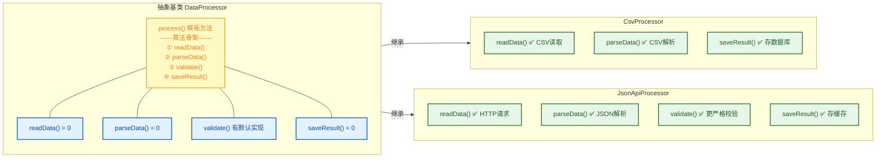

### 常见陷阱与注意事项

**陷阱 1：忘记重写某个纯虚函数**

```c++
class Triangle : public Shape {
public:
    double area() const override { return 0.5 * base_ * height_; }
    // ❌ 忘记重写 perimeter() → Triangle 仍然是抽象类
    // 尝试 Triangle t(3,4); 将编译失败
private:
    double base_, height_;
};
```

编译器会明确报错："cannot declare variable 't' to be of abstract type 'Triangle'"，并指出哪个纯虚函数未被重写。

**陷阱 2：在构造函数或析构函数中调用纯虚函数**

```c++
class Base {
public:
    Base() {
        doInit();  // ⚠️ 极其危险！
    }
    virtual void doInit() = 0;
    virtual ~Base() = default;
};
```

在构造函数执行期间，对象的动态类型（dynamic type）还是 `Base`（派生类部分尚未构造完成），此时调用纯虚函数 `doInit()` 会导致 **未定义行为（Undefined Behavior）**——通常表现为程序崩溃，因为 vtable 中对应的条目指向一个 `pure virtual function called` 的错误处理例程。这一规则同样适用于析构函数中调用纯虚函数的场景。

```c++
// 内存布局示意（构造过程中）
```
```
构造 Derived 对象时的执行顺序：

  ┌──────────────────────────────────────────────────┐
  │ Step 1: 调用 Base::Base()                         │
  │   此时 vptr → Base 的 vtable                      │
  │   如果此刻调用 doInit()                            │
  │   → 查 Base::vtable → doInit 是 pure virtual      │
  │   → 💥 UB / crash!                                │
  ├──────────────────────────────────────────────────┤
  │ Step 2: 调用 Derived::Derived()                   │
  │   此时 vptr → Derived 的 vtable                   │
  │   现在调用 doInit() 才会正确分派到                   │
  │   Derived::doInit()                               │
  └──────────────────────────────────────────────────┘
```

**陷阱 3：`= 0` 与 `= delete` 混淆**

```c++
virtual void func() = 0;       // 纯虚函数：派生类必须重写
virtual void func() = delete;  // ❌ 语法错误！虚函数不能 = delete
void func() = delete;          // 删除函数：彻底禁用，任何人不能调用
```

`= 0` 和 `= delete` 是完全不同的语义：前者是"我不提供默认实现，你来写"；后者是"这个函数被彻底删除，谁也别想调用"。并且，**虚函数不能标记为 `= delete`**，因为删除一个虚函数会破坏继承链的多态语义。

---

**📝 练习题**

以下代码的编译和运行结果是什么？

```c++
#include <iostream>

class A {
public:
    virtual void foo() = 0;
    virtual void bar() = 0;
    virtual ~A() = default;
};

class B : public A {
public:
    void foo() override { std::cout << "B::foo" << std::endl; }
};

class C : public B {
public:
    void bar() override { std::cout << "C::bar" << std::endl; }
};

int main() {
    A* p = new C();
    p->foo();
    p->bar();
    delete p;
    return 0;
}
```

A. 编译错误，因为 `B` 没有重写 `bar()`，`B` 是抽象类，不能被 `C` 继承


B. 编译通过并输出 `B::foo` 和 `C::bar`


C. 编译错误，因为 `C` 没有重写 `foo()`，`C` 是抽象类


D. 运行时错误，调用 `foo()` 时触发 pure virtual function called


**【答案】** B

**【解析】** 类 `B` 继承自 `A` 并重写了 `foo()`，但没有重写 `bar()`，所以 `B` 仍然是抽象类——这是合法的，抽象类完全可以被继承（选项 A 错误）。类 `C` 继承自 `B`，重写了 `bar()`。此时 `C` 的纯虚函数全貌为：`foo()` 已由 `B` 重写（`C` 自动继承该实现），`bar()` 已由 `C` 自身重写。**两个纯虚函数均已被重写**，所以 `C` 是一个具体类，可以正常实例化（选项 C 错误）。通过基类指针 `A* p` 调用 `foo()` 时，动态绑定找到 `B::foo()`；调用 `bar()` 时，动态绑定找到 `C::bar()`。程序正常运行，输出 `B::foo` 和 `C::bar`，没有任何运行时错误（选项 D 错误）。这道题的核心考点是：**纯虚函数的重写可以在继承链的任意层级完成，只要到最终实例化的类时所有纯虚函数都已被重写即可。**

---

## 虚析构函数 ⭐（为什么基类析构要 virtual）

在继承体系中，有一个极易被忽视却后果严重的陷阱：**通过基类指针 `delete` 派生类对象时，如果基类析构函数不是 `virtual` 的，派生类的析构函数将不会被调用**。这会直接导致资源泄漏（resource leak）、程序行为未定义（Undefined Behavior）。虚析构函数正是为解决这一问题而存在的关键机制。

### 问题的根源：静态绑定下的析构灾难

我们先回顾一个核心前提：C++ 默认使用 **静态绑定（Static Binding）**。编译器在编译期根据 **指针/引用的静态类型**（即声明时的类型）来决定调用哪个函数。析构函数也不例外——如果它不是 `virtual` 的，编译器只会根据指针的类型去调用对应的析构函数，完全无视指针实际指向的对象类型。

来看一个经典的反面教材：

```cpp
#include <iostream>
#include <cstring>

// ========== 基类：不带 virtual 析构 ==========
class Base {
public:
    Base() {
        std::cout << "Base::Base()" << std::endl;       // 基类构造
    }
    ~Base() {  // ⚠️ 注意：这里没有 virtual！
        std::cout << "Base::~Base()" << std::endl;      // 基类析构
    }
};

// ========== 派生类：持有堆内存资源 ==========
class Derived : public Base {
private:
    char* data_;                                         // 派生类拥有的堆资源

public:
    Derived(const char* str) : Base() {                  // 先构造基类
        data_ = new char[strlen(str) + 1];               // 在堆上分配内存
        strcpy(data_, str);                              // 拷贝字符串内容
        std::cout << "Derived::Derived() -> allocated: "
                  << data_ << std::endl;                 // 派生类构造完成
    }

    ~Derived() {                                         // 派生类析构
        std::cout << "Derived::~Derived() -> freeing: "
                  << data_ << std::endl;
        delete[] data_;                                  // 释放堆内存 ⬅️ 关键！
        data_ = nullptr;                                 // 安全置空
    }
};

int main() {
    Base* ptr = new Derived("Hello C++");                // 基类指针 → 派生类对象
    // ... 使用 ptr ...
    delete ptr;                                          // ⚠️ 通过基类指针 delete
    return 0;
}
```

**输出结果（典型实现下）：**

```
Base::Base()
Derived::Derived() -> allocated: Hello C++
Base::~Base()
```

请注意输出——`Derived::~Derived()` **完全没有被调用**！这意味着 `new char[]` 分配的堆内存永远不会被 `delete[]`，产生了 **内存泄漏（Memory Leak）**。更严重的是，C++ 标准明确规定：通过基类指针删除一个派生类对象，而基类析构函数非 `virtual`，其行为是 **未定义的（Undefined Behavior, UB）**。UB 意味着任何事情都可能发生——崩溃、数据损坏、看似正常但暗藏隐患。

下面这张图直观展示了问题的发生过程：

```mermaid
graph LR
    subgraph S1["1 - 创建阶段"]
        direction TB
        A["new Derived&#40;Hello C++&#41;"]
        B["Base::Base&#40;&#41; 构造"]
        C["Derived::Derived&#40;&#41; 构造"]
        D["堆上分配 char[] 内存"]
        A --> B --> C --> D
    end

    subgraph S2["2 - 使用阶段"]
        direction TB
        E["Base* ptr 指向 Derived 对象"]
        F["ptr 的静态类型 = Base*"]
        G["ptr 的动态类型 = Derived*"]
        E --> F --> G
    end

    subgraph S3["3 - 删除阶段 ⚠️"]
        direction TB
        H["delete ptr"]
        I["编译器查看 ptr 静态类型: Base*"]
        J["调用 Base::~Base&#40;&#41; ✅"]
        K["Derived::~Derived&#40;&#41; 未调用 ❌"]
        L["char[] 内存泄漏 💀"]
        H --> I --> J --> K --> L
    end

    S1 --> S2 --> S3

    classDef greenNode fill:#C8E6C9,stroke:#388E3C,color:#1B5E20
    classDef blueNode fill:#BBDEFB,stroke:#1976D2,color:#0D47A1
    classDef redNode fill:#FFCDD2,stroke:#D32F2F,color:#B71C1C

    class A,B,C,D greenNode
    class E,F,G blueNode
    class H,I,J,K,L redNode
```

### 解决方案：将基类析构函数声明为 virtual

解决办法非常简单——在基类析构函数前加上 `virtual` 关键字。这样，`delete` 基类指针时，编译器将通过 **虚函数表（vtable）** 进行动态绑定，找到对象真正的析构函数（即派生类的析构函数）并调用，随后编译器会自动沿继承链逆序调用所有基类的析构函数。

```cpp
#include <iostream>
#include <cstring>

// ========== 基类：带 virtual 析构 ==========
class Base {
public:
    Base() {
        std::cout << "Base::Base()" << std::endl;       // 基类构造
    }
    virtual ~Base() {  // ✅ 加上 virtual！
        std::cout << "Base::~Base()" << std::endl;      // 基类析构
    }
};

// ========== 派生类：持有堆内存资源 ==========
class Derived : public Base {
private:
    char* data_;                                         // 堆资源

public:
    Derived(const char* str) : Base() {                  // 先构造基类
        data_ = new char[strlen(str) + 1];               // 分配堆内存
        strcpy(data_, str);                              // 拷贝内容
        std::cout << "Derived::Derived() -> allocated: "
                  << data_ << std::endl;
    }

    ~Derived() override {                                // override 标记（C++11 推荐）
        std::cout << "Derived::~Derived() -> freeing: "
                  << data_ << std::endl;
        delete[] data_;                                  // ✅ 正确释放资源
        data_ = nullptr;                                 // 安全置空
    }
};

int main() {
    Base* ptr = new Derived("Hello C++");                // 基类指针 → 派生类对象
    delete ptr;                                          // ✅ 动态绑定，先调 Derived 析构，再调 Base 析构
    return 0;
}
```

**输出结果：**

```
Base::Base()
Derived::Derived() -> allocated: Hello C++
Derived::~Derived() -> freeing: Hello C++
Base::~Base()
```

完美！析构顺序与构造顺序 **严格相反**：先 `Derived::~Derived()`（释放派生类自有资源），再 `Base::~Base()`（释放基类资源）。这正是 C++ 的 **构造-析构对称原则**。

下图对比了有无 `virtual` 时的析构行为差异：

```mermaid
graph LR
    subgraph S1["❌ 非虚析构 ~Base&#40;&#41;"]
        direction TB
        A1["delete basePtr"]
        A2["编译器: 静态类型 Base*"]
        A3["仅调用 Base::~Base&#40;&#41;"]
        A4["Derived 部分未析构"]
        A5["资源泄漏 / UB"]
        A1 --> A2 --> A3 --> A4 --> A5
    end

    subgraph S2["✅ 虚析构 virtual ~Base&#40;&#41;"]
        direction TB
        B1["delete basePtr"]
        B2["运行时: 查 vtable"]
        B3["调用 Derived::~Derived&#40;&#41;"]
        B4["自动调用 Base::~Base&#40;&#41;"]
        B5["资源完全释放 ✔"]
        B1 --> B2 --> B3 --> B4 --> B5
    end

    S1 ~~~ S2

    classDef badPath fill:#FFCDD2,stroke:#C62828,color:#B71C1C
    classDef goodPath fill:#C8E6C9,stroke:#2E7D32,color:#1B5E20

    class A1,A2,A3,A4,A5 badPath
    class B1,B2,B3,B4,B5 goodPath
```

### 析构函数的动态绑定原理

你可能会问：为什么加一个 `virtual` 就能改变行为？我们从底层机制来理解。

当基类析构函数被声明为 `virtual` 后，编译器会：

1. **在基类的 vtable 中为析构函数预留一个槽位（slot）**，存放 `Base::~Base()` 的地址。
2. 派生类 `Derived` 会生成自己的 vtable，**将同一槽位覆盖为 `Derived::~Derived()` 的地址**。
3. 每个对象内部包含一个 **vptr（虚表指针）**，它指向该对象所属类的 vtable。
4. 执行 `delete ptr` 时，运行时通过 `ptr` 所指对象的 **vptr → vtable → 析构函数槽位**，找到的是 `Derived::~Derived()`，于是正确调用之。
5. `Derived::~Derived()` 执行完毕后，**编译器自动插入对 `Base::~Base()` 的调用**（这是编译器的隐式行为，无需程序员手动编写）。

用 ASCII 图来展示内存中的 vtable 结构：

```cpp
// ====== Derived 对象在内存中的布局 ======
//
// Derived 对象 (ptr 指向这里)
// ┌──────────────────────────────┐
// │  vptr ─────────────────┐     │  ← 虚表指针，位于对象起始位置
// ├──────────────────────────────┤
// │  Base 的成员数据              │  ← 基类子对象部分
// ├──────────────────────────────┤
// │  data_ (char*)               │  ← 派生类自有成员
// └──────────────────────────────┘
//                          │
//                          ▼
//            Derived 的 vtable
//            ┌───────────────────────────────────┐
//            │ [0] &Derived::~Derived()           │  ← 析构函数槽位 (已覆写)
//            │ [1] 其他虚函数地址...               │
//            └───────────────────────────────────┘
//
// ====== 执行 delete ptr 的调用链 ======
//
//  ptr->vptr  →  vtable[0]  →  Derived::~Derived()
//                                    │
//                                    ▼  (编译器自动链式调用)
//                               Base::~Base()
```

### 何时必须使用虚析构函数？——黄金法则

一个广泛流传的 C++ 设计准则：

> **如果一个类打算被用作基类（尤其是要通过基类指针/引用操作派生类对象），那么它的析构函数就应该声明为 `virtual`。**

我们把各种场景梳理清楚：

| 场景 | 是否需要 virtual 析构 | 原因 |
|:---|:---:|:---|
| 类包含至少一个 `virtual` 函数 | **必须** ✅ | 既然已经设计为多态基类，析构也必须多态 |
| 类打算被公有继承，且可能通过基类指针 `delete` | **必须** ✅ | 否则 `delete` 派生对象时 UB |
| 纯接口类（全是纯虚函数） | **必须** ✅ | 接口类几乎必然通过基类指针使用 |
| 类不打算被继承（叶子类） | 不需要 ❌ | 没有多态需求，加 `virtual` 反而增加开销 |
| 类通过 `protected`/`private` 析构防止外部 `delete` | 可以不需要 | 访问控制已从编译层面阻止了危险操作 |

另一个等价的经验法则也很常见：

> **如果一个类拥有任何 `virtual` 函数，就给它一个 `virtual` 析构函数。**

这条规则来自一个逻辑推理：如果你的类已经有虚函数了，说明你设计它用于多态。多态使用意味着几乎一定会通过基类指针操作对象。而一旦涉及通过基类指针 `delete`，非虚析构就是灾难。所以，有虚函数就加虚析构，这是最安全的做法。

### 不需要虚析构的情况与代价分析

虚析构不是"无脑加"的，它有真实的开销：

**1. 内存开销**

如果一个类原本没有任何虚函数，给它加一个 `virtual` 析构函数，会导致：
- 类的每个对象都会多出一个 **vptr（通常 8 字节，64 位系统）**。
- 编译器会为该类生成一张 **vtable**（全局只一份，开销较小）。

对于大量小对象（比如一个只包含两个 `int` 的 Point 类），多出 8 字节的 vptr 可能使对象大小翻倍：

```cpp
// ====== 没有 virtual 的轻量类 ======
class Point {
    int x_;  // 4 字节
    int y_;  // 4 字节
};
// sizeof(Point) == 8 字节

// ====== 加了 virtual 析构后 ======
class PointV {
    int x_;  // 4 字节
    int y_;  // 4 字节
public:
    virtual ~PointV() = default;
    // 隐含 vptr: 8 字节 (64 位系统)
};
// sizeof(PointV) == 16 字节 (含对齐填充)
// 对象大小翻倍！
```

**2. 性能开销**

虚析构需要一次 **间接跳转（indirect call）**——通过 vptr 查 vtable 再跳转。虽然在现代 CPU 上这个开销通常很小（几纳秒），但在性能关键的热路径（hot path）上，如果要析构海量小对象，这可能变得可测量。

**3. 不应加虚析构的典型案例**

- **STL 容器类**（如 `std::vector`, `std::string`）：它们没有虚析构函数！标准委员会的设计意图是这些类 **不应被继承后通过基类指针 delete**。从它们继承是合法的，但通过基类指针 delete 是 UB。
- **值语义类型（Value Types）**：如 `Point`, `Complex`, `Color` 等，它们是作为值而非多态对象使用的，不需要虚析构。
- **CRTP 基类**：Curiously Recurring Template Pattern 中的基类通常不需要虚析构，因为它是编译期多态而非运行时多态。

### protected 非虚析构：另一种防御策略

如果你设计一个基类，**不希望**外部代码通过基类指针 delete 对象，但仍然希望被继承，可以将析构函数声明为 `protected` 且非虚：

```cpp
class Base {
protected:
    ~Base() = default;  // protected + 非虚
    // 外部代码无法 delete Base*，编译期报错
    // 派生类可以正常析构（因为 protected 对子类可见）

public:
    virtual void doWork() = 0;  // 仍可有其他虚函数
};

class Derived : public Base {
public:
    ~Derived() = default;       // 合法，可以访问 Base 的 protected 析构
    void doWork() override {
        // 实现...
    }
};

int main() {
    // Base* p = new Derived();
    // delete p;                // ❌ 编译错误！Base 的析构函数是 protected
    
    Derived d;                  // ✅ 合法，Derived 的析构是 public
    // 栈对象 d 离开作用域时，Derived::~Derived() 被调用，
    // 然后自动调用 Base::~Base()（在 Derived 内部是可访问的）
    return 0;
}
```

这是 Herb Sutter 提出的著名准则的完整版本：

> **"基类析构函数应当是 public virtual 或 protected non-virtual。"**（A base class destructor should be either public and virtual, or protected and non-virtual.）

这条准则提供了两种安全选择，杜绝了"public 非虚析构"这个危险的中间地带：

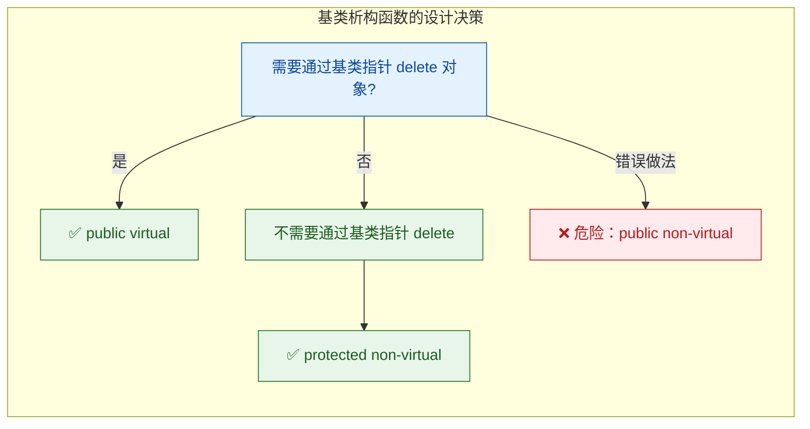

### 多层继承下的虚析构传播

一个重要的语言特性：**虚函数的 "虚" 性质会自动向下传播（propagate）**。也就是说，只要基类的析构函数是 `virtual` 的，所有派生类的析构函数都 **自动成为 virtual**，无论你是否显式写了 `virtual` 关键字。

```cpp
class A {
public:
    virtual ~A() {                       // ✅ 声明为 virtual
        std::cout << "~A" << std::endl;
    }
};

class B : public A {
public:
    ~B() {                               // 自动是 virtual（继承自 A）
        std::cout << "~B" << std::endl;  // 即使没写 virtual 关键字
    }
};

class C : public B {
public:
    ~C() override {                      // 自动是 virtual（传播自 A → B → C）
        std::cout << "~C" << std::endl;  // 推荐用 override 明确意图
    }
};

int main() {
    A* ptr = new C();   // A* 指向最底层派生类 C
    delete ptr;          // 通过 vtable 动态绑定
    // 输出：~C  ~B  ~A  (逆序析构，完美)
    return 0;
}
```

析构链的自动链式调用确保了每一层的资源都被正确清理：

```cpp
// ====== 多层析构链 ======
//
//  delete ptr;   (ptr 类型: A*, 实际指向 C 对象)
//       │
//       ▼  vtable 查找
//  C::~C()       ← 动态绑定找到 C 的析构
//       │
//       ▼  编译器自动插入
//  B::~B()       ← 自动调用直接基类的析构
//       │
//       ▼  编译器自动插入
//  A::~A()       ← 自动调用更上层基类的析构
//       │
//       ▼
//  operator delete(ptr)  ← 释放原始内存
```

### 实战案例：工厂模式中的虚析构

虚析构函数在实际工程中最常见的应用场景之一是 **工厂模式（Factory Pattern）**。工厂函数返回基类指针，调用者完全不知道具体类型，但最终必须通过基类指针释放对象：

```cpp
#include <iostream>
#include <memory>
#include <string>

// ========== 抽象产品基类 ==========
class Logger {
public:
    virtual void log(const std::string& msg) = 0;  // 纯虚函数：日志接口
    virtual ~Logger() = default;                    // ✅ 虚析构（必须！）
};

// ========== 具体产品：控制台日志 ==========
class ConsoleLogger : public Logger {
public:
    void log(const std::string& msg) override {     // 实现日志接口
        std::cout << "[Console] " << msg << std::endl;
    }
    ~ConsoleLogger() override {                     // 虚析构 (自动继承)
        std::cout << "ConsoleLogger destroyed" << std::endl;
    }
};

// ========== 具体产品：文件日志 ==========
class FileLogger : public Logger {
private:
    std::string filename_;                          // 模拟的文件名
public:
    FileLogger(const std::string& fname)            // 构造时绑定文件
        : filename_(fname) {
        std::cout << "FileLogger opened: " << filename_ << std::endl;
    }
    void log(const std::string& msg) override {     // 实现日志接口
        std::cout << "[File:" << filename_ << "] " << msg << std::endl;
    }
    ~FileLogger() override {                        // 析构时关闭文件
        std::cout << "FileLogger closed: " << filename_ << std::endl;
    }
};

// ========== 工厂函数 ==========
std::unique_ptr<Logger> createLogger(const std::string& type) {
    if (type == "console") {
        return std::make_unique<ConsoleLogger>();    // 返回基类智能指针
    } else if (type == "file") {
        return std::make_unique<FileLogger>("app.log");
    }
    return nullptr;                                  // 未知类型
}

int main() {
    // 工厂创建，使用者只知道 Logger 接口
    auto logger = createLogger("file");              // unique_ptr<Logger>
    logger->log("Application started");              // 多态调用

    // unique_ptr 析构时，通过 Logger 的虚析构 → FileLogger::~FileLogger()
    // 资源（文件）被正确释放 ✅
    return 0;
}
```

**输出：**

```
FileLogger opened: app.log
[File:app.log] Application started
FileLogger closed: app.log
```

注意：这里使用了 `std::unique_ptr<Logger>`。`unique_ptr` 默认使用 `delete` 释放对象，因此仍然依赖虚析构函数来保证正确的多态析构行为。如果 `Logger::~Logger()` 不是 `virtual` 的，即便用了智能指针也无法避免 UB。

> **注意**：`std::shared_ptr` 在这方面有一个特殊行为——它会在创建时"记住"实际的删除器（type-erased deleter），所以即使基类析构非虚，`shared_ptr` 仍然能正确析构派生类对象。但这是 `shared_ptr` 的实现细节，**不应该作为不写虚析构的借口**。最佳实践仍然是为多态基类提供虚析构函数。

### 核心要点总结

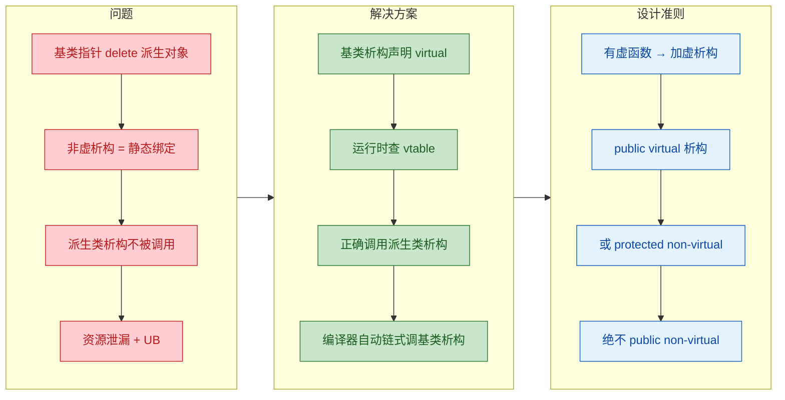

---

**📝 练习题**

以下代码片段，`delete ptr` 之后会发生什么？

```cpp
class Animal {
public:
    virtual void speak() = 0;
    ~Animal() { std::cout << "~Animal\n"; }
};

class Dog : public Animal {
    int* bones_;
public:
    Dog() : bones_(new int[100]) {}
    void speak() override { std::cout << "Woof!\n"; }
    ~Dog() { delete[] bones_; std::cout << "~Dog\n"; }
};

int main() {
    Animal* ptr = new Dog();
    ptr->speak();
    delete ptr;
}
```

A. 输出 `~Dog` 然后 `~Animal`，`bones_` 被正确释放


B. 输出 `~Animal`，`bones_` 内存泄漏，但行为是确定的（defined behavior）


C. 输出 `~Animal`，`bones_` 内存泄漏，且属于未定义行为（UB）


D. 编译错误，因为 `Animal` 是抽象类不能有非虚析构函数

**【答案】** C

**【解析】** `Animal` 类虽然有纯虚函数 `speak()`，但其析构函数 `~Animal()` **没有声明为 `virtual`**。这是一个常见的陷阱——很多人以为"类里有虚函数，析构自动就是虚的"，但实际上 `virtual` 不会自动附加到析构函数上，必须显式声明。当执行 `delete ptr` 时，由于 `ptr` 的静态类型是 `Animal*`，编译器对非虚的 `~Animal()` 使用静态绑定，只调用了 `Animal::~Animal()`。`Dog::~Dog()` 完全没有被调用，导致 `bones_` 指向的 `int[100]` 内存永远不会被释放。更关键的是，根据 C++ 标准 §5.3.5/3（C++11），通过基类指针 `delete` 一个派生类对象，若基类析构函数不是 `virtual` 的，**行为是未定义的**（Undefined Behavior）。选项 B 说"行为是确定的"是错误的——内存泄漏只是可能的表现之一，UB 可能导致任何后果。选项 D 也是错误的——C++ 完全允许抽象类拥有非虚析构函数，只是这样做不安全。正确的修复方法是将 `~Animal()` 声明为 `virtual ~Animal()`。

---

## 虚函数表（vtable）概述

当我们在 C++ 中使用 `virtual` 关键字声明虚函数时，编译器在幕后构建了一套精巧的分派机制，使得"运行时多态"成为可能。这套机制的核心，就是 **虚函数表（Virtual Function Table，简称 vtable）**。理解 vtable 不仅能让你写出更高效的多态代码，更能让你在面试中从容应对"虚函数底层原理"这一经典问题。

需要首先澄清的是：**C++ 标准从未规定多态必须通过 vtable 实现**。标准只规定了多态的行为语义——即通过基类指针/引用调用虚函数时，应根据对象的实际类型执行对应的函数。然而，几乎所有主流编译器（GCC、Clang、MSVC）都不约而同地选择了 vtable 作为实现方案，因为它在时间复杂度和空间复杂度上达到了极佳的平衡。因此，本节所讨论的内容属于 **实现细节（implementation detail）**，但却是每一位 C++ 工程师都应深入掌握的知识。

---

### 从一个问题出发：编译器如何"记住"该调哪个函数？

考虑以下代码：

```cpp
class Animal {
public:
    virtual void speak() { std::cout << "..." << std::endl; }   // 虚函数
    virtual void eat()   { std::cout << "eating" << std::endl; } // 虚函数
};

class Dog : public Animal {
public:
    void speak() override { std::cout << "Woof!" << std::endl; } // 重写 speak
    // eat() 未重写，继承 Animal::eat()
};

class Cat : public Animal {
public:
    void speak() override { std::cout << "Meow!" << std::endl; } // 重写 speak
    void eat()   override { std::cout << "cat eating" << std::endl; } // 重写 eat
};

void makeItSpeak(Animal* p) {
    p->speak(); // 编译期不知道 p 指向 Dog 还是 Cat，如何正确调用？
}
```

在 `makeItSpeak` 函数中，编译器面对的是一个 `Animal*` 指针。编译期（compile time）无法确定 `p` 到底指向 `Dog` 还是 `Cat`。那运行时如何选择正确的 `speak()` 版本？答案就是：**每个含有虚函数的对象内部都隐藏了一个指针，指向一张函数指针表——vtable**。

---

### vtable 的结构与 vptr 的植入

编译器为每一个 **含有虚函数的类** 生成一张 vtable。vtable 本质上是一个 **函数指针数组（array of function pointers）**，其中每个槽位（slot）存储该类对应的虚函数实现地址。

同时，编译器会在每个对象的内存布局最前方（通常如此）植入一个隐藏的指针成员—— **vptr（virtual table pointer）**，它指向该对象所属类的 vtable。

用一张完整的图来理解整个体系：

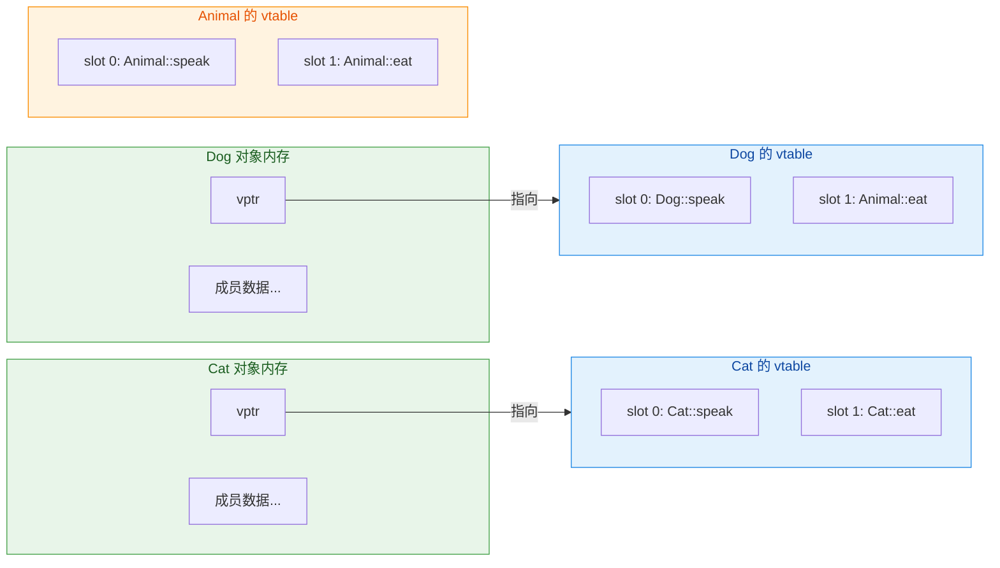

关键观察点：

- **Dog 的 vtable** 中，`slot 0` 存储的是 `Dog::speak`（因为 Dog 重写了 speak），而 `slot 1` 存储的仍然是 `Animal::eat`（因为 Dog 没有重写 eat）。
- **Cat 的 vtable** 中，两个 slot 都存储了 Cat 自己的版本，因为它两个都重写了。
- **Animal 的 vtable** 则完全指向自身的实现。
- 每个类只有 **一张** vtable，由该类的所有对象共享。vtable 存放在程序的 **只读数据段（.rodata）** 中。

---

### 对象内存布局详解

让我们用 ASCII 图精确展示一个 `Dog` 对象在内存中的实际样子：

```cpp
// Dog 对象的内存布局（假设 64 位系统）
//
// 地址低位 ──────────────────────────────── 地址高位
// ┌────────────┬────────────────────────────┐
// │   vptr     │   其他成员变量...            │
// │  (8 bytes) │                             │
// └─────┬──────┴────────────────────────────┘
//       │
//       │  vptr 指向 Dog 的 vtable
//       ▼
// ┌──────────────────────────────────────────┐
// │          Dog's vtable (只读数据段)         │
// ├──────────────────────────────────────────┤
// │  [0]  ──→  Dog::speak()   的函数地址      │
// │  [1]  ──→  Animal::eat()  的函数地址      │
// └──────────────────────────────────────────┘
```

可以验证 vptr 的存在和大小影响：

```cpp
#include <iostream>

class Empty {};                       // 空类

class WithVirtual {                   // 含虚函数的类
public:
    virtual void foo() {}             // 虚函数
};

class WithVirtualAndData {            // 含虚函数 + 数据成员
public:
    virtual void foo() {}             // 虚函数
    int x;                            // 4 字节数据成员
};

int main() {
    // 空类大小为 1（C++ 保证每个对象有唯一地址）
    std::cout << "Empty:              " << sizeof(Empty) << std::endl;              // 1

    // 含虚函数的类：多了一个 vptr（64 位系统上为 8 字节）
    std::cout << "WithVirtual:        " << sizeof(WithVirtual) << std::endl;        // 8

    // vptr(8) + int(4) + padding(4) = 16（内存对齐）
    std::cout << "WithVirtualAndData: " << sizeof(WithVirtualAndData) << std::endl; // 16

    return 0;
}
```

上面的输出清晰地表明：一旦类中出现虚函数，对象的大小就会增加一个指针的大小（通常是 8 字节）。这就是 **vptr 的空间开销**。

---

### 虚函数调用的完整流程

当执行 `p->speak()` 这行代码时，编译器生成的机器码大致等价于以下伪代码：

```cpp
// p->speak() 的底层等价操作（伪代码）

// 第 1 步：从对象起始地址读取 vptr
void** vtable = *(void***)p;           // p 的前 8 字节就是 vptr

// 第 2 步：从 vtable 中取出 speak 对应的 slot（假设 speak 是第 0 个虚函数）
void (*fn)(Animal*) = (void(*)(Animal*))vtable[0];

// 第 3 步：通过函数指针调用实际函数，并把 p 作为 this 传入
fn(p);                                 // 相当于调用 Dog::speak(this=p)
```

整个过程只需要 **两次指针间接寻址（indirection）**：

1. **第一次**：通过对象地址找到 vptr。
2. **第二次**：通过 vptr + 偏移量在 vtable 中找到目标函数指针。

让我们用时序图更直观地展示这个过程：

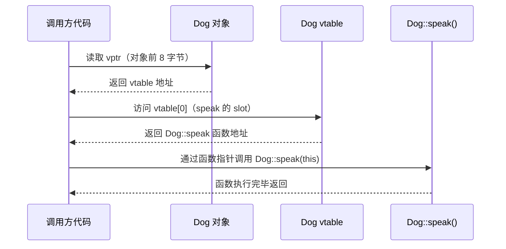

这就是为什么虚函数调用比普通函数调用略慢——多了两次内存访问。但在现代 CPU 的缓存体系下，这个开销通常微乎其微。

---

### vptr 的初始化时机：构造函数中的秘密

vptr 并不是凭空出现的，它是在 **构造函数** 中被编译器隐式设置的。而且，在继承体系中，vptr 的设置遵循一个非常精妙的规则：

> **在每一层构造函数的函数体执行之前，vptr 会被设置为指向当前层级的 vtable。**

这意味着在构造过程中，对象的"虚函数身份"是逐步演化的：

```cpp
#include <iostream>

class Base {
public:
    Base() {
        // 此时 vptr 指向 Base 的 vtable
        // 调用虚函数会执行 Base 的版本
        who();   // 调用 Base::who()，而非 Derived::who()
    }
    virtual void who() {
        std::cout << "I am Base" << std::endl;       // 基类版本
    }
    virtual ~Base() = default;                        // 虚析构
};

class Derived : public Base {
public:
    Derived() {
        // 此时 vptr 已被更新为指向 Derived 的 vtable
        who();   // 调用 Derived::who()
    }
    void who() override {
        std::cout << "I am Derived" << std::endl;    // 派生类版本
    }
};

int main() {
    Derived d;
    // 输出：
    // I am Base        ← Base 构造函数中调用
    // I am Derived     ← Derived 构造函数中调用
    return 0;
}
```

用流程图展示构造 `Derived` 对象时 vptr 的演化过程：

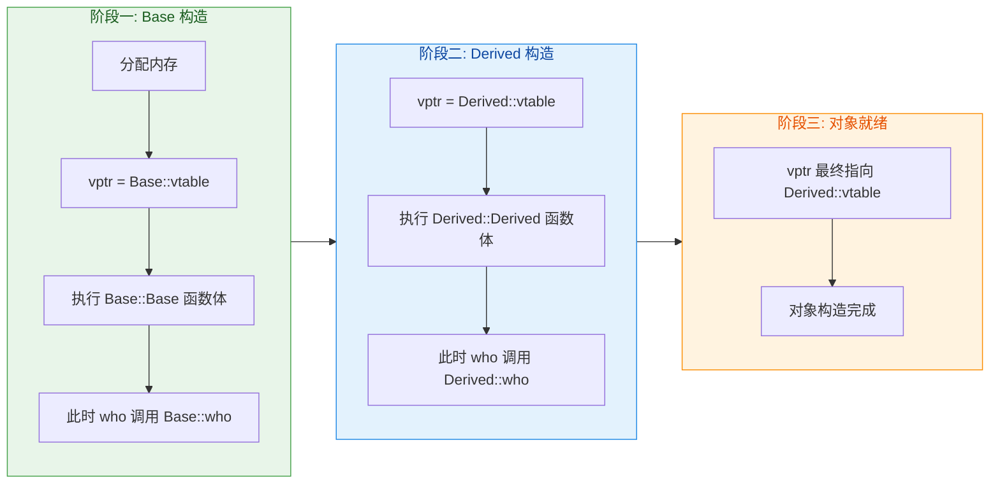

**这就是 "不要在构造函数和析构函数中调用虚函数" 这条黄金规则的底层原因。** 在 `Base` 的构造函数中，对象还"不是"一个 `Derived`，vptr 指向的是 `Base::vtable`，因此虚函数调度只会找到 `Base` 的版本。析构时过程恰好相反——vptr 从 `Derived::vtable` 逐步退回 `Base::vtable`。

---

### vtable 中存储的不仅仅是虚函数

在实际编译器实现中，vtable 里通常还包含其他辅助信息。以 GCC/Clang 使用的 **Itanium C++ ABI** 为例：

```cpp
// Itanium ABI 下典型的 vtable 布局（伪代码表示）
//
// vtable for Dog:
// ┌──────────────────────────────────────────────────┐
// │  offset_to_top (0)     // 到对象顶部的偏移量       │  ← 多重继承时非零
// │  typeinfo* for Dog     // RTTI 类型信息指针        │  ← dynamic_cast / typeid 使用
// ├──────────────────────────────────────────────────┤
// │  [0] Dog::speak()      // 第一个虚函数地址         │  ← vptr 实际指向这里
// │  [1] Animal::eat()     // 第二个虚函数地址         │
// │  [2] Dog::~Dog()       // 析构函数（complete）     │
// │  [3] Dog::~Dog()       // 析构函数（deleting）     │
// └──────────────────────────────────────────────────┘
```

几个重要字段说明：

- **`offset_to_top`**：在单继承中通常为 0。在多重继承中，当通过非第一基类指针进行向下转型（downcast）时，需要用此偏移量调整指针指向正确的对象起始位置。
- **`typeinfo` 指针**：指向该类的 RTTI（Run-Time Type Information）信息。`dynamic_cast` 和 `typeid` 运算符都依赖这个字段来在运行时判断对象的真实类型。如果编译时加了 `-fno-rtti` 选项，这个字段可能被省略。
- **析构函数的两个版本**：`complete object destructor` 负责销毁对象本身及其子对象；`deleting destructor` 在此基础上还会调用 `operator delete` 释放内存。

---

### 虚函数调用 vs 普通函数调用：性能对比

理解了 vtable 机制后，我们就能精确地分析虚函数的性能特征：

| 维度 | 普通函数调用 | 虚函数调用 |
|------|------------|-----------|
| **绑定时机** | 编译期（Static Binding） | 运行期（Dynamic Binding） |
| **调用方式** | 直接跳转到固定地址（`call 0x401234`） | 两次间接寻址后跳转 |
| **能否内联** | ✅ 编译器可自由内联 | ❌ 通常无法内联（地址运行时才确定） |
| **额外空间** | 无 | 每个对象 +8 字节（vptr），每个类 +1 张 vtable |
| **分支预测** | 无条件跳转，无需预测 | 间接跳转，依赖 CPU 分支预测器 |

**无法内联（inability to inline）** 往往是虚函数最大的性能损失来源，而非两次指针间接寻址本身。现代 CPU 的缓存和分支预测器可以很好地处理间接跳转，但内联优化带来的收益（消除调用开销、启用后续优化）则完全丧失了。

不过，现代编译器也在不断进化。当编译器能够在编译期确定对象的实际类型时，它会执行 **去虚化（devirtualization）** 优化，将虚函数调用替换为直接调用：

```cpp
void example() {
    Dog d;           // 编译器明确知道 d 的类型是 Dog
    d.speak();       // 编译器可以直接调用 Dog::speak()，无需走 vtable
                     // 这就是 devirtualization

    Animal* p = &d;
    p->speak();      // 聪明的编译器也可能优化掉这里的间接调用
                     // 因为它能追踪到 p 一定指向 Dog
}
```

用 `final` 关键字还可以主动帮助编译器去虚化：

```cpp
class Bulldog final : public Dog {   // final：不允许再被继承
public:
    void speak() override { std::cout << "Woof Woof!" << std::endl; }
};

void process(Bulldog* p) {
    p->speak();   // 编译器知道 Bulldog 是 final 类
                  // 不可能有更深的派生类重写 speak
                  // 因此可以安全地直接调用 Bulldog::speak()
}
```

---

### 用代码"窥探" vtable

虽然 vtable 是编译器的内部实现，C++ 语言并不提供直接访问它的方式。但通过指针运算，我们可以一窥其真容（**仅限学习用途，生产代码切勿使用**）：

```cpp
#include <iostream>

class Base {
public:
    virtual void func1() { std::cout << "Base::func1" << std::endl; }    // 虚函数 1
    virtual void func2() { std::cout << "Base::func2" << std::endl; }    // 虚函数 2
    virtual void func3() { std::cout << "Base::func3" << std::endl; }    // 虚函数 3
};

class Derived : public Base {
public:
    void func1() override { std::cout << "Derived::func1" << std::endl; } // 重写 func1
    void func3() override { std::cout << "Derived::func3" << std::endl; } // 重写 func3
    // func2 未重写
};

// 定义虚函数指针类型：void(*)()
using VFunc = void(*)();

int main() {
    Derived d;                                        // 创建 Derived 对象

    // 1. 对象的前 8 字节是 vptr，它指向 vtable
    //    *(void**)&d  →  取出 vptr 的值（即 vtable 的地址）
    void** vtable = *(void***)&d;                     // 获取 vtable 地址

    std::cout << "=== Derived's vtable ===" << std::endl;

    // 2. vtable[0] 是第一个虚函数的地址
    VFunc f0 = (VFunc)vtable[0];                      // 取出 slot 0
    f0();                                             // 输出: Derived::func1（已重写）

    // 3. vtable[1] 是第二个虚函数的地址
    VFunc f1 = (VFunc)vtable[1];                      // 取出 slot 1
    f1();                                             // 输出: Base::func2（未重写，继承基类）

    // 4. vtable[2] 是第三个虚函数的地址
    VFunc f2 = (VFunc)vtable[2];                      // 取出 slot 2
    f2();                                             // 输出: Derived::func3（已重写）

    // 5. 验证：同一个类的不同对象共享同一张 vtable
    Derived d2;
    void** vtable2 = *(void***)&d2;                   // 获取第二个对象的 vtable 地址
    std::cout << std::boolalpha;
    std::cout << "Same vtable? " << (vtable == vtable2) << std::endl;  // true

    return 0;
}
```

运行结果：

```
=== Derived's vtable ===
Derived::func1
Base::func2
Derived::func3
Same vtable? true
```

这段代码证实了三个核心事实：

1. **重写的虚函数**在 vtable 中被替换为派生类版本的地址。
2. **未重写的虚函数**保留基类版本的地址。
3. **同一类的所有对象**共享同一张 vtable。

---

### 多重继承下的 vtable

当涉及多重继承时，vtable 的布局会变得更加复杂。一个类可能拥有 **多张 vtable**（或者说一张合并的大 vtable 中有多个子表），对象中也会包含 **多个 vptr**：

```cpp
class A {
public:
    virtual void funcA() {}       // A 的虚函数
    virtual ~A() = default;
};

class B {
public:
    virtual void funcB() {}       // B 的虚函数
    virtual ~B() = default;
};

class C : public A, public B {    // C 同时继承 A 和 B
public:
    void funcA() override {}      // 重写 A 的虚函数
    void funcB() override {}      // 重写 B 的虚函数
};
```

`C` 对象的内存布局：

```cpp
// C 对象的内存布局（多重继承）
//
// ┌─────────────────────────────────┐
// │  vptr_A  (指向 C 的 A-vtable)    │  ← A 子对象的 vptr
// │  A 的成员数据                     │
// ├─────────────────────────────────┤
// │  vptr_B  (指向 C 的 B-vtable)    │  ← B 子对象的 vptr
// │  B 的成员数据                     │
// ├─────────────────────────────────┤
// │  C 自身的成员数据                  │
// └─────────────────────────────────┘
//
// 当通过 B* 指针调用 funcB() 时：
//   1. 指针实际指向 B 子对象区域（即 vptr_B 所在位置）
//   2. 通过 vptr_B 查找 C 的 B-vtable
//   3. 找到 C::funcB() 的地址
//   4. 调用前需要通过 this 指针调整（thunk），把指针从 B 子对象偏移回 C 对象起始位置
```

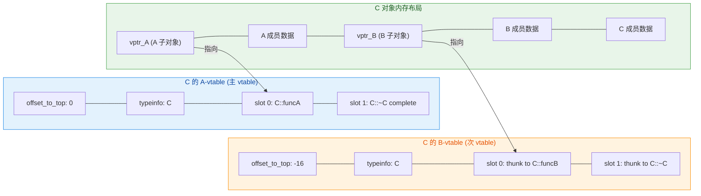

这里出现了一个新概念——**thunk**。当通过 `B*` 指针调用被 `C` 重写的虚函数时，`this` 指针指向的是 `C` 对象内部的 `B` 子对象区域，但 `C::funcB()` 期望 `this` 指向 `C` 对象的起始位置。thunk 就是编译器生成的一小段"跳板代码"，负责调整 `this` 指针的值，然后跳转到真正的函数实现。伪代码如下：

```cpp
// thunk 伪代码
void thunk_to_C_funcB(B* this_b) {
    C* this_c = (C*)((char*)this_b - offset_of_B_in_C);  // 调整 this 指针
    C::funcB(this_c);                                      // 调用真正的实现
}
```

这也解释了为什么 `offset_to_top` 在 B 的次 vtable 中是一个负值（`-16`）——它表示从 B 子对象的位置回退多少字节才能到达完整 C 对象的起始位置。`dynamic_cast` 就依赖这个值来做指针调整。

---

### 关键总结表

| 概念 | 说明 |
|------|------|
| **vtable** | 每个含虚函数的类拥有一张，存储虚函数指针数组，位于只读数据段 |
| **vptr** | 每个对象内部的隐藏指针，指向所属类的 vtable，构造时由编译器自动设置 |
| **slot 顺序** | 按虚函数在类中首次声明的顺序排列 |
| **重写效果** | 派生类 vtable 中对应 slot 被替换为派生类版本的地址 |
| **多重继承** | 对象中有多个 vptr，对应多张子 vtable，需要 thunk 调整 this |
| **构造中的 vptr** | 每层构造函数执行前，vptr 被设置为当前层的 vtable |
| **性能开销** | 空间：每对象 +8B（vptr）；时间：2 次间接寻址 + 不可内联 |
| **devirtualization** | 编译器优化，在能确定类型时将虚调用还原为直接调用 |

---

**📝 练习题**

以下代码的输出是什么？

```cpp
#include <iostream>
class A {
public:
    A()          { print(); }
    virtual ~A() { print(); }
    virtual void print() { std::cout << "A"; }
};

class B : public A {
public:
    B()          { print(); }
    ~B()         { print(); }
    void print() override { std::cout << "B"; }
};

int main() {
    A* p = new B();
    delete p;
    return 0;
}
```

A. `ABBA`

B. `BBBB`

C. `AABB`

D. `ABAB`


**【答案】** A

**【解析】**

这道题直接考察 vptr 在构造和析构过程中的变化：

1. **`new B()` 触发构造过程：**
   - 先执行 `A` 的构造函数。此时 vptr 指向 `A::vtable`，因此 `print()` 调用的是 `A::print()`，输出 **`A`**。
   - 然后执行 `B` 的构造函数。此时 vptr 已更新为指向 `B::vtable`，因此 `print()` 调用的是 `B::print()`，输出 **`B`**。

2. **`delete p` 触发析构过程（注意析构与构造相反）：**
   - 先执行 `B` 的析构函数。此时 vptr 仍指向 `B::vtable`，`print()` 调用 `B::print()`，输出 **`B`**。
   - 然后执行 `A` 的析构函数。此时 vptr 被退回为指向 `A::vtable`，`print()` 调用 `A::print()`，输出 **`A`**。

最终输出：**`ABBA`**。这完美展示了 vptr 在对象生命周期中"逐层切换"的行为——构造时从基类到派生类递进，析构时从派生类到基类回退。同时也提醒我们：`A` 的析构函数必须是 `virtual`，否则 `delete p` 将不会调用 `B` 的析构函数，导致未定义行为。

---

## override 与 final

在 C++ 的继承体系中，虚函数 (virtual function) 是实现多态的核心机制。然而，在 C++11 之前，开发者在重写 (override) 基类虚函数时，编译器几乎不会对"你是否真的正确重写了"进行任何校验。一个微小的拼写错误、一个参数类型的偏差，甚至一个多余的 `const`，都会导致你 **以为** 自己重写了基类函数，实际上却 **定义了一个全新的函数**——这类 Bug 往往极其隐蔽，调试起来令人抓狂。

C++11 引入了两个上下文关键字 (contextual keywords)：**`override`** 和 **`final`**，从语言层面彻底解决了这两类经典问题：

| 关键字 | 核心作用 | 施加对象 |
|--------|----------|----------|
| `override` | 显式声明"我要重写基类虚函数"，让编译器帮你校验 | 派生类的成员函数 |
| `final` | 显式声明"禁止再被重写"或"禁止再被继承" | 虚函数 / 类本身 |

它们并非传统意义上的 **保留关键字** (reserved keyword)，而是 **上下文关键字**——只在特定语法位置才具有特殊含义，其余地方仍可作为普通标识符使用（虽然强烈不建议这么做）。

---

### 没有 override 的年代：一个经典陷阱

在深入 `override` 的语法之前，让我们先用一个真实场景感受它要解决的痛点。假设你正在为一个图形引擎编写形状类层次结构：

```cpp
#include <iostream>
using namespace std;

// ========== 基类：Shape ==========
class Shape {
public:
    // 基类声明虚函数 draw，接收 const 引用参数
    virtual void draw(const string& renderer) const {
        cout << "Shape::draw with " << renderer << endl;
    }

    virtual ~Shape() = default;  // 虚析构函数（好习惯）
};

// ========== 派生类：Circle ==========
class Circle : public Shape {
public:
    // 程序员"以为"自己在重写 draw...
    // 但注意：参数类型写成了 string（值传递），而非 const string&（引用传递）
    void draw(string renderer) const {   // ⚠️ 签名不匹配！
        cout << "Circle::draw with " << renderer << endl;
    }
};

int main() {
    Circle c;                    // 创建一个 Circle 对象
    Shape* p = &c;               // 基类指针指向派生类对象
    p->draw("OpenGL");           // 期望调用 Circle::draw...
    return 0;
}
```

**输出结果**：

```
Shape::draw with OpenGL
```

你满心期待看到 `Circle::draw`，结果却调用了 `Shape::draw`。原因很简单——`Circle::draw(string)` 和 `Shape::draw(const string&)` 的 **参数签名不同**，编译器认为这是两个独立的函数（函数隐藏 / name hiding），而非重写关系。没有任何编译错误，没有任何警告——这就是 C++03 时代的噩梦。

这类 Bug 的常见诱因包括：

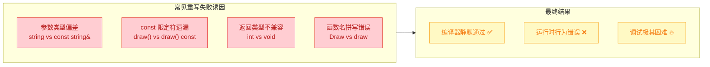

---

### override 关键字

#### 基本语法

`override` 放在派生类成员函数声明的 **最后面**（在 `const`、`noexcept` 等限定符之后，分号之前）：

```cpp
class Derived : public Base {
public:
    // override 放在函数声明的最末尾
    返回类型 函数名(参数列表) const/noexcept override;
};
```

当编译器看到 `override` 时，它会执行以下严格校验：

1. **基类中是否存在同名虚函数**？——如果基类根本没有这个虚函数，报错。
2. **签名是否完全匹配**？——参数类型、数量、`const` 限定、引用限定符必须一致。
3. **返回类型是否兼容**？——必须相同，或满足协变返回类型 (covariant return type) 的规则。

只要上述任何一条不满足，编译器就会 **直接报错**，将运行时 Bug 提前到编译期 (compile-time) 暴露。

#### 用 override 修复之前的 Bug

```cpp
#include <iostream>
using namespace std;

class Shape {
public:
    virtual void draw(const string& renderer) const {
        cout << "Shape::draw with " << renderer << endl;
    }
    virtual ~Shape() = default;
};

class Circle : public Shape {
public:
    // 加上 override 后，编译器会检查是否真的重写了基类虚函数
    void draw(string renderer) const override {   // ❌ 编译错误！
        cout << "Circle::draw with " << renderer << endl;
    }
};
```

编译器会给出类似如下的错误信息：

```
error: 'void Circle::draw(string) const' marked 'override', 
       but does not override any member function
```

信息非常明确——`Circle::draw(string) const` 并没有重写基类的任何虚函数。于是你立刻意识到参数类型写错了，将其改为 `const string&` 即可修复：

```cpp
class Circle : public Shape {
public:
    // ✅ 参数类型与基类完全匹配，override 校验通过
    void draw(const string& renderer) const override {
        cout << "Circle::draw with " << renderer << endl;
    }
};
```

#### override 的完整校验场景

以下代码演示了各种会被 `override` 捕获的错误：

```cpp
class Base {
public:
    virtual void foo(int x);                // 虚函数 1
    virtual int  bar() const;               // 虚函数 2
    virtual void baz(double d) noexcept;    // 虚函数 3
    void         qux();                     // ⚠️ 非虚函数
    virtual ~Base() = default;
};

class Derived : public Base {
public:
    // ===== 场景 1：参数类型不匹配 =====
    // void foo(double x) override;   // ❌ 基类是 int，这里是 double

    // ===== 场景 2：缺少 const 限定 =====
    // int bar() override;            // ❌ 基类是 const，这里没加 const

    // ===== 场景 3：返回类型不兼容 =====
    // void bar() const override;     // ❌ 基类返回 int，这里返回 void

    // ===== 场景 4：基类函数不是 virtual =====
    // void qux() override;           // ❌ qux 不是虚函数，无法重写

    // ===== 正确写法 =====
    void foo(int x) override;               // ✅ 完全匹配
    int  bar() const override;              // ✅ 完全匹配
    void baz(double d) noexcept override;   // ✅ 完全匹配
};
```

> **黄金法则 (Golden Rule)**：在现代 C++ 中，**任何** 重写基类虚函数的地方，都应该加上 `override`。这不是"可选的好习惯"，而是 **必须遵守的编码规范**。许多代码审查工具和 Linter（如 `clang-tidy`）都会把缺少 `override` 标记为 warning。

#### override 与 virtual 的关系

一个常见疑问是：派生类重写虚函数时，还要不要写 `virtual`？

```cpp
class Base {
public:
    virtual void func();       // 基类用 virtual 声明
};

class Derived : public Base {
public:
    // 以下三种写法完全等价——函数都是虚的
    virtual void func() override;   // 写法 A：virtual + override（冗余但不报错）
    void func() override;           // 写法 B：只写 override（推荐 ✅）
    virtual void func();            // 写法 C：只写 virtual（C++03 风格，不推荐）
};
```

**推荐做法**：派生类中 **只写 `override`，不写 `virtual`**。原因如下：

- 基类已经声明 `virtual`，派生类的重写函数 **自动就是虚函数**，不需要重复声明。
- `override` 已经隐含了"这是一个虚函数重写"的语义，再加 `virtual` 是冗余信息。
- 只写 `override` 让代码意图更清晰：**这个函数的存在目的就是重写基类**。

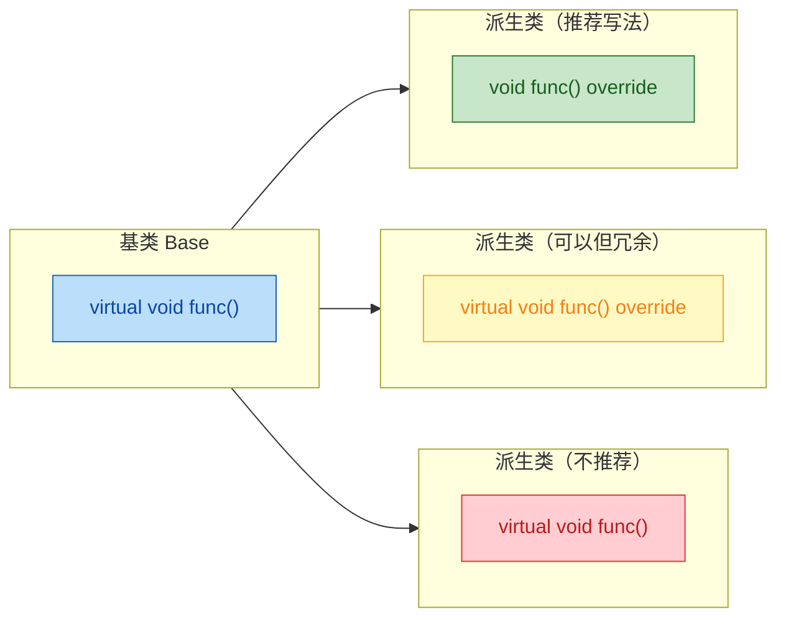

---

### final 关键字

`final` 是 `override` 的"对立面"——如果说 `override` 是在说"我要重写"，那么 `final` 就是在说 **"到此为止，不许再重写"**。

`final` 可以作用在两个层面：

| 作用层面 | 语法位置 | 效果 |
|----------|----------|------|
| **虚函数级别** | 函数声明末尾 | 禁止派生类再重写该虚函数 |
| **类级别** | 类名之后 | 禁止任何类再继承该类 |

#### final 用于虚函数

当你在某个继承层次中认为"这个虚函数的实现已经是最终版本，不应再被修改"时，使用 `final`：

```cpp
#include <iostream>
using namespace std;

class Animal {
public:
    // 基类声明虚函数 speak
    virtual void speak() const {
        cout << "..." << endl;
    }
    virtual ~Animal() = default;
};

class Dog : public Animal {
public:
    // Dog 重写了 speak，并用 final 标记为"最终版本"
    void speak() const override final {    // 既是 override 又是 final
        cout << "Woof!" << endl;
    }
};

class Puppy : public Dog {
public:
    // 试图重写已被 final 标记的 speak
    // void speak() const override;   // ❌ 编译错误！
    // error: overriding final function 'Dog::speak'
};
```

`override` 和 `final` 可以同时使用（如上面 `Dog::speak` 所示），表达的意思是："我重写了基类的 `speak`，并且我是最后一个重写者"。它们的顺序通常是 `override final`，但 `final override` 也合法。

#### final 用于类

当你希望某个类 **不被继承** 时，将 `final` 放在类名之后：

```cpp
// String 类被标记为 final，任何试图继承它的行为都会编译报错
class String final {
public:
    // ... 类的正常成员 ...
    String(const char* s) : data_(s) {}
    const char* c_str() const { return data_.c_str(); }

private:
    std::string data_;
};

// 试图继承一个 final 类
// class MyString : public String {   // ❌ 编译错误！
//     // error: cannot derive from 'final' base 'String'
// };
```

这个特性在以下场景中特别有用：

**场景一：不为继承而设计的工具类**

```cpp
// 这个类只是一个简单的工具，不打算作为基类
class MathUtils final {
public:
    static double pi() { return 3.14159265358979; }   // 返回 π
    static double sqrt(double x);                       // 平方根
    // ... 纯静态工具函数，没有虚函数，不需要继承
};
```

**场景二：编译器优化——去虚拟化 (Devirtualization)**

这是 `final` 的一个重要性能优势。当编译器看到一个类或虚函数被标记为 `final`，它可以确定 **不存在进一步的派生类重写**，于是可以将虚函数调用 (virtual dispatch) 优化为 **直接调用 (direct call)**，省去 vtable 查表的开销：

```cpp
class Base {
public:
    virtual void process() {
        // ... 基类实现 ...
    }
};

class Optimized final : public Base {   // final 类
public:
    void process() override {
        // ... 优化后的实现 ...
    }
};

void run(Optimized& obj) {
    // 编译器知道 Optimized 是 final 类
    // 所以 obj.process() 不可能有其他重写版本
    // 可以将虚调用优化为直接调用（内联优化也成为可能）
    obj.process();   // 🚀 去虚拟化：直接调用，无需查 vtable
}
```

下面这张图展示了去虚拟化的决策流程：

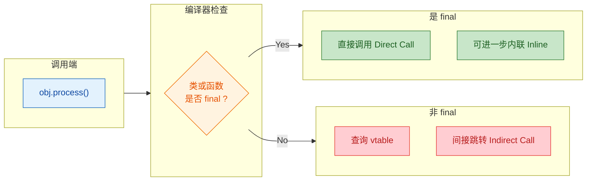

---

### override 与 final 的综合实战

让我们用一个完整的继承体系，把 `override` 和 `final` 的所有用法串起来：

```cpp
#include <iostream>
#include <string>
using namespace std;

// ========================
// 第一层：抽象基类 Widget
// ========================
class Widget {
public:
    // 纯虚函数：所有子类必须实现
    virtual void render() const = 0;

    // 普通虚函数：子类可选择重写
    virtual string name() const {
        return "Widget";                // 默认返回 "Widget"
    }

    // 普通虚函数：获取层级深度
    virtual int depth() const {
        return 0;                       // 基类层级为 0
    }

    virtual ~Widget() = default;        // 虚析构函数
};

// ========================
// 第二层：Button 继承自 Widget
// ========================
class Button : public Widget {
public:
    // 实现纯虚函数 render
    void render() const override {
        cout << "[Button] Rendering..." << endl;
    }

    // 重写 name，并标记 final——后续子类不能再改 name 的行为
    string name() const override final {
        return "Button";                // Button 的名字不允许子类篡改
    }

    // 重写 depth
    int depth() const override {
        return 1;                       // Button 处于第 1 层
    }
};

// ========================
// 第三层：IconButton 继承自 Button
// ========================
class IconButton : public Button {
public:
    // ✅ render 没有被 final，可以继续重写
    void render() const override {
        cout << "[IconButton] Rendering icon + text..." << endl;
    }

    // ❌ 以下代码会编译报错：name() 在 Button 中已被标记 final
    // string name() const override {
    //     return "IconButton";
    // }

    // ✅ depth 没有被 final，可以继续重写
    int depth() const override {
        return 2;                       // IconButton 处于第 2 层
    }
};

// ========================
// 第四层：FinalIconButton 是最终类，不允许再被继承
// ========================
class FinalIconButton final : public IconButton {
public:
    void render() const override {
        cout << "[FinalIconButton] Final rendering!" << endl;
    }

    int depth() const override {
        return 3;                       // 最终层级
    }
};

// ❌ 试图继承 final 类，编译报错
// class SuperButton : public FinalIconButton {};

// ========================
// 多态调用测试
// ========================
int main() {
    Button        btn;                  // 创建 Button 对象
    IconButton    ibtn;                 // 创建 IconButton 对象
    FinalIconButton fbtn;               // 创建 FinalIconButton 对象

    // 基类指针数组，实现多态调用
    Widget* widgets[] = { &btn, &ibtn, &fbtn };

    for (const auto* w : widgets) {
        w->render();                    // 动态绑定，调用各自的 render
        cout << "  Name: " << w->name()        // name 被 Button::name final 锁定
             << ", Depth: " << w->depth()       // depth 各层自由重写
             << endl;
    }

    return 0;
}
```

**输出结果**：

```
[Button] Rendering...
  Name: Button, Depth: 1
[IconButton] Rendering icon + text...
  Name: Button, Depth: 2
[FinalIconButton] Final rendering!
  Name: Button, Depth: 3
```

注意 `Name` 始终是 `"Button"`——因为 `Button::name()` 被标记了 `final`，`IconButton` 和 `FinalIconButton` 都不能重写它，所以调用始终绑定到 `Button::name()`。

下面这张类图清晰展示了整个继承关系以及 `override` / `final` 的分布：

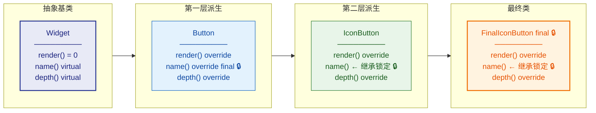

---

### 上下文关键字的本质

前面提到，`override` 和 `final` 是 **上下文关键字** (contextual keywords)，而非保留关键字。这意味着什么呢？

```cpp
// 这段代码完全合法（但请永远不要这么写！）
int override = 42;       // ✅ 编译通过：override 作为变量名
int final = 100;         // ✅ 编译通过：final 作为变量名

class Weird {
    int override;         // ✅ 成员变量名叫 override
    void final();         // ✅ 成员函数名叫 final（非虚函数上下文）
};
```

C++ 标准委员会之所以这样设计，是为了 **向后兼容** (backward compatibility)。在 C++11 之前，`override` 和 `final` 从未被保留，如果突然变成保留关键字，所有使用这两个词作标识符的旧代码都会立刻无法编译。而上下文关键字的设计，使得它们只在 **函数声明尾部** 和 **类名之后** 这些特定的语法位置才被编译器识别为关键字，完美实现了新旧兼容。

```mermaid
graph LR
    subgraph ReservedKW["保留关键字"]
        direction TB
        R1["class"]
        R2["virtual"]
        R3["return"]
        R4["不能用作标识符"]
    end

    subgraph ContextKW["上下文关键字"]
        direction TB
        C1["override"]
        C2["final"]
        C3["特定位置才有特殊含义"]
        C4["其他位置可作标识符"]
    end

    subgraph Examples["C++11 其他上下文关键字"]
        direction TB
        E1["import (C++20)"]
        E2["module (C++20)"]
    end

    ReservedKW ~~~ ContextKW
    ContextKW ~~~ Examples

    classDef reservedStyle fill:#FFCDD2,stroke:#C62828,color:#B71C1C,stroke-width:1px
    classDef contextStyle fill:#C8E6C9,stroke:#2E7D32,color:#1B5E20,stroke-width:1px
    classDef exampleStyle fill:#E3F2FD,stroke:#1565C0,color:#0D47A1,stroke-width:1px

    class R1,R2,R3,R4 reservedStyle
    class C1,C2,C3,C4 contextStyle
    class E1,E2 exampleStyle
```

---

### 最佳实践总结

经过上面的详细讨论，以下是现代 C++ 项目中关于 `override` 和 `final` 的最佳实践清单：

| # | 实践 | 原因 |
|---|------|------|
| 1 | **所有** 重写虚函数都加 `override` | 让编译器帮你检查签名匹配，消灭隐式的函数隐藏 Bug |
| 2 | 派生类重写时 **不写** `virtual` | `override` 已隐含"虚函数重写"语义，`virtual` 冗余 |
| 3 | 对确定不再需要重写的虚函数加 `final` | 明确表达设计意图，并可能获得去虚拟化的性能优化 |
| 4 | 对不为继承设计的类加 `final` | 防止意外继承导致的脆弱基类问题 (Fragile Base Class Problem) |
| 5 | 启用编译器警告 `-Wsuggest-override` | GCC/Clang 会对缺少 `override` 的重写函数发出警告 |
| 6 | 不要将 `override` / `final` 用作标识符 | 虽然语法允许，但会严重降低代码可读性 |

---

**📝 练习题**

以下代码存在编译错误，请问错误原因是什么？

```cpp
class Base {
public:
    virtual void process(int val) const;
    virtual ~Base() = default;
};

class Middle : public Base {
public:
    void process(int val) const final;
};

class Leaf : public Middle {
public:
    void process(int val) const override;
};
```

A. `Middle::process` 不能同时省略 `virtual` 和使用 `final`


B. `Leaf::process` 试图重写已被 `Middle` 标记为 `final` 的函数


C. `final` 只能用在类上，不能用在成员函数上


D. `Leaf` 必须加 `override` 的同时也加 `virtual`


**【答案】** B

**【解析】** `Middle::process` 重写了 `Base::process` 并附加了 `final` 标记，这意味着在继承链中 `Middle::process` 是最后一个被允许的重写版本。当 `Leaf` 尝试再次 `override` 该函数时，编译器会报错：`overriding final function 'Middle::process'`。选项 A 错误，因为基类已声明 `virtual`，派生类无需再写 `virtual`，`final` 可以独立使用；选项 C 错误，`final` 既可修饰类也可修饰虚函数；选项 D 错误，`override` 与 `virtual` 没有必须同时出现的要求。

---

## 多重继承（Multiple Inheritance）

在 C++ 中，一个类可以同时从**多个基类**派生，这种机制称为**多重继承**（Multiple Inheritance）。它是 C++ 区别于 Java、C# 等语言的一项强大但"危险"的特性。Java/C# 选择用**接口（Interface）**来规避多重继承带来的复杂性，而 C++ 把这个选择权完全交给了程序员。

多重继承的基本语法非常直观——在派生类的声明中用逗号分隔多个基类：

```cpp
// 基类 A
class Sensor {
public:
    void readData() { /* 读取传感器数据 */ }   // 传感器的基本能力
};

// 基类 B
class Logger {
public:
    void log(const std::string& msg) { /* 记录日志 */ }  // 日志记录能力
};

// 派生类同时继承 Sensor 和 Logger
// 使用逗号分隔, 每个基类都可以独立指定访问权限
class SmartDevice : public Sensor, public Logger {
public:
    void process() {       // SmartDevice 自己的方法
        readData();        // 从 Sensor 继承而来
        log("processed");  // 从 Logger 继承而来
    }
};
```

这个例子展示了多重继承最理想的使用场景：两个基类之间**毫无关联**，派生类只是简单地"组合"了它们的能力。此时一切都很美好。但当继承层次变得复杂，尤其是多个基类拥有**共同祖先**时，问题就来了。

---

### 多重继承的基本机制与内存布局

要理解多重继承的问题，首先必须理解它在内存中的真实样貌。当一个类从多个基类继承时，派生类对象在内存中会**依次包含每个基类的子对象（subobject）**。

```cpp
class A {
public:
    int a;            // A 的数据成员
    void funcA() {}   // A 的成员函数
};

class B {
public:
    int b;            // B 的数据成员
    void funcB() {}   // B 的成员函数
};

// C 同时继承 A 和 B
class C : public A, public B {
public:
    int c;            // C 自己的数据成员
    void funcC() {}   // C 自己的成员函数
};
```

此时 `C` 的对象在内存中的布局如下：

```cpp
// ┌─────────────────────────────────────────────┐
// │              C 对象的内存布局                  │
// ├──────────────────┬──────────────────────┬────┤
// │   A 子对象部分    │    B 子对象部分       │ C  │
// │  ┌────────────┐  │  ┌────────────────┐  │自身│
// │  │  int a (4B) │  │  │  int b (4B)    │  │数据│
// │  └────────────┘  │  └────────────────┘  │    │
// │                  │                      │int │
// │                  │                      │ c  │
// └──────────────────┴──────────────────────┴────┘
//
// 基类子对象按 **声明顺序** 排列: 先 A, 后 B, 最后 C 自己
```

一个关键的底层细节是**指针调整（pointer adjustment）**。当我们把 `C*` 转换为 `B*` 时，编译器需要将指针**向后偏移**，使其指向 `B` 子对象的起始地址：

```cpp
C obj;                     // 创建 C 的对象
C* pc = &obj;              // pc 指向 C 对象的起始地址

A* pa = &obj;              // pa == pc, 因为 A 子对象在最前面, 无需调整
B* pb = &obj;              // pb != pc! 编译器自动将指针偏移到 B 子对象处
                           // pb = (char*)pc + sizeof(A 子对象)

// 验证
std::cout << (void*)pc << std::endl;  // 例如: 0x1000
std::cout << (void*)pa << std::endl;  // 0x1000 (与 pc 相同)
std::cout << (void*)pb << std::endl;  // 0x1004 (偏移了 sizeof(int)=4)
```

这种隐式的指针调整是编译器在多重继承中默默做的"脏活"。理解这一点非常重要，因为它直接关系到后续菱形继承中"二义性"和"数据冗余"问题的根源。

---

### 多重继承中的名称冲突（Ambiguity）

当多个基类中存在**同名成员**时，派生类直接访问该名称会产生**二义性（ambiguity）**：

```cpp
class Screen {
public:
    void turnOn() {                            // Screen 的 turnOn
        std::cout << "Screen ON" << std::endl;
    }
};

class Speaker {
public:
    void turnOn() {                            // Speaker 的 turnOn — 同名！
        std::cout << "Speaker ON" << std::endl;
    }
};

class SmartTV : public Screen, public Speaker {
    // 同时继承了两个 turnOn()
};

int main() {
    SmartTV tv;
    // tv.turnOn();          // ❌ 编译错误! 二义性: 编译器不知道调用哪个
    tv.Screen::turnOn();     // ✅ 使用作用域限定符, 明确调用 Screen 版本
    tv.Speaker::turnOn();    // ✅ 明确调用 Speaker 版本
    return 0;
}
```

解决方案有两种：

**方案一：作用域限定符（Scope Resolution）** — 如上所示，每次调用时显式指定来源。缺点是调用者需要知道继承细节。

**方案二：在派生类中重新定义（Override / Hide）** — 在派生类中提供自己的版本，内部按需委托：

```cpp
class SmartTV : public Screen, public Speaker {
public:
    void turnOn() {              // 派生类提供统一接口
        Screen::turnOn();        // 先打开屏幕
        Speaker::turnOn();       // 再打开扬声器
    }
};

int main() {
    SmartTV tv;
    tv.turnOn();    // ✅ 调用 SmartTV 自己的版本, 内部依次委托
    return 0;
}
```

---

### 菱形继承问题（Diamond Inheritance Problem）

菱形继承是多重继承中最臭名昭著的问题，也是面试中的高频考点。它发生在以下继承结构中：

```mermaid
graph TB
    subgraph 菱形继承结构
        direction TB
        A["🔷 Base<br/>int data"]
        B["🔹 Derived1 : public Base"]
        C["🔹 Derived2 : public Base"]
        D["🔻 Final : public Derived1, public Derived2"]
    end

    A --> B
    A --> C
    B --> D
    C --> D

    classDef base fill:#FFF3E0,stroke:#F57C00,color:#E65100,stroke-width:2px
    classDef mid fill:#E3F2FD,stroke:#1976D2,color:#0D47A1,stroke-width:2px
    classDef leaf fill:#FFEBEE,stroke:#D32F2F,color:#B71C1C,stroke-width:2px

    class A base
    class B,C mid
    class D leaf
```

当 `Derived1` 和 `Derived2` 都继承自同一个 `Base`，而 `Final` 又同时继承 `Derived1` 和 `Derived2` 时，`Final` 的对象中会包含 **两份** `Base` 的子对象。这引发了两个严重问题：

**问题一：数据冗余（Data Duplication）** — `Base::data` 在 `Final` 中存了两份，浪费空间且语义混乱。

**问题二：访问二义性（Ambiguity）** — 访问 `Base` 的成员时，编译器不知道你要的是通过 `Derived1` 路径的那份还是 `Derived2` 路径的那份。

用代码完整演示：

```cpp
#include <iostream>
using namespace std;

// 顶层基类
class Animal {
public:
    int age;                                     // 所有动物都有年龄
    Animal() : age(0) {                          // 默认构造
        cout << "Animal 构造, this=" << this << endl;
    }
};

// 中间层 1: 会飞的动物
class Bird : public Animal {                     // Bird 包含一份 Animal 子对象
public:
    void fly() { cout << "飞翔中..." << endl; }
};

// 中间层 2: 会游的动物
class Fish : public Animal {                     // Fish 也包含一份 Animal 子对象
public:
    void swim() { cout << "游泳中..." << endl; }
};

// 底层: 飞鱼, 同时继承 Bird 和 Fish
class FlyingFish : public Bird, public Fish {    // ⚠️ 菱形继承!
public:
    void show() {
        fly();                   // ✅ 来自 Bird, 无歧义
        swim();                  // ✅ 来自 Fish, 无歧义
        // cout << age << endl;  // ❌ 编译错误! age 到底是 Bird::Animal::age
                                 //    还是 Fish::Animal::age?
    }
};

int main() {
    FlyingFish ff;               // "Animal 构造" 会被打印 **两次**!
                                 // 证明确实有两个 Animal 子对象

    // ff.age = 3;               // ❌ 二义性错误
    ff.Bird::age = 3;            // ✅ 勉强可用, 但丑陋且危险
    ff.Fish::age = 5;            // ✅ 两份 age 可以有不同的值 — 这语义上毫无道理

    cout << "sizeof(Animal)    = " << sizeof(Animal) << endl;     // 4
    cout << "sizeof(Bird)      = " << sizeof(Bird)   << endl;     // 4 (+ padding)
    cout << "sizeof(FlyingFish)= " << sizeof(FlyingFish) << endl; // 包含两份 Animal!
    return 0;
}
```

`FlyingFish` 对象的内存布局可以清晰地展示问题所在：

```cpp
// FlyingFish 对象 (无虚继承) 的内存布局:
//
// ┌─────────────────────────────────────────────────────┐
// │                  FlyingFish 对象                     │
// ├───────────────────────┬─────────────────────────────┤
// │    Bird 子对象         │     Fish 子对象              │
// │  ┌─────────────────┐  │  ┌─────────────────────┐    │
// │  │ Animal 子对象 ①  │  │  │  Animal 子对象 ②    │    │
// │  │ ┌─────────────┐ │  │  │ ┌─────────────────┐ │    │
// │  │ │ int age = 3 │ │  │  │ │  int age = 5    │ │    │
// │  │ └─────────────┘ │  │  │ └─────────────────┘ │    │
// │  └─────────────────┘  │  └─────────────────────┘    │
// └───────────────────────┴─────────────────────────────┘
//        ↑ 两份 Animal! 这就是菱形继承的"病灶"
```

同一只飞鱼怎么可能有两个不同的年龄？这就是菱形继承在语义上的荒谬之处。

---

### 虚继承（Virtual Inheritance）— 菱形继承的解药

C++ 提供了**虚继承（virtual inheritance）**来解决菱形继承问题。其核心思想是：让**中间层类**声明对基类的继承为 `virtual`，这样无论最终类通过多少条路径继承了同一个基类，该基类在最终对象中只会存在**唯一一份**子对象。

语法上只需在中间层的继承声明中加上 `virtual` 关键字：

```cpp
#include <iostream>
using namespace std;

// 顶层基类 (被虚继承的类, 称为 "虚基类", Virtual Base Class)
class Animal {
public:
    int age;
    Animal(int a = 0) : age(a) {                     // 带参构造
        cout << "Animal(age=" << a << ")" << endl;
    }
};

// 关键改变: 使用 virtual 继承
class Bird : virtual public Animal {                  // ← virtual!
public:
    Bird() : Animal(0) {                              // 中间层照常初始化 Animal
        cout << "Bird()" << endl;
    }
    void fly() { cout << "飞翔中..." << endl; }
};

class Fish : virtual public Animal {                  // ← virtual!
public:
    Fish() : Animal(0) {                              // 中间层照常初始化 Animal
        cout << "Fish()" << endl;
    }
    void swim() { cout << "游泳中..." << endl; }
};

// 底层类
class FlyingFish : public Bird, public Fish {
public:
    // ⚠️ 关键: 最终派生类 **必须** 直接初始化虚基类!
    //    Bird 和 Fish 对 Animal 的初始化会被 **跳过**
    FlyingFish() : Animal(3), Bird(), Fish() {        // Animal(3) 由此处控制
        cout << "FlyingFish()" << endl;
    }

    void show() {
        fly();                                         // ✅ 来自 Bird
        swim();                                        // ✅ 来自 Fish
        cout << "age = " << age << endl;               // ✅ 不再有二义性! 只有一份 age
    }
};

int main() {
    FlyingFish ff;
    // 输出:
    //   Animal(age=3)    ← 只构造一次!
    //   Bird()
    //   Fish()
    //   FlyingFish()

    ff.age = 7;                                        // ✅ 直接访问, 无歧义
    ff.show();                                         // age = 7
    return 0;
}
```

运行这段代码你会发现，`Animal` 的构造函数只被调用了**一次**。这就是虚继承的核心效果。

---

### 虚继承的构造顺序规则

虚继承引入了一条特殊的构造规则，这也是面试中常考的知识点：

> **虚基类的构造由最终派生类（most derived class）负责，且虚基类总是最先被构造。**

中间层类（如 `Bird`、`Fish`）中对虚基类的初始化列表**在构造最终派生类时会被忽略**。这是为了保证虚基类只被初始化一次，且由最"知情"的类来决定如何初始化它。

完整的构造顺序遵循以下规则：

```mermaid
graph LR
    subgraph 构造顺序规则
        direction TB
        S1["① 虚基类<br/>最先构造, 按声明顺序"]
        S2["② 非虚基类<br/>按继承列表顺序"]
        S3["③ 成员变量<br/>按类中声明顺序"]
        S4["④ 自身构造函数体<br/>最后执行"]
        S1 --> S2 --> S3 --> S4
    end

    classDef step1 fill:#FFF3E0,stroke:#EF6C00,color:#BF360C,stroke-width:2px
    classDef step2 fill:#E3F2FD,stroke:#1565C0,color:#0D47A1,stroke-width:2px
    classDef step3 fill:#E8F5E9,stroke:#2E7D32,color:#1B5E20,stroke-width:2px
    classDef step4 fill:#F3E5F5,stroke:#7B1FA2,color:#4A148C,stroke-width:2px

    class S1 step1
    class S2 step2
    class S3 step3
    class S4 step4
```

来看一个更复杂的例子来验证构造顺序：

```cpp
#include <iostream>
using namespace std;

class V1 {                                       // 虚基类 1
public:
    V1() { cout << "V1 构造" << endl; }
};

class V2 {                                       // 虚基类 2
public:
    V2() { cout << "V2 构造" << endl; }
};

class NV {                                       // 非虚基类
public:
    NV() { cout << "NV 构造" << endl; }
};

class Mid1 : virtual public V1, virtual public V2 {   // 虚继承 V1, V2
public:
    Mid1() { cout << "Mid1 构造" << endl; }
};

class Mid2 : virtual public V2, public NV {            // 虚继承 V2, 普通继承 NV
public:
    Mid2() { cout << "Mid2 构造" << endl; }
};

class Final : public Mid1, public Mid2 {               // 最终派生类
public:
    Final() { cout << "Final 构造" << endl; }
};

int main() {
    Final f;
    // 构造顺序:
    //   V1 构造      ← 虚基类, 按 Mid1 中声明顺序: V1 先
    //   V2 构造      ← 虚基类, V2 (虽然 Mid2 也虚继承了 V2, 但只构造一次)
    //   Mid1 构造    ← 非虚基类, 按 Final 继承列表: Mid1 先
    //   NV 构造      ← Mid2 的非虚基类 NV
    //   Mid2 构造    ← 非虚基类, Mid2
    //   Final 构造   ← 自身
    return 0;
}
```

析构顺序一如既往是构造顺序的**完全逆序**。

---

### 虚继承的底层实现机制

虚继承改变了对象的内存布局。在非虚继承中，每个基类子对象的偏移量是编译期固定的。但在虚继承中，虚基类子对象被"提取"出来放到对象的**末尾**（或特定位置），而中间层类通过一个隐藏的指针（通常称为 **vbptr, virtual base pointer**）或者通过 vtable 中的额外条目来找到虚基类子对象的位置。

```cpp
// 非虚继承的 FlyingFish 内存布局 (之前展示过):
// ┌─────────────┬─────────────┐
// │ Bird        │ Fish        │
// │ ┌─────────┐ │ ┌─────────┐ │
// │ │Animal ① │ │ │Animal ② │ │   ← 两份 Animal, 各自嵌入
// │ │ int age │ │ │ int age │ │
// │ └─────────┘ │ └─────────┘ │
// └─────────────┴─────────────┘

// 虚继承的 FlyingFish 内存布局:
// ┌──────────────────────────────────────────────┐
// │  Bird 子对象 (不含 Animal)                     │
// │  ┌────────────────────────────────────┐       │
// │  │ vbptr → 指向虚基类偏移信息          │       │
// │  │  (编译器隐式插入的指针)              │       │
// │  └────────────────────────────────────┘       │
// ├──────────────────────────────────────────────┤
// │  Fish 子对象 (不含 Animal)                     │
// │  ┌────────────────────────────────────┐       │
// │  │ vbptr → 指向虚基类偏移信息          │       │
// │  │  (编译器隐式插入的指针)              │       │
// │  └────────────────────────────────────┘       │
// ├──────────────────────────────────────────────┤
// │  FlyingFish 自身数据成员                       │
// ├──────────────────────────────────────────────┤
// │  Animal 子对象 (共享, 只有一份!)               │
// │  ┌────────────────────────────────────┐       │
// │  │ int age                            │       │  ← 被 "下沉" 到末尾
// │  └────────────────────────────────────┘       │
// └──────────────────────────────────────────────┘
```

**vbptr（Virtual Base Pointer）**是编译器在每个虚继承的中间层子对象中插入的一个隐藏指针。它指向一张 **虚基类表（virtual base table / vbtable）**，表中存储了**当前子对象到虚基类子对象的偏移量**。这样，无论通过 `Bird*` 还是 `Fish*` 访问 `age`，运行时都能通过 vbptr 查表找到唯一那份 `Animal` 子对象。

不同编译器的实现细节有所不同：

- **MSVC**：使用独立的 vbptr 和 vbtable。
- **GCC / Clang**：通常将虚基类偏移信息合并到 vtable 中（在 vtable 的**负索引**位置存储 offset-to-virtual-base），从而复用 vptr，不额外增加 vbptr。

```mermaid
graph LR
    subgraph GCC实现
        direction TB
        VT["vtable<br/>───────────<br/>[-2] offset_to_vbase<br/>[-1] typeinfo ptr<br/>[0] vfunc1 ptr<br/>[1] vfunc2 ptr"]
        VP["vptr"]
        OBJ["派生类对象"]
        VB["虚基类子对象"]
        OBJ --> VP
        VP --> VT
        VT -.->|"偏移量"| VB
    end

    subgraph MSVC实现
        direction TB
        VBT["vbtable<br/>───────────<br/>[0] self offset<br/>[1] vbase offset"]
        VBP["vbptr"]
        OBJ2["派生类对象"]
        VB2["虚基类子对象"]
        OBJ2 --> VBP
        VBP --> VBT
        VBT -.->|"偏移量"| VB2
    end

    classDef tbl fill:#E8EAF6,stroke:#3949AB,color:#1A237E,stroke-width:2px
    classDef ptr fill:#E0F2F1,stroke:#00897B,color:#004D40,stroke-width:2px
    classDef obj fill:#FFF3E0,stroke:#EF6C00,color:#BF360C,stroke-width:2px
    classDef vb fill:#FCE4EC,stroke:#C62828,color:#B71C1C,stroke-width:2px

    class VT,VBT tbl
    class VP,VBP ptr
    class OBJ,OBJ2 obj
    class VB,VB2 vb
```

由于虚继承需要额外的指针和间接寻址，它会带来一定的**性能开销**和**空间开销**。`sizeof` 的结果通常比非虚继承大，因为多了 vbptr 或者 vtable 条目。

---

### 虚继承的代价与注意事项

虚继承虽然解决了菱形问题，但它绝不是"免费的午餐"。以下是使用虚继承时必须了解的代价和注意点：

**1. 空间开销增大**

每个虚继承路径上的中间层子对象都会新增一个 vbptr（在 MSVC 中）或增加 vtable 大小（在 GCC 中）。对于小对象，这个开销的比例是可观的。

```cpp
#include <iostream>
using namespace std;

class Base { int x; };                          // sizeof = 4

class D1 : public Base {};                      // 普通继承, sizeof 通常 = 4
class D2 : virtual public Base {};              // 虚继承, sizeof 通常 = 16
                                                // (vbptr 8字节 + int 4字节 + padding)

int main() {
    cout << "普通继承 sizeof(D1) = " << sizeof(D1) << endl;   // 4
    cout << "虚继承   sizeof(D2) = " << sizeof(D2) << endl;   // 16 (64位系统)
    return 0;
}
```

**2. 运行时间接寻址**

通过虚继承路径访问虚基类的成员时，需要经过一次额外的间接寻址（读 vbptr → 查表 → 加偏移量）。虽然现代 CPU 的缓存机制使得这个开销在大多数场景下可以忽略，但在性能极端敏感的热路径（hot path）中仍然值得注意。

**3. 构造函数的复杂性**

虚基类必须由最终派生类直接构造。这意味着：
- 最终派生类必须"知道"虚基类的构造方式，即使中间层已经提供了初始化。
- 如果虚基类没有默认构造函数，所有直接或间接继承它的最终类都必须在初始化列表中显式调用其构造函数。

```cpp
class Base {
public:
    Base(int val) {}          // ⚠️ 没有默认构造函数!
};

class Mid : virtual public Base {
public:
    Mid() : Base(0) {}        // Mid 自己用 Base(0) ← 只在 Mid 作为最终类时生效
};

class Final : public Mid {
public:
    // Final() : Mid() {}     // ❌ 编译错误! 缺少对 Base 的直接初始化
    Final() : Base(42), Mid() {}   // ✅ 必须显式初始化虚基类
};
```

**4. 类型转换的限制**

由于虚基类子对象的偏移量是动态的（运行时通过 vbptr 确定），从派生类到虚基类的转换（向上转型）没问题，但**从虚基类到派生类的 `static_cast` 是非法的**——必须使用 `dynamic_cast`：

```cpp
class Base { public: virtual ~Base() {} };
class Derived : virtual public Base {};

void demo() {
    Derived d;
    Base* pb = &d;                       // ✅ 向上转型, 无问题

    // Derived* pd = static_cast<Derived*>(pb);   // ❌ 编译错误!
    //   static_cast 无法处理虚基类到派生类的转换
    //   因为偏移量不是编译期常量

    Derived* pd = dynamic_cast<Derived*>(pb);     // ✅ 运行时查询, 正确偏移
}
```

---

### 实战设计建议

多重继承和虚继承是 C++ 中最复杂的特性之一。以下是工业界积累的最佳实践：

```mermaid
graph LR
    subgraph 设计决策树
        direction TB
        Q1["需要多重继承吗?"]
        Q2["多个基类有共同祖先吗?"]
        Q3["可以用组合替代吗?"]
        A1["✅ 使用虚继承<br/>virtual public Base"]
        A2["✅ 使用普通多重继承"]
        A3["✅ 优先使用组合<br/>Composition over Inheritance"]
        A4["✅ 使用纯接口类<br/>类似 Java Interface"]

        Q1 -->|"是"| Q2
        Q1 -->|"否"| A3
        Q2 -->|"是"| A1
        Q2 -->|"否"| Q3
        Q3 -->|"是"| A3
        Q3 -->|"否"| A4
    end

    classDef question fill:#E3F2FD,stroke:#1565C0,color:#0D47A1,stroke-width:2px
    classDef answer fill:#E8F5E9,stroke:#2E7D32,color:#1B5E20,stroke-width:2px

    class Q1,Q2,Q3 question
    class A1,A2,A3,A4 answer
```

**规则 1：优先使用组合（Composition），而非继承**

如果一个类需要两种能力，考虑把它们作为**成员对象**持有，而非通过继承获取。组合更灵活、耦合更低。

```cpp
// ❌ 多重继承方式
class SmartTV : public Screen, public Speaker { };

// ✅ 组合方式 — 通常更好
class SmartTV {
private:
    Screen screen_;       // 持有 Screen 对象
    Speaker speaker_;     // 持有 Speaker 对象
public:
    void turnOn() {
        screen_.turnOn();
        speaker_.turnOn();
    }
};
```

**规则 2：多重继承最适合"纯接口类"**

当多个基类都是不含数据成员的纯虚函数集合（类似 Java 的 Interface）时，多重继承是安全且优雅的。因为没有数据，也就不存在冗余和二义性：

```cpp
// 纯接口: 只有纯虚函数, 没有数据成员
class IRenderable {                                // 可渲染接口
public:
    virtual void render() = 0;                     // 纯虚函数
    virtual ~IRenderable() = default;              // 虚析构
};

class ISerializable {                              // 可序列化接口
public:
    virtual void serialize() = 0;                  // 纯虚函数
    virtual ~ISerializable() = default;            // 虚析构
};

// 同时实现两个接口 — 安全!
class GameEntity : public IRenderable, public ISerializable {
public:
    void render() override { /* ... */ }           // 实现渲染
    void serialize() override { /* ... */ }        // 实现序列化
};
```

这种模式在现代 C++ 工程中非常常见，尤其在游戏引擎、GUI 框架和插件系统中。

**规则 3：如果必须使用菱形结构，一定要用虚继承**

标准库本身就使用了虚继承。经典案例是 `<iostream>` 的类层次结构：

```mermaid
graph LR
    subgraph iostream 继承结构
        direction TB
        IB["ios_base"]
        IO["basic_ios〈charT〉<br/>(虚基类)"]
        IS["basic_istream〈charT〉<br/>virtual public basic_ios"]
        OS["basic_ostream〈charT〉<br/>virtual public basic_ios"]
        IOS["basic_iostream〈charT〉<br/>public istream, public ostream"]

        IB --> IO
        IO --> IS
        IO --> OS
        IS --> IOS
        OS --> IOS
    end

    classDef kernel fill:#FFF3E0,stroke:#EF6C00,color:#BF360C,stroke-width:2px
    classDef mid fill:#E3F2FD,stroke:#1565C0,color:#0D47A1,stroke-width:2px
    classDef top fill:#E8F5E9,stroke:#2E7D32,color:#1B5E20,stroke-width:2px

    class IB,IO kernel
    class IS,OS mid
    class IOS top
```

`basic_istream` 和 `basic_ostream` 都虚继承了 `basic_ios`，因此 `basic_iostream` 中只有一份 `basic_ios` 子对象。这保证了一个 iostream 对象只有一套流状态（格式标志、错误标志等），语义正确且一致。

---

### 多重继承综合代码示例

最后，用一个完整的综合例子把本节所有知识串起来：

```cpp
#include <iostream>
#include <string>
using namespace std;

// ═══════════════════════════════════════════════════════
// 虚基类: 所有设备的共同基础
// ═══════════════════════════════════════════════════════
class Device {
protected:
    string name_;                                    // 设备名称
    bool powerOn_;                                   // 电源状态
public:
    Device(const string& name)                       // 带参构造
        : name_(name), powerOn_(false) {
        cout << "[Device] 构造: " << name_ << endl;
    }
    virtual ~Device() {                              // 虚析构, 支持多态删除
        cout << "[Device] 析构: " << name_ << endl;
    }
    void togglePower() {                             // 切换电源
        powerOn_ = !powerOn_;
        cout << name_ << " 电源: "
             << (powerOn_ ? "ON" : "OFF") << endl;
    }
    string getName() const { return name_; }         // 获取名称
};

// ═══════════════════════════════════════════════════════
// 中间层 1: 网络设备 (虚继承 Device)
// ═══════════════════════════════════════════════════════
class NetworkDevice : virtual public Device {        // ← 虚继承!
protected:
    string ipAddress_;                               // IP 地址
public:
    NetworkDevice(const string& name, const string& ip)
        : Device(name), ipAddress_(ip) {             // 初始化 Device (仅自身为最终类时生效)
        cout << "[NetworkDevice] 构造, IP=" << ip << endl;
    }
    virtual ~NetworkDevice() {
        cout << "[NetworkDevice] 析构" << endl;
    }
    void connect() {                                 // 连接网络
        cout << getName() << " 连接到 " << ipAddress_ << endl;
    }
};

// ═══════════════════════════════════════════════════════
// 中间层 2: 存储设备 (虚继承 Device)
// ═══════════════════════════════════════════════════════
class StorageDevice : virtual public Device {        // ← 虚继承!
protected:
    int capacityGB_;                                 // 存储容量(GB)
public:
    StorageDevice(const string& name, int cap)
        : Device(name), capacityGB_(cap) {           // 初始化 Device (仅自身为最终类时生效)
        cout << "[StorageDevice] 构造, 容量=" << cap << "GB" << endl;
    }
    virtual ~StorageDevice() {
        cout << "[StorageDevice] 析构" << endl;
    }
    void storeData(const string& data) {             // 存储数据
        cout << getName() << " 存储数据: " << data
             << " (剩余 " << capacityGB_ << "GB)" << endl;
    }
};

// ═══════════════════════════════════════════════════════
// 最终派生类: NAS (网络附加存储) — 菱形继承!
// 同时是网络设备和存储设备, 但只有一个 Device 身份
// ═══════════════════════════════════════════════════════
class NAS : public NetworkDevice, public StorageDevice {
public:
    NAS(const string& name, const string& ip, int cap)
        : Device(name),                              // ⭐ 最终类直接初始化虚基类
          NetworkDevice(name, ip),                   // 中间层对 Device 的初始化被忽略
          StorageDevice(name, cap) {                 // 中间层对 Device 的初始化被忽略
        cout << "[NAS] 构造完成" << endl;
    }
    ~NAS() override {
        cout << "[NAS] 析构" << endl;
    }
    void backup() {                                  // NAS 特有功能
        togglePower();                               // ✅ 无二义性, 只有一份 Device
        connect();                                   // 来自 NetworkDevice
        storeData("backup_2025.tar.gz");             // 来自 StorageDevice
    }
};

// ═══════════════════════════════════════════════════════
int main() {
    cout << "===== 创建 NAS =====" << endl;
    NAS myNas("HomeNAS", "192.168.1.100", 4096);

    cout << "\n===== 执行备份 =====" << endl;
    myNas.backup();

    cout << "\n===== 通过基类指针操作 =====" << endl;
    Device* pDev = &myNas;                           // ✅ 向上转型到虚基类, 无歧义
    pDev->togglePower();                             // 通过 Device* 调用

    cout << "\n===== 对象大小 =====" << endl;
    cout << "sizeof(Device)        = " << sizeof(Device) << endl;
    cout << "sizeof(NetworkDevice) = " << sizeof(NetworkDevice) << endl;
    cout << "sizeof(StorageDevice) = " << sizeof(StorageDevice) << endl;
    cout << "sizeof(NAS)           = " << sizeof(NAS) << endl;

    cout << "\n===== 析构 =====" << endl;
    return 0;
}

// 预期输出:
// ===== 创建 NAS =====
// [Device] 构造: HomeNAS            ← 虚基类最先, 且只一次
// [NetworkDevice] 构造, IP=192.168.1.100
// [StorageDevice] 构造, 容量=4096GB
// [NAS] 构造完成
//
// ===== 执行备份 =====
// HomeNAS 电源: ON
// HomeNAS 连接到 192.168.1.100
// HomeNAS 存储数据: backup_2025.tar.gz (剩余 4096GB)
//
// ===== 通过基类指针操作 =====
// HomeNAS 电源: OFF
//
// ===== 析构 =====                    ← 逆序析构
// [NAS] 析构
// [StorageDevice] 析构
// [NetworkDevice] 析构
// [Device] 析构: HomeNAS              ← 虚基类最后析构, 且只一次
```

---

### 核心要点速查表

| 特性 | 普通多重继承 | 虚继承多重继承 |
|:---|:---|:---|
| 共同基类份数 | **N 份**（每条路径一份） | **1 份**（共享） |
| 内存开销 | 较小 | 较大（额外 vbptr / vtable 条目） |
| 访问虚基类成员 | 有二义性, 需限定 | 无二义性, 直接访问 |
| 虚基类构造者 | 各中间层各自构造 | **最终派生类**负责 |
| `static_cast` 下行转换 | ✅ 可用 | ❌ 必须用 `dynamic_cast` |
| 典型应用 | 无关基类组合 | 菱形结构 (如 iostream) |

---

**📝 练习题**

以下代码的输出是什么？

```cpp
#include <iostream>
using namespace std;

class A {
public:
    A(int x) { cout << "A(" << x << ") "; }
};

class B : virtual public A {
public:
    B() : A(1) { cout << "B "; }
};

class C : virtual public A {
public:
    C() : A(2) { cout << "C "; }
};

class D : public B, public C {
public:
    D() : A(3), B(), C() { cout << "D "; }
};

int main() {
    D d;
    return 0;
}
```

A. `A(1) B A(2) C D`

B. `A(3) B C D`

C. `A(1) B A(2) C A(3) D`

D. `A(3) B A(3) C D`


**【答案】** B

**【解析】** 因为 `A` 是虚基类，所以它的构造由**最终派生类 `D`** 负责。`D` 的初始化列表中 `A(3)` 决定了 `A` 的构造参数。按照构造顺序：① 先构造虚基类 `A(3)`，输出 `A(3) `；② 再按继承列表顺序构造 `B` 和 `C`——此时 `B()` 和 `C()` 初始化列表中对 `A` 的调用被忽略，只执行自身构造函数体，分别输出 `B ` 和 `C `；③ 最后执行 `D` 自身的构造函数体，输出 `D `。因此完整输出为 `A(3) B C D`。

---

**📝 练习题**

关于虚继承，以下说法**错误**的是？

A. 虚继承通过在中间层子对象中引入额外的指针（如 vbptr）来定位虚基类子对象

B. 使用虚继承后，`sizeof` 通常会增大

C. 从虚基类指针到派生类指针的转换可以使用 `static_cast`

D. 标准库的 `iostream` 使用了虚继承来避免菱形继承问题


**【答案】** C

**【解析】** 选项 C 是错误的。由于虚基类子对象在派生类对象中的偏移量不是编译期常量（依赖于运行时的 vbptr/vtable），`static_cast` 无法完成从虚基类到派生类的**下行转换（downcast）**——编译器会直接报错。这种转换必须使用 `dynamic_cast`，它会在运行时查询 RTTI 信息来计算正确的指针偏移。选项 A、B、D 均为正确描述。

---

## 本章小结

继承与多态是 C++ 面向对象编程的两大核心支柱。本章从最基础的继承机制出发，逐步深入到多态的底层实现，形成了一条完整的知识链路。让我们对全章内容做一次系统性的回顾与融会贯通。

---

### 知识全景图

```mermaid
graph LR
    subgraph SG_INHERIT["继承体系 Inheritance"]
        direction TB
        A["继承方式<br>public / protected / private"]
        B["多重继承<br>Multiple Inheritance"]
        C["菱形继承问题<br>Diamond Problem"]
        D["虚继承<br>virtual Inheritance"]
        A --> B
        B --> C
        C --> D
    end

    subgraph SG_POLY["多态体系 Polymorphism"]
        direction TB
        E["虚函数 virtual<br>动态绑定"]
        F["纯虚函数 = 0<br>抽象类"]
        G["override 与 final<br>语义约束"]
        H["虚析构函数<br>安全释放"]
        E --> F
        F --> G
        G --> H
    end

    subgraph SG_IMPL["底层实现 Implementation"]
        direction TB
        I["虚函数表 vtable<br>每个类一张表"]
        J["虚表指针 vptr<br>每个对象一个指针"]
        K["动态分派<br>obj->vptr->vtable->func"]
        I --> J
        J --> K
    end

    SG_INHERIT -->|"is-a 关系"| SG_POLY
    SG_POLY -->|"底层依赖"| SG_IMPL

    classDef grp1 fill:#C8E6C9,stroke:#388E3C,color:#1B5E20,rx:8
    classDef grp2 fill:#BBDEFB,stroke:#1976D2,color:#0D47A1,rx:8
    classDef grp3 fill:#FFE0B2,stroke:#F57C00,color:#E65100,rx:8

    class A,B,C,D grp1
    class E,F,G,H grp2
    class I,J,K grp3
```

---

### 核心要点速查表

| 主题 | 核心要点 | 关键陷阱 / 注意 |
|:---|:---|:---|
| **继承方式** | `public` 保持接口不变；`protected` 降级为保护；`private` 全部私有化 | `class` 默认 `private` 继承，`struct` 默认 `public` 继承 |
| **虚函数与动态绑定** | 通过基类**指针/引用**调用 `virtual` 函数时，执行派生类的覆盖版本 | 按值传递会发生 **对象切片 (Object Slicing)**，多态失效 |
| **纯虚函数与抽象类** | `= 0` 声明纯虚函数，含纯虚函数的类不能实例化 | 派生类若不覆盖所有纯虚函数，自身也成为抽象类 |
| **虚析构函数** | 基类析构声明为 `virtual`，确保 `delete base_ptr` 时正确调用派生类析构 | 忘记 `virtual` → 派生类资源泄漏（**经典面试题**） |
| **vtable / vptr** | 编译器为每个含虚函数的类生成一张 vtable；对象内嵌 vptr 指向该表 | vptr 占用对象空间（通常 8 字节 on 64-bit），影响 `sizeof` |
| **override / final** | `override` 强制编译器检查覆盖合法性；`final` 禁止进一步覆盖或继承 | 不写 `override` 时，签名不匹配会**静默创建新函数**而非报错 |
| **多重继承 / 菱形继承** | 一个类可继承多个基类；菱形继承导致基类数据重复 | `virtual` 继承解决数据重复，但引入额外间接层，**最远派生类**负责初始化虚基类 |

---

### 一句话串联全章

> 继承建立了 **is-a** 的类型层级；虚函数赋予了基类指针/引用 **"以不变应万变"** 的动态分派能力；vtable/vptr 是编译器在幕后支撑这一切的底层机制；而 `override`、`final`、虚析构、虚继承等工具，则是 C++ 在工程实践中为**安全性**和**可维护性**提供的防护网。

---

### 设计决策 Checklist

在实际项目中设计继承体系时，可以按照以下清单逐一检查：

```mermaid
graph LR
    subgraph SG_Q1["Step 1: 是否需要继承?"]
        direction TB
        Q1["是否是 is-a 关系?"]
        Q1A["Yes → 使用 public 继承"]
        Q1B["No → 优先组合 Composition"]
        Q1 --> Q1A
        Q1 --> Q1B
    end

    subgraph SG_Q2["Step 2: 是否需要多态?"]
        direction TB
        Q2["需要通过基类指针<br>调用派生类行为?"]
        Q2A["Yes → 声明 virtual 函数"]
        Q2B["No → 不需要 virtual"]
        Q2 --> Q2A
        Q2 --> Q2B
    end

    subgraph SG_Q3["Step 3: 接口 or 实现?"]
        direction TB
        Q3["基类是纯接口<br>还是提供默认实现?"]
        Q3A["纯接口 → 纯虚函数 = 0"]
        Q3B["有默认实现 → 普通虚函数"]
        Q3 --> Q3A
        Q3 --> Q3B
    end

    subgraph SG_Q4["Step 4: 安全扫尾"]
        direction TB
        Q4["析构函数是否 virtual?<br>override 是否全部标注?<br>菱形继承是否用了 virtual?"]
        Q4A["全部 Yes → 设计完成 ✅"]
        Q4 --> Q4A
    end

    SG_Q1 --> SG_Q2
    SG_Q2 --> SG_Q3
    SG_Q3 --> SG_Q4

    classDef step1 fill:#E8F5E9,stroke:#43A047,color:#1B5E20,rx:8
    classDef step2 fill:#E3F2FD,stroke:#1E88E5,color:#0D47A1,rx:8
    classDef step3 fill:#FFF3E0,stroke:#FB8C00,color:#E65100,rx:8
    classDef step4 fill:#FCE4EC,stroke:#E53935,color:#B71C1C,rx:8

    class Q1,Q1A,Q1B step1
    class Q2,Q2A,Q2B step2
    class Q3,Q3A,Q3B step3
    class Q4,Q4A step4
```

---

### 综合代码回顾

下面用一个精简的完整示例，将本章所有知识点串联在一起：

```cpp
#include <iostream>
#include <string>
#include <vector>
#include <memory>

// ============================================================
// [1] 抽象基类：声明纯虚函数，定义接口契约
// ============================================================
class Shape {
public:
    // 纯虚函数：所有形状必须实现 area()
    virtual double area() const = 0;               // 纯虚函数，Shape 成为抽象类

    // 普通虚函数：提供默认实现，子类可选择覆盖
    virtual std::string name() const {              // 虚函数，可被派生类覆盖
        return "Shape";
    }

    // 虚析构函数：通过基类指针 delete 时确保调用派生类析构
    virtual ~Shape() {                              // ★ 基类析构必须 virtual
        std::cout << "~Shape()" << std::endl;
    }
};

// ============================================================
// [2] public 继承：Circle is-a Shape
// ============================================================
class Circle : public Shape {                       // public 继承，保持接口不变
private:
    double radius_;                                 // 私有成员，圆的半径

public:
    explicit Circle(double r) : radius_(r) {}       // 构造函数，初始化半径

    // override 强制编译器校验签名匹配
    double area() const override {                  // 覆盖纯虚函数 area()
        return 3.14159265 * radius_ * radius_;      // π * r²
    }

    std::string name() const override {             // 覆盖虚函数 name()
        return "Circle";
    }

    ~Circle() override {                            // 析构时先执行 ~Circle()，再自动调用 ~Shape()
        std::cout << "~Circle()" << std::endl;
    }
};

// ============================================================
// [3] final 类：禁止进一步继承
// ============================================================
class Square final : public Shape {                 // final → 不允许任何类继承 Square
private:
    double side_;                                   // 正方形边长

public:
    explicit Square(double s) : side_(s) {}         // 构造函数

    double area() const override {                  // 覆盖纯虚函数
        return side_ * side_;                       // 边长²
    }

    std::string name() const override final {       // 覆盖 name()，且 final 禁止子类再覆盖
        return "Square";                            // （此处 class 已 final，此 final 冗余但演示用）
    }

    ~Square() override {                            // 虚析构覆盖
        std::cout << "~Square()" << std::endl;
    }
};

// ============================================================
// [4] 菱形继承 + 虚继承 演示
// ============================================================
class Drawable {                                    // 虚基类：可绘制
public:
    int zOrder = 0;                                 // 绘制层级
    virtual ~Drawable() = default;                  // 虚析构
};

class UIShape : virtual public Drawable {           // 虚继承 Drawable → 解决菱形问题
public:
    std::string color = "black";                    // 颜色属性
};

class UILabel : virtual public Drawable {           // 同样虚继承 Drawable
public:
    std::string text = "hello";                     // 文本内容
};

// BadgeShape 同时继承 UIShape 和 UILabel（菱形继承）
class BadgeShape : public UIShape, public UILabel { // 多重继承
public:
    BadgeShape() {
        // 虚继承保证 Drawable 只有一份，直接访问 zOrder 无歧义
        zOrder = 10;                                // ★ 唯一的 Drawable::zOrder
    }
};

// ============================================================
// [5] main：多态调用演示
// ============================================================
int main() {
    // 使用智能指针管理基类指针 → 多态 + 自动释放
    std::vector<std::unique_ptr<Shape>> shapes;     // 存储基类智能指针的容器

    shapes.push_back(std::make_unique<Circle>(5.0));  // 添加 Circle 对象
    shapes.push_back(std::make_unique<Square>(4.0));  // 添加 Square 对象

    // 动态绑定：通过基类指针调用派生类的 area() 和 name()
    for (const auto& s : shapes) {                  // 遍历所有形状
        std::cout << s->name()                      // 动态分派 → 调用实际类型的 name()
                  << " area = "
                  << s->area()                      // 动态分派 → 调用实际类型的 area()
                  << std::endl;
    }
    // 输出:
    //   Circle area = 78.5398
    //   Square area = 16

    // 菱形继承演示
    BadgeShape badge;                               // 创建 BadgeShape 对象
    std::cout << "zOrder = " << badge.zOrder        // 访问唯一的 Drawable::zOrder
              << std::endl;                         // 输出: zOrder = 10

    // shapes 离开作用域 → unique_ptr 自动 delete
    // 因为 ~Shape() 是 virtual，所以会正确调用:
    //   ~Square() → ~Shape()
    //   ~Circle() → ~Shape()
    return 0;
}
```

**输出结果：**

```
Circle area = 78.5398
Square area = 16
zOrder = 10
~Square()
~Shape()
~Circle()
~Shape()
```

这段代码浓缩了全章的核心知识：**public 继承、虚函数与动态绑定、纯虚函数与抽象类、虚析构函数、`override` / `final`、多重继承与虚继承**。每一个设计决策背后都有其必要性，缺少任何一环都可能引发隐蔽的 bug。

---

### 常见误区总结

| # | 误区 | 后果 | 正确做法 |
|:-:|:---|:---|:---|
| 1 | 基类析构不写 `virtual` | 通过基类指针 `delete` 时，派生类析构不被调用 → **资源泄漏** | 只要有虚函数的类，析构一律 `virtual` |
| 2 | 覆盖虚函数时不写 `override` | 参数/const 写错 → 编译器静默创建**新函数**，多态失效 | 始终加 `override`，让编译器帮你检查 |
| 3 | 按值传递多态对象 | 发生 Object Slicing，派生部分被截断 | 传基类 `指针` 或 `引用` |
| 4 | 菱形继承不用 `virtual` | 基类数据冗余、访问歧义 | 中间类使用 `virtual public` 继承 |
| 5 | 在构造/析构函数中调用虚函数 | 虚函数**不会**动态分派到派生类版本 | 避免这种做法，改用工厂方法等模式 |
| 6 | 混淆 `override` 和 `overload` | `override` 是覆盖（同名同参数）；`overload` 是重载（同名不同参数） | 注意区分术语与用途 |

---

### 延伸学习路线

```mermaid
graph LR
    subgraph SG_DONE["✅ 本章已掌握"]
        direction TB
        D1["继承方式"]
        D2["虚函数 / 纯虚函数"]
        D3["vtable / vptr"]
        D4["override / final"]
        D5["虚析构"]
        D6["虚继承"]
    end

    subgraph SG_NEXT["📘 下一步建议"]
        direction TB
        N1["模板 Templates<br>编译期多态"]
        N2["CRTP 模式<br>静态多态"]
        N3["std::variant + std::visit<br>类型安全联合"]
        N4["设计模式<br>Strategy / Observer / Factory"]
    end

    subgraph SG_ADV["🔬 进阶深入"]
        direction TB
        A1["RTTI / typeid / dynamic_cast"]
        A2["虚函数性能优化<br>Devirtualization"]
        A3["内存模型与对象布局<br>Itanium ABI"]
    end

    SG_DONE -->|"巩固后"| SG_NEXT
    SG_NEXT -->|"深入后"| SG_ADV

    classDef done fill:#C8E6C9,stroke:#43A047,color:#1B5E20,rx:8
    classDef next fill:#BBDEFB,stroke:#1E88E5,color:#0D47A1,rx:8
    classDef adv fill:#FFE0B2,stroke:#FB8C00,color:#E65100,rx:8

    class D1,D2,D3,D4,D5,D6 done
    class N1,N2,N3,N4 next
    class A1,A2,A3 adv
```

继承与多态是 **运行期多态 (Runtime Polymorphism)** 的核心手段，但它并非唯一手段。C++ 还提供了 **模板 (Templates)** 来实现**编译期多态 (Compile-time Polymorphism)**。两者各有优劣：虚函数灵活但有间接调用开销；模板零开销但会导致代码膨胀（code bloat）。在实际工程中，往往需要根据场景**组合使用**这两种多态机制。

---

**📝 练习题 1**

以下代码输出什么？

```cpp
#include <iostream>

class Base {
public:
    Base() { call(); }
    virtual void call() { std::cout << "Base "; }
    virtual ~Base() { call(); }
};

class Derived : public Base {
public:
    Derived() { call(); }
    void call() override { std::cout << "Derived "; }
    ~Derived() override { call(); }
};

int main() {
    Base* p = new Derived();
    std::cout << "| ";
    delete p;
    return 0;
}
```

A. `Derived Derived | Derived Base`


B. `Base Derived | Derived Base`


C. `Derived Derived | Derived Derived`


D. `Base Derived | Base Derived`

**【答案】** B

**【解析】**
这道题考查的是**构造函数和析构函数中调用虚函数的行为**——这是 C++ 面试高频考点。

- **`new Derived()` 阶段**：先构造 `Base` 部分，此时对象的动态类型还是 `Base`（vptr 指向 `Base::vtable`），所以 `Base()` 中的 `call()` 调用的是 `Base::call()`，输出 `Base`。然后执行 `Derived()` 构造函数，此时 vptr 已经更新为指向 `Derived::vtable`，`call()` 调用的是 `Derived::call()`，输出 `Derived`。

- **`delete p` 阶段**：先执行 `~Derived()`，此时对象动态类型仍是 `Derived`，调用 `Derived::call()`，输出 `Derived`。然后执行 `~Base()`，此时 vptr 已被回退为 `Base::vtable`，`call()` 调用的是 `Base::call()`，输出 `Base`。

最终输出：`Base Derived | Derived Base`。

**核心规则**：在构造函数和析构函数中，虚函数**不会**发生动态分派到派生类。对象的类型在构造时 "从基到派生" 逐步变化，在析构时 "从派生到基" 逐步退化。

---

**📝 练习题 2**

以下关于菱形继承和虚继承的说法，**错误**的是：

A. 菱形继承会导致最顶层基类的成员在最终派生类中存在多份拷贝


B. 虚继承通过让中间类以 `virtual` 方式继承公共基类来解决数据冗余问题


C. 在虚继承体系中，虚基类的构造函数由**直接继承它的中间类**负责调用


D. 虚继承会引入额外的指针（虚基类指针/偏移），增加对象的内存开销

**【答案】** C

**【解析】**
A 正确：菱形继承中，如果不使用虚继承，顶层基类 `Drawable` 会在最终派生类 `BadgeShape` 中存在两份（分别来自 `UIShape` 路径和 `UILabel` 路径），导致数据冗余和访问歧义。

B 正确：虚继承的核心作用正是让公共基类在整个继承树中只保留一份实例。

**C 错误**：这是虚继承最特殊的规则——虚基类的构造函数由 **最远派生类 (Most Derived Class)** 直接调用，而非中间类。比如 `BadgeShape` 的构造函数负责调用 `Drawable()` 的构造函数，中间类 `UIShape` 和 `UILabel` 的构造函数中对 `Drawable()` 的初始化会被忽略。这是为了确保虚基类只被初始化一次。

D 正确：虚继承在对象布局中需要额外的指针或偏移信息来定位虚基类子对象的位置，确实会增加内存开销。

---
