---

# 运算符重载

---

## 运算符重载语法

C++ 的一大核心哲学是 **"用户自定义类型应当享有与内置类型同等的地位"**（User-defined types should behave like built-in types）。运算符重载（Operator Overloading）正是实现这一哲学的关键机制——它允许我们为自定义类赋予 `+`、`-`、`<<`、`[]` 等运算符的行为，使对象之间的交互像基本类型一样直观自然。

### 什么是运算符重载

当我们写 `int a = 3 + 5;` 时，编译器天然知道 `+` 对两个 `int` 意味着算术加法。但如果我们定义了一个 `Vector2D` 类，编译器并不知道两个 `Vector2D` 对象相加该做什么。运算符重载的本质，就是 **让编译器理解某个运算符作用于自定义类型时应该执行的操作**。

从底层视角来看，运算符重载并不是什么"魔法"——它只不过是一种 **特殊的函数调用语法糖**（Syntactic Sugar）。编译器在遇到运算符表达式时，会将其转换为对应的函数调用。例如：

```cpp
Vector2D a(1, 2), b(3, 4);

// 你写的表达式：
Vector2D c = a + b;

// 编译器实际翻译为（成员函数形式）：
Vector2D c = a.operator+(b);
```

也就是说，`operator+` 就是一个函数名，只是这个函数名比较特殊，由关键字 `operator` 加上运算符符号组成。

### 重载的基本语法形式

运算符重载有两种实现途径：**成员函数**（Member Function）和**非成员函数**（Non-member Function，通常是友元函数）。理解这两种形式的区别和适用场景，是掌握运算符重载的第一步。

#### 成员函数形式

当运算符被定义为类的成员函数时，**左操作数**（Left-hand operand）隐式地就是调用该函数的对象本身（即 `this` 指针所指向的对象）。因此，成员函数形式的参数个数比运算符的操作数少一个。

```cpp
class Vector2D {
private:
    double x_;  // x 分量
    double y_;  // y 分量

public:
    // 构造函数，使用初始化列表
    Vector2D(double x = 0, double y = 0) : x_(x), y_(y) {}

    // 成员函数形式重载 + 运算符
    // 返回值为新的 Vector2D 对象（值语义，不修改原对象）
    // 参数用 const 引用，避免不必要的拷贝，同时承诺不修改右操作数
    // 函数本身标记 const，承诺不修改左操作数（即 *this）
    Vector2D operator+(const Vector2D& rhs) const {
        return Vector2D(x_ + rhs.x_, y_ + rhs.y_);  // 分量逐一相加，返回新对象
    }

    // 成员函数形式重载一元负号 - （取反运算符）
    // 一元运算符无额外参数，操作数就是 *this
    Vector2D operator-() const {
        return Vector2D(-x_, -y_);  // 每个分量取反
    }
};
```

调用关系可以用以下方式理解：

```cpp
Vector2D a(1, 2), b(3, 4);

Vector2D c = a + b;    // 等价于 a.operator+(b)
//          ^左操作数     ^右操作数
//          (this)       (rhs)

Vector2D d = -a;        // 等价于 a.operator-()
//           ^操作数
//           (this)
```

#### 非成员函数形式

非成员函数形式下，所有操作数都通过参数显式传入。对于二元运算符，函数接收两个参数；对于一元运算符，函数接收一个参数。

```cpp
class Vector2D {
    // ... 成员变量和其他函数同上 ...

    // 声明友元，使非成员函数可以访问 private 成员
    friend Vector2D operator+(const Vector2D& lhs, const Vector2D& rhs);
};

// 非成员函数形式重载 +
// lhs = left-hand side（左操作数）, rhs = right-hand side（右操作数）
Vector2D operator+(const Vector2D& lhs, const Vector2D& rhs) {
    return Vector2D(lhs.x_ + rhs.x_, lhs.y_ + rhs.y_);  // 分量逐一相加
}
```

> 💡 **关键区别**：成员函数的左操作数必须是本类对象；非成员函数则没有这个限制，这在混合类型运算中非常重要（后面会详述）。

### 成员函数 vs 非成员函数：如何选择

这是运算符重载中一个非常经典的设计决策问题。下面用一张流程图来帮助理解选择逻辑：

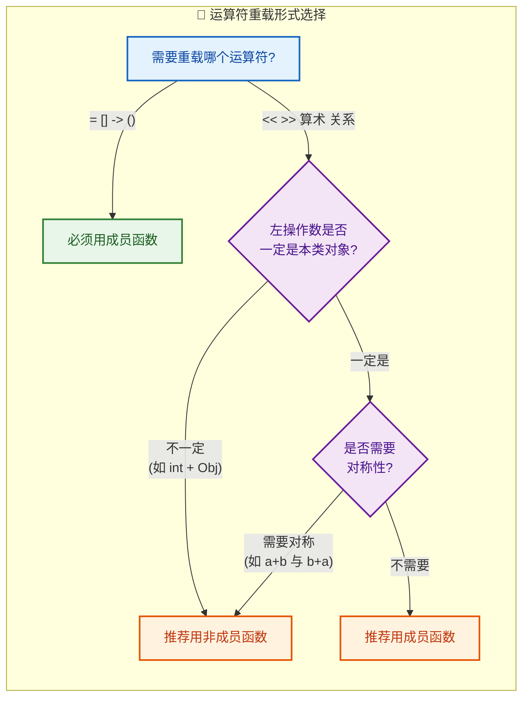

总结为以下原则：

**必须使用成员函数的运算符**（C++ 语法强制要求）：
- `=`（赋值）、`[]`（下标）、`->`（成员访问）、`()`（函数调用）

**推荐使用非成员函数**的场景：
- 二元算术运算符（`+`, `-`, `*`, `/`）：通常需要对称性
- 关系运算符（`==`, `<`, `>` 等）：逻辑上两个操作数地位平等
- 流插入/提取运算符（`<<`, `>>`）：左操作数是 `ostream/istream` 而非本类对象

**推荐使用成员函数**的场景：
- 一元运算符（`++`, `--`, `-`, `!`）
- 复合赋值运算符（`+=`, `-=` 等）：因为它们修改左操作数本身

### 对称性问题详解

为什么算术运算符推荐使用非成员函数？来看一个具体的对称性问题：

```cpp
class Money {
    int cents_;  // 以分为单位存储金额
public:
    Money(int c) : cents_(c) {}  // 允许 int 隐式转换为 Money

    // 成员函数形式重载 +
    Money operator+(const Money& rhs) const {
        return Money(cents_ + rhs.cents_);  // 两个金额相加
    }
};

int main() {
    Money wallet(500);         // 500 分 = 5 元

    Money result1 = wallet + 100;  // ✅ OK! 100 隐式转换为 Money(100)
    // 等价于: wallet.operator+(Money(100))

    Money result2 = 100 + wallet;  // ❌ 编译错误!
    // 等价于: (100).operator+(wallet) —— int 没有 operator+(Money) 方法
}
```

问题在于：成员函数的左操作数（`this`）不会发生隐式类型转换。而非成员函数的两个参数地位平等，都可以参与隐式转换：

```cpp
// 非成员函数形式，完美解决对称性
Money operator+(const Money& lhs, const Money& rhs) {
    return Money(lhs.cents_ + rhs.cents_);  // 两侧均可隐式转换
}

// 现在两个方向都能编译通过：
// 100 + wallet → operator+(Money(100), wallet) ✅
// wallet + 100 → operator+(wallet, Money(100)) ✅
```

### 重载运算符的规则与限制

C++ 对运算符重载设定了一些不可逾越的"围栏"（guardrails），这些规则必须牢记：

**✅ 可以重载的运算符（大部分都可以）：**

```
+  -  *  /  %  ^  &  |  ~  !
=  <  >  +=  -=  *=  /=  %=
^=  &=  |=  <<  >>  >>=  <<=
==  !=  <=  >=  <=>  (C++20)
&&  ||  ++  --  ,  ->*  ->
()  []  new  delete  new[]  delete[]
```

**❌ 不可重载的运算符：**

| 运算符 | 名称 | 不可重载的原因 |
|--------|------|----------------|
| `::` | 作用域解析 | 它在编译期解析名字，不是运行时操作 |
| `.` | 成员访问 | 重载它会导致无法正常访问对象成员 |
| `.*` | 成员指针访问 | 同上，语义冲突 |
| `?:` | 三目条件 | 短路求值语义难以在函数调用中保持 |
| `sizeof` | 大小查询 | 编译期常量，不是运算 |
| `typeid` | 类型识别 | 编译器内建操作 |

**⚠️ 重载时必须遵守的铁律：**

1. **不能改变运算符的元数（arity）**：二元运算符永远接收两个操作数，一元运算符永远接收一个。你不能把 `+` 重载成接收三个操作数。

2. **不能改变运算符的优先级和结合性**：即使你重载了 `+` 和 `*`，`a + b * c` 仍然先计算 `b * c`。

3. **不能发明新运算符**：你不能定义 `operator**` 来表示幂运算（虽然 Python 可以），C++ 不允许。

4. **至少一个操作数必须是用户自定义类型**：你不能重载 `int + int` 的行为——这是内置类型的领地。

### 返回值类型的设计哲学

运算符重载的返回值类型没有语法上的强制约束，但有一套被广泛遵循的 **最佳实践**：

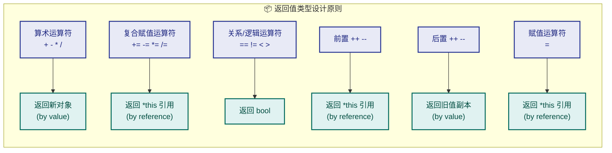

下面用一个综合示例来展示这些规则：

```cpp
class Counter {
    int value_;  // 计数器内部值
public:
    Counter(int v = 0) : value_(v) {}  // 默认构造，初始值为 0

    // 前置 ++ ：先自增，再返回自身引用（无额外参数）
    Counter& operator++() {
        ++value_;          // 直接自增内部值
        return *this;      // 返回自身引用，支持 ++(++c) 这样的链式调用
    }

    // 后置 ++ ：先保存旧值，再自增，返回旧值副本
    // 参数中的 int 是一个"哑参数"(dummy parameter)，仅用于区分前置和后置
    Counter operator++(int) {
        Counter old = *this;  // 先保存当前状态的副本
        ++value_;             // 再自增（或者调用前置++：++(*this)）
        return old;           // 返回自增前的旧值（by value）
    }

    // 复合赋值 += ：修改自身并返回自身引用
    Counter& operator+=(const Counter& rhs) {
        value_ += rhs.value_;  // 将右操作数的值累加到自身
        return *this;          // 返回自身引用，支持链式调用 a += b += c
    }

    // 获取内部值（const 成员函数，不修改对象）
    int getValue() const { return value_; }
};

// 基于 += 实现 +（DRY 原则：Don't Repeat Yourself）
// 这是一个非常经典的惯用法 (idiom)
Counter operator+(Counter lhs, const Counter& rhs) {
    lhs += rhs;    // 注意 lhs 是值传递（拷贝），所以修改 lhs 不影响原对象
    return lhs;    // 返回修改后的副本
}
```

> 🔑 **惯用法 (Idiom)**：先实现 `operator+=`（成员函数），再基于它实现 `operator+`（非成员函数）。这样核心逻辑只写一次，且 `operator+` 的第一个参数采用值传递，天然获得了一份拷贝来操作。

### 前置 vs 后置递增的内存模型

为了更直观地理解前置和后置 `++` 的差异，来看一个简化的内存视角：

```cpp
// ===== 前置 ++c =====
// 步骤1: value_ 从 5 变为 6
// 步骤2: 返回 *this（引用，无拷贝）
//
//   Counter c:
//   ┌──────────┐
//   │ value_: 6│ ← 直接修改
//   └──────────┘
//       ↑
//     return (引用指向原对象)

// ===== 后置 c++ =====
// 步骤1: 创建 old 副本，old.value_ = 5
// 步骤2: value_ 从 5 变为 6
// 步骤3: 返回 old（值返回，是旧状态的副本）
//
//   Counter c:           Counter old (副本):
//   ┌──────────┐         ┌──────────┐
//   │ value_: 6│         │ value_: 5│ ← 保存了旧值
//   └──────────┘         └──────────┘
//                             ↑
//                           return (返回这个副本)
```

这也解释了为什么 **前置 `++` 通常比后置 `++` 更高效**——后置版本需要额外创建一个临时副本。对于 `int` 等内置类型，编译器可以优化掉这个差异；但对于自定义类型（尤其是包含大量数据的类），前置 `++` 的性能优势是实实在在的。因此，当你不需要使用自增前的旧值时，应当 **优先使用前置形式** `++it` 而非 `it++`。

### 完整综合示例：二维向量类

将以上所有知识点融合到一个完整的 `Vector2D` 类中：

```cpp
#include <iostream>  // 标准输入输出
#include <cmath>     // 数学函数（sqrt）

class Vector2D {
private:
    double x_;  // x 分量
    double y_;  // y 分量

public:
    // 构造函数，默认值为原点 (0, 0)
    Vector2D(double x = 0.0, double y = 0.0) : x_(x), y_(y) {}

    // ---------- 访问器 ----------
    double getX() const { return x_; }  // 获取 x 分量
    double getY() const { return y_; }  // 获取 y 分量

    // ---------- 一元运算符（成员函数）----------

    // 取反：返回方向相反的新向量
    Vector2D operator-() const {
        return Vector2D(-x_, -y_);  // 每个分量取反
    }

    // ---------- 复合赋值运算符（成员函数）----------

    // 向量加法赋值
    Vector2D& operator+=(const Vector2D& rhs) {
        x_ += rhs.x_;  // x 分量累加
        y_ += rhs.y_;  // y 分量累加
        return *this;   // 返回自身引用
    }

    // 标量乘法赋值（向量 × 标量）
    Vector2D& operator*=(double scalar) {
        x_ *= scalar;  // x 分量缩放
        y_ *= scalar;  // y 分量缩放
        return *this;   // 返回自身引用
    }

    // ---------- 关系运算符（成员函数，比较模长）----------
    bool operator==(const Vector2D& rhs) const {
        // 浮点数比较需要容差（epsilon），此处简化处理
        return (x_ == rhs.x_) && (y_ == rhs.y_);  // 分量完全相等
    }

    bool operator!=(const Vector2D& rhs) const {
        return !(*this == rhs);  // 复用 operator==，取反即可
    }

    // 求模长（辅助方法）
    double magnitude() const {
        return std::sqrt(x_ * x_ + y_ * y_);  // 勾股定理
    }
};

// ---------- 非成员二元算术运算符（基于 += 实现）----------

// 向量 + 向量
Vector2D operator+(Vector2D lhs, const Vector2D& rhs) {
    lhs += rhs;    // lhs 是值拷贝，直接在上面操作
    return lhs;    // 返回结果
}

// 向量 × 标量
Vector2D operator*(Vector2D v, double scalar) {
    v *= scalar;   // v 是值拷贝
    return v;      // 返回缩放后的向量
}

// 标量 × 向量（交换律支持，这就是非成员函数的价值）
Vector2D operator*(double scalar, Vector2D v) {
    v *= scalar;   // 复用 *= 的逻辑
    return v;      // 标量在左、向量在右也能工作
}

// ---------- 使用示例 ----------
int main() {
    Vector2D a(3.0, 4.0);   // 创建向量 a = (3, 4)
    Vector2D b(1.0, 2.0);   // 创建向量 b = (1, 2)

    Vector2D c = a + b;     // c = (4, 6)，调用 operator+(a的副本, b)
    Vector2D d = 2.0 * a;   // d = (6, 8)，调用 operator*(2.0, a的副本)
    Vector2D e = a * 0.5;   // e = (1.5, 2)，调用 operator*(a的副本, 0.5)
    Vector2D f = -a;        // f = (-3, -4)，调用 a.operator-()

    a += b;                 // a 变为 (4, 6)，调用 a.operator+=(b)

    if (a != b) {           // 调用 a.operator!=(b)，内部复用 operator==
        std::cout << "a and b are different vectors" << std::endl;
    }

    return 0;
}
```

这个示例体现了运算符重载的核心设计模式：
- **一元运算符 & 复合赋值** → 成员函数
- **二元算术运算符** → 非成员函数（基于复合赋值实现）
- **交换律** → 提供两个方向的重载（`vec * scalar` 和 `scalar * vec`）
- **关系运算符** → `!=` 复用 `==`，减少重复代码

---

**📝 练习题**

以下代码的输出是什么？

```cpp
class Num {
    int val_;
public:
    Num(int v = 0) : val_(v) {}
    Num operator+(const Num& rhs) const { return Num(val_ + rhs.val_); }
    int getVal() const { return val_; }
};

int main() {
    Num a(10);
    Num b = a + 5;
    Num c = 5 + a;  // 此行
    std::cout << b.getVal() << std::endl;
}
```

A. 输出 `15`


B. 输出 `15`，但 `Num c = 5 + a;` 编译报错


C. 输出 `10`


D. 全部编译报错

**【答案】** B

**【解析】** `Num b = a + 5;` 能正常工作，因为 `5` 会通过 `Num(int)` 构造函数隐式转换为 `Num(5)`，随后调用 `a.operator+(Num(5))` 得到 `Num(15)`。然而 `Num c = 5 + a;` 会编译失败——因为 `operator+` 是成员函数，左操作数 `5` 是 `int` 类型，`int` 不具备 `operator+(Num)` 方法，且 **`this` 指针所绑定的左操作数不参与隐式类型转换**。这正是前文所述的 **对称性问题**：如果需要支持 `5 + a` 这种写法，应将 `operator+` 改为非成员函数。

---

## 常用运算符重载（=、==、`<<`、`>>`）

在掌握了运算符重载的基本语法之后，我们需要将目光聚焦到日常开发中**使用频率最高**的几个运算符上。赋值运算符 `=`、相等判断运算符 `==`、流插入运算符 `<<` 和流提取运算符 `>>` 几乎覆盖了 C++ 面向对象编程中 80% 以上的重载场景。它们各自拥有截然不同的设计考量和陷阱，逐一深入理解这些运算符的重载细节，是写出健壮 C++ 代码的基本功。

我们先用一张全局视图来纵览这四个运算符的核心差异：

```mermaid
graph LR
    subgraph Assignment["赋值运算符 ="]
        direction TB
        A1["必须为成员函数"]
        A2["需处理自赋值"]
        A3["涉及深拷贝 Deep Copy"]
        A4["返回 *this 引用"]
    end

    subgraph Equality["相等运算符 =="]
        direction TB
        B1["推荐为成员函数"]
        B2["逐字段比较"]
        B3["返回 bool"]
        B4["常与 != 配对实现"]
    end

    subgraph Output["流插入 &lt;&lt;"]
        direction TB
        C1["必须为非成员函数"]
        C2["通常声明为 friend"]
        C3["左操作数是 ostream"]
        C4["返回 ostream 引用"]
    end

    subgraph Input["流提取 >>"]
        direction TB
        D1["必须为非成员函数"]
        D2["通常声明为 friend"]
        D3["左操作数是 istream"]
        D4["需做输入校验"]
    end

    Assignment --> Equality --> Output --> Input

    classDef greenBox fill:#C8E6C9,stroke:#388E3C,color:#1B5E20,rx:8
    classDef blueBox fill:#BBDEFB,stroke:#1976D2,color:#0D47A1,rx:8
    classDef orangeBox fill:#FFE0B2,stroke:#F57C00,color:#E65100,rx:8
    classDef redBox fill:#FFCDD2,stroke:#E53935,color:#B71C1C,rx:8

    class A1,A2,A3,A4 greenBox
    class B1,B2,B3,B4 blueBox
    class C1,C2,C3,C4 orangeBox
    class D1,D2,D3,D4 redBox
```

在正式开始之前，我们先定义一个贯穿全文的示例类 `MyString`——一个简易的字符串封装。后续所有运算符的重载都将围绕它展开，便于你在一个统一上下文中理解所有知识点：

```cpp
// ==========================================
// MyString.h — 贯穿全文的示例类
// ==========================================
#include <iostream>  // 引入标准输入输出流
#include <cstring>   // 引入 C 风格字符串操作函数 (strlen, strcpy 等)

class MyString {
private:
    char* m_data;    // 指向堆上动态分配的字符数组（核心数据）
    size_t m_len;    // 记录字符串长度（不含 '\0'）

public:
    // ---------- 构造函数 ----------
    MyString(const char* str = "") {            // 默认参数为空串
        m_len = std::strlen(str);               // 计算传入字符串的长度
        m_data = new char[m_len + 1];           // 在堆上分配 长度+1 的空间（+1 留给 '\0'）
        std::strcpy(m_data, str);               // 将内容复制到堆内存中
    }

    // ---------- 拷贝构造函数 ----------
    MyString(const MyString& other) {           // 参数为同类型的 const 引用
        m_len = other.m_len;                    // 复制长度
        m_data = new char[m_len + 1];           // 重新分配独立的堆空间（深拷贝的关键）
        std::strcpy(m_data, other.m_data);      // 复制实际数据
    }

    // ---------- 析构函数 ----------
    ~MyString() {                               // 对象生命周期结束时自动调用
        delete[] m_data;                        // 释放堆上分配的字符数组，防止内存泄漏
        m_data = nullptr;                       // 良好习惯：置空悬垂指针
    }

    // ---------- Getter ----------
    const char* c_str() const { return m_data; }  // 提供只读访问，模仿 std::string::c_str()
    size_t length() const { return m_len; }        // 返回字符串长度

    // 后续所有运算符重载将在此类中添加...
};
```

这个类的关键点在于：它在堆上管理一块原始内存（raw memory）。正因如此，编译器默认生成的浅拷贝（shallow copy）赋值运算符是**灾难性的**——这正是我们需要手动重载 `operator=` 的根本原因。

---

### 赋值运算符 `=` 的重载（Copy Assignment Operator）

#### 为什么必须手动重载？

当一个类持有**指向堆内存的指针**时，编译器自动生成的赋值运算符只会做逐字节的浅拷贝（memberwise shallow copy）。这会导致两个对象的指针成员指向同一块堆内存，形成 **"双重释放"（double free）** 的致命错误。我们用一张内存模型图来直观展示这个问题：

```
【编译器默认浅拷贝的灾难】

执行: b = a;  (a 和 b 都是 MyString 对象)

  浅拷贝前 (正常状态):
  ┌──────────────┐         ┌──────────────┐
  │  对象 a       │         │  对象 b       │
  │  m_data: 0xA1─┼──→ "Hi"│  m_data: 0xB2─┼──→ "Go" 
  │  m_len:  2    │         │  m_len:  2    │
  └──────────────┘         └──────────────┘

  浅拷贝后 (危险状态!):
  ┌──────────────┐         ┌──────────────┐
  │  对象 a       │         │  对象 b       │
  │  m_data: 0xA1─┼──┐     │  m_data: 0xA1─┼──┐
  │  m_len:  2    │  │     │  m_len:  2    │  │
  └──────────────┘  │     └──────────────┘  │
                     │                        │
                     └──→ "Hi" ←──────────────┘  ← 两个指针指向同一块内存!
                                                    
                           "Go" ← 这块内存已泄漏，无人管理 (Memory Leak!)

  当 b 析构时: delete[] 0xA1  ✓ 释放成功
  当 a 析构时: delete[] 0xA1  ✗ 重复释放! → 未定义行为 (Undefined Behavior!)
```

这个问题在 C++ 中被称为 **"三/五法则"（Rule of Three / Rule of Five）**：如果你手动实现了析构函数、拷贝构造函数、拷贝赋值运算符中的任意一个，那么你几乎一定需要实现全部三个（C++11 之后扩展到五个，加入移动构造和移动赋值）。

#### 标准实现：深拷贝赋值

```cpp
// ==========================================
// 赋值运算符 operator= 的深拷贝实现
// ==========================================
MyString& MyString::operator=(const MyString& other) {  // 返回自身引用，参数为 const 引用
    // —— 第一步：自赋值检测 (Self-assignment guard) ——
    if (this == &other) {      // 如果左操作数和右操作数是同一个对象
        return *this;          // 直接返回自身，避免不必要的操作
    }

    // —— 第二步：释放旧资源 (Release old memory) ——
    delete[] m_data;           // 先释放当前对象持有的旧堆内存
                               // 如果不释放就分配新内存，旧内存就泄漏了

    // —— 第三步：深拷贝新数据 (Deep copy new data) ——
    m_len = other.m_len;                    // 复制长度信息
    m_data = new char[m_len + 1];           // 分配全新的堆空间
    std::strcpy(m_data, other.m_data);      // 将 other 的数据逐字节复制过来

    // —— 第四步：返回自身引用 (Return *this) ——
    return *this;              // 返回当前对象的引用，支持链式赋值 a = b = c
}
```

这段代码有四个关键设计决策，每一个都值得深入讨论：

**① 自赋值检测（Self-Assignment Guard）**

自赋值看起来很蠢（`a = a`），但在实际代码中它可能以非常隐蔽的方式发生——比如通过指针或引用间接赋值：

```cpp
MyString* ptr = &a;     // ptr 指向 a
a = *ptr;               // 实际上就是 a = a，自赋值！

MyString& ref = a;      // ref 是 a 的别名
a = ref;                // 同样是自赋值！
```

如果不做自赋值检测，在第二步 `delete[] m_data` 之后，`other.m_data`（它和 `this->m_data` 指向同一块内存）就变成了悬垂指针（dangling pointer），第三步的 `strcpy` 将读取已释放的内存，导致未定义行为。

**② 返回 `*this` 引用**

返回类型必须是 `MyString&`（引用），这是为了支持**链式赋值**（chained assignment）：

```cpp
MyString a("Hello"), b, c;   // 创建三个对象
c = b = a;                   // 链式赋值：先执行 b = a，其返回值再赋给 c
                              // 等价于 c = (b = a);
                              // 如果 operator= 返回 void，这一行就无法编译
```

这与内建类型 `int` 的赋值行为保持一致（Principle of Least Surprise）。

**③ 参数类型为 `const MyString&`**

参数用 `const` 引用有两个原因：第一，赋值操作不应修改源对象（语义保证）；第二，传引用避免了不必要的拷贝开销（性能考量）。

#### 进阶：Copy-and-Swap 惯用法

上面的"经典三步"实现是正确的，但有一个微妙的异常安全（exception safety）问题：如果 `new char[m_len + 1]` 抛出 `std::bad_alloc` 异常，此时旧的 `m_data` 已经被 `delete[]` 了，对象处于一个**半死不活**的无效状态。Copy-and-Swap 惯用法（Copy-and-Swap Idiom）可以优雅地解决这个问题：

```cpp
// ==========================================
// Copy-and-Swap 惯用法实现
// ==========================================

// 首先为类提供一个 swap 函数
void MyString::swap(MyString& other) noexcept {  // noexcept: swap 绝不抛异常
    std::swap(m_data, other.m_data);              // 交换两个指针（极低成本）
    std::swap(m_len, other.m_len);                // 交换两个长度值
}

// 注意参数是按值传递 (by value)，而非 const 引用！
MyString& MyString::operator=(MyString other) {   // 拷贝发生在参数传入时
    swap(other);                                   // 用 swap 交换当前对象和副本的内部数据
    return *this;                                  // 返回自身引用
}                                                  // other 离开作用域，析构函数自动释放"旧数据"
```

这个实现的精妙之处在于：

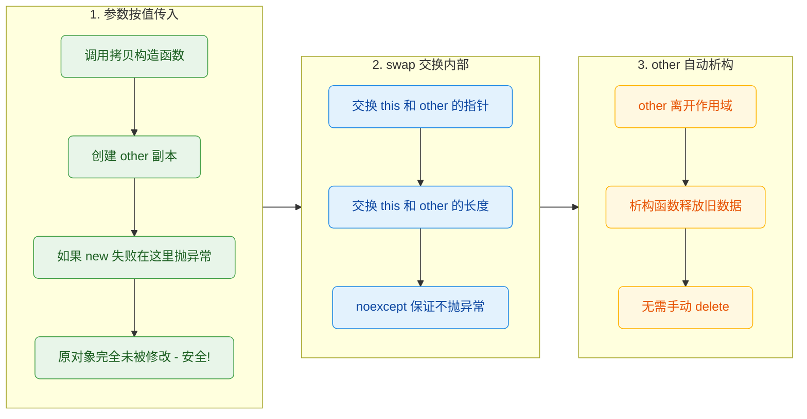

Copy-and-Swap 的三大优势：
- **异常安全**（Strong exception safety）：如果拷贝构造失败（`new` 抛异常），原对象不受影响。
- **自动处理自赋值**：即使 `a = a`，也只是创建一个副本再交换，完全安全，无需额外检测。
- **代码复用**：赋值逻辑复用了拷贝构造函数和析构函数，减少代码重复（DRY 原则）。

---

### 相等运算符 `==` 的重载

#### 设计原则

`==` 运算符用于判断两个对象是否在**逻辑上相等**（logical equality），而非判断它们在内存中是否是同一个对象（identity）。对于我们的 `MyString` 类，两个字符串只要内容相同就应该判定为相等，即使它们存储在不同的堆地址上。

#### 标准实现

```cpp
// ==========================================
// 相等运算符 operator== 的实现
// ==========================================
bool MyString::operator==(const MyString& other) const {  // 注意末尾的 const！
    // 优化：如果长度不同，内容一定不同，提前返回
    if (m_len != other.m_len) {        // 先比较长度，O(1) 快速排除
        return false;                   // 长度不等，直接返回 false
    }
    // 长度相同时，逐字符比较内容
    return std::strcmp(m_data, other.m_data) == 0;  // strcmp 返回 0 表示完全相同
}
```

几个重要细节：

**① 尾部 `const` 修饰符**

`operator==` 后面的 `const` 表示"调用此函数不会修改当前对象的任何成员"。这是必须的——比较操作在语义上显然不应该修改任何一方。同时，只有 `const` 成员函数才能被 `const` 对象调用：

```cpp
const MyString a("test");    // a 是 const 对象
const MyString b("test");    // b 也是 const 对象
if (a == b) { /* ... */ }    // 如果 operator== 不是 const，这行编译失败！
```

**② 配对实现 `!=`**

在 C++20 之前，`!=` 不会自动从 `==` 推导，需要手动实现。最简洁的做法是复用 `==`：

```cpp
// ==========================================
// 不等运算符 operator!= —— 复用 operator==
// ==========================================
bool MyString::operator!=(const MyString& other) const {
    return !(*this == other);   // 直接对 operator== 的结果取反
                                 // *this 就是当前对象，调用上面已定义的 ==
}
```

从 C++20 开始，编译器会自动根据 `operator==` 生成 `operator!=`，你只需要定义 `==` 即可。这被称为 **"Rewritten Candidates"** 机制。

**③ 支持与 C 风格字符串直接比较**

我们还可以提供一个额外的重载，让 `MyString` 能直接和 `const char*` 比较：

```cpp
// ==========================================
// 支持 MyString == "hello" 的写法
// ==========================================
bool MyString::operator==(const char* str) const {
    if (str == nullptr) {               // 防御性编程：检查空指针
        return m_len == 0;              // 空指针视为空串，与长度为0的对象相等
    }
    return std::strcmp(m_data, str) == 0;  // 直接比较底层 C 字符串
}
```

这样就能写出非常自然的代码：

```cpp
MyString name("Alice");          // 创建 MyString 对象
if (name == "Alice") {           // 直接与字面量比较，无需构造临时对象
    std::cout << "Match!\n";     // 输出匹配信息
}
```

---

### 流插入运算符 `<<` 的重载

#### 为什么不能是成员函数？

这是面试和学习中最常见的疑惑之一。要理解这一点，我们先回顾运算符重载的一条核心规则：**当运算符被重载为成员函数时，左操作数 (left operand) 必须是当前类的对象**。

来看我们期望的调用方式：

```cpp
MyString s("Hello");
std::cout << s;       // 左操作数是 std::cout (类型 ostream)，右操作数是 s (类型 MyString)
```

如果写成 `MyString` 的成员函数：

```cpp
// 错误示范！
std::ostream& MyString::operator<<(std::ostream& os) {
    os << m_data;
    return os;
}
// 使用方式变成了：s << std::cout;  ← 完全反直觉！
```

这完全颠倒了左右操作数的位置。因此，`operator<<` **必须**定义为非成员函数（non-member function），而为了让它能访问类的 `private` 成员，通常将其声明为 **`friend`**。

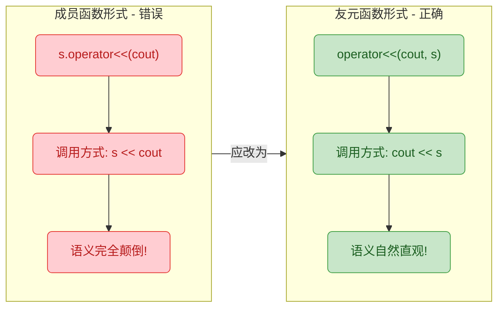

#### 标准实现

```cpp
// ==========================================
// 在类声明中声明为 friend (MyString.h)
// ==========================================
class MyString {
    // ... 省略之前的成员 ...

    // 声明友元：允许此全局函数访问 MyString 的 private 成员
    friend std::ostream& operator<<(std::ostream& os, const MyString& str);
    friend std::istream& operator>>(std::istream& is, MyString& str);
};

// ==========================================
// 在类外部定义 (MyString.cpp)
// ==========================================
std::ostream& operator<<(std::ostream& os, const MyString& str) {
    os << str.m_data;    // 直接访问私有成员 m_data（因为是 friend）
                          // 将字符串内容写入输出流
    return os;            // 返回流引用，支持链式调用：cout << a << b << c
}
```

**为什么返回 `ostream&` 引用？** 原因和 `operator=` 返回 `*this` 引用一样——支持**链式调用**（chaining）：

```cpp
MyString a("Hello"), b("World");
std::cout << a << " " << b << std::endl;
// 展开过程：
// ((((std::cout << a) << " ") << b) << std::endl)
//   ↑ 返回 cout 引用  ↑ 返回 cout 引用  ↑ 返回 cout 引用
```

每一步 `<<` 都返回 `ostream&`，所以下一步的 `<<` 仍然可以以 `cout` 为左操作数继续调用。如果返回 `void`，链条在第一个 `<<` 之后就断裂了。

**参数 `const MyString& str` 的 `const`：** 输出操作不应该修改被输出的对象，这是语义上的强保证。

#### 扩展：格式化输出

实际项目中，你可能想在 `operator<<` 中输出更丰富的格式信息，例如调试模式：

```cpp
std::ostream& operator<<(std::ostream& os, const MyString& str) {
    // 正式输出：只输出内容
    os << str.m_data;

    // 调试输出（可通过编译宏控制）：
    #ifdef DEBUG_MODE
    os << " [len=" << str.m_len             // 输出长度信息
       << ", addr=" << (void*)str.m_data    // 输出堆地址（强转 void* 防止被当作字符串输出）
       << "]";
    #endif

    return os;                               // 别忘了返回流引用
}
```

---

### 流提取运算符 `>>` 的重载

#### 与 `<<` 的对称性

`>>` 的设计逻辑与 `<<` 完全对称：左操作数是 `istream`，右操作数是我们的自定义类对象。同样必须定义为非成员函数，通常也是 `friend`。

但 `>>` 有一个 `<<` 没有的核心难题——**输入校验与错误处理**。你无法预知用户会输入什么，因此必须做好防御。

#### 标准实现

```cpp
// ==========================================
// 流提取运算符 operator>> 的实现
// ==========================================
std::istream& operator>>(std::istream& is, MyString& str) {
    // —— 第一步：准备一个临时缓冲区 ——
    const size_t BUF_SIZE = 1024;          // 设定最大输入长度（实际项目中可动态扩展）
    char buffer[BUF_SIZE];                  // 栈上临时缓冲区

    // —— 第二步：从流中读取输入 ——
    is >> buffer;                           // 默认以空白符为分隔符读取一个"单词"
                                            // 注意：这不会读取整行，只读取到下一个空格/换行

    // —— 第三步：检查读取是否成功 ——
    if (is) {                               // 检查流状态：如果读取成功
        delete[] str.m_data;                // 释放旧数据
        str.m_len = std::strlen(buffer);    // 更新长度
        str.m_data = new char[str.m_len + 1];  // 分配新空间
        std::strcpy(str.m_data, buffer);    // 复制缓冲区内容到新空间
    }
    // 如果读取失败（如遇到 EOF），str 保持原值不变

    return is;                              // 返回流引用，支持链式输入：cin >> a >> b
}
```

#### 关键细节分析

**① 参数不能是 `const`**

注意与 `operator<<` 的重要区别：`<<` 的第二个参数是 `const MyString&`（只读），而 `>>` 的第二个参数是 `MyString&`（可写）。这很好理解——输入操作的目的就是**修改**目标对象。

**② 流状态检查**

`if (is)` 这一行非常重要。`istream` 类重载了 `operator bool()`，当流处于正常状态时返回 `true`，当遇到 EOF、格式错误或其他读取失败时返回 `false`。如果不检查就直接操作，可能会使用未初始化的缓冲区数据。

**③ 缓冲区溢出风险**

上面的实现使用了固定大小的栈缓冲区，有溢出风险。更安全的做法是借助 `std::string` 做中间层：

```cpp
// ==========================================
// 更安全的 operator>> 实现（借助 std::string）
// ==========================================
std::istream& operator>>(std::istream& is, MyString& str) {
    std::string temp;            // std::string 会自动管理内存，无溢出风险
    is >> temp;                  // 读取输入到 std::string

    if (is) {                    // 流状态正常
        delete[] str.m_data;                          // 释放旧内存
        str.m_len = temp.length();                    // 更新长度
        str.m_data = new char[str.m_len + 1];         // 分配新空间
        std::strcpy(str.m_data, temp.c_str());        // 从 std::string 复制到 char 数组
    }

    return is;                   // 返回流引用
}
```

#### 使用示例

```cpp
int main() {
    MyString greeting;                          // 默认构造，内部为空串 ""

    std::cout << "请输入一个单词: ";            // 提示用户输入
    std::cin >> greeting;                       // 调用 operator>>，读取用户输入

    std::cout << "你输入的是: " << greeting     // 调用 operator<<，输出结果
              << " (长度: " << greeting.length() << ")" 
              << std::endl;

    // 链式输入演示
    MyString first, second;                     // 两个空串对象
    std::cout << "请输入两个单词: ";
    std::cin >> first >> second;                // 链式读取，先读 first，再读 second
    std::cout << first << " & " << second << std::endl;

    return 0;
}
```

---

### 四大运算符的完整对比总结

```mermaid
graph LR
    subgraph Signatures["函数签名对比"]
        direction TB
        SIG1["= : MyString& operator=(const MyString&)"]
        SIG2["== : bool operator==(const MyString&) const"]
        SIG3["&lt;&lt; : friend ostream& operator&lt;&lt;(ostream&, const MyString&)"]
        SIG4[">> : friend istream& operator>>(istream&, MyString&)"]
    end

    subgraph Properties["核心属性"]
        direction TB
        P1["= : 成员函数 / 返回引用 / 需自赋值检测"]
        P2["== : 成员函数 / 返回bool / 末尾const"]
        P3["&lt;&lt; : 非成员友元 / 返回ostream& / 参数const"]
        P4[">> : 非成员友元 / 返回istream& / 参数非const"]
    end

    Signatures --> Properties

    classDef sigStyle fill:#E8EAF6,stroke:#3949AB,color:#1A237E,rx:6
    classDef propStyle fill:#FFF3E0,stroke:#EF6C00,color:#BF360C,rx:6

    class SIG1,SIG2,SIG3,SIG4 sigStyle
    class P1,P2,P3,P4 propStyle
```

| 特性 | `=` | `==` | `<<` | `>>` |
|:---|:---:|:---:|:---:|:---:|
| **函数类型** | 成员函数 | 成员函数 | 非成员 (friend) | 非成员 (friend) |
| **返回类型** | `MyString&` | `bool` | `ostream&` | `istream&` |
| **参数 const** | `const &` | `const &` | `const &` | `&` (非const) |
| **函数尾 const** | ✗ | ✓ | N/A | N/A |
| **链式调用** | ✓ `a=b=c` | ✗ | ✓ `cout<<a<<b` | ✓ `cin>>a>>b` |
| **修改左操作数** | ✓ | ✗ | ✓ (写流) | ✓ (读流) |
| **修改右操作数** | ✗ | ✗ | ✗ | ✓ |

---

### 易错点与最佳实践

**1. `operator=` 和拷贝构造函数的区别**

初学者常常混淆这两者。判断标准很简单：**对象是否已经存在？**

```cpp
MyString a("Hi");
MyString b = a;       // 这是【拷贝构造】！b 是新对象，正在初始化。等价于 MyString b(a);
MyString c("Go");
c = a;                // 这是【赋值运算符】！c 已经存在，正在被覆盖。
```

即使 `MyString b = a` 使用了 `=` 符号，它调用的也是**拷贝构造函数**而非 `operator=`，因为 `b` 此时正在被**创建**。

**2. 不要返回局部对象的引用**

```cpp
// 错误！返回局部对象引用
MyString& operator=(const MyString& other) {
    MyString temp(other);    // 局部临时对象
    return temp;             // temp 在函数结束时被销毁，返回的引用变成悬垂引用！
}
```

**3. `<<` / `>>` 的 friend 声明位置**

`friend` 声明写在类的 `public` 或 `private` 区域都可以——`friend` 不受访问修饰符的影响，因为它本质上不是类的成员。但按照惯例，大多数代码风格指南建议将 `friend` 声明集中放在类声明的开头或结尾，以便于查找。

---

**📝 练习题**

以下代码执行后，程序的输出结果是什么？

```cpp
#include <iostream>
#include <cstring>

class Str {
    char* p;
public:
    Str(const char* s = "") {
        p = new char[strlen(s) + 1];
        strcpy(p, s);
    }
    // 注意：没有自定义拷贝构造函数和 operator=
    ~Str() { delete[] p; }

    friend std::ostream& operator<<(std::ostream& os, const Str& s) {
        return os << s.p;
    }
};

int main() {
    Str a("CPP");
    Str b("Java");
    b = a;
    std::cout << b << std::endl;
    return 0;
}
```

A. 输出 `CPP`，程序正常结束


B. 输出 `Java`，程序正常结束


C. 输出 `CPP`，但程序可能崩溃（Undefined Behavior）


D. 编译错误，因为没有定义 `operator=`


**【答案】** C

**【解析】** 

该类拥有指向堆内存的指针成员 `p`，并定义了析构函数 `delete[] p`，但**没有**自定义 `operator=`。因此 `b = a` 调用的是编译器自动生成的浅拷贝赋值运算符，它仅将 `a.p` 的地址值复制给 `b.p`。

执行 `b = a` 之后：
- `b.p` 和 `a.p` 都指向存储 `"CPP"` 的同一块堆内存（浅拷贝）。
- `b` 原来指向的 `"Java"` 内存**泄漏**了（无人管理也无人释放）。
- `std::cout << b` 输出 `CPP`——此时表面上看起来正常。
- 当 `main` 结束时，`b` 先析构（`delete[] p`），释放了那块内存；随后 `a` 析构，对同一块内存执行了**第二次 `delete[]`**——这是经典的 **double free** 错误，属于未定义行为（Undefined Behavior）。

程序*可能*崩溃，也*可能*表面上正常运行——但不管表现如何，行为已经是未定义的了。这正是为什么持有堆资源的类**必须**遵循 Rule of Three，手动实现拷贝构造、赋值运算符和析构函数。选项 D 错误是因为编译器会自动合成默认的 `operator=`，不会导致编译失败。

---

**📝 练习题**

以下哪个 `operator<<` 的声明是正确的？

```cpp
class Point {
    int x, y;
public:
    Point(int a, int b) : x(a), y(b) {}
    // 请选择正确的声明
};
```

A. `std::ostream& Point::operator<<(std::ostream& os, const Point& p);`


B. `friend std::ostream& operator<<(std::ostream& os, const Point& p);`


C. `std::ostream Point::operator<<(const Point& p) const;`


D. `friend void operator<<(std::ostream& os, const Point& p);`


**【答案】** B

**【解析】**

- **选项 A** 错误：`operator<<` 被写成了成员函数（`Point::operator<<`），但却有两个显式参数 `os` 和 `p`。成员函数的第一个参数隐含为 `this`，所以这实际上变成了三个参数的 `<<` 运算符——二元运算符不可能有三个参数，编译器会报错。

- **选项 B** 正确：声明为 `friend` 非成员函数，第一个参数是 `ostream&`（左操作数），第二个参数是 `const Point&`（右操作数），返回 `ostream&` 以支持链式调用。这是标准的 `operator<<` 重载写法。

- **选项 C** 错误：返回类型是 `ostream`（值类型而非引用），这意味着每次调用都会尝试拷贝 `ostream` 对象——而 `ostream` 的拷贝构造函数是 `delete` 的（不可拷贝），编译失败。同时作为成员函数，调用方式会变成 `point << p`，语义颠倒。

- **选项 D** 部分正确但有缺陷：`friend` 和参数列表都对，但返回类型是 `void` 而非 `ostream&`，这导致**无法链式调用**（`cout << p1 << p2` 会编译失败，因为第一个 `<<` 返回 `void`，`void << p2` 无法匹配任何运算符）。虽然能编译单次使用（`cout << p;`），但不符合 C++ 社区的标准惯例和最佳实践。


---

## 友元函数（Friend Functions）

在 C++ 的封装体系中，类的 `private` 和 `protected` 成员默认对外界完全隔离。这是面向对象设计的基石——**数据隐藏（Data Hiding）**。然而，在运算符重载的实践中，我们经常遇到一个棘手的矛盾：**某些运算符（尤其是 `<<` 和 `>>`）无法作为成员函数重载，却又必须访问类的私有数据**。C++ 为此提供了一个精确的"破墙工具"——`friend` 关键字。

友元机制的本质是：**类主动授权某个外部函数或另一个类，允许其访问自己的私有和保护成员**。这不是"入侵"，而是一种"邀请"。就好比你家的门默认对所有人锁着，但你可以主动把钥匙交给你信任的朋友。

需要特别强调的是，`friend` 并不破坏封装——它是封装机制的一部分。因为 **授权的决定权始终在类自身**，而非外部函数。类的设计者明确声明了"谁可以访问我"，这与封装的精神完全一致。

---

### 友元函数的基本语法

友元函数的声明方式非常直观：在类的内部使用 `friend` 关键字修饰一个函数声明。

```cpp
class MyClass {
private:
    int secret;  // 私有数据，外部正常情况下不可访问

public:
    MyClass(int val) : secret(val) {}  // 构造函数初始化私有成员

    // 在类内部声明友元函数：授权 showSecret 可以访问私有成员
    // 注意：这只是"声明"，不是"定义"，函数体在类外部实现
    friend void showSecret(const MyClass& obj);
};

// 友元函数的定义——注意，它不属于类，没有 MyClass:: 作用域符
// 它就是一个普通的全局函数，只不过被 MyClass "信任"了
void showSecret(const MyClass& obj) {
    // 直接访问 obj 的私有成员 secret，这在普通函数中是不可能的
    std::cout << "Secret value: " << obj.secret << std::endl;
}

int main() {
    MyClass m(42);       // 创建对象，secret = 42
    showSecret(m);       // 调用友元函数，输出: Secret value: 42
    return 0;
}
```

这里有几个关键点必须理解透彻：

**第一，友元函数不是成员函数。** 它没有 `this` 指针，不能通过 `对象.函数名()` 的方式调用。它就是一个普通的全局函数（或者另一个类的成员函数），只是拥有了访问该类私有成员的"特权"。

**第二，`friend` 声明可以放在类的任何区域**——`public`、`private`、`protected` 均可，效果完全相同。因为 `friend` 声明的含义是"我信任这个函数"，这个信任关系与访问控制区域无关。不过，**惯例上大多数程序员将 `friend` 声明放在类的最前面或最后面**，与成员函数分离，以提升可读性。

**第三，友元关系是单向的、不可传递的、不可继承的。**

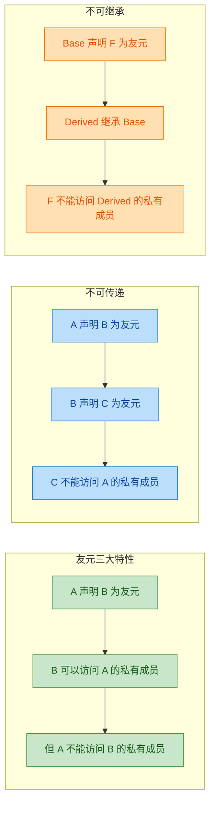

- **单向性（Not Symmetric）**：A 把钥匙给了 B，不代表 B 也把自己的钥匙给了 A。
- **不可传递（Not Transitive）**：A 信任 B，B 信任 C，不代表 A 信任 C。
- **不可继承（Not Inherited）**：父类的朋友不是子类的朋友。

---

### 友元函数与运算符重载的核心关联

友元函数在运算符重载中的应用场景极其明确，主要集中在以下情况：

#### 情况一：左操作数不是本类对象

这是使用友元最经典的理由。回顾成员函数重载运算符的本质：

```cpp
// 成员函数重载 +，等价于 a.operator+(b)
MyClass operator+(const MyClass& rhs);
```

成员函数重载时，**左操作数一定是 `this` 指向的对象**。这意味着如果左操作数的类型不是当前类，成员函数就无能为力了。

最典型的例子就是 `<<` 和 `>>` 运算符：

```cpp
std::cout << obj;   // 左操作数是 ostream，不是 MyClass
std::cin >> obj;    // 左操作数是 istream，不是 MyClass
```

你不可能去修改标准库的 `ostream` 类来添加一个针对你自定义类的成员函数。因此，**必须使用全局函数（友元函数）来重载 `<<` 和 `>>`**。

#### 情况二：需要对称性的二元运算

考虑一个 `Complex`（复数）类与 `int` 的混合运算：

```cpp
Complex c(3, 4);
Complex r1 = c + 5;     // 可以：成员函数 c.operator+(5)，编译器将 5 隐式转换
Complex r2 = 5 + c;     // 错误！5.operator+(c) —— int 没有这个成员函数！
```

如果用友元函数重载：

```cpp
// 友元全局函数，两个参数地位完全对等
friend Complex operator+(const Complex& lhs, const Complex& rhs);
```

此时 `5 + c` 和 `c + 5` 都能通过隐式构造转换正常工作，实现了**运算的对称性（Symmetry）**。

---

### 友元重载 `<<` 运算符（深入详解）

这是友元函数在运算符重载中最高频、最重要的应用。我们以一个 `Student` 类为例，完整剖析每一个细节：

```cpp
#include <iostream>   // 引入标准输入输出流
#include <string>     // 引入 string 类型

class Student {
private:
    std::string name;  // 学生姓名（私有）
    int age;           // 学生年龄（私有）
    double gpa;        // 学生绩点（私有）

public:
    // 构造函数：使用初始化列表设置所有成员
    Student(const std::string& n, int a, double g)
        : name(n), age(a), gpa(g) {}

    // 声明友元：允许全局的 operator<< 访问 Student 的私有成员
    // 返回 ostream& 是为了支持链式调用：cout << s1 << s2
    friend std::ostream& operator<<(std::ostream& os, const Student& stu);

    // 声明友元：允许全局的 operator>> 访问并修改 Student 的私有成员
    // 注意 stu 不是 const，因为需要往里写入数据
    friend std::istream& operator>>(std::istream& is, Student& stu);
};

// ===== operator<< 的定义 =====
// 参数1：ostream& os —— 输出流的引用（不能是 const，因为写入操作会改变流状态）
// 参数2：const Student& stu —— 被输出的学生对象（const 因为只读取不修改）
// 返回值：ostream& —— 返回流本身的引用，以支持链式调用
std::ostream& operator<<(std::ostream& os, const Student& stu) {
    os << "Student{"                    // 输出前缀
       << "name: " << stu.name         // 直接访问私有成员 name（友元特权）
       << ", age: " << stu.age         // 直接访问私有成员 age
       << ", gpa: " << stu.gpa         // 直接访问私有成员 gpa
       << "}";                          // 输出后缀
    return os;                          // 返回流引用，支持 cout << s1 << s2
}

// ===== operator>> 的定义 =====
// 参数1：istream& is —— 输入流的引用
// 参数2：Student& stu —— 要写入数据的学生对象（非 const）
// 返回值：istream& —— 返回流引用，支持 cin >> s1 >> s2
std::istream& operator>>(std::istream& is, Student& stu) {
    std::cout << "Enter name: ";        // 提示用户输入姓名
    is >> stu.name;                     // 从输入流读取数据到私有成员 name
    std::cout << "Enter age: ";         // 提示用户输入年龄
    is >> stu.age;                      // 读取到私有成员 age
    std::cout << "Enter GPA: ";        // 提示用户输入绩点
    is >> stu.gpa;                      // 读取到私有成员 gpa
    return is;                          // 返回流引用，支持链式输入
}

int main() {
    Student s1("Alice", 20, 3.8);       // 创建一个预设的 Student 对象
    std::cout << s1 << std::endl;       // 链式输出，先调用 operator<<(cout, s1)，返回 cout
    // 输出: Student{name: Alice, age: 20, gpa: 3.8}

    Student s2("", 0, 0.0);            // 创建一个空的 Student 对象
    std::cin >> s2;                     // 调用 operator>>(cin, s2)，用户交互式输入
    std::cout << s2 << std::endl;       // 输出用户刚才输入的数据
    return 0;
}
```

为什么返回值必须是**引用**？我们用一张流程图来说明链式调用的工作原理：

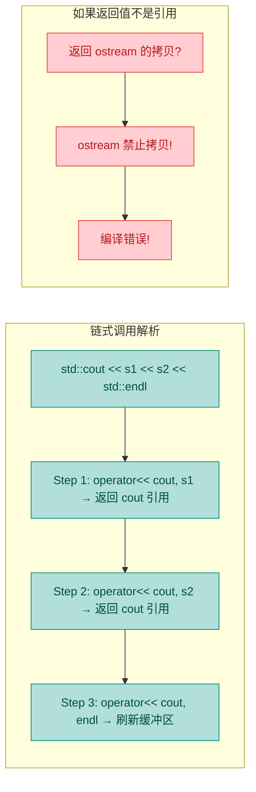

`ostream` 和 `istream` 的拷贝构造函数被 `delete` 了（它们管理着底层的缓冲区资源，拷贝语义不合理），所以你**不可能按值返回流对象**。返回引用既避免了拷贝，又让链式调用成为可能——每一步都返回同一个流对象的引用，下一步接着往这个流里写。

---

### 友元类（Friend Class）

除了友元函数，C++ 还允许将**整个类**声明为友元。当一个类被声明为另一个类的友元时，它的**所有成员函数**都可以访问后者的私有和保护成员。

```cpp
class Engine {
private:
    int horsepower;           // 马力——私有数据
    double temperature;       // 引擎温度——私有数据

public:
    Engine(int hp) : horsepower(hp), temperature(90.0) {}  // 构造函数

    // 将 Car 声明为友元类
    // Car 的所有成员函数都可以访问 Engine 的私有成员
    friend class Car;
};

class Car {
private:
    Engine engine;            // Car 拥有一个 Engine 对象（组合关系）

public:
    Car(int hp) : engine(hp) {}  // 构造时初始化引擎马力

    void showEngineInfo() const {
        // 直接访问 engine 的私有成员——因为 Car 是 Engine 的友元
        std::cout << "Horsepower: " << engine.horsepower << std::endl;   // 访问私有
        std::cout << "Temperature: " << engine.temperature << std::endl; // 访问私有
    }

    void overheat() {
        engine.temperature += 50.0;  // 直接修改 Engine 的私有数据
        std::cout << "Engine overheating! Temp: " << engine.temperature << std::endl;
    }
};

int main() {
    Car myCar(350);           // 创建一辆 350 马力的车
    myCar.showEngineInfo();   // 输出: Horsepower: 350 \n Temperature: 90
    myCar.overheat();         // 输出: Engine overheating! Temp: 140
    return 0;
}
```

友元类的使用场景通常是**两个类之间存在强耦合关系**，比如 `Car` 和 `Engine`、`LinkedList` 和 `Node`、`Iterator` 和 `Container` 等。但必须谨慎使用——友元类会暴露所有私有成员，粒度远比友元函数粗。

---

### 友元函数 vs 成员函数 vs 普通全局函数

这三种方式在运算符重载中各有适用场景，理解它们的边界至关重要：

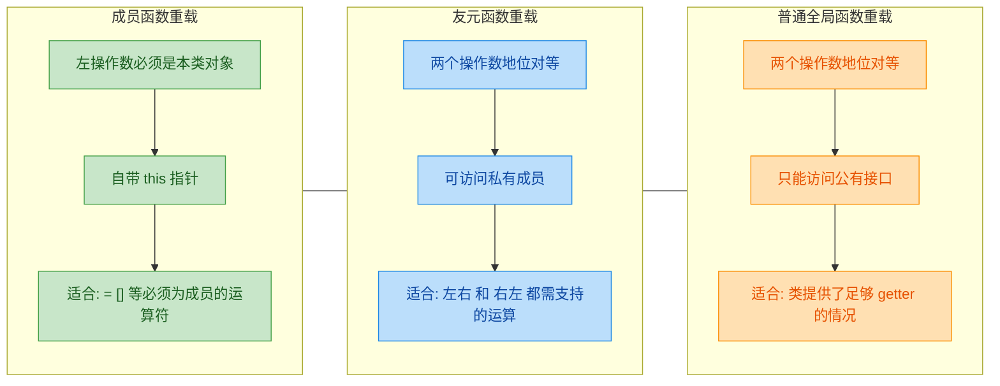

| 对比维度 | 成员函数 | 友元函数 | 普通全局函数 |
|:---:|:---:|:---:|:---:|
| **访问私有成员** | ✅ 通过 `this` | ✅ 通过友元授权 | ❌ 只能用公有接口 |
| **左操作数类型** | 必须是本类 | 任意类型 | 任意类型 |
| **参数个数（二元）** | 1 个（右操作数） | 2 个（左 + 右） | 2 个（左 + 右） |
| **是否有 `this`** | ✅ 有 | ❌ 没有 | ❌ 没有 |
| **对称性** | ❌ 不对称 | ✅ 对称 | ✅ 对称 |

**选择原则总结：**

1. **必须用成员函数**的运算符：`=`（赋值）、`[]`（下标）、`()`（函数调用）、`->`（成员访问）、类型转换运算符。这些是 C++ 标准的硬性规定。
2. **必须用非成员函数（通常是友元）** 的运算符：`<<`、`>>`（流插入/提取），因为左操作数是标准库的流对象。
3. **推荐用友元函数**的运算符：`+`、`-`、`*`、`/`、`==`、`!=` 等需要对称性的二元运算。
4. **能不用友元就不用**：如果类提供了足够的公有接口（getter），普通全局函数就够了，不必动用友元。

---

### 友元的争议与最佳实践

友元机制在 C++ 社区中一直存在争议。反对者认为它"打破了封装"，支持者则认为它"是封装的精确补充"。以下是工程实践中的建议：

**✅ 合理使用场景：**

- 重载 `<<` / `>>` 运算符（这是最无争议的用法）
- 两个高度耦合的类之间（如 `Iterator` 和 `Container`）
- 需要对称性的二元运算符重载
- 工厂模式（Factory）中，工厂类需要调用产品类的私有构造函数

**❌ 应当避免的做法：**

- 滥用友元来绕过设计不佳的接口——这是"代码坏味道（Code Smell）"
- 大量使用友元类——如果一个类有超过两三个友元类，说明设计需要重构
- 用友元替代继承或组合关系

**一个实用的替代方案：** 如果你只需要让外部函数访问少量数据，考虑提供 **public getter** 而非友元：

```cpp
class Point {
private:
    double x, y;          // 私有坐标数据

public:
    Point(double x, double y) : x(x), y(y) {}  // 构造函数

    // 提供公有的只读访问接口，代替友元
    double getX() const { return x; }   // getter for x
    double getY() const { return y; }   // getter for y
};

// 无需友元，通过 public getter 实现功能
double distance(const Point& a, const Point& b) {
    double dx = a.getX() - b.getX();   // 通过 getter 获取 x 差值
    double dy = a.getY() - b.getY();   // 通过 getter 获取 y 差值
    return std::sqrt(dx * dx + dy * dy); // 计算欧几里得距离
}
```

但对于 `operator<<` 这种必须紧密配合类内部结构的场景，友元仍然是最干净、最符合 C++ 惯用法（idiomatic C++）的方案。

---

### 友元函数的前向声明陷阱

在实际开发中，友元涉及多个类的相互引用时，经常遇到**前向声明（Forward Declaration）** 的问题：

```cpp
class B;  // 前向声明：告诉编译器 B 是一个类，但此时编译器不知道 B 的任何细节

class A {
private:
    int data;                           // A 的私有数据

public:
    A(int d) : data(d) {}              // 构造函数

    // 声明 B 的成员函数 showA 为 A 的友元
    // 此时编译器只需要知道 B 存在（前向声明足够），不需要知道 B 的完整定义
    friend void B::showA(const A& a);  // ⚠️ 编译错误！
};

class B {
public:
    void showA(const A& a) {
        std::cout << a.data << std::endl;  // 想访问 A 的私有成员
    }
};
```

上面这段代码**会编译失败**。原因在于：当编译器处理 `friend void B::showA(...)` 时，它需要知道 `B` 类中确实存在 `showA` 这个成员函数，但前向声明只告诉编译器"B 是一个类"，没有提供 B 的成员信息。

**正确做法：调整定义顺序，确保被引用的类在使用前已完整定义。**

```cpp
class A;   // 前向声明 A（B 的 showA 参数中用到了 A&）

class B {
public:
    void showA(const A& a);  // 先声明（不定义），参数是 A 的引用，前向声明够用
};

class A {
private:
    int data;                           // A 的私有数据

public:
    A(int d) : data(d) {}              // 构造函数
    friend void B::showA(const A& a);  // 现在 B 已完整定义，编译器知道 showA 存在 ✅
};

// 此时 A 也已完整定义，可以在函数体中访问 A 的私有成员
void B::showA(const A& a) {
    std::cout << a.data << std::endl;   // 友元特权，访问 A 的私有成员
}
```

这种"声明-定义分离 + 精心排列顺序"的模式在大型 C++ 项目中非常常见。核心原则是：**谁被引用，谁先声明；谁被完整使用，谁先完整定义**。

---

### 隐藏的友元（Hidden Friend）惯用法

C++11 之后，一种被称为 **Hidden Friend** 的技巧在现代 C++ 中越来越流行。它的核心思想是：**将友元函数直接定义在类的内部**。

```cpp
class Vector2D {
private:
    double x, y;                        // 二维向量的两个分量

public:
    Vector2D(double x, double y) : x(x), y(y) {}  // 构造函数

    // Hidden Friend：友元函数直接在类内部定义
    // 这个函数虽然写在类里面，但它不是成员函数！
    // 它是一个全局函数，只是"恰好"在类内部定义了
    friend Vector2D operator+(const Vector2D& a, const Vector2D& b) {
        return Vector2D(a.x + b.x, a.y + b.y);  // 直接访问两个对象的私有成员
    }

    // Hidden Friend 重载 <<
    friend std::ostream& operator<<(std::ostream& os, const Vector2D& v) {
        os << "(" << v.x << ", " << v.y << ")";  // 访问私有成员输出
        return os;                                 // 返回流引用
    }
};

int main() {
    Vector2D a(1.0, 2.0);               // 向量 a = (1, 2)
    Vector2D b(3.0, 4.0);               // 向量 b = (3, 4)
    std::cout << a + b << std::endl;     // 输出: (4, 6)
    return 0;
}
```

Hidden Friend 有两大优势：

1. **减少命名空间污染**：这些函数只能通过 **ADL（Argument-Dependent Lookup，参数依赖查找）** 找到，不会出现在全局命名空间中，减少了名字冲突的可能。
2. **减少不必要的隐式转换**：因为 Hidden Friend 不参与普通的重载决议（只有当参数类型与类相关时才会被考虑），所以可以避免一些意外的类型转换。

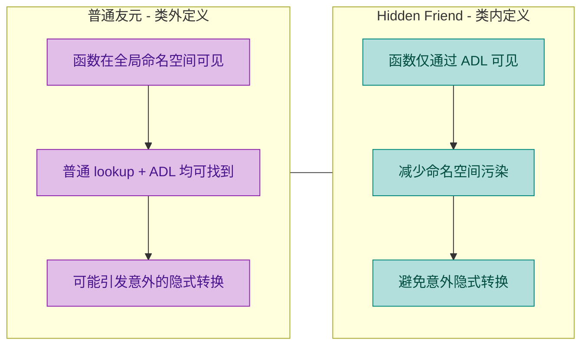

在现代 C++ 代码库（如 C++17/20 的标准库实现）中，Hidden Friend 已经成为重载运算符的推荐惯用法。如果你的友元函数体比较短小，**优先考虑将其定义在类内部，使其成为 Hidden Friend**。

---

**📝 练习题**

以下关于 C++ 友元（friend）的描述，哪一项是**正确**的？

A. 友元函数是类的成员函数，拥有 `this` 指针，可以直接访问类的私有成员。

B. 如果类 A 声明类 B 为友元，那么 A 的成员函数也可以访问 B 的私有成员（友元关系是双向的）。

C. 友元函数虽然在类内部声明，但它本质上不是成员函数，没有 `this` 指针，不能通过对象调用。

D. 友元关系可以被继承：如果基类声明了某函数为友元，则派生类也自动将该函数视为友元。


**【答案】** C

**【解析】** 友元函数的核心特征是：它**不是成员函数**，只是被类授权可以访问其私有成员。因此 A 错误——友元函数没有 `this` 指针。B 错误——友元关系是**单向的**，A 信任 B 不意味着 B 信任 A。D 错误——友元关系**不可继承**，基类的友元对派生类的新增私有成员没有访问权限。C 的描述完全准确：友元函数在类内部用 `friend` 关键字声明，但它本质上是一个全局函数（或另一个类的成员函数），不属于该类，没有 `this` 指针，调用时也不需要通过对象来调用。

---

**📝 练习题**

阅读以下代码，程序的输出结果是什么？

```cpp
#include <iostream>

class Box {
private:
    int width;

public:
    Box(int w) : width(w) {}

    friend Box operator+(const Box& a, const Box& b) {
        return Box(a.width + b.width);
    }

    friend std::ostream& operator<<(std::ostream& os, const Box& b) {
        os << "[" << b.width << "]";
        return os;
    }
};

int main() {
    Box a(3), b(7), c(10);
    std::cout << a + b + c << std::endl;
    return 0;
}
```

A. `[3][7][10]`

B. `[20]`

C. `[10][10]`

D. 编译错误，因为 `a + b + c` 无法连续调用友元函数


**【答案】** B

**【解析】** `a + b + c` 的求值过程遵循 `+` 运算符的**左结合性（left-to-right associativity）**。首先计算 `a + b`：调用 `operator+(a, b)`，`a.width(3) + b.width(7) = 10`，返回一个临时 `Box(10)`。然后计算 `临时Box(10) + c`：调用 `operator+(Box(10), c)`，`10 + 10 = 20`，返回 `Box(20)`。最后 `operator<<` 输出 `[20]`。整个链式运算能够成功，正是因为友元 `operator+` 返回的是一个新的 `Box` 对象（按值返回），可以继续作为下一次 `+` 运算的参数。选 D 的同学需注意：友元函数接受的参数是 `const Box&`，临时对象可以绑定到 const 引用，因此连续调用完全合法。

---

## 本章小结

本章围绕 **运算符重载（Operator Overloading）** 这一 C++ 核心特性展开，从语法基础到常用重载实践，再到友元函数的设计哲学，逐步构建了完整的知识体系。下面我们从全局视角对本章知识进行一次系统性的回顾与升华。

---

### 核心知识脉络回顾

运算符重载的本质是：**让编译器在遇到自定义类型参与运算时，能够调用我们预先定义好的函数**。它并没有创造新的运算符，而是对已有运算符赋予了针对自定义类型的新语义。理解这一点至关重要——运算符重载是一种 **语法糖（Syntactic Sugar）**，其底层仍然是普通的函数调用。

```c++
// 当你写下：
MyString a, b, c;
c = a + b;

// 编译器实际执行的是：
c.operator=(a.operator+(b));
// 或者如果是非成员重载：
c.operator=(operator+(a, b));
```

整个章节的知识结构可以用下面这张图来概括：

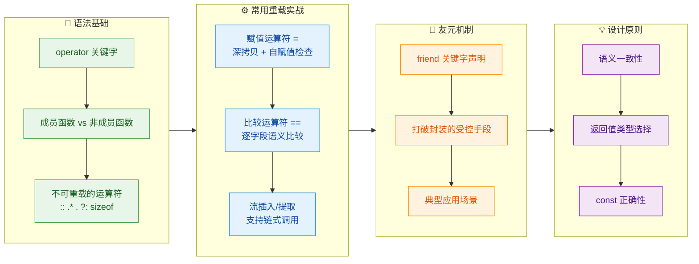

---

### 重载方式决策总结

在实际开发中，**选择成员函数重载还是非成员函数（友元）重载** 是一个高频决策点。下面这张决策表浓缩了整章的经验法则：

| 运算符 | 推荐重载形式 | 核心原因 |
|:---:|:---:|:---|
| `=` | **成员函数（强制）** | 编译器要求赋值运算符必须为成员函数，保证左操作数是当前对象 |
| `==` / `!=` | **成员函数 或 非成员函数均可** | 若需要左操作数隐式转换，则选非成员；否则成员即可 |
| `<` / `>` / `<=` / `>=` | **非成员函数（推荐）** | 保持对称性，允许两侧操作数都进行隐式转换 |
| `<<` / `>>` | **非成员友元函数（强制）** | 左操作数是 `ostream`/`istream`，不可能在其类内定义成员函数 |
| `+` / `-` / `*` | **非成员函数（推荐）** | 保证交换律对称性，如 `int + MyClass` 也能工作 |
| `+=` / `-=` | **成员函数（推荐）** | 复合赋值总是修改左操作数自身，语义上属于对象行为 |
| `++` / `--` | **成员函数（推荐）** | 自增自减修改对象自身状态，成员函数最自然 |
| `()` / `[]` | **成员函数（强制）** | C++ 标准规定这两个必须作为成员函数重载 |

> **记忆口诀**：`=`、`()`、`[]`、`->` 四个运算符 **必须** 为成员函数，`<<` 和 `>>` **必须** 为非成员函数，其余按语义和对称性灵活选择。

---

### 关键代码模式速查

整章涉及的核心代码范式，可以归纳为以下几种 **经典模板（Canonical Patterns）**：

#### 模式一：赋值运算符的安全实现（Copy-and-Swap Idiom）

```c++
class MyString {
    char* m_data;   // 堆上动态分配的字符数组
    size_t m_len;   // 字符串长度

public:
    // 赋值运算符重载 —— 使用 copy-and-swap 惯用法
    MyString& operator=(MyString other) {  // 注意：参数按值传递，自动触发拷贝构造
        swap(*this, other);                // 交换当前对象与临时副本的内部资源
        return *this;                      // 返回自身引用，支持链式赋值 a = b = c
    }                                      // other 离开作用域时自动释放旧资源

    // 友元 swap 函数，交换两个对象的内部状态
    friend void swap(MyString& first, MyString& second) noexcept {
        using std::swap;          // 启用 ADL（Argument-Dependent Lookup）
        std::swap(first.m_data, second.m_data);  // 交换指针，O(1)
        std::swap(first.m_len, second.m_len);    // 交换长度
    }
};
```

这种写法的精妙之处在于：**一个函数同时处理了拷贝赋值和移动赋值**（如果定义了移动构造函数），并且天然具有异常安全性（Exception Safety）和自赋值安全性。

#### 模式二：流运算符的友元实现

```c++
class Point {
    double m_x;   // x 坐标
    double m_y;   // y 坐标

public:
    // 声明友元 —— 允许该非成员函数访问 private 成员
    friend std::ostream& operator<<(std::ostream& os, const Point& pt);
    friend std::istream& operator>>(std::istream& is, Point& pt);
};

// 流插入运算符 —— 输出格式: (x, y)
std::ostream& operator<<(std::ostream& os, const Point& pt) {
    os << "(" << pt.m_x << ", " << pt.m_y << ")";  // 直接访问私有成员
    return os;                                        // 返回流引用，支持链式输出
}

// 流提取运算符 —— 从输入流读取两个 double
std::istream& operator>>(std::istream& is, Point& pt) {
    is >> pt.m_x >> pt.m_y;   // 按顺序读入 x 和 y
    if (!is) {                 // 检查流状态，输入失败则恢复默认值
        pt = Point{};          // 将对象重置为默认状态
    }
    return is;                 // 返回流引用，支持链式输入
}
```

#### 模式三：比较运算符的现代实现

```c++
class Student {
    std::string m_name;   // 学生姓名
    int m_score;          // 学生成绩

public:
    // == 运算符：逐字段比较
    bool operator==(const Student& rhs) const {  // const 保证不修改当前对象
        return m_name == rhs.m_name              // 比较姓名
            && m_score == rhs.m_score;           // 且比较成绩
    }

    // != 运算符：直接基于 == 取反，避免逻辑重复
    bool operator!=(const Student& rhs) const {
        return !(*this == rhs);   // 复用 operator==，单一职责
    }
};

// C++20 起，只需定义 operator<=> 即可自动生成全部比较运算符
// auto operator<=>(const Student&) const = default;
```

---

### 常见陷阱与最佳实践清单

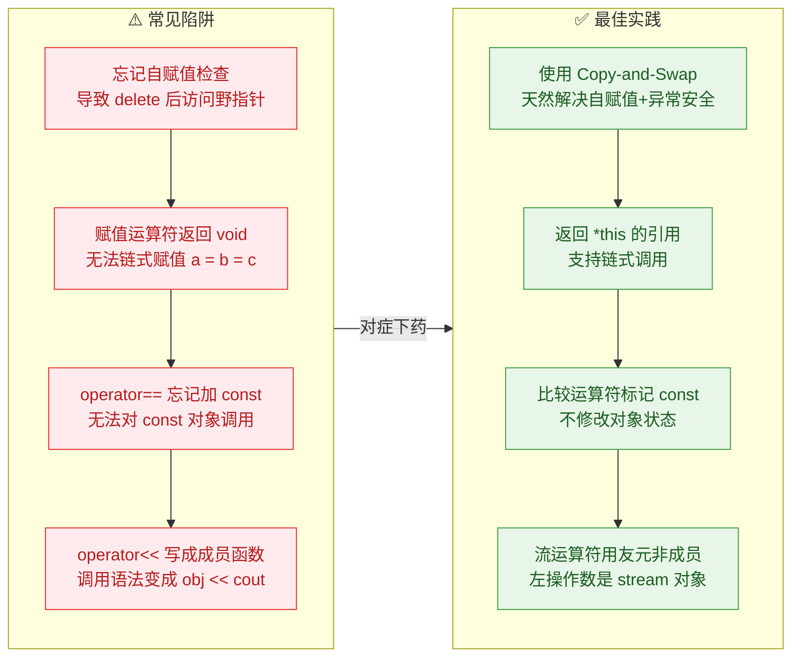

**总结清单**：

1. **语义一致（Semantic Consistency）**：重载后的运算符行为应符合程序员的直觉预期。`+` 就应该做"加法"语义的事情，不要让它执行删除操作。
2. **对称性（Symmetry）**：如果 `a == b` 成立，那么 `b == a` 也必须成立。非成员函数重载比成员函数更容易保证这一点。
3. **返回值类型正确**：赋值类（`=`, `+=`）返回 `T&`；算术类（`+`, `-`）返回 `T`（值）；比较类返回 `bool`；流类返回 `stream&`。
4. **const 正确性（const-correctness）**：不修改对象状态的运算符（如 `==`, `+`, `<<`）应标记为 `const` 成员函数，或将参数声明为 `const&`。
5. **友元最小化（Minimize Friendship）**：只在确实需要访问私有成员时才使用 `friend`，能通过公有接口实现的就不要破坏封装。

---

### 运算符重载返回值速查表

| 运算符类别 | 示例 | 返回类型 | 原因 |
|:---:|:---:|:---:|:---|
| 复合赋值 | `+=`, `-=`, `=` | `T&` | 修改自身并返回引用，支持链式 |
| 算术运算 | `+`, `-`, `*` | `T` (by value) | 产生新对象，不修改操作数 |
| 比较运算 | `==`, `<`, `!=` | `bool` | 逻辑判断，结果只有真/假 |
| 流运算 | `<<`, `>>` | `stream&` | 返回流引用，支持链式 I/O |
| 前置自增 | `++obj` | `T&` | 修改自身并返回引用 |
| 后置自增 | `obj++` | `T` (by value) | 返回修改前的副本 |
| 下标访问 | `[]` | `T&` 或 `const T&` | 允许读写或只读访问元素 |
| 函数调用 | `()` | 任意 | 取决于 functor 的语义 |

---

### 从本章到后续章节的桥梁

运算符重载并非孤立的知识点，它与 C++ 的许多高级特性紧密相连：

- **继承与多态**：派生类如何正确重载赋值运算符？涉及 **对象切片（Object Slicing）** 问题。
- **模板编程**：编写泛型算法时，`operator<` 的存在使得 `std::sort` 能直接作用于自定义类型。
- **STL 容器**：`std::map` 依赖 `operator<`，`std::unordered_map` 依赖 `operator==` 加 hash 函数。
- **智能指针**：`operator->` 和 `operator*` 的重载是实现 `shared_ptr`、`unique_ptr` 等智能指针的基础。
- **C++20 三路比较**：`operator<=>` (spaceship operator) 一次定义即可自动生成六个比较运算符，是运算符重载的现代演进。

---

**📝 练习题 1**

以下代码中，`operator+` 的实现存在什么问题？

```c++
class Vector2D {
    double x, y;
public:
    Vector2D(double x, double y) : x(x), y(y) {}

    Vector2D& operator+(const Vector2D& rhs) {
        x += rhs.x;
        y += rhs.y;
        return *this;
    }
};

int main() {
    Vector2D a(1, 2), b(3, 4), c(0, 0);
    c = a + b;
    // 此时 a 的值是多少？
}
```

A. `a` 的值为 `(1, 2)`，代码完全正确


B. `a` 的值为 `(4, 6)`，因为 `operator+` 修改了左操作数自身，返回类型和语义均有错误


C. 编译错误，`operator+` 不能作为成员函数


D. `a` 的值为 `(0, 0)`，因为赋值给了 `c`

**【答案】** B

**【解析】** `operator+` 的标准语义是 **产生一个新对象**，而不修改任何操作数。正确的返回类型应该是 `Vector2D`（按值返回），而非 `Vector2D&`（引用）。上述代码中，`a + b` 实际上把 `rhs.x` 和 `rhs.y` 累加到了 `a` 自身的成员上，导致 `a` 被意外修改为 `(4, 6)`。这相当于把 `+` 实现成了 `+=` 的语义。正确写法应为：

```c++
// 正确的 operator+ 实现
Vector2D operator+(const Vector2D& rhs) const {  // 注意 const
    return Vector2D(x + rhs.x, y + rhs.y);       // 返回新对象
}
```

---

**📝 练习题 2**

关于友元函数（friend function），以下说法 **正确** 的是：

A. 友元函数是类的成员函数，可以通过对象的 `.` 运算符调用


B. 友元关系具有传递性：A 是 B 的友元，B 是 C 的友元，则 A 自动是 C 的友元


C. 友元函数虽然可以访问类的私有成员，但它不是该类的成员函数，不拥有 `this` 指针


D. 将 `operator<<` 声明为成员函数和声明为友元函数的效果完全相同

**【答案】** C

**【解析】** 逐项分析：

- **A 错误**：`friend` 声明只是授予外部函数访问私有成员的权限，友元函数 **不是** 类的成员函数，不能通过 `obj.func()` 的方式调用。
- **B 错误**：友元关系 **不具备传递性**（Non-transitive），也 **不具备继承性**。A 是 B 的友元不意味着 A 能访问 B 的派生类私有成员，更不意味着能跨级传递。
- **C 正确**：友元函数可以访问类的 `private` 和 `protected` 成员，但本质上它是一个普通的外部函数，没有 `this` 指针，必须通过参数接收对象。
- **D 错误**：如果将 `operator<<` 声明为成员函数，则左操作数（即 `this`）是当前类的对象，调用语法会变成 `obj << cout` 而非 `cout << obj`，语义完全颠倒。因此 `operator<<` **必须** 作为非成员函数（通常是友元）重载。

---