---

# JNI基础 ⭐⭐

---

## JNI概述（Java与Native的桥梁）

### 什么是 JNI

JNI，全称 **Java Native Interface**，是 Java 平台定义的一套标准编程接口，允许运行在 **JVM（Java Virtual Machine）** 中的 Java 代码与用其他语言（主要是 **C/C++**）编写的 Native 代码进行**双向互操作（Bidirectional Interoperation）**。

要理解 JNI 的意义，首先要理解 Java 的核心设计哲学——**"Write Once, Run Anywhere"**。Java 通过 JVM 屏蔽了底层操作系统和硬件的差异，字节码在任意平台的 JVM 上都能运行。这赋予了 Java 极强的跨平台能力，但同时也筑起了一道"围墙"：Java 代码被隔离在 JVM 的沙箱中，无法直接触及操作系统内核、硬件寄存器、或已有的 C/C++ 生态库。

JNI 就是这道围墙上开的一扇**"门"**。它定义了一套严格的协议和 ABI（Application Binary Interface），让 JVM 内部的 Java 世界与 JVM 外部的 Native 世界能够安全、有序地交换数据和调用函数。

用一句话概括：

> **JNI 是 Java 与 Native（C/C++）之间的标准化桥梁（Bridge），使二者可以互相调用函数、传递数据。**

---

### 为什么需要 JNI

许多初学者会问：Java 已经那么强大了，为什么还要"下沉"到 C/C++ 层？原因可以归纳为以下几个核心场景：

**① 性能关键路径（Performance-Critical Path）**

Java 是运行在 JVM 上的托管语言，存在 GC（垃圾回收）停顿、JIT 编译延迟等开销。在某些对延迟极度敏感的场景，如音视频编解码、图形渲染引擎、科学计算中的矩阵运算等，直接使用 C/C++ 操作内存和 CPU 指令，可以获得接近硬件极限的性能。Android 平台的 **MediaCodec** 底层、**OpenGL ES** 渲染管线、以及 **TensorFlow Lite** 的推理引擎，都通过 JNI 调用 Native 代码来保障性能。

**② 复用已有的 Native 库（Reuse Existing Libraries）**

软件工程中有大量用 C/C++ 编写的成熟库，例如 **OpenSSL**（加密）、**FFmpeg**（音视频处理）、**SQLite**（数据库引擎）、**OpenCV**（计算机视觉）。从零用 Java 重写这些库既不现实也不经济。通过 JNI 将这些库"包装"一层 Java 接口，就可以在 Java/Android 项目中直接使用。

**③ 访问操作系统特定功能（OS-Specific Features）**

Java 标准库提供的 API 是跨平台的抽象，无法覆盖所有操作系统的特有功能。比如：
- Linux 的 `epoll`、`inotify`
- Windows 的 `IOCP`（I/O Completion Ports）
- Android 的 `Binder` IPC 驱动

要使用这些能力，必须通过 JNI 调用对应的系统调用（System Call）或平台 API。

**④ 安全与逆向防护（Security & Anti-Reverse Engineering）**

将核心算法（如加密密钥生成、License 校验逻辑）放入 `.so`（Shared Object）动态库中，比放在 `.class` / `.dex` 文件中更难被反编译。虽然 Native 代码同样可以被逆向（通过 IDA Pro 等工具），但其门槛远高于 Java 字节码的反编译（如 jadx 一键可读）。这在 Android 应用安全领域是常见的防护策略。

**⑤ 底层硬件交互（Hardware Access）**

嵌入式场景或 IoT 设备中，Java 层需要通过 JNI 调用驱动层代码来操控 GPIO、串口（UART）、I2C 总线等硬件接口。Android Things（已归档）就是这种架构的典型代表。

---

### JNI 的架构全景

下面这张图展示了 JNI 在整个 Java 运行时体系中的位置。核心思想是：**JNI 层处于 JVM 与 Native Libraries 之间，它既不属于纯 Java，也不属于纯 C/C++，而是一个"翻译层"。**

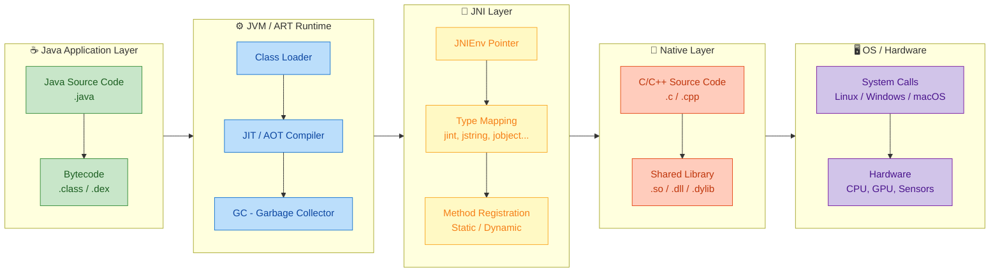

从图中可以清晰地看出五层架构：

| 层级 | 职责 | 关键产物 |
|------|------|----------|
| **Java Application** | 业务逻辑、UI、框架代码 | `.java` → `.class` / `.dex` |
| **JVM / ART Runtime** | 类加载、编译优化、内存管理 | 字节码解释执行或编译为机器码 |
| **JNI Layer** | 类型映射、函数注册、环境指针 | `JNIEnv*`、`jclass`、`jmethodID` |
| **Native Layer** | C/C++ 实现的核心算法和库 | `.so` / `.dll` / `.dylib` |
| **OS / Hardware** | 系统调用、硬件驱动 | 内核接口、设备寄存器 |

JNI 层所做的核心工作就是三件事：
1. **类型映射（Type Mapping）**：Java 的 `int` 对应 JNI 的 `jint`，`String` 对应 `jstring`……
2. **函数注册（Method Registration）**：将 Java 侧声明的 `native` 方法绑定到 C/C++ 的具体函数实现。
3. **环境指针传递（JNIEnv Pointer）**：为 Native 函数提供回调 Java 世界的能力（创建对象、调用方法、抛出异常等）。

---

### JNI 的调用方向

JNI 的桥梁是**双向**的。大多数教程只强调 "Java 调 C"，但实际上 "C 调 Java" 同样是高频操作。

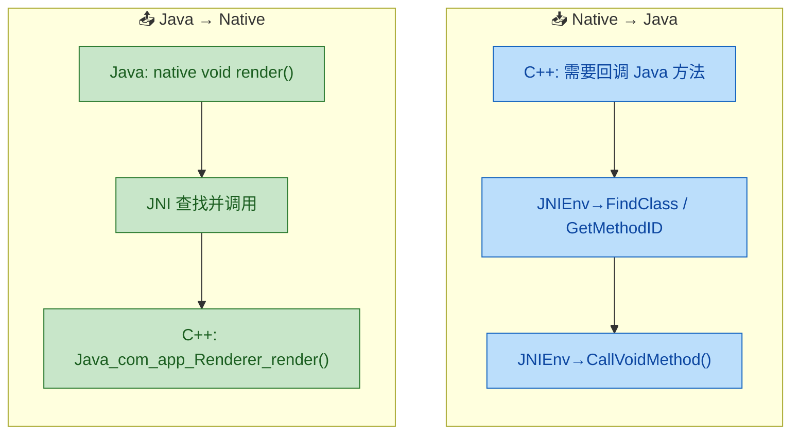

**方向一：Java → Native（最常见）**

Java 代码声明一个 `native` 方法，JVM 在运行时通过 JNI 机制定位到对应的 C/C++ 函数并执行。这是"将性能敏感代码下沉到 Native 层"的典型路径。

**方向二：Native → Java（回调/反射）**

C/C++ 代码在执行过程中需要"反过来"调用 Java 方法。例如：Native 层的网络库收到数据后，需要通过 JNI 回调 Java 层的 `onDataReceived()` 方法来通知上层。这一方向依赖 `JNIEnv` 提供的一组反射式 API（`FindClass`、`GetMethodID`、`CallXxxMethod` 等）。

---

### JNI 的典型工作流程总览

在深入后续小节之前，先从宏观视角过一遍 "一个 JNI 调用从 Java 到 C++ 再返回" 的完整生命周期：

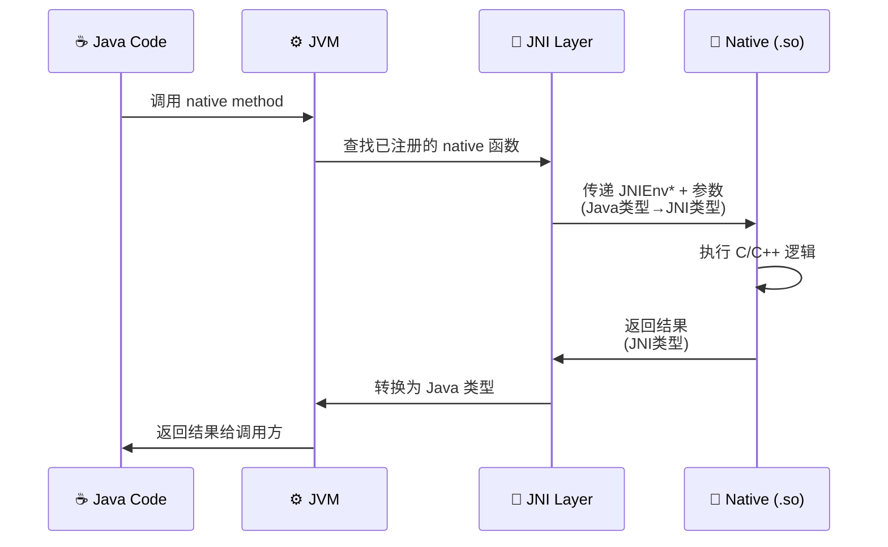

整个流程可以分解为六步：

1. **Java 侧调用**：Java 代码像调用普通方法一样调用 `native` 方法。
2. **JVM 查找映射**：JVM 在内部的 native method table 中查找该方法对应的 C/C++ 函数指针（通过静态注册的命名规则或动态注册的映射表）。
3. **参数转换与传递**：JVM 将 Java 类型（`int`, `String`, `Object`）转换为 JNI 类型（`jint`, `jstring`, `jobject`），并连同 `JNIEnv*` 指针一起传入 Native 函数。
4. **Native 执行**：C/C++ 函数执行核心逻辑，可以通过 `JNIEnv*` 回调 Java（反向调用）。
5. **结果返回**：Native 函数将结果以 JNI 类型返回，JNI 层负责转回 Java 类型。
6. **Java 侧接收**：调用方得到返回值，继续执行后续逻辑。

---

### JNI 中的类型映射速览

JNI 定义了一套专门的类型别名来在 C/C++ 中表示 Java 类型。这是桥梁得以工作的基础——两侧必须"说同一种语言"。以下是最核心的映射关系：

| Java 类型 | JNI 类型 | C/C++ 底层类型 | 大小 |
|-----------|----------|---------------|------|
| `boolean` | `jboolean` | `unsigned char` | 8 bit |
| `byte` | `jbyte` | `signed char` | 8 bit |
| `char` | `jchar` | `unsigned short` | 16 bit |
| `short` | `jshort` | `short` | 16 bit |
| `int` | `jint` | `int` | 32 bit |
| `long` | `jlong` | `long long` | 64 bit |
| `float` | `jfloat` | `float` | 32 bit |
| `double` | `jdouble` | `double` | 64 bit |
| `void` | `void` | `void` | — |
| `Object` | `jobject` | 指针（opaque） | platform |
| `String` | `jstring` | `jobject` 子类型 | platform |
| `Class` | `jclass` | `jobject` 子类型 | platform |
| `int[]` | `jintArray` | `jarray` 子类型 | platform |

特别注意：**`jstring` 不是 C 的 `char*`**。要在 Native 层操作字符串，必须通过 `JNIEnv` 提供的函数（如 `GetStringUTFChars`）来获取 C 风格字符串，用完后还需要 `ReleaseStringUTFChars` 释放。这是初学者最常踩的坑之一。

---

### 一个最简单的 JNI 示例（端到端）

为了让整个概念具象化，我们来看一个最简单的、从 Java 调用 C 函数的完整例子。后续章节会逐步拆解每个细节，这里只做宏观感知。

**第一步：Java 侧声明 native 方法**

```java
// 文件: HelloJNI.java
// 这是 Java 侧的入口类
public class HelloJNI {

    // 静态代码块，在类加载时执行
    // 加载名为 "hello" 的 Native 库（对应 libhello.so / hello.dll）
    static {
        System.loadLibrary("hello");
    }

    // 声明一个 native 方法，没有方法体
    // 具体实现在 C/C++ 侧
    public native String sayHello(String name);

    // 主函数：测试调用
    public static void main(String[] args) {
        HelloJNI jni = new HelloJNI();           // 创建实例
        String result = jni.sayHello("JNI");     // 调用 native 方法
        System.out.println(result);              // 输出结果
    }
}
```

**第二步：生成 JNI 头文件（由工具自动生成）**

```bash
# 使用 javac -h 命令编译并同时生成 JNI 头文件
# -h jni_headers 指定头文件输出目录
javac -h jni_headers HelloJNI.java
```

生成的头文件中会包含 Native 函数的签名声明（函数名遵循静态注册的命名规则）。

**第三步：C 侧实现 native 方法**

```c
// 文件: hello.c
#include <jni.h>    // JNI 核心头文件，包含所有 JNI 类型和函数声明
#include <string.h> // C 字符串操作
#include <stdio.h>  // sprintf 等

// 函数名格式: Java_{包名}_{类名}_{方法名}
// 包名中的 '.' 替换为 '_'
// 参数1: JNIEnv* 指针 —— JNI 环境，提供所有 JNI 功能函数
// 参数2: jobject —— 调用此 native 方法的 Java 对象实例 (this)
// 参数3: jstring —— 对应 Java 侧的 String name 参数
JNIEXPORT jstring JNICALL
Java_HelloJNI_sayHello(JNIEnv *env, jobject thiz, jstring name) {

    // 将 Java 的 jstring 转换为 C 的 const char*
    // GetStringUTFChars 会分配内存，后续必须释放
    const char *c_name = (*env)->GetStringUTFChars(env, name, NULL);

    // 准备拼接结果字符串
    char buf[256];                                      // 缓冲区
    sprintf(buf, "Hello, %s from Native C!", c_name);   // 拼接

    // 释放之前获取的 C 字符串，避免内存泄漏
    (*env)->ReleaseStringUTFChars(env, name, c_name);

    // 将 C 字符串转换为 Java 的 jstring 并返回
    return (*env)->NewStringUTF(env, buf);
}
```

**第四步：编译为共享库并运行**

```bash
# Linux 示例：编译为 libhello.so
gcc -shared -fPIC \
    -I${JAVA_HOME}/include \
    -I${JAVA_HOME}/include/linux \
    -o libhello.so \
    hello.c

# 设置库搜索路径并运行
java -Djava.library.path=. HelloJNI
# 输出: Hello, JNI from Native C!
```

这四步就是 JNI 开发的完整闭环。后续章节（`native` 关键字、JNI 开发流程、静态/动态注册等）会逐一深入拆解每一步的细节和原理。

---

### JNI 的优势与代价

任何技术选择都是 Trade-off。JNI 赋予了 Java 强大的底层能力，但也引入了显著的复杂度和风险：

| 维度 | ✅ 优势 | ⚠️ 代价 |
|------|---------|---------|
| **性能** | 可直接操作内存，无 GC 开销 | JNI 调用本身有跨界开销（约 2-5x 普通 Java 调用） |
| **生态复用** | 接入海量 C/C++ 库 | 需维护两套语言的构建体系 |
| **平台能力** | 访问 OS 特有 API 和硬件 | 失去 Java 的"Write Once, Run Anywhere"跨平台性 |
| **安全性** | 核心逻辑更难反编译 | Native 层无 JVM 安全沙箱保护，段错误（Segfault）会直接 crash 整个进程 |
| **内存管理** | 精细控制内存布局 | 手动管理内存，容易出现泄漏或野指针 |
| **调试** | — | Java + C/C++ 混合调试复杂度高 |

特别值得强调的一点是 **JNI 调用的开销（Overhead）**。每一次从 Java 跨越到 Native，JVM 都需要进行：参数的类型转换、线程状态切换（从 managed 切换为 native）、GC 安全点（Safepoint）的处理等。因此，**高频率的细粒度 JNI 调用反而会拖慢性能**。正确的做法是尽量将批量计算"一次性"交给 Native 层完成，减少跨界次数——也就是所谓的 **"Coarse-grained JNI calls over fine-grained ones"**。

---

### JNI 在 Android 中的地位

在 Android 开发生态中，JNI 的地位尤为重要。Android 的 Runtime（ART，前身为 Dalvik）原生支持 JNI，并在此基础上构建了 **NDK（Native Development Kit）** 工具链，提供了：

- **ndk-build** / **CMake**：交叉编译 C/C++ 代码为 ARM/x86 架构的 `.so` 文件。
- **预构建的系统库**：`liblog`（日志）、`libandroid`（传感器、窗口）、`libGLESv3`（OpenGL ES）等。
- **AddressSanitizer / HWASan**：Native 层内存问题检测工具。

实际上，Android Framework 本身就是 JNI 的重度用户。`android.graphics.Bitmap` 的像素数据存储在 Native 堆上，`android.media.MediaPlayer` 的解码逻辑全部在 C++ 层（Stagefright 框架），`android.database.sqlite.SQLiteDatabase` 底层直接调用 SQLite 的 C API。可以说，**没有 JNI，就没有 Android。**

---

**📝 练习题**

关于 JNI（Java Native Interface），以下哪项描述是 **错误的**？


A. JNI 允许 Java 代码调用 C/C++ 函数，也允许 C/C++ 代码回调 Java 方法，是双向的桥梁。


B. 通过 JNI 调用 Native 方法的开销与调用普通 Java 方法完全相同，不会引入额外性能损耗。


C. 在 Native 层通过 `GetStringUTFChars` 获取的 C 字符串，使用完毕后需要调用 `ReleaseStringUTFChars` 释放。


D. Android Framework 大量使用 JNI 来连接 Java 层和底层 C/C++ 库（如 SQLite、Skia、MediaCodec 等）。


**【答案】** B

**【解析】** JNI 调用并非零开销。每次从 Java 跨越到 Native，JVM 需要执行参数类型转换（Java 类型→JNI 类型）、线程状态切换（managed → native）、以及 GC Safepoint 处理等操作，通常开销为普通 Java 方法调用的 **2~5 倍**。因此 B 选项"完全相同，不会引入额外性能损耗"是错误的。A 项正确，JNI 是双向桥梁；C 项正确，这是 JNI 中重要的内存管理规范；D 项正确，Android 底层 Bitmap、MediaPlayer、SQLite 等核心组件均通过 JNI 与 C/C++ 层交互。

---

## native 关键字

### 什么是 native 关键字

在 Java 语言的关键字体系中，`native` 是一个相对"低调"但极其重要的修饰符。它的核心含义只有一句话：**告诉 JVM，这个方法的实现不在 Java 层，而是由外部的本地代码（通常是 C/C++）提供。** 换言之，`native` 是 Java 世界通往 Native 世界的"门票"——你在 Java 侧声明了一个方法签名，但方法体（method body）留给了 C/C++ 去编写。

从语法角度看，`native` 方法与 `abstract` 方法有一个相似之处：它们都 **没有方法体**（no method body）。区别在于，`abstract` 方法的实现交给 Java 子类完成，而 `native` 方法的实现交给 JNI 层的 C/C++ 函数完成。

```java
// 声明一个 native 方法：没有花括号 {}，直接以分号结尾
public native String getMessageFromNative();
```

JVM 在运行期遇到 `native` 方法调用时，会去已加载的本地库（`.so` / `.dll` / `.dylib`）中查找对应的 C/C++ 函数，找到后将控制权交给 Native 层执行，执行完毕再将结果返回给 Java 调用方。

---

### native 方法的语法规则

`native` 关键字有一套明确的语法约束，初学者容易在细节上踩坑，下面逐条梳理：

| 规则 | 说明 |
|------|------|
| **无方法体** | `native` 方法声明以 `;` 结尾，不能有 `{}` |
| **可搭配访问修饰符** | `public`、`protected`、`private`、包访问权限均可 |
| **可搭配 `static`** | 允许声明为静态 native 方法 |
| **可搭配 `final`** | 语法允许，但较少见 |
| **可搭配 `synchronized`** | 允许，JVM 会在进入 native 实现前获取监视器锁 |
| **❌ 不可搭配 `abstract`** | `native` 意味着"有实现，只是在 Native 层"；`abstract` 意味着"无实现"，二者语义冲突 |
| **❌ 不可搭配 `strictfp`** | `strictfp` 约束的是 Java 浮点运算，对 Native 代码无效 |
| **可有返回值和参数** | 与普通 Java 方法一样，支持任意参数列表和返回类型 |

下面是一个较完整的声明示例：

```java
public class NativeDemo {

    // 1. 最基本的 native 方法，无参无返回值
    public native void helloFromC();

    // 2. 带参数和返回值的 native 方法
    public native int addNumbers(int a, int b);

    // 3. 静态 native 方法（常用于工具类）
    public static native long currentTimestampNative();

    // 4. synchronized + native：进入 native 前自动持有 this 锁
    public synchronized native void threadSafeWrite(byte[] data);

    // 5. 带 Java 对象类型参数（JNI 层将以 jobject 接收）
    public native String processData(String input, int[] array);

    // ❌ 编译错误：native 与 abstract 不可共存
    // public abstract native void illegal();

    // ❌ 编译错误：native 与 strictfp 不可共存
    // public strictfp native double illegal2();
}
```

---

### native 方法在 JVM 层面的运行机制

当 JVM 遇到一个 `native` 方法调用时，其内部执行流程与普通 Java 方法截然不同。我们用一张时序图来完整描绘：

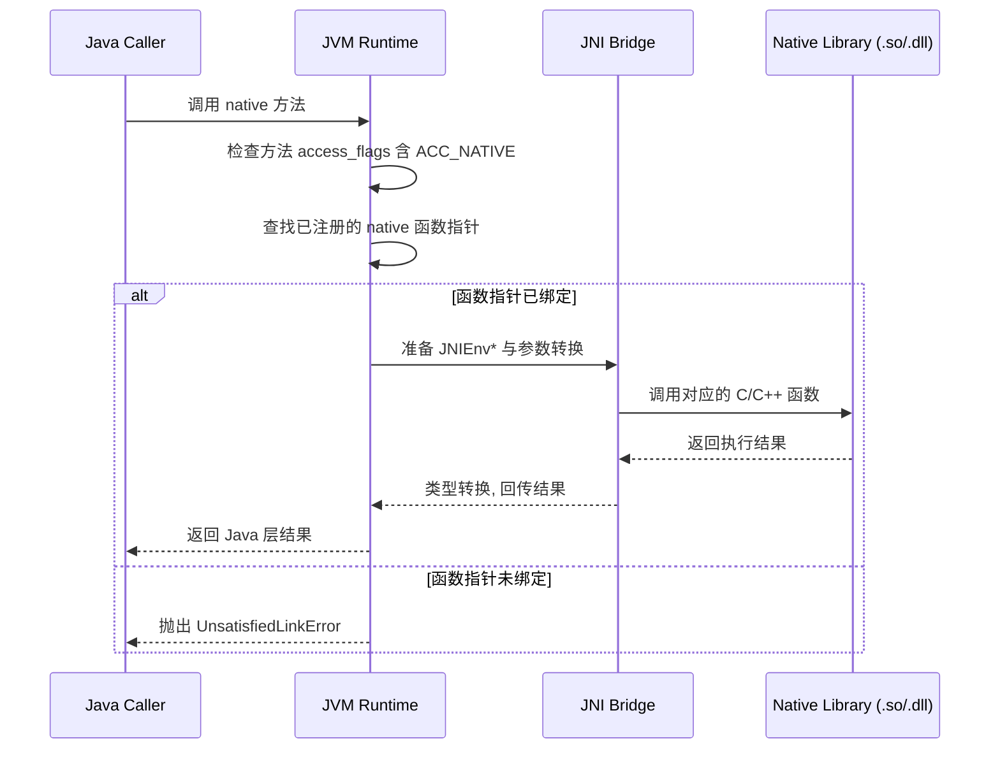

核心步骤拆解如下：

**① ACC_NATIVE 标志检测**

Java 编译器（`javac`）在编译 `native` 方法时，不会生成任何字节码指令（没有 `Code` 属性），而是在方法的 `access_flags` 中设置 `ACC_NATIVE`（值为 `0x0100`）标志位。JVM 在方法分派时读到这个标志，就知道不走字节码解释器，而是去查找本地函数。

**② 函数指针查找（Native Method Binding）**

JVM 有两种方式定位到 C/C++ 函数：

- **静态注册**（Static Registration）：按 JNI 命名规则（`Java_包名_类名_方法名`）在已加载的动态库中 `dlsym` 查找符号。
- **动态注册**（Dynamic Registration）：在 `JNI_OnLoad` 中通过 `RegisterNatives` 提前建立 Java 方法 ↔ C函数 的映射表。

如果两种方式都找不到对应函数，JVM 立即抛出 `java.lang.UnsatisfiedLinkError`。

**③ JNI 桥接（Bridge）参数转换**

Java 的类型系统与 C 的类型系统不同，JNI 桥接层负责将 Java 参数映射为 C 类型：

```text
Java 类型        JNI 类型        C/C++ 实际类型
─────────────────────────────────────────────────
boolean     →   jboolean    →   unsigned char
int         →   jint        →   int32_t (通常为 int)
long        →   jlong       →   int64_t
float       →   jfloat      →   float
double      →   jdouble     →   double
String      →   jstring     →   jobject (需用 JNIEnv 函数操作)
int[]       →   jintArray   →   jarray  (需用 JNIEnv 函数操作)
Object      →   jobject     →   void*   (不透明指针)
```

---

### native 方法与 System.loadLibrary 的关系

仅声明 `native` 方法是不够的，你还必须在运行时 **加载包含其实现的本地库**。Java 提供了两种方式：

```java
public class NativeDemo {

    // 方式一：通过库名加载（推荐），JVM 自动拼接平台前后缀
    // Linux → libmynative.so | Windows → mynative.dll | macOS → libmynative.dylib
    static {
        System.loadLibrary("mynative");  // 从 java.library.path 中搜索
    }

    // 方式二：通过绝对路径加载
    // System.load("/opt/libs/libmynative.so");

    // 声明 native 方法
    public native int compute(int x, int y);
}
```

`static {}` 静态初始化块是加载本地库的最佳位置，它保证在类首次被使用时就完成库加载，早于任何 `native` 方法被调用。如果将加载动作延迟到实例方法中，可能出现竞态条件或 `UnsatisfiedLinkError`。

下面这张流程图展示了从 **类加载** 到 **native 方法可用** 的完整链路：

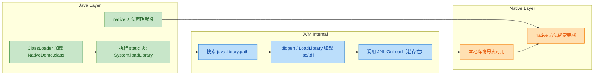

---

### native 方法在字节码中的真面目

为了更深入理解 `native` 的本质，我们可以用 `javap -v` 观察编译后的字节码：

```java
// 源码文件：NativeDemo.java
public class NativeDemo {
    public native int add(int a, int b);  // native 方法
    public int sub(int a, int b) {        // 普通 Java 方法（对比用）
        return a - b;
    }
}
```

执行 `javap -v NativeDemo.class` 后，核心差异如下：

```text
// ==================== native 方法 ====================
public native int add(int, int);
    descriptor: (II)I
    flags: ACC_PUBLIC, ACC_NATIVE          ← 带有 ACC_NATIVE 标志
    // 注意：没有 Code 属性！没有字节码指令！

// ==================== 普通 Java 方法 ====================
public int sub(int, int);
    descriptor: (II)I
    flags: ACC_PUBLIC                      ← 仅 ACC_PUBLIC
    Code:                                  ← 拥有 Code 属性
      stack=2, locals=3, args_size=3
         0: iload_1                        // 加载参数 a
         1: iload_2                        // 加载参数 b
         2: isub                           // 执行减法
         3: ireturn                        // 返回结果
```

可以清晰看到：

- `native` 方法 **没有 `Code` 属性**，因为它的"字节码"根本不存在于 `.class` 文件中——实现在 `.so` 里。
- 普通方法有完整的操作数栈深度（stack）、局部变量表大小（locals）和字节码指令序列。
- `ACC_NATIVE = 0x0100` 是唯一标识 native 方法的标志位。

---

### native 方法的典型使用场景

`native` 并不是一个"万能钥匙"，它的使用有明确的适用边界。下面列出 **真正需要 native** 的场景与 **不应滥用** 的情况：

**✅ 适合使用 native 的场景：**

| 场景 | 示例 |
|------|------|
| **访问操作系统底层 API** | 文件系统、进程管理、信号处理 |
| **复用已有 C/C++ 库** | OpenCV、FFmpeg、SQLite |
| **性能敏感的计算密集型任务** | 图像处理、音视频编解码、加密算法 |
| **硬件交互** | Android HAL、传感器驱动、GPIO 控制 |
| **JDK 自身底层实现** | `Object.hashCode()`、`Thread.start()`、`System.arraycopy()` |

**❌ 不建议使用 native 的场景：**

| 场景 | 原因 |
|------|------|
| 简单的业务逻辑 | 引入 JNI 增加复杂度，得不偿失 |
| 纯粹追求"性能优化" | 现代 JIT（C1/C2/Graal）已非常高效，盲目 native 化可能因 JNI 调用开销反而更慢 |
| 跨平台需求强的场景 | native 代码需要为每个平台单独编译 |

> **经验法则**：如果你能用纯 Java 解决问题，就不要引入 native。JNI 的调用开销（JNI call overhead）大约是普通 Java 方法调用的 **5~10 倍**，频繁的短小 native 调用会成为性能瓶颈。

---

### JDK 源码中的 native 方法实例

JDK 自身大量依赖 `native` 方法。以下是几个经典案例，帮助你建立"native 无处不在"的直觉：

```java
// ===== java.lang.Object =====
public class Object {
    // 返回对象的哈希码，底层依赖内存地址或随机数生成
    public native int hashCode();
    // 创建并返回此对象的浅拷贝
    protected native Object clone() throws CloneNotSupportedException;
    // 唤醒在此对象监视器上等待的单个线程
    public final native void notify();
    // 唤醒在此对象监视器上等待的所有线程
    public final native void notifyAll();
    // 返回运行时类信息
    public final native Class<?> getClass();
}

// ===== java.lang.Thread =====
public class Thread implements Runnable {
    // 真正启动一个操作系统线程（调用 pthread_create 或 CreateThread）
    private native void start0();
    // 当前线程让出 CPU 时间片
    public static native void yield();
    // 线程睡眠（底层调用 nanosleep/Sleep）
    private static native void sleep(long millis) throws InterruptedException;
    // 获取当前线程对象
    public static native Thread currentThread();
}

// ===== java.lang.System =====
public final class System {
    // 高性能数组复制（底层调用 memcpy/memmove）
    public static native void arraycopy(
        Object src, int srcPos,   // 源数组及起始索引
        Object dest, int destPos, // 目标数组及起始索引
        int length                // 复制长度
    );
    // 返回当前时间的纳秒值
    public static native long nanoTime();
}
```

这些方法之所以必须是 `native`，是因为它们依赖 **操作系统内核能力**（线程调度、内存操作、时钟源）或 **JVM 内部数据结构**（对象头、Class 指针），纯 Java 代码无法触及这些层面。

---

### native 方法与 JVM 栈帧的关系

每个线程在 JVM 中都有自己的 **虚拟机栈（VM Stack）**。当调用普通 Java 方法时，JVM 压入一个 **Java 栈帧（Java Stack Frame）**；而调用 `native` 方法时，则进入一个独立的 **本地方法栈（Native Method Stack）**。

```text
┌─────────────────────────────────────────────┐
│              Thread 的栈区域                  │
├──────────────────────┬──────────────────────┤
│    JVM Stack         │  Native Method Stack │
│  (Java 方法栈帧)     │  (Native 方法栈帧)    │
├──────────────────────┼──────────────────────┤
│  ┌────────────────┐  │  ┌────────────────┐  │
│  │ main() 栈帧    │  │  │                │  │
│  ├────────────────┤  │  │  C/C++ 函数    │  │
│  │ compute() 栈帧 │──┼──▶  栈帧          │  │
│  │ (native调用)   │  │  │  (实际执行)     │  │
│  ├────────────────┤  │  ├────────────────┤  │
│  │ ...            │  │  │ ...            │  │
│  └────────────────┘  │  └────────────────┘  │
└──────────────────────┴──────────────────────┘
```

这意味着 `native` 方法执行时：
- **不受 JVM 栈深度限制**（`-Xss` 参数不影响 Native 栈，但 Native 栈有操作系统自己的限制）。
- **GC 无法直接扫描 Native 栈帧**，这也是为什么 JNI 有 Local Reference / Global Reference 管理机制的根本原因。
- **异常模型不同**：C/C++ 没有 Java 异常机制，如果 Native 代码出现段错误（SIGSEGV），整个 JVM 进程会崩溃，而不是优雅地抛出异常。

---

### 常见陷阱与最佳实践

**陷阱 1：忘记加载本地库**

```java
public class BadExample {
    // 声明了 native 方法，但没有 System.loadLibrary
    public native void doWork();

    public static void main(String[] args) {
        new BadExample().doWork();
        // 运行时抛出：java.lang.UnsatisfiedLinkError:
        // BadExample.doWork()V
    }
}
```

**陷阱 2：库名与实际文件不匹配**

```java
// Linux 上本地库文件为 libcrypto_jni.so
System.loadLibrary("crypto-jni");   // ❌ 横杠 '-' 不等于下划线 '_'
System.loadLibrary("crypto_jni");   // ✅ 正确
```

**陷阱 3：在 native 方法上使用 `abstract`**

```java
public abstract class Base {
    // ❌ 编译错误：Illegal combination of modifiers: 'abstract' and 'native'
    public abstract native void process();
}
```

**最佳实践总结：**

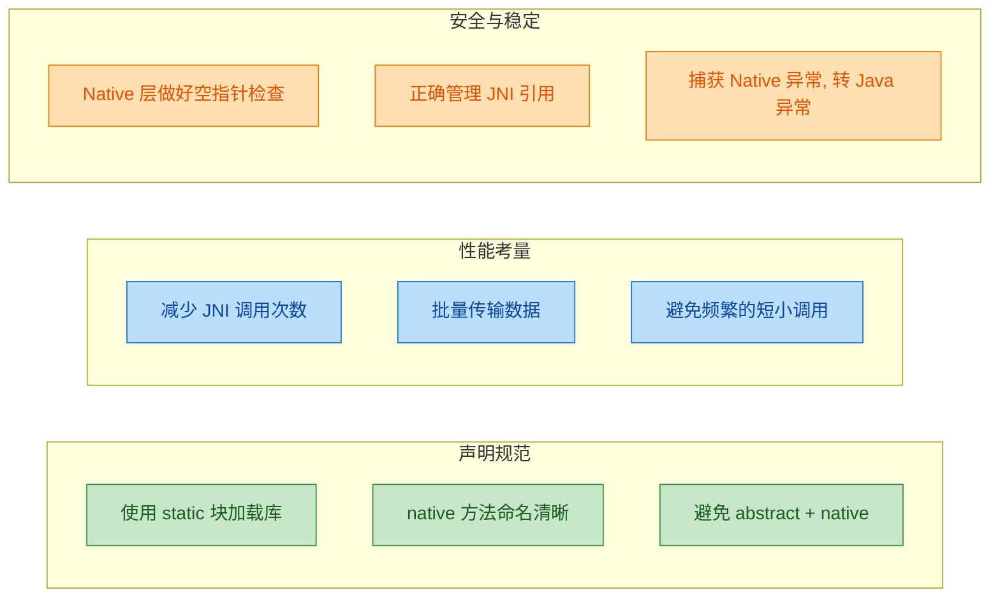

---

**📝 练习题**

以下关于 Java `native` 关键字的说法，**错误** 的是？


A. `native` 方法没有方法体，编译后的字节码中不包含 `Code` 属性


B. `native` 可以与 `synchronized` 同时修饰一个方法，JVM 会在进入 Native 实现前获取对象锁


C. `native` 可以与 `abstract` 同时修饰一个方法，表示该方法由子类的 Native 层实现


D. 调用 `native` 方法前，必须通过 `System.loadLibrary` 或 `System.load` 加载包含其实现的本地库


**【答案】** C

**【解析】** `native` 与 `abstract` 在语义上是互斥的。`native` 表示"方法有实现，实现在 Native 层"，而 `abstract` 表示"方法没有实现，等待子类提供"。Java 编译器会直接拒绝 `abstract native` 的组合，报出 `Illegal combination of modifiers` 编译错误。选项 A 正确，`native` 方法在 `.class` 中只有 `ACC_NATIVE` 标志，无 `Code` 属性；选项 B 正确，`synchronized native` 是合法的，JVM 在跨入 JNI 调用前会先获取监视器锁（monitor lock）；选项 D 正确，不加载本地库就调用 `native` 方法会抛出 `UnsatisfiedLinkError`。

---

## JNI开发流程（javah / javac -h）

JNI 开发并非简单地"写一个 C 函数然后调用"，它涉及 **Java 层声明 → 头文件生成 → Native 实现 → 编译动态库 → 加载运行** 这一条完整的工具链。理解这条流水线，是写好一切 JNI 代码的前提。本节将把每一步拆开，逐一讲透。

### 整体开发流程总览

先用一张全局流程图建立宏观认知。JNI 开发本质上是 **两个世界的编译产物在运行时握手**——Java 的 `.class` 和 Native 的 `.so`/`.dll` 必须在函数签名层面严格对齐。

```mermaid
graph LR
    subgraph Java_Side["☕ Java Side"]
        direction TB
        A["1. 编写 Java 类<br/>声明 native 方法"]
        B["2. 编译 Java 源码<br/>javac xxx.java"]
        C["3. 生成 JNI 头文件<br/>javac -h / javah"]
        A --> B --> C
    end

    subgraph Native_Side["⚙️ Native Side"]
        direction TB
        D["4. 实现 Native 函数<br/>编写 .c / .cpp 文件"]
        E["5. 编译动态链接库<br/>gcc / g++ / CMake"]
        D --> E
    end

    subgraph Runtime["▶ Runtime"]
        direction TB
        F["6. System.loadLibrary<br/>加载 .so / .dll"]
        G["7. JVM 调用<br/>native 方法"]
        F --> G
    end

    C -- ".h 头文件" --> D
    E -- ".so / .dll" --> F

    classDef javaStyle fill:#C8E6C9,stroke:#388E3C,color:#1B5E20
    classDef nativeStyle fill:#BBDEFB,stroke:#1976D2,color:#0D47A1
    classDef runtimeStyle fill:#FFE0B2,stroke:#F57C00,color:#E65100

    class A,B,C javaStyle
    class D,E nativeStyle
    class F,G runtimeStyle
```

下面我们以一个完整的例子 `HelloJNI` 贯穿始终，逐步拆解每个阶段。

---

### Step 1：编写 Java 类，声明 native 方法

这是一切的起点。我们在 Java 中用 `native` 关键字声明一个方法，**不提供方法体**，告诉编译器："这个方法的实现在 Native 世界里。"

```java
// 文件：com/example/HelloJNI.java
package com.example;                          // 包名，影响后续生成的 C 函数名

public class HelloJNI {

    // 声明一个 native 方法，没有方法体，以分号结束
    // 它的真正实现将在 C/C++ 中完成
    public native String greetFromNative(int id);

    // 静态初始化块：在类加载时，加载名为 "hello" 的动态库
    // Linux 上实际加载 libhello.so，Windows 上加载 hello.dll
    static {
        System.loadLibrary("hello");          // 加载动态链接库
    }

    // 入口函数，用于测试
    public static void main(String[] args) {
        HelloJNI obj = new HelloJNI();        // 创建实例
        String msg = obj.greetFromNative(42); // 调用 native 方法
        System.out.println(msg);              // 打印 Native 层返回的字符串
    }
}
```

**关键要点**：

- `native` 方法可以是 `public`、`private`、`protected`，也可以是 `static`，访问修饰符不影响 JNI 绑定。
- `System.loadLibrary("hello")` 中的参数 **不带** `lib` 前缀和 `.so`/`.dll` 后缀，JVM 会自动根据平台拼接。
- 包名 `com.example` 将在后续生成的 C 函数名中体现为 `com_example`（点号 → 下划线）。

---

### Step 2：编译 Java 源码

使用 `javac` 把 `.java` 编译为 `.class`：

```bash
# 在项目根目录下执行
# -d out  指定 .class 文件输出目录
javac -d out com/example/HelloJNI.java
```

编译后的目录结构：

```
plaintext
project/
├── com/example/HelloJNI.java      ← 源码
└── out/
    └── com/example/HelloJNI.class  ← 字节码
```

这一步本身没有特殊之处，和普通 Java 编译完全一致。但它产出的 `.class` 文件是下一步——**头文件生成**——的输入。

---

### Step 3：生成 JNI 头文件（核心步骤 ⭐）

这是 JNI 开发流程中**最关键的环节之一**。JNI 要求 Native 函数的签名必须严格匹配 Java 层的声明，手写极易出错。因此 JDK 提供了工具来 **自动生成** C/C++ 头文件。

#### 方式一：javah（JDK 8 及以前）

`javah` 是一个独立的命令行工具，输入是 **编译后的 .class 文件**（全限定类名），输出是 `.h` 头文件。

```bash
# 进入 .class 文件的根目录
cd out

# 使用 javah 生成头文件
# -jni       指定生成 JNI 风格的头文件（默认行为，可省略）
# -o         指定输出的头文件名（也可用 -d 指定输出目录）
# 最后一个参数是全限定类名（用点分隔，不是斜杠）
javah -jni -o com_example_HelloJNI.h com.example.HelloJNI
```

> ⚠️ **注意**：`javah` 从 **JDK 10 开始被正式移除**（JDK 9 标记为 `@Deprecated`）。如果你使用的是 JDK 10+，必须使用方式二。

#### 方式二：javac -h（JDK 8+ 推荐 ✅）

从 JDK 8 开始，`javac` 自身新增了 `-h` 选项，可以在编译 `.java` 的**同时**生成头文件，一步到位：

```bash
# -h jni_headers  指定头文件输出目录
# -d out          指定 .class 输出目录
# 最后是源文件路径
javac -h jni_headers -d out com/example/HelloJNI.java
```

执行后目录结构变为：

```
plaintext
project/
├── com/example/HelloJNI.java
├── out/
│   └── com/example/HelloJNI.class
└── jni_headers/
    └── com_example_HelloJNI.h           ← 自动生成的头文件
```

这种方式省去了先编译再生成的两步操作，是现代 JDK 版本的**推荐做法**。

#### 两种方式对比

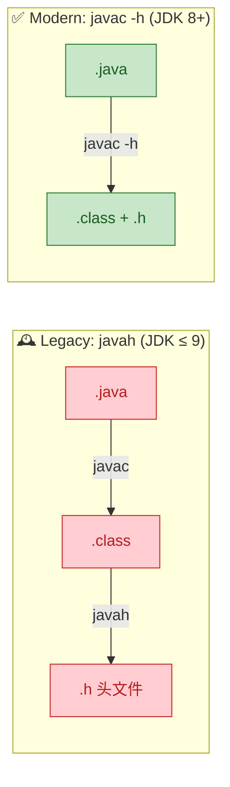

| 对比维度 | `javah` | `javac -h` |
|---------|---------|-------------|
| **输入** | `.class` 字节码 | `.java` 源码 |
| **步骤** | 需先 `javac` 再 `javah`（两步） | 编译与生成一步完成 |
| **JDK 版本** | JDK 1.1 ~ JDK 9 | JDK 8+ |
| **现状** | JDK 10 已移除 ❌ | 持续支持 ✅ |
| **推荐度** | 仅维护旧项目时使用 | **首选方案** |

---

### Step 3.5：解读生成的头文件（深入理解 ⭐）

理解自动生成的 `.h` 文件内容，对后续正确实现 Native 函数至关重要。以下是 `com_example_HelloJNI.h` 的典型内容：

```c
/* 该文件由工具自动生成 —— 请勿手动编辑 */
/* DO NOT EDIT THIS FILE - it is machine generated */

#include <jni.h>   // JNI 核心头文件，定义了 JNIEnv、jclass、jstring 等类型

/* Header for class com_example_HelloJNI */

#ifndef _Included_com_example_HelloJNI          // 防止头文件重复包含
#define _Included_com_example_HelloJNI

#ifdef __cplusplus
extern "C" {                                     // C++ 编译器下使用 C 链接规范
#endif

/*
 * Class:     com_example_HelloJNI
 * Method:    greetFromNative
 * Signature: (I)Ljava/lang/String;              // JNI 方法签名（后文详述）
 */
JNIEXPORT jstring JNICALL                        // 返回值：jstring 对应 Java String
Java_com_example_HelloJNI_greetFromNative        // 函数名：Java_包名_类名_方法名
  (JNIEnv *env,                                  // 第一个参数：JNI 环境指针
   jobject thiz,                                 // 第二个参数：调用该方法的 Java 对象（this）
   jint id);                                     // 第三个参数：对应 Java 的 int 参数

#ifdef __cplusplus
}
#endif

#endif // _Included_com_example_HelloJNI
```

这里有几个非常重要的知识点需要逐一拆解：

**① 函数命名规则（静态注册）**

自动生成的函数名遵循严格的命名模式：

```
plaintext
Java_{PackageName}_{ClassName}_{MethodName}
  │       │             │            │
  │       │             │            └─ 方法名：greetFromNative
  │       │             └────────────── 类名：HelloJNI
  │       └──────────────────────────── 包名(点→下划线)：com_example
  └──────────────────────────────────── 固定前缀：Java
```

- 包名中的 `.` 全部替换为 `_`
- 如果方法名或类名本身含有 `_`，则转义为 `_1`
- 如果出现 Unicode 字符，则转义为 `_0xxxx`（四位十六进制）

**② 固定的前两个参数**

每个 JNI Native 函数，不管 Java 侧声明了几个参数，C 侧**总是至少有两个参数**：

| 参数 | 类型 | 含义 |
|------|------|------|
| 第 1 个 | `JNIEnv *env` | JNI 环境指针，所有 JNI 操作的入口（后续章节详解） |
| 第 2 个 | `jobject thiz` 或 `jclass clazz` | 实例方法传 `jobject`（即 `this`）；`static` 方法传 `jclass`（即类本身） |

之后才是 Java 方法声明的业务参数，类型按照 JNI 类型映射表进行转换。

**③ JNIEXPORT 与 JNICALL**

这两个宏在不同平台展开为不同的内容：

```c
// Linux / macOS 下通常展开为：
// JNIEXPORT → __attribute__((visibility("default")))  确保符号导出
// JNICALL   → （空，无特殊调用约定）

// Windows 下通常展开为：
// JNIEXPORT → __declspec(dllexport)                    导出 DLL 符号
// JNICALL   → __stdcall                                调用约定
```

它们的作用是确保编译出的动态库中，JNI 函数的符号 **对外可见**，JVM 才能在运行时通过符号名找到对应函数。

**④ JNI 类型映射表**

Java 和 C/C++ 的类型并不通用，JNI 定义了一套中间类型：

| Java 类型 | JNI 类型 | C/C++ 实际类型 | 大小 |
|-----------|----------|---------------|------|
| `boolean` | `jboolean` | `unsigned char` | 8 bit |
| `byte` | `jbyte` | `signed char` | 8 bit |
| `char` | `jchar` | `unsigned short` | 16 bit |
| `short` | `jshort` | `short` | 16 bit |
| `int` | `jint` | `int` | 32 bit |
| `long` | `jlong` | `long long` | 64 bit |
| `float` | `jfloat` | `float` | 32 bit |
| `double` | `jdouble` | `double` | 64 bit |
| `void` | `void` | `void` | — |
| `Object` | `jobject` | 指针 | — |
| `String` | `jstring` | 指针 | — |
| `int[]` | `jintArray` | 指针 | — |

---

### Step 4：编写 Native 实现

拿到头文件后，我们在 `.c` 或 `.cpp` 文件中实现该函数：

```c
// 文件：hello.c
#include "com_example_HelloJNI.h"    // 引入自动生成的头文件
#include <stdio.h>                   // 标准 I/O
#include <string.h>                  // 字符串处理
#include <stdlib.h>                  // 内存分配

// 实现 native 方法：greetFromNative
// 函数签名必须与 .h 文件中的声明完全一致
JNIEXPORT jstring JNICALL
Java_com_example_HelloJNI_greetFromNative
  (JNIEnv *env,       // JNI 环境指针，用于调用 JNI 函数
   jobject thiz,      // 调用此方法的 Java 对象引用
   jint id)           // Java 传入的 int 参数
{
    // 在 Native 层构造一个字符串缓冲区
    char buf[128];                              // 分配栈上缓冲区

    // 使用 snprintf 格式化字符串，将 id 嵌入
    snprintf(buf, sizeof(buf),                  // 安全格式化，防止溢出
             "Hello from C! Your ID is %d", 
             (int)id);                          // jint 强转为 int

    // 调用 JNI 函数 NewStringUTF 将 C 字符串转为 Java String
    // JNIEnv 的函数通过 (*env)-> 方式调用（C 风格）
    return (*env)->NewStringUTF(env, buf);      // 返回 jstring 给 Java 层
}
```

> 💡 **C vs C++ 调用风格差异**：在 C 中通过 `(*env)->FunctionName(env, ...)` 调用；在 C++ 中可以简写为 `env->FunctionName(...)`，因为 C++ 版本的 `JNIEnv` 封装了一层内联函数。

如果使用 C++ 编写，代码如下：

```cpp
// 文件：hello.cpp
#include "com_example_HelloJNI.h"     // 引入自动生成的头文件
#include <string>                     // C++ string
#include <sstream>                    // 字符串流

// extern "C" 已在 .h 文件中通过 #ifdef __cplusplus 处理
// 因此此处无需再次声明

JNIEXPORT jstring JNICALL
Java_com_example_HelloJNI_greetFromNative
  (JNIEnv *env,       // JNI 环境指针
   jobject thiz,      // Java this 引用
   jint id)           // Java int 参数
{
    // 使用 C++ 字符串流拼接消息
    std::ostringstream oss;                      // 创建字符串输出流
    oss << "Hello from C++! Your ID is " << id;  // 流式拼接

    std::string result = oss.str();              // 转为 std::string

    // C++ 中 JNIEnv 可直接用 -> 调用，无需 (*env)->
    return env->NewStringUTF(result.c_str());    // c_str() 获取 C 风格字符串
}
```

---

### Step 5：编译动态链接库

Native 代码需要编译为平台相关的动态链接库（Shared Library）。不同操作系统的编译命令和产物不同：

#### Linux（.so）

```bash
# 编译 C 代码为共享库 libhello.so
gcc -shared                        \  # 生成共享库
    -fPIC                          \  # 位置无关代码（Position-Independent Code）
    -o libhello.so                 \  # 输出文件名（lib前缀 + 库名 + .so）
    -I${JAVA_HOME}/include         \  # JNI 头文件目录（jni.h）
    -I${JAVA_HOME}/include/linux   \  # 平台相关的 jni_md.h
    -I./jni_headers                \  # 自动生成的头文件目录
    hello.c                           # 源文件
```

#### macOS（.dylib）

```bash
gcc -shared                        \
    -fPIC                          \
    -o libhello.dylib              \  # macOS 使用 .dylib 后缀
    -I${JAVA_HOME}/include         \
    -I${JAVA_HOME}/include/darwin  \  # macOS 平台头文件
    -I./jni_headers                \
    hello.c
```

#### Windows（.dll）

```bash
# 使用 MinGW 或 MSVC
gcc -shared                        \
    -o hello.dll                   \  # Windows 使用 .dll 后缀，无 lib 前缀
    -I"%JAVA_HOME%\include"        \
    -I"%JAVA_HOME%\include\win32"  \  # Windows 平台头文件
    -I.\jni_headers                \
    hello.c
```

> 🔑 **关键点**：编译时必须指定 `-I${JAVA_HOME}/include` 和对应平台子目录，因为 `jni.h` 位于 `include/` 下，而 `jni_md.h`（Machine-Dependent 定义）位于平台子目录中。

#### Android 场景：CMake 构建（最常见）

在 Android 开发中，通常使用 `CMakeLists.txt` 配合 NDK 来构建：

```cmake
# CMakeLists.txt
cmake_minimum_required(VERSION 3.18.1)          # 最低 CMake 版本
project("hello")                                 # 项目名

add_library(
    hello                                        # 库名 → 生成 libhello.so
    SHARED                                       # 共享库类型
    hello.cpp                                    # 源文件
)

# 查找 Android NDK 自带的 log 库（用于 __android_log_print）
find_library(
    log-lib                                      # 变量名
    log                                          # 库名
)

# 将 log 库链接到我们的 hello 库
target_link_libraries(
    hello                                        # 目标库
    ${log-lib}                                   # 依赖库
)
```

---

### Step 6 & 7：加载与运行

回到 Java 侧，`System.loadLibrary("hello")` 在运行时完成库加载，JVM 通过 **符号查找（symbol lookup）** 将 `native` 方法绑定到动态库中对应的 C 函数。

```bash
# 运行时需要告诉 JVM 动态库的搜索路径
# -Djava.library.path 指定 .so/.dll 所在目录
java -Djava.library.path=. -cp out com.example.HelloJNI
```

预期输出：

```
plaintext
Hello from C! Your ID is 42
```

完整的运行时绑定流程如下：

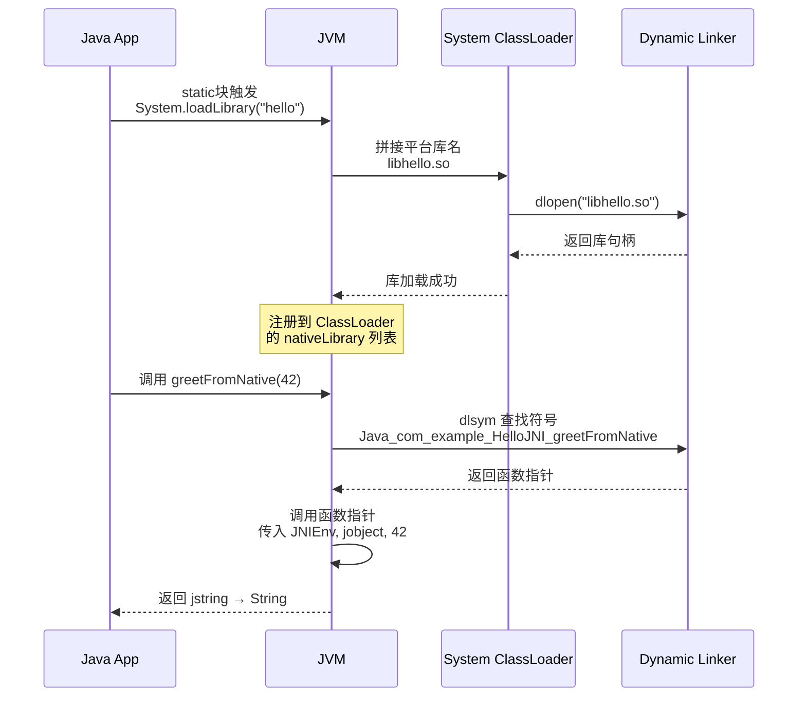

这个过程中，**符号查找只在首次调用时发生**（之后 JVM 会缓存函数指针），这也是"静态注册"效率上的一个小代价——首次调用需要字符串匹配。后续章节介绍的"动态注册"可以避免这一步。

---

### 常见问题与排错指南

在实际开发中，JNI 开发流程的每一步都可能踩坑。以下是高频错误及其排查方式：

| 错误现象 | 可能原因 | 解决方案 |
|---------|---------|---------|
| `UnsatisfiedLinkError: no hello in java.library.path` | 动态库路径未配置或库文件名错误 | 检查 `-Djava.library.path`；确认库名前缀/后缀 |
| `UnsatisfiedLinkError: undefined symbol: Java_com_...` | 函数名拼写错误或未导出 | 用 `nm -D libhello.so` 检查符号；确认 `JNIEXPORT` |
| `javah: class not found` | 全限定名写错或 `.class` 路径不对 | 确认在 classpath 根目录下执行，使用 `.` 分隔包名 |
| C++ 编译后找不到符号 | 缺少 `extern "C"` 导致 C++ name mangling | 确保 `.h` 已包含 `extern "C"` 块，或手动添加 |
| `SIGSEGV` 段错误 | `JNIEnv` 跨线程使用或空指针 | 检查线程绑定（后续章节详解） |

用 `nm` 命令验证符号是否正确导出，是排查链接问题的第一手段：

```bash
# 查看 .so 中导出的符号，过滤 Java_ 开头的 JNI 函数
nm -D libhello.so | grep Java_
# 预期输出：
# 00000000000011a0 T Java_com_example_HelloJNI_greetFromNative
# T 表示该符号在 text（代码）段，已正确导出
```

---

### 完整流程速查（Cheat Sheet）

将上述所有步骤浓缩为一份命令速查，方便快速回顾：

```bash
# ===== 一站式 JNI 开发命令（Linux，JDK 11+）=====

# [1] 编译 Java + 生成 JNI 头文件（一步完成）
javac -h jni_headers -d out com/example/HelloJNI.java

# [2] 实现 Native 代码（hello.c / hello.cpp）—— 手动编写

# [3] 编译动态库
gcc -shared -fPIC \
    -I${JAVA_HOME}/include \
    -I${JAVA_HOME}/include/linux \
    -I./jni_headers \
    -o libhello.so hello.c

# [4] 运行
java -Djava.library.path=. -cp out com.example.HelloJNI

# ===== 输出：Hello from C! Your ID is 42 =====
```

---

**📝 练习题**

以下关于 JNI 开发流程的说法，**正确** 的是：

A. `javah` 在 JDK 17 中仍然可用，只是标记为 Deprecated


B. `javac -h` 的输入是 `.class` 字节码文件，而 `javah` 的输入是 `.java` 源文件


C. JNI 自动生成的 Native 函数名格式为 `Java_包名_类名_方法名`，其中包名的点号替换为下划线


D. 对于 Java `static native` 方法，生成的 C 函数第二个参数类型为 `jobject`


**【答案】** C

**【解析】** 逐项分析：

- **A 错误**：`javah` 在 JDK 9 被标记为 `@Deprecated`，在 **JDK 10 中已被正式移除**，JDK 17 中不存在此工具。
- **B 错误**：恰好说反了。`javac -h` 的输入是 `.java` 源文件（编译的同时生成头文件）；`javah` 的输入是编译后的 `.class` 文件（需要先 `javac` 编译）。
- **C 正确**：这是 JNI 静态注册的标准命名规则。例如包名 `com.example`、类名 `HelloJNI`、方法名 `greetFromNative`，生成的函数名为 `Java_com_example_HelloJNI_greetFromNative`。
- **D 错误**：`static native` 方法没有 `this` 对象，因此第二个参数类型是 `jclass`（代表类本身），而非 `jobject`。只有实例方法才传 `jobject`。

---

## JNIEnv 指针 ⭐（线程绑定、不可跨线程传递）

JNIEnv 是整个 JNI 体系中**最核心、最高频使用**的概念，没有之一。每一个 Native 函数被调用时，JVM 都会通过第一个参数传入一个 `JNIEnv*` 指针。你在 Native 层想要操作 Java 对象、调用 Java 方法、抛出异常……一切的一切，都必须通过这个指针来完成。可以毫不夸张地说：**`JNIEnv` 就是 Native 代码通往 Java 世界的唯一合法大门。**

理解 `JNIEnv` 的本质、它与线程的绑定关系、以及它为什么不能跨线程传递，是写出正确且安全的 JNI 代码的前提。

---

### JNIEnv 到底是什么？

从 C/C++ 的视角来看，`JNIEnv` 本质上是一个**指向函数表（Function Table）的二级指针**。这张函数表包含了 JNI 规范定义的全部接口函数（超过 200 个），例如 `FindClass`、`GetMethodID`、`CallVoidMethod`、`NewStringUTF` 等等。

JVM 在启动后会为**每个线程**创建并维护一份独立的 `JNIEnv` 结构体实例。当 Native 方法被某个 Java 线程触发执行时，JVM 会把**该线程对应的 `JNIEnv*`** 作为第一个参数传给 Native 函数。

我们先从 JDK 源码中 `jni.h` 的定义来理解其内部结构（以下为简化抽象）：

```c
/* ============================================
 * jni.h 中 JNIEnv 的核心结构定义（简化版）
 * ============================================ */

// 函数表结构体：包含 JNI 规范中所有可调用函数的指针
struct JNINativeInterface_ {
    void        *reserved0;                       // 保留字段
    void        *reserved1;                       // 保留字段
    void        *reserved2;                       // 保留字段
    void        *reserved3;                       // 保留字段
    jint        (*GetVersion)(JNIEnv *);          // 获取 JNI 版本号
    jclass      (*FindClass)(JNIEnv*, const char*); // 查找 Java 类
    jmethodID   (*GetMethodID)(JNIEnv*, jclass, const char*, const char*); // 获取方法 ID
    void        (*CallVoidMethod)(JNIEnv*, jobject, jmethodID, ...);       // 调用 void 方法
    jstring     (*NewStringUTF)(JNIEnv*, const char*);  // 创建 Java String
    // ... 超过 200 个函数指针 ...
};

// C 语言中: JNIEnv 就是一个指向函数表的指针
typedef const struct JNINativeInterface_ *JNIEnv;

// C++ 中: JNIEnv 是一个封装了函数表的结构体（提供成员函数语法糖）
```

注意上面的结构：`JNIEnv` 在 **C 和 C++** 中的使用语法是不同的，这一点经常让初学者困惑：

```c
/* ============================================
 * C 语言中的调用方式
 * 必须显式传入 env 本身作为第一个参数
 * ============================================ */
jclass cls = (*env)->FindClass(env, "com/example/MyClass");
//           ^^^^^^^                ^^^
//           先解引用得到函数表     再把 env 传入
```

```cpp
/* ============================================
 * C++ 中的调用方式
 * JNIEnv 被封装为结构体，直接用 -> 调用成员函数
 * 内部已自动传递 this（即 env）
 * ============================================ */
jclass cls = env->FindClass("com/example/MyClass");
//           ^^^^
//           直接调用，语法更简洁
```

这是因为在 C++ 版本的 `jni.h` 中，`JNIEnv` 被定义为一个包装结构体，内部持有函数表指针并提供了内联成员函数，省去了手动解引用和传 `env` 的步骤。**本质上完全等价，只是语法糖不同。**

---

### JNIEnv 的内存模型与线程绑定机制

这是本节最重要的核心知识。我们用一张图来理解 JVM 是如何管理 `JNIEnv` 的：

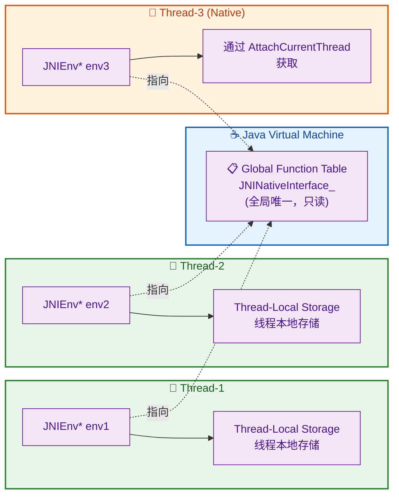

关键要点解读：

1. **函数表全局唯一**：`JNINativeInterface_`（那张包含 200+ 函数指针的大表）在整个 JVM 进程中**只有一份**，它是只读的、共享的。所有线程的 `JNIEnv` 指针最终都指向同一张函数表。

2. **JNIEnv 实例每线程一份**：虽然函数表共享，但 `JNIEnv` 结构体本身**每个线程持有一份独立实例**。这是因为 `JNIEnv` 内部除了函数表指针之外，还关联了该线程的 **局部引用表（Local Reference Table）**、**异常状态** 等线程私有数据。

3. **Thread-Local Storage（TLS）**：JVM 使用操作系统的线程本地存储（Thread-Local Storage）机制来维护线程与 `JNIEnv` 的绑定关系。每个线程只能访问自己的 TLS 槽位，这从操作系统层面保证了隔离性。

---

### 为什么 JNIEnv 不能跨线程传递？

这是 JNI 开发中最常见的"隐性 Bug"来源之一。让我们用一个反面示例来说明：

```cpp
/* ============================================
 * ❌ 错误示范：跨线程传递 JNIEnv*
 * 这段代码会导致崩溃或不可预测的行为
 * ============================================ */

#include <jni.h>
#include <pthread.h>
#include <stdio.h>

// 全局变量，企图保存主线程的 JNIEnv*
static JNIEnv *g_env = NULL;  // ❌ 危险！

// 子线程的执行函数
void* child_thread_func(void* arg) {
    // ❌ 在子线程中使用主线程的 JNIEnv*
    // g_env 绑定的是主线程，此处属于非法跨线程访问
    jclass cls = (*g_env)->FindClass(g_env, "java/lang/String");
    // 可能的后果：
    // 1. 直接段错误 (Segmentation Fault / SIGSEGV)
    // 2. 局部引用表被错误线程污染，导致 GC 异常
    // 3. 线程安全检查触发 JVM 直接 abort
    // 4. 偶尔"侥幸"成功，但埋下定时炸弹
    return NULL;
}

// 由 Java 层调用的 Native 方法（运行在主线程）
JNIEXPORT void JNICALL
Java_com_example_NativeLib_startWork(JNIEnv *env, jobject thiz) {
    g_env = env;  // ❌ 把当前线程的 env 存到全局变量

    pthread_t tid;
    pthread_create(&tid, NULL, child_thread_func, NULL);  // 启动子线程
    pthread_join(tid, NULL);                               // 等待子线程结束
}
```

**为什么不行？**  根本原因有三个层次：

**① 局部引用表（Local Reference Table）是线程私有的**

每个 `JNIEnv` 内部维护着一张局部引用表（Local Reference Table），用于追踪该线程创建的所有 Java 对象的局部引用（Local Reference）。这张表是 **per-thread** 的。如果你在线程 B 中使用线程 A 的 `JNIEnv`，那么通过它创建的局部引用会被错误地记录到线程 A 的引用表中，导致：

- 线程 A 的引用表被意外膨胀
- 线程 B 退出时，引用无法被正确清理
- GC 在扫描时发现引用关系矛盾，可能直接 crash

**② 异常状态是线程私有的**

JNI 中的异常状态（Pending Exception）也是绑定在 `JNIEnv` 上的。如果线程 B 通过线程 A 的 `env` 抛出了一个异常，这个异常会被标记到线程 A 的状态上。线程 A 在完全不知情的情况下，下次 JNI 调用就会触发 "已有未处理异常" 的检查，导致不可理解的崩溃。

**③ JVM 内部的线程安全检查**

现代 JVM（如 ART、HotSpot）在 Debug 模式或带 `-Xcheck:jni` 参数启动时，会主动检查 `JNIEnv` 的使用者线程是否匹配。一旦发现不匹配，直接 **abort** 进程并输出类似如下的错误日志：

```
JNI ERROR: JNIEnv for thread "main" used on thread "Thread-2"
```

用一张对比表来总结 `JNIEnv` 中哪些是共享的、哪些是线程私有的：

| 组成部分 | 共享/私有 | 说明 |
|:---------|:---------:|:-----|
| **函数表指针** (`JNINativeInterface_*`) | 🌐 全局共享 | 所有线程的 env 都指向同一张函数表 |
| **局部引用表** (Local Reference Table) | 🔒 线程私有 | 跟踪当前线程创建的局部引用 |
| **异常状态** (Pending Exception) | 🔒 线程私有 | 每个线程独立的异常标记 |
| **JNI 调用栈帧** (Stack Frame) | 🔒 线程私有 | 与线程的调用栈绑定 |

---

### 正确做法：在子线程中获取 JNIEnv

那么问题来了——如果我在 Native 层创建了一个新的 POSIX 线程（`pthread`），这个线程又需要回调 Java 方法，怎么办？

答案是：**使用 `JavaVM` 的 `AttachCurrentThread` 方法。**

`JavaVM` 是代表 **整个 JVM 实例** 的指针，与 `JNIEnv` 不同，`JavaVM` 是**进程级别的、全局唯一的、可以跨线程安全使用的**。通过它，任何 Native 线程都可以把自己"挂载"到 JVM 上，从而获得一个属于**自己**的 `JNIEnv*`。

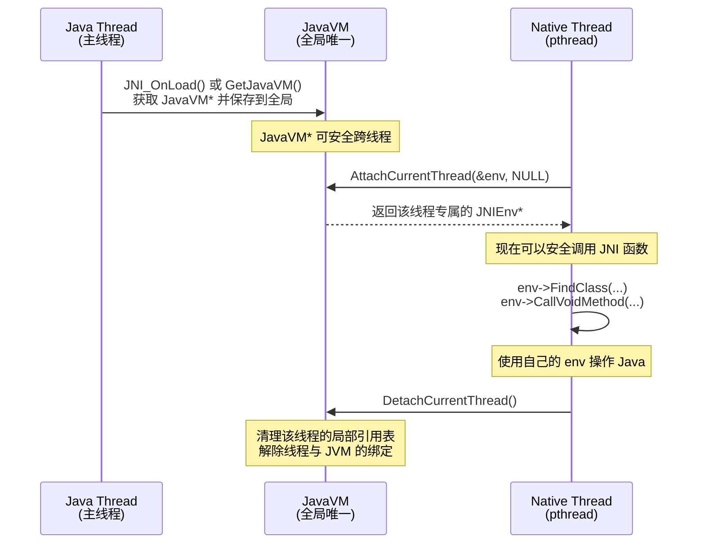

完整的正确代码示范：

```cpp
/* ============================================
 * ✅ 正确示范：Native 子线程安全获取 JNIEnv
 * ============================================ */

#include <jni.h>
#include <pthread.h>
#include <android/log.h>

#define TAG "JNI_DEMO"
#define LOGI(...) __android_log_print(ANDROID_LOG_INFO, TAG, __VA_ARGS__)

// 全局变量：保存 JavaVM 指针（进程级，可跨线程）
static JavaVM *g_jvm = NULL;

// ========== 第一步：在 JNI_OnLoad 中保存 JavaVM ==========
// JNI_OnLoad 在 System.loadLibrary() 时由 JVM 自动调用
// 此时 JVM 会把自身的 JavaVM* 传给我们
JNIEXPORT jint JNICALL
JNI_OnLoad(JavaVM *vm, void *reserved) {
    g_jvm = vm;                   // ✅ 保存到全局变量，后续任何线程都可使用
    LOGI("JNI_OnLoad: JavaVM* saved successfully");
    return JNI_VERSION_1_6;       // 返回需要的 JNI 版本
}

// ========== 第二步：子线程函数 ==========
void* child_thread_func(void* arg) {
    JNIEnv *env = NULL;           // 声明一个 JNIEnv 指针，稍后由 JVM 填充

    // 调用 AttachCurrentThread 将当前 Native 线程挂载到 JVM
    // 成功后 env 将指向该线程专属的 JNIEnv 实例
    jint result = (*g_jvm)->AttachCurrentThread(g_jvm, &env, NULL);

    if (result != JNI_OK) {       // 检查挂载是否成功
        LOGI("AttachCurrentThread failed, error code: %d", result);
        return NULL;              // 挂载失败，直接退出
    }

    LOGI("Child thread attached to JVM successfully");

    // ✅ 现在可以安全使用 env 了！
    // 查找 Java 类
    jclass cls = (*env)->FindClass(env, "java/lang/String");
    if (cls != NULL) {
        LOGI("FindClass succeeded in child thread!");
    }

    // ========== 第三步：用完必须 Detach！==========
    // 如果不 Detach，会导致：
    // 1. 局部引用表内存泄漏
    // 2. JVM 无法正确追踪线程状态
    // 3. JVM 关闭时可能死锁
    (*g_jvm)->DetachCurrentThread(g_jvm);
    LOGI("Child thread detached from JVM");

    return NULL;
}

// ========== Java 层调用入口 ==========
JNIEXPORT void JNICALL
Java_com_example_NativeLib_startWork(JNIEnv *env, jobject thiz) {
    // 主线程的 env 仅在此函数内使用，绝不存到全局
    pthread_t tid;
    pthread_create(&tid, NULL, child_thread_func, NULL); // 启动子线程
    // 注意：这里不 join，让子线程自由运行
}
```

---

### JavaVM 与 JNIEnv 的核心对比

这两个指针是 JNI 中最重要的两个"入口"，它们的差异必须烂熟于心：

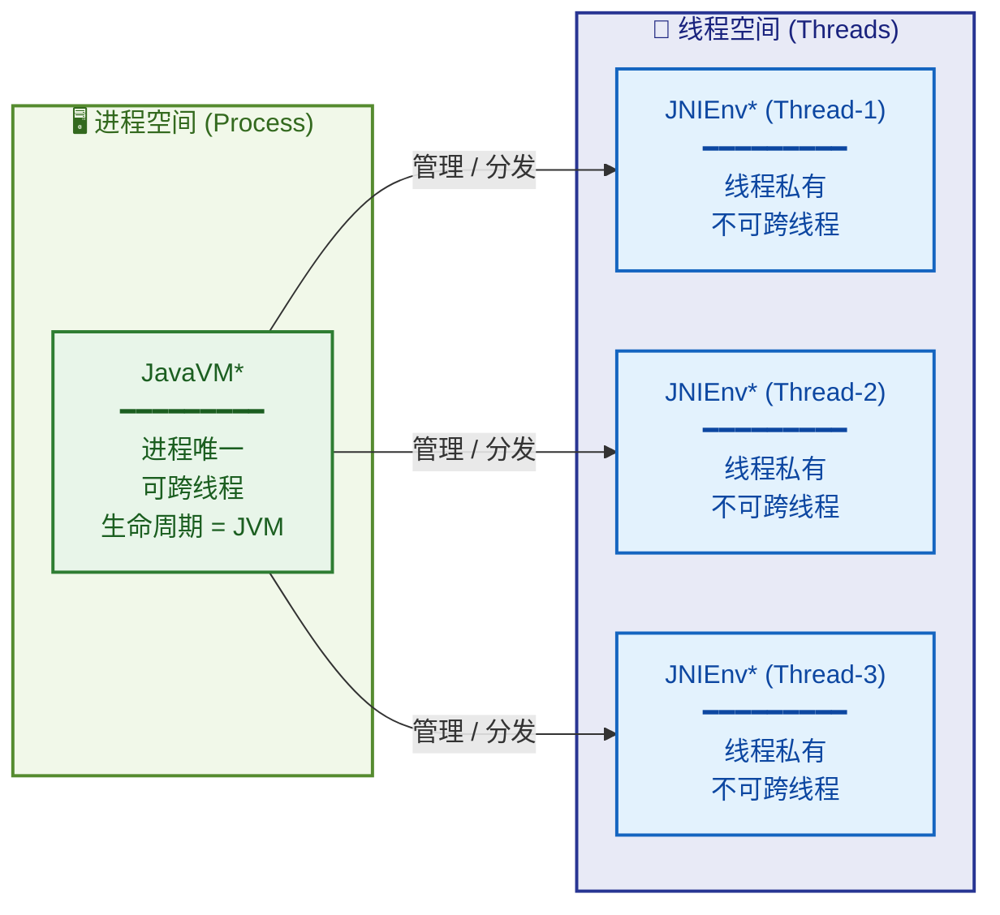

| 特性 | `JavaVM*` | `JNIEnv*` |
|:-----|:--------:|:---------:|
| **作用域** | 进程级（全局唯一） | 线程级（每线程一份） |
| **跨线程使用** | ✅ 安全 | ❌ 严禁 |
| **获取方式** | `JNI_OnLoad` 参数 / `env->GetJavaVM()` | Native 方法参数 / `AttachCurrentThread` |
| **核心职责** | 管理 JVM 生命周期、线程挂载/卸载 | 提供全部 JNI 函数调用入口 |
| **存储建议** | ✅ 推荐存全局变量 | ❌ 绝不存全局变量 |
| **线程安全** | 内部方法线程安全 | 仅限绑定线程使用 |

---

### AttachCurrentThread 的注意事项与最佳实践

在实际项目中（尤其是 Android NDK 开发），`AttachCurrentThread` 的使用非常频繁，以下是几个关键注意事项：

**① 已 Attach 的线程重复调用是安全的（幂等操作）**

如果一个线程已经被 Attach 过了（包括 Java 线程天然就是 Attached 状态），再次调用 `AttachCurrentThread` 不会出错，只会直接返回该线程现有的 `JNIEnv*`。所以你可以放心地在一个通用工具函数里调用它：

```cpp
/* ============================================
 * ✅ 通用工具函数：安全获取当前线程的 JNIEnv
 * ============================================ */
JNIEnv* GetEnvSafe() {
    JNIEnv *env = NULL;

    // GetEnv：尝试获取当前线程的 JNIEnv
    // 如果当前线程已经 Attach，直接返回 JNI_OK 和有效的 env
    // 如果当前线程未 Attach，返回 JNI_EDETACHED
    jint status = (*g_jvm)->GetEnv(g_jvm, (void**)&env, JNI_VERSION_1_6);

    if (status == JNI_EDETACHED) {
        // 当前线程尚未挂载到 JVM，执行挂载
        jint attachResult = (*g_jvm)->AttachCurrentThread(g_jvm, &env, NULL);
        if (attachResult != JNI_OK) {
            return NULL;          // 挂载失败
        }
        // ⚠️ 注意：此处 Attach 的线程，调用方有责任在适当时机 Detach
    }

    return env;                   // 返回当前线程的 JNIEnv*
}
```

**② 必须 Detach，否则会泄漏**

每一个通过 `AttachCurrentThread` 挂载的 Native 线程，在线程退出前 **必须** 调用 `DetachCurrentThread`。否则 JVM 无法回收该线程关联的局部引用表等资源。在 Android 中，遗忘 Detach 会在 logcat 中看到类似警告：

```
W/dalvikvm: threadid=XX: thread exiting, not yet detached (count=1)
```

**③ Android 中使用 `pthread_key` 实现自动 Detach（高级技巧）**

在 Android NDK 实际项目中，手动管理 Attach/Detach 非常容易出错。一种经典的工程实践是利用 POSIX 的 `pthread_key_create` 注册一个 **线程析构函数（destructor）**，在线程退出时自动执行 Detach：

```cpp
/* ============================================
 * ✅ 高级技巧：利用 pthread_key 实现自动 Detach
 * 适用于 Android NDK 项目
 * ============================================ */

#include <jni.h>
#include <pthread.h>

static JavaVM *g_jvm = NULL;       // 全局 JavaVM 指针
static pthread_key_t g_thread_key; // POSIX 线程键

// 线程销毁时的回调函数
// 当关联了 g_thread_key 的线程退出时，系统自动调用此函数
static void thread_destructor(void *arg) {
    JNIEnv *env = (JNIEnv*)arg;    // arg 就是我们之前关联的 JNIEnv*
    if (env != NULL) {
        // 自动 Detach，无需手动调用
        (*g_jvm)->DetachCurrentThread(g_jvm);
    }
}

JNIEXPORT jint JNICALL
JNI_OnLoad(JavaVM *vm, void *reserved) {
    g_jvm = vm;

    // 创建 pthread_key，并注册析构函数
    // 当线程退出时，如果该 key 关联了非 NULL 值，
    // 系统会自动调用 thread_destructor
    pthread_key_create(&g_thread_key, thread_destructor);

    return JNI_VERSION_1_6;
}

// 安全获取 JNIEnv，并自动处理 Attach/Detach 生命周期
JNIEnv* GetEnvAutoManaged() {
    JNIEnv *env = NULL;
    jint status = (*g_jvm)->GetEnv(g_jvm, (void**)&env, JNI_VERSION_1_6);

    if (status == JNI_EDETACHED) {
        // 挂载当前线程
        if ((*g_jvm)->AttachCurrentThread(g_jvm, &env, NULL) == JNI_OK) {
            // 将 env 关联到 pthread_key
            // 线程退出时，thread_destructor 会被自动调用
            pthread_setspecific(g_thread_key, env);
        }
    }

    return env;
}
```

这种模式在 **FFmpeg Android 封装**、**WebRTC Native 层**、**Flutter Engine** 等知名开源项目中被广泛使用，是业界公认的最佳实践。

---

### JNIEnv 在 C 与 C++ 中的类型差异原理

最后补充一个经常在面试中被追问的细节。`jni.h` 中对 `JNIEnv` 的定义在 C 和 C++ 下是**不同的类型**：

```c
/* ============================================
 * jni.h 中通过条件编译区分 C/C++ 定义
 * ============================================ */

#if defined(__cplusplus)
// C++ 环境下：JNIEnv 是 _JNIEnv 结构体
// _JNIEnv 内部封装了 JNINativeInterface_ 的函数指针
// 并为每个函数提供了便捷的内联成员函数
typedef _JNIEnv JNIEnv;
// 所以 C++ 中 env 本身是结构体，env->FindClass("...") 直接调用
#else
// C 环境下：JNIEnv 是 JNINativeInterface_ 的指针
typedef const struct JNINativeInterface_ *JNIEnv;
// 所以 C 中 env 是指针的指针，需要 (*env)->FindClass(env, "...") 
#endif
```

这意味着：**同一份 `.c` 文件和 `.cpp` 文件中，JNIEnv 的调用语法必须不同。** 如果你在 `.cpp` 文件中写了 C 风格的 `(*env)->FindClass(env, ...)`，编译器会报错。反之亦然。

```c
// 总结调用方式对比：
// ┌──────────┬──────────────────────────────────────────────────┐
// │  语言    │  调用方式                                         │
// ├──────────┼──────────────────────────────────────────────────┤
// │  C       │  (*env)->FindClass(env, "com/example/MyClass")   │
// │  C++     │  env->FindClass("com/example/MyClass")           │
// └──────────┴──────────────────────────────────────────────────┘
```

---

### 本节知识总结


---

**📝 练习题**

在 Android NDK 开发中，一个 Native 子线程（通过 `pthread_create` 创建）需要回调 Java 层的方法。以下哪种做法是**正确且安全**的？

A. 在主线程的 JNI 方法中把 `JNIEnv*` 保存到全局变量，子线程直接使用该全局 `JNIEnv*` 调用 Java 方法


B. 在子线程中直接声明一个 `JNIEnv env;` 局部变量，然后用它来调用 `FindClass` 等函数


C. 在 `JNI_OnLoad` 中保存 `JavaVM*` 到全局变量，子线程通过 `AttachCurrentThread` 获取属于自己的 `JNIEnv*`，使用完毕后调用 `DetachCurrentThread`


D. 在子线程中调用 `JNI_CreateJavaVM` 创建一个新的 JVM 实例来获取 `JNIEnv*`


**【答案】** C

**【解析】** 

- **A 错误**：`JNIEnv*` 是线程绑定的，严禁跨线程传递。主线程的 `JNIEnv*` 关联的是主线程的局部引用表和异常状态，在子线程中使用会导致崩溃或数据混乱。
- **B 错误**：`JNIEnv` 不是一个可以随意在栈上创建的普通结构体。它必须由 JVM 分配和初始化，其内部的函数表指针和线程私有数据都需要 JVM 来填充。自行声明的局部变量完全无效，调用任何函数都会导致空指针崩溃。
- **C 正确**：这是 JNI 规范推荐的标准做法。`JavaVM*` 是进程级的、可跨线程安全使用的。通过 `AttachCurrentThread`，JVM 会为当前 Native 线程创建一份**专属的** `JNIEnv*`（包括独立的局部引用表等），使用完毕后 `DetachCurrentThread` 释放资源。
- **D 错误**：一个进程中通常**只能有一个 JVM 实例**（JNI 规范明确指出这一限制）。在 Android 中，JVM（即 ART）由系统 Zygote 进程 fork 后启动，开发者无权也不应再创建新的 JVM。调用 `JNI_CreateJavaVM` 在已有 JVM 的进程中会直接返回错误。

---

## 静态注册（函数命名规则）

在前面的章节中，我们已经了解了 JNI 的基本开发流程：编写带有 `native` 方法的 Java 类，使用 `javac -h` 生成头文件，然后在 C/C++ 端实现对应的函数。但一个核心问题始终悬而未决——**Java 虚拟机是如何找到 native 方法所对应的 C/C++ 函数的？** 答案就是 JNI 的 **注册机制（Registration Mechanism）**。JNI 提供了两种注册方式：**静态注册（Static Registration）** 和 **动态注册（Dynamic Registration）**。本节我们聚焦于最基础、也是初学者最先接触到的 **静态注册**。

### 什么是静态注册

静态注册的核心思想极其朴素——**通过严格的函数命名规则（Naming Convention），让 JVM 在运行时能够根据名字自动匹配 Java native 方法与 C/C++ 实现函数之间的映射关系**。

你可以把它类比为"按姓名找人"：JVM 拿着一张写有特定格式名字的纸条，在已加载的 Native Library（`.so` / `.dll`）中逐一比对导出符号表（Export Symbol Table）。如果找到了名字完全匹配的函数，就建立绑定；找不到，就抛出 `UnsatisfiedLinkError`。

这个过程发生在 **native 方法第一次被调用时（Lazy Resolution）**，而非 `System.loadLibrary()` 的时刻。也就是说，库加载成功并不代表所有 native 方法都能找到实现——只有在真正调用的那一刻，JVM 才会去做符号查找。

### 函数命名规则详解

静态注册的命名规则是 JNI 规范（JNI Specification）中严格定义的，任何 JVM 实现都必须遵守。其完整格式如下：

```
Java_{PackageName}_{ClassName}_{MethodName}
```

我们逐段拆解：

| 组成部分 | 说明 | 示例 |
|---|---|---|
| **前缀 `Java_`** | 固定前缀，标识这是一个 JNI 函数 | `Java_` |
| **PackageName** | Java 类的全限定包名，`.` 替换为 `_` | `com.example.jni` → `com_example_jni` |
| **ClassName** | Java 类名 | `NativeHelper` |
| **MethodName** | Java 中 native 方法名 | `getStringFromNative` |

最终拼接结果：

```
Java_com_example_jni_NativeHelper_getStringFromNative
```

下面用一张 Mermaid 图直观展示从 Java 方法到 C/C++ 函数名的映射过程：

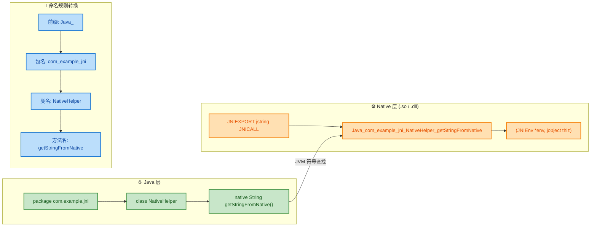

### 完整代码示例

我们通过一个完整的端到端示例来深度理解静态注册的每一个环节。

**第一步：Java 层声明 native 方法**

```java
// 文件: com/example/jni/NativeHelper.java
package com.example.jni; // 包名，将参与 JNI 函数名生成

public class NativeHelper {

    // 静态代码块：在类加载时，加载名为 "native-helper" 的本地库
    // 实际加载的文件：Linux 下为 libnative-helper.so，Windows 下为 native-helper.dll
    static {
        System.loadLibrary("native-helper");
    }

    // 声明一个无参的 native 方法，返回 String
    // JVM 将根据命名规则，在已加载的本地库中查找对应的 C/C++ 函数
    public native String getStringFromNative();

    // 声明一个带参数的 native 方法
    // 参数类型 int 在 JNI 中对应 jint
    public native int addNumbers(int a, int b);

    // 声明一个静态的 native 方法（注意：静态方法的 C 函数签名有所不同）
    public static native void printHello();

    // 测试入口
    public static void main(String[] args) {
        NativeHelper helper = new NativeHelper(); // 创建实例
        System.out.println(helper.getStringFromNative()); // 调用实例 native 方法
        System.out.println("3 + 7 = " + helper.addNumbers(3, 7)); // 调用带参 native 方法
        NativeHelper.printHello(); // 调用静态 native 方法
    }
}
```

**第二步：生成 JNI 头文件**

```bash
# 使用 javac -h 同时编译 Java 源文件并生成 JNI 头文件
# -h jni_headers  : 指定头文件输出目录
# 编译后会在 jni_headers/ 下生成 com_example_jni_NativeHelper.h
javac -h jni_headers com/example/jni/NativeHelper.java
```

生成的头文件（精简展示核心内容）：

```c
/* 文件: com_example_jni_NativeHelper.h (由 javac -h 自动生成，不要手动修改) */

#include <jni.h> // JNI 核心头文件

#ifndef _Included_com_example_jni_NativeHelper
#define _Included_com_example_jni_NativeHelper

#ifdef __cplusplus
extern "C" {       // 如果是 C++ 编译器，使用 C 链接规范，防止 name mangling
#endif

/*
 * Class:     com_example_jni_NativeHelper
 * Method:    getStringFromNative
 * Signature: ()Ljava/lang/String;
 */
// JNIEXPORT: 确保函数在共享库中可见（Linux 下展开为 __attribute__((visibility("default")))）
// JNICALL:   指定调用约定（Windows 下展开为 __stdcall，Linux 下通常为空）
// 函数名严格遵循: Java_包名_类名_方法名
JNIEXPORT jstring JNICALL Java_com_example_jni_NativeHelper_getStringFromNative
  (JNIEnv *, jobject); // JNIEnv*: JNI 环境指针; jobject: 调用该方法的 Java 对象(this)

/*
 * Class:     com_example_jni_NativeHelper
 * Method:    addNumbers
 * Signature: (II)I
 */
JNIEXPORT jint JNICALL Java_com_example_jni_NativeHelper_addNumbers
  (JNIEnv *, jobject, jint, jint); // 额外的 jint 参数对应 Java 的 int a, int b

/*
 * Class:     com_example_jni_NativeHelper
 * Method:    printHello
 * Signature: ()V
 */
JNIEXPORT void JNICALL Java_com_example_jni_NativeHelper_printHello
  (JNIEnv *, jclass); // 注意：静态方法第二个参数是 jclass（类引用），而非 jobject

#ifdef __cplusplus
}
#endif

#endif
```

**第三步：C/C++ 实现 native 函数**

```c
// 文件: native_helper.c
#include <jni.h>    // JNI 类型定义和函数声明
#include <stdio.h>  // printf
#include "com_example_jni_NativeHelper.h" // javac -h 生成的头文件

// ============================================================
// 实现 getStringFromNative()
// 对应 Java: public native String getStringFromNative();
// ============================================================
JNIEXPORT jstring JNICALL Java_com_example_jni_NativeHelper_getStringFromNative
  (JNIEnv *env, jobject thiz) {
    // env   : JNI 环境指针，所有 JNI 函数调用都要通过它
    // thiz  : 调用此方法的 Java 对象引用（类似 Java 中的 this）

    // 使用 NewStringUTF 将 C 字符串（UTF-8）转换为 Java 的 String 对象
    return (*env)->NewStringUTF(env, "Hello from Native (C) via Static Registration!");
}

// ============================================================
// 实现 addNumbers(int a, int b)
// 对应 Java: public native int addNumbers(int a, int b);
// ============================================================
JNIEXPORT jint JNICALL Java_com_example_jni_NativeHelper_addNumbers
  (JNIEnv *env, jobject thiz, jint a, jint b) {
    // env   : JNI 环境指针
    // thiz  : 调用此方法的 Java 对象引用
    // a, b  : 对应 Java 传入的两个 int 参数，类型自动映射为 jint
    return a + b; // jint 本质就是 int32_t，可以直接运算
}

// ============================================================
// 实现 printHello() —— 静态方法
// 对应 Java: public static native void printHello();
// ============================================================
JNIEXPORT void JNICALL Java_com_example_jni_NativeHelper_printHello
  (JNIEnv *env, jclass clazz) {
    // env   : JNI 环境指针
    // clazz : 静态方法没有 this 对象，取而代之的是 jclass（即该类的 Class 引用）
    //         可以通过 clazz 访问该类的静态字段或调用静态方法
    printf("Hello from a static native method!\n"); // 直接使用 C 标准输出
}
```

### 实例方法 vs 静态方法的签名差异

这是静态注册中非常容易混淆的一个细节，值得单独强调。JNI 函数的**前两个参数**由 JVM 隐式传入，开发者不需要在 Java 端声明它们，但在 C/C++ 端**必须正确声明**：

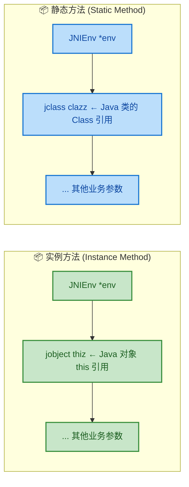

核心区别就一条：**实例方法传 `jobject`（this），静态方法传 `jclass`（Class 对象）**。这与 Java 的语义完全一致——静态方法不依赖实例，所以没有 `this`。

### 特殊字符的转义规则（Unicode Escaping）

实际开发中，Java 的包名、类名或方法名可能包含一些 "不友好" 的字符。JNI 规范为此制定了一套 **UTF-8 转义规则**，确保生成的 C 函数名是合法的 C 标识符：

| Java 中的字符 | JNI 函数名中的转义 | 说明 |
|---|---|---|
| `.`（包分隔符） | `_`（下划线） | 最常见的替换 |
| `_`（下划线） | `_1` | 原始下划线需要转义，避免与包分隔符冲突 |
| `;`（签名中的分号） | `_2` | 出现在类型签名中 |
| `[`（数组标记） | `_3` | 出现在数组类型签名中 |
| Unicode 字符 | `_0xxxx` | 4 位十六进制 Unicode 码点 |

这套转义规则看似简单，但有一个 **极易踩坑的地方**：如果你的 Java 方法名中本身包含下划线 `_`，那么在 JNI 函数名中必须写成 `_1`，而不是 `_`。

举个例子：

```java
// Java 方法名包含下划线
package com.my_app; // 包名也包含下划线！

public class Data_Parser {
    public native void parse_data();
}
```

对应的 JNI 函数名应为：

```c
// com.my_app → com_my_1app（注意 _app 中的 _ 被转义为 _1）
// Data_Parser → Data_1Parser
// parse_data → parse_1data
JNIEXPORT void JNICALL Java_com_my_1app_Data_1Parser_parse_1data
  (JNIEnv *env, jobject thiz) {
    // ...
}
```

可以看到，所有 **原始下划线** 都被替换成了 `_1`，而 **包分隔符（`.`）** 替换成了普通的 `_`。如果搞混二者，JVM 将无法匹配到函数，直接抛出 `UnsatisfiedLinkError`。

> 💡 **最佳实践**：为了避免转义带来的混乱，JNI 相关的 Java 类和方法命名中 **尽量不要使用下划线**。这是 Android NDK 和众多开源项目的通行做法。

### 重载方法的处理（Overloaded Methods）

如果 Java 中存在 **方法重载（Overloading）**，仅靠 `Java_包名_类名_方法名` 已经不够了——两个同名但参数不同的方法会生成相同的 C 函数名，产生冲突。JNI 规范通过在函数名末尾追加 **参数签名（Argument Signature）** 来解决此问题。

```java
// Java 类中存在两个重载的 native 方法
public class Calculator {
    public native int compute(int x);           // 重载版本 1
    public native int compute(int x, int y);    // 重载版本 2
}
```

对应的 JNI 函数名：

```c
// 重载版本 1：参数签名为 (I) → __I
// 注意：两个下划线 "__" 用于分隔方法名和参数签名
JNIEXPORT jint JNICALL Java_Calculator_compute__I
  (JNIEnv *env, jobject thiz, jint x) {
    return x * x; // 示例：计算平方
}

// 重载版本 2：参数签名为 (II) → __II
JNIEXPORT jint JNICALL Java_Calculator_compute__II
  (JNIEnv *env, jobject thiz, jint x, jint y) {
    return x + y; // 示例：计算加法
}
```

参数签名中的类型编码遵循 JNI 的 **Type Signature** 规范：

| Java 类型 | 签名编码 | 示例 |
|---|---|---|
| `boolean` | `Z` | |
| `byte` | `B` | |
| `char` | `C` | |
| `short` | `S` | |
| `int` | `I` | `(int x)` → `__I` |
| `long` | `J` | `(long x)` → `__J` |
| `float` | `F` | |
| `double` | `D` | `(double a, double b)` → `__DD` |
| `void` | `V` | |
| `String` | `Ljava_lang_String_2` | `.` → `_`，`;` → `_2` |
| `int[]` | `_3I` | `[` → `_3` |

举一个更复杂的例子：

```java
// 参数为 String 类型的重载
public native void process(String text);
```

```c
// String 的签名: Ljava/lang/String; → Ljava_lang_String_2
// 完整函数名追加 __Ljava_lang_String_2
JNIEXPORT void JNICALL Java_MyClass_process__Ljava_lang_String_2
  (JNIEnv *env, jobject thiz, jstring text) {
    // ... 处理字符串
}
```

> ⚠️ **注意**：只有存在重载时，`javac -h` 才会在生成的函数名中追加参数签名。如果没有重载，生成的函数名不会包含签名后缀，使用短名称即可。

### 静态注册的查找流程

当 Java 代码第一次调用一个 native 方法时，JVM 内部执行的查找流程可以概括为以下步骤：

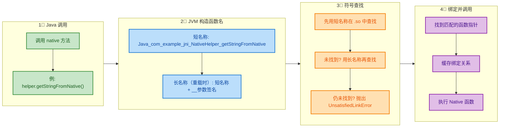

有两个关键细节值得注意：

1. **短名称优先（Short Name First）**：JVM 会先尝试不带参数签名的短名称。只有在短名称匹配失败时，才会尝试带参数签名的长名称。这意味着对于没有重载的方法，短名称就已经足够了。

2. **绑定缓存（Binding Cache）**：一旦成功找到函数指针，JVM 会将这个映射关系缓存起来。后续调用同一个 native 方法时，不再需要重复查找符号表，直接走缓存，因此 **只有第一次调用有查找开销**。

### 静态注册的优缺点

| 维度 | 优点 ✅ | 缺点 ❌ |
|---|---|---|
| **易用性** | 自动生成头文件，开发门槛低 | 函数名冗长，可读性差 |
| **安全性** | — | 函数名暴露了 Java 包结构，容易被逆向分析 |
| **灵活性** | — | Java 包名/类名重构后必须同步修改所有 C 函数名 |
| **性能** | 首次查找后有缓存 | 首次调用需要遍历符号表，略有开销 |
| **可维护性** | 一对一映射关系清晰 | native 方法多时，头文件和实现文件极其庞大 |

对于大型项目（如 Android 系统框架），静态注册的缺点会被急剧放大——数百个 native 方法意味着数百个超长函数名，任何一次包结构重构都是噩梦。这也是为什么 Android 框架层广泛采用 **动态注册** 的根本原因（下一节详述）。

但对于小型项目或初学者学习来说，静态注册简单直接、无需额外的注册代码，仍然是一个合理的选择。

---

**📝 练习题**

假设有如下 Java 类：

```java
package org.open_source.utils;

public class Text_Helper {
    public native void format_text(String input);
}
```

请问对应的 JNI C 函数名（无重载情况）是以下哪一个？

A. `Java_org_open_source_utils_Text_Helper_format_text`


B. `Java_org_open_1source_utils_Text_1Helper_format_1text`


C. `Java_org_open__source_utils_Text__Helper_format__text`


D. `Java_org_open_1source_utils_Text_1Helper_format_1text__Ljava_lang_String_2`


**【答案】** B

**【解析】** 根据 JNI 命名规则，Java 标识符中 **原始下划线 `_`** 必须转义为 `_1`，而 **包分隔符 `.`** 才替换为普通 `_`。逐段分析：
- 包名 `org.open_source.utils`：`.` 变 `_`，原始 `_` 变 `_1` → `org_open_1source_utils`
- 类名 `Text_Helper`：原始 `_` 变 `_1` → `Text_1Helper`
- 方法名 `format_text`：原始 `_` 变 `_1` → `format_1text`

拼接结果：`Java_org_open_1source_utils_Text_1Helper_format_1text`，即选项 B。

选项 A 没有对下划线做转义，会导致 JVM 无法区分包分隔符和原始下划线，从而查找失败。选项 C 使用了双下划线 `__`，这是重载参数签名的分隔符，用法错误。选项 D 虽然前半部分正确，但题目明确说明 **无重载**，不需要追加参数签名后缀。

---

## 动态注册 ⭐⭐（JNI_OnLoad、RegisterNatives）

在前面的章节中，我们已经学习了 **静态注册**（Static Registration）——通过严格的函数命名规则（`Java_包名_类名_方法名`），让 JVM 在运行时自动搜索并绑定 Native 函数。静态注册虽然简单直接，但在真实的工业级项目中，它暴露出了一系列令人头疼的问题：函数名冗长、首次调用性能损耗、无法灵活地在运行时切换实现等等。

**动态注册**（Dynamic Registration）正是为了解决这些痛点而生的高级绑定机制。它的核心思想是：**在 Native 库加载时，由开发者主动告诉 JVM "这个 Java native 方法对应的是这个 C/C++ 函数"**，从而跳过 JVM 的符号搜索过程，实现精确、高效、灵活的绑定。

Android Framework 层（如 `android_media_MediaPlayer.cpp`、`android_view_Surface.cpp`）几乎 **全部使用动态注册**，这足以说明它在生产环境中的统治地位。

---

### 静态注册的痛点回顾

在深入动态注册之前，让我们先系统梳理一下静态注册到底 "痛" 在哪里，这样才能真正理解动态注册为何如此重要。

**1. 函数名爆炸式膨胀**

假设你有一个包路径很深的类 `com.example.myapp.core.engine.NativeProcessor`，其中有一个方法 `processFrame`，静态注册后的 C 函数名将是：

```c
// 这个函数名长达 70+ 个字符，可读性极差
JNIEXPORT void JNICALL Java_com_example_myapp_core_engine_NativeProcessor_processFrame(
    JNIEnv *env, jobject thiz, jbyteArray frame
);
```

当一个类中有几十个 native 方法时，头文件将变成一片 "函数名海洋"，维护成本直线上升。

**2. 首次调用的性能开销**

静态注册依赖 JVM 在 **首次调用** native 方法时，遍历已加载的所有 Shared Library 的符号表（Symbol Table），逐一匹配函数名。这个过程本质上是一次 **O(n) 的字符串查找**，在库较大、符号较多时，延迟是可感知的。

**3. 重构地狱**

一旦 Java 层的包名、类名或方法名发生变更，所有相关的 C/C++ 函数名必须同步修改，否则运行时直接抛出 `java.lang.UnsatisfiedLinkError`。在大型项目中，这种耦合关系极易引发 "改一处、崩三处" 的连锁反应。

**4. 缺乏运行时灵活性**

静态注册是 "一锤子买卖"——函数名在编译期就已经固定，无法在运行时根据条件（如设备型号、API Level）动态切换不同的 Native 实现。

---

### 动态注册的核心架构

动态注册的整体工作流可以用一句话概括：**在 `System.loadLibrary()` 触发 `JNI_OnLoad()` 回调时，通过 `RegisterNatives()` 函数将 Java native 方法与任意 C/C++ 函数建立映射关系。**

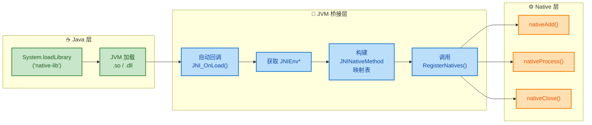

这张流程图清晰地展示了三个层次的协作关系。接下来，我们逐一深入每个核心组件。

---

### JNI_OnLoad：Native 库的 "构造函数"

#### 基本概念

`JNI_OnLoad` 是 JNI 规范定义的一个 **特殊回调函数**。当 Java 层调用 `System.loadLibrary("xxx")` 成功加载一个 Native 共享库后，JVM 会 **自动检查** 该库中是否导出了名为 `JNI_OnLoad` 的函数。如果存在，JVM 会 **立即调用它**。

你可以把它理解为 Native 库的 "构造函数" 或 "初始化入口"——它在库被加载到进程地址空间后、任何 native 方法被调用前执行，是进行动态注册、全局资源初始化的最佳时机。

#### 函数签名

```c
/*
 * JNI_OnLoad - Native 库加载时 JVM 自动调用的入口函数
 *
 * 参数:
 *   vm  - 指向 JavaVM 结构体的指针，代表当前 JVM 实例
 *         一个进程中只有一个 JavaVM，可安全缓存
 *   reserved - 保留参数，目前未使用，传 NULL
 *
 * 返回值:
 *   必须返回当前 Native 代码所需的 JNI 版本号
 *   如果返回的版本 JVM 不支持，则库加载失败
 */
JNIEXPORT jint JNICALL JNI_OnLoad(JavaVM *vm, void *reserved);
```

几个关键点需要特别注意：

**① 返回值是 JNI 版本号，不是随意值**

这个返回值告诉 JVM：当前 Native 代码是基于哪个版本的 JNI 接口编写的。常见的版本常量如下：

| 常量 | 值 | 说明 |
|------|------|------|
| `JNI_VERSION_1_1` | `0x00010001` | JDK 1.1，非常古老 |
| `JNI_VERSION_1_2` | `0x00010002` | JDK 1.2 |
| `JNI_VERSION_1_4` | `0x00010004` | JDK 1.4 |
| `JNI_VERSION_1_6` | `0x00010006` | JDK 1.6，**Android 最常用** |

如果你返回了一个 JVM 不认识的版本号，`System.loadLibrary()` 将直接抛出异常，库加载失败。**在 Android 开发中，统一返回 `JNI_VERSION_1_6` 即可。**

**② JavaVM 指针是全局唯一的，可以缓存**

与 `JNIEnv*` 不同（线程绑定、不可跨线程），`JavaVM*` 在一个进程中是 **全局唯一** 的，可以安全地存储到全局变量中，供其他线程使用。这是一个非常常见的实践模式：

```c
// 全局缓存 JavaVM 指针，后续其他线程可通过它获取 JNIEnv
static JavaVM *g_jvm = NULL;  // 全局变量，存储 JVM 实例指针

JNIEXPORT jint JNICALL JNI_OnLoad(JavaVM *vm, void *reserved) {
    g_jvm = vm;  // 缓存 JavaVM 指针到全局变量
    // ... 执行动态注册等初始化工作
    return JNI_VERSION_1_6;  // 返回所需的 JNI 版本
}

// 在其他 Native 线程中获取 JNIEnv 的工具函数
JNIEnv* getEnv() {
    JNIEnv *env = NULL;                        // 声明 JNIEnv 指针
    // 将当前线程附加到 JVM，获取该线程的 JNIEnv
    g_jvm->GetEnv((void**)&env, JNI_VERSION_1_6);
    return env;                                 // 返回当前线程的 JNIEnv
}
```

**③ 与 JNI_OnUnload 对称**

JNI 规范还定义了 `JNI_OnUnload(JavaVM *vm, void *reserved)` 函数，当 Native 库被卸载时（GC 回收了对应的 ClassLoader）调用，可用于释放全局资源。但在 Android 中，由于 ClassLoader 的生命周期几乎等同于进程生命周期，`JNI_OnUnload` 实际上极少被触发。

---

### JNINativeMethod：映射关系的 "数据结构"

动态注册的核心数据结构是 `JNINativeMethod`，它是定义在 `jni.h` 中的一个结构体，每个实例描述了 **一对** Java native 方法与 C/C++ 函数之间的绑定关系。

```c
/*
 * JNINativeMethod 结构体定义（摘自 jni.h）
 * 每个实例描述一个 "Java方法 <-> Native函数" 的映射
 */
typedef struct {
    const char *name;       // Java 中 native 方法的名称（UTF-8 字符串）
    const char *signature;  // 方法的 JNI 签名（参数类型+返回类型）
    void       *fnPtr;      // 指向 C/C++ 实现函数的函数指针
} JNINativeMethod;
```

#### 三个字段详解

**① `name` — 方法名**

这就是 Java 代码中声明的 native 方法名，是一个简单的 UTF-8 字符串。例如 Java 中声明了 `native int add(int a, int b);`，那么 `name` 就是 `"add"`。

**② `signature` — JNI 方法签名**

这是动态注册中 **最容易出错** 的字段。JNI 使用一套特殊的编码规则来描述方法的参数类型和返回类型，格式为 `(参数类型列表)返回类型`。

基本类型的签名映射表：

| Java 类型 | JNI 签名 | 助记 |
|-----------|---------|------|
| `boolean` | `Z` | **Z**ero/One (因为 B 被 byte 占了) |
| `byte` | `B` | **B**yte |
| `char` | `C` | **C**har |
| `short` | `S` | **S**hort |
| `int` | `I` | **I**nt |
| `long` | `J` | **J**（因为 L 被对象类型占了）|
| `float` | `F` | **F**loat |
| `double` | `D` | **D**ouble |
| `void` | `V` | **V**oid |

引用类型与数组的签名规则：

| Java 类型 | JNI 签名 | 说明 |
|-----------|---------|------|
| `String` | `Ljava/lang/String;` | `L` + 全限定名(`.`→`/`) + `;` |
| `int[]` | `[I` | `[` + 基本类型签名 |
| `String[]` | `[Ljava/lang/String;` | `[` + 引用类型签名 |
| `int[][]` | `[[I` | 多维数组叠加 `[` |

来看几个完整的方法签名示例：

```c
// Java: native int add(int a, int b);
// 签名: 两个 int 参数 -> 返回 int
"(II)I"

// Java: native String greet(String name, int age);
// 签名: 一个 String + 一个 int 参数 -> 返回 String
"(Ljava/lang/String;I)Ljava/lang/String;"

// Java: native void processArray(byte[] data, int offset, int length);
// 签名: byte数组 + int + int -> 返回 void
"([BII)V"

// Java: native long[] findAll(String pattern);
// 签名: 一个 String 参数 -> 返回 long 数组
"(Ljava/lang/String;)[J"
```

> 💡 **实用技巧**：如果你不确定某个方法的签名，可以使用 `javap -s ClassName` 命令让 JDK 工具自动生成签名字符串，避免手写出错。

**③ `fnPtr` — 函数指针**

这是指向实际 C/C++ 实现函数的指针。与静态注册不同，**这个函数可以随意命名**——你可以叫它 `my_add`、`native_add`，甚至是一个 Lambda（C++11），完全不受 `Java_包名_类名_方法名` 命名规则的约束。

但需要注意的是，函数的 **参数列表** 仍然必须遵循 JNI 的规范：

- 第一个参数：`JNIEnv *env`
- 第二个参数：`jobject thiz`（实例方法）或 `jclass clazz`（静态方法）
- 后续参数：与 Java native 方法的参数一一对应

---

### RegisterNatives：执行注册的 "核武器"

`RegisterNatives` 是 `JNIEnv` 提供的一个函数，用于将一组 `JNINativeMethod` 映射关系批量注册到 JVM 中。

```c
/*
 * RegisterNatives 函数原型
 *
 * 参数:
 *   clazz   - 目标 Java 类的 jclass 引用
 *   methods - JNINativeMethod 数组的首地址
 *   nMethods - 数组中元素的个数
 *
 * 返回值:
 *   成功返回 0 (JNI_OK)，失败返回负值
 */
jint RegisterNatives(JNIEnv *env, jclass clazz,
                     const JNINativeMethod *methods, jint nMethods);
```

一旦 `RegisterNatives` 调用成功，JVM 会 **立即** 将指定的 Java native 方法与 C/C++ 函数绑定，后续调用该 native 方法时，JVM 将 **直接跳转** 到注册的函数指针，完全跳过符号表搜索。

---

### 完整实战：从 Java 到 Native 的动态注册全流程

让我们用一个完整的例子来串联所有知识点。假设我们要实现一个简单的计算器类。

#### Step 1：Java 层声明 native 方法

```java
package com.example.jni;  // 包路径

public class Calculator {

    // 加载 Native 库，触发 JNI_OnLoad
    static {
        System.loadLibrary("calculator");  // 对应 libcalculator.so
    }

    // 声明 native 方法（无需关心 Native 函数名）
    public native int add(int a, int b);          // 加法
    public native int subtract(int a, int b);     // 减法
    public native String describe(String operation, int result); // 描述

    // 测试入口
    public static void main(String[] args) {
        Calculator calc = new Calculator();                    // 创建实例
        System.out.println("3 + 5 = " + calc.add(3, 5));     // 调用加法
        System.out.println("9 - 4 = " + calc.subtract(9, 4)); // 调用减法
        System.out.println(calc.describe("addition", 8));      // 调用描述
    }
}
```

#### Step 2：Native 层实现（C++ 完整代码）

```cpp
#include <jni.h>       // JNI 核心头文件
#include <string>      // C++ 字符串支持
#include <cstdlib>     // C 标准库

// ========== 第一部分：Native 函数实现 ==========
// 注意：函数名完全自由，不需要遵循 Java_xxx 命名规则

// 加法实现 —— 函数名随意取
static jint myAdd(JNIEnv *env, jobject thiz, jint a, jint b) {
    return a + b;  // 直接返回两数之和
}

// 减法实现
static jint mySubtract(JNIEnv *env, jobject thiz, jint a, jint b) {
    return a - b;  // 直接返回两数之差
}

// 描述实现 —— 涉及字符串操作
static jstring myDescribe(JNIEnv *env, jobject thiz, jstring operation, jint result) {
    // 将 Java String 转换为 C 风格字符串（UTF-8 编码）
    const char *op = env->GetStringUTFChars(operation, nullptr);

    // 拼接结果字符串
    std::string desc = "The result of ";  // 创建 C++ string
    desc += op;                            // 追加操作名称
    desc += " is ";                        // 追加连接词
    desc += std::to_string(result);        // 追加数字（转字符串）

    // 释放 JNI 分配的 UTF 字符串资源（必须释放，否则内存泄漏！）
    env->ReleaseStringUTFChars(operation, op);

    // 将 C++ string 转换回 Java String 并返回
    return env->NewStringUTF(desc.c_str());
}

// ========== 第二部分：构建映射表 ==========
// 每个元素描述一个 Java native 方法 <-> C/C++ 函数的绑定

static JNINativeMethod gMethods[] = {
    // { Java方法名,  JNI签名,          C/C++函数指针 }
    {
        "add",                      // Java 方法名: add
        "(II)I",                    // 签名: (int, int) -> int
        (void *) myAdd              // 绑定到 myAdd 函数
    },
    {
        "subtract",                 // Java 方法名: subtract
        "(II)I",                    // 签名: (int, int) -> int
        (void *) mySubtract         // 绑定到 mySubtract 函数
    },
    {
        "describe",                 // Java 方法名: describe
        "(Ljava/lang/String;I)Ljava/lang/String;",  // 签名: (String, int) -> String
        (void *) myDescribe         // 绑定到 myDescribe 函数
    }
};

// ========== 第三部分：JNI_OnLoad 入口 ==========

JNIEXPORT jint JNICALL JNI_OnLoad(JavaVM *vm, void *reserved) {
    JNIEnv *env = nullptr;  // 声明 JNIEnv 指针

    // 通过 JavaVM 获取当前线程的 JNIEnv
    // GetEnv 的第二个参数是请求的 JNI 版本
    jint result = vm->GetEnv((void **) &env, JNI_VERSION_1_6);

    // 检查获取是否成功
    if (result != JNI_OK) {
        return JNI_ERR;  // 获取失败，返回错误码，库加载将失败
    }

    // 通过全限定类名找到目标 Java 类
    // 注意：使用 '/' 而不是 '.' 分隔包名
    jclass clazz = env->FindClass("com/example/jni/Calculator");

    // 检查类是否找到
    if (clazz == nullptr) {
        return JNI_ERR;  // 类不存在，返回错误
    }

    // 核心步骤：调用 RegisterNatives 执行批量注册
    // 参数：目标类、映射表首地址、映射表元素个数
    jint regResult = env->RegisterNatives(
        clazz,                                   // 目标 Java 类
        gMethods,                                // JNINativeMethod 数组
        sizeof(gMethods) / sizeof(gMethods[0])   // 自动计算数组长度
    );

    // 检查注册是否成功
    if (regResult != JNI_OK) {
        return JNI_ERR;  // 注册失败
    }

    // 返回 JNI 版本号，告诉 JVM 我们使用的是 JNI 1.6
    return JNI_VERSION_1_6;
}
```

#### 执行时序全景图

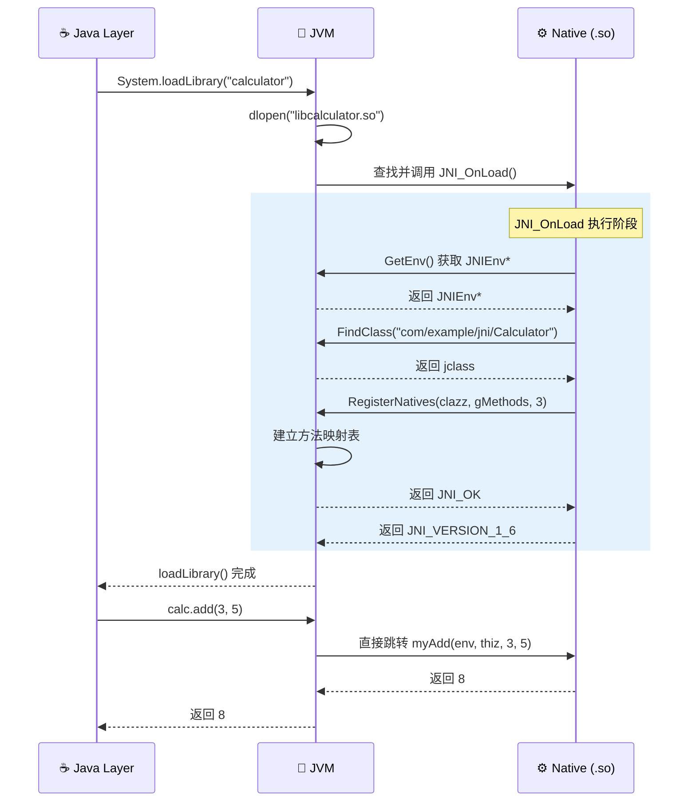

---

### 动态注册的内部原理

理解了 API 的使用方式后，让我们更深入一层，看看 JVM 内部到底发生了什么。

#### 方法绑定的底层机制

在 JVM（以 HotSpot 为例）内部，每个 Java 方法都由一个 `Method` 对象表示。对于 native 方法，`Method` 对象中有一个关键字段：**`native_function`**（在 Android ART 中对应 `entry_point_from_jni_`），它是一个函数指针，指向该 native 方法的实际 C/C++ 实现。

```text
┌──────────────────────────────────────────────────┐
│         Method 对象 (JVM 内部表示)                 │
├──────────────────────────────────────────────────┤
│  name_index        : "add"                       │
│  signature_index   : "(II)I"                     │
│  access_flags      : ACC_NATIVE | ACC_PUBLIC     │
│  ...                                             │
│  ┌──────────────────────────────────────────┐    │
│  │ native_function: 0x0000000000000000  ──────── │──── 初始为 NULL
│  └──────────────────────────────────────────┘    │
│                      │                           │
│                      ▼  RegisterNatives() 后     │
│  ┌──────────────────────────────────────────┐    │
│  │ native_function: 0x00007F3A8C001234  ──────── │──── 指向 myAdd()
│  └──────────────────────────────────────────┘    │
└──────────────────────────────────────────────────┘
```

- **静态注册**：`native_function` 初始为 NULL，首次调用时 JVM 进行 `dlsym()` 符号查找，找到后填充该指针。
- **动态注册**：`RegisterNatives()` 在调用时 **立即** 将传入的函数指针写入 `native_function`，不需要等到方法被实际调用。

这就是为什么动态注册在运行时性能上更优——**零延迟绑定**（Zero-latency Binding），方法第一次被调用时就能直接跳转，无需任何搜索开销。

#### RegisterNatives 的内部执行流程

`RegisterNatives` 的内部逻辑可以简化为以下伪代码：

```c
// RegisterNatives 简化版内部伪代码
jint RegisterNatives(JNIEnv *env, jclass clazz,
                     const JNINativeMethod *methods, jint nMethods) {

    // 遍历所有需要注册的方法
    for (int i = 0; i < nMethods; i++) {
        // 在目标 Java 类中查找匹配的 native 方法
        // 匹配条件：方法名 + 签名 完全一致
        Method *method = findMethod(clazz, methods[i].name, methods[i].signature);

        // 如果找不到对应的 Java native 方法
        if (method == NULL) {
            throwNoSuchMethodError();  // 抛出 NoSuchMethodError
            return JNI_ERR;            // 返回错误
        }

        // 检查该方法是否确实声明了 native 修饰符
        if (!isNative(method)) {
            throwNoSuchMethodError();  // 非 native 方法也不行
            return JNI_ERR;
        }

        // 核心操作：将函数指针直接写入 Method 对象的 native_function 字段
        method->native_function = methods[i].fnPtr;
    }

    return JNI_OK;  // 所有方法注册成功
}
```

---

### 多类注册的工程实践

在真实项目中，通常有多个 Java 类都包含 native 方法。此时推荐使用 **模块化注册** 模式，将每个类的注册逻辑封装为独立函数，最后在 `JNI_OnLoad` 中统一调度。

```cpp
#include <jni.h>  // JNI 核心头文件

// ===== Calculator 类的 Native 方法 =====
static jint calc_add(JNIEnv *env, jobject thiz, jint a, jint b) {
    return a + b;  // 加法实现
}

static JNINativeMethod gCalcMethods[] = {
    {"add", "(II)I", (void *) calc_add}  // 绑定 add 方法
};

// 注册 Calculator 类的所有 native 方法
static int registerCalculator(JNIEnv *env) {
    jclass clazz = env->FindClass("com/example/Calculator");  // 查找类
    if (clazz == nullptr) return JNI_ERR;                      // 类不存在则失败
    return env->RegisterNatives(clazz, gCalcMethods,           // 执行注册
                                sizeof(gCalcMethods) / sizeof(gCalcMethods[0]));
}

// ===== Logger 类的 Native 方法 =====
static void logger_log(JNIEnv *env, jobject thiz, jstring msg) {
    // ... 日志实现
}

static JNINativeMethod gLoggerMethods[] = {
    {"log", "(Ljava/lang/String;)V", (void *) logger_log}  // 绑定 log 方法
};

// 注册 Logger 类的所有 native 方法
static int registerLogger(JNIEnv *env) {
    jclass clazz = env->FindClass("com/example/Logger");  // 查找类
    if (clazz == nullptr) return JNI_ERR;                   // 类不存在则失败
    return env->RegisterNatives(clazz, gLoggerMethods,      // 执行注册
                                sizeof(gLoggerMethods) / sizeof(gLoggerMethods[0]));
}

// ===== 统一入口 =====
JNIEXPORT jint JNICALL JNI_OnLoad(JavaVM *vm, void *reserved) {
    JNIEnv *env = nullptr;                                // 声明 JNIEnv 指针
    if (vm->GetEnv((void **) &env, JNI_VERSION_1_6) != JNI_OK) {
        return JNI_ERR;                                    // 获取 JNIEnv 失败
    }

    // 按模块依次注册，任何一个失败则整体失败
    if (registerCalculator(env) != JNI_OK) return JNI_ERR;  // 注册 Calculator
    if (registerLogger(env) != JNI_OK) return JNI_ERR;      // 注册 Logger

    return JNI_VERSION_1_6;  // 全部成功，返回 JNI 版本
}
```

这种模式的优势在于：每个模块独立维护自己的映射表，`JNI_OnLoad` 只负责统一调度，代码结构清晰、易于扩展。

---

### 动态注册 vs 静态注册：全方位对比

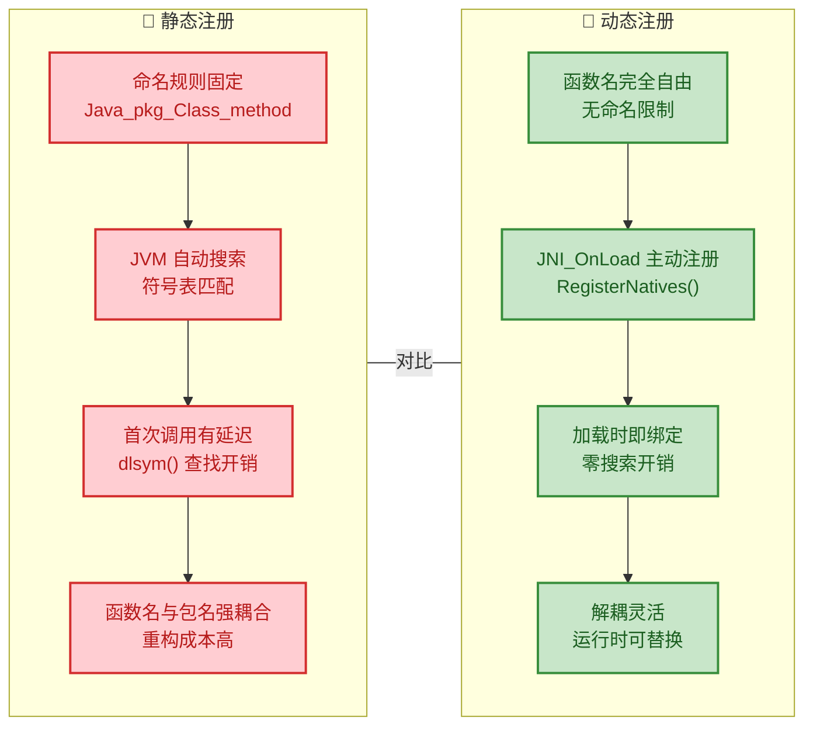

| 维度 | 静态注册 | 动态注册 |
|------|---------|---------|
| **开发门槛** | 低，`javah` 一键生成 | 中等，需手写映射表和 `JNI_OnLoad` |
| **函数命名** | 必须遵循 `Java_xxx` 规则 | 完全自由 |
| **绑定时机** | 首次调用时（Lazy） | 库加载时（Eager） |
| **首次调用性能** | 有 `dlsym()` 搜索开销 | 零开销，直接跳转 |
| **重构友好度** | 差，改名必须全同步 | 好，映射表集中管理 |
| **运行时灵活性** | 无，编译时固定 | 高，可条件注册不同实现 |
| **安全性** | 低，符号导出暴露函数名 | 高，可用 `static` 隐藏函数 |
| **Android 源码使用** | 几乎不用 | **广泛使用** |
| **适用场景** | 快速原型、学习演示 | 生产项目、SDK 开发 |

---

### 动态注册的高级技巧

#### 1. 安全性增强：隐藏符号

在静态注册中，函数必须用 `JNIEXPORT` 导出，这意味着任何人都可以通过 `nm` 或 `readelf` 工具查看 `.so` 文件中的所有 JNI 函数名——这对安全敏感的项目是不可接受的。

动态注册则允许将函数声明为 `static`，使其仅在当前编译单元可见：

```cpp
// static 关键字使函数符号不会出现在 .so 的导出表中
// 逆向工程师无法通过符号表直接定位这些函数
static jint mySecretAdd(JNIEnv *env, jobject thiz, jint a, jint b) {
    return a + b;  // 实现对外不可见
}
```

#### 2. 条件注册：运行时切换实现

动态注册的灵活性允许根据运行时条件选择不同的 Native 实现：

```cpp
// 高性能版本：使用 NEON/SSE 指令集加速
static jint add_fast(JNIEnv *env, jobject thiz, jint a, jint b) {
    // ... SIMD 优化的实现
    return a + b;
}

// 兼容版本：纯 C 实现，兼容性最好
static jint add_compat(JNIEnv *env, jobject thiz, jint a, jint b) {
    return a + b;  // 普通实现
}

JNIEXPORT jint JNICALL JNI_OnLoad(JavaVM *vm, void *reserved) {
    JNIEnv *env = nullptr;                                         // 声明 JNIEnv
    vm->GetEnv((void **) &env, JNI_VERSION_1_6);                  // 获取 JNIEnv

    // 根据 CPU 特性选择不同的实现
    bool hasNeon = checkNeonSupport();                              // 检测硬件特性

    JNINativeMethod methods[] = {
        {
            "add",                                                  // Java 方法名
            "(II)I",                                                // 签名
            hasNeon ? (void *) add_fast : (void *) add_compat      // 条件选择！
        }
    };

    jclass clazz = env->FindClass("com/example/Calculator");       // 查找类
    env->RegisterNatives(clazz, methods, 1);                       // 注册

    return JNI_VERSION_1_6;                                        // 返回版本
}
```

这种模式在 **多架构适配**（ARM / x86 / MIPS）、**功能降级**（Feature Degradation）等场景中极为实用。

#### 3. UnregisterNatives：解除绑定

JNI 还提供了 `UnregisterNatives` 函数，可以 **解除** 一个类上所有 native 方法的绑定，使它们恢复到未注册状态：

```cpp
// 解除 Calculator 类上所有 native 方法的绑定
// 之后调用这些方法将触发 UnsatisfiedLinkError
env->UnregisterNatives(clazz);
```

这个 API 在热更新（Hot Patching）或插件化架构中有潜在应用价值——先解除旧绑定，再注册新的实现函数。但在日常开发中使用较少。

---

### 常见错误与排查指南

动态注册虽然强大，但错误也更加隐蔽。以下是最常见的 "坑"：

| 错误现象 | 根本原因 | 排查方法 |
|---------|---------|---------|
| `NoSuchMethodError` | 签名字符串写错（漏了 `;`、类型映射错误等） | 用 `javap -s` 验证签名 |
| `UnsatisfiedLinkError` | `JNI_OnLoad` 没有返回正确的版本号 | 检查返回值是否为 `JNI_VERSION_1_6` |
| `ClassNotFoundException` | `FindClass` 中类名使用了 `.` 而非 `/` | 包分隔符必须用 `/` |
| 注册成功但调用崩溃 | C/C++ 函数参数列表与签名不匹配 | 逐一核对参数类型和顺序 |
| `JNI_OnLoad` 未被调用 | 函数签名写错或未正确导出 | 确保有 `JNIEXPORT` 和 `JNICALL` 修饰 |

> ⚠️ **最高频错误**：`Ljava/lang/String;` 中的分号 `;` 是签名的一部分，遗漏分号是最常见的动态注册失败原因，且错误信息往往不够直观。

---

### 本节总结

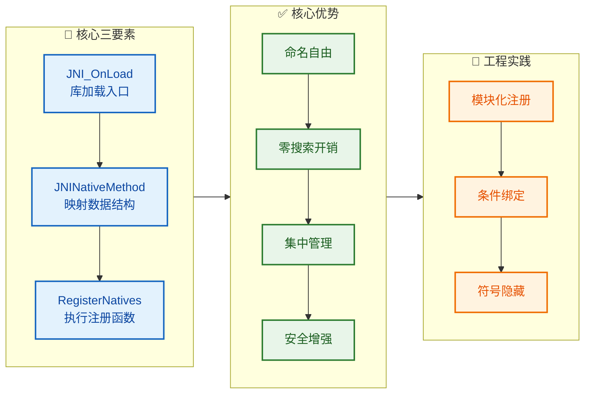

动态注册是 JNI 开发从 "能用" 到 "好用" 的关键跨越。掌握 `JNI_OnLoad` + `JNINativeMethod` + `RegisterNatives` 这个三板斧，你就拥有了 Android Framework 级别的 JNI 开发能力。

---

**📝 练习题**

某团队在 Android 项目中使用动态注册，`JNI_OnLoad` 代码如下：

```cpp
JNIEXPORT jint JNICALL JNI_OnLoad(JavaVM *vm, void *reserved) {
    JNIEnv *env = nullptr;
    vm->GetEnv((void **) &env, JNI_VERSION_1_6);
    jclass clazz = env->FindClass("com.example.MyClass");  // 注意这里
    JNINativeMethod methods[] = {
        {"getData", "()[B", (void *) native_getData}
    };
    env->RegisterNatives(clazz, methods, 1);
    return JNI_VERSION_1_6;
}
```

运行时抛出 `NoClassDefFoundError`，最可能的原因是什么？


A. `JNI_VERSION_1_6` 版本过低，应使用 `JNI_VERSION_1_8`


B. `FindClass` 中的类名使用了 `.` 作为分隔符，应改为 `/`（即 `"com/example/MyClass"`）


C. `getData` 方法的签名 `"()[B"` 不合法


D. `JNI_OnLoad` 的返回值应该是 `JNI_OK` 而不是版本号


**【答案】** B

**【解析】** 在 JNI 的 `FindClass` 函数中，类的全限定名必须使用 **`/`（斜杠）** 而不是 `.`（点号）作为包分隔符。代码中写的 `"com.example.MyClass"` 使用了 Java 风格的点号分隔，JVM 无法识别，因此返回 `nullptr`，后续基于 `nullptr` 调用 `RegisterNatives` 引发崩溃。正确写法应为 `"com/example/MyClass"`。选项 A 错误，Android 完全支持 `JNI_VERSION_1_6`；选项 C 错误，`"()[B"` 表示"无参数、返回 `byte[]`"，是合法签名；选项 D 错误，`JNI_OnLoad` 规范要求返回 JNI 版本号，而非 `JNI_OK`。

---

**📝 练习题**

以下关于动态注册和静态注册的说法中，**错误** 的是：


A. 动态注册的 Native 函数可以声明为 `static`，从而不出现在 `.so` 文件的符号导出表中


B. 静态注册在首次调用 native 方法时需要通过 `dlsym()` 搜索符号表，有一定的性能开销


C. 动态注册的 `RegisterNatives` 调用成功后，如果之后再对同一个 native 方法调用 `RegisterNatives` 注册一个不同的函数指针，第二次注册会失败并抛出异常


D. 在 `JNI_OnLoad` 中可以缓存 `JavaVM*` 指针到全局变量，供其他 Native 线程通过 `AttachCurrentThread` 获取各自的 `JNIEnv*`


**【答案】** C

**【解析】** 选项 C 的说法是错误的。`RegisterNatives` 对同一个 native 方法 **重复注册是被允许的**，新的函数指针会直接 **覆盖** 旧的绑定，不会抛出异常。这正是动态注册灵活性的体现之一——可以在运行时 "热替换" native 方法的实现。选项 A 正确，`static` 函数不会被导出到共享库的符号表中，提升了安全性；选项 B 正确，这是静态注册的固有机制；选项 D 正确，`JavaVM*` 是进程级单例，可安全跨线程使用，这是在子线程中获取 `JNIEnv*` 的标准做法。

---

## 本章小结

本章系统性地拆解了 **JNI（Java Native Interface）** 的基础体系。从"为什么需要 JNI"出发，逐步深入到开发流程、核心指针、以及两种函数注册机制，构建起 Java 与 Native 世界沟通的完整认知框架。下面我们从 **知识脉络回顾、核心对比、全景架构图、高频踩坑清单** 四个维度进行总结。

---

### 知识脉络回顾

整个 JNI 基础章节的学习路线可以用 **"一条桥、两端人、三个阶段"** 来概括：

**一条桥** —— JNI 本身就是 Java 虚拟机规范中定义的一套 Native Programming Interface，它是 Java 字节码世界与 C/C++ 原生机器码世界之间唯一的官方桥梁。无论是 Android 的 NDK 开发，还是桌面端调用系统级 API，JNI 都是那个不可绕过的中间层。

**两端人** —— 桥的一端是 Java/Kotlin 层，通过 `native` 关键字声明方法签名，表示"这个方法的实现不在 Java 侧，请去 Native 侧寻找"；桥的另一端是 C/C++ 层，按照 JNI 规范编写对应的函数实现，并编译为 `.so`（Linux/Android）或 `.dll`（Windows）动态链接库。

**三个阶段** 对应了我们学习的核心内容：

| 阶段 | 关键内容 | 核心要点 |
|:---:|:---|:---|
| **声明** | `native` 关键字 | 仅声明、无方法体；`System.loadLibrary()` 加载 so |
| **连接** | 静态注册 / 动态注册 | JVM 如何找到 native 方法对应的 C/C++ 函数 |
| **调用** | `JNIEnv*` 指针 | 线程绑定、函数表指针、所有 JNI 操作的入口 |

我们先通过 `javac -h`（或旧版 `javah`）工具自动生成头文件，理解了 JNI 开发的标准工程流程；然后深入 `JNIEnv` 这个贯穿整个 JNI 调用生命周期的核心指针，理解了它 **线程绑定（thread-local）**、**不可跨线程传递** 的本质；最后在注册机制上，对比了 **静态注册**（依靠严格的函数命名规则让 JVM 自动查找）与 **动态注册**（在 `JNI_OnLoad` 中主动调用 `RegisterNatives` 建立映射表）两种方案的原理与取舍。

---

### 静态注册 vs 动态注册 —— 核心对比

这是本章最重要的决策点之一，面试高频考点。用一张表格做最终对比：

| 维度 | 静态注册 (Static Registration) | 动态注册 (Dynamic Registration) |
|:---|:---|:---|
| **映射方式** | JVM 按命名规则 `Java_包名_类名_方法名` 自动查找 | 开发者在 `JNI_OnLoad` 中调用 `RegisterNatives` 手动绑定 |
| **首次调用性能** | 首次需遍历 so 符号表查找，略慢 | 加载 so 时一次性注册完毕，首次调用无额外开销 |
| **函数名可读性** | 冗长，含转义字符（如 `_1` 表示 `_`） | 函数名完全自定义，简洁可控 |
| **安全性** | 函数名暴露了完整 Java 包路径，易被逆向 | 函数名与 Java 类无直接关联，增加逆向难度 |
| **维护成本** | Java 层改包名/类名后必须同步改 C 函数名 | 只需修改映射表，C 函数名不变 |
| **工具依赖** | 依赖 `javac -h` 生成头文件 | 不需要生成头文件，手写映射表即可 |
| **适用场景** | 快速原型、Demo、native 方法少 | 生产项目、Android Framework、大型 so 库 |
| **典型应用** | 个人学习项目 | Android 系统源码（`android_media_MediaPlayer.cpp` 等） |

> **一句话结论**：小项目用静态注册快速上手，正式工程 **一律推荐动态注册**。Android AOSP 源码中几乎 100% 使用动态注册。

---

### 全景架构图

下面这张图将本章所有知识点串联为一个完整的调用链路，从 Java 层的 `native` 声明开始，到 Native 层的函数执行结束：

```mermaid
graph LR
    subgraph JavaLayer["☕ Java / Kotlin Layer"]
        direction TB
        A["声明 native 方法"]
        B["System.loadLibrary()"]
        A --> B
    end

    subgraph JVMBridge["🔗 JVM / JNI Bridge"]
        direction TB
        C["dlopen 加载 .so"]
        D{"JNI_OnLoad 存在?"}
        E["动态注册路径<br/>RegisterNatives"]
        F["静态注册路径<br/>dlsym 符号查找"]
        G["建立 方法映射表<br/>Java Method ↔ Native Func"]
        C --> D
        D -- Yes --> E
        D -- No --> F
        E --> G
        F --> G
    end

    subgraph NativeLayer["⚙️ Native C/C++ Layer"]
        direction TB
        H["JNIEnv* env<br/>线程绑定的函数表指针"]
        I["执行 Native 逻辑<br/>调用系统API / 算法计算"]
        J["通过 JNIEnv 回调 Java<br/>FindClass / CallMethod 等"]
        H --> I
        I --> J
    end

    JavaLayer --> JVMBridge
    JVMBridge --> NativeLayer

    classDef green fill:#C8E6C9,stroke:#388E3C,color:#1B5E20
    classDef blue fill:#BBDEFB,stroke:#1976D2,color:#0D47A1
    classDef orange fill:#FFE0B2,stroke:#F57C00,color:#E65100

    class A,B green
    class C,D,E,F,G blue
    class H,I,J orange
```

**图示解读**：

- **绿色区域（Java Layer）**：一切从 `native` 关键字声明开始，`System.loadLibrary("xxx")` 触发 JVM 去加载对应的 `.so` 文件。
- **蓝色区域（JVM Bridge）**：JVM 通过 `dlopen`（Linux/Android）打开 so 后，首先检查是否存在 `JNI_OnLoad` 函数。如果存在，走动态注册路径；如果不存在，则走静态注册路径，通过 `dlsym` 在符号表中按命名规则查找。无论走哪条路，最终都会建立 **Java 方法 ↔ Native 函数** 的映射关系。
- **橙色区域（Native Layer）**：Native 函数被调用时，JVM 会传入 `JNIEnv*` 指针（以及 `jobject` 或 `jclass`），开发者通过 `JNIEnv` 提供的函数表完成所有与 JVM 的交互——包括访问 Java 对象字段、调用 Java 方法、创建 Java 对象等。

---

### JNIEnv 指针 —— 记忆模型

`JNIEnv` 是本章最核心的概念之一，它的本质是一个 **二级指针**，指向一张包含数百个函数指针的表（JNI Function Table）。其线程绑定特性可以用如下模型理解：

```cpp
// ======== JNIEnv 的线程绑定模型 ========

// Thread-A 启动时，JVM 为其分配独立的 JNIEnv
// Thread-A: env_A -> [JNI Function Table]  (共享同一张函数表)
//                          ↑
// Thread-B: env_B ---------┘               (指针不同，表相同)

// ❌ 错误示范：将 Thread-A 的 env 传给 Thread-B
// void* threadFunc(void* arg) {
//     JNIEnv* env = (JNIEnv*)arg;  // 来自主线程的 env，未定义行为！
//     env->FindClass("...");        // 崩溃或数据损坏
// }

// ✅ 正确做法：子线程通过 JavaVM 获取自己的 JNIEnv
// JavaVM* gJvm;  // 全局缓存，JNI_OnLoad 中保存
// void* threadFunc(void* arg) {
//     JNIEnv* env = NULL;
//     gJvm->AttachCurrentThread(&env, NULL);  // 获取本线程的 env
//     env->FindClass("...");                   // 安全调用
//     gJvm->DetachCurrentThread();             // 用完必须 Detach
// }
```

**关键记忆点**：`JavaVM` 全局唯一、可跨线程；`JNIEnv` 线程私有、不可跨线程。子线程必须通过 `AttachCurrentThread` 获取属于自己的 `JNIEnv`。

---

### 高频踩坑清单

在实际 JNI 开发中，初学者最容易犯的错误集中在以下几个方面，本章内容已经全部覆盖，这里做一个 checklist 式的最终梳理：

| # | 踩坑场景 | 错误表现 | 正确做法 |
|:---:|:---|:---|:---|
| 1 | `JNIEnv*` 跨线程使用 | 崩溃、`SIGABRT`、JNI ERROR | 子线程 `AttachCurrentThread` 获取独立 `env` |
| 2 | 静态注册函数名拼写错误 | `UnsatisfiedLinkError` | 严格使用 `javac -h` 生成头文件，复制函数签名 |
| 3 | 动态注册方法签名写错 | `NoSuchMethodError` 或注册时返回负值 | 用 `javap -s` 确认方法描述符，如 `(II)I` |
| 4 | `JNI_OnLoad` 未返回版本号 | so 加载失败 | 必须 `return JNI_VERSION_1_6;`（或更高版本） |
| 5 | 忘记 `System.loadLibrary` | 所有 native 调用报 `UnsatisfiedLinkError` | 通常在 `static {}` 块或 `companion object` 中加载 |
| 6 | so 名称带 `lib` 前缀 | 加载失败 | `loadLibrary("native")` 而非 `loadLibrary("libnative")` |
| 7 | `AttachCurrentThread` 后未 `Detach` | 内存泄漏、JVM 无法正常退出 | `Attach` 和 `Detach` **必须成对出现** |

---

### 方法签名速查表

JNI 中的 **方法描述符（Method Descriptor）** 是动态注册和反射调用的核心，本章反复用到，这里给出一份快速参考：

| Java 类型 | JNI 签名 | 示例 |
|:---|:---:|:---|
| `boolean` | `Z` | — |
| `byte` | `B` | — |
| `char` | `C` | — |
| `short` | `S` | — |
| `int` | `I` | — |
| `long` | `J` | — |
| `float` | `F` | — |
| `double` | `D` | — |
| `void` | `V` | — |
| `String` | `Ljava/lang/String;` | 注意结尾分号 |
| `int[]` | `[I` | 数组用 `[` 前缀 |
| `Object` | `Ljava/lang/Object;` | 全限定名、`/` 分隔 |
| `int add(int a, int b)` | `(II)I` | 括号内是参数，括号外是返回值 |
| `String getName()` | `()Ljava/lang/String;` | 无参数，返回 String |
| `void setData(byte[], int)` | `([BI)V` | byte 数组 + int，无返回值 |

> **实用技巧**：任何时候不确定签名，直接用 `javap -s -p YourClass.class` 让编译器告诉你答案，不要手写猜测。

---

### 本章知识点完成度自检

```mermaid
graph LR
    subgraph Foundation["📚 JNI 基础知识全景"]
        direction TB
        K1["JNI 概述<br/>Java 与 Native 的桥梁"]
        K2["native 关键字<br/>声明、加载、限制"]
        K3["JNI 开发流程<br/>javac -h / CMake / ndk-build"]
        K4["JNIEnv 指针 ⭐<br/>线程绑定 / 函数表 / 二级指针"]
        K5["静态注册<br/>命名规则 / 符号查找"]
        K6["动态注册 ⭐⭐<br/>JNI_OnLoad / RegisterNatives"]
        K1 --> K2
        K2 --> K3
        K3 --> K4
        K4 --> K5
        K5 --> K6
    end

    subgraph NextChapter["🔜 后续章节预告"]
        direction TB
        N1["JNI 数据类型映射"]
        N2["引用管理<br/>Local / Global / Weak"]
        N3["异常处理"]
        N4["JNI 性能优化"]
        N1 --> N2
        N2 --> N3
        N3 --> N4
    end

    Foundation --> NextChapter

    classDef teal fill:#B2DFDB,stroke:#00897B,color:#004D40
    classDef purple fill:#E1BEE7,stroke:#8E24AA,color:#4A148C

    class K1,K2,K3,K4,K5,K6 teal
    class N1,N2,N3,N4 purple
```

至此，JNI 基础篇的六大核心知识点已经全部覆盖。本章建立的认知框架——**声明 → 加载 → 注册 → 调用**——将贯穿后续所有 JNI 进阶内容。无论是数据类型映射、引用管理（Local/Global/Weak Reference），还是 JNI 层的异常处理与性能调优，都建立在对 `JNIEnv`、注册机制、方法签名的扎实理解之上。

---

**📝 练习题 1**

以下关于 `JNIEnv` 指针的说法，**正确** 的是：

A. `JNIEnv` 在进程中全局唯一，所有线程共享同一个 `JNIEnv` 实例


B. 子线程可以直接使用主线程传递过来的 `JNIEnv*` 调用 JNI 函数


C. `JNIEnv` 是线程绑定的，每个线程拥有独立的 `JNIEnv` 实例，子线程需通过 `AttachCurrentThread` 获取自己的 `JNIEnv`


D. `JNIEnv` 和 `JavaVM` 都是线程私有的，都不可跨线程传递


**【答案】** C

**【解析】** `JNIEnv` 是 thread-local 的，每个已 attach 到 JVM 的线程都拥有独立的 `JNIEnv` 实例。选项 A 描述的是 `JavaVM` 的特性（进程中全局唯一），不是 `JNIEnv`。选项 B 是典型的错误用法——跨线程传递 `JNIEnv*` 会导致未定义行为（通常表现为崩溃）。选项 D 前半句对、后半句错，`JavaVM` 是全局唯一且可以安全地跨线程使用的，通常在 `JNI_OnLoad` 中缓存为全局变量供子线程使用。因此只有 C 完全正确。

---

**📝 练习题 2**

在 Android 项目中，某开发者使用 **动态注册** 方式绑定 native 方法，但运行时报 `java.lang.UnsatisfiedLinkError: No implementation found for ...`。以下哪个原因 **最不可能** 导致该问题？

A. `JNI_OnLoad` 函数中调用 `RegisterNatives` 时，`JNINativeMethod` 数组中的方法签名（signature）写错了


B. `JNI_OnLoad` 函数忘记返回 JNI 版本号（如 `JNI_VERSION_1_6`），导致 so 加载失败


C. Native 函数的 C++ 实现中，函数名没有按照 `Java_包名_类名_方法名` 的规则命名


D. `System.loadLibrary()` 中传入的库名与实际编译产出的 so 文件名不匹配


**【答案】** C

**【解析】** 动态注册的核心优势之一就是 **不需要** 遵循静态注册的 `Java_包名_类名_方法名` 命名规则。在动态注册中，Java 方法与 Native 函数的映射关系完全由 `RegisterNatives` 的 `JNINativeMethod` 结构体数组显式指定，C 函数可以取任意名称。因此 C 选项描述的情况在动态注册场景下根本不构成问题，是 **最不可能** 的原因。选项 A（签名写错导致注册失败）、B（`JNI_OnLoad` 返回值错误导致 so 加载被 JVM 拒绝）、D（库名不匹配导致根本找不到 so 文件）都是真实会导致 `UnsatisfiedLinkError` 的常见原因。

---

