---

# JNI异常处理 ⭐⭐

---

## JNI 异常处理 ⭐⭐

### Java 异常在 Native 层的表现

在纯 Java 世界中，我们对异常处理已经非常熟悉——`try-catch-finally` 三板斧足以应对绑大多数场景。一旦某行代码抛出异常，JVM 会立即中断当前执行流，沿着调用栈向上查找匹配的 `catch` 块。这种 **"中断式"** 的异常传播机制是 Java 开发者的直觉。

然而，当我们跨越 JNI 边界进入 C/C++ Native 层时，**一切都变了**。Native 代码运行在 JVM 管控之外，C/C++ 本身没有与 Java 对等的异常传播机制（C 甚至没有异常的概念）。这就引出了 JNI 异常处理中最核心、也最容易踩坑的问题：

> **Java 异常在 Native 层不会自动中断 C/C++ 代码的执行流。**

这一条铁律，是理解整个 JNI 异常处理的基石。

---

#### 一、Java 异常的本质回顾

在深入 Native 层之前，先快速回顾 Java 异常的本质。Java 异常是一个继承自 `Throwable` 的 **对象**，它承载了错误类型、消息、堆栈轨迹等信息。当 JVM 遇到 `throw` 语句时，内部会执行：

1. 创建异常对象实例
2. 将该异常对象设置为当前线程的 **"pending exception"（待处理异常）**
3. 中断当前方法执行，沿调用栈回溯，寻找匹配的异常处理器

关键点在于第 2 步——JVM 内部维护了一个 **线程级别** 的异常槽位（per-thread pending exception slot）。这个槽位在 JNI 环境下依然存在，并且是 Native 代码与 Java 异常交互的唯一桥梁。

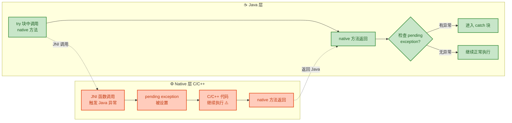

从图中可以清晰看到：在 Native 层，即使 pending exception 已经被设置，**C/C++ 代码仍然会继续往下执行**，不会像 Java 那样自动跳转到异常处理逻辑。只有当控制流返回到 Java 层时，JVM 才会检查 pending exception 并触发 Java 侧的异常处理。

---

#### 二、Native 层中异常的触发场景

在 Native 代码中，Java 异常主要通过以下途径产生：

**场景 1：通过 JNI 函数回调 Java 方法时，Java 方法内部抛出异常**

这是最常见的情况。当你在 Native 层使用 `CallXxxMethod` 系列函数调用 Java 方法时，被调用的 Java 方法可能会 `throw` 异常。

```java
// Java 侧：一个会抛出异常的方法
public class DataParser {
    // 当输入为 null 时会抛出 NullPointerException
    public int parse(String input) {
        return Integer.parseInt(input); // 若 input 非法，抛 NumberFormatException
    }
}
```

```cpp
// Native 侧：调用上述 Java 方法
extern "C" JNIEXPORT void JNICALL
Java_com_example_DataParser_nativeProcess(JNIEnv *env, jobject thiz) {

    // 获取 DataParser 类的 Class 引用
    jclass clazz = env->GetObjectClass(thiz);

    // 获取 parse 方法的 ID：方法名 "parse"，签名 "(Ljava/lang/String;)I"
    jmethodID parseMethod = env->GetMethodID(clazz, "parse", "(Ljava/lang/String;)I");

    // 构造一个非法字符串 "abc"，它无法被 parseInt 解析
    jstring badInput = env->NewStringUTF("abc");

    // 调用 Java 的 parse("abc")，此处会触发 NumberFormatException
    jint result = env->CallIntMethod(thiz, parseMethod, badInput);

    // ⚠️ 关键：虽然上一行已经触发了 Java 异常，
    // 但这一行代码仍然会被执行！C/C++ 不会自动中断！
    // 此时 result 的值是未定义的（通常为 0）
    printf("result = %d\n", result);  // 这行仍然会执行

    // 如果继续调用其他 JNI 函数（非异常处理类），行为是未定义的！
    // env->CallVoidMethod(thiz, someOtherMethod);  // ❌ 危险！
}
```

**场景 2：JNI 函数自身执行失败**

许多 JNI 函数在参数非法或资源不足时，会设置 pending exception。例如：

| JNI 函数 | 可能抛出的异常 | 触发条件 |
|---|---|---|
| `FindClass` | `NoClassDefFoundError` | 类不存在或类加载失败 |
| `GetMethodID` | `NoSuchMethodError` | 方法签名不匹配 |
| `GetFieldID` | `NoSuchFieldError` | 字段不存在 |
| `NewStringUTF` | `OutOfMemoryError` | 内存不足 |
| `GetStringUTFChars` | `OutOfMemoryError` | 内存不足 |
| `NewGlobalRef` | `OutOfMemoryError` | 全局引用表溢出 |

**场景 3：Native 代码主动抛出**

你也可以在 Native 层主动构造并抛出一个 Java 异常（通过 `ThrowNew` 等 API），这会在后续章节详细展开。

---

#### 三、最危险的陷阱："异常后继续调用 JNI"

这是 JNI 开发中 **排名第一的致命错误**。当 pending exception 已经存在时，**绝大多数 JNI 函数的调用行为是未定义的（undefined behavior）**。JNI 规范明确指出：

> 当存在 pending exception 时，只允许调用以下有限的 JNI 函数：

```text
✅ 允许调用的 JNI 函数（异常状态下）：
┌──────────────────────────────────────────────┐
│  ExceptionCheck()      — 检查是否有待处理异常  │
│  ExceptionOccurred()   — 获取异常对象引用      │
│  ExceptionDescribe()   — 打印异常堆栈到 stderr │
│  ExceptionClear()      — 清除待处理异常        │
│  DeleteLocalRef()      — 删除本地引用          │
│  DeleteGlobalRef()     — 删除全局引用          │
│  MonitorExit()         — 退出同步监视器        │
│  ReleaseStringChars()  — 释放字符串字符资源     │
│  ReleaseStringUTFChars()                      │
│  ReleasePrimitiveArrayCritical()              │
│  ReleaseStringCritical()                      │
└──────────────────────────────────────────────┘
```

除此之外的任何 JNI 调用，在异常未清除的状态下都可能导致 **JVM 崩溃（crash）**、**内存损坏** 或 **不可预测的行为**。

下面用一个对比图来展示正确与错误的处理方式：

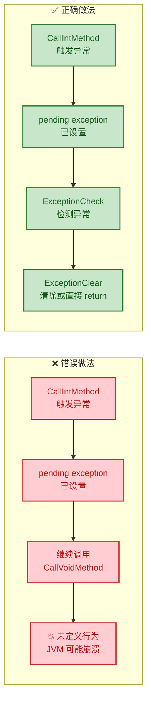

---

#### 四、Pending Exception 的生命周期

理解 pending exception 的完整生命周期，有助于建立正确的心智模型：

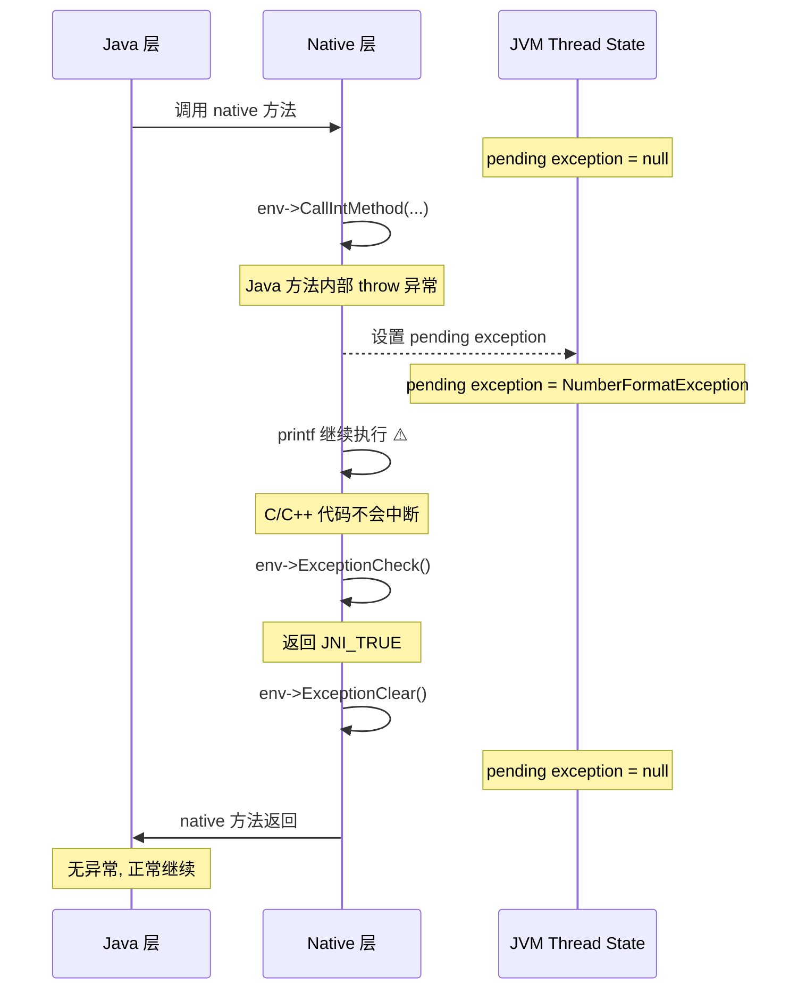

这张时序图完整展示了一个典型的异常流转过程：

1. **产生**：JNI 调用触发 Java 异常，pending exception 被设置
2. **无感继续**：C/C++ 代码对此无感，继续执行后续语句
3. **主动检测**：开发者必须显式调用 `ExceptionCheck()` 来感知异常
4. **决策处理**：清除异常（`ExceptionClear`）后自行处理，或让异常传播回 Java 层

如果在第 4 步选择 **不清除**，而是直接 `return`，那么 pending exception 会随着控制流返回 Java 层，JVM 此时才会按照标准流程抛出该异常。

---

#### 五、与 C++ 异常的本质区别

很多有 C++ 背景的开发者会下意识地用 C++ 异常的思维来理解 JNI 异常，这是一个严重的认知误区：

| 对比维度 | C++ 异常 (`throw/catch`) | JNI 中的 Java 异常 |
|---|---|---|
| **传播机制** | 自动栈回溯（stack unwinding） | 不传播，仅设置标志位 |
| **代码中断** | 立即中断，跳转到 `catch` | **不中断**，后续代码继续执行 |
| **检测方式** | 编译器/运行时自动 | 必须**手动调用** `ExceptionCheck` |
| **资源清理** | RAII 析构函数自动触发 | 需要手动释放 JNI 本地引用等资源 |
| **跨语言** | 仅限 C++ 内部 | 跨越 Java ↔ Native 边界 |

核心差异一句话总结：**C++ 异常是"推"模式（主动推给你），JNI 异常是"拉"模式（你必须主动去查询）。**

---

#### 六、一个完整的错误示例与分析

以下代码展示了一个初学者常犯的典型错误——忽略异常检查导致连锁崩溃：

```cpp
// ❌ 错误示例：连续调用 JNI 函数却不检查异常
extern "C" JNIEXPORT jstring JNICALL
Java_com_example_Demo_nativeBadExample(JNIEnv *env, jobject thiz) {

    // 第 1 步：查找一个不存在的类 —— 会触发 NoClassDefFoundError
    jclass clazz = env->FindClass("com/example/NonExistent");
    // 此时 clazz == NULL，且 pending exception 已设置

    // 第 2 步：用 NULL 的 clazz 继续获取方法 ID —— 未定义行为！
    jmethodID mid = env->GetMethodID(clazz, "foo", "()V");
    // 💥 此处可能直接导致 JVM 崩溃（segfault）

    // 第 3 步：即使没崩溃，继续调用也是错上加错
    env->CallVoidMethod(thiz, mid);

    // 返回一个字符串（但已经不可能正常到达这里了）
    return env->NewStringUTF("done");
}
```

**正确改写思路**（详细实现将在后续"异常检查"和"异常清除"章节展开）：

```cpp
// ✅ 正确思路：每个可能失败的 JNI 调用后都检查异常
extern "C" JNIEXPORT jstring JNICALL
Java_com_example_Demo_nativeGoodExample(JNIEnv *env, jobject thiz) {

    // 第 1 步：查找类
    jclass clazz = env->FindClass("com/example/NonExistent");
    // 立即检查：如果失败，提前返回，让异常传播回 Java
    if (clazz == NULL) {
        // pending exception 已存在，直接 return 即可
        // JVM 回到 Java 层后会自动抛出 NoClassDefFoundError
        return NULL;
    }

    // 第 2 步：安全地获取方法 ID（此时 clazz 一定有效）
    jmethodID mid = env->GetMethodID(clazz, "foo", "()V");
    // 再次检查
    if (mid == NULL) {
        return NULL; // NoSuchMethodError 会传播回 Java
    }

    // 第 3 步：安全调用
    env->CallVoidMethod(thiz, mid);
    // 检查调用是否触发了异常
    if (env->ExceptionCheck()) {
        return NULL; // 异常传播回 Java
    }

    // 一切正常，返回结果
    return env->NewStringUTF("done");
}
```

注意到正确写法中一个重要模式：**许多 JNI 函数在失败时会返回 `NULL`，同时设置 pending exception**。因此检查返回值 `== NULL` 是一种快速判断异常的方式，但并非所有 JNI 函数都适用（例如 `CallVoidMethod` 没有返回值），所以 `ExceptionCheck()` 才是最通用可靠的检查手段。

---

#### 小结

本节的核心要点可以浓缩为三句话：

1. **Java 异常在 Native 层只是一个"待处理标志位"，不会中断 C/C++ 执行流**
2. **异常状态下调用非安全列表中的 JNI 函数，属于未定义行为**
3. **每次可能失败的 JNI 调用后，都必须主动检查异常状态**

这三条规则构成了 JNI 异常处理的基本公理，后续章节中的 `ExceptionCheck`、`ExceptionClear`、`ThrowNew` 等 API 都是围绕这些公理展开的具体工具。

---

**📝 练习题**

在 JNI Native 方法中，通过 `CallIntMethod` 调用了一个 Java 方法，该方法内部抛出了 `ArithmeticException`。此时 Native 层的后续 C 代码会发生什么？

A. C 代码立即中断，控制流跳转回 Java 层的 catch 块


B. C 代码立即中断，JVM 打印异常堆栈并终止进程


C. C 代码继续执行，但 `CallIntMethod` 的返回值不可靠，且 pending exception 已被设置


D. C 代码继续执行，且 `CallIntMethod` 返回 Java 方法中 throw 之前的最后一个有效值

**【答案】** C

**【解析】** 这正是本节反复强调的 JNI 异常核心行为。Java 异常在 Native 层 **不会** 像在 Java 中那样自动中断执行流（排除 A、B）。当 `CallIntMethod` 调用的 Java 方法抛出异常时，JVM 会在当前线程上设置 pending exception，但 C/C++ 代码对此毫无感知，会继续执行下一行语句。此时 `CallIntMethod` 的返回值是 **未定义的**（JNI 规范未承诺任何有意义的值），通常为类型默认值（如 `int` 返回 0），但不应该依赖此值（排除 D）。正确做法是在 `CallIntMethod` 之后立即通过 `ExceptionCheck()` 检测异常状态，根据结果决定是清除异常还是提前 return 让异常传播回 Java 层。

---

## 异常检查 ⭐（ExceptionCheck、ExceptionOccurred）

在上一节中，我们了解到 Java 异常在 Native 层不会自动中断 C/C++ 的执行流程，而是以一种 **"pending exception"（挂起异常）** 的形式静默存在于 JNI 环境中。这就意味着，Native 代码必须 **主动、显式地** 去询问 JVM："当前是否有异常发生？" —— 这就是 **异常检查（Exception Checking）** 的核心职责。

JNI 提供了两个专用函数来完成这个任务：`ExceptionCheck()` 和 `ExceptionOccurred()`。它们的目标相同，但返回值类型和使用场景有所区别。理解并正确使用它们，是编写健壮 JNI 代码的 **第一道防线**。

---

### 为什么必须手动检查异常？

在纯 Java 的世界里，`try-catch` 会自动捕获并跳转到异常处理逻辑。但在 Native 层，JVM 的异常机制完全 **不参与** C/C++ 的控制流。举个直观的例子：

```java
// Java 层：一个可能抛出异常的方法
public class DataProcessor {
    // 当 index 越界时，此方法会抛出 ArrayIndexOutOfBoundsException
    public int getElement(int[] array, int index) {
        return array[index]; // 越界时自动抛出异常
    }
}
```

在 Native 层调用这个方法时：

```cpp
// Native 层：调用 Java 方法但没有做异常检查（错误示范）
extern "C" JNIEXPORT void JNICALL
Java_com_example_NativeLib_process(JNIEnv *env, jobject thiz) {

    // 获取 DataProcessor 类引用
    jclass cls = env->FindClass("com/example/DataProcessor");

    // 获取 getElement 方法ID
    jmethodID mid = env->GetMethodID(cls, "getElement", "([II)I");

    // 构造一个长度为3的 int 数组
    jintArray arr = env->NewIntArray(3);

    // 创建 DataProcessor 实例
    jmethodID constructor = env->GetMethodID(cls, "<init>", "()V");
    jobject obj = env->NewObject(cls, constructor);

    // ⚠️ 故意传入越界索引 99，Java 层会抛出异常
    jint result = env->CallIntMethod(obj, mid, arr, 99);

    // ❌ 危险！此处代码会继续执行，result 的值是未定义的
    // JVM 内部已经有一个 pending exception，但 C++ 毫不知情
    printf("result = %d\n", result);  // 输出垃圾值

    // ❌ 如果继续调用其他 JNI 函数，行为未定义，可能导致 JVM 崩溃
    jstring str = env->NewStringUTF("hello");  // 在有 pending exception 时调用，非常危险
}
```

上面的代码展示了一个非常典型的 **JNI 异常陷阱**：Java 层抛出了 `ArrayIndexOutOfBoundsException`，但 Native 层继续若无其事地执行后续逻辑。在有 pending exception 的情况下继续调用大多数 JNI 函数，其行为是 **未定义的（undefined behavior）**，轻则得到错误结果，重则直接 crash。

> 📌 **黄金法则**：每次调用一个 **可能触发异常** 的 JNI 函数之后，都必须立即进行异常检查。

---

### ExceptionCheck()：轻量级布尔检查

`ExceptionCheck()` 是最常用的异常检查函数，它的签名极为简洁：

```cpp
// JNI 函数签名
jboolean ExceptionCheck(JNIEnv *env);
// 返回值：JNI_TRUE (1) 表示有 pending exception
//         JNI_FALSE (0) 表示没有异常
```

它的设计理念是 **"只问有没有，不问是什么"**。当你只关心操作是否成功，并不需要获取异常对象本身时，`ExceptionCheck()` 是最高效的选择。

#### 基本用法

```cpp
extern "C" JNIEXPORT void JNICALL
Java_com_example_NativeLib_safeProcess(JNIEnv *env, jobject thiz) {

    // 获取类引用
    jclass cls = env->FindClass("com/example/DataProcessor");

    // 检查 FindClass 是否成功（类不存在时会产生异常）
    if (env->ExceptionCheck()) {
        // 发现异常，提前返回，让异常自然传播回 Java 层
        return;
    }

    // 获取方法ID
    jmethodID mid = env->GetMethodID(cls, "getElement", "([II)I");

    // 检查 GetMethodID 是否成功（方法不存在时会产生异常）
    if (env->ExceptionCheck()) {
        return; // 方法签名错误或方法不存在
    }

    // 创建数组和对象（省略部分代码...）
    jmethodID ctor = env->GetMethodID(cls, "<init>", "()V");
    jobject obj = env->NewObject(cls, ctor);
    jintArray arr = env->NewIntArray(3);

    // 调用可能抛出异常的 Java 方法
    jint result = env->CallIntMethod(obj, mid, arr, 99);

    // ✅ 关键：立即检查是否有异常
    if (env->ExceptionCheck()) {
        // 有异常发生！不要使用 result 的值
        // 此处可以选择：
        //   1. 直接 return，让异常传播回 Java
        //   2. 调用 ExceptionClear() 清除异常，然后做自定义处理
        return;
    }

    // 只有在没有异常时才安全使用 result
    printf("result = %d\n", result);
}
```

#### ExceptionCheck 的特点

| 特性 | 说明 |
|------|------|
| **返回类型** | `jboolean`（`JNI_TRUE` / `JNI_FALSE`） |
| **性能** | 非常轻量，只做一次布尔判断 |
| **副作用** | 无。不会创建本地引用，不会清除异常 |
| **适用场景** | 只需判断"有没有异常"，不需要异常对象 |

---

### ExceptionOccurred()：获取异常对象引用

`ExceptionOccurred()` 比 `ExceptionCheck()` 更"重"一些，它不仅告诉你有没有异常，还会 **返回异常对象的引用**：

```cpp
// JNI 函数签名
jthrowable ExceptionOccurred(JNIEnv *env);
// 返回值：如果有 pending exception，返回该异常对象的 local reference
//         如果没有异常，返回 NULL
```

当你需要 **进一步分析异常类型**、**提取异常信息** 或 **根据不同异常做不同处理** 时，必须使用 `ExceptionOccurred()`。

#### 基本用法

```cpp
extern "C" JNIEXPORT void JNICALL
Java_com_example_NativeLib_detailedProcess(JNIEnv *env, jobject thiz) {

    jclass cls = env->FindClass("com/example/DataProcessor");
    jmethodID mid = env->GetMethodID(cls, "getElement", "([II)I");
    jmethodID ctor = env->GetMethodID(cls, "<init>", "()V");
    jobject obj = env->NewObject(cls, ctor);
    jintArray arr = env->NewIntArray(3);

    // 调用可能抛出异常的方法
    jint result = env->CallIntMethod(obj, mid, arr, 99);

    // ✅ 使用 ExceptionOccurred 获取异常对象
    jthrowable exception = env->ExceptionOccurred();

    // 判断是否有异常（非 NULL 表示有异常）
    if (exception != NULL) {

        // ⚠️ 重要：在操作异常对象之前，必须先清除 pending 状态
        // 否则后续的 JNI 调用（如 GetObjectClass）行为未定义
        env->ExceptionClear();

        // 现在可以安全地分析这个异常对象了
        jclass exceptionClass = env->GetObjectClass(exception);

        // 获取异常类的名称
        jclass classClass = env->FindClass("java/lang/Class");
        jmethodID getNameMid = env->GetMethodID(classClass, "getName", "()Ljava/lang/String;");
        jstring className = (jstring) env->CallObjectMethod(exceptionClass, getNameMid);

        // 将 jstring 转换为 C 字符串以便打印
        const char *classNameStr = env->GetStringUTFChars(className, NULL);

        // 打印异常类型名称
        printf("Caught exception: %s\n", classNameStr);
        // 输出：Caught exception: java.lang.ArrayIndexOutOfBoundsException

        // 释放字符串资源
        env->ReleaseStringUTFChars(className, classNameStr);

        // 释放本地引用（良好习惯）
        env->DeleteLocalRef(exception);
        env->DeleteLocalRef(exceptionClass);
        env->DeleteLocalRef(classClass);
        env->DeleteLocalRef(className);

        // 异常已被处理，不会传播回 Java 层
        return;
    }

    // 无异常，安全使用结果
    printf("result = %d\n", result);
}
```

#### ExceptionOccurred 的特点

| 特性 | 说明 |
|------|------|
| **返回类型** | `jthrowable`（异常对象的 local reference）或 `NULL` |
| **性能** | 比 `ExceptionCheck` 略重，因为需要创建 local reference |
| **副作用** | 会创建一个 **local reference**，需要注意引用管理 |
| **适用场景** | 需要获取异常详情、根据异常类型做分支处理 |

---

### ExceptionCheck vs ExceptionOccurred：对比与选择

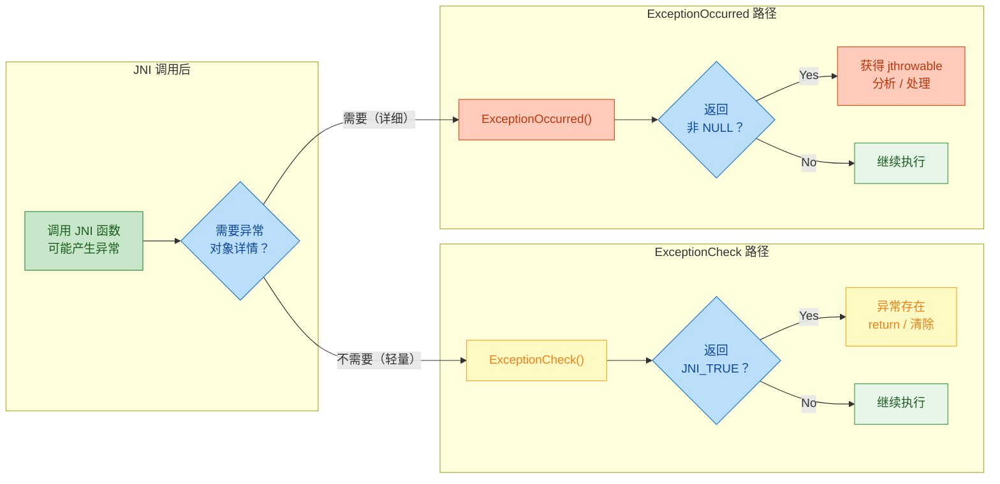

下面是两者的核心差异对照表：

| 对比维度 | `ExceptionCheck()` | `ExceptionOccurred()` |
|----------|--------------------|-----------------------|
| **返回值** | `jboolean` | `jthrowable` 或 `NULL` |
| **是否创建引用** | ❌ 不创建任何引用 | ✅ 创建 local reference |
| **性能开销** | 极小 | 略大（引用创建 + GC 跟踪） |
| **能否分析异常** | ❌ 只知道有没有 | ✅ 可以获取类型、消息等 |
| **引用泄漏风险** | 无 | 需要手动管理或依赖自动释放 |
| **JNI 版本** | JNI 1.2+ 引入 | JNI 1.1 即存在 |
| **推荐场景** | 快速判断 + 提前返回 | 需要区分异常类型做不同处理 |

> 📌 **实践建议**：在 90% 的场景下，`ExceptionCheck()` 就够用了。只有当你确实需要拿到异常对象（比如做日志记录、类型分支判断）时，才使用 `ExceptionOccurred()`。

---

### 哪些 JNI 函数需要检查异常？

并非所有 JNI 函数都可能产生异常。JNI 规范明确区分了 **可能抛出异常** 和 **不会抛出异常** 的函数。以下是常见的分类：

#### 🔴 必须检查异常的 JNI 调用

```cpp
// 1. 所有 Call*Method 系列 —— 调用的 Java 方法可能抛出任何异常
env->CallVoidMethod(obj, mid);           // ← 必须检查
env->CallIntMethod(obj, mid);            // ← 必须检查
env->CallObjectMethod(obj, mid);         // ← 必须检查
env->CallStaticVoidMethod(cls, mid);     // ← 必须检查

// 2. 类/方法/字段查找 —— 找不到时会抛出 NoSuchMethodError 等
env->FindClass("com/example/Foo");       // ← 必须检查
env->GetMethodID(cls, "bar", "()V");     // ← 必须检查
env->GetFieldID(cls, "count", "I");      // ← 必须检查

// 3. 对象创建 —— 构造函数可能抛出异常，或内存不足
env->NewObject(cls, ctor);              // ← 必须检查
env->NewStringUTF("hello");             // ← 必须检查（OutOfMemoryError）

// 4. 数组访问 —— 可能越界
env->GetIntArrayRegion(arr, 0, len, buf); // ← 必须检查

// 5. Monitor 操作 —— 可能失败
env->MonitorEnter(obj);                  // ← 必须检查
env->MonitorExit(obj);                   // ← 必须检查
```

#### 🟢 无需检查异常的 JNI 调用

```cpp
// 1. 引用管理函数
env->NewLocalRef(obj);          // ✅ 安全，无需检查
env->DeleteLocalRef(obj);       // ✅ 安全
env->NewGlobalRef(obj);         // ✅ 返回 NULL 表示失败，但不抛异常
env->DeleteGlobalRef(gref);     // ✅ 安全

// 2. 异常处理函数自身
env->ExceptionCheck();          // ✅ 安全
env->ExceptionOccurred();       // ✅ 安全
env->ExceptionClear();          // ✅ 安全
env->ExceptionDescribe();       // ✅ 安全

// 3. 基本类型的直接访问
env->GetArrayLength(arr);       // ✅ 安全
env->GetStringUTFLength(str);   // ✅ 安全

// 4. 版本查询
env->GetVersion();              // ✅ 安全
```

---

### 实战模式：异常检查的宏封装

在实际项目中，每次 JNI 调用后都写 `if (env->ExceptionCheck())` 会让代码非常冗长。一种常见的工程实践是封装宏或辅助函数：

```cpp
// ===== jni_utils.h =====

// 宏定义：检查异常并在发现异常时跳转到 error 标签
// 适用于需要统一资源清理的函数
#define JNI_CHECK_EXCEPTION_GOTO(env, label) \
    do { \
        if ((env)->ExceptionCheck()) { \
            goto label; \
        } \
    } while(0)

// 宏定义：检查异常并直接返回指定值
// 适用于简单的提前返回场景
#define JNI_CHECK_EXCEPTION_RETURN(env, retval) \
    do { \
        if ((env)->ExceptionCheck()) { \
            return (retval); \
        } \
    } while(0)

// 宏定义：检查异常并返回 void
#define JNI_CHECK_EXCEPTION_RETURN_VOID(env) \
    do { \
        if ((env)->ExceptionCheck()) { \
            return; \
        } \
    } while(0)
```

使用宏封装后的代码会简洁很多：

```cpp
extern "C" JNIEXPORT jstring JNICALL
Java_com_example_NativeLib_getUserInfo(JNIEnv *env, jobject thiz, jint userId) {

    // 查找 UserService 类
    jclass cls = env->FindClass("com/example/UserService");
    JNI_CHECK_EXCEPTION_RETURN(env, NULL);  // 异常时返回 NULL

    // 获取静态方法 getUserName 的 ID
    jmethodID mid = env->GetStaticMethodID(cls, "getUserName",
                                            "(I)Ljava/lang/String;");
    JNI_CHECK_EXCEPTION_RETURN(env, NULL);  // 异常时返回 NULL

    // 调用 Java 静态方法
    jstring name = (jstring) env->CallStaticObjectMethod(cls, mid, userId);
    JNI_CHECK_EXCEPTION_RETURN(env, NULL);  // 异常时返回 NULL

    // 一切正常，返回结果
    return name;
}
```

对于需要 **资源清理** 的复杂场景，`goto` 模式更为合适：

```cpp
extern "C" JNIEXPORT void JNICALL
Java_com_example_NativeLib_processFile(JNIEnv *env, jobject thiz, jstring path) {

    // 声明所有需要清理的资源
    const char *nativePath = NULL;    // 需要 ReleaseStringUTFChars
    jclass cls = NULL;                // local reference
    FILE *file = NULL;                // 需要 fclose

    // 将 Java 字符串转换为 C 字符串
    nativePath = env->GetStringUTFChars(path, NULL);
    if (nativePath == NULL) {
        // GetStringUTFChars 返回 NULL 说明内存分配失败（有 pending OOM）
        goto cleanup;
    }

    // 打开本地文件
    file = fopen(nativePath, "r");
    if (file == NULL) {
        // 文件打开失败，抛出 Java 异常（ThrowNew 将在后续章节讲解）
        jclass ioExCls = env->FindClass("java/io/IOException");
        env->ThrowNew(ioExCls, "Failed to open file");
        goto cleanup;
    }

    // 查找处理类
    cls = env->FindClass("com/example/FileProcessor");
    JNI_CHECK_EXCEPTION_GOTO(env, cleanup);  // 异常时跳转清理

    // ... 更多业务逻辑 ...

cleanup:
    // ✅ 统一资源清理，无论是否发生异常都会执行
    if (nativePath != NULL) {
        env->ReleaseStringUTFChars(path, nativePath);  // 释放字符串
    }
    if (file != NULL) {
        fclose(file);  // 关闭文件句柄
    }
    // local reference (cls) 会在函数返回时自动释放
}
```

这种 `goto cleanup` 模式在 C 语言中非常经典，类似于 Java 的 `try-finally`，能确保资源在任何执行路径下都被正确释放。

---

### 在 Pending Exception 状态下的安全函数

前面提到，在有 pending exception 时调用大多数 JNI 函数的行为是未定义的。但 JNI 规范明确指出，以下函数在 pending exception 状态下 **依然安全**：

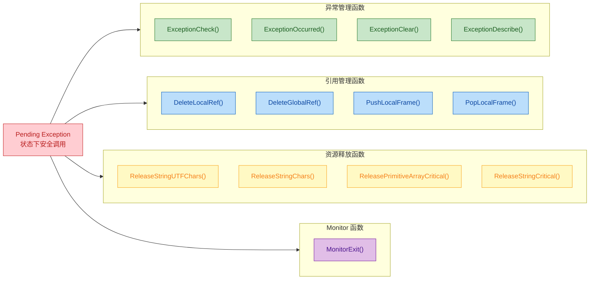

这些函数有一个共同特点：它们要么是 **异常处理自身的操作**，要么是 **资源清理操作**。这是 JNI 设计的合理之处 —— 即使发生了异常，你也需要能够清理已分配的资源，否则就会产生内存泄漏或死锁。

---

### 常见错误与陷阱

#### 陷阱一：忘记检查异常后继续调用 JNI

```cpp
// ❌ 错误：FindClass 可能失败，cls 为 NULL 且有 pending exception
jclass cls = env->FindClass("com/nonexistent/Class");
// 直接用 cls 调用 GetMethodID，此时 cls 是 NULL，行为未定义
jmethodID mid = env->GetMethodID(cls, "foo", "()V");  // 💥 crash!
```

#### 陷阱二：ExceptionOccurred 返回的引用未释放

```cpp
// ⚠️ 在循环中反复调用 ExceptionOccurred 却不释放引用
for (int i = 0; i < 1000; i++) {
    env->CallVoidMethod(obj, mid, i);

    // 每次调用都创建一个 local reference
    jthrowable ex = env->ExceptionOccurred();  // 可能创建 local ref
    if (ex != NULL) {
        env->ExceptionClear();
        env->DeleteLocalRef(ex);  // ✅ 必须释放！否则 local ref table 溢出
        continue;
    }
    // 即使 ex == NULL，ExceptionOccurred 在无异常时不创建引用，这是安全的
}
```

#### 陷阱三：混淆 ExceptionCheck 和 ExceptionOccurred 的返回值语义

```cpp
// ❌ 错误：把 ExceptionCheck 的返回值当对象用
jthrowable ex = (jthrowable) env->ExceptionCheck();  // 编译可能通过但逻辑完全错误！

// ❌ 错误：把 ExceptionOccurred 的返回值当布尔值直接比较
if (env->ExceptionOccurred() == JNI_TRUE) {  // 类型不匹配！
    // ...
}

// ✅ 正确用法
if (env->ExceptionCheck()) { /* ... */ }            // 布尔判断
jthrowable ex = env->ExceptionOccurred();            // 对象判断
if (ex != NULL) { /* ... */ }
```

---

### 本节小结

异常检查是 JNI 异常处理链条中的 **感知环节**。它不处理异常、不清除异常、不抛出异常，只负责回答一个关键问题：**"现在有异常吗？"** 你可以将其类比为医院的 **检测仪器** —— 先确诊，再治疗。

记住核心选择逻辑：
- **快速判断、无需详情** → `ExceptionCheck()`（首选）
- **需要异常对象、做类型分支** → `ExceptionOccurred()`

下一节我们将学习"确诊"之后的"治疗"手段 —— `ExceptionClear()`。

---

**📝 练习题**

在 JNI Native 函数中执行以下代码片段，假设 `CallVoidMethod` 调用的 Java 方法内部抛出了一个 `NullPointerException`，请问最终会发生什么？

```cpp
env->CallVoidMethod(obj, mid);
jclass cls = env->FindClass("java/lang/String");
jmethodID toStringMid = env->GetMethodID(cls, "toString", "()Ljava/lang/String;");
```

A. 代码正常执行完毕，`cls` 和 `toStringMid` 都能正确获取


B. `FindClass` 会自动清除之前的异常，然后正常找到 `String` 类


C. 行为未定义（Undefined Behavior），`FindClass` 和 `GetMethodID` 在有 pending exception 时不应被调用，可能导致崩溃或返回错误结果


D. JVM 会自动在 `CallVoidMethod` 之后中断 Native 函数执行，后续代码不会运行


**【答案】** C

**【解析】** 当 `CallVoidMethod` 调用的 Java 方法抛出 `NullPointerException` 后，JNI 环境进入 pending exception 状态。根据 JNI 规范，在此状态下只有少数函数（如 `ExceptionCheck`、`ExceptionClear`、`DeleteLocalRef`、`Release*` 系列等）可以安全调用。`FindClass` 和 `GetMethodID` **不在安全列表中**，在有 pending exception 时调用它们属于未定义行为。选项 A 错误，因为 pending exception 会影响后续 JNI 调用；选项 B 错误，因为 `FindClass` 没有自动清除异常的能力；选项 D 错误，因为 JNI 中 Java 异常 **不会** 自动中断 C/C++ 的控制流——这正是 JNI 异常处理的核心难点。正确做法是在 `CallVoidMethod` 之后立即调用 `ExceptionCheck()` 或 `ExceptionOccurred()` 进行检查。

---

## 异常清除（ExceptionClear）

在上一节中，我们学会了如何通过 `ExceptionCheck` 和 `ExceptionOccurred` **检测**异常的存在。然而，仅仅知道"有异常"是远远不够的——在 Native 层，异常不会像 Java 层那样自动展开调用栈（stack unwinding）。一旦检测到异常，**如果你希望在 Native 层就地处理而非回传给 Java**，就必须显式地调用 `ExceptionClear` 来清除这个 pending exception。否则，后续几乎所有的 JNI 调用都将失败或产生未定义行为。

### ExceptionClear 的函数签名与语义

`ExceptionClear` 的 JNI 签名非常简洁：

```c
// JNI 函数签名
// 功能：清除当前线程上的 pending exception
// 调用后，线程恢复到"无异常"状态，后续 JNI 调用可正常执行
void ExceptionClear(JNIEnv *env);
```

它的语义可以类比为 Java 层的 `try-catch` 中 **catch 块捕获异常后的效果**——异常被"吞掉"了，程序可以继续正常执行。但要特别注意：**ExceptionClear 不等于"异常不存在了"，而是"你已经接管了异常的处理责任"**。如果你清除了异常却不做任何补救措施（如日志记录、返回错误码、抛出新异常），就等同于在 Java 中写了一个空的 `catch {}` 块——这是非常危险的。

### 为什么必须清除异常？——JNI 的 Pending Exception 机制

这是理解 `ExceptionClear` 存在意义的关键。我们用一张流程图来阐明 Native 层异常的生命周期：

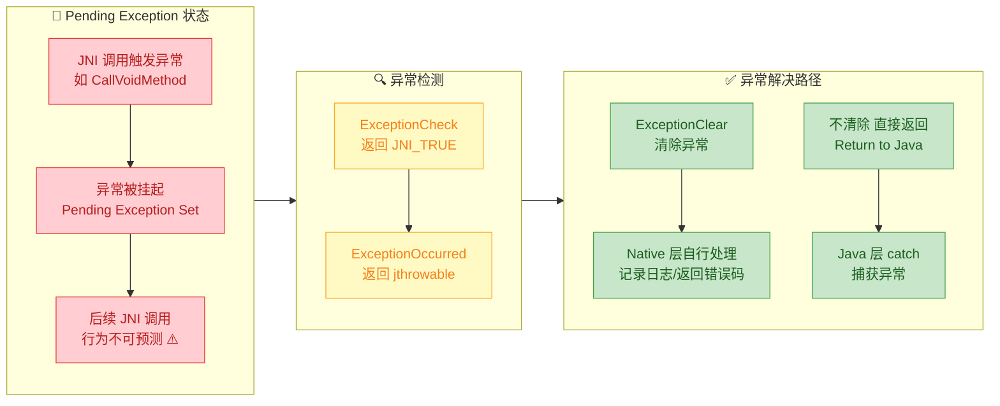

核心要点在于：**当一个 pending exception 存在时，JNI 规范只允许调用极少数"异常安全"的函数**。具体来说，在异常挂起期间，以下函数仍然合法：

```c
// ✅ 异常挂起期间允许调用的 JNI 函数（安全列表）
ExceptionCheck()          // 检查异常是否存在
ExceptionOccurred()       // 获取异常对象引用
ExceptionDescribe()       // 将异常堆栈打印到 stderr
ExceptionClear()          // 清除异常
DeleteLocalRef()          // 释放本地引用
DeleteGlobalRef()         // 释放全局引用
MonitorExit()             // 释放监视器锁（如果之前进入了的话）
ReleaseStringChars()      // 释放字符串资源
ReleaseStringUTFChars()   // 释放 UTF 字符串资源
ReleasePrimitiveArrayCritical() // 释放数组关键区资源
ReleaseStringCritical()   // 释放字符串关键区资源
```

如果你在 pending exception 状态下调用了**不在上述列表中的 JNI 函数**（例如 `FindClass`、`GetMethodID`、`NewObject` 等），其行为是 **undefined behavior**。在某些 JVM 实现上可能直接崩溃，在另一些上可能返回 NULL 但掩盖了真正的错误根源。

### ExceptionClear 的典型使用模式

#### 模式一：检测 → 清除 → 本地处理

这是最常见的用法。Native 层决定自己处理这个异常，不让它传播回 Java。

```c
// native 方法：安全地读取 Java 对象的某个字段值
jint safeGetFieldValue(JNIEnv *env, jobject obj) {

    // 获取类引用
    jclass cls = (*env)->GetObjectClass(env, obj);

    // 获取方法 ID：getValue()
    jmethodID mid = (*env)->GetMethodID(env, cls, "getValue", "()I");

    // 调用 Java 方法——这里可能抛出异常
    // 例如 getValue() 内部可能抛出 IllegalStateException
    jint result = (*env)->CallIntMethod(env, obj, mid);

    // 🔍 关键步骤：检查是否有 pending exception
    if ((*env)->ExceptionCheck(env)) {

        // 📝 可选：打印异常信息到 stderr，方便调试
        (*env)->ExceptionDescribe(env);

        // ✅ 清除异常——从此刻起，JNI 调用恢复正常
        (*env)->ExceptionClear(env);

        // 🔧 本地处理：返回一个默认的错误值
        // 调用者通过返回值判断是否出错
        return -1;
    }

    // 正常路径：返回实际值
    return result;
}
```

这段代码等价于 Java 中的：

```java
// 等价的 Java 代码
int safeGetFieldValue(MyObject obj) {
    try {
        return obj.getValue();          // 可能抛异常
    } catch (Exception e) {
        e.printStackTrace();            // ExceptionDescribe
        return -1;                      // 返回默认错误值
    }
}
```

#### 模式二：清除旧异常 → 抛出新异常（异常转换）

有时我们需要将 Java 层抛出的一种异常"翻译"为另一种更具语义的异常。这在封装底层库时非常常见：

```c
// native 方法：将底层异常转换为自定义异常
void processData(JNIEnv *env, jobject obj, jbyteArray data) {

    // 获取类和方法
    jclass cls = (*env)->GetObjectClass(env, obj);
    jmethodID mid = (*env)->GetMethodID(env, cls, "parseInternal", "([B)V");

    // 调用 Java 的 parseInternal 方法
    (*env)->CallVoidMethod(env, obj, mid, data);

    // 检查是否发生了异常
    if ((*env)->ExceptionCheck(env)) {

        // 获取异常对象（用于提取信息）
        jthrowable originalException = (*env)->ExceptionOccurred(env);

        // ⚠️ 必须先清除异常！否则无法调用后续 JNI 函数
        (*env)->ExceptionClear(env);

        // --- 此时线程已无 pending exception，可自由调用 JNI ---

        // 从原始异常中提取 message
        jclass throwableCls = (*env)->FindClass(env, "java/lang/Throwable");
        jmethodID getMsgMid = (*env)->GetMethodID(
            env, throwableCls, "getMessage", "()Ljava/lang/String;");
        jstring msgObj = (jstring)(*env)->CallObjectMethod(
            env, originalException, getMsgMid);

        // 将 jstring 转为 C 字符串
        const char *msgChars = (*env)->GetStringUTFChars(env, msgObj, NULL);

        // 构造新的错误信息
        char buffer[256];
        snprintf(buffer, sizeof(buffer),
                 "Data processing failed: %s", msgChars); // 拼接错误信息

        // 释放字符串资源
        (*env)->ReleaseStringUTFChars(env, msgObj, msgChars);

        // 抛出一个新的自定义异常（异常转换完成）
        jclass customExCls = (*env)->FindClass(
            env, "com/example/DataProcessingException");
        (*env)->ThrowNew(env, customExCls, buffer);

        // 释放本地引用
        (*env)->DeleteLocalRef(env, originalException);
        (*env)->DeleteLocalRef(env, msgObj);
        (*env)->DeleteLocalRef(env, throwableCls);
        (*env)->DeleteLocalRef(env, customExCls);

        // 函数返回后，Java 层将收到 DataProcessingException
        return;
    }

    // 正常逻辑继续...
}
```

这个模式中，**ExceptionClear 的调用位置至关重要**。下面的时序图清晰地展示了整个"异常转换"过程中各步骤的先后依赖：

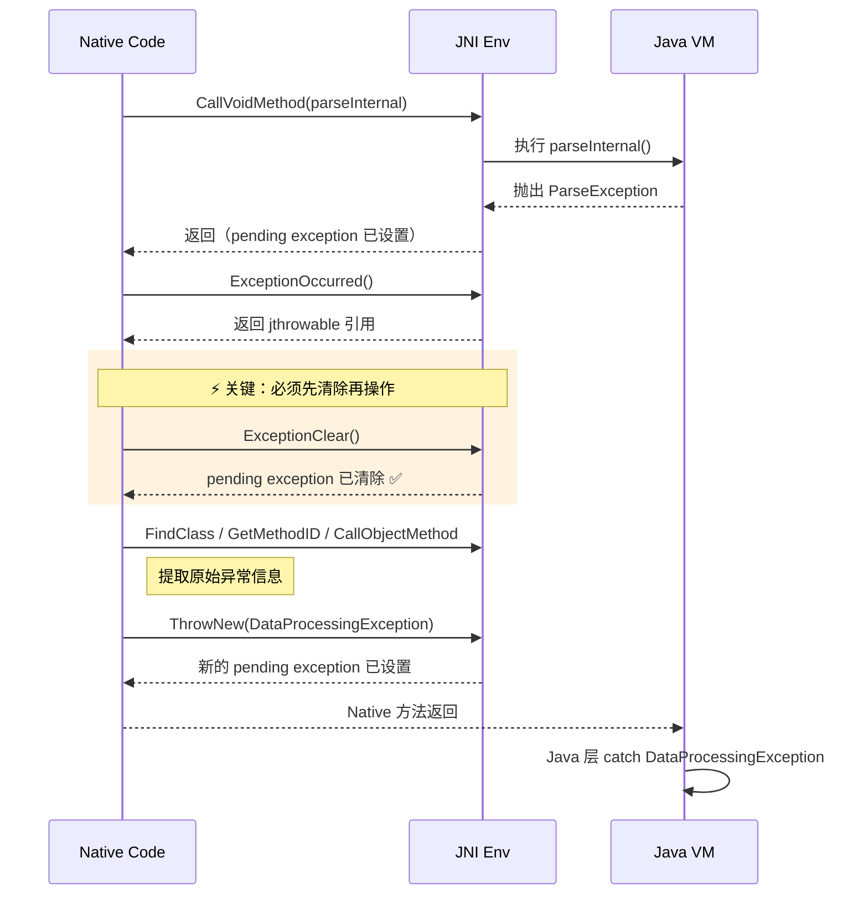

### 常见错误与陷阱

#### 陷阱一：清除异常后继续调用 JNI 却不检查返回值

```c
// ❌ 错误示范：清除了异常，却假设后续操作一定成功
void riskyFunction(JNIEnv *env, jobject obj) {

    (*env)->CallVoidMethod(env, obj, someMethod);

    if ((*env)->ExceptionCheck(env)) {
        (*env)->ExceptionClear(env);  // 清除了第一个异常
    }

    // 危险！FindClass 自身也可能失败（如类不存在）
    // 必须对每一步都做异常/NULL 检查
    jclass cls = (*env)->FindClass(env, "com/nonexistent/MyClass");
    // cls 可能为 NULL，且可能又产生了新的 pending exception

    jmethodID mid = (*env)->GetMethodID(env, cls, "foo", "()V");
    // 如果 cls == NULL，这里将直接崩溃（JVM crash）！
}
```

```c
// ✅ 正确示范：每一步都做防御性检查
void safeFunction(JNIEnv *env, jobject obj) {

    (*env)->CallVoidMethod(env, obj, someMethod);

    // 第一次检查
    if ((*env)->ExceptionCheck(env)) {
        (*env)->ExceptionClear(env);
        // 记录日志或做相应处理
    }

    // FindClass 后立刻检查
    jclass cls = (*env)->FindClass(env, "com/example/MyClass");
    if (cls == NULL) {
        // FindClass 失败时会自动设置 pending exception
        // 可以选择清除并处理，或直接返回让 Java 层捕获
        return;
    }

    // GetMethodID 后也要检查
    jmethodID mid = (*env)->GetMethodID(env, cls, "foo", "()V");
    if (mid == NULL) {
        return; // NoSuchMethodError 已被挂起
    }

    // 一切就绪，安全调用
    (*env)->CallVoidMethod(env, obj, mid);
}
```

#### 陷阱二：忘记清除异常就尝试抛出新异常

```c
// ❌ 错误：pending exception 存在时直接 ThrowNew
void badExceptionSwap(JNIEnv *env, jobject obj) {

    (*env)->CallVoidMethod(env, obj, riskyMethod);

    if ((*env)->ExceptionCheck(env)) {
        // 没有调用 ExceptionClear！
        // 此时 pending exception 仍然存在

        jclass exCls = (*env)->FindClass(env, "java/lang/RuntimeException");
        // ⚠️ FindClass 在 pending exception 下行为未定义

        (*env)->ThrowNew(env, exCls, "new error");
        // ⚠️ ThrowNew 在已有 pending exception 时的行为也未定义
        // 不同 JVM 表现不同：可能覆盖、可能忽略、可能崩溃
    }
}
```

### ExceptionClear 与 ExceptionDescribe 的配合

`ExceptionDescribe` 会将异常的完整堆栈信息打印到 `stderr`。它常作为 `ExceptionClear` 的"前奏"出现。但要注意一个重要细节：

```c
// ExceptionDescribe 的隐含行为（不同 JVM 实现可能不同）
void debugAndClear(JNIEnv *env) {

    if ((*env)->ExceptionCheck(env)) {

        // 打印异常堆栈到 stderr
        // ⚠️ 注意：某些 JVM 实现中，ExceptionDescribe 会自动清除异常
        // 但 JNI 规范并未保证这一点！
        (*env)->ExceptionDescribe(env);

        // ✅ 最佳实践：总是显式调用 ExceptionClear
        // 即使 ExceptionDescribe 可能已经清除了，再调用一次也是安全的
        // （对已经无异常的线程调用 ExceptionClear 不会产生副作用）
        (*env)->ExceptionClear(env);
    }
}
```

### ExceptionClear 内部原理简析

从 JVM 的视角来看，每个线程（`JNIEnv` 关联的线程）都维护着一个 pending exception 槽位。整个机制可以用如下的内存模型来理解：

```cpp
// ====== JVM 内部线程结构（简化概念模型）======
//
// ┌─────────────────────────────────────────┐
// │           JavaThread (线程对象)           │
// ├─────────────────────────────────────────┤
// │  JNIEnv* env          →  JNI 函数表指针  │
// │  oop pending_exception → NULL (无异常)   │  ← ExceptionClear 将此置为 NULL
// │  oop pending_exception → ExceptionObj   │  ← 异常挂起时指向异常对象
// │  ...                                     │
// └─────────────────────────────────────────┘
//
// ExceptionClear 的伪代码实现：
// void JNIEnv::ExceptionClear() {
//     Thread* current = Thread::current();
//     current->set_pending_exception(NULL);  // 简单地将指针置空
// }
```

可以看到，`ExceptionClear` 的实现非常轻量——它仅仅是将线程内部的 `pending_exception` 指针重置为 `NULL`。异常对象本身并不会被立即回收（仍受 GC 管理），只是不再与当前线程关联。

### 完整的异常处理决策树

最后，用一张决策流程图总结何时应该使用 `ExceptionClear`：

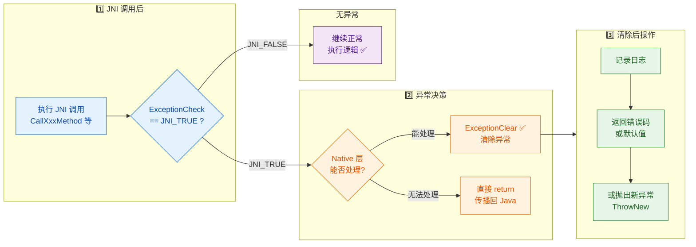

### 核心要点总结

| 方面 | 说明 |
|:---|:---|
| **函数签名** | `void ExceptionClear(JNIEnv *env)` |
| **作用** | 清除当前线程的 pending exception，恢复正常 JNI 调用能力 |
| **调用时机** | 检测到异常且决定在 Native 层处理时 |
| **幂等性** | 安全——无异常时调用不会产生副作用 |
| **常见搭配** | `ExceptionDescribe` → `ExceptionClear` → 处理逻辑 |
| **核心原则** | 清除 = 接管责任，必须有后续处理（日志/错误码/新异常） |
| **致命错误** | 不清除就调用非安全 JNI 函数 → undefined behavior |

---

**📝 练习题**

在 JNI Native 方法中，`CallVoidMethod` 触发了一个 Java 异常。以下代码片段中，哪一段的异常处理是正确且安全的？

A.
```c
(*env)->CallVoidMethod(env, obj, mid);
jclass cls = (*env)->FindClass(env, "java/lang/RuntimeException");
(*env)->ThrowNew(env, cls, "error");
```


B.
```c
(*env)->CallVoidMethod(env, obj, mid);
if ((*env)->ExceptionCheck(env)) {
    (*env)->ExceptionClear(env);
}
```


C.
```c
(*env)->CallVoidMethod(env, obj, mid);
if ((*env)->ExceptionCheck(env)) {
    (*env)->ExceptionDescribe(env);
    (*env)->ExceptionClear(env);
    jclass cls = (*env)->FindClass(env, "com/example/MyException");
    if (cls != NULL) {
        (*env)->ThrowNew(env, cls, "Wrapped error");
    }
    return;
}
```


D.
```c
(*env)->CallVoidMethod(env, obj, mid);
(*env)->ExceptionClear(env);
(*env)->ExceptionDescribe(env);
```


**【答案】** C

**【解析】** 选项 A 在 pending exception 存在时直接调用 `FindClass` 和 `ThrowNew`，属于 undefined behavior。选项 B 虽然正确地检测并清除了异常，但清除后没有做任何处理（空 catch），异常被静默吞掉，不符合最佳实践。选项 C 是完整且规范的处理流程：先检测 → 打印调试信息 → 清除异常 → 检查后续 JNI 调用返回值 → 抛出语义更明确的新异常 → return。选项 D 的调用顺序错误：先无条件 `ExceptionClear` 清除了异常，再调用 `ExceptionDescribe` 时已经没有异常可以打印了，而且同样缺乏实质性处理。

---

## 抛出异常 ⭐（ThrowNew）

在前面的章节中，我们学习了如何在 Native 层**检测**和**清除** Java 异常。但在实际开发中，Native 代码本身也会遇到各种错误情况——文件打开失败、内存分配失败、参数非法等等。这些错误需要以 **Java 异常** 的形式通知上层调用者，让 Java 层能够用熟悉的 `try-catch` 机制来处理。JNI 提供了 `ThrowNew` 和 `Throw` 两个核心函数来实现这一能力，它们是 Native 代码向 Java 世界"投掷炸弹"的标准武器。

### ThrowNew 函数详解

`ThrowNew` 是 JNI 中**最常用**的抛出异常函数。它的设计哲学非常简洁——你只需要告诉它"抛什么类型的异常"以及"附带什么错误消息"，JNI 会自动帮你完成异常对象的创建和抛出。

其函数签名如下：

```c
/*
 * 参数说明：
 *   env    - JNI 环境指针，所有 JNI 调用的入口
 *   clazz  - 要抛出的异常类的 jclass 引用（必须是 Throwable 的子类）
 *   message - 异常携带的描述信息（UTF-8 编码的 C 字符串）
 *
 * 返回值：
 *   0      - 成功（异常已被挂起到当前线程）
 *   负数    - 失败（通常因为找不到对应的构造函数）
 */
jint ThrowNew(JNIEnv *env, jclass clazz, const char *message);
```

这里有一个非常关键的概念需要理解：**`ThrowNew` 调用成功后，Native 函数并不会立即中断执行**。这与 Java 中 `throw new Exception()` 的行为截然不同。在 Java 中，`throw` 语句会立即改变控制流，跳转到最近的 `catch` 块；但在 C/C++ Native 代码中，`ThrowNew` 仅仅是在 JVM 内部的当前线程上"挂起"（pending）了一个异常标记，C 代码本身会继续往下执行。**异常真正被抛出（thrown）是在 Native 函数返回到 Java 层的那一刻**。

```mermaid
graph LR
    subgraph Native["🔧 Native 层执行流"]
        direction TB
        A["调用 ThrowNew()"]:::orange
        B["异常被标记为 Pending"]:::orange
        C["C 代码继续执行 ⚠️"]:::red
        D["Native 函数 return"]:::orange
        A --> B --> C --> D
    end

    subgraph JVM["☕ JVM 异常传播"]
        direction TB
        E["检测到 Pending 异常"]:::blue
        F["构造异常栈帧"]:::blue
        G["抛出到 Java 调用者"]:::blue
        H["进入 catch 块处理"]:::green
        E --> F --> G --> H
    end

    D --> E

    classDef green fill:#C8E6C9,stroke:#388E3C,color:#1B5E20
    classDef blue fill:#BBDEFB,stroke:#1976D2,color:#0D47A1
    classDef orange fill:#FFE0B2,stroke:#F57C00,color:#E65100
    classDef red fill:#FFCDD2,stroke:#D32F2F,color:#B71C1C
```

这张流程图清晰地展示了：`ThrowNew` 之后 C 代码仍然会继续执行（红色警告块），异常的真正传播发生在 Native 函数返回之后。

### ThrowNew 基础用法

下面通过一个完整示例来演示最基本的用法——参数校验失败时抛出 `IllegalArgumentException`：

**Java 层定义：**

```java
public class FileProcessor {

    // 加载本地库
    static {
        System.loadLibrary("fileprocessor"); // 加载 libfileprocessor.so
    }

    // native 方法：处理指定路径的文件
    public native void processFile(String filePath);

    public static void main(String[] args) {
        FileProcessor processor = new FileProcessor(); // 创建实例
        try {
            processor.processFile(null); // 故意传 null 触发异常
        } catch (IllegalArgumentException e) {
            // 捕获从 Native 层抛出的异常
            System.out.println("捕获异常: " + e.getMessage());
        }
    }
}
```

**Native 层实现：**

```c
#include <jni.h>        // JNI 核心头文件
#include <stdio.h>      // 标准 I/O
#include <string.h>     // 字符串操作

/**
 * 对应 Java 方法: FileProcessor.processFile(String)
 * 参数:
 *   env      - JNI 环境指针
 *   thiz     - 调用该方法的 Java 对象 (this)
 *   filePath - Java 传入的文件路径字符串
 */
JNIEXPORT void JNICALL
Java_FileProcessor_processFile(JNIEnv *env, jobject thiz, jstring filePath) {

    // ========== 第一步：参数校验 ==========

    // 检查 filePath 是否为 null
    if (filePath == NULL) {
        // 查找 IllegalArgumentException 类
        jclass exClass = (*env)->FindClass(env, "java/lang/IllegalArgumentException");
        // FindClass 可能失败（类不存在），但标准异常类一定存在，此处简化处理
        if (exClass != NULL) {
            // 抛出异常，附带错误消息
            (*env)->ThrowNew(env, exClass, "filePath must not be null");
            // 释放局部引用（良好习惯，虽然函数即将返回）
            (*env)->DeleteLocalRef(env, exClass);
        }
        // ⚠️ 关键：必须显式 return！ThrowNew 不会中断 C 代码执行
        return;
    }

    // ========== 第二步：获取 C 字符串 ==========

    // 将 Java String 转换为 C 风格的 UTF-8 字符串
    const char *path = (*env)->GetStringUTFChars(env, filePath, NULL);
    // 检查转换是否成功（内存不足时可能返回 NULL）
    if (path == NULL) {
        // GetStringUTFChars 失败时 JVM 已自动抛出 OutOfMemoryError
        // 无需手动抛出，直接返回即可
        return;
    }

    // ========== 第三步：业务逻辑 ==========

    printf("Processing file: %s\n", path); // 模拟文件处理

    // ========== 第四步：释放资源 ==========

    // 释放 GetStringUTFChars 分配的内存，防止内存泄漏
    (*env)->ReleaseStringUTFChars(env, filePath, path);
}
```

运行结果：

```
捕获异常: filePath must not be null
```

上面这段代码展示了一个至关重要的模式：**`ThrowNew` 之后必须紧跟 `return`**。如果你忘了 `return`，C 代码会继续执行后续逻辑，很可能对 `NULL` 的 `filePath` 进行操作，导致段错误（Segmentation Fault），直接崩溃。

### Throw 函数——抛出已有的异常对象

除了 `ThrowNew`，JNI 还提供了 `Throw` 函数，用于抛出一个**已经构造好**的异常对象：

```c
/*
 * 参数说明：
 *   env - JNI 环境指针
 *   obj - 一个已存在的 Throwable 对象引用
 *
 * 返回值：
 *   0    - 成功
 *   负数  - 失败
 */
jint Throw(JNIEnv *env, jthrowable obj);
```

`Throw` 适用于以下场景：
- 需要抛出一个**自定义构造函数**的异常（比如异常类没有 `String` 参数的构造器）
- 需要**重新抛出**（re-throw）一个之前捕获到的异常
- 需要抛出一个**链式异常**（chained exception，即携带 cause 的异常）

下面演示如何用 `Throw` 抛出一个带 cause 的自定义异常：

```c
/**
 * 辅助函数：抛出带 cause 的异常
 * 参数:
 *   env       - JNI 环境指针
 *   className - 异常类的全限定名（用 '/' 分隔）
 *   message   - 错误描述
 *   cause     - 原始异常（可为 NULL）
 */
void throwChainedException(JNIEnv *env,
                           const char *className,
                           const char *message,
                           jthrowable cause) {

    // 查找目标异常类
    jclass exClass = (*env)->FindClass(env, className);
    if (exClass == NULL) {
        return; // FindClass 失败，JVM 已挂起 NoClassDefFoundError
    }

    // 查找构造函数: ExceptionClass(String message, Throwable cause)
    // 签名 "(Ljava/lang/String;Ljava/lang/Throwable;)V" 对应两个参数的构造器
    jmethodID constructor = (*env)->GetMethodID(
        env,
        exClass,
        "<init>",                                          // 构造函数在 JNI 中的名称
        "(Ljava/lang/String;Ljava/lang/Throwable;)V"      // 方法签名
    );
    if (constructor == NULL) {
        (*env)->DeleteLocalRef(env, exClass);  // 清理局部引用
        return; // GetMethodID 失败，JVM 已挂起 NoSuchMethodError
    }

    // 创建 Java 字符串作为 message 参数
    jstring jMessage = (*env)->NewStringUTF(env, message);
    if (jMessage == NULL) {
        (*env)->DeleteLocalRef(env, exClass);  // 清理局部引用
        return; // 内存不足，JVM 已挂起 OutOfMemoryError
    }

    // 调用构造函数创建异常对象实例
    jthrowable exObj = (jthrowable)(*env)->NewObject(
        env,
        exClass,
        constructor,
        jMessage,   // 第一个参数: String message
        cause       // 第二个参数: Throwable cause
    );

    if (exObj != NULL) {
        // 使用 Throw 抛出已构造好的异常对象
        (*env)->Throw(env, exObj);
        (*env)->DeleteLocalRef(env, exObj);    // 清理局部引用
    }

    // 清理所有局部引用
    (*env)->DeleteLocalRef(env, jMessage);
    (*env)->DeleteLocalRef(env, exClass);
}
```

### ThrowNew vs Throw 对比

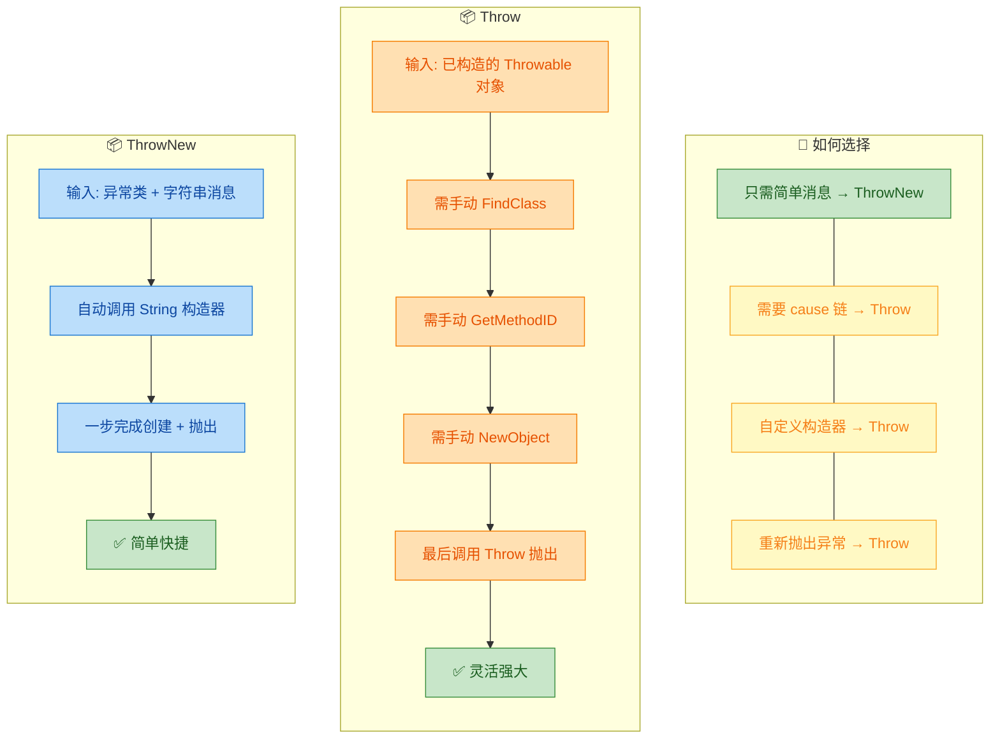

简单总结：**90% 的场景用 `ThrowNew` 就够了**，它是你的首选。只有在需要精细控制异常对象（链式异常、自定义构造器）时，才需要使用 `Throw`。

### 封装通用异常抛出工具函数

在实际项目中，每次都手写 `FindClass` + `ThrowNew` 的样板代码既繁琐又容易出错。工业级 JNI 代码通常会封装一组 **helper 函数**，极大简化调用端代码：

```c
#include <jni.h>   // JNI 核心头文件

// ===================== 异常抛出工具函数集 =====================

/**
 * 通用异常抛出函数
 * 参数:
 *   env       - JNI 环境指针
 *   className - 异常类全限定名 (使用 '/' 而非 '.')
 *   message   - 错误描述信息
 * 返回值:
 *   0 表示成功，-1 表示失败
 */
static int throwException(JNIEnv *env, const char *className, const char *message) {
    // 查找异常类
    jclass exClass = (*env)->FindClass(env, className);
    if (exClass == NULL) {
        // 如果连异常类都找不到，说明情况很严重
        // FindClass 失败会自动挂起 NoClassDefFoundError
        return -1;
    }
    // 调用 ThrowNew 抛出异常
    int result = (*env)->ThrowNew(env, exClass, message);
    // 删除局部引用，避免引用表溢出
    (*env)->DeleteLocalRef(env, exClass);
    // 返回结果（0=成功）
    return result;
}

/**
 * 抛出 IllegalArgumentException
 * 最常用的参数校验异常
 */
static int throwIllegalArgumentException(JNIEnv *env, const char *message) {
    return throwException(env, "java/lang/IllegalArgumentException", message);
}

/**
 * 抛出 IllegalStateException
 * 用于对象状态不正确的场景（如资源已关闭后再次操作）
 */
static int throwIllegalStateException(JNIEnv *env, const char *message) {
    return throwException(env, "java/lang/IllegalStateException", message);
}

/**
 * 抛出 IOException
 * 用于文件/网络等 I/O 操作失败
 */
static int throwIOException(JNIEnv *env, const char *message) {
    return throwException(env, "java/io/IOException", message);
}

/**
 * 抛出 RuntimeException
 * 用于不可恢复的运行时错误
 */
static int throwRuntimeException(JNIEnv *env, const char *message) {
    return throwException(env, "java/lang/RuntimeException", message);
}

/**
 * 抛出 NullPointerException
 * 用于必要参数为 null 的场景
 */
static int throwNullPointerException(JNIEnv *env, const char *message) {
    return throwException(env, "java/lang/NullPointerException", message);
}

/**
 * 抛出 UnsupportedOperationException
 * 用于功能未实现或不支持的场景
 */
static int throwUnsupportedOperationException(JNIEnv *env, const char *message) {
    return throwException(env, "java/lang/UnsupportedOperationException", message);
}
```

有了这组工具函数，业务代码中的异常抛出变得极其简洁：

```c
JNIEXPORT jbyteArray JNICALL
Java_FileProcessor_readFile(JNIEnv *env, jobject thiz, jstring filePath) {

    // ===== 参数校验 =====
    if (filePath == NULL) {
        // 一行代码完成异常抛出，代码简洁清晰
        throwNullPointerException(env, "filePath must not be null");
        return NULL; // ⚠️ 别忘了 return！
    }

    // 获取 C 字符串
    const char *path = (*env)->GetStringUTFChars(env, filePath, NULL);
    if (path == NULL) {
        return NULL; // OOM 已由 JVM 自动处理
    }

    // ===== 打开文件 =====
    FILE *file = fopen(path, "rb"); // 以二进制只读模式打开
    if (file == NULL) {
        // 文件打开失败，抛出 IOException，并附带具体路径信息
        char errorMsg[512];                                    // 错误消息缓冲区
        snprintf(errorMsg, sizeof(errorMsg),                   // 安全格式化
                 "Cannot open file: %s", path);
        throwIOException(env, errorMsg);                       // 抛出 IOException
        (*env)->ReleaseStringUTFChars(env, filePath, path);    // 释放字符串资源
        return NULL;                                           // 必须 return
    }

    // ===== 读取文件大小 =====
    fseek(file, 0, SEEK_END);         // 移动到文件末尾
    long fileSize = ftell(file);       // 获取当前位置（即文件大小）
    fseek(file, 0, SEEK_SET);         // 重置到文件开头

    // 校验文件大小（例如限制 100MB）
    if (fileSize > 100 * 1024 * 1024) {
        throwIllegalArgumentException(env, "File size exceeds 100MB limit");
        fclose(file);                                          // 关闭文件
        (*env)->ReleaseStringUTFChars(env, filePath, path);    // 释放字符串
        return NULL;                                           // 必须 return
    }

    // ===== 分配 byte 数组并读取 =====
    jbyteArray result = (*env)->NewByteArray(env, (jsize)fileSize);
    if (result == NULL) {
        fclose(file);                                          // 关闭文件
        (*env)->ReleaseStringUTFChars(env, filePath, path);    // 释放字符串
        return NULL; // NewByteArray 失败 JVM 自动抛出 OOM
    }

    // 获取 byte 数组的原始指针
    jbyte *buffer = (*env)->GetByteArrayElements(env, result, NULL);
    if (buffer == NULL) {
        fclose(file);
        (*env)->ReleaseStringUTFChars(env, filePath, path);
        return NULL; // OOM
    }

    // 一次性读取整个文件内容到缓冲区
    size_t bytesRead = fread(buffer, 1, (size_t)fileSize, file);
    if (bytesRead != (size_t)fileSize) {
        throwIOException(env, "Failed to read complete file");
        // 即使要抛异常，也必须先释放所有已获取的资源！
        (*env)->ReleaseByteArrayElements(env, result, buffer, JNI_ABORT);
        fclose(file);
        (*env)->ReleaseStringUTFChars(env, filePath, path);
        return NULL;
    }

    // ===== 清理资源 =====
    (*env)->ReleaseByteArrayElements(env, result, buffer, 0);  // 提交修改并释放
    fclose(file);                                               // 关闭文件句柄
    (*env)->ReleaseStringUTFChars(env, filePath, path);         // 释放字符串内存

    return result; // 返回包含文件内容的 byte 数组
}
```

### ThrowNew 之后的执行陷阱

这是 JNI 异常处理中**最容易踩的坑**，值得用一个专门的小节来强调。我们通过一个**错误示范**和**正确示范**的对比来深入理解：

**❌ 错误示范——缺少 return 导致崩溃：**

```c
JNIEXPORT void JNICALL
Java_Demo_dangerousMethod(JNIEnv *env, jobject thiz, jstring input) {
    if (input == NULL) {
        // 抛出异常
        throwNullPointerException(env, "input is null");
        // ⚠️ 没有 return！C 代码继续往下执行！
    }

    // 💥 当 input == NULL 时，下面这行会导致段错误 (SIGSEGV)
    // 因为 GetStringUTFChars 不允许传入 NULL
    const char *str = (*env)->GetStringUTFChars(env, input, NULL);

    // ... 后续操作
    (*env)->ReleaseStringUTFChars(env, input, str);
}
```

这段代码的执行流程如下：

```text
 input == NULL
      │
      ▼
 ThrowNew() ──→ 异常已挂起（Pending），但 C 代码不知道也不关心
      │
      ▼
 GetStringUTFChars(NULL) ──→ 💥 SIGSEGV / JVM Crash
      │
      ✖  程序崩溃，Java 层的 try-catch 根本没机会执行
```

**✅ 正确示范——每个分支都有 return：**

```c
JNIEXPORT void JNICALL
Java_Demo_safeMethod(JNIEnv *env, jobject thiz, jstring input) {
    // 参数校验：null 检查
    if (input == NULL) {
        throwNullPointerException(env, "input is null");
        return;  // ✅ 立即返回，阻止后续代码执行
    }

    // 此处 input 一定非 NULL，可以安全使用
    const char *str = (*env)->GetStringUTFChars(env, input, NULL);
    if (str == NULL) {
        return;  // ✅ OOM 已自动挂起，直接返回
    }

    printf("Input: %s\n", str); // 安全地使用字符串

    // 释放资源
    (*env)->ReleaseStringUTFChars(env, input, str);
    // 函数正常结束，无异常挂起
}
```

我们可以总结出一条铁律：

> **📌 JNI 黄金法则：`ThrowNew` / `Throw` 之后，必须立即清理资源并 `return`。**

对于有返回值的函数，`return` 的值通常是：
- 对象类型 → `return NULL;`
- `jint` / `jlong` 等基本类型 → `return 0;` 或 `return -1;`
- `jboolean` → `return JNI_FALSE;`

返回值本身不重要，因为 Java 层会优先处理挂起的异常，返回值会被忽略。

### 抛出自定义异常

在实际项目中，你可能需要抛出自己定义的 Java 异常类。`ThrowNew` 同样适用，只需要确保该异常类有一个接受 `String` 参数的构造函数：

**Java 层自定义异常：**

```java
package com.example;

// 自定义业务异常
public class NativeProcessingException extends Exception {

    private int errorCode; // 错误码字段

    // ThrowNew 需要的构造函数（接受 String 参数）
    public NativeProcessingException(String message) {
        super(message);       // 调用父类构造器
        this.errorCode = -1;  // 默认错误码
    }

    // 带错误码的构造函数（ThrowNew 无法直接使用，需要用 Throw）
    public NativeProcessingException(String message, int errorCode) {
        super(message);              // 调用父类构造器
        this.errorCode = errorCode;  // 设置错误码
    }

    public int getErrorCode() {
        return errorCode; // 获取错误码
    }
}
```

**Native 层抛出自定义异常：**

```c
/**
 * 方式一：使用 ThrowNew（简单，但只能传 message）
 */
static void throwProcessingException(JNIEnv *env, const char *message) {
    // 注意：包名中的 '.' 要替换为 '/'
    jclass exClass = (*env)->FindClass(env, "com/example/NativeProcessingException");
    if (exClass != NULL) {
        (*env)->ThrowNew(env, exClass, message);       // 调用 String 构造器
        (*env)->DeleteLocalRef(env, exClass);           // 清理引用
    }
}

/**
 * 方式二：使用 Throw（复杂，但可以传 errorCode）
 */
static void throwProcessingExceptionWithCode(JNIEnv *env,
                                              const char *message,
                                              int errorCode) {
    // 查找自定义异常类
    jclass exClass = (*env)->FindClass(env, "com/example/NativeProcessingException");
    if (exClass == NULL) return;  // 类找不到，JVM 已挂起异常

    // 查找 (String, int) 构造函数
    // 签名: (Ljava/lang/String;I)V  ← String + int + void 返回
    jmethodID ctor = (*env)->GetMethodID(
        env, exClass, "<init>", "(Ljava/lang/String;I)V"
    );
    if (ctor == NULL) {
        (*env)->DeleteLocalRef(env, exClass);
        return;  // 构造函数不存在
    }

    // 创建 Java 字符串
    jstring jMsg = (*env)->NewStringUTF(env, message);
    if (jMsg == NULL) {
        (*env)->DeleteLocalRef(env, exClass);
        return;  // OOM
    }

    // 调用构造函数，创建异常对象实例
    jthrowable exObj = (jthrowable)(*env)->NewObject(
        env, exClass, ctor, jMsg, (jint)errorCode
    );
    if (exObj != NULL) {
        (*env)->Throw(env, exObj);              // 抛出异常对象
        (*env)->DeleteLocalRef(env, exObj);     // 清理引用
    }

    // 清理局部引用
    (*env)->DeleteLocalRef(env, jMsg);
    (*env)->DeleteLocalRef(env, exClass);
}
```

### FatalError——不可恢复的致命错误

除了普通异常，JNI 还提供了 `FatalError` 函数用于表示**不可恢复的致命错误**。调用它会导致 JVM 立即终止，不会给任何 `catch` 块执行的机会：

```c
/*
 * 参数：
 *   env - JNI 环境指针
 *   msg - 致命错误描述（会输出到 stderr）
 *
 * 注意：此函数不会返回！JVM 会直接终止进程。
 */
void FatalError(JNIEnv *env, const char *msg);
```

使用场景非常有限，仅在以下情况考虑：

```c
JNIEXPORT void JNICALL
Java_Demo_criticalInit(JNIEnv *env, jobject thiz) {

    // 分配关键的全局资源
    void *criticalResource = malloc(CRITICAL_SIZE);
    if (criticalResource == NULL) {
        // 关键资源分配失败，系统无法继续运行
        // 抛普通异常没有意义，因为上层即使 catch 了也无法恢复
        (*env)->FatalError(env,
            "FATAL: Cannot allocate critical resource. JVM must terminate.");
        // ⚠️ 代码永远不会执行到这里
    }

    // ... 正常初始化逻辑
}
```

`FatalError` 与 `ThrowNew` 的本质区别在于：`ThrowNew` 是"抛出异常，让 Java 层决定怎么处理"，而 `FatalError` 是"直接宣判死刑，没有商量余地"。在实际开发中，**99% 的情况都应该使用 `ThrowNew`**，`FatalError` 仅在 JNI 基础设施初始化失败（如 JNI_OnLoad 中关键类找不到）等极端情况下使用。

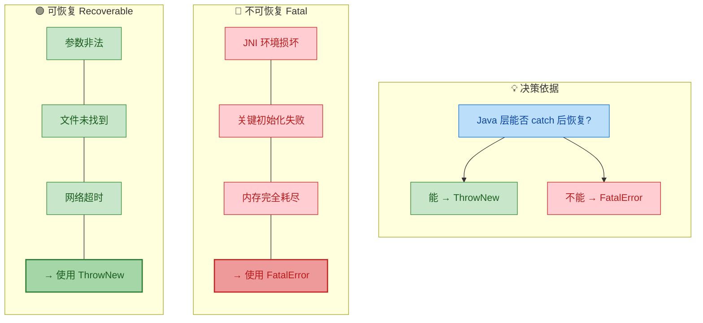

---

**📝 练习题**

以下 JNI Native 代码中存在一个严重的 Bug，可能导致 JVM 崩溃。请找出问题所在：

```c
JNIEXPORT jstring JNICALL
Java_Demo_processInput(JNIEnv *env, jobject thiz, jstring input) {
    if (input == NULL) {
        jclass exClass = (*env)->FindClass(env, "java/lang/NullPointerException");
        (*env)->ThrowNew(env, exClass, "input cannot be null");
        (*env)->DeleteLocalRef(env, exClass);
    }
    const char *str = (*env)->GetStringUTFChars(env, input, NULL);
    jstring result = (*env)->NewStringUTF(env, str);
    (*env)->ReleaseStringUTFChars(env, input, str);
    return result;
}
```

A. `FindClass` 的类路径写错了，应该用 `.` 而不是 `/`


B. `ThrowNew` 之后缺少 `return NULL`，当 `input` 为 NULL 时代码继续执行，对 NULL 调用 `GetStringUTFChars` 导致崩溃


C. `DeleteLocalRef(env, exClass)` 不应该在 `ThrowNew` 之后调用


D. `NewStringUTF` 不能在有 pending exception 的情况下调用，会导致 JVM 崩溃

**【答案】** B

**【解析】** 这是本节反复强调的 **JNI 黄金法则** 的典型违反案例。`ThrowNew` 成功调用后，异常仅被标记为 pending 状态，C 代码**不会自动停止执行**。当 `input == NULL` 时，代码在执行 `ThrowNew` 后没有 `return`，继续往下执行 `GetStringUTFChars(env, input, NULL)`——对 `NULL` 的 `jstring` 调用此函数属于未定义行为（Undefined Behavior），绝大多数 JVM 实现会直接触发段错误（SIGSEGV），进程崩溃。正确做法是在 `ThrowNew` + `DeleteLocalRef` 之后立即 `return NULL`。选项 A 错误，JNI 中类路径统一使用 `/` 分隔符；选项 C 错误，`DeleteLocalRef` 在 `ThrowNew` 之后调用完全合法且推荐；选项 D 虽然在 pending exception 下调用其他 JNI 函数确实不推荐，但根本原因还是缺少 `return` 导致对 NULL 的非法操作。

---

## 异常处理最佳实践

JNI 异常处理是 Native 开发中最容易被忽视、却最容易引发灾难的环节。与纯 Java 开发中 `try-catch` 的直觉式处理不同，Native 层的异常是一种 **"隐式状态"（Pending Exception State）**——它不会中断 C/C++ 的控制流，却会在你下一次调用 JNI 函数时悄然引爆。本节将系统性地总结一套经过生产验证的 JNI 异常处理最佳实践（Best Practices），帮助你构建健壮的 JNI 代码。

### 核心原则：每次 JNI 调用后都要检查异常

这是整个 JNI 异常处理体系中 **最重要的一条铁律**。任何可能触发 Java 异常的 JNI 函数调用之后，都必须立即进行异常检查。所谓"可能触发异常"的函数非常多，包括但不限于：

- `FindClass` — 类不存在时抛出 `ClassNotFoundException`
- `GetMethodID` / `GetFieldID` — 方法或字段不存在时抛出 `NoSuchMethodError` / `NoSuchFieldError`
- `CallXxxMethod` 系列 — Java 方法内部可能抛出任意异常
- `NewObject` — 构造函数可能抛出异常，或内存不足时抛出 `OutOfMemoryError`
- `GetStringUTFChars` — 内存不足时可能失败
- `NewGlobalRef` — 内存不足时可能返回 `NULL`

一个极其常见的错误模式是：开发者连续调用多个 JNI 函数，只在最后检查一次异常。这种写法在异常发生后会继续用无效的返回值（如 `NULL` 的 `jmethodID`）去调用后续 JNI 函数，导致 **JVM 直接崩溃（SIGSEGV / SIGABRT）**。

```cpp
// ❌ 危险写法：连续调用，不做中间检查
JNIEXPORT void JNICALL Java_com_example_Demo_badExample(JNIEnv *env, jobject thiz) {
    // 假如这一步就找不到类，cls 为 NULL
    jclass cls = env->FindClass("com/example/NonExistent");
    // 用 NULL 的 cls 继续调用 → JVM 崩溃！
    jmethodID mid = env->GetMethodID(cls, "doSomething", "()V");
    // 即便侥幸没崩溃，这里也会产生不可预测的行为
    env->CallVoidMethod(thiz, mid);
}
```

```cpp
// ✅ 正确写法：每步调用后都进行检查
JNIEXPORT void JNICALL Java_com_example_Demo_goodExample(JNIEnv *env, jobject thiz) {
    // 第一步：查找类
    jclass cls = env->FindClass("com/example/MyHelper");
    // 立即检查：FindClass 失败会返回 NULL 并设置 pending exception
    if (cls == NULL) {
        // 异常已由 JVM 设置（ClassNotFoundException），直接返回
        // 控制权交还 Java 层后，Java 会自动抛出该异常
        return;
    }

    // 第二步：获取方法 ID
    jmethodID mid = env->GetMethodID(cls, "process", "(I)V");
    // 立即检查：GetMethodID 失败会返回 NULL 并设置 pending exception
    if (mid == NULL) {
        return; // NoSuchMethodError 已挂起
    }

    // 第三步：调用 Java 方法
    env->CallVoidMethod(thiz, mid, 42);
    // 调用后检查：Java 方法内部可能抛出异常
    if (env->ExceptionCheck()) {
        // 根据业务需求决定：是直接返回让 Java 处理，还是在此清除并处理
        return;
    }
}
```

以下流程图展示了这一 **"调用 → 检查 → 决策"** 的标准循环模式：

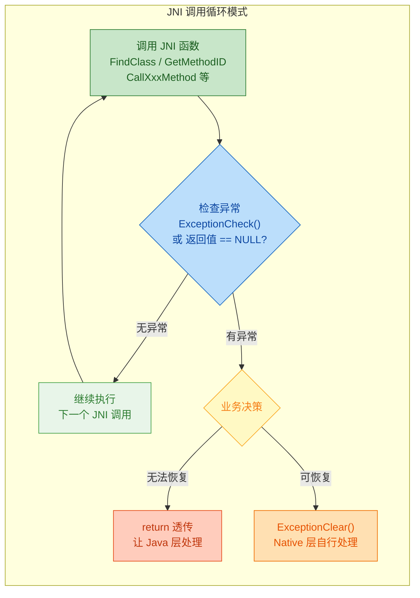

### 区分"可恢复"与"不可恢复"异常

并非所有异常都应该在 Native 层被"吃掉"。在设计异常处理策略时，你需要明确区分两类异常：

**不可恢复异常（Fatal / Unrecoverable）**：这类异常通常意味着 JVM 或 Native 环境已处于不一致状态，例如 `OutOfMemoryError`、`StackOverflowError`、`LinkageError` 等。对于这类异常，最佳策略是 **不要清除、直接返回**，让 Java 层或 JVM 自行处理（通常是终止进程或打印错误堆栈）。

**可恢复异常（Recoverable）**：这类异常表示业务逻辑层面的问题，例如 `FileNotFoundException`、`NumberFormatException`、`IllegalArgumentException` 等。Native 层可以选择清除这些异常并执行备选逻辑（fallback），或者将其转换为另一种更合适的异常重新抛出。

```cpp
JNIEXPORT jint JNICALL Java_com_example_Parser_parseConfig(JNIEnv *env, jobject thiz, jstring path) {
    // 将 Java 字符串转为 C 字符串
    const char *nativePath = env->GetStringUTFChars(path, NULL);
    // 检查转换是否成功（内存不足时为 NULL）
    if (nativePath == NULL) {
        // OutOfMemoryError 已挂起 → 不可恢复，直接返回
        return -1;
    }

    // 调用 Java 层的文件读取方法
    jclass fileCls = env->FindClass("com/example/FileReader");
    if (fileCls == NULL) return -1; // ClassNotFoundException → 不可恢复

    jmethodID readMid = env->GetStaticMethodID(fileCls, "readAll", "(Ljava/lang/String;)Ljava/lang/String;");
    if (readMid == NULL) return -1; // NoSuchMethodError → 不可恢复

    jstring content = (jstring) env->CallStaticObjectMethod(fileCls, readMid, path);

    // 这里需要判断：Java 方法可能抛出 FileNotFoundException
    if (env->ExceptionCheck()) {
        // 获取异常对象以判断类型
        jthrowable ex = env->ExceptionOccurred();
        // 清除异常状态，以便后续调用 JNI 函数
        env->ExceptionClear();

        // 判断异常是否为 FileNotFoundException（可恢复）
        jclass fnfCls = env->FindClass("java/io/FileNotFoundException");
        if (fnfCls != NULL && env->IsInstanceOf(ex, fnfCls)) {
            // ✅ 可恢复：文件不存在，使用默认配置
            env->DeleteLocalRef(ex);       // 释放异常对象的本地引用
            env->DeleteLocalRef(fnfCls);   // 释放类引用
            env->ReleaseStringUTFChars(path, nativePath); // 释放字符串
            return 0; // 返回默认值，表示使用内置配置
        }

        // ❌ 其他异常不可恢复：重新抛出
        env->Throw(ex);                    // 将原始异常重新设为 pending
        env->DeleteLocalRef(fnfCls);       // 清理
        env->ReleaseStringUTFChars(path, nativePath);
        return -1;
    }

    // 正常路径：解析内容...
    env->ReleaseStringUTFChars(path, nativePath);
    return 1; // 解析成功
}
```

这段代码展示了一个非常重要的模式——**"捕获 → 判断类型 → 决定恢复或重抛"**，它是 Native 层模拟 Java `try-catch` 行为的标准手法。

### 封装通用的异常检查工具函数

在实际项目中，如果每次 JNI 调用后都手写一遍 `ExceptionCheck` + `return`，代码会非常冗长。最佳实践是封装一组 **轻量级工具函数/宏**，在不牺牲可读性的前提下大幅减少样板代码。

```cpp
// =============================================
// jni_utils.h - JNI 异常处理工具集
// =============================================

#ifndef JNI_UTILS_H
#define JNI_UTILS_H

#include <jni.h>
#include <android/log.h>

// 日志输出宏
#define LOG_TAG "JNI_UTILS"
#define LOGE(...) __android_log_print(ANDROID_LOG_ERROR, LOG_TAG, __VA_ARGS__)

/**
 * 检查是否有 pending exception，若有则打印并清除。
 * 返回值：JNI_TRUE 表示有异常被清除，JNI_FALSE 表示无异常。
 * 适用场景：异常可恢复，需要继续执行 Native 逻辑。
 */
static inline jboolean jni_check_and_clear_exception(JNIEnv *env) {
    // 检查当前是否有挂起的异常
    if (env->ExceptionCheck()) {
        // 将异常堆栈打印到 logcat（调试用）
        env->ExceptionDescribe();
        // 清除异常状态
        env->ExceptionClear();
        // 返回 true 表示确实有异常被处理
        return JNI_TRUE;
    }
    // 无异常
    return JNI_FALSE;
}

/**
 * 安全地查找类，找不到时返回 NULL。
 * 调用方需自行检查返回值。
 */
static inline jclass jni_find_class(JNIEnv *env, const char *className) {
    // 调用 FindClass
    jclass cls = env->FindClass(className);
    // 若失败，打印错误信息并清除异常
    if (cls == NULL) {
        LOGE("FindClass failed: %s", className);
        // 注意：这里选择"不清除"异常，让上层决定如何处理
        // 如果需要清除，可调用 jni_check_and_clear_exception(env);
    }
    return cls;
}

/**
 * 抛出指定类型的 Java 异常。
 * 封装了 FindClass + ThrowNew 的组合操作。
 * 返回值：0 表示成功，-1 表示抛出失败（极端情况）。
 */
static inline int jni_throw(JNIEnv *env, const char *exceptionClass, const char *message) {
    // 先查找异常类
    jclass cls = env->FindClass(exceptionClass);
    // 若异常类本身都找不到（极端情况），记录错误
    if (cls == NULL) {
        LOGE("Cannot find exception class: %s", exceptionClass);
        return -1; // FindClass 已设置 ClassNotFoundException
    }
    // 抛出异常
    int ret = env->ThrowNew(cls, message);
    // 释放本地引用
    env->DeleteLocalRef(cls);
    return ret;
}

/**
 * 便捷方法：抛出 IllegalArgumentException
 */
static inline int jni_throw_illegal_arg(JNIEnv *env, const char *message) {
    return jni_throw(env, "java/lang/IllegalArgumentException", message);
}

/**
 * 便捷方法：抛出 RuntimeException
 */
static inline int jni_throw_runtime(JNIEnv *env, const char *message) {
    return jni_throw(env, "java/lang/RuntimeException", message);
}

/**
 * 便捷方法：抛出 NullPointerException
 */
static inline int jni_throw_npe(JNIEnv *env, const char *message) {
    return jni_throw(env, "java/lang/NullPointerException", message);
}

#endif // JNI_UTILS_H
```

有了这套工具函数，实际业务代码将变得简洁而安全：

```cpp
#include "jni_utils.h"

JNIEXPORT void JNICALL Java_com_example_Demo_processData(JNIEnv *env, jobject thiz, jbyteArray data) {
    // ① 参数校验：空指针防御
    if (data == NULL) {
        // 使用工具函数抛出 NullPointerException
        jni_throw_npe(env, "Input data array must not be null");
        return;
    }

    // ② 获取数组长度
    jsize len = env->GetArrayLength(data);
    // 业务校验：长度必须 > 0
    if (len <= 0) {
        jni_throw_illegal_arg(env, "Data array must not be empty");
        return;
    }

    // ③ 获取数组元素指针
    jbyte *buf = env->GetByteArrayElements(data, NULL);
    if (buf == NULL) {
        // OOM 已由 JVM 挂起，直接返回
        return;
    }

    // ④ 执行 Native 处理逻辑（如解码、加密等）
    int result = native_process(buf, len); // 假设这是一个纯 C 函数

    // ⑤ 释放数组元素（0 表示将修改拷贝回 Java 数组）
    env->ReleaseByteArrayElements(data, buf, 0);

    // ⑥ 根据 Native 结果决定是否抛异常
    if (result != 0) {
        jni_throw_runtime(env, "Native processing failed with error code");
        return;
    }
}
```

### 资源释放与异常安全（Exception Safety）

JNI 中一个特别隐蔽的 Bug 来源是：**异常发生时忘记释放已经获取的资源**。C/C++ 没有 Java 的 GC 和 `try-finally` 机制（虽然 C++ 有 RAII），所以必须手动确保所有代码路径上的资源都被正确释放。

需要管理的典型资源包括：

| 资源类型 | 获取函数 | 释放函数 |
|---|---|---|
| UTF 字符串 | `GetStringUTFChars` | `ReleaseStringUTFChars` |
| Unicode 字符串 | `GetStringChars` | `ReleaseStringChars` |
| 数组元素 | `GetXxxArrayElements` | `ReleaseXxxArrayElements` |
| 临界区数组 | `GetPrimitiveArrayCritical` | `ReleasePrimitiveArrayCritical` |
| 本地引用 | 各种返回 `jobject` 的函数 | `DeleteLocalRef` |
| 全局引用 | `NewGlobalRef` | `DeleteGlobalRef` |
| Monitor | `MonitorEnter` | `MonitorExit` |

以下是一个综合了资源管理和异常安全的 **标准模板写法**——采用 **单出口模式（Single Exit / goto cleanup）**：

```cpp
JNIEXPORT jstring JNICALL Java_com_example_Crypto_encrypt(
    JNIEnv *env, jobject thiz, jstring input, jbyteArray key) {

    // ======= 资源指针预初始化为 NULL =======
    const char *inputChars = NULL;    // 输入字符串的 C 指针
    jbyte *keyBytes = NULL;           // 密钥数组的 C 指针
    jstring result = NULL;            // 返回值
    char *outputBuf = NULL;           // Native 分配的输出缓冲区

    // ======= 参数校验 =======
    if (input == NULL || key == NULL) {
        jni_throw_npe(env, "Input and key must not be null");
        goto cleanup; // 跳到统一清理
    }

    // ======= 获取资源 =======
    // 获取输入字符串
    inputChars = env->GetStringUTFChars(input, NULL);
    if (inputChars == NULL) {
        goto cleanup; // OOM 已挂起
    }

    // 获取密钥字节
    keyBytes = env->GetByteArrayElements(key, NULL);
    if (keyBytes == NULL) {
        goto cleanup; // OOM 已挂起
    }

    // 获取密钥长度
    jsize keyLen = env->GetArrayLength(key);

    // ======= 核心业务逻辑 =======
    // 分配输出缓冲区（字符串长度 + 加密填充）
    size_t inputLen = strlen(inputChars);
    outputBuf = (char *) malloc(inputLen + 32); // 预留填充空间
    if (outputBuf == NULL) {
        jni_throw_runtime(env, "Failed to allocate output buffer");
        goto cleanup;
    }

    // 调用纯 C 加密函数
    int encryptResult = do_encrypt(
        (const unsigned char *) inputChars, inputLen,
        (const unsigned char *) keyBytes, keyLen,
        (unsigned char *) outputBuf
    );

    if (encryptResult < 0) {
        jni_throw_runtime(env, "Encryption failed");
        goto cleanup;
    }

    // 将结果转为 Java String
    result = env->NewStringUTF(outputBuf);
    // NewStringUTF 失败时 result 为 NULL，异常已挂起，会在 cleanup 后返回 NULL

// ======= 统一清理出口 =======
cleanup:
    // 释放 Native 堆内存
    if (outputBuf != NULL) {
        free(outputBuf);
    }
    // 释放 JNI 字符串资源
    if (inputChars != NULL) {
        env->ReleaseStringUTFChars(input, inputChars);
    }
    // 释放 JNI 数组资源（JNI_ABORT 表示不拷贝回 Java，因为密钥只读）
    if (keyBytes != NULL) {
        env->ReleaseByteArrayElements(key, keyBytes, JNI_ABORT);
    }

    return result; // 正常返回加密结果，或异常时返回 NULL
}
```

这种 `goto cleanup` 模式在 C 语言项目中（如 Linux 内核、OpenSSL、Android 源码）极为常见。它的核心优势在于：**无论从哪个分支退出，资源释放逻辑只写一次**，避免了在每个 `return` 语句前都复制一遍释放代码。

如果你使用 C++，则可以利用 RAII（Resource Acquisition Is Initialization）实现更优雅的资源管理：

```cpp
// =============================================
// C++ RAII 封装：自动释放 JNI 字符串
// =============================================
class JniStringGuard {
public:
    // 构造：获取 C 字符串
    JniStringGuard(JNIEnv *env, jstring jstr)
        : env_(env), jstr_(jstr), cstr_(nullptr) {
        if (jstr != nullptr) {
            // 获取 UTF 字符串指针
            cstr_ = env->GetStringUTFChars(jstr, nullptr);
        }
    }

    // 析构：自动释放
    ~JniStringGuard() {
        if (cstr_ != nullptr) {
            // RAII 保证：无论正常退出还是异常退出，都会释放
            env_->ReleaseStringUTFChars(jstr_, cstr_);
        }
    }

    // 获取 C 字符串（可能为 NULL）
    const char *c_str() const { return cstr_; }

    // 判断是否有效
    bool valid() const { return cstr_ != nullptr; }

    // 禁止拷贝
    JniStringGuard(const JniStringGuard &) = delete;
    JniStringGuard &operator=(const JniStringGuard &) = delete;

private:
    JNIEnv *env_;        // JNI 环境指针
    jstring jstr_;       // Java 字符串引用
    const char *cstr_;   // C 字符串指针
};

// 使用示例
JNIEXPORT void JNICALL Java_com_example_Demo_raii(JNIEnv *env, jobject thiz, jstring name) {
    // 构造时获取，离开作用域时自动释放
    JniStringGuard nameGuard(env, name);
    if (!nameGuard.valid()) {
        return; // OOM 已挂起
    }

    // 直接使用，不用担心忘记释放
    LOGI("Name = %s", nameGuard.c_str());

    // ... 即使中间有 return，析构也会被调用 ...
} // ← ~JniStringGuard() 在此自动调用，释放字符串
```

### 异常与线程安全

JNI 中的 pending exception 是 **线程本地（Thread-Local）** 的——它绑定在 `JNIEnv` 上，而每个线程有自己独立的 `JNIEnv`。这意味着：

- 线程 A 上的异常 **不会影响** 线程 B
- 你无法在线程 A 中检查到线程 B 的异常状态
- 如果 Native 线程（通过 `AttachCurrentThread` 附加到 JVM 的线程）触发了异常但没有处理，当该线程 `DetachCurrentThread` 时，**异常会被静默丢弃**

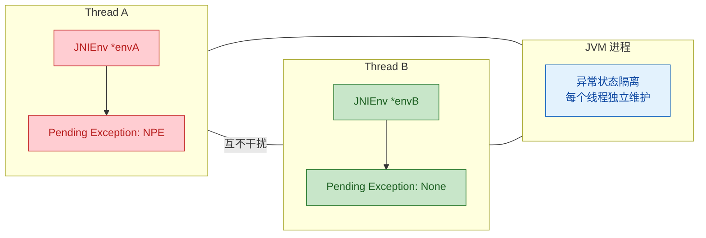

在多线程场景下，务必注意以下几点：

**1. Native 回调线程必须处理异常**：如果你在 Native 线程中通过 `AttachCurrentThread` 获取 `JNIEnv` 并回调 Java 方法，**必须在回调后检查并处理异常**。否则后续对该 `JNIEnv` 的 JNI 调用行为将不可预测。

**2. 不要跨线程传递 `JNIEnv`**：这是 JNI 的基本禁令——每个线程必须使用自己的 `JNIEnv`。自然也不存在"跨线程传递异常"的可能。

**3. 使用全局引用缓存异常信息**：如果确实需要在线程间传递错误信息，正确做法是将异常转为全局引用或提取异常消息字符串，通过线程安全的共享数据结构传递。

```cpp
// 在 Native 线程中回调 Java 的标准模式
void native_thread_callback(JavaVM *jvm, jobject globalCallback) {
    JNIEnv *env = NULL;
    // 将当前线程附加到 JVM
    int attached = jvm->AttachCurrentThread(&env, NULL);
    if (attached != JNI_OK) {
        return; // 附加失败，无法操作 JNI
    }

    // 获取回调方法
    jclass cls = env->GetObjectClass(globalCallback);
    jmethodID onResult = env->GetMethodID(cls, "onResult", "(I)V");
    if (onResult != NULL) {
        // 调用 Java 回调
        env->CallVoidMethod(globalCallback, onResult, 42);
        // ⚠️ 关键：必须在此检查异常
        if (env->ExceptionCheck()) {
            // 打印异常信息到日志
            env->ExceptionDescribe();
            // 清除异常（否则后续 JNI 调用会出问题）
            env->ExceptionClear();
            // 可选：通过其他机制通知主线程发生了错误
        }
    }

    // 清理本地引用
    env->DeleteLocalRef(cls);
    // 分离线程
    jvm->DetachCurrentThread();
}
```

### 防御性编程 Checklist

将以上最佳实践浓缩为一张可操作的检查清单，适合在代码审查（Code Review）时对照使用：

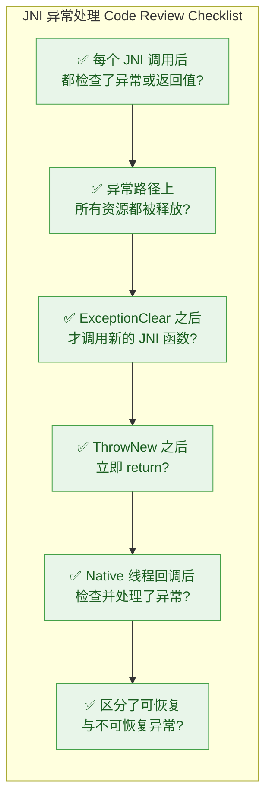

| # | 检查项 | 严重等级 | 说明 |
|---|---|---|---|
| 1 | **每次 JNI 调用后检查异常** | 🔴 Critical | 遗漏会导致 JVM 崩溃 |
| 2 | **异常路径释放所有资源** | 🔴 Critical | 遗漏会导致内存泄漏或资源死锁 |
| 3 | **ExceptionClear 后才调 JNI** | 🔴 Critical | 带 pending exception 调 JNI 是未定义行为 |
| 4 | **ThrowNew 后立即 return** | 🟡 Major | 不 return 可能导致逻辑混乱或二次异常 |
| 5 | **不要用 ExceptionDescribe 做业务日志** | 🟢 Minor | 它会输出到 stderr，生产环境应使用结构化日志 |
| 6 | **Native 线程必须处理异常** | 🔴 Critical | 否则异常被静默丢弃，问题难以排查 |
| 7 | **用 IsInstanceOf 判断异常类型** | 🟡 Major | 避免字符串比较类名，性能更好且类型安全 |
| 8 | **工具函数统一封装** | 🟢 Minor | 减少样板代码，提高一致性 |

---

**📝 练习题**

在以下 JNI Native 方法中，存在一个关键的异常安全问题。请问问题出在哪里？

```cpp
JNIEXPORT void JNICALL Java_com_example_App_load(JNIEnv *env, jobject thiz, jstring path) {
    const char *cPath = env->GetStringUTFChars(path, NULL);
    if (cPath == NULL) return;

    jclass cls = env->FindClass("com/example/Loader");
    if (cls == NULL) return;  // ← 注意这行

    jmethodID mid = env->GetMethodID(cls, "load", "(Ljava/lang/String;)V");
    if (mid == NULL) return;  // ← 注意这行

    env->CallVoidMethod(thiz, mid, path);
    env->ReleaseStringUTFChars(path, cPath);
}
```

A. `GetStringUTFChars` 调用后未检查异常


B. `FindClass` 或 `GetMethodID` 失败时，`cPath` 资源未被释放（内存泄漏）


C. `CallVoidMethod` 之后未检查异常


D. `ReleaseStringUTFChars` 应该在所有 JNI 调用之前执行


**【答案】** B

**【解析】** 这道题考查的是 **异常路径上的资源释放**。`cPath` 是通过 `GetStringUTFChars` 获取的 Native 内存资源，必须与 `ReleaseStringUTFChars` 配对使用。然而在代码中，`FindClass` 失败时直接 `return`，此时 `cPath` 已经被获取但没有被释放，造成内存泄漏。同理，`GetMethodID` 失败时也存在同样的问题。正确做法是在每个提前退出的分支中，都先调用 `env->ReleaseStringUTFChars(path, cPath)` 再 `return`；或者采用前文介绍的 `goto cleanup` 单出口模式统一释放资源。选项 A 不对，因为 `GetStringUTFChars` 失败时返回 `NULL` 即表明 OOM 已挂起，检查返回值即可。选项 C 虽然也是一个隐患（`CallVoidMethod` 后确实应该检查），但相比资源泄漏，它不是这段代码中 **最关键** 的问题。选项 D 的说法本身就是错误的，字符串要在使用完毕后释放，不存在"提前释放"的做法。

---

## 本章小结

本章围绕 **JNI 异常处理（JNI Exception Handling）** 这一核心主题，从异常在 Native 层的表现形式出发，逐步深入到异常的检查、清除、抛出，以及工程实践中的最佳范式。异常处理是 JNI 开发中最容易被忽视、却最容易引发致命 Bug 的环节——一个未检查的 Pending Exception 就可能导致 JVM 崩溃或产生难以追踪的数据损坏。下面对全章知识点进行系统性回顾。

---

### 核心知识脉络回顾

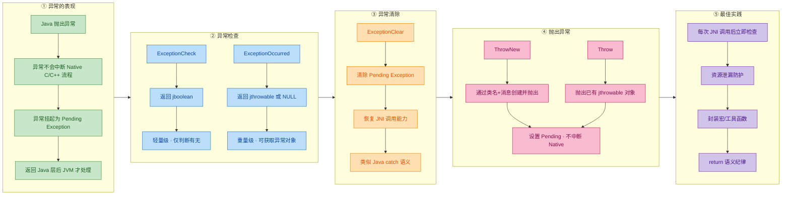

---

### 关键结论速查表

| 主题 | 核心要点 | 易错警示 |
|:---|:---|:---|
| **Pending Exception 机制** | Java 异常在 Native 层不会触发 C/C++ 的 `try-catch`，而是以"挂起状态"静默存在 | 忽略 Pending Exception 继续调用 JNI 函数会导致 **JVM 崩溃** |
| **ExceptionCheck** | 返回 `JNI_TRUE / JNI_FALSE`，是最轻量的检查方式 | 仅能判断有无异常，无法获取异常详情 |
| **ExceptionOccurred** | 返回 `jthrowable` 局部引用（或 `NULL`），可进一步操作异常对象 | 返回的引用需注意 Local Reference 生命周期管理 |
| **ExceptionClear** | 清除 Pending Exception，恢复正常 JNI 调用能力 | 清除 ≠ 忽略，必须在清除后做出合理的业务响应 |
| **ThrowNew** | 通过异常类全限定名 + message 创建并设置 Pending Exception | 调用后 **不会** 中断 C/C++ 执行流，必须手动 `return` |
| **Throw** | 直接抛出一个已构造好的 `jthrowable` 对象 | 同上，不自动中断 Native 执行流 |
| **资源安全** | 在 `return` 前必须释放 `GetStringUTFChars`、`Get*ArrayElements` 等资源 | 异常路径中遗漏资源释放是 JNI 内存泄漏的首要原因 |

---

### 异常处理黄金模板（Golden Pattern）

将全章精华浓缩为一个可直接复用的 Native 函数模板：

```cpp
// ============================================================
// JNI 异常安全函数模板 (Exception-Safe JNI Function Template)
// ============================================================

// ---- 辅助宏：检查异常并跳转到清理代码 ----
#define JNI_CHECK_EXCEPTION_GOTO(env, label)    \
    do {                                         \
        if ((*(env))->ExceptionCheck(env)) {     \
            goto label;                          \
        }                                        \
    } while(0)

// ---- 辅助函数：统一抛出异常 ----
static void jni_throw(JNIEnv *env,              // JNI 环境指针
                      const char *class_name,    // 异常类全限定名
                      const char *message)       // 异常信息
{
    // 查找异常类（此时可能已有 Pending Exception，需先清除）
    jclass cls = (*env)->FindClass(env, class_name);
    if (cls != NULL) {                           // FindClass 成功
        (*env)->ThrowNew(env, cls, message);     // 设置新的 Pending Exception
        (*env)->DeleteLocalRef(env, cls);        // 释放局部引用
    }
    // 如果 FindClass 失败，JVM 会自动设置 NoClassDefFoundError
}

// ---- 主函数示例 ----
JNIEXPORT jstring JNICALL
Java_com_example_NativeLib_processData(JNIEnv *env,
                                       jobject thiz,
                                       jstring input)
{
    // ========== 1. 变量声明区（所有资源指针初始化为 NULL） ==========
    const char *c_input   = NULL;                // 持有 GetStringUTFChars 的资源
    jclass     cls_util   = NULL;                // Java 工具类引用
    jmethodID  mid_parse  = NULL;                // 方法 ID（不需释放）
    jstring    result     = NULL;                // 返回值

    // ========== 2. 参数校验区 ==========
    if (input == NULL) {                         // 防御性检查空参数
        jni_throw(env,                           // 抛出空指针异常
                  "java/lang/NullPointerException",
                  "input must not be null");
        return NULL;                             // 立即返回！
    }

    // ========== 3. 资源获取区 ==========
    c_input = (*env)->GetStringUTFChars(env,     // 获取 C 字符串
                                        input,
                                        NULL);
    if (c_input == NULL) {                       // 获取失败 → OOM 已挂起
        goto cleanup;                            // 跳转统一清理
    }

    // ========== 4. 业务逻辑区（每步 JNI 调用后检查异常） ==========
    cls_util = (*env)->FindClass(env,            // 查找 Java 工具类
                                 "com/example/DataUtil");
    JNI_CHECK_EXCEPTION_GOTO(env, cleanup);      // 异常？→ 清理

    mid_parse = (*env)->GetStaticMethodID(env,   // 获取静态方法 ID
                                          cls_util,
                                          "parse",
                                          "(Ljava/lang/String;)Ljava/lang/String;");
    JNI_CHECK_EXCEPTION_GOTO(env, cleanup);      // 异常？→ 清理

    result = (jstring)(*env)->CallStaticObjectMethod(env,   // 调用 Java 方法
                                                      cls_util,
                                                      mid_parse,
                                                      input);
    JNI_CHECK_EXCEPTION_GOTO(env, cleanup);      // 异常？→ 清理

    // ========== 5. 统一清理区 ==========
cleanup:
    if (c_input != NULL) {                       // 释放 C 字符串资源
        (*env)->ReleaseStringUTFChars(env,
                                      input,
                                      c_input);
    }
    if (cls_util != NULL) {                      // 释放局部引用
        (*env)->DeleteLocalRef(env, cls_util);
    }
    // mid_parse 是 jmethodID，无需释放
    // 如果有 Pending Exception，返回 NULL，JVM 会在回到 Java 层后处理
    return result;                               // 正常 or 异常路径统一返回
}
```

这个模板体现了全章五大核心原则：

1. **所有资源指针预初始化为 `NULL`** —— 保证 `cleanup` 段的 `if` 判断安全。
2. **每次 JNI 回调后立即检查异常** —— 通过 `JNI_CHECK_EXCEPTION_GOTO` 宏实现。
3. **统一的 `goto cleanup` 清理路径** —— 无论正常还是异常，资源释放逻辑只写一次。
4. **`ThrowNew` 之后立即 `return`** —— 永远不要在设置 Pending Exception 后继续业务逻辑。
5. **辅助函数封装通用操作** —— `jni_throw` 将重复的"查找类 + 抛异常"封装为一行调用。

---

### 常见陷阱全景图

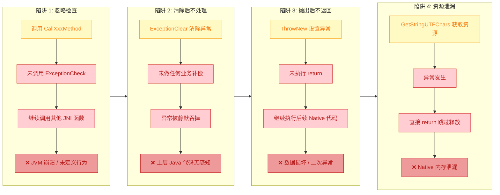

---

### 一句话记忆口诀

> **"调后必查，查后必清，清后必处理，抛后必返回，返前必释放。"**

这 20 个字覆盖了 JNI 异常处理的全部纪律：

| 口诀 | 对应 API / 行为 | 含义 |
|:---|:---|:---|
| **调后必查** | `ExceptionCheck` / `ExceptionOccurred` | 每次 JNI 回调后立刻检查 |
| **查后必清** | `ExceptionClear` | 若要在 Native 层处理，先清除 Pending |
| **清后必处理** | 业务逻辑补偿 / 重新抛出 | 清除不等于忽略，必须有后续动作 |
| **抛后必返回** | `ThrowNew` → `return` | 抛出异常后立即返回，不再执行后续逻辑 |
| **返前必释放** | `ReleaseStringUTFChars` / `DeleteLocalRef` 等 | 任何路径返回前，已获取的资源必须释放 |

---

### 本章 API 速查卡

```text
┌─────────────────────────────────────────────────────────────────────────┐
│                    JNI Exception API Quick Reference                    │
├──────────────────────┬──────────────────────────────────────────────────┤
│  ExceptionCheck      │  jboolean   (*ExceptionCheck)(JNIEnv*)          │
│                      │  → JNI_TRUE / JNI_FALSE                        │
├──────────────────────┼──────────────────────────────────────────────────┤
│  ExceptionOccurred   │  jthrowable (*ExceptionOccurred)(JNIEnv*)       │
│                      │  → 异常对象 / NULL                               │
├──────────────────────┼──────────────────────────────────────────────────┤
│  ExceptionDescribe   │  void       (*ExceptionDescribe)(JNIEnv*)       │
│                      │  → 打印异常栈到 stderr（仅调试用）                 │
├──────────────────────┼──────────────────────────────────────────────────┤
│  ExceptionClear      │  void       (*ExceptionClear)(JNIEnv*)          │
│                      │  → 清除 Pending Exception                       │
├──────────────────────┼──────────────────────────────────────────────────┤
│  Throw               │  jint       (*Throw)(JNIEnv*, jthrowable)       │
│                      │  → 0=成功, 负数=失败                             │
├──────────────────────┼──────────────────────────────────────────────────┤
│  ThrowNew            │  jint       (*ThrowNew)(JNIEnv*, jclass, char*) │
│                      │  → 0=成功, 负数=失败                             │
├──────────────────────┼──────────────────────────────────────────────────┤
│  FatalError          │  void       (*FatalError)(JNIEnv*, const char*) │
│                      │  → 立即终止 JVM，不可恢复                         │
└──────────────────────┴──────────────────────────────────────────────────┘
```

---

**📝 练习题 1**

以下 Native 代码存在一个严重的 Bug，请问最可能引发什么问题？

```cpp
JNIEXPORT void JNICALL Java_Test_run(JNIEnv *env, jobject thiz) {
    jclass cls = (*env)->FindClass(env, "com/nonexistent/Foo");
    jmethodID mid = (*env)->GetMethodID(env, cls, "bar", "()V");
    (*env)->CallVoidMethod(env, thiz, mid);
}
```

A. 编译失败，因为 `FindClass` 返回值类型不匹配

B. `FindClass` 失败后产生 Pending Exception，后续 `GetMethodID` 使用 `NULL` 的 `cls` 导致 JVM 崩溃

C. 程序正常运行，只是 `bar()` 方法不会被调用

D. `FindClass` 会自动抛出 Java 异常并中断 Native 执行流，后续代码不会执行


**【答案】** B

**【解析】** `FindClass` 找不到类时会返回 `NULL` 并设置一个 `NoClassDefFoundError` 作为 Pending Exception。但在 Native 层，**异常不会中断 C/C++ 的执行流**，代码会继续向下执行。接下来 `GetMethodID` 收到一个 `NULL` 的 `cls` 参数，这属于对 JNI 函数的非法调用（在已有 Pending Exception 的状态下继续调用非异常处理类 JNI 函数），会触发 **未定义行为（Undefined Behavior）**，最常见的结果是 JVM 直接崩溃（SIGSEGV）。正确做法是在 `FindClass` 之后立即用 `ExceptionCheck` 检查，若失败则 `return`。选项 D 的错误在于误以为 Native 层的异常机制和 Java 层一样会自动中断执行流。

---

**📝 练习题 2**

在 JNI Native 函数中，以下哪种做法是 **正确的** 异常处理模式？

A. 调用 `ThrowNew` 后继续执行业务逻辑，在函数末尾统一 `return`

B. 调用 `ExceptionClear` 后不做任何处理，直接继续执行后续代码

C. 使用 `ExceptionCheck` 发现异常后，先释放已获取的资源，再 `return` 让异常传播回 Java 层

D. 在 Pending Exception 存在时，继续调用 `FindClass` 和 `GetMethodID` 获取新的类信息


**【答案】** C

**【解析】** 选项 C 是标准的异常处理范式：检测到异常后，**优先释放所有已获取的 Native 资源**（如 `ReleaseStringUTFChars`、`DeleteLocalRef` 等），然后 `return` 让 Pending Exception 自然传播回 Java 层，由 Java 的 `try-catch` 来处理。选项 A 违反了"抛后必返回"原则——`ThrowNew` 之后继续执行业务逻辑可能导致数据损坏或覆盖刚设置的异常。选项 B 违反了"清后必处理"原则——`ExceptionClear` 是 `catch` 语义，清除后必须有替代的处理逻辑（记录日志、抛出新异常、降级方案等），否则异常被静默吞掉，上层 Java 代码将无法感知错误。选项 D 违反了"调后必查"原则——在 Pending Exception 存在时调用大部分 JNI 函数都是未定义行为。

---

