---

# JNI引用管理 ⭐⭐⭐

---

## 局部引用 (Local Reference)

在 JNI 编程中，**引用管理 (Reference Management)** 是最容易被忽视、却最致命的知识领域之一。C/C++ 原生代码通过 JNI 调用 Java 对象时，并不直接持有 Java 堆中的对象指针，而是持有一个 **间接引用 (Indirect Reference)**。JVM 的垃圾回收器 (GC) 随时可能移动堆中的对象，因此 JNI 设计了一套引用机制来确保 Native 代码能安全地访问 Java 对象。

局部引用 (Local Reference) 是 JNI 中 **最常见、最基础** 的引用类型。几乎所有通过 JNI 函数返回的 `jobject`（包括 `jstring`, `jclass`, `jarray`, `jthrowable` 等子类型）**默认都是局部引用**。它的核心特征可以用一句话概括：

> **局部引用的生命周期被绑定到其所属的 Native 方法栈帧 (Stack Frame)，当 Native 方法返回时，所有局部引用自动失效。**

我们先通过一张全景图来建立直觉：

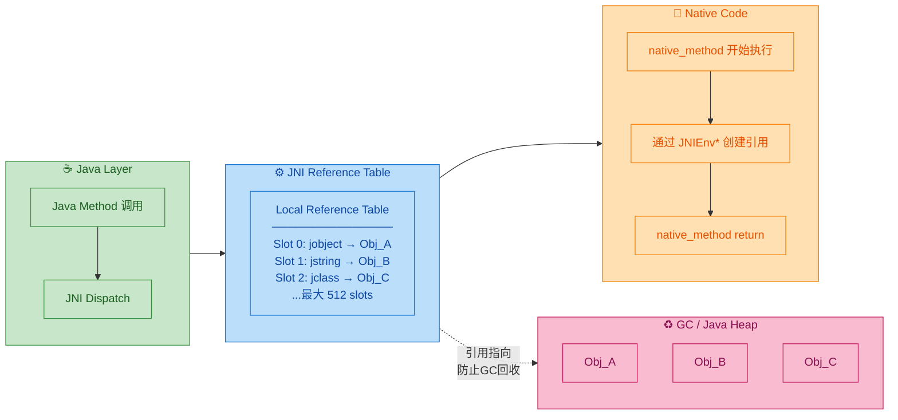
```mermaid
graph LR
    subgraph JavaLayer["☕ Java Layer"]
        direction TB
        J1["Java Method 调用"]
        J2["JNI Dispatch"]
        J1 --> J2
    end

    subgraph JNILayer["⚙️ JNI Reference Table"]
        direction TB
        LRT["Local Reference Table<br/>───────────────<br/>Slot 0: jobject → Obj_A<br/>Slot 1: jstring → Obj_B<br/>Slot 2: jclass → Obj_C<br/>...最大 512 slots"]
    end

    subgraph NativeLayer["🔧 Native Code"]
        direction TB
        N1["native_method 开始执行"]
        N2["通过 JNIEnv* 创建引用"]
        N3["native_method return"]
        N1 --> N2 --> N3
    end

    subgraph GCLayer["♻️ GC / Java Heap"]
        direction TB
        G1["Obj_A"]
        G2["Obj_B"]
        G3["Obj_C"]
    end

    JavaLayer --> JNILayer
    JNILayer --> NativeLayer
    JNILayer -.->|"引用指向<br/>防止GC回收"| GCLayer

    classDef java fill:#C8E6C9,stroke:#388E3C,color:#1B5E20
    classDef jni fill:#BBDEFB,stroke:#1976D2,color:#0D47A1
    classDef native fill:#FFE0B2,stroke:#F57C00,color:#E65100
    classDef gc fill:#F8BBD0,stroke:#C2185B,color:#880E4F

    class JavaLayer,J1,J2 java
    class JNILayer,LRT jni
    class NativeLayer,N1,N2,N3 native
    class GCLayer,G1,G2,G3 gc
```

当 Java 调用一个 `native` 方法时，JVM 会为这次调用在 JNI 层创建一个 **局部引用表 (Local Reference Table)**。Native 代码中通过 `JNIEnv*` 获得的所有 Java 对象引用都会被登记到这张表中。这些引用就像一根根"线"，牵住了 Java 堆中的对象，阻止 GC 将它们回收。一旦 Native 方法执行完毕返回 Java 层，整张局部引用表会被 **整体清空 (bulk release)**，所有引用失效，对应的 Java 对象也就可以被 GC 正常回收了。

---

### 自动释放时机

局部引用最大的"便利"在于——**你不需要手动释放它们，JVM 会自动帮你清理**。但"自动"并不意味着"立即"，理解精确的释放时机对于编写健壮的 JNI 代码至关重要。

#### 核心规则：Native 方法返回时自动释放

局部引用的生命周期严格遵循以下模型：

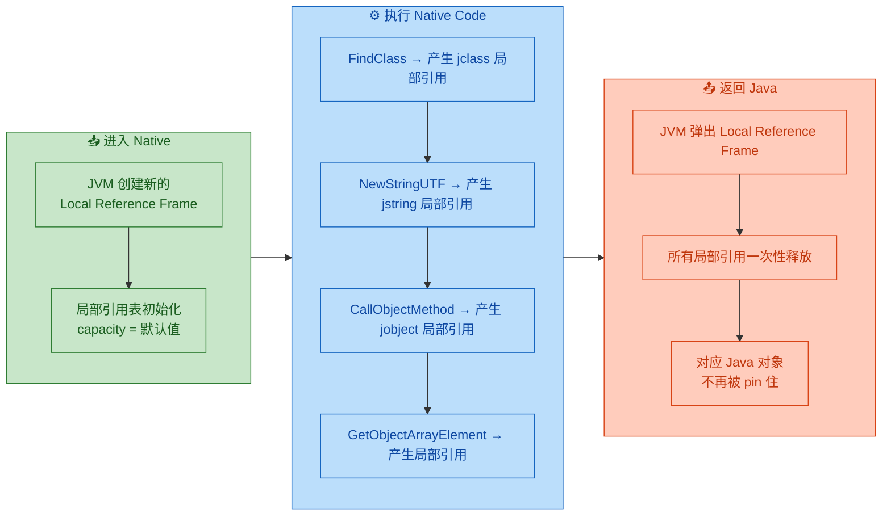
```mermaid
graph LR
    subgraph Phase1["📥 进入 Native"]
        direction TB
        P1A["JVM 创建新的<br/>Local Reference Frame"]
        P1B["局部引用表初始化<br/>capacity = 默认值"]
        P1A --> P1B
    end

    subgraph Phase2["⚙️ 执行 Native Code"]
        direction TB
        P2A["FindClass → 产生 jclass 局部引用"]
        P2B["NewStringUTF → 产生 jstring 局部引用"]
        P2C["CallObjectMethod → 产生 jobject 局部引用"]
        P2D["GetObjectArrayElement → 产生局部引用"]
        P2A --> P2B --> P2C --> P2D
    end

    subgraph Phase3["📤 返回 Java"]
        direction TB
        P3A["JVM 弹出 Local Reference Frame"]
        P3B["所有局部引用一次性释放"]
        P3C["对应 Java 对象<br/>不再被 pin 住"]
        P3A --> P3B --> P3C
    end

    Phase1 --> Phase2 --> Phase3

    classDef enter fill:#C8E6C9,stroke:#2E7D32,color:#1B5E20
    classDef exec fill:#BBDEFB,stroke:#1565C0,color:#0D47A1
    classDef exit fill:#FFCCBC,stroke:#D84315,color:#BF360C

    class Phase1,P1A,P1B enter
    class Phase2,P2A,P2B,P2C,P2D exec
    class Phase3,P3A,P3B,P3C exit
```

用一个具体的例子来说明：

```java
// Java 侧
public class TextProcessor {
    // 声明 native 方法
    public native String processText(String input);

    static {
        System.loadLibrary("textprocessor"); // 加载 native 库
    }

    public static void main(String[] args) {
        TextProcessor tp = new TextProcessor();
        // 调用 native 方法 —— 此时 JVM 创建局部引用表
        String result = tp.processText("Hello JNI");
        // native 方法返回 —— 局部引用表已被清空
        System.out.println(result);
    }
}
```

```cpp
// Native 侧 (C++)
#include <jni.h>

extern "C"
JNIEXPORT jstring JNICALL
Java_TextProcessor_processText(JNIEnv *env, jobject thiz, jstring input) {
    // input 本身就是一个局部引用（由 JVM 传入）

    // 获取 Java String 的 UTF-8 表示
    // GetStringUTFChars 不产生新的 jobject 引用，而是返回 const char*
    const char *nativeStr = env->GetStringUTFChars(input, nullptr); // 获取 C 字符串

    // 创建一个新的 Java String —— 这会产生一个新的局部引用
    jstring result = env->NewStringUTF(nativeStr);  // 局部引用 #1（result）

    // 释放 GetStringUTFChars 分配的内存（注意：这不是引用释放，是内存释放）
    env->ReleaseStringUTFChars(input, nativeStr);   // 释放 native 内存

    // 获取 String 的 class 对象 —— 又产生一个局部引用
    jclass strClass = env->FindClass("java/lang/String"); // 局部引用 #2（strClass）

    // 此时局部引用表中有:
    // [thiz(隐式), input(参数), result, strClass] = 至少4个局部引用

    return result;
    // ⬆️ 方法返回时，thiz、input、strClass 的局部引用全部自动释放
    // result 的值被"复制"给 Java 调用方，其局部引用也随之释放
    // 但 Java 侧拿到的是一个新的引用，指向同一个对象
}
```

这里有几个关键的细节需要特别说明：

**① 方法参数也是局部引用**

上面代码中的 `thiz`（即 Java 的 `this`）和 `input` 虽然是 JVM 传进来的，但它们同样是局部引用，同样占据局部引用表的 slot。JNI 规范明确指出：*"All Java objects passed to native methods (including `this`) are local references."*

**② 返回值的特殊处理**

当你 `return result` 时，JVM 会在清空局部引用表 **之前**，先将 `result` 所指向的 Java 对象"提取"出来，传递回 Java 调用方。所以 Java 侧能正确拿到返回的 String 对象，不会出现"引用已失效"的问题。

**③ 不同于 C++ 的 RAII 或 Java 的 GC**

局部引用的自动释放机制既不像 C++ 的析构函数（不是基于作用域 `{}` 的），也不像 Java 的 GC（不是基于可达性分析的）。它是基于 **JNI 方法调用帧 (invocation frame)** 的，只有当整个 Native 方法返回时才触发。这意味着：

```cpp
extern "C"
JNIEXPORT void JNICALL
Java_Demo_doWork(JNIEnv *env, jobject thiz) {

    {   // C++ 代码块 —— 注意：这个花括号 NOT 影响局部引用的生命周期！
        jstring s = env->NewStringUTF("temp");  // 创建局部引用
    }   // s 这个 C++ 变量在此离开作用域，但局部引用 仍然存在于引用表中！

    // 此处局部引用表中仍有 s 对应的那个 slot
    // 只是你在 C++ 层面已经丢失了 s 变量，无法再操作它
    // 这个"僵尸引用"会一直占位，直到 native 方法返回
}
// ⬆️ 直到这里，所有局部引用才被真正释放
```

这是一个非常容易踩的坑！**C++ 的作用域 `{}` 不会触发局部引用的释放**。

#### `PushLocalFrame` / `PopLocalFrame` 手动控制帧

JNI 提供了一对函数让你在 Native 方法内部创建和销毁 **嵌套的局部引用帧 (Nested Local Reference Frame)**，从而实现类似"作用域释放"的效果：

```cpp
extern "C"
JNIEXPORT void JNICALL
Java_Demo_batchProcess(JNIEnv *env, jobject thiz, jobjectArray items) {

    jsize len = env->GetArrayLength(items);      // 获取数组长度

    for (jsize i = 0; i < len; i++) {
        // 创建一个新的局部引用帧，预留 16 个 slot
        if (env->PushLocalFrame(16) < 0) {       // 返回负数表示内存不足
            return;                                // OOM，直接退出
        }

        // 以下所有局部引用都在新帧中
        jobject item = env->GetObjectArrayElement(items, i);  // 局部引用
        jclass cls = env->GetObjectClass(item);                // 局部引用
        jmethodID mid = env->GetMethodID(cls, "toString",     // MethodID 不是引用
                                         "()Ljava/lang/String;");
        jstring str = (jstring) env->CallObjectMethod(item, mid); // 局部引用

        const char *cStr = env->GetStringUTFChars(str, nullptr);
        // ... 处理 cStr ...
        env->ReleaseStringUTFChars(str, cStr);

        // 弹出局部引用帧 —— item、cls、str 等局部引用全部释放
        // 参数 nullptr 表示不需要从帧中"带出"任何引用
        env->PopLocalFrame(nullptr);
        // 此时 item、cls、str 已失效，不可再使用
    }
}
```

`PopLocalFrame(jobject result)` 的参数允许你将一个引用从即将销毁的帧中"带到"上一层帧：

```cpp
// 如果需要保留某个引用到外层帧
jobject keeper = env->PopLocalFrame(someLocalRef);
// keeper 现在是外层帧中的局部引用，指向 someLocalRef 原来的对象
// someLocalRef 本身已失效，但 keeper 是有效的
```

下面的时序图展示了 `PushLocalFrame` / `PopLocalFrame` 的工作机制：

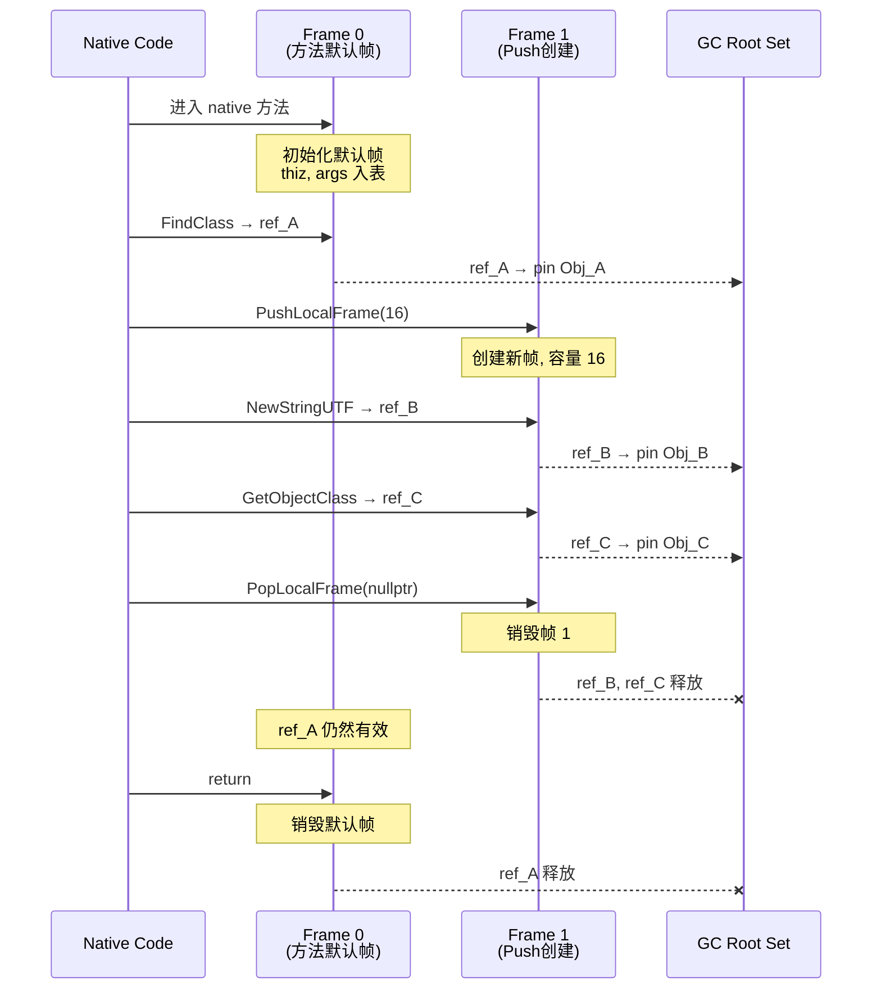
```mermaid
sequenceDiagram
    participant N as Native Code
    participant F0 as Frame 0<br/>(方法默认帧)
    participant F1 as Frame 1<br/>(Push创建)
    participant GC as GC Root Set

    N->>F0: 进入 native 方法
    Note over F0: 初始化默认帧<br/>thiz, args 入表

    N->>F0: FindClass → ref_A
    F0-->>GC: ref_A → pin Obj_A

    N->>F1: PushLocalFrame(16)
    Note over F1: 创建新帧, 容量 16

    N->>F1: NewStringUTF → ref_B
    F1-->>GC: ref_B → pin Obj_B

    N->>F1: GetObjectClass → ref_C
    F1-->>GC: ref_C → pin Obj_C

    N->>F1: PopLocalFrame(nullptr)
    Note over F1: 销毁帧 1
    F1--xGC: ref_B, ref_C 释放

    Note over F0: ref_A 仍然有效

    N->>F0: return
    Note over F0: 销毁默认帧
    F0--xGC: ref_A 释放
```

#### 自动释放 ≠ 无需关心

很多开发者因为"自动释放"就完全不管局部引用，这在简单的 Native 方法中没问题，但在以下场景中会酿成大祸：

| 场景 | 风险 | 解决方案 |
|------|------|---------|
| **大循环中创建引用** | 引用表溢出 (Overflow) | `PushLocalFrame` / `PopLocalFrame` 或 `DeleteLocalRef` |
| **Native 工具函数 (Utility)** | 调用方不知道产生了额外引用 | 在函数内部主动 `DeleteLocalRef` |
| **长时间运行的 Native 方法** | 大量引用积累，阻止 GC 回收 | 及时清理不再需要的引用 |
| **JNI 回调 / AttachCurrentThread** | 非 Java 调用的 Native 线程，帧管理不同 | 特别注意手动管理 |

---

### 局部引用表溢出 ⭐ (Reference Table Overflow)

这是 JNI 开发中 **最经典的崩溃场景之一**，每一个写过 JNI 代码的开发者都应该对它烂熟于心。

#### 溢出原理

每个线程的局部引用表有 **容量上限**。JNI 规范保证每个 Native 方法至少能创建 **16 个局部引用**，但实际实现中，不同 JVM 的上限有所不同：

| JVM 实现 | 默认局部引用上限 | 备注 |
|----------|-----------------|------|
| **HotSpot (OpenJDK)** | 65536 (64K) | 可通过 `-XX:MaxJNILocalCapacity` 调整 |
| **Android ART** | 512 | Android 8.0+ 的默认值 |
| **Android Dalvik** | 512 (硬编码) | 旧版 Android，无法调整 |

Android 平台上 512 的上限是非常紧张的，特别是在循环中操作 Java 对象时，非常容易触顶。

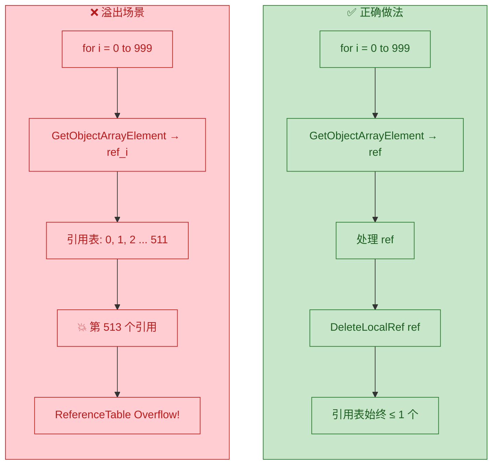
```mermaid
graph LR
    subgraph Problem["❌ 溢出场景"]
        direction TB
        P1["for i = 0 to 999"]
        P2["GetObjectArrayElement → ref_i"]
        P3["引用表: 0, 1, 2 ... 511"]
        P4["💥 第 513 个引用"]
        P5["ReferenceTable Overflow!"]
        P1 --> P2 --> P3 --> P4 --> P5
    end

    subgraph Solution["✅ 正确做法"]
        direction TB
        S1["for i = 0 to 999"]
        S2["GetObjectArrayElement → ref"]
        S3["处理 ref"]
        S4["DeleteLocalRef ref"]
        S5["引用表始终 ≤ 1 个"]
        S1 --> S2 --> S3 --> S4 --> S5
    end

    Problem ~~~ Solution

    classDef bad fill:#FFCDD2,stroke:#C62828,color:#B71C1C
    classDef good fill:#C8E6C9,stroke:#2E7D32,color:#1B5E20

    class Problem,P1,P2,P3,P4,P5 bad
    class Solution,S1,S2,S3,S4,S5 good
```

#### 崩溃现场复现

我们来写一个 **必定崩溃** 的例子：

```cpp
// ❌ 错误示范：必定导致局部引用表溢出
extern "C"
JNIEXPORT void JNICALL
Java_Demo_leakLocalRefs(JNIEnv *env, jobject thiz) {

    // 假设我们要拼接 1000 个字符串
    for (int i = 0; i < 1000; i++) {
        char buf[64];
        snprintf(buf, sizeof(buf), "Item_%d", i);  // 格式化字符串

        // 每次循环都创建一个新的 jstring 局部引用
        jstring str = env->NewStringUTF(buf);       // 局部引用 +1

        // 假设我们做了一些操作...
        // 但忘记释放 str !!

        // 在 Android 上，当 i = 511 时，引用表已满
        // i = 512 时 → 💥 CRASH
    }
    // 这段代码在 Android 上永远执行不到 i=512
}
```

在 Android 上，你会看到类似如下的崩溃日志 (Logcat)：

```text
JNI ERROR (app bug): local reference table overflow (max=512)
local reference table dump:
  Last 10 entries (of 512):
      511: 0x13a10e20 java.lang.String "Item_511"
      510: 0x13a10df0 java.lang.String "Item_510"
      509: 0x13a10dc0 java.lang.String "Item_509"
      ...
  Summary:
      512 of java.lang.String (512 unique instances)

Fatal signal 6 (SIGABRT), code -6 in tid 12345 (main)
```

这段日志非常有特征性：`local reference table overflow (max=512)` 明确告诉你局部引用表溢出了。`Summary` 部分甚至会按类型汇总告诉你是哪种对象泄漏了。

#### `EnsureLocalCapacity` —— 预检容量

JNI 提供了一个"预检查"函数，让你在创建大量局部引用之前，先确认引用表是否有足够的空间：

```cpp
// 在创建大量引用前，先确认容量
extern "C"
JNIEXPORT void JNICALL
Java_Demo_safeCheck(JNIEnv *env, jobject thiz) {

    jint needed = 256;  // 我预计需要 256 个局部引用

    // EnsureLocalCapacity 尝试确保至少有 needed 个空闲 slot
    if (env->EnsureLocalCapacity(needed) < 0) {
        // 返回负数 → 无法保证容量，通常会抛出 OutOfMemoryError
        // 此时不应继续创建引用
        return;  // 直接退出，让 Java 层处理异常
    }

    // 现在可以安全地创建最多 256 个局部引用
    // ... 但这不是推荐做法，最佳实践仍然是及时释放
}
```

> ⚠️ **注意**：`EnsureLocalCapacity` 只是"尝试扩容"，并不是万能的。在 Android 旧版本 (Dalvik) 上，512 是硬编码上限，无法扩容。所以**千万不要**用它来替代主动释放引用，它只是一个防御性检查。

#### 隐蔽的溢出场景

有些溢出并不像上面的 `for` 循环那样明显。以下是几个隐蔽的场景：

**场景一：嵌套调用累积**

```cpp
// 看似无害的工具函数
jstring getClassName(JNIEnv *env, jobject obj) {
    jclass cls = env->GetObjectClass(obj);               // 局部引用 +1
    jmethodID mid = env->GetMethodID(cls, "getClass",
                                     "()Ljava/lang/Class;");
    jobject classObj = env->CallObjectMethod(obj, mid);   // 局部引用 +1
    jclass classCls = env->GetObjectClass(classObj);      // 局部引用 +1
    jmethodID nameMid = env->GetMethodID(classCls, "getName",
                                         "()Ljava/lang/String;");
    jstring name = (jstring) env->CallObjectMethod(classObj, nameMid); // 局部引用 +1
    // 每次调用产生 4 个局部引用，且没有释放中间结果！
    return name;
}

// 在循环中调用上面的函数
void processItems(JNIEnv *env, jobjectArray items) {
    jsize len = env->GetArrayLength(items);
    for (jsize i = 0; i < len; i++) {
        jobject item = env->GetObjectArrayElement(items, i); // +1
        jstring name = getClassName(env, item);              // +4
        // 每轮循环累积 5 个局部引用
        // 512 / 5 ≈ 102 轮后就会溢出！
    }
}
```

**场景二：`AttachCurrentThread` 创建的线程**

当你在一个非 Java 创建的 Native 线程 (如 pthread) 中通过 `AttachCurrentThread` 附着到 JVM 时，该线程的局部引用 **不会** 像普通 JNI 调用那样在"方法返回"时自动清理，因为根本没有 Java 方法调用帧。你必须在 `DetachCurrentThread` 之前手动清理所有引用，或者使用 `PushLocalFrame` / `PopLocalFrame`。

```cpp
// pthread 回调
void* workerThread(void* arg) {
    JavaVM *jvm = (JavaVM*) arg;
    JNIEnv *env = nullptr;

    // 附着到 JVM
    jvm->AttachCurrentThread(&env, nullptr);

    // ⚠️ 从这里开始产生的局部引用，不会因为"方法返回"而自动清理
    // 因为你根本不在一个 Java→Native 的调用帧中

    env->PushLocalFrame(32);   // 显式创建帧
    // ... 操作 Java 对象 ...
    env->PopLocalFrame(nullptr); // 显式清理

    // 解除附着（此时所有残留的局部引用也会被清理）
    jvm->DetachCurrentThread();
    return nullptr;
}
```

---

### DeleteLocalRef

`DeleteLocalRef` 是手动释放局部引用的核心函数。它的签名非常简单：

```cpp
void DeleteLocalRef(JNIEnv *env, jobject localRef);
```

调用后，`localRef` 对应的引用表 slot 被释放，该引用立即失效。如果这是指向某个 Java 对象的最后一个引用（没有全局引用或 Java 侧引用指向它），那么该对象就可以被 GC 回收了。

#### 何时必须调用

回到前面溢出的例子，修复方案非常直接：

```cpp
// ✅ 正确示范：在循环中及时释放局部引用
extern "C"
JNIEXPORT void JNICALL
Java_Demo_processAll(JNIEnv *env, jobject thiz, jobjectArray items) {

    jsize len = env->GetArrayLength(items);  // 获取数组长度

    for (jsize i = 0; i < len; i++) {
        // 从数组中获取元素 → 产生局部引用
        jobject item = env->GetObjectArrayElement(items, i);  // 局部引用

        // 获取对象的 class → 产生局部引用
        jclass cls = env->GetObjectClass(item);               // 局部引用

        // 获取 toString 方法的 ID (jmethodID 不是引用，不占 slot)
        jmethodID toStrMid = env->GetMethodID(cls, "toString",
                                               "()Ljava/lang/String;");

        // 调用 toString → 产生局部引用
        jstring str = (jstring) env->CallObjectMethod(item, toStrMid); // 局部引用

        // 使用字符串
        const char *cStr = env->GetStringUTFChars(str, nullptr);
        // ... 处理 cStr ...
        env->ReleaseStringUTFChars(str, cStr);  // 释放 C 字符串内存

        // 🔑 关键：手动释放本轮循环中创建的所有局部引用
        env->DeleteLocalRef(str);   // 释放 str 引用
        env->DeleteLocalRef(cls);   // 释放 cls 引用
        env->DeleteLocalRef(item);  // 释放 item 引用

        // 此时引用表回到循环开始前的状态
        // 无论循环多少次都不会溢出！
    }
}
```

#### `DeleteLocalRef` vs `PushLocalFrame/PopLocalFrame` 的选择

两种方式都能解决循环中的引用溢出问题，但各有优劣：

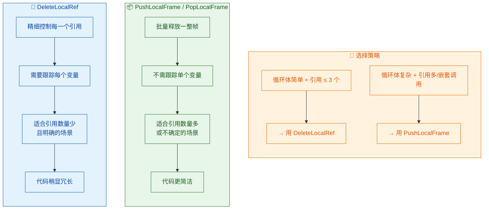
```mermaid
graph LR
    subgraph DLR["🔧 DeleteLocalRef"]
        direction TB
        D1["精细控制每一个引用"]
        D2["需要跟踪每个变量"]
        D3["适合引用数量少<br/>且明确的场景"]
        D4["代码稍显冗长"]
        D1 --> D2 --> D3 --> D4
    end

    subgraph PLF["📦 PushLocalFrame / PopLocalFrame"]
        direction TB
        L1["批量释放一整帧"]
        L2["不需跟踪单个变量"]
        L3["适合引用数量多<br/>或不确定的场景"]
        L4["代码更简洁"]
        L1 --> L2 --> L3 --> L4
    end

    subgraph Decision["🤔 选择策略"]
        direction TB
        C1["循环体简单 + 引用 ≤ 3 个"]
        C2["→ 用 DeleteLocalRef"]
        C3["循环体复杂 + 引用多/嵌套调用"]
        C4["→ 用 PushLocalFrame"]
        C1 --> C2
        C3 --> C4
    end

    DLR ~~~ PLF ~~~ Decision

    classDef dlr fill:#E3F2FD,stroke:#1565C0,color:#0D47A1
    classDef plf fill:#E8F5E9,stroke:#2E7D32,color:#1B5E20
    classDef dec fill:#FFF3E0,stroke:#EF6C00,color:#E65100

    class DLR,D1,D2,D3,D4 dlr
    class PLF,L1,L2,L3,L4 plf
    class Decision,C1,C2,C3,C4 dec
```

用 `PushLocalFrame` 改写上面的循环：

```cpp
// ✅ 使用 PushLocalFrame/PopLocalFrame 的版本
extern "C"
JNIEXPORT void JNICALL
Java_Demo_processAll_v2(JNIEnv *env, jobject thiz, jobjectArray items) {

    jsize len = env->GetArrayLength(items);  // 获取数组长度

    for (jsize i = 0; i < len; i++) {
        // 在每轮循环开始时，压入一个新帧（预留 16 个 slot）
        if (env->PushLocalFrame(16) < 0) {
            return;  // 内存不足
        }

        // 以下所有局部引用都在新帧中，无需逐一 Delete
        jobject item = env->GetObjectArrayElement(items, i);
        jclass cls = env->GetObjectClass(item);
        jmethodID toStrMid = env->GetMethodID(cls, "toString",
                                               "()Ljava/lang/String;");
        jstring str = (jstring) env->CallObjectMethod(item, toStrMid);

        const char *cStr = env->GetStringUTFChars(str, nullptr);
        // ... 处理 cStr ...
        env->ReleaseStringUTFChars(str, cStr);

        // 一行代码释放本轮所有局部引用 ✨
        env->PopLocalFrame(nullptr);
    }
}
```

#### 使用 `DeleteLocalRef` 的注意事项

**① 释放后不可再使用**

```cpp
jstring str = env->NewStringUTF("hello");
env->DeleteLocalRef(str);
// str 现在是悬垂引用 (dangling reference)

// ❌ 以下操作都是未定义行为 (Undefined Behavior)
// const char *c = env->GetStringUTFChars(str, nullptr);  // 💥 CRASH
// env->DeleteLocalRef(str);  // 💥 重复释放 (double free)
```

最佳实践是释放后立刻将指针置空：

```cpp
env->DeleteLocalRef(str);
str = nullptr;  // 养成好习惯，防止误用
```

**② 不要释放方法参数（除非你明确知道自己在做什么）**

JNI 传入的方法参数 (`thiz`, `jstring input` 等) 也是局部引用，技术上你 *可以* 对它们调用 `DeleteLocalRef`，但这样做之后就无法再使用这些参数了。一般没有必要这样做。

**③ `NULL` 是安全的**

```cpp
env->DeleteLocalRef(nullptr);  // 安全，不做任何事
```

**④ `jmethodID` 和 `jfieldID` 不是引用**

```cpp
jclass cls = env->FindClass("java/lang/String");  // 这是局部引用，需要管理
jmethodID mid = env->GetMethodID(cls, "length", "()I");  // 这不是引用！

// ❌ 错误：不能对 jmethodID 调用 DeleteLocalRef
// env->DeleteLocalRef((jobject) mid);  // 类型错误，可能崩溃

// ✅ 只需要释放 cls
env->DeleteLocalRef(cls);
// mid 仍然有效（只要对应的 class 没有被卸载）
```

下面总结一下哪些 JNI 返回值是引用、哪些不是：

| JNI 函数返回类型 | 是否为局部引用 | 需要释放 |
|:-:|:-:|:-:|
| `FindClass` → `jclass` | ✅ 是 | 需要 |
| `NewObject` → `jobject` | ✅ 是 | 需要 |
| `NewStringUTF` → `jstring` | ✅ 是 | 需要 |
| `GetObjectArrayElement` → `jobject` | ✅ 是 | 需要 |
| `GetObjectClass` → `jclass` | ✅ 是 | 需要 |
| `CallObjectMethod` → `jobject` | ✅ 是 | 需要 |
| `GetMethodID` → `jmethodID` | ❌ 不是 | 不需要 |
| `GetFieldID` → `jfieldID` | ❌ 不是 | 不需要 |
| `GetStringUTFChars` → `const char*` | ❌ 不是引用<br/>（是 Native 内存） | 需要调用<br/>`ReleaseStringUTFChars` |
| `GetIntArrayElements` → `jint*` | ❌ 不是引用<br/>（是 Native 内存） | 需要调用<br/>`ReleaseIntArrayElements` |

---

**📝 练习题**

以下 JNI 代码在 Android (ART, max=512) 上处理一个包含 1000 个元素的 `String[]` 数组，哪种实现 **不会** 导致局部引用表溢出？

```cpp
// 选项 A
for (int i = 0; i < 1000; i++) {
    jstring s = (jstring) env->GetObjectArrayElement(arr, i);
    const char *c = env->GetStringUTFChars(s, nullptr);
    printf("%s\n", c);
    env->ReleaseStringUTFChars(s, c);
}
```


```cpp
// 选项 B
for (int i = 0; i < 1000; i++) {
    jstring s = (jstring) env->GetObjectArrayElement(arr, i);
    const char *c = env->GetStringUTFChars(s, nullptr);
    printf("%s\n", c);
    env->ReleaseStringUTFChars(s, c);
    env->DeleteLocalRef(s);
}
```


```cpp
// 选项 C
env->EnsureLocalCapacity(1000);
for (int i = 0; i < 1000; i++) {
    jstring s = (jstring) env->GetObjectArrayElement(arr, i);
    const char *c = env->GetStringUTFChars(s, nullptr);
    printf("%s\n", c);
    env->ReleaseStringUTFChars(s, c);
}
```


```cpp
// 选项 D
for (int i = 0; i < 1000; i++) {
    env->PushLocalFrame(4);
    jstring s = (jstring) env->GetObjectArrayElement(arr, i);
    const char *c = env->GetStringUTFChars(s, nullptr);
    printf("%s\n", c);
    env->ReleaseStringUTFChars(s, c);
    env->PopLocalFrame(nullptr);
}
```

A. 选项 A

B. 选项 B

C. 选项 C

D. 选项 B 和 选项 D 都不会溢出

**【答案】** D

**【解析】**

- **选项 A** ❌：每轮循环 `GetObjectArrayElement` 产生一个局部引用 `s`，但从未释放。`ReleaseStringUTFChars` 只是释放了 Native 侧的 `const char*` 内存拷贝，**不是**释放 `jstring` 局部引用。1000 轮循环后累积 1000 个局部引用，在第 513 轮（超过 ART 的 512 上限）时崩溃。

- **选项 B** ✅：每轮循环末尾调用了 `DeleteLocalRef(s)`，及时释放了 `s` 的局部引用。引用表中始终只有 1 个额外的局部引用（当前轮的 `s`），不会溢出。

- **选项 C** ❌：`EnsureLocalCapacity(1000)` 在 Android ART 上尝试将局部引用表扩展到 1000，但 ART 默认上限为 512，扩容请求会失败。即使在 HotSpot 上扩容成功，这也不是推荐做法——治标不治本，浪费内存。更关键的是，代码中没有检查 `EnsureLocalCapacity` 的返回值，如果扩容失败会继续执行，最终仍然溢出崩溃。

- **选项 D** ✅：每轮循环使用 `PushLocalFrame(4)` / `PopLocalFrame(nullptr)` 配对，创建并销毁一个嵌套帧。帧内创建的 `s` 引用在 `PopLocalFrame` 时被自动释放。效果等同于选项 B，但使用了帧管理而非逐个 Delete。

因此，**B 和 D 都不会溢出**，答案为 D。

---

## 全局引用 (Global Reference)

在上一节中，我们了解到局部引用（Local Reference）的生命周期被严格限定在一次 Native 方法调用之内——方法返回后，JVM 会自动回收所有局部引用。然而，在真实的工程场景中，我们常常需要在 **多次 JNI 调用之间**、甚至在 **不同线程之间** 持久地持有一个 Java 对象的引用。这就是全局引用（Global Reference）存在的核心意义。

全局引用是 JNI 三种引用类型中 **唯一能跨越 Native 方法边界长期存活** 的强引用。它告诉 GC："这个对象正在被 Native 层使用，**在我显式释放之前，你不能回收它**。" 这种能力极其强大，但也意味着——如果你忘了释放，GC 就永远无法回收该对象，从而酿成 **Native 层内存泄漏**。

下面这张图展示了三种引用在生命周期维度上的对比：

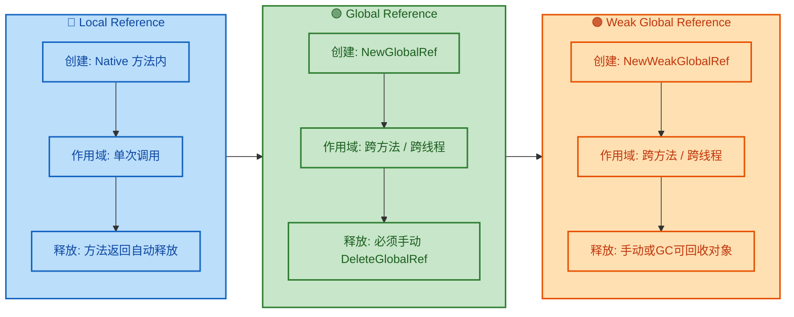
```mermaid
graph LR
    subgraph LocalRef["🔵 Local Reference"]
        direction TB
        L1["创建: Native 方法内"] --> L2["作用域: 单次调用"] --> L3["释放: 方法返回自动释放"]
    end

    subgraph GlobalRef["🟢 Global Reference"]
        direction TB
        G1["创建: NewGlobalRef"] --> G2["作用域: 跨方法 / 跨线程"] --> G3["释放: 必须手动 DeleteGlobalRef"]
    end

    subgraph WeakRef["🟠 Weak Global Reference"]
        direction TB
        W1["创建: NewWeakGlobalRef"] --> W2["作用域: 跨方法 / 跨线程"] --> W3["释放: 手动或GC可回收对象"]
    end

    LocalRef --> GlobalRef --> WeakRef

    classDef localCls fill:#BBDEFB,stroke:#1565C0,color:#0D47A1,stroke-width:2px
    classDef globalCls fill:#C8E6C9,stroke:#2E7D32,color:#1B5E20,stroke-width:2px
    classDef weakCls fill:#FFE0B2,stroke:#E65100,color:#BF360C,stroke-width:2px

    class LocalRef,L1,L2,L3 localCls
    class GlobalRef,G1,G2,G3 globalCls
    class WeakRef,W1,W2,W3 weakCls
```

可以看到，全局引用在灵活性上远超局部引用，但代价是 **完全由开发者负责其生命周期管理**。

---

### NewGlobalRef / DeleteGlobalRef

这是全局引用最核心的一对 API。理解它们的语义和使用模式，是掌握 JNI 引用管理的关键。

#### API 签名

```c
// 创建一个全局引用，使 obj 指向的 Java 对象不会被 GC 回收
// 参数: env  - JNI 环境指针
//       obj  - 源引用（可以是局部引用、全局引用、甚至弱全局引用）
// 返回: 新的全局引用；如果内存不足则返回 NULL
jobject NewGlobalRef(JNIEnv *env, jobject obj);

// 删除一个全局引用，通知 GC 该对象不再被 Native 层持有
// 参数: env     - JNI 环境指针
//       globalRef - 之前通过 NewGlobalRef 创建的全局引用
void DeleteGlobalRef(JNIEnv *env, jobject globalRef);
```

#### 核心语义解读

`NewGlobalRef` 的本质是在 JVM 内部的 **全局引用表（Global Reference Table）** 中新增一条记录，将传入的 Java 对象"注册"为被 Native 层强引用。这意味着：

1. **输入可以是任何引用类型**：你可以从一个局部引用创建全局引用，也可以从一个已有的全局引用再创建一个新的全局引用（虽然通常没必要）。甚至可以从弱全局引用创建——前提是该弱引用指向的对象尚未被 GC 回收。

2. **返回值是一个新的引用**：`NewGlobalRef` 返回的 `jobject` 与传入的 `obj` 是 **两个不同的引用值**，但它们指向同一个 Java 对象。切勿将原始局部引用和新建的全局引用混为一谈。

3. **GC Root 效应**：全局引用被 JVM 视为 GC Root 的一部分。只要全局引用存在，目标对象及其 **整个可达对象图（Reachable Object Graph）** 都不会被回收。

下面是一个最基础的使用示例：

```c
// === 全局引用的基本创建与释放 ===

// 声明一个全局变量来存储全局引用
static jclass g_MyClass = NULL;   // 全局引用存储在 static 变量中

// 第一次调用：创建全局引用
JNIEXPORT void JNICALL
Java_com_example_NativeLib_initClass(JNIEnv *env, jobject thiz) {
    // 1. FindClass 返回的是一个局部引用
    jclass localClassRef = (*env)->FindClass(env, "com/example/MyClass");
    if (localClassRef == NULL) {
        return;  // 类未找到，抛出异常后直接返回
    }

    // 2. 将局部引用"升级"为全局引用
    //    此后 g_MyClass 可以跨多次 JNI 调用使用
    g_MyClass = (jclass)(*env)->NewGlobalRef(env, localClassRef);

    // 3. 局部引用已不再需要，可以提前手动释放
    //    （即使不释放，方法返回后也会自动回收）
    (*env)->DeleteLocalRef(env, localClassRef);

    // 4. 检查全局引用是否创建成功（OOM 时可能返回 NULL）
    if (g_MyClass == NULL) {
        // NewGlobalRef 失败，通常意味着 JVM 内存不足
        // 此时 JVM 已经抛出 OutOfMemoryError
        return;
    }
}

// 第二次调用：使用全局引用（可以在完全不同的时间、不同的线程）
JNIEXPORT void JNICALL
Java_com_example_NativeLib_useClass(JNIEnv *env, jobject thiz) {
    if (g_MyClass == NULL) {
        return;  // 尚未初始化，直接返回
    }

    // 直接使用全局引用查找方法
    jmethodID mid = (*env)->GetMethodID(env, g_MyClass, "doSomething", "()V");
    // ... 后续调用逻辑
}

// 第三次调用：释放全局引用（通常在 JNI_OnUnload 或主动清理时）
JNIEXPORT void JNICALL
Java_com_example_NativeLib_cleanup(JNIEnv *env, jobject thiz) {
    if (g_MyClass != NULL) {
        // 删除全局引用，允许 GC 回收 MyClass 的 Class 对象
        (*env)->DeleteGlobalRef(env, g_MyClass);
        // 将指针置 NULL，防止悬空引用（Dangling Reference）
        g_MyClass = NULL;
    }
}
```

#### 常见错误：用 static 变量存储局部引用

初学者最常犯的错误之一，是试图将局部引用保存到 C 的 `static` 或全局变量中，然后在后续调用中继续使用：

```c
// ❌ 严重错误！！！将局部引用存入 static 变量
static jclass g_CachedClass = NULL;

JNIEXPORT void JNICALL
Java_com_example_NativeLib_cacheClass(JNIEnv *env, jobject thiz) {
    // FindClass 返回局部引用
    jclass localRef = (*env)->FindClass(env, "com/example/MyClass");

    // 错误：将局部引用直接赋给 static 变量
    // 方法返回后 localRef 失效，g_CachedClass 变成悬空指针！
    g_CachedClass = localRef;  // ⚠️ DANGLING REFERENCE!
}

JNIEXPORT void JNICALL
Java_com_example_NativeLib_useCachedClass(JNIEnv *env, jobject thiz) {
    // 使用已失效的引用 → 未定义行为（崩溃 / 数据损坏 / 安全漏洞）
    jmethodID mid = (*env)->GetMethodID(env, g_CachedClass, "foo", "()V");
    // 可能的报错: JNI ERROR (app bug): accessed stale local reference
}
```

这个错误之所以隐蔽，是因为在某些 JVM 实现中（特别是 Debug 模式关闭时），悬空的局部引用 **可能偶尔还能用**——因为其指向的内存尚未被覆写。但这只是"运气好"，随时可能在生产环境中崩溃。

正确做法永远是通过 `NewGlobalRef` 进行"升级"：

```c
// ✅ 正确做法
g_CachedClass = (jclass)(*env)->NewGlobalRef(env, localRef);
(*env)->DeleteLocalRef(env, localRef);  // 及时释放局部引用
```

下面的内存模型图清晰展示了局部引用 vs 全局引用在 JVM 内部的存储差异：

```text
┌──────────────────────────────────────────────────────────────────────┐
│                        JVM Process Memory                            │
│                                                                      │
│  ┌─────────────────────────────┐   ┌──────────────────────────────┐  │
│  │   Thread-Local Storage       │   │    JVM Global Area           │  │
│  │   (Per-Thread, Per-Call)     │   │    (Process-Wide)            │  │
│  │                             │   │                              │  │
│  │  ┌───────────────────────┐  │   │  ┌────────────────────────┐  │  │
│  │  │  Local Ref Table      │  │   │  │  Global Ref Table      │  │  │
│  │  │  ┌─────┬───────────┐  │  │   │  │  ┌─────┬────────────┐ │  │  │
│  │  │  │ [0] │ → obj A   │  │  │   │  │  │ [0] │ → obj X    │ │  │  │
│  │  │  │ [1] │ → obj B   │  │  │   │  │  │ [1] │ → obj Y    │ │  │  │
│  │  │  │ [2] │ → obj C   │  │  │   │  │  │ [2] │ → obj Z    │ │  │  │
│  │  │  │ ... │           │  │  │   │  │  │ ... │            │ │  │  │
│  │  │  └─────┴───────────┘  │  │   │  │  └─────┴────────────┘ │  │  │
│  │  │  方法返回 → 全部清空   │  │   │  │  必须手动 Delete      │  │  │
│  │  └───────────────────────┘  │   │  └────────────────────────┘  │  │
│  └─────────────────────────────┘   └──────────────────────────────┘  │
│                                                                      │
│  ┌───────────────────────────────────────────────────────────────┐   │
│  │                         Java Heap                              │   │
│  │    ┌───────┐    ┌───────┐    ┌───────┐    ┌───────┐          │   │
│  │    │ obj A │    │ obj B │    │ obj X │    │ obj Y │   ...    │   │
│  │    └───────┘    └───────┘    └───────┘    └───────┘          │   │
│  └───────────────────────────────────────────────────────────────┘   │
└──────────────────────────────────────────────────────────────────────┘
```

关键区别一目了然：Local Ref Table 是线程私有且自动清理的，而 Global Ref Table 是进程级别的、必须手动管理的。

---

### 生命周期管理

全局引用的生命周期管理是 JNI 编程中 **最需要纪律性** 的部分。与 Java 层的自动内存管理（GC）不同，全局引用的创建和销毁完全由 C/C++ 代码控制，遵循 **"谁创建，谁释放"（Ownership Semantics）** 的原则。

#### 生命周期的四个阶段

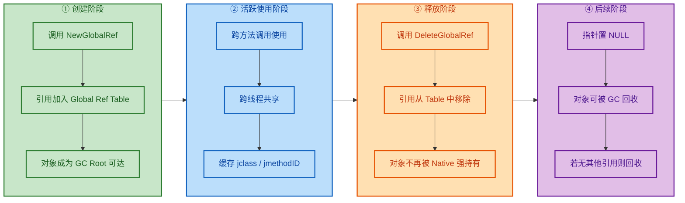
```mermaid
graph LR
    subgraph Phase1["① 创建阶段"]
        direction TB
        P1A["调用 NewGlobalRef"] --> P1B["引用加入 Global Ref Table"] --> P1C["对象成为 GC Root 可达"]
    end

    subgraph Phase2["② 活跃使用阶段"]
        direction TB
        P2A["跨方法调用使用"] --> P2B["跨线程共享"] --> P2C["缓存 jclass / jmethodID"]
    end

    subgraph Phase3["③ 释放阶段"]
        direction TB
        P3A["调用 DeleteGlobalRef"] --> P3B["引用从 Table 中移除"] --> P3C["对象不再被 Native 强持有"]
    end

    subgraph Phase4["④ 后续阶段"]
        direction TB
        P4A["指针置 NULL"] --> P4B["对象可被 GC 回收"] --> P4C["若无其他引用则回收"]
    end

    Phase1 --> Phase2 --> Phase3 --> Phase4

    classDef phase1Cls fill:#C8E6C9,stroke:#2E7D32,color:#1B5E20,stroke-width:2px
    classDef phase2Cls fill:#BBDEFB,stroke:#1565C0,color:#0D47A1,stroke-width:2px
    classDef phase3Cls fill:#FFE0B2,stroke:#E65100,color:#BF360C,stroke-width:2px
    classDef phase4Cls fill:#E1BEE7,stroke:#6A1B9A,color:#4A148C,stroke-width:2px

    class Phase1,P1A,P1B,P1C phase1Cls
    class Phase2,P2A,P2B,P2C phase2Cls
    class Phase3,P3A,P3B,P3C phase3Cls
    class Phase4,P4A,P4B,P4C phase4Cls
```

#### 典型场景一：JNI_OnLoad / JNI_OnUnload 对称管理

最规范的全局引用管理方式是利用 JNI 的生命周期回调函数，在 **库加载时创建**，在 **库卸载时释放**：

```c
// === 全局引用的对称生命周期管理 ===

// 全局缓存：类引用和方法ID
static jclass    g_StringClass   = NULL;  // 缓存 java.lang.String 的 Class 对象
static jmethodID g_String_init   = NULL;  // 缓存 String 的构造方法ID
static jclass    g_ListClass     = NULL;  // 缓存 java.util.List 的 Class 对象
static jmethodID g_List_add      = NULL;  // 缓存 List.add 方法ID

// 库加载时调用 — 创建所有全局引用
JNIEXPORT jint JNICALL
JNI_OnLoad(JavaVM *vm, void *reserved) {
    JNIEnv *env = NULL;

    // 1. 获取 JNIEnv 指针
    if ((*vm)->GetEnv(vm, (void **)&env, JNI_VERSION_1_6) != JNI_OK) {
        return JNI_ERR;  // 获取环境失败
    }

    // 2. 查找并缓存 String 类（局部引用 → 全局引用）
    jclass localStringClass = (*env)->FindClass(env, "java/lang/String");
    if (localStringClass == NULL) return JNI_ERR;          // 类查找失败
    g_StringClass = (jclass)(*env)->NewGlobalRef(env, localStringClass);
    (*env)->DeleteLocalRef(env, localStringClass);         // 释放局部引用
    if (g_StringClass == NULL) return JNI_ERR;             // OOM 检查

    // 3. 缓存 String 构造方法ID
    //    注意: jmethodID 不是引用类型，不需要创建全局引用
    //    它在 Class 被卸载前始终有效
    g_String_init = (*env)->GetMethodID(env, g_StringClass,
                                         "<init>", "([BLjava/lang/String;)V");
    if (g_String_init == NULL) return JNI_ERR;

    // 4. 查找并缓存 List 类
    jclass localListClass = (*env)->FindClass(env, "java/util/List");
    if (localListClass == NULL) return JNI_ERR;
    g_ListClass = (jclass)(*env)->NewGlobalRef(env, localListClass);
    (*env)->DeleteLocalRef(env, localListClass);
    if (g_ListClass == NULL) return JNI_ERR;

    // 5. 缓存 List.add 方法ID
    g_List_add = (*env)->GetMethodID(env, g_ListClass,
                                      "add", "(Ljava/lang/Object;)Z");
    if (g_List_add == NULL) return JNI_ERR;

    // 6. 返回所需的 JNI 版本
    return JNI_VERSION_1_6;
}

// 库卸载时调用 — 释放所有全局引用
JNIEXPORT void JNICALL
JNI_OnUnload(JavaVM *vm, void *reserved) {
    JNIEnv *env = NULL;

    if ((*vm)->GetEnv(vm, (void **)&env, JNI_VERSION_1_6) != JNI_OK) {
        return;  // 获取环境失败，无法释放
    }

    // 逐一释放全局引用并置 NULL
    if (g_StringClass != NULL) {
        (*env)->DeleteGlobalRef(env, g_StringClass);
        g_StringClass = NULL;       // 防止悬空引用
    }

    if (g_ListClass != NULL) {
        (*env)->DeleteGlobalRef(env, g_ListClass);
        g_ListClass = NULL;
    }

    // jmethodID 无需释放（它不是引用类型）
    g_String_init = NULL;
    g_List_add    = NULL;
}
```

> **重要提示**：`jmethodID` 和 `jfieldID` 是 **不透明的标识符（Opaque Identifiers）**，而不是 JNI 引用。它们不需要通过 `NewGlobalRef` 管理，也不需要 `Delete`。但前提是：持有 `jmethodID` 的 `jclass` 全局引用必须保持有效——因为如果 Class 对象被卸载（unload），对应的 method/field ID 也会失效。

#### 典型场景二：Native 对象持有 Java 回调

另一个极为常见的场景是：C/C++ 层创建了一个长生命周期的对象（如音频引擎、网络连接），它需要持有一个 Java 层的回调对象（Callback / Listener），以便在异步事件发生时通知 Java 层。

```cpp
// === C++ 类持有 Java 回调的全局引用 ===

class NativeAudioEngine {
private:
    JavaVM  *m_jvm;            // JavaVM 指针（进程唯一，可以安全缓存）
    jobject  m_callbackObj;    // 全局引用：Java 回调对象
    jmethodID m_onDataReady;   // 回调方法ID

public:
    // 构造：将 Java 回调对象提升为全局引用
    NativeAudioEngine(JNIEnv *env, jobject callback) {
        // 缓存 JavaVM（在任意线程都能通过它获取 JNIEnv）
        env->GetJavaVM(&m_jvm);

        // 将传入的局部引用（callback）升级为全局引用
        m_callbackObj = env->NewGlobalRef(callback);

        // 缓存回调方法ID
        jclass clazz = env->GetObjectClass(callback);           // 获取 Class（局部引用）
        m_onDataReady = env->GetMethodID(clazz,
                                          "onDataReady", "([B)V"); // 查找方法
        env->DeleteLocalRef(clazz);                              // 释放临时的 Class 局部引用
    }

    // 异步回调：可能从另一个线程调用
    void notifyDataReady(const uint8_t *data, size_t length) {
        JNIEnv *env = nullptr;
        bool needDetach = false;

        // 尝试获取当前线程的 JNIEnv
        jint result = m_jvm->GetEnv((void **)&env, JNI_VERSION_1_6);
        if (result == JNI_EDETACHED) {
            // 当前线程未 Attach 到 JVM，需要先 Attach
            m_jvm->AttachCurrentThread(&env, nullptr);
            needDetach = true;                                   // 标记：用完后需要 Detach
        }

        // 创建 byte 数组并填充数据
        jbyteArray jData = env->NewByteArray(length);            // 创建 Java byte[]
        env->SetByteArrayRegion(jData, 0, length,
                                 (const jbyte *)data);           // 拷贝数据到 Java 数组

        // 通过全局引用调用 Java 回调
        env->CallVoidMethod(m_callbackObj, m_onDataReady, jData);

        // 释放局部引用
        env->DeleteLocalRef(jData);

        // 如果是我们 Attach 的线程，必须 Detach
        if (needDetach) {
            m_jvm->DetachCurrentThread();
        }
    }

    // 析构：释放全局引用
    ~NativeAudioEngine() {
        // 需要获取 JNIEnv 来释放全局引用
        JNIEnv *env = nullptr;
        bool needDetach = false;

        jint result = m_jvm->GetEnv((void **)&env, JNI_VERSION_1_6);
        if (result == JNI_EDETACHED) {
            m_jvm->AttachCurrentThread(&env, nullptr);
            needDetach = true;
        }

        // 释放全局引用
        if (m_callbackObj != nullptr) {
            env->DeleteGlobalRef(m_callbackObj);                 // 释放 Java 回调
            m_callbackObj = nullptr;                             // 置空防悬空
        }

        if (needDetach) {
            m_jvm->DetachCurrentThread();
        }
    }
};
```

这个例子展示了一个非常重要的模式：**C++ 对象的构造函数负责创建全局引用，析构函数负责释放**。这与 C++ 的 RAII（Resource Acquisition Is Initialization）惯用法完美契合。

#### 典型场景三：多线程环境下的引用传递

全局引用可以安全地在多个线程间传递，但局部引用 **绝对不行**。下面的时序图展示了正确的多线程引用传递流程：

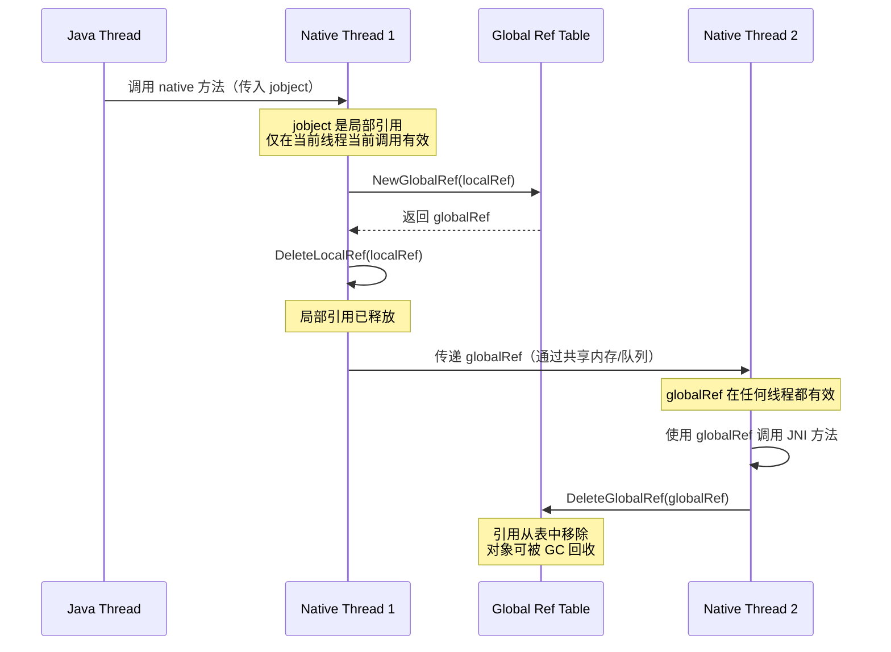
```mermaid
sequenceDiagram
    participant JT as Java Thread
    participant NT1 as Native Thread 1
    participant GRT as Global Ref Table
    participant NT2 as Native Thread 2

    JT->>NT1: 调用 native 方法（传入 jobject）
    Note over NT1: jobject 是局部引用<br/>仅在当前线程当前调用有效

    NT1->>GRT: NewGlobalRef(localRef)
    GRT-->>NT1: 返回 globalRef

    NT1->>NT1: DeleteLocalRef(localRef)
    Note over NT1: 局部引用已释放

    NT1->>NT2: 传递 globalRef（通过共享内存/队列）
    Note over NT2: globalRef 在任何线程都有效

    NT2->>NT2: 使用 globalRef 调用 JNI 方法
    NT2->>GRT: DeleteGlobalRef(globalRef)
    Note over GRT: 引用从表中移除<br/>对象可被 GC 回收
```

> ⚠️ **切记**：`JNIEnv *` 指针是 **线程绑定的（Thread-Local）**，不能跨线程使用。但 `JavaVM *` 指针和 **全局引用** 可以安全地跨线程共享。这是 JNI 多线程编程的两条铁律。

---

### 内存泄漏风险

全局引用导致的内存泄漏是 JNI 编程中 **最难排查** 的 Bug 之一。由于泄漏发生在 Native 与 Java 的边界上，传统的 Java Profiler（如 VisualVM、MAT）和 Native Memory Analyzer（如 Valgrind、ASan）都 **无法单独覆盖** 这类问题。

#### 泄漏的本质

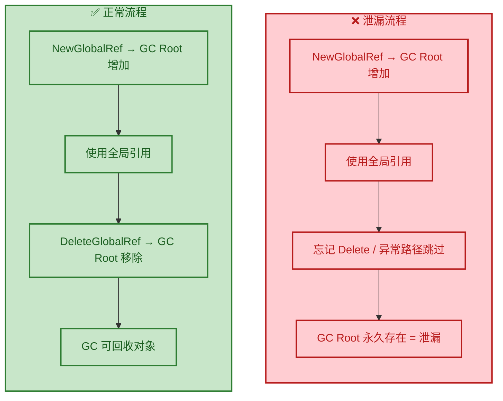
```mermaid
graph LR
    subgraph Normal["✅ 正常流程"]
        direction TB
        N1["NewGlobalRef → GC Root 增加"] --> N2["使用全局引用"] --> N3["DeleteGlobalRef → GC Root 移除"] --> N4["GC 可回收对象"]
    end

    subgraph Leak["❌ 泄漏流程"]
        direction TB
        K1["NewGlobalRef → GC Root 增加"] --> K2["使用全局引用"] --> K3["忘记 Delete / 异常路径跳过"] --> K4["GC Root 永久存在 = 泄漏"]
    end

    Normal ~~~ Leak

    classDef normalCls fill:#C8E6C9,stroke:#2E7D32,color:#1B5E20,stroke-width:2px
    classDef leakCls fill:#FFCDD2,stroke:#B71C1C,color:#B71C1C,stroke-width:2px

    class Normal,N1,N2,N3,N4 normalCls
    class Leak,K1,K2,K3,K4 leakCls
```

当全局引用未被释放时，其指向的 Java 对象会 **永远作为 GC Root 存在**。更严重的是，该对象引用的所有其他 Java 对象也无法被回收，形成 **泄漏链（Leak Chain）**。例如，一个未释放的 `Activity` 全局引用会间接持有整个 View 树、Bitmap 缓存、Context 资源等，轻松造成 **数十 MB** 的内存泄漏。

#### 六大高危泄漏场景

**场景 1：循环中累积创建全局引用**

```c
// ❌ 极度危险：每次调用都创建全局引用但从不释放
JNIEXPORT void JNICALL
Java_com_example_NativeLib_processItems(JNIEnv *env, jobject thiz,
                                         jobjectArray items) {
    jsize len = (*env)->GetArrayLength(env, items);

    for (jsize i = 0; i < len; i++) {
        // 获取数组元素（返回局部引用）
        jobject item = (*env)->GetObjectArrayElement(env, items, i);

        // 错误：在循环中无条件创建全局引用
        // 如果 items 有 10000 个元素，就会创建 10000 个全局引用！
        jobject globalItem = (*env)->NewGlobalRef(env, item);

        // 处理 item...
        processItem(env, globalItem);

        // 忘记释放 globalItem ← 泄漏！
        (*env)->DeleteLocalRef(env, item);  // 局部引用倒是释放了
        // (*env)->DeleteGlobalRef(env, globalItem);  ← 缺少这一行！
    }
    // 方法返回后：10000 个全局引用永久残留在 Global Ref Table 中
}
```

**场景 2：异常路径（Exception Path）未释放**

```c
// ❌ 异常发生后直接 return，跳过了释放逻辑
JNIEXPORT void JNICALL
Java_com_example_NativeLib_riskyOperation(JNIEnv *env, jobject thiz,
                                           jobject config) {
    // 创建全局引用
    jobject globalConfig = (*env)->NewGlobalRef(env, config);

    // 调用某个 JNI 方法
    jclass clazz = (*env)->GetObjectClass(env, globalConfig);
    jmethodID mid = (*env)->GetMethodID(env, clazz, "validate", "()Z");

    jboolean isValid = (*env)->CallBooleanMethod(env, globalConfig, mid);

    // 检查是否有 Java 异常抛出
    if ((*env)->ExceptionCheck(env)) {
        // 异常发生！直接 return
        // 但是 globalConfig 没有释放 ← 泄漏！
        (*env)->DeleteLocalRef(env, clazz);
        return;  // ⚠️ globalConfig 永久泄漏
    }

    // 正常路径：释放全局引用
    (*env)->DeleteGlobalRef(env, globalConfig);
    (*env)->DeleteLocalRef(env, clazz);
}
```

正确写法应采用 **goto 清理模式** 或 C++ 的 RAII：

```c
// ✅ 使用 goto 统一清理（C 风格）
JNIEXPORT void JNICALL
Java_com_example_NativeLib_safeOperation(JNIEnv *env, jobject thiz,
                                          jobject config) {
    jobject globalConfig = NULL;           // 初始化为 NULL
    jclass  clazz        = NULL;

    // 创建全局引用
    globalConfig = (*env)->NewGlobalRef(env, config);
    if (globalConfig == NULL) goto cleanup; // OOM 检查

    clazz = (*env)->GetObjectClass(env, globalConfig);
    jmethodID mid = (*env)->GetMethodID(env, clazz, "validate", "()Z");
    if (mid == NULL) goto cleanup;          // 方法未找到

    jboolean isValid = (*env)->CallBooleanMethod(env, globalConfig, mid);
    if ((*env)->ExceptionCheck(env)) goto cleanup; // 异常检查

    // ... 正常业务逻辑 ...

cleanup:
    // 统一释放点：无论正常还是异常都会执行到这里
    if (globalConfig != NULL) {
        (*env)->DeleteGlobalRef(env, globalConfig);
    }
    if (clazz != NULL) {
        (*env)->DeleteLocalRef(env, clazz);
    }
}
```

**场景 3：回调注册后忘记注销**

```java
// Java 层：注册 Native 回调
public class SensorManager {
    // 注册监听器 — Native 层会创建全局引用持有 listener
    public native void registerListener(SensorListener listener);

    // 如果没有提供 unregister 方法，全局引用将永远存在！
    // ✅ 必须提供对称的注销方法
    public native void unregisterListener();
}
```

```c
// Native 层
static jobject g_listener = NULL;

JNIEXPORT void JNICALL
Java_SensorManager_registerListener(JNIEnv *env, jobject thiz,
                                     jobject listener) {
    // 如果之前有旧的监听器，先释放
    if (g_listener != NULL) {
        (*env)->DeleteGlobalRef(env, g_listener);
    }
    // 创建新的全局引用
    g_listener = (*env)->NewGlobalRef(env, listener);
}

JNIEXPORT void JNICALL
Java_SensorManager_unregisterListener(JNIEnv *env, jobject thiz) {
    if (g_listener != NULL) {
        (*env)->DeleteGlobalRef(env, g_listener);    // 释放全局引用
        g_listener = NULL;                           // 置空
    }
}
```

**场景 4：替换全局引用时未释放旧值**

```c
// ❌ 直接覆盖 → 旧的全局引用泄漏
static jobject g_currentTask = NULL;

void setCurrentTask(JNIEnv *env, jobject newTask) {
    // 旧的 g_currentTask 没有释放就被覆盖了！
    g_currentTask = (*env)->NewGlobalRef(env, newTask);  // ⚠️ 旧引用泄漏
}

// ✅ 正确做法：先释放旧值
void setCurrentTask(JNIEnv *env, jobject newTask) {
    if (g_currentTask != NULL) {
        (*env)->DeleteGlobalRef(env, g_currentTask);     // 先释放旧的
    }
    g_currentTask = (*env)->NewGlobalRef(env, newTask);  // 再创建新的
}
```

**场景 5：容器（集合）中积累全局引用**

```cpp
// ❌ vector 中不断 push 全局引用，但 clear 时只清空了 vector 本身
std::vector<jobject> g_objectPool;

void addToPool(JNIEnv *env, jobject obj) {
    g_objectPool.push_back(env->NewGlobalRef(obj));      // 创建并存入
}

void clearPool() {
    g_objectPool.clear();  // ⚠️ 只清空了 C++ vector，全局引用全部泄漏！
}

// ✅ 正确做法：遍历释放每个全局引用
void clearPool(JNIEnv *env) {
    for (jobject ref : g_objectPool) {
        env->DeleteGlobalRef(ref);                       // 逐个释放
    }
    g_objectPool.clear();                                // 再清空 vector
}
```

**场景 6：JNI_OnUnload 不被调用**

这是一个非常隐蔽的问题。在 Android 上，`JNI_OnUnload` **几乎永远不会被调用**，因为 ClassLoader 卸载 native library 的情况极为罕见。这意味着你不能依赖 `JNI_OnUnload` 来做最终的清理工作。正确的做法是提供 **显式的清理接口**，在 Java 层的 `onDestroy()` 或 `close()` 中主动调用。

#### 泄漏检测手段

| 检测手段 | 适用平台 | 原理 | 优缺点 |
|---------|---------|------|--------|
| `adb shell dumpsys meminfo <pid>` | Android | 查看进程 Global Ref 数量 | 简单直观，但无法定位具体引用 |
| `-verbose:jni` JVM 参数 | Desktop JVM | 打印所有 JNI 引用操作日志 | 信息量极大，适合调试 |
| `CheckJNI` (Android) | Android | 增强 JNI 检查，检测无效引用使用 | 开发阶段必开 |
| 自定义引用计数器 | 所有平台 | 封装 New/Delete，内部维护计数 | 最灵活，推荐生产使用 |
| Android Studio Profiler | Android | 监控内存增长趋势 | 可视化好，但不直接显示 Global Ref |

以下是一个 **自定义引用追踪器** 的实现思路：

```cpp
// === 全局引用追踪器（用于调试和泄漏检测）===

#include <unordered_map>
#include <mutex>
#include <string>
#include <android/log.h>

#define LOG_TAG "JNI_RefTracker"
#define LOGW(...) __android_log_print(ANDROID_LOG_WARN, LOG_TAG, __VA_ARGS__)

class GlobalRefTracker {
private:
    // 记录每个全局引用的创建位置
    std::unordered_map<jobject, std::string> m_refMap;
    std::mutex m_mutex;                                          // 线程安全保护
    int m_totalCreated  = 0;                                     // 累计创建数
    int m_totalDeleted  = 0;                                     // 累计释放数

public:
    // 创建全局引用并记录来源
    jobject trackNewGlobalRef(JNIEnv *env, jobject obj,
                               const char *file, int line) {
        jobject globalRef = env->NewGlobalRef(obj);              // 实际创建
        if (globalRef != nullptr) {
            std::lock_guard<std::mutex> lock(m_mutex);           // 加锁
            // 记录引用和创建位置
            std::string location = std::string(file) + ":" + std::to_string(line);
            m_refMap[globalRef] = location;
            m_totalCreated++;
        }
        return globalRef;
    }

    // 释放全局引用并移除记录
    void trackDeleteGlobalRef(JNIEnv *env, jobject globalRef) {
        if (globalRef != nullptr) {
            std::lock_guard<std::mutex> lock(m_mutex);
            m_refMap.erase(globalRef);                           // 移除记录
            m_totalDeleted++;
        }
        env->DeleteGlobalRef(globalRef);                         // 实际释放
    }

    // 打印当前所有未释放的全局引用（用于泄漏检测）
    void dumpLeaks() {
        std::lock_guard<std::mutex> lock(m_mutex);
        int leakCount = m_totalCreated - m_totalDeleted;
        LOGW("=== Global Ref Leak Report ===");
        LOGW("Created: %d, Deleted: %d, Leaked: %d",
             m_totalCreated, m_totalDeleted, leakCount);

        for (auto &pair : m_refMap) {
            LOGW("  Leaked ref %p created at: %s",
                 pair.first, pair.second.c_str());               // 输出泄漏位置
        }
        LOGW("=== End Report ===");
    }
};

// 全局单例
static GlobalRefTracker g_refTracker;

// 便捷宏：自动记录文件名和行号
#ifdef DEBUG
    #define TRACKED_NEW_GLOBAL_REF(env, obj) \
        g_refTracker.trackNewGlobalRef(env, obj, __FILE__, __LINE__)
    #define TRACKED_DELETE_GLOBAL_REF(env, ref) \
        g_refTracker.trackDeleteGlobalRef(env, ref)
#else
    // Release 模式下不追踪，零开销
    #define TRACKED_NEW_GLOBAL_REF(env, obj) \
        (env)->NewGlobalRef(obj)
    #define TRACKED_DELETE_GLOBAL_REF(env, ref) \
        (env)->DeleteGlobalRef(ref)
#endif
```

使用时只需将代码中的 `NewGlobalRef` / `DeleteGlobalRef` 替换为宏即可：

```cpp
// 使用追踪宏
jobject globalCallback = TRACKED_NEW_GLOBAL_REF(env, callback);
// ...
TRACKED_DELETE_GLOBAL_REF(env, globalCallback);

// 在合适的时机（如 App 退出前）调用泄漏报告
g_refTracker.dumpLeaks();
```

#### 全局引用 vs C/C++ 内存管理类比

为了帮助理解，下表将 JNI 全局引用与 C/C++ 中的常见内存管理概念进行对比：

| JNI 概念 | C 类比 | C++ 类比 | 关键相似点 |
|----------|--------|----------|-----------|
| `NewGlobalRef` | `malloc` | `new` / `std::shared_ptr` | 获取资源 |
| `DeleteGlobalRef` | `free` | `delete` / `reset()` | 释放资源 |
| 忘记 Delete | 内存泄漏 | 内存泄漏 | 资源永久占用 |
| Delete 后仍使用 | Use-After-Free | 悬空指针 | 未定义行为 |
| Delete NULL | 未定义（C标准未规定free(NULL)的行为取决于实现） | 安全（delete nullptr 合法） | JNI 中 Delete NULL 是未定义行为，**需先检查** |

> ⚠️ **特别注意**：对 `NULL` 调用 `DeleteGlobalRef` 是 **未定义行为**。不同 JVM 实现的处理方式不同——有的会静默忽略，有的会崩溃。因此，在调用 `DeleteGlobalRef` 之前，**务必检查引用是否为 NULL**。

---

**📝 练习题**

以下 C 代码存在一个全局引用泄漏。请找出泄漏发生的根本原因：

```c
static jobject g_handler = NULL;

JNIEXPORT void JNICALL
Java_Example_setHandler(JNIEnv *env, jclass clazz, jobject handler) {
    g_handler = (*env)->NewGlobalRef(env, handler);
}
```

假设 `setHandler` 被调用了 3 次，分别传入对象 A、B、C。此时 Global Reference Table 中有多少个全局引用未被释放？

A. 1 个（只有 C）


B. 2 个（A 和 B）


C. 3 个（A、B 和 C）


D. 0 个（全部被自动回收）


**【答案】** C

**【解析】** 每次调用 `setHandler` 时，都会通过 `NewGlobalRef` 创建一个新的全局引用。第一次调用创建了指向 A 的全局引用，第二次创建了指向 B 的全局引用，第三次创建了指向 C 的全局引用。然而，代码中 **在创建新引用之前没有释放旧引用**——`g_handler` 直接被覆盖，导致指向 A 和 B 的全局引用虽然仍存在于 Global Reference Table 中，但 C 代码中已经丢失了它们的引用值，永远无法再调用 `DeleteGlobalRef` 来释放。因此，3 次调用后，Global Reference Table 中残留 **3 个全局引用**（A、B、C 各一个），但只有 C 是可达的（通过 `g_handler`），A 和 B 已经彻底泄漏。正确写法应在赋新值前先 `DeleteGlobalRef(env, g_handler)`。

---

**📝 练习题**

在 Android 应用中，以下哪种做法 **不能** 可靠地用于释放 JNI 全局引用？

A. 在 Java 层 `Activity.onDestroy()` 中调用 native 清理方法


B. 在 `JNI_OnUnload` 中释放所有全局引用


C. 实现 `java.lang.AutoCloseable` 接口，在 `close()` 方法中调用 native 释放


D. 在 C++ 析构函数中调用 `DeleteGlobalRef`（确保析构时有有效的 `JNIEnv`）


**【答案】** B

**【解析】** 在 Android 平台上，`JNI_OnUnload` 几乎永远不会被调用。Android 的 ClassLoader 在应用的整个生命周期中通常不会卸载 native library（即使 Activity 被销毁，native library 仍然驻留在进程内存中，直到进程被杀死）。因此，依赖 `JNI_OnUnload` 来释放全局引用是 **不可靠的**。选项 A（显式清理）、C（AutoCloseable 模式）和 D（C++ RAII 模式）都是可靠的释放策略，因为它们都由应用代码主动触发，不依赖 JVM 的库卸载机制。

---

## 弱全局引用 (Weak Global Reference)

在 JNI 的三种引用类型中，**弱全局引用 (Weak Global Reference)** 是最特殊、也最容易被误用的一种。它兼具全局引用的**跨线程、跨方法**生存能力，同时又像 Java 层的 `WeakReference` 一样，**不会阻止 GC 回收其指向的对象**。理解弱全局引用的核心，就是理解它与垃圾回收器之间的微妙协作关系。

---

### 弱全局引用的本质与定位

要理解弱全局引用，最好先从 Java 层的引用强度谱系说起。Java 中存在四种引用强度：

| 引用类型 | Java 层 | JNI 层 | 是否阻止 GC |
|:---:|:---:|:---:|:---:|
| 强引用 (Strong) | 普通变量 | Local / Global Reference | ✅ 是 |
| 软引用 (Soft) | `SoftReference` | — (JNI 无对应) | ⚠️ 内存不足时回收 |
| 弱引用 (Weak) | `WeakReference` | **Weak Global Reference** | ❌ 否 |
| 虚引用 (Phantom) | `PhantomReference` | — (JNI 无对应) | ❌ 否 |

弱全局引用在 JNI 层的语义，与 Java 层 `java.lang.ref.WeakReference` 完全一致：**它持有一个指向 Java 对象的"观察者"角色的引用，GC 完全无视它的存在**。当一个 Java 对象的所有强引用（包括 JNI 局部引用和全局引用）都消失后，即使还有弱全局引用指向它，GC 仍然可以在任意时刻回收该对象。回收一旦发生，这个弱全局引用就变成了一个"悬空"的状态——JNI 规范中称之为引用已被 **"cleared"（清除）**。

一句话总结其核心特性：

> **Weak Global Reference = 全局生命周期 + 不阻止 GC + 可能随时失效**

---

### 创建与销毁 API

JNI 提供了一对简洁的 API 用于管理弱全局引用：

```c
// ==================== 创建弱全局引用 ====================
// 参数 obj：可以是局部引用、全局引用，甚至是另一个弱全局引用
// 返回值：新创建的弱全局引用；若内存不足返回 NULL
jweak NewWeakGlobalRef(JNIEnv *env, jobject obj);

// ==================== 销毁弱全局引用 ====================
// 参数 ref：之前通过 NewWeakGlobalRef 创建的弱全局引用
// 调用后 ref 不可再使用（悬空指针）
void DeleteWeakGlobalRef(JNIEnv *env, jweak ref);
```

注意返回类型是 `jweak`，它在 JNI 头文件中被 typedef 为 `jobject`，本质上只是一个语义别名，帮助开发者区分引用类型：

```c
// jni.h 中的定义（不同平台实现可能略有差异）
typedef jobject jweak;   // jweak 本质就是 jobject 的别名
```

下面是一个完整的创建和销毁流程：

```c
// ============================================================
// 演示：弱全局引用的完整生命周期
// ============================================================

// 全局变量：存储弱全局引用
static jweak g_weakBitmapClass = NULL;  // 指向 Bitmap 类对象的弱引用

JNIEXPORT void JNICALL
Java_com_example_NativeCache_cacheClass(JNIEnv *env, jobject thiz) {
    // 第一步：通过 FindClass 获取一个局部引用
    jclass bitmapClass = (*env)->FindClass(env, "android/graphics/Bitmap");
    if (bitmapClass == NULL) {
        return;  // FindClass 失败，可能已抛出异常
    }

    // 第二步：基于局部引用创建弱全局引用
    // 弱全局引用不阻止 GC 回收 bitmapClass 指向的 Class 对象
    // （注意：实际中 Class 对象通常不会被回收，此处仅作演示）
    g_weakBitmapClass = (*env)->NewWeakGlobalRef(env, bitmapClass);

    // 第三步：创建完弱全局引用后，局部引用可安全释放
    (*env)->DeleteLocalRef(env, bitmapClass);

    // 此时 g_weakBitmapClass 在任意线程、任意时刻均可访问
    // 但使用前必须检查其是否已被 GC 回收
}

JNIEXPORT void JNICALL
Java_com_example_NativeCache_releaseCache(JNIEnv *env, jobject thiz) {
    // 显式销毁弱全局引用，释放 JNI 内部的引用表槽位
    if (g_weakBitmapClass != NULL) {
        (*env)->DeleteWeakGlobalRef(env, g_weakBitmapClass);
        g_weakBitmapClass = NULL;  // 置空防止悬空访问
    }
}
```

---

### 使用前的有效性检查 ⭐⭐⭐

弱全局引用最关键、最容易出错的地方在于：**使用前必须验证它是否仍然有效**。因为 GC 可能在任何时刻回收其指向的对象，所以每次通过弱全局引用访问对象之前，都必须进行安全检查。

JNI 规范规定的检查方式是使用 `IsSameObject` 将弱全局引用与 `NULL` 进行比较：

```c
// ============================================================
// 演示：弱全局引用的安全使用模式（Canonical Pattern）
// ============================================================
JNIEXPORT void JNICALL
Java_com_example_NativeCache_useCachedClass(JNIEnv *env, jobject thiz) {

    // ⚠️ 关键：先检查弱全局引用是否已被 GC 清除
    // IsSameObject(ref, NULL) == JNI_TRUE 表示对象已被回收
    if (g_weakBitmapClass == NULL ||
        (*env)->IsSameObject(env, g_weakBitmapClass, NULL) == JNI_TRUE) {
        // 对象已被回收或引用未初始化
        // 策略一：重新加载
        // 策略二：返回错误
        return;
    }

    // ⚠️ 重要：即使上面的检查通过了，在多线程环境下
    // GC 仍然可能在"检查之后、使用之前"这个窗口期回收对象！
    // 所以正确做法是：立即将弱全局引用提升为局部引用（强引用）

    // 第一步：将弱引用"提升"为局部引用（强引用），锁住对象
    jclass localRef = (jclass)(*env)->NewLocalRef(env, g_weakBitmapClass);

    // 第二步：再次检查提升是否成功
    // 如果在 NewLocalRef 执行时对象恰好被回收，localRef 为 NULL
    if (localRef == NULL) {
        // 提升失败——对象在窗口期内被回收了
        return;
    }

    // 第三步：现在 localRef 是强引用，GC 不会再回收该对象
    // 可以安全地进行各种 JNI 操作
    jmethodID mid = (*env)->GetStaticMethodID(
        env, localRef, "createBitmap",
        "(IILandroid/graphics/Bitmap$Config;)Landroid/graphics/Bitmap;");

    // ... 执行业务逻辑 ...

    // 第四步：使用完毕后释放局部引用
    (*env)->DeleteLocalRef(env, localRef);
}
```

将上述安全使用模式提炼为流程图：

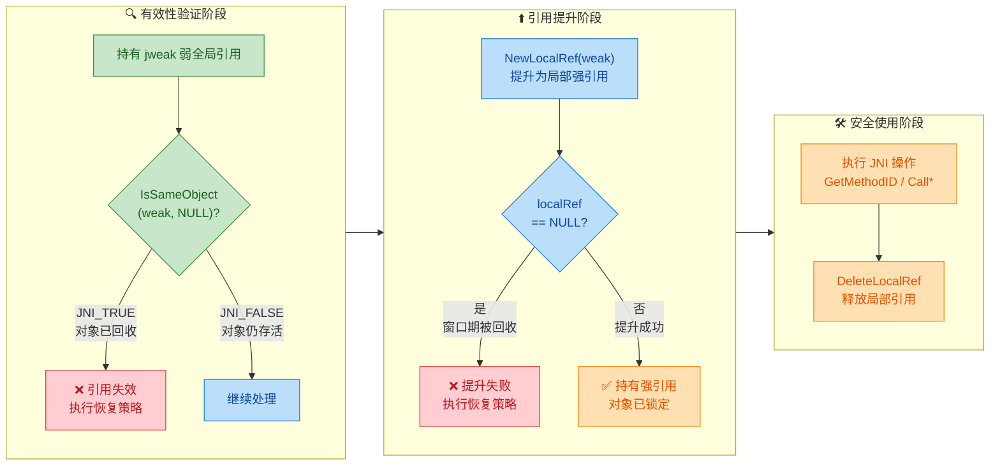
```mermaid
graph LR
    subgraph CHECK["🔍 有效性验证阶段"]
        direction TB
        A["持有 jweak 弱全局引用"] --> B{"IsSameObject\n(weak, NULL)?"}
        B -->|"JNI_TRUE\n对象已回收"| C["❌ 引用失效\n执行恢复策略"]
        B -->|"JNI_FALSE\n对象仍存活"| D["继续处理"]
    end

    subgraph PROMOTE["⬆️ 引用提升阶段"]
        direction TB
        E["NewLocalRef(weak)\n提升为局部强引用"] --> F{"localRef\n== NULL?"}
        F -->|"是\n窗口期被回收"| G["❌ 提升失败\n执行恢复策略"]
        F -->|"否\n提升成功"| H["✅ 持有强引用\n对象已锁定"]
    end

    subgraph USE["🛠️ 安全使用阶段"]
        direction TB
        I["执行 JNI 操作\nGetMethodID / Call*"] --> J["DeleteLocalRef\n释放局部引用"]
    end

    CHECK --> PROMOTE --> USE

    classDef greenNode fill:#C8E6C9,stroke:#388E3C,color:#1B5E20
    classDef blueNode fill:#BBDEFB,stroke:#1976D2,color:#0D47A1
    classDef orangeNode fill:#FFE0B2,stroke:#F57C00,color:#E65100
    classDef redNode fill:#FFCDD2,stroke:#D32F2F,color:#B71C1C

    class A,B greenNode
    class D,E,F blueNode
    class H,I,J orangeNode
    class C,G redNode
```

> ⚠️ **关键认知**：很多开发者会犯一个错误——仅用 `IsSameObject` 做一次判断就直接使用弱引用。这在单线程中"碰巧"能工作，但在多线程 + GC 并发环境下是**未定义行为**。**唯一安全的模式是 "Check → Promote → Re-check → Use → Release"**。

---

### 弱全局引用 vs 全局引用：深度对比

| 对比维度 | Global Reference | Weak Global Reference |
|:---|:---|:---|
| **创建 API** | `NewGlobalRef` | `NewWeakGlobalRef` |
| **销毁 API** | `DeleteGlobalRef` | `DeleteWeakGlobalRef` |
| **GC 可见性** | 作为 GC Root，阻止回收 | 对 GC 透明，不阻止回收 |
| **跨线程使用** | ✅ 安全 | ✅ 安全（但需检查有效性） |
| **跨方法调用** | ✅ 有效 | ✅ 有效（但可能随时失效） |
| **使用前检查** | 不需要 | **必须**先提升为 LocalRef |
| **内存泄漏风险** | 高（忘记 Delete 则永不释放） | 低（对象可被 GC 回收） |
| **典型用途** | 缓存 Class/MethodID 等长期对象 | 缓存可丢弃对象、实现 Native 层弱缓存 |

用一个类比来加深理解：

```
全局引用 ≈ 你把一把钥匙锁在保险柜里
  → 钥匙永远在，但保险柜空间有限（内存泄漏风险）

弱全局引用 ≈ 你记住了钥匙放在桌上
  → 别人随时可能拿走它（GC 回收）
  → 每次用之前必须看一眼桌上还有没有（IsSameObject 检查）
  → 看到了就赶紧抓在手里（NewLocalRef 提升）
```

---

### 典型应用场景

#### 场景一：Native 层对象弱缓存 (Weak Cache)

这是弱全局引用最经典的用途。当 Native 层需要缓存 Java 对象但又不希望阻止 GC 回收时，弱全局引用是首选：

```c
// ============================================================
// 场景：Native 层维护一个图片解码器的弱缓存
// 当 Java 层不再持有 Decoder 实例时，GC 可自由回收
// Native 层在下次使用时检测到失效后重新创建
// ============================================================

#define CACHE_SIZE 16

// 弱引用缓存数组：保存最多 16 个解码器实例
static jweak g_decoderCache[CACHE_SIZE] = { NULL };

// 获取或创建解码器
jobject getOrCreateDecoder(JNIEnv *env, int index) {
    if (index < 0 || index >= CACHE_SIZE) {
        return NULL;  // 下标越界保护
    }

    jobject strongRef = NULL;  // 用于存储提升后的强引用

    // 尝试从缓存中获取
    if (g_decoderCache[index] != NULL) {
        // 将弱引用提升为局部强引用
        strongRef = (*env)->NewLocalRef(env, g_decoderCache[index]);

        if (strongRef != NULL) {
            // 提升成功——缓存命中，直接返回
            return strongRef;
        }

        // 提升失败——对象已被 GC 回收，清理失效的弱引用
        (*env)->DeleteWeakGlobalRef(env, g_decoderCache[index]);
        g_decoderCache[index] = NULL;
    }

    // 缓存未命中：创建新的解码器实例
    jclass clazz = (*env)->FindClass(env, "com/example/ImageDecoder");
    jmethodID ctor = (*env)->GetMethodID(env, clazz, "<init>", "()V");
    strongRef = (*env)->NewObject(env, clazz, ctor);

    // 将新实例放入弱引用缓存
    g_decoderCache[index] = (*env)->NewWeakGlobalRef(env, strongRef);

    // 释放 FindClass 产生的局部引用
    (*env)->DeleteLocalRef(env, clazz);

    // 返回强引用（调用者使用完毕后需释放）
    return strongRef;
}
```

#### 场景二：避免全局引用导致的内存泄漏

当 Native 回调需要持有 Java 层 Listener 对象时，使用全局引用会阻止 Listener 被回收。如果 Java 层忘记注销 Listener，就会导致内存泄漏。弱全局引用可以作为一道安全网：

```c
// ============================================================
// 场景：Native 层保存 Java Listener 的弱引用
// 即使 Java 层忘记注销，Listener 也能被 GC 回收
// ============================================================

static jweak g_weakListener = NULL;  // Listener 弱引用

// 注册回调
JNIEXPORT void JNICALL
Java_com_example_Sensor_setListener(JNIEnv *env, jobject thiz, jobject listener) {
    // 清理旧的弱引用
    if (g_weakListener != NULL) {
        (*env)->DeleteWeakGlobalRef(env, g_weakListener);
    }
    // 创建新的弱全局引用
    g_weakListener = (*env)->NewWeakGlobalRef(env, listener);
}

// Native 层触发回调
void notifyListener(JNIEnv *env, jint sensorValue) {
    if (g_weakListener == NULL) {
        return;  // 未注册 Listener
    }

    // 提升为强引用
    jobject listener = (*env)->NewLocalRef(env, g_weakListener);
    if (listener == NULL) {
        // Listener 已被 GC 回收——自动注销
        (*env)->DeleteWeakGlobalRef(env, g_weakListener);
        g_weakListener = NULL;
        return;
    }

    // 安全调用 Listener 的 onSensorChanged 方法
    jclass clazz = (*env)->GetObjectClass(env, listener);
    jmethodID mid = (*env)->GetMethodID(
        env, clazz, "onSensorChanged", "(I)V");
    (*env)->CallVoidMethod(env, listener, mid, sensorValue);

    // 释放局部引用
    (*env)->DeleteLocalRef(env, clazz);
    (*env)->DeleteLocalRef(env, listener);
}
```

---

### 三大引用类型内存模型全景

下面用一张 ASCII 图展示三种 JNI 引用在 JVM 内部的存储位置和与 GC 的交互关系：

```c
/*
 * ┌─────────────────────── JVM Heap ───────────────────────────┐
 * │                                                            │
 * │    ┌──────────┐    ┌──────────┐     ┌──────────┐          │
 * │    │ Object A │    │ Object B │     │ Object C │          │
 * │    │ (存活)    │    │ (存活)    │     │ (已回收)  │          │
 * │    └────▲─────┘    └────▲─────┘     └──────────┘          │
 * │         │               │                ▲                 │
 * ├─────────┼───────────────┼────────────────┼─────────────────┤
 * │  JNI    │               │                │                 │
 * │  引用表  │               │                │                 │
 * │         │               │                │                 │
 * │  ┌──────┴──────┐ ┌─────┴───────┐ ┌──────┴──────┐         │
 * │  │ Local Ref   │ │ Global Ref  │ │ Weak Global │         │
 * │  │             │ │             │ │ Ref         │         │
 * │  │ GC Root: ✅ │ │ GC Root: ✅ │ │ GC Root: ❌ │         │
 * │  │ 栈帧结束释放 │ │ 手动释放    │ │ 手动释放     │         │
 * │  └─────────────┘ └─────────────┘ └─────────────┘         │
 * │                                                            │
 * │  📌 Local Ref → 线程局部引用表 (每帧独立)                    │
 * │  📌 Global Ref → 全局引用表 (进程级别)                      │
 * │  📌 Weak Global → 弱全局引用表 (进程级别, GC 不视为 Root)    │
 * └────────────────────────────────────────────────────────────┘
 *
 *  GC 扫描时：
 *    → Local Ref 指向的 Object A：被标记为存活 ✅
 *    → Global Ref 指向的 Object B：被标记为存活 ✅
 *    → Weak Global 指向的 Object C：不被标记，可自由回收 ⚡
 */
```

---

### 常见陷阱与注意事项

**陷阱一：直接使用弱引用而不提升**

```c
// ❌ 错误：直接使用 jweak 调用 JNI 方法
// 如果 GC 恰好在此时回收对象，行为未定义（崩溃/数据损坏）
jclass clazz = (jclass) g_weakRef;
(*env)->GetMethodID(env, clazz, "foo", "()V");  // BOOM 💥
```

```c
// ✅ 正确：先提升为 LocalRef，再使用
jclass clazz = (jclass)(*env)->NewLocalRef(env, g_weakRef);
if (clazz != NULL) {
    (*env)->GetMethodID(env, clazz, "foo", "()V");  // 安全 ✅
    (*env)->DeleteLocalRef(env, clazz);
}
```

**陷阱二：用 `==` 运算符比较弱引用**

```c
// ❌ 错误：C 指针层面的 == 比较没有语义意义
// JNI 引用是不透明的 handle，不同引用可能指向同一对象
if (weakRef1 == weakRef2) { ... }  // 无意义

// ✅ 正确：使用 IsSameObject 进行语义比较
if ((*env)->IsSameObject(env, weakRef1, weakRef2) == JNI_TRUE) {
    // 两个引用指向同一个对象（或都已被回收）
}
```

**陷阱三：对 `jclass`、`jmethodID`、`jfieldID` 使用弱引用的区别**

`jmethodID` 和 `jfieldID` **不是** JNI 引用，它们是直接的指针/偏移值，不受 GC 管理，不需要也不能包装为弱引用。只有 `jobject` 及其子类型（`jclass`、`jstring`、`jarray` 等）才是 JNI 引用，才能使用 `NewWeakGlobalRef`。

```c
// ❌ 语义错误：jmethodID 不是 jobject，不能创建弱引用
jmethodID mid = (*env)->GetMethodID(env, clazz, "foo", "()V");
jweak weakMid = (*env)->NewWeakGlobalRef(env, (jobject)mid);  // 编译也许通过，运行崩溃

// ✅ 正确理解：jmethodID / jfieldID 一旦获取，只要其所属 Class 未被卸载就永远有效
// 对它们无需做任何引用管理
```

**陷阱四：Class 对象与 ClassLoader 卸载**

在 Android 中，应用的 ClassLoader 通常不会被卸载，因此 `jclass` 指向的 Class 对象几乎不会被回收。但在**自定义 ClassLoader** 或**插件化框架**中，Class 对象是可能被卸载回收的。如果你用弱全局引用缓存了通过自定义 ClassLoader 加载的 Class，当该 ClassLoader 被回收时，弱引用就会失效，并且关联的 `jmethodID` / `jfieldID` 也会同时失效。

---

### 引用类型选型决策

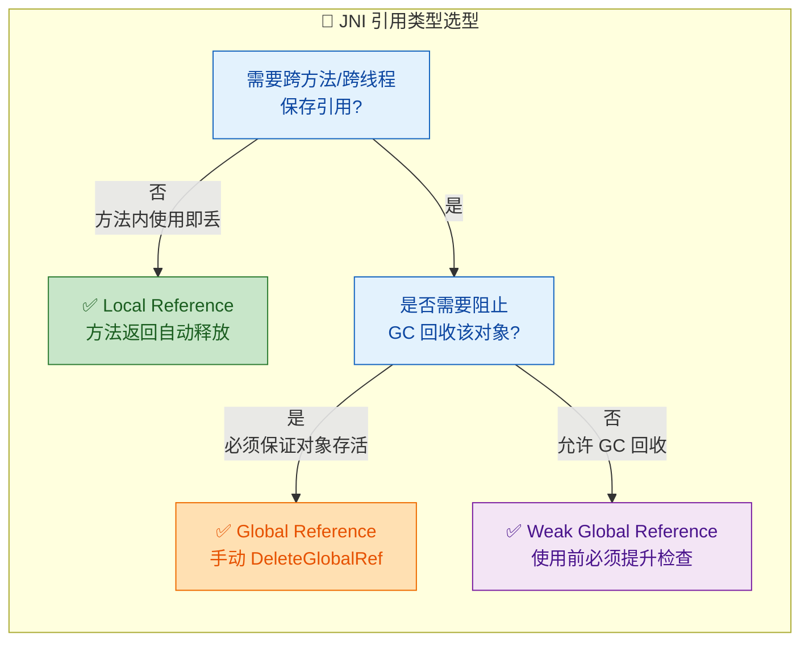
```mermaid
graph LR
    subgraph DECISION["🧭 JNI 引用类型选型"]
        direction TB
        Q1["需要跨方法/跨线程\n保存引用?"]
        Q1 -->|"否\n方法内使用即丢"| R1["✅ Local Reference\n方法返回自动释放"]
        Q1 -->|"是"| Q2["是否需要阻止\nGC 回收该对象?"]
        Q2 -->|"是\n必须保证对象存活"| R2["✅ Global Reference\n手动 DeleteGlobalRef"]
        Q2 -->|"否\n允许 GC 回收"| R3["✅ Weak Global Reference\n使用前必须提升检查"]
    end

    classDef decisionNode fill:#E3F2FD,stroke:#1565C0,color:#0D47A1
    classDef localNode fill:#C8E6C9,stroke:#2E7D32,color:#1B5E20
    classDef globalNode fill:#FFE0B2,stroke:#EF6C00,color:#E65100
    classDef weakNode fill:#F3E5F5,stroke:#7B1FA2,color:#4A148C

    class Q1,Q2 decisionNode
    class R1 localNode
    class R2 globalNode
    class R3 weakNode
```

---

**📝 练习题**

在 JNI Native 方法中，你通过 `NewWeakGlobalRef` 缓存了一个 Java 层的 `Bitmap` 对象。某次回调中你需要使用这个缓存的 `Bitmap`，以下哪种做法是**安全且正确**的？

A. 直接将 `jweak` 强制转换为 `jobject`，传入 `CallVoidMethod` 使用


B. 先调用 `IsSameObject(env, weakRef, NULL)` 检查是否被回收，若返回 `JNI_FALSE` 则直接使用 `weakRef`


C. 先调用 `NewLocalRef(env, weakRef)` 将弱引用提升为局部强引用，检查返回值非 `NULL` 后再使用该局部引用


D. 先调用 `NewGlobalRef(env, weakRef)` 将弱引用提升为全局强引用，检查返回值非 `NULL` 后再使用该全局引用


**【答案】** C

**【解析】** 

选项 A 是最危险的做法——直接使用弱引用而不做任何检查和提升，GC 可能在任何时刻回收对象，导致 JVM 崩溃或不可预测的行为。

选项 B 看似做了检查，但存在 **TOCTOU (Time of Check to Time of Use)** 竞态问题：在 `IsSameObject` 返回 `JNI_FALSE`（对象存活）之后、实际使用 `weakRef` 之前，GC 线程完全可能在这个"窗口期"内回收该对象，导致后续操作使用一个已被清除的引用。

选项 C 是**标准安全模式**。`NewLocalRef` 会原子性地尝试将弱引用提升为强引用：若对象仍存活则返回有效的局部引用（此时对象被强引用锁定，GC 不会回收）；若对象已被回收则返回 `NULL`。检查返回值非 `NULL` 后即可安全使用。使用完毕后需 `DeleteLocalRef` 释放。

选项 D 从技术上也能工作——`NewGlobalRef` 同样可以提升弱引用。但对于一次性的临时使用场景，创建全局引用是"重量级"操作，还需要后续手动 `DeleteGlobalRef`，若忘记释放则引入内存泄漏风险。因此在单次使用的场景下，`NewLocalRef`（选项 C）是最佳实践。

---

## 引用管理最佳实践

JNI 引用管理是 Native 开发中最容易出错、也最难调试的领域之一。前面章节我们分别学习了 Local Reference、Global Reference 和 Weak Global Reference 的独立用法，但在真实项目中，三种引用往往**交织使用**。一个大型 JNI 模块可能同时持有缓存的 `jclass` 全局引用、循环内创建的局部引用、以及用于观察者模式的弱全局引用。如果缺乏系统性的管理策略，轻则 Reference Table Overflow 崩溃，重则内存泄漏导致 OOM，甚至出现悬空引用（Dangling Reference）引发不可复现的 Crash。

本节将所有引用类型的管理经验提炼为**可执行的工程实践原则**，帮助你在架构层面构建健壮的 JNI 引用管理体系。

---

### 原则一：明确每个引用的 Owner 与 Lifetime

JNI 引用管理的核心哲学可以用一句话概括：**"谁创建，谁负责释放；引用的生命周期必须与业务语义匹配"**。这与 C++ 的 RAII（Resource Acquisition Is Initialization）思想一脉相承。在编写任何 JNI 函数前，都应先回答三个问题：

1. **这个引用是谁创建的？**（JVM 自动创建 / 我主动 `New*Ref`）
2. **这个引用需要活多久？**（单次调用 / 跨调用 / 整个进程）
3. **这个引用在哪里释放？**（函数返回自动释放 / 手动 `Delete*Ref` / `JNI_OnUnload`）

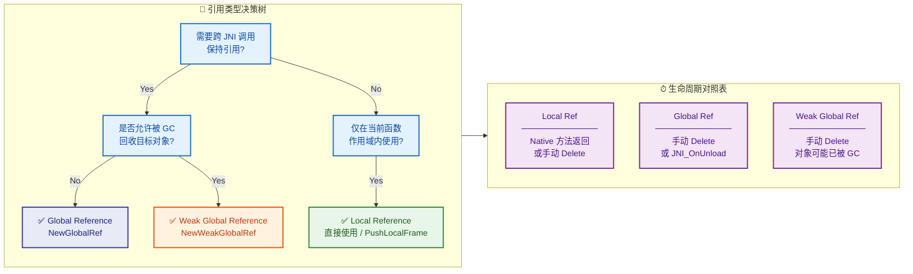
```mermaid
graph LR
    subgraph Decision["🧭 引用类型决策树"]
        direction TB
        Q1["需要跨 JNI 调用<br/>保持引用?"]
        Q2["是否允许被 GC<br/>回收目标对象?"]
        Q3["仅在当前函数<br/>作用域内使用?"]
        R1["✅ Global Reference<br/>NewGlobalRef"]
        R2["✅ Weak Global Reference<br/>NewWeakGlobalRef"]
        R3["✅ Local Reference<br/>直接使用 / PushLocalFrame"]

        Q1 -->|Yes| Q2
        Q1 -->|No| Q3
        Q2 -->|No| R1
        Q2 -->|Yes| R2
        Q3 -->|Yes| R3
    end

    subgraph Lifecycle["⏱ 生命周期对照表"]
        direction TB
        L1["Local Ref<br/>─────────────<br/>Native 方法返回<br/>或手动 Delete"]
        L2["Global Ref<br/>─────────────<br/>手动 Delete<br/>或 JNI_OnUnload"]
        L3["Weak Global Ref<br/>─────────────<br/>手动 Delete<br/>对象可能已被 GC"]
    end

    Decision --> Lifecycle

    classDef decision fill:#E3F2FD,stroke:#1565C0,color:#0D47A1,stroke-width:2px
    classDef resultGreen fill:#E8F5E9,stroke:#2E7D32,color:#1B5E20,stroke-width:2px
    classDef resultBlue fill:#E8EAF6,stroke:#283593,color:#1A237E,stroke-width:2px
    classDef resultOrange fill:#FFF3E0,stroke:#E65100,color:#BF360C,stroke-width:2px
    classDef lifecycle fill:#F3E5F5,stroke:#6A1B9A,color:#4A148C,stroke-width:2px

    class Q1,Q2,Q3 decision
    class R3 resultGreen
    class R1 resultBlue
    class R2 resultOrange
    class L1,L2,L3 lifecycle
```

一个常见的反模式是：在 `JNI_OnLoad` 中用 `FindClass` 获取 `jclass`，却忘了将它升级为 Global Reference，之后在其他 Native 方法中直接使用这个已经失效的 Local Reference。正确做法如下：

```cpp
// ❌ 反模式：直接保存 Local Reference（函数返回后失效）
static jclass g_MyClass; // 全局变量，存储了局部引用——危险！

JNIEXPORT jint JNICALL JNI_OnLoad(JavaVM *vm, void *reserved) {
    JNIEnv *env;                                      // 声明 JNI 环境指针
    vm->GetEnv((void**)&env, JNI_VERSION_1_6);        // 获取当前线程的 JNIEnv

    // FindClass 返回的是 Local Reference
    g_MyClass = env->FindClass("com/example/MyClass"); // ❌ 这是局部引用！
    // JNI_OnLoad 返回后，这个局部引用会被自动释放
    // 后续使用 g_MyClass 将导致 use-after-free / crash
    return JNI_VERSION_1_6;
}
```

```cpp
// ✅ 正确做法：升级为 Global Reference
static jclass g_MyClass = nullptr; // 全局变量，存储全局引用

JNIEXPORT jint JNICALL JNI_OnLoad(JavaVM *vm, void *reserved) {
    JNIEnv *env;                                      // 声明 JNI 环境指针
    vm->GetEnv((void**)&env, JNI_VERSION_1_6);        // 获取当前线程的 JNIEnv

    jclass localRef = env->FindClass("com/example/MyClass"); // 获取局部引用
    if (localRef == nullptr) return JNI_ERR;                  // 空指针保护

    g_MyClass = (jclass)env->NewGlobalRef(localRef);  // 升级为全局引用
    env->DeleteLocalRef(localRef);                    // 及时释放局部引用（不再需要）

    return JNI_VERSION_1_6;                           // 返回支持的 JNI 版本
}

// 在 JNI_OnUnload 或业务结束时释放全局引用
void JNI_OnUnload(JavaVM *vm, void *reserved) {
    JNIEnv *env;
    vm->GetEnv((void**)&env, JNI_VERSION_1_6);

    if (g_MyClass != nullptr) {
        env->DeleteGlobalRef(g_MyClass);              // 释放全局引用
        g_MyClass = nullptr;                          // 置空防止悬空指针
    }
}
```

---

### 原则二：循环与批量操作中必须手动释放局部引用

这是 JNI 开发中**出 Bug 频率最高**的场景。当你在 Native 层遍历 Java 集合、处理大数组、或执行任何循环操作时，每次迭代产生的 Local Reference 不会立即释放——它们会一直累积到 Native 方法返回时才被自动清理。Android 默认的局部引用表容量是 **512 个**，一旦溢出就会直接 Fatal Crash。

管理循环内引用有三种策略，适用场景各异：

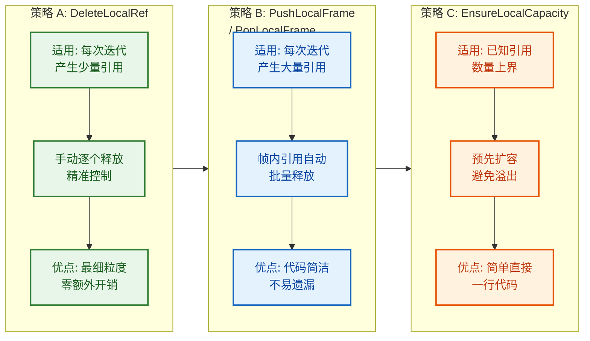
```mermaid
graph LR
    subgraph S1["策略 A: DeleteLocalRef"]
        direction TB
        A1["适用: 每次迭代<br/>产生少量引用"]
        A2["手动逐个释放<br/>精准控制"]
        A3["优点: 最细粒度<br/>零额外开销"]
        A1 --> A2 --> A3
    end

    subgraph S2["策略 B: PushLocalFrame<br/>/ PopLocalFrame"]
        direction TB
        B1["适用: 每次迭代<br/>产生大量引用"]
        B2["帧内引用自动<br/>批量释放"]
        B3["优点: 代码简洁<br/>不易遗漏"]
        B1 --> B2 --> B3
    end

    subgraph S3["策略 C: EnsureLocalCapacity"]
        direction TB
        C1["适用: 已知引用<br/>数量上界"]
        C2["预先扩容<br/>避免溢出"]
        C3["优点: 简单直接<br/>一行代码"]
        C1 --> C2 --> C3
    end

    S1 --> S2 --> S3

    classDef stratA fill:#E8F5E9,stroke:#2E7D32,color:#1B5E20,stroke-width:2px
    classDef stratB fill:#E3F2FD,stroke:#1565C0,color:#0D47A1,stroke-width:2px
    classDef stratC fill:#FFF3E0,stroke:#E65100,color:#BF360C,stroke-width:2px

    class A1,A2,A3 stratA
    class B1,B2,B3 stratB
    class C1,C2,C3 stratC
```

#### 策略 A：逐个 `DeleteLocalRef`

当每次循环迭代只产生一两个引用时，最直接的方式就是用完立刻释放：

```cpp
// 遍历 Java List，逐个处理元素并释放局部引用
void processAllItems(JNIEnv *env, jobject javaList) {
    // 获取 List 的 size() 方法 ID（方法 ID 不是引用，无需释放）
    jclass listClass = env->GetObjectClass(javaList);         // 获取 List 的 Class (Local Ref #1)
    jmethodID sizeMethod = env->GetMethodID(listClass, "size", "()I");   // 获取 size 方法 ID
    jmethodID getMethod  = env->GetMethodID(listClass, "get", "(I)Ljava/lang/Object;"); // 获取 get 方法 ID
    env->DeleteLocalRef(listClass);                           // listClass 已用完，立即释放

    jint len = env->CallIntMethod(javaList, sizeMethod);      // 调用 list.size()

    for (jint i = 0; i < len; i++) {
        jobject item = env->CallObjectMethod(javaList, getMethod, i); // 获取第 i 个元素 (Local Ref)

        // ─── 对 item 执行业务逻辑 ───
        processItem(env, item);                               // 业务处理函数

        env->DeleteLocalRef(item);                            // ✅ 每次迭代结束立即释放
        // 如果不释放，10000 次循环就会创建 10000 个局部引用 → 溢出！
    }
}
```

#### 策略 B：`PushLocalFrame` / `PopLocalFrame` 批量管理

当每次迭代会产生**多个**中间引用时（比如需要先获取对象、再取其字段、再调其方法），逐个 Delete 就变得繁琐且易遗漏。此时应使用 Local Frame 机制：

```cpp
void processComplexItems(JNIEnv *env, jobject javaList, jint len) {
    for (jint i = 0; i < len; i++) {
        // 开辟一个新的局部引用帧，预留 16 个槽位
        if (env->PushLocalFrame(16) < 0) {
            // PushLocalFrame 返回负数表示内存不足，应处理异常
            return;                                          // 内存不足，退出
        }

        // ─── 帧内：可以放心创建多个局部引用 ───
        jobject item = env->CallObjectMethod(javaList, getMethod, i);  // Local Ref A
        jclass  cls  = env->GetObjectClass(item);                      // Local Ref B
        jstring name = (jstring)env->CallObjectMethod(item, getNameMethod); // Local Ref C
        jobject data = env->CallObjectMethod(item, getDataMethod);     // Local Ref D
        // ... 可能还有更多中间引用

        processItemData(env, name, data);                    // 业务处理

        // 弹出帧：帧内所有局部引用（A/B/C/D/...）被一次性释放
        // 参数 nullptr 表示不需要从帧内"带出"任何引用
        env->PopLocalFrame(nullptr);                         // ✅ 一次性清理本轮所有引用
    }
}
```

`PopLocalFrame` 的参数不是多余的——如果你需要把某个引用从帧内"带出"（比如你在帧内找到了目标对象，需要返回给调用者），可以传入那个引用，`PopLocalFrame` 会返回一个新的局部引用指向同一个 Java 对象：

```cpp
// 从列表中查找第一个匹配项并返回
jobject findFirstMatch(JNIEnv *env, jobject javaList, jint len) {
    for (jint i = 0; i < len; i++) {
        if (env->PushLocalFrame(16) < 0) return nullptr;    // 压入新帧

        jobject item = env->CallObjectMethod(javaList, getMethod, i);
        jboolean match = checkMatch(env, item);              // 检查是否匹配

        if (match) {
            // ✅ 将 item 从帧内"带出"：PopLocalFrame 会在外层帧创建一个新的引用
            return env->PopLocalFrame(item);                 // 释放帧内其他引用，但保留 item
        }

        env->PopLocalFrame(nullptr);                         // 本轮无匹配，释放所有引用
    }
    return nullptr;                                          // 未找到匹配项
}
```

#### 策略 C：`EnsureLocalCapacity` 预扩容

如果你能预估某段代码最多会同时存活多少个局部引用，可以用 `EnsureLocalCapacity` 提前告诉 VM 扩容引用表，避免溢出：

```cpp
void processBatch(JNIEnv *env, jobjectArray array) {
    jsize len = env->GetArrayLength(array);                  // 获取数组长度

    // 预先确保有足够容量（比如每次迭代 2 个引用 + 一些余量）
    if (env->EnsureLocalCapacity(len * 2 + 10) < 0) {
        // 扩容失败，抛出 OutOfMemoryError
        return;                                              // VM 已自动抛异常，直接返回
    }

    // 注意：即使扩了容，循环中仍然建议手动释放！
    // EnsureLocalCapacity 只是"保底"，不是"放任"
    for (jsize i = 0; i < len; i++) {
        jobject elem = env->GetObjectArrayElement(array, i); // 获取元素
        processItem(env, elem);                              // 处理
        env->DeleteLocalRef(elem);                           // ✅ 仍然建议手动释放
    }
}
```

> **⚠️ 经验法则**：`EnsureLocalCapacity` 适合作为**防御性措施**，而非主要的引用管理手段。**即使扩了容，该释放的还是要释放**——引用表容量是有限的系统资源。

---

### 原则三：全局引用必须配对释放，杜绝泄漏

Global Reference 是 JNI 中最常见的内存泄漏源头。因为它不会自动释放，一旦忘记 `DeleteGlobalRef`，它会：
1. **永久阻止**对应 Java 对象被 GC 回收
2. **永久占据**全局引用表的一个槽位

这在长时间运行的服务（如 Android Service）和频繁调用的 JNI 接口中尤其致命。

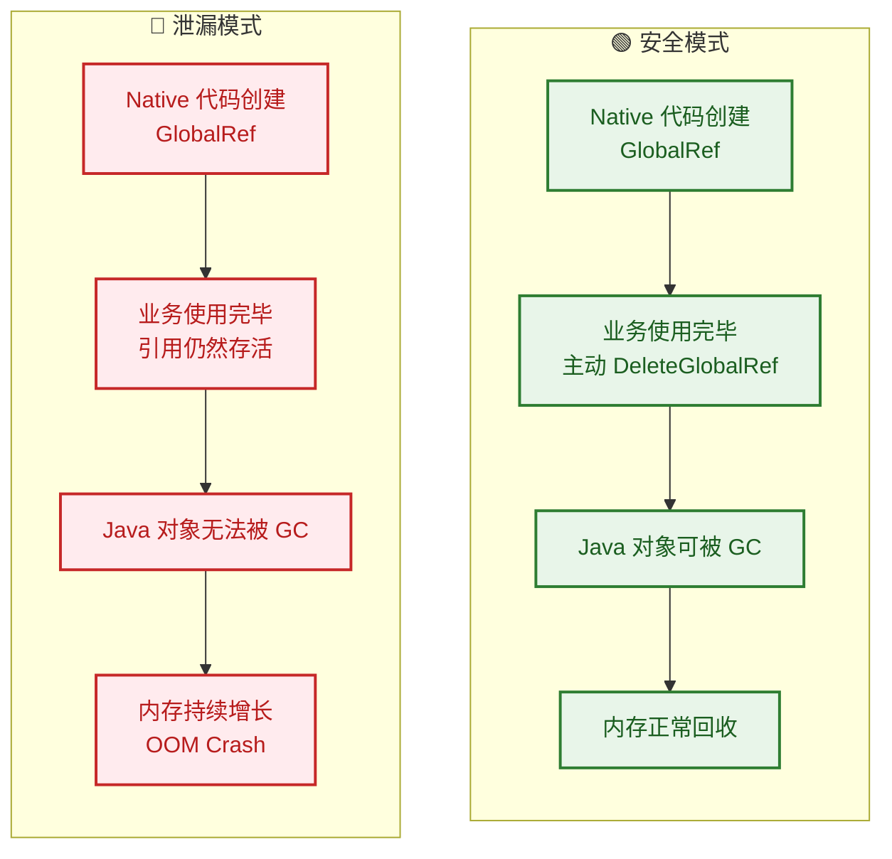
```mermaid
graph LR
    subgraph Leak["🔴 泄漏模式"]
        direction TB
        L1["Native 代码创建<br/>GlobalRef"]
        L2["业务使用完毕<br/>引用仍然存活"]
        L3["Java 对象无法被 GC"]
        L4["内存持续增长<br/>OOM Crash"]
        L1 --> L2 --> L3 --> L4
    end

    subgraph Safe["🟢 安全模式"]
        direction TB
        S1["Native 代码创建<br/>GlobalRef"]
        S2["业务使用完毕<br/>主动 DeleteGlobalRef"]
        S3["Java 对象可被 GC"]
        S4["内存正常回收"]
        S1 --> S2 --> S3 --> S4
    end

    Leak ~~~ Safe

    classDef leak fill:#FFEBEE,stroke:#C62828,color:#B71C1C,stroke-width:2px
    classDef safe fill:#E8F5E9,stroke:#2E7D32,color:#1B5E20,stroke-width:2px

    class L1,L2,L3,L4 leak
    class S1,S2,S3,S4 safe
```

**推荐实践：用 C++ RAII 封装全局引用**

在 C++ 项目中，最优雅的方式是编写一个类似智能指针的 RAII Wrapper，利用**构造函数获取引用、析构函数释放引用**，彻底消灭"忘记释放"的可能性：

```cpp
// GlobalRef RAII 包装器 —— 自动管理全局引用生命周期
class ScopedGlobalRef {
public:
    // 构造函数：接收 JNIEnv 和一个局部引用，自动升级为全局引用
    ScopedGlobalRef(JNIEnv *env, jobject localRef)
        : env_(env), globalRef_(nullptr) {
        if (localRef != nullptr) {
            globalRef_ = env->NewGlobalRef(localRef);        // 创建全局引用
            env->DeleteLocalRef(localRef);                   // 释放原始局部引用
        }
    }

    // 析构函数：对象销毁时自动释放全局引用
    ~ScopedGlobalRef() {
        if (globalRef_ != nullptr) {
            env_->DeleteGlobalRef(globalRef_);               // ✅ 自动释放，永不遗漏
            globalRef_ = nullptr;                            // 置空
        }
    }

    // 禁止拷贝（防止双重释放）
    ScopedGlobalRef(const ScopedGlobalRef&) = delete;            // 禁用拷贝构造
    ScopedGlobalRef& operator=(const ScopedGlobalRef&) = delete; // 禁用拷贝赋值

    // 允许移动语义（转移所有权）
    ScopedGlobalRef(ScopedGlobalRef&& other) noexcept
        : env_(other.env_), globalRef_(other.globalRef_) {
        other.globalRef_ = nullptr;                          // 源对象放弃所有权
    }

    // 获取底层 jobject（只读访问）
    jobject get() const { return globalRef_; }               // 返回全局引用

    // 隐式转换为 bool，方便空值判断
    explicit operator bool() const { return globalRef_ != nullptr; }

private:
    JNIEnv *env_;                                            // JNI 环境指针
    jobject globalRef_;                                      // 全局引用
};
```

使用方式：

```cpp
void someNativeFunction(JNIEnv *env, jobject thiz) {
    // localRef 由 FindClass 创建（局部引用）
    jclass localRef = env->FindClass("com/example/MyCallback");

    // 用 RAII 包装器自动管理全局引用
    ScopedGlobalRef callbackClass(env, localRef);            // 自动升级 + 释放局部引用

    if (callbackClass) {
        // 安全使用全局引用
        jmethodID ctor = env->GetMethodID(
            (jclass)callbackClass.get(), "<init>", "()V"     // 获取构造方法
        );
        // ... 业务逻辑
    }
    // 函数结束，ScopedGlobalRef 析构 → 全局引用自动释放 ✅
}
```

> **⚠️ 注意**：上面的 `ScopedGlobalRef` 存储了 `JNIEnv*`，而 `JNIEnv*` 是**线程绑定**的（thread-local）。如果你需要跨线程使用全局引用，应该存储 `JavaVM*` 并在析构时通过 `AttachCurrentThread` 获取正确的 `JNIEnv*`。这也引出了下一个原则。

---

### 原则四：跨线程场景必须使用 Global Reference + JavaVM

`JNIEnv*` 指针是**线程本地**的，绝不能跨线程传递。但 `JavaVM*` 指针是进程级的，可以安全跨线程使用。在跨线程场景中，正确的做法是：

```cpp
// 全局存储 JavaVM 指针（在 JNI_OnLoad 中初始化）
static JavaVM *g_jvm = nullptr;

// 全局存储回调对象的全局引用
static jobject g_callbackObj = nullptr;

JNIEXPORT jint JNICALL JNI_OnLoad(JavaVM *vm, void *reserved) {
    g_jvm = vm;                                              // 保存 JavaVM 指针（进程级）
    return JNI_VERSION_1_6;
}

// Java 层调用此函数注册回调对象
extern "C" JNIEXPORT void JNICALL
Java_com_example_NativeLib_registerCallback(JNIEnv *env, jobject thiz, jobject callback) {
    // 如果已有旧回调，先释放旧的全局引用
    if (g_callbackObj != nullptr) {
        env->DeleteGlobalRef(g_callbackObj);                 // 释放旧引用
    }
    g_callbackObj = env->NewGlobalRef(callback);             // 创建新的全局引用
}

// 在 Native 子线程中回调 Java
void nativeWorkerThread() {
    JNIEnv *env = nullptr;                                   // 子线程没有 JNIEnv
    bool needDetach = false;                                 // 标记是否需要 Detach

    // 尝试获取当前线程的 JNIEnv
    int status = g_jvm->GetEnv((void**)&env, JNI_VERSION_1_6);

    if (status == JNI_EDETACHED) {
        // 当前线程尚未附加到 JVM，需要手动附加
        if (g_jvm->AttachCurrentThread(&env, nullptr) != JNI_OK) {
            return;                                          // 附加失败，退出
        }
        needDetach = true;                                   // 记录需要 Detach
    }

    // 现在可以安全使用 env 和全局引用了
    if (g_callbackObj != nullptr && env != nullptr) {
        jclass cls = env->GetObjectClass(g_callbackObj);     // 获取回调对象的 Class
        jmethodID onResult = env->GetMethodID(cls, "onResult", "(I)V"); // 获取方法 ID
        env->CallVoidMethod(g_callbackObj, onResult, 42);   // 调用 Java 回调方法
        env->DeleteLocalRef(cls);                            // 释放局部引用
    }

    // 如果是我们手动 Attach 的，离开前必须 Detach
    if (needDetach) {
        g_jvm->DetachCurrentThread();                        // 分离线程，释放线程资源
    }
}

// 取消注册回调（Java 层调用）
extern "C" JNIEXPORT void JNICALL
Java_com_example_NativeLib_unregisterCallback(JNIEnv *env, jobject thiz) {
    if (g_callbackObj != nullptr) {
        env->DeleteGlobalRef(g_callbackObj);                 // 释放全局引用
        g_callbackObj = nullptr;                             // 置空
    }
}
```

整个跨线程回调的引用流转可以用下面的时序图来理解：

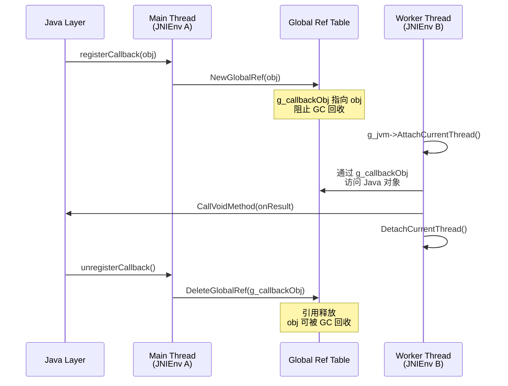
```mermaid
sequenceDiagram
    participant Java as Java Layer
    participant Main as Main Thread<br/>(JNIEnv A)
    participant GRef as Global Ref Table
    participant Worker as Worker Thread<br/>(JNIEnv B)

    Java->>Main: registerCallback(obj)
    Main->>GRef: NewGlobalRef(obj)
    Note over GRef: g_callbackObj 指向 obj<br/>阻止 GC 回收

    Worker->>Worker: g_jvm->AttachCurrentThread()
    Worker->>GRef: 通过 g_callbackObj<br/>访问 Java 对象
    Worker->>Java: CallVoidMethod(onResult)
    Worker->>Worker: DetachCurrentThread()

    Java->>Main: unregisterCallback()
    Main->>GRef: DeleteGlobalRef(g_callbackObj)
    Note over GRef: 引用释放<br/>obj 可被 GC 回收
```

---

### 原则五：使用 Weak Global Reference 打破引用循环

当 Native 层需要"观察"一个 Java 对象但**不希望阻止它被 GC 回收**时，应使用 Weak Global Reference。典型场景包括：

- **缓存机制**：缓存最近使用的 Java 对象，但允许内存不足时 GC 回收它们
- **观察者/监听器**：Native 层注册了对 Java Activity 的监听，但不希望因此阻止 Activity 被回收导致内存泄漏
- **打破循环引用**：Java → Native → Java 的循环引用链

**关键守则**：使用 Weak Global Reference 前，**必须先用 `IsSameObject` 检查它是否已被回收**：

```cpp
static jweak g_weakCache = nullptr;                          // 弱全局引用缓存

// 缓存一个 Java 对象（弱引用方式）
void cacheObject(JNIEnv *env, jobject obj) {
    if (g_weakCache != nullptr) {
        env->DeleteWeakGlobalRef(g_weakCache);               // 释放旧的弱引用
    }
    g_weakCache = env->NewWeakGlobalRef(obj);                // 创建新的弱全局引用
}

// 安全地使用缓存的对象
jobject getCachedObject(JNIEnv *env) {
    if (g_weakCache == nullptr) {
        return nullptr;                                      // 从未缓存过
    }

    // ✅ 关键步骤：检查弱引用指向的对象是否已被 GC 回收
    if (env->IsSameObject(g_weakCache, nullptr)) {
        // 对象已被 GC 回收，弱引用已失效
        env->DeleteWeakGlobalRef(g_weakCache);               // 清理失效的弱引用
        g_weakCache = nullptr;                               // 置空
        return nullptr;                                      // 返回空，由调用者决定是否重建
    }

    // 对象仍然存活 → 创建一个局部引用来"锁定"它
    // 这一步是必须的！因为弱引用随时可能失效（GC 可能在任意时刻运行）
    jobject localRef = env->NewLocalRef(g_weakCache);        // 从弱引用创建强局部引用

    // 再次检查（防止 IsSameObject 和 NewLocalRef 之间发生 GC）
    if (localRef == nullptr) {
        env->DeleteWeakGlobalRef(g_weakCache);               // 清理
        g_weakCache = nullptr;
        return nullptr;
    }

    return localRef;                                         // 返回强局部引用，调用者负责释放
}
```

> **⚠️ 竞态条件**：即使 `IsSameObject` 返回 `false`（表示对象还活着），GC 也可能在**下一个 CPU 指令**就回收它。因此必须紧接着用 `NewLocalRef` 创建一个强引用"钉住"对象，然后再做一次空值判断。这是一个典型的 **TOCTOU (Time-of-check to Time-of-use)** 问题的防御模式。

---

### 原则六：异常状态下的引用清理

当 JNI 调用触发了 Java 异常后，大部分 JNI 函数都不能再被安全调用，但 **引用释放函数是例外**——`DeleteLocalRef`、`DeleteGlobalRef`、`DeleteWeakGlobalRef` 在异常挂起 (Exception Pending) 状态下仍然可以安全调用。

这意味着你的异常处理代码必须**先清理引用，再处理异常**：

```cpp
void safeProcess(JNIEnv *env, jobject obj) {
    jclass cls = env->GetObjectClass(obj);                   // 获取 Class (Local Ref)

    jmethodID mid = env->GetMethodID(cls, "riskyMethod", "()V");

    if (mid == nullptr) {
        // GetMethodID 失败 → 可能有 NoSuchMethodError 异常挂起
        env->DeleteLocalRef(cls);                            // ✅ 异常状态下仍可安全释放引用
        // 此时不要调用其他 JNI 函数（除了异常处理和引用释放函数）
        return;                                              // 让异常自然传播回 Java
    }

    env->CallVoidMethod(obj, mid);                           // 调用可能抛异常的方法

    if (env->ExceptionCheck()) {
        // Java 方法抛出了异常
        env->DeleteLocalRef(cls);                            // ✅ 先清理引用

        // 可选：打印异常信息用于调试
        env->ExceptionDescribe();                            // 输出异常堆栈到 stderr
        env->ExceptionClear();                               // 清除异常（如果要 Native 处理）
        // 或者不 Clear，让异常回传给 Java 调用者
        return;
    }

    env->DeleteLocalRef(cls);                                // 正常路径也要释放
}
```

下面是异常状态下 JNI 函数可用性的速查表：

```text
┌─────────────────────────────────────────────────────────────────┐
│             异常挂起 (Exception Pending) 时可调用的 JNI 函数        │
├─────────────────────────────────────────────────────────────────┤
│                                                                 │
│   ✅ 安全可调用：                                                │
│   ├── DeleteLocalRef                                            │
│   ├── DeleteGlobalRef                                           │
│   ├── DeleteWeakGlobalRef                                       │
│   ├── ExceptionCheck                                            │
│   ├── ExceptionDescribe                                         │
│   ├── ExceptionClear                                            │
│   ├── ExceptionOccurred                                         │
│   ├── ReleaseStringChars / ReleaseStringUTFChars                │
│   ├── ReleasePrimitiveArrayCritical                             │
│   ├── ReleaseStringCritical                                     │
│   ├── PopLocalFrame                                             │
│   └── MonitorExit                                               │
│                                                                 │
│   ❌ 禁止调用（行为未定义）：                                      │
│   ├── FindClass / GetMethodID / GetFieldID                      │
│   ├── Call*Method / Get*Field / Set*Field                       │
│   ├── NewObject / NewGlobalRef / NewLocalRef                    │
│   └── 其他大部分 JNI 函数                                        │
│                                                                 │
└─────────────────────────────────────────────────────────────────┘
```

---

### 原则七：引用调试与监控技巧

在开发阶段，善用调试工具可以快速定位引用泄漏：

**1. Android CheckJNI 模式**

Android 提供了 CheckJNI 增强检查模式，可以在运行时检测常见的 JNI 引用错误：

```bash
# 针对特定应用开启 CheckJNI（无需 root）
adb shell setprop debug.checkjni 1

# 或者针对可调试应用（AndroidManifest.xml 中 debuggable=true）
# CheckJNI 默认自动启用
```

CheckJNI 能检测的引用问题包括：
- 使用已删除的引用（Use-after-free）
- 在错误的线程使用 `JNIEnv*`
- 局部引用表溢出的提前预警
- 将局部引用跨线程传递

**2. 引用表 Dump**

当遇到 Reference Table Overflow 时，Logcat 会输出当前引用表的快照，格式类似：

```text
JNI ERROR (app bug): local reference table overflow (max=512)
Local reference table dump:
  Last 10 entries (of 512):
      511: 0x13e00520 com.example.MyObject
      510: 0x13e004f8 com.example.MyObject
      509: 0x13e004d0 com.example.MyObject
      ...
  Summary:
      506 of com.example.MyObject (512 bytes each)
        3 of java.lang.Class
        3 of java.lang.String
```

看到这种 Dump，立即定位到是 `com.example.MyObject` 在循环中被大量创建但未释放。

**3. 自定义引用计数器（Debug Build）**

在 Debug 构建中，可以封装引用创建/释放函数并加入计数逻辑：

```cpp
#ifdef DEBUG
static std::atomic<int> g_globalRefCount(0);                 // 全局引用计数器（原子变量）
static std::atomic<int> g_localRefCount(0);                  // 局部引用计数器

// 封装 NewGlobalRef，附带计数
jobject DebugNewGlobalRef(JNIEnv *env, jobject obj) {
    jobject ref = env->NewGlobalRef(obj);                    // 创建全局引用
    if (ref != nullptr) {
        int count = g_globalRefCount.fetch_add(1) + 1;      // 原子自增
        __android_log_print(ANDROID_LOG_DEBUG, "JNI_REF",
            "NewGlobalRef: count=%d, obj=%p", count, ref);   // 输出日志
    }
    return ref;
}

// 封装 DeleteGlobalRef，附带计数
void DebugDeleteGlobalRef(JNIEnv *env, jobject ref) {
    if (ref != nullptr) {
        env->DeleteGlobalRef(ref);                           // 释放全局引用
        int count = g_globalRefCount.fetch_sub(1) - 1;      // 原子自减
        __android_log_print(ANDROID_LOG_DEBUG, "JNI_REF",
            "DeleteGlobalRef: count=%d, obj=%p", count, ref); // 输出日志
    }
}

// 在 Release 构建中，直接使用原生 JNI 函数（零开销）
#define TrackedNewGlobalRef(env, obj)    DebugNewGlobalRef(env, obj)
#define TrackedDeleteGlobalRef(env, ref) DebugDeleteGlobalRef(env, ref)
#else
#define TrackedNewGlobalRef(env, obj)    (env)->NewGlobalRef(obj)
#define TrackedDeleteGlobalRef(env, ref) (env)->DeleteGlobalRef(ref)
#endif
```

---

### 引用管理 Checklist（工程速查表）

将以上所有原则浓缩为一张可打印的 Checklist，建议贴在工位旁：

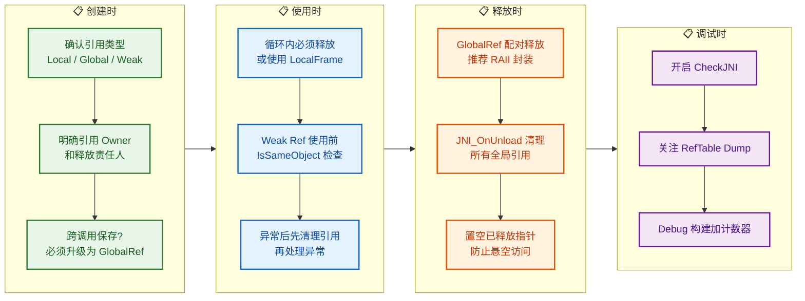
```mermaid
graph LR
    subgraph CK1["📋 创建时"]
        direction TB
        C1["确认引用类型<br/>Local / Global / Weak"]
        C2["明确引用 Owner<br/>和释放责任人"]
        C3["跨调用保存?<br/>必须升级为 GlobalRef"]
        C1 --> C2 --> C3
    end

    subgraph CK2["📋 使用时"]
        direction TB
        U1["循环内必须释放<br/>或使用 LocalFrame"]
        U2["Weak Ref 使用前<br/>IsSameObject 检查"]
        U3["异常后先清理引用<br/>再处理异常"]
        U1 --> U2 --> U3
    end

    subgraph CK3["📋 释放时"]
        direction TB
        D1["GlobalRef 配对释放<br/>推荐 RAII 封装"]
        D2["JNI_OnUnload 清理<br/>所有全局引用"]
        D3["置空已释放指针<br/>防止悬空访问"]
        D1 --> D2 --> D3
    end

    subgraph CK4["📋 调试时"]
        direction TB
        T1["开启 CheckJNI"]
        T2["关注 RefTable Dump"]
        T3["Debug 构建加计数器"]
        T1 --> T2 --> T3
    end

    CK1 --> CK2 --> CK3 --> CK4

    classDef create fill:#E8F5E9,stroke:#2E7D32,color:#1B5E20,stroke-width:2px
    classDef use fill:#E3F2FD,stroke:#1565C0,color:#0D47A1,stroke-width:2px
    classDef release fill:#FFF3E0,stroke:#E65100,color:#BF360C,stroke-width:2px
    classDef debug fill:#F3E5F5,stroke:#6A1B9A,color:#4A148C,stroke-width:2px

    class C1,C2,C3 create
    class U1,U2,U3 use
    class D1,D2,D3 release
    class T1,T2,T3 debug
```

---

**📝 练习题**

在以下 JNI 代码中，哪一处存在引用管理错误？

```cpp
static jweak g_weakCallback = nullptr;

void invokeCallback(JNIEnv *env) {
    if (g_weakCallback == nullptr) return;               // (1)

    jobject strongRef = env->NewLocalRef(g_weakCallback); // (2)
    if (strongRef == nullptr) return;

    jclass cls = env->GetObjectClass(strongRef);          // (3)
    jmethodID mid = env->GetMethodID(cls, "onEvent", "()V");
    env->CallVoidMethod(strongRef, mid);

    env->DeleteLocalRef(strongRef);                       // (4)
}
```

A. 第 (1) 处：应该用 `IsSameObject` 检查而非直接判空


B. 第 (2) 处：应该用 `NewGlobalRef` 而非 `NewLocalRef`


C. 第 (3) 处：`cls` 局部引用未被释放，存在泄漏风险


D. 第 (4) 处：`DeleteLocalRef` 应在 `CallVoidMethod` 之前调用


**【答案】** C

**【解析】** 分析每个选项：

- **A 错误**：第 (1) 处判断 `g_weakCallback == nullptr` 是检查"是否曾经创建过弱引用"，这是合理的空指针保护。`IsSameObject` 用于检查弱引用指向的对象是否被 GC 回收，是不同层面的检查。不过第 (2) 处的 `NewLocalRef` 已经隐含了这个检查——如果对象已被回收，`NewLocalRef` 会返回 `nullptr`，后面的 `if (strongRef == nullptr) return;` 会正确处理。所以 (1) 处的写法没有问题。

- **B 错误**：这里只需要在当前函数作用域内使用回调对象，`NewLocalRef` 创建一个强引用来"钉住"对象防止 GC 是完全正确的做法。不需要 `NewGlobalRef`。

- **C 正确** ✅：`env->GetObjectClass(strongRef)` 返回一个 Local Reference（`jclass`），但函数末尾只释放了 `strongRef`，**没有释放 `cls`**。虽然 `cls` 会在 Native 方法返回 Java 时被自动释放，但如果 `invokeCallback` 被频繁调用（比如在循环中或被多个地方调用），`cls` 的局部引用就会不断累积。最佳实践要求用完即释放：`env->DeleteLocalRef(cls);`。

- **D 错误**：`strongRef` 在 `CallVoidMethod` 中被用作 `this` 指针调用 Java 方法，必须在调用完成之后才能释放，第 (4) 处的顺序是正确的。

---

## 本章小结

JNI 引用管理是 Native 开发中最容易被忽视、却最致命的知识领域。一个不起眼的引用泄漏，可能在数百次 JNI 调用后引发 `Reference Table Overflow` 崩溃；一个未及时释放的 Global Reference，可能导致 Java 对象永远无法被 GC 回收，最终触发 `OutOfMemoryError`。本章系统梳理了 JNI 三大引用类型的生命周期、风险点与最佳实践，下面做一次全面回顾。

---

### 三大引用类型核心对比

JNI 规范定义了三种引用类型，它们的本质区别在于 **生命周期的可控性** 和 **对 GC 的影响**。

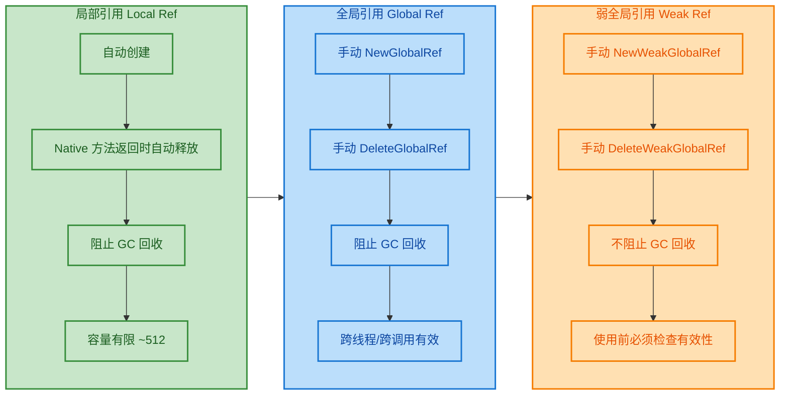
```mermaid
graph LR
    subgraph LR_SUB["局部引用 Local Ref"]
        direction TB
        L1["自动创建"]
        L2["Native 方法返回时自动释放"]
        L3["阻止 GC 回收"]
        L4["容量有限 ~512"]
        L1 --> L2 --> L3 --> L4
    end

    subgraph GR_SUB["全局引用 Global Ref"]
        direction TB
        G1["手动 NewGlobalRef"]
        G2["手动 DeleteGlobalRef"]
        G3["阻止 GC 回收"]
        G4["跨线程/跨调用有效"]
        G1 --> G2 --> G3 --> G4
    end

    subgraph WR_SUB["弱全局引用 Weak Ref"]
        direction TB
        W1["手动 NewWeakGlobalRef"]
        W2["手动 DeleteWeakGlobalRef"]
        W3["不阻止 GC 回收"]
        W4["使用前必须检查有效性"]
        W1 --> W2 --> W3 --> W4
    end

    LR_SUB --> GR_SUB --> WR_SUB

    classDef localStyle fill:#C8E6C9,stroke:#388E3C,color:#1B5E20,stroke-width:2px
    classDef globalStyle fill:#BBDEFB,stroke:#1976D2,color:#0D47A1,stroke-width:2px
    classDef weakStyle fill:#FFE0B2,stroke:#F57C00,color:#E65100,stroke-width:2px

    class LR_SUB,L1,L2,L3,L4 localStyle
    class GR_SUB,G1,G2,G3,G4 globalStyle
    class WR_SUB,W1,W2,W3,W4 weakStyle
```

将关键属性以表格的形式做一次精准对比：

| 维度 | Local Reference | Global Reference | Weak Global Reference |
|:---|:---|:---|:---|
| **创建方式** | JNI 函数自动返回 | `NewGlobalRef()` | `NewWeakGlobalRef()` |
| **销毁方式** | 自动释放 / `DeleteLocalRef()` | `DeleteGlobalRef()` | `DeleteWeakGlobalRef()` |
| **生命周期** | 当前 Native 方法栈帧内 | 手动管理，直到显式删除 | 手动管理，直到显式删除 |
| **跨线程使用** | ❌ 不可以 | ✅ 可以 | ✅ 可以 |
| **跨 JNI 调用** | ❌ 不可以 | ✅ 可以 | ✅ 可以（但对象可能已被回收） |
| **阻止 GC** | ✅ 是 | ✅ 是 | ❌ 否 |
| **容量限制** | 有（默认 ~512） | 无硬性限制（受堆内存约束） | 无硬性限制 |
| **典型用途** | 临时操作 Java 对象 | 缓存 `jclass`、回调 `jobject` | 观察性缓存、非关键缓存 |
| **核心风险** | Reference Table Overflow | 内存泄漏 | 使用已回收对象导致崩溃 |

---

### 引用生命周期全景图

下图从一次完整的 JNI 调用视角，展示三种引用在时间轴上的行为差异：

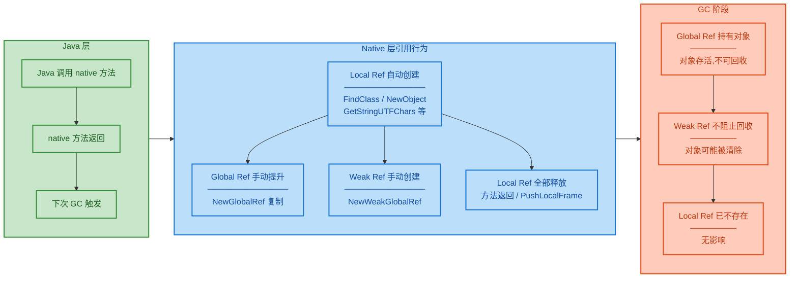
```mermaid
graph LR
    subgraph JAVA_LAYER["Java 层"]
        direction TB
        J1["Java 调用 native 方法"]
        J2["native 方法返回"]
        J3["下次 GC 触发"]
        J1 --> J2 --> J3
    end

    subgraph NATIVE_LAYER["Native 层引用行为"]
        direction TB
        N1["Local Ref 自动创建<br/>──────────────<br/>FindClass / NewObject<br/>GetStringUTFChars 等"]
        N2["Global Ref 手动提升<br/>──────────────<br/>NewGlobalRef 复制"]
        N3["Weak Ref 手动创建<br/>──────────────<br/>NewWeakGlobalRef"]
        N4["Local Ref 全部释放<br/>方法返回 / PushLocalFrame"]
        N1 --> N2
        N1 --> N3
        N1 --> N4
    end

    subgraph GC_LAYER["GC 阶段"]
        direction TB
        GC1["Global Ref 持有对象<br/>────────<br/>对象存活,不可回收"]
        GC2["Weak Ref 不阻止回收<br/>────────<br/>对象可能被清除"]
        GC3["Local Ref 已不存在<br/>────────<br/>无影响"]
        GC1 --> GC2 --> GC3
    end

    JAVA_LAYER --> NATIVE_LAYER --> GC_LAYER

    classDef javaStyle fill:#C8E6C9,stroke:#388E3C,color:#1B5E20,stroke-width:2px
    classDef nativeStyle fill:#BBDEFB,stroke:#1976D2,color:#0D47A1,stroke-width:2px
    classDef gcStyle fill:#FFCCBC,stroke:#E64A19,color:#BF360C,stroke-width:2px

    class JAVA_LAYER,J1,J2,J3 javaStyle
    class NATIVE_LAYER,N1,N2,N3,N4 nativeStyle
    class GC_LAYER,GC1,GC2,GC3 gcStyle
```

---

### 关键 API 速查表

将本章涉及的所有 JNI 引用管理 API 汇总如下，方便日常开发速查：

```java
// ═══════════════════════════════════════════════
//              局部引用 (Local Reference)
// ═══════════════════════════════════════════════

// 1. 手动释放一个局部引用（循环中必须调用）
env->DeleteLocalRef(jobj);

// 2. 确保当前帧至少能容纳 capacity 个局部引用
//    返回 0 表示成功，负数表示失败
env->EnsureLocalCapacity(capacity);

// 3. 创建一个新的局部引用帧，帧内最多容纳 capacity 个引用
//    返回 0 表示成功
env->PushLocalFrame(capacity);

// 4. 弹出局部引用帧，释放帧内所有局部引用
//    参数 result: 若非 NULL，则将其提升为外层帧的局部引用并返回
jobject result = env->PopLocalFrame(resultToPreserve);

// ═══════════════════════════════════════════════
//              全局引用 (Global Reference)
// ═══════════════════════════════════════════════

// 5. 将局部引用提升为全局引用（可跨线程、跨调用使用）
jobject globalRef = env->NewGlobalRef(localRef);

// 6. 手动释放全局引用（必须调用，否则内存泄漏）
env->DeleteGlobalRef(globalRef);

// ═══════════════════════════════════════════════
//           弱全局引用 (Weak Global Reference)
// ═══════════════════════════════════════════════

// 7. 创建弱全局引用（不阻止 GC 回收目标对象）
jweak weakRef = env->NewWeakGlobalRef(localRef);

// 8. 释放弱全局引用
env->DeleteWeakGlobalRef(weakRef);

// 9. 检查弱引用是否仍然有效（核心安全操作）
//    IsSameObject(weakRef, NULL) == JNI_TRUE → 对象已被 GC 回收
jboolean isCollected = env->IsSameObject(weakRef, NULL);
```

---

### 高频踩坑清单

本章贯穿的各类陷阱，归纳为以下 **六大高频错误**，在实际项目中应时刻警惕：

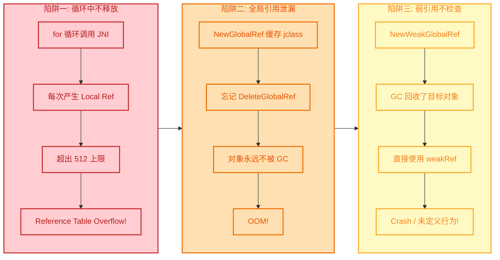
```mermaid
graph LR
    subgraph TRAP_A["陷阱一: 循环中不释放"]
        direction TB
        A1["for 循环调用 JNI"]
        A2["每次产生 Local Ref"]
        A3["超出 512 上限"]
        A4["Reference Table Overflow!"]
        A1 --> A2 --> A3 --> A4
    end

    subgraph TRAP_B["陷阱二: 全局引用泄漏"]
        direction TB
        B1["NewGlobalRef 缓存 jclass"]
        B2["忘记 DeleteGlobalRef"]
        B3["对象永远不被 GC"]
        B4["OOM!"]
        B1 --> B2 --> B3 --> B4
    end

    subgraph TRAP_C["陷阱三: 弱引用不检查"]
        direction TB
        C1["NewWeakGlobalRef"]
        C2["GC 回收了目标对象"]
        C3["直接使用 weakRef"]
        C4["Crash / 未定义行为!"]
        C1 --> C2 --> C3 --> C4
    end

    TRAP_A --> TRAP_B --> TRAP_C

    classDef trapRed fill:#FFCDD2,stroke:#C62828,color:#B71C1C,stroke-width:2px
    classDef trapOrange fill:#FFE0B2,stroke:#EF6C00,color:#E65100,stroke-width:2px
    classDef trapYellow fill:#FFF9C4,stroke:#F9A825,color:#F57F17,stroke-width:2px

    class TRAP_A,A1,A2,A3,A4 trapRed
    class TRAP_B,B1,B2,B3,B4 trapOrange
    class TRAP_C,C1,C2,C3,C4 trapYellow
```

| # | 错误描述 | 后果 | 修复方案 |
|:--|:---|:---|:---|
| 1 | 循环中大量创建 Local Ref 不释放 | `ReferenceTable Overflow` 崩溃 | 循环体内调用 `DeleteLocalRef()` 或用 `PushLocalFrame`/`PopLocalFrame` |
| 2 | `NewGlobalRef` 后忘记 `DeleteGlobalRef` | Java 对象永远不被 GC，内存泄漏 | 遵循 RAII 思想，析构 / finally 中必须释放 |
| 3 | 使用 Weak Ref 前不做 `IsSameObject` 检查 | 访问已回收对象，UB / 崩溃 | 每次使用前检查，提升为 Local Ref 后再操作 |
| 4 | 将 Local Ref 存入全局 `static` 变量 | 方法返回后引用失效，野指针 | 必须提升为 Global Ref 才能跨调用保存 |
| 5 | 在非创建线程使用 Local Ref | 引用在另一个线程的帧中无效 | 提升为 Global Ref 后传递给其他线程 |
| 6 | `JNI_OnLoad` 中缓存 `jclass` 为 Local Ref | 函数返回后引用自动释放，后续使用崩溃 | 用 `NewGlobalRef` 提升后再缓存 |

---

### 引用选型决策树

面对"该用哪种引用？"的问题，按照下面的决策逻辑快速判断：

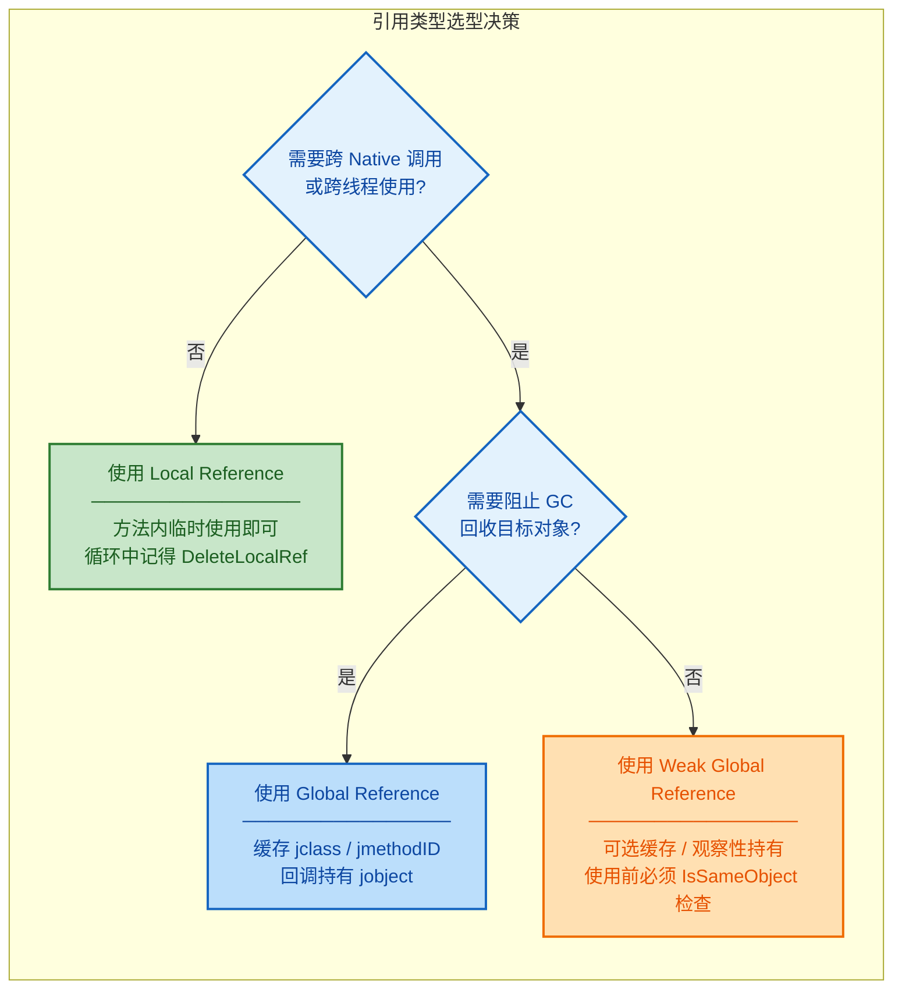
```mermaid
graph LR
    subgraph DECISION["引用类型选型决策"]
        direction TB
        Q1{"需要跨 Native 调用<br/>或跨线程使用?"}
        Q2{"需要阻止 GC<br/>回收目标对象?"}
        Q3["使用 Local Reference<br/>────────────────<br/>方法内临时使用即可<br/>循环中记得 DeleteLocalRef"]
        Q4["使用 Global Reference<br/>────────────────<br/>缓存 jclass / jmethodID<br/>回调持有 jobject"]
        Q5["使用 Weak Global Reference<br/>────────────────<br/>可选缓存 / 观察性持有<br/>使用前必须 IsSameObject 检查"]

        Q1 -->|"否"| Q3
        Q1 -->|"是"| Q2
        Q2 -->|"是"| Q4
        Q2 -->|"否"| Q5
    end

    classDef questionStyle fill:#E3F2FD,stroke:#1565C0,color:#0D47A1,stroke-width:2px
    classDef localAns fill:#C8E6C9,stroke:#2E7D32,color:#1B5E20,stroke-width:2px
    classDef globalAns fill:#BBDEFB,stroke:#1565C0,color:#0D47A1,stroke-width:2px
    classDef weakAns fill:#FFE0B2,stroke:#EF6C00,color:#E65100,stroke-width:2px

    class Q1,Q2 questionStyle
    class Q3 localAns
    class Q4 globalAns
    class Q5 weakAns
```

**简单记忆口诀：**

> **短命用 Local，长命用 Global，可丢用 Weak。**
> **循环必 Delete，全局必配对，弱引用必检查。**

---

### 最佳实践核心原则回顾

将散落在各节中的最佳实践，提炼为 **五条黄金法则**：

**法则一：最小生命周期原则 (Principle of Least Lifetime)**
引用的生命周期应尽可能短。能用 Local Ref 解决的，绝不提升为 Global Ref。创建后尽早释放，缩小引用的 "存活窗口"。

**法则二：创建与释放配对原则 (Acquire-Release Pairing)**
每一次 `NewGlobalRef` 必须对应一次 `DeleteGlobalRef`；每一次 `NewWeakGlobalRef` 必须对应一次 `DeleteWeakGlobalRef`。推荐用 C++ RAII 封装类（如 `ScopedGlobalRef<T>`）自动管理生命周期，避免手动遗漏。

**法则三：循环防溢出原则 (Loop Overflow Prevention)**
在任何循环体内执行 JNI 调用时，必须在每次迭代结束前释放当次产生的 Local Ref。对于复杂逻辑，优先使用 `PushLocalFrame` / `PopLocalFrame` 进行批量管理。

**法则四：缓存必提升原则 (Cache Must Promote)**
任何需要存入 C/C++ 全局变量、类静态字段、或跨 JNI 调用保留的 Java 对象引用，**必须** 通过 `NewGlobalRef` 提升为全局引用。裸存 Local Ref 到 `static` 变量是典型的 "延时炸弹"。

**法则五：弱引用必验证原则 (Weak Ref Must Validate)**
使用 `jweak` 之前，**必须** 调用 `IsSameObject(weakRef, NULL)` 检查对象是否已被 GC 回收。通过检查后，应立即用 `NewLocalRef` 或 `NewGlobalRef` 提升为强引用再进行操作，防止检查与使用之间的竞态。

---

### 完整 RAII 引用管理模板（C++ 工程推荐）

在实际 C++ 项目中，可以使用以下模板类统一管理三种引用，从根本上杜绝手动管理的遗漏风险：

```cpp
// ═══════════════════════════════════════════════════════════════
// ScopedLocalRef: 自动管理局部引用的 RAII 封装
// ═══════════════════════════════════════════════════════════════
template<typename T>
class ScopedLocalRef {
public:
    // 构造: 持有 JNIEnv 指针和局部引用
    ScopedLocalRef(JNIEnv* env, T ref)
        : env_(env), ref_(ref) {}

    // 析构: 自动调用 DeleteLocalRef 释放引用
    ~ScopedLocalRef() {
        if (ref_ != nullptr) {
            env_->DeleteLocalRef(ref_);  // 自动释放，无需手动管理
        }
    }

    // 获取原始引用（只读）
    T get() const { return ref_; }

    // 释放所有权，返回裸引用（转移语义）
    T release() {
        T tmp = ref_;  // 保存当前引用
        ref_ = nullptr; // 清空，析构时不再释放
        return tmp;     // 由调用方负责后续生命周期
    }

    // 禁止拷贝（防止 double-free）
    ScopedLocalRef(const ScopedLocalRef&) = delete;
    ScopedLocalRef& operator=(const ScopedLocalRef&) = delete;

private:
    JNIEnv* env_;  // JNI 环境指针
    T ref_;        // 被管理的局部引用
};

// ═══════════════════════════════════════════════════════════════
// ScopedGlobalRef: 自动管理全局引用的 RAII 封装
// ═══════════════════════════════════════════════════════════════
template<typename T>
class ScopedGlobalRef {
public:
    // 构造: 从局部引用提升为全局引用
    ScopedGlobalRef(JNIEnv* env, T localRef)
        : env_(env),
          ref_(static_cast<T>(env->NewGlobalRef(localRef))) {} // 提升为 Global

    // 析构: 自动调用 DeleteGlobalRef 释放
    ~ScopedGlobalRef() {
        if (ref_ != nullptr) {
            env_->DeleteGlobalRef(ref_);  // 防止全局引用泄漏
        }
    }

    // 获取全局引用（可跨线程安全使用）
    T get() const { return ref_; }

    // 禁止拷贝
    ScopedGlobalRef(const ScopedGlobalRef&) = delete;
    ScopedGlobalRef& operator=(const ScopedGlobalRef&) = delete;

private:
    JNIEnv* env_;  // 注意: env_ 仅在析构时使用，需确保有效性
    T ref_;        // 被管理的全局引用
};

// ═══════════════════════════════════════════════════════════════
// 使用示例
// ═══════════════════════════════════════════════════════════════
extern "C" JNIEXPORT void JNICALL
Java_com_example_NativeLib_process(JNIEnv* env, jobject thiz) {
    // 局部引用 RAII 管理 —— 离开作用域自动释放
    ScopedLocalRef<jclass> cls(env, env->FindClass("java/lang/String"));

    // 全局引用 RAII 管理 —— 可安全存入成员变量
    // 注意: 实际项目中 ScopedGlobalRef 通常作为类成员，而非局部变量
    ScopedGlobalRef<jclass> globalCls(env, cls.get());

    // 使用 globalCls.get() 进行后续 JNI 操作
    jmethodID mid = env->GetMethodID(globalCls.get(), "<init>", "()V");

    // 函数结束时:
    // 1. globalCls 析构 → DeleteGlobalRef
    // 2. cls 析构 → DeleteLocalRef
    // 完全不需要手动释放!
}
```

> **工程提示**：在 Android 源码（AOSP）中，`android::ScopedLocalRef` 被广泛使用，其设计思路与上述模板完全一致。在生产级项目中，推荐直接引用 AOSP 的实现或参照其设计。

---

### 知识图谱总览

最后，用一张全景图将本章的知识结构串联起来：

```mermaid
graph LR
    subgraph CORE["JNI 引用管理核心"]
        direction TB
        C1["JNI Reference<br/>Management"]
    end

    subgraph TYPES["三大引用类型"]
        direction TB
        T1["Local Reference<br/>──────────<br/>自动创建/释放<br/>方法栈帧内有效"]
        T2["Global Reference<br/>──────────<br/>手动创建/释放<br/>跨线程跨调用"]
        T3["Weak Global Ref<br/>──────────<br/>不阻止 GC<br/>使用前必须检查"]
        T1 --> T2 --> T3
    end

    subgraph API["关键 API"]
        direction TB
        A1["DeleteLocalRef"]
        A2["PushLocalFrame<br/>PopLocalFrame"]
        A3["EnsureLocalCapacity"]
        A4["NewGlobalRef<br/>DeleteGlobalRef"]
        A5["NewWeakGlobalRef<br/>DeleteWeakGlobalRef"]
        A6["IsSameObject"]
        A1 --> A2 --> A3 --> A4 --> A5 --> A6
    end

    subgraph RISKS["风险与陷阱"]
        direction TB
        R1["Ref Table Overflow"]
        R2["内存泄漏 OOM"]
        R3["使用已回收对象"]
        R4["跨线程用 Local Ref"]
        R5["static 存 Local Ref"]
        R1 --> R2 --> R3 --> R4 --> R5
    end

    subgraph BEST["最佳实践"]
        direction TB
        B1["最小生命周期"]
        B2["创建释放配对"]
        B3["循环防溢出"]
        B4["缓存必提升"]
        B5["弱引用必验证"]
        B6["RAII 封装"]
        B1 --> B2 --> B3 --> B4 --> B5 --> B6
    end

    CORE --> TYPES
    CORE --> API
    CORE --> RISKS
    CORE --> BEST

    classDef coreStyle fill:#E8EAF6,stroke:#283593,color:#1A237E,stroke-width:3px
    classDef typeStyle fill:#C8E6C9,stroke:#2E7D32,color:#1B5E20,stroke-width:2px
    classDef apiStyle fill:#BBDEFB,stroke:#1565C0,color:#0D47A1,stroke-width:2px
    classDef riskStyle fill:#FFCDD2,stroke:#C62828,color:#B71C1C,stroke-width:2px
    classDef bestStyle fill:#FFF9C4,stroke:#F9A825,color:#F57F17,stroke-width:2px

    class CORE,C1 coreStyle
    class TYPES,T1,T2,T3 typeStyle
    class API,A1,A2,A3,A4,A5,A6 apiStyle
    class RISKS,R1,R2,R3,R4,R5 riskStyle
    class BEST,B1,B2,B3,B4,B5,B6 bestStyle
```

---

### 一句话总结

> **JNI 引用管理的本质，是在 Native 世界中为 GC 提供正确的 "可达性提示"。**
> Local Ref 告诉 GC "我正在临时使用这个对象"；Global Ref 告诉 GC "我需要这个对象一直活着"；Weak Global Ref 告诉 GC "你随时可以回收它，但请让我知道"。掌握这三句话的精确语义，就掌握了 JNI 引用管理的精髓。

---

**📝 练习题 1**

以下代码在 `JNI_OnLoad` 中缓存了一个 `jclass`，请问该代码存在什么问题？

```cpp
static jclass g_clazz;

JNIEXPORT jint JNI_OnLoad(JavaVM* vm, void* reserved) {
    JNIEnv* env;
    vm->GetEnv((void**)&env, JNI_VERSION_1_6);
    g_clazz = env->FindClass("com/example/MyClass");
    return JNI_VERSION_1_6;
}
```

A. 没有问题，`FindClass` 返回的引用在整个 JVM 生命周期内有效


B. `g_clazz` 存储的是局部引用，`JNI_OnLoad` 返回后引用失效，后续使用将导致崩溃


C. `FindClass` 在 `JNI_OnLoad` 中不能调用，会直接抛出异常


D. `g_clazz` 应该声明为 `jweak` 类型才能存入全局变量


**【答案】** B

**【解析】** `env->FindClass()` 返回的是一个 **局部引用 (Local Reference)**，其生命周期仅限于当前 Native 方法栈帧。当 `JNI_OnLoad` 函数返回后，该帧内所有局部引用被自动释放，`g_clazz` 变成一个 **悬空指针 (dangling pointer)**。后续任何对 `g_clazz` 的使用（如 `GetMethodID`、`NewObject`）都将导致未定义行为或崩溃。正确写法是：

```cpp
jclass localClazz = env->FindClass("com/example/MyClass");  // 获取局部引用
g_clazz = (jclass)env->NewGlobalRef(localClazz);            // 提升为全局引用
env->DeleteLocalRef(localClazz);                             // 释放局部引用
```

选项 A 错误：`FindClass` 返回的是 Local Ref 而非永久有效的引用。选项 C 错误：`JNI_OnLoad` 中完全可以调用 `FindClass`。选项 D 错误：`jweak` 不阻止 GC 回收，`jclass` 缓存需要用 Global Ref 保证存活。

---

**📝 练习题 2**

在一个需要遍历 10000 个 Java 对象并调用其 `toString()` 方法的 Native 函数中，以下哪种做法能有效避免 `Reference Table Overflow`？

A. 在循环开始前调用 `EnsureLocalCapacity(10000)` 预分配足够的局部引用容量


B. 将每个对象都通过 `NewGlobalRef` 提升为全局引用


C. 在循环体内，每次迭代结束前对 `toString()` 返回的 `jstring` 调用 `DeleteLocalRef()`


D. 在循环体外调用一次 `PushLocalFrame(10000)` 即可


**【答案】** C

**【解析】** 正确的做法是在循环体内 **及时释放** 每次迭代中产生的局部引用。每次调用 `CallObjectMethod` 获取 `toString()` 的返回值都会产生一个新的 Local Ref，10000 次迭代会累积 10000 个引用，远超默认 ~512 的上限。在每次迭代末尾调用 `DeleteLocalRef()` 可以将引用数量始终控制在极低水平。

选项 A 看似合理，但 `EnsureLocalCapacity(10000)` 只是 **尝试** 扩容，并不保证所有 JVM 实现都能成功分配如此大的容量，且即使成功也是对资源的巨大浪费。选项 B 完全是反模式——将临时引用提升为全局引用不仅不能解决问题，反而会制造 10000 个全局引用泄漏。选项 D 中 `PushLocalFrame(10000)` 同样是一次性预留，本质问题与 A 相同；正确使用 `PushLocalFrame` 的方式是 **在循环体内部** 每次迭代 Push/Pop，而非在循环外部一次性操作。

---

