---

# JNI数据类型与签名

---

## 基本类型映射（jint、jlong、jboolean 等）

JNI（Java Native Interface）作为 Java 与 Native 代码之间的桥梁，首要解决的核心问题就是：**Java 类型和 C/C++ 类型之间如何安全、精确地进行转换？** 两种语言的类型系统存在本质差异——Java 的基本类型（Primitive Types）拥有严格的、平台无关的位宽定义，而 C/C++ 的基本类型（如 `int`、`long`）位宽则依赖编译器和目标平台（32-bit vs 64-bit）。JNI 通过定义一套 **中间类型别名（Type Aliases）** 来弥合这条鸿沟，确保跨语言调用时数据不丢失、不溢出。

### 为什么需要类型映射？

先看一个直觉上容易踩坑的例子：在 Java 中，`long` 类型 **永远是 64 位**（8 字节）。但在 C/C++ 中，`long` 的位宽因平台而异：

| 平台 / 编译器 | C/C++ `long` 的位宽 |
|---|---|
| Windows x64 (MSVC) | **32 位** |
| Linux x64 (GCC/Clang) | **64 位** |
| Android ARM 32-bit | **32 位** |
| Android ARM 64-bit | **64 位** |

假设你在 JNI 的 Native 方法里，直接用 C 语言的 `long` 来接收 Java 传过来的 `long` 值，在 Linux 64-bit 上恰好没问题（都是 64 位），但到了 Windows 64-bit 上就会发生 **高 32 位数据截断（Data Truncation）**，导致诡异的数值错误。这种 Bug 极其隐蔽，且只在特定平台复现。

JNI 的类型映射机制正是为了 **一劳永逸地消灭这类跨平台隐患**。它在 `jni.h` 头文件中，用 `typedef` 为每个 Java 基本类型定义了一个 **固定位宽的 C/C++ 类型别名**，开发者只需使用这些别名，就无需操心底层平台差异。

### jni.h 中的类型定义

JNI 的所有类型映射都定义在 JDK 提供的 `jni.h` 头文件中。以下是其核心定义的简化展示：

```c
/* jni.h — JNI 基本类型定义（简化版） */

typedef unsigned char   jboolean;  // Java boolean → 无符号 8 位，取值 JNI_TRUE(1) 或 JNI_FALSE(0)
typedef signed char     jbyte;     // Java byte    → 有符号 8 位整数
typedef unsigned short  jchar;     // Java char    → 无符号 16 位，存储 UTF-16 编码单元
typedef short           jshort;    // Java short   → 有符号 16 位整数
typedef int             jint;      // Java int     → 有符号 32 位整数（几乎所有平台 int 都是 32 位）
typedef long long       jlong;     // Java long    → 有符号 64 位整数（注意：用 long long 而非 long！）
typedef float           jfloat;    // Java float   → IEEE 754 单精度 32 位浮点
typedef double          jdouble;   // Java double  → IEEE 754 双精度 64 位浮点
```

> ⚠️ **关键细节**：`jlong` 被定义为 `long long`（而非 `long`），这正是为了规避前文提到的 `long` 位宽不确定问题。`long long` 在 C99/C++11 标准中被保证为 **至少 64 位**，从而与 Java 的 `long` 精确对齐。

### 完整映射对照表

下表是 Java 8 种基本类型与 JNI 类型别名的完整对照，包含位宽、取值范围和 Native 层对应的真实 C 类型：

| Java 类型 | JNI 类型别名 | 位宽 (bits) | C/C++ 实际类型 | 取值范围 |
|---|---|---|---|---|
| `boolean` | `jboolean` | 8 | `unsigned char` | `JNI_TRUE`(1) / `JNI_FALSE`(0) |
| `byte` | `jbyte` | 8 | `signed char` | -128 ~ 127 |
| `char` | `jchar` | 16 | `unsigned short` | 0 ~ 65535 (UTF-16) |
| `short` | `jshort` | 16 | `short` | -32768 ~ 32767 |
| `int` | `jint` | 32 | `int` | -2³¹ ~ 2³¹-1 |
| `long` | `jlong` | 64 | `long long` | -2⁶³ ~ 2⁶³-1 |
| `float` | `jfloat` | 32 | `float` | IEEE 754 单精度 |
| `double` | `jdouble` | 64 | `double` | IEEE 754 双精度 |

另外还有一个特殊的"尺寸"类型：

| 特殊类型 | JNI 类型别名 | 说明 |
|---|---|---|
| *(无对应Java类型)* | `jsize` | 等同于 `jint`，专门用于表示长度 / 大小 |

### 映射关系可视化

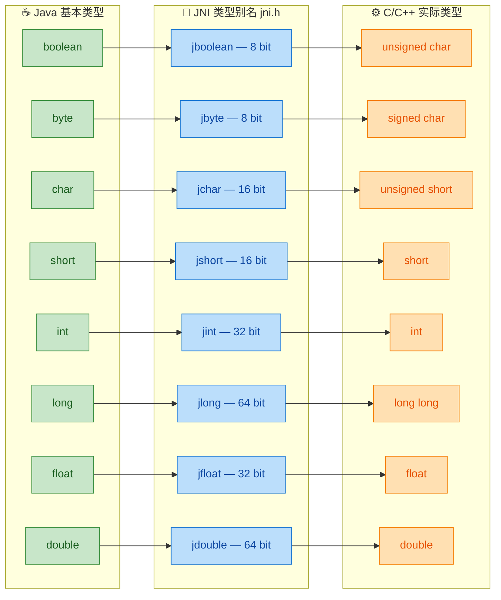

### 各类型详解与实战用法

#### jboolean — 布尔值的陷阱

`jboolean` 是 `unsigned char`，占 **8 位**而非 1 位。Java 层的 `boolean` 在 JVM 内部通常用 `int`（0 或 1）表示，但通过 JNI 传递到 Native 层后会被压缩为 8 位无符号字符。JNI 头文件预定义了两个常量：

```c
#define JNI_FALSE 0  // 对应 Java 的 false
#define JNI_TRUE  1  // 对应 Java 的 true
```

**陷阱：不要用 C 语言的"非零即真"逻辑来赋值**。虽然 C 中任何非零值都视为 `true`，但如果你给 `jboolean` 赋值 `2` 或 `255`，回传到 Java 层后行为是 **未定义的（Undefined Behavior）**。标准做法是：

```c
// ✅ 正确写法：始终使用 JNI_TRUE / JNI_FALSE
JNIEXPORT jboolean JNICALL
Java_com_example_NativeLib_isReady(JNIEnv *env, jobject thiz) {
    int status = check_device_status();     // 假设返回 0 或非 0
    return status ? JNI_TRUE : JNI_FALSE;   // 显式转换，安全可靠
}

// ❌ 危险写法：直接返回 C 的 int 值
// return status;  // 如果 status == 256，截断为 unsigned char → 0 → 变成 false！
```

上面注释中的 `status == 256` 的例子非常关键：256 的二进制是 `1_0000_0000`，截断到 8 位后变为 `0000_0000`，也就是 `0`（false），逻辑完全反转！

#### jbyte — 有符号字节

`jbyte` 对应 `signed char`，范围 -128 ~ 127。在处理二进制数据（如文件流、网络包）时经常出现。需要注意的是，C 语言中 `char` 的有无符号性是 **实现定义（Implementation-defined）** 的，所以 JNI 显式地用了 `signed char` 来保证行为一致。

```c
// 从 Java byte[] 数组中读取数据时的典型模式
JNIEXPORT void JNICALL
Java_com_example_NativeLib_processBytes(JNIEnv *env, jobject thiz,
                                         jbyteArray data) {
    jsize len = (*env)->GetArrayLength(env, data);          // 获取数组长度
    jbyte *buf = (*env)->GetByteArrayElements(env, data, NULL); // 获取数组指针

    for (jsize i = 0; i < len; i++) {
        jbyte b = buf[i];                // 每个元素都是 signed char，范围 -128~127
        unsigned char ub = (unsigned char)b;  // 如需无符号操作，显式转换
        // ... 处理数据 ...
    }

    (*env)->ReleaseByteArrayElements(env, data, buf, 0);   // 释放资源（必须！）
}
```

#### jchar — UTF-16 编码单元

这是最容易被误解的类型之一。Java 的 `char` 是 **16 位 UTF-16 编码单元**，而 C 语言的 `char` 是 **8 位**。JNI 用 `unsigned short`（16 位）来精确匹配。

```c
// jchar 是 16 位，可以直接与 wchar_t 配合使用（在 Windows 上 wchar_t 也是 16 位）
// 但在 Linux 上 wchar_t 是 32 位，需注意差异
JNIEXPORT jchar JNICALL
Java_com_example_NativeLib_toUpperCase(JNIEnv *env, jobject thiz, jchar ch) {
    // jchar 本质是 unsigned short (0~65535)
    if (ch >= 'a' && ch <= 'z') {       // ASCII 范围内的简单大写转换
        return ch - ('a' - 'A');        // 计算偏移量完成转换
    }
    return ch;                          // 非小写字母直接返回
}
```

#### jint — 最常用的整数类型

`jint` 是 JNI 中使用频率最高的类型，对应 C 的 `int`（32 位）。在几乎所有现代平台上，C 的 `int` 都是 32 位，所以 `jint` 的跨平台表现非常稳定。

```c
// 一个简单的加法 Native 方法
JNIEXPORT jint JNICALL
Java_com_example_NativeLib_add(JNIEnv *env, jobject thiz,
                                jint a, jint b) {
    // jint 就是 int，可以直接参与所有 C 算术运算
    jint result = a + b;   // 32 位有符号加法，溢出行为与 Java 一致（wrap around）
    return result;
}
```

#### jlong — 64 位整数的跨平台保障

前文已详述，`jlong` 使用 `long long` 而非 `long`，这是 JNI 设计中最精妙的决策之一。在实际开发中，`jlong` 经常被用来在 Java 层保存 Native 指针地址（虽然这是一种 hack，但非常普遍）：

```c
// 经典模式：用 jlong 在 Java 层保存 Native 对象指针
JNIEXPORT jlong JNICALL
Java_com_example_NativeLib_nativeCreate(JNIEnv *env, jobject thiz) {
    // 在堆上创建一个 C++ 对象
    MyNativeObject *obj = new MyNativeObject();

    // 将指针转为 jlong 返回给 Java 层保存
    // reinterpret_cast 将指针的地址值重新解释为 64 位整数
    return reinterpret_cast<jlong>(obj);
}

JNIEXPORT void JNICALL
Java_com_example_NativeLib_nativeProcess(JNIEnv *env, jobject thiz,
                                          jlong nativePtr) {
    // 从 Java 层取回指针，还原为 C++ 对象指针
    MyNativeObject *obj = reinterpret_cast<MyNativeObject*>(nativePtr);
    obj->process();   // 调用 Native 对象的方法
}
```

> 💡 **为什么用 `jlong` 存指针？** 因为 `jlong` 是 64 位，足以容纳 32-bit 和 64-bit 平台上的任何指针地址。如果用 `jint`（32 位），在 64-bit 系统上指针会被截断，导致段错误（Segmentation Fault）。

#### jfloat 与 jdouble — IEEE 754 浮点数

这两个类型的映射最为直接，因为 Java 和 C/C++ 都遵循 **IEEE 754** 浮点标准，且 `float` / `double` 的位宽在所有主流平台上都一致（32 位 / 64 位）。

```c
JNIEXPORT jdouble JNICALL
Java_com_example_NativeLib_computeDistance(JNIEnv *env, jobject thiz,
                                            jdouble x1, jdouble y1,
                                            jdouble x2, jdouble y2) {
    // jdouble 就是 double，可以直接调用 C 标准数学库函数
    jdouble dx = x2 - x1;   // 横坐标差
    jdouble dy = y2 - y1;   // 纵坐标差
    return sqrt(dx * dx + dy * dy);  // 欧几里得距离公式
}
```

### 特殊类型：jsize

`jsize` 本质上就是 `jint` 的别名（`typedef jint jsize;`），但它在语义上专门用于表示 **数组长度、字符串长度、缓冲区大小** 等"尺寸"概念。使用 `jsize` 而非 `jint` 可以让代码意图更清晰：

```c
jsize len = (*env)->GetArrayLength(env, array);  // 返回 jsize，语义明确：这是"长度"
jsize strLen = (*env)->GetStringLength(env, str); // 字符串长度，同样返回 jsize
```

### void 的特殊处理

Java 方法的返回值可以是 `void`，但 `void` 不是基本类型，JNI 中也没有对应的 `jvoid` 别名。在 Native 函数中，直接使用 C 的 `void` 作为返回类型即可：

```c
// Java: public native void doSomething();
JNIEXPORT void JNICALL
Java_com_example_NativeLib_doSomething(JNIEnv *env, jobject thiz) {
    // 无返回值，直接执行逻辑
    printf("Hello from JNI!\n");
}
```

但在 **类型签名（Type Signature）** 中，`void` 有自己的签名符号 `V`（后续章节会详细展开）。

### 内存布局对比模型

以下 ASCII 图直观展示了 Java `long` 与 C `long` / `long long` 在不同平台上的内存布局差异，帮助理解为何 JNI 选择 `long long`：

```text
┌──────────────────────────────────────────────────────────────────────────┐
│                    内存布局对比 (Memory Layout)                          │
├──────────────────────────────────────────────────────────────────────────┤
│                                                                          │
│  Java long (所有平台):                                                    │
│  ┌─────────────────────────────────────────────────────────────────────┐ │
│  │                          64 bits (8 bytes)                          │ │
│  └─────────────────────────────────────────────────────────────────────┘ │
│                                                                          │
│  C long (Windows x64 / Android ARM32):                                   │
│  ┌──────────────────────────────┐                                        │
│  │       32 bits (4 bytes)      │  ← 只有一半！高 32 位数据丢失         │
│  └──────────────────────────────┘                                        │
│                                                                          │
│  C long long (所有平台) → 即 jlong:                                      │
│  ┌─────────────────────────────────────────────────────────────────────┐ │
│  │                          64 bits (8 bytes)                          │ │
│  └─────────────────────────────────────────────────────────────────────┘ │
│                                                                          │
│  ✅ jlong = long long → 完美匹配 Java long，跨平台安全                   │
└──────────────────────────────────────────────────────────────────────────┘
```

### 开发最佳实践

1. **永远使用 JNI 类型别名**：在 Native 函数签名和内部逻辑中，始终使用 `jint`、`jlong` 等，**绝不**直接用 `int`、`long` 来接收 Java 传来的值。即使在某些平台上位宽恰好一致，也要保持代码的可移植性。

2. **jboolean 赋值只用宏常量**：`JNI_TRUE` 和 `JNI_FALSE`，避免用字面量 `0` / `1`，更不要用其他非零值。

3. **指针存储用 jlong**：如需在 Java 层保存 Native 指针，使用 `jlong`（64 位），配合 `reinterpret_cast<jlong>` 和 `reinterpret_cast<T*>` 进行双向转换。

4. **注意 jchar 是 16 位**：处理字符时，不要把 `jchar` 当成 C 的 `char`（8 位），它是 UTF-16 编码单元，等价于 `unsigned short`。

5. **格式化输出注意 format specifier**：

```c
jint   i = 42;
jlong  l = 1234567890123LL;
jfloat f = 3.14f;

// 使用正确的 printf 格式说明符
printf("jint:   %d\n", i);          // %d 对应 32 位 int
printf("jlong:  %lld\n", (long long)l);  // %lld 对应 long long
printf("jfloat: %f\n", f);          // %f 对应 float/double（printf 中 float 自动提升为 double）
```

---

**📝 练习题**

在 JNI 中，以下关于基本类型映射的说法，**正确** 的是：

A. `jlong` 在 `jni.h` 中被定义为 `typedef long jlong;`，因为 Java 的 `long` 在所有平台上都是 64 位


B. `jboolean` 是 `unsigned char`（8 位），在 Native 层给它赋值 `256` 并返回给 Java 层，Java 侧会收到 `true`


C. `jchar` 对应 C 的 `unsigned short`（16 位），因为 Java 的 `char` 使用 UTF-16 编码


D. 在 64-bit 平台上，可以安全地用 `jint` 来保存 Native 对象的指针地址


**【答案】** C

**【解析】**

- **A 错误**：`jlong` 被定义为 `long long`（而非 `long`）。C/C++ 中 `long` 的位宽在不同平台上不一致（Windows x64 上 `long` 只有 32 位），只有 `long long` 才能保证至少 64 位，从而安全匹配 Java 的 `long`。
- **B 错误**：`jboolean` 确实是 `unsigned char`（8 位），但 `256` 的二进制是 `1_0000_0000`（9 位），赋值给 8 位的 `unsigned char` 后会被截断为 `0000_0000`，即 `0`（false）。Java 侧收到的是 `false` 而非 `true`，逻辑完全反转。
- **C 正确**：Java 的 `char` 是 16 位 UTF-16 编码单元（范围 0~65535），JNI 用 `unsigned short`（同为 16 位无符号）来精确映射，类型别名为 `jchar`。
- **D 错误**：`jint` 只有 32 位，而 64-bit 平台上的指针是 64 位，用 `jint` 保存会导致高 32 位被截断，引发段错误（Segmentation Fault）。应当使用 `jlong`（64 位）来保存指针地址。

---

## 引用类型（jobject、jclass、jstring、jarray）

在 JNI 的世界中，基本类型（Primitive Types）的映射相对直白——它们在 C/C++ 侧有着明确的数值对应关系。然而，一旦涉及到 **引用类型（Reference Types）**，事情就变得复杂且精妙起来。Java 是一门面向对象的语言，其堆内存中充斥着各式各样的对象实例。当 Native 代码需要操纵这些对象时，JNI 并不会（也不可能）把 Java 对象的真实内存直接暴露给 C/C++，而是通过一套 **不透明的引用句柄（Opaque Reference Handle）** 机制来间接访问。这就是 JNI 引用类型体系的核心设计哲学。

理解引用类型是掌握 JNI 编程的关键一步。你在 Native 侧拿到的每一个 `jobject`，都不是一个可以直接 `memcpy` 的 C 结构体指针，而是 JVM 精心管理的一个 **间接引用**，它指向 JVM 内部的对象表（Object Table）中的某个槽位（Slot），而那个槽位才真正指向堆上的 Java 对象。这种间接性使得 GC（Garbage Collector）可以在不通知 Native 代码的情况下自由移动堆上的对象，同时保证 Native 持有的引用始终有效。

---

### JNI 引用类型的继承体系

JNI 在 C/C++ 侧定义了一套与 Java 类层次结构相呼应的类型定义（typedef）。在 `jni.h` 头文件中，这些类型构成了一个清晰的继承树。理解这棵树，是理解 JNI 函数签名和类型安全的前提。

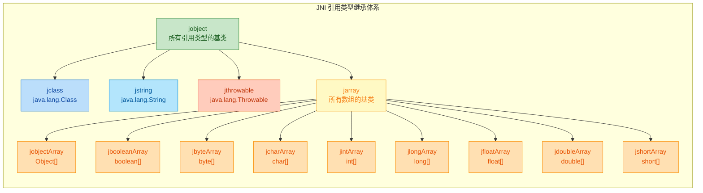

在 **C 语言** 中，这些类型本质上都是 `typedef` 为 `jobject` 的别名，编译器并不会做严格的类型检查：

```c
// jni.h 中 C 语言的定义（简化版）
typedef void*           jobject;    // 所有引用类型的不透明指针
typedef jobject         jclass;     // 类引用，本质上也是 jobject
typedef jobject         jstring;    // 字符串引用
typedef jobject         jthrowable; // 异常引用
typedef jobject         jarray;     // 数组基类引用
typedef jarray          jintArray;  // int[] 数组引用
typedef jarray          jlongArray; // long[] 数组引用
// ... 其他数组类型类似
```

而在 **C++ 语言** 中，`jni.h` 利用了 C++ 的类继承来提供编译期类型安全：

```cpp
// jni.h 中 C++ 的定义（简化版）
class _jobject {};                          // 基类：空类，仅作为类型标记
class _jclass : public _jobject {};         // jclass 继承 _jobject
class _jstring : public _jobject {};        // jstring 继承 _jobject
class _jthrowable : public _jobject {};     // jthrowable 继承 _jobject
class _jarray : public _jobject {};         // jarray 继承 _jobject
class _jintArray : public _jarray {};       // jintArray 继承 _jarray
class _jlongArray : public _jarray {};      // jlongArray 继承 _jarray
// ... 其他数组类型类似

typedef _jobject*       jobject;            // 指向 _jobject 实例的指针
typedef _jclass*        jclass;             // 指向 _jclass 实例的指针
typedef _jstring*       jstring;            // 指向 _jstring 实例的指针
typedef _jarray*        jarray;             // 指向 _jarray 实例的指针
typedef _jintArray*     jintArray;          // 指向 _jintArray 实例的指针
```

> **实践建议**：强烈推荐使用 **C++** 编写 JNI 代码。C++ 的类型继承体系能在编译时帮你捕获类型错误——例如，你不能把一个 `jstring` 直接传递给期望 `jintArray` 的函数，编译器会报错。而在纯 C 中，一切都是 `void*`，这类错误只能在运行时以 JVM Crash 的方式暴露。

---

### jobject —— 万物之祖

`jobject` 是 JNI 引用类型体系中的 **根类型（Root Type）**，正如 `java.lang.Object` 是 Java 类层次结构的根。在 Native 函数签名中，任何无法用更具体类型表达的 Java 对象参数，都会以 `jobject` 的形式出现。

#### 什么时候你会拿到 jobject？

考虑以下 Java 类和 Native 方法声明：

```java
// Java 侧定义
public class Person {
    public String name;  // 姓名字段
    public int age;      // 年龄字段

    // 声明一个 native 方法，接收一个 Person 对象
    public native void printInfo(Person p);
}
```

通过 `javac -h` 生成的 JNI 头文件中，`Person p` 参数会被映射为 `jobject`：

```cpp
/*
 * Class:     Person
 * Method:    printInfo
 * Signature: (LPerson;)V
 */
JNIEXPORT void JNICALL Java_Person_printInfo
  (JNIEnv *env,       // JNI 环境指针，所有 JNI 函数的入口
   jobject thiz,      // 调用此 native 方法的 Java 对象自身（即 this）
   jobject p)         // 参数 Person p，映射为 jobject
{
    // 在这里通过 JNI 函数操作 jobject
}
```

注意这里有 **两个** `jobject`：
- **第一个** `thiz`：这是实例方法（非 static）自动携带的隐含参数，等价于 Java 中的 `this`。
- **第二个** `p`：这是方法显式声明的参数 `Person p`。

#### 通过 jobject 访问 Java 对象的字段和方法

拿到一个 `jobject` 后，你不能像 C 结构体那样直接通过 `.` 或 `->` 访问其字段。你必须借助 JNI 提供的 **反射式 API**——先获取 Field ID 或 Method ID，再通过它进行读写或调用。

```cpp
JNIEXPORT void JNICALL Java_Person_printInfo
  (JNIEnv *env, jobject thiz, jobject p)
{
    // ========== 第一步：获取 Person 类的 jclass ==========
    // FindClass 通过全限定类名查找类（使用 / 分隔包名）
    jclass personClass = env->FindClass("Person");

    // ========== 第二步：获取字段 ID ==========
    // GetFieldID 参数：(类引用, 字段名, 字段类型签名)
    // "name" 字段的类型签名是 "Ljava/lang/String;"
    jfieldID nameFieldId = env->GetFieldID(personClass, "name", "Ljava/lang/String;");
    // "age" 字段的类型签名是 "I"（代表 int）
    jfieldID ageFieldId = env->GetFieldID(personClass, "age", "I");

    // ========== 第三步：通过字段 ID 读取字段值 ==========
    // GetObjectField 返回 jobject，这里我们知道它是 jstring
    jstring nameStr = (jstring) env->GetObjectField(p, nameFieldId);
    // GetIntField 直接返回 jint
    jint age = env->GetIntField(p, ageFieldId);

    // ========== 第四步：将 jstring 转为 C 风格字符串 ==========
    const char *nameCStr = env->GetStringUTFChars(nameStr, NULL);

    // ========== 输出信息 ==========
    printf("Name: %s, Age: %d\n", nameCStr, (int)age);

    // ========== 第五步：释放字符串资源（极其重要！） ==========
    env->ReleaseStringUTFChars(nameStr, nameCStr);
}
```

整个流程可以用以下时序图来描述：

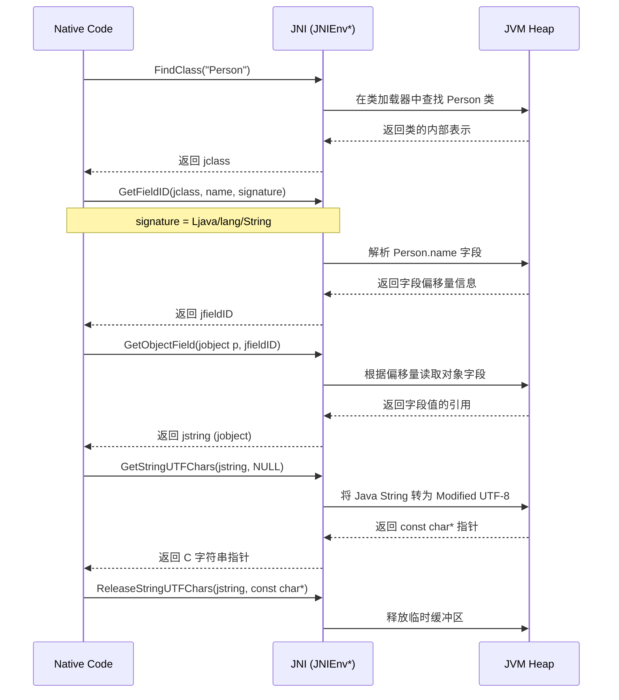

> **核心要点**：`jobject` 是一个"万能容器"，可以承载任何 Java 对象的引用。但正因其泛化，使用时需要通过 `GetFieldID` / `GetMethodID` + `GetXxxField` / `CallXxxMethod` 的两步走策略来操作。这与 Java 反射（Reflection）的思路如出一辙，但性能远高于反射，因为 JNI 的 Field/Method ID 在获取后可以缓存复用。

---

### jclass —— 类的元数据引用

`jclass` 在 JNI 中代表一个 **Java 类本身**（即 `java.lang.Class<?>` 实例）。它是访问静态字段（Static Fields）、静态方法（Static Methods）以及构造函数（Constructors）的关键入口。

#### jclass 出现的场景

`jclass` 在两种典型场景中出现：

**场景一：`static native` 方法的第二个参数**

当 Java 侧声明的 native 方法是 `static` 时，JNI 函数的第二个参数不再是 `jobject thiz`（因为没有实例），而是 `jclass clazz`：

```java
// Java 侧
public class MathUtils {
    // 静态 native 方法
    public static native int add(int a, int b);
}
```

```cpp
// Native 侧生成的头文件
JNIEXPORT jint JNICALL Java_MathUtils_add
  (JNIEnv *env,
   jclass clazz,   // 注意！这里是 jclass，不是 jobject
   jint a,         // 参数 a
   jint b)         // 参数 b
{
    return a + b;  // 简单的加法运算
}
```

**场景二：通过 `FindClass` 主动查找**

```cpp
// 通过全限定名查找类（用 / 替代 Java 中的 .）
jclass stringClass = env->FindClass("java/lang/String");

// 查找内部类时使用 $ 分隔
jclass entryClass = env->FindClass("java/util/Map$Entry");

// 查找数组类型
jclass intArrayClass = env->FindClass("[I");          // int[]
jclass strArrayClass = env->FindClass("[Ljava/lang/String;"); // String[]
```

#### 通过 jclass 操作静态成员

```cpp
JNIEXPORT void JNICALL Java_Demo_testStatic
  (JNIEnv *env, jclass clazz)
{
    // ========== 访问静态字段 ==========
    // 获取 Integer.MAX_VALUE 的字段 ID
    jclass integerClass = env->FindClass("java/lang/Integer");
    // GetStaticFieldID：注意是 Static 版本
    jfieldID maxValId = env->GetStaticFieldID(integerClass, "MAX_VALUE", "I");
    // GetStaticIntField：读取静态 int 字段
    jint maxVal = env->GetStaticIntField(integerClass, maxValId);
    printf("Integer.MAX_VALUE = %d\n", (int)maxVal);  // 输出：2147483647

    // ========== 调用静态方法 ==========
    // 获取 String.valueOf(int) 方法的 ID
    jclass stringClass = env->FindClass("java/lang/String");
    // 方法签名 "(I)Ljava/lang/String;" 表示参数为 int，返回 String
    jmethodID valueOfId = env->GetStaticMethodID(
        stringClass, "valueOf", "(I)Ljava/lang/String;");
    // CallStaticObjectMethod：调用静态方法并接收返回的 jobject
    jstring result = (jstring) env->CallStaticObjectMethod(
        stringClass, valueOfId, (jint)42);

    // 将结果转为 C 字符串并输出
    const char *cStr = env->GetStringUTFChars(result, NULL);
    printf("String.valueOf(42) = %s\n", cStr);  // 输出："42"
    env->ReleaseStringUTFChars(result, cStr);    // 释放资源
}
```

#### jclass 与 jobject 的对比

下表清晰地对比了两者的区别：

| 特性 | `jobject` | `jclass` |
|------|-----------|----------|
| **含义** | Java 对象实例的引用 | `java.lang.Class` 实例的引用 |
| **出现位置** | 实例 native 方法的第2个参数 | 静态 native 方法的第2个参数 |
| **可调用的 JNI 函数** | `GetFieldID` / `CallXxxMethod` | `GetStaticFieldID` / `CallStaticXxxMethod` |
| **类比 Java** | `this` 关键字 | `ClassName.class` 表达式 |
| **类型关系** | 基类 | 子类（`jclass IS-A jobject`） |

> **注意**：`jclass` 本身也是一个 `jobject`（因为 `java.lang.Class` 本身也是一个对象）。这意味着你可以对一个 `jclass` 调用 `GetObjectClass` 来获取它的元类（即 `java.lang.Class<Class>`），虽然这种操作在实际开发中很少用到。

---

### jstring —— 字符串的桥梁

Java 的 `String` 是 UTF-16 编码的不可变对象，而 C/C++ 中的字符串是以 `\0` 结尾的 `char` 数组（通常是 ASCII 或 UTF-8）。`jstring` 正是连接这两个世界的桥梁。

#### jstring 的本质

`jstring` 是 `jobject` 的子类型，代表一个 `java.lang.String` 对象的引用。你 **不能** 直接把 `jstring` 当作 `char*` 使用——它只是一个不透明的句柄。要读取或创建字符串内容，必须使用专门的 JNI 函数。

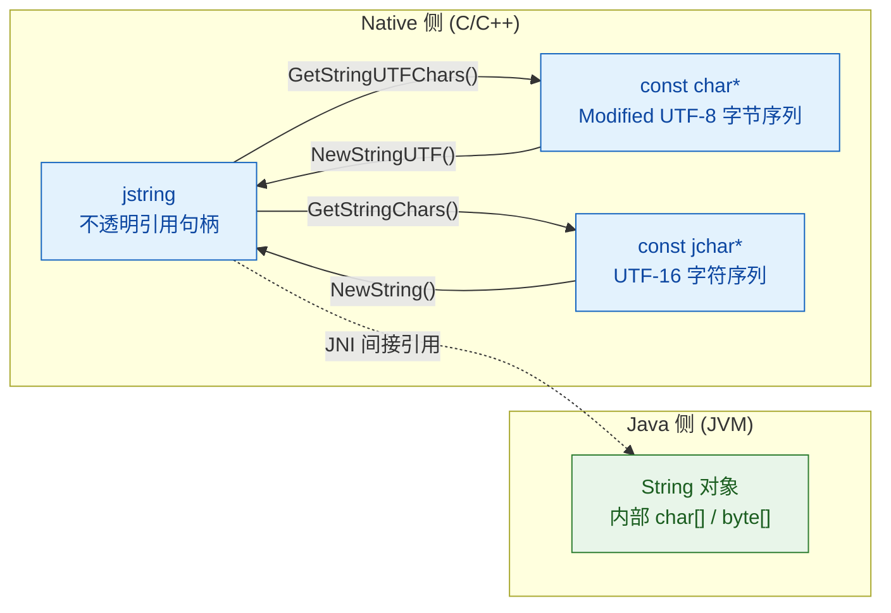

#### 核心操作函数一览

| JNI 函数 | 功能 | 编码格式 |
|----------|------|----------|
| `GetStringUTFChars()` | jstring → `const char*` | Modified UTF-8 |
| `ReleaseStringUTFChars()` | 释放上述获取的指针 | — |
| `GetStringChars()` | jstring → `const jchar*` | UTF-16 |
| `ReleaseStringChars()` | 释放上述获取的指针 | — |
| `NewStringUTF()` | `const char*` → jstring | Modified UTF-8 |
| `NewString()` | `const jchar*` → jstring | UTF-16 |
| `GetStringLength()` | 获取 UTF-16 字符数 | — |
| `GetStringUTFLength()` | 获取 Modified UTF-8 字节数 | — |

#### 完整的字符串操作示例

```java
// Java 侧
public class StringDemo {
    // 接收一个字符串，返回处理后的字符串
    public native String processString(String input);
}
```

```cpp
JNIEXPORT jstring JNICALL Java_StringDemo_processString
  (JNIEnv *env, jobject thiz, jstring input)
{
    // ========== 1. 空指针检查（防御性编程） ==========
    if (input == NULL) {
        // 直接返回一个 Native 创建的新字符串
        return env->NewStringUTF("input is null!");
    }

    // ========== 2. 获取字符串的 Modified UTF-8 表示 ==========
    // 第二个参数 isCopy：指向 jboolean 的指针
    // 如果 JVM 创建了副本则设为 JNI_TRUE，否则设为 JNI_FALSE
    // 传 NULL 表示我们不关心是否是副本
    jboolean isCopy;
    const char *nativeStr = env->GetStringUTFChars(input, &isCopy);

    // ========== 3. 检查是否获取成功 ==========
    // 如果 JVM 内存不足，GetStringUTFChars 可能返回 NULL
    if (nativeStr == NULL) {
        // 此时 JVM 已经抛出了 OutOfMemoryError
        // 直接返回 NULL，让异常向上传播
        return NULL;
    }

    // ========== 4. 在 Native 侧处理字符串 ==========
    printf("isCopy = %s\n", isCopy ? "true" : "false");
    printf("Original: %s\n", nativeStr);
    printf("UTF-8 byte length: %d\n", env->GetStringUTFLength(input));
    printf("UTF-16 char count: %d\n", env->GetStringLength(input));

    // 构造新的 C 字符串（添加前缀）
    char buffer[256];
    snprintf(buffer, sizeof(buffer), "[Processed] %s", nativeStr);

    // ========== 5. 释放字符串资源（必须与 Get 配对！） ==========
    env->ReleaseStringUTFChars(input, nativeStr);
    // 此时 nativeStr 已经是悬空指针，不能再使用！

    // ========== 6. 创建并返回新的 jstring ==========
    return env->NewStringUTF(buffer);
}
```

#### ⚠️ Modified UTF-8 vs Standard UTF-8

JNI 使用的 **Modified UTF-8** 与标准 UTF-8 有两个关键区别，这是一个容易踩坑的地方：

```text
┌──────────────────────────┬──────────────────────┬──────────────────────┐
│         特性              │  Standard UTF-8      │  Modified UTF-8      │
├──────────────────────────┼──────────────────────┼──────────────────────┤
│ 空字符 '\0' (U+0000)     │  1 字节: 0x00        │  2 字节: 0xC0 0x80   │
├──────────────────────────┼──────────────────────┼──────────────────────┤
│ 补充字符 (U+10000+)      │  4 字节              │  6 字节 (代理对)      │
├──────────────────────────┼──────────────────────┼──────────────────────┤
│ 字符串结尾               │  不依赖 \0           │  以 \0 结尾           │
└──────────────────────────┴──────────────────────┴──────────────────────┘
```

Modified UTF-8 将空字符编码为两个字节 `0xC0 0x80` 而非 `0x00`，这保证了 JNI 字符串可以安全地被 C 函数（如 `strlen`、`printf`）处理，因为 C 语言将 `0x00` 视为字符串的终结符。

> **实践建议**：如果你的字符串仅包含 ASCII 和常见的 BMP（Basic Multilingual Plane）字符，Modified UTF-8 与 Standard UTF-8 是完全兼容的。但如果需要处理 Emoji 🎉 等补充字符（Supplementary Characters），请优先使用 `GetStringChars()` / `NewString()` 的 UTF-16 API，或者使用 `GetStringRegion()` / `GetStringUTFRegion()` 避免内存分配。

---

### jarray 及其子类型 —— 数组操作

Java 中的数组在 JNI 侧由 `jarray` 及其一系列子类型来表示。JNI 将数组分为两大类：**基本类型数组（Primitive Arrays）** 和 **对象数组（Object Arrays）**，两者的操作方式截然不同。

#### jarray 的类型家族

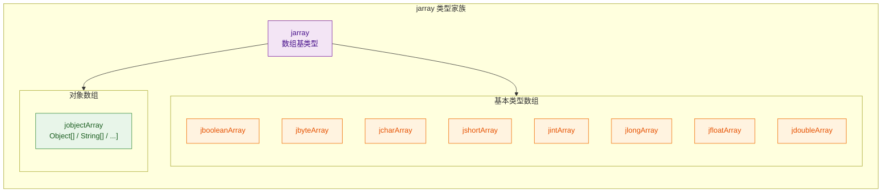

#### 基本类型数组的操作

对基本类型数组的操作遵循一套统一的模式——以 `jintArray` 为例：

```java
// Java 侧
public class ArrayDemo {
    // 接收 int[] 并返回所有元素的和
    public native int sumArray(int[] arr);
}
```

```cpp
JNIEXPORT jint JNICALL Java_ArrayDemo_sumArray
  (JNIEnv *env, jobject thiz, jintArray arr)
{
    // ========== 1. 获取数组长度 ==========
    jsize length = env->GetArrayLength(arr);

    // ========== 2. 获取数组元素指针 ==========
    // GetIntArrayElements 可能返回：
    //   - 指向 JVM 内部数组数据的直接指针（零拷贝）
    //   - 一份堆外拷贝（如果 GC 可能移动数组）
    // isCopy 参数同 GetStringUTFChars
    jboolean isCopy;
    jint *elements = env->GetIntArrayElements(arr, &isCopy);

    // ========== 3. 检查是否获取成功 ==========
    if (elements == NULL) {
        return 0;  // OutOfMemoryError 已被 JVM 抛出
    }

    // ========== 4. 像操作普通 C 数组一样使用 ==========
    jint sum = 0;
    for (jsize i = 0; i < length; i++) {
        sum += elements[i];  // 直接通过下标访问
    }

    // ========== 5. 释放数组（必须！）==========
    // 第三个参数 mode 控制释放行为：
    //   0          : 将修改写回 Java 数组，并释放 native 缓冲区
    //   JNI_COMMIT : 将修改写回 Java 数组，但不释放缓冲区（可继续使用）
    //   JNI_ABORT  : 不写回修改，直接释放缓冲区（丢弃更改）
    env->ReleaseIntArrayElements(arr, elements, JNI_ABORT);
    // 使用 JNI_ABORT 因为我们只是读取，没有修改数组

    return sum;
}
```

`ReleaseXxxArrayElements` 的 `mode` 参数非常重要，其行为可以用下表总结：

| mode 值 | 写回修改到 Java 数组 | 释放 native 缓冲区 | 典型场景 |
|---------|---------------------|-------------------|---------|
| `0` | ✅ 是 | ✅ 是 | 默认行为，修改需要同步回 Java |
| `JNI_COMMIT` | ✅ 是 | ❌ 否 | 中间提交，后续还要继续操作 |
| `JNI_ABORT` | ❌ 否 | ✅ 是 | 只读场景，丢弃所有修改 |

#### 创建新的基本类型数组

```cpp
// 在 Native 侧创建一个 int[5] 并返回给 Java
JNIEXPORT jintArray JNICALL Java_ArrayDemo_createArray
  (JNIEnv *env, jobject thiz)
{
    // ========== 1. 创建长度为 5 的 int 数组 ==========
    jintArray result = env->NewIntArray(5);
    if (result == NULL) {
        return NULL;  // 内存分配失败
    }

    // ========== 2. 准备要填充的数据 ==========
    jint values[] = {10, 20, 30, 40, 50};

    // ========== 3. 将 C 数组数据复制到 Java 数组 ==========
    // SetIntArrayRegion(目标数组, 起始索引, 长度, 源数据)
    env->SetIntArrayRegion(result, 0, 5, values);
    // SetXxxArrayRegion 是一种更轻量的方式，不需要 Get/Release 配对

    return result;  // 返回给 Java 侧
}
```

#### 对象数组的操作

对象数组（`jobjectArray`）的操作方式与基本类型数组不同——你 **不能** 使用 `GetObjectArrayElements`（这个函数根本不存在）。取而代之的是逐个元素的访问方式：

```cpp
JNIEXPORT void JNICALL Java_ArrayDemo_processStringArray
  (JNIEnv *env, jobject thiz, jobjectArray strArr)
{
    // ========== 1. 获取数组长度 ==========
    jsize length = env->GetArrayLength(strArr);

    // ========== 2. 遍历数组，逐个获取元素 ==========
    for (jsize i = 0; i < length; i++) {
        // GetObjectArrayElement：获取指定索引处的元素
        // 返回 jobject，此处实际是 jstring
        jstring element = (jstring) env->GetObjectArrayElement(strArr, i);

        // 将 jstring 转为 C 字符串
        const char *cStr = env->GetStringUTFChars(element, NULL);
        if (cStr != NULL) {
            printf("strArr[%d] = %s\n", (int)i, cStr);
            // 释放字符串资源
            env->ReleaseStringUTFChars(element, cStr);
        }

        // 注意：GetObjectArrayElement 返回的是 Local Reference
        // 在循环中大量创建局部引用时，应使用 DeleteLocalRef 避免溢出
        env->DeleteLocalRef(element);
    }
}

// 创建对象数组
JNIEXPORT jobjectArray JNICALL Java_ArrayDemo_createStringArray
  (JNIEnv *env, jobject thiz)
{
    // ========== 1. 查找 String 类 ==========
    jclass stringClass = env->FindClass("java/lang/String");

    // ========== 2. 创建 String[3]，初始值为 NULL ==========
    // NewObjectArray(长度, 元素类型, 默认值)
    jobjectArray result = env->NewObjectArray(3, stringClass, NULL);

    // ========== 3. 逐个设置元素 ==========
    env->SetObjectArrayElement(result, 0, env->NewStringUTF("Hello"));
    env->SetObjectArrayElement(result, 1, env->NewStringUTF("JNI"));
    env->SetObjectArrayElement(result, 2, env->NewStringUTF("World"));

    return result;  // 返回 String[]{"Hello", "JNI", "World"}
}
```

#### GetArrayRegion vs GetArrayElements 的选择

JNI 提供了两套访问基本类型数组的 API，适用于不同的场景：

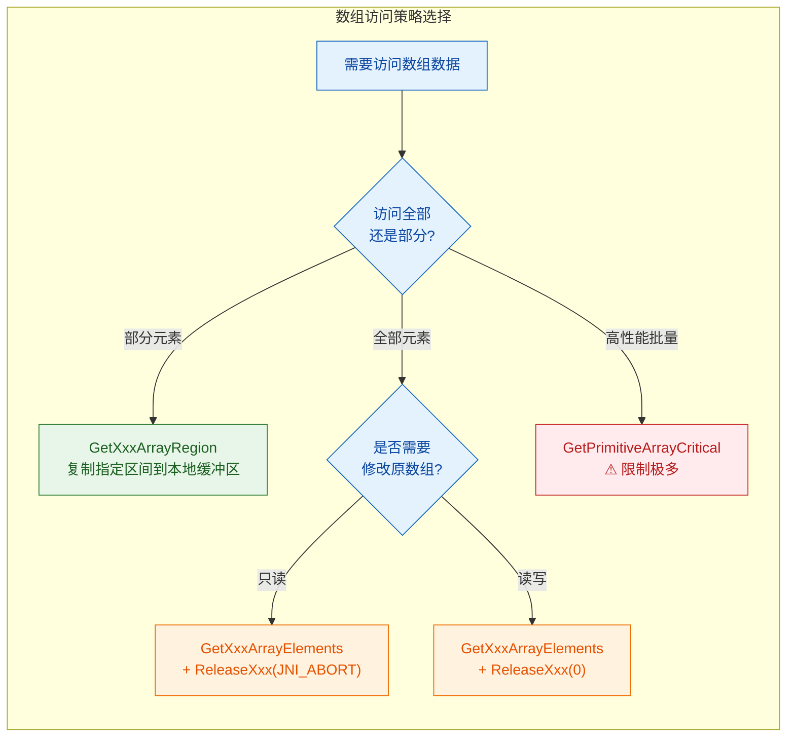

| API | 特点 | 优势 | 劣势 |
|-----|------|------|------|
| `GetXxxArrayRegion` | 直接复制到用户提供的 C 缓冲区 | 无需 Release，简洁安全 | 始终产生拷贝 |
| `GetXxxArrayElements` | 可能零拷贝（直接指针） | 性能可能更优 | 必须配对 Release |
| `GetPrimitiveArrayCritical` | 尽量避免拷贝 | 最高性能 | 临界区内不可调用其他 JNI 函数，不可阻塞 |

```cpp
// 使用 Region API 的示例（推荐用于小规模、局部访问）
void readPartialArray(JNIEnv *env, jintArray arr) {
    jint buffer[10];  // 栈上分配的本地缓冲区

    // 从索引 5 开始，复制 10 个元素到 buffer
    env->GetIntArrayRegion(arr, 5, 10, buffer);
    // 无需 Release！buffer 是我们自己管理的内存

    for (int i = 0; i < 10; i++) {
        printf("arr[%d] = %d\n", i + 5, buffer[i]);
    }
}
```

#### ⚠️ 局部引用溢出（Local Reference Overflow）

在操作对象数组时，一个极其常见的陷阱是 **局部引用表溢出**。JVM 为每个 Native 方法调用维护一个局部引用表（Local Reference Table），默认容量通常为 **512** 个。当你在循环中不断调用 `GetObjectArrayElement` 但不释放引用时，很容易耗尽：

```cpp
// ❌ 错误示范：局部引用泄漏
void badLoop(JNIEnv *env, jobjectArray arr) {
    jsize len = env->GetArrayLength(arr);
    for (jsize i = 0; i < len; i++) {
        // 每次迭代创建一个新的局部引用
        jobject elem = env->GetObjectArrayElement(arr, i);
        // ... 使用 elem ...
        // 没有 DeleteLocalRef！如果 len > 512，程序崩溃！
    }
}

// ✅ 正确做法：及时释放局部引用
void goodLoop(JNIEnv *env, jobjectArray arr) {
    jsize len = env->GetArrayLength(arr);
    for (jsize i = 0; i < len; i++) {
        jobject elem = env->GetObjectArrayElement(arr, i);
        // ... 使用 elem ...
        env->DeleteLocalRef(elem);  // 每次迭代结束时释放
    }
}

// ✅ 另一种方案：使用 PushLocalFrame / PopLocalFrame
void frameLoop(JNIEnv *env, jobjectArray arr) {
    jsize len = env->GetArrayLength(arr);
    for (jsize i = 0; i < len; i++) {
        env->PushLocalFrame(16);  // 进入新的引用帧，容量 16
        jobject elem = env->GetObjectArrayElement(arr, i);
        // ... 在此帧内随意创建局部引用 ...
        env->PopLocalFrame(NULL);  // 自动释放此帧内的所有局部引用
    }
}
```

---

### JNI 引用类型在内存中的全景图

最后，让我们从 JVM 内存布局的视角来完整理解 JNI 引用类型的工作原理：

```text
 ┌─────────────────────────────────────────────────────────────────────┐
 │                        Native Stack Frame                          │
 │                                                                    │
 │   jobject thiz  ──────┐     jstring name  ──────┐                  │
 │   jclass  clazz ──┐   │     jintArray arr ──┐   │                  │
 │                    │   │                     │   │                  │
 └────────────────────┼───┼─────────────────────┼───┼──────────────────┘
                      │   │                     │   │
 ┌────────────────────▼───▼─────────────────────▼───▼──────────────────┐
 │              JNI Local Reference Table                              │
 │  ┌────────┬────────┬────────┬────────┬─────────┬────────┐          │
 │  │ Slot 0 │ Slot 1 │ Slot 2 │ Slot 3 │ Slot 4  │  ...   │          │
 │  │   ●    │   ●    │   ●    │   ●    │  NULL   │        │          │
 │  └───┼────┴───┼────┴───┼────┴───┼────┴─────────┴────────┘          │
 └──────┼────────┼────────┼────────┼───────────────────────────────────┘
        │        │        │        │
 ┌──────▼────────▼────────▼────────▼───────────────────────────────────┐
 │                          JVM Heap                                   │
 │                                                                     │
 │   ┌──────────────┐  ┌───────────────────┐  ┌──────────────────┐    │
 │   │ Person 对象   │  │ Class<Person> 对象 │  │ String 对象      │    │
 │   │ name: ──────────►│ "Person"          │  │ "Hello JNI"     │    │
 │   │ age: 25       │  │ methods[...]      │  │ char[]: [H,e,.] │    │
 │   └──────────────┘  └───────────────────┘  └──────────────────┘    │
 │                                                                     │
 │   ┌──────────────────────────────────────┐                          │
 │   │ int[] 数组对象                        │                          │
 │   │ length: 5                             │                          │
 │   │ data: [10, 20, 30, 40, 50]           │                          │
 │   └──────────────────────────────────────┘                          │
 └─────────────────────────────────────────────────────────────────────┘
```

整个流程是：Native 栈上的变量（`jobject`、`jclass` 等）→ 指向 JNI 局部引用表中的槽位 → 槽位再指向堆上的真实 Java 对象。这种 **双重间接引用（Double Indirection）** 设计使得 GC 在压缩堆（Compact Heap）时，只需更新引用表中的指针，而无需修改 Native 栈上的变量值。

---

### 引用类型总结速查表

| JNI 类型 | Java 对应类型 | 关键 JNI 操作函数 | 注意事项 |
|----------|-------------|------------------|---------|
| `jobject` | `Object` | `GetFieldID`, `GetObjectField`, `CallXxxMethod` | 万能类型，需要反射式访问 |
| `jclass` | `Class<?>` | `FindClass`, `GetStaticFieldID`, `GetStaticMethodID` | static 方法的第二参数 |
| `jstring` | `String` | `GetStringUTFChars`, `NewStringUTF`, `ReleaseStringUTFChars` | Modified UTF-8，Get/Release 必须配对 |
| `jarray` | `T[]` | `GetArrayLength` | 抽象基类，不直接使用 |
| `jintArray` 等 | `int[]` 等 | `GetIntArrayElements`, `SetIntArrayRegion` | Get/Release 配对，注意 mode 参数 |
| `jobjectArray` | `Object[]` | `GetObjectArrayElement`, `SetObjectArrayElement` | 逐元素访问，注意局部引用溢出 |

---

**📝 练习题**

以下 JNI Native 函数声明中，第二个参数的类型应该是什么？

```java
public class Config {
    public static native String getVersion();
}
```

A. `jobject`


B. `jclass`


C. `jstring`


D. `jarray`

**【答案】** B

**【解析】** 在 JNI 中，实例方法（非 static）的第二个参数是 `jobject`，代表调用该方法的 Java 对象实例（即 `this`）。而 **静态方法（static）** 的第二个参数是 `jclass`，代表声明该方法的 Java 类本身（即 `Config.class`）。题目中 `getVersion()` 被声明为 `static native`，因此生成的 JNI 签名为：

```cpp
JNIEXPORT jstring JNICALL Java_Config_getVersion(JNIEnv *env, jclass clazz);
```

`jclass clazz` 就是 `Config.class` 的引用，通过它可以访问 `Config` 类的静态字段和静态方法。

---

**📝 练习题**

在循环中处理一个包含 1000 个元素的 `jobjectArray` 时，以下哪种做法可能导致 JVM 崩溃？

A. 每次迭代后调用 `env->DeleteLocalRef(element)`


B. 使用 `PushLocalFrame` / `PopLocalFrame` 包裹循环体


C. 每次迭代调用 `GetObjectArrayElement` 但从不释放引用


D. 每次迭代调用 `GetObjectArrayElement` 后用 `EnsureLocalCapacity` 预留空间

**【答案】** C

**【解析】** JNI 为每个 Native 方法调用维护一个 **局部引用表（Local Reference Table）**，其容量通常默认为 512。每次调用 `GetObjectArrayElement` 都会在表中创建一个新的局部引用。如果在循环 1000 次的过程中从不释放这些引用（选项 C），引用数量将超过表的容量，导致 JVM 报错甚至崩溃（通常抛出 `ReferenceTable overflow` 错误）。选项 A 通过 `DeleteLocalRef` 及时释放、选项 B 通过 `PushLocalFrame/PopLocalFrame` 批量释放，都是正确的做法。选项 D 的 `EnsureLocalCapacity` 可以提前扩容引用表，虽然不如主动释放优雅，但也能避免溢出。

---

## 类型签名规则 ⭐（Sig 签名、方法签名）

JNI 中的 **类型签名（Type Signature / Type Descriptor）** 是整个 JNI 调用机制的"寻址密码"。当你在 Native 层需要通过 `GetMethodID`、`GetFieldID` 等函数查找 Java 侧的方法或字段时，JVM 并不是靠"方法名 + 参数个数"来定位的——因为 Java 支持 **方法重载（Overloading）**，同名方法可能有多个。JVM 真正依赖的是一套紧凑的、唯一的字符串编码，即 **JNI Signature**。

如果你不理解签名规则，就无法正确调用 `GetMethodID` / `GetStaticMethodID` / `GetFieldID` 等核心 API，整个 JNI 反向调用（Native → Java）将寸步难行。

---

### 为什么需要类型签名？

考虑以下 Java 类：

```java
public class Calculator {
    // 重载方法：同名 add，但参数不同
    public int add(int a, int b) { return a + b; }           // 方法①
    public double add(double a, double b) { return a + b; }   // 方法②
    public long add(long a, long b, long c) { return a+b+c; } // 方法③
}
```

当 Native 代码想调用其中某一个 `add` 时，仅传方法名 `"add"` 显然不够。JVM 需要你额外提供一个 **方法签名字符串（Method Signature）**，精确描述参数类型和返回值类型，从而在多个重载中定位到唯一的目标方法。这就是签名存在的根本原因。

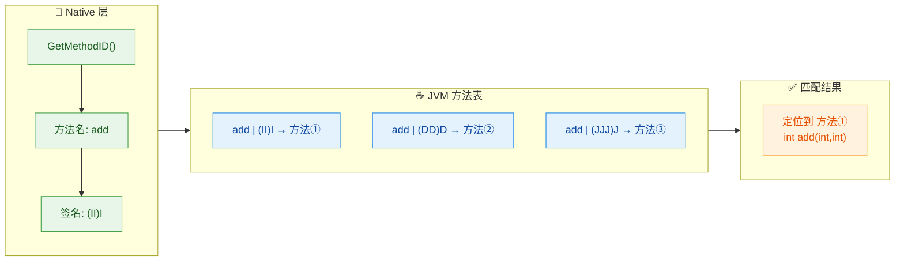

> 上图展示了 Native 层通过 **方法名 + 签名** 在 JVM 方法表中精确定位到目标方法的过程。

---

### 基本类型签名表（Primitive Type Descriptors）

JNI 签名对 Java 的 8 种基本类型和 `void` 各定义了一个 **单字符编码**。这是整个签名体系的原子单元：

| Java 类型 | JNI 签名字符 | JNI Native 类型 | 字节大小 | 助记方式 |
|-----------|:-----------:|-----------------|:-------:|---------|
| `boolean` | **`Z`** | `jboolean` | 1 | **Z** 来自 Boolean（B 被 byte 占了） |
| `byte` | **`B`** | `jbyte` | 1 | **B**yte |
| `char` | **`C`** | `jchar` | 2 | **C**har |
| `short` | **`S`** | `jshort` | 2 | **S**hort |
| `int` | **`I`** | `jint` | 4 | **I**nt |
| `long` | **`J`** | `jlong` | 8 | **J**（L 被引用类型占了，取 lon**J**） |
| `float` | **`F`** | `jfloat` | 4 | **F**loat |
| `double` | **`D`** | `jdouble` | 8 | **D**ouble |
| `void` | **`V`** | `void` | — | **V**oid |

> ⚠️ 特别注意 `boolean` → `Z` 和 `long` → `J`，这是最容易写错的两个。面试和实际开发中都是高频踩坑点。

---

### 引用类型签名（Reference Type Descriptors）

所有 Java **引用类型**（类、接口）都遵循统一格式：

```
L + 全限定类名（/ 分隔） + ;
```

注意三个要素缺一不可：**前缀 `L`**、**斜杠分隔的类名**、**末尾分号 `;`**。

| Java 类型 | JNI 签名 |
|-----------|---------|
| `java.lang.Object` | `Ljava/lang/Object;` |
| `java.lang.String` | `Ljava/lang/String;` |
| `java.util.List` | `Ljava/util/List;` |
| `android.app.Activity` | `Landroid/app/Activity;` |
| `com.example.MyClass` | `Lcom/example/MyClass;` |

**规则要点**：

1. **包名分隔符**：Java 中的 `.` 一律替换为 `/`。
2. **必须带分号**：末尾 `;` 是签名的一部分，不是句法标点，漏掉会导致 JVM 找不到类型。
3. **内部类**：使用 `$` 分隔外部类和内部类。例如 `java.util.Map.Entry` 的签名为 `Ljava/util/Map$Entry;`。

```cpp
// 在 Native 代码中通过签名查找字段
// 假设 Java 类有一个字段: String name;
jfieldID fid = env->GetFieldID(
    clazz,            // 目标类的 jclass
    "name",           // 字段名
    "Ljava/lang/String;"  // 字段的类型签名（注意末尾分号！）
);
```

---

### 数组类型签名（Array Type Descriptors）

数组签名以 **`[`（左方括号）** 作为前缀，后接元素类型的签名。多维数组则叠加多个 `[`：

| Java 类型 | JNI 签名 | 解读 |
|-----------|---------|------|
| `int[]` | `[I` | 一维 int 数组 |
| `byte[]` | `[B` | 一维 byte 数组 |
| `String[]` | `[Ljava/lang/String;` | 一维 String 对象数组 |
| `int[][]` | `[[I` | 二维 int 数组 |
| `Object[][]` | `[[Ljava/lang/Object;` | 二维 Object 数组 |
| `long[][][]` | `[[[J` | 三维 long 数组 |

> 可以看到数组签名是递归定义的：`int[][]` = "数组的（数组的 int）" = `[` + `[I` = `[[I`。

---

### 方法签名（Method Descriptors）⭐⭐

方法签名是类型签名规则的 **核心应用**，也是 JNI 面试第一高频考点。其格式为：

```
(参数类型签名1参数类型签名2...参数类型签名N)返回值类型签名
```

**关键规则**：

- **参数**：按顺序将每个参数的类型签名 **直接拼接**，中间 **无任何分隔符**（没有逗号、没有空格）。
- **返回值**：紧跟在闭括号 `)` 之后。
- **无参方法**：括号内为空 `()`，但括号不能省略。
- **void 返回**：返回值签名写 `V`。

下面通过一系列由简到复杂的示例来掌握：

#### 示例①：无参无返回值

```java
public void init()
```

签名构建过程：

```text
参数列表: 无  →  ()
返回值:  void →  V
─────────────────
方法签名:      ()V
```

#### 示例②：基本类型参数

```java
public int add(int a, int b)
```

```text
参数列表: int, int  →  I + I  →  II
返回值:   int       →  I
───────────────────────────
方法签名:            (II)I
```

#### 示例③：混合基本类型

```java
public long compute(int x, double y, boolean flag)
```

```text
参数列表: int, double, boolean → I + D + Z → IDZ
返回值:   long                 → J
───────────────────────────────────
方法签名:                       (IDZ)J
```

#### 示例④：引用类型参数

```java
public String greet(String name, int age)
```

```text
参数列表: String, int → Ljava/lang/String; + I → Ljava/lang/String;I
返回值:   String      → Ljava/lang/String;
──────────────────────────────────────────────
方法签名:              (Ljava/lang/String;I)Ljava/lang/String;
```

#### 示例⑤：数组参数

```java
public int sumArray(int[] arr)
```

```text
参数列表: int[]  →  [I
返回值:   int    →  I
─────────────────────
方法签名:         ([I)I
```

#### 示例⑥：复杂综合

```java
public Object[][] process(String name, int[] ids, double factor, boolean[][] mask)
```

```text
参数列表: String      → Ljava/lang/String;
          int[]       → [I
          double      → D
          boolean[][] → [[Z
          拼接        → Ljava/lang/String;[ID[[Z

返回值:   Object[][]  → [[Ljava/lang/Object;
────────────────────────────────────────────────
方法签名:              (Ljava/lang/String;[ID[[Z)[[Ljava/lang/Object;
```

#### 示例⑦：构造方法

Java 构造方法在 JNI 中的方法名固定为 `"<init>"`，返回值 **始终为 `V`（void）**：

```java
public MyClass(int id, String name)
```

```text
方法名:   <init>
方法签名: (ILjava/lang/String;)V
```

下面用一张完整的图来总结签名构建流程：

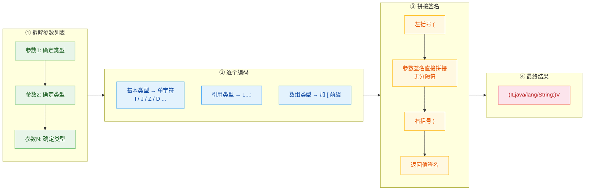

---

### 使用 `javap` 工具自动获取签名

手写签名容易出错，尤其是复杂方法。Java SDK 自带的 `javap` 工具可以自动输出所有方法和字段的签名：

```bash
# 编译 Java 文件
javac Calculator.java

# 使用 -s 参数输出签名（-p 表示包含 private 成员）
javap -s -p Calculator
```

输出示例：

```text
Compiled from "Calculator.java"
public class Calculator {
  public Calculator();
    descriptor: ()V

  public int add(int, int);
    descriptor: (II)I

  public double add(double, double);
    descriptor: (DD)D

  public long add(long, long, long);
    descriptor: (JJJ)J
}
```

**`descriptor` 后面的字符串就是方法签名**。在实际开发中，强烈推荐用 `javap -s` 来验证手写签名的正确性，避免运行时 `NoSuchMethodError`。

---

### 实战：在 Native 代码中使用签名

以下是一个完整的示例，演示如何在 C++ 中通过签名反向调用 Java 方法：

**Java 侧：**

```java
public class UserManager {
    // 目标方法：Native 层将回调此方法
    public String formatUser(String name, int age, boolean isVip) {
        String vipTag = isVip ? "[VIP]" : "";
        return vipTag + name + " (age: " + age + ")";
    }

    // native 方法声明
    public native void callFromNative();
}
```

**C++ 侧（核心逻辑带逐行注释）：**

```cpp
#include <jni.h>

extern "C"
JNIEXPORT void JNICALL
Java_com_example_UserManager_callFromNative(JNIEnv *env, jobject thiz) {

    // ==================== Step 1: 获取 jclass ====================
    // 通过 jobject 实例获取其所属的 Java 类
    jclass clazz = env->GetObjectClass(thiz);

    // ==================== Step 2: 获取 jmethodID ====================
    // 方法名: "formatUser"
    // 签名分析:
    //   参数: String       → Ljava/lang/String;
    //         int          → I
    //         boolean      → Z
    //   返回: String       → Ljava/lang/String;
    //   完整签名: (Ljava/lang/String;IZ)Ljava/lang/String;
    jmethodID mid = env->GetMethodID(
        clazz,                                          // 目标类
        "formatUser",                                   // 方法名
        "(Ljava/lang/String;IZ)Ljava/lang/String;"      // ★ 方法签名
    );

    // 检查方法是否找到（签名写错会返回 NULL）
    if (mid == nullptr) {
        // 签名错误！JVM 会抛出 NoSuchMethodError
        return;
    }

    // ==================== Step 3: 准备参数 ====================
    // 创建 Java String 对象作为第一个参数
    jstring nameArg = env->NewStringUTF("Alice");       // 构造 jstring
    jint ageArg = 28;                                    // int 参数直接传值
    jboolean vipArg = JNI_TRUE;                          // boolean 参数

    // ==================== Step 4: 调用 Java 方法 ====================
    // CallObjectMethod 用于返回值为引用类型的方法调用
    jobject result = env->CallObjectMethod(
        thiz,           // 调用目标对象
        mid,            // 方法 ID
        nameArg,        // 参数1: String
        ageArg,         // 参数2: int
        vipArg          // 参数3: boolean
    );

    // ==================== Step 5: 处理返回值 ====================
    // 将返回的 jobject 强转为 jstring
    jstring resultStr = (jstring) result;
    // 获取 C 风格字符串以便打印
    const char *cStr = env->GetStringUTFChars(resultStr, nullptr);

    // 输出结果: "[VIP]Alice (age: 28)"
    printf("Result from Java: %s\n", cStr);

    // ==================== Step 6: 释放资源 ====================
    // 释放 GetStringUTFChars 分配的内存
    env->ReleaseStringUTFChars(resultStr, cStr);
    // 释放局部引用（可选，函数返回后自动释放，但显式释放是好习惯）
    env->DeleteLocalRef(nameArg);
    env->DeleteLocalRef(resultStr);
}
```

---

### 常见签名速查表

为了方便日常开发快速查阅，这里汇总高频签名：

| Java 方法声明 | JNI 方法签名 |
|---|---|
| `void run()` | `()V` |
| `int hashCode()` | `()I` |
| `boolean equals(Object)` | `(Ljava/lang/Object;)Z` |
| `String toString()` | `()Ljava/lang/String;` |
| `void setData(byte[])` | `([B)V` |
| `int indexOf(String, int)` | `(Ljava/lang/String;I)I` |
| `char charAt(int)` | `(I)C` |
| `long[] getIds()` | `()[J` |
| `void main(String[])` | `([Ljava/lang/String;)V` |
| `Map get(String, List)` | `(Ljava/lang/String;Ljava/util/List;)Ljava/util/Map;` |

---

### 签名中的常见错误与排查

在实际开发中，签名写错是 JNI 最高频的 Bug 之一，通常表现为运行时抛出 `java.lang.NoSuchMethodError` 或 `java.lang.NoSuchFieldError`。以下是常见错误类型：

| 错误类型 | 错误写法 | 正确写法 | 说明 |
|---------|---------|---------|------|
| 漏写分号 | `Ljava/lang/String` | `Ljava/lang/String;` | 引用类型签名 **必须** 以 `;` 结尾 |
| 用点号分隔 | `Ljava.lang.String;` | `Ljava/lang/String;` | 必须用 `/` 而非 `.` |
| long 写成 L | `(L)V` | `(J)V` | `long` 的签名是 `J`，不是 `L` |
| boolean 写成 B | `(B)V` | `(Z)V` | `boolean` 是 `Z`，`B` 是 `byte` |
| 参数间加逗号 | `(I,I)V` | `(II)V` | 参数签名 **直接拼接**，无分隔符 |
| 构造方法返回类型 | `(I)I` | `(I)V` | 构造方法返回值 **永远是 `V`** |

**排查技巧**：

1. **优先用 `javap -s`** 确认签名，不要凭记忆手写。
2. **检查 logcat**：Android 环境下，签名错误会在 logcat 中输出详细的错误信息。
3. **封装常量**：将常用签名定义为 C++ 常量或宏，减少拼写错误：

```cpp
// 推荐：将高频签名定义为常量，集中管理
static const char* SIG_STRING       = "Ljava/lang/String;";  // String 类型签名
static const char* SIG_VOID_VOID    = "()V";                  // void method()
static const char* SIG_INT_INT      = "(II)I";                // int method(int, int)
static const char* SIG_STRING_TO_STRING =                      // String method(String)
    "(Ljava/lang/String;)Ljava/lang/String;";
```

---

### 签名的底层本质

从 JVM 规范的角度看，JNI 类型签名实际上就是 **JVM 内部的 Field Descriptor 和 Method Descriptor**。它们在 `.class` 文件的常量池（Constant Pool）中被编码存储。当你调用 `GetMethodID(env, clazz, "add", "(II)I")` 时，JVM 实际上在做：

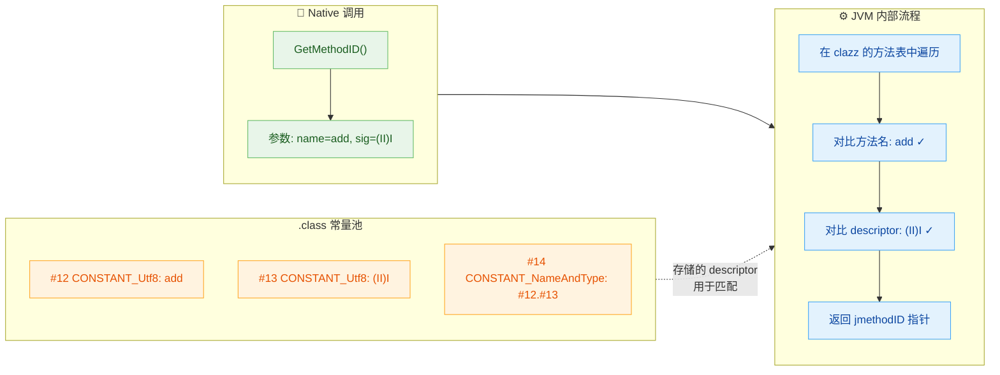

本质上，**你在 JNI 中写的签名字符串，和 `.class` 字节码文件中存储的 descriptor 是同一套编码规范**。这也是为什么 `javap -s` 能直接输出你需要的签名——它只是把 `.class` 文件中已有的 descriptor 打印出来而已。

---

### 本节小结

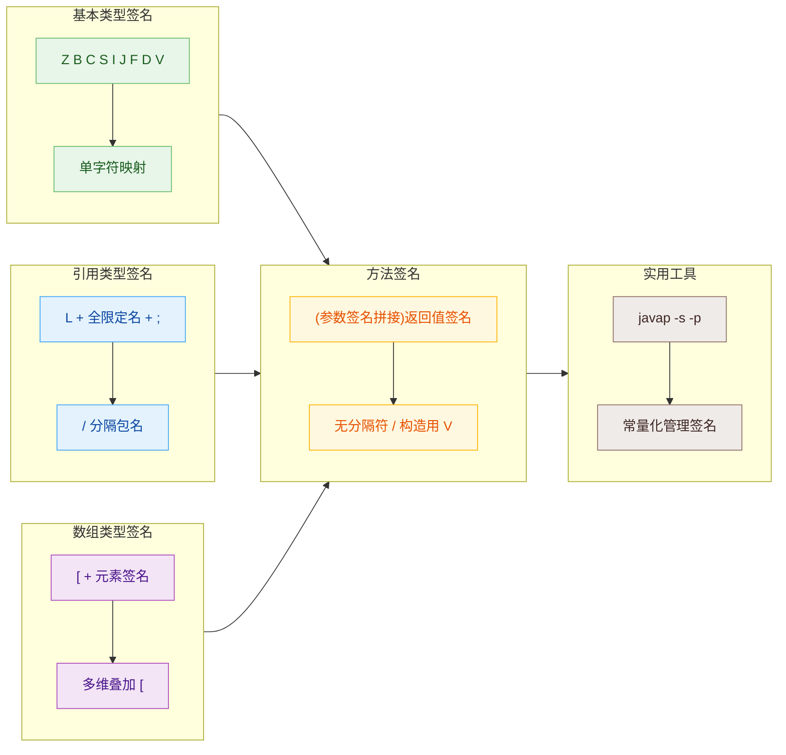

> 签名规则总结：**基本类型一个字母，引用类型 `L...;` 包裹，数组 `[` 叠前缀，方法 `(参数)返回值` 无分隔直接拼。**

---

**📝 练习题 1**

以下 Java 方法的 JNI 方法签名是什么？

```java
public boolean checkUser(String name, int[] scores, long timestamp)
```

A. `(Ljava/lang/String;[IJ)Z`


B. `(Ljava/lang/String;[I,J)Z`


C. `(Ljava/lang/String;[IL)B`


D. `(String;[IJ)Z`


**【答案】** A

**【解析】**
逐参数编码：
- `String name` → `Ljava/lang/String;`（引用类型，`L` 开头、`/` 分隔、`;` 结尾）
- `int[] scores` → `[I`（数组前缀 `[` + 元素类型 `I`）
- `long timestamp` → `J`（long 对应 `J`，不是 `L`）
- 返回值 `boolean` → `Z`（不是 `B`，`B` 是 byte）

直接拼接，参数之间 **无逗号无空格**，得到 `(Ljava/lang/String;[IJ)Z`。

B 错在参数间加了逗号，C 错在 long 写成了 `L` 且 boolean 写成了 `B`，D 错在 String 没有使用全限定名格式。

---

**📝 练习题 2**

在 JNI 中调用 Java 构造方法 `public MyClass(double value, String tag)`，以下 Native 代码哪个是正确的？

A. `env->GetMethodID(clazz, "MyClass", "(DLjava/lang/String;)V");`


B. `env->GetMethodID(clazz, "<init>", "(DLjava/lang/String;)V");`


C. `env->GetMethodID(clazz, "<init>", "(DLjava/lang/String;)Lcom/example/MyClass;");`


D. `env->GetMethodID(clazz, "new", "(DLjava/lang/String;)V");`


**【答案】** B

**【解析】**
JNI 中调用构造方法有两个硬性规则：① 方法名固定为 `"<init>"`（不是类名，也不是 `"new"`）；② 返回值签名 **始终为 `V`**（void），无论构造方法实际创建了什么类型的对象。A 错在用了类名 `"MyClass"` 作为方法名；C 错在返回值写成了类签名而非 `V`；D 错在方法名用了 `"new"`。正确签名构建：`double` → `D`，`String` → `Ljava/lang/String;`，返回 `V`，最终为 `(DLjava/lang/String;)V`。


---

## 字符串处理（GetStringUTFChars、ReleaseStringUTFChars）

在 JNI 的世界里，字符串处理是最常见、也是最容易出错的操作之一。Java 的 `String` 是一个**不可变的 Unicode 对象**，内部以 UTF-16 编码存储；而 C/C++ 的字符串本质上是一个以 `\0` 结尾的 `char*` 字节数组，通常使用 ASCII 或 UTF-8 编码。JNI 提供了一整套 API 来在这两个世界之间架起桥梁，其中最核心的就是 `GetStringUTFChars` / `ReleaseStringUTFChars` 这对函数，以及它们的 UTF-16 变体。

### 为什么字符串需要特殊处理

要理解 JNI 字符串 API 的设计动机，首先需要明确 Java 字符串与 C 字符串之间的**根本性差异**：

| 特性 | Java `String` | C `char*` |
|------|---------------|-----------|
| 编码 | UTF-16（每个字符至少 2 字节） | 取决于平台，通常 ASCII/UTF-8 |
| 可变性 | 不可变（Immutable） | 可变（Mutable） |
| 长度获取 | `length()` 方法，O(1) | `strlen()` 遍历到 `\0`，O(n) |
| 内存管理 | GC 自动回收 | 手动 `malloc`/`free` |
| 是否允许包含 `\0` | 允许（因为有独立的长度字段） | 不允许（`\0` 是终止符） |

由于这些差异，Native 代码**不能直接**将 `jstring` 当作 `char*` 使用。JNI 规范要求我们必须通过特定 API **显式转换**，JVM 内部会完成编码转换和内存拷贝（或固定 pin）的工作。

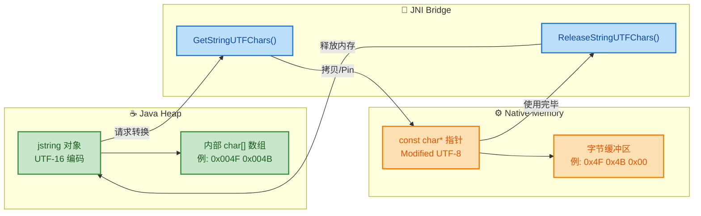

### Modified UTF-8 编码说明

JNI 中所有带 `UTF` 后缀的函数使用的并**不是**标准的 UTF-8，而是一种被称为 **Modified UTF-8**（修改版 UTF-8）的编码。它与标准 UTF-8 有两个关键区别：

1. **空字符 `\0` 的编码**：标准 UTF-8 中 `\0` 编码为单字节 `0x00`；Modified UTF-8 将其编码为双字节 `0xC0 0x80`。这保证了字符串中间不会出现 `0x00` 字节，使得 C 的 `strlen` 等函数仍可正常工作。

2. **增补字符的编码**：对于 Unicode 码点超过 U+FFFF 的字符（如 Emoji 😀），标准 UTF-8 使用 4 字节编码，而 Modified UTF-8 将其拆成**两个代理项**（Surrogate Pair），每个代理项用 3 字节编码，共 6 字节。

```text
字符: '你'  (U+4F60)

标准 UTF-8:    0xE4 0xBD 0xA0         (3 bytes)
Modified UTF-8: 0xE4 0xBD 0xA0         (3 bytes)  ← 相同

字符: '\0'  (U+0000)

标准 UTF-8:    0x00                    (1 byte)
Modified UTF-8: 0xC0 0x80              (2 bytes)  ← 不同！

字符: '😀'  (U+1F600)

标准 UTF-8:    0xF0 0x9F 0x98 0x80    (4 bytes)
Modified UTF-8: 0xED 0xA0 0xBD        (6 bytes, 代理对编码)
               0xED 0xB8 0x80         ← 不同！
```

> ⚠️ **实际开发建议**：如果你的 Native 代码需要与使用标准 UTF-8 的外部库（如 SQLite、cURL）交互，且字符串中可能包含空字符或增补字符，应手动转换或使用 `GetStringChars` 获取 UTF-16 再自行转为标准 UTF-8。

### GetStringUTFChars — 获取 Modified UTF-8 字符串

这是 JNI 中使用频率最高的字符串函数。它将 Java 的 `jstring` 转换为 C 可用的 `const char*`。

**函数签名：**

```c
// 参数说明:
// env      — JNI 环境指针
// string   — Java 传入的 jstring 对象
// isCopy   — 输出参数，JNI_TRUE 表示返回的是副本，JNI_FALSE 表示直接指向 JVM 内部数据
const char* GetStringUTFChars(JNIEnv *env, jstring string, jboolean *isCopy);
```

**参数详解：**

**`isCopy` 参数的含义**：JVM 实现有两种策略来响应这个请求——

- **Copy（拷贝）**：JVM 在 Native 堆上分配一块新内存，将 UTF-16 转码为 Modified UTF-8 后拷贝过去。`*isCopy = JNI_TRUE`。
- **Pin（固定）**：如果 JVM 内部恰好已有 UTF-8 缓存，或 GC 支持内存固定，JVM 直接返回内部指针，并将该内存区域标记为不可移动。`*isCopy = JNI_FALSE`。

> 💡 实际上，绝大多数 JVM（包括 HotSpot 和 ART）对 `GetStringUTFChars` 总是执行 **Copy**，因为内部存储是 UTF-16，编码不同必须转换。`isCopy` 参数在大多数场景下传 `NULL` 即可。

**完整使用示例：**

```c
#include <jni.h>    // JNI 头文件
#include <stdio.h>  // printf

// Native 方法实现：接收 Java String，在 Native 层打印
JNIEXPORT void JNICALL
Java_com_example_StringDemo_printFromNative(JNIEnv *env, jobject thiz, jstring jMsg) {

    // ① 空指针检查：Java 可能传入 null
    if (jMsg == NULL) {                          // 防御性编程，避免传入 null 导致崩溃
        printf("Received null string\n");        // 打印提示信息
        return;                                  // 提前返回，不做后续处理
    }

    // ② 将 jstring 转为 C 字符串（Modified UTF-8）
    // 第三个参数传 NULL，表示我们不关心是拷贝还是固定
    const char *cStr = (*env)->GetStringUTFChars(env, jMsg, NULL);

    // ③ 检查转换是否成功（内存不足时可能返回 NULL）
    if (cStr == NULL) {                          // GetStringUTFChars 失败会返回 NULL
        // 此时 JVM 已经抛出了 OutOfMemoryError，直接返回即可
        return;                                  // 不需要手动抛异常
    }

    // ④ 正常使用 C 字符串
    printf("Message from Java: %s\n", cStr);     // 打印字符串内容
    printf("UTF-8 byte length: %zu\n",           // 打印字节长度
           strlen(cStr));                         // strlen 计算到 \0 的字节数

    // ⑤ 【关键】使用完毕后必须释放！
    (*env)->ReleaseStringUTFChars(env, jMsg, cStr);  // 释放 Native 内存或取消固定
    // 释放后 cStr 变成悬垂指针（dangling pointer），不可再使用
    cStr = NULL;                                      // 良好习惯：置为 NULL 防止误用
}
```

### ReleaseStringUTFChars — 释放字符串资源

**函数签名：**

```c
// 参数说明:
// env    — JNI 环境指针
// string — 原始的 jstring 对象（必须与 Get 时的相同）
// utf    — GetStringUTFChars 返回的指针（必须与 Get 时的返回值相同）
void ReleaseStringUTFChars(JNIEnv *env, jstring string, const char *utf);
```

这个函数**必须**在每次成功调用 `GetStringUTFChars` 后被调用，否则会导致：

| 场景 | 后果 |
|------|------|
| Copy 模式下不释放 | **Native 内存泄漏**，反复调用后 OOM 崩溃 |
| Pin 模式下不释放 | GC 无法移动该对象，导致**堆碎片化**，间接引发 GC 压力和 OOM |
| 释放后继续使用指针 | **Use-After-Free**，未定义行为，可能崩溃或数据错乱 |

### Get 与 Release 的配对原则

JNI 字符串操作有一条**铁律**：**每一次 Get 必须对应一次 Release**。这类似于 C 中 `malloc`/`free` 的配对，或 C++ 中 RAII 的思想。

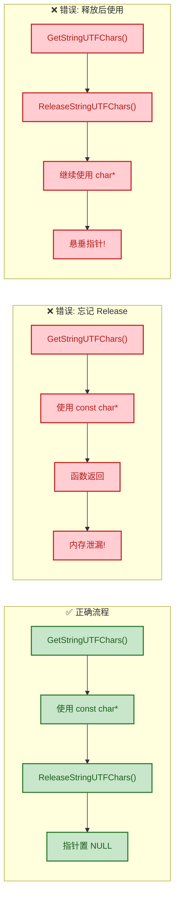

**多分支场景下的正确写法：**

```c
JNIEXPORT jint JNICALL
Java_com_example_StringDemo_processString(JNIEnv *env, jobject thiz, jstring input) {

    // 获取 C 字符串
    const char *str = (*env)->GetStringUTFChars(env, input, NULL);  // 转换为 UTF-8
    if (str == NULL) {                  // 检查是否成功
        return -1;                      // 失败时直接返回，无需 Release（Get 已失败）
    }

    jint result = 0;                    // 定义返回值

    // 假设有多个处理分支
    if (strlen(str) == 0) {             // 分支1：空字符串
        result = 0;                     // 设置返回值
        goto cleanup;                   // 跳转到统一释放点（避免忘记 Release）
    }

    if (str[0] == '#') {               // 分支2：以 # 开头的特殊字符串
        result = -2;                    // 设置错误码
        goto cleanup;                   // 跳转到统一释放点
    }

    result = (jint)strlen(str);         // 正常情况：返回字符串长度

cleanup:                                // 统一释放点
    (*env)->ReleaseStringUTFChars(env, input, str);  // 所有分支都在此释放
    str = NULL;                         // 置空指针
    return result;                      // 返回结果
}
```

> 💡 **C++ 风格替代方案**：如果你使用 C++ 编写 Native 代码，可以封装一个 RAII 风格的 helper 类，利用析构函数自动释放，避免 `goto`。

### UTF-16 系列函数：GetStringChars / ReleaseStringChars

除了 Modified UTF-8 系列，JNI 还提供了直接操作 UTF-16 编码的函数对：

```c
// 获取 UTF-16 字符数组指针（每个字符 2 字节）
const jchar* GetStringChars(JNIEnv *env, jstring string, jboolean *isCopy);

// 释放 UTF-16 字符数组
void ReleaseStringChars(JNIEnv *env, jstring string, const jchar *chars);
```

由于 Java 内部就是 UTF-16 存储，`GetStringChars` 相比 `GetStringUTFChars` 有一个潜在优势：**JVM 可能直接返回内部数组的指针而非拷贝**（Pin 模式概率更高）。但需注意 `jchar` 是无符号 16 位整型，不能直接当 C 字符串用。

**两套 API 的选择指南：**

| 场景 | 推荐 API | 理由 |
|------|----------|------|
| 传给 C 标准库函数（`printf`, `fopen` 等） | `GetStringUTFChars` | C 函数期望 `char*` |
| 传给 Windows API（`wchar_t*`） | `GetStringChars` | Windows 内部使用 UTF-16 |
| 对性能极度敏感且字符串很长 | `GetStringChars` | 可能避免拷贝 |
| 需要传给仅支持标准 UTF-8 的库 | `GetStringChars` + 手动转码 | 避免 Modified UTF-8 的坑 |

### GetStringUTFRegion — 区域拷贝（栈优化）

当你只需要字符串的一部分，或希望使用**栈上缓冲区**来避免堆分配时，`GetStringUTFRegion` 是更好的选择：

```c
// 将 jstring 的指定区域转为 Modified UTF-8，拷贝到用户提供的缓冲区
// start — 起始字符索引（UTF-16 字符索引，非字节偏移）
// len   — 要拷贝的字符数量
// buf   — 用户提供的输出缓冲区
void GetStringUTFRegion(JNIEnv *env, jstring str, jsize start, jsize len, char *buf);
```

**关键优势**：
- **无需 Release**：因为数据是拷贝到用户管理的缓冲区中，不涉及 JVM 资源持有。
- **栈分配友好**：可以使用局部数组作为缓冲区，避免堆内存分配开销。
- **异常安全**：越界时抛出 `StringIndexOutOfBoundsException`，不会返回错误指针。

```c
JNIEXPORT void JNICALL
Java_com_example_StringDemo_regionCopy(JNIEnv *env, jobject thiz, jstring input) {

    // 获取字符串的 UTF-16 字符数量（注意：不是字节数）
    jsize charLen = (*env)->GetStringLength(env, input);           // 获取字符长度

    // 获取 Modified UTF-8 的字节数量
    jsize utfLen = (*env)->GetStringUTFLength(env, input);         // 获取 UTF-8 字节长度

    // 在栈上分配缓冲区（+1 为 '\0' 终止符预留空间）
    // 注意：仅当 utfLen 较小时才适合栈分配，否则应使用 malloc
    char buf[256];                                                  // 栈上缓冲区
    if (utfLen < 256) {                                            // 安全检查
        // 拷贝整个字符串到栈缓冲区
        (*env)->GetStringUTFRegion(env, input, 0, charLen, buf);   // 区域拷贝
        buf[utfLen] = '\0';                                        // 手动添加终止符

        printf("Stack buffer content: %s\n", buf);                 // 使用缓冲区
        // 无需调用任何 Release 函数！
    }
}
```

### NewStringUTF — 从 Native 创建 Java 字符串

与 Get 方向相反，当 Native 需要**返回字符串给 Java** 时，使用 `NewStringUTF`：

```c
// 从 Modified UTF-8 的 C 字符串创建一个新的 Java String 对象
// bytes — 以 \0 结尾的 Modified UTF-8 字符串
// 返回值 — 新建的 jstring 对象，失败返回 NULL（并抛出 OutOfMemoryError）
jstring NewStringUTF(JNIEnv *env, const char *bytes);
```

**完整示例 — 拼接字符串后返回 Java：**

```c
JNIEXPORT jstring JNICALL
Java_com_example_StringDemo_greetFromNative(JNIEnv *env, jobject thiz, jstring jName) {

    // ① 获取 Java 传来的名字
    const char *name = (*env)->GetStringUTFChars(env, jName, NULL);  // 转换为 C 字符串
    if (name == NULL) {                   // 检查是否成功
        return NULL;                      // 失败则返回 null 给 Java
    }

    // ② 在 Native 层拼接字符串
    char greeting[512];                   // 栈上缓冲区
    snprintf(greeting, sizeof(greeting),  // 安全格式化（防溢出）
             "Hello, %s! From Native.", name);

    // ③ 释放原始字符串（在创建新字符串之前释放，减少内存占用）
    (*env)->ReleaseStringUTFChars(env, jName, name);  // 释放
    name = NULL;                          // 置空

    // ④ 创建新的 Java String 并返回
    jstring result = (*env)->NewStringUTF(env, greeting);  // 从 C 字符串创建 jstring
    // result 可能为 NULL（OOM），Java 层会收到 null
    return result;                        // 返回给 Java
}
```

### 常见陷阱与最佳实践

#### 陷阱 1：忘记 NULL 检查

`GetStringUTFChars` 在内存不足时返回 `NULL`，若不检查直接使用会导致 Native 层 **SIGSEGV 崩溃**，且异常信息极其不友好（不像 Java 的 NullPointerException 有堆栈）。

#### 陷阱 2：跨线程使用释放后的指针

```c
// ❌ 错误示例：在子线程中使用已释放的指针
const char *str = (*env)->GetStringUTFChars(env, jStr, NULL);
(*env)->ReleaseStringUTFChars(env, jStr, str);

// ... 后续在另一个线程中 ...
printf("%s\n", str);  // 未定义行为！str 已被释放
```

**正确做法**：如果需要跨线程使用字符串内容，应在 Release 前用 `strdup` 或 `std::string` 保存副本。

#### 陷阱 3：混淆字符长度和字节长度

```c
jsize charLen = (*env)->GetStringLength(env, jStr);       // UTF-16 字符数量
jsize byteLen = (*env)->GetStringUTFLength(env, jStr);    // Modified UTF-8 字节数量

// 对于纯 ASCII 字符串:   charLen == byteLen
// 对于中文字符串 "你好":  charLen = 2,  byteLen = 6
// 对于 Emoji "😀":       charLen = 2 (代理对),  byteLen = 6
```

#### 最佳实践总结

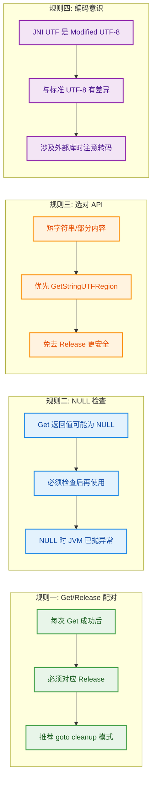

### JNI 字符串 API 全家福速查表

| 函数 | 方向 | 编码 | 需要 Release | 典型用途 |
|------|------|------|:---:|------|
| `GetStringUTFChars` | Java → C | Modified UTF-8 | ✅ | 获取完整字符串 |
| `ReleaseStringUTFChars` | — | — | — | 释放上述指针 |
| `GetStringChars` | Java → C | UTF-16 | ✅ | Windows API 交互 |
| `ReleaseStringChars` | — | — | — | 释放上述指针 |
| `GetStringUTFRegion` | Java → C | Modified UTF-8 | ❌ | 栈上拷贝部分内容 |
| `GetStringRegion` | Java → C | UTF-16 | ❌ | 栈上拷贝 UTF-16 |
| `NewStringUTF` | C → Java | Modified UTF-8 | — | 创建 Java 字符串 |
| `NewString` | C → Java | UTF-16 | — | 从 UTF-16 创建 |
| `GetStringLength` | 查询 | — | — | 获取 UTF-16 字符数 |
| `GetStringUTFLength` | 查询 | — | — | 获取 UTF-8 字节数 |

### C++ RAII 封装（工程推荐）

在实际项目中，手动管理 Get/Release 配对容易出错。C++ 中推荐使用 RAII 封装：

```cpp
#include <jni.h>   // JNI 头文件
#include <string>  // std::string

// RAII 封装类：自动管理 GetStringUTFChars / ReleaseStringUTFChars 的生命周期
class JniString {
public:
    // 构造函数：获取 C 字符串
    JniString(JNIEnv *env, jstring jStr)
        : env_(env),                                              // 保存 env 指针
          jStr_(jStr),                                            // 保存 jstring 引用
          cStr_(nullptr) {                                        // 初始化为空
        if (jStr_ != nullptr) {                                   // 非空才获取
            cStr_ = env_->GetStringUTFChars(jStr_, nullptr);      // 获取 C 字符串
        }
    }

    // 析构函数：自动释放
    ~JniString() {
        if (cStr_ != nullptr) {                                   // 仅在成功获取时释放
            env_->ReleaseStringUTFChars(jStr_, cStr_);            // 自动释放
        }
    }

    // 禁止拷贝（防止 double-free）
    JniString(const JniString&) = delete;                         // 删除拷贝构造
    JniString& operator=(const JniString&) = delete;              // 删除拷贝赋值

    // 获取 C 字符串指针
    const char* c_str() const { return cStr_; }                   // 返回内部指针

    // 转为 std::string（安全拷贝，可跨线程使用）
    std::string toString() const {                                // 转为 std::string
        return cStr_ ? std::string(cStr_) : std::string();        // 空安全
    }

    // 判断是否有效
    explicit operator bool() const { return cStr_ != nullptr; }   // 支持 if(jniStr) 判断

private:
    JNIEnv *env_;          // JNI 环境指针
    jstring jStr_;         // 原始 jstring
    const char *cStr_;     // 转换后的 C 字符串
};

// 使用示例
JNIEXPORT void JNICALL
Java_com_example_StringDemo_elegantPrint(JNIEnv *env, jobject thiz, jstring jMsg) {
    JniString msg(env, jMsg);             // 构造时自动 Get
    if (msg) {                            // 检查是否有效
        printf("Message: %s\n", msg.c_str());  // 安全使用
    }
    // 离开作用域时自动 Release，无需手动管理！
}
```

---

**📝 练习题**

以下 JNI 代码存在什么问题？

```c
JNIEXPORT jstring JNICALL
Java_com_example_Test_process(JNIEnv *env, jobject thiz, jstring input) {
    const char *str = (*env)->GetStringUTFChars(env, input, NULL);
    if (strlen(str) > 100) {
        return (*env)->NewStringUTF(env, "too long");
    }
    char buf[256];
    snprintf(buf, 256, "Result: %s", str);
    (*env)->ReleaseStringUTFChars(env, input, str);
    return (*env)->NewStringUTF(env, buf);
}
```

A. `NewStringUTF` 不能接受栈上的 `buf` 作为参数


B. `GetStringUTFChars` 返回 `NULL` 时未检查，且 `strlen > 100` 分支未调用 `ReleaseStringUTFChars` 导致内存泄漏


C. `snprintf` 的缓冲区大小不足以容纳拼接后的字符串


D. `ReleaseStringUTFChars` 应在 `NewStringUTF` 之后调用，当前顺序会导致 `buf` 内容被破坏


**【答案】** B

**【解析】** 代码有两个问题。**第一**，`GetStringUTFChars` 可能在内存不足时返回 `NULL`，代码直接对返回值调用 `strlen(str)` 而未做 NULL 检查，这会导致空指针解引用崩溃。**第二**，当 `strlen(str) > 100` 成立时，函数直接 `return` 了一个新字符串，但在此之前并没有调用 `ReleaseStringUTFChars` 释放之前通过 `Get` 获取的 `str` 指针，违反了 Get/Release 必须配对的原则，造成 Native 内存泄漏。选项 A 错误，`NewStringUTF` 只要求参数是合法的 Modified UTF-8 字符串指针，不关心其来自堆还是栈。选项 C 不准确，虽然理论上超长字符串可能溢出，但 `snprintf` 本身会截断，不会导致缓冲区溢出。选项 D 错误，`snprintf` 已经将内容拷贝到 `buf` 中，`Release` 释放的是 `str` 而非 `buf`，不会影响 `buf` 的内容。

---

## 数组处理（GetArrayElements / ReleaseArrayElements）

在 JNI 开发中，数组（Array）是仅次于字符串的第二高频数据交换载体。无论是传递一组传感器数据、一批像素值，还是一段音频 PCM 缓冲区，都离不开 Java 数组与 Native 层之间的高效互操作。与字符串处理的思路类似，JNI 提供了一套 **"获取 → 操作 → 释放"** 的三段式 API，但数组场景更复杂——它涉及 **基本类型数组（Primitive Array）** 与 **对象数组（Object Array）** 两大分支，且在性能优化上提供了 **Critical 区域** 等高级手段。本节将从底层内存模型出发，逐一拆解每个 API 的语义、陷阱和最佳实践。

---

### JNI 数组体系总览

Java 中的数组在 JNI 层被映射为一组专用的 C 类型。我们先用一张图建立全局视野：

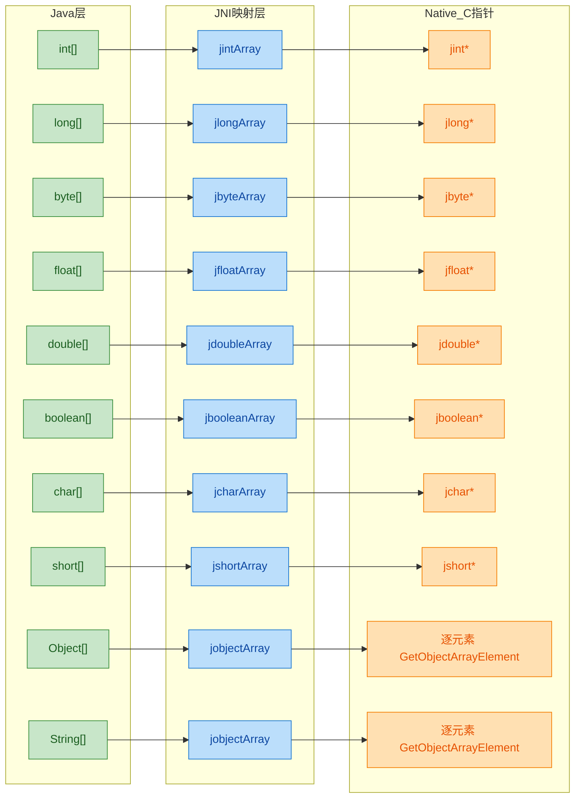

核心要点：**基本类型数组** 都有各自独立的 `j<type>Array` 类型和对应的 `Get<Type>ArrayElements` 系列函数；而 **对象数组** 统一使用 `jobjectArray`，只能逐元素操作，无法一次性获取连续内存指针。这一设计差异直接决定了两类数组在性能特征上的巨大差距。

---

### 基本类型数组的核心三段式

所有基本类型数组的操作遵循同一模式，仅函数名中的类型关键字不同。以 `jintArray` 为例，完整的生命周期如下：

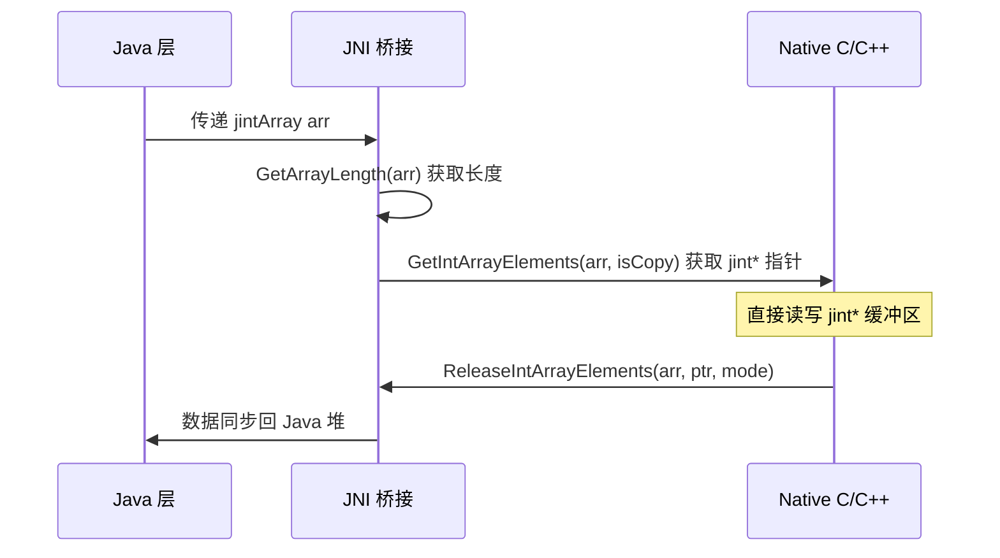

#### 第一步：获取数组长度

```cpp
// env  : JNI 环境指针
// arr  : 从 Java 传入的 jintArray
jsize len = (*env)->GetArrayLength(env, arr);  // 返回数组元素个数（jsize 即 jint 的别名）
```

`GetArrayLength` 适用于 **所有** 数组类型（包括 `jobjectArray`），它不会抛异常，不会拷贝内存，是轻量操作。

#### 第二步：获取元素指针（Get\<Type\>ArrayElements）

```cpp
// isCopy: 输出参数，JNI 会填入 JNI_TRUE 或 JNI_FALSE
//         JNI_TRUE  → 返回的是堆内存的 *副本*（copy）
//         JNI_FALSE → 返回的是直接指向 Java 堆的 *原始指针*（pinned）
//         传 NULL 表示"我不关心是不是副本"
jboolean isCopy = JNI_FALSE;
jint *elements = (*env)->GetIntArrayElements(env, arr, &isCopy);

// ⚠️ 必须检查返回值！内存不足时返回 NULL
if (elements == NULL) {
    return; // OutOfMemoryError 已由 JNI 自动抛出
}
```

**`isCopy` 的深层含义**：

JVM 实现（如 HotSpot、ART）在收到 `GetIntArrayElements` 调用时，面临两种策略：

| 策略 | isCopy 值 | 含义 | 典型场景 |
|------|-----------|------|----------|
| **Pin（钉住）** | `JNI_FALSE` | 直接返回 Java 堆上数组数据的内存地址，同时 **阻止 GC 移动** 该对象 | 数组较大，拷贝代价高；或 VM 支持 pinning |
| **Copy（拷贝）** | `JNI_TRUE` | 在 Native 堆上 malloc 一块同等大小的内存，把 Java 数组内容复制过去 | VM 使用分代/压缩 GC，无法原地 pin |

开发者 **不能** 控制 JVM 选择哪种策略，只能通过 `isCopy` 事后得知结果。这也是为什么 **Release 必须调用** ——无论是 pin 还是 copy，都需要通知 JVM "Native 侧已用完"。

下面的内存模型可以帮助你直观理解两种策略的差异：

```cpp
// ===== 场景 A: isCopy == JNI_FALSE (Pinned) =====
//
//   Java Heap                          Native Code
//  ┌───────────────────┐
//  │  int[] arr        │
//  │ ┌───┬───┬───┬───┐ │
//  │ │ 1 │ 2 │ 3 │ 4 │◄──────────── elements (jint*)
//  │ └───┴───┴───┴───┘ │              直接指向堆内存
//  └───────────────────┘              GC 被阻止移动此对象
//
// ===== 场景 B: isCopy == JNI_TRUE (Copied) =====
//
//   Java Heap                          Native Heap
//  ┌───────────────────┐            ┌───────────────────┐
//  │  int[] arr        │   memcpy   │  malloc'd buffer  │
//  │ ┌───┬───┬───┬───┐ │  ------→   │ ┌───┬───┬───┬───┐ │
//  │ │ 1 │ 2 │ 3 │ 4 │ │            │ │ 1 │ 2 │ 3 │ 4 │◄── elements (jint*)
//  │ └───┴───┴───┴───┘ │            │ └───┴───┴───┴───┘ │
//  └───────────────────┘            └───────────────────┘
//                                    修改此处不影响 Java 堆
//                                    直到 Release 且 mode=0
```

#### 第三步：释放元素指针（Release\<Type\>ArrayElements）

```cpp
// arr      : 原始 jintArray 引用
// elements : 之前 Get 返回的 jint* 指针
// mode     : 释放模式（0 / JNI_COMMIT / JNI_ABORT）
(*env)->ReleaseIntArrayElements(env, arr, elements, 0);
```

**`mode` 参数是数组处理中最容易踩坑的地方**，其三种取值语义如下：

| mode 值 | 宏名 | 行为（copy 场景） | 行为（pin 场景） | 释放 Native 缓冲？ |
|---------|------|--------------------|-------------------|---------------------|
| `0` | — | 将修改写回 Java 堆 **并** 释放 Native 缓冲 | 解除 pin | ✅ 是 |
| `JNI_COMMIT` | `1` | 将修改写回 Java 堆，**不** 释放 Native 缓冲 | 无实际操作（数据本就在堆上） | ❌ 否 |
| `JNI_ABORT` | `2` | **丢弃** 修改，释放 Native 缓冲 | 解除 pin（修改已直接生效，无法撤销） | ✅ 是 |

> ⚠️ **关键陷阱**：`JNI_ABORT` 在 pin 模式下 **并不能** 真正撤销修改！因为 Native 代码直接改的就是 Java 堆内存。所以如果你需要"只读不改"的语义保证，应该自行在操作前备份数据，而不是依赖 `JNI_ABORT`。

用一张决策流程图帮你选择正确的 mode：

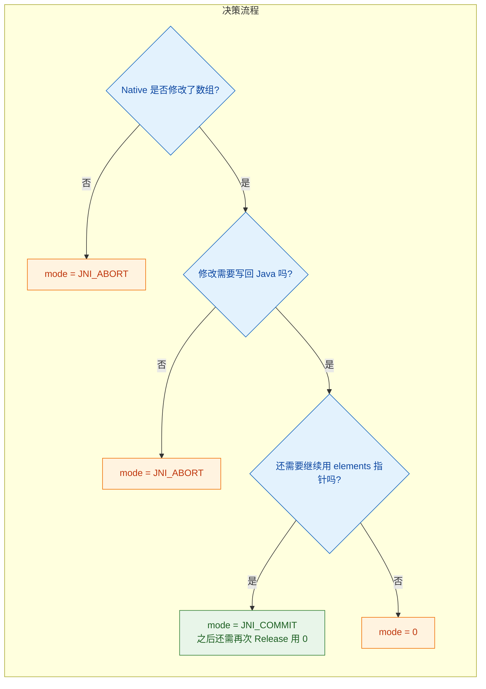

---

### 完整代码示例：基本类型数组的读写

下面演示一个完整的场景：Java 传入 `int[]`，Native 层将每个元素翻倍后返回。

**Java 侧：**

```java
public class ArrayDemo {
    // 加载 Native 库
    static {
        System.loadLibrary("arraydemo");
    }

    // 声明 native 方法：将 int 数组元素翻倍
    public static native void doubleElements(int[] data);

    public static void main(String[] args) {
        int[] data = {10, 20, 30, 40, 50};             // 原始数组
        System.out.println("Before: " + java.util.Arrays.toString(data));
        doubleElements(data);                           // 调用 Native
        System.out.println("After:  " + java.util.Arrays.toString(data));
        // 期望输出: After: [20, 40, 60, 80, 100]
    }
}
```

**Native 侧（C）：**

```cpp
#include <jni.h>    // JNI 头文件
#include <stddef.h> // NULL 定义

/*
 * Class:     ArrayDemo
 * Method:    doubleElements
 * Signature: ([I)V
 *
 * 参数说明：
 *   env  - JNI 环境指针，所有 JNI 函数都通过它调用
 *   clazz - 调用该 static native 方法的类（ArrayDemo.class）
 *   arr  - Java 传入的 int[] 数组
 */
JNIEXPORT void JNICALL
Java_ArrayDemo_doubleElements(JNIEnv *env, jclass clazz, jintArray arr) {

    // 1. 获取数组长度
    jsize len = (*env)->GetArrayLength(env, arr); // 返回元素个数

    // 2. 获取数组元素的 Native 指针
    jboolean isCopy = JNI_FALSE;                  // 用于接收是否为副本
    jint *elems = (*env)->GetIntArrayElements(     // 核心 API
        env,        // JNI 环境
        arr,        // Java 数组引用
        &isCopy     // 输出：是否拷贝（可传 NULL）
    );

    // 3. 空指针检查（内存不足时返回 NULL）
    if (elems == NULL) {
        return;     // JNI 已自动挂起 OutOfMemoryError
    }

    // 4. 在 Native 层操作数组（逐元素翻倍）
    for (jsize i = 0; i < len; i++) {
        elems[i] *= 2;  // 直接通过 C 指针修改（pin 模式下立即生效于 Java 堆）
    }

    // 5. 释放资源并将修改写回 Java 堆
    (*env)->ReleaseIntArrayElements(
        env,        // JNI 环境
        arr,        // 原始 Java 数组引用
        elems,      // 之前获取的指针
        0           // mode=0: 写回 + 释放
    );
    // ⚠️ 此行之后 elems 指针已失效，不可再使用！
}
```

---

### 全类型 API 速查表

JNI 为 8 种基本类型各提供了一组镜像 API，函数签名完全对称：

| Java 类型 | JNI 数组类型 | Get 函数 | Release 函数 | 元素 C 类型 |
|-----------|-------------|----------|-------------|------------|
| `boolean[]` | `jbooleanArray` | `GetBooleanArrayElements` | `ReleaseBooleanArrayElements` | `jboolean*` |
| `byte[]` | `jbyteArray` | `GetByteArrayElements` | `ReleaseByteArrayElements` | `jbyte*` |
| `char[]` | `jcharArray` | `GetCharArrayElements` | `ReleaseCharArrayElements` | `jchar*` |
| `short[]` | `jshortArray` | `GetShortArrayElements` | `ReleaseShortArrayElements` | `jshort*` |
| `int[]` | `jintArray` | `GetIntArrayElements` | `ReleaseIntArrayElements` | `jint*` |
| `long[]` | `jlongArray` | `GetLongArrayElements` | `ReleaseLongArrayElements` | `jlong*` |
| `float[]` | `jfloatArray` | `GetFloatArrayElements` | `ReleaseFloatArrayElements` | `jfloat*` |
| `double[]` | `jdoubleArray` | `GetDoubleArrayElements` | `ReleaseDoubleArrayElements` | `jdouble*` |

**记忆技巧**：函数名 = `Get` + `<JavaType>` + `ArrayElements`，完全规律化，无需死记。

---

### Region 操作：局部拷贝的轻量方案

当你 **只需要读写数组的一部分** 时，使用 `Get<Type>ArrayRegion` / `Set<Type>ArrayRegion` 更加高效，因为它们 **直接在调用者提供的缓冲区上操作**，省去了 pin/copy 的额外开销和 Release 调用。

```cpp
JNIEXPORT void JNICALL
Java_ArrayDemo_processRegion(JNIEnv *env, jclass clazz, jintArray arr) {

    jsize len = (*env)->GetArrayLength(env, arr);  // 获取数组总长度

    // 只处理前 3 个元素
    jint buf[3];  // 在栈上分配局部缓冲区（适合小数组）

    // 从 Java 数组的第 0 个位置开始，拷贝 3 个元素到 buf
    (*env)->GetIntArrayRegion(
        env,    // JNI 环境
        arr,    // Java 数组
        0,      // start: 起始索引
        3,      // len:   拷贝元素数
        buf     // dest:  目标 C 缓冲区
    );
    // ⚠️ 如果 start+len > 数组长度，JNI 会抛出 ArrayIndexOutOfBoundsException

    // 修改缓冲区（对 Java 数组无影响）
    for (int i = 0; i < 3; i++) {
        buf[i] += 100;  // 每个元素加 100
    }

    // 将修改后的数据写回 Java 数组的 [0, 3) 区间
    (*env)->SetIntArrayRegion(
        env,    // JNI 环境
        arr,    // Java 数组
        0,      // start: 写入起始索引
        3,      // len:   写入元素数
        buf     // src:   源 C 缓冲区
    );
    // 不需要 Release！Region 操作自包含，用完即走。
}
```

**Get\<Type\>ArrayElements vs Get\<Type\>ArrayRegion 对比**：

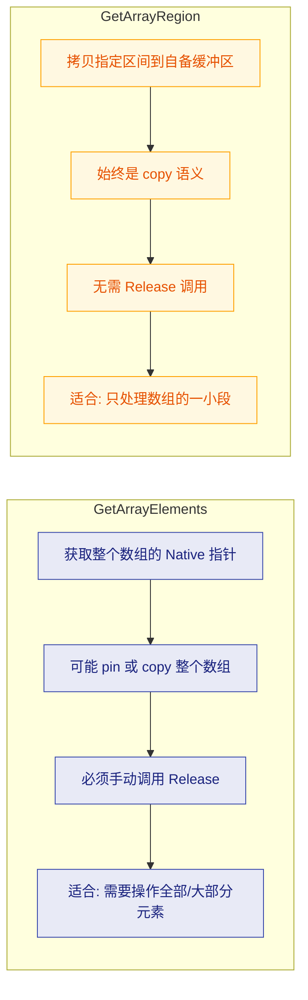

---

### Critical 区域：极致性能的终极手段

JNI 还提供了一对高级 API：`GetPrimitiveArrayCritical` / `ReleasePrimitiveArrayCritical`，它们 **极大地提高了获得直接指针（非拷贝）的概率**，代价是在 Get 和 Release 之间，Native 代码受到严苛限制。

```cpp
JNIEXPORT void JNICALL
Java_ArrayDemo_criticalProcess(JNIEnv *env, jclass clazz, jintArray arr) {

    jsize len = (*env)->GetArrayLength(env, arr); // 获取长度

    // 进入 Critical 区域 —— JVM 可能暂停 GC
    jint *elems = (jint *)(*env)->GetPrimitiveArrayCritical(
        env,    // JNI 环境
        arr,    // Java 数组
        NULL    // isCopy（通常传 NULL，不关心）
    );

    if (elems == NULL) {
        return; // 内存不足
    }

    // ========== Critical 区域内 ==========
    // ✅ 允许：纯计算、内存拷贝、memcpy 等
    for (jsize i = 0; i < len; i++) {
        elems[i] = elems[i] * elems[i]; // 平方操作
    }
    // ❌ 禁止：调用其他 JNI 函数（除了另一个 GetPrimitiveArrayCritical）
    // ❌ 禁止：调用可能阻塞当前线程的系统调用
    // ❌ 禁止：分配新的 Java 对象
    // ========== Critical 区域结束 ==========

    // 离开 Critical 区域
    (*env)->ReleasePrimitiveArrayCritical(
        env,    // JNI 环境
        arr,    // Java 数组
        elems,  // 指针
        0       // mode（同 Release<Type>ArrayElements）
    );
}
```

**为什么 Critical 更快？** 因为它向 JVM 承诺："我会很快用完，中间不做任何可能触发 GC 的事情。" JVM 收到这个承诺后，可以放心地直接返回 Java 堆上的地址，甚至可能暂时 **完全禁用 GC**（在某些 VM 实现中），从而避免了 `malloc + memcpy` 的开销。

```cpp
// Critical 区域的时间线模型
//
//  ──── 时间轴 ─────────────────────────────────────────────→
//
//  GetPrimitiveArrayCritical()           ReleasePrimitiveArrayCritical()
//          │                                       │
//          ▼                                       ▼
//  ═══════╤═══════════════════════════════════════╤═══════
//         │         🔒 Critical Section           │
//         │  · GC 被抑制或完全暂停                  │
//         │  · 禁止调用大多数 JNI 函数               │
//         │  · 禁止阻塞性系统调用                    │
//         │  · elems 指针保证有效                   │
//  ═══════╧═══════════════════════════════════════╧═══════
//
//  ⚠️ 如果 Critical Section 持续过长 → GC 延迟 → 其他线程可能卡顿
```

> **最佳实践**：Critical 区域应控制在 **微秒级**。如果需要做耗时计算，请回退到普通的 `Get<Type>ArrayElements`。

---

### 对象数组（jobjectArray）处理

与基本类型数组不同，对象数组中存放的是 **引用**（reference），无法用一块连续内存表示。因此 JNI 只提供 **逐元素** 的 Get/Set 接口：

```cpp
JNIEXPORT void JNICALL
Java_ArrayDemo_processStringArray(JNIEnv *env, jclass clazz, jobjectArray strArr) {

    // 1. 获取数组长度
    jsize len = (*env)->GetArrayLength(env, strArr); // 对象数组同样用此函数

    for (jsize i = 0; i < len; i++) {

        // 2. 获取第 i 个元素（返回 jobject，实际是 jstring）
        jstring str = (jstring)(*env)->GetObjectArrayElement(
            env,      // JNI 环境
            strArr,   // 对象数组
            i         // 索引
        );
        // ⚠️ 返回的是 Local Reference，当前帧结束自动释放

        // 3. 将 jstring 转为 C 字符串以便处理
        const char *cStr = (*env)->GetStringUTFChars(env, str, NULL);
        if (cStr == NULL) return; // OOM

        printf("Element[%d] = %s\n", i, cStr); // 打印

        // 4. 释放 UTF 字符串
        (*env)->ReleaseStringUTFChars(env, str, cStr);

        // 5. 及时删除 Local Reference（循环中非常重要！）
        (*env)->DeleteLocalRef(env, str);
        // 不删除的话，循环次数过多会超出 Local Reference 表上限（默认 512）
    }
}
```

**创建对象数组：**

```cpp
JNIEXPORT jobjectArray JNICALL
Java_ArrayDemo_createStringArray(JNIEnv *env, jclass clazz) {

    // 1. 找到 String 类
    jclass strClass = (*env)->FindClass(env, "java/lang/String"); // 类签名

    // 2. 创建长度为 3 的 String[] 数组，初始值为 NULL
    jobjectArray result = (*env)->NewObjectArray(
        env,        // JNI 环境
        3,          // 数组长度
        strClass,   // 元素类型（java.lang.String）
        NULL        // 初始值（每个元素初始为 null）
    );

    if (result == NULL) return NULL; // OOM

    // 3. 逐一填入字符串
    const char *names[] = {"Alice", "Bob", "Charlie"}; // C 字符串数组
    for (int i = 0; i < 3; i++) {
        jstring jStr = (*env)->NewStringUTF(env, names[i]); // 创建 Java String
        (*env)->SetObjectArrayElement(
            env,      // JNI 环境
            result,   // 目标数组
            i,        // 索引
            jStr      // 要设置的元素
        );
        (*env)->DeleteLocalRef(env, jStr); // 释放局部引用
    }

    return result; // 返回给 Java 层
}
```

---

### 创建基本类型数组

Native 层也可以主动创建基本类型数组返回给 Java：

```cpp
JNIEXPORT jintArray JNICALL
Java_ArrayDemo_createSequence(JNIEnv *env, jclass clazz, jint count) {

    // 1. 创建一个长度为 count 的 int[]
    jintArray result = (*env)->NewIntArray(env, count);
    if (result == NULL) return NULL; // OOM

    // 2. 在栈上准备数据（小数组适用；大数组应 malloc）
    jint *buf = (jint *)malloc(sizeof(jint) * count); // 堆上分配
    if (buf == NULL) return NULL;

    for (jint i = 0; i < count; i++) {
        buf[i] = i * i; // 填入平方数序列: 0, 1, 4, 9, 16, ...
    }

    // 3. 一次性将 buf 内容写入 Java 数组
    (*env)->SetIntArrayRegion(
        env,      // JNI 环境
        result,   // 目标 Java 数组
        0,        // 起始索引
        count,    // 元素数量
        buf       // 源数据
    );

    free(buf);    // 释放临时缓冲区
    return result; // 返回 jintArray 给 Java
}
```

---

### 常见错误与排查清单

| 错误类型 | 症状 | 原因 | 修复方案 |
|---------|------|------|---------|
| **忘记 Release** | 内存泄漏，长期运行后 OOM | Get 后未调用对应 Release | 确保每个 Get 都有配对的 Release |
| **Release 后继续使用指针** | 段错误（SIGSEGV）或数据损坏 | 悬空指针（dangling pointer） | Release 后立即将指针置 NULL |
| **Critical 区内调 JNI** | VM 死锁或崩溃 | Critical 区禁止调用大多数 JNI 函数 | 将 JNI 调用移到 Release 之后 |
| **循环中不删 LocalRef** | `JNI ERROR: local reference table overflow` | 对象数组循环中 Local Ref 累积 | 循环体内调用 `DeleteLocalRef` |
| **Region 越界** | `ArrayIndexOutOfBoundsException` | start + len > 数组实际长度 | 先 GetArrayLength 校验边界 |
| **mode 使用错误** | 修改未写回或内存泄漏 | 不理解 0/COMMIT/ABORT 的语义 | 参照上方决策流程图选择 mode |

---

### 本节 API 完整生态一览

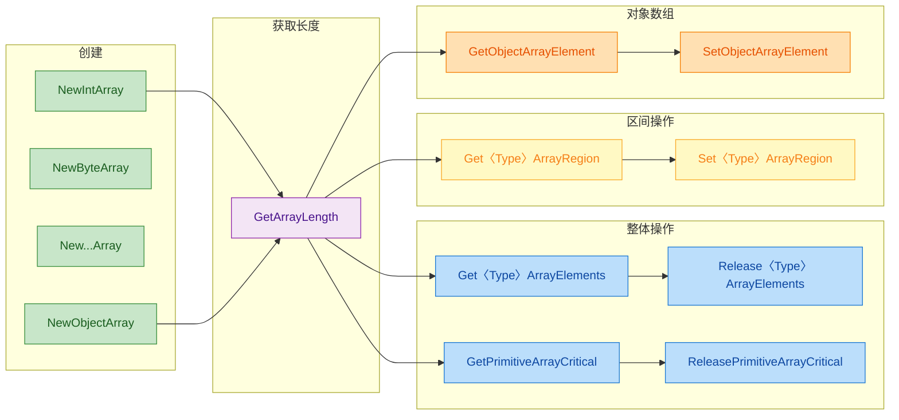

---

### 📝 练习题

**题目：** 以下 JNI 代码片段存在一个严重的 Bug，请问是哪个？

```cpp
JNIEXPORT void JNICALL
Java_Test_process(JNIEnv *env, jclass clazz, jintArray arr) {
    jint *elems = (*env)->GetIntArrayElements(env, arr, NULL);
    for (int i = 0; i < 100; i++) {
        elems[i] *= 2;
    }
    (*env)->ReleaseIntArrayElements(env, arr, elems, JNI_ABORT);
}
```

A. 没有检查 `GetIntArrayElements` 的返回值是否为 NULL


B. 循环使用硬编码 100，可能越界访问


C. 使用了 `JNI_ABORT` 模式，在 copy 场景下修改不会写回 Java 堆


D. 以上全部都是 Bug


**【答案】** D

**【解析】**

这道题综合考察了数组处理的三大陷阱：

1. **未检查 NULL（选项 A）**：`GetIntArrayElements` 在内存不足时会返回 NULL，不检查直接解引用 `elems[i]` 会导致 **段错误（SIGSEGV）崩溃**。所有 Get 系列函数返回值都必须做 NULL 检查。

2. **硬编码长度（选项 B）**：循环写死了 100 次迭代，但实际数组长度可能小于 100。正确做法是先调用 `GetArrayLength` 获取真实长度，再以此为循环上界。越界写入会导致 **堆内存损坏（heap corruption）**，这类 Bug 极难排查。

3. **mode 选择错误（选项 C）**：代码对数组做了修改（`*= 2`），却使用 `JNI_ABORT` 模式释放。在 **copy 场景** 下（`isCopy == JNI_TRUE`），`JNI_ABORT` 会直接丢弃 Native 缓冲区的修改，导致 Java 侧数组 **看不到任何变化**。而在 **pin 场景** 下修改虽已生效，但这种行为不一致性会导致代码在不同 JVM 上表现不同——这是最危险的隐蔽 Bug。正确的做法是使用 `mode = 0`。

三个问题同时存在，因此答案是 **D**。

---

## 本章小结

本章系统地讲解了 **JNI 数据类型与签名（JNI Data Types & Signatures）** 这一 JNI 编程的基石内容。从最底层的基本类型映射，到复杂的引用类型体系，再到贯穿整个 JNI 调用链的类型签名规则，以及日常开发中最高频的字符串与数组处理，我们逐一进行了深入剖析。以下是对全章核心要点的系统性回顾与提炼。

---

### 全章知识脉络总览

本章的五大知识模块之间并非孤立存在，而是形成了一条从 **类型定义 → 类型标识 → 类型操作** 的完整链路。理解这条链路，就掌握了 JNI 数据交互的全貌。

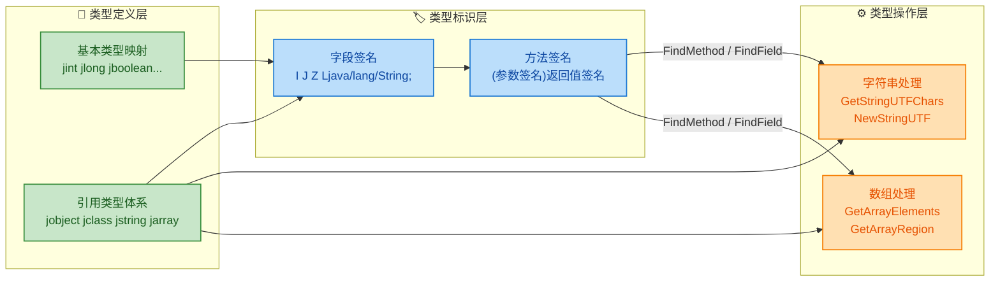

> **核心逻辑**：JNI 先通过 **类型映射** 建立 Java ↔ Native 的数据桥梁，再用 **签名字符串** 在运行时精确定位字段和方法，最终通过 **操作 API** 完成实际的数据读写。三者缺一不可。

---

### 基本类型映射 — 要点回顾

基本类型是 JNI 中最简单也最安全的部分，因为它们在 Java 与 Native 之间是 **值传递（Pass by Value）**，不涉及 GC、不需要释放，开销几乎为零。

| Java 类型 | JNI 类型 | 签名符 | C/C++ 实际类型 | 位宽 |
|-----------|----------|--------|---------------|------|
| `boolean` | `jboolean` | `Z` | `unsigned char` | 8-bit |
| `byte` | `jbyte` | `B` | `signed char` | 8-bit |
| `char` | `jchar` | `C` | `unsigned short` | 16-bit |
| `short` | `jshort` | `S` | `signed short` | 16-bit |
| `int` | `jint` | `I` | `signed int` | 32-bit |
| `long` | `jlong` | `J` | `signed long long` | 64-bit |
| `float` | `jfloat` | `F` | `float` | 32-bit |
| `double` | `jdouble` | `D` | `double` | 64-bit |
| `void` | `void` | `V` | `void` | — |

**关键记忆点**：

- `boolean` 的签名是 **`Z`**（不是 `B`），因为 `B` 已被 `byte` 占用。
- `long` 的签名是 **`J`**（不是 `L`），因为 `L` 是引用类型前缀。
- `jchar` 是 **16-bit 无符号**（对应 UTF-16 编码单元），而非 C 语言的 8-bit `char`。

---

### 引用类型体系 — 要点回顾

引用类型是 JNI 复杂性的主要来源。所有 Java 对象在 Native 层都表现为一个 **不透明指针（Opaque Pointer）**，开发者不能直接解引用，必须通过 `JNIEnv*` 提供的函数来操作。

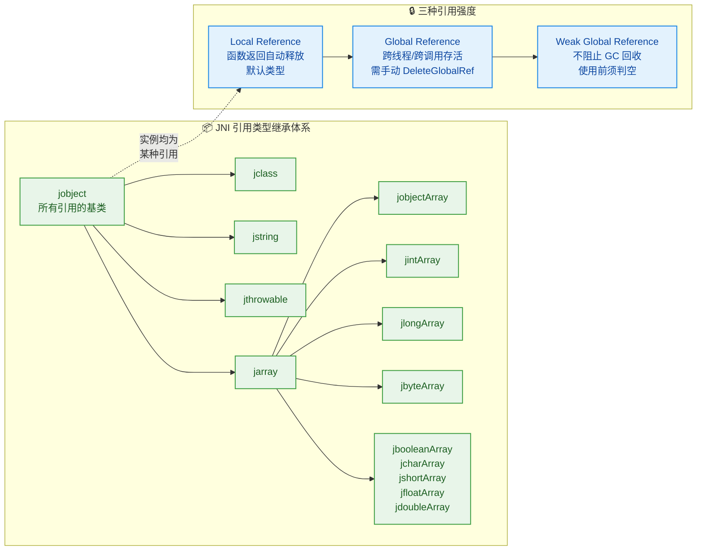

**关键记忆点**：

- **Local Reference** 在 Native 函数返回时自动释放，但在循环中大量创建时必须手动调用 `DeleteLocalRef`，否则会撑爆 Local Reference Table（默认上限通常为 512 个）。
- **Global Reference** 是唯一能安全跨线程、跨 JNI 调用保存的引用方式，但 **必须配对 `DeleteGlobalRef`**，否则造成内存泄漏。
- `jclass`、`jstring`、`jarray` 等在 C++ 中有继承关系（`jstring` IS-A `jobject`），但在 **C 语言**中它们全部是 `jobject` 的 typedef，编译器不做类型检查。

---

### 类型签名规则 — 要点回顾

签名（Signature / Descriptor）是 JNI 在运行时 **定位字段和方法** 的唯一依据。无论是 `GetFieldID`、`GetMethodID` 还是 `GetStaticMethodID`，都离不开签名字符串。

**字段签名速查**：

| 类型 | 签名 |
|------|------|
| `int` | `I` |
| `long` | `J` |
| `String` | `Ljava/lang/String;` |
| `int[]` | `[I` |
| `String[][]` | `[[Ljava/lang/String;` |

**方法签名公式**：

```java
// 格式: (参数签名序列)返回值签名
// void    foo(int a, String b)    →  (ILjava/lang/String;)V
// long    bar(int[] arr)          →  ([I)J
// String  baz()                   →  ()Ljava/lang/String;
// int[][] qux(boolean f, byte b)  →  (ZB)[[I
```

**关键记忆点**：

- 引用类型签名格式：**`L` + 全限定名（`/` 分隔）+ `;`**。`L` 开头、`;` 结尾缺一不可。
- 数组每多一维，前面多一个 **`[`**。
- 方法签名中 **参数之间没有任何分隔符**，直接拼接。
- 可使用 `javap -s -p ClassName` 命令自动生成签名，避免手写出错。

---

### 字符串处理 — 要点回顾

Java 的 `String` 内部采用 **UTF-16** 编码，而 C/C++ 通常使用 **Modified UTF-8**（JNI 专用变体）或平台原生编码。JNI 提供了两套 API 来桥接这一差异：

| 操作 | Modified UTF-8 系列 | UTF-16 系列 |
|------|---------------------|-------------|
| 获取字符指针 | `GetStringUTFChars` | `GetStringChars` |
| 释放字符指针 | `ReleaseStringUTFChars` | `ReleaseStringChars` |
| 获取长度 | `GetStringUTFLength`（字节数） | `GetStringLength`（字符数） |
| 创建新字符串 | `NewStringUTF` | `NewString` |
| 区域拷贝 | `GetStringUTFRegion` | `GetStringRegion` |

**关键记忆点**：

- **Get 与 Release 必须严格配对**，这是 JNI 字符串处理的第一铁律。忘记 Release 会导致内存泄漏或 JVM 内部 Pin 住的内存无法释放。
- `GetStringUTFChars` 的第三个参数 `isCopy`（`jboolean*`）可传 `NULL`；若非空，返回 `JNI_TRUE` 表示 JVM 创建了副本，`JNI_FALSE` 表示直接指向 JVM 堆内存。
- **`GetStringRegion` / `GetStringUTFRegion` 是更安全的选择**：它们将数据拷贝到调用者预分配的缓冲区中，无需 Release，也不涉及 isCopy 问题。
- `NewStringUTF` 接受的是 **Modified UTF-8**（`\0` 编码为 `0xC0 0x80`），与标准 UTF-8 有细微差别，处理包含 `U+0000` 的字符串时需特别注意。

**典型安全模式**：

```cpp
// 获取 Java 字符串的 Modified UTF-8 表示
const char* str = env->GetStringUTFChars(jStr, NULL);  // 获取
if (str == NULL) {                                       // 必须判空（OOM 时返回 NULL）
    return;                                              // 此时 JVM 已抛出 OutOfMemoryError
}
// ... 使用 str 做业务处理 ...
env->ReleaseStringUTFChars(jStr, str);                   // 释放（与 Get 配对）
```

---

### 数组处理 — 要点回顾

JNI 数组处理分为 **基本类型数组** 和 **对象数组** 两大分支，API 设计哲学截然不同：

```mermaid
graph LR
    subgraph SG_Prim["🔢 基本类型数组"]
        direction TB
        P1["Get〈Type〉ArrayElements<br/>获取指针, 可能是副本"]
        P2["Release〈Type〉ArrayElements<br/>释放并可选回写"]
        P3["Get〈Type〉ArrayRegion<br/>拷贝区间到本地缓冲区"]
        P4["Set〈Type〉ArrayRegion<br/>从本地缓冲区写回"]
        P5["GetPrimitiveArrayCritical<br/>高性能锁定, 限制多"]
        P1 --> P2
        P3 --> P4
    end

    subgraph SG_Obj["📦 对象数组"]
        direction TB
        O1["NewObjectArray<br/>创建对象数组"]
        O2["GetObjectArrayElement<br/>逐个读取元素"]
        O3["SetObjectArrayElement<br/>逐个设置元素"]
        O1 --> O2
        O2 --> O3
    end

    subgraph SG_Choice["💡 选型决策"]
        direction TB
        Q1{"数据量大小?"}
        Q2["小数据: Region 系列<br/>简单安全无需释放"]
        Q3["大数据: Elements 系列<br/>零拷贝可能性"]
        Q4["极致性能: Critical 系列<br/>需遵守严格限制"]
        Q1 --> Q2
        Q1 --> Q3
        Q1 --> Q4
    end

    SG_Prim --> SG_Choice
    SG_Obj --> SG_Choice

    classDef primStyle fill:#E8F5E9,stroke:#43A047,color:#1B5E20,stroke-width:1.5px
    classDef objStyle fill:#E3F2FD,stroke:#1E88E5,color:#0D47A1,stroke-width:1.5px
    classDef choiceStyle fill:#FFF3E0,stroke:#FB8C00,color:#E65100,stroke-width:1.5px

    class P1,P2,P3,P4,P5 primStyle
    class O1,O2,O3 objStyle
    class Q1,Q2,Q3,Q4 choiceStyle
```

**Release 模式参数对照**：

| 模式值 | 常量名 | 含义 |
|--------|--------|------|
| `0` | — | 将修改回写到 Java 数组，并释放 Native 缓冲区 |
| `1` | `JNI_COMMIT` | 回写修改，但 **不释放** Native 缓冲区（可继续使用） |
| `2` | `JNI_ABORT` | **不回写**修改，直接释放 Native 缓冲区（丢弃变更） |

**关键记忆点**：

- **基本类型数组** 有批量操作 API（`Elements` / `Region` / `Critical`），而 **对象数组只能逐元素操作**（`GetObjectArrayElement` / `SetObjectArrayElement`）。
- `GetPrimitiveArrayCritical` 在 Critical Section 期间 **禁止调用任何其他 JNI 函数**，也不能执行任何可能阻塞的操作，否则可能导致 JVM 死锁。
- `Region` 系列（`Get/SetXxxArrayRegion`）是最安全、最推荐的日常选择——它直接拷贝到你的栈上/堆上缓冲区，不存在 Get/Release 配对问题，语义最清晰。

---

### 常见陷阱速查表

| 陷阱 | 后果 | 正确做法 |
|------|------|----------|
| 忘记 `Release` 字符串/数组 | 内存泄漏或 JVM 内存 Pin 住 | Get 与 Release 严格配对 |
| 循环中创建大量 Local Reference | Local Ref Table 溢出崩溃 | 循环体内 `DeleteLocalRef` 或 `PushLocalFrame` |
| 手写签名拼错 | `NoSuchMethodError` / `NoSuchFieldError` | 使用 `javap -s -p` 生成 |
| 跨线程保存 Local Reference | 悬空引用，未定义行为 | 转为 Global Reference |
| Critical Section 内调 JNI | 潜在死锁 / JVM 崩溃 | 只做纯内存计算，尽快退出 |
| 对 `GetStringUTFChars` 返回值不判空 | 空指针崩溃 | 返回 `NULL` 时直接 return |
| `JNI_COMMIT` 后不再 Release | 内存泄漏 | `JNI_COMMIT` 后仍需最终 Release(0 或 ABORT) |

---

### 一句话总结

> **JNI 数据类型与签名是 Java 与 Native 世界之间的"翻译协议"**：基本类型靠 **固定位宽映射** 确保二进制兼容，引用类型靠 **不透明句柄 + JNIEnv API** 确保 GC 安全，签名字符串靠 **严格的编码规则** 确保运行时精确查找，而字符串与数组处理则是这套协议在实战中最高频的应用场景。**Get/Release 配对** 和 **签名正确性** 是贯穿本章的两大生存法则。

---

**📝 练习题 1**

以下 Java 方法的 JNI 方法签名（Method Signature）正确的是哪个？

```java
public native long[] processData(String name, int[] ids, boolean verbose);
```

A. `(Ljava/lang/String;[IZ)[J`


B. `(Ljava.lang.String;[IZ)[J`


C. `(Ljava/lang/String;[I;Z)[J`


D. `(LString;[IZ)[J`


**【答案】** A

**【解析】** JNI 方法签名的格式为 `(参数签名序列)返回值签名`。逐一分析各参数：`String name` → `Ljava/lang/String;`（全限定名用 `/` 分隔，不是 `.`，排除 B）；`int[] ids` → `[I`；`boolean verbose` → `Z`。返回值 `long[]` → `[J`。参数之间 **无分隔符**，直接拼接（排除 C 中多余的 `;`）。选项 D 中 `LString;` 缺少完整包路径。因此正确答案为 A：`(Ljava/lang/String;[IZ)[J`。

---

**📝 练习题 2**

在 JNI Native 函数中，以下代码存在什么问题？

```cpp
JNIEXPORT void JNICALL Java_Demo_process(JNIEnv *env, jobject thiz, jintArray arr) {
    jint* elems = env->GetIntArrayElements(arr, NULL);
    for (int i = 0; i < env->GetArrayLength(arr); i++) {
        elems[i] = elems[i] * 2;
    }
    // 函数结束，未做其他处理
}
```

A. `GetIntArrayElements` 的第二个参数不能传 `NULL`


B. 缺少 `ReleaseIntArrayElements` 调用，导致内存泄漏且修改可能未回写


C. 不能直接修改 `elems[i]`，必须使用 `SetIntArrayRegion`


D. `GetArrayLength` 不能在循环条件中调用


**【答案】** B

**【解析】** `GetIntArrayElements` 获取数组元素指针后，**必须**调用 `ReleaseIntArrayElements` 与之配对。不调用 Release 有两个后果：① 如果 JVM 返回的是副本（isCopy = JNI_TRUE），则副本内存泄漏，且对副本的修改永远不会回写到 Java 数组；② 如果 JVM 直接返回了堆内指针（isCopy = JNI_FALSE），则该内存区域会一直被 Pin 住，阻碍 GC 正常工作。正确写法应在函数末尾添加 `env->ReleaseIntArrayElements(arr, elems, 0);`（mode = 0 表示回写并释放）。选项 A 错误，`isCopy` 参数可以传 `NULL`；选项 C 错误，直接修改 `elems[i]` 是合法的；选项 D 错误，`GetArrayLength` 可以在循环中调用，只是效率上建议提前缓存。

---
