---

# JNI方法调用 ⭐⭐

---

## 获取类（FindClass）

在 JNI 的世界中，**一切操作的起点几乎都是"找到类"**。无论你想调用 Java 方法、访问字段，还是创建对象，第一步都必须通过 `FindClass` 拿到目标类的引用。它就像是 Native 层通往 Java 世界的"门牌号查询系统"——没有门牌号，你连门都敲不了。

---

### 为什么需要 FindClass

在纯 Java 代码中，我们可以直接 `new MyClass()` 或者调用 `MyClass.someMethod()`，因为编译器和 JVM 在类加载阶段已经帮我们完成了类的解析与链接。但在 Native（C/C++）层，编译器对 Java 的类型系统 **一无所知**。C/C++ 编译器看到的只是 `JNIEnv*` 指针和一堆函数指针，它不认识 `java.lang.String`，更不认识你自定义的 `com.example.MyClass`。

因此，JNI 提供了 `FindClass` 这个桥梁函数，让 Native 代码能够 **在运行时（Runtime）** 向 JVM 查询："请帮我找到这个全限定名对应的 Java 类，并返回一个可操作的引用。"

这个过程本质上等价于 Java 中的 `Class.forName("com.example.MyClass")`，只不过它运行在 Native 层，且使用的是 **JNI 专属的类描述符格式**。

---

### FindClass 函数签名

```c
// JNI 提供的 FindClass 函数原型
// 参数 env  : 指向 JNI 函数表的环境指针，每个 Native 方法都会自动接收
// 参数 name : 目标类的全限定名（使用 '/' 替代 '.'）
// 返回值    : 成功时返回 jclass（类引用），失败时返回 NULL
jclass FindClass(JNIEnv *env, const char *name);
```

> ⚠️ **关键区别**：Java 中我们写 `com.example.MyClass`（用 `.` 分隔），而 JNI 中必须写成 `com/example/MyClass`（用 `/` 分隔）。这是 JVM 内部类描述符（Class Descriptor）的标准格式，与 `.class` 文件中的存储格式一致。

---

### 类描述符格式详解

JNI 使用的类名格式来自 **JVM 规范（JVM Specification）** 中定义的 **Internal Binary Name**。下面是常见类型的描述符对照表：

| Java 类型 | JNI 描述符 | 说明 |
|---|---|---|
| `java.lang.String` | `"java/lang/String"` | 标准库类 |
| `java.lang.Object` | `"java/lang/Object"` | 所有类的基类 |
| `int[]` | `"[I"` | 基本类型数组 |
| `java.lang.String[]` | `"[Ljava/lang/String;"` | 对象数组 |
| `com.example.MyClass` | `"com/example/MyClass"` | 自定义类 |
| `com.example.Outer$Inner` | `"com/example/Outer$Inner"` | 内部类用 `$` 连接 |

注意数组类型的描述符前缀是 `[`，而对象数组还需要在类名前加 `L`、后加 `;`。对于 `FindClass` 而言，**普通类只需写 `/` 分隔的全限定名即可，不需要 `L...;` 包裹**；但数组类型必须使用完整的描述符格式。

---

### 基础用法示例

假设我们有如下 Java 类：

```java
// Java 层：定义一个简单的 User 类
package com.example;

public class User {
    public String name;     // 用户名
    public int age;         // 年龄

    public void greet() {   // 打招呼方法
        System.out.println("Hello, I am " + name);
    }
}
```

在 Native 层查找这个类：

```c
// native-lib.c
#include <jni.h>
#include <android/log.h>

// 定义日志宏，方便输出调试信息
#define TAG "JNI_FindClass"
#define LOGI(...) __android_log_print(ANDROID_LOG_INFO, TAG, __VA_ARGS__)
#define LOGE(...) __android_log_print(ANDROID_LOG_ERROR, TAG, __VA_ARGS__)

// Native 方法实现：演示 FindClass 的基本用法
JNIEXPORT void JNICALL
Java_com_example_MainActivity_testFindClass(JNIEnv *env, jobject thiz) {

    // 第一步：使用 FindClass 查找 User 类
    // 注意：包名用 '/' 分隔，而不是 '.'
    jclass userClass = (*env)->FindClass(env, "com/example/User");

    // 第二步：必须检查返回值是否为 NULL（类可能不存在或未加载）
    if (userClass == NULL) {
        // FindClass 失败，JVM 会自动抛出 ClassNotFoundException
        // 此时应立即返回，让异常传播回 Java 层
        LOGE("FindClass failed: com/example/User not found!");
        return;  // 直接返回，异常会在 Java 层被捕获
    }

    // 第三步：成功获取类引用，可以继续后续操作
    LOGI("FindClass succeeded! jclass = %p", userClass);

    // 后续可以用 userClass 去获取方法ID、字段ID、创建对象等
    // ... (后续章节详细讲解)
}
```

> 💡 **C vs C++ 调用语法差异**：在 C 中调用 JNI 函数需要 `(*env)->FindClass(env, ...)`，而在 C++ 中可以简写为 `env->FindClass(...)`。这是因为 `jni.h` 头文件在 C++ 模式下对 `JNIEnv` 做了封装。

C++ 版本的等价写法：

```cpp
// native-lib.cpp（C++ 版本）
extern "C" JNIEXPORT void JNICALL
Java_com_example_MainActivity_testFindClass(JNIEnv *env, jobject thiz) {

    // C++ 版本：直接用 env-> 调用，无需解引用和传入 env
    jclass userClass = env->FindClass("com/example/User");

    // 空指针检查逻辑与 C 版本完全相同
    if (userClass == NULL) {
        // 打印错误日志并返回
        __android_log_print(ANDROID_LOG_ERROR, "JNI", "FindClass failed!");
        return;
    }

    // 成功后继续操作...
}
```

---

### FindClass 的类加载机制

`FindClass` 并不是简单的"字符串查表"，它背后涉及 JVM 完整的 **类加载（ClassLoading）** 流程。理解这一点对排查问题至关重要。

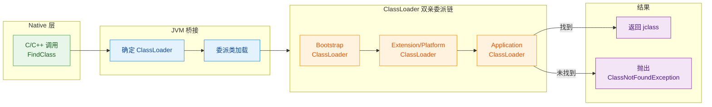

**FindClass 查找类时使用的 ClassLoader 取决于调用上下文**：

1. **从 Java 方法触发的 Native 调用**（最常见场景）：JVM 会沿着调用栈（Call Stack）向上回溯，找到最近的 Java 帧（Frame），使用 **该 Java 类的 ClassLoader** 来加载目标类。在 Android 中，这通常是 `PathClassLoader`，它能够找到你应用内的所有类。

2. **从 Native 线程直接调用**（如 `pthread_create` 创建的线程）：调用栈上可能没有 Java 帧，此时 JVM 会使用 **System ClassLoader（系统类加载器）**。在 Android 上，System ClassLoader **无法** 加载应用自定义的类，只能加载 `java.lang.*`、`android.*` 等系统类。这是一个 **极其常见的坑**。

---

### Native 线程中 FindClass 失败的经典问题

这是 Android JNI 开发中最令人头疼的问题之一。来看一个典型的错误场景：

```cpp
// ❌ 错误示范：在 Native 线程中直接调用 FindClass
#include <pthread.h>
#include <jni.h>

// 全局变量：缓存 JavaVM 指针（整个进程生命周期有效）
static JavaVM *g_jvm = NULL;

// JNI_OnLoad：库被加载时由 JVM 自动调用
// 这是缓存 JavaVM 指针的标准位置
jint JNI_OnLoad(JavaVM *vm, void *reserved) {
    g_jvm = vm;          // 保存 JavaVM 指针到全局变量
    return JNI_VERSION_1_6;  // 返回支持的 JNI 版本
}

// Native 线程的入口函数
void *background_task(void *arg) {
    JNIEnv *env = NULL;

    // 将当前 Native 线程附加（Attach）到 JVM，获取 JNIEnv*
    (*g_jvm)->AttachCurrentThread(g_jvm, &env, NULL);

    // ❌ 这里大概率会失败！
    // 原因：当前线程是 Native 创建的，调用栈上没有 Java 帧
    // JVM 会使用 System ClassLoader，它找不到应用自定义类
    jclass cls = (*env)->FindClass(env, "com/example/User");
    // cls 很可能为 NULL，且 JVM 会抛出 ClassNotFoundException

    // 从 JVM 分离当前线程（必须在线程退出前调用）
    (*g_jvm)->DetachCurrentThread(g_jvm);
    return NULL;
}

// 某个被 Java 调用的 Native 方法，它启动了后台线程
JNIEXPORT void JNICALL
Java_com_example_MainActivity_startBackgroundTask(JNIEnv *env, jobject thiz) {
    pthread_t tid;
    // 创建一个新的 Native 线程
    pthread_create(&tid, NULL, background_task, NULL);
}
```

---

### 解决方案：在 JNI_OnLoad 中缓存 jclass

**核心思路**：`JNI_OnLoad` 是由 `System.loadLibrary()` 触发的，此时调用栈上一定有 Java 帧，`FindClass` 可以正常使用应用的 ClassLoader。因此，我们在这里提前查找并 **缓存为全局引用（Global Reference）**。

```cpp
// ✅ 正确做法：在 JNI_OnLoad 中缓存需要的 jclass
#include <jni.h>
#include <pthread.h>
#include <android/log.h>

#define TAG "JNI_Cache"
#define LOGI(...) __android_log_print(ANDROID_LOG_INFO, TAG, __VA_ARGS__)

// 全局变量区：缓存 JavaVM 和常用的 jclass
static JavaVM *g_jvm = NULL;        // JavaVM 指针（进程级唯一）
static jclass g_userClass = NULL;   // 缓存的 User 类全局引用

// JNI_OnLoad：Native 库被加载时的初始化入口
jint JNI_OnLoad(JavaVM *vm, void *reserved) {
    g_jvm = vm;  // 保存 JavaVM 指针

    JNIEnv *env = NULL;
    // 从 JavaVM 获取当前线程的 JNIEnv 指针
    if ((*vm)->GetEnv(vm, (void **)&env, JNI_VERSION_1_6) != JNI_OK) {
        return JNI_ERR;  // 获取失败，返回错误
    }

    // 此时调用栈上有 Java 帧，FindClass 可以正确使用应用的 ClassLoader
    jclass localRef = (*env)->FindClass(env, "com/example/User");
    if (localRef == NULL) {
        return JNI_ERR;  // 类不存在，初始化失败
    }

    // ⚠️ 关键步骤：将 Local Reference 转为 Global Reference
    // Local Reference 在当前 Native 方法返回后就会失效
    // Global Reference 则在整个进程生命周期内有效（直到手动 DeleteGlobalRef）
    g_userClass = (jclass)(*env)->NewGlobalRef(env, localRef);

    // 删除不再需要的 Local Reference（释放局部引用表的槽位）
    (*env)->DeleteLocalRef(env, localRef);

    LOGI("JNI_OnLoad: User class cached successfully.");
    return JNI_VERSION_1_6;  // 返回支持的 JNI 版本
}

// JNI_OnUnload：库被卸载时的清理入口（可选但推荐）
void JNI_OnUnload(JavaVM *vm, void *reserved) {
    JNIEnv *env = NULL;
    if ((*vm)->GetEnv(vm, (void **)&env, JNI_VERSION_1_6) == JNI_OK) {
        // 释放全局引用，防止内存泄漏
        if (g_userClass != NULL) {
            (*env)->DeleteGlobalRef(env, g_userClass);
            g_userClass = NULL;  // 置空，防止野指针
        }
    }
}

// Native 线程入口函数
void *background_task(void *arg) {
    JNIEnv *env = NULL;
    // 附加当前线程到 JVM
    (*g_jvm)->AttachCurrentThread(g_jvm, &env, NULL);

    // ✅ 直接使用缓存的全局引用，不再需要 FindClass
    // g_userClass 是 Global Reference，任何线程都可以安全使用
    if (g_userClass != NULL) {
        LOGI("background_task: Using cached User class = %p", g_userClass);
        // 可以正常使用 g_userClass 获取方法ID、创建对象等
    }

    // 从 JVM 分离当前线程
    (*g_jvm)->DetachCurrentThread(g_jvm);
    return NULL;
}
```

下面用一张图来对比两种方式的关键差异：

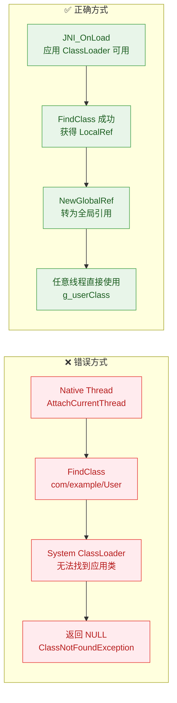

---

### Local Reference vs Global Reference 与 FindClass

`FindClass` 返回的 `jclass` 是一个 **Local Reference（局部引用）**。这涉及到 JNI 引用管理的核心概念：

| 引用类型 | 生命周期 | 跨线程 | 创建方式 | 释放方式 |
|---|---|---|---|---|
| **Local Ref** | 当前 Native 方法结束前 | ❌ 不可以 | `FindClass` 等 JNI 函数自动返回 | 自动释放 / `DeleteLocalRef` |
| **Global Ref** | 手动释放前一直有效 | ✅ 可以 | `NewGlobalRef` | `DeleteGlobalRef` |
| **Weak Global Ref** | GC 可能随时回收 | ✅ 可以 | `NewWeakGlobalRef` | `DeleteWeakGlobalRef` |

**规则总结**：
- 如果 `jclass` 只在当前 Native 方法内使用 → **直接用 Local Ref 即可**，方法返回时自动释放。
- 如果 `jclass` 需要跨方法或跨线程使用 → **必须转为 Global Ref**。
- 如果在循环中频繁调用 `FindClass` → 及时 `DeleteLocalRef`，防止 **Local Reference Table 溢出**（默认上限通常为 512 个）。

```cpp
// 演示：循环中的 Local Reference 管理
JNIEXPORT void JNICALL
Java_com_example_MainActivity_batchProcess(JNIEnv *env, jobject thiz) {
    for (int i = 0; i < 1000; i++) {
        // 每次循环都会创建一个新的 Local Reference
        jclass cls = (*env)->FindClass(env, "com/example/Item");

        // ... 使用 cls 做一些操作 ...

        // ⚠️ 必须手动释放，否则循环 1000 次会耗尽 Local Ref Table
        (*env)->DeleteLocalRef(env, cls);
    }
    // 更好的做法：将 FindClass 提到循环外面，只调用一次
}
```

---

### 查找数组类和基本类型

`FindClass` 也可以用来查找数组类型，但描述符的写法有所不同：

```cpp
// 查找各种数组类型
JNIEXPORT void JNICALL
Java_com_example_MainActivity_testArrayClasses(JNIEnv *env, jobject thiz) {

    // 一维 int 数组：int[]
    // 描述符为 "[I"（[ 表示数组，I 表示 int）
    jclass intArrayClass = (*env)->FindClass(env, "[I");

    // 一维 String 数组：String[]
    // 描述符为 "[Ljava/lang/String;"（L 开头 ; 结尾表示对象类型）
    jclass stringArrayClass = (*env)->FindClass(env, "[Ljava/lang/String;");

    // 二维 int 数组：int[][]
    // 描述符为 "[[I"（两个 [ 表示二维数组）
    jclass int2dArrayClass = (*env)->FindClass(env, "[[I");

    // 二维 String 数组：String[][]
    // 描述符为 "[[Ljava/lang/String;"
    jclass string2dArrayClass = (*env)->FindClass(env, "[[Ljava/lang/String;");

    // 注意：基本类型（int, float, boolean 等）本身不是类，
    // 不能用 FindClass("int") 查找。
    // 如果需要基本类型的 Class 对象，应通过字段访问：
    // 例如 java.lang.Integer.TYPE 对应 int.class
}
```

基本类型与数组的描述符速查表：

| 基本类型 | 描述符 | 数组描述符 |
|---|---|---|
| `boolean` | `Z` | `[Z` |
| `byte` | `B` | `[B` |
| `char` | `C` | `[C` |
| `short` | `S` | `[S` |
| `int` | `I` | `[I` |
| `long` | `J` | `[J` |
| `float` | `F` | `[F` |
| `double` | `D` | `[D` |

> 💡 `long` 的描述符是 `J` 而不是 `L`，因为 `L` 已经被用于表示对象类型的前缀（`Ljava/lang/Object;`）。`boolean` 的描述符是 `Z` 而不是 `B`，因为 `B` 已经被 `byte` 占用。

---

### 异常处理最佳实践

`FindClass` 失败时，JVM 会自动设置一个 **Pending Exception（挂起异常）**，类型为 `java.lang.ClassNotFoundException` 或 `java.lang.NoClassDefFoundError`。在 JNI 中处理异常与 Java 不同——**异常不会自动中断 Native 代码的执行流**，你必须手动检查和处理。

```cpp
// 健壮的 FindClass 封装函数
// 统一处理查找失败的情况，返回全局引用或 NULL
static jclass findClassOrDie(JNIEnv *env, const char *className) {
    // 尝试查找目标类
    jclass localRef = (*env)->FindClass(env, className);

    // 检查是否有挂起的异常
    if ((*env)->ExceptionCheck(env)) {
        // 打印异常的堆栈信息到 logcat（调试用）
        (*env)->ExceptionDescribe(env);
        // 清除挂起的异常，允许后续 JNI 调用正常进行
        (*env)->ExceptionClear(env);
        return NULL;  // 返回 NULL 表示失败
    }

    // 转为全局引用并返回（调用者负责在不需要时 DeleteGlobalRef）
    jclass globalRef = (jclass)(*env)->NewGlobalRef(env, localRef);
    // 释放局部引用
    (*env)->DeleteLocalRef(env, localRef);

    return globalRef;
}

// 使用示例
JNIEXPORT void JNICALL
Java_com_example_MainActivity_safeDemo(JNIEnv *env, jobject thiz) {

    // 使用封装函数安全地获取类引用
    jclass userClass = findClassOrDie(env, "com/example/User");
    if (userClass == NULL) {
        // 可以选择抛出自定义异常回 Java 层
        jclass exCls = (*env)->FindClass(env, "java/lang/RuntimeException");
        if (exCls != NULL) {
            // ThrowNew：创建并抛出指定异常，附带错误信息
            (*env)->ThrowNew(env, exCls, "Failed to find User class in JNI");
            (*env)->DeleteLocalRef(env, exCls);
        }
        return;
    }

    // 正常使用 userClass ...
    // 用完后释放全局引用
    (*env)->DeleteGlobalRef(env, userClass);
}
```

整个异常处理的决策流程：

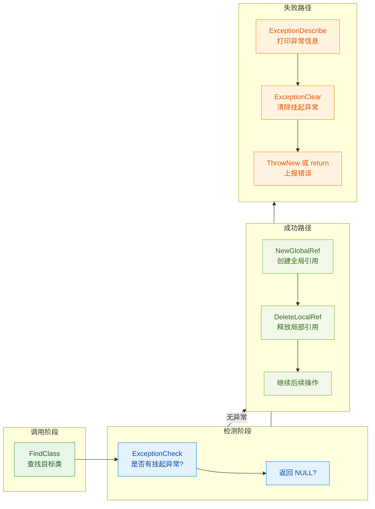

---

### 性能注意事项

`FindClass` 的底层需要遍历 ClassLoader 链进行类查找，涉及字符串比较、哈希查表、甚至可能触发类的加载和链接（Loading → Linking → Initialization）。虽然 JVM 内部有缓存机制（已加载的类会被 ClassLoader 缓存），但 **重复调用 FindClass 仍然有非零开销**。

**性能优化建议**：

1. **一次查找，全局缓存**：在 `JNI_OnLoad` 中集中查找所有需要的类，转为 Global Reference 存入全局变量。
2. **避免在热路径（Hot Path）中调用**：如果一个 Native 方法每秒被调用上万次，绝对不要在里面写 `FindClass`。
3. **批量初始化模式**：设计一个 `initNativeCache()` 方法，在应用启动时从 Java 层主动调用一次，完成所有类/方法ID/字段ID 的缓存。

```cpp
// 推荐模式：批量缓存初始化
// 定义一个结构体来管理所有缓存
typedef struct {
    jclass userClass;       // com/example/User
    jclass orderClass;      // com/example/Order
    jclass networkClass;    // com/example/NetworkHelper
    // ... 按需添加更多
} JniClassCache;

// 全局唯一的缓存实例
static JniClassCache g_cache = {0};

// 批量初始化函数
jint JNI_OnLoad(JavaVM *vm, void *reserved) {
    JNIEnv *env;
    if ((*vm)->GetEnv(vm, (void **)&env, JNI_VERSION_1_6) != JNI_OK) {
        return JNI_ERR;
    }

    // 宏定义简化重复的查找与缓存逻辑
    #define CACHE_CLASS(field, name) do {                              \
        jclass local = (*env)->FindClass(env, name);                  \
        if (local == NULL) return JNI_ERR;                            \
        g_cache.field = (jclass)(*env)->NewGlobalRef(env, local);     \
        (*env)->DeleteLocalRef(env, local);                           \
    } while(0)

    // 一次性缓存所有需要的类
    CACHE_CLASS(userClass,    "com/example/User");
    CACHE_CLASS(orderClass,   "com/example/Order");
    CACHE_CLASS(networkClass, "com/example/NetworkHelper");

    #undef CACHE_CLASS  // 取消宏定义，避免污染

    return JNI_VERSION_1_6;
}
```

---

### 本节核心要点总结

```mermaid
graph LR
    subgraph Core["FindClass 核心要点"]
        direction TB
        A["类名格式<br/>用 / 替代 ."]
        B["返回 Local Ref<br/>需要时转 Global Ref"]
        C["失败返回 NULL<br/>并设置 Pending Exception"]
    end

    subgraph Pitfall["常见陷阱"]
        direction TB
        D["Native 线程<br/>ClassLoader 问题"]
        E["循环中不释放<br/>Local Ref 溢出"]
        F["忘记异常检查<br/>继续调用 JNI"]
    end

    subgraph BestPractice["最佳实践"]
        direction TB
        G["JNI_OnLoad 中<br/>集中缓存"]
        H["封装 Helper 函数<br/>统一异常处理"]
        I["用完即释放<br/>Global/Local Ref"]
    end

    Core --- Pitfall
    Pitfall --- BestPractice

    classDef core fill:#E3F2FD,stroke:#1E88E5,color:#0D47A1
    classDef pit fill:#FFF3E0,stroke:#FB8C00,color:#E65100
    classDef best fill:#E8F5E9,stroke:#43A047,color:#1B5E20

    class A,B,C core
    class D,E,F pit
    class G,H,I best
```

---

**📝 练习题**

以下代码在 `pthread_create` 创建的 Native 线程中执行，请问哪一行最可能导致程序异常？

```cpp
void *worker(void *arg) {
    JNIEnv *env;
    (*g_jvm)->AttachCurrentThread(g_jvm, &env, NULL);       // Line 1
    jclass cls = (*env)->FindClass(env, "com/example/Foo");  // Line 2
    jmethodID mid = (*env)->GetMethodID(env, cls, "<init>", "()V"); // Line 3
    jobject obj = (*env)->NewObject(env, cls, mid);          // Line 4
    (*g_jvm)->DetachCurrentThread(g_jvm);                    // Line 5
    return NULL;
}
```

A. Line 1 — `AttachCurrentThread` 在子线程中不允许调用


B. Line 2 — `FindClass` 在 Native 线程中可能找不到应用自定义类


C. Line 3 — `GetMethodID` 不能获取构造函数的 ID


D. Line 5 — `DetachCurrentThread` 必须在主线程调用


**【答案】** B

**【解析】** 在通过 `pthread_create` 创建的 Native 线程中，调用栈上没有 Java 帧，JVM 会使用 System ClassLoader 来执行 `FindClass`。System ClassLoader 只能加载系统类（如 `java.lang.*`、`android.*`），**无法加载应用自定义类**（如 `com/example/Foo`）。因此 Line 2 的 `FindClass` 返回 `NULL`，随后 Line 3 将 `NULL` 传入 `GetMethodID` 会导致崩溃。正确的做法是在 `JNI_OnLoad` 中提前缓存 `jclass` 的 Global Reference，然后在 Native 线程中直接使用缓存值。选项 A 错误，`AttachCurrentThread` 正是为 Native 线程设计的；选项 C 错误，`<init>` 是获取构造函数 ID 的标准写法；选项 D 错误，`DetachCurrentThread` 应该在哪个线程 Attach 的就在哪个线程 Detach。

---

## 获取方法ID ⭐（GetMethodID、GetStaticMethodID）

在 JNI 的世界里，Native 代码想要调用 Java 方法，不能像 Java 层那样直接通过 `.` 运算符来调用。JVM 内部的方法是通过一种叫做 **方法ID（Method ID）** 的不透明句柄来标识的。你可以把它类比为 C 语言中的 **函数指针**——它本身不是方法，而是一个指向方法元数据（方法名、签名、入口地址等）的引用。获取方法ID 是 **调用任何 Java 方法的前置必要步骤**，其重要性不亚于"拿到钥匙才能开门"。

本节将围绕两个核心 API 展开：

- `GetMethodID` — 获取 **实例方法**（包括构造方法）的 ID
- `GetStaticMethodID` — 获取 **静态方法** 的 ID

---

### 方法ID 的本质与内部机制

JVM 在加载一个类时，会在方法区（Method Area / Metaspace）中为这个类的每个方法建立一套内部数据结构，通常称为 **方法表（Method Table / vtable）**。`jmethodID` 本质上就是指向这个内部数据结构中某一条目的指针。

```text
┌─────────────────────────────────────────────────────┐
│              JVM Metaspace (方法区)                   │
│  ┌───────────────────────────────────────────────┐  │
│  │         Class: com.example.Calculator         │  │
│  │  ┌─────────────────────────────────────────┐  │  │
│  │  │  Method Table (方法表)                   │  │  │
│  │  │  ┌───────┬──────────────────────────┐   │  │  │
│  │  │  │ idx 0 │ <init>()V       ──────────┼─► jmethodID_0  │
│  │  │  ├───────┼──────────────────────────┤   │  │  │
│  │  │  │ idx 1 │ add(II)I        ──────────┼─► jmethodID_1  │
│  │  │  ├───────┼──────────────────────────┤   │  │  │
│  │  │  │ idx 2 │ multiply(II)I   ──────────┼─► jmethodID_2  │
│  │  │  └───────┴──────────────────────────┘   │  │  │
│  │  └─────────────────────────────────────────┘  │  │
│  └───────────────────────────────────────────────┘  │
└─────────────────────────────────────────────────────┘
```

当你调用 `GetMethodID` 时，JVM 会在指定类的方法表中进行一次**线性查找**（部分 JVM 实现会做哈希优化），匹配方法名和签名，然后返回对应的 `jmethodID`。这个过程涉及字符串比较，因此**代价并不低廉**。这也是后面要讲「方法ID缓存策略」的根本原因。

> **关键认知**：`jmethodID` 在类被卸载之前始终有效。一旦获取，可以反复使用，无需每次重新获取。

---

### GetMethodID —— 获取实例方法ID

#### 函数签名

```cpp
// JNI 函数签名
jmethodID GetMethodID(JNIEnv *env,      // JNI 环境指针
                      jclass clazz,      // 目标类的 jclass 引用
                      const char *name,  // 方法名（UTF-8 字符串）
                      const char *sig);  // 方法签名（JNI 类型签名）
```

#### 参数详解

| 参数 | 类型 | 说明 |
|:---|:---|:---|
| `env` | `JNIEnv*` | JNI 环境指针，每个 Native 方法自动获得 |
| `clazz` | `jclass` | 通过 `FindClass` 或 `GetObjectClass` 获得的类引用 |
| `name` | `const char*` | Java 方法名的 UTF-8 C 字符串，如 `"add"` |
| `sig` | `const char*` | 方法的 **JNI 类型签名**（Type Signature），如 `"(II)I"` |

#### 返回值与异常

- **成功**：返回一个非 `NULL` 的 `jmethodID`。
- **失败**：返回 `NULL`，并抛出 `java.lang.NoSuchMethodError` 异常。

> ⚠️ 当返回 `NULL` 时，JVM 中已经有一个 pending exception。**必须检查并处理**，否则后续调用任何 JNI 函数的行为都是未定义的（Undefined Behavior）。

#### 完整示例

假设我们有如下 Java 类：

```java
// Java 层：一个简单的计算器类
public class Calculator {
    // 实例方法：两数相加
    public int add(int a, int b) {
        return a + b;
    }

    // 实例方法：带有 String 返回值
    public String describe(String operation, int result) {
        return operation + " = " + result;
    }

    // 构造方法
    public Calculator() {
        System.out.println("Calculator created!");
    }
}
```

对应的 Native 代码：

```cpp
#include <jni.h>
#include <cstdio>

// Native 方法：演示 GetMethodID 获取实例方法
JNIEXPORT void JNICALL
Java_com_example_NativeLib_testGetMethodID(JNIEnv *env, jobject thiz) {

    // ========== 第一步：获取目标类的 jclass ==========
    // FindClass 接受 JNI 格式的类全限定名（用 '/' 替代 '.'）
    jclass calcClass = env->FindClass("com/example/Calculator");

    // 检查 FindClass 是否成功
    if (calcClass == nullptr) {
        // 如果类找不到，JVM 已抛出 ClassNotFoundException
        return; // 直接返回，让异常传播回 Java 层
    }

    // ========== 第二步：获取实例方法 add(int, int) 的方法ID ==========
    // 方法名: "add"
    // 签名: "(II)I" 表示接受两个 int，返回一个 int
    jmethodID addMethod = env->GetMethodID(calcClass,  // 目标类
                                           "add",      // 方法名
                                           "(II)I");   // 方法签名

    // 必须检查返回值！失败时 addMethod == NULL
    if (addMethod == nullptr) {
        // JVM 已抛出 NoSuchMethodError
        printf("ERROR: Cannot find method 'add(II)I'\n");
        return; // 让异常传播
    }

    // 此时 addMethod 是一个有效的方法ID，可以用于后续 CallIntMethod 调用
    printf("Successfully obtained method ID for 'add': %p\n", addMethod);

    // ========== 第三步：获取 describe(String, int) 的方法ID ==========
    // 签名: "(Ljava/lang/String;I)Ljava/lang/String;"
    // L + 全限定类名 + ; 表示对象类型
    jmethodID describeMethod = env->GetMethodID(
        calcClass,                                  // 目标类
        "describe",                                 // 方法名
        "(Ljava/lang/String;I)Ljava/lang/String;"); // 方法签名

    // 检查
    if (describeMethod == nullptr) {
        printf("ERROR: Cannot find method 'describe'\n");
        return;
    }

    printf("Successfully obtained method ID for 'describe': %p\n", describeMethod);

    // ========== 第四步：获取构造方法的方法ID ==========
    // 构造方法的方法名固定为 "<init>"
    // 无参构造的签名为 "()V"（无参数，返回 void）
    jmethodID constructor = env->GetMethodID(calcClass,  // 目标类
                                             "<init>",   // 构造方法固定名
                                             "()V");     // 无参构造签名

    if (constructor == nullptr) {
        printf("ERROR: Cannot find constructor\n");
        return;
    }

    printf("Successfully obtained constructor ID: %p\n", constructor);
}
```

---

### GetStaticMethodID —— 获取静态方法ID

#### 函数签名

```cpp
// JNI 函数签名
jmethodID GetStaticMethodID(JNIEnv *env,      // JNI 环境指针
                            jclass clazz,      // 目标类的 jclass 引用
                            const char *name,  // 静态方法名
                            const char *sig);  // 方法签名
```

其参数列表与 `GetMethodID` **完全一致**，唯一的语义差异是：它查找的是类的 **静态方法**，而非实例方法。如果你用 `GetMethodID` 去查找一个 `static` 方法，将会返回 `NULL` 并抛出 `NoSuchMethodError`，**反之亦然**。这是初学者最容易踩的坑之一。

#### 完整示例

```java
// Java 层：包含静态方法的工具类
public class MathUtils {
    // 静态方法：计算阶乘
    public static long factorial(int n) {
        long result = 1;
        for (int i = 2; i <= n; i++) {
            result *= i;
        }
        return result;
    }

    // 静态方法：带有对象参数
    public static String formatResult(String label, double value) {
        return label + ": " + value;
    }
}
```

```cpp
#include <jni.h>

// Native 方法：演示 GetStaticMethodID
JNIEXPORT void JNICALL
Java_com_example_NativeLib_testGetStaticMethodID(JNIEnv *env, jobject thiz) {

    // 第一步：获取 MathUtils 类
    jclass mathClass = env->FindClass("com/example/MathUtils");
    if (mathClass == nullptr) {
        return; // ClassNotFoundException 已抛出
    }

    // 第二步：获取静态方法 factorial(int) 的方法ID
    // 注意：此处必须使用 GetStaticMethodID 而不是 GetMethodID
    // 签名: "(I)J" — 接受 int，返回 long (J)
    jmethodID factorialMethod = env->GetStaticMethodID(
        mathClass,      // 目标类
        "factorial",    // 静态方法名
        "(I)J");        // 签名：int -> long

    if (factorialMethod == nullptr) {
        return; // NoSuchMethodError 已抛出
    }

    // 第三步：获取 formatResult(String, double) 的方法ID
    // 签名: "(Ljava/lang/String;D)Ljava/lang/String;"
    // D 表示 double 类型
    jmethodID formatMethod = env->GetStaticMethodID(
        mathClass,                                          // 目标类
        "formatResult",                                     // 方法名
        "(Ljava/lang/String;D)Ljava/lang/String;");         // 签名

    if (formatMethod == nullptr) {
        return; // NoSuchMethodError 已抛出
    }

    // 到这里，两个静态方法ID都已成功获取
    // 后续可用 CallStaticLongMethod / CallStaticObjectMethod 进行调用
}
```

---

### JNI 类型签名（Type Signature）深度解析

获取方法ID时最大的难点在于 **正确书写方法签名**。JNI 使用一套紧凑的编码规则（源自 JVM 规范的 **Field Descriptor** 和 **Method Descriptor**），将 Java 类型映射为短字符串。

#### 基本类型映射表

| Java 类型 | JNI 签名字符 | 助记 |
|:---|:---:|:---|
| `boolean` | `Z` | 因为 `B` 给了 byte，所以用 boole**Z**n |
| `byte` | `B` | **B**yte |
| `char` | `C` | **C**har |
| `short` | `S` | **S**hort |
| `int` | `I` | **I**nt |
| `long` | `J` | 因为 `L` 给了对象前缀，所以用 lon**J** |
| `float` | `F` | **F**loat |
| `double` | `D` | **D**ouble |
| `void` | `V` | **V**oid |

#### 对象与数组类型

| Java 类型 | JNI 签名 | 规则 |
|:---|:---|:---|
| `String` | `Ljava/lang/String;` | `L` + 全限定名(`/`分隔) + `;` |
| `Object` | `Ljava/lang/Object;` | 同上 |
| `int[]` | `[I` | `[` + 基本类型签名 |
| `String[]` | `[Ljava/lang/String;` | `[` + 对象签名 |
| `int[][]` | `[[I` | `[[` + 基本类型签名 |

#### 方法签名组合规则

方法签名的格式为：`(参数类型签名...)返回类型签名`

**注意**：参数之间 **没有任何分隔符**（无逗号、无空格），直接拼接。

```text
方法签名公式:

    (ParamType1ParamType2...ParamTypeN)ReturnType

示例映射:

    Java: void    foo()                → ()V
    Java: int     add(int a, int b)    → (II)I
    Java: String  bar(int x, String s) → (ILjava/lang/String;)Ljava/lang/String;
    Java: long[]  baz(double d)        → (D)[J
    Java: void    qux(int[] arr)       → ([I)V
```

#### 使用 javap 自动生成签名

手写签名容易出错，JDK 自带的 `javap` 工具可以自动输出所有方法的签名：

```bash
# -s 选项：输出内部类型签名（internal type signatures）
# -p 选项：显示所有成员（包括 private）
javap -s -p com.example.Calculator
```

输出示例：

```text
public class com.example.Calculator {
  public com.example.Calculator();
    descriptor: ()V                          // ← 这就是构造方法的签名

  public int add(int, int);
    descriptor: (II)I                        // ← add 方法的签名

  public java.lang.String describe(java.lang.String, int);
    descriptor: (Ljava/lang/String;I)Ljava/lang/String;  // ← describe 的签名
}
```

> 💡 **实战建议**：永远用 `javap -s` 来确认签名，不要手写后凭感觉。一个 `;` 的遗漏就会导致 `NoSuchMethodError`。

---

### GetMethodID vs GetStaticMethodID 对比

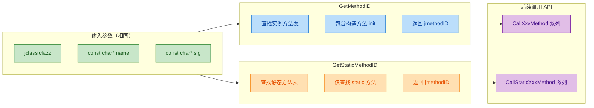

两者的核心差异总结如下：

| 维度 | `GetMethodID` | `GetStaticMethodID` |
|:---|:---|:---|
| 查找范围 | 实例方法 + 构造方法 | 仅静态方法 |
| 构造方法 | ✅ 使用 `"<init>"` | ❌ 不可用 |
| 后续调用 API | `Call<Type>Method` | `CallStatic<Type>Method` |
| 交叉使用 | ❌ 不能查找 static 方法 | ❌ 不能查找实例方法 |
| 继承方法 | ✅ 会搜索父类 | ✅ 会搜索父类（JVM 规范行为） |

> **继承特性**：如果在当前类中找不到目标方法，JVM 会自动沿着继承链向上搜索直到 `java.lang.Object`。这意味着你可以用子类的 `jclass` 获取父类定义的方法ID。

---

### 构造方法的特殊处理

在 JNI 中，构造方法（Constructor）被视为一种**特殊的实例方法**，其方法名固定为 `"<init>"`，返回类型始终为 `void`（即签名以 `V` 结尾）。

```cpp
// 获取不同构造方法的方法ID

// 无参构造: public Calculator()
jmethodID ctor0 = env->GetMethodID(clazz, "<init>", "()V");

// 单参数构造: public Calculator(int initialValue)
jmethodID ctor1 = env->GetMethodID(clazz, "<init>", "(I)V");

// 多参数构造: public Calculator(String name, double precision)
jmethodID ctor2 = env->GetMethodID(clazz, "<init>",
                                   "(Ljava/lang/String;D)V");
```

需要特别注意：

1. **名字必须精确**：是 `<init>` 而不是类名。这是 JVM 字节码层面的约定。
2. **返回类型始终为 V**：即使构造方法"逻辑上"返回一个对象实例，其签名中返回值仍然是 `V`。
3. **不能用 GetStaticMethodID**：构造方法不是静态方法，必须用 `GetMethodID`。

---

### 错误处理与常见陷阱

#### 陷阱一：签名写错

这是 **最高频** 的错误。常见症状是运行时抛出 `NoSuchMethodError`。

```cpp
// ❌ 错误：对象类型签名忘记末尾的分号
jmethodID mid = env->GetMethodID(clazz, "foo", "(Ljava/lang/String)V");
//                                                                ^ 缺少 ';'

// ✅ 正确：
jmethodID mid = env->GetMethodID(clazz, "foo", "(Ljava/lang/String;)V");
//                                                                 ^ 有 ';'
```

```cpp
// ❌ 错误：使用点号而非斜杠
jmethodID mid = env->GetMethodID(clazz, "foo", "(Ljava.lang.String;)V");
//                                                    ^    ^  应该是 '/'

// ✅ 正确：
jmethodID mid = env->GetMethodID(clazz, "foo", "(Ljava/lang/String;)V");
```

#### 陷阱二：实例方法与静态方法混用

```cpp
// Java: public static int compute(int x) { ... }

// ❌ 错误：用 GetMethodID 查找 static 方法 → NoSuchMethodError
jmethodID mid = env->GetMethodID(clazz, "compute", "(I)I");

// ✅ 正确：
jmethodID mid = env->GetStaticMethodID(clazz, "compute", "(I)I");
```

#### 陷阱三：未检查返回值

```cpp
// ❌ 危险：未检查返回值直接使用
jmethodID mid = env->GetMethodID(clazz, "nonExistent", "()V");
env->CallVoidMethod(obj, mid); // 💥 mid 为 NULL，行为未定义！可能导致 JVM 崩溃

// ✅ 安全：总是检查
jmethodID mid = env->GetMethodID(clazz, "nonExistent", "()V");
if (mid == nullptr) {
    // 此时 JVM 已有 pending exception (NoSuchMethodError)
    // 选择 1：直接 return，让异常传播到 Java 层
    return;
    // 选择 2：清除异常并做自定义处理
    // env->ExceptionClear();
    // ... 自定义错误处理 ...
}
```

#### 陷阱四：重载方法只靠方法名区分

Java 允许方法重载（Overloading），而 JNI 的方法ID **同时依赖方法名和签名** 才能唯一定位。

```java
// Java 层存在重载方法
public class Printer {
    public void print(int value)    { ... }  // 签名: (I)V
    public void print(String text)  { ... }  // 签名: (Ljava/lang/String;)V
    public void print(int a, int b) { ... }  // 签名: (II)V
}
```

```cpp
// Native 层：通过不同签名精确获取不同的重载版本
jmethodID print_int    = env->GetMethodID(cls, "print", "(I)V");
jmethodID print_string = env->GetMethodID(cls, "print", "(Ljava/lang/String;)V");
jmethodID print_two    = env->GetMethodID(cls, "print", "(II)V");
// 三个 jmethodID 各不相同，分别指向不同的重载方法
```

---

### 完整工作流程图

下面用一张时序图展示从 Native 获取方法ID到最终调用方法的完整流程：

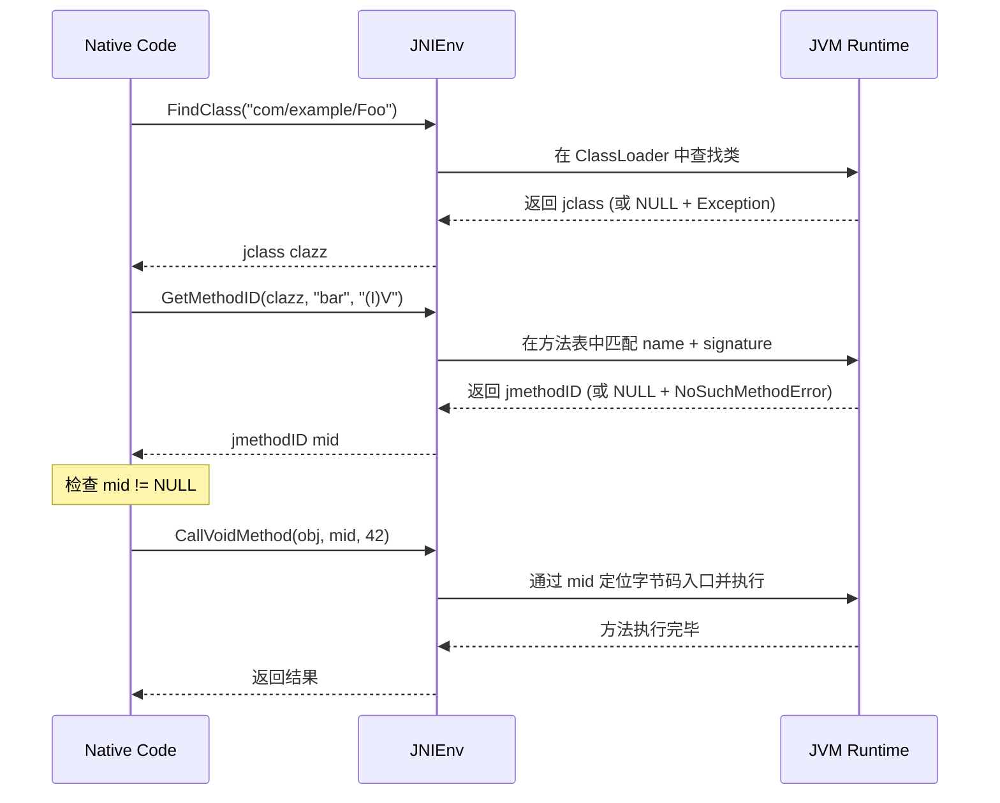

---

### 性能注意事项

`GetMethodID` 和 `GetStaticMethodID` 在底层需要遍历方法表、比较字符串，这个过程的时间复杂度在最坏情况下为 **O(n)**（n 为类及其所有父类的方法总数）。虽然单次调用的耗时在微秒级别，但在高频调用场景中（例如每帧渲染、音视频回调），累积开销不可忽略。

**性能数据参考**（基于典型 Android 设备）：

| 操作 | 典型耗时 |
|:---|:---|
| `GetMethodID`（首次） | ~1-5 μs |
| `GetMethodID`（JVM 内部缓存命中） | ~0.2-0.5 μs |
| 直接使用已缓存的 `jmethodID` | ~0 ns（仅是指针读取） |

这直接引出了下一节要讲的 **方法ID缓存策略** 的核心动机：将获取到的 `jmethodID` 保存起来，避免重复查找。

---

**📝 练习题**

以下 Java 方法：

```java
public class Demo {
    public static String[] resolve(int code, String name, boolean flag) {
        // ...
    }
}
```

在 Native 层获取该方法ID，以下哪一行代码是**正确**的？

A. `env->GetMethodID(clazz, "resolve", "(ILjava/lang/String;Z)[Ljava/lang/String;");`


B. `env->GetStaticMethodID(clazz, "resolve", "(ILjava/lang/StringZ)[Ljava/lang/String;");`


C. `env->GetStaticMethodID(clazz, "resolve", "(ILjava/lang/String;Z)[Ljava/lang/String;");`


D. `env->GetStaticMethodID(clazz, "resolve", "(I;Ljava/lang/String;Z)[Ljava/lang/String");`


**【答案】** C

**【解析】**

首先，`resolve` 是 `static` 方法，因此必须使用 `GetStaticMethodID`，这直接排除了 **A**（使用了 `GetMethodID`）。

接下来分析签名 `(ILjava/lang/String;Z)[Ljava/lang/String;`：
- 参数部分：`int` → `I`，`String` → `Ljava/lang/String;`（注意 **分号是对象类型的结束标志**，不可缺少），`boolean` → `Z`。三者拼接为 `ILjava/lang/String;Z`。
- 返回值部分：`String[]` → `[Ljava/lang/String;`（`[` 表示数组，后接对象签名）。

**B** 的错误在于 `String` 签名缺少了末尾分号（`Ljava/lang/StringZ` 没有分隔），JVM 会把 `Z` 误认为类名的一部分。**D** 的错误在于第一个参数后多了一个分号 `I;`（基本类型不需要分号），同时返回值的 `String` 也缺少末尾分号。只有 **C** 的签名完全正确。

---

## 方法ID缓存策略 ⭐（避免重复查找）

在前一节中，我们学习了如何通过 `GetMethodID` / `GetStaticMethodID` 获取方法 ID。表面上看，这些调用似乎只是"查个 ID"而已，代价不大。但事实上，**每一次 `GetMethodID` 调用都涉及 JVM 内部的符号表查找（Symbol Table Lookup）**，它需要遍历类的方法表、匹配方法名和签名字符串，这是一个 **O(n) 级别** 的字符串比较操作。如果你的 Native 函数被高频调用（比如在游戏渲染循环、音视频编解码的每一帧中），那么 **重复查找方法 ID 将成为严重的性能瓶颈**。

方法 ID 缓存策略（Method ID Caching）正是为了解决这个问题而诞生的经典 JNI 优化手段。其核心思想非常简单：**查一次，存起来，后续直接用**。但在 JNI 的多线程、类加载/卸载等复杂环境下，"怎么存"、"存在哪"、"何时失效"这些问题都需要深入理解。

---

### 为什么需要缓存？—— 性能代价量化分析

我们先从直觉上理解 `GetMethodID` 的内部开销。当你调用：

```c
// 每次调用都会触发 JVM 内部查找
jmethodID mid = (*env)->GetMethodID(env, cls, "calculate", "(II)I");
```

JVM 内部大致会执行以下步骤：

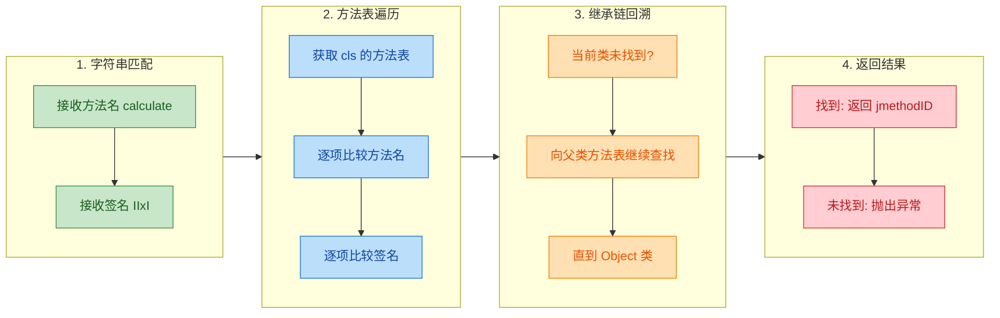

可以看到，这绝不是一个简单的"指针返回"操作。尤其当类的继承链较深（比如 Android 中 `Activity → AppCompatActivity → FragmentActivity → ...`）时，查找代价会更高。

一个典型的对比测试结论如下：

| 场景 | 调用 10,000 次的耗时（估算） | 说明 |
|------|--------------------------|------|
| **每次都 GetMethodID** | ~5–15 ms | 包含字符串匹配 + 方法表遍历 |
| **缓存后直接使用** | ~0.1–0.3 ms | 仅一次指针解引用 |
| **性能提升** | **约 30–100 倍** | 高频场景下差距极为显著 |

> 💡 **关键认知**：`jmethodID` 和 `jfieldID` 在 JVM 规范中被定义为**稳定值（Stable Value）**——只要对应的类没有被卸载（Unloaded），它们就一直有效。这是缓存策略成立的理论基础。

---

### 策略一：使用时缓存（Use-time Caching / Lazy Caching）

这是最常见、最直观的缓存方式。核心思路：**在 Native 函数第一次被调用时查找并缓存，后续调用直接复用**。使用 C 语言的 `static` 局部变量来实现。

```c
/* 
 * 策略一：使用时缓存 (Lazy Caching)
 * 利用 C 的 static 局部变量，首次调用时查找，后续直接复用
 */
JNIEXPORT void JNICALL
Java_com_example_MyClass_nativeProcess(JNIEnv *env, jobject thiz) {

    // static 变量只会初始化一次，后续调用保留上次的值
    // 首次进入时 cachedMid == NULL
    static jmethodID cachedMid = NULL;

    // 仅在第一次调用时执行查找
    if (cachedMid == NULL) {
        // 获取 thiz 对象的类引用
        jclass cls = (*env)->GetObjectClass(env, thiz);

        // 查找方法 ID（只执行这一次）
        cachedMid = (*env)->GetMethodID(env, cls, "onResult", "(I)V");

        // 查找失败时 cachedMid 仍为 NULL，需要处理异常
        if (cachedMid == NULL) {
            // GetMethodID 失败会自动抛出 NoSuchMethodError
            // 直接 return，让 Java 层捕获异常
            return;
        }

        // cls 是局部引用，函数结束自动释放
        // 注意：我们缓存的是 jmethodID，不是 jclass
        (*env)->DeleteLocalRef(env, cls);
    }

    // 后续所有调用都直接使用缓存的 cachedMid
    // 无需再次查找，性能极高
    (*env)->CallVoidMethod(env, thiz, cachedMid, 42);
}
```

**运行时内存模型**：

```c
// ========== 第 1 次调用 ==========
//
//  Stack Frame (nativeProcess)
//  ┌─────────────────────────────────┐
//  │  static cachedMid: NULL ──────────► 触发 GetMethodID 查找
//  │                     ↓           │
//  │  static cachedMid: 0x7F3A ◄───────  查找成功，写入地址
//  └─────────────────────────────────┘
//
// ========== 第 2~N 次调用 ==========
//
//  Stack Frame (nativeProcess)
//  ┌─────────────────────────────────┐
//  │  static cachedMid: 0x7F3A ──────── 直接使用，跳过查找！
//  └─────────────────────────────────┘
```

#### 使用时缓存的优缺点

| 优点 | 缺点 |
|------|------|
| 实现简单，改动量小 | 每个函数内部各自缓存，**缓存分散** |
| 延迟初始化，不用的方法不查找 | 多个 Native 函数若需要同一个方法 ID，会**重复缓存** |
| 无需额外的初始化入口 | `static` 变量在**类卸载**时不会自动清零（见后文陷阱分析） |

#### ⚠️ 多线程安全性分析

你可能会担心：如果两个线程同时第一次调用 `nativeProcess`，会不会出现竞态条件（Race Condition）？

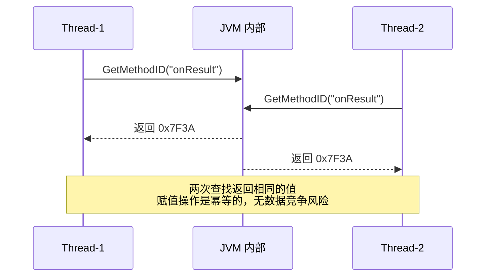

答案是：**在实践中是安全的**。原因如下：

1. `GetMethodID` 对于同一个类的同一个方法，**永远返回相同的值**。
2. 对 `jmethodID`（本质是指针大小的值）的赋值在绝大多数架构上是**原子操作**。
3. 最坏情况：两个线程各做一次查找，但结果相同，不会导致错误——只是浪费了一次查找而已。

> 📌 JNI 规范并未对此给出线程安全的硬性保证，但 Oracle HotSpot、Android ART 等主流 JVM 实现中，上述行为是事实标准（de facto standard）。在极端严格的场景下，可以加 `pthread_mutex` 保护。

---

### 策略二：类初始化时缓存（Class-init Caching / Eager Caching）

这是 **JNI 官方推荐** 的、更优雅的缓存策略。核心思路：**在类加载时（通常在 `JNI_OnLoad` 或专门的 native init 方法中），一次性查找并缓存所有需要的 ID**。

#### 完整实现示例

**Java 端**：

```java
public class AudioProcessor {

    // 在类加载时（static 块）调用 native 初始化方法
    // 这确保了在任何其他 native 方法被调用前，缓存已经建立
    static {
        System.loadLibrary("audioprocessor");
        nativeClassInit();  // 触发 C 端的缓存初始化
    }

    // 私有的 native 初始化方法，仅用于缓存 ID
    private static native void nativeClassInit();

    // 以下是业务方法，供 native 层回调
    public void onDecodeComplete(byte[] data, int sampleRate) {
        // 解码完成回调
    }

    public static void onError(int errorCode, String message) {
        // 静态错误回调
    }

    // 业务 native 方法
    public native void startDecode(String filePath);
    public native void stopDecode();
}
```

**C 端（Native 端）**：

```c
#include <jni.h>
#include <stddef.h>  // for NULL

/* ============================================================
 *  全局缓存区 (Global Cache)
 *  使用文件作用域的 static 变量，所有函数共享
 * ============================================================ */

// 缓存 AudioProcessor 类的全局引用
static jclass    gAudioProcessorClass  = NULL;

// 缓存实例方法 ID
static jmethodID gOnDecodeCompleteMid  = NULL;

// 缓存静态方法 ID
static jmethodID gOnErrorMid           = NULL;

// 缓存字段 ID（如果需要的话）
static jfieldID  gSampleRateFid        = NULL;


/* ============================================================
 *  类初始化函数：一次性完成所有 ID 查找
 * ============================================================ */
JNIEXPORT void JNICALL
Java_com_example_AudioProcessor_nativeClassInit(JNIEnv *env, jclass cls) {
    // 参数 cls 就是 AudioProcessor.class（调用者是 static 方法）
    // 但 cls 是局部引用，函数返回后失效
    // 因此必须创建全局引用来缓存类对象
    gAudioProcessorClass = (*env)->NewGlobalRef(env, cls);
    if (gAudioProcessorClass == NULL) {
        // NewGlobalRef 失败（内存不足），直接返回
        return;
    }

    // 一次性查找所有实例方法 ID
    gOnDecodeCompleteMid = (*env)->GetMethodID(
        env,
        gAudioProcessorClass,     // 使用全局引用
        "onDecodeComplete",       // 方法名
        "([BI)V"                  // 签名：(byte[], int) -> void
    );
    if (gOnDecodeCompleteMid == NULL) return;  // 查找失败，已抛异常

    // 一次性查找所有静态方法 ID
    gOnErrorMid = (*env)->GetStaticMethodID(
        env,
        gAudioProcessorClass,
        "onError",
        "(ILjava/lang/String;)V"  // 签名：(int, String) -> void
    );
    if (gOnErrorMid == NULL) return;

    // 一次性查找所有字段 ID
    gSampleRateFid = (*env)->GetFieldID(
        env,
        gAudioProcessorClass,
        "sampleRate",             // 字段名
        "I"                       // 签名：int
    );
    // 如果失败，Java 层会收到 NoSuchFieldError
}


/* ============================================================
 *  业务函数：直接使用缓存，零查找开销
 * ============================================================ */
JNIEXPORT void JNICALL
Java_com_example_AudioProcessor_startDecode(JNIEnv *env, jobject thiz,
                                            jstring filePath) {
    // ......（解码逻辑省略）......

    // 创建 byte[] 结果（示意）
    jbyteArray resultData = (*env)->NewByteArray(env, 1024);

    // 直接使用缓存的方法 ID 回调 Java
    // 无需任何 FindClass / GetMethodID！
    (*env)->CallVoidMethod(
        env,
        thiz,                     // AudioProcessor 实例
        gOnDecodeCompleteMid,     // 缓存的方法 ID
        resultData,               // byte[] 参数
        44100                     // sampleRate 参数
    );

    // 如果出错，使用缓存的静态方法 ID
    jstring errMsg = (*env)->NewStringUTF(env, "File not found");
    (*env)->CallStaticVoidMethod(
        env,
        gAudioProcessorClass,    // 缓存的全局类引用
        gOnErrorMid,             // 缓存的静态方法 ID
        -1,                      // errorCode
        errMsg                   // message
    );

    // 清理局部引用
    (*env)->DeleteLocalRef(env, resultData);
    (*env)->DeleteLocalRef(env, errMsg);
}
```

#### 初始化时缓存的完整生命周期

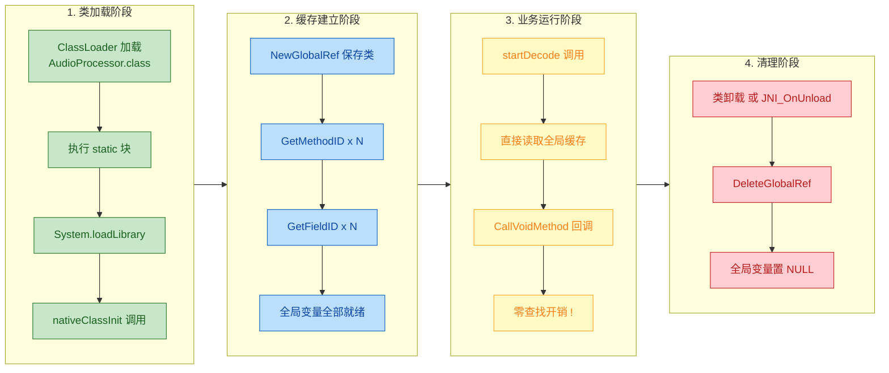

---

### 策略三：JNI_OnLoad 中集中缓存

如果你的 Native 库需要为**多个 Java 类**缓存 ID，那么在 `JNI_OnLoad` 中集中处理是最整洁的做法。`JNI_OnLoad` 是 JVM 在 `System.loadLibrary` 时自动调用的入口函数，保证只执行一次。

```c
#include <jni.h>

/* ============================================================
 *  多类全局缓存
 * ============================================================ */

// ----- AudioProcessor 相关 -----
static jclass    gAudioProcessorClass     = NULL;
static jmethodID gOnDecodeCompleteMid     = NULL;

// ----- VideoProcessor 相关 -----
static jclass    gVideoProcessorClass     = NULL;
static jmethodID gOnFrameRenderedMid      = NULL;

// ----- Logger 工具类相关 -----
static jclass    gLoggerClass             = NULL;
static jmethodID gLogDebugMid            = NULL;


/* ============================================================
 *  辅助宏：简化重复的查找 + 错误检查模式
 * ============================================================ */

// 查找类并创建全局引用的宏
// 如果失败则 goto error 标签（集中清理）
#define FIND_CLASS(var, className)                                    \
    do {                                                              \
        jclass _localCls = (*env)->FindClass(env, className);         \
        if (_localCls == NULL) goto error;                            \
        var = (*env)->NewGlobalRef(env, _localCls);                   \
        (*env)->DeleteLocalRef(env, _localCls);                       \
        if (var == NULL) goto error;                                  \
    } while (0)

// 查找实例方法 ID 的宏
#define GET_METHOD(var, cls, name, sig)                               \
    do {                                                              \
        var = (*env)->GetMethodID(env, cls, name, sig);               \
        if (var == NULL) goto error;                                  \
    } while (0)

// 查找静态方法 ID 的宏
#define GET_STATIC_METHOD(var, cls, name, sig)                        \
    do {                                                              \
        var = (*env)->GetStaticMethodID(env, cls, name, sig);         \
        if (var == NULL) goto error;                                  \
    } while (0)


/* ============================================================
 *  JNI_OnLoad：库加载时自动调用，集中初始化所有缓存
 * ============================================================ */
JNIEXPORT jint JNICALL
JNI_OnLoad(JavaVM *vm, void *reserved) {
    JNIEnv *env = NULL;

    // 从 JavaVM 获取 JNIEnv
    // 参数 JNI_VERSION_1_6 表示我们需要的最低 JNI 版本
    if ((*vm)->GetEnv(vm, (void **)&env, JNI_VERSION_1_6) != JNI_OK) {
        return JNI_ERR;  // 获取环境失败
    }

    // ===== 集中查找所有类 =====
    FIND_CLASS(gAudioProcessorClass, "com/example/AudioProcessor");
    FIND_CLASS(gVideoProcessorClass, "com/example/VideoProcessor");
    FIND_CLASS(gLoggerClass,         "com/example/Logger");

    // ===== 集中查找所有方法 ID =====
    GET_METHOD(gOnDecodeCompleteMid,
               gAudioProcessorClass, "onDecodeComplete", "([BI)V");

    GET_METHOD(gOnFrameRenderedMid,
               gVideoProcessorClass, "onFrameRendered", "(JII)V");

    GET_STATIC_METHOD(gLogDebugMid,
                      gLoggerClass, "debug", "(Ljava/lang/String;)V");

    // 全部成功，返回所需的 JNI 版本号
    return JNI_VERSION_1_6;

error:
    // 集中清理：任何一步失败都走到这里
    // 释放已创建的全局引用（NULL 安全）
    if (gAudioProcessorClass) (*env)->DeleteGlobalRef(env, gAudioProcessorClass);
    if (gVideoProcessorClass) (*env)->DeleteGlobalRef(env, gVideoProcessorClass);
    if (gLoggerClass)         (*env)->DeleteGlobalRef(env, gLoggerClass);

    // 重置所有全局变量
    gAudioProcessorClass = NULL;
    gVideoProcessorClass = NULL;
    gLoggerClass         = NULL;

    return JNI_ERR;  // 返回错误，库加载失败
}


/* ============================================================
 *  JNI_OnUnload：库卸载时自动调用（可选但推荐）
 * ============================================================ */
JNIEXPORT void JNICALL
JNI_OnUnload(JavaVM *vm, void *reserved) {
    JNIEnv *env = NULL;
    // 获取 JNIEnv
    if ((*vm)->GetEnv(vm, (void **)&env, JNI_VERSION_1_6) != JNI_OK) {
        return;
    }

    // 释放所有全局引用
    if (gAudioProcessorClass) (*env)->DeleteGlobalRef(env, gAudioProcessorClass);
    if (gVideoProcessorClass) (*env)->DeleteGlobalRef(env, gVideoProcessorClass);
    if (gLoggerClass)         (*env)->DeleteGlobalRef(env, gLoggerClass);

    // 全部置 NULL，防止野指针
    gAudioProcessorClass = NULL;
    gVideoProcessorClass = NULL;
    gLoggerClass         = NULL;

    // 注意：jmethodID / jfieldID 不需要释放
    // 它们不是引用，不占 GC 资源
    // 但置 NULL 是好习惯
    gOnDecodeCompleteMid = NULL;
    gOnFrameRenderedMid  = NULL;
    gLogDebugMid         = NULL;
}
```

---

### 三种策略的全面对比

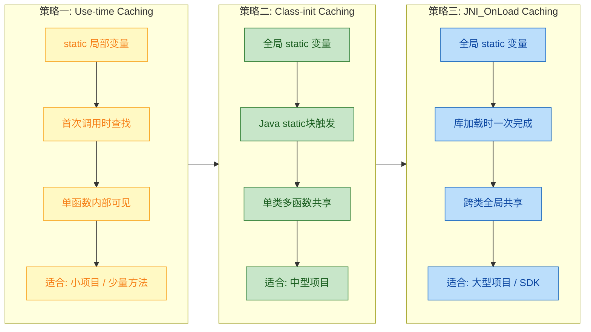

| 维度 | 策略一：使用时缓存 | 策略二：类初始化缓存 | 策略三：JNI_OnLoad 缓存 |
|------|-------------------|--------------------|-----------------------|
| **缓存位置** | `static` 局部变量 | `static` 全局变量 | `static` 全局变量 |
| **初始化时机** | 首次调用时（Lazy） | 类加载时（Eager） | 库加载时（Eager） |
| **共享范围** | 仅当前函数 | 当前 .c 文件所有函数 | 整个 Native 库所有函数 |
| **缓存 jclass？** | 通常不需要 | 需要 `NewGlobalRef` | 需要 `NewGlobalRef` |
| **错误处理** | 分散在各函数中 | 集中在 init 函数 | 集中在 `JNI_OnLoad` |
| **代码复杂度** | ⭐ 低 | ⭐⭐ 中 | ⭐⭐⭐ 中高 |
| **适用场景** | 简单工具方法 | 单类密集回调 | 多类大型项目 |
| **Android 实战** | 少见 | AOSP 中大量使用 | NDK SDK 开发首选 |

---

### 常见陷阱与最佳实践

#### 陷阱一：缓存 jclass 但忘记创建全局引用

这是 JNI 开发中**最经典的 Bug 之一**。

```c
/* ❌ 错误示范：缓存了局部引用 */
static jclass cachedClass = NULL;

void someFunction(JNIEnv *env) {
    if (cachedClass == NULL) {
        // FindClass 返回的是局部引用 (Local Reference)
        // 局部引用在函数返回后即失效！
        cachedClass = (*env)->FindClass(env, "com/example/MyClass");
    }
    // 第二次调用此函数时，cachedClass 指向已失效的引用
    // 导致 crash 或不可预测行为！ 💥
    jmethodID mid = (*env)->GetMethodID(env, cachedClass, "foo", "()V");
}
```

```c
/* ✅ 正确做法：将局部引用提升为全局引用 */
static jclass cachedClass = NULL;

void someFunction(JNIEnv *env) {
    if (cachedClass == NULL) {
        // 先获取局部引用
        jclass localCls = (*env)->FindClass(env, "com/example/MyClass");
        if (localCls == NULL) return;  // 类未找到

        // 创建全局引用（跨函数、跨线程有效）
        cachedClass = (*env)->NewGlobalRef(env, localCls);

        // 释放局部引用（全局引用已持有，局部不再需要）
        (*env)->DeleteLocalRef(env, localCls);

        if (cachedClass == NULL) return;  // 全局引用创建失败
    }
    // 安全使用 ✅
    jmethodID mid = (*env)->GetMethodID(env, cachedClass, "foo", "()V");
}
```

> ⚠️ **核心区别**：`jmethodID` / `jfieldID` **不是** JNI 引用（不受 GC 管理），可以直接缓存。但 `jclass` **是** JNI 引用对象，必须通过 `NewGlobalRef` 提升后才能安全缓存。

#### 陷阱二：类卸载导致缓存失效

在标准 JVM 中，当一个 ClassLoader 被 GC 回收时，它加载的所有类都会被卸载（Class Unloading）。此时：

- 之前缓存的 `jclass` 全局引用会**阻止类被卸载**（因为全局引用本身就是 GC Root）。
- 但如果你只缓存了 `jmethodID` 而没缓存 `jclass`，类仍可能被卸载，此时 **jmethodID 变为悬空指针（Dangling Pointer）**。

```c
// 内存关系图:
//
//   ┌──────────────────────────────────────────────┐
//   │             GC Roots                         │
//   │  ┌─────────────────┐                         │
//   │  │  gGlobalClass ──────► jclass (MyClass)    │ ← 全局引用阻止卸载
//   │  │  (GlobalRef)    │     │                   │
//   │  └─────────────────┘     │ 包含              │
//   │                          ▼                   │
//   │                    ┌─────────────┐           │
//   │                    │ Method Table│           │
//   │                    │ ┌─────────┐ │           │
//   │  gCachedMid ──────►│ │  foo()  │ │           │ ← ID 指向方法表条目
//   │                    │ └─────────┘ │           │
//   │                    └─────────────┘           │
//   └──────────────────────────────────────────────┘
//
//   ✅ 只要 gGlobalClass 存在，整个链条都安全
//   ❌ 若无 gGlobalClass，类可能被卸载，gCachedMid 悬空
```

> 📌 **最佳实践**：**总是同时缓存 `jclass`（全局引用）和 `jmethodID`**。全局引用既是你使用的凭证，也是防止类被卸载的"锚"。

#### 陷阱三：Android 热更新 / 动态类加载

在 Android 中，如果使用了插件化框架或热修复（HotFix），Java 类可能被**不同的 ClassLoader 重新加载**。此时新旧类虽然全限定名相同，但在 JVM 内部是**完全不同的类对象**。你缓存的旧 `jmethodID` 将无法用于新类的实例。

**应对策略**：在插件化环境中，考虑在每次 ClassLoader 切换后重新初始化缓存，或改用使用时缓存策略以适应动态变化。

---

### Android AOSP 中的实战案例

Android 系统源码中大量使用了方法 ID 缓存策略。以 `android_media_MediaPlayer.cpp` 为例（简化版）：

```c
/* 
 * Android AOSP 风格的缓存模式
 * 来源：frameworks/base/media/jni/android_media_MediaPlayer.cpp（简化）
 */

// 使用结构体集中管理一个类的所有缓存
struct fields_t {
    jclass    clazz;                  // MediaPlayer.class 的全局引用
    jmethodID post_event;            // postEventFromNative 方法
    jfieldID  context;               // mNativeContext 字段
    jfieldID  surface_texture;       // mNativeSurfaceTexture 字段
};

// 全局缓存实例
static fields_t fields;

// 在 JNI_OnLoad 或 register 阶段调用
static void
android_media_MediaPlayer_native_init(JNIEnv *env) {
    jclass clazz;

    // 查找 MediaPlayer 类
    clazz = env->FindClass("android/media/MediaPlayer");
    if (clazz == NULL) {
        return;  // 抛出 ClassNotFoundException
    }

    // 缓存为全局引用
    fields.clazz = (jclass)env->NewGlobalRef(clazz);

    // 缓存回调方法
    fields.post_event = env->GetStaticMethodID(
        clazz,
        "postEventFromNative",
        "(Ljava/lang/Object;IIILjava/lang/Object;)V"
    );
    if (fields.post_event == NULL) {
        return;  // 抛出 NoSuchMethodError
    }

    // 缓存字段
    fields.context = env->GetFieldID(clazz, "mNativeContext", "J");
    if (fields.context == NULL) {
        return;
    }

    fields.surface_texture = env->GetFieldID(
        clazz, "mNativeSurfaceTexture", "J"
    );
    // ... 后续使用 fields.xxx 直接访问
}
```

这种 **结构体集中管理** 模式是工业级 JNI 开发的事实标准，有几个显著优势：

1. **可读性极佳**：所有缓存一目了然，新人接手时快速理解
2. **维护方便**：增删字段只需修改结构体定义和初始化函数
3. **清理简单**：在 `JNI_OnUnload` 中遍历结构体成员即可

---

### 缓存策略决策流程

当你面对一个新的 JNI 项目时，可以按以下流程选择缓存策略：

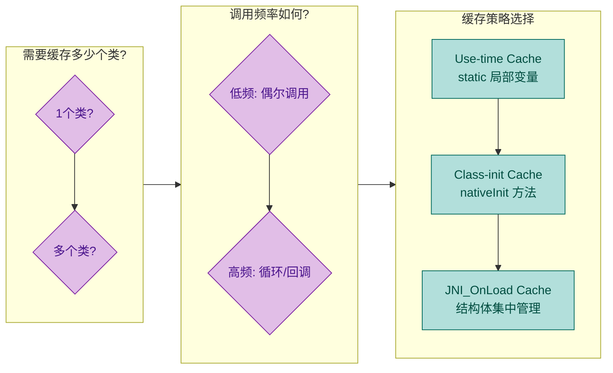

**简单决策规则**：

- **1 个类 + 低频调用** → 策略一（Use-time Cache），够用且简单
- **1 个类 + 高频调用** → 策略二（Class-init Cache），避免首次延迟
- **多个类 / SDK 开发** → 策略三（JNI_OnLoad + 结构体），工业级标准

---

**📝 练习题**

以下关于 JNI 方法 ID 缓存的描述，哪一项是 **错误** 的？

A. `jmethodID` 在对应的类未被卸载期间始终有效，因此可以安全缓存


B. 使用 `static` 局部变量缓存 `jmethodID` 时，即使多线程同时首次调用也不会导致功能错误（仅可能多查找一次）


C. 缓存 `jclass` 时可以直接将 `FindClass` 的返回值存入全局 `static` 变量，因为 `jclass` 和 `jmethodID` 一样都不是引用类型


D. 在 `JNI_OnLoad` 中集中缓存方法 ID 是大型项目的推荐做法，可以在库加载时一次性完成所有查找


**【答案】** C

**【解析】** 选项 C 的说法是完全错误的。`jclass` 是 `jobject` 的子类型，属于 **JNI 引用（Reference）**，受 JVM 垃圾回收管理。`FindClass` 返回的是 **局部引用（Local Reference）**，它在当前 Native 方法返回后即失效。如果将局部引用直接存入全局 `static` 变量，后续使用时会访问到一个已失效的引用，导致崩溃或未定义行为。正确做法是通过 `NewGlobalRef` 将其提升为 **全局引用（Global Reference）** 后再缓存。而 `jmethodID` 和 `jfieldID` 则不同，它们在 JNI 规范中被定义为不透明的标识符（opaque identifier），**不是** 引用类型，不参与 GC，因此可以直接缓存。选项 A、B、D 的描述均正确。

---


## 调用 Java 方法（CallVoidMethod、CallIntMethod 等）

当我们通过 `FindClass` 拿到了 `jclass`，又通过 `GetMethodID` / `GetStaticMethodID` 拿到了 `jmethodID` 之后，真正的"临门一脚"就是 **调用 Java 方法（Call\<Type\>Method）**。这是 JNI 中最高频、也最容易出错的操作之一。本节将从函数族全貌、调用三变体、参数传递机制、返回值处理、异常安全，一直到多态派发原理，做一次彻底的拆解。

---

### 为什么需要一个函数"族"而非单一函数

Java 方法的返回值类型是多样的——`void`、`int`、`boolean`、`long`、`float`、`double`、`jobject`……而 C 语言没有泛型，也没有方法重载，因此 JNI 只能为 **每种返回类型** 各提供一个独立函数。这就形成了所谓的 **Call\<Type\>Method 函数族**（Function Family）。

其命名规则非常机械：

```
Call<返回类型>Method(JNIEnv*, jobject, jmethodID, ...)
```

下面用一张表格完整列出实例方法调用所涉及的全部函数：

| JNI 函数名 | 返回 C 类型 | 对应 Java 返回类型 |
|---|---|---|
| `CallVoidMethod` | `void` | `void` |
| `CallBooleanMethod` | `jboolean` | `boolean` |
| `CallByteMethod` | `jbyte` | `byte` |
| `CallCharMethod` | `jchar` | `char` |
| `CallShortMethod` | `jshort` | `short` |
| `CallIntMethod` | `jint` | `int` |
| `CallLongMethod` | `jlong` | `long` |
| `CallFloatMethod` | `jfloat` | `float` |
| `CallDoubleMethod` | `jdouble` | `double` |
| `CallObjectMethod` | `jobject` | 任意引用类型（String, List, 自定义类…） |

> 💡 **关键认知**：`String`、数组、自定义对象统统用 `CallObjectMethod`，返回的都是 `jobject`（或其子类型如 `jstring`、`jintArray`）。JNI 在引用类型层面不做更细粒度的区分。

---

### Call\<Type\>Method 的三个变体（Variant）

对于上表中的每一个函数，JNI 实际上都提供了 **三种参数传递形式**。以 `CallIntMethod` 为例：

| 变体 | 函数签名 | 参数传递方式 |
|---|---|---|
| **可变参数（Variadic）** | `CallIntMethod(env, obj, mid, ...)` | C 的 `...` 可变参数 |
| **va_list** | `CallIntMethodV(env, obj, mid, va_list args)` | 已封装的 `va_list` |
| **jvalue 数组** | `CallIntMethodA(env, obj, mid, const jvalue* args)` | `jvalue` 联合体数组 |

三种变体的底层行为完全相同，区别仅在于 **你如何把参数交给 JNI**。

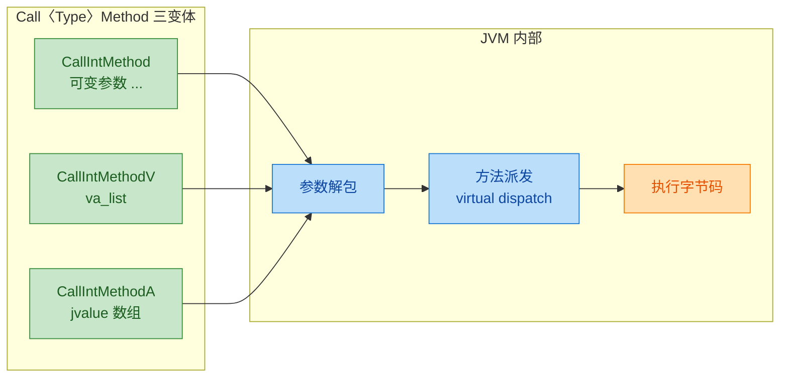

#### 变体一：可变参数（最常用）

这是日常开发中 90% 的场景：

```cpp
// Java 侧: int add(int a, int b)
// 直接将参数逐个列出，C 编译器自动处理
jint result = (*env)->CallIntMethod(env, obj, addMethodID, 10, 20);
```

优点是写法简洁直观，缺点是编译器 **无法检查参数类型和数量**——你传错了参数个数或类型，编译不会报错，运行时直接崩溃。

#### 变体二：va_list（用于封装转发）

当你编写一个 **通用包装函数**，需要将"别人传给你的可变参数"继续转发给 JNI 时，`va_list` 变体就派上用场了：

```cpp
#include <stdarg.h>

// 通用包装函数：调用任意返回 int 的 Java 方法
jint callIntMethodWrapper(JNIEnv *env, jobject obj, jmethodID mid, ...) {
    va_list args;             // 声明 va_list 变量
    va_start(args, mid);      // 初始化，指向 mid 之后的第一个可变参数
    // 使用 V 变体，将 va_list 直接转发给 JNI
    jint result = (*env)->CallIntMethodV(env, obj, mid, args);
    va_end(args);             // 清理 va_list
    return result;            // 返回 Java 方法的执行结果
}
```

> 这在构建 **JNI 工具库** 或 **日志代理层** 时尤为常见——你无法在可变参数函数内部再用 `...` 转发参数，只能通过 `va_list`。

#### 变体三：jvalue 数组（最安全、最灵活）

`jvalue` 是 JNI 定义的一个 **联合体（union）**，可以容纳任意一种 JNI 基本类型或引用：

```cpp
// jvalue 的定义（来自 jni.h）
typedef union jvalue {
    jboolean z;   // boolean
    jbyte    b;   // byte
    jchar    c;   // char
    jshort   s;   // short
    jint     i;   // int
    jlong    j;   // long
    jfloat   f;   // float
    jdouble  d;   // double
    jobject  l;   // 引用类型（包括 String、数组、对象等）
} jvalue;
```

使用方式如下：

```cpp
// Java 侧: int add(int a, int b)

jvalue args[2];      // 创建一个长度为 2 的 jvalue 数组，对应 2 个参数
args[0].i = 10;      // 第一个参数是 int 类型，赋值 10
args[1].i = 20;      // 第二个参数是 int 类型，赋值 20

// 使用 A 变体，传入 jvalue 数组指针
jint result = (*env)->CallIntMethodA(env, obj, addMethodID, args);
```

`jvalue` 数组变体的优势在于：

- **类型显式化**：通过 `.i`、`.l`、`.d` 等字段，清楚表明每个参数的类型。
- **可编程构建参数**：当参数列表是在运行时动态决定的（例如反射框架），无法使用 `...`，只能用数组。
- **跨平台可靠性**：可变参数在某些嵌入式平台上行为不一致，`jvalue` 数组没有这个问题。

---

### 完整调用流程：从 Native 到 Java 再回到 Native

下面用一个端到端的例子串联整个流程。假设 Java 侧有如下类：

```java
public class Calculator {

    // 实例方法：两数相加
    public int add(int a, int b) {
        return a + b;
    }

    // 实例方法：拼接描述信息（演示引用类型参数和返回值）
    public String describe(String operation, int result) {
        return operation + " = " + result;
    }

    // 实例方法：无返回值，打印日志
    public void log(String message) {
        System.out.println("[Calculator] " + message);
    }
}
```

Native 侧完整调用代码：

```cpp
// native 函数：演示调用 Calculator 的三个方法
JNIEXPORT void JNICALL
Java_com_example_Main_testCalculator(JNIEnv *env, jobject thiz, jobject calculator) {

    // ========== 1. 获取类引用 ==========
    // 通过对象实例获取其 Class（等价于 calculator.getClass()）
    jclass clazz = (*env)->GetObjectClass(env, calculator);

    // ========== 2. 获取三个方法的 ID ==========
    // add(int, int) -> 签名 "(II)I"
    jmethodID addMid = (*env)->GetMethodID(env, clazz, "add", "(II)I");
    // describe(String, int) -> 签名 "(Ljava/lang/String;I)Ljava/lang/String;"
    jmethodID describeMid = (*env)->GetMethodID(env, clazz, "describe",
                                                 "(Ljava/lang/String;I)Ljava/lang/String;");
    // log(String) -> 签名 "(Ljava/lang/String;)V"
    jmethodID logMid = (*env)->GetMethodID(env, clazz, "log", "(Ljava/lang/String;)V");

    // ========== 3. 调用 add 方法 ==========
    // CallIntMethod：返回 jint，对应 Java 的 int
    jint sum = (*env)->CallIntMethod(env, calculator, addMid, 30, 12);
    // sum 现在是 42

    // ========== 4. 调用 describe 方法 ==========
    // 先构造 Java String 作为参数
    jstring operation = (*env)->NewStringUTF(env, "30 + 12");
    // CallObjectMethod：返回 jobject，这里实际是 jstring
    jstring desc = (jstring)(*env)->CallObjectMethod(env, calculator, describeMid,
                                                      operation, sum);
    // 将 jstring 转为 C 字符串以便在 native 层使用
    const char *descChars = (*env)->GetStringUTFChars(env, desc, NULL);
    // descChars = "30 + 12 = 42"

    // ========== 5. 调用 log 方法 ==========
    // CallVoidMethod：无返回值
    jstring logMsg = (*env)->NewStringUTF(env, "Calculation complete!");
    (*env)->CallVoidMethod(env, calculator, logMid, logMsg);
    // Java 控制台输出：[Calculator] Calculation complete!

    // ========== 6. 释放资源 ==========
    (*env)->ReleaseStringUTFChars(env, desc, descChars);  // 释放 UTF 字符串
    (*env)->DeleteLocalRef(env, operation);                // 释放局部引用
    (*env)->DeleteLocalRef(env, logMsg);                   // 释放局部引用
    (*env)->DeleteLocalRef(env, desc);                     // 释放局部引用
    (*env)->DeleteLocalRef(env, clazz);                    // 释放类引用
}
```

整个调用的时序如下：

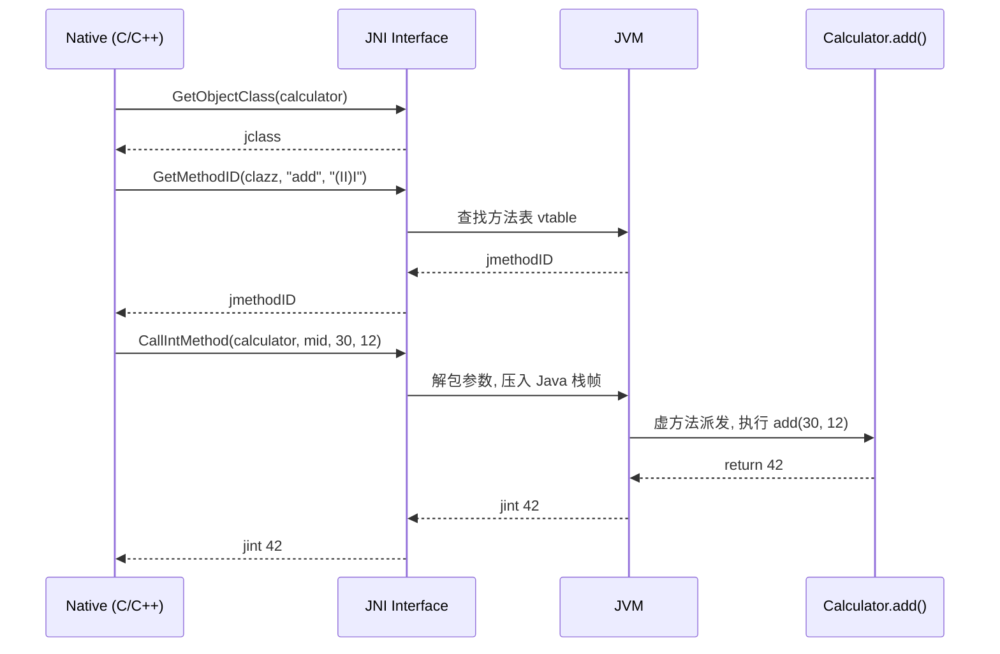

---

### 参数传递的底层细节

理解参数如何在 Native 和 Java 之间穿越边界，是避免 bug 的关键。

#### 基本类型：值拷贝（Zero-cost Crossing）

`jint`、`jlong`、`jdouble` 等基本类型在 C 和 Java 之间是 **直接值拷贝**。它们不涉及 GC、不涉及引用计数，效率极高。

```cpp
// 以下参数 100 和 200 被直接按值传入 JVM 栈帧
jint result = (*env)->CallIntMethod(env, obj, mid, 100, 200);
// result 也是直接从 JVM 栈帧上按值拷贝回来的
```

内存视角：

```cpp
// ┌─────────────────────────────┐
// │       Native Stack          │
// │  arg1 = 100 (4 bytes)       │──值拷贝──┐
// │  arg2 = 200 (4 bytes)       │──值拷贝──┤
// └─────────────────────────────┘          │
//                                          ▼
// ┌─────────────────────────────┐
// │       Java Stack Frame      │
// │  slot[0] = this (objref)    │
// │  slot[1] = 100              │ ← 来自 native 的值
// │  slot[2] = 200              │ ← 来自 native 的值
// └─────────────────────────────┘
```

#### 引用类型：传递句柄（Handle）

当参数是 `jobject`（包括 `jstring`、`jarray` 等），传递的并不是 Java 堆上对象的裸指针，而是一个 **JNI 句柄（Local Reference Handle）**。JVM 通过这个句柄间接定位到堆上的真正对象。这样做的核心原因是：**GC 可能随时移动堆上的对象**，句柄机制允许 JVM 透明地更新真正的地址，而不影响 native 代码持有的句柄值。

```cpp
// ┌──── Native 侧 ───────┐        ┌──── JVM 内部 ──────────────┐
// │                       │        │                            │
// │  jstring s = 0xA100   │───────►│  Handle Table              │
// │  (Local Ref Handle)   │        │  [0xA100] ──► 堆对象 Str1 │
// │                       │        │                            │
// └───────────────────────┘        └────────────────────────────┘
//
// GC 发生后，Str1 可能被移动到新地址，但 Handle 0xA100 不变
// JVM 自动更新 Handle Table 中的映射
```

---

### 返回值处理要点

#### 基本类型返回值

直接用对应的 C 类型接收即可，无需任何额外处理：

```cpp
jboolean flag = (*env)->CallBooleanMethod(env, obj, isReadyMid);
// flag 的值为 JNI_TRUE (1) 或 JNI_FALSE (0)

jdouble pi = (*env)->CallDoubleMethod(env, obj, getPiMid);
// pi ≈ 3.141592653589793
```

#### 引用类型返回值

`CallObjectMethod` 返回的是一个 **局部引用（Local Reference）**。你必须注意以下几点：

1. **类型强转**：返回值是 `jobject`，如果你知道实际类型是 `jstring`，需要手动转型。
2. **null 检查**：Java 方法可能返回 `null`，native 侧会收到 C 的 `NULL`。
3. **引用管理**：局部引用在 native 方法返回时自动释放，但如果你在循环中大量调用，需要手动 `DeleteLocalRef` 以避免溢出局部引用表。

```cpp
// 调用一个返回 String 的方法
jobject rawResult = (*env)->CallObjectMethod(env, obj, getNameMid);

// 必须检查 null —— Java 侧可能返回 null
if (rawResult == NULL) {
    // 处理空值情况
    return;
}

// 安全地强转为 jstring
jstring name = (jstring) rawResult;

// 使用完毕后如果还在同一个 native 函数内，可以手动释放
(*env)->DeleteLocalRef(env, name);
```

#### 返回值与异常的关系

**极其重要的一点**：如果 Java 方法内部抛出了异常，`Call<Type>Method` 仍然会正常返回——但返回值是 **未定义的**（对于基本类型通常是 0，对于引用类型通常是 `NULL`）。此时 JNI 内部会挂起一个 **Pending Exception**。如果你不检查就继续调用其他 JNI 函数，大概率引发 **JVM 崩溃**。

```cpp
jint result = (*env)->CallIntMethod(env, obj, riskyMethodMid, 999);

// ⚠️ 必须在使用 result 之前检查异常
if ((*env)->ExceptionCheck(env)) {          // 检查是否有挂起的异常
    (*env)->ExceptionDescribe(env);         // 将异常信息打印到 stderr（调试用）
    (*env)->ExceptionClear(env);            // 清除挂起的异常，恢复 JNI 正常状态
    // 此处进行错误恢复逻辑，不要使用 result
    return;
}

// 安全：此处 result 有效
printf("Result = %d\n", result);
```

异常处理的完整决策流程如下：

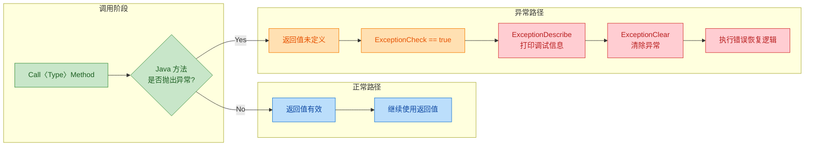

---

### 多态派发：Call\<Type\>Method 遵循虚方法调用

这是很多初学者忽略的重要语义：**`CallIntMethod` 等函数执行的是虚方法调用（Virtual Dispatch）**，即遵循 Java 的多态规则。

考虑以下继承关系：

```java
public class Animal {
    public String speak() { return "..."; }
}

public class Dog extends Animal {
    @Override
    public String speak() { return "Woof!"; }
}
```

在 Native 侧：

```cpp
// dog 是一个 Dog 实例，但 clazz 是 Animal.class
jclass animalClass = (*env)->FindClass(env, "com/example/Animal");
jmethodID speakMid = (*env)->GetMethodID(env, animalClass, "speak",
                                          "()Ljava/lang/String;");

// 尽管 methodID 来自 Animal，但传入的 obj 是 Dog 实例
// CallObjectMethod 会走虚方法表，最终调用 Dog.speak()
jstring result = (jstring)(*env)->CallObjectMethod(env, dogObj, speakMid);
// result = "Woof!" —— 而不是 "..."
```

如果你 **不想要多态**，想强制调用父类的版本，JNI 提供了 `CallNonvirtual<Type>Method`：

```cpp
// 强制调用 Animal.speak()，忽略 Dog 的重写
jstring result = (jstring)(*env)->CallNonvirtualObjectMethod(
    env,
    dogObj,         // 对象仍然是 Dog 实例
    animalClass,    // 显式指定要调用哪个类的方法
    speakMid        // Animal.speak 的 methodID
);
// result = "..." —— 调用的是 Animal 的版本
```

> `CallNonvirtual<Type>Method` 在 JNI 中的地位类似于 Java 中用 `super.speak()` 的效果，但更强大——它可以跨越任意层级调用指定祖先类的实现。

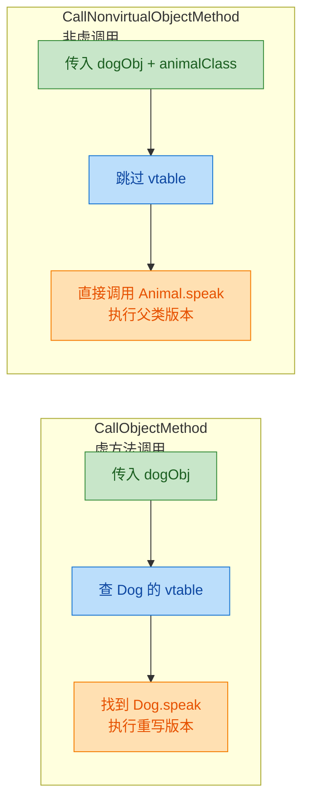

---

### 实战中的常见陷阱与最佳实践

#### 陷阱 1：签名与实际参数不匹配

JNI **不会在编译期校验** 你传入的参数是否与 `jmethodID` 的签名一致。如果 Java 方法签名是 `(II)I`（两个 int 参数），但你只传了一个参数或传了 `jstring`，后果是未定义行为（通常是 JVM 崩溃）。

```cpp
// ❌ 错误：签名要求 2 个 int，却只传了 1 个
jint bad = (*env)->CallIntMethod(env, obj, addMid, 10);
// → 未定义行为，可能读取栈上的垃圾数据

// ✅ 正确：参数数量和类型完全匹配
jint good = (*env)->CallIntMethod(env, obj, addMid, 10, 20);
```

#### 陷阱 2：循环中不释放局部引用

JNI 局部引用表默认容量有限（规范最低保证 16 个）。在循环中反复调用 `CallObjectMethod` 而不释放，会导致局部引用表溢出：

```cpp
// ❌ 危险：循环 10000 次，创建 10000 个局部引用
for (int i = 0; i < 10000; i++) {
    jstring s = (jstring)(*env)->CallObjectMethod(env, obj, getItemMid, i);
    // 使用 s ...
    // 忘记释放！
}

// ✅ 正确：每次迭代及时释放
for (int i = 0; i < 10000; i++) {
    jstring s = (jstring)(*env)->CallObjectMethod(env, obj, getItemMid, i);
    // 使用 s ...
    const char *chars = (*env)->GetStringUTFChars(env, s, NULL);
    printf("%s\n", chars);
    (*env)->ReleaseStringUTFChars(env, s, chars);  // 释放字符串缓冲区
    (*env)->DeleteLocalRef(env, s);                 // 释放局部引用
}
```

#### 陷阱 3：跨线程使用 JNIEnv

`JNIEnv*` 是 **线程局部（Thread-Local）** 的，绝对不能在线程间共享。如果你在线程 A 获取了 `env`，然后传给线程 B 使用，一切 JNI 调用都会导致不可预测的错误。正确做法是在新线程中通过 `JavaVM->AttachCurrentThread()` 获取属于该线程的 `JNIEnv*`。

#### 最佳实践清单

| 实践 | 说明 |
|---|---|
| 每次 `Call*Method` 后检查异常 | 用 `ExceptionCheck` / `ExceptionOccurred` |
| 循环中手动释放局部引用 | `DeleteLocalRef` 或使用 `PushLocalFrame` / `PopLocalFrame` |
| 缓存 `jmethodID` | `jmethodID` 一旦获取就不会失效（除非类被卸载），应缓存复用 |
| 使用 `-Xcheck:jni` 启动参数 | 开发阶段启用 JNI 检查模式，自动检测签名错误等 |
| 用 `jvalue` 数组处理动态参数 | 当参数列表在编译期不确定时，用 `A` 变体最安全 |

---

### 📝 练习题

**题目**：以下 Native 代码调用 Java 方法 `public String format(int code, String msg)`，哪一处存在错误？

```cpp
jclass cls = (*env)->FindClass(env, "com/example/Formatter");                 // ①
jmethodID mid = (*env)->GetMethodID(env, cls, "format",
                                     "(ILjava/lang/String;)Ljava/lang/String"); // ②
jstring msg = (*env)->NewStringUTF(env, "hello");                              // ③
jstring result = (*env)->CallObjectMethod(env, formatterObj, mid, 200, msg);   // ④
```

A. 第 ① 行：`FindClass` 的类路径应该用 `.` 分隔而非 `/`


B. 第 ② 行：方法签名缺少结尾的分号 `;`


C. 第 ③ 行：`NewStringUTF` 不能传入 ASCII 字符串


D. 第 ④ 行：`CallObjectMethod` 的返回值不能赋给 `jstring`


**【答案】** B

**【解析】** 在 JNI 方法签名中，引用类型的表示格式是 `L全限定类名;`，**分号是类型描述符的一部分，不可省略**。正确的签名应该是 `"(ILjava/lang/String;)Ljava/lang/String;"`——注意返回值类型 `Ljava/lang/String` 后面也必须加分号。原代码的返回值部分写成了 `Ljava/lang/String"`（缺少 `;`），这会导致 `GetMethodID` 返回 `NULL`，后续调用直接崩溃。选项 A 错误，`FindClass` 必须使用 `/` 分隔而非 `.`；选项 C 错误，`NewStringUTF` 接受任何 Modified UTF-8 字符串，ASCII 完全兼容；选项 D 错误，`jstring` 是 `jobject` 的子类型，从 `CallObjectMethod` 返回后强转为 `jstring` 是合法操作。

---

## 调用静态方法（CallStaticVoidMethod 等）

在前面的章节中，我们已经详细探讨了如何通过 JNI 调用 Java 的 **实例方法**（Instance Method）。然而在实际的 Java 开发中，静态方法（Static Method）同样无处不在——工具类、工厂模式、单例获取、日志记录等大量场景都依赖静态方法。从 Native 层调用 Java 静态方法，是 JNI 反向通信（Native→Java）中另一个至关重要的能力。

与调用实例方法相比，调用静态方法在整体流程上非常相似，但在 **API 选择**、**参数传递**、**调用目标** 等方面存在关键差异。本节将系统性地剖析这些差异，并通过丰富的代码示例和对比，帮助你彻底掌握 JNI 静态方法调用。

---

### 静态方法调用与实例方法调用的核心差异

在深入 API 之前，我们先从概念层面厘清两者的根本区别。Java 中，实例方法绑定在 **对象** 上，而静态方法绑定在 **类** 上。这一语义差异直接映射到了 JNI 的 API 设计上：

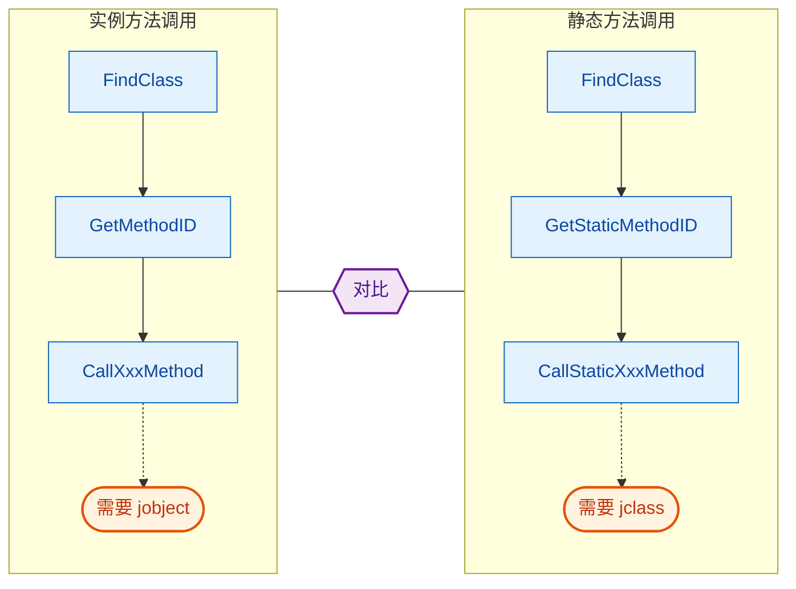

两条调用路径的三步骤（FindClass → GetMethodID/GetStaticMethodID → CallXxx）在结构上完全对称，但核心差异集中在以下几点：

| 维度 | 实例方法调用 | 静态方法调用 |
|------|------------|------------|
| **获取方法 ID** | `GetMethodID` | `GetStaticMethodID` |
| **调用函数族** | `CallXxxMethod` | `CallStaticXxxMethod` |
| **调用目标（第二参数）** | `jobject`（对象实例） | `jclass`（类引用） |
| **Java 语义** | 需要先创建对象 | 无需对象，直接通过类调用 |
| **this 指针** | 存在，Java 层可访问 `this` | 不存在 |

这张表格是理解本节内容的"锚点"——每当你对某个 API 的参数感到困惑时，回到这张表来对照。

---

### CallStaticXxxMethod 函数族全览

与实例方法的 `CallXxxMethod` 族类似，JNI 为每种 Java 返回类型都提供了对应的静态调用函数。其命名规则非常规整：`CallStatic<ReturnType>Method`。

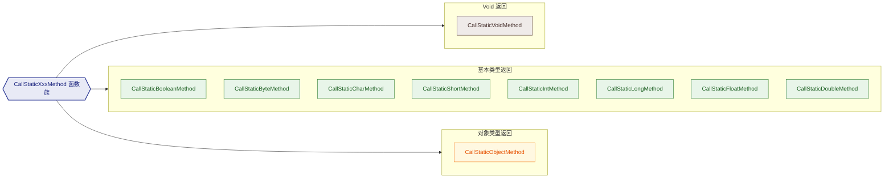

它们的 C/C++ 函数签名统一遵循以下模板：

```cpp
// 通用签名模板（以 Int 为例）
// env      : JNI 环境指针
// clazz    : 目标类的 jclass 引用（注意：不是 jobject！）
// methodID : 通过 GetStaticMethodID 获取的方法 ID
// ...      : Java 方法所需的实际参数（变长参数）
jint CallStaticIntMethod(JNIEnv *env, jclass clazz, jmethodID methodID, ...);
```

每个函数还有两个变体形式，用于不同的参数传递方式：

| 变体后缀 | 签名示例 | 参数传递方式 |
|---------|---------|------------|
| 无后缀 | `CallStaticIntMethod(env, clazz, mid, arg1, arg2)` | C 风格变长参数 `...` |
| `V` | `CallStaticIntMethodV(env, clazz, mid, va_list)` | `va_list`，适合函数转发 |
| `A` | `CallStaticIntMethodA(env, clazz, mid, jvalue[])` | `jvalue` 联合体数组，最安全 |

在实际开发中，无后缀的变长参数版本最常用；`A` 版本（`jvalue` 数组）在参数类型动态确定时更安全，因为它避免了变长参数的隐式类型提升问题。

---

### 完整调用流程详解

让我们以一个具体场景来走完静态方法调用的完整流程。假设我们在 Java 层有如下工具类：

```java
// Java 层 —— 一个简单的数学工具类
public class MathUtils {

    // 静态方法：计算两个整数的最大公约数 (GCD)
    public static int gcd(int a, int b) {
        while (b != 0) {
            int temp = b;
            b = a % b;
            a = temp;
        }
        return a;
    }

    // 静态方法：打印日志（无返回值）
    public static void log(String message) {
        System.out.println("[MathUtils] " + message);
    }

    // 静态方法：创建格式化字符串（返回对象类型）
    public static String format(int value) {
        return String.format("Result = %d", value);
    }
}
```

现在我们要从 Native 层分别调用这三个静态方法，完整的 C++ 代码如下：

```cpp
#include <jni.h>
#include <cstdio>

extern "C"
JNIEXPORT void JNICALL
Java_com_example_NativeLib_testStaticCalls(JNIEnv *env, jobject thiz) {

    // ============================================================
    // 第一步：FindClass —— 获取 MathUtils 类的 jclass 引用
    // ============================================================
    // 使用全限定类名，包名分隔符用 '/' 而非 '.'
    jclass mathUtilsClass = env->FindClass("com/example/MathUtils");

    // 防御性检查：类未找到时 FindClass 返回 NULL 并抛出异常
    if (mathUtilsClass == nullptr) {
        // 此时 JVM 内部已经抛出 NoClassDefFoundError
        // 直接 return，让 Java 层捕获异常
        return;
    }

    // ============================================================
    // 第二步：GetStaticMethodID —— 获取各静态方法的 ID
    // ============================================================

    // 获取 gcd(int, int) -> int 的方法 ID
    // 签名 "(II)I" 表示：两个 int 参数，返回 int
    jmethodID gcdMethodID = env->GetStaticMethodID(
        mathUtilsClass,   // 目标类
        "gcd",            // 方法名
        "(II)I"           // 方法签名
    );
    if (gcdMethodID == nullptr) return; // 方法未找到，异常已抛出

    // 获取 log(String) -> void 的方法 ID
    // 签名 "(Ljava/lang/String;)V" 表示：一个 String 参数，返回 void
    jmethodID logMethodID = env->GetStaticMethodID(
        mathUtilsClass,              // 目标类
        "log",                       // 方法名
        "(Ljava/lang/String;)V"      // 方法签名（L...;表示对象类型）
    );
    if (logMethodID == nullptr) return;

    // 获取 format(int) -> String 的方法 ID
    // 签名 "(I)Ljava/lang/String;" 表示：一个 int 参数，返回 String
    jmethodID formatMethodID = env->GetStaticMethodID(
        mathUtilsClass,                  // 目标类
        "format",                        // 方法名
        "(I)Ljava/lang/String;"          // 方法签名
    );
    if (formatMethodID == nullptr) return;

    // ============================================================
    // 第三步：调用静态方法
    // ============================================================

    // --- 调用 gcd(48, 18)：返回 int，使用 CallStaticIntMethod ---
    jint result = env->CallStaticIntMethod(
        mathUtilsClass,   // 传入 jclass（不是 jobject！）
        gcdMethodID,      // 方法 ID
        48,               // 第一个参数 a
        18                // 第二个参数 b
    );
    printf("GCD(48, 18) = %d\n", result);  // 输出：GCD(48, 18) = 6

    // --- 调用 log("Hello from Native")：无返回值，使用 CallStaticVoidMethod ---
    // 先将 C 字符串转换为 Java 的 jstring
    jstring logMsg = env->NewStringUTF("Hello from Native");
    env->CallStaticVoidMethod(
        mathUtilsClass,   // 传入 jclass
        logMethodID,      // 方法 ID
        logMsg            // String 参数
    );
    // 用完后释放局部引用（良好实践）
    env->DeleteLocalRef(logMsg);

    // --- 调用 format(42)：返回对象（String），使用 CallStaticObjectMethod ---
    jobject formatResult = env->CallStaticObjectMethod(
        mathUtilsClass,   // 传入 jclass
        formatMethodID,   // 方法 ID
        42                // int 参数
    );
    // 将返回的 jstring 转换为 C 字符串以便打印
    const char *str = env->GetStringUTFChars((jstring)formatResult, nullptr);
    printf("Format result: %s\n", str);    // 输出：Format result: Result = 42
    // 释放 UTF 字符串的内存
    env->ReleaseStringUTFChars((jstring)formatResult, str);
    // 释放返回对象的局部引用
    env->DeleteLocalRef(formatResult);

    // 释放 jclass 局部引用
    env->DeleteLocalRef(mathUtilsClass);
}
```

调用过程中的数据流可以用下面这张时序图来完整呈现：

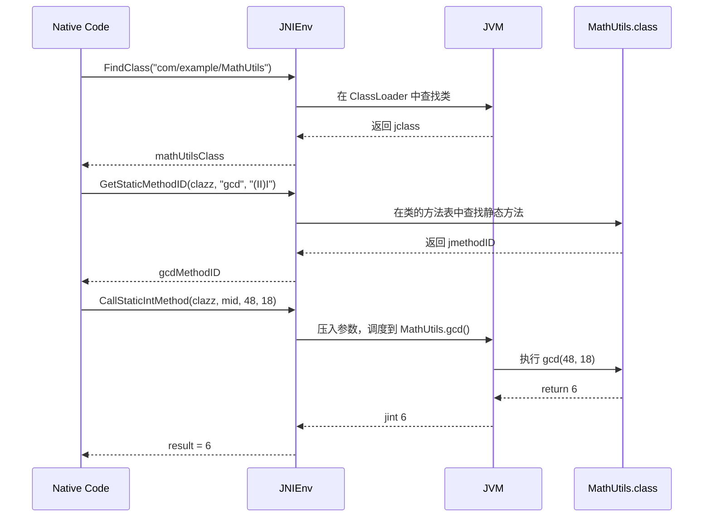

---

### 使用 jvalue 数组传参（A 变体）

当调用的静态方法参数数量或类型在编译期无法确定时，使用 `jvalue` 联合体数组（即 `CallStaticXxxMethodA`）是更稳健的做法。`jvalue` 是 JNI 定义的一个联合体（union），它可以容纳所有 JNI 基本类型和对象引用：

```cpp
// jvalue 的定义（来自 jni.h）
typedef union jvalue {
    jboolean z;   // boolean
    jbyte    b;   // byte
    jchar    c;   // char
    jshort   s;   // short
    jint     i;   // int
    jlong    j;   // long
    jfloat   f;   // float
    jdouble  d;   // double
    jobject  l;   // 对象引用（包括 String、数组等）
} jvalue;
```

使用示例：

```cpp
extern "C"
JNIEXPORT void JNICALL
Java_com_example_NativeLib_testJvalueCall(JNIEnv *env, jobject thiz) {

    // 获取类和方法 ID（省略错误检查以突出重点）
    jclass clazz = env->FindClass("com/example/MathUtils");
    jmethodID mid = env->GetStaticMethodID(clazz, "gcd", "(II)I");

    // 构建 jvalue 数组，每个元素对应一个参数
    jvalue args[2];          // gcd 有两个参数，所以数组长度为 2
    args[0].i = 48;          // 第一个参数：int 类型，赋值给 .i 字段
    args[1].i = 18;          // 第二个参数：int 类型，赋值给 .i 字段

    // 使用 A 变体调用
    jint result = env->CallStaticIntMethodA(
        clazz,    // jclass
        mid,      // jmethodID
        args      // jvalue 数组指针
    );

    printf("GCD = %d\n", result);  // 输出：GCD = 6

    env->DeleteLocalRef(clazz);
}
```

> **为什么 `A` 变体更安全？** 在 C 语言的变长参数（`...`）中，`float` 会被隐式提升为 `double`，`short`/`char` 会提升为 `int`。如果 JNI 实现依赖实际字节宽度来读取参数，这种隐式提升可能导致参数读取错位。而 `jvalue` 联合体明确了每个参数的类型和对齐方式，彻底消除了这一隐患。

---

### 常见易错点与防御性编程

#### 误用 jobject 代替 jclass

这是新手最常犯的错误之一。调用 `CallStaticXxxMethod` 时，第二个参数**必须**是 `jclass`（类引用），而不是 `jobject`（对象实例）。虽然从 C 类型系统来看 `jclass` 本质上是 `jobject` 的别名（typedef），编译器不会报错，但 JVM 在运行时会产生未定义行为甚至崩溃。

```cpp
// ❌ 错误示范：传入 jobject 而非 jclass
jobject someObject = ...; // 某个 MathUtils 的实例
env->CallStaticIntMethod(
    (jclass)someObject,   // 强转骗过编译器，但运行时可能崩溃！
    gcdMethodID,
    48, 18
);

// ✅ 正确做法：始终使用 FindClass 获取的 jclass
jclass clazz = env->FindClass("com/example/MathUtils");
env->CallStaticIntMethod(clazz, gcdMethodID, 48, 18);
```

> 虽然部分 JVM 实现会"容错"地从 `jobject` 中提取类信息，但这属于 **实现细节**，不是规范保证的行为。永远不要依赖它。

#### 方法签名不匹配

`GetStaticMethodID` 要求方法名和签名都**精确匹配**。签名中任何一个字符的错误——哪怕多一个空格——都会导致返回 `NULL` 并抛出 `NoSuchMethodError`。

```cpp
// ❌ 常见签名错误
env->GetStaticMethodID(clazz, "gcd", "(I, I)I");    // 错！逗号和空格是多余的
env->GetStaticMethodID(clazz, "gcd", "(int,int)int");// 错！不能用 Java 源码类型名
env->GetStaticMethodID(clazz, "gcd", "(II)V");       // 错！返回类型不匹配

// ✅ 正确签名
env->GetStaticMethodID(clazz, "gcd", "(II)I");       // 两个 int 参数，返回 int
```

**实用技巧**：使用 `javap -s com.example.MathUtils` 命令自动生成准确的方法签名描述符（Method Descriptor），杜绝手写出错。

#### 异常检查

每次调用 `FindClass` 或 `GetStaticMethodID` 后都应该检查返回值。更严谨的做法是在调用完 `CallStaticXxxMethod` 后也检查是否有 Java 异常被抛出：

```cpp
// 调用一个可能抛出异常的 Java 静态方法
env->CallStaticVoidMethod(clazz, riskyMethodID);

// 检查 Java 层是否有未捕获的异常
if (env->ExceptionCheck()) {
    // 打印异常堆栈信息到 stderr（调试用）
    env->ExceptionDescribe();
    // 清除异常状态，否则后续 JNI 调用会全部失败
    env->ExceptionClear();
    // 执行你的错误处理逻辑...
    return;
}
```

如果不清除异常就继续调用 JNI 函数，JVM 的行为是**未定义的**——轻则返回错误值，重则直接崩溃。

---

### 实战场景：从 Native 调用 Android Log

在 Android NDK 开发中，一个非常常见的需求是从 Native 层调用 `android.util.Log` 的静态方法来输出日志。虽然 NDK 提供了 `__android_log_print`，但有时你需要走 Java 的 Log 系统以统一日志管道。

```cpp
// 封装：从 Native 调用 android.util.Log.d(tag, msg)
void jniLogD(JNIEnv *env, const char *tag, const char *msg) {

    // 查找 android.util.Log 类
    jclass logClass = env->FindClass("android/util/Log");
    if (logClass == nullptr) return;  // 类未找到

    // 获取 Log.d(String, String) -> int 的静态方法 ID
    // 签名：两个 String 参数，返回 int（日志写入的字节数）
    jmethodID logD = env->GetStaticMethodID(
        logClass,
        "d",                                                          // 方法名
        "(Ljava/lang/String;Ljava/lang/String;)I"                     // 签名
    );
    if (logD == nullptr) {
        env->DeleteLocalRef(logClass);
        return;
    }

    // 将 C 字符串转换为 jstring
    jstring jTag = env->NewStringUTF(tag);   // 转换 tag
    jstring jMsg = env->NewStringUTF(msg);   // 转换 msg

    // 调用 Log.d(tag, msg)
    env->CallStaticIntMethod(logClass, logD, jTag, jMsg);

    // 清理所有局部引用
    env->DeleteLocalRef(jMsg);
    env->DeleteLocalRef(jTag);
    env->DeleteLocalRef(logClass);
}
```

在内存模型层面，整个调用的引用关系如下：

```cpp
// 引用关系示意（Native 栈帧视角）
//
//  Native Stack Frame
//  ┌──────────────────────────────────────┐
//  │  logClass  ──────► [android.util.Log]│  (jclass, 局部引用)
//  │  logD      ──────► [method table ptr]│  (jmethodID, 非引用)
//  │  jTag      ──────► ["MyTag"]         │  (jstring, 局部引用)
//  │  jMsg      ──────► ["Hello JNI"]     │  (jstring, 局部引用)
//  └──────────────────────────────────────┘
//         │
//         ▼ 方法返回后，所有局部引用自动释放
//        GC 可回收对应的 Java 对象
```

> **关于 jmethodID 的生命周期**：`jmethodID` 不是一个对象引用，而是一个指向 JVM 内部方法结构的原始指针。它不受 GC 影响，只要对应的类没有被卸载（Unload），它就一直有效。这也是"方法 ID 缓存策略"的理论基础——但这属于上一节的内容，这里不再展开。

---

### 静态方法调用与实例方法调用的完整对比示例

为了巩固理解，我们用同一个需求——"获取一个字符串的长度"——分别用实例方法和静态方法两种路径实现，形成鲜明对比：

```cpp
extern "C"
JNIEXPORT void JNICALL
Java_com_example_NativeLib_compareCallStyles(JNIEnv *env, jobject thiz) {

    // ================================================================
    // 方式一：调用实例方法 String.length()
    // ================================================================
    jstring testStr = env->NewStringUTF("Hello JNI");  // 创建 Java String 对象

    jclass stringClass = env->FindClass("java/lang/String"); // 获取 String 类
    // length() 是实例方法 → 用 GetMethodID
    jmethodID lengthMID = env->GetMethodID(stringClass, "length", "()I");
    // 调用实例方法 → 传入 jobject（testStr 本身）
    jint len1 = env->CallIntMethod(testStr, lengthMID);
    printf("Instance call: length = %d\n", len1);  // 输出 9

    // ================================================================
    // 方式二：调用静态方法 String.valueOf(int)
    // ================================================================
    // valueOf(int) 是静态方法 → 用 GetStaticMethodID
    jmethodID valueOfMID = env->GetStaticMethodID(
        stringClass,
        "valueOf",
        "(I)Ljava/lang/String;"   // int 参数，返回 String
    );
    // 调用静态方法 → 传入 jclass（stringClass），而非 jobject
    jobject result = env->CallStaticObjectMethod(stringClass, valueOfMID, 12345);
    const char *cStr = env->GetStringUTFChars((jstring)result, nullptr);
    printf("Static call: valueOf(12345) = %s\n", cStr);  // 输出 "12345"
    env->ReleaseStringUTFChars((jstring)result, cStr);

    // 清理
    env->DeleteLocalRef(result);
    env->DeleteLocalRef(testStr);
    env->DeleteLocalRef(stringClass);
}
```

关键对比一目了然：

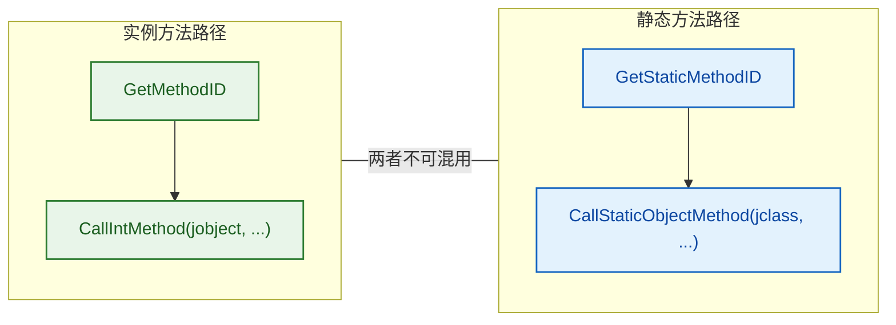

> ⚠️ **致命混用**：如果你用 `GetMethodID` 获取了一个静态方法的 ID，然后用 `CallIntMethod` 去调用，或者反过来用 `GetStaticMethodID` 获取实例方法的 ID 再用 `CallStaticIntMethod` 去调用，都会导致 `NoSuchMethodError` 或更严重的 JVM 崩溃。**Get 系列和 Call 系列必须成对使用**。

---

### 本节 API 速查表

| API | 返回类型 | 用途 | 关键参数 |
|-----|---------|------|---------|
| `GetStaticMethodID` | `jmethodID` | 获取静态方法 ID | `(jclass, name, sig)` |
| `CallStaticVoidMethod` | `void` | 调用无返回值的静态方法 | `(jclass, mid, ...)` |
| `CallStaticBooleanMethod` | `jboolean` | 调用返回 boolean 的静态方法 | `(jclass, mid, ...)` |
| `CallStaticIntMethod` | `jint` | 调用返回 int 的静态方法 | `(jclass, mid, ...)` |
| `CallStaticLongMethod` | `jlong` | 调用返回 long 的静态方法 | `(jclass, mid, ...)` |
| `CallStaticFloatMethod` | `jfloat` | 调用返回 float 的静态方法 | `(jclass, mid, ...)` |
| `CallStaticDoubleMethod` | `jdouble` | 调用返回 double 的静态方法 | `(jclass, mid, ...)` |
| `CallStaticObjectMethod` | `jobject` | 调用返回对象的静态方法 | `(jclass, mid, ...)` |
| `CallStaticByteMethod` | `jbyte` | 调用返回 byte 的静态方法 | `(jclass, mid, ...)` |
| `CallStaticCharMethod` | `jchar` | 调用返回 char 的静态方法 | `(jclass, mid, ...)` |
| `CallStaticShortMethod` | `jshort` | 调用返回 short 的静态方法 | `(jclass, mid, ...)` |

---

**📝 练习题**

在 JNI 中，以下关于调用 Java 静态方法的描述，**正确**的是：

A. `CallStaticIntMethod` 的第二个参数可以传入 `jobject` 类型的对象实例，JVM 会自动从中提取类信息


B. 使用 `GetMethodID` 也可以获取静态方法的 ID，只要签名正确就行


C. `CallStaticVoidMethodA` 接受一个 `jvalue` 数组作为参数，每个数组元素对应 Java 方法的一个形参


D. `jmethodID` 是一种对象引用，使用完毕后需要调用 `DeleteLocalRef` 释放


**【答案】** C

**【解析】**

- **A 错误**：`CallStaticXxxMethod` 的第二个参数在 JNI 规范中明确要求是 `jclass` 类型。虽然 `jclass` 在 C 层面是 `jobject` 的 typedef，编译器不会阻止你传入 `jobject`，但这是**未定义行为**，不同 JVM 实现可能产生崩溃或错误结果。规范从未保证 JVM 会从 `jobject` 中自动提取类信息。

- **B 错误**：`GetMethodID` 只能查找**实例方法**（包括构造函数 `<init>`）。如果你用它去查找一个 `static` 方法，JVM 会返回 `NULL` 并抛出 `NoSuchMethodError`。静态方法必须使用 `GetStaticMethodID` 获取。两者不可混用。

- **C 正确**：`CallStaticVoidMethodA` 是 `A` 变体，它接受 `const jvalue *args` 参数。`jvalue` 是 JNI 定义的联合体，数组中的每个元素通过 `.i`、`.l`、`.d` 等字段精确对应一个 Java 形参的类型和值。这种方式避免了 C 变长参数的隐式类型提升问题，是最安全的参数传递方式。

- **D 错误**：`jmethodID` 不是对象引用（Object Reference），而是一个指向 JVM 内部方法元数据结构的不透明指针。它不被 GC 管理，不需要也不能用 `DeleteLocalRef` 释放。只要对应的类没有被卸载，`jmethodID` 就持续有效。

---

## 获取/设置字段（GetFieldID、GetIntField、SetIntField）

在 JNI 的世界里，Native 代码不仅可以调用 Java 方法，还可以**直接读写 Java 对象的字段（Field）**。这项能力使得 C/C++ 层能够与 Java 层进行极其细粒度的数据交互——例如在高性能场景下绕过 getter/setter 直接操作对象内部状态，或者在 Native 回调中将计算结果写回 Java 对象。

字段访问的整体思路与方法调用如出一辙：**先拿到类引用（`jclass`），再通过字段名和签名获取字段 ID（`jfieldID`），最后用字段 ID 进行读写操作**。这种"两步走"的设计避免了 JVM 每次按字符串查找的开销，同时也保持了跨 JVM 实现的可移植性。

### 字段访问的整体流程

在深入 API 之前，先通过一张流程图建立全局视角。无论是实例字段还是静态字段，其访问路径都遵循相同的范式：

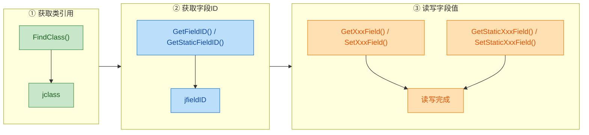

整个过程可以简要概括为：**定位类 → 定位字段 → 读/写值**。接下来我们将逐一展开每个环节。

---

### GetFieldID —— 获取实例字段 ID

`GetFieldID` 是获取 **实例字段（Instance Field）** 标识符的核心函数。其函数签名为：

```c
// env      : JNI 环境指针
// clazz    : 目标类的 jclass 引用
// name     : 字段名称（UTF-8 字符串）
// sig      : 字段的 JNI 类型签名
jfieldID GetFieldID(JNIEnv *env, jclass clazz, const char *name, const char *sig);
```

返回的 `jfieldID` 本质上是一个**不透明指针（opaque pointer）**，它在 JVM 内部代表字段在对象内存布局中的偏移量或元数据索引。你不能对它做任何算术运算，只能将它传递给后续的 Get/Set 函数。

#### 字段签名（Field Signature）速查

JNI 使用一套与 Java 字节码一致的 **类型描述符（Type Descriptor）** 来标识字段类型。这张表在实际开发中使用频率极高：

| Java 类型 | JNI 签名 | 说明 |
|---|---|---|
| `boolean` | `Z` | 注意不是 `B` |
| `byte` | `B` | |
| `char` | `C` | |
| `short` | `S` | |
| `int` | `I` | |
| `long` | `J` | 注意不是 `L` |
| `float` | `F` | |
| `double` | `D` | |
| `String` | `Ljava/lang/String;` | 对象类型：`L` + 全限定名 + `;` |
| `int[]` | `[I` | 数组：`[` + 元素签名 |
| `Object[]` | `[Ljava/lang/Object;` | 对象数组 |

> 💡 **常见踩坑**：`boolean` 的签名是 `Z` 而非 `B`；`long` 的签名是 `J` 而非 `L`（`L` 已被对象类型占用）。签名写错不会编译报错，而是在运行时抛出 `NoSuchFieldError`，非常难以排查。

#### 使用 javap 工具自动生成签名

手写签名容易出错，推荐使用 `javap -s` 命令直接输出字段签名：

```bash
# -s 参数会输出字段和方法的内部签名（descriptor）
# -p 参数显示 private 成员
javap -s -p com.example.MyClass
```

输出示例：

```text
public class com.example.MyClass {
  private int count;
    descriptor: I
  private java.lang.String name;
    descriptor: Ljava/lang/String;
}
```

---

### GetStaticFieldID —— 获取静态字段 ID

静态字段的获取方式与实例字段完全对称，只是函数名不同：

```c
// 参数与 GetFieldID 完全一致
// 区别在于返回的 jfieldID 指向类级别的静态存储区
jfieldID GetStaticFieldID(JNIEnv *env, jclass clazz, const char *name, const char *sig);
```

需要特别注意的是：**实例字段 ID 和静态字段 ID 不可混用**。如果你用 `GetFieldID` 获取了一个实例字段的 ID，却传给 `GetStaticIntField` 使用，行为是**未定义的（Undefined Behavior）**，可能导致 JVM 崩溃。

---

### GetXxxField / SetXxxField —— 读写实例字段

JNI 为每种基本数据类型都提供了独立的 Get/Set 函数，形成一组完整的 API 矩阵：

```mermaid
graph LR
    subgraph Getter["Get 系列（读取）"]
        direction TB
        G1["GetIntField()"]
        G2["GetLongField()"]
        G3["GetFloatField()"]
        G4["GetDoubleField()"]
        G5["GetBooleanField()"]
        G6["GetObjectField()"]
        G7["...其他类型"]
    end

    subgraph Setter["Set 系列（写入）"]
        direction TB
        S1["SetIntField()"]
        S2["SetLongField()"]
        S3["SetFloatField()"]
        S4["SetDoubleField()"]
        S5["SetBooleanField()"]
        S6["SetObjectField()"]
        S7["...其他类型"]
    end

    subgraph Target["Java Object"]
        direction TB
        T1["int count"]
        T2["long timestamp"]
        T3["float ratio"]
        T4["double precision"]
        T5["boolean active"]
        T6["Object ref"]
    end

    Getter --> Target
    Target --> Setter

    classDef getColor fill:#E8F5E9,stroke:#43A047,color:#1B5E20
    classDef setColor fill:#E3F2FD,stroke:#1E88E5,color:#0D47A1
    classDef objColor fill:#FFF3E0,stroke:#FB8C00,color:#E65100

    class G1,G2,G3,G4,G5,G6,G7 getColor
    class S1,S2,S3,S4,S5,S6,S7 setColor
    class T1,T2,T3,T4,T5,T6 objColor
```

以最常用的 `int` 类型为例，函数签名为：

```c
// 读取实例字段
// obj      : Java 对象的引用（jobject）
// fieldID  : 由 GetFieldID 获取的字段 ID
jint GetIntField(JNIEnv *env, jobject obj, jfieldID fieldID);

// 写入实例字段
// value    : 要设置的新值
void SetIntField(JNIEnv *env, jobject obj, jfieldID fieldID, jint value);
```

其他类型的 API 形式完全一致，只是函数名和参数/返回值类型不同：

| 操作 | 函数名 | 返回/参数类型 |
|---|---|---|
| 读 `boolean` | `GetBooleanField` | `jboolean` |
| 读 `byte` | `GetByteField` | `jbyte` |
| 读 `char` | `GetCharField` | `jchar` |
| 读 `short` | `GetShortField` | `jshort` |
| 读 `int` | `GetIntField` | `jint` |
| 读 `long` | `GetLongField` | `jlong` |
| 读 `float` | `GetFloatField` | `jfloat` |
| 读 `double` | `GetDoubleField` | `jdouble` |
| 读对象 | `GetObjectField` | `jobject` |
| 写 `int` | `SetIntField` | `void`（接收 `jint`）|
| 写对象 | `SetObjectField` | `void`（接收 `jobject`）|

> 💡 对象类型（`String`、数组、自定义类等）统一使用 `GetObjectField` / `SetObjectField`，返回/接收的都是 `jobject`，需要时再强转为 `jstring`、`jarray` 等具体类型。

---

### GetStaticXxxField / SetStaticXxxField —— 读写静态字段

静态字段的读写 API 与实例字段非常相似，**唯一的区别是第二个参数从 `jobject`（对象实例）变成了 `jclass`（类引用）**：

```c
// 读取静态 int 字段：注意第二个参数是 jclass 而非 jobject
jint GetStaticIntField(JNIEnv *env, jclass clazz, jfieldID fieldID);

// 写入静态 int 字段
void SetStaticIntField(JNIEnv *env, jclass clazz, jfieldID fieldID, jint value);
```

这在语义上也很好理解——静态字段属于类而非实例，所以自然需要传入类引用。

---

### 综合实战：完整的字段读写示例

为了将以上所有 API 串联起来，我们设计一个完整的场景：在 Native 层读取、修改 Java 对象的多种字段。

#### Java 端代码

```java
package com.example.jni;

public class UserProfile {
    // 实例字段
    private String name;          // 用户名
    private int age;              // 年龄
    private boolean isVip;        // 是否为VIP
    private double balance;       // 账户余额

    // 静态字段
    private static int totalUsers = 0;  // 全局用户计数

    public UserProfile(String name, int age) {
        this.name = name;
        this.age = age;
        this.isVip = false;
        this.balance = 0.0;
        totalUsers++;
    }

    // 声明 native 方法：在 Native 层操纵该对象的字段
    public native void nativeModifyFields();

    // 声明 native 方法：在 Native 层读取并打印静态字段
    public static native int nativeGetTotalUsers();

    @Override
    public String toString() {
        return "UserProfile{name='" + name + "', age=" + age
             + ", isVip=" + isVip + ", balance=" + balance + "}";
    }

    static {
        System.loadLibrary("user_profile");  // 加载 Native 库
    }

    public static void main(String[] args) {
        UserProfile user = new UserProfile("Alice", 25);
        System.out.println("Before: " + user);

        user.nativeModifyFields();  // Native 层修改字段
        System.out.println("After:  " + user);

        System.out.println("Total users: " + nativeGetTotalUsers());
    }
}
```

#### Native 端代码（C++）

```cpp
#include <jni.h>
#include <cstdio>

// ============================================================
// 实例字段读写示例
// ============================================================
extern "C"
JNIEXPORT void JNICALL
Java_com_example_jni_UserProfile_nativeModifyFields(JNIEnv *env, jobject thiz) {

    // -------- 第一步：获取 jclass --------
    // 通过对象实例获取其类引用（也可以用 FindClass）
    jclass clazz = env->GetObjectClass(thiz);  // 等价于 FindClass("com/example/jni/UserProfile")
    if (clazz == nullptr) {
        return;  // 获取类失败，直接返回（防御性编程）
    }

    // -------- 第二步：获取各字段的 jfieldID --------
    // 获取 String name 字段的 ID，签名为 "Ljava/lang/String;"
    jfieldID nameFieldId = env->GetFieldID(clazz, "name", "Ljava/lang/String;");
    // 获取 int age 字段的 ID，签名为 "I"
    jfieldID ageFieldId = env->GetFieldID(clazz, "age", "I");
    // 获取 boolean isVip 字段的 ID，签名为 "Z"（注意不是 "B"）
    jfieldID isVipFieldId = env->GetFieldID(clazz, "isVip", "Z");
    // 获取 double balance 字段的 ID，签名为 "D"
    jfieldID balanceFieldId = env->GetFieldID(clazz, "balance", "D");

    // 防御性检查：任何一个字段 ID 获取失败都可能意味着签名写错了
    if (!nameFieldId || !ageFieldId || !isVipFieldId || !balanceFieldId) {
        // 此时 JVM 已经抛出了 NoSuchFieldError，直接 return
        return;
    }

    // -------- 第三步：读取字段值 --------
    // 读取 name（对象类型用 GetObjectField，返回 jobject）
    jstring jName = (jstring) env->GetObjectField(thiz, nameFieldId);
    // 将 jstring 转换为 C 风格字符串以便打印
    const char *cName = env->GetStringUTFChars(jName, nullptr);
    // 读取 age（基本类型 int 用 GetIntField）
    jint age = env->GetIntField(thiz, ageFieldId);
    // 读取 isVip（基本类型 boolean 用 GetBooleanField）
    jboolean isVip = env->GetBooleanField(thiz, isVipFieldId);
    // 读取 balance（基本类型 double 用 GetDoubleField）
    jdouble balance = env->GetDoubleField(thiz, balanceFieldId);

    // 在 Native 层打印当前字段值
    printf("[Native] Current: name=%s, age=%d, isVip=%d, balance=%.2f\n",
           cName, age, isVip, balance);

    // 释放 GetStringUTFChars 分配的内存（必须成对调用）
    env->ReleaseStringUTFChars(jName, cName);

    // -------- 第四步：修改字段值 --------
    // 修改 name：需要先创建新的 jstring
    jstring newName = env->NewStringUTF("Alice_VIP");
    // 用 SetObjectField 写回（String 是对象类型）
    env->SetObjectField(thiz, nameFieldId, newName);

    // 修改 age：直接用 SetIntField
    env->SetIntField(thiz, ageFieldId, age + 1);  // 年龄 +1

    // 修改 isVip：用 SetBooleanField
    env->SetBooleanField(thiz, isVipFieldId, JNI_TRUE);  // 升级为VIP

    // 修改 balance：用 SetDoubleField
    env->SetDoubleField(thiz, balanceFieldId, 9999.99);  // 充值余额
}

// ============================================================
// 静态字段读写示例
// ============================================================
extern "C"
JNIEXPORT jint JNICALL
Java_com_example_jni_UserProfile_nativeGetTotalUsers(JNIEnv *env, jclass clazz) {
    // 对于静态 native 方法，第二个参数直接就是 jclass

    // 获取静态字段 totalUsers 的 ID
    jfieldID totalUsersFieldId = env->GetStaticFieldID(clazz, "totalUsers", "I");
    if (!totalUsersFieldId) {
        return -1;  // 字段不存在
    }

    // 读取静态 int 字段：注意用的是 GetStaticIntField，传入 jclass
    jint total = env->GetStaticIntField(clazz, totalUsersFieldId);

    // 也可以修改：将 totalUsers 加 100（演示 SetStaticIntField）
    env->SetStaticIntField(clazz, totalUsersFieldId, total + 100);

    // 返回原始值
    return total;
}
```

#### 运行输出

```text
[Native] Current: name=Alice, age=25, isVip=0, balance=0.00
Before: UserProfile{name='Alice', age=25, isVip=false, balance=0.0}
After:  UserProfile{name='Alice_VIP', age=26, isVip=true, balance=9999.99}
Total users: 1
```

---

### 字段访问的内存模型

理解 JNI 字段访问的底层原理，有助于写出更高效、更安全的代码。下面通过一个 ASCII 图展示 Native 层通过 `jfieldID` 访问 Java 对象内存的过程：

```cpp
// JVM Heap 内存布局
//
// ┌──────────────────────────────────────────────────┐
// │              Java Object (UserProfile)            │
// │  ┌────────────────────────────────────────────┐   │
// │  │  Object Header (Mark Word + Klass Pointer) │   │
// │  ├─────────────┬──────────────────────────────┤   │
// │  │ offset = 12 │  int age = 25                │ ◀─── GetIntField(obj, ageFieldId)
// │  ├─────────────┼──────────────────────────────┤   │     ageFieldId 内部存储 offset=12
// │  │ offset = 16 │  boolean isVip = false        │ ◀─── GetBooleanField(obj, isVipFieldId)
// │  ├─────────────┼──────────────────────────────┤   │
// │  │ offset = 20 │  double balance = 0.0         │ ◀─── GetDoubleField(obj, balanceFieldId)
// │  ├─────────────┼──────────────────────────────┤   │
// │  │ offset = 28 │  ref -> String "Alice"        │ ◀─── GetObjectField(obj, nameFieldId)
// │  └─────────────┴──────────────────────────────┘   │
// └──────────────────────────────────────────────────┘
//
// jfieldID 本质上 ≈ 字段在对象中的内存偏移量（offset）
// JVM 通过 obj 基址 + offset 直接定位到字段，因此访问速度接近原生指针操作
```

关键要点：

- **`jfieldID` 在大多数 JVM 实现中就是字段的内存偏移量**，因此 Get/Set 操作的时间复杂度是 O(1)，不涉及哈希查找。
- **`GetFieldID` 的开销集中在首次查找**，它需要遍历类的元数据结构。这也是为什么我们在上一节强调**缓存 `jfieldID`** 的重要性。
- 与 `jmethodID` 一样，`jfieldID` 在类被卸载之前一直有效，可以安全缓存。

---

### 字段 ID 的缓存策略

与方法 ID 缓存完全相同，字段 ID 也应当避免重复查找。常见的两种缓存模式：

#### 模式一：局部静态变量缓存

```cpp
extern "C"
JNIEXPORT void JNICALL
Java_com_example_jni_UserProfile_nativeModifyFields(JNIEnv *env, jobject thiz) {
    // 使用 static 局部变量缓存 jfieldID
    // 第一次调用时查找并赋值，后续调用直接复用
    static jfieldID ageFieldId = nullptr;

    if (ageFieldId == nullptr) {
        // 仅在首次进入时执行查找
        jclass clazz = env->GetObjectClass(thiz);       // 获取类引用
        ageFieldId = env->GetFieldID(clazz, "age", "I"); // 查找字段 ID
        env->DeleteLocalRef(clazz);                      // 及时清理局部引用
    }

    // 后续直接使用缓存的 ageFieldId，零查找开销
    jint age = env->GetIntField(thiz, ageFieldId);
    env->SetIntField(thiz, ageFieldId, age + 1);
}
```

#### 模式二：在 JNI_OnLoad 中集中初始化

```cpp
// 全局缓存变量
static jfieldID g_ageFieldId = nullptr;       // age 字段 ID
static jfieldID g_nameFieldId = nullptr;      // name 字段 ID
static jfieldID g_isVipFieldId = nullptr;     // isVip 字段 ID
static jfieldID g_balanceFieldId = nullptr;   // balance 字段 ID
static jfieldID g_totalUsersFieldId = nullptr; // totalUsers 静态字段 ID

// 在 Native 库加载时统一初始化所有字段 ID
JNIEXPORT jint JNICALL
JNI_OnLoad(JavaVM *vm, void *reserved) {
    JNIEnv *env = nullptr;
    // 获取 JNI 环境指针
    if (vm->GetEnv(reinterpret_cast<void **>(&env), JNI_VERSION_1_6) != JNI_OK) {
        return JNI_ERR;  // 获取环境失败
    }

    // 查找目标类
    jclass clazz = env->FindClass("com/example/jni/UserProfile");
    if (clazz == nullptr) {
        return JNI_ERR;  // 类未找到
    }

    // 批量获取所有需要的字段 ID
    g_ageFieldId     = env->GetFieldID(clazz, "age", "I");
    g_nameFieldId    = env->GetFieldID(clazz, "name", "Ljava/lang/String;");
    g_isVipFieldId   = env->GetFieldID(clazz, "isVip", "Z");
    g_balanceFieldId = env->GetFieldID(clazz, "balance", "D");
    g_totalUsersFieldId = env->GetStaticFieldID(clazz, "totalUsers", "I");

    // 清理局部引用
    env->DeleteLocalRef(clazz);

    return JNI_VERSION_1_6;  // 返回所需的 JNI 版本
}
```

> ⚠️ **线程安全提示**：`jfieldID` 本身是线程安全的（它只是一个偏移量），但如果你在多线程环境下使用"懒初始化 + 静态局部变量"模式，需要注意可能存在的竞态条件。在 C++11 及以上，**函数内的 `static` 局部变量初始化是线程安全的**（Magic Statics），所以模式一在现代 C++ 中是安全的。

---

### 访问继承字段与 private 字段

JNI 的字段访问有两个经常被问到的特殊场景：

#### 访问父类字段

`GetFieldID` 可以获取**当前类及其所有祖先类**中定义的字段。假设 `VipUser extends UserProfile`，在 Native 层拿到 `VipUser` 的 `jclass` 后，仍然可以直接获取 `UserProfile` 中定义的 `age` 字段：

```cpp
// clazz 指向 VipUser.class
// 但 "age" 定义在父类 UserProfile 中
// GetFieldID 会沿继承链向上查找，能成功获取
jfieldID ageId = env->GetFieldID(clazz, "age", "I");
```

#### 访问 private 字段

**JNI 完全无视 Java 的访问控制修饰符**（`private`, `protected`, `package-private`）。这意味着在 Native 代码中可以直接读写 `private` 字段，就像 Java 反射中设置了 `setAccessible(true)` 一样。这是一把双刃剑：

```mermaid
graph LR
    subgraph JavaLayer["Java 层"]
        direction TB
        J1["private int age"]
        J2["编译器禁止外部直接访问"]
        J1 --> J2
    end

    subgraph NativeLayer["Native 层（JNI）"]
        direction TB
        N1["GetFieldID 成功获取 age"]
        N2["GetIntField 直接读取"]
        N3["SetIntField 直接修改"]
        N1 --> N2
        N2 --> N3
    end

    subgraph ReflectionLayer["Java Reflection"]
        direction TB
        R1["field.setAccessible true"]
        R2["field.getInt / field.setInt"]
        R1 --> R2
    end

    JavaLayer -- "JNI 绕过" --> NativeLayer
    JavaLayer -- "反射绕过" --> ReflectionLayer

    classDef javaStyle fill:#E8F5E9,stroke:#388E3C,color:#1B5E20
    classDef nativeStyle fill:#FFF3E0,stroke:#F57C00,color:#E65100
    classDef reflectStyle fill:#E3F2FD,stroke:#1E88E5,color:#0D47A1

    class J1,J2 javaStyle
    class N1,N2,N3 nativeStyle
    class R1,R2 reflectStyle
```

尽管技术上可行，但**强烈不建议在生产代码中随意访问 private 字段**，因为这会破坏封装性，导致 Java 类的内部重构直接影响 Native 代码的兼容性。

---

### 字段访问 vs 方法调用：性能对比

在决定使用字段访问还是 getter/setter 方法时，性能是一个重要的考量维度：

| 维度 | 字段直接访问 | 通过 getter/setter |
|---|---|---|
| **查找开销** | `GetFieldID`（一次） | `GetMethodID`（一次） |
| **每次调用开销** | 极低（内存偏移访问） | 较高（方法调用、栈帧创建） |
| **线程安全** | 无同步保证 | 可在 getter/setter 中加锁 |
| **封装性** | 破坏封装 | 保持封装 |
| **适用场景** | 高频访问、性能敏感 | 通用场景、需要副作用 |

**经验法则**：如果 Java 端的 setter 中包含验证逻辑、通知机制或同步控制，应当通过 `CallVoidMethod` 调用 setter 而非直接写字段。只有在确认字段是"纯数据"且调用频率极高时，才考虑直接访问。

---

### 常见错误与排查指南

| 错误现象 | 可能原因 | 排查方法 |
|---|---|---|
| `GetFieldID` 返回 `NULL` | 字段名拼写错误或签名错误 | 用 `javap -s -p` 确认签名 |
| `NoSuchFieldError` 异常 | 字段不存在于目标类 | 确认类是否正确、是否有继承关系 |
| JVM 崩溃（SIGSEGV） | 实例/静态字段 ID 混用 | 检查 Get/SetField 与 Get/SetStaticField 是否匹配 |
| 读取值全为 0 或乱码 | 签名类型与实际类型不匹配 | 严格比对签名表 |
| 内存泄漏 | `GetObjectField` 返回的局部引用未释放 | 在循环中使用 `DeleteLocalRef` |

---

**📝 练习题**

以下 Java 类定义如下：

```java
public class Config {
    private static String appName = "MyApp";
    private long timestamp;
}
```

在 Native 代码中，以下哪组 JNI 调用能正确读取这两个字段的值？

A. 
```cpp
jfieldID f1 = env->GetFieldID(clazz, "appName", "Ljava/lang/String;");
jstring s = (jstring) env->GetObjectField(obj, f1);
jfieldID f2 = env->GetFieldID(clazz, "timestamp", "J");
jlong t = env->GetLongField(obj, f2);
```


B. 
```cpp
jfieldID f1 = env->GetStaticFieldID(clazz, "appName", "Ljava/lang/String;");
jstring s = (jstring) env->GetStaticObjectField(clazz, f1);
jfieldID f2 = env->GetFieldID(clazz, "timestamp", "J");
jlong t = env->GetLongField(obj, f2);
```


C. 
```cpp
jfieldID f1 = env->GetStaticFieldID(clazz, "appName", "Ljava/lang/String;");
jstring s = (jstring) env->GetObjectField(obj, f1);
jfieldID f2 = env->GetFieldID(clazz, "timestamp", "L");
jlong t = env->GetLongField(obj, f2);
```


D. 
```cpp
jfieldID f1 = env->GetStaticFieldID(clazz, "appName", "String");
jstring s = (jstring) env->GetStaticObjectField(clazz, f1);
jfieldID f2 = env->GetFieldID(clazz, "timestamp", "J");
jlong t = env->GetLongField(obj, f2);
```

**【答案】** B

**【解析】**

本题考察两个核心知识点：**静态字段与实例字段的 API 区分**以及 **JNI 类型签名的准确性**。

- **选项 A 错误**：`appName` 是 `static` 字段，必须使用 `GetStaticFieldID` + `GetStaticObjectField` 组合。用 `GetFieldID` 去查找静态字段会导致 `NoSuchFieldError`。
- **选项 B 正确**：`appName` 用 `GetStaticFieldID` 获取 ID，再用 `GetStaticObjectField(clazz, f1)` 读取（传入 `jclass`）；`timestamp` 是 `long` 类型实例字段，签名 `"J"` 正确，用 `GetFieldID` + `GetLongField(obj, f2)` 读取。
- **选项 C 错误**：虽然 `f1` 用了 `GetStaticFieldID`，但读取时却用了 `GetObjectField(obj, f1)`，混用了实例字段的读取函数来读静态字段，这是未定义行为。此外 `timestamp` 的签名写成了 `"L"`，但 `long` 的正确签名是 `"J"`（`L` 是对象类型前缀）。
- **选项 D 错误**：`appName` 的签名写成了 `"String"`，但 JNI 中 `String` 的正确签名是 `"Ljava/lang/String;"`，必须使用完整的全限定名格式。

---

## 创建Java对象（NewObject）

在 JNI 的世界里，Native 代码不仅能调用已有 Java 对象的方法、读写字段，还能**从零开始创建一个全新的 Java 对象**。这是一项极其强大的能力——它意味着 C/C++ 层可以主动地向 Java 层"注入"对象实例，完成诸如"在 Native 层构建返回值对象""在 Native 回调中封装数据结构"等高级操作。JNI 提供了以 `NewObject` 为核心的一组函数来实现这一目标，其底层本质是：**分配内存 + 调用构造函数 `<init>`**。

---

### NewObject 的完整调用链

创建一个 Java 对象，并非简单地 `malloc` 一块内存。它需要经过与 Java 层 `new` 关键字完全等价的流程：找到类 → 找到构造方法 → 分配对象 → 执行构造函数。我们先用一张流程图来建立全局视角：

```mermaid
graph LR
    subgraph Step1["① 获取目标类"]
        direction TB
        A["FindClass()"] --> B["jclass clazz"]
    end

    subgraph Step2["② 获取构造方法ID"]
        direction TB
        C["GetMethodID()"] --> D["jmethodID ctor"]
        E["方法名固定: 〈init〉"] --> C
        F["签名如: (ILjava/lang/String;)V"] --> C
    end

    subgraph Step3["③ 创建对象"]
        direction TB
        G["NewObject(clazz, ctor, args...)"] --> H["jobject newObj"]
        I["NewObjectV / NewObjectA"] --> H
    end

    subgraph Step4["④ 使用对象"]
        direction TB
        J["CallVoidMethod()"] 
        K["SetIntField()"]
        L["返回给Java层"]
        J --> M["操作完成"]
        K --> M
        L --> M
    end

    Step1 --> Step2 --> Step3 --> Step4

    classDef greenNode fill:#C8E6C9,stroke:#388E3C,color:#1B5E20
    classDef blueNode fill:#BBDEFB,stroke:#1976D2,color:#0D47A1
    classDef orangeNode fill:#FFE0B2,stroke:#F57C00,color:#E65100
    classDef redNode fill:#FFCDD2,stroke:#D32F2F,color:#B71C1C

    class A,B greenNode
    class C,D,E,F blueNode
    class G,H,I orangeNode
    class J,K,L,M redNode
```

整个过程可以用一句话概括：**`NewObject` = `FindClass` + `GetMethodID("<init>")` + 分配堆内存并执行构造函数**。

---

### 核心 API 详解

JNI 提供了三个变体函数来创建对象，它们的区别仅在于**传递构造函数参数的方式**不同：

| API 函数 | 参数传递方式 | 典型使用场景 |
|---|---|---|
| `NewObject(clazz, methodID, ...)` | C 风格可变参数 `...` | 最常用，参数个数编译期已知 |
| `NewObjectV(clazz, methodID, va_list)` | `va_list` | 封装/转发可变参数的中间层函数 |
| `NewObjectA(clazz, methodID, jvalue*)` | `jvalue` 联合体数组 | 参数在运行时动态构造，或参数数量不定 |

三者在功能上完全等价，只是 C 语言层面传递参数的机制不同。绝大多数场景使用 `NewObject` 即可。

#### 函数签名

```c
// 可变参数版本（最常用）
jobject NewObject(JNIEnv *env, jclass clazz, jmethodID methodID, ...);

// va_list 版本
jobject NewObjectV(JNIEnv *env, jclass clazz, jmethodID methodID, va_list args);

// jvalue 数组版本
jobject NewObjectA(JNIEnv *env, jclass clazz, jmethodID methodID, const jvalue *args);
```

**关键参数说明**：

- **`clazz`**：目标类的 `jclass` 引用，通过 `FindClass` 获得。
- **`methodID`**：构造函数的方法 ID。构造函数在 JNI 中的方法名**固定为 `"<init>"`**，返回值类型**固定为 `void`（签名以 `V` 结尾）**。
- **`...` / `args`**：传递给构造函数的实际参数，需要与签名严格匹配。

> ⚠️ **易错点**：很多初学者会尝试用 Java 类名（如 `"MyClass"`）作为方法名传给 `GetMethodID`，这是错误的。JNI 规定构造函数的名称**永远是字符串字面量 `"<init>"`**，无论类名是什么。

---

### AllocObject：分离式对象创建

除了 `NewObject` 系列，JNI 还提供了一个更底层的函数 `AllocObject`，它将"内存分配"与"构造函数调用"**拆分成两步**：

```c
// 仅分配内存，不调用任何构造函数
jobject AllocObject(JNIEnv *env, jclass clazz);
```

使用 `AllocObject` 后，你需要**手动**调用 `CallNonvirtualVoidMethod` 来执行构造函数：

```c
// 第一步：仅分配对象内存（字段全部为默认零值）
jobject obj = (*env)->AllocObject(env, clazz);

// 第二步：手动调用构造函数
(*env)->CallNonvirtualVoidMethod(env, obj, clazz, ctorID, args...);
```

```mermaid
graph LR
    subgraph NewObject方式["NewObject（一步到位）"]
        direction TB
        N1["分配内存"] --> N2["调用构造函数〈init〉"] --> N3["返回完整对象"]
    end

    subgraph AllocObject方式["AllocObject（分离式）"]
        direction TB
        A1["AllocObject: 仅分配内存"] --> A2["对象处于未初始化状态"]
        A2 --> A3["CallNonvirtualVoidMethod"]
        A3 --> A4["手动执行〈init〉"]
        A4 --> A5["返回完整对象"]
    end

    classDef greenFill fill:#C8E6C9,stroke:#43A047,color:#1B5E20
    classDef amberFill fill:#FFF9C4,stroke:#F9A825,color:#F57F17
    classDef orangeFill fill:#FFE0B2,stroke:#EF6C00,color:#BF360C

    class N1,N2,N3 greenFill
    class A1,A2 amberFill
    class A3,A4,A5 orangeFill
```

**何时使用 `AllocObject`？** 实际开发中极少使用。它的存在主要是为了满足某些特殊框架的需求，例如 Java 序列化机制在反序列化时需要跳过构造函数直接恢复对象状态。**普通业务开发中，请始终使用 `NewObject`，因为未执行构造函数的对象处于非法状态，极易引发不可预测的 Bug。**

---

### 实战案例：在 Native 层创建 Java 对象

假设我们有如下 Java 类，需要在 C 层创建它的实例：

```java
// Java 端定义
package com.example;

public class UserInfo {
    private int userId;        // 用户 ID
    private String userName;   // 用户名

    // 带参构造函数
    public UserInfo(int userId, String userName) {
        this.userId = userId;           // 初始化用户 ID
        this.userName = userName;       // 初始化用户名
    }

    @Override
    public String toString() {
        return "UserInfo{id=" + userId + ", name=" + userName + "}";
    }
}
```

对应的 Native 方法声明：

```java
// 声明一个 native 方法，返回 Native 层创建的 UserInfo 对象
public native UserInfo createUserFromNative();
```

C 端实现：

```c
#include <jni.h>

JNIEXPORT jobject JNICALL
Java_com_example_MainActivity_createUserFromNative(JNIEnv *env, jobject thiz) {

    // ========== 第一步：FindClass 获取 UserInfo 的 jclass ==========
    // 注意使用 '/' 分隔包名，而不是 Java 中的 '.'
    jclass userInfoClass = (*env)->FindClass(env, "com/example/UserInfo");
    if (userInfoClass == NULL) {
        // FindClass 失败，可能类路径错误或类未加载
        // JVM 会自动抛出 NoClassDefFoundError
        return NULL;  // 直接返回，让 Java 层处理异常
    }

    // ========== 第二步：GetMethodID 获取构造函数 ID ==========
    // 方法名固定为 "<init>"
    // 签名 "(ILjava/lang/String;)V" 表示：接收一个 int 和一个 String，返回 void
    jmethodID ctorID = (*env)->GetMethodID(
        env,
        userInfoClass,         // 目标类
        "<init>",              // 构造函数固定名称
        "(ILjava/lang/String;)V"  // 方法签名
    );
    if (ctorID == NULL) {
        // 找不到匹配的构造函数，JVM 自动抛出 NoSuchMethodError
        return NULL;
    }

    // ========== 第三步：准备构造函数参数 ==========
    jint userId = 1001;  // 用户 ID，jint 直接使用字面量

    // 创建 Java String 对象作为 userName 参数
    // NewStringUTF 将 C 字符串（Modified UTF-8）转为 java.lang.String
    jstring userName = (*env)->NewStringUTF(env, "Alice");
    if (userName == NULL) {
        // 内存不足时 NewStringUTF 可能返回 NULL
        return NULL;
    }

    // ========== 第四步：NewObject 创建对象实例 ==========
    // 将 clazz、ctorID 和实际参数传入
    // NewObject 内部会：分配堆内存 → 调用 <init>(int, String) → 返回对象引用
    jobject userObj = (*env)->NewObject(
        env,
        userInfoClass,  // 目标类
        ctorID,         // 构造函数 ID
        userId,         // 第一个参数：int
        userName        // 第二个参数：String
    );
    if (userObj == NULL) {
        // 创建失败（内存不足或构造函数抛出异常）
        return NULL;
    }

    // ========== 第五步：返回新创建的对象给 Java 层 ==========
    // 返回的是 Local Reference，在 JNI 方法返回后由 JVM 自动管理
    return userObj;
}
```

Java 端调用：

```java
// 调用 native 方法获取 C 层创建的对象
UserInfo user = createUserFromNative();
System.out.println(user);  // 输出: UserInfo{id=1001, name=Alice}
```

---

### 使用 NewObjectA 的动态参数场景

当构造函数的参数在编译期无法确定（例如通过配置动态决定），可以使用 `jvalue` 数组版本：

```c
JNIEXPORT jobject JNICALL
Java_com_example_MainActivity_createUserDynamic(JNIEnv *env, jobject thiz) {

    // 获取类和构造函数 ID（省略错误检查以简化示例）
    jclass clazz = (*env)->FindClass(env, "com/example/UserInfo");
    jmethodID ctor = (*env)->GetMethodID(env, clazz, "<init>", "(ILjava/lang/String;)V");

    // 构造 jvalue 数组，每个元素对应一个构造函数参数
    jvalue args[2];                                    // 两个参数
    args[0].i = 2002;                                  // 第一个参数：int 类型，使用联合体的 .i 字段
    args[1].l = (*env)->NewStringUTF(env, "Bob");      // 第二个参数：Object 类型，使用联合体的 .l 字段

    // 使用 NewObjectA 创建对象，传入 jvalue 数组
    jobject user = (*env)->NewObjectA(env, clazz, ctor, args);

    return user;  // 返回给 Java 层
}
```

`jvalue` 是 JNI 定义的联合体（union），它的各字段对应不同的 JNI 基本类型：

```c
// jvalue 联合体定义（来自 jni.h）
typedef union jvalue {
    jboolean z;   // boolean
    jbyte    b;   // byte
    jchar    c;   // char
    jshort   s;   // short
    jint     i;   // int
    jlong    j;   // long
    jfloat   f;   // float
    jdouble  d;   // double
    jobject  l;   // 所有引用类型（Object、String、数组等）
} jvalue;
```

---

### 构造函数签名速查

构造函数的签名规则与普通方法完全一致，唯一区别是**返回值永远是 `V`（void）**。以下是常见构造函数的签名对照表：

| Java 构造函数 | JNI 签名 |
|---|---|
| `MyClass()` | `()V` |
| `MyClass(int a)` | `(I)V` |
| `MyClass(String s)` | `(Ljava/lang/String;)V` |
| `MyClass(int a, String s)` | `(ILjava/lang/String;)V` |
| `MyClass(double d, int[] arr)` | `(D[I)V` |
| `MyClass(Object o1, Object o2)` | `(Ljava/lang/Object;Ljava/lang/Object;)V` |
| `MyClass(byte[] data, long ts)` | `([BJ)V` |

> 💡 **小技巧**：使用 `javap -s com.example.UserInfo` 命令可以自动输出类中所有方法的 JNI 签名，避免手写出错。

---

### 异常处理与健壮性

`NewObject` 的调用链路中，每一步都可能失败。编写健壮的 JNI 代码需要对每个环节做异常检查：

```c
jobject createSafeObject(JNIEnv *env) {

    // ---------- FindClass ----------
    jclass clazz = (*env)->FindClass(env, "com/example/UserInfo");
    if (clazz == NULL) {
        // FindClass 失败时 JVM 已 pending 一个 NoClassDefFoundError
        // 此处无需手动抛异常，直接返回即可
        return NULL;
    }

    // ---------- GetMethodID ----------
    jmethodID ctor = (*env)->GetMethodID(env, clazz, "<init>", "(ILjava/lang/String;)V");
    if (ctor == NULL) {
        // JVM 已 pending 一个 NoSuchMethodError
        return NULL;
    }

    // ---------- 准备参数 ----------
    jstring name = (*env)->NewStringUTF(env, "Charlie");
    if (name == NULL) {
        // OutOfMemoryError 已被 JVM pending
        return NULL;
    }

    // ---------- NewObject ----------
    jobject obj = (*env)->NewObject(env, clazz, ctor, 3003, name);
    if (obj == NULL) {
        // 构造函数内部可能抛出了 Java 异常
        // 或者 JVM 内存不足
        return NULL;
    }

    // ---------- 额外检查：构造函数是否抛出了异常 ----------
    if ((*env)->ExceptionCheck(env)) {
        // 构造函数执行过程中抛出了异常（如参数校验失败）
        // NewObject 可能返回了非 NULL 但异常已 pending
        (*env)->ExceptionDescribe(env);  // 打印异常堆栈到 stderr（仅调试用）
        (*env)->ExceptionClear(env);     // 清除 pending 异常
        return NULL;
    }

    return obj;  // 安全返回
}
```

异常传播的时序关系如下：

```mermaid
sequenceDiagram
    participant Native as Native Code (C/C++)
    participant JNI as JNI Interface
    participant JVM as Java Virtual Machine

    Native->>JNI: FindClass("com/example/UserInfo")
    JNI->>JVM: 在 ClassLoader 中搜索类
    JVM-->>JNI: 返回 jclass / 设置 pending exception
    JNI-->>Native: jclass 或 NULL

    Native->>JNI: GetMethodID(clazz, "〈init〉", sig)
    JNI->>JVM: 在类的方法表中查找匹配签名
    JVM-->>JNI: 返回 jmethodID / 设置 NoSuchMethodError
    JNI-->>Native: jmethodID 或 NULL

    Native->>JNI: NewObject(clazz, ctor, args...)
    JNI->>JVM: allocate + invoke 〈init〉
    JVM-->>JNI: 返回 jobject / 设置 pending exception
    JNI-->>Native: jobject 或 NULL

    Note over Native: 每一步都必须检查返回值!
```

---

### 引用管理注意事项

`NewObject` 返回的是一个 **Local Reference（本地引用）**，它遵循 JNI 本地引用的一切规则：

```mermaid
graph LR
    subgraph 生命周期["Local Reference 生命周期"]
        direction TB
        L1["NewObject 创建"] --> L2["在当前 Native 方法内有效"]
        L2 --> L3["方法返回时自动释放"]
        L2 --> L4["或手动 DeleteLocalRef 提前释放"]
    end

    subgraph 注意事项["⚠️ 关键注意事项"]
        direction TB
        W1["不能跨线程传递 Local Ref"]
        W2["不能存入全局 C 变量长期持有"]
        W3["循环创建对象需及时释放"]
        W4["需长期持有则转为 Global Ref"]
    end

    生命周期 --> 注意事项

    classDef greenBox fill:#E8F5E9,stroke:#2E7D32,color:#1B5E20
    classDef redBox fill:#FFEBEE,stroke:#C62828,color:#B71C1C

    class L1,L2,L3,L4 greenBox
    class W1,W2,W3,W4 redBox
```

**循环创建对象的典型陷阱**：

```c
// ❌ 错误示范：循环中大量创建对象却不释放
for (int i = 0; i < 10000; i++) {
    jobject obj = (*env)->NewObject(env, clazz, ctor, i, name);
    // 使用 obj 做一些操作 ...
    // 未调用 DeleteLocalRef，Local Reference 持续累积！
    // JNI 默认 Local Ref 容量通常只有 512 个
}

// ✅ 正确示范：每次迭代结束后手动释放
for (int i = 0; i < 10000; i++) {
    jobject obj = (*env)->NewObject(env, clazz, ctor, i, name);
    // 使用 obj 做一些操作 ...
    (*env)->DeleteLocalRef(env, obj);  // 及时释放本地引用
}
```

如果需要将 Native 创建的对象保存为 C 层的全局变量（例如缓存），必须将 Local Reference 转换为 **Global Reference**：

```c
// 将 NewObject 返回的 Local Ref 转为 Global Ref
static jobject g_cachedUser = NULL;  // 全局缓存

void cacheUser(JNIEnv *env) {
    jobject localUser = (*env)->NewObject(env, clazz, ctor, 1, name);

    // 创建 Global Reference（JVM GC 不会回收该对象）
    g_cachedUser = (*env)->NewGlobalRef(env, localUser);

    // 释放不再需要的 Local Reference
    (*env)->DeleteLocalRef(env, localUser);
}

// 程序退出或不再需要时，务必释放 Global Reference
void releaseCachedUser(JNIEnv *env) {
    if (g_cachedUser != NULL) {
        (*env)->DeleteGlobalRef(env, g_cachedUser);  // 释放全局引用
        g_cachedUser = NULL;                          // 置空防止悬空指针
    }
}
```

---

### NewObject 与 Java `new` 的等价关系

为了加深理解，我们将 Java 层的 `new` 操作与 JNI 的 `NewObject` 做一个精确对照：

```text
┌──────────────────────────────────────────────────────────────────┐
│                        Java 层                                   │
│                                                                  │
│   UserInfo user = new UserInfo(1001, "Alice");                   │
│                                                                  │
│   编译器自动完成：                                                │
│     1. 根据类名找到 UserInfo.class          ← FindClass         │
│     2. 根据参数类型匹配构造函数              ← GetMethodID       │
│     3. 在堆上分配对象内存                    ← (内部 alloc)      │
│     4. 调用 <init>(int, String)              ← (内部 invoke)     │
│     5. 返回对象引用                          ← jobject           │
│                                                                  │
│   NewObject 将上述 3+4 合为一步完成                              │
└──────────────────────────────────────────────────────────────────┘
```

---

### C++ 风格调用（JNIEnv 的差异）

最后需要注意，C 和 C++ 调用 JNI 函数的语法**略有不同**。C++ 中 `JNIEnv` 是一个封装了指针的类，调用时不需要传递 `env` 作为第一个参数：

```cpp
// ========== C 风格 ==========
jobject obj = (*env)->NewObject(env, clazz, ctor, 1001, name);
//            ^^^^^^            ^^^
//         解引用函数表指针     需要显式传 env

// ========== C++ 风格 ==========
jobject obj = env->NewObject(clazz, ctor, 1001, name);
//            ^^^
//         直接调用成员函数，env 由 this 隐式传递
```

这不是功能区别，只是 C/C++ 语言层面的语法糖差异。在 Android NDK 开发中（`.cpp` 文件），通常使用 C++ 风格。

---

### 本节核心总结

| 维度 | 要点 |
|---|---|
| **核心函数** | `NewObject` / `NewObjectV` / `NewObjectA` |
| **底层替代** | `AllocObject` + `CallNonvirtualVoidMethod`（极少使用） |
| **构造函数名** | 固定为 `"<init>"`，不是 Java 类名 |
| **构造函数签名** | 返回值永远为 `V`（void） |
| **返回值类型** | `jobject`，Local Reference |
| **异常检查** | 每一步（FindClass / GetMethodID / NewObject）都需检查 |
| **引用管理** | 循环中需 `DeleteLocalRef`；长期持有需转 `NewGlobalRef` |

---

**📝 练习题**

以下 JNI 代码尝试在 Native 层创建一个 `java.lang.Integer` 对象，哪一行存在错误？

```c
jclass intClass = (*env)->FindClass(env, "java/lang/Integer");          // 第①行
jmethodID ctor = (*env)->GetMethodID(env, intClass, "Integer", "(I)V"); // 第②行
jobject intObj = (*env)->NewObject(env, intClass, ctor, 42);            // 第③行
return intObj;                                                           // 第④行
```

A. 第①行：`FindClass` 的类路径应该用 `"java.lang.Integer"`


B. 第②行：构造函数的方法名应该是 `"<init>"` 而不是 `"Integer"`


C. 第③行：`NewObject` 的第一个参数应该是 `intClass` 的全局引用


D. 第④行：返回前必须手动调用 `DeleteLocalRef(env, intObj)`


**【答案】** B

**【解析】** 这是一个非常经典的 JNI 新手错误。在 JNI 中，**所有类的构造函数**在 `GetMethodID` 中的方法名都必须写成固定的字符串字面量 `"<init>"`，而不是 Java 类的简单名称。这是 JVM 字节码层面的约定——Java 编译器会将所有构造函数编译为名为 `<init>` 的特殊实例方法。因此第②行应改为 `GetMethodID(env, intClass, "<init>", "(I)V")`。选项 A 错误，`FindClass` 使用 `/` 分隔的 JNI 格式而非 `.` 分隔的 Java 格式，第①行是正确的。选项 C 错误，`NewObject` 对 Local Reference 和 Global Reference 均可使用，无需强制转换。选项 D 错误，当 `jobject` 作为 Native 方法的返回值传回 Java 层时，JVM 会自动处理该引用，调用者不应在返回前删除它。

---

## 本章小结

本章系统性地学习了 **JNI 方法调用（JNI Method Invocation）** 的完整知识体系。从最基础的"如何在 Native 层找到一个 Java 类"出发，逐步深入到方法调用、字段操作、对象创建等核心能力。这些 API 构成了 **Native 代码与 Java 世界双向交互的桥梁**，是 JNI 开发中使用频率最高、也最容易出错的部分。

下面我们从 **全局视角** 对本章所有知识点进行回顾与串联。

---

### 核心 API 全景图

本章涉及的所有 JNI 函数，本质上可以归纳为一条 **"定位 → 操作"** 的调用链：先通过类引用和描述符定位目标（类、方法、字段），再执行具体操作（调用、读写、创建）。

```mermaid
graph LR
    subgraph Locate["🔍 定位阶段 (Locate)"]
        direction TB
        A["FindClass<br/>获取 jclass 引用"]
        B["GetMethodID<br/>获取实例方法 ID"]
        C["GetStaticMethodID<br/>获取静态方法 ID"]
        D["GetFieldID<br/>获取实例字段 ID"]
        E["GetStaticFieldID<br/>获取静态字段 ID"]
    end

    subgraph Operate["⚡ 操作阶段 (Operate)"]
        direction TB
        F["CallXxxMethod<br/>调用实例方法"]
        G["CallStaticXxxMethod<br/>调用静态方法"]
        H["Get/SetXxxField<br/>读写实例字段"]
        I["GetStatic/SetStaticXxxField<br/>读写静态字段"]
        J["NewObject<br/>创建 Java 对象"]
    end

    subgraph Cache["💾 优化层 (Optimize)"]
        direction TB
        K["静态局部变量缓存<br/>Use-time Caching"]
        L["OnLoad 全局缓存<br/>Init-time Caching"]
    end

    A --> B
    A --> C
    A --> D
    A --> E
    B --> F
    C --> G
    D --> H
    E --> I
    A --> J
    B --> J
    B -.-> K
    C -.-> K
    D -.-> K
    A -.-> L
    B -.-> L

    classDef locateCls fill:#E3F2FD,stroke:#1565C0,color:#0D47A1,stroke-width:2px
    classDef operateCls fill:#E8F5E9,stroke:#2E7D32,color:#1B5E20,stroke-width:2px
    classDef cacheCls fill:#FFF3E0,stroke:#E65100,color:#BF360C,stroke-width:2px

    class A,B,C,D,E locateCls
    class F,G,H,I,J operateCls
    class K,L cacheCls
```

从图中可以清晰看出：**`FindClass` 是一切操作的起点**，它返回的 `jclass` 是后续获取方法 ID、字段 ID、创建对象的前提。而"缓存层"则横切所有定位操作，为高频调用场景提供性能保障。

---

### 关键知识点回顾

#### 1. 获取类 — `FindClass`

`FindClass` 是进入 Java 世界的"大门"。它接收一个 **全限定类名**（使用 `/` 分隔符而非 `.`），返回一个 `jclass` 局部引用。

```cpp
// 正确写法：com.example.User → com/example/User
jclass cls = env->FindClass("com/example/User"); // 注意斜杠分隔
```

**核心要点回顾**：
- 类名格式为 **Internal Binary Name**（`java/lang/String`），而非 Java 的点号格式。
- 返回值是 **局部引用（Local Reference）**，在 Native 方法返回后自动释放。
- 若需跨方法或跨线程持有类引用，**必须** 通过 `NewGlobalRef` 转为全局引用。
- 查找失败时返回 `NULL` 并抛出 `NoClassDefFoundError`，后续代码必须检查。

#### 2. 获取方法 ID — `GetMethodID` / `GetStaticMethodID`

方法 ID（`jmethodID`）是 JVM 内部对方法的唯一标识符，通过 **方法名 + 方法签名（Method Signature）** 联合确定。

```cpp
// 签名 "(Ljava/lang/String;I)V" 表示参数为 (String, int)，返回 void
jmethodID mid = env->GetMethodID(cls, "setName", "(Ljava/lang/String;I)V");
```

**签名速查表回顾**：

| Java 类型    | JNI 签名     | 说明             |
|:------------|:------------|:-----------------|
| `boolean`   | `Z`         | 注意不是 `B`      |
| `byte`      | `B`         |                  |
| `int`       | `I`         |                  |
| `long`      | `J`         | 注意不是 `L`      |
| `float`     | `F`         |                  |
| `double`    | `D`         |                  |
| `void`      | `V`         |                  |
| `String`    | `Ljava/lang/String;` | 对象类型以 `L` 开头，`;` 结尾 |
| `int[]`     | `[I`        | 数组以 `[` 为前缀  |

**核心要点回顾**：
- `jmethodID` 不是引用类型，**不受 GC 影响**，但在类被卸载后失效。
- 获取构造方法使用固定方法名 `"<init>"`，返回类型始终为 `V`。
- 签名错误是 JNI 开发中最常见的 Bug 来源之一，可借助 `javap -s` 命令自动生成。

#### 3. 方法 ID 缓存策略

每次调用 `GetMethodID` / `GetFieldID` 都需要 JVM 在方法表中进行字符串查找，开销不可忽视。本章介绍了两种经典的缓存策略：

| 策略 | 时机 | 线程安全 | 适用场景 |
|:----|:-----|:--------|:--------|
| **Use-time Caching** | 首次使用时缓存到 `static` 局部变量 | 天然安全（`jmethodID` 赋值是原子的） | 少量、零散的 JNI 调用 |
| **Init-time Caching** | `JNI_OnLoad` 中集中初始化 | 需手动保证（通常由类加载器线程完成） | 高频调用、系统级库 |

**核心要点回顾**：
- Init-time Caching 中的 `jclass` 必须转为 **全局引用**，否则在 `JNI_OnLoad` 返回后立即失效。
- 缓存的 `jmethodID` / `jfieldID` 本身不需要转换为全局引用，它们不是 `jobject`。
- 在类可能被卸载的场景（如自定义 ClassLoader 环境）中，缓存可能失效，需要特别注意。

#### 4. 调用 Java 实例方法

JNI 提供了按返回类型分化的一族函数来调用 Java 实例方法：

```cpp
// 调用返回 void 的方法
env->CallVoidMethod(obj, mid, arg1, arg2);

// 调用返回 int 的方法
jint result = env->CallIntMethod(obj, mid);

// 调用返回 Object 的方法（如 String）
jobject strObj = env->CallObjectMethod(obj, mid);
```

**核心要点回顾**：
- 完整函数族涵盖：`CallVoidMethod`、`CallBooleanMethod`、`CallIntMethod`、`CallLongMethod`、`CallFloatMethod`、`CallDoubleMethod`、`CallObjectMethod` 等。
- 每个函数还有 `...V`（`va_list`）和 `...A`（`jvalue[]`）两个变体，适用于不同的参数传递场景。
- 调用可能触发 Java 异常，**调用后必须检查** `ExceptionCheck()` 或 `ExceptionOccurred()`。

#### 5. 调用 Java 静态方法

静态方法的调用模式与实例方法完全对称，唯一区别是 **第二个参数传 `jclass` 而非 `jobject`**：

```cpp
// 获取静态方法 ID
jmethodID smid = env->GetStaticMethodID(cls, "valueOf", "(I)Ljava/lang/Integer;");

// 调用静态方法 — 注意传入的是 cls 而非某个对象实例
jobject intObj = env->CallStaticObjectMethod(cls, smid, 42);
```

**核心要点回顾**：
- `GetStaticMethodID` 与 `GetMethodID` 不可混用，即使方法名相同。
- 常见用途包括调用工厂方法（如 `Integer.valueOf()`）、工具类方法（如 `TextUtils.isEmpty()`）等。

#### 6. 获取/设置字段

字段操作遵循与方法调用相同的 **"获取 ID → 读写值"** 两步模式：

```cpp
// 获取字段 ID
jfieldID fid = env->GetFieldID(cls, "age", "I");

// 读取
jint age = env->GetIntField(obj, fid);

// 写入
env->SetIntField(obj, fid, age + 1);
```

**核心要点回顾**：
- 字段签名只需要**类型描述符**，不含括号（区别于方法签名）。
- 静态字段使用 `GetStaticFieldID` + `GetStaticIntField` / `SetStaticIntField` 等。
- 直接操作字段**绕过了 getter/setter**，可能破坏封装性，慎用于第三方类。

#### 7. 创建 Java 对象 — `NewObject`

`NewObject` 是在 Native 层创建 Java 对象的标准方式，需要提供 **构造方法的 `jmethodID`**：

```cpp
// 获取构造方法 ID（方法名固定为 <init>，返回类型固定为 V）
jmethodID cid = env->GetMethodID(cls, "<init>", "(Ljava/lang/String;I)V");

// 创建对象（等价于 Java 的 new User(name, age)）
jobject newUser = env->NewObject(cls, cid, jname, 25);
```

**核心要点回顾**：
- `NewObject` = 分配内存 + 调用构造方法，一步完成。
- `AllocObject` + `CallNonvirtualVoidMethod` 可以拆分为两步，适用于需要延迟初始化的场景。
- 返回的是局部引用，若需持久持有需转为全局引用。

---

### 一次完整 JNI 调用的生命周期

将本章所有知识点串联起来，一个典型的"在 Native 中创建 Java 对象并调用其方法"完整流程如下：

```mermaid
sequenceDiagram
    participant N as Native Code
    participant J as JNI Interface
    participant V as Java VM

    rect rgb(227,242,253)
    Note over N,V: 1 - 定位阶段
    N->>J: FindClass("com/example/User")
    J->>V: 查找类元数据
    V-->>J: 返回 jclass
    J-->>N: cls

    N->>J: GetMethodID(cls, init, sig)
    J->>V: 查找方法表
    V-->>J: 返回 jmethodID
    J-->>N: cid
    end

    rect rgb(232,245,233)
    Note over N,V: 2 - 操作阶段
    N->>J: NewObject(cls, cid, args...)
    J->>V: 分配堆内存 + 执行构造方法
    V-->>J: 返回 jobject
    J-->>N: userObj
    end

    rect rgb(255,243,224)
    Note over N,V: 3 - 后续交互
    N->>J: GetMethodID(cls, getName, sig)
    J-->>N: mid
    N->>J: CallObjectMethod(userObj, mid)
    J->>V: 执行 getName()
    V-->>J: 返回 jstring
    J-->>N: nameStr
    end

    rect rgb(252,228,236)
    Note over N,V: 4 - 异常检查与资源释放
    N->>J: ExceptionCheck()
    J-->>N: JNI_FALSE
    N->>J: DeleteLocalRef(userObj)
    end
```

这张时序图展示了 Native 代码与 JVM 之间的完整交互过程——**定位、操作、交互、清理**，四个阶段缺一不可。

---

### 开发中的常见陷阱总结

本章涉及的 API 虽然模式统一，但实际开发中极易踩坑。以下是必须铭记的 **"六个不要"**：

| ❌ 不要这样做 | ✅ 正确做法 | 后果 |
|:------------|:----------|:-----|
| 类名用 `.` 分隔 (`java.lang.String`) | 用 `/` 分隔 (`java/lang/String`) | `FindClass` 返回 `NULL` |
| 忽略 `FindClass` 返回值的 `NULL` 检查 | 每次调用后立即检查 | 后续操作触发 `SIGSEGV` 崩溃 |
| 在子线程中直接使用 `FindClass` | 通过 `JNI_OnLoad` 缓存或使用 `AttachCurrentThread` 后的 `ClassLoader` | 找不到应用自定义类 |
| 方法签名手写出错 | 使用 `javap -s -p ClassName` 生成 | `GetMethodID` 返回 `NULL` |
| 将 `jclass` 局部引用缓存到全局变量 | 使用 `NewGlobalRef` 转换后再缓存 | 引用悬空，随机崩溃 |
| 调用 Java 方法后不检查异常 | 立即调用 `ExceptionCheck()` | 异常静默吞没，状态不一致 |

---

### 性能优化要点

| 优化方向 | 具体措施 | 收益 |
|:--------|:--------|:-----|
| **减少 JNI 调用次数** | 批量传输数据（如用 `byte[]` 代替逐字节调用） | 避免 JNI 边界穿越开销 |
| **缓存 ID** | 使用 Init-time / Use-time 缓存 `jmethodID`, `jfieldID` | 消除重复字符串查找 |
| **缓存 jclass** | 在 `JNI_OnLoad` 中 `NewGlobalRef` 缓存常用类 | 避免反复 `FindClass` |
| **Critical Native** | 对纯计算型方法使用 `@CriticalNative`（Android）| 跳过 JNI Trampoline 开销 |
| **减少局部引用消耗** | 循环中及时 `DeleteLocalRef` 或使用 `PushLocalFrame`/`PopLocalFrame` | 避免 Local Reference Table 溢出 |

---

### 一张图记住本章

将本章所有 API 按 **"操作对象"** 维度重新整理，形成最终的知识地图：

```mermaid
graph LR
    subgraph Class["📦 类 (Class)"]
        direction TB
        FC["FindClass"]
    end

    subgraph Method["⚙️ 方法 (Method)"]
        direction TB
        GM["GetMethodID"]
        GSM["GetStaticMethodID"]
        CV["CallXxxMethod"]
        CSV["CallStaticXxxMethod"]
        GM --> CV
        GSM --> CSV
    end

    subgraph Field["📋 字段 (Field)"]
        direction TB
        GF["GetFieldID"]
        GSF["GetStaticFieldID"]
        RW["Get/SetXxxField"]
        SRW["GetStatic/SetStaticXxxField"]
        GF --> RW
        GSF --> SRW
    end

    subgraph Object["🆕 对象 (Object)"]
        direction TB
        NO["NewObject"]
        AO["AllocObject"]
    end

    subgraph Cache["💾 缓存 (Cache)"]
        direction TB
        UT["Use-time<br/>static 局部变量"]
        IT["Init-time<br/>JNI_OnLoad"]
    end

    FC --> GM
    FC --> GSM
    FC --> GF
    FC --> GSF
    FC --> NO

    GM -.-> UT
    GSM -.-> UT
    GF -.-> UT
    FC -.-> IT

    classDef classCls fill:#E8EAF6,stroke:#283593,color:#1A237E,stroke-width:2px
    classDef methodCls fill:#E3F2FD,stroke:#1565C0,color:#0D47A1,stroke-width:2px
    classDef fieldCls fill:#E8F5E9,stroke:#2E7D32,color:#1B5E20,stroke-width:2px
    classDef objectCls fill:#FFF3E0,stroke:#E65100,color:#BF360C,stroke-width:2px
    classDef cacheCls fill:#FCE4EC,stroke:#AD1457,color:#880E4F,stroke-width:2px

    class FC classCls
    class GM,GSM,CV,CSV methodCls
    class GF,GSF,RW,SRW fieldCls
    class NO,AO objectCls
    class UT,IT cacheCls
```

**记忆口诀**：**"一找（FindClass）二取（Get ID）三操作（Call/Get/Set/New），缓存优化不能忘"**。

---

### 📝 练习题

**题目一：** 以下 Native 代码存在一个严重的 Bug，请指出问题所在：

```cpp
// 全局变量
static jclass g_cls;
static jmethodID g_mid;

JNIEXPORT void JNICALL Java_com_example_NativeLib_init(JNIEnv *env, jclass clazz) {
    g_cls = env->FindClass("com/example/DataParser");
    g_mid = env->GetMethodID(g_cls, "parse", "(Ljava/lang/String;)I");
}

JNIEXPORT jint JNICALL Java_com_example_NativeLib_parse(JNIEnv *env, jclass clazz, jstring data) {
    jobject obj = env->NewObject(g_cls, g_mid, data);
    return env->CallIntMethod(obj, g_mid, data);
}
```

A. `g_mid` 获取的是实例方法 ID，不能用于 `NewObject`


B. `g_cls` 是局部引用，`init` 返回后失效，后续使用 `g_cls` 是悬空引用


C. `CallIntMethod` 的第一个参数不能是 `NewObject` 返回的对象


D. `GetMethodID` 不能在非 `JNI_OnLoad` 函数中调用


**【答案】** B

**【解析】** `FindClass` 返回的是一个 **局部引用（Local Reference）**，其生命周期仅限于当前 Native 方法的执行期间。当 `Java_com_example_NativeLib_init` 方法返回后，这个局部引用就被自动释放了。此后在 `parse` 方法中使用 `g_cls` 就是在访问一个已经失效的悬空引用（dangling reference），这会导致不可预测的行为，通常是 **崩溃（SIGSEGV）** 或 JVM 报错。正确做法是将 `FindClass` 的返回值通过 `NewGlobalRef` 转换为全局引用后再存入全局变量：

```cpp
g_cls = (jclass)env->NewGlobalRef(env->FindClass("com/example/DataParser"));
```

此外这段代码还有一个逻辑问题（虽然不是选项中的）：`g_mid` 获取的是 `parse` 实例方法的 ID，但 `NewObject` 需要的是**构造方法**（`<init>`）的 ID。代码中将同一个 `g_mid` 既用于创建对象又用于调用 `parse`，这在语义上是错误的。实际开发中应分别获取构造方法 ID 和业务方法 ID。

---

**题目二：** 关于 JNI 方法 ID 缓存策略，下列说法**正确**的是：

A. `jmethodID` 本质上是一个 `jobject`，缓存时必须调用 `NewGlobalRef`


B. Use-time Caching 使用函数内 `static` 局部变量，多线程环境下会导致数据竞争（data race），因此必须加锁


C. Init-time Caching 通常在 `JNI_OnLoad` 中执行，其中缓存的 `jclass` 需要转为全局引用，而 `jmethodID` 不需要


D. 方法 ID 在类被加载后永远有效，即使类被卸载也不会失效


**【答案】** C

**【解析】** 逐项分析：

- **A 错误**：`jmethodID` 和 `jfieldID` 都**不是** `jobject` 类型，它们是 JVM 内部的不透明指针/索引值，不参与垃圾回收，因此**不需要也不能** 调用 `NewGlobalRef`。
- **B 错误**：虽然从严格的 C/C++ 内存模型来看，多线程对 `static` 变量的并发写入确实构成 data race，但在实际 JNI 规范的语境下，由于同一个 `GetMethodID` 对相同输入总是返回相同的值（幂等性），即使多线程同时写入也不会产生逻辑错误。JNI 官方文档（*The Java Native Interface: Programmer's Guide*）明确认为这种缓存模式是可接受的，**不需要加锁**。
- **C 正确**：`jclass` 是 `jobject` 的子类型，属于引用类型，必须转为全局引用才能跨方法持有。而 `jmethodID` / `jfieldID` 不是引用，直接存储即可。
- **D 错误**：如果类被 ClassLoader 卸载（unloaded），其对应的方法 ID 和字段 ID 都会失效。不过在 Android 等大多数环境中，应用类通常不会被卸载，因此实际影响较小。

---

