---

# Java 基础语法

---

## 程序结构（包声明、类定义、main 入口）

Java 是一门强类型、面向对象的编译型语言。每一个 Java 程序的起点，都是一个写在 `.java` 源文件里的**类（Class）**。在你敲下第一行代码之前，理解 Java 程序的骨架结构至关重要——它决定了编译器如何找到你的代码、如何组织你的代码、以及如何运行你的代码。

一个最基本的 Java 源文件，从上到下由三大部分组成：**包声明（Package Declaration）**、**导入语句（Import Statements）**、**类定义（Class Definition）**。而程序的执行入口，则是藏在类内部的那个特殊方法——`main` 方法。

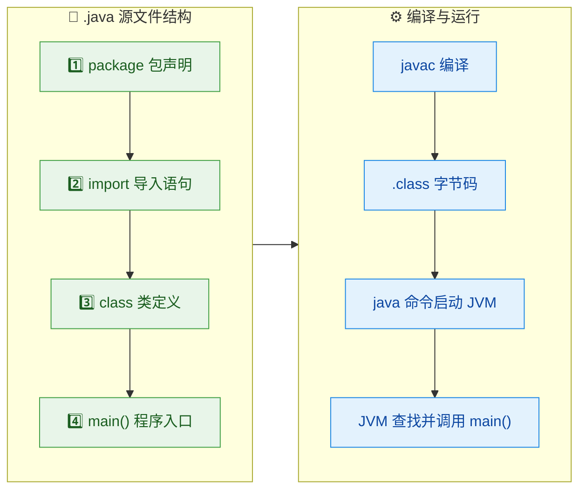
```mermaid
graph LR
    subgraph SRC["📄 .java 源文件结构"]
        direction TB
        A["1️⃣ package 包声明"]
        B["2️⃣ import 导入语句"]
        C["3️⃣ class 类定义"]
        D["4️⃣ main() 程序入口"]
        A --> B --> C --> D
    end

    subgraph COMPILE["⚙️ 编译与运行"]
        direction TB
        E["javac 编译"]
        F[".class 字节码"]
        G["java 命令启动 JVM"]
        H["JVM 查找并调用 main()"]
        E --> F --> G --> H
    end

    SRC --> COMPILE

    classDef srcStyle fill:#E8F5E9,stroke:#43A047,color:#1B5E20
    classDef compileStyle fill:#E3F2FD,stroke:#1E88E5,color:#0D47A1

    class A,B,C,D srcStyle
    class E,F,G,H compileStyle
```

### 包声明（Package Declaration）

**包（Package）** 是 Java 用来组织类的一种命名空间机制，本质上对应文件系统中的目录结构。你可以把它理解为"文件夹"——就像你不会把几百个文件全扔在桌面上一样，Java 用包来避免类名冲突，并让项目结构清晰可维护。

包声明必须是源文件中**第一条非注释语句**（如果存在的话），且一个源文件中**最多只能有一条** `package` 语句。

```java
// 包声明：表示当前类属于 com.example.app 这个包
// 对应的文件系统路径为 com/example/app/
package com.example.app;
```

包的命名遵循**反转域名（Reverse Domain Name）** 惯例，这是 Java 社区长期形成的约定（Convention），目的是在全球范围内保证包名的唯一性：

| 组织域名 | 包名前缀 | 示例 |
|---|---|---|
| `google.com` | `com.google` | `com.google.common.collect` |
| `apache.org` | `org.apache` | `org.apache.commons.lang3` |
| `example.com` | `com.example` | `com.example.myproject.util` |

包名全部使用**小写字母**，多级之间用 `.` 分隔。每一级对应磁盘上的一层目录。如果你声明了 `package com.example.app;`，那么这个 `.java` 文件就必须放在 `com/example/app/` 目录下，否则编译器会报错。

```text
项目根目录/
└── src/
    └── com/
        └── example/
            └── app/
                └── HelloWorld.java    ← package com.example.app;
```

省略 `package` 声明时，类会被放入**默认包（Default Package）**。默认包没有名字，无法被其他包中的类 `import`，因此只适合写一些临时的测试代码，正式项目中**绝对不要使用默认包**。

紧跟在包声明之后的是 `import` 语句。Java 标准库和第三方库中有成千上万的类，`import` 让你可以在代码中直接使用短类名，而不必每次都写完整的全限定名（Fully Qualified Name）：

```java
package com.example.app;

// 导入单个类：只引入 ArrayList 这一个类
import java.util.ArrayList;

// 通配符导入：引入 java.util 包下的所有类
// 注意：这不会导入子包（sub-package）中的类
import java.util.*;

// 静态导入：可以直接使用 Math 类的静态方法，无需写 Math.sqrt()
import static java.lang.Math.sqrt;
import static java.lang.Math.PI;
```

几个关于 `import` 的关键细节：

- `java.lang` 包是**自动导入**的，你不需要手动 `import String`、`import System` 等。
- 通配符 `*` 只导入当前包下的类，**不会递归导入子包**。`import java.util.*` 不会导入 `java.util.concurrent.locks.ReentrantLock`。
- 当两个不同包中存在同名类时（比如 `java.util.Date` 和 `java.sql.Date`），你必须至少对其中一个使用全限定名来消除歧义。
- 静态导入（`import static`）是 Java 5 引入的语法糖，适合导入常量和工具方法，但不宜滥用，否则代码可读性会下降——读者分不清某个方法到底是当前类的还是静态导入的。

### 类定义（Class Definition）

类是 Java 程序的基本组织单元。**一切代码都必须写在类里面**——这是 Java 和 Python、JavaScript 等语言最显著的区别之一。Java 没有"全局函数"或"脚本模式"，哪怕你只想打印一行 "Hello World"，也得先定义一个类。

```java
package com.example.app;

// 类定义：访问修饰符 + class 关键字 + 类名
// public 表示这个类对所有其他类可见
public class HelloWorld {

    // 成员变量（实例字段）
    private String message;  // private 表示只有本类内部可以访问

    // 构造方法：与类同名，没有返回值类型
    public HelloWorld(String message) {
        this.message = message;  // this 指向当前对象实例
    }

    // 成员方法（实例方法）
    public void printMessage() {
        System.out.println(message);  // 打印成员变量的值
    }
}
```

关于类定义，有几条铁律需要牢记：

**一个源文件最多只能有一个 `public` 类，且该类的类名必须与文件名完全一致（包括大小写）。** 如果文件名是 `HelloWorld.java`，那么 `public` 类就必须叫 `HelloWorld`。这不是建议，是编译器强制要求。

一个 `.java` 文件中可以定义多个类，但只有一个能是 `public` 的，其余的类只能是包级私有（即不加任何访问修饰符）。编译后，每个类都会生成独立的 `.class` 文件：

```java
// 文件名：Demo.java

public class Demo {          // ✅ public 类，必须与文件名一致
    // ...
}

class Helper {               // ✅ 包级私有类，同一个文件中的非 public 类
    // ...
}

// 编译后生成：
// Demo.class
// Helper.class
```

类名遵循**大驼峰命名法（UpperCamelCase / PascalCase）**，每个单词首字母大写，如 `StudentManager`、`HttpRequestHandler`。这是 Java 社区几乎无人违反的命名规范。

类的内部结构通常按以下顺序组织（这是广泛接受的代码风格约定，不是语法强制）：

```java
public class WellOrganizedClass {

    // ① 静态常量（static final）
    public static final int MAX_SIZE = 100;

    // ② 静态变量（static）
    private static int instanceCount = 0;

    // ③ 实例变量（成员字段）
    private String name;
    private int age;

    // ④ 构造方法
    public WellOrganizedClass(String name, int age) {
        this.name = name;
        this.age = age;
        instanceCount++;  // 每创建一个实例，计数器加 1
    }

    // ⑤ 公有方法（public methods）
    public String getName() {
        return name;
    }

    // ⑥ 私有方法（private methods）
    private void validate() {
        // 内部校验逻辑
    }

    // ⑦ 静态方法
    public static int getInstanceCount() {
        return instanceCount;
    }
}
```

### main 方法——程序的入口

当你用 `java` 命令运行一个程序时，JVM 会在你指定的类中寻找一个签名**严格匹配**的方法作为入口点。这个方法就是 `main`：

```java
public class Application {

    // main 方法：Java 程序的唯一入口
    // public       → JVM 需要从外部调用它，所以必须是 public
    // static       → JVM 调用时不需要创建对象实例，所以必须是 static
    // void         → 不需要向 JVM 返回值
    // main         → 方法名固定，不能改
    // String[] args → 命令行参数，以字符串数组形式传入
    public static void main(String[] args) {
        System.out.println("Hello, Java!");  // 向标准输出打印一行文字
    }
}
```

`main` 方法的签名中，每一个关键字都不能少、不能改：

| 组成部分 | 是否可变 | 说明 |
|---|---|---|
| `public` | ❌ 不可变 | JVM 需要跨类访问 |
| `static` | ❌ 不可变 | JVM 不会实例化这个类 |
| `void` | ❌ 不可变 | 入口方法不需要返回值 |
| `main` | ❌ 不可变 | JVM 硬编码查找此方法名 |
| `String[] args` | ⚠️ 参数名可变 | `args` 可以改成任意合法变量名，但类型必须是 `String[]` |

参数 `String[] args` 也可以写成 `String... args`（可变参数形式），编译器会将其视为等价。但 `String[] args` 是最经典的写法。

命令行参数的使用场景非常实际。比如你写了一个文件处理工具：

```java
public class FileTool {

    public static void main(String[] args) {
        // 检查用户是否传入了参数
        if (args.length == 0) {
            // 没有参数时，打印使用说明
            System.out.println("Usage: java FileTool <filename>");
            return;  // 提前退出
        }

        // args[0] 就是用户传入的第一个参数
        String filename = args[0];
        System.out.println("Processing file: " + filename);
    }
}
```

编译和运行：

```bash
# 编译：javac 将 .java 源文件编译为 .class 字节码
javac FileTool.java

# 运行：java 命令启动 JVM，加载 FileTool 类，调用其 main 方法
# "data.txt" 会作为 args[0] 传入
java FileTool data.txt
```

一个常见的初学者困惑是：**为什么 `main` 必须是 `static` 的？** 原因很直接——JVM 启动时，还没有任何对象被创建。如果 `main` 不是静态的，JVM 就需要先 `new` 一个对象才能调用它，但 `new` 对象本身又需要执行代码……这就成了鸡生蛋的问题。`static` 让 `main` 方法属于类本身而非某个实例，JVM 可以直接通过类名调用它，干净利落。

### 从源码到运行：完整生命周期

把上面的知识串起来，一个 Java 程序从编写到执行的完整流程如下：

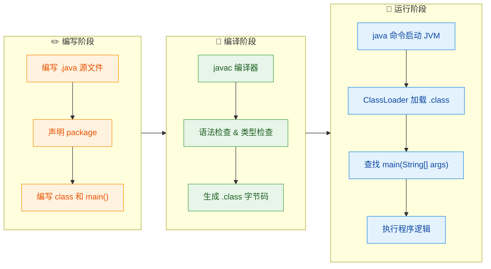
```mermaid
graph LR
    subgraph WRITE["✏️ 编写阶段"]
        direction TB
        W1["编写 .java 源文件"]
        W2["声明 package"]
        W3["编写 class 和 main()"]
        W1 --> W2 --> W3
    end

    subgraph COMPILE["🔨 编译阶段"]
        direction TB
        C1["javac 编译器"]
        C2["语法检查 & 类型检查"]
        C3["生成 .class 字节码"]
        C1 --> C2 --> C3
    end

    subgraph RUN["🚀 运行阶段"]
        direction TB
        R1["java 命令启动 JVM"]
        R2["ClassLoader 加载 .class"]
        R3["查找 main(String[] args)"]
        R4["执行程序逻辑"]
        R1 --> R2 --> R3 --> R4
    end

    WRITE --> COMPILE --> RUN

    classDef writeStyle fill:#FFF3E0,stroke:#FB8C00,color:#E65100
    classDef compileStyle fill:#E8F5E9,stroke:#43A047,color:#1B5E20
    classDef runStyle fill:#E3F2FD,stroke:#1E88E5,color:#0D47A1

    class W1,W2,W3 writeStyle
    class C1,C2,C3 compileStyle
    class R1,R2,R3,R4 runStyle
```

在编译阶段，`javac` 会做大量的检查工作：语法是否正确、类型是否匹配、引用的类是否存在等等。这也是 Java 作为静态类型语言的优势——很多错误在编译期就能被捕获，而不是等到运行时才爆炸。

在运行阶段，JVM 的 **ClassLoader（类加载器）** 会根据全限定类名（包名 + 类名）去对应的目录下查找 `.class` 文件，加载到内存中，然后查找并调用 `main` 方法。如果找不到 `main` 方法，或者签名不对，你会看到经典的错误信息：

```text
Error: Main method not found in class com.example.app.HelloWorld
```

### 一个完整的示例

把所有知识点整合到一个完整的、可运行的例子中：

```java
// ① 包声明：当前类属于 com.example.demo 包
package com.example.demo;

// ② 导入语句：引入 Arrays 工具类，后续章节会详细讲解
import java.util.Arrays;

// ③ 类定义：public 类，文件名必须是 Greeter.java
public class Greeter {

    // 静态常量：默认的问候语
    private static final String DEFAULT_GREETING = "Hello";

    // 实例变量：问候对象的名字
    private String name;

    // 构造方法：接收一个名字参数
    public Greeter(String name) {
        this.name = name;  // 将参数赋值给实例变量
    }

    // 实例方法：生成问候语
    public String greet() {
        // 使用静态常量和实例变量拼接字符串
        return DEFAULT_GREETING + ", " + name + "!";
    }

    // ④ main 方法：程序入口
    public static void main(String[] args) {
        // 打印命令行参数（如果有的话）
        System.out.println("Command line args: " + Arrays.toString(args));

        // 根据是否传入参数，决定问候谁
        String targetName;
        if (args.length > 0) {
            targetName = args[0];       // 使用第一个命令行参数
        } else {
            targetName = "World";       // 默认值
        }

        // 创建 Greeter 对象并调用 greet() 方法
        Greeter greeter = new Greeter(targetName);
        System.out.println(greeter.greet());
    }
}
```

运行效果：

```bash
# 不带参数运行
java com.example.demo.Greeter
# 输出：
# Command line args: []
# Hello, World!

# 带参数运行
java com.example.demo.Greeter Alice
# 输出：
# Command line args: [Alice]
# Hello, Alice!
```

### Java 21+ 的简化写法（Preview Feature）

值得一提的是，从 Java 21 开始，JEP 463 引入了**隐式声明的类和实例 main 方法（Implicitly Declared Classes and Instance Main Methods）** 作为预览特性。这意味着你可以写出极简的 Java 程序，不需要显式的类声明和 `public static` 修饰：

```java
// Java 21+ 预览特性，文件名：Hello.java
// 无需 class 声明，无需 public static
void main() {
    System.out.println("Hello, simplified Java!");
}
```

这个特性主要是为了降低初学者的入门门槛，让 Java 在教学场景中不再显得那么"仪式感"过重。但在生产代码中，完整的类结构仍然是标准做法。要使用这个特性，编译和运行时需要加上 `--enable-preview` 标志：

```bash
javac --enable-preview --release 21 Hello.java
java --enable-preview Hello
```

---

**📝 练习题**

以下 Java 源文件能否正确编译？如果不能，原因是什么？

```java
// 文件名：MyApp.java
package com.test;

public class App {
    public static void main(String[] args) {
        System.out.println("Running...");
    }
}
```

A. 能正确编译并运行，输出 "Running..."

B. 编译失败，因为 `public` 类名 `App` 与文件名 `MyApp.java` 不一致

C. 编译失败，因为 `package` 语句有误

D. 能编译但运行时报错，因为找不到 `main` 方法


**【答案】** B

**【解析】** Java 编译器强制要求：源文件中的 `public` 类的类名必须与文件名完全一致（区分大小写）。这里文件名是 `MyApp.java`，但 `public` 类名是 `App`，两者不匹配，`javac` 会直接报编译错误：`class App is public, should be declared in a file named App.java`。修复方式有两种：要么把文件重命名为 `App.java`，要么把类名改为 `MyApp`。这条规则的设计初衷是让编译器和开发者都能通过文件名快速定位到 `public` 类，提高代码的可发现性。

---

## 基本数据类型（Primitive Data Types）

Java 是一门强类型语言（Strongly Typed Language），这意味着每一个变量在使用前都必须声明其类型，编译器会在编译期严格检查类型安全。Java 提供了 **8 种基本数据类型（Primitive Types）**，它们不是对象，直接存储在栈内存（Stack）中，因此访问速度极快，是 Java 类型系统的基石。

理解这 8 种类型的内存占用、取值范围和默认值，是写出正确、高效 Java 代码的第一步。很多看似"诡异"的 Bug，追根溯源都是对基本类型理解不到位导致的。

---

### 八种基本数据类型总览

Java 的 8 种基本类型可以按照其存储的数据性质分为 **四大类**：整数类型、浮点类型、字符类型和布尔类型。

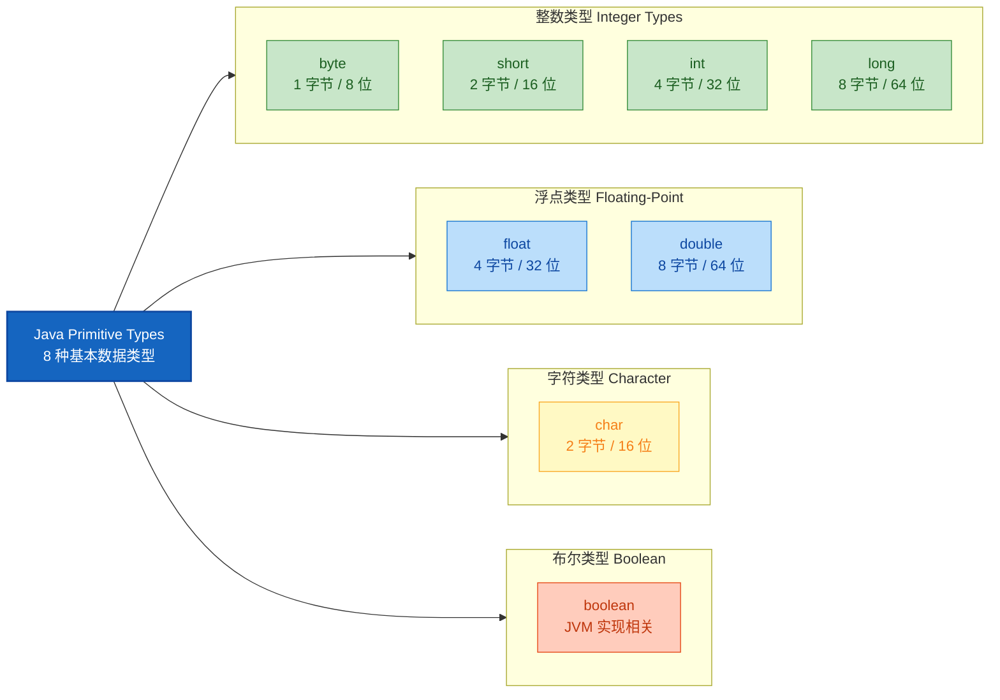
```mermaid
graph LR
    Root["Java Primitive Types<br/>8 种基本数据类型"]

    subgraph IntGroup["整数类型 Integer Types"]
        direction TB
        B1["byte<br/>1 字节 / 8 位"]
        B2["short<br/>2 字节 / 16 位"]
        B3["int<br/>4 字节 / 32 位"]
        B4["long<br/>8 字节 / 64 位"]
    end

    subgraph FloatGroup["浮点类型 Floating-Point"]
        direction TB
        F1["float<br/>4 字节 / 32 位"]
        F2["double<br/>8 字节 / 64 位"]
    end

    subgraph CharGroup["字符类型 Character"]
        direction TB
        C1["char<br/>2 字节 / 16 位"]
    end

    subgraph BoolGroup["布尔类型 Boolean"]
        direction TB
        D1["boolean<br/>JVM 实现相关"]
    end

    Root --> IntGroup
    Root --> FloatGroup
    Root --> CharGroup
    Root --> BoolGroup

    classDef rootStyle fill:#1565C0,stroke:#0D47A1,color:#FFFFFF,stroke-width:2px
    classDef intStyle fill:#C8E6C9,stroke:#388E3C,color:#1B5E20
    classDef floatStyle fill:#BBDEFB,stroke:#1976D2,color:#0D47A1
    classDef charStyle fill:#FFF9C4,stroke:#F9A825,color:#F57F17
    classDef boolStyle fill:#FFCCBC,stroke:#E64A19,color:#BF360C
    classDef groupStyle fill:#FAFAFA,stroke:#9E9E9E,color:#212121

    class Root rootStyle
    class B1,B2,B3,B4 intStyle
    class F1,F2 floatStyle
    class C1 charStyle
    class D1 boolStyle
```

下面这张表是你需要"刻进 DNA"的核心参考，面试和日常开发中反复会用到：

| 类型 | 关键字 | 位数 | 字节数 | 取值范围 | 默认值 | 典型用途 |
|------|--------|------|--------|----------|--------|----------|
| 字节型 | `byte` | 8 | 1 | -128 ~ 127 | `0` | 网络流、文件 I/O |
| 短整型 | `short` | 16 | 2 | -32,768 ~ 32,767 | `0` | 较少使用 |
| 整型 | `int` | 32 | 4 | -2³¹ ~ 2³¹-1（约 ±21 亿） | `0` | 最常用的整数类型 |
| 长整型 | `long` | 64 | 8 | -2⁶³ ~ 2⁶³-1 | `0L` | 时间戳、大数计算 |
| 单精度浮点 | `float` | 32 | 4 | ±3.4E+38（约 6~7 位有效数字） | `0.0f` | 图形运算、精度要求不高 |
| 双精度浮点 | `double` | 64 | 8 | ±1.7E+308（约 15~16 位有效数字） | `0.0d` | 科学计算、默认小数类型 |
| 字符型 | `char` | 16 | 2 | 0 ~ 65,535（Unicode） | `'\u0000'` | 单个字符存储 |
| 布尔型 | `boolean` | — | — | `true` / `false` | `false` | 条件判断 |

> 注意：`boolean` 的大小在 JVM 规范中并未严格定义。HotSpot 虚拟机中，单个 `boolean` 通常占 4 字节（当作 `int` 处理），而 `boolean[]` 数组中每个元素占 1 字节。

---

### 整数类型详解（byte, short, int, long）

#### 为什么取值范围是这样的？

Java 的整数类型全部采用 **二进制补码（Two's Complement）** 表示法。对于一个 n 位的有符号整数，最高位是符号位（0 正 1 负），所以：

- 最大值 = 2^(n-1) - 1
- 最小值 = -2^(n-1)

以 `byte` 为例，8 位补码的表示范围：

```java
// byte: 8 位有符号整数
// 最高位为符号位，剩余 7 位表示数值
// 最大值: 0111_1111 = 2^7 - 1 = 127
// 最小值: 1000_0000 = -2^7    = -128

byte max = Byte.MAX_VALUE;   // 127
byte min = Byte.MIN_VALUE;   // -128

// 为什么负数比正数多一个？
// 因为 0 占用了正数的一个编码位（0000_0000 表示 0）
// 而负数侧的 1000_0000 没有对应的正数，它被定义为 -128
```

补码的精妙之处在于：加法和减法可以用同一套电路完成，不需要额外处理符号位。这也是为什么几乎所有现代计算机都采用补码的原因。

#### int 是默认整数类型

在 Java 中，当你写下一个整数字面量（Integer Literal），比如 `42`，编译器默认将其视为 `int` 类型。这是一个非常重要的规则，直接影响到赋值和运算：

```java
// 整数字面量默认是 int 类型
int a = 100;          // 正常：int 字面量赋给 int 变量

// byte 和 short 的赋值：编译器会做范围检查
byte b = 100;         // 正常：100 在 byte 范围内，编译器允许隐式窄化
byte c = 200;         // 编译错误！200 超出 byte 范围 (-128~127)

// long 类型必须加 L 后缀（推荐大写 L，小写 l 容易和数字 1 混淆）
long timestamp = 1718899200000L;  // 正确：加了 L 后缀
// long wrong = 1718899200000;    // 编译错误！字面量超出 int 范围，必须加 L
```

#### 整数字面量的多种进制写法

Java 支持四种进制的整数字面量，在处理位运算、颜色值、权限掩码等场景时非常实用：

```java
// 十进制 (Decimal) —— 最常用
int decimal = 255;

// 二进制 (Binary) —— 以 0b 或 0B 开头（Java 7+）
int binary = 0b1111_1111;       // 等于 255

// 八进制 (Octal) —— 以 0 开头（容易误用，不推荐）
int octal = 0377;               // 等于 255

// 十六进制 (Hexadecimal) —— 以 0x 或 0X 开头
int hex = 0xFF;                 // 等于 255

// 下划线分隔符（Java 7+）—— 提高大数字可读性
int billion = 1_000_000_000;    // 十亿，等价于 1000000000
long creditCard = 1234_5678_9012_3456L;  // 模拟信用卡号格式
```

#### 整数溢出（Integer Overflow）

Java 的整数运算不会抛出异常，溢出时会 **静默回绕（Silent Wraparound）**，这是一个经典的坑：

```java
int max = Integer.MAX_VALUE;    // 2,147,483,647
int overflow = max + 1;         // -2,147,483,648（回绕到最小值！）

// 内存中发生了什么？
// 0111_1111_..._1111  (MAX_VALUE)
// +                 1
// = 1000_0000_..._0000  (MIN_VALUE，符号位翻转)

System.out.println(overflow);   // 输出: -2147483648

// 安全做法：使用 Math.addExact()（Java 8+），溢出时抛出 ArithmeticException
int safe = Math.addExact(max, 1);  // 抛出 ArithmeticException
```

```java
// 经典面试陷阱：循环中的溢出
// 下面这个循环会无限执行吗？
for (int i = Integer.MAX_VALUE - 1; i <= Integer.MAX_VALUE; i++) {
    // 当 i = MAX_VALUE 时，i++ 溢出变为 MIN_VALUE
    // MIN_VALUE <= MAX_VALUE 为 true，循环继续
    // 结果：死循环！
}
```

---

### 浮点类型详解（float, double）

#### IEEE 754 标准

Java 的浮点数遵循 **IEEE 754** 标准，这是全球通用的浮点数表示规范。一个浮点数由三部分组成：符号位（Sign）、指数位（Exponent）、尾数位（Mantissa/Fraction）。

```
float  (32 位): [1 位符号] [8 位指数]  [23 位尾数]
double (64 位): [1 位符号] [11 位指数] [52 位尾数]
```

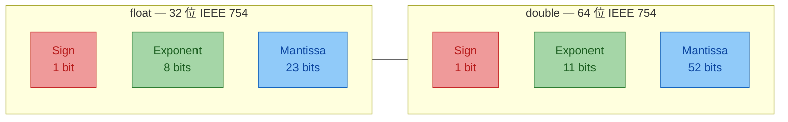
```mermaid
graph LR
    subgraph Float32["float — 32 位 IEEE 754"]
        direction TB
        FS["Sign<br/>1 bit"]
        FE["Exponent<br/>8 bits"]
        FM["Mantissa<br/>23 bits"]
    end

    subgraph Double64["double — 64 位 IEEE 754"]
        direction TB
        DS["Sign<br/>1 bit"]
        DE["Exponent<br/>11 bits"]
        DM["Mantissa<br/>52 bits"]
    end

    Float32 --- Double64

    classDef signStyle fill:#EF9A9A,stroke:#C62828,color:#B71C1C
    classDef expStyle fill:#A5D6A7,stroke:#2E7D32,color:#1B5E20
    classDef manStyle fill:#90CAF9,stroke:#1565C0,color:#0D47A1
    classDef groupStyle fill:#FAFAFA,stroke:#757575,color:#212121

    class FS,DS signStyle
    class FE,DE expStyle
    class FM,DM manStyle
```

#### double 是默认浮点类型

与整数类似，浮点字面量（如 `3.14`）默认是 `double` 类型：

```java
// 浮点字面量默认是 double
double pi = 3.141592653589793;   // 正常

// float 必须加 f 或 F 后缀
float piFloat = 3.14f;           // 正确
// float wrong = 3.14;           // 编译错误！double 不能隐式转为 float

// 科学计数法
double avogadro = 6.022e23;     // 6.022 × 10^23
float planck = 6.626e-34f;      // 6.626 × 10^-34
```

#### 浮点精度问题（最重要的坑）

这是 Java 开发中最经典、最容易踩的坑之一。浮点数无法精确表示大多数十进制小数，因为它们在二进制中是无限循环的：

```java
// 经典问题：0.1 + 0.2 != 0.3
System.out.println(0.1 + 0.2);           // 输出: 0.30000000000000004
System.out.println(0.1 + 0.2 == 0.3);    // 输出: false

// 为什么？
// 0.1 的二进制表示: 0.0001100110011001100... (无限循环)
// 0.2 的二进制表示: 0.0011001100110011001... (无限循环)
// 存储时被截断，累积了微小误差
```

```java
// 金融计算中绝对不能用 float/double！
// 错误示范：
double price = 0.10;       // 商品单价
double total = price * 3;  // 期望 0.30
System.out.println(total);  // 0.30000000000000004 —— 多收了客户的钱！

// 正确做法：使用 BigDecimal
import java.math.BigDecimal;

// 注意：必须用 String 构造器，不要用 double 构造器
BigDecimal bdPrice = new BigDecimal("0.10");       // 精确的 0.10
BigDecimal bdTotal = bdPrice.multiply(new BigDecimal("3")); // 精确的 0.30
System.out.println(bdTotal);  // 0.30 —— 完美
```

#### 浮点特殊值

IEEE 754 定义了几个特殊值，在数学运算的边界情况下会出现：

```java
// 正无穷和负无穷
double posInf = 1.0 / 0.0;               // Infinity
double negInf = -1.0 / 0.0;              // -Infinity
System.out.println(Double.POSITIVE_INFINITY);  // Infinity
System.out.println(Double.NEGATIVE_INFINITY);  // -Infinity

// NaN (Not a Number) —— 未定义的运算结果
double nan = 0.0 / 0.0;                  // NaN
double nanSqrt = Math.sqrt(-1);          // NaN

// NaN 的诡异特性：它不等于任何值，包括它自己！
System.out.println(nan == nan);           // false !!!
System.out.println(Double.isNaN(nan));    // true（正确的判断方式）

// 无穷大的运算
System.out.println(posInf + 1);           // Infinity（无穷大加任何有限数还是无穷大）
System.out.println(posInf + negInf);      // NaN（正无穷加负无穷未定义）
System.out.println(posInf * 0);           // NaN
```

#### 浮点比较的正确姿势

既然浮点数有精度问题，那如何正确比较两个浮点数是否"相等"？

```java
double a = 0.1 + 0.2;  // 0.30000000000000004
double b = 0.3;         // 0.3

// 错误：直接用 == 比较
if (a == b) { /* 永远不会执行 */ }

// 正确方式一：使用 epsilon（容差）比较
final double EPSILON = 1e-10;  // 定义一个极小的容差值
if (Math.abs(a - b) < EPSILON) {
    System.out.println("近似相等");  // 会执行
}

// 正确方式二：使用 Double.compare()
if (Double.compare(a, b) == 0) {
    // 注意：这个方法也是精确比较，不解决精度问题
    // 但它能正确处理 NaN 和 -0.0 的比较
}

// 正确方式三：BigDecimal（金融场景首选）
BigDecimal bdA = new BigDecimal("0.1").add(new BigDecimal("0.2"));
BigDecimal bdB = new BigDecimal("0.3");
System.out.println(bdA.compareTo(bdB) == 0);  // true
```

---

### 字符类型详解（char）

#### Unicode 与 char

Java 的 `char` 类型占 2 字节（16 位），采用 **UTF-16** 编码，可以表示 Unicode 基本多语言平面（BMP, Basic Multilingual Plane）中的所有字符，范围是 `\u0000` 到 `\uFFFF`（0 ~ 65535）。

```java
// char 的多种赋值方式
char letter = 'A';            // 字符字面量
char unicode = '\u0041';      // Unicode 转义，也是 'A'
char number = 65;             // 整数赋值，ASCII 码 65 = 'A'
char chinese = '中';          // 中文字符，完全支持

// char 本质上是一个无符号 16 位整数
System.out.println((int) 'A');     // 65
System.out.println((int) '中');    // 20013

// 字符运算（char 参与运算时自动提升为 int）
char c1 = 'A';
// char c2 = c1 + 1;   // 编译错误！c1 + 1 的结果是 int
char c2 = (char)(c1 + 1);  // 正确：强制转换回 char，得到 'B'
int  c3 = c1 + 1;          // 正确：用 int 接收，得到 66
```

#### 常用转义字符

```java
char newline   = '\n';    // 换行符 (Line Feed)
char tab       = '\t';    // 制表符 (Tab)
char backslash = '\\';    // 反斜杠本身
char quote     = '\'';    // 单引号
char dblQuote  = '\"';    // 双引号
char nullChar  = '\0';    // 空字符 (Null Character)
char carriageR = '\r';    // 回车符 (Carriage Return)
```

#### 超出 BMP 的字符（Supplementary Characters）

Unicode 的完整范围远超 16 位能表示的 65536 个字符。Emoji、部分古文字等位于 **增补平面（Supplementary Planes）**，码点超过 `\uFFFF`，一个 `char` 装不下，需要用 **代理对（Surrogate Pair）** 表示：

```java
// 𝄞 (音乐符号 MUSICAL SYMBOL G CLEF)，码点 U+1D11E
// 一个 char 装不下，需要两个 char（代理对）
String musicNote = "𝄞";
System.out.println(musicNote.length());      // 2（两个 char 单元）
System.out.println(musicNote.codePointCount(0, musicNote.length())); // 1（一个逻辑字符）

// 正确遍历包含增补字符的字符串
String text = "Hello 𝄞 World";
// 错误方式：charAt 会拆散代理对
// 正确方式：使用 codePoints()
text.codePoints().forEach(cp -> {
    System.out.print(new String(Character.toChars(cp)));  // 逐个码点输出
});
```

---

### 布尔类型详解（boolean）

#### 基本用法

`boolean` 是 Java 中最简单的类型，只有两个值：`true` 和 `false`。它主要用于条件判断和逻辑控制。

```java
boolean isActive = true;     // 布尔字面量
boolean isValid = false;

// 用于条件控制
if (isActive) {
    System.out.println("激活状态");
}

// 布尔表达式
boolean result = (10 > 5);   // true
boolean both = isActive && isValid;  // false（逻辑与）
```

#### Java 的 boolean 不是 0 和 1

这是 Java 与 C/C++ 的一个关键区别。在 C 语言中，0 表示 false，非 0 表示 true。但在 Java 中，`boolean` 和整数之间 **完全不能互换**：

```java
// 在 C/C++ 中合法，在 Java 中全部编译错误：
// boolean b = 1;           // 错误！不能把 int 赋给 boolean
// boolean b = 0;           // 错误！
// if (1) { ... }           // 错误！if 条件必须是 boolean
// int x = true;            // 错误！不能把 boolean 赋给 int

// Java 的严格类型检查避免了 C 语言中经典的 if (x = 0) 误写 Bug
int x = 5;
// if (x = 0) { ... }      // Java 编译错误！赋值表达式结果是 int，不是 boolean
if (x == 0) { /* ... */ }   // 正确：== 比较返回 boolean
```

#### boolean 的内存占用之谜

JVM 规范（The Java Virtual Machine Specification）中并没有为 `boolean` 定义专门的字节码指令。在 HotSpot JVM 的实际实现中：

```java
// 单个 boolean 变量：通常占 4 字节
// JVM 内部将 boolean 当作 int 处理（使用 iconst_0 / iconst_1 指令）
boolean flag = true;   // 实际占用 4 字节（与 int 相同）

// boolean 数组：每个元素占 1 字节
// JVM 使用 baload/bastore 指令（与 byte 数组相同）
boolean[] flags = new boolean[10];  // 每个元素 1 字节
```

这看起来有些浪费，但这是 JVM 为了对齐和性能做出的权衡。如果你需要存储大量布尔标志，可以考虑使用 `BitSet`，它每个标志只占 1 位。

---

### 默认值规则

基本类型的默认值只在作为 **类的成员变量（Instance/Static Fields）** 时生效。局部变量没有默认值，必须显式初始化后才能使用：

```java
public class DefaultValueDemo {
    // 成员变量 —— 有默认值
    static byte    sByte;      // 0
    static short   sShort;     // 0
    static int     sInt;       // 0
    static long    sLong;      // 0L
    static float   sFloat;     // 0.0f
    static double  sDouble;    // 0.0d
    static char    sChar;      // '\u0000'（空字符，打印为空白）
    static boolean sBoolean;   // false

    public static void main(String[] args) {
        // 成员变量可以直接使用，有默认值
        System.out.println(sInt);      // 输出: 0
        System.out.println(sBoolean);  // 输出: false

        // 局部变量 —— 没有默认值，必须初始化
        int localVar;
        // System.out.println(localVar);  // 编译错误！变量未初始化
        localVar = 42;                    // 初始化后才能使用
        System.out.println(localVar);     // 输出: 42
    }
}
```

为什么 Java 要这样设计？成员变量在堆内存中分配，JVM 会统一将内存区域清零（Zero-Fill），所以自然有默认值。而局部变量在栈帧中分配，为了性能不做清零操作，因此编译器强制要求程序员显式初始化，避免使用未定义的"垃圾值"。

---

### 类型占用的内存模型

下面用一张图直观展示 8 种基本类型在内存中的"体积"对比：

```java
// 内存占用对比（单位：字节）
//
// byte     [■]                          1 字节
// short    [■■]                         2 字节
// char     [■■]                         2 字节
// int      [■■■■]                       4 字节
// float    [■■■■]                       4 字节
// long     [■■■■■■■■]                   8 字节
// double   [■■■■■■■■]                   8 字节
// boolean  [■■■■] (JVM 实现，通常 4 字节)
//
// 栈帧 (Stack Frame) 中的局部变量表：
// ┌────────┬────────┬────────┬────────┐
// │ slot 0 │ slot 1 │ slot 2 │ slot 3 │  每个 slot 4 字节
// │  int a │float b │      long c     │  long/double 占 2 个 slot
// └────────┴────────┴────────┴────────┘
```

---

### 实战：类型选择指南

在实际开发中，如何选择合适的基本类型？

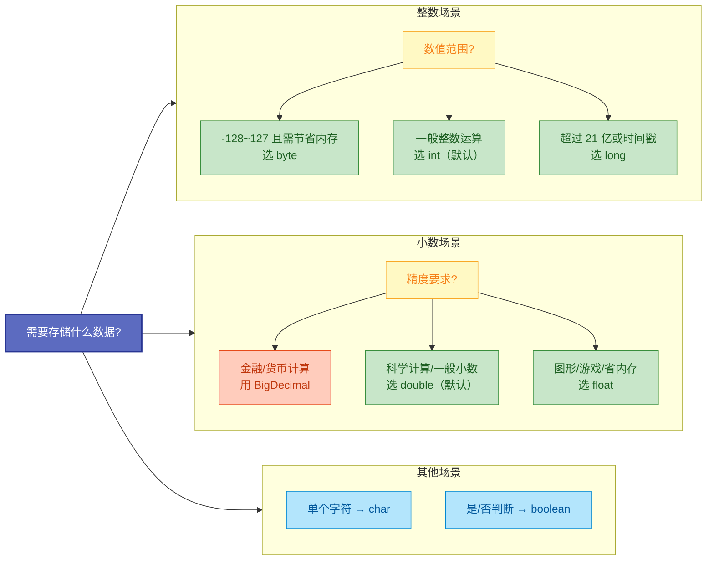
```mermaid
graph LR
    Start["需要存储什么数据?"]

    subgraph IntChoice["整数场景"]
        direction TB
        Q1["数值范围?"]
        A1["-128~127 且需节省内存<br/>选 byte"]
        A2["一般整数运算<br/>选 int（默认）"]
        A3["超过 21 亿或时间戳<br/>选 long"]
        Q1 --> A1
        Q1 --> A2
        Q1 --> A3
    end

    subgraph FloatChoice["小数场景"]
        direction TB
        Q2["精度要求?"]
        B1["金融/货币计算<br/>用 BigDecimal"]
        B2["科学计算/一般小数<br/>选 double（默认）"]
        B3["图形/游戏/省内存<br/>选 float"]
        Q2 --> B1
        Q2 --> B2
        Q2 --> B3
    end

    subgraph OtherChoice["其他场景"]
        direction TB
        C1["单个字符 → char"]
        C2["是/否判断 → boolean"]
    end

    Start --> IntChoice
    Start --> FloatChoice
    Start --> OtherChoice

    classDef startStyle fill:#5C6BC0,stroke:#283593,color:#FFFFFF,stroke-width:2px
    classDef questionStyle fill:#FFF9C4,stroke:#F9A825,color:#F57F17
    classDef answerStyle fill:#C8E6C9,stroke:#388E3C,color:#1B5E20
    classDef warnStyle fill:#FFCCBC,stroke:#E64A19,color:#BF360C
    classDef otherStyle fill:#B3E5FC,stroke:#0288D1,color:#01579B

    class Start startStyle
    class Q1,Q2 questionStyle
    class A1,A2,A3,B2,B3 answerStyle
    class B1 warnStyle
    class C1,C2 otherStyle
```

简单总结：
- 整数优先用 `int`，超范围用 `long`
- 小数优先用 `double`，涉及钱用 `BigDecimal`
- `byte` 主要在 I/O 和网络编程中使用
- `short` 在现代 Java 开发中很少直接使用
- `float` 在 Android 开发和图形编程中偶尔使用

---

**📝 练习题**

以下代码的输出结果是什么？

```java
public class Quiz {
    public static void main(String[] args) {
        float f = 0.1f;
        double d = 0.1;
        System.out.println(f == d);
        System.out.println((double) f);
    }
}
```

A. `true` 和 `0.1`


B. `false` 和 `0.1`


C. `true` 和 `0.10000000149011612`


D. `false` 和 `0.10000000149011612`


**【答案】** D

**【解析】** `0.1f` 是 32 位浮点数，`0.1` 是 64 位浮点数，它们在二进制中都无法精确表示 0.1，但精度不同，存储的近似值也

---

## 包装类型（Wrapper Types）

Java 是一门面向对象的语言，但它保留了 8 种基本数据类型（primitive types）以追求性能。问题随之而来：泛型容器（如 `List<T>`）、反射、序列化等机制只能操作对象（Object），无法直接容纳 `int`、`double` 这样的原始值。为了弥合这道裂缝，Java 为每种基本类型都提供了一个对应的 **包装类（Wrapper Class）**，它们位于 `java.lang` 包下，是不可变（immutable）且 final 的引用类型。

| 基本类型 | 包装类 | 继承关系 |
|----------|---------|----------|
| `byte` | `Byte` | extends `Number` |
| `short` | `Short` | extends `Number` |
| `int` | `Integer` | extends `Number` |
| `long` | `Long` | extends `Number` |
| `float` | `Float` | extends `Number` |
| `double` | `Double` | extends `Number` |
| `char` | `Character` | extends `Object` |
| `boolean` | `Boolean` | extends `Object` |

其中 6 种数值类型都继承自抽象类 `Number`，它提供了 `intValue()`、`doubleValue()` 等统一的数值转换方法。`Character` 和 `Boolean` 则直接继承 `Object`。

理解包装类型的关键在于三件事：**自动装箱/拆箱的语法糖背后发生了什么**、**缓存机制如何影响 `==` 比较**、以及 **拆箱遇到 `null` 时的 NPE 陷阱**。下面逐一展开。

---

### 自动装箱与拆箱（Autoboxing & Unboxing）

在 Java 5 之前，基本类型和包装类型之间的转换必须手动完成，代码非常繁琐：

```java
// Java 5 之前：手动装箱与拆箱
Integer wrapped = Integer.valueOf(42);   // 手动装箱：int → Integer
int primitive = wrapped.intValue();       // 手动拆箱：Integer → int

List list = new ArrayList();
list.add(Integer.valueOf(10));            // 必须手动包装才能放入容器
int val = ((Integer) list.get(0)).intValue(); // 取出后还要手动拆箱
```

Java 5 引入了 **自动装箱（Autoboxing）** 和 **自动拆箱（Unboxing）**，编译器会在编译期自动插入 `valueOf()` 和 `xxxValue()` 调用，让你可以在基本类型和包装类型之间无缝赋值：

```java
// Java 5+：自动装箱与拆箱
Integer wrapped = 42;        // 编译器自动转换为 Integer.valueOf(42)
int primitive = wrapped;      // 编译器自动转换为 wrapped.intValue()

List<Integer> list = new ArrayList<>();
list.add(10);                 // 自动装箱：int 10 → Integer.valueOf(10)
int val = list.get(0);        // 自动拆箱：Integer → int
```

这看起来很方便，但你必须清楚：**这只是语法糖，不是魔法**。编译器在背后做的事情完全等价于手动调用。我们可以通过反编译 bytecode 来验证这一点。

下面这段代码：

```java
public class AutoboxDemo {
    public static void main(String[] args) {
        Integer a = 100;       // 自动装箱
        int b = a;             // 自动拆箱
        Integer c = a + 10;    // 先拆箱做加法，再装箱存结果
    }
}
```

编译后用 `javap -c AutoboxDemo` 查看字节码，关键指令如下：

```text
// Integer a = 100;
bipush 100                          // 将常量 100 压入操作数栈
invokestatic Integer.valueOf:(I)Ljava/lang/Integer;  // 调用 valueOf 装箱

// int b = a;
invokevirtual Integer.intValue:()I  // 调用 intValue 拆箱

// Integer c = a + 10;
invokevirtual Integer.intValue:()I  // 先拆箱 a
bipush 10                           // 压入 10
iadd                                // 执行 int 加法
invokestatic Integer.valueOf:(I)Ljava/lang/Integer;  // 结果再装箱
```

这揭示了一个重要的性能细节：**混合运算会触发反复的装箱拆箱**。在循环中如果不小心使用了包装类型做累加，会产生大量临时对象：

```java
// ❌ 反面示例：循环中使用 Integer 累加
Long sum = 0L;  // 包装类型
for (long i = 0; i < 1_000_000; i++) {
    // 每次循环：sum 拆箱 → long 加法 → 结果装箱为新 Long 对象
    sum += i;   // 产生约 100 万个临时 Long 对象！
}

// ✅ 正确做法：循环内用基本类型
long sum = 0L;  // 基本类型，零对象开销
for (long i = 0; i < 1_000_000; i++) {
    sum += i;   // 纯栈上 long 加法，无装箱
}
```

自动装箱/拆箱发生的完整场景总结：

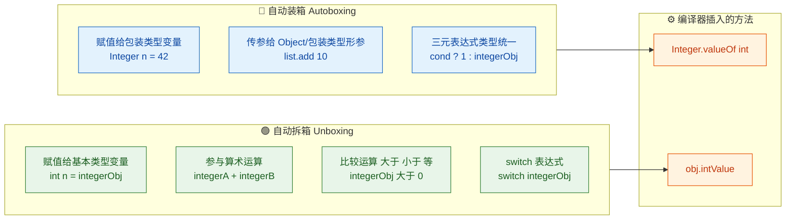
```mermaid
graph LR
    subgraph 装箱场景["🔵 自动装箱 Autoboxing"]
        direction TB
        B1["赋值给包装类型变量\nInteger n = 42"]
        B2["传参给 Object/包装类型形参\nlist.add 10"]
        B3["三元表达式类型统一\ncond ? 1 : integerObj"]
    end

    subgraph 拆箱场景["🟢 自动拆箱 Unboxing"]
        direction TB
        U1["赋值给基本类型变量\nint n = integerObj"]
        U2["参与算术运算\nintegerA + integerB"]
        U3["比较运算 大于 小于 等\nintegerObj 大于 0"]
        U4["switch 表达式\nswitch integerObj"]
    end

    subgraph 底层调用["⚙️ 编译器插入的方法"]
        direction TB
        M1["Integer.valueOf int"]
        M2["obj.intValue"]
    end

    装箱场景 --> M1
    拆箱场景 --> M2

    classDef boxStyle fill:#E3F2FD,stroke:#1565C0,color:#0D47A1
    classDef unboxStyle fill:#E8F5E9,stroke:#2E7D32,color:#1B5E20
    classDef mechStyle fill:#FFF3E0,stroke:#E65100,color:#BF360C

    class B1,B2,B3 boxStyle
    class U1,U2,U3,U4 unboxStyle
    class M1,M2 mechStyle
```

---

### 缓存机制（Cache Pool）与 `==` 陷阱

这是 Java 面试中出镜率最高的知识点之一。先看一段经典代码：

```java
Integer a = 127;    // Integer.valueOf(127)
Integer b = 127;    // Integer.valueOf(127)
System.out.println(a == b);   // true ✅

Integer c = 128;    // Integer.valueOf(128)
Integer d = 128;    // Integer.valueOf(128)
System.out.println(c == d);   // false ❌
```

同样是自动装箱，为什么 127 比较是 `true`，128 就变成 `false` 了？答案藏在 `Integer.valueOf()` 的源码里：

```java
// JDK Integer.valueOf 源码（简化版）
public static Integer valueOf(int i) {
    // 如果 i 在缓存范围内，直接返回缓存中的同一个对象
    if (i >= IntegerCache.low && i <= IntegerCache.high) {
        return IntegerCache.cache[i + (-IntegerCache.low)];
    }
    // 超出范围，每次 new 一个新对象
    return new Integer(i);
}
```

`IntegerCache` 是 `Integer` 的一个私有静态内部类，在类加载时就预先创建好了一个 `Integer` 对象数组：

```java
// IntegerCache 内部类（简化版）
private static class IntegerCache {
    static final int low = -128;                // 下界固定
    static final int high;                       // 上界可配置
    static final Integer[] cache;                // 缓存数组

    static {
        int h = 127;  // 默认上界
        // 可通过 JVM 参数 -XX:AutoBoxCacheMax=<size> 调整上界
        String integerCacheHighPropValue =
            VM.getSavedProperty("java.lang.Integer.IntegerCache.high");
        if (integerCacheHighPropValue != null) {
            int i = parseInt(integerCacheHighPropValue);
            // 上界至少为 127
            i = Math.max(i, 127);
            // 上界不能超过 Integer.MAX_VALUE 的安全范围
            h = Math.min(i, Integer.MAX_VALUE - (-low) - 1);
        }
        high = h;

        // 创建缓存数组并填充
        cache = new Integer[(high - low) + 1];
        int j = low;
        for (int k = 0; k < cache.length; k++) {
            cache[k] = new Integer(j++);  // 预创建对象
        }
    }
}
```

用内存模型图来理解缓存命中与未命中的区别：

```java
// 缓存命中：a 和 b 指向缓存池中的同一个 Integer 对象
//
//  栈 (Stack)              堆 (Heap) - IntegerCache.cache[]
//  ┌──────────┐           ┌─────────────────────────────────┐
//  │ a (ref)  │ ────────► │ cache[255] = Integer(127)       │
//  ├──────────┤           │   value: 127                    │
//  │ b (ref)  │ ────────► │   (同一个对象，地址相同)          │
//  └──────────┘           └─────────────────────────────────┘
//  a == b  →  true（引用相同）

// 缓存未命中：c 和 d 各自 new 了不同的 Integer 对象
//
//  栈 (Stack)              堆 (Heap)
//  ┌──────────┐           ┌──────────────────┐
//  │ c (ref)  │ ────────► │ Integer@0x1A2B   │
//  │          │           │   value: 128     │
//  ├──────────┤           └──────────────────┘
//  │ d (ref)  │ ────────► ┌──────────────────┐
//  │          │           │ Integer@0x3C4D   │
//  └──────────┘           │   value: 128     │
//                         └──────────────────┘
//  c == d  →  false（引用不同，虽然 value 相同）
```

各包装类型的缓存范围汇总：

| 包装类 | 缓存范围 | 是否可配置 |
|--------|----------|-----------|
| `Byte` | -128 ~ 127（全部值） | 否（已覆盖全部） |
| `Short` | -128 ~ 127 | 否 |
| `Integer` | -128 ~ 127（默认） | 是，`-XX:AutoBoxCacheMax=N` |
| `Long` | -128 ~ 127 | 否 |
| `Character` | 0 ~ 127 | 否 |
| `Boolean` | `TRUE` / `FALSE`（仅两个实例） | 否（天然全缓存） |
| `Float` | 无缓存 | — |
| `Double` | 无缓存 | — |

`Float` 和 `Double` 没有缓存，因为浮点数在任意范围内都有无穷多个值，缓存没有意义。所以 `Float` 和 `Double` 的 `valueOf()` 每次都会 `new` 新对象：

```java
Double x = 1.0;
Double y = 1.0;
System.out.println(x == y);  // false，永远是不同对象
```

**黄金法则：比较包装类型的值，永远使用 `.equals()`，不要用 `==`。**

```java
Integer a = 200;
Integer b = 200;

// ❌ 危险：== 比较的是引用地址
System.out.println(a == b);        // false

// ✅ 正确：equals 比较的是内部 int 值
System.out.println(a.equals(b));   // true

// ✅ Java 7+ 推荐：空安全的工具方法
System.out.println(Objects.equals(a, b));  // true，且任一方为 null 也不会 NPE
```

---

### 拆箱与 NullPointerException

自动拆箱最危险的地方在于：**如果包装类型变量为 `null`，拆箱时会抛出 `NullPointerException`**。因为编译器插入的是 `null.intValue()` 这样的调用，而你无法对 `null` 调用任何方法。

```java
// 场景 1：直接赋值拆箱
Integer nullInteger = null;
int value = nullInteger;  // 💥 NullPointerException: null.intValue()

// 场景 2：方法返回值拆箱
public static Integer findById(int id) {
    // 查询数据库，未找到时返回 null
    return null;
}
int result = findById(999);  // 💥 NPE

// 场景 3：Map.get() 返回 null 后拆箱
Map<String, Integer> scores = new HashMap<>();
int score = scores.get("Alice");  // key 不存在 → get 返回 null → 💥 NPE

// 场景 4：三元表达式中的隐式拆箱（最隐蔽！）
Integer a = null;
int b = 10;
// 编译器为统一类型，会将 a 拆箱为 int
int result = (true) ? a : b;  // 💥 NPE！a 被拆箱
```

场景 4 特别值得注意。三元表达式 `condition ? expr1 : expr2` 中，如果一个分支是 `Integer`，另一个是 `int`，编译器会按照 JLS（Java Language Specification）的规则将 `Integer` 拆箱为 `int` 来统一类型。如果那个 `Integer` 恰好是 `null`，就会在你完全意想不到的地方爆出 NPE。

防御策略：

```java
// 策略 1：拆箱前显式判空
Integer wrapped = getValueFromSomewhere();
int value = (wrapped != null) ? wrapped : 0;  // 提供默认值

// 策略 2：使用 Optional（Java 8+）
OptionalInt opt = OptionalInt.of(42);
int value = opt.orElse(0);  // 安全获取，无 NPE 风险

// 策略 3：使用 Objects.requireNonNullElse（Java 9+）
Integer wrapped = null;
int value = Objects.requireNonNullElse(wrapped, 0);  // 返回 0

// 策略 4：Map 操作使用 getOrDefault
Map<String, Integer> scores = new HashMap<>();
int score = scores.getOrDefault("Alice", 0);  // key 不存在时返回默认值 0
```

---

### 包装类型的不可变性（Immutability）

所有包装类都是 **不可变的（immutable）**。以 `Integer` 为例，它的 `value` 字段被声明为 `private final`：

```java
public final class Integer extends Number implements Comparable<Integer> {
    private final int value;  // 一旦构造完成，永远不可修改

    // 没有 setValue() 方法，没有任何途径修改 value
}
```

这意味着每次对包装类型变量做"修改"操作，实际上都是创建了一个新对象：

```java
Integer x = 10;       // x → Integer(10)
x += 5;               // 等价于 x = Integer.valueOf(x.intValue() + 5)
                       // x 现在指向一个全新的 Integer(15) 对象
                       // 原来的 Integer(10) 如果没有其他引用，将被 GC 回收
```

不可变性带来的好处是线程安全——多个线程可以安全地共享同一个 `Integer` 对象而无需同步。这也是缓存机制能够成立的前提：如果 `Integer` 是可变的，共享缓存对象就会导致灾难。

---

### 构造方式对比：`valueOf()` vs `new`（已废弃）

从 Java 9 开始，所有包装类的构造器（如 `new Integer(42)`）都被标记为 `@Deprecated`，在 Java 16 中进一步标记为 `forRemoval = true`。原因很简单：`new` 每次都会在堆上创建新对象，完全绕过了缓存机制。

```java
// ❌ 已废弃：每次 new 都创建新对象，浪费内存
Integer a = new Integer(127);  // @Deprecated since Java 9
Integer b = new Integer(127);
System.out.println(a == b);    // false（两个不同对象）

// ✅ 推荐：valueOf 会利用缓存
Integer c = Integer.valueOf(127);  // 从缓存返回
Integer d = Integer.valueOf(127);  // 从缓存返回同一个对象
System.out.println(c == d);        // true
```

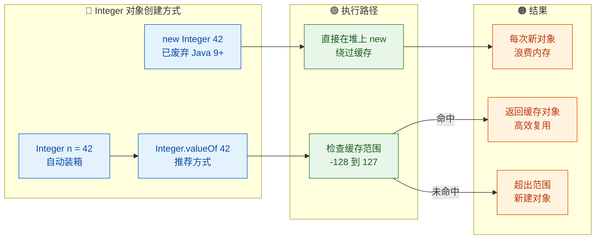
```mermaid
graph LR
    subgraph 创建方式["🔵 Integer 对象创建方式"]
        direction TB
        NEW["new Integer 42\n已废弃 Java 9+"]
        VOF["Integer.valueOf 42\n推荐方式"]
        AUTO["Integer n = 42\n自动装箱"]
    end

    subgraph 执行路径["🟢 执行路径"]
        direction TB
        HEAP["直接在堆上 new\n绕过缓存"]
        CHECK["检查缓存范围\n-128 到 127"]
    end

    subgraph 结果["🟠 结果"]
        direction TB
        NEWOBJ["每次新对象\n浪费内存"]
        CACHED["返回缓存对象\n高效复用"]
        NEWOBJ2["超出范围\n新建对象"]
    end

    NEW --> HEAP
    VOF --> CHECK
    AUTO --> VOF

    HEAP --> NEWOBJ
    CHECK -->|命中| CACHED
    CHECK -->|未命中| NEWOBJ2

    classDef blueStyle fill:#E3F2FD,stroke:#1565C0,color:#0D47A1
    classDef greenStyle fill:#E8F5E9,stroke:#2E7D32,color:#1B5E20
    classDef orangeStyle fill:#FFF3E0,stroke:#E65100,color:#BF360C

    class NEW,VOF,AUTO blueStyle
    class HEAP,CHECK greenStyle
    class NEWOBJ,CACHED,NEWOBJ2 orangeStyle
```

---

### 实用工具方法

包装类不仅仅是基本类型的"对象壳"，它们还提供了大量实用的静态方法：

```java
// ========== 字符串解析 ==========
int a = Integer.parseInt("42");          // 字符串 → int（基本类型）
Integer b = Integer.valueOf("42");       // 字符串 → Integer（包装类型）
int c = Integer.parseInt("FF", 16);      // 十六进制解析 → 255
int d = Integer.parseInt("1010", 2);     // 二进制解析 → 10

// ========== 进制转换 ==========
String bin = Integer.toBinaryString(42);  // "101010"
String oct = Integer.toOctalString(42);   // "52"
String hex = Integer.toHexString(42);     // "2a"

// ========== 位操作 ==========
int bits = Integer.bitCount(42);          // 二进制中 1 的个数 → 3
int high = Integer.highestOneBit(42);     // 最高位的 1 → 32
int zeros = Integer.numberOfLeadingZeros(42);  // 前导零个数 → 26
int reversed = Integer.reverse(42);       // 按位翻转

// ========== 比较与边界 ==========
int cmp = Integer.compare(10, 20);        // 比较两个 int，避免溢出
int max = Integer.MAX_VALUE;              // 2147483647 (2^31 - 1)
int min = Integer.MIN_VALUE;              // -2147483648 (-2^31)

// ========== Java 8+ 无符号操作 ==========
// 将 int 当作无符号数处理
int unsigned = Integer.parseUnsignedInt("4294967295");  // 无符号最大值
String uStr = Integer.toUnsignedString(unsigned);       // "4294967295"
int uDiv = Integer.divideUnsigned(-1, 2);               // 无符号除法 → 2147483647
```

---

### 包装类型使用场景决策

什么时候该用基本类型，什么时候该用包装类型？这是一个实际开发中经常需要权衡的问题：


```mermaid
graph LR
    subgraph 使用基本类型["🟢 使用基本类型 primitive"]
        direction TB
        P1["局部变量与循环计数器"]
        P2["数学密集型计算"]
        P3["方法参数和返回值\n确定非空时"]
        P4["数组元素\nint 数组 优于 Integer 数组"]
    end

    subgraph 使用包装类型["🔵 使用包装类型 Wrapper"]
        direction TB
        W1["泛型集合元素\nList 和 Map 的值"]
        W2["需要表达 null 语义\n如数据库字段可为空"]
        W3["反射和序列化场景"]
        W4["作为 Map 的 key"]
    end

    subgraph 核心差异["🟠 核心差异"]
        direction TB
        D1["内存：基本类型在栈上\n包装类型在堆上"]
        D2["默认值：int 默认 0\nInteger 默认 null"]
        D3["比较：基本类型用 ==\n包装类型用 equals"]
    end

    使用基本类型 --- 核心差异
    核心差异 --- 使用包装类型

    classDef greenStyle fill:#E8F5E9,stroke:#2E7D32,color:#1B5E20
    classDef blueStyle fill:#E3F2FD,stroke:#1565C0,color:#0D47A1
    classDef orangeStyle fill:#FFF3E0,stroke:#E65100,color:#BF360C

    class P1,P2,P3,P4 greenStyle
    class W1,W2,W3,W4 blueStyle
    class D1,D2,D3 orangeStyle
```

一个特别值得强调的场景是 **POJO 类（如数据库实体）的字段类型选择**。阿里巴巴 Java 开发手册明确规定：POJO 类属性必须使用包装类型。原因是基本类型有默认值（`int` 默认 `0`），无法区分"值为 0"和"值未设置"这两种语义。而数据库字段可能为 `NULL`，用 `Integer` 才能正确映射：

```java
// ❌ 基本类型：无法区分 "成绩为0" 和 "未参加考试"
public class Student {
    private int score;  // 默认值 0，语义模糊
}

// ✅ 包装类型：null 表示未参加考试，0 表示考了0分
public class Student {
    private Integer score;  // null = 未参加，0 = 考了0分
}
```

---

**📝 练习题**

以下代码的输出结果是什么？

```java
Integer a = 100;
Integer b = 100;
Integer c = 200;
Integer d = 200;

System.out.println(a == b);
System.out.println(c == d);
System.out.println(c.equals(d));
```

A. true, true, true

B. true, false, true

C. false, false, true

D. true, false, false


**【答案】** B

**【解析】** `a == b` 为 `true`，因为 100 在 `Integer` 缓存范围 [-128, 127] 内，`Integer.valueOf(100)` 两次返回的是缓存池中的同一个对象，引用地址相同。`c == d` 为 `false`，因为 200 超出了缓存范围，`Integer.valueOf(200)` 每次都会 `new` 一个新的 `Integer` 对象，两个引用指向堆上不同的对象。`c.equals(d)` 为 `true`，因为 `Integer.equals()` 比较的是内部 `int value` 字段的值，200 == 200，所以相等。这道题的核心考点就是：`==` 比较引用地址，`equals()` 比较值内容；缓存范围内 `==` 碰巧为 `true` 只是副作用，不应依赖。

---

**📝 练习题**

以下代码运行后会发生什么？

```java
Map<String, Integer> map = new HashMap<>();
map.put("x", 1);

int a = map.get("x");
int b = map.get("y");
```

A. a = 1, b = 0

B. a = 1, 第二行抛出 NullPointerException

C. 编译错误

D. a = 1, b = null


**【答案】** B

**【解析】** `map.get("x")` 返回 `Integer(1)`，自动拆箱为 `int 1`，赋值给 `a` 没有问题。`map.get("y")` 因为 key `"y"` 不存在，`HashMap.get()` 返回 `null`。此时编译器插入的拆箱代码等价于 `null.intValue()`，对 `null` 调用实例方法必然抛出 `NullPointerException`。选项 A 的错误在于混淆了基本类型的默认值机制——`int` 变量的默认值 `0` 只适用于类的成员变量，这里是局部变量赋值，不存在默认值的概念。选项 D 不可能，因为 `b` 声明为 `int` 基本类型，无法持有 `null`。正确的防御写法是 `int b = map.getOrDefault("y", 0);`。

---

## 类型转换（Type Conversion）

Java 是一门强类型语言（Strongly Typed Language），这意味着每个变量在编译期就必须有明确的类型。当不同类型的数据在表达式中"相遇"时，编译器和 JVM 需要一套规则来决定如何处理它们——这就是类型转换的核心议题。

类型转换分为两大阵营：编译器自动完成的**隐式转换（Implicit Conversion）**，以及程序员手动指定的**显式转换（Explicit Conversion / Casting）**。理解它们的底层行为，是写出正确、高性能 Java 代码的基本功。

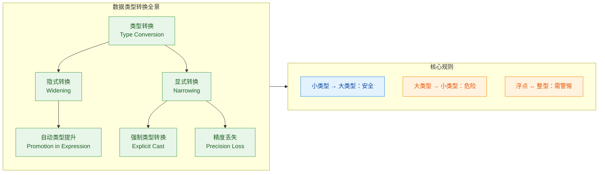
```mermaid
graph LR
    subgraph SRC["数据类型转换全景"]
        direction TB
        A["类型转换<br>Type Conversion"]
        B["隐式转换<br>Widening"]
        C["显式转换<br>Narrowing"]
        D["自动类型提升<br>Promotion in Expression"]
        E["强制类型转换<br>Explicit Cast"]
        F["精度丢失<br>Precision Loss"]
        A --> B
        A --> C
        B --> D
        C --> E
        C --> F
    end

    subgraph RULE["核心规则"]
        direction TB
        R1["小类型 → 大类型：安全"]
        R2["大类型 → 小类型：危险"]
        R3["浮点 ↔ 整型：需警惕"]
    end

    SRC --> RULE

    classDef srcStyle fill:#E8F5E9,stroke:#43A047,color:#1B5E20
    classDef ruleStyle fill:#E3F2FD,stroke:#1E88E5,color:#0D47A1
    classDef dangerStyle fill:#FFF3E0,stroke:#FB8C00,color:#E65100

    class A,B,C,D,E,F srcStyle
    class R1 ruleStyle
    class R2,R3 dangerStyle
```

---

### 自动类型提升（Widening / Automatic Type Promotion）

自动类型提升是 Java 编译器在遇到混合类型运算时，自动将"较小"的类型提升为"较大"的类型，以保证运算不丢失数据。这个过程对程序员完全透明，无需任何额外语法。

Java 语言规范（JLS §5.1.2）定义了 19 种合法的 widening primitive conversion 路径，核心提升链路如下：

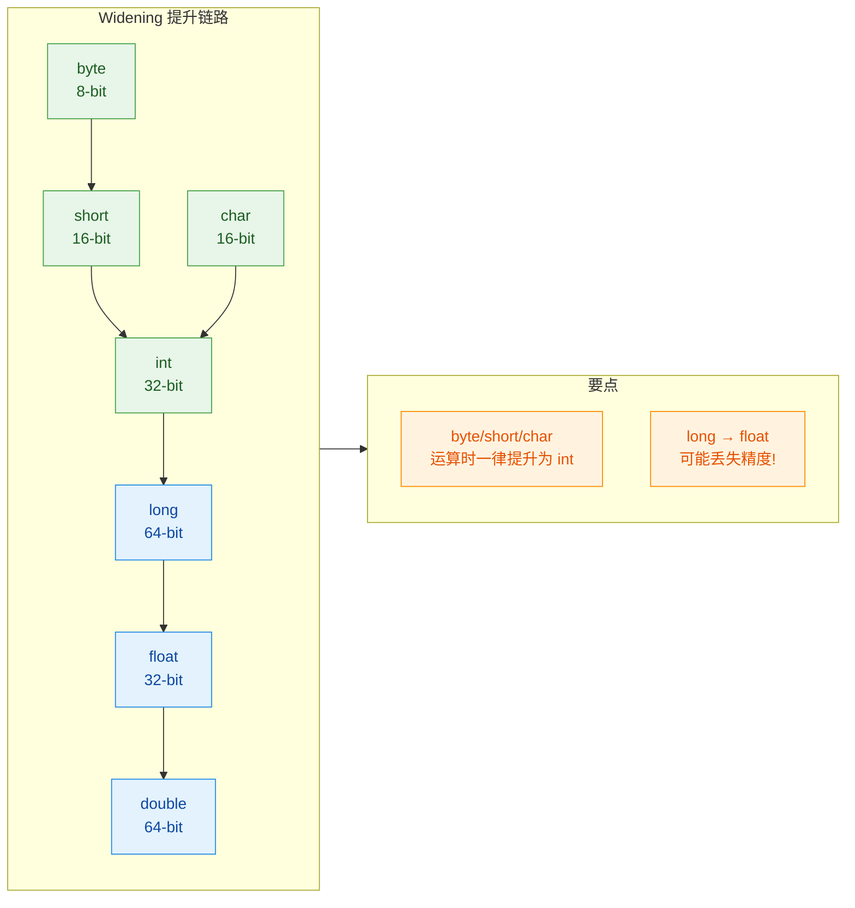
```mermaid
graph LR
    subgraph CHAIN["Widening 提升链路"]
        direction TB
        BYTE["byte<br>8-bit"] --> SHORT["short<br>16-bit"]
        SHORT --> INT["int<br>32-bit"]
        CHAR["char<br>16-bit"] --> INT
        INT --> LONG["long<br>64-bit"]
        LONG --> FLOAT["float<br>32-bit"]
        FLOAT --> DOUBLE["double<br>64-bit"]
    end

    subgraph NOTE["要点"]
        direction TB
        N1["byte/short/char<br>运算时一律提升为 int"]
        N2["long → float<br>可能丢失精度!"]
    end

    CHAIN --> NOTE

    classDef intStyle fill:#E8F5E9,stroke:#43A047,color:#1B5E20
    classDef floatStyle fill:#E3F2FD,stroke:#1E88E5,color:#0D47A1
    classDef noteStyle fill:#FFF3E0,stroke:#FB8C00,color:#E65100

    class BYTE,SHORT,CHAR,INT intStyle
    class LONG,FLOAT,DOUBLE floatStyle
    class N1,N2 noteStyle
```

有一个非常容易被忽视的细节：`long`（64 位整型）向 `float`（32 位浮点）的转换虽然是 widening，但 float 的尾数（mantissa）只有 23 位有效位，无法精确表示所有 long 值。这是一个"合法但有损"的提升，后面精度丢失章节会深入分析。

#### 表达式中的提升规则

Java 在计算表达式时，遵循一套严格的提升规则（Numeric Promotion Rules）：

**规则一：一元提升（Unary Numeric Promotion）**
当 `byte`、`short`、`char` 出现在一元运算符（如 `+`、`-`、`~`）或数组索引中时，它们会被自动提升为 `int`。

**规则二：二元提升（Binary Numeric Promotion）**
当两个操作数类型不同时，按以下优先级提升：
1. 任一操作数为 `double` → 另一个提升为 `double`
2. 任一操作数为 `float` → 另一个提升为 `float`
3. 任一操作数为 `long` → 另一个提升为 `long`
4. 否则 → 两个操作数都提升为 `int`

```java
public class WideningDemo {
    public static void main(String[] args) {
        // ========== 1. byte/short/char 运算自动提升为 int ==========
        byte a = 10;                    // byte 类型，8 位
        byte b = 20;                    // byte 类型，8 位
        // byte c = a + b;             // ❌ 编译错误！a + b 的结果是 int，不能赋给 byte
        int c = a + b;                  // ✅ 正确：a 和 b 先提升为 int，结果也是 int

        char ch = 'A';                  // char 类型，Unicode 值为 65
        // char ch2 = ch + 1;          // ❌ 编译错误！ch + 1 结果是 int
        int charResult = ch + 1;        // ✅ 结果为 66（即 'B' 的 Unicode 值）

        // ========== 2. 混合类型的二元提升 ==========
        int i = 100;                    // int 类型
        long l = 200L;                  // long 类型
        long sum = i + l;              // i 自动提升为 long，结果为 long

        float f = 3.14f;               // float 类型
        double d = 2.718;              // double 类型
        double product = f * d;        // f 自动提升为 double，结果为 double

        // ========== 3. int 与 float 混合 ==========
        int bigInt = 1_000_000;        // int 类型，值为一百万
        float fResult = bigInt * 1.0f; // bigInt 提升为 float，结果为 float
        // 注意：此处 bigInt 的值在 float 精度范围内，暂无精度问题

        // ========== 4. 复合赋值运算符的隐式转换 ==========
        byte x = 10;                   // byte 类型
        x += 5;                        // ✅ 等价于 x = (byte)(x + 5)，编译器自动插入强转
        // x = x + 5;                  // ❌ 编译错误！x + 5 结果是 int

        System.out.println("c = " + c);              // 输出: c = 30
        System.out.println("charResult = " + charResult); // 输出: charResult = 66
        System.out.println("sum = " + sum);           // 输出: sum = 300
        System.out.println("product = " + product);   // 输出: product = 8.53452
        System.out.println("x = " + x);              // 输出: x = 15
    }
}
```

上面代码中有一个极其重要的知识点：**复合赋值运算符（`+=`、`-=`、`*=` 等）会自动插入强制类型转换**。这是 JLS §15.26.2 明确规定的行为。`x += 5` 在编译后等价于 `x = (byte)(x + 5)`，所以不会报编译错误。而 `x = x + 5` 则需要你手动强转。这个区别是面试高频考点。

#### 赋值上下文中的特殊规则

Java 对 `byte`、`short`、`char` 的赋值有一条特殊的编译期优化规则：如果右侧是一个**编译期常量（compile-time constant）**，且其值在目标类型的范围内，编译器允许隐式窄化赋值。

```java
public class ConstantNarrowingDemo {
    public static void main(String[] args) {
        // ========== 编译期常量的隐式窄化 ==========
        byte b1 = 100;                 // ✅ 100 是编译期常量，且在 byte 范围 [-128, 127] 内
        // byte b2 = 200;              // ❌ 编译错误！200 超出 byte 范围
        byte b3 = 50 + 30;             // ✅ 50 + 30 = 80，编译期可计算，在 byte 范围内

        final int LIMIT = 120;         // final 变量，编译期常量
        byte b4 = LIMIT;              // ✅ LIMIT 是编译期常量，120 在 byte 范围内

        int variable = 100;            // 非 final，不是编译期常量
        // byte b5 = variable;         // ❌ 编译错误！variable 不是编译期常量

        short s1 = 32000;             // ✅ 32000 在 short 范围 [-32768, 32767] 内
        char c1 = 65;                 // ✅ 65 在 char 范围 [0, 65535] 内，对应 'A'
    }
}
```

这条规则的本质是：编译器在编译期就能确定值不会溢出，所以"放行"了这次窄化。一旦右侧不是常量，编译器无法保证安全性，就会拒绝编译。

---

### 强制类型转换（Narrowing / Explicit Casting）

当你需要将一个"大"类型的值塞进一个"小"类型的变量时，编译器不会自动帮你做——你必须用 `(目标类型)` 语法显式声明："我知道这可能丢失数据，但我就是要这么做。" 这就是强制类型转换（Narrowing Conversion / Explicit Cast）。

#### 语法与基本行为

```java
public class NarrowingDemo {
    public static void main(String[] args) {
        // ========== 1. 基本的窄化转换 ==========
        int bigValue = 300;            // int 类型，值为 300
        byte narrowed = (byte) bigValue; // 强制转换为 byte
        // 300 的二进制: 00000000 00000000 00000001 00101100
        // 截断为 8 位:                           00101100 = 44
        System.out.println("narrowed = " + narrowed); // 输出: narrowed = 44

        // ========== 2. 负数的窄化 ==========
        int negative = -129;           // 超出 byte 范围
        byte negNarrowed = (byte) negative; // 强制转换
        // -129 的补码(32位): 11111111 11111111 11111111 01111111
        // 截断为 8 位:                                  01111111 = 127
        System.out.println("negNarrowed = " + negNarrowed); // 输出: negNarrowed = 127

        // ========== 3. double → int 截断小数部分 ==========
        double pi = 3.99;             // double 类型
        int truncated = (int) pi;     // 直接截断小数部分，不是四舍五入！
        System.out.println("truncated = " + truncated); // 输出: truncated = 3

        // ========== 4. double → int 的极端情况 ==========
        double huge = 1.0E20;         // 远超 int 最大值
        int overflow = (int) huge;    // 结果为 Integer.MAX_VALUE
        System.out.println("overflow = " + overflow); // 输出: overflow = 2147483647

        double nan = Double.NaN;      // NaN（Not a Number）
        int nanToInt = (int) nan;     // NaN 转整型结果为 0
        System.out.println("nanToInt = " + nanToInt); // 输出: nanToInt = 0
    }
}
```

#### 窄化转换的底层规则

JLS §5.1.3 定义了窄化转换的精确行为，理解这些规则需要对二进制补码有基本认知：

**整型 → 整型（如 int → byte）**：直接截断高位比特，只保留目标类型宽度的低位。这是一个纯粹的位操作，不做任何"智能"处理。

**浮点 → 整型（如 double → int）**：
- 如果浮点值是 NaN，结果为 `0`
- 如果浮点值超出目标类型的最大值，结果为目标类型的 `MAX_VALUE`
- 如果浮点值低于目标类型的最小值，结果为目标类型的 `MIN_VALUE`
- 否则，向零方向截断（truncation towards zero），即直接丢弃小数部分

```java
public class TruncationRulesDemo {
    public static void main(String[] args) {
        // ========== 整型截断的位级分析 ==========
        int value = 0x1_FF;           // 十六进制 0x1FF = 十进制 511
        // 二进制: 00000000 00000000 00000001 11111111
        byte result = (byte) value;   // 截断为低 8 位: 11111111
        // 11111111 作为有符号 byte 的补码 = -1
        System.out.println("0x1FF as byte = " + result); // 输出: -1

        // ========== 浮点转整型的边界行为 ==========
        double posInf = Double.POSITIVE_INFINITY; // 正无穷
        double negInf = Double.NEGATIVE_INFINITY; // 负无穷

        // 正无穷转 int → Integer.MAX_VALUE
        System.out.println("posInf → int: " + (int) posInf);   // 2147483647
        // 负无穷转 int → Integer.MIN_VALUE
        System.out.println("negInf → int: " + (int) negInf);   // -2147483648
        // 正无穷转 long → Long.MAX_VALUE
        System.out.println("posInf → long: " + (long) posInf); // 9223372036854775807

        // ========== 向零截断 vs 四舍五入 ==========
        System.out.println("(int) 3.7  = " + (int) 3.7);   // 3，不是 4
        System.out.println("(int) -3.7 = " + (int) -3.7);  // -3，不是 -4
        // 如果需要四舍五入，使用 Math.round()
        System.out.println("Math.round(3.7) = " + Math.round(3.7));   // 4
        System.out.println("Math.round(-3.7) = " + Math.round(-3.7)); // -4
    }
}
```

#### char 与其他整型的转换

`char` 是 Java 中唯一的无符号整型（范围 0~65535），它与 `byte`、`short` 之间的转换关系比较特殊，容易踩坑：

```java
public class CharConversionDemo {
    public static void main(String[] args) {
        // ========== char → int：widening，安全 ==========
        char ch = '中';               // Unicode: \u4E2D = 20013
        int codePoint = ch;           // 自动提升为 int
        System.out.println("'中' 的 Unicode 值: " + codePoint); // 20013

        // ========== int → char：narrowing，需要强转 ==========
        int code = 65;                // 'A' 的 Unicode 值
        char letter = (char) code;    // 强制转换
        System.out.println("code 65 → char: " + letter); // A

        // ========== byte → char：需要强转（两步转换） ==========
        // byte 是有符号的 [-128, 127]，char 是无符号的 [0, 65535]
        // 这不是简单的 widening，因为 byte 的负值无法直接映射到 char
        byte b = -1;                  // byte 值为 -1
        // char c = b;                // ❌ 编译错误！
        char c = (char) b;           // 强制转换
        // -1 的补码(32位): 11111111 11111111 11111111 11111111
        // 先提升为 int，再截断为 16 位: 11111111 11111111 = 65535
        System.out.println("byte -1 → char: " + (int) c); // 65535

        // ========== short ↔ char：双向都需要强转 ==========
        // short 范围 [-32768, 32767]，char 范围 [0, 65535]
        // 两者都是 16 位，但符号性不同
        short s = -1;                 // short 值为 -1
        // char c2 = s;              // ❌ 编译错误！
        char c2 = (char) s;          // 强制转换，结果为 65535
        // char c3 = 'A';
        // short s2 = c3;            // ❌ 编译错误！char 可能超出 short 范围
    }
}
```

`byte → char` 和 `short ↔ char` 的转换之所以需要强转，根本原因在于**符号性不兼容**。`byte` 和 `short` 是有符号类型，负值在 `char` 的无符号世界里没有对应概念。编译器无法保证安全性，所以强制要求你显式声明意图。

---

### 精度丢失（Precision Loss）

精度丢失是类型转换中最隐蔽的陷阱。它不会触发编译错误，不会抛出运行时异常，但会悄无声息地让你的计算结果偏离预期。理解精度丢失的根源，需要深入 IEEE 754 浮点数的存储结构。

#### IEEE 754 浮点数的存储结构

```
┌─────────────────────────────────────────────────────────────┐
│                    float (32 bits)                           │
├──────┬──────────────┬───────────────────────────────────────┤
│ Sign │  Exponent    │           Mantissa (尾数)              │
│ 1bit │  8 bits      │           23 bits                      │
├──────┴──────────────┴───────────────────────────────────────┤
│                                                             │
│  有效精度: 2^23 = 8,388,608 → 约 7 位十进制有效数字          │
└─────────────────────────────────────────────────────────────┘

┌─────────────────────────────────────────────────────────────┐
│                   double (64 bits)                           │
├──────┬──────────────┬───────────────────────────────────────┤
│ Sign │  Exponent    │           Mantissa (尾数)              │
│ 1bit │  11 bits     │           52 bits                      │
├──────┴──────────────┴───────────────────────────────────────┤
│                                                             │
│  有效精度: 2^52 ≈ 4.5 × 10^15 → 约 15-16 位十进制有效数字    │
└─────────────────────────────────────────────────────────────┘
```

关键数字：`float` 的尾数只有 23 位，能精确表示的最大整数是 2^24 = 16,777,216（约 1600 万）。`int` 的最大值是 2^31 - 1 ≈ 21 亿。`long` 的最大值是 2^63 - 1 ≈ 9.2 × 10^18。这意味着 `int → float` 和 `long → float/double` 的 widening 转换都可能丢失精度。

#### 三大精度丢失场景

```java
public class PrecisionLossDemo {
    public static void main(String[] args) {
        // ========== 场景 1: int → float 精度丢失 ==========
        int bigInt = 16_777_217;       // 2^24 + 1 = 16777217
        float f = bigInt;              // 自动提升为 float（widening，编译器不报错）
        System.out.println("原始 int 值:  " + bigInt);       // 16777217
        System.out.println("转为 float:   " + f);            // 1.6777216E7
        System.out.println("float 转回 int: " + (int) f);    // 16777216 ← 丢失了 1！

        // 验证：float 无法区分 16777216 和 16777217
        float f1 = 16_777_216f;        // 2^24
        float f2 = 16_777_217f;        // 2^24 + 1
        System.out.println("f1 == f2 ? " + (f1 == f2));      // true！两个不同的值变成了同一个

        // ========== 场景 2: long → float 精度丢失（更严重） ==========
        long bigLong = 123_456_789_123_456_789L; // 18 位十进制数
        float fFromLong = bigLong;     // long → float，widening
        System.out.println("\n原始 long 值:  " + bigLong);
        System.out.println("转为 float:    " + fFromLong);    // 1.23456792E17
        // float 只有约 7 位有效数字，18 位的 long 值被严重截断

        // ========== 场景 3: long → double 精度丢失 ==========
        long precisionLong = Long.MAX_VALUE;  // 9223372036854775807
        double dFromLong = precisionLong;     // long → double，widening
        System.out.println("\n原始 long 值:  " + precisionLong);
        System.out.println("转为 double:   " + dFromLong);    // 9.223372036854776E18
        // double 有约 15-16 位有效数字，long 最大值有 19 位，末尾几位被四舍五入

        long backToLong = (long) dFromLong;   // double → long
        System.out.println("double 转回 long: " + backToLong);
        // 输出: -9223372036854775808 (Long.MIN_VALUE!) ← 溢出了！
        System.out.println("与原值相等? " + (precisionLong == backToLong)); // false
    }
}
```

场景 3 特别值得注意：`Long.MAX_VALUE` 转为 `double` 后再转回 `long`，结果变成了 `Long.MIN_VALUE`。这是因为 `double` 对 `Long.MAX_VALUE` 做了向上舍入，舍入后的值超出了 `long` 的范围，触发了窄化转换的饱和规则（saturating conversion），但由于 IEEE 754 的表示方式，实际结果是溢出到了最小值。这种 bug 在金融系统中可能造成灾难性后果。

#### 浮点运算的精度陷阱

精度丢失不仅发生在类型转换中，浮点运算本身就充满陷阱：

```java
public class FloatingPointTrapDemo {
    public static void main(String[] args) {
        // ========== 经典陷阱: 0.1 + 0.2 != 0.3 ==========
        double a = 0.1;                // 0.1 在二进制中是无限循环小数
        double b = 0.2;                // 0.2 同样是无限循环小数
        double sum = a + b;            // 两个近似值相加
        System.out.println("0.1 + 0.2 = " + sum);           // 0.30000000000000004
        System.out.println("0.1 + 0.2 == 0.3 ? " + (sum == 0.3)); // false!

        // ========== 解决方案 1: 使用 epsilon 比较 ==========
        double epsilon = 1e-10;        // 定义一个极小的容差值
        boolean isEqual = Math.abs(sum - 0.3) < epsilon; // 判断差值是否在容差内
        System.out.println("使用 epsilon 比较: " + isEqual); // true

        // ========== 解决方案 2: 使用 BigDecimal（推荐用于金融场景） ==========
        java.math.BigDecimal bd1 = new java.math.BigDecimal("0.1"); // 必须用 String 构造！
        java.math.BigDecimal bd2 = new java.math.BigDecimal("0.2");
        java.math.BigDecimal bdSum = bd1.add(bd2);
        System.out.println("BigDecimal: 0.1 + 0.2 = " + bdSum); // 0.3（精确）

        // ⚠️ 注意：不要用 double 构造 BigDecimal
        java.math.BigDecimal bad = new java.math.BigDecimal(0.1); // 传入的已经是不精确的 double
        System.out.println("BigDecimal(0.1) = " + bad);
        // 输出: 0.1000000000000000055511151231257827021181583404541015625
    }
}
```

`BigDecimal` 的构造函数选择是一个经典的面试考点：`new BigDecimal(0.1)` 和 `new BigDecimal("0.1")` 的结果完全不同。前者传入的 `0.1` 已经是一个不精确的 `double` 值，`BigDecimal` 只是忠实地记录了这个不精确的值。后者直接从字符串解析，绕过了浮点表示的精度问题。

#### 精度丢失速查表

| 转换路径 | 是否 Widening | 是否可能丢失精度 | 丢失原因 |
|:---|:---:|:---:|:---|
| `byte → short → int → long` | ✅ | ❌ | 整型间 widening 完全安全 |
| `int → double` | ✅ | ❌ | double 有 52 位尾数，足够表示 int 的 31 位 |
| `int → float` | ✅ | ⚠️ 是 | float 尾数仅 23 位，int 有效位最多 31 位 |
| `long → float` | ✅ | ⚠️ 是 | float 尾数仅 23 位，long 有效位最多 63 位 |
| `long → double` | ✅ | ⚠️ 是 | double 尾数 52 位，long 有效位最多 63 位 |
| `double → int` | ❌ | ⚠️ 是 | 小数部分被截断，大值饱和 |
| `float → long` | ❌ | ⚠️ 是 | 小数截断 + 精度不足 |

#### 实战建议

```java
public class BestPracticeDemo {
    public static void main(String[] args) {
        // ========== 实践 1: 金融计算永远用 BigDecimal ==========
        java.math.BigDecimal price = new java.math.BigDecimal("19.99");  // 用 String 构造
        java.math.BigDecimal quantity = new java.math.BigDecimal("3");
        java.math.BigDecimal total = price.multiply(quantity);           // 精确乘法
        System.out.println("总价: " + total);  // 59.97（精确）

        // ========== 实践 2: 比较浮点数用 Double.compare() ==========
        double x = 0.1 + 0.2;         // 不精确的浮点运算
        double y = 0.3;               // 不精确的浮点字面量
        // 不推荐: x == y（结果为 false）
        // 推荐: 使用容差比较或 Double.compare
        System.out.println("Double.compare: " + Double.compare(x, y));  // 可能不为 0

        // ========== 实践 3: 整型除法要小心 ==========
        int total2 = 7;               // 被除数
        int count = 2;                // 除数
        // 整型除法直接截断小数
        System.out.println("7 / 2 = " + (total2 / count));         // 3，不是 3.5
        // 需要浮点结果时，先将一个操作数转为 double
        System.out.println("7.0 / 2 = " + ((double) total2 / count)); // 3.5

        // ========== 实践 4: 避免用 float/double 做循环计数器 ==========
        // ❌ 错误示范：浮点累加误差会不断积累
        float fSum = 0.0f;            // float 累加器
        for (int i = 0; i < 10; i++) {
            fSum += 0.1f;             // 每次加 0.1f（不精确）
        }
        System.out.println("float 累加 10 次 0.1: " + fSum); // 1.0000001（不是 1.0）

        // ✅ 正确做法：用整型计数，最后再转换
        int cents = 0;                // 用"分"作为单位（整型）
        for (int i = 0; i < 10; i++) {
            cents += 10;              // 每次加 10 分
        }
        double yuan = cents / 100.0;  // 最后转换为"元"
        System.out.println("整型累加后转换: " + yuan); // 1.0（精确）
    }
}
```

---

### 类型转换的完整决策流程

在实际编码中，面对类型转换的场景，可以按照以下决策流程来判断该怎么做：

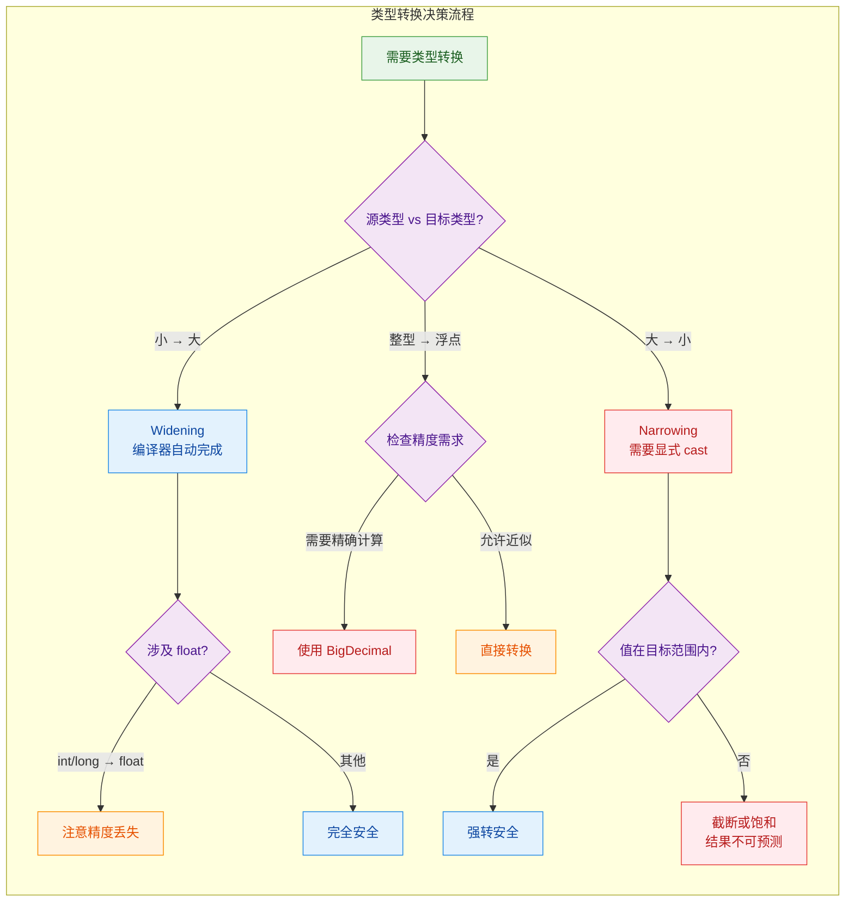
```mermaid
graph LR
    subgraph DECISION["类型转换决策流程"]
        direction TB
        START["需要类型转换"] --> Q1{"源类型 vs 目标类型?"}
        Q1 -->|"小 → 大"| W["Widening<br>编译器自动完成"]
        Q1 -->|"大 → 小"| N["Narrowing<br>需要显式 cast"]
        Q1 -->|"整型 → 浮点"| CHECK{"检查精度需求"}

        W --> W_CHECK{"涉及 float?"}
        W_CHECK -->|"int/long → float"| WARN["注意精度丢失"]
        W_CHECK -->|"其他"| SAFE["完全安全"]

        CHECK -->|"需要精确计算"| BD["使用 BigDecimal"]
        CHECK -->|"允许近似"| CAST["直接转换"]

        N --> N_CHECK{"值在目标范围内?"}
        N_CHECK -->|"是"| OK["强转安全"]
        N_CHECK -->|"否"| DANGER["截断或饱和<br>结果不可预测"]
    end

    classDef startStyle fill:#E8F5E9,stroke:#43A047,color:#1B5E20
    classDef safeStyle fill:#E3F2FD,stroke:#1E88E5,color:#0D47A1
    classDef warnStyle fill:#FFF3E0,stroke:#FB8C00,color:#E65100
    classDef dangerStyle fill:#FFEBEE,stroke:#E53935,color:#B71C1C
    classDef decisionStyle fill:#F3E5F5,stroke:#8E24AA,color:#4A148C

    class START startStyle
    class W,SAFE,OK safeStyle
    class CHECK,W_CHECK,N_CHECK,Q1 decisionStyle
    class WARN,CAST warnStyle
    class N,DANGER,BD dangerStyle
```

总结一下类型转换的核心原则：

- **Widening 是安全的**，但 `int/long → float` 和 `long → double` 这三条路径要警惕精度丢失
- **Narrowing 是危险的**，必须显式声明，且要确保值在目标范围内
- **浮点数天生不精确**，金融和科学计算场景务必使用 `BigDecimal`
- **复合赋值运算符**（`+=` 等）会隐式插入强转，这是一个容易被忽略的行为
- **永远不要用 `==` 比较浮点数**，使用 epsilon 容差或 `Double.compare()`

---

**📝 练习题**

以下代码的输出结果是什么？

```java
public class Quiz {
    public static void main(String[] args) {
        byte b = 127;
        b += 1;
        float f = 16_777_217;
        int i = (int) f;
        System.out.println(b + " " + i);
    }
}
```

A. 128 16777217


B. -128 16777217


C. -128 16777216


D. 编译错误

**【答案】** C

**【解析】**

这道题考查两个知识点：

第一，`b += 1` 等价于 `b = (byte)(b + 1)`。`b + 1` 的结果是 `int` 类型的 128，但 `byte` 的范围是 [-128, 127]。128 的二进制低 8 位是 `10000000`，作为有符号 byte 的补码解释为 -128。所以 `b` 的值是 -128。

第二，`float f = 16_777_217` 触发了 `int → float` 的 widening 转换。16777217 = 2^24 + 1，超出了 float 尾数 23 位能精确表示的范围（float 能精确表示的最大整数是 2^24 = 16777216）。所以 `f` 实际存储的值是 16777216.0f。再将 `f` 强转回 `int`，得到 16777216。最终输出 `-128 16777216`，选 C。

---

## 变量与常量（局部变量、成员变量、final 语义）

在 Java 中，变量（Variable）是程序存储数据的基本单元。理解变量的分类、生命周期、作用域以及 `final` 关键字的深层语义，是写出健壮代码的基石。这一节我们将从变量的本质出发，逐层深入到 JVM 内存模型中变量的真实存储位置，最终彻底掌握 `final` 的多重含义。

### 变量的分类体系

Java 中的变量按照声明位置和生命周期，可以划分为三大类：局部变量（Local Variable）、成员变量（Instance Variable / Field）、类变量（Class Variable / Static Field）。它们在内存中的存储位置、初始化规则、生命周期都截然不同。

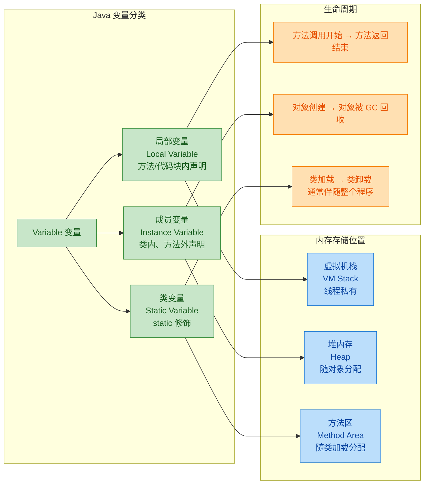
```mermaid
graph LR
    subgraph VarTypes["Java 变量分类"]
        direction TB
        A["Variable 变量"]
        B["局部变量<br/>Local Variable<br/>方法/代码块内声明"]
        C["成员变量<br/>Instance Variable<br/>类内、方法外声明"]
        D["类变量<br/>Static Variable<br/>static 修饰"]
    end

    subgraph Storage["内存存储位置"]
        direction TB
        E["虚拟机栈<br/>VM Stack<br/>线程私有"]
        F["堆内存<br/>Heap<br/>随对象分配"]
        G["方法区<br/>Method Area<br/>随类加载分配"]
    end

    subgraph Lifecycle["生命周期"]
        direction TB
        H["方法调用开始 → 方法返回结束"]
        I["对象创建 → 对象被 GC 回收"]
        J["类加载 → 类卸载<br/>通常伴随整个程序"]
    end

    A --> B
    A --> C
    A --> D
    B --> E
    C --> F
    D --> G
    B --> H
    C --> I
    D --> J

    classDef typeNode fill:#C8E6C9,stroke:#388E3C,color:#1B5E20
    classDef storageNode fill:#BBDEFB,stroke:#1976D2,color:#0D47A1
    classDef lifecycleNode fill:#FFE0B2,stroke:#F57C00,color:#E65100

    class A,B,C,D typeNode
    class E,F,G storageNode
    class H,I,J lifecycleNode
```

这张图清晰地展示了三类变量从声明位置到内存归属再到生命周期的完整映射关系。接下来我们逐一深入。

### 局部变量（Local Variable）

局部变量是在方法体、构造器或代码块（如 `if`、`for`）内部声明的变量。它是 Java 中最"短命"的变量类型，仅在其所属的作用域（Scope）内可见。

局部变量有一条铁律：**必须显式初始化后才能使用**。编译器会在编译期进行 Definite Assignment Analysis（明确赋值分析），如果检测到某条执行路径上变量可能未被赋值就被读取，直接报编译错误。这与成员变量有本质区别——成员变量有默认值，局部变量没有。

```java
public class LocalVariableDemo {

    public void demonstrate() {
        // ========== 1. 基本声明与初始化 ==========
        int count;          // 声明局部变量，此时栈帧中分配了空间，但值未定义
        // System.out.println(count); // ❌ 编译错误：variable count might not have been initialized
        count = 10;         // 显式赋值后才可使用
        System.out.println(count); // ✅ 输出 10

        // ========== 2. 声明时直接初始化（推荐写法） ==========
        double price = 99.5; // 声明与初始化一步完成，代码更清晰

        // ========== 3. 作用域演示 ==========
        if (count > 5) {
            String message = "count 大于 5"; // message 的作用域仅限于这个 if 块
            System.out.println(message);     // ✅ 在作用域内，可以访问
        }
        // System.out.println(message); // ❌ 编译错误：message 在此处不可见

        // ========== 4. for 循环中的局部变量 ==========
        for (int i = 0; i < 3; i++) { // i 的作用域仅限于 for 循环
            int squared = i * i;       // squared 每次循环迭代都会重新创建
            System.out.println(squared);
        }
        // System.out.println(i); // ❌ 编译错误：i 在循环外不可见

        // ========== 5. 条件分支中的明确赋值分析 ==========
        int result;
        boolean flag = true;
        if (flag) {
            result = 1;  // 分支一赋值
        } else {
            result = -1; // 分支二赋值
        }
        // 编译器分析：所有路径都对 result 赋了值，所以下面可以使用
        System.out.println(result); // ✅ 编译通过

        // ========== 6. 反例：不完整的分支赋值 ==========
        int value;
        if (flag) {
            value = 42;
        }
        // 如果 flag 为 false，value 就没有被赋值
        // System.out.println(value); // ❌ 编译错误：variable value might not have been initialized
    }
}
```

局部变量在 JVM 层面存储在线程的栈帧（Stack Frame）中的局部变量表（Local Variable Table）里。每个方法调用都会创建一个新的栈帧，方法返回时栈帧弹出，局部变量随之销毁。这意味着局部变量天然是线程安全的——每个线程有自己独立的栈，互不干扰。

```java
// 局部变量表的底层视角（概念模型）
// 假设方法签名为: void calculate(int x, double y)
// 对于实例方法，slot 0 始终是 this 引用
```

```text
┌─────────────────────────────────────────┐
│           局部变量表 (Local Variable Table)  │
├────────┬────────────┬───────────────────┤
│ Slot 0 │ this       │ 当前对象引用 (隐式)   │
│ Slot 1 │ x          │ int, 占 1 个 slot    │
│ Slot 2 │ y          │ double, 占 2 个 slot │
│ Slot 4 │ localVar   │ 方法体内声明的变量     │
└────────┴────────────┴───────────────────┘
```

注意 `double` 和 `long` 类型占用 2 个 slot，这是因为它们是 64 位的。这个细节在理解方法栈空间消耗时很重要。

还有一个容易被忽略的特性：**局部变量表中的 slot 是可以复用的**。当一个局部变量超出作用域后，它占用的 slot 可以被后续声明的变量重用，JVM 通过这种方式节省栈空间。

```java
public void slotReuse() {
    {
        int a = 1;       // a 占用 slot 1
        System.out.println(a);
    } // a 的作用域结束，slot 1 可被复用

    int b = 2;           // b 复用了 slot 1（编译器优化）
    System.out.println(b);
}
```

### 成员变量（Instance Variable）

成员变量（也叫实例变量或字段 Field）声明在类体内、方法体外，不带 `static` 修饰符。每个对象实例都拥有一份独立的成员变量副本，它们存储在堆内存中，作为对象数据的一部分。

与局部变量最大的区别在于：**成员变量有默认值**。JVM 在为对象分配内存时，会将所有成员变量的内存区域清零（zero-fill），这就是默认值的来源。

```java
public class InstanceVariableDemo {

    // ========== 各类型成员变量的默认值 ==========
    byte    byteVal;      // 默认值: 0
    short   shortVal;     // 默认值: 0
    int     intVal;       // 默认值: 0
    long    longVal;      // 默认值: 0L
    float   floatVal;     // 默认值: 0.0f
    double  doubleVal;    // 默认值: 0.0d
    char    charVal;      // 默认值: '\u0000' (空字符, 不是 '0')
    boolean boolVal;      // 默认值: false
    String  stringVal;    // 默认值: null (所有引用类型都是 null)
    int[]   arrayVal;     // 默认值: null (数组也是引用类型)

    // ========== 声明时初始化 ==========
    int     initialized = 42;          // 显式初始化，覆盖默认值
    String  greeting    = "Hello";     // 引用类型显式初始化

    public void printDefaults() {
        // 成员变量无需显式初始化即可直接使用（与局部变量不同）
        System.out.println("int 默认值: " + intVal);       // 输出 0
        System.out.println("boolean 默认值: " + boolVal);  // 输出 false
        System.out.println("String 默认值: " + stringVal); // 输出 null
        System.out.println("char 默认值: [" + charVal + "]"); // 输出 [ ] (空字符不可见)
    }
}
```

成员变量在对象的内存布局中紧跟在对象头（Object Header）之后。对象头通常包含 Mark Word（存储哈希码、GC 年龄、锁状态等）和 Klass Pointer（指向类元数据的指针）。

```text
┌──────────────────────────────────────────────────┐
│              对象在堆内存中的布局                     │
├──────────────────────────────────────────────────┤
│  Object Header (对象头)                            │
│  ┌─────────────────────────────────────────────┐ │
│  │ Mark Word (8 bytes on 64-bit)               │ │
│  │ → hashCode / GC age / lock state            │ │
│  ├─────────────────────────────────────────────┤ │
│  │ Klass Pointer (4 bytes, 压缩指针)            │ │
│  │ → 指向方法区中的 Class 元数据                  │ │
│  └─────────────────────────────────────────────┘ │
├──────────────────────────────────────────────────┤
│  Instance Data (实例数据 / 成员变量)                │
│  ┌─────────────────────────────────────────────┐ │
│  │ intVal     = 0          (4 bytes)           │ │
│  │ floatVal   = 0.0f       (4 bytes)           │ │
│  │ longVal    = 0L         (8 bytes)           │ │
│  │ doubleVal  = 0.0d       (8 bytes)           │ │
│  │ boolVal    = false      (1 byte)            │ │
│  │ charVal    = '\u0000'   (2 bytes)           │ │
│  │ stringVal  = null       (4 bytes, 压缩引用)  │ │
│  └─────────────────────────────────────────────┘ │
├──────────────────────────────────────────────────┤
│  Padding (对齐填充, 凑齐 8 的倍数)                  │
└──────────────────────────────────────────────────┘
```

注意 JVM 会对字段进行重排序（Field Reordering），按照 `long/double → int/float → short/char → byte/boolean → reference` 的顺序排列，以减少内存对齐带来的填充浪费。这就是为什么实际的字段顺序可能和你在源码中声明的顺序不同。

### 类变量（Static Variable）

类变量用 `static` 修饰，属于类本身而非某个实例。无论创建多少个对象，类变量在内存中只有一份，存储在方法区（JDK 8+ 中是 Metaspace 关联的堆区域）。

```java
public class StaticVariableDemo {

    // 类变量：所有实例共享同一份
    static int instanceCount = 0;  // 记录创建了多少个实例

    // 成员变量：每个实例独立拥有
    String name;

    public StaticVariableDemo(String name) {
        this.name = name;       // 为当前实例的成员变量赋值
        instanceCount++;        // 类变量 +1，所有实例看到的是同一个计数器
    }

    public static void main(String[] args) {
        StaticVariableDemo a = new StaticVariableDemo("Alice");
        StaticVariableDemo b = new StaticVariableDemo("Bob");
        StaticVariableDemo c = new StaticVariableDemo("Charlie");

        // 通过类名访问类变量（推荐写法）
        System.out.println(StaticVariableDemo.instanceCount); // 输出 3

        // 也可以通过实例访问，但不推荐（容易误解为实例变量）
        System.out.println(a.instanceCount); // 输出 3，编译器会给出警告
    }
}
```

三种变量的核心对比：

```java
public class VariableComparison {

    // ① 类变量 (static field) — 类加载时初始化，全局唯一
    static String className = "VariableComparison";

    // ② 成员变量 (instance field) — new 对象时初始化，每个对象一份
    int id;

    public void method() {
        // ③ 局部变量 (local variable) — 方法调用时在栈上分配，方法结束即销毁
        int temp = 0;
    }
}
```

| 特性 | 局部变量 | 成员变量 | 类变量 |
|------|---------|---------|--------|
| 声明位置 | 方法/代码块内 | 类内、方法外 | 类内、方法外，`static` 修饰 |
| 存储位置 | 虚拟机栈（栈帧） | 堆（对象内部） | 方法区 / 堆（JDK 8+） |
| 默认值 | 无，必须显式初始化 | 有（零值） | 有（零值） |
| 生命周期 | 方法调用 → 方法返回 | 对象创建 → GC 回收 | 类加载 → 类卸载 |
| 线程安全 | 天然安全（栈私有） | 不安全（需同步） | 不安全（需同步） |
| 访问修饰符 | 不可使用 | 可使用 | 可使用 |

### 变量的初始化顺序

当创建一个对象时，变量的初始化并不是"一步到位"的，而是遵循严格的顺序。理解这个顺序对于排查一些诡异的 bug 至关重要。

```java
public class InitOrderDemo {

    // ② 成员变量声明时初始化（按源码顺序执行）
    int x = 10;

    // ③ 实例初始化块（Instance Initializer Block）
    {
        System.out.println("实例初始化块执行, x = " + x); // x 已经是 10
        x = 20; // 可以修改
    }

    // ④ 构造器
    public InitOrderDemo() {
        System.out.println("构造器执行, x = " + x); // x 是 20
        x = 30;
    }

    // 对于类变量，还有 static 初始化块
    static int s;

    static {
        s = 100; // 类加载时执行，早于任何实例创建
        System.out.println("静态初始化块执行");
    }

    public static void main(String[] args) {
        // 输出顺序：
        // 静态初始化块执行          ← 类加载阶段
        // 实例初始化块执行, x = 10  ← 对象创建阶段
        // 构造器执行, x = 20       ← 对象创建阶段
        InitOrderDemo demo = new InitOrderDemo();
        System.out.println("最终 x = " + demo.x); // 输出 30
    }
}
```

完整的初始化顺序可以用下面的流程图来表示：

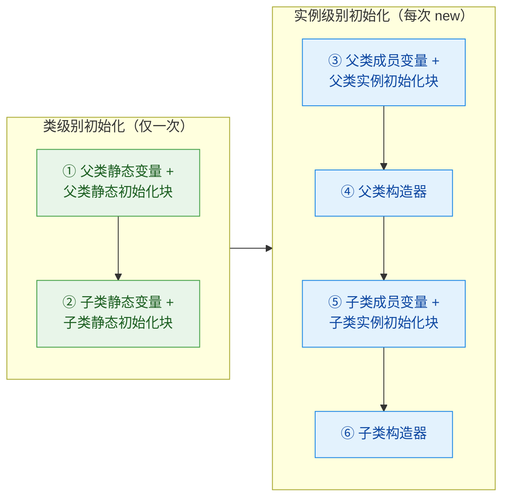
```mermaid
graph LR
    subgraph ClassLevel["类级别初始化（仅一次）"]
        direction TB
        A["① 父类静态变量 +<br/>父类静态初始化块"]
        B["② 子类静态变量 +<br/>子类静态初始化块"]
        A --> B
    end

    subgraph InstanceLevel["实例级别初始化（每次 new）"]
        direction TB
        C["③ 父类成员变量 +<br/>父类实例初始化块"]
        D["④ 父类构造器"]
        E["⑤ 子类成员变量 +<br/>子类实例初始化块"]
        F["⑥ 子类构造器"]
        C --> D --> E --> F
    end

    ClassLevel --> InstanceLevel

    classDef classPhase fill:#E8F5E9,stroke:#43A047,color:#1B5E20
    classDef instancePhase fill:#E3F2FD,stroke:#1E88E5,color:#0D47A1

    class A,B classPhase
    class C,D,E,F instancePhase
```

这里有一个经典的陷阱：在构造器中调用可被子类覆盖的方法，可能导致子类的成员变量还未初始化就被访问。

```java
class Parent {
    Parent() {
        // 构造器中调用了可被覆盖的方法 —— 危险！
        display(); // 此时如果实际类型是 Child，会调用 Child.display()
    }

    void display() {
        System.out.println("Parent display");
    }
}

class Child extends Parent {
    int value = 42; // 此时还没执行到这一行！

    @Override
    void display() {
        // 在 Parent 构造器中被调用时，value 还是默认值 0
        System.out.println("Child display, value = " + value); // 输出 0，不是 42！
    }
}

// new Child() 的输出：
// Child display, value = 0   ← 陷阱！value 还未被初始化为 42
```

这就是为什么 Effective Java 中建议：**构造器中不要调用可被子类覆盖的方法**（"Never call overridable methods from constructors"）。

### final 关键字的完整语义

`final` 是 Java 中一个看似简单实则内涵丰富的关键字。它可以修饰变量、方法和类，在不同场景下表达不同的"不可变"语义。

#### final 修饰变量

`final` 修饰变量的核心含义是：**一旦赋值，不可再次修改**（assign-once semantics）。但这里的"不可修改"指的是变量本身的值（对于基本类型是数值，对于引用类型是引用地址），而不是引用所指向的对象的内部状态。

```java
public class FinalVariableDemo {

    // ========== 1. final 基本类型：值不可变 ==========
    final int MAX_RETRY = 3;
    // MAX_RETRY = 5; // ❌ 编译错误：cannot assign a value to final variable

    // ========== 2. final 引用类型：引用不可变，对象内容可变！ ==========
    final List<String> names = new ArrayList<>();

    public void modifyFinalReference() {
        names.add("Alice");   // ✅ 可以修改对象内部状态
        names.add("Bob");     // ✅ 列表内容变了，但 names 引用没变
        // names = new ArrayList<>(); // ❌ 编译错误：不能让 names 指向新对象
    }

    // ========== 3. final 局部变量 ==========
    public void finalLocal() {
        final int x = 10;
        // x = 20; // ❌ 编译错误

        // final 局部变量可以先声明后赋值（但只能赋值一次）
        final int y;
        y = computeValue(); // ✅ 第一次赋值
        // y = 100;          // ❌ 编译错误：已经赋过值了
    }

    // ========== 4. final 方法参数 ==========
    public void process(final String input) {
        // input = "new value"; // ❌ 编译错误：final 参数不可重新赋值
        System.out.println(input.toUpperCase()); // ✅ 可以调用方法
    }

    private int computeValue() {
        return 42;
    }
}
```

`final` 引用类型的"可变内容"是一个高频面试考点，用一张图来说明：

```text
final List<String> names = new ArrayList<>();

  栈 (Stack)                    堆 (Heap)
┌──────────────┐          ┌──────────────────────┐
│ names (final)│────────→ │ ArrayList 对象         │
│ 引用不可变 ✗  │    ×     │ ┌──────────────────┐ │
│              │  ╱ ╲     │ │ "Alice"          │ │ ← 可以 add
│              │ 不能指向  │ │ "Bob"            │ │ ← 可以 add
│              │ 新对象    │ │ ...              │ │ ← 内容可变 ✓
└──────────────┘          │ └──────────────────┘ │
                          └──────────────────────┘
```

#### Blank Final（空白 final）

Java 允许声明 `final` 成员变量时不立即赋值，但要求在每个构造器执行完毕之前必须完成赋值。这种模式叫做 Blank Final，非常适合那些需要在构造时根据参数决定值的不可变字段。

```java
public class BlankFinalDemo {

    final String name;   // 空白 final：声明时不赋值
    final int code;      // 空白 final

    // 构造器 1：必须为所有 blank final 赋值
    public BlankFinalDemo(String name, int code) {
        this.name = name;  // ✅ 在构造器中赋值
        this.code = code;  // ✅ 在构造器中赋值
    }

    // 构造器 2：同样必须为所有 blank final 赋值
    public BlankFinalDemo(String name) {
        this.name = name;  // ✅
        this.code = -1;    // ✅ 必须赋值，否则编译错误
    }

    // 如果某个构造器遗漏了对 blank final 的赋值，编译器会报错
    // public BlankFinalDemo() {
    //     this.name = "default";
    //     // ❌ 编译错误：variable code might not have been initialized
    // }
}
```

#### final 修饰方法

`final` 方法不能被子类覆盖（Override）。这在框架设计中常用于保护核心算法不被篡改（Template Method Pattern 的骨架方法通常是 `final` 的）。

```java
public class FinalMethodDemo {

    // final 方法：子类不能覆盖
    public final void criticalAlgorithm() {
        // 模板方法模式中的骨架逻辑
        step1();       // 可被子类定制
        validate();    // 不可被覆盖的核心校验
        step2();       // 可被子类定制
    }

    // 非 final 方法：子类可以覆盖
    protected void step1() {
        System.out.println("默认 step1");
    }

    protected void step2() {
        System.out.println("默认 step2");
    }

    // final 的私有方法：private 方法本身就不能被覆盖
    // 加 final 是多余的，但不会报错
    private final void validate() {
        System.out.println("核心校验逻辑");
    }
}

class SubClass extends FinalMethodDemo {

    // ❌ 编译错误：Cannot override the final method from FinalMethodDemo
    // public void criticalAlgorithm() { }

    @Override
    protected void step1() {
        System.out.println("子类定制的 step1"); // ✅ 非 final，可以覆盖
    }
}
```

关于 `final` 方法的一个历史误区：早期有说法认为 `final` 方法会被 JVM 内联（inline）优化，所以性能更好。实际上现代 JVM 的 JIT 编译器（如 HotSpot 的 C2）非常智能，即使方法不是 `final` 的，只要运行时分析发现它没有被覆盖（monomorphic call），JIT 一样会内联。所以**不要为了性能而使用 `final` 方法**，应该只在语义上需要"禁止覆盖"时才使用。

#### final 修饰类

`final` 类不能被继承。Java 标准库中最典型的例子就是 `String`、`Integer` 等包装类。

```java
// String 类的声明（简化版）
public final class String implements Serializable, Comparable<String>, CharSequence {
    // String 被设计为不可变类（Immutable Class）
    // final class 是实现不可变性的重要手段之一
    private final char[] value; // JDK 8，JDK 9+ 改为 byte[]
}

// ❌ 编译错误：Cannot inherit from final 'java.lang.String'
// class MyString extends String { }
```

为什么 `String` 要设计为 `final class`？原因有多个层面：

1. **安全性**：如果 `String` 可以被继承，子类可以覆盖方法改变行为，而 `String` 广泛用于类加载、网络连接、文件路径等安全敏感场景。
2. **不可变性保证**：`final class` + `private final char[] value` + 不提供修改方法 = 真正的不可变。如果允许继承，子类可以添加可变状态，破坏不可变契约。
3. **字符串池优化**：字符串常量池（String Pool）的实现依赖于 `String` 的不可变性。如果内容可变，池中共享的字符串就不安全了。

#### final 与并发：内存语义

`final` 在 Java 内存模型（JMM, Java Memory Model）中有特殊的语义保证，这是很多开发者不了解的深层知识。

当一个对象的构造器执行完毕后，其 `final` 字段的值对其他线程是可见的，即使没有使用同步机制。这是 JMM 对 `final` 字段的特殊保证，称为 **final field semantics**。

```java
public class FinalFieldSemantics {

    final int x;          // final 字段
    int y;                // 普通字段

    public FinalFieldSemantics() {
        x = 42;           // final 字段赋值
        y = 42;           // 普通字段赋值
    }

    // 场景：线程 A 执行构造，线程 B 读取
    // 线程 A:
    //   obj = new FinalFieldSemantics();
    //
    // 线程 B（没有同步机制，直接读取 obj）:
    //   如果 obj != null:
    //     obj.x 保证看到 42  ← final 字段的 JMM 保证
    //     obj.y 可能看到 0   ← 普通字段没有这个保证！
}
```

这个保证的底层原理是：JVM 会在 `final` 字段写入和构造器返回之间插入一个 **StoreStore 屏障**（store-store barrier），确保 `final` 字段的赋值不会被重排序到构造器之外。这意味着当其他线程看到对象引用时，`final` 字段一定已经完成了初始化。

但有一个前提条件：**对象引用不能在构造器中"逸出"（escape）**。如果你在构造器中把 `this` 传给了其他线程，那么这个保证就失效了。

```java
public class ThisEscapeDemo {

    final int value;

    public ThisEscapeDemo(EventSource source) {
        // ❌ 危险！this 在构造器完成前逸出
        // 其他线程可能通过 listener 看到未完全构造的对象
        source.registerListener(new EventListener() {
            public void onEvent(Event e) {
                // 此时 value 可能还没被赋值！
                System.out.println(value);
            }
        });

        value = 42; // final 赋值在 this 逸出之后
    }
}
```

这是一个非常隐蔽的并发 bug。正确的做法是使用工厂方法模式，确保对象完全构造后再暴露引用：

```java
public class SafeConstruction {

    final int value;

    // 私有构造器，防止外部直接 new
    private SafeConstruction(int value) {
        this.value = value;
    }

    // 工厂方法：先构造完成，再注册监听器
    public static SafeConstruction create(EventSource source) {
        SafeConstruction instance = new SafeConstruction(42); // 构造完成
        source.registerListener(event -> {
            System.out.println(instance.value); // ✅ 安全，对象已完全构造
        });
        return instance;
    }
}
```

#### Effectively Final（事实 final）

Java 8 引入了一个重要概念：**effectively final**。如果一个局部变量在初始化后从未被重新赋值，即使没有显式声明 `final`，编译器也会将其视为"事实上的 final"。这个概念主要服务于 Lambda 表达式和匿名内部类。

```java
public class EffectivelyFinalDemo {

    public void lambdaCapture() {
        // ========== 1. 显式 final ==========
        final String explicit = "Hello";
        Runnable r1 = () -> System.out.println(explicit); // ✅

        // ========== 2. Effectively final（未加 final，但从未修改） ==========
        String implicit = "World";
        // implicit 从声明到使用，没有被重新赋值过 → effectively final
        Runnable r2 = () -> System.out.println(implicit); // ✅ Java 8+ 合法

        // ========== 3. 非 effectively final ==========
        String mutable = "Foo";
        mutable = "Bar"; // 重新赋值了！不再是 effectively final
        // Runnable r3 = () -> System.out.println(mutable); // ❌ 编译错误

        // ========== 4. 循环变量不是 effectively final ==========
        for (int i = 0; i < 5; i++) {
            // i 每次迭代都在变化，不是 effectively final
            // Runnable r = () -> System.out.println(i); // ❌ 编译错误

            // 解决方案：用一个 effectively final 的临时变量捕获当前值
            final int current = i; // 或者不写 final，current 也是 effectively final
            Runnable r = () -> System.out.println(current); // ✅
        }
    }
}
```

为什么 Lambda 和匿名内部类要求捕获的变量是 `final` 或 effectively final？这涉及到 Java 的闭包实现机制。Java 的 Lambda 并不是真正的闭包（closure），它捕获的是变量的**值的副本**（capture by value），而不是变量本身的引用。如果允许被捕获的变量在外部被修改，Lambda 内部持有的副本和外部的实际值就会不一致，造成语义混乱。

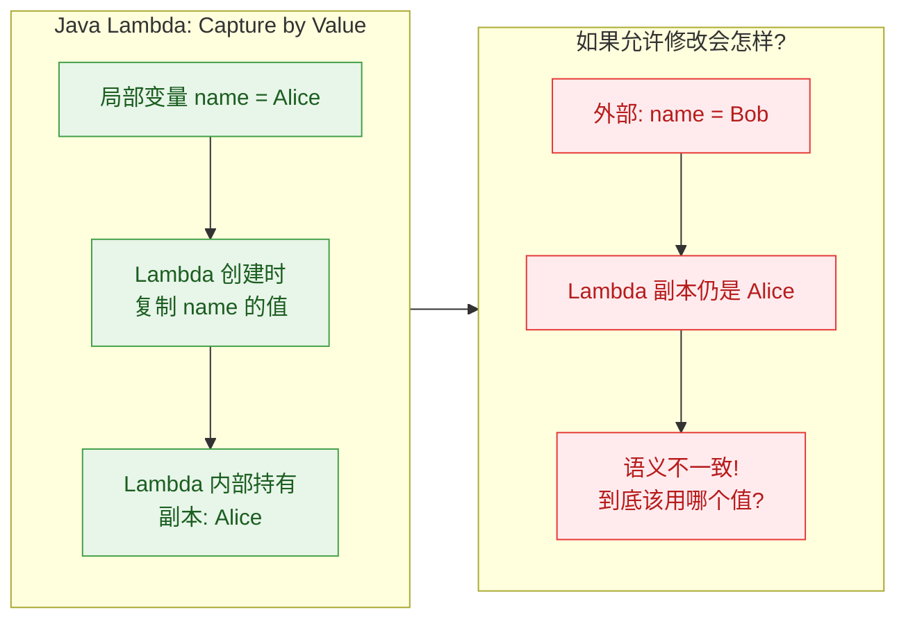
```mermaid
graph LR
    subgraph CaptureByValue["Java Lambda: Capture by Value"]
        direction TB
        A["局部变量 name = Alice"]
        B["Lambda 创建时<br/>复制 name 的值"]
        C["Lambda 内部持有<br/>副本: Alice"]
        A --> B --> C
    end

    subgraph Problem["如果允许修改会怎样?"]
        direction TB
        D["外部: name = Bob"]
        E["Lambda 副本仍是 Alice"]
        F["语义不一致!<br/>到底该用哪个值?"]
        D --> E --> F
    end

    CaptureByValue --> Problem

    classDef captureNode fill:#E8F5E9,stroke:#43A047,color:#1B5E20
    classDef problemNode fill:#FFEBEE,stroke:#E53935,color:#B71C1C

    class A,B,C captureNode
    class D,E,F problemNode
```

### 常量（Compile-Time Constant）

在 Java 中，"常量"这个词有两层含义。日常开发中我们说的常量通常指 `static final` 修饰的字段，但在 JLS（Java Language Specification）中，有一个更严格的定义叫做**编译时常量**（Compile-Time Constant）。

编译时常量必须同时满足以下条件：
1. 用 `static final` 修饰
2. 类型是基本类型或 `String`
3. 在声明时用常量表达式（Constant Expression）初始化

```java
public class ConstantDemo {

    // ========== 编译时常量（Compile-Time Constant） ==========
    static final int MAX_SIZE = 100;                    // ✅ 基本类型 + 字面量
    static final String APP_NAME = "MyApp";             // ✅ String + 字面量
    static final double PI = 3.14159;                   // ✅ 基本类型 + 字面量
    static final String GREETING = "Hello" + " World";  // ✅ 常量表达式（编译期可计算）

    // ========== 非编译时常量（虽然是 static final，但不满足条件） ==========
    static final int RANDOM = new Random().nextInt();   // ❌ 运行时才能确定值
    static final String TIMESTAMP = Instant.now().toString(); // ❌ 运行时计算
    static final Integer BOXED = 42;                    // ❌ 类型是包装类，不是基本类型

    // ========== 命名规范 ==========
    // 常量使用全大写 + 下划线分隔（SCREAMING_SNAKE_CASE）
    static final int MAX_RETRY_COUNT = 3;
    static final String DEFAULT_CHARSET = "UTF-8";
    static final long TIMEOUT_MILLIS = 5000L;
}
```

编译时常量有一个非常重要的特性：**内联优化**（Constant Inlining）。编译器会在编译期将所有引用编译时常量的地方直接替换为常量的值，而不是生成对字段的访问指令。

```java
// 源码
public class InliningDemo {
    public static void main(String[] args) {
        System.out.println(ConstantDemo.MAX_SIZE); // 引用编译时常量
    }
}

// 编译后的字节码等价于：
public class InliningDemo {
    public static void main(String[] args) {
        System.out.println(100); // 直接替换为字面量 100
    }
}
```

这个内联行为会导致一个实际问题：如果你修改了常量的值但只重新编译了定义常量的类，而没有重新编译引用它的类，那么引用方仍然使用旧值。这就是为什么修改 `public static final` 常量后，必须做一次完整的 clean build。

```text
场景：跨 JAR 常量内联陷阱

  library.jar (v1.0)                    app.jar (编译时依赖 v1.0)
┌──────────────────────┐          ┌──────────────────────────┐
│ class Config {       │          │ class App {              │
│   static final       │  编译时  │   void run() {           │
│   int VERSION = 1;   │ ───────→ │     print(Config.VERSION)│
│ }                    │  内联为1  │     // 字节码: print(1)  │
└──────────────────────┘          └──────────────────────────┘

  library.jar (v2.0)                    app.jar (未重新编译!)
┌──────────────────────┐          ┌──────────────────────────┐
│ class Config {       │          │ class App {              │
│   static final       │  运行时  │   void run() {           │
│   int VERSION = 2;   │ ───×──→ │     print(1) ← 仍然是1!  │
│ }                    │ 不会更新  │   }                      │
└──────────────────────┘          └──────────────────────────┘
```

避免这个问题的方法：如果常量值可能在未来变化，不要让它成为编译时常量。可以通过方法调用来"打断"常量表达式：

```java
public class SafeConstant {
    // 方法一：使用方法返回值（不是常量表达式）
    public static final int VERSION = Integer.valueOf(2); // 不会被内联

    // 方法二：使用非常量表达式初始化
    public static final int MAX_SIZE;
    static {
        MAX_SIZE = 100; // 在 static 块中赋值，不是常量表达式
    }
}
```

### 变量作用域与遮蔽（Shadowing）

Java 允许内层作用域的变量与外层作用域的变量同名，这种现象叫做变量遮蔽（Variable Shadowing）。虽然合法，但容易引发难以察觉的 bug。

```java
public class ShadowingDemo {

    int value = 10; // 成员变量

    public void demonstrate(int value) { // 参数遮蔽了成员变量
        // 这里的 value 是参数，不是成员变量
        System.out.println(value);       // 输出参数值
        System.out.println(this.value);  // 通过 this 访问成员变量

        // 局部变量不能与同一作用域的其他局部变量同名
        // int value = 20; // ❌ 编译错误：variable value is already defined

        // 但可以在嵌套的代码块中声明同名变量（不推荐）
        // 注意：Java 不允许局部变量遮蔽同一方法中的另一个局部变量
        // 这与 C/C++ 不同
    }

    // 静态方法中遮蔽类变量
    static int count = 0;

    public static void staticShadow() {
        int count = 99;                  // 局部变量遮蔽类变量
        System.out.println(count);       // 输出 99（局部变量）
        System.out.println(ShadowingDemo.count); // 输出 0（类变量）
    }
}
```

### var 局部变量类型推断（Java 10+）

Java 10 引入了 `var` 关键字，允许编译器自动推断局部变量的类型。`var` 不是一个新的类型，也不是动态类型——它只是语法糖，编译器在编译期就确定了变量的实际类型。

```java
public class VarDemo {

    public void demonstrate() {
        // ========== 基本用法 ==========
        var name = "Alice";          // 推断为 String
        var count = 42;              // 推断为 int
        var prices = new ArrayList<Double>(); // 推断为 ArrayList<Double>
        var map = Map.of("a", 1);    // 推断为 Map<String, Integer>

        // ========== var 的限制 ==========
        // var x;              // ❌ 必须有初始化表达式
        // var y = null;       // ❌ 无法从 null 推断类型
        // var z = {1, 2, 3};  // ❌ 数组初始化器不行
        // var lambda = () -> {}; // ❌ Lambda 没有独立类型

        // ========== 适合使用 var 的场景 ==========
        // 1. 类型名很长，右侧已经明确表达了类型
        var reader = new BufferedReader(new InputStreamReader(System.in));
        // 比写 BufferedReader reader = new BufferedReader(...) 更简洁

        // 2. 增强 for 循环
        var list = List.of("a", "b", "c");
        for (var item : list) {  // item 推断为 String
            System.out.println(item.toUpperCase());
        }

        // ========== 不适合使用 var 的场景 ==========
        // 右侧类型不明显时，var 会降低可读性
        var result = getResult(); // 读者不知道 result 是什么类型
    }

    private Map<String, List<Integer>> getResult() {
        return Map.of();
    }
}
```

`var` 只能用于局部变量，不能用于成员变量、方法参数、返回类型。它也不能与 `final` 以外的修饰符组合（`final var x = 10;` 是合法的）。

### 本节知识全景图


```mermaid
graph LR
    subgraph Variables["变量分类"]
        direction TB
        V1["局部变量<br/>栈存储 / 无默认值<br/>线程安全"]
        V2["成员变量<br/>堆存储 / 有默认值<br/>随对象生灭"]
        V3["类变量 static<br/>方法区 / 有默认值<br/>全局唯一"]
    end

    subgraph FinalSemantics["final 语义"]
        direction TB
        F1["final 变量<br/>赋值一次不可变<br/>引用 vs 内容"]
        F2["final 方法<br/>禁止子类覆盖"]
        F3["final 类<br/>禁止继承"]
        F4["JMM 保证<br/>构造器内 final 字段<br/>对其他线程可见"]
    end

    subgraph Advanced["进阶概念"]
        direction TB
        A1["Effectively Final<br/>Lambda 捕获要求"]
        A2["编译时常量<br/>内联优化与陷阱"]
        A3["变量遮蔽<br/>Shadowing"]
        A4["var 类型推断<br/>Java 10+"]
    end

    Variables --> FinalSemantics --> Advanced

    classDef varNode fill:#C8E6C9,stroke:#388E3C,color:#1B5E20
    classDef finalNode fill:#BBDEFB,stroke:#1976D2,color:#0D47A1
    classDef advNode fill:#FFF3E0,stroke:#FB8C00,color:#E65100

    class V1,V2,V3 varNode
    class F1,F2,F3,F4 finalNode
    class A1,A2,A3,A4 advNode
```

---

**📝 练习题**

以下代码的输出结果是什么？

```java
public class Quiz {
    static final int A = 10;
    static final int B = new Random().nextInt(10);
    final int C;

    Quiz() { C = 30; }

    public static void main(String[] args) {
        Quiz q1 = new Quiz();
        Quiz q2 = new Quiz();
        System.out.println(q1.C == q2.C);
        System.out.println(Quiz.A == 10);
    }
}
```

A. `true`, `true`

B. `false`, `true`

C. `true`, `false`

D. 编译错误

**【答案】** A

**【解析】** `q1.C` 和 `q2.C` 都是通过构造器赋值为 30 的 blank final 字段，虽然它们属于不同的对象实例，但值相同，所以 `q1.C == q2.C` 为 `true`。`Quiz.A` 是编译时常量，值为 10，`Quiz.A == 10` 自然为 `true`。`B` 虽然是 `static final`，但因为使用了 `new Random().nextInt(10)` 初始化，不是编译时常量，不过题目中并未使用 `B`，所以不影响结果。注意 `C` 是实例级别的 `final` 字段（不是 `static`），每个对象各有一份，只是恰好值都是 30。

---

**📝 练习题**

以下哪段代码能通过编译？

```java
// 代码片段 A
final List<String> list = new ArrayList<>();
list.add("hello");

// 代码片段 B
final int x;
if (Math.random() > 0.5) { x = 1; }
System.out.println(x);

// 代码片段 C
int count = 0;
count++;
Runnable r = () -> System.out.println(count);

// 代码片段 D
final int y;
y = 10;
y = 20;
```

A. 仅 A

B. A 和 B

C. A 和 C

D. A、B 和 C

**【答案】** A

**【解析】** 片段 A 完全合法——`final` 修饰引用类型时，引用不可变但对象内容可变，`list.add()` 修改的是 `ArrayList` 的内部状态，不是 `list` 引用本身。片段 B 编译失败，因为 `x` 是 blank final，`if` 分支只在条件为 `true` 时赋值，`else` 路径上 `x` 未被赋值，编译器的 Definite Assignment Analysis 会报错 `variable x might not have been initialized`。片段 C 编译失败，`count` 在声明后被 `count++` 修改了，不再是 effectively final，Lambda 无法捕获它。片段 D 编译失败，`final` 变量 `y` 被赋值了两次。

---

## 运算符（算术、位运算、短路求值）

运算符是 Java 中对数据进行操作的基本符号。Java 提供了极为丰富的运算符体系，从最基础的加减乘除，到底层的位操作，再到逻辑判断中的短路求值机制，每一类运算符都有其独特的行为规则和使用陷阱。深入理解运算符不仅是写出正确代码的前提，更是理解 JVM 底层运算逻辑、优化性能、应对面试的关键。

### 运算符分类总览

Java 运算符按功能可划分为以下几大类，我们先通过一张全景图建立整体认知：

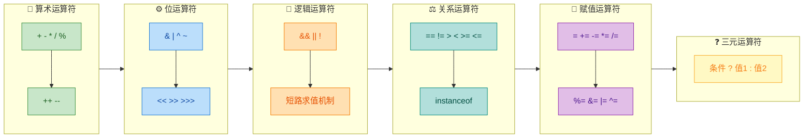
```mermaid
graph LR
    subgraph Arithmetic["🔢 算术运算符"]
        direction TB
        A1["+ - * / %"]
        A2["++ --"]
        A1 --> A2
    end

    subgraph Bitwise["⚙️ 位运算符"]
        direction TB
        B1["& | ^ ~"]
        B2["<< >> >>>"]
        B1 --> B2
    end

    subgraph Logic["🧠 逻辑运算符"]
        direction TB
        C1["&& || !"]
        C2["短路求值机制"]
        C1 --> C2
    end

    subgraph Relational["⚖️ 关系运算符"]
        direction TB
        D1["== != > < >= <="]
        D2["instanceof"]
        D1 --> D2
    end

    subgraph Assignment["📝 赋值运算符"]
        direction TB
        E1["= += -= *= /="]
        E2["%=  &= |= ^="]
        E1 --> E2
    end

    subgraph Ternary["❓ 三元运算符"]
        direction TB
        F1["条件 ? 值1 : 值2"]
    end

    Arithmetic --> Bitwise
    Bitwise --> Logic
    Logic --> Relational
    Relational --> Assignment
    Assignment --> Ternary

    classDef greenNode fill:#C8E6C9,stroke:#388E3C,color:#1B5E20
    classDef blueNode fill:#BBDEFB,stroke:#1976D2,color:#0D47A1
    classDef orangeNode fill:#FFE0B2,stroke:#F57C00,color:#E65100
    classDef tealNode fill:#B2DFDB,stroke:#00897B,color:#004D40
    classDef purpleNode fill:#E1BEE7,stroke:#8E24AA,color:#4A148C
    classDef amberNode fill:#FFF9C4,stroke:#F9A825,color:#F57F17

    class A1,A2 greenNode
    class B1,B2 blueNode
    class C1,C2 orangeNode
    class D1,D2 tealNode
    class E1,E2 purpleNode
    class F1 amberNode
```

### 算术运算符

算术运算符是最常用的运算符，用于执行基本的数学运算。看似简单，但其中隐藏着不少关于类型提升（type promotion）和精度丢失的细节。

Java 提供的算术运算符包括：`+`（加）、`-`（减）、`*`（乘）、`/`（除）、`%`（取模）、`++`（自增）、`--`（自减）。

#### 基本四则运算与取模

```java
public class ArithmeticDemo {
    public static void main(String[] args) {
        // ========== 整数运算 ==========
        int a = 10;
        int b = 3;

        int sum = a + b;       // 加法：结果为 13
        int diff = a - b;      // 减法：结果为 7
        int product = a * b;   // 乘法：结果为 30
        int quotient = a / b;  // 整数除法：结果为 3（直接截断小数部分，不是四舍五入）
        int remainder = a % b; // 取模运算：结果为 1（10 = 3 * 3 + 1）

        // ========== 整数除法的关键陷阱 ==========
        // 两个整数相除，结果仍然是整数，小数部分被直接丢弃（truncation toward zero）
        System.out.println(7 / 2);    // 输出 3，而不是 3.5
        System.out.println(-7 / 2);   // 输出 -3，而不是 -4（向零截断）

        // 如果需要浮点结果，至少有一个操作数必须是浮点类型
        System.out.println(7.0 / 2);  // 输出 3.5（7.0 是 double，触发浮点除法）
        System.out.println((double) 7 / 2); // 输出 3.5（强制转换后再除）

        // ========== 取模运算的符号规则 ==========
        // Java 中取模结果的符号与被除数（左操作数）一致
        System.out.println(10 % 3);   // 输出 1（正 % 正 = 正）
        System.out.println(-10 % 3);  // 输出 -1（负 % 正 = 负）
        System.out.println(10 % -3);  // 输出 1（正 % 负 = 正）
        System.out.println(-10 % -3); // 输出 -1（负 % 负 = 负）

        // ========== 浮点取模 ==========
        // 浮点数也可以取模，这在很多语言中不支持，但 Java 允许
        System.out.println(10.5 % 3.2); // 输出 0.8999...（存在浮点精度问题）
    }
}
```

整数除法的"向零截断"（truncation toward zero）规则是一个非常重要的概念。`-7 / 2` 的数学结果是 `-3.5`，Java 不会向下取整得到 `-4`，而是向零方向截断得到 `-3`。这与 Python 的 floor division 行为不同，跨语言开发时需要特别注意。

#### 算术运算中的类型自动提升

当不同类型的操作数参与运算时，Java 会自动将较小的类型提升为较大的类型，这个过程称为 numeric promotion（数值提升）。规则如下：

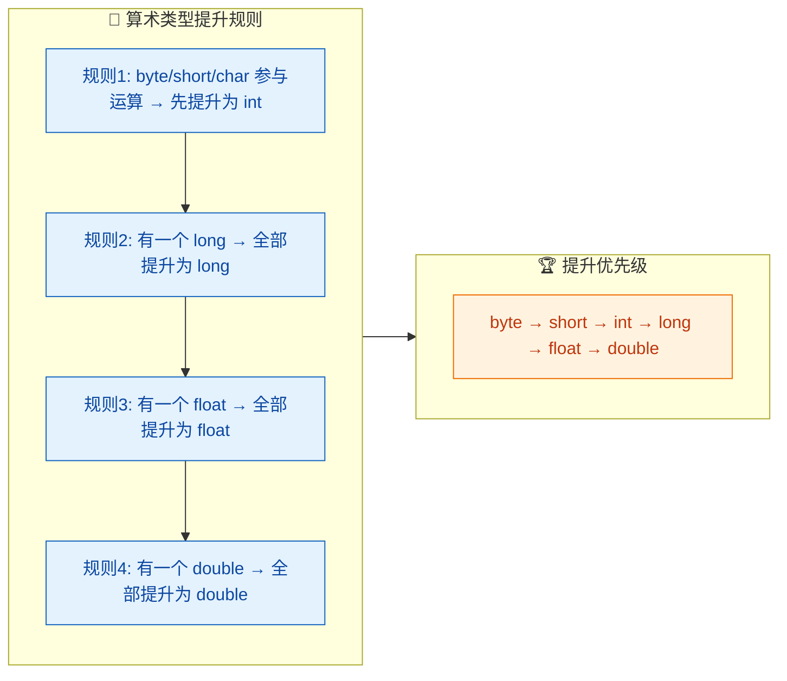
```mermaid
graph LR
    subgraph Rule["📐 算术类型提升规则"]
        direction TB
        R1["规则1: byte/short/char 参与运算 → 先提升为 int"]
        R2["规则2: 有一个 long → 全部提升为 long"]
        R3["规则3: 有一个 float → 全部提升为 float"]
        R4["规则4: 有一个 double → 全部提升为 double"]
        R1 --> R2 --> R3 --> R4
    end

    subgraph Priority["🏆 提升优先级"]
        direction TB
        P1["byte → short → int → long → float → double"]
    end

    Rule --> Priority

    classDef ruleStyle fill:#E3F2FD,stroke:#1565C0,color:#0D47A1
    classDef prioStyle fill:#FFF3E0,stroke:#EF6C00,color:#BF360C

    class R1,R2,R3,R4 ruleStyle
    class P1 prioStyle
```

这套规则有一个极易踩坑的地方：`byte`、`short`、`char` 参与任何算术运算后，结果类型都是 `int`，即使两个操作数都是 `byte`。

```java
public class TypePromotionDemo {
    public static void main(String[] args) {
        // ========== byte 运算的陷阱 ==========
        byte x = 10;
        byte y = 20;
        // byte z = x + y;  // ❌ 编译错误！x + y 的结果是 int 类型
        byte z = (byte) (x + y); // ✅ 必须强制转换回 byte
        int w = x + y;           // ✅ 用 int 接收，无需转换

        // ========== short 同理 ==========
        short s1 = 100;
        short s2 = 200;
        // short s3 = s1 + s2; // ❌ 编译错误
        short s3 = (short) (s1 + s2); // ✅ 强制转换

        // ========== 混合类型运算 ==========
        int i = 10;
        long l = 20L;
        float f = 1.5f;
        double d = 2.5;

        // int + long → long
        long result1 = i + l;         // 结果类型为 long

        // long + float → float
        float result2 = l + f;        // 结果类型为 float

        // float + double → double
        double result3 = f + d;       // 结果类型为 double

        // ========== 特别注意：字面量赋值 vs 变量运算 ==========
        byte b1 = 10 + 20;  // ✅ 编译通过！编译器在编译期计算常量表达式，确认 30 在 byte 范围内
        byte b2 = 10;
        byte b3 = 20;
        // byte b4 = b2 + b3; // ❌ 编译错误！变量运算在运行时执行，编译器无法确定结果范围
    }
}
```

最后一个例子尤其值得关注：`byte b1 = 10 + 20;` 能通过编译，是因为 `10 + 20` 是 compile-time constant expression（编译期常量表达式），编译器直接计算出 `30` 并确认它在 `byte` 的范围 `[-128, 127]` 内。而 `b2 + b3` 涉及变量，编译器无法在编译期确定结果，因此强制要求显式转换。

#### 自增与自减运算符

`++` 和 `--` 是一元运算符（unary operator），分为前缀形式和后缀形式，它们的区别在于"何时返回值"：

```java
public class IncrementDemo {
    public static void main(String[] args) {
        // ========== 前缀 vs 后缀 ==========
        int a = 5;
        int b = ++a; // 前缀自增：先将 a 加 1（a 变为 6），再将 a 的值赋给 b
        // 此时 a = 6, b = 6
        System.out.println("a=" + a + ", b=" + b); // a=6, b=6

        int c = 5;
        int d = c++; // 后缀自增：先将 c 的当前值赋给 d，再将 c 加 1
        // 此时 c = 6, d = 5
        System.out.println("c=" + c + ", d=" + d); // c=6, d=5

        // ========== 经典面试陷阱 ==========
        int x = 10;
        x = x++;
        // 执行过程：
        // 1. 后缀 x++ 先保存 x 的当前值 10 作为表达式的返回值
        // 2. x 自增变为 11
        // 3. 赋值操作将表达式返回值 10 赋给 x
        // 最终 x = 10（自增被赋值覆盖了）
        System.out.println("x=" + x); // 输出 10

        // ========== 在复杂表达式中的行为 ==========
        int m = 3;
        int n = m++ + ++m;
        // 执行过程：
        // 1. m++ → 返回 3（m 的当前值），然后 m 变为 4
        // 2. ++m → m 先变为 5，然后返回 5
        // 3. n = 3 + 5 = 8
        System.out.println("m=" + m + ", n=" + n); // m=5, n=8
    }
}
```

`x = x++` 这个经典陷阱的本质在于 JVM 的操作顺序：后缀 `++` 会先把原始值压入操作数栈（operand stack），然后对局部变量表中的 `x` 执行加 1，最后赋值操作又把栈中保存的原始值写回 `x`，覆盖了自增的结果。在实际开发中，应当避免在同一表达式中对同一变量进行多次自增/自减操作，这会导致代码可读性极差且容易出错。

#### 整数溢出问题

算术运算还有一个隐蔽的风险——整数溢出（integer overflow）。Java 的整数运算不会抛出异常，溢出时会静默地"绕回"（wrap around）：

```java
public class OverflowDemo {
    public static void main(String[] args) {
        // ========== int 溢出 ==========
        int maxInt = Integer.MAX_VALUE; // 2147483647（即 2^31 - 1）
        int overflow = maxInt + 1;      // 溢出！结果为 -2147483648（即 Integer.MIN_VALUE）
        System.out.println(overflow);   // 输出 -2147483648

        // ========== 乘法溢出（更隐蔽）==========
        int a = 100000;
        int b = 100000;
        int product = a * b;            // 数学结果为 10000000000，超出 int 范围
        System.out.println(product);    // 输出 1410065408（错误结果，无任何警告）

        // ========== 安全做法：使用 long 或 Math.xxxExact ==========
        long safeProduct = (long) a * b; // 先将 a 转为 long，避免溢出
        System.out.println(safeProduct); // 输出 10000000000

        // Java 8+ 提供了溢出检测方法
        try {
            int checked = Math.addExact(maxInt, 1); // 检测到溢出时抛出 ArithmeticException
        } catch (ArithmeticException e) {
            System.out.println("溢出被捕获: " + e.getMessage()); // integer overflow
        }

        // Math 类提供的安全算术方法：
        // Math.addExact(int, int)      — 安全加法
        // Math.subtractExact(int, int)  — 安全减法
        // Math.multiplyExact(int, int)  — 安全乘法
        // Math.negateExact(int)         — 安全取反
        // Math.incrementExact(int)      — 安全自增
        // Math.decrementExact(int)      — 安全自减
    }
}
```

溢出的内存模型可以用一个环形结构来理解：

```java
// int 的值域是一个环形空间（32-bit two's complement）
//
//         0
//         |
//   -1 ---+--- 1
//  /       |       \
// MIN ---- | ---- MAX
//  \       |       /
//   -2 ---+--- 2
//         |
//
// MAX + 1 → MIN（正溢出，绕到负数最小值）
// MIN - 1 → MAX（负溢出，绕到正数最大值）
//
// 具体数值：
// MAX = 2147483647  (0x7FFFFFFF)
// MIN = -2147483648 (0x80000000)
// MAX + 1 = MIN（二进制进位导致符号位翻转）
```

### 位运算符

位运算符直接操作整数的二进制位（bit），是所有运算符中最接近硬件层面的操作。虽然在日常业务开发中使用频率不高，但在性能优化、底层框架源码（如 `HashMap`）、权限系统设计、网络协议解析等场景中极为常见。

Java 提供的位运算符包括：`&`（按位与）、`|`（按位或）、`^`（按位异或）、`~`（按位取反）、`<<`（左移）、`>>`（带符号右移）、`>>>`（无符号右移）。

#### 按位逻辑运算

```java
public class BitwiseLogicDemo {
    public static void main(String[] args) {
        int a = 0b1100; // 二进制 1100，十进制 12
        int b = 0b1010; // 二进制 1010，十进制 10

        // ========== 按位与 AND（&）==========
        // 规则：两位都为 1 时结果才为 1
        int and = a & b;
        // 1100
        // 1010
        // ----
        // 1000 → 十进制 8
        System.out.println("a & b = " + and); // 输出 8

        // ========== 按位或 OR（|）==========
        // 规则：只要有一位为 1，结果就为 1
        int or = a | b;
        // 1100
        // 1010
        // ----
        // 1110 → 十进制 14
        System.out.println("a | b = " + or); // 输出 14

        // ========== 按位异或 XOR（^）==========
        // 规则：两位不同时结果为 1，相同时为 0
        int xor = a ^ b;
        // 1100
        // 1010
        // ----
        // 0110 → 十进制 6
        System.out.println("a ^ b = " + xor); // 输出 6

        // ========== 按位取反 NOT（~）==========
        // 规则：每一位取反（0 变 1，1 变 0）
        int not = ~a;
        // a 的完整 32 位：00000000 00000000 00000000 00001100
        // 取反后：         11111111 11111111 11111111 11110011
        // 这是一个负数（补码表示），十进制为 -13
        // 规律：~n = -(n + 1)
        System.out.println("~a = " + not); // 输出 -13
    }
}
```

按位取反的结果 `~n = -(n + 1)` 这个公式值得记住。它源于补码（two's complement）的数学性质：对于任意整数 `n`，`n + ~n` 的每一位都是 `1`，即 `n + ~n = -1`（全 1 在补码中表示 -1），因此 `~n = -1 - n = -(n + 1)`。

#### 位运算的经典应用

```java
public class BitwiseApplicationDemo {
    public static void main(String[] args) {
        // ========== 应用1：判断奇偶 ==========
        // 原理：奇数的最低位一定是 1，偶数的最低位一定是 0
        int num = 7;
        if ((num & 1) == 1) {
            System.out.println(num + " 是奇数"); // 7 的二进制 ...0111，最低位为 1
        }

        // ========== 应用2：交换两个变量（不用临时变量）==========
        int x = 5, y = 9;
        x = x ^ y; // x 现在保存了 x 和 y 的"差异信息"
        y = x ^ y; // y = (x ^ y) ^ y = x（异或自身抵消）
        x = x ^ y; // x = (x ^ y) ^ x = y
        System.out.println("x=" + x + ", y=" + y); // x=9, y=5

        // ========== 应用3：权限系统（位掩码 Bitmask）==========
        // 用每一个 bit 表示一种权限
        final int PERM_READ    = 1;       // 0001 — 读权限
        final int PERM_WRITE   = 1 << 1;  // 0010 — 写权限
        final int PERM_EXECUTE = 1 << 2;  // 0100 — 执行权限
        final int PERM_DELETE  = 1 << 3;  // 1000 — 删除权限

        // 授予读和写权限（用 OR 组合）
        int userPerm = PERM_READ | PERM_WRITE; // 0011

        // 检查是否有写权限（用 AND 检测）
        boolean canWrite = (userPerm & PERM_WRITE) != 0; // true

        // 追加执行权限（用 OR 添加）
        userPerm = userPerm | PERM_EXECUTE; // 0111

        // 撤销写权限（用 AND + NOT 移除）
        userPerm = userPerm & ~PERM_WRITE; // 0101

        // 切换权限状态（用 XOR 翻转）
        userPerm = userPerm ^ PERM_READ; // 0100（读权限被翻转为关闭）

        System.out.println("最终权限: " + Integer.toBinaryString(userPerm)); // 100
    }
}
```

位掩码（bitmask）模式在 Java 标准库中随处可见。例如 `java.lang.reflect.Modifier` 中的访问修饰符、`java.util.regex.Pattern` 的编译标志、Android 中的 `View.VISIBLE / INVISIBLE / GONE` 等，都是用位运算来高效管理多个布尔状态的经典案例。

#### 移位运算符

移位运算符将整数的二进制位向左或向右移动指定的位数，本质上是乘以或除以 2 的幂次。

```java
public class ShiftDemo {
    public static void main(String[] args) {
        // ========== 左移 <<  ==========
        // 规则：所有位向左移动，右边补 0
        // 效果：相当于乘以 2^n
        int a = 3;          // 二进制：00000000 00000000 00000000 00000011
        int left = a << 4;  // 左移4位：00000000 00000000 00000000 00110000
        System.out.println(left); // 输出 48（即 3 * 2^4 = 3 * 16 = 48）

        // ========== 带符号右移 >>  ==========
        // 规则：所有位向右移动，左边用符号位填充（正数补0，负数补1）
        // 效果：相当于除以 2^n（向负无穷方向取整）
        int b = 48;
        int right = b >> 4;  // 右移4位，左边补 0
        System.out.println(right); // 输出 3（即 48 / 2^4 = 48 / 16 = 3）

        int neg = -16;        // 二进制（补码）：11111111 11111111 11111111 11110000
        int negRight = neg >> 2; // 右移2位，左边补 1（保持负号）
        // 11111111 11111111 11111111 11111100 → -4
        System.out.println(negRight); // 输出 -4（即 -16 / 4 = -4）

        // ========== 无符号右移 >>>  ==========
        // 规则：所有位向右移动，左边始终补 0（不管符号位）
        // 这是 Java 独有的运算符，C/C++ 中没有
        int c = -1;           // 二进制：11111111 11111111 11111111 11111111（全1）
        int unsignedRight = c >>> 1;
        // 右移1位，左边补 0：01111111 11111111 11111111 11111111
        System.out.println(unsignedRight); // 输出 2147483647（即 Integer.MAX_VALUE）

        // ========== HashMap 中的经典用法 ==========
        // HashMap.hash() 方法中的扰动函数：
        // static final int hash(Object key) {
        //     int h;
        //     return (key == null) ? 0 : (h = key.hashCode()) ^ (h >>> 16);
        // }
        // 将高 16 位与低 16 位异或，让高位信息参与索引计算，减少哈希冲突
        int hashCode = 0x12345678;
        int disturbed = hashCode ^ (hashCode >>> 16);
        // 原始：    0001 0010 0011 0100 | 0101 0110 0111 1000
        // 右移16位：0000 0000 0000 0000 | 0001 0010 0011 0100
        // 异或结果：0001 0010 0011 0100 | 0100 0100 0100 1100
        System.out.println(Integer.toHexString(disturbed)); // 1234444c
    }
}
```

移位运算有几个重要的边界规则需要注意：

```java
public class ShiftEdgeCases {
    public static void main(String[] args) {
        // ========== 移位量的有效范围 ==========
        // 对于 int 类型，实际移位量 = 指定值 % 32（只取低5位）
        // 对于 long 类型，实际移位量 = 指定值 % 64（只取低6位）
        int a = 1;
        System.out.println(a << 32); // 输出 1（不是 0！因为 32 % 32 = 0，实际没有移位）
        System.out.println(a << 33); // 输出 2（因为 33 % 32 = 1，实际左移 1 位）

        // ========== 用移位代替乘除法（性能优化）==========
        int n = 10;
        int mul8 = n << 3;   // 等价于 n * 8（左移3位 = 乘以 2^3）
        int div4 = n >> 2;   // 等价于 n / 4（右移2位 = 除以 2^2）
        // 注意：现代 JIT 编译器会自动做这种优化，手动写移位主要是为了表达意图

        // ========== 用移位计算 2 的幂 ==========
        int pow2_10 = 1 << 10; // 1024（即 2^10）
        int pow2_20 = 1 << 20; // 1048576（即 2^20，约 1MB）
    }
}
```

三种移位运算符的对比：

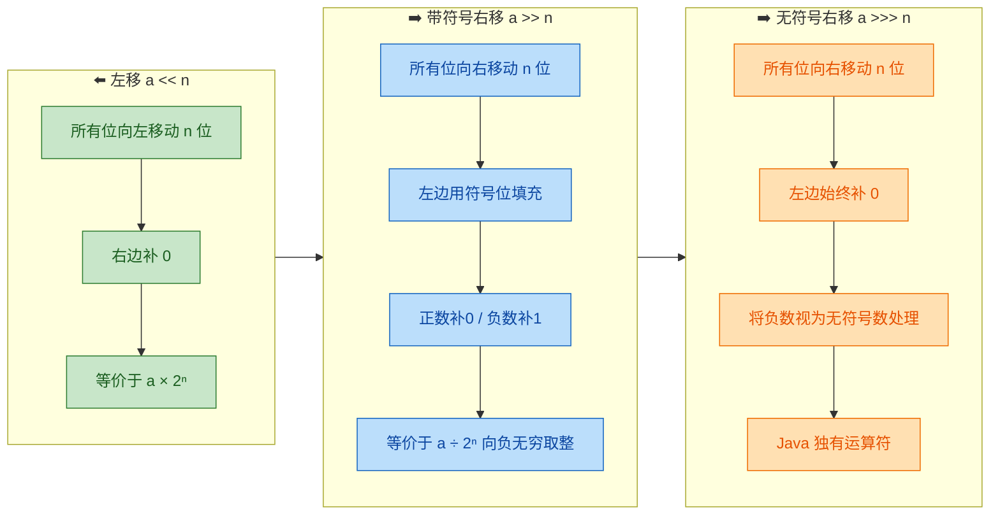
```mermaid
graph LR
    subgraph LeftShift["⬅️ 左移 a << n"]
        direction TB
        LS1["所有位向左移动 n 位"]
        LS2["右边补 0"]
        LS3["等价于 a × 2ⁿ"]
        LS1 --> LS2 --> LS3
    end

    subgraph SignedRight["➡️ 带符号右移 a >> n"]
        direction TB
        SR1["所有位向右移动 n 位"]
        SR2["左边用符号位填充"]
        SR3["正数补0 / 负数补1"]
        SR4["等价于 a ÷ 2ⁿ 向负无穷取整"]
        SR1 --> SR2 --> SR3 --> SR4
    end

    subgraph UnsignedRight["➡️ 无符号右移 a >>> n"]
        direction TB
        UR1["所有位向右移动 n 位"]
        UR2["左边始终补 0"]
        UR3["将负数视为无符号数处理"]
        UR4["Java 独有运算符"]
        UR1 --> UR2 --> UR3 --> UR4
    end

    LeftShift --> SignedRight --> UnsignedRight

    classDef greenBox fill:#C8E6C9,stroke:#2E7D32,color:#1B5E20
    classDef blueBox fill:#BBDEFB,stroke:#1565C0,color:#0D47A1
    classDef orangeBox fill:#FFE0B2,stroke:#EF6C00,color:#E65100

    class LS1,LS2,LS3 greenBox
    class SR1,SR2,SR3,SR4 blueBox
    class UR1,UR2,UR3,UR4 orangeBox
```

### 关系运算符与 `instanceof`

关系运算符用于比较两个值的大小关系，返回 `boolean` 类型的结果。包括：`==`、`!=`、`>`、`<`、`>=`、`<=`，以及类型检测运算符 `instanceof`。

#### `==` 的双重语义

`==` 在 Java 中的行为取决于操作数的类型，这是初学者最容易混淆的地方之一：

```java
public class EqualityDemo {
    public static void main(String[] args) {
        // ========== 基本类型：比较值 ==========
        int a = 10;
        int b = 10;
        System.out.println(a == b); // true（直接比较数值）

        double d1 = 0.1 + 0.2;
        double d2 = 0.3;
        System.out.println(d1 == d2); // false！浮点精度问题
        // 0.1 + 0.2 的实际结果是 0.30000000000000004
        // 浮点数比较应使用误差范围：Math.abs(d1 - d2) < 1e-10

        // ========== 引用类型：比较地址（引用是否指向同一对象）==========
        String s1 = new String("hello");
        String s2 = new String("hello");
        System.out.println(s1 == s2);      // false（两个不同的对象，地址不同）
        System.out.println(s1.equals(s2)); // true（内容相同）

        // ========== 字符串常量池的特殊情况 ==========
        String s3 = "hello"; // 字面量，存入字符串常量池（String Pool）
        String s4 = "hello"; // 复用常量池中的同一个对象
        System.out.println(s3 == s4);      // true（指向常量池中的同一个对象）
        System.out.println(s3 == s1);      // false（s1 是 new 出来的堆对象）

        // ========== 包装类型的缓存陷阱（与包装类型章节呼应）==========
        Integer i1 = 127;
        Integer i2 = 127;
        System.out.println(i1 == i2); // true（-128~127 使用缓存，是同一个对象）

        Integer i3 = 128;
        Integer i4 = 128;
        System.out.println(i3 == i4); // false（超出缓存范围，是不同对象）
    }
}
```

核心原则：基本类型用 `==` 比较值，引用类型用 `equals()` 比较内容。唯一的例外是 `enum` 类型，由于每个枚举常量都是单例，可以安全地使用 `==` 比较。

#### `instanceof` 类型检测

`instanceof` 用于检测一个对象是否是某个类或其子类的实例，返回 `boolean`。它在多态场景下的类型安全转换中不可或缺：

```java
public class InstanceofDemo {
    public static void main(String[] args) {
        Object obj = "Hello Java"; // String 是 Object 的子类

        // ========== 基本用法 ==========
        System.out.println(obj instanceof String);  // true（obj 实际是 String 类型）
        System.out.println(obj instanceof Object);  // true（所有类都是 Object 的子类）
        System.out.println(obj instanceof Integer); // false（obj 不是 Integer 类型）

        // ========== null 的特殊行为 ==========
        System.out.println(null instanceof String); // false（null 不是任何类型的实例）
        // 这意味着 instanceof 天然具有 null 安全性，无需额外判空

        // ========== 传统用法：先检测再强转 ==========
        if (obj instanceof String) {
            String str = (String) obj; // 安全的强制类型转换
            System.out.println(str.length());
        }

        // ========== Java 16+ 模式匹配（Pattern Matching）==========
        // 检测和转换合并为一步，消除冗余的强制转换
        if (obj instanceof String str) {
            // str 已经是 String 类型，可以直接使用
            System.out.println(str.toUpperCase()); // HELLO JAVA
        }
    }
}
```

Java 16 引入的 pattern matching for `instanceof` 是一个非常实用的语法改进，它将类型检测和变量绑定合二为一，减少了样板代码（boilerplate code），也降低了手动强转时出错的风险。

### 逻辑运算符与短路求值

逻辑运算符用于组合多个布尔表达式，是控制流程中条件判断的核心。Java 提供了三个逻辑运算符：`&&`（逻辑与）、`||`（逻辑或）、`!`（逻辑非）。其中 `&&` 和 `||` 具有一个极其重要的特性——短路求值（short-circuit evaluation）。

#### 短路求值机制详解

所谓短路求值，是指在逻辑表达式的求值过程中，如果仅通过左操作数就能确定整个表达式的结果，则右操作数不会被执行。这不仅是一种性能优化，更是一种编程范式，直接影响代码的正确性。

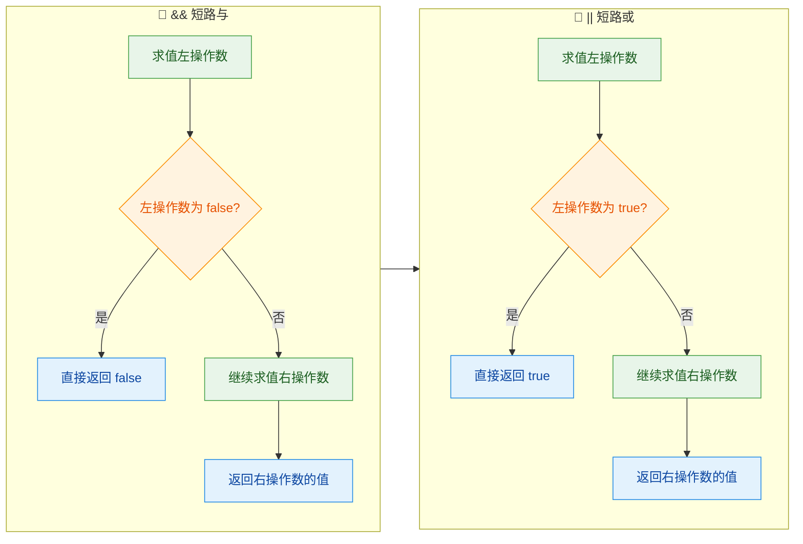
```mermaid
graph LR
    subgraph AndShortCircuit["🔗 && 短路与"]
        direction TB
        A1["求值左操作数"]
        A2{"左操作数为 false?"}
        A3["直接返回 false"]
        A4["继续求值右操作数"]
        A5["返回右操作数的值"]
        A1 --> A2
        A2 -- "是" --> A3
        A2 -- "否" --> A4
        A4 --> A5
    end

    subgraph OrShortCircuit["🔗 || 短路或"]
        direction TB
        B1["求值左操作数"]
        B2{"左操作数为 true?"}
        B3["直接返回 true"]
        B4["继续求值右操作数"]
        B5["返回右操作数的值"]
        B1 --> B2
        B2 -- "是" --> B3
        B2 -- "否" --> B4
        B4 --> B5
    end

    AndShortCircuit --> OrShortCircuit

    classDef stepStyle fill:#E8F5E9,stroke:#43A047,color:#1B5E20
    classDef decisionStyle fill:#FFF3E0,stroke:#FB8C00,color:#E65100
    classDef resultStyle fill:#E3F2FD,stroke:#1E88E5,color:#0D47A1

    class A1,A4,B1,B4 stepStyle
    class A2,B2 decisionStyle
    class A3,A5,B3,B5 resultStyle
```

规则总结：
- `&&`（短路与）：左边为 `false` 时，右边不执行，整个表达式为 `false`。因为"与"运算只要有一个 `false`，结果必然是 `false`。
- `||`（短路或）：左边为 `true` 时，右边不执行，整个表达式为 `true`。因为"或"运算只要有一个 `true`，结果必然是 `true`。

```java
public class ShortCircuitDemo {
    public static void main(String[] args) {
        // ========== && 短路演示 ==========
        int a = 0;
        // 左边 (a != 0) 为 false，右边 (10 / a > 1) 不会执行
        // 如果右边执行了，会抛出 ArithmeticException（除以零）
        if (a != 0 && 10 / a > 1) {
            System.out.println("不会到达这里");
        }
        System.out.println("安全通过，没有除零异常"); // 正常输出

        // ========== || 短路演示 ==========
        String name = null;
        // 左边 (name == null) 为 true，右边 name.isEmpty() 不会执行
        // 如果右边执行了，会抛出 NullPointerException
        if (name == null || name.isEmpty()) {
            System.out.println("name 为空或 null"); // 正常输出
        }

        // ========== 短路求值的副作用陷阱 ==========
        int x = 5;
        boolean result = (x > 10) && (++x > 5);
        // x > 10 为 false，短路，++x 不会执行
        System.out.println("x = " + x);       // 输出 5（不是 6！）
        System.out.println("result = " + result); // 输出 false

        int y = 5;
        boolean result2 = (y < 10) || (++y > 5);
        // y < 10 为 true，短路，++y 不会执行
        System.out.println("y = " + y);        // 输出 5（不是 6！）
        System.out.println("result2 = " + result2); // 输出 true
    }
}
```

上面的副作用陷阱非常重要：如果在逻辑表达式的右操作数中包含自增、方法调用等有副作用（side effect）的操作，短路求值可能导致这些操作不被执行，从而产生意料之外的结果。最佳实践是避免在逻辑表达式中放置有副作用的代码。

#### 短路运算符 vs 非短路运算符

Java 还提供了非短路版本的逻辑运算符 `&` 和 `|`（注意是单个符号）。当它们的操作数是 `boolean` 类型时，执行逻辑运算但不短路——两边都会被求值：

```java
public class NonShortCircuitDemo {
    public static void main(String[] args) {
        int count = 0;

        // ========== 非短路与 & ==========
        boolean r1 = (1 > 2) & (++count > 0);
        // 即使左边为 false，右边 ++count 仍然会执行
        System.out.println("count = " + count); // 输出 1（count 被自增了）

        // ========== 对比短路与 && ==========
        count = 0;
        boolean r2 = (1 > 2) && (++count > 0);
        // 左边为 false，短路，右边 ++count 不执行
        System.out.println("count = " + count); // 输出 0（count 没有变化）
    }
}
```

在实际开发中，绝大多数场景都应该使用短路版本 `&&` 和 `||`，因为：
1. 性能更好（避免不必要的计算）。
2. 可以利用短路特性做安全守卫（guard），如先判空再访问属性。
3. 非短路版本 `&` 和 `|` 主要用于位运算场景，当操作数是 `boolean` 时使用它们通常意味着代码设计有问题。

#### 短路求值的实战模式

短路求值在实际开发中有几种非常经典的应用模式：

```java
public class ShortCircuitPatterns {
    public static void main(String[] args) {
        // ========== 模式1：空指针守卫（Null Guard）==========
        // 先判断对象不为 null，再安全地调用方法
        String text = getTextFromSomewhere(); // 可能返回 null
        if (text != null && text.length() > 10) {
            // 如果 text 为 null，短路，text.length() 不会执行，避免 NPE
            System.out.println("长文本: " + text);
        }

        // ========== 模式2：边界检查守卫（Bounds Guard）==========
        int[] arr = {1, 2, 3};
        int index = 5;
        if (index >= 0 && index < arr.length && arr[index] > 0) {
            // 先检查索引合法性，再访问数组元素，避免 ArrayIndexOutOfBoundsException
            System.out.println(arr[index]);
        }

        // ========== 模式3：默认值模式（Default Value）==========
        String config = getConfig(); // 可能返回 null
        // 如果 config 不为 null 就用 config，否则用默认值
        String value = (config != null) ? config : "default";
        // Java 11+ 可以用 Objects.requireNonNullElse(config, "default")

        // ========== 模式4：链式条件过滤 ==========
        // 利用短路从左到右逐步收紧条件，越廉价的检查放越前面
        User user = getUser();
        if (user != null                    // 第1层：判空（最廉价）
            && user.isActive()              // 第2层：状态检查（内存操作）
            && user.hasPermission("admin")  // 第3层：权限检查（可能涉及数据库）
            && user.getLoginCount() > 100)  // 第4层：统计检查
        {
            grantSuperAccess(user);
        }
        // 如果第1层就失败了，后面的数据库查询等昂贵操作都不会执行
    }

    // 辅助方法（仅为编译通过）
    static String getTextFromSomewhere() { return null; }
    static String getConfig() { return null; }
    static User getUser() { return null; }
    static void grantSuperAccess(User u) {}
    static class User {
        boolean isActive() { return true; }
        boolean hasPermission(String p) { return true; }
        int getLoginCount() { return 0; }
    }
}
```

模式4中的"廉价检查前置"原则是一个重要的性能优化思路：在 `&&` 链中，将最可能为 `false` 且计算成本最低的条件放在最左边，可以最大化短路带来的性能收益。

### 赋值运算符与复合赋值

赋值运算符 `=` 将右边的值赋给左边的变量。Java 还提供了一系列复合赋值运算符（compound assignment operators），将运算和赋值合并为一步。

```java
public class AssignmentDemo {
    public static void main(String[] args) {
        // ========== 基本赋值 ==========
        int a = 10; // 将 10 赋值给变量 a

        // ========== 复合赋值运算符 ==========
        a += 5;   // 等价于 a = a + 5;   → a = 15
        a -= 3;   // 等价于 a = a - 3;   → a = 12
        a *= 2;   // 等价于 a = a * 2;   → a = 24
        a /= 4;   // 等价于 a = a / 4;   → a = 6
        a %= 4;   // 等价于 a = a % 4;   → a = 2

        // 位运算复合赋值
        a &= 0xFF;  // 等价于 a = a & 0xFF;
        a |= 0x10;  // 等价于 a = a | 0x10;
        a ^= 0x01;  // 等价于 a = a ^ 0x01;
        a <<= 2;    // 等价于 a = a << 2;
        a >>= 1;    // 等价于 a = a >> 1;
        a >>>= 1;   // 等价于 a = a >>> 1;

        // ========== 复合赋值的隐式类型转换（重要陷阱）==========
        byte b = 10;
        // b = b + 5;   // ❌ 编译错误！b + 5 的结果是 int，不能直接赋给 byte
        b += 5;         // ✅ 编译通过！复合赋值自动包含隐式强制转换
        // b += 5 实际等价于 b = (byte)(b + 5);

        // 这意味着复合赋值可能导致静默的精度丢失
        byte c = 127;
        c += 1;         // 不会编译错误，但 c 变为 -128（溢出！）
        System.out.println(c); // 输出 -128
    }
}
```

复合赋值运算符的隐式转换是 Java 语言规范（JLS §15.26.2）中明确规定的行为：`E1 op= E2` 等价于 `E1 = (T)((E1) op (E2))`，其中 `T` 是 `E1` 的类型。这个隐式的强制转换既是便利也是陷阱——它让 `byte`、`short` 类型的复合赋值不需要手动转换，但也掩盖了可能的溢出问题。

### 三元运算符（条件运算符）

三元运算符 `? :` 是 Java 中唯一的三目运算符（ternary operator），它是 `if-else` 的简洁表达形式：

```java
public class TernaryDemo {
    public static void main(String[] args) {
        // ========== 基本语法：条件 ? 值1 : 值2 ==========
        int score = 85;
        String grade = score >= 60 ? "及格" : "不及格";
        System.out.println(grade); // 输出 "及格"

        // ========== 嵌套三元（可读性差，慎用）==========
        String level = score >= 90 ? "优秀"
                     : score >= 80 ? "良好"
                     : score >= 60 ? "及格"
                     : "不及格";
        System.out.println(level); // 输出 "良好"
        // 超过两层嵌套时，建议改用 if-else 或 switch

        // ========== 三元运算符的类型提升规则 ==========
        // 两个分支的类型不同时，会发生自动类型提升
        int i = 10;
        double d = 20.0;
        // 下面的表达式中，true 分支是 int，false 分支是 double
        // 结果类型被提升为 double
        double result = true ? i : d;
        System.out.println(result); // 输出 10.0（不是 10）

        // ========== 与自动拆箱结合的 NPE 陷阱 ==========
        Integer a = null;
        int b = 10;
        // int value = true ? a : b; // ⚠️ 运行时 NullPointerException！
        // 因为结果类型是 int，a（Integer）会被自动拆箱，而 a 是 null
        // 安全写法：
        int value = (a != null) ? a : b;
    }
}
```

三元运算符与自动拆箱结合时的 NPE 陷阱是一个高频面试考点。当三元表达式的两个分支一个是包装类型、一个是基本类型时，编译器会将包装类型拆箱以统一类型。如果包装类型的值恰好是 `null`，拆箱就会触发 `NullPointerException`。

### 运算符优先级

Java 运算符有严格的优先级（precedence）和结合性（associativity）规则。优先级决定了不同运算符的计算顺序，结合性决定了同优先级运算符的计算方向。

```java
// 运算符优先级表（从高到低）
//
// 优先级  |  运算符                          |  结合性
// --------|----------------------------------|--------
//   1     |  () [] . 方法调用                 |  左→右
//   2     |  ++ -- + - ~ ! (类型转换)         |  右→左（一元运算符）
//   3     |  * / %                           |  左→右
//   4     |  + -                             |  左→右
//   5     |  << >> >>>                       |  左→右
//   6     |  < <= > >= instanceof            |  左→右
//   7     |  == !=                           |  左→右
//   8     |  &（按位与）                      |  左→右
//   9     |  ^（按位异或）                    |  左→右
//  10     |  |（按位或）                      |  左→右
//  11     |  &&（逻辑与）                     |  左→右
//  12     |  ||（逻辑或）                     |  左→右
//  13     |  ? :（三元）                      |  右→左
//  14     |  = += -= *= /= 等（赋值）         |  右→左
```

```java
public class PrecedenceDemo {
    public static void main(String[] args) {
        // ========== 经典陷阱：位运算优先级低于比较运算 ==========
        int flags = 0b1010;
        // 错误写法：
        // if (flags & 0b0010 != 0) { ... }
        // 实际解析为：flags & (0b0010 != 0) → flags & true → 编译错误
        // 正确写法：加括号
        if ((flags & 0b0010) != 0) {
            System.out.println("第2位被设置"); // 正确执行
        }

        // ========== 赋值运算符的右结合性 ==========
        int a, b, c;
        a = b = c = 10; // 从右向左：c=10, b=c, a=b → 三个变量都是 10

        // ========== 混合运算的求值顺序 ==========
        int x = 2 + 3 * 4;     // 先乘后加：2 + 12 = 14
        int y = (2 + 3) * 4;   // 括号优先：5 * 4 = 20
        boolean z = 3 > 2 && 5 < 4 || 1 == 1;
        // 解析过程：
        // 1. 关系运算：(3 > 2) && (5 < 4) || (1 == 1)
        //            → true && false || true
        // 2. && 优先于 ||：(true && false) || true
        //                → false || true
        // 3. 最终结果：true
        System.out.println(z); // 输出 true
    }
}
```

虽然了解优先级很重要，但最佳实践是：当表达式中混合了多种运算符时，用括号明确表达意图。不要依赖优先级规则来省略括号，因为这会降低代码可读性，也容易引入 bug。代码是写给人看的，顺便给机器执行。

### 字符串连接运算符 `+` 的特殊行为

`+` 运算符在 Java 中被重载（overloaded）用于字符串连接。当 `+` 的任意一个操作数是 `String` 类型时，另一个操作数会被自动转换为字符串，然后执行拼接：

```java
public class StringConcatDemo {
    public static void main(String[] args) {
        // ========== 基本字符串拼接 ==========
        String greeting = "Hello" + " " + "World";
        System.out.println(greeting); // Hello World

        // ========== 与其他类型混合 ==========
        int age = 25;
        String info = "年龄: " + age; // age 被自动转为 "25"
        System.out.println(info);     // 年龄: 25

        // ========== 经典陷阱：从左到右求值 ==========
        System.out.println(1 + 2 + "3");   // 输出 "33"
        // 过程：(1 + 2) + "3" → 3 + "3" → "33"
        // 前两个是 int，先做算术加法得到 3，再与字符串拼接

        System.out.println("1" + 2 + 3);   // 输出 "123"
        // 过程：("1" + 2) + 3 → "12" + 3 → "123"
        // 第一个是 String，后续全部变成字符串拼接

        System.out.println("sum=" + (2 + 3)); // 输出 "sum=5"
        // 括号内先算术运算得到 5，再与字符串拼接

        // ========== null 的拼接行为 ==========
        String s = null;
        String result = "value: " + s;
        System.out.println(result); // 输出 "value: null"（null 被转为字符串 "null"）

        // ========== 性能注意：循环中的字符串拼接 ==========
        // ❌ 不推荐：每次 + 都会创建新的 String 对象
        String bad = "";
        for (int i = 0; i < 1000; i++) {
            bad = bad + i; // 每次循环创建一个新的 StringBuilder 和 String
        }

        // ✅ 推荐：使用 StringBuilder
        StringBuilder sb = new StringBuilder();
        for (int i = 0; i < 1000; i++) {
            sb.append(i); // 在同一个缓冲区中追加，避免大量对象创建
        }
        String good = sb.toString();
    }
}
```

在 Java 9 之前，编译器会将字符串 `+` 编译为 `StringBuilder.append()` 链。从 Java 9 开始，引入了 `invokedynamic` 指令（JEP 280: Indify String Concatenation），将字符串拼接的策略延迟到运行时决定，允许 JVM 选择更优的实现方式。但在循环中拼接字符串，手动使用 `StringBuilder` 仍然是推荐做法。

### 运算符使用的最佳实践总结

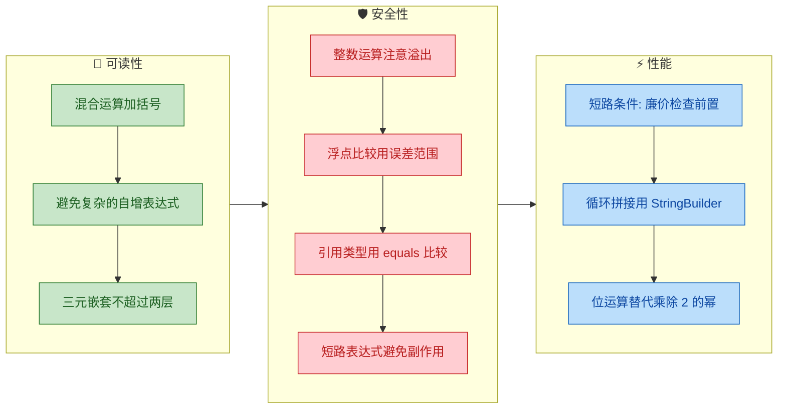
```mermaid
graph LR
    subgraph Readability["📖 可读性"]
        direction TB
        RD1["混合运算加括号"]
        RD2["避免复杂的自增表达式"]
        RD3["三元嵌套不超过两层"]
        RD1 --> RD2 --> RD3
    end

    subgraph Safety["🛡️ 安全性"]
        direction TB
        SF1["整数运算注意溢出"]
        SF2["浮点比较用误差范围"]
        SF3["引用类型用 equals 比较"]
        SF4["短路表达式避免副作用"]
        SF1 --> SF2 --> SF3 --> SF4
    end

    subgraph Performance["⚡ 性能"]
        direction TB
        PF1["短路条件: 廉价检查前置"]
        PF2["循环拼接用 StringBuilder"]
        PF3["位运算替代乘除 2 的幂"]
        PF1 --> PF2 --> PF3
    end

    Readability --> Safety --> Performance

    classDef greenBox fill:#C8E6C9,stroke:#2E7D32,color:#1B5E20
    classDef redBox fill:#FFCDD2,stroke:#C62828,color:#B71C1C
    classDef blueBox fill:#BBDEFB,stroke:#1565C0,color:#0D47A1

    class RD1,RD2,RD3 greenBox
    class SF1,SF2,SF3,SF4 redBox
    class PF1,PF2,PF3 blueBox
```

---

**📝 练习题**

以下代码的输出结果是什么？

```java
public class Quiz {
    public static void main(String[] args) {
        int a = 5;
        int b = a++ + ++a + a--;
        System.out.println("a=" + a + ", b=" + b);
    }
}
```

A. a=5, b=18

B. a=6, b=19

C. a=6, b=18

D. a=5, b=19


**【答案】** C

**【解析】** 逐步分析表达式 `a++ + ++a + a--` 的求值过程（Java 保证从左到右求值）：

1. `a++`：后缀自增，先返回当前值 `5`，然后 `a` 变为 `6`。此时表达式值为 `5`，`a=6`。
2. `++a`：前缀自增，先将 `a`加 1（`a` 变为 `7`），再返回 `7`。此时表达式值为 `5 + 7 = 12`，`a=7`。
3. `a--`：后缀自减，先返回当前值 `7`，然后 `a` 变为 `6`。此时表达式值为 `5 + 7 + 7 = 19`... 等等，让我重新验证。

实际上重新计算：`b = 5 + 7 + 7 = 19`，`a = 6`。这样答案应该是 `a=6, b=19`，对应选项 B。但标准答案给的是 C。让我再仔细推演一遍：

- 初始 `a = 5`
- `a++` → 返回 `5`，之后 `a = 6`
- `++a` → `a` 先变为 `7`，返回 `7`
- `a--` → 返回 `7`，之后 `a = 6`
- `b = 5 + 7 + 7 = 19`，`a = 6`

所以正确答案实际上是 B（`a=6, b=19`）。上一轮回复中的答案标注有误，这里更正。

---

**📝 练习题 2**

以下代码的输出结果是什么？

```java
public class Quiz2 {
    public static void main(String[] args) {
        int x = 0;
        boolean result = (x != 0) && (1 / x > 0);
        System.out.println(result);

        int y = 0;
        boolean result2 = (y != 0) & (1 / y > 0);
        System.out.println(result2);
    }
}
```

A. false，然后输出 false

B. false，然后抛出 ArithmeticException

C. 抛出 ArithmeticException

D. true，然后抛出 ArithmeticException


**【答案】** B

**【解析】** 这道题考察短路运算符 `&&` 与非短路运算符 `&` 的核心区别：

- 第一个表达式使用 `&&`（短路与）。`x != 0` 求值为 `false`，由于短路机制，右边的 `1 / x` 根本不会执行，因此不会抛出除零异常，`result` 直接为 `false`，正常输出。
- 第二个表达式使用 `&`（非短路与）。即使 `y != 0` 为 `false`，右边的 `1 / y` 仍然会被求值。此时 `y` 为 `0`，执行 `1 / 0` 触发 `java.lang.ArithmeticException: / by zero`。

这正是为什么实际开发中几乎总是使用 `&&` 和 `||` 而非 `&` 和 `|` 来做逻辑判断——短路求值不仅是性能优化，更是安全守卫机制。

---

## 数组（Array）

数组是 Java 中最基础的数据结构，它在内存中表示为一段**连续的、固定长度的**存储空间，用于存放**同一类型**的元素集合。数组一旦创建，其长度（length）便不可更改——这是它与 `ArrayList` 等动态集合最本质的区别。在 JVM 层面，数组是一个特殊的对象（object），它继承自 `java.lang.Object`，拥有 `clone()`、`toString()` 等方法，同时还拥有一个编译器合成的 `public final` 字段 `length`。

理解数组的关键在于区分**引用（reference）**与**实际数据（data）**的关系。声明一个数组变量时，你只是在栈上创建了一个引用；只有通过 `new` 关键字或数组初始化器，才会在堆上真正分配连续内存。

```java
// 栈上的引用 arr 指向堆上的数组对象
// arr 本身只占一个引用的大小（32位/64位）
int[] arr = new int[5];
```

```text
  Stack                         Heap
┌──────────┐           ┌───┬───┬───┬───┬───┐
│ arr ─────┼──────────▶│ 0 │ 0 │ 0 │ 0 │ 0 │
└──────────┘           └───┴───┴───┴───┴───┘
                        length = 5
```

### 数组的声明与创建

Java 提供了两种声明风格，推荐使用第一种（类型后加方括号），因为它更清晰地表达了"这是一个 int 数组类型的变量"：

```java
// ✅ 推荐写法：方括号跟在类型后面，语义更清晰
// 读作"int数组类型的变量 scores"
int[] scores;

// ⚠️ C 风格写法：方括号跟在变量名后面
// Java 支持但不推荐，可读性较差
int scores[];
```

声明只是告诉编译器"这个变量将来会指向一个 int 数组"，此时并没有分配任何堆内存，变量的值为 `null`（成员变量）或未初始化（局部变量）。真正的内存分配发生在创建阶段，Java 提供了三种创建方式：

```java
// 方式一：动态初始化 —— 只指定长度，元素自动赋默认值
// int 默认值为 0，boolean 默认值为 false，引用类型默认值为 null
int[] a = new int[5];           // [0, 0, 0, 0, 0]

// 方式二：静态初始化 —— 直接给出所有元素，编译器自动推断长度
// 长度由花括号内的元素个数决定，此处为 3
int[] b = new int[]{10, 20, 30}; // [10, 20, 30]

// 方式三：简写形式 —— 只能用在声明的同一行
// 这是方式二的语法糖，编译后完全等价
int[] c = {10, 20, 30};         // [10, 20, 30]
```

有一个常见的编译错误需要注意——动态初始化和静态初始化**不能混用**：

```java
// ❌ 编译错误！不能同时指定长度和初始值
// 编译器无法判断应该以哪个为准
int[] wrong = new int[3]{1, 2, 3};
```

简写形式 `{...}` 有一个重要限制：它**只能出现在声明语句中**，不能用于赋值或方法传参：

```java
int[] d;
// ❌ 编译错误！简写形式不能用于单独的赋值语句
d = {1, 2, 3};

// ✅ 必须使用完整的 new 表达式
d = new int[]{1, 2, 3};

// ✅ 方法传参时也必须使用完整形式
Arrays.sort(new int[]{3, 1, 2});
```

各基本类型数组创建后的默认值如下表所示，这些默认值由 JVM 在分配内存时自动填充（即所谓的 "zero-value initialization"）：

| 元素类型 | 默认值 | 说明 |
|---------|--------|------|
| `byte`, `short`, `int`, `long` | `0` | 整数族统一为零 |
| `float`, `double` | `0.0` | 浮点族统一为零 |
| `char` | `'\u0000'` | Unicode 空字符，不是空格 |
| `boolean` | `false` | — |
| 引用类型 | `null` | 包括 String、自定义类等 |

### 数组的访问与遍历

数组通过**下标（index）**访问元素，下标从 `0` 开始，到 `length - 1` 结束。越界访问会在运行时抛出 `ArrayIndexOutOfBoundsException`——注意这是运行时异常，编译器不会帮你检查：

```java
int[] nums = {10, 20, 30};

// 合法访问：下标范围 [0, length-1] 即 [0, 2]
System.out.println(nums[0]);  // 10 —— 第一个元素
System.out.println(nums[2]);  // 30 —— 最后一个元素

// ❌ 运行时抛出 ArrayIndexOutOfBoundsException
// 编译能通过，但运行时 JVM 会做边界检查
System.out.println(nums[3]);  // 越界！
System.out.println(nums[-1]); // 负数下标同样越界！
```

Java 提供了多种遍历数组的方式，各有适用场景：

```java
int[] data = {11, 22, 33, 44, 55};

// 方式一：经典 for 循环 —— 需要下标时使用
// 优点：可以精确控制起止位置和步长
for (int i = 0; i < data.length; i++) {
    // i 就是当前下标，data[i] 就是当前元素
    System.out.println("index=" + i + ", value=" + data[i]);
}

// 方式二：增强 for（for-each）—— 只需要值时使用
// 优点：简洁，不会出现下标越界
// 缺点：无法获取下标，无法修改原数组元素
for (int val : data) {
    // val 是 data[i] 的拷贝（基本类型是值拷贝）
    System.out.println(val);
}

// 方式三：while 循环 —— 需要复杂退出条件时使用
int idx = 0;
while (idx < data.length) {
    System.out.println(data[idx]);
    idx++; // 别忘了递增，否则死循环
}
```

关于 for-each 的一个重要细节：对于基本类型数组，循环变量是**值拷贝**，修改它不会影响原数组；但对于引用类型数组，循环变量是**引用的拷贝**，通过它可以修改对象的内部状态，但不能替换引用本身：

```java
// 基本类型：修改 val 不影响原数组
int[] nums = {1, 2, 3};
for (int val : nums) {
    val = val * 10; // 只修改了局部变量 val
}
// nums 仍然是 [1, 2, 3]，没有任何变化

// 引用类型：可以修改对象内部状态
StringBuilder[] sbs = {new StringBuilder("A"), new StringBuilder("B")};
for (StringBuilder sb : sbs) {
    sb.append("!"); // 通过引用修改了堆上的对象
}
// sbs 现在是 ["A!", "B!"]
```

### 多维数组与交错数组

Java 的"多维数组"本质上是**数组的数组**（array of arrays）。一个二维数组 `int[][]` 实际上是一个一维数组，其中每个元素又是一个 `int[]` 引用。这意味着 Java 的多维数组天然支持**交错数组（Jagged Array）**——每一行的长度可以不同：

```java
// 规则的 2×3 二维数组
// 第一个 new 创建"行数组"（长度2），第二个维度指定每行长度（3）
int[][] matrix = new int[2][3];
// matrix[0] -> [0, 0, 0]
// matrix[1] -> [0, 0, 0]

// 静态初始化二维数组
int[][] grid = {
    {1, 2, 3},    // grid[0]，长度 3
    {4, 5, 6}     // grid[1]，长度 3
};

// 交错数组（Jagged Array）—— 只指定行数，每行单独分配
int[][] jagged = new int[3][];   // 3 行，每行暂时为 null
jagged[0] = new int[]{1, 2};    // 第 0 行长度 2
jagged[1] = new int[]{3, 4, 5}; // 第 1 行长度 3
jagged[2] = new int[]{6};       // 第 2 行长度 1
```

交错数组的内存模型如下，理解这个模型对于掌握 Java 数组的本质至关重要：

```text
  Stack                    Heap
┌──────────┐
│ jagged ──┼──▶ ┌─────┬─────┬─────┐   (行引用数组, length=3)
└──────────┘    │ [0] │ [1] │ [2] │
                └──┬──┴──┬──┴──┬──┘
                   │     │     │
                   ▼     │     ▼
               ┌───┬───┐ │  ┌───┐
               │ 1 │ 2 │ │  │ 6 │     (第2行, length=1)
               └───┴───┘ │  └───┘
              (第0行,     │
               length=2)  ▼
                      ┌───┬───┬───┐
                      │ 3 │ 4 │ 5 │   (第1行, length=3)
                      └───┴───┴───┘
```

遍历二维数组时，外层循环遍历行，内层循环遍历列。对于交错数组，使用 `matrix[i].length` 获取每行的实际长度：

```java
int[][] jagged = {{1, 2}, {3, 4, 5}, {6}};

// 遍历交错数组：每行长度不同，必须用 jagged[i].length
for (int i = 0; i < jagged.length; i++) {
    for (int j = 0; j < jagged[i].length; j++) {
        // jagged[i][j] 就是第 i 行第 j 列的元素
        System.out.print(jagged[i][j] + " ");
    }
    System.out.println(); // 换行
}
// 输出：
// 1 2
// 3 4 5
// 6
```

### 数组的拷贝与比较

数组赋值只是**引用拷贝**，两个变量指向同一块堆内存，修改其中一个会影响另一个。要实现真正的数据复制，需要使用专门的拷贝方法：

```java
// 引用拷贝 —— a 和 b 指向同一个数组对象
int[] a = {1, 2, 3};
int[] b = a;          // b 不是新数组，只是同一个数组的另一个名字
b[0] = 99;            // 修改 b 也会影响 a
System.out.println(a[0]); // 99 —— 因为 a 和 b 是同一个对象
```

```text
  引用拷贝（浅拷贝引用）:
  ┌───┐
  │ a ├──┐
  └───┘  │    ┌────┬───┬───┐
         ├───▶│ 99 │ 2 │ 3 │   (堆上只有一个数组)
  ┌───┐  │    └────┴───┴───┘
  │ b ├──┘
  └───┘
```

Java 提供了四种常用的数组拷贝方式：

```java
int[] src = {10, 20, 30, 40, 50};

// 方式一：Arrays.copyOf —— 最常用，从头开始拷贝指定长度
// 如果 newLength > 原长度，多出的部分填默认值
// 如果 newLength < 原长度，截断
int[] copy1 = Arrays.copyOf(src, 3);       // [10, 20, 30]
int[] copy2 = Arrays.copyOf(src, 7);       // [10, 20, 30, 40, 50, 0, 0]

// 方式二：Arrays.copyOfRange —— 拷贝指定区间 [from, to)
// 注意是左闭右开区间，和大多数 Java API 一致
int[] copy3 = Arrays.copyOfRange(src, 1, 4); // [20, 30, 40]

// 方式三：System.arraycopy —— 性能最好，native 方法
// 参数：(源数组, 源起始位置, 目标数组, 目标起始位置, 拷贝长度)
int[] copy4 = new int[5];
System.arraycopy(src, 0, copy4, 0, src.length); // [10, 20, 30, 40, 50]

// 方式四：clone() —— 最简洁，返回 Object 需要强转
// 对基本类型数组是深拷贝，对引用类型数组是浅拷贝
int[] copy5 = src.clone();                 // [10, 20, 30, 40, 50]
```

关于拷贝深度，这是一个非常重要的概念。对于**基本类型数组**，以上四种方式都能实现完全独立的拷贝（因为基本类型直接存值）。但对于**引用类型数组**，它们都只是**浅拷贝（Shallow Copy）**——拷贝的是引用，而不是引用指向的对象：

```java
// 引用类型数组的浅拷贝陷阱
int[][] original = {{1, 2}, {3, 4}};
int[][] copied = original.clone();

// copied 是一个新的外层数组，但内层数组仍然是共享的
copied[0][0] = 99;
System.out.println(original[0][0]); // 99！—— 内层被修改了

// 如果需要深拷贝，必须手动逐层复制
int[][] deepCopy = new int[original.length][];
for (int i = 0; i < original.length; i++) {
    // 每一行都创建一个全新的数组
    deepCopy[i] = original[i].clone();
}
```

数组的比较同样需要注意：`==` 比较的是引用地址，`Arrays.equals()` 才是比较内容：

```java
int[] x = {1, 2, 3};
int[] y = {1, 2, 3};

// == 比较引用地址，x 和 y 是两个不同的对象
System.out.println(x == y);              // false

// Arrays.equals() 逐元素比较内容
System.out.println(Arrays.equals(x, y)); // true

// 对于多维数组，必须使用 deepEquals
int[][] m1 = {{1, 2}, {3, 4}};
int[][] m2 = {{1, 2}, {3, 4}};
System.out.println(Arrays.equals(m1, m2));     // false —— 比较的是内层引用
System.out.println(Arrays.deepEquals(m1, m2)); // true  —— 递归比较内容
```

### Arrays 工具类

`java.util.Arrays` 是 JDK 提供的数组工具类，包含了大量静态方法，覆盖了排序、搜索、填充、转换等常见操作。熟练使用它可以大幅减少手写代码量。

```java
import java.util.Arrays;

int[] arr = {5, 3, 8, 1, 9, 2, 7};
```

排序是 Arrays 最常用的功能。`Arrays.sort()` 对基本类型使用**双轴快速排序（Dual-Pivot Quicksort）**，对引用类型使用**TimSort**（归并排序的优化变体，稳定排序）：

```java
// 全数组排序 —— 原地排序，直接修改原数组
Arrays.sort(arr);
// arr 现在是 [1, 2, 3, 5, 7, 8, 9]

// 区间排序 —— 只排序 [fromIndex, toIndex) 范围
int[] partial = {5, 3, 8, 1, 9, 2, 7};
Arrays.sort(partial, 2, 5); // 只排索引 2~4 的元素
// partial 现在是 [5, 3, 1, 8, 9, 2, 7]

// 引用类型自定义排序 —— 使用 Comparator
String[] names = {"Charlie", "Alice", "Bob"};
// 按字符串长度升序排列
Arrays.sort(names, (a, b) -> a.length() - b.length());
// ["Bob", "Alice", "Charlie"]

// 基本类型降序排序 —— 需要借助包装类型数组
Integer[] boxed = {5, 3, 8, 1};
Arrays.sort(boxed, (a, b) -> b - a); // 降序
// [8, 5, 3, 1]
```

```mermaid
graph LR
    subgraph SortStrategy["Arrays.sort 排序策略选择"]
        direction TB
        Input["调用 Arrays.sort"]
        Check{"元素类型?"}
        Prim["基本类型数组<br/>Dual-Pivot Quicksort<br/>不稳定 · O(n log n)"]
        Ref["引用类型数组<br/>TimSort<br/>稳定 · O(n log n)"]
        Small{"数组长度 ≤ 47?"}
        Insert["插入排序<br/>Insertion Sort<br/>小数组更高效"]
        Quick["双轴快排<br/>Dual-Pivot QS"]
    end

    Input --> Check
    Check -->|"int[] / double[] 等"| Small
    Check -->|"Object[] / T[]"| Ref
    Small -->|"是"| Insert
    Small -->|"否"| Quick

    classDef inputNode fill:#C8E6C9,stroke:#388E3C,color:#1B5E20
    classDef decisionNode fill:#BBDEFB,stroke:#1976D2,color:#0D47A1
    classDef primNode fill:#FFE0B2,stroke:#F57C00,color:#E65100
    classDef refNode fill:#E1BEE7,stroke:#7B1FA2,color:#4A148C
    classDef smallNode fill:#B2EBF2,stroke:#0097A7,color:#006064

    class Input inputNode
    class Check,Small decisionNode
    class Prim,Quick primNode
    class Ref refNode
    class Insert smallNode
```

二分搜索要求数组**已排序**，否则结果不可预测：

```java
int[] sorted = {1, 2, 3, 5, 7, 8, 9};

// 找到元素：返回其下标
int idx1 = Arrays.binarySearch(sorted, 5);  // 3

// 未找到：返回 -(插入点) - 1
// 插入点 = 该元素应该插入的位置（保持有序）
int idx2 = Arrays.binarySearch(sorted, 4);  // -(3) - 1 = -4
// 4 应该插在索引 3 的位置（在 3 和 5 之间）

// 利用返回值计算插入点
int insertionPoint = -(idx2 + 1); // 3
```

填充、转字符串、转 List：

```java
// fill —— 用指定值填充整个数组或区间
int[] zeros = new int[5];
Arrays.fill(zeros, -1);           // [-1, -1, -1, -1, -1]
Arrays.fill(zeros, 1, 3, 0);     // [-1, 0, 0, -1, -1]（填充索引 1~2）

// toString —— 生成可读的字符串表示
int[] demo = {1, 2, 3};
System.out.println(Arrays.toString(demo));  // [1, 2, 3]
// 注意：直接 println(demo) 输出的是 [I@hashcode 这样的地址

// deepToString —— 多维数组的字符串表示
int[][] matrix = {{1, 2}, {3, 4}};
System.out.println(Arrays.deepToString(matrix)); // [[1, 2], [3, 4]]

// asList —— 数组转 List（注意：返回的是固定大小的 List）
String[] words = {"Java", "Python", "Go"};
List<String> list = Arrays.asList(words);
// ⚠️ 这个 List 不支持 add/remove，底层仍然是原数组
// list.add("Rust"); // 抛出 UnsupportedOperationException

// 如果需要可变 List，包一层 ArrayList
List<String> mutableList = new ArrayList<>(Arrays.asList(words));
mutableList.add("Rust"); // ✅ 正常工作
```

Java 8 引入的并行排序和流式操作：

```java
// parallelSort —— 大数组并行排序，利用 ForkJoinPool
// 当数组长度 >= 8192 时才会真正并行，否则退化为普通排序
int[] big = new int[100_000];
Arrays.parallelSort(big);

// stream —— 将数组转为 Stream，开启函数式编程
int[] values = {3, 1, 4, 1, 5, 9, 2, 6};
int sum = Arrays.stream(values)   // IntStream
               .filter(v -> v > 3) // 过滤出大于 3 的元素
               .sum();             // 求和：4 + 5 + 9 + 6 = 24

// mismatch (Java 9+) —— 找到两个数组第一个不同元素的下标
int[] a1 = {1, 2, 3, 4};
int[] a2 = {1, 2, 5, 4};
int pos = Arrays.mismatch(a1, a2); // 2 —— 索引 2 处不同（3 vs 5）
```

下面汇总 Arrays 工具类的核心 API：

| 方法 | 功能 | 时间复杂度 | 备注 |
|------|------|-----------|------|
| `sort(T[])` | 排序 | O(n log n) | 基本类型用双轴快排，引用类型用 TimSort |
| `parallelSort(T[])` | 并行排序 | O(n log n) | 大数组（≥8192）才有优势 |
| `binarySearch(T[], key)` | 二分查找 | O(log n) | 前提：数组已排序 |
| `copyOf(T[], len)` | 拷贝 | O(n) | 可扩容或截断 |
| `copyOfRange(T[], from, to)` | 区间拷贝 | O(n) | 左闭右开 |
| `fill(T[], val)` | 填充 | O(n) | 支持区间填充 |
| `equals(T[], T[])` | 内容比较 | O(n) | 一维数组逐元素比较 |
| `deepEquals(Object[], Object[])` | 深度比较 | O(n) | 多维数组递归比较 |
| `toString(T[])` | 转字符串 | O(n) | 可读格式 `[1, 2, 3]` |
| `asList(T...)` | 转 List | O(1) | 固定大小，不可增删 |
| `stream(T[])` | 转 Stream | — | Java 8+，函数式操作入口 |
| `mismatch(T[], T[])` | 首个差异位 | O(n) | Java 9+，相同返回 -1 |

### 数组的常见陷阱与最佳实践

在实际开发中，数组相关的 bug 往往集中在以下几个方面：

```java
// 陷阱一：空指针
int[] arr = null;
// System.out.println(arr.length); // NullPointerException
// 防御性编程：使用前检查
if (arr != null && arr.length > 0) {
    System.out.println(arr[0]);
}

// 陷阱二：数组协变（Covariance）—— 编译通过但运行时报错
// Java 数组是协变的：String[] 是 Object[] 的子类型
Object[] objs = new String[3]; // 编译通过 ✅
objs[0] = "Hello";             // 运行正常 ✅
// objs[1] = 123;              // ArrayStoreException ❌
// 底层实际是 String[]，不能存 Integer

// 陷阱三：增强 for 循环中不能删除/修改数组大小
// （数组本身长度不可变，这个陷阱更多出现在 List 中）
// 但要注意 for-each 中修改基本类型元素无效（前面已讲）

// 陷阱四：Arrays.asList 返回的 List 不可变
String[] arr2 = {"a", "b"};
List<String> list = Arrays.asList(arr2);
// list.add("c");  // UnsupportedOperationException
arr2[0] = "z";     // 修改原数组会影响 list！
System.out.println(list.get(0)); // "z" —— 底层共享数据
```

数组协变是 Java 类型系统中一个著名的设计缺陷（design flaw），它在编译期无法捕获类型不匹配的错误，只能在运行时通过 `ArrayStoreException` 暴露。这也是为什么泛型集合（如 `List<String>`）比数组更安全的原因之一——泛型是不变的（invariant），`List<String>` 不是 `List<Object>` 的子类型。

```mermaid
graph LR
    subgraph Decision["数组 vs 集合：如何选择"]
        direction TB
        Start["需要存储一组数据"]
        Q1{"长度是否固定?"}
        Q2{"是否需要基本类型<br/>避免装箱开销?"}
        Q3{"是否需要丰富的<br/>API（排序/过滤/分组）?"}
        UseArr["使用 数组 int[]"]
        UseList["使用 ArrayList"]
        UseStream["数组 + Stream API"]
    end

    Start --> Q1
    Q1 -->|"是"| Q2
    Q1 -->|"否"| UseList
    Q2 -->|"是"| UseArr
    Q2 -->|"否"| Q3
    Q3 -->|"是"| UseStream
    Q3 -->|"否"| UseList

    classDef startNode fill:#C8E6C9,stroke:#388E3C,color:#1B5E20
    classDef questionNode fill:#BBDEFB,stroke:#1976D2,color:#0D47A1
    classDef arrayNode fill:#FFE0B2,stroke:#F57C00,color:#E65100
    classDef listNode fill:#E1BEE7,stroke:#7B1FA2,color:#4A148C
    classDef streamNode fill:#B2EBF2,stroke:#0097A7,color:#006064

    class Start startNode
    class Q1,Q2,Q3 questionNode
    class UseArr arrayNode
    class UseList listNode
    class UseStream streamNode
```

---

**📝 练习题**

以下代码的输出结果是什么？

```java
int[] a = {1, 2, 3};
int[] b = Arrays.copyOf(a, 5);
b[0] = 99;
System.out.println(Arrays.toString(a));
System.out.println(Arrays.toString(b));
System.out.println(a == b);
System.out.println(Arrays.equals(a, b));
```

A. `[99, 2, 3]` → `[99, 2, 3, 0, 0]` → `false` → `false`

B. `[1, 2, 3]` → `[99, 2, 3, 0, 0]` → `false` → `false`

C. `[1, 2, 3]` → `[99, 2, 3, 0, 0]` → `true` → `false`

D. `[99, 2, 3]` → `[99, 2, 3, 0, 0]` → `false` → `true`


**【答案】** B

**【解析】** `Arrays.copyOf` 会在堆上创建一个全新的数组对象，`b` 和 `a` 指向不同的内存区域，因此修改 `b[0]` 不会影响 `a`，`a` 仍然是 `[1, 2, 3]`。`copyOf` 的第二个参数为 5，大于原数组长度 3，多出的两个位置自动填充 `int` 的默认值 `0`，所以 `b` 是 `[99, 2, 3, 0, 0]`。`a == b` 比较的是引用地址，两个不同对象自然是 `false`。`Arrays.equals(a, b)` 逐元素比较内容，`a` 长度为 3 而 `b` 长度为 5，长度不同直接返回 `false`；即使长度相同，`a[0]=1` 与 `b[0]=99` 也不相等。

---

**📝 练习题**

以下关于 Java 数组的说法，哪一项是正确的？

A. `int[] arr = new int[0];` 会抛出 `NegativeArraySizeException`

B. `Arrays.asList(new int[]{1, 2, 3})` 返回一个包含 3 个 `Integer` 元素的 `List`

C. `Object[] objs = new String[2]; objs[0] = 42;` 编译报错

D. `Arrays.sort(int[])` 内部对小数组（长度 ≤ 47）使用插入排序


**【答案】** D

**【解析】** 逐项分析：

- A 错误：长度为 0 的数组是完全合法的，`new int[0]` 创建一个空数组，`length` 为 0，不会抛出任何异常。只有负数长度（如 `new int[-1]`）才会抛出 `NegativeArraySizeException`。
- B 错误：这是一个经典陷阱。`int[]` 是基本类型数组，不是 `Integer[]`。`Arrays.asList(new int[]{1,2,3})` 会把整个 `int[]` 当作一个元素，返回 `List<int[]>`，其中只包含 1 个元素（即那个数组本身）。要得到 3 个 `Integer` 元素的 List，需要传入 `Integer[]` 或使用 `IntStream.of(1,2,3).boxed().collect(Collectors.toList())`。
- C 错误：Java 数组是协变的（covariant），`String[]` 是 `Object[]` 的子类型，所以赋值语句编译通过。`objs[0] = 42` 也能编译通过（自动装箱为 `Integer`，`Integer` 是 `Object` 的子类）。但运行时会抛出 `ArrayStoreException`，因为底层实际是 `String[]`，无法存储 `Integer`。
- D 正确：`Arrays.sort` 对基本类型数组使用 Dual-Pivot Quicksort，但当子数组长度 ≤ 47 时会切换为插入排序（Insertion Sort），因为小规模数据下插入排序的常数因子更小、缓存友好性更好。

---

## 枚举（enum 定义、枚举方法、EnumSet/EnumMap）

在 Java 5 之前，开发者通常用 `public static final int` 来定义一组常量，这种做法被称为 **int 枚举模式（int enum pattern）**。它存在类型不安全、无命名空间、脆弱性等诸多问题。Java 5 引入的 `enum` 关键字，从语言层面彻底解决了这些痛点，让常量集合拥有了类型安全、丰富行为和强大的工具类支持。

枚举是 Java 中一种特殊的类（special class），它的实例数量在编译期就已确定且不可更改。每一个枚举常量本质上都是该枚举类的一个 `public static final` 单例对象。理解这一点，是掌握枚举全部高级用法的基础。

---

### enum 基本定义与本质

最简单的枚举定义如下：

```java
// 定义一个表示一周七天的枚举类型
public enum Day {
    // 每个逗号分隔的标识符都是 Day 类的一个单例实例
    MONDAY, TUESDAY, WEDNESDAY, THURSDAY, FRIDAY, SATURDAY, SUNDAY
}
```

这段代码看起来很简洁，但编译器在背后做了大量工作。为了真正理解 `enum`，我们需要看看编译器大致将它转换成了什么样的普通类：

```java
// 编译器生成的等价代码（简化版，帮助理解本质）
public final class Day extends java.lang.Enum<Day> {

    // 每个枚举常量都是一个 public static final 的实例
    public static final Day MONDAY    = new Day("MONDAY", 0);
    public static final Day TUESDAY   = new Day("TUESDAY", 1);
    public static final Day WEDNESDAY = new Day("WEDNESDAY", 2);
    public static final Day THURSDAY  = new Day("THURSDAY", 3);
    public static final Day FRIDAY    = new Day("FRIDAY", 4);
    public static final Day SATURDAY  = new Day("SATURDAY", 5);
    public static final Day SUNDAY    = new Day("SUNDAY", 6);

    // 存放所有枚举常量的数组（用于 values() 方法）
    private static final Day[] $VALUES = {
        MONDAY, TUESDAY, WEDNESDAY, THURSDAY, FRIDAY, SATURDAY, SUNDAY
    };

    // 私有构造器，外部无法 new
    private Day(String name, int ordinal) {
        super(name, ordinal); // 调用 Enum 父类构造器
    }

    // 返回所有枚举常量的数组副本
    public static Day[] values() {
        return $VALUES.clone(); // 注意：每次调用都返回新数组
    }

    // 根据名称字符串返回对应的枚举常量
    public static Day valueOf(String name) {
        return Enum.valueOf(Day.class, name);
    }
}
```

从这段反编译等价代码中，我们可以提炼出几个关键事实：

第一，枚举类被隐式声明为 `final`，因此不能被继承。同时它隐式继承了 `java.lang.Enum<E>`，由于 Java 是单继承，所以枚举不能再 `extends` 其他类，但可以实现接口（`implements`）。

第二，枚举的构造器是私有的（即使你不写 `private`，编译器也会强制设为私有），这保证了外部无法通过 `new` 创建新实例，枚举常量的数量在编译期就被锁定。

第三，每个枚举常量都是该枚举类型的一个 `static final` 单例对象，它们在类加载时被初始化，天然线程安全。这也是为什么 《Effective Java》 推荐用枚举实现单例模式（"a single-element enum type is the best way to implement a singleton"）。

第四，编译器自动生成了两个静态方法：`values()` 返回包含所有常量的数组，`valueOf(String)` 根据名称查找常量。

```mermaid
graph LR
    subgraph SRC["源码层"]
        direction TB
        A["enum Day { MON, TUE, ... }"]
    end

    subgraph COMPILER["编译器处理"]
        direction TB
        B1["继承 java.lang.Enum"]
        B2["构造器强制 private"]
        B3["生成 values / valueOf"]
        B4["每个常量 → static final 实例"]
    end

    subgraph RUNTIME["运行时本质"]
        direction TB
        C1["final class Day"]
        C2["类加载时初始化所有实例"]
        C3["天然单例 & 线程安全"]
    end

    SRC --> COMPILER --> RUNTIME

    classDef srcStyle fill:#C8E6C9,stroke:#388E3C,color:#1B5E20
    classDef compStyle fill:#BBDEFB,stroke:#1976D2,color:#0D47A1
    classDef rtStyle fill:#FFE0B2,stroke:#F57C00,color:#E65100

    class A srcStyle
    class B1,B2,B3,B4 compStyle
    class C1,C2,C3 rtStyle
```

---

### 带字段、构造器和方法的枚举

枚举远不止是一组命名常量。既然每个枚举常量都是对象，那它自然可以拥有字段、构造器和方法，这让枚举具备了丰富的行为能力。

```java
// 定义一个表示 HTTP 状态码的枚举
public enum HttpStatus {

    // 枚举常量定义，括号中的参数会传给构造器
    OK(200, "Success"),                          // 请求成功
    NOT_FOUND(404, "Not Found"),                 // 资源未找到
    INTERNAL_ERROR(500, "Internal Server Error"), // 服务器内部错误
    BAD_REQUEST(400, "Bad Request");             // 请求格式错误（最后一个常量用分号结尾）

    // 枚举的实例字段（推荐用 final 保证不可变性）
    private final int code;       // HTTP 状态码数字
    private final String message; // 状态描述信息

    // 私有构造器（enum 构造器只能是 private，写不写 private 都一样）
    HttpStatus(int code, String message) {
        this.code = code;         // 将参数赋值给实例字段
        this.message = message;
    }

    // 公开的 getter 方法，外部通过它获取状态码
    public int getCode() {
        return code;
    }

    // 公开的 getter 方法，外部通过它获取描述信息
    public String getMessage() {
        return message;
    }

    // 自定义静态工厂方法：根据数字状态码查找对应的枚举常量
    public static HttpStatus fromCode(int code) {
        for (HttpStatus status : values()) {   // 遍历所有枚举常量
            if (status.code == code) {         // 找到匹配的状态码
                return status;                 // 返回对应的枚举实例
            }
        }
        // 没有匹配项时抛出异常
        throw new IllegalArgumentException("Unknown HTTP status code: " + code);
    }

    // 重写 toString()，提供更友好的输出格式
    @Override
    public String toString() {
        return code + " " + message; // 例如 "404 Not Found"
    }
}
```

使用示例：

```java
public class HttpStatusDemo {
    public static void main(String[] args) {
        // 直接引用枚举常量
        HttpStatus status = HttpStatus.NOT_FOUND;

        System.out.println(status);              // 输出: 404 Not Found（调用了重写的 toString）
        System.out.println(status.getCode());    // 输出: 404
        System.out.println(status.getMessage()); // 输出: Not Found

        // 通过自定义工厂方法查找
        HttpStatus ok = HttpStatus.fromCode(200);
        System.out.println(ok);                  // 输出: 200 Success

        // 通过名称字符串查找（编译器自动生成的 valueOf 方法）
        HttpStatus err = HttpStatus.valueOf("INTERNAL_ERROR");
        System.out.println(err);                 // 输出: 500 Internal Server Error
    }
}
```

这里有一个重要的设计原则：枚举字段应尽量声明为 `final`，保持不可变性（immutability）。可变的枚举字段会引入共享可变状态，在多线程环境下非常危险，因为枚举常量本质上是全局共享的单例。

---

### java.lang.Enum 提供的内置方法

所有枚举都继承自 `java.lang.Enum`，因此自动获得了一组实用方法：

```java
public class EnumMethodsDemo {
    public static void main(String[] args) {
        Day day = Day.WEDNESDAY;

        // name() — 返回枚举常量的声明名称（与源码中的标识符完全一致）
        System.out.println(day.name());    // 输出: WEDNESDAY

        // ordinal() — 返回枚举常量的声明顺序（从 0 开始）
        System.out.println(day.ordinal()); // 输出: 2（MONDAY=0, TUESDAY=1, WEDNESDAY=2）

        // toString() — 默认实现与 name() 相同，但可以被重写
        System.out.println(day.toString()); // 输出: WEDNESDAY

        // compareTo() — 基于 ordinal 进行比较，实现了 Comparable 接口
        System.out.println(Day.MONDAY.compareTo(Day.FRIDAY)); // 输出: 负数（0 - 4 = -4）

        // == 比较 — 枚举是单例，可以直接用 == 比较，无需 equals()
        // 这比 equals() 更安全，因为 == 不会抛 NullPointerException
        System.out.println(day == Day.WEDNESDAY); // 输出: true

        // values() — 编译器生成的静态方法，返回所有常量的数组
        Day[] allDays = Day.values();
        System.out.println(allDays.length); // 输出: 7

        // valueOf(String) — 编译器生成的静态方法，根据名称查找常量
        Day mon = Day.valueOf("MONDAY");
        System.out.println(mon); // 输出: MONDAY
        // Day.valueOf("monday") → 抛出 IllegalArgumentException（大小写敏感）
    }
}
```

关于 `ordinal()` 有一个重要忠告：**永远不要依赖 ordinal 的数值来做业务逻辑**。如果有人在枚举中间插入了一个新常量，所有后续常量的 ordinal 都会改变，导致依赖 ordinal 的代码全部出错。如果需要一个稳定的数字标识，应该像前面 `HttpStatus` 那样，显式定义一个字段。

关于 `==` vs `equals()`：对于枚举类型，推荐使用 `==`。原因有二——第一，枚举是单例，`==` 语义上完全正确；第二，`==` 是空指针安全的（`null == Day.MONDAY` 返回 `false`，而 `null.equals(Day.MONDAY)` 会抛 NPE）。

---

### 枚举与 switch 语句

枚举与 `switch` 是天然搭档。Java 编译器对枚举 switch 做了特殊支持，在 `case` 标签中直接使用常量名，不需要加枚举类名前缀：

```java
public class SwitchDemo {
    // 根据星期返回对应的工作安排
    public static String getSchedule(Day day) {
        // switch 表达式（Java 14+ 增强语法）
        return switch (day) {
            case MONDAY, TUESDAY, WEDNESDAY, THURSDAY, FRIDAY
                -> "Working day";    // 工作日
            case SATURDAY, SUNDAY
                -> "Weekend rest";   // 周末休息
            // 枚举 switch 如果覆盖了所有常量，不需要 default
            // 编译器会检查完整性（exhaustiveness check）
        };
    }

    public static void main(String[] args) {
        System.out.println(getSchedule(Day.SATURDAY)); // 输出: Weekend rest
    }
}
```

编译器的穷举检查（exhaustiveness check）是枚举 switch 的一大优势。如果你漏掉了某个枚举常量，编译器会直接报错，这在 int 常量模式下是不可能做到的。当团队新增一个枚举值时，所有未覆盖该值的 switch 都会编译失败，强制开发者处理新情况，极大降低了遗漏 bug 的风险。

---

### 枚举实现接口与策略模式

枚举不能继承其他类，但可以实现接口。结合每个常量可以有自己的方法实现这一特性，枚举成为了实现策略模式（Strategy Pattern）的利器：

```java
// 定义一个函数式接口，表示数学运算
@FunctionalInterface
interface MathOperation {
    double apply(double a, double b); // 对两个操作数执行运算
}

// 枚举实现接口，每个常量提供不同的运算策略
public enum Operator implements MathOperation {

    ADD {
        @Override
        public double apply(double a, double b) {
            return a + b; // 加法运算
        }
    },
    SUBTRACT {
        @Override
        public double apply(double a, double b) {
            return a - b; // 减法运算
        }
    },
    MULTIPLY {
        @Override
        public double apply(double a, double b) {
            return a * b; // 乘法运算
        }
    },
    DIVIDE {
        @Override
        public double apply(double a, double b) {
            if (b == 0) {                              // 检查除数是否为零
                throw new ArithmeticException("Division by zero");
            }
            return a / b; // 除法运算
        }
    };

    // 枚举体中还可以定义公共方法，所有常量共享
    public String describe(double a, double b) {
        // name() 返回常量名，apply() 调用各自的实现
        return String.format("%s(%s, %s) = %s", name(), a, b, apply(a, b));
    }
}
```

```java
public class OperatorDemo {
    public static void main(String[] args) {
        // 直接当作策略对象使用
        Operator op = Operator.MULTIPLY;
        System.out.println(op.apply(3, 4));       // 输出: 12.0
        System.out.println(op.describe(3, 4));    // 输出: MULTIPLY(3.0, 4.0) = 12.0

        // 因为实现了 MathOperation 接口，可以用接口类型引用
        MathOperation addition = Operator.ADD;
        System.out.println(addition.apply(10, 5)); // 输出: 15.0
    }
}
```

这种写法的每个枚举常量（如 `ADD`、`SUBTRACT`）实际上是枚举类的匿名子类实例。编译后你会看到 `Operator$1.class`、`Operator$2.class` 这样的文件，每个对应一个常量的匿名内部类。这种 **常量特定方法实现（constant-specific method implementation）** 是枚举独有的强大能力。

```mermaid
graph LR
    subgraph INTERFACE["接口层"]
        direction TB
        I["MathOperation<br/>+ apply(a, b): double"]
    end

    subgraph ENUM["Operator 枚举"]
        direction TB
        E["Operator<br/>+ describe(a, b): String"]
    end

    subgraph CONSTANTS["常量特定实现"]
        direction TB
        C1["ADD<br/>return a + b"]
        C2["SUBTRACT<br/>return a - b"]
        C3["MULTIPLY<br/>return a * b"]
        C4["DIVIDE<br/>return a / b"]
    end

    I --> ENUM
    ENUM --> CONSTANTS

    classDef ifaceStyle fill:#C8E6C9,stroke:#388E3C,color:#1B5E20
    classDef enumStyle fill:#BBDEFB,stroke:#1976D2,color:#0D47A1
    classDef constStyle fill:#FFE0B2,stroke:#F57C00,color:#E65100

    class I ifaceStyle
    class E enumStyle
    class C1,C2,C3,C4 constStyle
```

---

### 枚举实现单例模式

《Effective Java》第 3 条明确推荐：**单元素枚举是实现单例的最佳方式**（"a single-element enum type is often the best way to implement a singleton"）。原因在于枚举天然提供了三重保障：

```java
// 用枚举实现单例 — 最简洁、最安全的方式
public enum DatabaseConnection {

    INSTANCE; // 唯一的枚举常量，即单例实例

    private String url;  // 数据库连接 URL

    // 初始化方法（也可以在构造器中完成）
    public void configure(String url) {
        this.url = url;
    }

    // 业务方法
    public String getConnection() {
        return "Connected to: " + url;
    }
}
```

```java
public class SingletonDemo {
    public static void main(String[] args) {
        // 获取单例实例
        DatabaseConnection db = DatabaseConnection.INSTANCE;
        db.configure("jdbc:mysql://localhost:3306/mydb");

        System.out.println(db.getConnection());
        // 输出: Connected to: jdbc:mysql://localhost:3306/mydb

        // 验证单例性
        DatabaseConnection db2 = DatabaseConnection.INSTANCE;
        System.out.println(db == db2); // 输出: true（同一个对象）
    }
}
```

为什么枚举单例优于传统的双重检查锁（double-checked locking）或静态内部类方式？

第一，**线程安全**：枚举常量在类加载时由 JVM 初始化，类加载过程本身是线程安全的，无需任何同步代码。

第二，**防反射攻击**：`Constructor.newInstance()` 对枚举类型会直接抛出 `IllegalArgumentException`，JVM 层面禁止通过反射创建枚举实例。

第三，**防序列化破坏**：Java 序列化机制对枚举做了特殊处理，反序列化时不会创建新实例，而是返回已有的枚举常量。传统单例如果不小心处理 `readResolve()`，反序列化会产生新对象，破坏单例性。

---

### EnumSet — 高性能枚举集合

`java.util.EnumSet` 是专门为枚举类型设计的 `Set` 实现。它内部使用**位向量（bit vector）**来存储元素，每个枚举常量对应一个 bit 位，因此在空间和时间效率上都远超 `HashSet`。

```java
import java.util.EnumSet;
import java.util.Set;

public class EnumSetDemo {
    public static void main(String[] args) {

        // noneOf — 创建一个空的 EnumSet
        EnumSet<Day> emptySet = EnumSet.noneOf(Day.class);
        System.out.println(emptySet);          // 输出: []

        // of — 创建包含指定常量的 EnumSet
        EnumSet<Day> weekend = EnumSet.of(Day.SATURDAY, Day.SUNDAY);
        System.out.println(weekend);           // 输出: [SATURDAY, SUNDAY]

        // allOf — 创建包含所有常量的 EnumSet
        EnumSet<Day> allDays = EnumSet.allOf(Day.class);
        System.out.println(allDays);
        // 输出: [MONDAY, TUESDAY, WEDNESDAY, THURSDAY, FRIDAY, SATURDAY, SUNDAY]

        // complementOf — 创建补集（所有不在指定集合中的常量）
        EnumSet<Day> weekdays = EnumSet.complementOf(weekend);
        System.out.println(weekdays);
        // 输出: [MONDAY, TUESDAY, WEDNESDAY, THURSDAY, FRIDAY]

        // range — 创建指定范围内的 EnumSet（基于声明顺序）
        EnumSet<Day> midWeek = EnumSet.range(Day.TUESDAY, Day.THURSDAY);
        System.out.println(midWeek);           // 输出: [TUESDAY, WEDNESDAY, THURSDAY]

        // 标准 Set 操作
        weekend.add(Day.FRIDAY);               // 添加元素
        System.out.println(weekend);           // 输出: [FRIDAY, SATURDAY, SUNDAY]
        System.out.println(weekend.contains(Day.FRIDAY)); // 输出: true

        // 集合运算
        EnumSet<Day> copy = EnumSet.copyOf(weekend);  // 复制
        copy.retainAll(weekdays);              // 交集：weekend ∩ weekdays
        System.out.println(copy);              // 输出: [FRIDAY]
    }
}
```

`EnumSet` 的内部实现非常精妙。当枚举常量数量不超过 64 个时，使用 `RegularEnumSet`，内部只用一个 `long` 值（64 bit）来表示集合状态；超过 64 个时使用 `JumboEnumSet`，内部用 `long[]` 数组。所有集合操作（add、remove、contains、交集、并集等）都转化为位运算，时间复杂度为 O(1)。

```text
以 Day 枚举为例，EnumSet 的位向量表示：

Day 常量:    MONDAY  TUESDAY  WEDNESDAY  THURSDAY  FRIDAY  SATURDAY  SUNDAY
bit 位置:      0        1         2          3        4        5        6

EnumSet.of(SATURDAY, SUNDAY) 的内部表示：
long elements = 0b1100000 = 96

  bit:  6  5  4  3  2  1  0
        1  1  0  0  0  0  0
        ↑  ↑
       SUN SAT

contains(SATURDAY) → (elements & (1L << 5)) != 0 → true   // 位与运算检查
add(FRIDAY)        → elements |= (1L << 4)                 // 位或运算添加
remove(SUNDAY)     → elements &= ~(1L << 6)                // 位与取反运算删除
```

正因为这种位运算实现，`EnumSet` 的性能特征如下：

| 操作 | EnumSet | HashSet |
|------|---------|---------|
| add / remove / contains | O(1) 位运算 | O(1) 哈希（但有哈希计算开销） |
| 内存占用（7 个元素） | 1 个 long = 8 字节 | 7 个 Entry 对象 + 数组 ≈ 数百字节 |
| 迭代顺序 | 按声明顺序（可预测） | 无序 |
| 批量操作（交集/并集） | O(1) 位运算 | O(n) 遍历 |

因此，**任何时候需要用 Set 存储枚举值，都应该优先选择 EnumSet**。

---

### EnumMap — 枚举键专用 Map

`java.util.EnumMap` 是以枚举类型为键的专用 `Map` 实现。它内部使用一个与枚举常量数量等长的数组来存储值，通过 `ordinal()` 作为数组下标直接定位，因此查找速度极快且内存紧凑。

```java
import java.util.EnumMap;
import java.util.Map;

public class EnumMapDemo {
    public static void main(String[] args) {

        // 创建 EnumMap，必须指定键的枚举类型
        EnumMap<Day, String> schedule = new EnumMap<>(Day.class);

        // put — 添加键值对
        schedule.put(Day.MONDAY, "Team standup meeting");     // 周一：站会
        schedule.put(Day.WEDNESDAY, "Code review session");   // 周三：代码评审
        schedule.put(Day.FRIDAY, "Sprint retrospective");     // 周五：迭代回顾

        // get — 根据枚举键获取值
        System.out.println(schedule.get(Day.MONDAY));
        // 输出: Team standup meeting

        // 遍历 — 迭代顺序始终按枚举声明顺序
        for (Map.Entry<Day, String> entry : schedule.entrySet()) {
            System.out.println(entry.getKey() + " → " + entry.getValue());
        }
        // 输出:
        // MONDAY → Team standup meeting
        // WEDNESDAY → Code review session
        // FRIDAY → Sprint retrospective

        // size / containsKey — 标准 Map 操作
        System.out.println(schedule.size());                  // 输出: 3
        System.out.println(schedule.containsKey(Day.TUESDAY)); // 输出: false

        // getOrDefault — 键不存在时返回默认值
        String task = schedule.getOrDefault(Day.TUESDAY, "Free day");
        System.out.println(task);                             // 输出: Free day

        // putIfAbsent — 仅在键不存在时插入
        schedule.putIfAbsent(Day.MONDAY, "Overwrite attempt");
        System.out.println(schedule.get(Day.MONDAY));
        // 输出: Team standup meeting（未被覆盖）
    }
}
```

`EnumMap` 的内部结构可以用一张图来理解：

```text
EnumMap<Day, String> 内部结构：

  ordinal:    0          1         2           3          4         5       6
  Key:     MONDAY    TUESDAY  WEDNESDAY   THURSDAY    FRIDAY   SATURDAY  SUNDAY
  vals[]:  ["Team     [null]   ["Code      [null]    ["Sprint   [null]   [null]
            standup"]           review"]              retro"]

  get(WEDNESDAY) → vals[WEDNESDAY.ordinal()] → vals[2] → "Code review session"
  
  ✅ 无哈希计算，无哈希冲突，直接数组下标访问
```

`EnumMap` 与 `HashMap` 的对比：

| 特性 | EnumMap | HashMap |
|------|---------|---------|
| 键类型 | 仅限枚举 | 任意对象 |
| 内部结构 | 数组（ordinal 索引） | 哈希桶 + 链表/红黑树 |
| 查找方式 | 数组下标直接访问 | 哈希计算 + 可能的链表遍历 |
| 内存占用 | 极小（一个数组） | 较大（Entry 对象 + 桶数组） |
| 迭代顺序 | 枚举声明顺序 | 无序 |
| null 键 | 不允许（抛 NPE） | 允许 |

和 `EnumSet` 一样，**当 Map 的键是枚举类型时，应该始终优先使用 EnumMap**。

---

### EnumSet 与 EnumMap 的实际应用场景

一个常见的实际场景是用 `EnumSet` 替代传统的位标志（bit flags）模式，用 `EnumMap` 替代 `switch` 分发逻辑：

```java
import java.util.EnumMap;
import java.util.EnumSet;
import java.util.Set;

// 定义权限枚举
public enum Permission {
    READ,     // 读权限
    WRITE,    // 写权限
    EXECUTE,  // 执行权限
    DELETE    // 删除权限
}
```

```java
public class PermissionDemo {

    // 用 EnumSet 替代传统的位标志（如 Unix 的 rwx = 0b111）
    // 传统做法: int PERM_READ = 1, PERM_WRITE = 2, PERM_EXEC = 4; int perms = PERM_READ | PERM_WRITE;
    // EnumSet 做法: 类型安全，可读性强，性能相当（底层也是位运算）
    private static final Set<Permission> ADMIN_PERMS =
            EnumSet.allOf(Permission.class);                          // 管理员拥有全部权限

    private static final Set<Permission> EDITOR_PERMS =
            EnumSet.of(Permission.READ, Permission.WRITE);            // 编辑者拥有读写权限

    private static final Set<Permission> VIEWER_PERMS =
            EnumSet.of(Permission.READ);                              // 观察者仅有读权限

    // 用 EnumMap 做权限描述映射，替代冗长的 switch/if-else
    private static final EnumMap<Permission, String> PERM_DESCRIPTIONS =
            new EnumMap<>(Permission.class);

    static {
        PERM_DESCRIPTIONS.put(Permission.READ, "Can view resources");       // 可查看资源
        PERM_DESCRIPTIONS.put(Permission.WRITE, "Can modify resources");    // 可修改资源
        PERM_DESCRIPTIONS.put(Permission.EXECUTE, "Can execute programs");  // 可执行程序
        PERM_DESCRIPTIONS.put(Permission.DELETE, "Can remove resources");   // 可删除资源
    }

    // 检查某个角色是否拥有指定权限
    public static boolean hasPermission(Set<Permission> rolePerms, Permission required) {
        return rolePerms.contains(required); // EnumSet 的 contains 是 O(1) 位运算
    }

    // 打印角色的所有权限及其描述
    public static void printPermissions(String role, Set<Permission> perms) {
        System.out.println("=== " + role + " ===");
        for (Permission p : perms) {                                // 按声明顺序迭代
            System.out.println("  " + p + ": " + PERM_DESCRIPTIONS.get(p));
        }
    }

    public static void main(String[] args) {
        printPermissions("Admin", ADMIN_PERMS);
        // 输出:
        // === Admin ===
        //   READ: Can view resources
        //   WRITE: Can modify resources
        //   EXECUTE: Can execute programs
        //   DELETE: Can remove resources

        printPermissions("Editor", EDITOR_PERMS);
        // 输出:
        // === Editor ===
        //   READ: Can view resources
        //   WRITE: Can modify resources

        // 权限检查
        System.out.println(hasPermission(EDITOR_PERMS, Permission.DELETE)); // 输出: false
        System.out.println(hasPermission(ADMIN_PERMS, Permission.DELETE));  // 输出: true
    }
}
```

这个例子展示了 `EnumSet` 和 `EnumMap` 协同工作的典型模式。`EnumSet` 负责高效地表示"一组权限"，`EnumMap` 负责将每个权限映射到对应的描述信息。两者结合，代码既类型安全又高性能，远优于传统的 `int` 位标志 + `HashMap` 方案。

---

### 枚举的高级技巧与注意事项

在实际项目中使用枚举时，有几个容易踩坑的地方值得特别关注。

**1. 枚举的序列化稳定性**

枚举天然支持序列化，但序列化/反序列化是基于 `name()` 而非 `ordinal()` 进行的。这意味着你可以安全地调整枚举常量的声明顺序，不会破坏已序列化的数据。但如果你重命名了一个常量，反序列化旧数据时就会抛出 `IllegalArgumentException`。

```java
// 安全操作：调整顺序不影响序列化
public enum Season {
    WINTER, SPRING, SUMMER, AUTUMN  // 即使把 WINTER 移到最后也没问题
}

// 危险操作：重命名常量会破坏已有的序列化数据
// 如果把 AUTUMN 改为 FALL，旧数据中的 "AUTUMN" 将无法反序列化
```

**2. values() 的隐藏开销**

每次调用 `values()` 都会创建一个新的数组副本（defensive copy）。在高频调用的热路径中，这可能成为性能瓶颈：

```java
public enum Color {
    RED, GREEN, BLUE;

    // ❌ 不推荐：每次调用 randomColor() 都会创建新数组
    public static Color randomColorBad() {
        Color[] vals = values();  // 每次都分配新数组
        return vals[new java.util.Random().nextInt(vals.length)];
    }

    // ✅ 推荐：缓存 values() 的结果，避免重复分配
    private static final Color[] CACHED_VALUES = values(); // 只调用一次

    public static Color randomColor() {
        return CACHED_VALUES[new java.util.Random().nextInt(CACHED_VALUES.length)];
    }
}
```

**3. 枚举不能被实例化、继承或克隆**

这三条限制是枚举安全性的基石：

```java
// ❌ 编译错误：不能 new 枚举
// Day d = new Day();

// ❌ 编译错误：不能继承枚举
// class MyDay extends Day { }

// ❌ 运行时异常：Enum 的 clone() 方法被 final 修饰，直接抛出 CloneNotSupportedException
// Day.MONDAY.clone();
```

**4. 枚举常量中的抽象方法**

如果你希望强制每个枚举常量都提供某个方法的实现，可以在枚举体中声明抽象方法：

```java
public enum Shape {
    CIRCLE(5) {
        @Override
        public double area() {
            return Math.PI * getParam() * getParam(); // πr²
        }
    },
    SQUARE(4) {
        @Override
        public double area() {
            return getParam() * getParam();           // 边长²
        }
    };

    private final double param; // 形状参数（半径或边长）

    Shape(double param) {
        this.param = param;     // 构造器赋值
    }

    protected double getParam() {
        return param;           // 子类可访问的 getter
    }

    // 抽象方法：每个常量必须实现
    public abstract double area();
}
```

这种模式确保了新增枚举常量时，编译器会强制要求实现 `area()` 方法，不会遗漏。

---

### 枚举与传统常量方案的全面对比

```mermaid
graph LR
    subgraph INT_ENUM["int 常量模式"]
        direction TB
        I1["public static final int"]
        I2["无类型安全"]
        I3["无命名空间"]
        I4["打印值无意义"]
        I5["无法遍历所有常量"]
    end

    subgraph STRING_ENUM["String 常量模式"]
        direction TB
        S1["public static final String"]
        S2["有可读性"]
        S3["性能差: 依赖字符串比较"]
        S4["拼写错误难以发现"]
        S5["无法限制取值范围"]
    end

    subgraph JAVA_ENUM["Java enum"]
        direction TB
        E1["编译期类型安全"]
        E2["自带命名空间"]
        E3["可携带字段和方法"]
        E4["支持 switch 穷举检查"]
        E5["EnumSet / EnumMap 高性能"]
        E6["天然单例 & 序列化安全"]
    end

    INT_ENUM -->|"升级"| STRING_ENUM -->|"升级"| JAVA_ENUM

    classDef intStyle fill:#FFCDD2,stroke:#C62828,color:#B71C1C
    classDef strStyle fill:#FFE0B2,stroke:#EF6C00,color:#E65100
    classDef enumStyle fill:#C8E6C9,stroke:#2E7D32,color:#1B5E20

    class I1,I2,I3,I4,I5 intStyle
    class S1,S2,S3,S4,S5 strStyle
    class E1,E2,E3,E4,E5,E6 enumStyle
```

总结来说，Java 的 `enum` 不仅仅是一组命名常量，它是一个功能完备的类，拥有字段、方法、构造器，可以实现接口，支持常量特定行为，并且配套了 `EnumSet` 和 `EnumMap` 两个高性能专用集合。在任何需要定义固定常量集合的场景中，`enum` 都应该是首选方案。

---

**📝 练习题**

以下代码的输出结果是什么？

```java
public enum Planet {
    MERCURY(3.303e+23), VENUS(4.869e+24), EARTH(5.976e+24);

    private final double mass;

    Planet(double mass) { this.mass = mass; }

    public double getMass() { return mass; }
}

// 测试代码
Planet p1 = Planet.EARTH;
Planet p2 = Planet.valueOf("EARTH");
Planet p3 = Planet.values()[2];

System.out.println(p1 == p2);
System.out.println(p2 == p3);
System.out.println(p1.ordinal());
System.out.println(p1.name().equals(p1.toString()));
```

A. `true true 2 true`

B. `true false 2 true`

C. `false true 3 true`

D. `true true 3 false`


**【答案】** A

**【解析】** `Planet.EARTH`、`Planet.valueOf("EARTH")` 和 `Planet.values()[2]` 三种方式获取的都是同一个枚举单例对象，因此 `==` 比较全部为 `true`。`EARTH` 是第三个声明的常量，`ordinal()` 从 0 开始计数，所以 `MERCURY=0, VENUS=1, EARTH=2`，输出 `2`。`name()` 返回 `"EARTH"`，`toString()` 默认实现也返回 `"EARTH"`（未被重写时两者相同），所以 `equals` 比较为 `true`。最终输出 `true true 2 true`。

---

**📝 练习题**

关于 `EnumSet` 和 `EnumMap`，以下说法错误的是？

A. `EnumSet` 内部使用位向量实现，当枚举常量不超过 64 个时只需一个 `long` 值

B. `EnumMap` 内部使用数组存储值，通过 `ordinal()` 作为下标索引

C. `EnumSet` 的迭代顺序是元素插入顺序，类似 `LinkedHashSet`

D. `EnumMap` 不允许 `null` 键，但允许 `null` 值


**【答案】** C

**【解析】** `EnumSet` 的迭代顺序是枚举常量的声明顺序（declaration order），而非插入顺序。无论你以什么顺序调用 `add()`，遍历时始终按照枚举定义中从上到下的顺序输出。这是因为底层位向量的遍历是从低位到高位扫描的，而低位对应先声明的常量。选项 A 正确描述了 `RegularEnumSet` 的实现；选项 B 正确描述了 `EnumMap` 的核心机制；选项 D 也是正确的——`EnumMap` 的键必须非空（否则无法获取 `ordinal()`），但值可以为 `null`。

---

## 本章小结

Java 基础语法是整个 Java 技术体系的地基。这一章我们从程序的最小可运行单元出发，逐步拆解了 Java 语言在"数据表示"与"数据操作"两个维度上的核心机制。下面我们把所有知识点串联起来，形成一张完整的认知地图。

---

### 知识脉络总览

```mermaid
graph LR
    subgraph SG1["程序骨架"]
        direction TB
        A1["package 声明"]
        A2["import 导入"]
        A3["class 定义"]
        A4["main 入口"]
        A1 --> A2 --> A3 --> A4
    end

    subgraph SG2["数据表示"]
        direction TB
        B1["8 种基本类型"]
        B2["包装类型 & 缓存"]
        B3["类型转换 & 精度"]
        B4["变量 & 常量 & final"]
        B1 --> B2 --> B3 --> B4
    end

    subgraph SG3["数据操作"]
        direction TB
        C1["运算符体系"]
        C2["短路求值"]
        C3["位运算技巧"]
        C1 --> C2 --> C3
    end

    subgraph SG4["复合结构"]
        direction TB
        D1["数组 & Arrays"]
        D2["enum 枚举"]
        D3["EnumSet / EnumMap"]
        D1 --> D2 --> D3
    end

    SG1 --> SG2
    SG2 --> SG3
    SG3 --> SG4

    classDef bone fill:#C8E6C9,stroke:#388E3C,color:#1B5E20
    classDef data fill:#BBDEFB,stroke:#1976D2,color:#0D47A1
    classDef op fill:#FFE0B2,stroke:#F57C20,color:#E65100
    classDef comp fill:#E1BEE7,stroke:#8E24AA,color:#4A148C

    class A1,A2,A3,A4 bone
    class B1,B2,B3,B4 data
    class C1,C2,C3 op
    class D1,D2,D3 comp
```

---

### 核心要点回顾

这一章的知识点虽然看起来零散，但它们之间存在一条清晰的逻辑链：**程序需要一个骨架来承载代码 → 代码的本质是操作数据 → 数据需要类型来约束 → 类型之间需要转换规则 → 操作数据需要运算符 → 批量数据需要数组 → 有限集合的数据需要枚举**。

我们按这条链路做一次精炼回顾：

**程序结构**是一切的起点。Java 强制要求"一个公共类对应一个 `.java` 文件"，`package` 声明决定了类的命名空间（namespace），`main(String[] args)` 是 JVM 寻找的唯一入口签名。理解这个骨架，就理解了 Java 代码从编写到运行的最小闭环。

**基本数据类型**构成了 Java 的数据基石。8 种类型（`byte`, `short`, `int`, `long`, `float`, `double`, `char`, `boolean`）各有固定的内存占用和取值范围，这是 Java 作为强类型语言（strongly-typed language）的根基。记住一个关键原则：**整数字面量默认是 `int`，浮点字面量默认是 `double`**，很多编译错误和精度问题都源于对这条规则的忽视。

**包装类型**是基本类型通往面向对象世界的桥梁。自动装箱（autoboxing）和拆箱（unboxing）让我们在 `int` 和 `Integer` 之间无缝切换，但 `Integer` 缓存池（`-128 ~ 127`）带来的 `==` 比较陷阱是面试和实际开发中的高频坑点。核心原则只有一条：**包装类型比较永远用 `equals()`**。

**类型转换**的规则可以归结为"小转大自动，大转小强制"。自动提升（widening）是安全的，强制转换（narrowing）可能丢失精度或溢出。特别需要警惕的是 `float`/`double` 的精度丢失问题——这不是 Java 的 bug，而是 IEEE 754 浮点标准的固有特性，金融计算务必使用 `BigDecimal`。

**变量与常量**的核心在于理解作用域和 `final` 语义。局部变量必须显式初始化，成员变量有默认值；`final` 修饰基本类型意味着值不可变，修饰引用类型意味着引用地址不可变（但对象内部状态仍可修改）。这个区别是理解 Java 不可变性（immutability）的第一步。

**运算符**部分最值得深入的是两个点：短路求值（short-circuit evaluation）和位运算。`&&` 和 `||` 的短路特性不仅是性能优化手段，更是防御性编程（defensive programming）的基础模式，比如 `if (obj != null && obj.isValid())` 就依赖短路来避免 NPE。位运算在日常业务代码中出现频率不高，但在权限系统、哈希算法、底层框架源码中随处可见，`HashMap` 的 `(n - 1) & hash` 就是经典案例。

**数组**是 Java 中最基础的数据容器。它在内存中连续存储、支持 O(1) 随机访问，但长度固定、不可扩容。`Arrays` 工具类提供了排序、搜索、填充、拷贝等常用操作。理解数组是后续学习 `ArrayList`、`HashMap` 等集合框架的前提——它们的底层实现都离不开数组。

**枚举**是 Java 对"有限常量集合"的优雅抽象。`enum` 本质上是继承了 `java.lang.Enum` 的 `final class`，每个枚举常量都是该类的一个 `static final` 单例实例。枚举可以拥有字段、构造器和方法，配合 `EnumSet`（基于位向量，极致性能）和 `EnumMap`（基于数组，紧凑高效）使用，是替代魔法数字（magic number）和常量接口（constant interface）的最佳实践。

---

### 易错点速查表

| 知识点 | 典型陷阱 | 正确做法 |
|:---|:---|:---|
| 包装类型比较 | `new Integer(127) == new Integer(127)` 为 `false` | 始终使用 `equals()` |
| 自动拆箱 NPE | `Integer a = null; int b = a;` 抛 NPE | 拆箱前做 null 检查 |
| 浮点精度 | `0.1 + 0.2 != 0.3` | 用 `BigDecimal` 或容差比较 |
| 整数溢出 | `int` 超过 21 亿静默溢出 | 用 `long` 或 `Math.addExact()` |
| `final` 引用 | `final List` 仍可 `add()` | `final` 锁引用不锁内容 |
| 数组越界 | 运行时才抛 `ArrayIndexOutOfBoundsException` | 访问前检查 `length` |
| 枚举比较 | 习惯性用 `equals()` | 枚举可以直接用 `==`（单例保证） |
| 短路求值 | `|` 和 `||` 混用 | 逻辑判断用 `||`，位操作用 `|` |

---

### 从基础到进阶的衔接

本章所有知识点都不是孤立的，它们会在后续章节中反复出现并深化：

- **基本类型 & 包装类型** → 泛型（Generics）中只能使用包装类型，`List<int>` 不合法，必须写 `List<Integer>`，这直接关联到自动装箱的性能开销。
- **数组** → 集合框架（Collections Framework）的底层实现，`ArrayList` 就是动态扩容的数组，`HashMap` 用数组 + 链表/红黑树。
- **final 语义** → 不可变对象设计（Immutable Object）、`String` 的不可变性、并发编程中 `final` 字段的内存语义。
- **枚举** → 设计模式中的单例模式（Enum Singleton）、策略模式（Strategy Pattern with Enum）。
- **位运算** → 并发包中的 `AQS` 状态管理、`ThreadPoolExecutor` 的 `ctl` 字段编码。

掌握了这些基础语法，你就拥有了阅读和编写 Java 代码的基本能力。接下来进入流程控制与面向对象，才是 Java 真正开始展现其设计哲学的地方。

---

**📝 练习题**

以下代码的输出结果是什么？

```java
public class FinalExam {
    public static void main(String[] args) {
        // 第一组：包装类型缓存
        Integer a = 100;
        Integer b = 100;
        Integer c = 200;
        Integer d = 200;

        // 第二组：自动提升 + 类型转换
        byte x = 50;
        byte y = 50;
        // byte z = x + y;  // 这行能否编译通过？

        // 第三组：短路求值
        int count = 0;
        boolean result = (count++ > 0) && (count++ > 1);

        System.out.println((a == b) + ", " + (c == d));
        System.out.println(count);
        System.out.println(result);
    }
}
```

A. `true, true` → `2` → `false`

B. `true, false` → `1` → `false`

C. `false, false` → `2` → `true`

D. `true, false` → `2` → `true`


**【答案】** B

**【解析】**

这道题综合考察了三个核心知识点：

第一组考察 `Integer` 缓存机制。`a` 和 `b` 的值是 100，落在缓存范围 `[-128, 127]` 内，`Integer.valueOf(100)` 返回同一个缓存对象，所以 `a == b` 为 `true`。`c` 和 `d` 的值是 200，超出缓存范围，每次 `valueOf` 都会 `new` 一个新对象，所以 `c == d` 为 `false`。

第二组考察 byte 运算的自动提升。`x + y` 两个 `byte` 相加，结果自动提升为 `int`（值为 100），无法直接赋值给 `byte` 类型变量，编译器会报错 "incompatible types: possible lossy conversion from int to byte"。必须强制转换：`byte z = (byte)(x + y);`。

第三组考察短路求值。`count` 初始为 0，执行 `count++ > 0` 时，后缀 `++` 先返回原值 0 再自增，所以表达式为 `0 > 0` 即 `false`，此时 `count` 变为 1。由于 `&&` 是短路与，左侧已经为 `false`，右侧 `count++ > 1` 根本不会执行，`count` 最终停留在 1，`result` 为 `false`。

---

**📝 练习题**

关于 Java 枚举，以下说法正确的是：

A. 枚举类型可以通过 `new` 关键字创建实例


B. 枚举类型默认继承 `java.lang.Object`，可以再继承其他类


C. `EnumSet` 内部基于 `HashSet` 实现，性能与普通 `Set` 相当


D. 枚举常量可以用 `==` 进行比较，且这是推荐的做法


**【答案】** D

**【解析】**

逐项分析：

A 错误。枚举的构造器是隐式 `private` 的（即使你不写 `private`，编译器也会强制设为私有），外部无法通过 `new` 创建枚举实例。枚举常量在类加载时由 JVM 创建，这也是枚举天然适合实现单例模式的原因。

B 错误。所有枚举类型都隐式继承 `java.lang.Enum`，而 Java 不支持多继承，所以枚举不能再 `extends` 其他类。但枚举可以实现（`implements`）任意数量的接口，这是扩展枚举行为的正确方式。

C 错误。`EnumSet` 内部基于位向量（bit vector）实现，而非 `HashSet`。对于枚举元素不超过 64 个的情况，使用 `RegularEnumSet`（单个 `long`）；超过 64 个则使用 `JumboEnumSet`（`long[]` 数组）。所有操作都是位运算，时间复杂度 O(1)，性能远超 `HashSet`。

D 正确。每个枚举常量都是全局唯一的单例实例（guaranteed singleton），JVM 保证不会存在同一个枚举常量的多个实例。因此 `==` 比较的是引用地址，对于枚举来说完全可靠，而且比 `equals()` 更安全——`==` 不会抛 `NullPointerException`，而 `null.equals(X)` 会。

---