---

# 内部类

---

## 成员内部类（Member Inner Class）

成员内部类是定义在另一个类的内部、且与外部类的成员变量和方法处于同一层级的类。它不带 `static` 修饰符，这一点决定了它与静态内部类之间最本质的区别——每一个成员内部类的实例，都会隐式地持有一个指向其外部类实例的引用（implicit reference to the enclosing instance）。

理解成员内部类，关键在于理解"绑定"二字：成员内部类的对象，永远绑定在一个具体的外部类对象之上，无法脱离外部类实例而独立存在。这种设计在某些场景下非常优雅，但也埋下了内存泄漏的隐患。

---

### 基本语法与实例化方式

先从最基础的定义和使用方式开始：

```java
// 外部类
public class Outer {

    // 外部类的私有成员变量
    private String name = "Outer";

    // 外部类的私有方法
    private void outerMethod() {
        System.out.println("外部类的方法被调用");
    }

    // ========== 成员内部类 ==========
    // 没有 static 修饰，所以它是"成员内部类"而非"静态内部类"
    public class Inner {

        // 内部类自己的成员变量
        private String innerName = "Inner";

        public void display() {
            // 直接访问外部类的 private 成员变量 —— 这是内部类的核心特权
            System.out.println("外部类的 name = " + name);
            // 直接调用外部类的 private 方法
            outerMethod();
            // 访问自己的成员
            System.out.println("内部类的 innerName = " + innerName);
        }
    }
}
```

实例化成员内部类时，必须先有外部类的实例：

```java
public class Main {
    public static void main(String[] args) {

        // 第一步：创建外部类实例
        Outer outer = new Outer();

        // 第二步：通过外部类实例来创建内部类实例
        // 语法：外部类实例.new 内部类构造器()
        Outer.Inner inner = outer.new Inner();

        // 调用内部类方法
        inner.display();
    }
}
```

这段语法 `outer.new Inner()` 初看可能有些别扭，但它精确地表达了语义：这个 `Inner` 对象是"属于"这个特定的 `outer` 对象的。编译器会自动将 `outer` 的引用传递给 `Inner` 的构造器，并存储在内部类实例的一个隐藏字段中。

---

### 编译器到底做了什么：隐式引用的本质

当你写下一个成员内部类时，编译器在幕后做了相当多的工作。我们来揭开这层面纱。

假设有如下代码：

```java
public class Outer {
    private int x = 10;

    public class Inner {
        public void printX() {
            // 访问外部类的 x
            System.out.println(x);
        }
    }
}
```

编译后会生成两个 `.class` 文件：`Outer.class` 和 `Outer$Inner.class`。如果我们对 `Outer$Inner.class` 进行反编译（或用 `javap -c` 查看字节码），会发现编译器实际上生成了类似这样的等价代码：

```java
// 编译器生成的等价代码（伪代码，帮助理解）
class Outer$Inner {

    // 编译器自动添加的字段：指向外部类实例的引用
    final Outer this$0;

    // 编译器修改后的构造器：多了一个 Outer 类型的参数
    Outer$Inner(Outer outer) {
        this.this$0 = outer; // 将外部类引用保存下来
    }

    public void printX() {
        // 通过 this$0 访问外部类的字段
        // 编译器还会生成一个合成的 access 方法来绕过 private 限制
        System.out.println(this$0.x);
    }
}
```

这里有几个关键点值得深入理解：

`this$0` 是编译器自动生成的一个 `final` 字段，类型就是外部类。名字中的 `$0` 表示"第零层外部类"（如果有多层嵌套，还会有 `this$1`、`this$2`）。正因为这个字段的存在，内部类的每个实例都"抓住"了外部类实例不放。

对于 `private` 成员的访问，编译器会在外部类中生成一个包级私有的合成方法（synthetic method），例如 `access$000()`，内部类通过调用这个方法来间接访问外部类的私有字段。这就是为什么内部类能"穿透" `private` 访问限制——并非真的破坏了封装，而是编译器在背后搭了一座桥。

用一张图来直观展示这种引用关系：

```mermaid
graph LR
    subgraph 堆内存 Heap
        direction TB
        A["Outer 实例<br/>name = &#39;Outer&#39;<br/>x = 10"]
        B["Inner 实例<br/>innerName = &#39;Inner&#39;<br/>this$0 ━━▶"]
    end

    B -- "隐式持有外部类引用<br/>(this$0)" --> A

    classDef outerStyle fill:#C8E6C9,stroke:#388E3C,stroke-width:2px,color:#1B5E20
    classDef innerStyle fill:#BBDEFB,stroke:#1976D2,stroke-width:2px,color:#0D47A1

    class A outerStyle
    class B innerStyle
```

---

### 外部类引用 `Outer.this` 的显式使用

当内部类中的变量名与外部类的变量名发生冲突时，需要使用 `Outer.this` 来显式指定访问的是外部类的成员：

```java
public class Outer {

    // 外部类的 name
    private String name = "Outer";

    public class Inner {

        // 内部类也有一个同名的 name
        private String name = "Inner";

        public void showNames() {
            // 局部变量 name
            String name = "Local";

            // 访问局部变量 —— 就近原则，直接用 name
            System.out.println("局部变量: " + name);           // Local

            // 访问内部类自己的成员变量 —— 用 this.name
            System.out.println("内部类成员: " + this.name);     // Inner

            // 访问外部类的成员变量 —— 用 Outer.this.name
            System.out.println("外部类成员: " + Outer.this.name); // Outer
        }
    }
}
```

`Outer.this` 就是那个隐藏的 `this$0` 字段的语法糖。编译器看到 `Outer.this` 时，会将其替换为对 `this$0` 的访问。这三层作用域的优先级非常清晰：局部变量 > 内部类成员 > 外部类成员。

---

### 成员内部类的访问权限

成员内部类可以使用所有四种访问修饰符（`public`、`protected`、默认、`private`），这一点与顶层类不同（顶层类只能用 `public` 或默认）。不同修饰符决定了谁能"看到"并实例化这个内部类：

```java
public class Outer {

    // public 内部类：任何地方都能访问
    public class PublicInner { }

    // protected 内部类：同包 + 子类可访问
    protected class ProtectedInner { }

    // 默认（包级私有）内部类：仅同包可访问
    class DefaultInner { }

    // private 内部类：仅外部类自身可访问
    // 这是最常见的封装方式 —— 对外完全隐藏实现细节
    private class PrivateInner {
        void doWork() {
            System.out.println("只有 Outer 知道我的存在");
        }
    }

    // 外部类内部可以自由使用 private 内部类
    public void usePrivateInner() {
        PrivateInner pi = new PrivateInner();
        pi.doWork();
    }
}
```

`private` 内部类是一种非常强大的封装手段。外部世界完全不知道它的存在，外部类可以通过接口向外暴露功能，而将实现细节完全藏在 `private` 内部类中。这正是 Iterator 模式在 Java 集合框架中的经典用法。

---

### 成员内部类的限制

成员内部类有一个重要的限制：不能声明 `static` 成员（在 Java 16 之前）。原因在于，成员内部类的设计语义是"依附于外部类实例"，而 `static` 成员属于类本身，不依赖任何实例，这两者在概念上是矛盾的。

```java
public class Outer {
    public class Inner {
        // ❌ 编译错误（Java 16 之前）：成员内部类中不能有 static 字段
        // static int count = 0;

        // ✅ 但可以有 static final 的编译期常量（因为常量在编译期就确定了）
        static final int MAX = 100;

        // ❌ 编译错误（Java 16 之前）：不能有 static 方法
        // static void staticMethod() { }
    }
}
```

从 Java 16 开始，这个限制被放宽了（JEP 395），成员内部类中可以声明 `static` 成员。但在实际开发中，如果你需要在内部类中使用 `static` 成员，通常意味着你应该考虑使用静态内部类。

---

### 内存泄漏风险：最需要警惕的陷阱

这是成员内部类最重要的实战知识点。由于每个内部类实例都隐式持有外部类实例的引用，如果内部类实例的生命周期比外部类实例更长，就会导致外部类实例无法被垃圾回收（GC），从而造成内存泄漏（Memory Leak）。

来看一个 Android 开发中极其经典的反面案例：

```java
// ⚠️ 反面示例：这段代码会导致 Activity 内存泄漏！
public class MainActivity extends Activity {

    @Override
    protected void onCreate(Bundle savedInstanceState) {
        super.onCreate(savedInstanceState);

        // 创建一个成员内部类的匿名子类实例，作为 Runnable 投递到主线程消息队列
        // 这个 Runnable 会在 10 秒后执行
        new Handler().postDelayed(new Runnable() {
            @Override
            public void run() {
                // 这个匿名内部类隐式持有 MainActivity.this 的引用
                System.out.println("延迟任务执行");
            }
        }, 10_000); // 延迟 10 秒
    }
}
```

问题出在哪里？用时序图来展示这个泄漏过程：

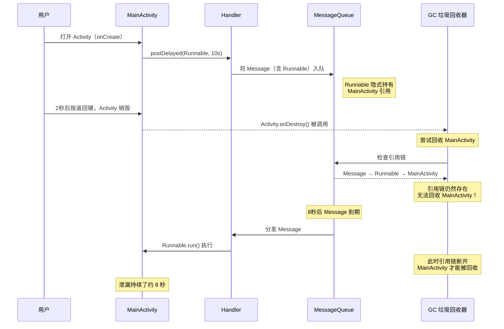

用户在第 2 秒按了返回键，`Activity` 理应被销毁并回收。但由于 `MessageQueue` 中的 `Message` 持有 `Runnable`，而这个匿名 `Runnable`（本质是成员内部类）持有 `MainActivity.this`，形成了一条从 GC Root 到 `MainActivity` 的引用链。在这 8 秒内，整个 `Activity` 及其持有的所有 View、Bitmap 等资源都无法被回收。

如果延迟时间更长，或者这种模式被反复触发，内存泄漏会不断累积，最终导致 `OutOfMemoryError`。

下面是引用链的内存模型：

```text
GC Root (主线程)
  └── Looper
        └── MessageQueue
              └── Message
                    └── Runnable (匿名内部类实例)
                          └── this$0 ━━▶ MainActivity 实例 ← 无法回收！
                                            ├── View 树
                                            ├── Bitmap 资源
                                            └── 其他大对象...
```

---

### 如何避免内存泄漏

核心原则：打断内部类到外部类的强引用链。常见方案有以下几种：

方案一：改用静态内部类 + WeakReference（推荐）

```java
public class MainActivity extends Activity {

    @Override
    protected void onCreate(Bundle savedInstanceState) {
        super.onCreate(savedInstanceState);

        // 使用静态内部类，不会隐式持有外部类引用
        new Handler().postDelayed(new SafeRunnable(this), 10_000);
    }

    // 静态内部类：不持有 MainActivity 的隐式引用
    private static class SafeRunnable implements Runnable {

        // 用 WeakReference 弱引用外部类实例
        // 当 GC 发现对象只被 WeakReference 引用时，会直接回收它
        private final WeakReference<MainActivity> activityRef;

        SafeRunnable(MainActivity activity) {
            this.activityRef = new WeakReference<>(activity);
        }

        @Override
        public void run() {
            // 从弱引用中尝试获取 Activity
            MainActivity activity = activityRef.get();

            // 如果 Activity 已经被回收，get() 返回 null，安全退出
            if (activity != null && !activity.isDestroyed()) {
                System.out.println("安全地执行延迟任务");
            }
            // 如果 activity == null，说明已被 GC 回收，什么都不做
        }
    }
}
```

方案二：在外部类销毁时主动清理

```java
public class MainActivity extends Activity {

    // 持有 Handler 引用，以便后续清理
    private final Handler handler = new Handler();

    // 持有 Runnable 引用
    private final Runnable task = new Runnable() {
        @Override
        public void run() {
            System.out.println("延迟任务执行");
        }
    };

    @Override
    protected void onCreate(Bundle savedInstanceState) {
        super.onCreate(savedInstanceState);
        handler.postDelayed(task, 10_000);
    }

    @Override
    protected void onDestroy() {
        super.onDestroy();
        // Activity 销毁时，移除所有待执行的回调
        // 这样 MessageQueue 中就不再持有 Runnable 的引用
        handler.removeCallbacks(task);
    }
}
```

两种方案的对比：

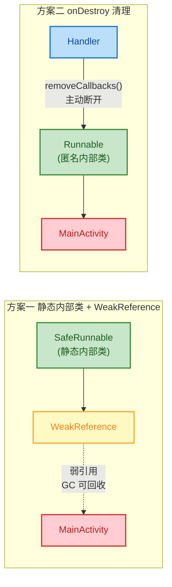

---

### 成员内部类的合理使用场景

虽然成员内部类有内存泄漏的风险，但它并非一无是处。在以下场景中，成员内部类是合理甚至优雅的选择：

当内部类的生命周期不超过外部类时，使用成员内部类是安全的。典型例子就是 Java 集合框架中的迭代器：

```java
public class SimpleList<E> {

    // 底层数组存储元素
    private Object[] elements;
    // 当前元素个数
    private int size;

    // 返回迭代器 —— 对外暴露 Iterator 接口，隐藏实现细节
    public Iterator<E> iterator() {
        return new ListIterator();
    }

    // 成员内部类实现迭代器
    // 这里使用成员内部类是合理的，因为：
    // 1. 迭代器需要访问外部类的 private 字段（elements, size）
    // 2. 迭代器的生命周期不会超过 List 本身
    private class ListIterator implements Iterator<E> {

        // 当前遍历的索引位置
        private int cursor = 0;

        @Override
        public boolean hasNext() {
            // 直接访问外部类的 size 字段
            return cursor < size;
        }

        @Override
        @SuppressWarnings("unchecked")
        public E next() {
            // 直接访问外部类的 elements 数组
            if (cursor >= size) {
                throw new NoSuchElementException();
            }
            return (E) elements[cursor++];
        }
    }
}
```

这个设计非常经典：`ListIterator` 需要频繁访问 `SimpleList` 的内部状态（`elements` 和 `size`），使用成员内部类可以直接访问这些 `private` 字段，无需额外的 getter 方法或参数传递，代码简洁且内聚。同时，迭代器通常是短命对象，用完即弃，不会造成内存泄漏。

---

### 成员内部类使用决策指南

在决定是否使用成员内部类时，可以参考以下决策流程：

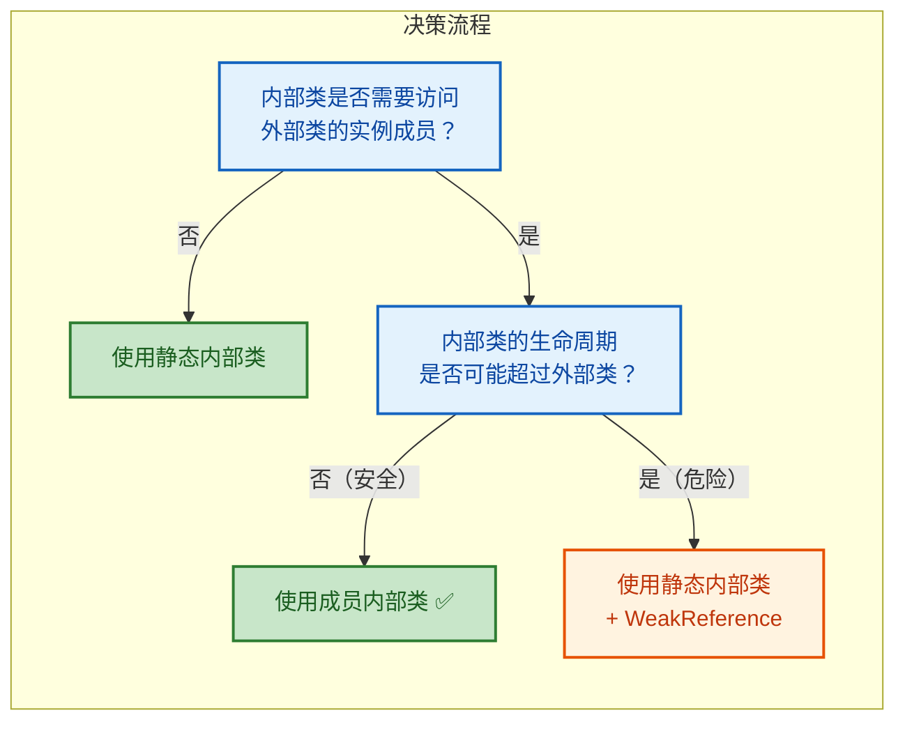

简单总结成一句话：如果你不确定，就用静态内部类。只有当你明确需要访问外部类实例成员、且能保证生命周期安全时，才选择成员内部类。

---

**📝 练习题**

以下代码编译运行后，输出结果是什么？

```java
public class Outer {
    private int x = 5;

    class Inner {
        private int x = 10;

        void display() {
            int x = 15;
            System.out.println(x);
            System.out.println(this.x);
            System.out.println(Outer.this.x);
        }
    }

    public static void main(String[] args) {
        Outer outer = new Outer();
        Outer.Inner inner = outer.new Inner();
        inner.display();
    }
}
```

A. 15, 10, 5


B. 5, 10, 15


C. 15, 5, 10


D. 编译错误，`Outer.this.x` 不合法


**【答案】** A

**【解析】** 这道题考查的是成员内部类中三层作用域的变量遮蔽（Variable Shadowing）规则。在 `display()` 方法中，直接写 `x` 遵循就近原则，访问的是局部变量 `x = 15`；`this.x` 中的 `this` 指向当前 `Inner` 实例，访问的是内部类的成员变量 `x = 10`；`Outer.this.x` 显式指定访问外部类实例的成员变量 `x = 5`。三者互不冲突，`Outer.this` 是完全合法的语法，编译器会将其转换为对隐藏字段 `this$0` 的访问。因此输出依次为 15、10、5。

---

## 静态内部类（Static Nested Class）

### 核心概念与定义

上一节我们深入探讨了成员内部类，了解到它会隐式持有外部类的引用（`Outer.this`），这既是它的能力来源，也是它的风险根源。现在我们来看内部类家族中最"干净"、最被推荐使用的成员——静态内部类。

静态内部类，Java 官方更倾向于称之为 **Static Nested Class**（静态嵌套类），用 `static` 关键字修饰的内部类。它与成员内部类最本质的区别只有一条：**它不持有外部类实例的隐式引用**。这一条区别，带来了截然不同的行为特征和使用哲学。

你可以这样理解：静态内部类和外部类的关系，更像是"室友"而非"连体婴儿"。它们共享同一个"房子"（外部类的命名空间和访问权限），但各自独立生活，互不依赖对方的存在。

```java
// 静态内部类的基本声明
public class Outer {
    // 外部类的实例字段
    private int instanceField = 10;
    // 外部类的静态字段
    private static int staticField = 20;

    // 使用 static 修饰 —— 这就是静态内部类
    static class Inner {
        void display() {
            // ✅ 可以访问外部类的静态成员（包括 private）
            System.out.println("静态字段: " + staticField);

            // ❌ 编译错误！不能直接访问外部类的实例成员
            // System.out.println(instanceField);
            // 因为没有 Outer.this 引用，根本不知道是"哪个"外部实例
        }
    }
}
```

### 静态内部类 vs 成员内部类：本质差异

为了真正理解静态内部类的价值，我们需要把它和成员内部类做一次彻底的对比。这不是简单的语法差异，而是设计理念上的根本不同。

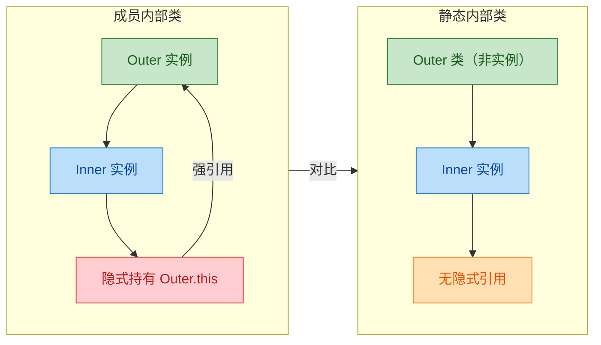

我们从多个维度来拆解这两者的差异：

**1. 外部类引用**

成员内部类在编译后，构造器会被编译器自动注入一个 `Outer` 类型的参数，用于接收外部类实例的引用。而静态内部类的构造器则完全"干净"，不会有任何隐式参数。

```java
public class ReferenceDemo {
    private int x = 1;
    private static int y = 2;

    // 成员内部类 —— 编译后构造器签名: MemberInner(ReferenceDemo outer)
    class MemberInner {
        void access() {
            System.out.println(x); // ✅ 通过隐式 Outer.this 访问
            System.out.println(y); // ✅ 静态成员当然也能访问
        }
    }

    // 静态内部类 —— 编译后构造器签名: StaticInner()，干干净净
    static class StaticInner {
        void access() {
            // System.out.println(x); // ❌ 编译错误，没有外部实例引用
            System.out.println(y);    // ✅ 只能访问静态成员
        }

        // 如果确实需要访问外部实例成员，必须显式传入
        void accessWithInstance(ReferenceDemo outer) {
            System.out.println(outer.x); // ✅ 显式传入，意图清晰
        }
    }
}
```

**2. 实例化方式**

这是日常编码中最直观的区别：

```java
public class InstantiationDemo {

    class MemberInner { }
    static class StaticInner { }

    public static void main(String[] args) {
        // 成员内部类：必须先有外部类实例，语法也比较"怪异"
        InstantiationDemo outer = new InstantiationDemo();
        MemberInner mi = outer.new MemberInner(); // outer.new 语法

        // 静态内部类：直接 new，像普通类一样自然
        StaticInner si = new StaticInner();        // 在同一个外部类内部
        InstantiationDemo.StaticInner si2 = new InstantiationDemo.StaticInner(); // 在外部使用
    }
}
```

静态内部类的实例化不依赖任何外部类实例，这意味着它可以在任何 `static` 上下文中自由创建——包括 `main` 方法、静态工厂方法、其他类的方法等。

**3. 可包含的成员类型**

```java
public class MemberTypeDemo {

    // 成员内部类
    class MemberInner {
        int instanceField = 1;           // ✅ 实例字段
        // static int staticField = 2;   // ❌ 不允许声明静态字段（Java 16 之前）
        // static void staticMethod() {} // ❌ 不允许声明静态方法（Java 16 之前）
        static final int CONSTANT = 3;   // ✅ 编译期常量例外
    }

    // 静态内部类 —— 没有任何限制
    static class StaticInner {
        int instanceField = 1;           // ✅ 实例字段
        static int staticField = 2;      // ✅ 静态字段
        static void staticMethod() {}    // ✅ 静态方法

        // 甚至可以嵌套更多内部类
        static class DeepNested { }      // ✅ 继续嵌套
    }
}
```

> 注意：从 Java 16 开始（JEP 395），成员内部类也被允许声明 `static` 成员了，这是为了支持 `record` 类型。但在 Java 16 之前，这是一个硬性限制。

### 编译产物与字节码分析

和成员内部类一样，静态内部类也会被编译成独立的 `.class` 文件，命名规则相同：

```text
Outer.class
Outer$StaticInner.class
```

但关键差异在字节码层面。我们用 `javap -c` 反编译来看看构造器的区别：

```java
// 成员内部类的构造器（反编译结果）
// class Outer$MemberInner {
//     final Outer this$0;                    // 编译器生成的字段，存储外部引用
//     Outer$MemberInner(Outer outer) {       // 构造器接收外部实例
//         this.this$0 = outer;               // 保存引用
//         super();
//     }
// }

// 静态内部类的构造器（反编译结果）
// class Outer$StaticInner {
//     Outer$StaticInner() {                  // 无额外参数，干干净净
//         super();
//     }
// }
```

没有 `this$0` 字段，没有外部引用参数。这就是静态内部类在内存层面"轻量"的根本原因。

用 ASCII 图来表示两者在堆内存中的对象布局差异：

```java
// ===== 成员内部类的内存布局 =====
//
//  Heap（堆内存）
//  ┌─────────────────────┐     ┌─────────────────────────┐
//  │   Outer 实例         │     │   MemberInner 实例       │
//  │  ┌───────────────┐  │     │  ┌─────────────────────┐ │
//  │  │ instanceField  │  │◄────│──│ this$0 (外部类引用)  │ │
//  │  │ staticField    │  │     │  │ innerField           │ │
//  │  └───────────────┘  │     │  └─────────────────────┘ │
//  └─────────────────────┘     └─────────────────────────┘
//         ▲                              │
//         └──────── 强引用 ──────────────┘
//
// ===== 静态内部类的内存布局 =====
//
//  Heap（堆内存）
//  ┌─────────────────────┐     ┌─────────────────────────┐
//  │   Outer 实例         │     │   StaticInner 实例       │
//  │  ┌───────────────┐  │     │  ┌─────────────────────┐ │
//  │  │ instanceField  │  │     │  │ innerField           │ │
//  │  │ staticField    │  │     │  │ （无 this$0 字段）    │ │
//  │  └───────────────┘  │     │  └─────────────────────┘ │
//  └─────────────────────┘     └─────────────────────────┘
//         ↑                              ↑
//         │        彼此独立，无引用关系      │
//         └──────────── ✕ ──────────────┘
```

### 为什么推荐使用静态内部类

Joshua Bloch 在 *Effective Java* 中明确建议："If you declare a member class that does not require access to an enclosing instance, always put the `static` modifier in its declaration."（如果你声明的成员类不需要访问外部类实例，务必加上 `static` 修饰符。）

这不是一个风格偏好，而是有充分的工程理由：

**理由一：杜绝内存泄漏风险**

上一节我们详细分析了成员内部类导致内存泄漏的场景。静态内部类从根本上消除了这个问题，因为它压根不持有外部引用。在 Android 开发中，这一点尤为关键：

```java
public class MyActivity extends Activity {

    // ❌ 危险：成员内部类持有 Activity 引用
    // 如果 Handler 中有延迟消息，Activity 无法被 GC 回收
    class LeakyHandler extends Handler {
        @Override
        public void handleMessage(Message msg) {
            // 隐式持有 MyActivity.this
        }
    }

    // ✅ 安全：静态内部类不持有 Activity 引用
    static class SafeHandler extends Handler {
        // 如果需要访问 Activity，使用 WeakReference
        private final WeakReference<MyActivity> activityRef;

        SafeHandler(MyActivity activity) {
            this.activityRef = new WeakReference<>(activity); // 弱引用，不阻止 GC
        }

        @Override
        public void handleMessage(Message msg) {
            MyActivity activity = activityRef.get(); // 尝试获取
            if (activity != null && !activity.isFinishing()) {
                // 安全地使用 activity
                activity.updateUI(msg);
            }
            // 如果 activity 已被回收，get() 返回 null，优雅降级
        }
    }
}
```

**理由二：更低的内存开销**

每个成员内部类实例都要额外存储一个指向外部类的引用（通常 4 或 8 字节，取决于 JVM 是否开启压缩指针）。当你创建大量内部类实例时（比如集合中的 Node 节点），这个开销会累积：

```java
// HashMap 的 Node 就是静态内部类 —— 这是经过深思熟虑的设计
// 一个 HashMap 可能包含数百万个 Node，如果每个都多存一个外部引用，浪费巨大
public class HashMap<K, V> {
    // static！因为 Node 不需要访问 HashMap 的实例方法
    static class Node<K, V> implements Map.Entry<K, V> {
        final int hash;    // 哈希值
        final K key;       // 键
        V value;           // 值
        Node<K, V> next;   // 链表下一个节点
        // 没有 HashMap.this 引用，节省内存
    }
}
```

**理由三：更清晰的设计意图**

`static` 关键字本身就是一种文档——它告诉阅读代码的人："这个内部类是独立的，它不依赖外部类的任何实例状态。" 这降低了认知负担，让代码的依赖关系一目了然。

**理由四：更灵活的实例化**

不需要外部类实例就能创建，这意味着静态内部类可以在静态方法、静态初始化块、其他类中自由使用，不受外部类生命周期的约束。

### 经典使用场景

静态内部类在 Java 标准库和主流框架中被大量使用，以下是最典型的几个场景：

**场景一：Builder 模式**

这是静态内部类最经典、最广泛的应用。Builder 模式用于构建参数众多的不可变对象，静态内部类是实现它的最佳载体：

```java
public class HttpRequest {
    // 所有字段都是 final，对象不可变
    private final String url;          // 请求地址
    private final String method;       // 请求方法
    private final Map<String, String> headers; // 请求头
    private final String body;         // 请求体
    private final int timeout;         // 超时时间（毫秒）

    // 私有构造器，只能通过 Builder 创建
    private HttpRequest(Builder builder) {
        this.url = builder.url;
        this.method = builder.method;
        this.headers = Collections.unmodifiableMap(new HashMap<>(builder.headers));
        this.body = builder.body;
        this.timeout = builder.timeout;
    }

    // Getter 方法（省略）...
    public String getUrl() { return url; }
    public String getMethod() { return method; }

    // 静态内部类 Builder —— 不需要访问 HttpRequest 的实例成员
    public static class Builder {
        // 必填参数
        private final String url;
        // 可选参数，提供默认值
        private String method = "GET";
        private Map<String, String> headers = new HashMap<>();
        private String body = "";
        private int timeout = 30000; // 默认 30 秒

        // Builder 构造器只接收必填参数
        public Builder(String url) {
            this.url = Objects.requireNonNull(url, "URL must not be null");
        }

        // 每个 setter 返回 this，支持链式调用
        public Builder method(String method) {
            this.method = method;
            return this; // 返回自身，实现 fluent API
        }

        public Builder addHeader(String key, String value) {
            this.headers.put(key, value);
            return this;
        }

        public Builder body(String body) {
            this.body = body;
            return this;
        }

        public Builder timeout(int timeout) {
            if (timeout <= 0) {
                throw new IllegalArgumentException("Timeout must be positive");
            }
            this.timeout = timeout;
            return this;
        }

        // 最终构建方法
        public HttpRequest build() {
            return new HttpRequest(this); // 将 Builder 自身传给私有构造器
        }
    }
}
```

使用方式非常优雅：

```java
// 链式调用，可读性极佳
HttpRequest request = new HttpRequest.Builder("https://api.example.com/users")
        .method("POST")                          // 设置方法
        .addHeader("Content-Type", "application/json") // 添加请求头
        .addHeader("Authorization", "Bearer token123") // 添加认证头
        .body("{\"name\": \"Kiro\"}")             // 设置请求体
        .timeout(5000)                            // 设置超时
        .build();                                 // 构建不可变对象
```

为什么 Builder 必须是 `static`？因为 Builder 的职责是"创建"外部类实例，它在外部类实例存在之前就要工作。如果 Builder 是成员内部类，你就陷入了"先有鸡还是先有蛋"的悖论——要创建 Builder 就得先有 HttpRequest 实例，但 HttpRequest 实例又要通过 Builder 来创建。

**场景二：集合框架中的数据节点**

Java 集合框架大量使用静态内部类来定义内部数据结构：

```java
// LinkedList 的节点 —— 静态内部类
public class LinkedList<E> {
    // Node 不需要访问 LinkedList 的实例方法
    // 它只是一个纯粹的数据容器
    private static class Node<E> {
        E item;        // 存储的元素
        Node<E> next;  // 后继节点
        Node<E> prev;  // 前驱节点

        Node(Node<E> prev, E element, Node<E> next) {
            this.item = element;
            this.next = next;
            this.prev = prev;
        }
    }

    // LinkedList 的实例字段
    transient int size = 0;
    transient Node<E> first; // 头节点
    transient Node<E> last;  // 尾节点
}
```

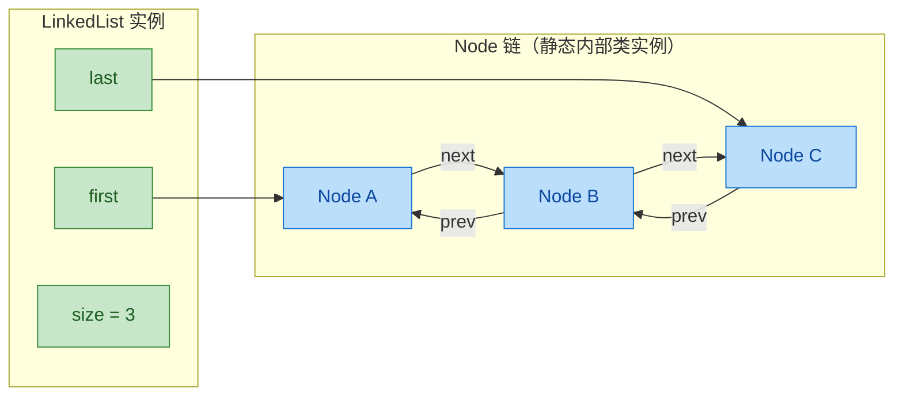

类似的设计在 `HashMap.Node`、`TreeMap.Entry`、`ConcurrentHashMap.Node` 中都能看到。这些节点类的共同特点是：数量可能非常大，且不需要访问外部集合的实例方法。用静态内部类是唯一合理的选择。

**场景三：封装返回结果（Value Object / DTO）**

当一个方法需要返回多个值，或者某个数据结构只在特定类的上下文中有意义时，静态内部类是理想的载体：

```java
public class MathUtils {

    // 除法结果：商和余数，只在 MathUtils 的语境下有意义
    public static class DivisionResult {
        private final int quotient;   // 商
        private final int remainder;  // 余数

        public DivisionResult(int quotient, int remainder) {
            this.quotient = quotient;
            this.remainder = remainder;
        }

        public int getQuotient() { return quotient; }
        public int getRemainder() { return remainder; }

        @Override
        public String toString() {
            return quotient + " 余 " + remainder;
        }
    }

    // 返回封装好的结果对象
    public static DivisionResult divide(int dividend, int divisor) {
        if (divisor == 0) {
            throw new ArithmeticException("除数不能为零");
        }
        return new DivisionResult(dividend / divisor, dividend % divisor);
    }
}
```

```java
// 使用
MathUtils.DivisionResult result = MathUtils.divide(17, 5);
System.out.println("商: " + result.getQuotient());   // 商: 3
System.out.println("余数: " + result.getRemainder()); // 余数: 2
```

> 从 Java 16 开始，`record` 类型可以更简洁地实现这个场景：`public record DivisionResult(int quotient, int remainder) {}`。而 `record` 在嵌套声明时，天然就是 `static` 的。

**场景四：单例模式（静态内部类实现 — Holder Pattern）**

这是一种被称为 **Initialization-on-Demand Holder Idiom** 的单例实现方式，被认为是 Java 中最优雅的单例写法之一：

```java
public class Singleton {

    // 私有构造器，防止外部 new
    private Singleton() {
        System.out.println("Singleton 实例被创建");
    }

    // 静态内部类 —— JVM 保证类加载的线程安全性
    private static class Holder {
        // 类加载时初始化，由 JVM 保证只执行一次且线程安全
        static final Singleton INSTANCE = new Singleton();
    }

    // 对外暴露的获取方法
    public static Singleton getInstance() {
        return Holder.INSTANCE; // 第一次调用时才会触发 Holder 类的加载
    }
}
```

这种方式的精妙之处在于利用了 JVM 的类加载机制：

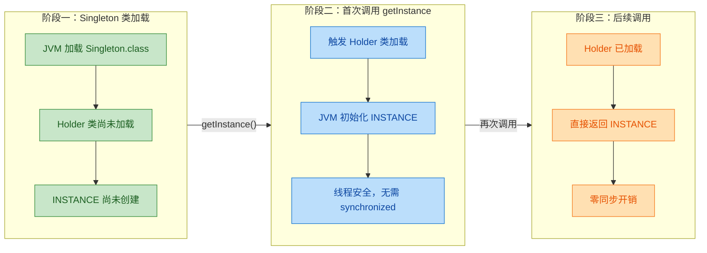

相比 `synchronized` 方式或双重检查锁（DCL），Holder 模式既实现了懒加载（lazy initialization），又天然线程安全，且没有任何同步开销。唯一的"缺点"是无法传递构造参数——但对于大多数单例场景，这完全够用。

### 访问权限的完整规则

静态内部类虽然不持有外部类实例引用，但它在访问权限上依然享有"内部类特权"——可以访问外部类的 `private` 成员。不过，这里有一个重要的限定条件：

```java
public class AccessDemo {
    // 外部类的各种成员
    private int privateInstance = 1;          // 私有实例字段
    private static int privateStatic = 2;     // 私有静态字段
    protected int protectedInstance = 3;      // 受保护实例字段
    int packageInstance = 4;                  // 包级实例字段

    private void privateMethod() {            // 私有实例方法
        System.out.println("private method");
    }

    private static void privateStaticMethod() { // 私有静态方法
        System.out.println("private static method");
    }

    static class StaticInner {
        void test() {
            // ✅ 可以访问外部类的 private static 成员
            System.out.println(privateStatic);
            privateStaticMethod();

            // ❌ 不能直接访问外部类的实例成员（无论什么访问修饰符）
            // System.out.println(privateInstance);   // 编译错误
            // System.out.println(protectedInstance);  // 编译错误
            // privateMethod();                        // 编译错误
        }

        void testWithInstance() {
            // ✅ 但如果你有外部类的实例，就可以访问它的 private 成员！
            AccessDemo outer = new AccessDemo();
            System.out.println(outer.privateInstance);  // ✅ 可以！
            System.out.println(outer.protectedInstance); // ✅ 可以！
            outer.privateMethod();                       // ✅ 可以！
            // 这就是"内部类特权"——同一个顶层类内部，private 不设防
        }
    }
}
```

这个规则可以总结为：

- 静态内部类可以直接访问外部类的所有 `static` 成员（包括 `private`）
- 静态内部类不能直接访问外部类的实例成员（因为没有 `Outer.this`）
- 但如果通过某种方式获得了外部类的实例引用，就可以访问该实例的 `private` 成员

反过来，外部类也可以访问静态内部类的 `private` 成员：

```java
public class BidirectionalAccess {
    static class Inner {
        private int secret = 42; // 私有字段
    }

    void accessInnerSecret() {
        Inner inner = new Inner();
        System.out.println(inner.secret); // ✅ 外部类可以访问内部类的 private
    }
}
```

这种双向的 `private` 穿透，是 Java 内部类机制的核心设计之一。在字节码层面，编译器会生成合成的桥接方法（synthetic bridge method）来实现这种跨类的私有访问。

### 静态内部类的修饰符

静态内部类可以使用所有四种访问修饰符，这决定了它对外部世界的可见性：

```java
public class ModifierDemo {
    // public —— 任何地方都可以使用 ModifierDemo.PublicInner
    public static class PublicInner { }

    // protected —— 同包 + 子类可以使用
    protected static class ProtectedInner { }

    // 包级（默认）—— 只有同包可以使用
    static class PackageInner { }

    // private —— 只有 ModifierDemo 自身可以使用
    // 最常见的选择！用于封装内部实现细节
    private static class PrivateInner { }
}
```

在实际开发中，`private static class` 是最常见的组合。它表达的意思是："这个类是我的内部实现细节，外部不需要知道它的存在。"

### 何时选择静态内部类 vs 顶层类

这是一个很多开发者在实际项目中会纠结的问题。把一个类定义为静态内部类还是独立的顶层类，并没有绝对的标准，但有一些清晰的判断维度：

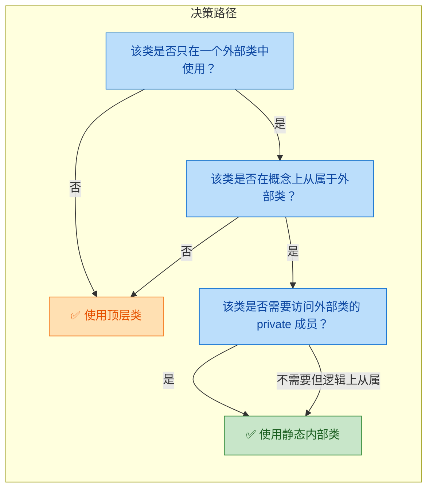

用一张对比表来总结：

| 判断维度 | 选择静态内部类 | 选择顶层类 |
|---------|-------------|-----------|
| 使用范围 | 只在一个类内部使用 | 多个类都需要使用 |
| 概念归属 | 逻辑上是外部类的"附属品" | 是一个独立的领域概念 |
| 访问需求 | 需要访问外部类的 private 成员 | 不需要特殊访问权限 |
| 文件组织 | 代码量小，放在一起更易读 | 代码量大，独立文件更清晰 |
| 命名空间 | 名字通用（如 Node、Entry、Builder），需要外部类限定 | 名字本身就足够明确 |

来看几个 JDK 中的真实案例：

```java
// ✅ 静态内部类：Map.Entry
// 理由：Entry 在概念上从属于 Map，离开 Map 谈 Entry 没有意义
// 且名字太通用，作为顶层类会造成命名冲突
Map.Entry<String, Integer> entry = ...;

// ✅ 静态内部类：Thread.State
// 理由：State 枚举只描述线程的状态，从属于 Thread
Thread.State state = Thread.State.RUNNABLE;

// ✅ 顶层类：ArrayList
// 理由：ArrayList 是一个独立的数据结构概念，被无数类使用
// 不从属于任何特定的类
List<String> list = new ArrayList<>();

// ✅ 顶层类：String
// 理由：String 是 Java 中最基础的类型之一，完全独立
String s = "hello";
```

### 静态内部类与接口

一个有趣的知识点：**接口中声明的内部类天然就是 `static` 的**，即使你不写 `static` 关键字。这是因为接口本身不能被实例化，所以接口内部的类不可能持有接口的"实例引用"。

```java
public interface Converter<F, T> {

    T convert(F from); // 接口方法

    // 这个内部类隐式就是 static 的
    // 写不写 static 效果完全一样
    class Identity<T> implements Converter<T, T> {
        @Override
        public T convert(T from) {
            return from; // 原样返回，恒等转换
        }
    }

    // 同样，接口中的内部接口也是隐式 static 的
    interface Factory<T> {
        T create();
    }
}
```

```java
// 使用接口中的静态内部类
Converter<String, String> identity = new Converter.Identity<>();
String result = identity.convert("hello"); // "hello"
```

Google Guava 库中的 `Converter` 类就大量使用了这种模式，在接口内部提供一些通用的默认实现。

### 静态内部类与泛型

静态内部类有自己独立的泛型参数体系，它不能使用外部类的泛型类型参数。这一点和成员内部类不同：

```java
public class Container<T> {

    private T value;

    // 成员内部类 —— 可以直接使用外部类的泛型参数 T
    class MemberIterator {
        T getCurrent() {
            return value; // ✅ 直接使用外部类的 T
        }
    }

    // 静态内部类 —— 不能使用外部类的 T
    static class StaticPair<A, B> {
        // T getFirst() { ... } // ❌ 编译错误！T 是外部类的泛型参数
        private A first;   // ✅ 使用自己声明的泛型参数
        private B second;  // ✅

        StaticPair(A first, B second) {
            this.first = first;
            this.second = second;
        }

        A getFirst() { return first; }
        B getSecond() { return second; }
    }
}
```

```java
// 静态内部类的泛型独立于外部类
Container<String> container = new Container<>();

// StaticPair 的泛型参数和 Container 的 T 完全无关
Container.StaticPair<Integer, Double> pair = new Container.StaticPair<>(1, 2.0);
```

这也从另一个角度印证了静态内部类的"独立性"——它和外部类之间只是命名空间上的包含关系，没有实例层面的依赖。

### 实战：用静态内部类实现链表

最后，我们用一个完整的例子来展示静态内部类在实际数据结构实现中的应用：

```java
public class SimpleLinkedList<E> {

    // 静态内部类：链表节点
    // 使用 static 因为 Node 不需要访问 SimpleLinkedList 的实例方法
    // 它只是一个纯粹的数据载体
    private static class Node<E> {
        E data;          // 节点存储的数据
        Node<E> next;    // 指向下一个节点的引用

        Node(E data, Node<E> next) {
            this.data = data;  // 初始化数据
            this.next = next;  // 初始化后继指针
        }
    }

    private Node<E> head; // 头节点引用
    private int size;     // 链表长度

    // 在头部插入元素 —— O(1)
    public void addFirst(E element) {
        // 新节点的 next 指向当前头节点，然后新节点成为新的头
        head = new Node<>(element, head);
        size++; // 长度加一
    }

    // 获取指定位置的元素 —— O(n)
    public E get(int index) {
        if (index < 0 || index >= size) {
            throw new IndexOutOfBoundsException(
                "Index: " + index + ", Size: " + size
            );
        }
        Node<E> current = head;       // 从头节点开始
        for (int i = 0; i < index; i++) {
            current = current.next;    // 逐个向后移动
        }
        return current.data;           // 返回目标节点的数据
    }

    // 删除头部元素 —— O(1)
    public E removeFirst() {
        if (head == null) {
            throw new NoSuchElementException("链表为空");
        }
        E data = head.data;    // 保存头节点数据
        head = head.next;      // 头指针后移
        size--;                // 长度减一
        return data;           // 返回被删除的数据
    }

    // 获取链表长度
    public int size() {
        return size;
    }

    @Override
    public String toString() {
        StringBuilder sb = new StringBuilder("[");
        Node<E> current = head;
        while (current != null) {
            sb.append(current.data);           // 追加当前节点数据
            if (current.next != null) {
                sb.append(" -> ");             // 节点之间用箭头分隔
            }
            current = current.next;            // 移动到下一个节点
        }
        sb.append("]");
        return sb.toString();
    }
}
```

```java
// 使用示例
SimpleLinkedList<String> list = new SimpleLinkedList<>();
list.addFirst("C");    // [C]
list.addFirst("B");    // [B -> C]
list.addFirst("A");    // [A -> B -> C]

System.out.println(list);          // [A -> B -> C]
System.out.println(list.get(1));   // B
System.out.println(list.size());   // 3

list.removeFirst();                // 移除 A
System.out.println(list);          // [B -> C]
```

在这个例子中，`Node` 被声明为 `private static class`，这是最严格也最合理的选择：

- `private`：Node 是链表的内部实现细节，外部不需要知道它的存在
- `static`：Node 不需要访问 SimpleLinkedList 的任何实例方法，它只是一个数据容器
- 如果链表中有一百万个节点，每个节点都省下一个外部引用，内存节省相当可观

### 本节总结

静态内部类是 Java 内部类体系中最"理性"的选择。它保留了内部类的命名空间优势和 `private` 访问特权，同时摒弃了成员内部类隐式外部引用带来的耦合和风险。在实际开发中，当你需要定义一个内部类时，**默认应该先考虑 `static`**，只有当你确实需要访问外部类的实例成员时，才去掉 `static` 使其成为成员内部类。这是一条简单但极其有效的编码准则。

---

**📝 练习题**

以下关于静态内部类的说法，哪一项是正确的？

A. 静态内部类可以直接访问外部类的实例变量和实例方法

B. 创建静态内部类的实例时，必须先创建外部类的实例

C. 静态内部类不能声明自己的泛型类型参数

D. 静态内部类可以访问外部类的 `private static` 成员


**【答案】** D

**【解析】** 静态内部类不持有外部类的实例引用（没有 `Outer.this`），因此不能直接访问外部类的实例变量和实例方法，A 错误。正因为不依赖外部类实例，创建静态内部类时无需先创建外部类实例，可以直接 `new Outer.StaticInner()`，B 错误。静态内部类拥有独立的泛型参数体系，完全可以声明自己的泛型类型参数（如 `static class Pair<A, B>`），C 错误。静态内部类虽然不能直接访问外部类的实例成员，但它作为内部类，享有"同一顶层类内部 `private` 不设防"的特权，可以访问外部类的所有 `static` 成员，包括 `private static` 的字段和方法，D 正确。

---

**📝 练习题**

阅读以下代码，程序的输出结果是什么？

```java
public class Outer {
    private static int count = 0;

    static class Inner {
        Inner() { count++; }
        int getCount() { return count; }
    }

    public static void main(String[] args) {
        Inner a = new Inner();
        Inner b = new Inner();
        Inner c = new Outer.Inner();
        System.out.println(c.getCount());
    }
}
```

A. 0

B. 1

C. 3

D. 编译错误，静态内部类不能访问外部类的 `private` 字段


**【答案】** C

**【解析】** 静态内部类可以访问外部类的 `private static` 成员，所以不会编译错误，D 排除。`count` 是外部类的静态字段，初始值为 0。每次创建 `Inner` 实例时，构造器中执行 `count++`。代码中依次创建了 `a`、`b`、`c` 三个 `Inner` 实例（注意 `new Inner()` 和 `new Outer.Inner()` 在 `Outer` 类内部效果完全相同），所以 `count` 被递增了 3 次，最终值为 3。调用 `c.getCount()` 返回的就是这个静态字段的当前值 3，因此答案是 C。

---

## 局部内部类（Local Inner Class）

局部内部类是定义在方法体、构造器或初始化块内部的类。它的作用域被严格限制在声明它的那个代码块中，外部完全不可见。如果说成员内部类是"家里的常驻成员"，那局部内部类更像是"某个房间里临时请来的帮手"——只在那个房间里干活，出了门谁也不认识它。

在实际开发中，局部内部类的使用频率远低于匿名内部类和静态内部类，但它在 Java 语言规范中占据着独特的位置，理解它有助于你完整掌握 Java 的类型系统和作用域规则，也能帮你更好地理解匿名内部类的底层机制——因为匿名内部类本质上就是一种"没有名字的局部内部类"。

### 基本语法与定义位置

局部内部类的定义位置非常灵活，它可以出现在任何合法的代码块中：

```java
public class Outer {

    // ① 定义在普通方法中（最常见的形式）
    public void doSomething() {
        // 局部内部类，作用域仅限于 doSomething() 方法体内
        class LocalHelper {
            void help() {
                System.out.println("I'm helping inside doSomething()");
            }
        }
        // 在方法内部实例化并使用
        LocalHelper helper = new LocalHelper();
        helper.help();
    }

    // ② 定义在静态方法中
    public static void staticMethod() {
        // 静态方法中的局部内部类，不持有外部类实例引用
        class StaticLocalHelper {
            void assist() {
                System.out.println("I'm inside a static method");
            }
        }
        new StaticLocalHelper().assist();
    }

    // ③ 定义在构造器中
    public Outer() {
        class ConstructorHelper {
            void init() {
                System.out.println("Helping during construction");
            }
        }
        new ConstructorHelper().init();
    }

    // ④ 定义在初始化块中
    {
        class InitBlockHelper {
            void setup() {
                System.out.println("Helping in instance initializer");
            }
        }
        new InitBlockHelper().setup();
    }
}
```

需要特别注意的是，局部内部类虽然定义位置灵活，但有一条铁律：它的作用域绝不会超出定义它的那个代码块。你不能在方法外部引用这个类名，也不能把它作为方法的返回类型（至少不能直接用类名作为返回类型，但可以通过接口或父类进行向上转型返回）。

### 访问规则详解

局部内部类的访问规则是它最值得深入理解的部分，这些规则直接关联到 Java 编译器的底层处理机制。

```java
public class AccessRuleDemo {

    // 外部类的实例字段
    private String outerField = "外部类实例字段";
    // 外部类的静态字段
    private static String outerStaticField = "外部类静态字段";

    public void demonstrate(final String param) {
        // 方法的局部变量（effectively final）
        String localVar = "局部变量";
        // 可变的局部变量
        int counter = 0;

        class LocalInner {
            void showAccess() {
                // ✅ 可以访问外部类的实例字段（包括 private）
                System.out.println(outerField);

                // ✅ 可以访问外部类的静态字段
                System.out.println(outerStaticField);

                // ✅ 可以访问 final 或 effectively final 的方法参数
                System.out.println(param);

                // ✅ 可以访问 effectively final 的局部变量
                System.out.println(localVar);

                // ❌ 不能访问非 effectively final 的局部变量
                // System.out.println(counter); // 编译错误！
            }
        }

        // counter 在这里被修改，导致它不是 effectively final
        counter++;

        new LocalInner().showAccess();
    }
}
```

把这些规则整理成一张清晰的图：

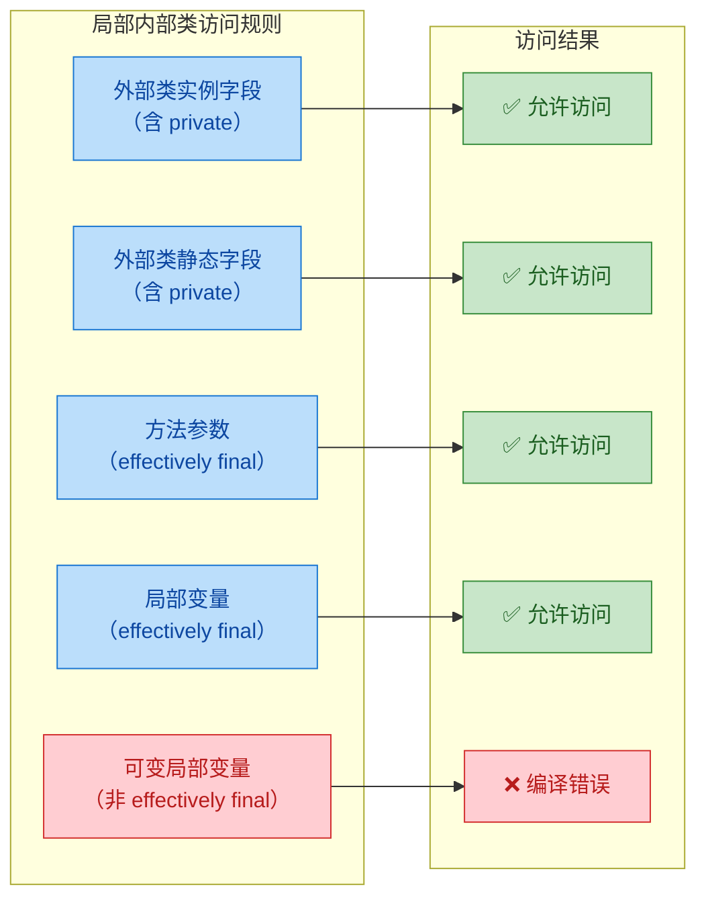

这里有一个关键问题值得深思：为什么局部内部类只能访问 effectively final 的局部变量？这不是 Java 设计者的任性，而是由 JVM 的内存模型决定的。局部变量存活在栈帧（Stack Frame）上，方法执行结束后栈帧就被销毁了。但局部内部类的实例可能通过向上转型被传递到方法外部，继续存活在堆（Heap）上。如果允许内部类修改一个已经不存在的栈上变量，就会产生悬垂引用（dangling reference）。

Java 编译器的解决方案是：在编译期将局部内部类所引用的局部变量以构造器参数的形式"拷贝"一份到内部类实例中。既然是拷贝，那就必须保证原始值和拷贝值始终一致，所以要求变量不可变。

```java
// 你写的代码
public void example() {
    final String msg = "hello";
    class Local {
        void print() { System.out.println(msg); }
    }
}

// 编译器实际生成的内部类（反编译后的等价形式）
class Outer$1Local {
    // 编译器自动生成的字段，保存捕获的变量副本
    final String val$msg;
    // 编译器自动生成的字段，保存外部类引用
    final Outer this$0;

    // 编译器生成的构造器，接收外部类引用和捕获的变量
    Outer$1Local(Outer outer, String msg) {
        this.this$0 = outer;
        this.val$msg = msg;
    }

    void print() {
        // 实际访问的是 val$msg 这个副本，而非栈上的原始变量
        System.out.println(this.val$msg);
    }
}
```

用一张内存模型图来直观展示这个拷贝过程：

```java
// ===== 方法执行时的内存布局 =====
//
//   栈 (Stack)                          堆 (Heap)
//  ┌─────────────────┐
//  │  example() 栈帧  │
//  │                 │               ┌──────────────────────┐
//  │  msg = "hello"  │──── 拷贝 ───▶│  Outer$1Local 实例    │
//  │                 │               │                      │
//  │  local (ref) ───│──────────────▶│  val$msg = "hello"   │
//  │                 │               │  this$0 = outer_ref  │
//  └─────────────────┘               └──────────────────────┘
//                                              │
//  方法结束后栈帧销毁，                          │ 对象可能仍然存活
//  但 msg 的值已被安全拷贝                       ▼
//  到堆上的 val$msg 中               （通过接口引用被外部持有）
```

### 修饰符限制

局部内部类在修饰符的使用上有严格的限制，这些限制源于它"局部"的本质：

```java
public void method() {
    // ❌ 不能使用 public / protected / private 访问修饰符
    // 因为局部内部类的作用域已经被方法体天然限制了，访问修饰符毫无意义
    // public class WrongLocal {}   // 编译错误

    // ❌ 不能使用 static 修饰符（Java 16 之前）
    // 局部内部类依附于方法的执行上下文，static 与此矛盾
    // static class WrongLocal {}   // 编译错误（Java 15 及以下）

    // ✅ 可以使用 abstract 修饰符
    abstract class AbstractLocal {
        abstract void doWork();
    }

    // ✅ 可以使用 final 修饰符
    final class FinalLocal {
        void doWork() {
            System.out.println("I'm final, cannot be subclassed");
        }
    }

    // ✅ abstract 的局部类可以被同一方法内的另一个局部类继承
    class ConcreteLocal extends AbstractLocal {
        @Override
        void doWork() {
            System.out.println("Concrete implementation");
        }
    }
}
```

值得一提的是，从 Java 16 开始（JEP 395），局部类可以声明为 `static`，这是为了配合 Records 和 Sealed Classes 等新特性。但在绝大多数生产代码中，你几乎不会遇到这种用法。

### 实际应用场景

虽然局部内部类在现代 Java 开发中不太常见，但在某些特定场景下它仍然有独到的价值。

场景一：在方法内部实现接口并向上转型返回。这是局部内部类最经典的用法——对外隐藏实现细节，只暴露接口：

```java
public class IteratorFactory {

    /**
     * 返回一个自定义的整数范围迭代器
     * 调用者只知道返回的是 Iterator〈Integer〉，完全不知道内部实现类的存在
     */
    public static Iterator<Integer> rangeIterator(int start, int end) {
        // 局部内部类：实现细节完全封装在方法内部
        class RangeIterator implements Iterator<Integer> {
            // 当前游标位置
            private int cursor = start;

            @Override
            public boolean hasNext() {
                // 判断游标是否还未到达终点
                return cursor < end;
            }

            @Override
            public Integer next() {
                // 如果没有下一个元素，抛出异常
                if (!hasNext()) {
                    throw new NoSuchElementException("Range exhausted");
                }
                // 返回当前值并将游标后移
                return cursor++;
            }
        }

        // 向上转型为 Iterator 接口返回，隐藏 RangeIterator 类型
        return new RangeIterator();
    }
}

// 使用方式：调用者完全不知道 RangeIterator 的存在
// Iterator<Integer> it = IteratorFactory.rangeIterator(1, 5);
// while (it.hasNext()) {
//     System.out.println(it.next()); // 输出 1, 2, 3, 4
// }
```

场景二：需要复用逻辑但又不想污染类的命名空间。当一段辅助逻辑只在某个方法中使用，且这段逻辑需要维护状态（不适合用简单的 lambda 或私有方法）时，局部内部类是一个干净的选择：

```java
public class DataProcessor {

    public List<String> processRecords(List<Record> records) {
        // 这个辅助类只在 processRecords 方法中有意义
        // 没必要提升为成员内部类或顶层类
        class RecordValidator {
            // 验证计数器
            private int validCount = 0;
            // 跳过计数器
            private int skipCount = 0;

            // 验证单条记录是否合法
            boolean isValid(Record r) {
                if (r == null || r.getData().isEmpty()) {
                    skipCount++;       // 记录跳过数
                    return false;
                }
                validCount++;          // 记录有效数
                return true;
            }

            // 返回处理摘要
            String summary() {
                return String.format("Valid: %d, Skipped: %d", validCount, skipCount);
            }
        }

        // 在方法内使用局部内部类
        RecordValidator validator = new RecordValidator();
        List<String> results = new ArrayList<>();

        for (Record r : records) {
            if (validator.isValid(r)) {
                results.add(r.getData().toUpperCase());
            }
        }

        // 打印处理摘要
        System.out.println(validator.summary());
        return results;
    }
}
```

### 局部内部类 vs 匿名内部类

局部内部类和匿名内部类非常相似，它们的核心区别在于：

```java
public class Comparison {

    public void usingLocalClass() {
        // 局部内部类：有名字，可以定义构造器，可以创建多个实例
        class MyComparator implements Comparator<String> {
            // ✅ 可以定义自己的构造器
            MyComparator() {
                System.out.println("Comparator created");
            }

            @Override
            public int compare(String a, String b) {
                return a.length() - b.length();
            }
        }

        // ✅ 可以创建多个实例
        Comparator<String> c1 = new MyComparator();
        Comparator<String> c2 = new MyComparator();
    }

    public void usingAnonymousClass() {
        // 匿名内部类：没有名字，不能定义构造器，定义和实例化合为一步
        Comparator<String> c = new Comparator<String>() {
            // ❌ 不能定义构造器（因为没有类名）
            @Override
            public int compare(String a, String b) {
                return a.length() - b.length();
            }
        };
        // ❌ 不能再创建第二个"同类型"的实例（除非再写一遍）
    }
}
```

用一张对比图来总结：

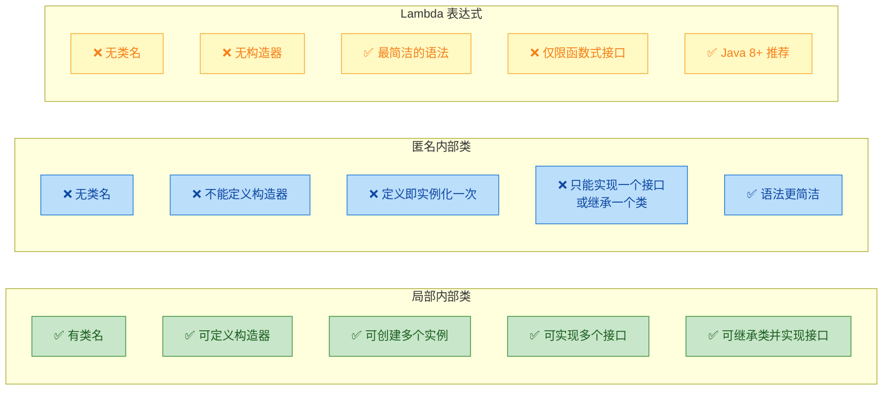

### 编译产物与命名规则

每个局部内部类在编译后都会生成独立的 `.class` 文件，命名规则为 `外部类$N内部类名.class`，其中 `N` 是一个从 1 开始的序号，用于区分同名的局部内部类（不同方法中可以定义同名的局部内部类）：

```java
public class Host {
    public void methodA() {
        class Helper { }       // 编译产物：Host$1Helper.class
    }

    public void methodB() {
        class Helper { }       // 编译产物：Host$2Helper.class（同名但序号不同）
        class Worker { }       // 编译产物：Host$1Worker.class
    }
}

// 编译后生成的文件列表：
// Host.class
// Host$1Helper.class    ← methodA 中的 Helper
// Host$2Helper.class    ← methodB 中的 Helper（序号递增避免冲突）
// Host$1Worker.class    ← methodB 中的 Worker
```

### 使用建议与最佳实践

在现代 Java 开发中，局部内部类的使用场景已经被大幅压缩：

- 如果只是实现一个函数式接口的回调，用 Lambda 表达式（Java 8+）更简洁
- 如果需要实现一个接口但逻辑较复杂，匿名内部类通常就够了
- 如果辅助类需要在多个方法中复用，应该提升为成员内部类或静态内部类

局部内部类真正的价值在于：当你需要在方法内部定义一个有名字、有构造器、可以创建多个实例、或者需要同时继承类并实现接口的临时类型时，它是唯一的选择。这种场景虽然不多，但一旦遇到，局部内部类就是最合适的工具。

**📝 练习题**

以下代码能否通过编译？如果不能，问题出在哪里？

```java
public class Quiz {
    public Runnable createTask() {
        int count = 10;
        class Task implements Runnable {
            @Override
            public void run() {
                System.out.println("Count is: " + count);
            }
        }
        count = 20;
        return new Task();
    }
}
```

A. 编译通过，运行时输出 `Count is: 10`

B. 编译通过，运行时输出 `Count is: 20`

C. 编译失败，因为局部内部类 `Task` 不能实现 `Runnable` 接口

D. 编译失败，因为 `count` 在局部内部类中被引用后又被修改，不满足 effectively final 要求


**【答案】** D

**【解析】** 局部内部类 `Task` 的 `run()` 方法中引用了外部方法的局部变量 `count`。根据 Java 语言规范，被局部内部类捕获的局部变量必须是 `final` 或 effectively final（即声明后从未被重新赋值）。在这段代码中，`count` 先被赋值为 `10`，随后又被赋值为 `20`，因此它不是 effectively final 的。编译器会在 `run()` 方法中引用 `count` 的那一行报错：`Variable 'count' is accessed from within inner class, needs to be final or effectively final`。要修复这个问题，要么删除 `count = 20;` 这行赋值，要么将 `count` 声明为 `final int count = 10;` 并移除后续修改。

---

## 匿名内部类（事件监听、回调）

匿名内部类（Anonymous Inner Class）是 Java 中一种**没有名字**的内部类。它将"类的定义"和"类的实例化"压缩到了同一个表达式中，一步到位。这种写法在 Java 8 之前的事件监听、回调、策略模式等场景中极为常见，即便在 Lambda 大行其道的今天，理解匿名内部类仍然是读懂大量存量代码和框架源码的基本功。

匿名内部类的核心思想很简单：当你只需要某个类或接口的**一次性实现**时，没必要专门写一个具名类文件，直接在使用的地方"就地"定义即可。它本质上是局部内部类的一种特殊简写形式——连名字都省了。

### 语法结构与编译原理

匿名内部类的语法初看有些"奇怪"，因为它把 `new` 关键字、父类/接口名、构造参数、类体定义全部揉在了一起：

```java
// 匿名内部类的通用语法模板
// 注意：整个表达式最后有一个分号，因为它本质上是一条赋值/传参语句
父类或接口 变量名 = new 父类或接口(构造参数) {
    // 类体：字段、方法重写、新增方法（但外部无法调用新增方法）
    @Override
    public void someMethod() {
        // 实现逻辑
    }
};  // ← 这个分号不能丢
```

我们来看一个最基础的例子，直观感受匿名内部类的写法：

```java
public class AnonymousBasicDemo {
    public static void main(String[] args) {
        // 1. 传统方式：先定义一个具名类，再实例化
        // 需要单独创建一个 MyRunnable.java 或在此文件中写一个内部类
        // 如果这个实现只用一次，这样做显得冗余

        // 2. 匿名内部类方式：定义与实例化一步完成
        Runnable task = new Runnable() {  // new 后面跟的是接口名，不是类名
            @Override
            public void run() {           // 重写接口中的抽象方法
                System.out.println("我是匿名内部类的 run 方法");
                System.out.println("当前线程: " + Thread.currentThread().getName());
            }
        };  // 分号结束这条赋值语句

        // 使用这个匿名内部类实例
        Thread thread = new Thread(task);  // 将其传给 Thread 构造器
        thread.start();                    // 启动线程
    }
}
```

编译器在背后做了什么？当你写下一个匿名内部类时，编译器会自动为它生成一个具名的 `.class` 文件，命名规则是 `外部类名$数字.class`。例如上面的代码会生成：

```
AnonymousBasicDemo.class        ← 外部类
AnonymousBasicDemo$1.class      ← 第一个匿名内部类
```

如果同一个外部类中有多个匿名内部类，编号依次递增：`$1`、`$2`、`$3`……这也解释了为什么匿名内部类"没有名字"——它有名字，只是这个名字由编译器自动分配，程序员无法直接引用。

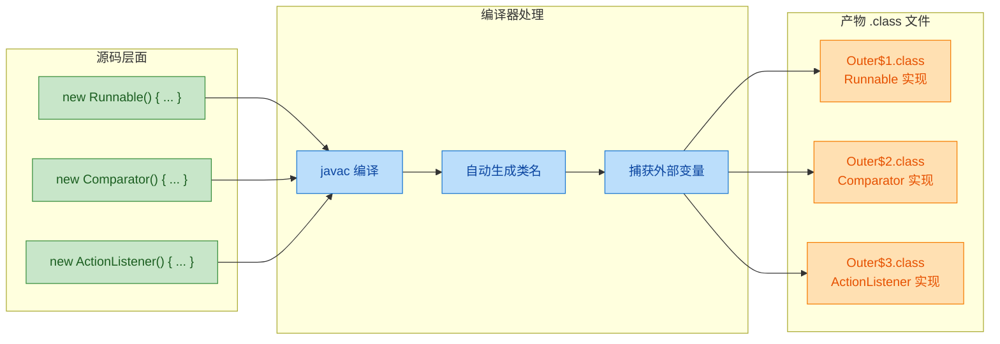

### 匿名内部类的三种形态

匿名内部类并不只能实现接口，它有三种不同的使用形态，每种的语义和能力略有不同。

```java
public class AnonymousThreeForms {

    // ========== 形态一：实现接口 ==========
    // 这是最常见的用法，匿名内部类提供接口的具体实现
    public void formOne() {
        Comparable<String> comp = new Comparable<String>() {  // 实现 Comparable 接口
            @Override
            public int compareTo(String o) {                  // 必须实现接口的所有抽象方法
                return 0;                                     // 简单返回 0 表示相等
            }
        };
        System.out.println(comp.compareTo("test"));           // 输出: 0
    }

    // ========== 形态二：继承抽象类 ==========
    // 匿名内部类继承一个抽象类，并实现其抽象方法
    abstract static class Animal {                            // 定义一个抽象类
        String name;                                          // 抽象类可以有字段
        Animal(String name) {                                 // 抽象类可以有构造器
            this.name = name;
        }
        abstract void speak();                                // 抽象方法，子类必须实现
    }

    public void formTwo() {
        // 注意：new Animal("Dog") 中的 "Dog" 会传给 Animal 的构造器
        Animal dog = new Animal("Dog") {                      // 继承抽象类 Animal
            @Override
            void speak() {                                    // 实现抽象方法
                System.out.println(name + " says: Woof!");    // 可以访问父类的字段
            }
        };
        dog.speak();                                          // 输出: Dog says: Woof!
    }

    // ========== 形态三：继承具体类（重写方法） ==========
    // 匿名内部类继承一个普通类，覆盖其中的方法
    public void formThree() {
        // 继承 Thread 类，重写 run 方法
        Thread customThread = new Thread("MyThread") {        // 调用 Thread(String name) 构造器
            @Override
            public void run() {                               // 重写 Thread 的 run 方法
                System.out.println("线程名: " + getName());   // getName() 继承自 Thread
                System.out.println("自定义线程逻辑执行中...");
            }
        };
        customThread.start();                                 // 启动线程
    }

    public static void main(String[] args) {
        AnonymousThreeForms demo = new AnonymousThreeForms();
        demo.formOne();
        demo.formTwo();
        demo.formThree();
    }
}
```

三种形态的关键区别在于：实现接口时，匿名内部类隐式继承 `Object`；继承抽象类时，可以传递构造参数给父类；继承具体类时，可以选择性地重写部分方法。但无论哪种形态，匿名内部类都**不能定义自己的构造器**（因为它没有类名，构造器无从命名），只能使用实例初始化块 `{ }` 来完成初始化逻辑。

### 事件监听：匿名内部类的经典战场

在 Java GUI 编程（AWT/Swing）中，事件监听是匿名内部类最经典的应用场景。一个按钮的点击、一个窗口的关闭、一个键盘的按下，都需要注册一个"监听器"对象。这些监听器通常只用一次，用匿名内部类来写再合适不过。

```java
import javax.swing.*;       // Swing GUI 组件
import java.awt.*;          // AWT 布局和事件
import java.awt.event.*;    // 事件监听器接口

public class EventListenerDemo extends JFrame {

    public EventListenerDemo() {
        setTitle("匿名内部类事件监听演示");                    // 设置窗口标题
        setSize(400, 300);                                    // 设置窗口大小
        setDefaultCloseOperation(JFrame.EXIT_ON_CLOSE);       // 关闭窗口时退出程序
        setLayout(new FlowLayout());                          // 使用流式布局

        // ========== 按钮点击事件 ==========
        JButton btnClick = new JButton("点击我");             // 创建按钮
        btnClick.addActionListener(new ActionListener() {     // 注册匿名内部类作为监听器
            @Override
            public void actionPerformed(ActionEvent e) {      // 按钮被点击时触发
                JOptionPane.showMessageDialog(                // 弹出对话框
                    EventListenerDemo.this,                   // 引用外部类实例作为父窗口
                    "按钮被点击了！事件源: " + e.getSource()   // 获取事件源信息
                );
            }
        });
        add(btnClick);                                        // 将按钮添加到窗口

        // ========== 鼠标悬停事件 ==========
        JLabel label = new JLabel("把鼠标移到我上面");         // 创建标签
        label.addMouseListener(new MouseAdapter() {           // MouseAdapter 是抽象类，提供空实现
            @Override
            public void mouseEntered(MouseEvent e) {          // 鼠标进入组件区域时触发
                label.setText("鼠标进来了！");                 // 修改标签文字
                label.setForeground(Color.RED);               // 文字变红
            }

            @Override
            public void mouseExited(MouseEvent e) {           // 鼠标离开组件区域时触发
                label.setText("把鼠标移到我上面");             // 恢复原始文字
                label.setForeground(Color.BLACK);             // 文字恢复黑色
            }
        });
        add(label);                                           // 将标签添加到窗口

        // ========== 窗口关闭事件 ==========
        addWindowListener(new WindowAdapter() {               // WindowAdapter 也是抽象类
            @Override
            public void windowClosing(WindowEvent e) {        // 窗口即将关闭时触发
                System.out.println("窗口正在关闭...");        // 可以在这里做资源清理
                System.out.println("再见！");
            }
        });
    }

    public static void main(String[] args) {
        SwingUtilities.invokeLater(new Runnable() {           // 确保 GUI 在事件调度线程中创建
            @Override
            public void run() {
                new EventListenerDemo().setVisible(true);     // 创建并显示窗口
            }
        });
    }
}
```

注意上面代码中 `EventListenerDemo.this` 的用法——这是匿名内部类访问外部类实例的标准语法。因为匿名内部类定义在非静态上下文中，它会隐式持有外部类的引用（和成员内部类一样），所以可以通过 `外部类名.this` 来显式获取。

这里还有一个值得注意的设计模式：`MouseAdapter` 和 `WindowAdapter` 都是**适配器类**（Adapter）。它们是抽象类，为接口中的所有方法提供了空的默认实现，这样匿名内部类只需要重写自己关心的方法，而不必实现接口的全部方法。这是匿名内部类与适配器模式的经典配合。

### 回调模式：匿名内部类的核心价值

回调（Callback）是匿名内部类最能体现价值的设计模式。所谓回调，就是"我把一段逻辑交给你，你在合适的时机替我执行"。匿名内部类天然适合充当这个"一段逻辑"的载体。

```java
public class CallbackPatternDemo {

    // ========== 定义回调接口 ==========
    // 回调接口通常只有一个或少数几个方法
    interface OnResultListener<T> {
        void onSuccess(T result);     // 操作成功时的回调
        void onFailure(String error); // 操作失败时的回调
    }

    // ========== 模拟异步数据加载 ==========
    // 方法接收一个回调对象，在操作完成后通知调用者
    static void loadDataAsync(String url, OnResultListener<String> listener) {
        new Thread(new Runnable() {                           // 在新线程中执行（模拟异步）
            @Override
            public void run() {
                try {
                    System.out.println("开始加载: " + url);   // 打印加载信息
                    Thread.sleep(1500);                       // 模拟网络延迟 1.5 秒

                    if (url.contains("error")) {              // 模拟失败场景
                        listener.onFailure("网络请求失败: 404 Not Found");  // 回调失败方法
                    } else {
                        String data = "{\"name\":\"Kiro\",\"type\":\"AI\"}"; // 模拟返回数据
                        listener.onSuccess(data);             // 回调成功方法
                    }
                } catch (InterruptedException e) {            // 处理线程中断异常
                    listener.onFailure("操作被中断: " + e.getMessage());
                }
            }
        }).start();                                           // 启动线程
    }

    public static void main(String[] args) {
        System.out.println("=== 场景一：成功回调 ===");

        // 使用匿名内部类作为回调
        loadDataAsync("https://api.example.com/data", new OnResultListener<String>() {
            @Override
            public void onSuccess(String result) {            // 成功时执行这里
                System.out.println("数据加载成功！");
                System.out.println("收到数据: " + result);
                // 在这里可以继续处理数据：解析 JSON、更新 UI 等
            }

            @Override
            public void onFailure(String error) {             // 失败时执行这里
                System.out.println("加载失败: " + error);
                // 在这里可以做错误处理：重试、提示用户等
            }
        });

        System.out.println("=== 场景二：失败回调 ===");

        loadDataAsync("https://api.example.com/error", new OnResultListener<String>() {
            @Override
            public void onSuccess(String result) {
                System.out.println("不会执行到这里");
            }

            @Override
            public void onFailure(String error) {
                System.err.println("错误处理: " + error);     // 输出到标准错误流
            }
        });

        System.out.println("主线程继续执行，不会被阻塞...");   // 异步的核心：主线程不等待
    }
}
```

这种回调模式在 Android 开发中无处不在：网络请求、数据库操作、动画完成通知……在 Java 8 之前，匿名内部类是实现回调的唯一简洁方式。

### 匿名内部类与排序：Comparator 实战

`Comparator` 接口是匿名内部类的另一个高频使用场景。当你需要对集合进行自定义排序时，匿名内部类可以让你在排序调用处直接定义比较逻辑：

```java
import java.util.*;   // 导入集合框架

public class ComparatorAnonymousDemo {

    static class Student {                                    // 学生类
        String name;                                          // 姓名
        int age;                                              // 年龄
        double score;                                         // 成绩

        Student(String name, int age, double score) {         // 构造器
            this.name = name;
            this.age = age;
            this.score = score;
        }

        @Override
        public String toString() {                            // 重写 toString 方便打印
            return String.format("Student{name='%s', age=%d, score=%.1f}", name, age, score);
        }
    }

    public static void main(String[] args) {
        List<Student> students = new ArrayList<>();           // 创建学生列表
        students.add(new Student("Alice", 22, 88.5));         // 添加学生数据
        students.add(new Student("Bob", 20, 92.0));
        students.add(new Student("Charlie", 21, 88.5));
        students.add(new Student("Diana", 20, 95.5));

        // ========== 按成绩降序排序 ==========
        Collections.sort(students, new Comparator<Student>() {  // 传入匿名 Comparator
            @Override
            public int compare(Student s1, Student s2) {        // 定义比较规则
                // Double.compare 避免浮点数直接相减的精度问题
                return Double.compare(s2.score, s1.score);      // s2 在前 → 降序
            }
        });
        System.out.println("按成绩降序:");
        students.forEach(System.out::println);                  // 方法引用打印每个元素

        // ========== 多条件排序：先按成绩降序，成绩相同按年龄升序 ==========
        Collections.sort(students, new Comparator<Student>() {
            @Override
            public int compare(Student s1, Student s2) {
                int scoreCompare = Double.compare(s2.score, s1.score);  // 先比成绩（降序）
                if (scoreCompare != 0) {                                // 成绩不同，直接返回
                    return scoreCompare;
                }
                return Integer.compare(s1.age, s2.age);                 // 成绩相同，比年龄（升序）
            }
        });
        System.out.println("\n按成绩降序，同分按年龄升序:");
        students.forEach(System.out::println);

        // ========== 对比：Java 8 Lambda 写法（更简洁） ==========
        students.sort((s1, s2) -> Double.compare(s2.score, s1.score));  // 一行搞定
        // 或者使用 Comparator 链式 API
        students.sort(
            Comparator.comparingDouble((Student s) -> s.score)          // 按成绩
                      .reversed()                                       // 降序
                      .thenComparingInt(s -> s.age)                     // 同分按年龄升序
        );
    }
}
```

### 匿名内部类的限制与陷阱

匿名内部类虽然方便，但它有一系列重要的限制，理解这些限制对于写出正确的代码至关重要。

```java
public class AnonymousLimitations {

    interface Greeting {
        void greet();
    }

    // ========== 限制一：不能定义构造器 ==========
    // 匿名内部类没有类名，因此无法定义构造器
    // 替代方案：使用实例初始化块
    public void noConstructor() {
        Greeting g = new Greeting() {
            String message;                                   // 可以定义字段

            {                                                 // 实例初始化块（替代构造器）
                message = "Hello from initializer block!";    // 在这里完成初始化
                System.out.println("初始化块执行了");
            }

            @Override
            public void greet() {
                System.out.println(message);                  // 使用初始化块中设置的值
            }
        };
        g.greet();                                            // 输出: Hello from initializer block!
    }

    // ========== 限制二：不能定义静态成员 ==========
    public void noStaticMembers() {
        Greeting g = new Greeting() {
            // static int count = 0;                          // ✗ 编译错误！不能有静态字段
            // static void helper() {}                        // ✗ 编译错误！不能有静态方法
            // static final int MAX = 100;                    // ✓ 编译时常量例外（Java 16+）

            @Override
            public void greet() {
                System.out.println("Hello");
            }
        };
    }

    // ========== 限制三：只能实现一个接口或继承一个类 ==========
    interface A { void a(); }
    interface B { void b(); }

    public void singleInheritance() {
        // 不能同时实现 A 和 B
        // 如果需要同时实现多个接口，必须使用具名类
        A implA = new A() {                                   // 只能实现一个接口
            @Override
            public void a() { System.out.println("A"); }
        };
    }

    // ========== 限制四：新增的方法外部无法调用 ==========
    public void cannotCallNewMethods() {
        Greeting g = new Greeting() {
            @Override
            public void greet() {
                System.out.println("Hello");
                extraMethod();                                // 内部可以调用自己的新方法
            }

            // 新增的方法
            public void extraMethod() {                       // 这个方法外部无法访问
                System.out.println("Extra!");
            }
        };

        g.greet();                                            // ✓ 可以调用，接口中声明了
        // g.extraMethod();                                   // ✗ 编译错误！Greeting 接口中没有此方法
        // 因为 g 的编译时类型是 Greeting，编译器只认识 Greeting 中声明的方法
    }

    // ========== 限制五：不能用于 instanceof 判断（无类名可引用） ==========
    public void noInstanceOf() {
        Greeting g = new Greeting() {
            @Override
            public void greet() {}
        };
        // 只能判断接口类型，不能判断匿名类本身的类型
        System.out.println(g instanceof Greeting);            // ✓ true
        // System.out.println(g instanceof ???);              // 无法引用匿名类的类型
        System.out.println(g.getClass().getName());           // 输出类似: AnonymousLimitations$1
    }
}
```

下面用一张图来总结匿名内部类的能力边界：

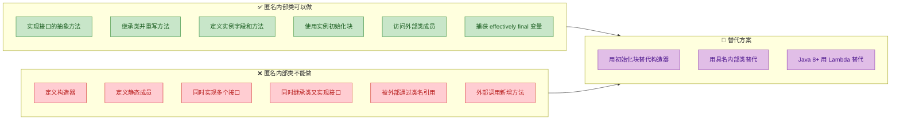

### 匿名内部类的 this 指向与外部类访问

匿名内部类中的 `this` 指向的是匿名内部类自身的实例，而不是外部类。这一点在事件监听中经常引发困惑：

```java
public class AnonymousThisDemo {
    private String name = "外部类";                           // 外部类的字段

    interface Printer {
        void print();
    }

    public void demonstrate() {
        String outerLocalVar = "局部变量";                    // 外部方法的局部变量

        Printer p = new Printer() {
            private String name = "匿名内部类";               // 匿名内部类自己的字段（遮蔽外部类同名字段）

            @Override
            public void print() {
                // this → 匿名内部类实例
                System.out.println("this.name = " + this.name);
                // 输出: this.name = 匿名内部类

                // 外部类名.this → 外部类实例
                System.out.println("Outer.this.name = " + AnonymousThisDemo.this.name);
                // 输出: Outer.this.name = 外部类

                // 直接访问外部局部变量（必须是 effectively final）
                System.out.println("outerLocalVar = " + outerLocalVar);
                // 输出: outerLocalVar = 局部变量

                // 查看实际类型
                System.out.println("this 的类型: " + this.getClass().getSimpleName());
                // 输出: this 的类型:（空字符串，因为匿名类没有 SimpleName）

                System.out.println("this 的全名: " + this.getClass().getName());
                // 输出: this 的全名: AnonymousThisDemo$1
            }
        };
        p.print();
    }

    public static void main(String[] args) {
        new AnonymousThisDemo().demonstrate();
    }
}
```

内存中的引用关系如下：

```java
// 内存引用模型
//
// Stack (栈)                          Heap (堆)
// ┌──────────────┐                   ┌─────────────────────────────┐
// │ p (引用)      │ ──────────────→  │ AnonymousThisDemo$1 实例     │
// └──────────────┘                   │  ┌─────────────────────────┐│
//                                    │  │ this.name = "匿名内部类" ││
//                                    │  │ this$0 ─────────────┐   ││
//                                    │  └─────────────────────│───┘│
//                                    └────────────────────────│────┘
//                                                             │
//                                                             ▼
//                                    ┌─────────────────────────────┐
//                                    │ AnonymousThisDemo 实例       │
//                                    │  ┌─────────────────────────┐│
//                                    │  │ name = "外部类"          ││
//                                    │  └─────────────────────────┘│
//                                    └─────────────────────────────┘
```

`this$0` 是编译器自动生成的字段，用于持有外部类的引用。这也是匿名内部类（定义在非静态上下文中时）可能导致内存泄漏的根源——和成员内部类的原理完全一致。

### 匿名内部类 vs Lambda：何时用哪个

Java 8 引入 Lambda 表达式后，很多匿名内部类的使用场景可以被 Lambda 替代。但 Lambda 并不能完全取代匿名内部类，两者各有适用范围：

```java
import java.util.*;
import java.util.function.*;

public class AnonymousVsLambda {

    // ========== 场景一：函数式接口 → 优先用 Lambda ==========
    public void functionalInterface() {
        // 匿名内部类写法（冗长）
        Runnable r1 = new Runnable() {
            @Override
            public void run() {
                System.out.println("匿名内部类");
            }
        };

        // Lambda 写法（简洁）
        Runnable r2 = () -> System.out.println("Lambda");     // 一行搞定

        // Comparator 同理
        Comparator<String> c1 = new Comparator<String>() {    // 匿名内部类：5 行
            @Override
            public int compare(String a, String b) {
                return a.length() - b.length();
            }
        };
        Comparator<String> c2 = (a, b) -> a.length() - b.length();  // Lambda：1 行
    }

    // ========== 场景二：需要多个方法 → 必须用匿名内部类 ==========
    // Lambda 只能用于函数式接口（只有一个抽象方法的接口）
    interface MultiMethod {
        void onStart();                                       // 方法一
        void onStop();                                        // 方法二
    }

    public void multipleAbstractMethods() {
        // Lambda 无法使用，因为 MultiMethod 有两个抽象方法
        // MultiMethod m = ???;                               // ✗ 无法用 Lambda
        MultiMethod m = new MultiMethod() {                   // ✓ 只能用匿名内部类
            @Override
            public void onStart() { System.out.println("Started"); }
            @Override
            public void onStop() { System.out.println("Stopped"); }
        };
    }

    // ========== 场景三：需要继承类 → 必须用匿名内部类 ==========
    public void extendClass() {
        // Lambda 只能实现接口，不能继承类
        Thread t = new Thread("worker") {                     // 继承 Thread 类
            @Override
            public void run() {
                System.out.println("线程: " + getName());     // 调用父类方法
            }
        };
    }

    // ========== 场景四：需要自己的状态（字段） → 必须用匿名内部类 ==========
    interface Counter {
        void increment();
        int getCount();
    }

    public void needState() {
        // Lambda 没有自己的实例字段，无法维护状态
        Counter counter = new Counter() {
            private int count = 0;                            // 匿名内部类可以有自己的字段

            @Override
            public void increment() { count++; }             // 修改自己的字段

            @Override
            public int getCount() { return count; }          // 返回自己的字段
        };
        counter.increment();
        counter.increment();
        System.out.println(counter.getCount());               // 输出: 2
    }

    // ========== 场景五：this 语义不同 ==========
    private String name = "外部类";

    public void thisDifference() {
        // 匿名内部类中的 this → 匿名内部类实例
        Runnable r1 = new Runnable() {
            @Override
            public void run() {
                System.out.println(this.getClass().getName());  // AnonymousVsLambda$X
            }
        };

        // Lambda 中的 this → 外部类实例（Lambda 没有自己的 this）
        Runnable r2 = () -> {
            System.out.println(this.name);                    // 直接访问外部类的 name
            System.out.println(this.getClass().getName());    // AnonymousVsLambda
        };
    }
}
```

这个 `this` 语义的差异非常关键。Lambda 表达式中的 `this` 指向的是**包含 Lambda 的那个类的实例**，而匿名内部类中的 `this` 指向的是**匿名内部类自身的实例**。这不仅仅是语法糖的区别，而是底层实现机制的根本不同——Lambda 不会生成新的类文件（它通过 `invokedynamic` 指令实现），而匿名内部类会生成 `$1.class`、`$2.class` 等文件。

用一张对比图来总结：

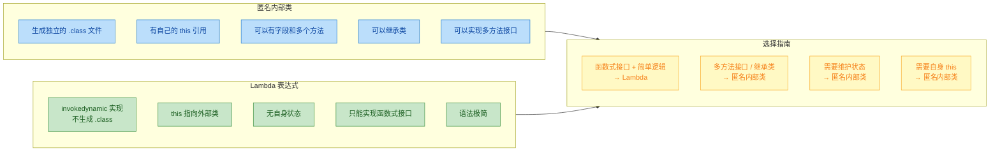

### 匿名内部类在框架源码中的真实应用

匿名内部类不仅仅是教学概念，它在 Java 生态的核心框架中被大量使用。了解这些真实场景，能帮助你在阅读源码时快速理解设计意图。

```java
import java.util.*;
import java.util.concurrent.*;

public class RealWorldAnonymousDemo {

    // ========== 1. Collections 工具类：不可变集合 ==========
    // JDK 源码中大量使用匿名内部类来创建特殊集合
    public void collectionsExample() {
        // Collections.unmodifiableList 内部就是用匿名/内部类包装原始 List
        List<String> original = new ArrayList<>(Arrays.asList("A", "B", "C"));
        List<String> unmodifiable = Collections.unmodifiableList(original);
        // unmodifiable.add("D");                             // ✗ 抛出 UnsupportedOperationException

        // 双括号初始化（Double Brace Initialization）—— 匿名内部类的"花式"用法
        // 第一层花括号：定义匿名内部类（继承 HashMap）
        // 第二层花括号：实例初始化块
        Map<String, Integer> map = new HashMap<String, Integer>() {{  // 匿名内部类继承 HashMap
            put("Alice", 90);                                 // 实例初始化块中调用 put
            put("Bob", 85);
            put("Charlie", 92);
        }};
        // ⚠️ 警告：双括号初始化虽然简洁，但会创建一个 HashMap 的匿名子类
        // 它持有外部类引用，可能导致内存泄漏和序列化问题
        // 生产代码中不推荐使用，推荐 Map.of()（Java 9+）或显式 put
    }

    // ========== 2. 线程池与 Callable ==========
    public void threadPoolExample() throws Exception {
        ExecutorService executor = Executors.newFixedThreadPool(2);  // 创建线程池

        // 提交一个有返回值的任务（Callable 接口）
        Future<String> future = executor.submit(new Callable<String>() {
            @Override
            public String call() throws Exception {           // Callable 的抽象方法
                Thread.sleep(1000);                           // 模拟耗时操作
                return "任务执行完毕，结果: 42";               // 返回结果
            }
        });

        System.out.println("等待结果...");
        String result = future.get();                         // 阻塞等待结果
        System.out.println(result);                           // 输出: 任务执行完毕，结果: 42

        executor.shutdown();                                  // 关闭线程池
    }

    // ========== 3. 模板方法模式（Template Method） ==========
    // 抽象类定义算法骨架，匿名内部类填充具体步骤
    abstract static class DataProcessor {
        // 模板方法：定义处理流程（final 防止子类修改流程）
        final void process() {
            readData();                                       // 步骤一：读取数据
            transformData();                                  // 步骤二：转换数据（抽象，由子类实现）
            writeData();                                      // 步骤三：写入数据
        }

        void readData() {                                     // 默认实现
            System.out.println("从数据库读取数据...");
        }

        abstract void transformData();                        // 抽象方法，子类必须实现

        void writeData() {                                    // 默认实现
            System.out.println("将数据写入文件...");
        }
    }

    public void templateMethodExample() {
        // 用匿名内部类快速提供不同的转换策略
        DataProcessor jsonProcessor = new DataProcessor() {
            @Override
            void transformData() {                            // 实现 JSON 转换逻辑
                System.out.println("将数据转换为 JSON 格式");
            }
        };

        DataProcessor xmlProcessor = new DataProcessor() {
            @Override
            void transformData() {                            // 实现 XML 转换逻辑
                System.out.println("将数据转换为 XML 格式");
            }
        };

        jsonProcessor.process();                              // 执行 JSON 处理流程
        System.out.println("---");
        xmlProcessor.process();                               // 执行 XML 处理流程
    }

    // ========== 4. 策略模式（Strategy Pattern） ==========
    interface ValidationStrategy {
        boolean validate(String input);                       // 验证策略接口
    }

    static class FormValidator {
        private final ValidationStrategy strategy;            // 持有策略引用

        FormValidator(ValidationStrategy strategy) {          // 通过构造器注入策略
            this.strategy = strategy;
        }

        boolean validate(String input) {                      // 委托给策略执行
            return strategy.validate(input);
        }
    }

    public void strategyPatternExample() {
        // 不同的验证策略，用匿名内部类就地定义
        FormValidator numericValidator = new FormValidator(new ValidationStrategy() {
            @Override
            public boolean validate(String input) {
                return input.matches("\\d+");                 // 纯数字验证
            }
        });

        FormValidator emailValidator = new FormValidator(new ValidationStrategy() {
            @Override
            public boolean validate(String input) {
                return input.contains("@") && input.contains(".");  // 简单邮箱验证
            }
        });

        System.out.println(numericValidator.validate("12345"));       // true
        System.out.println(numericValidator.validate("abc"));         // false
        System.out.println(emailValidator.validate("test@mail.com")); // true
    }

    public static void main(String[] args) throws Exception {
        RealWorldAnonymousDemo demo = new RealWorldAnonymousDemo();
        demo.collectionsExample();
        demo.threadPoolExample();
        demo.templateMethodExample();
        demo.strategyPatternExample();
    }
}
```

### 双括号初始化的陷阱

上面代码中提到的双括号初始化（Double Brace Initialization）值得单独展开讨论，因为它是匿名内部类最容易被误用的场景之一：

```java
public class DoubleBraceAntiPattern {

    // ========== 双括号初始化的本质 ==========
    public void whatItReallyIs() {
        // 看起来很方便的写法
        List<String> list = new ArrayList<String>() {{        // 第一层 { → 匿名内部类定义
            add("A");                                         // 第二层 { → 实例初始化块
            add("B");
            add("C");
        }};                                                   // 两层 } 分别关闭

        // 上面的代码等价于：
        // class DoubleBraceAntiPattern$1 extends ArrayList<String> {
        //     {                          // 实例初始化块
        //         add("A");
        //         add("B");
        //         add("C");
        //     }
        // }
        // List<String> list = new DoubleBraceAntiPattern$1();

        // 验证：list 不是 ArrayList，而是它的匿名子类
        System.out.println(list.getClass().getName());        // DoubleBraceAntiPattern$1
        System.out.println(list.getClass().getSuperclass());  // class java.util.ArrayList
        System.out.println(list instanceof ArrayList);        // true（子类 instanceof 父类）
    }

    // ========== 为什么不推荐 ==========
    // 问题一：每次使用都会生成一个新的匿名子类 .class 文件
    // 问题二：匿名内部类持有外部类引用 → 内存泄漏风险
    // 问题三：破坏 equals 语义（某些集合的 equals 会检查 getClass()）
    // 问题四：序列化时可能出问题（匿名类的序列化 ID 不稳定）

    // ========== 推荐替代方案 ==========
    public void betterAlternatives() {
        // Java 9+：不可变集合工厂方法
        List<String> list1 = List.of("A", "B", "C");                  // 不可变 List
        Map<String, Integer> map1 = Map.of("k1", 1, "k2", 2);        // 不可变 Map
        Set<String> set1 = Set.of("A", "B", "C");                     // 不可变 Set

        // Java 8：Stream 收集
        List<String> list2 = Arrays.asList("A", "B", "C");            // 固定大小 List

        // 通用方案：显式添加
        List<String> list3 = new ArrayList<>();
        Collections.addAll(list3, "A", "B", "C");                     // 批量添加
    }
}
```

### 匿名内部类与内存泄漏

和成员内部类一样，定义在非静态上下文中的匿名内部类会隐式持有外部类的引用。这在 Android 开发中是一个臭名昭著的内存泄漏源头：

```java
public class AnonymousMemoryLeakDemo {

    // ========== 典型泄漏场景：Activity 中的匿名回调 ==========
    // 以下是 Android 风格的伪代码，展示问题本质

    static class Activity {                                   // 模拟 Android Activity
        private String heavyData = new String(new char[1024 * 1024]);  // 1MB 数据

        void onCreate() {
            // 匿名内部类持有 Activity.this 引用
            // 如果这个 Runnable 被一个长生命周期的对象（如线程池）持有
            // 那么即使 Activity 已经销毁，它也无法被 GC 回收
            Runnable leakyTask = new Runnable() {             // ← 隐式持有 Activity.this
                @Override
                public void run() {
                    // 即使这里没有使用 Activity 的任何成员
                    // 编译器仍然会在匿名内部类中生成 this$0 字段
                    System.out.println("执行任务...");
                }
            };

            // 假设提交给一个全局线程池（生命周期比 Activity 长）
            // GlobalThreadPool.submit(leakyTask);            // Activity 泄漏！
        }

        // ========== 修复方案一：使用静态内部类 + 弱引用 ==========
        static class SafeTask implements Runnable {           // 静态内部类，不持有外部引用
            // 如果需要访问 Activity，使用 WeakReference
            // private final WeakReference<Activity> activityRef;

            @Override
            public void run() {
                System.out.println("安全执行任务...");
            }
        }

        // ========== 修复方案二：使用 Lambda（仅在不捕获外部实例时安全） ==========
        void onCreateFixed() {
            // Lambda 如果没有引用外部实例的成员，不会捕获 this
            Runnable safeTask = () -> {
                System.out.println("Lambda 任务...");         // 没有引用 Activity 的字段
            };
            // 但如果 Lambda 中引用了 this.heavyData，仍然会捕获 this
            Runnable stillLeaky = () -> {
                System.out.println(this.heavyData);           // ← 捕获了 this，仍有泄漏风险
            };
        }
    }
}
```

这里有一个微妙但重要的区别：匿名内部类**无论是否使用外部类成员**，都会持有外部类引用（编译器无条件生成 `this$0`）。而 Lambda 表达式更智能——只有在实际引用了外部实例的成员时，才会捕获 `this`。这是 Lambda 在内存安全方面的一个优势。

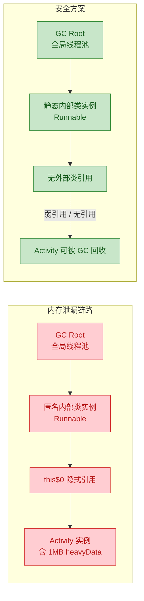

### 匿名内部类的编译细节与字节码视角

为了真正理解匿名内部类的运行机制，我们来看看编译器在背后做了什么。这部分内容对于理解性能开销和调试问题很有帮助。

```java
public class BytecodeInsight {
    private int outerField = 10;                              // 外部类字段

    interface Calculator {
        int compute(int x);
    }

    public Calculator createCalculator(int factor) {          // factor 是方法参数
        int offset = 5;                                       // 局部变量（effectively final）

        return new Calculator() {                             // 匿名内部类
            @Override
            public int compute(int x) {
                // 访问了三种外部变量：
                // 1. outerField → 通过 this$0（外部类引用）访问
                // 2. factor    → 编译器将其作为构造参数传入匿名类
                // 3. offset    → 编译器将其作为构造参数传入匿名类
                return x * factor + offset + outerField;
            }
        };
    }
}
```

编译器会将上面的匿名内部类转换为类似下面的具名类（反编译后的等价代码）：

```java
// 编译器生成的等价代码（简化版）
class BytecodeInsight$1 implements BytecodeInsight.Calculator {
    // 编译器自动生成的字段
    final BytecodeInsight this$0;                             // 外部类引用
    private final int val$factor;                             // 捕获的局部变量 factor
    private final int val$offset;                             // 捕获的局部变量 offset

    // 编译器自动生成的构造器
    BytecodeInsight$1(BytecodeInsight outer, int factor, int offset) {
        this.this$0 = outer;                                  // 保存外部类引用
        this.val$factor = factor;                             // 保存捕获的 factor 值
        this.val$offset = offset;                             // 保存捕获的 offset 值
    }

    @Override
    public int compute(int x) {
        // 通过字段访问所有外部变量
        return x * this.val$factor                            // 使用捕获的 factor
             + this.val$offset                                // 使用捕获的 offset
             + this.this$0.outerField;                        // 通过外部类引用访问 outerField
    }
}
```

这就是为什么匿名内部类捕获的局部变量必须是 effectively final 的根本原因——它们是通过**值拷贝**传入匿名类的构造器的。如果允许修改，匿名类内部的副本和外部的原始变量就会不一致，造成语义混乱。这个话题会在下一节 "effectively final" 中深入展开。

---

**📝 练习题**

以下代码的输出结果是什么？

```java
public class Quiz {
    private String msg = "Hello";

    public void test() {
        Runnable r = new Runnable() {
            private String msg = "World";

            @Override
            public void run() {
                System.out.println(this.msg);
                System.out.println(Quiz.this.msg);
                System.out.println(this.getClass().getSuperclass().getSimpleName());
            }
        };
        r.run();
    }

    public static void main(String[] args) {
        new Quiz().test();
    }
}
```

A. `Hello` → `Hello` → `Quiz`

B. `World` → `Hello` → `Object`

C. `World` → `World` → `Runnable`

D. 编译错误，匿名内部类不能定义与外部类同名的字段


**【答案】** B

**【解析】** 匿名内部类中的 `this` 指向匿名内部类自身的实例，因此 `this.msg` 访问的是匿名内部类自己定义的字段 `"World"`（遮蔽了外部类的同名字段）。`Quiz.this.msg` 通过 `外部类名.this` 语法显式访问外部类实例的字段，得到 `"Hello"`。`this.getClass().getSuperclass()` 返回匿名内部类的父类——由于这个匿名内部类实现的是 `Runnable` 接口（接口不是类），它隐式继承的是 `Object`，所以 `getSimpleName()` 返回 `"Object"`。注意 `Runnable` 是接口不是类，匿名内部类实现接口时，其父类始终是 `Object`。

---

## effectively final

Java 8 引入了一个看似微小却影响深远的语言概念——**effectively final**。它不是一个关键字，也不是一个修饰符，而是编译器对变量状态的一种**推断规则**（inference rule）。理解它，是真正掌握 Lambda 表达式和匿名内部类底层机制的关键一环。

### 什么是 effectively final

先回顾一条 Java 7 及之前的硬性规则：匿名内部类或局部内部类如果要访问所在方法的局部变量，该变量**必须**显式声明为 `final`。

```java
// Java 7 写法：必须加 final，否则编译报错
public void bindClick() {
    final String message = "Hello";
    button.addActionListener(new ActionListener() {
        @Override
        public void actionPerformed(ActionEvent e) {
            System.out.println(message); // 访问外部局部变量
        }
    });
}
```

到了 Java 8，编译器变得更聪明了。如果一个局部变量在初始化之后**事实上从未被重新赋值**（never reassigned after initialization），编译器就认定它是 **effectively final**——"实质上的 final"。此时你不再需要手动写出 `final` 关键字，编译器会自动帮你做这个判断。

```java
// Java 8+ 写法：省略 final，编译器自动推断 effectively final
public void bindClick() {
    String message = "Hello"; // 没有 final，但从未被重新赋值
    button.addActionListener(e -> System.out.println(message)); // 合法
}
```

用一句话总结定义：**一个局部变量如果加上 `final` 关键字后代码仍然能编译通过，那它就是 effectively final。**

### 判定规则详解

effectively final 的判定并不复杂，但有几个容易踩坑的边界情况值得逐一拆解。

```java
public void demo() {
    // ✅ 情况1：声明时赋值，之后从未修改 → effectively final
    int a = 10;

    // ✅ 情况2：声明时未赋值，后续只赋值一次 → effectively final
    int b;
    b = 20;

    // ❌ 情况3：赋值后又修改了 → 不是 effectively final
    int c = 30;
    c = 40; // 第二次赋值，破坏了 effectively final

    // ✅ 情况4：方法参数天然只赋值一次 → effectively final
    // (参数在方法调用时被赋值，方法体内未重新赋值即可)

    Runnable r = () -> {
        System.out.println(a); // ✅ 编译通过
        System.out.println(b); // ✅ 编译通过
        // System.out.println(c); // ❌ 编译报错
    };
}
```

下面用一张流程图来可视化编译器的判定逻辑：

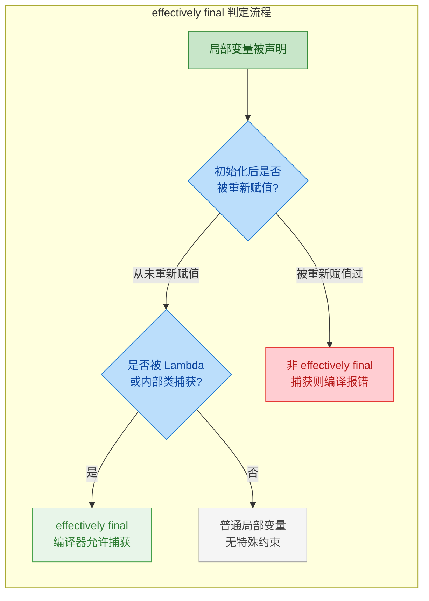

一个特别容易混淆的点：**effectively final 只约束变量的引用（reference），不约束对象内部的状态（state）。**

```java
public void demo() {
    // list 引用本身从未被重新赋值 → effectively final
    List<String> list = new ArrayList<>();

    // 修改对象内部状态完全合法，不影响 effectively final 判定
    list.add("Java");
    list.add("Kotlin");

    // Lambda 捕获 list 引用 → 编译通过
    Runnable r = () -> {
        list.add("Scala");              // ✅ 修改内部状态，合法
        System.out.println(list.size()); // ✅ 读取内部状态，合法
        // list = new ArrayList<>();     // ❌ 如果取消注释，重新赋值引用，编译报错
    };
}
```

用 ASCII 图来直观理解"引用不变，内容可变"：

```java
// ========== effectively final 约束的是引用，不是堆上的对象 ==========
//
//  栈帧 (Stack Frame)          堆 (Heap)
//  ┌──────────────┐           ┌──────────────────────┐
//  │ list (引用)   │ ────────→│ ArrayList 对象        │
//  │ [不可重新赋值] │    ×     │ ┌──────────────────┐ │
//  └──────────────┘   ╱      │ │ "Java"           │ │  ← 可以 add
//                    ╱       │ │ "Kotlin"         │ │  ← 可以 add
//  list = new ...  ╱  禁止   │ │ "Scala"          │ │  ← 可以 add
//                            │ └──────────────────┘ │
//                            └──────────────────────┘
//
//  结论：引用 (reference) 被冻结，对象内容 (state) 自由修改
```

### 为什么需要 effectively final：底层原理

这个限制并非 Java 语言设计者的"洁癖"，而是由 JVM 的实现机制决定的。要理解这一点，需要知道 Lambda 和匿名内部类是如何"捕获"外部变量的。

当 Lambda 或匿名内部类引用一个外部局部变量时，JVM 并不是让内部代码直接访问栈帧上的那个变量。局部变量的生命周期与方法调用绑定——方法返回后，栈帧销毁，局部变量随之消亡。但 Lambda 对象或匿名内部类实例可能在方法返回后仍然存活（比如被传递给另一个线程）。

JVM 的解决方案是**值拷贝**（value copy）：在创建 Lambda / 匿名内部类实例时，将外部变量的**当前值**复制一份到实例内部的隐藏字段中。

```java
public class EffectivelyFinalDemo {
    public Runnable createTask() {
        int count = 42; // effectively final
        // Lambda 捕获 count
        return () -> System.out.println(count);
    }
}
```

编译器在底层大致会生成这样的等价代码：

```java
// ===== 编译器生成的等价逻辑（伪代码）=====
public class EffectivelyFinalDemo {
    public Runnable createTask() {
        int count = 42;
        // 编译器将 count 的值拷贝到 Lambda 实现类中
        return new EffectivelyFinalDemo$$Lambda$1(count);
    }

    // 编译器生成的 Lambda 实现类
    static final class EffectivelyFinalDemo$$Lambda$1 implements Runnable {
        private final int capturedCount; // 拷贝的副本

        EffectivelyFinalDemo$$Lambda$1(int count) {
            this.capturedCount = count; // 值拷贝发生在此处
        }

        @Override
        public void run() {
            System.out.println(capturedCount); // 使用的是副本，不是原变量
        }
    }
}
```

现在问题就清楚了：既然内部持有的是**副本**，如果允许外部修改原变量，就会导致内外两份数据不一致，程序员看到的代码语义和实际运行行为产生矛盾。这种"看起来是同一个变量，实际上是两个独立的值"的不一致性，会引发极其隐蔽的 bug。

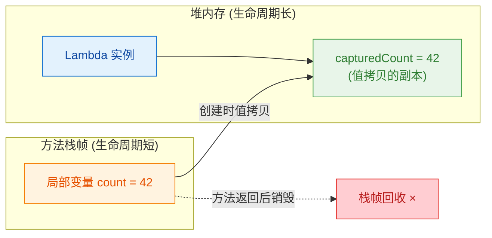

所以 effectively final 的本质是：**编译器通过限制变量不可变，来保证"值拷贝"语义下内外数据的一致性。**

这也解释了为什么 Java 选择了"值拷贝 + 不可变约束"的方案，而不是像某些语言（如 C# 的 `ref` 捕获、JavaScript 的闭包）那样直接捕获变量引用——后者虽然灵活，但在多线程环境下会引入更复杂的同步问题。Java 的设计哲学是**宁可限制灵活性，也要保证安全性**。

### 绕过 effectively final 限制的常见手法

实际开发中，确实存在需要在 Lambda 内部"修改"外部状态的场景。以下是几种常见的合法绕过方式，以及它们各自的适用场景和风险。

**手法一：使用单元素数组**

```java
public void countInLambda() {
    // 数组引用本身是 effectively final
    // 但数组内部的元素可以自由修改
    int[] counter = {0};

    List.of("A", "B", "C").forEach(item -> {
        counter[0]++;  // ✅ 修改数组元素，不是修改引用
        System.out.println(item + " -> count: " + counter[0]);
    });

    System.out.println("Total: " + counter[0]); // 输出 3
}
```

这种写法利用了前面提到的"引用不变，内容可变"原则。数组引用 `counter` 始终指向同一个数组对象，所以是 effectively final。但这种写法可读性差，且在并行流（parallel stream）中存在线程安全问题，一般只在简单的单线程场景中临时使用。

**手法二：使用 AtomicInteger / AtomicReference**

```java
public void atomicCountInLambda() {
    // AtomicInteger 引用是 effectively final
    // 内部值通过 CAS 操作线程安全地修改
    AtomicInteger counter = new AtomicInteger(0);

    List.of("A", "B", "C").parallelStream().forEach(item -> {
        int current = counter.incrementAndGet(); // ✅ 线程安全的修改
        System.out.println(item + " -> count: " + current);
    });

    System.out.println("Total: " + counter.get());
}
```

这是并发场景下的推荐做法。`AtomicInteger` 的引用不变，内部值通过 CAS（Compare-And-Swap）原子操作修改，既满足 effectively final 约束，又保证线程安全。

**手法三：将可变状态封装到对象中**

```java
public void accumulateInLambda() {
    // 封装可变状态到一个容器对象中
    // 容器引用是 effectively final，内部状态可变
    StringBuilder sb = new StringBuilder();

    List.of("Java", "Kotlin", "Scala").forEach(lang -> {
        sb.append(lang).append(" "); // ✅ 修改对象内部状态
    });

    System.out.println(sb.toString().trim()); // Java Kotlin Scala
}
```

**手法四：改用实例变量或类变量**

```java
public class TaskProcessor {
    // 实例变量不受 effectively final 约束
    // 因为它存储在堆上，Lambda 通过 this 引用访问
    private int processedCount = 0;

    public void process(List<String> items) {
        items.forEach(item -> {
            processedCount++; // ✅ 实例变量，不是局部变量
            System.out.println("Processing: " + item);
        });
        System.out.println("Processed: " + processedCount);
    }
}
```

实例变量和类变量（static 变量）不受 effectively final 限制，因为它们存储在堆上，Lambda 通过 `this` 引用（或类引用）间接访问，不存在"值拷贝"的问题。但要注意，在多线程环境下直接修改实例变量同样需要同步保护。

下面对比四种手法的适用场景：

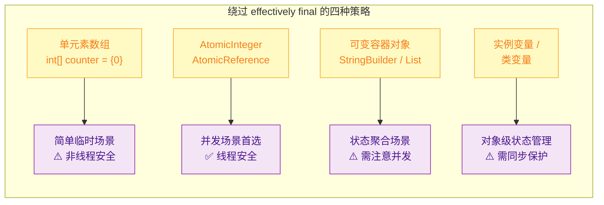

### effectively final 与 Lambda、匿名内部类的关系

effectively final 这个概念虽然在 Java 8 才被正式命名，但它解决的问题从匿名内部类时代就存在了。Java 8 的改变只是**放宽了语法要求**（不再强制写 `final`），**底层约束从未改变**。

```java
public class ComparisonDemo {

    public void java7Style() {
        // Java 7：必须显式写 final
        final String name = "Java 7";
        Runnable r = new Runnable() {
            @Override
            public void run() {
                System.out.println(name); // 访问 final 局部变量
            }
        };
    }

    public void java8AnonymousClass() {
        // Java 8：匿名内部类也享受 effectively final
        String name = "Java 8 Anonymous"; // 无需 final
        Runnable r = new Runnable() {
            @Override
            public void run() {
                System.out.println(name); // effectively final，编译通过
            }
        };
    }

    public void java8Lambda() {
        // Java 8：Lambda 同样遵循 effectively final
        String name = "Java 8 Lambda"; // 无需 final
        Runnable r = () -> System.out.println(name); // effectively final，编译通过
    }
}
```

三种写法在字节码层面的变量捕获机制是一致的——都是值拷贝。区别仅在于语法糖的甜度不同。

一个值得注意的细节：**在 Lambda 内部对捕获变量重新赋值，编译器报错的时机是在 Lambda 表达式内部，而不是在变量声明处。** 同样，如果在 Lambda 之后对变量重新赋值，也会导致 Lambda 内部的捕获失败。

```java
public void errorDemo() {
    String msg = "Hello";

    // 场景1：Lambda 之后修改变量 → Lambda 内捕获报错
    // Runnable r1 = () -> System.out.println(msg); // ❌ 编译报错
    // msg = "World"; // 这行赋值导致 msg 不再是 effectively final

    // 场景2：Lambda 内部尝试修改 → 直接报错
    String text = "Original";
    // Runnable r2 = () -> {
    //     text = "Modified"; // ❌ 编译报错：Variable used in lambda should be final or effectively final
    // };
}
```

### 增强 for 循环中的 effectively final

一个经常被忽略的有趣场景：增强 for 循环（enhanced for-loop）的循环变量在**每次迭代**中都是一个新的 effectively final 变量。

```java
public void forEachCapture() {
    List<Runnable> tasks = new ArrayList<>();
    List<String> names = List.of("Alice", "Bob", "Charlie");

    // 增强 for 循环：每次迭代的 name 都是一个新的局部变量
    // 每个 name 在其所属的那次迭代中从未被重新赋值 → effectively final
    for (String name : names) {
        tasks.add(() -> System.out.println(name)); // ✅ 每次捕获的是不同的 name 副本
    }

    tasks.forEach(Runnable::run);
    // 输出：Alice  Bob  Charlie（各自正确捕获）
}
```

但传统 for 循环的循环变量就不同了：

```java
public void classicForCapture() {
    List<Runnable> tasks = new ArrayList<>();

    for (int i = 0; i < 3; i++) {
        // i 在每次迭代结束时被 i++ 修改 → 不是 effectively final
        // tasks.add(() -> System.out.println(i)); // ❌ 编译报错

        // 解决方案：创建一个 effectively final 的临时变量
        final int index = i; // 或者不写 final，index 也是 effectively final
        tasks.add(() -> System.out.println(index)); // ✅
    }

    tasks.forEach(Runnable::run); // 输出：0  1  2
}
```

这个差异的根源在于：增强 for 循环在字节码层面，每次迭代都会创建一个新的局部变量槽位（variable slot），而传统 for 循环的 `i` 自始至终是同一个变量，且每次迭代都会被 `i++` 修改。

### 实际开发中的最佳实践

结合前面所有知识点，总结几条在实际项目中应遵循的原则：

```java
public class BestPracticeDemo {

    // ✅ 最佳实践1：优先使用 effectively final，代码更简洁
    public void practice1() {
        String config = loadConfig();  // 不需要写 final
        executor.submit(() -> applyConfig(config));
    }

    // ✅ 最佳实践2：需要在 Lambda 中累积状态时，用 Stream API 的 reduce/collect 替代手动修改
    public int practice2(List<Integer> numbers) {
        // 不要这样做：
        // int[] sum = {0};
        // numbers.forEach(n -> sum[0] += n);

        // 应该这样做：
        return numbers.stream()
                .reduce(0, Integer::sum); // 函数式风格，无副作用
    }

    // ✅ 最佳实践3：并发场景必须使用 Atomic 类型
    public void practice3() {
        AtomicLong counter = new AtomicLong(0);
        items.parallelStream().forEach(item -> {
            counter.incrementAndGet(); // 线程安全
        });
    }

    // ✅ 最佳实践4：如果逻辑复杂到需要频繁绕过 effectively final，
    //    考虑将 Lambda 重构为具名方法或独立的类
    public void practice4() {
        // 与其在 Lambda 中用各种 hack 修改外部状态
        // 不如提取为一个有明确职责的处理器类
        ItemProcessor processor = new ItemProcessor();
        items.forEach(processor::process);
        System.out.println(processor.getResult());
    }

    // 占位方法
    private String loadConfig() { return ""; }
    private void applyConfig(String c) {}
}
```

---

**📝 练习题**

以下代码能否编译通过？如果不能，指出所有编译错误的行号并说明原因。

```java
public void quiz() {
    int x = 10;           // 第1行
    int y;                // 第2行
    y = 20;               // 第3行
    int z = 30;           // 第4行
    z = 40;               // 第5行
    List<String> list = new ArrayList<>();  // 第6行

    Runnable r = () -> {
        System.out.println(x);          // 第8行
        System.out.println(y);          // 第9行
        System.out.println(z);          // 第10行
        list.add("test");               // 第11行
        System.out.println(list.size());// 第12行
    };
}
```

A. 全部编译通过


B. 第10行编译报错


C. 第9行和第10行编译报错


D. 第10行和第11行编译报错


**【答案】** B

**【解析】** 逐一分析每个变量：`x` 在第1行赋值后从未修改，是 effectively final，第8行合法。`y` 在第2行声明、第3行赋值，之后从未修改，也是 effectively final（声明和首次赋值分开不影响判定），第9行合法。`z` 在第4行赋值为30，第5行又被赋值为40，发生了二次赋值，不是 effectively final，因此第10行在 Lambda 中捕获 `z` 时编译报错。`list` 引用在第6行赋值后从未被重新指向其他对象，是 effectively final；第11行调用 `add()` 修改的是对象内部状态，不是引用本身，完全合法；第12行同理。所以只有第10行报错，选 B。

---

## 本章小结

内部类是 Java 语言中一个精巧而强大的特性，它允许我们在一个类的内部定义另一个类，从而在逻辑上建立更紧密的封装关系。回顾本章，我们系统地学习了四种内部类形态，每一种都有其独特的设计意图和适用边界。

### 四种内部类全景对比


### 核心要点速查表

```java
// ┌──────────────────────────────────────────────────────────────────────────────┐
// │                        Java 内部类 · 核心要点速查表                           │
// ├──────────────┬───────────────┬──────────────┬───────────────┬───────────────┤
// │     特性      │  成员内部类    │  静态内部类   │  局部内部类    │  匿名内部类    │
// ├──────────────┼───────────────┼──────────────┼───────────────┼───────────────┤
// │ 定义位置      │ 类体内部       │ 类体内部      │ 方法/代码块内  │ 表达式中       │
// │ static 修饰  │ ✘ 不可以       │ ✔ 必须       │ ✘ 不可以      │ ✘ 不可以       │
// │ 持有外部引用  │ ✔ 隐式持有     │ ✘ 不持有      │ ✔ 隐式持有    │ ✔ 隐式持有     │
// │ 访问外部成员  │ 全部(含private)│ 仅 static    │ 全部+局部变量  │ 全部+局部变量  │
// │ 可声明static │ ✘ 不可以       │ ✔ 可以       │ ✘ 不可以      │ ✘ 不可以       │
// │ 有类名       │ ✔ 有          │ ✔ 有         │ ✔ 有         │ ✘ 没有         │
// │ 可复用       │ ✔ 可以        │ ✔ 可以       │ ✘ 仅方法内    │ ✘ 一次性       │
// │ 内存泄漏风险  │ ⚠️ 高         │ ✔ 安全       │ ⚠️ 低        │ ⚠️ 中          │
// │ 典型场景     │ 迭代器/节点    │ Builder/Entry │ 几乎不用      │ 回调/监听器     │
// └──────────────┴───────────────┴──────────────┴───────────────┴───────────────┘
```

### 设计选型决策路径

在实际开发中，面对"要不要用内部类、用哪种内部类"这个问题，可以遵循一条清晰的决策链路：

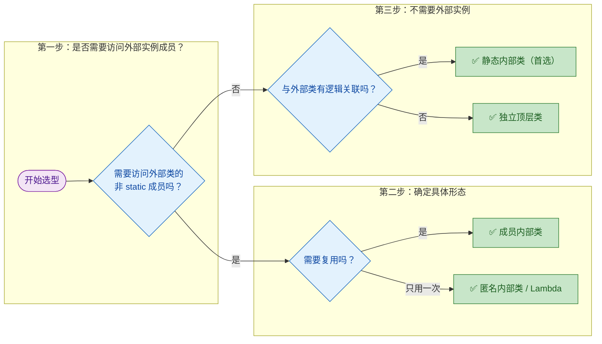

这条决策路径的核心原则是：**能用静态内部类就不用成员内部类，能用 Lambda 就不用匿名内部类**。这不是教条，而是从内存安全和代码简洁两个维度得出的工程经验。

### effectively final 的贯穿作用

`effectively final` 这个概念贯穿了局部内部类和匿名内部类两大板块。它的本质是 Java 编译器为了保证**闭包语义的一致性**而施加的约束——局部变量存活在栈帧上，而内部类对象存活在堆上，二者生命周期不同步。Java 的解决方案是在编译期将局部变量的值**拷贝**一份到内部类中，而为了保证拷贝值与原值的语义一致，就必须要求变量在赋值后不再改变。

这个设计体现了 Java 语言一贯的哲学：**宁可在编译期施加限制，也不在运行时留下隐患**。

### 从内部类到现代 Java 的演进

内部类诞生于 JDK 1.1 时代，在那个没有 Lambda、没有函数式接口的年代，匿名内部类几乎是实现回调的唯一手段。随着 Java 8 引入 Lambda 表达式，大量原本需要匿名内部类的场景被更简洁的语法替代。但内部类并没有因此过时：

- 成员内部类在实现 `Iterator`、链表 `Node` 等与外部类深度耦合的结构时，依然是最自然的选择。
- 静态内部类在 `Builder` 模式、`Map.Entry`、`ViewHolder` 等场景中不可替代。
- 匿名内部类在需要同时覆写多个方法（非函数式接口）时，Lambda 无法胜任，仍需匿名内部类出场。

理解内部类，不仅是掌握一种语法，更是理解 Java 在**封装粒度**、**生命周期管理**和**内存模型**上的设计权衡。这些思考方式，会在你后续学习 Android 开发（Handler 内存泄漏）、并发编程（ThreadLocal 与内部类）、框架源码（Spring 中大量的匿名回调）时反复出现。

---

**📝 练习题**

以下代码编译运行后，输出结果是什么？

```java
public class Outer {
    private String name = "Outer";

    class Inner {
        private String name = "Inner";

        public void display() {
            String name = "Local";
            // 分别输出三个不同作用域的 name
            System.out.println(name);
            System.out.println(this.name);
            System.out.println(Outer.this.name);
        }
    }

    public static void main(String[] args) {
        Outer outer = new Outer();
        Outer.Inner inner = outer.new Inner();
        inner.display();
    }
}
```

A. Local → Local → Local


B. Local → Inner → Outer


C. Inner → Inner → Outer


D. 编译错误，成员内部类不能有与外部类同名的字段


**【答案】** B

**【解析】** 这道题考查的是成员内部类中三层作用域的变量遮蔽（Variable Shadowing）规则。在 `display()` 方法内部：

- 直接写 `name`，遵循就近原则（nearest scope），找到的是方法局部变量 `"Local"`。
- `this.name` 中的 `this` 指向当前 Inner 实例，访问的是 Inner 的成员字段 `"Inner"`。
- `Outer.this.name` 是成员内部类特有的语法，通过 `外部类名.this` 显式引用外部类实例，访问的是 Outer 的私有字段 `"Outer"`。成员内部类之所以能访问外部类的 `private` 成员，正是因为编译器在内部类中隐式持有了一个指向外部类实例的引用。

这三层作用域的区分——局部变量、内部类成员、外部类成员——是理解成员内部类行为的关键。选项 D 是干扰项，Java 完全允许内部类字段与外部类字段同名，只是需要通过 `Outer.this` 来消除歧义。

---

**📝 练习题**

在 Android 开发中，以下哪种写法最容易导致 Activity 内存泄漏？

```java
// 写法 A
public class MyActivity extends Activity {
    static class MyHandler extends Handler {
        @Override public void handleMessage(Message msg) { /* ... */ }
    }
}

// 写法 B
public class MyActivity extends Activity {
    class MyHandler extends Handler {
        @Override public void handleMessage(Message msg) { /* ... */ }
    }
}

// 写法 C
public class MyActivity extends Activity {
    private final Handler handler = new Handler(msg -> {
        // Lambda 处理消息
        return true;
    });
}
```

A. 写法 A，因为 static 内部类会常驻内存


B. 写法 B，因为成员内部类隐式持有 Activity 引用


C. 写法 C，因为 Lambda 会捕获外部变量


D. 三种写法都不会导致内存泄漏


**【答案】** B

**【解析】** 这是内部类知识在 Android 实战中最经典的应用。写法 B 中 `MyHandler` 是一个非静态的成员内部类，它会隐式持有外部 `MyActivity` 的引用（即编译器自动生成的 `MyActivity.this`）。当 Handler 的 MessageQueue 中还有未处理的消息时，消息持有 Handler 引用，Handler 持有 Activity 引用，形成一条 GC Root 可达链路，导致 Activity 即使调用了 `onDestroy()` 也无法被垃圾回收，这就是典型的内存泄漏。

写法 A 使用 `static class`，不持有外部类引用，是 Android 官方推荐的做法（通常配合 `WeakReference<Activity>` 使用）。写法 C 的 Lambda 虽然也可能捕获外部引用，但如果 Lambda 体内没有引用 `MyActivity.this` 的成员，编译器不会捕获外部实例，相对更安全。不过严格来说，写法 C 中如果 Lambda 内部访问了 Activity 的字段或方法，同样会持有引用，但题目中的 Lambda 体内没有这样做，所以写法 B 是最明确、最容易导致泄漏的选项。

---

