---

# 异常处理

---

## 异常层次（Throwable → Error / Exception → RuntimeException）

Java 的异常处理机制是语言层面内建的一套错误传播与恢复体系。要真正理解它，第一步就是搞清楚异常的"家族族谱"——也就是异常的继承层次结构（Exception Hierarchy）。Java 中所有可以被 `throw` 抛出、被 `catch` 捕获的对象，都必须是 `java.lang.Throwable` 的子类。这棵继承树的设计，直接决定了哪些错误你"必须处理"、哪些你"可以忽略"、哪些你"根本不该处理"。

### Throwable：一切异常的根

`Throwable` 是 Java 异常体系的顶层父类，位于 `java.lang` 包中。它是唯一可以配合 `throw` 关键字使用的类型——如果你试图 `throw` 一个非 `Throwable` 子类的对象，编译器会直接报错。

`Throwable` 自身携带了几个关键信息：

- `message`：一段描述错误原因的字符串，通过构造器传入，用 `getMessage()` 获取。
- `cause`：引发当前异常的"根因"异常（另一个 `Throwable`），这是异常链机制的基础，后续章节会详细展开。
- `stackTrace`：方法调用栈的快照，记录了异常发生时程序执行到了哪里，通过 `printStackTrace()` 可以打印出来，这是日常调试最常看到的信息。

```java
// Throwable 的核心构造器签名
public class Throwable {
    // 无参构造：message 为 null，cause 为 null
    public Throwable() {}

    // 传入描述信息
    public Throwable(String message) {}

    // 传入描述信息 + 根因异常（异常链）
    public Throwable(String message, Throwable cause) {}

    // 仅传入根因异常，message 自动取 cause.toString()
    public Throwable(Throwable cause) {}
}
```

在实际开发中，你几乎不会直接 `new Throwable()` 来抛出异常，而是使用它的两大子类分支：`Error` 和 `Exception`。

### Error：系统级灾难，不要试图捕获

`Error` 代表的是 JVM 层面或系统层面的严重故障（serious problems that a reasonable application should not try to catch）。当 `Error` 发生时，通常意味着运行环境本身已经出了问题，程序继续执行下去也没有意义。

常见的 `Error` 子类包括：

- `OutOfMemoryError`：JVM 堆内存耗尽，无法再分配新对象。这往往是内存泄漏或数据量远超预期导致的。
- `StackOverflowError`：方法调用栈溢出，最典型的场景就是无限递归。每次方法调用都会在栈上压入一个栈帧（stack frame），栈空间是有限的，递归没有正确的终止条件就会触发。
- `NoClassDefFoundError`：JVM 在运行时找不到某个类的定义。编译时存在，运行时 classpath 里却没有，就会抛这个错误。
- `VirtualMachineError`：JVM 自身内部错误的抽象父类，`OutOfMemoryError` 和 `StackOverflowError` 都是它的子类。

```java
// 一个经典的 StackOverflowError 示例
public class ErrorDemo {
    // 这个方法无限递归调用自身
    public static void infiniteRecursion() {
        // 每次调用都会在栈上压入新的栈帧，永远不会返回
        infiniteRecursion(); // 没有终止条件 → StackOverflowError
    }

    public static void main(String[] args) {
        // 调用后很快就会栈溢出
        infiniteRecursion();
        // 输出类似：Exception in thread "main" java.lang.StackOverflowError
    }
}
```

关于 `Error`，有一条非常重要的原则：**不要在业务代码中 catch Error**。原因很简单——`Error` 表示的是你的代码无力回天的状况。`OutOfMemoryError` 发生时，你连 `new` 一个 `String` 来记录日志都可能失败。`StackOverflowError` 发生时，调用栈已经炸了，你在 `catch` 块里调用任何方法都可能再次溢出。捕获 `Error` 不仅没有意义，还可能掩盖问题，让系统在一个不确定的状态下继续运行，造成更大的损害。

### Exception：程序级异常，开发者的主战场

`Exception` 是开发者日常打交道最多的分支。它代表的是"程序运行中可以预见、可以恢复的异常状况"。`Exception` 又进一步分为两大阵营，这个划分是 Java 异常机制最核心的设计决策之一：

- **Checked Exception（受检异常）**：`Exception` 的直接子类中，除了 `RuntimeException` 及其子类之外的所有异常。
- **Unchecked Exception（非受检异常）**：`RuntimeException` 及其所有子类。

这个划分我们在下一节会深入展开，这里先建立整体认知。

常见的 `Exception` 子类（非 Runtime）：

- `IOException`：I/O 操作失败，比如文件不存在、网络连接中断、流读写出错。
- `SQLException`：数据库操作异常，SQL 语法错误、连接断开等。
- `ClassNotFoundException`：通过 `Class.forName()` 动态加载类时找不到目标类。注意和 `NoClassDefFoundError` 的区别——前者是"你主动去找，没找到"，后者是"JVM 自己需要用，发现没有"。
- `InterruptedException`：线程在等待/睡眠时被中断。

### RuntimeException：程序员的"锅"

`RuntimeException` 是 `Exception` 的一个特殊子类分支，它代表的异常通常是由编程错误（programming bugs）导致的，而不是外部环境的不可控因素。正因如此，编译器不强制你处理它们——理论上，写出正确的代码就不会触发这些异常。

常见的 `RuntimeException` 子类：

- `NullPointerException`（NPE）：对 `null` 引用调用方法或访问字段。这是 Java 开发中出现频率最高的异常，没有之一。Tony Hoare 称 `null` 的发明是他的"billion-dollar mistake"。
- `ArrayIndexOutOfBoundsException`：数组下标越界，访问了不存在的索引位置。
- `ClassCastException`：类型转换失败，比如把一个 `String` 强转为 `Integer`。
- `IllegalArgumentException`：方法接收到了不合法的参数值。
- `IllegalStateException`：对象当前状态不允许执行某个操作。
- `ArithmeticException`：算术运算错误，最典型的就是整数除以零。
- `NumberFormatException`：字符串转数字失败，比如 `Integer.parseInt("abc")`。它是 `IllegalArgumentException` 的子类。

```java
public class RuntimeExceptionDemo {
    public static void main(String[] args) {
        // 1. NullPointerException —— 对 null 调用方法
        String str = null;       // str 指向 null，不指向任何对象
        // str.length();         // 取消注释会抛出 NPE

        // 2. ArrayIndexOutOfBoundsException —— 下标越界
        int[] arr = {1, 2, 3};   // 数组长度为 3，合法下标为 0, 1, 2
        // int val = arr[5];     // 下标 5 超出范围，抛出越界异常

        // 3. ClassCastException —— 非法类型转换
        Object obj = "Hello";    // obj 实际指向一个 String 对象
        // Integer num = (Integer) obj; // String 不能转为 Integer，抛出 CCE

        // 4. ArithmeticException —— 整数除零
        // int result = 10 / 0;  // 整数除以 0，抛出算术异常
        // 注意：浮点数除零不会抛异常，而是得到 Infinity 或 NaN
        double floatResult = 10.0 / 0; // 结果为 Infinity，不抛异常
        System.out.println(floatResult); // 输出: Infinity
    }
}
```

这里有一个容易被忽略的细节：**浮点数除以零不会抛出 `ArithmeticException`**。根据 IEEE 754 浮点数标准，`10.0 / 0` 的结果是 `Infinity`（正无穷），`0.0 / 0` 的结果是 `NaN`（Not a Number）。只有整数除法 `10 / 0` 才会抛出异常。

### 完整的异常层次结构图

下面用 Mermaid 图来呈现 Java 异常体系的完整继承关系，从左到右展开，子图内部垂直排列：

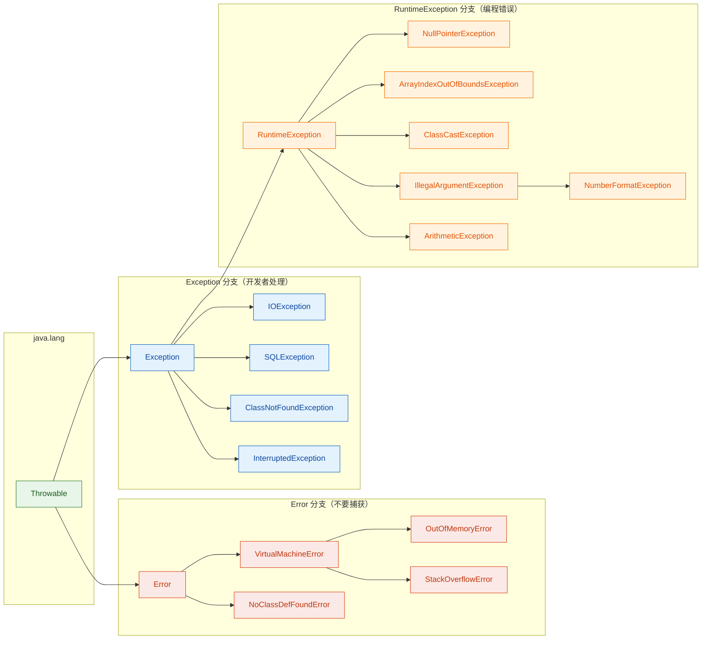

### 如何判断一个异常属于哪个分支

在实际开发中，当你遇到一个不熟悉的异常类时，判断它属于哪个分支的方法非常简单——查看它的继承链：

```java
public class ExceptionInspector {
    public static void main(String[] args) {
        // 创建几个不同类型的异常实例
        Throwable npe = new NullPointerException("空指针");       // RuntimeException 子类
        Throwable ioe = new java.io.IOException("IO错误");        // Checked Exception
        Throwable oom = new OutOfMemoryError("内存不足");          // Error 子类

        // 用 instanceof 判断异常所属分支
        System.out.println("NPE 是 RuntimeException? " 
            + (npe instanceof RuntimeException));  // true
        System.out.println("NPE 是 Exception? " 
            + (npe instanceof Exception));          // true（RuntimeException 继承自 Exception）
        System.out.println("NPE 是 Error? " 
            + (npe instanceof Error));              // false

        System.out.println("IOException 是 RuntimeException? " 
            + (ioe instanceof RuntimeException));  // false（它是 Checked Exception）
        System.out.println("IOException 是 Exception? " 
            + (ioe instanceof Exception));          // true

        System.out.println("OOM 是 Error? " 
            + (oom instanceof Error));              // true
        System.out.println("OOM 是 Exception? " 
            + (oom instanceof Exception));          // false（Error 和 Exception 是平级的）
    }
}
```

这段代码揭示了一个关键事实：`instanceof` 沿着继承链向上匹配。`NullPointerException` 既是 `RuntimeException`，也是 `Exception`，也是 `Throwable`——但它不是 `Error`。理解这一点对后续学习 `catch` 块的匹配顺序至关重要。

### Error vs Exception 的本质区别

很多初学者会混淆 `Error` 和 `Exception`，觉得"反正都是出错了"。但它们的设计意图完全不同：

| 维度 | Error | Exception |
|------|-------|-----------|
| 来源 | JVM / 系统环境 | 应用程序逻辑 |
| 可恢复性 | 通常不可恢复 | 通常可恢复 |
| 是否应该 catch | 不应该 | 应该（尤其是 Checked） |
| 典型场景 | 内存耗尽、栈溢出 | 文件找不到、网络超时、空指针 |
| 编译器是否强制处理 | 否 | Checked 强制，Unchecked 不强制 |

一个形象的比喻：`Error` 就像地震——房子塌了，你在屋里做什么都没用；`Exception` 就像停电——虽然麻烦，但你可以点蜡烛、启动备用发电机，程序还能继续跑。

### 一个容易踩的坑：catch(Exception e) 能捕获 Error 吗

答案是：**不能**。因为 `Error` 和 `Exception` 是 `Throwable` 的两个平行子类，`catch(Exception e)` 只能捕获 `Exception` 及其子类（包括 `RuntimeException`），不会捕获 `Error`。如果你写 `catch(Throwable t)`，那就什么都能捕获了——但这是一个非常危险的做法，除非你有极其充分的理由（比如在框架的最外层做兜底日志记录），否则不要这么写。

```java
public class CatchScopeDemo {
    public static void main(String[] args) {
        try {
            // 手动抛出一个 Error
            throw new StackOverflowError("模拟栈溢出");
        } catch (Exception e) {
            // 这个 catch 块捕获不到 Error
            System.out.println("Exception caught: " + e.getMessage());
        } catch (Error err) {
            // Error 会被这个块捕获（仅作演示，实际不建议这样做）
            System.out.println("Error caught: " + err.getMessage());
            // 输出: Error caught: 模拟栈溢出
        }
    }
}
```

---

**📝 练习题**

以下关于 Java 异常层次结构的说法，哪一项是正确的？

A. `RuntimeException` 是 `Error` 的子类，因此不需要强制捕获


B. `OutOfMemoryError` 是 `Exception` 的子类，可以用 `catch(Exception e)` 捕获


C. `NumberFormatException` 继承自 `IllegalArgumentException`，属于 Unchecked Exception


D. `IOException` 是 `RuntimeException` 的子类，属于 Unchecked Exception


**【答案】** C

**【解析】** `NumberFormatException` 的继承链是：`NumberFormatException` → `IllegalArgumentException` → `RuntimeException` → `Exception` → `Throwable`。由于它是 `RuntimeException` 的子类，所以属于 Unchecked Exception，编译器不强制要求处理。选项 A 错误，`RuntimeException` 是 `Exception` 的子类，不是 `Error` 的子类；选项 B 错误，`OutOfMemoryError` 继承自 `VirtualMachineError` → `Error`，和 `Exception` 是平级分支；选项 D 错误，`IOException` 直接继承自 `Exception`，不经过 `RuntimeException`，属于 Checked Exception。

---

## Checked vs Unchecked ⭐

Java 异常体系中最核心的分类方式，就是将 `Exception` 划分为 **Checked Exception（受检异常）** 和 **Unchecked Exception（非受检异常）**。这个分类直接决定了编译器是否会强制你处理某个异常，也深刻影响着 API 设计风格和代码健壮性。理解这两者的区别，是写出可靠 Java 代码的基础。

### 分类的本质：编译器是否强制处理

Java 编译器在编译阶段会检查你的代码是否对某些异常做了处理（要么 `try-catch` 捕获，要么 `throws` 声明向上抛出）。这种"编译期检查"机制就是 Checked 和 Unchecked 的分水岭：

- **Checked Exception**：编译器强制要求处理。如果你调用了一个声明抛出 Checked Exception 的方法，却既不捕获也不声明，代码直接编译失败。
- **Unchecked Exception**：编译器不做任何强制要求。你可以选择处理，也可以完全忽略，编译照样通过。

从继承关系上看，判断规则非常简单：

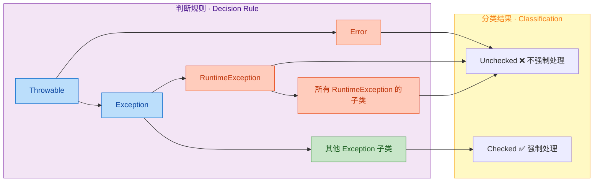

一句话总结：**`RuntimeException` 及其子类 + `Error` 及其子类 = Unchecked，其余所有 `Exception` 子类 = Checked。**

### Checked Exception 详解

Checked Exception 代表的是 **可预见的、程序应当合理恢复的外部异常情况**。编译器强制你处理它们，是因为 Java 语言设计者认为：这些异常是正常业务流程中可能发生的，程序员不应该忽视它们。

常见的 Checked Exception 包括：

| 异常类 | 典型场景 |
|---|---|
| `IOException` | 文件读写失败、网络连接中断 |
| `SQLException` | 数据库操作失败 |
| `ClassNotFoundException` | 反射加载类时找不到目标类 |
| `FileNotFoundException` | 打开不存在的文件 |
| `ParseException` | 日期/数字格式解析失败 |
| `InterruptedException` | 线程在等待/睡眠时被中断 |

来看一个典型的例子：

```java
import java.io.BufferedReader;
import java.io.FileReader;
import java.io.IOException;

public class CheckedDemo {
    public static void main(String[] args) {
        // FileReader 构造器声明抛出 FileNotFoundException（Checked）
        // BufferedReader.readLine() 声明抛出 IOException（Checked）
        // 如果不处理，编译器直接报错：Unhandled exception: java.io.IOException
        try {
            FileReader fr = new FileReader("data.txt");       // 可能文件不存在
            BufferedReader br = new BufferedReader(fr);        // 包装为缓冲读取器
            String line = br.readLine();                       // 可能读取失败
            System.out.println(line);                          // 正常输出第一行
            br.close();                                        // 关闭资源
        } catch (IOException e) {
            // 编译器强制要求你处理这个异常
            System.err.println("文件读取失败: " + e.getMessage());
        }
    }
}
```

如果你把 `try-catch` 去掉，编译器会立刻报错：

```
Error: unreported exception java.io.FileNotFoundException; must be caught or declared to be thrown
```

这就是 Checked Exception 的核心特征——**编译期契约（compile-time contract）**。

### Unchecked Exception 详解

Unchecked Exception 代表的是 **程序逻辑错误或编程缺陷**。它们通常意味着代码本身有 bug，而不是外部环境出了问题。编译器不强制处理它们，是因为：如果每次数组访问、每次对象调用都要写 `try-catch`，代码会变得极其臃肿且毫无意义——正确的做法是修复 bug，而不是捕获它。

常见的 Unchecked Exception（均继承自 `RuntimeException`）：

| 异常类 | 典型场景 |
|---|---|
| `NullPointerException` | 对 `null` 引用调用方法或访问属性 |
| `ArrayIndexOutOfBoundsException` | 数组下标越界 |
| `ClassCastException` | 类型强转失败 |
| `IllegalArgumentException` | 方法接收到非法参数 |
| `ArithmeticException` | 整数除以零 |
| `NumberFormatException` | 字符串转数字格式不对 |
| `StackOverflowError` | 递归过深（属于 Error，也是 Unchecked） |

```java
public class UncheckedDemo {
    public static void main(String[] args) {
        // 以下代码全部能通过编译，编译器不会有任何警告
        // 但运行时会抛出异常

        String s = null;
        // s.length();  // 运行时抛出 NullPointerException

        int[] arr = {1, 2, 3};
        // arr[5] = 10;  // 运行时抛出 ArrayIndexOutOfBoundsException

        // 整数除以零，运行时抛出 ArithmeticException
        // int result = 10 / 0;

        // 正确的做法：通过防御性编程避免异常，而不是 try-catch
        if (s != null) {                          // 先判空再调用
            System.out.println(s.length());
        }

        int index = 5;
        if (index >= 0 && index < arr.length) {   // 先检查边界再访问
            System.out.println(arr[index]);
        }

        int divisor = 0;
        if (divisor != 0) {                       // 先检查除数再运算
            System.out.println(10 / divisor);
        }
    }
}
```

注意这里的关键思想：对于 Unchecked Exception，**防御性编程（defensive programming）** 优于异常捕获。与其写 `try-catch` 来兜底 `NullPointerException`，不如在调用前做 `null` 检查。

### 两者的核心对比

```mermaid
graph LR
    subgraph Checked["Checked Exception"]
        direction TB
        C1["编译器强制处理"]
        C2["代表外部环境问题"]
        C3["IOException, SQLException..."]
        C4["必须 try-catch 或 throws"]
        C5["适合可恢复的场景"]
    end

    subgraph Unchecked["Unchecked Exception"]
        direction TB
        U1["编译器不强制处理"]
        U2["代表程序逻辑 Bug"]
        U3["NullPointerException, ClassCastException..."]
        U4["应通过修复代码来避免"]
        U5["适合不可恢复 / 编程错误"]
    end

    subgraph 选择策略["设计选择策略 · Design Strategy"]
        direction TB
        S1["调用者能合理恢复？ → Checked"]
        S2["属于编程错误？ → Unchecked"]
        S3["不确定？ → 倾向 Unchecked"]
    end

    Checked --- 选择策略
    选择策略 --- Unchecked

    classDef checkedStyle fill:#C8E6C9,stroke:#388E3C,color:#1B5E20
    classDef uncheckedStyle fill:#FFCCBC,stroke:#E64A19,color:#BF360C
    classDef strategyStyle fill:#BBDEFB,stroke:#1976D2,color:#0D47A1

    class C1,C2,C3,C4,C5 checkedStyle
    class U1,U2,U3,U4,U5 uncheckedStyle
    class S1,S2,S3 strategyStyle
    class Checked checkedStyle
    class Unchecked uncheckedStyle
    class 选择策略 strategyStyle
```

用一段代码来直观感受两者在实际开发中的差异：

```java
public class ComparisonDemo {

    // ========== Checked Exception 示例 ==========
    // 方法签名必须用 throws 声明，否则编译失败
    public static String readConfig(String path) throws IOException {
        BufferedReader reader = new BufferedReader(new FileReader(path)); // 可能文件不存在
        String content = reader.readLine();                              // 可能读取失败
        reader.close();                                                  // 关闭资源
        return content;                                                  // 返回读取内容
    }

    // ========== Unchecked Exception 示例 ==========
    // 方法签名不需要声明任何异常，编译器不关心
    public static int divide(int a, int b) {
        if (b == 0) {
            // 主动抛出 Unchecked Exception，提示调用者传参有误
            throw new IllegalArgumentException("除数不能为零 (divisor must not be zero)");
        }
        return a / b;  // 安全执行除法
    }

    public static void main(String[] args) {
        // 调用 readConfig 时，编译器强制你处理 IOException
        try {
            String config = readConfig("/etc/app.conf");
            System.out.println("配置内容: " + config);
        } catch (IOException e) {
            System.err.println("读取配置失败，使用默认值: " + e.getMessage());
            // 可恢复：降级为默认配置
        }

        // 调用 divide 时，编译器不强制你处理
        // 但良好的实践是在调用前做参数校验
        int divisor = 0;
        if (divisor != 0) {
            System.out.println(divide(10, divisor));
        } else {
            System.out.println("跳过除法：除数为零");
        }
    }
}
```

### 争议与现代实践

Checked Exception 是 Java 语言的独特设计，在其他主流语言中几乎找不到对应物——C#、Kotlin、Python、Go 都没有 Checked Exception。这个设计从诞生之日起就伴随着争议。

**支持 Checked Exception 的观点：**
- 强制处理让异常不会被悄悄忽略，提高了代码健壮性
- 方法签名中的 `throws` 声明是一种自文档化（self-documenting）的 API 契约
- 编译器帮你兜底，减少运行时意外

**反对 Checked Exception 的观点：**
- 大量 `try-catch` 导致代码臃肿，降低可读性
- 开发者经常写出空的 `catch` 块来"骗过"编译器，反而更危险
- 底层异常沿调用链向上传播时，中间每一层都要声明 `throws`，造成 **异常污染（exception pollution）**

```java
// 反面教材：为了通过编译而写的空 catch，吞掉了异常信息
// 这比不处理还糟糕，因为问题被彻底隐藏了
try {
    riskyOperation();
} catch (IOException e) {
    // TODO: handle later  ← 这个 "later" 永远不会到来
}
```

**现代 Java 开发的主流实践：**

1. **底层用 Checked，业务层转 Unchecked**：在 DAO/IO 层捕获 Checked Exception，包装成自定义的 `RuntimeException` 向上抛出，避免异常污染。

```java
public class DataAccessException extends RuntimeException {
    // 继承 RuntimeException，成为 Unchecked
    public DataAccessException(String message, Throwable cause) {
        super(message, cause);  // 保留原始异常链
    }
}

public class UserRepository {
    public User findById(long id) {
        try {
            // JDBC 操作，抛出 Checked 的 SQLException
            return queryFromDatabase(id);
        } catch (SQLException e) {
            // 转换为 Unchecked，调用者不需要被迫处理
            throw new DataAccessException("查询用户失败, id=" + id, e);
        }
    }
}
```

2. **Spring 框架的做法**：Spring 将几乎所有 Checked Exception（如 `SQLException`）都包装成了 Unchecked 的 `DataAccessException` 体系，这已经成为业界标准实践。

3. **Effective Java 的建议**（Joshua Bloch, Item 70-71）：
   - 对于可恢复的情况，使用 Checked Exception
   - 对于编程错误，使用 Unchecked Exception
   - 如果不确定，倾向于使用 Unchecked Exception

### 一个完整的实战场景

下面用一个用户注册的场景，展示如何在实际项目中合理运用两种异常：

```java
// ===== 自定义 Unchecked 异常：业务规则校验失败 =====
public class InvalidUserException extends RuntimeException {
    private final String field;  // 记录哪个字段出了问题

    public InvalidUserException(String field, String message) {
        super(message);          // 传递错误信息给父类
        this.field = field;      // 保存字段名
    }

    public String getField() {
        return field;            // 提供字段名的访问器
    }
}

// ===== Service 层 =====
public class UserService {

    private final UserRepository repo;

    public UserService(UserRepository repo) {
        this.repo = repo;        // 依赖注入 Repository
    }

    public void register(String username, String email) {
        // 参数校验 → 抛 Unchecked（这是编程错误 / 非法输入）
        if (username == null || username.isBlank()) {
            throw new InvalidUserException("username", "用户名不能为空");
        }
        if (email == null || !email.contains("@")) {
            throw new InvalidUserException("email", "邮箱格式不合法");
        }

        // 持久化 → repo 内部已将 Checked 转为 Unchecked
        // 调用者无需被迫写 try-catch
        repo.save(new User(username, email));
    }
}

// ===== Controller 层统一处理 =====
public class UserController {
    private final UserService service;

    public void handleRegister(String username, String email) {
        try {
            service.register(username, email);           // 调用业务逻辑
            System.out.println("注册成功");
        } catch (InvalidUserException e) {
            // 业务异常：返回友好提示
            System.err.println("参数错误 [" + e.getField() + "]: " + e.getMessage());
        } catch (DataAccessException e) {
            // 基础设施异常：记录日志，返回通用错误
            System.err.println("系统繁忙，请稍后重试");
            // logger.error("数据库异常", e);  // 实际项目中记录完整堆栈
        }
    }
}
```

这个分层结构体现了现代 Java 项目中异常处理的典型模式：底层 Checked 异常在 Repository 层被转换，业务校验使用 Unchecked 异常，最终在 Controller 层统一捕获和处理。

---

**📝 练习题**

以下哪个异常是 Checked Exception，必须在编译期处理？

A. `NullPointerException`


B. `ArrayIndexOutOfBoundsException`


C. `FileNotFoundException`


D. `IllegalArgumentException`

**【答案】** C

**【解析】** `FileNotFoundException` 继承自 `IOException`，而 `IOException` 继承自 `Exception`（不经过 `RuntimeException`），因此它是 Checked Exception，编译器会强制要求你用 `try-catch` 捕获或在方法签名中用 `throws` 声明。其余三个选项（A、B、D）都直接或间接继承自 `RuntimeException`，属于 Unchecked Exception，编译器不会强制处理。

---

**📝 练习题**

阅读以下代码，判断编译结果：

```java
public class Quiz {
    public static void main(String[] args) {
        Thread.sleep(1000);
        System.out.println("done");
    }
}
```

A. 正常编译并输出 `done`


B. 编译失败，因为 `Thread.sleep()` 抛出 Checked Exception `InterruptedException`


C. 编译通过，但运行时抛出 `InterruptedException`


D. 编译失败，因为 `Thread.sleep()` 抛出 Unchecked Exception

**【答案】** B

**【解析】** `Thread.sleep(long millis)` 的方法签名声明了 `throws InterruptedException`，而 `InterruptedException` 继承自 `Exception`（不经过 `RuntimeException`），是一个 Checked Exception。在 `main` 方法中直接调用 `Thread.sleep(1000)` 却既没有 `try-catch` 捕获，也没有在 `main` 方法签名上声明 `throws InterruptedException`，编译器会直接报错：`unreported exception InterruptedException; must be caught or declared to be thrown`。修复方式是加上 `try-catch` 或者给 `main` 方法添加 `throws InterruptedException`。

---

## try-catch-finally（执行顺序、return 与 finally）

`try-catch-finally` 是 Java 异常处理的核心语法结构。很多开发者对它的基本用法并不陌生，但一旦涉及到 `return` 与 `finally` 的交互、执行顺序的细节，就容易踩坑。这一节我们把它彻底讲透。

### 基本语法结构

```java
try {
    // 可能抛出异常的代码（risky code）
} catch (ExceptionType1 e1) {
    // 捕获并处理 ExceptionType1
} catch (ExceptionType2 e2) {
    // 捕获并处理 ExceptionType2
} finally {
    // 无论是否发生异常，都会执行的代码（cleanup code）
}
```

三个块各司其职：

- `try` 块：包裹"可能出事"的代码。JVM 会监控这段代码的执行，一旦抛出异常就跳转到匹配的 `catch`。
- `catch` 块：异常的"接盘侠"。可以有多个，按从上到下的顺序匹配，一旦匹配成功就不再继续往下找。
- `finally` 块：无论 try 中是正常结束、抛出异常、还是执行了 `return`，finally 都会执行。它是资源清理的最后防线。

### 组合形式

并不是三个块都必须同时出现，Java 允许以下三种合法组合：

```java
// 组合一：try-catch（最常见）
try {
    int result = 10 / 0; // 抛出 ArithmeticException
} catch (ArithmeticException e) {
    System.out.println("捕获到算术异常: " + e.getMessage());
}

// 组合二：try-finally（不捕获，只做清理）
try {
    // 执行某些操作
    riskyOperation();
} finally {
    // 不管成功失败，都要清理
    cleanup();
}

// 组合三：try-catch-finally（完整形式）
try {
    riskyOperation();
} catch (IOException e) {
    log.error("IO异常", e);
} finally {
    cleanup();
}
```

注意：单独写一个 `try {}` 而没有 `catch` 也没有 `finally`，编译器会直接报错。`try` 必须至少搭配一个 `catch` 或一个 `finally`。

### 多重 catch 与匹配规则

当 try 块中可能抛出多种异常时，可以用多个 catch 分别处理。JVM 的匹配规则是**从上到下、首次匹配**（first match wins）：

```java
try {
    String text = null;       // 模拟空指针场景
    text.length();            // 抛出 NullPointerException
} catch (NullPointerException e) {
    // 第一个 catch：精确匹配 NullPointerException
    System.out.println("空指针异常");
} catch (RuntimeException e) {
    // 第二个 catch：更宽泛的父类
    // 如果第一个没匹配上，才轮到这里
    System.out.println("运行时异常");
} catch (Exception e) {
    // 第三个 catch：最宽泛的兜底
    System.out.println("通用异常");
}
```

这里有一条铁律：**子类异常必须写在父类异常前面**。如果你把 `Exception` 写在 `NullPointerException` 前面，编译器会报错，因为后面的 catch 永远不可能被执行到（unreachable code）。

Java 7 引入了 multi-catch 语法，可以用 `|` 把多个无继承关系的异常合并到一个 catch 中：

```java
try {
    // 可能抛出多种异常
    parseAndProcess(input);
} catch (NumberFormatException | IllegalArgumentException e) {
    // 用竖线合并处理，减少重复代码
    // 注意：这里的 e 是隐式 final 的，不能重新赋值
    System.out.println("输入格式有误: " + e.getMessage());
} catch (IOException e) {
    System.out.println("IO异常: " + e.getMessage());
}
```

multi-catch 中的异常类型之间不能有继承关系。比如 `IOException | Exception` 会编译报错，因为 `IOException` 是 `Exception` 的子类，写了等于没写。

### 执行顺序详解

这是本节的重头戏。我们分几种场景逐一分析。

**场景一：try 中无异常**

```java
public static void scenario1() {
    try {
        System.out.println("1. try 块执行");       // 第一步：正常执行
    } catch (Exception e) {
        System.out.println("2. catch 块执行");      // 跳过：没有异常，不进入 catch
    } finally {
        System.out.println("3. finally 块执行");    // 第二步：finally 一定执行
    }
    System.out.println("4. try-catch-finally 之后"); // 第三步：继续往下
}
// 输出：1 → 3 → 4
```

**场景二：try 中抛出异常，catch 成功捕获**

```java
public static void scenario2() {
    try {
        System.out.println("1. try 块开始");        // 第一步
        int x = 1 / 0;                              // 第二步：抛出异常，try 剩余代码跳过
        System.out.println("1.5 这行不会执行");      // 跳过
    } catch (ArithmeticException e) {
        System.out.println("2. catch 捕获异常");     // 第三步：匹配成功，进入 catch
    } finally {
        System.out.println("3. finally 块执行");     // 第四步：finally 一定执行
    }
    System.out.println("4. 程序继续");               // 第五步：异常已被处理，正常继续
}
// 输出：1 → 2 → 3 → 4
```

**场景三：try 中抛出异常，catch 未能捕获**

```java
public static void scenario3() {
    try {
        System.out.println("1. try 块开始");        // 第一步
        int x = 1 / 0;                              // 第二步：抛出 ArithmeticException
    } catch (NullPointerException e) {
        // 类型不匹配，跳过这个 catch
        System.out.println("2. 这行不会执行");
    } finally {
        System.out.println("3. finally 仍然执行");   // 第三步：finally 照样执行
    }
    // 第四步：异常未被处理，这行不会执行，异常向上传播
    System.out.println("4. 这行不会执行");
}
// 输出：1 → 3 → 然后异常向调用者传播
```

用一张流程图来总结整体执行逻辑：

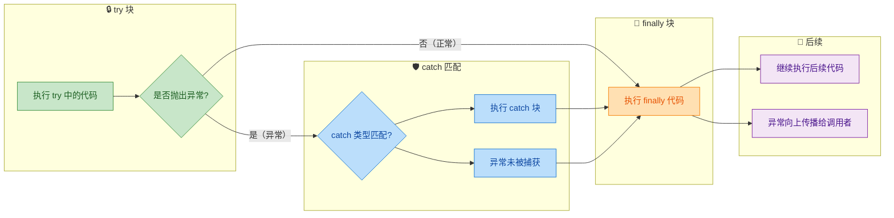

### finally 的"铁律"：它几乎总会执行

为什么说"几乎"？因为存在极少数 finally 不执行的情况：

```java
// 情况一：JVM 被强制终止
try {
    System.out.println("try 执行");
    System.exit(0);  // 直接终止 JVM，finally 不会执行
} finally {
    System.out.println("finally 不会执行"); // 永远不会打印
}

// 情况二：守护线程（Daemon Thread）被终止
// 当所有非守护线程结束时，JVM 退出，守护线程中的 finally 可能来不及执行

// 情况三：线程被 kill（操作系统层面强杀进程）
// 这属于 JVM 之外的力量，finally 自然无能为力
```

除了这几种极端情况，**finally 块一定会执行**。无论 try 中是正常结束、抛出异常、执行了 `return`、`break`、还是 `continue`，finally 都会在控制权真正转移之前插一脚。

### return 与 finally 的博弈（核心难点）

这是面试高频考点，也是实际开发中最容易出 bug 的地方。

**规则一：try 中有 return，finally 仍然执行**

```java
public static int testReturn1() {
    try {
        System.out.println("try 执行");
        return 1;  // 准备返回 1，但先等 finally 执行完
    } finally {
        System.out.println("finally 执行"); // 在 return 之前执行
    }
}
// 输出：try 执行 → finally 执行
// 返回值：1
```

执行机制：当 JVM 遇到 try 中的 `return 1` 时，它会先把返回值 `1` 计算好并暂存起来，然后跳去执行 finally 块，finally 执行完毕后再真正返回那个暂存的值。

**规则二：finally 中也有 return，会覆盖 try/catch 的返回值**

```java
public static int testReturn2() {
    try {
        return 1;  // 暂存返回值 1
    } finally {
        return 2;  // finally 中的 return 直接覆盖，最终返回 2
    }
}
// 返回值：2（不是 1！）
```

这是一个非常危险的写法。finally 中的 `return` 会无条件覆盖 try 或 catch 中的返回值。更糟糕的是，如果 try 中抛出了异常，finally 中的 `return` 还会"吞掉"这个异常，让调用者完全感知不到出了问题：

```java
public static int dangerousMethod() {
    try {
        throw new RuntimeException("出大事了！"); // 抛出异常
    } finally {
        return 0; // 异常被吞掉了！调用者收到的是 0，完全不知道出了异常
    }
}
// 返回值：0（异常消失了，非常危险）
```

所以业界有一条铁律：**永远不要在 finally 中写 return**。大多数 IDE 和静态分析工具（如 SonarQube）都会对此发出警告。

**规则三：finally 修改基本类型变量，不影响已暂存的返回值**

```java
public static int testReturn3() {
    int result = 10;                    // 初始值 10
    try {
        return result;                  // 暂存返回值 10（值拷贝）
    } finally {
        result = 20;                    // 修改局部变量为 20
        System.out.println("finally 中 result = " + result); // 打印 20
    }
}
// 返回值：10（不是 20！）
// 原因：return 时已经把 10 拷贝到了返回值槽位，finally 修改的是局部变量，不影响已暂存的值
```

这个行为的底层原因在于 JVM 字节码。当执行 `return result` 时，JVM 会把 `result` 的值 load 到操作数栈上暂存。finally 中对 `result` 的修改只是改了局部变量表中的值，而操作数栈上暂存的返回值不受影响。

**规则四：finally 修改引用类型的对象内容，会影响返回值**

```java
public static List<String> testReturn4() {
    List<String> list = new ArrayList<>();  // 创建一个空列表
    try {
        list.add("try");                    // 添加元素
        return list;                        // 暂存的是引用（指向同一个对象）
    } finally {
        list.add("finally");               // 通过同一个引用修改对象内容
    }
}
// 返回值：["try", "finally"]
// 原因：暂存的是引用的拷贝，但引用指向的是同一个堆上的对象
//       finally 通过这个引用修改了对象内容，所以返回的对象也包含了修改
```

用一张内存模型图来理解基本类型和引用类型的区别：

```java
// ===== 基本类型（值拷贝） =====
//
//  局部变量表          返回值槽位（操作数栈）
//  ┌──────────┐       ┌──────────┐
//  │ result=10│──拷贝──▶│ 暂存值=10│
//  └──────────┘       └──────────┘
//       │
//  finally 修改为 20
//       ▼
//  ┌──────────┐       ┌──────────┐
//  │ result=20│       │ 暂存值=10│ ← 不受影响，最终返回 10
//  └──────────┘       └──────────┘
//
//
// ===== 引用类型（引用拷贝，指向同一对象） =====
//
//  局部变量表          返回值槽位           堆内存
//  ┌──────────┐       ┌──────────┐       ┌─────────────────┐
//  │ list=0x88│──拷贝──▶│ 暂存=0x88│──────▶│ ["try"]         │
//  └──────────┘       └──────────┘       └─────────────────┘
//       │                                        ▲
//  finally: list.add("finally")                  │
//       │                                        │
//       └──────── 通过 0x88 修改 ────────────────┘
//                                         ┌─────────────────┐
//                                         │ ["try","finally"]│ ← 返回的对象被修改了
//                                         └─────────────────┘
```

### catch 中的 return 与 finally

catch 中的 return 遵循与 try 中完全相同的规则：

```java
public static int testCatchReturn() {
    try {
        int x = 1 / 0;                     // 抛出 ArithmeticException
        return 1;                           // 跳过
    } catch (ArithmeticException e) {
        System.out.println("catch 执行");
        return 2;                           // 暂存返回值 2
    } finally {
        System.out.println("finally 执行"); // 在 catch 的 return 之前执行
    }
}
// 输出：catch 执行 → finally 执行
// 返回值：2
```

### finally 中抛出异常

如果 finally 块本身抛出了异常，情况会变得更加复杂：

```java
public static void finallyThrows() {
    try {
        throw new RuntimeException("try 中的异常");   // 原始异常
    } catch (RuntimeException e) {
        throw new RuntimeException("catch 中的异常");  // 准备抛出
    } finally {
        throw new RuntimeException("finally 中的异常"); // 覆盖前面的异常！
    }
}
// 最终抛出的是："finally 中的异常"
// "catch 中的异常" 被吞掉了，丢失了！
```

这和 finally 中 `return` 吞异常是同一个道理。finally 中的控制流转移（return、throw）会覆盖之前的。所以 finally 块中的代码应该尽量简单，只做资源清理，避免抛出异常。如果 finally 中的清理操作本身可能抛异常，应该用 try-catch 包裹：

```java
public static void safeFinally() {
    FileInputStream fis = null;
    try {
        fis = new FileInputStream("data.txt");
        // 读取文件...
    } catch (IOException e) {
        System.err.println("读取失败: " + e.getMessage());
    } finally {
        // finally 中的操作也可能抛异常，需要额外保护
        if (fis != null) {
            try {
                fis.close();  // close() 可能抛 IOException
            } catch (IOException e) {
                System.err.println("关闭流失败: " + e.getMessage());
                // 记录日志但不再向上抛，避免覆盖原始异常
            }
        }
    }
}
```

这种嵌套 try-catch 的写法虽然安全，但非常丑陋。这也是 Java 7 引入 `try-with-resources` 的直接动机——下一节会详细讲。

### 完整执行顺序的字节码视角

为了彻底理解 return 与 finally 的交互，我们从字节码层面看一下 JVM 到底做了什么：

```java
// 源代码
public static int demo() {
    int x = 1;
    try {
        return x;    // (1) 将 x 的值 load 到操作数栈
                     // (2) 将操作数栈顶的值 store 到一个临时槽位（暂存返回值）
                     // (3) 跳转到 finally 块
    } finally {
        x = 99;     // (4) 修改局部变量 x 为 99
                     // (5) finally 结束，从临时槽位 load 暂存的返回值
                     // (6) 执行 ireturn，返回暂存值 1
    }
}
```

编译器实际上会把 finally 块的代码复制到每一个可能的出口路径中（包括正常出口和异常出口）。这就是为什么 finally "总会执行"——它在编译期就被内联到了所有路径里。

### 实战建议总结

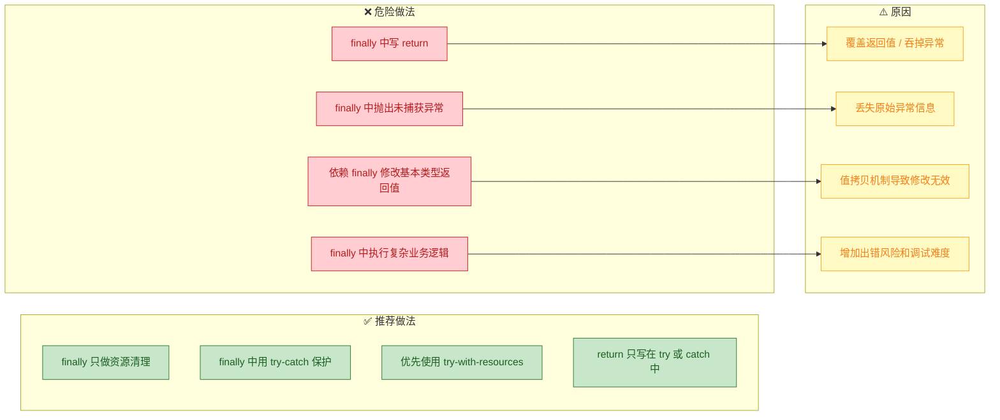

---

**📝 练习题**

以下代码的返回值是什么？

```java
public static int puzzle() {
    int a = 10;
    try {
        a = 20;
        return a;       // 行 A
    } catch (Exception e) {
        a = 30;
        return a;       // 行 B
    } finally {
        a = 40;         // 行 C
    }
}
```

A. 10

B. 20

C. 30

D. 40


**【答案】** B

**【解析】** try 块中没有抛出异常，所以 catch 块不会执行。执行到行 A 时，`a` 的值已经被赋为 20，JVM 将 20 暂存到返回值槽位，然后跳转执行 finally 块。行 C 将局部变量 `a` 修改为 40，但这只是修改了局部变量表中的值，操作数栈上暂存的返回值 20 不受影响。finally 执行完毕后，JVM 从暂存槽位取出 20 并返回。这道题的核心考点就是：`return` 语句会在 finally 执行之前暂存返回值（值拷贝），finally 对基本类型局部变量的修改不会影响已暂存的返回值。

---

## try-with-resources ⭐（AutoCloseable）

在 Java 日常开发中，资源管理是一个绑定着"痛苦"二字的话题。数据库连接、文件流、网络 Socket……这些资源如果忘记关闭，轻则内存泄漏，重则拖垮整个服务。Java 7 之前，开发者不得不在 `finally` 块中手动调用 `close()`，代码冗长且极易出错。`try-with-resources` 的出现，彻底改变了这一局面——它让编译器替你管理资源的生命周期，写出的代码既简洁又安全。

---

### 传统资源管理的困境

先回顾一下 Java 7 之前，我们是怎么关闭资源的：

```java
// Java 7 之前的传统写法：手动关闭资源
BufferedReader reader = null;       // 声明在 try 外部，以便 finally 中访问
try {
    reader = new BufferedReader(      // 创建资源
        new FileReader("data.txt")
    );
    String line = reader.readLine();  // 使用资源读取数据
    System.out.println(line);         // 输出读取到的内容
} catch (IOException e) {
    e.printStackTrace();              // 捕获并打印 IO 异常
} finally {
    // finally 块：无论是否异常都会执行
    if (reader != null) {             // 必须判空，否则可能 NPE
        try {
            reader.close();           // 关闭资源本身也可能抛异常！
        } catch (IOException e) {
            e.printStackTrace();      // 关闭失败的异常往往被吞掉
        }
    }
}
```

这段代码有几个明显的问题：

- 变量必须声明在 `try` 外部，作用域被不必要地扩大
- `finally` 中关闭资源还需要再套一层 `try-catch`，代码嵌套严重
- 如果 `try` 块和 `close()` 都抛出异常，`close()` 的异常会覆盖原始异常（原始异常丢失，调试噩梦）
- 多个资源时，代码膨胀得更加不可收拾

当需要同时管理多个资源时，情况更加糟糕：

```java
// 多资源的传统写法——嵌套地狱
InputStream in = null;                // 输入流声明
OutputStream out = null;              // 输出流声明
try {
    in = new FileInputStream("src.bin");    // 打开输入流
    out = new FileOutputStream("dst.bin");  // 打开输出流
    byte[] buf = new byte[1024];            // 创建缓冲区
    int len;                                // 记录每次读取的字节数
    while ((len = in.read(buf)) != -1) {    // 循环读取
        out.write(buf, 0, len);             // 写入目标文件
    }
} catch (IOException e) {
    e.printStackTrace();                    // 处理异常
} finally {
    // 必须按照"后开先关"的顺序逐个关闭
    if (out != null) {                      // 先关 out
        try { out.close(); } catch (IOException e) { e.printStackTrace(); }
    }
    if (in != null) {                       // 再关 in
        try { in.close(); } catch (IOException e) { e.printStackTrace(); }
    }
}
```

这种写法不仅丑陋，而且容易遗漏。实际项目中，资源泄漏的 Bug 有相当一部分就来自于 `finally` 块写得不够严谨。

---

### try-with-resources 语法与基本用法

Java 7 引入了 `try-with-resources`（TWR），语法非常直观——在 `try` 关键字后面的圆括号中声明并初始化资源，编译器会在 `try` 块结束时自动调用资源的 `close()` 方法：

```java
// try-with-resources 基本语法
// 资源在圆括号内声明，作用域仅限 try 块
try (BufferedReader reader = new BufferedReader(new FileReader("data.txt"))) {
    String line = reader.readLine();  // 使用资源
    System.out.println(line);         // 输出内容
}   // ← 这里编译器自动插入 reader.close()
catch (IOException e) {
    e.printStackTrace();              // 处理异常
}
// 注意：catch 和 finally 都是可选的
```

多个资源用分号分隔，关闭顺序与声明顺序相反（后声明的先关闭，符合栈的 LIFO 逻辑）：

```java
// 多资源的 try-with-resources 写法
try (
    InputStream in = new FileInputStream("src.bin");     // 资源1：先声明
    OutputStream out = new FileOutputStream("dst.bin")   // 资源2：后声明
) {
    byte[] buf = new byte[1024];       // 创建缓冲区
    int len;                           // 读取长度
    while ((len = in.read(buf)) != -1) {  // 循环读取
        out.write(buf, 0, len);           // 写入目标
    }
}   // ← 自动关闭顺序：先 out.close()，再 in.close()
catch (IOException e) {
    e.printStackTrace();               // 统一处理异常
}
```

对比传统写法，代码量减少了将近一半，而且不存在遗漏关闭的风险。

---

### AutoCloseable 与 Closeable 接口

`try-with-resources` 并不是对所有对象都生效，它要求资源必须实现 `AutoCloseable` 接口。我们来看看这两个关键接口的关系：

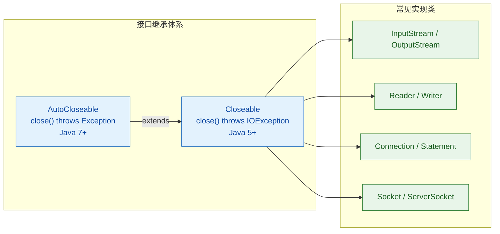

两个接口的核心区别：

| 特性 | `AutoCloseable` | `Closeable` |
|---|---|---|
| 引入版本 | Java 7 | Java 5 |
| `close()` 声明 | `throws Exception` | `throws IOException` |
| 幂等性要求 | 不强制（建议幂等） | 强制幂等（多次调用效果相同） |
| 适用范围 | 所有需要释放的资源 | I/O 相关资源 |

`Closeable` 是 `AutoCloseable` 的子接口，所以所有实现了 `Closeable` 的 I/O 类（`InputStream`、`OutputStream`、`Reader`、`Writer`、JDBC 的 `Connection` 等）天然支持 `try-with-resources`。

如果你想让自己的类也能用 TWR 管理，只需实现 `AutoCloseable`：

```java
// 自定义资源类：实现 AutoCloseable 接口
public class DatabaseSession implements AutoCloseable {

    private final String sessionId;   // 会话标识

    // 构造方法：模拟打开数据库会话
    public DatabaseSession(String id) {
        this.sessionId = id;                          // 保存会话 ID
        System.out.println("Session opened: " + id);  // 打印开启信息
    }

    // 业务方法：执行查询
    public void query(String sql) {
        System.out.println("[" + sessionId + "] Executing: " + sql);  // 打印 SQL
    }

    // 实现 close() 方法：释放资源
    @Override
    public void close() throws Exception {
        System.out.println("Session closed: " + sessionId);  // 打印关闭信息
        // 实际项目中这里会释放连接、清理缓存等
    }
}
```

使用时和标准库资源一样简洁：

```java
// 使用自定义资源
try (DatabaseSession session = new DatabaseSession("S-001")) {
    session.query("SELECT * FROM users");   // 执行查询
}   // ← 自动调用 session.close()
// 输出：
// Session opened: S-001
// [S-001] Executing: SELECT * FROM users
// Session closed: S-001
```

---

### 编译器的魔法：反编译揭秘

`try-with-resources` 本质上是编译器层面的语法糖（Syntactic Sugar）。编译器会将 TWR 语法转换为等价的 `try-finally` 代码。我们来看看编译器实际生成了什么：

```java
// 你写的代码
try (BufferedReader r = new BufferedReader(new FileReader("a.txt"))) {
    System.out.println(r.readLine());
}
```

编译器大致将其转换为：

```java
// 编译器生成的等价代码（简化版）
BufferedReader r = new BufferedReader(new FileReader("a.txt"));  // 创建资源
Throwable primaryEx = null;          // 用于记录 try 块中的原始异常
try {
    System.out.println(r.readLine());  // 执行业务逻辑
} catch (Throwable t) {
    primaryEx = t;                     // 捕获原始异常并记录
    throw t;                           // 重新抛出
} finally {
    if (r != null) {                   // 资源非空才关闭
        if (primaryEx != null) {       // 如果 try 块已经有异常
            try {
                r.close();             // 尝试关闭资源
            } catch (Throwable suppressed) {
                // 关闭时的异常不会覆盖原始异常
                // 而是作为"被抑制的异常"附加上去
                primaryEx.addSuppressed(suppressed);
            }
        } else {
            r.close();                 // try 块正常结束，直接关闭
        }
    }
}
```

这段生成代码揭示了 TWR 最精妙的设计——Suppressed Exception 机制。

---

### Suppressed Exception（被抑制的异常）

在传统写法中，如果 `try` 块抛出异常 A，`finally` 中的 `close()` 又抛出异常 B，那么异常 A 会被异常 B 覆盖，开发者只能看到 B，真正的问题根源 A 却丢失了。

TWR 通过 `Throwable.addSuppressed()` 解决了这个问题：

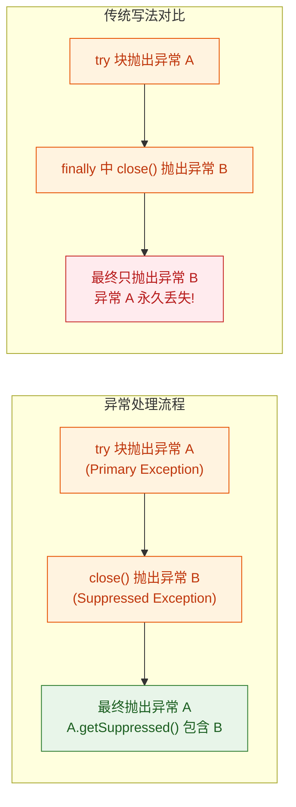

来看一个具体的例子：

```java
// 演示 Suppressed Exception 机制
public class SuppressedDemo {

    // 自定义资源：close() 时故意抛异常
    static class FaultyResource implements AutoCloseable {
        @Override
        public void close() throws Exception {
            throw new RuntimeException("close() 爆炸了!");  // 关闭时抛异常
        }
    }

    public static void main(String[] args) {
        try (FaultyResource res = new FaultyResource()) {
            throw new IllegalStateException("业务逻辑出错!");  // try 块抛异常
        } catch (Exception e) {
            // 主异常：IllegalStateException
            System.out.println("主异常: " + e.getMessage());

            // 被抑制的异常：RuntimeException from close()
            Throwable[] suppressed = e.getSuppressed();       // 获取被抑制的异常数组
            for (Throwable t : suppressed) {
                System.out.println("被抑制: " + t.getMessage());
            }
        }
    }
}
// 输出：
// 主异常: 业务逻辑出错!
// 被抑制: close() 爆炸了!
```

这样两个异常都不会丢失，调试时能看到完整的异常链。

---

### Java 9 的增强：Effectively Final 变量

Java 7/8 中，资源必须在 `try()` 的圆括号内声明。Java 9 放宽了这个限制——如果资源引用是 effectively final（事实上不可变）的，可以直接在圆括号中引用已有变量：

```java
// Java 9+ 增强写法
BufferedReader reader = new BufferedReader(new FileReader("data.txt"));  // 外部声明
// reader 是 effectively final（声明后未被重新赋值）
try (reader) {                        // 直接引用，无需重新声明
    System.out.println(reader.readLine());
} catch (IOException e) {
    e.printStackTrace();
}
```

```java
// 多个 effectively final 资源
Connection conn = DriverManager.getConnection(url);    // 数据库连接
PreparedStatement ps = conn.prepareStatement(sql);     // 预编译语句

try (conn; ps) {                      // Java 9+：直接引用多个已有变量
    ResultSet rs = ps.executeQuery();  // 执行查询
    while (rs.next()) {
        System.out.println(rs.getString(1));  // 输出结果
    }
}
```

这在资源需要在 `try` 块之前进行配置的场景中特别有用。

---

### 资源关闭顺序的深入理解

当 `try()` 中声明了多个资源时，关闭顺序严格遵循声明的逆序。这不是随意设计的——它遵循了"依赖关系"的逻辑：后声明的资源往往依赖先声明的资源，所以应该先关闭依赖方。

```java
// 验证关闭顺序
public class CloseOrderDemo {

    // 自定义资源：打印创建和关闭时机
    static class NamedResource implements AutoCloseable {
        private final String name;                    // 资源名称

        NamedResource(String name) {
            this.name = name;                         // 保存名称
            System.out.println("  打开: " + name);    // 打印打开信息
        }

        @Override
        public void close() {
            System.out.println("  关闭: " + name);    // 打印关闭信息
        }
    }

    public static void main(String[] args) {
        System.out.println("=== 开始 ===");
        try (
            NamedResource a = new NamedResource("A");   // 第1个声明
            NamedResource b = new NamedResource("B");   // 第2个声明
            NamedResource c = new NamedResource("C")    // 第3个声明
        ) {
            System.out.println("  --- 执行业务逻辑 ---");
        }
        System.out.println("=== 结束 ===");
    }
}
// 输出：
// === 开始 ===
//   打开: A
//   打开: B
//   打开: C
//   --- 执行业务逻辑 ---
//   关闭: C    ← 后声明的先关闭
//   关闭: B
//   关闭: A    ← 先声明的最后关闭
// === 结束 ===
```

用一张内存模型图来理解这个"栈式关闭"：

```text
声明顺序（入栈）        关闭顺序（出栈）
    ┌───┐                  ┌───┐
    │ A │ ← 先声明          │ C │ ← 先关闭
    ├───┤                  ├───┤
    │ B │                  │ B │
    ├───┤                  ├───┤
    │ C │ ← 后声明          │ A │ ← 后关闭
    └───┘                  └───┘
   PUSH 顺序              POP 顺序
```

---

### 资源初始化异常的处理

一个容易被忽略的细节：如果在 `try()` 圆括号中声明了多个资源，其中某个资源的构造函数抛出异常，那么已经成功创建的资源仍然会被正确关闭：

```java
// 资源初始化部分失败的场景
static class BadResource implements AutoCloseable {
    BadResource() {
        throw new RuntimeException("构造失败!");  // 构造时直接抛异常
    }
    @Override
    public void close() {
        System.out.println("BadResource closed");
    }
}

public static void main(String[] args) {
    try (
        NamedResource a = new NamedResource("A");   // 成功创建
        BadResource bad = new BadResource();         // 构造失败！抛异常
        NamedResource c = new NamedResource("C")    // 永远不会执行到
    ) {
        System.out.println("业务逻辑");              // 永远不会执行到
    } catch (Exception e) {
        System.out.println("捕获: " + e.getMessage());
    }
}
// 输出：
//   打开: A
//   关闭: A          ← 已成功创建的资源 A 被正确关闭
//   捕获: 构造失败!
```

编译器生成的代码保证了：即使资源链中间断裂，已分配的资源也不会泄漏。

---

### 实战模式与最佳实践

#### 装饰器流的正确处理

I/O 中经常使用装饰器模式（Decorator Pattern）层层包装流。一个常见的疑问是：包装流和底层流是否都需要声明在 TWR 中？

```java
// 方式一：只声明最外层（通常足够）
// 大多数装饰器流的 close() 会级联关闭底层流
try (BufferedReader br = new BufferedReader(new FileReader("data.txt"))) {
    // BufferedReader.close() 内部会调用 FileReader.close()
    String line = br.readLine();
}

// 方式二：分别声明（更安全，推荐）
// 如果 BufferedReader 构造函数抛异常，FileReader 仍能被关闭
try (
    FileReader fr = new FileReader("data.txt");       // 底层流单独声明
    BufferedReader br = new BufferedReader(fr)         // 装饰器流
) {
    String line = br.readLine();
}
```

方式二更安全，因为如果 `BufferedReader` 的构造函数抛出异常（虽然概率极低），`FileReader` 仍然会被 TWR 机制关闭。

#### JDBC 资源管理

数据库操作是 TWR 最常见的应用场景之一：

```java
// JDBC 标准资源管理模式
String url = "jdbc:mysql://localhost:3306/mydb";      // 数据库 URL
String sql = "SELECT id, name FROM users WHERE age > ?";  // SQL 语句

try (
    Connection conn = DriverManager.getConnection(url, "root", "pwd");  // 获取连接
    PreparedStatement ps = conn.prepareStatement(sql)                   // 预编译 SQL
) {
    ps.setInt(1, 18);                          // 设置参数：age > 18
    try (ResultSet rs = ps.executeQuery()) {   // ResultSet 也是 AutoCloseable
        while (rs.next()) {                    // 遍历结果集
            int id = rs.getInt("id");          // 获取 id 列
            String name = rs.getString("name");// 获取 name 列
            System.out.println(id + ": " + name);
        }
    }   // ← rs 自动关闭
}   // ← ps 先关闭，conn 后关闭
```

#### 自定义资源的幂等 close()

编写自定义 `AutoCloseable` 时，强烈建议让 `close()` 方法具有幂等性（Idempotent），即多次调用效果相同：

```java
// 幂等 close() 的标准写法
public class ManagedConnection implements AutoCloseable {

    private Connection conn;          // 底层数据库连接
    private boolean closed = false;   // 关闭状态标记

    public ManagedConnection(String url) throws SQLException {
        this.conn = DriverManager.getConnection(url);  // 获取连接
    }

    @Override
    public void close() throws SQLException {
        if (!closed) {                // 只有未关闭时才执行
            closed = true;            // 先标记为已关闭
            conn.close();             // 再实际关闭连接
            System.out.println("连接已释放");
        }
        // 重复调用时什么都不做，不会抛异常
    }
}
```

---

### 常见陷阱与注意事项

```java
// ❌ 陷阱1：在 try 块内部赋值 null，不影响自动关闭
try (BufferedReader r = new BufferedReader(new FileReader("a.txt"))) {
    // r = null;  // 编译错误！TWR 中声明的变量是隐式 final 的
    // 你无法在 try 块内重新赋值
}

// ❌ 陷阱2：返回的资源不要用 TWR 管理
public InputStream openStream() {
    // 错误！方法返回后资源就被关闭了，调用者拿到的是已关闭的流
    try (InputStream is = new FileInputStream("data.bin")) {
        return is;  // ← is 在 return 之后立即被 close()
    }
    // 正确做法：直接 return new FileInputStream("data.bin");
    // 让调用者负责关闭
}

// ❌ 陷阱3：不要在 TWR 圆括号中放非资源类型的表达式
// try (int x = 42) { }  // 编译错误：int 没有实现 AutoCloseable
```

---

### 完整对比总结

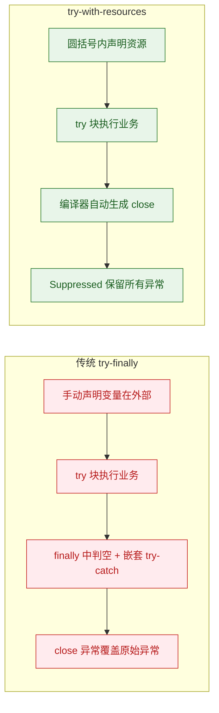

| 维度 | 传统 try-finally | try-with-resources |
|---|---|---|
| 代码量 | 冗长，嵌套深 | 简洁，扁平 |
| 异常安全 | close 异常覆盖原始异常 | Suppressed 机制保留全部异常 |
| 遗漏风险 | 高（手动管理） | 无（编译器保证） |
| 多资源管理 | 嵌套 finally，极易出错 | 分号分隔，自动逆序关闭 |
| 变量作用域 | 泄漏到 try 外部 | 限定在 try 块内 |
| 最低 Java 版本 | Java 1.0 | Java 7（Java 9 增强） |

---

**📝 练习题**

以下代码的输出结果是什么？

```java
public class TWRQuiz {
    static class Res implements AutoCloseable {
        String name;
        Res(String name) {
            this.name = name;
            System.out.print("O" + name + " ");
        }
        @Override
        public void close() {
            System.out.print("C" + name + " ");
        }
    }

    public static void main(String[] args) {
        try (Res a = new Res("1"); Res b = new Res("2")) {
            System.out.print("T ");
            throw new RuntimeException();
        } catch (Exception e) {
            System.out.print("E ");
        } finally {
            System.out.print("F ");
        }
    }
}
```

A. `O1 O2 T C1 C2 E F`


B. `O1 O2 T C2 C1 E F`


C. `O1 O2 T E C2 C1 F`


D. `O1 O2 T C2 C1 F E`


**【答案】** B

**【解析】** 执行流程如下：首先按声明顺序创建资源，输出 `O1 O2`；进入 try 块输出 `T`；抛出 `RuntimeException` 后，在进入 catch 之前，TWR 机制先按声明逆序关闭资源，输出 `C2 C1`；然后 catch 块捕获异常输出 `E`；最后 finally 块输出 `F`。关键点在于：资源的关闭发生在 catch 之前、try 块退出之后。关闭顺序严格遵循声明的逆序（栈式 LIFO），这是 `try-with-resources` 的核心行为保证。

---

## throw 与 throws

Java 的异常机制中有两个长得极为相似却职责完全不同的关键字：`throw` 和 `throws`。一个负责"真正把异常扔出去"，另一个负责"在方法签名上声明我可能会扔"。理解它们的区别与协作方式，是写出健壮异常处理代码的关键一步。

### throw —— 手动抛出异常

`throw` 是一个执行语句（executable statement），它的作用是在代码运行到某个位置时，主动创建并抛出一个异常对象。一旦 `throw` 被执行，当前方法的正常控制流立即中断，JVM 开始沿调用栈向上查找匹配的 `catch` 块。

语法非常简单：

```java
throw new 异常类型("异常描述信息");
```

`throw` 后面跟的必须是一个 `Throwable`（或其子类）的实例对象。你不能 `throw` 一个 `String`，也不能 `throw` 一个 `int`，只能是异常体系内的对象。

来看一个典型场景——参数校验：

```java
public class UserService {

    // 注册用户的方法，要求用户名不能为空
    public void register(String username) {
        // 参数校验：如果用户名为 null 或空串，主动抛出异常
        if (username == null || username.trim().isEmpty()) {
            // throw 语句：创建异常对象并立即抛出
            // IllegalArgumentException 是 RuntimeException 的子类（Unchecked）
            throw new IllegalArgumentException("用户名不能为空");
        }

        // 如果上面的 throw 被执行，下面这行代码永远不会到达
        System.out.println("注册成功：" + username);
    }
}
```

几个关键细节值得注意：

`throw` 之后的代码属于不可达代码（unreachable code）。编译器非常聪明，如果你在 `throw` 语句后面紧跟其他语句且没有任何分支结构包裹，编译器会直接报错：

```java
public void demo() {
    throw new RuntimeException("出错了");
    System.out.println("这行永远执行不到"); // 编译错误：unreachable statement
}
```

但如果 `throw` 在 `if` 分支内部，编译器知道它不一定会执行，所以后续代码是合法的：

```java
public void demo(int value) {
    if (value < 0) {
        throw new IllegalArgumentException("值不能为负数"); // 只在条件满足时抛出
    }
    // 这行代码是可达的，因为 throw 在 if 块内
    System.out.println("值为：" + value);
}
```

`throw` 可以抛出任何 `Throwable` 子类，包括 `Error`，但实际开发中几乎不会手动抛出 `Error`：

```java
// 合法但极不推荐——Error 应该留给 JVM 自己抛
throw new StackOverflowError("手动抛出 Error，别这么干");

// 合法且常见——抛出 Checked Exception
throw new IOException("文件读取失败");

// 合法且最常见——抛出 Unchecked Exception
throw new NullPointerException("对象引用为空");
```

还有一个容易被忽略的点：`throw` 可以抛出已经存在的异常引用，而不一定要 `new` 一个新的：

```java
public void process() {
    // 预先创建异常对象
    RuntimeException cached = new RuntimeException("预创建的异常");

    // ... 一些业务逻辑 ...

    // 在需要的时候抛出已有的异常引用
    throw cached; // 注意：此时异常的堆栈信息是创建时的，不是 throw 时的
}
```

这里有个陷阱：异常的 stack trace 是在 `new` 的时候捕获的，而不是在 `throw` 的时候。所以如果你提前创建了异常对象，堆栈信息可能会让调试变得困惑。

### throws —— 方法签名中的异常声明

`throws` 不是一个执行语句，它是方法签名的一部分，用于告诉编译器和调用者："这个方法在执行过程中可能会抛出某些 Checked Exception，调用者必须处理它们。"

语法位于方法参数列表的右括号之后、方法体的左花括号之前：

```java
// throws 声明该方法可能抛出 IOException
public void readFile(String path) throws IOException {
    // 方法体
}

// 可以声明多个异常，用逗号分隔
public void transfer(String from, String to, double amount)
        throws InsufficientFundsException, AccountNotFoundException {
    // 方法体
}
```

`throws` 的核心意义在于它与 Checked Exception 的强制处理机制绑定。回顾一下：Checked Exception 必须被处理，要么 `try-catch` 捕获，要么 `throws` 向上传播。`throws` 就是选择了后者——"我不处理，交给调用我的人去处理"。

```java
public class FileProcessor {

    // 方法声明抛出 IOException（Checked Exception）
    // 调用者必须处理这个异常
    public String readContent(String filePath) throws IOException {
        // FileReader 构造器可能抛出 FileNotFoundException（IOException 的子类）
        FileReader reader = new FileReader(filePath);
        // BufferedReader 的 readLine() 可能抛出 IOException
        BufferedReader br = new BufferedReader(reader);
        // 读取第一行并返回
        String line = br.readLine();
        // 关闭资源
        br.close();
        return line;
    }
}
```

当另一个方法调用 `readContent` 时，编译器会强制要求处理 `IOException`：

```java
public class App {

    // 方案一：继续 throws 向上传播
    public void approach1() throws IOException {
        FileProcessor processor = new FileProcessor();
        // 因为 approach1 也声明了 throws IOException，所以这里不需要 try-catch
        String content = processor.readContent("/data/config.txt");
        System.out.println(content);
    }

    // 方案二：try-catch 就地处理
    public void approach2() {
        FileProcessor processor = new FileProcessor();
        try {
            // 在 try 块中调用可能抛出异常的方法
            String content = processor.readContent("/data/config.txt");
            System.out.println(content);
        } catch (IOException e) {
            // 捕获并处理异常
            System.err.println("读取文件失败：" + e.getMessage());
        }
    }
}
```

一个重要的规则：`throws` 对 Unchecked Exception 没有强制约束力。你可以在方法签名上声明 `throws RuntimeException`，但编译器不会因此强制调用者处理它。这种写法更多是一种文档性质的提示：

```java
// 合法，但编译器不会强制调用者处理 IllegalArgumentException
public void validate(int age) throws IllegalArgumentException {
    if (age < 0 || age > 150) {
        throw new IllegalArgumentException("年龄不合法：" + age);
    }
}

// 调用者可以完全不做任何异常处理，编译器不会报错
public void caller() {
    validate(-5); // 编译通过，即使 validate 声明了 throws
}
```

### throw 与 throws 的协作关系

在实际开发中，`throw` 和 `throws` 经常成对出现。当你在方法内部用 `throw` 抛出一个 Checked Exception，而又不想在当前方法内 `catch` 它时，就必须在方法签名上用 `throws` 声明：

```java
public class OrderService {

    // throws 声明：告诉调用者本方法可能抛出 InsufficientBalanceException
    public void placeOrder(String userId, double amount)
            throws InsufficientBalanceException {

        // 查询用户余额
        double balance = queryBalance(userId);

        // 业务校验：余额不足时，用 throw 主动抛出异常
        if (balance < amount) {
            // throw 执行：创建并抛出 Checked Exception
            throw new InsufficientBalanceException(
                "余额不足，当前余额：" + balance + "，订单金额：" + amount
            );
        }

        // 正常下单逻辑
        System.out.println("下单成功，扣款：" + amount);
    }

    // 模拟查询余额
    private double queryBalance(String userId) {
        return 100.0; // 假设余额为 100
    }
}
```

如果你在方法内部 `throw` 了一个 Checked Exception 却没有 `throws` 声明，也没有 `try-catch`，编译器会直接报错：

```java
// 编译错误！throw 了 Checked Exception 但既没 catch 也没 throws
public void broken() {
    throw new IOException("这行代码会导致编译失败");
    // 错误信息：Unhandled exception: java.io.IOException
}
```

但如果 `throw` 的是 Unchecked Exception，则不需要 `throws` 声明：

```java
// 完全合法：RuntimeException 不需要 throws 声明
public void works() {
    throw new RuntimeException("Unchecked，编译器不管");
}
```

### throw 与 throws 对比总览

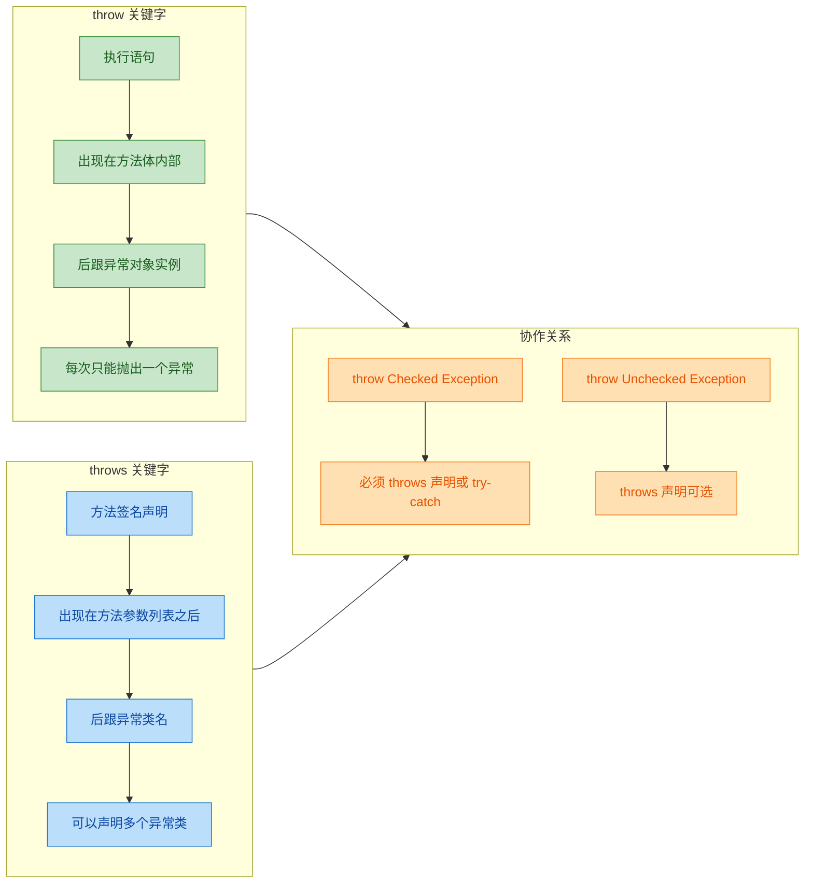

### 异常传播链路：throw 与 throws 的接力

当一个异常被 `throw` 出来后，如果当前方法没有 `catch`，它就会沿着方法调用栈一层一层向上传播。每一层如果也没有 `catch`，就必须用 `throws` 声明继续向上传递。这个过程就像接力赛——异常是接力棒，`throws` 是每一棒选手的声明"我会把棒传下去"。

```java
public class PropagationDemo {

    // 第三层：异常的源头，throw 创建并抛出异常
    public void level3() throws SQLException {
        // 模拟数据库操作失败
        throw new SQLException("数据库连接超时");
    }

    // 第二层：不处理，通过 throws 继续向上传播
    public void level2() throws SQLException {
        // 调用 level3，异常会穿透 level2 继续向上
        level3();
        // 如果 level3 抛出异常，这行不会执行
        System.out.println("level2 正常结束");
    }

    // 第一层：最终在这里 catch 处理
    public void level1() {
        try {
            // 调用 level2
            level2();
        } catch (SQLException e) {
            // 异常在这里被捕获并处理
            System.err.println("捕获到异常：" + e.getMessage());
            // 输出：捕获到异常：数据库连接超时
        }
    }
}
```

用一张图来展示这个传播过程：

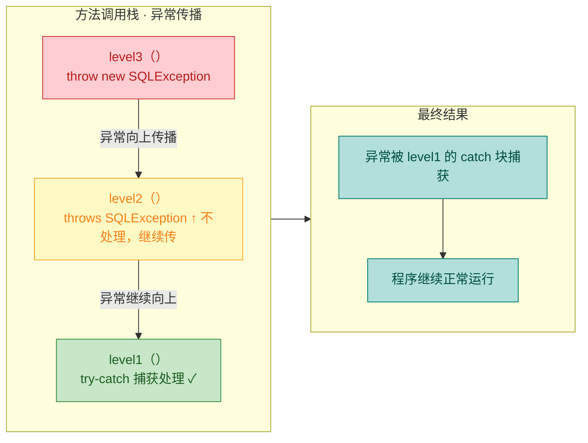

如果异常一路传播到 `main` 方法都没有被 `catch`，JVM 会终止程序并打印异常堆栈信息（stack trace）到标准错误流。这就是我们经常在控制台看到的那一大段红色报错文字的来源。

### 方法重写中 throws 的约束规则

在继承体系中，子类重写父类方法时，`throws` 声明有严格的限制。这个规则的设计初衷是保证多态调用的安全性——如果父类引用指向子类对象，调用者只知道父类方法声明的异常类型，子类不能抛出调用者意料之外的异常。

规则总结：子类重写方法的 `throws` 声明，只能比父类更"窄"，不能更"宽"。

```java
// 父类
public class Animal {
    // 父类方法声明抛出 IOException
    public void eat() throws IOException {
        System.out.println("Animal eating...");
    }
}

// 子类——合法的各种情况
public class Dog extends Animal {

    // ✅ 合法：不声明任何异常（比父类更窄）
    @Override
    public void eat() {
        System.out.println("Dog eating...");
    }
}

public class Cat extends Animal {

    // ✅ 合法：声明 IOException 的子类（比父类更窄）
    @Override
    public void eat() throws FileNotFoundException {
        // FileNotFoundException 是 IOException 的子类
        System.out.println("Cat eating...");
    }
}

public class Bird extends Animal {

    // ❌ 编译错误：声明了父类方法中没有的 Checked Exception（比父类更宽）
    @Override
    public void eat() throws SQLException {
        // SQLException 不是 IOException 的子类
        // 编译器报错：overridden method does not throw SQLException
        System.out.println("Bird eating...");
    }
}
```

这个规则只约束 Checked Exception。子类重写方法可以随意抛出 Unchecked Exception，不受父类 `throws` 声明的限制：

```java
public class Fish extends Animal {

    // ✅ 合法：Unchecked Exception 不受 throws 约束
    @Override
    public void eat() throws RuntimeException {
        throw new UnsupportedOperationException("鱼不这样吃东西");
    }
}
```

### 实战模式：throw 早，catch 晚

业界有一条广为流传的异常处理原则叫做 "Throw early, catch late"。意思是：在发现问题的第一时间就 `throw`，但不要急着 `catch`，让异常传播到最合适的层级再统一处理。

```java
// ========== DAO 层：throw early，发现问题立即抛出 ==========
public class UserDao {

    public User findById(Long id) throws DataAccessException {
        // 参数校验：尽早发现问题，尽早抛出
        if (id == null || id <= 0) {
            throw new IllegalArgumentException("用户 ID 不合法：" + id);
        }

        // 模拟数据库查询
        try {
            // ... JDBC 操作 ...
            return null; // 假设没查到
        } catch (SQLException e) {
            // 将底层异常转换为业务异常后重新抛出
            throw new DataAccessException("查询用户失败，ID=" + id, e);
        }
    }
}

// ========== Service 层：throws 传播，不做多余处理 ==========
public class UserService {

    private UserDao userDao = new UserDao();

    // 不在这里 catch，通过 throws 继续向上传播
    public User getUser(Long id) throws DataAccessException {
        User user = userDao.findById(id);
        if (user == null) {
            throw new UserNotFoundException("用户不存在，ID=" + id);
        }
        return user;
    }
}

// ========== Controller 层：catch late，统一处理 ==========
public class UserController {

    private UserService userService = new UserService();

    public void handleRequest(Long userId) {
        try {
            // 调用 Service 层
            User user = userService.getUser(userId);
            System.out.println("查询成功：" + user);
        } catch (UserNotFoundException e) {
            // 用户不存在——返回 404
            System.err.println("404：" + e.getMessage());
        } catch (DataAccessException e) {
            // 数据库异常——返回 500
            System.err.println("500：" + e.getMessage());
        } catch (IllegalArgumentException e) {
            // 参数非法——返回 400
            System.err.println("400：" + e.getMessage());
        }
    }
}
```

这种分层处理的好处非常明显：每一层只关注自己的职责，DAO 层负责发现和转换底层异常，Service 层负责业务逻辑校验，Controller 层负责统一的异常响应。代码清晰，职责分明。

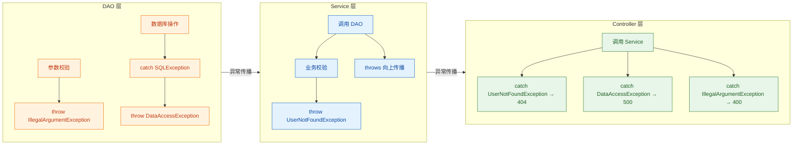

### 常见误区与最佳实践

有几个关于 `throw` 和 `throws` 的常见错误值得特别警惕：

误区一：`throws` 声明了就一定会抛出异常。事实上 `throws` 只是一种可能性声明，方法内部完全可以正常执行完毕而不抛出任何异常。

误区二：用 `throw` 做正常的流程控制。异常机制的性能开销远高于普通的 `if-else`，不要把异常当作 `goto` 来用：

```java
// ❌ 反模式：用异常控制流程
public int findIndex(int[] arr, int target) {
    try {
        for (int i = 0; ; i++) {
            if (arr[i] == target) {
                throw new RuntimeException(String.valueOf(i)); // 别这么干！
            }
        }
    } catch (ArrayIndexOutOfBoundsException e) {
        return -1; // 用越界异常表示"没找到"
    } catch (RuntimeException e) {
        return Integer.parseInt(e.getMessage()); // 用异常消息传递返回值
    }
}

// ✅ 正确做法：普通循环 + 条件判断
public int findIndex(int[] arr, int target) {
    for (int i = 0; i < arr.length; i++) {
        if (arr[i] == target) {
            return i; // 直接返回
        }
    }
    return -1; // 没找到返回 -1
}
```

误区三：在 `throws` 中声明过于宽泛的异常类型：

```java
// ❌ 不推荐：throws Exception 太宽泛，调用者无法精确处理
public void doSomething() throws Exception {
    // ...
}

// ✅ 推荐：声明具体的异常类型
public void doSomething() throws FileNotFoundException, ParseException {
    // 调用者可以针对不同异常做不同处理
}
```

---

**📝 练习题**

以下代码能否通过编译？如果不能，问题出在哪里？

```java
public class Parent {
    public void action() throws FileNotFoundException {
        // ...
    }
}

public class Child extends Parent {
    @Override
    public void action() throws IOException {
        // ...
    }
}
```

A. 能通过编译，因为 `IOException` 和 `FileNotFoundException` 都是 Checked Exception


B. 不能通过编译，因为子类重写方法声明的 `IOException` 比父类的 `FileNotFoundException` 范围更大


C. 能通过编译，因为子类可以声明任意异常


D. 不能通过编译，因为子类重写方法不允许使用 `throws`


**【答案】** B

**【解析】** `FileNotFoundException` 是 `IOException` 的子类。子类重写父类方法时，`throws` 声明的 Checked Exception 只能是父类声明异常的子类或相同类型，不能更宽泛。这里子类声明了 `IOException`（父类），而父类方法只声明了 `FileNotFoundException`（子类），相当于子类方法的异常范围变大了，违反了重写规则。如果调用者通过 `Parent` 引用调用 `action()`，它只准备处理 `FileNotFoundException`，但实际运行的是 `Child.action()`，可能抛出更广泛的 `IOException`，这会破坏类型安全。编译器因此拒绝编译。

---

## 自定义异常

Java 标准库提供的异常类型（如 `NullPointerException`、`IOException`）覆盖了大量通用场景，但在真实业务开发中，我们经常需要表达**领域特有的错误语义**。比如"用户余额不足"、"订单已过期"、"权限校验失败"——这些错误用标准异常来表达，要么语义模糊，要么需要在 `message` 字符串里硬编码业务信息，既不优雅也不利于上层代码做精确的 `catch` 分支处理。这就是自定义异常（Custom Exception）存在的核心价值：**让异常本身成为业务语义的载体**。

### 自定义异常的本质

自定义异常并没有任何"魔法"，它的本质就是**继承已有的异常类**，然后根据需要添加业务字段和构造方法。你需要做的核心决策只有一个：**继承谁？**

这个决策直接决定了你的自定义异常是 Checked 还是 Unchecked：

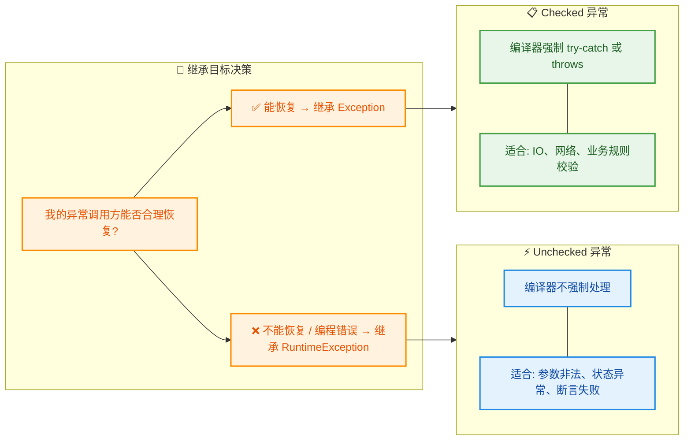

简单来说：如果你期望调用方**必须显式处理**这个异常（比如业务流程中的可恢复错误），就继承 `Exception`；如果这个异常代表的是**不应该发生的程序错误**或者你不想污染方法签名，就继承 `RuntimeException`。

### 标准写法：四构造方法模板

Java 社区有一个被广泛遵循的最佳实践——自定义异常类应当提供与 `Exception` 类一致的**四个标准构造方法**。这不是语法强制，而是一种契约式设计（Design by Contract），确保你的异常类在任何场景下都能被灵活构造。

我们先看一个 Checked 自定义异常的完整模板：

```java
/**
 * 业务异常：当用户账户余额不足以完成交易时抛出。
 * 继承 Exception，属于 Checked Exception，调用方必须处理。
 */
public class InsufficientBalanceException extends Exception {

    // ---- 四个标准构造方法，与 java.lang.Exception 保持一致 ----

    // 1. 无参构造：最简形式，仅标识异常类型
    public InsufficientBalanceException() {
        super(); // 调用父类 Exception 的无参构造
    }

    // 2. 带消息构造：附带人类可读的错误描述
    public InsufficientBalanceException(String message) {
        super(message); // 将 message 传递给父类，可通过 getMessage() 获取
    }

    // 3. 带消息 + 原因构造：用于异常链（Exception Chaining）
    public InsufficientBalanceException(String message, Throwable cause) {
        super(message, cause); // 同时保留描述信息和底层异常
    }

    // 4. 仅原因构造：当底层异常本身已足够说明问题时使用
    public InsufficientBalanceException(Throwable cause) {
        super(cause); // message 会自动取 cause.toString()
    }
}
```

为什么需要四个？来看每个构造方法的典型使用场景：

```java
// 场景 1：无参 —— 异常类型本身就是全部信息
throw new InsufficientBalanceException();

// 场景 2：带消息 —— 最常用，附带业务上下文
throw new InsufficientBalanceException(
    "用户 [userId] 余额 50.00 元，不足以支付 120.00 元"
);

// 场景 3：带消息 + 原因 —— 包装底层异常，形成异常链
try {
    paymentGateway.deduct(amount); // 可能抛出 IOException
} catch (IOException e) {
    // 将底层 IO 异常包装为业务异常，保留完整调用链
    throw new InsufficientBalanceException("扣款网关调用失败", e);
}

// 场景 4：仅原因 —— 底层异常已经说明一切
catch (SQLException e) {
    throw new InsufficientBalanceException(e);
}
```

### 携带业务字段的增强异常

真正体现自定义异常价值的地方在于：你可以**在异常对象中携带结构化的业务数据**，而不仅仅是一个 `String message`。这让上层的 `catch` 代码能够基于具体数据做出精确的恢复决策。

```java
/**
 * 增强版余额不足异常：携带账户余额和所需金额。
 * 继承 RuntimeException，属于 Unchecked，不强制调用方处理。
 */
public class InsufficientBalanceException extends RuntimeException {

    private final String accountId;  // 出问题的账户 ID
    private final double balance;    // 当前实际余额
    private final double required;   // 本次操作所需金额

    /**
     * 核心构造方法：接收所有业务字段
     * @param accountId 账户标识
     * @param balance   当前余额
     * @param required  所需金额
     */
    public InsufficientBalanceException(String accountId, double balance, double required) {
        // 调用父类构造，自动生成格式化的 message
        super(String.format(
            "账户 [%s] 余额不足: 当前 %.2f, 需要 %.2f, 差额 %.2f",
            accountId, balance, required, required - balance
        ));
        this.accountId = accountId; // 保存账户 ID
        this.balance = balance;     // 保存当前余额
        this.required = required;   // 保存所需金额
    }

    // 支持异常链的构造方法
    public InsufficientBalanceException(String accountId, double balance,
                                         double required, Throwable cause) {
        super(String.format(
            "账户 [%s] 余额不足: 当前 %.2f, 需要 %.2f",
            accountId, balance, required
        ), cause); // 将 cause 传递给父类
        this.accountId = accountId;
        this.balance = balance;
        this.required = required;
    }

    // ---- Getter 方法：让 catch 代码能提取结构化数据 ----

    public String getAccountId() { return accountId; }  // 获取账户 ID
    public double getBalance()   { return balance; }     // 获取当前余额
    public double getRequired()  { return required; }    // 获取所需金额

    // 计算差额，方便上层直接使用
    public double getDeficit() {
        return required - balance; // 差额 = 所需 - 当前余额
    }
}
```

上层代码就可以这样精确处理：

```java
public void processOrder(String accountId, double amount) {
    try {
        accountService.deduct(accountId, amount); // 可能抛出 InsufficientBalanceException
    } catch (InsufficientBalanceException e) {
        // 从异常对象中提取结构化数据，而非解析 message 字符串
        double deficit = e.getDeficit();           // 直接获取差额
        String account = e.getAccountId();         // 直接获取账户

        if (deficit < 10.0) {
            // 差额很小，提示用户充值即可
            notifyUser(account, "还差 " + deficit + " 元，请充值后重试");
        } else {
            // 差额较大，推荐分期付款
            offerInstallmentPlan(account, e.getRequired());
        }
    }
}
```

对比一下如果用标准异常会怎样：

```java
// ❌ 反面示例：用标准异常 + 字符串拼接
throw new RuntimeException("余额不足: 当前50.00, 需要120.00");

// catch 代码被迫解析字符串来提取数据 —— 脆弱且丑陋
catch (RuntimeException e) {
    String msg = e.getMessage();
    // 用正则或 split 从字符串里抠数字？这是灾难...
}
```

### 异常体系设计：基类 + 派生类

在中大型项目中，通常不会让每个自定义异常各自为战，而是设计一个**异常继承体系**——定义一个业务异常基类，然后派生出具体的异常子类。这样做的好处是：上层代码可以选择 `catch` 基类来统一处理，也可以 `catch` 具体子类来精确处理。

```java
/**
 * 业务异常基类：所有业务异常的根。
 * 携带统一的错误码（errorCode），便于前后端协作和日志检索。
 */
public abstract class BusinessException extends RuntimeException {

    private final String errorCode; // 统一错误码，如 "BALANCE_001"

    // 基类构造：强制子类提供 errorCode
    protected BusinessException(String errorCode, String message) {
        super(message);              // 人类可读的描述
        this.errorCode = errorCode;  // 机器可读的错误码
    }

    // 支持异常链
    protected BusinessException(String errorCode, String message, Throwable cause) {
        super(message, cause);
        this.errorCode = errorCode;
    }

    public String getErrorCode() { return errorCode; } // 获取错误码
}
```

```java
/**
 * 具体业务异常：余额不足
 */
public class InsufficientBalanceException extends BusinessException {

    private final double balance;  // 当前余额
    private final double required; // 所需金额

    public InsufficientBalanceException(double balance, double required) {
        // 调用基类构造，传入固定的错误码前缀
        super("BALANCE_001",
              String.format("余额不足: 当前 %.2f, 需要 %.2f", balance, required));
        this.balance = balance;
        this.required = required;
    }

    public double getBalance()  { return balance; }
    public double getRequired() { return required; }
}
```

```java
/**
 * 具体业务异常：订单已过期
 */
public class OrderExpiredException extends BusinessException {

    private final String orderId; // 过期的订单号

    public OrderExpiredException(String orderId) {
        super("ORDER_002", "订单已过期: " + orderId); // 固定错误码
        this.orderId = orderId;
    }

    public String getOrderId() { return orderId; }
}
```

整个体系的继承关系如下：

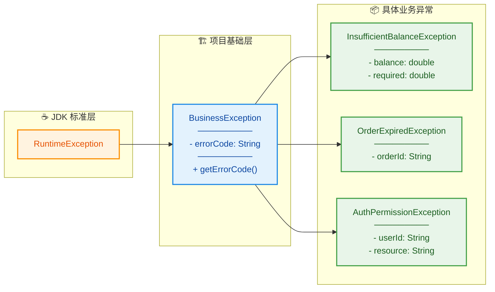

上层统一处理的代码就非常干净：

```java
// 全局异常处理器（如 Spring 的 @ControllerAdvice）
@ExceptionHandler(BusinessException.class)
public ResponseEntity<ErrorResponse> handleBusiness(BusinessException e) {
    // 所有业务异常都能统一提取 errorCode，构造标准响应
    ErrorResponse resp = new ErrorResponse(
        e.getErrorCode(),  // "BALANCE_001" 或 "ORDER_002"
        e.getMessage()     // 人类可读的描述
    );
    return ResponseEntity.badRequest().body(resp); // 返回 400
}
```

### 自定义异常的设计原则与常见陷阱

以下是实战中总结出的关键原则：

**原则一：字段用 `final`，异常对象应当不可变（Immutable）。**

异常一旦创建，其携带的信息就不应该被修改。这与异常的语义一致——它描述的是"已经发生的事实"。

```java
// ✅ 正确：字段声明为 final
private final String accountId;
private final double balance;

// ❌ 错误：可变字段，可能被 catch 代码意外修改
private String accountId;  // 没有 final
```

**原则二：重写 `toString()` 提升日志可读性。**

当异常被打印到日志时，默认的 `toString()` 只输出类名 + message。如果你的异常携带了业务字段，重写 `toString()` 能让日志信息更完整：

```java
@Override
public String toString() {
    // 输出格式：InsufficientBalanceException[BALANCE_001]: 余额不足... {balance=50.0, required=120.0}
    return String.format("%s[%s]: %s {balance=%.2f, required=%.2f}",
        getClass().getSimpleName(), // 类名
        getErrorCode(),             // 错误码
        getMessage(),               // 描述信息
        balance,                    // 当前余额
        required                    // 所需金额
    );
}
```

**原则三：不要滥用自定义异常。**

并非每个错误都需要一个专属的异常类。如果标准库的异常已经能准确表达语义，就直接用：

```java
// ❌ 过度设计：为参数校验专门建一个异常类
public class InvalidAgeException extends RuntimeException { ... }

// ✅ 直接用标准异常，语义已经足够清晰
if (age < 0) {
    throw new IllegalArgumentException("年龄不能为负数: " + age);
}
```

经验法则：当你需要在 `catch` 中**区分不同的业务错误类型**，或者需要**从异常中提取结构化数据**时，才值得创建自定义异常。

**原则四：提供 `serialVersionUID`。**

`Throwable` 实现了 `Serializable` 接口，所以所有异常天然可序列化。如果你的异常可能跨 JVM 传输（如 RMI、分布式系统），应当显式声明序列化版本号：

```java
public class InsufficientBalanceException extends RuntimeException {
    // 显式声明，避免 JVM 自动生成导致的反序列化兼容问题
    private static final long serialVersionUID = 1L;

    // ... 其余代码
}
```

### 完整实战示例

把前面所有知识点串起来，看一个完整的业务场景：

```java
/**
 * 账户服务：演示自定义异常的完整使用流程
 */
public class AccountService {

    private final Map<String, Double> accounts = new HashMap<>(); // 模拟账户存储

    /**
     * 扣款方法
     * @param accountId 账户 ID
     * @param amount    扣款金额
     * @throws InsufficientBalanceException 余额不足时抛出（Unchecked）
     * @throws IllegalArgumentException     参数非法时抛出（标准异常即可）
     */
    public void deduct(String accountId, double amount) {
        // 参数校验：用标准异常，无需自定义
        if (amount <= 0) {
            throw new IllegalArgumentException("扣款金额必须为正数: " + amount);
        }

        // 查询余额
        Double balance = accounts.get(accountId);

        // 账户不存在：这也是业务异常，但这里简化处理
        if (balance == null) {
            throw new AccountNotFoundException(accountId);
        }

        // 核心业务判断：余额不足
        if (balance < amount) {
            // 抛出携带完整业务数据的自定义异常
            throw new InsufficientBalanceException(accountId, balance, amount);
        }

        // 正常扣款
        accounts.put(accountId, balance - amount);
    }
}
```

```java
/**
 * 调用方：精确处理不同的业务异常
 */
public class OrderProcessor {

    private final AccountService accountService = new AccountService();

    public void placeOrder(String accountId, double totalPrice) {
        try {
            accountService.deduct(accountId, totalPrice); // 尝试扣款
            System.out.println("下单成功！");

        } catch (InsufficientBalanceException e) {
            // 精确处理余额不足：利用结构化数据做业务决策
            System.out.printf("余额不足！当前 %.2f 元，还差 %.2f 元%n",
                e.getBalance(),  // 直接获取余额
                e.getDeficit()   // 直接获取差额
            );

        } catch (AccountNotFoundException e) {
            // 精确处理账户不存在
            System.out.println("账户 " + e.getAccountId() + " 不存在，请检查");

        } catch (BusinessException e) {
            // 兜底：处理其他所有业务异常
            System.out.println("业务错误 [" + e.getErrorCode() + "]: " + e.getMessage());
        }
    }
}
```

注意 `catch` 的顺序：**子类在前，基类在后**。如果把 `BusinessException` 放在最前面，后面的 `catch` 分支永远不会执行，编译器也会报错。

---

**📝 练习题**

以下关于自定义异常的说法，哪一项是正确的？

A. 自定义异常必须继承 `Throwable` 类才能被 `throw` 抛出


B. 自定义 Checked 异常应继承 `RuntimeException`，自定义 Unchecked 异常应继承 `Exception`


C. 自定义异常类中的业务字段应声明为 `final`，保持异常对象的不可变性


D. 每个业务错误都应该创建对应的自定义异常类，这是 Java 最佳实践


**【答案】** C

**【解析】** 逐项分析：A 选项，虽然 `Throwable` 是异常体系的根，但实际开发中自定义异常应继承 `Exception` 或 `RuntimeException`，直接继承 `Throwable` 不是推荐做法。B 选项说反了——Checked 异常继承 `Exception`，Unchecked 异常继承 `RuntimeException`。C 选项正确，异常对象描述的是"已发生的事实"，其字段不应被修改，声明为 `final` 是不可变设计的核心手段。D 选项属于过度设计，当标准异常（如 `IllegalArgumentException`）已能准确表达语义时，无需创建自定义异常。

---

## 异常链（Exception Chaining）

在真实的企业级项目中，异常很少是"孤立事件"。一个底层的 `SQLException` 可能会触发 DAO 层的 `DataAccessException`，进而导致 Service 层抛出 `BusinessException`。如果每一层都简单地吞掉原始异常再抛出新异常，等到最终排查问题时，你面对的将是一条断裂的线索链——根本原因（root cause）早已丢失。

异常链（Exception Chaining）正是 Java 为解决这个问题而设计的机制：它允许你在抛出新异常的同时，将原始异常作为"原因（cause）"附着其上，形成一条完整的因果链条。调试时只需顺着链条一路追溯，就能精准定位最底层的故障源头。

### 异常链的核心 API

`Throwable` 类为异常链提供了两个核心方法和两种构造方式：

```java
public class Throwable {

    // ========== 构造时绑定 cause（推荐方式） ==========

    // 只传入 cause，message 自动取 cause.toString()
    public Throwable(Throwable cause) {
        // ...
    }

    // 同时指定 message 和 cause（最常用）
    public Throwable(String message, Throwable cause) {
        // ...
    }

    // ========== 事后绑定 cause ==========

    // 在构造之后、只能调用一次，用于补充设置 cause
    // 返回 this，支持链式调用
    public synchronized Throwable initCause(Throwable cause) {
        // 如果 cause 已经被设置过，会抛出 IllegalStateException
        // 如果 cause == this，会抛出 IllegalArgumentException
        // ...
        return this;
    }

    // ========== 读取 cause ==========

    // 获取当前异常的直接原因，没有则返回 null
    public synchronized Throwable getCause() {
        return (cause == this ? null : cause);
    }
}
```

这里有一个容易被忽视的细节：`Throwable` 内部用 `cause == this` 来表示"cause 尚未初始化"的状态。当你调用无参构造器 `new Throwable()` 时，`cause` 字段默认指向 `this` 自身，而非 `null`。只有在显式设置 cause 之后，`getCause()` 才会返回真正的原因对象；如果从未设置过，则返回 `null`。

### 构造时绑定 vs initCause：两种绑定方式的对比

绑定 cause 有两条路径，它们的适用场景截然不同：

```java
public class ChainingDemo {
    public static void main(String[] args) {

        // ===== 方式一：构造时绑定（推荐，一步到位） =====
        try {
            connectDatabase(); // 模拟底层抛出 SQLException
        } catch (SQLException e) {
            // 在构造 RuntimeException 时直接传入原始异常作为 cause
            // 这是最简洁、最安全的做法
            throw new RuntimeException("数据库连接失败", e);
        }
    }

    // ===== 方式二：initCause 事后绑定 =====
    // 适用于：异常类没有接受 Throwable 参数的构造器
    static void legacyApproach() {
        try {
            connectDatabase();
        } catch (SQLException e) {
            // 某些遗留异常类只有无参或只接受 String 的构造器
            // 此时只能先创建异常，再用 initCause 补绑 cause
            MyLegacyException ex = new MyLegacyException("连接失败");
            ex.initCause(e);  // 只能调用一次！第二次调用会抛 IllegalStateException
            throw ex;
        }
    }

    static void connectDatabase() throws SQLException {
        throw new SQLException("Connection refused: 192.168.1.100:3306");
    }
}
```

两种方式的核心区别：

```
┌──────────────────────┬──────────────────────────────────────────┐
│       对比维度        │              说明                         │
├──────────────────────┼──────────────────────────────────────────┤
│  构造时绑定           │  new XxxException(msg, cause)            │
│                      │  一步完成，线程安全，不可变，推荐首选       │
├──────────────────────┼──────────────────────────────────────────┤
│  initCause 事后绑定   │  ex.initCause(cause)                     │
│                      │  只能调用一次，用于兼容无 cause 构造器的    │
│                      │  遗留异常类                               │
├──────────────────────┼──────────────────────────────────────────┤
│  现代代码建议         │  自定义异常务必提供 (String, Throwable)    │
│                      │  构造器，彻底避免使用 initCause            │
└──────────────────────┴──────────────────────────────────────────┘
```

### initCause 的陷阱：只能调用一次

`initCause` 有一条铁律——对同一个异常对象只能调用一次。违反这条规则，JVM 会毫不留情地抛出 `IllegalStateException`：

```java
public class InitCauseTrap {
    public static void main(String[] args) {

        Exception original1 = new Exception("第一个原因");
        Exception original2 = new Exception("第二个原因");

        // 创建一个尚未绑定 cause 的异常
        Exception wrapper = new Exception("包装异常");

        // 第一次调用 initCause —— 成功
        wrapper.initCause(original1);
        System.out.println("cause = " + wrapper.getCause().getMessage());
        // 输出: cause = 第一个原因

        // 第二次调用 initCause —— 直接爆炸
        try {
            wrapper.initCause(original2); // IllegalStateException!
        } catch (IllegalStateException e) {
            // "Can't overwrite cause with ..."
            System.out.println("禁止重复设置 cause: " + e.getMessage());
        }

        // 另一个陷阱：如果构造时已经传入了 cause，initCause 同样不能再调用
        Exception alreadyChained = new Exception("已绑定", original1);
        try {
            alreadyChained.initCause(original2); // 同样抛 IllegalStateException
        } catch (IllegalStateException e) {
            System.out.println("构造时已绑定 cause，不可再用 initCause");
        }
    }
}
```

设计意图很明确：cause 一旦确定就不可更改（effectively immutable），这保证了异常链的因果关系在整个传播过程中始终一致，不会被中途篡改。

### 多层异常链：真实项目中的分层包装

在典型的分层架构（Controller → Service → DAO）中，每一层都应该将底层异常包装为本层语义的异常，同时保留完整的 cause 链：

```java
// ========== DAO 层 ==========
class UserDao {
    // DAO 层捕获 JDBC 原始异常，包装为 DAO 层语义异常
    public User findById(long id) {
        try {
            // 模拟 JDBC 操作
            throw new java.sql.SQLException(
                "ORA-00942: table or view does not exist"
            );
        } catch (java.sql.SQLException e) {
            // 第一层包装：SQLException → DaoException
            // 保留原始 SQLException 作为 cause
            throw new DaoException("查询用户失败, id=" + id, e);
        }
    }
}

// ========== Service 层 ==========
class UserService {
    private UserDao dao = new UserDao();

    // Service 层捕获 DAO 异常，包装为业务异常
    public User getUser(long id) {
        try {
            return dao.findById(id);
        } catch (DaoException e) {
            // 第二层包装：DaoException → ServiceException
            // cause 链：ServiceException → DaoException → SQLException
            throw new ServiceException("获取用户信息失败", e);
        }
    }
}

// ========== Controller 层 ==========
class UserController {
    private UserService service = new UserService();

    public void handleRequest(long userId) {
        try {
            service.getUser(userId);
        } catch (ServiceException e) {
            // 在最顶层打印完整的异常链
            // printStackTrace() 会自动输出所有 Caused by 信息
            e.printStackTrace();

            // 也可以手动遍历异常链
            System.out.println("===== 手动遍历异常链 =====");
            Throwable current = e;       // 从最外层异常开始
            int depth = 0;               // 记录链的深度
            while (current != null) {    // 沿着 cause 链一直追溯到底
                String indent = "  ".repeat(depth); // 缩进，视觉上体现层级
                System.out.println(indent + "Level " + depth + ": "
                    + current.getClass().getSimpleName()
                    + " - " + current.getMessage());
                current = current.getCause(); // 获取下一层 cause
                depth++;
            }
        }
    }
}

// ========== 自定义异常（都提供 cause 构造器） ==========
class DaoException extends RuntimeException {
    public DaoException(String msg, Throwable cause) {
        super(msg, cause); // 关键：传递 cause
    }
}

class ServiceException extends RuntimeException {
    public ServiceException(String msg, Throwable cause) {
        super(msg, cause); // 关键：传递 cause
    }
}
```

运行 `handleRequest` 后，`printStackTrace()` 的输出会呈现清晰的因果链：

```
ServiceException: 获取用户信息失败
    at UserService.getUser(...)
    ...
Caused by: DaoException: 查询用户失败, id=42
    at UserDao.findById(...)
    ...
Caused by: java.sql.SQLException: ORA-00942: table or view does not exist
    at UserDao.findById(...)
    ...
```

手动遍历的输出：

```
===== 手动遍历异常链 =====
Level 0: ServiceException - 获取用户信息失败
  Level 1: DaoException - 查询用户失败, id=42
    Level 2: SQLException - ORA-00942: table or view does not exist
```

下面这张图展示了异常在分层架构中的传播与包装过程：

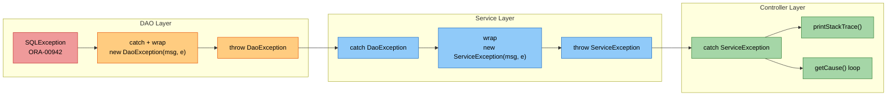

### getRootCause：快速定位根因的工具方法

在排查线上问题时，你往往只关心最底层的 root cause。手动写 `while` 循环当然可以，但更优雅的做法是封装一个工具方法：

```java
public class ExceptionUtils {

    /**
     * 沿着异常链一路追溯，返回最底层的根因异常。
     * 如果传入的异常本身没有 cause，则返回它自己。
     */
    public static Throwable getRootCause(Throwable throwable) {
        Throwable cause = throwable;           // 从当前异常出发
        while (cause.getCause() != null) {     // 只要还有下一层 cause
            cause = cause.getCause();          // 就继续深入
        }
        return cause;                          // 返回链条最末端的异常
    }

    /**
     * 直接获取根因的 message，方便日志输出。
     */
    public static String getRootMessage(Throwable throwable) {
        Throwable root = getRootCause(throwable);
        return root.getClass().getSimpleName() + ": " + root.getMessage();
    }

    // 使用示例
    public static void main(String[] args) {
        // 构造一条三层异常链
        SQLException root = new SQLException("Deadlock detected");
        DaoException mid = new DaoException("查询失败", root);
        ServiceException top = new ServiceException("业务处理异常", mid);

        // 一步到位拿到根因
        Throwable rootCause = getRootCause(top);
        System.out.println("Root cause: " + rootCause);
        // 输出: Root cause: java.sql.SQLException: Deadlock detected

        System.out.println("Root message: " + getRootMessage(top));
        // 输出: Root message: SQLException: Deadlock detected
    }
}
```

实际上，Apache Commons Lang 的 `org.apache.commons.lang3.exception.ExceptionUtils` 和 Guava 的 `Throwables.getRootCause()` 都提供了类似的现成实现。在生产项目中直接使用这些成熟的工具库即可，无需重复造轮子。

### 异常链的反模式：吞掉 cause

最后，必须强调一个在代码审查中频繁出现的严重反模式——吞掉原始异常：

```java
// ========== 反模式：千万不要这样做！ ==========
public class AntiPatternDemo {

    // 反模式 1：catch 后抛出新异常，但不传入 cause
    static void bad1() {
        try {
            riskyOperation();
        } catch (IOException e) {
            // 原始的 IOException 信息彻底丢失！
            // 调试时你只能看到 "操作失败"，却不知道为什么失败
            throw new RuntimeException("操作失败");  // cause 链断裂
        }
    }

    // 反模式 2：catch 后只打日志，然后抛出全新异常
    static void bad2() {
        try {
            riskyOperation();
        } catch (IOException e) {
            log.error("出错了");  // 日志里连异常对象都没打印
            throw new RuntimeException("操作失败");  // cause 同样丢失
        }
    }

    // ========== 正确做法 ==========

    // 正确 1：构造时传入 cause
    static void good1() {
        try {
            riskyOperation();
        } catch (IOException e) {
            // 完整保留原始异常，调试时可追溯到 IOException 的具体信息
            throw new RuntimeException("操作失败", e);
        }
    }

    // 正确 2：日志中也要打印完整异常
    static void good2() {
        try {
            riskyOperation();
        } catch (IOException e) {
            // 第二个参数 e 会让日志框架打印完整的 stack trace
            log.error("操作失败", e);
            throw new RuntimeException("操作失败", e);
        }
    }

    static void riskyOperation() throws IOException {
        throw new IOException("disk full");
    }
}
```

一条简单的原则：每当你在 `catch` 块中创建并抛出新异常时，问自己一个问题——"我把原始异常传进去了吗？"如果答案是否定的，那就是一个 bug。

---

**📝 练习题**

以下代码的输出结果是什么？

```java
public class ChainQuiz {
    public static void main(String[] args) {
        try {
            method1();
        } catch (Exception e) {
            System.out.println("msg: " + e.getMessage());
            System.out.println("cause: " + e.getCause().getMessage());
            System.out.println("root: " + e.getCause().getCause());
        }
    }

    static void method1() {
        try {
            method2();
        } catch (Exception e) {
            RuntimeException re = new RuntimeException("Level-1");
            re.initCause(e);
            throw re;
        }
    }

    static void method2() {
        throw new IllegalArgumentException("Level-2");
    }
}
```

A. `msg: Level-1`，`cause: Level-2`，`root: null`


B. `msg: Level-2`，`cause: Level-1`，`root: null`


C. `msg: Level-1`，`cause: Level-2`，`root: Level-2`


D. 运行时抛出 `IllegalStateException`


**【答案】** A

**【解析】**

逐步追踪执行流程：

1. `method2()` 抛出 `IllegalArgumentException("Level-2")`。
2. `method1()` 捕获该异常后，创建 `new RuntimeException("Level-1")`——此时 cause 尚未设置（内部 `cause == this`）。
3. 调用 `re.initCause(e)` 将 `IllegalArgumentException` 绑定为 cause。这是第一次调用 `initCause`，合法。
4. 抛出 `re`，被 `main` 捕获。

在 `main` 的 `catch` 块中：
- `e.getMessage()` → `"Level-1"`（RuntimeException 自身的 message）
- `e.getCause()` → 就是那个 `IllegalArgumentException`，其 `getMessage()` → `"Level-2"`
- `e.getCause().getCause()` → `IllegalArgumentException` 没有设置过 cause，返回 `null`

所以输出为 `msg: Level-1`，`cause: Level-2`，`root: null`，选 A。

选项 D 的干扰点在于 `initCause` 的"只能调用一次"限制，但本题中 `RuntimeException` 是通过无参 message 构造器创建的（没有传入 cause），所以第一次 `initCause` 完全合法，不会抛出 `IllegalStateException`。

---

## 本章小结

本章系统地梳理了 Java 异常处理机制的完整知识体系。我们从异常的本质出发，逐层深入，最终形成了一套完整的异常处理认知框架。下面用一张全景图将所有知识点串联起来。

### 全景知识图谱

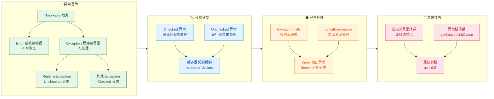

### 核心知识点速查表

```
┌──────────────────────────────────────────────────────────────────────────┐
│                     Java 异常处理 · 核心速查表                            │
├──────────────┬───────────────────────────────────────────────────────────┤
│  异常层次     │ Throwable → Error (不处理)                               │
│              │          → Exception → RuntimeException (Unchecked)      │
│              │                      → 其他 (Checked, 编译器强制)         │
├──────────────┼───────────────────────────────────────────────────────────┤
│  Checked     │ 编译期必须 try-catch 或 throws 声明                       │
│  vs          │ IOException, SQLException, ClassNotFoundException       │
│  Unchecked   │ 运行期自由选择: NullPointerException, ClassCastException  │
├──────────────┼───────────────────────────────────────────────────────────┤
│  finally     │ 几乎总是执行, 即使 try/catch 中有 return                  │
│  执行顺序     │ return 值在 finally 之前"快照", finally 中避免 return     │
├──────────────┼───────────────────────────────────────────────────────────┤
│  TWR         │ try(Resource r = ...) { } 自动调用 close()               │
│              │ 实现 AutoCloseable 接口, suppressed exception 机制        │
├──────────────┼───────────────────────────────────────────────────────────┤
│  throw       │ 方法体内主动抛出异常实例                                    │
│  throws      │ 方法签名上声明可能抛出的异常类型                             │
├──────────────┼───────────────────────────────────────────────────────────┤
│  自定义异常   │ 继承 Exception (Checked) 或 RuntimeException (Unchecked)  │
│              │ 携带错误码 + 业务消息, 构建分层异常体系                      │
├──────────────┼───────────────────────────────────────────────────────────┤
│  异常链       │ new XxxException("msg", cause) 包装原始异常               │
│              │ getCause() 追溯根因, initCause() 延迟绑定                 │
└──────────────┴───────────────────────────────────────────────────────────┘
```

### 设计原则回顾

异常处理不仅仅是语法层面的 try-catch，更是一种**程序设计哲学**。回顾本章，有几条贯穿始终的设计原则值得铭记：

**第一，异常是用来处理"异常情况"的，不是控制流工具。** 永远不要用异常来替代正常的条件判断。`if (obj != null)` 远比捕获 `NullPointerException` 更清晰、更高效。异常的抛出和捕获涉及栈帧快照（stack trace snapshot），开销远大于一次简单的 `if` 判断。

**第二，精确捕获，拒绝吞噬。** 捕获异常时应该尽可能精确地指定异常类型，而不是一个大而全的 `catch (Exception e)`。更致命的反模式是空的 catch 块——它会让错误悄无声息地消失，等到问题暴露时已经难以追溯。至少要记录日志（log the exception）。

**第三，早抛出，晚捕获（Throw early, catch late）。** 在发现问题的第一时间就抛出异常，让调用者知道出了什么问题。而捕获异常则应该推迟到真正有能力处理它的层级。一个 DAO 层的方法不应该捕获并吞掉 `SQLException`，而应该包装成业务异常向上传播，让 Service 层或 Controller 层决定如何响应。

**第四，善用异常链保留上下文。** 当你需要将底层异常转换为高层业务异常时，务必通过构造器的 `cause` 参数保留原始异常。这条链路就是排查问题时的"面包屑"（breadcrumb），丢失它意味着丢失了最关键的调试信息。

**第五，资源管理交给 try-with-resources。** 从 Java 7 开始，手动在 finally 中关闭资源的写法已经是"遗留风格"（legacy style）。try-with-resources 不仅代码更简洁，还能正确处理 suppressed exception，是现代 Java 中管理资源的唯一推荐方式。

### 异常处理的分层架构模式

在实际项目中，异常处理通常遵循分层架构的思路。不同层级有不同的职责：

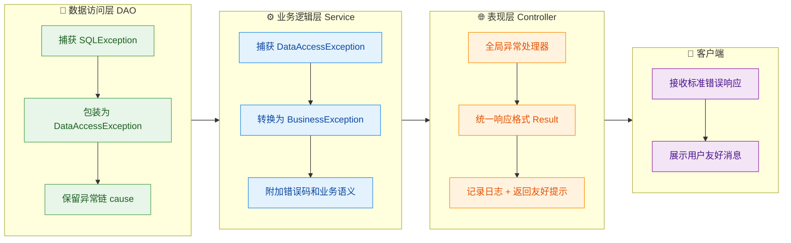

这种分层模式的核心思想是：**每一层只抛出属于自己抽象级别的异常**。DAO 层不应该把 `SQLException` 直接暴露给 Controller，正如 Controller 不应该把 `BusinessException` 的技术细节直接返回给用户。每一层都在做"翻译"工作——将下层的技术异常翻译为上层能理解的业务语义。

### 一个完整的异常处理示例

将本章所有知识点融合到一个完整的代码示例中：

```java
// ==================== 1. 自定义异常体系 ====================

// 业务异常基类 (Unchecked, 不强制调用者处理)
public class BusinessException extends RuntimeException {
    private final String errorCode; // 错误码, 用于前后端统一识别

    // 支持异常链的构造器
    public BusinessException(String errorCode, String message, Throwable cause) {
        super(message, cause); // 将 cause 传递给父类, 保留异常链
        this.errorCode = errorCode;
    }

    public BusinessException(String errorCode, String message) {
        this(errorCode, message, null); // 无 cause 的简化版本
    }

    public String getErrorCode() {
        return errorCode; // 提供错误码的访问器
    }
}

// 具体业务异常: 用户未找到
public class UserNotFoundException extends BusinessException {
    public UserNotFoundException(Long userId) {
        // 调用父类构造器, 传入错误码和描述信息
        super("USER_NOT_FOUND", "用户不存在, ID: " + userId);
    }
}

// 具体业务异常: 数据访问失败
public class DataAccessException extends BusinessException {
    public DataAccessException(String message, Throwable cause) {
        // 保留原始异常作为 cause, 这是异常链的关键
        super("DATA_ACCESS_ERROR", message, cause);
    }
}
```

```java
// ==================== 2. DAO 层: 资源管理 + 异常包装 ====================

public class UserDao {

    // throws 声明此方法可能抛出 DataAccessException
    public User findById(Long id) {
        // try-with-resources: 自动管理 Connection 和 PreparedStatement
        try (
            Connection conn = DataSource.getConnection();       // 资源1: 数据库连接
            PreparedStatement ps = conn.prepareStatement(       // 资源2: 预编译语句
                "SELECT * FROM users WHERE id = ?")
        ) {
            ps.setLong(1, id);                                  // 设置查询参数
            ResultSet rs = ps.executeQuery();                   // 执行查询

            if (rs.next()) {                                    // 如果有结果
                User user = new User();                         // 创建用户对象
                user.setId(rs.getLong("id"));                   // 映射字段
                user.setName(rs.getString("name"));             // 映射字段
                return user;                                    // 返回用户
            }
            return null;                                        // 未找到返回 null

        } catch (SQLException e) {
            // 捕获底层 SQLException, 包装为业务异常
            // 关键: 将原始异常 e 作为 cause 传入, 保留完整调用链
            throw new DataAccessException(
                "查询用户失败, ID: " + id, e);
        }
        // 无需 finally 关闭资源, try-with-resources 已自动处理
    }
}
```

```java
// ==================== 3. Service 层: 业务逻辑 + 异常转换 ====================

public class UserService {

    private final UserDao userDao = new UserDao();              // 依赖 DAO 层

    public User getUser(Long id) {
        if (id == null || id <= 0) {                            // 参数校验: 早抛出原则
            throw new IllegalArgumentException(                 // 标准 Unchecked 异常
                "用户 ID 必须为正整数");
        }

        // DataAccessException 是 Unchecked, 可以选择不捕获, 让它自然传播
        User user = userDao.findById(id);                       // 调用 DAO 查询

        if (user == null) {                                     // 业务规则: 用户必须存在
            throw new UserNotFoundException(id);                // 抛出语义化的业务异常
        }

        return user;                                            // 返回查询结果
    }
}
```

```java
// ==================== 4. Controller 层: 统一异常处理 ====================

// Spring 全局异常处理器 (概念示意)
public class GlobalExceptionHandler {

    // 处理所有 BusinessException 及其子类
    public Result handleBusinessException(BusinessException e) {
        // 记录警告级别日志 (业务异常, 非系统错误)
        log.warn("业务异常: code={}, msg={}",
            e.getErrorCode(), e.getMessage());

        // 返回统一格式的错误响应
        return Result.fail(e.getErrorCode(), e.getMessage());
    }

    // 处理未预期的异常 (兜底)
    public Result handleException(Exception e) {
        // 记录错误级别日志, 包含完整堆栈
        log.error("系统异常", e);

        // 对外隐藏技术细节, 返回通用错误提示
        return Result.fail("SYSTEM_ERROR", "系统繁忙, 请稍后重试");
    }
}
```

这段代码完整展示了：自定义异常体系的设计、try-with-resources 的资源管理、异常链的传播与保留、分层架构中异常的逐层转换，以及全局异常处理器的兜底策略。每一个知识点都在实际场景中找到了自己的位置。

### 常见面试考点总结

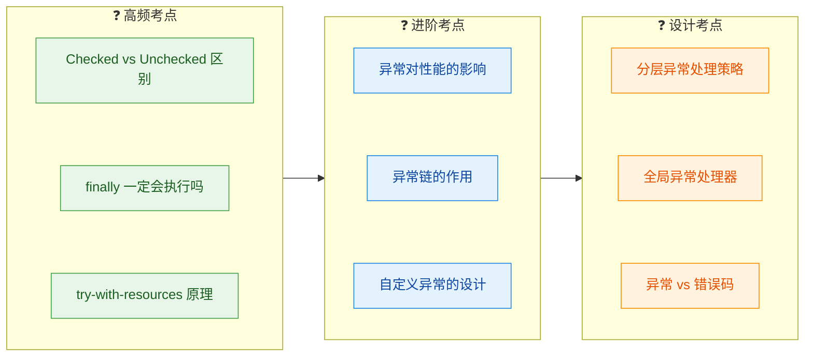

---

**📝 练习题**

以下代码的输出结果是什么？

```java
public class ExceptionQuiz {
    public static String test() {
        String result = "init";
        try {
            result = "try";
            throw new RuntimeException("boom");
        } catch (RuntimeException e) {
            result = "catch";
            return result;      // 注意这里的 return
        } finally {
            result = "finally"; // finally 中修改了 result
        }
    }

    public static void main(String[] args) {
        System.out.println(test());
    }
}
```

A. init

B. try

C. catch

D. finally


**【答案】** C

**【解析】** 这道题考查的是 `return` 与 `finally` 的执行顺序。执行流程如下：`try` 块中 `result` 被赋值为 `"try"`，随后抛出 `RuntimeException`；进入 `catch` 块，`result` 被赋值为 `"catch"`；执行到 `return result` 时，JVM 会先将返回值 `"catch"` **快照保存**（压入操作数栈）；然后执行 `finally` 块，`result` 被修改为 `"finally"`，但此时返回值的快照已经确定；最终方法返回的是快照值 `"catch"`。这就是经典的"finally 能执行但改不了已快照的返回值"规则。如果 `finally` 中也有 `return` 语句，则会覆盖之前的返回值——但这是一种应当避免的反模式。

---

**📝 练习题**

在 try-with-resources 语句中，如果 `try` 块和 `close()` 方法都抛出了异常，以下说法正确的是？

A. `close()` 的异常会覆盖 `try` 块的异常，只有 `close()` 的异常被抛出

B. `try` 块的异常会被丢弃，只有 `close()` 的异常被抛出

C. 两个异常都会丢失，方法正常返回

D. `try` 块的异常作为主异常被抛出，`close()` 的异常作为 suppressed exception 附加在主异常上


**【答案】** D

**【解析】** 这是 try-with-resources 的核心机制之一。Java 7 引入了 suppressed exception 的概念来解决"异常覆盖"问题。在传统的 try-finally 写法中，如果 `try` 和 `finally` 都抛出异常，`finally` 的异常会覆盖 `try` 的异常，导致原始错误信息丢失。而 try-with-resources 的处理策略是：`try` 块中抛出的异常作为主异常（primary exception）向上传播，`close()` 方法抛出的异常通过 `Throwable.addSuppressed()` 附加到主异常上，可以通过 `getSuppressed()` 方法获取。这样两个异常都不会丢失，调试时能看到完整的错误上下文。

---

