---

# 抽象类与接口

---

## 抽象类（abstract、模板方法模式）

在面向对象的世界里，我们经常会遇到这样一种情况：你知道一组子类"应该做什么"，但每个子类"怎么做"各不相同。比如，`Shape`（形状）都能计算面积，但圆形和矩形的计算公式完全不同。这时候，你需要的就是 **抽象类（Abstract Class）**。

抽象类是一种 **不能被直接实例化** 的类，它存在的意义就是 **被继承**。它既可以包含已经实现好的具体方法（concrete method），也可以包含只有签名、没有方法体的 **抽象方法（abstract method）**，强制子类去完成具体实现。你可以把它理解为一份"半成品蓝图"——框架搭好了，细节留给子类填。

### abstract 关键字详解

`abstract` 关键字可以修饰 **类** 和 **方法**，两者通常配合使用。

```java
// 使用 abstract 修饰类，表明这是一个抽象类，不能 new
public abstract class Animal {

    // 普通成员变量，抽象类可以拥有状态
    protected String name;

    // 普通构造器，虽然不能直接 new Animal()，但子类可以通过 super() 调用
    public Animal(String name) {
        this.name = name;
    }

    // 具体方法：已经有完整实现，子类可以直接继承使用
    public void sleep() {
        System.out.println(name + " is sleeping...");
    }

    // 抽象方法：只有方法签名，没有方法体（连花括号都没有）
    // 子类 **必须** 重写这个方法，否则子类自身也必须声明为 abstract
    public abstract void makeSound();
}
```

几条核心规则需要牢记：

- **抽象类不能实例化**：`new Animal("cat")` 会直接编译报错。这是 Java 编译器层面的硬性约束（`Animal is abstract; cannot be instantiated`）。
- **抽象方法不能有方法体**：写了花括号 `{}` 就不是抽象方法了，编译器会报错。
- **有抽象方法的类必须声明为 abstract**：如果一个类里包含哪怕一个 `abstract` 方法，这个类本身就必须加 `abstract`，否则编译不通过。
- **反过来不成立**：一个 `abstract` 类可以 **没有任何抽象方法**。这种用法虽然少见，但合法，目的通常是单纯阻止该类被实例化。
- **抽象方法不能与 `final`、`static`、`private` 共存**：因为这三个修饰符都会阻止子类重写，与 abstract "强制子类实现"的语义矛盾。

子类继承抽象类时，要么实现所有抽象方法，要么自己也声明为 `abstract`：

```java
// Dog 继承 Animal，并实现了抽象方法 makeSound()
public class Dog extends Animal {

    // 调用父类构造器，为 name 赋值
    public Dog(String name) {
        super(name);
    }

    // 必须实现父类的抽象方法，否则 Dog 也得声明为 abstract
    @Override
    public void makeSound() {
        System.out.println(name + " says: Woof! Woof!");
    }
}
```

```java
public class Main {
    public static void main(String[] args) {
        // Animal a = new Animal("test");  // 编译错误！抽象类不能实例化

        // 多态：用父类引用指向子类对象，这是抽象类最常见的用法
        Animal dog = new Dog("Buddy");
        dog.makeSound(); // 输出: Buddy says: Woof! Woof!
        dog.sleep();     // 输出: Buddy is sleeping...（继承来的具体方法）
    }
}
```

这里体现了抽象类的核心价值：**通过多态（Polymorphism），调用方只需要面向 `Animal` 类型编程，不需要关心具体是 `Dog` 还是 `Cat`**。抽象类在编译期就约束了"子类必须具备哪些能力"，比单纯靠文档约定可靠得多。

### 抽象类的成员能力全景

很多初学者以为抽象类"只能写抽象方法"，这是一个常见误区。实际上，抽象类几乎拥有普通类的所有能力：

```java
public abstract class Vehicle {

    // 1. 静态常量
    public static final int MAX_SPEED = 300;

    // 2. 实例变量（可以有状态）
    private String brand;
    protected int currentSpeed;

    // 3. 构造器（供子类 super() 调用）
    public Vehicle(String brand) {
        this.brand = brand;
        this.currentSpeed = 0;
    }

    // 4. 具体方法（有完整实现）
    public String getBrand() {
        return brand;
    }

    // 5. 静态方法
    public static void showMaxSpeed() {
        System.out.println("Max speed limit: " + MAX_SPEED);
    }

    // 6. 抽象方法（子类必须实现）
    public abstract void accelerate();

    // 7. 具体方法调用抽象方法（这就是模板方法模式的雏形！）
    public void startTrip() {
        System.out.println(brand + " trip started.");
        accelerate(); // 调用子类的实现
        System.out.println("Current speed: " + currentSpeed);
    }
}
```

注意第 7 点——一个具体方法内部调用了抽象方法。这个模式非常重要，它就是我们接下来要深入讨论的 **模板方法模式** 的核心思想。

### 模板方法模式（Template Method Pattern）

模板方法模式是 GoF 23 种经典设计模式之一，属于 **行为型模式（Behavioral Pattern）**。它的定义非常简洁：

> Define the skeleton of an algorithm in an operation, deferring some steps to subclasses.
> 在一个操作中定义算法的骨架，将某些步骤延迟到子类中实现。

用大白话说就是：**父类定义"做事的流程"，子类填充"每一步的细节"**。

这和抽象类天然契合——父类用具体方法固定流程，用抽象方法留出"可变的步骤"。

先看一张整体结构图：

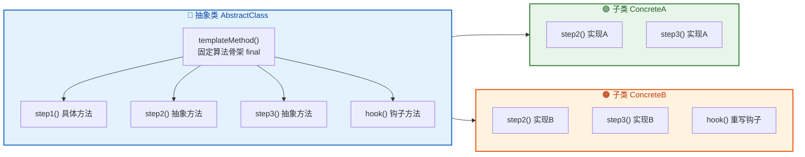

我们用一个贴近实际的例子来演示：**饮料制作流程**。不管是泡茶还是冲咖啡，大致流程都是"烧水 → 冲泡 → 倒入杯中 → 加调料"，但"冲泡"和"加调料"这两步因饮料而异。

```java
// 抽象类：定义饮料制作的算法骨架
public abstract class Beverage {

    // 模板方法：定义完整的制作流程
    // 声明为 final，防止子类篡改流程顺序（这是模板方法模式的关键）
    public final void prepareRecipe() {
        boilWater();      // 第一步：烧水（固定）
        brew();           // 第二步：冲泡（可变，由子类实现）
        pourInCup();      // 第三步：倒入杯中（固定）
        if (wantCondiments()) {  // 通过钩子方法控制是否执行第四步
            addCondiments();     // 第四步：加调料（可变，由子类实现）
        }
    }

    // 具体方法：所有饮料都一样的步骤，直接在父类实现
    private void boilWater() {
        System.out.println("Boiling water...");
    }

    // 具体方法：倒入杯中，所有饮料通用
    private void pourInCup() {
        System.out.println("Pouring into cup...");
    }

    // 抽象方法：冲泡方式因饮料而异，强制子类实现
    protected abstract void brew();

    // 抽象方法：调料因饮料而异，强制子类实现
    protected abstract void addCondiments();

    // 钩子方法（Hook Method）：提供默认实现，子类可以选择性重写
    // 这里默认返回 true，表示默认加调料
    protected boolean wantCondiments() {
        return true;
    }
}
```

这里出现了一个新概念——**钩子方法（Hook Method）**。它是模板方法模式中非常实用的技巧：父类提供一个有默认实现的方法（通常返回 boolean 或空方法体），子类可以选择性地重写它来"微调"算法流程，而不需要改动模板方法本身。

```java
// 具体子类：茶
public class Tea extends Beverage {

    // 实现冲泡步骤：茶叶用浸泡的方式
    @Override
    protected void brew() {
        System.out.println("Steeping the tea bag...");
    }

    // 实现加调料步骤：茶加柠檬
    @Override
    protected void addCondiments() {
        System.out.println("Adding lemon...");
    }
    // 没有重写 wantCondiments()，使用默认值 true，会加调料
}
```

```java
// 具体子类：咖啡
public class Coffee extends Beverage {

    // 实现冲泡步骤：咖啡用滴滤的方式
    @Override
    protected void brew() {
        System.out.println("Dripping coffee through filter...");
    }

    // 实现加调料步骤：咖啡加糖和牛奶
    @Override
    protected void addCondiments() {
        System.out.println("Adding sugar and milk...");
    }

    // 重写钩子方法：黑咖啡不加调料
    @Override
    protected boolean wantCondiments() {
        return false; // 这杯咖啡不要调料
    }
}
```

```java
public class Main {
    public static void main(String[] args) {
        System.out.println("=== Making Tea ===");
        Beverage tea = new Tea();       // 多态：父类引用指向子类对象
        tea.prepareRecipe();            // 调用模板方法，流程由父类控制

        System.out.println();

        System.out.println("=== Making Coffee ===");
        Beverage coffee = new Coffee();
        coffee.prepareRecipe();         // 同样的模板方法，不同的行为
    }
}
```

运行结果：

```text
=== Making Tea ===
Boiling water...
Steeping the tea bag...
Pouring into cup...
Adding lemon...

=== Making Coffee ===
Boiling water...
Dripping coffee through filter...
Pouring into cup...
```

咖啡因为重写了钩子方法 `wantCondiments()` 返回 `false`，所以跳过了加调料的步骤。这就是钩子的威力——**在不修改模板方法的前提下，子类可以微调算法的行为**。

### 模板方法模式的执行流程

下面这张时序图清晰展示了调用 `prepareRecipe()` 时，控制权在父类和子类之间的流转：

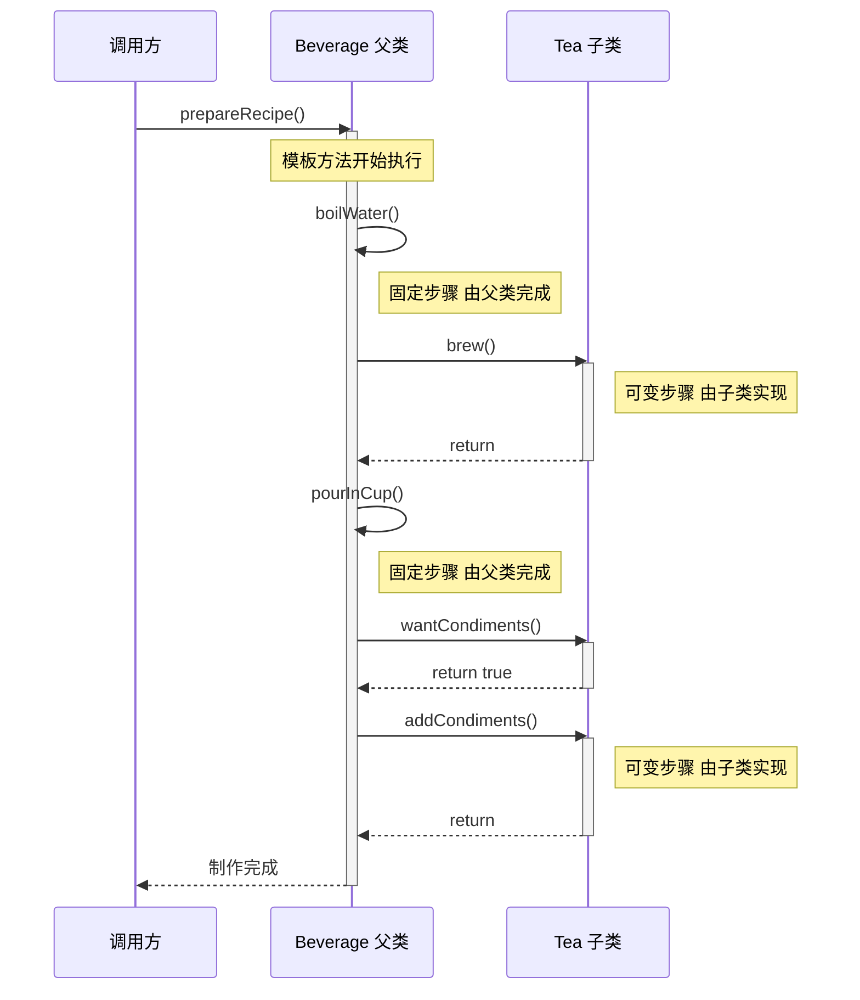

可以看到，**控制权始终在父类的模板方法手中**（这叫 Hollywood Principle："Don't call us, we'll call you"——别调用我们，我们会调用你）。子类只是被动地"被回调"来填充细节。

### 模板方法模式在 JDK 中的真实应用

这个模式在 Java 标准库中随处可见，了解这些能帮你更好地理解源码：

```java
// 1. java.io.InputStream
// read() 是抽象方法，read(byte[], int, int) 是模板方法，内部循环调用 read()
public abstract class InputStream {
    // 子类必须实现：读取单个字节
    public abstract int read() throws IOException;

    // 模板方法：基于 read() 实现批量读取
    public int read(byte[] b, int off, int len) throws IOException {
        // 内部循环调用抽象方法 read()
        for (int i = 0; i < len; i++) {
            int c = read(); // 调用子类的实现
            if (c == -1) break;
            b[off + i] = (byte) c;
        }
        return len;
    }
}

// 2. java.util.AbstractList
// get(int index) 是抽象方法，iterator() 等是基于 get() 构建的模板方法
// 你写自定义 List 时只需实现 get() 和 size()，其余方法自动可用

// 3. javax.servlet.http.HttpServlet
// service() 是模板方法，根据 HTTP 方法分派到 doGet()、doPost() 等
// 开发者只需重写 doGet()/doPost()，不需要关心分派逻辑
```

### 设计要点与最佳实践

关于模板方法模式和抽象类的使用，有几个值得注意的设计原则：

**模板方法应声明为 `final`**：防止子类重写整个流程，破坏算法骨架的完整性。如果子类能随意改模板方法，那"固定流程"就名存实亡了。

**抽象方法的访问修饰符推荐用 `protected`**：它们是父类和子类之间的"内部契约"，不需要暴露给外部调用者。用 `public` 虽然合法，但会泄露实现细节。

**不要滥用抽象类继承**：Java 是单继承的，一个类只能 `extends` 一个父类。如果你的设计只是想定义一组行为契约而不需要共享状态和实现，优先考虑接口（interface）。抽象类适合的场景是：子类之间确实存在 **"is-a" 关系**，并且有 **公共的状态或实现逻辑** 需要复用。

```java
// 好的设计：Dog is-a Animal，且共享 name、sleep() 等公共逻辑
public abstract class Animal { ... }
public class Dog extends Animal { ... }

// 不太好的设计：仅仅为了复用一个工具方法就用继承
// 这种情况用组合（Composition）或接口默认方法更合适
public abstract class StringHelper {
    protected String trim(String s) { return s.trim(); }
    public abstract void process();
}
```

**📝 练习题**

以下关于抽象类和模板方法模式的说法，哪一项是正确的？

A. 抽象类中不能定义构造器，因为抽象类不能被实例化

B. 一个抽象类中必须至少包含一个抽象方法，否则编译报错

C. 模板方法模式中，模板方法通常声明为 final，以防止子类修改算法骨架

D. 抽象方法可以同时被 static 修饰，这样子类就可以通过类名直接调用


**【答案】** C

**【解析】** 逐项分析：A 错误，抽象类可以定义构造器，虽然不能直接 `new`，但子类通过 `super()` 调用父类构造器来初始化继承来的字段，这是非常常见的做法。B 错误，抽象类可以没有任何抽象方法，这在语法上完全合法，有时用于单纯阻止类被实例化。C 正确，模板方法模式的核心思想就是"父类固定流程，子类填充细节"，将模板方法声明为 `final` 可以防止子类篡改算法骨架，保证流程的完整性和一致性。D 错误，`abstract` 和 `static` 不能同时修饰一个方法——`static` 方法属于类本身，在编译期就绑定了，不存在"子类重写"的概念，与 `abstract` "强制子类实现"的语义直接矛盾。

---

## 接口（interface、多实现）

接口是 Java 类型系统中最核心的抽象机制之一。如果说抽象类是"半成品的蓝图"，那么接口就是一份**纯粹的契约（contract）**——它只规定"你必须能做什么"，而完全不关心"你是谁"或"你怎么做"。这种彻底的抽象使得接口成为 Java 实现多态、解耦和面向接口编程（Program to an interface, not an implementation）的基石。

### 接口的本质与定义

接口使用 `interface` 关键字定义。在 Java 8 之前，接口中只能包含两种成员：**公开的抽象方法**和**公开的静态常量**。虽然 Java 8 之后接口的能力得到了扩展（后续章节会详细讨论 `default` 方法、`static` 方法和 `private` 方法），但接口的核心哲学始终未变——**定义行为规范，而非实现细节**。

```java
// 定义一个"可飞行"的接口
public interface Flyable {

    // 接口中的常量：默认修饰符为 public static final，可以省略不写
    int MAX_ALTITUDE = 10000; // 等价于 public static final int MAX_ALTITUDE = 10000;

    // 接口中的抽象方法：默认修饰符为 public abstract，可以省略不写
    void fly(); // 等价于 public abstract void fly();

    // 返回当前飞行高度
    double getAltitude(); // 同样是 public abstract
}
```

这里有几个关键点需要深入理解：

接口中的字段**自动且强制**为 `public static final`，也就是说接口中不可能存在实例变量。这是一个非常重要的设计决策——接口不持有状态（state），它只描述行为（behavior）。你在接口中声明的任何字段都是常量，属于接口本身而非实现类的实例。

接口中的方法（Java 8 之前）**自动且强制**为 `public abstract`。你不能将接口方法声明为 `protected` 或包级私有，因为接口的目的就是对外暴露公开的行为契约。

接口本身**不能被实例化**，这一点和抽象类一致。你不能写 `new Flyable()`，但可以用接口类型声明引用变量，指向实现了该接口的对象。

### 接口的实现（implements）

一个类通过 `implements` 关键字来实现接口，并且**必须**提供接口中所有抽象方法的具体实现（除非该类本身也是抽象类）。

```java
// 鸟类实现 Flyable 接口
public class Bird implements Flyable {

    // 鸟的名字，这是实现类自己的实例变量
    private String name;

    // 当前飞行高度，这是实现类自己维护的状态
    private double currentAltitude;

    // 构造方法
    public Bird(String name) {
        this.name = name;       // 初始化鸟的名字
        this.currentAltitude = 0; // 初始高度为 0（在地面上）
    }

    // 实现接口中的 fly() 方法——必须是 public（不能缩小访问权限）
    @Override
    public void fly() {
        // 鸟的飞行方式：扇动翅膀
        this.currentAltitude = 500; // 飞到 500 米高度
        System.out.println(name + " 扇动翅膀飞上了天空！当前高度: " + currentAltitude + "m");
    }

    // 实现接口中的 getAltitude() 方法
    @Override
    public double getAltitude() {
        return this.currentAltitude; // 返回当前飞行高度
    }
}
```

注意 `@Override` 注解的使用——虽然不是语法强制的，但强烈建议加上。它让编译器帮你检查方法签名是否正确匹配接口定义，避免因拼写错误或参数不匹配而意外创建了一个新方法而非实现接口方法。

实现接口方法时，访问修饰符**必须是 `public`**。因为接口方法默认就是 `public` 的，而 Java 的重写规则不允许缩小方法的访问范围。如果你尝试用 `protected` 或默认访问级别来实现接口方法，编译器会直接报错。

### 多实现——接口最强大的能力

Java 的类继承是**单继承**的——一个类只能 `extends` 一个父类。这是为了避免经典的**菱形继承问题（Diamond Problem）**：如果一个类同时继承了两个父类，而这两个父类有同名方法的不同实现，编译器将无法决定使用哪一个。

但接口不同。一个类可以同时实现**多个接口**，这就是所谓的**多实现（multiple implementation）**。这之所以安全，是因为在 Java 8 之前，接口中的方法全部是抽象的——没有方法体，不存在"该用哪个实现"的歧义，最终的实现由类自己提供。

```java
// 定义"可游泳"的接口
public interface Swimmable {

    // 游泳行为
    void swim();

    // 获取当前游泳深度
    double getDepth();
}

// 定义"可奔跑"的接口
public interface Runnable {

    // 奔跑行为（注意：这里是自定义的 Runnable，不是 java.lang.Runnable）
    void run();

    // 获取奔跑速度
    double getSpeed();
}
```

现在，一只鸭子既能飞、又能游泳、还能跑。用单继承根本无法表达这种"多重能力"，但用接口可以轻松做到：

```java
// 鸭子同时实现三个接口：能飞、能游、能跑
public class Duck implements Flyable, Swimmable, Runnable {

    private String name;           // 鸭子的名字
    private double altitude = 0;   // 当前飞行高度
    private double depth = 0;      // 当前游泳深度
    private double speed = 0;      // 当前奔跑速度

    public Duck(String name) {
        this.name = name; // 初始化名字
    }

    // ========== 实现 Flyable 接口 ==========

    @Override
    public void fly() {
        this.altitude = 100;  // 鸭子飞得不太高
        System.out.println(name + " 拍打着短翅膀飞了起来，高度: " + altitude + "m");
    }

    @Override
    public double getAltitude() {
        return this.altitude; // 返回飞行高度
    }

    // ========== 实现 Swimmable 接口 ==========

    @Override
    public void swim() {
        this.depth = 2;  // 鸭子潜水不深
        System.out.println(name + " 跳入水中，悠然游泳，深度: " + depth + "m");
    }

    @Override
    public double getDepth() {
        return this.depth; // 返回游泳深度
    }

    // ========== 实现 Runnable 接口 ==========

    @Override
    public void run() {
        this.speed = 8.5;  // 鸭子跑得不快
        System.out.println(name + " 摇摇摆摆地跑了起来，速度: " + speed + "km/h");
    }

    @Override
    public double getSpeed() {
        return this.speed; // 返回奔跑速度
    }
}
```

这段代码完美展示了接口多实现的威力：`Duck` 类通过实现三个接口，获得了三种不同的"身份"或"能力"。每个接口代表一种行为维度，而 `Duck` 类自己决定每种行为的具体实现方式。

### 接口类型的多态引用

多实现带来的另一个巨大好处是**多态引用的灵活性**。同一个 `Duck` 对象可以被不同的接口类型引用，而每种引用只暴露该接口定义的方法：

```java
public class InterfacePolymorphismDemo {

    public static void main(String[] args) {

        // 创建一个鸭子对象
        Duck duck = new Duck("唐老鸭");

        // 同一个对象，三种不同的"视角"
        Flyable flyer = duck;      // 从"飞行者"的角度看鸭子
        Swimmable swimmer = duck;  // 从"游泳者"的角度看鸭子
        Runnable runner = duck;    // 从"奔跑者"的角度看鸭子

        // 通过 Flyable 引用，只能调用 fly() 和 getAltitude()
        flyer.fly();               // 输出: 唐老鸭 拍打着短翅膀飞了起来，高度: 100m

        // 通过 Swimmable 引用，只能调用 swim() 和 getDepth()
        swimmer.swim();            // 输出: 唐老鸭 跳入水中，悠然游泳，深度: 2.0m

        // 通过 Runnable 引用，只能调用 run() 和 getSpeed()
        runner.run();              // 输出: 唐老鸭 摇摇摆摆地跑了起来，速度: 8.5km/h

        // flyer.swim();  // 编译错误！Flyable 引用看不到 swim() 方法
        // swimmer.fly(); // 编译错误！Swimmable 引用看不到 fly() 方法

        // 但底层始终是同一个对象
        System.out.println(flyer == swimmer);  // true —— 引用指向同一个堆内存对象
        System.out.println(swimmer == runner); // true
    }
}
```

这种机制在实际开发中极其常用。比如一个方法只需要"能飞的东西"，它的参数类型就声明为 `Flyable`，这样无论传入的是 `Bird`、`Duck`、`Airplane` 还是 `Superman`，只要实现了 `Flyable` 接口就行。这就是**面向接口编程**的精髓——依赖抽象，不依赖具体。

### 接口的继承（接口 extends 接口）

接口之间也可以存在继承关系，而且与类不同，**接口支持多继承**。一个接口可以同时 `extends` 多个父接口，将多个契约合并为一个更大的契约：

```java
// 两栖动物接口：同时继承 Flyable 和 Swimmable
// 实现 Amphibious 的类必须同时实现 fly()、getAltitude()、swim()、getDepth() 以及 adapt()
public interface Amphibious extends Flyable, Swimmable {

    // 两栖动物特有的方法：适应环境切换
    void adapt(String environment);
}
```

```java
// 飞鱼实现 Amphibious 接口，需要实现所有继承链上的方法
public class FlyingFish implements Amphibious {

    private String name;           // 飞鱼名字
    private double altitude = 0;   // 飞行高度
    private double depth = 0;      // 游泳深度

    public FlyingFish(String name) {
        this.name = name; // 初始化名字
    }

    @Override
    public void fly() {
        this.altitude = 5; // 飞鱼只能短暂滑翔
        System.out.println(name + " 跃出水面滑翔！高度: " + altitude + "m");
    }

    @Override
    public double getAltitude() {
        return this.altitude; // 返回滑翔高度
    }

    @Override
    public void swim() {
        this.depth = 20; // 飞鱼在水下游得更自在
        System.out.println(name + " 在水中快速游动，深度: " + depth + "m");
    }

    @Override
    public double getDepth() {
        return this.depth; // 返回游泳深度
    }

    @Override
    public void adapt(String environment) {
        // 根据环境切换行为模式
        if ("water".equals(environment)) {
            swim();  // 水中就游泳
        } else if ("air".equals(environment)) {
            fly();   // 空中就飞行
        }
    }
}
```

接口的多继承之所以安全，核心原因在于：接口继承的是**方法签名（抽象契约）**，而非方法实现。即使两个父接口声明了完全相同签名的方法，合并后也只是"一个契约"，不会产生歧义。

下面用一张类图来展示整个接口继承与实现的关系：

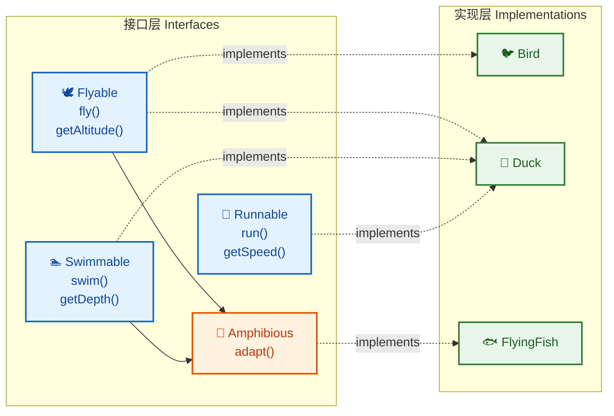

### 继承与实现的组合使用

在实际项目中，一个类往往**既继承一个父类，又实现多个接口**。Java 的语法要求 `extends` 必须写在 `implements` 之前：

```java
// 抽象的动物基类，提供通用属性和行为
public abstract class Animal {

    protected String name; // 动物名字，子类可直接访问
    protected int age;     // 动物年龄

    // 构造方法
    public Animal(String name, int age) {
        this.name = name; // 初始化名字
        this.age = age;   // 初始化年龄
    }

    // 所有动物都会吃东西——具体方法，子类直接继承
    public void eat(String food) {
        System.out.println(name + " 正在吃 " + food);
    }

    // 发出声音——抽象方法，子类必须实现
    public abstract void makeSound();
}
```

```java
// 定义"可表演"的接口
public interface Performable {

    // 表演一个节目
    void perform(String trick);
}

// 定义"可训练"的接口
public interface Trainable {

    // 接受训练
    void train(String command);

    // 获取训练等级
    int getTrainingLevel();
}
```

```java
// 海豚：继承 Animal，同时实现 Swimmable、Performable、Trainable
public class Dolphin extends Animal implements Swimmable, Performable, Trainable {

    private double depth = 0;       // 当前游泳深度
    private int trainingLevel = 0;  // 训练等级

    // 构造方法：调用父类构造器初始化 name 和 age
    public Dolphin(String name, int age) {
        super(name, age); // 调用 Animal 的构造方法
    }

    // ========== 实现 Animal 的抽象方法 ==========

    @Override
    public void makeSound() {
        System.out.println(name + ": 吱吱吱～（海豚音）"); // 海豚的叫声
    }

    // ========== 实现 Swimmable 接口 ==========

    @Override
    public void swim() {
        this.depth = 50; // 海豚可以潜到 50 米
        System.out.println(name + " 优雅地在水中穿梭，深度: " + depth + "m");
    }

    @Override
    public double getDepth() {
        return this.depth; // 返回游泳深度
    }

    // ========== 实现 Performable 接口 ==========

    @Override
    public void perform(String trick) {
        // 海豚表演节目
        System.out.println(name + " 表演了精彩的 [" + trick + "]！观众掌声雷动！");
    }

    // ========== 实现 Trainable 接口 ==========

    @Override
    public void train(String command) {
        this.trainingLevel++; // 每次训练，等级加 1
        System.out.println(name + " 学会了指令: " + command + "，训练等级提升到 " + trainingLevel);
    }

    @Override
    public int getTrainingLevel() {
        return this.trainingLevel; // 返回当前训练等级
    }
}
```

这个例子展示了一个非常典型的 Java 设计模式：用**抽象类**表达"是什么"（Dolphin is an Animal），用**接口**表达"能做什么"（Dolphin can swim, perform, and be trained）。这种组合方式在 Java 标准库和各种框架中随处可见。

### instanceof 与接口类型检查

当一个对象实现了多个接口时，`instanceof` 运算符可以用来检查对象是否属于某个接口类型：

```java
public class InstanceofDemo {

    public static void main(String[] args) {

        // 创建一个海豚对象
        Dolphin dolphin = new Dolphin("波比", 5);

        // instanceof 检查——海豚同时"是"多种类型
        System.out.println(dolphin instanceof Animal);      // true —— 海豚是动物
        System.out.println(dolphin instanceof Swimmable);    // true —— 海豚能游泳
        System.out.println(dolphin instanceof Performable);  // true —— 海豚能表演
        System.out.println(dolphin instanceof Trainable);    // true —— 海豚能训练
        System.out.println(dolphin instanceof Flyable);      // false —— 海豚不能飞

        // 实际应用：根据能力执行不同操作
        Animal animal = dolphin; // 向上转型为 Animal 引用

        if (animal instanceof Performable) {
            // 安全地向下转型为 Performable，调用 perform 方法
            ((Performable) animal).perform("空中翻转");
        }

        // Java 16+ 的模式匹配语法，更简洁
        if (animal instanceof Trainable t) {
            // 变量 t 已经自动转型为 Trainable 类型，直接使用
            t.train("握手");
        }
    }
}
```

`instanceof` 配合接口类型检查，是实现**能力发现（capability discovery）**的常用手段。框架代码经常用这种方式来判断一个对象是否具备某种能力，然后有选择地调用对应方法。

### 接口与多态的内存模型

理解接口多态在 JVM 层面的工作方式，有助于写出更高效的代码。当一个对象被接口类型引用时，方法调用通过 JVM 的**接口方法表（Interface Method Table, itable）**进行动态分派：

```java
// 内存模型示意图
// 
// 栈内存 (Stack)                    堆内存 (Heap)
// ┌──────────────┐                 ┌─────────────────────────┐
// │ flyer        │ ───────────┐    │   Duck 对象实例           │
// │ (Flyable)    │            │    │  ┌─────────────────────┐ │
// ├──────────────┤            ├──> │  │ name = "唐老鸭"      │ │
// │ swimmer      │ ───────────┤    │  │ altitude = 0        │ │
// │ (Swimmable)  │            │    │  │ depth = 0           │ │
// ├──────────────┤            │    │  │ speed = 0           │ │
// │ runner       │ ───────────┘    │  └─────────────────────┘ │
// │ (Runnable)   │                 │                           │
// └──────────────┘                 │  对象头 (Object Header)   │
//                                  │  ┌─────────────────────┐ │
//                                  │  │ 类型指针 -> Duck.class│ │
//                                  │  │ vtable (虚方法表)     │ │
//                                  │  │ itable (接口方法表)   │ │
//                                  │  └─────────────────────┘ │
//                                  └─────────────────────────┘
//
// 方法区 (Method Area)
// ┌──────────────────────────────────────────┐
// │ Duck.class                                │
// │  ├─ vtable: [fly(), swim(), run(), ...]   │
// │  ├─ itable:                               │
// │  │   ├─ Flyable  -> [fly(), getAltitude()]│
// │  │   ├─ Swimmable-> [swim(), getDepth()]  │
// │  │   └─ Runnable -> [run(), getSpeed()]   │
// │  └─ 字段布局信息                            │
// └──────────────────────────────────────────┘
```

关键点在于：无论通过哪个接口引用调用方法，JVM 最终都会通过 itable 找到 `Duck` 类中对应的实际方法实现。三个引用变量 `flyer`、`swimmer`、`runner` 在栈上是不同的变量，但它们存储的地址值完全相同，都指向堆上同一个 `Duck` 对象。

### 接口在集合与 API 设计中的实战应用

接口多实现最经典的应用场景之一，就是 Java 集合框架（Collections Framework）。来看一个贴近实际开发的例子：

```java
import java.util.ArrayList;
import java.util.List;

public class InterfaceInPractice {

    // 方法参数使用接口类型——面向接口编程的典型体现
    // 这个方法不关心传入的具体是什么动物，只要它能游泳就行
    public static void holdSwimmingRace(List<Swimmable> swimmers) {
        System.out.println("=== 游泳比赛开始 ===");
        for (Swimmable s : swimmers) {
            s.swim();  // 多态调用：每个对象执行自己的 swim() 实现
        }
        System.out.println("=== 比赛结束 ===\n");
    }

    // 同理，只要能飞就能参加飞行比赛
    public static void holdFlyingRace(List<Flyable> flyers) {
        System.out.println("=== 飞行比赛开始 ===");
        for (Flyable f : flyers) {
            f.fly();   // 多态调用
        }
        System.out.println("=== 比赛结束 ===\n");
    }

    public static void main(String[] args) {

        // 创建不同类型的对象
        Duck duck = new Duck("唐老鸭");           // 能飞、能游、能跑
        FlyingFish fish = new FlyingFish("飞鱼侠"); // 能飞、能游
        Bird bird = new Bird("小麻雀");            // 只能飞

        // 游泳比赛：鸭子和飞鱼都能参加
        List<Swimmable> swimmers = new ArrayList<>();
        swimmers.add(duck);  // Duck implements Swimmable ✓
        swimmers.add(fish);  // FlyingFish implements Amphibious extends Swimmable ✓
        // swimmers.add(bird); // 编译错误！Bird 没有实现 Swimmable
        holdSwimmingRace(swimmers);

        // 飞行比赛：三个都能参加
        List<Flyable> flyers = new ArrayList<>();
        flyers.add(duck);  // Duck implements Flyable ✓
        flyers.add(fish);  // FlyingFish implements Amphibious extends Flyable ✓
        flyers.add(bird);  // Bird implements Flyable ✓
        holdFlyingRace(flyers);
    }
}
```

输出结果：

```
=== 游泳比赛开始 ===
唐老鸭 跳入水中，悠然游泳，深度: 2.0m
飞鱼侠 在水中快速游动，深度: 20.0m
=== 比赛结束 ===

=== 飞行比赛开始 ===
唐老鸭 拍打着短翅膀飞了起来，高度: 100m
飞鱼侠 跃出水面滑翔！高度: 5.0m
小麻雀 扇动翅膀飞上了天空！当前高度: 500.0m
=== 比赛结束 ===
```

这个例子清晰地展示了接口的核心价值：`holdSwimmingRace` 方法完全不知道也不关心传入的是鸭子还是飞鱼，它只依赖 `Swimmable` 接口。未来如果新增一个 `Whale` 类，只要它实现了 `Swimmable`，就能直接参加游泳比赛，**无需修改任何已有代码**。这就是**开闭原则（Open-Closed Principle）**的完美体现——对扩展开放，对修改关闭。

### 接口的编译期约束与常见错误

最后整理几个初学者容易踩的坑：

```java
// ❌ 错误 1：实现接口方法时缩小了访问权限
public class BadBird implements Flyable {
    // 编译错误：接口方法默认 public，实现时不能用 protected
    @Override
    protected void fly() { } // Cannot reduce the visibility of the inherited method
}

// ❌ 错误 2：忘记实现接口中的所有方法
public class IncompleteBird implements Flyable {
    @Override
    public void fly() { }
    // 编译错误：没有实现 getAltitude() 方法
    // IncompleteBird is not abstract and does not override abstract method getAltitude()
}

// ✅ 正确：如果不想实现所有方法，可以声明为抽象类
public abstract class PartialBird implements Flyable {
    @Override
    public void fly() {
        System.out.println("飞！"); // 只实现了 fly()
    }
    // getAltitude() 留给子类实现——因为 PartialBird 是抽象类，这是合法的
}
```

---

**📝 练习题**

以下代码能否通过编译？如果能，输出是什么？

```java
interface A {
    void hello();
}

interface B {
    void hello();
}

class C implements A, B {
    public void hello() {
        System.out.println("Hello from C");
    }
}

public class Test {
    public static void main(String[] args) {
        A a = new C();
        B b = new C();
        a.hello();
        b.hello();
        System.out.println(a instanceof B);
    }
}
```

A. 编译错误，因为 `A` 和 `B` 有相同的 `hello()` 方法，`C` 无法同时实现两个接口

B. 编译通过，输出：
```
Hello from C
Hello from C
true
```

C. 编译通过，输出：
```
Hello from C
Hello from C
false
```

D. 编译错误，因为 `a instanceof B` 不合法，`A` 和 `B` 之间没有继承关系


**【答案】** C

**【解析】**

这道题考查两个核心知识点：

第一，**两个接口声明了签名完全相同的抽象方法时，实现类只需提供一份实现即可**。因为接口方法是抽象的，不存在"该用哪个实现"的冲突——最终的实现由类 `C` 自己提供。编译器将 `A.hello()` 和 `B.hello()` 视为同一个契约，`C` 中的 `public void hello()` 同时满足了两个接口的要求。所以 A 选项错误。

第二，关键在于 `a instanceof B` 的结果。变量 `a` 的编译时类型是 `A`，但 `instanceof` 是**运行时检查**，它看的是对象的实际类型。`a` 指向的是 `new C()`，而这里创建的是一个全新的 `C` 对象。注意 `b` 也是 `new C()`，这是**另一个**独立的 `C` 对象。但这不影响结果——`a` 指向的那个 `C` 对象确实实现了 `B` 接口，所以 `a instanceof B` 返回 `true`。

等等，再仔细看——答案应该是 **B** 而非 C。`a` 引用的对象是 `C` 的实例，`C implements A, B`，所以 `a instanceof B` 为 `true`。D 选项也不对，因为 `instanceof` 右侧可以是任何引用类型，编译器允许这种检查（只有在编译器能**确定**不可能为 true 时才会报错，而 `A` 和 `B` 都是接口，无法排除某个类同时实现两者的可能性）。

**【答案】** B

**【解析】**

这道题考查两个核心知识点：

第一，**两个接口声明了签名完全相同的抽象方法时，实现类只需提供一份实现即可**。`A.hello()` 和 `B.hello()` 方法签名完全一致（方法名相同、参数列表相同、返回值相同），编译器将它们视为同一个契约。`C` 中的 `public void hello()` 一份实现同时满足了两个接口的要求，不存在任何冲突，编译完全合法。

第二，`a instanceof B` 的结果为 `true`。虽然 `a` 的编译时类型（compile-time type）是 `A`，但 `instanceof` 执行的是**运行时类型检查（runtime type check）**。`a` 实际指向的对象是 `new C()`，而 `C` 同时实现了 `A` 和 `B`，因此这个对象既是 `A` 的实例，也是 `B` 的实例。`instanceof` 检查的是对象与类型之间的 "is-a" 关系，与引用变量的声明类型无关。编译器也不会拒绝这种检查——因为 `A` 和 `B` 都是接口，编译器无法排除某个类同时实现两者的可能性，所以 D 选项也是错误的。

---

## 接口默认方法（default、冲突解决）

Java 8 之前，接口是一份纯粹的"契约"——它只能声明方法签名，不能提供任何实现。这意味着一旦你向一个已经被广泛实现的接口中添加一个新方法，所有实现类都必须立刻修改代码来实现它，否则编译直接报错。想象一下 `java.util.Collection` 接口被全世界数以万计的类实现着，如果 JDK 团队想给它加一个 `stream()` 方法，后果将是灾难性的——这就是所谓的 **"接口演化问题"（Interface Evolution Problem）**。

为了解决这个问题，Java 8 引入了 **默认方法（Default Method）**，允许在接口中使用 `default` 关键字提供方法的默认实现。实现类可以选择继承这个默认实现，也可以覆盖它。这一特性从根本上改变了接口的能力边界，让接口从"纯抽象契约"进化为"可以携带行为的契约"。

### 默认方法的语法与基本使用

默认方法的定义非常直观：在接口方法前加上 `default` 关键字，然后提供方法体即可。

```java
// 定义一个日志能力接口
public interface Loggable {

    // 普通抽象方法，实现类必须实现
    String getLogTag();

    // 默认方法：提供了一个通用的日志输出实现
    // 实现类可以直接使用，也可以覆盖
    default void log(String message) {
        // 默认实现中可以调用接口内的其他抽象方法
        System.out.println("[" + getLogTag() + "] " + message);
    }

    // 默认方法也可以有多个
    default void logError(String message) {
        // 复用了 log 方法，体现了默认方法之间可以互相调用
        log("ERROR: " + message);
    }
}
```

实现类使用这个接口时，只需要实现抽象方法，默认方法"免费"获得：

```java
// OrderService 实现了 Loggable 接口
public class OrderService implements Loggable {

    // 只需实现抽象方法 getLogTag()
    @Override
    public String getLogTag() {
        return "OrderService"; // 返回日志标签
    }

    public void createOrder() {
        // 直接调用接口提供的默认方法 log()，无需自己实现
        log("订单创建成功");          // 输出: [OrderService] 订单创建成功
        logError("库存不足");         // 输出: [OrderService] ERROR: 库存不足
    }
}
```

```java
// UserService 也实现了 Loggable，但选择覆盖默认方法
public class UserService implements Loggable {

    @Override
    public String getLogTag() {
        return "UserService"; // 返回自己的日志标签
    }

    // 覆盖默认方法，提供自定义实现
    @Override
    public void log(String message) {
        // 自定义格式：加上时间戳
        System.out.println(
            java.time.LocalDateTime.now() + " [" + getLogTag() + "] " + message
        );
    }

    public void register() {
        log("用户注册成功"); // 使用的是覆盖后的版本，带时间戳
    }
}
```

这个例子清晰地展示了默认方法的核心价值：提供合理的通用行为，同时保留实现类的自由度。

### 默认方法的核心设计动机：接口演化

让我们用一个更贴近真实场景的例子来理解为什么默认方法如此重要。假设你在维护一个开源集合框架：

```java
// v1.0 版本的接口
public interface MyCollection〈E〉 {
    void add(E element);       // 添加元素
    int size();                // 获取大小
    boolean contains(E element); // 是否包含
}
```

这个接口已经被成百上千个第三方库实现了。现在你想在 v2.0 中添加一个 `forEach` 方法。在 Java 8 之前，你只有两个选择：要么放弃添加（牺牲功能），要么强制所有实现类修改代码（破坏兼容性）。有了默认方法，第三条路出现了：

```java
// v2.0 版本：通过默认方法平滑升级
public interface MyCollection〈E〉 {
    void add(E element);          // 原有方法不变
    int size();                   // 原有方法不变
    boolean contains(E element);  // 原有方法不变

    // 新增的默认方法：所有已有实现类无需修改，自动获得此能力
    default void forEach(java.util.function.Consumer〈? super E〉 action) {
        // 提供一个基于迭代器的通用实现
        java.util.Objects.requireNonNull(action); // 空值检查
        // 这里假设有 iterator() 方法可用
        // 具体实现类可以覆盖此方法以提供更高效的版本
    }

    // 新增：返回不可变视图
    default MyCollection〈E〉 unmodifiableView() {
        // 提供默认的不可变包装
        throw new UnsupportedOperationException("请实现类提供具体实现");
    }
}
```

JDK 自身就是这一策略的最大受益者。Java 8 中 `Iterable.forEach()`、`Collection.stream()`、`Collection.removeIf()`、`List.sort()`、`Map.getOrDefault()` 等大量方法，全部是通过默认方法添加的，实现了 JDK 的平滑演化而不破坏向后兼容性（backward compatibility）。

### 默认方法的调用规则与继承行为

默认方法在继承体系中的行为遵循一套清晰的规则。理解这些规则是掌握默认方法的关键。

```java
// 基础接口
public interface Greeting {
    // 默认方法
    default String greet() {
        return "Hello from Greeting interface!"; // 接口提供的默认问候
    }
}

// 场景1：实现类直接继承默认方法
public class SimpleGreeter implements Greeting {
    // 没有覆盖 greet()，直接继承接口的默认实现
    // greet() 返回 "Hello from Greeting interface!"
}

// 场景2：实现类覆盖默认方法
public class CustomGreeter implements Greeting {
    @Override
    public String greet() {
        return "你好！来自 CustomGreeter"; // 覆盖了默认实现
    }
}

// 场景3：子接口覆盖父接口的默认方法
public interface FriendlyGreeting extends Greeting {
    @Override
    default String greet() {
        return "Hey friend! 😊"; // 子接口重新定义了默认行为
    }
}

// 场景4：子接口将默认方法"重新抽象化"
public interface FormalGreeting extends Greeting {
    @Override
    String greet(); // 去掉 default，强制实现类必须自己实现
}
```

场景 4 特别值得注意——子接口可以通过重新声明方法（不带 `default`）来"撤销"父接口的默认实现，强制下游实现类提供自己的版本。这在设计上非常有用：当你认为父接口的默认行为对某个子领域不合适时，可以用这种方式强制重新思考。

### 菱形继承与冲突解决（Diamond Problem）

当一个类实现了多个接口，而这些接口中包含签名相同的默认方法时，就会产生 **冲突（conflict）**。这是默认方法最复杂也最重要的部分。Java 编译器通过一套严格的优先级规则来处理这种情况。

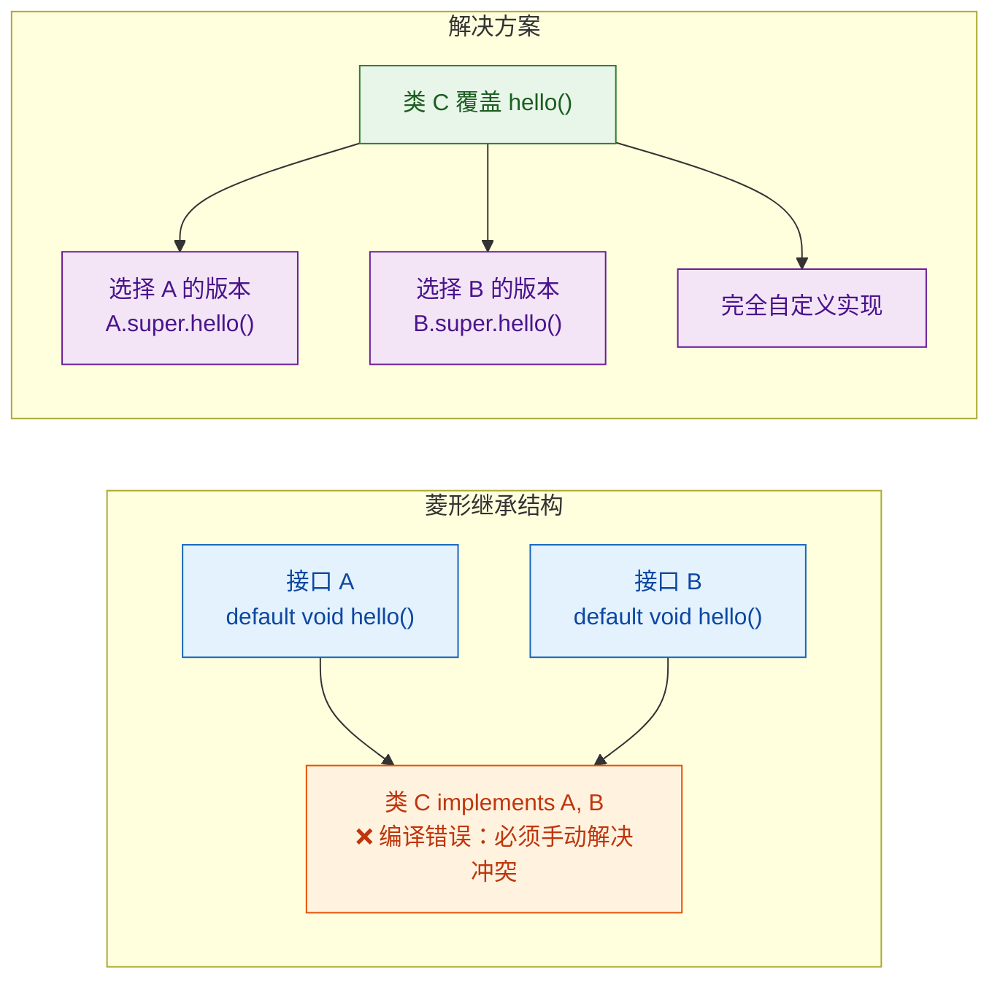

让我们用代码完整演示冲突的产生与解决：

```java
// 接口 A：定义了 hello() 的默认实现
public interface InterfaceA {
    default String hello() {
        return "Hello from A"; // A 的版本
    }
}

// 接口 B：也定义了签名完全相同的 hello() 默认方法
public interface InterfaceB {
    default String hello() {
        return "Hello from B"; // B 的版本
    }
}
```

```java
// ❌ 编译错误！编译器不知道该用 A 的还是 B 的
// Error: class MyClass inherits unrelated defaults for hello()
// from types InterfaceA and InterfaceB
public class MyClass implements InterfaceA, InterfaceB {
    // 不覆盖 hello()，编译器直接报错
}
```

解决方案是在实现类中显式覆盖冲突方法：

```java
public class MyClass implements InterfaceA, InterfaceB {

    // 方案一：选择某个接口的默认实现
    @Override
    public String hello() {
        // 使用 InterfaceA.super.hello() 语法显式选择 A 的版本
        return InterfaceA.super.hello();
    }
}
```

```java
public class MyClass implements InterfaceA, InterfaceB {

    // 方案二：选择 B 的版本
    @Override
    public String hello() {
        return InterfaceB.super.hello(); // 显式选择 B 的版本
    }
}
```

```java
public class MyClass implements InterfaceA, InterfaceB {

    // 方案三：组合两个接口的默认实现
    @Override
    public String hello() {
        // 同时调用两个接口的默认方法，组合结果
        return InterfaceA.super.hello() + " & " + InterfaceB.super.hello();
        // 输出: "Hello from A & Hello from B"
    }
}
```

```java
public class MyClass implements InterfaceA, InterfaceB {

    // 方案四：完全自定义，不使用任何接口的默认实现
    @Override
    public String hello() {
        return "Hello from MyClass itself!"; // 完全自己实现
    }
}
```

`InterfaceName.super.method()` 这个语法是 Java 8 专门为解决默认方法冲突而引入的，它让你可以精确地指定调用哪个接口的默认实现。

### 三大优先级规则

当继承体系更加复杂时，Java 编译器遵循三条优先级规则来决定使用哪个默认方法。这三条规则按优先级从高到低排列：

**规则一：类优先于接口（Class wins）**

如果一个类继承了父类的方法，同时实现的接口中也有同签名的默认方法，父类的方法胜出。

```java
// 接口定义了默认方法
public interface Printable {
    default String getInfo() {
        return "Info from Printable interface"; // 接口的默认实现
    }
}

// 父类定义了同签名的方法
public class BasePrinter {
    public String getInfo() {
        return "Info from BasePrinter class"; // 类的实现
    }
}

// 子类同时继承父类和实现接口
public class MyPrinter extends BasePrinter implements Printable {
    // 不需要覆盖 getInfo()
    // 根据"类优先"规则，自动使用 BasePrinter.getInfo()
}
```

```java
public class Test {
    public static void main(String[] args) {
        MyPrinter printer = new MyPrinter(); // 创建实例
        // 输出: "Info from BasePrinter class"
        // 类的方法优先于接口的默认方法
        System.out.println(printer.getInfo());
    }
}
```

这条规则的设计哲学是：保护已有代码。在 Java 8 之前编写的类不可能知道未来接口会添加默认方法，所以类的行为必须被优先保留，否则升级 JDK 可能导致已有程序行为改变。

**规则二：子接口优先于父接口（Sub-interface wins）**

如果没有类方法参与竞争，那么继承链中更具体（更靠近实现类）的接口的默认方法胜出。

```java
// 父接口
public interface Animal {
    default String sound() {
        return "Some generic sound"; // 通用的声音
    }
}

// 子接口继承父接口，并覆盖了默认方法
public interface Dog extends Animal {
    @Override
    default String sound() {
        return "Woof!"; // 更具体的声音
    }
}

// 实现类同时声明实现了 Animal 和 Dog
// 虽然写了 Animal，但 Dog 是 Animal 的子接口，Dog 更具体
public class Labrador implements Animal, Dog {
    // 不需要覆盖 sound()
    // Dog 比 Animal 更具体，所以使用 Dog 的默认实现
}
```

```java
public class Test {
    public static void main(String[] args) {
        Labrador lab = new Labrador(); // 创建拉布拉多实例
        // 输出: "Woof!"
        // Dog 是 Animal 的子接口，更具体，所以 Dog 的版本胜出
        System.out.println(lab.sound());
    }
}
```

**规则三：无法确定时，必须显式覆盖（Explicit override required）**

如果以上两条规则都无法确定唯一的默认方法（比如两个接口没有继承关系），编译器报错，强制你手动解决。这就是前面菱形继承中演示的场景。

用一张图来总结这三条规则的判断流程：

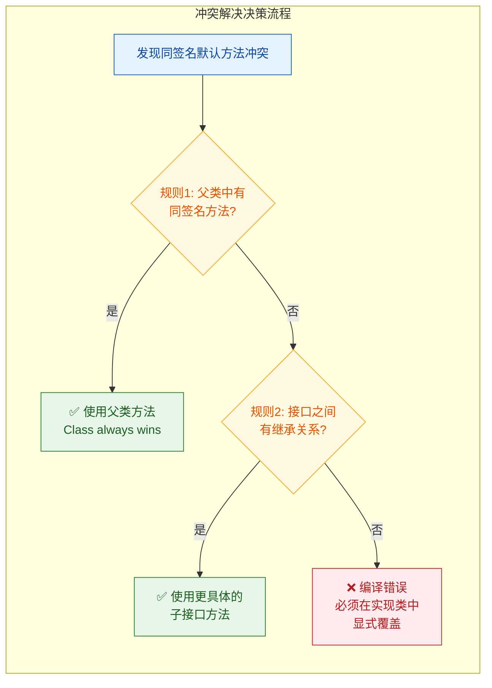

### 复杂继承场景实战

让我们看一个综合了多条规则的复杂场景：

```java
// 顶层接口
public interface Flyable {
    default String move() {
        return "Flying through the sky"; // 飞行移动
    }
}

// 子接口1：继承 Flyable
public interface Swimmable extends Flyable {
    @Override
    default String move() {
        return "Swimming in the water"; // 游泳移动，覆盖了 Flyable
    }
}

// 子接口2：不继承 Flyable，独立定义了同签名方法
public interface Runnable {
    default String move() {
        return "Running on the ground"; // 跑步移动
    }
}

// 父类
public class Vehicle {
    // 注意：这里没有定义 move() 方法
}
```

```java
// 场景 A：实现 Flyable 和 Swimmable（有继承关系）
public class Duck implements Flyable, Swimmable {
    // Swimmable 是 Flyable 的子接口，更具体 → 规则2
    // 自动使用 Swimmable.move()
    // 输出: "Swimming in the water"
}

// 场景 B：实现 Swimmable 和 Runnable（无继承关系）
public class Platypus implements Swimmable, Runnable {
    // Swimmable 和 Runnable 没有继承关系 → 规则3，必须手动解决
    @Override
    public String move() {
        // 选择组合两者
        return Swimmable.super.move() + " and " + Runnable.super.move();
        // 输出: "Swimming in the water and Running on the ground"
    }
}

// 场景 C：继承 Vehicle，实现 Flyable
public class FlyingCar extends Vehicle implements Flyable {
    // Vehicle 没有 move() 方法，规则1 不适用
    // 只有 Flyable 有默认方法 → 无冲突，直接使用
    // 输出: "Flying through the sky"
}
```

```java
// 场景 D：父类有 move() 方法的情况
public class GroundVehicle {
    public String move() {
        return "Driving on the road"; // 父类的方法
    }
}

public class HybridCar extends GroundVehicle implements Flyable, Swimmable {
    // GroundVehicle 有 move() 方法 → 规则1：类优先
    // 自动使用 GroundVehicle.move()
    // Flyable 和 Swimmable 的默认方法全部被忽略
    // 输出: "Driving on the road"
}
```

### 默认方法与模板方法模式的结合

默认方法让接口也能实现类似模板方法模式的效果，这在 Java 8 之前只有抽象类才能做到：

```java
// 数据处理管道接口
public interface DataProcessor〈T, R〉 {

    // 抽象方法：由实现类定义具体的数据获取逻辑
    T fetchData();

    // 抽象方法：由实现类定义具体的转换逻辑
    R transform(T data);

    // 默认方法：验证步骤，提供通用实现，可被覆盖
    default boolean validate(T data) {
        return data != null; // 默认只做非空检查
    }

    // 默认方法：充当"模板方法"，定义处理流程的骨架
    default R process() {
        // Step 1: 获取数据
        T data = fetchData();

        // Step 2: 验证数据
        if (!validate(data)) {
            throw new IllegalStateException("数据验证失败！(Data validation failed)");
        }

        // Step 3: 转换并返回
        return transform(data);
    }

    // 默认方法：带日志的处理流程
    default R processWithLogging() {
        System.out.println(">>> 开始处理数据...");  // 日志：开始
        long start = System.currentTimeMillis();     // 记录开始时间

        R result = process();                        // 调用模板方法

        long elapsed = System.currentTimeMillis() - start; // 计算耗时
        System.out.println(">>> 处理完成，耗时: " + elapsed + "ms"); // 日志：结束
        return result;                               // 返回结果
    }
}
```

```java
// 实现类只需关注"变化的部分"
public class CsvToJsonProcessor implements DataProcessor〈String, String〉 {

    @Override
    public String fetchData() {
        return "name,age\nAlice,30"; // 模拟从 CSV 文件读取数据
    }

    @Override
    public String transform(String csvData) {
        // 简化的 CSV → JSON 转换逻辑
        String[] lines = csvData.split("\n");       // 按行分割
        String[] headers = lines[0].split(",");     // 第一行是表头
        String[] values = lines[1].split(",");      // 第二行是数据
        // 拼接 JSON 字符串
        return "{\"" + headers[0] + "\":\"" + values[0] + "\","
             + "\"" + headers[1] + "\":" + values[1] + "}";
    }

    @Override
    public boolean validate(String data) {
        // 覆盖默认验证：CSV 必须包含换行符（至少两行）
        return data != null && data.contains("\n");
    }
}
```

```java
public class Demo {
    public static void main(String[] args) {
        CsvToJsonProcessor processor = new CsvToJsonProcessor();

        // 使用带日志的模板方法
        String json = processor.processWithLogging();
        // 输出:
        // >>> 开始处理数据...
        // >>> 处理完成，耗时: Xms

        System.out.println(json);
        // 输出: {"name":"Alice","age":30}
    }
}
```

### 默认方法的使用边界与注意事项

默认方法虽然强大，但有明确的限制和最佳实践：

```java
public interface SomeInterface {

    // ✅ 默认方法可以调用接口内的其他抽象方法
    String getName();
    default String getDisplayName() {
        return "【" + getName() + "】"; // 调用抽象方法
    }

    // ✅ 默认方法可以调用接口内的其他默认方法
    default String getFormattedName() {
        return getDisplayName().toUpperCase(); // 调用另一个默认方法
    }

    // ✅ 默认方法可以调用接口的静态方法
    static String prefix() {
        return "USER"; // 静态方法
    }
    default String getTaggedName() {
        return prefix() + ":" + getName(); // 调用静态方法
    }

    // ❌ 默认方法不能访问实例字段（接口没有实例字段）
    // ❌ 默认方法不能是 final 的（实现类必须能覆盖）
    // ❌ 默认方法不能是 synchronized 的（同步是实现细节，不属于契约）
    // ❌ 不能覆盖 Object 类的方法（toString, equals, hashCode）作为默认方法
}
```

最后一点特别重要——你不能在接口中为 `toString()`、`equals()` 或 `hashCode()` 提供默认实现。原因是根据"类优先"规则，所有类都继承自 `Object`，`Object` 中已经有了这三个方法的实现，接口的默认方法永远不会被使用，所以 Java 设计者干脆禁止了这种写法，避免造成困惑。

```java
public interface Named {
    String getName();

    // ❌ 编译错误！不能为 Object 的方法提供默认实现
    // default String toString() {
    //     return getName();
    // }

    // ✅ 但可以声明为抽象方法，强制实现类重写 Object 的方法
    @Override
    String toString(); // 合法：强制实现类必须自己实现 toString()

    @Override
    boolean equals(Object o); // 合法：强制实现类必须自己实现 equals()

    @Override
    int hashCode(); // 合法：强制实现类必须自己实现 hashCode()
}
```

---

**📝 练习题**

以下代码的输出结果是什么？

```java
interface Alpha {
    default String getValue() { return "Alpha"; }
}

interface Beta extends Alpha {
    default String getValue() { return "Beta"; }
}

interface Gamma {
    default String getValue() { return "Gamma"; }
}

class Base {
    public String getValue() { return "Base"; }
}

class Test extends Base implements Beta, Gamma {
    public static void main(String[] args) {
        System.out.println(new Test().getValue());
    }
}
```

A. Alpha


B. Beta


C. Gamma


D. Base


**【答案】** D

**【解析】** 这道题综合考察了默认方法冲突解决的三大规则。`Test` 类继承了 `Base` 类（其中有 `getValue()` 方法），同时实现了 `Beta` 和 `Gamma` 两个接口（都有同签名的默认方法）。根据最高优先级的 **规则一"类优先于接口"（Class always wins）**，`Base` 类中的 `getValue()` 直接胜出，接口 `Beta` 和 `Gamma` 的默认方法全部被忽略。甚至连 `Beta` 和 `Gamma` 之间的冲突都不需要解决——因为类的方法已经"一锤定音"了。如果去掉 `extends Base`，那么 `Beta` 和 `Gamma` 没有继承关系，规则二不适用，触发规则三，编译器会报错要求显式覆盖。

---

## 接口静态方法与私有方法

Java 8 引入了接口的 `default` 方法，同时还带来了另一个重要特性——接口静态方法（static method）。随后，Java 9 更进一步，允许接口中定义私有方法（private method）和私有静态方法（private static method）。这两个特性看似不起眼，却从根本上改变了接口的设计能力：接口不再只是"契约的声明者"，它开始拥有自己的工具箱——可以封装工具逻辑、消除重复代码，同时严格控制可见性边界。

理解这两个特性，需要回答一个核心问题：**接口中的哪些逻辑应该暴露给外部，哪些应该藏起来只为自己服务？** 这正是 `static` 和 `private` 在接口中扮演的角色。

---

### 接口静态方法（Interface Static Methods）

#### 基本语法与特性

接口静态方法的语法与类中的静态方法几乎一致，只需在接口体内用 `static` 关键字修饰，并提供方法体：

```java
public interface MathOperation {

    // 接口的抽象方法——实现类必须重写
    double operate(double a, double b);

    // 接口的静态方法——属于接口本身，不属于任何实现类
    static double add(double a, double b) {
        return a + b; // 直接提供实现，作为工具方法
    }

    // 另一个静态工具方法
    static double clamp(double value, double min, double max) {
        // 将 value 限制在 [min, max] 范围内
        return Math.max(min, Math.min(max, value));
    }
}
```

调用方式是关键的区分点——接口静态方法**只能通过接口名调用**，不能通过实现类或实例调用：

```java
public class Demo {
    public static void main(String[] args) {
        // ✅ 正确：通过接口名直接调用
        double result = MathOperation.add(3.0, 5.0);
        System.out.println(result); // 8.0

        // ✅ 正确：调用另一个静态方法
        double clamped = MathOperation.clamp(15.0, 0.0, 10.0);
        System.out.println(clamped); // 10.0

        // ❌ 编译错误：不能通过实现类调用接口的静态方法
        // Adder adder = new Adder();
        // adder.add(3.0, 5.0);  // 报错
    }
}
```

这一点与类的静态方法行为不同。在类继承中，子类可以通过自身类名调用父类的静态方法（虽然不推荐），但接口的静态方法**严格绑定在声明它的接口上**，不会被继承，也不会被实现类"看到"。

#### 为什么接口静态方法不能被继承？

这是一个常见的面试考点。原因在于 Java 的多实现机制。一个类可以实现多个接口，如果接口的静态方法能被继承，当两个接口定义了同名静态方法时，编译器将无法决定调用哪一个——这会引发歧义（ambiguity）。Java 设计者选择了最干净的方案：**接口静态方法不参与继承体系，只属于接口自身**。

```java
interface A {
    static void hello() {
        System.out.println("Hello from A");
    }
}

interface B {
    static void hello() {
        System.out.println("Hello from B");
    }
}

// 实现两个接口——完全没有冲突，因为静态方法不被继承
class MyClass implements A, B {
    // 不需要处理任何冲突
}

public class Test {
    public static void main(String[] args) {
        A.hello(); // Hello from A —— 通过接口名调用，清晰无歧义
        B.hello(); // Hello from B —— 各自独立，互不干扰
    }
}
```

用一张图来对比接口静态方法与 default 方法在继承行为上的差异：

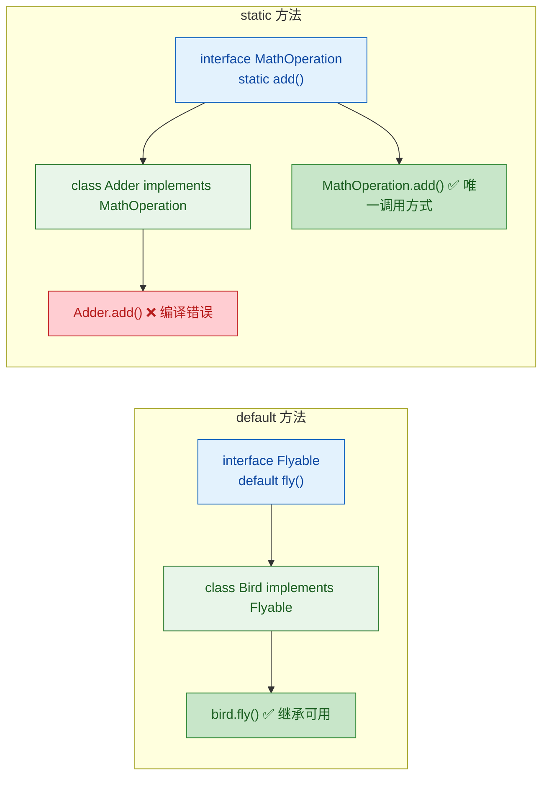

#### 实际用途：替代工具类（Utility Class）

在 Java 8 之前，如果你想为某个接口提供一组通用的工具方法，标准做法是创建一个伴生工具类（companion utility class）。最经典的例子就是 `Collections` 类——它是 `Collection` 接口的工具类，提供了 `sort()`、`unmodifiableList()`、`synchronizedList()` 等大量静态方法。

这种模式有一个明显的缺点：**逻辑分散**。使用者需要知道"接口在 `Collection`，工具方法在 `Collections`"，这增加了认知负担。

有了接口静态方法，工具逻辑可以直接内聚到接口中：

```java
public interface StringValidator {

    // 抽象方法：具体的校验逻辑由实现类决定
    boolean validate(String input);

    // 静态工厂方法：创建一个"非空校验器"
    static StringValidator nonEmpty() {
        // 返回一个 lambda 实现——字符串不为 null 且不为空
        return input -> input != null && !input.isEmpty();
    }

    // 静态工厂方法：创建一个"长度范围校验器"
    static StringValidator lengthBetween(int min, int max) {
        return input -> {
            if (input == null) return false;   // null 直接不通过
            int len = input.length();          // 获取字符串长度
            return len >= min && len <= max;   // 判断是否在范围内
        };
    }

    // 静态工具方法：组合多个校验器，全部通过才算通过
    static StringValidator allOf(StringValidator... validators) {
        return input -> {
            // 遍历所有校验器，任何一个不通过就返回 false
            for (StringValidator v : validators) {
                if (!v.validate(input)) {
                    return false;
                }
            }
            return true; // 全部通过
        };
    }
}
```

使用时，一切都围绕 `StringValidator` 这一个接口展开，非常内聚：

```java
public class RegistrationService {
    public static void main(String[] args) {
        // 通过接口静态方法组合出一个复合校验器
        StringValidator usernameValidator = StringValidator.allOf(
            StringValidator.nonEmpty(),           // 不能为空
            StringValidator.lengthBetween(3, 20)  // 长度 3~20
        );

        System.out.println(usernameValidator.validate("Kiro"));  // true
        System.out.println(usernameValidator.validate(""));       // false
        System.out.println(usernameValidator.validate("ab"));     // false（长度不足）
    }
}
```

这种"接口 + 静态工厂方法"的模式在现代 Java 中非常流行。JDK 自身也大量采用，比如 `Comparator.comparing()`、`Predicate.not()` 等。

#### JDK 中的典型案例

`Comparator` 接口是接口静态方法的教科书级应用：

```java
import java.util.Arrays;
import java.util.Comparator;
import java.util.List;

public class ComparatorDemo {
    public static void main(String[] args) {
        List<String> names = Arrays.asList("Charlie", "Alice", "Bob", "David");

        // Comparator.comparing() —— 接口静态方法，返回一个 Comparator 实例
        // 按字符串自然顺序排序
        names.sort(Comparator.comparing(String::toLowerCase));
        System.out.println(names); // [Alice, Bob, Charlie, David]

        // Comparator.reverseOrder() —— 另一个接口静态方法
        names.sort(Comparator.reverseOrder());
        System.out.println(names); // [David, Charlie, Bob, Alice]

        // Comparator.naturalOrder() —— 返回自然顺序比较器
        names.sort(Comparator.naturalOrder());
        System.out.println(names); // [Alice, Bob, Charlie, David]
    }
}
```

---

### 接口私有方法（Interface Private Methods）

#### 引入背景：default 方法的代码重复问题

Java 8 的 `default` 方法解决了接口演化的问题，但也带来了一个新的痛点：当多个 `default` 方法之间存在共同逻辑时，没有办法提取公共代码。

看一个具体的例子。假设我们有一个日志接口，提供不同级别的日志输出：

```java
// Java 8 时代的写法——存在明显的代码重复
public interface Logger {

    default void logInfo(String message) {
        // 获取当前时间戳
        String timestamp = java.time.LocalDateTime.now().toString();
        // 拼接并输出——这段格式化逻辑在每个方法中都重复了
        System.out.println("[INFO] " + timestamp + " - " + message);
    }

    default void logWarning(String message) {
        String timestamp = java.time.LocalDateTime.now().toString();
        // 同样的格式化逻辑，只是级别标签不同
        System.out.println("[WARNING] " + timestamp + " - " + message);
    }

    default void logError(String message) {
        String timestamp = java.time.LocalDateTime.now().toString();
        // 又是一样的模式
        System.out.println("[ERROR] " + timestamp + " - " + message);
    }
}
```

三个方法中，获取时间戳和格式化输出的逻辑完全相同，只有日志级别标签不同。在类中，我们会毫不犹豫地提取一个 `private` 辅助方法。但在 Java 8 的接口中，这做不到——接口中的方法要么是 `public abstract`，要么是 `public default`，要么是 `public static`，没有 `private` 的容身之处。

如果把公共逻辑提取为另一个 `default` 方法，它就会暴露给所有实现类和外部调用者，破坏了封装性。

#### Java 9 的解决方案

Java 9 允许接口中定义 `private` 方法和 `private static` 方法，完美解决了这个问题：

```java
public interface Logger {

    // default 方法：对外暴露的日志 API
    default void logInfo(String message) {
        log("INFO", message); // 委托给私有方法
    }

    default void logWarning(String message) {
        log("WARNING", message); // 委托给私有方法
    }

    default void logError(String message) {
        log("ERROR", message); // 委托给私有方法
    }

    // ✅ private 方法：封装公共逻辑，对外完全不可见
    private void log(String level, String message) {
        // 获取当前时间戳
        String timestamp = java.time.LocalDateTime.now().toString();
        // 统一的格式化输出逻辑——只写一次
        System.out.println("[" + level + "] " + timestamp + " - " + message);
    }
}
```

重构后，格式化逻辑只存在于一处。如果将来需要修改日志格式（比如加上线程名），只需改 `log()` 这一个方法。

#### 私有方法的两种形式

接口中的私有方法分为两种，它们的使用场景不同：

```java
public interface DataProcessor {

    // 抽象方法
    void process(String data);

    // default 方法：使用私有实例方法辅助
    default void processWithValidation(String data) {
        if (isValid(data)) {          // 调用私有实例方法
            String cleaned = sanitize(data); // 调用私有静态方法
            process(cleaned);          // 调用抽象方法
        } else {
            System.out.println("Invalid data: " + data);
        }
    }

    // default 方法：批量处理
    default void processBatch(String... dataItems) {
        for (String item : dataItems) {
            if (isValid(item)) {       // 复用同一个私有方法
                process(sanitize(item));
            }
        }
    }

    // 静态方法：使用私有静态方法辅助
    static String preprocess(String raw) {
        return sanitize(raw); // 静态方法只能调用私有静态方法
    }

    // ========== 私有方法区域 ==========

    // 私有实例方法：只能被 default 方法调用
    // 可以调用接口中的抽象方法、default 方法、其他私有方法
    private boolean isValid(String data) {
        return data != null && !data.isBlank(); // 非空且非纯空白
    }

    // 私有静态方法：可以被 default 方法和 static 方法调用
    // 不能调用实例方法（因为没有 this 上下文）
    private static String sanitize(String data) {
        return data.strip()           // 去除首尾空白
                   .replaceAll("\\s+", " "); // 多个空白合并为一个
    }
}
```

两种私有方法的调用规则可以用下表总结：

```
┌──────────────────────┬──────────────────────┬──────────────────────┐
│     调用者 ＼ 被调用  │  private 实例方法     │  private static 方法  │
├──────────────────────┼──────────────────────┼──────────────────────┤
│  default 方法         │       ✅ 可以         │       ✅ 可以         │
├──────────────────────┼──────────────────────┼──────────────────────┤
│  static 方法          │       ❌ 不可以       │       ✅ 可以         │
├──────────────────────┼──────────────────────┼──────────────────────┤
│  其他 private 方法    │       ✅ 可以         │  实例→✅  静态→✅     │
├──────────────────────┼──────────────────────┼──────────────────────┤
│  实现类 / 外部代码    │       ❌ 不可见       │       ❌ 不可见       │
└──────────────────────┴──────────────────────┴──────────────────────┘
```

核心原则很简单：**静态上下文不能访问实例成员**——这与类中的规则完全一致。

#### 一个更完整的实战案例

下面用一个 HTTP 响应构建接口来展示 `static`、`default`、`private`、`private static` 四种方法的协作：

```java
public interface HttpResponse {

    // 抽象方法：获取响应状态码
    int getStatusCode();

    // 抽象方法：获取响应体
    String getBody();

    // ========== 静态工厂方法 ==========

    // 静态方法：创建成功响应
    static HttpResponse ok(String body) {
        return createResponse(200, body); // 委托给私有静态方法
    }

    // 静态方法：创建 404 响应
    static HttpResponse notFound() {
        return createResponse(404, formatErrorBody(404, "Not Found"));
    }

    // 静态方法：创建 500 响应
    static HttpResponse serverError(String detail) {
        return createResponse(500, formatErrorBody(500, detail));
    }

    // ========== default 方法 ==========

    // default 方法：判断是否成功响应
    default boolean isSuccess() {
        return getStatusCode() >= 200 && getStatusCode() < 300;
    }

    // default 方法：格式化输出完整响应信息
    default String toFormattedString() {
        // 调用私有实例方法获取状态描述
        String statusLine = buildStatusLine();
        return statusLine + "\n" + getBody();
    }

    // ========== 私有实例方法 ==========

    // 私有实例方法：构建状态行（只有 default 方法能调用）
    private String buildStatusLine() {
        // 调用私有静态方法获取状态文本
        String statusText = resolveStatusText(getStatusCode());
        return "HTTP/1.1 " + getStatusCode() + " " + statusText;
    }

    // ========== 私有静态方法 ==========

    // 私有静态方法：创建响应对象（被静态工厂方法调用）
    private static HttpResponse createResponse(int code, String body) {
        return new HttpResponse() {
            @Override
            public int getStatusCode() {
                return code; // 捕获外部参数
            }

            @Override
            public String getBody() {
                return body; // 捕获外部参数
            }
        };
    }

    // 私有静态方法：格式化错误响应体
    private static String formatErrorBody(int code, String message) {
        return "{\"error\": " + code + ", \"message\": \"" + message + "\"}";
    }

    // 私有静态方法：根据状态码返回描述文本
    private static String resolveStatusText(int code) {
        return switch (code) {
            case 200 -> "OK";
            case 404 -> "Not Found";
            case 500 -> "Internal Server Error";
            default -> "Unknown";       // 未知状态码的兜底
        };
    }
}
```

使用示例：

```java
public class ApiDemo {
    public static void main(String[] args) {
        // 通过静态工厂方法创建响应
        HttpResponse success = HttpResponse.ok("{\"user\": \"Kiro\"}");
        HttpResponse error = HttpResponse.notFound();

        // 调用 default 方法
        System.out.println(success.isSuccess());         // true
        System.out.println(success.toFormattedString());
        // 输出:
        // HTTP/1.1 200 OK
        // {"user": "Kiro"}

        System.out.println(error.isSuccess());           // false
        System.out.println(error.toFormattedString());
        // 输出:
        // HTTP/1.1 404 Not Found
        // {"error": 404, "message": "Not Found"}
    }
}
```

这个例子中各类方法的协作关系如下：

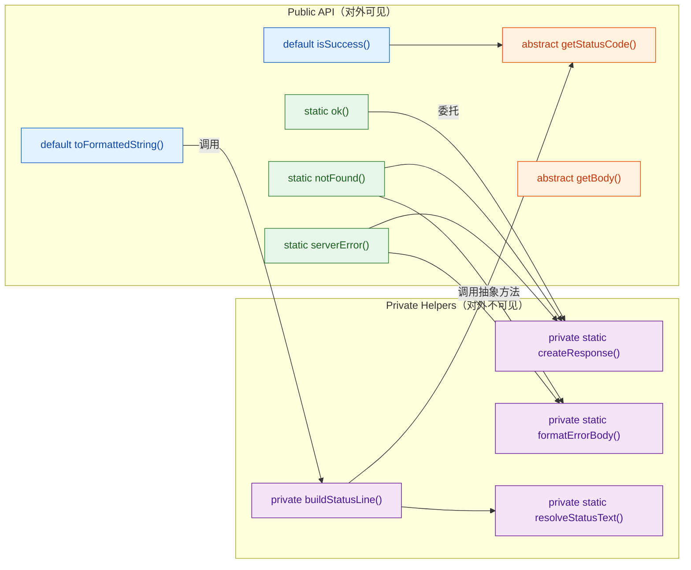

---

### 接口方法的完整演进时间线

从 Java 最初的版本到 Java 9，接口中可以定义的方法类型经历了显著的扩展：

```mermaid
graph LR
    subgraph JDK1["Java 1.0 ~ 7"]
        direction TB
        M1["public abstract 方法"]
    end

    subgraph JDK8["Java 8"]
        direction TB
        M2["public abstract 方法"]
        M3["public default 方法"]
        M4["public static 方法"]
    end

    subgraph JDK9["Java 9+"]
        direction TB
        M5["public abstract 方法"]
        M6["public default 方法"]
        M7["public static 方法"]
        M8["private 实例方法"]
        M9["private static 方法"]
    end

    JDK1 -->|"Java 8 扩展"| JDK8
    JDK8 -->|"Java 9 扩展"| JDK9

    classDef old fill:#EFEBE9,stroke:#5D4037,color:#3E2723
    classDef j8 fill:#E3F2FD,stroke:#1565C0,color:#0D47A1
    classDef j9 fill:#E8F5E9,stroke:#2E7D32,color:#1B5E20
    classDef priv fill:#F3E5F5,stroke:#6A1B9A,color:#4A148C

    class M1 old
    class M2,M3,M4 j8
    class M5,M6,M7 j8
    class M8,M9 priv
```

每一次扩展都遵循同一个设计哲学：**在不破坏向后兼容性的前提下，赋予接口更强的表达能力**。`static` 方法让接口能承载工具逻辑，`private` 方法让接口内部能做代码复用——但接口的核心身份始终没变：它是一份契约（contract），定义"能做什么"，而不是"是什么"。

---

### 设计指导与最佳实践

在实际开发中，合理使用这些方法类型需要遵循几个原则：

**接口静态方法适合做什么：**
- 工厂方法（Factory Method）：如 `List.of()`、`Map.of()`、`Comparator.comparing()`
- 工具方法（Utility Method）：与接口语义强相关的辅助计算
- 替代伴生工具类：将 `XxxUtils` 中的方法迁移到 `Xxx` 接口本身

**接口私有方法适合做什么：**
- 提取多个 `default` 方法之间的公共逻辑
- 提取多个 `static` 方法之间的公共逻辑（用 `private static`）
- 封装复杂的内部实现细节，保持 `default` 方法的可读性

**不应该做什么：**
- 不要在接口中堆砌大量业务逻辑——接口不是类，它的职责是定义契约
- 不要用接口静态方法替代所有工具类——只有与接口语义紧密相关的逻辑才适合放进来
- 不要滥用 `private` 方法把接口写成"伪抽象类"——如果你发现接口中的私有方法越来越多，可能应该考虑用抽象类

---

**📝 练习题**

以下关于 Java 接口中静态方法和私有方法的描述，哪一项是正确的？

A. 接口的静态方法可以被实现类继承，通过实现类的类名直接调用

B. 接口的 private 方法可以被实现类重写（Override），以提供不同的内部实现

C. 接口的 static 方法可以调用同一接口中的 private 实例方法

D. 接口的 default 方法可以调用同一接口中的 private static 方法


**【答案】** D

**【解析】** 逐项分析：

- A 错误：接口的静态方法**不会被继承**。这是接口静态方法与类静态方法的关键区别。接口静态方法只能通过 `接口名.方法名()` 调用，实现类无法通过自身类名或实例访问它。这样设计是为了避免多接口实现时的调用歧义。

- B 错误：`private` 方法对实现类**完全不可见**，谈不上重写。`private` 的语义就是"仅在声明它的接口内部可用"，实现类既看不到也无法覆盖。

- C 错误：`static` 方法处于静态上下文中，没有 `this` 引用，因此**不能调用实例方法**（包括 private 实例方法）。静态方法只能调用 `private static` 方法。

- D 正确：`default` 方法是实例方法，拥有完整的上下文。它既可以调用 private 实例方法，也可以调用 private static 方法——静态成员在任何上下文中都可访问，这与类中的规则一致。

---

## 函数式接口（@FunctionalInterface）

从 Java 8 开始，Lambda 表达式的引入彻底改变了 Java 的编程风格，而 Lambda 能够工作的基石，就是**函数式接口（Functional Interface）**。简单来说，函数式接口就是**有且仅有一个抽象方法**的接口。它是 Java 将"函数作为一等公民"这一理念落地的桥梁——Lambda 表达式本质上就是函数式接口的一个匿名实现。

理解函数式接口，不仅是掌握 Lambda 和 Stream API 的前提，更是写出现代、简洁、富有表达力的 Java 代码的关键。

---

### 什么是函数式接口

一个接口，只要满足以下条件，就是函数式接口：

1. **有且仅有一个抽象方法**（Single Abstract Method, SAM）。
2. 可以有任意数量的 `default` 方法和 `static` 方法，这些不影响判定。
3. 可以声明覆盖 `java.lang.Object` 中 `public` 方法的抽象方法（如 `toString()`、`equals()`），这些也不计入抽象方法数量。

```java
// 这是一个函数式接口：只有一个抽象方法 execute()
interface Task {
    void execute(); // 唯一的抽象方法 —— SAM
}

// 这也是函数式接口：default 和 static 方法不计入
interface Transformer {
    String transform(String input); // 唯一的抽象方法

    default String transformUpperCase(String input) { // default 方法，不计入
        return transform(input).toUpperCase();
    }

    static Transformer identity() { // static 方法，不计入
        return s -> s;
    }
}

// 这也是函数式接口：toString() 是 Object 的 public 方法，不计入
interface Printable {
    void print();           // 唯一的抽象方法

    String toString();      // 覆盖 Object 的方法，不计入
}

// ❌ 这不是函数式接口：有两个抽象方法
interface NotFunctional {
    void methodA();
    void methodB();
}
```

这个"只有一个抽象方法"的约束，正是 Lambda 表达式能够与接口绑定的原因——编译器可以明确推断出 Lambda 体对应的是哪个方法。

---

### @FunctionalInterface 注解

Java 提供了 `@FunctionalInterface` 注解来**显式标记**一个接口为函数式接口。它的作用类似于 `@Override`——不是功能性的，而是**声明意图 + 编译期校验**。

```java
@FunctionalInterface // 编译器会检查：是否恰好有一个抽象方法
interface Converter<F, T> {
    T convert(F from); // 唯一的抽象方法
}
```

如果你给一个有两个抽象方法的接口加上 `@FunctionalInterface`，编译器会直接报错：

```java
@FunctionalInterface
interface BadInterface {
    void foo();
    void bar(); // ❌ 编译错误：Multiple non-overriding abstract methods found
}
```

需要强调的是：**不加 `@FunctionalInterface` 注解，只要满足条件，接口依然是函数式接口，依然可以用 Lambda 实现。** 注解只是一层保护网，防止后续维护时有人不小心加了第二个抽象方法而破坏了 Lambda 的兼容性。

在实际开发中，**强烈建议**：只要你设计的接口打算用作 Lambda 目标，就加上 `@FunctionalInterface`。这是一种"Design by Contract"的体现。

---

### Lambda 表达式与函数式接口的绑定

Lambda 表达式并不是一种独立的类型，它必须依附于一个**目标类型（Target Type）**，而这个目标类型就是函数式接口。编译器通过上下文推断 Lambda 对应的函数式接口类型。

```java
@FunctionalInterface
interface MathOperation {
    int operate(int a, int b); // 接受两个 int，返回一个 int
}

public class LambdaDemo {
    public static void main(String[] args) {
        // Lambda 表达式赋值给函数式接口类型的变量
        MathOperation add = (a, b) -> a + b;       // 加法
        MathOperation sub = (a, b) -> a - b;       // 减法
        MathOperation mul = (a, b) -> a * b;       // 乘法
        MathOperation div = (a, b) -> {             // 除法（多行用花括号）
            if (b == 0) throw new ArithmeticException("除数不能为零");
            return a / b;                           // 返回商
        };

        // 使用
        System.out.println(add.operate(10, 5));     // 输出: 15
        System.out.println(sub.operate(10, 5));     // 输出: 5
        System.out.println(mul.operate(10, 5));     // 输出: 50
        System.out.println(div.operate(10, 5));     // 输出: 2
    }
}
```

Lambda 的语法可以进一步简化：

```java
// 完整写法
MathOperation op1 = (int a, int b) -> { return a + b; };

// 省略参数类型（编译器从接口推断）
MathOperation op2 = (a, b) -> { return a + b; };

// 单表达式省略 return 和花括号
MathOperation op3 = (a, b) -> a + b;

// 如果只有一个参数，还可以省略小括号
// 例如：Function<String, Integer> f = s -> s.length();
```

---

### 方法引用（Method Reference）

方法引用是 Lambda 的一种更简洁的写法。当 Lambda 体只是调用一个已有方法时，可以用 `::` 语法直接引用该方法。

方法引用有四种形式：

```java
import java.util.Arrays;
import java.util.List;
import java.util.function.Function;
import java.util.function.BiFunction;
import java.util.function.Supplier;

public class MethodReferenceDemo {
    public static void main(String[] args) {

        // ① 静态方法引用 —— ClassName::staticMethod
        // 等价于 Lambda: (s) -> Integer.parseInt(s)
        Function<String, Integer> parser = Integer::parseInt;
        System.out.println(parser.apply("42"));         // 输出: 42

        // ② 实例方法引用（特定对象）—— instance::method
        // 等价于 Lambda: (s) -> System.out.println(s)
        List<String> names = Arrays.asList("Alice", "Bob", "Charlie");
        names.forEach(System.out::println);             // 逐行打印每个名字

        // ③ 实例方法引用（任意对象）—— ClassName::instanceMethod
        // 等价于 Lambda: (s) -> s.toUpperCase()
        Function<String, String> upper = String::toUpperCase;
        System.out.println(upper.apply("hello"));       // 输出: HELLO

        // ④ 构造方法引用 —— ClassName::new
        // 等价于 Lambda: () -> new StringBuilder()
        Supplier<StringBuilder> sbCreator = StringBuilder::new;
        StringBuilder sb = sbCreator.get();             // 创建一个新的 StringBuilder
        sb.append("Method Reference!");
        System.out.println(sb.toString());              // 输出: Method Reference!
    }
}
```

方法引用和 Lambda 在功能上完全等价，选择哪种取决于可读性。一般来说，当 Lambda 体只是简单地委托给一个已有方法时，方法引用更清晰。

---

### JDK 内置的核心函数式接口

Java 在 `java.util.function` 包中预定义了大量函数式接口，覆盖了绝大多数常见场景。你不需要为每个 Lambda 都自定义接口——先看看 JDK 有没有现成的。

以下是最核心的四大接口：

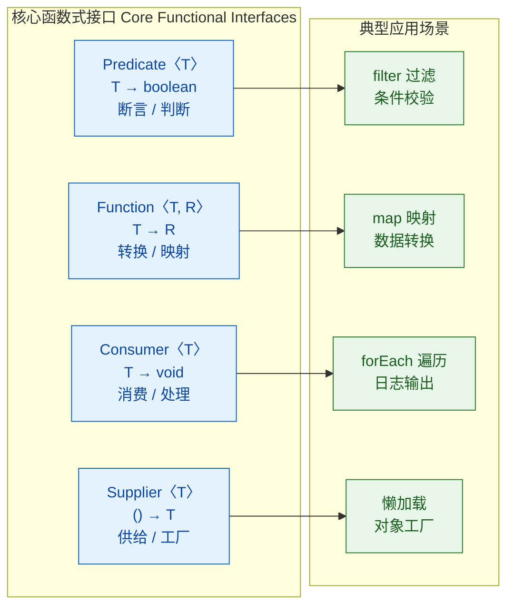

下面逐一详解并给出代码示例。

#### Predicate\<T\> —— 断言型

接收一个参数，返回 `boolean`。常用于过滤、条件判断。

```java
import java.util.function.Predicate;
import java.util.List;
import java.util.stream.Collectors;

public class PredicateDemo {
    public static void main(String[] args) {
        // 定义一个断言：字符串长度大于 3
        Predicate<String> longerThan3 = s -> s.length() > 3;

        // 单独使用
        System.out.println(longerThan3.test("Hi"));       // false
        System.out.println(longerThan3.test("Hello"));    // true

        // 组合断言：and / or / negate
        Predicate<String> startsWithH = s -> s.startsWith("H");

        // 长度 > 3 且以 H 开头
        Predicate<String> combined = longerThan3.and(startsWithH);
        System.out.println(combined.test("Hello"));       // true
        System.out.println(combined.test("World"));       // false

        // 在 Stream 中使用 —— 过滤
        List<String> words = List.of("Hi", "Hello", "Hey", "Howdy", "Go");
        List<String> result = words.stream()
                .filter(longerThan3)                      // 只保留长度 > 3 的
                .collect(Collectors.toList());
        System.out.println(result);                       // [Hello, Howdy]
    }
}
```

#### Function\<T, R\> —— 函数型

接收一个 `T` 类型参数，返回 `R` 类型结果。常用于数据转换、映射。

```java
import java.util.function.Function;

public class FunctionDemo {
    public static void main(String[] args) {
        // 字符串 → 长度
        Function<String, Integer> strLength = s -> s.length();

        // 整数 → 乘以 2
        Function<Integer, Integer> doubleIt = n -> n * 2;

        // 单独使用
        System.out.println(strLength.apply("Lambda"));    // 6

        // 链式组合：andThen（先执行自己，再执行参数）
        // "Lambda" → 6 → 12
        Function<String, Integer> lengthThenDouble = strLength.andThen(doubleIt);
        System.out.println(lengthThenDouble.apply("Lambda")); // 12

        // 链式组合：compose（先执行参数，再执行自己）
        // 与 andThen 方向相反
        Function<String, Integer> sameThing = doubleIt.compose(strLength);
        System.out.println(sameThing.apply("Lambda"));    // 12
    }
}
```

#### Consumer\<T\> —— 消费型

接收一个参数，无返回值。常用于遍历、日志输出、副作用操作。

```java
import java.util.function.Consumer;
import java.util.List;

public class ConsumerDemo {
    public static void main(String[] args) {
        // 打印消费者
        Consumer<String> printer = s -> System.out.println(">> " + s);

        // 单独使用
        printer.accept("Hello Consumer");                 // >> Hello Consumer

        // 链式组合：andThen（依次消费）
        Consumer<String> upperPrinter = s -> System.out.println(">> " + s.toUpperCase());
        Consumer<String> bothPrint = printer.andThen(upperPrinter);

        bothPrint.accept("test");
        // >> test
        // >> TEST

        // 在集合中使用
        List.of("A", "B", "C").forEach(printer);
        // >> A
        // >> B
        // >> C
    }
}
```

#### Supplier\<T\> —— 供给型

不接收参数，返回一个 `T` 类型结果。常用于延迟计算、工厂模式、默认值提供。

```java
import java.util.function.Supplier;
import java.util.Optional;

public class SupplierDemo {
    public static void main(String[] args) {
        // 提供一个随机数
        Supplier<Double> randomSupplier = () -> Math.random();
        System.out.println(randomSupplier.get());         // 每次调用产生不同的随机数

        // 延迟创建昂贵对象
        Supplier<StringBuilder> sbFactory = StringBuilder::new;
        StringBuilder sb1 = sbFactory.get();              // 此时才真正创建对象
        StringBuilder sb2 = sbFactory.get();              // 每次 get() 都是新对象
        System.out.println(sb1 == sb2);                   // false

        // 配合 Optional 提供默认值
        Optional<String> empty = Optional.empty();
        // orElseGet 接收 Supplier，只在值为空时才调用
        String value = empty.orElseGet(() -> "默认值");
        System.out.println(value);                        // 默认值
    }
}
```

---

### 扩展的函数式接口变体

除了四大核心接口，JDK 还提供了大量变体来处理双参数、基本类型等场景：

```java
import java.util.function.*;

public class VariantsDemo {
    public static void main(String[] args) {

        // ---- Bi 系列：接收两个参数 ----

        // BiFunction<T, U, R>：两个参数，一个返回值
        BiFunction<String, String, String> concat = (a, b) -> a + " " + b;
        System.out.println(concat.apply("Hello", "World")); // Hello World

        // BiPredicate<T, U>：两个参数，返回 boolean
        BiPredicate<String, Integer> lengthCheck = (s, len) -> s.length() > len;
        System.out.println(lengthCheck.test("Java", 3));     // true

        // BiConsumer<T, U>：两个参数，无返回值
        BiConsumer<String, Integer> printRepeat = (s, n) -> {
            for (int i = 0; i < n; i++) System.out.print(s); // 重复打印 n 次
            System.out.println();
        };
        printRepeat.accept("Go! ", 3);                       // Go! Go! Go!

        // ---- Unary / Binary Operator：输入输出同类型 ----

        // UnaryOperator<T> 等价于 Function<T, T>
        UnaryOperator<String> shout = s -> s + "!!!";
        System.out.println(shout.apply("Java"));             // Java!!!

        // BinaryOperator<T> 等价于 BiFunction<T, T, T>
        BinaryOperator<Integer> max = (a, b) -> a > b ? a : b;
        System.out.println(max.apply(10, 20));               // 20

        // ---- 基本类型特化：避免自动装箱 ----

        // IntPredicate / LongPredicate / DoublePredicate
        IntPredicate isEven = n -> n % 2 == 0;               // 直接操作 int，无装箱
        System.out.println(isEven.test(4));                   // true

        // IntFunction<R>：int → R
        IntFunction<String> intToStr = n -> "Number: " + n;
        System.out.println(intToStr.apply(42));               // Number: 42

        // ToIntFunction<T>：T → int
        ToIntFunction<String> strToLen = String::length;
        System.out.println(strToLen.applyAsInt("Lambda"));    // 6

        // IntUnaryOperator：int → int
        IntUnaryOperator square = n -> n * n;                 // 平方运算
        System.out.println(square.applyAsInt(7));             // 49

        // IntSupplier / LongSupplier / DoubleSupplier
        IntSupplier dice = () -> (int)(Math.random() * 6) + 1; // 掷骰子
        System.out.println(dice.getAsInt());                  // 1~6 的随机数
    }
}
```

基本类型特化版本的意义在于**性能**。泛型接口如 `Function<Integer, Integer>` 会导致 `int` 被自动装箱为 `Integer`，在高频调用场景（如 Stream 处理百万级数据）中，装箱拆箱的开销不可忽视。`IntFunction`、`IntPredicate` 等直接操作原始类型，避免了这个问题。

---

### 函数式接口的组合与链式调用

函数式接口的一大优势是**可组合性（Composability）**。通过 `andThen`、`compose`、`and`、`or`、`negate` 等默认方法，可以将简单的函数组合成复杂的处理管道。

```java
import java.util.function.Function;
import java.util.function.Predicate;
import java.util.List;
import java.util.stream.Collectors;

public class CompositionDemo {
    public static void main(String[] args) {

        // ---- Function 组合 ----
        Function<String, String> trim = String::trim;           // 去除首尾空格
        Function<String, String> lower = String::toLowerCase;   // 转小写
        Function<String, String> addPrefix = s -> "[LOG] " + s; // 加前缀

        // 组合成一条处理管道：trim → lower → addPrefix
        Function<String, String> pipeline = trim
                .andThen(lower)
                .andThen(addPrefix);

        System.out.println(pipeline.apply("  Hello World  "));
        // 输出: [LOG] hello world

        // ---- Predicate 组合 ----
        Predicate<String> notEmpty = s -> !s.isEmpty();         // 非空
        Predicate<String> shortEnough = s -> s.length() <= 10;  // 长度不超过 10
        Predicate<String> startsWithJ = s -> s.startsWith("J"); // 以 J 开头

        // 组合条件：非空 且 长度 <= 10 且 以 J 开头
        Predicate<String> valid = notEmpty
                .and(shortEnough)
                .and(startsWithJ);

        List<String> inputs = List.of("Java", "", "JavaScript", "J", "JythonLangExtra");
        List<String> filtered = inputs.stream()
                .filter(valid)                                  // 应用组合断言
                .collect(Collectors.toList());
        System.out.println(filtered);                           // [Java, JavaScript, J]
    }
}
```

这种组合能力让代码具有极高的**声明式表达力**——你在描述"做什么"，而不是"怎么做"。

---

### 自定义函数式接口的设计原则

虽然 JDK 提供了丰富的内置接口，但在以下场景中，自定义函数式接口仍然有价值：

1. **语义更清晰**：`Validator<T>` 比 `Predicate<T>` 更能表达业务意图。
2. **需要受检异常**：内置接口的抽象方法不抛受检异常，如果你的 Lambda 需要抛出 `IOException` 等，就需要自定义。
3. **需要多个类型参数**：超过两个参数时，JDK 没有现成的 `TriFunction`。

```java
// 场景 1：语义化命名
@FunctionalInterface
interface Validator<T> {
    boolean validate(T target);  // 比 Predicate.test() 更具业务语义
}

// 场景 2：支持受检异常
@FunctionalInterface
interface ThrowingFunction<T, R> {
    R apply(T t) throws Exception; // 允许抛出受检异常

    // 提供一个便捷方法：将受检异常转为非受检异常
    static <T, R> java.util.function.Function<T, R> unchecked(ThrowingFunction<T, R> f) {
        return t -> {
            try {
                return f.apply(t);                        // 尝试执行
            } catch (Exception e) {
                throw new RuntimeException(e);            // 包装为运行时异常
            }
        };
    }
}

// 场景 3：三参数函数
@FunctionalInterface
interface TriFunction<A, B, C, R> {
    R apply(A a, B b, C c);     // 接收三个参数，返回一个结果
}

// 使用示例
public class CustomFIDemo {
    public static void main(String[] args) {
        // 语义化
        Validator<String> emailValidator = s -> s.contains("@");
        System.out.println(emailValidator.validate("user@mail.com")); // true

        // 受检异常处理
        // 假设 readFile 可能抛出 IOException
        ThrowingFunction<String, String> readFile = path -> {
            // 模拟文件读取，可能抛出受检异常
            if (path == null) throw new java.io.IOException("路径为空");
            return "文件内容: " + path;
        };
        // 转为标准 Function，可在 Stream 中使用
        var safeRead = ThrowingFunction.unchecked(readFile);
        System.out.println(safeRead.apply("data.txt"));              // 文件内容: data.txt

        // 三参数
        TriFunction<Integer, Integer, Integer, Integer> sumThree = (a, b, c) -> a + b + c;
        System.out.println(sumThree.apply(1, 2, 3));                 // 6
    }
}
```

---

### 闭包与变量捕获

Lambda 表达式可以**捕获（capture）**外部作用域中的变量，但有一个重要限制：被捕获的局部变量必须是 **effectively final**（事实上不可变的）。

```java
import java.util.function.IntUnaryOperator;

public class ClosureDemo {
    // 实例变量和静态变量可以被自由捕获和修改
    private int instanceVar = 10;
    private static int staticVar = 20;

    public void demo() {
        int localVar = 30;  // 局部变量 —— 必须 effectively final

        IntUnaryOperator op = n -> {
            // ✅ 可以读取局部变量
            int sum = n + localVar;

            // ✅ 可以读写实例变量
            instanceVar += n;

            // ✅ 可以读写静态变量
            staticVar += n;

            // ❌ 不能修改局部变量！
            // localVar = 50; // 编译错误: local variables referenced from a lambda
            //                // expression must be final or effectively final

            return sum;
        };

        // ❌ 即使在 Lambda 外部修改也不行（会导致 Lambda 内的引用不再 effectively final）
        // localVar = 40; // 取消注释后，Lambda 中引用 localVar 的地方也会报错

        System.out.println(op.applyAsInt(5)); // 35
    }
}
```

为什么有这个限制？因为 Lambda 捕获的是变量的**值的副本**，而不是变量本身的引用。如果允许修改，Lambda 内外看到的值可能不一致，尤其在多线程场景下会导致难以排查的 bug。这是 Java 在安全性上的一个设计取舍。

如果确实需要在 Lambda 中"修改"外部状态，可以使用引用类型作为容器：

```java
import java.util.concurrent.atomic.AtomicInteger;

public class MutableCaptureDemo {
    public static void main(String[] args) {
        // 方案 1：使用 AtomicInteger（线程安全）
        AtomicInteger counter = new AtomicInteger(0);     // 引用本身是 effectively final
        Runnable increment = () -> counter.incrementAndGet(); // 修改的是对象内部状态
        increment.run();
        increment.run();
        System.out.println(counter.get());                // 2

        // 方案 2：使用单元素数组（简单但非线程安全）
        int[] holder = {0};                               // 数组引用是 effectively final
        Runnable inc2 = () -> holder[0]++;                // 修改的是数组元素
        inc2.run();
        inc2.run();
        System.out.println(holder[0]);                    // 2
    }
}
```

---

### 函数式接口在实战中的应用模式

函数式接口不仅仅是 Lambda 的载体，它们在设计模式和架构中有着广泛的应用。

#### 策略模式的简化

传统策略模式需要定义接口 + 多个实现类，函数式接口让你用 Lambda 一行搞定：

```java
import java.util.List;
import java.util.function.Predicate;
import java.util.stream.Collectors;

public class StrategyWithLambda {

    // 通用过滤方法，策略通过 Predicate 注入
    public static <T> List<T> filterBy(List<T> list, Predicate<T> strategy) {
        return list.stream()
                .filter(strategy)                         // 应用策略
                .collect(Collectors.toList());
    }

    public static void main(String[] args) {
        List<Integer> numbers = List.of(1, 2, 3, 4, 5, 6, 7, 8, 9, 10);

        // 策略 1：偶数
        List<Integer> evens = filterBy(numbers, n -> n % 2 == 0);
        System.out.println("偶数: " + evens);             // [2, 4, 6, 8, 10]

        // 策略 2：大于 5
        List<Integer> big = filterBy(numbers, n -> n > 5);
        System.out.println("大于5: " + big);              // [6, 7, 8, 9, 10]

        // 策略 3：组合 —— 偶数且大于 5
        Predicate<Integer> isEven = n -> n % 2 == 0;
        Predicate<Integer> greaterThan5 = n -> n > 5;
        List<Integer> combined = filterBy(numbers, isEven.and(greaterThan5));
        System.out.println("偶数且>5: " + combined);      // [6, 8, 10]
    }
}
```

#### 构建器模式中的配置注入

```java
import java.util.function.Consumer;

public class ServerConfig {
    private String host = "localhost";                     // 默认主机
    private int port = 8080;                              // 默认端口
    private boolean ssl = false;                          // 默认不启用 SSL

    // 私有构造，强制通过 builder 创建
    private ServerConfig() {}

    // 接收 Consumer 来配置对象 —— 优雅的构建器模式
    public static ServerConfig create(Consumer<ServerConfig> configurer) {
        ServerConfig config = new ServerConfig();         // 创建默认配置
        configurer.accept(config);                        // 让调用者自定义配置
        return config;
    }

    // setter 方法
    public void setHost(String host) { this.host = host; }
    public void setPort(int port) { this.port = port; }
    public void setSsl(boolean ssl) { this.ssl = ssl; }

    @Override
    public String toString() {
        return String.format("Server{host='%s', port=%d, ssl=%s}", host, port, ssl);
    }

    public static void main(String[] args) {
        // 使用 Lambda 配置 —— 清晰、流畅
        ServerConfig config = ServerConfig.create(c -> {
            c.setHost("api.example.com");                 // 自定义主机
            c.setPort(443);                               // 自定义端口
            c.setSsl(true);                               // 启用 SSL
        });
        System.out.println(config);
        // Server{host='api.example.com', port=443, ssl=true}
    }
}
```

#### 责任链模式的函数式实现

```java
import java.util.function.UnaryOperator;

public class FunctionalChain {

    // 每个处理步骤都是一个 UnaryOperator<String>
    public static void main(String[] args) {
        UnaryOperator<String> step1 = s -> s.trim();                  // 去空格
        UnaryOperator<String> step2 = s -> s.toLowerCase();           // 转小写
        UnaryOperator<String> step3 = s -> s.replaceAll("\\s+", "-"); // 空格替换为连字符
        UnaryOperator<String> step4 = s -> s.replaceAll("[^a-z0-9-]", ""); // 移除特殊字符

        // 将所有步骤组合成一条处理链
        UnaryOperator<String> slugify = s -> step1
                .andThen(step2)
                .andThen(step3)
                .andThen(step4)
                .apply(s);

        System.out.println(slugify.apply("  Hello World! @2024  "));
        // 输出: hello-world-2024
    }
}
```

---

### 函数式接口的底层机制：invokedynamic

你可能好奇：Lambda 表达式在底层是怎么实现的？它和匿名内部类有什么区别？

在 Java 8 之前，如果要传递一个"行为"，只能用匿名内部类。编译器会为每个匿名内部类生成一个独立的 `.class` 文件（如 `Outer$1.class`）。而 Lambda 的实现完全不同——它使用了 JVM 的 `invokedynamic` 指令（最初为动态语言如 JRuby 设计，在 Java 7 引入）。

```mermaid
graph LR
    subgraph compile["编译期 Compile Time"]
        direction TB
        A["Lambda 表达式<br/>s -> s.length()"]
        B["编译器生成<br/>invokedynamic 指令"]
        C["Lambda 体编译为<br/>宿主类的私有静态方法"]
    end

    subgraph runtime["运行期 Runtime"]
        direction TB
        D["Bootstrap Method<br/>LambdaMetafactory"]
        E["动态生成实现类<br/>通过 ASM 字节码"]
        F["缓存 CallSite<br/>后续调用直接复用"]
    end

    subgraph result["最终效果"]
        direction TB
        G["无额外 .class 文件"]
        H["性能优于匿名内部类"]
        I["JVM 可进一步优化<br/>如内联"]
    end

    A --> B
    B --> C
    C --> D
    D --> E
    E --> F
    F --> G
    G --> H
    H --> I

    classDef compileStyle fill:#FFF3E0,stroke:#E65100,color:#BF360C
    classDef runtimeStyle fill:#E3F2FD,stroke:#1565C0,color:#0D47A1
    classDef resultStyle fill:#E8F5E9,stroke:#2E7D32,color:#1B5E20

    class A,B,C compileStyle
    class D,E,F runtimeStyle
    class G,H,I resultStyle
```

关键区别总结：

```java
// 匿名内部类方式 —— 每次都创建新的类实例
Runnable r1 = new Runnable() {
    @Override
    public void run() {                                   // 编译器生成 Outer$1.class
        System.out.println("Anonymous class");
    }
};

// Lambda 方式 —— 无额外 class 文件，JVM 动态处理
Runnable r2 = () -> System.out.println("Lambda");         // invokedynamic 指令
```

| 对比维度 | 匿名内部类 | Lambda 表达式 |
|---------|-----------|-------------|
| 字节码 | 生成独立的 `$1.class` 文件 | `invokedynamic` 指令，无额外文件 |
| 对象创建 | 每次 `new` 都创建新实例 | JVM 可缓存、复用实例 |
| `this` 指向 | 指向匿名类自身 | 指向外围类（enclosing class） |
| 性能 | 类加载开销 + 堆分配 | 首次调用有 bootstrap 开销，后续极快 |
| 序列化 | 默认可序列化 | 需要目标接口继承 `Serializable` |

`this` 指向的差异是一个常见的面试考点：

```java
public class ThisDemo {
    private String name = "Outer";

    public void test() {
        // 匿名内部类中的 this —— 指向匿名类实例
        Runnable anon = new Runnable() {
            @Override
            public void run() {
                // this 指向 Runnable 的匿名实现类实例
                System.out.println(this.getClass().getSimpleName()); // 输出空串（匿名类无名字）
            }
        };

        // Lambda 中的 this —— 指向外围类实例
        Runnable lambda = () -> {
            // this 指向 ThisDemo 实例
            System.out.println(this.name);                // 输出: Outer
            System.out.println(this.getClass().getSimpleName()); // 输出: ThisDemo
        };

        anon.run();
        lambda.run();
    }
}
```

---

### 常见陷阱与最佳实践

#### 陷阱 1：Lambda 中的受检异常

内置函数式接口的抽象方法签名不声明受检异常，因此 Lambda 体中不能直接抛出受检异常：

```java
import java.util.List;
import java.util.function.Function;

public class CheckedExceptionTrap {
    public static void main(String[] args) {
        List<String> paths = List.of("file1.txt", "file2.txt");

        // ❌ 编译错误：Unhandled exception: java.io.IOException
        // paths.stream().map(path -> new java.io.FileInputStream(path));

        // ✅ 方案 1：在 Lambda 内部 try-catch
        paths.stream().map(path -> {
            try {
                return new java.io.FileInputStream(path); // 可能抛出 IOException
            } catch (java.io.IOException e) {
                throw new RuntimeException(e);            // 包装为非受检异常
            }
        });

        // ✅ 方案 2：使用前面定义的 ThrowingFunction.unchecked() 工具方法
        // paths.stream().map(ThrowingFunction.unchecked(path -> new FileInputStream(path)));
    }
}
```

#### 陷阱 2：过度使用 Lambda 导致可读性下降

```java
// ❌ 过度嵌套，难以阅读
Function<String, Function<String, Function<String, String>>> curried =
    a -> b -> c -> a + b + c;

// ✅ 适度使用，保持清晰
// 如果逻辑复杂，提取为命名方法，再用方法引用
```

#### 最佳实践清单

```java
// 1. 优先使用 JDK 内置接口，避免重复造轮子
//    ✅ Predicate<String>    ❌ 自定义 StringChecker

// 2. 加 @FunctionalInterface 注解保护你的设计意图
@FunctionalInterface
interface MyHandler<T> {
    void handle(T event);
}

// 3. Lambda 体超过 3 行时，提取为私有方法 + 方法引用
// ❌
list.forEach(item -> {
    validate(item);
    transform(item);
    save(item);
});
// ✅
list.forEach(this::processItem);
// private void processItem(Item item) { validate; transform; save; }

// 4. 高频数值计算使用基本类型特化接口
// ❌ Function<Integer, Integer> —— 自动装箱
// ✅ IntUnaryOperator         —— 零装箱

// 5. 利用组合方法构建复杂逻辑，而非写一个巨大的 Lambda
// ✅ predicate1.and(predicate2).or(predicate3)
```

---

**📝 练习题**

以下代码的输出是什么？

```java
import java.util.function.Function;

public class Quiz {
    public static void main(String[] args) {
        Function<Integer, Integer> f = x -> x + 1;
        Function<Integer, Integer> g = x -> x * 2;

        System.out.println(f.andThen(g).apply(3));
        System.out.println(f.compose(g).apply(3));
    }
}
```

A. 8 和 7

B. 7 和 8

C. 8 和 8

D. 7 和 7


**【答案】** A

**【解析】**

`andThen` 的执行顺序是"先自己，再参数"：`f.andThen(g)` 等价于 `g(f(x))`。所以 `f.andThen(g).apply(3)` 的计算过程是：先执行 `f(3) = 3 + 1 = 4`，再执行 `g(4) = 4 * 2 = 8`。

`compose` 的执行顺序是"先参数，再自己"：`f.compose(g)` 等价于 `f(g(x))`。所以 `f.compose(g).apply(3)` 的计算过程是：先执行 `g(3) = 3 * 2 = 6`，再执行 `f(6) = 6 + 1 = 7`。

因此输出为 `8` 和 `7`，选 A。记住口诀：`andThen` 是正序管道（从左到右），`compose` 是数学函数复合（从右到左）。

---

## 抽象类 vs 接口（设计选择）

在前面的章节中，我们分别深入学习了抽象类和接口各自的特性、语法和使用场景。现在到了最关键的环节——当你面对一个真实的设计问题时，到底该选抽象类还是接口？这个问题不仅是面试高频考点，更是日常开发中每天都要做的架构决策。要做出正确的选择，你需要从语言机制、设计语义、演化能力三个维度来综合判断。

### 语法层面的核心差异

我们先把两者在 Java 语言规范层面的差异做一个全面的、精确的对比。很多开发者只记住了"抽象类能有构造器，接口不能"这种零散的点，但缺乏系统性的认知。

```java
// ==================== 抽象类示例 ====================
public abstract class AbstractCreature {

    // ✅ 抽象类可以拥有实例字段（任意访问修饰符）
    private String name;
    protected int energy;

    // ✅ 抽象类可以拥有构造器（子类通过 super() 调用）
    public AbstractCreature(String name, int energy) {
        this.name = name;       // 在构造器中初始化状态
        this.energy = energy;
    }

    // ✅ 抽象类可以包含具体方法（有方法体）
    public String getName() {
        return this.name;       // 直接访问私有字段
    }

    // ✅ 抽象类可以定义抽象方法（子类必须实现）
    public abstract void act();

    // ✅ 抽象类可以包含静态方法
    public static void describe() {
        System.out.println("I am a creature in this world.");
    }
}

// ==================== 接口示例 ====================
public interface Ability {

    // ✅ 接口的字段默认且只能是 public static final
    String CATEGORY = "Skill";  // 等价于 public static final String CATEGORY = "Skill";

    // ✅ 接口可以定义抽象方法（实现类必须实现）
    void perform();

    // ✅ Java 8+ 接口可以有 default 方法
    default void prepare() {
        log("Preparing...");    // default 方法可以调用私有方法
    }

    // ✅ Java 8+ 接口可以有静态方法
    static void info() {
        System.out.println("This is an Ability interface.");
    }

    // ✅ Java 9+ 接口可以有私有方法（辅助 default 方法）
    private void log(String msg) {
        System.out.println("[Ability] " + msg);
    }
}
```

下面用一张表格把所有关键差异一次性拉齐：

```
┌──────────────────────┬──────────────────────┬──────────────────────┐
│        特性           │      抽象类           │       接口            │
├──────────────────────┼──────────────────────┼──────────────────────┤
│ 关键字               │ abstract class        │ interface             │
│ 实例字段             │ ✅ 任意类型和修饰符    │ ❌ 只有常量(static final)│
│ 构造器               │ ✅ 有                 │ ❌ 无                  │
│ 具体方法             │ ✅ 有                 │ ✅ default/static/private│
│ 抽象方法             │ ✅ 有                 │ ✅ 有                  │
│ 访问修饰符           │ 全部支持              │ 方法默认 public         │
│ 继承/实现数量         │ 单继承(extends 1个)   │ 多实现(implements N个) │
│ 可以继承类吗          │ ✅ 可以               │ ❌ 不可以              │
│ 可以实现接口吗        │ ✅ 可以               │ ✅ 可以(extends 多接口) │
│ 有 this 引用吗       │ ✅ 有                 │ ❌ 无(default方法中的this│
│                      │                      │   指向实现类实例)       │
│ 初始化块             │ ✅ 支持               │ ❌ 不支持              │
│ 函数式接口           │ ❌ 不适用             │ ✅ @FunctionalInterface │
└──────────────────────┴──────────────────────┴──────────────────────┘
```

这张表格中最值得深思的一行是"实例字段"。抽象类能持有可变状态（mutable state），而接口不能。这一条看似简单，实则是两者设计哲学分野的根源。

### "is-a" vs "can-do"：设计语义的本质区别

选择抽象类还是接口，本质上是在回答一个设计语义问题：你要表达的是"这个东西是什么"，还是"这个东西能做什么"。

抽象类表达的是 "is-a"（是一个）关系。当你写 `class Dog extends Animal` 时，你在声明一个本体论事实——狗就是动物，它天生具备动物的所有属性和行为基础。这种关系是排他的、层级的、紧密耦合的。一只狗不可能同时"是一个"动物又"是一个"交通工具，这在现实世界和 Java 的单继承模型中都说不通。

接口表达的是 "can-do"（能做某事）或 "has-a capability"（具备某种能力）关系。当你写 `class Dog implements Trainable, Swimmable` 时，你在描述狗具备的能力——它可以被训练，也可以游泳。这种关系是非排他的、扁平的、松耦合的。一只狗可以同时具备很多种能力，互不冲突。

```java
// is-a 关系：Dog 本质上是 Animal
// 抽象类承载了"动物"这个概念的核心状态和行为骨架
public abstract class Animal {
    private String species;     // 物种——动物的本质属性
    private int age;            // 年龄——动物的生命周期状态

    public Animal(String species, int age) {
        this.species = species;
        this.age = age;
    }

    // 所有动物都会呼吸，这是本体行为，不是"能力"
    public void breathe() {
        System.out.println(species + " is breathing.");
    }

    // 不同动物发出不同声音，但"能发声"是动物的本质特征
    public abstract void makeSound();
}

// can-do 关系：这些是额外能力，不是本质定义
interface Swimmable {
    void swim();                // 能游泳
}

interface Trainable {
    void train(String command); // 能被训练
}

interface Fetchable {
    void fetch(String item);   // 能捡东西
}

// Dog is-a Animal, and can-do Swimming, Training, Fetching
public class Dog extends Animal implements Swimmable, Trainable, Fetchable {

    public Dog(int age) {
        super("Dog", age);      // 调用抽象类构造器，确立"是动物"的身份
    }

    @Override
    public void makeSound() {
        System.out.println("Woof! Woof!");  // 狗的叫声
    }

    @Override
    public void swim() {
        System.out.println("Dog is paddling in the water.");
    }

    @Override
    public void train(String command) {
        System.out.println("Dog learned: " + command);
    }

    @Override
    public void fetch(String item) {
        System.out.println("Dog fetched the " + item);
    }
}
```

这段代码完美展示了两者的协作：抽象类定义了"你是谁"，接口定义了"你能做什么"。在实际项目中，这种组合模式极其常见。

### 状态管理：抽象类的独有优势

接口从 Java 8 开始可以有 default 方法，从 Java 9 开始可以有 private 方法，看起来越来越像抽象类了。但有一个根本性的差距永远无法弥合——接口不能持有实例状态。

这意味着什么？如果你的抽象层需要管理对象的内部状态，需要在构造时初始化某些字段，需要在多个方法之间共享可变数据，那你只能选择抽象类。

```java
// 场景：构建一个缓存框架的基类
// 缓存需要管理内部状态（缓存容器、命中计数、容量限制等）
// 这些状态是缓存"是什么"的核心部分，不是"能做什么"的能力
public abstract class AbstractCache<K, V> {

    // 这些实例字段是缓存运行的核心状态
    private final Map<K, V> store;      // 缓存存储容器
    private final int capacity;          // 最大容量
    private int hitCount;                // 命中次数
    private int missCount;               // 未命中次数

    // 构造器：初始化缓存的核心状态
    protected AbstractCache(int capacity) {
        this.store = new HashMap<>();    // 初始化存储
        this.capacity = capacity;        // 设定容量上限
        this.hitCount = 0;
        this.missCount = 0;
    }

    // 模板方法：定义 get 操作的完整流程
    public final V get(K key) {
        if (store.containsKey(key)) {
            hitCount++;                  // 修改内部状态：命中计数+1
            onHit(key);                  // 钩子：让子类处理命中事件
            return store.get(key);
        }
        missCount++;                     // 修改内部状态：未命中计数+1
        V value = onMiss(key);           // 钩子：让子类决定未命中时的行为
        if (value != null) {
            put(key, value);
        }
        return value;
    }

    // 具体方法：put 操作需要检查容量并可能触发淘汰
    public void put(K key, V value) {
        if (store.size() >= capacity && !store.containsKey(key)) {
            evict();                     // 容量满时触发淘汰策略
        }
        store.put(key, value);           // 写入缓存
    }

    // 抽象方法：淘汰策略由子类决定（LRU? LFU? FIFO?）
    protected abstract void evict();

    // 钩子方法：命中时的回调
    protected void onHit(K key) { }

    // 钩子方法：未命中时的回调（子类可选择从数据库加载等）
    protected abstract V onMiss(K key);

    // 提供统计信息（依赖内部状态）
    public double getHitRate() {
        int total = hitCount + missCount;
        return total == 0 ? 0.0 : (double) hitCount / total;
    }

    // 暴露只读视图给子类（保护封装性）
    protected Map<K, V> getStore() {
        return Collections.unmodifiableMap(store);
    }
}
```

这个例子中，`store`、`capacity`、`hitCount`、`missCount` 都是缓存运行不可或缺的内部状态。它们需要在构造时初始化，在多个方法中被读写，在整个对象生命周期中被维护。这些事情接口做不到，也不应该做——因为接口的设计哲学就是无状态的行为契约。

### 演化能力：接口的后发优势

Java 8 之前，给接口添加新方法是一场灾难——所有实现类都会编译失败。但 default 方法彻底改变了这个局面。现在接口具备了极强的向后兼容演化能力。

```java
// 版本 1.0：最初的支付接口
public interface PaymentProcessor {
    void processPayment(double amount);     // 处理支付
    void refund(String transactionId);      // 退款
}

// 版本 2.0：业务需要新增"部分退款"功能
// 如果是抽象类，所有子类都必须修改。如果是接口，用 default 方法平滑升级
public interface PaymentProcessor {
    void processPayment(double amount);
    void refund(String transactionId);

    // 新增 default 方法：已有的实现类完全不受影响
    default void partialRefund(String transactionId, double amount) {
        // 提供一个合理的默认实现：直接调用全额退款并记录日志
        System.out.println("Partial refund not supported, performing full refund.");
        refund(transactionId);              // 降级为全额退款
    }
}

// 版本 3.0：继续演化，新增异步支付能力
public interface PaymentProcessor {
    void processPayment(double amount);
    void refund(String transactionId);

    default void partialRefund(String transactionId, double amount) {
        System.out.println("Partial refund not supported, performing full refund.");
        refund(transactionId);
    }

    // 再次平滑新增：异步支付，默认实现为同步调用
    default CompletableFuture<Void> processPaymentAsync(double amount) {
        return CompletableFuture.runAsync(() -> processPayment(amount));
    }
}
```

这种演化能力在框架设计中价值巨大。Spring、JDK 集合框架等都大量使用了这种模式。相比之下，抽象类虽然也能添加具体方法，但由于单继承的限制，一旦某个类已经继承了其他类，就无法再享受你新增的功能。

### 经典设计模式中的选择

不同的设计模式天然倾向于使用抽象类或接口，理解这些倾向能帮助你在实战中快速做出判断。

```java
// ========== 模板方法模式 → 天然适合抽象类 ==========
// 原因：需要固定算法骨架（final 方法），需要共享状态，需要控制执行顺序
public abstract class DataExporter {

    // 模板方法：定义导出的固定流程，子类不可覆盖
    public final void export() {
        connect();          // 第一步：连接数据源
        List<String> data = extractData();  // 第二步：提取数据（抽象）
        List<String> transformed = transform(data); // 第三步：转换（可选钩子）
        write(transformed); // 第四步：写出数据（抽象）
        disconnect();       // 第五步：断开连接
    }

    // 具体方法：通用的连接和断开逻辑
    private void connect() {
        System.out.println("Connecting to data source...");
    }

    private void disconnect() {
        System.out.println("Disconnecting...");
    }

    // 抽象方法：子类必须实现的核心步骤
    protected abstract List<String> extractData();
    protected abstract void write(List<String> data);

    // 钩子方法：子类可选覆盖，默认不做转换
    protected List<String> transform(List<String> data) {
        return data;        // 默认原样返回
    }
}

// ========== 策略模式 → 天然适合接口 ==========
// 原因：策略是纯行为契约，无状态，需要灵活替换，可能用 Lambda 实现
@FunctionalInterface
public interface SortStrategy<T> {
    void sort(List<T> list);    // 纯行为：对列表排序
}

// 策略的使用者通过接口引用策略，完全解耦
public class DataProcessor<T> {
    private SortStrategy<T> strategy;   // 持有策略接口的引用

    public DataProcessor(SortStrategy<T> strategy) {
        this.strategy = strategy;
    }

    public void process(List<T> data) {
        strategy.sort(data);            // 委托给策略执行
        System.out.println("Sorted: " + data);
    }

    // 运行时动态切换策略
    public void setStrategy(SortStrategy<T> strategy) {
        this.strategy = strategy;
    }
}

// 使用时可以用 Lambda 极简实现
// DataProcessor<Integer> processor = new DataProcessor<>(list -> Collections.sort(list));
```

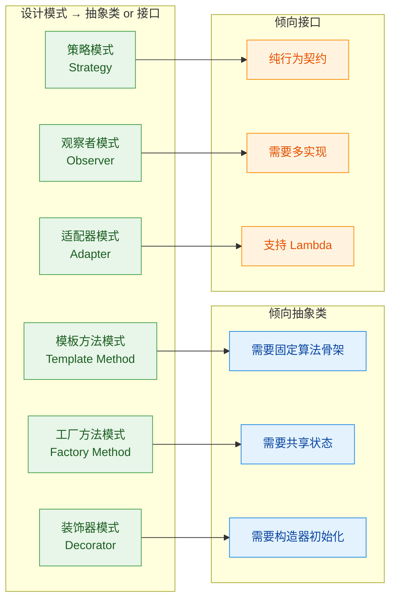

### 实战决策流程

面对一个具体的设计问题，你可以按照以下决策路径来思考。这不是死板的规则，而是一个经过大量实践验证的思维框架。

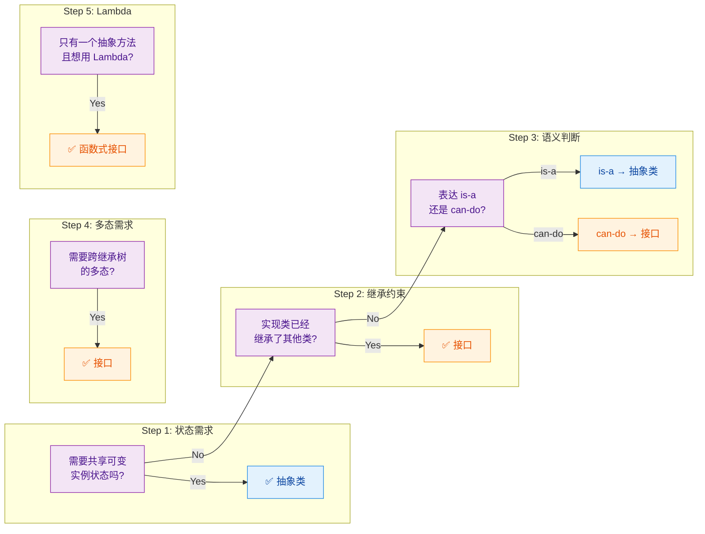

把这个决策流程用文字再梳理一遍：

第一关：你的抽象层需要持有可变的实例字段吗？比如缓存容器、连接池、计数器等。如果需要，抽象类是唯一选择，因为接口无法持有实例状态。

第二关：你的实现类是否已经继承了其他类？Java 是单继承的，如果继承名额已经被占用，那你只能用接口。这也是为什么很多框架（如 Spring）优先使用接口来定义扩展点。

第三关：你要表达的语义是"是什么"还是"能做什么"？如果是定义一个类型族的共同本质（如 Animal、Shape、Vehicle），用抽象类。如果是描述一种横切的能力（如 Serializable、Comparable、Closeable），用接口。

第四关：你需要让不同继承树上的类具备相同的多态行为吗？比如 `Dog extends Animal` 和 `Robot extends Machine` 都需要 `Trainable` 的能力，这时只有接口能跨越继承树的边界。

第五关：你的抽象只有一个核心方法，并且希望调用方能用 Lambda 表达式来实现？那就用 `@FunctionalInterface` 标注的接口。

### JDK 源码中的经典案例分析

JDK 自身的设计是学习抽象类与接口选择的最佳教材。我们来分析几个经典案例。

```java
// 案例 1：java.util.AbstractList（抽象类）+ java.util.List（接口）
// List 接口定义了"列表能做什么"的完整契约
// AbstractList 抽象类提供了骨架实现，减少实现者的工作量

// 这就是著名的 "接口 + 骨架实现类" 模式（Skeletal Implementation）
// Joshua Bloch 在 Effective Java 中强烈推荐这种模式

// 接口：定义契约
public interface List<E> extends Collection<E> {
    E get(int index);           // 按索引获取
    int size();                 // 获取大小
    // ... 还有很多方法
}

// 骨架实现：基于少量抽象方法，实现大量具体方法
public abstract class AbstractList<E> implements List<E> {
    // 只要求子类实现 get() 和 size()
    // 其他方法如 indexOf(), iterator(), subList() 等全部基于这两个方法实现
    // 这就是抽象类的价值：代码复用 + 模板方法

    public int indexOf(Object o) {
        // 基于 get() 和 size() 实现，子类无需重写
        ListIterator<E> it = listIterator();
        if (o == null) {
            while (it.hasNext()) {
                if (it.next() == null) return it.previousIndex();
            }
        } else {
            while (it.hasNext()) {
                if (o.equals(it.next())) return it.previousIndex();
            }
        }
        return -1;
    }
}

// 最终实现类：继承骨架，只需实现核心方法
public class ArrayList<E> extends AbstractList<E> implements List<E> {
    // 只需实现 get() 和 size()，就自动获得了 indexOf() 等一大堆方法
}
```

```java
// 案例 2：Comparable（接口）vs Comparator（函数式接口）
// 两者都用于比较，但设计语义完全不同

// Comparable：表达"我天生具备可比较的能力"——is-a 语义
// 嵌入到类的定义中，表示这个类型的自然排序
public class Student implements Comparable<Student> {
    private String name;
    private double gpa;

    @Override
    public int compareTo(Student other) {
        return Double.compare(this.gpa, other.gpa); // 按 GPA 自然排序
    }
}

// Comparator：表达"一种外部的比较策略"——can-do 语义
// 独立于被比较的类，可以随时创建新的比较规则
Comparator<Student> byName = Comparator.comparing(Student::getName);
Comparator<Student> byGpaDesc = Comparator.comparing(Student::getGpa).reversed();
// 同一个类可以有无数种外部比较策略，这就是接口的灵活性
```

这个案例特别精彩：`Comparable` 和 `Comparator` 都是接口，但 `Comparable` 更偏向 "is-a"（我是可比较的），而 `Comparator` 完全是 "can-do"（我能执行比较）。这说明 is-a 和 can-do 不是绝对的分类，而是一个光谱。

### 接口 + 骨架实现：两全其美的黄金模式

前面 JDK 的 `List` + `AbstractList` 案例引出了一个极其重要的设计模式——接口定义契约，抽象类提供骨架实现。这种模式在 Effective Java 中被称为 Skeletal Implementation Pattern，它同时获得了接口的灵活性和抽象类的代码复用能力。

```java
// 第一层：接口定义完整的行为契约
public interface MessageSender {
    void connect();                     // 连接到消息服务
    void send(String message);          // 发送消息
    void disconnect();                  // 断开连接
    boolean isConnected();              // 查询连接状态

    // default 方法提供便捷操作
    default void sendAndDisconnect(String message) {
        try {
            if (!isConnected()) {
                connect();              // 自动连接
            }
            send(message);              // 发送
        } finally {
            disconnect();               // 确保断开
        }
    }
}

// 第二层：骨架实现类处理通用逻辑和状态管理
public abstract class AbstractMessageSender implements MessageSender {

    // 抽象类持有共享状态
    private boolean connected = false;
    private int messageCount = 0;

    @Override
    public final void connect() {
        if (!connected) {
            doConnect();                // 委托给子类的具体连接逻辑
            connected = true;           // 更新状态
            System.out.println("Connected. Total messages sent so far: " + messageCount);
        }
    }

    @Override
    public final void send(String message) {
        if (!connected) {
            throw new IllegalStateException("Must connect before sending!");
        }
        doSend(message);                // 委托给子类的具体发送逻辑
        messageCount++;                 // 更新状态
    }

    @Override
    public final void disconnect() {
        if (connected) {
            doDisconnect();             // 委托给子类的具体断开逻辑
            connected = false;          // 更新状态
        }
    }

    @Override
    public boolean isConnected() {
        return connected;               // 直接返回内部状态
    }

    // 子类只需实现这三个底层操作
    protected abstract void doConnect();
    protected abstract void doSend(String message);
    protected abstract void doDisconnect();
}

// 第三层：具体实现只关注自己的特殊逻辑
public class EmailSender extends AbstractMessageSender {

    @Override
    protected void doConnect() {
        System.out.println("Connecting to SMTP server...");
    }

    @Override
    protected void doSend(String message) {
        System.out.println("Sending email: " + message);
    }

    @Override
    protected void doDisconnect() {
        System.out.println("Closing SMTP connection.");
    }
}

public class SmsSender extends AbstractMessageSender {

    @Override
    protected void doConnect() {
        System.out.println("Connecting to SMS gateway...");
    }

    @Override
    protected void doSend(String message) {
        System.out.println("Sending SMS: " + message);
    }

    @Override
    protected void doDisconnect() {
        System.out.println("Closing SMS gateway.");
    }
}
```

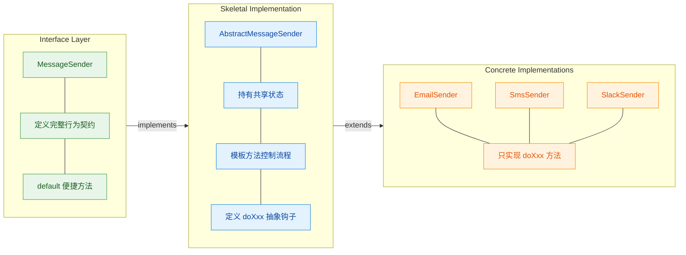

这种三层架构的优势在于：如果某个类已经继承了其他类（比如 `class MySpecialSender extends ThirdPartyBase`），它无法再继承 `AbstractMessageSender`，但它仍然可以直接实现 `MessageSender` 接口，手动编写所有方法。接口保证了最大的灵活性，骨架实现类则为"没有继承包袱"的类提供了便利的快捷通道。

### Java 版本演进对选择的影响

随着 Java 版本的迭代，接口的能力在不断增强，这直接影响了抽象类与接口的选择天平。理解这个演进脉络，能帮助你在不同 Java 版本的项目中做出合理决策。

```java
// ============ Java 7 及之前 ============
// 接口只能有：public abstract 方法 + public static final 常量
// 此时抽象类的优势巨大：能提供部分实现、能有状态、能有各种访问修饰符
// 选择倾向：大量使用抽象类

// ============ Java 8 ============
// 接口新增：default 方法、static 方法
// 天平开始向接口倾斜：接口也能提供默认实现了
// 选择倾向：优先接口，需要状态时才用抽象类

// ============ Java 9 ============
// 接口新增：private 方法、private static 方法
// 接口内部可以做代码复用了，不再需要把辅助逻辑暴露为 default
// 选择倾向：接口进一步增强

// ============ Java 14+ ============
// 新增 record（不可变数据载体）和 sealed class/interface（密封类型）
// sealed 让接口也能控制实现者的范围，弥补了接口"太开放"的缺点

// sealed 接口示例：限制谁能实现这个接口
public sealed interface Shape
    permits Circle, Rectangle, Triangle {  // 只允许这三个类实现
    double area();
}

// 这在 Java 14 之前只能通过抽象类 + 包私有构造器来近似实现
// 现在接口也能做到了，进一步缩小了抽象类的独占领地

public record Circle(double radius) implements Shape {
    @Override
    public double area() {
        return Math.PI * radius * radius;   // record 自动生成构造器、equals、hashCode
    }
}

public record Rectangle(double width, double height) implements Shape {
    @Override
    public double area() {
        return width * height;
    }
}

public final class Triangle implements Shape {
    private final double base;
    private final double height;

    public Triangle(double base, double height) {
        this.base = base;
        this.height = height;
    }

    @Override
    public double area() {
        return 0.5 * base * height;
    }
}
```

### 常见误区与反模式

在实际开发中，有一些关于抽象类和接口的常见误用，值得特别警惕。

第一个误区是"为了代码复用而使用继承"。如果两个类之间没有真正的 is-a 关系，仅仅因为它们有一些相同的代码就让一个继承另一个，这是典型的反模式。正确的做法是使用组合（composition）或者把公共逻辑提取到工具类中。

```java
// ❌ 反模式：为了复用 log() 方法而继承
public abstract class BaseService {
    protected void log(String msg) {
        System.out.println("[LOG] " + msg);
    }
}

// OrderService "is-a" BaseService？语义上完全说不通
public class OrderService extends BaseService {
    public void createOrder() {
        log("Creating order...");   // 虽然能用，但设计是错的
    }
}

// ✅ 正确做法：组合优于继承（Composition over Inheritance）
public class OrderService {
    private final Logger logger = new Logger();  // 组合：持有 Logger 的引用

    public void createOrder() {
        logger.log("Creating order...");         // 委托给 Logger
    }
}
```

第二个误区是"接口中塞满 default 方法"。default 方法的初衷是为了接口演化的向后兼容，不是为了把接口变成抽象类。如果你的接口有大量 default 方法且它们之间存在复杂的调用关系，那你可能需要的是一个骨架实现类。

```java
// ❌ 反模式：接口承担了太多实现职责
public interface DataProcessor {
    default void validate(String data) { /* 20行验证逻辑 */ }
    default void parse(String data) { /* 30行解析逻辑 */ }
    default void transform(String data) { /* 25行转换逻辑 */ }
    default void save(String data) { /* 15行保存逻辑 */ }

    // 这个接口已经不是"契约"了，它变成了一个伪装成接口的抽象类
    // 而且没有实例状态，所有 default 方法之间无法共享数据
}

// ✅ 正确做法：接口保持精简，复杂逻辑放到骨架实现类
public interface DataProcessor {
    void process(String data);  // 简洁的契约
}

public abstract class AbstractDataProcessor implements DataProcessor {
    // 在抽象类中组织复杂的处理流程
    @Override
    public final void process(String data) {
        validate(data);
        String parsed = parse(data);
        String transformed = transform(parsed);
        save(transformed);
    }

    protected abstract void validate(String data);
    protected abstract String parse(String data);
    protected abstract String transform(String data);
    protected abstract void save(String data);
}
```

第三个误区是"用抽象类来定义类型标记"。如果你的抽象类没有任何字段、没有任何具体方法，只有抽象方法，那它本质上就是一个接口，应该直接用接口。

```java
// ❌ 没有意义的抽象类：没有状态，没有具体方法
public abstract class Printable {
    public abstract void print();   // 这就是个接口，何必用抽象类？
}

// ✅ 直接用接口
public interface Printable {
    void print();
}
```

### 一句话决策速查表

最后，把所有的决策智慧浓缩成一张速查表，方便你在编码时快速参考：

```
┌─────────────────────────────────────┬────────────────────┐
│           场景描述                    │     选择           │
├─────────────────────────────────────┼────────────────────┤
│ 需要共享可变实例状态                  │ 抽象类              │
│ 需要构造器初始化逻辑                  │ 抽象类              │
│ 需要用 final 锁定模板方法流程         │ 抽象类              │
│ 定义类型族的共同本质 (is-a)           │ 抽象类              │
│ 需要非 public 的成员                 │ 抽象类              │
├─────────────────────────────────────┼────────────────────┤
│ 描述横切能力 (can-do)                │ 接口               │
│ 需要多实现 / 跨继承树多态             │ 接口               │
│ 想用 Lambda 表达式                   │ 函数式接口           │
│ 框架扩展点 / API 契约                │ 接口               │
│ 需要向后兼容的演化能力                │ 接口 + default      │
├─────────────────────────────────────┼────────────────────┤
│ 既要灵活性又要代码复用                │ 接口 + 骨架实现类    │
│ 需要限制实现者范围 (Java 17+)        │ sealed interface    │
└─────────────────────────────────────┴────────────────────┘
```

记住 Joshua Bloch 在 Effective Java 中的经典建议："Prefer interfaces to abstract classes"（优先使用接口而非抽象类）。但这不是绝对的教条——当你需要状态管理、构造器初始化、或者模板方法模式时，抽象类仍然是不可替代的利器。最优雅的设计往往是两者的协作：接口定义契约，抽象类提供骨架，具体类专注业务。

---

**📝 练习题**

以下代码编译运行后，输出结果是什么？

```java
interface Flyable {
    default String move() {
        return "fly";
    }
}

interface Swimmable {
    default String move() {
        return "swim";
    }
}

abstract class Bird {
    public String move() {
        return "walk";
    }
}

class Duck extends Bird implements Flyable, Swimmable {
    // 注意：Duck 没有覆盖 move() 方法
}

public class Main {
    public static void main(String[] args) {
        Duck duck = new Duck();
        System.out.println(duck.move());
    }
}
```

A. fly


B. swim


C. walk


D. 编译错误：move() 方法冲突


**【答案】** C

**【解析】** 这道题考查的是 Java 中 default 方法冲突解决的优先级规则。Java 规范明确定义了三条优先级规则（按优先级从高到低）：

1. 类中的方法优先于接口的 default 方法（"Class wins" rule）
2. 更具体的接口优先于更通用的接口（子接口优先于父接口）
3. 如果以上规则无法决定，实现类必须显式覆盖并选择

本题中，`Duck` 继承了 `Bird` 类的具体方法 `move()`，同时两个接口 `Flyable` 和 `Swimmable` 也各自提供了 `move()` 的 default 实现。根据第一条规则 "Class wins"，父类 `Bird` 中的具体方法 `move()` 直接胜出，两个接口的 default 方法被忽略，因此输出 `walk`。如果 `Duck` 没有继承 `Bird`（即 `class Duck implements Flyable, Swimmable`），那么两个接口的 default 方法优先级相同，无法自动决定，此时才会触发编译错误，要求 `Duck` 显式覆盖 `move()` 方法。

---

## 本章小结

本章系统地探讨了 Java 中两大核心抽象机制——抽象类（Abstract Class）与接口（Interface）。它们是 Java 面向对象设计的基石，理解它们的本质区别与协作方式，是从"写代码"迈向"做设计"的关键一步。

### 知识脉络回顾

我们从最基础的抽象类出发，逐步深入到接口的各种现代特性，最终将两者放在一起做了设计层面的对比。整个章节的知识流转可以用一张图来概括：

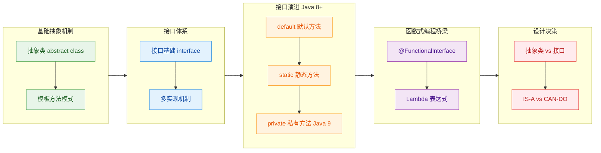

### 核心要点提炼

本章最重要的认知，不是记住语法，而是理解每个机制背后的设计意图。

抽象类的本质是"不完整的类"。它通过 `abstract` 关键字声明自己"我知道该做什么，但我不知道具体怎么做"，把具体实现的责任推迟给子类。这种机制天然适合模板方法模式（Template Method Pattern）——在父类中定义算法骨架，把可变步骤留给子类去填充。抽象类可以持有状态（实例字段）、可以有构造器、可以包含任意访问修饰符的方法，这些都是接口做不到或不擅长的。但它受限于 Java 的单继承规则，一个类只能继承一个抽象类。

接口的本质是"能力契约"。它定义的是"你能做什么"（CAN-DO），而不是"你是什么"（IS-A）。一个类可以实现多个接口，这赋予了 Java 在单继承体系下实现多态的灵活性。`Comparable`、`Serializable`、`Iterable` 这些经典接口，都是在描述一种能力，而非一种身份。

Java 8 和 Java 9 对接口的增强是一次重大的设计演进。`default` 方法让接口可以在不破坏已有实现类的前提下添加新行为，解决了接口演化（Interface Evolution）的难题；`static` 方法让接口可以承载工具方法，减少对伴生工具类的依赖；`private` 方法则让接口内部的代码复用成为可能，保持了封装性。这三者共同让接口从"纯粹的抽象契约"进化为"可以携带行为的契约"。

函数式接口是 Java 拥抱函数式编程的桥梁。只要一个接口有且仅有一个抽象方法（Single Abstract Method, SAM），它就可以被 Lambda 表达式实例化。`@FunctionalInterface` 注解不是必须的，但它是一种设计意图的声明，让编译器帮你守住"只有一个抽象方法"这条红线。`java.util.function` 包下的 `Predicate`、`Function`、`Consumer`、`Supplier` 四大核心函数式接口，是日常开发中使用频率极高的工具。

### 设计决策速查表

在实际开发中做选择时，可以参考以下决策逻辑：

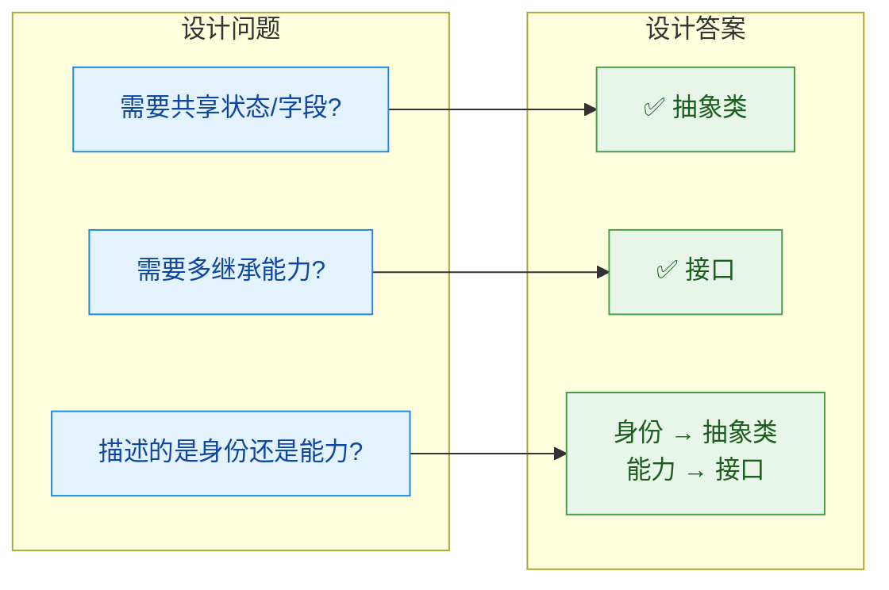

最经典的组合用法是：用抽象类建立继承体系的骨架，用接口声明横切的能力。Spring 框架中随处可见这种模式——`AbstractApplicationContext` 是抽象类，定义了容器的核心生命周期；`BeanFactory`、`ApplicationEventPublisher` 是接口，声明了容器的各种能力。两者协作，构成了 Spring 强大而灵活的架构。

### 一句话总结

> 抽象类回答"你是什么"，接口回答"你能做什么"。优秀的 Java 设计，往往是两者的精妙配合。

---

**📝 练习题**

以下代码能否通过编译？如果能，输出什么？如果不能，问题出在哪里？

```java
// 定义一个函数式接口
@FunctionalInterface
interface Transformer {
    String transform(String input);

    // default 方法不计入 SAM 计数
    default String transformTwice(String input) {
        return transform(transform(input));
    }
}

// 定义一个抽象类
abstract class BaseProcessor {
    protected String prefix;

    // 抽象类的构造器
    public BaseProcessor(String prefix) {
        this.prefix = prefix;
    }

    // 模板方法
    public final String process(String input, Transformer t) {
        return prefix + ":" + t.transform(input);
    }
}

// 具体子类
class UpperProcessor extends BaseProcessor {
    public UpperProcessor() {
        super("UPPER");
    }
}

// 测试
public class Quiz {
    public static void main(String[] args) {
        UpperProcessor processor = new UpperProcessor();
        // Lambda 实现函数式接口
        Transformer t = s -> s.toUpperCase();
        System.out.println(processor.process("hello", t));
        System.out.println(t.transformTwice("hello"));
    }
}
```

A. 编译失败，`@FunctionalInterface` 接口不能有 `default` 方法


B. 编译失败，`UpperProcessor` 没有实现任何抽象方法所以不能实例化


C. 编译成功，输出 `UPPER:HELLO` 和 `HELLO`


D. 编译成功，输出 `UPPER:hello` 和 `HELLO`


**【答案】** C

**【解析】**

这道题综合考察了本章几乎所有核心知识点：

首先，`@FunctionalInterface` 的判定标准是"有且仅有一个抽象方法"。`default` 方法不是抽象方法，所以 `Transformer` 接口完全合法，排除 A。

其次，`BaseProcessor` 是抽象类，但它本身没有声明任何 `abstract` 方法——一个类可以被声明为 `abstract` 却不包含抽象方法，这是合法的。`UpperProcessor` 继承它，调用了 `super("UPPER")` 完成构造，没有需要强制重写的方法，所以可以正常实例化，排除 B。

接着看运行结果。`processor.process("hello", t)` 调用模板方法，`prefix` 是 `"UPPER"`，`t.transform("hello")` 通过 Lambda 执行 `s.toUpperCase()` 得到 `"HELLO"`，拼接后为 `"UPPER:HELLO"`。

`t.transformTwice("hello")` 调用 `default` 方法，内部执行两次 `transform`：第一次 `"hello"` → `"HELLO"`，第二次 `"HELLO"` → `"HELLO"`（已经全大写，再转一次还是大写），最终结果为 `"HELLO"`。

所以输出是 `UPPER:HELLO` 和 `HELLO`，答案为 C。这道题的关键在于理解：抽象类不一定有抽象方法、函数式接口允许 `default` 方法、Lambda 与 `default` 方法可以无缝协作。

---

