---

# 控制流

---

## 条件语句（Conditional Statements）

程序的本质是"做决策"。没有条件判断的代码只能一条路走到黑，而现实世界的业务逻辑几乎处处充满分支——用户登录是否成功、余额是否充足、年龄是否达标……Java 提供了两大条件控制结构：`if-else` 和 `switch`，它们是控制流（Control Flow）的基石。

---

### if-else 语句

`if-else` 是最基础、最灵活的条件判断结构。它的核心思想极其朴素：**如果（if）条件为真，就执行 A；否则（else），执行 B。**

#### 基本语法形态

Java 中 `if-else` 有三种常见写法，复杂度逐级递增：

```java
// ========== 形态一：单 if ==========
// 只关心"满足条件"的情况，不满足则什么都不做
if (condition) {
    // 条件为 true 时执行
}

// ========== 形态二：if-else ==========
// 二选一：非此即彼
if (condition) {
    // 条件为 true 时执行
} else {
    // 条件为 false 时执行
}

// ========== 形态三：if - else if - else（多分支）==========
// 多选一：从上往下逐个检查，命中即停
if (condition1) {
    // condition1 为 true 时执行
} else if (condition2) {
    // condition2 为 true 时执行
} else if (condition3) {
    // condition3 为 true 时执行
} else {
    // 以上条件全部不满足时执行（兜底）
}
```

这里有一个关键的执行机制需要牢记：**`else if` 链是短路求值的（short-circuit evaluation in branching）**——一旦某个条件命中，后续所有分支直接跳过，不会再做判断。这意味着条件的书写顺序非常重要。

#### 执行流程可视化

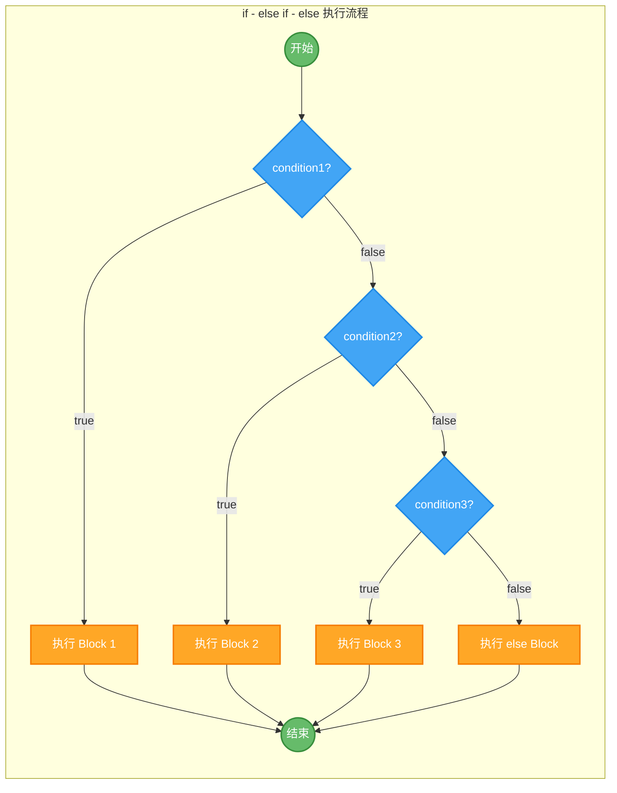

可以看到，流程图呈现出一条"瀑布式"的判断链——从上到下逐级过滤，命中即走，未命中则继续下探。

#### 实战示例：成绩等级判定

```java
public class GradeEvaluator {
    public static void main(String[] args) {
        int score = 82; // 假设学生得分为 82

        // --- 多分支条件判断：从高到低逐级匹配 ---
        // 注意顺序：必须从最严格的条件开始判断
        if (score >= 90) {
            // 90 分及以上：优秀
            System.out.println("等级：A（优秀）");
        } else if (score >= 80) {
            // 80~89 分：良好
            // 走到这里，说明 score < 90 已经隐含成立
            System.out.println("等级：B（良好）");
        } else if (score >= 70) {
            // 70~79 分：中等
            System.out.println("等级：C（中等）");
        } else if (score >= 60) {
            // 60~69 分：及格
            System.out.println("等级：D（及格）");
        } else {
            // 60 分以下：不及格（兜底分支）
            System.out.println("等级：F（不及格）");
        }
        // 输出结果：等级：B（良好）
    }
}
```

这段代码有一个容易被忽视的精妙之处：当执行到 `else if (score >= 80)` 时，我们并不需要写 `score >= 80 && score < 90`，因为能走到这个分支，说明前面的 `score >= 90` 已经判定为 `false`，即 `score < 90` 是隐含条件。这就是 `else if` 链的天然优势——**每一层都自动继承了上层的否定条件**。

#### 条件顺序的陷阱

如果把条件顺序写反，会发生什么？

```java
// ❌ 错误示范：条件从宽松到严格
if (score >= 60) {
    // 82 >= 60 为 true，直接命中！
    System.out.println("D（及格）"); // 82 分被判定为"及格"，显然不对
} else if (score >= 70) {
    // 永远不会执行到这里（因为 >= 70 的一定 >= 60，已被上面拦截）
    System.out.println("C（中等）");
} else if (score >= 80) {
    // 同理，永远不可达
    System.out.println("B（良好）");
}
```

这是初学者最常犯的错误之一。**在 `else if` 链中，条件必须从严格到宽松排列**，否则宽松条件会"吞掉"所有本该匹配更严格条件的情况。

#### 关于花括号的建议

Java 允许在 `if` 体只有一条语句时省略花括号：

```java
// 语法上合法，但不推荐
if (score >= 90)
    System.out.println("优秀");
```

但这是一个著名的"坑"。苹果公司 2014 年的 SSL/TLS 安全漏洞（goto fail bug）就是因为省略花括号后多写了一行缩进对齐的代码，导致逻辑错误。**强烈建议：永远加花括号，即使只有一行代码。** 这也是 Google Java Style Guide 和绝大多数企业编码规范的明确要求。

#### 嵌套 if 与代码可读性

`if` 语句可以嵌套使用，但层级过深会严重损害可读性：

```java
// ❌ 嵌套过深，形成"箭头型代码"（Arrow Anti-pattern）
if (user != null) {
    if (user.isActive()) {
        if (user.hasPermission("admin")) {
            if (user.getAge() >= 18) {
                // 真正的业务逻辑被埋在第四层
                grantAccess();
            }
        }
    }
}

// ✅ 使用"卫语句"（Guard Clause）提前返回，扁平化逻辑
if (user == null) return;           // 空值检查，不满足直接走人
if (!user.isActive()) return;       // 非活跃用户，直接走人
if (!user.hasPermission("admin")) return; // 无权限，直接走人
if (user.getAge() < 18) return;     // 未成年，直接走人

// 所有前置条件都通过，执行核心逻辑
grantAccess();
```

Guard Clause（卫语句）是一种非常实用的重构技巧：把异常/边界情况提前处理并返回，让主逻辑保持在最外层，代码一目了然。Martin Fowler 在《Refactoring》一书中将其列为标准重构手法之一。

#### 三元运算符：if-else 的简写形式

当 `if-else` 仅用于赋值时，可以用三元运算符（Ternary Operator）简化：

```java
int score = 82;

// if-else 写法
String result;
if (score >= 60) {
    result = "及格"; // 满足条件赋值"及格"
} else {
    result = "不及格"; // 不满足赋值"不及格"
}

// 三元运算符写法：condition ? valueIfTrue : valueIfFalse
String result = (score >= 60) ? "及格" : "不及格";
// 含义完全等价，但更简洁
```

三元运算符适合简单的二选一赋值场景。如果逻辑复杂（比如需要嵌套三元），就老老实实用 `if-else`，可读性永远比"炫技"重要。

---

### switch 语句与 switch 表达式

当你面对的是"一个变量与多个固定值逐一比较"的场景时，`switch` 比一长串 `if-else if` 更清晰、更高效。Java 的 `switch` 经历了从传统语句到现代表达式的重大进化，我们逐一展开。

#### 传统 switch 语句（Classic Switch Statement）

```java
public class TraditionalSwitch {
    public static void main(String[] args) {
        int dayOfWeek = 3; // 假设 1=周一, 2=周二, ..., 7=周日

        // switch 接收一个表达式，与每个 case 的常量值比较
        switch (dayOfWeek) {
            case 1: // 如果 dayOfWeek == 1
                System.out.println("星期一");
                break; // 必须 break，否则会"穿透"到下一个 case
            case 2: // 如果 dayOfWeek == 2
                System.out.println("星期二");
                break;
            case 3: // 如果 dayOfWeek == 3
                System.out.println("星期三");
                break;
            case 4:
                System.out.println("星期四");
                break;
            case 5:
                System.out.println("星期五");
                break;
            case 6:
                System.out.println("星期六");
                break;
            case 7:
                System.out.println("星期日");
                break;
            default: // 所有 case 都不匹配时执行（类似 else）
                System.out.println("无效的日期编号");
                break;
        }
        // 输出：星期三
    }
}
```

#### switch 支持的数据类型

这是面试常考点。传统 `switch` 支持的类型随 Java 版本逐步扩展：

| Java 版本 | 新增支持类型 |
|-----------|-------------|
| Java 1.0 | `byte`, `short`, `char`, `int` |
| Java 5 | 枚举类型（`enum`） |
| Java 7 | `String` |
| Java 14+ | Pattern Matching（预览，后续版本正式） |

注意：`long`、`float`、`double`、`boolean` 始终不被支持。原因是 `switch` 底层依赖整数比较或哈希表查找，浮点数的精度问题和 `boolean` 的二值性使它们不适合 `switch` 的设计语义。

#### Fall-through：传统 switch 的最大陷阱

传统 `switch` 有一个臭名昭著的特性——**穿透（fall-through）**：如果某个 `case` 没有 `break`，程序会继续执行下一个 `case` 的代码，无论条件是否匹配。

```java
int day = 2;

switch (day) {
    case 1:
        System.out.println("周一"); // 不会执行
    case 2:
        System.out.println("周二"); // ✅ 匹配，执行
        // 没有 break！继续穿透 ↓
    case 3:
        System.out.println("周三"); // ⚠️ 也会执行！
        // 没有 break！继续穿透 ↓
    case 4:
        System.out.println("周四"); // ⚠️ 也会执行！
        break; // 终于遇到 break，停止
    case 5:
        System.out.println("周五"); // 不会执行
}
// 输出：
// 周二
// 周三
// 周四
```

穿透行为偶尔可以被"利用"来合并多个 case：

```java
// 利用 fall-through 合并处理：判断工作日 vs 周末
switch (day) {
    case 1: // 周一
    case 2: // 周二
    case 3: // 周三
    case 4: // 周四
    case 5: // 周五 —— 以上五个 case 全部穿透到这里
        System.out.println("工作日");
        break;
    case 6: // 周六
    case 7: // 周日 —— 两个 case 穿透到这里
        System.out.println("周末");
        break;
    default:
        System.out.println("无效");
}
```

但这种"有意穿透"和"忘写 break 导致的 bug"在代码审查中很难区分，这也是传统 `switch` 被诟病多年的原因。

#### switch 表达式（Switch Expression）— Java 14 正式引入

Java 14 正式引入了 `switch` 表达式（JEP 361），这是对传统 `switch` 的一次彻底革新。它解决了三个核心痛点：

1. **不再需要 `break`**——使用箭头语法 `->` 自动隔离每个分支，彻底消灭 fall-through
2. **`switch` 可以作为表达式返回值**——可以直接赋值给变量
3. **编译器强制穷举检查**——如果分支没有覆盖所有可能值，编译报错

```java
public class ModernSwitch {
    public static void main(String[] args) {
        int dayOfWeek = 3;

        // switch 表达式：直接将结果赋值给变量
        String dayName = switch (dayOfWeek) {
            case 1 -> "星期一";   // 箭头语法，无需 break
            case 2 -> "星期二";   // 每个分支自动隔离
            case 3 -> "星期三";   // 匹配后直接返回值
            case 4 -> "星期四";
            case 5 -> "星期五";
            case 6 -> "星期六";
            case 7 -> "星期日";
            default -> "无效日期"; // 兜底分支
        }; // 注意：switch 表达式作为语句结尾，需要分号

        System.out.println(dayName); // 输出：星期三
    }
}
```

#### 多值匹配与代码块

箭头语法支持一个 `case` 匹配多个值（用逗号分隔），以及使用代码块处理复杂逻辑：

```java
int day = 6;

// 多值匹配：一个 case 覆盖多个常量
String dayType = switch (day) {
    case 1, 2, 3, 4, 5 -> "工作日";  // 逗号分隔，替代 fall-through
    case 6, 7 -> "周末";              // 简洁明了
    default -> "无效";
};

System.out.println(dayType); // 输出：周末
```

当某个分支需要执行多条语句时，使用花括号包裹，并用 `yield` 关键字返回值：

```java
int month = 8;

// 代码块 + yield：处理复杂分支逻辑
String season = switch (month) {
    case 3, 4, 5 -> "春季";
    case 6, 7, 8 -> {
        // 花括号内可以写多条语句
        System.out.println("正在判断夏季月份...");
        // yield 是 switch 表达式专用的"返回值"关键字
        yield "夏季";  // 不是 return，是 yield
    }
    case 9, 10, 11 -> "秋季";
    case 12, 1, 2 -> "冬季";
    default -> "无效月份";
};

System.out.println(season); // 输出：夏季
```

`yield` 是 Java 14 随 switch 表达式一起引入的上下文关键字（contextual keyword），它只在 `switch` 表达式的代码块中有特殊含义，在其他地方仍然可以作为普通标识符使用（虽然不推荐）。

#### 传统 switch vs 现代 switch 表达式对比

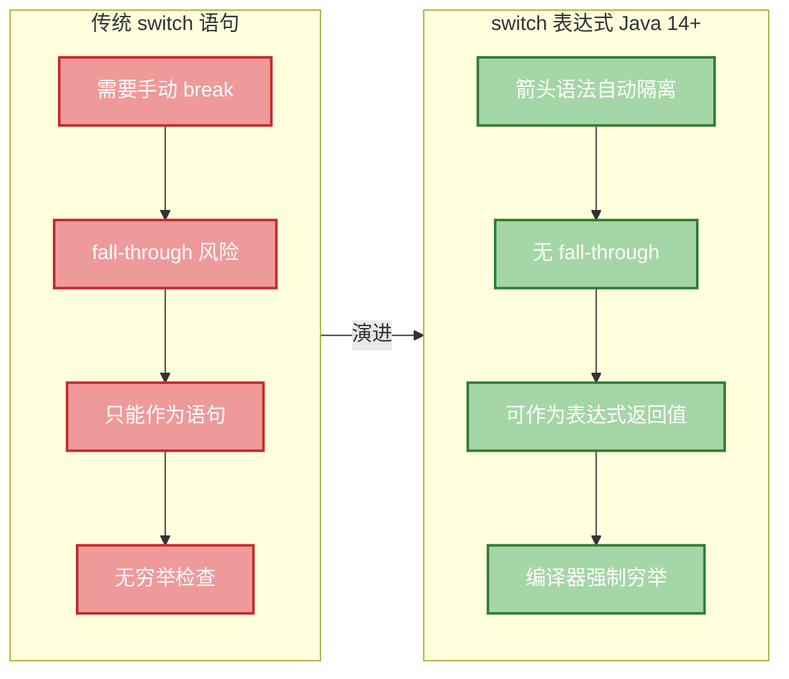

#### 枚举与 switch 的天然搭配

`switch` 与枚举（`enum`）配合使用时，编译器能够检查是否覆盖了所有枚举值，这使得代码更加安全：

```java
// 定义交通信号灯枚举
enum TrafficLight {
    RED, YELLOW, GREEN // 三个枚举常量
}

public class EnumSwitchDemo {
    public static void main(String[] args) {
        TrafficLight signal = TrafficLight.RED;

        // 枚举 + switch 表达式：编译器会检查是否覆盖所有枚举值
        String action = switch (signal) {
            case RED -> "停车等待";     // 直接使用枚举常量名，无需前缀
            case YELLOW -> "减速慢行";
            case GREEN -> "正常通行";
            // 如果覆盖了所有枚举值，可以不写 default
            // 编译器知道不可能有第四种情况
        };

        System.out.println(action); // 输出：停车等待
    }
}
```

当枚举覆盖完整时，`default` 分支可以省略。这是 switch 表达式的穷举检查（exhaustiveness check）在发挥作用——如果你将来给 `TrafficLight` 新增一个 `FLASHING` 值，所有没有处理它的 `switch` 表达式都会编译报错，迫使你更新逻辑。这种"编译期安全网"在大型项目中价值巨大。

#### if-else vs switch：如何选择？

| 场景 | 推荐 | 原因 |
|------|------|------|
| 单个变量与多个固定值比较 | `switch` | 结构清晰，可能有性能优化（跳转表） |
| 范围判断（如 `score >= 90`） | `if-else` | `switch` 的 `case` 只能是常量，不支持范围 |
| 复杂布尔组合条件 | `if-else` | `switch` 无法表达 `&&`、`\|\|` 组合 |
| 枚举值分支处理 | `switch` 表达式 | 穷举检查 + 简洁语法，天然匹配 |
| 需要返回值的分支 | `switch` 表达式 | 直接作为表达式赋值，避免临时变量 |
| 只有两个分支（true/false） | `if-else` 或三元 | `switch` 大材小用 |

一个实用的经验法则：**如果你发现自己写了超过 3 个 `else if`，并且每个条件都是同一个变量与不同常量的 `==` 比较，那就该考虑用 `switch` 了。**

---

**📝 练习题**

以下代码的输出结果是什么？

```java
String level = "B";
switch (level) {
    case "A":
        System.out.print("优秀 ");
    case "B":
        System.out.print("良好 ");
    case "C":
        System.out.print("中等 ");
        break;
    case "D":
        System.out.print("及格 ");
    default:
        System.out.print("未知 ");
}
```

A. `良好`


B. `良好 中等`


C. `良好 中等 及格 未知`


D. `优秀 良好 中等`


**【答案】** B

**【解析】** 这道题考查的是传统 `switch` 的 fall-through 穿透机制。`level` 匹配到 `case "B"`，打印 `良好 `。由于 `case "B"` 后面没有 `break`，程序继续穿透到 `case "C"`，打印 `中等 `。`case "C"` 末尾有 `break`，穿透在此终止。因此最终输出为 `良好 中等`。这正是传统 `switch` 最容易出错的地方——忘写 `break` 导致意外穿透。使用 Java 14+ 的箭头语法 `switch` 表达式可以彻底避免此类问题。

---

## 循环语句（for、while、增强 for）

循环（Loop）是程序中最核心的控制结构之一。它的本质很简单：**让一段代码在满足条件时反复执行**。没有循环，你就得把同样的代码复制粘贴一万遍——这显然不是人干的事。

Java 提供了三种基本循环结构：`for`、`while`（含 `do-while`）、以及增强型 `for`（Enhanced for，也叫 for-each）。它们在底层都是"条件判断 + 跳转"的语法糖，但各自有最适合的使用场景。理解它们的执行流程、适用边界和性能特征，是写出高质量 Java 代码的基本功。

---

### 传统 for 循环

`for` 循环是 Java 中最经典、最灵活的循环结构。它将循环的三个核心要素——**初始化、条件判断、迭代更新**——集中在一行声明中，结构紧凑，语义清晰。

其语法结构为：

```java
for (初始化语句; 循环条件; 迭代语句) {
    // 循环体
}
```

这三个部分各司其职：

- **初始化语句（Initialization）**：在循环开始前执行且仅执行一次，通常用来声明并初始化循环变量。
- **循环条件（Condition）**：每次迭代前进行布尔判断，为 `true` 则执行循环体，为 `false` 则退出循环。
- **迭代语句（Update）**：每次循环体执行完毕后执行，通常用来递增或递减循环变量。

来看一个最基础的例子：

```java
// 打印 0 到 4 的数字
for (int i = 0; i < 5; i++) { // i 从 0 开始，每次加 1，直到 i 不再小于 5
    System.out.println("当前值: " + i); // 每次循环输出当前 i 的值
}
// 循环结束后，i 已超出作用域，无法再访问
```

这段代码的执行流程可以用下面的图来理解：

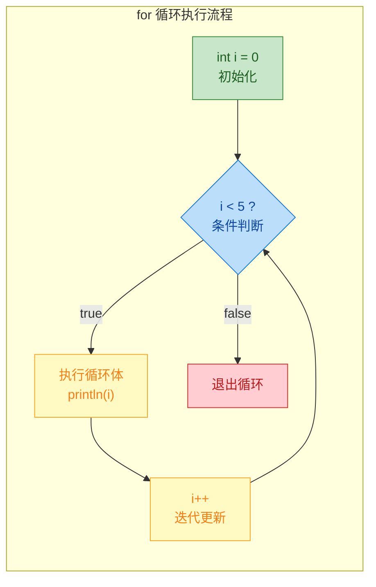

有几个关键细节值得注意：

**1. 循环变量的作用域（Scope）**

在 `for` 的初始化部分声明的变量，其作用域仅限于整个 `for` 语句块内部（包括循环体）。循环结束后，该变量就不存在了。这是一个非常好的设计，因为它避免了循环变量"泄漏"到外部作用域污染命名空间。

```java
for (int i = 0; i < 3; i++) {
    // i 在这里可用
}
// System.out.println(i); // 编译错误！i 在此处不可见
```

如果你确实需要在循环结束后访问循环变量的最终值，就必须在 `for` 之前声明它：

```java
int i; // 在外部声明
for (i = 0; i < 3; i++) {
    // 循环体
}
System.out.println("循环结束后 i = " + i); // 输出: 循环结束后 i = 3
```

**2. 三个部分都可以省略**

`for` 语句的三个组成部分都是可选的。省略条件部分等价于条件永远为 `true`，这就构成了一个无限循环（Infinite Loop）：

```java
// 无限循环的经典写法
for (;;) { // 初始化、条件、迭代全部省略
    // 必须在内部通过 break 或 return 退出，否则永远不会停止
    break; // 这里立即退出，仅作演示
}
```

**3. 初始化和迭代部分可以包含多条语句**

用逗号分隔即可。这在某些算法场景中非常有用，比如双指针（Two Pointers）：

```java
// 双指针：从数组两端向中间靠拢
int[] arr = {1, 2, 3, 4, 5};
for (int left = 0, right = arr.length - 1; left < right; left++, right--) {
    // left 从左往右走，right 从右往左走
    System.out.println("left=" + left + ", right=" + right);
    // 输出:
    // left=0, right=4
    // left=1, right=3
}
```

但要注意，初始化部分如果声明多个变量，它们必须是同一类型，因为这本质上是一条声明语句：

```java
// 合法：同一类型的多个变量
for (int i = 0, j = 10; i < j; i++, j--) { }

// 非法：不同类型不能放在同一条声明中
// for (int i = 0, long j = 10; ...) { } // 编译错误
```

**4. 嵌套 for 循环**

`for` 循环可以嵌套使用，这在处理二维数据结构（如矩阵、二维数组）时非常常见：

```java
// 打印一个 3x3 的乘法表片段
for (int i = 1; i <= 3; i++) {           // 外层循环控制行
    for (int j = 1; j <= 3; j++) {       // 内层循环控制列
        System.out.print(i * j + "\t");  // 输出乘积，用制表符分隔
    }
    System.out.println();                // 每行结束后换行
}
// 输出:
// 1    2    3
// 2    4    6
// 3    6    9
```

嵌套循环的时间复杂度是各层循环次数的乘积。两层各 n 次的嵌套就是 O(n²)，三层就是 O(n³)。在实际开发中，超过两层嵌套就应该考虑是否有更优的算法或数据结构来替代。

---

### while 循环与 do-while 循环

`while` 循环是最朴素的循环形式——它只关心一个条件：**只要条件为真，就继续执行**。

```java
while (条件表达式) {
    // 循环体
}
```

与 `for` 不同，`while` 没有内置的初始化和迭代机制，这些需要你自己在外部和循环体内部手动管理。这使得 `while` 更适合那些**循环次数不确定**的场景——你不知道要循环多少次，只知道什么时候该停。

一个典型的例子是读取用户输入直到满足条件：

```java
import java.util.Scanner;

Scanner scanner = new Scanner(System.in); // 创建输入扫描器
String input = "";                        // 初始化输入变量

// 持续读取，直到用户输入 "quit"
while (!input.equals("quit")) {           // 条件：输入不等于 "quit" 就继续
    System.out.print("请输入命令 (输入 quit 退出): ");
    input = scanner.nextLine();           // 读取用户的一行输入
    System.out.println("你输入了: " + input);
}
// 用户输入 "quit" 后，条件为 false，循环结束
```

再看一个经典的数学算法——求最大公约数（GCD，Greatest Common Divisor），使用辗转相除法（Euclidean Algorithm）：

```java
int a = 48, b = 18; // 求 48 和 18 的最大公约数

while (b != 0) {    // 只要 b 不为 0，就继续
    int temp = b;   // 暂存 b 的值
    b = a % b;      // b 变为 a 除以 b 的余数
    a = temp;       // a 变为原来的 b
}
// 循环结束时，a 就是最大公约数
System.out.println("GCD = " + a); // 输出: GCD = 6
```

这个例子完美展示了 `while` 的优势：你无法预知循环会执行几次，但你清楚地知道终止条件是 `b == 0`。

**do-while 循环：至少执行一次**

`do-while` 是 `while` 的变体，区别在于它**先执行循环体，再判断条件**。这保证了循环体至少会被执行一次（at least once），即使条件一开始就是 `false`。

```java
do {
    // 循环体（至少执行一次）
} while (条件表达式); // 注意这里有分号！
```

`do-while` 最经典的应用场景是**输入验证**——你必须先让用户输入一次，然后才能判断输入是否合法：

```java
Scanner scanner = new Scanner(System.in);
int number; // 存储用户输入的数字

do {
    System.out.print("请输入一个 1-100 之间的整数: ");
    number = scanner.nextInt(); // 先读取一次输入（至少执行一次）

    if (number < 1 || number > 100) {
        System.out.println("输入无效，请重试！"); // 不合法则提示
    }
} while (number < 1 || number > 100); // 不合法就继续循环

System.out.println("你输入的有效数字是: " + number);
```

下面这张图对比了 `while` 和 `do-while` 的执行流程差异：

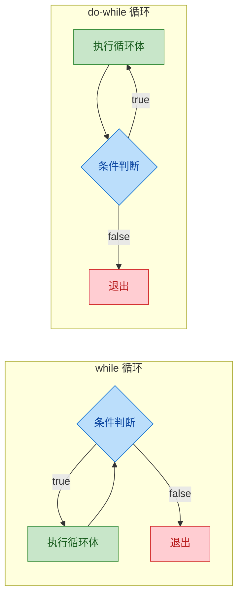

核心区别一目了然：`while` 是"先判断后执行"（entry-controlled），`do-while` 是"先执行后判断"（exit-controlled）。

**while vs for：如何选择？**

一个简单的经验法则：

- **循环次数已知或可预计** → 用 `for`（如遍历数组、执行固定次数的操作）
- **循环次数未知，依赖运行时条件** → 用 `while`（如读取流数据、等待事件）
- **至少需要执行一次** → 用 `do-while`（如输入验证、菜单交互）

实际上，`for` 和 `while` 在功能上是完全等价的，任何 `for` 循环都可以改写为 `while`，反之亦然。选择哪个更多是代码可读性和语义表达的问题。

---

### 增强 for 循环（for-each）

Java 5 引入了增强型 `for` 循环（Enhanced for loop），也被广泛称为 for-each 循环。它的设计目标非常明确：**简化对数组和集合的遍历操作**，消除手动管理索引或迭代器的繁琐代码。

语法如下：

```java
for (元素类型 变量名 : 可迭代对象) {
    // 使用变量名访问当前元素
}
```

冒号 `:` 可以读作 "in"，整条语句读作"对于可迭代对象中的每一个元素"。

**遍历数组**

```java
String[] fruits = {"苹果", "香蕉", "橙子", "葡萄"}; // 定义字符串数组

// 增强 for：自动遍历数组中的每个元素
for (String fruit : fruits) {        // 对于 fruits 中的每一个 String 元素
    System.out.println("水果: " + fruit); // 直接使用，无需通过索引访问
}
// 输出:
// 水果: 苹果
// 水果: 香蕉
// 水果: 橙子
// 水果: 葡萄
```

对比传统 `for` 循环的写法：

```java
// 传统 for：需要手动管理索引
for (int i = 0; i < fruits.length; i++) { // 声明索引 i，判断边界，递增
    System.out.println("水果: " + fruits[i]); // 通过索引访问元素
}
```

增强 `for` 明显更简洁，也更不容易出错——你不用担心 `ArrayIndexOutOfBoundsException`，因为根本没有索引操作。

**遍历集合（Collection）**

增强 `for` 可以用于任何实现了 `Iterable<T>` 接口的对象，Java 集合框架中的 `List`、`Set`、`Queue` 等都实现了这个接口：

```java
import java.util.List;
import java.util.ArrayList;

List<Integer> numbers = new ArrayList<>(); // 创建一个 Integer 列表
numbers.add(10);  // 添加元素
numbers.add(20);
numbers.add(30);

int sum = 0; // 用于累加的变量
for (int num : numbers) { // 遍历列表中的每个元素（自动拆箱 Integer -> int）
    sum += num;            // 累加到 sum
}
System.out.println("总和: " + sum); // 输出: 总和: 60
```

**底层原理：编译器的语法糖**

增强 `for` 并不是一种新的字节码指令，它是编译器层面的语法糖（Syntactic Sugar）。编译器会根据遍历对象的类型，将其转换为不同的传统代码：

- **数组** → 转换为传统的索引 `for` 循环
- **Iterable 对象** → 转换为 `Iterator` 迭代器模式

```java
// 你写的代码（遍历数组）
for (String fruit : fruits) {
    System.out.println(fruit);
}

// 编译器实际生成的等价代码
for (int i = 0; i < fruits.length; i++) { // 数组用索引遍历
    String fruit = fruits[i];
    System.out.println(fruit);
}
```

```java
// 你写的代码（遍历 List）
for (int num : numbers) {
    System.out.println(num);
}

// 编译器实际生成的等价代码
Iterator<Integer> it = numbers.iterator(); // 获取迭代器
while (it.hasNext()) {                     // 有下一个元素就继续
    int num = it.next();                   // 取出下一个元素（自动拆箱）
    System.out.println(num);
}
```

这个转换过程可以用图来表示：

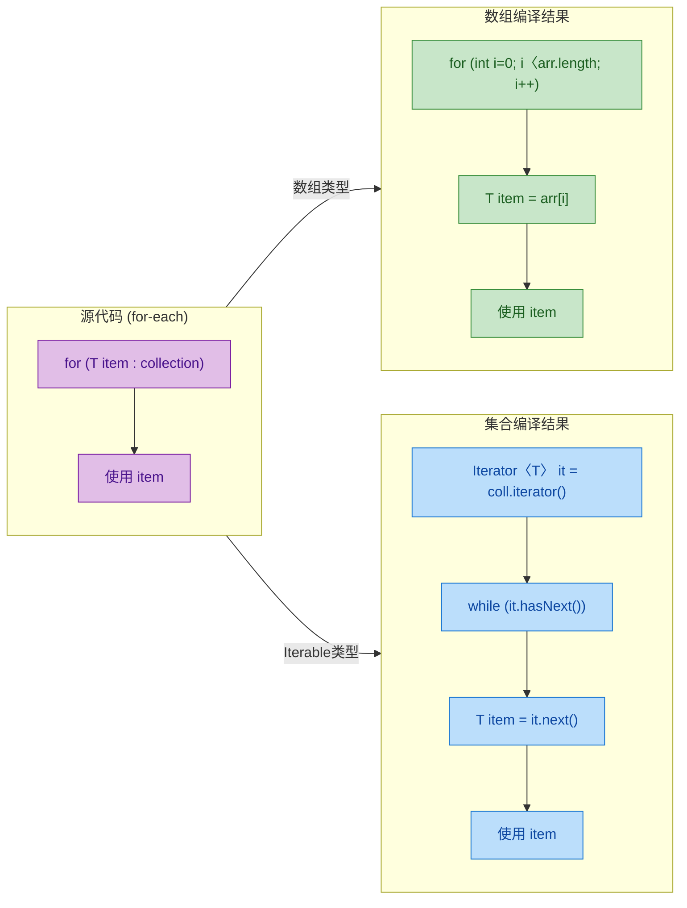

**增强 for 的局限性**

增强 `for` 虽然简洁，但它有几个明确的限制，使用时必须清楚：

**1. 无法获取索引**

如果你需要知道当前元素的位置（索引），增强 `for` 无法直接提供。你要么回退到传统 `for`，要么自己维护一个计数器：

```java
String[] names = {"Alice", "Bob", "Charlie"};

// 增强 for 无法直接获取索引，需要手动维护
int index = 0;
for (String name : names) {
    System.out.println("索引 " + index + ": " + name);
    index++; // 手动递增——这其实已经失去了 for-each 的简洁优势
}
```

**2. 无法在遍历时修改集合结构**

在增强 `for` 循环中对集合进行添加或删除操作，会抛出 `ConcurrentModificationException`。这是因为底层的 `Iterator` 检测到集合结构被非法修改了：

```java
List<String> list = new ArrayList<>(List.of("A", "B", "C"));

// 危险！遍历时删除元素会抛出 ConcurrentModificationException
for (String s : list) {
    if (s.equals("B")) {
        list.remove(s); // 运行时异常！
    }
}
```

正确的做法是使用 `Iterator` 的 `remove()` 方法，或者使用 `removeIf()`：

```java
// 方法一：使用 Iterator 显式遍历并删除
Iterator<String> it = list.iterator();
while (it.hasNext()) {
    if (it.next().equals("B")) {
        it.remove(); // Iterator 自己的 remove 方法是安全的
    }
}

// 方法二：使用 Collection.removeIf()（Java 8+，更简洁）
list.removeIf(s -> s.equals("B")); // Lambda 表达式，一行搞定
```

**3. 无法反向遍历或跳步遍历**

增强 `for` 只能从头到尾、逐个遍历。如果你需要从后往前遍历，或者每隔一个元素处理一次，就必须使用传统 `for`：

```java
int[] data = {1, 2, 3, 4, 5, 6};

// 反向遍历：只能用传统 for
for (int i = data.length - 1; i >= 0; i--) { // 从最后一个元素开始
    System.out.print(data[i] + " ");          // 输出: 6 5 4 3 2 1
}

System.out.println();

// 跳步遍历：每隔一个元素
for (int i = 0; i < data.length; i += 2) { // 步长为 2
    System.out.print(data[i] + " ");        // 输出: 1 3 5
}
```

**4. 对元素变量的赋值不会影响原数组/集合**

增强 `for` 中的循环变量是元素的一份拷贝（对于基本类型）或引用的拷贝（对于对象类型）。直接对循环变量赋值不会改变原始数据：

```java
int[] values = {1, 2, 3};

for (int v : values) {
    v = v * 10; // 只修改了局部变量 v，原数组不受影响
}
// values 仍然是 {1, 2, 3}

// 如果需要修改原数组，必须用传统 for 通过索引赋值
for (int i = 0; i < values.length; i++) {
    values[i] = values[i] * 10; // 通过索引直接修改数组元素
}
// 现在 values 是 {10, 20, 30}
```

---

### 循环中的常见陷阱与最佳实践

掌握了三种循环的语法之后，还需要了解实际编码中容易踩的坑。

**1. 无限循环（Infinite Loop）**

忘记更新循环变量，或者条件永远为真，是最常见的 bug 之一：

```java
// Bug 示例：忘记递增 i
int i = 0;
while (i < 10) {
    System.out.println(i);
    // 忘了写 i++; → i 永远是 0，条件永远为 true，程序卡死
}
```

有时候无限循环是故意的（如服务器主循环、游戏循环），但必须确保内部有明确的退出机制（`break`、`return`、或外部信号）。

**2. Off-by-One Error（差一错误）**

这是循环中最经典的逻辑错误，通常出现在边界条件上——多循环了一次或少循环了一次：

```java
int[] arr = {10, 20, 30, 40, 50};

// 错误：i <= arr.length 会导致 ArrayIndexOutOfBoundsException
// 因为数组索引范围是 0 到 arr.length-1
for (int i = 0; i <= arr.length; i++) { // 应该是 i < arr.length
    System.out.println(arr[i]);          // 当 i == 5 时越界！
}
```

记住一个简单的规则：**数组长度为 n，有效索引是 0 到 n-1**。用 `<` 而不是 `<=`。

**3. 浮点数作为循环条件**

由于浮点数的精度问题（IEEE 754），用浮点数做循环条件可能导致意想不到的结果：

```java
// 危险：浮点精度问题
for (double d = 0.0; d != 1.0; d += 0.1) { // d 可能永远不会精确等于 1.0
    System.out.println(d);
    // 0.0, 0.1, 0.2, ..., 0.9000000000000001, 1.0999999999999999... 停不下来！
}

// 安全做法：用整数控制循环，内部计算浮点值
for (int i = 0; i < 10; i++) {
    double d = i * 0.1; // 用整数 i 控制循环次数
    System.out.println(d);
}
```

**4. 在循环中拼接字符串**

这是 Java 性能优化中的经典话题。在循环中用 `+` 拼接字符串，每次都会创建新的 `String` 对象，时间复杂度是 O(n²)：

```java
// 低效：每次 += 都创建新的 String 对象
String result = "";
for (int i = 0; i < 10000; i++) {
    result += i + ","; // 每次循环都分配新内存、复制旧内容
}

// 高效：使用 StringBuilder，时间复杂度 O(n)
StringBuilder sb = new StringBuilder(); // 可变字符序列，内部维护 char 数组
for (int i = 0; i < 10000; i++) {
    sb.append(i).append(",");           // 在原有缓冲区上追加，避免重复分配
}
String result2 = sb.toString();         // 最后一次性转为 String
```

---

### 三种循环的对比总结

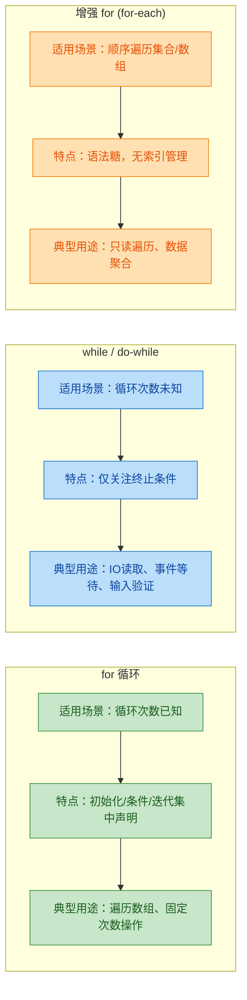

用一句话概括选择策略：**知道次数用 `for`，不知道次数用 `while`，只想遍历用 `for-each`**。

---

**📝 练习题**

以下代码的输出结果是什么？

```java
int count = 0;
for (int i = 0; i < 5; i++) {
    for (int j = i; j < 5; j++) {
        count++;
    }
}
System.out.println(count);
```

A. 10


B. 15


C. 20


D. 25


**【答案】** B

**【解析】** 这是一道考察嵌套循环执行次数的题目。外层 `i` 从 0 到 4，内层 `j` 从 `i` 开始到 4。所以每轮内层循环的执行次数分别是：`i=0` 时 5 次，`i=1` 时 4 次，`i=2` 时 3 次，`i=3` 时 2 次，`i=4` 时 1 次。总计 5 + 4 + 3 + 2 + 1 = 15 次。这实际上就是求 1 到 n 的累加和公式 n(n+1)/2，当 n=5 时结果为 15。这种"三角形"循环模式在算法中非常常见，比如冒泡排序的比较次数就是这个规律。

---

## 跳转控制（break、continue、labeled 跳转）

在循环和分支结构中，程序的执行流并不总是需要"从头走到尾"。很多时候，我们需要在满足某个条件时提前终止循环、跳过本轮迭代，甚至从多层嵌套中一步跳出。Java 提供了三种跳转控制机制：`break`、`continue` 以及带标签的跳转（Labeled Jump）。它们是控制流中的"紧急出口"和"快捷通道"，用好了能让代码逻辑更清晰、效率更高；用不好则会让代码变得难以阅读和维护。

---

### break 语句

`break` 的核心语义是"立即终止当前所在的最内层循环或 switch 语句，跳到该结构之后的第一条语句继续执行"。它就像一个紧急刹车——一旦触发，循环体内 `break` 之后的代码不再执行，循环的条件判断也不再进行。

#### 在循环中使用 break

最常见的场景是"搜索型循环"：遍历一个集合或数组，找到目标元素后立即退出，没必要继续遍历剩余元素。

```java
public class BreakInLoop {
    public static void main(String[] args) {
        // 定义一个待搜索的数组
        int[] numbers = {3, 7, 12, 25, 8, 42, 16};
        // 我们要找的目标值
        int target = 25;
        // 记录目标值的索引，-1 表示未找到
        int foundIndex = -1;

        // 遍历数组中的每一个元素
        for (int i = 0; i < numbers.length; i++) {
            System.out.println("正在检查索引 " + i + "，值为 " + numbers[i]);
            // 判断当前元素是否等于目标值
            if (numbers[i] == target) {
                // 找到了，记录索引
                foundIndex = i;
                // 立即终止循环，不再检查后续元素
                break;
            }
        }

        // break 之后，程序从这里继续执行
        if (foundIndex != -1) {
            System.out.println("找到目标 " + target + "，索引为 " + foundIndex);
        } else {
            System.out.println("未找到目标 " + target);
        }
    }
}
```

运行输出：

```
正在检查索引 0，值为 3
正在检查索引 1，值为 7
正在检查索引 2，值为 12
正在检查索引 3，值为 25
找到目标 25，索引为 3
```

可以看到，索引 4、5、6 的元素根本没有被检查。当数组非常大而目标元素靠前时，`break` 带来的性能提升是显著的。

#### 在 switch 中使用 break

这是 `break` 的另一个经典用途。在传统 `switch` 语句中，如果不写 `break`，程序会发生 fall-through（穿透），即匹配到一个 `case` 后会继续执行后续所有 `case` 的代码，直到遇到 `break` 或 `switch` 结束。

```java
public class BreakInSwitch {
    public static void main(String[] args) {
        int day = 3;

        // 演示不加 break 的穿透效果
        System.out.println("=== 不加 break（fall-through）===");
        switch (day) {
            case 1:
                System.out.println("Monday");    // 不会执行，因为 day != 1
            case 2:
                System.out.println("Tuesday");   // 不会执行，因为 day != 2
            case 3:
                System.out.println("Wednesday"); // 匹配！执行这行
            case 4:
                System.out.println("Thursday");  // 穿透！也会执行
            case 5:
                System.out.println("Friday");    // 穿透！也会执行
            default:
                System.out.println("Weekend");   // 穿透！也会执行
        }

        // 演示加 break 的正确行为
        System.out.println("\n=== 加 break ===");
        switch (day) {
            case 1:
                System.out.println("Monday");
                break;  // 终止 switch，跳出
            case 2:
                System.out.println("Tuesday");
                break;
            case 3:
                System.out.println("Wednesday");
                break;  // 只输出 Wednesday，然后跳出 switch
            case 4:
                System.out.println("Thursday");
                break;
            case 5:
                System.out.println("Friday");
                break;
            default:
                System.out.println("Weekend");
                // default 是最后一个分支，break 可省略但建议保留
                break;
        }
    }
}
```

值得一提的是，Java 14+ 的 `switch` 表达式（箭头语法 `->`）天然不会 fall-through，因此不需要手动写 `break`。但传统 `switch` 语句中，忘记写 `break` 是 Java 初学者最常犯的错误之一。

#### break 的作用范围

一个关键规则：`break` 只能终止它所在的最内层循环或 switch。如果你有嵌套循环，内层的 `break` 不会影响外层循环。

```java
// break 只跳出内层循环
for (int i = 0; i < 3; i++) {           // 外层循环
    for (int j = 0; j < 5; j++) {       // 内层循环
        if (j == 2) {
            break;  // 只终止内层 for(j)，外层 for(i) 继续运行
        }
        System.out.println("i=" + i + ", j=" + j);
    }
    // break 后跳到这里，然后外层循环继续下一轮
}
```

输出：

```
i=0, j=0
i=0, j=1
i=1, j=0
i=1, j=1
i=2, j=0
i=2, j=1
```

每次 `j` 到 2 就被 `break` 打断，但外层 `i` 的循环照常进行了 3 轮。如果你想从内层直接跳出外层循环，就需要用到后面讲的 labeled break。

---

### continue 语句

`continue` 的语义是"跳过本轮循环体中剩余的代码，直接进入下一轮迭代"。如果说 `break` 是"我不玩了，直接走人"，那 `continue` 就是"这一轮我不感兴趣，跳过，下一个"。

#### continue 在不同循环中的行为差异

`continue` 触发后，程序跳转的位置因循环类型而异：

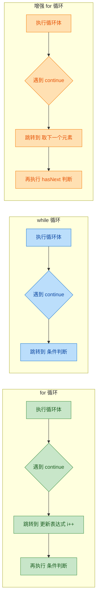

这个差异非常重要，尤其在 `while` 循环中，如果 `continue` 跳过了循环变量的更新语句，就会导致死循环。

```java
public class ContinueDemo {
    public static void main(String[] args) {
        // === 场景1：for 循环中使用 continue，跳过偶数 ===
        System.out.println("=== for 循环：只打印奇数 ===");
        for (int i = 1; i <= 10; i++) {
            // 如果 i 是偶数，跳过本轮，直接进入 i++ 然后判断条件
            if (i % 2 == 0) {
                continue;
            }
            // 只有奇数才会执行到这里
            System.out.println(i);
        }

        // === 场景2：while 循环中使用 continue 的陷阱 ===
        System.out.println("\n=== while 循环：注意更新变量的位置 ===");
        int n = 0;
        while (n < 10) {
            n++;  // 更新语句必须放在 continue 之前！
            if (n % 2 == 0) {
                continue;  // 跳到 while 条件判断，n 已经更新过了，安全
            }
            System.out.println(n);
        }

        // === 错误示范（会死循环，不要运行）===
        // int m = 0;
        // while (m < 10) {
        //     if (m % 2 == 0) {
        //         continue;  // m 永远是 0，永远满足条件，永远 continue
        //     }
        //     m++;  // 这行永远执行不到
        // }
    }
}
```

#### 实际应用：数据过滤

`continue` 最典型的应用场景是"过滤"——在循环中跳过不符合条件的数据，只处理感兴趣的部分。

```java
public class DataFilter {
    public static void main(String[] args) {
        // 模拟一批用户输入的成绩数据，可能包含无效值
        int[] rawScores = {85, -1, 92, 101, 78, 0, 66, -5, 95, 110};
        // 有效成绩范围：1 ~ 100
        int sum = 0;    // 有效成绩总和
        int count = 0;  // 有效成绩个数

        for (int score : rawScores) {
            // 过滤掉无效数据：小于 1 或大于 100 的都跳过
            if (score < 1 || score > 100) {
                System.out.println("跳过无效成绩: " + score);
                continue;  // 跳过本轮，不累加
            }
            // 只有有效成绩才会执行到这里
            sum += score;   // 累加有效成绩
            count++;        // 有效计数 +1
        }

        // 计算平均分
        if (count > 0) {
            double avg = (double) sum / count;
            System.out.println("有效成绩数: " + count);
            System.out.printf("平均分: %.2f%n", avg);
        }
    }
}
```

使用 `continue` 做前置过滤，可以避免深层嵌套的 `if-else`，让代码的"正常路径"（happy path）保持在较低的缩进层级，可读性更好。这种模式有时被称为 Guard Clause（卫语句）。

---

### Labeled 跳转（带标签的 break 和 continue）

当循环嵌套超过一层时，普通的 `break` 和 `continue` 只能控制最内层循环。如果你需要从内层循环直接跳出外层循环，或者让外层循环跳过当前迭代，就需要使用标签（Label）。

#### 标签的语法

标签就是一个合法的 Java 标识符后面跟一个冒号 `:`，放在循环语句之前：

```java
labelName:
for (...) {
    // ...
}
```

然后在循环体内部使用 `break labelName` 或 `continue labelName` 来指定跳转目标。

#### Labeled break：跳出指定的外层循环

```java
public class LabeledBreakDemo {
    public static void main(String[] args) {
        // 在二维数组中搜索目标值
        int[][] matrix = {
            {1,  2,  3,  4},
            {5,  6,  7,  8},
            {9, 10, 11, 12}
        };
        int target = 7;
        int foundRow = -1;  // 记录找到的行
        int foundCol = -1;  // 记录找到的列

        // 给外层循环贴上标签 "search"
        search:
        for (int row = 0; row < matrix.length; row++) {
            for (int col = 0; col < matrix[row].length; col++) {
                System.out.println("检查 [" + row + "][" + col + "] = " + matrix[row][col]);
                if (matrix[row][col] == target) {
                    foundRow = row;  // 记录行号
                    foundCol = col;  // 记录列号
                    // 使用 labeled break，直接跳出外层循环 "search"
                    break search;
                }
            }
            // 如果用普通 break，只会跳到这里，外层循环继续
            // 但 break search 会直接跳到外层循环之后
        }

        // break search 之后，程序从这里继续
        if (foundRow != -1) {
            System.out.println("找到 " + target + " 在 [" + foundRow + "][" + foundCol + "]");
        } else {
            System.out.println("未找到 " + target);
        }
    }
}
```

输出：

```
检查 [0][0] = 1
检查 [0][1] = 2
检查 [0][2] = 3
检查 [0][3] = 4
检查 [1][0] = 5
检查 [1][1] = 6
检查 [1][2] = 7
找到 7 在 [1][2]
```

找到目标后，两层循环同时终止。如果不用标签，你需要额外的布尔标志变量来实现同样的效果，代码会更啰嗦。

下面用流程图来直观展示 labeled break 的跳转路径：

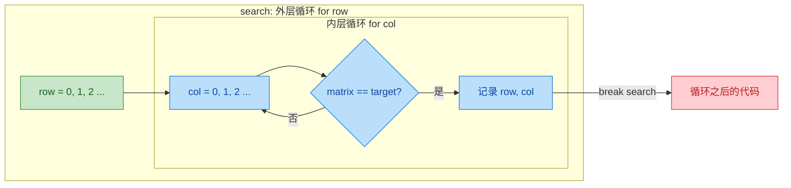

#### Labeled continue：让外层循环跳到下一轮

`continue labelName` 会跳过外层循环当前这一轮的剩余部分，直接进入外层循环的下一次迭代。

```java
public class LabeledContinueDemo {
    public static void main(String[] args) {
        // 场景：检查每一行是否包含负数，如果某行有负数，跳过整行不处理
        int[][] data = {
            { 1,  2,  3},
            { 4, -1,  6},   // 这行有负数，整行跳过
            { 7,  8,  9},
            {10, 11, -2}    // 这行也有负数，整行跳过
        };

        // 给外层循环贴标签
        rowLoop:
        for (int row = 0; row < data.length; row++) {
            // 内层循环：检查当前行的每个元素
            for (int col = 0; col < data[row].length; col++) {
                if (data[row][col] < 0) {
                    System.out.println("第 " + row + " 行含负数，跳过整行");
                    // continue rowLoop：跳过外层循环本轮剩余代码，进入下一行
                    continue rowLoop;
                }
            }
            // 只有整行都没有负数，才会执行到这里
            System.out.println("第 " + row + " 行数据有效: " + java.util.Arrays.toString(data[row]));
        }
    }
}
```

输出：

```
第 0 行数据有效: [1, 2, 3]
第 1 行含负数，跳过整行
第 2 行数据有效: [7, 8, 9]
第 3 行含负数，跳过整行
```

#### 标签的命名规范与使用建议

标签在语法上可以是任何合法标识符，但在实践中有一些约定：

```java
// 常见的标签命名风格
outer:          // 简洁，表示"外层"
search:         // 语义化，表示"搜索过程"
rowLoop:        // 驼峰命名，表示"行循环"
MAIN_LOOP:      // 全大写+下划线，类似常量风格（部分团队偏好）
```

关于 labeled 跳转的使用，业界有一些共识：

- 标签跳转本质上是一种受限的 `goto`，Java 设计者有意将其限制在循环和 switch 中，避免了 C/C++ 中 `goto` 的滥用问题。
- 适用场景主要是双层嵌套循环中的搜索和过滤。超过两层嵌套时，通常应该考虑将内层逻辑抽取为独立方法（Extract Method），用 `return` 代替 `break`。
- 如果一段代码中出现了多个标签，那几乎可以肯定代码需要重构了。

---

### break、continue、labeled 跳转的对比总结

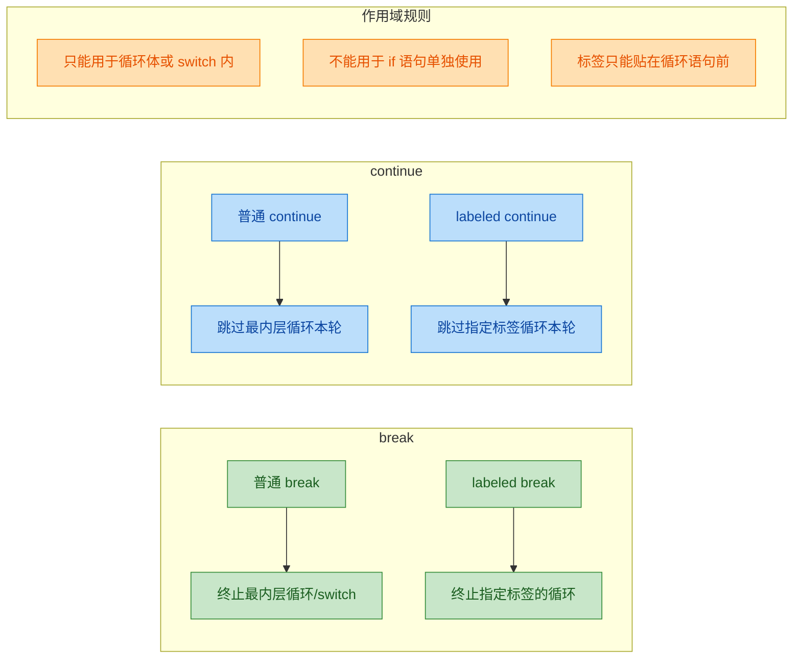

下面用一个综合示例把三者串联起来，模拟一个简单的"在多个文件中搜索关键词"的场景：

```java
public class JumpControlSummary {
    public static void main(String[] args) {
        // 模拟多个"文件"，每个文件包含多行文本
        String[][] files = {
            {"hello world", "java is great", "break example"},       // 文件0
            {"continue demo", "skip this line", "labeled jump"},     // 文件1
            {"search target", "found keyword here", "end of file"},  // 文件2
        };
        // 要搜索的关键词
        String keyword = "keyword";

        // 给外层循环贴标签
        fileSearch:
        for (int fileIdx = 0; fileIdx < files.length; fileIdx++) {
            System.out.println("--- 正在扫描文件 " + fileIdx + " ---");

            for (int lineIdx = 0; lineIdx < files[fileIdx].length; lineIdx++) {
                String line = files[fileIdx][lineIdx];

                // 跳过空行（这里用 continue 跳过当前行）
                if (line == null || line.isEmpty()) {
                    continue;  // 跳过本行，检查下一行
                }

                // 检查是否包含关键词
                if (line.contains(keyword)) {
                    System.out.println("在文件 " + fileIdx + " 第 " + lineIdx
                            + " 行找到关键词: \"" + line + "\"");
                    // 找到后直接跳出所有循环
                    break fileSearch;
                }
            }
            // 如果当前文件没找到，外层循环自动进入下一个文件
        }

        System.out.println("搜索结束。");
    }
}
```

输出：

```
--- 正在扫描文件 0 ---
--- 正在扫描文件 1 ---
--- 正在扫描文件 2 ---
在文件 2 第 1 行找到关键词: "found keyword here"
搜索结束。
```

这个例子中，`continue` 用于跳过无效行，`break fileSearch` 用于找到目标后一步跳出双层循环，三种跳转机制各司其职。

---

### 常见误区与最佳实践

**误区一：在 while 循环中 continue 导致死循环**

```java
// 错误：i 的更新在 continue 之后，永远执行不到
int i = 0;
while (i < 10) {
    if (i == 5) {
        continue;  // i 永远是 5，死循环！
    }
    i++;
}

// 正确：把更新语句放在 continue 之前
int i = 0;
while (i < 10) {
    i++;  // 先更新
    if (i == 5) {
        continue;  // 安全，i 已经变成 5，下一轮变成 6
    }
    System.out.println(i);
}
```

**误区二：用 break 想跳出 if 语句**

```java
// 编译错误！break 不能用于单独的 if 语句
if (condition) {
    break;  // ❌ 这不是循环也不是 switch
}
```

`break` 和 `continue` 只能出现在循环体或 switch 内部，这是 Java 编译器强制检查的。

**最佳实践：用方法提取代替复杂的标签跳转**

当嵌套层级较深时，与其使用 labeled break，不如将搜索逻辑抽取为一个方法，用 `return` 来终止：

```java
// 推荐：将搜索逻辑封装为方法
public static int[] findInMatrix(int[][] matrix, int target) {
    for (int row = 0; row < matrix.length; row++) {
        for (int col = 0; col < matrix[row].length; col++) {
            if (matrix[row][col] == target) {
                // 直接 return，比 labeled break 更清晰
                return new int[]{row, col};
            }
        }
    }
    // 未找到返回 null
    return null;
}
```

这种方式不仅消除了标签，还让代码更具可复用性和可测试性。

---

**📝 练习题**

以下代码的输出结果是什么？

```java
outer:
for (int i = 0; i < 3; i++) {
    for (int j = 0; j < 3; j++) {
        if (j == 1) {
            continue outer;
        }
        System.out.println("i=" + i + " j=" + j);
    }
}
```

A. 输出 9 行，i 和 j 的所有组合（0-2）


B. 输出 6 行，每个 i 对应 j=0 和 j=2


C. 输出 3 行：i=0 j=0、i=1 j=0、i=2 j=0


D. 编译错误，continue 不能使用标签


**【答案】** C

**【解析】** `continue outer` 的作用是跳过外层循环（`outer`）的本轮剩余部分，直接进入外层循环的下一次迭代。当 `j == 1` 时触发 `continue outer`，此时内层循环中 `j=1` 和 `j=2` 的迭代都不会执行，外层循环直接进入 `i` 的下一个值。因此每轮外层循环中，只有 `j=0` 时的 `println` 能被执行到（因为 `j=0` 时条件 `j == 1` 为 false，正常打印；`j=1` 时触发 continue，`j=2` 根本没机会执行）。外层循环 `i` 从 0 到 2 共 3 轮，所以总共输出 3 行。选项 B 的错误在于误以为 `continue outer` 只跳过 `j=1`，实际上它跳过的是外层循环的整个当前迭代，内层循环后续的 `j=2` 也不会执行。

---

## 本章小结

控制流（Control Flow）是 Java 程序的"神经系统"——它决定了代码的执行路径、循环节奏和跳转逻辑。没有控制流，程序就只是一条直线；有了控制流，程序才拥有了"思考"和"决策"的能力。

我们用一张全景图来回顾本章所有核心知识点的关系与定位：

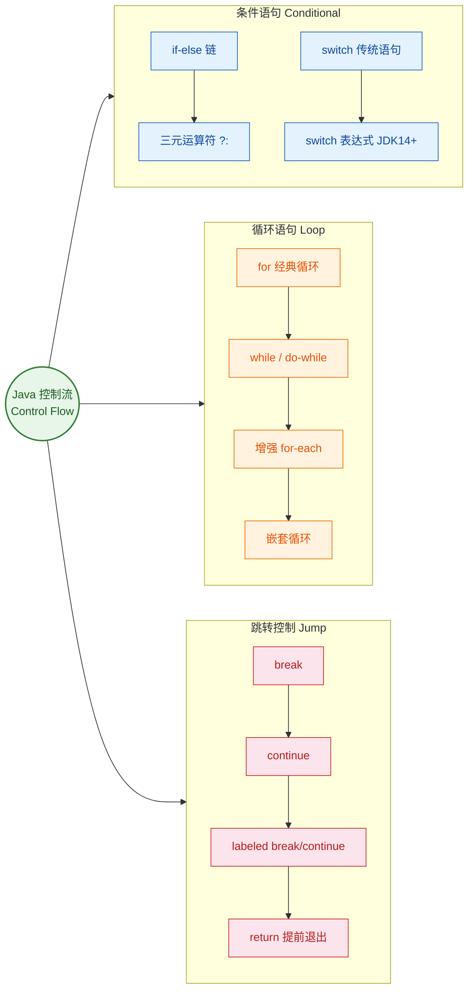

---

### 核心知识点速查表

下面这张表浓缩了本章三大板块的关键要点，适合快速复习和查阅：

| 板块 | 核心结构 | 关键要点 | 常见陷阱 |
|------|---------|---------|---------|
| 条件语句 | `if-else` | 条件表达式必须是 `boolean` 类型，Java 不允许用 `0/1` 代替 | 悬垂 else（dangling else）与最近的 `if` 配对 |
| | `switch` 传统语句 | 支持 `byte/short/int/char/String/enum`，需要 `break` 防止穿透（fall-through） | 忘写 `break` 导致意外穿透 |
| | `switch` 表达式 (JDK 14+) | 箭头语法 `->` 无穿透，`yield` 返回值，必须穷举所有情况 | 非箭头分支用 `yield` 而非 `return` |
| 循环语句 | `for` | 三段式 `(init; condition; update)`，各段均可省略 | 死循环 `for(;;)` 需确保内部有退出逻辑 |
| | `while` / `do-while` | `while` 先判断后执行；`do-while` 先执行后判断，至少执行一次 | `do-while` 末尾的分号 `;` 容易遗漏 |
| | 增强 `for-each` | 语法简洁，适用于数组和 `Iterable`，无法获取索引 | 遍历时不能通过迭代变量修改原数组元素 |
| 跳转控制 | `break` | 跳出当前最内层循环或 `switch` | 多层嵌套中只跳一层，需 labeled break 跳多层 |
| | `continue` | 跳过本次迭代，进入下一次循环 | 在 `for` 中仍会执行 `update` 部分 |
| | labeled 跳转 | `outerLabel:` 配合 `break/continue` 精确控制多层循环 | 标签只能放在循环语句前，不能随意跳转（Java 没有 `goto`） |

---

### 条件语句回顾

条件语句是程序做"选择题"的工具。本章我们学习了从基础到现代的完整演进路线：

`if-else` 是最基础的分支结构，适合处理布尔条件判断。当分支较多时，`else if` 链虽然可行，但可读性会迅速下降。此时 `switch` 语句登场——它以"值匹配"的方式提供了更清晰的多路分支。传统 `switch` 语句的最大痛点是 fall-through 机制，开发者必须手动添加 `break`，否则代码会"穿透"到下一个 `case`。JDK 14 正式引入的 `switch` 表达式（Switch Expressions）用箭头语法 `->` 彻底消除了穿透问题，并且让 `switch` 从"语句"升级为可以返回值的"表达式"，这是 Java 语言现代化的重要一步。

一个值得记住的选择原则：

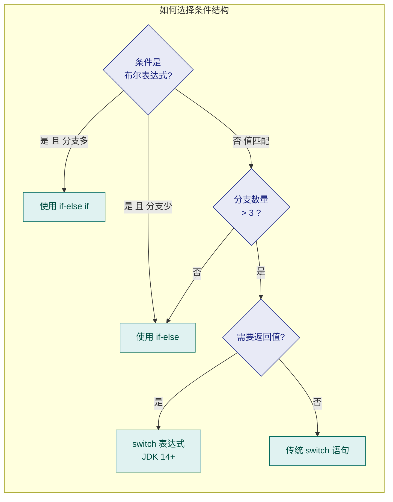

---

### 循环语句回顾

循环是程序处理"重复性工作"的核心武器。三种循环各有适用场景：

`for` 循环最适合"已知次数"的迭代，它的三段式结构 `(初始化; 条件; 更新)` 将循环的所有控制信息集中在一行，一目了然。`while` 循环适合"未知次数、条件驱动"的场景，比如读取流数据直到 EOF。`do-while` 则保证循环体至少执行一次，典型场景是用户输入验证——先让用户输入，再检查是否合法。

增强 `for-each` 循环是 JDK 5 引入的语法糖，它极大简化了对数组和集合的遍历代码。但要记住它的局限：无法获取当前索引，无法在遍历过程中修改集合结构（否则会抛出 `ConcurrentModificationException`）。当你需要索引或需要反向遍历时，经典 `for` 循环仍然是更好的选择。

下面这段代码浓缩了三种循环的典型用法对比：

```java
public class LoopRecap {
    public static void main(String[] args) {
        // ========== 1. for：已知次数，打印 1~5 ==========
        for (int i = 1; i <= 5; i++) {   // 初始化 i=1；条件 i<=5；每轮 i++
            System.out.print(i + " ");   // 输出: 1 2 3 4 5
        }
        System.out.println();

        // ========== 2. while：条件驱动，模拟掷骰子直到掷出6 ==========
        int dice = 0;                     // 初始化骰子值
        while (dice != 6) {              // 条件：还没掷出 6 就继续
            dice = (int)(Math.random() * 6) + 1;  // 生成 1~6 随机数
            System.out.print(dice + " ");          // 打印每次结果
        }
        System.out.println(" -> Got 6!");

        // ========== 3. for-each：遍历数组，无需索引 ==========
        String[] langs = {"Java", "Kotlin", "Scala"};  // 字符串数组
        for (String lang : langs) {      // 依次取出每个元素赋给 lang
            System.out.println("I like " + lang);      // 逐个打印
        }
    }
}
```

---

### 跳转控制回顾

跳转控制为循环和分支提供了"紧急出口"和"快进按钮"：

`break` 立即终止当前最内层的循环或 `switch`，程序跳到该结构之后继续执行。`continue` 则跳过当前这一轮迭代的剩余代码，直接进入下一轮（在 `for` 循环中，`update` 表达式仍然会执行，这是一个容易忽略的细节）。

当面对多层嵌套循环时，普通的 `break` 和 `continue` 只能作用于最内层。此时 labeled 跳转（标签跳转）就派上了用场——在外层循环前放置一个标签（如 `outer:`），然后用 `break outer` 或 `continue outer` 精确控制要跳出或跳过的层级。这是 Java 中唯一合法的"跨层跳转"机制，因为 Java 明确废弃了 `goto` 关键字（`goto` 是保留字但无法使用）。

一个关键的心智模型：

```java
// break vs continue vs labeled break 的行为对比
outer:                                // 标签标记外层循环
for (int i = 0; i < 3; i++) {       // 外层循环 i: 0, 1, 2
    for (int j = 0; j < 3; j++) {   // 内层循环 j: 0, 1, 2
        if (j == 1) continue;        // 跳过内层本轮 -> j=1 被跳过
        if (i == 2) break outer;     // 跳出外层循环 -> i=2 时整体结束
        System.out.println(i + "," + j);
    }
}
// 输出:
// 0,0
// 0,2
// 1,0
// 1,2
// (i=2 时 break outer 直接终止所有循环)
```

---

### 现代 Java 控制流演进

本章涉及的知识点并非一成不变。Java 语言在持续演进，控制流相关的语法也在不断增强：

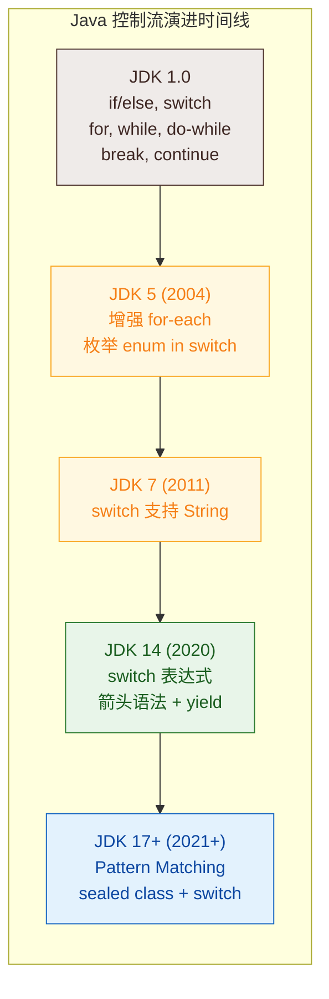

从 JDK 17 开始，`switch` 与模式匹配（Pattern Matching）的结合让控制流的表达力更上一层楼。例如 `switch` 可以直接匹配类型（`case Integer i ->`），配合 `sealed class` 实现穷举检查。这些特性虽然超出本章范围，但理解了本章的基础，未来学习这些高级特性会非常自然。

---

### 编码建议与最佳实践

根据本章内容，总结几条实战中值得遵守的编码原则：

1. 优先使用 `switch` 表达式替代冗长的 `if-else if` 链（前提是 JDK 14+），它更安全、更简洁、编译器还能帮你检查穷举性。

2. 循环中永远警惕死循环。写 `while(true)` 或 `for(;;)` 时，确保内部有明确的 `break` 退出条件，并在代码审查时重点关注。

3. 避免深层嵌套。如果你发现自己写了三层以上的嵌套循环，考虑将内层逻辑抽取为独立方法（Extract Method），这比 labeled break 更易读、更易维护。

4. `for-each` 是遍历的首选。除非你需要索引、需要修改集合、或需要同时遍历多个集合，否则 `for-each` 的简洁性和安全性都优于经典 `for`。

5. `continue` 要谨慎使用。过多的 `continue` 会让循环体的执行路径变得难以追踪，有时用 `if` 包裹正向逻辑比用 `continue` 跳过反向逻辑更清晰。

---

