---

# 继承与多态 ⭐

---

## 继承（Inheritance）

继承是面向对象编程（OOP）三大核心特性之一，它允许一个类**获取**另一个类的属性和方法，从而实现代码复用和层次化设计。在 Java 中，继承通过 `extends` 关键字来实现。你可以把它理解为一种 "is-a" 关系——"猫是一种动物"，"轿车是一种交通工具"。

Java 的继承机制设计得相当克制：**只允许单继承**（Single Inheritance）。这意味着一个类只能有一个直接父类。这与 C++ 的多继承形成鲜明对比，Java 之所以这样设计，是为了规避多继承带来的 **菱形继承问题**（Diamond Problem）——当两个父类拥有同名方法时，子类不知道该继承哪一个。

在 Java 的世界观里，所有类都隐式继承自 `java.lang.Object`。即使你写一个空类 `class Foo {}`，它也自动拥有 `toString()`、`equals()`、`hashCode()` 等方法，这些都来自 Object。

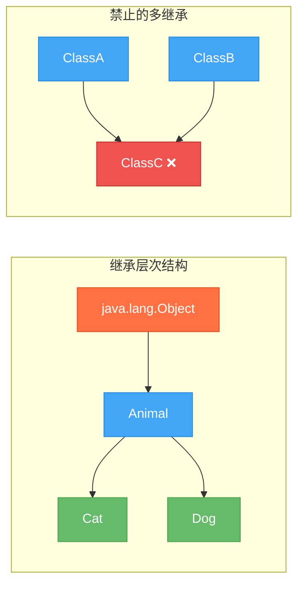

### extends 关键字与基本语法

`extends` 是 Java 中声明继承关系的唯一关键字。语法非常直观：

```java
// 父类（基类 / 超类，Superclass）
public class Animal {
    // 成员变量：名字和年龄
    String name;
    int age;

    // 父类的普通方法
    public void eat() {
        // 所有动物都会吃东西
        System.out.println(name + " is eating.");
    }

    // 父类的另一个方法
    public void sleep() {
        System.out.println(name + " is sleeping.");
    }
}
```

```java
// 子类（派生类，Subclass）通过 extends 继承父类
public class Cat extends Animal {
    // Cat 特有的属性
    String furColor;

    // Cat 特有的方法
    public void purr() {
        // 猫咪特有的呼噜声
        System.out.println(name + " is purring~");
    }
}
```

```java
public class Main {
    public static void main(String[] args) {
        // 创建子类对象
        Cat cat = new Cat();
        // name 是从 Animal 继承来的字段，Cat 自身并没有定义它
        cat.name = "Whiskers";
        // age 同样继承自 Animal
        cat.age = 3;
        // furColor 是 Cat 自己定义的字段
        cat.furColor = "Orange";

        // 调用从父类继承的方法 —— Cat 并没有定义 eat()
        cat.eat();   // 输出: Whiskers is eating.
        // 调用从父类继承的方法
        cat.sleep(); // 输出: Whiskers is sleeping.
        // 调用 Cat 自己定义的方法
        cat.purr();  // 输出: Whiskers is purring~
    }
}
```

这里有一个关键点需要理解：**子类继承了父类的所有成员**（字段和方法），但并非所有成员都能被子类**直接访问**。访问权限取决于修饰符：

| 修饰符 | 同类 | 同包 | 子类（不同包） | 其他类 |
|---|---|---|---|---|
| `public` | ✅ | ✅ | ✅ | ✅ |
| `protected` | ✅ | ✅ | ✅ | ❌ |
| 默认（package-private） | ✅ | ✅ | ❌ | ❌ |
| `private` | ✅ | ❌ | ❌ | ❌ |

`private` 成员虽然被子类**继承**了（它们确实存在于子类对象的内存中），但子类**无法直接访问**它们，只能通过父类提供的 `public` 或 `protected` 方法间接操作。这是封装（Encapsulation）原则的体现。

```java
public class Animal {
    // private 字段：子类无法直接访问
    private int heartRate = 80;

    // 通过 protected 方法暴露给子类
    protected int getHeartRate() {
        // 子类可以调用这个方法来获取 heartRate
        return heartRate;
    }
}
```

```java
public class Cat extends Animal {
    public void showHeartRate() {
        // System.out.println(heartRate); // ❌ 编译错误！无法直接访问 private 字段
        System.out.println(getHeartRate()); // ✅ 通过继承的 protected 方法间接访问
    }
}
```

### 单继承机制（Single Inheritance）

Java 严格执行单继承：一个类只能 `extends` 一个父类。这是一个刻意的语言设计决策。

```java
// ❌ 编译错误！Java 不允许多继承
// public class Liger extends Lion, Tiger { }
```

为什么 Java 要禁止多继承？核心原因是**菱形继承问题**（Diamond Problem，也叫 "deadly diamond of death"）：

```text
        Animal
       /      \
    Lion      Tiger
       \      /
        Liger (?)
```

假设 `Lion` 和 `Tiger` 都重写了 `Animal` 的 `roar()` 方法，那么 `Liger` 到底继承哪个版本的 `roar()`？C++ 中需要程序员手动消歧义，这容易出错且增加复杂度。Java 选择从根源上避免这个问题。

但 Java 并没有因此牺牲灵活性。它提供了两种替代方案来实现类似多继承的效果：

1. **接口（Interface）**：一个类可以实现（`implements`）多个接口。Java 8 之后接口可以有 `default` 方法，提供了行为的多继承能力。
2. **组合（Composition）**：通过 "has-a" 关系代替 "is-a" 关系，将功能委托给内部持有的对象。

```java
// 通过接口实现"多继承"的效果
interface Swimmable {
    // 接口中定义游泳行为
    void swim();
}

interface Climbable {
    // 接口中定义攀爬行为
    void climb();
}

// Cat 继承 Animal（单继承），同时实现多个接口
public class Cat extends Animal implements Swimmable, Climbable {
    @Override
    public void swim() {
        // 实现游泳行为
        System.out.println(name + " is swimming reluctantly...");
    }

    @Override
    public void climb() {
        // 实现攀爬行为
        System.out.println(name + " climbed up the tree!");
    }
}
```

实际开发中有一条广为流传的设计原则：**Favor composition over inheritance**（优先使用组合而非继承）。继承创建的是紧耦合关系，父类的任何改动都可能影响所有子类；而组合更灵活，可以在运行时动态替换行为。

### super 关键字

`super` 是 Java 提供的一个特殊引用，它指向**当前对象的父类部分**。它有三种核心用法：

**用法一：调用父类构造方法 `super(...)`**

这是 `super` 最重要的用途。子类构造方法的第一行可以通过 `super(...)` 显式调用父类的某个构造方法。如果你不写，编译器会自动插入 `super()`（调用父类的无参构造方法）。

```java
public class Animal {
    String name;
    int age;

    // 父类的有参构造方法
    public Animal(String name, int age) {
        // 初始化父类的字段
        this.name = name;
        this.age = age;
        System.out.println("Animal constructor called");
    }
}
```

```java
public class Cat extends Animal {
    String furColor;

    // 子类构造方法
    public Cat(String name, int age, String furColor) {
        // 必须在第一行调用父类构造方法
        // 因为 Animal 没有无参构造，所以必须显式调用 super(name, age)
        super(name, age);
        // 然后初始化子类自己的字段
        this.furColor = furColor;
        System.out.println("Cat constructor called");
    }
}
```

```java
public class Main {
    public static void main(String[] args) {
        // 创建 Cat 对象时，构造方法的调用顺序：
        // 1. 先执行 Animal(String, int) —— 父类构造
        // 2. 再执行 Cat(String, int, String) —— 子类构造
        Cat cat = new Cat("Mimi", 2, "White");
        // 输出:
        // Animal constructor called
        // Cat constructor called
    }
}
```

这里有一个常见的坑：如果父类**没有无参构造方法**（比如只定义了有参构造），而子类构造方法中又没有显式调用 `super(...)`，编译器会尝试插入 `super()` 调用无参构造——结果就是编译错误。

```java
public class Animal {
    // 只有有参构造，没有无参构造
    public Animal(String name) {
        this.name = name;
    }
}
```

```java
public class Cat extends Animal {
    // ❌ 编译错误！
    // 编译器自动插入 super()，但 Animal 没有无参构造方法
    public Cat() {
        // 隐式的 super() 找不到 Animal() —— 报错
    }
}
```

**用法二：访问父类字段 `super.fieldName`**

当子类定义了与父类同名的字段时（这叫 field hiding / 字段隐藏），可以用 `super` 来区分：

```java
public class Animal {
    // 父类的 type 字段
    String type = "Animal";
}
```

```java
public class Cat extends Animal {
    // 子类定义了同名字段，隐藏了父类的 type
    String type = "Cat";

    public void showTypes() {
        // 访问子类自己的 type
        System.out.println("this.type = " + this.type);   // Cat
        // 通过 super 访问被隐藏的父类 type
        System.out.println("super.type = " + super.type); // Animal
    }
}
```

不过实际开发中，字段隐藏（field hiding）是一种**不推荐**的做法，因为它容易造成混淆。字段不像方法那样有多态行为，字段的访问在编译期就确定了。

**用法三：调用父类方法 `super.methodName()`**

当子类重写了父类方法，但又想在重写版本中复用父类的逻辑时，`super` 就派上用场了：

```java
public class Animal {
    public void makeSound() {
        // 父类的通用实现
        System.out.println("Some generic animal sound...");
    }
}
```

```java
public class Cat extends Animal {
    @Override
    public void makeSound() {
        // 先调用父类的实现（复用已有逻辑）
        super.makeSound();
        // 再添加子类特有的行为
        System.out.println("Meow~ Meow~");
    }
}
```

```java
public class Main {
    public static void main(String[] args) {
        Cat cat = new Cat();
        cat.makeSound();
        // 输出:
        // Some generic animal sound...
        // Meow~ Meow~
    }
}
```

下面用一张图来总结 `super` 的三种用法和它们在内存中的指向关系：

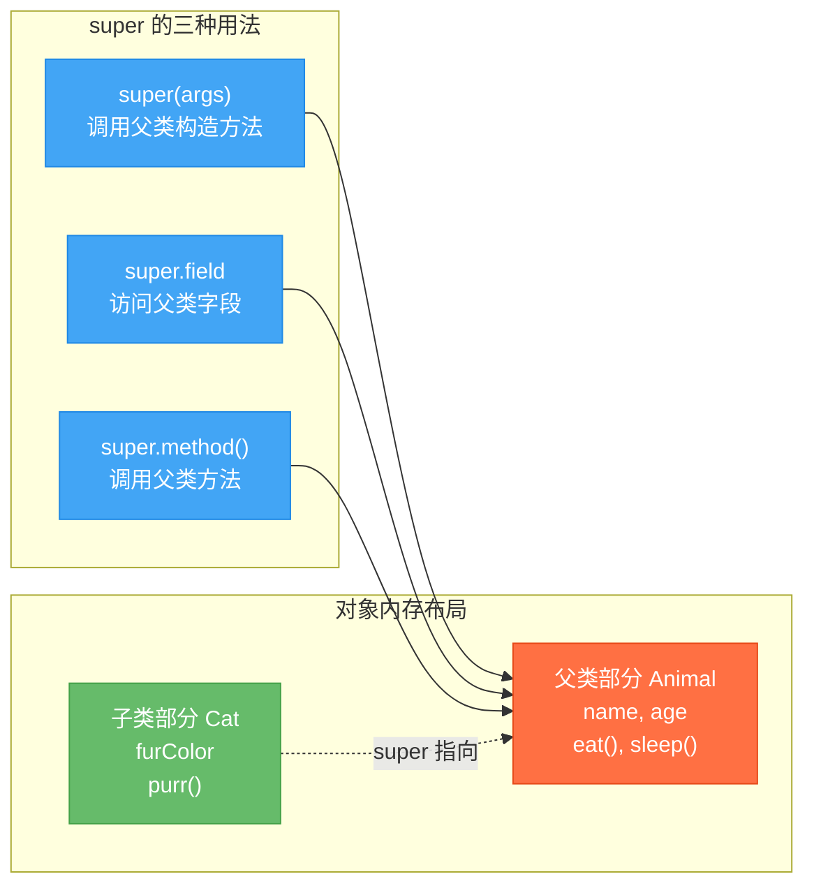

最后有一个细节值得注意：`super` 和 `this` 一样，**不能在静态上下文中使用**。因为 `super` 本质上是对当前对象的父类部分的引用，而静态方法不属于任何对象实例。

```java
public class Cat extends Animal {
    // ❌ 编译错误！静态方法中不能使用 super
    public static void staticMethod() {
        // super.eat(); // 报错：non-static variable super cannot be referenced from a static context
    }
}
```

---

**📝 练习题**

以下代码的输出结果是什么？

```java
class A {
    String name = "A";
    public A() {
        System.out.println("A() called");
    }
}

class B extends A {
    String name = "B";
    public B() {
        System.out.println("B() called");
    }
    public void print() {
        System.out.println(super.name);
        System.out.println(this.name);
    }
}

public class Main {
    public static void main(String[] args) {
        B b = new B();
        b.print();
    }
}
```

A. `B() called` → `A() called` → `B` → `A`


B. `A() called` → `B() called` → `A` → `B`


C. `A() called` → `B() called` → `B` → `A`


D. 编译错误，子类不能定义与父类同名的字段

**【答案】** B

**【解析】** 创建 `B` 对象时，构造方法链从最顶层父类开始执行。`B()` 的第一行虽然没有显式写 `super()`，但编译器会自动插入，所以先执行 `A()` 输出 `A() called`，再执行 `B()` 输出 `B() called`。接着调用 `print()` 方法，`super.name` 访问的是父类 `A` 中的 `name` 字段（值为 `"A"`），`this.name` 访问的是子类 `B` 中隐藏了父类的同名字段（值为 `"B"`）。字段不参与多态，访问哪个字段在编译期就由引用类型决定了。

---

## 方法重写（Method Overriding）

当子类从父类继承了一个方法，但发现这个方法的行为不符合子类自身的需求时，子类可以重新定义这个方法的实现——这就是方法重写（Override）。方法重写是 Java 实现运行时多态（Runtime Polymorphism）的核心机制之一，它让同一个方法调用在不同对象上产生不同的行为。

与方法重载（Overload）不同，重写发生在父子类之间，要求方法签名完全一致；而重载发生在同一个类中，依靠参数列表的差异来区分。这两个概念名字相似，但本质截然不同，是面试中的高频考点。

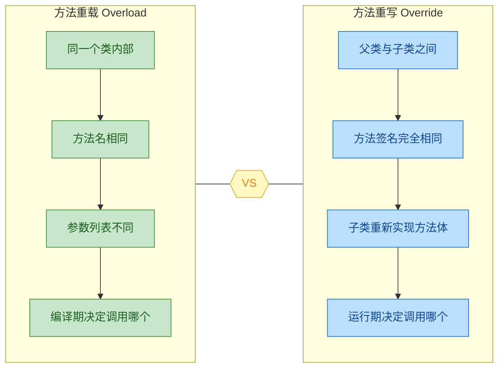

### Override 规则详解

方法重写并不是随意地在子类中写一个同名方法就行，Java 编译器对重写有一套严格的约束规则。我们逐条拆解。

#### 规则一：方法签名必须完全一致

所谓方法签名（Method Signature），指的是方法名 + 参数列表（参数类型、个数、顺序）。子类重写的方法必须与父类被重写的方法拥有完全相同的签名。返回值类型也必须相同或是其协变类型（Covariant Return Type，后续章节会专门讲解）。

```java
class Animal {
    // 父类定义 speak 方法
    public String speak() {
        return "...";  // 动物发出声音
    }
}

class Dog extends Animal {
    // ✅ 正确重写：方法名、参数列表、返回类型完全一致
    @Override
    public String speak() {
        return "Woof!";  // 狗的叫声
    }
}

class Cat extends Animal {
    // ❌ 这不是重写，这是重载！参数列表不同
    public String speak(int volume) {
        return "Meow!";  // 这是一个新方法，不会覆盖父类的 speak()
    }
}
```

上面 `Cat` 类中的 `speak(int volume)` 因为参数列表与父类不同，编译器会将其视为一个全新的方法（重载），而非重写。父类的无参 `speak()` 依然被原样继承。

#### 规则二：访问权限只能放大，不能缩小

子类重写方法的访问修饰符必须 **大于等于** 父类方法的访问级别。这条规则的设计哲学是：父类承诺了某个方法对外可见，子类不能违背这个承诺。

Java 中访问权限从小到大排列为：

```text
private < (default/package-private) < protected < public
```

```java
class Parent {
    // 父类方法是 protected 级别
    protected void doSomething() {
        System.out.println("Parent doSomething");
    }
}

class ChildCorrect extends Parent {
    // ✅ public > protected，权限放大，合法
    @Override
    public void doSomething() {
        System.out.println("Child doSomething (public)");
    }
}

class ChildWrong extends Parent {
    // ❌ 编译错误！(default) < protected，权限缩小
    // 错误信息：attempting to assign weaker access privileges
    @Override
    void doSomething() {
        System.out.println("Child doSomething (default)");
    }
}
```

为什么不能缩小？想象一下：调用方持有一个 `Parent` 类型的引用，它有权调用 `protected` 方法。如果实际对象是 `ChildWrong`，而子类把权限缩小到了 `default`，那调用方在不同包下就无法访问了——这违反了里氏替换原则（Liskov Substitution Principle），即子类对象必须能在任何使用父类对象的地方无缝替换。

#### 规则三：异常声明只能缩小，不能扩大

子类重写方法抛出的受检异常（Checked Exception）必须是父类方法声明异常的 **子集或子类**，不能抛出父类方法中没有声明的新受检异常。非受检异常（RuntimeException 及其子类）不受此限制。

```java
import java.io.*;

class DataReader {
    // 父类声明抛出 IOException
    public void readData() throws IOException {
        // 读取数据的通用逻辑
    }
}

class FileDataReader extends DataReader {
    // ✅ FileNotFoundException 是 IOException 的子类，异常范围缩小
    @Override
    public void readData() throws FileNotFoundException {
        // 从文件读取数据
    }
}

class NetworkDataReader extends DataReader {
    // ✅ 完全不抛异常也合法，相当于异常范围缩小到零
    @Override
    public void readData() {
        // 从网络读取数据，内部自行处理异常
    }
}

class BrokenReader extends DataReader {
    // ❌ 编译错误！Exception 比 IOException 范围更大
    // @Override
    // public void readData() throws Exception { }
}
```

这条规则的逻辑与访问权限类似：调用方根据父类的声明只准备了捕获 `IOException` 的代码，如果子类突然抛出一个 `SQLException`，调用方根本没有对应的 catch 块来处理，程序就会出问题。

#### 规则四：static、final、private 方法不能被重写

这三类方法各有各的原因：

```java
class Base {
    // static 方法属于类，不属于实例，无法被重写（只能被"隐藏" Method Hiding）
    public static void staticMethod() {
        System.out.println("Base static");
    }

    // final 方法被显式禁止重写，编译器会直接报错
    public final void finalMethod() {
        System.out.println("Base final");
    }

    // private 方法对子类不可见，子类中的同名方法是全新方法，不构成重写
    private void privateMethod() {
        System.out.println("Base private");
    }
}

class Derived extends Base {
    // 这不是重写，是方法隐藏（Method Hiding）
    // 调用哪个版本取决于引用类型，而非对象类型
    public static void staticMethod() {
        System.out.println("Derived static");
    }

    // ❌ 编译错误：Cannot override the final method from Base
    // @Override
    // public void finalMethod() { }

    // 这是一个全新的方法，与父类的 privateMethod 毫无关系
    public void privateMethod() {
        System.out.println("Derived 'private' — actually a new method");
    }
}
```

关于 static 方法的"隐藏"（Hiding）与真正的重写（Overriding）之间的区别，我们用一段代码来直观感受：

```java
public class HidingVsOverriding {
    public static void main(String[] args) {
        Base ref = new Derived();  // 父类引用指向子类对象

        // static 方法：看引用类型（编译时类型），输出 "Base static"
        ref.staticMethod();

        // 如果是实例方法重写：看对象类型（运行时类型）
        // 这就是隐藏与重写的本质区别
    }
}
```

#### 规则汇总表

| 规则维度 | 要求 | 违反后果 |
|---------|------|---------|
| 方法签名 | 必须完全一致 | 变成重载而非重写 |
| 返回类型 | 相同或协变（子类型） | 编译错误 |
| 访问权限 | ≥ 父类方法 | 编译错误 |
| 受检异常 | ≤ 父类方法声明的异常 | 编译错误 |
| static 方法 | 不能重写，只能隐藏 | 行为不符合多态预期 |
| final 方法 | 不能重写 | 编译错误 |
| private 方法 | 不可见，无法重写 | 子类同名方法是新方法 |

### @Override 注解

`@Override` 是 Java 5 引入的一个编译器注解（Annotation），它本身不改变任何运行时行为，但它告诉编译器："我打算重写父类的方法，请帮我检查一下是否真的构成了合法的重写。"

#### 为什么强烈建议始终使用 @Override

不加 `@Override`，代码也能编译运行。但不加它，你就失去了编译器的安全网。来看一个经典的坑：

```java
class Person {
    private String name;  // 姓名
    private int age;      // 年龄

    // 构造方法
    public Person(String name, int age) {
        this.name = name;
        this.age = age;
    }

    // 我们想重写 Object 的 equals 方法...
    // ❌ 注意看参数类型！这里写成了 Person 而不是 Object
    public boolean equals(Person other) {
        if (other == null) return false;
        return this.name.equals(other.name) && this.age == other.age;
    }
}
```

上面的代码看起来没问题，但实际上 `equals(Person other)` 的参数类型是 `Person`，而 `Object.equals()` 的参数类型是 `Object`。参数列表不同，这根本不是重写，而是重载！这意味着当你把 `Person` 对象放进 `HashSet` 或用 `List.contains()` 查找时，调用的仍然是 `Object.equals()`，永远返回 `false`（除非是同一个引用）。这类 bug 极其隐蔽，排查起来非常痛苦。

如果加上 `@Override`，编译器会立刻报错：

```java
class Person {
    private String name;
    private int age;

    public Person(String name, int age) {
        this.name = name;
        this.age = age;
    }

    // ✅ 加上 @Override，编译器立刻发现这不是合法的重写
    // 编译错误：Method does not override method from its superclass
    @Override
    public boolean equals(Person other) {  // ← 编译器在这里报错
        if (other == null) return false;
        return this.name.equals(other.name) && this.age == other.age;
    }
}
```

修正后的正确写法：

```java
class Person {
    private String name;
    private int age;

    public Person(String name, int age) {
        this.name = name;
        this.age = age;
    }

    @Override
    public boolean equals(Object obj) {          // 参数类型必须是 Object
        if (this == obj) return true;             // 同一引用，直接返回 true
        if (obj == null) return false;            // null 检查
        if (getClass() != obj.getClass()) return false;  // 类型检查
        Person other = (Person) obj;              // 安全向下转型
        return this.name.equals(other.name)       // 逐字段比较
            && this.age == other.age;
    }

    @Override
    public int hashCode() {                       // 重写 equals 必须同时重写 hashCode
        return Objects.hash(name, age);           // 使用相同字段计算哈希值
    }
}
```

#### @Override 的适用范围

`@Override` 不仅可以用于重写父类方法，从 Java 6 开始，它也可以用于标注实现接口方法：

```java
interface Drawable {
    void draw();  // 接口中的抽象方法
}

class Circle implements Drawable {
    @Override   // ✅ Java 6+ 支持在实现接口方法时使用 @Override
    public void draw() {
        System.out.println("Drawing a circle");
    }
}
```

#### @Override 的工作原理

`@Override` 的定义非常简单，它是一个标记注解（Marker Annotation），源码如下：

```java
@Target(ElementType.METHOD)      // 只能用在方法上
@Retention(RetentionPolicy.SOURCE) // 只在源码阶段存在，编译后丢弃
public @interface Override {
    // 空的，没有任何属性
}
```

`RetentionPolicy.SOURCE` 意味着这个注解只存在于 `.java` 源文件中，编译成 `.class` 字节码后就被丢弃了。它纯粹是给编译器看的，不会对运行时产生任何开销。

### 方法重写的底层机制：方法表（Method Table）

理解了规则和注解之后，我们再深入一层，看看 JVM 是如何在运行时找到正确的重写方法的。

当一个类被加载时，JVM 会为它构建一张方法表（vtable，Virtual Method Table）。方法表中的每个槽位（slot）对应一个可被动态分派的实例方法。子类的方法表会继承父类的所有槽位，如果子类重写了某个方法，对应槽位中的指针就会被替换为子类的实现。

```text
┌─────────────────────────────────────┐
│        Animal 的方法表 (vtable)       │
├──────────┬──────────────────────────┤
│  slot 0  │  Object.toString()       │
│  slot 1  │  Object.equals()         │
│  slot 2  │  Animal.speak() ─────────┼──→ return "..."
│  slot 3  │  Animal.eat()            │
└──────────┴──────────────────────────┘

┌─────────────────────────────────────┐
│         Dog 的方法表 (vtable)         │
├──────────┬──────────────────────────┤
│  slot 0  │  Object.toString()       │  ← 继承，未重写
│  slot 1  │  Object.equals()         │  ← 继承，未重写
│  slot 2  │  Dog.speak() ────────────┼──→ return "Woof!"  (重写！指针替换)
│  slot 3  │  Animal.eat()            │  ← 继承，未重写
└──────────┴──────────────────────────┘
```

当执行 `animal.speak()` 时，JVM 通过对象头中的类型指针找到实际类的方法表，再根据 slot 编号直接跳转到对应的方法实现。这就是为什么重写能实现多态——方法表中的指针在子类中被替换了。

这个过程对应的字节码指令是 `invokevirtual`，它会在运行时根据对象的实际类型进行动态分派（Dynamic Dispatch）。而 `static` 方法使用的是 `invokestatic` 指令，在编译期就确定了调用目标，所以 static 方法不参与多态，只能被隐藏。

### 一个完整的重写实战示例

我们用一个图形面积计算的例子，把上面所有知识点串起来：

```java
// 抽象基类：图形
abstract class Shape {
    protected String color;  // 颜色

    public Shape(String color) {
        this.color = color;  // 通过构造方法初始化颜色
    }

    // 抽象方法：计算面积，子类必须重写
    public abstract double area();

    // 普通方法：描述图形信息，子类可选择重写
    public String describe() {
        // 调用 area()，运行时会动态绑定到子类的实现
        return color + " shape with area = " + area();
    }
}

// 圆形
class Circle extends Shape {
    private double radius;  // 半径

    public Circle(String color, double radius) {
        super(color);        // 调用父类构造方法
        this.radius = radius;
    }

    @Override
    public double area() {
        // 圆的面积公式：π * r²
        return Math.PI * radius * radius;
    }

    @Override
    public String describe() {
        // 重写 describe，提供更具体的描述
        return color + " circle (r=" + radius + "), area = "
               + String.format("%.2f", area());
    }
}

// 矩形
class Rectangle extends Shape {
    private double width;   // 宽
    private double height;  // 高

    public Rectangle(String color, double width, double height) {
        super(color);
        this.width = width;
        this.height = height;
    }

    @Override
    public double area() {
        // 矩形面积：宽 × 高
        return width * height;
    }
    // 没有重写 describe()，直接继承父类的实现
}

// 测试
public class ShapeDemo {
    public static void main(String[] args) {
        // 父类引用指向不同子类对象——多态的体现
        Shape s1 = new Circle("Red", 5.0);       // 红色圆形
        Shape s2 = new Rectangle("Blue", 4.0, 6.0); // 蓝色矩形

        // 调用 describe()，运行时动态绑定到各自的实现
        System.out.println(s1.describe());
        // 输出：Red circle (r=5.0), area = 78.54

        System.out.println(s2.describe());
        // 输出：Blue shape with area = 24.0
        // Rectangle 没有重写 describe()，走的是父类逻辑
        // 但父类 describe() 内部调用的 area() 仍然绑定到 Rectangle.area()

        // 用数组统一管理不同图形
        Shape[] shapes = { s1, s2, new Circle("Green", 3.0) };
        double totalArea = 0;
        for (Shape s : shapes) {
            totalArea += s.area();  // 每次调用都动态分派到正确的子类实现
        }
        System.out.println("Total area = " + String.format("%.2f", totalArea));
        // 输出：Total area = 130.81
    }
}
```

注意上面一个非常精妙的细节：`Rectangle` 没有重写 `describe()`，所以调用的是父类 `Shape.describe()`。但父类 `describe()` 方法体内部调用了 `area()`，而 `area()` 在 `Rectangle` 中被重写了。此时 JVM 依然会根据对象的实际类型（`Rectangle`）去方法表中查找 `area()` 的实现，最终调用的是 `Rectangle.area()`。这就是动态绑定的威力——即使调用链跨越了父子类，多态依然生效。

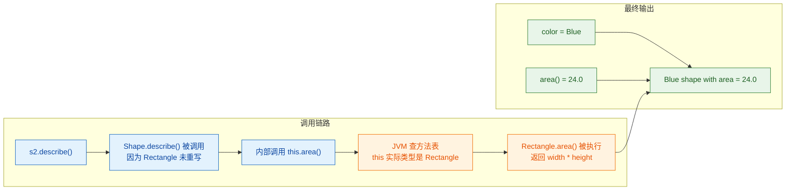

### 重写中的常见陷阱与最佳实践

#### 陷阱一：误把重载当重写

这是最常见的错误，前面 `equals(Person)` 的例子已经展示过。根本原因是参数类型写错了。解决方案很简单：始终加 `@Override`，让编译器帮你兜底。

#### 陷阱二：在构造方法中调用可被重写的方法

这是一个非常隐蔽的设计缺陷，甚至很多有经验的开发者也会踩坑：

```java
class Parent {
    public Parent() {
        // 构造方法中调用了可被重写的方法——危险！
        init();
    }

    // 这个方法可以被子类重写
    public void init() {
        System.out.println("Parent init");
    }
}

class Child extends Parent {
    private String value;  // 子类自己的字段

    public Child(String value) {
        super();            // 先调用父类构造方法
        this.value = value; // 然后才初始化子类字段
    }

    @Override
    public void init() {
        // 此时 value 还是 null！因为子类字段尚未初始化
        System.out.println("Child init, value = " + value);
    }
}

public class ConstructorTrap {
    public static void main(String[] args) {
        Child c = new Child("Hello");
        // 输出：Child init, value = null   ← 不是 "Hello"！
    }
}
```

执行顺序是：`Child()` → `super()` → `Parent()` → `init()` → 动态绑定到 `Child.init()` → 此时 `value` 还没被赋值。这就是为什么 Effective Java 中明确建议：**构造方法中不要调用可被重写的方法**（Item 19: Design and document for inheritance or else prohibit it）。

#### 陷阱三：重写 equals 忘记重写 hashCode

Java 规范要求：如果两个对象 `equals()` 返回 `true`，那么它们的 `hashCode()` 必须相同。如果你只重写了 `equals()` 而没有重写 `hashCode()`，在使用 `HashMap`、`HashSet` 等基于哈希的集合时会出现诡异的行为——明明两个对象"相等"，却在 `HashSet` 中被当作不同元素。

#### 最佳实践总结

```java
/*
 * 方法重写最佳实践清单：
 *
 * 1. 始终使用 @Override 注解
 *    → 让编译器帮你检查，零成本的安全保障
 *
 * 2. 遵循里氏替换原则 (LSP)
 *    → 子类重写后的行为应该符合父类方法的"契约"
 *    → 不要在重写中做出与父类语义完全矛盾的事情
 *
 * 3. 构造方法中避免调用可重写方法
 *    → 用 private 或 final 方法代替
 *
 * 4. 重写 equals() 必须同时重写 hashCode()
 *    → 现代 IDE 都能自动生成，善用工具
 *
 * 5. 善用 super 调用父类原始实现
 *    → 重写不意味着完全抛弃父类逻辑
 *    → 很多时候是"在父类基础上增强"
 */
```

关于第 5 点，`super` 关键字在重写中非常实用：

```java
class LoggingList extends ArrayList<String> {
    @Override
    public boolean add(String element) {
        // 在父类逻辑之前增加日志功能
        System.out.println("[LOG] Adding element: " + element);
        // 调用父类的原始 add 实现，完成真正的添加操作
        return super.add(element);
    }
}
```

这种"先增强，再委托给父类"的模式在框架开发中极为常见，比如 Spring 中大量的 Template Method 模式就是基于此。

---

**📝 练习题**

以下代码的输出结果是什么？

```java
class A {
    public void show() {
        System.out.print("A ");
        display();
    }
    public void display() {
        System.out.print("A.display ");
    }
}

class B extends A {
    @Override
    public void display() {
        System.out.print("B.display ");
    }
}

public class Test {
    public static void main(String[] args) {
        A obj = new B();
        obj.show();
    }
}
```

A. A A.display


B. A B.display


C. B B.display


D. 编译错误

**【答案】** B

**【解析】** `obj` 的编译时类型是 `A`，运行时类型是 `B`。调用 `obj.show()` 时，`B` 没有重写 `show()`，所以执行的是 `A.show()`，先输出 `"A "`。接着 `A.show()` 内部调用 `display()`，由于 `this` 的实际类型是 `B`，而 `B` 重写了 `display()`，JVM 通过动态绑定调用的是 `B.display()`，输出 `"B.display "`。最终结果是 `A B.display`。这道题的核心考点就是：即使代码执行在父类方法体中，`this` 的动态类型依然决定了方法分派的目标。

---

## 构造方法链（Constructor Chaining）

在 Java 的继承体系中，当你 `new` 一个子类对象时，并不是只有子类的构造方法在工作——从最顶层的 `Object` 类开始，整条继承链上的每一个构造方法都会被依次调用。这个机制被称为 **构造方法链（Constructor Chaining）**。理解它，是真正理解 Java 对象初始化过程的关键。

### 为什么需要构造方法链

一个子类对象在内存中，实际上"包含"了父类的所有字段。子类自己并不负责初始化从父类继承来的那些字段——那是父类构造方法的职责。因此，在子类构造方法执行自己的逻辑之前，必须先让父类把属于它的那部分"地基"打好。

这就像盖楼：你不能在没有地基的情况下直接砌第三层的墙。Java 通过构造方法链，强制保证了这个"从底向上"的初始化顺序。

```java
// 三层继承结构演示
class Grandparent {
    int a;

    // 祖父类构造方法
    Grandparent() {
        this.a = 1;
        System.out.println("Grandparent 构造完成, a = " + a);
    }
}

class Parent extends Grandparent {
    int b;

    // 父类构造方法——在执行自己的逻辑前，会先隐式调用 super()
    Parent() {
        // 编译器在这里自动插入了 super(); 调用 Grandparent()
        this.b = 2;
        System.out.println("Parent 构造完成, b = " + b);
    }
}

class Child extends Parent {
    int c;

    // 子类构造方法——同样会先隐式调用 super()
    Child() {
        // 编译器在这里自动插入了 super(); 调用 Parent()
        this.c = 3;
        System.out.println("Child 构造完成, c = " + c);
    }
}

public class ChainDemo {
    public static void main(String[] args) {
        // 只写了一行 new，但触发了三层构造方法
        Child child = new Child();
        // 输出：
        // Grandparent 构造完成, a = 1
        // Parent 构造完成, b = 2
        // Child 构造完成, c = 3
    }
}
```

输出结果清晰地展示了调用顺序：**从最顶层的祖先类开始，逐层向下**，最后才执行子类自己的构造逻辑。

### 隐式 super() 调用规则

Java 编译器有一条铁律：**如果你的构造方法第一行既没有写 `super(...)` 也没有写 `this(...)`，编译器会自动插入一个无参的 `super()`。**

这意味着以下两段代码在编译后是完全等价的：

```java
// 你写的代码
class Child extends Parent {
    Child() {
        System.out.println("Child");
    }
}

// 编译器实际处理后的等价代码
class Child extends Parent {
    Child() {
        super();  // 编译器自动插入
        System.out.println("Child");
    }
}
```

这条规则带来一个常见的"坑"：如果父类没有无参构造方法，子类又没有显式调用 `super(...)`，编译就会报错。

```java
class Parent {
    String name;

    // 父类只有一个带参构造方法，没有无参构造方法
    Parent(String name) {
        this.name = name;
    }
}

class Child extends Parent {
    // ❌ 编译错误！
    // 编译器试图插入 super()，但 Parent 没有无参构造方法
    Child() {
        System.out.println("Child");
    }
}
```

修复方式有两种：

```java
// 方式一：在子类中显式调用父类的带参构造方法
class Child extends Parent {
    Child() {
        super("default");  // 显式调用，必须是第一行
        System.out.println("Child");
    }
}

// 方式二：给父类补一个无参构造方法
class Parent {
    String name;

    Parent() {           // 补上无参构造
        this.name = "unknown";
    }

    Parent(String name) {
        this.name = name;
    }
}
```

### super() 与 this() 的互斥关系

在构造方法中，`super(...)` 和 `this(...)` 都必须出现在第一行（first statement）。这意味着它们不可能同时出现在同一个构造方法里——**二者互斥**。

`this(...)` 的作用是调用本类的另一个构造方法，实现构造方法之间的"内部委托"。但无论 `this(...)` 链条怎么转，最终一定会有某个构造方法去调用 `super(...)`，否则父类就无法被初始化。

```java
class Employee {
    String name;
    int age;
    String department;

    // 构造方法 1：全参构造（最终的"终点"，负责调用 super）
    Employee(String name, int age, String department) {
        super();  // 调用 Object 的构造方法（可省略，编译器自动插入）
        this.name = name;
        this.age = age;
        this.department = department;
        System.out.println("全参构造执行");
    }

    // 构造方法 2：双参构造 → 委托给全参构造
    Employee(String name, int age) {
        this(name, age, "未分配");  // 调用构造方法 1
        System.out.println("双参构造执行");
    }

    // 构造方法 3：无参构造 → 委托给双参构造
    Employee() {
        this("匿名", 0);  // 调用构造方法 2
        System.out.println("无参构造执行");
    }
}
```

当执行 `new Employee()` 时，调用链如下：

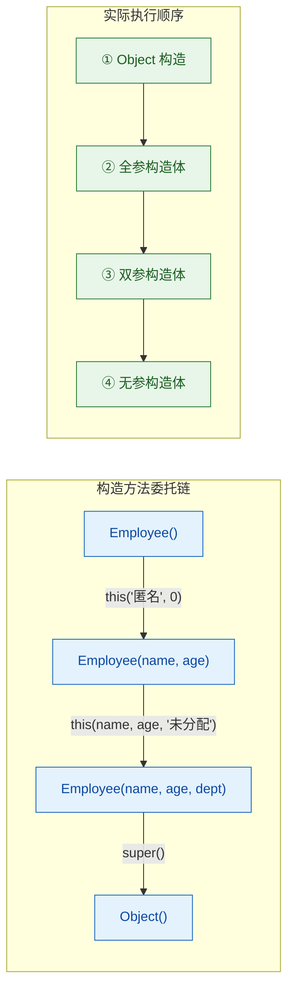

注意右侧的执行顺序：`super()` 最先完成，然后从"最深层"的构造方法体开始，逐层返回执行。这和方法调用栈的回溯逻辑一致——先进后出。

### 完整的对象初始化顺序

构造方法链只是对象初始化过程的一部分。完整的初始化顺序涉及静态块、实例块、构造方法三者的协作。这是 Java 面试中的高频考点。

```java
class Parent {
    // ① 静态变量与静态初始化块（类加载时执行，只执行一次）
    static int staticVar = initStaticVar();
    static {
        System.out.println("2. Parent 静态初始化块");
    }

    // ③ 实例变量与实例初始化块（每次 new 都执行）
    int instanceVar = initInstanceVar();
    {
        System.out.println("5. Parent 实例初始化块");
    }

    // ④ 构造方法
    Parent() {
        System.out.println("6. Parent 构造方法");
    }

    static int initStaticVar() {
        System.out.println("1. Parent 静态变量初始化");
        return 1;
    }

    int initInstanceVar() {
        System.out.println("4. Parent 实例变量初始化");
        return 2;
    }
}

class Child extends Parent {
    // ② 子类静态变量与静态初始化块
    static int staticVar = initStaticVar();
    static {
        System.out.println("3-b. Child 静态初始化块");
    }

    // ⑤ 子类实例变量与实例初始化块
    int instanceVar = initInstanceVar();
    {
        System.out.println("8. Child 实例初始化块");
    }

    // ⑥ 子类构造方法
    Child() {
        // 隐式 super() → 触发 Parent 的实例初始化 + 构造方法
        System.out.println("9. Child 构造方法");
    }

    static int initStaticVar() {
        System.out.println("3-a. Child 静态变量初始化");
        return 3;
    }

    int initInstanceVar() {
        System.out.println("7. Child 实例变量初始化");
        return 4;
    }
}

public class InitOrderDemo {
    public static void main(String[] args) {
        System.out.println("===== 第一次 new Child =====");
        new Child();
        System.out.println("\n===== 第二次 new Child =====");
        new Child();
    }
}
```

输出结果：

```
===== 第一次 new Child =====
1. Parent 静态变量初始化
2. Parent 静态初始化块
3-a. Child 静态变量初始化
3-b. Child 静态初始化块
4. Parent 实例变量初始化
5. Parent 实例初始化块
6. Parent 构造方法
7. Child 实例变量初始化
8. Child 实例初始化块
9. Child 构造方法

===== 第二次 new Child =====
4. Parent 实例变量初始化
5. Parent 实例初始化块
6. Parent 构造方法
7. Child 实例变量初始化
8. Child 实例初始化块
9. Child 构造方法
```

第二次 `new` 时，静态部分不再执行——因为类只加载一次。将这个顺序总结为一张流程图：

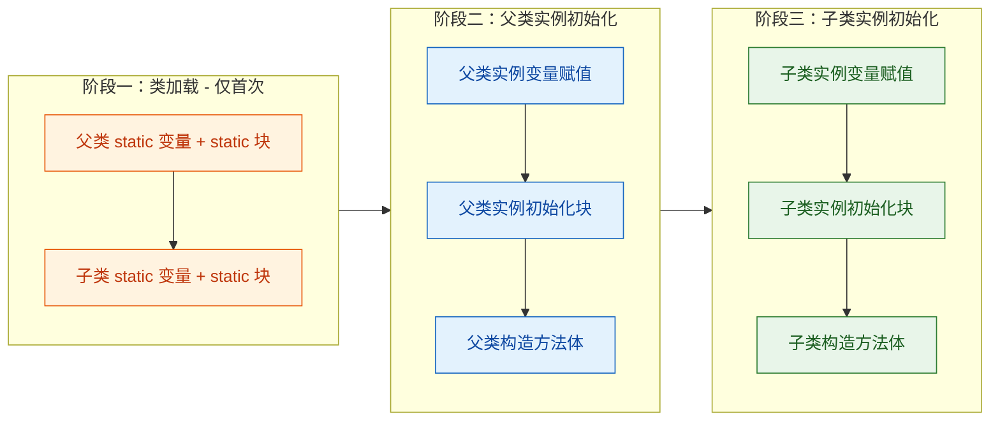

记忆口诀：**"静父静子，实父构父，实子构子"**——先静态（父→子），再实例+构造（父→子）。

### 构造方法中调用可重写方法的陷阱

这是一个经典的"坑"，也是理解构造方法链为什么重要的实战案例。

当父类构造方法中调用了一个可以被子类重写的方法时，由于构造方法链的执行顺序，父类构造方法执行时子类的字段还没有初始化，但调用的却是子类重写后的版本（因为对象的运行时类型已经确定了）。这会导致子类方法在字段尚未初始化的状态下被调用。

```java
class Base {
    Base() {
        System.out.println("Base 构造方法开始");
        // ⚠️ 危险：在构造方法中调用了可被重写的方法
        display();
        System.out.println("Base 构造方法结束");
    }

    void display() {
        System.out.println("Base.display()");
    }
}

class Derived extends Base {
    private int value = 42;  // 这个赋值在 super() 之后才执行！

    Derived() {
        // 隐式 super() → 调用 Base()
        // 此时 value 的赋值语句还没执行
        System.out.println("Derived 构造方法, value = " + value);
    }

    @Override
    void display() {
        // 当被 Base 构造方法调用时，value 还是默认值 0
        System.out.println("Derived.display(), value = " + value);
    }
}

public class TrapDemo {
    public static void main(String[] args) {
        new Derived();
    }
}
```

输出：

```
Base 构造方法开始
Derived.display(), value = 0
Base 构造方法结束
Derived 构造方法, value = 42
```

`value` 在 `display()` 被调用时是 `0`（int 的默认值），而不是 `42`。用内存视角来看这个过程：

```java
// 时间线：new Derived() 的内部过程

// Step 1: JVM 分配内存，所有字段置为默认值
// ┌─────────────────────────┐
// │  Derived 对象 (堆内存)    │
// │  ┌─────────────────────┐ │
// │  │ value = 0  (默认值)  │ │
// │  └─────────────────────┘ │
// └─────────────────────────┘

// Step 2: 执行 Base 构造方法 → 调用 display()
//         此时 value 仍然是 0 ！

// Step 3: Base 构造方法结束，回到 Derived
//         执行 Derived 的实例变量赋值：value = 42
// ┌─────────────────────────┐
// │  Derived 对象 (堆内存)    │
// │  ┌─────────────────────┐ │
// │  │ value = 42 (已赋值)  │ │
// │  └─────────────────────┘ │
// └─────────────────────────┘

// Step 4: 执行 Derived 构造方法体
```

Effective Java 中 Joshua Bloch 明确建议：**"Constructors must not invoke overridable methods"**（构造方法中不要调用可被重写的方法）。如果确实需要在构造阶段执行某些逻辑，应将方法声明为 `private` 或 `final`，确保它不会被子类重写。

### 构造方法链的设计最佳实践

基于以上分析，总结几条实用的设计原则：

```java
class WellDesignedParent {

    private final String name;
    private final int id;

    // 原则 1：提供合理的无参构造（或文档说明为什么不提供）
    WellDesignedParent() {
        this("default", 0);  // 委托给全参构造
    }

    // 原则 2：使用 this() 链实现"望远镜构造模式"(Telescoping Constructor)
    WellDesignedParent(String name) {
        this(name, 0);  // 委托给全参构造
    }

    // 原则 3：全参构造作为唯一的"真正"初始化点
    WellDesignedParent(String name, int id) {
        // 原则 4：在构造方法中只调用 private/final 方法
        this.name = validate(name);
        this.id = id;
    }

    // private 方法不会被子类重写，在构造方法中调用是安全的
    private String validate(String input) {
        return (input == null || input.isEmpty()) ? "default" : input;
    }
}
```

---

**📝 练习题**

以下代码的输出结果是什么？

```java
class A {
    A() {
        System.out.print("A");
    }
}

class B extends A {
    B() {
        System.out.print("B");
    }

    B(String s) {
        this();
        System.out.print(s);
    }
}

class C extends B {
    C() {
        super("X");
        System.out.print("C");
    }
}

public class Quiz {
    public static void main(String[] args) {
        new C();
    }
}
```

A. ABXC


B. XABC


C. AXBC


D. ABCX


**【答案】** A

**【解析】** 追踪调用链：`C()` → `super("X")` → `B(String)` → `this()` → `B()` → 隐式 `super()` → `A()` → 打印 "A"。然后回溯：`B()` 打印 "B"，`B(String)` 打印 "X"，`C()` 打印 "C"。最终输出 `ABXC`。核心要点：`this()` 和 `super()` 的链式调用遵循栈的先进后出原则，构造方法体中 `super()`/`this()` 之后的代码在被调用的构造方法完全返回后才执行。


---

## final 关键字

Java 中的 `final` 关键字是一个"终结者"——它的核心语义就是一个字：**不可变 (immutable / non-overridable)**。它可以修饰三种目标：**类 (class)**、**方法 (method)** 和 **变量 (variable)**，在不同场景下含义略有差异，但本质都是"到此为止，不能再改"。

`final` 在日常开发和面试中出现频率极高，尤其是 `final` 变量与不可变性 (immutability) 的区别、`final` 与继承/多态的关系，是理解 Java 设计哲学的关键拼图。

---

### final 类 —— 禁止继承

当一个类被声明为 `final`，它就成了继承链的终点——**任何类都不能 extends 它**。

```java
// 声明一个 final 类
public final class MathConstants {
    // 圆周率，同时也是 final 变量
    public static final double PI = 3.141592653589793;

    // 自然对数底数
    public static final double E = 2.718281828459045;

    // 私有构造器，防止实例化（工具类常见写法）
    private MathConstants() {
        // 工具类不需要被实例化
    }
}
```

如果有人试图继承它：

```java
// ❌ 编译错误：Cannot inherit from final 'MathConstants'
public class ExtendedMath extends MathConstants {
    // ...
}
```

编译器会直接报错，连字节码都不会生成。

**为什么要禁止继承？** 核心原因有两个：

1. **安全性 (Security)**：防止子类通过重写方法来篡改父类的行为。JDK 中的 `java.lang.String` 就是 `final` 类——如果允许继承 String 并重写 `equals()` 或 `hashCode()`，整个 Java 安全模型和集合框架都会崩塌。

2. **设计完整性 (Design Integrity)**：有些类在设计上就是"完成品"，不需要也不应该被扩展。比如包装类 `Integer`、`Long`、`Boolean` 等全部都是 `final` 的。

来看看 JDK 中那些著名的 `final` 类：

```mermaid
graph LR
    subgraph JDK_Final_Classes["JDK 中的 final 类"]
        direction TB
        S["String"]
        I["Integer"]
        L["Long"]
        D["Double"]
        B["Boolean"]
        M["Math"]
        SYS["System"]
    end

    subgraph Why_Final["为什么设计为 final"]
        direction TB
        R1["安全性: 防止行为篡改"]
        R2["不可变性: 保证线程安全"]
        R3["性能优化: JVM 内联优化"]
        R4["设计完整: 无需扩展"]
    end

    JDK_Final_Classes --> Why_Final

    classDef greenNode fill:#C8E6C9,stroke:#388E3C,color:#1B5E20
    classDef blueNode fill:#BBDEFB,stroke:#1976D2,color:#0D47A1

    class S,I,L,D,B,M,SYS greenNode
    class R1,R2,R3,R4 blueNode
```

**final 类与 abstract 类是天然对立的**：`abstract` 要求必须被继承才能使用，`final` 则禁止被继承。两者不能同时修饰一个类，否则编译报错。

```java
// ❌ 编译错误：Illegal combination of modifiers: 'abstract' and 'final'
public abstract final class Impossible {
    // 逻辑矛盾：既要求被继承，又禁止被继承
}
```

---

### final 方法 —— 禁止重写

当一个方法被声明为 `final`，子类**可以继承**这个方法，但**不能重写 (Override)** 它。这是比 `final` 类更细粒度的控制——类本身允许被继承，但某些关键方法被"锁定"了。

```java
public class Transaction {

    private double amount; // 交易金额

    public Transaction(double amount) {
        this.amount = amount; // 构造时设定金额
    }

    // final 方法：核心验证逻辑不允许子类篡改
    public final boolean validate() {
        // 金额必须大于 0 且不超过单笔限额
        return amount > 0 && amount <= 1_000_000;
    }

    // 普通方法：子类可以自定义处理逻辑
    public void process() {
        System.out.println("Processing transaction: " + amount);
    }
}

public class InternationalTransaction extends Transaction {

    private String currency; // 币种

    public InternationalTransaction(double amount, String currency) {
        super(amount);          // 调用父类构造器
        this.currency = currency; // 设置币种
    }

    // ❌ 编译错误：Cannot override the final method from Transaction
    // @Override
    // public boolean validate() {
    //     return true; // 试图绕过验证 —— 被 final 阻止
    // }

    // ✅ 可以重写非 final 方法
    @Override
    public void process() {
        System.out.println("Processing international transaction in " + currency);
    }
}
```

**使用场景——模板方法模式 (Template Method Pattern)**：

`final` 方法在设计模式中有一个经典应用。父类用 `final` 方法定义算法骨架，把可变的步骤留给子类去实现：

```java
public abstract class DataProcessor {

    // final 模板方法：定义处理流程的骨架，子类不能改变流程顺序
    public final void execute() {
        readData();      // 第一步：读取数据
        processData();   // 第二步：处理数据（子类实现）
        writeResult();   // 第三步：写出结果（子类实现）
        cleanup();       // 第四步：清理资源
    }

    // 固定实现：读取数据的通用逻辑
    private void readData() {
        System.out.println("Reading data from source...");
    }

    // 抽象方法：子类必须实现自己的处理逻辑
    protected abstract void processData();

    // 抽象方法：子类必须实现自己的输出逻辑
    protected abstract void writeResult();

    // 固定实现：清理资源
    private void cleanup() {
        System.out.println("Cleaning up resources...");
    }
}
```

这样一来，`execute()` 的流程顺序被锁死，子类只能在"允许变化的点"上做文章，既保证了框架的稳定性，又保留了灵活性。

**final 方法的另一个好处——性能**：早期 JVM 会对 `final` 方法做内联优化 (inlining)，因为它确定不会被重写，可以安全地把方法体直接嵌入调用处。现代 JVM（HotSpot）的 JIT 编译器已经足够智能，即使不加 `final` 也能做类似优化，但 `final` 仍然是一个明确的"优化提示"。

---

### final 变量 —— 只能赋值一次

这是 `final` 最常用也最容易踩坑的场景。核心规则很简单：**final 变量只能被赋值一次 (assign once)**，之后不可更改。但"不可更改"的含义在基本类型和引用类型上有本质区别。

#### 基本类型的 final 变量

对于基本类型 (primitive)，`final` 意味着**值本身不可变**：

```java
public class FinalPrimitiveDemo {
    public static void main(String[] args) {
        final int maxRetry = 3;    // 声明并赋值，此后不可更改
        // maxRetry = 5;           // ❌ 编译错误：Cannot assign a value to final variable

        final double pi;           // 声明时可以不赋值（blank final）
        pi = 3.14159;              // 首次赋值 OK
        // pi = 3.14;              // ❌ 编译错误：Variable 'pi' might already have been assigned

        System.out.println("Max retry: " + maxRetry); // 输出: Max retry: 3
        System.out.println("PI: " + pi);               // 输出: PI: 3.14159
    }
}
```

#### 引用类型的 final 变量 —— 最大陷阱

对于引用类型 (reference)，`final` 锁定的是**引用本身（即指向哪个对象）**，而**不是对象的内容**。这是面试高频考点。

```java
import java.util.ArrayList;
import java.util.List;

public class FinalReferenceDemo {
    public static void main(String[] args) {
        // final 引用：list 永远指向这个 ArrayList 实例
        final List<String> list = new ArrayList<>();

        // ✅ 可以修改对象的内容（往 list 里添加元素）
        list.add("Java");         // list 的内容变了，但引用没变
        list.add("Python");       // 继续添加，完全合法
        list.add("Go");           // 没问题

        // ❌ 不能让 list 指向另一个对象
        // list = new ArrayList<>();  // 编译错误：Cannot assign a value to final variable

        System.out.println(list);  // 输出: [Java, Python, Go]
    }
}
```

用内存模型来理解这个区别：

```java
// ===== final 引用类型的内存模型 =====
//
//  栈 (Stack)                    堆 (Heap)
//  ┌──────────────┐             ┌──────────────────────┐
//  │ final list   │────────────▶│  ArrayList 对象       │
//  │ (引用被锁定)  │      ×      │  ┌──────────────────┐ │
//  └──────────────┘     ╱       │  │ [0] "Java"       │ │
//         │            ╱        │  │ [1] "Python"     │ │  ← 内容可变!
//         │  不能重新指向        │  │ [2] "Go"         │ │
//         │            ╲        │  └──────────────────┘ │
//         │             ×       └──────────────────────┘
//         │
//         ╳─ ─ ─ ─ ─ ─ ─ ─ ─ ▷ new ArrayList<>()  ← 禁止!
```

一句话总结：**final 管的是"指针"，不管"指针指向的内容"**。想要内容也不可变，需要使用不可变集合（如 `List.of()`、`Collections.unmodifiableList()`）。

#### final 实例变量（Blank Final）

实例级别的 `final` 变量如果声明时没有赋值，就叫 **blank final**。它必须在**每个构造方法结束前**被赋值，否则编译报错：

```java
public class Student {

    private final String name;   // blank final：声明时未赋值
    private final int id;        // blank final

    // 构造器中必须为所有 blank final 赋值
    public Student(String name, int id) {
        this.name = name;        // ✅ 在构造器中首次赋值
        this.id = id;            // ✅ 在构造器中首次赋值
    }

    // 如果有多个构造器，每个都必须赋值
    public Student(String name) {
        this.name = name;        // ✅ name 赋值了
        this.id = -1;            // ✅ id 也必须赋值，否则编译错误
    }

    // 普通方法中不能再修改
    public void tryModify() {
        // this.name = "New Name"; // ❌ 编译错误
    }

    public String getName() {
        return name;             // 返回 name
    }

    public int getId() {
        return id;               // 返回 id
    }
}
```

#### final 静态变量（常量）

`static final` 组合是 Java 中定义**常量 (constant)** 的标准写法。按照命名规范，常量名全大写，单词间用下划线分隔：

```java
public class HttpStatus {
    // 静态常量：编译期常量（compile-time constant）
    public static final int OK = 200;                    // HTTP 200
    public static final int NOT_FOUND = 404;             // HTTP 404
    public static final int INTERNAL_ERROR = 500;        // HTTP 500
    public static final String DEFAULT_CHARSET = "UTF-8"; // 默认字符集

    // 静态常量也可以在静态代码块中赋值
    public static final long STARTUP_TIME;

    static {
        STARTUP_TIME = System.currentTimeMillis(); // 类加载时记录启动时间
    }
}
```

编译期常量 (compile-time constant) 有一个特殊行为：如果一个 `static final` 变量的值在编译期就能确定（如字面量 `200`、`"UTF-8"`），编译器会直接把值内联到使用处。这意味着即使后来修改了常量值，如果没有重新编译引用方，引用方用的还是旧值——这是一个隐蔽的坑。

#### final 参数

方法参数也可以声明为 `final`，表示在方法体内不能重新赋值：

```java
public class Calculator {

    // final 参数：方法内不能修改 a 和 b 的值
    public int add(final int a, final int b) {
        // a = 10;  // ❌ 编译错误：Cannot assign a value to final variable 'a'
        return a + b; // 只能读取，不能修改
    }

    // 在匿名内部类 / Lambda 中引用的局部变量必须是 effectively final
    public Runnable createTask(final String taskName) {
        // Lambda 捕获了 taskName，它必须是 final 或 effectively final
        return () -> System.out.println("Running: " + taskName);
    }
}
```

从 Java 8 开始，Lambda 和匿名内部类要求捕获的局部变量是 **effectively final**（事实上的 final，即虽然没加 `final` 关键字，但从未被重新赋值）。这是因为 Lambda 捕获的是变量值的副本，如果允许修改，会导致副本和原值不一致。

---

### final 的全景对比

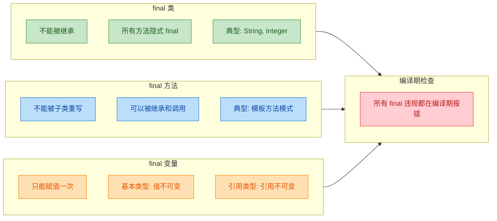

---

### final 与不可变性 (Immutability) 的关系

很多人把 `final` 等同于"不可变"，这是一个常见误解。`final` 只是不可变性的**必要条件之一**，而非充分条件。

要构建一个真正不可变的类，需要满足以下所有条件：

```java
// 一个真正不可变的类示例
public final class ImmutablePoint {           // 1. 类声明为 final，防止子类破坏不可变性

    private final int x;                      // 2. 所有字段声明为 final
    private final int y;                      // 2. 所有字段声明为 final

    public ImmutablePoint(int x, int y) {     // 3. 构造器中完成所有赋值
        this.x = x;
        this.y = y;
    }

    public int getX() { return x; }          // 4. 只提供 getter，不提供 setter
    public int getY() { return y; }          // 4. 只提供 getter，不提供 setter

    // 5. 如果需要"修改"，返回新对象而非修改自身
    public ImmutablePoint translate(int dx, int dy) {
        return new ImmutablePoint(this.x + dx, this.y + dy); // 返回全新对象
    }

    @Override
    public String toString() {
        return "(" + x + ", " + y + ")";     // 方便打印
    }
}
```

不可变对象在多线程环境下天然线程安全 (thread-safe)，不需要同步，这也是 `String` 被设计为不可变的重要原因之一。

---

### final 在继承与多态中的影响

`final` 与继承、多态的交互关系值得单独梳理：

```java
public class Animal {

    // final 方法：所有动物的呼吸方式相同，子类不能改
    public final void breathe() {
        System.out.println("Breathing...");   // 呼吸是固定行为
    }

    // 非 final 方法：不同动物叫声不同，子类可以重写
    public void makeSound() {
        System.out.println("Some sound...");  // 默认实现
    }
}

public class Dog extends Animal {

    // ❌ 不能重写 final 方法
    // @Override
    // public void breathe() { ... }

    // ✅ 可以重写非 final 方法，多态正常工作
    @Override
    public void makeSound() {
        System.out.println("Woof! Woof!");    // 狗的叫声
    }
}

public class Main {
    public static void main(String[] args) {
        Animal animal = new Dog();            // 向上转型
        animal.breathe();                     // 输出: Breathing...（final 方法，无多态）
        animal.makeSound();                   // 输出: Woof! Woof!（多态生效）
    }
}
```

`final` 方法在多态场景下的行为是确定的——因为它不能被重写，所以无论引用类型是什么，调用的永远是同一个方法实现。从 JVM 角度看，`final` 方法的调用可以使用 `invokevirtual` 但 JIT 可以安全地将其去虚化 (devirtualize) 并内联。

---

**📝 练习题**

以下代码能否通过编译？如果能，输出是什么？

```java
public class FinalQuiz {
    public static void main(String[] args) {
        final int[] arr = {1, 2, 3};
        arr[0] = 99;
        arr[1] = 88;
        // arr = new int[]{4, 5, 6};
        System.out.println(arr[0] + ", " + arr[1] + ", " + arr[2]);
    }
}
```

A. 编译错误，因为 `arr` 是 final 的，不能修改数组元素


B. 编译通过，输出 `99, 88, 3`


C. 编译通过，输出 `1, 2, 3`


D. 运行时抛出异常

**【答案】** B

**【解析】** `final` 修饰的是引用变量 `arr`，锁定的是 `arr` 指向哪个数组对象，而不是数组内容。`arr[0] = 99` 修改的是数组对象内部的元素，引用本身没有变化，完全合法。被注释掉的 `arr = new int[]{4, 5, 6}` 才会导致编译错误，因为它试图让 `arr` 指向一个新的数组对象。这正是 "final 管引用，不管内容" 这一核心规则的体现。

---

## 多态 ⭐（Polymorphism）

多态是面向对象编程的三大核心特性之一（封装、继承、多态），也是 Java 语言中最具威力、最值得深入理解的机制。简单来说，多态意味着"同一个操作作用于不同的对象，可以产生不同的行为"（One interface, multiple implementations）。它让程序具备了极强的扩展性和灵活性——你可以用一个统一的父类引用去操控各种不同的子类对象，而程序会在运行时自动选择正确的方法实现。

要真正理解多态，必须先搞清楚 Java 中两个至关重要的概念：编译时类型（Compile-time Type）和运行时类型（Runtime Type）。这两个概念是多态机制的根基，也是面试中的高频考点。

### 什么是多态

多态的本质可以用一句话概括：父类型的引用变量可以指向子类型的对象，并且在调用方法时，实际执行的是子类重写后的版本。

我们先看一个最直观的例子来建立感性认识：

```java
// 父类：动物
class Animal {
    // 父类定义的通用方法
    public void speak() {
        System.out.println("动物发出声音"); // 默认实现
    }
}

// 子类：狗
class Dog extends Animal {
    @Override
    public void speak() {
        System.out.println("汪汪汪！"); // 狗的具体实现
    }
}

// 子类：猫
class Cat extends Animal {
    @Override
    public void speak() {
        System.out.println("喵喵喵！"); // 猫的具体实现
    }
}

public class PolymorphismDemo {
    public static void main(String[] args) {
        // 关键：左边是父类类型，右边是子类对象
        Animal a1 = new Dog();  // a1 的编译时类型是 Animal，运行时类型是 Dog
        Animal a2 = new Cat();  // a2 的编译时类型是 Animal，运行时类型是 Cat

        a1.speak(); // 输出：汪汪汪！ —— 调用的是 Dog 的 speak()
        a2.speak(); // 输出：喵喵喵！ —— 调用的是 Cat 的 speak()
    }
}
```

虽然 `a1` 和 `a2` 的声明类型都是 `Animal`，但调用 `speak()` 时，JVM 并没有执行 `Animal` 的版本，而是分别执行了 `Dog` 和 `Cat` 各自重写的版本。这就是多态——同一个方法调用 `speak()`，因为对象不同，行为也不同。

多态要成立，需要同时满足三个条件：

1. 存在继承关系（子类 extends 父类）
2. 子类重写了父类的方法（Override）
3. 父类引用指向子类对象（向上转型，Upcasting）

三者缺一不可。如果没有继承，就没有类型兼容性；如果没有重写，调用的永远是父类方法，谈不上"不同行为"；如果引用类型就是子类本身，那也不算多态的典型场景。

### 编译时类型 vs 运行时类型

这是理解多态最核心的一组概念。Java 中每一个对象引用变量，实际上同时携带着两个类型信息：

- 编译时类型（Compile-time Type），也叫声明类型（Declared Type）或静态类型（Static Type）：由变量声明时左边的类型决定，在编译阶段就已确定，不会改变。编译器依据这个类型来做语法检查——你能调用哪些方法、能访问哪些字段，全由它说了算。

- 运行时类型（Runtime Type），也叫实际类型（Actual Type）或动态类型（Dynamic Type）：由 `new` 关键字后面实际创建的对象类型决定，只有在程序运行时才能确定。JVM 依据这个类型来决定实际执行哪个方法实现。

```java
//    编译时类型          运行时类型
//       ↓                  ↓
      Animal           animal = new Dog();
```

用一个更完整的例子来深入理解：

```java
class Shape {
    // 父类方法：计算面积
    public double area() {
        return 0.0; // 默认面积为 0
    }

    // 父类方法：获取名称
    public String getName() {
        return "Shape"; // 默认名称
    }
}

class Circle extends Shape {
    private double radius; // 半径

    // 构造方法，接收半径参数
    public Circle(double radius) {
        this.radius = radius; // 初始化半径
    }

    @Override
    public double area() {
        return Math.PI * radius * radius; // 圆的面积公式：π * r²
    }

    @Override
    public String getName() {
        return "Circle"; // 返回圆的名称
    }

    // Circle 独有的方法，父类中没有
    public double getRadius() {
        return radius; // 返回半径值
    }
}

public class TypeDemo {
    public static void main(String[] args) {
        Shape s = new Circle(5.0); // 编译时类型: Shape, 运行时类型: Circle

        // ✅ 可以调用 area() —— Shape 中声明了该方法，编译通过
        // 实际执行的是 Circle.area()，因为运行时类型是 Circle
        System.out.println(s.area());       // 输出: 78.5398...

        // ✅ 可以调用 getName() —— Shape 中声明了该方法
        System.out.println(s.getName());    // 输出: Circle

        // ❌ 编译错误！不能调用 getRadius()
        // 因为编译时类型是 Shape，Shape 中没有 getRadius() 方法
        // s.getRadius();  // 编译器报错: cannot find symbol
    }
}
```

这个例子清晰地展示了两种类型各自的"管辖范围"：

- 编译器只看编译时类型：`s` 的编译时类型是 `Shape`，所以编译器只允许你调用 `Shape` 中定义的方法。`getRadius()` 是 `Circle` 独有的，编译器不认识，直接报错。
- JVM 只看运行时类型：当程序真正运行到 `s.area()` 时，JVM 发现 `s` 实际指向的是一个 `Circle` 对象，于是执行 `Circle` 的 `area()` 方法。

可以用一个简洁的口诀来记忆：编译看左边，运行看右边。"左边"指声明类型，决定能调用什么；"右边"指实际对象类型，决定执行哪个版本。

下面这张图展示了编译时类型和运行时类型在多态中各自扮演的角色：

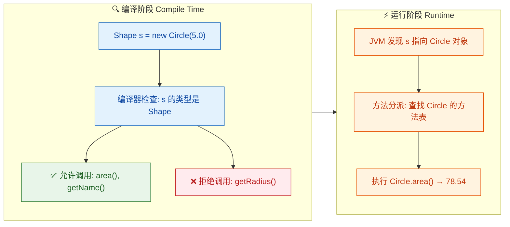

### 多态对字段访问的影响

一个非常容易踩坑的地方：多态只对实例方法生效，对字段（成员变量）不生效。字段的访问始终由编译时类型决定，不存在"动态绑定"。

```java
class Parent {
    public String name = "Parent"; // 父类字段

    public String getName() {
        return name; // 返回父类的 name 字段
    }
}

class Child extends Parent {
    public String name = "Child"; // 子类定义了同名字段（这是隐藏，不是重写）

    @Override
    public String getName() {
        return name; // 返回子类的 name 字段
    }
}

public class FieldDemo {
    public static void main(String[] args) {
        Parent p = new Child(); // 编译时类型: Parent, 运行时类型: Child

        // 直接访问字段 —— 由编译时类型决定
        System.out.println(p.name);          // 输出: Parent（不是 Child！）

        // 调用方法 —— 由运行时类型决定（多态生效）
        System.out.println(p.getName());     // 输出: Child
    }
}
```

为什么字段不参与多态？因为 Java 的字段访问在编译期就已经确定了偏移量（offset），直接按编译时类型去内存中取值，根本不经过动态分派机制。而方法调用则通过虚方法表（vtable）在运行时查找，所以才能实现多态。

这个区别可以用内存模型来直观理解：

```java
// 内存中 Child 对象的布局（简化示意）
// ┌──────────────────────────────────┐
// │         Child 对象实例            │
// ├──────────────────────────────────┤
// │  [对象头 Object Header]          │
// │  - 类型指针 → Child.class        │  ← JVM 靠这个找到运行时类型
// ├──────────────────────────────────┤
// │  Parent.name = "Parent"          │  ← p.name 访问的是这里（编译时类型决定）
// ├──────────────────────────────────┤
// │  Child.name  = "Child"           │  ← 子类同名字段，独立存储
// └──────────────────────────────────┘
```

子类中定义与父类同名的字段，这叫做字段隐藏（Field Hiding），而不是重写。父类的字段和子类的字段在内存中是两个独立的存储位置，各自独立存在。通过父类引用访问时，取到的是父类那份；通过子类引用访问时，取到的是子类那份。

### 多态对静态方法的影响

和字段类似，静态方法（static method）也不参与多态。静态方法属于类本身，不属于某个对象实例，因此不存在"运行时根据对象类型来选择"的问题。

```java
class Base {
    // 静态方法
    public static void greet() {
        System.out.println("Hello from Base"); // 父类的静态方法
    }

    // 实例方法
    public void instanceGreet() {
        System.out.println("Instance: Base"); // 父类的实例方法
    }
}

class Derived extends Base {
    // 同签名的静态方法 —— 这是隐藏（Hiding），不是重写（Overriding）
    public static void greet() {
        System.out.println("Hello from Derived"); // 子类的静态方法
    }

    @Override
    public void instanceGreet() {
        System.out.println("Instance: Derived"); // 子类重写的实例方法
    }
}

public class StaticMethodDemo {
    public static void main(String[] args) {
        Base obj = new Derived(); // 编译时类型: Base, 运行时类型: Derived

        obj.greet();           // 输出: Hello from Base（静态方法看编译时类型）
        obj.instanceGreet();   // 输出: Instance: Derived（实例方法看运行时类型）
    }
}
```

这里 `obj.greet()` 虽然写法上看起来像是通过对象调用，但编译器会将其转换为 `Base.greet()`，因为静态方法的调用在编译期就已经绑定到具体的类了。实际开发中，也强烈建议用类名直接调用静态方法（`Base.greet()` 而不是 `obj.greet()`），避免产生误解。

### 多态的核心价值：面向抽象编程

多态最大的实际价值在于：让你的代码依赖于抽象（父类/接口），而不是具体实现（子类）。这就是面向对象设计中著名的依赖倒置原则（Dependency Inversion Principle）的基础。

来看一个实际场景——设计一个图形绘制系统：

```java
class Shape {
    // 计算面积的通用方法
    public double area() {
        return 0.0; // 默认实现
    }

    // 绘制图形的通用方法
    public void draw() {
        System.out.println("Drawing a shape"); // 默认实现
    }
}

class Circle extends Shape {
    private double radius; // 圆的半径

    public Circle(double radius) {
        this.radius = radius; // 初始化半径
    }

    @Override
    public double area() {
        return Math.PI * radius * radius; // 圆面积: π * r²
    }

    @Override
    public void draw() {
        System.out.println("Drawing Circle with radius " + radius); // 绘制圆
    }
}

class Rectangle extends Shape {
    private double width;  // 矩形的宽
    private double height; // 矩形的高

    public Rectangle(double width, double height) {
        this.width = width;   // 初始化宽
        this.height = height; // 初始化高
    }

    @Override
    public double area() {
        return width * height; // 矩形面积: 宽 × 高
    }

    @Override
    public void draw() {
        System.out.println("Drawing Rectangle " + width + "x" + height); // 绘制矩形
    }
}

class Triangle extends Shape {
    private double base;   // 三角形的底
    private double height; // 三角形的高

    public Triangle(double base, double height) {
        this.base = base;     // 初始化底
        this.height = height; // 初始化高
    }

    @Override
    public double area() {
        return 0.5 * base * height; // 三角形面积: 0.5 × 底 × 高
    }

    @Override
    public void draw() {
        System.out.println("Drawing Triangle with base " + base); // 绘制三角形
    }
}

public class ShapeSystem {
    // 关键方法：参数类型是父类 Shape
    // 它不关心传入的具体是什么图形，只要是 Shape 的子类就行
    public static void printInfo(Shape shape) {
        shape.draw();                                          // 多态调用 draw()
        System.out.println("Area = " + shape.area());         // 多态调用 area()
    }

    // 计算一组图形的总面积 —— 同样不关心具体类型
    public static double totalArea(Shape[] shapes) {
        double sum = 0;                    // 累加器
        for (Shape s : shapes) {           // 遍历每个图形
            sum += s.area();               // 多态调用，每个图形执行自己的 area()
        }
        return sum;                        // 返回总面积
    }

    public static void main(String[] args) {
        // 创建不同类型的图形对象
        Shape[] shapes = {
            new Circle(5),              // 圆
            new Rectangle(4, 6),        // 矩形
            new Triangle(3, 8)          // 三角形
        };

        // 统一处理，无需 if-else 判断具体类型
        for (Shape s : shapes) {
            printInfo(s);               // 多态自动选择正确的实现
            System.out.println("---");
        }

        // 计算总面积
        System.out.println("Total area = " + totalArea(shapes));
    }
}
```

这段代码的精妙之处在于：`printInfo()` 和 `totalArea()` 方法完全不知道也不关心传入的是 `Circle`、`Rectangle` 还是 `Triangle`。如果将来新增一个 `Pentagon`（五边形），只需要让它继承 `Shape` 并重写 `area()` 和 `draw()`，现有的所有代码一行都不用改。这就是多态带来的开放-封闭原则（Open-Closed Principle）——对扩展开放，对修改封闭。

对比一下没有多态时的写法：

```java
// ❌ 没有多态的写法 —— 每新增一种图形就要改这个方法
public static void printInfoWithoutPolymorphism(Object shape) {
    if (shape instanceof Circle) {           // 判断是否是圆
        ((Circle) shape).draw();             // 强制转型后调用
    } else if (shape instanceof Rectangle) { // 判断是否是矩形
        ((Rectangle) shape).draw();          // 强制转型后调用
    } else if (shape instanceof Triangle) {  // 判断是否是三角形
        ((Triangle) shape).draw();           // 强制转型后调用
    }
    // 每新增一种图形，就要在这里加一个 else if... 噩梦！
}
```

这种写法不仅冗长，而且每次新增图形类型都要修改已有代码，违反了开放-封闭原则，维护成本极高。多态让我们彻底摆脱了这种 `if-else` 地狱。

### 编译时类型与运行时类型的完整对照

下面这张表格总结了不同成员在多态场景下的行为规则，这是面试和实际开发中都必须烂熟于心的：

| 成员类型 | 访问由谁决定 | 是否参与多态 | 机制 |
|---------|------------|------------|------|
| 实例方法 | 运行时类型 | ✅ 是 | 动态绑定（Dynamic Binding） |
| 静态方法 | 编译时类型 | ❌ 否 | 静态绑定（Static Binding） |
| 实例字段 | 编译时类型 | ❌ 否 | 直接访问，无分派 |
| 静态字段 | 编译时类型 | ❌ 否 | 直接访问，无分派 |

一句话总结：只有实例方法才有多态，其他一切（字段、静态方法、静态字段）都在编译期就已经确定了。

### 多态的底层原理概览

为什么实例方法能实现多态？这背后是 JVM 的方法分派机制。每个类在被加载时，JVM 会为它创建一张虚方法表（Virtual Method Table, vtable）。这张表记录了该类所有可被动态分派的方法及其实际入口地址。

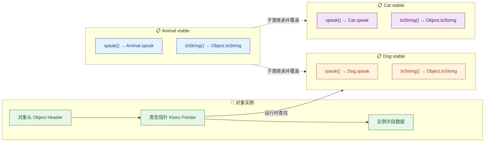

当 JVM 执行 `animal.speak()` 时，流程如下：

1. 通过对象头中的类型指针（Klass Pointer）找到对象的实际类（比如 `Dog`）
2. 在 `Dog` 的虚方法表中查找 `speak()` 方法的入口地址
3. 发现 `speak()` 指向 `Dog.speak`（因为 Dog 重写了该方法）
4. 跳转到 `Dog.speak()` 执行

如果 `Dog` 没有重写 `speak()`，那么 `Dog` 的 vtable 中 `speak()` 的入口地址就会指向 `Animal.speak`，从而执行父类的版本。这就是继承链上方法查找的本质。

### 一个综合的陷阱题

最后来看一个把字段隐藏、方法重写、编译时类型和运行时类型全部混在一起的经典例子：

```java
class A {
    public int value = 10;           // A 的字段

    public int getValue() {
        return value;                // 返回 A 的 value
    }
}

class B extends A {
    public int value = 20;           // B 的字段（隐藏了 A 的 value）

    @Override
    public int getValue() {
        return value;                // 返回 B 的 value（这里的 value 指 B.value）
    }
}

public class TrapDemo {
    public static void main(String[] args) {
        A obj = new B();             // 编译时类型: A, 运行时类型: B

        System.out.println(obj.value);        // 10 —— 字段访问看编译时类型(A)
        System.out.println(obj.getValue());   // 20 —— 方法调用看运行时类型(B)

        // 两个结果不同！这就是字段隐藏和方法重写的本质区别
    }
}
```

`obj.value` 直接访问字段，编译器按编译时类型 `A` 去找，拿到的是 `A.value = 10`。而 `obj.getValue()` 是方法调用，JVM 按运行时类型 `B` 去分派，执行的是 `B.getValue()`，返回的是 `B.value = 20`。同一个对象，一个返回 10，一个返回 20——这就是多态和字段隐藏共同作用的结果。

---

**📝 练习题**

以下代码的输出结果是什么？

```java
class Father {
    public String name = "father";
    public void method() {
        System.out.println("Father method");
    }
    public static void staticMethod() {
        System.out.println("Father static");
    }
}

class Son extends Father {
    public String name = "son";
    @Override
    public void method() {
        System.out.println("Son method");
    }
    public static void staticMethod() {
        System.out.println("Son static");
    }
}

public class Quiz {
    public static void main(String[] args) {
        Father f = new Son();
        System.out.println(f.name);
        f.method();
        f.staticMethod();
    }
}
```

A. father → Son method → Son static


B. son → Son method → Father static


C. father → Son method → Father static


D. father → Father method → Father static


**【答案】** C

**【解析】** 这道题考查的就是本节的核心——编译时类型与运行时类型对不同成员的影响。变量 `f` 的编译时类型是 `Father`，运行时类型是 `Son`。`f.name` 是字段访问，由编译时类型决定，所以输出 `father`。`f.method()` 是实例方法调用，多态生效，由运行时类型决定，执行 `Son.method()`，输出 `Son method`。`f.staticMethod()` 是静态方法调用，静态方法不参与多态，由编译时类型决定，等价于 `Father.staticMethod()`，输出 `Father static`。三条规则各考一个，完美对应本节的核心对照表。

---

## 动态绑定与静态绑定 ⭐

理解了多态的概念之后，一个自然而然的问题浮出水面：**JVM 到底是怎么知道该调用哪个方法的？** 这就引出了 Java 中极其核心的底层机制——绑定（Binding）。所谓绑定，就是将一个方法调用（method call）与其具体的方法实现（method body）关联起来的过程。Java 中存在两种截然不同的绑定时机：编译期确定的 **静态绑定（Static Binding）**，和运行期才确定的 **动态绑定（Dynamic Binding）**。这两者的区别，是理解多态底层原理的钥匙。

---

### 静态绑定（Static Binding / Early Binding）

静态绑定，也叫早期绑定（Early Binding），指的是在 **编译阶段（compile time）** 就能完全确定要调用哪个方法。编译器根据引用变量的 **声明类型（declared type）** 和方法签名，直接锁定目标方法，不需要等到程序运行。

哪些成员遵循静态绑定？记住这个口诀：**"私静终构 + 字段重载"**。

- `private` 方法：私有方法对子类不可见，不可能被重写，编译器可以直接确定。
- `static` 方法：静态方法属于类而非实例，不参与多态，编译期按声明类型绑定。
- `final` 方法：被 `final` 修饰的方法不可重写，编译器可以安全地直接绑定。
- 构造方法（Constructor）：构造方法不能被继承，更不能被重写，天然是静态绑定。
- 成员变量（Fields）：**字段访问永远是静态绑定的**，这是一个极易踩坑的点。
- 重载方法（Overloaded methods）：重载的决议发生在编译期，根据参数的声明类型选择。

来看一个综合示例，把这些规则都串起来：

```java
class Animal {
    // 成员变量——字段访问是静态绑定
    String name = "Animal";

    // static 方法——静态绑定，属于类
    static void staticMethod() {
        System.out.println("Animal static method");
    }

    // private 方法——静态绑定，子类不可见
    private void privateMethod() {
        System.out.println("Animal private method");
    }

    // final 方法——静态绑定，不可重写
    final void finalMethod() {
        System.out.println("Animal final method");
    }

    // 重载方法——编译期根据参数声明类型决议
    void eat(Object obj) {
        System.out.println("Animal eat Object");
    }

    void eat(String food) {
        System.out.println("Animal eat String: " + food);
    }

    // 在 Animal 内部调用 private 方法的入口
    void callPrivate() {
        // 这里调用的是 Animal 自己的 privateMethod
        privateMethod();
    }
}

class Dog extends Animal {
    // 子类同名字段——不是重写，是"隐藏"(hiding)
    String name = "Dog";

    // 子类定义了同签名的 static 方法——不是重写，是"隐藏"
    static void staticMethod() {
        System.out.println("Dog static method");
    }

    // 注意：private 方法子类不可见，这里不构成重写
    // 这只是 Dog 自己的一个全新方法
    void privateMethod() {
        System.out.println("Dog privateMethod (NOT override)");
    }
}

public class StaticBindingDemo {
    public static void main(String[] args) {
        // 声明类型是 Animal，实际对象是 Dog
        Animal a = new Dog();

        // 1. 字段访问——静态绑定，看声明类型 Animal
        System.out.println(a.name);       // 输出: Animal

        // 2. static 方法——静态绑定，看声明类型 Animal
        a.staticMethod();                  // 输出: Animal static method

        // 3. final 方法——静态绑定，直接调用 Animal 的实现
        a.finalMethod();                   // 输出: Animal final method

        // 4. 重载决议——编译期根据参数声明类型选择
        Object food = "Bone";             // 声明类型是 Object
        a.eat(food);                       // 输出: Animal eat Object（不是 eat String!）
        a.eat("Bone");                     // 输出: Animal eat String: Bone

        // 5. private 方法——通过 Animal 内部方法间接调用
        a.callPrivate();                   // 输出: Animal private method
    }
}
```

上面第 4 点特别值得注意：虽然 `food` 变量实际指向一个 `String` 对象，但编译器只看它的声明类型 `Object`，所以选择了 `eat(Object)` 这个重载版本。**重载看声明类型，重写看实际类型**——这句话务必刻进脑子里。

静态绑定的底层实现也很直接。编译器在生成字节码时，对于静态绑定的方法调用会使用 `invokestatic`（调用静态方法）、`invokespecial`（调用构造方法、私有方法、super 调用）等指令，这些指令在编译期就已经确定了目标方法的完整引用，JVM 执行时无需再做任何查找。

---

### 动态绑定（Dynamic Binding / Late Binding）

动态绑定，也叫晚期绑定（Late Binding），是 Java 多态的灵魂。它指的是在 **运行时（runtime）** 根据对象的 **实际类型（actual type / runtime type）** 来决定调用哪个方法实现。

动态绑定只适用于一种情况：**被子类重写（Override）的实例方法**。

这是 Java 语言规范中明确定义的行为：当通过一个引用变量调用一个非 `private`、非 `static`、非 `final` 的实例方法时，JVM 会在运行时检查该引用实际指向的对象类型，然后从该类型开始沿继承链向上查找匹配的方法实现。

```java
class Shape {
    // 普通实例方法——可以被重写，遵循动态绑定
    void draw() {
        System.out.println("Drawing a generic shape");
    }

    // 计算面积——子类各自实现
    double area() {
        return 0.0;
    }
}

class Circle extends Shape {
    // 半径
    double radius;

    // 构造方法，初始化半径
    Circle(double radius) {
        this.radius = radius;
    }

    // 重写 draw——运行时根据实际类型调用
    @Override
    void draw() {
        System.out.println("Drawing a circle with radius " + radius);
    }

    // 重写 area——圆的面积公式
    @Override
    double area() {
        return Math.PI * radius * radius;
    }
}

class Rectangle extends Shape {
    // 宽和高
    double width, height;

    // 构造方法，初始化宽高
    Rectangle(double width, double height) {
        this.width = width;
        this.height = height;
    }

    // 重写 draw
    @Override
    void draw() {
        System.out.println("Drawing a rectangle " + width + "x" + height);
    }

    // 重写 area——矩形面积公式
    @Override
    double area() {
        return width * height;
    }
}

public class DynamicBindingDemo {
    public static void main(String[] args) {
        // 声明类型都是 Shape，实际类型各不相同
        Shape s1 = new Circle(5.0);        // 实际类型: Circle
        Shape s2 = new Rectangle(4.0, 6.0); // 实际类型: Rectangle
        Shape s3 = new Shape();             // 实际类型: Shape

        // 动态绑定：运行时根据实际类型选择方法
        s1.draw();  // 输出: Drawing a circle with radius 5.0
        s2.draw();  // 输出: Drawing a rectangle 4.0x6.0
        s3.draw();  // 输出: Drawing a generic shape

        // 同样，area() 也是动态绑定
        System.out.println("Circle area: " + s1.area());
        System.out.println("Rectangle area: " + s2.area());
    }
}
```

编译器在编译 `s1.draw()` 时，只知道 `s1` 的声明类型是 `Shape`，所以它只检查 `Shape` 类中是否存在 `draw()` 方法（编译期检查合法性）。但具体调用哪个版本的 `draw()`，要等到运行时才能确定。字节码层面，编译器生成的是 `invokevirtual` 指令——这条指令就是动态绑定的入口。

---

### JVM 方法表与动态绑定的底层机制

动态绑定并不是每次调用都从头遍历继承链去查找方法，那样效率太低了。JVM 使用了一种叫做 **虚方法表（vtable, Virtual Method Table）** 的数据结构来加速这个过程。

当一个类被加载时，JVM 会为它创建一张方法表。这张表中的每个槽位（slot）对应一个可被动态绑定的方法，槽位中存储的是该方法的实际入口地址。子类的方法表会继承父类的结构，如果子类重写了某个方法，对应槽位的指针就会被替换为子类的实现。

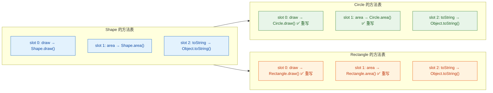

当 JVM 执行 `invokevirtual` 指令时，过程大致如下：

1. 从操作数栈顶获取对象引用（objectref）。
2. 通过对象头（object header）中的类型指针，找到该对象实际类型的 `Class` 元数据。
3. 在该类的方法表中，根据方法签名对应的槽位索引，直接读取方法入口地址。
4. 跳转执行。

整个过程是 O(1) 的常量时间查找，非常高效。这也是为什么 Java 的多态在性能上几乎没有额外开销的原因。

---

### 静态绑定 vs 动态绑定：全面对比

下面这张表把两者的核心差异梳理清楚：

| 维度 | 静态绑定 (Static Binding) | 动态绑定 (Dynamic Binding) |
|------|--------------------------|---------------------------|
| 绑定时机 | 编译期 (Compile Time) | 运行期 (Runtime) |
| 依据类型 | 引用的声明类型 (Declared Type) | 对象的实际类型 (Actual Type) |
| 适用成员 | `private`、`static`、`final` 方法、构造方法、字段、重载 | 被重写的普通实例方法 |
| 字节码指令 | `invokestatic`、`invokespecial` | `invokevirtual`、`invokeinterface` |
| 性能 | 略快（编译期直接确定） | 极快（vtable O(1) 查找） |
| 多态支持 | 不支持 | 支持 |

---

### 一个经典的综合陷阱

下面这道题几乎是面试必考，它把静态绑定和动态绑定的区别揉在了一起：

```java
class Base {
    // 成员变量
    int value = 10;

    // 静态方法
    static void staticCall() {
        System.out.println("Base staticCall");
    }

    // 普通实例方法——可被重写
    void instanceCall() {
        System.out.println("Base instanceCall, value = " + value);
    }
}

class Derived extends Base {
    // 子类同名字段——隐藏父类字段
    int value = 20;

    // 子类同签名静态方法——隐藏父类静态方法
    static void staticCall() {
        System.out.println("Derived staticCall");
    }

    // 重写父类实例方法
    @Override
    void instanceCall() {
        System.out.println("Derived instanceCall, value = " + value);
    }
}

public class BindingTrap {
    public static void main(String[] args) {
        Base obj = new Derived();

        // 字段访问——静态绑定，看声明类型 Base
        System.out.println(obj.value);     // 输出: 10

        // 静态方法——静态绑定，看声明类型 Base
        obj.staticCall();                   // 输出: Base staticCall

        // 实例方法——动态绑定，看实际类型 Derived
        obj.instanceCall();                 // 输出: Derived instanceCall, value = 20
    }
}
```

这里有一个微妙的细节：`instanceCall()` 中打印的 `value` 是 `20` 而不是 `10`。为什么？因为 `instanceCall()` 通过动态绑定调用了 `Derived` 的版本，而在 `Derived.instanceCall()` 方法体内部，`value` 这个标识符解析为 `Derived` 自己的字段 `value = 20`。这是方法体内部的变量作用域规则，和绑定机制是两回事。

用一张内存引用图来直观理解：

```java
// 栈帧 (Stack Frame)                    堆内存 (Heap)
// ┌──────────────┐                ┌──────────────────────────┐
// │ obj          │ ───────────►   │  Derived 对象实例         │
// │ (类型: Base) │                │ ┌──────────────────────┐ │
// └──────────────┘                │ │ Base.value = 10      │ │
//                                 │ │ Derived.value = 20   │ │
//                                 │ └──────────────────────┘ │
//  obj.value → 编译器看 Base       │ 对象头 → 类型指针 → Derived │
//            → 取 Base.value=10   └──────────────────────────┘
//
//  obj.instanceCall()
//    → invokevirtual
//    → 查 Derived 的 vtable
//    → 执行 Derived.instanceCall()
//    → 方法体内 value 解析为 Derived.value = 20
```

---

### 重载与重写交织：最容易翻车的场景

当重载（Overload）和重写（Override）同时出现时，绑定的两个阶段会依次发挥作用：

1. **编译期**：编译器根据参数的 **声明类型** 进行重载决议（Overload Resolution），选出一个方法签名。这是静态绑定。
2. **运行期**：JVM 根据对象的 **实际类型**，在已选定的方法签名下进行动态绑定，找到具体实现。

```java
class Printer {
    // 重载方法 1：接收 Object
    void print(Object obj) {
        System.out.println("Printer: print(Object)");
    }

    // 重载方法 2：接收 String
    void print(String str) {
        System.out.println("Printer: print(String)");
    }
}

class ColorPrinter extends Printer {
    // 重写：覆盖 print(Object)
    @Override
    void print(Object obj) {
        System.out.println("ColorPrinter: print(Object)");
    }

    // 重写：覆盖 print(String)
    @Override
    void print(String str) {
        System.out.println("ColorPrinter: print(String)");
    }
}

public class OverloadOverrideCombo {
    public static void main(String[] args) {
        Printer p = new ColorPrinter();  // 声明: Printer, 实际: ColorPrinter

        Object arg = "hello";            // 声明: Object, 实际: String

        // 第一步(编译期): 重载决议
        //   参数 arg 的声明类型是 Object → 选择 print(Object) 签名
        // 第二步(运行期): 动态绑定
        //   p 的实际类型是 ColorPrinter → 调用 ColorPrinter.print(Object)
        p.print(arg);  // 输出: ColorPrinter: print(Object)

        // 对比：直接传字符串字面量，声明类型就是 String
        p.print("hello");  // 输出: ColorPrinter: print(String)
    }
}
```

这个例子完美展示了两阶段绑定的协作过程。用流程图来表达：

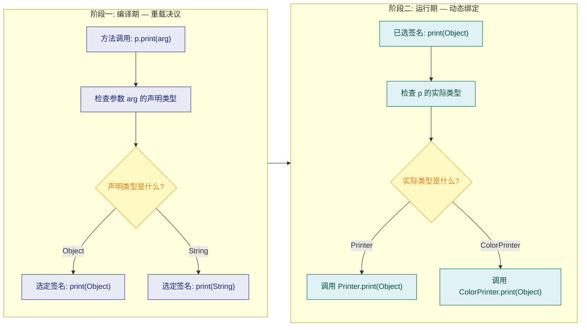

---

### invokeinterface：接口方法的动态绑定

除了 `invokevirtual`，还有一条与动态绑定相关的字节码指令：`invokeinterface`。当通过接口类型的引用调用方法时，JVM 使用这条指令。

```java
interface Flyable {
    // 接口方法——天然是 public abstract
    void fly();
}

class Bird implements Flyable {
    // 实现接口方法
    @Override
    public void fly() {
        System.out.println("Bird is flying");
    }
}

class Airplane implements Flyable {
    // 实现接口方法
    @Override
    public void fly() {
        System.out.println("Airplane is flying");
    }
}

public class InterfaceBindingDemo {
    public static void main(String[] args) {
        // 声明类型是接口 Flyable
        Flyable f1 = new Bird();
        Flyable f2 = new Airplane();

        // invokeinterface 指令——运行时动态绑定
        f1.fly();  // 输出: Bird is flying
        f2.fly();  // 输出: Airplane is flying
    }
}
```

`invokeinterface` 和 `invokevirtual` 的核心思想一致，都是运行时根据实际类型查找方法。区别在于接口方法表（itable）的查找方式略有不同——因为一个类可以实现多个接口，方法在 itable 中的槽位不像 vtable 那样可以简单继承，JVM 需要做一次额外的接口方法表搜索。不过现代 JVM（如 HotSpot）通过内联缓存（Inline Cache）等优化技术，使得 `invokeinterface` 的性能在大多数场景下与 `invokevirtual` 几乎无差别。

---

### 字节码指令速查

把四条核心的方法调用指令放在一起对比：

| 字节码指令 | 绑定类型 | 适用场景 | 示例 |
|-----------|---------|---------|------|
| `invokestatic` | 静态绑定 | 调用静态方法 | `Math.abs(-1)` |
| `invokespecial` | 静态绑定 | 构造方法、`private` 方法、`super.xxx()` | `new Object()`、`super.toString()` |
| `invokevirtual` | 动态绑定 | 调用类的实例方法 | `obj.toString()` |
| `invokeinterface` | 动态绑定 | 通过接口引用调用方法 | `list.size()` |

还有一条 `invokedynamic`（Java 7 引入），用于 Lambda 表达式和动态语言支持，它的绑定策略更加灵活，属于进阶话题。

---

### 动态绑定的边界：哪些东西"看起来像"但"不是"

最后梳理几个容易混淆的点，帮你建立清晰的心智模型：

1. **字段没有动态绑定**。即使子类声明了同名字段，通过父类引用访问到的永远是父类的字段。这叫字段隐藏（Field Hiding），不是重写。

2. **静态方法没有动态绑定**。子类定义同签名的静态方法叫方法隐藏（Method Hiding），不是重写。`@Override` 注解加在静态方法上会编译报错。

3. **`private` 方法没有动态绑定**。子类中同签名的方法只是一个全新的方法，和父类的 `private` 方法没有任何继承关系。

4. **构造方法中调用可被重写的方法是危险的**。因为父类构造方法执行时，子类的字段还没初始化，但动态绑定已经生效，会调用子类的重写版本，可能访问到未初始化的字段。

```java
class Parent {
    Parent() {
        // 构造方法中调用了可被重写的方法——危险!
        greet(); // 动态绑定，会调用子类版本
    }

    void greet() {
        System.out.println("Hello from Parent");
    }
}

class Child extends Parent {
    // 子类字段，在子类构造方法体执行时才赋值
    String name = "Kiro";

    @Override
    void greet() {
        // 此时 name 还是 null!（字段初始化还没执行）
        System.out.println("Hello from Child, name = " + name);
    }
}

public class ConstructorTrap {
    public static void main(String[] args) {
        // 输出: Hello from Child, name = null
        // 而不是 "Hello from Child, name = Kiro"
        Child c = new Child();
    }
}
```

这个陷阱的根源就在于：**动态绑定在对象创建的最早期就已经生效了**，而子类字段的初始化要等到父类构造方法执行完毕之后。Effective Java 中 Joshua Bloch 明确建议：**构造方法中不要调用可被重写的方法（Item 19: Design and document for inheritance or else prohibit it）**。

---

**📝 练习题**

以下代码的输出是什么？

```java
class A {
    int x = 10;
    static void hello() { System.out.println("A.hello"); }
    void greet() { System.out.println("A.greet, x=" + x); }
}

class B extends A {
    int x = 20;
    static void hello() { System.out.println("B.hello"); }
    void greet() { System.out.println("B.greet, x=" + x); }
}

public class Quiz {
    public static void main(String[] args) {
        A obj = new B();
        System.out.println(obj.x);
        obj.hello();
        obj.greet();
    }
}
```

A. `20`、`B.hello`、`B.greet, x=20`


B. `10`、`A.hello`、`B.greet, x=20`


C. `10`、`B.hello`、`A.greet, x=10`


D. `10`、`A.hello`、`A.greet, x=10`

**【答案】** B

**【解析】** 三行输出分别对应三种绑定规则。`obj.x` 是字段访问，字段遵循静态绑定，看声明类型 `A`，所以输出 `10`。`obj.hello()` 是静态方法调用，静态方法同样是静态绑定，看声明类型 `A`，输出 `A.hello`。`obj.greet()` 是普通实例方法调用，遵循动态绑定，看实际类型 `B`，调用 `B.greet()`，方法体内的 `x` 解析为 `B` 自己的字段 `x = 20`，输出 `B.greet, x=20`。这道题完美体现了"字段和静态方法看左边（声明类型），实例方法看右边（实际类型）"的核心规律。

---

## 向上转型与向下转型（instanceof）

多态的威力在编码层面最直观的体现，就是对象引用在父子类型之间的"变身"——即 **向上转型（Upcasting）** 与 **向下转型（Downcasting）**。理解它们的本质、安全边界以及 `instanceof` 的守护作用，是写出健壮多态代码的关键一步。

---

### 向上转型（Upcasting）

向上转型是指把一个 **子类对象的引用** 赋值给一个 **父类类型的变量**。之所以叫"向上"，是因为在继承的类层次结构中，父类位于上方、子类位于下方，引用从下往上"走"了一步。

这个过程是 **隐式的、自动的、绝对安全的**，编译器不会有任何抱怨。原因很简单：子类 **is-a** 父类，一只 `Dog` 一定是一个 `Animal`，所以用 `Animal` 类型的变量去指向一只 `Dog`，逻辑上完全成立。

```java
// 父类
class Animal {
    // 父类方法：发出声音
    public void makeSound() {
        System.out.println("Some generic animal sound");
    }
}

// 子类
class Dog extends Animal {
    // 重写父类方法
    @Override
    public void makeSound() {
        System.out.println("Woof! Woof!");
    }

    // 子类独有的方法
    public void fetchBall() {
        System.out.println("Dog fetches the ball!");
    }
}
```

```java
public class UpcastingDemo {
    public static void main(String[] args) {
        // 向上转型：子类引用 → 父类变量（隐式，无需强转）
        Animal animal = new Dog();  // Dog 对象被 Animal 类型的引用持有

        // 调用的是 Dog 重写后的版本（运行时多态）
        animal.makeSound();  // 输出: Woof! Woof!

        // 编译错误！父类引用看不到子类独有的方法
        // animal.fetchBall();  // ← 编译器只认 Animal 的"视野"
    }
}
```

向上转型之后，有一个非常重要的现象需要牢记：**引用变量的"视野"被收窄了**。虽然堆内存中的对象仍然是一只完整的 `Dog`（拥有 `fetchBall()` 方法），但编译器只按照引用变量的声明类型 `Animal` 来检查你能调用哪些方法。这就好比你戴了一副只能看到 `Animal` 成员的"滤镜"，子类独有的方法被暂时"隐藏"了。

但请注意，**隐藏不等于消失**。对象本身没有被"削减"，它在内存中依然是完整的 `Dog`。当你调用被重写的方法时，JVM 在运行时会通过动态绑定找到 `Dog` 的版本来执行——这正是多态的核心机制。

向上转型最常见的应用场景包括：

- **方法参数的统一化**：方法声明接收父类类型，实际传入任意子类对象。
- **集合的异构存储**：用 `List<Animal>` 存放 `Dog`、`Cat`、`Bird` 等各种子类实例。
- **解耦与面向接口编程**：上层代码只依赖抽象类型，不关心具体实现。

```java
public class UpcastingUsage {
    // 方法参数使用父类类型 → 接受所有子类
    public static void letAnimalSpeak(Animal a) {
        a.makeSound();  // 运行时决定调用哪个版本
    }

    public static void main(String[] args) {
        Dog dog = new Dog();
        Cat cat = new Cat();  // 假设 Cat 也继承了 Animal

        // 传参时自动向上转型
        letAnimalSpeak(dog);  // 输出: Woof! Woof!
        letAnimalSpeak(cat);  // 输出: Meow~
    }
}
```

---

### 向下转型（Downcasting）

向下转型是向上转型的逆操作：把一个 **父类类型的引用** 强制转换回 **子类类型**。方向从上往下，所以叫"向下"。

与向上转型不同，向下转型 **必须显式强转**，而且 **天生带有风险**。编译器无法在编译期确定父类引用实际指向的对象到底是哪个子类，因此它要求你用 `(SubClass)` 语法明确表态："我知道我在做什么。" 但如果你判断错了，运行时就会抛出令人头疼的 `ClassCastException`。

```java
public class DowncastingDemo {
    public static void main(String[] args) {
        // 先向上转型
        Animal animal = new Dog();

        // 向下转型：必须显式强转
        Dog dog = (Dog) animal;  // 合法！因为 animal 实际指向的就是 Dog 对象
        dog.fetchBall();         // 输出: Dog fetches the ball!

        // 危险的向下转型
        Animal anotherAnimal = new Animal();  // 实际就是 Animal，不是任何子类
        // Dog anotherDog = (Dog) anotherAnimal;  // 编译通过，但运行时抛出 ClassCastException!
    }
}
```

为什么向下转型是危险的？因为父类引用可能指向父类自身的实例，也可能指向任何一个子类的实例。如果你把一个实际是 `Cat` 的对象强转成 `Dog`，JVM 在运行时检查发现类型不匹配，就会立刻抛出异常。这不是编译器能帮你拦住的问题——它属于 **运行时类型安全** 的范畴。

```java
// 典型的 ClassCastException 场景
Animal animal = new Cat();          // 实际是 Cat
Dog dog = (Dog) animal;             // 编译通过！运行时爆炸 💥
// Exception in thread "main" java.lang.ClassCastException:
//   Cat cannot be cast to Dog
```

---

### instanceof 运算符：向下转型的安全卫士

为了避免 `ClassCastException`，Java 提供了 `instanceof` 运算符。它在运行时检查一个对象 **是否是** 某个类（或其子类）的实例，返回 `true` 或 `false`。

语法：`对象引用 instanceof 类型`

```java
public class InstanceofDemo {
    public static void main(String[] args) {
        Animal animal = new Dog();

        // 先检查，再转型 —— 安全的向下转型模式
        if (animal instanceof Dog) {
            Dog dog = (Dog) animal;  // 确认安全后再强转
            dog.fetchBall();         // 输出: Dog fetches the ball!
        }

        // 对 null 使用 instanceof 永远返回 false
        Animal nullAnimal = null;
        System.out.println(nullAnimal instanceof Dog);     // false
        System.out.println(nullAnimal instanceof Animal);  // false
    }
}
```

`instanceof` 的判断逻辑遵循 **is-a 关系链**：

```java
Dog dog = new Dog();
System.out.println(dog instanceof Dog);     // true  — Dog is-a Dog
System.out.println(dog instanceof Animal);  // true  — Dog is-a Animal
System.out.println(dog instanceof Object);  // true  — 所有类都 is-a Object
```

这意味着 `instanceof` 不仅检查精确类型，还会沿着继承链向上匹配。一个 `Dog` 对象同时 `instanceof Dog`、`instanceof Animal`、`instanceof Object`。

---

### Java 16+ 模式匹配 instanceof（Pattern Matching for instanceof）

传统的 `instanceof` + 强转写法虽然安全，但略显啰嗦——先判断类型，再手动强转，变量声明也要单独一行。从 Java 16 开始（JEP 394），引入了 **模式匹配 instanceof**，将类型检查和变量绑定合二为一：

```java
public class PatternMatchingDemo {
    public static void handleAnimal(Animal animal) {
        // 传统写法（Java 16 之前）
        if (animal instanceof Dog) {
            Dog dog = (Dog) animal;       // 手动强转
            dog.fetchBall();
        }

        // 模式匹配写法（Java 16+）
        if (animal instanceof Dog dog) {  // 检查 + 声明 + 赋值，一步到位
            dog.fetchBall();              // 直接使用，无需手动强转
        }

        // 还可以配合逻辑运算符使用
        if (animal instanceof Dog dog && dog.toString().contains("Labrador")) {
            System.out.println("This is a Labrador!");
        }
    }
}
```

模式匹配变量 `dog` 的作用域被精确限定在 **类型检查为 true 的代码路径** 中。编译器会进行流敏感分析（flow-sensitive analysis），确保你只在安全的分支里使用这个变量。

---

### 转型的内存本质

很多初学者会误以为向上转型"把对象变小了"，向下转型"把对象变大了"。这是一个常见的误解。实际上，**堆中的对象从始至终没有任何变化**，变的只是引用变量的类型——也就是你"透过什么类型的镜片去看这个对象"。

```text
                    栈 (Stack)                          堆 (Heap)
              ┌──────────────────┐            ┌──────────────────────────┐
              │ Animal animal    │───────────▶│     Dog 对象 (完整)       │
              │ (编译时类型:Animal)│            │  ┌──────────────────────┐│
              └──────────────────┘            │  │ Animal 的成员         ││
                                              │  │  - makeSound()       ││
              ┌──────────────────┐            │  ├──────────────────────┤│
              │ Dog dog          │───────────▶│  │ Dog 的成员            ││
              │ (编译时类型:Dog)   │            │  │  - makeSound() 重写  ││
              └──────────────────┘            │  │  - fetchBall()       ││
                                              │  └──────────────────────┘│
                 两个引用指向同一个对象          └──────────────────────────┘
```

- `Animal animal = new Dog()` → 引用类型是 `Animal`，只能"看到" `Animal` 定义的成员。
- `Dog dog = (Dog) animal` → 引用类型变回 `Dog`，能"看到" `Dog` 的全部成员。
- 堆中的 `Dog` 对象自始至终是完整的，没有被截断或扩展。

---

### 转型的完整规则总结

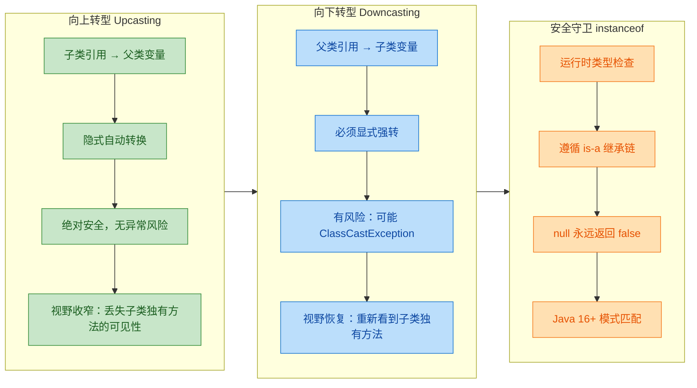

---

### 多层继承中的转型与 instanceof

当继承链超过两层时，转型和 `instanceof` 的行为依然遵循 is-a 原则，但需要更加小心：

```java
// 三层继承体系
class Animal {
    public void eat() {
        System.out.println("Animal eats");
    }
}

class Dog extends Animal {
    public void bark() {
        System.out.println("Dog barks");
    }
}

class GoldenRetriever extends Dog {
    public void fetch() {
        System.out.println("Golden Retriever fetches");
    }
}
```

```java
public class MultiLevelCastDemo {
    public static void main(String[] args) {
        // GoldenRetriever → Animal（跨两级向上转型，依然隐式安全）
        Animal animal = new GoldenRetriever();

        // instanceof 沿继承链全部为 true
        System.out.println(animal instanceof GoldenRetriever);  // true
        System.out.println(animal instanceof Dog);              // true
        System.out.println(animal instanceof Animal);           // true
        System.out.println(animal instanceof Object);           // true

        // 跨级向下转型：Animal → GoldenRetriever（需要强转）
        if (animal instanceof GoldenRetriever gr) {
            gr.fetch();  // 输出: Golden Retriever fetches
            gr.bark();   // 输出: Dog barks（继承自 Dog）
            gr.eat();    // 输出: Animal eats（继承自 Animal）
        }

        // 中间层转型：Animal → Dog（也合法，因为实际对象是 GoldenRetriever）
        if (animal instanceof Dog dog) {
            dog.bark();  // 输出: Dog barks
            // dog.fetch();  // 编译错误！Dog 引用看不到 GoldenRetriever 的方法
        }
    }
}
```

这个例子清晰地展示了：向下转型不一定要"一步到底"，你可以转到继承链中的任意一层，只要实际对象确实 is-a 那个类型。

---

### 接口类型的转型

`instanceof` 和转型不仅适用于类继承，同样适用于 **接口实现**。一个实现了某接口的类的实例，`instanceof` 该接口会返回 `true`，也可以在接口类型和实现类之间进行转型。

```java
// 定义接口
interface Swimmable {
    void swim();  // 游泳能力
}

// Dog 实现 Swimmable 接口
class Dog extends Animal implements Swimmable {
    @Override
    public void makeSound() {
        System.out.println("Woof!");
    }

    @Override
    public void swim() {
        System.out.println("Dog paddles in water");
    }

    public void fetchBall() {
        System.out.println("Dog fetches the ball");
    }
}
```

```java
public class InterfaceCastDemo {
    public static void main(String[] args) {
        Dog dog = new Dog();

        // 向上转型到接口类型
        Swimmable swimmer = dog;       // 隐式，安全
        swimmer.swim();                // 输出: Dog paddles in water
        // swimmer.fetchBall();        // 编译错误！Swimmable 视野中没有 fetchBall

        // 从接口类型向下转型回具体类
        if (swimmer instanceof Dog d) {
            d.fetchBall();             // 输出: Dog fetches the ball
            d.swim();                  // 输出: Dog paddles in water
        }

        // instanceof 同时检查类和接口
        Animal animal = new Dog();
        System.out.println(animal instanceof Swimmable);  // true — Dog 实现了 Swimmable
        System.out.println(animal instanceof Dog);        // true
    }
}
```

---

### 实战：用转型与 instanceof 实现类型分发

在实际项目中，向上转型常用于统一存储和传递，而向下转型配合 `instanceof` 则用于在需要时"恢复"具体类型以调用特有行为。下面是一个典型的动物收容所场景：

```java
import java.util.ArrayList;
import java.util.List;

class Animal {
    protected String name;  // 动物名字

    public Animal(String name) {
        this.name = name;
    }

    public void makeSound() {
        System.out.println(name + " makes a sound");
    }
}

class Dog extends Animal {
    public Dog(String name) {
        super(name);  // 调用父类构造器
    }

    @Override
    public void makeSound() {
        System.out.println(name + ": Woof! Woof!");
    }

    // Dog 独有行为
    public void fetch() {
        System.out.println(name + " fetches the stick");
    }
}

class Cat extends Animal {
    public Cat(String name) {
        super(name);
    }

    @Override
    public void makeSound() {
        System.out.println(name + ": Meow~");
    }

    // Cat 独有行为
    public void purr() {
        System.out.println(name + " purrs softly");
    }
}

class Parrot extends Animal {
    public Parrot(String name) {
        super(name);
    }

    @Override
    public void makeSound() {
        System.out.println(name + ": Squawk!");
    }

    // Parrot 独有行为
    public void mimic(String phrase) {
        System.out.println(name + " mimics: \"" + phrase + "\"");
    }
}
```

```java
public class AnimalShelter {
    public static void main(String[] args) {
        // 向上转型：所有子类统一存入 List<Animal>
        List<Animal> shelter = new ArrayList<>();
        shelter.add(new Dog("Buddy"));       // Dog → Animal（向上转型）
        shelter.add(new Cat("Whiskers"));    // Cat → Animal（向上转型）
        shelter.add(new Parrot("Polly"));    // Parrot → Animal（向上转型）
        shelter.add(new Dog("Rex"));         // Dog → Animal（向上转型）

        // 遍历：多态调用（无需转型）
        System.out.println("=== All animals make sounds ===");
        for (Animal animal : shelter) {
            animal.makeSound();  // 动态绑定，各自调用重写版本
        }

        // 向下转型 + instanceof：调用子类独有行为
        System.out.println("\n=== Special behaviors ===");
        for (Animal animal : shelter) {
            if (animal instanceof Dog dog) {           // Java 16+ 模式匹配
                dog.fetch();                           // Dog 独有
            } else if (animal instanceof Cat cat) {
                cat.purr();                            // Cat 独有
            } else if (animal instanceof Parrot parrot) {
                parrot.mimic("Hello, world!");         // Parrot 独有
            }
        }
    }
}
```

输出：

```text
=== All animals make sounds ===
Buddy: Woof! Woof!
Whiskers: Meow~
Polly: Squawk!
Rex: Woof! Woof!

=== Special behaviors ===
Buddy fetches the stick
Whiskers purrs softly
Polly mimics: "Hello, world!"
Rex fetches the stick
```

这个例子完美展示了转型的典型工作流：**向上转型用于统一抽象，向下转型用于恢复具体**。两者配合 `instanceof` 守卫，构成了安全、灵活的多态编程模式。

---

### 常见陷阱与最佳实践

**陷阱一：盲目强转不检查**

```java
// 危险！没有 instanceof 检查就直接强转
public void process(Animal animal) {
    Dog dog = (Dog) animal;  // 如果传入 Cat，运行时直接崩溃
    dog.fetchBall();
}
```

**陷阱二：instanceof 检查顺序错误**

在多层继承中，`instanceof` 的检查顺序很重要。应该 **从最具体的子类开始检查**，否则父类的分支会"吞掉"所有子类：

```java
// 错误顺序：Dog 分支永远不会执行
if (animal instanceof Animal) {        // 所有对象都匹配这里！
    // ...
} else if (animal instanceof Dog) {    // 永远到不了这里
    // ...
}

// 正确顺序：从最具体到最抽象
if (animal instanceof GoldenRetriever gr) {
    // 最具体的类型优先匹配
} else if (animal instanceof Dog dog) {
    // 次具体
} else if (animal instanceof Animal a) {
    // 最后兜底
}
```

**陷阱三：过度使用 instanceof 是设计的坏味道**

如果你发现代码中到处都是 `instanceof` 判断，这通常意味着多态没有被充分利用。更好的做法是把差异化行为定义在父类/接口中，让子类各自重写，而不是在调用方用 `instanceof` 逐个判断。

```java
// 坏味道：调用方承担了类型分发的责任
if (animal instanceof Dog dog) {
    dog.performTrick();
} else if (animal instanceof Cat cat) {
    cat.performTrick();
}

// 更好的设计：让多态替你分发
animal.performTrick();  // 每个子类重写 performTrick()，调用方无需关心具体类型
```

---

**📝 练习题**

以下代码的运行结果是什么？

```java
class Vehicle {}
class Car extends Vehicle {}
class ElectricCar extends Car {}

public class Quiz {
    public static void main(String[] args) {
        Vehicle v = new ElectricCar();
        System.out.println(v instanceof Vehicle);
        System.out.println(v instanceof Car);
        System.out.println(v instanceof ElectricCar);
        System.out.println(v instanceof Object);
        
        Vehicle v2 = new Car();
        System.out.println(v2 instanceof ElectricCar);
    }
}
```

A. true, true, true, true, true


B. true, true, false, true, false


C. true, true, true, true, false


D. true, false, true, true, false


**【答案】** C

**【解析】** `v` 实际指向的是 `ElectricCar` 对象。`ElectricCar` is-a `Car`，is-a `Vehicle`，is-a `Object`，所以前四个 `instanceof` 全部返回 `true`。而 `v2` 实际指向的是 `Car` 对象（不是 `ElectricCar`），`Car` 不是 `ElectricCar` 的子类（恰恰相反，`ElectricCar` 是 `Car` 的子类），因此 `v2 instanceof ElectricCar` 返回 `false`。`instanceof` 检查的是 **运行时对象的实际类型** 是否在目标类型的继承链上（包括自身），而不是引用变量的声明类型。

---

## 协变返回类型

### 什么是协变返回类型（Covariant Return Type）

在 Java 5 之前，当子类重写（Override）父类方法时，返回类型必须与父类方法**完全一致**。这个限制在很多场景下显得不够灵活。从 Java 5 开始，语言引入了**协变返回类型（Covariant Return Type）**机制——子类重写父类方法时，返回类型可以是父类方法返回类型的**子类型（subtype）**。

"协变"这个词来自类型论（Type Theory）。所谓 covariant，意思是"随着继承方向一起变化"。父类方法返回 `Animal`，子类重写后可以返回 `Dog`——返回类型沿着继承层次"向下"变得更具体，这就是协变。

用一句话概括规则：

> 重写方法的返回类型必须是被重写方法返回类型的**相同类型或其子类型**（The return type of the overriding method must be the same as, or a subtype of, the return type of the overridden method）。

### 基础语法与示例

先看一个最直观的例子：

```java
// 父类：动物庇护所
class AnimalShelter {
    // 父类方法返回 Animal 类型
    public Animal adopt() {
        System.out.println("领养了一只动物");
        return new Animal();  // 返回一个通用的 Animal 对象
    }
}

// 子类：猫咪庇护所
class CatShelter extends AnimalShelter {
    // 重写方法，返回类型从 Animal "协变"为 Cat
    // Cat 是 Animal 的子类，这在 Java 5+ 中完全合法
    @Override
    public Cat adopt() {                  // 返回类型是 Cat，比父类更具体
        System.out.println("领养了一只猫咪");
        return new Cat();                 // 返回 Cat 对象
    }
}

// 基础类定义
class Animal {
    public String toString() { return "Animal"; }
}

class Cat extends Animal {
    public String toString() { return "Cat"; }
    public void purr() {                  // Cat 独有的方法
        System.out.println("呼噜呼噜~");
    }
}
```

调用端的好处立刻体现出来：

```java
public class Main {
    public static void main(String[] args) {
        // ---- 使用父类引用 ----
        AnimalShelter shelter = new AnimalShelter();
        Animal a = shelter.adopt();       // 返回 Animal，需要强转才能调用子类方法

        // ---- 使用子类引用 ----
        CatShelter catShelter = new CatShelter();
        Cat cat = catShelter.adopt();     // 直接得到 Cat，无需强转！
        cat.purr();                       // 可以直接调用 Cat 独有的方法

        // ---- 多态场景下仍然兼容 ----
        AnimalShelter polyShelter = new CatShelter();  // 向上转型
        Animal animal = polyShelter.adopt();            // 编译时类型是 Animal
        // animal.purr();  // 编译错误——编译时类型是 Animal，没有 purr()
    }
}
```

关键观察：当我们通过 `CatShelter` 类型的引用调用 `adopt()` 时，编译器**知道**返回的是 `Cat`，所以不需要任何强制类型转换。这就是协变返回类型带来的核心价值——**类型安全地消除了不必要的向下转型**。

### 协变返回类型的规则与约束

协变返回类型并不是"随便改返回类型"，它有严格的规则边界：

```java
class Parent {
    public Number calculate() {           // 返回 Number
        return 42;
    }
}

class Child extends Parent {
    @Override
    public Integer calculate() {          // ✅ 合法：Integer 是 Number 的子类
        return 42;
    }
}

class BadChild extends Parent {
    // @Override
    // public String calculate() {        // ❌ 编译错误！String 不是 Number 的子类
    //     return "42";
    // }
}
```

完整的规则清单：

```java
// 规则 1：返回类型必须是父类返回类型的子类型（或相同类型）
class A {
    public Object get() { return null; }
}
class B extends A {
    @Override
    public String get() { return "hello"; }  // ✅ String 是 Object 的子类
}

// 规则 2：仅适用于引用类型，基本类型（primitive）不参与协变
class C {
    public int value() { return 0; }
}
class D extends C {
    // @Override
    // public short value() { return 0; }    // ❌ 编译错误！基本类型之间没有协变
    
    @Override
    public int value() { return 1; }         // ✅ 必须完全相同
}

// 规则 3：访问修饰符不能更严格（这是 Override 的通用规则，非协变独有）
class E {
    public Number compute() { return 0; }
}
class F extends E {
    @Override
    public Integer compute() { return 0; }   // ✅ 协变 + 访问权限不变

    // protected Integer compute()            // ❌ 不能把 public 缩小为 protected
}

// 规则 4：协变只看"原始类型"（raw type），泛型擦除后的类型才是判断依据
class G {
    public List<Number> items() { return null; }
}
class H extends G {
    // @Override
    // public List<Integer> items() { return null; }  // ❌ 编译错误！
    // List<Integer> 不是 List<Number> 的子类型（泛型不协变）
    
    // @Override
    // public ArrayList<Number> items() { return null; } // ✅ ArrayList 是 List 的子类型
}
```

用一张表格总结：

| 场景 | 父类返回类型 | 子类返回类型 | 是否合法 | 原因 |
|------|-------------|-------------|---------|------|
| 标准协变 | `Animal` | `Cat` | ✅ | Cat extends Animal |
| 包装类协变 | `Number` | `Integer` | ✅ | Integer extends Number |
| 无关类型 | `Number` | `String` | ❌ | String 不是 Number 子类 |
| 基本类型 | `int` | `short` | ❌ | 基本类型不参与协变 |
| 泛型参数不同 | `List〈Number〉` | `List〈Integer〉` | ❌ | 泛型不协变 |
| 泛型容器子类 | `List〈Number〉` | `ArrayList〈Number〉` | ✅ | ArrayList implements List |
| 完全相同 | `String` | `String` | ✅ | 相同类型始终合法 |

### 底层原理：桥接方法（Bridge Method）

协变返回类型在源码层面看起来很自然，但 JVM 的方法签名是靠**方法名 + 参数列表 + 返回类型**来唯一标识的。那编译器是怎么让 JVM 正确处理协变的呢？答案是**桥接方法（Bridge Method）**。

编译器会在子类中自动生成一个与父类签名完全一致的"桥接方法"，这个方法内部调用真正的重写方法：

```java
// 我们写的源码
class AnimalShelter {
    public Animal adopt() { return new Animal(); }
}

class CatShelter extends AnimalShelter {
    @Override
    public Cat adopt() { return new Cat(); }   // 协变返回
}
```

编译后，`CatShelter.class` 中实际包含两个方法（可通过 `javap -c` 查看）：

```java
// 编译器生成的字节码等价伪代码
class CatShelter extends AnimalShelter {

    // 方法 1：我们写的真正实现
    public Cat adopt() {                       // 签名：adopt()LCat;
        return new Cat();
    }

    // 方法 2：编译器自动生成的桥接方法（Bridge Method）
    // 这个方法对程序员不可见，但在字节码中真实存在
    public /* synthetic bridge */ Animal adopt() {  // 签名：adopt()LAnimal;
        return this.adopt();                        // 调用上面那个返回 Cat 的方法
    }                                               // Cat 向上转型为 Animal，完全安全
}
```

我们可以用反射来验证桥接方法的存在：

```java
import java.lang.reflect.Method;

public class BridgeMethodDemo {
    public static void main(String[] args) {
        // 获取 CatShelter 中所有声明的方法
        Method[] methods = CatShelter.class.getDeclaredMethods();
        for (Method m : methods) {
            // 打印方法名、返回类型、是否为桥接方法
            System.out.printf("方法: %-10s 返回类型: %-10s isBridge: %s%n",
                m.getName(),                       // 方法名
                m.getReturnType().getSimpleName(), // 返回类型
                m.isBridge());                     // 是否为桥接方法
        }
    }
}
// 输出：
// 方法: adopt      返回类型: Cat        isBridge: false
// 方法: adopt      返回类型: Animal     isBridge: true
```

整个过程用流程图表示：

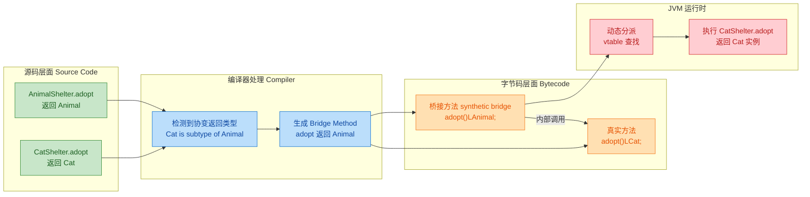

### 实际应用场景

协变返回类型在实际开发中非常常见，尤其在以下几个模式中：

#### 场景一：Builder 模式中的链式调用

这是协变返回类型最经典的应用场景之一。父类 Builder 返回自身类型，子类 Builder 重写后返回更具体的类型，从而支持链式调用不丢失类型信息：

```java
// 基础配置构建器
class BaseConfig {
    protected String host;                     // 主机地址
    protected int port;                        // 端口号

    // 返回 BaseConfig，子类会协变为更具体的类型
    public BaseConfig setHost(String host) {
        this.host = host;                      // 设置主机
        return this;                           // 返回自身以支持链式调用
    }

    public BaseConfig setPort(int port) {
        this.port = port;                      // 设置端口
        return this;                           // 返回自身
    }
}

// 数据库配置构建器，继承基础配置
class DbConfig extends BaseConfig {
    private String database;                   // 数据库名称

    @Override
    public DbConfig setHost(String host) {     // 协变：返回 DbConfig 而非 BaseConfig
        super.setHost(host);                   // 调用父类逻辑
        return this;                           // 返回 DbConfig 类型
    }

    @Override
    public DbConfig setPort(int port) {        // 协变：返回 DbConfig
        super.setPort(port);                   // 调用父类逻辑
        return this;                           // 返回 DbConfig 类型
    }

    public DbConfig setDatabase(String db) {   // 子类独有的方法
        this.database = db;                    // 设置数据库名
        return this;                           // 返回自身
    }
}
```

调用端的体验差异非常明显：

```java
// ✅ 有协变返回类型：链式调用一气呵成
DbConfig config = new DbConfig()
    .setHost("localhost")                      // 返回 DbConfig，不丢失类型
    .setPort(3306)                             // 仍然是 DbConfig
    .setDatabase("mydb");                      // 可以直接调用子类方法

// ❌ 如果没有协变返回类型（Java 5 之前的困境）
// BaseConfig raw = new DbConfig();
// raw.setHost("localhost");                   // 返回 BaseConfig
// raw.setPort(3306);                          // 返回 BaseConfig
// ((DbConfig) raw).setDatabase("mydb");       // 必须强转，丑陋且不安全
```

#### 场景二：工厂方法模式

```java
// 抽象文档类
class Document {
    public Document clone() {                  // 返回 Document
        return new Document();
    }
}

// PDF 文档
class PdfDocument extends Document {
    private int pageCount;                     // PDF 特有属性

    @Override
    public PdfDocument clone() {               // 协变返回 PdfDocument
        PdfDocument copy = new PdfDocument();  // 创建 PDF 副本
        copy.pageCount = this.pageCount;       // 复制 PDF 特有属性
        return copy;                           // 返回具体类型
    }
}

// 使用时无需强转
PdfDocument original = new PdfDocument();
PdfDocument copy = original.clone();           // 直接得到 PdfDocument，类型安全
```

#### 场景三：JDK 中的真实案例

Java 标准库中大量使用了协变返回类型。最典型的就是 `Object.clone()`：

```java
// java.lang.Object 中的定义
public class Object {
    protected native Object clone() throws CloneNotSupportedException;
}

// 实际使用中，推荐用协变返回类型重写
public class Employee implements Cloneable {
    private String name;
    private int salary;

    @Override
    public Employee clone() {                  // 协变：Object -> Employee
        try {
            return (Employee) super.clone();   // 内部强转一次
        } catch (CloneNotSupportedException e) {
            throw new AssertionError();        // 不应该发生
        }
    }
}

// 调用端受益
Employee e1 = new Employee();
Employee e2 = e1.clone();                     // 无需 (Employee) 强转
```

其他 JDK 中的例子包括：
- `ByteBuffer.put()` 返回 `ByteBuffer`（父类 `Buffer.put()` 返回 `Buffer`）
- `StringBuilder.append()` 返回 `StringBuilder`（父类 `AbstractStringBuilder` 返回 `AbstractStringBuilder`）

### 协变返回类型 vs 泛型自引用（对比）

有些开发者会用泛型自引用（Curiously Recurring Template Pattern, CRTP）来实现类似效果。两种方案各有优劣：

```java
// 方案 A：协变返回类型（简单直接）
class BaseBuilder {
    public BaseBuilder withName(String name) { return this; }
}
class AdvancedBuilder extends BaseBuilder {
    @Override
    public AdvancedBuilder withName(String name) {  // 协变
        super.withName(name);
        return this;
    }
    public AdvancedBuilder withExtra(int x) { return this; }
}

// 方案 B：泛型自引用（更灵活但更复杂）
class BaseBuilder2<T extends BaseBuilder2<T>> {
    @SuppressWarnings("unchecked")
    public T withName(String name) {
        // ... 设置 name
        return (T) this;                       // 返回泛型类型 T
    }
}
class AdvancedBuilder2 extends BaseBuilder2<AdvancedBuilder2> {
    // 无需重写 withName！自动返回 AdvancedBuilder2
    public AdvancedBuilder2 withExtra(int x) { return this; }
}
```

| 对比维度 | 协变返回类型 | 泛型自引用 (CRTP) |
|---------|------------|-------------------|
| 代码复杂度 | 低，每个方法需手动重写 | 高，泛型声明复杂 |
| 类型安全 | 完全安全 | 依赖 unchecked cast |
| 可读性 | 直观易懂 | 需要理解泛型递归 |
| 扩展层级 | 每层都要重写 | 自动传递，无需重写 |
| 适用场景 | 层级浅、方法少 | 层级深、方法多 |

### 常见误区与陷阱

```java
// 误区 1：以为基本类型也能协变
class Parent1 {
    public int getValue() { return 0; }
}
class Child1 extends Parent1 {
    // public long getValue() { return 0L; }  // ❌ 编译错误
    // int 和 long 之间没有继承关系，基本类型不参与协变
}

// 误区 2：以为协变可以用在方法参数上（那叫"逆变"，Java 不支持）
class Parent2 {
    public void process(Integer num) { }
}
class Child2 extends Parent2 {
    // public void process(Number num) { }    // ❌ 这不是重写，这是重载！
    // Java 方法参数不支持逆变，参数类型必须完全一致才算重写
}

// 误区 3：混淆协变返回与泛型协变
class Parent3 {
    public List<Animal> getAnimals() { return null; }
}
class Child3 extends Parent3 {
    // public List<Cat> getAnimals() { return null; }  // ❌ 编译错误
    // List<Cat> 不是 List<Animal> 的子类型！
    // 泛型是不变的（invariant），这与协变返回类型是两个概念

    @Override
    public ArrayList<Animal> getAnimals() {            // ✅ 这才是合法的协变
        return new ArrayList<>();                      // ArrayList 是 List 的子类型
    }
}
```

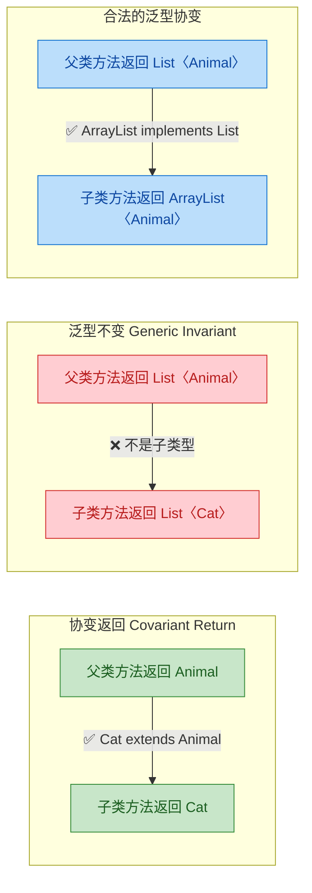

---

**📝 练习题**

以下代码能否通过编译？如果能，输出是什么？

```java
class Fruit {
    public Fruit create() {
        System.out.println("Fruit created");
        return new Fruit();
    }
}

class Apple extends Fruit {
    @Override
    public Apple create() {
        System.out.println("Apple created");
        return new Apple();
    }
    
    public void juice() {
        System.out.println("Apple juice!");
    }
}

public class Test {
    public static void main(String[] args) {
        Fruit f = new Apple();
        f.create().juice();        // 第 1 处
        
        Apple a = new Apple();
        a.create().juice();        // 第 2 处
    }
}
```

A. 编译通过，输出 `Apple created` 和 `Apple juice!` 两次


B. 第 1 处编译错误，第 2 处正常


C. 第 1 处和第 2 处都编译错误


D. 运行时抛出 ClassCastException


**【答案】** B

**【解析】** 这道题考查的是协变返回类型与编译时类型的关系。

第 1 处：`f` 的编译时类型是 `Fruit`，所以 `f.create()` 的返回类型在编译器看来是 `Fruit`（按照父类方法签名）。`Fruit` 类没有 `juice()` 方法，因此 `f.create().juice()` 在编译阶段就会报错。尽管运行时 `f` 实际指向 `Apple` 对象，动态绑定会调用 `Apple.create()` 返回 `Apple`，但编译器不会"提前预判"运行时类型。

第 2 处：`a` 的编译时类型是 `Apple`，`a.create()` 的返回类型是 `Apple`（协变返回类型生效），`Apple` 有 `juice()` 方法，编译通过。运行时输出 `Apple created` 然后 `Apple juice!`。

这个例子完美说明了：协变返回类型的好处只有在**通过子类类型的引用**调用时才能体现。通过父类引用调用时，编译器仍然按照父类的方法签名来判断返回类型。

---

## 本章小结

继承与多态是 Java 面向对象编程的两大核心支柱。本章从继承的基本语法出发，逐步深入到多态的底层机制，构建了一条完整的知识链路。我们用一张全景图来回顾整章的知识脉络：

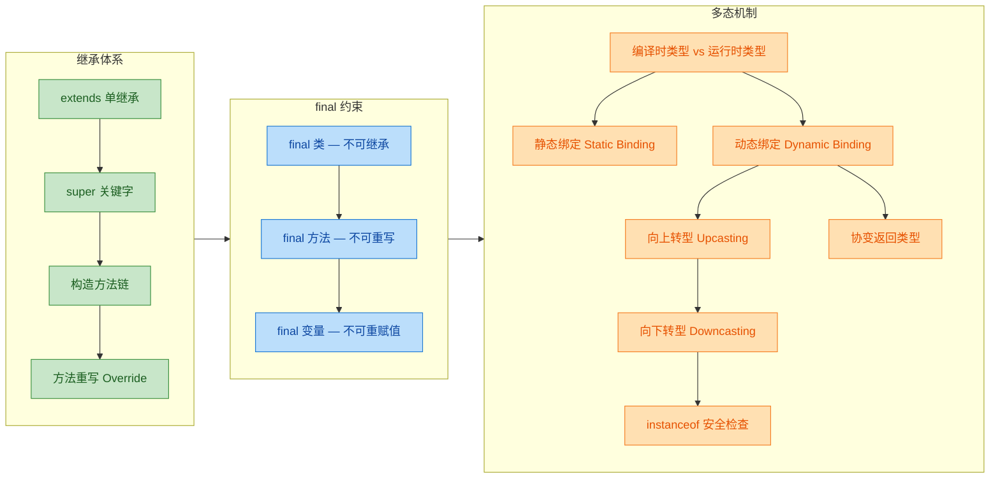

### 核心知识回顾

本章的知识可以归纳为三条主线，每条主线都有其核心要义和容易踩坑的地方。

**第一条主线：继承的建立与约束。** Java 通过 `extends` 关键字实现单继承，子类获得父类所有非 private 的成员。`super` 关键字是连接父子类的桥梁——它既能调用父类构造方法 `super()`，也能访问被遮蔽的父类成员 `super.field` 或 `super.method()`。构造方法链保证了对象创建时从最顶层的 `Object` 开始，逐层向下初始化，任何一层的构造方法第一行要么显式调用 `super(...)`，要么编译器自动插入 `super()`。方法重写 (Override) 则是子类对父类行为的"定制化改造"，遵循"两同两小一大"的规则：方法名相同、参数列表相同；返回类型相同或更小（协变）、抛出异常相同或更小；访问权限相同或更大。

**第二条主线：final 的封印力量。** `final` 是 Java 提供的"不可变"语义工具。`final class` 切断继承链（如 `String`），`final method` 禁止子类重写，`final variable` 禁止重新赋值（但引用类型的内部状态仍可变）。理解 final 的关键在于区分"引用不可变"和"对象不可变"——这是面试中的高频考点。

**第三条主线：多态的运行时魔法。** 多态的本质是"一个引用，多种形态"。编译时类型 (Compile-time Type) 决定你能调用哪些方法，运行时类型 (Runtime Type) 决定实际执行哪个版本的方法。静态绑定 (Static Binding) 在编译期就锁定了目标——适用于 `static`、`final`、`private` 方法以及方法重载 (Overload)；动态绑定 (Dynamic Binding) 则在运行时通过虚方法表 (vtable) 查找实际类型的方法实现——这是方法重写 (Override) 的底层支撑。向上转型天然安全且自动发生，向下转型则需要 `instanceof` 保驾护航。协变返回类型是 Java 5 引入的语法糖，让子类重写方法时可以返回更具体的类型，提升了 API 的类型精确度。

### 易错点速查表

```java
// ============================================================
// 易错点速查表 — 用代码片段快速回忆关键规则
// ============================================================

// 1. 构造方法链：父类没有无参构造时，子类必须显式调用 super(...)
class Parent {
    Parent(int x) { }           // 只有带参构造，没有默认无参构造
}
class Child extends Parent {
    Child() {
        super(0);               // 必须显式调用，否则编译报错
    }
}

// 2. Override vs Overload：参数列表是分水岭
class Base {
    void print(String s) { }    // 父类方法
}
class Sub extends Base {
    @Override
    void print(String s) { }    // 参数列表相同 → Override（重写）

    void print(int n) { }       // 参数列表不同 → Overload（重载），不是重写！
}

// 3. final 引用 vs 对象不可变
final int[] arr = {1, 2, 3};
arr[0] = 99;                    // 合法！修改的是数组内容，不是引用
// arr = new int[]{4, 5, 6};    // 编译错误！final 禁止引用重新赋值

// 4. 多态陷阱：字段不参与动态绑定
class A {
    int value = 10;             // 父类字段
}
class B extends A {
    int value = 20;             // 子类字段（遮蔽，不是重写）
}
A obj = new B();
// obj.value == 10              // 字段访问看编译时类型（A），不是运行时类型（B）

// 5. 向下转型必须先检查
Animal animal = new Cat();
// Dog dog = (Dog) animal;      // 编译通过，但运行时抛 ClassCastException！
if (animal instanceof Cat cat) {
    cat.meow();                 // Java 16+ 模式匹配，安全且简洁
}
```

### 设计思想提炼

从更高的视角来看，本章的知识点并非孤立存在，它们共同服务于面向对象设计的核心原则：

- **继承**实现了 "is-a" 关系和代码复用，但过度继承会导致类层次膨胀，所以 Java 限制为单继承，并提供 `final` 作为"刹车"。实际开发中，优先考虑组合 (Composition over Inheritance) 是更稳健的策略。
- **多态**实现了"面向抽象编程"——调用者只依赖父类或接口的契约，不关心具体实现。这是开闭原则 (Open-Closed Principle) 的基石：对扩展开放，对修改关闭。新增一个子类就能扩展系统行为，而无需修改已有代码。
- **动态绑定**是 JVM 层面对多态的技术保障，理解 vtable 的查找机制，能帮助你在性能敏感场景做出更明智的设计决策（比如何时用 `final` 方法来允许 JIT 内联优化）。

这些概念在后续学习抽象类、接口、设计模式时会被反复运用。可以说，继承与多态是通往 Java 高级编程的必经之路——把这一章吃透，后面的路会顺畅很多。

---

**📝 练习题**

以下代码的输出结果是什么？

```java
class Animal {
    String name = "Animal";

    void speak() {
        System.out.println("Animal speaks");
    }

    static void info() {
        System.out.println("Animal info");
    }
}

class Dog extends Animal {
    String name = "Dog";

    @Override
    void speak() {
        System.out.println("Dog barks");
    }

    static void info() {
        System.out.println("Dog info");
    }
}

public class Test {
    public static void main(String[] args) {
        Animal a = new Dog();
        System.out.println(a.name);
        a.speak();
        a.info();
    }
}
```

A. `Dog` → `Dog barks` → `Dog info`


B. `Animal` → `Dog barks` → `Animal info`


C. `Animal` → `Animal speaks` → `Animal info`


D. `Dog` → `Dog barks` → `Animal info`


**【答案】** B

**【解析】** 这道题精准考察了动态绑定与静态绑定的区别，以及字段访问的规则：

- `a.name` 输出 `Animal`：字段访问不参与多态，编译时类型是 `Animal`，所以直接访问 `Animal.name`。
- `a.speak()` 输出 `Dog barks`：`speak()` 是实例方法，遵循动态绑定。运行时类型是 `Dog`，JVM 通过 vtable 找到 `Dog.speak()` 执行。
- `a.info()` 输出 `Animal info`：`info()` 是 `static` 方法，遵循静态绑定。编译时类型是 `Animal`，所以调用 `Animal.info()`。静态方法属于类而非实例，不存在"重写"，子类的同签名静态方法只是"隐藏 (hiding)"。

这道题的核心结论：**动态绑定只作用于实例方法，字段和静态方法都看编译时类型。**

---

**📝 练习题**

关于 `final` 关键字，以下说法正确的是？

A. `final` 修饰的局部变量必须在声明时立即赋值


B. `final` 修饰的引用类型变量，其指向的对象内部状态也不可修改


C. `final` 修饰的实例方法可以被子类重载 (Overload)，但不能被重写 (Override)


D. `final` 修饰的类仍然可以被继承，只是其中的方法不能被重写


**【答案】** C

**【解析】**

- A 错误：`final` 局部变量可以先声明后赋值（称为 blank final），只要在使用前完成一次且仅一次赋值即可。例如 `final int x; x = 10;` 是合法的。
- B 错误：这是最经典的误区。`final` 只保证引用本身不可重新指向另一个对象，但对象的内部状态完全可以修改。例如 `final List<String> list = new ArrayList<>(); list.add("hello");` 完全合法。
- C 正确：`final` 方法禁止子类重写 (Override)，即不能用相同的方法签名覆盖它。但重载 (Overload) 是定义不同参数列表的新方法，与原方法签名不同，所以不受 `final` 限制。
- D 错误：`final` 类完全不能被继承，`extends` 一个 `final` 类会直接编译报错。典型例子就是 `java.lang.String`。

---

