---

# 面向对象基础

---

## 类与对象（Classes and Objects）

在 Java 的世界里，一切皆对象（Everything is an Object）。类（Class）是对象的蓝图（blueprint），而对象（Object）是类的实例（instance）。理解类与对象的关系，是掌握 Java 面向对象编程（OOP, Object-Oriented Programming）的第一步。

### 类的本质：从现实到代码的映射

你可以把"类"想象成一张建筑图纸。图纸本身不是房子，但它定义了房子应该有什么结构、什么功能。当你根据图纸盖出一栋真实的房子时，那栋房子就是一个"对象"。

一个类由两部分核心要素组成：

- **属性（Fields / Member Variables）**：描述对象"是什么"、"有什么"——即对象的状态（state）。
- **方法（Methods）**：描述对象"能做什么"——即对象的行为（behavior）。

```java
// 定义一个"学生"类 —— 这是蓝图，不是具体的学生
public class Student {

    // ========== 属性（状态） ==========
    String name;   // 学生姓名
    int age;       // 学生年龄
    String school; // 所在学校

    // ========== 方法（行为） ==========
    // 学生可以做自我介绍
    void introduce() {
        // 在方法内部可以直接访问本类的属性
        System.out.println("大家好，我叫" + name + "，今年" + age + "岁");
    }
}
```

有了蓝图，就可以"造"出具体的学生了：

```java
public class Main {
    public static void main(String[] args) {

        // 使用 new 关键字创建对象（实例化）
        Student stu1 = new Student(); // stu1 是第一个学生对象
        stu1.name = "张三";           // 给 stu1 的 name 属性赋值
        stu1.age = 20;               // 给 stu1 的 age 属性赋值
        stu1.introduce();            // 调用方法 → 输出：大家好，我叫张三，今年20岁

        Student stu2 = new Student(); // stu2 是第二个学生对象，和 stu1 互不影响
        stu2.name = "李四";
        stu2.age = 22;
        stu2.introduce();            // 输出：大家好，我叫李四，今年22岁
    }
}
```

这里有一个关键认知：`stu1` 和 `stu2` 虽然都是 `Student` 类型，但它们是两个独立的对象，各自拥有独立的属性值，互不干扰。就像同一张图纸盖出的两栋房子，结构相同但住的人不同。

下面这张图展示了类、对象与内存之间的关系：

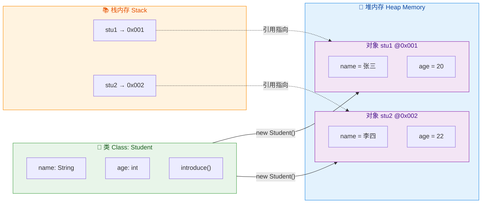

注意看：变量 `stu1`、`stu2` 本身存储在栈内存（Stack）中，它们保存的是对象在堆内存（Heap）中的地址引用（reference）。这就是 Java 中"引用类型"的核心含义——变量不直接持有对象，而是持有一个指向对象的"遥控器"。

### 构造方法（Constructor）

在上面的例子中，我们创建对象后需要逐个给属性赋值，这既繁琐又容易遗漏。构造方法就是为了解决这个问题而存在的——它允许你在创建对象的同时完成初始化。

构造方法有三个显著特征，缺一不可：

1. **方法名必须与类名完全相同**（包括大小写）
2. **没有返回值类型**（连 `void` 都不写）
3. **在 `new` 的时候自动调用**，不能手动调用

#### 默认构造方法（Default Constructor）

当你没有在类中显式定义任何构造方法时，Java 编译器会自动帮你生成一个无参的默认构造方法。它的方法体是空的，什么也不做：

```java
public class Student {
    String name;
    int age;

    // 编译器自动生成的默认构造方法（你看不到，但它确实存在）
    // public Student() {
    //     // 空的，什么也不做
    //     // 属性会被赋予默认值：name = null, age = 0
    // }
}
```

这就是为什么 `new Student()` 能正常工作——它调用的就是这个隐式的默认构造方法。此时所有属性会被赋予类型的默认值（引用类型为 `null`，`int` 为 `0`，`boolean` 为 `false`，等等）。

但有一个非常重要的陷阱：**一旦你手动定义了任何构造方法，编译器就不再自动生成默认构造方法了。**

```java
public class Student {
    String name;
    int age;

    // 手动定义了一个带参构造方法
    public Student(String name, int age) {
        this.name = name;
        this.age = age;
    }
}

// 在 main 方法中：
// Student stu = new Student();        // ❌ 编译错误！无参构造方法已经不存在了
Student stu = new Student("张三", 20);  // ✅ 只能用带参构造
```

这是初学者最常踩的坑之一。所以实际开发中有一条广泛遵循的最佳实践：**永远显式地保留一个无参构造方法**，尤其是在使用框架（如 Spring、MyBatis、Jackson）时，很多框架通过反射创建对象，依赖的就是无参构造。

#### 带参构造方法（Parameterized Constructor）

带参构造方法让你在创建对象时直接传入初始值，一步到位：

```java
public class Student {
    String name;   // 姓名
    int age;       // 年龄
    String school; // 学校

    // 无参构造方法（显式保留，养成好习惯）
    public Student() {
        // 可以在这里设置默认值
        this.school = "未分配"; // 给 school 一个默认值
    }

    // 带两个参数的构造方法
    public Student(String name, int age) {
        this.name = name;   // 将参数 name 赋值给属性 name
        this.age = age;     // 将参数 age 赋值给属性 age
        this.school = "未分配";
    }

    // 带三个参数的构造方法（全参构造）
    public Student(String name, int age, String school) {
        this.name = name;
        this.age = age;
        this.school = school;
    }
}
```

这就是方法重载（Overloading）在构造方法上的体现——同一个类中可以有多个构造方法，只要它们的参数列表不同（参数个数、类型或顺序不同）。调用时，Java 编译器会根据你传入的实参自动匹配最合适的那个：

```java
Student s1 = new Student();                    // 匹配无参构造
Student s2 = new Student("张三", 20);           // 匹配两参构造
Student s3 = new Student("李四", 22, "北京大学"); // 匹配三参构造
```

#### 构造方法的执行流程

理解构造方法的执行时机非常重要。当 JVM 执行 `new Student("张三", 20)` 时，内部发生了以下步骤：

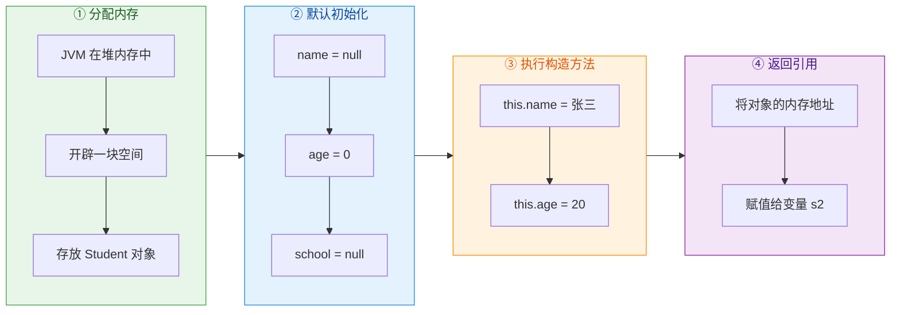

注意第②步：在构造方法体执行之前，JVM 已经把所有属性设为了默认值。构造方法做的事情是"用你指定的值覆盖默认值"，而不是"从无到有地创建属性"。

### this 关键字

`this` 是 Java 中一个特殊的引用，它始终指向"当前对象"——也就是正在调用方法的那个对象本身。你可以把 `this` 理解为"我自己"。

#### 用途一：区分同名的属性和参数

这是 `this` 最常见的用途。当构造方法或 setter 方法的参数名与类的属性名相同时，必须用 `this.属性名` 来明确指代属性：

```java
public class Student {
    String name; // 这是类的属性（成员变量）
    int age;

    public Student(String name, int age) {
        // 如果不加 this，name = name 就是参数自己赋值给自己，属性不会被修改
        // this.name 明确指向"当前对象的 name 属性"
        this.name = name; // 将参数 name 的值赋给当前对象的属性 name
        this.age = age;   // 将参数 age 的值赋给当前对象的属性 age
    }
}
```

如果你不写 `this`，会发生什么？来看一个经典的 bug：

```java
public Student(String name, int age) {
    name = name; // ⚠️ 这里的 name 都是参数 name，属性 name 依然是 null！
    age = age;   // ⚠️ 同理，属性 age 依然是 0！
}
```

这段代码不会报错，但属性永远不会被赋值。这就是所谓的"变量遮蔽"（Variable Shadowing）——局部变量（参数）遮蔽了同名的成员变量。`this` 就是打破遮蔽的钥匙。

用一张内存图来直观理解 `this` 的指向：

```java
// 假设执行了以下代码：
Student stu1 = new Student("张三", 20);
Student stu2 = new Student("李四", 22);

// 当 stu1 调用构造方法时：this → stu1 所指向的对象 @0x001
// 当 stu2 调用构造方法时：this → stu2 所指向的对象 @0x002

// ┌─────────────────────────────────────────────────┐
// │                  堆内存 (Heap)                    │
// │                                                   │
// │   @0x001 [Student]      @0x002 [Student]          │
// │   ┌──────────────┐      ┌──────────────┐          │
// │   │ name = "张三" │      │ name = "李四" │          │
// │   │ age  = 20    │      │ age  = 22    │          │
// │   └──────────────┘      └──────────────┘          │
// │         ↑                      ↑                  │
// │     this(构造stu1时)       this(构造stu2时)         │
// └─────────────────────────────────────────────────┘
```

`this` 不是固定指向某个对象的，它是动态的——谁在调用，`this` 就指向谁。

#### 用途二：在构造方法中调用另一个构造方法

当一个类有多个重载的构造方法时，它们之间往往存在重复的初始化逻辑。`this(...)` 可以在一个构造方法中调用同类的另一个构造方法，避免代码重复：

```java
public class Student {
    String name;
    int age;
    String school;

    // 全参构造方法 —— 核心逻辑集中在这里
    public Student(String name, int age, String school) {
        this.name = name;
        this.age = age;
        this.school = school;
        System.out.println("Student 对象创建完成");
    }

    // 两参构造 —— 委托给全参构造，school 使用默认值
    public Student(String name, int age) {
        this(name, age, "未分配"); // 调用上面的三参构造方法
        // this(...) 必须是构造方法中的第一条语句！
    }

    // 无参构造 —— 委托给两参构造
    public Student() {
        this("匿名", 0); // 调用上面的两参构造方法
    }
}
```

这种模式叫做"构造方法链"（Constructor Chaining），它的好处是所有初始化逻辑最终汇聚到一个"主构造方法"中，维护起来非常方便。

`this(...)` 有两条铁律：
1. **必须出现在构造方法的第一行**——不能在它前面写任何其他语句。
2. **只能在构造方法中使用**——普通方法里不能写 `this(...)`。

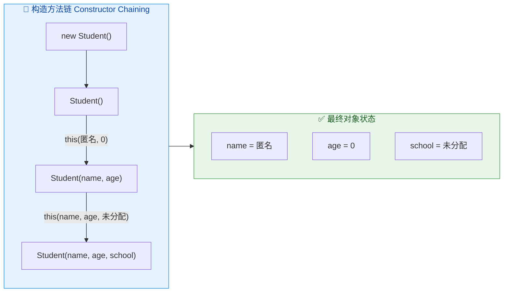

#### 用途三：返回当前对象（链式调用）

`this` 还有一个非常优雅的用法——在方法末尾 `return this`，使得方法调用可以像链条一样串起来，这就是链式调用（Method Chaining / Fluent API）：

```java
public class StudentBuilder {
    private String name;  // 姓名
    private int age;      // 年龄
    private String school; // 学校

    // 每个 setter 方法返回 this，而不是 void
    public StudentBuilder setName(String name) {
        this.name = name;
        return this; // 返回当前对象，允许继续调用
    }

    public StudentBuilder setAge(int age) {
        this.age = age;
        return this;
    }

    public StudentBuilder setSchool(String school) {
        this.school = school;
        return this;
    }

    @Override
    public String toString() {
        return "Student{name=" + name + ", age=" + age + ", school=" + school + "}";
    }
}

// 使用链式调用 —— 一行搞定所有设置
StudentBuilder student = new StudentBuilder()
        .setName("张三")   // 返回 this，继续调用
        .setAge(20)        // 返回 this，继续调用
        .setSchool("北大"); // 返回 this，赋值给 student

System.out.println(student); // Student{name=张三, age=20, school=北大}
```

这种模式在实际开发中非常常见，比如 `StringBuilder`、各种 Builder 模式、Stream API 等都大量使用了链式调用。

#### 用途四：将当前对象作为参数传递

有时候你需要把"自己"传给别的方法或别的对象，这时 `this` 就派上用场了：

```java
public class Student {
    String name;

    public Student(String name) {
        this.name = name;
    }

    // 将自己注册到班级中
    public void bindToClassroom(Classroom classroom) {
        classroom.addStudent(this); // 把"我自己"传给 classroom
    }
}

public class Classroom {
    // 将学生添加到班级列表
    public void addStudent(Student student) {
        System.out.println(student.name + " 已加入班级");
    }
}
```

### this 关键字用法总结

| 用法 | 语法 | 场景 |
|------|------|------|
| 访问当前对象属性 | `this.name` | 区分同名参数和属性（解决 Variable Shadowing） |
| 调用当前对象方法 | `this.introduce()` | 显式调用本对象的方法（通常可省略） |
| 调用其他构造方法 | `this(args...)` | 构造方法链，必须在第一行 |
| 返回当前对象 | `return this` | 链式调用 / Fluent API |
| 传递当前对象 | `method(this)` | 将自身作为参数传给其他方法 |

---

**📝 练习题**

以下代码的输出结果是什么？

```java
public class Demo {
    int value;

    public Demo() {
        this(10);
        System.out.println("A: value = " + this.value);
    }

    public Demo(int value) {
        this.value = value;
        System.out.println("B: value = " + this.value);
    }

    public static void main(String[] args) {
        Demo d = new Demo();
    }
}
```

A. A: value = 10

B. B: value = 10 → A: value = 10

C. A: value = 0 → B: value = 10

D. 编译错误，`this()` 不能和其他语句共存


**【答案】** B

**【解析】** `new Demo()` 调用无参构造方法。无参构造的第一行是 `this(10)`，它会先跳转到带参构造方法 `Demo(int value)` 执行。在带参构造中，`this.value = 10` 完成赋值，然后打印 `B: value = 10`。带参构造执行完毕后，控制流回到无参构造的第二行，打印 `A: value = 10`（此时 value 已经被带参构造设为 10）。所以最终输出顺序是先 B 后 A。`this(...)` 要求必须在构造方法的第一行，但它后面可以跟其他语句，所以 D 选项不正确。

---

## 访问修饰符（public / protected / default / private）

Java 的访问修饰符（Access Modifiers）是面向对象封装思想的第一道防线。它们决定了一个类、字段、方法或构造器"能被谁看到、能被谁使用"。理解访问修饰符，本质上就是理解 Java 的 **可见性规则（Visibility Rules）**。

很多初学者会把四个修饰符的作用范围死记硬背下来，但真正重要的是理解 **为什么要限制访问**——这直接关系到封装（Encapsulation）、模块化设计（Modular Design）以及 API 的安全性。一个设计良好的类，应该像一台自动售货机：用户只需要按按钮（public 接口），而不需要知道内部齿轮怎么转动（private 实现）。

### 四种访问级别总览

Java 提供了四种访问级别，从最开放到最严格依次为：`public` → `protected` → `default`（包级私有）→ `private`。注意 `default` 并不是一个关键字，它指的是 **不写任何修饰符** 时的默认行为，有时也被称为 package-private。

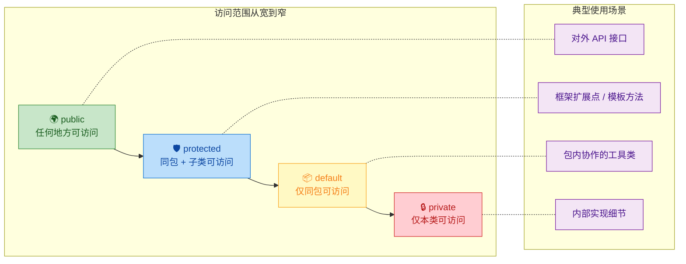

下面这张经典的访问范围表是面试高频考点，务必烂熟于心：

```
┌──────────────┬──────────┬──────────┬──────────────┬──────────┐
│   修饰符      │  同一类   │  同一包   │ 不同包的子类  │ 不同包    │
├──────────────┼──────────┼──────────┼──────────────┼──────────┤
│ public       │    ✅    │    ✅    │     ✅       │    ✅    │
│ protected    │    ✅    │    ✅    │     ✅       │    ❌    │
│ default      │    ✅    │    ✅    │     ❌       │    ❌    │
│ private      │    ✅    │    ❌    │     ❌       │    ❌    │
└──────────────┴──────────┴──────────┴──────────────┴──────────┘
```

这张表的核心逻辑可以这样记忆：每往下一级，就"关上一扇门"。`public` 四扇门全开；`protected` 关上了"不同包的非子类"这扇门；`default` 再关上"不同包的子类"；`private` 只留本类自己。

### public —— 完全公开

`public` 是最宽松的访问级别。被 `public` 修饰的类、方法或字段，可以在项目中的 **任何位置** 被访问，没有任何限制。

```java
// 文件: com/example/api/UserService.java
package com.example.api;

public class UserService {  // public 类：任何包都能 import 并使用

    public String serviceName = "UserService";  // public 字段：任何地方可直接读写

    public void createUser(String name) {  // public 方法：对外暴露的 API
        System.out.println("Creating user: " + name);  // 执行创建逻辑
    }
}
```

```java
// 文件: com/example/web/UserController.java
package com.example.web;  // 注意：不同包

import com.example.api.UserService;  // 跨包导入 public 类

public class UserController {
    public void handleRequest() {
        UserService service = new UserService();  // 可以实例化 public 类
        service.createUser("Alice");              // 可以调用 public 方法
        System.out.println(service.serviceName);  // 可以访问 public 字段
    }
}
```

使用 `public` 时需要格外谨慎。一旦某个方法被声明为 `public`，它就成了你对外的"契约"（contract）。在大型项目或开源库中，随意修改 `public` 方法的签名会导致大量下游代码编译失败。这就是为什么 Joshua Bloch 在 *Effective Java* 中反复强调："**尽可能降低每个类和成员的可访问性**"（Minimize the accessibility of classes and members）。

关于 `public` 类还有一条硬性规则：**一个 `.java` 源文件中最多只能有一个 `public` 类，且该类名必须与文件名完全一致**。这是编译器层面的强制约束。

```java
// 文件名必须是 Animal.java
public class Animal { }  // ✅ 类名与文件名一致

class Dog { }  // ✅ 非 public 类可以和 public 类共存于同一文件中
// public class Cat { }  // ❌ 编译错误！一个文件不能有两个 public 类
```

### protected —— 同包 + 跨包继承

`protected` 是四个修饰符中最容易被误解的一个。它的访问范围是：**同一个包内的所有类** + **不同包中的子类**。

很多人会简单地记成"子类可以访问"，但忽略了一个关键细节：不同包的子类只能通过 **继承关系** 访问 `protected` 成员，而不能通过父类的实例引用来访问。这个区别非常微妙，我们用代码来说明。

```java
// 文件: com/example/base/Animal.java
package com.example.base;

public class Animal {

    protected String name = "Animal";  // protected 字段

    protected void breathe() {  // protected 方法
        System.out.println(name + " is breathing");  // 输出呼吸信息
    }
}
```

```java
// 文件: com/example/base/Vet.java
package com.example.base;  // 同一个包

public class Vet {
    public void checkAnimal() {
        Animal animal = new Animal();  // 同包内可以直接创建实例
        animal.breathe();              // ✅ 同包：可以访问 protected 方法
        System.out.println(animal.name); // ✅ 同包：可以访问 protected 字段
    }
}
```

```java
// 文件: com/example/pet/Dog.java
package com.example.pet;  // 不同包

import com.example.base.Animal;

public class Dog extends Animal {  // 跨包子类

    public void doSomething() {
        // 方式一：通过 this（继承关系）访问
        this.breathe();              // ✅ 子类通过继承访问 protected 方法
        System.out.println(this.name); // ✅ 子类通过继承访问 protected 字段

        // 方式二：通过父类实例访问
        Animal animal = new Animal();
        // animal.breathe();         // ❌ 编译错误！不能通过父类实例访问
        // System.out.println(animal.name); // ❌ 编译错误！
    }
}
```

这个设计背后的哲学是：`protected` 的"跨包子类可访问"是为了支持 **继承扩展**，而不是为了让子类去"窥探"任意父类实例的内部状态。你可以访问"你自己继承到的那份"，但不能访问"别人的那份"。

`protected` 最经典的应用场景是 **模板方法模式（Template Method Pattern）**：

```java
// 文件: com/example/framework/AbstractProcessor.java
package com.example.framework;

public abstract class AbstractProcessor {

    // public 方法定义算法骨架，对外暴露
    public final void process() {
        validate();   // 第一步：校验
        doProcess();  // 第二步：核心处理（子类实现）
        cleanup();    // 第三步：清理
    }

    // protected 抽象方法：强制子类实现，但不对外暴露
    protected abstract void doProcess();

    private void validate() {  // private：纯内部逻辑
        System.out.println("Validating...");
    }

    private void cleanup() {  // private：纯内部逻辑
        System.out.println("Cleaning up...");
    }
}
```

```java
// 文件: com/example/app/OrderProcessor.java
package com.example.app;  // 不同包

import com.example.framework.AbstractProcessor;

public class OrderProcessor extends AbstractProcessor {

    @Override
    protected void doProcess() {  // 实现父类的 protected 方法
        System.out.println("Processing order...");  // 子类自定义的处理逻辑
    }
}
```

在这个模式中，`protected` 恰到好处：`doProcess()` 需要被子类覆写，但不应该被外部随意调用。如果用 `public`，任何人都能绕过 `process()` 直接调用 `doProcess()`，破坏了算法骨架的完整性；如果用 `private`，子类根本无法覆写。

### default（包级私有）—— 无修饰符的隐含语义

当你不写任何访问修饰符时，Java 会赋予该成员 **default**（也叫 package-private）访问级别。它的可见范围是 **仅限同一个包内的类**。

```java
// 文件: com/example/util/StringHelper.java
package com.example.util;

class StringHelper {  // default 类：只有同包的类能看到它

    String format(String input) {  // default 方法：同包可调用
        return input.trim().toLowerCase();  // 去空格并转小写
    }
}
```

```java
// 文件: com/example/util/Validator.java
package com.example.util;  // 同一个包

public class Validator {
    public boolean isValid(String input) {
        StringHelper helper = new StringHelper();  // ✅ 同包：可以访问 default 类
        String cleaned = helper.format(input);     // ✅ 同包：可以调用 default 方法
        return !cleaned.isEmpty();                 // 返回校验结果
    }
}
```

```java
// 文件: com/example/web/FormHandler.java
package com.example.web;  // 不同包

// import com.example.util.StringHelper;  // ❌ 编译错误！default 类对外包不可见

public class FormHandler {
    public void handle() {
        // StringHelper helper = new StringHelper();  // ❌ 无法访问
    }
}
```

`default` 访问级别在实际开发中非常有用，它实现了一种"包内协作"的设计模式。一个包内的多个类可以自由互相访问，但对外部包完全隐藏。这在 JDK 源码中随处可见——很多你从未听说过的类就是 default 级别的，它们是 JDK 内部的"工具人"，默默干活但从不抛头露面。

一个常见的误区是认为 `default` 和 `protected` 差不多。实际上它们有一个关键区别：**`default` 不允许跨包子类访问，而 `protected` 允许**。这意味着如果你写了一个 default 方法，即使别的包里有你的子类，那个子类也看不到这个方法。

```java
// 文件: com/example/base/Vehicle.java
package com.example.base;

public class Vehicle {
    void startEngine() {  // default 方法（注意：没有任何修饰符）
        System.out.println("Engine started");
    }
}
```

```java
// 文件: com/example/car/Sedan.java
package com.example.car;  // 不同包

import com.example.base.Vehicle;

public class Sedan extends Vehicle {
    public void drive() {
        // startEngine();  // ❌ 编译错误！default 方法对跨包子类不可见
        // 如果 startEngine() 是 protected，这里就能调用
    }
}
```

### private —— 最严格的封装

`private` 是最严格的访问级别，被它修饰的成员 **只能在声明它的类内部** 被访问。即使是子类、同包的其他类，都无法直接触碰 `private` 成员。

```java
// 文件: com/example/model/BankAccount.java
package com.example.model;

public class BankAccount {

    private double balance;       // 私有字段：余额，外部不可直接修改
    private String accountId;     // 私有字段：账户ID

    public BankAccount(String accountId, double initialBalance) {
        this.accountId = accountId;          // 通过构造器初始化
        this.balance = initialBalance;       // 通过构造器初始化
    }

    public double getBalance() {  // 公开的 getter：外部只能"读"余额
        return balance;
    }

    public void deposit(double amount) {  // 公开方法：受控的存款操作
        if (validateAmount(amount)) {      // 调用私有校验方法
            balance += amount;             // 修改私有字段
            log("Deposit: " + amount);     // 调用私有日志方法
        }
    }

    public void withdraw(double amount) {  // 公开方法：受控的取款操作
        if (validateAmount(amount) && balance >= amount) {  // 双重校验
            balance -= amount;             // 修改私有字段
            log("Withdraw: " + amount);    // 调用私有日志方法
        }
    }

    private boolean validateAmount(double amount) {  // 私有方法：内部校验逻辑
        return amount > 0;  // 金额必须为正数
    }

    private void log(String message) {  // 私有方法：内部日志逻辑
        System.out.println("[" + accountId + "] " + message);  // 打印日志
    }
}
```

在这个例子中，`balance` 被声明为 `private`，外部代码无法执行 `account.balance = -9999` 这样的危险操作。所有对余额的修改都必须通过 `deposit()` 和 `withdraw()` 这两个"受控通道"，而这两个方法内部有校验逻辑。这就是封装的核心价值：**控制数据的修改路径，保证对象状态的一致性**。

`private` 还有一个有趣的特性：**同一个类的不同实例之间可以互相访问 private 成员**。这一点经常在面试中被问到：

```java
public class Point {
    private int x;  // 私有坐标 x
    private int y;  // 私有坐标 y

    public Point(int x, int y) {
        this.x = x;  // 初始化 x
        this.y = y;  // 初始化 y
    }

    public double distanceTo(Point other) {
        // ✅ 可以直接访问 other 的 private 字段！
        // 因为 other 也是 Point 类型，而当前代码在 Point 类内部
        int dx = this.x - other.x;  // 直接读取另一个实例的 private x
        int dy = this.y - other.y;  // 直接读取另一个实例的 private y
        return Math.sqrt(dx * dx + dy * dy);  // 计算欧几里得距离
    }
}
```

这是因为 Java 的访问控制是 **类级别（class-level）** 的，而不是 **对象级别（object-level）** 的。编译器检查的是"这段代码写在哪个类里"，而不是"这段代码操作的是哪个对象"。

### 修饰符对不同目标的适用规则

并非所有修饰符都能用在所有地方。不同的"目标"（类、方法、字段、构造器）有不同的规则：

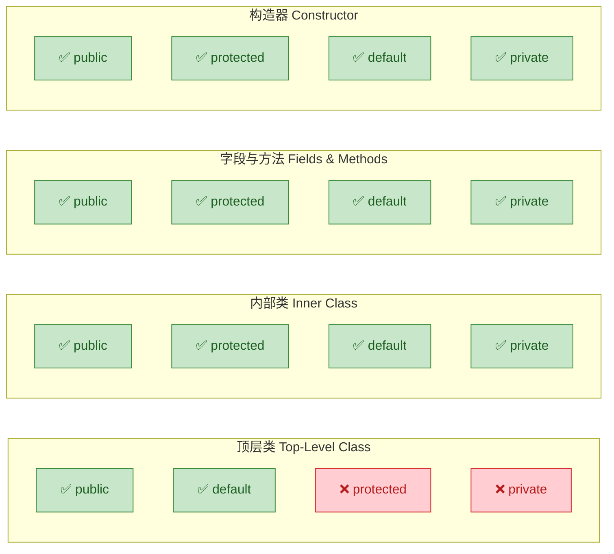

重点关注：**顶层类（Top-Level Class）只能用 `public` 或 `default`**，不能用 `protected` 或 `private`。这很好理解——一个顶层类如果是 `private` 的，那谁都用不了它，它的存在就没有意义了。而 `protected` 对顶层类也没有语义，因为顶层类不存在"继承访问"的场景（包和包之间没有继承关系）。

但内部类（Inner Class）就不同了，四种修饰符都可以用。`private` 内部类是一种非常强大的封装手段：

```java
public class LinkedList {

    private Node head;  // 私有字段：链表头节点

    // private 内部类：Node 是 LinkedList 的实现细节
    // 外部完全不需要知道 Node 的存在
    private static class Node {
        int data;    // 节点数据
        Node next;   // 指向下一个节点

        Node(int data) {  // 构造器
            this.data = data;
        }
    }

    public void add(int value) {
        Node newNode = new Node(value);  // 在类内部自由使用 private 内部类
        newNode.next = head;             // 新节点指向原头节点
        head = newNode;                  // 更新头节点
    }
}
```

### private 构造器的妙用

将构造器声明为 `private` 是一种经典的设计技巧，常见于以下场景：

```java
// 场景一：单例模式（Singleton Pattern）
public class DatabaseConnection {

    private static final DatabaseConnection INSTANCE = new DatabaseConnection();  // 唯一实例

    private DatabaseConnection() {  // 私有构造器：禁止外部 new
        // 初始化数据库连接
    }

    public static DatabaseConnection getInstance() {  // 公开的获取方法
        return INSTANCE;  // 返回唯一实例
    }
}
```

```java
// 场景二：工具类（Utility Class）—— 全是静态方法，不需要实例化
public class MathUtils {

    private MathUtils() {  // 私有构造器：防止实例化
        throw new AssertionError("No instances!");  // 双重保险
    }

    public static int max(int a, int b) {  // 静态工具方法
        return a > b ? a : b;
    }
}
```

```java
// 场景三：静态工厂方法（Static Factory Method）
public class Color {

    private int r, g, b;  // 私有字段

    private Color(int r, int g, int b) {  // 私有构造器
        this.r = r;
        this.g = g;
        this.b = b;
    }

    // 静态工厂方法：语义更清晰，可以有描述性的方法名
    public static Color ofRGB(int r, int g, int b) {
        return new Color(r, g, b);  // 内部调用私有构造器
    }

    public static Color red() {       // 预定义常用颜色
        return new Color(255, 0, 0);
    }
}
```

### 访问修饰符与继承的交互

当子类覆写（Override）父类方法时，有一条重要规则：**子类方法的访问级别不能比父类方法更严格，只能相同或更宽松**。

```java
public class Animal {
    protected void makeSound() {  // 父类方法：protected
        System.out.println("...");
    }
}

public class Dog extends Animal {

    @Override
    public void makeSound() {  // ✅ public 比 protected 更宽松，合法
        System.out.println("Woof!");
    }

    // @Override
    // void makeSound() { }  // ❌ 编译错误！default 比 protected 更严格

    // @Override
    // private void makeSound() { }  // ❌ 编译错误！private 比 protected 更严格
}
```

这条规则的原因与 **里氏替换原则（Liskov Substitution Principle, LSP）** 有关。如果父类承诺了某个方法是 `protected` 可访问的，那么所有使用父类引用的代码都期望能调用这个方法。如果子类把它缩窄为 `private`，那么通过父类引用调用时就会出问题——这违反了"子类可以替换父类"的契约。

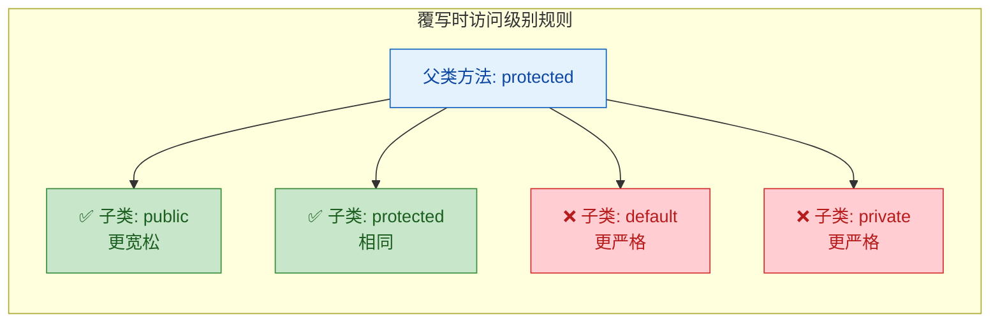

### 实际项目中的最佳实践

在真实项目中，选择访问修饰符应该遵循 **最小权限原则（Principle of Least Privilege）**：默认从最严格的 `private` 开始，只在确实需要时才逐步放宽。

```java
public class OrderService {

    // 1. 字段：几乎总是 private
    private final OrderRepository repository;  // 依赖注入的仓储
    private final Logger logger;               // 日志器

    // 2. 构造器：通常 public（供外部或框架创建实例）
    public OrderService(OrderRepository repository) {
        this.repository = repository;
        this.logger = Logger.getLogger(OrderService.class.getName());
    }

    // 3. 对外 API：public
    public Order createOrder(OrderRequest request) {
        validateRequest(request);                    // 调用 private 校验
        Order order = buildOrder(request);           // 调用 private 构建
        repository.save(order);                      // 持久化
        logger.info("Order created: " + order.getId());
        return order;
    }

    // 4. 内部逻辑：private
    private void validateRequest(OrderRequest request) {
        if (request == null || request.getItems().isEmpty()) {
            throw new IllegalArgumentException("Invalid order request");
        }
    }

    // 5. 可能被子类定制的逻辑：protected
    protected Order buildOrder(OrderRequest request) {
        return new Order(request.getItems(), request.getUserId());
    }
}
```

总结一下选择策略：

- 字段 → 几乎永远 `private`，通过 getter/setter 暴露
- 对外方法 → `public`，这是你的 API 契约
- 内部辅助方法 → `private`，实现细节不暴露
- 希望子类覆写的方法 → `protected`，框架扩展点
- 包内协作的工具类/方法 → `default`，包级封装

---

**📝 练习题**

以下代码能否编译通过？如果不能，指出所有编译错误的行号及原因。

```java
// 文件: com/alpha/Base.java
package com.alpha;

public class Base {
    protected int value = 10;                    // 第 4 行
    private void secret() { }                    // 第 5 行
    void packageMethod() { }                     // 第 6 行
}

// 文件: com/beta/Child.java
package com.beta;

import com.alpha.Base;

public class Child extends Base {
    public void test() {
        System.out.println(this.value);          // 第 16 行
        Base b = new Base();
        System.out.println(b.value);             // 第 18 行
        b.secret();                              // 第 19 行
        b.packageMethod();                       // 第 20 行
    }
}
```

A. 第 16、18、19、20 行全部编译错误

B. 第 18、19、20 行编译错误，第 16 行正常

C. 第 19、20 行编译错误，第 16、18 行正常

D. 只有第 19 行编译错误


**【答案】** B

**【解析】**

- 第 16 行 `this.value`：`Child` 是 `Base` 的子类，通过 `this` 访问继承来的 `protected` 字段，合法。
- 第 18 行 `b.value`：虽然 `value` 是 `protected`，但这里是通过 **父类实例引用** 在 **不同包** 中访问。`protected` 的跨包访问只允许通过继承关系（即 `this` 或 `super`），不允许通过父类实例引用，编译错误。
- 第 19 行 `b.secret()`：`secret()` 是 `private` 方法，只有 `Base` 类内部能访问，任何外部类（包括子类）都不行，编译错误。
- 第 20 行 `b.packageMethod()`：`packageMethod()` 是 default（包级私有）方法，只有 `com.alpha` 包内的类能访问。`Child` 在 `com.beta` 包中，即使是子类也不行，编译错误。

---

## 封装（Encapsulation）

封装是面向对象编程三大核心特性（封装、继承、多态）中最基础、也是最先需要掌握的一个。它的核心思想可以用一句话概括：**把数据（字段）藏起来，把行为（方法）露出去**。

你可以把封装想象成一台自动售货机——用户只需要按按钮选饮料（调用公开方法），而不需要知道机器内部齿轮怎么转、弹簧怎么弹（内部实现细节）。这种 "hide the how, expose the what" 的设计哲学，贯穿了整个 Java 生态。

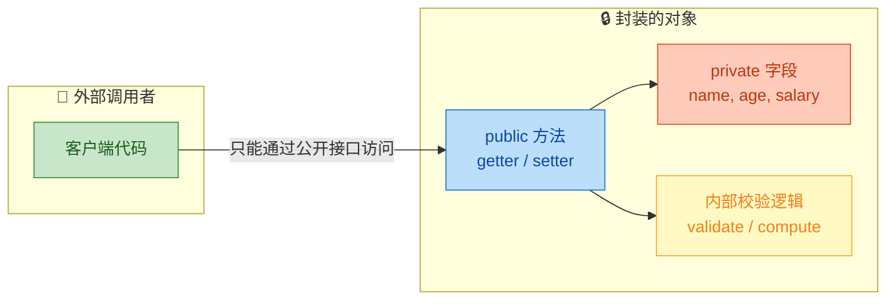

### 为什么需要封装？——从一个反面案例说起

先来看一段**没有封装**的代码，感受一下"裸奔"的危险：

```java
// ❌ 反面示例：字段全部公开，毫无保护
class Student {
    public String name;  // 姓名，任何人都能直接改
    public int age;      // 年龄，任何人都能设成 -100
    public double gpa;   // 绩点，任何人都能设成 999.0
}

public class BadDemo {
    public static void main(String[] args) {
        Student s = new Student(); // 创建学生对象
        s.name = "";               // 空字符串？允许了
        s.age = -50;               // 负数年龄？允许了
        s.gpa = 100.0;             // GPA 满分 4.0，这里写 100？也允许了
        // 数据完全失控，对象处于一个"不合法"的状态
    }
}
```

这段代码暴露了三个致命问题：

1. **数据无校验**（No Validation）：任何调用者都能写入非法值，对象的状态完全不可控。
2. **耦合度极高**（Tight Coupling）：外部代码直接依赖字段名。一旦你把 `gpa` 改名为 `gradePoint`，所有引用处全部编译报错。
3. **无法扩展逻辑**（No Room for Logic）：如果将来需要在"设置年龄"时加一条日志记录，你得去改所有 `s.age = xxx` 的地方——可能散落在几十个文件中。

封装就是为了解决这些问题而生的。

### 数据隐藏（Data Hiding）

数据隐藏是封装的第一步，也是最关键的一步：**将类的字段声明为 `private`，禁止外部直接访问**。

```java
class Student {
    // 所有字段都用 private 修饰，外部无法直接读写
    private String name;   // 姓名
    private int age;       // 年龄
    private double gpa;    // 绩点
}
```

此时如果外部尝试直接访问：

```java
Student s = new Student();
s.name = "Alice";  // ❌ 编译错误：name has private access in Student
```

编译器会直接拦截非法访问，这就是 `private` 的力量。字段被"藏"进了类的内部，外界完全看不到，也摸不着。

但问题来了——字段全藏起来了，外部怎么用这个对象？这就引出了 getter 和 setter。

### Getter 与 Setter——受控的访问通道

Getter 和 Setter 是封装的标准实现模式。它们本质上就是普通的 `public` 方法，但遵循严格的命名约定（JavaBean Convention）：

| 方法类型 | 命名规则 | 作用 |
|---------|---------|------|
| Getter | `getXxx()` / `isXxx()`（boolean） | 读取字段值 |
| Setter | `setXxx(参数)` | 写入字段值（通常带校验） |

来看完整的封装实现：

```java
class Student {
    // ========== 私有字段 ==========
    private String name;   // 姓名
    private int age;       // 年龄
    private double gpa;    // 绩点（0.0 ~ 4.0）

    // ========== name 的 getter/setter ==========

    // 获取姓名
    public String getName() {
        return name;  // 直接返回私有字段的值
    }

    // 设置姓名，加入非空校验
    public void setName(String name) {
        // 校验：名字不能为 null 或空字符串
        if (name == null || name.trim().isEmpty()) {
            throw new IllegalArgumentException("姓名不能为空");
            // 抛出异常，阻止非法数据写入
        }
        this.name = name.trim();  // trim() 去除首尾空格后赋值
    }

    // ========== age 的 getter/setter ==========

    // 获取年龄
    public int getAge() {
        return age;  // 直接返回
    }

    // 设置年龄，加入范围校验
    public void setAge(int age) {
        // 校验：年龄必须在 0 ~ 150 之间（合理范围）
        if (age < 0 || age > 150) {
            throw new IllegalArgumentException(
                "年龄必须在 0~150 之间，当前值: " + age
            );
        }
        this.age = age;  // 校验通过，赋值
    }

    // ========== gpa 的 getter/setter ==========

    // 获取绩点
    public double getGpa() {
        return gpa;  // 直接返回
    }

    // 设置绩点，加入范围校验
    public void setGpa(double gpa) {
        // 校验：GPA 范围 0.0 ~ 4.0
        if (gpa < 0.0 || gpa > 4.0) {
            throw new IllegalArgumentException(
                "GPA 必须在 0.0~4.0 之间，当前值: " + gpa
            );
        }
        this.gpa = gpa;  // 校验通过，赋值
    }
}
```

现在外部代码只能通过这些"受控通道"来操作数据：

```java
public class GoodDemo {
    public static void main(String[] args) {
        Student s = new Student();     // 创建学生对象

        s.setName("Alice");            // ✅ 合法，正常赋值
        s.setAge(20);                  // ✅ 合法，正常赋值
        s.setGpa(3.8);                 // ✅ 合法，正常赋值

        System.out.println(s.getName()); // 输出: Alice
        System.out.println(s.getAge());  // 输出: 20
        System.out.println(s.getGpa());  // 输出: 3.8

        // s.setAge(-50);              // ❌ 运行时抛出 IllegalArgumentException
        // s.setGpa(100.0);            // ❌ 运行时抛出 IllegalArgumentException
        // s.setName("");              // ❌ 运行时抛出 IllegalArgumentException
    }
}
```

对比之前的"裸奔"版本，封装后的对象拥有了**自我保护能力**——它自己决定什么数据能进来、什么数据该拒绝。

### this 关键字在封装中的角色

你可能注意到了 setter 中频繁出现的 `this.name = name` 这种写法。这里的 `this` 解决了一个经典问题——**参数名与字段名同名时的歧义**。

```java
public void setAge(int age) {
    // 这里有两个 "age"：
    //   age       → 方法参数（局部变量，优先级更高）
    //   this.age  → 当前对象的字段
    this.age = age;  // 明确：把参数 age 的值赋给对象的字段 age
}
```

```text
┌─────────────────────────────────────────┐
│          setAge(int age) 方法作用域       │
│                                         │
│   参数 age ──────────────┐              │
│   (局部变量，优先级高)     │              │
│                          ▼              │
│              this.age = age             │
│                 ▲                       │
│                 │                       │
│   this.age ─────┘                       │
│   (当前对象的实例字段)                    │
└─────────────────────────────────────────┘
```

如果不写 `this`，`age = age` 就变成了参数自己赋值给自己，字段根本没被修改——这是初学者最常踩的坑之一。

### 封装的进阶技巧

#### 只读属性（Read-Only）

有些字段一旦创建就不应该被修改，比如身份证号。这时只提供 getter，不提供 setter：

```java
class Employee {
    private final String employeeId;  // final 修饰，初始化后不可变
    private String name;              // 姓名可以修改

    // 构造方法中完成 employeeId 的唯一一次赋值
    public Employee(String employeeId, String name) {
        this.employeeId = employeeId;  // 只能在构造器中赋值
        this.name = name;
    }

    // 只有 getter，没有 setter → 只读
    public String getEmployeeId() {
        return employeeId;  // 外部只能读，不能改
    }

    // name 正常提供 getter 和 setter
    public String getName() {
        return name;
    }

    public void setName(String name) {
        this.name = name;
    }
}
```

这种模式在实际开发中非常常见，比如数据库主键 ID、订单编号等，都应该设计为只读。

#### 计算属性（Computed / Derived Property）

有些"属性"并不对应一个真实字段，而是通过计算得出的。封装让这一切对外部透明：

```java
class Rectangle {
    private double width;   // 宽
    private double height;  // 高

    public Rectangle(double width, double height) {
        this.width = width;
        this.height = height;
    }

    // width 和 height 的 getter/setter 省略...

    // 面积：没有对应的字段，纯计算得出
    public double getArea() {
        return width * height;  // 每次调用时实时计算
    }

    // 周长：同样是计算属性
    public double getPerimeter() {
        return 2 * (width + height);  // 实时计算
    }
}
```

对于调用者来说，`getArea()` 和 `getWidth()` 看起来没有任何区别——他不知道也不需要知道 area 到底是存储的还是计算的。这就是封装带来的**实现自由度**。

#### 防御性拷贝（Defensive Copy）

当字段是可变的引用类型（如 `Date`、数组、集合）时，直接返回引用会导致封装被"击穿"：

```java
import java.util.Date;

class Event {
    private Date startTime;  // 活动开始时间

    public Event(Date startTime) {
        // ✅ 防御性拷贝：复制一份，不持有外部传入的原始引用
        this.startTime = new Date(startTime.getTime());
    }

    public Date getStartTime() {
        // ✅ 防御性拷贝：返回副本，而非内部引用本身
        return new Date(startTime.getTime());
    }

    // ❌ 错误写法（反面示例）：
    // public Date getStartTime() {
    //     return startTime;  // 外部拿到引用后可以直接 .setTime() 修改！
    // }
}
```

```java
public class DefensiveCopyDemo {
    public static void main(String[] args) {
        Date d = new Date();                  // 当前时间
        Event event = new Event(d);           // 创建事件

        d.setTime(0);                         // 外部修改原始 Date 对象
        // 如果没有防御性拷贝，event 内部的 startTime 也会被改成 1970-01-01
        // 有了防御性拷贝，event 内部的值不受影响 ✅

        Date got = event.getStartTime();      // 获取时间
        got.setTime(0);                       // 外部修改返回值
        // 有了防御性拷贝，event 内部的值依然不受影响 ✅
    }
}
```

这个技巧在处理 `Date`、`List`、数组等可变类型时尤为重要。现代 Java 中推荐使用不可变类型（如 `java.time.LocalDateTime`）来从根本上避免这个问题。

### 封装的层次模型

封装不仅仅是 "private 字段 + getter/setter" 这么简单。从宏观视角看，封装体现在软件设计的多个层次：

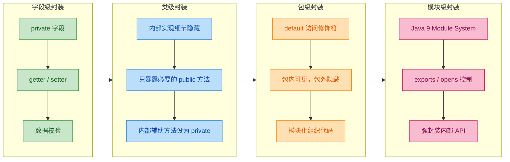

我们当前学习的 getter/setter 属于最基础的**字段级封装**。随着学习深入，你会逐步接触到更高层次的封装手段。

### JavaBean 规范简介

在 Java 生态中，封装的标准化实践被称为 **JavaBean 规范**。一个标准的 JavaBean 需要满足：

```java
// 一个标准的 JavaBean
public class User {
    // 1. 所有字段 private
    private String username;
    private int age;
    private boolean active;  // boolean 类型字段

    // 2. 提供无参构造方法
    public User() {
        // 空构造器，供框架反射调用
    }

    // 3. 提供标准的 getter/setter

    public String getUsername() {
        return username;
    }

    public void setUsername(String username) {
        this.username = username;
    }

    public int getAge() {
        return age;
    }

    public void setAge(int age) {
        this.age = age;
    }

    // 注意：boolean 类型的 getter 用 isXxx() 而不是 getXxx()
    public boolean isActive() {
        return active;
    }

    public void setActive(boolean active) {
        this.active = active;
    }
}
```

JavaBean 规范看似简单，但它是 Spring、Hibernate、Jackson 等几乎所有主流 Java 框架的基石。这些框架通过反射（Reflection）调用 getter/setter 来读写对象属性，如果你不遵循命名约定，框架就找不到对应的方法。

### 封装的核心收益总结

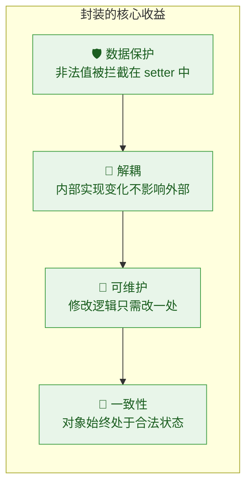

用一个真实场景来感受"解耦"的威力：假设你的 `Student` 类最初用 `int age` 存储年龄，后来需求变了，要改成存储出生日期 `LocalDate birthday`，然后动态计算年龄。如果有封装：

```java
class Student {
    // 内部实现从 age 改成了 birthday
    private LocalDate birthday;

    // getter 的签名完全不变！外部代码零修改
    public int getAge() {
        // 内部实现悄悄换了，但外部完全无感知
        return Period.between(birthday, LocalDate.now()).getYears();
    }
}
```

外部所有调用 `getAge()` 的代码一行都不用改——这就是封装带来的**变更隔离**能力。

---

**📝 练习题**

以下代码存在封装问题，请找出所有违反封装原则的地方：

```java
public class BankAccount {
    public double balance;
    private String owner;

    public BankAccount(String owner) {
        this.owner = owner;
    }

    public void setBalance(double balance) {
        this.balance = balance;
    }

    public String getOwner() {
        return owner;
    }
}
```

A. `balance` 字段应为 `private`，且 `setBalance` 缺少金额校验逻辑


B. `owner` 缺少 setter 方法，导致无法修改所有者


C. 构造方法应该声明为 `private`


D. `getOwner` 方法不应该存在，因为 `owner` 是 `private` 的


**【答案】** A

**【解析】** 这道题考察封装的两个核心要素：数据隐藏和访问控制。`balance` 被声明为 `public`，任何外部代码都可以直接通过 `account.balance = -999` 写入非法值，完全绕过了 `setBalance` 方法，这违反了数据隐藏原则。同时 `setBalance` 虽然存在，但没有对金额做任何校验（比如不允许负数），这意味着即使通过 setter 也能写入非法数据。B 选项中 `owner` 不提供 setter 恰恰是一种合理的只读设计（Read-Only Property）。C 选项中构造方法设为 `private` 会导致外部无法创建对象（除非是单例模式），这不是封装的要求。D 选项的说法完全错误——`private` 字段正是需要通过 `public` 的 getter 来提供受控的读取通道，这是封装的标准做法。

---

## static 关键字（静态变量、静态方法、静态代码块）

在 Java 中，`static` 是一个极其重要的修饰符，它从根本上改变了成员的归属——被 `static` 修饰的成员不再属于某个具体的对象实例，而是属于**类本身**（Class Level）。理解 `static` 的本质，就是理解 **"类级别"与"实例级别"** 这两个世界的分界线。

我们先从内存模型的宏观视角来建立直觉，再逐一深入每个细分主题。

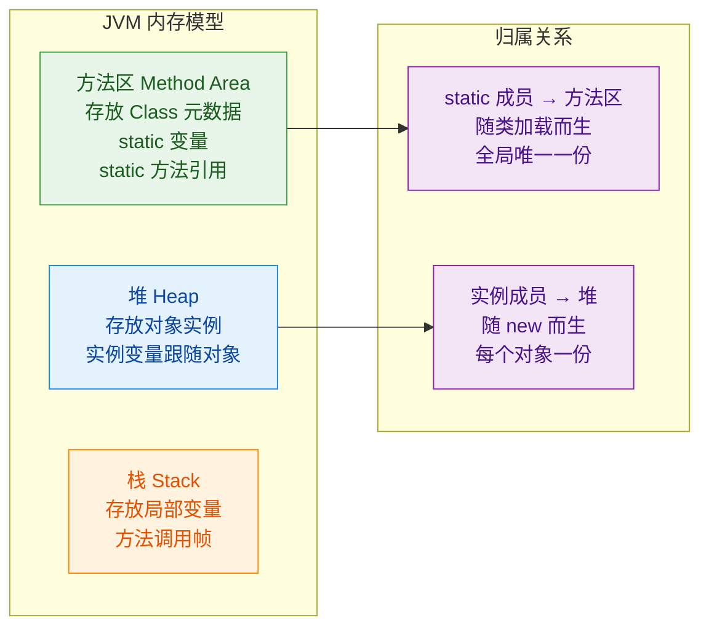

核心要义一句话概括：`static` 成员在类被 ClassLoader 加载进 JVM 时就已经存在，不需要 `new` 出任何对象就能使用，且在整个 JVM 进程中只有**唯一一份拷贝**。

---

### 静态变量（Static Variables / Class Variables）

静态变量也叫**类变量**（Class Variable），与之对应的是**实例变量**（Instance Variable）。两者最本质的区别在于：静态变量被该类的所有实例**共享**，而实例变量每个对象各持有一份独立副本。

```java
public class Student {
    // ========== 静态变量：属于 Student 类本身，所有实例共享 ==========
    static int totalCount = 0;       // 记录一共创建了多少个 Student 对象
    static String schoolName = "MIT"; // 所有学生共享同一个学校名

    // ========== 实例变量：每个 Student 对象各自持有一份 ==========
    String name;  // 学生姓名，每个人不同
    int age;      // 学生年龄，每个人不同

    // 构造方法
    public Student(String name, int age) {
        this.name = name;       // 给当前对象的 name 赋值
        this.age = age;         // 给当前对象的 age 赋值
        totalCount++;           // 每创建一个对象，类级别的计数器 +1
    }
}
```

我们用一段测试代码来观察共享效果：

```java
public class TestStatic {
    public static void main(String[] args) {
        // 此时还没有创建任何 Student 对象
        // 但静态变量已经可以通过类名直接访问
        System.out.println(Student.schoolName); // 输出: MIT
        System.out.println(Student.totalCount); // 输出: 0

        // 创建第一个学生
        Student s1 = new Student("Alice", 20);  // totalCount 变为 1
        // 创建第二个学生
        Student s2 = new Student("Bob", 22);    // totalCount 变为 2

        // 两个对象访问的是同一个 totalCount
        System.out.println(s1.totalCount);  // 输出: 2（不推荐用实例访问）
        System.out.println(s2.totalCount);  // 输出: 2（同上，同一份数据）
        System.out.println(Student.totalCount); // 输出: 2（推荐写法：类名.静态变量）

        // 通过任意一个引用修改静态变量，所有地方都能看到变化
        s1.schoolName = "Stanford";                // 通过 s1 修改
        System.out.println(s2.schoolName);         // 输出: Stanford（s2 也变了）
        System.out.println(Student.schoolName);    // 输出: Stanford（类名访问也变了）
    }
}
```

下面用内存引用图来直观展示静态变量与实例变量在内存中的分布差异：

```java
/*
 *  方法区 (Method Area)
 *  ┌──────────────────────────────────┐
 *  │  Student.class 元数据            │
 *  │  ┌────────────────────────────┐  │
 *  │  │ static totalCount = 2     │  │  ← 唯一一份，所有实例共享
 *  │  │ static schoolName = "MIT" │  │  ← 唯一一份，所有实例共享
 *  │  └────────────────────────────┘  │
 *  └──────────────────────────────────┘
 *
 *  堆 (Heap)
 *  ┌─────────────────┐    ┌─────────────────┐
 *  │  Student s1      │    │  Student s2      │
 *  │  name = "Alice"  │    │  name = "Bob"    │  ← 各自独立
 *  │  age  = 20       │    │  age  = 22       │  ← 各自独立
 *  └─────────────────┘    └─────────────────┘
 *         │                       │
 *         └───── 共同指向 ────────┘
 *                   ↓
 *         方法区中的 static 变量
 */
```

关于静态变量，有几条重要的规则和最佳实践需要牢记：

**访问方式**：虽然 Java 语法允许通过实例引用（如 `s1.totalCount`）访问静态变量，但这是一种**极不推荐**的写法。编译器会给出警告（"The static field should be accessed in a static way"）。正确做法是始终使用 `类名.静态变量名`（如 `Student.totalCount`），这样代码的意图一目了然——这是一个类级别的共享数据。

**生命周期**：静态变量随着类的加载而初始化，随着类的卸载而销毁。在绝大多数场景下，一个类一旦被加载就不会被卸载（除非使用了自定义 ClassLoader 的热部署场景），所以静态变量几乎与 JVM 进程同生共死。这也意味着，如果你在静态变量中持有大对象的引用，它们将**永远不会被 GC 回收**，这是内存泄漏的常见来源之一。

**线程安全**：由于静态变量全局共享，在多线程环境下对它的读写必须考虑同步问题。不加保护地并发修改静态变量会导致数据竞争（Data Race）。

**典型使用场景**：
- 计数器（如上面的 `totalCount`）
- 全局配置常量（通常配合 `final` 使用，如 `static final double PI = 3.14159`）
- 缓存容器（如 `static Map<String, Object> cache = new HashMap<>()`）

---

### 静态方法（Static Methods / Class Methods）

静态方法与静态变量的哲学一脉相承——它属于类，不属于任何实例。调用静态方法不需要创建对象，直接通过 `类名.方法名()` 即可调用。

```java
public class MathUtils {

    // ========== 静态方法：工具类的经典用法 ==========

    // 计算两个整数的最大值
    public static int max(int a, int b) {
        return a > b ? a : b;  // 三元运算符，返回较大值
    }

    // 判断一个数是否为偶数
    public static boolean isEven(int number) {
        return number % 2 == 0;  // 取模为 0 则是偶数
    }

    // 私有构造方法，防止外部实例化工具类
    private MathUtils() {
        // 工具类不应该被 new 出来
        throw new AssertionError("Utility class should not be instantiated");
    }
}
```

```java
public class TestStaticMethod {
    public static void main(String[] args) {
        // 直接通过类名调用，无需 new MathUtils()
        int result = MathUtils.max(10, 20);       // 返回 20
        boolean even = MathUtils.isEven(42);       // 返回 true

        System.out.println("Max: " + result);      // 输出: Max: 20
        System.out.println("Is even: " + even);     // 输出: Is even: true
    }
}
```

静态方法有一条**铁律**，也是面试中的高频考点：

> **静态方法内部不能直接访问实例成员（实例变量和实例方法），也不能使用 `this` 关键字。**

原因很简单——静态方法被调用时，可能根本不存在任何对象实例。既然没有对象，`this` 指向谁？实例变量存在于哪里？都无从谈起。

```java
public class Demo {
    int instanceVar = 10;           // 实例变量
    static int staticVar = 20;      // 静态变量

    // 实例方法
    public void instanceMethod() {
        // 实例方法中可以访问一切：实例成员 + 静态成员
        System.out.println(instanceVar);   // ✅ 可以访问实例变量
        System.out.println(staticVar);     // ✅ 可以访问静态变量
        staticMethod();                    // ✅ 可以调用静态方法
    }

    // 静态方法
    public static void staticMethod() {
        // 静态方法中只能直接访问静态成员
        System.out.println(staticVar);     // ✅ 可以访问静态变量
        // System.out.println(instanceVar); // ❌ 编译错误！不能访问实例变量
        // instanceMethod();                // ❌ 编译错误！不能调用实例方法
        // System.out.println(this);        // ❌ 编译错误！不能使用 this

        // 如果确实需要在静态方法中使用实例成员，必须先创建对象
        Demo obj = new Demo();              // 手动创建一个实例
        System.out.println(obj.instanceVar); // ✅ 通过对象引用访问
        obj.instanceMethod();                // ✅ 通过对象引用调用
    }
}
```

这个访问规则可以用一张图来总结：

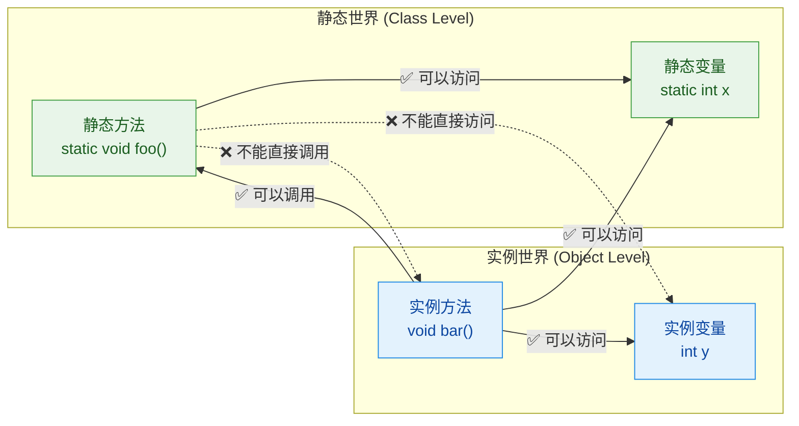

**为什么 `main` 方法是 `static` 的？** 这是一个经典问题。JVM 启动时需要一个入口点来开始执行程序，但此时还没有任何对象被创建。如果 `main` 不是静态的，JVM 就需要先 `new` 一个对象才能调用 `main`，而 `new` 对象本身又需要执行代码——这就陷入了鸡生蛋蛋生鸡的死循环。所以 `main` 必须是 `static` 的，让 JVM 可以直接通过 `类名.main()` 启动程序。

**静态方法的典型应用场景**：

- **工具类**（Utility Class）：如 `java.lang.Math`、`java.util.Collections`、`java.util.Arrays`，它们的方法全部是 `static` 的，因为这些方法只做纯计算，不依赖任何对象状态。
- **工厂方法**（Factory Method）：如 `Integer.valueOf(42)`、`String.format("Hello %s", name)`，通过静态方法创建并返回对象实例。
- **单例模式的获取方法**：如 `Runtime.getRuntime()`，通过静态方法返回唯一的实例。

---

### 静态代码块（Static Initializer Block）

静态代码块是用 `static { ... }` 包裹的一段代码，它在**类被加载时自动执行，且只执行一次**。它的主要用途是对静态变量进行复杂的初始化操作——当简单的 `= 赋值` 无法满足需求时，静态代码块就派上用场了。

```java
public class DatabaseConfig {

    // 静态变量声明
    static String url;          // 数据库连接地址
    static String username;     // 数据库用户名
    static String password;     // 数据库密码
    static Map<String, String> configMap;  // 配置映射表

    // ========== 静态代码块：类加载时执行一次 ==========
    static {
        System.out.println(">>> 静态代码块开始执行：加载数据库配置...");

        // 模拟从配置文件读取数据库连接信息
        // 这种复杂的初始化逻辑无法用简单的 = 赋值完成
        try {
            // 实际项目中这里会读取 properties 文件或环境变量
            url = "jdbc:mysql://localhost:3306/mydb";   // 赋值连接地址
            username = "root";                           // 赋值用户名
            password = "secret123";                      // 赋值密码

            // 初始化配置映射表
            configMap = new HashMap<>();                 // 创建 HashMap 实例
            configMap.put("maxPoolSize", "10");          // 最大连接池大小
            configMap.put("timeout", "30000");           // 超时时间 30 秒
            configMap.put("charset", "UTF-8");           // 字符编码

        } catch (Exception e) {
            // 静态代码块中的异常如果不处理，会导致类加载失败
            // 抛出 ExceptionInInitializerError
            throw new ExceptionInInitializerError("Failed to load DB config: " + e.getMessage());
        }

        System.out.println(">>> 静态代码块执行完毕：配置加载成功");
    }

    // 静态方法：获取配置
    public static String getConfig(String key) {
        return configMap.get(key);  // 从已初始化的 map 中取值
    }
}
```

一个类中可以有**多个**静态代码块，它们按照在源码中出现的**先后顺序**依次执行：

```java
public class MultiStaticBlock {

    static int value;  // 静态变量

    // 第一个静态代码块
    static {
        value = 10;                              // 先赋值为 10
        System.out.println("第一个静态块: value = " + value);  // 输出: 10
    }

    // 第二个静态代码块
    static {
        value = 20;                              // 再赋值为 20，覆盖之前的值
        System.out.println("第二个静态块: value = " + value);  // 输出: 20
    }

    // 第三个静态代码块
    static {
        value = value + 5;                       // 在 20 的基础上 +5
        System.out.println("第三个静态块: value = " + value);  // 输出: 25
    }

    public static void main(String[] args) {
        // main 方法执行前，上面三个静态块已经按顺序执行完毕
        System.out.println("main 方法: value = " + value);     // 输出: 25
    }
}
```

输出结果：
```
第一个静态块: value = 10
第二个静态块: value = 20
第三个静态块: value = 25
main 方法: value = 25
```

为了更完整地理解 `static` 代码块的执行时机，我们需要把它和**实例代码块**（Instance Initializer Block）以及**构造方法**放在一起对比。这也是下一节"初始化顺序"的预热：

```java
public class LifecycleDemo {

    // ========== 静态成员 ==========
    static int staticVar = initStaticVar();  // 静态变量（带方法初始化）

    static int initStaticVar() {
        System.out.println("1. 静态变量初始化");  // 第 1 步
        return 100;
    }

    static {
        System.out.println("2. 静态代码块执行");  // 第 2 步
    }

    // ========== 实例成员 ==========
    int instanceVar = initInstanceVar();  // 实例变量（带方法初始化）

    int initInstanceVar() {
        System.out.println("3. 实例变量初始化");  // 第 3 步（每次 new 都执行）
        return 200;
    }

    {
        System.out.println("4. 实例代码块执行");  // 第 4 步（每次 new 都执行）
    }

    // 构造方法
    public LifecycleDemo() {
        System.out.println("5. 构造方法执行");    // 第 5 步（每次 new 都执行）
    }

    public static void main(String[] args) {
        System.out.println("===== 第一次 new =====");
        new LifecycleDemo();  // 触发步骤 1→2→3→4→5

        System.out.println("===== 第二次 new =====");
        new LifecycleDemo();  // 只触发步骤 3→4→5（静态的不再执行）
    }
}
```

输出结果：
```
1. 静态变量初始化
2. 静态代码块执行
===== 第一次 new =====
3. 实例变量初始化
4. 实例代码块执行
5. 构造方法执行
===== 第二次 new =====
3. 实例变量初始化
4. 实例代码块执行
5. 构造方法执行
```

注意一个细节：静态变量初始化和静态代码块甚至在 `"===== 第一次 new ====="` 这行输出**之前**就已经执行了。这是因为 JVM 要执行 `main` 方法，就必须先加载 `LifecycleDemo` 类，而加载类的过程中就会触发所有静态初始化。

下面这张流程图完整展示了 `static` 相关的执行时序：

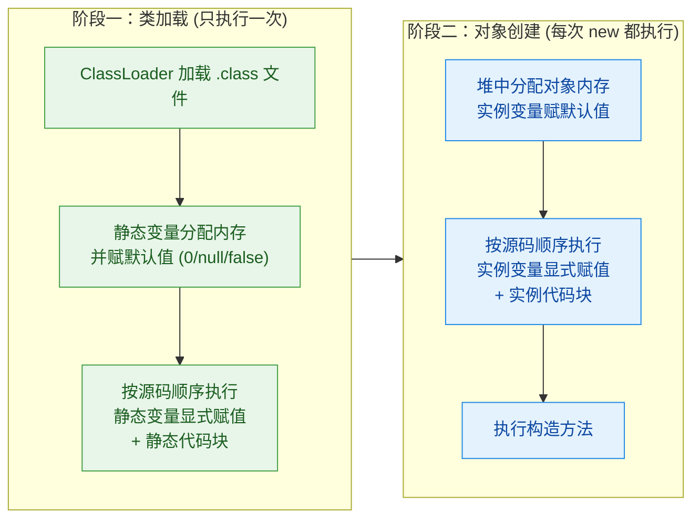

**静态代码块的常见用途**：
- 加载配置文件（如 `.properties`、`.yaml`）
- 注册 JDBC 驱动（经典的 `Class.forName("com.mysql.cj.jdbc.Driver")` 实际上就是触发驱动类的静态代码块来完成注册）
- 初始化复杂的静态数据结构（如不可变 Map、预计算的查找表）
- 加载本地库（`System.loadLibrary("native_lib")`）

**静态代码块中的异常处理**：静态代码块中如果抛出了未捕获的异常，JVM 会将其包装为 `ExceptionInInitializerError`，并且该类将被标记为不可用。后续任何尝试使用该类的操作都会抛出 `NoClassDefFoundError`。这是一个非常隐蔽的 bug 来源，所以在静态代码块中务必做好异常处理。

---

### static 的进阶用法与注意事项

除了上面三大核心用法，`static` 还有一些值得了解的进阶场景。

**静态内部类（Static Nested Class）**：用 `static` 修饰的内部类不持有外部类实例的引用，因此可以独立于外部类对象而存在。这在设计 Builder 模式时非常常见：

```java
public class User {
    private String name;    // 用户名
    private int age;        // 年龄

    // 私有构造方法，只能通过 Builder 创建
    private User(Builder builder) {
        this.name = builder.name;  // 从 builder 中取值
        this.age = builder.age;    // 从 builder 中取值
    }

    // 静态内部类：不需要外部类实例即可使用
    public static class Builder {
        private String name;  // Builder 内部暂存 name
        private int age;      // Builder 内部暂存 age

        public Builder name(String name) {
            this.name = name;       // 设置 name
            return this;            // 返回自身，支持链式调用
        }

        public Builder age(int age) {
            this.age = age;         // 设置 age
            return this;            // 返回自身，支持链式调用
        }

        public User build() {
            return new User(this);  // 用当前 Builder 的数据构建 User
        }
    }
}

// 使用方式：
// User user = new User.Builder().name("Alice").age(25).build();
```

**静态导入（Static Import）**：Java 5 引入的语法糖，允许直接使用其他类的静态成员而不需要类名前缀：

```java
// 普通导入方式
import java.lang.Math;
double r1 = Math.sqrt(Math.pow(3, 2) + Math.pow(4, 2));  // 到处都是 Math.

// 静态导入方式
import static java.lang.Math.sqrt;   // 静态导入 sqrt 方法
import static java.lang.Math.pow;    // 静态导入 pow 方法

double r2 = sqrt(pow(3, 2) + pow(4, 2));  // 代码更简洁
```

静态导入虽然能让代码更简洁，但过度使用会降低可读性（读者不知道 `sqrt` 来自哪个类），所以建议只在使用频率极高的场景下使用，比如单元测试中的 `import static org.junit.Assert.*`。

**`static` 与 `final` 的组合**：`static final` 是定义**编译期常量**的标准方式。这类常量在编译时就会被内联（inline）到使用它的地方，运行时甚至不需要访问原始类：

```java
public class Constants {
    // 编译期常量：基本类型 + String 字面量
    public static final int MAX_SIZE = 100;           // 编译时直接替换为 100
    public static final String APP_NAME = "MyApp";    // 编译时直接替换为 "MyApp"
    public static final double PI = 3.141592653589793; // 编译时直接替换

    // 注意：这个不是编译期常量（因为值在运行时才确定）
    public static final long START_TIME = System.currentTimeMillis();  // 运行时赋值
}
```

最后，总结一下 `static` 成员与实例成员的全面对比：

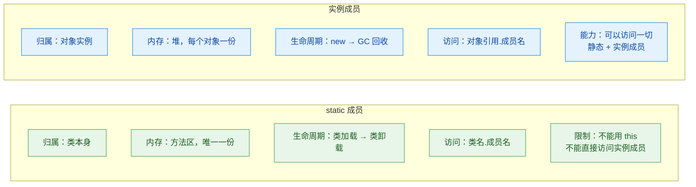

---

**📝 练习题**

以下代码的输出结果是什么？

```java
public class StaticQuiz {
    static int x = 10;

    static {
        x += 5;
        System.out.print("A");
    }

    static {
        x *= 2;
        System.out.print("B");
    }

    public static void main(String[] args) {
        System.out.print("C");
        System.out.print(x);
    }
}
```

A. CAB30


B. ABC30


C. AB30C


D. ABC15


**【答案】** B

**【解析】** JVM 执行 `main` 方法之前，必须先加载 `StaticQuiz` 类。类加载过程中，静态变量和静态代码块按源码顺序执行：首先 `x = 10`（静态变量初始化），然后第一个静态块 `x += 5` 使 `x = 15` 并输出 `A`，接着第二个静态块 `x *= 2` 使 `x = 30` 并输出 `B`。类加载完成后才进入 `main` 方法，输出 `C` 和 `x` 的值 `30`。所以最终输出为 `ABC30`。

---

## 初始化顺序 ⭐

Java 对象的诞生并非一蹴而就。当你写下 `new MyObject()` 的那一刻，JVM 在幕后执行了一套严格且固定的初始化编排流程（Initialization Ordering）。这套流程涉及静态块（static block）、实例块（instance block）、构造器（constructor），以及在继承体系下父类与子类之间的协调。理解这个顺序，是掌握 Java 面向对象机制的关键里程碑，也是面试中的超高频考点。

很多初学者会困惑：为什么我在构造器里读到的字段值不是我预期的？为什么静态块只执行了一次？为什么父类构造器比子类实例块还先跑？这些问题的根源，都在于对初始化顺序的理解不够透彻。

---

### 类加载与对象创建：两个不同的阶段

在深入具体顺序之前，必须先厘清一个根本性的概念区分：**类加载（Class Loading）** 和 **对象实例化（Object Instantiation）** 是两个完全不同的阶段。

**类加载** 发生在 JVM 第一次需要使用某个类的时候。触发条件包括：首次创建该类的实例、访问该类的静态成员、通过反射加载该类等。类加载只会发生一次（由同一个 ClassLoader 加载时），在这个阶段，JVM 会为类的静态变量分配内存并执行静态初始化。

**对象实例化** 则发生在每次 `new` 的时候。每次 `new` 都会在堆内存中开辟新空间，执行实例变量初始化和构造器逻辑。

这两个阶段的关系可以这样理解：类加载是"搭建工厂"，对象实例化是"工厂生产产品"。工厂只需搭建一次，但可以生产无数个产品。

```java
// 类加载阶段：只执行一次
// ┌─────────────────────────────┐
// │ 1. 静态变量分配默认值         │
// │ 2. 静态变量显式赋值 & 静态块  │
// │    (按代码书写顺序执行)       │
// └─────────────────────────────┘

// 对象实例化阶段：每次 new 都执行
// ┌─────────────────────────────┐
// │ 1. 实例变量分配默认值         │
// │ 2. 实例变量显式赋值 & 实例块  │
// │    (按代码书写顺序执行)       │
// │ 3. 构造器执行                │
// └─────────────────────────────┘
```

---

### 单类初始化顺序详解

我们先从最简单的场景开始——没有继承关系的单个类。

#### 静态初始化阶段

当类第一次被加载时，JVM 按照代码中的书写顺序（textual order），依次执行所有的静态变量赋值和静态代码块。这里有一个关键细节：**静态变量的显式赋值和静态代码块之间，谁写在前面谁先执行**，它们并不是"先全部赋值再执行块"，而是严格按照源码中的物理位置从上到下执行。

```java
public class SingleClass {

    // ① 静态变量声明并赋值（类加载时执行）
    static int staticVar = initStaticVar();

    // ② 静态代码块（类加载时执行，在 ① 之后，因为写在后面）
    static {
        System.out.println("静态代码块执行, staticVar = " + staticVar);
        staticVar = 200; // 可以修改已经初始化的静态变量
    }

    // 静态变量初始化方法
    static int initStaticVar() {
        System.out.println("静态变量 staticVar 初始化");
        return 100; // 返回初始值 100
    }

    // ③ 实例变量声明并赋值（每次 new 时执行）
    int instanceVar = initInstanceVar();

    // ④ 实例代码块（每次 new 时执行，在 ③ 之后）
    {
        System.out.println("实例代码块执行, instanceVar = " + instanceVar);
        instanceVar = 20; // 修改实例变量
    }

    // 实例变量初始化方法
    int initInstanceVar() {
        System.out.println("实例变量 instanceVar 初始化");
        return 10; // 返回初始值 10
    }

    // ⑤ 构造器（在实例变量和实例块之后执行）
    SingleClass() {
        System.out.println("构造器执行, instanceVar = " + instanceVar);
        instanceVar = 30; // 构造器中再次修改
    }

    public static void main(String[] args) {
        System.out.println("===== 第一次创建对象 =====");
        SingleClass obj1 = new SingleClass(); // 触发类加载 + 实例化
        System.out.println("最终 instanceVar = " + obj1.instanceVar);

        System.out.println("\n===== 第二次创建对象 =====");
        SingleClass obj2 = new SingleClass(); // 仅实例化，不再类加载
    }
}
```

运行输出：

```
===== 第一次创建对象 =====
静态变量 staticVar 初始化
静态代码块执行, staticVar = 100
实例变量 instanceVar 初始化
实例代码块执行, instanceVar = 10
构造器执行, instanceVar = 20
最终 instanceVar = 30

===== 第二次创建对象 =====
实例变量 instanceVar 初始化
实例代码块执行, instanceVar = 10
构造器执行, instanceVar = 20
```

从输出中可以清晰地看到：第二次 `new` 时，静态相关的内容完全没有再执行。这就是"类加载只执行一次"的铁律。而实例变量初始化、实例块、构造器则每次 `new` 都会重新走一遍。

#### 变量的"默认值→显式值→块修改→构造器修改"四阶段

一个实例变量从诞生到最终可用，实际上经历了四个值的变化阶段：

```java
// instanceVar 的值变化轨迹：
// 阶段 1: JVM 分配内存，赋默认值    → instanceVar = 0     (int 的默认值)
// 阶段 2: 显式赋值 initInstanceVar() → instanceVar = 10
// 阶段 3: 实例代码块修改             → instanceVar = 20
// 阶段 4: 构造器修改                 → instanceVar = 30
```

这个四阶段模型非常重要。很多 bug 的根源就在于开发者以为构造器是第一个给字段赋值的地方，但实际上在构造器执行之前，字段可能已经被实例块或显式赋值改过了。

---

### 父子类初始化顺序详解

引入继承之后，初始化顺序变得更加复杂，但核心规则依然清晰：**先父后子，先静后实，先块后构造**。

#### 完整的六步模型

当你第一次创建一个子类对象时，JVM 执行的完整顺序如下：

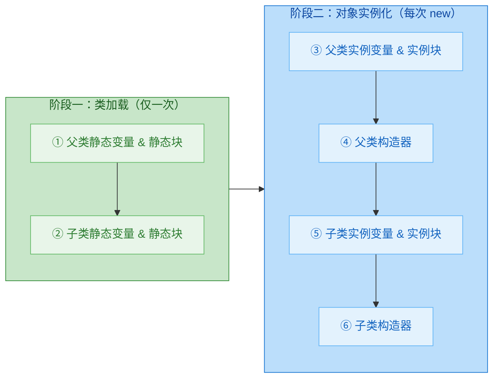

这个顺序的底层逻辑是：JVM 必须保证父类完全初始化好之后，子类才能开始自己的初始化。因为子类可能依赖父类的字段或方法，如果父类还没准备好，子类的初始化就可能读到错误的值。

#### 完整代码验证

下面用一个完整的父子类示例来验证这六步模型：

```java
// ==================== 父类 ====================
public class Parent {

    // ① 父类静态变量（类加载时第一个执行）
    static String parentStaticField = initParentStaticField();

    // ① 父类静态代码块（紧随静态变量之后）
    static {
        System.out.println("【1】父类 - 静态代码块");
    }

    // 父类静态变量初始化方法
    static String initParentStaticField() {
        System.out.println("【1】父类 - 静态变量初始化");
        return "parentStatic"; // 返回静态字段值
    }

    // ③ 父类实例变量（每次 new 子类时执行）
    String parentInstanceField = initParentInstanceField();

    // ③ 父类实例代码块
    {
        System.out.println("【3】父类 - 实例代码块");
    }

    // 父类实例变量初始化方法
    String initParentInstanceField() {
        System.out.println("【3】父类 - 实例变量初始化");
        return "parentInstance"; // 返回实例字段值
    }

    // ④ 父类构造器
    Parent() {
        System.out.println("【4】父类 - 构造器执行");
    }
}
```

```java
// ==================== 子类 ====================
public class Child extends Parent {

    // ② 子类静态变量（父类静态初始化完成后执行）
    static String childStaticField = initChildStaticField();

    // ② 子类静态代码块
    static {
        System.out.println("【2】子类 - 静态代码块");
    }

    // 子类静态变量初始化方法
    static String initChildStaticField() {
        System.out.println("【2】子类 - 静态变量初始化");
        return "childStatic"; // 返回静态字段值
    }

    // ⑤ 子类实例变量
    String childInstanceField = initChildInstanceField();

    // ⑤ 子类实例代码块
    {
        System.out.println("【5】子类 - 实例代码块");
    }

    // 子类实例变量初始化方法
    String initChildInstanceField() {
        System.out.println("【5】子类 - 实例变量初始化");
        return "childInstance"; // 返回实例字段值
    }

    // ⑥ 子类构造器
    Child() {
        // 这里隐含了 super()，即调用父类无参构造器
        System.out.println("【6】子类 - 构造器执行");
    }
}
```

```java
// ==================== 测试类 ====================
public class InitOrderTest {
    public static void main(String[] args) {
        System.out.println("========== 第一次 new Child() ==========");
        Child c1 = new Child(); // 触发类加载 + 实例化

        System.out.println("\n========== 第二次 new Child() ==========");
        Child c2 = new Child(); // 仅触发实例化
    }
}
```

运行输出：

```
========== 第一次 new Child() ==========
【1】父类 - 静态变量初始化
【1】父类 - 静态代码块
【2】子类 - 静态变量初始化
【2】子类 - 静态代码块
【3】父类 - 实例变量初始化
【3】父类 - 实例代码块
【4】父类 - 构造器执行
【5】子类 - 实例变量初始化
【5】子类 - 实例代码块
【6】子类 - 构造器执行

========== 第二次 new Child() ==========
【3】父类 - 实例变量初始化
【3】父类 - 实例代码块
【4】父类 - 构造器执行
【5】子类 - 实例变量初始化
【5】子类 - 实例代码块
【6】子类 - 构造器执行
```

输出完美印证了六步模型。第二次创建时，步骤 ①② 被跳过，因为类已经加载过了。

---

### 隐式 super() 调用机制

在上面的子类构造器中，我们并没有显式写 `super()`，但父类构造器依然在子类构造器之前执行了。这是因为 Java 编译器会自动在每个构造器的第一行插入 `super()`（如果你没有手动写 `super(...)` 或 `this(...)`）。

```java
// 你写的代码
Child() {
    System.out.println("子类构造器");
}

// 编译器实际生成的等价代码
Child() {
    super();  // 编译器自动插入，调用父类无参构造器
    System.out.println("子类构造器");
}
```

这个机制有一个重要的推论：如果父类没有无参构造器（比如父类只定义了带参构造器），那么子类必须在构造器第一行显式调用 `super(参数)`，否则编译报错。

```java
class Parent {
    // 只有带参构造器，没有无参构造器
    Parent(String name) {
        System.out.println("Parent: " + name);
    }
}

class Child extends Parent {
    Child() {
        // super();  ← 编译器想插入这个，但父类没有无参构造器，编译失败！
        // 必须显式写：
        super("default"); // 手动调用父类带参构造器
        System.out.println("Child 构造器");
    }
}
```

---

### 构造器中调用可重写方法的陷阱

这是 Java 初始化顺序中最经典也最危险的陷阱之一。当父类构造器中调用了一个可以被子类重写（override）的方法时，实际执行的是子类的版本——但此时子类的实例变量还没有初始化！

```java
public class Animal {

    // 父类构造器
    Animal() {
        System.out.println("Animal 构造器 - 调用 speak() 之前");
        speak(); // 调用的是子类重写后的版本！
        System.out.println("Animal 构造器 - 调用 speak() 之后");
    }

    // 父类的 speak 方法
    void speak() {
        System.out.println("Animal speaks");
    }
}
```

```java
public class Dog extends Animal {

    // 子类实例变量，赋值为 "Woof!"
    String sound = "Woof!";

    // 子类构造器
    Dog() {
        // 隐式 super() → 触发 Animal 构造器
        System.out.println("Dog 构造器, sound = " + sound);
    }

    // 重写父类的 speak 方法
    @Override
    void speak() {
        // 当从父类构造器调用时，sound 还是 null！
        System.out.println("Dog speaks: " + sound);
    }

    public static void main(String[] args) {
        Dog dog = new Dog();
    }
}
```

输出：

```
Animal 构造器 - 调用 speak() 之前
Dog speaks: null
Animal 构造器 - 调用 speak() 之后
Dog 构造器, sound = Woof!
```

`sound` 打印出了 `null`！这是因为执行顺序是：

```java
// 实际执行流程：
// 1. Dog 实例变量分配默认值     → sound = null (String 的默认值)
// 2. 进入 Animal 构造器
// 3. Animal 构造器调用 speak()  → 多态，执行 Dog.speak()
// 4. Dog.speak() 读取 sound    → 此时 sound 仍然是 null！
// 5. Animal 构造器结束
// 6. Dog 实例变量显式赋值       → sound = "Woof!"  (这时才赋值！)
// 7. Dog 实例块执行（如果有）
// 8. Dog 构造器体执行
```

这就是为什么 Effective Java 中明确建议：**构造器中不要调用可被重写的方法**（"Never call overridable methods from constructors"）。如果确实需要在构造器中调用方法，应该将该方法声明为 `final` 或 `private`，确保它不会被子类重写。

---

### 多层继承的初始化链

当继承层次超过两层时，初始化顺序依然遵循同样的规则，只是链条更长。JVM 会沿着继承链一路追溯到 `Object` 类：

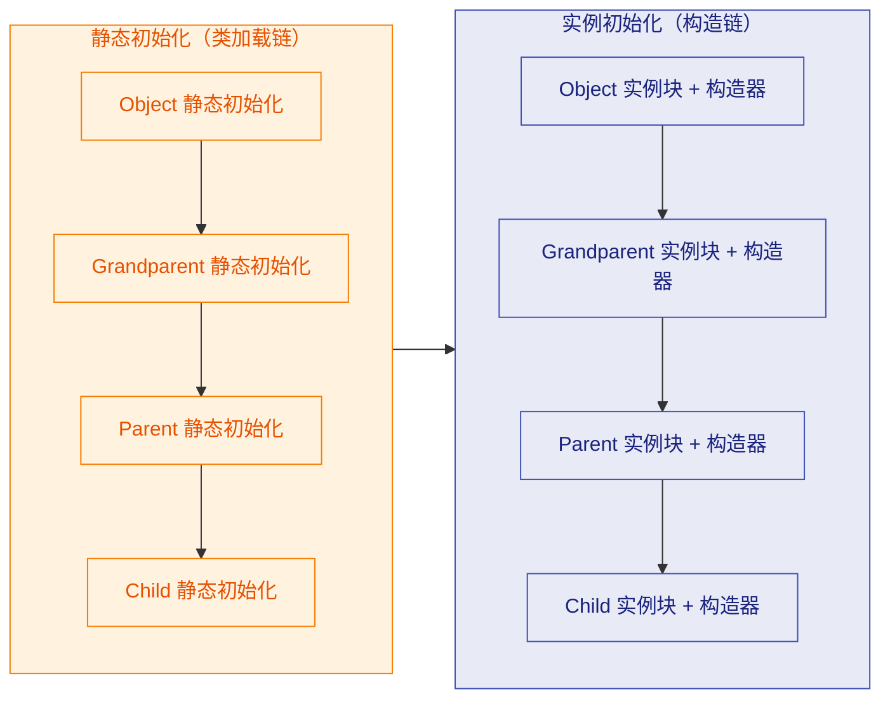

每一层都严格遵循"先静后实，先块后构造"的规则，层与层之间则遵循"先父后子"的规则。整个过程就像剥洋葱的逆过程——从最内层（`Object`）开始，一层一层向外构建。

---

### 静态块的典型应用场景

理解了初始化顺序之后，我们来看看静态块在实际开发中的常见用途：

```java
public class DatabaseConfig {

    // 静态变量：数据库连接配置
    private static final Properties dbProperties = new Properties();

    // 静态代码块：加载配置文件（只需加载一次）
    static {
        try {
            // 从 classpath 读取配置文件
            InputStream input = DatabaseConfig.class
                    .getClassLoader()
                    .getResourceAsStream("db.properties");

            if (input == null) {
                // 配置文件不存在时抛出异常
                throw new RuntimeException("db.properties not found");
            }

            dbProperties.load(input); // 加载属性到 Properties 对象
            System.out.println("数据库配置加载成功");

        } catch (IOException e) {
            // 静态块中的异常会被包装为 ExceptionInInitializerError
            throw new ExceptionInInitializerError(e);
        }
    }

    // 对外提供获取配置的方法
    public static String getProperty(String key) {
        return dbProperties.getProperty(key); // 从已加载的配置中读取
    }
}
```

静态块非常适合做"一次性初始化"的工作：加载配置文件、注册 JDBC 驱动、初始化缓存、预计算常量表等。需要注意的是，如果静态块中抛出异常，JVM 会抛出 `ExceptionInInitializerError`，并且该类将永远无法被使用（后续尝试使用该类会抛出 `NoClassDefFoundError`）。

---

### 实例块的典型应用场景

实例块（instance initializer block）相对静态块来说使用频率较低，但在某些场景下非常有用：

```java
public class EventLogger {

    // 实例变量
    private final String createdAt;
    private final String instanceId;

    // 实例代码块：无论调用哪个构造器，都会执行
    {
        // 生成唯一实例 ID
        instanceId = UUID.randomUUID().toString().substring(0, 8);
        // 记录创建时间
        createdAt = LocalDateTime.now().toString();
        System.out.println("实例块: 创建 Logger [" + instanceId + "]");
    }

    // 构造器 1：无参
    EventLogger() {
        System.out.println("无参构造器");
    }

    // 构造器 2：带参
    EventLogger(String tag) {
        System.out.println("带参构造器, tag = " + tag);
    }
}
```

实例块的核心价值在于：当一个类有多个构造器，且它们都需要执行某段相同的初始化逻辑时，把这段逻辑放在实例块中可以避免代码重复。不过在现代 Java 开发中，更常见的做法是使用一个私有的 `init()` 方法，然后在每个构造器中调用它，这样代码意图更明确。

另一个实例块的经典用法是匿名内部类的初始化，也叫"双括号初始化"（Double Brace Initialization）：

```java
// 双括号初始化：外层括号是匿名内部类，内层括号是实例块
List<String> list = new ArrayList<String>() {{
    add("Java");    // 实例块中调用 add 方法
    add("Python");  // 添加元素
    add("Go");      // 添加元素
}};
// 注意：这种写法会创建匿名内部类，可能导致内存泄漏，生产代码中不推荐使用
```

---

### 初始化顺序速查表

将所有规则浓缩为一张速查表，方便随时回顾：

```
┌──────────────────────────────────────────────────────────────┐
│                    Java 初始化顺序速查表                       │
├──────────────────────────────────────────────────────────────┤
│                                                              │
│  ▶ 类加载阶段（仅一次，先父后子）                              │
│    ┌──────────────────────────────────────────┐              │
│    │ 父类 static 变量赋值 + static 块          │  按书写顺序  │
│    │           ↓                               │              │
│    │ 子类 static 变量赋值 + static 块          │  按书写顺序  │
│    └──────────────────────────────────────────┘              │
│                                                              │
│  ▶ 实例化阶段（每次 new，先父后子）                            │
│    ┌──────────────────────────────────────────┐              │
│    │ 父类 实例变量赋值 + 实例块                 │  按书写顺序  │
│    │           ↓                               │              │
│    │ 父类 构造器                               │              │
│    │           ↓                               │              │
│    │ 子类 实例变量赋值 + 实例块                 │  按书写顺序  │
│    │           ↓                               │              │
│    │ 子类 构造器                               │              │
│    └──────────────────────────────────────────┘              │
│                                                              │
│  ▶ 核心口诀                                                  │
│    "先静后动，先父后子，先块后构造"                             │
│                                                              │
│  ▶ 易错点                                                    │
│    • static 块只执行一次                                      │
│    • 同级别的变量赋值和代码块按书写顺序执行                     │
│    • 构造器中调用可重写方法 → 子类字段尚未初始化                │
│    • 编译器自动插入 super() 到构造器第一行                     │
│                                                              │
└──────────────────────────────────────────────────────────────┘
```

---

### final 字段与初始化的关系

`final` 实例字段必须在对象构造完成之前被赋值，Java 提供了三个合法的赋值位置：

```java
public class FinalFieldDemo {

    // 方式 1：声明时直接赋值
    final int a = 10;

    // 方式 2：在实例块中赋值
    final int b;
    {
        b = 20; // 合法：实例块在构造器之前执行
    }

    // 方式 3：在构造器中赋值
    final int c;
    FinalFieldDemo() {
        c = 30; // 合法：构造器是最后的赋值机会
    }

    // 以下写法编译报错：
    // final int d;  ← 没有在任何地方赋值，编译器报错
}
```

`final` 字段的赋值同样遵循初始化顺序：声明赋值和实例块按书写顺序执行，构造器最后执行。编译器会检查所有可能的执行路径，确保 `final` 字段恰好被赋值一次。

对于 `static final` 字段（即常量），赋值位置只有两个：声明时赋值，或在静态块中赋值。

```java
public class Constants {
    // 方式 1：声明时赋值（编译期常量，会被内联优化）
    static final int MAX_SIZE = 100;

    // 方式 2：静态块中赋值（运行时常量，不会被内联）
    static final String CONFIG_PATH;
    static {
        CONFIG_PATH = System.getProperty("config.path", "/default/path");
    }
}
```

---

### 字节码视角：clinit 与 init

从 JVM 字节码的角度来看，初始化顺序的实现依赖于两个特殊方法：

`<clinit>` 方法（class initializer）：由编译器自动生成，包含所有静态变量赋值和静态块的代码，按书写顺序合并。JVM 保证 `<clinit>` 在多线程环境下只执行一次，并且是线程安全的。这也是为什么"静态内部类实现单例模式"是线程安全的。

`<init>` 方法（instance initializer）：对应构造器。编译器会将实例变量赋值和实例块的代码，按书写顺序插入到每个 `<init>` 方法中 `super()` 调用之后、构造器体代码之前。

```java
// 你写的源码
class Demo {
    int x = 5;
    { x = 10; }
    Demo() { x = 15; }
}

// 编译器生成的 <init> 等价逻辑
// Demo() {
//     super();       // 调用 Object 构造器
//     x = 5;         // 实例变量显式赋值（从声明处搬过来）
//     x = 10;        // 实例块代码（从实例块搬过来）
//     x = 15;        // 构造器体原始代码
// }
```

这意味着无论你写了多少个构造器，编译器都会把实例变量赋值和实例块的代码复制一份到每个构造器中。这就是为什么实例块"看起来"在构造器之前执行——因为它的代码被编译器物理地插入到了构造器体的前面。

用一张图来表达 `<clinit>` 和 `<init>` 的组装过程：

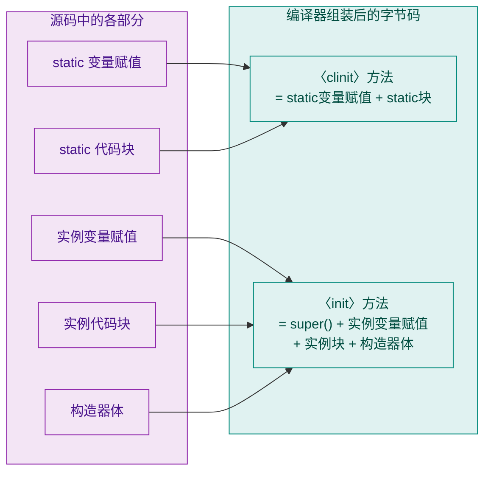

理解了字节码层面的组装逻辑，你就能从根本上理解为什么初始化顺序是这样的——它不是什么"魔法"，而是编译器按照固定规则拼接代码的结果。

---

### 利用 clinit 线程安全性实现单例

前面提到 JVM 保证 `<clinit>` 只执行一次且线程安全，这个特性可以被巧妙地用来实现懒加载单例模式（Lazy Initialization Holder Class Pattern）：

```java
public class Singleton {

    // 私有构造器，防止外部 new
    private Singleton() {
        System.out.println("Singleton 实例被创建");
    }

    // 静态内部类：只有在被引用时才会触发类加载
    private static class Holder {
        // JVM 保证这行代码只执行一次，且线程安全
        static final Singleton INSTANCE = new Singleton();
    }

    // 对外暴露的获取方法
    public static Singleton getInstance() {
        return Holder.INSTANCE; // 第一次调用时触发 Holder 类加载
    }

    public static void main(String[] args) {
        System.out.println("程序启动，Singleton 尚未创建");
        // 此时 Holder 类还没有被加载，Singleton 实例还不存在

        Singleton s1 = Singleton.getInstance(); // 触发 Holder 类加载
        Singleton s2 = Singleton.getInstance(); // Holder 已加载，直接返回

        System.out.println("s1 == s2 : " + (s1 == s2)); // true
    }
}
```

输出：

```
程序启动，Singleton 尚未创建
Singleton 实例被创建
s1 == s2 : true
```

这种方式既实现了懒加载（只有调用 `getInstance()` 时才创建实例），又天然线程安全（由 JVM 的类加载机制保证），而且没有任何同步开销。这是 Effective Java 推荐的单例实现方式之一。

---

### 常见面试追问与深度解析

#### "如果只访问子类的静态字段，父类会被加载吗？"

答案是：**会**。根据 JVM 规范，初始化一个类之前，必须先初始化它的父类。所以即使你只是访问 `Child.childStaticField`，JVM 也会先加载并初始化 `Parent`。

但有一个特殊情况：如果你通过子类名访问的是**父类定义的静态字段**，那么只有父类会被初始化，子类不会被初始化：

```java
class Parent {
    static int value = 100;
    static { System.out.println("Parent 静态块"); }
}

class Child extends Parent {
    static { System.out.println("Child 静态块"); }
}

public class Test {
    public static void main(String[] args) {
        // 通过子类名访问父类的静态字段
        System.out.println(Child.value);
    }
}
// 输出：
// Parent 静态块
// 100
// 注意：Child 的静态块没有执行！
```

这是因为 `value` 是在 `Parent` 中定义的，JVM 认为这是对 `Parent` 的主动使用（active use），而不是对 `Child` 的主动使用。

#### "静态常量（static final）会触发类加载吗？"

如果静态常量的值在编译期就能确定（即编译期常量，compile-time constant），那么访问它**不会**触发类加载：

```java
class Config {
    // 编译期常量：值在编译时就确定了
    static final int MAX = 100;

    // 运行时常量：值需要运行时才能确定
    static final int RANDOM = new Random().nextInt();

    static { System.out.println("Config 类被加载"); }
}

public class Test {
    public static void main(String[] args) {
        System.out.println(Config.MAX);    // 不触发类加载！值被内联到调用处
        System.out.println(Config.RANDOM); // 触发类加载！需要运行时计算
    }
}
```

编译器会将编译期常量直接"内联"（inline）到使用它的地方。也就是说，`Config.MAX` 在编译后的字节码中直接变成了 `100`，完全不需要访问 `Config` 类。

---

### 初始化顺序的完整心智模型

最后，用一个完整的心智模型来总结整个初始化体系。当你遇到任何初始化顺序的问题时，按照这个模型逐步推演即可：

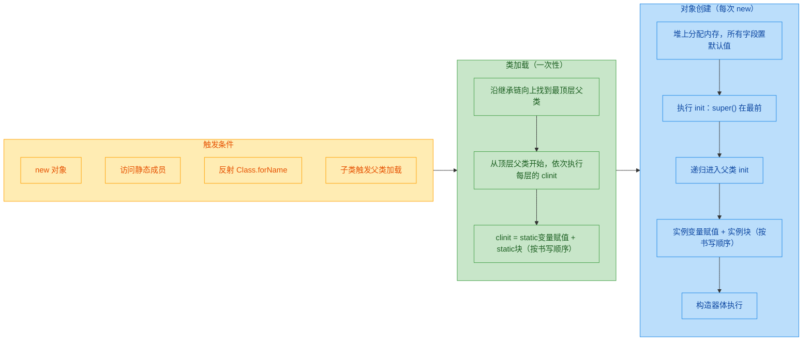

记住核心口诀：**"先静后动，先父后子，先块后构造"**。再加上"静态只一次，实例每次 new"，基本上所有初始化顺序的题目都能迎刃而解。

---

**📝 练习题**

阅读以下代码，请问 `new Child()` 的输出顺序是什么？

```java
class Parent {
    static { System.out.print("A "); }
    { System.out.print("B "); }
    Parent() { System.out.print("C "); }
}

class Child extends Parent {
    static { System.out.print("D "); }
    { System.out.print("E "); }
    Child() { System.out.print("F "); }
}

public class Quiz {
    public static void main(String[] args) {
        new Child();
    }
}
```

A. A D B C E F


B. A B C D E F


C. D A B C E F


D. A D E F B C


**【答案】** A

**【解析】** 按照"先静后动，先父后子，先块后构造"的口诀逐步推演：首先是类加载阶段，父类静态块先执行输出 `A`，然后子类静态块执行输出 `D`；接着进入实例化阶段，父类实例块输出 `B`，父类构造器输出 `C`，然后子类实例块输出 `E`，子类构造器输出 `F`。最终顺序为 `A D B C E F`。选项 B 错在把子类静态块放到了父类实例块之后；选项 C 错在让子类静态块先于父类静态块执行；选项 D 错在把父类实例化放到了子类实例化之后。

---

**📝 练习题**

以下代码中，`Dog.speak()` 在父类构造器中被调用时，`sound` 的值是什么？

```java
class Animal {
    Animal() { speak(); }
    void speak() { System.out.println("..."); }
}

class Dog extends Animal {
    String sound = "Woof";
    @Override
    void speak() { System.out.println(sound); }
}
```

A. "Woof"


B. ""（空字符串）


C. null


D. 抛出 NullPointerException


**【答案】** C

**【解析】** 当执行 `new Dog()` 时，首先进入父类 `Animal` 的构造器（隐式 `super()` 调用）。此时子类 `Dog` 的实例变量 `sound` 仅完成了默认值初始化阶段（`String` 的默认值为 `null`），显式赋值 `"Woof"` 还没有执行。父类构造器中调用 `speak()` 时，由于多态机制，实际执行的是 `Dog` 的 `speak()` 方法，此时读取到的 `sound` 就是 `null`。`println(null)` 会输出字符串 `"null"` 而不会抛出 `NullPointerException`，所以选 C 而不是 D。这正是"构造器中不要调用可重写方法"这条最佳实践的由来。

---

## 本章小结

面向对象编程（Object-Oriented Programming, OOP）是 Java 语言的灵魂。本章从最基础的"类与对象"出发，逐步深入到访问控制、封装思想、`static` 关键字，最终以初始化顺序这一高频考点收尾。下面我们对整章知识做一次系统性的回顾与串联，帮助你在脑中构建一张完整的知识地图。

---

### 知识脉络总览

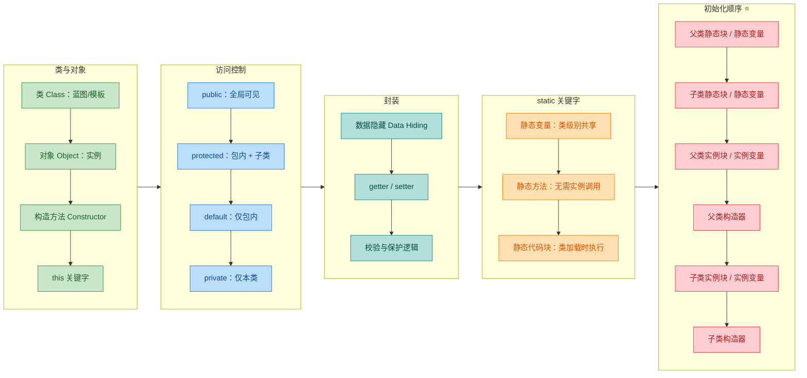

---

### 核心概念回顾

本章的五大知识板块环环相扣，它们之间的关系可以用一句话概括：**类是对象的模板，访问修饰符决定了类成员的可见边界，封装利用这些边界保护数据，`static` 改变了成员的归属层级（从对象级提升到类级），而初始化顺序则揭示了 JVM 在创建对象时如何按部就班地执行这一切。**

#### 一、类与对象 — 万物皆对象

类（Class）是 Java 程序的基本组织单元。你可以把它理解为一张"设计图纸"，而对象（Object）就是根据图纸造出来的"实物"。每个对象拥有独立的状态（字段值），但共享同一套行为定义（方法）。

构造方法（Constructor）是对象诞生的"第一道工序"。它没有返回值，名字与类名相同，支持重载（Overloading）。`this` 关键字在构造方法和普通方法中都扮演着"指向当前对象自身"的角色，它解决了参数名与字段名冲突的问题，也支持通过 `this(...)` 在构造方法之间互相调用，实现代码复用。

```java
public class Student {
    private String name;
    private int age;

    // 全参构造器
    public Student(String name, int age) {
        this.name = name;   // this 区分字段与参数
        this.age = age;
    }

    // 无参构造器，委托给全参构造器
    public Student() {
        this("Unknown", 0);  // this(...) 构造器链
    }
}
```

关键要点：
- 如果你不写任何构造方法，编译器会自动提供一个无参的默认构造器（default constructor）；但只要你手动写了任何一个构造方法，默认构造器就不再自动生成。
- `this` 不能在 `static` 上下文中使用，因为静态成员不属于任何实例。

#### 二、访问修饰符 — 可见性的四道门

Java 提供了四个访问级别，从宽到窄依次为：

| 修饰符 | 本类 | 同包 | 子类（不同包） | 任意位置 |
|:---:|:---:|:---:|:---:|:---:|
| `public` | ✅ | ✅ | ✅ | ✅ |
| `protected` | ✅ | ✅ | ✅ | ❌ |
| default（缺省） | ✅ | ✅ | ❌ | ❌ |
| `private` | ✅ | ❌ | ❌ | ❌ |

设计原则很简单：**能用更严格的修饰符就不要用更宽松的**（Principle of Least Privilege）。字段几乎总是 `private`，方法根据是否需要对外暴露来选择 `public` 或 `protected`。`default` 访问级别在模块化设计和包内协作中有其独特价值，但在日常开发中使用频率相对较低。

#### 三、封装 — OOP 的第一道防线

封装（Encapsulation）的核心思想是 **"隐藏实现细节，暴露安全接口"**。具体做法是：

1. 将字段声明为 `private`，阻止外部直接访问。
2. 提供 `public` 的 getter/setter 方法作为受控的访问通道。
3. 在 setter 中加入校验逻辑，确保数据合法性。

封装带来的好处不仅仅是"安全"，更重要的是 **解耦**。外部代码只依赖 getter/setter 的方法签名，内部实现可以随时调整而不影响调用方。这就是面向对象设计中常说的 "Program to an interface, not an implementation"。

```java
public class BankAccount {
    private double balance;  // 私有字段，外部无法直接修改

    public double getBalance() {
        return balance;
    }

    public void deposit(double amount) {
        if (amount <= 0) {                    // 校验：金额必须为正
            throw new IllegalArgumentException("Deposit amount must be positive");
        }
        this.balance += amount;               // 通过方法间接修改
    }
}
```

#### 四、static 关键字 — 从对象到类的跃迁

`static` 是 Java 中一个非常重要的修饰符，它将成员的归属从"对象级别"提升到"类级别"：

- **静态变量**（class variable）：所有实例共享同一份数据，常用于计数器、配置常量等场景。
- **静态方法**（class method）：不依赖任何实例就能调用，内部不能使用 `this` 或访问非静态成员。工具类（如 `Math.abs()`、`Arrays.sort()`）大量使用静态方法。
- **静态代码块**（static initializer block）：在类首次被 JVM 加载时执行，且只执行一次，适合做复杂的静态资源初始化。

一个常见的误区是在静态方法中试图访问实例变量或调用实例方法——这在编译期就会报错，因为静态方法执行时可能根本不存在任何对象实例。

#### 五、初始化顺序 — JVM 的执行剧本 ⭐

这是本章的压轴知识点，也是面试中的高频考题。当你 `new` 一个子类对象时，JVM 严格按照以下顺序执行：

```
① 父类静态变量 & 静态代码块（按书写顺序，仅类首次加载时）
② 子类静态变量 & 静态代码块（按书写顺序，仅类首次加载时）
③ 父类实例变量 & 实例代码块（按书写顺序）
④ 父类构造方法
⑤ 子类实例变量 & 实例代码块（按书写顺序）
⑥ 子类构造方法
```

核心规律可以归纳为两条：
- **静态优先于实例**：类加载阶段（static）一定先于对象创建阶段（instance）。
- **父类优先于子类**：在同一阶段内，父类的初始化一定先于子类。

理解这个顺序的关键在于区分"类加载"和"对象创建"这两个不同的生命周期阶段。静态成员属于类加载阶段，只执行一次；实例成员属于对象创建阶段，每次 `new` 都会执行。

---

### 设计思想串联

本章的五个知识点并非孤立存在，它们共同服务于面向对象的核心设计理念：

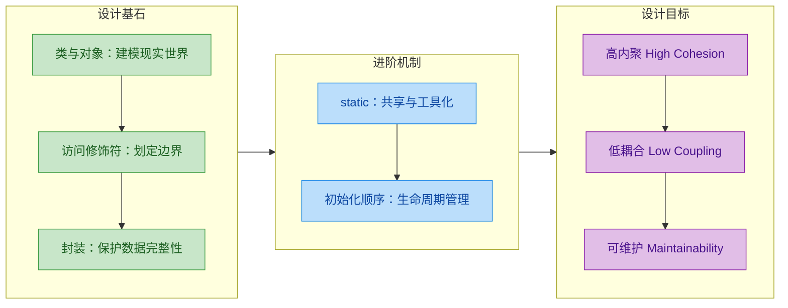

**类与对象**让我们能够用代码建模现实世界的实体；**访问修饰符**为这些实体划定了清晰的可见性边界；**封装**利用这些边界将数据保护起来，只通过受控接口与外界交互；**`static`** 提供了一种超越实例的共享机制，让某些数据和行为归属于类本身；**初始化顺序**则揭示了 JVM 在幕后如何有条不紊地将这一切组装起来。

掌握了这些基础，你就拥有了理解后续章节（继承、多态、抽象类、接口）的全部前置知识。面向对象的世界才刚刚展开。

---

### 📝 练习题

以下代码的输出结果是什么？

```java
class Parent {
    static {
        System.out.print("A ");
    }

    {
        System.out.print("B ");
    }

    public Parent() {
        System.out.print("C ");
    }
}

class Child extends Parent {
    static {
        System.out.print("D ");
    }

    {
        System.out.print("E ");
    }

    public Child() {
        System.out.print("F ");
    }
}

public class Main {
    public static void main(String[] args) {
        new Child();
        System.out.println();
        new Child();
    }
}
```

A. `A D B C E F` 换行 `A D B C E F`


B. `A D B C E F` 换行 `B C E F`


C. `A B C D E F` 换行 `A B C D E F`


D. `D A B C E F` 换行 `B C E F`

**【答案】** B

**【解析】** 这道题完美覆盖了本章的压轴知识点——初始化顺序。

第一次 `new Child()` 时，JVM 需要先加载 `Parent` 类和 `Child` 类，因此静态代码块按"父类优先"的顺序执行：先输出 `A`（Parent 的 static 块），再输出 `D`（Child 的 static 块）。接着进入对象创建阶段：父类实例块输出 `B`，父类构造器输出 `C`，子类实例块输出 `E`，子类构造器输出 `F`。第一行结果为 `A D B C E F`。

第二次 `new Child()` 时，`Parent` 和 `Child` 类已经加载过了，静态代码块不会再执行（static initializer 只在类首次加载时运行一次）。因此直接进入对象创建阶段：`B C E F`。

选项 A 错在静态块重复执行了；选项 C 错在把父子类的静态和实例混在一起按顺序排列；选项 D 错在子类静态块先于父类执行。正确答案是 B。

---

