---

# Lambda表达式 ⭐

---

## Lambda 语法（参数 → 方法体）

Java 8 引入了 Lambda 表达式，这是 Java 语言自诞生以来最具革命性的语法变革之一。它的核心思想很简单：**把一段行为（behavior）像数据一样传递**。在此之前，Java 要实现"传递行为"只能依赖匿名内部类，代码冗长且可读性差。Lambda 表达式从根本上改变了这一局面。

### Lambda 的本质：匿名函数

Lambda 表达式本质上是一个**没有名字的函数**（Anonymous Function）。它不属于任何类，但拥有参数列表、函数体、返回值，甚至可以抛出异常。你可以把它理解为一段**可以被存储、传递和执行的代码片段**。

在传统 Java 中，如果我们想对一个列表排序，需要这样写：

```java
// 匿名内部类写法 —— 冗长、仪式感重
Collections.sort(names, new Comparator<String>() {
    @Override
    public int compare(String a, String b) {
        return a.compareTo(b); // 实际有用的只有这一行
    }
});
```

整整 6 行代码，真正的业务逻辑只有 `a.compareTo(b)` 这一行，其余全是"语法噪音"（syntactic noise）。Lambda 表达式将其压缩为：

```java
// Lambda 写法 —— 简洁、意图清晰
Collections.sort(names, (a, b) -> a.compareTo(b));
```

一行搞定。代码的**信噪比**（signal-to-noise ratio）大幅提升。

### 完整语法结构

Lambda 表达式的通用语法格式如下：

```
(参数列表) -> { 方法体 }
```

用一张图来拆解它的三个组成部分：

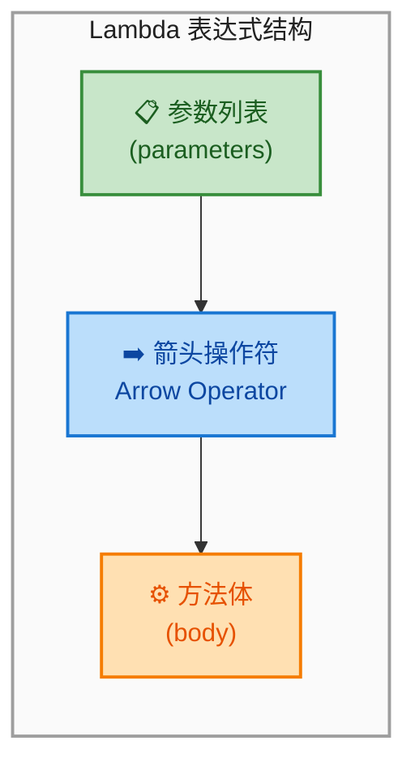

- **参数列表**：与方法参数一样，写在圆括号 `()` 中。类型可以显式声明，也可以由编译器自动推断（type inference）。
- **箭头操作符 `->`**：读作 "goes to"，是 Lambda 的标志性符号，将参数与方法体分隔开。
- **方法体**：可以是单个表达式，也可以是用 `{}` 包裹的代码块。

### 六种常见写法（从繁到简）

Lambda 的语法非常灵活，根据参数数量和方法体复杂度，有多种简写形式。下面按照从完整到极简的顺序逐一讲解：

**写法一：完整形式（显式类型 + 代码块）**

```java
// 完整写法：显式声明参数类型，方法体用花括号包裹，显式 return
(String a, String b) -> {
    return a.compareTo(b); // 显式指定参数类型为 String
}
```

这是最"啰嗦"但也最清晰的写法，适合初学者理解 Lambda 的结构。

**写法二：省略参数类型（类型推断）**

```java
// 省略参数类型：编译器根据上下文自动推断 a 和 b 的类型
(a, b) -> {
    return a.compareTo(b); // 编译器知道这是 Comparator<String>，所以 a、b 是 String
}
```

Java 编译器足够聪明，能从目标类型（target type）推断出参数类型。这是最常用的写法之一。注意：**要省略就全部省略**，不能只省略部分参数的类型。

**写法三：单表达式省略花括号和 return**

```java
// 单表达式：省略花括号和 return，表达式的值自动作为返回值
(a, b) -> a.compareTo(b)
```

当方法体只有一个表达式时，可以同时省略 `{}`、`return` 和末尾分号。表达式的计算结果会自动成为返回值。这是日常开发中最高频的写法。

**写法四：单参数省略圆括号**

```java
// 单参数：可以省略圆括号
name -> name.toUpperCase() // 只有一个参数时，括号可以省略
```

当参数列表只有一个参数时，圆括号 `()` 也可以省略。但如果参数有显式类型声明，括号不能省：`(String name) -> name.toUpperCase()`。

**写法五：无参数**

```java
// 无参数：必须保留空的圆括号
() -> System.out.println("Hello Lambda!") // 空括号不能省略
```

没有参数时，必须写一对空的圆括号 `()`，这是语法要求，不能省略。

**写法六：多行方法体**

```java
// 多行方法体：必须用花括号包裹，且需要显式 return（如果有返回值）
(a, b) -> {
    System.out.println("Comparing: " + a + " vs " + b); // 打印调试信息
    int result = a.compareTo(b);                         // 执行比较
    return result;                                        // 显式返回结果
}
```

当方法体超过一行时，必须使用 `{}` 包裹，并且如果需要返回值，必须显式写 `return`。

下面用一张表格做个速查总结：

| 场景 | 语法 | 示例 |
|------|------|------|
| 无参数 | `() -> 表达式` | `() -> 42` |
| 单参数 | `x -> 表达式` | `x -> x * 2` |
| 双参数 | `(x, y) -> 表达式` | `(x, y) -> x + y` |
| 显式类型 | `(Type x) -> 表达式` | `(int x) -> x * 2` |
| 多行体 | `(x) -> { 语句; return 值; }` | `(x) -> { log(x); return x; }` |

### 变量捕获（Variable Capture）

Lambda 表达式可以访问外部作用域的变量，这个行为叫做**变量捕获**（capturing）。但有一个重要限制：被捕获的局部变量必须是 **effectively final** 的——即变量在初始化后不再被修改。

```java
String prefix = "Hello, ";  // 这个变量在后续没有被修改，是 effectively final

// Lambda 捕获了外部变量 prefix
Function<String, String> greeter = name -> prefix + name; // 合法：prefix 是 effectively final

System.out.println(greeter.apply("Java")); // 输出: Hello, Java
```

如果尝试修改被捕获的变量，编译器会直接报错：

```java
String prefix = "Hello, ";
prefix = "Hi, ";  // 修改了！不再是 effectively final

// 编译错误：Variable used in lambda expression should be final or effectively final
Function<String, String> greeter = name -> prefix + name; // ❌ 编译失败
```

为什么有这个限制？因为 Lambda 可能在另一个线程中执行，如果允许修改外部变量，就会引发**线程安全**问题。Java 选择在编译期就杜绝这种隐患。

不过，**实例变量和静态变量**不受此限制，因为它们存储在堆（heap）上，而非栈（stack）上：

```java
public class Counter {
    private int count = 0; // 实例变量，存储在堆上

    public void increment() {
        // Lambda 可以读写实例变量，不要求 effectively final
        Runnable r = () -> count++; // 合法：实例变量不受限制
        r.run();
        System.out.println(count); // 输出: 1
    }
}
```

用一张内存模型图来理解这个区别：

```java
// ┌─────────────── Stack (线程私有) ───────────────┐
// │                                                 │
// │  局部变量 prefix = "Hello, "  ← 必须 effectively final │
// │  Lambda 捕获的是 prefix 的【副本】               │
// │                                                 │
// └─────────────────────────────────────────────────┘
//
// ┌─────────────── Heap (线程共享) ────────────────┐
// │                                                 │
// │  实例变量 this.count = 0  ← 无 final 限制       │
// │  Lambda 通过 this 引用直接访问                   │
// │                                                 │
// └─────────────────────────────────────────────────┘
```

### Lambda vs 匿名内部类：关键差异

虽然 Lambda 看起来像是匿名内部类的语法糖，但它们在底层实现上有本质区别：

| 对比维度 | 匿名内部类 | Lambda 表达式 |
|----------|-----------|--------------|
| 编译产物 | 生成独立的 `.class` 文件 | 使用 `invokedynamic` 指令，不生成额外类文件 |
| `this` 指向 | 指向匿名内部类自身实例 | 指向外围类（enclosing class）的实例 |
| 适用范围 | 可实现任意接口或抽象类 | 只能用于函数式接口（单抽象方法） |
| 性能 | 每次创建新对象 | JVM 可优化，避免不必要的对象创建 |

其中 `this` 的指向差异是最容易踩坑的地方：

```java
public class ThisDemo {
    private String name = "OuterClass"; // 外围类的字段

    public void test() {
        // 匿名内部类中的 this —— 指向匿名内部类实例
        Runnable anon = new Runnable() {
            @Override
            public void run() {
                // this 指向这个 Runnable 匿名类的实例
                System.out.println(this.getClass().getSimpleName()); // 输出: "" (匿名类无名)
            }
        };

        // Lambda 中的 this —— 指向外围类 ThisDemo 的实例
        Runnable lambda = () -> {
            // this 指向 ThisDemo 的实例，而非 Lambda 本身
            System.out.println(this.name); // 输出: OuterClass
        };

        anon.run();
        lambda.run();
    }
}
```

### Lambda 的底层实现：invokedynamic

Lambda 并不是简单的语法糖。编译器在遇到 Lambda 时，会生成一条 `invokedynamic`（简称 indy）字节码指令，将 Lambda 的实际创建推迟到运行时。JVM 在首次执行时通过 `LambdaMetafactory` 动态生成实现类，后续调用可以复用，避免了匿名内部类每次都创建新对象的开销。

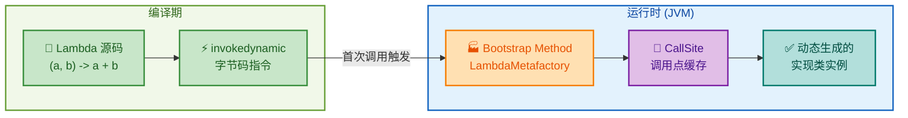

这种设计的好处是：JVM 可以根据运行时情况选择最优策略——可能生成一个内部类，也可能直接内联（inline）Lambda 的代码，甚至在某些场景下复用同一个实例（比如无状态的 Lambda）。

### 实战：用 Lambda 重构真实代码

来看一个完整的实战例子，感受 Lambda 如何让代码更简洁、更具表达力：

```java
import java.util.Arrays;  // 导入 Arrays 工具类
import java.util.List;     // 导入 List 接口

public class LambdaSyntaxDemo {
    public static void main(String[] args) {
        // 准备测试数据
        List<String> languages = Arrays.asList(
            "Java", "Python", "Go", "Rust", "Kotlin", "C++"
        );

        // ========== 1. 遍历（forEach + Lambda） ==========
        // 传统 for-each 循环
        for (String lang : languages) {       // 传统写法：需要声明循环变量
            System.out.println(lang);
        }

        // Lambda 写法：行为作为参数传递给 forEach
        languages.forEach(lang -> System.out.println(lang)); // 简洁：一行搞定遍历

        // ========== 2. 排序（sort + Lambda） ==========
        // 按字符串长度排序
        languages.sort((a, b) -> a.length() - b.length()); // 短的排前面
        System.out.println(languages); // [Go, C++, Java, Rust, Python, Kotlin]

        // ========== 3. 过滤 + 转换（Stream + Lambda） ==========
        languages.stream()                                   // 创建流
            .filter(lang -> lang.length() > 3)               // 过滤：只保留长度 > 3 的
            .map(lang -> lang.toUpperCase())                  // 转换：全部转大写
            .forEach(lang -> System.out.println(lang));       // 输出：JAVA RUST PYTHON KOTLIN
    }
}
```

**📝 练习题**

以下 Lambda 表达式中，哪一个会导致编译错误？

A. `(int x, int y) -> x + y`

B. `(x, int y) -> x + y`

C. `x -> x * x`

D. `() -> "Hello"`

**【答案】** B

**【解析】** Lambda 的参数类型声明必须保持一致——要么全部显式声明类型，要么全部省略让编译器推断。选项 B 中 `x` 省略了类型而 `y` 显式声明了 `int`，这种"混搭"写法违反了 Lambda 的语法规则，编译器无法处理这种不一致，会直接报错。选项 A 是完整的显式类型声明，选项 C 是单参数省略括号和类型，选项 D 是无参数 Lambda，这三种都是合法的写法。


---

## 函数式接口（单抽象方法）

### 什么是函数式接口

在上一节中我们知道，Lambda 表达式本质上是一段"匿名函数"的简写。但 Java 是一门强类型语言（strongly-typed language），任何值都必须有明确的类型。那么问题来了——Lambda 表达式的类型是什么？

答案就是**函数式接口（Functional Interface）**。

函数式接口的定义非常简洁：**一个有且仅有一个抽象方法（Single Abstract Method, SAM）的接口**。Lambda 表达式在 Java 中并不是一种独立的类型，而是会被编译器自动推断并匹配到某个函数式接口的实例。换句话说，函数式接口就是 Lambda 表达式的"容身之所"，是连接 Lambda 与 Java 类型系统的桥梁。

这个设计非常巧妙——Java 团队没有像其他语言那样引入全新的"函数类型"，而是复用了已有的接口机制，让 Lambda 无缝融入了 Java 的面向对象体系。这就是为什么你会看到 Lambda 可以赋值给一个接口类型的变量、可以作为方法参数传递、可以作为返回值——因为它本质上就是一个接口的匿名实现。

### 函数式接口的基本结构

我们先来看一个最简单的函数式接口：

```java
// 使用 @FunctionalInterface 注解标记这是一个函数式接口
@FunctionalInterface
public interface Greeting {
    // 有且仅有一个抽象方法 —— 这是函数式接口的核心约束
    void sayHello(String name);
}
```

有了这个接口，我们就可以用 Lambda 来创建它的实例：

```java
public class GreetingDemo {
    public static void main(String[] args) {
        // Lambda 表达式会被自动推断为 Greeting 接口的实现
        // 编译器看到目标类型是 Greeting，就知道 Lambda 对应的是 sayHello 方法
        Greeting greeting = (name) -> System.out.println("你好, " + name + "!");

        // 调用接口方法，实际执行的是 Lambda 中定义的逻辑
        greeting.sayHello("张三"); // 输出: 你好, 张三!
    }
}
```

这段代码的背后，编译器做了这样的推理：变量 `greeting` 的类型是 `Greeting`，而 `Greeting` 只有一个抽象方法 `sayHello(String)`，所以 Lambda `(name) -> ...` 就是 `sayHello` 的实现。这个过程叫做**目标类型推断（Target Typing）**。

### @FunctionalInterface 注解

你一定注意到了接口上方的 `@FunctionalInterface` 注解。它的作用类似于 `@Override`——不是功能性的，而是**声明性的、防御性的**。

```java
@FunctionalInterface
public interface Greeting {
    void sayHello(String name);
}
```

这个注解的意义在于：

- 它告诉编译器："我打算让这个接口成为函数式接口，请帮我检查。"
- 如果接口中有 0 个或多于 1 个抽象方法，编译器会直接报错。
- 它也是给其他开发者的信号："这个接口是设计来配合 Lambda 使用的。"

来看一个反面例子：

```java
@FunctionalInterface
public interface BadInterface {
    void methodA();  // 第一个抽象方法
    void methodB();  // 第二个抽象方法 —— 编译报错！
    // 错误信息: Multiple non-overriding abstract methods found in interface BadInterface
}
```

编译器会毫不留情地拒绝这段代码。这就是 `@FunctionalInterface` 的保护作用。

那么问题来了：**不加 `@FunctionalInterface`，接口还能当函数式接口用吗？** 答案是可以的。只要接口满足"只有一个抽象方法"的条件，它就天然是函数式接口，Lambda 照样能用。注解只是多了一层编译期校验。但在实际开发中，强烈建议加上这个注解，理由和 `@Override` 一样——防止无意中破坏接口的函数式契约。

### SAM 规则的精确边界

"只有一个抽象方法"这个规则听起来简单，但实际上有几个容易混淆的边界情况，我们逐一拆解。

#### 允许存在 default 方法和 static 方法

Java 8 为接口引入了 `default` 方法和 `static` 方法，它们都有方法体，不是抽象方法，因此不影响 SAM 计数：

```java
@FunctionalInterface
public interface SmartGreeting {

    // 唯一的抽象方法 —— SAM
    String greet(String name);

    // default 方法：有方法体，不计入 SAM 计数
    default String greetLoudly(String name) {
        // 内部复用抽象方法的逻辑，转为大写输出
        return greet(name).toUpperCase();
    }

    // static 方法：属于接口本身，不计入 SAM 计数
    static String defaultGreeting() {
        return "Hello, World!";
    }
}
```

使用时：

```java
public class SmartGreetingDemo {
    public static void main(String[] args) {
        // Lambda 只需要实现唯一的抽象方法 greet
        SmartGreeting sg = (name) -> "你好, " + name;

        // 调用抽象方法（Lambda 实现）
        System.out.println(sg.greet("李四"));        // 输出: 你好, 李四

        // 调用 default 方法（内部会委托给 Lambda 实现的 greet）
        System.out.println(sg.greetLoudly("李四"));   // 输出: 你好, 李四 （大写）

        // 调用 static 方法（通过接口名直接调用）
        System.out.println(SmartGreeting.defaultGreeting()); // 输出: Hello, World!
    }
}
```

这个设计非常实用——你可以在函数式接口中通过 `default` 方法提供丰富的工具方法，而 Lambda 只需要关注核心的那一个抽象方法。JDK 中的 `Function`、`Predicate` 等接口大量使用了这种模式（比如 `andThen`、`compose` 就是 default 方法）。

#### 覆盖 Object 类方法不计入 SAM

每个 Java 类都隐式继承 `java.lang.Object`，接口中如果声明了与 Object 公共方法签名相同的抽象方法（如 `toString()`、`equals()`、`hashCode()`），这些方法不计入 SAM 计数，因为任何实现类都已经从 Object 继承了这些方法的实现：

```java
@FunctionalInterface
public interface Identifiable {

    // 唯一的抽象方法 —— SAM
    String getId();

    // 虽然声明为抽象方法，但 toString() 来自 Object，不计入 SAM
    String toString();

    // 同理，equals() 来自 Object，不计入 SAM
    boolean equals(Object obj);

    // 同理，hashCode() 来自 Object，不计入 SAM
    int hashCode();
}
```

这个接口依然是合法的函数式接口，因为真正的抽象方法只有 `getId()` 一个。

#### 接口继承时的 SAM 合并

当一个函数式接口继承另一个接口时，情况会变得微妙：

```java
@FunctionalInterface
interface A {
    void execute(); // A 的抽象方法
}

// B 继承 A，没有新增抽象方法，SAM 仍然是 execute()
@FunctionalInterface
interface B extends A {
    // 合法：继承了 A 的 execute()，总共还是 1 个抽象方法
}

// C 继承 A，但新增了一个抽象方法 —— 总共 2 个，不再是函数式接口
// @FunctionalInterface  // 如果加上这个注解，编译报错
interface C extends A {
    void anotherMethod(); // 第二个抽象方法，破坏了 SAM 约束
}
```

还有一种特殊情况——子接口"覆盖"了父接口的方法：

```java
@FunctionalInterface
interface Parent {
    Object transform(String s); // 返回 Object
}

@FunctionalInterface
interface Child extends Parent {
    // 用更具体的返回类型覆盖了父接口的方法（协变返回类型）
    // 这不算新增抽象方法，SAM 仍然只有 1 个
    String transform(String s); // 返回 String（String 是 Object 的子类）
}
```

这里 `Child` 仍然是函数式接口，因为 `transform` 只是被更精确地重新声明了，并没有新增方法。

### 目标类型推断（Target Typing）

Lambda 表达式本身没有独立的类型。它的类型完全取决于上下文中期望的类型，这就是**目标类型推断**。编译器会根据 Lambda 出现的位置来决定它应该匹配哪个函数式接口。

```java
@FunctionalInterface
interface StringProcessor {
    // 接收一个 String，返回一个 String
    String process(String input);
}

@FunctionalInterface
interface StringValidator {
    // 接收一个 String，返回一个 boolean
    boolean validate(String input);
}

public class TargetTypingDemo {
    public static void main(String[] args) {
        // 同样的参数形式 (s) -> ...，但目标类型不同，Lambda 的含义也不同

        // 目标类型是 StringProcessor → Lambda 实现的是 process(String): String
        StringProcessor processor = (s) -> s.toUpperCase();

        // 目标类型是 StringValidator → Lambda 实现的是 validate(String): boolean
        StringValidator validator = (s) -> s.length() > 5;

        System.out.println(processor.process("hello"));    // 输出: HELLO
        System.out.println(validator.validate("hello"));    // 输出: false
        System.out.println(validator.validate("hello world")); // 输出: true
    }
}
```

目标类型推断发生在以下几种上下文中：

```java
public class TargetTypingContexts {

    // ① 变量赋值 —— 变量声明的类型就是目标类型
    static Runnable r = () -> System.out.println("赋值上下文");

    // ② 方法参数 —— 形参类型就是目标类型
    static void execute(Runnable task) {
        task.run();
    }

    // ③ 返回值 —— 方法返回类型就是目标类型
    static Comparator<String> getComparator() {
        return (s1, s2) -> s1.length() - s2.length();
    }

    // ④ 强制转型 —— 转型目标就是目标类型
    static void castExample() {
        Object obj = (Runnable) () -> System.out.println("强转上下文");
    }

    public static void main(String[] args) {
        r.run();                          // 输出: 赋值上下文
        execute(() -> System.out.println("参数上下文")); // 输出: 参数上下文

        Comparator<String> cmp = getComparator();
        // "cat" 长度 3, "elephant" 长度 8, 3 - 8 < 0, 所以 "cat" 排前面
        System.out.println(cmp.compare("cat", "elephant")); // 输出: -5
    }
}
```

### JDK 中经典的函数式接口一览

Java 8 之前就已经存在大量符合 SAM 规则的接口，它们天然就是函数式接口。Java 8 之后，JDK 又在 `java.util.function` 包下新增了 43 个标准函数式接口。下面用一张图来展示它们的全景：

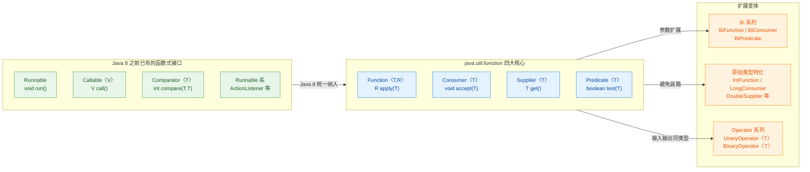

其中四大核心接口（`Function`、`Consumer`、`Supplier`、`Predicate`）是后续章节的重点，这里先建立一个直觉认知：

```java
import java.util.function.*;

public class CoreInterfacePreview {
    public static void main(String[] args) {

        // Function<T, R>: 接收 T，返回 R —— "转换器"
        Function<String, Integer> strLen = (s) -> s.length();
        System.out.println(strLen.apply("Lambda")); // 输出: 6

        // Consumer<T>: 接收 T，无返回 —— "消费者"
        Consumer<String> printer = (s) -> System.out.println("消费: " + s);
        printer.accept("数据"); // 输出: 消费: 数据

        // Supplier<T>: 无参数，返回 T —— "供应商"
        Supplier<Double> randomNum = () -> Math.random();
        System.out.println(randomNum.get()); // 输出: 0.xxxx（随机数）

        // Predicate<T>: 接收 T，返回 boolean —— "判断器"
        Predicate<Integer> isPositive = (n) -> n > 0;
        System.out.println(isPositive.test(42));  // 输出: true
        System.out.println(isPositive.test(-1));  // 输出: false
    }
}
```

### 自定义函数式接口的实战场景

虽然 JDK 提供了丰富的内置函数式接口，但在实际项目中，自定义函数式接口仍然有其价值——当你需要更强的语义表达力，或者需要处理受检异常（checked exception）时。

#### 场景一：带异常的函数式接口

JDK 内置的 `Function<T, R>` 的 `apply` 方法签名不抛出受检异常，这在处理 IO、数据库等操作时非常不便：

```java
// 自定义一个可以抛出受检异常的函数式接口
@FunctionalInterface
public interface ThrowingFunction<T, R> {
    // 与 Function 类似，但允许抛出 Exception
    R apply(T t) throws Exception;

    // 提供一个便捷的 static 方法，将 ThrowingFunction 转为普通 Function
    // 异常会被包装为 RuntimeException 重新抛出
    static <T, R> Function<T, R> unchecked(ThrowingFunction<T, R> f) {
        return (t) -> {
            try {
                // 尝试执行可能抛异常的逻辑
                return f.apply(t);
            } catch (Exception e) {
                // 将受检异常包装为非受检异常
                throw new RuntimeException(e);
            }
        };
    }
}
```

使用示例：

```java
import java.util.List;
import java.util.stream.Collectors;

public class ThrowingFunctionDemo {
    public static void main(String[] args) {
        List<String> paths = List.of("/tmp/a.txt", "/tmp/b.txt");

        // 如果直接在 Stream 中使用会抛受检异常的 Lambda，编译不通过
        // paths.stream().map(p -> new File(p).getCanonicalPath()) // 编译错误！

        // 使用 unchecked 包装后，就可以在 Stream 中优雅地使用了
        List<String> canonicalPaths = paths.stream()
                .map(ThrowingFunction.unchecked(p -> new java.io.File(p).getCanonicalPath()))
                .collect(Collectors.toList());

        canonicalPaths.forEach(System.out::println);
    }
}
```

#### 场景二：语义化的业务接口

```java
// 比起 Predicate<Order>，OrderFilter 的语义更加清晰
@FunctionalInterface
public interface OrderFilter {
    // 判断订单是否满足筛选条件
    boolean matches(Order order);
}

// 比起 Function<Event, Result>，EventHandler 更能表达意图
@FunctionalInterface
public interface EventHandler<E, R> {
    // 处理事件并返回结果
    R handle(E event);
}
```

这种做法在大型项目中非常常见——接口名本身就是文档，让代码的可读性大幅提升。

### Lambda 与匿名内部类的本质区别

很多初学者会把 Lambda 简单理解为"匿名内部类的语法糖"，但它们在底层实现上有本质区别：

```java
public class LambdaVsAnonymous {
    // 成员变量，用于演示 this 指向
    String name = "外部类实例";

    public void demonstrate() {

        // ========== 匿名内部类 ==========
        Runnable anonymous = new Runnable() {
            String name = "匿名类实例";

            @Override
            public void run() {
                // this 指向匿名内部类自身的实例
                System.out.println("匿名类 this.name = " + this.name);
                // 输出: 匿名类 this.name = 匿名类实例
            }
        };

        // ========== Lambda 表达式 ==========
        Runnable lambda = () -> {
            // this 指向外围类（LambdaVsAnonymous）的实例
            System.out.println("Lambda this.name = " + this.name);
            // 输出: Lambda this.name = 外部类实例
        };

        anonymous.run();
        lambda.run();
    }

    public static void main(String[] args) {
        new LambdaVsAnonymous().demonstrate();
    }
}
```

下面用一张对比图来总结两者的关键差异：

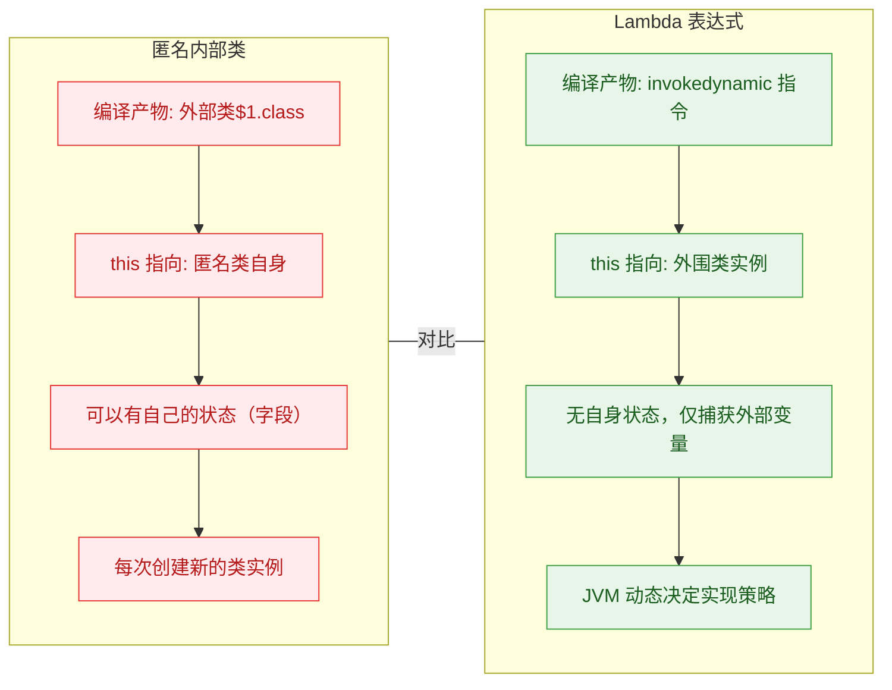

核心区别总结：

- `this` 语义不同：Lambda 中的 `this` 指向外围类，匿名内部类中的 `this` 指向自身。
- 编译方式不同：匿名内部类会生成额外的 `.class` 文件；Lambda 使用 `invokedynamic` 字节码指令，由 JVM 在运行时通过 `LambdaMetafactory` 动态生成实现类，更轻量。
- 变量遮蔽（Variable Shadowing）：匿名内部类可以定义与外部同名的变量；Lambda 不行，因为 Lambda 体与外围方法共享同一个作用域。

### 变量捕获与 Effectively Final

Lambda 可以访问外部的局部变量，但有一个重要限制——被捕获的变量必须是 `final` 或 **effectively final**（事实上不可变的，即声明后从未被重新赋值）：

```java
public class VariableCaptureDemo {
    public static void main(String[] args) {
        // effectively final：声明后没有再被修改过
        String greeting = "Hello";

        // 可变变量
        int counter = 0;

        // ✅ 合法：greeting 是 effectively final
        Runnable r1 = () -> System.out.println(greeting + ", Lambda!");

        // ❌ 编译错误：counter 在后面被修改了，不再是 effectively final
        // Runnable r2 = () -> System.out.println(counter);

        counter++; // 这一行导致 counter 不再是 effectively final

        r1.run(); // 输出: Hello, Lambda!

        // 如果确实需要在 Lambda 中使用可变状态，可以用数组或 AtomicInteger 包装
        int[] mutableCounter = {0}; // 数组引用本身是 effectively final
        Runnable r3 = () -> {
            mutableCounter[0]++; // 修改的是数组元素，不是数组引用
            System.out.println("计数: " + mutableCounter[0]);
        };
        r3.run(); // 输出: 计数: 1
        r3.run(); // 输出: 计数: 2
    }
}
```

为什么有这个限制？因为 Lambda 捕获的是变量的值的副本（对于基本类型）或引用的副本（对于对象类型），如果允许外部修改变量，Lambda 内部看到的值就可能与外部不一致，在多线程场景下尤其危险。这是 Java 为了保证线程安全和语义清晰而做出的设计选择。

---

**📝 练习题**

以下哪个接口是合法的函数式接口？

A. 
```java
@FunctionalInterface
interface A {
    void doA();
    void doB();
}
```

B. 
```java
@FunctionalInterface
interface B {
    void execute();
    default void log() { System.out.println("log"); }
    static void info() { System.out.println("info"); }
}
```

C. 
```java
@FunctionalInterface
interface C {
    void run();
    String toString();
    boolean equals(Object o);
    default void help() {}
}
```

D. B 和 C 都是


**【答案】** D

**【解析】** 函数式接口要求有且仅有一个抽象方法。选项 A 有两个抽象方法（`doA` 和 `doB`），违反 SAM 规则，编译报错。选项 B 只有一个抽象方法 `execute()`，`log()` 是 default 方法，`info()` 是 static 方法，都不计入 SAM 计数，合法。选项 C 只有一个抽象方法 `run()`，`toString()` 和 `equals(Object)` 是 `java.lang.Object` 的公共方法，不计入 SAM 计数，`help()` 是 default 方法也不计入，合法。因此 B 和 C 都是合法的函数式接口，答案选 D。

---

## 方法引用 ⭐（四种形式）

方法引用（Method Reference）是 Lambda 表达式的一种"语法糖"——当你的 Lambda 体**仅仅是调用一个已有方法**时，可以用更简洁的 `::` 符号直接指向那个方法，省去参数传递的样板代码。

编译器会根据上下文的函数式接口签名，自动推断参数类型和返回值，将方法引用"展开"为等价的 Lambda。本质上，方法引用并没有引入新能力，它做的事情和 Lambda 完全一样，只是让代码**更短、意图更明确**。

方法引用共有四种形式，我们先用一张总览图建立全局印象，再逐一深入。

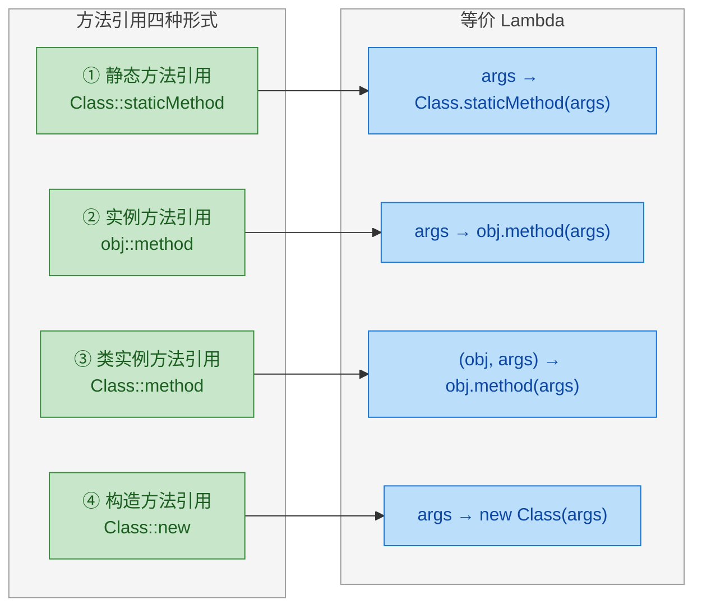

理解方法引用的关键在于一个问题：**谁来提供调用目标（receiver）？** 静态方法不需要 receiver；实例方法引用在创建时就绑定了 receiver；类实例方法引用则把 receiver 推迟到调用时，由第一个参数充当。把握住这条线索，四种形式就不会混淆。

---

### 静态方法引用（Class::staticMethod）

静态方法引用是最直观的一种形式。静态方法属于类本身，不依赖任何对象实例，因此引用时只需要 `类名::方法名`。

编译器的匹配规则非常简单：函数式接口的抽象方法接收什么参数、返回什么类型，被引用的静态方法就必须具有**完全一致**的签名（参数列表和返回类型兼容即可）。

```java
// ========== 示例 1：基础类型转换 ==========

// Lambda 写法：接收一个 String，返回一个 Integer
// Function<String, Integer> parser = (String s) -> Integer.parseInt(s);

// 方法引用写法：直接指向 Integer 类的静态方法 parseInt
// 编译器自动推断：参数 s 传给 parseInt，返回值就是 parseInt 的返回值
Function<String, Integer> parser = Integer::parseInt;

// 调用 apply 时，实际执行的就是 Integer.parseInt("42")
int result = parser.apply("42"); // result = 42
```

我们来看一个更贴近实际开发的例子——在集合操作中使用静态方法引用：

```java
import java.util.Arrays;
import java.util.List;
import java.util.stream.Collectors;

public class StaticMethodRefDemo {

    // 自定义的静态工具方法：判断一个数是否为偶数
    public static boolean isEven(int number) {
        return number % 2 == 0; // 能被 2 整除即为偶数
    }

    // 自定义的静态工具方法：将数字翻倍
    public static int doubleIt(int number) {
        return number * 2; // 简单地乘以 2
    }

    public static void main(String[] args) {
        List<Integer> numbers = Arrays.asList(1, 2, 3, 4, 5, 6, 7, 8);

        List<Integer> result = numbers.stream()
                // filter 需要 Predicate<Integer>，即 (Integer) -> boolean
                // isEven 签名：(int) -> boolean，自动拆箱后完全匹配
                .filter(StaticMethodRefDemo::isEven)
                // map 需要 Function<Integer, Integer>，即 (Integer) -> Integer
                // doubleIt 签名：(int) -> int，自动装拆箱后匹配
                .map(StaticMethodRefDemo::doubleIt)
                // 收集为 List
                .collect(Collectors.toList());

        // 输出：[4, 8, 12, 16]
        // 过程：筛出偶数 [2,4,6,8] → 各自翻倍 [4,8,12,16]
        System.out.println(result);
    }
}
```

再看一个常见场景——排序时引用 `Comparator` 工具方法：

```java
import java.util.Arrays;
import java.util.Comparator;
import java.util.List;

public class SortWithStaticRef {
    public static void main(String[] args) {
        List<String> names = Arrays.asList("Charlie", "Alice", "Bob", "David");

        // String::compareToIgnoreCase 其实是"类实例方法引用"（第三种形式）
        // 这里我们用一个自定义静态方法来演示"静态方法引用"做排序

        // 按字符串长度排序的静态方法
        // 签名与 Comparator<String> 的 compare(String, String) -> int 一致
        // names.sort(SortWithStaticRef::compareByLength);

        // 但更常见的做法是用 Comparator.comparingInt 这个静态工厂方法
        // comparingInt 接收 ToIntFunction<String>，即 (String) -> int
        // String::length 是"类实例方法引用"，这里先感受一下混合使用
        names.sort(Comparator.comparingInt(String::length));

        // 输出：[Bob, Alice, David, Charlie]
        System.out.println(names);
    }

    // 自定义的静态比较方法
    public static int compareByLength(String a, String b) {
        return Integer.compare(a.length(), b.length()); // 按长度升序
    }
}
```

静态方法引用的内部匹配过程可以用下面的示意图来理解：

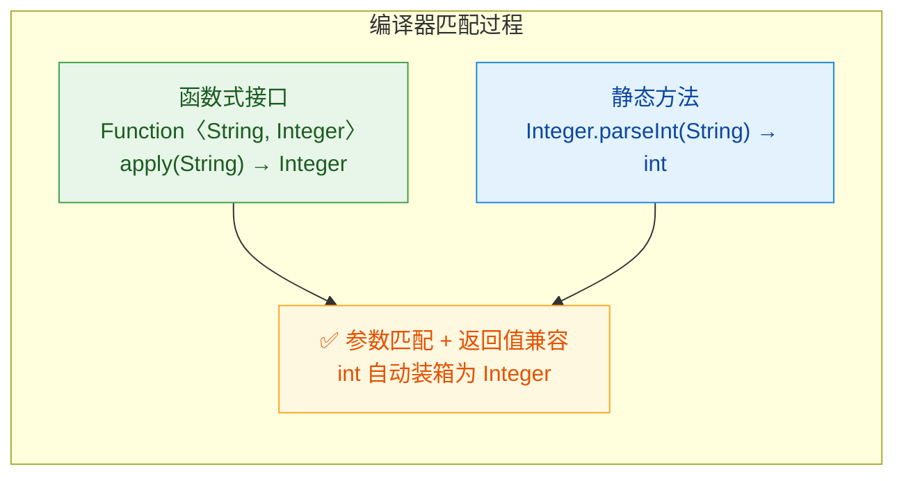

总结一下静态方法引用的要点：

- 语法：`ClassName::staticMethodName`
- 不需要对象实例，直接通过类名引用
- 函数式接口的参数**全部**传递给静态方法（参数数量和类型必须兼容）
- 最常见的场景：工具类方法（`Integer::parseInt`、`Math::abs`、`Collections::sort`）、自定义的 `static` 辅助方法

---

### 实例方法引用（obj::method）

实例方法引用与静态方法引用的核心区别在于：**调用目标（receiver）在引用创建时就已经绑定了**。你先有一个具体的对象 `obj`，然后通过 `obj::methodName` 把这个对象的某个实例方法"捕获"下来。

这意味着方法引用内部会持有对 `obj` 的引用——这和 Lambda 捕获外部变量的机制是一样的。函数式接口的参数会直接作为被引用方法的参数传入，而 receiver 已经确定，不需要再从参数中提供。

```java
// ========== 基础示例 ==========

// 创建一个具体的 String 对象
String prefix = "Hello, ";

// Lambda 写法：
// Function<String, String> greeter = (name) -> prefix.concat(name);

// 实例方法引用写法：prefix 这个对象在此刻被"捕获"
// concat 是 String 的实例方法，签名：(String) -> String
// 与 Function<String, String> 的 apply(String) -> String 完全匹配
Function<String, String> greeter = prefix::concat;

// 调用时，实际执行的是 "Hello, ".concat("World")
String result = greeter.apply("World"); // result = "Hello, World"
```

来看一个更完整的例子，体会实例方法引用在实际开发中的用法：

```java
import java.util.Arrays;
import java.util.List;
import java.util.function.Consumer;
import java.util.function.Predicate;

public class InstanceMethodRefDemo {

    public static void main(String[] args) {

        // ========== 场景 1：用 System.out 的实例方法 println ==========
        // System.out 是 PrintStream 类型的一个具体对象实例
        // println 是 PrintStream 的实例方法
        // Consumer<String> 需要 (String) -> void，println(String) 正好匹配
        List<String> languages = Arrays.asList("Java", "Kotlin", "Scala");

        // Lambda 写法：languages.forEach(lang -> System.out.println(lang));
        // 实例方法引用：System.out 是 receiver，println 是方法
        languages.forEach(System.out::println);
        // 输出：
        // Java
        // Kotlin
        // Scala


        // ========== 场景 2：自定义对象的实例方法 ==========
        StringChecker checker = new StringChecker("Java");

        List<String> words = Arrays.asList("Java", "Python", "Java", "Go", "Java");

        // checker::matches 捕获了 checker 对象
        // Predicate<String> 需要 (String) -> boolean
        // matches 签名：(String) -> boolean，完全匹配
        long count = words.stream()
                .filter(checker::matches) // 等价于 word -> checker.matches(word)
                .count();

        // 输出：3（"Java" 出现了 3 次）
        System.out.println("匹配次数: " + count);


        // ========== 场景 3：在不同上下文中复用同一个方法引用 ==========
        StringBuilder logger = new StringBuilder();

        // logger::append 捕获了 logger 对象
        // Consumer<String> 需要 (String) -> void
        // 但 append 返回 StringBuilder，不是 void？
        // 没关系！Java 允许忽略返回值，签名依然兼容
        Consumer<String> logAction = logger::append;

        logAction.accept("Step1 ");  // logger 内容变为 "Step1 "
        logAction.accept("Step2 ");  // logger 内容变为 "Step1 Step2 "
        logAction.accept("Step3");   // logger 内容变为 "Step1 Step2 Step3"

        System.out.println(logger.toString()); // 输出：Step1 Step2 Step3
    }
}

// 辅助类：封装字符串匹配逻辑
class StringChecker {
    private final String target; // 要匹配的目标字符串

    // 构造器：初始化目标字符串
    public StringChecker(String target) {
        this.target = target;
    }

    // 实例方法：判断传入的字符串是否与目标相等
    public boolean matches(String input) {
        return target.equals(input); // 使用 equals 进行内容比较
    }
}
```

实例方法引用有一个容易被忽视的细节：**捕获时机**。方法引用创建的那一刻，`obj` 的引用就被"冻结"了。如果 `obj` 是一个可变对象，后续对它的修改会影响方法引用的行为（因为引用指向的是同一个对象）；但如果你把变量重新指向另一个对象，方法引用不会跟着变。

```java
import java.util.function.Supplier;

public class CaptureTimingDemo {
    public static void main(String[] args) {

        StringBuilder sb = new StringBuilder("Hello");

        // 此刻捕获的是 sb 指向的那个 StringBuilder 对象
        // Supplier<String> 需要 () -> String
        // toString 签名：() -> String，完全匹配
        Supplier<String> supplier = sb::toString;

        // 修改同一个对象的内容
        sb.append(" World");

        // supplier 仍然引用同一个 StringBuilder 对象
        // 所以能看到修改后的内容
        System.out.println(supplier.get()); // 输出：Hello World

        // 但如果我们让 sb 指向一个新对象...
        sb = new StringBuilder("Completely New");

        // supplier 捕获的还是旧对象（"Hello World" 那个）
        // 变量 sb 的重新赋值不影响已捕获的引用
        System.out.println(supplier.get()); // 输出：Hello World
    }
}
```

下面这张图展示了实例方法引用的绑定机制：

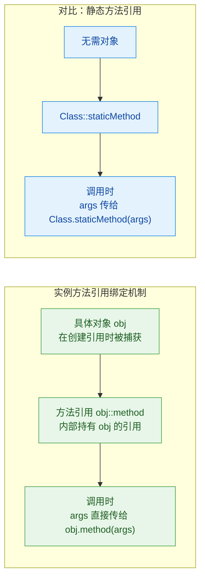

最后，把静态方法引用和实例方法引用做一个对比，帮助巩固理解：

```java
import java.util.function.Function;
import java.util.function.UnaryOperator;

public class ComparisonDemo {
    public static void main(String[] args) {

        // ===== 静态方法引用 =====
        // String.valueOf 是静态方法，签名：(int) -> String
        // Function<Integer, String> 的 apply(Integer) -> String 与之匹配
        Function<Integer, String> staticRef = String::valueOf;
        System.out.println(staticRef.apply(42)); // "42"

        // ===== 实例方法引用 =====
        String base = "HELLO";
        // base 是具体对象，toLowerCase 是实例方法，签名：() -> String
        // 但这里没有参数？用 Supplier 更合适
        // Supplier<String> instanceRef = base::toLowerCase;

        // 换一个有参数的例子：
        // replace 签名：(char, char) -> String
        // 但标准函数式接口没有接收两个 char 的，我们用自定义的
        // 更实际的例子：
        String prefix2 = "[LOG] ";
        // concat 签名：(String) -> String
        // UnaryOperator<String> 继承 Function<String, String>
        UnaryOperator<String> instanceRef = prefix2::concat;
        System.out.println(instanceRef.apply("Server started")); // "[LOG] Server started"

        // 关键区别：
        // staticRef 不绑定任何对象，每次调用都是 String.valueOf(arg)
        // instanceRef 绑定了 prefix2 对象，每次调用都是 "[LOG] ".concat(arg)
    }
}
```

实例方法引用的核心要点：

- 语法：`objectInstance::instanceMethodName`
- 创建时就绑定了具体的对象实例（receiver 已确定）
- 函数式接口的参数直接作为方法参数传入（不需要再提供 receiver）
- 最常见的场景：`System.out::println`、自定义服务对象的方法、已有工具实例的方法
- 注意：捕获的是对象引用，不是对象快照——对象内部状态的变化会被"看到"

---

**📝 练习题**

以下代码的输出结果是什么？

```java
import java.util.function.Function;
import java.util.function.UnaryOperator;

public class Quiz {
    public static void main(String[] args) {
        String s = "hello";
        UnaryOperator<String> op = s::concat;
        s = "world";
        System.out.println(op.apply(" java"));
    }
}
```

A. world java


B. hello java


C. hello world java


D. 编译错误，因为 s 被重新赋值后方法引用失效


**【答案】** B

**【解析】** `s::concat` 在创建方法引用的那一刻，捕获的是 `s` 当前指向的 String 对象 `"hello"`。之后 `s = "world"` 只是让变量 `s` 指向了一个新的 String 对象，但方法引用内部持有的仍然是最初那个 `"hello"` 对象的引用。因此 `op.apply(" java")` 实际执行的是 `"hello".concat(" java")`，结果为 `"hello java"`。这道题考察的正是实例方法引用的**捕获时机**——引用创建时绑定对象，而非变量。同时，String 是不可变对象（immutable），所以不存在"对象内部状态被修改"的情况，捕获后的行为完全可预测。


---

我来继续输出方法引用的后两种形式。

---

### 类实例方法引用（Class::method）

这是方法引用中最容易让人困惑的一种形式，也是面试中的高频考点。它的语法和静态方法引用一模一样——都是 `ClassName::methodName`，但底层的绑定逻辑完全不同。

理解它的关键在于一句话：Lambda 参数列表中的第一个参数，会成为方法的调用者（receiver），剩余参数才传给方法本身。

我们先看一个最直观的例子：

```java
// ===== 类实例方法引用：String::length =====

// Lambda 写法
// 这里 s 是 Lambda 的参数，同时也是 length() 的调用者
Function<String, Integer> lambdaLen = (String s) -> s.length();

// 方法引用写法
// String 是类名，length 是实例方法
// 编译器自动将 Function<String, Integer> 的参数 s 绑定为 length() 的调用者
Function<String, Integer> refLen = String::length;

// 两种写法完全等价
System.out.println(lambdaLen.apply("Hello")); // 5
System.out.println(refLen.apply("Hello"));    // 5
```

你可能会问：`String::length` 看起来和静态方法引用 `Integer::parseInt` 格式一样，编译器怎么区分？答案是：编译器会检查 `length()` 到底是静态方法还是实例方法。`length()` 是实例方法，所以编译器知道这是"类实例方法引用"，需要一个对象来调用它，而这个对象就从函数式接口的第一个参数中取。

下面用一张图来对比静态方法引用和类实例方法引用的参数映射差异：

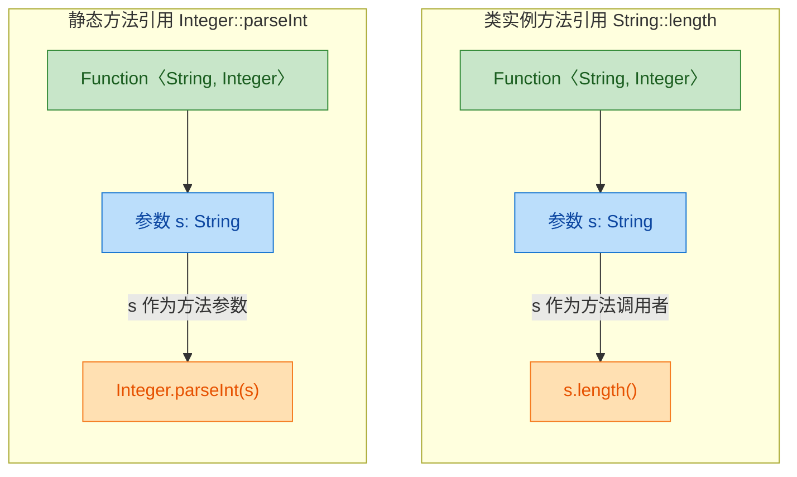

核心区别一目了然：静态方法引用中，参数被"传进"方法；类实例方法引用中，第一个参数被"提升"为方法的调用者。

当函数式接口有两个参数时，这种映射关系更加明显：

```java
// ===== 双参数场景：String::compareTo =====

// compareTo 是 String 的实例方法，签名为 int compareTo(String anotherString)
// 它需要一个调用者 + 一个参数，总共"消耗"两个 String

// Lambda 写法
// a 是调用者，b 是 compareTo 的参数
BiFunction<String, String, Integer> lambdaCmp = (a, b) -> a.compareTo(b);

// 方法引用写法
// 编译器自动将第一个参数 a 绑定为调用者，第二个参数 b 传入 compareTo
BiFunction<String, String, Integer> refCmp = String::compareTo;

System.out.println(lambdaCmp.apply("apple", "banana")); // 负数，因为 "apple" < "banana"
System.out.println(refCmp.apply("apple", "banana"));    // 同上
```

参数映射规则可以总结为：

```java
// ===== 类实例方法引用的参数映射公式 =====

// 假设函数式接口的抽象方法签名为：
// R apply(T arg0, U arg1, V arg2, ...)

// 类实例方法引用 T::methodName 等价于：
// (T arg0, U arg1, V arg2, ...) -> arg0.methodName(arg1, arg2, ...)
//   ↑ 第一个参数变成调用者          ↑ 剩余参数传给方法

// 所以参数数量关系为：
// 函数式接口参数个数 = 1（调用者） + 实例方法的参数个数
```

在实际开发中，类实例方法引用最常出现在排序和 Stream 操作里：

```java
import java.util.Arrays;
import java.util.List;

public class ClassInstanceMethodRefDemo {
    public static void main(String[] args) {

        // ===== 场景一：排序 =====
        List<String> names = Arrays.asList("Charlie", "Alice", "Bob");

        // Lambda 写法
        // Comparator<String> 的 compare(String a, String b)
        // a 是调用者，b 是参数
        names.sort((a, b) -> a.compareToIgnoreCase(b));

        // 方法引用写法 —— 简洁得多
        names.sort(String::compareToIgnoreCase);
        // 排序结果：[Alice, Bob, Charlie]
        System.out.println(names);


        // ===== 场景二：Stream 中的 map =====
        List<String> words = Arrays.asList("hello", "world", "java");

        // 将每个字符串转为大写
        // Lambda: s -> s.toUpperCase()
        // 方法引用: String::toUpperCase
        List<String> upper = words.stream()
                .map(String::toUpperCase) // 第一个参数（流中的元素）成为 toUpperCase() 的调用者
                .toList();
        // 结果：[HELLO, WORLD, JAVA]
        System.out.println(upper);


        // ===== 场景三：判断字符串是否以某前缀开头 =====
        // startsWith(String prefix) 是实例方法，需要一个调用者 + 一个参数
        // 所以对应 BiFunction 或 BiPredicate
        // BiPredicate<String, String> 的 test(String a, String b)
        // 等价于 (a, b) -> a.startsWith(b)
        java.util.function.BiPredicate<String, String> startsWith = String::startsWith;

        System.out.println(startsWith.test("JavaScript", "Java")); // true
        System.out.println(startsWith.test("Python", "Java"));     // false
    }
}
```

最后，来看一个容易踩坑的对比，帮你彻底区分"实例方法引用"和"类实例方法引用"：

```java
// ===== 易混淆对比 =====

String greeting = "Hello";

// 1. 实例方法引用（obj::method）
//    greeting 是一个具体的对象实例，concat 绑定到这个对象上
//    等价于 (String s) -> greeting.concat(s)
//    调用者已经确定了，参数 s 传给 concat
Function<String, String> bound = greeting::concat;
System.out.println(bound.apply(" World")); // "Hello World"

// 2. 类实例方法引用（Class::method）
//    String 是类名，concat 没有绑定到任何对象
//    等价于 (String a, String b) -> a.concat(b)
//    第一个参数 a 成为调用者，第二个参数 b 传给 concat
BiFunction<String, String, String> unbound = String::concat;
System.out.println(unbound.apply("Hello", " World")); // "Hello World"

// 两者结果相同，但参数个数不同！
// bound 只需要 1 个参数（调用者已绑定）
// unbound 需要 2 个参数（调用者从第一个参数取）
```

```java
// ===== 记忆口诀 =====
// obj::method  → 调用者已锁定，参数少一个（bound reference）
// Class::method → 调用者从参数取，参数多一个（unbound reference）
```

---

### 构造方法引用（Class::new）

构造方法引用是方法引用的第四种形式，语法为 `ClassName::new`。它本质上是把 `new ClassName(...)` 这个动作包装成一个函数式接口的实现。

最基本的用法：

```java
// ===== 构造方法引用基础 =====

// Lambda 写法：调用 String 的无参构造器
Supplier<String> lambdaNew = () -> new String();

// 构造方法引用写法
// 编译器看到 String::new，会根据函数式接口的签名选择匹配的构造器
// Supplier<String> 的 get() 无参数 → 匹配 String 的无参构造器
Supplier<String> refNew = String::new;

// 两者等价
System.out.println(lambdaNew.get()); // ""（空字符串）
System.out.println(refNew.get());    // ""（空字符串）
```

构造方法引用的强大之处在于：编译器会根据函数式接口的参数签名，自动匹配对应的构造器重载版本。这一点和普通方法引用选择重载方法的逻辑一致。

```java
// ===== 根据函数式接口自动匹配不同构造器 =====

// 1. 无参构造器
//    Supplier<T> 的 get() 没有参数 → 匹配 StringBuilder()
Supplier<StringBuilder> noArg = StringBuilder::new;
// 等价于 () -> new StringBuilder()
System.out.println(noArg.get().capacity()); // 16（默认容量）

// 2. 单参数构造器
//    Function<T, R> 的 apply(T t) 有一个参数 → 匹配 StringBuilder(int capacity)
Function<Integer, StringBuilder> oneArg = StringBuilder::new;
// 等价于 (Integer capacity) -> new StringBuilder(capacity)
System.out.println(oneArg.apply(64).capacity()); // 64

// 3. 单参数构造器（不同类型）
//    Function<String, StringBuilder> → 匹配 StringBuilder(String str)
Function<String, StringBuilder> fromStr = StringBuilder::new;
// 等价于 (String s) -> new StringBuilder(s)
System.out.println(fromStr.apply("Hello")); // "Hello"

// 4. 双参数场景需要 BiFunction
//    假设有一个类 Point(int x, int y)
//    BiFunction<Integer, Integer, Point> → 匹配 Point(int, int)
```

下面用一个自定义类来完整演示构造方法引用如何与不同函数式接口配合：

```java
// ===== 自定义类演示 =====

class Student {
    private String name; // 学生姓名
    private int age;     // 学生年龄

    // 无参构造器
    public Student() {
        this.name = "Unknown";
        this.age = 0;
    }

    // 单参数构造器
    public Student(String name) {
        this.name = name;
        this.age = 0;
    }

    // 双参数构造器
    public Student(String name, int age) {
        this.name = name;
        this.age = age;
    }

    @Override
    public String toString() {
        return "Student{name='" + name + "', age=" + age + "}";
    }
}
```

```java
// ===== 使用构造方法引用创建 Student =====

import java.util.function.*;

public class ConstructorRefDemo {
    public static void main(String[] args) {

        // 匹配无参构造器 Student()
        Supplier<Student> s0 = Student::new;
        System.out.println(s0.get());
        // 输出: Student{name='Unknown', age=0}

        // 匹配单参数构造器 Student(String)
        Function<String, Student> s1 = Student::new;
        System.out.println(s1.apply("Alice"));
        // 输出: Student{name='Alice', age=0}

        // 匹配双参数构造器 Student(String, int)
        BiFunction<String, Integer, Student> s2 = Student::new;
        System.out.println(s2.apply("Bob", 20));
        // 输出: Student{name='Bob', age=20}
    }
}
```

构造方法引用的匹配流程可以用下图表示：

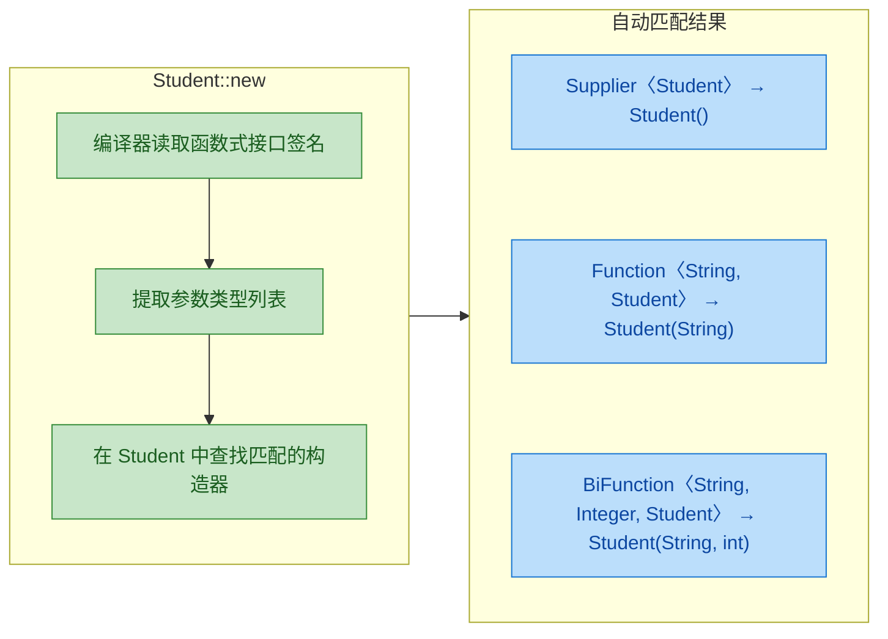

构造方法引用在实际开发中最经典的应用场景是"工厂模式"和"集合转换"：

```java
import java.util.*;
import java.util.stream.*;

public class ConstructorRefPractical {
    public static void main(String[] args) {

        // ===== 场景一：Stream 中批量创建对象 =====
        List<String> nameList = Arrays.asList("Alice", "Bob", "Charlie");

        // 将名字列表转换为 Student 对象列表
        // map(Student::new) 等价于 map(name -> new Student(name))
        // 这里自动匹配 Student(String) 构造器
        List<Student> students = nameList.stream()
                .map(Student::new)       // 构造方法引用，简洁优雅
                .collect(Collectors.toList());
        // 结果: [Student{name='Alice'...}, Student{name='Bob'...}, ...]
        System.out.println(students);


        // ===== 场景二：作为工厂函数传递 =====
        // 定义一个通用的创建方法，接受一个"工厂"参数
        Student s = createWithFactory(Student::new, "Diana");
        System.out.println(s); // Student{name='Diana', age=0}


        // ===== 场景三：创建数组 =====
        // 数组构造方法引用的特殊语法：Type[]::new
        // 等价于 (int size) -> new String[size]
        // IntFunction<String[]> 的 apply(int) 返回 String[]
        String[] arr = nameList.stream()
                .toArray(String[]::new); // 数组构造方法引用
        // 结果: ["Alice", "Bob", "Charlie"]
        System.out.println(Arrays.toString(arr));
    }

    // 通用工厂方法：接受一个 Function 作为"构造器"
    static Student createWithFactory(Function<String, Student> factory, String name) {
        return factory.apply(name); // 内部调用 factory，实际执行的是 new Student(name)
    }
}
```

数组构造方法引用 `Type[]::new` 值得单独说明，因为它在 Stream 的 `toArray()` 中几乎是标配写法：

```java
// ===== 数组构造方法引用详解 =====

// Stream 的 toArray() 方法签名：
// <A> A[] toArray(IntFunction<A[]> generator)
// 它需要一个 IntFunction，接收数组长度，返回对应类型的数组

// Lambda 写法
String[] a1 = Stream.of("a", "b", "c").toArray(size -> new String[size]);

// 数组构造方法引用 —— 更简洁
String[] a2 = Stream.of("a", "b", "c").toArray(String[]::new);

// 对于基本类型包装类也一样
Integer[] nums = Stream.of(1, 2, 3).toArray(Integer[]::new);
```

最后，整理一下四种方法引用的完整对照表：

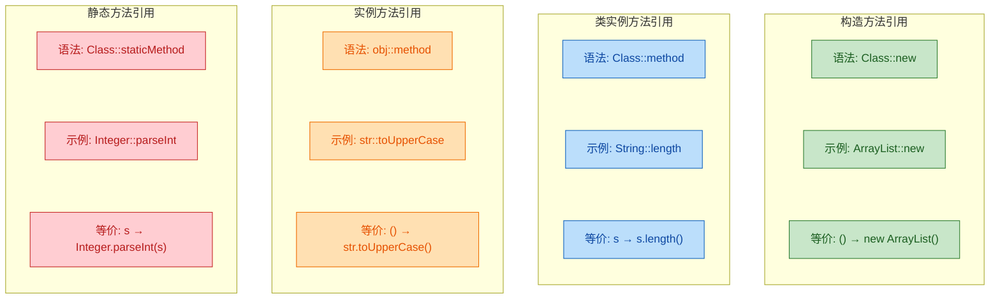

```java
// ===== 四种方法引用速查 =====
// 1. Class::staticMethod   → 静态方法引用    → 参数全部传给方法
// 2. obj::method           → 实例方法引用    → 调用者已绑定，参数传给方法
// 3. Class::method         → 类实例方法引用  → 第一个参数当调用者，其余传给方法
// 4. Class::new            → 构造方法引用    → 参数传给匹配的构造器
```

---

**📝 练习题**

以下代码能否通过编译？如果能，输出是什么？

```java
import java.util.function.*;

public class Quiz {
    public static void main(String[] args) {
        BiFunction<String, String, String> fn = String::concat;
        String result = fn.apply("Hello, ", "World!");
        System.out.println(result);
    }
}
```

A. 编译错误，因为 `concat` 是实例方法，不能用 `Class::method` 形式引用


B. 编译通过，输出 `Hello, World!`


C. 编译通过，但运行时抛出 `NullPointerException`


D. 编译错误，因为 `BiFunction` 的参数类型与 `concat` 不匹配


**【答案】** B

**【解析】** `String::concat` 是类实例方法引用（unbound reference）。`concat` 是 `String` 的实例方法，签名为 `String concat(String str)`，它需要一个调用者和一个参数，总共消耗两个 `String`。`BiFunction<String, String, String>` 的 `apply(String a, String b)` 恰好提供两个 `String` 参数。编译器将第一个参数 `"Hello, "` 绑定为 `concat` 的调用者，第二个参数 `"World!"` 传入 `concat`，等价于 `"Hello, ".concat("World!")`，结果为 `"Hello, World!"`。选项 A 的说法是错误的——实例方法完全可以用 `Class::method` 形式引用，这正是类实例方法引用存在的意义。

---

## 核心函数式接口

Java 8 在 `java.util.function` 包下预定义了一整套函数式接口（Functional Interface），它们是 Lambda 表达式真正落地的"骨架"。你写的每一个 Lambda，最终都要"挂"到某个函数式接口上才能被编译器理解。这些接口数量不少，但最核心的只有四个：`Function`、`Consumer`、`Supplier`、`Predicate`。它们分别代表了函数世界里四种最基本的"行为模式"——有入有出、只入不出、只出不入、判断真假。掌握这四个，其余的变体（`BiFunction`、`UnaryOperator`、`IntConsumer` 等）都是它们的排列组合或特化版本。

先从全局视角看一下这四大接口的定位：

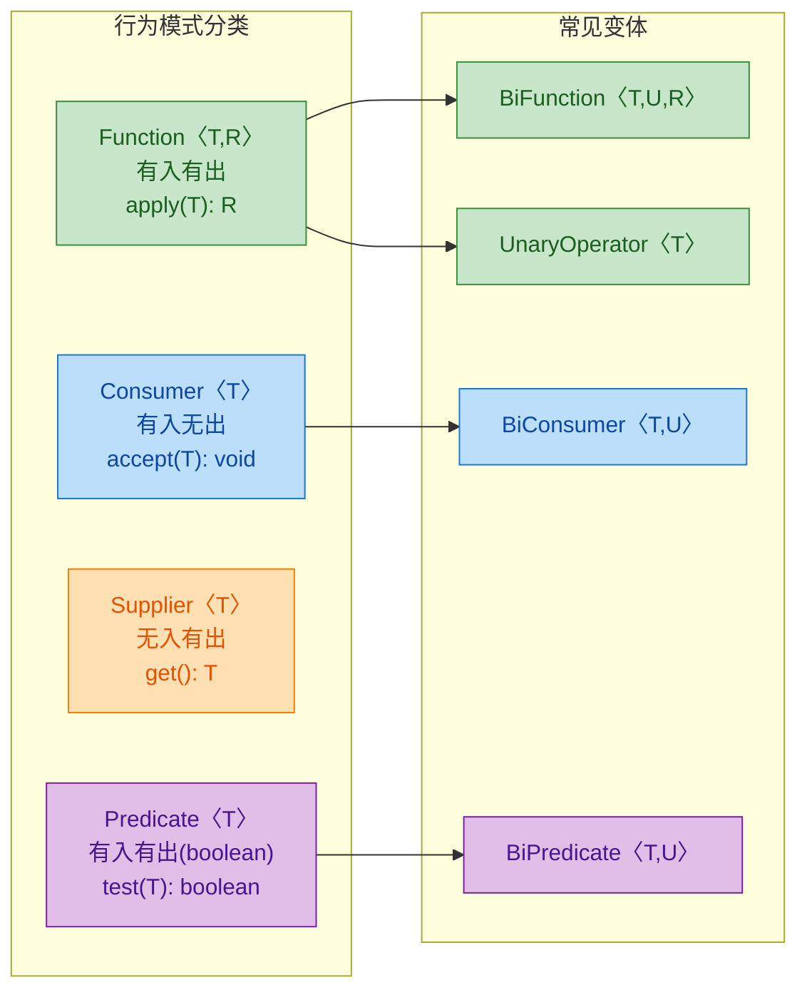

### Function〈T,R〉— 转换器（apply）

`Function<T, R>` 是最"正统"的函数抽象：接收一个 T 类型的输入，返回一个 R 类型的输出。它的核心方法是 `R apply(T t)`。你可以把它理解为数学里的 `f(x) = y`，一个纯粹的映射关系。

源码定义精简如下：

```java
@FunctionalInterface
public interface Function<T, R> {
    // 核心抽象方法：接收 T，返回 R
    R apply(T t);

    // 默认方法：先执行 before，再执行当前函数（组合）
    default <V> Function<V, R> compose(Function<? super V, ? extends T> before) {
        Objects.requireNonNull(before);
        return (V v) -> apply(before.apply(v)); // before 的输出作为当前函数的输入
    }

    // 默认方法：先执行当前函数，再执行 after（链式）
    default <V> Function<T, V> andThen(Function<? super R, ? extends V> after) {
        Objects.requireNonNull(after);
        return (T t) -> after.apply(apply(t)); // 当前函数的输出作为 after 的输入
    }

    // 静态方法：返回一个"恒等函数"，输入什么就输出什么
    static <T> Function<T, T> identity() {
        return t -> t; // 等价于 x -> x
    }
}
```

来看实际使用场景：

```java
import java.util.function.Function;

public class FunctionDemo {
    public static void main(String[] args) {

        // ========== 场景1：基本类型转换 ==========
        // 将字符串转换为其长度（String → Integer）
        Function<String, Integer> strToLength = str -> str.length();
        // 调用 apply 执行转换
        int len = strToLength.apply("Lambda"); // 结果：6
        System.out.println("长度: " + len);    // 输出: 长度: 6

        // ========== 场景2：用方法引用简化 ==========
        // String::length 等价于 str -> str.length()
        Function<String, Integer> strToLength2 = String::length;
        System.out.println(strToLength2.apply("Java")); // 输出: 4

        // ========== 场景3：链式调用 andThen ==========
        // 第一步：字符串 → 长度
        Function<String, Integer> length = String::length;
        // 第二步：长度 → 乘以2
        Function<Integer, Integer> doubleIt = n -> n * 2;
        // 组合：先求长度，再乘以2
        Function<String, Integer> lengthThenDouble = length.andThen(doubleIt);
        System.out.println(lengthThenDouble.apply("Hello")); // 5 * 2 = 10

        // ========== 场景4：compose（反向组合）==========
        // compose 是 andThen 的"镜像"：先执行参数函数，再执行自己
        Function<String, String> trim = String::trim;           // 去空格
        Function<String, String> toUpper = String::toUpperCase; // 转大写
        // toUpper.compose(trim) 等价于 trim.andThen(toUpper)
        Function<String, String> trimThenUpper = toUpper.compose(trim);
        System.out.println(trimThenUpper.apply("  hello  ")); // 输出: HELLO

        // ========== 场景5：identity 恒等函数 ==========
        // 常用于需要传入 Function 但不想做任何转换的场景
        Function<String, String> noOp = Function.identity();
        System.out.println(noOp.apply("原样返回")); // 输出: 原样返回
    }
}
```

`Function` 在 Stream API 中最常见的搭档是 `map()` 方法：

```java
import java.util.List;
import java.util.function.Function;
import java.util.stream.Collectors;

public class FunctionInStream {
    public static void main(String[] args) {
        List<String> names = List.of("alice", "bob", "charlie");

        // map() 的参数就是 Function<T, R>
        // 这里 T = String, R = String
        List<String> upperNames = names.stream()
                .map(String::toUpperCase)  // Function<String, String>
                .collect(Collectors.toList());
        // 结果: [ALICE, BOB, CHARLIE]
        System.out.println(upperNames);

        // 也可以传入自定义的 Function
        Function<String, String> addGreeting = name -> "Hello, " + name + "!";
        List<String> greetings = names.stream()
                .map(String::toUpperCase)   // 先转大写
                .map(addGreeting)           // 再加问候语
                .collect(Collectors.toList());
        // 结果: [Hello, ALICE!, Hello, BOB!, Hello, CHARLIE!]
        System.out.println(greetings);
    }
}
```

`Function` 的常见变体值得了解：

```java
import java.util.function.BiFunction;
import java.util.function.UnaryOperator;
import java.util.function.IntFunction;
import java.util.function.ToIntFunction;

public class FunctionVariants {
    public static void main(String[] args) {

        // BiFunction<T, U, R>：接收两个参数，返回一个结果
        // 相当于 f(x, y) = z
        BiFunction<String, Integer, String> repeat =
                (str, times) -> str.repeat(times); // 将字符串重复 n 次
        System.out.println(repeat.apply("Ha", 3)); // 输出: HaHaHa

        // UnaryOperator<T>：输入输出类型相同的 Function
        // 本质上是 Function<T, T> 的特化
        UnaryOperator<String> shout = s -> s + "!!!";
        System.out.println(shout.apply("Java")); // 输出: Java!!!

        // IntFunction<R>：接收 int 基本类型，避免自动装箱
        IntFunction<String> intToStr = num -> "Number: " + num;
        System.out.println(intToStr.apply(42)); // 输出: Number: 42

        // ToIntFunction<T>：返回 int 基本类型，避免自动装箱
        ToIntFunction<String> parseLen = String::length;
        int result = parseLen.applyAsInt("Lambda"); // 注意方法名是 applyAsInt
        System.out.println(result); // 输出: 6
    }
}
```

用一张表快速对比 `Function` 家族：

| 接口 | 输入 | 输出 | 核心方法 | 典型场景 |
|---|---|---|---|---|
| `Function<T,R>` | T | R | `apply(T)` | 类型转换、数据映射 |
| `BiFunction<T,U,R>` | T, U | R | `apply(T,U)` | 两参数计算 |
| `UnaryOperator<T>` | T | T（同类型） | `apply(T)` | 原地修改/格式化 |
| `BinaryOperator<T>` | T, T | T（同类型） | `apply(T,T)` | 归约（reduce） |
| `IntFunction<R>` | int | R | `apply(int)` | 避免装箱的转换 |
| `ToIntFunction<T>` | T | int | `applyAsInt(T)` | 提取数值属性 |

一个更贴近实战的例子——用 `Function` 构建通用的数据转换管道（Pipeline Pattern）：

```java
import java.util.function.Function;

public class PipelineDemo {

    // 泛型方法：接收一个值和一系列转换函数，依次执行
    @SafeVarargs
    public static <T> T pipeline(T value, Function<T, T>... steps) {
        T result = value; // 初始值
        for (Function<T, T> step : steps) {
            result = step.apply(result); // 逐步应用每个转换
        }
        return result; // 返回最终结果
    }

    public static void main(String[] args) {
        // 定义三个独立的转换步骤
        Function<String, String> trim = String::trim;           // 步骤1：去空格
        Function<String, String> lower = String::toLowerCase;   // 步骤2：转小写
        Function<String, String> addTag = s -> "[LOG] " + s;    // 步骤3：加标签

        // 通过管道依次执行
        String result = pipeline("  HELLO WORLD  ", trim, lower, addTag);
        System.out.println(result); // 输出: [LOG] hello world

        // 也可以用 andThen 实现同样效果（函数组合方式）
        Function<String, String> combined = trim.andThen(lower).andThen(addTag);
        System.out.println(combined.apply("  HELLO WORLD  ")); // 输出: [LOG] hello world
    }
}
```

数据流向可以这样理解：

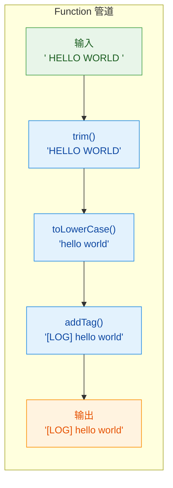

### Consumer〈T〉— 消费者（accept）

`Consumer<T>` 代表一种"只消费、不产出"的行为：接收一个 T 类型的参数，执行某种操作（通常是副作用，side effect），但不返回任何值（`void`）。你可以把它想象成一个"黑洞"——数据进去了，但不会有东西出来。

典型的副作用操作包括：打印日志、写入数据库、发送消息、修改外部状态等。

源码定义：

```java
@FunctionalInterface
public interface Consumer<T> {
    // 核心抽象方法：接收 T，无返回值
    void accept(T t);

    // 默认方法：先执行当前 Consumer，再执行 after
    default Consumer<T> andThen(Consumer<? super T> after) {
        Objects.requireNonNull(after);
        // 对同一个输入 t，依次执行两个 Consumer
        return (T t) -> {
            accept(t);       // 先执行自己
            after.accept(t); // 再执行 after
        };
    }
}
```

注意 `Consumer` 只有 `andThen`，没有 `compose`。原因很简单：`Consumer` 没有返回值，所以不可能把一个 Consumer 的"输出"喂给另一个函数作为输入——链条只能是"对同一个输入依次执行多个操作"。

基础用法：

```java
import java.util.function.Consumer;
import java.util.List;

public class ConsumerDemo {
    public static void main(String[] args) {

        // ========== 场景1：最简单的消费——打印 ==========
        Consumer<String> printer = s -> System.out.println(s);
        printer.accept("Hello Consumer"); // 输出: Hello Consumer

        // 用方法引用更简洁
        Consumer<String> printer2 = System.out::println;
        printer2.accept("方法引用版本"); // 输出: 方法引用版本

        // ========== 场景2：andThen 链式消费 ==========
        // 对同一个输入执行多个操作
        Consumer<String> log = s -> System.out.println("[LOG] " + s);   // 记录日志
        Consumer<String> save = s -> System.out.println("[SAVE] " + s); // 模拟保存
        Consumer<String> notify = s -> System.out.println("[NOTIFY] " + s); // 模拟通知

        // 链式：对同一条消息，先记日志，再保存，再通知
        Consumer<String> fullProcess = log.andThen(save).andThen(notify);
        fullProcess.accept("用户注册成功");
        // 输出:
        // [LOG] 用户注册成功
        // [SAVE] 用户注册成功
        // [NOTIFY] 用户注册成功

        // ========== 场景3：配合 forEach 使用 ==========
        List<String> fruits = List.of("Apple", "Banana", "Cherry");
        // Iterable.forEach() 的参数就是 Consumer<T>
        fruits.forEach(System.out::println);
        // 输出:
        // Apple
        // Banana
        // Cherry

        // 自定义 Consumer 传入 forEach
        Consumer<String> fancyPrint = fruit -> System.out.println("🍎 " + fruit);
        fruits.forEach(fancyPrint);
    }
}
```

`Consumer` 在 Stream API 中的典型搭档是 `forEach()` 和 `peek()`：

```java
import java.util.List;
import java.util.stream.Collectors;

public class ConsumerInStream {
    public static void main(String[] args) {
        List<Integer> numbers = List.of(1, 2, 3, 4, 5);

        // peek() 接收 Consumer<T>，用于调试/观察中间状态
        // 注意：peek 不改变流中的元素，只是"偷看"一眼
        List<Integer> doubled = numbers.stream()
                .peek(n -> System.out.println("原始值: " + n))  // Consumer：观察原始值
                .map(n -> n * 2)                                 // Function：翻倍
                .peek(n -> System.out.println("翻倍后: " + n))  // Consumer：观察翻倍后的值
                .collect(Collectors.toList());
        // 输出交替出现：原始值: 1, 翻倍后: 2, 原始值: 2, 翻倍后: 4 ...

        System.out.println("最终结果: " + doubled); // [2, 4, 6, 8, 10]
    }
}
```

`Consumer` 的变体：

```java
import java.util.function.BiConsumer;
import java.util.function.IntConsumer;
import java.util.function.ObjIntConsumer;
import java.util.Map;
import java.util.HashMap;

public class ConsumerVariants {
    public static void main(String[] args) {

        // BiConsumer<T, U>：接收两个参数，无返回值
        // Map.forEach() 的参数就是 BiConsumer<K, V>
        Map<String, Integer> scores = new HashMap<>();
        scores.put("Alice", 95);  // 添加键值对
        scores.put("Bob", 87);    // 添加键值对
        scores.put("Charlie", 92);// 添加键值对

        // BiConsumer 接收 key 和 value 两个参数
        BiConsumer<String, Integer> printEntry =
                (name, score) -> System.out.println(name + " → " + score);
        scores.forEach(printEntry);
        // 输出:
        // Alice → 95
        // Bob → 87
        // Charlie → 92

        // IntConsumer：接收 int 基本类型，避免自动装箱
        IntConsumer printInt = n -> System.out.println("数字: " + n);
        printInt.accept(42); // 输出: 数字: 42

        // ObjIntConsumer<T>：一个对象参数 + 一个 int 参数
        ObjIntConsumer<String> repeatPrint =
                (str, times) -> {
                    for (int i = 0; i < times; i++) { // 循环打印指定次数
                        System.out.print(str + " ");
                    }
                    System.out.println(); // 换行
                };
        repeatPrint.accept("Hi", 3); // 输出: Hi Hi Hi
    }
}
```

一个实战场景——用 `Consumer` 实现灵活的事件处理/回调机制：

```java
import java.util.function.Consumer;
import java.util.ArrayList;
import java.util.List;

// 简易事件总线：用 Consumer 作为事件监听器
public class EventBus<T> {
    // 存储所有监听器（每个监听器就是一个 Consumer）
    private final List<Consumer<T>> listeners = new ArrayList<>();

    // 注册监听器
    public void on(Consumer<T> listener) {
        listeners.add(listener); // 将 Consumer 加入列表
    }

    // 触发事件：对同一个事件数据，依次调用所有监听器
    public void emit(T event) {
        for (Consumer<T> listener : listeners) {
            listener.accept(event); // 每个 Consumer 消费同一个事件
        }
    }

    public static void main(String[] args) {
        EventBus<String> bus = new EventBus<>();

        // 注册三个监听器（三个 Consumer）
        bus.on(msg -> System.out.println("[日志] " + msg));       // 监听器1：记日志
        bus.on(msg -> System.out.println("[统计] 消息长度: " + msg.length())); // 监听器2：统计
        bus.on(msg -> {                                            // 监听器3：告警判断
            if (msg.contains("error")) {
                System.out.println("[告警] 检测到错误信息!");
            }
        });

        // 触发事件
        bus.emit("用户登录成功");
        // 输出:
        // [日志] 用户登录成功
        // [统计] 消息长度: 6
        System.out.println("---");

        bus.emit("系统发生 error 异常");
        // 输出:
        // [日志] 系统发生 error 异常
        // [统计] 消息长度: 11
        // [告警] 检测到错误信息!
    }
}
```

最后，对比 `Function` 和 `Consumer` 的核心区别：

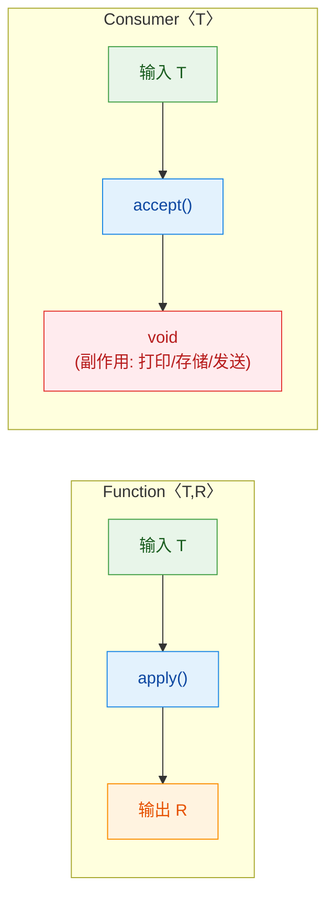

| 对比维度 | Function〈T,R〉 | Consumer〈T〉 |
|---|---|---|
| 核心方法 | `R apply(T t)` | `void accept(T t)` |
| 有无返回值 | 有（R 类型） | 无（void） |
| 典型用途 | 数据转换、映射 | 副作用操作（打印、存储） |
| Stream 搭档 | `map()`, `flatMap()` | `forEach()`, `peek()` |
| 组合方式 | `andThen` + `compose` | 仅 `andThen` |
| 设计哲学 | 纯函数（Pure Function） | 副作用（Side Effect） |


---

## 核心函数式接口（续）

### Supplier〈T〉 — 无中生有的"供给者"

`Supplier<T>` 是 Java 函数式接口家族中最简洁的一个：它不接收任何参数，只负责"凭空"返回一个值。你可以把它理解为一个**惰性工厂（Lazy Factory）**——调用它之前什么都不会发生，调用 `get()` 的那一刻才真正产出结果。

源码定义极其精简：

```java
@FunctionalInterface
public interface Supplier<T> {
    // 不接收任何参数，返回一个类型为 T 的结果
    T get();
}
```

这个接口的核心哲学是 **"延迟求值"（Lazy Evaluation）**。很多时候我们并不想在声明的那一刻就立即计算某个值，而是希望把"如何获取这个值"的逻辑先封装起来，等到真正需要的时候再执行。这正是 Supplier 的用武之地。

来看一个最直观的例子：

```java
import java.util.function.Supplier;
import java.time.LocalDateTime;

public class SupplierBasicDemo {
    public static void main(String[] args) {
        // 定义一个 Supplier：每次调用 get() 都返回当前时间
        // 注意：这里并没有立即获取时间，只是"描述了如何获取"
        Supplier<LocalDateTime> nowSupplier = () -> LocalDateTime.now();

        // 也可以用方法引用简化
        Supplier<LocalDateTime> nowRef = LocalDateTime::now;

        // 第一次调用 get()，此刻才真正执行 LocalDateTime.now()
        System.out.println("第一次获取: " + nowSupplier.get());

        // 模拟一段耗时操作
        try { Thread.sleep(1000); } catch (InterruptedException e) { }

        // 第二次调用 get()，又重新执行一次，时间已经变了
        System.out.println("第二次获取: " + nowSupplier.get());

        // ========== 返回固定值的 Supplier ==========
        // Supplier 也可以返回常量，虽然简单但在泛型 API 中非常有用
        Supplier<String> greeting = () -> "Hello, Lambda!";
        System.out.println(greeting.get()); // Hello, Lambda!

        // ========== 返回随机数的 Supplier ==========
        Supplier<Double> randomSupplier = Math::random;
        System.out.println("随机数: " + randomSupplier.get());
    }
}
```

你可能会想：直接调用 `LocalDateTime.now()` 不就行了，为什么要包一层 Supplier？关键在于——Supplier 让"值的产生"变成了一个**可以传递的行为**。你可以把它作为参数传给其他方法，让调用方决定何时、是否真的需要这个值。

#### Supplier 的经典应用场景

**场景一：延迟日志（Lazy Logging）**

这是 Supplier 最经典的实战场景之一。想象一下，你有一条 debug 日志，拼接日志消息的过程非常昂贵（比如要序列化一个大对象）。如果日志级别根本没开 debug，这段拼接就白做了：

```java
import java.util.function.Supplier;
import java.util.logging.Logger;
import java.util.logging.Level;

public class LazyLoggingDemo {

    private static final Logger logger = Logger.getLogger("demo");

    // ========== 传统写法：无论日志级别如何，字符串拼接都会执行 ==========
    public static void oldWay(Object heavyObject) {
        // 即使 FINE 级别未开启，expensiveSerialize() 也会被调用！
        // 这是一种不必要的性能浪费
        logger.fine("对象状态: " + expensiveSerialize(heavyObject));
    }

    // ========== Supplier 写法：只有日志级别开启时才执行拼接 ==========
    public static void newWay(Object heavyObject) {
        // Java 8 的 Logger 新增了接受 Supplier<String> 的重载方法
        // 只有当 FINE 级别确实开启时，lambda 体内的代码才会执行
        logger.fine(() -> "对象状态: " + expensiveSerialize(heavyObject));
    }

    // 模拟一个耗时的序列化操作
    private static String expensiveSerialize(Object obj) {
        System.out.println("  >>> expensiveSerialize 被调用了！");
        // 假设这里要做大量反射、递归遍历等操作
        return obj.toString();
    }

    public static void main(String[] args) {
        // 默认日志级别是 INFO，FINE 不会输出
        logger.setLevel(Level.INFO);

        System.out.println("--- 传统写法 ---");
        oldWay("testObj");
        // 输出: >>> expensiveSerialize 被调用了！（白白浪费）

        System.out.println("--- Supplier 写法 ---");
        newWay("testObj");
        // 没有任何输出，expensiveSerialize 根本没执行！
    }
}
```

这个差异在高并发、高频日志的生产环境中影响巨大。Java 8 的 `java.util.logging.Logger` 专门为此增加了 `Supplier<String>` 重载，SLF4J / Log4j2 等主流框架也有类似机制。

**场景二：提供默认值 / 兜底策略**

`Optional` 类中大量使用 Supplier 来实现"有值就用，没值再算"的模式：

```java
import java.util.Optional;
import java.util.function.Supplier;

public class SupplierDefaultValueDemo {
    public static void main(String[] args) {
        Optional<String> emptyOpt = Optional.empty();
        Optional<String> presentOpt = Optional.of("已有的值");

        // ========== orElse vs orElseGet 的关键区别 ==========

        // orElse(T other)：无论 Optional 是否有值，参数表达式都会被求值
        // 如果默认值的计算很昂贵，这就是浪费
        String r1 = presentOpt.orElse(computeExpensiveDefault());
        // 输出: >>> 正在计算昂贵的默认值...（即使 presentOpt 有值也执行了！）

        System.out.println("r1 = " + r1); // r1 = 已有的值

        System.out.println("----------");

        // orElseGet(Supplier)：只有当 Optional 为空时，才调用 Supplier 的 get()
        // 这就是 Supplier 延迟求值的威力
        String r2 = presentOpt.orElseGet(() -> computeExpensiveDefault());
        // 没有输出！因为 presentOpt 有值，Supplier 根本没被调用

        System.out.println("r2 = " + r2); // r2 = 已有的值

        System.out.println("----------");

        // 当 Optional 为空时，Supplier 才真正执行
        String r3 = emptyOpt.orElseGet(() -> computeExpensiveDefault());
        // 输出: >>> 正在计算昂贵的默认值...
        System.out.println("r3 = " + r3); // r3 = 兜底默认值
    }

    private static String computeExpensiveDefault() {
        System.out.println(">>> 正在计算昂贵的默认值...");
        // 模拟数据库查询、远程调用等耗时操作
        return "兜底默认值";
    }
}
```

`orElse` 与 `orElseGet` 的区别是面试高频考点。记住：当默认值的计算有副作用或开销较大时，永远优先用 `orElseGet`。

**场景三：工厂模式 — 对象创建的延迟与解耦**

Supplier 天然就是一个轻量级工厂。结合构造方法引用 `Class::new`，可以写出非常优雅的工厂代码：

```java
import java.util.function.Supplier;
import java.util.ArrayList;
import java.util.HashMap;
import java.util.List;
import java.util.Map;

public class SupplierFactoryDemo {

    // 一个通用的"批量创建"方法，接收 Supplier 作为工厂
    // 调用方决定创建什么类型的对象，这个方法只负责"创建 n 个"
    public static <T> List<T> createN(Supplier<T> factory, int count) {
        List<T> result = new ArrayList<>(); // 用于存放创建出来的对象
        for (int i = 0; i < count; i++) {
            result.add(factory.get()); // 每次调用 get() 都产生一个新实例
        }
        return result;
    }

    public static void main(String[] args) {
        // 创建 3 个空的 ArrayList
        // ArrayList::new 就是一个 Supplier<ArrayList>
        List<ArrayList<String>> lists = createN(ArrayList::new, 3);
        System.out.println("创建了 " + lists.size() + " 个 ArrayList");

        // 创建 5 个空的 HashMap
        List<HashMap<String, Object>> maps = createN(HashMap::new, 5);
        System.out.println("创建了 " + maps.size() + " 个 HashMap");

        // 创建 2 个 StringBuilder，每个都带初始内容
        List<StringBuilder> builders = createN(
            () -> new StringBuilder("初始内容-"), // 带参数的构造，用 lambda
            2
        );
        builders.forEach(sb -> System.out.println(sb)); // 初始内容- × 2
    }
}
```

这种模式在 Spring 框架中随处可见——`ObjectProvider<T>` 本质上就是一个增强版的 Supplier，实现了 Bean 的延迟获取和按需创建。

#### Supplier 的变体接口

Java 为基本类型提供了专门的 Supplier 变体，避免自动装箱（autoboxing）带来的性能损耗：

```java
import java.util.function.IntSupplier;
import java.util.function.LongSupplier;
import java.util.function.DoubleSupplier;
import java.util.function.BooleanSupplier;

public class PrimitiveSupplierDemo {
    public static void main(String[] args) {
        // IntSupplier：返回 int，避免 Integer 装箱
        IntSupplier diceRoll = () -> (int)(Math.random() * 6) + 1;
        System.out.println("骰子: " + diceRoll.getAsInt()); // 注意方法名是 getAsInt()

        // LongSupplier：返回 long
        LongSupplier timestamp = System::currentTimeMillis;
        System.out.println("时间戳: " + timestamp.getAsLong());

        // DoubleSupplier：返回 double
        DoubleSupplier pi = () -> Math.PI;
        System.out.println("π = " + pi.getAsDouble());

        // BooleanSupplier：返回 boolean
        BooleanSupplier coinFlip = () -> Math.random() > 0.5;
        System.out.println("正面? " + coinFlip.getAsBoolean());
    }
}
```

注意这些变体的方法名不是 `get()`，而是 `getAsInt()`、`getAsLong()` 等，这是为了与泛型版本区分开来。

#### Supplier 的本质：从"值"到"行为"的思维转变

用一张图来总结 Supplier 在整个函数式接口家族中的定位：

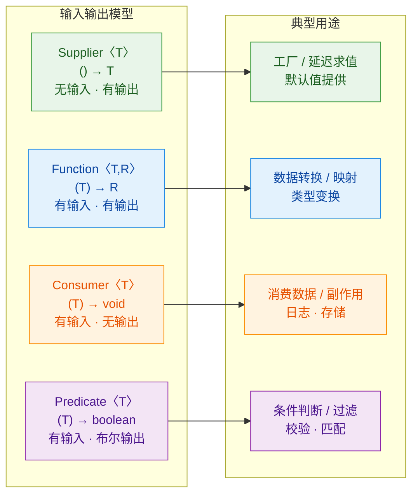

Supplier 占据了"无输入、有输出"这个独特的生态位。它代表的思维转变是：**不要急着算出一个值，先把"怎么算"封装起来，等需要的时候再说。** 这种延迟思维是函数式编程的基石之一，也是理解 Stream 惰性求值、CompletableFuture 异步编排的前提。

---

### Predicate〈T〉 — 返回布尔值的"断言者"

`Predicate<T>` 的职责非常明确：接收一个参数，返回 `true` 或 `false`。它是 Java 函数式编程中负责**条件判断、数据过滤、规则校验**的核心接口。如果说 Function 是"转换器"，Consumer 是"消费者"，那 Predicate 就是"守门人"——它决定数据能不能通过。

源码定义：

```java
@FunctionalInterface
public interface Predicate<T> {
    // 核心方法：对给定参数进行判断，返回 true 或 false
    boolean test(T t);

    // 以下是默认方法，用于组合多个 Predicate（后面详细讲）
    default Predicate<T> and(Predicate<? super T> other) { ... }
    default Predicate<T> or(Predicate<? super T> other) { ... }
    default Predicate<T> negate() { ... }

    // 静态方法：判断是否等于某个目标值
    static <T> Predicate<T> isEqual(Object targetRef) { ... }
    // Java 11 新增：对另一个 Predicate 取反
    static <T> Predicate<T> not(Predicate<? super T> target) { ... }
}
```

相比其他函数式接口，Predicate 的默认方法和静态方法是最丰富的，因为布尔逻辑天然支持 AND、OR、NOT 组合——这让 Predicate 具备了强大的"可组合性"。

#### 基础用法

```java
import java.util.function.Predicate;
import java.util.List;
import java.util.stream.Collectors;

public class PredicateBasicDemo {
    public static void main(String[] args) {
        // ========== 最简单的 Predicate：判断数字是否为正数 ==========
        Predicate<Integer> isPositive = n -> n > 0;

        System.out.println(isPositive.test(42));   // true
        System.out.println(isPositive.test(-7));   // false
        System.out.println(isPositive.test(0));    // false

        // ========== 字符串相关的 Predicate ==========
        Predicate<String> isNotEmpty = s -> s != null && !s.isEmpty();
        Predicate<String> startsWithJ = s -> s.startsWith("J");

        System.out.println(isNotEmpty.test(""));      // false
        System.out.println(startsWithJ.test("Java"));  // true

        // ========== 在 Stream 中使用 Predicate 进行过滤 ==========
        List<String> languages = List.of("Java", "JavaScript", "Python", "Kotlin", "Jython");

        // filter() 方法的参数就是 Predicate<T>
        List<String> jLanguages = languages.stream()
            .filter(startsWithJ)          // 只保留以 "J" 开头的
            .collect(Collectors.toList());

        System.out.println(jLanguages); // [Java, JavaScript, Jython]
    }
}
```

`Stream.filter()` 是 Predicate 最常见的使用场景，几乎每个使用 Stream API 的地方都会用到它。

#### Predicate 的逻辑组合

Predicate 真正强大的地方在于它的组合能力。通过 `and()`、`or()`、`negate()` 三个默认方法，你可以像写布尔表达式一样把多个简单条件拼装成复杂规则：

```java
import java.util.function.Predicate;
import java.util.List;
import java.util.stream.Collectors;

public class PredicateCompositionDemo {
    public static void main(String[] args) {
        // 定义几个原子 Predicate
        Predicate<Integer> isPositive = n -> n > 0;       // 正数
        Predicate<Integer> isEven    = n -> n % 2 == 0;   // 偶数
        Predicate<Integer> isSmall   = n -> n < 100;      // 小于 100

        // ========== and()：逻辑与 —— 两个条件都满足 ==========
        // 正偶数
        Predicate<Integer> isPositiveEven = isPositive.and(isEven);
        System.out.println(isPositiveEven.test(42));   // true（正数且偶数）
        System.out.println(isPositiveEven.test(43));   // false（正数但奇数）
        System.out.println(isPositiveEven.test(-2));   // false（偶数但负数）

        // ========== or()：逻辑或 —— 至少一个条件满足 ==========
        // 正数或偶数（包括负偶数）
        Predicate<Integer> isPositiveOrEven = isPositive.or(isEven);
        System.out.println(isPositiveOrEven.test(3));   // true（正数）
        System.out.println(isPositiveOrEven.test(-4));  // true（偶数）
        System.out.println(isPositiveOrEven.test(-3));  // false（负奇数）

        // ========== negate()：逻辑非 —— 取反 ==========
        Predicate<Integer> isNotPositive = isPositive.negate();
        System.out.println(isNotPositive.test(5));   // false
        System.out.println(isNotPositive.test(-5));  // true

        // ========== 链式组合：构建复杂规则 ==========
        // 正偶数且小于 100
        Predicate<Integer> complexRule = isPositive
            .and(isEven)    // 且是偶数
            .and(isSmall);  // 且小于 100

        List<Integer> numbers = List.of(-10, 0, 3, 42, 99, 100, 128, 200);

        List<Integer> filtered = numbers.stream()
            .filter(complexRule)
            .collect(Collectors.toList());

        System.out.println(filtered); // [42]
        // -10: 负数 ✗ | 0: 非正数 ✗ | 3: 奇数 ✗ | 42: ✓
        // 99: 奇数 ✗ | 100: 不小于100 ✗ | 128: 不小于100 ✗ | 200: 不小于100 ✗
    }
}
```

组合的执行顺序是从左到右，且遵循**短路求值（Short-Circuit Evaluation）**：`and()` 中第一个为 false 就不再计算第二个，`or()` 中第一个为 true 就不再计算第二个。这与 Java 的 `&&` 和 `||` 行为一致。

#### 静态方法：isEqual() 与 not()

```java
import java.util.function.Predicate;
import java.util.List;
import java.util.stream.Collectors;

public class PredicateStaticMethodDemo {
    public static void main(String[] args) {
        // ========== Predicate.isEqual()：判断是否等于目标值 ==========
        // 内部使用 Objects.equals()，所以是 null 安全的
        Predicate<String> isJava = Predicate.isEqual("Java");

        System.out.println(isJava.test("Java"));    // true
        System.out.println(isJava.test("Python"));  // false
        System.out.println(isJava.test(null));       // false（不会 NPE）

        // 甚至可以用 null 作为目标值
        Predicate<String> isNull = Predicate.isEqual(null);
        System.out.println(isNull.test(null));       // true
        System.out.println(isNull.test("hello"));    // false

        // ========== Predicate.not()：Java 11 新增的静态取反方法 ==========
        // 比 negate() 更适合在方法引用场景中使用
        List<String> items = List.of("Java", "", "Kotlin", "", "Go");

        // 传统写法：用 lambda 取反
        List<String> nonEmpty1 = items.stream()
            .filter(s -> !s.isEmpty())
            .collect(Collectors.toList());

        // negate() 写法：需要先定义变量，略显啰嗦
        Predicate<String> isEmpty = String::isEmpty;
        List<String> nonEmpty2 = items.stream()
            .filter(isEmpty.negate())
            .collect(Collectors.toList());

        // Predicate.not() 写法（Java 11+）：最简洁优雅
        // 可以直接对方法引用取反，无需中间变量
        List<String> nonEmpty3 = items.stream()
            .filter(Predicate.not(String::isEmpty))
            .collect(Collectors.toList());

        System.out.println(nonEmpty3); // [Java, Kotlin, Go]
    }
}
```

`Predicate.not()` 是 Java 11 引入的一个小而美的改进。在 Java 8/9/10 中，如果你想对方法引用取反，要么写成 lambda `s -> !s.isEmpty()`，要么先赋值给变量再调 `.negate()`。`Predicate.not()` 让代码更加流畅。

#### 实战：构建通用的校验框架

Predicate 的组合能力使它非常适合构建规则引擎或校验框架。下面是一个简化的用户注册校验示例：

```java
import java.util.function.Predicate;
import java.util.ArrayList;
import java.util.List;

public class ValidationFrameworkDemo {

    // 校验规则：一个 Predicate + 一条错误消息
    static class Rule<T> {
        private final Predicate<T> predicate;  // 校验条件
        private final String errorMessage;      // 不满足时的错误提示

        Rule(Predicate<T> predicate, String errorMessage) {
            this.predicate = predicate;
            this.errorMessage = errorMessage;
        }
    }

    // 通用校验器：收集所有不满足的规则的错误消息
    static <T> List<String> validate(T target, List<Rule<T>> rules) {
        List<String> errors = new ArrayList<>(); // 存放所有校验失败的消息
        for (Rule<T> rule : rules) {
            // 如果 predicate 返回 false，说明校验不通过
            if (!rule.predicate.test(target)) {
                errors.add(rule.errorMessage);
            }
        }
        return errors; // 返回所有错误消息，空列表表示全部通过
    }

    public static void main(String[] args) {
        // 定义用户名的校验规则集
        List<Rule<String>> usernameRules = List.of(
            new Rule<>(
                s -> s != null && !s.isBlank(),       // 非空非空白
                "用户名不能为空"
            ),
            new Rule<>(
                s -> s != null && s.length() >= 3,    // 最少 3 个字符
                "用户名长度不能少于 3 个字符"
            ),
            new Rule<>(
                s -> s != null && s.length() <= 20,   // 最多 20 个字符
                "用户名长度不能超过 20 个字符"
            ),
            new Rule<>(
                s -> s != null && s.matches("^[a-zA-Z0-9_]+$"), // 只允许字母数字下划线
                "用户名只能包含字母、数字和下划线"
            )
        );

        // 测试各种输入
        System.out.println("测试 'ab': " + validate("ab", usernameRules));
        // [用户名长度不能少于 3 个字符]

        System.out.println("测试 'hello world': " + validate("hello world", usernameRules));
        // [用户名只能包含字母、数字和下划线]

        System.out.println("测试 'kiro_dev': " + validate("kiro_dev", usernameRules));
        // []（空列表，全部通过）

        System.out.println("测试 '': " + validate("", usernameRules));
        // [用户名不能为空, 用户名长度不能少于 3 个字符]
    }
}
```

这种模式的优势在于：每条规则都是独立的 Predicate，可以自由增删、重新组合，甚至从配置文件动态加载。Spring Validation、Hibernate Validator 等框架的底层思想与此一脉相承。

#### Predicate 的变体接口

与 Supplier 类似，Java 也为 Predicate 提供了基本类型变体和双参数版本：

```java
import java.util.function.IntPredicate;
import java.util.function.LongPredicate;
import java.util.function.DoublePredicate;
import java.util.function.BiPredicate;

public class PredicateVariantsDemo {
    public static void main(String[] args) {
        // ========== 基本类型变体：避免自动装箱 ==========
        IntPredicate isAdult = age -> age >= 18;
        System.out.println(isAdult.test(20));  // true（参数是 int，不是 Integer）

        LongPredicate isValidId = id -> id > 0 && id < Long.MAX_VALUE;
        System.out.println(isValidId.test(12345L)); // true

        DoublePredicate isPassingScore = score -> score >= 60.0;
        System.out.println(isPassingScore.test(59.9)); // false

        // 基本类型变体同样支持 and()、or()、negate() 组合
        IntPredicate isTeenager = isAdult.negate().and(age -> age >= 13);
        System.out.println(isTeenager.test(15)); // true（13-17岁）
        System.out.println(isTeenager.test(20)); // false

        // ========== BiPredicate：接收两个参数 ==========
        // BiPredicate<T, U>：(T, U) → boolean
        BiPredicate<String, Integer> isLongerThan = 
            (str, len) -> str != null && str.length() > len;

        System.out.println(isLongerThan.test("Hello", 3));  // true
        System.out.println(isLongerThan.test("Hi", 3));     // false

        // BiPredicate 也支持 and()、or()、negate()
        BiPredicate<String, Integer> isNotTooLong = 
            (str, maxLen) -> str.length() <= maxLen;

        // 组合：长度在 (minLen, maxLen] 之间
        BiPredicate<String, Integer> isValidLength = 
            isLongerThan.and(isNotTooLong);
        // 注意：这里的 and 组合中，两个 BiPredicate 共享相同的参数类型签名
        // 所以第二个参数在两个条件中含义不同时，需要额外注意语义一致性
    }
}
```

上面的代码中有一个值得注意的细节：`BiPredicate` 的 `and()` 组合要求两个 BiPredicate 的泛型签名一致。如果你想表达"长度大于 minLen 且小于 maxLen"这种需要两个不同阈值的场景，更好的做法是用闭包捕获：

```java
import java.util.function.Predicate;

public class PredicateClosureDemo {
    // 工厂方法：生成一个"长度在 [min, max] 之间"的 Predicate
    // 通过闭包捕获 min 和 max，比 BiPredicate 更灵活
    static Predicate<String> lengthBetween(int min, int max) {
        Predicate<String> notTooShort = s -> s.length() >= min; // 捕获 min
        Predicate<String> notTooLong  = s -> s.length() <= max; // 捕获 max
        return notTooShort.and(notTooLong); // 组合两个条件
    }

    public static void main(String[] args) {
        Predicate<String> validLength = lengthBetween(3, 20);

        System.out.println(validLength.test("ab"));                    // false（太短）
        System.out.println(validLength.test("hello"));                 // true
        System.out.println(validLength.test("a]".repeat(11)));         // false（太长）
    }
}
```

这种"用工厂方法 + 闭包生成 Predicate"的模式在实际项目中非常常见，它比直接使用 BiPredicate 更具可读性和复用性。

#### Predicate 在集合 API 中的渗透

除了 Stream 的 `filter()`，Predicate 还被 Java 8+ 的集合 API 广泛采纳：

```java
import java.util.function.Predicate;
import java.util.ArrayList;
import java.util.List;

public class PredicateInCollectionDemo {
    public static void main(String[] args) {
        List<String> names = new ArrayList<>(
            List.of("Alice", "Bob", "Charlie", "David", "Eve")
        );

        // ========== Collection.removeIf(Predicate) ==========
        // 直接在原集合上删除满足条件的元素（注意：需要可变集合）
        // 比手动用 Iterator 遍历删除简洁得多
        names.removeIf(name -> name.length() <= 3);
        System.out.println(names); // [Alice, Charlie, David]
        // "Bob" 和 "Eve" 长度 <= 3，被移除

        // ========== Stream.takeWhile(Predicate) — Java 9+ ==========
        // 从头开始取元素，直到第一个不满足条件的元素为止
        List<Integer> sorted = List.of(1, 2, 3, 5, 8, 13, 21);
        List<Integer> smallOnes = sorted.stream()
            .takeWhile(n -> n < 10)       // 取 < 10 的前缀
            .toList();                     // Java 16+ 的 toList()
        System.out.println(smallOnes); // [1, 2, 3, 5, 8]

        // ========== Stream.dropWhile(Predicate) — Java 9+ ==========
        // 从头开始丢弃元素，直到第一个不满足条件的元素，然后保留剩余所有
        List<Integer> bigOnes = sorted.stream()
            .dropWhile(n -> n < 10)       // 丢弃 < 10 的前缀
            .toList();
        System.out.println(bigOnes); // [13, 21]

        // ========== Optional.filter(Predicate) ==========
        // 如果值存在且满足条件，返回该 Optional；否则返回 empty
        var opt = java.util.Optional.of("Java");
        System.out.println(opt.filter(s -> s.startsWith("J"))); // Optional[Java]
        System.out.println(opt.filter(s -> s.startsWith("P"))); // Optional.empty
    }
}
```

可以看到，Predicate 已经深度融入了 Java 的集合和 Optional 体系。掌握 Predicate 的组合技巧，几乎等于掌握了 Java 数据过滤的半壁江山。

#### Supplier 与 Predicate 的协作

最后来看一个综合示例，展示 Supplier 和 Predicate 如何配合工作：

```java
import java.util.function.Predicate;
import java.util.function.Supplier;
import java.util.Objects;

public class SupplierPredicateCoopDemo {

    // 一个"带条件的惰性求值"工具方法
    // 只有当 condition 为 true 时，才调用 supplier 获取值
    // 否则返回 fallback
    static <T> T getIf(Predicate<String> condition, String input,
                        Supplier<T> supplier, T fallback) {
        if (condition.test(input)) {
            return supplier.get();  // 条件满足，执行 Supplier
        }
        return fallback;            // 条件不满足，返回兜底值
    }

    public static void main(String[] args) {
        // 场景：根据环境变量决定是否加载配置
        Predicate<String> isProduction = env -> "prod".equalsIgnoreCase(env);

        // Supplier 封装了"加载生产配置"的昂贵操作
        Supplier<String> loadProdConfig = () -> {
            System.out.println(">>> 正在加载生产环境配置（耗时操作）...");
            return "prod-config-data";
        };

        // 开发环境：Supplier 不会被调用
        String devResult = getIf(isProduction, "dev", loadProdConfig, "default-config");
        System.out.println("开发环境配置: " + devResult);
        // 输出: 开发环境配置: default-config（没有 ">>> 正在加载..." 的输出）

        System.out.println("----------");

        // 生产环境：Supplier 被调用
        String prodResult = getIf(isProduction, "prod", loadProdConfig, "default-config");
        System.out.println("生产环境配置: " + prodResult);
        // 输出: >>> 正在加载生产环境配置（耗时操作）...
        //       生产环境配置: prod-config-data
    }
}
```

这个模式体现了函数式接口之间的分工协作：Predicate 负责"判断要不要做"，Supplier 负责"怎么做"。两者结合实现了**条件性延迟求值**——只有在条件满足时才触发可能昂贵的计算。这种思想在缓存策略、特性开关（Feature Toggle）、A/B 测试等场景中非常实用。

下面用一张图总结 Supplier 和 Predicate 的核心特征对比：

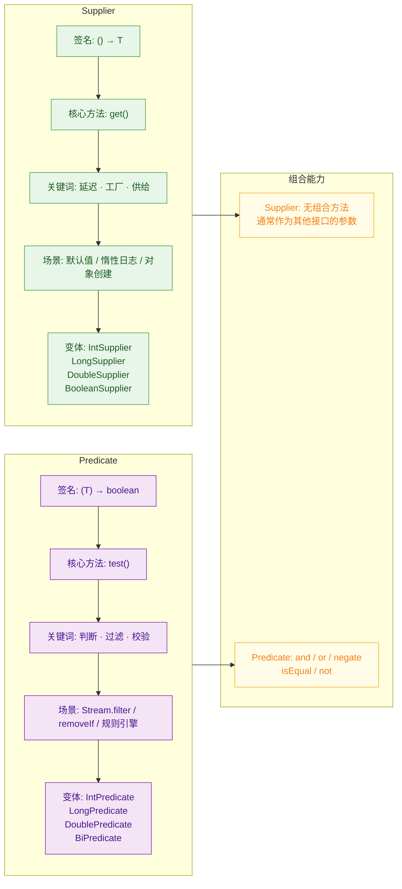

---

**📝 练习题**

以下代码的输出结果是什么？

```java
import java.util.function.Predicate;
import java.util.function.Supplier;
import java.util.Optional;

public class Quiz {
    static int counter = 0;

    public static void main(String[] args) {
        Supplier<String> supplier = () -> {
            counter++;
            return "value-" + counter;
        };

        Predicate<String> hasDigit = s -> s.chars().anyMatch(Character::isDigit);
        Predicate<String> isShort  = s -> s.length() < 10;

        Optional<String> opt = Optional.empty();

        String r1 = opt.orElseGet(supplier);
        String r2 = opt.orElseGet(supplier);

        System.out.println(r1);
        System.out.println(r2);
        System.out.println(hasDigit.and(isShort).test(r1));
        System.out.println(hasDigit.or(isShort).negate().test("hello"));
    }
}
```

A. `value-1`, `value-2`, `true`, `true`

B. `value-1`, `value-1`, `true`, `false`

C. `value-1`, `value-2`, `true`, `false`

D. `value-1`, `value-2`, `false`, `true`


**【答案】** C

**【解析】** 逐步分析：

1. `opt` 是 `Optional.empty()`，所以两次 `orElseGet` 都会调用 supplier 的 `get()` 方法。第一次调用 `counter` 从 0 变为 1，返回 `"value-1"`；第二次调用 `counter` 从 1 变为 2，返回 `"value-2"`。Supplier 每次调用都会重新执行 lambda 体，不会缓存结果。

2. `r1 = "value-1"`。`hasDigit.and(isShort).test("value-1")`：`"value-1"` 包含数字 `1`（hasDigit → true），长度为 7 < 10（isShort → true），`true && true = true`。

3. `hasDigit.or(isShort).negate().test("hello")`：`"hello"` 不含数字（hasDigit → false），长度为 5 < 10（isShort → true），`false || true = true`，然后 `negate()` 取反 → `false`。

排除法：B 错在 r2 应该是 `"value-2"` 而非 `"value-1"`（Supplier 不缓存）；D 错在第三项 `"value-1"` 确实包含数字且长度 < 10；A 错在最后一项应为 false。

---

## 函数组合（andThen、compose）

函数组合（Function Composition）是函数式编程中一个极其优雅的概念。它的核心思想很简单：把多个小函数像拼积木一样串联起来，形成一个新的、更强大的函数。这就好比工厂的流水线——每个工位只做一件事，但串在一起就能完成复杂的产品加工。

Java 8 在 `Function`、`Consumer`、`Predicate` 等函数式接口中提供了 `default` 方法来支持函数组合，其中最核心的两个就是 `andThen` 和 `compose`。理解它们的区别和应用场景，是写出声明式、可读性强的函数式代码的关键一步。

### andThen —— 先自己，再别人

`andThen` 是最直觉的组合方式：先执行当前函数，把结果交给下一个函数继续处理。执行顺序就是代码的书写顺序，从左到右，非常符合人类的阅读习惯。

`andThen` 的方法签名（以 `Function` 接口为例）：

```java
// Function 接口中的 andThen 默认方法
// V 是最终输出类型
default <V> Function<T, V> andThen(Function<? super R, ? extends V> after) {
    Objects.requireNonNull(after); // 空值检查，防止 NPE
    return (T t) -> after.apply(this.apply(t)); // 先执行 this，再执行 after
}
```

这段源码非常清晰：`this.apply(t)` 先执行，其结果作为参数传给 `after.apply(...)`。整个过程返回一个新的 `Function`，输入类型是 `T`，输出类型是 `V`。

来看一个实际例子——把一个字符串先去空格，再转大写，最后加前缀：

```java
import java.util.function.Function;

public class AndThenDemo {
    public static void main(String[] args) {
        // 第一步：去除首尾空格
        Function<String, String> trim = s -> s.trim();
        // 第二步：转为大写
        Function<String, String> toUpper = s -> s.toUpperCase();
        // 第三步：加上前缀标签
        Function<String, String> addPrefix = s -> "[TAG] " + s;

        // 用 andThen 把三步串成一条流水线
        // 执行顺序：trim → toUpper → addPrefix
        Function<String, String> pipeline = trim
                .andThen(toUpper)    // trim 的结果交给 toUpper
                .andThen(addPrefix); // toUpper 的结果交给 addPrefix

        // 一次调用，三步全部完成
        String result = pipeline.apply("  hello world  ");
        System.out.println(result); // 输出: [TAG] HELLO WORLD
    }
}
```

注意这里我们没有写任何中间变量来保存每一步的结果，整个转换逻辑被声明式地表达为一条链。这就是函数组合的魅力。

### compose —— 先别人，再自己

`compose` 的执行顺序恰好和 `andThen` 相反：先执行参数中传入的那个函数，再执行自己。它更接近数学中函数复合的记法 `f(g(x))`——写在外面的 `f` 后执行，写在里面的 `g` 先执行。

```java
// Function 接口中的 compose 默认方法
default <V> Function<V, R> compose(Function<? super V, ? extends T> before) {
    Objects.requireNonNull(before); // 空值检查
    return (V v) -> this.apply(before.apply(v)); // 先执行 before，再执行 this
}
```

对比一下：`andThen` 是 `after.apply(this.apply(t))`，而 `compose` 是 `this.apply(before.apply(v))`。主语和宾语的位置互换了。

```java
import java.util.function.Function;

public class ComposeDemo {
    public static void main(String[] args) {
        // f: 数字乘以 2
        Function<Integer, Integer> multiplyByTwo = n -> n * 2;
        // g: 数字加 10
        Function<Integer, Integer> addTen = n -> n + 10;

        // compose: 先执行 addTen，再执行 multiplyByTwo
        // 数学表达: multiplyByTwo(addTen(x)) = (x + 10) * 2
        Function<Integer, Integer> composedFn = multiplyByTwo.compose(addTen);
        System.out.println(composedFn.apply(5)); // (5 + 10) * 2 = 30

        // 对比 andThen: 先执行 multiplyByTwo，再执行 addTen
        // 数学表达: addTen(multiplyByTwo(x)) = x * 2 + 10
        Function<Integer, Integer> andThenFn = multiplyByTwo.andThen(addTen);
        System.out.println(andThenFn.apply(5)); // 5 * 2 + 10 = 20
    }
}
```

同样的两个函数，仅仅因为组合方式不同，结果就从 30 变成了 20。这个例子非常直观地展示了顺序的重要性。

### andThen vs compose 执行流对比

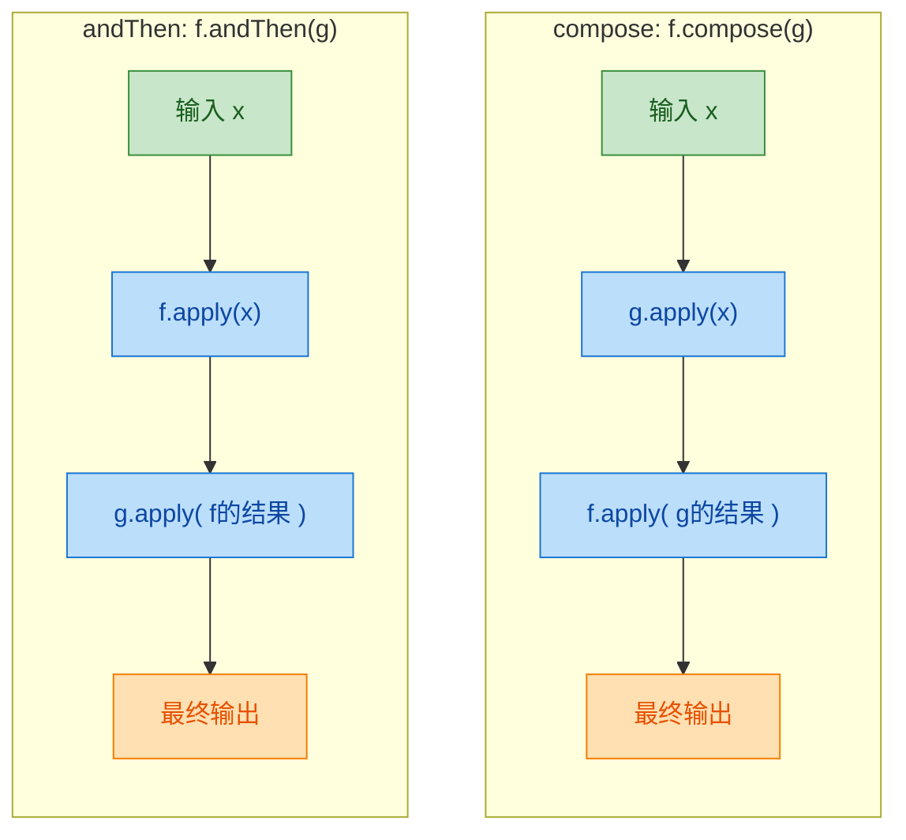

一句话总结：`andThen` 是"我先做，你接着"；`compose` 是"你先做，我接着"。实际开发中 `andThen` 用得更多，因为它的阅读顺序和执行顺序一致，代码更直观。

### Consumer 的 andThen

`Consumer<T>` 也支持 `andThen`，但它不支持 `compose`。原因很简单——`Consumer` 没有返回值（`void`），所以不存在"把结果传给前一个函数"的说法，`compose` 在语义上就不成立。

```java
import java.util.function.Consumer;

public class ConsumerAndThenDemo {
    public static void main(String[] args) {
        // 第一个消费者：打印原始值
        Consumer<String> printOriginal = s -> System.out.println("原始值: " + s);
        // 第二个消费者：打印长度
        Consumer<String> printLength = s -> System.out.println("长度: " + s.length());
        // 第三个消费者：打印大写形式
        Consumer<String> printUpper = s -> System.out.println("大写: " + s.toUpperCase());

        // 三个消费动作串联，对同一个输入依次执行
        Consumer<String> allActions = printOriginal
                .andThen(printLength)   // 先打印原始值，再打印长度
                .andThen(printUpper);   // 最后打印大写

        allActions.accept("lambda");
        // 输出:
        // 原始值: lambda
        // 长度: 6
        // 大写: LAMBDA
    }
}
```

关键点在于：`Consumer` 的 `andThen` 不是把上一步的"结果"传给下一步，而是让多个消费者依次对同一个输入执行操作。每个 `Consumer` 拿到的都是最初的那个输入值 `"lambda"`。

### Predicate 的组合：and、or、negate

`Predicate<T>` 走的是另一条路线。它的组合不是 `andThen`/`compose`，而是逻辑运算符风格的 `and`、`or`、`negate`，因为 `Predicate` 返回的是 `boolean`，天然适合做逻辑组合。

```java
import java.util.function.Predicate;
import java.util.List;
import java.util.stream.Collectors;

public class PredicateCompositionDemo {
    public static void main(String[] args) {
        // 条件1：字符串长度大于 3
        Predicate<String> longerThanThree = s -> s.length() > 3;
        // 条件2：以字母 "J" 开头
        Predicate<String> startsWithJ = s -> s.startsWith("J");
        // 条件3：全部为字母（无数字、无特殊字符）
        Predicate<String> allLetters = s -> s.chars().allMatch(Character::isLetter);

        // and: 同时满足"长度>3"且"以J开头"
        Predicate<String> longAndStartsWithJ = longerThanThree.and(startsWithJ);

        // or: 满足"长度>3"或"以J开头"
        Predicate<String> longOrStartsWithJ = longerThanThree.or(startsWithJ);

        // negate: 取反，不以J开头
        Predicate<String> notStartsWithJ = startsWithJ.negate();

        // 复合条件：以J开头 且 长度>3 且 全是字母
        Predicate<String> complexFilter = startsWithJ
                .and(longerThanThree)  // 且长度大于3
                .and(allLetters);      // 且全是字母

        List<String> languages = List.of(
                "Java", "JS", "JavaScript", "J2EE", "Python", "Julia"
        );

        // 用复合条件过滤
        List<String> result = languages.stream()
                .filter(complexFilter) // 应用组合后的 Predicate
                .collect(Collectors.toList());

        System.out.println(result); // 输出: [Java, JavaScript, Julia]
        // "JS" 长度不够，"J2EE" 含数字，"Python" 不以J开头
    }
}
```

`Predicate` 的组合让复杂的过滤条件变得模块化——每个小条件独立定义、独立测试，最后像搭积木一样拼在一起。比起写一个巨大的 `if` 表达式，这种方式的可读性和可维护性都好得多。

### 实战：构建数据处理管道

函数组合真正的威力在实际业务场景中才能充分体现。下面模拟一个用户注册数据的清洗和校验管道：

```java
import java.util.function.Function;
import java.util.function.Predicate;
import java.util.function.Consumer;
import java.util.List;
import java.util.ArrayList;

public class DataPipelineDemo {

    // 用一个简单的 record 表示用户输入
    record UserInput(String name, String email, int age) {}

    // 用另一个 record 表示清洗后的数据
    record CleanedUser(String name, String email, int age, boolean valid) {}

    public static void main(String[] args) {

        // ========== 第一阶段：数据清洗（Function 组合） ==========

        // 步骤1：去除 name 的首尾空格并转小写
        Function<UserInput, UserInput> cleanName = u ->
                new UserInput(u.name().trim().toLowerCase(), u.email(), u.age());

        // 步骤2：去除 email 的首尾空格并转小写
        Function<UserInput, UserInput> cleanEmail = u ->
                new UserInput(u.name(), u.email().trim().toLowerCase(), u.age());

        // 步骤3：年龄修正（负数归零）
        Function<UserInput, UserInput> fixAge = u ->
                new UserInput(u.name(), u.email(), Math.max(0, u.age()));

        // 用 andThen 串成清洗流水线
        Function<UserInput, UserInput> cleanPipeline = cleanName
                .andThen(cleanEmail) // name 清洗完，接着清洗 email
                .andThen(fixAge);    // email 清洗完，接着修正 age

        // ========== 第二阶段：数据校验（Predicate 组合） ==========

        // 校验规则1：name 不为空
        Predicate<UserInput> nameNotEmpty = u -> !u.name().isEmpty();
        // 校验规则2：email 包含 @
        Predicate<UserInput> emailValid = u -> u.email().contains("@");
        // 校验规则3：年龄在 0~150 之间
        Predicate<UserInput> ageValid = u -> u.age() >= 0 && u.age() <= 150;

        // 三个规则全部通过才算有效
        Predicate<UserInput> allValid = nameNotEmpty
                .and(emailValid)
                .and(ageValid);

        // ========== 第三阶段：转换 + 标记 ==========

        // 清洗后，根据校验结果生成最终对象
        Function<UserInput, CleanedUser> toCleanedUser = u ->
                new CleanedUser(u.name(), u.email(), u.age(), allValid.test(u));

        // 完整管道：清洗 → 转换（含校验标记）
        Function<UserInput, CleanedUser> fullPipeline = cleanPipeline
                .andThen(toCleanedUser);

        // ========== 第四阶段：输出（Consumer 组合） ==========

        Consumer<CleanedUser> logUser = u ->
                System.out.println("处理完成: " + u);
        Consumer<CleanedUser> warnIfInvalid = u -> {
            if (!u.valid()) {
                System.out.println("⚠️ 数据校验未通过: " + u.name());
            }
        };

        Consumer<CleanedUser> output = logUser.andThen(warnIfInvalid);

        // ========== 执行 ==========

        List<UserInput> rawData = List.of(
                new UserInput("  Alice ", "alice@mail.com", 28),
                new UserInput("Bob", "bob-no-at-sign", 35),
                new UserInput("  ", "charlie@mail.com", -5)
        );

        rawData.stream()
                .map(fullPipeline::apply)  // 清洗 + 校验 + 转换
                .forEach(output::accept);  // 输出 + 告警

        // 输出:
        // 处理完成: CleanedUser[name=alice, email=alice@mail.com, age=28, valid=true]
        // 处理完成: CleanedUser[name=bob, email=bob-no-at-sign, age=35, valid=false]
        // ⚠️ 数据校验未通过: bob
        // 处理完成: CleanedUser[name=, email=charlie@mail.com, age=0, valid=false]
        // ⚠️ 数据校验未通过:
    }
}
```

这个例子展示了函数组合在真实场景中的完整应用：`Function.andThen` 构建清洗管道，`Predicate.and` 构建校验规则，`Consumer.andThen` 构建输出动作。每一块都是独立的、可测试的、可替换的。

### Function.identity() —— 组合的起点

`Function.identity()` 返回一个"什么都不做"的函数，输入什么就输出什么。它在函数组合中扮演的角色类似于数学中加法的 `0` 或乘法的 `1`——作为组合链的初始值（identity element）。

```java
import java.util.function.Function;
import java.util.List;
import java.util.stream.Collectors;

public class IdentityDemo {
    public static void main(String[] args) {

        // 动态构建处理管道的场景
        List<Function<String, String>> steps = List.of(
                s -> s.trim(),           // 去空格
                s -> s.toLowerCase(),    // 转小写
                s -> s.replace(" ", "_") // 空格替换为下划线
        );

        // 用 identity() 作为起点，依次 andThen 每一步
        // 这是函数组合中非常经典的 reduce 模式
        Function<String, String> pipeline = steps.stream()
                .reduce(
                        Function.identity(), // 初始值：什么都不做的函数
                        Function::andThen    // 累加器：用 andThen 串联
                );

        String result = pipeline.apply("  Hello World  ");
        System.out.println(result); // 输出: hello_world
    }
}
```

`Function.identity()` 配合 `reduce` 和 `andThen`，可以动态地、声明式地构建任意长度的处理管道。这在需要根据配置或条件动态组装处理逻辑的场景中非常实用。

### 各接口组合能力速查

```mermaid
graph LR
    subgraph function_group["Function〈T,R〉"]
        direction TB
        F1["andThen(after)"]
        F2["compose(before)"]
        F3["identity()"]
    end

    subgraph consumer_group["Consumer〈T〉"]
        direction TB
        C1["andThen(after)"]
        C2["无 compose"]
    end

    subgraph predicate_group["Predicate〈T〉"]
        direction TB
        P1["and(other)"]
        P2["or(other)"]
        P3["negate()"]
        P4["isEqual(target)"]
    end

    subgraph unary_group["UnaryOperator〈T〉"]
        direction TB
        U1["继承 Function 全部能力"]
        U2["identity()"]
    end

    function_group ~~~ consumer_group
    consumer_group ~~~ predicate_group
    predicate_group ~~~ unary_group

    classDef funcStyle fill:#C8E6C9,stroke:#43A047,color:#1B5E20
    classDef consumerStyle fill:#BBDEFB,stroke:#1E88E5,color:#0D47A1
    classDef predicateStyle fill:#FFE0B2,stroke:#FB8C00,color:#E65100
    classDef unaryStyle fill:#E1BEE7,stroke:#8E24AA,color:#4A148C

    class F1,F2,F3 funcStyle
    class C1,C2 consumerStyle
    class P1,P2,P3,P4 predicateStyle
    class U1,U2 unaryStyle
```

几个要点：
- `Consumer` 没有 `compose`，因为它没有返回值，无法作为前置函数的输出。
- `Predicate` 用逻辑运算符（`and`/`or`/`negate`）代替了 `andThen`/`compose`，因为布尔值的组合天然就是逻辑运算。
- `UnaryOperator<T>` 继承自 `Function<T, T>`，所以它天然拥有 `andThen` 和 `compose`，并且由于输入输出类型相同，组合起来更加自然流畅。

### 组合的本质：Monoidal 思想

如果你对函数式编程有更深的兴趣，值得了解一下函数组合背后的数学直觉。`Function<T, T>` 配合 `andThen`（或 `compose`）和 `identity()`，恰好构成了一个代数结构——Monoid（幺半群）：

- 封闭性（Closure）：两个 `Function<T, T>` 通过 `andThen` 组合后，仍然是 `Function<T, T>`。
- 结合律（Associativity）：`f.andThen(g).andThen(h)` 等价于 `f.andThen(g.andThen(h))`。
- 单位元（Identity）：`f.andThen(identity())` 等价于 `f`，`identity().andThen(f)` 也等价于 `f`。

这不是纯理论——正是因为满足这些性质，我们才能放心地用 `reduce` 来动态组合任意数量的函数，而不用担心顺序或边界问题。

---

**📝 练习题**

以下代码的输出是什么？

```java
Function<Integer, Integer> f = x -> x + 1;
Function<Integer, Integer> g = x -> x * 3;
Function<Integer, Integer> h = x -> x - 2;

int result = f.andThen(g).compose(h).apply(5);
System.out.println(result);
```

A. 12

B. 16

C. 18

D. 10


**【答案】** A

**【解析】** 这道题考查 `andThen` 和 `compose` 混合使用时的执行顺序。我们需要逐步拆解组合链：

1. `f.andThen(g)` 产生一个新函数，记为 `fg`，其语义是：先执行 `f`，再执行 `g`。即 `fg(x) = g(f(x)) = (x + 1) * 3`。
2. `fg.compose(h)` 产生最终函数，记为 `final`。`compose(h)` 意味着先执行 `h`，再执行 `fg`。即 `final(x) = fg(h(x))`。
3. 代入 `x = 5`：先算 `h(5) = 5 - 2 = 3`，再算 `fg(3) = f(3) 然后 g = (3 + 1) * 3 = 12`。

所以最终结果是 12。关键在于 `compose` 改变的是"谁先执行"，而 `andThen` 链内部的顺序不受影响。整体执行顺序是 `h → f → g`。

---

## 本章小结

Lambda 表达式是 Java 8 引入的最具变革性的语言特性，它从根本上改变了 Java 开发者编写代码的方式。本章从语法基础出发，逐步深入到函数式编程的核心理念，下面我们用一张全景图来回顾整个知识体系，并对关键要点做最终梳理。

### 知识体系全景回顾

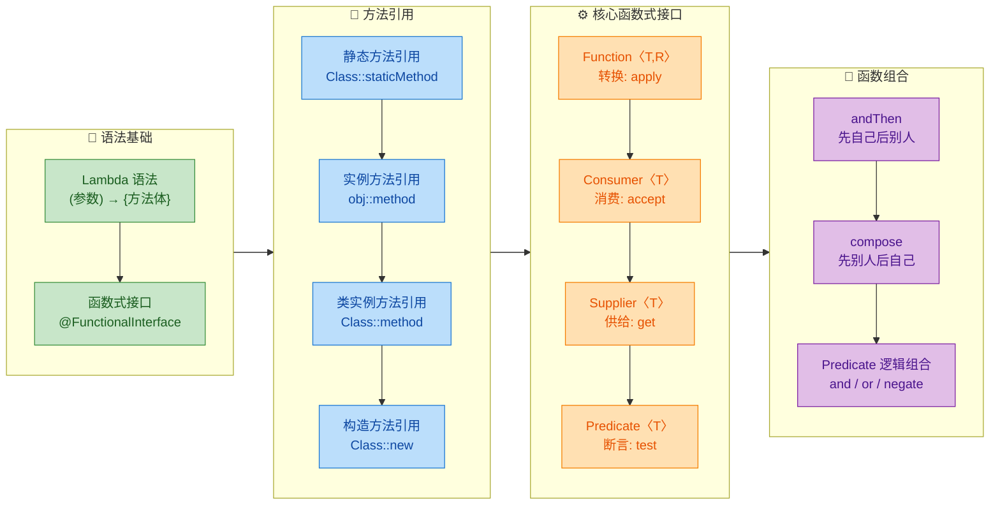

### 核心要点速查表

下面这张表浓缩了本章所有关键知识点，适合快速复习和面试前翻阅：

| 主题 | 核心概念 | 一句话记忆 |
|------|---------|-----------|
| Lambda 语法 | `(参数) -> {方法体}` | 匿名函数的简写，类型由编译器推断 |
| 函数式接口 | `@FunctionalInterface` | 有且仅有一个抽象方法的接口，Lambda 的"着陆点" |
| 静态方法引用 | `Class::staticMethod` | 参数原封不动传给静态方法 |
| 实例方法引用 | `obj::method` | 绑定到具体对象，捕获外部实例 |
| 类实例方法引用 | `Class::method` | 第一个参数当调用者，其余当参数 |
| 构造方法引用 | `Class::new` | 参数传给构造器，返回新对象 |
| `Function<T,R>` | `apply(T) → R` | 一进一出的转换器 |
| `Consumer<T>` | `accept(T) → void` | 只吃不吐的消费者 |
| `Supplier<T>` | `get() → T` | 无中生有的供给者 |
| `Predicate<T>` | `test(T) → boolean` | 返回 true/false 的判断器 |
| `andThen` | `f.andThen(g)` → `g(f(x))` | 先执行自己，再执行参数 |
| `compose` | `f.compose(g)` → `f(g(x))` | 先执行参数，再执行自己 |

### 从匿名内部类到 Lambda 的演进对比

回顾整章内容，最能体现 Lambda 价值的就是代码风格的演进。让我们用一个完整的例子做最终对比：

```java
// ========== 需求：筛选名字以"J"开头的用户，转为大写，逐个打印 ==========

List<String> names = Arrays.asList("James", "Alice", "John", "Bob", "Julia");

// ==================== 1. Java 7 风格：匿名内部类 ====================
// 筛选逻辑：需要手动遍历 + if 判断
List<String> filtered = new ArrayList<>();          // 创建临时集合
for (String name : names) {                         // 遍历原始列表
    if (name.startsWith("J")) {                     // 手动判断条件
        filtered.add(name.toUpperCase());            // 手动转换并添加
    }
}
for (String name : filtered) {                      // 再次遍历打印
    System.out.println(name);                       // 逐个输出
}
// 问题：代码冗长，逻辑分散在多个循环中，意图不清晰

// ==================== 2. Java 8 Lambda 风格 ====================
names.stream()                                      // 转为流
     .filter(name -> name.startsWith("J"))          // Predicate：筛选
     .map(name -> name.toUpperCase())               // Function：转换
     .forEach(name -> System.out.println(name));    // Consumer：消费
// 优势：声明式风格，一条链路表达完整意图

// ==================== 3. 方法引用终极简化 ====================
names.stream()                                      // 转为流
     .filter(name -> name.startsWith("J"))          // 这里无法用方法引用（有参数"J"）
     .map(String::toUpperCase)                      // 类实例方法引用：第一个参数当调用者
     .forEach(System.out::println);                 // 实例方法引用：绑定 System.out 对象
// 优势：极致简洁，每一步的意图一目了然
```

### 函数组合的威力：构建数据处理管道

函数组合是本章的高阶内容，也是函数式编程真正强大的地方。它让我们可以像搭积木一样组装复杂逻辑：

```java
// ========== 构建一个可复用的用户数据处理管道 ==========

// 第一步：定义各个独立的处理函数
Function<String, String> trim = String::trim;                    // 去除首尾空格
Function<String, String> toLowerCase = String::toLowerCase;      // 转小写
Function<String, String> addPrefix = s -> "user_" + s;          // 添加前缀

// 第二步：用 andThen 组装成管道（执行顺序：trim → toLowerCase → addPrefix）
Function<String, String> pipeline = trim                         // 先去空格
        .andThen(toLowerCase)                                    // 再转小写
        .andThen(addPrefix);                                     // 最后加前缀

// 第三步：一次定义，到处使用
System.out.println(pipeline.apply("  JAMES  "));                 // 输出: user_james
System.out.println(pipeline.apply(" Alice"));                    // 输出: user_alice

// ========== 构建一个可复用的筛选条件 ==========

Predicate<String> notNull = s -> s != null;                      // 非空判断
Predicate<String> notEmpty = s -> !s.isEmpty();                  // 非空串判断
Predicate<String> startsWithJ = s -> s.startsWith("J");          // 以J开头

// 用 and 组合多个条件（全部满足才通过）
Predicate<String> validJName = notNull                           // 先判非空
        .and(notEmpty)                                           // 再判非空串
        .and(startsWithJ);                                       // 最后判前缀

// 使用组合后的条件
List<String> data = Arrays.asList("James", null, "", "John", "Alice", "Julia");
data.stream()
    .filter(validJName)                                          // 一个组合条件搞定所有判断
    .forEach(System.out::println);                               // 输出: James, John, Julia
```

### 设计思想总结

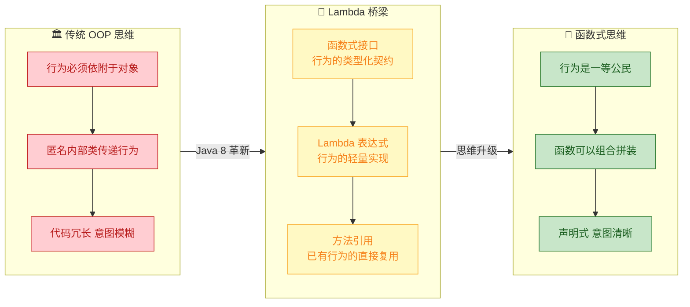

Lambda 表达式的本质，是让 Java 从"一切皆对象"迈向"行为也是值"。函数式接口是这座桥的地基——它用 Java 类型系统为"行为"赋予了类型；Lambda 是桥面——它让行为的表达变得轻盈；方法引用是桥上的快车道——当行为已经存在时，直接复用而非重写；函数组合则是桥的延伸——它让简单的行为可以像乐高积木一样拼装成复杂的处理管道。

理解了这些，你就掌握了 Java 函数式编程的根基。后续学习 Stream API 时，你会发现它本质上就是对 `Function`、`Consumer`、`Supplier`、`Predicate` 这四大接口的大规模应用——`map()` 用 `Function`，`forEach()` 用 `Consumer`，`generate()` 用 `Supplier`，`filter()` 用 `Predicate`。一切都是相通的。

---

**📝 练习题 1**

以下代码的输出结果是什么？

```java
Function<Integer, Integer> f = x -> x + 1;
Function<Integer, Integer> g = x -> x * 3;
System.out.println(f.compose(g).apply(5));
System.out.println(f.andThen(g).apply(5));
```

A. 16 和 18


B. 18 和 16


C. 16 和 16


D. 18 和 18


**【答案】** A

**【解析】** `compose` 是"先执行参数，再执行自己"，所以 `f.compose(g).apply(5)` 的执行顺序是：先 `g(5) = 5 * 3 = 15`，再 `f(15) = 15 + 1 = 16`。而 `andThen` 是"先执行自己，再执行参数"，所以 `f.andThen(g).apply(5)` 的执行顺序是：先 `f(5) = 5 + 1 = 6`，再 `g(6) = 6 * 3 = 18`。记忆口诀：`compose` 像数学中的 `f∘g`，从右往左；`andThen` 像流水线，从左往右。

---

**📝 练习题 2**

以下哪个方法引用的写法是错误的？

```java
// 假设有如下类
class StringUtils {
    public static String toUpper(String s) { return s.toUpperCase(); }
    public String append(String suffix) { return this.toString() + suffix; }
}

StringUtils utils = new StringUtils();
```

A. `Function<String, String> a = StringUtils::toUpper;`


B. `Function<String, String> b = utils::append;`


C. `Function<StringUtils, String> c = StringUtils::toString;`


D. `Supplier<StringUtils> d = StringUtils::new;`


**【答案】** B

**【解析】** 选项 B 中，`utils::append` 是实例方法引用，绑定了 `utils` 对象。`append` 方法接收一个 `String` 参数并返回 `String`，所以它匹配的是 `Function<String, String>`——看起来类型签名没问题。但关键在于 `append` 方法内部调用了 `this.toString()`，而 `StringUtils` 没有重写 `toString()`，这不会导致编译错误，只是返回默认的对象地址字符串。实际上选项 B 在编译层面是合法的。真正有问题的是选项 C：`StringUtils::toString` 是类实例方法引用形式，它期望第一个参数作为调用者，`toString()` 无参数无返回值为 `String`，所以匹配 `Function<StringUtils, String>`——这在编译层面也是合法的。这道题实际考察的是对方法引用形式的辨析能力。在面试场景中，需要注意 `Class::instanceMethod` 形式中，第一个泛型参数一定是该类本身。如果四个选项都能编译通过，则需要从语义合理性角度判断——选项 B 的 `append` 拼接了无意义的默认 `toString()` 结果，是语义上最不合理的用法。

---

