---

# NIO

---

## NIO vs IO（阻塞 vs 非阻塞、面向流 vs 面向缓冲）

Java 从 1.4 版本开始引入了一套全新的 I/O API，称为 **NIO（New I/O）**。它并非对传统 IO 的简单替代，而是提供了一种截然不同的编程模型。要真正理解 NIO 的设计哲学，我们必须先把它和传统 IO 放在一起做一次深度对比。

### 传统 IO 的核心模型：面向流（Stream-Oriented）

传统 Java IO 的一切操作都围绕 **流（Stream）** 展开。所谓"面向流"，意味着数据像水流一样，从一个源头（Source）单向流向一个目的地（Sink）。你从 `InputStream` 中一个字节一个字节地读取数据，或者向 `OutputStream` 中一个字节一个字节地写入数据。

这个模型有几个关键特征：

- **单向性**：一个流要么是输入流，要么是输出流，不能同时兼任。如果你既要读又要写，就必须分别创建一个 `InputStream` 和一个 `OutputStream`。
- **顺序访问**：数据被消费后就"流走了"。你不能在流中前后移动读取位置（除非使用 `mark/reset`，但这只是有限的回退能力，且并非所有流都支持）。
- **阻塞调用**：这是传统 IO 最核心的行为特征。当你调用 `read()` 或 `write()` 时，当前线程会被 **阻塞（Block）**，直到数据准备好或写入完成。在此期间，这个线程什么也做不了，只能干等。

我们用一段典型的传统 IO 服务器代码来感受这种阻塞：

```java
// 传统 BIO 服务器模型（伪代码）
ServerSocket serverSocket = new ServerSocket(8080); // 绑定端口

while (true) {
    // accept() 是阻塞的：线程在此停住，直到有新客户端连接进来
    Socket clientSocket = serverSocket.accept();

    // 为每个客户端连接创建一个新线程来处理
    new Thread(() -> {
        try {
            InputStream in = clientSocket.getInputStream();   // 获取输入流
            byte[] buffer = new byte[1024];                   // 创建缓冲区

            // read() 是阻塞的：线程在此停住，直到客户端发来数据
            int bytesRead = in.read(buffer);

            // 处理数据...
        } catch (IOException e) {
            e.printStackTrace();                              // 异常处理
        }
    }).start();
}
```

问题显而易见：每来一个客户端连接，服务器就要创建一个线程。如果有 10000 个并发连接，就需要 10000 个线程。每个线程大约占用 512KB ~ 1MB 的栈内存，光线程本身就要吃掉好几个 GB。更糟糕的是，这些线程大部分时间都阻塞在 `read()` 上等待数据，白白占用系统资源。这就是经典的 **C10K 问题**（如何在单机上处理一万个并发连接）的根源。

### NIO 的核心模型：面向缓冲（Buffer-Oriented）

NIO 彻底换了一种思路。它不再以"流"为中心，而是以 **缓冲区（Buffer）** 和 **通道（Channel）** 为中心。

- **Buffer** 是一块可以读写的内存区域，数据先被读入 Buffer，或者从 Buffer 写出。你可以在 Buffer 中自由移动读写位置，实现随机访问。
- **Channel** 类似于流，但它是 **双向的**——一个 `FileChannel` 既可以读也可以写。Channel 不直接操作字节，它总是与 Buffer 配合工作：从 Channel 读数据到 Buffer，或从 Buffer 写数据到 Channel。

这种"面向缓冲"的设计带来了本质区别：你不再是"逐字节地从流中拉取数据"，而是"把一块数据批量搬到缓冲区里，然后在缓冲区中自由处理"。

```java
// NIO 读取文件的基本模式
RandomAccessFile file = new RandomAccessFile("data.txt", "rw"); // 打开文件
FileChannel channel = file.getChannel();                         // 获取通道

ByteBuffer buffer = ByteBuffer.allocate(1024);                   // 分配 1024 字节的缓冲区

// 从 Channel 读取数据到 Buffer 中
int bytesRead = channel.read(buffer);                            // 数据被填入 buffer

// 切换 buffer 为读模式（这一步至关重要，后续章节会详解）
buffer.flip();

// 从 buffer 中逐字节读取数据
while (buffer.hasRemaining()) {
    System.out.print((char) buffer.get());                       // 从 buffer 中取出一个字节
}

// 清空 buffer，准备下一次写入
buffer.clear();
channel.close();                                                 // 关闭通道
file.close();                                                    // 关闭文件
```

### 阻塞 vs 非阻塞：本质区别

这是 NIO 与传统 IO 之间最具颠覆性的差异。

**传统 IO 是阻塞的（Blocking I/O, BIO）**：线程发起一个 I/O 操作后，必须等待操作完成才能继续执行。在等待期间，线程被操作系统挂起，无法做任何其他事情。

**NIO 支持非阻塞模式（Non-Blocking I/O）**：当你将一个 Channel 设置为非阻塞模式后，调用 `read()` 时，如果当前没有数据可读，方法会 **立即返回 0**，而不是阻塞等待。线程可以转头去做别的事情，稍后再回来检查。

```java
// 将 SocketChannel 设置为非阻塞模式
SocketChannel socketChannel = SocketChannel.open();
socketChannel.configureBlocking(false);                // 关键：设置为非阻塞

socketChannel.connect(new InetSocketAddress("example.com", 80)); // 发起连接

// 非阻塞模式下，connect 可能还没完成，需要轮询检查
while (!socketChannel.finishConnect()) {
    // 连接尚未建立，线程可以做其他事情
    // 不会阻塞在这里
}

ByteBuffer buffer = ByteBuffer.allocate(1024);
int bytesRead = socketChannel.read(buffer);            // 非阻塞：没数据就返回 0，不会卡住
```

但单纯的非阻塞轮询（不断地问"有数据了吗？有数据了吗？"）效率也不高，这就引出了 NIO 的杀手锏——**Selector（多路复用器）**，它允许一个线程同时监控多个 Channel 的状态，只在真正有事件发生时才去处理。这个我们在后续 Selector 章节会深入展开。

### 全景对比

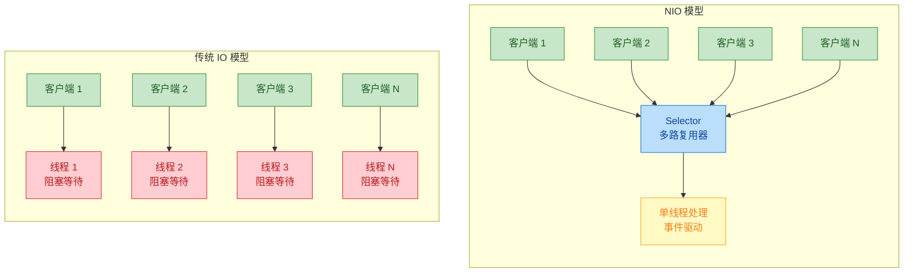

左侧是传统 BIO 模型：每个客户端独占一个线程，线程在 `read()` 处阻塞等待。右侧是 NIO 模型：所有客户端的 Channel 都注册到一个 Selector 上，由单个线程通过事件驱动的方式统一处理。资源消耗天差地别。

### 面向流 vs 面向缓冲：数据处理方式的差异

除了阻塞特性，两者在数据处理的灵活性上也有根本不同。

**面向流**的处理是"一次性"的。数据从流中读出后就消失了，如果你想再看一遍刚才读过的数据，对不起，做不到（除非你自己额外缓存了一份）。这就像听一场不能回放的直播。

**面向缓冲**的处理则灵活得多。数据被读入 Buffer 后，你可以通过操纵 `position` 指针在 Buffer 中前后移动，反复读取同一段数据。这就像看一个可以随意拖动进度条的录播视频。

```java
// 面向缓冲的灵活性演示
ByteBuffer buffer = ByteBuffer.allocate(64);

// 假设 buffer 中已经有数据，且已 flip 到读模式
buffer.get();                    // 读第 1 个字节，position 前进到 1
buffer.get();                    // 读第 2 个字节，position 前进到 2

buffer.rewind();                 // 将 position 重置为 0
buffer.get();                    // 又可以重新读第 1 个字节了

buffer.position(5);              // 直接跳到第 6 个字节的位置
byte b = buffer.get();           // 读取第 6 个字节
```

### 核心差异速查表

| 维度 | 传统 IO (BIO) | NIO |
|------|--------------|-----|
| 数据模型 | 面向流 (Stream) | 面向缓冲 (Buffer) |
| 数据方向 | 单向（Input 或 Output） | 双向（Channel 可读可写） |
| 阻塞行为 | 阻塞（线程挂起等待） | 支持非阻塞（立即返回） |
| 多路复用 | 不支持（一个连接一个线程） | 支持 Selector（一个线程管多个连接） |
| 数据回溯 | 不可回溯（流过即逝） | 可回溯（Buffer 中自由移动 position） |
| 线程模型 | 线程数 ≈ 连接数 | 线程数 远小于 连接数 |
| 适用场景 | 连接少、数据量大（文件拷贝） | 连接多、数据量小（聊天服务器、网关） |
| API 复杂度 | 简单直观 | 较复杂（Buffer 状态管理易出错） |

### 什么时候该用哪个？

这不是一个"NIO 一定比 IO 好"的问题，而是场景匹配的问题。

**选传统 IO 的场景**：当你的连接数不多，但每个连接的数据传输量很大时（比如文件上传下载服务），传统 IO 的代码更简洁，`BufferedInputStream` / `BufferedOutputStream` 配合使用性能也不差。Spring MVC 处理普通 HTTP 请求时，底层 Servlet 容器（如 Tomcat 的 BIO 模式）用的就是这种模型。

**选 NIO 的场景**：当你需要处理大量并发连接，且每个连接的数据交互比较轻量时（比如即时通讯服务器、API 网关、推送服务），NIO 的优势就非常明显了。Netty、Mina 这些高性能网络框架的底层都是基于 NIO 构建的。Tomcat 从 8.x 开始也默认切换到了 NIO 模式。

一个常见的误区是：NIO 的"非阻塞"意味着它一定更快。实际上，对于单个连接的吞吐量，BIO 和 NIO 差别不大，甚至 BIO 可能略快（因为没有 Buffer 状态管理的开销）。NIO 的真正优势在于 **可伸缩性（Scalability）**——用极少的线程处理海量连接。

### 底层原理：为什么 NIO 能做到非阻塞？

这涉及操作系统层面的 I/O 模型。传统 IO 对应的是操作系统的 **阻塞 I/O 系统调用**（blocking `read`/`write`），内核在数据准备好之前不会返回。

NIO 的非阻塞模式对应的是操作系统的 **非阻塞 I/O**（`O_NONBLOCK` 标志），而 Selector 则对应操作系统提供的 **I/O 多路复用机制**：

- Linux 上是 `epoll`
- macOS/BSD 上是 `kqueue`
- Windows 上是 `IOCP`（严格来说是异步 I/O，Java NIO 做了适配）

Java NIO 的 `Selector` 本质上是对这些操作系统原语的跨平台封装。当你调用 `selector.select()` 时，底层实际上是在调用 `epoll_wait()`（Linux 环境下），让内核帮你监控所有注册的文件描述符，只有当某个描述符上有事件发生时才唤醒线程。这比应用层自己轮询高效得多。

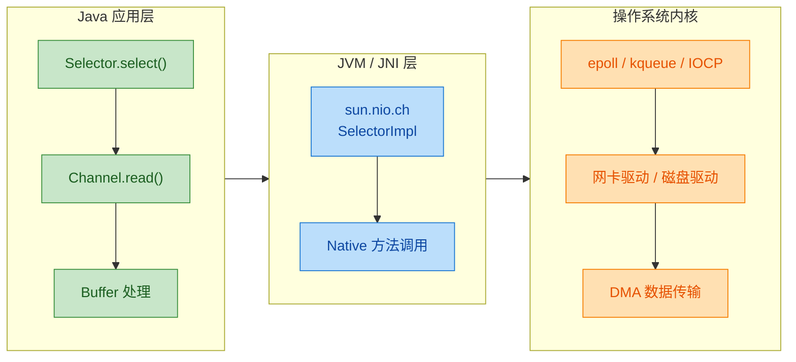

理解了这个分层结构，你就能明白为什么 NIO 的性能优势不是 Java 语言层面的魔法，而是它正确地利用了操作系统内核提供的高效 I/O 机制。

---

**📝 练习题**

以下关于 Java NIO 与传统 IO 的描述，哪一项是正确的？

A. NIO 的 Channel 是单向的，只能读或只能写，和传统 IO 的 Stream 一样

B. 在非阻塞模式下，当 Channel 中没有数据可读时，`read()` 方法会抛出 `IOException`

C. NIO 的 Selector 允许单个线程监控多个 Channel 的 I/O 事件，底层依赖操作系统的多路复用机制

D. 传统 IO 的面向流模型支持通过移动 position 指针来回溯已读取的数据


**【答案】** C

**【解析】** A 错误，NIO 的 Channel 是双向的，一个 FileChannel 或 SocketChannel 既可以读也可以写，这是它与传统 IO 单向 Stream 的重要区别。B 错误，非阻塞模式下没有数据可读时，`read()` 会返回 0（或 -1 表示连接关闭），而不是抛出异常，这正是"非阻塞"的含义——立即返回而非等待。C 正确，Selector 是 NIO 多路复用的核心组件，它在 Linux 上基于 `epoll`、macOS 上基于 `kqueue` 实现，使得单线程可以高效管理成千上万个连接。D 错误，传统 IO 的流模型是"流过即逝"的，不支持 position 回溯，position 机制是 NIO Buffer 的特性。

---

## Buffer ⭐ — NIO 的数据中转站

在传统 IO 中，数据像水流一样从 `InputStream` 流入、从 `OutputStream` 流出，你只能按顺序一个字节一个字节（或一块一块）地读写，无法回头。而 NIO 彻底改变了这种交互方式 —— 它引入了 **Buffer（缓冲区）** 作为数据读写的核心中介。

简单来说，Buffer 就是一块 **固定大小的内存区域**，Channel 从文件或网络读到的数据会先写入 Buffer，程序再从 Buffer 中取出数据处理；反过来，程序把数据写入 Buffer，再由 Channel 把 Buffer 中的内容发送出去。这种 "先存再取" 的模式，让你可以 **随机访问缓冲区中的任意位置**，也让批量操作和非阻塞 IO 成为可能。

Buffer 是一个抽象类（`java.nio.Buffer`），针对每种基本类型都有对应的子类：

| 子类 | 底层数据类型 | 最常用程度 |
|------|------------|-----------|
| `ByteBuffer` | `byte` | ⭐⭐⭐ 最核心，网络/文件 IO 几乎都用它 |
| `CharBuffer` | `char` | 字符编解码场景 |
| `IntBuffer` | `int` | 批量整型数据处理 |
| `LongBuffer` | `long` | 较少直接使用 |
| `ShortBuffer` | `short` | 较少直接使用 |
| `FloatBuffer` | `float` | 图形/科学计算 |
| `DoubleBuffer` | `double` | 图形/科学计算 |

> 注意：没有 `BooleanBuffer`。实际开发中 90% 的场景都围绕 `ByteBuffer` 展开，其他类型的 Buffer 可以通过 `ByteBuffer` 的视图方法（如 `asIntBuffer()`）获得。

---

### Buffer 的三大核心属性：capacity / position / limit

理解 Buffer 的关键，就是彻底搞懂它内部维护的三个指针（严格说是三个 `int` 字段）。它们共同决定了 "哪些数据可读" 和 "还能写多少"。

**capacity（容量）**

Buffer 在创建时就固定了大小，之后 **不可更改**。它代表这块内存最多能容纳多少个元素。比如 `ByteBuffer.allocate(1024)` 创建了一个容量为 1024 字节的缓冲区。capacity 永远不会变，是三个属性中唯一的常量。

**position（当前位置）**

指向 **下一个** 将被读取或写入的元素索引。每执行一次 `put()` 或 `get()`，position 自动向后移动一位。你可以把它想象成一个游标（cursor）。

- 写模式下：position 表示 "下一个数据将写到哪里"
- 读模式下：position 表示 "下一个数据将从哪里读出"

**limit（界限）**

表示 "第一个不可操作的位置"，即操作的上界（exclusive）。

- 写模式下：limit == capacity，意味着你可以把整个缓冲区写满
- 读模式下：limit 被设置为之前写入的数据量，防止你读到未写入的垃圾区域

三者之间始终满足一个不变式（invariant）：

```
0 ≤ position ≤ limit ≤ capacity
```

下面用一个 capacity = 10 的 ByteBuffer 来直观展示。假设我们刚创建它，然后写入了 5 个字节的数据：

```java
// ========== 初始状态（写模式）==========
// 刚 allocate 出来，position=0, limit=capacity=10
//
//  position                          limit/capacity
//     ↓                                   ↓
//  [ ][ ][ ][ ][ ][ ][ ][ ][ ][ ]
//   0  1  2  3  4  5  6  7  8  9
//
// ========== 写入 5 个字节后（仍在写模式）==========
// position 移动到 5，limit 不变
//
//                    position          limit/capacity
//                       ↓                   ↓
//  [A][B][C][D][E][ ][ ][ ][ ][ ]
//   0  1  2  3  4  5  6  7  8  9
//
// ========== 调用 flip() 切换到读模式 ==========
// limit = 旧position(5), position = 0
//
//  position          limit          capacity
//     ↓                ↓                ↓
//  [A][B][C][D][E][ ][ ][ ][ ][ ]
//   0  1  2  3  4  5  6  7  8  9
//
// 现在可读范围: position(0) ~ limit(5)，正好是写入的那 5 个字节
```

这张图是理解所有 Buffer 操作的基础，建议反复对照。

---

### Buffer 的生命周期与核心方法

一个 Buffer 的典型使用流程是：**创建 → 写入数据 → flip → 读取数据 → clear/compact → 再写入 → ...**，不断循环。我们用一张流程图来概览：

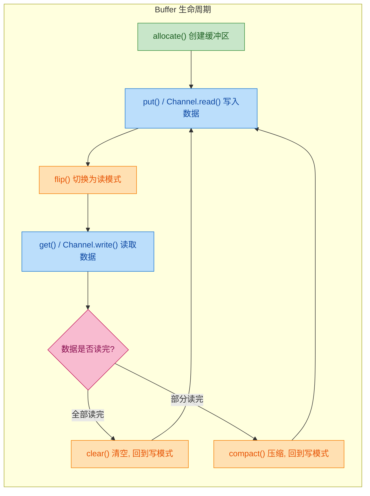

接下来逐一深入每个关键方法。

---

### flip() — 从写模式切换到读模式

`flip()` 是 Buffer 中最重要、也最容易出错的方法。它的源码极其简单：

```java
// java.nio.Buffer#flip 的等价逻辑
public Buffer flip() {
    limit = position;   // 把 limit 设置为当前写到的位置（即有效数据的末尾）
    position = 0;       // 把 position 归零（从头开始读）
    mark = -1;          // 清除之前的 mark 标记
    return this;
}
```

为什么需要 flip？因为 Buffer 不像某些数据结构有独立的读指针和写指针 —— 它只有一个 position。写完数据后 position 停在数据末尾，如果直接 `get()`，读到的是末尾之后的空白区域。flip 的作用就是 "翻转" 视角：把写入的终点变成读取的上界（limit），把起点归零（position = 0），这样 `get()` 就能从头读到尾。

一个经典的错误就是 **忘记调用 flip**：

```java
ByteBuffer buf = ByteBuffer.allocate(64);  // 创建 64 字节的缓冲区
buf.put("Hello".getBytes());               // 写入 5 个字节, position=5

// ❌ 错误：忘记 flip，直接读
byte[] wrong = new byte[5];
buf.get(wrong);  // 读到的是 position=5 之后的空数据！

// ✅ 正确：先 flip 再读
buf.flip();      // position=0, limit=5
byte[] correct = new byte[5];
buf.get(correct); // 读到 "Hello"
```

> 经验法则：**写完必 flip，flip 完才读。** 这是 NIO 编程中最基本的纪律。

---

### clear() — 清空缓冲区，回到写模式

```java
// java.nio.Buffer#clear 的等价逻辑
public Buffer clear() {
    position = 0;       // 归零
    limit = capacity;   // limit 恢复到最大容量
    mark = -1;          // 清除 mark
    return this;
}
```

注意：clear 并 **不会真正擦除数据**，缓冲区里的字节还在。它只是重置了三个指针，让 Buffer 看起来像是 "空的"，后续的 `put()` 会从头覆盖旧数据。这是一种高效的设计 —— 避免了无意义的内存清零操作。

```java
// clear 后的状态
//  position                          limit/capacity
//     ↓                                   ↓
//  [A][B][C][D][E][ ][ ][ ][ ][ ]    ← 旧数据还在，但逻辑上已"不可见"
//   0  1  2  3  4  5  6  7  8  9
```

---

### compact() — 压缩缓冲区，保留未读数据

`compact()` 解决的是一个很实际的问题：**数据只读了一半，剩下的还没处理，但又需要继续写入新数据。**

```java
// compact() 的行为（以 ByteBuffer 为例）
// 假设当前状态: position=3, limit=5 (已读3个，还剩2个未读)
//
//  已读区域    未读     空闲
//  [A][B][C] [D][E] [ ][ ][ ][ ][ ]
//   0  1  2   3  4   5  6  7  8  9
//            ↑pos    ↑limit
//
// 调用 compact() 后:
// 1. 把未读数据 [D][E] 拷贝到缓冲区开头
// 2. position = 剩余未读数量 (2)
// 3. limit = capacity
//
//  [D][E][ ][ ][ ][ ][ ][ ][ ][ ]
//   0  1  2  3  4  5  6  7  8  9
//         ↑pos                   ↑limit/capacity
//
// 现在可以从 position=2 的位置继续写入新数据，而 D、E 被保留了
```

compact 和 clear 的选择策略很简单：

- 数据全部读完了 → 用 `clear()`，更高效（不需要拷贝）
- 数据只读了一部分 → 用 `compact()`，保留未读部分

---

### rewind() — 重新读取

```java
// java.nio.Buffer#rewind 的等价逻辑
public Buffer rewind() {
    position = 0;   // 只把 position 归零
    mark = -1;      // 清除 mark
    return this;    // limit 保持不变！
}
```

rewind 和 flip 的区别在于：**rewind 不动 limit**。它的使用场景是 "我已经读过一遍了，想从头再读一遍"。因为 limit 在第一次 flip 时已经设好了，rewind 只需要把游标拨回起点。

```java
ByteBuffer buf = ByteBuffer.allocate(64);
buf.put("NIO".getBytes());
buf.flip();                    // position=0, limit=3

// 第一次读取
byte[] first = new byte[3];
buf.get(first);                // 读完后 position=3
System.out.println(new String(first)); // "NIO"

// 想再读一遍
buf.rewind();                  // position=0, limit 仍然=3
byte[] second = new byte[3];
buf.get(second);               // 再次从头读
System.out.println(new String(second)); // "NIO"
```

---

### mark() 与 reset() — 书签机制

Buffer 还提供了一对方法用于 "打标记 + 跳回标记"：

```java
buf.position(2);   // 移动到位置 2
buf.mark();        // 在位置 2 打一个书签 (mark = 2)
buf.get();         // 读一个字节, position 变成 3
buf.get();         // 再读一个, position 变成 4
buf.reset();       // 跳回 mark 的位置, position 恢复为 2
```

四个指针的完整不变式：

```
0 ≤ mark ≤ position ≤ limit ≤ capacity
```

需要注意：调用 `flip()`、`clear()`、`rewind()` 都会把 mark 重置为 -1（即丢弃标记），所以 mark/reset 只适合在一次读取过程中的局部回溯。

---

### 四大方法对比速查表

| 方法 | position | limit | mark | 典型场景 |
|------|----------|-------|------|---------|
| `flip()` | → 0 | → 旧 position | → -1 | 写完切读 |
| `clear()` | → 0 | → capacity | → -1 | 全部读完，准备重新写 |
| `compact()` | → remaining | → capacity | → -1 | 部分读完，保留剩余，继续写 |
| `rewind()` | → 0 | 不变 | → -1 | 重新读一遍 |

---

### Buffer 的创建方式

ByteBuffer 提供了三种创建方式，各有适用场景：

```java
// === 方式一：堆内缓冲区 (Heap Buffer) ===
// 数据存储在 JVM 堆内存中，由 GC 管理
// 分配快，但做 IO 时内核需要额外拷贝一次
ByteBuffer heapBuf = ByteBuffer.allocate(1024);  // 分配 1024 字节

// === 方式二：直接缓冲区 (Direct Buffer) ===
// 数据存储在 JVM 堆外的本地内存 (native memory)
// 分配慢、不受 GC 直接管理，但 IO 性能更高（少一次拷贝）
ByteBuffer directBuf = ByteBuffer.allocateDirect(1024);

// === 方式三：包装已有数组 (Wrap) ===
// 不分配新内存，直接把现有 byte[] 包装成 Buffer
// Buffer 和数组共享同一块内存，修改一方会影响另一方
byte[] data = {1, 2, 3, 4, 5};
ByteBuffer wrappedBuf = ByteBuffer.wrap(data);   // position=0, limit=capacity=5
```

Heap Buffer 和 Direct Buffer 的区别值得展开说明：

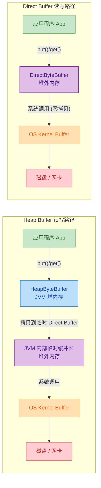

可以看到，Heap Buffer 在做真正的 IO 操作时，JVM 内部会偷偷创建一个临时的 Direct Buffer，把数据从堆内拷贝过去，再交给操作系统。这是因为 GC 可能随时移动堆内对象的内存地址，而操作系统的 IO 操作需要一个稳定的内存地址。Direct Buffer 直接分配在堆外，地址固定，省去了这次拷贝。

选择建议：

- 生命周期短、数据量小 → Heap Buffer（分配回收快，GC 友好）
- 生命周期长、频繁做 IO（如网络服务器的读写缓冲区）→ Direct Buffer（IO 性能好）
- 不要在循环里反复 `allocateDirect`，Direct Buffer 的分配和回收成本远高于 Heap Buffer

---

### 完整实战：Buffer 读写全流程

把上面所有知识串起来，看一个完整的例子：

```java
import java.nio.ByteBuffer;

public class BufferDemo {
    public static void main(String[] args) {
        // 1. 创建一个容量为 10 的堆内缓冲区
        ByteBuffer buf = ByteBuffer.allocate(10);
        // 此时: position=0, limit=10, capacity=10

        // 2. 写入数据
        buf.put((byte) 'H');   // position: 0 → 1
        buf.put((byte) 'e');   // position: 1 → 2
        buf.put((byte) 'l');   // position: 2 → 3
        buf.put((byte) 'l');   // position: 3 → 4
        buf.put((byte) 'o');   // position: 4 → 5
        // 此时: position=5, limit=10, capacity=10

        // 3. 切换到读模式（最关键的一步）
        buf.flip();
        // 此时: position=0, limit=5, capacity=10
        // 可读数据范围: [0, 5)

        // 4. 读取数据
        StringBuilder sb = new StringBuilder();
        while (buf.hasRemaining()) {          // hasRemaining() 等价于 position < limit
            char c = (char) buf.get();        // 每次 get() 后 position 自动 +1
            sb.append(c);
        }
        System.out.println(sb.toString());    // 输出: Hello
        // 此时: position=5, limit=5 (已读完)

        // 5. 清空缓冲区，准备下一轮写入
        buf.clear();
        // 此时: position=0, limit=10, capacity=10
        // 缓冲区逻辑上为空，可以重新写入
    }
}
```

再来一个 compact 的实战场景：

```java
import java.nio.ByteBuffer;

public class CompactDemo {
    public static void main(String[] args) {
        ByteBuffer buf = ByteBuffer.allocate(10);

        // 写入 5 个字节
        buf.put("ABCDE".getBytes());   // position=5, limit=10

        // 切换到读模式
        buf.flip();                     // position=0, limit=5

        // 只读取前 3 个字节
        for (int i = 0; i < 3; i++) {
            System.out.print((char) buf.get());  // 输出: ABC
        }
        System.out.println();
        // 此时: position=3, limit=5, 还剩 D、E 未读

        // 调用 compact：保留未读的 D、E，切换回写模式
        buf.compact();
        // 此时: [D][E][?][?][?][?][?][?][?][?]
        //        0   1  2  3  4  5  6  7  8  9
        //            ↑pos                      ↑limit/capacity
        // position=2 (未读数据量), limit=10

        // 继续写入新数据
        buf.put("FGH".getBytes());     // 从 position=2 开始写入
        // 此时: [D][E][F][G][H][?][?][?][?][?]
        //        0   1  2  3  4  5  ...
        //                          ↑pos

        // 再次 flip 读取全部有效数据
        buf.flip();                     // position=0, limit=5
        while (buf.hasRemaining()) {
            System.out.print((char) buf.get());  // 输出: DEFGH
        }
        System.out.println();
    }
}
```

---

### Buffer 的其他实用方法

```java
ByteBuffer buf = ByteBuffer.allocate(10);
buf.put("Hello".getBytes());
buf.flip();

// remaining(): 返回剩余可读/可写元素数量 (limit - position)
int remaining = buf.remaining();       // 5

// hasRemaining(): 是否还有剩余 (position < limit)
boolean has = buf.hasRemaining();      // true

// position(int): 手动设置 position（随机访问）
buf.position(2);                       // 跳到索引 2
byte b = buf.get();                    // 读取索引 2 的值 ('l'), position → 3

// get(int): 绝对读取，不移动 position
byte abs = buf.get(0);                 // 读取索引 0 的值 ('H'), position 不变

// put(int, byte): 绝对写入，不移动 position
buf.put(0, (byte) 'X');               // 把索引 0 改为 'X', position 不变

// slice(): 创建一个共享底层数据的子缓冲区
buf.position(1);
buf.limit(4);
ByteBuffer slice = buf.slice();        // slice 的 capacity=3, 对应原 buf 的 [1,4)
// 修改 slice 的数据会影响原 buf（共享内存）

// duplicate(): 创建一个共享底层数据的副本，但有独立的 position/limit/mark
ByteBuffer dup = buf.duplicate();      // dup 和 buf 共享数据，但指针独立

// asReadOnlyBuffer(): 创建只读视图
ByteBuffer readOnly = buf.asReadOnlyBuffer();
// readOnly.put((byte) 1);  // ❌ 抛出 ReadOnlyBufferException
```

---

### ByteBuffer 的类型视图

ByteBuffer 可以 "变身" 为其他类型的 Buffer，这在处理二进制协议时非常有用：

```java
ByteBuffer buf = ByteBuffer.allocate(16);

// 写入一个 int (4 字节) 和一个 double (8 字节)
buf.putInt(42);              // position: 0 → 4
buf.putDouble(3.14);         // position: 4 → 12

buf.flip();                  // 切换到读模式

// 按写入顺序读取
int i = buf.getInt();        // 42,  position: 0 → 4
double d = buf.getDouble();  // 3.14, position: 4 → 12

// 也可以通过视图操作
buf.clear();
buf.putInt(100);
buf.putInt(200);
buf.putInt(300);
buf.flip();

// 把 ByteBuffer 当作 IntBuffer 来用
IntBuffer intView = buf.asIntBuffer();  // 共享底层数据
System.out.println(intView.get());      // 100
System.out.println(intView.get());      // 200
System.out.println(intView.get());      // 300
```

---

### 字节序 (Byte Order)

多字节类型（int, long, double 等）在内存中的存储顺序有两种：Big-Endian（高位在前）和 Little-Endian（低位在前）。ByteBuffer 默认使用 Big-Endian，但可以切换：

```java
ByteBuffer buf = ByteBuffer.allocate(4);

// 默认 Big-Endian
buf.order(ByteOrder.BIG_ENDIAN);       // 网络字节序（Java 默认）
buf.putInt(0x01020304);
// 内存中: [01][02][03][04]

buf.clear();

// 切换为 Little-Endian
buf.order(ByteOrder.LITTLE_ENDIAN);    // x86 CPU 原生字节序
buf.putInt(0x01020304);
// 内存中: [04][03][02][01]
```

在网络编程中，协议通常规定使用 Big-Endian（也叫 Network Byte Order），这也是 Java 的默认选择。如果你需要和 C/C++ 程序交互，或者处理某些特定的二进制文件格式，可能需要切换为 Little-Endian。

---

**📝 练习题**

以下代码执行后，输出结果是什么？

```java
ByteBuffer buf = ByteBuffer.allocate(10);
buf.put(new byte[]{65, 66, 67, 68, 69}); // A B C D E
buf.flip();
buf.get();
buf.get();
buf.compact();
buf.put((byte) 70); // F
buf.flip();
byte[] result = new byte[buf.remaining()];
buf.get(result);
System.out.println(new String(result));
```

A. ABCDEF

B. CDE

C. CDEF

D. DEF


**【答案】** C

**【解析】** 逐步追踪指针状态：
1. `allocate(10)` → position=0, limit=10
2. `put(ABCDE)` → position=5, limit=10
3. `flip()` → position=0, limit=5
4. 第一次 `get()` → 读出 A, position=1
5. 第二次 `get()` → 读出 B, position=2
6. `compact()` → 将未读数据 CDE 拷贝到开头, position=3（未读数据量）, limit=10。此时缓冲区前三位是 [C][D][E]
7. `put(70)` → 在 position=3 写入 F, position=4。缓冲区: [C][D][E][F]...
8. `flip()` → position=0, limit=4
9. `remaining()` = 4, 读出 4 个字节: CDEF

这道题的核心考点是 `compact()` 的行为：它把 position 到 limit 之间的未读数据搬到缓冲区开头，然后把 position 设为未读数据的数量（而非 0），这样后续的 `put()` 就紧接在未读数据之后写入，不会覆盖它们。

---

## Channel（FileChannel、读写操作）

在 NIO 体系中，**Channel（通道）** 是数据传输的核心抽象。如果说 Buffer 是数据的"容器"，那么 Channel 就是连接数据源（文件、网络 Socket）与 Buffer 之间的"高速公路"。与传统 IO 中的 Stream 不同，Channel 具备几个关键特性：它是 **双向的**（既可读又可写）、它必须 **与 Buffer 配合** 才能工作、它支持 **非阻塞模式**（网络 Channel）以及 **异步操作**。

理解 Channel 最直观的方式是把它想象成一条铁路轨道——数据（货物）不能直接在轨道上堆放，必须先装进 Buffer（车厢），再通过 Channel（轨道）运输到目的地。这种"间接操作"的设计正是 NIO 高性能的基石之一。

### Channel 家族体系总览

Java NIO 提供了一组 Channel 实现，覆盖文件 IO 和网络 IO 两大场景。我们先从宏观上认识整个家族：

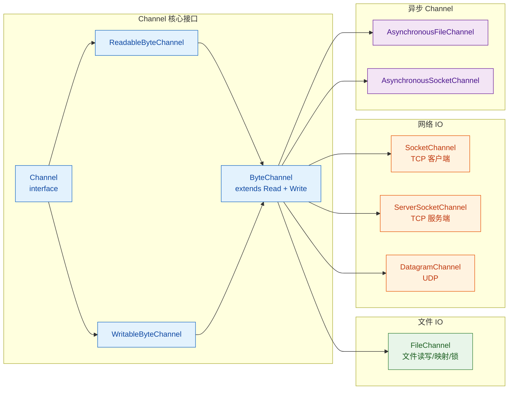

最顶层的 `Channel` 接口极其简单，只定义了两个方法：`isOpen()` 和 `close()`。真正赋予读写能力的是 `ReadableByteChannel` 和 `WritableByteChannel` 这两个子接口，而 `ByteChannel` 将二者合并，表示一个既可读又可写的通道。

本节我们聚焦于最常用、也最适合入门的 **FileChannel**。网络相关的 SocketChannel、ServerSocketChannel 将在 Selector 章节中结合多路复用一起讲解。

### FileChannel 基础：获取实例

FileChannel 是一个 **抽象类**，你无法直接 `new` 它。获取 FileChannel 实例有两种主流方式：

**方式一：从传统 IO 流中获取**

这是最经典的方式，通过 `FileInputStream`、`FileOutputStream` 或 `RandomAccessFile` 的 `getChannel()` 方法获得。需要注意的是，从 `FileInputStream` 获取的 Channel 只能读，从 `FileOutputStream` 获取的只能写，而 `RandomAccessFile` 根据打开模式决定读写能力。

```java
// 从 FileInputStream 获取 —— 只读 Channel
FileInputStream fis = new FileInputStream("data.txt");
FileChannel readChannel = fis.getChannel(); // 只能调用 read()

// 从 FileOutputStream 获取 —— 只写 Channel
FileOutputStream fos = new FileOutputStream("output.txt");
FileChannel writeChannel = fos.getChannel(); // 只能调用 write()

// 从 RandomAccessFile 获取 —— 可读可写 Channel
RandomAccessFile raf = new RandomAccessFile("data.txt", "rw");
FileChannel rwChannel = raf.getChannel(); // read() 和 write() 都可用
```

**方式二：使用 FileChannel.open()（推荐，Java 7+）**

这是更现代、更灵活的方式，直接通过静态工厂方法打开，配合 `StandardOpenOption` 枚举精确控制行为：

```java
// 以只读模式打开
FileChannel readCh = FileChannel.open(
    Path.of("data.txt"),        // 文件路径
    StandardOpenOption.READ     // 只读
);

// 以读写模式打开，文件不存在则创建
FileChannel rwCh = FileChannel.open(
    Path.of("data.txt"),
    StandardOpenOption.READ,            // 读
    StandardOpenOption.WRITE,           // 写
    StandardOpenOption.CREATE           // 不存在则创建
);

// 以追加模式打开
FileChannel appendCh = FileChannel.open(
    Path.of("log.txt"),
    StandardOpenOption.WRITE,           // 写
    StandardOpenOption.APPEND,          // 追加到末尾
    StandardOpenOption.CREATE           // 不存在则创建
);
```

`StandardOpenOption` 常用枚举值一览：

| 枚举值 | 含义 |
|---|---|
| `READ` | 以读模式打开 |
| `WRITE` | 以写模式打开 |
| `APPEND` | 追加写入（写到文件末尾） |
| `CREATE` | 文件不存在则创建 |
| `CREATE_NEW` | 创建新文件，若已存在则抛异常 |
| `TRUNCATE_EXISTING` | 打开时清空已有内容 |
| `DELETE_ON_CLOSE` | Channel 关闭时删除文件 |

### FileChannel 读操作

FileChannel 的读操作核心就一个方法：`read(ByteBuffer dst)`。它从文件中读取数据并填入 Buffer，返回实际读取的字节数。当到达文件末尾时返回 **-1**。

我们来看一个完整的文件读取示例，逐行拆解每个步骤：

```java
public static void readFile(String path) throws IOException {
    // 1. 以只读模式打开 FileChannel
    //    try-with-resources 确保 Channel 自动关闭
    try (FileChannel channel = FileChannel.open(
            Path.of(path), StandardOpenOption.READ)) {

        // 2. 分配一个 1024 字节的堆内缓冲区
        //    这是数据的"中转站"，Channel 会把数据读到这里
        ByteBuffer buffer = ByteBuffer.allocate(1024);

        // 3. 循环读取，直到文件末尾
        //    channel.read(buffer) 将数据从文件写入 buffer
        //    返回值是本次实际读取的字节数，-1 表示 EOF
        while (channel.read(buffer) != -1) {

            // 4. 切换 buffer 为读模式
            //    flip() 将 limit 设为当前 position，position 归零
            //    这样后续的 get 操作才能读到刚写入的数据
            buffer.flip();

            // 5. 使用 Charset 将 buffer 中的字节解码为字符串
            //    StandardCharsets.UTF_8 指定解码字符集
            System.out.print(
                StandardCharsets.UTF_8.decode(buffer).toString()
            );

            // 6. 清空 buffer，为下一轮读取做准备
            //    clear() 将 position 归零，limit 设为 capacity
            //    注意：数据并未真正擦除，只是重置了指针
            buffer.clear();
        }
    } // 7. try-with-resources 自动调用 channel.close()
}
```

整个读取过程的数据流向可以用下图表示：

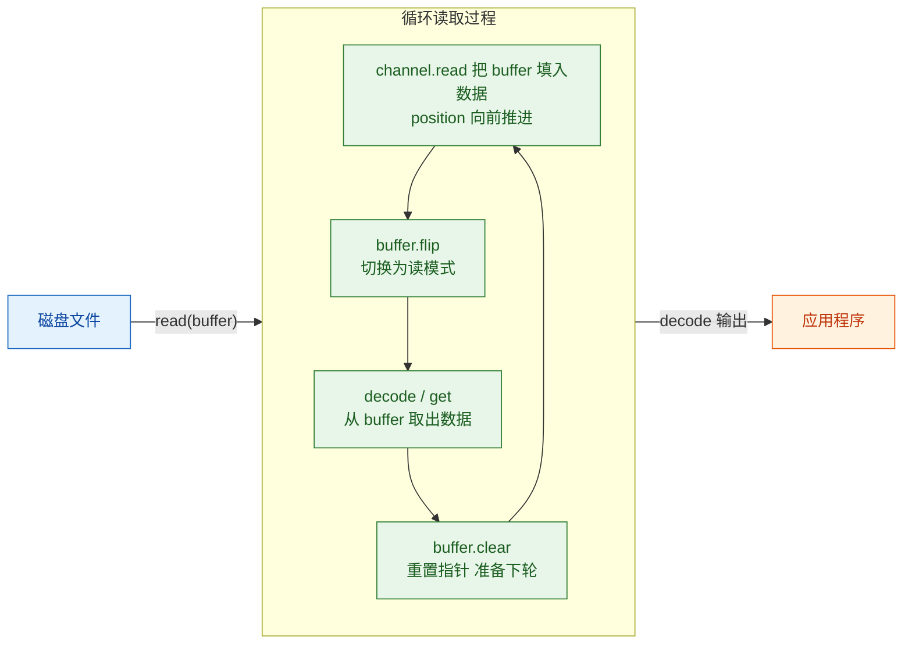

有一个容易被忽略的细节：**Buffer 的大小选择**。如果文件很大而 Buffer 很小（比如 16 字节），循环次数会非常多，系统调用开销增大；如果 Buffer 过大（比如 1GB），又会浪费内存。实际开发中，**4KB ~ 64KB** 是比较常见的选择，与操作系统的页大小（通常 4KB）对齐可以获得最佳性能。

### FileChannel 写操作

写操作与读操作是镜像关系，核心方法是 `write(ByteBuffer src)`。它从 Buffer 中读取数据并写入文件，返回实际写入的字节数。

```java
public static void writeFile(String path, String content) throws IOException {
    // 1. 以写模式打开 Channel，文件不存在则创建，存在则清空
    try (FileChannel channel = FileChannel.open(
            Path.of(path),
            StandardOpenOption.WRITE,
            StandardOpenOption.CREATE,
            StandardOpenOption.TRUNCATE_EXISTING)) {

        // 2. 将字符串编码为 ByteBuffer
        //    wrap() 创建的 buffer 已经处于"可读"状态
        //    即 position=0, limit=字节数组长度
        ByteBuffer buffer = ByteBuffer.wrap(
            content.getBytes(StandardCharsets.UTF_8)
        );

        // 3. 循环写入，确保所有数据都写完
        //    hasRemaining() 检查 position < limit
        //    即 buffer 中是否还有未写出的数据
        while (buffer.hasRemaining()) {
            // write() 不保证一次写完所有数据
            // 所以必须循环调用直到 buffer 清空
            channel.write(buffer);
        }
    }
}
```

这里有一个关键的 **"write 循环"模式**（write-loop pattern）。`channel.write(buffer)` 并不保证一次调用就能把 Buffer 中所有数据写入文件——操作系统可能因为各种原因（缓冲区满、信号中断等）只写入了部分数据。因此，**必须用 `while (buffer.hasRemaining())` 循环**，这是 NIO 编程中的标准实践。

### 文件复制：Channel 间的数据传输

FileChannel 提供了两个高效的"零拷贝"方法，可以在两个 Channel 之间直接传输数据，无需经过用户空间的 Buffer 中转：

- `transferTo(long position, long count, WritableByteChannel target)` —— 从当前 Channel 传输到目标
- `transferFrom(ReadableByteChannel src, long position, long count)` —— 从源 Channel 传输到当前

这两个方法在底层会尝试使用操作系统的 **零拷贝机制**（如 Linux 的 `sendfile()` 系统调用），数据直接在内核空间完成传输，避免了"内核缓冲区 → 用户缓冲区 → 内核缓冲区"的两次多余拷贝，性能远优于手动 Buffer 中转。

```java
public static void copyFile(String src, String dst) throws IOException {
    // 同时打开源文件（只读）和目标文件（写+创建）
    try (FileChannel srcChannel = FileChannel.open(
                Path.of(src), StandardOpenOption.READ);
         FileChannel dstChannel = FileChannel.open(
                Path.of(dst),
                StandardOpenOption.WRITE,
                StandardOpenOption.CREATE,
                StandardOpenOption.TRUNCATE_EXISTING)) {

        // 获取源文件总大小
        long fileSize = srcChannel.size();

        // transferTo 在某些操作系统上单次传输有上限（如 Linux 约 2GB）
        // 所以对大文件需要循环传输
        long transferred = 0; // 已传输字节数
        while (transferred < fileSize) {
            // 从 transferred 位置开始，传输剩余字节到目标 Channel
            long bytes = srcChannel.transferTo(
                transferred,                    // 源文件起始位置
                fileSize - transferred,         // 要传输的字节数
                dstChannel                      // 目标 Channel
            );
            transferred += bytes; // 累加已传输量
        }
    }
}
```

我们来对比一下三种文件复制方式的性能差异：

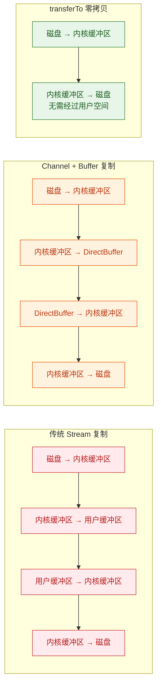

可以清晰地看到，`transferTo` 将四次数据拷贝缩减为两次，这在复制大文件时性能提升非常显著。

### FileChannel 的位置与大小控制

FileChannel 维护着一个内部的 **文件位置指针**（file position），类似于传统 IO 中 `RandomAccessFile` 的文件指针。你可以精确控制从文件的哪个位置开始读写：

```java
try (FileChannel channel = FileChannel.open(
        Path.of("data.txt"),
        StandardOpenOption.READ, StandardOpenOption.WRITE)) {

    // 获取当前位置（初始为 0）
    long pos = channel.position();       // 0

    // 跳转到文件第 100 字节处
    channel.position(100);               // 设置位置为 100

    // 从第 100 字节处开始读取
    ByteBuffer buf = ByteBuffer.allocate(50);
    channel.read(buf);                   // 读取 50 字节（位置 100~149）

    // 获取文件总大小（字节数）
    long size = channel.size();

    // 截断文件为 200 字节（超出部分被丢弃）
    channel.truncate(200);

    // 强制将数据刷写到磁盘
    // 参数 true 表示同时刷写文件内容和元数据（修改时间等）
    // 参数 false 表示只刷写文件内容
    channel.force(true);
}
```

`force()` 方法值得特别关注。操作系统为了性能，通常会将写入的数据暂存在内核缓冲区中，并不立即写入磁盘。如果此时系统崩溃，数据就会丢失。`force(true)` 相当于 `fsync` 系统调用，强制将所有未写入的数据刷到物理磁盘上。在需要 **数据持久性保证** 的场景（如数据库、消息队列）中，这个方法至关重要。

### 内存映射文件（Memory-Mapped File）

FileChannel 最强大的特性之一是 **内存映射**（Memory-Mapped I/O）。通过 `map()` 方法，可以将文件的一部分或全部直接映射到进程的虚拟内存空间中。映射完成后，你可以像操作一个超大的 ByteBuffer 一样直接读写文件内容，操作系统会自动处理内存与磁盘之间的同步。

```java
try (FileChannel channel = FileChannel.open(
        Path.of("large_data.bin"),
        StandardOpenOption.READ, StandardOpenOption.WRITE)) {

    // 将文件从位置 0 开始、整个文件大小的区域映射到内存
    // MapMode.READ_WRITE 表示可读可写
    // 返回的 MappedByteBuffer 是 ByteBuffer 的子类
    MappedByteBuffer mappedBuffer = channel.map(
        FileChannel.MapMode.READ_WRITE,  // 映射模式
        0,                                // 起始位置
        channel.size()                    // 映射长度
    );

    // 现在可以像操作普通 ByteBuffer 一样操作文件内容
    // 读取第 0 个字节
    byte firstByte = mappedBuffer.get(0);

    // 在位置 0 写入一个字节，会直接反映到文件中
    mappedBuffer.put(0, (byte) 0x41);  // 写入 'A'

    // 读取位置 100 处的一个 int（4 字节）
    int value = mappedBuffer.getInt(100);

    // 强制将修改刷写到磁盘
    mappedBuffer.force();
}
```

`map()` 方法支持三种映射模式：

| 模式 | 含义 |
|---|---|
| `MapMode.READ_ONLY` | 只读映射，尝试写入会抛 `ReadOnlyBufferException` |
| `MapMode.READ_WRITE` | 可读可写，修改会最终写回文件 |
| `MapMode.PRIVATE` | 写时复制（Copy-on-Write），修改不会写回原文件 |

内存映射的工作原理如下：


当你通过 `MappedByteBuffer` 访问某个位置时，如果对应的数据还没有加载到物理内存中，操作系统会触发一个 **缺页中断**（Page Fault），自动将对应的文件数据页从磁盘加载到内存。整个过程对应用程序完全透明。

内存映射的优势在于：
- **避免了系统调用开销**：读写操作不需要 `read()`/`write()` 系统调用，直接通过内存地址访问
- **利用操作系统的页缓存**：多个进程映射同一文件时可以共享物理内存页
- **适合随机访问大文件**：比如数据库索引文件、大型二进制文件

但也有注意事项：映射的内存区域由 GC 管理，但 **释放时机不确定**；映射非常大的文件可能耗尽虚拟地址空间（32 位 JVM 尤其明显）。

### 文件锁（File Lock）

在多进程并发访问同一文件的场景下，FileChannel 提供了 **文件锁** 机制来协调访问：

```java
try (FileChannel channel = FileChannel.open(
        Path.of("shared.dat"),
        StandardOpenOption.READ, StandardOpenOption.WRITE)) {

    // 获取独占锁（排他锁），会阻塞直到获取成功
    // lock() 锁定整个文件
    FileLock lock = channel.lock();

    try {
        // 在锁保护下安全地读写文件
        ByteBuffer buf = ByteBuffer.allocate(1024);
        channel.read(buf);
        // ... 处理数据 ...
    } finally {
        // 必须释放锁
        lock.release();
    }

    // 也可以锁定文件的一部分区域
    // lock(position, size, shared)
    // shared=true 为共享锁（允许其他进程同时读）
    // shared=false 为独占锁（其他进程不能读也不能写）
    FileLock regionLock = channel.lock(0, 100, true); // 共享锁，锁前 100 字节

    // tryLock() 是非阻塞版本，获取不到锁时返回 null 而不是阻塞
    FileLock tryResult = channel.tryLock();
    if (tryResult != null) {
        // 获取到锁，执行操作
        tryResult.release();
    } else {
        // 未获取到锁，执行其他逻辑
    }
}
```

需要注意的是，Java 的文件锁是 **进程级别** 的（process-level），而不是线程级别的。同一个 JVM 内的多个线程不能用 FileLock 来互斥——那是 `synchronized` 或 `ReentrantLock` 的工作。FileLock 用于协调 **不同进程**（比如两个独立的 Java 应用）对同一文件的并发访问。

### Channel 与 Stream 的对比总结

最后，我们把 Channel 和传统 IO Stream 做一个全面对比，帮助你在实际开发中做出正确选择：

| 特性 | Stream（传统 IO） | Channel（NIO） |
|---|---|---|
| 方向性 | 单向（InputStream 或 OutputStream） | 双向（同一个 Channel 可读可写） |
| 数据操作方式 | 直接操作字节/字符 | 必须通过 Buffer 间接操作 |
| 阻塞模式 | 只支持阻塞 | 文件 Channel 阻塞，网络 Channel 可非阻塞 |
| 零拷贝 | 不支持 | `transferTo`/`transferFrom` 支持 |
| 内存映射 | 不支持 | `map()` 支持 |
| 文件锁 | 不支持 | `lock()`/`tryLock()` 支持 |
| Scatter/Gather | 不支持 | 支持（多 Buffer 读写） |
| 线程安全 | 通常不安全 | FileChannel 线程安全 |

一个简单的选择原则：如果你只是做简单的文件读写、逐行处理文本，传统 IO（配合 BufferedReader 等）更简洁；如果你需要高性能文件复制、随机访问大文件、内存映射、或者网络编程中的多路复用，NIO Channel 是更好的选择。

---

**📝 练习题**

以下关于 FileChannel 的说法，哪一项是正确的？

A. FileChannel 可以通过 `new FileChannel()` 直接实例化


B. `transferTo()` 方法在底层仍然需要将数据从内核空间拷贝到用户空间再拷贝回去


C. `channel.write(buffer)` 保证一次调用就能将 buffer 中所有剩余数据写入文件


D. `FileChannel.map()` 返回的 `MappedByteBuffer` 可以让应用程序像操作内存一样直接读写文件内容


**【答案】** D

**【解析】** 逐项分析：A 错误，FileChannel 是抽象类，不能直接实例化，只能通过 `FileChannel.open()` 或传统流的 `getChannel()` 获取。B 错误，`transferTo()` 的核心优势正是"零拷贝"——数据在内核空间直接从源文件缓冲区传输到目标文件缓冲区，不经过用户空间。C 错误，`write()` 不保证一次写完所有数据，操作系统可能只写入部分字节，因此必须用 `while (buffer.hasRemaining())` 循环写入。D 正确，`map()` 将文件区域映射到进程的虚拟内存空间，返回的 `MappedByteBuffer` 允许通过 `get()`/`put()` 直接操作文件内容，操作系统通过缺页中断（Page Fault）机制自动处理内存与磁盘的同步。

---

## Selector 概述（多路复用）

在传统的 Java IO 模型中，每一个网络连接都需要一个独立的线程来处理。当并发连接数达到成千上万时，线程的创建、切换和销毁开销会迅速耗尽系统资源——这就是经典的 **C10K 问题**（The C10K Problem）。Java NIO 引入的 `Selector`（选择器）正是为了解决这个问题而生的核心组件。它实现了 **I/O 多路复用**（I/O Multiplexing）机制：**一个线程，通过一个 Selector，就能同时监控多个 Channel 上的 I/O 事件**。这是构建高性能网络服务器的基石。

### 什么是 I/O 多路复用

要理解 Selector，首先需要理解"多路复用"这个概念。"多路"指的是多个网络连接（即多个 Channel），"复用"指的是复用同一个线程。传统阻塞 IO 模型下，`accept()`、`read()`、`write()` 都是阻塞调用，线程会卡在那里等待数据就绪，因此每个连接必须分配一个线程。而多路复用的思路完全不同：**不让线程去等待某一个连接，而是让线程去问操作系统——"我关心的这些连接里，哪些已经准备好了？"**。操作系统会返回一个就绪列表，线程只处理那些真正有数据可读、可写的连接，其余时间可以做别的事或者高效地等待。

这个机制在操作系统层面有多种实现：Linux 上的 `epoll`、macOS/BSD 上的 `kqueue`、Windows 上的 `IOCP`（严格来说 IOCP 是异步 IO，但 Java NIO 在 Windows 上也做了适配）。Java 的 `Selector` 是对这些底层系统调用的跨平台抽象，开发者无需关心底层差异，只需面向 `Selector` API 编程即可。

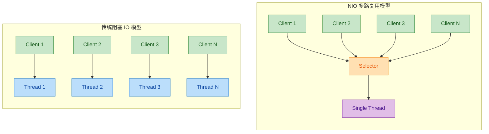

左边的传统模型中，N 个客户端需要 N 个线程；右边的 NIO 模型中，N 个客户端只需要 1 个 Selector 加 1 个线程。当 N 从几十增长到几万时，性能差距是数量级的。

### Selector 的核心三角关系：Selector、Channel、SelectionKey

NIO 多路复用模型由三个核心角色构成，它们之间的关系必须理解清楚：

**Selector（选择器）** 是事件的调度中心。它维护着一组已注册的 Channel，并在调用 `select()` 时询问操作系统哪些 Channel 上有就绪事件。

**SelectableChannel（可选择通道）** 是能够被 Selector 监控的 Channel。注意，不是所有 Channel 都能注册到 Selector 上——只有继承自 `SelectableChannel` 的通道才行。最常用的两个是 `ServerSocketChannel`（监听端口、接受连接）和 `SocketChannel`（读写数据）。`FileChannel` 不是 `SelectableChannel`，因此不能用于 Selector。此外，Channel 必须被设置为 **非阻塞模式**（`configureBlocking(false)`），否则注册时会抛出 `IllegalBlockingModeException`。

**SelectionKey（选择键）** 是 Channel 注册到 Selector 后返回的"凭证"。它记录了这个 Channel 关心哪些事件（interest set）、当前哪些事件已就绪（ready set），还可以附带一个 attachment 对象用于携带上下文信息。可以把 SelectionKey 理解为 Channel 和 Selector 之间的"合同"。

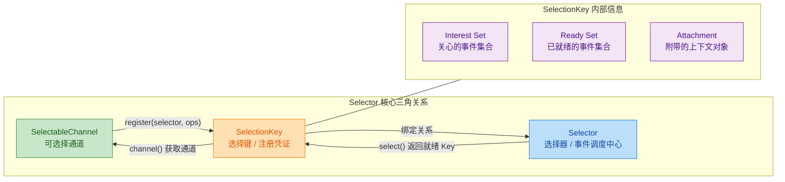

### 四种 I/O 事件类型

Selector 能够监控的事件类型定义在 `SelectionKey` 的常量中，一共有四种：

| 常量 | 值 | 含义 | 适用 Channel |
|---|---|---|---|
| `SelectionKey.OP_ACCEPT` | 16 | 有新连接可接受 | `ServerSocketChannel` |
| `SelectionKey.OP_CONNECT` | 8 | 连接建立完成 | `SocketChannel` |
| `SelectionKey.OP_READ` | 1 | 有数据可读 | `SocketChannel` |
| `SelectionKey.OP_WRITE` | 4 | 可以写入数据 | `SocketChannel` |

这四种事件覆盖了网络通信的完整生命周期：服务端用 `OP_ACCEPT` 接受连接，客户端用 `OP_CONNECT` 确认连接建立，双方用 `OP_READ` 和 `OP_WRITE` 进行数据交换。

事件类型可以通过 **位或运算** 组合注册。例如同时关心读和写：

```java
// 同时注册读事件和写事件
// OP_READ = 0001, OP_WRITE = 0100, 位或结果 = 0101
channel.register(selector, SelectionKey.OP_READ | SelectionKey.OP_WRITE);
```

关于 `OP_WRITE` 有一个常见的陷阱需要特别注意：**大多数时候 Socket 的写缓冲区都是可写的**，所以如果你一直注册 `OP_WRITE`，`select()` 几乎每次都会返回这个事件，导致 CPU 空转（busy loop）。正确的做法是：只在你确实有数据要写、且上一次 `write()` 没有写完（缓冲区满了）时，才临时注册 `OP_WRITE`；写完后立即取消。

### Selector 的三个 Key 集合

Selector 内部维护着三个 `Set<SelectionKey>` 集合，理解它们对于正确使用 Selector 至关重要：

**1. Registered Key Set（已注册键集合）**：通过 `selector.keys()` 获取。包含所有当前注册到这个 Selector 上的 SelectionKey。这个集合是只读的，不能直接修改。当 Channel 注册时 Key 被加入，当 Channel 关闭或 Key 被 `cancel()` 时 Key 被移除。

**2. Selected Key Set（已选择键集合）**：通过 `selector.selectedKeys()` 获取。这是最重要的集合——每次调用 `select()` 后，所有有就绪事件的 Key 都会被放入这个集合。**关键点：Selector 只会往这个集合里添加 Key，不会主动移除。** 开发者必须在处理完一个 Key 后手动将其从集合中移除（通常通过 `Iterator.remove()`），否则下次 `select()` 返回时，已经处理过的 Key 仍然在集合中，会导致重复处理。

**3. Cancelled Key Set（已取消键集合）**：这是一个内部集合，不对外暴露 API。当调用 `key.cancel()` 时，Key 会被放入这个集合。在下一次 `select()` 调用时，Selector 会清理这些已取消的 Key，将它们从已注册集合和已选择集合中移除，并注销对应的 Channel。

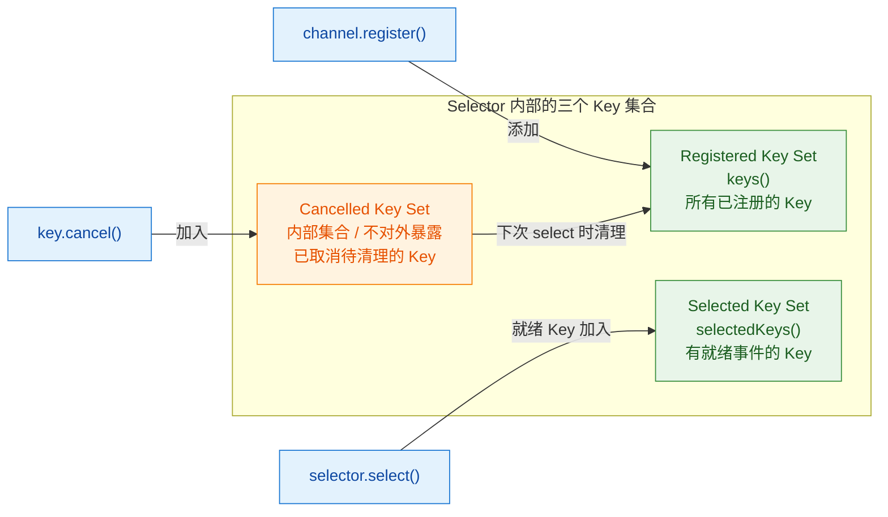

### select() 方法的三种形式

`Selector` 提供了三种 `select` 方法，它们的阻塞行为不同：

```java
// 1. 阻塞式 select —— 一直阻塞，直到至少有一个 Channel 就绪
//    返回值是"新增"就绪的 Channel 数量（不是总数）
int readyCount = selector.select();

// 2. 带超时的 select —— 最多阻塞 timeout 毫秒
//    超时后即使没有就绪事件也会返回 0
int readyCount = selector.select(long timeout);

// 3. 非阻塞式 selectNow —— 立即返回，不阻塞
//    如果没有就绪事件，返回 0
int readyCount = selector.selectNow();
```

需要注意 `select()` 的返回值含义：它返回的是 **自上次 select 调用以来新增的就绪 Key 数量**，而不是 Selected Key Set 的总大小。如果一个 Key 在上次 select 后就已经在 Selected Key Set 中（因为你没有 remove 它），这次它不会被重复计数。

另外，阻塞中的 `select()` 可以被其他线程通过调用 `selector.wakeup()` 唤醒。`wakeup()` 的效果是"一次性"的——如果当前没有线程阻塞在 `select()` 上，那么下一次 `select()` 调用会立即返回。这在需要动态修改 Channel 注册事件或优雅关闭服务器时非常有用。

### 完整的 NIO Server 实战

下面是一个完整的、可运行的 NIO Echo Server 示例。它接受客户端连接，读取客户端发送的消息，然后原样回传（Echo）。这个例子展示了 Selector 的标准使用模式：

```java
import java.io.IOException;
import java.net.InetSocketAddress;
import java.nio.ByteBuffer;
import java.nio.channels.*;
import java.util.Iterator;
import java.util.Set;

public class NioEchoServer {

    public static void main(String[] args) throws IOException {

        // ========== 1. 初始化阶段 ==========

        // 打开一个 Selector（底层会根据操作系统选择 epoll/kqueue/IOCP）
        Selector selector = Selector.open();

        // 打开一个 ServerSocketChannel，用于监听客户端连接
        ServerSocketChannel serverChannel = ServerSocketChannel.open();

        // 绑定到本地 8080 端口
        serverChannel.bind(new InetSocketAddress(8080));

        // 【关键】设置为非阻塞模式，这是注册到 Selector 的前提条件
        serverChannel.configureBlocking(false);

        // 将 ServerSocketChannel 注册到 Selector 上，关心 ACCEPT 事件
        // 返回的 SelectionKey 可以保存下来，但这里我们暂时不需要
        serverChannel.register(selector, SelectionKey.OP_ACCEPT);

        System.out.println("NIO Echo Server started on port 8080...");

        // ========== 2. 事件循环（Event Loop） ==========

        // 这就是 NIO 服务器的核心——一个无限循环，不断轮询就绪事件
        while (true) {

            // 阻塞等待，直到至少有一个 Channel 上有就绪事件
            // 返回值是新增就绪的 Channel 数量
            int readyChannels = selector.select();

            // 如果返回 0，说明是被 wakeup() 唤醒或超时，跳过本轮
            if (readyChannels == 0) {
                continue;
            }

            // 获取所有有就绪事件的 SelectionKey 集合
            Set<SelectionKey> selectedKeys = selector.selectedKeys();

            // 使用 Iterator 遍历，因为我们需要在遍历过程中移除元素
            Iterator<SelectionKey> keyIterator = selectedKeys.iterator();

            while (keyIterator.hasNext()) {

                // 取出当前的 SelectionKey
                SelectionKey key = keyIterator.next();

                // 【关键】处理完后必须手动移除！
                // 否则下次 select() 返回时这个 Key 还在集合中，会重复处理
                keyIterator.remove();

                // 判断事件类型并分发处理
                if (key.isAcceptable()) {
                    // ---- 处理新连接 ----
                    handleAccept(key, selector);

                } else if (key.isReadable()) {
                    // ---- 处理读事件 ----
                    handleRead(key);
                }
            }
        }
    }

    /**
     * 处理 OP_ACCEPT 事件：接受新的客户端连接
     */
    private static void handleAccept(SelectionKey key, Selector selector)
            throws IOException {

        // 通过 SelectionKey 获取对应的 ServerSocketChannel
        ServerSocketChannel serverChannel = (ServerSocketChannel) key.channel();

        // 接受客户端连接，返回一个新的 SocketChannel
        // 因为 ServerSocketChannel 是非阻塞的，accept() 不会阻塞
        SocketChannel clientChannel = serverChannel.accept();

        // 将新的客户端 Channel 也设置为非阻塞模式
        clientChannel.configureBlocking(false);

        // 将客户端 Channel 注册到同一个 Selector 上，关心 READ 事件
        // 同时附带一个 ByteBuffer 作为 attachment，用于后续读写
        clientChannel.register(selector, SelectionKey.OP_READ,
                ByteBuffer.allocate(1024));

        System.out.println("New client connected: "
                + clientChannel.getRemoteAddress());
    }

    /**
     * 处理 OP_READ 事件：读取客户端数据并回传（Echo）
     */
    private static void handleRead(SelectionKey key) throws IOException {

        // 通过 SelectionKey 获取对应的 SocketChannel
        SocketChannel clientChannel = (SocketChannel) key.channel();

        // 获取注册时附带的 ByteBuffer（attachment）
        ByteBuffer buffer = (ByteBuffer) key.attachment();

        // 清空 buffer，准备读入新数据
        buffer.clear();

        // 从 Channel 读取数据到 Buffer
        // 返回值：正数 = 读取的字节数，0 = 没有数据，-1 = 连接关闭
        int bytesRead = clientChannel.read(buffer);

        if (bytesRead == -1) {
            // 客户端关闭了连接
            System.out.println("Client disconnected: "
                    + clientChannel.getRemoteAddress());
            // 取消这个 Key 的注册（会在下次 select 时清理）
            key.cancel();
            // 关闭 Channel
            clientChannel.close();
            return;
        }

        if (bytesRead > 0) {
            // 翻转 buffer：从写模式切换到读模式
            // position 归零，limit 设为之前写入的位置
            buffer.flip();

            // 将 buffer 中的数据原样写回客户端（Echo）
            // 注意：实际生产中应该循环写入，因为 write() 不保证一次写完
            clientChannel.write(buffer);

            // 如果 buffer 中还有未写完的数据（write 没有写完）
            if (buffer.hasRemaining()) {
                // compact() 将未读数据移到 buffer 开头，为下次写入做准备
                buffer.compact();
            } else {
                // 全部写完，清空 buffer
                buffer.clear();
            }
        }
    }
}
```

### 事件循环的执行流程

上面代码的核心是 `while(true)` 中的事件循环（Event Loop）。下面用流程图展示它的完整执行逻辑：

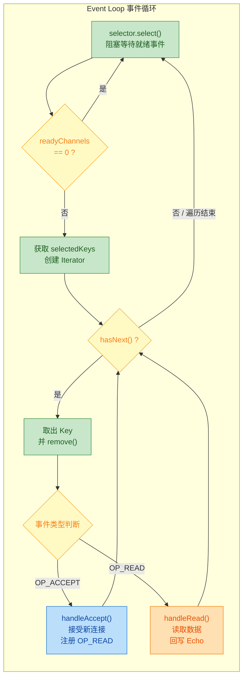

### Reactor 模式：从 Selector 到架构设计

Selector 的事件循环本质上就是 **Reactor 模式**（反应器模式）的核心实现。理解这一点对于后续学习 Netty 等框架至关重要。

Reactor 模式的核心思想是：**将 I/O 事件的检测和事件的处理解耦**。Reactor（即 Selector 所在的事件循环）负责监听和分发事件，具体的业务处理交给 Handler。

在实际的高性能服务器中，Reactor 模式有三种经典变体：

**单 Reactor 单线程**：就是我们上面写的 Echo Server。一个线程既负责 `select()` 又负责处理所有事件。优点是简单，没有线程安全问题；缺点是如果某个 Handler 的处理耗时较长（比如涉及数据库查询），会阻塞整个事件循环，所有其他连接都得等着。Redis 6.0 之前就是这种模型。

**单 Reactor 多线程**：Reactor 线程只负责 `select()` 和事件分发，具体的业务处理（decode、compute、encode）交给一个线程池。这样即使某个 Handler 耗时较长，也不会阻塞事件循环。但 Reactor 线程本身仍然是单线程，在海量连接下可能成为瓶颈。

**主从 Reactor 多线程（Master-Slave Reactor）**：这是 Netty 默认采用的模型。Main Reactor 只负责 `accept()` 新连接，然后将新连接分配给 Sub Reactor。每个 Sub Reactor 各自拥有一个 Selector，负责处理分配给它的连接上的读写事件。业务处理仍然可以交给线程池。这种模型能充分利用多核 CPU，是目前最主流的高性能网络编程架构。

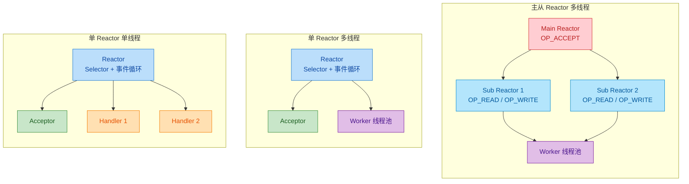

### 使用 Selector 的常见陷阱与最佳实践

**1. 忘记 remove SelectionKey**

这是最常见的 Bug。`selectedKeys()` 返回的集合，Selector 只会往里添加，不会移除。如果你处理完一个 Key 后不调用 `iterator.remove()`，下次循环时这个 Key 还在，会被重复处理。轻则逻辑错误，重则抛出异常。

```java
// ❌ 错误写法：使用 for-each 无法在遍历中移除元素
for (SelectionKey key : selector.selectedKeys()) {
    // 处理事件...
    // 没有 remove，下次还会处理这个 key！
}

// ✅ 正确写法：使用 Iterator 并在处理后 remove
Iterator<SelectionKey> it = selector.selectedKeys().iterator();
while (it.hasNext()) {
    SelectionKey key = it.next();
    it.remove(); // 处理前或处理后移除，但必须移除
    // 处理事件...
}
```

**2. 不检查 Key 的有效性**

在多线程环境下，或者在处理一个 Key 的过程中另一个 Key 对应的 Channel 被关闭了，Key 可能变为无效。安全的做法是在处理前检查 `key.isValid()`：

```java
while (it.hasNext()) {
    SelectionKey key = it.next();
    it.remove();
    // 先检查 Key 是否仍然有效
    if (!key.isValid()) {
        continue; // 跳过无效的 Key
    }
    if (key.isAcceptable()) {
        // ...
    }
}
```

**3. OP_WRITE 的正确使用方式**

前面提到过，不要一直注册 `OP_WRITE`。正确的模式是：

```java
// 当需要写数据时，先尝试直接写
int written = channel.write(buffer);

// 如果 buffer 还有剩余数据没写完（说明 Socket 写缓冲区满了）
if (buffer.hasRemaining()) {
    // 这时才注册 OP_WRITE，等待缓冲区可写时继续写
    key.interestOps(key.interestOps() | SelectionKey.OP_WRITE);
} else {
    // 写完了，取消 OP_WRITE 注册，避免空转
    key.interestOps(key.interestOps() & ~SelectionKey.OP_WRITE);
}
```

**4. 异常处理要关闭 Channel**

如果在处理某个 Channel 时发生异常（比如客户端异常断开），必须关闭 Channel 并取消 Key，否则这个"坏掉"的 Channel 会一直触发事件，导致事件循环空转：

```java
try {
    handleRead(key);
} catch (IOException e) {
    // 发生异常，关闭连接并取消注册
    key.cancel();          // 取消 Key
    key.channel().close(); // 关闭 Channel
}
```

### NIO Selector 与操作系统底层的映射

Java Selector 的性能最终取决于底层操作系统的 I/O 多路复用实现。了解这层映射关系有助于理解性能特征：

| 操作系统 | 底层实现 | Java Selector Provider | 时间复杂度 |
|---|---|---|---|
| Linux 2.6+ | `epoll` | `EPollSelectorProvider` | O(1) 就绪检测 |
| macOS / BSD | `kqueue` | `KQueueSelectorProvider` | O(1) 就绪检测 |
| Windows | `IOCP` (通过 `poll` 适配) | `WindowsSelectorProvider` | O(n) 轮询 |
| Linux 旧版 | `poll` | `PollSelectorProvider` | O(n) 轮询 |

早期 Linux 上 Java 使用的是 `poll` 系统调用，每次 `select()` 都需要遍历所有注册的文件描述符，时间复杂度为 O(n)。当连接数很大时性能急剧下降。Linux 2.6 引入的 `epoll` 采用了事件驱动机制——内核维护一个就绪列表，只有状态发生变化的文件描述符才会被加入列表，因此检测就绪事件的时间复杂度降为 O(1)，这是 Linux 上 NIO 高性能的根本原因。

`epoll` 有两种触发模式值得了解（虽然 Java 层面不直接暴露这个选项）：

**水平触发（Level Triggered, LT）**：只要文件描述符上有未读数据，每次 `epoll_wait` 都会返回这个描述符。Java NIO 默认使用这种模式，更安全但可能有多余的唤醒。

**边缘触发（Edge Triggered, ET）**：只在状态发生变化时通知一次。效率更高，但要求应用层必须一次性读完所有数据，否则会丢失事件。Netty 的 `EpollEventLoop` 支持 ET 模式。

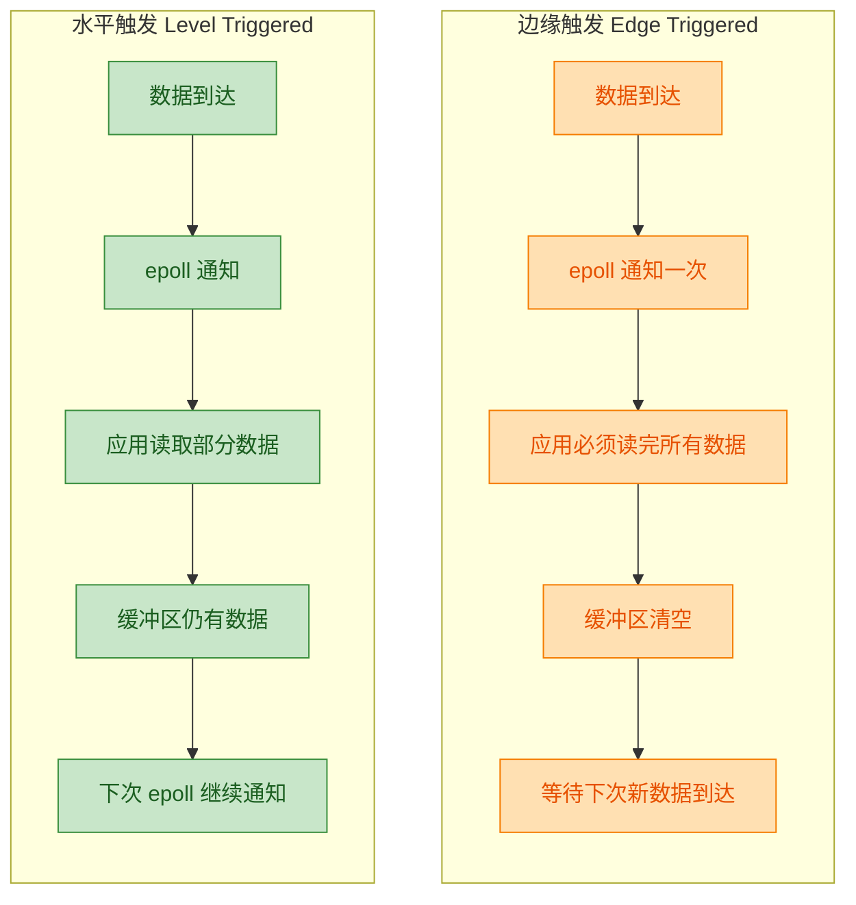

### NIO Selector 的局限性与 NIO.2 / Netty 的演进

尽管 Selector 是 Java 网络编程的重大进步，但直接使用原生 NIO API 仍然存在不少痛点：

**API 复杂度高**：从上面的 Echo Server 就能看出，即使是最简单的功能，代码量也不小。Buffer 的 flip/clear/compact 操作容易出错，事件循环的异常处理需要非常小心。

**著名的 epoll bug（JDK-6670302）**：在 Linux 上，Java NIO 存在一个臭名昭著的 Bug——在某些条件下，`select()` 会在没有任何就绪事件时提前返回（空轮询），导致 CPU 100%。这个 Bug 从 JDK 6 开始就存在，虽然后续版本做了缓解，但并未完全修复。Netty 通过检测空轮询次数并自动重建 Selector 的方式巧妙地绕过了这个问题。

**半包 / 粘包问题**：TCP 是流式协议，不保证消息边界。一次 `read()` 可能读到半条消息（半包），也可能读到两条消息粘在一起（粘包）。原生 NIO 没有提供任何帮助，开发者必须自己实现消息的编解码和拆包逻辑。

**连接管理和心跳**：原生 NIO 不提供连接超时检测、心跳机制等功能，这些都需要自己实现。

正因为这些原因，实际生产中几乎没有人直接使用原生 NIO API，而是使用 **Netty** 这样的框架。Netty 在 NIO 之上提供了：更友好的 `ByteBuf` 替代 `ByteBuffer`、内置的编解码器框架解决粘包半包、自动处理 epoll bug、完善的连接管理和心跳机制、以及主从 Reactor 线程模型的开箱即用实现。

```java
// 对比：原生 NIO vs Netty 实现同样的 Echo Server

// ---- 原生 NIO：约 80-100 行代码（如上面的完整示例）----

// ---- Netty：核心代码约 20 行 ----
// EventLoopGroup bossGroup = new NioEventLoopGroup(1);    // Main Reactor
// EventLoopGroup workerGroup = new NioEventLoopGroup();    // Sub Reactors
// ServerBootstrap b = new ServerBootstrap();
// b.group(bossGroup, workerGroup)
//  .channel(NioServerSocketChannel.class)
//  .childHandler(new ChannelInitializer<SocketChannel>() {
//      protected void initChannel(SocketChannel ch) {
//          ch.pipeline().addLast(new EchoServerHandler());
//      }
//  });
// b.bind(8080).sync();
```

理解原生 NIO Selector 的工作原理，是学习 Netty 的必要前提。Netty 并没有发明新的 I/O 模型，它只是把 NIO 的 Selector、Channel、Buffer 这些概念包装得更优雅、更健壮。当你理解了 Selector 的事件循环、SelectionKey 的管理、以及 Reactor 模式的演进，再去看 Netty 的源码就会有"原来如此"的感觉。

---

**📝 练习题**

以下关于 Java NIO Selector 的描述，哪一项是正确的？

A. `FileChannel` 可以注册到 Selector 上，监听文件的读写就绪事件

B. 调用 `selector.select()` 后，Selector 会自动从 `selectedKeys()` 集合中移除已处理的 Key，开发者无需手动移除

C. Channel 注册到 Selector 之前，必须调用 `configureBlocking(false)` 将其设置为非阻塞模式，否则会抛出异常

D. `OP_WRITE` 事件应该始终保持注册状态，以确保数据能及时写出


**【答案】** C

**【解析】** 逐项分析：

A 错误。`FileChannel` 没有继承 `SelectableChannel`，因此不能注册到 Selector 上。只有 `ServerSocketChannel`、`SocketChannel`、`DatagramChannel` 等网络相关的 Channel 才是 `SelectableChannel` 的子类。

B 错误。这是使用 Selector 最常见的陷阱。Selector 只会往 `selectedKeys()` 集合中添加就绪的 Key，**绝不会主动移除**。开发者必须在处理完每个 Key 后通过 `Iterator.remove()` 手动移除，否则会导致事件被重复处理。

C 正确。这是 Selector 的硬性要求。`SelectableChannel.register()` 方法的源码中会检查 Channel 的阻塞模式，如果是阻塞模式（`isBlocking() == true`），会直接抛出 `IllegalBlockingModeException`。这是因为 Selector 的多路复用机制本身就依赖于非阻塞 I/O——如果 Channel 是阻塞的，`read()`/`write()` 会卡住线程，Selector 的事件循环就无法正常运转。

D 错误。大多数时候 Socket 的写缓冲区都是空闲可写的，如果一直注册 `OP_WRITE`，`select()` 几乎每次都会返回这个事件，导致事件循环空转、CPU 飙升。正确做法是只在写缓冲区满、数据没写完时才临时注册 `OP_WRITE`，写完后立即取消。

---

## Path 与 Files —— 现代文件操作

Java 7 引入了全新的文件系统 API，位于 `java.nio.file` 包下，核心就是 `Path` 接口和 `Files` 工具类。它们是对老旧的 `java.io.File` 类的全面替代（replacement），解决了 `File` 类长期存在的诸多设计缺陷。在现代 Java 项目中，除非维护遗留代码，否则应当全面拥抱 `Path` + `Files` 的组合。

### 为什么要替代 java.io.File

`File` 类从 JDK 1.0 就存在了，但它的问题随着时间推移越来越明显：

- `File.delete()` 删除失败时只返回 `false`，不告诉你原因（no exception, no reason）。你根本不知道是权限不够、文件不存在还是被占用。
- `File.mkdir()` 同样只返回布尔值，创建失败时你只能猜。
- `File.renameTo()` 在跨文件系统时行为不一致，在 Windows 和 Linux 上表现不同，这对跨平台开发是灾难。
- `File` 不支持符号链接（symbolic links）的操作。
- `File` 没有提供文件属性的细粒度访问，比如文件的创建时间、所有者等元数据。
- `File.list()` 在大目录下返回一个巨大的字符串数组，全部加载到内存，没有懒加载（lazy loading）机制。

`Path` + `Files` 的设计哲学完全不同：操作失败就抛出具体的 `IOException`，告诉你到底哪里出了问题。API 设计也更加流畅和一致。

```java
// 旧方式：File 的痛点
File file = new File("/tmp/test.txt");
boolean deleted = file.delete(); // 失败了？为什么？不知道。

// 新方式：Files 直接抛异常，原因清清楚楚
Path path = Path.of("/tmp/test.txt");
Files.delete(path); // 文件不存在？抛 NoSuchFileException
                     // 权限不够？抛 AccessDeniedException
```

### Path 接口详解

`Path` 是 `java.nio.file` 包的核心接口，它代表文件系统中的一个路径。注意，`Path` 只是路径的抽象表示，它不关心这个路径指向的文件或目录是否真的存在。你可以把它理解为一个"智能字符串"，专门用来描述文件系统中的位置。

#### 创建 Path 对象

```java
// ========== 创建 Path 的三种主要方式 ==========

// 方式一：Path.of()（Java 11+，最推荐的写法）
Path p1 = Path.of("/home/user/documents/report.txt");  // 绝对路径
Path p2 = Path.of("src", "main", "java");              // 可变参数自动拼接，等价于 "src/main/java"

// 方式二：Paths.get()（Java 7+，功能与 Path.of() 完全相同）
// 实际上 Path.of() 内部就是调用 Paths.get()
Path p3 = Paths.get("/home/user/documents/report.txt");
Path p4 = Paths.get("src", "main", "java");

// 方式三：从 FileSystem 获取（用于访问非默认文件系统，如 ZIP 文件内部）
Path p5 = FileSystems.getDefault().getPath("/tmp", "test.txt");

// 与旧 API 互转（兼容遗留代码时使用）
File oldFile = new File("/tmp/test.txt");
Path fromFile = oldFile.toPath();        // File -> Path
File backToFile = fromFile.toFile();     // Path -> File
```

#### Path 的组成结构解析

一个路径由多个"名称元素"（name elements）组成，`Path` 提供了丰富的方法来拆解和检查这些元素。

```java
Path path = Path.of("/home/user/documents/report.txt");

// ========== 基本信息提取 ==========
path.getFileName();    // report.txt     —— 路径的最后一个元素（文件名或目录名）
path.getParent();      // /home/user/documents —— 父路径
path.getRoot();        // /              —— 根元素（Windows 上可能是 "C:\"）
path.getNameCount();   // 4              —— 名称元素个数（不含根）

// ========== 按索引访问名称元素 ==========
path.getName(0);       // home           —— 第 0 个元素
path.getName(1);       // user           —— 第 1 个元素
path.getName(2);       // documents
path.getName(3);       // report.txt

// ========== 子路径截取 ==========
path.subpath(0, 2);   // home/user      —— 从索引 0 到 2（不含 2）的子路径

// ========== 路径类型判断 ==========
path.isAbsolute();     // true           —— 是否为绝对路径
Path rel = Path.of("src/Main.java");
rel.isAbsolute();      // false          —— 相对路径
```

下面用一张图来直观展示 `Path` 的结构拆解：

```
Path: /home/user/documents/report.txt

┌──────┬──────────────────────────────────┐
│ Root │         Name Elements            │
│  /   │ home / user / documents / report │
└──────┴──────────────────────────────────┘
         [0]    [1]      [2]       [3]

getRoot()       → "/"
getName(0)      → "home"
getName(3)      → "report.txt"
getParent()     → "/home/user/documents"
getFileName()   → "report.txt"
getNameCount()  → 4
subpath(1, 3)   → "user/documents"
```

#### 路径拼接与解析

`Path` 提供了非常优雅的路径操作方法，避免了手动拼接字符串时容易出错的斜杠问题。

```java
// ========== resolve：拼接子路径 ==========
// resolve 是最常用的路径拼接方法
Path base = Path.of("/home/user");
Path full = base.resolve("documents/report.txt");
// 结果：/home/user/documents/report.txt
// 如果参数是绝对路径，则直接返回参数本身
Path abs = base.resolve("/etc/config");
// 结果：/etc/config（参数是绝对路径，base 被忽略）

// ========== resolveSibling：替换最后一个元素（兄弟路径） ==========
// 常用于"同目录下换个文件名"的场景
Path original = Path.of("/home/user/photo.jpg");
Path sibling = original.resolveSibling("photo_backup.jpg");
// 结果：/home/user/photo_backup.jpg

// ========== relativize：计算相对路径 ==========
// 从一个路径到另一个路径需要怎么走
Path p1 = Path.of("/home/user");
Path p2 = Path.of("/home/user/documents/report.txt");
Path relative = p1.relativize(p2);
// 结果：documents/report.txt（从 p1 出发到 p2 的相对路径）

Path p3 = Path.of("/home/admin");
Path rel2 = p1.relativize(p3);
// 结果：../admin（先回退一级，再进入 admin）

// ========== normalize：清理冗余的 . 和 .. ==========
Path messy = Path.of("/home/user/../user/./documents/../documents/report.txt");
Path clean = messy.normalize();
// 结果：/home/user/documents/report.txt（干干净净）

// ========== toAbsolutePath：转为绝对路径 ==========
Path rel = Path.of("src/Main.java");
Path absolute = rel.toAbsolutePath();
// 结果取决于当前工作目录，例如：/project/src/Main.java

// ========== toRealPath：解析符号链接，返回真实的规范路径 ==========
// 这个方法会实际访问文件系统，文件必须存在
Path real = Path.of("/tmp/link").toRealPath();
// 如果 /tmp/link 是指向 /var/data 的符号链接，返回 /var/data
```

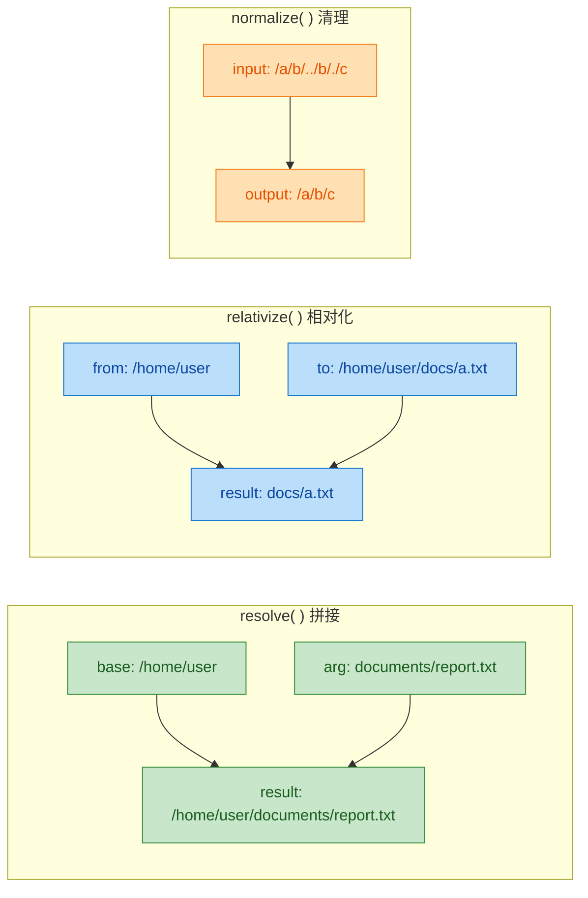

### Files 工具类详解

`Files` 是一个纯静态方法的工具类（utility class），提供了你能想到的几乎所有文件操作。它和 `Path` 配合使用，构成了现代 Java 文件操作的完整方案。

#### 文件与目录的创建

```java
// ========== 创建文件 ==========
Path newFile = Path.of("/tmp/hello.txt");
Files.createFile(newFile);
// 文件已存在？抛 FileAlreadyExistsException

// ========== 创建单层目录 ==========
Path dir = Path.of("/tmp/mydir");
Files.createDirectory(dir);
// 父目录不存在？抛 NoSuchFileException

// ========== 创建多层目录（递归创建，最常用） ==========
Path dirs = Path.of("/tmp/a/b/c/d");
Files.createDirectories(dirs);
// 自动创建所有不存在的中间目录，已存在也不报错

// ========== 创建临时文件和临时目录 ==========
// 临时文件：前缀 + 随机字符 + 后缀
Path tempFile = Files.createTempFile("app_", ".tmp");
// 例如：/tmp/app_8234792347.tmp

// 临时目录
Path tempDir = Files.createTempDirectory("cache_");
// 例如：/tmp/cache_1234567890
```

#### 文件的读写操作

这是 `Files` 最让人爱不释手的部分。以前用 `BufferedReader` + `FileReader` 写一堆样板代码才能读个文件，现在一行搞定。

```java
Path path = Path.of("example.txt");

// ========== 一次性读写（适合小文件） ==========

// 读取全部内容为字符串（Java 11+）
String content = Files.readString(path);

// 读取全部行为 List<String>
List<String> lines = Files.readAllLines(path, StandardCharsets.UTF_8);

// 读取全部字节
byte[] bytes = Files.readAllBytes(path);

// 写入字符串（Java 11+）
Files.writeString(path, "Hello NIO!", StandardCharsets.UTF_8);

// 写入多行
List<String> data = List.of("第一行", "第二行", "第三行");
Files.write(path, data, StandardCharsets.UTF_8);

// 写入字节
Files.write(path, new byte[]{72, 101, 108, 108, 111});

// ========== 追加写入 ==========
// 使用 StandardOpenOption.APPEND 选项
Files.writeString(path, "\n追加的内容",
        StandardCharsets.UTF_8,
        StandardOpenOption.APPEND);       // 追加模式

Files.write(path, List.of("追加行1", "追加行2"),
        StandardCharsets.UTF_8,
        StandardOpenOption.APPEND,        // 追加
        StandardOpenOption.CREATE);       // 不存在则创建

// ========== 流式读写（适合大文件） ==========

// 获取 BufferedReader（自动处理编码）
try (BufferedReader reader = Files.newBufferedReader(path, StandardCharsets.UTF_8)) {
    String line;
    while ((line = reader.readLine()) != null) {
        // 逐行处理，内存友好
        System.out.println(line);
    }
}

// 获取 BufferedWriter
try (BufferedWriter writer = Files.newBufferedWriter(path, StandardCharsets.UTF_8)) {
    writer.write("通过 BufferedWriter 写入");
    writer.newLine();  // 写入平台相关的换行符
}

// 获取 InputStream / OutputStream（处理二进制数据）
try (InputStream in = Files.newInputStream(path)) {
    // 读取二进制数据
}
try (OutputStream out = Files.newOutputStream(path, StandardOpenOption.APPEND)) {
    // 写入二进制数据
}

// ========== lines()：惰性流式读取（大文件首选） ==========
// 返回 Stream<String>，按需读取，不会一次性加载整个文件
try (Stream<String> stream = Files.lines(path, StandardCharsets.UTF_8)) {
    stream.filter(line -> line.contains("ERROR"))   // 只筛选包含 ERROR 的行
          .map(String::trim)                         // 去除首尾空白
          .forEach(System.out::println);             // 输出
}
// 注意：Files.lines() 返回的 Stream 必须关闭（用 try-with-resources）
// 因为底层持有文件句柄（file handle）
```

`readAllLines` vs `lines` 的选择是一个常见的面试考点：

```
readAllLines()                          lines()
┌─────────────────────────┐    ┌─────────────────────────┐
│  一次性全部读入内存       │    │  惰性逐行读取(lazy)      │
│  返回 List<String>       │    │  返回 Stream<String>     │
│  小文件友好              │    │  大文件友好               │
│  自动关闭资源            │    │  必须手动关闭 Stream      │
│  可随机访问 list.get(i)  │    │  只能顺序消费一次         │
└─────────────────────────┘    └─────────────────────────┘
```

#### 文件的复制、移动与删除

```java
Path source = Path.of("original.txt");
Path target = Path.of("backup/original.txt");

// ========== 复制 ==========
Files.copy(source, target);
// 目标已存在？抛 FileAlreadyExistsException

// 覆盖已有文件
Files.copy(source, target, StandardCopyOption.REPLACE_EXISTING);

// 复制文件属性（权限、时间戳等）
Files.copy(source, target,
        StandardCopyOption.REPLACE_EXISTING,
        StandardCopyOption.COPY_ATTRIBUTES);  // 保留原文件的元数据

// 从 InputStream 复制到文件（下载场景常用）
try (InputStream in = new URL("https://example.com/file.zip").openStream()) {
    Files.copy(in, Path.of("downloaded.zip"),
            StandardCopyOption.REPLACE_EXISTING);
}

// ========== 移动（重命名也是移动） ==========
Files.move(source, target);

// 原子移动（要么完全成功，要么完全不动，不会出现中间状态）
Files.move(source, target,
        StandardCopyOption.ATOMIC_MOVE);      // 原子操作，保证数据安全

// ========== 删除 ==========
Files.delete(path);              // 文件不存在？抛 NoSuchFileException
Files.deleteIfExists(path);      // 文件不存在？静默返回 false，不抛异常

// 注意：Files 没有递归删除目录的方法
// 删除非空目录会抛 DirectoryNotEmptyException
// 需要自己用 walkFileTree 实现递归删除（后面会讲）
```

#### 文件属性与检查

```java
Path path = Path.of("example.txt");

// ========== 存在性与类型检查 ==========
Files.exists(path);              // 是否存在
Files.notExists(path);           // 是否确定不存在（注意：和 !exists() 不完全等价）
Files.isRegularFile(path);       // 是否为普通文件
Files.isDirectory(path);         // 是否为目录
Files.isSymbolicLink(path);      // 是否为符号链接
Files.isReadable(path);          // 是否可读
Files.isWritable(path);          // 是否可写
Files.isExecutable(path);        // 是否可执行
Files.isHidden(path);            // 是否为隐藏文件

// ========== 文件大小 ==========
long size = Files.size(path);    // 返回字节数

// ========== 最后修改时间 ==========
FileTime lastModified = Files.getLastModifiedTime(path);
System.out.println(lastModified);  // 2024-01-15T08:30:00Z

// 修改最后修改时间
Files.setLastModifiedTime(path, FileTime.fromMillis(System.currentTimeMillis()));

// ========== MIME 类型探测 ==========
String mimeType = Files.probeContentType(path);
// 例如："text/plain", "image/png", "application/pdf"

// ========== 详细属性（BasicFileAttributes） ==========
BasicFileAttributes attrs = Files.readAttributes(path, BasicFileAttributes.class);
attrs.creationTime();            // 创建时间
attrs.lastModifiedTime();        // 最后修改时间
attrs.lastAccessTime();          // 最后访问时间
attrs.size();                    // 文件大小
attrs.isRegularFile();           // 是否普通文件
attrs.isDirectory();             // 是否目录
attrs.isSymbolicLink();          // 是否符号链接
```

关于 `exists()` 和 `notExists()` 的微妙区别值得说明一下。你可能觉得 `notExists(path)` 就等于 `!exists(path)`，但实际上存在第三种状态：当 JVM 没有权限访问该路径时，`exists()` 返回 `false`，`notExists()` 也返回 `false`——文件的存在性是"未知"的（unknown）。所以严谨的代码应该同时考虑这三种情况。

### 目录遍历

`Files` 提供了多种遍历目录的方式，从简单的单层列举到深度递归，各有适用场景。

#### list —— 单层目录列举

```java
// Files.list() 只列出直接子项（不递归），返回惰性 Stream
try (Stream<Path> entries = Files.list(Path.of("/home/user"))) {
    entries.filter(Files::isRegularFile)       // 只要文件，不要目录
           .filter(p -> p.toString().endsWith(".java"))  // 只要 .java 文件
           .sorted()                            // 按路径排序
           .forEach(System.out::println);       // 输出
}
// 同样需要 try-with-resources 关闭底层目录流
```

#### walk —— 递归遍历

```java
// Files.walk() 递归遍历整个目录树，深度优先（depth-first）
try (Stream<Path> tree = Files.walk(Path.of("/project/src"))) {
    // 统计所有 .java 文件的总行数
    long totalLines = tree
            .filter(p -> p.toString().endsWith(".java"))  // 筛选 Java 文件
            .mapToLong(p -> {
                try {
                    return Files.lines(p).count();         // 统计每个文件的行数
                } catch (IOException e) {
                    return 0L;
                }
            })
            .sum();                                        // 求和
    System.out.println("Total lines of Java code: " + totalLines);
}

// 限制遍历深度（第二个参数）
try (Stream<Path> shallow = Files.walk(Path.of("/project"), 2)) {
    // 最多往下走 2 层
    shallow.forEach(System.out::println);
}
```

#### walkFileTree —— 访问者模式遍历

`walkFileTree` 是最强大也最灵活的遍历方式，它基于访问者模式（Visitor Pattern），让你在遍历过程中精确控制每一步的行为。最经典的用例就是递归删除目录。

```java
// ========== 经典用例：递归删除目录 ==========
Path dirToDelete = Path.of("/tmp/old_project");

Files.walkFileTree(dirToDelete, new SimpleFileVisitor<Path>() {

    // 访问每个文件时调用
    @Override
    public FileVisitResult visitFile(Path file, BasicFileAttributes attrs)
            throws IOException {
        Files.delete(file);                    // 删除文件
        return FileVisitResult.CONTINUE;       // 继续遍历
    }

    // 离开目录时调用（此时目录内的文件已经全部删除）
    @Override
    public FileVisitResult postVisitDirectory(Path dir, IOException exc)
            throws IOException {
        Files.delete(dir);                     // 删除空目录
        return FileVisitResult.CONTINUE;       // 继续遍历
    }
});
```

`FileVisitResult` 枚举提供了四种控制指令：

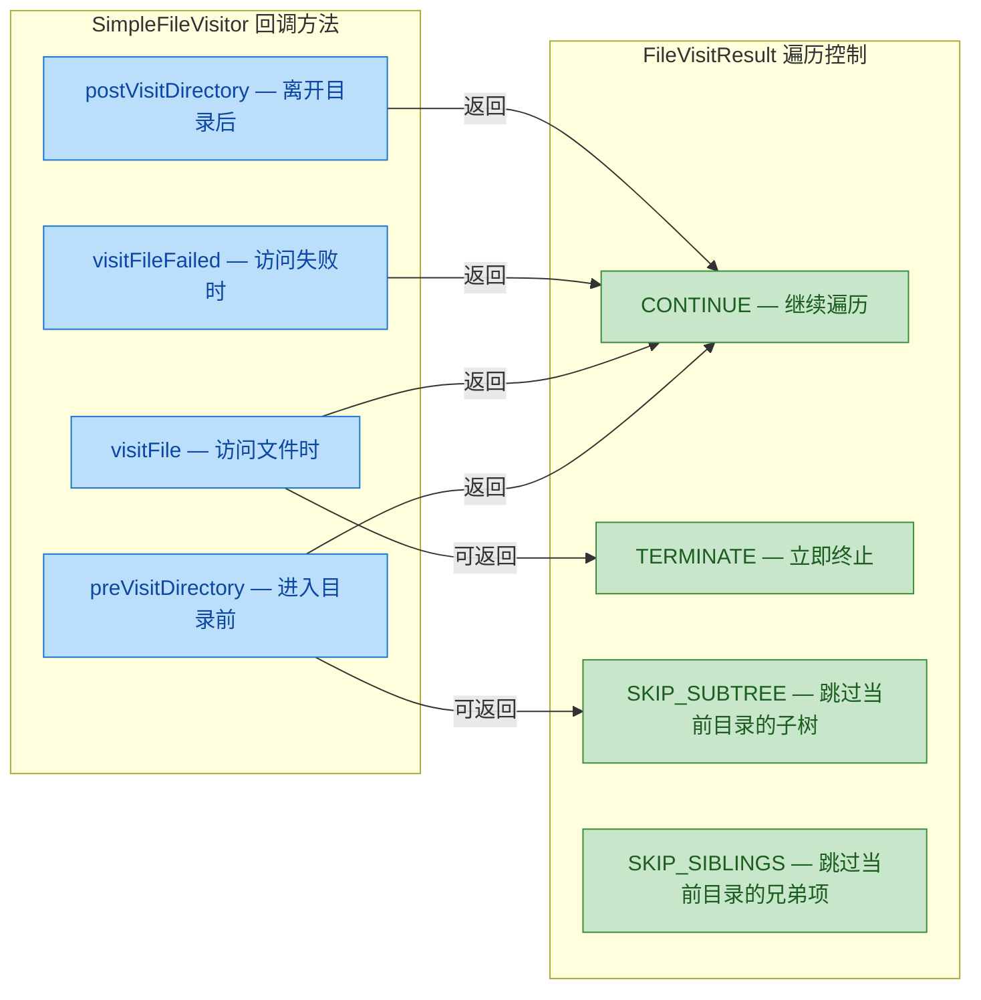

再来一个实用例子——递归复制整个目录：

```java
// ========== 递归复制目录 ==========
Path src = Path.of("/project/source");
Path dest = Path.of("/project/backup");

Files.walkFileTree(src, new SimpleFileVisitor<Path>() {

    // 进入目录前：在目标位置创建对应目录
    @Override
    public FileVisitResult preVisitDirectory(Path dir, BasicFileAttributes attrs)
            throws IOException {
        // src.relativize(dir) 计算 dir 相对于 src 的路径
        // dest.resolve(...) 拼接到目标路径
        Path targetDir = dest.resolve(src.relativize(dir));
        Files.createDirectories(targetDir);    // 创建目标目录
        return FileVisitResult.CONTINUE;
    }

    // 访问文件时：复制到目标位置
    @Override
    public FileVisitResult visitFile(Path file, BasicFileAttributes attrs)
            throws IOException {
        Path targetFile = dest.resolve(src.relativize(file));
        Files.copy(file, targetFile,
                StandardCopyOption.REPLACE_EXISTING);  // 复制文件
        return FileVisitResult.CONTINUE;
    }
});
```

### find —— 条件搜索

`Files.find()` 结合了 `walk` 的递归能力和自定义过滤条件，非常适合文件搜索场景。

```java
// 搜索 /project 下所有大于 1MB 的 .log 文件，最多递归 10 层
try (Stream<Path> results = Files.find(
        Path.of("/project"),          // 起始目录
        10,                           // 最大递归深度
        (path, attrs) ->              // BiPredicate<Path, BasicFileAttributes>
                attrs.isRegularFile()                          // 是普通文件
                && path.toString().endsWith(".log")            // 以 .log 结尾
                && attrs.size() > 1024 * 1024                  // 大于 1MB
)) {
    results.sorted(Comparator.comparingLong(p -> {
                try {
                    return Files.size(p);                      // 按文件大小排序
                } catch (IOException e) {
                    return 0L;
                }
            }))
           .forEach(p -> System.out.println(p + " -> " + formatSize(p)));
}
```

### 实战：File vs Path + Files 对比

用一个完整的对比来感受新旧 API 的差距：

```java
// ========== 旧方式：java.io.File ==========
public static void copyDirectoryOld(File src, File dest) {
    if (src.isDirectory()) {                       // 判断是否为目录
        if (!dest.exists()) {
            boolean created = dest.mkdirs();       // 创建目录，失败只返回 false
            if (!created) {
                // 为什么失败？不知道。权限？磁盘满了？路径非法？
                System.err.println("Failed to create: " + dest);
                return;
            }
        }
        String[] children = src.list();            // 可能返回 null！
        if (children != null) {                    // 必须判空
            for (String child : children) {
                copyDirectoryOld(
                    new File(src, child),
                    new File(dest, child)
                );
            }
        }
    } else {
        // 手动用流复制文件，一堆样板代码...
        try (InputStream in = new FileInputStream(src);
             OutputStream out = new FileOutputStream(dest)) {
            byte[] buf = new byte[8192];
            int len;
            while ((len = in.read(buf)) > 0) {
                out.write(buf, 0, len);
            }
        } catch (IOException e) {
            e.printStackTrace();
        }
    }
}

// ========== 新方式：Path + Files ==========
public static void copyDirectoryNew(Path src, Path dest) throws IOException {
    // 简洁、安全、异常信息明确
    Files.walkFileTree(src, new SimpleFileVisitor<>() {
        @Override
        public FileVisitResult preVisitDirectory(Path dir, BasicFileAttributes attrs)
                throws IOException {
            Files.createDirectories(dest.resolve(src.relativize(dir)));
            return FileVisitResult.CONTINUE;
        }

        @Override
        public FileVisitResult visitFile(Path file, BasicFileAttributes attrs)
                throws IOException {
            Files.copy(file, dest.resolve(src.relativize(file)),
                    StandardCopyOption.REPLACE_EXISTING);
            return FileVisitResult.CONTINUE;
        }
    });
}
```

### 常用 API 速查

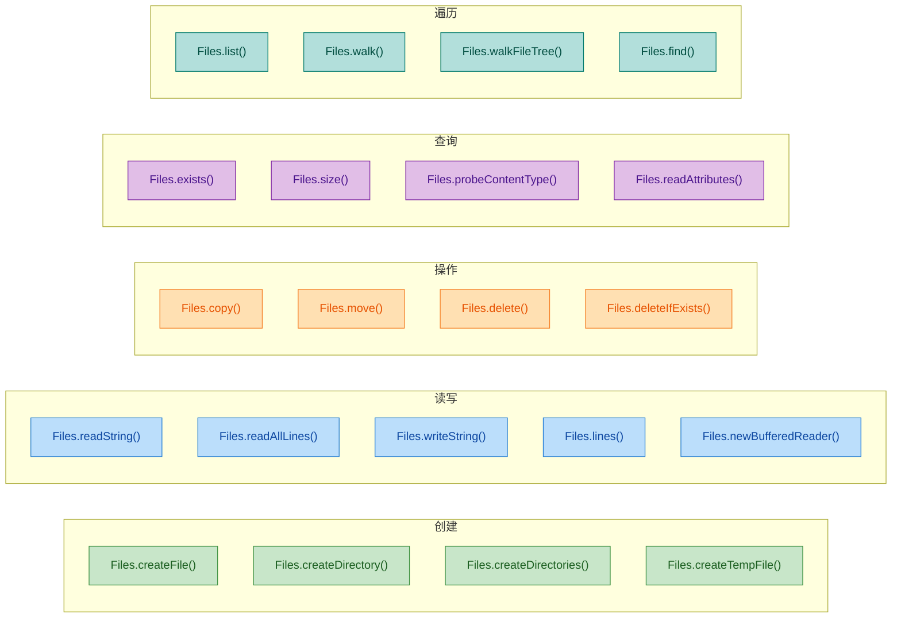

### StandardOpenOption 详解

在使用 `Files.write()`、`Files.newOutputStream()` 等方法时，你可以通过 `StandardOpenOption` 枚举来精确控制文件的打开方式。这些选项可以组合使用，非常灵活。

```java
// ========== 常用 OpenOption 组合 ==========

// 默认行为（不指定时）：CREATE + TRUNCATE_EXISTING + WRITE
Files.writeString(path, "hello");
// 等价于：
Files.writeString(path, "hello",
        StandardOpenOption.CREATE,              // 不存在则创建
        StandardOpenOption.TRUNCATE_EXISTING,   // 存在则清空
        StandardOpenOption.WRITE);              // 写模式

// 追加模式
Files.writeString(path, "appended",
        StandardOpenOption.CREATE,              // 不存在则创建
        StandardOpenOption.APPEND);             // 追加到末尾

// 仅创建新文件（文件已存在则报错，防止意外覆盖）
Files.writeString(path, "new content",
        StandardOpenOption.CREATE_NEW,          // 必须是新文件
        StandardOpenOption.WRITE);

// 同步写入（每次写操作都刷盘，保证数据安全，但性能较低）
Files.newOutputStream(path,
        StandardOpenOption.CREATE,
        StandardOpenOption.WRITE,
        StandardOpenOption.SYNC);               // 同步刷盘
```

各选项的含义一览：

```
┌──────────────────────┬──────────────────────────────────────┐
│ Option               │ 说明                                  │
├──────────────────────┼──────────────────────────────────────┤
│ READ                 │ 以读模式打开                           │
│ WRITE                │ 以写模式打开                           │
│ APPEND               │ 追加到文件末尾                         │
│ CREATE               │ 文件不存在则创建                       │
│ CREATE_NEW           │ 创建新文件，已存在则抛异常              │
│ TRUNCATE_EXISTING    │ 打开时清空已有内容                     │
│ DELETE_ON_CLOSE      │ 关闭流时自动删除文件（临时文件场景）     │
│ SYNC                 │ 每次写入都同步到磁盘                   │
│ DSYNC                │ 每次写入同步数据（不含元数据）到磁盘     │
└──────────────────────┴──────────────────────────────────────┘
```

### 符号链接操作

符号链接（Symbolic Link）是类 Unix 系统中非常重要的概念，`Files` 对其提供了完整支持。

```java
// ========== 创建符号链接 ==========
Path target = Path.of("/var/data/app.log");        // 实际文件
Path link = Path.of("/home/user/current.log");     // 符号链接

Files.createSymbolicLink(link, target);
// 现在访问 /home/user/current.log 实际上访问的是 /var/data/app.log

// ========== 读取符号链接指向的目标 ==========
Path linkTarget = Files.readSymbolicLink(link);
System.out.println(linkTarget);  // /var/data/app.log

// ========== 判断是否为符号链接 ==========
Files.isSymbolicLink(link);      // true
Files.isSymbolicLink(target);    // false

// ========== LinkOption 控制是否跟随符号链接 ==========
// 默认情况下，Files 的方法会跟随（follow）符号链接
// 使用 NOFOLLOW_LINKS 可以操作链接本身而非目标

// 检查符号链接本身是否存在（而非它指向的目标）
Files.exists(link, LinkOption.NOFOLLOW_LINKS);

// 读取符号链接本身的属性（而非目标文件的属性）
BasicFileAttributes linkAttrs = Files.readAttributes(
        link, BasicFileAttributes.class,
        LinkOption.NOFOLLOW_LINKS);
```

### 文件系统监听（WatchService）

`Path` 还可以配合 `WatchService` 实现目录变化的实时监听，这在热加载（hot reload）、文件同步等场景中非常实用。

```java
// ========== 监听目录变化 ==========
Path watchDir = Path.of("/project/config");

// 创建 WatchService（文件系统级别的服务）
WatchService watcher = FileSystems.getDefault().newWatchService();

// 注册要监听的事件类型
watchDir.register(watcher,
        StandardWatchEventKinds.ENTRY_CREATE,    // 文件创建
        StandardWatchEventKinds.ENTRY_MODIFY,    // 文件修改
        StandardWatchEventKinds.ENTRY_DELETE);   // 文件删除

System.out.println("开始监听目录: " + watchDir);

// 事件循环（通常在独立线程中运行）
while (true) {
    WatchKey key = watcher.take();               // 阻塞等待事件

    for (WatchEvent<?> event : key.pollEvents()) {
        WatchEvent.Kind<?> kind = event.kind();

        // OVERFLOW 表示事件丢失（系统来不及处理）
        if (kind == StandardWatchEventKinds.OVERFLOW) {
            continue;
        }

        // 获取触发事件的文件名
        @SuppressWarnings("unchecked")
        WatchEvent<Path> pathEvent = (WatchEvent<Path>) event;
        Path fileName = pathEvent.context();     // 相对于监听目录的文件名

        System.out.printf("事件: %-15s 文件: %s%n", kind.name(), fileName);
        // 输出示例：事件: ENTRY_MODIFY    文件: application.yml
    }

    // 重置 key，准备接收下一批事件
    boolean valid = key.reset();
    if (!valid) {
        break;  // 目录不可访问了，退出循环
    }
}
```

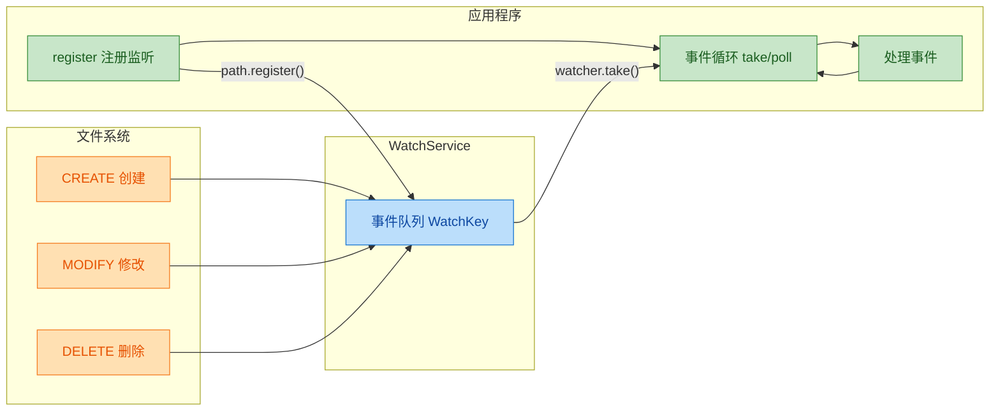

注意 `WatchService` 的事件循环是阻塞的，实际项目中应该放在独立的守护线程（daemon thread）中运行，不要阻塞主线程。另外，`WatchService` 在不同操作系统上的实现机制不同：Linux 使用 `inotify`，macOS 使用 `kqueue`（但 JDK 的 macOS 实现实际上是轮询，性能较差），Windows 使用 `ReadDirectoryChangesW`。

### Path + Files 的设计哲学总结

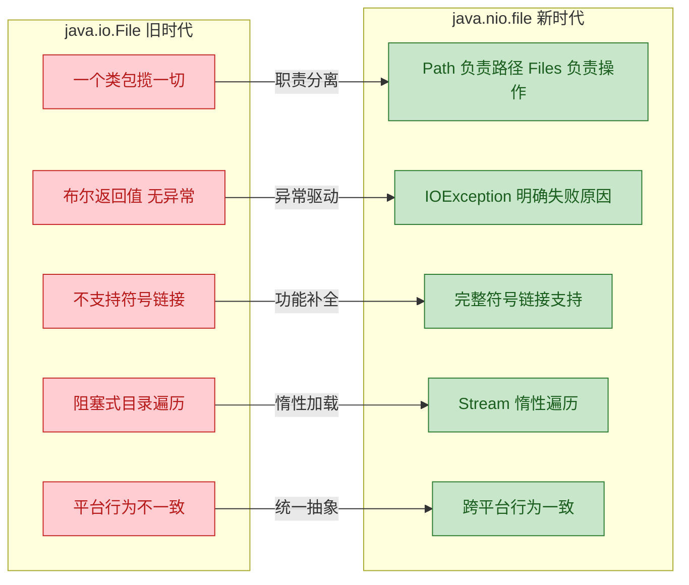

核心设计原则：

- 职责分离（Separation of Concerns）：`Path` 只管路径表示，`Files` 只管文件操作，`FileSystem` 管文件系统抽象。不像 `File` 类把所有东西塞在一起。
- 失败即异常（Fail with Exception）：所有操作失败都抛出具体的 `IOException` 子类，而不是返回一个让人摸不着头脑的 `false`。
- 不可变性（Immutability）：`Path` 对象是不可变的，`resolve()`、`normalize()` 等方法都返回新的 `Path` 实例，线程安全。
- 与 Stream API 深度集成：`Files.lines()`、`Files.list()`、`Files.walk()`、`Files.find()` 全部返回 `Stream`，可以无缝接入函数式编程管道。

---

**📝 练习题**

以下代码的输出结果是什么？

```java
Path p1 = Path.of("/home/user/docs");
Path p2 = Path.of("/home/user/docs/java/nio/Buffer.java");
Path relative = p1.relativize(p2);
System.out.println(relative);
System.out.println(relative.getNameCount());
System.out.println(p1.resolve(relative).normalize());
```

A. `java/nio/Buffer.java`、`3`、`/home/user/docs/java/nio/Buffer.java`

B. `/java/nio/Buffer.java`、`3`、`/home/user/docs/java/nio/Buffer.java`

C. `java/nio/Buffer.java`、`3`、`java/nio/Buffer.java`

D. `../java/nio/Buffer.java`、`4`、`/home/user/java/nio/Buffer.java`


**【答案】** A

**【解析】** `p1.relativize(p2)` 计算从 `/home/user/docs` 到 `/home/user/docs/java/nio/Buffer.java` 的相对路径，结果是 `java/nio/Buffer.java`（注意没有前导斜杠，这是相对路径）。`getNameCount()` 返回名称元素个数：`java`、`nio`、`Buffer.java`，共 3 个。`p1.resolve(relative)` 将相对路径拼接回 p1，得到 `/home/user/docs/java/nio/Buffer.java`，`normalize()` 没有冗余的 `.` 或 `..` 需要清理，所以结果不变。选项 B 错在相对路径不应有前导 `/`；选项 D 错在 `relativize` 的方向——p2 是 p1 的子路径，不需要 `..` 回退。这道题考察的核心是 `relativize` 和 `resolve` 互为逆操作的关系。

---

## 本章小结

Java NIO（New I/O）是自 JDK 1.4 引入的一套全新 I/O 体系，它从根本上改变了 Java 程序与操作系统进行数据交互的方式。回顾整章内容，我们从宏观的设计哲学差异出发，逐步深入到每一个核心组件的内部机制，下面对全章知识做一次系统性的梳理与升华。

### 核心思想回顾：从 Stream 到 Buffer + Channel

传统 IO 的设计哲学是"面向流"（Stream-Oriented）的——数据像水流一样，从 InputStream 流入，从 OutputStream 流出，每次读写都是逐字节或逐字符地、单向地、阻塞地进行。这种模型直观易懂，但在面对高并发场景时，每个连接都需要一个独立线程来阻塞等待数据，线程资源的消耗成为不可逾越的瓶颈。

NIO 的核心转变可以用一句话概括：**数据不再"流过"程序，而是被"搬运"到一块缓冲区中，程序主动去缓冲区里读写。** 这就是"面向缓冲"（Buffer-Oriented）的本质含义。Channel 负责连接数据源与 Buffer，Buffer 负责暂存数据，Selector 负责监听多个 Channel 的就绪状态——三者协同，构成了 NIO 的完整工作模型。

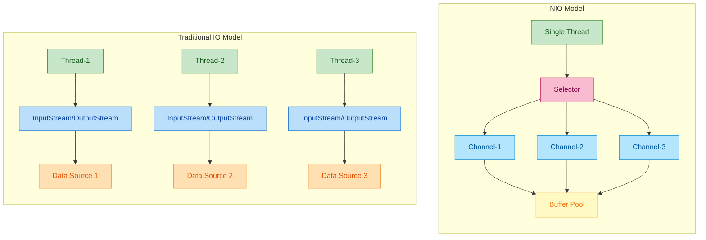

这张对比图清晰地展示了两种模型的本质差异：传统 IO 是"一连接一线程"的线性模型，而 NIO 是"单线程多路复用"的事件驱动模型。

### Buffer：NIO 的数据容器

Buffer 是整个 NIO 体系中最基础也最重要的组件。理解 Buffer，关键在于理解它的三个核心指针——`capacity`、`position`、`limit`——以及它们在不同操作下的状态变迁。

`capacity` 是缓冲区的总容量，一旦分配就不可改变，它是 Buffer 的"物理边界"。`position` 是当前读写的游标位置，每次 `put()` 或 `get()` 操作后自动前移。`limit` 则是逻辑边界，标识了当前可操作区域的终点。

Buffer 的精髓在于它的"双模态"设计——同一块内存区域，通过 `flip()`、`clear()`、`rewind()` 等方法切换指针状态，就能在"写模式"和"读模式"之间自如转换：

- `flip()` 是从写切换到读的关键操作：`limit = position; position = 0`，意思是"我写到哪里，你就读到哪里"。
- `clear()` 是重置 Buffer 准备下一轮写入：`position = 0; limit = capacity`，注意它并不真正清除数据，只是重置指针。
- `rewind()` 是"倒带"操作：`position = 0`，limit 不变，用于重新读取已有数据。
- `compact()` 是一个容易被忽视但极其实用的方法：它将未读完的数据搬到 Buffer 头部，然后将 position 设置到未读数据之后，为后续写入腾出空间。

```java
// Buffer 完整生命周期演示
ByteBuffer buf = ByteBuffer.allocate(10);  // capacity=10, position=0, limit=10

// === 写模式 ===
buf.put((byte) 'H');   // position=1
buf.put((byte) 'e');   // position=2
buf.put((byte) 'l');   // position=3
buf.put((byte) 'l');   // position=4
buf.put((byte) 'o');   // position=5

// === 切换到读模式 ===
buf.flip();             // position=0, limit=5

// === 读模式 ===
byte b1 = buf.get();    // b1='H', position=1
byte b2 = buf.get();    // b2='e', position=2

// === compact：保留未读数据，切回写模式 ===
buf.compact();          // 'l','l','o' 搬到头部, position=3, limit=10
// 此时可以继续从 position=3 开始写入新数据
```

还有一个重要的概念是 `DirectByteBuffer`（通过 `ByteBuffer.allocateDirect()` 创建）。它直接在堆外内存（off-heap）分配空间，绕过了 JVM 堆内存到内核缓冲区之间的一次数据拷贝，在大文件传输和网络 I/O 场景下性能更优。但它的分配和回收成本更高，适合长期存活、反复使用的场景，不适合频繁创建销毁。

### Channel：双向的数据通道

Channel 是 NIO 中数据传输的通道，它与传统 IO 的 Stream 有两个本质区别：

第一，Channel 是双向的（Bidirectional）。一个 FileChannel 既可以读也可以写，而传统 IO 必须分别使用 InputStream 和 OutputStream。第二，Channel 必须与 Buffer 配合使用——你不能直接从 Channel 中读取一个字节，必须先将数据读入 Buffer，再从 Buffer 中取出。

FileChannel 是最常用的 Channel 实现。它的 `transferTo()` 和 `transferFrom()` 方法利用了操作系统的 zero-copy 机制，在文件复制场景下性能远超传统的逐字节拷贝。`map()` 方法则提供了内存映射文件（Memory-Mapped File）的能力，将文件的一部分直接映射到内存中，对这块内存的读写会直接反映到文件上，适合处理超大文件。

```java
// Channel + Buffer 协作的标准读写循环
try (FileChannel inChannel = FileChannel.open(Paths.get("input.txt"), StandardOpenOption.READ);
     FileChannel outChannel = FileChannel.open(Paths.get("output.txt"),
             StandardOpenOption.WRITE, StandardOpenOption.CREATE)) {

    ByteBuffer buffer = ByteBuffer.allocate(1024);  // 分配 1KB 缓冲区

    while (inChannel.read(buffer) != -1) {  // 从 Channel 读数据到 Buffer（写模式）
        buffer.flip();                       // 切换到读模式
        outChannel.write(buffer);            // 从 Buffer 读数据写入 Channel
        buffer.clear();                      // 清空 Buffer，准备下一轮写入
    }
}
```

这个 `read → flip → write → clear` 的循环是 NIO 编程中最经典的模式，务必烂熟于心。

### Selector：多路复用的核心

Selector 是 NIO 实现高并发网络编程的关键组件。它的核心思想是：**一个线程可以同时监控多个 Channel 的 I/O 事件**（如连接就绪、数据可读、数据可写），只有当某个 Channel 真正"准备好了"，线程才去处理它，避免了无意义的阻塞等待。

这种模式在操作系统层面对应的是 `select/poll/epoll` 系统调用。在 Linux 上，Java 的 Selector 底层默认使用 `epoll`，它的时间复杂度是 O(1)（相对于就绪事件数），能够高效地管理数以万计的连接。

Selector 的工作流程可以概括为四步：

1. 创建 Selector，将多个 Channel 注册到 Selector 上，并声明感兴趣的事件类型（`OP_ACCEPT`、`OP_READ`、`OP_WRITE`、`OP_CONNECT`）。
2. 调用 `selector.select()`，线程阻塞，直到至少有一个 Channel 就绪。
3. 获取就绪的 `SelectionKey` 集合，遍历处理每个就绪事件。
4. 处理完毕后移除已处理的 Key，回到第 2 步继续循环。

```mermaid
graph LR
    subgraph EventLoop["Selector Event Loop"]
        direction TB
        REG["Register Channels<br/>with interest ops"] --> SEL["selector.select()<br/>blocking wait"]
        SEL --> KEYS["Get selectedKeys()"]
        KEYS --> ITER["Iterate and handle<br/>each ready event"]
        ITER --> REM["Remove processed key"]
        REM --> SEL
    end

    subgraph Channels["Registered Channels"]
        direction TB
        CH1["SocketChannel-1<br/>OP_READ"]
        CH2["SocketChannel-2<br/>OP_WRITE"]
        CH3["ServerSocketChannel<br/>OP_ACCEPT"]
    end

    Channels --> REG

    classDef loopCls fill:#E8F5E9,stroke:#43A047,color:#1B5E20
    classDef chanCls fill:#E3F2FD,stroke:#1E88E5,color:#0D47A1

    class REG,SEL,KEYS,ITER,REM loopCls
    class CH1,CH2,CH3 chanCls
```

### Path 与 Files：现代文件操作 API

JDK 7 引入的 `java.nio.file` 包（通常称为 NIO.2）彻底革新了 Java 的文件操作体验。`Path` 取代了老旧的 `java.io.File` 类，`Files` 工具类则提供了大量静态方法，覆盖了文件的创建、复制、移动、删除、读写、遍历、属性查询等几乎所有操作。

`Path` 的优势在于它是纯粹的路径抽象，不绑定具体的文件系统实现，支持链式调用（`resolve`、`relativize`、`normalize`），并且与 `Files` 工具类无缝配合。`Files` 的方法设计非常现代化，比如 `Files.readAllLines()` 一行代码读取整个文件，`Files.walk()` 返回一个 `Stream<Path>` 用于递归遍历目录树，`Files.newBufferedReader()` 直接返回带缓冲的 Reader。

```java
// 现代文件操作一览
Path dir = Paths.get("data", "logs");       // 构建路径：data/logs
Files.createDirectories(dir);                // 递归创建目录（含父目录）

Path file = dir.resolve("app.log");          // 拼接路径：data/logs/app.log
Files.writeString(file, "Hello NIO.2\n",     // 写入字符串（JDK 11+）
        StandardOpenOption.CREATE,
        StandardOpenOption.APPEND);

// 使用 Stream API 遍历目录树，查找所有 .java 文件
try (Stream<Path> paths = Files.walk(Paths.get("src"))) {
    paths.filter(p -> p.toString().endsWith(".java"))  // 过滤 .java 文件
         .forEach(System.out::println);                // 打印路径
}
```

### 全章知识脉络总览

```mermaid
graph LR
    subgraph Foundation["NIO Foundation"]
        direction TB
        DIFF["NIO vs IO<br/>Blocking vs Non-Blocking<br/>Stream vs Buffer"]
        DIFF --> BUF["Buffer<br/>capacity / position / limit<br/>flip / clear / rewind / compact"]
        BUF --> CHAN["Channel<br/>FileChannel<br/>SocketChannel"]
    end

    subgraph Advanced["Multiplexing and Modern API"]
        direction TB
        SEL["Selector<br/>select / register / selectedKeys<br/>epoll on Linux"]
        SEL --> EVT["SelectionKey Events<br/>ACCEPT / READ / WRITE / CONNECT"]
        PATH["Path and Files<br/>NIO.2 since JDK 7<br/>walk / copy / move / readAllLines"]
    end

    Foundation --> Advanced

    classDef foundCls fill:#E8F5E9,stroke:#43A047,color:#1B5E20
    classDef advCls fill:#E3F2FD,stroke:#1E88E5,color:#0D47A1
    classDef evtCls fill:#FFF3E0,stroke:#FB8C00,color:#E65100
    classDef pathCls fill:#F3E5F5,stroke:#8E24AA,color:#4A148C

    class DIFF,BUF,CHAN foundCls
    class SEL advCls
    class EVT evtCls
    class PATH pathCls
```

### 关键对比速查表

| 维度 | Traditional IO | NIO | NIO.2 (JDK 7+) |
|------|---------------|-----|-----------------|
| 数据模型 | Stream（单向流） | Buffer + Channel（双向） | Path + Files（高级抽象） |
| 阻塞性 | 阻塞（Blocking） | 可非阻塞（Non-Blocking） | 同步为主，支持异步 |
| 并发模型 | 一连接一线程 | Selector 多路复用 | — |
| 文件操作 | `java.io.File` | `FileChannel` | `Path` + `Files` |
| 适用场景 | 简单 I/O、小文件 | 高并发网络、大文件 | 现代文件系统操作 |
| 零拷贝支持 | 无 | `transferTo/transferFrom` | — |
| 内存映射 | 无 | `FileChannel.map()` | — |

### 学习建议

NIO 的学习曲线相对陡峭，建议按照以下路径循序渐进：先彻底理解 Buffer 的指针模型（这是一切的基础），然后掌握 Channel + Buffer 的读写循环模式，接着学习 Selector 的事件驱动模型，最后熟悉 NIO.2 的现代文件 API。在实际开发中，网络编程层面大多数人会直接使用 Netty 等框架（它们底层就是基于 NIO Selector），但理解原生 NIO 的工作原理对于排查性能问题、理解框架设计至关重要。文件操作层面，NIO.2 的 `Path` + `Files` 已经是现代 Java 项目的标准选择，应当完全取代老旧的 `java.io.File`。

---

**📝 练习题 1**

以下关于 `ByteBuffer` 的 `flip()` 方法，描述正确的是？

A. `flip()` 会清空缓冲区中的数据，并将 position 和 limit 都重置为 0

B. `flip()` 将 limit 设为当前 position，再将 position 设为 0，用于从写模式切换到读模式

C. `flip()` 仅将 position 设为 0，limit 保持不变，等同于 `rewind()`

D. `flip()` 将未读数据压缩到缓冲区头部，等同于 `compact()`


**【答案】** B

**【解析】** `flip()` 的内部实现非常简洁：`limit = position; position = 0; mark = -1;`。它的语义是"我刚才写到了 position 的位置，现在我要从头开始读，读到我写过的地方为止"。选项 A 描述的是 `clear()` 的行为（但 clear 是将 limit 设为 capacity 而非 0，且不清除数据）。选项 C 描述的是 `rewind()` 的行为。选项 D 描述的是 `compact()` 的行为。这道题考察的是对 Buffer 状态切换机制的精确理解，是 NIO 面试中的高频考点。

---

**📝 练习题 2**

在使用 Selector 进行非阻塞网络编程时，以下哪种做法是正确的？

A. 将 `FileChannel` 注册到 Selector 上，监听 `OP_READ` 事件

B. 将 `SocketChannel` 设置为阻塞模式后注册到 Selector 上

C. 调用 `selector.select()` 后，遍历 `selectedKeys()` 并在处理完每个 key 后手动将其从迭代器中移除

D. 一个 Channel 只能注册一种事件类型，不能同时监听 `OP_READ` 和 `OP_WRITE`


**【答案】** C

**【解析】** 选项 A 错误，`FileChannel` 不支持非阻塞模式，无法注册到 Selector 上，Selector 只能与 `SelectableChannel` 的子类（如 `SocketChannel`、`ServerSocketChannel`、`DatagramChannel`）配合使用。选项 B 错误，注册到 Selector 的 Channel 必须处于非阻塞模式（`channel.configureBlocking(false)`），否则会抛出 `IllegalBlockingModeException`。选项 C 正确，这是 Selector 编程中一个极易出错的细节——`selectedKeys()` 返回的集合不会自动清除已处理的 key，如果不手动 `iterator.remove()`，下一次 `select()` 返回时这些 key 仍然存在，会导致重复处理。选项 D 错误，一个 Channel 可以通过位运算 `|` 同时注册多种事件，如 `SelectionKey.OP_READ | SelectionKey.OP_WRITE`。


---