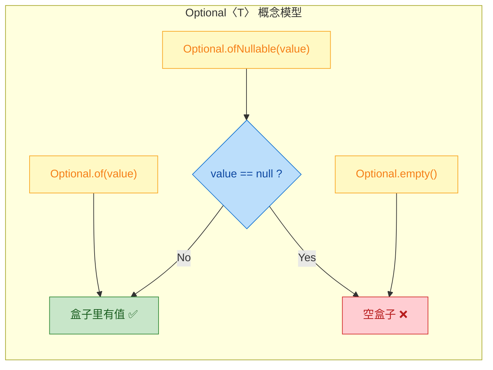
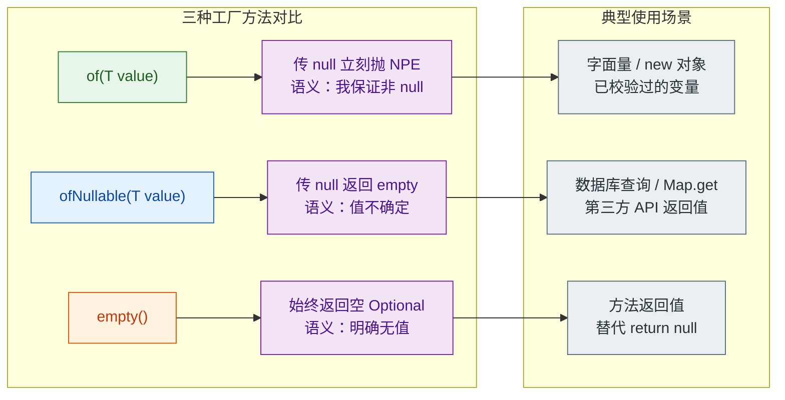
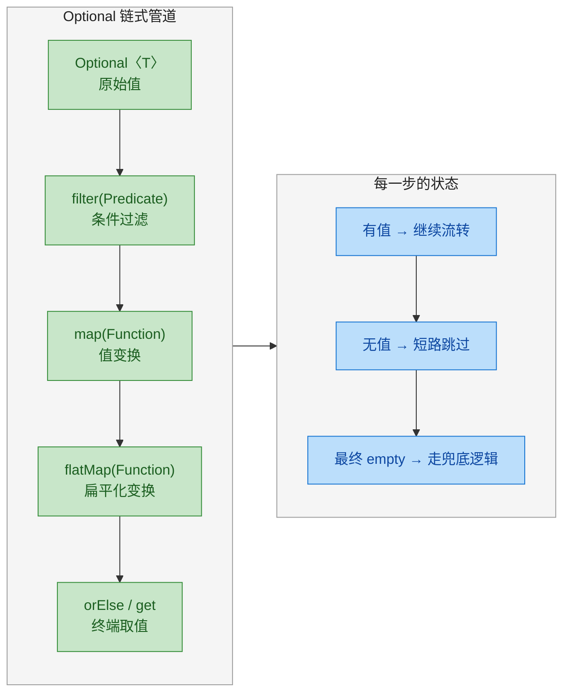
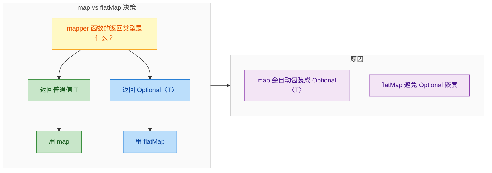
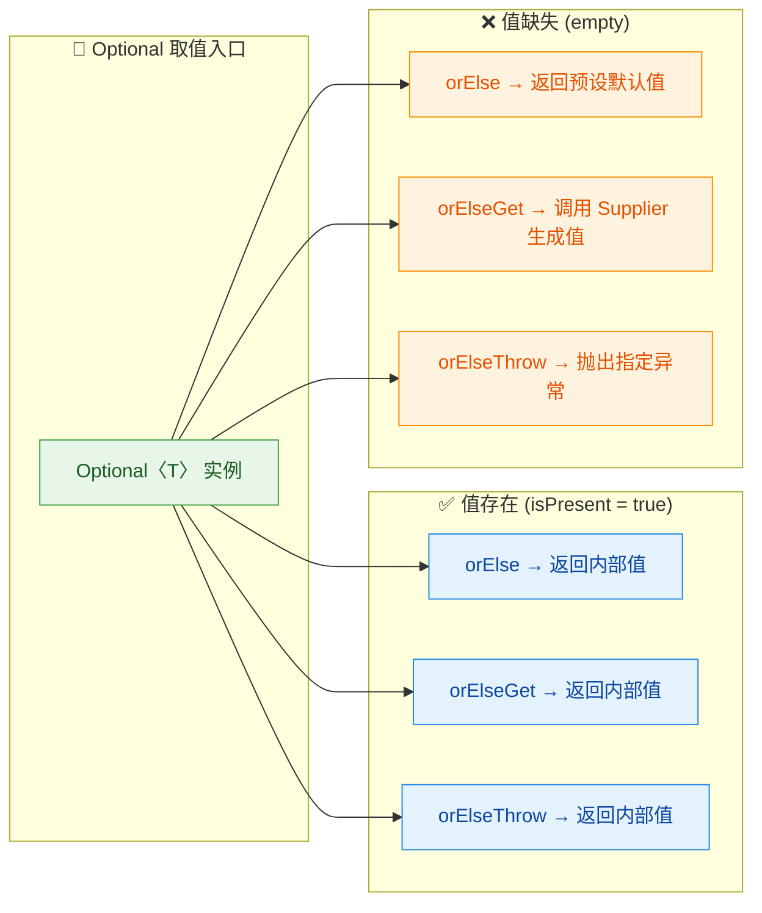
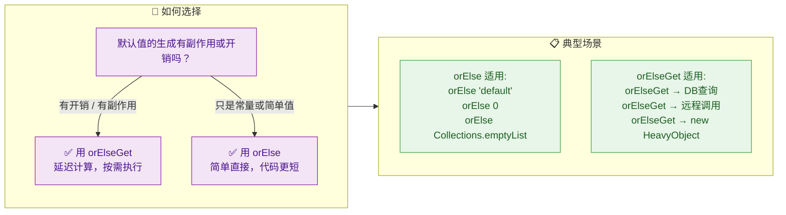
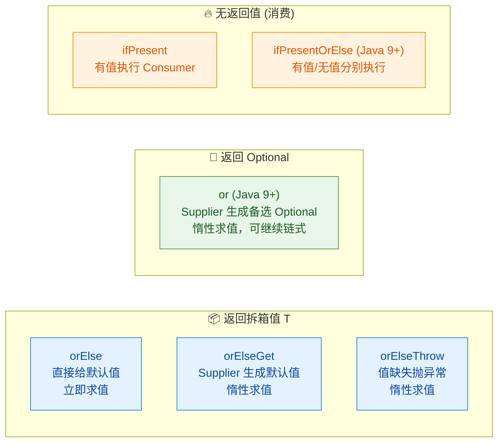
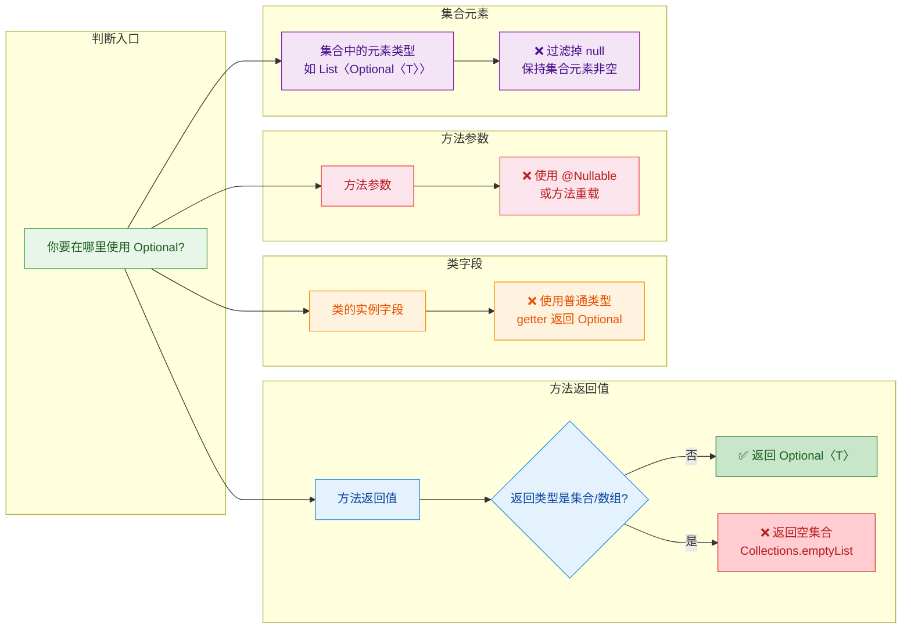

---

# Optional

---

## Optional 创建（of、ofNullable、empty）

Java 8 引入的 `Optional<T>` 是一个容器类（container class），它的核心使命只有一个——**用类型系统显式地表达"值可能不存在"这件事**，从而在编译期就迫使调用者思考 null 的情况，而不是等到运行时才抛出 `NullPointerException`。

在深入创建方式之前，先建立一个直觉：`Optional` 本质上就是一个"盒子"，盒子里要么装着一个非 null 的值（present），要么是空的（empty）。所有的 API 都围绕这个模型展开。



### Optional.of(T value) —— 确定非 null 时使用

`Optional.of()` 是最"严格"的工厂方法。它接收一个值，**如果传入 null，立刻抛出 NullPointerException**。这不是 bug，而是 design by contract：调用者用 `of()` 就是在向编译器和阅读代码的人宣告——"我保证这个值不为 null"。

```java
// ✅ 正常使用：传入一个确定非 null 的值
Optional<String> opt = Optional.of("Hello");
// 此时 opt 内部持有 "Hello"，isPresent() 返回 true

System.out.println(opt.isPresent()); // true
System.out.println(opt.get());       // "Hello"
```

```java
// ❌ 错误使用：传入 null，直接在 of() 内部抛出 NPE
String name = null;
Optional<String> opt = Optional.of(name); // 💥 NullPointerException!
```

来看一下 JDK 源码，理解为什么会这样：

```java
// java.util.Optional 源码（JDK 8+）
public static <T> Optional<T> of(T value) {
    return new Optional<>(Objects.requireNonNull(value));
    // Objects.requireNonNull() 内部：
    // if (value == null) throw new NullPointerException();
    // 所以 null 在这里无处遁形
}
```

什么时候该用 `of()`？当值的来源在逻辑上**不可能为 null** 时。比如你刚 `new` 出来的对象、字面量、或者已经经过 null 检查的变量：

```java
// 场景1：字面量，绝不可能为 null
Optional<Integer> port = Optional.of(8080);

// 场景2：刚创建的对象
Optional<List<String>> list = Optional.of(new ArrayList<>());

// 场景3：已经做过 null 守卫（null guard）之后
public void process(String input) {
    if (input == null) {
        throw new IllegalArgumentException("input must not be null");
    }
    // 走到这里，input 一定非 null，用 of() 语义更精确
    Optional<String> opt = Optional.of(input);
}
```

### Optional.ofNullable(T value) —— 值可能为 null 时使用

这是实际开发中**使用频率最高**的工厂方法。它的语义是："我不确定这个值是不是 null，请帮我包一层"。如果值非 null，返回一个包含该值的 Optional；如果值为 null，返回 `Optional.empty()`。

```java
// value 非 null 时，等价于 Optional.of(value)
Optional<String> opt1 = Optional.ofNullable("World");
System.out.println(opt1.isPresent()); // true
System.out.println(opt1.get());       // "World"

// value 为 null 时，等价于 Optional.empty()
Optional<String> opt2 = Optional.ofNullable(null);
System.out.println(opt2.isPresent()); // false
```

源码同样非常简洁：

```java
// java.util.Optional 源码
public static <T> Optional<T> ofNullable(T value) {
    // 三元表达式：null 就返回空 Optional，否则包装起来
    return value == null ? empty() : of(value);
}
```

`ofNullable()` 的典型使用场景是**对接外部数据源**——数据库查询结果、Map 的 get 返回值、第三方 API 响应等，这些地方 null 是家常便饭：

```java
// 场景1：从 Map 中取值（get 可能返回 null）
Map<String, String> config = loadConfig();
Optional<String> timeout = Optional.ofNullable(config.get("timeout"));
// 如果 key 不存在，config.get() 返回 null
// ofNullable 会优雅地将其转为 empty Optional

// 场景2：数据库查询（可能查不到记录）
User user = userRepository.findByEmail("test@example.com");
// user 可能为 null（没有匹配记录）
Optional<User> optUser = Optional.ofNullable(user);

// 场景3：链式安全取值（替代多层 if-null 检查）
String city = Optional.ofNullable(user)          // user 可能为 null
        .map(User::getAddress)                    // address 可能为 null
        .map(Address::getCity)                    // city 可能为 null
        .orElse("Unknown");                       // 兜底默认值
```

上面场景 3 的链式写法，如果用传统方式，代码会变成令人窒息的嵌套：

```java
// 传统写法：层层 null 检查，可读性差
String city = "Unknown";
if (user != null) {                    // 第一层
    Address address = user.getAddress();
    if (address != null) {             // 第二层
        String c = address.getCity();
        if (c != null) {               // 第三层
            city = c;
        }
    }
}
// Optional 链式写法将三层嵌套拍平成一条流水线
```

### Optional.empty() —— 显式表达"无值"

`Optional.empty()` 返回一个不包含任何值的 Optional 实例。它在语义上等价于"这里没有值"，但比直接返回 null **安全得多**，因为调用者拿到的是一个 Optional 对象，而不是一个随时可能引爆 NPE 的 null 引用。

```java
// 创建一个空的 Optional
Optional<String> empty = Optional.empty();

System.out.println(empty.isPresent()); // false
System.out.println(empty.isEmpty());   // true（Java 11+ 新增方法）
```

源码层面，`empty()` 使用了一个**共享的单例实例**，避免重复创建对象：

```java
// java.util.Optional 源码
private static final Optional<?> EMPTY = new Optional<>(null);
// 内部 value 字段为 null，但外部拿到的是 Optional 对象

@SuppressWarnings("unchecked")
public static <T> Optional<T> empty() {
    return (Optional<T>) EMPTY;
    // 每次调用 empty() 都返回同一个实例（singleton）
    // 所以 Optional.empty() == Optional.empty() 为 true
}
```

`empty()` 最常见的用途是**作为方法的返回值**，用来替代 `return null`：

```java
// ✅ 推荐：用 Optional 作为返回类型，显式表达"可能找不到"
public Optional<User> findUserById(Long id) {
    User user = database.query(id);  // 可能查不到
    if (user == null) {
        return Optional.empty();     // 明确告诉调用者：没找到
    }
    return Optional.of(user);        // 找到了，包装返回
}

// 调用方被 Optional 类型"强制"处理缺失情况
findUserById(42L).ifPresentOrElse(
    user -> System.out.println("Found: " + user.getName()),
    ()   -> System.out.println("User not found")           
);
```

上面的 `findUserById` 方法还可以进一步简化：

```java
// 更简洁的写法：直接用 ofNullable 一步到位
public Optional<User> findUserById(Long id) {
    return Optional.ofNullable(database.query(id));
    // query 返回 null → Optional.empty()
    // query 返回对象 → Optional.of(对象)
}
```

### 三种创建方式对比



用一张表快速记忆：

| 方法 | 传入 null 时的行为 | 适用时机 |
|---|---|---|
| `of(value)` | 抛出 `NullPointerException` | 100% 确定值非 null |
| `ofNullable(value)` | 返回 `Optional.empty()` | 值来源不可控，可能为 null |
| `empty()` | — （无参数） | 需要显式返回"无值"状态 |

### 常见误区与注意事项

有几个初学者容易踩的坑，值得单独拎出来说。

**误区一：对已知为 null 的值使用 of()**

```java
// ❌ 明知可能为 null，还用 of()，这是自找 NPE
String result = someMethodThatMayReturnNull();
Optional<String> opt = Optional.of(result); // 💥 可能炸

// ✅ 不确定就用 ofNullable()
Optional<String> opt = Optional.ofNullable(result);
```

**误区二：用 Optional 包装后又立刻 get()**

```java
// ❌ 这样写完全失去了 Optional 的意义
Optional<String> opt = Optional.ofNullable(getValue());
String value = opt.get(); // 如果是 empty，抛 NoSuchElementException

// ✅ 应该用 orElse / ifPresent 等安全方法
String value = opt.orElse("default");
```

**误区三：混淆 of() 和 ofNullable() 的语义**

`of()` 不是"创建 Optional 的通用方法"，它是一个**断言**（assertion）。选择 `of()` 还是 `ofNullable()`，本质上是在向代码的读者传递信息：

- `of()` = "我已经确认这个值不为 null，如果为 null 说明上游出了 bug，应该 fail-fast"
- `ofNullable()` = "这个值可能为 null，这是正常的业务情况，需要优雅处理"

这种语义区分在团队协作中非常有价值——看到 `of()` 你就知道这里不需要担心 null，看到 `ofNullable()` 你就知道后续一定要处理缺失情况。

---

**📝 练习题**

以下代码的输出结果是什么？

```java
String value = null;
Optional<String> a = Optional.ofNullable(value);
Optional<String> b = Optional.empty();
System.out.println(a.equals(b));
System.out.println(a == b);
```

A. `true` 和 `true`

B. `true` 和 `false`

C. `false` 和 `false`

D. `false` 和 `true`

**【答案】** A

**【解析】** `Optional.ofNullable(null)` 内部走的是 `value == null ? empty() : of(value)` 分支，直接返回 `EMPTY` 这个静态单例。而 `Optional.empty()` 同样返回的是这个 `EMPTY` 单例。因此 `a` 和 `b` 指向的是**同一个对象**，`equals()` 自然为 `true`，`==` 引用比较也为 `true`。这道题的关键在于理解 `empty()` 返回的是一个共享的 singleton 实例，而 `ofNullable(null)` 最终也是调用了 `empty()`。

---

## Optional 使用（map、flatMap、filter）

Optional 的真正威力不在于"判空"，而在于它提供了一套函数式的链式操作 API，让你可以像流水线一样对"可能存在的值"进行变换、过滤和组合。这三个核心方法 `map`、`flatMap`、`filter` 是 Optional 从"空值容器"升级为"函数式管道"的关键。

理解它们之前，先建立一个核心心智模型：Optional 本质上是一个最多只能容纳一个元素的 Stream。Stream 上能做的 `map`、`flatMap`、`filter`，Optional 上也能做，语义几乎一致。



### map —— 值变换

`map` 是最常用的方法，它的签名是：

```java
public <U> Optional<U> map(Function<? super T, ? extends U> mapper)
```

它的行为非常直觉：如果 Optional 里有值，就把这个值交给 `mapper` 函数处理，把结果再包进一个新的 Optional 返回；如果 Optional 是空的，直接返回 `Optional.empty()`，mapper 根本不会被调用。

```java
// 场景：从用户对象中安全地提取用户名的大写形式
Optional<String> upperName = Optional.ofNullable(user)  // 包装可能为 null 的 user
        .map(User::getName)    // 如果 user 存在，提取 name（name 本身可能为 null）
        .map(String::toUpperCase);  // 如果 name 存在，转为大写

// map 的关键特性：mapper 返回 null 时，结果自动变为 Optional.empty()
Optional<String> result = Optional.of(user)
        .map(User::getName);  // 如果 getName() 返回 null，result 就是 Optional.empty()
```

这里有一个非常重要的细节：`map` 内部会自动用 `Optional.ofNullable()` 包装 mapper 的返回值。也就是说，即使你的 mapper 函数返回了 null，也不会抛出 NullPointerException，而是优雅地变成 `Optional.empty()`。来看一下 JDK 源码就一目了然：

```java
// JDK 源码 —— Optional.map()
public <U> Optional<U> map(Function<? super T, ? extends U> mapper) {
    Objects.requireNonNull(mapper);          // mapper 本身不能为 null
    if (!isPresent()) {                      // 如果当前 Optional 为空
        return empty();                      // 直接返回空 Optional，短路跳过
    } else {
        return Optional.ofNullable(           // 用 ofNullable 包装结果
                mapper.apply(value)           // 对值执行变换
        );
    }
}
```

一个实际的多层链式调用示例：

```java
// 场景：从订单中提取收货城市名称
// Order -> Address -> City -> CityName，任何一环为 null 都安全
String cityName = Optional.ofNullable(order)       // 包装订单对象
        .map(Order::getShippingAddress)             // 提取收货地址
        .map(Address::getCity)                      // 提取城市对象
        .map(City::getName)                         // 提取城市名称
        .map(String::trim)                          // 去除首尾空格
        .orElse("未知城市");                         // 兜底默认值

// 等价的传统写法 —— 嵌套 if 地狱
String cityName = "未知城市";                        // 默认值
if (order != null) {                                // 第一层判空
    Address address = order.getShippingAddress();    // 取地址
    if (address != null) {                           // 第二层判空
        City city = address.getCity();               // 取城市
        if (city != null) {                          // 第三层判空
            String name = city.getName();            // 取名称
            if (name != null) {                      // 第四层判空
                cityName = name.trim();              // 赋值
            }
        }
    }
}
```

对比之下，`map` 链式调用的优势不言而喻：代码从纵向嵌套变成了横向流水线，每一步的意图都清晰可读。

### flatMap —— 扁平化变换

`flatMap` 的签名和 `map` 只有一个关键区别：

```java
// map:   mapper 返回 U，由 map 自动包装成 Optional<U>
public <U> Optional<U> map(Function<? super T, ? extends U> mapper)

// flatMap: mapper 必须自己返回 Optional<U>，flatMap 不再二次包装
public <U> Optional<U> flatMap(Function<? super T, ? extends Optional<? extends U>> mapper)
```

为什么需要 `flatMap`？因为当你的 mapper 函数本身就返回 Optional 时，用 `map` 会导致双层嵌套 `Optional<Optional<U>>`，这显然不是你想要的。`flatMap` 会把这层嵌套"压平"（flatten）。

```java
// 假设 User 类中有一个方法，本身就返回 Optional
public class User {
    private String email;  // 可能为 null

    // 设计良好的 API：返回 Optional 而不是裸 null
    public Optional<String> getEmail() {
        return Optional.ofNullable(email);  // 返回 Optional<String>
    }
}

// ❌ 错误用法：map 会导致双层嵌套
Optional<Optional<String>> nested = Optional.ofNullable(user)
        .map(User::getEmail);   // getEmail 返回 Optional<String>
                                // map 再包一层 → Optional<Optional<String>>

// ✅ 正确用法：flatMap 自动压平
Optional<String> email = Optional.ofNullable(user)
        .flatMap(User::getEmail);  // 直接得到 Optional<String>
```

来看 JDK 源码，理解 flatMap 和 map 的本质区别：

```java
// JDK 源码 —— Optional.flatMap()
public <U> Optional<U> flatMap(
        Function<? super T, ? extends Optional<? extends U>> mapper) {
    Objects.requireNonNull(mapper);          // mapper 不能为 null
    if (!isPresent()) {                      // 当前为空则短路
        return empty();
    } else {
        @SuppressWarnings("unchecked")
        Optional<U> r = (Optional<U>) mapper.apply(value);  // 直接返回 mapper 的结果
        return Objects.requireNonNull(r);    // 注意：mapper 返回的 Optional 本身不能为 null！
    }
}
```

注意一个关键差异：`map` 内部用 `Optional.ofNullable()` 包装结果，而 `flatMap` 直接返回 mapper 的结果并要求它不能为 null（指 Optional 对象本身不能是 null，里面的值可以是 empty）。

一个更复杂的实战场景，展示 map 和 flatMap 的混合使用：

```java
// 领域模型：Company -> Department -> Manager -> Email
public class Company {
    // 公司不一定有指定部门，返回 Optional
    public Optional<Department> getDepartment(String name) {
        return Optional.ofNullable(departments.get(name));
    }
}

public class Department {
    // 部门不一定有经理，返回 Optional
    public Optional<Employee> getManager() {
        return Optional.ofNullable(manager);
    }
}

public class Employee {
    // 员工一定有名字（非 Optional），但 email 可能没有
    public String getName() { return name; }
    public Optional<String> getEmail() { return Optional.ofNullable(email); }
}

// 链式调用：获取某公司研发部经理的邮箱
String managerEmail = Optional.ofNullable(company)       // Optional<Company>
        .flatMap(c -> c.getDepartment("研发部"))           // flatMap：因为 getDepartment 返回 Optional
        .flatMap(Department::getManager)                   // flatMap：因为 getManager 返回 Optional
        .flatMap(Employee::getEmail)                       // flatMap：因为 getEmail 返回 Optional
        .orElse("无邮箱信息");                              // 兜底值

// 获取经理名字（getName 返回普通 String，用 map）
String managerName = Optional.ofNullable(company)
        .flatMap(c -> c.getDepartment("研发部"))           // flatMap：Optional 返回值
        .flatMap(Department::getManager)                   // flatMap：Optional 返回值
        .map(Employee::getName)                            // map：普通 String 返回值
        .orElse("无经理信息");                              // 兜底值
```

判断用 `map` 还是 `flatMap` 的规则很简单：



### filter —— 条件过滤

`filter` 让你对 Optional 中的值施加一个条件判断。如果值存在且满足条件，返回当前 Optional 不变；如果值不存在或不满足条件，返回 `Optional.empty()`。

```java
public Optional<T> filter(Predicate<? super T> predicate)
```

JDK 源码同样简洁明了：

```java
// JDK 源码 —— Optional.filter()
public Optional<T> filter(Predicate<? super T> predicate) {
    Objects.requireNonNull(predicate);       // predicate 不能为 null
    if (!isPresent()) {                      // 当前为空，直接返回空
        return this;
    } else {
        return predicate.test(value)         // 测试条件
                ? this                       // 满足条件 → 返回自身（值不变）
                : empty();                   // 不满足 → 返回空 Optional
    }
}
```

基础用法：

```java
// 场景：只接受年龄大于 18 的用户
Optional<User> adultUser = Optional.ofNullable(user)
        .filter(u -> u.getAge() >= 18);     // 未成年用户会被过滤为 empty

// 场景：验证邮箱格式
Optional<String> validEmail = Optional.ofNullable(inputEmail)
        .map(String::trim)                   // 先去空格
        .filter(e -> !e.isEmpty())           // 过滤空字符串
        .filter(e -> e.contains("@"));       // 过滤不含 @ 的无效邮箱

// 场景：链式组合 filter + map
String result = Optional.ofNullable(user)
        .filter(u -> u.isActive())           // 只处理活跃用户
        .filter(u -> u.getAge() >= 18)       // 且必须成年
        .map(User::getName)                  // 提取名字
        .map(String::toUpperCase)            // 转大写
        .orElse("N/A");                      // 任何一步不满足都走兜底
```

一个更贴近业务的综合示例：

```java
// 场景：电商系统 —— 查找可用的优惠券
public Optional<Coupon> findUsableCoupon(Long userId, BigDecimal orderAmount) {
    return Optional.ofNullable(couponRepository.findByUserId(userId))  // 查询用户优惠券
            .filter(Coupon::isNotExpired)          // 过滤：未过期
            .filter(Coupon::isNotUsed)             // 过滤：未使用
            .filter(c -> orderAmount.compareTo(    // 过滤：订单金额达到门槛
                    c.getMinOrderAmount()) >= 0)
            .filter(c -> c.getDiscount()           // 过滤：折扣力度合理
                    .compareTo(orderAmount) <= 0);
}

// 调用方
String discountInfo = findUsableCoupon(userId, orderAmount)
        .map(c -> "可用优惠券：减免 " + c.getDiscount() + " 元")  // 有券 → 展示信息
        .orElse("暂无可用优惠券");                                  // 无券 → 提示
```

### 三者协同 —— 完整管道示例

把 `map`、`flatMap`、`filter` 组合在一起，就能构建出表达力极强的处理管道：

```java
// 综合场景：从配置系统中安全地读取数据库端口号
// ConfigService.getProperty() 返回 Optional<String>

int dbPort = configService.getProperty("db.port")    // Optional<String>，配置可能不存在
        .filter(s -> !s.isBlank())                    // 过滤空白字符串
        .map(String::trim)                            // 去除首尾空格
        .map(Integer::parseInt)                       // 转为整数（注意：可能抛 NumberFormatException）
        .filter(port -> port > 0 && port <= 65535)    // 过滤非法端口范围
        .orElse(3306);                                // 兜底默认端口

// 更安全的版本：处理 parseInt 可能的异常
int dbPort = configService.getProperty("db.port")
        .filter(s -> !s.isBlank())
        .map(String::trim)
        .flatMap(s -> {                               // flatMap：因为 tryParse 返回 Optional
            try {
                return Optional.of(Integer.parseInt(s));  // 解析成功 → 包装为 Optional
            } catch (NumberFormatException e) {
                return Optional.empty();              // 解析失败 → 返回空 Optional
            }
        })
        .filter(port -> port > 0 && port <= 65535)
        .orElse(3306);
```

最后用一张对比表总结三者的核心区别：

```java
// ┌──────────┬──────────────────────────┬──────────────────────────┬──────────────────────┐
// │  方法     │  mapper/predicate 类型    │  当 Optional 有值时       │  当 Optional 为空时   │
// ├──────────┼──────────────────────────┼──────────────────────────┼──────────────────────┤
// │  map     │  Function<T, U>          │  执行变换，自动包装结果     │  返回 empty，不执行    │
// │  flatMap │  Function<T, Optional<U>>│  执行变换，直接返回结果     │  返回 empty，不执行    │
// │  filter  │  Predicate<T>            │  满足条件返回自身，否则empty│  返回 empty，不执行    │
// └──────────┴──────────────────────────┴──────────────────────────┴──────────────────────┘
// 共同点：Optional 为空时，三者都短路跳过，不执行任何操作。
```

---

**📝 练习题**

以下代码的输出结果是什么？

```java
Optional<String> result = Optional.of("  Hello World  ")
        .map(String::trim)
        .filter(s -> s.length() > 20)
        .map(String::toUpperCase);

System.out.println(result.isPresent());
System.out.println(result.orElse("EMPTY"));
```

A. `true` 然后 `HELLO WORLD`

B. `false` 然后 `EMPTY`

C. `true` 然后 `Hello World`

D. 抛出 NoSuchElementException


**【答案】** B

**【解析】** 逐步拆解这条链：`Optional.of("  Hello World  ")` 创建包含带空格字符串的 Optional；`.map(String::trim)` 去除首尾空格得到 `"Hello World"`（长度 11）；`.filter(s -> s.length() > 20)` 判断长度是否大于 20，11 不满足条件，此时 Optional 变为 `empty()`；`.map(String::toUpperCase)` 由于已经是 empty，短路跳过不执行。最终 `isPresent()` 返回 `false`，`orElse("EMPTY")` 走兜底逻辑输出 `"EMPTY"`。这道题的核心考点是 `filter` 不满足条件时会将 Optional 变为 empty，后续所有操作都会被短路。

---

## orElse 系列 —— 从 Optional 中安全取值

当我们通过 `map`、`flatMap`、`filter` 完成了对 Optional 内部值的变换与过滤之后，最终总要面对一个核心问题：**如何把值从 Optional 这个"盒子"里拿出来？** 这就是 `orElse` 系列方法的职责所在。

它们是 Optional 链式调用的"终结操作"（terminal operation），决定了当值存在时直接返回，当值缺失时该怎么办——是给默认值、是懒计算、还是直接抛异常。



---

### orElse(T other) —— 直接提供默认值

`orElse` 是最直观的取值方式：如果 Optional 里有值就返回它，没有就返回你传入的那个默认值。方法签名非常简单：

```java
public T orElse(T other)
```

它的语义等价于三元表达式 `value != null ? value : other`，但以更声明式的方式表达了意图。

```java
// 场景：从配置中读取端口号，读不到就用默认端口 8080
public class OrElseBasicDemo {
    public static void main(String[] args) {
        // 模拟一个可能为 null 的配置值
        String configPort = null;

        // ofNullable 安全包装，orElse 提供兜底
        String port = Optional.ofNullable(configPort) // 包装可能为 null 的值
                .orElse("8080");                       // 值缺失时返回默认端口

        System.out.println("服务端口: " + port); // 输出: 服务端口: 8080

        // 当值存在时，orElse 的默认值被忽略
        String configPort2 = "9090";
        String port2 = Optional.ofNullable(configPort2) // 包装非 null 值
                .orElse("8080");                         // 值存在，"8080" 不会被使用

        System.out.println("服务端口: " + port2); // 输出: 服务端口: 9090
    }
}
```

看起来很完美，但这里藏着一个非常经典的"坑"——**orElse 的参数是立即求值的（eagerly evaluated）**。无论 Optional 里有没有值，`orElse()` 括号里的表达式都会被执行。

```java
public class OrElseEagerDemo {
    // 模拟一个"代价昂贵"的默认值生成方法
    private static String createExpensiveDefault() {
        System.out.println("⚠️ createExpensiveDefault() 被调用了！"); // 观察是否执行
        // 假设这里有数据库查询、远程调用等重操作
        return "expensive-default-value";
    }

    public static void main(String[] args) {
        // Case 1: Optional 为空 → 调用默认方法（符合预期）
        System.out.println("--- Case 1: Optional 为空 ---");
        String result1 = Optional.<String>empty()
                .orElse(createExpensiveDefault()); // 空值，需要默认值，调用合理
        System.out.println("结果: " + result1);

        // Case 2: Optional 有值 → 默认方法依然被调用！（这就是坑）
        System.out.println("\n--- Case 2: Optional 有值 ---");
        String result2 = Optional.of("already-have-value")
                .orElse(createExpensiveDefault()); // ⚠️ 值已存在，但方法仍然执行了！
        System.out.println("结果: " + result2);
    }
}
```

运行输出：

```
--- Case 1: Optional 为空 ---
⚠️ createExpensiveDefault() 被调用了！
结果: expensive-default-value

--- Case 2: Optional 有值 ---
⚠️ createExpensiveDefault() 被调用了！
结果: already-have-value
```

Case 2 中，虽然最终返回的是 `"already-have-value"`，但 `createExpensiveDefault()` 依然被执行了。如果这个方法涉及数据库查询或网络请求，就是一次完全浪费的开销。这就是为什么我们需要 `orElseGet`。

---

### orElseGet(Supplier\<? extends T\> supplier) —— 延迟计算默认值

`orElseGet` 接收的不是一个现成的值，而是一个 `Supplier<T>` 函数式接口——只有当 Optional 为空时，才会调用这个 Supplier 来生成默认值。这就是所谓的 **惰性求值（lazy evaluation）**。

```java
public T orElseGet(Supplier<? extends T> supplier)
```

`Supplier<T>` 是一个函数式接口，只有一个无参方法 `T get()`，非常适合用 Lambda 或方法引用来表达。

```java
public class OrElseGetDemo {
    // 同样是"昂贵"的默认值生成
    private static String createExpensiveDefault() {
        System.out.println("⚠️ createExpensiveDefault() 被调用了！");
        return "expensive-default-value";
    }

    public static void main(String[] args) {
        // Case 1: Optional 为空 → Supplier 被调用（符合预期）
        System.out.println("--- Case 1: Optional 为空 ---");
        String result1 = Optional.<String>empty()
                .orElseGet(() -> createExpensiveDefault()); // Lambda 包装，延迟执行
        System.out.println("结果: " + result1);

        // Case 2: Optional 有值 → Supplier 不会被调用（节省开销！）
        System.out.println("\n--- Case 2: Optional 有值 ---");
        String result2 = Optional.of("already-have-value")
                .orElseGet(() -> createExpensiveDefault()); // ✅ 值存在，Lambda 根本不执行
        System.out.println("结果: " + result2);

        // 也可以用方法引用，更简洁
        System.out.println("\n--- Case 3: 方法引用写法 ---");
        String result3 = Optional.<String>empty()
                .orElseGet(OrElseGetDemo::createExpensiveDefault); // 方法引用
        System.out.println("结果: " + result3);
    }
}
```

运行输出：

```
--- Case 1: Optional 为空 ---
⚠️ createExpensiveDefault() 被调用了！
结果: expensive-default-value

--- Case 2: Optional 有值 ---
结果: already-have-value

--- Case 3: 方法引用写法 ---
⚠️ createExpensiveDefault() 被调用了！
结果: expensive-default-value
```

Case 2 中，`createExpensiveDefault()` 没有被调用，这正是 `orElseGet` 的核心价值。

那么什么时候用 `orElse`，什么时候用 `orElseGet`？判断标准很简单：



简单总结：默认值是常量或轻量对象 → `orElse`；默认值需要计算、查询、创建重对象 → `orElseGet`。

---

### orElseThrow —— 值缺失即异常

有些场景下，值的缺失本身就是一种错误状态，不应该用默认值来掩盖，而应该直接抛出异常让调用方感知。这就是 `orElseThrow` 的用武之地。

它有两种形式：

```java
// 形式 1 (Java 10+): 无参版本，抛出 NoSuchElementException
public T orElseThrow()

// 形式 2 (Java 8+): 接收 Supplier，抛出自定义异常
public <X extends Throwable> T orElseThrow(Supplier<? extends X> exceptionSupplier) throws X
```

```java
import java.util.NoSuchElementException;

public class OrElseThrowDemo {
    public static void main(String[] args) {
        // ========== 形式 1: 无参 orElseThrow (Java 10+) ==========
        // 值存在时正常返回
        String name = Optional.of("Kiro")
                .orElseThrow(); // 值存在，直接返回 "Kiro"
        System.out.println("名字: " + name); // 输出: 名字: Kiro

        try {
            // 值缺失时抛出 NoSuchElementException
            String empty = Optional.<String>empty()
                    .orElseThrow(); // 空值，抛异常
        } catch (NoSuchElementException e) {
            System.out.println("捕获异常: " + e.getClass().getSimpleName());
            // 输出: 捕获异常: NoSuchElementException
        }

        // ========== 形式 2: 自定义异常 (Java 8+，更常用) ==========
        // 场景：根据 ID 查找用户，找不到就抛业务异常
        Long userId = 42L;

        try {
            String user = findUserById(userId)                          // 返回 Optional<String>
                    .orElseThrow(() ->                                  // 值缺失时执行 Supplier
                            new IllegalArgumentException(               // 构造自定义异常
                                    "用户不存在, ID: " + userId         // 携带业务上下文信息
                            )
                    );
            System.out.println("找到用户: " + user);
        } catch (IllegalArgumentException e) {
            System.out.println("业务异常: " + e.getMessage());
            // 输出: 业务异常: 用户不存在, ID: 42
        }
    }

    // 模拟数据库查询，返回 Optional
    private static Optional<String> findUserById(Long id) {
        // 假设数据库里没有 ID=42 的用户
        return Optional.empty(); // 模拟查不到
    }
}
```

在实际的 Spring Boot 项目中，`orElseThrow` 几乎是 Service 层的标配写法：

```java
// Spring Boot Service 层典型用法
@Service
public class UserService {

    @Autowired
    private UserRepository userRepository; // Spring Data JPA Repository

    /**
     * 根据 ID 查询用户，查不到直接抛异常
     * 这是 orElseThrow 最经典的应用场景
     */
    public User getUserById(Long id) {
        return userRepository.findById(id)                    // 返回 Optional<User>
                .orElseThrow(() ->                            // 空值 → 抛异常
                        new EntityNotFoundException(          // 自定义业务异常
                                "User not found with id: " + id
                        )
                );
        // 值存在 → 直接返回 User 对象，调用方无需处理 Optional
    }

    /**
     * 结合 map 做链式处理后再 orElseThrow
     */
    public String getUserEmail(Long id) {
        return userRepository.findById(id)                    // Optional<User>
                .map(User::getEmail)                          // Optional<String>（提取邮箱）
                .orElseThrow(() ->                            // 用户不存在或邮箱为 null
                        new EntityNotFoundException(
                                "Email not found for user id: " + id
                        )
                );
    }
}
```

---

### or(Supplier\<Optional\<T\>\>) —— Java 9 新增的"备选 Optional"

Java 9 引入了一个容易被忽略但非常实用的方法：`or()`。它和 `orElseGet` 的区别在于——`orElseGet` 返回的是拆箱后的值 `T`，而 `or()` 返回的仍然是一个 `Optional<T>`，这意味着你可以继续链式调用。

```java
public Optional<T> or(Supplier<? extends Optional<? extends T>> supplier)
```

这在"多级降级查找"场景中特别好用：先查缓存，缓存没有查数据库，数据库没有查远程服务……

```java
public class OrDemo {

    public static void main(String[] args) {
        // 模拟多级降级查找：缓存 → 数据库 → 远程服务
        String result = findInCache("config.timeout")         // 第一级：查缓存
                .or(() -> findInDatabase("config.timeout"))   // 缓存没有 → 查数据库
                .or(() -> findInRemoteService("config.timeout")) // 数据库没有 → 查远程
                .orElse("30s");                               // 全都没有 → 最终默认值

        System.out.println("配置值: " + result);
        // 输出: 配置值: 60s（假设数据库里有）
    }

    // 模拟缓存查找（未命中）
    private static Optional<String> findInCache(String key) {
        System.out.println("🔍 查找缓存: " + key);
        return Optional.empty(); // 缓存未命中
    }

    // 模拟数据库查找（命中）
    private static Optional<String> findInDatabase(String key) {
        System.out.println("🔍 查找数据库: " + key);
        return Optional.of("60s"); // 数据库中找到
    }

    // 模拟远程服务查找
    private static Optional<String> findInRemoteService(String key) {
        System.out.println("🔍 查找远程服务: " + key); // 不会执行，因为数据库已命中
        return Optional.of("120s");
    }
}
```

运行输出：

```
🔍 查找缓存: config.timeout
🔍 查找数据库: config.timeout
配置值: 60s
```

注意 `findInRemoteService` 没有被调用——因为 `or()` 也是惰性的，数据库那一级已经返回了有值的 Optional，后续的 Supplier 不会执行。

---

### ifPresent 与 ifPresentOrElse —— 消费型终结操作

除了"取值"，有时候我们只想对值做一些操作（比如打印日志、发送通知），并不需要返回结果。这时候用 `ifPresent` 和 `ifPresentOrElse`。

```java
// ifPresent (Java 8): 值存在时执行 Consumer
public void ifPresent(Consumer<? super T> action)

// ifPresentOrElse (Java 9): 值存在执行 action，缺失执行 emptyAction
public void ifPresentOrElse(Consumer<? super T> action, Runnable emptyAction)
```

```java
public class IfPresentDemo {
    public static void main(String[] args) {
        Optional<String> maybeName = Optional.of("Alice");
        Optional<String> emptyName = Optional.empty();

        // ========== ifPresent: 有值才执行 ==========
        maybeName.ifPresent(name ->                          // 值存在 → 执行 Consumer
                System.out.println("欢迎回来, " + name)      // 输出: 欢迎回来, Alice
        );

        emptyName.ifPresent(name ->                          // 值缺失 → 什么都不做
                System.out.println("这行不会打印")
        );

        // ========== ifPresentOrElse (Java 9+): 有值/无值都有对应动作 ==========
        maybeName.ifPresentOrElse(
                name -> System.out.println("用户: " + name), // 值存在 → 执行第一个 Lambda
                () -> System.out.println("未登录用户")         // 值缺失 → 执行 Runnable
        );
        // 输出: 用户: Alice

        emptyName.ifPresentOrElse(
                name -> System.out.println("用户: " + name), // 值缺失，跳过
                () -> System.out.println("未登录用户")         // 执行这个
        );
        // 输出: 未登录用户
    }
}
```

---

### orElse 系列方法全景对比



| 方法 | 返回类型 | 求值策略 | 值缺失行为 | 最低 Java 版本 |
|------|---------|---------|-----------|---------------|
| `orElse(T)` | `T` | 立即求值 | 返回默认值 | 8 |
| `orElseGet(Supplier)` | `T` | 惰性求值 | 调用 Supplier | 8 |
| `orElseThrow()` | `T` | — | 抛 NoSuchElementException | 10 |
| `orElseThrow(Supplier)` | `T` | 惰性求值 | 抛自定义异常 | 8 |
| `or(Supplier)` | `Optional<T>` | 惰性求值 | 返回备选 Optional | 9 |
| `ifPresent(Consumer)` | `void` | — | 不执行 | 8 |
| `ifPresentOrElse(Consumer, Runnable)` | `void` | — | 执行 Runnable | 9 |

---

### 综合实战：用户信息展示

把前面学到的所有方法串联起来，看一个贴近真实业务的完整示例：

```java
import java.util.Optional;

public class OrElsePractice {

    public static void main(String[] args) {
        // 模拟从不同来源获取用户昵称
        // 优先级：自定义昵称 > 第三方平台昵称 > 默认昵称
        String displayName = getCustomNickname("user_001")       // Optional<String>: 查自定义昵称
                .or(() -> getThirdPartyNickname("user_001"))     // or: 没有 → 查第三方平台
                .map(String::trim)                               // map: 去除首尾空格
                .filter(name -> !name.isEmpty())                 // filter: 过滤空字符串
                .orElseGet(() -> generateDefaultNickname());     // orElseGet: 全都没有 → 生成默认昵称

        System.out.println("展示昵称: " + displayName);

        // 使用 ifPresentOrElse 做日志记录
        Optional.ofNullable(displayName)
                .ifPresentOrElse(
                        name -> System.out.println("✅ 昵称加载成功: " + name),  // 有值 → 记录成功
                        () -> System.out.println("⚠️ 昵称加载失败，使用兜底方案") // 无值 → 记录警告
                );
    }

    private static Optional<String> getCustomNickname(String userId) {
        System.out.println("📡 查询自定义昵称...");
        return Optional.empty(); // 模拟：用户没设置自定义昵称
    }

    private static Optional<String> getThirdPartyNickname(String userId) {
        System.out.println("📡 查询第三方平台昵称...");
        return Optional.of("  WeChat_Alice  "); // 模拟：从微信获取到昵称（带空格）
    }

    private static String generateDefaultNickname() {
        System.out.println("🔧 生成默认昵称...");
        return "用户" + System.currentTimeMillis(); // 不会执行，因为第三方有值
    }
}
```

运行输出：

```
📡 查询自定义昵称...
📡 查询第三方平台昵称...
展示昵称: WeChat_Alice
✅ 昵称加载成功: WeChat_Alice
```

整个流程清晰地展示了 `or` → `map` → `filter` → `orElseGet` 的链式组合，以及 `ifPresentOrElse` 的消费型用法。没有一个 `if (xxx != null)` 出现，代码意图一目了然。

---

**📝 练习题**

以下代码的输出结果是什么？

```java
public static String loadConfig() {
    System.out.println("loadConfig executed");
    return "fallback";
}

public static void main(String[] args) {
    String val = Optional.of("primary")
            .orElse(loadConfig());
    System.out.println(val);
}
```

A. `primary`

B. `loadConfig executed` 然后 `primary`

C. `loadConfig executed` 然后 `fallback`

D. `fallback`


**【答案】** B

**【解析】** `orElse` 的参数是立即求值的。即使 Optional 内部已经有值 `"primary"`，`loadConfig()` 作为 `orElse` 的参数仍然会被执行（Java 方法调用的参数在传入前就会被求值）。但最终返回的是 Optional 内部的值 `"primary"`，而不是 `loadConfig()` 的返回值。所以控制台先打印 `loadConfig executed`，再打印 `primary`。这正是 `orElse` 与 `orElseGet` 的核心区别——如果换成 `.orElseGet(() -> loadConfig())`，则 `loadConfig()` 根本不会被调用。

---

## Optional 最佳实践

`Optional` 自 Java 8 引入以来，社区围绕它的使用边界产生了大量讨论。Brian Goetz（Java 语言架构师）曾明确表态：**Optional 的设计初衷是作为方法返回值的容器，用于表达"可能没有结果"这一语义**（"Optional is intended to provide a limited mechanism for library method return types where there needed to be a clear way to represent 'no result'."）。

这意味着 `Optional` 并非一个通用的 `null` 替代品。滥用它反而会让代码变得更臃肿、更难维护，甚至引入性能问题。这一节我们就来系统梳理那些 **应该做** 和 **不应该做** 的实践。

### 不用于类的实例字段（Never Use Optional as a Field）

这是最常见的误用之一。很多开发者在学会 `Optional` 后，会本能地想把类中所有可能为 `null` 的字段都包上一层 `Optional`：

```java
// ❌ 反模式：将 Optional 用作类字段
public class User {
    private String name;
    private Optional<String> nickname; // 不推荐！
    private Optional<Integer> age;     // 不推荐！
}
```

这样做有几个严重问题：

第一，**`Optional` 没有实现 `Serializable` 接口**。这意味着一旦你的类需要序列化（比如分布式缓存、消息队列、RPC 传输），包含 `Optional` 字段的对象会直接抛出 `NotSerializableException`。很多框架（如 Jackson、Gson、JPA/Hibernate）对 `Optional` 字段的支持也不一致，经常需要额外配置或自定义序列化器，徒增复杂度。

第二，**每个 `Optional` 都是一个额外的堆对象**。字段是跟随对象整个生命周期存在的，如果你有一百万个 `User` 对象，就会多出一百万甚至两百万个 `Optional` 包装对象。这不是方法调用时的短暂临时对象，而是长期驻留在堆内存中的开销。

第三，**语义上多此一举**。字段本身就可以是 `null`，这是 Java 对象模型的基本特性。用 `Optional` 包装字段并不能阻止有人把字段本身设为 `null`——你反而要同时防御 `nickname == null` 和 `nickname.isEmpty()` 两种情况：

```java
// 字段本身可能为 null，Optional 内部也可能为 empty
// 这让防御逻辑变得更复杂而非更简单
if (user.getNickname() != null && user.getNickname().isPresent()) {
    // ...
}
```

正确的做法是：字段保持普通类型，在 getter 方法的返回值上使用 `Optional` 来表达"这个值可能不存在"的语义：

```java
// ✅ 正确做法：字段为普通类型，getter 返回 Optional
public class User {
    private String name;       // 必填字段
    private String nickname;   // 可选字段，内部存储为普通 String
    private Integer age;       // 可选字段

    public User(String name) {
        this.name = Objects.requireNonNull(name, "name must not be null"); // 必填字段在构造时校验
    }

    // 必填字段直接返回值
    public String getName() {
        return name;
    }

    // 可选字段通过 Optional 返回，向调用者传达"可能为空"的信号
    public Optional<String> getNickname() {
        return Optional.ofNullable(nickname); // 内部 null 被安全包装
    }

    public Optional<Integer> getAge() {
        return Optional.ofNullable(age); // 调用者被迫处理"无值"情况
    }

    // setter 接收普通类型，保持简洁
    public void setNickname(String nickname) {
        this.nickname = nickname; // 允许传入 null 表示"清除昵称"
    }

    public void setAge(Integer age) {
        this.age = age;
    }
}
```

我们用一张内存对比图来直观感受差异：

```text
【反模式：Optional 作为字段】

  User 对象 (堆内存)
  ┌──────────────────────────────┐
  │  name ──────► "Alice"        │
  │  nickname ──► Optional 对象 ─┼──► Optional 对象 ──► "小A"
  │  age ───────► Optional 对象 ─┼──► Optional 对象 ──► Integer(25)
  └──────────────────────────────┘
       共 5 个堆对象（User + 2 个 Optional + String + Integer）

【正确做法：普通字段 + Optional getter】

  User 对象 (堆内存)
  ┌──────────────────────────────┐
  │  name ──────► "Alice"        │
  │  nickname ──► "小A"          │
  │  age ───────► Integer(25)    │
  └──────────────────────────────┘
       共 3 个堆对象（User + String + Integer）
       Optional 仅在调用 getter 时临时创建，用完即被 GC 回收
```

### 不用于方法参数（Never Use Optional as a Method Parameter）

另一个高频误用场景是把 `Optional` 当作方法参数类型：

```java
// ❌ 反模式：Optional 作为方法参数
public List<User> findUsers(Optional<String> name, Optional<Integer> minAge) {
    // 方法内部还是要拆箱处理
    String actualName = name.orElse(null);
    Integer actualAge = minAge.orElse(0);
    // ... 查询逻辑
}

// 调用方被迫包装参数，非常别扭
List<User> users = findUsers(Optional.of("Alice"), Optional.empty());
```

这样做的问题在于：

第一，**调用方的负担变重了**。本来传 `null` 或者用方法重载就能解决的事情，现在调用方必须先把每个参数包装成 `Optional`，代码变得冗长且不自然。

第二，**参数本身可能为 `null`**。你无法阻止调用方传入 `findUsers(null, Optional.of(18))`，这时候方法内部第一个参数就是 `null`，调用 `name.orElse(...)` 直接抛 `NullPointerException`。你又回到了原点——还是得先判空。

第三，**方法签名失去了清晰度**。好的 API 设计应该让调用方一眼看出哪些参数是必填的、哪些是可选的。`Optional` 参数把这个信号搞模糊了。

正确的替代方案有几种，根据场景选择：

```java
// ✅ 方案一：方法重载（Method Overloading）
// 最经典的 Java 风格，API 清晰明了
public List<User> findUsers() {
    return findUsers(null, null); // 全部可选时委托给完整版本
}

public List<User> findUsers(String name) {
    return findUsers(name, null); // 只按名字查
}

public List<User> findUsers(String name, Integer minAge) {
    // 核心实现，内部处理 null
    StringBuilder sql = new StringBuilder("SELECT * FROM users WHERE 1=1");
    if (name != null) {
        sql.append(" AND name = ?");   // name 有值时追加条件
    }
    if (minAge != null) {
        sql.append(" AND age >= ?");   // minAge 有值时追加条件
    }
    // ... 执行查询
    return results;
}
```

```java
// ✅ 方案二：使用 @Nullable 注解 + 直接传 null
// 适合参数较多、重载组合爆炸的场景
public List<User> findUsers(@Nullable String name, @Nullable Integer minAge) {
    // @Nullable 注解明确告诉调用方和静态分析工具：这个参数允许为 null
    // IDE 会在调用方忘记处理 null 时给出警告
    if (name != null) { /* ... */ }
    if (minAge != null) { /* ... */ }
    return results;
}

// 调用方简洁自然
List<User> users = findUsers("Alice", null); // null 表示"不限制年龄"
```

```java
// ✅ 方案三：Builder / 查询对象模式（Query Object Pattern）
// 适合参数非常多的复杂查询场景
public class UserQuery {
    private String name;       // 默认 null，表示不限制
    private Integer minAge;    // 默认 null，表示不限制
    private String city;       // 默认 null，表示不限制

    // 链式 setter，返回 this 实现流式调用
    public UserQuery name(String name) {
        this.name = name;
        return this;
    }

    public UserQuery minAge(int minAge) {
        this.minAge = minAge;
        return this;
    }

    public UserQuery city(String city) {
        this.city = city;
        return this;
    }
}

// 调用方按需设置条件，未设置的自动为 null
List<User> users = userService.findUsers(
    new UserQuery()
        .name("Alice")   // 只设置了 name
        .minAge(18)       // 和 minAge，city 保持 null
);
```

### Optional 的正确使用场景

梳理完"不该用"的地方，我们来明确 `Optional` 真正该出现的位置：

```java
// ✅ 场景一：方法返回值 —— Optional 的核心用途
public class UserRepository {

    // 按 ID 查找用户，可能找不到，返回 Optional 是最佳语义
    public Optional<User> findById(Long id) {
        User user = database.query("SELECT * FROM users WHERE id = ?", id);
        return Optional.ofNullable(user); // 查到返回 Optional.of(user)，没查到返回 Optional.empty()
    }
}

// 调用方被 Optional 的类型签名"强制"处理缺失情况
String displayName = userRepository.findById(42L)
    .map(User::getNickname)          // 如果用户存在，取昵称（getNickname 返回 Optional）
    .flatMap(Function.identity())     // 展平嵌套的 Optional
    .orElse("匿名用户");              // 兜底值
```

```java
// ✅ 场景二：Stream 管道中的终端操作
// findFirst()、findAny()、reduce() 等天然返回 Optional
public Optional<User> findYoungestUser(List<User> users) {
    return users.stream()
        .filter(u -> u.getAge().isPresent())       // 过滤掉没有年龄信息的用户
        .min(Comparator.comparing(                  // 找年龄最小的
            u -> u.getAge().orElse(Integer.MAX_VALUE) // 安全取值
        ));
    // min() 返回 Optional<User>，因为 stream 可能为空
}
```

```java
// ✅ 场景三：链式转换，替代多层 if-null 嵌套
// 传统写法：层层判空，代码像楼梯一样缩进
public String getCity(User user) {
    if (user != null) {
        Address address = user.getAddress();
        if (address != null) {
            City city = address.getCity();
            if (city != null) {
                return city.getName();
            }
        }
    }
    return "未知城市";
}

// Optional 链式写法：扁平、流畅、意图清晰
public String getCityOptional(User user) {
    return Optional.ofNullable(user)       // 包装可能为 null 的 user
        .map(User::getAddress)              // 安全取 address
        .map(Address::getCity)              // 安全取 city
        .map(City::getName)                 // 安全取 name
        .orElse("未知城市");                // 任何一环为 null 都走兜底
}
```

### 常见反模式速查表

下面汇总开发中最常见的 `Optional` 反模式，以及对应的正确写法：

```java
// ━━━━━━━━━━━━━━━━━━━━━━━━━━━━━━━━━━━━━━━━━━━━━━━━━━━━━━━━━━━━━━
// 反模式 1：用 isPresent() + get() 代替 ifPresent / orElse
// ━━━━━━━━━━━━━━━━━━━━━━━━━━━━━━━━━━━━━━━━━━━━━━━━━━━━━━━━━━━━━━

// ❌ 这和 if (x != null) 没有任何区别，完全浪费了 Optional 的表达力
Optional<User> opt = findById(1L);
if (opt.isPresent()) {
    User user = opt.get();
    System.out.println(user.getName());
}

// ✅ 使用 ifPresent，语义更清晰
findById(1L).ifPresent(user -> System.out.println(user.getName()));

// ✅ Java 9+：ifPresentOrElse 同时处理有值和无值
findById(1L).ifPresentOrElse(
    user -> System.out.println(user.getName()),  // 有值时执行
    () -> System.out.println("用户不存在")          // 无值时执行
);
```

```java
// ━━━━━━━━━━━━━━━━━━━━━━━━━━━━━━━━━━━━━━━━━━━━━━━━━━━━━━━━━━━━━━
// 反模式 2：Optional.of() 包装可能为 null 的值
// ━━━━━━━━━━━━━━━━━━━━━━━━━━━━━━━━━━━━━━━━━━━━━━━━━━━━━━━━━━━━━━

// ❌ 如果 getUserFromCache 返回 null，这里直接抛 NullPointerException
Optional<User> opt = Optional.of(getUserFromCache(id));

// ✅ 不确定是否为 null 时，始终使用 ofNullable
Optional<User> opt = Optional.ofNullable(getUserFromCache(id));
```

```java
// ━━━━━━━━━━━━━━━━━━━━━━━━━━━━━━━━━━━━━━━━━━━━━━━━━━━━━━━━━━━━━━
// 反模式 3：用 Optional 包装集合
// ━━━━━━━━━━━━━━━━━━━━━━━━━━━━━━━━━━━━━━━━━━━━━━━━━━━━━━━━━━━━━━

// ❌ 集合类型自带"空"语义（空集合），不需要 Optional 再包一层
public Optional<List<User>> findAllUsers() {
    List<User> users = database.queryAll();
    return Optional.ofNullable(users);
}

// ✅ 直接返回空集合，调用方用 isEmpty() 判断即可
public List<User> findAllUsers() {
    List<User> users = database.queryAll();
    return users != null ? users : Collections.emptyList(); // 永远不返回 null
}
```

```java
// ━━━━━━━━━━━━━━━━━━━━━━━━━━━━━━━━━━━━━━━━━━━━━━━━━━━━━━━━━━━━━━
// 反模式 4：orElse() 中放入高开销操作
// ━━━━━━━━━━━━━━━━━━━━━━━━━━━━━━━━━━━━━━━━━━━━━━━━━━━━━━━━━━━━━━

// ❌ orElse 的参数是立即求值的（eager evaluation）
// 即使 Optional 有值，createDefaultUser() 也会被执行！
User user = findById(1L).orElse(createDefaultUser()); // createDefaultUser() 每次都执行

// ✅ orElseGet 接收 Supplier，惰性求值（lazy evaluation）
// 只有 Optional 为 empty 时才会调用 createDefaultUser()
User user = findById(1L).orElseGet(() -> createDefaultUser()); // 按需执行，避免浪费
```

### 决策流程图

当你拿不准该不该用 `Optional` 时，按照这张流程图走一遍：



### 团队协作中的 Optional 规约

在实际项目中，`Optional` 的使用需要团队达成共识。以下是一些经过大量生产验证的规约建议：

```java
// ━━━━━━━━━━━━━━━━━━━━━━━━━━━━━━━━━━━━━━━━━━━━━━━━━━━━━━━━━━━━━━
// 规约 1：公共 API 的返回值用 Optional，内部私有方法可以直接返回 null
// ━━━━━━━━━━━━━━━━━━━━━━━━━━━━━━━━━━━━━━━━━━━━━━━━━━━━━━━━━━━━━━

public class UserService {

    // 公共方法：对外暴露的 API，用 Optional 明确语义契约
    public Optional<User> findByEmail(String email) {
        return Optional.ofNullable(doFindByEmail(email));
    }

    // 私有方法：内部实现细节，直接返回 null 更简洁高效
    // 因为调用方（本类内部）完全可控，不需要 Optional 的"强制提醒"
    private User doFindByEmail(String email) {
        return database.query("SELECT * FROM users WHERE email = ?", email);
    }
}
```

```java
// ━━━━━━━━━━━━━━━━━━━━━━━━━━━━━━━━━━━━━━━━━━━━━━━━━━━━━━━━━━━━━━
// 规约 2：永远不要对 Optional 本身做 null 检查
// ━━━━━━━━━━━━━━━━━━━━━━━━━━━━━━━━━━━━━━━━━━━━━━━━━━━━━━━━━━━━━━

// ❌ 如果你发现自己在写这种代码，说明 API 设计有问题
Optional<User> opt = findById(1L);
if (opt != null && opt.isPresent()) { // Optional 本身不应该为 null
    // ...
}

// ✅ 返回 Optional 的方法必须保证：永远不返回 null
// 没有值时返回 Optional.empty()，而不是 return null
public Optional<User> findById(Long id) {
    if (id == null) {
        return Optional.empty(); // ✅ 返回 empty，绝不返回 null
    }
    return Optional.ofNullable(database.findById(id));
}
```

```java
// ━━━━━━━━━━━━━━━━━━━━━━━━━━━━━━━━━━━━━━━━━━━━━━━━━━━━━━━━━━━━━━
// 规约 3：Optional 与 Stream 的配合（Java 9+）
// ━━━━━━━━━━━━━━━━━━━━━━━━━━━━━━━━━━━━━━━━━━━━━━━━━━━━━━━━━━━━━━

// Java 9 新增 Optional.stream()，可以将 Optional 无缝接入 Stream 管道
List<Long> userIds = List.of(1L, 2L, 3L, 99L, 100L);

// 批量查找用户，自动过滤掉不存在的
List<User> existingUsers = userIds.stream()
    .map(id -> userRepository.findById(id))  // 每个 id 查找，得到 Stream<Optional<User>>
    .flatMap(Optional::stream)                // Optional.stream(): 有值变成单元素流，空变成空流
    .collect(Collectors.toList());            // 收集所有存在的用户

// 等价于 Java 8 的写法（更繁琐）：
List<User> existingUsers = userIds.stream()
    .map(id -> userRepository.findById(id))  // Stream<Optional<User>>
    .filter(Optional::isPresent)              // 过滤掉 empty
    .map(Optional::get)                       // 拆箱取值
    .collect(Collectors.toList());
```

### 性能考量

`Optional` 本质上是一个包装对象，每次调用 `Optional.of()` 或 `Optional.ofNullable()` 都会在堆上创建一个新的 `Optional` 实例（`Optional.empty()` 除外，它是一个共享的单例）。在绝大多数业务场景中，这个开销可以忽略不计。但在以下场景需要注意：

```java
// ⚠️ 高频热路径中避免不必要的 Optional 包装
// 例如：每秒处理百万级消息的核心循环
for (Message msg : millionsOfMessages) {
    // ❌ 每次循环都创建 Optional 对象，百万次就是百万个临时对象
    Optional.ofNullable(msg.getPayload())
        .map(this::parse)
        .ifPresent(this::process);

    // ✅ 热路径中直接用 null 检查，零对象分配
    String payload = msg.getPayload();
    if (payload != null) {
        ParsedData data = parse(payload);
        process(data);
    }
}
```

对于基本类型，Java 还提供了专门的 `OptionalInt`、`OptionalLong`、`OptionalDouble`，避免自动装箱（autoboxing）的开销：

```java
// ❌ Optional<Integer> 涉及两层包装：int → Integer（装箱）→ Optional（包装）
Optional<Integer> opt = Optional.of(42); // 创建了 Integer 对象 + Optional 对象

// ✅ OptionalInt 直接存储原始 int 值，只有一层包装
OptionalInt opt = OptionalInt.of(42);    // 只创建了 OptionalInt 对象，内部存 int
opt.ifPresent(value -> System.out.println(value)); // value 是 int，无拆箱
```

---

**📝 练习题**

以下哪段代码符合 Optional 的最佳实践？

A.
```java
public class Order {
    private Optional<String> couponCode = Optional.empty();
}
```

B.
```java
public void applyDiscount(Optional<BigDecimal> discount) {
    discount.ifPresent(d -> this.price = this.price.subtract(d));
}
```

C.
```java
public Optional<List<Order>> getOrdersByUser(Long userId) {
    List<Order> orders = orderDao.findByUserId(userId);
    return Optional.ofNullable(orders);
}
```

D.
```java
public Optional<Order> findLatestOrder(Long userId) {
    return Optional.ofNullable(orderDao.findLatest(userId));
}
```


**【答案】** D

**【解析】** 逐项分析：A 将 `Optional` 用作类的实例字段，违反了"不用于字段"的原则，`Optional` 未实现 `Serializable`，且增加了不必要的堆内存开销。B 将 `Optional` 用作方法参数，违反了"不用于参数"的原则，调用方被迫包装参数，且无法防止传入 `null`。C 用 `Optional` 包装了 `List` 集合类型，集合本身就有"空"的语义（`Collections.emptyList()`），再套一层 `Optional` 是语义冗余。D 是标准的最佳实践：`Optional` 作为方法返回值，表达"可能查不到最新订单"的语义，调用方被类型系统强制处理缺失情况，这正是 `Optional` 的设计初衷。

---

## 本章小结

`Optional<T>` 是 Java 8 引入的一个容器类（container class），位于 `java.util` 包下，其设计初衷只有一个——**在类型层面显式表达"值可能不存在"这一语义**，从而将传统的 `null` 检查从运行时的隐患提升为编译时可感知的契约。

### 核心思想回顾

在没有 `Optional` 的年代，一个方法返回 `null` 可能意味着"没找到"、"出错了"、"还没初始化"等多种含义，调用方只能靠阅读文档或猜测来决定是否做 `null` 检查。这种模糊性是 `NullPointerException` 泛滥的根源。`Optional` 的出现，本质上是把"有值 / 无值"这个二元状态编码进了类型系统：

- 方法签名返回 `Optional<User>` 而非 `User`，调用方在编译期就知道结果可能为空，必须主动处理。
- 这是一种 **契约式设计（Design by Contract）** 的体现——返回类型本身就是文档。

### 三种创建方式的定位

`Optional.of(value)` 用于你百分百确定值非空的场景，它是一种断言（assertion），如果传入 `null` 会立即抛出 `NullPointerException`，帮你在源头暴露 bug 而非让它悄悄传播。`Optional.ofNullable(value)` 是最常用的工厂方法，它接受可能为 `null` 的值，是连接"旧世界的 null"与"新世界的 Optional"的桥梁。`Optional.empty()` 则是语义明确的"无值"表达，等价于以前返回 `null`，但类型安全。

### 函数式链路的价值

`map`、`flatMap`、`filter` 三个方法构成了 Optional 的函数式操作链。它们的核心价值在于**消除嵌套的 if-null 检查**，让原本层层缩进的防御性代码变成一条流畅的链式调用。`map` 处理简单的值变换，`flatMap` 解决变换结果本身就是 `Optional` 时的嵌套问题（避免 `Optional<Optional<T>>`），`filter` 则在有值的基础上追加条件筛选。三者配合，可以将多层 null 检查压缩为一行声明式表达：

```java
// 传统写法：层层嵌套，防御性编程
String cityName = "UNKNOWN";
if (user != null) {                    // 第一层检查
    Address address = user.getAddress();
    if (address != null) {             // 第二层检查
        City city = address.getCity();
        if (city != null) {            // 第三层检查
            String name = city.getName();
            if (name != null && name.length() > 0) {  // 第四层检查
                cityName = name.toUpperCase();
            }
        }
    }
}

// Optional 链式写法：一条管道，意图清晰
String cityName = Optional.ofNullable(user)   // 包装可能为 null 的 user
    .flatMap(User::getAddress)                 // 展开 Optional<Address>
    .flatMap(Address::getCity)                 // 展开 Optional<City>
    .map(City::getName)                        // 提取城市名
    .filter(name -> !name.isEmpty())           // 过滤空字符串
    .map(String::toUpperCase)                  // 转大写
    .orElse("UNKNOWN");                        // 兜底默认值
```

### orElse 系列的选择策略

终端取值操作的选择直接影响性能和语义。`orElse` 适合提供编译期常量或轻量默认值，但要牢记它的参数是 **eager evaluation（急切求值）**，无论 Optional 是否有值，默认值表达式都会被执行。`orElseGet` 接受 `Supplier`，实现 **lazy evaluation（惰性求值）**，只在真正需要时才计算默认值，适合默认值构造成本较高的场景。`orElseThrow` 则用于"值必须存在，否则就是异常"的场景，它把业务规则的强制性编码进了代码逻辑中。

### 最佳实践的底层逻辑

Optional 的四条核心禁忌——不用于类字段、不用于方法参数、不用于集合元素、不要调用 `get()` 而不检查——并非武断的规定，而是有其深层原因的：

`Optional` 不实现 `Serializable` 接口，这是 JDK 团队的刻意设计，目的就是阻止你把它当作字段类型。它的设计定位从一开始就是 **方法返回值的包装器**，而非通用的"可空容器"。将它用于字段会引入不必要的内存开销（每个 Optional 对象本身占 16 字节的对象头），用于参数则会让 API 变得笨拙——调用方需要先把值包装成 Optional 再传入，增加了认知负担却没有带来实际收益。


### 一句话总结

`Optional` 不是 `null` 的替代品，而是 **方法返回值语义的增强工具**。它的正确用法很窄——只用于返回值，配合 `map`/`flatMap`/`filter` 做链式变换，最后用 `orElse` 系列安全取值。记住这个边界，你就能用好它；越过这个边界，它反而会成为负担。

---

**📝 练习题**

以下代码的输出结果是什么？

```java
Optional<String> opt = Optional.of("kiro");
String result = opt
    .map(s -> s.toUpperCase())
    .filter(s -> s.length() > 10)
    .orElseGet(() -> "default");
System.out.println(result);
```

A. kiro

B. KIRO

C. default

D. 抛出 NoSuchElementException


**【答案】** C

**【解析】** `Optional.of("kiro")` 创建了一个包含 `"kiro"` 的 Optional。`map` 将其转为 `"KIRO"`（长度为 4）。`filter` 检查长度是否大于 10，条件不满足，Optional 变为 `empty`。最终 `orElseGet` 被触发，返回 Supplier 提供的 `"default"`。这道题考察的核心点是：`filter` 条件不满足时，Optional 会从有值状态变为空状态，后续的终端操作会走兜底逻辑。

---

**📝 练习题**

以下两段代码在功能上等价，但在性能上有何区别？

```java
// 写法 A
String result = Optional.ofNullable(getValue())
    .orElse(createExpensiveDefault());

// 写法 B
String result = Optional.ofNullable(getValue())
    .orElseGet(() -> createExpensiveDefault());
```

A. 完全没有区别，编译器会自动优化

B. 写法 A 中 `createExpensiveDefault()` 始终会执行；写法 B 仅在值为空时才执行

C. 写法 B 中 `createExpensiveDefault()` 始终会执行；写法 A 仅在值为空时才执行

D. 两者都只在值为空时才执行 `createExpensiveDefault()`


**【答案】** B

**【解析】** 这是 Optional 使用中最经典的陷阱。`orElse(T other)` 的参数是一个普通的值，根据 Java 的求值规则，方法参数在传入前就会被计算，因此 `createExpensiveDefault()` 无论 Optional 是否有值都会被调用。而 `orElseGet(Supplier<? extends T> supplier)` 接收的是一个 `Supplier` 函数式接口，lambda 表达式 `() -> createExpensiveDefault()` 只是定义了一个函数对象，只有在 Optional 为空、真正需要默认值时才会调用其 `get()` 方法触发执行。当默认值的构造涉及数据库查询、网络请求或复杂计算时，这个区别会带来显著的性能差异。

---

