---

# Stream API ⭐⭐

---

## Stream API — Java 函数式编程的核心引擎

Java 8 引入的 Stream API 是对集合操作方式的一次根本性变革。它让我们从"怎么做"（imperative）转向"做什么"（declarative），用声明式的链式调用取代了冗长的 for 循环。要真正掌握 Stream，首先必须深刻理解它的两个核心特性：**惰性求值（Lazy Evaluation）** 和 **一次性消费（Single-use）**。

### Stream 到底是什么？它和集合有什么区别？

很多初学者第一次看到 Stream 时会困惑：它和 `List`、`Set` 这些集合有什么不同？简单来说：

- **集合（Collection）** 是一个内存中的数据结构，它的核心关注点是**数据的存储与访问**。数据已经全部计算好，静静地躺在内存里等你取用。
- **Stream（流）** 不是数据结构，它不存储数据。它的核心关注点是**对数据的计算与处理**。你可以把它想象成一条流水线（pipeline），数据从源头流入，经过一道道工序（中间操作），最终在末端产出结果（终端操作）。

一个经典的类比是：集合像一个装满水的水桶，你可以随时从里面舀水；Stream 像一根水管，水从一端流入、另一端流出，你只能在水流过的时候对它进行处理。

```java
// 传统集合方式：命令式，告诉计算机"怎么做"
// 找出所有大于 10 的数字，乘以 2，收集到新列表
List<Integer> numbers = Arrays.asList(3, 15, 7, 22, 8, 19);
List<Integer> result = new ArrayList<>();       // 手动创建结果容器
for (Integer n : numbers) {                     // 手动遍历
    if (n > 10) {                               // 手动判断条件
        result.add(n * 2);                      // 手动转换并添加
    }
}

// Stream 方式：声明式，告诉计算机"做什么"
List<Integer> result = numbers.stream()         // 从集合创建 Stream
    .filter(n -> n > 10)                        // 声明：只要大于 10 的
    .map(n -> n * 2)                            // 声明：每个元素乘以 2
    .collect(Collectors.toList());              // 声明：收集为 List
```

Stream 的处理流程可以用一条清晰的流水线来表达：

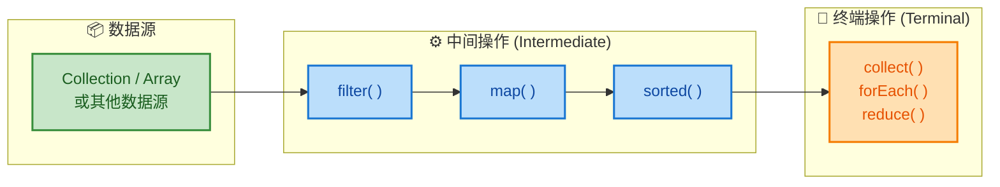

整条流水线由三部分组成：数据源（Source）→ 零个或多个中间操作（Intermediate Operations）→ 一个终端操作（Terminal Operation）。中间操作定义了"加工工序"，终端操作才是"启动开关"。

### 惰性求值（Lazy Evaluation）— Stream 最核心的设计哲学

惰性求值是 Stream 最重要、也最容易被忽视的特性。它的含义是：**中间操作不会立即执行，只有当终端操作被调用时，整条流水线才会真正启动。**

这和我们日常写代码的直觉完全不同。通常我们写一行代码，它就执行一行。但 Stream 的中间操作（`filter`、`map`、`sorted` 等）只是在"登记"一个操作，把它挂到流水线上，并不会触发任何实际计算。

```java
List<String> names = Arrays.asList("Alice", "Bob", "Charlie", "David");

// 这段代码执行后，filter 和 map 都【不会】真正运行
// 它们只是被"登记"到了流水线的操作链上
Stream<String> lazyStream = names.stream()
    .filter(name -> {
        System.out.println("filtering: " + name);  // 用于观察是否执行
        return name.length() > 3;
    })
    .map(name -> {
        System.out.println("mapping: " + name);    // 用于观察是否执行
        return name.toUpperCase();
    });

// 到这里为止，控制台没有任何输出！
// 因为还没有终端操作，流水线根本没有启动
System.out.println("--- 终端操作即将触发 ---");

// 调用 collect() 终端操作，流水线才真正启动
List<String> result = lazyStream.collect(Collectors.toList());
// 现在控制台才会打印 filtering 和 mapping 的日志
```

运行上面的代码，控制台输出是：

```
--- 终端操作即将触发 ---
filtering: Alice
mapping: Alice
filtering: Bob
filtering: Charlie
mapping: Charlie
filtering: David
mapping: David
```

注意两个关键现象：

第一，"终端操作即将触发"这行字先于所有 filtering/mapping 输出，证明在 `collect()` 之前确实什么都没执行。

第二，输出顺序不是"先 filter 完所有元素，再 map 所有元素"，而是**逐元素穿透整条流水线**：Alice 先 filter 再 map，然后 Bob 再 filter（不满足条件，不进入 map），然后 Charlie 先 filter 再 map……这种处理方式叫做 **loop fusion（循环融合）**，它避免了为每个中间操作都创建临时集合，极大地提升了性能。

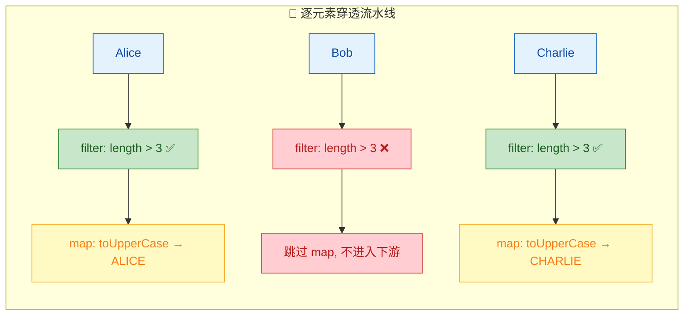

#### 惰性求值的好处

惰性求值不是为了"偷懒"，它带来了实实在在的性能优势：

**1. 短路优化（Short-circuiting）**

某些操作（如 `findFirst()`、`limit()`、`anyMatch()`）不需要处理完所有元素就能得出结果。惰性求值让流水线可以在找到答案后立即停止，不浪费算力。

```java
List<Integer> hugeList = IntStream.rangeClosed(1, 10_000_000)
    .boxed()                                    // 将 int 装箱为 Integer
    .collect(Collectors.toList());              // 一千万个元素的列表

// 找到第一个大于 100 的偶数
Optional<Integer> first = hugeList.stream()
    .filter(n -> n % 2 == 0)                   // 中间操作：筛选偶数
    .filter(n -> n > 100)                      // 中间操作：大于 100
    .findFirst();                              // 终端操作：找到第一个就停

// 实际只处理了前 102 个元素（2,4,6,...,100,102）
// 而不是遍历全部一千万个元素！
System.out.println(first.get());               // 输出: 102
```

**2. 避免中间集合的创建**

如果没有惰性求值，每个中间操作都需要产出一个临时集合传给下一步。惰性求值通过 loop fusion 让元素逐个穿过整条链，内存开销大幅降低。

**3. 无限流成为可能**

正因为惰性求值，Stream 可以表示一个**无限序列**，只要终端操作能在有限步内结束即可：

```java
// 生成一个"无限"的偶数流
// 如果不是惰性求值，这行代码会直接内存溢出
Stream<Integer> infiniteEvens = Stream.iterate(0, n -> n + 2);

// 但配合 limit()，只取前 10 个，完全安全
List<Integer> firstTen = infiniteEvens
    .limit(10)                                 // 只取前 10 个元素
    .collect(Collectors.toList());             // [0, 2, 4, 6, 8, 10, 12, 14, 16, 18]
```

### 一次性消费（Single-use）— Stream 用完即废

Stream 的第二个核心特性是：**一个 Stream 实例只能被消费一次。** 一旦终端操作执行完毕，这个 Stream 就"关闭"了，不能再次使用。如果你尝试对一个已消费的 Stream 再次调用操作，会直接抛出 `IllegalStateException`。

```java
List<String> words = Arrays.asList("hello", "world", "java");

Stream<String> stream = words.stream();        // 创建一个 Stream

// 第一次消费：正常执行
long count = stream.count();                   // 终端操作，Stream 被消费
System.out.println("count = " + count);        // 输出: count = 3

// 第二次消费：抛出异常！
// stream.forEach(System.out::println);        // ❌ IllegalStateException!
// 错误信息: stream has already been operated upon or closed
```

这个设计和 `Iterator` 的理念一致——迭代器遍历完一遍后也不能重头再来。Stream 本质上就是一个增强版的迭代器。

#### 为什么要设计成一次性的？

这不是 Java 设计者的偷懒，而是深思熟虑的结果：

- **数据源可能不可重复**：Stream 的数据源可能是网络连接、文件 I/O、随机数生成器等，这些源头本身就不支持"重新来一遍"。
- **保证操作的确定性**：如果允许重复消费，而数据源在两次消费之间发生了变化（比如集合被修改了），就会产生不可预测的结果。
- **简化内部实现**：一次性消费让 Stream 的内部状态管理更简单，不需要缓存中间结果。

#### 正确的做法：需要多次使用时，重新创建 Stream

```java
List<String> words = Arrays.asList("hello", "world", "java", "stream");

// ✅ 正确做法：每次需要时从数据源重新创建 Stream
long count = words.stream().count();                          // 第一条流水线
List<String> upper = words.stream()                           // 第二条流水线（全新的）
    .map(String::toUpperCase)
    .collect(Collectors.toList());

System.out.println("count = " + count);                       // 3
System.out.println("upper = " + upper);                       // [HELLO, WORLD, JAVA, STREAM]
```

如果你发现自己需要对同一个数据源做多种不同的 Stream 操作，可以用 `Supplier<Stream<T>>` 来封装 Stream 的创建逻辑：

```java
// 用 Supplier 封装 Stream 的创建过程
Supplier<Stream<String>> streamFactory = () -> words.stream()
    .filter(w -> w.length() > 4);              // 公共的前置过滤逻辑

// 每次调用 get() 都会创建一个全新的 Stream
long count = streamFactory.get().count();                     // 消费第一个 Stream
String joined = streamFactory.get()                           // 消费第二个 Stream（全新的）
    .collect(Collectors.joining(", "));

System.out.println(count);                                    // 2 (hello, world, stream)
System.out.println(joined);                                   // hello, world, stream
```

### Stream 操作的分类全景

在深入每个具体操作之前，先建立一个全局视角。Stream 的操作分为两大类，它们的行为特征截然不同：

| 特征 | 中间操作 (Intermediate) | 终端操作 (Terminal) |
|------|------------------------|---------------------|
| 返回值 | 返回新的 `Stream` | 返回非 Stream 结果（或 void） |
| 执行时机 | 惰性的，登记但不执行 | 立即执行，触发整条流水线 |
| 可链式调用 | ✅ 可以连续链接多个 | ❌ 只能有一个，且必须在末尾 |
| 典型代表 | `filter`, `map`, `sorted` | `collect`, `forEach`, `reduce` |

中间操作又可以细分为：

- **无状态操作（Stateless）**：处理当前元素不依赖其他元素。如 `filter`、`map`、`peek`。每个元素独立处理，效率最高。
- **有状态操作（Stateful）**：处理当前元素需要知道其他元素的信息。如 `sorted`（需要看到所有元素才能排序）、`distinct`（需要记住已经出现过的元素）、`limit`（需要计数）。这类操作在并行流中可能成为性能瓶颈。

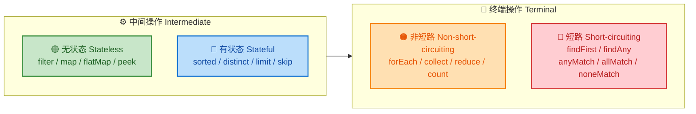

理解了惰性求值和一次性消费这两个核心概念，你就掌握了 Stream 的"灵魂"。后续学习每一个具体操作时，始终记住：中间操作只是在搭建流水线，终端操作才是按下启动按钮。

---

**📝 练习题**

以下代码的控制台输出是什么？

```java
List<String> list = Arrays.asList("a", "bb", "ccc", "dddd");
Stream<String> s = list.stream()
    .filter(x -> {
        System.out.println("filter: " + x);
        return x.length() >= 2;
    })
    .map(x -> {
        System.out.println("map: " + x);
        return x.toUpperCase();
    });
System.out.println("---ready---");
String result = s.findFirst().orElse("");
System.out.println(result);
```

A. 先输出所有 filter 日志，再输出所有 map 日志，然后输出 `---ready---`，最后输出 `BB`


B. 输出 `---ready---`，然后输出 `filter: a`、`filter: bb`、`map: bb`，最后输出 `BB`


C. 输出 `---ready---`，然后输出所有 filter 和 map 日志，最后输出 `BB`


D. 直接抛出 `IllegalStateException`


**【答案】** B

**【解析】** 这道题综合考察了惰性求值和短路操作两个核心概念。首先，`filter` 和 `map` 都是中间操作，在 `System.out.println("---ready---")` 执行时它们还没有运行，所以 `---ready---` 最先输出。接着 `findFirst()` 是一个短路终端操作，它触发流水线启动，但只需要找到第一个满足条件的元素就会停止。元素逐个穿透流水线（loop fusion）：`"a"` 进入 filter，长度为 1 不满足条件，被过滤掉；`"bb"` 进入 filter，长度为 2 满足条件，紧接着进入 map 变成 `"BB"`。此时 `findFirst()` 已经拿到结果，流水线立即停止，`"ccc"` 和 `"dddd"` 根本不会被处理。最终输出 `BB`。

---

## Stream 创建（集合、数组、Stream.of、generate、iterate）

掌握了 Stream 的核心概念后，接下来最实际的问题就是：**如何创建一个 Stream？** Java 提供了多种创建 Stream 的方式，覆盖了从最常见的集合操作到无限序列生成等各种场景。理解每种创建方式的特点和适用场景，是流畅使用 Stream API 的第一步。

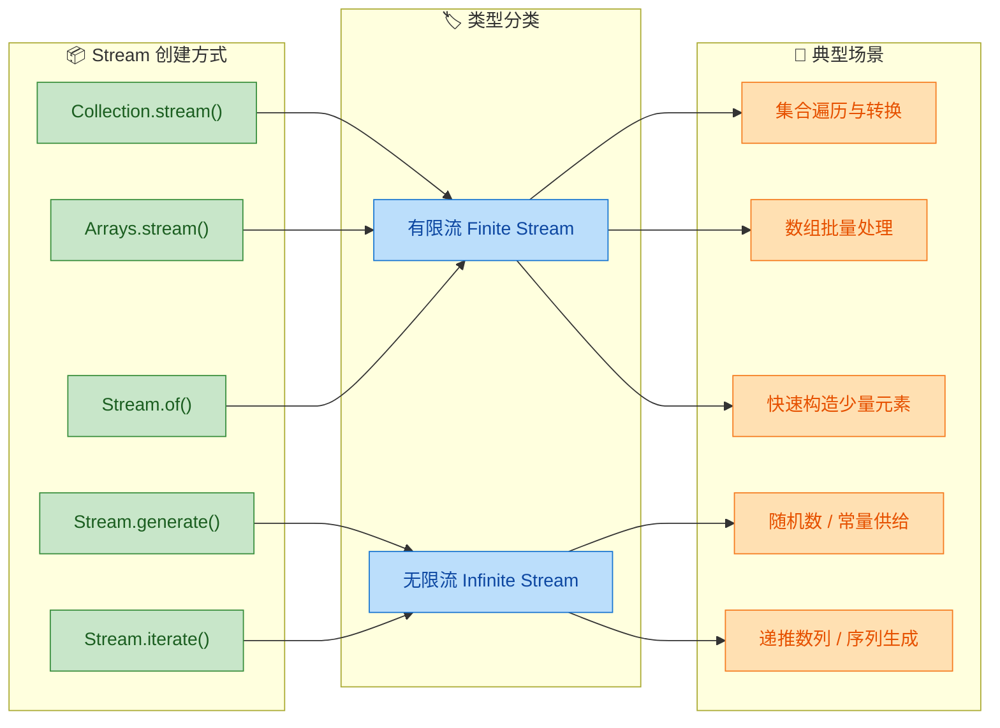

从宏观上看，Stream 的创建方式可以分为两大阵营：**有限流**（Finite Stream）和**无限流**（Infinite Stream）。有限流的元素数量在创建时就已确定，比如从一个 List 或数组中获取；无限流则理论上可以产出无穷多个元素，必须配合 `limit()` 等操作来截断，否则程序会永远运行下去。

---

### 从集合创建：Collection.stream()

这是日常开发中最高频的 Stream 创建方式。Java 8 在 `Collection` 接口中新增了 `stream()` 默认方法，意味着所有实现了 `Collection` 的类——`List`、`Set`、`Queue` 等——都可以直接调用它来获取一个顺序流（Sequential Stream）。

```java
// 从 List 创建 Stream
List<String> languages = List.of("Java", "Kotlin", "Scala", "Groovy");
// .stream() 返回一个 Stream<String>，元素顺序与 List 一致
Stream<String> langStream = languages.stream();
// 遍历输出每个元素
langStream.forEach(System.out::println); // Java Kotlin Scala Groovy

// 从 Set 创建 Stream
Set<Integer> numbers = new HashSet<>(Arrays.asList(3, 1, 4, 1, 5));
// Set 本身无序且去重，所以 Stream 中的元素顺序不保证
Stream<Integer> numStream = numbers.stream();
numStream.forEach(System.out::println); // 输出顺序不确定

// 从 Queue 创建 Stream
Queue<String> queue = new LinkedList<>();
queue.offer("first");   // 入队
queue.offer("second");  // 入队
queue.offer("third");   // 入队
// Queue 也是 Collection 的子接口，同样支持 .stream()
Stream<String> queueStream = queue.stream();
queueStream.forEach(System.out::println); // first second third
```

有一个非常重要的细节：`stream()` 创建的流**不会复制底层数据**。它只是在原始集合之上建立了一个"视图"（view），真正的数据仍然存储在原集合中。这意味着：

- 创建 Stream 的开销极低，不涉及内存拷贝。
- 如果在 Stream 管道执行过程中修改了底层集合，会抛出 `ConcurrentModificationException`，这和迭代器的 fail-fast 机制一致。

```java
List<String> list = new ArrayList<>(List.of("A", "B", "C"));

// ❌ 错误示范：在 Stream 消费过程中修改底层集合
list.stream().forEach(item -> {
    if ("B".equals(item)) {
        list.remove(item); // 触发 ConcurrentModificationException
    }
});

// ✅ 正确做法：先用 Stream 筛选，再收集为新集合
List<String> filtered = list.stream()
        .filter(item -> !"B".equals(item)) // 过滤掉 "B"
        .collect(Collectors.toList());      // 收集到新 List
```

此外，`Collection` 接口还提供了 `parallelStream()` 方法，可以直接创建并行流，这个我们会在后面的"并行流"章节详细展开。

---

### 从数组创建：Arrays.stream()

数组不是 `Collection`，所以不能直接调用 `.stream()`。Java 为此在 `Arrays` 工具类中提供了静态方法 `Arrays.stream()`，支持对象数组和基本类型数组。

```java
// 1. 从对象数组创建 Stream<String>
String[] fruits = {"Apple", "Banana", "Cherry", "Date"};
// Arrays.stream() 接收一个数组，返回对应类型的 Stream
Stream<String> fruitStream = Arrays.stream(fruits);
fruitStream.forEach(System.out::println); // Apple Banana Cherry Date

// 2. 从基本类型数组创建——返回的是 IntStream，不是 Stream<Integer>
int[] scores = {88, 92, 76, 95, 61};
// 对 int[] 调用 Arrays.stream() 会返回 IntStream（基本类型特化流）
IntStream scoreStream = Arrays.stream(scores);
// IntStream 提供了 sum()、average() 等数值专用终端操作
int total = scoreStream.sum(); // 直接求和：88+92+76+95+61 = 412
System.out.println("总分: " + total); // 总分: 412

// 3. 截取数组的一部分来创建 Stream（左闭右开区间）
// 第二个参数是起始索引（含），第三个参数是结束索引（不含）
Stream<String> subStream = Arrays.stream(fruits, 1, 3);
subStream.forEach(System.out::println); // Banana Cherry
```

`Arrays.stream()` 对基本类型数组的处理值得特别关注。当传入 `int[]`、`long[]` 或 `double[]` 时，它分别返回 `IntStream`、`LongStream`、`DoubleStream`，而不是 `Stream<Integer>` 等包装类型的流。这避免了自动装箱（autoboxing）的性能开销，在处理大量数值数据时差异显著。

```java
// 对比：装箱流 vs 基本类型流
int[] data = new int[1_000_000]; // 一百万个 int
Arrays.fill(data, 1);           // 全部填充为 1

// ✅ 推荐：IntStream，无装箱开销
long sum1 = Arrays.stream(data).sum(); // 直接在 int 层面求和

// ❌ 不推荐：Stream<Integer>，每个 int 都要装箱为 Integer 对象
long sum2 = Arrays.stream(data)
        .boxed()                       // int → Integer，产生一百万个对象
        .reduce(0, Integer::sum);      // 在 Integer 层面归约
```

---

### 直接构造：Stream.of()

当你手头只有几个零散的值，想快速构造一个 Stream 时，`Stream.of()` 是最简洁的选择。它接收可变参数（varargs），内部实际上调用的就是 `Arrays.stream()`。

```java
// 传入多个元素，快速创建 Stream
Stream<String> stream1 = Stream.of("Hello", "Stream", "API");
stream1.forEach(System.out::println); // Hello Stream API

// 也可以传入单个元素
Stream<Integer> stream2 = Stream.of(42);
stream2.forEach(System.out::println); // 42

// 传入一个数组——注意这里的行为差异！
String[] arr = {"X", "Y", "Z"};
// Stream.of(arr) 会展开数组，等价于 Stream.of("X", "Y", "Z")
Stream<String> stream3 = Stream.of(arr);
stream3.forEach(System.out::println); // X Y Z

// ⚠️ 但如果传入 int[]，行为完全不同
int[] intArr = {1, 2, 3};
// Stream.of(intArr) 把整个 int[] 当作一个元素！返回 Stream<int[]>
Stream<int[]> stream4 = Stream.of(intArr);
System.out.println(stream4.count()); // 1（只有一个元素，就是那个数组本身）

// 正确做法：用 Arrays.stream(intArr) 或 IntStream.of(1, 2, 3)
IntStream intStream = IntStream.of(1, 2, 3);
intStream.forEach(System.out::println); // 1 2 3
```

这里有一个经典的"坑"：`Stream.of()` 对基本类型数组不会自动展开。因为 Java 泛型不支持基本类型，`Stream.of(int[])` 会被推断为 `Stream<int[]>`，整个数组变成了流中的一个元素。这是初学者非常容易踩的陷阱。

另外，`Stream.empty()` 可以创建一个空流，在需要返回"无结果"的场景中很有用，比如方法的边界条件处理：

```java
// 创建空流，常用于方法返回值的边界处理
Stream<String> emptyStream = Stream.empty();
System.out.println(emptyStream.count()); // 0

// 实际应用：安全地处理可能为 null 的集合
public static <T> Stream<T> safeStream(Collection<T> collection) {
    // 如果集合为 null，返回空流而不是抛出 NullPointerException
    return collection == null ? Stream.empty() : collection.stream();
}
```

---

### 无限流之一：Stream.generate()

`Stream.generate()` 接收一个 `Supplier<T>`（无参数、有返回值的函数式接口），每次需要新元素时就调用一次这个 Supplier。它生成的是**无限流**，元素之间没有递推关系，每次调用都是独立的。

```java
// 1. 生成常量流——每个元素都是 "Echo"
Stream<String> echoStream = Stream.generate(() -> "Echo");
// 必须用 limit() 截断，否则无限输出
echoStream.limit(3).forEach(System.out::println);
// Echo
// Echo
// Echo

// 2. 生成随机数流
Random random = new Random();
// random::nextInt 是方法引用，等价于 () -> random.nextInt()
Stream<Integer> randomStream = Stream.generate(random::nextInt);
randomStream
        .limit(5)                          // 只取 5 个
        .forEach(System.out::println);     // 5 个随机整数

// 3. 生成 UUID 流——每次调用都产生一个全新的 UUID
Stream.generate(UUID::randomUUID)
        .limit(3)                          // 取 3 个
        .map(UUID::toString)               // 转为字符串
        .forEach(System.out::println);     // 3 个不同的 UUID 字符串

// 4. 利用外部状态生成递增序列（⚠️ 不推荐，有副作用）
AtomicInteger counter = new AtomicInteger(0);
Stream.generate(counter::getAndIncrement)
        .limit(5)
        .forEach(System.out::println); // 0 1 2 3 4
// 虽然能工作，但 Supplier 依赖了外部可变状态，违反函数式编程原则
// 这种场景应该用 Stream.iterate() 或 IntStream.range()
```

`generate()` 的核心特征是**无状态生成**（至少从设计意图上如此）。每次调用 Supplier 都应该是独立的，不依赖前一次的结果。如果你需要"基于前一个元素推导下一个元素"，那就该用 `iterate()`。

---

### 无限流之二：Stream.iterate()

`Stream.iterate()` 是另一种创建无限流的方式，但与 `generate()` 不同，它具有明确的**递推关系**——每个元素都由前一个元素经过某个函数变换而来，类似数学中的递推数列。

```java
// 基本形式：iterate(seed, UnaryOperator)
// seed 是初始值，UnaryOperator 定义了 "如何从当前元素得到下一个元素"

// 1. 生成等差数列：0, 2, 4, 6, 8, ...
Stream.iterate(0, n -> n + 2)      // 从 0 开始，每次 +2
        .limit(5)                   // 取前 5 个
        .forEach(System.out::println); // 0 2 4 6 8

// 2. 生成等比数列：1, 2, 4, 8, 16, ...
Stream.iterate(1, n -> n * 2)      // 从 1 开始，每次 ×2
        .limit(6)                   // 取前 6 个
        .forEach(System.out::println); // 1 2 4 8 16 32

// 3. 生成斐波那契数列（利用数组保存两个状态）
Stream.iterate(
        new long[]{0, 1},           // 初始状态：[F(0), F(1)]
        pair -> new long[]{pair[1], pair[0] + pair[1]} // [F(n), F(n+1)] → [F(n+1), F(n+2)]
)
        .limit(10)                  // 取前 10 组
        .map(pair -> pair[0])       // 只取每组的第一个值
        .forEach(System.out::println);
// 0 1 1 2 3 5 8 13 21 34
```

Java 9 对 `iterate()` 做了一个非常实用的增强——增加了三参数版本，引入了一个 `Predicate` 作为终止条件，使得 `iterate()` 可以生成**有限流**，不再必须依赖 `limit()`：

```java
// Java 9+ 三参数 iterate：iterate(seed, hasNext, next)
// 类似传统 for 循环：for (int i = seed; hasNext(i); i = next(i))

// 等价于 for (int i = 0; i < 10; i += 2)
Stream.iterate(0, n -> n < 10, n -> n + 2)
        .forEach(System.out::println); // 0 2 4 6 8

// 遍历日期：从今天开始，到月底为止，每次 +1 天
LocalDate today = LocalDate.now();
LocalDate endOfMonth = today.withDayOfMonth(today.lengthOfMonth());

Stream.iterate(
        today,                              // 起始日期
        date -> !date.isAfter(endOfMonth),  // 终止条件：不超过月底
        date -> date.plusDays(1)             // 每次加一天
).forEach(System.out::println);
// 输出从今天到月底的每一天
```

三参数 `iterate()` 本质上就是把传统 `for` 循环的三个部分（初始化、条件判断、迭代步进）映射到了函数式风格中，语义非常清晰。

---

### 创建方式对比总览

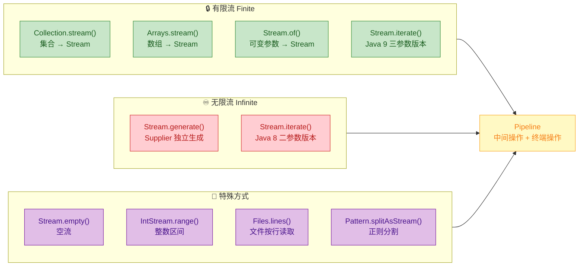

除了前面详细讲解的五种核心方式，Java 还提供了一些特殊场景下的 Stream 创建途径，值得了解：

```java
// 1. IntStream.range() / rangeClosed()——生成整数区间
IntStream.range(1, 5)        // [1, 5)，不含 5
        .forEach(System.out::print); // 1234
System.out.println();
IntStream.rangeClosed(1, 5)  // [1, 5]，含 5
        .forEach(System.out::print); // 12345

// 2. Files.lines()——按行读取文件，返回 Stream<String>
// 注意：需要在 try-with-resources 中使用，确保文件句柄被关闭
try (Stream<String> lines = Files.lines(Path.of("data.txt"), StandardCharsets.UTF_8)) {
    lines.filter(line -> !line.isBlank())   // 过滤空行
         .map(String::trim)                 // 去除首尾空白
         .forEach(System.out::println);     // 逐行输出
} // 自动关闭底层文件资源

// 3. Pattern.splitAsStream()——用正则表达式分割字符串为 Stream
Pattern pattern = Pattern.compile(",\\s*"); // 匹配逗号及其后的空白
Stream<String> parts = pattern.splitAsStream("Java, Kotlin, Scala, Groovy");
parts.forEach(System.out::println); // Java Kotlin Scala Groovy

// 4. String.chars()——Java 9+，将字符串拆为 IntStream（每个字符的 Unicode 码点）
"Hello".chars()                            // 返回 IntStream
       .mapToObj(c -> (char) c)            // int → char
       .forEach(System.out::print);        // Hello

// 5. Stream.concat()——拼接两个 Stream 为一个
Stream<String> s1 = Stream.of("A", "B");
Stream<String> s2 = Stream.of("C", "D");
Stream<String> merged = Stream.concat(s1, s2); // A B C D
merged.forEach(System.out::print); // ABCD
```

下面这张表格可以作为快速查阅的参考：

| 创建方式 | 返回类型 | 有限/无限 | 典型场景 |
|---|---|---|---|
| `collection.stream()` | `Stream<T>` | 有限 | 集合数据处理，最常用 |
| `Arrays.stream(arr)` | `Stream<T>` / `IntStream` 等 | 有限 | 数组批量操作 |
| `Stream.of(...)` | `Stream<T>` | 有限 | 快速构造少量元素 |
| `Stream.generate(supplier)` | `Stream<T>` | 无限 | 随机数、常量、独立生成 |
| `Stream.iterate(seed, op)` | `Stream<T>` | 无限 | 递推数列、序列生成 |
| `Stream.iterate(seed, pred, op)` | `Stream<T>` | 有限 (Java 9+) | 带终止条件的递推 |
| `IntStream.range(a, b)` | `IntStream` | 有限 | 整数区间遍历 |
| `Files.lines(path)` | `Stream<String>` | 有限 | 文件逐行处理 |
| `Stream.empty()` | `Stream<T>` | 有限 (0个元素) | 空结果、边界处理 |

---

**📝 练习题**

以下代码的输出结果是什么？

```java
int[] nums = {1, 2, 3};
long count = Stream.of(nums).count();
System.out.println(count);
```

A. 3

B. 1

C. 编译错误

D. 运行时抛出异常


**【答案】** B

**【解析】** `Stream.of()` 接收的是可变参数 `T...`。当传入 `int[]` 时，由于 Java 泛型不支持基本类型，编译器无法将 `int` 推断为泛型类型参数，因此整个 `int[]` 数组被当作**一个**元素，返回类型是 `Stream<int[]>`。这个流中只有一个元素（就是那个数组对象本身），所以 `count()` 返回 `1`。如果想得到 `3`，应该使用 `Arrays.stream(nums)` 或 `IntStream.of(1, 2, 3)`。注意，如果传入的是 `Integer[]` 而非 `int[]`，`Stream.of()` 就能正确展开为三个元素，因为 `Integer` 是引用类型，可以作为泛型参数。


---

## 中间操作（Intermediate Operations）

Stream 的中间操作是整个 Stream API 最核心的"加工车间"。它们的本质是 **惰性求值（Lazy Evaluation）**——调用中间操作时，不会立即执行任何计算，而是将操作"记录"到一条流水线（pipeline）上，直到遇到终端操作才会真正触发数据流动。

理解这一点至关重要：中间操作返回的仍然是一个新的 `Stream` 对象，因此可以链式调用（method chaining），形成声明式的数据处理管道。

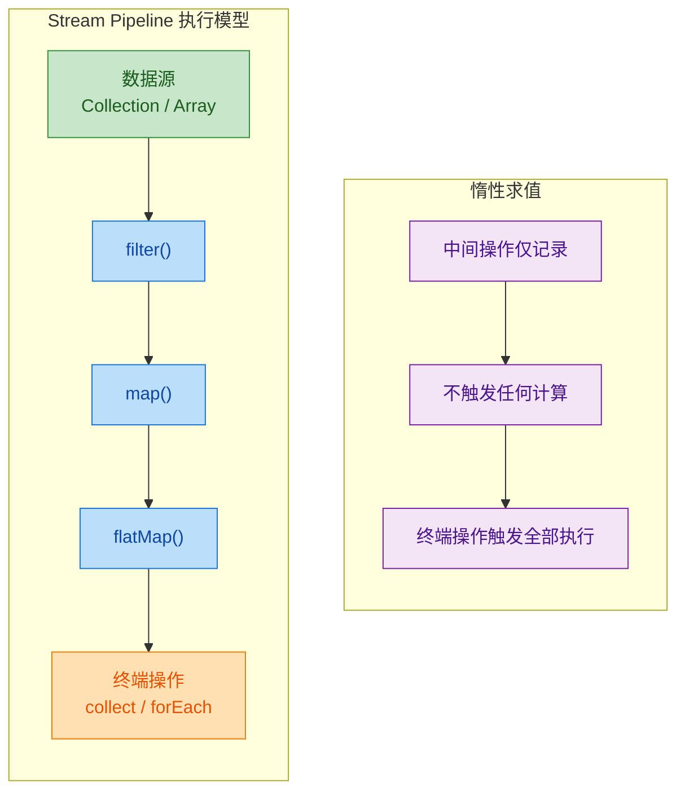

---

### filter（条件过滤）

`filter` 是最直觉的中间操作，它接收一个 `Predicate<T>`（断言函数），只保留满足条件的元素，丢弃不满足的。可以把它想象成一个"筛子"——数据流过筛子，只有符合条件的颗粒才能通过。

方法签名：

```java
Stream<T> filter(Predicate<? super T> predicate)
```

`Predicate<T>` 是一个函数式接口，其核心方法 `boolean test(T t)` 返回 `true` 表示保留，`false` 表示丢弃。

来看一个基础示例：

```java
// 从一组整数中筛选出所有偶数
List<Integer> numbers = List.of(1, 2, 3, 4, 5, 6, 7, 8, 9, 10);

List<Integer> evens = numbers.stream()   // 创建流
        .filter(n -> n % 2 == 0)         // 只保留能被2整除的元素
        .collect(Collectors.toList());   // 终端操作：收集为List

System.out.println(evens); // 输出: [2, 4, 6, 8, 10]
```

`filter` 的强大之处在于 `Predicate` 可以组合。`Predicate` 接口提供了 `and()`、`or()`、`negate()` 三个默认方法，允许你像写布尔表达式一样组合多个条件：

```java
// 定义员工类
record Employee(String name, int age, double salary, String department) {}

List<Employee> employees = List.of(
        new Employee("Alice", 30, 85000, "Engineering"),
        new Employee("Bob", 25, 62000, "Marketing"),
        new Employee("Charlie", 35, 95000, "Engineering"),
        new Employee("Diana", 28, 71000, "Engineering"),
        new Employee("Eve", 40, 110000, "Management")
);

// 构建可复用的断言条件
Predicate<Employee> isEngineer = e -> "Engineering".equals(e.department());  // 是否工程部
Predicate<Employee> isSenior = e -> e.age() >= 30;                          // 是否年龄>=30
Predicate<Employee> highEarner = e -> e.salary() > 80000;                   // 是否高薪

// 组合条件：工程部 且 (资深 或 高薪)
List<Employee> result = employees.stream()
        .filter(isEngineer.and(isSenior.or(highEarner)))  // Predicate组合
        .collect(Collectors.toList());

// 结果: Alice(30岁,85k,Engineering), Charlie(35岁,95k,Engineering)
result.forEach(e -> System.out.println(e.name()));
```

多个 `filter` 链式调用与单个 `filter` 内用 `&&` 连接在语义上等价，但链式写法可读性更好，且 Stream 内部会进行优化（short-circuit fusion）：

```java
// 写法一：链式 filter（推荐，可读性强）
stream.filter(e -> e.age() > 25)
      .filter(e -> e.salary() > 70000)
      .filter(e -> "Engineering".equals(e.department()));

// 写法二：单个 filter 内合并（功能等价）
stream.filter(e -> e.age() > 25 && e.salary() > 70000 && "Engineering".equals(e.department()));
```

一个常见的实战场景是过滤 `null` 值。在处理不可靠的数据源时，这几乎是标配操作：

```java
List<String> rawData = Arrays.asList("hello", null, "world", null, "java");

List<String> cleaned = rawData.stream()
        .filter(Objects::nonNull)        // 方法引用，等价于 s -> s != null
        .filter(s -> !s.isEmpty())       // 进一步过滤空字符串
        .collect(Collectors.toList());

System.out.println(cleaned); // 输出: [hello, world, java]
```

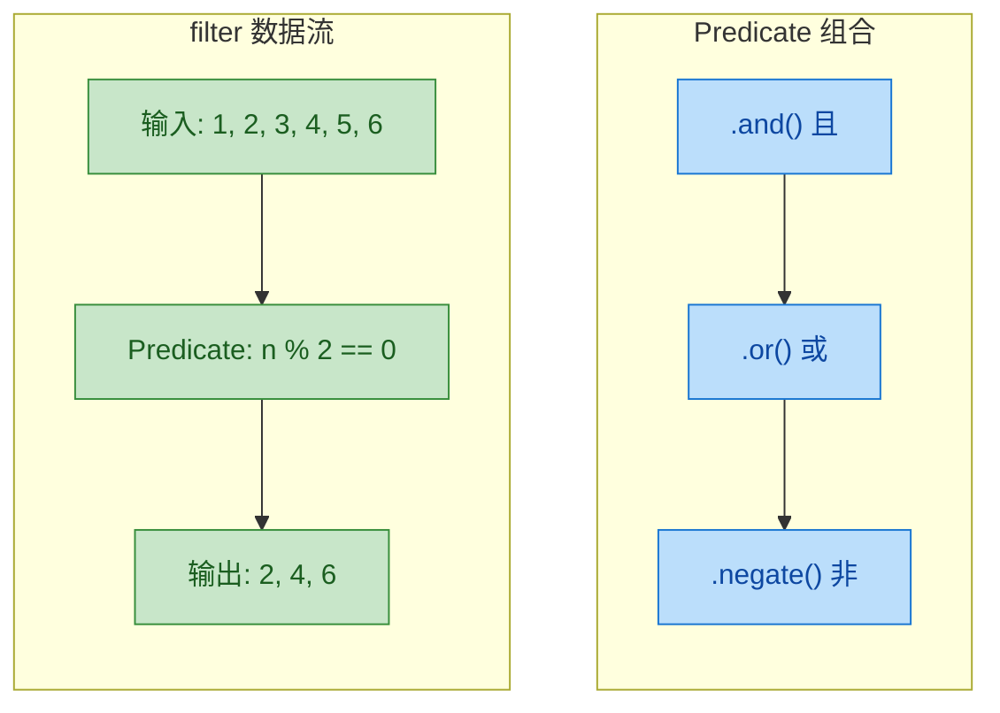

---

### map（元素转换）

如果说 `filter` 是"选择哪些元素"，那么 `map` 就是"把元素变成什么"。`map` 接收一个 `Function<T, R>`，将流中的每个元素从类型 `T` 转换为类型 `R`，形成一个新的 `Stream<R>`。这是一对一（one-to-one）的映射关系——输入 N 个元素，输出恰好 N 个元素。

方法签名：

```java
<R> Stream<R> map(Function<? super T, ? extends R> mapper)
```

最简单的用法是提取对象的某个属性：

```java
// 从员工列表中提取所有姓名
List<String> names = employees.stream()
        .map(Employee::name)             // 方法引用，等价于 e -> e.name()
        .collect(Collectors.toList());

System.out.println(names); // 输出: [Alice, Bob, Charlie, Diana, Eve]
```

`map` 可以改变流的泛型类型，这是它与 `filter` 最本质的区别。`filter` 前后类型不变（`Stream<T>` → `Stream<T>`），而 `map` 可以做类型转换（`Stream<T>` → `Stream<R>`）：

```java
// String -> Integer: 将字符串转换为其长度
List<String> words = List.of("Stream", "API", "is", "powerful");

List<Integer> lengths = words.stream()
        .map(String::length)             // String -> Integer
        .collect(Collectors.toList());

System.out.println(lengths); // 输出: [6, 3, 2, 8]
```

在实际开发中，`map` 最常见的用途之一是 DTO（Data Transfer Object）转换。当你从数据库查出实体对象，需要转成前端需要的视图对象时，`map` 是最优雅的选择：

```java
// 实体类
record UserEntity(Long id, String username, String email, String passwordHash) {}

// DTO类（不暴露密码）
record UserDTO(Long id, String username, String email) {}

List<UserEntity> entities = queryFromDatabase(); // 假设从数据库查询

// 实体 -> DTO 转换
List<UserDTO> dtos = entities.stream()
        .map(e -> new UserDTO(              // 每个实体映射为一个DTO
                e.id(),                     // 保留id
                e.username(),               // 保留用户名
                e.email()                   // 保留邮箱，丢弃密码
        ))
        .collect(Collectors.toList());
```

`map` 与 `filter` 的组合是 Stream 编程中最经典的模式，几乎所有数据处理场景都离不开这对搭档：

```java
// 经典组合：先过滤，再转换
// 需求：找出工程部所有员工的姓名，转为大写
List<String> engineerNames = employees.stream()
        .filter(e -> "Engineering".equals(e.department()))  // 第一步：筛选工程部
        .map(Employee::name)                                 // 第二步：提取姓名
        .map(String::toUpperCase)                            // 第三步：转大写
        .collect(Collectors.toList());

System.out.println(engineerNames); // 输出: [ALICE, CHARLIE, DIANA]
```

注意 `map` 的链式调用：第一个 `map` 将 `Employee` 转为 `String`（姓名），第二个 `map` 将 `String` 转为 `String`（大写）。每一步都是清晰的单一职责。

一个容易踩的坑是在 `map` 中产生嵌套结构。比如你想把一句话拆成单词：

```java
List<String> sentences = List.of("Hello World", "Stream API");

// 错误示范：map 产生了 Stream<String[]>，而不是 Stream<String>
List<String[]> wrong = sentences.stream()
        .map(s -> s.split(" "))          // 每个String变成String[]
        .collect(Collectors.toList());
// wrong 的类型是 List<String[]>，不是我们想要的 List<String>
```

这个问题正是 `flatMap` 要解决的，我们马上就会讲到。

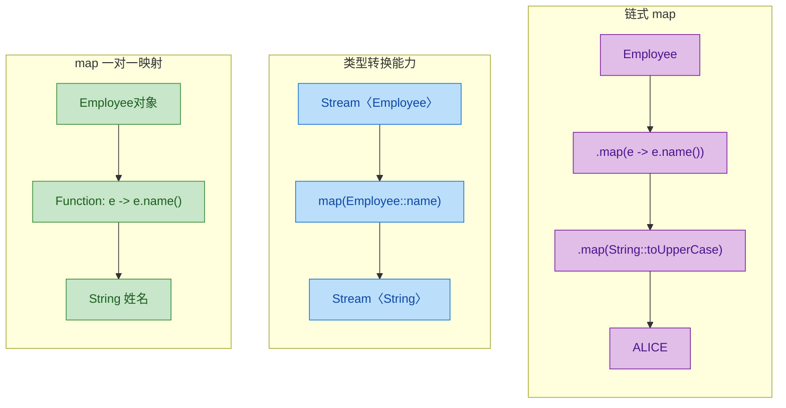

---

### flatMap ⭐（扁平化映射）

`flatMap` 是 Stream API 中理解门槛最高但也最强大的中间操作之一。它的名字由 "flat"（扁平化）和 "map"（映射）组合而成，完美描述了它的行为：先映射，再展平。

方法签名：

```java
<R> Stream<R> flatMap(Function<? super T, ? extends Stream<? extends R>> mapper)
```

注意与 `map` 的关键区别：`map` 的 mapper 返回 `R`（一个普通对象），而 `flatMap` 的 mapper 返回 `Stream<R>`（一个流）。`flatMap` 会把所有这些子流"拍平"合并成一个流。

用一张内存模型图来理解 `map` 与 `flatMap` 的区别：

```text
map 的结果（嵌套结构）:
┌─────────────────────────────────────────┐
│ Stream< Stream<String> >                │
│  ┌──────────────┐  ┌──────────────┐     │
│  │ Stream:       │  │ Stream:       │    │
│  │ "Hello"       │  │ "Stream"      │    │
│  │ "World"       │  │ "API"         │    │
│  └──────────────┘  └──────────────┘     │
└─────────────────────────────────────────┘

flatMap 的结果（扁平结构）:
┌─────────────────────────────────────────┐
│ Stream<String>                          │
│  "Hello", "World", "Stream", "API"      │
└─────────────────────────────────────────┘
```

回到刚才 `map` 留下的问题——把句子拆成单词：

```java
List<String> sentences = List.of("Hello World", "Stream API");

// 使用 flatMap：每个句子拆成单词流，然后扁平化合并
List<String> words = sentences.stream()
        .flatMap(sentence -> Arrays.stream(sentence.split(" ")))  // String -> Stream<String>
        .collect(Collectors.toList());

System.out.println(words); // 输出: [Hello, World, Stream, API]
```

逐步拆解这个过程：

```java
// 第一步：sentences.stream() 产生 Stream<String>
//   元素: "Hello World", "Stream API"

// 第二步：flatMap 对每个元素执行 mapper
//   "Hello World" -> Arrays.stream(["Hello", "World"]) -> Stream: "Hello", "World"
//   "Stream API"  -> Arrays.stream(["Stream", "API"])   -> Stream: "Stream", "API"

// 第三步：flatMap 将所有子 Stream 合并为一个
//   最终 Stream: "Hello", "World", "Stream", "API"
```

`flatMap` 在处理嵌套集合时尤其有用。假设你有一个"订单-商品"的一对多关系：

```java
// 订单类，每个订单包含多个商品
record Order(String orderId, List<String> items) {}

List<Order> orders = List.of(
        new Order("ORD-001", List.of("iPhone", "AirPods")),       // 订单1有2个商品
        new Order("ORD-002", List.of("MacBook", "Mouse", "Pad")), // 订单2有3个商品
        new Order("ORD-003", List.of("iPad"))                     // 订单3有1个商品
);

// 需求：获取所有订单中的所有商品（扁平化）
List<String> allItems = orders.stream()
        .flatMap(order -> order.items().stream())  // List<String> -> Stream<String>
        .collect(Collectors.toList());

System.out.println(allItems);
// 输出: [iPhone, AirPods, MacBook, Mouse, Pad, iPad]
```

如果这里用 `map` 而不是 `flatMap`，你得到的将是 `List<List<String>>`——一个嵌套列表，而不是我们想要的扁平列表。

再看一个更复杂的实战场景——多层嵌套的扁平化：

```java
// 公司 -> 部门 -> 员工 三层嵌套结构
record Company(String name, List<Department> departments) {}
record Department(String name, List<String> employees) {}

List<Company> companies = List.of(
        new Company("TechCorp", List.of(
                new Department("Engineering", List.of("Alice", "Bob")),
                new Department("Design", List.of("Charlie"))
        )),
        new Company("DataInc", List.of(
                new Department("Analytics", List.of("Diana", "Eve"))
        ))
);

// 需求：获取所有公司所有部门的所有员工姓名
List<String> allEmployees = companies.stream()
        .flatMap(company -> company.departments().stream())   // 第一层展平：公司 -> 部门
        .flatMap(dept -> dept.employees().stream())           // 第二层展平：部门 -> 员工
        .collect(Collectors.toList());

System.out.println(allEmployees);
// 输出: [Alice, Bob, Charlie, Diana, Eve]
```

`flatMap` 还有一个优雅的用法——处理 `Optional` 流。当 `map` 产生 `Stream<Optional<T>>` 时，可以用 `flatMap` 配合 `Optional.stream()`（Java 9+）去掉空值：

```java
// 模拟一个可能返回空值的查找方法
Optional<String> findNickname(String name) {
    Map<String, String> nicknames = Map.of("Alice", "Ali", "Charlie", "Chuck");
    return Optional.ofNullable(nicknames.get(name));  // 找不到返回 Optional.empty()
}

List<String> names = List.of("Alice", "Bob", "Charlie", "Diana");

// 获取所有有昵称的人的昵称
List<String> nicknames = names.stream()
        .map(this::findNickname)              // Stream<Optional<String>>
        .flatMap(Optional::stream)            // 展平：有值保留，empty丢弃
        .collect(Collectors.toList());

System.out.println(nicknames); // 输出: [Ali, Chuck]
// Bob 和 Diana 没有昵称，Optional.empty().stream() 产生空流，被自然过滤掉
```

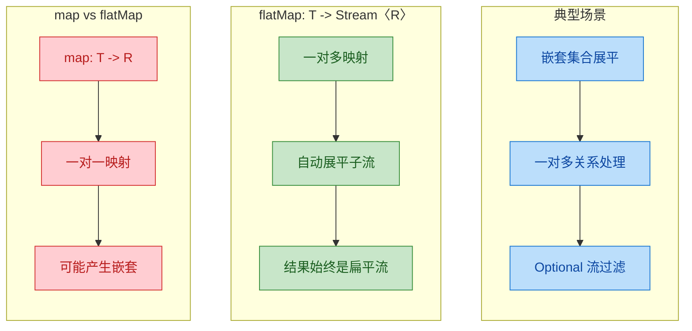

最后总结一下三者的核心区别，用一张表说清楚：

| 操作 | 输入 → 输出 | 元素数量变化 | 类型变化 | 核心用途 |
|------|------------|-------------|---------|---------|
| `filter` | `T → boolean` | N → ≤N（减少） | 不变 | 筛选 |
| `map` | `T → R` | N → N（不变） | 可变 | 一对一转换 |
| `flatMap` | `T → Stream<R>` | N → 任意（通常增多） | 可变 | 一对多转换 + 展平 |

---

**📝 练习题**

以下代码的输出结果是什么？

```java
List<List<Integer>> nested = List.of(
    List.of(1, 2, 3),
    List.of(4, 5),
    List.of(6)
);

long result = nested.stream()
    .flatMap(Collection::stream)
    .filter(n -> n % 2 != 0)
    .map(n -> n * n)
    .count();

System.out.println(result);
```

A. 3

B. 4

C. 35

D. 6


**【答案】** A

**【解析】** 逐步分析这条 Stream pipeline：首先 `flatMap(Collection::stream)` 将嵌套列表展平为 `[1, 2, 3, 4, 5, 6]`；然后 `filter(n -> n % 2 != 0)` 筛选奇数，得到 `[1, 3, 5]`；接着 `map(n -> n * n)` 将每个奇数平方，得到 `[1, 9, 25]`；最后 `count()` 统计元素个数，结果为 3。注意 `count()` 返回的是元素数量而非求和，如果题目问的是求和（用 `reduce` 或 `mapToInt().sum()`），答案才是 35（选项 C 是干扰项）。


---

## 中间操作（续）

### sorted（排序）

Stream 的 `sorted()` 是一个**有状态的中间操作**（Stateful Intermediate Operation）。为什么说"有状态"？因为它必须**看完所有元素**之后才能决定输出顺序——这和 `filter`、`map` 那种来一个处理一个的"无状态操作"有本质区别。

sorted 提供两种重载形式：

```java
// 形式一：自然排序（Natural Order）
// 要求元素实现 Comparable 接口，否则运行时抛 ClassCastException
Stream<T> sorted();

// 形式二：自定义排序（Custom Comparator）
// 传入一个 Comparator，完全由你决定排序规则
Stream<T> sorted(Comparator<? super T> comparator);
```

先看最基础的自然排序：

```java
// 对整数列表进行自然排序（升序）
List<Integer> numbers = List.of(5, 3, 8, 1, 9, 2, 7);

List<Integer> sorted = numbers.stream()
        .sorted()                    // 默认调用 Integer 的 compareTo，升序排列
        .collect(Collectors.toList()); // 收集为新列表

System.out.println(sorted); // [1, 2, 3, 5, 7, 8, 9]
```

字符串同理，`String` 实现了 `Comparable`，默认按字典序（lexicographic order）排列：

```java
List<String> words = List.of("banana", "apple", "cherry", "date");

List<String> sortedWords = words.stream()
        .sorted()                    // 字典序：a < b < c < d
        .collect(Collectors.toList());

System.out.println(sortedWords); // [apple, banana, cherry, date]
```

实际开发中，自然排序远远不够用。你经常需要按对象的某个字段排序、降序排列、多字段组合排序。这时候就需要 `Comparator`。Java 8 给 `Comparator` 加了一系列非常好用的静态方法和默认方法，和 Stream 配合起来极其流畅：

```java
// 假设有一个 Employee 类
record Employee(String name, String department, int salary) {}

List<Employee> employees = List.of(
        new Employee("Alice",   "Engineering", 95000),
        new Employee("Bob",     "Marketing",   72000),
        new Employee("Charlie", "Engineering", 88000),
        new Employee("Diana",   "Marketing",   72000),
        new Employee("Eve",     "Engineering", 105000)
);

// ① 按薪资升序
List<Employee> bySalaryAsc = employees.stream()
        .sorted(Comparator.comparingInt(Employee::salary)) // 提取 int 字段作为排序键
        .collect(Collectors.toList());
// Bob(72000), Diana(72000), Charlie(88000), Alice(95000), Eve(105000)

// ② 按薪资降序 —— 在 comparingInt 后面链式调用 reversed()
List<Employee> bySalaryDesc = employees.stream()
        .sorted(Comparator.comparingInt(Employee::salary).reversed()) // reversed() 反转排序方向
        .collect(Collectors.toList());
// Eve(105000), Alice(95000), Charlie(88000), Bob(72000), Diana(72000)

// ③ 多字段排序：先按部门升序，部门相同再按薪资降序
List<Employee> multiSort = employees.stream()
        .sorted(
                Comparator.comparing(Employee::department)          // 第一排序键：部门名（字典序）
                        .thenComparing(                             // 第二排序键
                                Comparator.comparingInt(Employee::salary).reversed() // 薪资降序
                        )
        )
        .collect(Collectors.toList());
// Engineering: Eve(105000), Alice(95000), Charlie(88000)
// Marketing:   Bob(72000), Diana(72000)
```

`Comparator` 的链式 API 总结如下：

| 方法 | 作用 |
|------|------|
| `Comparator.comparing(keyExtractor)` | 按某个字段排序（对象类型字段） |
| `Comparator.comparingInt/Long/Double(keyExtractor)` | 按基本类型字段排序，避免自动装箱 |
| `.reversed()` | 反转当前排序方向 |
| `.thenComparing(...)` | 当前排序键相同时，使用下一个排序键 |
| `Comparator.nullsFirst(comparator)` | null 值排在最前面 |
| `Comparator.nullsLast(comparator)` | null 值排在最后面 |

处理 null 值是实际项目中的高频需求，`nullsFirst` / `nullsLast` 非常实用：

```java
List<String> names = Arrays.asList("Charlie", null, "Alice", null, "Bob");

List<String> safeSort = names.stream()
        .sorted(
                Comparator.nullsLast(          // null 放到最后
                        Comparator.naturalOrder() // 非 null 元素按自然序排
                )
        )
        .collect(Collectors.toList());

System.out.println(safeSort); // [Alice, Bob, Charlie, null, null]
```

关于 sorted 的性能，有一个关键点值得注意：sorted 是一个**屏障操作**（barrier operation）。它会在内部缓冲所有上游元素，排序完毕后再逐个向下游释放。这意味着：

- 它会打断 Stream 的"流水线式"逐元素处理模式
- 对于大数据量，内存开销不可忽视
- 时间复杂度为 O(n log n)，底层使用 TimSort

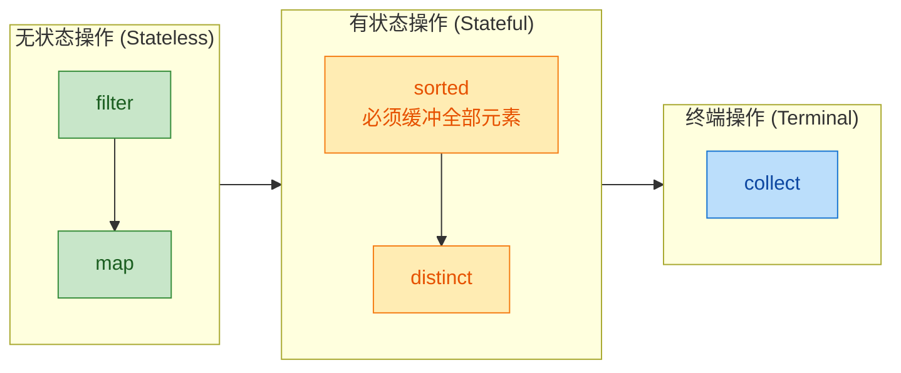

---

### distinct（去重）

`distinct()` 也是一个有状态的中间操作，它基于元素的 `equals()` 和 `hashCode()` 方法来判断重复。内部实现类似于一个 `LinkedHashSet`——遇到新元素就放行并记住它，遇到已见过的元素就丢弃。

基本类型和 String 的去重非常直观：

```java
List<Integer> numbers = List.of(3, 1, 4, 1, 5, 9, 2, 6, 5, 3, 5);

List<Integer> unique = numbers.stream()
        .distinct()                    // 去除重复元素，保留首次出现的顺序
        .collect(Collectors.toList());

System.out.println(unique); // [3, 1, 4, 5, 9, 2, 6]
```

注意输出顺序——`distinct()` 保留的是元素**首次出现**的顺序（encounter order），这对于有序流（ordered stream）是有保证的。

对自定义对象去重时，**必须正确重写 `equals()` 和 `hashCode()`**，否则 `distinct()` 会认为每个对象都不同：

```java
// 错误示范：没有重写 equals/hashCode
class Product {
    String name;  // 产品名称
    double price; // 产品价格

    Product(String name, double price) {
        this.name = name;
        this.price = price;
    }
}

List<Product> products = List.of(
        new Product("Keyboard", 79.99),
        new Product("Keyboard", 79.99),  // 内容完全相同
        new Product("Mouse", 49.99)
);

long count = products.stream().distinct().count();
System.out.println(count); // 3 ← 没去掉！因为默认 equals 比较的是引用地址
```

```java
// 正确示范：使用 record（自动生成 equals/hashCode）
record Product(String name, double price) {}

List<Product> products = List.of(
        new Product("Keyboard", 79.99),
        new Product("Keyboard", 79.99),  // record 会按字段值比较
        new Product("Mouse", 49.99)
);

long count = products.stream().distinct().count();
System.out.println(count); // 2 ✓
```

如果你不能修改类的 `equals/hashCode`，或者想按**某个字段**去重而不是全字段，标准 Stream API 没有直接提供 `distinctByKey` 方法，但有一个经典的技巧——利用 `filter` + `ConcurrentHashMap.putIfAbsent`：

```java
// 通用的"按字段去重"工具方法
public static <T> Predicate<T> distinctByKey(Function<? super T, ?> keyExtractor) {
    Set<Object> seen = ConcurrentHashMap.newKeySet(); // 线程安全的 Set
    return t -> seen.add(keyExtractor.apply(t));      // add 返回 true 表示是新元素
}

// 使用：按产品名称去重（保留第一个出现的）
List<Product> uniqueByName = products.stream()
        .filter(distinctByKey(Product::name))  // 只看 name 字段是否重复
        .collect(Collectors.toList());
```

这个技巧的原理很精妙：`Set.add()` 在元素已存在时返回 `false`，正好可以作为 `filter` 的谓词。`ConcurrentHashMap.newKeySet()` 保证了即使在并行流中也是线程安全的。

```java
// distinct 的内部工作原理（概念性伪代码）
// 实际实现在 java.util.stream.DistinctOps 中
Set<Object> seen = new LinkedHashSet<>(); // 记录已见过的元素
for (T element : upstreamElements) {
    if (seen.add(element)) {   // add 成功 → 新元素
        downstream.accept(element); // 放行给下游
    }
    // add 失败 → 重复元素，静默丢弃
}
```

---

### limit / skip（截取）

`limit(n)` 和 `skip(n)` 是一对互补的操作，用于截取流中的部分元素。它们的语义非常直白：

- `limit(n)`：取前 n 个元素，后面的全部丢弃（类似 SQL 的 `LIMIT`）
- `skip(n)`：跳过前 n 个元素，只保留后面的（类似 SQL 的 `OFFSET`）

```java
List<Integer> numbers = List.of(1, 2, 3, 4, 5, 6, 7, 8, 9, 10);

// limit：只取前 5 个
List<Integer> firstFive = numbers.stream()
        .limit(5)                      // 截断流，最多只让 5 个元素通过
        .collect(Collectors.toList());
System.out.println(firstFive); // [1, 2, 3, 4, 5]

// skip：跳过前 5 个
List<Integer> afterFive = numbers.stream()
        .skip(5)                       // 丢弃前 5 个元素，从第 6 个开始放行
        .collect(Collectors.toList());
System.out.println(afterFive); // [6, 7, 8, 9, 10]
```

两者组合使用就能实现**分页**（pagination），这是实际开发中非常常见的模式：

```java
// 模拟分页：每页 3 条，取第 2 页（页码从 0 开始）
int pageSize = 3;  // 每页大小
int pageNum = 1;   // 第 2 页（0-indexed）

List<Integer> page = numbers.stream()
        .skip((long) pageNum * pageSize) // 跳过前面所有页的元素：1 * 3 = 3
        .limit(pageSize)                 // 只取当前页的元素数量：3
        .collect(Collectors.toList());

System.out.println(page); // [4, 5, 6]  ← 第 2 页的内容
```

用一张图来直观理解 limit 和 skip 的截取范围：

```
原始流:  [1] [2] [3] [4] [5] [6] [7] [8] [9] [10]
          ←── skip(3) ──→  ←────── 剩余元素 ──────→
                            ←─ limit(4) ─→
结果:                      [4] [5] [6] [7]
```

```java
// skip + limit 组合：跳过前 3 个，再取 4 个
List<Integer> sliced = numbers.stream()
        .skip(3)                       // 丢弃 [1, 2, 3]
        .limit(4)                      // 从剩余元素中取前 4 个：[4, 5, 6, 7]
        .collect(Collectors.toList());

System.out.println(sliced); // [4, 5, 6, 7]
```

`limit` 有一个非常重要的特性：它是一个**短路操作**（short-circuiting operation）。一旦收集到足够数量的元素，它会立即停止从上游拉取数据。这对于无限流（infinite stream）来说至关重要——没有 `limit`，无限流永远不会终止：

```java
// 用 limit 驯服无限流
List<Integer> firstTenEven = Stream.iterate(0, n -> n + 2) // 无限流：0, 2, 4, 6, 8, ...
        .limit(10)                    // 只取前 10 个，流在此处被截断
        .collect(Collectors.toList());

System.out.println(firstTenEven); // [0, 2, 4, 6, 8, 10, 12, 14, 16, 18]
```

关于 `limit` 和 `skip` 在并行流中的性能问题，需要特别注意。`skip(n)` 在并行流中代价很高，因为它需要维护元素的顺序（encounter order）来确定哪些是"前 n 个"。如果你不关心顺序，可以先调用 `unordered()` 来放松这个约束：

```java
// 并行流中 skip 的性能优化
List<Integer> result = hugeList.parallelStream()
        .unordered()                   // 放弃顺序保证，允许并行引擎自由分配
        .skip(1000)                    // 此时 skip 不再需要严格维护顺序
        .limit(100)                    // 取 100 个元素
        .collect(Collectors.toList());
```

边界情况也值得了解：

```java
List<Integer> small = List.of(1, 2, 3);

// limit 超过实际元素数 → 不报错，返回全部元素
System.out.println(small.stream().limit(100).count()); // 3

// skip 超过实际元素数 → 不报错，返回空流
System.out.println(small.stream().skip(100).count());  // 0

// limit(0) → 空流
System.out.println(small.stream().limit(0).count());   // 0

// skip(0) → 等于没操作
System.out.println(small.stream().skip(0).count());    // 3
```

---

### peek（调试）

`peek()` 是一个特殊的中间操作，它接收一个 `Consumer<T>`，对流中的每个元素执行一个动作，但**不改变元素本身**，然后原样传递给下游。它的签名是：

```java
Stream<T> peek(Consumer<? super T> action);
```

peek 的设计初衷写在 JavaDoc 里写得很明确："This method exists mainly to support debugging"——它主要是为调试而生的。当你有一条复杂的 Stream 管道，想知道数据在每个阶段长什么样时，peek 就是你的"探针"：

```java
List<String> result = Stream.of("one", "two", "three", "four")
        .filter(s -> s.length() > 3)                          // 过滤：长度 > 3
        .peek(s -> System.out.println("经过 filter: " + s))   // 探针 1：看看谁通过了 filter
        .map(String::toUpperCase)                              // 转换：转大写
        .peek(s -> System.out.println("经过 map: " + s))      // 探针 2：看看 map 的输出
        .sorted()                                              // 排序
        .peek(s -> System.out.println("经过 sorted: " + s))   // 探针 3：看看排序后的顺序
        .collect(Collectors.toList());                         // 终端操作：收集

// 输出：
// 经过 filter: three
// 经过 map: THREE
// 经过 filter: four
// 经过 map: FOUR
// 经过 sorted: FOUR
// 经过 sorted: THREE
```

仔细观察输出顺序——这揭示了 Stream 的**惰性求值**机制。"three" 先通过 filter，立刻进入 map，然后才轮到 "four"。而 sorted 作为有状态操作，等两个元素都到齐后才一起输出。peek 让这个内部执行流程变得可见。

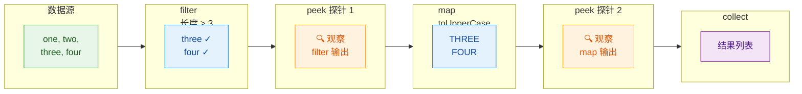

peek 有一个非常重要的注意事项：**不要用 peek 来执行业务逻辑或产生副作用**。这是一个常见的反模式（anti-pattern）：

```java
// ❌ 反模式：用 peek 修改外部状态
List<String> debugLog = new ArrayList<>();

List<String> result = names.stream()
        .filter(n -> n.length() > 3)
        .peek(n -> debugLog.add(n))    // 危险！在 peek 中修改外部集合
        .map(String::toUpperCase)
        .collect(Collectors.toList());

// 问题 1：如果换成并行流，debugLog 不是线程安全的 → 数据竞争
// 问题 2：Stream 的惰性求值意味着 peek 的执行时机不确定
// 问题 3：某些 JVM 优化可能跳过 peek（尤其在没有终端操作时）
```

```java
// ✅ 正确做法：用 forEach 或在 collect 中处理副作用
List<String> result = names.stream()
        .filter(n -> n.length() > 3)
        .map(String::toUpperCase)
        .collect(Collectors.toList());

result.forEach(n -> debugLog.add(n)); // 在终端操作之后，明确地处理副作用
```

为什么 peek 不适合做业务逻辑？根本原因在于 Stream 规范中的一句话：

> "In cases where the stream implementation is able to optimize away the production of some or all the elements, the action will not be invoked for those elements."

也就是说，JVM 有权在优化时**跳过 peek 的执行**。比如 `stream.peek(action).count()` 这种情况，JVM 可能直接从数据源获取 size 而不遍历元素，peek 中的 action 就不会被调用。

peek 的正确使用场景总结：

```java
// ✅ 场景 1：开发阶段调试复杂管道
.peek(e -> log.debug("阶段 A 输出: {}", e))

// ✅ 场景 2：配合断点调试（在 peek 的 lambda 上打断点）
.peek(e -> {
    // 在这一行打断点，可以逐个检查流中的元素
    String breakpointHere = e.toString();
})

// ✅ 场景 3：日志记录（仅限非关键路径，接受可能被跳过的风险）
.peek(e -> logger.trace("Processing: {}", e))
```

最后，peek 和 forEach 的区别一定要分清：

| 特性 | `peek` | `forEach` |
|------|--------|-----------|
| 操作类型 | 中间操作 | 终端操作 |
| 返回值 | `Stream<T>`（可继续链式调用） | `void`（管道结束） |
| 执行保证 | 不保证一定执行 | 保证对每个元素执行 |
| 设计用途 | 调试、观察 | 执行副作用 |

---

**📝 练习题 1**

以下代码的输出是什么？

```java
List<Integer> result = Stream.of(5, 3, 8, 1, 9, 2, 7, 4, 6)
        .sorted()
        .skip(2)
        .limit(4)
        .sorted(Comparator.reverseOrder())
        .collect(Collectors.toList());
System.out.println(result);
```

A. `[6, 5, 4, 3]`


B. `[5, 4, 3, 2]`


C. `[8, 7, 6, 5]`


D. `[9, 8, 7, 6]`

**【答案】** A

**【解析】** 逐步拆解这条管道：`sorted()` 先将元素排为 `[1, 2, 3, 4, 5, 6, 7, 8, 9]`；`skip(2)` 跳过前两个，剩下 `[3, 4, 5, 6, 7, 8, 9]`；`limit(4)` 取前四个，得到 `[3, 4, 5, 6]`；最后 `sorted(Comparator.reverseOrder())` 降序排列，结果为 `[6, 5, 4, 3]`。

---

**📝 练习题 2**

关于 `peek()` 方法，以下说法正确的是？

A. `peek()` 是终端操作，调用后 Stream 管道立即执行


B. `peek()` 可以修改流中元素的值（对于不可变对象）


C. `peek()` 中的 action 在任何情况下都保证对每个元素执行一次


D. `peek()` 主要用于调试目的，JVM 优化可能导致其 action 不被调用

**【答案】** D

**【解析】** A 错误，`peek()` 是中间操作（intermediate operation），不会触发管道执行。B 错误，`peek` 接收 `Consumer`，对不可变对象（如 String、Integer）无法修改其值；即使对可变对象能修改其内部状态，这也是不推荐的做法。C 错误，Java Stream 规范明确指出，当 Stream 实现能够优化掉某些元素的生产时，peek 的 action 不会被调用——例如 `stream.peek(action).count()` 在某些实现中可能直接返回 size 而不遍历。D 正确，这正是 `peek` 的 JavaDoc 所描述的设计意图和行为特征。

---

## 终端操作 (Terminal Operations)

终端操作是 Stream 管道的"终点站"。当且仅当一个终端操作被调用时，整条管道上游的所有中间操作才会真正开始执行——这就是我们之前反复强调的 **惰性求值 (Lazy Evaluation)** 机制。一旦终端操作执行完毕，该 Stream 即被消费殆尽 (consumed)，不可再次使用。

终端操作从行为上可以分为几大类：

- **遍历型**：`forEach` / `forEachOrdered` — 对每个元素执行副作用操作
- **收集型**：`collect` — 将流中元素汇聚为集合、字符串或其他容器，是最强大也最常用的终端操作
- **归约型**：`reduce`、`count`、`min`、`max` — 将所有元素"折叠"为一个值
- **匹配型**：`anyMatch`、`allMatch`、`noneMatch` — 短路判断
- **查找型**：`findFirst`、`findAny` — 短路查找

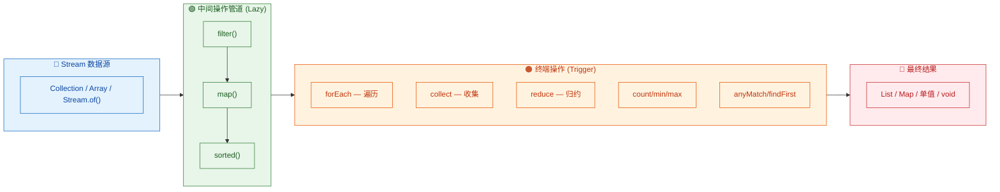

本节我们聚焦于最常用的两大终端操作：`forEach` 和 `collect`。

---

### forEach（遍历）

`forEach` 是最简单直观的终端操作，它接收一个 `Consumer<T>` 函数式接口，对流中的每个元素执行指定的副作用操作 (side-effect)。它没有返回值（返回 `void`）。

```java
// forEach 的方法签名
// void forEach(Consumer<? super T> action)

import java.util.List;

public class ForEachDemo {
    public static void main(String[] args) {
        // 准备一个简单的字符串列表
        List<String> languages = List.of("Java", "Kotlin", "Scala", "Groovy");

        // 最基本的用法：打印每个元素
        languages.stream()
                 .forEach(lang -> System.out.println(lang)); // 对每个元素执行打印

        // 方法引用写法，更简洁
        languages.stream()
                 .forEach(System.out::println); // 等价于上面的 lambda

        // 搭配中间操作使用
        languages.stream()
                 .filter(lang -> lang.startsWith("S"))  // 过滤出以 "S" 开头的语言
                 .map(String::toUpperCase)               // 转为大写
                 .forEach(System.out::println);          // 输出: SCALA
    }
}
```

有几个关键点需要注意：

**1) forEach vs forEachOrdered**

在顺序流 (sequential stream) 中，两者行为一致。但在并行流 (parallel stream) 中，`forEach` 不保证元素的处理顺序，而 `forEachOrdered` 会严格按照流的 encounter order 执行，代价是牺牲部分并行性能。

```java
import java.util.List;

public class ForEachOrderDemo {
    public static void main(String[] args) {
        List<Integer> nums = List.of(1, 2, 3, 4, 5, 6, 7, 8);

        System.out.println("=== parallelStream + forEach (顺序不保证) ===");
        nums.parallelStream()
            .forEach(n -> System.out.print(n + " ")); // 输出顺序可能是: 6 5 8 3 4 7 2 1
        System.out.println();

        System.out.println("=== parallelStream + forEachOrdered (顺序保证) ===");
        nums.parallelStream()
            .forEachOrdered(n -> System.out.print(n + " ")); // 输出: 1 2 3 4 5 6 7 8
        System.out.println();
    }
}
```

**2) forEach 中不要修改外部状态**

`forEach` 的设计初衷是执行"终端副作用"（如打印、日志记录），而不是用来修改外部集合或变量。在并行流中这样做会引发线程安全问题。如果你需要"收集结果"，请使用 `collect`。

```java
import java.util.ArrayList;
import java.util.List;

public class ForEachAntiPattern {
    public static void main(String[] args) {
        List<String> source = List.of("alpha", "beta", "gamma");

        // ❌ 反模式：用 forEach 往外部集合添加元素
        List<String> result = new ArrayList<>();
        source.stream()
              .filter(s -> s.length() > 4)
              .forEach(s -> result.add(s)); // 顺序流下碰巧能工作，但并行流下有并发风险

        // ✅ 正确做法：使用 collect
        List<String> safeResult = source.stream()
              .filter(s -> s.length() > 4)
              .collect(java.util.stream.Collectors.toList()); // 线程安全，语义清晰
    }
}
```

**3) Iterable 的 forEach 与 Stream 的 forEach**

注意区分：`List.forEach()` 是 `Iterable` 接口的默认方法，而 `stream().forEach()` 是 Stream API 的终端操作。如果你只是简单遍历集合而不需要流式管道，直接用集合的 `forEach` 更简洁。

```java
import java.util.List;

public class IterableVsStreamForEach {
    public static void main(String[] args) {
        List<String> items = List.of("A", "B", "C");

        // 集合自身的 forEach（来自 Iterable 接口）
        items.forEach(System.out::println);       // 简洁，不创建 Stream 对象

        // Stream 的 forEach（需要先创建流）
        items.stream().forEach(System.out::println); // 功能相同，但多了一层 Stream 开销
    }
}
```

---

### collect ⭐⭐（Collectors 详解）

`collect` 是 Stream API 中最强大、最灵活的终端操作，没有之一。它的核心思想是 **可变归约 (Mutable Reduction)**：将流中的元素逐个"倒入"一个可变容器（如 `ArrayList`、`HashMap`、`StringBuilder`），最终得到一个汇总结果。

```java
// collect 的方法签名
// <R, A> R collect(Collector<? super T, A, R> collector)
//
// T — 流中元素的类型
// A — 中间累积容器的类型 (Accumulator)
// R — 最终返回结果的类型
```

绝大多数场景下，我们不需要手写 `Collector`，而是直接使用 JDK 提供的工具类 `java.util.stream.Collectors`，它预置了几十种常用收集器。

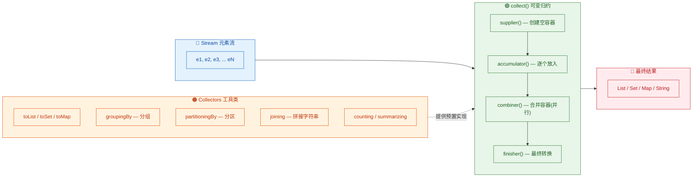

在深入各个收集器之前，先理解 `Collector` 的四大组件，这对后续理解高级用法至关重要：

```java
// Collector 接口的核心抽象（伪代码展示思路）
public interface Collector<T, A, R> {
    Supplier<A> supplier();          // 1. 创建一个空的可变容器
    BiConsumer<A, T> accumulator();  // 2. 将元素逐个放入容器
    BinaryOperator<A> combiner();   // 3. 合并两个容器（并行流时使用）
    Function<A, R> finisher();      // 4. 将容器转换为最终结果
}
```

```text
以 toList() 为例的执行过程：

Stream: ["Java", "Kotlin", "Scala"]

Step 1 - supplier():     创建 new ArrayList<>()          → []
Step 2 - accumulator():  list.add("Java")                → ["Java"]
                          list.add("Kotlin")              → ["Java", "Kotlin"]
                          list.add("Scala")               → ["Java", "Kotlin", "Scala"]
Step 3 - combiner():     (并行时) 合并多个子 list
Step 4 - finisher():     返回 ArrayList 本身 (identity)   → ["Java", "Kotlin", "Scala"]
```

---

#### toList / toSet / toMap

这三个是日常开发中使用频率最高的收集器，分别将流元素收集为 `List`、`Set` 和 `Map`。

**toList() — 收集为列表**

```java
import java.util.List;
import java.util.stream.Collectors;
import java.util.stream.Stream;

public class ToListDemo {
    public static void main(String[] args) {
        // 基本用法：将流收集为 ArrayList
        List<String> fruits = Stream.of("Apple", "Banana", "Cherry", "Apple")
                .collect(Collectors.toList()); // 返回可变的 ArrayList
        System.out.println(fruits); // [Apple, Banana, Cherry, Apple] — 保留重复元素，保持顺序

        // 搭配中间操作
        List<String> filtered = fruits.stream()
                .filter(f -> f.length() > 5)   // 过滤长度大于5的
                .map(String::toUpperCase)       // 转大写
                .collect(Collectors.toList());  // 收集结果
        System.out.println(filtered); // [BANANA, CHERRY]

        // Java 16+ 提供了更简洁的 toList()，返回不可变列表
        List<String> immutable = fruits.stream()
                .filter(f -> f.startsWith("A"))
                .toList(); // 注意：返回的是 unmodifiable List
        System.out.println(immutable); // [Apple, Apple]
        // immutable.add("Avocado"); // ❌ 会抛出 UnsupportedOperationException
    }
}
```

注意 `Collectors.toList()` 和 Java 16 的 `Stream.toList()` 的区别：

| 特性 | `Collectors.toList()` | `Stream.toList()` (Java 16+) |
|---|---|---|
| 可变性 | 返回可变 `ArrayList` | 返回不可变 List |
| null 元素 | 允许 | 允许 |
| 类型保证 | 规范未保证具体实现类 | 规范保证不可变 |

**toSet() — 收集为集合（自动去重）**

```java
import java.util.Set;
import java.util.stream.Collectors;
import java.util.stream.Stream;

public class ToSetDemo {
    public static void main(String[] args) {
        // toSet 自动去重，底层通常是 HashSet
        Set<String> uniqueFruits = Stream.of("Apple", "Banana", "Apple", "Cherry", "Banana")
                .collect(Collectors.toSet()); // 去重收集
        System.out.println(uniqueFruits); // [Apple, Banana, Cherry] — 顺序不保证

        // 如果需要保持插入顺序，可以用 toCollection 指定 LinkedHashSet
        Set<String> orderedSet = Stream.of("Apple", "Banana", "Apple", "Cherry")
                .collect(Collectors.toCollection(java.util.LinkedHashSet::new));
        System.out.println(orderedSet); // [Apple, Banana, Cherry] — 保持首次出现的顺序
    }
}
```

**toMap() — 收集为映射**

`toMap` 是三者中最复杂的，因为你需要指定 key 和 value 的提取逻辑，还要处理 key 冲突的情况。

```java
import java.util.List;
import java.util.Map;
import java.util.LinkedHashMap;
import java.util.stream.Collectors;

public class ToMapDemo {

    // 模拟一个简单的实体类
    record Employee(int id, String name, String dept, double salary) {}

    public static void main(String[] args) {
        List<Employee> employees = List.of(
            new Employee(1, "Alice",   "Engineering", 95000),
            new Employee(2, "Bob",     "Marketing",   72000),
            new Employee(3, "Charlie", "Engineering", 88000),
            new Employee(4, "Diana",   "Marketing",   78000)
        );

        // ========== 基本用法：id -> name ==========
        Map<Integer, String> idToName = employees.stream()
                .collect(Collectors.toMap(
                        Employee::id,     // keyMapper: 用 id 作为 key
                        Employee::name    // valueMapper: 用 name 作为 value
                ));
        System.out.println(idToName);
        // {1=Alice, 2=Bob, 3=Charlie, 4=Diana}

        // ========== key 冲突处理 ==========
        // 如果多个元素映射到同一个 key，必须提供 mergeFunction，否则抛异常
        Map<String, Double> deptToMaxSalary = employees.stream()
                .collect(Collectors.toMap(
                        Employee::dept,     // keyMapper: 部门名作为 key
                        Employee::salary,   // valueMapper: 薪资作为 value
                        Math::max           // mergeFunction: key 冲突时取较大值
                ));
        System.out.println(deptToMaxSalary);
        // {Engineering=95000.0, Marketing=78000.0}

        // ========== 指定 Map 实现类 ==========
        // 第四个参数可以指定具体的 Map 工厂
        Map<Integer, String> orderedMap = employees.stream()
                .collect(Collectors.toMap(
                        Employee::id,              // keyMapper
                        Employee::name,            // valueMapper
                        (v1, v2) -> v1,            // mergeFunction（此处不会冲突，占位）
                        LinkedHashMap::new          // mapFactory: 使用 LinkedHashMap 保持插入顺序
                ));
        System.out.println(orderedMap);
        // {1=Alice, 2=Bob, 3=Charlie, 4=Diana} — 保持顺序
    }
}
```

`toMap` 的三种重载形式总结：

```java
// 1. 基础版 — key 不能重复，否则抛 IllegalStateException
Collectors.toMap(keyMapper, valueMapper)

// 2. 带冲突处理 — 当 key 重复时，用 mergeFunction 决定保留哪个 value
Collectors.toMap(keyMapper, valueMapper, mergeFunction)

// 3. 完整版 — 额外指定 Map 的具体实现类
Collectors.toMap(keyMapper, valueMapper, mergeFunction, mapFactory)
```

一个常见的实战场景是将 List 转为以某个字段为 key 的 Map，方便后续 O(1) 查找：

```java
import java.util.List;
import java.util.Map;
import java.util.function.Function;
import java.util.stream.Collectors;

public class ToMapPractical {

    record User(long id, String username) {}

    public static void main(String[] args) {
        List<User> users = List.of(
            new User(101, "alice"),
            new User(102, "bob"),
            new User(103, "charlie")
        );

        // 经典用法：将 List<User> 转为 Map<Long, User>，以 id 为 key，对象本身为 value
        Map<Long, User> userMap = users.stream()
                .collect(Collectors.toMap(
                        User::id,              // key = user.id
                        Function.identity()    // value = user 对象本身 (等价于 u -> u)
                ));

        // 现在可以 O(1) 查找
        User bob = userMap.get(102L);          // 直接通过 id 获取
        System.out.println(bob.username());    // bob
    }
}
```

---

#### groupingBy ⭐（分组）

`groupingBy` 是 Stream 收集器中的"瑞士军刀"，它按照指定的分类函数 (classifier) 将流元素分组，返回一个 `Map<K, List<T>>`。它的强大之处在于支持多级分组和下游收集器 (downstream collector) 的嵌套组合。

**基本分组**

```java
import java.util.List;
import java.util.Map;
import java.util.stream.Collectors;

public class GroupingByBasic {

    record Employee(String name, String dept, double salary, int age) {}

    public static void main(String[] args) {
        List<Employee> team = List.of(
            new Employee("Alice",   "Engineering", 95000, 30),
            new Employee("Bob",     "Marketing",   72000, 28),
            new Employee("Charlie", "Engineering", 88000, 35),
            new Employee("Diana",   "Marketing",   78000, 32),
            new Employee("Eve",     "Engineering", 92000, 27)
        );

        // 按部门分组：Map<String, List<Employee>>
        Map<String, List<Employee>> byDept = team.stream()
                .collect(Collectors.groupingBy(Employee::dept)); // classifier = 部门字段

        // 遍历查看结果
        byDept.forEach((dept, members) -> {
            System.out.println(dept + ": ");
            members.forEach(e -> System.out.println("  " + e.name()));
        });
        // Engineering:
        //   Alice
        //   Charlie
        //   Eve
        // Marketing:
        //   Bob
        //   Diana
    }
}
```

**带下游收集器的分组**

`groupingBy` 的第二个参数可以传入一个"下游收集器" (downstream collector)，对每个分组内的元素做进一步聚合，而不仅仅是收集为 List。

```java
import java.util.List;
import java.util.Map;
import java.util.stream.Collectors;

public class GroupingByDownstream {

    record Employee(String name, String dept, double salary, int age) {}

    public static void main(String[] args) {
        List<Employee> team = List.of(
            new Employee("Alice",   "Engineering", 95000, 30),
            new Employee("Bob",     "Marketing",   72000, 28),
            new Employee("Charlie", "Engineering", 88000, 35),
            new Employee("Diana",   "Marketing",   78000, 32),
            new Employee("Eve",     "Engineering", 92000, 27)
        );

        // 1. 分组 + 计数：每个部门有多少人
        Map<String, Long> deptCount = team.stream()
                .collect(Collectors.groupingBy(
                        Employee::dept,          // classifier: 按部门分
                        Collectors.counting()    // downstream: 对每组计数
                ));
        System.out.println(deptCount);
        // {Engineering=3, Marketing=2}

        // 2. 分组 + 求平均薪资
        Map<String, Double> deptAvgSalary = team.stream()
                .collect(Collectors.groupingBy(
                        Employee::dept,                              // classifier
                        Collectors.averagingDouble(Employee::salary)  // downstream: 求平均值
                ));
        System.out.println(deptAvgSalary);
        // {Engineering=91666.66666666667, Marketing=75000.0}

        // 3. 分组 + 只提取姓名列表（而非整个对象）
        Map<String, List<String>> deptNames = team.stream()
                .collect(Collectors.groupingBy(
                        Employee::dept,                                    // classifier
                        Collectors.mapping(Employee::name, Collectors.toList()) // downstream: 先 map 再 toList
                ));
        System.out.println(deptNames);
        // {Engineering=[Alice, Charlie, Eve], Marketing=[Bob, Diana]}

        // 4. 分组 + 求每组最高薪资的员工
        Map<String, java.util.Optional<Employee>> deptTopEarner = team.stream()
                .collect(Collectors.groupingBy(
                        Employee::dept,
                        Collectors.maxBy(java.util.Comparator.comparingDouble(Employee::salary))
                ));
        deptTopEarner.forEach((dept, emp) ->
                System.out.println(dept + " top earner: " + emp.map(Employee::name).orElse("N/A"))
        );
        // Engineering top earner: Alice
        // Marketing top earner: Diana
    }
}
```

**多级分组（嵌套 groupingBy）**

`groupingBy` 的下游收集器本身也可以是另一个 `groupingBy`，从而实现多级分组。

```java
import java.util.List;
import java.util.Map;
import java.util.stream.Collectors;

public class MultiLevelGrouping {

    record Employee(String name, String dept, String level, double salary) {}

    public static void main(String[] args) {
        List<Employee> team = List.of(
            new Employee("Alice",   "Engineering", "Senior",  95000),
            new Employee("Bob",     "Marketing",   "Junior",  72000),
            new Employee("Charlie", "Engineering", "Junior",  68000),
            new Employee("Diana",   "Marketing",   "Senior",  78000),
            new Employee("Eve",     "Engineering", "Senior",  92000),
            new Employee("Frank",   "Engineering", "Junior",  65000)
        );

        // 二级分组：先按部门，再按级别
        // 结果类型: Map<String, Map<String, List<Employee>>>
        Map<String, Map<String, List<String>>> deptByLevel = team.stream()
                .collect(Collectors.groupingBy(
                        Employee::dept,       // 第一级: 按部门
                        Collectors.groupingBy(
                                Employee::level,  // 第二级: 按级别
                                Collectors.mapping(Employee::name, Collectors.toList()) // 提取姓名
                        )
                ));

        // 格式化输出
        deptByLevel.forEach((dept, levelMap) -> {
            System.out.println(dept + ":");
            levelMap.forEach((level, names) ->
                    System.out.println("  " + level + ": " + names)
            );
        });
        // Engineering:
        //   Senior: [Alice, Eve]
        //   Junior: [Charlie, Frank]
        // Marketing:
        //   Junior: [Bob]
        //   Senior: [Diana]
    }
}
```

下面这张图展示了 `groupingBy` 的工作流程和常见下游收集器的组合方式：

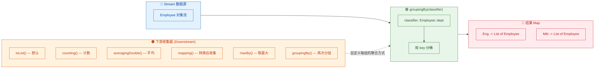

---

#### partitioningBy（分区）

`partitioningBy` 是 `groupingBy` 的一个特殊情况——它的 classifier 是一个 `Predicate<T>`（返回 `boolean`），因此结果永远是一个 `Map<Boolean, List<T>>`，只有 `true` 和 `false` 两个分区。

你可以把它理解为"二分法分组"。

```java
import java.util.List;
import java.util.Map;
import java.util.stream.Collectors;

public class PartitioningByDemo {

    record Student(String name, int score) {}

    public static void main(String[] args) {
        List<Student> students = List.of(
            new Student("Alice",   92),
            new Student("Bob",     55),
            new Student("Charlie", 78),
            new Student("Diana",   43),
            new Student("Eve",     88),
            new Student("Frank",   61)
        );

        // 基本分区：按是否及格（60分）分为两组
        Map<Boolean, List<Student>> passOrFail = students.stream()
                .collect(Collectors.partitioningBy(
                        s -> s.score() >= 60  // Predicate: 分数 >= 60 为 true 组
                ));

        System.out.println("及格: ");
        passOrFail.get(true).forEach(s -> System.out.println("  " + s.name() + ": " + s.score()));
        // 及格:
        //   Alice: 92
        //   Charlie: 78
        //   Eve: 88
        //   Frank: 61

        System.out.println("不及格: ");
        passOrFail.get(false).forEach(s -> System.out.println("  " + s.name() + ": " + s.score()));
        // 不及格:
        //   Bob: 55
        //   Diana: 43

        //带下游收集器的分区：统计每组人数
        Map<Boolean, Long> passFailCount = students.stream()
                .collect(Collectors.partitioningBy(
                        s -> s.score() >= 60,    // Predicate: 是否及格
                        Collectors.counting()     // downstream: 对每个分区计数
                ));
        System.out.println("及格人数: " + passFailCount.get(true));   // 4
        System.out.println("不及格人数: " + passFailCount.get(false)); // 2

        // 带下游收集器的分区：提取每组的姓名
        Map<Boolean, List<String>> passFailNames = students.stream()
                .collect(Collectors.partitioningBy(
                        s -> s.score() >= 60,
                        Collectors.mapping(Student::name, Collectors.toList())
                ));
        System.out.println("及格名单: " + passFailNames.get(true));
        // [Alice, Charlie, Eve, Frank]
        System.out.println("不及格名单: " + passFailNames.get(false));
        // [Bob, Diana]
    }
}
```

**partitioningBy vs groupingBy 的选择**

| 场景 | 推荐 |
|---|---|
| 分类条件是 boolean（是/否、通过/不通过） | `partitioningBy` — 语义更清晰 |
| 分类条件有多个离散值（部门、城市、等级） | `groupingBy` — 更通用 |
| 需要确保结果 Map 中 true/false 两个 key 都存在 | `partitioningBy` — 即使某组为空也会有 key |

`partitioningBy` 的一个隐藏优势是：即使某个分区没有任何元素，结果 Map 中依然会包含该 key（对应空列表）。而 `groupingBy` 如果某个分类值没有对应元素，该 key 就不会出现在结果中。

```java
import java.util.List;
import java.util.Map;
import java.util.stream.Collectors;

public class PartitionGuarantee {
    public static void main(String[] args) {
        // 所有人都及格的情况
        List<Integer> scores = List.of(80, 90, 75, 88);

        Map<Boolean, List<Integer>> result = scores.stream()
                .collect(Collectors.partitioningBy(s -> s >= 60));

        System.out.println(result.get(true));   // [80, 90, 75, 88]
        System.out.println(result.get(false));  // [] — 空列表，但 key 存在，不会是 null
        System.out.println(result.containsKey(false)); // true — 保证两个 key 都在
    }
}
```

---

#### joining（字符串连接）

`Collectors.joining()` 专门用于将 `Stream<String>` 中的元素拼接为一个字符串。它提供了三种重载形式，从简单拼接到带分隔符、前缀、后缀的完整格式化，覆盖了绝大多数字符串拼接场景。

```java
import java.util.List;
import java.util.stream.Collectors;

public class JoiningDemo {
    public static void main(String[] args) {
        List<String> words = List.of("Stream", "API", "is", "powerful");

        // ========== 1. 无参 joining() — 直接拼接 ==========
        String concat = words.stream()
                .collect(Collectors.joining()); // 无分隔符，直接连接
        System.out.println(concat);
        // StreamAPIispowerful

        // ========== 2. joining(delimiter) — 带分隔符 ==========
        String spaced = words.stream()
                .collect(Collectors.joining(" ")); // 用空格分隔
        System.out.println(spaced);
        // Stream API is powerful

        String csv = words.stream()
                .collect(Collectors.joining(", ")); // 用逗号+空格分隔
        System.out.println(csv);
        // Stream, API, is, powerful

        // ========== 3. joining(delimiter, prefix, suffix) — 完整格式化 ==========
        String formatted = words.stream()
                .collect(Collectors.joining(", ", "[", "]")); // 分隔符 + 前缀 + 后缀
        System.out.println(formatted);
        // [Stream, API, is, powerful]

        String sql = List.of("Alice", "Bob", "Charlie").stream()
                .map(name -> "'" + name + "'")                    // 每个名字加单引号
                .collect(Collectors.joining(", ", "IN (", ")")); // 拼成 SQL IN 子句
        System.out.println(sql);
        // IN ('Alice', 'Bob', 'Charlie')
    }
}
```

`joining` 在实际开发中的典型应用场景非常广泛：

```java
import java.util.List;
import java.util.stream.Collectors;

public class JoiningPractical {

    record Employee(String name, String dept, double salary) {}

    public static void main(String[] args) {
        List<Employee> team = List.of(
            new Employee("Alice",   "Engineering", 95000),
            new Employee("Bob",     "Marketing",   72000),
            new Employee("Charlie", "Engineering", 88000),
            new Employee("Diana",   "Marketing",   78000)
        );

        // 场景1: 生成 CSV 行
        String csvLine = team.stream()
                .map(e -> e.name() + "," + e.dept() + "," + e.salary()) // 每个员工转为 CSV 格式
                .collect(Collectors.joining("\n"));                       // 用换行符连接
        System.out.println(csvLine);
        // Alice,Engineering,95000.0
        // Bob,Marketing,72000.0
        // Charlie,Engineering,88000.0
        // Diana,Marketing,78000.0

        // 场景2: 生成日志摘要
        String summary = team.stream()
                .filter(e -> e.salary() > 80000)                         // 筛选高薪员工
                .map(Employee::name)                                     // 提取姓名
                .collect(Collectors.joining(" & ", "高薪员工: ", "。"));   // 格式化输出
        System.out.println(summary);
        // 高薪员工: Alice & Charlie。

        // 场景3: 与 groupingBy 组合 — 每个部门的成员名单拼成一行
        var deptRoster = team.stream()
                .collect(Collectors.groupingBy(
                        Employee::dept,                                          // 按部门分组
                        Collectors.mapping(Employee::name, Collectors.joining(", ")) // 下游: 姓名用逗号拼接
                ));
        deptRoster.forEach((dept, names) ->
                System.out.println(dept + ": " + names)
        );
        // Engineering: Alice, Charlie
        // Marketing: Bob, Diana
    }
}
```

最后值得一提的是，`joining` 底层使用 `StringJoiner`（Java 8 引入），而 `StringJoiner` 内部基于 `StringBuilder`，所以性能上远优于手动用 `+` 拼接字符串。在并行流中，`joining` 的 combiner 会合并多个 `StringJoiner`，也是线程安全的。

---

下面用一张综合对比图来回顾本节介绍的所有 `Collectors` 工具方法：

```mermaid
graph LR
    subgraph BASIC["🔵 基础收集"]
        direction TB
        B1["toList()"]
        B2["toSet()"]
        B3["toMap(k, v)"]
        B4["toCollection(factory)"]
    end

    subgraph GROUP["🟢 分组与分区"]
        direction TB
        G1["groupingBy(classifier)"]
        G2["groupingBy(classifier, downstream)"]
        G3["partitioningBy(predicate)"]
        G4["partitioningBy(predicate, downstream)"]
    end

    subgraph STRING["🟠 字符串"]
        direction TB
        S1["joining()"]
        S2["joining(delimiter)"]
        S3["joining(delim, prefix, suffix)"]
    end

    subgraph DOWNSTREAM["🔴 常用下游收集器"]
        direction TB
        D1["counting()"]
        D2["summingInt/Double()"]
        D3["averagingInt/Double()"]
        D4["maxBy() / minBy()"]
        D5["mapping(fn, downstream)"]
        D6["toList() / toSet()"]
    end

    BASIC --- GROUP --- STRING
    DOWNSTREAM -.->|"嵌套在 groupingBy / partitioningBy 中"| GROUP

    classDef basicStyle fill:#E3F2FD,stroke:#1565C0,color:#0D47A1
    classDef groupStyle fill:#E8F5E9,stroke:#2E7D32,color:#1B5E20
    classDef stringStyle fill:#FFF3E0,stroke:#E65100,color:#BF360C
    classDef downStyle fill:#FFEBEE,stroke:#C62828,color:#B71C1C

    class BASIC,B1,B2,B3,B4 basicStyle
    class GROUP,G1,G2,G3,G4 groupStyle
    class STRING,S1,S2,S3 stringStyle
    class DOWNSTREAM,D1,D2,D3,D4,D5,D6 downStyle
```

---

**📝 练习题**

以下代码的输出结果是什么？

```java
List<String> items = List.of("apple", "banana", "avocado", "blueberry", "apricot", "cherry");

Map<Character, String> result = items.stream()
        .collect(Collectors.groupingBy(
                s -> s.charAt(0),
                Collectors.joining(" + ", "[", "]")
        ));

System.out.println(result);
```

A. `{a=apple + avocado + apricot, b=banana + blueberry, c=cherry}`


B. `{a=[apple + avocado + apricot], b=[banana + blueberry], c=[cherry]}`


C. `{a=[apple, avocado, apricot], b=[banana, blueberry], c=[cherry]}`


D. 编译错误，`joining` 不能作为 `groupingBy` 的下游收集器


**【答案】** B

**【解析】** `groupingBy` 按首字母分组，下游收集器使用 `joining(" + ", "[", "]")`。`joining` 的三参数版本会在拼接结果前后加上 prefix `[` 和 suffix `]`，元素之间用 ` + ` 分隔。所以 `'a'` 组的三个元素拼接后变成 `[apple + avocado + apricot]`，`'b'` 组变成 `[banana + blueberry]`，`'c'` 组变成 `[cherry]`。注意这里的 `[` 和 `]` 是 `joining` 产生的字符串内容，不是 List 的 toString 表示。选项 A 缺少了前缀和后缀的方括号，选项 C 使用了逗号分隔而非 ` + `，选项 D 错误——`joining` 完全可以作为 `groupingBy` 的下游收集器，只要上游元素是 `String` 类型即可。

---

## 终端操作（续）—— 归约与聚合查询

Stream 的终端操作（Terminal Operations）是整条流水线的"终点站"。前面我们详细讲解了 `forEach` 和强大的 `collect`，现在进入另一组同样核心的终端操作：`reduce`（归约）、统计聚合（`count/min/max`）、匹配判断（`anyMatch/allMatch/noneMatch`）以及查找操作（`findFirst/findAny`）。这些操作覆盖了日常开发中"汇总计算"和"条件查询"两大高频场景。

---

### reduce ⭐（归约）

`reduce` 是 Stream API 中最通用、最底层的终端聚合操作。所谓"归约"（Reduction），就是将流中的所有元素通过一个二元运算，反复折叠（fold），最终"归"为一个值。你可以把它想象成一条流水线上的压缩机——无论进来多少零件，最终压成一个成品。

事实上，`count`、`min`、`max`、`sum` 这些操作在概念上都是 `reduce` 的特例。理解了 `reduce`，你就掌握了所有聚合操作的本质。

`reduce` 提供了三个重载签名，适用于不同场景：

```java
// 签名一：带初始值（identity），返回确定类型 T
T reduce(T identity, BinaryOperator<T> accumulator);

// 签名二：无初始值，返回 Optional<T>（因为流可能为空）
Optional<T> reduce(BinaryOperator<T> accumulator);

// 签名三：带初始值 + 组合器（用于并行流场景）
<U> U reduce(U identity, BiFunction<U, ? super T, U> accumulator, BinaryOperator<U> combiner);
```

我们用一张流程图来直观理解 `reduce` 的折叠过程：

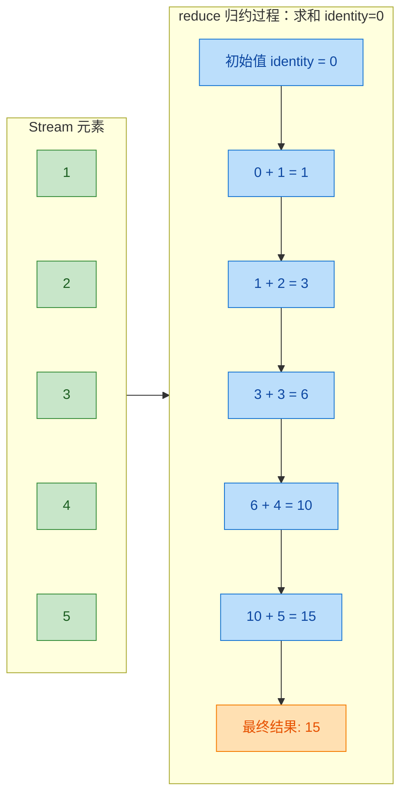

每一步都把"上一步的累积结果"和"当前元素"传入 accumulator 函数，产出新的累积值，直到流耗尽。

下面通过完整代码演示三种签名的用法：

```java
import java.util.Arrays;
import java.util.List;
import java.util.Optional;

public class ReduceDemo {
    public static void main(String[] args) {

        List<Integer> numbers = Arrays.asList(1, 2, 3, 4, 5);

        // ========== 签名一：带初始值 ==========
        // identity = 0 作为累加的起点
        // accumulator: (a, b) -> a + b，每次把累积值与当前元素相加
        // 因为有初始值，即使流为空也能返回 0，所以返回类型是 int 而非 Optional
        int sum = numbers.stream()
                .reduce(0, (a, b) -> a + b); // 等价于 Integer::sum
        System.out.println("求和: " + sum); // 求和: 15

        // 用 reduce 实现求最大值
        // identity 设为 Integer.MIN_VALUE，确保任何元素都比它大
        int max = numbers.stream()
                .reduce(Integer.MIN_VALUE, (a, b) -> a > b ? a : b); // 等价于 Integer::max
        System.out.println("最大值: " + max); // 最大值: 5

        // 用 reduce 实现字符串拼接
        List<String> words = Arrays.asList("Stream", "is", "powerful");
        // identity 是空字符串 ""
        // 每次把累积字符串与当前单词用空格连接
        String sentence = words.stream()
                .reduce("", (acc, word) -> acc.isEmpty() ? word : acc + " " + word);
        System.out.println("拼接: " + sentence); // 拼接: Stream is powerful

        // ========== 签名二：无初始值，返回 Optional ==========
        // 流可能为空，此时没有初始值兜底，所以必须用 Optional 包装
        Optional<Integer> product = numbers.stream()
                .reduce((a, b) -> a * b); // 1*2*3*4*5
        product.ifPresent(val ->
                System.out.println("乘积: " + val)); // 乘积: 120

        // 空流演示：无初始值时 reduce 返回 Optional.empty()
        List<Integer> emptyList = List.of();
        Optional<Integer> emptyResult = emptyList.stream()
                .reduce(Integer::sum);
        System.out.println("空流结果: " + emptyResult); // 空流结果: Optional.empty

        // ========== 签名三：带 combiner（并行流专用） ==========
        // 场景：将 Integer 流归约为 String 类型（类型不同，需要 combiner）
        // identity: 空字符串
        // accumulator: 把每个整数追加到字符串后面
        // combiner: 并行时合并两个子结果字符串
        String combined = numbers.parallelStream()
                .reduce(
                        "",                                          // identity：初始值
                        (str, num) -> str + num,                     // accumulator：累积逻辑
                        (str1, str2) -> str1 + str2                  // combiner：并行子结果合并
                );
        System.out.println("并行拼接: " + combined); // 并行拼接: 12345
    }
}
```

关于 `reduce` 的 identity（初始值），有一个容易踩的坑值得特别说明。identity 必须是 accumulator 运算的"单位元"（Identity Element），即满足 `accumulator(identity, x) == x` 对任意 x 成立。对于加法，单位元是 `0`；对于乘法，单位元是 `1`；对于字符串拼接，单位元是 `""`。如果你把求和的 identity 设成 `10`，在串行流中结果只是多了 10，看起来"能用"；但在并行流中，每个子任务都会加上这个 10，最终结果就完全错误了。这是一个非常隐蔽的并发 bug。

`reduce` 与 `collect` 的区别也值得理清。`reduce` 是"不可变归约"（Immutable Reduction），每一步都产生一个新值，适合数值计算；`collect` 是"可变归约"（Mutable Reduction），往一个可变容器里不断添加元素，适合收集到集合中。用 `reduce` 做字符串拼接虽然语法上可行，但每次 `+` 都会创建新的 String 对象，性能远不如 `Collectors.joining()`。

---

### count / min / max（统计聚合）

这三个方法是最直观的终端操作，分别用于统计元素个数、求最小值和求最大值。它们本质上都是 `reduce` 的特化快捷方式，JDK 帮你封装好了，直接调用即可。

```java
import java.util.Arrays;
import java.util.Comparator;
import java.util.List;
import java.util.Optional;

public class CountMinMaxDemo {
    public static void main(String[] args) {

        List<Integer> numbers = Arrays.asList(3, 7, 2, 9, 4, 1, 8);

        // ========== count：统计元素个数 ==========
        // 返回 long 类型（不是 int），因为流可能包含超大量元素
        long count = numbers.stream()
                .filter(n -> n > 3)   // 先过滤出大于 3 的元素：7, 9, 4, 8
                .count();             // 统计个数
        System.out.println("大于3的个数: " + count); // 大于3的个数: 4

        // ========== min：求最小值 ==========
        // 需要传入 Comparator，因为 Stream<T> 的 T 不一定实现了 Comparable
        // 返回 Optional<T>，因为流可能为空
        Optional<Integer> min = numbers.stream()
                .min(Comparator.naturalOrder()); // 自然排序：升序，取第一个
        min.ifPresent(val ->
                System.out.println("最小值: " + val)); // 最小值: 1

        // ========== max：求最大值 ==========
        Optional<Integer> max = numbers.stream()
                .max(Comparator.naturalOrder()); // 自然排序：升序，取最后一个
        max.ifPresent(val ->
                System.out.println("最大值: " + val)); // 最大值: 9

        // ========== 对象流中的 min/max ==========
        // 实际开发中更常见的是对对象的某个属性求极值
        List<String> names = Arrays.asList("Alice", "Bob", "Christopher", "Di");

        // 找最短的名字：按字符串长度比较
        Optional<String> shortest = names.stream()
                .min(Comparator.comparingInt(String::length));
        shortest.ifPresent(val ->
                System.out.println("最短名字: " + val)); // 最短名字: Di

        // 找字典序最大的名字
        Optional<String> lexMax = names.stream()
                .max(Comparator.naturalOrder());
        lexMax.ifPresent(val ->
                System.out.println("字典序最大: " + val)); // 字典序最大: Di

        // ========== 空流的安全处理 ==========
        Optional<Integer> emptyMin = List.<Integer>of().stream()
                .min(Comparator.naturalOrder());
        // 空流返回 Optional.empty()，用 orElse 提供默认值
        int safeMin = emptyMin.orElse(-1);
        System.out.println("空流最小值(默认): " + safeMin); // 空流最小值(默认): -1
    }
}
```

这里有一个细节值得注意：`count()` 返回的是 `long` 而不是 `int`。这是因为 Stream 在设计上可以处理非常大的数据集（甚至是无限流经过 `limit` 截断后的结果），`int` 的 21 亿上限可能不够用。

`min` 和 `max` 都返回 `Optional`，这是一个非常好的 API 设计——它强制调用者考虑"流为空"的边界情况，而不是像传统代码那样返回 `null` 或抛异常。

这三个方法与 `reduce` 的等价关系如下：

```java
// count() 等价于
long count = stream.reduce(0L, (acc, e) -> acc + 1, Long::sum);
// 或更简单地：stream.mapToLong(e -> 1L).sum()

// min(comparator) 等价于
Optional<T> min = stream.reduce((a, b) -> comparator.compare(a, b) <= 0 ? a : b);

// max(comparator) 等价于
Optional<T> max = stream.reduce((a, b) -> comparator.compare(a, b) >= 0 ? a : b);
```

理解这层等价关系，你就能明白为什么说 `reduce` 是所有聚合操作的"万能基座"。

---

### anyMatch / allMatch / noneMatch（匹配判断）

这三个方法属于"短路终端操作"（Short-circuiting Terminal Operations）。它们接收一个 `Predicate<T>` 条件，对流中的元素进行逻辑判断，返回 `boolean`。

它们的语义非常直观，对应离散数学中的存在量词（∃）和全称量词（∀）：

| 方法 | 语义 | 逻辑等价 | 短路条件 |
|------|------|----------|----------|
| `anyMatch(predicate)` | 存在至少一个元素满足条件 | ∃x P(x) | 找到第一个 true 就返回 |
| `allMatch(predicate)` | 所有元素都满足条件 | ∀x P(x) | 找到第一个 false 就返回 |
| `noneMatch(predicate)` | 没有任何元素满足条件 | ¬∃x P(x) | 找到第一个 true 就返回 |

"短路"（Short-circuiting）意味着它们不一定需要遍历整个流。一旦能确定最终结果，就立即停止消费后续元素。这在处理大数据量时是一个重要的性能优势。

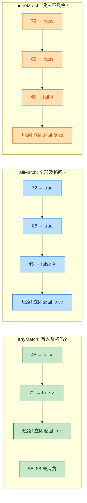

```java
import java.util.Arrays;
import java.util.List;

public class MatchDemo {
    public static void main(String[] args) {

        List<Integer> scores = Arrays.asList(45, 72, 55, 88, 91);

        // ========== anyMatch：是否存在至少一个满足条件 ==========
        // 场景：班级里有没有人考了90分以上？
        boolean hasExcellent = scores.stream()
                .anyMatch(score -> score >= 90); // 遍历到 91 时命中，短路返回
        System.out.println("有人优秀: " + hasExcellent); // 有人优秀: true

        // ========== allMatch：是否所有元素都满足条件 ==========
        // 场景：是不是所有人都及格了（>=60）？
        boolean allPassed = scores.stream()
                .allMatch(score -> score >= 60); // 遍历到 45 时不满足，短路返回
        System.out.println("全部及格: " + allPassed); // 全部及格: false

        // ========== noneMatch：是否没有任何元素满足条件 ==========
        // 场景：是不是没有人考了0分？
        boolean noZero = scores.stream()
                .noneMatch(score -> score == 0); // 全部遍历完，没有0分
        System.out.println("无人零分: " + noZero); // 无人零分: true

        // ========== 三者的逻辑等价关系 ==========
        // noneMatch(p) 等价于 !anyMatch(p)
        boolean noFail1 = scores.stream().noneMatch(s -> s < 60);
        boolean noFail2 = !scores.stream().anyMatch(s -> s < 60);
        System.out.println("noneMatch == !anyMatch: " + (noFail1 == noFail2)); // true

        // allMatch(p) 等价于 noneMatch(p.negate())
        boolean allPositive1 = scores.stream().allMatch(s -> s > 0);
        boolean allPositive2 = scores.stream().noneMatch(s -> s <= 0);
        System.out.println("allMatch == noneMatch(negate): "
                + (allPositive1 == allPositive2)); // true

        // ========== 空流的特殊行为（容易踩坑！） ==========
        List<Integer> empty = List.of();

        // 空流的 allMatch 返回 true（vacuous truth，空真）
        // 逻辑学：对空集合，"所有元素都满足P" 为真（因为没有反例）
        boolean emptyAll = empty.stream().allMatch(s -> s > 100);
        System.out.println("空流 allMatch: " + emptyAll); // 空流 allMatch: true

        // 空流的 anyMatch 返回 false（不存在满足条件的元素）
        boolean emptyAny = empty.stream().anyMatch(s -> s > 100);
        System.out.println("空流 anyMatch: " + emptyAny); // 空流 anyMatch: false

        // 空流的 noneMatch 返回 true（没有元素违反条件）
        boolean emptyNone = empty.stream().noneMatch(s -> s > 100);
        System.out.println("空流 noneMatch: " + emptyNone); // 空流 noneMatch: true
    }
}
```

空流的行为是面试高频考点。`allMatch` 对空流返回 `true` 源自逻辑学中的"空真"（Vacuous Truth）概念：命题"空集中所有元素都满足 P"为真，因为不存在反例来推翻它。这和数学中"对于所有属于空集的 x，P(x) 成立"是同一个道理。初学者往往觉得反直觉，但这是逻辑上严格正确的定义，Java、Python、Haskell 等语言都遵循这一约定。

在实际业务中，如果你需要"集合非空且全部满足条件"，应该这样写：

```java
// 安全写法：先检查非空，再判断 allMatch
boolean safeAllMatch = !list.isEmpty()
        && list.stream().allMatch(predicate);
```

---

### findFirst / findAny（查找操作）

`findFirst` 和 `findAny` 用于从流中"捞出"一个元素。它们都返回 `Optional<T>`，因为流可能为空。这两个方法也是短路操作——找到一个就立刻停止。

它们的核心区别在于对"确定性"的保证：

| 方法 | 语义 | 串行流行为 | 并行流行为 |
|------|------|-----------|-----------|
| `findFirst()` | 返回流中遇到的第一个元素 | 返回第一个元素 | 仍然保证返回第一个元素（可能牺牲性能） |
| `findAny()` | 返回流中任意一个元素 | 通常返回第一个元素 | 返回最先被任意线程处理到的元素（不确定） |

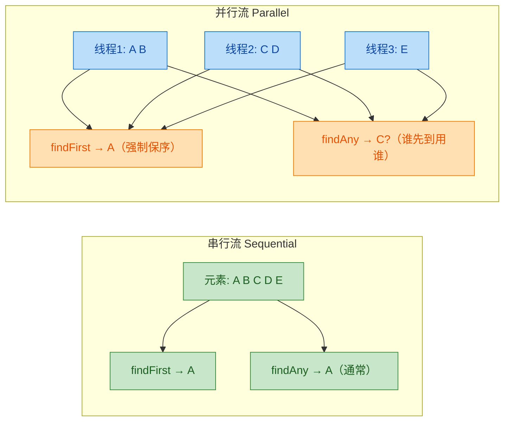

```java
import java.util.Arrays;
import java.util.List;
import java.util.Optional;

public class FindDemo {
    public static void main(String[] args) {

        List<String> languages = Arrays.asList("Java", "JavaScript", "Python", "Kotlin", "Go");

        // ========== findFirst：找到第一个满足条件的元素 ==========
        // 场景：找到第一个以 "J" 开头的语言
        Optional<String> first = languages.stream()
                .filter(lang -> lang.startsWith("J")) // 过滤：Java, JavaScript
                .findFirst();                          // 取第一个：Java
        first.ifPresent(val ->
                System.out.println("第一个J开头: " + val)); // 第一个J开头: Java

        // ========== findAny：找到任意一个满足条件的元素 ==========
        // 在串行流中，findAny 的行为通常和 findFirst 一样
        Optional<String> any = languages.stream()
                .filter(lang -> lang.startsWith("J"))
                .findAny();
        any.ifPresent(val ->
                System.out.println("任意J开头(串行): " + val)); // 任意J开头(串行): Java

        // 在并行流中，findAny 可能返回不同的结果
        // 多次运行可能得到 "Java" 或 "JavaScript"
        Optional<String> parallelAny = languages.parallelStream()
                .filter(lang -> lang.startsWith("J"))
                .findAny();
        parallelAny.ifPresent(val ->
                System.out.println("任意J开头(并行): " + val)); // 结果不确定

        // ========== 与 Optional 链式操作配合 ==========
        // 场景：找到第一个长度大于6的语言，转大写，找不到则返回默认值
        String result = languages.stream()
                .filter(lang -> lang.length() > 6)     // JavaScript(10), Python(6不满足), Kotlin(6不满足)
                .findFirst()                            // Optional[JavaScript]
                .map(String::toUpperCase)               // Optional[JAVASCRIPT]
                .orElse("NOT FOUND");                   // 如果为空则返回默认值
        System.out.println("结果: " + result); // 结果: JAVASCRIPT

        // ========== 空流场景 ==========
        Optional<String> notFound = languages.stream()
                .filter(lang -> lang.startsWith("Z"))   // 没有Z开头的语言
                .findFirst();                            // Optional.empty
        System.out.println("找Z开头: " + notFound);      // 找Z开头: Optional.empty

        // 用 orElseThrow 在找不到时抛出异常（Java 10+）
        // 适用于"必须找到，找不到就是bug"的场景
        try {
            String mustFind = languages.stream()
                    .filter(lang -> lang.equals("Rust"))
                    .findFirst()
                    .orElseThrow(() -> new IllegalStateException("未找到 Rust"));
        } catch (IllegalStateException e) {
            System.out.println("异常: " + e.getMessage()); // 异常: 未找到 Rust
        }
    }
}
```

选择 `findFirst` 还是 `findAny` 的决策原则很简单：如果你关心"顺序"（比如找到排序后的第一个、找到列表中最先出现的），用 `findFirst`；如果你只关心"存在性"（只要找到一个就行，不在乎是哪个），用 `findAny`。在并行流场景下，`findAny` 的性能更好，因为 `findFirst` 需要额外的同步开销来保证顺序。

一个实际开发中的常见模式是 `findFirst` + `orElse` / `orElseGet` / `orElseThrow` 的组合，用来替代传统的 for 循环 + if 判断 + return 的冗长写法：

```java
// 传统写法：冗长且容易忘记处理 null
public User findAdmin(List<User> users) {
    for (User user : users) {           // 遍历
        if (user.isAdmin()) {           // 判断
            return user;                // 找到就返回
        }
    }
    return null;                        // 找不到返回 null（隐患！）
}

// Stream 写法：简洁且类型安全
public User findAdmin(List<User> users) {
    return users.stream()
            .filter(User::isAdmin)                                      // 过滤条件
            .findFirst()                                                // 取第一个
            .orElseThrow(() -> new NoSuchElementException("无管理员")); // 找不到则抛异常
}
```

---

最后，我们用一张总览图把本节涉及的所有终端操作做一个分类归纳：

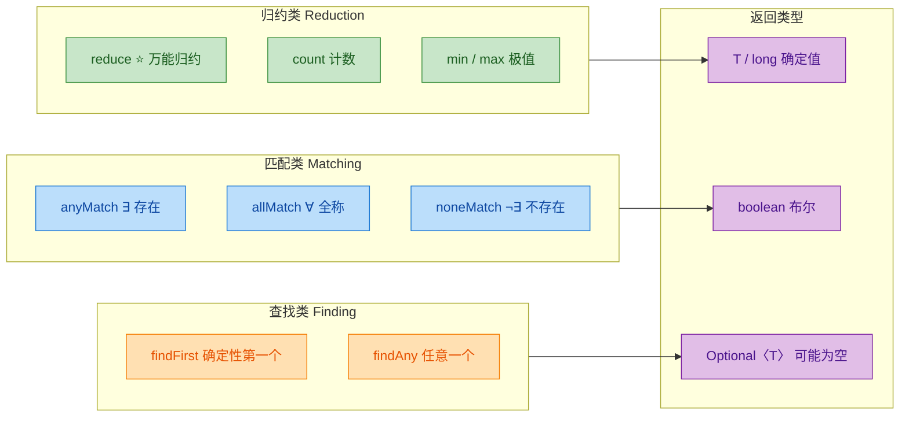

---

**📝 练习题**

以下代码的输出结果是什么？

```java
List<Integer> nums = Arrays.asList(2, 4, 6, 8);

boolean result1 = nums.stream().allMatch(n -> n % 2 == 0);
boolean result2 = nums.stream().anyMatch(n -> n > 10);
Optional<Integer> result3 = nums.stream().reduce((a, b) -> a * b);

System.out.println(result1 + " " + result2 + " " + result3.orElse(0));
```

A. `true false 384`

B. `true true 384`

C. `false false 384`

D. `true false 0`


**【答案】** A

**【解析】** `allMatch(n -> n % 2 == 0)`：2、4、6、8 全部是偶数，全部满足条件，返回 `true`。`anyMatch(n -> n >10)`：2、4、6、8 中没有任何一个大于 10，返回 `false`。`reduce((a, b) -> a * b)`：无初始值签名，计算过程为 2×4=8 → 8×6=48 → 48×8=384，返回 `Optional[384]`，`orElse(0)` 取出值 384。最终输出 `true false 384`。

---

**📝 练习题**

以下代码的输出结果是什么？

```java
List<String> list = List.of();

boolean a = list.stream().allMatch(s -> s.length() > 100);
boolean b = list.stream().noneMatch(s -> s.length() > 100);
Optional<String> c = list.stream().findFirst();

System.out.println(a + " " + b + " " + c.isPresent());
```

A. `false false false`

B. `true true false`

C. `false true false`

D. `true false true`


**【答案】** B

**【解析】** 这道题考察空流（empty stream）上三类终端操作的边界行为。`allMatch` 对空流返回 `true`，这是逻辑学中"空真"（Vacuous Truth）的体现——空集中不存在任何反例来推翻"所有元素都满足 P"这个命题，因此它为真。`noneMatch` 对空流同样返回 `true`，因为空集中确实没有任何元素满足条件。注意 `allMatch` 和 `noneMatch` 对空流同时返回 `true` 并不矛盾：前者说"没有不满足的"，后者说"没有满足的"，当集合为空时两者都成立。`findFirst` 对空流返回 `Optional.empty()`，`isPresent()` 为 `false`。最终输出 `true true false`。

---

## 基本类型 Stream（IntStream、LongStream、DoubleStream）

在前面的章节中，我们一直在使用 `Stream<T>` 这个泛型流。泛型流的本质是操作**对象**（Object），这意味着当我们处理 `int`、`long`、`double` 这类基本类型（primitive type）时，Java 会不断地进行**自动装箱（autoboxing）**和**拆箱（unboxing）**——把 `int` 包装成 `Integer`，再从 `Integer` 拆回 `int`。这个过程在数据量小的时候无关痛痒，但当你面对百万、千万级别的数值运算时，装箱拆箱带来的内存开销和性能损耗就非常可观了。

为了解决这个问题，Java 8 在 `java.util.stream` 包中专门提供了三个**基本类型特化流（Primitive Stream Specialization）**：

- `IntStream` —— 对应 `int`
- `LongStream` —— 对应 `long`
- `DoubleStream` —— 对应 `double`

它们直接在基本类型上操作，完全绕过了装箱拆箱，同时还额外提供了 `sum()`、`average()`、`range()` 等数值专用的便捷方法，这是普通 `Stream<T>` 所没有的。

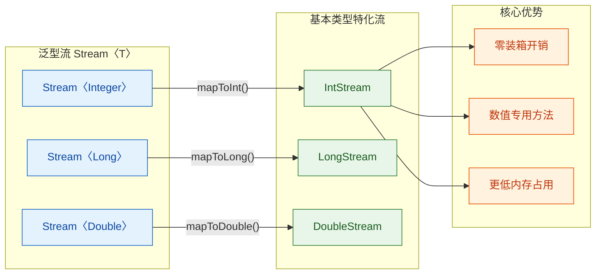

### 为什么需要基本类型 Stream？—— 装箱拆箱的代价

我们先用一个直观的例子来感受装箱的开销：

```java
// ❌ 使用泛型流 Stream<Integer> 求和
// 每个 int 都会被装箱为 Integer 对象，再拆箱回 int 进行加法
List<Integer> numbers = Arrays.asList(1, 2, 3, 4, 5);
int sum = numbers.stream()                    // 得到 Stream<Integer>
                 .reduce(0, Integer::sum);    // 每次 reduce 都涉及拆箱

// ✅ 使用 IntStream 求和
// 全程在 int 基本类型上操作，零装箱
int sum2 = numbers.stream()                   // 得到 Stream<Integer>
                  .mapToInt(Integer::intValue) // 转换为 IntStream（拆箱一次，后续全是 int）
                  .sum();                      // IntStream 专有方法，直接 int 加法
```

每个 `Integer` 对象在堆上大约占 16 字节（对象头 12 字节 + int 值 4 字节），而一个裸 `int` 只占 4 字节。当你处理 1000 万个数字时，仅对象头就多消耗了约 120MB 内存，更不用说 GC 压力的增加。

```java
// 内存对比示意
// Integer 对象（堆上）          int 基本类型（栈上或数组连续内存）
// ┌──────────────────┐          ┌──────┐
// │ Object Header 12B│          │ 4B   │
// │ int value    4B  │          └──────┘
// └──────────────────┘
// 总计: 16 字节/个               总计: 4 字节/个
// 1000万个 ≈ 160MB              1000万个 ≈ 40MB
```

### IntStream 的创建方式

`IntStream` 是三种特化流中最常用的，`LongStream` 和 `DoubleStream` 的 API 几乎完全对称，所以我们以 `IntStream` 为核心来讲解。

```java
import java.util.stream.IntStream;
import java.util.Arrays;

public class IntStreamCreation {
    public static void main(String[] args) {

        // ========== 方式1: IntStream.of() 直接指定元素 ==========
        IntStream s1 = IntStream.of(1, 2, 3, 4, 5);  // 可变参数，直接传入 int 值
        s1.forEach(System.out::println);               // 输出: 1 2 3 4 5

        // ========== 方式2: IntStream.range() 左闭右开区间 ==========
        // range(startInclusive, endExclusive) —— 不包含结束值
        IntStream s2 = IntStream.range(1, 6);          // 生成 1, 2, 3, 4, 5
        s2.forEach(n -> System.out.print(n + " "));    // 输出: 1 2 3 4 5

        // ========== 方式3: IntStream.rangeClosed() 左闭右闭区间 ==========
        // rangeClosed(startInclusive, endInclusive) —— 包含结束值
        IntStream s3 = IntStream.rangeClosed(1, 5);    // 生成 1, 2, 3, 4, 5
        s3.forEach(n -> System.out.print(n + " "));    // 输出: 1 2 3 4 5

        // ========== 方式4: IntStream.generate() 无限流 ==========
        // 接收 IntSupplier，需要配合 limit() 截断
        IntStream s4 = IntStream.generate(() -> (int)(Math.random() * 100))
                                .limit(5);             // 生成5个 0~99 的随机整数
        s4.forEach(n -> System.out.print(n + " "));

        // ========== 方式5: IntStream.iterate() 迭代生成 ==========
        // iterate(seed, IntUnaryOperator) —— 从种子值开始，反复应用函数
        IntStream s5 = IntStream.iterate(0, n -> n + 2)
                                .limit(5);             // 生成 0, 2, 4, 6, 8
        s5.forEach(n -> System.out.print(n + " "));

        // ========== 方式6: 从数组创建 ==========
        int[] arr = {10, 20, 30, 40, 50};
        IntStream s6 = Arrays.stream(arr);             // 将 int[] 直接转为 IntStream
        s6.forEach(n -> System.out.print(n + " "));    // 输出: 10 20 30 40 50

        // ========== 方式7: 从 String 的字符创建 ==========
        // chars() 返回 IntStream，每个元素是字符的 Unicode 码点
        IntStream s7 = "Hello".chars();                // 'H'=72, 'e'=101, ...
        s7.forEach(c -> System.out.print((char) c + " ")); // 输出: H e l l o
    }
}
```

`range()` 和 `rangeClosed()` 是 `IntStream` 独有的利器，在传统 Java 中写 `for (int i = 0; i < 10; i++)` 的场景，现在可以用函数式风格替代：

```java
// 传统 for 循环
for (int i = 1; i <= 100; i++) {
    System.out.println(i);
}

// 函数式等价写法
IntStream.rangeClosed(1, 100).forEach(System.out::println);
```

### 从 Stream\<T\> 到基本类型 Stream 的转换（mapToInt / mapToLong / mapToDouble）

这是实际开发中最常见的用法——你手上有一个对象流，需要从中提取数值属性进行计算：

```java
import java.util.Arrays;
import java.util.List;
import java.util.stream.IntStream;

public class MapToIntDemo {
    public static void main(String[] args) {

        // 假设有一组商品
        List<Product> products = Arrays.asList(
            new Product("键盘", 299),    // name, price
            new Product("鼠标", 149),
            new Product("显示器", 2499),
            new Product("耳机", 599)
        );

        // ========== mapToInt: 从对象流提取 int 属性 ==========
        // Stream<Product> → IntStream
        IntStream priceStream = products.stream()
            .mapToInt(Product::getPrice);  // 方法引用，等价于 p -> p.getPrice()

        // 现在可以使用 IntStream 的专有方法
        int totalPrice = products.stream()
            .mapToInt(Product::getPrice)   // 转为 IntStream
            .sum();                        // IntStream 专有的求和方法
        System.out.println("总价: " + totalPrice);  // 输出: 总价: 3546

        // ========== mapToLong: 处理大数值 ==========
        // 当数值可能超出 int 范围时使用
        long totalLong = products.stream()
            .mapToLong(Product::getPrice)  // 转为 LongStream
            .sum();

        // ========== mapToDouble: 处理浮点数 ==========
        double avgPrice = products.stream()
            .mapToDouble(Product::getPrice) // 转为 DoubleStream
            .average()                      // 返回 OptionalDouble
            .orElse(0.0);                   // 如果流为空，返回默认值 0.0
        System.out.println("均价: " + avgPrice);    // 输出: 均价: 886.5
    }
}

class Product {
    private String name;  // 商品名称
    private int price;    // 商品价格（单位：元）

    public Product(String name, int price) {
        this.name = name;
        this.price = price;
    }

    public String getName() { return name; }
    public int getPrice() { return price; }
}
```

### 从基本类型 Stream 转回 Stream\<T\>（boxed / mapToObj）

有时候你在 `IntStream` 上做完数值运算后，需要把结果转回对象流，比如要 `collect` 到一个 `List<Integer>` 中：

```java
import java.util.List;
import java.util.stream.Collectors;
import java.util.stream.IntStream;

public class BoxedDemo {
    public static void main(String[] args) {

        // ========== boxed(): IntStream → Stream<Integer> ==========
        // boxed() 将每个 int 装箱为 Integer
        List<Integer> list = IntStream.rangeClosed(1, 5)  // IntStream: 1,2,3,4,5
            .boxed()                                       // 转为 Stream<Integer>
            .collect(Collectors.toList());                  // 现在可以 collect 了
        System.out.println(list);  // 输出: [1, 2, 3, 4, 5]

        // ========== mapToObj(): IntStream → Stream<自定义对象> ==========
        // mapToObj 比 boxed 更灵活，可以映射为任意对象
        List<String> hexList = IntStream.of(255, 128, 64)
            .mapToObj(n -> String.format("0x%02X", n))    // int → String
            .collect(Collectors.toList());
        System.out.println(hexList);  // 输出: [0xFF, 0x80, 0x40]

        // ========== asLongStream() / asDoubleStream(): 类型提升 ==========
        // IntStream 可以无损提升为 LongStream 或 DoubleStream
        IntStream.of(1, 2, 3)
            .asDoubleStream()          // IntStream → DoubleStream（int 自动提升为 double）
            .forEach(d -> System.out.print(d + " "));  // 输出: 1.0 2.0 3.0
    }
}
```

转换关系可以用下面这张图来总结：

```mermaid
graph LR
    subgraph ObjectStream["对象流"]
        direction TB
        SI["Stream〈Integer〉"]
        SL["Stream〈Long〉"]
        SD["Stream〈Double〉"]
    end

    subgraph PrimitiveStream["基本类型流"]
        direction TB
        IS["IntStream"]
        LS["LongStream"]
        DS["DoubleStream"]
    end

    SI -->|"mapToInt()"| IS
    IS -->|"boxed()"| SI
    IS -->|"mapToObj()"| SI

    SL -->|"mapToLong()"| LS
    LS -->|"boxed()"| SL

    SD -->|"mapToDouble()"| DS
    DS -->|"boxed()"| SD

    IS -->|"asLongStream()"| LS
    IS -->|"asDoubleStream()"| DS
    LS -->|"asDoubleStream()"| DS

    classDef objCls fill:#E8EAF6,stroke:#283593,color:#1A237E
    classDef primCls fill:#E0F2F1,stroke:#00695C,color:#004D40

    class SI,SL,SD objCls
    class IS,LS,DS primCls
```

### IntStream 专有的数值操作方法

这是基本类型流最大的卖点——一系列开箱即用的数值统计方法，普通 `Stream<T>` 是没有的：

```java
import java.util.IntSummaryStatistics;
import java.util.OptionalDouble;
import java.util.OptionalInt;
import java.util.stream.IntStream;

public class IntStreamMethods {
    public static void main(String[] args) {

        int[] scores = {85, 92, 78, 96, 88, 73, 91};

        // ========== sum(): 求和 ==========
        int total = IntStream.of(scores).sum();          // 直接返回 int，不是 Optional
        System.out.println("总分: " + total);             // 输出: 总分: 603

        // ========== average(): 求平均值 ==========
        OptionalDouble avg = IntStream.of(scores).average(); // 返回 OptionalDouble
        // 为什么返回 Optional？因为空流没有平均值
        System.out.println("均分: " + avg.orElse(0));        // 输出: 均分: 86.14...

        // ========== min() / max(): 最小值 / 最大值 ==========
        OptionalInt min = IntStream.of(scores).min();    // 返回 OptionalInt
        OptionalInt max = IntStream.of(scores).max();    // 返回 OptionalInt
        System.out.println("最低分: " + min.orElse(-1)); // 输出: 最低分: 73
        System.out.println("最高分: " + max.orElse(-1)); // 输出: 最高分: 96

        // ========== count(): 元素个数 ==========
        long count = IntStream.of(scores).count();       // 返回 long
        System.out.println("人数: " + count);             // 输出: 人数: 7

        // ========== summaryStatistics(): 一次性获取所有统计信息 ⭐ ==========
        // 这是最实用的方法！一次遍历，同时拿到 count、sum、min、max、average
        IntSummaryStatistics stats = IntStream.of(scores).summaryStatistics();
        System.out.println("人数: " + stats.getCount());     // 7
        System.out.println("总分: " + stats.getSum());       // 603
        System.out.println("最低: " + stats.getMin());       // 73
        System.out.println("最高: " + stats.getMax());       // 96
        System.out.println("均分: " + stats.getAverage());   // 86.14...
    }
}
```

`summaryStatistics()` 是一个非常值得记住的方法。在实际开发中，如果你需要同时获取多个统计指标，用它只需遍历一次流，而分别调用 `sum()`、`average()`、`min()`、`max()` 则需要创建四个流（因为流是一次性消费的）。

```java
// ❌ 低效写法：创建了4个流，遍历了4次
int sum    = IntStream.of(scores).sum();
double avg2 = IntStream.of(scores).average().orElse(0);
int min2   = IntStream.of(scores).min().orElse(0);
int max2   = IntStream.of(scores).max().orElse(0);

// ✅ 高效写法：只创建1个流，遍历1次
IntSummaryStatistics s = IntStream.of(scores).summaryStatistics();
// 然后从 s 中取所有你需要的值
```

### IntStream.range / rangeClosed 的实战应用

`range` 和 `rangeClosed` 不仅仅是 for 循环的替代品，它们在很多场景下能写出更优雅的代码：

```java
import java.util.stream.IntStream;
import java.util.stream.Collectors;

public class RangeUseCases {
    public static void main(String[] args) {

        // ========== 场景1: 生成索引，配合数组操作 ==========
        String[] names = {"Alice", "Bob", "Charlie", "Diana"};
        // 用索引流遍历数组，同时拿到索引和元素
        IntStream.range(0, names.length)                       // 生成 0,1,2,3
            .mapToObj(i -> i + ". " + names[i])                // 拼接索引和元素
            .forEach(System.out::println);
        // 输出:
        // 0. Alice
        // 1. Bob
        // 2. Charlie
        // 3. Diana

        // ========== 场景2: 生成棋盘坐标 ==========
        // 利用 flatMap 生成二维坐标
        IntStream.range(0, 3).mapToObj(row ->                  // 行: 0,1,2
            IntStream.range(0, 3)                              // 列: 0,1,2
                .mapToObj(col -> "(" + row + "," + col + ")")  // 拼接坐标
                .collect(Collectors.joining(" "))              // 每行用空格连接
        ).forEach(System.out::println);
        // 输出:
        // (0,0) (0,1) (0,2)
        // (1,0) (1,1) (1,2)
        // (2,0) (2,1) (2,2)

        // ========== 场景3: 求阶乘 ==========
        // 5! = 1 × 2 × 3 × 4 × 5 = 120
        int factorial = IntStream.rangeClosed(1, 5)            // 生成 1,2,3,4,5
            .reduce(1, (a, b) -> a * b);                       // 累乘
        System.out.println("5! = " + factorial);               // 输出: 5! = 120

        // ========== 场景4: 判断素数 ==========
        int number = 17;
        boolean isPrime = number > 1 &&                        // 排除 0 和 1
            IntStream.rangeClosed(2, (int) Math.sqrt(number))  // 从2到√n
                .noneMatch(i -> number % i == 0);              // 没有任何因子能整除
        System.out.println(number + " 是素数? " + isPrime);    // 输出: 17 是素数? true

        // ========== 场景5: 生成斐波那契数列 ==========
        // 利用 iterate + 二元组技巧
        IntStream.iterate(new int[]{0, 1}, f -> new int[]{f[1], f[0] + f[1]})
            .limit(10)                                         // 取前10项
            .map(f -> f[0])                                    // 提取第一个元素
            .forEach(n -> System.out.print(n + " "));          // 输出: 0 1 1 2 3 5 8 13 21 34
    }
}
```

### LongStream 和 DoubleStream

`LongStream` 和 `DoubleStream` 的 API 与 `IntStream` 高度对称，只是操作的数据类型不同。这里列出它们各自的典型使用场景：

```java
import java.util.stream.LongStream;
import java.util.stream.DoubleStream;

public class LongDoubleStreamDemo {
    public static void main(String[] args) {

        // ========== LongStream: 处理大数值 ==========
        // 典型场景：计算大范围的累加和（超出 int 范围）
        long bigSum = LongStream.rangeClosed(1, 1_000_000L)   // 1到100万
            .sum();                                             // 返回 long
        System.out.println("1到100万的和: " + bigSum);          // 500000500000

        // 时间戳处理
        long now = System.currentTimeMillis();                  // 当前时间戳（毫秒）
        LongStream.of(now, now - 86400000, now - 172800000)    // 今天、昨天、前天
            .mapToObj(ts -> new java.util.Date(ts))            // 转为 Date 对象
            .forEach(System.out::println);

        // ========== DoubleStream: 处理浮点运算 ==========
        // 典型场景：科学计算、统计分析
        double[] temperatures = {36.5, 37.2, 36.8, 38.1, 36.9};
        
        // 求平均体温
        double avgTemp = DoubleStream.of(temperatures)
            .average()                                          // 返回 OptionalDouble
            .orElse(0.0);
        System.out.println("平均体温: " + avgTemp);

        // 生成等差数列（DoubleStream 没有 range，需要用 iterate）
        DoubleStream.iterate(0.0, d -> d + 0.1)               // 0.0, 0.1, 0.2, ...
            .limit(11)                                          // 取11个
            .forEach(d -> System.out.printf("%.1f ", d));       // 0.0 0.1 0.2 ... 1.0
    }
}
```

三种特化流的 API 对比：

```java
// ┌─────────────────────┬──────────────┬──────────────┬──────────────┐
// │       方法           │  IntStream   │  LongStream  │ DoubleStream │
// ├─────────────────────┼──────────────┼──────────────┼──────────────┤
// │ range()             │     ✅       │     ✅       │     ❌       │
// │ rangeClosed()       │     ✅       │     ✅       │     ❌       │
// │ sum()               │  返回 int    │  返回 long   │  返回 double │
// │ average()           │ OptionalDbl  │ OptionalDbl  │ OptionalDbl  │
// │ min()               │ OptionalInt  │ OptionalLong │ OptionalDbl  │
// │ max()               │ OptionalInt  │ OptionalLong │ OptionalDbl  │
// │ summaryStatistics() │ IntSummary   │ LongSummary  │ DoubleSummary│
// │ boxed()             │ Stream<Int>  │ Stream<Long> │ Stream<Dbl>  │
// │ asLongStream()      │     ✅       │     —        │     —        │
// │ asDoubleStream()    │     ✅       │     ✅       │     —        │
// └─────────────────────┴──────────────┴──────────────┴──────────────┘
```

### 综合实战：学生成绩统计系统

把前面学到的知识串起来，做一个完整的实战案例：

```java
import java.util.*;
import java.util.stream.*;

public class StudentScoreAnalysis {
    public static void main(String[] args) {

        // 模拟学生数据
        List<Student> students = Arrays.asList(
            new Student("张三", 85, 92, 78),   // 姓名, 语文, 数学, 英语
            new Student("李四", 90, 88, 95),
            new Student("王五", 72, 65, 80),
            new Student("赵六", 95, 98, 92),
            new Student("钱七", 60, 55, 70)
        );

        // ========== 1. 每个学生的总分 ==========
        students.forEach(s -> {
            int total = IntStream.of(s.getChinese(), s.getMath(), s.getEnglish())
                .sum();                                        // IntStream 求和
            System.out.println(s.getName() + " 总分: " + total);
        });

        // ========== 2. 全班数学成绩统计 ==========
        IntSummaryStatistics mathStats = students.stream()
            .mapToInt(Student::getMath)                         // 提取数学成绩
            .summaryStatistics();                               // 一次性获取所有统计
        System.out.println("数学 - 最高分: " + mathStats.getMax()
            + ", 最低分: " + mathStats.getMin()
            + ", 平均分: " + String.format("%.1f", mathStats.getAverage()));

        // ========== 3. 找出总分最高的学生 ==========
        students.stream()
            .max(Comparator.comparingInt(s ->                  // 按总分比较
                IntStream.of(s.getChinese(), s.getMath(), s.getEnglish()).sum()
            ))
            .ifPresent(s -> System.out.println("总分最高: " + s.getName()));

        // ========== 4. 各科及格率（>= 60 分） ==========
        long mathPassCount = students.stream()
            .mapToInt(Student::getMath)                         // 提取数学成绩
            .filter(score -> score >= 60)                      // 过滤及格的
            .count();                                          // 统计人数
        double mathPassRate = (double) mathPassCount / students.size() * 100;
        System.out.printf("数学及格率: %.1f%%\n", mathPassRate);

        // ========== 5. 所有成绩的分数段分布 ==========
        // 把所有科目的成绩汇总到一个 IntStream 中
        Map<String, Long> distribution = students.stream()
            .flatMapToInt(s -> IntStream.of(                   // flatMapToInt: 扁平化
                s.getChinese(), s.getMath(), s.getEnglish()
            ))
            .boxed()                                           // IntStream → Stream<Integer>
            .collect(Collectors.groupingBy(                    // 按分数段分组
                score -> {
                    if (score >= 90) return "优秀(90-100)";
                    else if (score >= 80) return "良好(80-89)";
                    else if (score >= 70) return "中等(70-79)";
                    else if (score >= 60) return "及格(60-69)";
                    else return "不及格(<60)";
                },
                Collectors.counting()                          // 统计每组人数
            ));
        System.out.println("分数段分布: " + distribution);
    }
}

class Student {
    private String name;     // 姓名
    private int chinese;     // 语文成绩
    private int math;        // 数学成绩
    private int english;     // 英语成绩

    public Student(String name, int chinese, int math, int english) {
        this.name = name;
        this.chinese = chinese;
        this.math = math;
        this.english = english;
    }

    // getter 方法
    public String getName() { return name; }
    public int getChinese() { return chinese; }
    public int getMath() { return math; }
    public int getEnglish() { return english; }
}
```

注意第 5 步中 `flatMapToInt` 的用法——它是 `Stream<T>` 上的方法，接收一个返回 `IntStream` 的函数，把每个元素展开为一个 `IntStream`，然后将所有 `IntStream` 合并成一个。这与我们之前学过的 `flatMap` 思路完全一致，只不过目标类型从 `Stream<T>` 变成了 `IntStream`。

```java
// flatMapToInt 的签名
// <T> IntStream flatMapToInt(Function<? super T, ? extends IntStream> mapper)

// 对比 flatMap:
// <T,R> Stream<R> flatMap(Function<? super T, ? extends Stream<? extends R>> mapper)
```

类似地，还有 `flatMapToLong` 和 `flatMapToDouble`，分别返回 `LongStream` 和 `DoubleStream`。

### 基本类型 Stream 的注意事项与常见陷阱

在使用基本类型流时，有几个容易踩坑的地方值得特别注意：

```java
import java.util.stream.IntStream;
import java.util.stream.Collectors;
import java.util.List;
import java.util.OptionalInt;

public class PrimitiveStreamPitfalls {
    public static void main(String[] args) {

        // ========== 陷阱1: IntStream 没有 collect(Collectors.toList()) ==========
        // ❌ 编译错误！IntStream 的 collect 签名与 Stream<T> 不同
        // List<Integer> list = IntStream.of(1,2,3).collect(Collectors.toList());

        // ✅ 正确做法：先 boxed() 转为 Stream<Integer>，再 collect
        List<Integer> list = IntStream.of(1, 2, 3)
            .boxed()                                           // IntStream → Stream<Integer>
            .collect(Collectors.toList());                     // 现在可以用 Collectors 了

        // ✅ 或者用 IntStream 自己的 collect（三参数版本）
        List<Integer> list2 = IntStream.of(1, 2, 3)
            .collect(
                java.util.ArrayList::new,                      // supplier: 创建容器
                java.util.ArrayList::add,                      // accumulator: 添加元素（自动装箱）
                java.util.ArrayList::addAll                    // combiner: 合并容器
            );

        // ========== 陷阱2: sum() 在空流上返回 0，而不是 Optional ==========
        int emptySum = IntStream.empty().sum();                // 返回 0，不会报错
        System.out.println("空流的 sum: " + emptySum);         // 输出: 0
        // 这是设计决策：空集合的和定义为 0（加法单位元）

        // 但 min/max/average 在空流上返回 Optional，因为它们没有合理的默认值
        OptionalInt emptyMin = IntStream.empty().min();        // OptionalInt.empty
        System.out.println("空流有最小值? " + emptyMin.isPresent()); // false

        // ========== 陷阱3: 流的一次性消费同样适用 ==========
        IntStream stream = IntStream.of(1, 2, 3);
        stream.sum();                                          // 第一次消费：OK
        // stream.max();                                       // ❌ IllegalStateException!
        // 流已经被消费了，不能再次使用

        // ========== 陷阱4: iterate 生成的是无限流 ==========
        // 如果忘记 limit()，程序会无限运行下去
        // IntStream.iterate(0, n -> n + 1).forEach(System.out::println); // ❌ 永不停止

        // Java 9 新增了带终止条件的 iterate（三参数版本）
        // IntStream.iterate(0, n -> n < 10, n -> n + 1)      // 类似 for(int n=0; n<10; n++)
        //     .forEach(System.out::println);                  // 0 到 9，自动停止

        // ========== 陷阱5: mapToInt 中的 null 问题 ==========
        // 如果对象流中有 null 元素，mapToInt 会抛 NullPointerException
        // List<String> withNull = Arrays.asList("hello", null, "world");
        // withNull.stream().mapToInt(String::length).sum();   // ❌ NPE!

        // ✅ 先过滤 null
        // withNull.stream()
        //     .filter(Objects::nonNull)                       // 过滤掉 null
        //     .mapToInt(String::length)
        //     .sum();
    }
}
```

### IntStream 的 collect 方法详解

`IntStream` 的 `collect` 方法签名与 `Stream<T>` 的不同，这是一个经常让人困惑的点：

```java
// Stream<T> 的 collect —— 接受 Collector
<R, A> R collect(Collector<? super T, A, R> collector);

// IntStream 的 collect —— 三参数手动版
<R> R collect(Supplier<R> supplier,
              ObjIntConsumer<R> accumulator,
              BiConsumer<R, R> combiner);
```

`IntStream` 没有接受 `Collector` 的重载版本，因为 `Collector` 接口是为对象流设计的。所以当你需要在 `IntStream` 上做复杂的收集操作时，要么用三参数 `collect`，要么先 `boxed()` 再用 `Collectors`：

```java
import java.util.*;
import java.util.stream.*;

public class IntStreamCollectDemo {
    public static void main(String[] args) {

        // ========== 收集到 int[] 数组 ==========
        // 最简单的方式：toArray()
        int[] arr = IntStream.rangeClosed(1, 5).toArray();     // [1, 2, 3, 4, 5]

        // ========== 收集到 List<Integer> ==========
        // 方式1: boxed + Collectors（推荐，可读性好）
        List<Integer> list1 = IntStream.rangeClosed(1, 5)
            .boxed()
            .collect(Collectors.toList());

        // 方式2: 三参数 collect（性能略好，避免了中间的 Stream<Integer>）
        List<Integer> list2 = IntStream.rangeClosed(1, 5)
            .collect(
                ArrayList::new,                                // 创建 ArrayList
                ArrayList::add,                                // 将 int 添加进去（自动装箱）
                ArrayList::addAll                              // 并行时合并两个 list
            );

        // ========== 收集到 String ==========
        // 将数字拼接成逗号分隔的字符串
        String csv = IntStream.of(10, 20, 30, 40)
            .mapToObj(String::valueOf)                          // int → String
            .collect(Collectors.joining(", "));                 // 用 Collectors.joining
        System.out.println(csv);  // 输出: 10, 20, 30, 40

        // ========== 收集到 Map ==========
        // 将数字映射为 数字 → 数字的平方
        Map<Integer, Integer> squareMap = IntStream.rangeClosed(1, 5)
            .boxed()                                           // 必须先 boxed
            .collect(Collectors.toMap(
                n -> n,                                        // key: 数字本身
                n -> n * n                                     // value: 平方
            ));
        System.out.println(squareMap);  // {1=1, 2=4, 3=9, 4=16, 5=25}
    }
}
```

### 性能对比：基本类型流 vs 泛型流

口说无凭，我们用一个简单的基准测试来直观感受性能差异：

```java
import java.util.stream.*;

public class PerformanceComparison {
    public static void main(String[] args) {
        int n = 10_000_000;  // 一千万个数

        // ========== 测试1: Stream<Integer> 求和 ==========
        long start1 = System.nanoTime();
        int sum1 = Stream.iterate(1, i -> i + 1)              // Stream<Integer>，每次装箱
            .limit(n)
            .reduce(0, Integer::sum);                          // 每次拆箱再装箱
        long time1 = System.nanoTime() - start1;
        System.out.printf("Stream<Integer>: %d ms, sum=%d%n",
            time1 / 1_000_000, sum1);

        // ========== 测试2: IntStream 求和 ==========
        long start2 = System.nanoTime();
        int sum2 = IntStream.rangeClosed(1, n)                 // IntStream，零装箱
            .sum();                                            // 纯 int 加法
        long time2 = System.nanoTime() - start2;
        System.out.printf("IntStream:       %d ms, sum=%d%n",
            time2 / 1_000_000, sum2);

        // 典型结果（仅供参考，实际取决于 JVM 和硬件）:
        // Stream<Integer>: ~320 ms
        // IntStream:       ~12 ms
        // 差距约 20-30 倍！
    }
}
```

这个差距主要来自三个方面：

```mermaid
graph LR
    subgraph BoxedStream["Stream〈Integer〉 的开销"]
        direction TB
        B1["装箱: int → Integer 对象创建"]
        B2["拆箱: Integer → int 值提取"]
        B3["GC压力: 大量临时 Integer 对象"]
    end

    subgraph PrimStream["IntStream 的优势"]
        direction TB
        P1["零装箱: 全程 int 操作"]
        P2["缓存友好: 连续内存布局"]
        P3["JIT优化: 更容易向量化"]
    end

    subgraph Result["性能差异"]
        direction TB
        R1["数值密集计算: 10~30x 差距"]
        R2["内存占用: 4x 差距"]
    end

    BoxedStream --> Result
    PrimStream --> Result

    classDef boxedCls fill:#FFEBEE,stroke:#C62828,color:#B71C1C
    classDef primCls fill:#E8F5E9,stroke:#2E7D32,color:#1B5E20
    classDef resultCls fill:#FFF8E1,stroke:#F57F17,color:#E65100

    class B1,B2,B3 boxedCls
    class P1,P2,P3 primCls
    class R1,R2 resultCls
```

### 何时使用基本类型 Stream？—— 决策指南

并不是所有场景都需要使用基本类型流，以下是一个简单的决策参考：

```java
// ┌──────────────────────────────────┬────────────────────────────────┐
// │         使用 IntStream           │       使用 Stream<Integer>      │
// ├──────────────────────────────────┼────────────────────────────────┤
// │ 大量数值计算（求和、平均、统计）    │ 需要 null 值表示"缺失"          │
// │ 数据量大（万级以上）              │ 需要复杂的 Collector 操作        │
// │ 需要 range/rangeClosed 生成序列   │ 与其他泛型 API 交互             │
// │ 需要 sum/average 等专有方法       │ 数据量小，性能差异可忽略          │
// │ 性能敏感的热点代码路径            │ 代码可读性优先于性能              │
// └──────────────────────────────────┴────────────────────────────────┘
```

一个实用的经验法则：如果你发现自己在写 `Stream<Integer>` 并且调用了 `reduce` 来做数学运算，那几乎可以肯定应该换成 `IntStream`。

---

**📝 练习题**

以下代码的输出结果是什么？

```java
int result = IntStream.rangeClosed(1, 4)
    .flatMap(i -> IntStream.rangeClosed(1, i))
    .filter(n -> n % 2 == 0)
    .distinct()
    .sum();
System.out.println(result);
```

A. 2

B. 6

C. 8

D. 12


**【答案】** B

**【解析】**

逐步拆解这道题：

1. `IntStream.rangeClosed(1, 4)` 生成 `[1, 2, 3, 4]`。

2. `flatMap(i -> IntStream.rangeClosed(1, i))` 对每个元素展开：
   - `i=1` → `[1]`
   - `i=2` → `[1, 2]`
   - `i=3` → `[1, 2, 3]`
   - `i=4` → `[1, 2, 3, 4]`
   - 合并后：`[1, 1, 2, 1, 2, 3, 1, 2, 3, 4]`

3. `filter(n -> n % 2 == 0)` 保留偶数：`[2, 2, 2, 4]`

4. `distinct()` 去重：`[2, 4]`

5. `sum()` 求和：`2 + 4 = 6`

这道题综合考察了 `flatMap`（在 `IntStream` 上）、`filter`、`distinct` 和 `sum` 的配合使用。注意 `IntStream` 上的 `flatMap` 接收的函数返回的也是 `IntStream`，而不是 `Stream<Integer>`。

---

## 并行流（parallelStream）

在前面的章节中，我们使用的 Stream 都是串行流（Sequential Stream），即所有操作在单线程中按顺序执行。Java 8 同时提供了并行流（Parallel Stream），它能够将数据自动拆分为多个子任务，利用多核 CPU 并行处理，从而在大数据量场景下显著提升吞吐量。

并行流是 Stream API 中最具"诱惑力"也最容易"踩坑"的特性。它的 API 调用极其简单——只需把 `.stream()` 换成 `.parallelStream()`，或在已有流上调用 `.parallel()`——但背后涉及线程安全、任务拆分策略、性能权衡等一系列深层问题。本节将从底层原理到实战陷阱，全面拆解并行流。

### 并行流的创建方式

创建并行流有两种途径，效果完全等价：

```java
// 方式一：直接从集合创建并行流
List<Integer> list = Arrays.asList(1, 2, 3, 4, 5, 6, 7, 8);
Stream<Integer> parallelStream1 = list.parallelStream(); // 集合直接产出并行流

// 方式二：将已有的串行流转换为并行流
Stream<Integer> parallelStream2 = list.stream().parallel(); // 串行流调用 parallel() 转换

// 反向操作：将并行流转回串行流
Stream<Integer> sequentialStream = parallelStream2.sequential(); // 调用 sequential() 回到串行
```

一个关键细节：流的并行/串行状态由最后一次调用决定。如果你在链式调用中先 `.parallel()` 再 `.sequential()`，最终整条流以串行模式执行。

```java
// 最终以 sequential 模式执行，因为 sequential() 是最后一次状态切换
list.stream()
    .parallel()       // 切换为并行
    .filter(n -> n > 2)
    .sequential()     // 又切回串行 —— 最终生效的是这个
    .forEach(System.out::println);
```

### 底层原理：Fork/Join 框架

并行流并非凭空变出多线程，它的底层引擎是 Java 7 引入的 Fork/Join Framework。理解这个框架是掌握并行流行为的关键。

Fork/Join 的核心思想是"分治"（Divide and Conquer）：将一个大任务递归地拆分（Fork）为若干小任务，各小任务独立计算后再合并（Join）结果。

```mermaid
graph LR
    subgraph 分治过程
        direction TB
        A["原始数据 1..8"] --> B["Fork: 拆分为两半"]
        B --> C["子任务 1..4"]
        B --> D["子任务 5..8"]
        C --> E["Fork: 继续拆分"]
        D --> F["Fork: 继续拆分"]
        E --> G["1..2"]
        E --> H["3..4"]
        F --> I["5..6"]
        F --> J["7..8"]
    end

    subgraph 合并过程
        direction TB
        G2["结果 1..2"] --> K["Join: 合并"]
        H2["结果 3..4"] --> K
        I2["结果 5..6"] --> L["Join: 合并"]
        J2["结果 7..8"] --> L
        K --> M["Join: 最终合并"]
        L --> M
    end

    G --> G2
    H --> H2
    I --> I2
    J --> J2

    classDef splitNode fill:#E3F2FD,stroke:#1565C0,color:#0D47A1
    classDef leafNode fill:#E8F5E9,stroke:#2E7D32,color:#1B5E20
    classDef joinNode fill:#FFF3E0,stroke:#E65100,color:#BF360C
    classDef resultNode fill:#FCE4EC,stroke:#C62828,color:#B71C1C

    class A,B splitNode
    class C,D,E,F splitNode
    class G,H,I,J leafNode
    class G2,H2,I2,J2 leafNode
    class K,L,M joinNode
```

并行流使用的线程池是 `ForkJoinPool.commonPool()`，这是一个 JVM 全局共享的公共线程池。它的默认并行度（parallelism）等于 `Runtime.getRuntime().availableProcessors() - 1`，即 CPU 核心数减一（主线程也参与计算，所以总工作线程数等于核心数）。

```java
// 查看公共 ForkJoinPool 的并行度
System.out.println("Common pool parallelism: "
    + ForkJoinPool.commonPool().getParallelism());
// 在 8 核机器上输出: Common pool parallelism: 7

// 可以通过 JVM 参数全局修改（影响所有并行流）
// -Djava.util.concurrent.ForkJoinPool.common.parallelism=4
```

#### Work-Stealing（工作窃取）算法

Fork/Join 框架的高效秘诀在于 Work-Stealing 算法。每个工作线程维护一个双端队列（Deque），自己的任务从队列头部取出执行。当某个线程的队列为空（即它已完成所有分配给它的子任务），它会从其他线程的队列尾部"偷"一个任务来执行，从而最大化 CPU 利用率，避免线程空闲。

```java
// Work-Stealing 示意（伪代码）
// 线程 A 的队列: [task1, task2, task3]  ← 从头部取
// 线程 B 的队列: []                     ← 空了，去偷！
// 线程 B 从线程 A 的队列尾部偷走 task3
// 线程 A 的队列: [task1, task2]
// 线程 B 的队列: [task3]                ← 偷到了，开始干活
```

### 并行流的执行顺序与线程观察

并行流最直观的特征就是执行顺序不确定。我们可以通过打印线程名来观察：

```java
List<Integer> numbers = Arrays.asList(1, 2, 3, 4, 5, 6, 7, 8);

// 串行流：单线程，顺序固定
System.out.println("=== Sequential ===");
numbers.stream()
    .forEach(n -> System.out.println(
        Thread.currentThread().getName() + " -> " + n)); // 始终是 main 线程

System.out.println("\n=== Parallel ===");
// 并行流：多线程，顺序不确定
numbers.parallelStream()
    .forEach(n -> System.out.println(
        Thread.currentThread().getName() + " -> " + n)); // 多个 ForkJoinPool 线程
```

可能的输出：

```
=== Sequential ===
main -> 1
main -> 2
main -> 3
...（顺序固定）

=== Parallel ===
ForkJoinPool.commonPool-worker-1 -> 6
main -> 4
ForkJoinPool.commonPool-worker-3 -> 2
ForkJoinPool.commonPool-worker-2 -> 8
ForkJoinPool.commonPool-worker-1 -> 5
main -> 3
ForkJoinPool.commonPool-worker-3 -> 1
ForkJoinPool.commonPool-worker-2 -> 7
```

注意 `main` 线程也参与了计算——这是 Fork/Join 框架的设计，提交任务的线程自身也会作为 worker 参与执行。

如果你需要并行处理但又要保持元素的原始顺序（encounter order），使用 `forEachOrdered()`：

```java
numbers.parallelStream()
    .forEachOrdered(n -> System.out.println(
        Thread.currentThread().getName() + " -> " + n));
// 输出顺序固定为 1, 2, 3, ..., 8
// 但会牺牲部分并行性能，因为需要协调顺序
```

### 数据源的可拆分性（Spliterator）

并行流的性能高度依赖数据源的可拆分性。Stream 通过 `Spliterator`（Splitable Iterator）接口来决定如何将数据拆分为子任务。不同数据结构的拆分效率差异巨大：

```mermaid
graph LR
    subgraph 拆分效率排行
        direction TB
        A["ArrayList / 数组
        ★★★★★ 极佳"] --> B["HashSet / HashMap
        ★★★★ 良好"]
        B --> C["TreeSet / TreeMap
        ★★★ 中等"]
        C --> D["LinkedList
        ★☆☆☆☆ 极差"]
        D --> E["Stream.iterate
        ★☆☆☆☆ 极差"]
    end

    subgraph 原因分析
        direction TB
        F["连续内存，支持按索引
        精确对半拆分"] --> G["基于桶结构
        拆分较均匀"]
        G --> H["基于树结构
        拆分尚可"]
        H --> I["链表无法随机访问
        只能逐个遍历拆分"]
        I --> J["依赖前一个元素
        天然串行，无法拆分"]
    end

    A -.-> F
    B -.-> G
    C -.-> H
    D -.-> I
    E -.-> J

    classDef excellent fill:#E8F5E9,stroke:#2E7D32,color:#1B5E20
    classDef good fill:#E3F2FD,stroke:#1565C0,color:#0D47A1
    classDef medium fill:#FFF8E1,stroke:#F9A825,color:#F57F17
    classDef poor fill:#FFEBEE,stroke:#C62828,color:#B71C1C

    class A excellent
    class B good
    class C medium
    class D,E poor
    class F excellent
    class G good
    class H medium
    class I,J poor
```

一个直观的对比实验：

```java
// ArrayList：底层是数组，Spliterator 可以精确地按索引对半拆分
// 并行效率极高
List<Integer> arrayList = new ArrayList<>();
IntStream.rangeClosed(1, 10_000_000).forEach(arrayList::add); // 一千万元素
long start1 = System.nanoTime();
arrayList.parallelStream()
    .mapToInt(Integer::intValue)
    .sum();
long time1 = System.nanoTime() - start1;

// LinkedList：链表结构，Spliterator 无法随机访问
// 拆分时只能从头遍历，并行几乎无收益甚至更慢
List<Integer> linkedList = new LinkedList<>(arrayList);
long start2 = System.nanoTime();
linkedList.parallelStream()
    .mapToInt(Integer::intValue)
    .sum();
long time2 = System.nanoTime() - start2;

System.out.println("ArrayList parallel: " + time1 / 1_000_000 + " ms");
System.out.println("LinkedList parallel: " + time2 / 1_000_000 + " ms");
// 典型结果：ArrayList 快数倍
```

### 什么时候该用并行流

并行流不是银弹。引入多线程意味着线程调度、任务拆分、结果合并都有开销。只有当计算收益大于这些开销时，并行流才有意义。

适合使用并行流的场景：

```java
// ✅ 场景一：大数据量 + 计算密集型操作
// 对一千万个数做复杂数学运算
LongStream.rangeClosed(1, 10_000_000)
    .parallel()                          // 大数据量，值得并行
    .mapToDouble(n -> Math.sqrt(n) * Math.log(n) + Math.sin(n)) // CPU 密集
    .sum();

// ✅ 场景二：无状态操作 + 数据源易拆分
int[] bigArray = new int[5_000_000];     // 数组，拆分效率极佳
Arrays.fill(bigArray, 1);
int sum = Arrays.stream(bigArray)
    .parallel()                          // 无状态的 map/filter，线程安全
    .map(n -> n * 2)
    .filter(n -> n > 0)
    .sum();
```

不适合使用并行流的场景：

```java
// ❌ 场景一：数据量太小，并行开销大于收益
List<Integer> smallList = Arrays.asList(1, 2, 3, 4, 5);
smallList.parallelStream()               // 5 个元素，线程调度的开销远超计算本身
    .map(n -> n * 2)
    .collect(Collectors.toList());

// ❌ 场景二：操作涉及 I/O（网络、磁盘）
// 并行流使用公共 ForkJoinPool，I/O 阻塞会拖慢所有并行流任务
urls.parallelStream()
    .map(url -> httpClient.get(url))     // 网络 I/O 会阻塞 ForkJoinPool 线程
    .collect(Collectors.toList());
    // 应该用 CompletableFuture + 自定义线程池代替

// ❌ 场景三：有序依赖的操作
Stream.iterate(0, n -> n + 1)            // iterate 天然串行，无法有效拆分
    .parallel()                          // 并行毫无意义，反而更慢
    .limit(1000)
    .sum();

// ❌ 场景四：操作本身很轻量
list.parallelStream()
    .filter(n -> n > 5)                  // 一次比较操作耗时纳秒级
    .collect(Collectors.toList());       // 线程调度开销远大于计算本身
```

### 并行流的线程安全陷阱

这是并行流最危险的地方。并行流在多线程中执行，如果你的操作修改了共享可变状态（shared mutable state），就会产生竞态条件（Race Condition），导致结果不正确甚至程序崩溃。

```java
// ❌ 经典错误：并行流中操作共享可变集合
List<Integer> results = new ArrayList<>(); // ArrayList 不是线程安全的
IntStream.rangeClosed(1, 10000)
    .parallel()
    .forEach(n -> results.add(n));         // 多线程同时 add，竞态条件！

System.out.println(results.size());
// 期望 10000，实际可能是 9876、9923，甚至抛出 ArrayIndexOutOfBoundsException
// 因为 ArrayList 内部数组扩容和写入不是原子操作
```

正确的做法：

```java
// ✅ 方案一（推荐）：使用 collect 收集，Collectors 内部处理了线程安全
List<Integer> results1 = IntStream.rangeClosed(1, 10000)
    .parallel()
    .boxed()                                // int -> Integer
    .collect(Collectors.toList());          // Collectors 内部使用分段收集再合并
System.out.println(results1.size());        // 始终是 10000

// ✅ 方案二：使用线程安全的集合
List<Integer> results2 = Collections.synchronizedList(new ArrayList<>());
IntStream.rangeClosed(1, 10000)
    .parallel()
    .forEach(n -> results2.add(n));         // synchronizedList 保证 add 的原子性
System.out.println(results2.size());        // 始终是 10000

// ✅ 方案三：使用 ConcurrentHashMap 等并发集合
ConcurrentHashMap<Integer, String> map = new ConcurrentHashMap<>();
IntStream.rangeClosed(1, 10000)
    .parallel()
    .forEach(n -> map.put(n, "val" + n));   // ConcurrentHashMap 天然线程安全
System.out.println(map.size());             // 始终是 10000
```

另一个隐蔽的陷阱——`reduce` 的结合律（Associativity）要求：

```java
// ❌ 错误：reduce 的操作不满足结合律
// 减法不满足结合律：(a - b) - c ≠ a - (b - c)
int wrong = IntStream.rangeClosed(1, 5)
    .parallel()
    .reduce(0, (a, b) -> a - b);           // 并行拆分后子任务的合并顺序不确定
// 串行结果: 0-1-2-3-4-5 = -15
// 并行结果: 不确定！每次运行可能不同

// ✅ 正确：reduce 的操作必须满足结合律
// 加法满足结合律：(a + b) + c == a + (b + c)
int correct = IntStream.rangeClosed(1, 5)
    .parallel()
    .reduce(0, Integer::sum);              // 加法满足结合律，结果始终正确
System.out.println(correct);               // 始终是 15
```

### 自定义 ForkJoinPool

前面提到，并行流默认使用全局共享的 `ForkJoinPool.commonPool()`。这意味着如果你在一个并行流中执行了耗时操作（比如 I/O），会阻塞公共池中的线程，影响应用中所有其他并行流的执行。

解决方案是为特定的并行流任务提交到自定义的 ForkJoinPool：

```java
// 创建一个独立的 ForkJoinPool，并行度为 4
ForkJoinPool customPool = new ForkJoinPool(4);

try {
    // 将并行流任务提交到自定义线程池执行
    List<String> result = customPool.submit(() ->
        myList.parallelStream()                    // 这个并行流会在 customPool 中执行
            .filter(item -> item.length() > 3)     // 而不是在 commonPool 中
            .map(String::toUpperCase)
            .collect(Collectors.toList())
    ).get();                                       // get() 阻塞等待结果

    System.out.println(result);
} catch (InterruptedException | ExecutionException e) {
    e.printStackTrace();                           // 处理异常
} finally {
    customPool.shutdown();                         // 用完必须关闭，避免线程泄漏
}
```

这个技巧在生产环境中非常实用，尤其是当你需要隔离不同类型的并行任务时：

```java
// 实际应用：CPU 密集型任务和 I/O 密集型任务使用不同的线程池
ForkJoinPool cpuPool = new ForkJoinPool(
    Runtime.getRuntime().availableProcessors());   // CPU 密集型：线程数 = 核心数

ForkJoinPool ioPool = new ForkJoinPool(
    Runtime.getRuntime().availableProcessors() * 2); // I/O 密集型：线程数可以更多

// CPU 密集型任务提交到 cpuPool
cpuPool.submit(() ->
    bigDataList.parallelStream()
        .map(data -> heavyComputation(data))       // 纯计算
        .collect(Collectors.toList())
);

// I/O 密集型任务提交到 ioPool（但更推荐用 CompletableFuture）
ioPool.submit(() ->
    urlList.parallelStream()
        .map(url -> fetchFromNetwork(url))         // 网络 I/O
        .collect(Collectors.toList())
);
```

### 并行流性能实测与决策模型

理论说了很多，来看一个完整的性能对比：

```java
public class ParallelStreamBenchmark {

    // 模拟一个耗时的计算操作
    private static long heavyComputation(long n) {
        // 故意做一些耗时计算（模拟真实业务逻辑）
        long result = n;
        for (int i = 0; i < 100; i++) {            // 循环 100 次增加计算量
            result = (long) (Math.sqrt(result) * Math.cbrt(result) + Math.log(result));
        }
        return result;
    }

    public static void main(String[] args) {
        List<Long> data = LongStream.rangeClosed(1, 2_000_000) // 两百万条数据
            .boxed()
            .collect(Collectors.toList());

        // 预热 JVM（避免 JIT 编译影响测试结果）
        for (int i = 0; i < 3; i++) {
            data.stream().map(ParallelStreamBenchmark::heavyComputation).count();
            data.parallelStream().map(ParallelStreamBenchmark::heavyComputation).count();
        }

        // 正式测试：串行流
        long start1 = System.nanoTime();
        long count1 = data.stream()
            .map(ParallelStreamBenchmark::heavyComputation)
            .count();
        long time1 = (System.nanoTime() - start1) / 1_000_000; // 转为毫秒

        // 正式测试：并行流
        long start2 = System.nanoTime();
        long count2 = data.parallelStream()
            .map(ParallelStreamBenchmark::heavyComputation)
            .count();
        long time2 = (System.nanoTime() - start2) / 1_000_000;

        System.out.println("Sequential: " + time1 + " ms (count=" + count1 + ")");
        System.out.println("Parallel:   " + time2 + " ms (count=" + count2 + ")");
        System.out.println("Speedup:    " + String.format("%.2f", (double) time1 / time2) + "x");
        // 在 8 核机器上，典型结果：Speedup 约 4x ~ 6x
    }
}
```

最后，用一个决策流程图来总结何时使用并行流：

```mermaid
graph LR
    subgraph 决策入口
        direction TB
        A["需要使用并行流吗?"] --> B{"数据量 > 10000?"}
    end

    subgraph 数据评估
        direction TB
        B -->|No| C["使用串行流
        数据量太小，并行无收益"]
        B -->|Yes| D{"操作是否 CPU 密集?"}
    end

    subgraph 操作评估
        direction TB
        D -->|No| E["使用串行流
        I/O 密集请用
        CompletableFuture"]
        D -->|Yes| F{"数据源易拆分?
        ArrayList / 数组?"}
    end

    subgraph 安全评估
        direction TB
        F -->|No| G["使用串行流
        LinkedList/iterate
        拆分效率太低"]
        F -->|Yes| H{"操作是否无状态?
        无共享可变状态?"}
    end

    subgraph 最终决策
        direction TB
        H -->|No| I["使用串行流
        或重构为无状态操作"]
        H -->|Yes| J["✅ 使用并行流!
        确保 reduce 满足结合律"]
    end

    classDef startNode fill:#E8EAF6,stroke:#283593,color:#1A237E
    classDef questionNode fill:#E3F2FD,stroke:#1565C0,color:#0D47A1
    classDef rejectNode fill:#FFEBEE,stroke:#C62828,color:#B71C1C
    classDef acceptNode fill:#E8F5E9,stroke:#2E7D32,color:#1B5E20

    class A startNode
    class B,D,F,H questionNode
    class C,E,G,I rejectNode
    class J acceptNode
```

### 并行流使用的黄金法则

将核心原则浓缩为一张速查表：

| 原则 | 说明 |
|------|------|
| Measure, don't guess | 永远先基准测试（benchmark），不要凭直觉判断并行是否更快 |
| 无状态优先 | 确保 lambda 不修改任何共享可变状态（No shared mutable state） |
| 结合律必须满足 | `reduce` 和 `collect` 的操作必须满足结合律（Associativity） |
| 数据源很重要 | 优先使用 ArrayList、数组等易拆分的数据结构 |
| 避免自动装箱 | 大量数值计算使用 `IntStream`/`LongStream`/`DoubleStream` |
| 隔离线程池 | 生产环境中为不同类型任务使用自定义 `ForkJoinPool` |
| I/O 不走并行流 | I/O 密集型任务使用 `CompletableFuture` + 自定义 `ExecutorService` |
| `forEachOrdered` 保序 | 需要保持顺序时使用 `forEachOrdered`，但会损失部分并行性能 |

---

**📝 练习题**

以下代码在多核机器上运行，输出结果是什么？

```java
List<Integer> source = Arrays.asList(1, 2, 3, 4, 5);
List<Integer> result = new ArrayList<>();
source.parallelStream()
    .map(n -> n * 2)
    .forEach(n -> result.add(n));
System.out.println(result.size());
```

A. 始终输出 5


B. 可能输出小于 5 的值，也可能抛出异常


C. 始终输出 10


D. 编译错误


**【答案】** B

**【解析】** `ArrayList` 不是线程安全的集合。当并行流的多个线程同时调用 `result.add(n)` 时，会产生竞态条件（Race Condition）。`ArrayList` 内部维护一个数组和一个 `size` 计数器，多线程同时写入可能导致：(1) 元素覆盖，`size` 小于预期；(2) 数组扩容时并发访问，抛出 `ArrayIndexOutOfBoundsException`。正确做法是使用 `.collect(Collectors.toList())` 代替手动 `forEach + add`，因为 `Collectors` 内部采用分段收集再合并的策略，天然线程安全。这道题考察的就是并行流中最常见也最致命的陷阱——共享可变状态。

---

## 本章小结

Stream API 是 Java 8 引入的最具变革性的特性之一，它从根本上改变了 Java 开发者处理集合数据的方式。从命令式的"怎么做"（How）转向声明式的"做什么"（What），这不仅仅是语法糖，而是一种编程范式的跃迁。

### 核心思维模型回顾

整个 Stream API 的设计可以用一条"数据流水线"（Data Pipeline）来概括。理解这条流水线的三个阶段，就掌握了 Stream 的全部骨架：

```mermaid
graph LR
    subgraph S1["🔵 Stage 1: 创建源"]
        direction TB
        A1["Collection.stream()"]
        A2["Arrays.stream()"]
        A3["Stream.of() / generate() / iterate()"]
    end

    subgraph S2["🟢 Stage 2: 中间操作 (Lazy)"]
        direction TB
        B1["filter — 条件过滤"]
        B2["map / flatMap — 元素转换与扁平化"]
        B3["sorted / distinct — 排序与去重"]
        B4["limit / skip — 截取窗口"]
        B5["peek — 调试观察"]
        B1 --> B2 --> B3 --> B4 --> B5
    end

    subgraph S3["🔴 Stage 3: 终端操作 (Trigger)"]
        direction TB
        C1["collect — 收集为集合/字符串"]
        C2["reduce — 归约为单值"]
        C3["forEach — 遍历消费"]
        C4["count / min / max — 聚合统计"]
        C5["anyMatch / findFirst — 短路查找"]
    end

    S1 -->|"返回 Stream〈T〉"| S2
    S2 -->|"触发计算"| S3

    classDef srcStyle fill:#E3F2FD,stroke:#1565C0,color:#0D47A1
    classDef midStyle fill:#E8F5E9,stroke:#2E7D32,color:#1B5E20
    classDef termStyle fill:#FBE9E7,stroke:#D84315,color:#BF360C

    class A1,A2,A3 srcStyle
    class B1,B2,B3,B4,B5 midStyle
    class C1,C2,C3,C4,C5 termStyle
```

这张图浓缩了本章所有知识点的关系。中间操作是惰性的（Lazy），它们只是在流水线上"挂载"了一个处理步骤，真正的计算在终端操作被调用时才一次性触发。这就是 Stream 的惰性求值（Lazy Evaluation）机制，也是它能进行内部优化（如短路、循环融合）的根本原因。

### 关键概念速查

以下是本章最核心的概念与易混淆点的精炼总结：

```java
// ============================================================
// 1. 惰性求值 — 没有终端操作，中间操作一行都不会执行
// ============================================================
Stream.of(1, 2, 3)
    .filter(n -> {
        System.out.println("filtering: " + n); // 不会打印任何内容！
        return n > 1;
    });
// 缺少终端操作，整条流水线不会启动

// ============================================================
// 2. 一次性消费 — Stream 用过即废，不可复用
// ============================================================
Stream<String> s = List.of("a", "b").stream();
s.forEach(System.out::println);   // 正常消费
// s.forEach(System.out::println); // 再次调用 → IllegalStateException

// ============================================================
// 3. map vs flatMap — 最常见的混淆点
// ============================================================
// map:   一对一映射，T → R
// flatMap: 一对多映射后扁平化，T → Stream〈R〉 → 合并为单层 Stream〈R〉
List<List<Integer>> nested = List.of(List.of(1, 2), List.of(3, 4));
// map 的结果: Stream〈List〈Integer〉〉 — 仍然是嵌套的
// flatMap 的结果: Stream〈Integer〉 — 被"拍平"成一维
List<Integer> flat = nested.stream()
    .flatMap(Collection::stream) // 每个子列表展开为流，再合并
    .collect(Collectors.toList()); // [1, 2, 3, 4]

// ============================================================
// 4. collect 是最强大的终端操作
// ============================================================
// toList / toSet / toMap — 基础收集
// groupingBy — 分组（返回 Map〈K, List〈V〉〉）
// partitioningBy — 二分区（返回 Map〈Boolean, List〈V〉〉）
// joining — 字符串拼接（常配合 map 使用）

// ============================================================
// 5. reduce 归约 — 将流折叠为单个值
// ============================================================
// 有初始值版本：返回 T（安全，流为空时返回初始值）
int sum = IntStream.rangeClosed(1, 100)
    .reduce(0, Integer::sum); // 5050
// 无初始值版本：返回 Optional〈T〉（流可能为空）
OptionalInt max = IntStream.of(3, 1, 4, 1, 5)
    .reduce(Integer::max); // OptionalInt[5]

// ============================================================
// 6. 并行流 — 简单但有陷阱
// ============================================================
// parallelStream() 底层使用 ForkJoinPool.commonPool()
// 适合：CPU 密集型 + 大数据量 + 无状态操作 + 线程安全的收集器
// 不适合：IO 操作、小数据量、有状态操作、依赖元素顺序的场景
```

### 操作分类速查表

```
┌──────────────────────────────────────────────────────────────────┐
│                    Stream 操作分类速查                            │
├──────────┬──────────────┬──────────┬────────────────────────────┤
│ 操作类型  │ 方法          │ 是否惰性  │ 返回类型                    │
├──────────┼──────────────┼──────────┼────────────────────────────┤
│ 中间操作  │ filter       │ ✅ Lazy  │ Stream〈T〉                 │
│          │ map          │ ✅ Lazy  │ Stream〈R〉                 │
│          │ flatMap      │ ✅ Lazy  │ Stream〈R〉                 │
│          │ sorted       │ ✅ Lazy  │ Stream〈T〉(有状态)         │
│          │ distinct     │ ✅ Lazy  │ Stream〈T〉(有状态)         │
│          │ limit / skip │ ✅ Lazy  │ Stream〈T〉(短路/有状态)    │
│          │ peek         │ ✅ Lazy  │ Stream〈T〉                 │
├──────────┼──────────────┼──────────┼────────────────────────────┤
│ 终端操作  │ forEach      │ ❌ Eager │ void                       │
│          │ collect      │ ❌ Eager │ R (由 Collector 决定)       │
│          │ reduce       │ ❌ Eager │ T 或 Optional〈T〉          │
│          │ count        │ ❌ Eager │ long                       │
│          │ min / max    │ ❌ Eager │ Optional〈T〉               │
│          │ anyMatch     │ ❌ 短路   │ boolean                    │
│          │ allMatch     │ ❌ 短路   │ boolean                    │
│          │ noneMatch    │ ❌ 短路   │ boolean                    │
│          │ findFirst    │ ❌ 短路   │ Optional〈T〉               │
│          │ findAny      │ ❌ 短路   │ Optional〈T〉               │
└──────────┴──────────────┴──────────┴────────────────────────────┘
```

注意表中"有状态"（Stateful）的标记。`sorted` 和 `distinct` 虽然是中间操作，但它们需要"看到"所有元素才能工作，这意味着它们会在内部缓冲整个流的数据。在处理大数据量或无限流时，这一点至关重要——对无限流调用 `sorted()` 会导致程序永远无法完成。

### 从 for 循环到 Stream 的思维转换

很多初学者会问："Stream 能做的事，for 循环都能做，为什么要用 Stream？"这个问题的答案不在于"能不能"，而在于"表达力"和"优化空间"：

```java
// ============================================================
// 需求：从员工列表中找出薪资 > 10000 的员工，按部门分组，取每组薪资最高者
// ============================================================

// === 传统 for 循环写法 ===
Map<String, Employee> result = new HashMap<>(); // 手动维护结果容器
for (Employee emp : employees) {               // 手动遍历
    if (emp.getSalary() > 10000) {             // 手动过滤
        String dept = emp.getDepartment();     // 手动提取分组键
        Employee current = result.get(dept);   // 手动查找当前最大值
        if (current == null || emp.getSalary() > current.getSalary()) {
            result.put(dept, emp);             // 手动更新
        }
    }
}
// 问题：业务逻辑和遍历机制纠缠在一起，意图被淹没在样板代码中

// === Stream 写法 ===
Map<String, Optional<Employee>> result = employees.stream()
    .filter(emp -> emp.getSalary() > 10000)                          // 意图：过滤
    .collect(Collectors.groupingBy(                                   // 意图：分组
        Employee::getDepartment,                                      // 分组键
        Collectors.maxBy(Comparator.comparingDouble(Employee::getSalary)) // 组内取最大
    ));
// 每一行都在表达"做什么"，而不是"怎么做"
```

Stream 的声明式风格让代码的意图（Intent）一目了然。更重要的是，当你把遍历的控制权交给 Stream 内部引擎后，它可以自由地进行优化——比如将 `filter` 和 `map` 融合为一次遍历（Loop Fusion），或者在遇到 `findFirst` 时提前终止（Short-circuiting）。这些优化在手写 for 循环时需要开发者自己实现，而 Stream 帮你自动完成。

### 实战中的最佳实践与常见陷阱

```mermaid
graph LR
    subgraph DO["✅ 推荐做法"]
        direction TB
        D1["保持 Lambda 简短，复杂逻辑抽为方法引用"]
        D2["优先使用基本类型流避免装箱开销"]
        D3["用 collect 而非 forEach 来构建结果"]
        D4["并行流前先用 sequential 版本验证正确性"]
        D5["善用 peek 进行流水线调试"]
    end

    subgraph DONT["❌ 常见陷阱"]
        direction TB
        E1["在 Lambda 中修改外部可变状态"]
        E2["对小集合盲目使用 parallelStream"]
        E3["忘记调用终端操作导致流水线不执行"]
        E4["复用已消费的 Stream 对象"]
        E5["在 sorted 中处理无限流"]
    end

    DO --- DONT

    classDef doStyle fill:#E8F5E9,stroke:#43A047,color:#1B5E20
    classDef dontStyle fill:#FFEBEE,stroke:#E53935,color:#B71C1C

    class D1,D2,D3,D4,D5 doStyle
    class E1,E2,E3,E4,E5 dontStyle
```

特别强调一点：**永远不要在 Stream 的 Lambda 中修改外部可变状态**（Side Effects）。这不仅违反了函数式编程的基本原则，在并行流场景下还会引发竞态条件（Race Condition），产生难以复现的 Bug。正确的做法是使用 `collect` 或 `reduce` 将结果"收集"出来，而不是在遍历过程中"塞"进一个外部容器。

### 一句话总结

Stream API 的本质是：**用声明式的管道操作替代命令式的循环控制，让数据处理逻辑更清晰、更可组合、更易并行化。** 掌握"创建 → 中间操作（惰性）→ 终端操作（触发）"这条主线，再熟练运用 `collect` 和 `reduce` 这两个最强大的终端操作，你就能在日常开发中游刃有余地使用 Stream。

---

**📝 练习题 1**

以下代码的输出结果是什么？

```java
List<String> list = List.of("Java", "Stream", "API");
Stream<String> stream = list.stream().filter(s -> s.length() > 3);
list = List.of("Changed");
stream.forEach(System.out::println);
```

A. 无输出（因为 list 被重新赋值，流的数据源改变了）

B. `Java` 和 `Stream`（filter 过滤出长度 > 3 的元素）

C. `Stream`（只有 Stream 长度 > 3）

D. 抛出 `ConcurrentModificationException`


**【答案】** B

**【解析】** 这道题考查两个知识点：惰性求值和流的数据源绑定。首先，`filter` 是中间操作，调用时不会立即执行，流水线在 `forEach`（终端操作）被调用时才真正启动。其次，`list = List.of("Changed")` 只是让变量 `list` 指向了一个新的列表对象，而 `stream` 在创建时已经绑定了原始列表 `["Java", "Stream", "API"]` 的 `Spliterator`，变量重新赋值不影响已创建的流的数据源。因此，当 `forEach` 触发计算时，流仍然遍历原始数据，`filter(s -> s.length() > 3)` 过滤出 `"Java"`（长度 4）和 `"Stream"`（长度 6），`"API"` 长度为 3 不满足 `> 3` 被排除。

---

**📝 练习题 2**

以下哪种写法能正确地将 `List<List<String>>` 扁平化为 `List<String>` 并去重？

A.
```java
nestedList.stream()
    .map(Collection::stream)
    .distinct()
    .collect(Collectors.toList());
```

B.
```java
nestedList.stream()
    .flatMap(Collection::stream)
    .distinct()
    .collect(Collectors.toList());
```

C.
```java
nestedList.stream()
    .flatMap(list -> list)
    .distinct()
    .collect(Collectors.toList());
```

D.
```java
nestedList.parallelStream()
    .flatMap(Collection::stream)
    .sorted()
    .collect(Collectors.toSet());
```


**【答案】** B

**【解析】** 选项 A 使用 `map(Collection::stream)`，其结果类型是 `Stream<Stream<String>>`——每个子列表被映射为一个 Stream 对象，但没有被"拍平"，后续的 `distinct()` 比较的是 Stream 对象的引用而非字符串内容，逻辑完全错误。选项 B 使用 `flatMap(Collection::stream)`，先将每个子列表展开为 `Stream<String>`，再将所有子流合并为一个 `Stream<String>`，然后 `distinct()` 对字符串去重，最后收集为 `List<String>`，完全正确。选项 C 的 `flatMap(list -> list)` 编译不通过，因为 `flatMap` 要求返回 `Stream<R>`，而 `list` 的类型是 `List<String>`，不是 `Stream<String>`。选项 D 虽然 `flatMap` 用法正确，但 `collect(Collectors.toSet())` 返回的是 `Set<String>` 而非 `List<String>`，不符合题目要求；且 `sorted()` 对去重无意义，使用并行流也是多余的开销。

---

