---

# 传统IO

---

## 流分类（字节流/字符流、输入/输出）

Java 的 I/O 体系是一个庞大而精密的框架，理解它的第一步，就是搞清楚"流"（Stream）到底是什么，以及它是怎么分类的。这一节我们从最底层的概念出发，把整个 Java 传统 I/O 的分类体系讲透。

### 什么是流（Stream）

在 Java 中，"流"是一个非常形象的抽象概念。你可以把它想象成一根**单向的水管**——数据像水一样，从一端流向另一端。程序要读取文件，数据就从文件"流"进程序；程序要写入文件，数据就从程序"流"向文件。

流的核心特征有三个：

- **单向性**：一个流要么是输入流（读数据），要么是输出流（写数据），不能既读又写。如果你既要读又要写，就需要分别创建两个流。
- **顺序性**：流中的数据是按顺序到达的，你不能像数组那样随机跳到第 N 个位置去读（RandomAccessFile 是个例外，但它不属于标准流体系）。
- **一次性**：数据从流中读出后就"消费"掉了，不能回头重读（除非用 `mark/reset` 机制，且并非所有流都支持）。

这个概念来源于 Unix 的设计哲学——"Everything is a file"，Java 将其进一步抽象为"Everything is a stream"。无论你操作的是磁盘文件、网络连接、内存缓冲区，还是键盘输入，Java 都用统一的流接口来处理。

### 流的两大分类维度

Java 传统 I/O 中的流，主要从**两个维度**进行分类。这两个维度相互正交，组合起来就构成了整个 I/O 类体系的骨架。

**维度一：按数据流向分** —— 输入流（Input）vs 输出流（Output）

这是最直观的分类。站在**程序（内存）的视角**来看：

- **输入流（Input Stream）**：数据从外部（文件、网络、键盘等）流入程序。对应的操作是 `read`。
- **输出流（Output Stream）**：数据从程序流向外部。对应的操作是 `write`。

一个常见的初学者困惑是："读文件到底是 Input 还是 Output？" 记住一个口诀：**以程序为中心，数据进来就是 Input，数据出去就是 Output**。读文件时数据从磁盘进入内存，所以是 Input；写文件时数据从内存写到磁盘，所以是 Output。

**维度二：按数据单位分** —— 字节流（Byte Stream）vs 字符流（Character Stream）

这是 Java I/O 体系中最核心的分类：

- **字节流（Byte Stream）**：以 **1 个字节（8 bit）** 为最小传输单位。它是最底层、最通用的流，可以处理任何类型的数据——图片、音频、视频、可执行文件、文本，统统都行。字节流的顶层抽象类是 `InputStream` 和 `OutputStream`。
- **字符流（Character Stream）**：以 **1 个字符（Java 中是 2 字节的 Unicode/UTF-16 编码单元）** 为最小传输单位。它专门为处理文本数据而设计，内部自动处理字符编码的转换问题。字符流的顶层抽象类是 `Reader` 和 `Writer`。

为什么有了字节流还需要字符流？这个问题非常关键。原因在于**字符编码**。一个中文字符在 UTF-8 编码下占 3 个字节，在 GBK 编码下占 2 个字节。如果你用字节流一个字节一个字节地读取中文文本，读到的就是残缺的字节片段，直接转成 `char` 必然乱码。字符流的存在就是为了解决这个问题——它在底层帮你按照指定的编码规则，把多个字节正确地拼装成一个完整的字符。

### 四大抽象基类：I/O 体系的基石

两个维度交叉组合，就得到了 Java I/O 的**四大抽象基类**。整个传统 I/O 体系中几十个类，全部继承自这四个类：

| | 输入（读） | 输出（写） |
|---|---|---|
| **字节流** | `InputStream` | `OutputStream` |
| **字符流** | `Reader` | `Writer` |

这四个类都是 `abstract` 抽象类，不能直接实例化。它们定义了流操作的基本契约（contract），具体的实现由子类完成。我们来看看它们各自定义的核心方法签名：

```java
// === 字节流 ===

// InputStream 核心方法
public abstract int read() throws IOException;          // 读取单个字节，返回 0~255，到末尾返回 -1
public int read(byte[] b) throws IOException;           // 读取多个字节到数组，返回实际读取的字节数
public void close() throws IOException;                 // 关闭流，释放资源

// OutputStream 核心方法
public abstract void write(int b) throws IOException;   // 写出单个字节（取 int 的低 8 位）
public void write(byte[] b) throws IOException;         // 写出整个字节数组
public void flush() throws IOException;                 // 刷新缓冲区，强制将数据写出
public void close() throws IOException;                 // 关闭流（关闭前会自动 flush）

// === 字符流 ===

// Reader 核心方法
public int read() throws IOException;                   // 读取单个字符，返回 0~65535，到末尾返回 -1
public int read(char[] cbuf) throws IOException;        // 读取多个字符到数组
public void close() throws IOException;                 // 关闭流

// Writer 核心方法
public void write(int c) throws IOException;            // 写出单个字符
public void write(char[] cbuf) throws IOException;      // 写出字符数组
public void write(String str) throws IOException;       // 直接写出字符串（字符流独有的便利方法）
public void flush() throws IOException;                 // 刷新缓冲区
public void close() throws IOException;                 // 关闭流
```

注意一个细节：`read()` 方法返回的是 `int` 而不是 `byte` 或 `char`。这是因为需要用 `-1` 来表示流的末尾（End of Stream）。如果返回 `byte`，那 `-1` 和 `0xFF`（255）就无法区分了，因为 Java 的 `byte` 是有符号的，`0xFF` 就是 `-1`。用 `int` 返回就能完美避开这个问题。

### 完整的流分类体系

下面这张图展示了 Java 传统 I/O 中最核心的流类继承关系。你不需要一次记住所有类名，但要理解它们的分类逻辑：

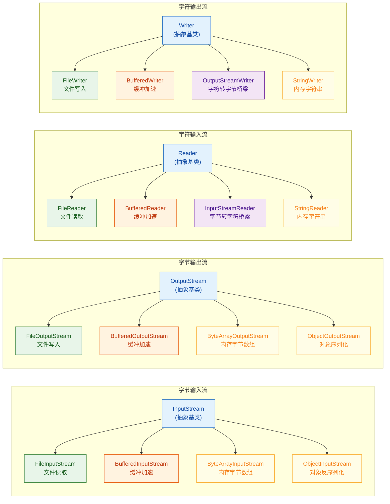

### 节点流 vs 处理流（装饰器模式）

除了按"字节/字符"和"输入/输出"分类之外，还有一个非常重要的分类维度：**节点流（Node Stream）** 和 **处理流（Processing Stream）**。

**节点流**（也叫低级流）直接连接到数据源或数据目的地，是真正干活的流。比如：

- `FileInputStream` / `FileOutputStream` —— 直接连接文件
- `ByteArrayInputStream` / `ByteArrayOutputStream` —— 直接连接内存中的字节数组
- `StringReader` / `StringWriter` —— 直接连接内存中的字符串

**处理流**（也叫高级流、包装流）不直接连接数据源，而是**包裹在另一个流的外面**，对数据进行加工处理。比如：

- `BufferedInputStream` —— 给字节输入流加上缓冲功能
- `BufferedReader` —— 给字符输入流加上缓冲功能，还提供 `readLine()`
- `InputStreamReader` —— 把字节流转换成字符流（编码桥梁）
- `ObjectInputStream` —— 把字节流中的数据反序列化为 Java 对象

这种"流包流"的设计，正是经典的**装饰器模式（Decorator Pattern）**。它的好处是可以像搭积木一样自由组合功能，而不需要为每种组合都写一个新类。来看一个典型的组合：

```java
// 一层一层地"套娃"：
// 最内层：FileInputStream 负责从文件读取原始字节
// 中间层：InputStreamReader 负责将字节按 UTF-8 编码解码为字符
// 最外层：BufferedReader 负责提供缓冲和 readLine() 便利方法
BufferedReader reader = new BufferedReader(          // 第三层：缓冲 + readLine
    new InputStreamReader(                           // 第二层：字节 → 字符（指定编码）
        new FileInputStream("data.txt"),             // 第一层：从文件读字节
        "UTF-8"                                      // 指定字符编码
    )
);
```

用 ASCII 图来表示这个包装关系：

```java
// ┌─────────────────────────────────────────────────┐
// │            BufferedReader (处理流)                │
// │  功能: 缓冲 + readLine()                         │
// │  ┌─────────────────────────────────────────┐    │
// │  │      InputStreamReader (处理流/桥梁)      │    │
// │  │  功能: byte → char (UTF-8 解码)          │    │
// │  │  ┌─────────────────────────────────┐    │    │
// │  │  │   FileInputStream (节点流)       │    │    │
// │  │  │   功能: 从磁盘文件读取原始字节     │    │    │
// │  │  │   数据源: data.txt               │    │    │
// │  │  └─────────────────────────────────┘    │    │
// │  └─────────────────────────────────────────┘    │
// └─────────────────────────────────────────────────┘
//
// 数据流向: 磁盘文件 ──bytes──▶ FileInputStream
//                     ──bytes──▶ InputStreamReader (解码)
//                     ──chars──▶ BufferedReader (缓冲)
//                     ──String──▶ 你的程序
```

### 字节流 vs 字符流：如何选择

这是实际开发中最常遇到的决策点。规则其实很简单：

**用字符流的场景**：处理纯文本数据——`.txt`、`.csv`、`.json`、`.xml`、`.html`、`.java` 源代码等。字符流会自动处理编码转换，避免乱码问题，还提供了 `readLine()`、`write(String)` 等便利方法。

**用字节流的场景**：处理二进制数据——图片（`.png`、`.jpg`）、音频（`.mp3`）、视频（`.mp4`）、压缩包（`.zip`）、可执行文件（`.exe`）等。这些数据没有"字符"的概念，用字符流处理反而会因为编码转换而损坏数据。

**拿不准的时候**：用字节流。字节流是万能的，它可以处理任何数据（包括文本），只是处理文本时需要你自己操心编码问题。字符流是字节流的"特化版"，专门为文本场景做了优化。

下面用一段代码来直观感受两者的区别：

```java
import java.io.*;

public class StreamComparison {
    public static void main(String[] args) throws IOException {
        String text = "你好Java";  // 包含中文的文本

        // ========== 字节流写入 ==========
        // FileOutputStream 逐字节写入，需要手动将字符串转为字节数组
        // 必须显式指定编码，否则依赖平台默认编码（不可靠）
        try (FileOutputStream fos = new FileOutputStream("byte_out.txt")) {
            byte[] bytes = text.getBytes("UTF-8");  // 手动编码：字符串 → UTF-8 字节数组
            fos.write(bytes);                        // 写出原始字节
            // "你" 在 UTF-8 中占 3 字节，"好" 占 3 字节
            // "J","a","v","a" 各占 1 字节
            // 总共写出 3 + 3 + 4 = 10 个字节
        }

        // ========== 字符流写入 ==========
        // FileWriter 直接写字符串，编码转换在内部自动完成
        // Java 11+ 可以在构造器中指定 Charset
        try (FileWriter fw = new FileWriter("char_out.txt")) {
            fw.write(text);  // 直接写字符串，无需手动转换
            // 内部自动按平台默认编码将字符转为字节写入文件
        }

        // ========== 字节流读取 ==========
        try (FileInputStream fis = new FileInputStream("byte_out.txt")) {
            byte[] buffer = new byte[1024];          // 准备一个字节缓冲区
            int bytesRead = fis.read(buffer);        // 读取字节到缓冲区
            // 手动解码：字节数组 → 字符串，必须指定与写入时相同的编码
            String result = new String(buffer, 0, bytesRead, "UTF-8");
            System.out.println("字节流读取: " + result);  // 输出: 你好Java
        }

        // ========== 字符流读取 ==========
        try (FileReader fr = new FileReader("char_out.txt")) {
            char[] buffer = new char[1024];          // 准备一个字符缓冲区
            int charsRead = fr.read(buffer);         // 读取字符到缓冲区
            String result = new String(buffer, 0, charsRead);  // 字符数组直接构造字符串
            System.out.println("字符流读取: " + result);  // 输出: 你好Java
        }
    }
}
```

### 流的生命周期与资源管理

每个流在使用完毕后都**必须关闭**，否则会导致资源泄漏（文件句柄、网络连接等系统资源不会被释放）。Java 7 引入的 try-with-resources 语法是目前最推荐的做法：

```java
// ✅ 推荐写法：try-with-resources（Java 7+）
// 实现了 AutoCloseable 接口的资源会在 try 块结束后自动关闭
// 即使发生异常也能保证资源被正确释放
try (
    FileInputStream fis = new FileInputStream("input.txt");    // 资源1
    FileOutputStream fos = new FileOutputStream("output.txt")  // 资源2
) {
    // 使用流进行读写操作
    byte[] buffer = new byte[1024];
    int len;
    while ((len = fis.read(buffer)) != -1) {  // 循环读取直到流末尾
        fos.write(buffer, 0, len);             // 将读到的数据写出
    }
}  // 自动调用 fos.close() 和 fis.close()，关闭顺序与声明顺序相反

// ❌ 不推荐的老写法：手动 try-finally
// 代码冗长，且多个 close() 的异常处理容易写错
FileInputStream fis = null;
try {
    fis = new FileInputStream("input.txt");
    // ... 使用流
} finally {
    if (fis != null) {
        try {
            fis.close();  // 手动关闭，还要处理 close 本身可能抛出的异常
        } catch (IOException e) {
            e.printStackTrace();
        }
    }
}
```

关闭流时有一个重要的细节：**关闭最外层的处理流即可，它会自动关闭内部包裹的流**。比如你创建了 `BufferedReader(InputStreamReader(FileInputStream))`，只需要关闭 `BufferedReader`，它会依次关闭 `InputStreamReader` 和 `FileInputStream`。

### 标准流：System.in / System.out / System.err

Java 程序启动时，JVM 会自动创建三个流对象，挂在 `System` 类上：

```java
// 这三个是 System 类中的静态字段
public static final InputStream in;   // 标准输入流（默认关联键盘）
public static final PrintStream out;  // 标准输出流（默认关联控制台）
public static final PrintStream err;  // 标准错误流（默认关联控制台，但可独立重定向）
```

`System.in` 是一个 `InputStream`（字节流），这就是为什么我们经常用 `Scanner` 或 `BufferedReader` 来包装它：

```java
// Scanner 内部包装了 System.in，提供了类型解析的便利方法
Scanner scanner = new Scanner(System.in);

// 或者用 BufferedReader 包装，经过 InputStreamReader 桥梁转换
BufferedReader br = new BufferedReader(
    new InputStreamReader(System.in, "UTF-8")  // 字节流 → 字符流
);
String line = br.readLine();  // 读取一行用户输入
```

`System.out` 和 `System.err` 都是 `PrintStream`（字节流的子类），但 `PrintStream` 内部做了特殊处理，可以直接输出字符串而不会乱码。`System.err` 通常用于输出错误信息，在某些 IDE 中会以红色显示。

---

**📝 练习题**

以下关于 Java I/O 流的说法，正确的是？

A. `FileReader` 是字节流，因为文件最终都是以字节形式存储的


B. `InputStream` 的 `read()` 方法返回 `byte` 类型，范围是 -128 到 127


C. 字符流只能处理文本文件，字节流可以处理任何类型的文件


D. 关闭 `BufferedReader` 后，还需要手动关闭它内部包裹的 `InputStreamReader` 和 `FileInputStream`


**【答案】** C

**【解析】** 逐项分析：

- A 错误：`FileReader` 继承自 `Reader`，是字符流，不是字节流。虽然文件底层确实是字节存储，但 `FileReader` 在读取时会自动进行字节到字符的解码转换。
- B 错误：`InputStream.read()` 返回的是 `int` 类型，范围是 0~255（读到数据时）或 -1（到达流末尾时）。之所以用 `int` 而不是 `byte`，正是为了能用 -1 表示流结束，同时避免与有效字节值 `0xFF` 混淆。
- C 正确：字符流（`Reader`/`Writer`）专为文本设计，内部涉及字符编码转换，用它处理二进制文件（如图片）会导致数据损坏。字节流（`InputStream`/`OutputStream`）以原始字节为单位操作，可以处理任何类型的文件。
- D 错误：处理流（装饰流）在关闭时会自动调用其内部流的 `close()` 方法，形成链式关闭。因此只需关闭最外层的 `BufferedReader`，无需手动逐层关闭。

---

## InputStream / OutputStream —— Java 字节流的基石

Java 中一切 I/O 的起点，就是 `java.io` 包里的两棵抽象类大树：`InputStream`（字节输入流）和 `OutputStream`（字节输出流）。它们定义了"逐字节读写"的最底层契约，所有具体的字节流实现——文件流、网络流、内存流——都从这里派生。理解它们，就等于拿到了整个传统 I/O 体系的钥匙。

在正式展开之前，先用一张全景图把两棵继承树的核心成员和它们的定位看清楚：

```mermaid
graph LR
    subgraph InputSide["InputStream 家族"]
        direction TB
        IS["InputStream\n(抽象基类)"]
        FIS["FileInputStream\n文件读取"]
        BAIS["ByteArrayInputStream\n内存字节数组"]
        BIS["BufferedInputStream\n带缓冲区"]
        DIS["DataInputStream\n读基本类型"]
        OIS["ObjectInputStream\n反序列化"]
        IS --> FIS
        IS --> BAIS
        IS --> BIS
        IS --> DIS
        IS --> OIS
    end

    subgraph OutputSide["OutputStream 家族"]
        direction TB
        OS["OutputStream\n(抽象基类)"]
        FOS["FileOutputStream\n文件写入"]
        BAOS["ByteArrayOutputStream\n内存字节数组"]
        BOS["BufferedOutputStream\n带缓冲区"]
        DOS["DataOutputStream\n写基本类型"]
        OOS["ObjectOutputStream\n序列化"]
        OS --> FOS
        OS --> BAOS
        OS --> BOS
        OS --> DOS
        OS --> OOS
    end

    InputSide --> OutputSide

    classDef absClass fill:#E3F2FD,stroke:#1565C0,color:#0D47A1
    classDef fileClass fill:#E8F5E9,stroke:#2E7D32,color:#1B5E20
    classDef memClass fill:#FFF3E0,stroke:#E65100,color:#BF360C
    classDef wrapClass fill:#F3E5F5,stroke:#6A1B9A,color:#4A148C

    class IS,OS absClass
    class FIS,FOS fileClass
    class BAIS,BAOS memClass
    class BIS,BOS,DIS,DOS,OIS,OOS wrapClass
```

绿色是直接操作文件的节点流（Node Stream），橙色是操作内存的节点流，紫色则是包装在其他流之上的处理流（Wrapper / Filter Stream）。这个"节点流 vs 处理流"的分层思想贯穿整个 Java I/O 设计，本质上就是经典的 Decorator Pattern。

---

### InputStream 详解

`InputStream` 是所有字节输入流的抽象父类。它只定义了少量方法，但每一个都值得细看。

#### 核心 API 一览

| 方法签名 | 作用 | 关键细节 |
|---|---|---|
| `int read()` | 读取单个字节，返回 0-255 | 到达末尾返回 **-1**，这是判断 EOF 的唯一标志 |
| `int read(byte[] b)` | 尽量填满数组 b | 返回实际读取的字节数，不保证一次读满 |
| `int read(byte[] b, int off, int len)` | 从 off 开始写入 b，最多读 len 字节 | 同上，返回实际读取数 |
| `long skip(long n)` | 跳过 n 个字节 | 返回实际跳过数，可能小于 n |
| `int available()` | 返回当前可无阻塞读取的字节估计值 | 不代表流的总长度，网络流中尤其不可靠 |
| `void close()` | 释放底层资源 | 必须调用，推荐 try-with-resources |
| `void mark(int readlimit)` / `void reset()` | 标记位置 / 回退到标记 | 需 `markSupported()` 返回 true 才可用 |

其中最核心的是那个无参的 `read()` 方法——它是唯一的抽象方法，子类必须实现。其他重载版本的 `read` 在 `InputStream` 内部其实是循环调用 `read()` 来完成的。

#### read() 的返回值为什么是 int 而不是 byte？

这是初学者最常见的疑问。Java 的 `byte` 是有符号类型，范围 -128 ~ 127。而一个字节的原始数据范围是 0x00 ~ 0xFF（0 ~ 255）。如果用 `byte` 返回，就没有额外的值来表示"流结束"了。所以 JDK 选择用 `int` 返回：

- 正常数据：0 ~ 255（低 8 位有效）
- 流结束：-1

这个设计让 EOF 判断变得干净利落。

#### FileInputStream —— 最常用的字节输入流

`FileInputStream` 直接绑定一个磁盘文件，逐字节（或逐块）读取文件内容。

```java
// === 示例 1：逐字节读取文件 ===
import java.io.FileInputStream;
import java.io.IOException;

public class SingleByteRead {
    public static void main(String[] args) {
        // try-with-resources 自动关闭流，无需手动 close
        try (FileInputStream fis = new FileInputStream("demo.txt")) {
            int data; // 用 int 接收，因为需要判断 -1
            // read() 每次返回一个字节(0~255)，到末尾返回 -1
            while ((data = fis.read()) != -1) {
                // 将 int 强转为 char 输出（仅适用于 ASCII / 单字节编码）
                System.out.print((char) data);
            }
        } catch (IOException e) {
            // IO 操作必须处理受检异常
            e.printStackTrace();
        }
    }
}
```

逐字节读取简单直观，但性能极差——每调用一次 `read()` 就可能触发一次操作系统级别的磁盘 I/O（system call）。对于任何超过几 KB 的文件，都应该使用批量读取。

```java
// === 示例 2：批量读取（推荐方式） ===
import java.io.FileInputStream;
import java.io.IOException;

public class BufferRead {
    public static void main(String[] args) {
        // 分配 1024 字节的缓冲区（buffer）
        byte[] buffer = new byte[1024];
        int bytesRead; // 记录每次实际读到的字节数

        try (FileInputStream fis = new FileInputStream("demo.txt")) {
            // read(buffer) 尝试一次性读取 buffer.length 个字节
            // 返回值是实际读到的字节数，到末尾返回 -1
            while ((bytesRead = fis.read(buffer)) != -1) {
                // 只处理 buffer 中 0 ~ bytesRead-1 的有效数据
                // 不能直接 new String(buffer)，否则会包含上一轮的残留数据
                String chunk = new String(buffer, 0, bytesRead);
                System.out.print(chunk);
            }
        } catch (IOException e) {
            e.printStackTrace();
        }
    }
}
```

这里有一个极其常见的 bug：忽略 `bytesRead` 的返回值，直接把整个 `buffer` 转成字符串。当文件大小不是 1024 的整数倍时，最后一次读取只会填充 buffer 的前一部分，后面残留着上一轮的旧数据。所以 `new String(buffer, 0, bytesRead)` 中的第三个参数绝对不能省。

下面用一张图来直观展示批量读取的工作过程：

```
文件内容 (共 2500 字节):
┌──────────────────────────────────────────────────┐
│ ████████████████████████████████████████████████ │
└──────────────────────────────────────────────────┘

第 1 次 read(buffer):  bytesRead = 1024
buffer: [██████████████████████████] ← 全部有效

第 2 次 read(buffer):  bytesRead = 1024
buffer: [██████████████████████████] ← 全部有效

第 3 次 read(buffer):  bytesRead = 452    ← 不足 1024！
buffer: [██████████░░░░░░░░░░░░░░░] ← 只有前 452 字节有效
                   ↑
              bytesRead 边界，后面是脏数据

第 4 次 read(buffer):  bytesRead = -1     ← EOF，退出循环
```

#### ByteArrayInputStream —— 内存中的字节流

有时候数据并不在磁盘上，而是已经在内存的 `byte[]` 里了。`ByteArrayInputStream` 把一个字节数组包装成流的形式，让你可以用统一的 InputStream API 来读取它。这在单元测试和数据转换场景中非常实用。

```java
// === 示例 3：从内存字节数组读取 ===
import java.io.ByteArrayInputStream;
import java.io.IOException;

public class MemoryStreamDemo {
    public static void main(String[] args) throws IOException {
        // 源数据：一个普通的字节数组
        byte[] source = "Hello, InputStream!".getBytes();

        // 将字节数组包装为 InputStream
        // 之后的代码完全不关心数据来源是文件还是内存
        try (ByteArrayInputStream bais = new ByteArrayInputStream(source)) {
            byte[] buffer = new byte[8]; // 故意用小 buffer 演示多次读取
            int bytesRead;
            while ((bytesRead = bais.read(buffer)) != -1) {
                // 每次最多读 8 字节
                System.out.print(new String(buffer, 0, bytesRead));
            }
        }
        // 输出: Hello, InputStream!
    }
}
```

这体现了面向抽象编程的威力：方法签名只要声明接收 `InputStream`，调用方就可以自由传入 `FileInputStream`、`ByteArrayInputStream`、甚至网络 `Socket.getInputStream()`，代码无需任何修改。

#### mark() 与 reset() —— 流的"书签"机制

部分 InputStream 实现支持"标记-回退"功能。调用 `mark(readlimit)` 在当前位置打一个书签，之后读取若干字节，再调用 `reset()` 就能回到书签位置重新读。

```java
// === 示例 4：mark / reset 演示 ===
import java.io.ByteArrayInputStream;
import java.io.IOException;

public class MarkResetDemo {
    public static void main(String[] args) throws IOException {
        byte[] data = {65, 66, 67, 68, 69}; // A B C D E
        try (ByteArrayInputStream bais = new ByteArrayInputStream(data)) {
            // 先检查是否支持 mark/reset
            System.out.println("markSupported: " + bais.markSupported()); // true

            System.out.print((char) bais.read()); // 读出 A，指针移到 B
            bais.mark(10); // 在 B 的位置打书签，readlimit=10 表示最多向前读 10 字节后书签仍有效
            System.out.print((char) bais.read()); // 读出 B
            System.out.print((char) bais.read()); // 读出 C

            bais.reset(); // 回到书签位置（B）
            System.out.print((char) bais.read()); // 再次读出 B
            System.out.print((char) bais.read()); // 再次读出 C
        }
        // 输出: ABCBC
    }
}
```

注意：`FileInputStream` 不支持 mark/reset（`markSupported()` 返回 false）。如果需要对文件流使用这个功能，需要用 `BufferedInputStream` 包装它。

---

### OutputStream 详解

`OutputStream` 是所有字节输出流的抽象父类，与 `InputStream` 对称。

#### 核心 API 一览

| 方法签名 | 作用 | 关键细节 |
|---|---|---|
| `void write(int b)` | 写入单个字节（取 int 的低 8 位） | 抽象方法，子类必须实现 |
| `void write(byte[] b)` | 写入整个字节数组 | 内部循环调用 `write(int)` |
| `void write(byte[] b, int off, int len)` | 写入数组的指定片段 | 最常用的重载 |
| `void flush()` | 强制将缓冲区数据刷出到目标 | 对无缓冲流（如 FileOutputStream）通常是空操作 |
| `void close()` | 关闭流并释放资源 | 会先自动调用 flush() |

`flush()` 的存在是因为很多输出流内部有缓冲区（比如 `BufferedOutputStream`），数据先写入缓冲区，攒够一定量才真正写出。如果你需要确保数据立即到达目的地（比如网络通信中发送一条消息），就必须手动 `flush()`。

#### FileOutputStream —— 写文件的主力

```java
// === 示例 5：写入文件（覆盖模式 vs 追加模式） ===
import java.io.FileOutputStream;
import java.io.IOException;

public class FileOutputDemo {
    public static void main(String[] args) {
        // --- 覆盖模式（默认）：文件已存在则清空 ---
        try (FileOutputStream fos = new FileOutputStream("output.txt")) {
            String text = "第一行内容\n";
            // getBytes() 使用平台默认编码将字符串转为字节数组
            byte[] bytes = text.getBytes();
            // 将字节数组写入文件
            fos.write(bytes);
        } catch (IOException e) {
            e.printStackTrace();
        }

        // --- 追加模式：第二个参数传 true ---
        try (FileOutputStream fos = new FileOutputStream("output.txt", true)) {
            String text = "追加的第二行\n";
            fos.write(text.getBytes());
            // flush() 确保数据从 JVM 缓冲区刷到操作系统
            // 对 FileOutputStream 来说不是必须的，但养成好习惯
            fos.flush();
        } catch (IOException e) {
            e.printStackTrace();
        }
    }
}
```

构造函数的第二个参数 `append` 是一个容易被忽略的细节。默认 `false` 意味着每次打开文件都会清空原有内容，这在日志场景下会导致数据丢失。

#### 文件复制 —— InputStream 与 OutputStream 的经典协作

文件复制是字节流最典型的应用场景，也是理解"读-写循环"模式的最佳案例：

```java
// === 示例 6：字节流文件复制 ===
import java.io.FileInputStream;
import java.io.FileOutputStream;
import java.io.IOException;

public class FileCopy {
    public static void main(String[] args) {
        // 源文件和目标文件路径
        String src = "source.jpg";  // 字节流可以处理任意文件类型（图片、视频等）
        String dest = "copy.jpg";

        // 同时打开输入流和输出流
        try (FileInputStream fis = new FileInputStream(src);
             FileOutputStream fos = new FileOutputStream(dest)) {

            byte[] buffer = new byte[4096]; // 4KB 缓冲区，兼顾性能和内存
            int bytesRead;

            // 核心循环：从源读 → 往目标写
            while ((bytesRead = fis.read(buffer)) != -1) {
                // 注意：必须用三参数版本的 write
                // 只写入 buffer 中 0 ~ bytesRead 的有效数据
                fos.write(buffer, 0, bytesRead);
            }

            // try 块结束时自动 close，close 内部会先 flush
            System.out.println("文件复制完成");

        } catch (IOException e) {
            e.printStackTrace();
        }
    }
}
```

这段代码有几个要点值得强调：

1. 字节流是"万能"的——它不关心文件内容是文本还是二进制（图片、音频、压缩包），因为它只搬运原始字节，不做任何编码解码。
2. `fos.write(buffer, 0, bytesRead)` 而不是 `fos.write(buffer)`——和读取时一样，最后一块数据通常不满一个 buffer，必须精确控制写入长度。
3. 缓冲区大小的选择：常见值是 4096（4KB）或 8192（8KB），与操作系统的磁盘页大小对齐，能获得较好的 I/O 性能。太小则系统调用次数过多，太大则浪费内存且收益递减。

#### ByteArrayOutputStream —— 在内存中收集输出

与 `ByteArrayInputStream` 对称，`ByteArrayOutputStream` 把写入的数据收集到一个内部的 `byte[]` 中，最后可以一次性取出。

```java
// === 示例 7：在内存中拼接字节数据 ===
import java.io.ByteArrayOutputStream;
import java.io.IOException;

public class CollectBytesDemo {
    public static void main(String[] args) throws IOException {
        try (ByteArrayOutputStream baos = new ByteArrayOutputStream()) {
            // 多次写入，数据在内存中累积
            baos.write("Hello ".getBytes());
            baos.write("World".getBytes());
            baos.write('!'); // 写入单个字节（ASCII 33）

            // toByteArray() 获取内部累积的全部字节
            byte[] result = baos.toByteArray();
            System.out.println(new String(result)); // Hello World!

            // toString() 也可以直接转字符串（使用平台默认编码）
            System.out.println(baos.toString());
        }
    }
}
```

这个类在网络编程中特别常见——当你不知道要接收多少数据时，先用 `ByteArrayOutputStream` 收集，最后统一处理。

---

### 装饰器模式（Decorator Pattern）在流中的体现

Java I/O 的设计哲学是"组合优于继承"。与其为每种功能组合创建一个子类（比如 `BufferedFileInputStream`、`BufferedByteArrayInputStream`……），不如提供可以层层包装的处理流。

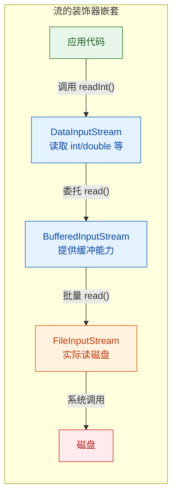

```java
// === 示例 8：装饰器模式实战 —— 层层包装 ===
import java.io.*;

public class DecoratorDemo {
    public static void main(String[] args) {
        try (
            // 第 1 层：节点流，绑定文件
            FileInputStream fis = new FileInputStream("data.bin");
            // 第 2 层：加缓冲，减少磁盘 I/O 次数
            BufferedInputStream bis = new BufferedInputStream(fis, 8192);
            // 第 3 层：加数据类型读取能力
            DataInputStream dis = new DataInputStream(bis)
        ) {
            // 现在可以直接读取 Java 基本类型
            int number = dis.readInt();       // 读 4 字节，组装成 int
            double value = dis.readDouble();  // 读 8 字节，组装成 double
            String text = dis.readUTF();      // 读 modified UTF-8 字符串

            System.out.println(number + ", " + value + ", " + text);
        } catch (IOException e) {
            e.printStackTrace();
        }
    }
}
```

这种"套娃"式的写法初看可能觉得繁琐，但它带来了极大的灵活性——任何节点流都可以被任何处理流包装，功能自由组合，互不耦合。

---

### 资源管理：从 try-finally 到 try-with-resources

流对象持有操作系统资源（文件句柄、Socket 等），如果不关闭就会造成资源泄漏。Java 7 之前需要手动在 `finally` 块中关闭，写起来又臭又长：

```java
// === 反面教材：Java 7 之前的写法 ===
FileInputStream fis = null;
try {
    fis = new FileInputStream("demo.txt");
    // ... 读取操作 ...
} catch (IOException e) {
    e.printStackTrace();
} finally {
    // 必须在 finally 中关闭，确保异常时也能释放资源
    if (fis != null) {
        try {
            fis.close(); // close 本身也可能抛异常！
        } catch (IOException e) {
            e.printStackTrace(); // 吞掉异常，或者用 addSuppressed
        }
    }
}
```

Java 7 引入的 try-with-resources 彻底解决了这个问题。任何实现了 `AutoCloseable` 接口的对象都可以放在 `try()` 的括号里，JVM 保证在 try 块结束时自动调用 `close()`，即使发生异常也不会遗漏：

```java
// === 推荐写法：try-with-resources ===
try (FileInputStream fis = new FileInputStream("demo.txt")) {
    // 读取操作...
    // 无论正常结束还是抛异常，fis.close() 都会被自动调用
} catch (IOException e) {
    e.printStackTrace();
}
// 简洁、安全、不会泄漏资源
```

如果 try 块和 close() 同时抛出异常，try 块的异常会作为主异常抛出，close() 的异常会被附加为 suppressed exception，可以通过 `Throwable.getSuppressed()` 获取。这比手动 try-finally 的异常处理优雅得多。

---

### 常见陷阱与最佳实践

| 陷阱 | 说明 | 正确做法 |
|---|---|---|
| 用 `byte` 接收 `read()` 返回值 | 0xFF 会被解释为 -1，误判为 EOF | 始终用 `int` 接收 |
| `new String(buffer)` 不限定长度 | 最后一块数据后面有脏数据 | `new String(buffer, 0, bytesRead)` |
| 忘记关闭流 | 文件句柄泄漏，严重时导致 "Too many open files" | 使用 try-with-resources |
| 用字节流读写文本 | 多字节编码（如 UTF-8 中文）可能被截断 | 文本用 Reader/Writer，或配合转换流 |
| `available()` 当作文件大小 | 网络流中该值不可靠 | 只用于估算，不用于分配精确 buffer |

---

### Java 9+ 新增的实用方法

Java 9 给 `InputStream` 加了几个非常实用的默认方法，大幅简化了日常操作：

```java
// === 示例 9：Java 9+ 的便捷 API ===
import java.io.*;

public class Java9StreamDemo {
    public static void main(String[] args) throws IOException {
        // readAllBytes()：一次性读取全部内容到 byte[]
        // 适合小文件，大文件会 OOM
        try (InputStream is = new FileInputStream("small.txt")) {
            byte[] all = is.readAllBytes(); // Java 9+
            System.out.println(new String(all));
        }

        // transferTo()：直接把输入流的内容全部写入输出流
        // 替代了手写的 while-read-write 循环
        try (InputStream in = new FileInputStream("source.dat");
             OutputStream out = new FileOutputStream("target.dat")) {
            long bytes = in.transferTo(out); // Java 9+
            System.out.println("传输了 " + bytes + " 字节");
        }

        // readNBytes(int len)：精确读取 len 个字节
        // 与 read(byte[]) 不同，它会反复读直到凑够 len 或到达 EOF
        try (InputStream is = new FileInputStream("data.bin")) {
            byte[] header = is.readNBytes(16); // 精确读取文件头 16 字节
            // header.length <= 16，如果文件不足 16 字节则返回实际长度
        }
    }
}
```

`transferTo()` 尤其值得关注——以前手写的"读-写循环"现在一行搞定，而且 JDK 内部实现会根据流的类型选择最优策略（比如利用操作系统的 zero-copy）。

---

**📝 练习题**

以下代码尝试复制一个文件，但存在一个 bug，请找出问题所在：

```java
try (FileInputStream fis = new FileInputStream("photo.png");
     FileOutputStream fos = new FileOutputStream("photo_copy.png")) {
    byte[] buffer = new byte[2048];
    while (fis.read(buffer) != -1) {
        fos.write(buffer);
    }
}
```

A. `FileOutputStream` 没有调用 `flush()`，数据可能丢失

B. `buffer` 大小不是 4096 的倍数，会导致读取错误

C. `fos.write(buffer)` 没有限定写入长度，最后一块数据可能写入多余的脏字节

D. try-with-resources 不能同时管理两个流，需要嵌套两层 try


**【答案】** C

**【解析】** `fis.read(buffer)` 的返回值（实际读取的字节数）被丢弃了，而 `fos.write(buffer)` 会把整个 2048 字节的数组全部写出。当文件大小不是 2048 的整数倍时，最后一次 `read` 只填充了 buffer 的前一部分，后面残留着上一轮的旧数据，这些脏数据也会被写入目标文件，导致复制出的文件比原文件大。正确写法是保存返回值 `int n = fis.read(buffer)`，然后用 `fos.write(buffer, 0, n)`。选项 A 不影响正确性，因为 `close()` 内部会自动 `flush()`；选项 B 纯属无稽之谈，buffer 大小没有对齐要求；选项 D 也是错误的，try-with-resources 完全支持在括号中声明多个资源，用分号分隔即可。

---

## Reader / Writer —— Java 字符流体系

### 为什么需要字符流？

在前面学习 `InputStream` / `OutputStream` 时，我们操作的最小单位是 **字节 (byte)**。这在处理图片、音频等二进制文件时没有问题，但一旦涉及 **文本**，字节流就显得力不从心了。

核心痛点在于：一个字符并不总是等于一个字节。在 UTF-8 编码下，一个中文字符占 3 个字节；在 GBK 下占 2 个字节；而 ASCII 字符只占 1 个字节。如果你用字节流逐字节读取一个中文文本文件，很容易把一个完整的字符"劈"成两半，导致乱码 (Mojibake)。

Java 的设计者为此专门提供了一套以 **字符 (char, 2 bytes, Unicode)** 为最小操作单位的流体系，这就是 `Reader` 和 `Writer`。它们在内部自动完成 **字节 ↔ 字符** 的编解码工作，让开发者可以安心地以"人类可读的字符"为单位进行 I/O 操作。

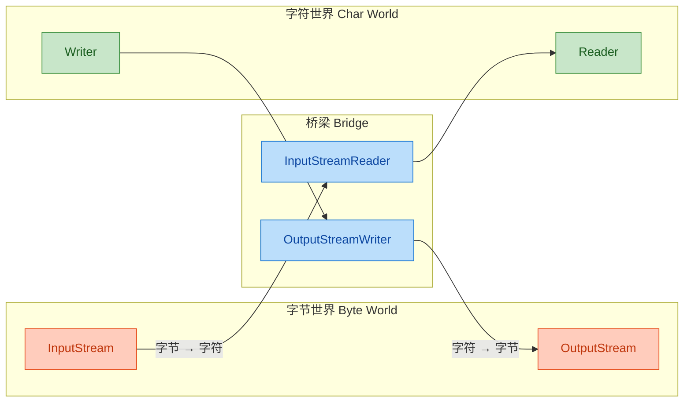

上图清晰地展示了字节流与字符流之间的关系：`Reader` / `Writer` 并不是凭空产生的，它们底层仍然依赖字节流，只是通过 **转换流 (Bridge Stream)** 在中间做了一层编解码转换。

---

### Reader 抽象类详解

`java.io.Reader` 是所有字符输入流的抽象基类，地位等同于字节流中的 `InputStream`。它定义了字符读取的核心契约。

#### Reader 的核心方法

```java
// ===== java.io.Reader 核心 API =====

// 读取单个字符，返回值为 int（0~65535），到达末尾返回 -1
public int read() throws IOException

// 将字符读入数组 cbuf，返回实际读取的字符数，到达末尾返回 -1
public int read(char[] cbuf) throws IOException

// 将字符读入数组 cbuf 的指定区间 [off, off+len)，这是唯一的抽象方法
public abstract int read(char[] cbuf, int off, int len) throws IOException

// 跳过 n 个字符
public long skip(long n) throws IOException

// 判断流是否准备好被读取（不会阻塞）
public boolean ready() throws IOException

// 关闭流并释放资源
public abstract void close() throws IOException
```

注意 `read()` 返回的是 `int` 而不是 `char`。这与 `InputStream.read()` 的设计思路一致——需要用 `-1` 来表示流结束 (End of Stream)，而 `char` 的值域 `0~65535` 无法腾出一个特殊值来表示这个语义。

#### Reader 家族继承体系

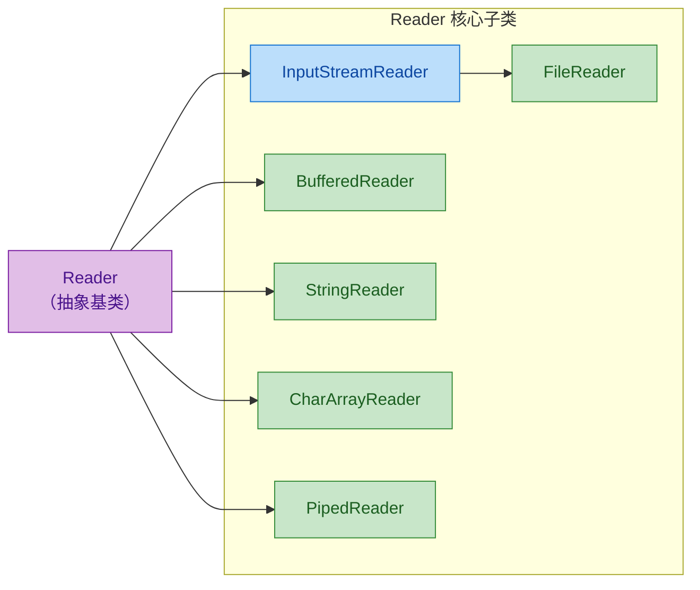

各子类的职责分工：

- `InputStreamReader`：字节流到字符流的桥梁，可指定字符编码（Charset）。
- `FileReader`：`InputStreamReader` 的便捷子类，直接从文件读取字符，使用平台默认编码。
- `BufferedReader`：为 Reader 添加缓冲能力，并提供极其实用的 `readLine()` 方法。
- `StringReader`：从一个 `String` 对象中读取字符，常用于测试和模板解析。
- `CharArrayReader`：从 `char[]` 数组中读取字符。
- `PipedReader`：与 `PipedWriter` 配对，用于线程间字符通信。

---

### FileReader 基础使用

`FileReader` 是日常开发中最常用的字符输入流之一。它继承自 `InputStreamReader`，本质上是对 `new InputStreamReader(new FileInputStream(file))` 的简写。

```java
// ===== 使用 FileReader 逐字符读取文本文件 =====
import java.io.FileReader;
import java.io.IOException;

public class FileReaderDemo {
    public static void main(String[] args) {
        // try-with-resources 自动关闭流
        try (FileReader reader = new FileReader("hello.txt")) {
            int ch; // 用 int 接收，因为需要判断 -1
            // read() 每次读取一个字符，到达文件末尾时返回 -1
            while ((ch = reader.read()) != -1) {
                // 将 int 强转为 char 以打印可读字符
                System.out.print((char) ch);
            }
        } catch (IOException e) {
            // 处理文件不存在、权限不足等异常
            e.printStackTrace();
        }
    }
}
```

逐字符读取效率较低，更推荐使用 **字符数组批量读取**：

```java
// ===== 使用 char[] 缓冲区批量读取 =====
import java.io.FileReader;
import java.io.IOException;

public class FileReaderBatchDemo {
    public static void main(String[] args) {
        try (FileReader reader = new FileReader("hello.txt")) {
            // 创建一个 1024 字符的缓冲区
            char[] buffer = new char[1024];
            int len; // 记录每次实际读取的字符数
            // read(buffer) 将字符填入数组，返回实际读取数量
            while ((len = reader.read(buffer)) != -1) {
                // 只取 buffer 中 [0, len) 范围的有效字符
                String chunk = new String(buffer, 0, len);
                System.out.print(chunk);
            }
        } catch (IOException e) {
            e.printStackTrace();
        }
    }
}
```

这里有一个常见的新手陷阱：如果你写成 `new String(buffer)` 而不是 `new String(buffer, 0, len)`，在最后一次读取时，缓冲区可能没有被完全填满，尾部残留着上一次读取的旧数据，导致输出多余的"脏字符"。

---

### Writer 抽象类详解

`java.io.Writer` 是所有字符输出流的抽象基类，与 `Reader` 对称。它定义了字符写出的核心契约。

#### Writer 的核心方法

```java
// ===== java.io.Writer 核心 API =====

// 写入单个字符（int 的低 16 位）
public void write(int c) throws IOException

// 写入整个字符数组
public void write(char[] cbuf) throws IOException

// 写入字符数组的指定区间 [off, off+len)，这是唯一的抽象方法
public abstract void write(char[] cbuf, int off, int len) throws IOException

// 直接写入一个字符串（Writer 独有的便利方法！）
public void write(String str) throws IOException

// 写入字符串的指定区间 [off, off+len)
public void write(String str, int off, int len) throws IOException

// 将缓冲区中的数据强制刷出到目标设备
public abstract void flush() throws IOException

// 关闭流（关闭前会自动 flush）
public abstract void close() throws IOException
```

相比 `OutputStream`，`Writer` 多了一个非常实用的能力：**直接写入 String**。这在处理文本时极为方便，不需要手动调用 `str.getBytes()` 做转换。

#### Writer 家族继承体系

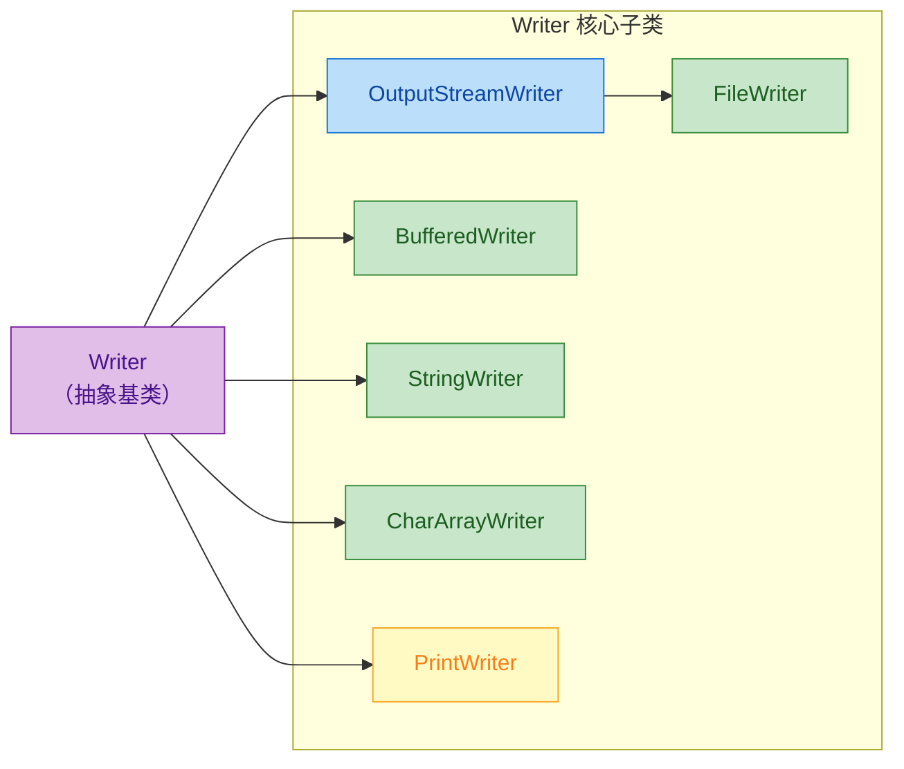

各子类的职责分工：

- `OutputStreamWriter`：字符流到字节流的桥梁，可指定字符编码。
- `FileWriter`：`OutputStreamWriter` 的便捷子类，直接向文件写入字符。
- `BufferedWriter`：为 Writer 添加缓冲能力，提供 `newLine()` 方法写入平台相关的换行符。
- `StringWriter`：将字符写入内部的 `StringBuffer`，最终可通过 `toString()` 获取结果。
- `CharArrayWriter`：将字符写入内部的 `char[]` 数组。
- `PrintWriter`：功能最强大的字符输出流，支持 `print()` / `println()` / `printf()` 等格式化输出，且 **默认不抛出 IOException**。

---

### FileWriter 基础使用

```java
// ===== 使用 FileWriter 写入文本文件 =====
import java.io.FileWriter;
import java.io.IOException;

public class FileWriterDemo {
    public static void main(String[] args) {
        // 第二个参数 true 表示追加模式（append），默认 false 会覆盖原文件
        try (FileWriter writer = new FileWriter("output.txt", true)) {
            // 直接写入字符串 —— 这是 Writer 相比 OutputStream 的优势
            writer.write("你好，Java 字符流！\n");
            // 写入单个字符
            writer.write('A');
            // 写入字符数组
            char[] data = {'H', 'e', 'l', 'l', 'o'};
            writer.write(data);
            // flush() 确保数据从内存缓冲区写入磁盘
            // try-with-resources 的 close() 会自动调用 flush()，这里显式调用只是演示
            writer.flush();
        } catch (IOException e) {
            e.printStackTrace();
        }
    }
}
```

关于 `flush()` 的时机：`Writer` 内部通常有一个缓冲区（即使不是 `BufferedWriter`，`OutputStreamWriter` 内部也有一个 `StreamEncoder` 缓冲区）。数据先写入缓冲区，只有在缓冲区满、调用 `flush()` 或 `close()` 时才真正写出。如果程序异常退出且没有正确关闭流，缓冲区中的数据就会丢失。这就是为什么 **try-with-resources 如此重要**。

---

### 字符流的完整文件拷贝

将 Reader 和 Writer 组合起来，可以实现文本文件的拷贝。这是一个经典的模式：

```java
// ===== 使用字符流拷贝文本文件 =====
import java.io.FileReader;
import java.io.FileWriter;
import java.io.IOException;

public class CharFileCopy {
    public static void main(String[] args) {
        // 同时打开输入流和输出流，用分号分隔
        try (FileReader reader = new FileReader("source.txt");
             FileWriter writer = new FileWriter("target.txt")) {

            char[] buffer = new char[1024]; // 1K 字符缓冲区
            int len; // 每次实际读取的字符数

            // 经典循环：读 → 写 → 读 → 写 ... 直到 -1
            while ((len = reader.read(buffer)) != -1) {
                // 只写入实际读取的字符数量，避免写入脏数据
                writer.write(buffer, 0, len);
            }
            // 循环结束，文件拷贝完成
            // close() 由 try-with-resources 自动调用
        } catch (IOException e) {
            e.printStackTrace();
        }
    }
}
```

需要特别注意：**字符流只适合拷贝文本文件**。如果你用字符流去拷贝一张 PNG 图片，Reader 会尝试将字节解码为字符，Writer 再将字符编码回字节，这个过程会破坏二进制数据，导致文件损坏。处理二进制文件，永远使用字节流。

---

### Reader vs InputStream / Writer vs OutputStream 对比

这是一个高频面试考点，我们用一张表来做系统对比：

```
┌──────────────────┬──────────────────────┬──────────────────────┐
│      维度         │    字节流 (Byte)      │    字符流 (Char)      │
├──────────────────┼──────────────────────┼──────────────────────┤
│  基类            │ InputStream          │ Reader               │
│                  │ OutputStream         │ Writer               │
├──────────────────┼──────────────────────┼──────────────────────┤
│  最小操作单位     │ byte (1 字节)         │ char (2 字节)         │
├──────────────────┼──────────────────────┼──────────────────────┤
│  核心读方法       │ read() → int (0~255) │ read() → int (0~65535)│
├──────────────────┼──────────────────────┼──────────────────────┤
│  缓冲区类型       │ byte[]               │ char[]               │
├──────────────────┼──────────────────────┼──────────────────────┤
│  能否直接写String │ ✗ 需 getBytes()      │ ✓ write(String)      │
├──────────────────┼──────────────────────┼──────────────────────┤
│  编码处理         │ 不处理，原样传输       │ 自动编解码             │
├──────────────────┼──────────────────────┼──────────────────────┤
│  适用场景         │ 所有文件（通用）       │ 纯文本文件             │
├──────────────────┼──────────────────────┼──────────────────────┤
│  典型实现         │ FileInputStream      │ FileReader           │
│                  │ FileOutputStream     │ FileWriter           │
│                  │ BufferedInputStream  │ BufferedReader       │
│                  │ BufferedOutputStream │ BufferedWriter       │
└──────────────────┴──────────────────────┴──────────────────────┘
```

一个简单的选择原则：**如果你处理的是人类可读的文本，用字符流；其他一切情况，用字节流。** 如果拿不准，字节流永远是安全的选择。

---

### PrintWriter —— 最实用的字符输出流

在实际开发中，`PrintWriter` 的使用频率远高于 `FileWriter` 和 `BufferedWriter`。它集成了缓冲、格式化输出、自动刷新等多种能力于一身。

```java
// ===== PrintWriter 的多种构造方式与使用 =====
import java.io.FileWriter;
import java.io.IOException;
import java.io.PrintWriter;

public class PrintWriterDemo {
    public static void main(String[] args) throws IOException {
        // 构造方式 1：直接传文件名
        // 构造方式 2：包装一个 Writer，第二个参数 true 开启 autoFlush
        PrintWriter pw = new PrintWriter(new FileWriter("log.txt", true), true);

        // print() —— 不换行
        pw.print("用户登录：");
        // println() —— 自动追加平台相关的换行符
        pw.println("admin");
        // printf() / format() —— C 风格格式化输出
        pw.printf("登录时间：%tF %tT%n", System.currentTimeMillis(), System.currentTimeMillis());
        // %tF → 日期 (2025-01-15)
        // %tT → 时间 (14:30:00)
        // %n  → 平台无关的换行符（比 \n 更安全）

        pw.close(); // 关闭流
    }
}
```

`PrintWriter` 有一个独特的设计哲学：**它的 print/println/printf 方法不会抛出 IOException**。异常被内部"吞掉"了，你可以通过 `checkError()` 方法来检查是否发生过错误。这个设计让代码更简洁，但也意味着你需要主动检查错误状态，否则可能会静默丢失数据。

---

### StringReader 与 StringWriter —— 内存中的字符流

这两个类不涉及任何文件或网络 I/O，它们将 `String` 当作数据源或数据目标。这在单元测试、模板引擎、XML/JSON 解析等场景中非常有用。

```java
// ===== StringReader：从字符串中读取字符 =====
import java.io.IOException;
import java.io.StringReader;

public class StringReaderDemo {
    public static void main(String[] args) throws IOException {
        // 将一个 String 包装成 Reader，无需文件
        String source = "Hello, 字符流!";
        StringReader reader = new StringReader(source);

        int ch;
        // 逐字符读取，与 FileReader 用法完全一致
        while ((ch = reader.read()) != -1) {
            System.out.print((char) ch + " ");
        }
        // 输出: H e l l o ,   字 符 流 !
        reader.close();
    }
}
```

```java
// ===== StringWriter：将字符写入内存中的 StringBuffer =====
import java.io.StringWriter;

public class StringWriterDemo {
    public static void main(String[] args) {
        StringWriter writer = new StringWriter();

        // 像普通 Writer 一样写入
        writer.write("SELECT * FROM users");
        writer.write(" WHERE id = ");
        writer.write(String.valueOf(42));

        // 通过 toString() 获取最终拼接的字符串
        String sql = writer.toString();
        System.out.println(sql);
        // 输出: SELECT * FROM users WHERE id = 42

        // StringWriter 的 close() 是空操作，不会抛异常
        // 但养成关闭的习惯是好的
        writer.close();
    }
}
```

`StringWriter` 内部使用 `StringBuffer`（线程安全），如果你需要在多线程环境下收集字符输出，它是一个不错的选择。

---

### 字符流的内部工作机制

理解字符流的底层原理，有助于排查编码相关的 bug。下面用一个 ASCII 模型图展示 `FileReader` 读取一个 UTF-8 文件时的完整数据流转过程：

```java
// FileReader 读取 UTF-8 文件的内部流转过程

// 磁盘文件 (UTF-8 编码)
// "你" 的 UTF-8 编码: E4 BD A0 (3 个字节)
//
// ┌─────────────────────────────────────────────────────────┐
// │                    磁盘 (Disk)                           │
// │   hello.txt: [E4] [BD] [A0] [48] [69]                  │
// │               ─────────────   ───  ───                  │
// │               "你" (3 bytes)  "H"  "i"                  │
// └──────────────────────┬──────────────────────────────────┘
//                        │ FileInputStream.read()
//                        ▼
// ┌─────────────────────────────────────────────────────────┐
// │              FileInputStream (字节流层)                   │
// │   读出原始字节: E4, BD, A0, 48, 69                       │
// └──────────────────────┬──────────────────────────────────┘
//                        │ StreamDecoder 解码 (UTF-8 → char)
//                        ▼
// ┌─────────────────────────────────────────────────────────┐
// │         InputStreamReader / FileReader (字符流层)         │
// │   解码后的字符: '你'(0x4F60), 'H'(0x48), 'i'(0x69)      │
// │                                                         │
// │   '你' 的 Unicode 码点: U+4F60                           │
// │   E4 BD A0 → 经 UTF-8 解码规则 → 0x4F60 → char '你'     │
// └──────────────────────┬──────────────────────────────────┘
//                        │ reader.read()
//                        ▼
// ┌─────────────────────────────────────────────────────────┐
// │                  你的 Java 程序                           │
// │   int ch = reader.read();  // ch = 0x4F60 = 20320      │
// │   char c = (char) ch;      // c = '你'                  │
// └─────────────────────────────────────────────────────────┘
```

关键角色是 `StreamDecoder`——它是 `InputStreamReader` 内部的解码引擎，负责根据指定的 Charset 将字节序列解码为 Java 的 `char`（UTF-16）。对应地，`OutputStreamWriter` 内部有一个 `StreamEncoder`，负责将 `char` 编码为目标字节序列。

---

### FileReader 的编码陷阱

`FileReader` 有一个臭名昭著的问题：**在 Java 11 之前，它不支持指定字符编码**，只能使用平台默认编码 (`Charset.defaultCharset()`)。

```java
// ===== Java 8 及之前：FileReader 无法指定编码 =====
// 在 Windows (GBK) 上读取 UTF-8 文件 → 乱码！
FileReader reader = new FileReader("utf8_file.txt"); // 使用平台默认编码 GBK

// ===== 正确做法：使用 InputStreamReader 显式指定编码 =====
import java.io.FileInputStream;
import java.io.InputStreamReader;
import java.nio.charset.StandardCharsets;

// 手动构建：FileInputStream → InputStreamReader(指定 UTF-8)
InputStreamReader reader = new InputStreamReader(
    new FileInputStream("utf8_file.txt"),
    StandardCharsets.UTF_8  // 显式指定编码，不依赖平台默认值
);
```

```java
// ===== Java 11+：FileReader 终于支持指定编码了 =====
import java.io.FileReader;
import java.nio.charset.StandardCharsets;

// 新增的构造方法，第二个参数为 Charset
FileReader reader = new FileReader("utf8_file.txt", StandardCharsets.UTF_8);
```

这是一个非常重要的实践建议：**永远不要依赖平台默认编码**。在开发机上跑得好好的代码，部署到 Linux 服务器上可能就乱码了，因为两个环境的默认编码不同。始终显式指定编码，`StandardCharsets.UTF_8` 是当今最安全的选择。

---

### 装饰器模式在字符流中的体现

和字节流一样，字符流体系也大量运用了 **装饰器模式 (Decorator Pattern)**。你可以像"套娃"一样，将多个流层层包装，每一层添加一种能力：

```java
// ===== 字符流的装饰器链 =====
import java.io.*;
import java.nio.charset.StandardCharsets;

public class DecoratorChainDemo {
    public static void main(String[] args) throws IOException {
        // 第 1 层：FileInputStream —— 从文件读取原始字节
        FileInputStream fis = new FileInputStream("data.txt");

        // 第 2 层：InputStreamReader —— 字节 → 字符，指定 UTF-8 编码
        InputStreamReader isr = new InputStreamReader(fis, StandardCharsets.UTF_8);

        // 第 3 层：BufferedReader —— 添加缓冲 + readLine() 能力
        BufferedReader br = new BufferedReader(isr);

        // 现在 br 同时具备：文件读取 + 编码转换 + 缓冲 三种能力
        String line;
        while ((line = br.readLine()) != null) {
            System.out.println(line);
        }

        br.close(); // 关闭最外层即可，会自动逐层关闭内部流
    }
}
```

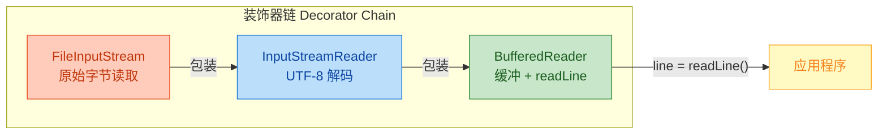

关闭流时只需关闭最外层的 `BufferedReader`，它的 `close()` 方法会自动调用内层 `InputStreamReader.close()`，后者又会调用 `FileInputStream.close()`，形成一个优雅的关闭链。

---

### 常见错误与最佳实践

#### 1. 用字符流处理二进制文件

```java
// ❌ 错误：用 FileReader 拷贝图片
FileReader reader = new FileReader("photo.jpg");   // 字节被解码为字符
FileWriter writer = new FileWriter("copy.jpg");    // 字符被重新编码为字节
// 解码 → 编码的过程会破坏原始字节序列，文件损坏！

// ✅ 正确：用字节流处理二进制文件
FileInputStream fis = new FileInputStream("photo.jpg");
FileOutputStream fos = new FileOutputStream("copy.jpg");
```

#### 2. 忘记 flush 导致数据丢失

```java
// ❌ 危险：没有 close 也没有 flush
FileWriter writer = new FileWriter("important.txt");
writer.write("关键数据");
// 程序崩溃或 System.exit() → 缓冲区中的数据永远丢失

// ✅ 安全：使用 try-with-resources
try (FileWriter writer = new FileWriter("important.txt")) {
    writer.write("关键数据");
} // close() 自动调用，内部会先 flush() 再释放资源
```

#### 3. FileReader 默认编码问题

```java
// ❌ 隐患：依赖平台默认编码，跨平台部署时可能乱码
FileReader reader = new FileReader("config.txt");

// ✅ 推荐：显式指定编码
// Java 11+ 写法
FileReader reader = new FileReader("config.txt", StandardCharsets.UTF_8);
// Java 8 兼容写法
InputStreamReader reader = new InputStreamReader(
    new FileInputStream("config.txt"), StandardCharsets.UTF_8
);
```

#### 4. readLine() 的换行符丢失

```java
// ⚠️ 注意：BufferedReader.readLine() 会吞掉换行符
BufferedReader br = new BufferedReader(new FileReader("poem.txt"));
String line;
StringBuilder sb = new StringBuilder();
while ((line = br.readLine()) != null) {
    // line 中不包含 \n 或 \r\n
    sb.append(line);
    // 如果需要保留换行，必须手动追加
    sb.append(System.lineSeparator());
}
```

---

### 字符流使用场景速查

根据不同的开发场景，选择合适的字符流组合：

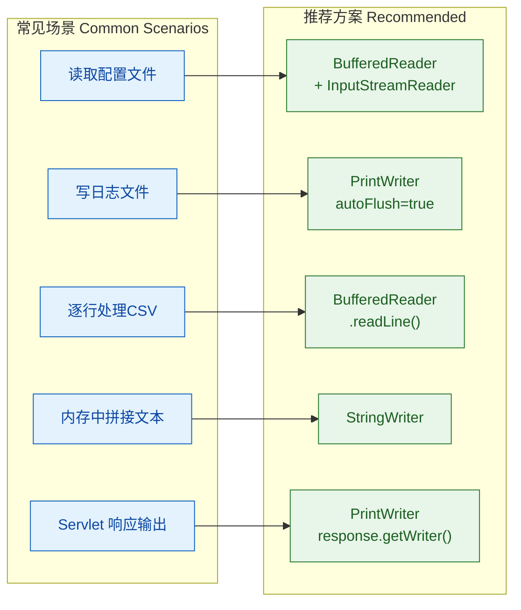

简单总结选型思路：

- 需要逐行读取 → `BufferedReader`
- 需要格式化输出 → `PrintWriter`
- 需要控制编码 → `InputStreamReader` / `OutputStreamWriter`
- 纯内存操作 → `StringReader` / `StringWriter`
- 简单文件读写且 Java 11+ → `FileReader` / `FileWriter`（指定 Charset）

---

**📝 练习题**

以下代码在 Windows（默认编码 GBK）环境下读取一个 UTF-8 编码的文本文件，文件内容为 `"你好"`，运行结果是什么？

```java
FileReader reader = new FileReader("hello.txt");
char[] buf = new char[10];
int len = reader.read(buf);
System.out.println(new String(buf, 0, len));
reader.close();
```

A. 正常输出 `你好`

B. 输出乱码（如 `浣犲ソ` 或 `锟斤拷`）

C. 抛出 `UnsupportedEncodingException`

D. 抛出 `MalformedInputException`


**【答案】** B

**【解析】** `FileReader` 在 Java 11 之前不支持指定编码，会使用平台默认编码。在 Windows 中文环境下，默认编码是 GBK。当 GBK 解码器去解析 UTF-8 编码的字节序列时，会将 3 个字节的 UTF-8 序列按 2 字节一组的 GBK 规则错误地拆分和映射，产生乱码而不是异常。这是因为 GBK 的编码空间很大，大多数字节组合都能映射到某个字符，所以解码过程不会报错，只是结果不是你期望的字符。正确做法是使用 `new InputStreamReader(new FileInputStream("hello.txt"), StandardCharsets.UTF_8)` 显式指定 UTF-8 编码。

---

**📝 练习题**

关于 `PrintWriter` 和 `BufferedWriter`，以下说法正确的是？

A. `PrintWriter` 的 `println()` 方法会抛出 `IOException`

B. `BufferedWriter` 提供了 `printf()` 格式化输出方法

C. `PrintWriter` 可以通过 `checkError()` 方法检查是否发生过 I/O 错误

D. `BufferedWriter` 的 `newLine()` 方法固定写入 `\n` 字符


**【答案】** C

**【解析】** `PrintWriter` 的一个重要设计特点是其 `print()` / `println()` / `printf()` 方法 **不会抛出 IOException**，异常被内部捕获并记录在一个 `trouble` 标志位中，开发者需要主动调用 `checkError()` 来检查是否发生过错误，因此 A 错误、C 正确。`printf()` 是 `PrintWriter` 的方法而非 `BufferedWriter` 的，所以 B 错误。`BufferedWriter.newLine()` 写入的是 `System.lineSeparator()` 返回的平台相关换行符——在 Windows 上是 `\r\n`，在 Linux/macOS 上是 `\n`，并非固定的 `\n`，所以 D 错误。

---

## 缓冲流（BufferedInputStream / BufferedReader）

在前面的章节中，我们已经了解了字节流和字符流的基本用法。但如果你实际用 `FileInputStream` 一个字节一个字节地去读一个几百 MB 的文件，你会发现——慢得令人发指。原因很简单：每调用一次 `read()`，JVM 就要向操作系统发起一次 I/O 系统调用（system call），而系统调用的开销远比内存操作大得多。这就好比你搬家时，每次只拿一件物品跑一趟，效率自然低下。

缓冲流（Buffered Streams）就是 Java I/O 给出的解决方案。它的核心思想极其朴素：**在内存中开辟一块缓冲区（buffer），一次性从底层流中批量读取/写入数据，后续操作直接在缓冲区中进行，大幅减少实际的 I/O 系统调用次数。**

这就像搬家时用一辆大卡车，把物品装满一车再跑一趟，效率天差地别。

### 缓冲流的体系定位

缓冲流属于典型的**装饰器模式（Decorator Pattern）**应用。它们不直接连接数据源，而是"包裹"在一个已有的流之上，为其增加缓冲能力。在 Java I/O 的四大基类下，缓冲流的家族关系如下：

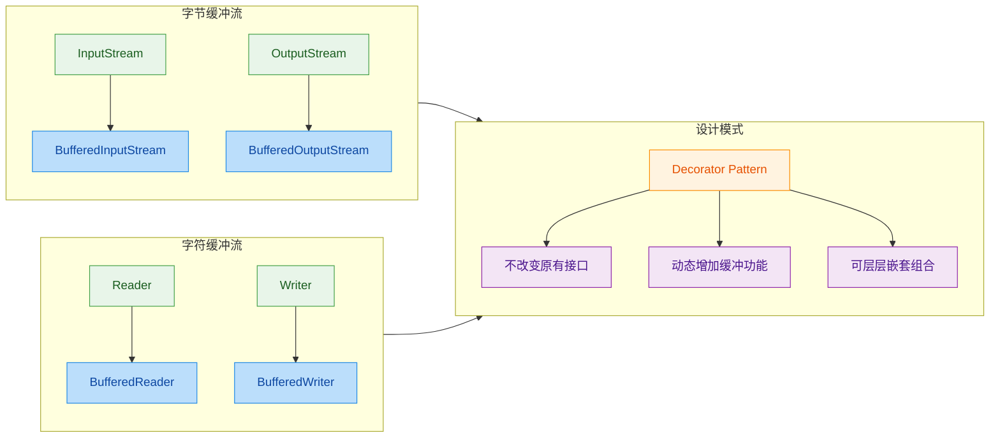

四个缓冲流一一对应四大基类，职责清晰：

| 缓冲流类 | 包装目标 | 默认缓冲区大小 |
|---|---|---|
| `BufferedInputStream` | 任意 `InputStream` | 8192 字节（8 KB） |
| `BufferedOutputStream` | 任意 `OutputStream` | 8192 字节（8 KB） |
| `BufferedReader` | 任意 `Reader` | 8192 字符（16 KB） |
| `BufferedWriter` | 任意 `Writer` | 8192 字符（16 KB） |

### 缓冲流的工作原理

理解缓冲流的关键在于理解"缓冲区"这块内存是如何被管理的。我们分读和写两个方向来看。

**读取方向（以 BufferedInputStream 为例）：**

当你第一次调用 `read()` 时，`BufferedInputStream` 并不是只从底层流读 1 个字节，而是一口气读取最多 8192 个字节填充到内部的 `byte[] buf` 数组中。后续的 `read()` 调用直接从这个数组中取数据，完全不涉及系统调用。只有当缓冲区中的数据被消费完毕，才会再次触发一次底层的批量读取。

```java
// ===== BufferedInputStream 读取原理的简化模型 =====

// 内部维护的核心字段（源码简化）
byte[] buf = new byte[8192];  // 缓冲区数组，默认 8KB
int count = 0;                // 缓冲区中实际有效的字节数
int pos = 0;                  // 当前读取位置（游标）

// 当调用 read() 时的逻辑（伪代码）
public int read() {
    if (pos >= count) {
        // 缓冲区已耗尽，从底层流批量填充
        count = underlyingStream.read(buf, 0, buf.length);
        pos = 0;                // 重置游标到起点
        if (count <= 0) {
            return -1;          // 底层流也没数据了，返回 EOF
        }
    }
    // 直接从缓冲区取一个字节，游标后移
    return buf[pos++] & 0xFF;   // & 0xFF 确保返回 0~255 的无符号值
}
```

用一张内存模型图来直观感受：

```java
// ===== 缓冲区状态变化示意 =====

// 【状态1】刚填充完毕，pos=0, count=8192
// buf: [B0][B1][B2][B3]...[B8191]
//       ^pos                      ^count
//       ↑ 下次 read() 从这里取

// 【状态2】读了3个字节后，pos=3
// buf: [B0][B1][B2][B3][B4]...[B8191]
//                   ^pos              ^count
//                   ↑ 下次 read() 从这里取

// 【状态3】全部读完，pos=count=8192，触发下一次批量填充
// buf: [B0][B1][B2]...[B8191]
//                             ^pos=count
//                             ↑ 缓冲区耗尽！重新 fill()
```

**写入方向（以 BufferedOutputStream 为例）：**

写入是读取的镜像操作。调用 `write()` 时数据先写入内部缓冲区，并不立即写到底层流。只有当缓冲区满了，或者你手动调用 `flush()`，又或者流被关闭时，缓冲区中的数据才会被一次性刷出（flush）到底层流。

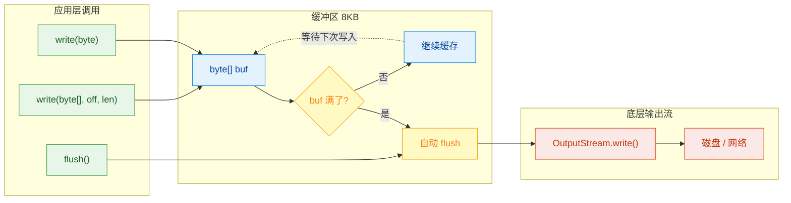

这里有一个非常重要的实践要点：**写入操作完成后，务必调用 `flush()` 或 `close()`**。否则最后一批不满 8KB 的数据可能永远留在缓冲区里，不会写入目标文件，造成数据丢失。这是初学者最常踩的坑之一。

### BufferedInputStream 详解

`BufferedInputStream` 是字节输入流的缓冲装饰器。它的构造方法接受一个 `InputStream`，并可选地指定缓冲区大小。

```java
import java.io.BufferedInputStream;
import java.io.FileInputStream;
import java.io.IOException;

public class BufferedInputStreamDemo {
    public static void main(String[] args) {
        // ===== 基本用法：包装 FileInputStream =====
        // try-with-resources 自动关闭外层流，内层流会被级联关闭
        try (BufferedInputStream bis = new BufferedInputStream(
                new FileInputStream("data.bin"),  // 被包装的底层字节流
                16384                              // 自定义缓冲区大小：16KB
        )) {
            int byteData;  // 用 int 接收，因为 read() 返回 0~255 或 -1

            // 逐字节读取——但实际上每 16KB 才触发一次真正的磁盘 I/O
            while ((byteData = bis.read()) != -1) {
                // 处理每个字节
                System.out.print((char) byteData);
            }

        } catch (IOException e) {
            e.printStackTrace();  // 生产环境应使用日志框架
        }
    }
}
```

**`mark()` 和 `reset()` —— 缓冲流的独特能力：**

`BufferedInputStream` 支持 `mark(readlimit)` 和 `reset()` 操作，这是普通 `FileInputStream` 不具备的。`mark()` 在当前位置打一个"书签"，之后即使继续读取，也可以通过 `reset()` 回退到书签位置重新读取。参数 `readlimit` 表示"打完书签后最多还能读多少字节，超过这个距离书签就失效"。

```java
import java.io.BufferedInputStream;
import java.io.ByteArrayInputStream;
import java.io.IOException;

public class MarkResetDemo {
    public static void main(String[] args) throws IOException {
        // 用 ByteArrayInputStream 模拟数据源，方便演示
        byte[] data = "ABCDEFGHIJ".getBytes();  // 10 个字节的测试数据
        BufferedInputStream bis = new BufferedInputStream(
                new ByteArrayInputStream(data)
        );

        // 读取前两个字节：A, B
        System.out.println((char) bis.read());  // 输出: A
        System.out.println((char) bis.read());  // 输出: B

        // 在当前位置（第3个字节 C 之前）打标记
        // readlimit=5 表示：标记后最多再读5个字节，标记仍然有效
        bis.mark(5);

        // 继续读取 3 个字节：C, D, E
        System.out.println((char) bis.read());  // 输出: C
        System.out.println((char) bis.read());  // 输出: D
        System.out.println((char) bis.read());  // 输出: E

        // 调用 reset()，回退到 mark() 的位置
        bis.reset();

        // 重新从 C 开始读
        System.out.println((char) bis.read());  // 输出: C  ← 又回来了！
        System.out.println((char) bis.read());  // 输出: D

        bis.close();  // 关闭流释放资源
    }
}
```

```java
// ===== mark/reset 位置变化示意 =====

// 数据:  [A][B][C][D][E][F][G][H][I][J]
//
// 读完 A, B 后:
//              ^pos=2
//
// 调用 mark(5):
//              ^pos=2, markPos=2
//
// 继续读 C, D, E:
//                       ^pos=5, markPos=2 (距离=3, < readlimit=5, 标记有效)
//
// 调用 reset():
//              ^pos=2 (回退到 markPos!)
//
// 再读:
//              C  D  ...
```

这个能力在解析文件格式时非常有用——比如你需要"偷看"接下来几个字节来判断数据类型，判断完后再回退让正式的解析逻辑从头处理。

### BufferedOutputStream 详解

`BufferedOutputStream` 是字节输出流的缓冲装饰器，使用方式与输入流对称。

```java
import java.io.BufferedOutputStream;
import java.io.FileOutputStream;
import java.io.IOException;

public class BufferedOutputStreamDemo {
    public static void main(String[] args) {
        // 包装 FileOutputStream，使用默认 8KB 缓冲区
        try (BufferedOutputStream bos = new BufferedOutputStream(
                new FileOutputStream("output.bin")
        )) {
            // 写入单个字节——数据先进入缓冲区，不会立即写磁盘
            bos.write(65);  // 写入字节 65，即字符 'A'

            // 写入字节数组——同样先进缓冲区
            byte[] data = "Hello, Buffered World!".getBytes();
            bos.write(data);           // 写入整个数组
            bos.write(data, 0, 5);     // 写入数组的前 5 个字节: "Hello"

            // 手动刷新：强制将缓冲区中的数据写入底层流
            bos.flush();

            // 注意：try-with-resources 在 close() 时会自动调用 flush()
            // 但如果在 close() 之前程序崩溃，未 flush 的数据就丢了
            // 所以关键节点手动 flush() 是好习惯

        } catch (IOException e) {
            e.printStackTrace();
        }
    }
}
```

### BufferedReader 详解

`BufferedReader` 是字符输入流的缓冲装饰器，除了基本的缓冲功能外，它还提供了一个极其实用的方法：`readLine()`——按行读取文本。这是 `Reader` 基类没有的能力，也是 `BufferedReader` 被广泛使用的核心原因。

```java
import java.io.BufferedReader;
import java.io.FileReader;
import java.io.IOException;

public class BufferedReaderDemo {
    public static void main(String[] args) {
        // ===== 经典用法：逐行读取文本文件 =====
        try (BufferedReader br = new BufferedReader(
                new FileReader("poem.txt")  // FileReader 是字符流，处理文本文件
        )) {
            String line;  // 用于接收每一行的内容

            // readLine() 读取一行文本（不包含换行符）
            // 到达文件末尾时返回 null
            while ((line = br.readLine()) != null) {
                System.out.println(line);  // 逐行输出
            }

        } catch (IOException e) {
            e.printStackTrace();
        }
    }
}
```

`readLine()` 的行为细节值得注意：它会读取一行内容直到遇到 `\n`（Unix）、`\r`（老 Mac）或 `\r\n`（Windows），但返回的字符串中**不包含**这些换行符。到达流末尾时返回 `null`。

**Java 8+ 的 `lines()` 方法——与 Stream API 的优雅结合：**

从 Java 8 开始，`BufferedReader` 新增了 `lines()` 方法，返回一个 `Stream<String>`，可以无缝接入函数式编程的管道操作。这在处理文本数据时非常优雅：

```java
import java.io.BufferedReader;
import java.io.FileReader;
import java.io.IOException;
import java.util.List;
import java.util.stream.Collectors;

public class BufferedReaderStreamDemo {
    public static void main(String[] args) {
        try (BufferedReader br = new BufferedReader(new FileReader("log.txt"))) {

            // 使用 Stream API 进行声明式的文本处理
            List<String> errorLines = br.lines()          // 返回 Stream<String>，惰性求值
                    .filter(line -> line.contains("ERROR"))  // 只保留包含 "ERROR" 的行
                    .map(String::trim)                       // 去除首尾空白
                    .collect(Collectors.toList());           // 收集为 List

            // 输出所有错误行
            errorLines.forEach(System.out::println);

        } catch (IOException e) {
            e.printStackTrace();
        }
    }
}
```

这种写法比传统的 `while` 循环更具表达力，尤其在需要过滤、转换、聚合文本数据时，代码意图一目了然。

### BufferedWriter 详解

`BufferedWriter` 是字符输出流的缓冲装饰器，它额外提供了 `newLine()` 方法，用于写入平台相关的换行符（Windows 上是 `\r\n`，Unix/Mac 上是 `\n`），避免了硬编码换行符带来的跨平台问题。

```java
import java.io.BufferedWriter;
import java.io.FileWriter;
import java.io.IOException;

public class BufferedWriterDemo {
    public static void main(String[] args) {
        // 第二个参数 true 表示追加模式（append），不会覆盖已有内容
        try (BufferedWriter bw = new BufferedWriter(
                new FileWriter("output.txt", true)
        )) {
            bw.write("第一行内容");   // 写入字符串，进入缓冲区
            bw.newLine();             // 写入平台相关的换行符
            bw.write("第二行内容");
            bw.newLine();

            // 写入字符数组的一部分
            char[] chars = "ABCDEFG".toCharArray();
            bw.write(chars, 2, 3);   // 从索引2开始写3个字符: "CDE"
            bw.newLine();

            bw.flush();  // 确保数据写出

        } catch (IOException e) {
            e.printStackTrace();
        }
    }
}
```

### 性能对比：有缓冲 vs 无缓冲

说了这么多原理，缓冲流到底能快多少？我们用一个实际的性能测试来说话：

```java
import java.io.*;

public class BufferPerformanceTest {
    public static void main(String[] args) throws IOException {
        // 先创建一个 10MB 的测试文件
        String filename = "testfile_10mb.dat";
        createTestFile(filename, 10 * 1024 * 1024);  // 10MB

        // ===== 测试1：无缓冲，逐字节读取 =====
        long start1 = System.currentTimeMillis();       // 记录开始时间
        try (FileInputStream fis = new FileInputStream(filename)) {
            while (fis.read() != -1) {
                // 每次 read() 都是一次系统调用（理论上）
            }
        }
        long time1 = System.currentTimeMillis() - start1;
        System.out.println("无缓冲逐字节读取: " + time1 + " ms");

        // ===== 测试2：有缓冲，逐字节读取 =====
        long start2 = System.currentTimeMillis();
        try (BufferedInputStream bis = new BufferedInputStream(
                new FileInputStream(filename)
        )) {
            while (bis.read() != -1) {
                // 每次 read() 大多数时候只是从内存数组取数据
            }
        }
        long time2 = System.currentTimeMillis() - start2;
        System.out.println("有缓冲逐字节读取: " + time2 + " ms");

        // ===== 测试3：无缓冲，手动数组批量读取 =====
        long start3 = System.currentTimeMillis();
        try (FileInputStream fis = new FileInputStream(filename)) {
            byte[] buf = new byte[8192];               // 手动创建 8KB 缓冲数组
            while (fis.read(buf) != -1) {
                // 每次读取最多 8192 字节
            }
        }
        long time3 = System.currentTimeMillis() - start3;
        System.out.println("无缓冲+手动数组读取: " + time3 + " ms");

        // 输出性能倍数对比
        System.out.println("缓冲流比无缓冲快约: " + (time1 / Math.max(time2, 1)) + " 倍");
    }

    // 创建指定大小的测试文件
    private static void createTestFile(String name, int size) throws IOException {
        try (FileOutputStream fos = new FileOutputStream(name)) {
            byte[] chunk = new byte[4096];  // 每次写 4KB
            int written = 0;                // 已写入字节数
            while (written < size) {
                fos.write(chunk);           // 写入一块全零数据
                written += chunk.length;    // 累加
            }
        }
    }
}
```

典型的运行结果（因机器而异，但数量级关系稳定）：

| 读取方式 | 耗时（参考值） | 系统调用次数（约） |
|---|---|---|
| 无缓冲逐字节 | ~35000 ms | 10,485,760 次 |
| 有缓冲逐字节 | ~150 ms | ~1,280 次 |
| 无缓冲+手动数组 | ~30 ms | ~1,280 次 |

可以看到，缓冲流将性能提升了约 **200 倍**。而手动用数组批量读取的方式更快一些，因为省去了 `BufferedInputStream` 内部的边界检查和数组拷贝开销。但缓冲流的优势在于**使用简单、代码优雅**，在绝大多数场景下性能已经足够好。

### 缓冲流使用的最佳实践与常见陷阱

**1. 只关闭最外层流**

装饰器模式下，流是层层嵌套的。关闭最外层的缓冲流时，它会自动级联关闭内层流。千万不要重复关闭，否则可能触发异常：

```java
// ✅ 正确：只关闭最外层
BufferedReader br = new BufferedReader(new FileReader("a.txt"));
br.close();  // 内部的 FileReader 会被自动关闭

// ❌ 错误：重复关闭
FileReader fr = new FileReader("a.txt");
BufferedReader br2 = new BufferedReader(fr);
br2.close();
fr.close();  // 多余！可能抛出异常（流已关闭）
```

**2. 写入后务必 flush**

```java
// ❌ 危险：没有 flush，如果程序异常退出，数据可能丢失
BufferedWriter bw = new BufferedWriter(new FileWriter("data.txt"));
bw.write("重要数据");
// 程序在这里崩溃了... 数据还在缓冲区里，没写入文件！

// ✅ 安全：使用 try-with-resources，close() 会自动 flush
try (BufferedWriter bw2 = new BufferedWriter(new FileWriter("data.txt"))) {
    bw2.write("重要数据");
}  // 这里自动 close() → 自动 flush() → 数据安全落盘
```

**3. 缓冲区大小的选择**

默认的 8KB 在大多数场景下表现良好。但如果你在处理大文件（几百 MB 以上），可以适当增大缓冲区：

```java
// 大文件处理：使用 64KB 缓冲区
int bufferSize = 64 * 1024;  // 64KB
BufferedInputStream bis = new BufferedInputStream(
        new FileInputStream("huge_file.dat"),
        bufferSize  // 自定义缓冲区大小
);
```

但也不是越大越好——过大的缓冲区会占用更多堆内存，且收益递减。一般来说 8KB ~ 64KB 是合理范围。

**4. 不要在缓冲流外再套缓冲流**

```java
// ❌ 毫无意义：双重缓冲只是浪费内存
BufferedInputStream bis = new BufferedInputStream(
        new BufferedInputStream(new FileInputStream("a.txt"))
);

// ✅ 一层缓冲就够了
BufferedInputStream bis2 = new BufferedInputStream(
        new FileInputStream("a.txt")
);
```

### 装饰器模式在缓冲流中的体现

缓冲流是理解装饰器模式（Decorator Pattern）的绝佳案例。让我们从设计模式的角度审视它的结构：

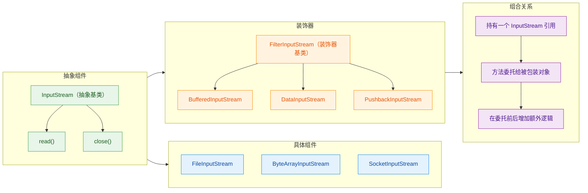

装饰器模式的精髓在于：`BufferedInputStream` 和 `FileInputStream` 实现了相同的 `InputStream` 接口，对调用者来说完全透明。你可以自由组合不同的装饰器，像搭积木一样构建出你需要的流管道：

```java
// 装饰器的自由组合——从内到外层层包装
// 第1层：FileInputStream 负责从文件读取原始字节
// 第2层：BufferedInputStream 增加缓冲能力
// 第3层：DataInputStream 增加读取基本类型的能力
DataInputStream dis = new DataInputStream(     // 最外层：读 int, double 等
    new BufferedInputStream(                    // 中间层：缓冲加速
        new FileInputStream("data.bin")         // 最内层：文件数据源
    )
);

int value = dis.readInt();      // 读取一个 4 字节的 int
double pi = dis.readDouble();   // 读取一个 8 字节的 double
dis.close();                    // 关闭最外层，级联关闭所有层
```

这种设计的优雅之处在于：每个类只负责一件事（Single Responsibility），通过组合而非继承来扩展功能（Composition over Inheritance），这正是面向对象设计的核心思想之一。

---

**📝 练习题**

以下代码执行后，文件 `result.txt` 中的内容是什么？

```java
BufferedWriter bw = new BufferedWriter(new FileWriter("result.txt"));
bw.write("Hello");
bw.write(" World");
bw.close();
// 再次打开，注意没有 append 模式
BufferedWriter bw2 = new BufferedWriter(new FileWriter("result.txt"));
bw2.write("Java");
bw2.flush();
bw2.close();
```

A. Hello World

B. Java

C. Hello WorldJava

D. 文件为空


**【答案】** B

**【解析】** 这道题考查两个知识点。第一，`BufferedWriter` 在 `close()` 时会自动调用 `flush()`，所以第一次写入的 `"Hello World"` 确实会被写入文件。第二，关键在于第二次创建 `BufferedWriter` 时，内层的 `new FileWriter("result.txt")` 没有传入第二个参数 `true`（即 append 模式），因此 `FileWriter` 默认以**覆盖模式**打开文件，会先将文件内容清空，然后写入 `"Java"`。最终文件中只剩下 `"Java"`。这也是实际开发中常见的失误——忘记指定追加模式导致数据被覆盖。如果希望保留原有内容，应写成 `new FileWriter("result.txt", true)`。

---

**📝 练习题**

关于 `BufferedInputStream` 的 `mark(readlimit)` 和 `reset()` 方法，以下说法正确的是？

A. `readlimit` 参数表示流中总共能读取的最大字节数

B. 调用 `reset()` 后，流会回到文件的起始位置（position 0）

C. 如果在 `mark()` 之后读取的字节数超过了 `readlimit`，再调用 `reset()` 可能抛出 `IOException`

D. `FileInputStream` 本身就支持 `mark()` 和 `reset()`，不需要 `BufferedInputStream`


**【答案】** C

**【解析】** 逐项分析：

- A 错误。`readlimit` 不是限制流的总读取量，而是指"从 `mark()` 位置开始，最多再读取多少字节后标记仍然有效"。超过这个距离，缓冲流可能会丢弃标记位置之前的缓冲数据，导致标记失效。
- B 错误。`reset()` 是回到上一次 `mark()` 调用时的位置，而不是文件开头。如果你在读了 100 个字节后调用 `mark()`，再读 50 个字节后调用 `reset()`，流会回退到第 100 字节的位置，而非第 0 字节。
- C 正确。当 `mark()` 后读取的字节数超过 `readlimit`，标记可能失效（JDK 文档原文："if more than readlimit bytes have been read since the last mark, then the stream is not required to remember the mark"）。此时调用 `reset()` 会抛出 `IOException: Mark invalid`。注意措辞是"可能"——实际行为取决于实现，`BufferedInputStream` 在某些情况下即使超过 `readlimit` 也能 reset 成功（比如缓冲区足够大没有被重新填充），但规范上不保证，所以依赖这种行为是不安全的。
- D 错误。`FileInputStream` 的 `markSupported()` 返回 `false`，它不支持 mark/reset。这正是 `BufferedInputStream` 作为装饰器的附加价值之一——因为有了内存缓冲区，才有能力"记住"之前读过的数据并回退。

---

## 转换流（InputStreamReader / OutputStreamWriter、编码处理）

在 Java I/O 体系中，字节流（byte stream）和字符流（character stream）是两条并行的继承链。然而在真实开发中，我们经常面临一个核心矛盾：底层传输通道（网络 Socket、标准输入 `System.in`、文件原始流）提供的是字节流，而业务逻辑需要的是字符流。转换流（conversion stream）就是 Java 为解决这一矛盾而设计的"桥梁"——它在字节与字符之间架起一座编解码的桥。

转换流的核心类只有两个：

- `InputStreamReader`：字节输入流 → 字符输入流（解码，decode）
- `OutputStreamWriter`：字符输出流 → 字节输出流（编码，encode）

它们位于 `java.io` 包中，分别继承自 `Reader` 和 `Writer`，是整个 I/O 框架中唯一能在字节世界与字符世界之间自由穿梭的类。

---

### 为什么需要转换流

要理解转换流的价值，首先要理解字节流和字符流各自的局限性。

字节流（`InputStream` / `OutputStream`）以 byte 为最小单位进行读写，它不关心数据的"含义"。一个中文汉字在 UTF-8 编码下占 3 个字节，在 GBK 编码下占 2 个字节——字节流对此一无所知，它只是忠实地搬运一个个 byte。如果你用字节流逐字节读取一个 UTF-8 编码的中文文件，然后直接强转为 `char`，得到的将是乱码。

字符流（`Reader` / `Writer`）以 char（Java 内部统一使用 UTF-16）为最小单位进行读写，它天然理解"字符"的概念。但问题在于：很多数据源只提供字节流接口。最典型的例子就是 `System.in`——它的类型是 `InputStream`，你无法直接用 `BufferedReader` 去包装它，因为 `BufferedReader` 的构造器只接受 `Reader`。

转换流正是为了填补这个鸿沟。它接收一个字节流，内部持有一个字符编码解码器（`CharsetDecoder` / `CharsetEncoder`），将字节序列按照指定编码转换为字符序列，或反过来。

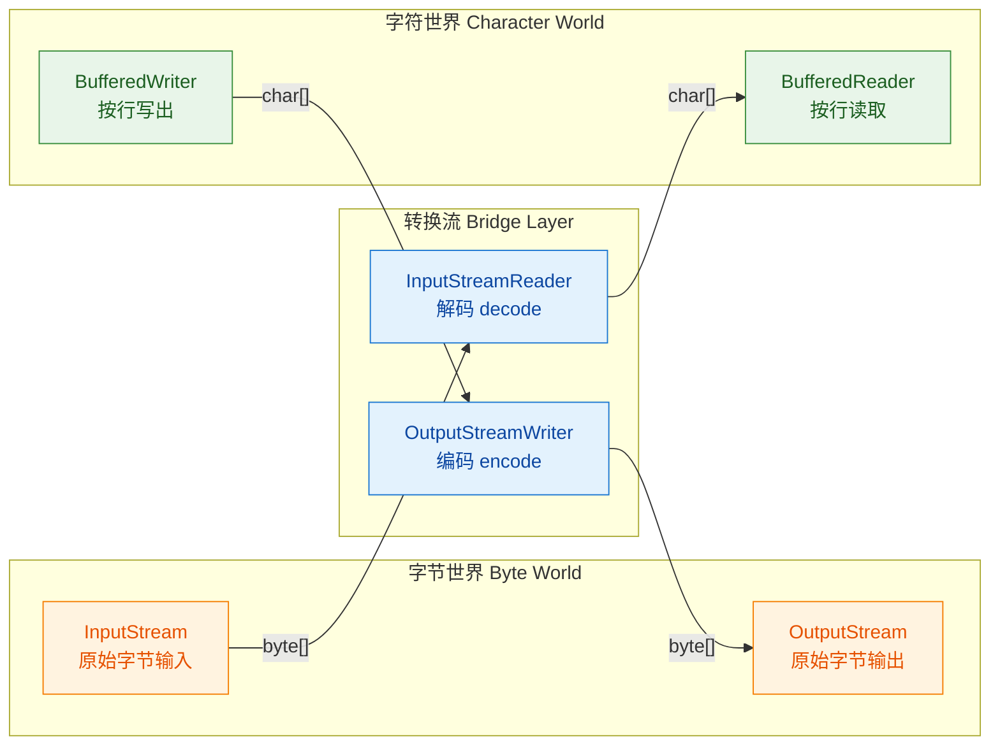

这张图清晰地展示了转换流的定位：它不是数据的最终消费者，而是一个中间适配层。在实际开发中，转换流几乎总是被 `BufferedReader` 或 `BufferedWriter` 包装后使用，以获得缓冲能力和便捷的 `readLine()` 等方法。

---

### 字符编码基础

在深入转换流的 API 之前，有必要先梳理字符编码（character encoding）的核心概念，因为转换流的一切行为都建立在编码之上。

字符编码本质上是一张"映射表"，它定义了"抽象字符"与"字节序列"之间的对应关系。Java 中常见的编码有：

| 编码名称 | 特点 | 中文字节数 | 英文字节数 |
|---------|------|-----------|-----------|
| ASCII | 最早的编码标准，仅覆盖英文 | 不支持 | 1 |
| ISO-8859-1 | 西欧语言扩展，单字节编码 | 不支持 | 1 |
| GBK / GB2312 | 中国国标编码，兼容 ASCII | 2 | 1 |
| UTF-8 | Unicode 的变长编码，互联网主流 | 3 | 1 |
| UTF-16 | Java 内部使用的编码，定长 2 字节（BMP 范围） | 2 | 2 |

乱码的根本原因只有一个：编码（encode）和解码（decode）使用了不同的字符集。比如一个文件用 UTF-8 编码保存，你却用 GBK 去解码读取，字节序列被错误地映射到了错误的字符上，乱码就产生了。

```java
// 演示编码与解码的本质
public class EncodingDemo {
    public static void main(String[] args) throws Exception {
        String text = "你好";  // Java 内部以 UTF-16 存储

        // 编码：字符 → 字节（使用 UTF-8）
        byte[] utf8Bytes = text.getBytes("UTF-8");       // [0xE4,0xBD,0xA0,0xE5,0xA5,0xBD] 共6字节
        // 编码：字符 → 字节（使用 GBK）
        byte[] gbkBytes = text.getBytes("GBK");           // [0xC4,0xE3,0xBA,0xC3] 共4字节

        // 正确解码：UTF-8 字节用 UTF-8 解码
        String correct = new String(utf8Bytes, "UTF-8");   // "你好" ✅
        // 错误解码：UTF-8 字节用 GBK 解码
        String wrong = new String(utf8Bytes, "GBK");       // "浣犲ソ" ❌ 乱码！

        System.out.println("UTF-8 字节数: " + utf8Bytes.length);  // 6
        System.out.println("GBK 字节数: " + gbkBytes.length);      // 4
        System.out.println("正确解码: " + correct);                  // 你好
        System.out.println("错误解码: " + wrong);                    // 乱码
    }
}
```

理解了这个基础，转换流的设计意图就非常清晰了——它让你在从字节流到字符流的转换过程中，明确指定使用哪种编码，从而避免乱码。

---

### InputStreamReader 详解

`InputStreamReader` 是从字节到字符的解码桥梁。它的继承关系如下：

```
java.io.Reader
  └── java.io.InputStreamReader
        └── java.io.FileReader   （便捷子类，使用平台默认编码）
```

#### 构造方法

```java
// 构造方法1：使用平台默认编码（不推荐，因为不同系统默认编码不同）
public InputStreamReader(InputStream in)

// 构造方法2：显式指定编码名称（推荐）
public InputStreamReader(InputStream in, String charsetName) throws UnsupportedEncodingException

// 构造方法3：使用 Charset 对象指定编码（推荐，编译期安全）
public InputStreamReader(InputStream in, Charset cs)

// 构造方法4：使用 CharsetDecoder 指定解码器（高级用法）
public InputStreamReader(InputStream in, CharsetDecoder dec)
```

在生产代码中，强烈建议始终使用第 2 或第 3 种构造方法显式指定编码。依赖平台默认编码是一个经典的"在我机器上能跑"（works on my machine）陷阱——你的 Windows 开发机默认 GBK，Linux 服务器默认 UTF-8，同一份代码在两个环境下行为不同。

#### 经典用法：包装 System.in

这是 Java 初学者最早接触转换流的场景：

```java
import java.io.*;

public class ConsoleReadDemo {
    public static void main(String[] args) throws IOException {
        // System.in 是 InputStream（字节流），无法直接按行读取
        // 第一层包装：InputStreamReader 将字节流转为字符流，指定 UTF-8 编码
        InputStreamReader isr = new InputStreamReader(System.in, "UTF-8");
        // 第二层包装：BufferedReader 提供缓冲和 readLine() 能力
        BufferedReader br = new BufferedReader(isr);

        System.out.println("请输入内容（输入 quit 退出）：");

        String line;  // 用于存储每次读取的一行文本
        // readLine() 会阻塞等待用户输入，遇到换行符返回该行内容
        while ((line = br.readLine()) != null) {
            if ("quit".equalsIgnoreCase(line)) {  // 忽略大小写比较
                break;  // 用户输入 quit 时退出循环
            }
            System.out.println("你输入了: " + line);  // 回显用户输入
        }

        br.close();  // 关闭最外层流即可，会自动关闭内层流
    }
}
```

这段代码展示了转换流最经典的使用模式：`InputStream` → `InputStreamReader` → `BufferedReader`，三层包装，各司其职。这也是装饰器模式（Decorator Pattern）在 Java I/O 中的典型体现。

#### 读取指定编码的文件

```java
import java.io.*;

public class ReadGBKFile {
    public static void main(String[] args) {
        // 使用 try-with-resources 确保流自动关闭
        // FileInputStream 打开文件的原始字节流
        // InputStreamReader 以 GBK 编码将字节解码为字符
        // BufferedReader 提供缓冲，提升读取效率
        try (BufferedReader br = new BufferedReader(
                new InputStreamReader(
                        new FileInputStream("data_gbk.txt"), "GBK"))) {

            String line;  // 存储每行内容
            // 逐行读取，readLine() 返回 null 表示文件结束
            while ((line = br.readLine()) != null) {
                System.out.println(line);  // 输出每行内容
            }

        } catch (UnsupportedEncodingException e) {
            // 编码名称拼写错误时抛出此异常
            System.err.println("不支持的编码: " + e.getMessage());
        } catch (FileNotFoundException e) {
            // 文件不存在时抛出此异常
            System.err.println("文件未找到: " + e.getMessage());
        } catch (IOException e) {
            // 其他 I/O 异常
            e.printStackTrace();
        }
    }
}
```

如果这里不使用 `InputStreamReader` 而直接使用 `FileReader`，那么 `FileReader` 会使用平台默认编码。在 UTF-8 系统上读取 GBK 文件，中文必然乱码。这就是转换流存在的核心价值——编码可控。

---

### OutputStreamWriter 详解

`OutputStreamWriter` 是从字符到字节的编码桥梁，与 `InputStreamReader` 方向相反。继承关系：

```
java.io.Writer
  └── java.io.OutputStreamWriter
        └── java.io.FileWriter   （便捷子类，使用平台默认编码）
```

#### 构造方法

```java
// 构造方法1：使用平台默认编码
public OutputStreamWriter(OutputStream out)

// 构造方法2：显式指定编码名称（推荐）
public OutputStreamWriter(OutputStream out, String charsetName) throws UnsupportedEncodingException

// 构造方法3：使用 Charset 对象（推荐）
public OutputStreamWriter(OutputStream out, Charset cs)

// 构造方法4：使用 CharsetEncoder（高级用法）
public OutputStreamWriter(OutputStream out, CharsetEncoder enc)
```

#### 写出指定编码的文件

```java
import java.io.*;

public class WriteGBKFile {
    public static void main(String[] args) {
        // FileOutputStream 创建文件的原始字节输出流
        // OutputStreamWriter 以 GBK 编码将字符编码为字节
        // BufferedWriter 提供缓冲，减少实际 I/O 次数
        try (BufferedWriter bw = new BufferedWriter(
                new OutputStreamWriter(
                        new FileOutputStream("output_gbk.txt"), "GBK"))) {

            bw.write("你好，世界！");  // 写入中文内容
            bw.newLine();               // 写入平台相关的换行符
            bw.write("Hello, World!");  // 写入英文内容
            bw.newLine();               // 再写一个换行
            bw.flush();                 // 强制将缓冲区内容刷出到底层流

        } catch (IOException e) {
            e.printStackTrace();  // 打印异常堆栈
        }
        // try-with-resources 结束时自动调用 close()，close() 内部也会 flush()
    }
}
```

这里有一个细节值得注意：`bw.flush()` 在 try-with-resources 中其实不是必须的，因为 `close()` 方法内部会先调用 `flush()` 再释放资源。但在非 try-with-resources 的场景中，或者在长时间运行的程序中需要确保数据及时写出时，显式调用 `flush()` 是一个好习惯。

---

### 编码转换实战：文件编码转换器

一个非常实用的场景是将文件从一种编码转换为另一种编码。转换流让这件事变得非常简洁：

```java
import java.io.*;

public class EncodingConverter {
    /**
     * 将文件从一种编码转换为另一种编码
     * @param srcFile    源文件路径
     * @param srcCharset 源文件编码
     * @param destFile   目标文件路径
     * @param destCharset 目标文件编码
     */
    public static void convert(String srcFile, String srcCharset,
                               String destFile, String destCharset)
            throws IOException {

        // 输入端：以源编码读取字节，解码为字符
        try (BufferedReader reader = new BufferedReader(
                new InputStreamReader(
                        new FileInputStream(srcFile), srcCharset));
             // 输出端：将字符以目标编码编码为字节，写出
             BufferedWriter writer = new BufferedWriter(
                new OutputStreamWriter(
                        new FileOutputStream(destFile), destCharset))) {

            char[] buffer = new char[4096];  // 4KB 字符缓冲区
            int charsRead;                    // 每次实际读取的字符数
            // read(char[], off, len) 批量读取字符到缓冲区
            while ((charsRead = reader.read(buffer, 0, buffer.length)) != -1) {
                // 将读取到的字符写出（只写实际读取的部分）
                writer.write(buffer, 0, charsRead);
            }
            // 循环结束意味着源文件读取完毕，所有内容已转码写出
        }
        // try-with-resources 自动关闭 reader 和 writer
    }

    public static void main(String[] args) throws IOException {
        // 将 GBK 编码的文件转换为 UTF-8 编码
        convert("legacy_gbk.txt", "GBK", "modern_utf8.txt", "UTF-8");
        System.out.println("编码转换完成！");
    }
}
```

这段代码的核心思路是：读取端用源编码解码为 Java 内部的 `char`（UTF-16），写出端再用目标编码将 `char` 编码为字节。Java 的 `char` 在这里充当了一个"中间表示"（intermediate representation），这也是 Unicode 的设计初衷——作为所有编码之间的通用桥梁。

数据流转过程如下：

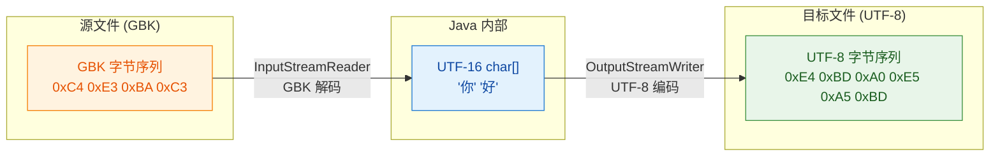

---

### FileReader / FileWriter 与转换流的关系

很多初学者会疑惑：既然有 `FileReader` 和 `FileWriter`，为什么还需要转换流？答案很简单——`FileReader` 和 `FileWriter` 本质上就是转换流的"偷懒版"。

查看 JDK 源码（Java 8）：

```java
// FileReader 的构造方法（简化版）
public class FileReader extends InputStreamReader {
    public FileReader(String fileName) throws FileNotFoundException {
        // 调用父类 InputStreamReader 的构造方法
        // 注意：这里没有传入编码参数，使用平台默认编码！
        super(new FileInputStream(fileName));
    }
}

// FileWriter 的构造方法（简化版）
public class FileWriter extends OutputStreamWriter {
    public FileWriter(String fileName) throws IOException {
        // 同样使用平台默认编码
        super(new FileOutputStream(fileName));
    }
}
```

可以看到，`FileReader` 就是 `new InputStreamReader(new FileInputStream(file))`，`FileWriter` 就是 `new OutputStreamWriter(new FileOutputStream(file))`。它们唯一的"便利"就是少写了一层嵌套，但代价是丧失了编码控制能力。

从 Java 11 开始，`FileReader` 和 `FileWriter` 终于增加了接受 `Charset` 参数的构造方法：

```java
// Java 11+ 新增
new FileReader("file.txt", StandardCharsets.UTF_8);
new FileWriter("file.txt", StandardCharsets.UTF_8);
```

但在 Java 8 及更早版本中，如果你需要控制编码，就必须使用 `InputStreamReader` / `OutputStreamWriter`。

---

### 平台默认编码的陷阱

这是一个在实际项目中反复出现的问题，值得单独展开讨论。

```java
import java.nio.charset.Charset;

public class DefaultCharsetDemo {
    public static void main(String[] args) {
        // 获取当前 JVM 的默认编码
        String defaultCharset = Charset.defaultCharset().name();
        System.out.println("当前平台默认编码: " + defaultCharset);
        // Windows 中文版通常输出: GBK
        // Linux / macOS 通常输出: UTF-8

        // 也可以通过系统属性获取
        String fileEncoding = System.getProperty("file.encoding");
        System.out.println("file.encoding: " + fileEncoding);
    }
}
```

当你的代码中出现以下任何一种写法时，都隐含了对平台默认编码的依赖：

```java
// ⚠️ 以下写法全部依赖平台默认编码，存在跨平台风险

new FileReader("file.txt");                          // 默认编码读取
new FileWriter("file.txt");                          // 默认编码写出
new InputStreamReader(inputStream);                  // 默认编码解码
new OutputStreamWriter(outputStream);                // 默认编码编码
"你好".getBytes();                                    // 默认编码转字节
new String(bytes);                                   // 默认编码转字符串
```

正确的做法是始终显式指定编码：

```java
// ✅ 显式指定编码，跨平台安全

new InputStreamReader(inputStream, StandardCharsets.UTF_8);   // 明确 UTF-8
new OutputStreamWriter(outputStream, StandardCharsets.UTF_8); // 明确 UTF-8
"你好".getBytes(StandardCharsets.UTF_8);                       // 明确 UTF-8
new String(bytes, StandardCharsets.UTF_8);                     // 明确 UTF-8
```

`java.nio.charset.StandardCharsets` 类提供了常用编码的常量，使用它们比字符串 `"UTF-8"` 更安全——不会拼写错误，也不会抛出 `UnsupportedEncodingException`。

---

### getEncoding() 方法

转换流提供了一个独有的方法 `getEncoding()`，可以查询当前流实际使用的编码名称：

```java
import java.io.*;
import java.nio.charset.StandardCharsets;

public class GetEncodingDemo {
    public static void main(String[] args) throws IOException {
        // 使用默认编码创建转换流
        InputStreamReader isr1 = new InputStreamReader(System.in);
        System.out.println("默认编码: " + isr1.getEncoding());
        // 可能输出: UTF8, GBK, 等（注意返回的是 IANA 规范名称）

        // 显式指定 UTF-8 编码
        InputStreamReader isr2 = new InputStreamReader(
                System.in, StandardCharsets.UTF_8);
        System.out.println("指定编码: " + isr2.getEncoding());
        // 输出: UTF8

        // 关闭流后再调用 getEncoding() 返回 null
        isr1.close();
        System.out.println("关闭后: " + isr1.getEncoding());
        // 输出: null

        isr2.close();  // 别忘了关闭第二个流
    }
}
```

`getEncoding()` 返回的是编码的"历史名称"（historical name），比如 UTF-8 返回 `"UTF8"`（没有连字符），这是 IANA 注册的规范名称。这个方法在调试编码问题时非常有用。

---

### 转换流的内部工作原理

为了更深入地理解转换流，我们来看看它内部是如何工作的。`InputStreamReader` 内部持有一个 `StreamDecoder` 对象，`OutputStreamWriter` 内部持有一个 `StreamEncoder` 对象。这两个类是 `sun.nio.cs` 包下的内部实现类，它们分别封装了 `CharsetDecoder` 和 `CharsetEncoder`。

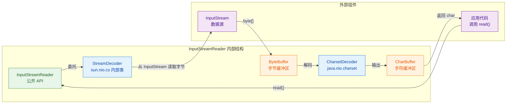

当你调用 `InputStreamReader.read()` 时，内部发生的事情是：

1. `StreamDecoder` 从底层 `InputStream` 读取一批字节到内部的 `ByteBuffer`
2. `CharsetDecoder` 将 `ByteBuffer` 中的字节按指定编码解码为字符，存入 `CharBuffer`
3. 从 `CharBuffer` 中取出字符返回给调用者

这个过程是批量进行的（不是每次 `read()` 都去底层读一个字节），所以 `InputStreamReader` 本身就有一定的缓冲效果。但这个内部缓冲区很小，远不如 `BufferedReader` 的 8KB 默认缓冲区，所以在实际使用中仍然建议外层包装 `BufferedReader`。

---

### 常见编码问题排查

在实际开发中，编码问题是最令人头疼的 bug 之一。以下是一些常见场景和排查思路：

#### 场景一：读取文件乱码

```java
// 问题代码：不知道文件编码，用默认编码读取
BufferedReader br = new BufferedReader(new FileReader("data.txt"));
// 如果文件是 GBK 编码，而系统默认 UTF-8，就会乱码

// 修复：确认文件编码后显式指定
BufferedReader br = new BufferedReader(
    new InputStreamReader(new FileInputStream("data.txt"), "GBK"));
```

#### 场景二：网络流乱码

```java
// 从 HTTP 响应中读取内容
// 需要根据 Content-Type 头中的 charset 参数确定编码
InputStream is = connection.getInputStream();  // 字节流
String charset = "UTF-8";  // 从响应头解析，默认 UTF-8
// 使用转换流指定正确编码
BufferedReader reader = new BufferedReader(
    new InputStreamReader(is, charset));
```

#### 场景三：写出文件后用其他工具打开乱码

```java
// 问题：用默认编码写出，其他工具（如 Excel）期望 GBK
// 修复：根据目标工具的期望编码来写出
BufferedWriter writer = new BufferedWriter(
    new OutputStreamWriter(
        new FileOutputStream("report.csv"), "GBK"));  // Excel 中文版期望 GBK

// 或者写出 UTF-8 BOM 头让 Excel 识别 UTF-8
OutputStream os = new FileOutputStream("report.csv");
os.write(0xEF);  // UTF-8 BOM 第1字节
os.write(0xBB);  // UTF-8 BOM 第2字节
os.write(0xBF);  // UTF-8 BOM 第3字节
BufferedWriter writer = new BufferedWriter(
    new OutputStreamWriter(os, "UTF-8"));
```

---

### 转换流使用总结

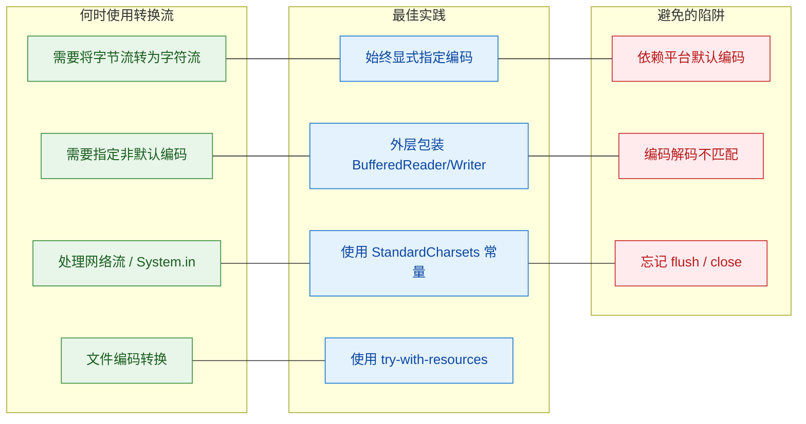

最后，用一段综合示例将本节所有知识点串联起来：

```java
import java.io.*;
import java.nio.charset.StandardCharsets;

/**
 * 综合示例：从控制台读取用户输入，写入 UTF-8 文件，
 * 再以 UTF-8 读取并输出到控制台
 */
public class ConversionStreamFullDemo {
    public static void main(String[] args) {
        String filePath = "user_input.txt";  // 目标文件路径

        // ========== 第一阶段：从控制台读取，写入文件 ==========
        // System.in (InputStream) → InputStreamReader (解码) → BufferedReader (缓冲)
        try (BufferedReader consoleReader = new BufferedReader(
                new InputStreamReader(System.in, StandardCharsets.UTF_8));
             // FileOutputStream → OutputStreamWriter (UTF-8编码) → BufferedWriter (缓冲)
             BufferedWriter fileWriter = new BufferedWriter(
                new OutputStreamWriter(
                        new FileOutputStream(filePath), StandardCharsets.UTF_8))) {

            System.out.println("请输入内容（输入 end 结束）：");

            String line;  // 存储每行用户输入
            while ((line = consoleReader.readLine()) != null) {  // 逐行读取
                if ("end".equalsIgnoreCase(line)) {  // 用户输入 end 时停止
                    break;
                }
                fileWriter.write(line);     // 将该行写入文件
                fileWriter.newLine();       // 写入换行符
            }
            fileWriter.flush();  // 确保所有内容写出
            System.out.println("内容已保存到 " + filePath);

        } catch (IOException e) {
            e.printStackTrace();  // 打印异常信息
            return;               // 出错则终止程序
        }

        // ========== 第二阶段：从文件读取，输出到控制台 ==========
        System.out.println("\n--- 读取文件内容 ---");
        // FileInputStream → InputStreamReader (UTF-8解码) → BufferedReader (缓冲)
        try (BufferedReader fileReader = new BufferedReader(
                new InputStreamReader(
                        new FileInputStream(filePath), StandardCharsets.UTF_8))) {

            String line;  // 存储每行文件内容
            int lineNum = 0;  // 行号计数器
            while ((line = fileReader.readLine()) != null) {  // 逐行读取文件
                lineNum++;  // 行号递增
                System.out.printf("第%d行: %s%n", lineNum, line);  // 格式化输出
            }

        } catch (IOException e) {
            e.printStackTrace();  // 打印异常信息
        }
    }
}
```

---

**📝 练习题**

以下代码在 Windows（默认编码 GBK）上运行，读取一个 UTF-8 编码的文件 `notes.txt`，文件内容为 `"学习Java"`。请问控制台输出的结果是什么？

```java
FileReader fr = new FileReader("notes.txt");
BufferedReader br = new BufferedReader(fr);
System.out.println(br.readLine());
br.close();
```

A. 正常输出 `学习Java`

B. 输出乱码（中文部分乱码，英文部分正常）

C. 抛出 `UnsupportedEncodingException`

D. 抛出 `MalformedInputException`


**【答案】** B

**【解析】** `FileReader` 在 Java 8 中没有指定编码的构造方法，它默认使用平台编码。在 Windows 中文版上，平台默认编码是 GBK。文件实际是 UTF-8 编码，中文 `"学习"` 在 UTF-8 中是 6 个字节（每个汉字 3 字节），GBK 解码器会将这 6 个字节按每 2 字节一组解码为 3 个 GBK 字符，得到的是错误的汉字（乱码）。而 `"Java"` 这 4 个英文字母在 UTF-8 和 GBK 中的编码完全相同（都是 ASCII 单字节），所以英文部分能正常显示。这就是典型的"编码-解码不匹配"导致的乱码问题。修复方法是使用 `InputStreamReader` 显式指定 UTF-8 编码：`new InputStreamReader(new FileInputStream("notes.txt"), StandardCharsets.UTF_8)`。

---

**📝 练习题**

关于 `InputStreamReader` 和 `OutputStreamWriter`，以下说法正确的是？

A. `InputStreamReader` 是字节流，`OutputStreamWriter` 是字符流

B. `FileReader` 是 `InputStreamReader` 的父类

C. 转换流的构造方法中如果不指定编码，则默认使用 UTF-8

D. `InputStreamReader` 继承自 `Reader`，是字符流，内部包装了一个字节流并负责解码


**【答案】** D

**【解析】** 逐项分析：A 错误，`InputStreamReader` 继承自 `Reader`，它本身是字符流而非字节流，`OutputStreamWriter` 继承自 `Writer`，也是字符流；B 错误，继承关系恰好相反，`FileReader` 是 `InputStreamReader` 的子类（`FileReader extends InputStreamReader`）；C 错误，不指定编码时使用的是平台默认编码（`Charset.defaultCharset()`），在 Windows 中文版上是 GBK，在大多数 Linux/macOS 上才是 UTF-8，并非固定使用 UTF-8；D 正确，`InputStreamReader` 确实继承自 `Reader`，属于字符流家族，它的核心职责就是包装一个 `InputStream`（字节流），通过内部的 `StreamDecoder` 将字节按指定编码解码为字符。

---

## File 操作

Java 中的 `java.io.File` 类是传统 IO 体系中与文件系统交互的核心入口。它并不代表文件的"内容"，而是代表文件或目录在文件系统中的一个**抽象路径名 (abstract pathname)**。你可以把它理解为一张"名片"——它记录了文件的地址信息，但名片本身不是人。真正读写文件内容，仍然需要借助前面学过的 Stream / Reader / Writer。

`File` 类的职责边界非常清晰：**它只负责文件和目录的元数据操作**——创建、删除、重命名、查询属性、遍历目录等。理解这一点，是正确使用 `File` 的前提。

---

### File 对象的创建与路径概念

创建 `File` 对象有多种构造方式，但核心思想都是传入一个路径字符串。`File` 对象创建时**不会检查文件是否真实存在**，它仅仅是对路径的一层封装。

```java
import java.io.File;

public class FileCreationDemo {
    public static void main(String[] args) {
        // 方式一：直接传入完整路径字符串
        File file1 = new File("/home/user/documents/hello.txt");

        // 方式二：父路径(字符串) + 子路径
        File file2 = new File("/home/user/documents", "hello.txt");

        // 方式三：父路径(File对象) + 子路径 —— 最灵活，推荐
        File parentDir = new File("/home/user/documents");
        File file3 = new File(parentDir, "hello.txt");

        // 即使文件不存在，File 对象也能正常创建，不会抛异常
        File ghost = new File("/no/such/path/phantom.txt");
        System.out.println(ghost.exists()); // false —— 文件不存在，但对象已创建
    }
}
```

路径分为**绝对路径 (Absolute Path)** 和**相对路径 (Relative Path)** 两种：

- 绝对路径：从文件系统根目录开始的完整路径，如 `/home/user/file.txt`（Linux/Mac）或 `C:\Users\file.txt`（Windows）。
- 相对路径：相对于当前工作目录（通常是项目根目录）的路径，如 `src/main/resources/config.properties`。

跨平台开发时，路径分隔符是个经典坑。Windows 用反斜杠 `\`，Linux/Mac 用正斜杠 `/`。Java 提供了 `File.separator` 常量来解决这个问题：

```java
public class PathSeparatorDemo {
    public static void main(String[] args) {
        // File.separator 在 Windows 上是 "\"，在 Linux/Mac 上是 "/"
        System.out.println("当前系统路径分隔符: " + File.separator);

        // 跨平台安全写法
        String path = "home" + File.separator + "user" + File.separator + "file.txt";
        File file = new File(path);

        // 实际开发中，直接用正斜杠 "/" 也可以 —— Java 内部会自动转换
        // 这是因为 JVM 在 Windows 上也能识别正斜杠
        File file2 = new File("home/user/file.txt");
    }
}
```

`File` 提供了三个方法来获取不同形式的路径信息：

```java
public class PathInfoDemo {
    public static void main(String[] args) {
        // 用相对路径创建 File 对象
        File file = new File("src/../src/main/./resources/config.properties");

        // getPath()：返回构造时传入的原始路径，原样返回
        System.out.println("getPath():         " + file.getPath());
        // 输出: src/../src/main/./resources/config.properties

        // getAbsolutePath()：返回绝对路径，但不解析 "." 和 ".."
        System.out.println("getAbsolutePath(): " + file.getAbsolutePath());
        // 输出: /project/root/src/../src/main/./resources/config.properties

        // getCanonicalPath()：返回规范化的绝对路径，解析掉 "." 和 ".."
        // 注意：此方法会访问文件系统，可能抛出 IOException
        System.out.println("getCanonicalPath(): " + file.getCanonicalPath());
        // 输出: /project/root/src/main/resources/config.properties
    }
}
```

三者的区别用一张图来理解：

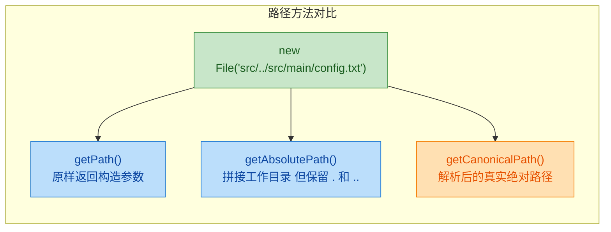

---

### 文件与目录的创建

`File` 类提供了创建文件和目录的方法，但它们的行为差异需要特别注意：

```java
import java.io.File;
import java.io.IOException;

public class FileAndDirCreationDemo {
    public static void main(String[] args) throws IOException {

        // ========== 创建文件 ==========
        File newFile = new File("test_output/demo.txt");

        // createNewFile() 只创建文件本身，不会自动创建父目录
        // 如果父目录 test_output 不存在，会抛出 IOException
        // 如果文件已存在，返回 false；创建成功返回 true
        boolean created = newFile.createNewFile();
        System.out.println("文件创建结果: " + created);

        // ========== 创建单层目录 ==========
        File singleDir = new File("test_output/level1");

        // mkdir() 只创建最后一级目录
        // 如果父目录 test_output 不存在，创建失败，返回 false
        boolean dirCreated = singleDir.mkdir();
        System.out.println("单层目录创建结果: " + dirCreated);

        // ========== 创建多层目录（推荐） ==========
        File multiDir = new File("test_output/level1/level2/level3");

        // mkdirs() 递归创建所有不存在的父目录 —— 实际开发中几乎总是用这个
        boolean dirsCreated = multiDir.mkdirs();
        System.out.println("多层目录创建结果: " + dirsCreated);
    }
}
```

一个非常常见的实战模式是：**在创建文件之前，先确保其父目录存在**。

```java
public class SafeFileCreation {
    public static void main(String[] args) throws IOException {
        File targetFile = new File("output/reports/2024/summary.txt");

        // 获取父目录的 File 对象
        File parentDir = targetFile.getParentFile();

        // 如果父目录不存在，先递归创建
        if (parentDir != null && !parentDir.exists()) {
            parentDir.mkdirs(); // 递归创建 output/reports/2024/
        }

        // 现在可以安全地创建文件了
        targetFile.createNewFile();
    }
}
```

`mkdir()` 与 `mkdirs()` 的区别是面试高频考点，用一个简单的对比来记忆：

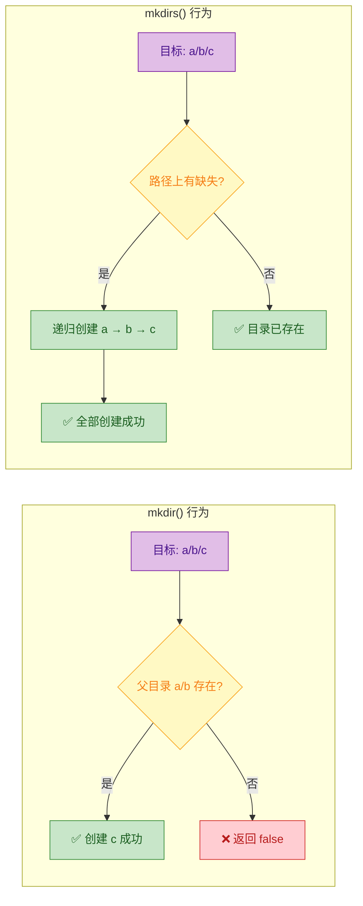

---

### 文件属性查询

`File` 类提供了丰富的方法来查询文件或目录的元数据信息，这些方法在日常开发中使用频率很高：

```java
import java.io.File;
import java.text.SimpleDateFormat;
import java.util.Date;

public class FileAttributeDemo {
    public static void main(String[] args) {
        File file = new File("src/main/java/App.java");

        // ========== 存在性与类型判断 ==========
        System.out.println("是否存在: " + file.exists());       // true/false
        System.out.println("是文件吗: " + file.isFile());       // true —— 是普通文件
        System.out.println("是目录吗: " + file.isDirectory());  // false —— 不是目录
        System.out.println("是隐藏的: " + file.isHidden());     // Linux 下以 "." 开头的文件为隐藏

        // ========== 名称与路径信息 ==========
        System.out.println("文件名:   " + file.getName());      // App.java
        System.out.println("父目录:   " + file.getParent());    // src/main/java

        // ========== 大小信息 ==========
        // length() 返回字节数，对目录调用结果不可靠（依赖操作系统实现）
        long bytes = file.length();
        System.out.println("文件大小: " + bytes + " bytes");
        System.out.println("文件大小: " + (bytes / 1024.0) + " KB");

        // ========== 时间信息 ==========
        long lastModified = file.lastModified(); // 返回毫秒时间戳
        SimpleDateFormat sdf = new SimpleDateFormat("yyyy-MM-dd HH:mm:ss");
        System.out.println("最后修改: " + sdf.format(new Date(lastModified)));

        // ========== 权限信息 ==========
        System.out.println("可读: " + file.canRead());
        System.out.println("可写: " + file.canWrite());
        System.out.println("可执行: " + file.canExecute());
    }
}
```

有一个容易踩的坑：**对一个不存在的文件调用 `isFile()` 和 `isDirectory()` 都会返回 `false`**。所以在做类型判断之前，通常需要先调用 `exists()` 确认文件存在。

```java
// 错误示范 —— 逻辑漏洞
File f = new File("maybe_not_exist.txt");
if (!f.isDirectory()) {
    // 你以为它是文件？不一定！它可能根本不存在
    System.out.println("它是文件"); // 可能是错误的结论
}

// 正确做法
if (f.exists() && f.isFile()) {
    System.out.println("确认是一个存在的文件");
}
```

---

### 文件的删除与重命名

```java
import java.io.File;
import java.io.IOException;

public class FileDeleteRenameDemo {
    public static void main(String[] args) throws IOException {

        // ========== 删除文件 ==========
        File tempFile = new File("temp.txt");
        tempFile.createNewFile(); // 先创建

        // delete() 立即删除，成功返回 true
        // 注意：不会进入回收站，直接永久删除！
        boolean deleted = tempFile.delete();
        System.out.println("删除结果: " + deleted);

        // deleteOnExit() 注册一个 JVM 关闭钩子，在程序退出时自动删除
        // 常用于临时文件的清理
        File tmp = File.createTempFile("app_", ".tmp"); // 创建系统临时文件
        tmp.deleteOnExit(); // JVM 退出时自动清理

        // ========== 删除目录 ==========
        // delete() 只能删除空目录！如果目录内有文件或子目录，返回 false
        File emptyDir = new File("empty_folder");
        emptyDir.mkdir();
        System.out.println("删除空目录: " + emptyDir.delete()); // true

        // ========== 重命名 / 移动 ==========
        File source = new File("old_name.txt");
        source.createNewFile();

        // renameTo() 既可以重命名，也可以移动文件（如果目标路径不同）
        File target = new File("new_name.txt");
        boolean renamed = source.renameTo(target);
        System.out.println("重命名结果: " + renamed);

        // 跨分区移动时 renameTo() 可能失败 —— 行为依赖操作系统
        // 生产环境建议使用 java.nio.file.Files.move() 替代
    }
}
```

删除非空目录是一个经典的递归问题。`File.delete()` 无法直接删除包含内容的目录，必须先递归清空：

```java
public class RecursiveDeleteDemo {

    /**
     * 递归删除文件或目录（包括其所有子内容）
     * @param file 要删除的文件或目录
     * @return 是否删除成功
     */
    public static boolean deleteRecursively(File file) {
        // 如果是目录，先递归删除其中的所有子项
        if (file.isDirectory()) {
            // listFiles() 获取目录下的所有子文件和子目录
            File[] children = file.listFiles();
            if (children != null) { // listFiles() 在 IO 错误时可能返回 null
                for (File child : children) {
                    // 递归调用：深度优先，先删最深层的内容
                    deleteRecursively(child);
                }
            }
        }
        // 目录已清空（或本身就是文件），现在可以安全删除
        return file.delete();
    }

    public static void main(String[] args) {
        File dir = new File("project_backup");
        boolean result = deleteRecursively(dir);
        System.out.println("递归删除结果: " + result);
    }
}
```

递归删除的执行流程：

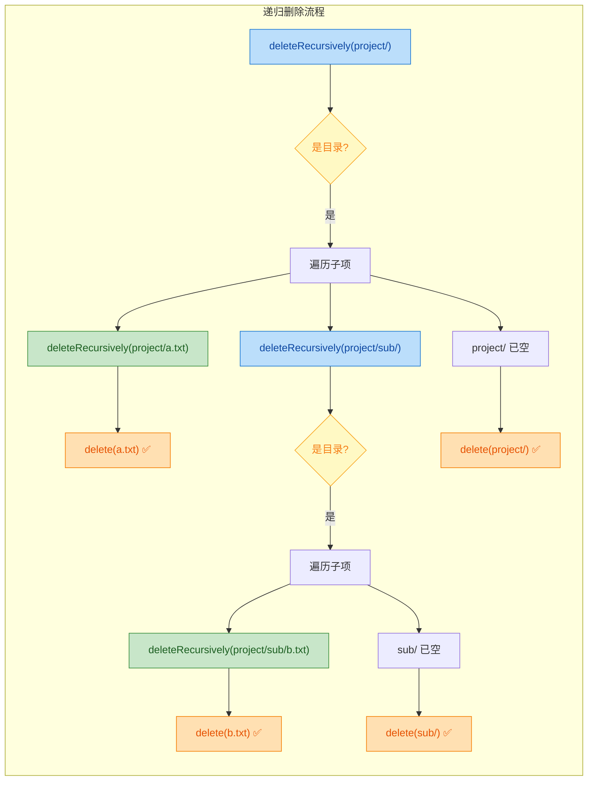

---

### 目录遍历

遍历目录是 `File` 类最实用的功能之一。Java 提供了两个方法：

```java
import java.io.File;
import java.io.FilenameFilter;

public class DirectoryListDemo {
    public static void main(String[] args) {
        File dir = new File("src/main/java");

        // ========== list()：返回 String 数组（仅文件名） ==========
        String[] names = dir.list();
        if (names != null) {
            for (String name : names) {
                System.out.println("名称: " + name); // 只有文件名，没有路径
            }
        }

        // ========== listFiles()：返回 File 数组（完整 File 对象） ==========
        // 推荐使用这个，因为返回的 File 对象可以继续调用各种方法
        File[] files = dir.listFiles();
        if (files != null) {
            for (File f : files) {
                // 可以直接判断类型、获取大小等
                String type = f.isDirectory() ? "[DIR]" : "[FILE]";
                System.out.println(type + " " + f.getName() + " (" + f.length() + " bytes)");
            }
        }
    }
}
```

`listFiles()` 还支持传入过滤器，这在实际项目中非常有用——比如只查找 `.java` 文件：

```java
import java.io.File;
import java.io.FileFilter;
import java.io.FilenameFilter;

public class FileFilterDemo {
    public static void main(String[] args) {
        File dir = new File("src/main/java");

        // ========== 方式一：FilenameFilter（基于文件名过滤） ==========
        // 函数式接口，可以用 Lambda 简化
        String[] javaFiles = dir.list((directory, name) -> name.endsWith(".java"));
        // directory: 父目录的 File 对象
        // name: 子项的文件名字符串

        // ========== 方式二：FileFilter（基于 File 对象过滤，更强大） ==========
        // 可以根据文件大小、修改时间、是否为目录等条件过滤
        File[] bigFiles = dir.listFiles(file ->
            file.isFile() && file.length() > 1024 // 只要大于 1KB 的文件
        );

        // ========== 实战：只获取子目录 ==========
        File[] subDirs = dir.listFiles(File::isDirectory);
        // 方法引用，等价于 file -> file.isDirectory()
    }
}
```

结合递归，可以实现完整的目录树遍历。这是一个非常经典的递归应用场景：

```java
import java.io.File;

public class DirectoryTreeDemo {

    /**
     * 递归打印目录树结构
     * @param file   当前文件或目录
     * @param prefix 缩进前缀，用于可视化层级
     * @param isLast 是否是同级中的最后一个（影响树形符号）
     */
    public static void printTree(File file, String prefix, boolean isLast) {
        // 打印当前节点：根据是否为最后一个子项选择不同的树形符号
        String connector = isLast ? "└── " : "├── ";
        System.out.println(prefix + connector + file.getName());

        // 如果是目录，递归处理其子项
        if (file.isDirectory()) {
            File[] children = file.listFiles();
            if (children != null) {
                for (int i = 0; i < children.length; i++) {
                    // 计算下一层的缩进前缀
                    // 如果当前是最后一个，后续用空格；否则用竖线保持连接
                    String childPrefix = prefix + (isLast ? "    " : "│   ");
                    // 判断子项是否是同级中的最后一个
                    boolean childIsLast = (i == children.length - 1);
                    // 递归调用
                    printTree(children[i], childPrefix, childIsLast);
                }
            }
        }
    }

    public static void main(String[] args) {
        File root = new File("src");
        System.out.println(root.getName()); // 先打印根目录名
        // 获取根目录的子项，启动递归
        File[] rootChildren = root.listFiles();
        if (rootChildren != null) {
            for (int i = 0; i < rootChildren.length; i++) {
                printTree(rootChildren[i], "", i == rootChildren.length - 1);
            }
        }
    }
}
```

运行效果类似：

```text
src
├── main
│   ├── java
│   │   ├── App.java
│   │   └── utils
│   │       └── StringHelper.java
│   └── resources
│       └── config.properties
└── test
    └── java
        └── AppTest.java
```

---

### File 类的局限性与 NIO.2 的改进

`File` 类诞生于 JDK 1.0，设计上存在一些历史遗留问题。从 JDK 7 开始，`java.nio.file` 包（通常称为 NIO.2）提供了更现代的替代方案。了解 `File` 的局限性，有助于理解为什么现代项目更推荐使用 NIO.2。

```java
import java.io.File;
import java.io.IOException;
import java.nio.file.*;

public class FileLimitationsDemo {
    public static void main(String[] args) throws IOException {

        // ========== 局限 1：错误处理不友好 ==========
        // File.delete() 失败时只返回 false，不告诉你原因
        File f = new File("nonexistent.txt");
        boolean result = f.delete(); // false —— 为什么失败？权限？不存在？被占用？不知道

        // NIO.2 的 Files.delete() 会抛出具体异常
        try {
            Files.delete(Path.of("nonexistent.txt"));
        } catch (NoSuchFileException e) {
            System.out.println("文件不存在: " + e.getMessage()); // 明确的错误原因
        }

        // ========== 局限 2：不支持符号链接 (Symbolic Link) ==========
        // File 类无法区分符号链接和真实文件
        // NIO.2 的 Files.isSymbolicLink() 可以判断

        // ========== 局限 3：属性操作有限 ==========
        // File 类无法获取文件所有者、权限位 (POSIX) 等高级属性
        // NIO.2 可以：
        // Files.getOwner(path)
        // Files.getPosixFilePermissions(path)

        // ========== 局限 4：目录遍历效率低 ==========
        // File.listFiles() 一次性加载所有子项到内存
        // 如果目录下有百万级文件，可能导致 OOM
        // NIO.2 的 Files.newDirectoryStream() 是惰性加载的流式 API
    }
}
```

`File` 与 `Path` 之间可以互相转换，方便在新旧 API 之间过渡：

```java
import java.io.File;
import java.nio.file.Path;

public class FilePathConversionDemo {
    public static void main(String[] args) {
        // File → Path
        File file = new File("src/main/java/App.java");
        Path path = file.toPath(); // 从 File 转为 Path

        // Path → File
        Path path2 = Path.of("src/main/resources/config.properties");
        File file2 = path2.toFile(); // 从 Path 转回 File

        // 实际开发建议：
        // - 新项目优先使用 java.nio.file.Path + Files 工具类
        // - 维护老项目时，遇到 File 对象可以用 toPath() 桥接到 NIO.2 API
    }
}
```

两套 API 的核心对比：

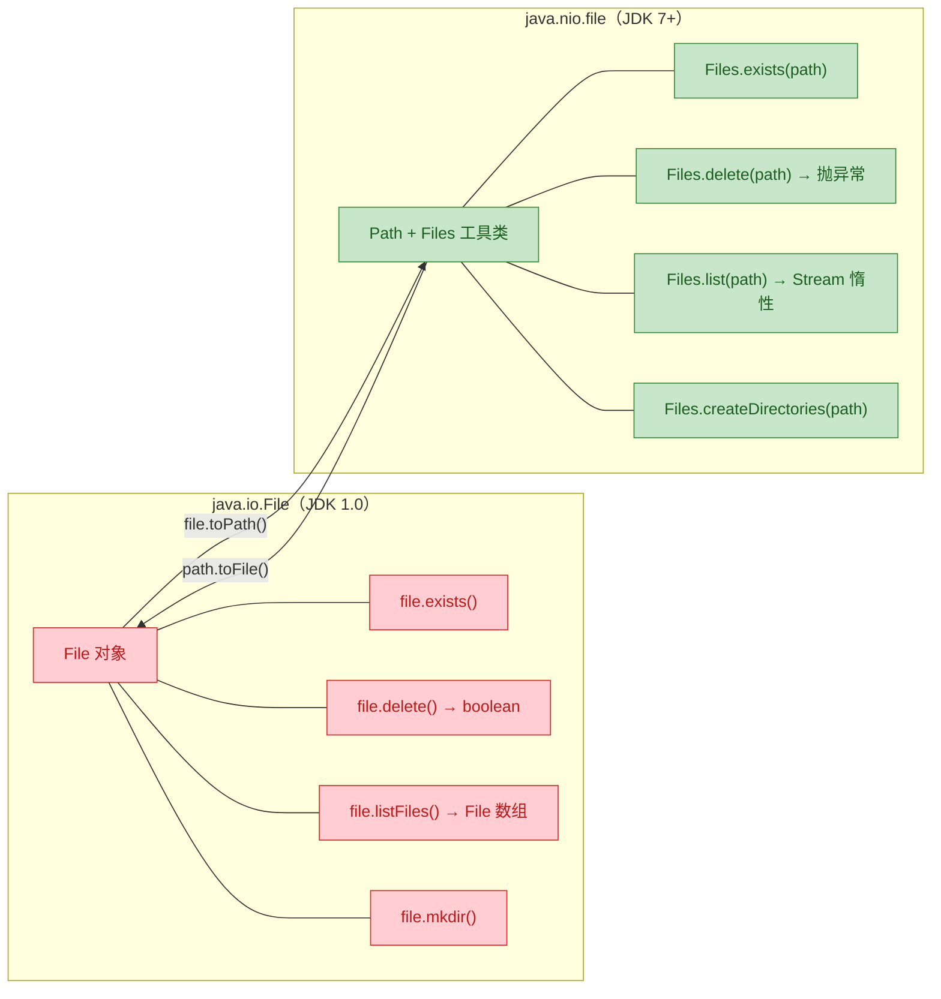

---

### 实战：文件搜索工具

把前面学到的知识综合起来，实现一个简单但实用的文件搜索工具：

```java
import java.io.File;
import java.util.ArrayList;
import java.util.List;

/**
 * 简易文件搜索工具
 * 支持按扩展名、文件名关键字、文件大小范围搜索
 */
public class FileSearchTool {

    /**
     * 在指定目录下递归搜索符合条件的文件
     * @param dir       搜索的根目录
     * @param extension 目标扩展名（如 ".java"），传 null 表示不限
     * @param keyword   文件名包含的关键字，传 null 表示不限
     * @param minSize   最小文件大小（字节），传 -1 表示不限
     * @return 符合条件的文件列表
     */
    public static List<File> search(File dir, String extension, String keyword, long minSize) {
        // 存放搜索结果
        List<File> results = new ArrayList<>();
        // 调用递归方法
        doSearch(dir, extension, keyword, minSize, results);
        return results;
    }

    /**
     * 递归搜索的核心实现
     */
    private static void doSearch(File current, String extension, String keyword,
                                  long minSize, List<File> results) {
        // 安全检查：如果传入的不是目录或为 null，直接返回
        if (current == null || !current.isDirectory()) {
            return;
        }

        // 获取当前目录下的所有子项
        File[] children = current.listFiles();
        if (children == null) {
            return; // IO 错误时 listFiles() 可能返回 null
        }

        for (File child : children) {
            if (child.isDirectory()) {
                // 如果是子目录，递归深入
                doSearch(child, extension, keyword, minSize, results);
            } else if (child.isFile()) {
                // 如果是文件，检查是否满足所有条件
                if (matchesExtension(child, extension)
                        && matchesKeyword(child, keyword)
                        && matchesSize(child, minSize)) {
                    results.add(child); // 满足条件，加入结果集
                }
            }
        }
    }

    /**
     * 检查文件扩展名是否匹配
     */
    private static boolean matchesExtension(File file, String extension) {
        // 如果未指定扩展名，视为匹配
        if (extension == null || extension.isEmpty()) {
            return true;
        }
        // getName() 获取文件名，转小写后比较扩展名
        return file.getName().toLowerCase().endsWith(extension.toLowerCase());
    }

    /**
     * 检查文件名是否包含关键字
     */
    private static boolean matchesKeyword(File file, String keyword) {
        // 如果未指定关键字，视为匹配
        if (keyword == null || keyword.isEmpty()) {
            return true;
        }
        // 不区分大小写的关键字匹配
        return file.getName().toLowerCase().contains(keyword.toLowerCase());
    }

    /**
     * 检查文件大小是否满足最小值要求
     */
    private static boolean matchesSize(File file, long minSize) {
        // 如果未指定最小大小（-1），视为匹配
        if (minSize < 0) {
            return true;
        }
        return file.length() >= minSize;
    }

    public static void main(String[] args) {
        File searchRoot = new File("src");

        // 搜索所有 .java 文件，文件名包含 "Demo"，大小不限
        List<File> results = search(searchRoot, ".java", "Demo", -1);

        System.out.println("搜索结果 (" + results.size() + " 个文件):");
        System.out.println("─".repeat(60));

        for (File f : results) {
            // 格式化输出：文件路径 + 大小
            String size = String.format("%.1f KB", f.length() / 1024.0);
            System.out.printf("  %-45s %s%n", f.getPath(), size);
        }
    }
}
```

这个工具虽然简单，但覆盖了 `File` 类的核心用法：递归遍历、类型判断、属性查询、过滤器模式。在真实项目中，你可以在此基础上扩展更多条件（修改时间范围、正则匹配等），或者将结果输出为 JSON/CSV 格式。

---

### File 操作的常见陷阱与最佳实践

在实际开发中，`File` 类有一些容易踩坑的地方，总结如下：

**陷阱一：`listFiles()` 可能返回 `null`**

这不仅仅发生在路径不存在时。如果 `File` 对象指向的是一个文件而非目录，或者发生了 IO 错误（比如权限不足），`listFiles()` 都会返回 `null`。不做 null 检查就直接遍历，会抛出 `NullPointerException`。

```java
// 危险写法 —— 生产环境中可能 NPE
for (File f : dir.listFiles()) { // 如果 listFiles() 返回 null，这里直接炸
    // ...
}

// 安全写法
File[] files = dir.listFiles();
if (files != null) {
    for (File f : files) {
        // 安全遍历
    }
}
```

**陷阱二：`length()` 对目录的行为不可靠**

`File.length()` 对目录调用时，返回值取决于操作系统实现——有的返回 0，有的返回目录元数据的大小，但绝不是目录内所有文件的总大小。如果需要计算目录总大小，必须递归累加：

```java
/**
 * 递归计算目录的总大小（所有文件字节数之和）
 */
public static long calculateDirSize(File dir) {
    long totalSize = 0; // 累加器
    File[] files = dir.listFiles();
    if (files != null) {
        for (File f : files) {
            if (f.isFile()) {
                totalSize += f.length();       // 文件：直接累加大小
            } else if (f.isDirectory()) {
                totalSize += calculateDirSize(f); // 目录：递归计算
            }
        }
    }
    return totalSize;
}
```

**陷阱三：`renameTo()` 的跨平台不一致性**

`renameTo()` 的行为高度依赖操作系统。在同一文件系统（同一磁盘分区）内移动通常成功，但跨分区移动可能静默失败。而且它不会抛异常，只返回 `false`，让你无从排查原因。生产环境强烈建议使用 NIO.2 的 `Files.move()`：

```java
import java.nio.file.*;

// NIO.2 的 move —— 更可靠，失败时抛出明确异常
Files.move(
    Path.of("old_location/file.txt"),       // 源路径
    Path.of("new_location/file.txt"),       // 目标路径
    StandardCopyOption.REPLACE_EXISTING     // 如果目标已存在则覆盖
);
```

**最佳实践总结：**

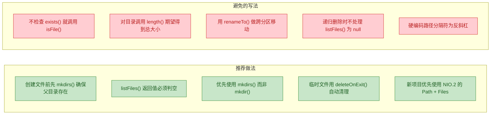

---

**📝 练习题**

以下代码的输出结果是什么？

```java
File dir = new File("testDir");
dir.mkdir();
File file = new File("testDir/a.txt");
file.createNewFile();
System.out.println(dir.delete());
System.out.println(dir.exists());
```

A. `true`，`false`


B. `false`，`true`


C. `false`，`false`


D. 抛出 `IOException`

**【答案】** B

**【解析】** `File.delete()` 只能删除空目录。此时 `testDir` 下还有 `a.txt`，所以 `delete()` 删除失败，返回 `false`。由于删除失败，目录仍然存在，`exists()` 返回 `true`。这正是前面提到的——要删除非空目录，必须先递归删除其中的所有内容。同时也体现了 `File.delete()` 的一个设计缺陷：失败时只返回 `false`，不告诉你"因为目录非空所以删不掉"。如果使用 NIO.2 的 `Files.delete()`，则会抛出 `DirectoryNotEmptyException`，错误原因一目了然。

---

## 本章小结

传统 IO（`java.io`）是 Java 最早提供的输入输出体系，虽然在 JDK 1.4 之后有了 NIO 的补充，但它至今仍然是日常开发中使用频率最高的 IO 方案之一。回顾本章，我们从流的分类出发，逐步深入到每一类核心流的原理与实践，下面用一张全景图把整章知识串联起来。

### 全景知识图谱

```mermaid
graph LR
    subgraph Classification["流分类体系"]
        direction TB
        A["按数据单位"]:::green --> A1["字节流 byte"]:::greenLight
        A --> A2["字符流 char"]:::greenLight
        B["按方向"]:::green --> B1["输入流 Input"]:::greenLight
        B --> B2["输出流 Output"]:::greenLight
        C["按角色"]:::green --> C1["节点流 Node"]:::greenLight
        C --> C2["处理流 Wrapper"]:::greenLight
    end

    subgraph ByteStream["字节流家族"]
        direction TB
        D["InputStream 抽象基类"]:::blue --> D1["FileInputStream"]:::blueLight
        D --> D2["ByteArrayInputStream"]:::blueLight
        D --> D3["BufferedInputStream"]:::blueLight
        E["OutputStream 抽象基类"]:::blue --> E1["FileOutputStream"]:::blueLight
        E --> E2["ByteArrayOutputStream"]:::blueLight
        E --> E3["BufferedOutputStream"]:::blueLight
    end

    subgraph CharStream["字符流家族"]
        direction TB
        F["Reader 抽象基类"]:::teal --> F1["FileReader"]:::tealLight
        F --> F2["BufferedReader"]:::tealLight
        F --> F3["InputStreamReader"]:::tealLight
        G["Writer 抽象基类"]:::teal --> G1["FileWriter"]:::tealLight
        G --> G2["BufferedWriter"]:::tealLight
        G --> G3["OutputStreamWriter"]:::tealLight
    end

    subgraph Utility["工具与增强"]
        direction TB
        H["File 文件操作"]:::orange
        I["缓冲流 Buffered"]:::orange
        J["转换流 Bridge"]:::orange
        K["try-with-resources"]:::orange
    end

    Classification --> ByteStream
    Classification --> CharStream
    ByteStream --> Utility
    CharStream --> Utility

    classDef green fill:#4CAF50,stroke:#388E3C,color:#FFFFFF
    classDef greenLight fill:#C8E6C9,stroke:#81C784,color:#1B5E20
    classDef blue fill:#2196F3,stroke:#1976D2,color:#FFFFFF
    classDef blueLight fill:#BBDEFB,stroke:#64B5F6,color:#0D47A1
    classDef teal fill:#009688,stroke:#00796B,color:#FFFFFF
    classDef tealLight fill:#B2DFDB,stroke:#80CBC4,color:#004D40
    classDef orange fill:#FF9800,stroke:#F57C00,color:#FFFFFF
```

### 核心知识回顾

本章涵盖了六大核心板块，每一块都解决了一个关键问题：

**流分类** 是理解整个 IO 体系的地基。Java 把"数据从哪来、到哪去"这件事抽象成了"流"（Stream）的概念，然后沿着三个维度进行切分：按数据单位分为字节流和字符流，按方向分为输入流和输出流，按角色分为节点流和处理流。这三个维度两两组合，就构成了 `java.io` 包下几十个类的分类坐标系。理解了这套坐标系，面对任何一个陌生的流类，你都能迅速定位它的职责。

**InputStream / OutputStream** 是字节流的两大抽象基类。`InputStream` 定义了 `read()` 系列方法，`OutputStream` 定义了 `write()` 系列方法。它们以 byte（8 bit）为最小操作单位，天然适合处理二进制数据——图片、音频、视频、序列化对象等。我们重点学习了 `FileInputStream` / `FileOutputStream` 的文件读写，以及"单字节读取 vs 缓冲区批量读取"之间巨大的性能差异。一个核心结论是：**永远不要在生产代码中逐字节读取，至少使用 `byte[]` 缓冲区**。

**Reader / Writer** 是字符流的两大抽象基类。它们以 char（16 bit）为最小操作单位，专门为文本处理而生。`FileReader` / `FileWriter` 是最常用的实现，但它们有一个隐藏陷阱——默认使用平台编码（platform default charset），在跨平台场景下极易产生乱码。这也引出了转换流的必要性。

**缓冲流**（`BufferedInputStream` / `BufferedOutputStream` / `BufferedReader` / `BufferedWriter`）是 Decorator Pattern（装饰器模式）在 Java IO 中最经典的应用。它们在底层节点流之上包裹了一个内存缓冲区（默认 8192 字节/字符），把大量零散的系统调用合并为少量的批量操作，从而大幅降低 I/O 开销。`BufferedReader` 还额外提供了 `readLine()` 方法，这是逐行读取文本文件的事实标准。

**转换流**（`InputStreamReader` / `OutputStreamWriter`）是字节世界与字符世界之间的桥梁（Bridge）。它们的核心价值在于：允许你在构造时显式指定字符编码（如 `StandardCharsets.UTF_8`），从而彻底掌控编解码过程，杜绝乱码。一条黄金法则是：**凡是涉及文本 IO，优先使用转换流 + 显式编码，而非 FileReader / FileWriter**。

**File 操作** 提供了对文件系统元数据的访问能力——创建、删除、重命名、遍历目录、查询属性等。`java.io.File` 是传统 API，功能够用但设计上有一些不足（如删除失败只返回 `false` 而不抛异常）。JDK 7 引入的 `java.nio.file.Files` + `Path` 是更现代的替代方案，但在传统 IO 的语境下，`File` 类仍然是必须掌握的基础。

### 装饰器模式：贯穿全章的设计思想

如果要用一个设计模式来概括整个 `java.io` 的架构哲学，那就是 **Decorator Pattern**。

```mermaid
graph LR
    subgraph Decorator["装饰器层层包裹"]
        direction TB
        L1["BufferedReader"]:::blue
        L2["InputStreamReader UTF-8"]:::teal
        L3["FileInputStream"]:::orange
        L1 -->|"包裹"| L2
        L2 -->|"包裹"| L3
    end

    subgraph Code["对应代码"]
        direction TB
        C1["new BufferedReader("]:::blueLight
        C2["  new InputStreamReader("]:::tealLight
        C3["    new FileInputStream file, UTF_8))"]:::orangeLight
    end

    Decorator --- Code

    classDef blue fill:#2196F3,stroke:#1976D2,color:#FFFFFF
    classDef blueLight fill:#BBDEFB,stroke:#64B5F6,color:#0D47A1
    classDef teal fill:#009688,stroke:#00796B,color:#FFFFFF
    classDef tealLight fill:#B2DFDB,stroke:#80CBC4,color:#004D40
    classDef orange fill:#FF9800,stroke:#F57C00,color:#FFFFFF
    classDef orangeLight fill:#FFE0B2,stroke:#FFB74D,color:#E65100
```

这种"一层套一层"的写法初看可能觉得繁琐，但它带来了极大的灵活性——你可以像搭积木一样自由组合不同的流，而每一层只负责一件事（单一职责原则）。这是 Java IO 设计中最值得品味的地方。

### 资源管理：从 try-finally 到 try-with-resources

传统 IO 的另一个重要主题是资源管理。流对象持有操作系统的文件句柄（file handle），如果不及时关闭，会导致资源泄漏。Java 7 之前我们用 `try-finally` 手动关闭，代码冗长且容易出错；Java 7 引入的 `try-with-resources` 语法糖让这件事变得优雅：

```java
// 现代写法：try-with-resources，自动关闭，按声明逆序
try (
    FileInputStream fis = new FileInputStream("data.bin");           // 最后关闭
    InputStreamReader isr = new InputStreamReader(fis, StandardCharsets.UTF_8); // 其次关闭
    BufferedReader br = new BufferedReader(isr)                      // 最先关闭
) {
    String line;
    while ((line = br.readLine()) != null) {
        System.out.println(line);
    }
} catch (IOException e) {
    e.printStackTrace();
}
// 离开 try 块后，br → isr → fis 依次自动调用 close()
```

只要实现了 `AutoCloseable` 接口的对象，都可以放进 `try()` 的括号中。这是现代 Java 开发中处理 IO 资源的标准姿势，**没有例外**。

### 常见陷阱速查表

| 陷阱 | 现象 | 解决方案 |
|------|------|---------|
| 逐字节读取 | 性能极差，CPU 大量时间花在系统调用上 | 使用 `byte[]` 缓冲区或 `BufferedInputStream` |
| 默认编码依赖 | 跨平台乱码，Windows 上正常 Linux 上乱码 | 显式指定 `StandardCharsets.UTF_8` |
| 忘记 `flush()` | 数据写了但文件里没有内容 | 使用 try-with-resources（close 内部会 flush） |
| 忘记关闭流 | 文件句柄泄漏，最终 `Too many open files` | 使用 try-with-resources |
| `File.delete()` 静默失败 | 删除失败但程序继续运行，无任何提示 | 改用 `Files.delete(path)` 会抛异常 |
| 字节流读文本 | 多字节字符（如中文）被截断导致乱码 | 使用 Reader/Writer 字符流体系 |

### 传统 IO 的局限与展望

传统 IO 采用 **同步阻塞**（Blocking I/O）模型——当线程调用 `read()` 时，如果数据还没准备好，线程会一直阻塞等待。这在处理少量连接时没有问题，但在高并发网络编程场景下（如需要同时处理上万个 Socket 连接），每个连接都需要一个线程，资源消耗巨大。

这正是 NIO（New I/O，`java.nio`）要解决的问题。NIO 引入了 Channel、Buffer、Selector 三大核心组件，支持非阻塞 I/O 和 I/O 多路复用，一个线程就能管理成百上千个连接。但 NIO 的 API 复杂度也显著更高，这也是为什么在文件操作和简单网络通信场景下，传统 IO 仍然是首选。

---

**📝 练习题**

以下代码片段中，哪一种写法能同时保证"文本不乱码"和"读取性能最优"？

```java
// 写法 A
FileReader fr = new FileReader("data.txt");
int ch;
while ((ch = fr.read()) != -1) { /* ... */ }

// 写法 B
FileInputStream fis = new FileInputStream("data.txt");
byte[] buf = new byte[8192];
while (fis.read(buf) != -1) { /* ... */ }

// 写法 C
BufferedReader br = new BufferedReader(
    new InputStreamReader(
        new FileInputStream("data.txt"), StandardCharsets.UTF_8));
String line;
while ((line = br.readLine()) != null) { /* ... */ }

// 写法 D
InputStreamReader isr = new InputStreamReader(
    new FileInputStream("data.txt"), StandardCharsets.UTF_8);
int ch;
while ((ch = isr.read()) != -1) { /* ... */ }
```

A. 写法 A：FileReader 逐字符读取


B. 写法 B：FileInputStream + byte 缓冲区批量读取


C. 写法 C：BufferedReader + InputStreamReader + 显式 UTF-8


D. 写法 D：InputStreamReader + 显式 UTF-8 逐字符读取


**【答案】** C

**【解析】** 题目要求同时满足两个条件：不乱码 + 性能最优。

- 写法 A 使用 `FileReader`，依赖平台默认编码，跨平台可能乱码，且逐字符读取性能差。两个条件都不满足。
- 写法 B 使用字节流 + 缓冲区，性能不错，但它是字节流，直接把 `byte[]` 当文本处理时，多字节字符（如 UTF-8 中文占 3 字节）可能在缓冲区边界被截断，导致乱码。满足性能但不满足编码安全。
- 写法 C 三层装饰：最内层 `FileInputStream` 负责从磁盘读字节，中间层 `InputStreamReader` 以显式 UTF-8 将字节解码为字符（解决乱码），最外层 `BufferedReader` 提供 8192 字符的缓冲区 + `readLine()`（解决性能）。两个条件都满足。
- 写法 D 显式指定了 UTF-8 编码，不会乱码，但没有缓冲层，逐字符调用 `read()` 每次都会触发解码甚至系统调用，性能不佳。满足编码安全但不满足性能。

---

