---

# 动态代理 ⭐⭐⭐

---

## 代理模式（静态代理局限）

在正式进入动态代理之前，我们必须先理解一个经典的设计模式——**代理模式（Proxy Pattern）**。它是动态代理的理论根基，也是理解 AOP、RPC、Hook 等高级技术的前置知识。

### 什么是代理模式

代理模式的核心思想非常直观：**你不直接访问目标对象，而是通过一个"中间人"（代理）来间接访问它。** 这个中间人可以在调用目标方法的前后，插入额外的逻辑——比如日志记录、权限校验、性能监控等——而目标对象本身完全不需要修改。

这在设计模式中属于 **结构型模式（Structural Pattern）**，GoF 对它的定义是：

> "Provide a surrogate or placeholder for another object to control access to it."
> （为另一个对象提供一个替身或占位符，以控制对它的访问。）

生活中的例子随处可见：你找房产中介租房，中介就是房东的代理；你通过律师打官司，律师就是你的代理。中介和律师都可以在"核心操作"前后做很多附加工作（筛选房源、准备材料），但核心操作（签合同、出庭）的本质不变。

### 代理模式的角色结构

代理模式涉及三个核心角色：

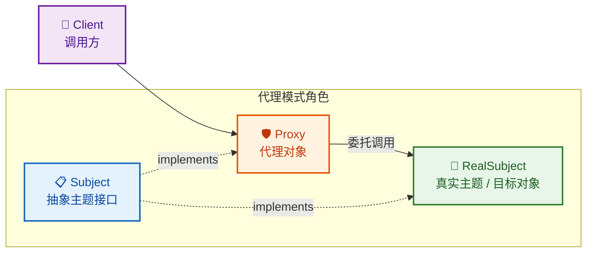

- **Subject（抽象主题）**：定义了 RealSubject 和 Proxy 共同遵守的接口，客户端面向这个接口编程，因此它感知不到自己用的是代理还是真实对象。
- **RealSubject（真实主题）**：包含真正的业务逻辑，是我们最终想要调用的对象。
- **Proxy（代理）**：持有 RealSubject 的引用，实现与 RealSubject 相同的接口。在调用 RealSubject 的方法前后，可以插入增强逻辑。

### 静态代理的完整实现

我们用一个贴近实际的场景来演示：一个用户服务（UserService），我们希望在每次调用时自动记录日志和统计耗时。

**第一步：定义抽象主题接口**

```java
/**
 * 抽象主题接口 —— 用户服务
 * Client 面向此接口编程，不关心背后是真实对象还是代理
 */
public interface UserService {

    // 根据 ID 查询用户名
    String findUserById(int id);

    // 保存用户信息
    void saveUser(String name);
}
```

**第二步：实现真实主题**

```java
/**
 * 真实主题 —— 用户服务的具体实现
 * 包含核心业务逻辑，不掺杂任何日志、监控等横切关注点
 */
public class UserServiceImpl implements UserService {

    @Override
    public String findUserById(int id) {
        // 模拟数据库查询操作
        System.out.println("[DB] 正在查询用户, id = " + id);
        // 返回模拟结果
        return "User_" + id;
    }

    @Override
    public void saveUser(String name) {
        // 模拟数据库写入操作
        System.out.println("[DB] 正在保存用户, name = " + name);
    }
}
```

**第三步：编写静态代理类**

```java
/**
 * 静态代理类 —— 为 UserService 提供日志 + 耗时统计的增强
 * 它与 UserServiceImpl 实现同一个接口，对外表现一致
 */
public class UserServiceProxy implements UserService {

    // 持有真实对象的引用（组合关系）
    private final UserService target;

    // 通过构造器注入真实对象
    public UserServiceProxy(UserService target) {
        this.target = target;
    }

    @Override
    public String findUserById(int id) {
        // ===== 前置增强：记录日志 =====
        System.out.println("[LOG] 调用 findUserById, 参数: id=" + id);
        // 记录方法开始时间
        long start = System.currentTimeMillis();

        // ===== 委托给真实对象执行核心逻辑 =====
        String result = target.findUserById(id);

        // ===== 后置增强：统计耗时 =====
        long cost = System.currentTimeMillis() - start;
        System.out.println("[LOG] findUserById 执行完毕, 耗时: " + cost + "ms");

        // 将真实对象的返回值原样返回
        return result;
    }

    @Override
    public void saveUser(String name) {
        // ===== 前置增强 =====
        System.out.println("[LOG] 调用 saveUser, 参数: name=" + name);
        long start = System.currentTimeMillis();

        // ===== 委托调用 =====
        target.saveUser(name);

        // ===== 后置增强 =====
        long cost = System.currentTimeMillis() - start;
        System.out.println("[LOG] saveUser 执行完毕, 耗时: " + cost + "ms");
    }
}
```

**第四步：客户端调用**

```java
public class Client {
    public static void main(String[] args) {
        // 1. 创建真实对象
        UserService realService = new UserServiceImpl();

        // 2. 用代理包装真实对象
        UserService proxy = new UserServiceProxy(realService);

        // 3. 客户端通过代理调用，完全感知不到代理的存在
        String user = proxy.findUserById(42);
        System.out.println("查询结果: " + user);

        System.out.println("---");

        proxy.saveUser("Alice");
    }
}
```

运行输出：

```text
[LOG] 调用 findUserById, 参数: id=42
[DB] 正在查询用户, id = 42
[LOG] findUserById 执行完毕, 耗时: 0ms
查询结果: User_42
---
[LOG] 调用 saveUser, 参数: name=Alice
[DB] 正在保存用户, name = Alice
[LOG] saveUser 执行完毕, 耗时: 0ms
```

可以看到，`UserServiceImpl` 里没有一行日志代码，但通过代理，我们在不修改原始类的前提下完成了日志增强。这就是代理模式的价值——**对修改关闭，对扩展开放（Open-Closed Principle）**。

### 静态代理的调用链路

让我们用时序图清晰地展示一次方法调用的完整流转过程：

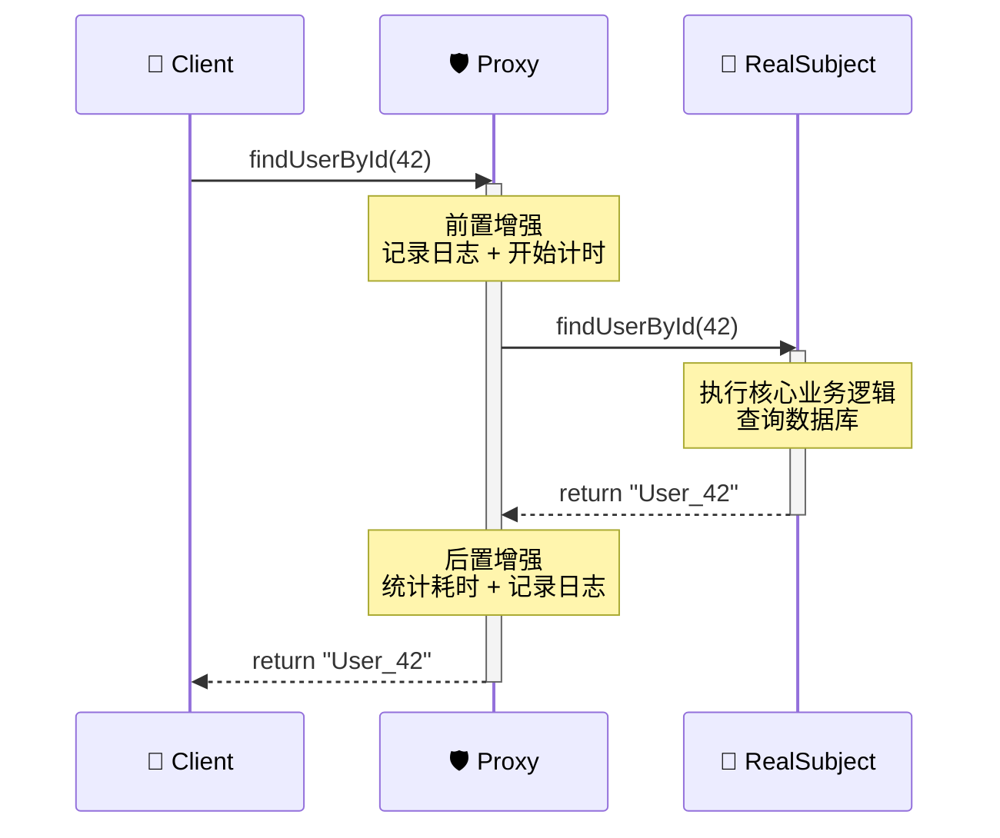

整个过程对 Client 完全透明——它只知道自己调用了一个 `UserService`，至于背后是直连还是经过了代理，它毫不知情。这就是面向接口编程带来的解耦能力。

### 静态代理的致命局限

静态代理看起来很优雅，但当你尝试在真实项目中大规模使用时，问题会迅速暴露。

**局限一：类爆炸（Class Explosion）**

假设你的项目中有多个服务接口需要代理：

```java
// 每个服务接口...
public interface UserService { ... }      // 用户服务
public interface OrderService { ... }     // 订单服务
public interface PaymentService { ... }   // 支付服务
public interface ProductService { ... }   // 商品服务
public interface LogisticsService { ... } // 物流服务
```

如果你想给它们都加上日志功能，就必须为每一个接口手写一个代理类：

```text
UserServiceProxy.java
OrderServiceProxy.java
PaymentServiceProxy.java
ProductServiceProxy.java
LogisticsServiceProxy.java
```

5 个接口就要写 5 个代理类。如果还需要加权限校验、缓存、事务管理等不同的增强逻辑，代理类的数量会呈 **笛卡尔积** 式增长。一个中型项目可能有几十个服务接口，这种方式根本不可维护。

**局限二：增强逻辑大量重复（Code Duplication）**

回头看我们的 `UserServiceProxy`，`findUserById` 和 `saveUser` 两个方法中的日志代码几乎一模一样——只是方法名和参数不同。这种重复在每个代理类、每个方法中都会出现。一旦日志格式需要调整（比如加上调用者 IP），你需要逐个修改所有代理类的所有方法，违反了 DRY 原则（Don't Repeat Yourself）。

**局限三：接口变动时的连锁修改**

当 `UserService` 新增一个方法时：

```java
public interface UserService {
    String findUserById(int id);
    void saveUser(String name);
    void deleteUser(int id);  // 新增方法
}
```

`UserServiceProxy` 必须同步新增 `deleteUser` 的代理实现，否则编译直接报错。接口每变一次，所有相关代理类都要跟着改。在快速迭代的项目中，这种维护成本是灾难性的。

**局限四：编译期绑定，缺乏灵活性**

静态代理在编译期就确定了代理关系。你无法在运行时动态决定"要不要代理"或"用哪种增强策略"。比如你想根据配置文件在生产环境开启性能监控、在开发环境关闭，静态代理做不到这种灵活切换。

### 问题本质的归纳

我们把静态代理的问题归纳成一张对比表：

| 维度 | 静态代理的表现 | 理想状态 |
|------|--------------|---------|
| 代理类数量 | 每个接口手写一个，N 个接口 = N 个代理类 | 一套通用机制，适用于所有接口 |
| 增强逻辑复用 | 每个方法重复编写相同的前置/后置代码 | 增强逻辑只写一次，自动应用到所有方法 |
| 接口变更响应 | 接口加方法，代理类必须同步修改 | 自动适配，无需手动维护 |
| 灵活性 | 编译期固定，无法运行时调整 | 运行时动态生成，按需代理 |

这张表的右列，恰恰就是 **动态代理** 要解决的问题。JDK 动态代理通过 `java.lang.reflect.Proxy` 和 `InvocationHandler`，在运行时动态生成代理类的字节码，让你只需编写一次增强逻辑，就能代理任意接口的任意方法。

这就是我们下一节要深入探讨的内容。

---

**📝 练习题**

以下关于静态代理模式的描述，哪一项是正确的？

A. 代理对象和真实对象不需要实现相同的接口，只要代理对象持有真实对象的引用即可

B. 静态代理可以在运行时动态决定是否对某个方法进行增强

C. 静态代理中，代理类必须在编译期就已经编写好，且需要与真实主题实现相同的接口

D. 使用静态代理后，当接口新增方法时，只需要修改真实主题类，代理类会自动适配

**【答案】** C

**【解析】** 静态代理的"静态"二字就体现在编译期确定——代理类是程序员手动编写的 `.java` 文件，编译后生成 `.class`，在程序运行前就已经存在。代理类必须与真实主题实现相同的接口（Subject），这样客户端才能面向接口编程，透明地使用代理。选项 A 错误，不实现相同接口就无法替换真实对象；选项 B 描述的是动态代理的能力；选项 D 错误，接口新增方法后代理类必须同步修改，否则编译不通过，这正是静态代理的核心痛点之一。

---

## JDK 动态代理 ⭐⭐

理解了静态代理的局限之后，我们来看 Java 语言层面提供的"官方解决方案"——`java.lang.reflect.Proxy`。JDK 动态代理的核心思想是：**在运行时（Runtime）动态生成一个实现了目标接口的代理类，而不需要你手写任何代理类的 `.java` 文件**。整个机制由两个关键角色驱动：`Proxy.newProxyInstance()` 负责"造出代理对象"，`InvocationHandler` 负责"定义代理逻辑"。

### Proxy.newProxyInstance

这是 JDK 动态代理的入口方法，签名如下：

```java
public static Object newProxyInstance(
    ClassLoader loader,        // 1. 类加载器：用哪个 ClassLoader 来加载生成的代理类
    Class<?>[] interfaces,     // 2. 接口数组：代理类需要实现哪些接口
    InvocationHandler h        // 3. 调用处理器：方法被调用时，具体执行什么逻辑
)
```

三个参数各司其职，缺一不可。我们逐一拆解。

**参数一：ClassLoader loader**

Java 的类加载机制要求，任何一个 Class 都必须由某个 ClassLoader 加载到 JVM 中才能使用。动态代理在运行时凭空生成了一个新的类（字节码），这个类同样需要一个 ClassLoader 来"接管"。通常的做法是直接使用目标接口的 ClassLoader：

```java
// 最常见的写法：拿到目标接口的类加载器
ClassLoader loader = UserService.class.getClassLoader();
```

为什么不用 `ClassLoader.getSystemClassLoader()`？因为在复杂的类加载体系中（比如 Web 容器、OSGi），目标接口可能并不在系统类加载器的可见范围内。使用接口自身的 ClassLoader 是最安全的选择。

**参数二：Class&lt;?>[] interfaces**

这是一个接口的 Class 数组，告诉 JDK："请帮我生成一个类，这个类要 `implements` 这些接口。" 注意，这里只能传接口，不能传类（class）。这也是 JDK 动态代理"只能代理接口"这一限制的根源所在——后面会专门讨论。

```java
// 可以同时代理多个接口
Class<?>[] interfaces = new Class<?>[]{ UserService.class, Serializable.class };
```

**参数三：InvocationHandler h**

这是整个动态代理的灵魂，所有方法调用最终都会被路由到这个 handler 的 `invoke()` 方法中。我们在下一节详细展开。

把三个参数组合起来，一个最简单的动态代理创建过程如下：

```java
// 定义业务接口
public interface UserService {
    // 根据 ID 查询用户名
    String findUserById(int id);
    // 保存用户，返回是否成功
    boolean saveUser(String name);
}
```

```java
// 真实业务实现类
public class UserServiceImpl implements UserService {
    @Override
    public String findUserById(int id) {
        // 模拟数据库查询
        System.out.println("执行数据库查询, id = " + id);
        return "User-" + id;
    }

    @Override
    public boolean saveUser(String name) {
        // 模拟数据库写入
        System.out.println("执行数据库写入, name = " + name);
        return true;
    }
}
```

```java
public class ProxyDemo {
    public static void main(String[] args) {
        // 1. 创建真实对象（被代理的目标）
        UserService realService = new UserServiceImpl();

        // 2. 通过 Proxy.newProxyInstance 创建代理对象
        UserService proxy = (UserService) Proxy.newProxyInstance(
            UserService.class.getClassLoader(),          // 类加载器
            new Class<?>[]{ UserService.class },         // 要代理的接口
            new SimpleInvocationHandler(realService)     // 调用处理器（下一节实现）
        );

        // 3. 通过代理对象调用方法 —— 实际会走 InvocationHandler.invoke()
        String user = proxy.findUserById(42);
        System.out.println("返回结果: " + user);
    }
}
```

调用 `proxy.findUserById(42)` 时，JVM 并不会直接执行 `UserServiceImpl.findUserById()`，而是先进入 `InvocationHandler.invoke()`，由你决定"要不要调用真实对象、什么时候调用、调用前后做什么"。这就是动态代理的控制力所在。

下面这张流程图展示了 `newProxyInstance` 的内部工作流程：

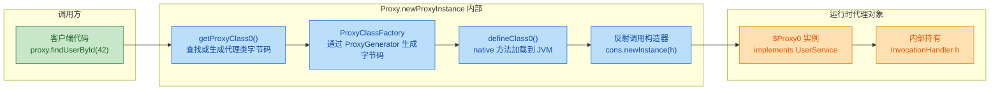

核心流程可以概括为：**查缓存 → 生成字节码 → 加载到 JVM → 反射创建实例**。其中 `ProxyGenerator.generateProxyClass()` 是真正"写字节码"的地方，它会在内存中拼出一个完整的 `.class` 文件内容（byte 数组），然后通过 native 方法 `defineClass0` 注入到 JVM。

值得一提的是，JDK 内部对生成的代理类做了缓存（通过 `WeakCache`）。同一组接口 + 同一个 ClassLoader 只会生成一次代理类，后续调用 `newProxyInstance` 会直接复用，不会重复生成字节码。这是一个重要的性能优化。

---

### InvocationHandler（invoke 方法）

`InvocationHandler` 是一个函数式接口（Functional Interface），只有一个方法：

```java
public interface InvocationHandler {
    /**
     * 当代理对象的任意方法被调用时，都会转发到这里
     *
     * @param proxy  代理对象本身（注意：不是被代理的真实对象！）
     * @param method 被调用的方法的 Method 反射对象
     * @param args   方法参数数组，无参方法时为 null
     * @return       方法的返回值，会被返回给调用方
     * @throws Throwable 可以抛出任何异常
     */
    Object invoke(Object proxy, Method method, Object[] args) throws Throwable;
}
```

三个参数的含义需要精确理解：

| 参数 | 类型 | 含义 | 常见陷阱 |
|------|------|------|----------|
| `proxy` | `Object` | 生成的代理对象（`$Proxy0` 实例） | 千万不要在 invoke 内部调用 `proxy.xxx()`，会无限递归 |
| `method` | `Method` | 当前被调用的方法的反射对象 | 可以用 `method.getName()` 做方法级别的拦截判断 |
| `args` | `Object[]` | 调用参数，基本类型会被自动装箱 | 无参方法时 args 为 `null`，不是空数组 |

**关于 proxy 参数的陷阱**，这是初学者最容易踩的坑。看这段代码：

```java
// ❌ 错误示范：在 invoke 中调用 proxy 的方法
@Override
public Object invoke(Object proxy, Method method, Object[] args) throws Throwable {
    // proxy.toString() 会再次触发 invoke()，形成无限递归，最终 StackOverflowError
    System.out.println("代理对象: " + proxy.toString()); // 💥 死循环！
    return method.invoke(target, args);
}
```

`proxy` 参数存在的意义主要是：当你需要在 `invoke` 中返回代理对象自身以支持链式调用（Fluent API）时使用，比如 `return proxy;`。除此之外，几乎不应该对 `proxy` 调用任何方法。

现在来实现一个完整的、带日志增强的 `InvocationHandler`：

```java
import java.lang.reflect.InvocationHandler;
import java.lang.reflect.Method;

public class LoggingHandler implements InvocationHandler {

    // 持有真实对象的引用，invoke 中通过它调用真正的业务逻辑
    private final Object target;

    // 构造时传入被代理的真实对象
    public LoggingHandler(Object target) {
        this.target = target;
    }

    @Override
    public Object invoke(Object proxy, Method method, Object[] args) throws Throwable {
        // ========== 前置增强（Before Advice）==========
        // 获取方法名，用于日志输出
        String methodName = method.getName();
        // 打印方法调用信息，包含参数
        System.out.println("[LOG] 方法调用开始: " + methodName);
        // 记录方法开始执行的时间戳
        long startTime = System.currentTimeMillis();

        // ========== 调用真实对象的方法 ==========
        Object result;
        try {
            // 通过反射调用 target（真实对象）的对应方法
            // method.invoke(target, args) 等价于 target.methodName(args)
            result = method.invoke(target, args);
        } catch (Exception e) {
            // ========== 异常增强（After Throwing Advice）==========
            // 捕获异常后记录日志，然后重新抛出，不吞掉异常
            System.out.println("[LOG] 方法异常: " + methodName + ", 异常: " + e.getCause());
            throw e;
        }

        // ========== 后置增强（After Returning Advice）==========
        // 计算方法执行耗时
        long cost = System.currentTimeMillis() - startTime;
        // 打印返回值和耗时
        System.out.println("[LOG] 方法调用结束: " + methodName
                + ", 返回值: " + result
                + ", 耗时: " + cost + "ms");

        // 将真实对象的返回值原样返回给调用方
        return result;
    }
}
```

运行完整示例：

```java
public class ProxyDemo {
    public static void main(String[] args) {
        // 创建真实业务对象
        UserService realService = new UserServiceImpl();

        // 创建代理对象，注入 LoggingHandler
        UserService proxy = (UserService) Proxy.newProxyInstance(
            UserService.class.getClassLoader(),      // 接口的类加载器
            new Class<?>[]{ UserService.class },     // 代理的接口列表
            new LoggingHandler(realService)           // 调用处理器
        );

        // 调用代理对象的方法
        String user = proxy.findUserById(42);
        System.out.println("最终结果: " + user);

        System.out.println("---分割线---");

        boolean saved = proxy.saveUser("Alice");
        System.out.println("保存结果: " + saved);
    }
}
```

输出：

```
[LOG] 方法调用开始: findUserById
执行数据库查询, id = 42
[LOG] 方法调用结束: findUserById, 返回值: User-42, 耗时: 1ms
最终结果: User-42
---分割线---
[LOG] 方法调用开始: saveUser
执行数据库写入, name = Alice
[LOG] 方法调用结束: saveUser, 返回值: true, 耗时: 0ms
保存结果: true
```

注意观察：我们没有写任何 `UserService` 的代理类源码，但日志增强逻辑自动应用到了接口的每一个方法上。如果 `UserService` 新增了第三个方法，代理同样会自动拦截——这就是动态代理相比静态代理的根本优势。

**invoke 方法中的高级技巧**

在实际开发中，`invoke` 内部经常需要对不同方法做差异化处理。以下是几种常见模式：

```java
@Override
public Object invoke(Object proxy, Method method, Object[] args) throws Throwable {

    // 技巧1：跳过 Object 类自带的方法（toString, hashCode, equals）
    // 这些方法通常不需要走代理逻辑
    if (method.getDeclaringClass() == Object.class) {
        // 直接调用真实对象的对应方法，不做任何增强
        return method.invoke(target, args);
    }

    // 技巧2：根据方法名做条件拦截
    // 比如只对 "find" 开头的查询方法做缓存
    if (method.getName().startsWith("find")) {
        // 先查缓存
        String cacheKey = method.getName() + Arrays.toString(args);
        Object cached = cache.get(cacheKey);
        if (cached != null) {
            System.out.println("[CACHE HIT] " + cacheKey);
            return cached; // 命中缓存，直接返回，不调用真实对象
        }
        // 未命中，调用真实方法并缓存结果
        Object result = method.invoke(target, args);
        cache.put(cacheKey, result);
        return result;
    }

    // 技巧3：根据注解做拦截
    // 检查方法上是否标注了自定义注解
    if (method.isAnnotationPresent(RequiresAuth.class)) {
        // 执行权限校验逻辑
        if (!SecurityContext.isAuthenticated()) {
            throw new SecurityException("未登录，无权访问: " + method.getName());
        }
    }

    // 默认：直接转发给真实对象
    return method.invoke(target, args);
}
```

**method.invoke() 的返回值处理**

`invoke` 方法的返回值会直接作为代理方法的返回值传递给调用方。这里有几个细节需要注意：

```java
// 情况1：方法返回 void
// method.invoke() 返回 null，你也应该返回 null
// 如果返回了非 null 值，JVM 会忽略它（因为调用方不接收返回值）

// 情况2：方法返回基本类型（int, boolean 等）
// method.invoke() 返回的是包装类型（Integer, Boolean）
// 你必须返回正确的包装类型，不能返回 null！
// 返回 null 会导致拆箱时 NullPointerException

// ❌ 危险：如果真实方法返回 int，这里返回 null 会 NPE
@Override
public Object invoke(Object proxy, Method method, Object[] args) throws Throwable {
    if (someCondition) {
        return null; // 💥 如果方法签名是 int findCount()，调用方拆箱时 NPE
    }
    return method.invoke(target, args);
}
```

下面用一张时序图来完整展示一次代理方法调用的全过程：

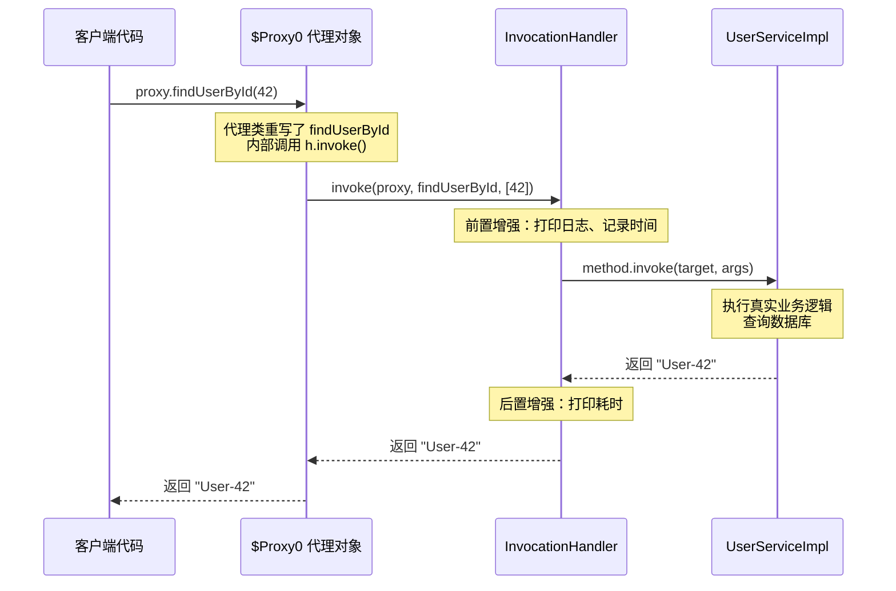

**用 Lambda 简化 InvocationHandler**

由于 `InvocationHandler` 是函数式接口，在简单场景下可以直接用 Lambda 表达式，省去单独写一个类：

```java
// 使用 Lambda 表达式直接创建代理，适合简单的增强逻辑
UserService proxy = (UserService) Proxy.newProxyInstance(
    UserService.class.getClassLoader(),
    new Class<?>[]{ UserService.class },
    // Lambda 实现 InvocationHandler
    (proxyObj, method, methodArgs) -> {
        // 前置：打印方法名
        System.out.println("调用: " + method.getName());
        // 转发给真实对象
        Object result = method.invoke(realService, methodArgs);
        // 后置：打印结果
        System.out.println("结果: " + result);
        // 返回真实结果
        return result;
    }
);
```

这种写法在单元测试中创建 Mock 对象时特别方便。

**封装通用代理工厂**

在实际项目中，我们通常会封装一个泛型工具方法，避免每次都写 `Proxy.newProxyInstance` 的模板代码：

```java
public class ProxyFactory {

    /**
     * 创建动态代理的通用工厂方法
     *
     * @param target 被代理的真实对象
     * @param handler 调用处理器
     * @param <T> 接口类型
     * @return 代理对象，类型安全
     */
    @SuppressWarnings("unchecked")
    public static <T> T createProxy(T target, InvocationHandler handler) {
        // 获取目标对象实现的所有接口
        Class<?>[] interfaces = target.getClass().getInterfaces();
        // 使用目标对象的类加载器
        ClassLoader loader = target.getClass().getClassLoader();
        // 创建并返回代理对象，强转为接口类型 T
        return (T) Proxy.newProxyInstance(loader, interfaces, handler);
    }
}
```

```java
// 使用工厂方法，一行搞定
UserService proxy = ProxyFactory.createProxy(
    new UserServiceImpl(),
    new LoggingHandler(new UserServiceImpl())
);
```

这样，无论代理什么接口，调用方式都是统一的，代码更加简洁。

---

## 生成的 $Proxy0 类结构

当我们调用 `Proxy.newProxyInstance()` 时，JVM 在运行时动态生成了一个名为 `$Proxy0` 的字节码类。这个类是整个 JDK 动态代理机制的"最终产物"——它就是那个替你干活的代理对象的真实类型。理解它的内部结构，就等于彻底看透了 JDK 动态代理的底层原理。

### 如何获取 $Proxy0 的源码

在 JDK 8 及以前，我们可以通过设置系统属性，让 JVM 把动态生成的代理类字节码文件保存到磁盘上，然后用反编译工具查看：

```java
// 在 main 方法最开头加上这行，JVM 就会把生成的 $Proxy0.class 写到磁盘
// JDK 8 及以前使用此属性
System.getProperties().put("sun.misc.ProxyGenerator.saveGeneratedFiles", "true");

// JDK 11+ 改为此属性（包名变了）
// System.getProperties().put("jdk.proxy.ProxyGenerator.saveGeneratedFiles", "true");
```

另一种更通用的方式，是利用 `ProxyGenerator` 手动生成字节码并写入文件：

```java
import sun.misc.ProxyGenerator; // JDK 8
import java.io.FileOutputStream;

public class ProxyClassDumper {
    public static void main(String[] args) throws Exception {
        // 手动生成代理类的字节码，参数1是类名，参数2是要代理的接口数组
        byte[] classBytes = ProxyGenerator.generateProxyClass(
                "$Proxy0",                          // 生成的代理类名
                new Class[]{UserService.class}      // 要代理的接口列表
        );

        // 将字节码写入 .class 文件
        try (FileOutputStream fos = new FileOutputStream("$Proxy0.class")) {
            fos.write(classBytes); // 写入磁盘后可用 javap 或 IDEA 反编译查看
        }

        System.out.println("代理类字节码已保存，大小: " + classBytes.length + " bytes");
    }
}
```

### $Proxy0 的完整反编译结构

假设我们代理的接口是：

```java
// 被代理的接口
public interface UserService {
    void addUser(String name);    // 添加用户
    String findUser(int id);      // 根据ID查找用户
}
```

反编译 `$Proxy0.class` 后，得到的源码大致如下（为了教学清晰度做了适当整理）：

```java
import java.lang.reflect.InvocationHandler;
import java.lang.reflect.Method;
import java.lang.reflect.Proxy;
import java.lang.reflect.UndeclaredThrowableException;

// 关键点1: 继承了 Proxy 类（这是 JDK 动态代理的基石）
// 关键点2: 实现了我们指定的 UserService 接口
public final class $Proxy0 extends Proxy implements UserService {

    // ========== 静态字段：缓存所有需要拦截的 Method 对象 ==========
    private static Method m0; // hashCode 方法的 Method 对象
    private static Method m1; // equals 方法的 Method 对象
    private static Method m2; // toString 方法的 Method 对象
    private static Method m3; // addUser 方法的 Method 对象（业务方法）
    private static Method m4; // findUser 方法的 Method 对象（业务方法）

    // ========== 构造方法 ==========
    // 接收一个 InvocationHandler，传给父类 Proxy 保存
    public $Proxy0(InvocationHandler h) {
        super(h); // Proxy 类中有一个 protected InvocationHandler h 字段
    }

    // ========== 业务方法: addUser ==========
    @Override
    public final void addUser(String name) {
        try {
            // 核心: 把调用全部委托给 InvocationHandler.invoke()
            // 参数1: this —— 代理对象本身
            // 参数2: m3 —— addUser 对应的 Method 对象
            // 参数3: new Object[]{name} —— 方法参数打包成数组
            super.h.invoke(this, m3, new Object[]{name});
        } catch (RuntimeException | Error e) {
            throw e;                          // 运行时异常直接抛出
        } catch (Throwable t) {
            throw new UndeclaredThrowableException(t); // 受检异常包装后抛出
        }
    }

    // ========== 业务方法: findUser ==========
    @Override
    public final String findUser(int id) {
        try {
            // 同样委托给 handler，注意基本类型 int 会被自动装箱为 Integer
            return (String) super.h.invoke(this, m4, new Object[]{Integer.valueOf(id)});
        } catch (RuntimeException | Error e) {
            throw e;
        } catch (Throwable t) {
            throw new UndeclaredThrowableException(t);
        }
    }

    // ========== Object 方法: hashCode ==========
    @Override
    public final int hashCode() {
        try {
            // 连 hashCode 也走 handler，这意味着你可以拦截它
            return (Integer) super.h.invoke(this, m0, null);
        } catch (RuntimeException | Error e) {
            throw e;
        } catch (Throwable t) {
            throw new UndeclaredThrowableException(t);
        }
    }

    // ========== Object 方法: equals ==========
    @Override
    public final boolean equals(Object obj) {
        try {
            return (Boolean) super.h.invoke(this, m1, new Object[]{obj});
        } catch (RuntimeException | Error e) {
            throw e;
        } catch (Throwable t) {
            throw new UndeclaredThrowableException(t);
        }
    }

    // ========== Object 方法: toString ==========
    @Override
    public final String toString() {
        try {
            return (String) super.h.invoke(this, m2, null);
        } catch (RuntimeException | Error e) {
            throw e;
        } catch (Throwable t) {
            throw new UndeclaredThrowableException(t);
        }
    }

    // ========== 静态初始化块：通过反射获取所有 Method 对象并缓存 ==========
    static {
        try {
            // 从 Object.class 获取三个基础方法
            m0 = Class.forName("java.lang.Object").getMethod("hashCode");
            m1 = Class.forName("java.lang.Object").getMethod("equals", Class.forName("java.lang.Object"));
            m2 = Class.forName("java.lang.Object").getMethod("toString");

            // 从 UserService 接口获取业务方法
            m3 = Class.forName("UserService").getMethod("addUser", Class.forName("java.lang.String"));
            m4 = Class.forName("UserService").getMethod("findUser", Integer.TYPE);
        } catch (NoSuchMethodException e) {
            throw new NoSuchMethodError(e.getMessage());  // 方法不存在
        } catch (ClassNotFoundException e) {
            throw new NoClassDefFoundError(e.getMessage()); // 类不存在
        }
    }
}
```

### $Proxy0 的类继承结构

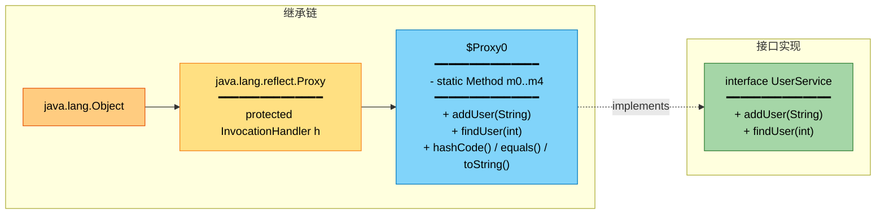

### 方法调用的完整链路

当外部代码调用 `proxy.addUser("Tom")` 时，整个调用链路如下：

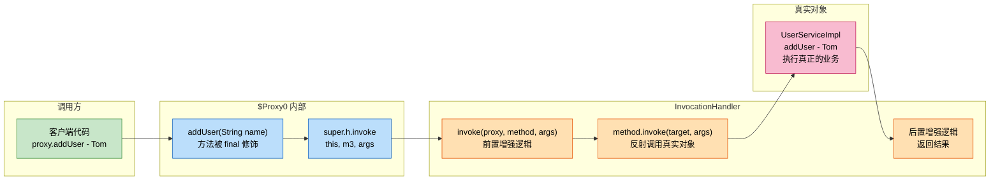

### 五个关键设计细节

理解了完整源码后，我们来提炼 `$Proxy0` 中最值得关注的五个设计决策：

### 1. 为什么继承 Proxy 而不是直接生成独立类

`$Proxy0 extends Proxy` 这个设计看似多余，实则精妙。`Proxy` 基类承担了两个职责：

- 持有 `InvocationHandler h` 字段——所有代理方法都通过 `super.h` 访问 handler，不需要每个代理类自己声明。
- 提供 `Proxy.isProxyClass()` 和 `Proxy.getInvocationHandler()` 等静态工具方法，让框架代码可以在运行时判断一个对象是否是代理、获取其 handler。

但这也直接导致了 JDK 动态代理"只能代理接口"的限制——因为 Java 是单继承的，`$Proxy0` 已经继承了 `Proxy`，就不能再继承任何业务类了。

### 2. Method 对象为什么用 static 字段缓存

注意 `m0` 到 `m4` 都是 `private static` 的，在 `static {}` 块中通过反射一次性获取。这是一个性能优化：`Class.getMethod()` 涉及安全检查和方法查找，开销不小。如果每次调用 `addUser()` 都重新反射获取 Method 对象，性能会很差。缓存到静态字段后，整个类生命周期内只反射一次。

### 3. 所有方法都是 final 的

```java
public final void addUser(String name) { ... }  // final!
public final int hashCode() { ... }              // final!
```

`final` 修饰意味着你不能通过继承 `$Proxy0` 来覆盖这些方法。这是一种安全保障——代理类的行为完全由 `InvocationHandler` 决定，不允许被子类篡改。

### 4. 基本类型的自动装箱与拆箱

当接口方法的参数或返回值是基本类型时，`$Proxy0` 会自动处理装箱拆箱：

```java
// findUser(int id) 中，int 被装箱为 Integer 传入 invoke
super.h.invoke(this, m4, new Object[]{Integer.valueOf(id)});

// invoke 返回 Object，$Proxy0 负责强转回 String
return (String) super.h.invoke(this, m4, ...);

// 如果返回值是 int，则会拆箱
// return ((Integer) super.h.invoke(this, m, args)).intValue();
```

这也是为什么 `InvocationHandler.invoke()` 的参数和返回值都是 `Object` 类型——它需要一个统一的签名来处理所有可能的方法。

### 5. 异常处理的包装策略

每个方法体内都有统一的异常处理模式：

```java
try {
    super.h.invoke(this, m3, args);
} catch (RuntimeException | Error e) {
    throw e;                              // 非受检异常：直接抛，不包装
} catch (Throwable t) {
    throw new UndeclaredThrowableException(t); // 受检异常：包装后抛
}
```

为什么要这样做？因为接口方法 `addUser(String)` 的签名没有声明抛出任何受检异常（checked exception）。如果你的 `InvocationHandler.invoke()` 内部抛出了一个 `IOException`，编译器不允许 `addUser` 直接抛出它。所以 `$Proxy0` 用 `UndeclaredThrowableException`（一个 RuntimeException）包装它，绕过编译器检查。这是一个需要注意的陷阱——如果你在 handler 中抛受检异常，调用方 catch 的时候需要意识到它可能被包了一层。

### 用 ASCII 图理解 $Proxy0 在内存中的结构

```java
// ============ $Proxy0 对象在堆内存中的布局 ============
//
//  $Proxy0 实例 (堆内存)
//  ┌─────────────────────────────────────────────┐
//  │  [对象头]  Mark Word + Klass Pointer         │
//  ├─────────────────────────────────────────────┤
//  │  继承自 Proxy 的实例字段:                      │
//  │    h ──────────────────┐                     │
//  │  (InvocationHandler)   │                     │
//  └────────────────────────┼────────────────────┘
//                           │
//                           ▼
//  ┌─────────────────────────────────────────────┐
//  │  MyInvocationHandler 实例                     │
//  ├─────────────────────────────────────────────┤
//  │    target ─────────────┐                     │
//  │  (Object, 真实对象引用)  │                     │
//  └────────────────────────┼────────────────────┘
//                           │
//                           ▼
//  ┌─────────────────────────────────────────────┐
//  │  UserServiceImpl 实例 (真实业务对象)            │
//  ├─────────────────────────────────────────────┤
//  │    实际的业务字段和方法实现                      │
//  └─────────────────────────────────────────────┘
//
//  $Proxy0.class (方法区/元空间)
//  ┌─────────────────────────────────────────────┐
//  │  static Method m0 → Object.hashCode()        │
//  │  static Method m1 → Object.equals()          │
//  │  static Method m2 → Object.toString()        │
//  │  static Method m3 → UserService.addUser()    │
//  │  static Method m4 → UserService.findUser()   │
//  └─────────────────────────────────────────────┘
```

---

## 只能代理接口的限制

这是 JDK 动态代理最常被提及的局限性，也是面试高频考点。我们从"为什么"和"会怎样"两个角度彻底讲清楚。

### 根本原因：Java 的单继承机制

前面我们已经看到，`$Proxy0` 的类声明是：

```java
public final class $Proxy0 extends Proxy implements UserService { ... }
```

Java 不支持多继承（multiple inheritance of classes）。`$Proxy0` 已经把唯一的继承名额给了 `java.lang.reflect.Proxy`，所以它不可能再 `extends` 任何业务类。如果你想代理一个没有实现接口的普通类，JDK 动态代理就无能为力了。

这不是一个 bug，而是一个 deliberate design trade-off。`Proxy` 基类提供了 handler 持有、代理类识别等基础设施，代价就是牺牲了对类代理的支持。

### 验证：传入类而非接口会怎样

```java
public class UserServiceImpl {
    public void addUser(String name) {
        System.out.println("添加用户: " + name);
    }
}

public class FailDemo {
    public static void main(String[] args) {
        UserServiceImpl target = new UserServiceImpl();

        // 尝试用 JDK 动态代理代理一个类（而非接口）
        Object proxy = Proxy.newProxyInstance(
                target.getClass().getClassLoader(),
                new Class[]{UserServiceImpl.class},   // 传入的是类，不是接口！
                (p, method, a) -> method.invoke(target, a)
        );
        // 运行结果: 抛出 IllegalArgumentException
        // "UserServiceImpl is not an interface"
    }
}
```

`Proxy.newProxyInstance()` 内部会逐一检查传入的 `Class[]` 数组，如果发现任何一个元素不是接口（`!clazz.isInterface()`），直接抛异常。这个校验在 `java.lang.reflect.Proxy` 的源码中非常明确：

```java
// Proxy.java 源码片段（简化）
for (Class<?> intf : interfaces) {
    // 校验: 必须是接口类型
    if (!intf.isInterface()) {
        throw new IllegalArgumentException(intf.getName() + " is not an interface");
    }
}
```

### 常见的受限场景

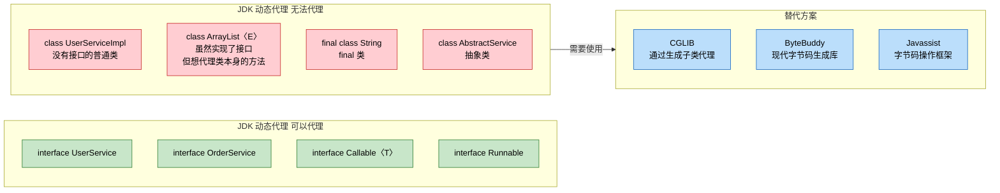

### "提取接口"模式：实际工程中的应对策略

在实际开发中，如果你需要对一个类使用 JDK 动态代理，标准做法是为它提取一个接口（Extract Interface）：

```java
// 第一步: 提取接口
public interface UserService {
    void addUser(String name);   // 把需要代理的方法抽到接口中
    String findUser(int id);
}

// 第二步: 让实现类实现该接口
public class UserServiceImpl implements UserService {
    @Override
    public void addUser(String name) {
        System.out.println("添加用户: " + name); // 真实业务逻辑
    }

    @Override
    public String findUser(int id) {
        return "User-" + id; // 真实业务逻辑
    }
}

// 第三步: 现在可以用 JDK 动态代理了
public class ProxyDemo {
    public static void main(String[] args) {
        UserService target = new UserServiceImpl(); // 真实对象

        // 代理的是 UserService 接口，不是 UserServiceImpl 类
        UserService proxy = (UserService) Proxy.newProxyInstance(
                target.getClass().getClassLoader(),
                new Class[]{UserService.class},       // 传入接口
                (p, method, a) -> {
                    System.out.println("[前置] " + method.getName());
                    Object result = method.invoke(target, a); // 反射调用真实对象
                    System.out.println("[后置] " + method.getName());
                    return result;
                }
        );

        proxy.addUser("Tom");     // 走代理
        proxy.findUser(1);        // 走代理
    }
}
```

这也是为什么 Spring 框架强烈推荐"面向接口编程"的原因之一——当你的 Bean 实现了接口时，Spring 默认使用 JDK 动态代理来创建 AOP 代理；如果没有接口，Spring 才会 fallback 到 CGLIB。

### JDK 动态代理 vs CGLIB 代理对比

| 对比维度 | JDK 动态代理 | CGLIB 代理 |
|---------|------------|-----------|
| 代理目标 | 只能代理接口 | 可以代理普通类 |
| 实现原理 | 生成实现接口的子类（`$Proxy0 extends Proxy`） | 生成目标类的子类（`Target$$EnhancerByCGLIB extends Target`） |
| 继承关系 | 继承 `java.lang.reflect.Proxy` | 继承目标类本身 |
| final 类/方法 | 不受影响（代理的是接口方法） | 无法代理 final 类或 final 方法 |
| 性能（创建代理） | 较快，JDK 原生支持 | 较慢，需要操作字节码 |
| 性能（方法调用） | 反射调用，JDK 高版本已优化 | FastClass 机制，避免反射，略快 |
| 依赖 | JDK 内置，无需第三方库 | 需要引入 cglib 库（Spring 已内置） |
| Spring 默认策略 | Bean 实现了接口时使用 | Bean 未实现接口时 fallback 使用 |

### 多接口代理的情况

JDK 动态代理支持同时代理多个接口，生成的 `$Proxy0` 会 `implements` 所有传入的接口：

```java
// 定义两个接口
public interface Readable {
    String read();   // 读取操作
}

public interface Writable {
    void write(String data); // 写入操作
}

// 同时代理两个接口
public class MultiInterfaceDemo {
    public static void main(String[] args) {
        Object proxy = Proxy.newProxyInstance(
                MultiInterfaceDemo.class.getClassLoader(),
                new Class[]{Readable.class, Writable.class}, // 传入两个接口
                (p, method, a) -> {
                    System.out.println("拦截方法: " + method.getName());
                    if (method.getReturnType() == String.class) {
                        return "代理返回值";  // 为有返回值的方法提供默认值
                    }
                    return null;
                }
        );

        // 生成的代理类: $Proxy0 extends Proxy implements Readable, Writable
        // 可以同时转型为两个接口
        Readable reader = (Readable) proxy;
        Writable writer = (Writable) proxy;

        reader.read();            // 拦截方法: read
        writer.write("hello");    // 拦截方法: write

        // 验证代理类信息
        System.out.println("代理类名: " + proxy.getClass().getName());
        // 输出: com.sun.proxy.$Proxy0

        // 验证实现的接口
        for (Class<?> iface : proxy.getClass().getInterfaces()) {
            System.out.println("实现接口: " + iface.getName());
        }
        // 输出: Readable
        // 输出: Writable
    }
}
```

### 一个容易踩的坑：代理对象不能转型为实现类

```java
UserService proxy = (UserService) Proxy.newProxyInstance(...);

// 正确: 转型为接口
UserService service = proxy;  // OK

// 错误: 转型为实现类 —— ClassCastException!
UserServiceImpl impl = (UserServiceImpl) proxy;
// 因为 $Proxy0 和 UserServiceImpl 没有任何继承关系
// $Proxy0 extends Proxy implements UserService
// UserServiceImpl implements UserService
// 它们是"兄弟"关系，不是父子关系
```

用 ASCII 图表示这个关系：

```java
//              UserService (接口)
//               /          \
//              /            \
//     $Proxy0                UserServiceImpl
//   (extends Proxy)          (业务实现类)
//
//  $Proxy0 和 UserServiceImpl 是"兄弟"，不能互相转型！
//  它们唯一的共同点是都实现了 UserService 接口
```

---

**📝 练习题**

以下关于 JDK 动态代理生成的 `$Proxy0` 类，说法正确的是？

A. `$Proxy0` 直接继承目标实现类，因此可以访问实现类的 private 方法


B. `$Proxy0` 中的 Method 对象在每次方法调用时通过反射动态获取


C. `$Proxy0` 继承了 `java.lang.reflect.Proxy`，并将所有方法调用委托给 `InvocationHandler.invoke()`


D. `$Proxy0` 可以同时继承一个类并实现多个接口


**【答案】** C

**【解析】** `$Proxy0` 的类声明是 `public final class $Proxy0 extends Proxy implements 接口列表`。它继承的是 `Proxy` 而非目标实现类（排除 A）。Method 对象在 `static {}` 块中一次性反射获取并缓存到静态字段，而非每次调用时获取（排除 B）。由于 Java 单继承限制，`$Proxy0` 已经继承了 `Proxy`，不可能再继承其他类（排除 D）。所有方法（包括 `hashCode`、`equals`、`toString`）都通过 `super.h.invoke()` 委托给 `InvocationHandler`，C 正确。

---

## CGLIB 代理概述（子类代理、无接口限制）

前面我们深入学习了 JDK 动态代理，它优雅、轻量，是 Java 原生支持的代理方案。但它有一个致命的硬伤——**只能代理接口**。如果目标类没有实现任何接口，JDK 动态代理就彻底无能为力了。在真实的企业开发中，大量的业务类并没有抽象出接口，这时候就需要另一位重量级选手登场：**CGLIB**（Code Generation Library）。

CGLIB 采用了一种完全不同的思路：它不要求目标类实现接口，而是在运行时动态生成目标类的**子类（Subclass）**，通过**方法重写（Override）**来实现代理逻辑。这种"继承式代理"的设计，让它几乎可以代理任何普通的 Java 类。

### CGLIB 的核心原理：字节码生成与继承

CGLIB 的底层依赖一个强大的字节码操作库——**ASM**（一个轻量级的 Java 字节码操作和分析框架）。它的工作流程可以概括为：在运行时，利用 ASM 直接操纵字节码，动态生成目标类的一个子类 `.class` 文件，加载到 JVM 中，然后用这个子类的实例来替代原始对象。

我们用一张流程图来对比 JDK 动态代理和 CGLIB 的原理差异：

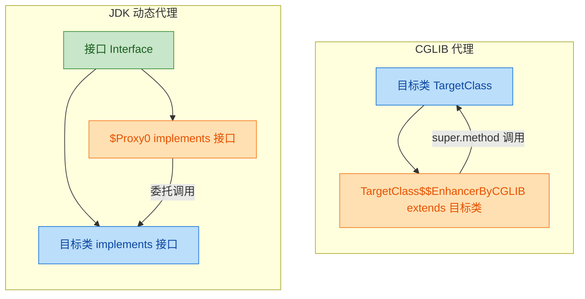

核心区别一目了然：

- JDK 动态代理：代理类和目标类是"兄弟关系"（siblings），它们共同实现同一个接口。
- CGLIB 代理：代理类和目标类是"父子关系"（parent-child），代理类继承目标类。

这个设计差异直接决定了两者的适用场景和限制条件。

### CGLIB 的核心 API

CGLIB 的使用围绕两个核心类展开：`Enhancer` 和 `MethodInterceptor`。

`Enhancer` 相当于 JDK 中的 `Proxy` 类，负责生成代理对象。`MethodInterceptor` 相当于 `InvocationHandler`，负责定义拦截逻辑。

先看一个没有实现任何接口的普通业务类：

```java
// 注意：这个类没有实现任何接口
// 这正是 JDK 动态代理无法处理的场景
public class UserService {

    // 一个普通的业务方法
    public String findUser(String userId) {
        System.out.println("执行真实查询: userId=" + userId);
        return "User-" + userId;
    }

    // 另一个业务方法
    public void saveUser(String name) {
        System.out.println("保存用户: " + name);
    }
}
```

接下来编写 CGLIB 的拦截器（相当于 JDK 代理中的 InvocationHandler）：

```java
import net.sf.cglib.proxy.MethodInterceptor;
import net.sf.cglib.proxy.MethodProxy;
import java.lang.reflect.Method;

// MethodInterceptor 是 CGLIB 的核心回调接口
// 类比 JDK 动态代理中的 InvocationHandler
public class LogInterceptor implements MethodInterceptor {

    /**
     * 所有被代理方法的调用都会进入这个 intercept 方法
     *
     * @param obj       代理对象本身（即生成的子类实例）
     * @param method    被拦截的原始 Method 对象（反射）
     * @param args      方法参数数组
     * @param proxy     MethodProxy 对象，用于调用父类的原始方法
     * @return          方法的返回值
     */
    @Override
    public Object intercept(Object obj, Method method, Object[] args,
                            MethodProxy proxy) throws Throwable {

        // ===== 前置增强 =====
        System.out.println("[CGLIB 前置] 方法: " + method.getName()
                + ", 参数: " + java.util.Arrays.toString(args));

        // 记录方法开始时间
        long startTime = System.currentTimeMillis();

        // ===== 调用目标类的原始方法 =====
        // 注意这里用的是 proxy.invokeSuper(obj, args)
        // 而不是 method.invoke(target, args)
        // invokeSuper 直接调用父类方法，不经过反射，性能更好
        Object result = proxy.invokeSuper(obj, args);

        // ===== 后置增强 =====
        long cost = System.currentTimeMillis() - startTime;
        System.out.println("[CGLIB 后置] 方法: " + method.getName()
                + ", 返回: " + result + ", 耗时: " + cost + "ms");

        // 返回原始方法的返回值
        return result;
    }
}
```

这里有一个非常重要的细节需要特别注意：`MethodProxy.invokeSuper(obj, args)` 和 `Method.invoke(target, args)` 的区别。

`invokeSuper` 是 CGLIB 特有的调用方式，它通过 **FastClass 机制**（一种基于索引的方法调用，绕过了 Java 反射）直接调用父类的方法实现，性能显著优于反射调用。这也是 CGLIB 在方法调用性能上优于 JDK 动态代理的关键原因之一。

最后，使用 `Enhancer` 创建代理对象：

```java
import net.sf.cglib.proxy.Enhancer;

public class CglibDemo {

    public static void main(String[] args) {

        // 1. 创建 Enhancer 实例（类比 JDK 的 Proxy 类）
        Enhancer enhancer = new Enhancer();

        // 2. 设置父类（即要代理的目标类）
        //    CGLIB 会生成这个类的子类作为代理
        enhancer.setSuperclass(UserService.class);

        // 3. 设置回调拦截器（类比 JDK 的 InvocationHandler）
        enhancer.setCallback(new LogInterceptor());

        // 4. 创建代理对象（实际类型是 UserService 的子类）
        //    内部流程：ASM 生成子类字节码 -> 加载到 JVM -> 实例化
        UserService proxy = (UserService) enhancer.create();

        // 5. 调用代理对象的方法
        //    实际执行的是子类重写后的方法 -> 进入 intercept()
        String user = proxy.findUser("1001");
        System.out.println("最终结果: " + user);

        System.out.println("---分割线---");

        proxy.saveUser("张三");

        // 验证代理对象的真实类型
        System.out.println("代理类名: " + proxy.getClass().getName());
        // 输出类似: UserService$$EnhancerByCGLIB$$a1b2c3d4
    }
}
```

运行输出：

```text
[CGLIB 前置] 方法: findUser, 参数: [1001]
执行真实查询: userId=1001
[CGLIB 后置] 方法: findUser, 返回: User-1001, 耗时: 1ms
最终结果: User-1001
---分割线---
[CGLIB 前置] 方法: saveUser, 参数: [张三]
保存用户: 张三
[CGLIB 后置] 方法: saveUser, 返回: null, 耗时: 0ms
代理类名: UserService$$EnhancerByCGLIB$$a1b2c3d4
```

### 生成的子类结构解析

CGLIB 在运行时生成的子类，其内部结构大致如下（伪代码还原）：

```java
// CGLIB 动态生成的子类（简化还原）
// 类名格式: 目标类名$$EnhancerByCGLIB$$哈希值
public class UserService$$EnhancerByCGLIB$$a1b2c3d4
        extends UserService {  // 继承目标类

    // CGLIB 注入的拦截器引用
    private MethodInterceptor callback;

    // CGLIB 为每个方法生成对应的 MethodProxy（用于 FastClass 快速调用）
    private static final MethodProxy FIND_USER_PROXY;
    private static final MethodProxy SAVE_USER_PROXY;

    // 静态初始化块中创建 MethodProxy
    static {
        // MethodProxy.create 会同时生成两个 FastClass：
        // 一个用于目标类，一个用于代理类
        FIND_USER_PROXY = MethodProxy.create(
            UserService.class,                              // 父类
            UserService$$EnhancerByCGLIB$$a1b2c3d4.class,  // 代理类
            "(Ljava/lang/String;)Ljava/lang/String;",       // 方法签名
            "findUser",                                     // 父类方法名
            "CGLIB$findUser$0"                              // 代理类中的 super 调用桥接方法名
        );
        // saveUser 的 MethodProxy 同理...
    }

    // ===== 重写父类方法 =====
    @Override
    public String findUser(String userId) {
        // 如果设置了拦截器，走拦截逻辑
        if (this.callback != null) {
            // 调用拦截器的 intercept 方法
            return (String) this.callback.intercept(
                this,                    // 代理对象自身
                findUserMethod,          // 原始 Method 对象
                new Object[]{userId},    // 参数数组
                FIND_USER_PROXY          // MethodProxy
            );
        }
        // 没有拦截器则直接调用父类原始实现
        return super.findUser(userId);
    }

    // ===== CGLIB 生成的桥接方法 =====
    // invokeSuper 最终调用的就是这个方法
    // 它直接调用 super，绕过了重写的 findUser，避免无限递归
    final String CGLIB$findUser$0(String userId) {
        return super.findUser(userId);
    }

    // saveUser 的重写和桥接方法同理...
}
```

这里有一个精妙的设计值得深入理解：**为什么需要桥接方法 `CGLIB$findUser$0`？**

当 `intercept` 中调用 `proxy.invokeSuper(obj, args)` 时，如果直接调用 `obj.findUser(args)`，由于 `obj` 是代理子类的实例，Java 的多态机制会再次进入重写后的 `findUser` 方法，导致**无限递归**。所以 CGLIB 生成了一个 `final` 的桥接方法，内部直接 `super.findUser()`，`invokeSuper` 通过 FastClass 索引直接定位到这个桥接方法，完美避开了递归陷阱。

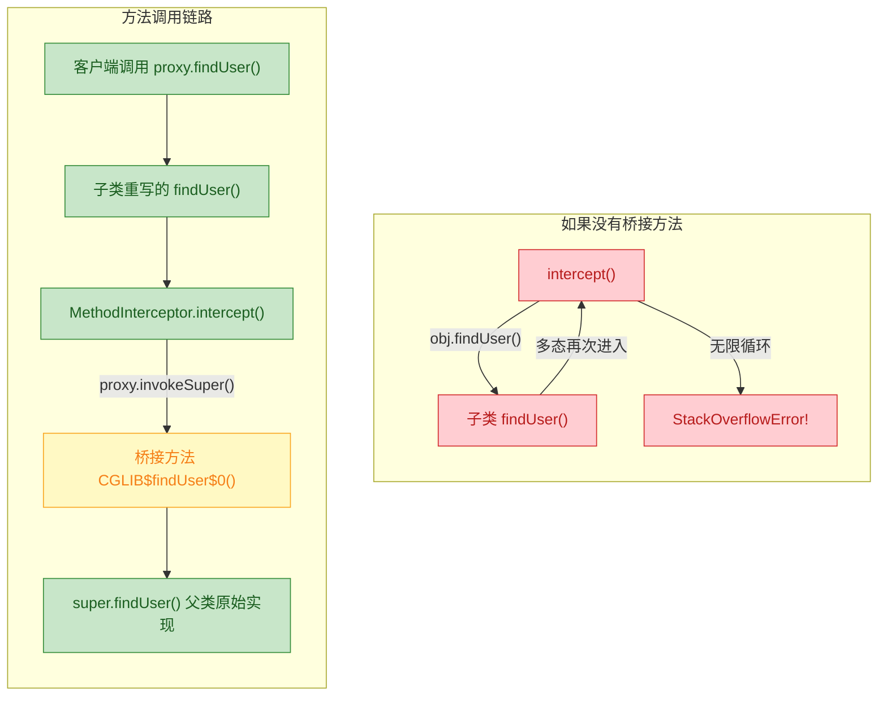

### FastClass 机制：CGLIB 的性能秘密

JDK 动态代理每次调用目标方法都要走 `Method.invoke()`，即 Java 反射调用。反射虽然灵活，但涉及安全检查、参数装箱拆箱等开销，在高频调用场景下性能不够理想。

CGLIB 的 FastClass 机制则完全不同。它为目标类和代理类各生成一个 FastClass，这个 FastClass 内部维护了一个**方法索引表**，将每个方法映射为一个整数索引。调用时，通过 `switch-case` 直接根据索引跳转到对应方法，完全绕过了反射。

```java
// FastClass 的核心原理（简化还原）
// CGLIB 为目标类自动生成的 FastClass
public class UserService$$FastClassByCGLIB$$xxxx extends FastClass {

    // 根据方法签名返回索引号
    @Override
    public int getIndex(String methodName, Class[] paramTypes) {
        // "findUser" + [String.class] -> 索引 0
        // "saveUser" + [String.class] -> 索引 1
        // ...
        if ("findUser".equals(methodName)) return 0;
        if ("saveUser".equals(methodName)) return 1;
        return -1;
    }

    // 根据索引直接调用对应方法，无需反射
    @Override
    public Object invoke(int index, Object obj, Object[] args) {
        UserService target = (UserService) obj;
        switch (index) {
            case 0:
                // 直接方法调用，不是反射！
                return target.findUser((String) args[0]);
            case 1:
                target.saveUser((String) args[0]);
                return null;
            default:
                throw new IllegalArgumentException("No such method index: " + index);
        }
    }
}
```

这种"以空间换时间"的策略（多生成一个类文件，换取每次调用省去反射开销），在方法被频繁调用的场景下收益非常明显。

### CGLIB 的限制与注意事项

CGLIB 虽然突破了"必须有接口"的限制，但继承机制本身也带来了一些约束：

```java
// ===== 限制 1: 无法代理 final 类 =====
// final 类不能被继承，CGLIB 无法生成子类
public final class FinalService {
    public void doSomething() { }
}
// enhancer.setSuperclass(FinalService.class);
// 运行时抛出: java.lang.IllegalArgumentException:
// Cannot subclass final class FinalService

// ===== 限制 2: 无法代理 final 方法 =====
public class SomeService {
    // final 方法不能被子类重写
    // CGLIB 不会报错，但这个方法不会被拦截
    // 调用时直接执行原始逻辑，拦截器不生效
    public final String getConfig() {
        return "original config";
    }

    // 普通方法可以正常被代理
    public String getData() {
        return "data";
    }
}

// ===== 限制 3: 无法代理 private 方法 =====
// private 方法对子类不可见，无法重写
// 同样不会报错，但拦截器不会生效

// ===== 限制 4: 构造函数会被调用 =====
// CGLIB 生成子类实例时，会调用父类的构造函数
// 如果构造函数中有重量级初始化逻辑，需要注意
public class HeavyService {
    public HeavyService() {
        // 这段代码在创建代理时也会执行！
        System.out.println("执行了重量级初始化...");
        // 比如建立数据库连接、加载大量配置等
    }
}
```

### JDK 动态代理 vs CGLIB：全面对比

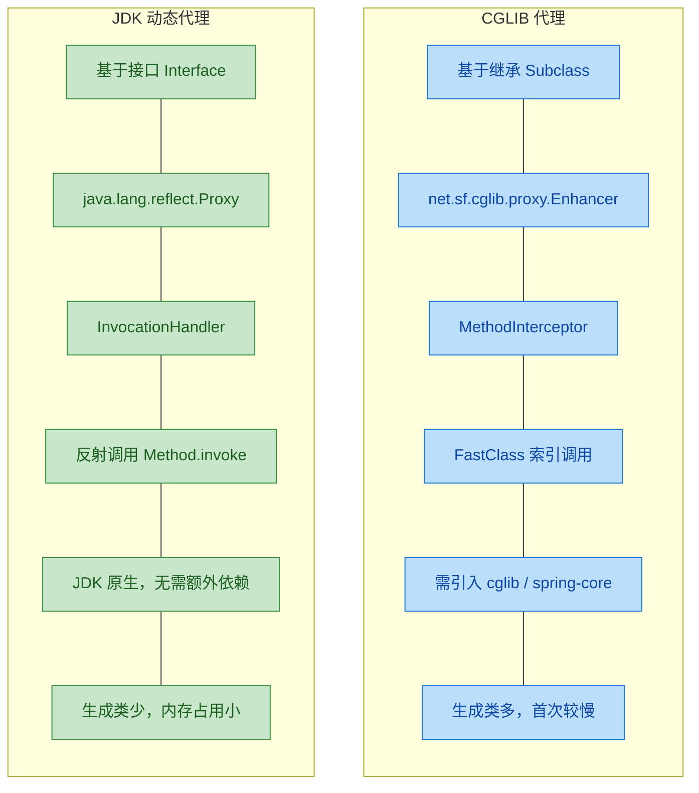

用一张表格做更直观的总结：

| 对比维度 | JDK 动态代理 | CGLIB 代理 |
|---------|-------------|-----------|
| 代理方式 | 实现接口 | 继承父类 |
| 是否需要接口 | 必须有接口 | 不需要接口 |
| 核心类 | `Proxy` + `InvocationHandler` | `Enhancer` + `MethodInterceptor` |
| 方法调用机制 | 反射 `Method.invoke()` | FastClass 索引直调 |
| `final` 类 | 不涉及（代理的是接口） | 无法代理 |
| `final` 方法 | 不涉及 | 无法拦截 |
| 生成代理速度 | 较快 | 较慢（需生成子类 + FastClass） |
| 方法调用性能 | 较慢（反射开销） | 较快（索引直调） |
| 外部依赖 | 无（JDK 内置） | 需要 cglib 库（Spring 已内置） |
| Spring 中的使用 | 目标类实现了接口时默认使用 | 目标类无接口时自动切换 |

### Spring 中的代理选择策略

在实际开发中，我们很少直接使用 CGLIB 的 API。最常见的场景是通过 Spring 框架间接使用。Spring AOP 的代理选择策略非常清晰：

```java
// Spring 的代理选择逻辑（伪代码还原）
public class DefaultAopProxyFactory implements AopProxyFactory {

    @Override
    public AopProxy createAopProxy(AdvisedSupport config) {

        // 条件判断：什么时候用 CGLIB？
        if (config.isOptimize()                    // 开启了优化
            || config.isProxyTargetClass()          // 显式配置了 proxyTargetClass=true
            || hasNoUserSuppliedProxyInterfaces(config)) {  // 目标类没有实现接口

            Class<?> targetClass = config.getTargetClass();

            // 即使配置了用 CGLIB，如果目标本身是接口，还是用 JDK
            if (targetClass.isInterface()
                || Proxy.isProxyClass(targetClass)) {
                return new JdkDynamicAopProxy(config);
            }

            // 使用 CGLIB 代理
            return new ObjenesisCglibAopProxy(config);
        }

        // 默认：使用 JDK 动态代理
        return new JdkDynamicAopProxy(config);
    }
}
```

Spring Boot 2.x 之后，默认的代理策略已经改为 `proxyTargetClass=true`，即**默认使用 CGLIB 代理**。这是因为 CGLIB 代理更通用（不要求接口），且在现代 JVM 上性能差异已经很小。如果你想强制使用 JDK 动态代理，可以在配置中显式设置：

```java
// application.properties
// spring.aop.proxy-target-class=false

// 或者在配置类上
// @EnableAspectJAutoProxy(proxyTargetClass = false)
```

### Java 版本演进的影响

值得一提的是，随着 Java 版本的演进，CGLIB 面临一些新的挑战：

- **Java 9+ 模块系统（JPMS）**：CGLIB 底层的 ASM 需要访问目标类的内部结构，模块系统的强封装可能导致 `InaccessibleObjectException`。Spring 5.x 已经内置了兼容处理。
- **Java 17+ 强封装**：`--illegal-access` 选项被移除，对 CGLIB 的字节码生成有更严格的限制。Spring 6.x / Spring Boot 3.x 已升级内置的 CGLIB 和 ASM 版本来适配。
- **未来趋势**：JDK 自身的反射性能在持续优化（如 `MethodHandle`、`VarHandle`），两种代理方式的性能差距在逐渐缩小。

---

**📝 练习题**

以下关于 CGLIB 代理的说法，哪一项是正确的？

A. CGLIB 通过实现目标类的接口来创建代理对象

B. CGLIB 可以代理被 `final` 修饰的类和方法

C. CGLIB 使用 FastClass 机制避免反射调用，在方法调用阶段性能优于 JDK 动态代理

D. CGLIB 是 JDK 内置的代理方案，无需引入任何额外依赖


**【答案】** C

**【解析】** 逐项分析：A 错误，CGLIB 的核心机制是**继承**目标类生成子类，而非实现接口，这正是它与 JDK 动态代理的根本区别。B 错误，`final` 类无法被继承，所以 CGLIB 无法为其生成子类代理；`final` 方法无法被子类重写，所以即使代理对象创建成功，`final` 方法也不会被拦截器拦截。C 正确，CGLIB 的 FastClass 机制为每个方法分配整数索引，通过 `switch-case` 直接跳转调用，绕过了 `Method.invoke()` 的反射开销，在方法调用频繁的场景下性能更优。D 错误，CGLIB 是第三方库（虽然 Spring 框架内置了它的重新打包版本 `spring-core` 中的 `net.sf.cglib`），并非 JDK 原生支持。

---

## 动态代理应用 ⭐

动态代理之所以被标记为三星重点，不仅因为它是 Java 语言层面的高级特性，更因为它是众多主流框架的"地基"。前面我们花了大量篇幅理解 JDK 动态代理和 CGLIB 的机制，现在是时候看看这些机制在真实世界中如何大放异彩了。本节我们聚焦第一个、也是最经典的应用场景——AOP（面向切面编程）。

### AOP 实现原理

#### 什么是 AOP

AOP，全称 Aspect-Oriented Programming（面向切面编程），是对 OOP（面向对象编程）的一种补充。OOP 的核心组织单元是类（Class），而 AOP 的核心组织单元是切面（Aspect）。

在日常开发中，我们经常遇到一类需求：它们与核心业务逻辑无关，却散布在代码的各个角落。典型的例子包括：

- 日志记录（Logging）：每个方法调用前后都要打印日志
- 权限校验（Authorization）：每个接口都要检查用户是否有权限
- 事务管理（Transaction Management）：数据库操作前开启事务，成功后提交，异常时回滚
- 性能监控（Performance Monitoring）：统计每个方法的执行耗时

这些需求有一个共同特征——它们横切（crosscut）多个业务模块。如果用传统 OOP 的方式处理，你不得不在每个业务方法里手动插入相同的代码，这就是所谓的"横切关注点"（Cross-Cutting Concerns）。

```java
// ❌ 传统方式：日志代码与业务代码严重耦合
public class OrderService {

    // 创建订单
    public void createOrder(Order order) {
        long start = System.currentTimeMillis();           // 性能监控代码
        logger.info("开始创建订单: " + order.getId());      // 日志代码
        checkPermission();                                  // 权限校验代码
        beginTransaction();                                 // 事务代码

        // ====== 真正的业务逻辑只有这几行 ======
        orderDao.insert(order);
        inventoryService.deduct(order.getItems());
        // ====================================

        commitTransaction();                                // 事务代码
        logger.info("订单创建完成，耗时: "
            + (System.currentTimeMillis() - start) + "ms"); // 日志 + 性能监控
    }

    // 取消订单 —— 又要重复写一遍同样的"横切"代码
    public void cancelOrder(String orderId) {
        long start = System.currentTimeMillis();            // 又来了...
        logger.info("开始取消订单: " + orderId);
        checkPermission();
        beginTransaction();

        // ====== 业务逻辑 ======
        orderDao.updateStatus(orderId, CANCELLED);
        // =====================

        commitTransaction();
        logger.info("订单取消完成，耗时: "
            + (System.currentTimeMillis() - start) + "ms");
    }
}
```

上面的代码有一个非常明显的问题：真正的业务逻辑被淹没在大量的"基础设施代码"中，而且这些基础设施代码在每个方法里都高度重复。AOP 的目标就是把这些横切关注点从业务代码中彻底剥离出来，集中到一个地方统一管理。

#### AOP 的核心术语

在深入原理之前，我们需要先建立一套共同的词汇表。AOP 定义了一组精确的术语，理解它们是理解整个 AOP 体系的前提。

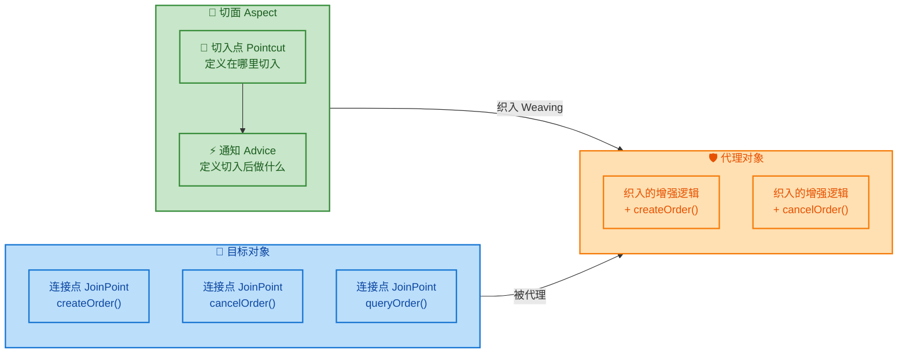

逐一解释这些术语：

- **连接点（JoinPoint）**：程序执行过程中可以被拦截的"点"。在 Spring AOP 中，连接点特指方法的执行（method execution）。你可以把目标对象的每一个方法都看作一个潜在的连接点。

- **切入点（Pointcut）**：一组连接点的筛选规则，用来定义"在哪些方法上生效"。比如"所有 `Service` 类中以 `create` 开头的方法"就是一个切入点表达式。切入点是连接点的子集。

- **通知（Advice）**：在切入点匹配的连接点上执行的具体动作，即"要做什么"。通知有五种类型，稍后详述。

- **切面（Aspect）**：切入点 + 通知的组合体。一个切面就是一个完整的横切关注点的模块化封装。比如"日志切面"封装了"在哪里记日志"和"怎么记日志"。

- **目标对象（Target Object）**：被代理的原始对象，即真正包含业务逻辑的那个对象。

- **代理对象（Proxy）**：AOP 框架为目标对象创建的代理，外界实际调用的是这个代理对象。

- **织入（Weaving）**：将切面应用到目标对象并创建代理对象的过程。织入可以发生在编译期、类加载期或运行期，Spring AOP 采用的是运行期织入（Runtime Weaving），底层就是动态代理。

#### 五种通知类型

AOP 中的通知（Advice）定义了增强逻辑在目标方法执行的哪个时机被触发：

```java
// Spring AOP 中五种通知类型的注解形式
@Aspect  // 声明这是一个切面类
public class LogAspect {

    // 1. 前置通知：目标方法执行之前触发
    @Before("execution(* com.example.service.*.*(..))")
    public void beforeAdvice(JoinPoint jp) {
        // jp.getSignature() 获取被拦截方法的签名信息
        System.out.println("[Before] 即将执行: " + jp.getSignature().getName());
    }

    // 2. 后置通知（返回通知）：目标方法正常返回之后触发
    @AfterReturning(
        pointcut = "execution(* com.example.service.*.*(..))",
        returning = "result"  // 绑定返回值到参数 result
    )
    public void afterReturningAdvice(JoinPoint jp, Object result) {
        System.out.println("[AfterReturning] 方法返回: " + result);
    }

    // 3. 异常通知：目标方法抛出异常时触发
    @AfterThrowing(
        pointcut = "execution(* com.example.service.*.*(..))",
        throwing = "ex"  // 绑定异常对象到参数 ex
    )
    public void afterThrowingAdvice(JoinPoint jp, Exception ex) {
        System.out.println("[AfterThrowing] 方法异常: " + ex.getMessage());
    }

    // 4. 最终通知：无论正常返回还是异常，都会触发（类似 finally）
    @After("execution(* com.example.service.*.*(..))")
    public void afterAdvice(JoinPoint jp) {
        System.out.println("[After] 方法执行结束（finally）");
    }

    // 5. 环绕通知：最强大的通知类型，完全包裹目标方法
    @Around("execution(* com.example.service.*.*(..))")
    public Object aroundAdvice(ProceedingJoinPoint pjp) throws Throwable {
        long start = System.currentTimeMillis();              // 前置逻辑
        System.out.println("[Around] 方法开始: " + pjp.getSignature().getName());

        Object result = pjp.proceed();                        // 调用目标方法（关键！）

        long elapsed = System.currentTimeMillis() - start;    // 后置逻辑
        System.out.println("[Around] 方法结束，耗时: " + elapsed + "ms");
        return result;                                         // 必须返回结果
    }
}
```

环绕通知（`@Around`）是最强大也最常用的类型，因为它能完全控制目标方法的执行——你可以决定是否调用 `proceed()`、可以修改入参、可以修改返回值、可以吞掉异常。其他四种通知本质上都可以用环绕通知来模拟。

五种通知的执行时序如下：

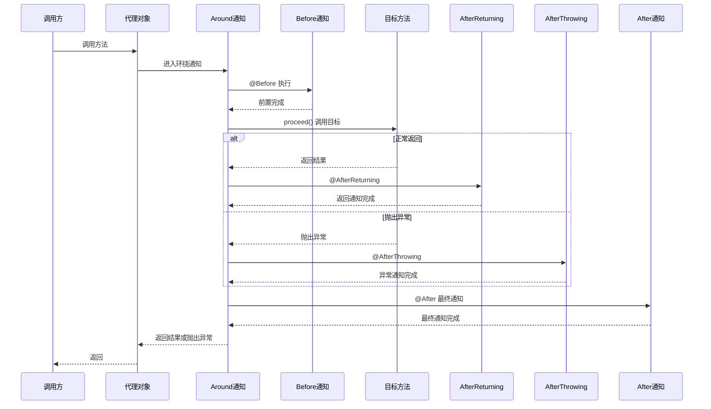

#### Spring AOP 的底层实现：动态代理的实战

这是本节的核心——Spring AOP 在运行时是如何利用动态代理来实现切面织入的。Spring 并没有发明新的代理技术，它直接复用了我们前面学过的 JDK 动态代理和 CGLIB 代理，并根据目标对象的特征自动选择。

选择策略非常清晰：

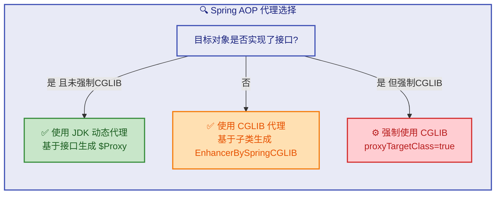

现在让我们用纯 Java 代码（不依赖 Spring 框架）手动模拟 AOP 的核心实现，这样你能更清楚地看到动态代理是如何撑起整个 AOP 机制的。

首先定义业务接口和实现：

```java
// 业务接口
public interface UserService {
    void addUser(String username);    // 添加用户
    String findUser(String userId);   // 查找用户
}

// 业务实现类（目标对象）
public class UserServiceImpl implements UserService {

    @Override
    public void addUser(String username) {
        // 纯粹的业务逻辑，没有任何日志、事务等横切代码
        System.out.println("执行业务逻辑：添加用户 [" + username + "] 到数据库");
    }

    @Override
    public String findUser(String userId) {
        System.out.println("执行业务逻辑：根据ID [" + userId + "] 查询用户");
        return "User_" + userId;  // 模拟返回用户信息
    }
}
```

然后定义一个简化版的"切面"——用 `InvocationHandler` 实现：

```java
import java.lang.reflect.InvocationHandler;
import java.lang.reflect.Method;
import java.lang.reflect.Proxy;

/**
 * AOP 代理处理器 —— 这就是"切面"的运行时载体
 * 它将横切逻辑（日志、性能监控）与目标对象的调用编织在一起
 */
public class AopInvocationHandler implements InvocationHandler {

    // 持有目标对象的引用（即被代理的真实业务对象）
    private final Object target;

    // 通过构造器注入目标对象
    public AopInvocationHandler(Object target) {
        this.target = target;
    }

    /**
     * 所有对代理对象的方法调用都会被路由到这里
     * 这个方法就是"织入点"，我们在这里编排通知的执行顺序
     *
     * @param proxy  生成的代理对象实例（一般不直接使用）
     * @param method 被调用的目标方法的反射对象
     * @param args   方法调用时传入的参数数组
     * @return       目标方法的返回值（可被修改）
     */
    @Override
    public Object invoke(Object proxy, Method method, Object[] args) throws Throwable {

        // ========== @Before 前置通知 ==========
        String methodName = method.getName();                          // 获取方法名
        System.out.println("[LOG-Before] 准备执行方法: " + methodName); // 日志记录
        long startTime = System.currentTimeMillis();                   // 记录开始时间

        Object result = null;  // 用于保存目标方法的返回值

        try {
            // ========== 调用目标方法（相当于 proceed()）==========
            result = method.invoke(target, args);
            // method.invoke() 通过反射调用目标对象的真实方法
            // target 是真实的业务对象，args 是原始参数

            // ========== @AfterReturning 返回通知 ==========
            System.out.println("[LOG-AfterReturning] 方法正常返回: " + result);

        } catch (Exception e) {
            // ========== @AfterThrowing 异常通知 ==========
            System.out.println("[LOG-AfterThrowing] 方法抛出异常: " + e.getCause());
            throw e;  // 重新抛出，不吞掉异常

        } finally {
            // ========== @After 最终通知 ==========
            long elapsed = System.currentTimeMillis() - startTime;     // 计算耗时
            System.out.println("[LOG-After] 方法 " + methodName
                + " 执行完毕，耗时: " + elapsed + "ms");
        }

        return result;  // 将目标方法的返回值传递回调用方
    }

    /**
     * 工厂方法：创建代理对象
     * 这个方法封装了 Proxy.newProxyInstance 的调用细节
     *
     * @param target 需要被代理的目标对象
     * @return       代理对象（类型为目标对象实现的接口）
     */
    @SuppressWarnings("unchecked")
    public static <T> T createProxy(T target) {
        return (T) Proxy.newProxyInstance(
            target.getClass().getClassLoader(),     // 使用目标对象的类加载器
            target.getClass().getInterfaces(),      // 获取目标对象实现的所有接口
            new AopInvocationHandler(target)        // 传入我们的 AOP 处理器
        );
    }
}
```

客户端使用：

```java
public class AopDemo {
    public static void main(String[] args) {
        // 1. 创建目标对象（真实的业务对象）
        UserService realService = new UserServiceImpl();

        // 2. 通过 AOP 工厂方法创建代理对象
        //    此时 proxyService 的类型是 $Proxy0，不是 UserServiceImpl
        UserService proxyService = AopInvocationHandler.createProxy(realService);

        // 3. 通过代理对象调用业务方法
        //    调用方完全不知道日志、性能监控等逻辑的存在
        System.out.println("===== 调用 addUser =====");
        proxyService.addUser("张三");

        System.out.println();

        System.out.println("===== 调用 findUser =====");
        String user = proxyService.findUser("1001");
        System.out.println("查询结果: " + user);
    }
}
```

运行输出：

```
===== 调用 addUser =====
[LOG-Before] 准备执行方法: addUser
执行业务逻辑：添加用户 [张三] 到数据库
[LOG-AfterReturning] 方法正常返回: null
[LOG-After] 方法 addUser 执行完毕，耗时: 1ms

===== 调用 findUser =====
[LOG-Before] 准备执行方法: findUser
执行业务逻辑：根据ID [1001] 查询用户
[LOG-AfterReturning] 方法正常返回: User_1001
[LOG-After] 方法 findUser 执行完毕，耗时: 0ms
查询结果: User_1001
```

观察输出，业务代码（`UserServiceImpl`）里没有一行日志代码，但日志、性能监控全部自动生效了。这就是 AOP 的威力——横切关注点被完全剥离到了 `AopInvocationHandler` 中。

#### 从手动模拟到 Spring AOP：架构对比

我们手动实现的版本和 Spring AOP 的核心思路完全一致，区别在于 Spring 做了大量的工程化封装：

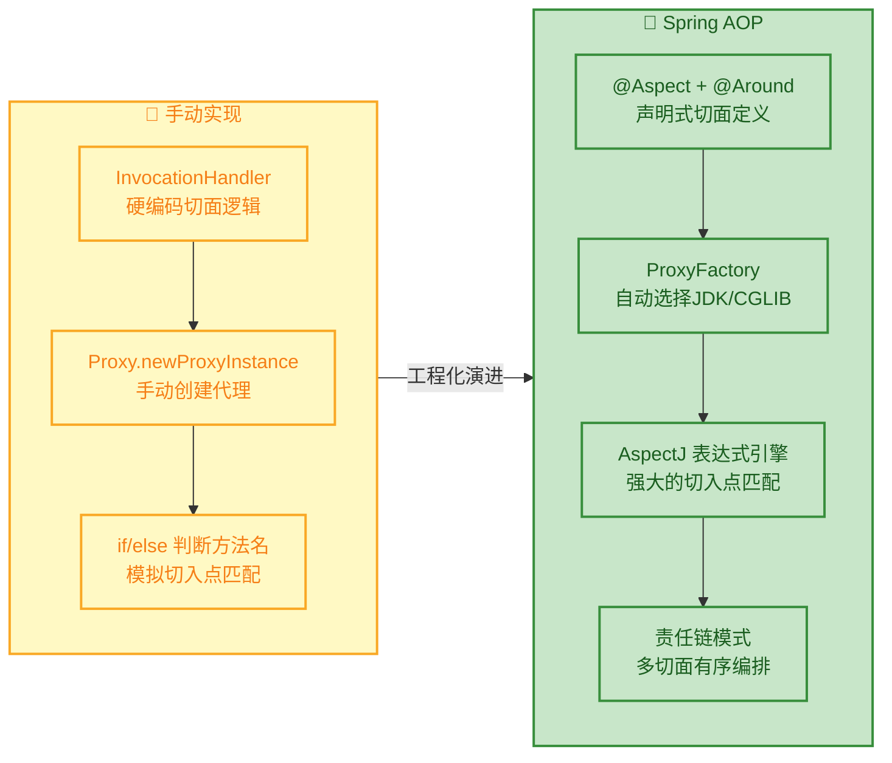

Spring AOP 在我们手动实现的基础上增加了以下关键能力：

- **声明式配置**：通过 `@Aspect`、`@Before`、`@Around` 等注解声明切面，不需要手写 `InvocationHandler`。
- **切入点表达式引擎**：借助 AspectJ 的表达式语法（如 `execution(* com.example.service.*.*(..))`），可以用极其灵活的规则匹配目标方法，而不是用 `if (method.getName().equals(...))` 这种硬编码方式。
- **自动代理创建**：Spring 容器在 Bean 初始化阶段自动检测哪些 Bean 需要被代理，通过 `BeanPostProcessor`（具体是 `AbstractAutoProxyCreator`）自动完成代理对象的创建和替换。
- **多切面编排**：当多个切面作用于同一个方法时，Spring 通过 `@Order` 注解或 `Ordered` 接口控制切面的执行顺序，内部使用责任链模式（Chain of Responsibility）将多个通知串联起来。

#### Spring AOP 自动代理的内部流程

当 Spring 容器启动时，AOP 的自动代理机制大致经历以下步骤：

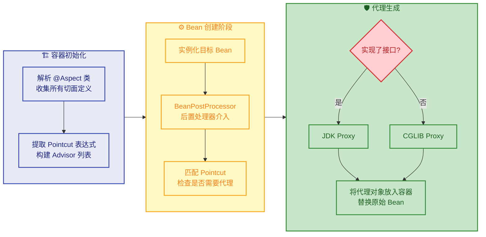

这个流程中最关键的一步是 `BeanPostProcessor` 的介入。Spring 的 `AnnotationAwareAspectJAutoProxyCreator` 会在每个 Bean 初始化完成后检查：这个 Bean 的方法是否匹配了某个切入点表达式？如果匹配，就为它创建代理对象，并将代理对象（而非原始对象）注册到 IoC 容器中。这就是为什么你从容器中 `getBean()` 拿到的对象，其 `getClass()` 返回的往往是 `$Proxy` 或 `EnhancerBySpringCGLIB` 类型。

#### 多切面的责任链执行模型

当多个切面同时作用于一个方法时，Spring 会将所有匹配的通知组织成一条拦截器链（Interceptor Chain）。这条链的执行模型类似于"洋葱模型"——请求从外层一层层进入，到达核心（目标方法），再一层层返回：

```java
// 模拟 Spring 内部的拦截器链执行机制
public class InterceptorChainDemo {

    // 拦截器接口（简化版的 MethodInterceptor）
    interface MethodInterceptor {
        Object invoke(MethodInvocation invocation) throws Throwable;
    }

    // 方法调用链（简化版的 ReflectiveMethodInvocation）
    static class MethodInvocation {
        private final Object target;                          // 目标对象
        private final List<MethodInterceptor> interceptors;   // 拦截器列表
        private int currentIndex = -1;                        // 当前执行到第几个拦截器

        MethodInvocation(Object target, List<MethodInterceptor> interceptors) {
            this.target = target;
            this.interceptors = interceptors;
        }

        // 推进到下一个拦截器，或者调用目标方法
        public Object proceed() throws Throwable {
            currentIndex++;  // 指针后移

            // 如果所有拦截器都执行完了，调用目标方法
            if (currentIndex == interceptors.size()) {
                System.out.println("  >>> 执行目标方法 <<<");
                return "目标方法返回值";
            }

            // 否则，执行当前拦截器，并把自身（链）传递进去
            // 拦截器内部会在适当时机再次调用 proceed() 推进链条
            return interceptors.get(currentIndex).invoke(this);
        }
    }

    public static void main(String[] args) throws Throwable {
        // 构建拦截器链：日志切面 -> 事务切面 -> 目标方法
        List<MethodInterceptor> chain = List.of(
            // 第一层：日志拦截器（@Order(1)，最外层）
            invocation -> {
                System.out.println("[日志切面] Before - 进入");
                Object result = invocation.proceed();          // 推进到下一个拦截器
                System.out.println("[日志切面] After  - 退出");
                return result;
            },
            // 第二层：事务拦截器（@Order(2)，内层）
            invocation -> {
                System.out.println("  [事务切面] Before - 开启事务");
                Object result = invocation.proceed();          // 推进到目标方法
                System.out.println("  [事务切面] After  - 提交事务");
                return result;
            }
        );

        // 执行拦截器链
        MethodInvocation invocation = new MethodInvocation(new Object(), chain);
        Object result = invocation.proceed();  // 启动链条
        System.out.println("最终结果: " + result);
    }
}
```

输出：

```
[日志切面] Before - 进入
  [事务切面] Before - 开启事务
  >>> 执行目标方法 <
  [事务切面] After  - 提交事务
[日志切面] After  - 退出
最终结果: 目标方法返回值
```

这就是经典的洋葱模型——日志切面包裹事务切面，事务切面包裹目标方法。`proceed()` 的调用就像递归一样，一层层深入，再一层层返回。这个模式和我们前面学的 `InvocationHandler.invoke()` 中调用 `method.invoke(target, args)` 是同一个思想，只不过 Spring 把它扩展成了支持多层拦截的链式结构。

#### AOP 中的经典陷阱：自调用失效问题

理解了 AOP 的代理本质后，有一个非常重要的"坑"必须掌握——同一个类内部的方法互相调用时，AOP 会失效。

```java
@Service
public class OrderService {

    // 这个方法上配置了事务切面
    @Transactional
    public void createOrder(Order order) {
        orderDao.insert(order);
        // 内部调用同类的另一个方法
        // ⚠️ 这里的 this 是原始对象，不是代理对象！
        this.sendNotification(order);
    }

    // 这个方法上也配置了事务切面（比如要求新事务 REQUIRES_NEW）
    @Transactional(propagation = Propagation.REQUIRES_NEW)
    public void sendNotification(Order order) {
        // 期望在新事务中执行，但实际上事务注解不会生效！
        notificationDao.insert(new Notification(order));
    }
}
```

为什么会失效？用一张内存引用图来说明：

```java
// 内存引用关系示意

// Spring 容器中注册的是代理对象
// IoC Container
// ┌─────────────────────────────────────────────────┐
// │  "orderService" -> [Proxy$OrderService]         │
// │                        │                        │
// │                        │ 持有引用               │
// │                        ▼                        │
// │                   [OrderService 真实对象]        │
// └─────────────────────────────────────────────────┘
//
// 外部调用链路（AOP 生效 ✅）：
//   Client -> Proxy.createOrder() -> 拦截器链 -> target.createOrder()
//
// 内部调用链路（AOP 失效 ❌）：
//   target.createOrder() 内部执行 this.sendNotification()
//   此时 this = target（真实对象），不经过 Proxy，拦截器链被绕过
```

解决方案有几种：

```java
// 方案一：注入自身代理（推荐）
@Service
public class OrderService {

    @Autowired
    private OrderService self;  // Spring 注入的是代理对象，不是 this

    @Transactional
    public void createOrder(Order order) {
        orderDao.insert(order);
        // 通过代理对象调用，AOP 生效 ✅
        self.sendNotification(order);
    }

    @Transactional(propagation = Propagation.REQUIRES_NEW)
    public void sendNotification(Order order) {
        notificationDao.insert(new Notification(order));
    }
}

// 方案二：从 ApplicationContext 中获取代理
@Service
public class OrderService implements ApplicationContextAware {

    private ApplicationContext ctx;  // 持有容器引用

    @Override
    public void setApplicationContext(ApplicationContext ctx) {
        this.ctx = ctx;              // Spring 回调注入容器
    }

    @Transactional
    public void createOrder(Order order) {
        orderDao.insert(order);
        // 从容器中取出的是代理对象
        OrderService proxy = ctx.getBean(OrderService.class);
        proxy.sendNotification(order);  // AOP 生效 ✅
    }
}

// 方案三：使用 AopContext（需开启 exposeProxy）
// 配置：@EnableAspectJAutoProxy(exposeProxy = true)
@Transactional
public void createOrder(Order order) {
    orderDao.insert(order);
    // 从 ThreadLocal 中获取当前代理对象
    OrderService proxy = (OrderService) AopContext.currentProxy();
    proxy.sendNotification(order);  // AOP 生效 ✅
}
```

这个陷阱的根本原因就是：AOP 的一切增强都发生在代理对象上，而 `this` 关键字永远指向真实对象本身。只要方法调用绕过了代理，所有的切面逻辑就形同虚设。这也是为什么深入理解动态代理的原理如此重要——不理解代理的本质，就无法理解 AOP 失效的根因。

#### AOP 实现方式的全景对比

最后，我们把 AOP 的几种实现方式做一个全面对比，帮助你建立完整的知识图谱：

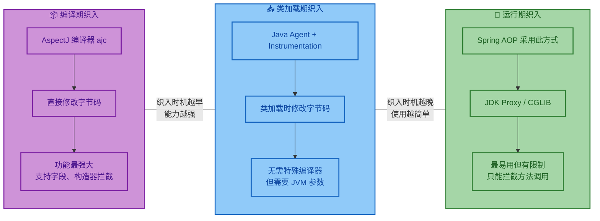

| 维度 | 编译期织入 (AspectJ) | 类加载期织入 (LTW) | 运行期织入 (Spring AOP) |
|------|---------------------|-------------------|----------------------|
| 织入时机 | 编译时 | 类加载时 | 运行时（Bean 初始化后） |
| 实现技术 | AspectJ 编译器 (ajc) | Java Agent | JDK Proxy / CGLIB |
| 拦截范围 | 方法、字段、构造器、静态方法 | 方法、字段、构造器 | 仅方法调用 |
| 性能开销 | 最低（编译时已完成） | 较低 | 有反射/代理开销 |
| 自调用问题 | 无（字节码已被修改） | 无 | 有（需要特殊处理） |
| 使用复杂度 | 高（需要 ajc 编译器） | 中（需要 Agent 配置） | 低（注解即可） |
| 典型场景 | 高性能要求、全面拦截 | 不能改编译流程时 | 绝大多数 Spring 应用 |

在实际开发中，Spring AOP（运行期织入）覆盖了 90% 以上的场景。它的易用性和 Spring 生态的深度整合使其成为 Java 开发者最常接触的 AOP 实现。而理解它的底层就是动态代理，这正是我们本章学习的核心价值所在。

**📝 练习题**

以下关于 Spring AOP 的说法，哪一项是正确的？

A. Spring AOP 默认使用 AspectJ 编译器在编译期织入切面逻辑

B. 当目标对象没有实现任何接口时，Spring AOP 会自动降级为 JDK 动态代理

C. 在同一个 Bean 内部，方法 A 调用方法 B 时，方法 B 上的 @Transactional 注解不会生效，因为调用绕过了代理对象

D. @Around 通知中即使不调用 proceed() 方法，目标方法也会正常执行


**【答案】** C

**【解析】** 这道题考查的是 AOP 自调用失效这个经典陷阱。

- A 错误：Spring AOP 采用的是运行期织入（Runtime Weaving），底层使用 JDK 动态代理或 CGLIB，而不是 AspectJ 编译器。虽然 Spring 借用了 AspectJ 的注解语法（如 `@Aspect`、`@Before`），但织入机制完全不同。
- B 错误：逻辑恰好反了。当目标对象没有实现接口时，JDK 动态代理无法使用（因为它只能代理接口），Spring 会自动选择 CGLIB（基于子类继承的代理方式）。
- C 正确：当 Bean 内部 `this.methodB()` 调用时，`this` 指向的是原始对象而非代理对象，调用不经过代理的拦截器链，因此 `@Transactional`、`@Cacheable` 等基于 AOP 的注解全部失效。解决方案包括注入自身代理（`@Autowired private MyService self`）或使用 `AopContext.currentProxy()`。
- D 错误：`@Around` 通知中的 `proceed()` 是触发目标方法执行的唯一入口。如果不调用 `proceed()`，目标方法根本不会执行——这正是环绕通知强大之处，它可以完全控制目标方法是否执行。

---

## 动态代理应用：Retrofit 原理基础

Retrofit 是 Android 和 Java 生态中最流行的类型安全 HTTP 客户端框架，由 Square 公司开发。它的核心设计哲学极其优雅——开发者只需要定义一个 Java 接口，声明 HTTP 请求的方法签名和注解，Retrofit 就能在运行时自动生成该接口的实现类，完成网络请求的构建、发送和响应解析。这背后的核心引擎，正是我们学过的 JDK 动态代理。

理解 Retrofit 的原理，是将动态代理从"理论知识"升级为"工程实战能力"的关键一步。它展示了动态代理在真实框架中最经典、最精妙的应用方式。

### Retrofit 的使用方式回顾

在深入原理之前，先快速回顾 Retrofit 的典型用法，这样才能清楚地看到"魔法"发生在哪里。

```java
// ① 定义一个纯接口，用注解描述 HTTP 请求
public interface GitHubService {

    // GET 请求，路径为 /users/{user}/repos
    // {user} 是路径参数，由 @Path 注解绑定
    @GET("users/{user}/repos")
    Call<List<Repo>> listRepos(@Path("user") String user);

    // POST 请求，@Body 注解表示将参数序列化为请求体
    @POST("users/new")
    Call<User> createUser(@Body User user);
}
```

```java
// ② 构建 Retrofit 实例
Retrofit retrofit = new Retrofit.Builder()
    .baseUrl("https://api.github.com/")       // 设置基础 URL
    .addConverterFactory(GsonConverterFactory.create()) // JSON 转换器
    .build();

// ③ 创建接口的实现——这一步就是动态代理！
GitHubService service = retrofit.create(GitHubService.class);

// ④ 调用方法，就像调用普通 Java 方法一样
Call<List<Repo>> call = service.listRepos("octocat");
```

注意第 ③ 步：`retrofit.create(GitHubService.class)`。我们从未编写过 `GitHubService` 的实现类，但 `create` 方法却返回了一个可以正常工作的实例。这个实例是谁？它就是 `Proxy.newProxyInstance` 生成的 `$Proxy0` 动态代理对象。

### Retrofit.create() 的核心源码剖析

Retrofit 的 `create` 方法是整个框架最核心的入口，源码精简后如下：

```java
// Retrofit.java 核心源码（简化版）
public <T> T create(final Class<T> service) {

    // 校验：传入的必须是一个接口（JDK 动态代理的硬性要求）
    validateServiceInterface(service);

    // 核心：使用 JDK 动态代理生成接口的实现
    return (T) Proxy.newProxyInstance(
        service.getClassLoader(),           // 类加载器
        new Class<?>[] { service },         // 要代理的接口数组
        new InvocationHandler() {           // 调用处理器——所有魔法在这里
            @Override
            public Object invoke(Object proxy, Method method, Object[] args)
                    throws Throwable {

                // 如果调用的是 Object 类的方法（如 toString），直接执行
                if (method.getDeclaringClass() == Object.class) {
                    return method.invoke(this, args);
                }

                // 核心逻辑：将 Method 对象解析为一个 ServiceMethod
                // ServiceMethod 封装了注解信息、参数处理、请求构建等全部逻辑
                ServiceMethod<Object, Object> serviceMethod =
                    (ServiceMethod<Object, Object>) loadServiceMethod(method);

                // 用 ServiceMethod + 实际参数 创建一个 OkHttpCall
                OkHttpCall<Object> okHttpCall =
                    new OkHttpCall<>(serviceMethod, args);

                // 通过 CallAdapter 适配返回类型（如 Call, Observable 等）
                return serviceMethod.adapt(okHttpCall);
            }
        });
}
```

这段代码的结构与我们之前学习的 JDK 动态代理完全一致：`Proxy.newProxyInstance` + `InvocationHandler`。区别在于 `invoke` 方法内部不是简单地转发调用，而是执行了一套精密的"注解解析 → 请求构建 → 网络调用"流水线。

### Retrofit 动态代理的完整工作流程

当你调用 `service.listRepos("octocat")` 时，背后发生了一系列精密的步骤。我们用一张流程图来展示：

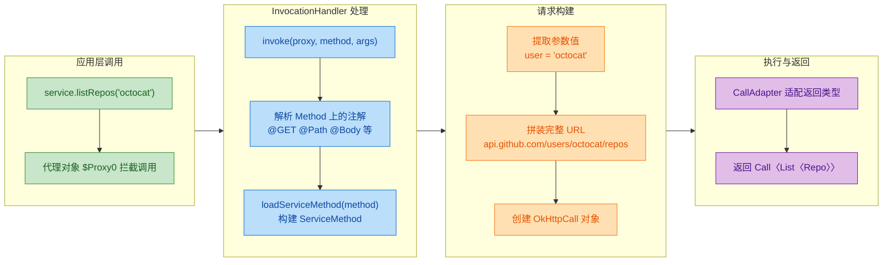

### 注解解析机制详解

Retrofit 的 `invoke` 方法中最关键的一步是 `loadServiceMethod(method)`。这个方法负责将 Java 反射中的 `Method` 对象，转化为一个包含完整 HTTP 请求信息的 `ServiceMethod` 对象。我们来看看它具体做了什么：

```java
// loadServiceMethod 的核心逻辑（简化）
ServiceMethod<?> loadServiceMethod(Method method) {

    // 先从缓存中查找，避免重复解析（性能优化的关键）
    ServiceMethod<?> result = serviceMethodCache.get(method);
    if (result != null) return result;

    synchronized (serviceMethodCache) {
        result = serviceMethodCache.get(method);
        if (result == null) {
            // 缓存未命中，开始解析
            result = ServiceMethod.parseAnnotations(this, method);
            // 解析完成后放入缓存
            serviceMethodCache.put(method, result);
        }
    }
    return result;
}
```

`ServiceMethod.parseAnnotations` 内部会逐一解析方法上的注解：

```java
// 注解解析过程的伪代码展示
public static ServiceMethod parseAnnotations(Retrofit retrofit, Method method) {

    // 1. 获取方法上的所有注解
    Annotation[] methodAnnotations = method.getAnnotations();

    // 2. 遍历注解，提取 HTTP 方法和相对路径
    for (Annotation annotation : methodAnnotations) {
        if (annotation instanceof GET) {
            httpMethod = "GET";                    // HTTP 方法
            relativeUrl = ((GET) annotation).value(); // 相对路径: "users/{user}/repos"
        } else if (annotation instanceof POST) {
            httpMethod = "POST";
            relativeUrl = ((POST) annotation).value();
        }
        // ... 其他 HTTP 方法注解
    }

    // 3. 获取参数上的注解
    Annotation[][] paramAnnotations = method.getParameterAnnotations();

    // 4. 遍历每个参数的注解
    for (int i = 0; i < paramAnnotations.length; i++) {
        for (Annotation annotation : paramAnnotations[i]) {
            if (annotation instanceof Path) {
                // @Path("user") -> 记录：第 i 个参数替换 URL 中的 {user}
                String pathName = ((Path) annotation).value();
                parameterHandlers[i] = new ParameterHandler.Path<>(pathName);
            } else if (annotation instanceof Body) {
                // @Body -> 记录：第 i 个参数序列化为请求体
                parameterHandlers[i] = new ParameterHandler.Body<>(converter);
            } else if (annotation instanceof Query) {
                // @Query("page") -> 记录：第 i 个参数作为查询参数
                String queryName = ((Query) annotation).value();
                parameterHandlers[i] = new ParameterHandler.Query<>(queryName);
            }
        }
    }

    // 5. 将所有解析结果封装为 ServiceMethod 返回
    return new ServiceMethod<>(httpMethod, baseUrl, relativeUrl,
                               parameterHandlers, responseConverter);
}
```

这个过程本质上就是：通过 Java 反射 API 读取接口方法上的注解元数据，将声明式的注解描述转化为命令式的请求构建逻辑。

### ServiceMethod 缓存机制

注意上面 `loadServiceMethod` 中的缓存设计，这是 Retrofit 性能优化的核心策略：

```java
// Retrofit 内部维护的缓存 Map
private final Map<Method, ServiceMethod<?>> serviceMethodCache = new ConcurrentHashMap<>();
```

为什么需要缓存？因为注解解析涉及大量反射操作（`getAnnotations`、`getParameterAnnotations`、`getGenericReturnType` 等），这些操作的性能开销不小。而同一个接口方法的注解信息是固定不变的，没有必要每次调用都重新解析。

缓存策略的效果是：第一次调用 `listRepos()` 时会触发完整的注解解析流程，后续所有调用都直接从 `ConcurrentHashMap` 中取出已解析好的 `ServiceMethod`，几乎零开销。

### 手写一个迷你 Retrofit

理解原理最好的方式是自己动手实现一个简化版。下面我们从零构建一个 Mini Retrofit，它能将接口方法上的自定义注解转化为 HTTP 请求信息：

```java
// ========== 第一步：定义自定义注解 ==========

// HTTP GET 方法注解
@Retention(RetentionPolicy.RUNTIME)  // 运行时保留，反射才能读取
@Target(ElementType.METHOD)          // 只能标注在方法上
public @interface GET {
    String value();  // 存储相对路径，如 "users/{user}/repos"
}

// 路径参数注解
@Retention(RetentionPolicy.RUNTIME)
@Target(ElementType.PARAMETER)       // 只能标注在参数上
public @interface Path {
    String value();  // 存储路径变量名，如 "user"
}

// 查询参数注解
@Retention(RetentionPolicy.RUNTIME)
@Target(ElementType.PARAMETER)
public @interface Query {
    String value();  // 存储查询参数名，如 "page"
}
```

```java
// ========== 第二步：定义 API 接口 ==========

public interface MyApiService {

    // 声明一个 GET 请求
    // 最终应生成: GET https://api.example.com/users/octocat/repos?page=2
    @GET("users/{user}/repos")
    String listRepos(@Path("user") String username,
                     @Query("page") int page);
}
```

```java
// ========== 第三步：实现 MiniRetrofit 核心类 ==========

public class MiniRetrofit {

    private final String baseUrl;  // 基础 URL

    // 构造器，接收基础 URL
    public MiniRetrofit(String baseUrl) {
        this.baseUrl = baseUrl;
    }

    // 核心方法：创建接口的动态代理实例
    @SuppressWarnings("unchecked")
    public <T> T create(Class<T> serviceInterface) {

        // 使用 JDK 动态代理
        return (T) Proxy.newProxyInstance(
            serviceInterface.getClassLoader(),
            new Class<?>[] { serviceInterface },
            new InvocationHandler() {

                @Override
                public Object invoke(Object proxy, Method method, Object[] args)
                        throws Throwable {

                    // 1. 处理 Object 类自带的方法
                    if (method.getDeclaringClass() == Object.class) {
                        return method.invoke(this, args);
                    }

                    // 2. 解析方法上的 @GET 注解，获取 HTTP 方法和相对路径
                    String httpMethod = "";
                    String relativePath = "";

                    GET getAnnotation = method.getAnnotation(GET.class);
                    if (getAnnotation != null) {
                        httpMethod = "GET";
                        relativePath = getAnnotation.value();
                    }

                    // 3. 解析参数注解，构建完整 URL
                    Annotation[][] paramAnnotations =
                        method.getParameterAnnotations();
                    StringBuilder queryParams = new StringBuilder();

                    for (int i = 0; i < paramAnnotations.length; i++) {
                        for (Annotation annotation : paramAnnotations[i]) {

                            if (annotation instanceof Path) {
                                // @Path: 替换路径中的占位符
                                String pathKey = ((Path) annotation).value();
                                relativePath = relativePath.replace(
                                    "{" + pathKey + "}",
                                    String.valueOf(args[i])
                                );
                            } else if (annotation instanceof Query) {
                                // @Query: 追加查询参数
                                String queryKey = ((Query) annotation).value();
                                if (queryParams.length() > 0) {
                                    queryParams.append("&");
                                }
                                queryParams.append(queryKey)
                                           .append("=")
                                           .append(args[i]);
                            }
                        }
                    }

                    // 4. 拼装完整 URL
                    String fullUrl = baseUrl + relativePath;
                    if (queryParams.length() > 0) {
                        fullUrl += "?" + queryParams;
                    }

                    // 5. 输出构建结果（实际框架中这里会发起真正的 HTTP 请求）
                    String requestInfo = String.format(
                        "[%s] %s", httpMethod, fullUrl
                    );
                    System.out.println(">>> 构建的 HTTP 请求: " + requestInfo);

                    // 6. 返回请求信息（实际框架返回 Call 对象）
                    return requestInfo;
                }
            }
        );
    }
}
```

```java
// ========== 第四步：测试运行 ==========

public class MiniRetrofitDemo {
    public static void main(String[] args) {

        // 创建 MiniRetrofit 实例，设置基础 URL
        MiniRetrofit retrofit = new MiniRetrofit("https://api.example.com/");

        // 动态代理生成接口实现
        MyApiService service = retrofit.create(MyApiService.class);

        // 调用接口方法——实际上触发的是 InvocationHandler.invoke()
        String result = service.listRepos("octocat", 2);

        // 验证代理对象的类型
        System.out.println("代理对象类型: " + service.getClass().getName());
        System.out.println("是否是 MyApiService 实例: "
            + (service instanceof MyApiService));
    }
}
```

运行输出：

```
>>> 构建的 HTTP 请求: [GET] https://api.example.com/users/octocat/repos?page=2
代理对象类型: com.sun.proxy.$Proxy0
是否是 MyApiService 实例: true
```

可以看到，我们没有编写任何 `MyApiService` 的实现类，但通过动态代理 + 注解解析，成功地将接口方法调用转化为了一个完整的 HTTP 请求描述。这就是 Retrofit 的核心原理。

### Retrofit 动态代理的架构全景

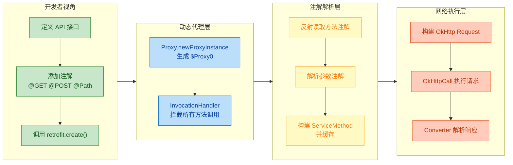

### 为什么 Retrofit 选择动态代理

这个设计选择并非偶然，而是经过深思熟虑的架构决策：

第一，声明式编程体验（Declarative API）。开发者只需要声明"我要什么"（通过接口和注解），而不需要关心"怎么做"（HTTP 请求的构建细节）。这极大地降低了网络层代码的复杂度，让 API 定义像文档一样清晰可读。

第二，接口天然适合动态代理。Retrofit 要求定义的是接口而非类，这恰好满足 JDK 动态代理"只能代理接口"的限制。而且接口本身就是一种契约（Contract），用它来描述 API 的形状再合适不过。

第三，零样板代码（Zero Boilerplate）。如果没有动态代理，开发者需要为每个 API 接口手动编写实现类，处理 URL 拼接、参数序列化、请求构建等重复逻辑。动态代理将这些样板代码全部消除，一个 `create()` 调用搞定一切。

第四，高度可扩展。通过 `CallAdapter`（适配返回类型）和 `Converter`（适配数据格式），Retrofit 可以灵活支持 RxJava Observable、Kotlin Coroutines、Protobuf 等各种扩展，而这些扩展都不需要修改代理逻辑本身。

---

## 动态代理应用：系统服务 Hook 基础

在 Android 系统开发和逆向工程领域，"Hook"是一个高频出现的术语。Hook 的本意是"钩子"，在技术语境中指的是拦截系统或框架的正常执行流程，在其中插入自定义逻辑。动态代理是实现 Hook 的重要手段之一，尤其适合 Hook 那些通过接口定义的系统服务。

理解系统服务 Hook，不仅能帮助你深入理解 Android 框架的运行机制，也是插件化框架、性能监控工具、自动化测试框架等高级技术的基础。

### 什么是系统服务 Hook

Android 系统中有大量的系统服务（System Service），比如 `ClipboardManager`（剪贴板）、`ActivityManager`（Activity 管理）、`PackageManager`（包管理）等。这些服务通常通过 AIDL 接口定义，应用层通过 Binder IPC 机制与它们通信。

Hook 系统服务的核心思路是：找到应用持有的系统服务代理对象（通常是一个接口引用），用我们自己创建的动态代理对象替换它。这样，当应用调用系统服务时，实际上调用的是我们的代理对象，我们就可以在其中拦截、修改、记录甚至阻止原始调用。

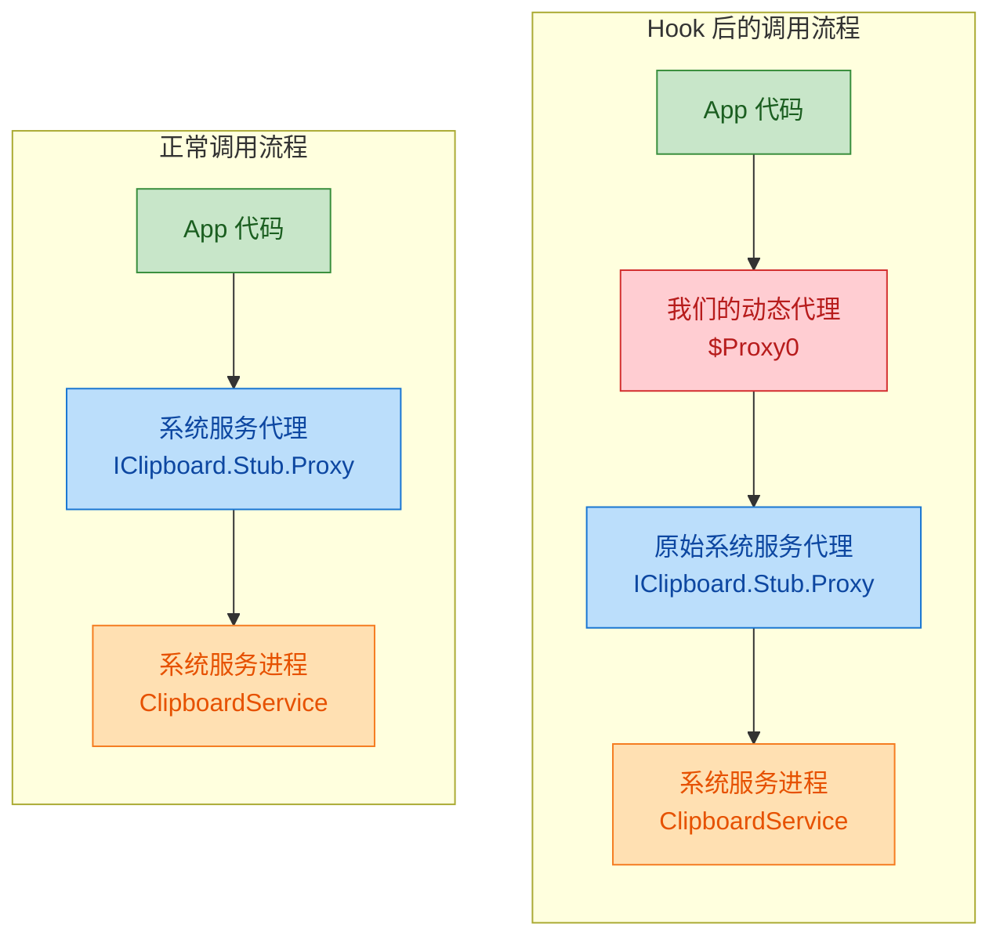

右侧的流程中，我们的动态代理 `$Proxy0` 像一个"中间人"一样插入到了调用链中。它可以在转发调用之前或之后执行任意自定义逻辑。

### Hook 剪贴板服务实战

我们以 Hook Android 剪贴板服务为例，演示如何用动态代理拦截系统服务调用。目标是：当任何代码尝试读取剪贴板内容时，我们拦截并替换返回值。

首先理解 Android 剪贴板服务的调用链：

```java
// 应用层获取剪贴板内容的常规代码
ClipboardManager cm = (ClipboardManager)
    context.getSystemService(Context.CLIPBOARD_SERVICE);
ClipData clipData = cm.getPrimaryClip();  // 获取剪贴板内容
```

在 Android 框架内部，`ClipboardManager` 持有一个 `IClipboard` 接口的引用（这是一个 AIDL 生成的 Binder 代理），所有剪贴板操作最终都通过这个接口发送到系统服务进程。我们的目标就是替换这个 `IClipboard` 引用。

```java
// ========== Hook 剪贴板服务的完整实现 ==========

public class ClipboardHook {

    public static void hookClipboardService(Context context) throws Exception {

        // ===== 第一步：获取 ClipboardManager 实例 =====
        ClipboardManager cm = (ClipboardManager)
            context.getSystemService(Context.CLIPBOARD_SERVICE);

        // ===== 第二步：通过反射获取 ClipboardManager 内部的 mService 字段 =====
        // mService 就是 IClipboard 接口的 Binder 代理对象
        Field serviceField = ClipboardManager.class.getDeclaredField("mService");
        serviceField.setAccessible(true);  // 突破 private 访问限制

        // 获取原始的系统服务代理对象
        Object originalService = serviceField.get(cm);

        // ===== 第三步：获取 IClipboard 接口的 Class 对象 =====
        // IClipboard 是隐藏 API，需要通过反射获取
        Class<?> iClipboardClass = Class.forName("android.content.IClipboard");

        // ===== 第四步：创建动态代理对象 =====
        Object proxyService = Proxy.newProxyInstance(
            iClipboardClass.getClassLoader(),
            new Class<?>[] { iClipboardClass },  // 代理 IClipboard 接口
            new InvocationHandler() {

                @Override
                public Object invoke(Object proxy, Method method, Object[] args)
                        throws Throwable {

                    // 拦截 getPrimaryClip 方法
                    if ("getPrimaryClip".equals(method.getName())) {
                        Log.d("Hook", "剪贴板读取被拦截！");
                        Log.d("Hook", "调用者包名: " + args[0]);

                        // 返回我们自定义的剪贴板内容
                        ClipData fakeClip = ClipData.newPlainText(
                            "hooked",
                            "你的剪贴板已被 Hook，这是替换后的内容"
                        );
                        return fakeClip;
                    }

                    // 拦截 hasPrimaryClip 方法
                    if ("hasPrimaryClip".equals(method.getName())) {
                        Log.d("Hook", "检查剪贴板是否有内容 -> 强制返回 true");
                        return true;
                    }

                    // 其他方法正常转发给原始服务
                    return method.invoke(originalService, args);
                }
            }
        );

        // ===== 第五步：用代理对象替换原始服务 =====
        serviceField.set(cm, proxyService);

        Log.d("Hook", "剪贴板服务 Hook 成功！");
    }
}
```

这段代码的核心步骤可以概括为"反射获取 → 动态代理包装 → 反射替换"三部曲。

### Hook 的通用模式

上面的剪贴板 Hook 展示了一个通用的 Hook 模式，几乎所有基于接口的系统服务 Hook 都遵循这个套路：

```java
// ========== 系统服务 Hook 的通用模板 ==========

public class ServiceHookTemplate {

    /**
     * 通用 Hook 方法
     * @param targetObject    持有服务引用的对象（如 ClipboardManager）
     * @param fieldName       服务引用的字段名（如 "mService"）
     * @param serviceInterface 服务接口的 Class（如 IClipboard.class）
     * @param handler         自定义的拦截逻辑
     */
    public static void hook(Object targetObject,
                            String fieldName,
                            Class<?> serviceInterface,
                            InvocationHandler handler) throws Exception {

        // 1. 反射获取目标字段
        Field field = targetObject.getClass().getDeclaredField(fieldName);
        field.setAccessible(true);

        // 2. 保存原始对象引用（供 handler 内部转发使用）
        Object originalService = field.get(targetObject);

        // 3. 创建动态代理
        Object proxy = Proxy.newProxyInstance(
            serviceInterface.getClassLoader(),
            new Class<?>[] { serviceInterface },
            handler
        );

        // 4. 替换原始对象
        field.set(targetObject, proxy);
    }
}
```

这个模板揭示了 Hook 的本质：它是反射（Reflection）和动态代理（Dynamic Proxy）的组合技。反射负责"找到并替换"目标引用，动态代理负责"拦截并处理"方法调用。

### Hook 在实际场景中的应用

动态代理 Hook 技术在 Android 生态中有广泛的实际应用：

第一个场景是插件化框架。像 VirtualApk、RePlugin 这类插件化框架，需要让宿主 App 加载并运行未安装的插件 APK。它们的核心技术之一就是 Hook `ActivityManagerService` 的代理对象，拦截 `startActivity` 调用，将目标 Activity 替换为一个预先在 AndroidManifest 中注册的"占坑" Activity（Stub Activity），从而绕过系统对未注册 Activity 的检查。等到真正启动时，再通过 Hook 将占坑 Activity 替换回插件中的真实 Activity。

```java
// 插件化框架 Hook startActivity 的简化示意
public Object invoke(Object proxy, Method method, Object[] args)
        throws Throwable {

    // 拦截 startActivity 调用
    if ("startActivity".equals(method.getName())) {

        // 从参数中找到 Intent 对象
        Intent originalIntent = findIntent(args);

        // 保存原始 Intent（插件 Activity 信息）
        Intent stubIntent = new Intent();
        stubIntent.setClassName("com.host.app",
            "com.host.app.StubActivity");  // 替换为占坑 Activity

        // 将原始 Intent 藏在 extras 中，后续恢复用
        stubIntent.putExtra("original_intent", originalIntent);

        // 替换参数中的 Intent
        replaceIntent(args, stubIntent);
    }

    // 转发给原始 AMS 代理
    return method.invoke(originalService, args);
}
```

第二个场景是性能监控与 APM（Application Performance Management）。性能监控工具可以通过 Hook 数据库服务、网络服务等，在不修改业务代码的前提下，自动采集每次数据库查询的耗时、每次网络请求的响应时间等指标。

```java
// APM 监控 Hook 示意：自动记录方法执行耗时
public Object invoke(Object proxy, Method method, Object[] args)
        throws Throwable {

    // 记录方法调用开始时间
    long startTime = System.nanoTime();

    try {
        // 转发给原始服务执行
        Object result = method.invoke(originalService, args);

        // 计算耗时
        long duration = System.nanoTime() - startTime;

        // 上报性能数据
        APMReporter.report(method.getName(), duration);

        return result;
    } catch (Throwable t) {
        // 记录异常信息
        APMReporter.reportError(method.getName(), t);
        throw t;
    }
}
```

第三个场景是自动化测试与 Mock。在测试环境中，可以通过 Hook 系统服务来模拟各种场景，比如 Hook 定位服务返回虚拟位置、Hook 网络服务模拟断网状态、Hook 传感器服务模拟特定的传感器数据等。这让测试不再依赖真实的硬件环境。

### Hook 的风险与限制

虽然动态代理 Hook 技术强大，但必须清醒地认识到它的局限性和风险：

第一，Android 版本兼容性问题。系统服务的内部实现（字段名、类结构）在不同 Android 版本之间可能发生变化。比如某个字段在 Android 10 中叫 `mService`，到了 Android 11 可能被重命名或重构。这意味着 Hook 代码需要针对不同版本做适配，维护成本很高。

第二，非公开 API 限制（Hidden API Restriction）。从 Android 9（Pie）开始，Google 引入了对非公开 API 的访问限制。通过反射访问 `@hide` 标注的类和方法会收到警告甚至直接抛出异常。Android 版本越新，限制越严格。这对 Hook 技术构成了根本性的挑战。

```java
// Android 9+ 访问隐藏 API 可能遇到的异常
// java.lang.NoSuchFieldException: mService
// 或者
// Accessing hidden field Landroid/content/ClipboardManager;->mService:
//     Landroid/content/IClipboard; (greylist, reflection, allowed)
```

第三，JDK 动态代理只能代理接口。如果目标服务不是通过接口引用持有的，而是直接持有具体类的引用，那么 JDK 动态代理就无法工作。这种情况下需要借助 CGLIB（在 Android 上不可用）或者更底层的 Hook 框架如 Xposed、Frida 等。

第四，安全与合规风险。Hook 系统服务本质上是修改系统的正常行为，在生产环境中使用可能违反应用商店的政策，甚至触发安全检测机制。它更适合用于开发调试、自动化测试和安全研究等场景。

### 动态代理 Hook 与其他 Hook 方案对比

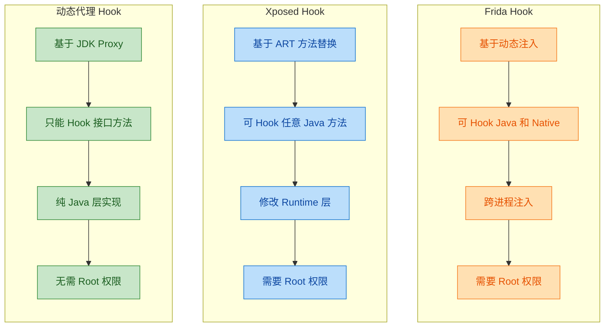

动态代理 Hook 是三者中最轻量、最安全的方案，它不需要 Root 权限，不需要修改系统底层，完全在 Java 层运行。但它的能力也最受限——只能 Hook 通过接口引用的方法调用。在实际工程中，选择哪种 Hook 方案取决于具体需求：如果目标是接口方法且在应用进程内，动态代理是首选；如果需要 Hook 任意方法或跨进程操作，则需要考虑 Xposed 或 Frida。

### 一个完整的纯 Java Hook 示例

为了让你在标准 Java 环境中也能体验 Hook 的完整流程，下面提供一个不依赖 Android 的纯 Java 示例。我们模拟一个"消息服务"，然后 Hook 它来拦截和修改消息内容：

```java
// ========== 定义服务接口 ==========

public interface MessageService {
    // 发送消息
    void sendMessage(String to, String content);
    // 接收消息
    String receiveMessage(String from);
}
```

```java
// ========== 真实的服务实现 ==========

public class RealMessageService implements MessageService {

    @Override
    public void sendMessage(String to, String content) {
        // 模拟真实的消息发送
        System.out.println("[真实服务] 发送消息给 " + to + ": " + content);
    }

    @Override
    public String receiveMessage(String from) {
        // 模拟真实的消息接收
        return "来自 " + from + " 的原始消息内容";
    }
}
```

```java
// ========== 模拟一个持有服务引用的管理器（类似 Android 的 Manager 类） ==========

public class MessageManager {

    // 私有字段，持有服务接口引用（类似 Android 中的 mService）
    private MessageService mService;

    public MessageManager() {
        // 初始化时绑定真实服务
        this.mService = new RealMessageService();
    }

    // 对外暴露的 API
    public void send(String to, String content) {
        mService.sendMessage(to, content);
    }

    public String receive(String from) {
        return mService.receiveMessage(from);
    }
}
```

```java
// ========== Hook 工具类 ==========

public class MessageServiceHook {

    public static void hook(MessageManager manager) throws Exception {

        // 1. 反射获取 mService 字段
        Field serviceField = MessageManager.class.getDeclaredField("mService");
        serviceField.setAccessible(true);

        // 2. 获取原始服务引用
        MessageService originalService =
            (MessageService) serviceField.get(manager);

        // 3. 创建动态代理
        MessageService proxyService = (MessageService) Proxy.newProxyInstance(
            MessageService.class.getClassLoader(),
            new Class<?>[] { MessageService.class },
            new InvocationHandler() {

                @Override
                public Object invoke(Object proxy, Method method, Object[] args)
                        throws Throwable {

                    // Hook sendMessage：审查并可能修改消息内容
                    if ("sendMessage".equals(method.getName())) {
                        String to = (String) args[0];
                        String content = (String) args[1];

                        System.out.println("[Hook] 拦截到发送消息:");
                        System.out.println("[Hook]   收件人: " + to);
                        System.out.println("[Hook]   原始内容: " + content);

                        // 敏感词过滤（示例）
                        String filtered = content.replace("密码", "***");
                        args[1] = filtered;

                        System.out.println("[Hook]   过滤后内容: " + filtered);
                    }

                    // Hook receiveMessage：记录消息接收日志
                    if ("receiveMessage".equals(method.getName())) {
                        String from = (String) args[0];
                        System.out.println("[Hook] 拦截到接收消息，来源: " + from);
                    }

                    // 转发给原始服务
                    Object result = method.invoke(originalService, args);

                    // 后置处理：记录返回值
                    if (result != null) {
                        System.out.println("[Hook] 方法返回值: " + result);
                    }

                    return result;
                }
            }
        );

        // 4. 替换原始服务
        serviceField.set(manager, proxyService);
        System.out.println("[Hook] MessageService 已被成功 Hook!\n");
    }
}
```

```java
// ========== 测试代码 ==========

public class HookDemo {
    public static void main(String[] args) throws Exception {

        MessageManager manager = new MessageManager();

        // Hook 前的正常调用
        System.out.println("===== Hook 前 =====");
        manager.send("Alice", "我的密码是123456");
        String msg = manager.receive("Bob");
        System.out.println("收到: " + msg);

        System.out.println();

        // 执行 Hook
        MessageServiceHook.hook(manager);

        // Hook 后的调用——所有调用都会被拦截
        System.out.println("===== Hook 后 =====");
        manager.send("Alice", "我的密码是123456");
        msg = manager.receive("Bob");
        System.out.println("收到: " + msg);
    }
}
```

运行输出：

```
===== Hook 前 =====
[真实服务] 发送消息给 Alice: 我的密码是123456
收到: 来自 Bob 的原始消息内容

[Hook] MessageService 已被成功 Hook!

===== Hook 后 =====
[Hook] 拦截到发送消息:
[Hook]   收件人: Alice
[Hook]   原始内容: 我的密码是123456
[Hook]   过滤后内容: 我的***是123456
[真实服务] 发送消息给 Alice: 我的***是123456
[Hook] 拦截到接收消息，来源: Bob
[Hook] 方法返回值: 来自 Bob 的原始消息内容
收到: 来自 Bob 的原始消息内容
```

Hook 前后的对比非常清晰：Hook 后，所有方法调用都经过了我们的代理层，敏感词被自动过滤，调用日志被自动记录，而 `MessageManager` 的代码没有做任何修改。这就是动态代理 Hook 的威力——在不修改原始代码的前提下，透明地增强或改变系统行为。

---

**📝 练习题**

以下关于 Retrofit 和系统服务 Hook 中动态代理的应用，说法正确的是？

A. Retrofit 在每次调用接口方法时都会重新解析方法上的注解，因此性能较低

B. Hook 系统服务时，动态代理可以直接替换任意 Java 类的方法实现，不受接口限制

C. Retrofit 的 `create()` 方法内部使用 `Proxy.newProxyInstance` 生成接口的代理实现，通过 `InvocationHandler` 将方法调用转化为 HTTP 请求

D. 动态代理 Hook 需要 Root 权限才能在 Android 应用进程内替换系统服务的接口引用


**【答案】** C

**【解析】** 选项 A 错误，Retrofit 内部使用 `ConcurrentHashMap` 缓存已解析的 `ServiceMethod`，只有第一次调用时才会触发注解解析，后续调用直接命中缓存，性能开销极小。选项 B 错误，JDK 动态代理只能代理接口（interface），无法直接代理具体类的方法，这是 JDK 动态代理的根本限制。选项 C 正确，这正是 Retrofit 的核心原理——`create()` 方法通过 JDK 动态代理生成接口实现，`InvocationHandler.invoke()` 中完成注解解析、请求构建和网络调用的全部流程。选项 D 错误，动态代理 Hook 完全在 Java 层运行，通过反射替换应用进程内的接口引用，不需要 Root 权限；需要 Root 权限的是 Xposed、Frida 等更底层的 Hook 方案。

---

## 本章小结

动态代理是 Java 高级编程中一座承上启下的桥梁——它向下扎根于反射机制（Reflection）与字节码生成（Bytecode Generation），向上支撑起 AOP、RPC 框架、Hook 技术等一系列核心架构模式。回顾本章，我们从最朴素的代理模式出发，一步步走到了框架级别的实战应用，下面做一次系统性的脉络梳理。

---

### 从静态到动态：为什么需要动态代理

静态代理的本质是"手写一个包装类"，它在编译期就已经确定了代理关系。这种方式在只有一两个接口时完全够用，但当系统中存在几十甚至上百个需要增强的接口时，静态代理会导致类爆炸（Class Explosion）——每个被代理接口都需要一个对应的代理类，维护成本急剧上升。

动态代理的核心价值就在于：把"代理类的创建"从编译期推迟到运行期（Runtime），由 JVM 或字节码库在内存中动态生成代理类，从而用一套通用的拦截逻辑覆盖任意数量的接口或类。

---

### JDK 动态代理：三要素回顾

JDK 动态代理是 Java 标准库自带的方案，其运行机制可以浓缩为三个关键要素：

```mermaid
graph LR
    subgraph JDK动态代理三要素
        direction TB
        A["1. ClassLoader<br/>类加载器"]
        B["2. Interface[]<br/>接口数组"]
        C["3. InvocationHandler<br/>调用处理器"]
    end

    subgraph 运行时产物
        direction TB
        D["$Proxy0<br/>动态生成的代理类"]
        E["代理实例<br/>proxy object"]
    end

    A --> D
    B --> D
    C --> D
    D --> E

    classDef elem fill:#E3F2FD,stroke:#1565C0,color:#0D47A1
    classDef prod fill:#E8F5E9,stroke:#2E7D32,color:#1B5E20

    class A,B,C elem
    class D,E prod
```

`Proxy.newProxyInstance(classLoader, interfaces, handler)` 是整个机制的入口。JVM 在运行时动态生成一个名为 `$Proxy0`（或 `$Proxy1`、`$Proxy2`……）的类，这个类：

- 继承自 `java.lang.reflect.Proxy`
- 实现了你传入的所有接口
- 每个接口方法的实现体都是：调用 `InvocationHandler.invoke(proxy, method, args)`

正因为 `$Proxy0` 必须继承 `Proxy`，而 Java 是单继承的，所以 JDK 动态代理只能代理接口，无法代理普通类——这是它最核心的限制。

---

### CGLIB 代理：突破接口限制

CGLIB（Code Generation Library）采用了完全不同的策略：它通过 ASM 字节码框架在运行时生成目标类的子类，并在子类中重写（Override）父类的方法来插入增强逻辑。

两种代理方式的对比是本章的一条主线：

```mermaid
graph LR
    subgraph JDK动态代理
        direction TB
        J1["基于接口"]
        J2["继承 Proxy 类"]
        J3["反射调用 invoke"]
        J4["JDK 原生支持"]
    end

    subgraph CGLIB代理
        direction TB
        C1["基于继承/子类"]
        C2["ASM 生成字节码"]
        C3["FastClass 索引调用"]
        C4["需要第三方依赖"]
    end

    J1 --- C1
    J2 --- C2
    J3 --- C3
    J4 --- C4

    classDef jdk fill:#E3F2FD,stroke:#1565C0,color:#0D47A1
    classDef cglib fill:#FFF3E0,stroke:#E65100,color:#BF360C

    class J1,J2,J3,J4 jdk
    class C1,C2,C3,C4 cglib
```

简单来说：有接口优先用 JDK 动态代理（轻量、无依赖），没有接口或需要代理具体类时用 CGLIB。Spring 框架在这一点上做了自动选择——当 Bean 实现了接口时默认使用 JDK 代理，否则回退到 CGLIB（Spring Boot 2.x 之后默认全部使用 CGLIB）。

---

### 应用全景：动态代理在真实世界的位置

本章最后一部分将动态代理与三个重要的应用场景做了关联：

```mermaid
graph LR
    subgraph 动态代理
        direction TB
        DP["Proxy / CGLIB"]
    end

    subgraph AOP
        direction TB
        A1["前置通知 Before"]
        A2["后置通知 After"]
        A3["环绕通知 Around"]
    end

    subgraph Retrofit
        direction TB
        R1["接口定义 API"]
        R2["注解解析"]
        R3["自动生成 HTTP 请求"]
    end

    subgraph Hook
        direction TB
        H1["替换系统服务代理"]
        H2["拦截系统行为"]
        H3["插件化 / 热修复"]
    end

    DP --> AOP
    DP --> Retrofit
    DP --> Hook

    classDef core fill:#EDE7F6,stroke:#4527A0,color:#311B92
    classDef aop fill:#E8F5E9,stroke:#2E7D32,color:#1B5E20
    classDef retro fill:#E3F2FD,stroke:#1565C0,color:#0D47A1
    classDef hook fill:#FFF3E0,stroke:#E65100,color:#BF360C

    class DP core
    class A1,A2,A3 aop
    class R1,R2,R3 retro
    class H1,H2,H3 hook
```

- AOP（面向切面编程）：Spring AOP 的底层就是动态代理。`@Transactional`、`@Cacheable`、`@Async` 等注解之所以能"魔法般"地生效，本质上是 Spring 容器为你的 Bean 创建了一个代理对象，在方法调用前后插入了事务管理、缓存查询、异步提交等逻辑。
- Retrofit：这个流行的 HTTP 客户端库让你只需定义一个 Java 接口并加上注解，就能发起网络请求。其核心原理就是用 `Proxy.newProxyInstance` 为接口生成代理实例，在 `invoke` 方法中解析注解、拼装 HTTP 请求、执行网络调用。
- 系统服务 Hook：在 Android 插件化和热修复领域，开发者通过反射获取系统服务的 Binder 代理对象，然后用动态代理替换它，从而拦截和修改系统行为（如 Activity 启动流程、剪贴板访问等）。

---

### 核心知识脉络一览

```mermaid
graph LR
    subgraph 基础概念
        direction TB
        N1["代理模式 Proxy Pattern"]
        N2["静态代理的局限"]
    end

    subgraph JDK动态代理
        direction TB
        N3["Proxy.newProxyInstance"]
        N4["InvocationHandler.invoke"]
        N5["$Proxy0 类结构"]
        N6["只能代理接口"]
    end

    subgraph CGLIB代理
        direction TB
        N7["子类继承方式"]
        N8["ASM 字节码生成"]
        N9["无接口限制"]
    end

    subgraph 实战应用
        direction TB
        N10["Spring AOP"]
        N11["Retrofit"]
        N12["Android Hook"]
    end

    N1 --> N2
    N2 --> N3
    N3 --> N4
    N4 --> N5
    N5 --> N6
    N6 --> N7
    N7 --> N8
    N8 --> N9
    N9 --> N10
    N10 --> N11
    N11 --> N12

    classDef base fill:#ECEFF1,stroke:#455A64,color:#263238
    classDef jdk fill:#E3F2FD,stroke:#1565C0,color:#0D47A1
    classDef cglib fill:#FFF3E0,stroke:#E65100,color:#BF360C
    classDef app fill:#E8F5E9,stroke:#2E7D32,color:#1B5E20

    class N1,N2 base
    class N3,N4,N5,N6 jdk
    class N7,N8,N9 cglib
    class N10,N11,N12 app
```

---

### 一句话总结

动态代理的本质是一种"运行时多态的元编程"——你不再亲手编写代理类，而是告诉 JVM"我要拦截哪些方法、做什么增强"，剩下的类生成、方法分派、调用转发全部由框架在运行时自动完成。理解了这一点，你就掌握了 Spring AOP、RPC 框架、插件化引擎等众多高级技术的共同基石。

---

**📝 练习题**

以下关于 JDK 动态代理和 CGLIB 代理的说法，正确的是：

A. JDK 动态代理生成的 `$Proxy0` 类直接继承目标类，因此可以代理任何类

B. CGLIB 通过生成目标类的子类来实现代理，因此无法代理被 `final` 修饰的类或方法

C. JDK 动态代理的 `InvocationHandler.invoke` 方法中，第一个参数 `proxy` 就是被代理的原始对象

D. CGLIB 代理不需要在运行时生成新的字节码，它完全基于 Java 反射机制实现


**【答案】** B

**【解析】** CGLIB 的原理是在运行时通过 ASM 生成目标类的子类（Subclass），并在子类中重写父类方法来插入增强逻辑。既然是"继承 + 重写"，那么 `final` 类无法被继承、`final` 方法无法被重写，所以 CGLIB 无法代理它们，B 正确。

A 错误：`$Proxy0` 继承的是 `java.lang.reflect.Proxy`，而非目标类，它通过实现接口来完成代理，所以只能代理接口。C 错误：`invoke` 的第一个参数 `proxy` 是代理对象本身（即 `$Proxy0` 的实例），而不是被代理的原始对象（原始对象通常由开发者在 `InvocationHandler` 的构造方法中手动持有）。D 错误：CGLIB 的核心就是通过 ASM 在运行时动态生成字节码，这恰恰是它区别于 JDK 动态代理的关键特征之一。

---

**📝 练习题**

阅读以下代码，程序输出结果是什么？

```java
// 定义接口
interface Greeting {
    String sayHello(String name);
}

// 真实实现类
class GreetingImpl implements Greeting {
    @Override
    public String sayHello(String name) {
        return "Hello, " + name;
    }
}

// 测试代码
public class ProxyTest {
    public static void main(String[] args) {
        // 创建真实对象
        Greeting real = new GreetingImpl();

        // 创建动态代理
        Greeting proxy = (Greeting) Proxy.newProxyInstance(
            real.getClass().getClassLoader(),   // 类加载器
            real.getClass().getInterfaces(),     // 接口数组
            (p, method, arguments) -> {          // InvocationHandler lambda
                if (method.getName().equals("sayHello")) {
                    // 修改参数后调用真实对象
                    return method.invoke(real, arguments[0] + "!!!");
                }
                return method.invoke(real, arguments);
            }
        );

        System.out.println(proxy.sayHello("Java"));
        System.out.println(proxy instanceof Greeting);
        System.out.println(proxy instanceof GreetingImpl);
    }
}
```

A. `Hello, Java` → `true` → `true`

B. `Hello, Java!!!` → `true` → `true`

C. `Hello, Java!!!` → `true` → `false`

D. 运行时抛出 `ClassCastException`


**【答案】** C

**【解析】** 逐行分析：

第一行输出：`InvocationHandler` 拦截了 `sayHello` 方法，将原始参数 `"Java"` 拼接为 `"Java!!!"`，然后通过 `method.invoke(real, "Java!!!")` 调用真实对象的 `sayHello`，返回 `"Hello, Java!!!"`。

第二行输出：`proxy` 是 JDK 动态代理生成的 `$Proxy0` 实例，`$Proxy0` 实现了 `Greeting` 接口，所以 `proxy instanceof Greeting` 为 `true`。

第三行输出：`$Proxy0` 继承自 `java.lang.reflect.Proxy`，与 `GreetingImpl` 没有任何继承关系，所以 `proxy instanceof GreetingImpl` 为 `false`。这正是 JDK 动态代理"只代理接口、不代理实现类"这一特性的直接体现。

---

