---

# 反射API ⭐⭐

---

## Class 对象获取（三种方式）

Java 反射（Reflection）的一切操作，都始于一个核心入口——`java.lang.Class` 对象。它是 JVM 在类加载阶段自动生成的"类的元数据描述对象"，每个被加载的类在方法区（Method Area）中有且仅有一个对应的 `Class` 实例。你可以把它理解为一面镜子：程序在运行时通过这面镜子，"照"出类的构造方法、字段、方法、注解等全部结构信息，从而实现动态操作。

获取 `Class` 对象是反射的第一步，也是最关键的一步。Java 提供了三种主流方式，它们在使用场景、类加载时机和耦合程度上各有不同。

### 方式一：`类名.class`（类字面量 / Class Literal）

这是最直接、最简洁的方式。在编译期就确定了目标类型，不会触发类的初始化（即 `static` 块不会执行），仅完成加载（Loading）和链接（Linking）阶段。

```java
// 通过类字面量获取 Class 对象
// 编译期就确定类型，类型安全，不会抛出异常
Class<String> stringClass = String.class;       // 获取 String 的 Class 对象
Class<Integer> intClass = Integer.class;        // 获取 Integer 的 Class 对象
Class<int[]> intArrayClass = int[].class;       // 基本类型数组也有对应的 Class
Class<Integer> primitiveInt = int.class;        // 基本类型同样拥有 Class 对象

// 输出验证
System.out.println(stringClass);    // class java.lang.String
System.out.println(primitiveInt);   // int
System.out.println(intArrayClass);  // class [I  （JVM 内部表示）
```

这种方式的核心特征：

- 编译期绑定（Compile-time binding），IDE 能直接做类型检查和自动补全。
- 返回值带泛型 `Class<T>`，后续使用无需强制转换。
- 不会触发类的 `static` 初始化块，这在某些延迟加载场景下非常有用。
- 缺点是必须在代码中硬编码类名，无法动态指定，耦合度最高。

我们用一个例子来验证"不触发初始化"这一特性：

```java
public class LazyDemo {
    // 静态初始化块，类被初始化时才会执行
    static {
        System.out.println("LazyDemo 的 static 块被执行了！");
    }
}

public class Test {
    public static void main(String[] args) {
        // 仅获取 Class 对象，不会触发 LazyDemo 的 static 块
        Class<LazyDemo> clazz = LazyDemo.class;
        System.out.println("获取到 Class: " + clazz.getName());
        // 输出结果只有：获取到 Class: LazyDemo
        // "LazyDemo 的 static 块被执行了！" 不会出现
    }
}
```

### 方式二：`对象.getClass()`（实例方法）

当你手头已经有一个对象实例时，可以通过 `Object` 类继承下来的 `getClass()` 方法获取其运行时的真实类型。这在多态场景下尤其有价值——变量的声明类型可能是父类或接口，但 `getClass()` 返回的永远是对象的实际类型（actual runtime type）。

```java
// 声明类型是 Object，实际类型是 String
Object obj = "Hello Reflection";

// getClass() 返回的是运行时的真实类型，即 String.class
Class<?> clazz = obj.getClass();

System.out.println(clazz);             // class java.lang.String
System.out.println(clazz.getName());   // java.lang.String

// 多态场景演示
List<String> list = new ArrayList<>();
Class<?> listClass = list.getClass();
System.out.println(listClass);         // class java.util.ArrayList（不是 List）
```

这种方式的核心特征：

- 运行时绑定（Runtime binding），返回对象的实际类型而非声明类型。
- 前提是必须先有一个实例对象，如果对象为 `null` 则会抛出 `NullPointerException`。
- 返回值类型是 `Class<?>`（通配符泛型），因为编译器无法在编译期推断运行时类型。
- 由于对象已经存在，类必然已经完成了加载和初始化。

一个常见的实战用法是在日志框架中动态获取当前类名：

```java
public class OrderService {
    // 通过 getClass() 动态获取类名，避免硬编码
    // 即使类被重命名，日志输出也会自动更新
    private final String TAG = this.getClass().getSimpleName();

    public void createOrder() {
        System.out.println("[" + TAG + "] 创建订单...");
        // 输出: [OrderService] 创建订单...
    }
}
```

### 方式三：`Class.forName(String)`（全限定名动态加载）

这是反射中最强大、也最常用的方式。通过传入类的全限定名（Fully Qualified Class Name）字符串，在运行时动态加载并初始化目标类。JDBC 驱动加载、Spring IoC 容器、插件化框架等核心基础设施都依赖这种方式。

```java
try {
    // 传入全限定类名字符串，运行时动态加载
    // 默认会触发类的 static 初始化块
    Class<?> clazz = Class.forName("java.util.HashMap");

    System.out.println(clazz);                  // class java.util.HashMap
    System.out.println(clazz.getSimpleName());  // HashMap

} catch (ClassNotFoundException e) {
    // 如果类路径下找不到该类，抛出此异常
    // 这是一个 checked exception，必须处理
    e.printStackTrace();
}
```

`Class.forName` 有一个三参数的重载版本，可以精细控制是否触发初始化以及使用哪个类加载器：

```java
// 三参数版本签名：
// Class.forName(String name, boolean initialize, ClassLoader loader)

// 参数 initialize = false，不触发 static 块（类似 类名.class 的行为）
Class<?> clazz = Class.forName(
    "com.example.LazyDemo",   // 全限定类名
    false,                     // false = 不初始化（不执行 static 块）
    Thread.currentThread().getContextClassLoader()  // 使用当前线程的类加载器
);
```

经典的 JDBC 驱动注册就是 `Class.forName` 的典型应用：

```java
// JDBC 经典写法（JDBC 4.0 之前必须手动加载驱动）
// 驱动类的 static 块中会调用 DriverManager.registerDriver()
// 所以 Class.forName 触发初始化后，驱动就自动注册了
try {
    Class.forName("com.mysql.cj.jdbc.Driver");  // 加载并初始化驱动类
    Connection conn = DriverManager.getConnection(
        "jdbc:mysql://localhost:3306/mydb",      // 数据库 URL
        "root",                                   // 用户名
        "password"                                // 密码
    );
} catch (ClassNotFoundException | SQLException e) {
    e.printStackTrace();
}
```

这种方式的核心特征：

- 完全解耦（Fully decoupled），代码中不需要 `import` 目标类，只需要一个字符串。
- 默认触发类的完整初始化（`static` 块会执行）。
- 类名可以从配置文件、数据库、网络等外部来源读取，实现真正的运行时动态性。
- 必须处理 `ClassNotFoundException`（checked exception）。

### 三种方式对比总览

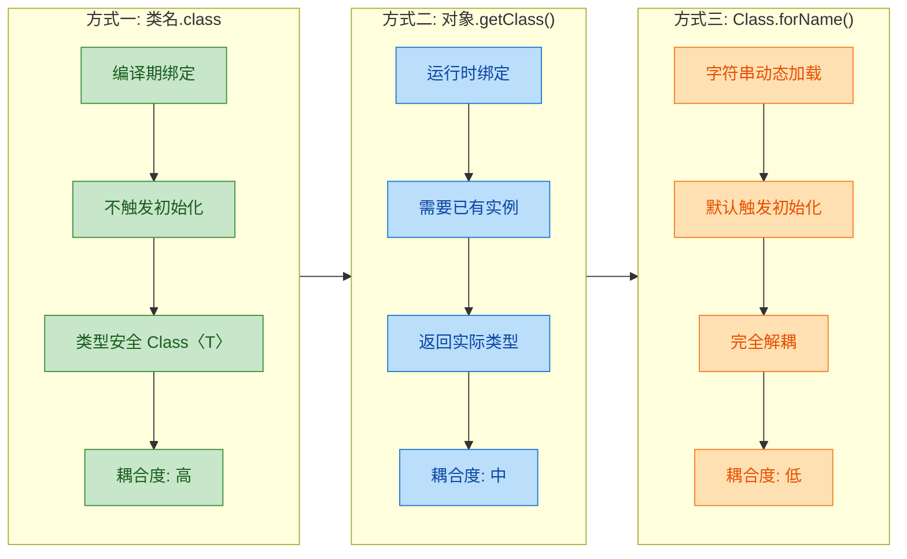

下面这张表格做一个更细粒度的横向对比：

| 对比维度 | `类名.class` | `对象.getClass()` | `Class.forName()` |
|---|---|---|---|
| 获取时机 | 编译期 | 运行时 | 运行时 |
| 是否需要实例 | 否 | 是 | 否 |
| 是否触发 `static` 初始化 | 否 | 类已初始化 | 是（默认） |
| 返回泛型 | `Class<T>` 精确 | `Class<?>` 通配 | `Class<?>` 通配 |
| 是否需要异常处理 | 否 | 否（但需防 null） | 是（`ClassNotFoundException`） |
| 耦合度 | 高（硬编码类名） | 中（依赖实例） | 低（字符串驱动） |
| 典型场景 | 类型比较、泛型 Token | 日志、运行时类型判断 | JDBC、Spring IoC、插件化 |

### 同一性验证：三种方式获取的是同一个 Class 对象

JVM 保证同一个类加载器下，一个类只有一个 `Class` 对象。这意味着无论你用哪种方式获取，拿到的都是同一个实例（`==` 比较为 `true`）：

```java
public class IdentityTest {
    public static void main(String[] args) throws ClassNotFoundException {
        // 方式一：类字面量
        Class<String> c1 = String.class;

        // 方式二：实例的 getClass()
        String str = "test";
        Class<?> c2 = str.getClass();

        // 方式三：Class.forName
        Class<?> c3 = Class.forName("java.lang.String");

        // 三者是完全相同的对象（同一引用）
        System.out.println(c1 == c2);  // true
        System.out.println(c2 == c3);  // true
        System.out.println(c1 == c3);  // true

        // hashCode 也完全一致
        System.out.println(c1.hashCode());  // 相同
        System.out.println(c2.hashCode());  // 相同
        System.out.println(c3.hashCode());  // 相同
    }
}
```

这个同一性（identity）是反射体系的基石。正因为 `Class` 对象唯一，反射获取的 `Method`、`Field`、`Constructor` 等元数据才能被安全地缓存和复用。

### 补充：基本类型与包装类的 Class 对象

一个容易踩坑的细节：基本类型（primitive）和其包装类（wrapper）的 `Class` 对象是不同的。

```java
// int.class 和 Integer.class 是两个不同的 Class 对象
System.out.println(int.class == Integer.class);       // false

// Integer 提供了 TYPE 常量，指向对应基本类型的 Class
System.out.println(int.class == Integer.TYPE);        // true

// void 也有自己的 Class 对象
System.out.println(void.class);                       // void
System.out.println(void.class == Void.TYPE);          // true
```

这在反射调用方法时尤其重要——如果目标方法的参数类型是 `int`，你必须用 `int.class` 而不是 `Integer.class` 去匹配，否则会抛出 `NoSuchMethodException`。

---

**📝 练习题**

以下代码的输出结果是什么？

```java
public class Quiz {
    static { System.out.print("A"); }
    public static void main(String[] args) throws Exception {
        Class<Quiz> c1 = Quiz.class;
        System.out.print("B");
        Class<?> c2 = Class.forName("Quiz");
        System.out.print("C");
        System.out.print(c1 == c2);
    }
}
```

A. ABCtrue


B. BACtrue


C. ABCfalse


D. BACfalse


**【答案】** A

**【解析】** `main` 方法所在的类 `Quiz` 在 `main` 执行前就必须被 JVM 加载并初始化，所以 `static` 块最先执行，输出 `A`。接着 `Quiz.class` 不会重复触发初始化（类已经初始化过了），输出 `B`。`Class.forName("Quiz")` 虽然默认触发初始化，但 `Quiz` 已经初始化完毕，JVM 不会重复执行 `static` 块，输出 `C`。最后 `c1 == c2` 为 `true`，因为同一个类加载器下 `Class` 对象唯一。最终输出 `ABCtrue`。

---


## 构造方法反射（getConstructor、newInstance）

反射体系中，`Constructor` 对象是"凭空"创建实例的钥匙。普通开发里我们用 `new` 关键字调用构造方法，但在框架底层——Spring 的 Bean 工厂、Jackson 的反序列化、JUnit 的测试实例化——几乎都绕不开 `Constructor.newInstance()`。理解这套 API，就等于理解了"框架如何帮你 new 对象"。

### 获取 Constructor 对象的四个入口

`Class` 对象提供了四个方法来获取构造方法，它们在"访问范围"和"返回数量"两个维度上做了组合：

```java
// ========== 目标类：用于演示的 Person ==========
public class Person {
    public String name;   // 公开字段，方便后续验证
    private int age;      // 私有字段

    // 1. public 无参构造
    public Person() {
        this.name = "unknown";
        this.age = 0;
    }

    // 2. public 有参构造
    public Person(String name, int age) {
        this.name = name;
        this.age = age;
    }

    // 3. private 拷贝构造（外部无法直接调用）
    private Person(Person other) {
        this.name = other.name;
        this.age = other.age;
    }

    @Override
    public String toString() {
        return "Person{name='" + name + "', age=" + age + "}";
    }
}
```

```java
import java.lang.reflect.Constructor;

public class GetConstructorDemo {
    public static void main(String[] args) throws Exception {

        // 先拿到 Class 对象
        Class<?> clazz = Person.class;

        // ---------- 1. getConstructors() ----------
        // 只返回 public 构造方法数组
        Constructor<?>[] pubCtors = clazz.getConstructors();
        System.out.println("=== public 构造方法 ===");
        for (Constructor<?> c : pubCtors) {
            // 打印签名，可以看到只有 public 的两个
            System.out.println(c);
        }

        // ---------- 2. getDeclaredConstructors() ----------
        // 返回本类声明的所有构造方法（含 private / protected / 包级）
        Constructor<?>[] allCtors = clazz.getDeclaredConstructors();
        System.out.println("\n=== 所有声明的构造方法 ===");
        for (Constructor<?> c : allCtors) {
            System.out.println(c);
        }

        // ---------- 3. getConstructor(Class<?>... paramTypes) ----------
        // 按参数类型精确匹配一个 public 构造方法
        Constructor<?> pubCtor = clazz.getConstructor(String.class, int.class);
        System.out.println("\n精确获取 public 有参构造: " + pubCtor);

        // ---------- 4. getDeclaredConstructor(Class<?>... paramTypes) ----------
        // 按参数类型精确匹配一个构造方法（不限访问修饰符）
        Constructor<?> privateCtor = clazz.getDeclaredConstructor(Person.class);
        System.out.println("精确获取 private 拷贝构造: " + privateCtor);
    }
}
```

运行输出大致如下：

```text
=== public 构造方法 ===
public Person()
public Person(java.lang.String,int)

=== 所有声明的构造方法 ===
public Person()
public Person(java.lang.String,int)
private Person(Person)

精确获取 public 有参构造: public Person(java.lang.String,int)
精确获取 private 拷贝构造: private Person(Person)
```

四个方法的关系可以用一张表快速记忆：

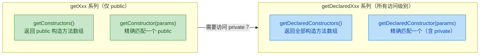

核心记忆口诀：带 `Declared` 的不看权限，不带的只看 `public`。这条规则对后面的 `Field`、`Method` 反射同样适用。

### 用 Constructor.newInstance() 创建对象

拿到 `Constructor` 对象后，调用 `newInstance(Object... initargs)` 就能创建实例。这是反射创建对象的标准姿势。

```java
import java.lang.reflect.Constructor;

public class NewInstanceDemo {
    public static void main(String[] args) throws Exception {

        Class<?> clazz = Person.class;

        // ===== 方式一：调用无参构造 =====
        Constructor<?> noArgCtor = clazz.getConstructor();  // 获取 public 无参构造
        Object p1 = noArgCtor.newInstance();                // 等价于 new Person()
        System.out.println("无参构造: " + p1);
        // 输出: Person{name='unknown', age=0}

        // ===== 方式二：调用有参构造 =====
        Constructor<?> twoArgCtor = clazz.getConstructor(String.class, int.class);
        Object p2 = twoArgCtor.newInstance("Alice", 28);    // 等价于 new Person("Alice", 28)
        System.out.println("有参构造: " + p2);
        // 输出: Person{name='Alice', age=28}

        // ===== 方式三：调用 private 构造（需要 setAccessible） =====
        Constructor<?> copyCtor = clazz.getDeclaredConstructor(Person.class);
        copyCtor.setAccessible(true);                        // 突破 private 限制
        Object p3 = copyCtor.newInstance(p2);                // 等价于 new Person(p2)
        System.out.println("私有拷贝构造: " + p3);
        // 输出: Person{name='Alice', age=28}
    }
}
```

这里有几个关键细节值得展开：

`newInstance()` 的参数是 `Object...` 可变参数，你传入的实参必须与构造方法的形参类型严格匹配（或可自动拆装箱）。如果类型不对，会抛出 `IllegalArgumentException`。

调用 `private` 构造方法前必须先 `setAccessible(true)`，否则会抛 `IllegalAccessException`。这个机制我们在后面"突破私有访问"一节会深入讨论。

`newInstance()` 抛出的异常会被包装成 `InvocationTargetException`。也就是说，如果构造方法内部抛了一个 `NullPointerException`，你在外面 catch 到的是 `InvocationTargetException`，需要调用 `getCause()` 才能拿到真正的异常。

### Class.newInstance() 与 Constructor.newInstance() 的区别

很多老代码里会看到 `clazz.newInstance()` 这种写法，它在 Java 9 之后已被标记为 `@Deprecated`。两者的差异值得搞清楚：

```java
public class DeprecatedNewInstanceDemo {
    public static void main(String[] args) throws Exception {

        Class<?> clazz = Person.class;

        // ===== 旧写法（Java 9+ 已废弃） =====
        // 只能调用 public 无参构造
        // 构造方法内部的 checked exception 会被直接抛出，破坏了异常声明约定
        Object old = clazz.newInstance();  // 编译器会给出 deprecation 警告
        System.out.println("旧写法: " + old);

        // ===== 新写法（推荐） =====
        // 可以调用任意构造方法（配合 getDeclaredConstructor）
        // 构造方法内部的异常统一包装为 InvocationTargetException
        Constructor<?> ctor = clazz.getDeclaredConstructor();
        Object modern = ctor.newInstance();
        System.out.println("新写法: " + modern);
    }
}
```

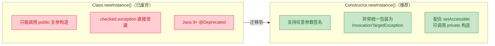

结论很简单：任何新代码都应该用 `Constructor.newInstance()`，忘掉 `Class.newInstance()`。

### 泛型构造方法与参数化类型

当目标类带有泛型时，反射获取构造方法需要注意类型擦除（Type Erasure）的影响：

```java
// 一个简单的泛型容器
public class Box<T> {
    private T value;

    public Box(T value) {
        this.value = value;
    }

    public T getValue() {
        return value;
    }

    @Override
    public String toString() {
        return "Box{" + value + "}";
    }
}
```

```java
import java.lang.reflect.Constructor;

public class GenericConstructorDemo {
    public static void main(String[] args) throws Exception {

        Class<?> clazz = Box.class;

        // 泛型擦除后，Box(T value) 变成了 Box(Object value)
        // 所以这里参数类型要写 Object.class，而不是 String.class
        Constructor<?> ctor = clazz.getConstructor(Object.class);

        // 创建 Box<String>（运行时其实没有泛型信息）
        Object box = ctor.newInstance("Hello Reflection");
        System.out.println(box);
        // 输出: Box{Hello Reflection}

        // 如果错误地传入 String.class 去匹配参数类型：
        // clazz.getConstructor(String.class);  // 抛出 NoSuchMethodException!
    }
}
```

这是一个常见的坑：编译期你写的是 `Box(T value)`，但 JVM 里存储的签名是 `Box(Object value)`。反射操作的是字节码层面的真实签名，所以必须用擦除后的类型去匹配。

### 实战：简易对象工厂

框架中最常见的反射场景就是"根据类名字符串创建对象"。下面实现一个微型工厂，把前面学到的 API 串起来：

```java
import java.lang.reflect.Constructor;
import java.util.HashMap;
import java.util.Map;

public class SimpleFactory {

    // 缓存 Constructor，避免重复反射查找（性能优化，后面章节会详细讲）
    private static final Map<String, Constructor<?>> CACHE = new HashMap<>();

    /**
     * 根据全限定类名 + 构造参数，创建对象实例
     * @param className 全限定类名，如 "com.example.Person"
     * @param paramTypes 构造方法的参数类型数组
     * @param initArgs   构造方法的实参数组
     * @return 新创建的对象实例
     */
    public static Object create(String className,
                                Class<?>[] paramTypes,
                                Object[] initArgs) {
        try {
            // 构建缓存 key：类名 + 参数类型签名
            String key = className + buildParamKey(paramTypes);

            // 先查缓存
            Constructor<?> ctor = CACHE.get(key);

            if (ctor == null) {
                // 缓存未命中：通过类名加载 Class 对象
                Class<?> clazz = Class.forName(className);
                // 获取匹配的构造方法
                ctor = clazz.getDeclaredConstructor(paramTypes);
                // 统一打开访问权限（兼容 private 构造）
                ctor.setAccessible(true);
                // 放入缓存
                CACHE.put(key, ctor);
            }

            // 调用构造方法创建实例
            return ctor.newInstance(initArgs);

        } catch (ClassNotFoundException e) {
            // 类名写错或类不在 classpath 中
            throw new RuntimeException("找不到类: " + className, e);
        } catch (NoSuchMethodException e) {
            // 没有匹配的构造方法签名
            throw new RuntimeException("找不到匹配的构造方法", e);
        } catch (Exception e) {
            // InstantiationException / IllegalAccessException / InvocationTargetException
            throw new RuntimeException("创建实例失败", e);
        }
    }

    // 辅助方法：把参数类型数组拼成字符串，用于缓存 key
    private static String buildParamKey(Class<?>[] paramTypes) {
        if (paramTypes == null || paramTypes.length == 0) {
            return "()";                          // 无参构造
        }
        StringBuilder sb = new StringBuilder("(");
        for (int i = 0; i < paramTypes.length; i++) {
            if (i > 0) sb.append(",");
            sb.append(paramTypes[i].getName());   // 如 "java.lang.String"
        }
        sb.append(")");
        return sb.toString();
    }

    // ---------- 测试 ----------
    public static void main(String[] args) {

        // 用全限定类名创建 Person（无参）
        Object p1 = SimpleFactory.create(
                "Person",                          // 如果有包名则写全限定名
                new Class<?>[]{},                  // 无参
                new Object[]{}                     // 无实参
        );
        System.out.println("工厂创建(无参): " + p1);

        // 用全限定类名创建 Person（有参）
        Object p2 = SimpleFactory.create(
                "Person",
                new Class<?>[]{String.class, int.class},  // 参数类型
                new Object[]{"Bob", 35}                    // 实参
        );
        System.out.println("工厂创建(有参): " + p2);
    }
}
```

这段代码浓缩了构造方法反射的完整流程：`Class.forName()` → `getDeclaredConstructor()` → `setAccessible(true)` → `newInstance()`。Spring 的 `BeanFactory` 底层逻辑与此如出一辙，只是多了依赖注入、生命周期回调等上层抽象。

### 异常处理全景

反射创建对象时可能遇到的异常比较多，下面用一张图把它们的触发条件和层级关系理清楚：

```mermaid
graph LR
    subgraph Lookup["查找阶段"]
        direction TB
        E1["ClassNotFoundException
        Class.forName() 找不到类"]
        E2["NoSuchMethodException
        参数类型不匹配或构造方法不存在"]
    end

    subgraph Access["访问阶段"]
        direction TB
        E3["IllegalAccessException
        private 构造未 setAccessible"]
    end

    subgraph Invoke["调用阶段"]
        direction TB
        E4["IllegalArgumentException
        实参类型/数量与形参不匹配"]
        E5["InstantiationException
        目标是抽象类或接口"]
        E6["InvocationTargetException
        构造方法内部抛出异常"]
        E7["ExceptionInInitializerError
        静态初始化块抛出异常"]
    end

    Lookup -->|"成功拿到 Constructor"| Access
    Access -->|"权限通过"| Invoke

    classDef yellowNode fill:#FFF9C4,stroke:#F9A825,color:#F57F17
    classDef orangeNode fill:#FFE0B2,stroke:#EF6C00,color:#E65100
    classDef redNode fill:#FFCDD2,stroke:#D32F2F,color:#B71C1C
    class E1,E2 yellowNode
    class E3 orangeNode
    class E4,E5,E6,E7 redNode
```

实际编码中，最容易踩的坑是 `InvocationTargetException`。很多人直接打印它的 message 发现是 `null`，困惑半天——记住要调 `e.getCause()` 拿到真正的根因异常。

### 构造方法反射与设计模式

反射创建对象的能力直接支撑了几个经典设计模式的"动态化"实现：

在工厂模式中，传统工厂用 `switch-case` 或 `if-else` 根据类型标识创建对象，每新增一个产品类就要改工厂代码。用反射后，只需要在配置文件里写上全限定类名，工厂通过 `Class.forName()` + `Constructor.newInstance()` 就能创建任意产品，完全消除了对具体类的编译期依赖。

在单例模式中，反射是单例的"天敌"。即使构造方法是 `private`，反射照样能 `setAccessible(true)` 然后 `newInstance()`，破坏单例约束。防御手段通常是在私有构造方法里加一个标志位检查：

```java
public class Singleton {
    private static final Singleton INSTANCE = new Singleton();
    private static boolean created = false;  // 防反射标志

    private Singleton() {
        // 如果已经创建过实例，说明有人在用反射搞事
        if (created) {
            throw new RuntimeException("不允许反射创建第二个实例！");
        }
        created = true;  // 标记为已创建
    }

    public static Singleton getInstance() {
        return INSTANCE;
    }
}
```

不过最优雅的防御方式是使用枚举单例（`enum Singleton`），JVM 从规范层面禁止了对枚举构造方法的反射调用，`Constructor.newInstance()` 会直接抛出 `IllegalArgumentException`。

---

**📝 练习题**

以下代码尝试通过反射创建对象，哪一行会在运行时抛出异常？

```java
public abstract class Animal {
    public Animal() {}
}

// 反射代码
Class<?> clazz = Animal.class;                          // 第 1 行
Constructor<?> ctor = clazz.getConstructor();            // 第 2 行
Object obj = ctor.newInstance();                         // 第 3 行
```

A. 第 1 行，抽象类无法获取 Class 对象


B. 第 2 行，抽象类没有构造方法，getConstructor() 抛出 NoSuchMethodException


C. 第 3 行，newInstance() 抛出 InstantiationException，因为抽象类无法实例化


D. 不会抛异常，反射可以绕过 abstract 限制创建实例


**【答案】** C

**【解析】** 抽象类在字节码层面确实拥有构造方法（编译器会自动生成），所以第 1 行获取 `Class` 对象和第 2 行获取 `Constructor` 对象都不会有问题。但到第 3 行真正调用 `newInstance()` 时，JVM 发现目标类是 `abstract` 的，无法完成实例化，于是抛出 `InstantiationException`。这也说明反射并不能突破 Java 语言的所有限制——抽象类不能实例化这条规则，在 JVM 层面是硬性约束。

---

## 字段反射（getField、get/set）

字段反射是 Java Reflection API 中极为实用的一环。它允许你在运行时动态地读取或修改一个对象的字段值——即使这个字段是 `private` 的。这项能力是几乎所有主流框架（Spring、Hibernate、Jackson）实现"自动注入"、"自动映射"、"序列化/反序列化"的底层基石。

理解字段反射，核心就是掌握 `java.lang.reflect.Field` 这个类。它是字段在运行时的"镜像对象"（mirror object），通过它，你可以对任意对象的任意字段执行 get 和 set 操作，完全绕过编译期的访问控制。

---

### 获取 Field 对象的四种方式

`Class` 对象提供了四个方法来获取字段信息，它们的区别在于"范围"和"可见性"两个维度：

| 方法 | 范围 | 可见性 |
|------|------|--------|
| `getField(String name)` | 本类 + 所有父类 | 仅 `public` |
| `getFields()` | 本类 + 所有父类 | 仅 `public` |
| `getDeclaredField(String name)` | 仅本类 | 所有访问修饰符 |
| `getDeclaredFields()` | 仅本类 | 所有访问修饰符 |

这里有一个非常容易踩的坑：`getField` 能拿到父类的 public 字段，但拿不到本类的 private 字段；`getDeclaredField` 能拿到本类的 private 字段，但拿不到父类的任何字段。两者是互补关系，不是包含关系。

我们先准备一个用于演示的类继承体系：

```java
// 父类：定义了不同访问级别的字段
public class Animal {
    public String species = "Unknown";       // 公开字段
    protected int age = 0;                   // 受保护字段
    private String secret = "animal-secret"; // 私有字段
}

// 子类：继承 Animal，并新增自己的字段
public class Dog extends Animal {
    public String name = "Buddy";            // 公开字段
    private double weight = 12.5;            // 私有字段
    static final String CATEGORY = "Pet";    // 静态常量字段
}
```

下面逐一演示四种获取方式的行为差异：

```java
public class FieldAccessDemo {
    public static void main(String[] args) throws Exception {
        // 获取 Dog 的 Class 对象
        Class<?> clazz = Dog.class;

        // ========== 1. getFields() ==========
        // 返回本类 + 所有父类中的 public 字段
        System.out.println("===== getFields() =====");
        Field[] publicFields = clazz.getFields();
        for (Field f : publicFields) {
            // 输出字段名和声明它的类
            System.out.println(f.getName() + " (declared in: " + f.getDeclaringClass().getSimpleName() + ")");
        }
        // 输出:
        // name (declared in: Dog)
        // CATEGORY (declared in: Dog)
        // species (declared in: Animal)
        // 注意: age(protected) 和 secret(private) 都不会出现

        // ========== 2. getField(String name) ==========
        // 按名称获取单个 public 字段，可以跨父类查找
        System.out.println("\n===== getField(\"species\") =====");
        Field speciesField = clazz.getField("species"); // 拿到的是父类 Animal 的 public 字段
        System.out.println(speciesField.getName() + " -> type: " + speciesField.getType().getSimpleName());
        // 输出: species -> type: String

        // 尝试获取 private 字段会抛出 NoSuchFieldException
        // clazz.getField("weight"); // ❌ NoSuchFieldException

        // ========== 3. getDeclaredFields() ==========
        // 返回本类声明的所有字段（不含父类），不限访问修饰符
        System.out.println("\n===== getDeclaredFields() =====");
        Field[] allDogFields = clazz.getDeclaredFields();
        for (Field f : allDogFields) {
            // Modifier.toString() 将修饰符的 int 值转为可读字符串
            String modifiers = java.lang.reflect.Modifier.toString(f.getModifiers());
            System.out.println(modifiers + " " + f.getType().getSimpleName() + " " + f.getName());
        }
        // 输出:
        // public String name
        // private double weight
        // static final String CATEGORY
        // 注意: 父类的 species、age、secret 都不会出现

        // ========== 4. getDeclaredField(String name) ==========
        // 按名称获取本类声明的字段，可以拿到 private
        System.out.println("\n===== getDeclaredField(\"weight\") =====");
        Field weightField = clazz.getDeclaredField("weight"); // 拿到 Dog 自己的 private 字段
        System.out.println(weightField.getName() + " -> type: " + weightField.getType().getSimpleName());
        // 输出: weight -> type: double

        // 尝试获取父类字段会抛出 NoSuchFieldException
        // clazz.getDeclaredField("species"); // ❌ NoSuchFieldException
    }
}
```

这四种方法的关系可以用一张图来理清：

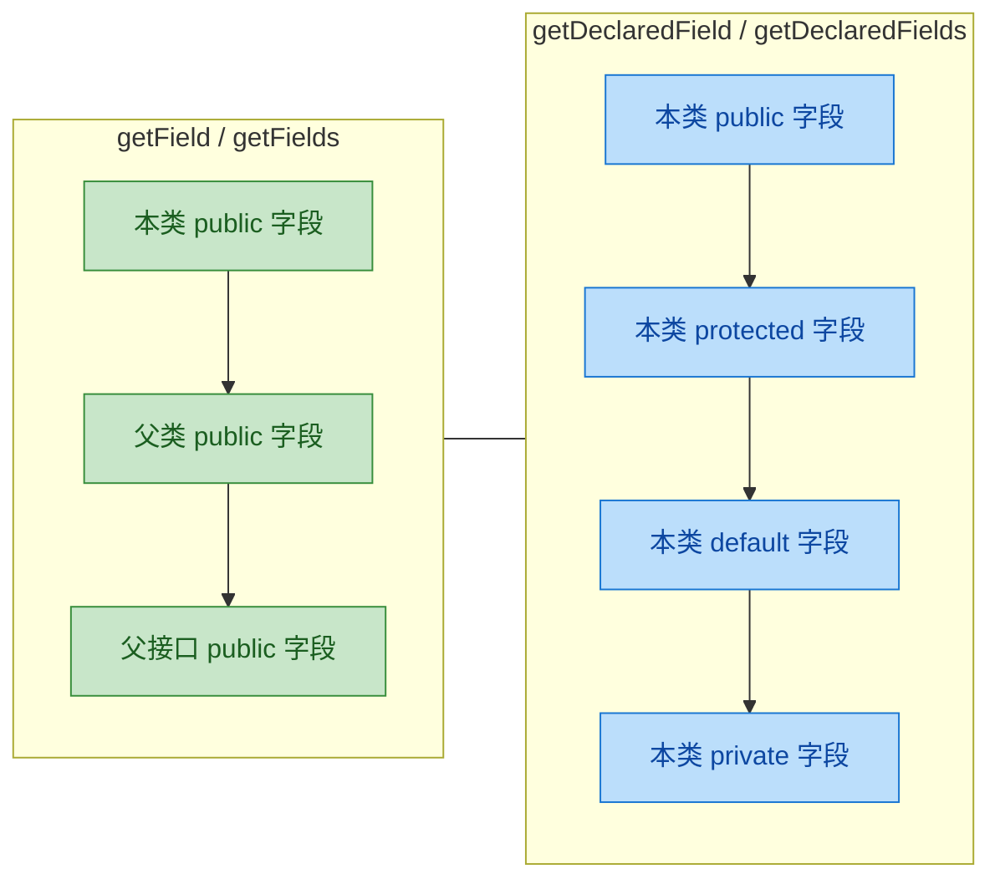

---

### 读取字段值（Field.get）

拿到 `Field` 对象后，调用 `field.get(Object obj)` 即可读取指定对象上该字段的值。返回值类型是 `Object`，对于基本类型会自动装箱（autoboxing）。

```java
public class FieldGetDemo {
    public static void main(String[] args) throws Exception {
        // 创建一个 Dog 实例
        Dog dog = new Dog();
        dog.name = "Rex";

        // 获取 Dog 类的 Class 对象
        Class<?> clazz = dog.getClass();

        // ===== 读取 public 字段 =====
        Field nameField = clazz.getField("name"); // public 字段可以直接用 getField
        Object nameValue = nameField.get(dog);     // 传入目标对象，返回该对象上此字段的值
        System.out.println("name = " + nameValue); // 输出: name = Rex

        // ===== 读取父类 public 字段 =====
        Field speciesField = clazz.getField("species"); // getField 可以跨父类
        System.out.println("species = " + speciesField.get(dog)); // 输出: species = Unknown

        // ===== 读取 private 字段（需要 getDeclaredField + setAccessible） =====
        Field weightField = clazz.getDeclaredField("weight"); // 必须用 getDeclaredField
        weightField.setAccessible(true);                       // 突破 private 访问限制
        Object weightValue = weightField.get(dog);             // 现在可以正常读取了
        System.out.println("weight = " + weightValue);         // 输出: weight = 12.5
        // 注意: 如果不调用 setAccessible(true)，这里会抛出 IllegalAccessException

        // ===== 读取静态字段 =====
        Field categoryField = clazz.getDeclaredField("CATEGORY");
        Object categoryValue = categoryField.get(null); // 静态字段不属于任何实例，传 null 即可
        System.out.println("CATEGORY = " + categoryValue); // 输出: CATEGORY = Pet
    }
}
```

这里有几个关键细节值得展开：

`field.get(obj)` 中的 `obj` 参数代表"你要读取哪个对象上的这个字段"。同一个 `Field` 对象可以作用于同一类的不同实例——`Field` 是类级别的元数据，不绑定具体实例。对于 `static` 字段，因为它不属于任何实例，所以传 `null` 就行。

返回值是 `Object` 类型。如果字段是 `int`、`double` 等基本类型，JVM 会自动装箱为 `Integer`、`Double`。如果你明确知道字段类型，也可以使用 `Field` 提供的类型化 getter 来避免装箱开销：

```java
// Field 提供了针对基本类型的专用 getter，避免自动装箱
double w = weightField.getDouble(dog);  // 直接返回 double，无装箱
int a = ageField.getInt(dog);           // 直接返回 int，无装箱
boolean b = flagField.getBoolean(dog);  // 直接返回 boolean，无装箱
// 类型不匹配时会抛出 IllegalArgumentException
```

---

### 修改字段值（Field.set）

`field.set(Object obj, Object value)` 用于在运行时动态修改对象的字段值。这是 DI 框架（如 Spring 的 `@Autowired` 字段注入）的核心原理。

```java
public class FieldSetDemo {
    public static void main(String[] args) throws Exception {
        Dog dog = new Dog();
        Class<?> clazz = dog.getClass();

        // ===== 修改 public 字段 =====
        Field nameField = clazz.getField("name");
        System.out.println("修改前: name = " + nameField.get(dog)); // Buddy
        nameField.set(dog, "Max");                                   // 将 name 字段设为 "Max"
        System.out.println("修改后: name = " + nameField.get(dog)); // Max

        // ===== 修改 private 字段 =====
        Field weightField = clazz.getDeclaredField("weight");
        weightField.setAccessible(true);                              // 必须先突破访问限制
        System.out.println("修改前: weight = " + weightField.get(dog)); // 12.5
        weightField.set(dog, 18.3);                                   // 基本类型会自动拆箱
        System.out.println("修改后: weight = " + weightField.get(dog)); // 18.3

        // ===== 修改 final 字段（危险操作） =====
        // 对于实例级 final 字段，在 Java 8 中可以通过反射强行修改
        // 但从 Java 12+ 开始，JVM 对 final 字段的反射修改做了更严格的限制
        // 静态 final 字段（如 CATEGORY）在大多数 JVM 实现中无法通过反射修改
        // 即使修改成功，JVM 的常量折叠优化也可能导致读到的仍是旧值
    }
}
```

同样，`Field` 也提供了类型化的 setter 方法：

```java
weightField.setDouble(dog, 20.0);  // 直接传 double，无需装箱
ageField.setInt(dog, 5);           // 直接传 int
flagField.setBoolean(dog, true);   // 直接传 boolean
```

---

### 获取字段的元信息

`Field` 对象不仅能读写值，还携带了丰富的元数据（metadata），这在框架开发中非常有用：

```java
public class FieldMetadataDemo {
    public static void main(String[] args) throws Exception {
        Field weightField = Dog.class.getDeclaredField("weight");

        // ===== 基本信息 =====
        String fieldName = weightField.getName();                    // 字段名: "weight"
        Class<?> fieldType = weightField.getType();                  // 字段类型: double
        Class<?> declaringClass = weightField.getDeclaringClass();   // 声明该字段的类: Dog
        int modifiers = weightField.getModifiers();                  // 修饰符的 int 编码

        System.out.println("字段名: " + fieldName);
        System.out.println("类型: " + fieldType.getSimpleName());
        System.out.println("声明类: " + declaringClass.getSimpleName());

        // ===== 修饰符判断 =====
        // Modifier 工具类提供了一系列静态方法来解析修饰符
        System.out.println("是否 private: " + java.lang.reflect.Modifier.isPrivate(modifiers));   // true
        System.out.println("是否 static: " + java.lang.reflect.Modifier.isStatic(modifiers));     // false
        System.out.println("是否 final: " + java.lang.reflect.Modifier.isFinal(modifiers));       // false
        System.out.println("修饰符文本: " + java.lang.reflect.Modifier.toString(modifiers));      // "private"

        // ===== 泛型类型信息 =====
        // 对于泛型字段（如 List<String>），getType() 只能拿到 List.class（擦除后的类型）
        // 要获取完整的泛型信息，需要用 getGenericType()
        Field listField = SomeClass.class.getDeclaredField("items");
        java.lang.reflect.Type genericType = listField.getGenericType();
        if (genericType instanceof java.lang.reflect.ParameterizedType pt) {
            // 获取实际类型参数，例如 List<String> 中的 String
            java.lang.reflect.Type[] typeArgs = pt.getActualTypeArguments();
            System.out.println("泛型参数: " + typeArgs[0]); // class java.lang.String
        }
    }
}

// 辅助类，用于演示泛型字段
class SomeClass {
    private java.util.List<String> items; // 泛型字段
}
```

---

### 实战：通用对象字段打印器

将上面学到的知识整合起来，写一个能打印任意对象所有字段的工具方法。这类工具在调试和日志记录中非常实用：

```java
import java.lang.reflect.Field;
import java.lang.reflect.Modifier;

public class ObjectInspector {

    /**
     * 打印任意对象的所有字段（包括父类字段）
     * 这是一个递归向上遍历类继承链的经典模式
     */
    public static String inspect(Object obj) {
        if (obj == null) {                                // 空值保护
            return "null";
        }

        StringBuilder sb = new StringBuilder();
        Class<?> currentClass = obj.getClass();           // 从实际运行时类型开始
        sb.append("【").append(currentClass.getSimpleName()).append(" 对象详情】\n");

        // 沿继承链向上遍历，直到 Object 类为止
        while (currentClass != null && currentClass != Object.class) {
            sb.append("  ── ").append(currentClass.getSimpleName()).append(" 层 ──\n");

            // getDeclaredFields 获取当前类声明的所有字段
            Field[] fields = currentClass.getDeclaredFields();
            for (Field field : fields) {
                // 跳过合成字段（编译器自动生成的，如内部类的 this$0 引用）
                if (field.isSynthetic()) {
                    continue;
                }

                field.setAccessible(true);                // 突破 private 限制

                try {
                    Object value = field.get(obj);        // 读取字段值
                    String mod = Modifier.toString(field.getModifiers()); // 修饰符文本
                    // 格式化输出: [修饰符] 类型 字段名 = 值
                    sb.append("    ")
                      .append(String.format("[%-17s] %-10s %-12s = %s%n",
                              mod,
                              field.getType().getSimpleName(),
                              field.getName(),
                              value));
                } catch (IllegalAccessException e) {
                    sb.append("    ").append(field.getName()).append(" = [无法访问]\n");
                }
            }

            currentClass = currentClass.getSuperclass();  // 向上移动到父类
        }

        return sb.toString();
    }

    public static void main(String[] args) {
        Dog dog = new Dog();
        dog.name = "Luna";
        System.out.println(inspect(dog));
        // 输出:
        // 【Dog 对象详情】
        //   ── Dog 层 ──
        //     [public           ] String     name         = Luna
        //     [private          ] double     weight       = 12.5
        //     [static final     ] String     CATEGORY     = Pet
        //   ── Animal 层 ──
        //     [public           ] String     species      = Unknown
        //     [protected        ] int        age          = 0
        //     [private          ] String     secret       = animal-secret
    }
}
```

这段代码的核心模式——"沿 `getSuperclass()` 向上遍历 + `getDeclaredFields()` 获取每层字段"——在框架源码中随处可见。Spring 的 `ReflectionUtils.doWithFields()` 就是这个思路。

---

### 字段反射在内存中的工作原理

当你调用 `field.get(obj)` 时，JVM 内部发生了什么？理解这一点有助于你判断反射的性能开销：

```java
// 字段反射的内存模型示意

// 1. Dog.class 在方法区（Metaspace）中存储了类的元数据
//    包括字段表（Field Table），记录每个字段的偏移量（offset）

// 2. dog 对象在堆内存中的布局:
//    ┌──────────────────────────────────────┐
//    │  Object Header (12 bytes, 64-bit)    │  <- 对象头（Mark Word + Klass Pointer）
//    ├──────────────────────────────────────┤
//    │  species (String ref)   offset: 12   │  <- 继承自 Animal
//    │  age     (int)          offset: 16   │  <- 继承自 Animal
//    │  secret  (String ref)   offset: 20   │  <- 继承自 Animal
//    ├──────────────────────────────────────┤
//    │  name    (String ref)   offset: 24   │  <- Dog 自身
//    │  weight  (double)       offset: 28   │  <- Dog 自身
//    └──────────────────────────────────────┘

// 3. field.get(dog) 的执行路径:
//    a. 检查访问权限（isAccessible 为 true 则跳过）
//    b. 根据 Field 对象中记录的 offset，直接定位到堆内存中的位置
//    c. 读取该位置的值并返回（基本类型会装箱）
```

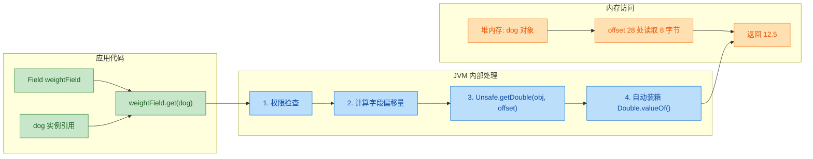

从图中可以看出，反射读取字段的额外开销主要来自两处：权限检查（可通过 `setAccessible(true)` 跳过）和基本类型的自动装箱。这也是为什么高性能场景下，框架通常会缓存 `Field` 对象并提前调用 `setAccessible(true)`。

---

### 常见异常与排错指南

字段反射中最常遇到的三种异常：

```java
public class FieldExceptionDemo {
    public static void main(String[] args) {
        Class<?> clazz = Dog.class;
        Dog dog = new Dog();

        // ===== 1. NoSuchFieldException =====
        // 原因: 字段名拼写错误，或用 getField 获取非 public 字段
        try {
            clazz.getField("weight");          // weight 是 private，getField 找不到
        } catch (NoSuchFieldException e) {
            System.out.println("错误: " + e.getMessage());
            // 修复: 改用 getDeclaredField("weight")
        }

        // ===== 2. IllegalAccessException =====
        // 原因: 访问了 private/protected 字段但没有调用 setAccessible(true)
        try {
            Field f = clazz.getDeclaredField("weight");
            f.get(dog);                        // 没有 setAccessible，直接访问 private 字段
        } catch (IllegalAccessException e) {
            System.out.println("错误: " + e.getMessage());
            // 修复: 在 get/set 之前调用 f.setAccessible(true)
        } catch (NoSuchFieldException e) {
            e.printStackTrace();
        }

        // ===== 3. IllegalArgumentException =====
        // 原因: 传入的对象类型与 Field 所属的类不匹配
        try {
            Field f = clazz.getField("name");
            f.get("这是一个String，不是Dog");   // String 对象上没有 Dog 的 name 字段
        } catch (IllegalArgumentException e) {
            System.out.println("错误: " + e.getMessage());
            // 修复: 确保传入的对象是 Field 所属类（或其子类）的实例
        } catch (Exception e) {
            e.printStackTrace();
        }
    }
}
```

一个实用的排错口诀：

> "找不到用 Declared，访问不了用 Accessible，类型不对查实例。"

---

**📝 练习题**

以下代码的输出结果是什么？

```java
public class Quiz {
    private String msg = "Hello";

    public static void main(String[] args) throws Exception {
        Quiz q1 = new Quiz();
        Quiz q2 = new Quiz();
        q2.msg = "World";

        Field f = Quiz.class.getDeclaredField("msg");
        f.setAccessible(true);
        f.set(q1, f.get(q2));

        System.out.println(q1.msg + " " + q2.msg);
    }
}
```

A. Hello World


B. World World


C. Hello Hello


D. 抛出 IllegalAccessException


**【答案】** B

**【解析】** `f.get(q2)` 读取的是 q2 对象上 `msg` 字段的值，即 `"World"`。然后 `f.set(q1, "World")` 将 q1 的 `msg` 字段也设为 `"World"`。所以最终 `q1.msg` 和 `q2.msg` 都是 `"World"`，输出 `World World`。不会抛出 `IllegalAccessException`，因为已经调用了 `setAccessible(true)`。这道题的关键在于理解：同一个 `Field` 对象可以作用于同一类的不同实例，`Field` 是类级别的元数据描述，`get/set` 的第一个参数决定了操作哪个具体对象。

---

## 方法反射 ⭐（getMethod、invoke）

方法反射是整个 Reflection API 中最核心、最高频的使用场景——没有之一。Spring 的依赖注入、AOP 代理、MyBatis 的 Mapper 接口调用、JUnit 的测试方法执行……几乎所有主流框架的底层引擎，都在疯狂地调用 `Method.invoke()`。理解方法反射，就等于拿到了"框架是怎么工作的"这扇门的钥匙。

### 核心 API 一览

`java.lang.Class` 提供了四个获取方法对象的入口，它们的可见性和继承行为各不相同：

| API | 访问范围 | 是否包含继承方法 | 是否能获取私有方法 |
|-----|---------|:-:|:-:|
| `getMethod(name, paramTypes...)` | `public` only | ✅ 是 | ❌ 否 |
| `getMethods()` | `public` only | ✅ 是 | ❌ 否 |
| `getDeclaredMethod(name, paramTypes...)` | 所有访问级别 | ❌ 仅本类声明 | ✅ 是 |
| `getDeclaredMethods()` | 所有访问级别 | ❌ 仅本类声明 | ✅ 是 |

这里有一个非常容易踩的坑：`getMethod` 能拿到父类的 public 方法，但拿不到本类的 private 方法；`getDeclaredMethod` 能拿到本类的 private 方法，但拿不到父类的方法。两者是互补关系，不是包含关系。

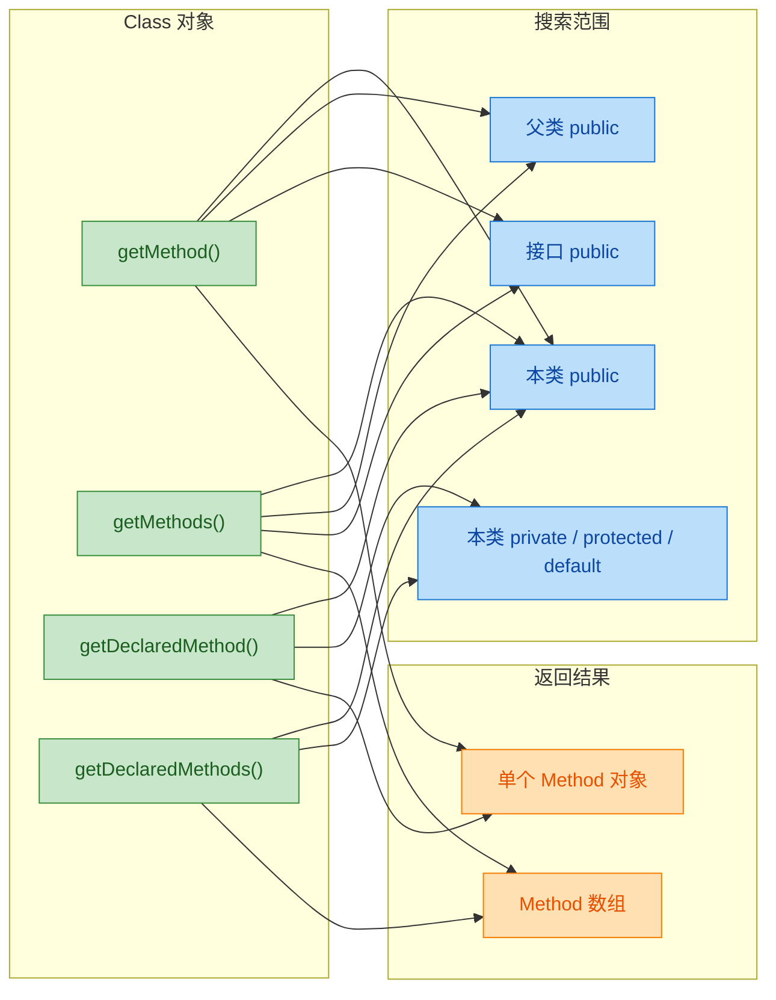

### 基础用法：获取并调用 public 方法

我们先从最简单的场景开始——反射调用一个普通的 public 实例方法。

```java
// 目标类：一个简单的计算器
public class Calculator {

    // 一个普通的 public 实例方法，接收两个 int 参数
    public int add(int a, int b) {
        return a + b;
    }

    // 重载方法，接收三个 int 参数
    public int add(int a, int b, int c) {
        return a + b + c;
    }

    // 一个无参方法
    public String greeting() {
        return "Hello from Calculator!";
    }
}
```

```java
public class MethodReflectDemo {
    public static void main(String[] args) throws Exception {

        // 1. 获取 Class 对象
        Class<?> clazz = Calculator.class;

        // 2. 获取 add(int, int) 方法
        //    第一个参数是方法名（String）
        //    后续参数是形参类型的 Class 对象，用于精确匹配重载方法
        Method addMethod = clazz.getMethod("add", int.class, int.class);

        // 3. 创建实例（invoke 需要一个目标对象）
        Object calculator = clazz.getDeclaredConstructor().newInstance();

        // 4. 调用方法：invoke(目标对象, 实参列表...)
        //    返回值是 Object 类型，需要自行强转
        Object result = addMethod.invoke(calculator, 10, 20);

        // 输出：add(10, 20) = 30
        System.out.println("add(10, 20) = " + result);

        // 5. 获取三参数的重载版本 add(int, int, int)
        //    注意：参数类型列表不同，所以能正确区分重载
        Method addThree = clazz.getMethod("add", int.class, int.class, int.class);
        Object result2 = addThree.invoke(calculator, 1, 2, 3);

        // 输出：add(1, 2, 3) = 6
        System.out.println("add(1, 2, 3) = " + result2);

        // 6. 调用无参方法
        Method greetMethod = clazz.getMethod("greeting");
        // 无参方法：invoke 时只传目标对象，不传额外参数
        Object greeting = greetMethod.invoke(calculator);

        // 输出：Hello from Calculator!
        System.out.println(greeting);
    }
}
```

`getMethod` 的方法签名是 `getMethod(String name, Class<?>... parameterTypes)`，第二个参数是可变参数（varargs），代表目标方法的形参类型列表。这就是 Java 反射区分重载方法的方式——不是靠方法名，而是靠方法名 + 参数类型列表的组合，这和 JVM 层面的方法描述符（Method Descriptor）是一致的。

### invoke() 的工作机制

`Method.invoke(Object obj, Object... args)` 是方法反射的灵魂。它的两个参数含义如下：

- `obj`：方法的调用者（receiver）。如果是实例方法，传实例对象；如果是 static 方法，传 `null`。
- `args`：实参列表，按顺序对应形参。基本类型会自动装箱/拆箱（autoboxing/unboxing）。

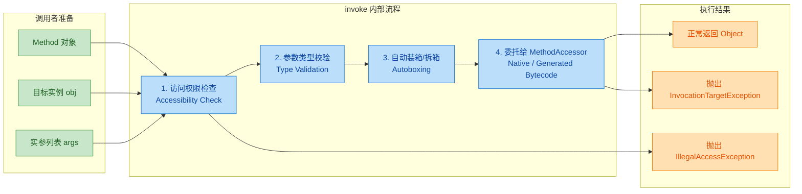

这里有一个关键细节：当被反射调用的方法内部抛出异常时，`invoke()` 不会直接抛出那个原始异常，而是把它包装在 `InvocationTargetException` 里。这是初学者经常困惑的地方——"我的方法明明抛的是 `NullPointerException`，为什么 catch 不到？"答案是你需要先 catch `InvocationTargetException`，再通过 `getCause()` 拿到真正的异常。

```java
try {
    // 假设 targetMethod 内部会抛出 ArithmeticException
    method.invoke(obj, 10, 0);
} catch (InvocationTargetException e) {
    // 获取被包装的原始异常
    Throwable realCause = e.getCause();
    // 输出：java.lang.ArithmeticException: / by zero
    System.out.println("真正的异常: " + realCause);
} catch (IllegalAccessException e) {
    // 访问权限不足时抛出（比如调用 private 方法但没 setAccessible）
    System.out.println("无权访问: " + e.getMessage());
}
```

### 反射调用 static 方法

静态方法不属于任何实例，所以 `invoke` 的第一个参数传 `null` 即可。

```java
public class MathUtils {

    // 一个简单的静态工具方法
    public static long factorial(int n) {
        if (n <= 1) return 1;
        return n * factorial(n - 1);
    }
}
```

```java
public class StaticMethodReflect {
    public static void main(String[] args) throws Exception {

        // 获取 Class 对象
        Class<?> clazz = Class.forName("MathUtils");

        // 获取静态方法 factorial(int)
        Method factMethod = clazz.getMethod("factorial", int.class);

        // 调用静态方法：第一个参数传 null，因为不需要实例
        Object result = factMethod.invoke(null, 5);

        // 输出：5! = 120
        System.out.println("5! = " + result);
    }
}
```

### 反射调用私有方法（getDeclaredMethod + setAccessible）

`getMethod` 只能获取 public 方法。要反射调用 private / protected / package-private 方法，必须使用 `getDeclaredMethod`，并且在调用前通过 `setAccessible(true)` 打开访问权限（后续章节会深入讲解 `setAccessible`）。

```java
public class SecretService {

    // 私有方法，正常情况下外部无法调用
    private String decrypt(String encoded) {
        // 简单模拟解密：反转字符串
        return new StringBuilder(encoded).reverse().toString();
    }

    // 受保护方法
    protected int internalCompute(int x) {
        return x * x + 1;
    }
}
```

```java
public class PrivateMethodReflect {
    public static void main(String[] args) throws Exception {

        Class<?> clazz = SecretService.class;

        // 1. 使用 getDeclaredMethod 获取私有方法
        //    getMethod 在这里会抛 NoSuchMethodException，因为 decrypt 不是 public
        Method decryptMethod = clazz.getDeclaredMethod("decrypt", String.class);

        // 2. 突破访问限制（关键步骤！）
        //    如果不调用这一行，invoke 时会抛 IllegalAccessException
        decryptMethod.setAccessible(true);

        // 3. 创建实例并调用
        Object service = clazz.getDeclaredConstructor().newInstance();
        Object result = decryptMethod.invoke(service, "olleH");

        // 输出：解密结果: Hello
        System.out.println("解密结果: " + result);

        // 同样的方式处理 protected 方法
        Method computeMethod = clazz.getDeclaredMethod("internalCompute", int.class);
        computeMethod.setAccessible(true);
        Object computeResult = computeMethod.invoke(service, 7);

        // 输出：计算结果: 50
        System.out.println("计算结果: " + computeResult);
    }
}
```

### 处理复杂参数类型

反射调用时，参数类型的匹配必须精确。基本类型和包装类型在反射层面是不同的 Class 对象。

```java
public class TypeDemo {

    // 参数是基本类型 int
    public void process(int value) {
        System.out.println("int 版本: " + value);
    }

    // 参数是包装类型 Integer（重载）
    public void process(Integer value) {
        System.out.println("Integer 版本: " + value);
    }

    // 参数是数组类型
    public void batchProcess(String[] items) {
        System.out.println("批量处理: " + java.util.Arrays.toString(items));
    }

    // 参数是泛型集合（擦除后是 List）
    public void listProcess(java.util.List<String> list) {
        System.out.println("列表处理: " + list);
    }
}
```

```java
public class ComplexParamReflect {
    public static void main(String[] args) throws Exception {

        Class<?> clazz = TypeDemo.class;
        Object obj = clazz.getDeclaredConstructor().newInstance();

        // ========== 基本类型 vs 包装类型 ==========

        // 获取 process(int) —— 注意用 int.class，不是 Integer.class
        Method processInt = clazz.getMethod("process", int.class);
        processInt.invoke(obj, 42);  // 输出：int 版本: 42

        // 获取 process(Integer) —— 用 Integer.class
        Method processInteger = clazz.getMethod("process", Integer.class);
        processInteger.invoke(obj, Integer.valueOf(42));  // 输出：Integer 版本: 42

        // ⚠️ 常见错误：用 Integer.class 去找 process(int)
        // 这会抛 NoSuchMethodException！
        // clazz.getMethod("process", Integer.class) 找到的是 process(Integer)

        // ========== 数组类型 ==========

        // 数组的 Class 对象是 String[].class
        Method batchMethod = clazz.getMethod("batchProcess", String[].class);
        // 注意：数组参数需要额外包一层 Object[]，否则 varargs 会展开
        String[] items = {"Apple", "Banana", "Cherry"};
        batchMethod.invoke(obj, (Object) items);

        // ========== 泛型参数（擦除后的类型） ==========

        // 泛型 List<String> 擦除后就是 List.class
        Method listMethod = clazz.getMethod("listProcess", java.util.List.class);
        listMethod.invoke(obj, java.util.Arrays.asList("X", "Y", "Z"));
    }
}
```

基本类型和包装类型的 Class 对象对照表，这张表在反射编程中非常实用：

| 基本类型 | Class 对象 | 包装类型 | Class 对象 |
|---------|-----------|---------|-----------|
| `int` | `int.class` | `Integer` | `Integer.class` |
| `long` | `long.class` | `Long` | `Long.class` |
| `double` | `double.class` | `Double` | `Double.class` |
| `boolean` | `boolean.class` | `Boolean` | `Boolean.class` |
| `char` | `char.class` | `Character` | `Character.class` |
| `byte` | `byte.class` | `Byte` | `Byte.class` |
| `short` | `short.class` | `Short` | `Short.class` |
| `float` | `float.class` | `Float` | `Float.class` |
| `void` | `void.class` | `Void` | `Void.class` |

### Method 对象的元信息提取

`Method` 对象不仅能用来调用方法，它本身还携带了丰富的元信息（metadata），这在框架开发中极其有用。

```java
import java.lang.reflect.Method;
import java.lang.reflect.Modifier;
import java.lang.reflect.Parameter;
import java.lang.reflect.Type;

public class MethodMetadataDemo {
    public static void main(String[] args) throws Exception {

        Class<?> clazz = Calculator.class;

        // 遍历所有 public 方法（包括从 Object 继承的）
        System.out.println("===== Calculator 的所有 public 方法 =====");
        for (Method m : clazz.getMethods()) {

            // 方法名
            String name = m.getName();

            // 返回值类型
            Class<?> returnType = m.getReturnType();

            // 参数类型列表
            Class<?>[] paramTypes = m.getParameterTypes();

            // 修饰符（public, static, final, synchronized 等）
            int modifiers = m.getModifiers();
            String modStr = Modifier.toString(modifiers);

            // 声明异常列表
            Class<?>[] exceptions = m.getExceptionTypes();

            // 格式化输出
            System.out.printf("  %s %s %s(%s) throws %s%n",
                modStr,                                          // 修饰符
                returnType.getSimpleName(),                      // 返回类型
                name,                                            // 方法名
                formatParams(paramTypes),                        // 参数列表
                formatExceptions(exceptions));                   // 异常列表
        }

        // 获取泛型返回类型（Type 而非 Class）
        // 对于 List<String> 这样的返回类型，getGenericReturnType 能保留泛型信息
        Method listMethod = TypeDemo.class.getMethod("listProcess", java.util.List.class);
        Type genericParamType = listMethod.getGenericParameterTypes()[0];
        // 输出：java.util.List<java.lang.String>（保留了泛型信息）
        System.out.println("泛型参数类型: " + genericParamType);
    }

    // 辅助方法：格式化参数类型列表
    private static String formatParams(Class<?>[] params) {
        StringBuilder sb = new StringBuilder();
        for (int i = 0; i < params.length; i++) {
            if (i > 0) sb.append(", ");
            sb.append(params[i].getSimpleName());
        }
        return sb.toString();
    }

    // 辅助方法：格式化异常列表
    private static String formatExceptions(Class<?>[] exceptions) {
        if (exceptions.length == 0) return "[none]";
        StringBuilder sb = new StringBuilder();
        for (int i = 0; i < exceptions.length; i++) {
            if (i > 0) sb.append(", ");
            sb.append(exceptions[i].getSimpleName());
        }
        return sb.toString();
    }
}
```

### 实战：模拟一个简易的方法路由器

框架中最常见的反射应用之一就是"根据字符串名称动态调用方法"。下面我们实现一个简易的命令路由器，模拟 Spring MVC 中 `@RequestMapping` 的核心思路。

```java
import java.lang.reflect.Method;
import java.util.HashMap;
import java.util.Map;

/**
 * 简易方法路由器
 * 模拟框架根据"路径字符串"动态分发到对应方法的核心机制
 */
public class SimpleMethodRouter {

    // 路由表：路径 -> Method 对象
    private final Map<String, Method> routeTable = new HashMap<>();

    // 控制器实例（方法的调用目标）
    private final Object controller;

    /**
     * 构造时扫描控制器类的所有 public 方法，注册到路由表
     * 约定：方法名就是路由路径（简化版，真实框架用注解）
     */
    public SimpleMethodRouter(Object controller) {
        this.controller = controller;
        // 扫描控制器的所有 declared public 方法
        for (Method m : controller.getClass().getDeclaredMethods()) {
            // 只注册 public 方法
            if (java.lang.reflect.Modifier.isPublic(m.getModifiers())) {
                // 以方法名作为路由 key
                routeTable.put(m.getName(), m);
            }
        }
        System.out.println("路由表已注册: " + routeTable.keySet());
    }

    /**
     * 根据路径分发请求
     * @param path 路由路径（对应方法名）
     * @param args 参数列表
     * @return 方法返回值
     */
    public Object dispatch(String path, Object... args) {
        // 从路由表查找 Method
        Method method = routeTable.get(path);
        if (method == null) {
            throw new RuntimeException("404 Not Found: " + path);
        }
        try {
            // 反射调用目标方法
            return method.invoke(controller, args);
        } catch (Exception e) {
            throw new RuntimeException("500 Internal Error: " + e.getCause(), e);
        }
    }
}
```

```java
// 模拟一个"控制器"类
public class UserController {

    public String findUser(int id) {
        return "User{id=" + id + ", name='Alice'}";
    }

    public String createUser(String name, int age) {
        return "Created: User{name='" + name + "', age=" + age + "}";
    }

    public String listUsers() {
        return "[User{id=1}, User{id=2}, User{id=3}]";
    }
}
```

```java
public class RouterDemo {
    public static void main(String[] args) {

        // 创建控制器实例
        UserController controller = new UserController();

        // 创建路由器，自动扫描并注册方法
        SimpleMethodRouter router = new SimpleMethodRouter(controller);

        // 模拟请求分发
        System.out.println(router.dispatch("findUser", 42));
        // 输出：User{id=42, name='Alice'}

        System.out.println(router.dispatch("createUser", "Bob", 25));
        // 输出：Created: User{name='Bob', age=25}

        System.out.println(router.dispatch("listUsers"));
        // 输出：[User{id=1}, User{id=2}, User{id=3}]

        // 测试 404
        // router.dispatch("deleteUser", 1);
        // 抛出 RuntimeException: 404 Not Found: deleteUser
    }
}
```

这个例子虽然简单，但它展示了 Spring MVC `DispatcherServlet` 的核心思想：启动时扫描所有 Controller 的方法，建立 URL → Method 的映射表，请求到来时通过反射 `invoke` 调用对应方法。真实框架在此基础上增加了注解解析、参数绑定、类型转换、拦截器链等能力，但骨架就是这个。

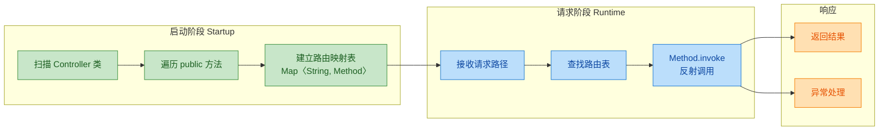

### getMethod vs getDeclaredMethod 的继承行为深入

这个区别在实际开发中经常导致 bug，值得用一个完整的例子来说明。

```java
public class Animal {
    // 父类的 public 方法
    public String speak() {
        return "...";
    }

    // 父类的 private 方法
    private void breathe() {
        System.out.println("breathing...");
    }
}

public class Dog extends Animal {
    // 子类重写的 public 方法
    @Override
    public String speak() {
        return "Woof!";
    }

    // 子类自己的 private 方法
    private void wagTail() {
        System.out.println("wagging tail...");
    }
}
```

```java
public class InheritanceReflect {
    public static void main(String[] args) throws Exception {

        Class<?> dogClass = Dog.class;

        // ===== getMethod：搜索 public 方法，包含继承链 =====

        // ✅ 能找到：Dog 自己重写的 public 方法
        Method speak = dogClass.getMethod("speak");
        System.out.println(speak.getDeclaringClass());  // class Dog

        // ✅ 能找到：从 Object 继承的 public 方法
        Method toString = dogClass.getMethod("toString");
        System.out.println(toString.getDeclaringClass());  // class java.lang.Object

        // ❌ 找不到：父类的 private 方法
        // dogClass.getMethod("breathe");  // NoSuchMethodException!

        // ❌ 找不到：子类的 private 方法
        // dogClass.getMethod("wagTail");  // NoSuchMethodException!

        // ===== getDeclaredMethod：只搜索本类声明的方法，不限访问级别 =====

        // ✅ 能找到：Dog 自己声明的 private 方法
        Method wagTail = dogClass.getDeclaredMethod("wagTail");
        wagTail.setAccessible(true);  // 突破 private
        wagTail.invoke(dogClass.getDeclaredConstructor().newInstance());

        // ✅ 能找到：Dog 自己重写的 speak
        Method dogSpeak = dogClass.getDeclaredMethod("speak");
        System.out.println(dogSpeak.getDeclaringClass());  // class Dog

        // ❌ 找不到：父类 Animal 的 breathe（不在 Dog 中声明）
        // dogClass.getDeclaredMethod("breathe");  // NoSuchMethodException!

        // 要获取父类的私有方法，必须在父类的 Class 上操作
        Method breathe = Animal.class.getDeclaredMethod("breathe");
        breathe.setAccessible(true);
        // 可以在子类实例上调用父类的私有方法（JVM 层面是允许的）
        breathe.invoke(dogClass.getDeclaredConstructor().newInstance());
    }
}
```

```text
搜索策略总结：

getMethod("xxx")
  └─ 搜索路径: Dog(public) → Animal(public) → Object(public)
  └─ 找到第一个匹配的 public 方法就返回

getDeclaredMethod("xxx")
  └─ 搜索路径: 仅 Dog 本类（所有访问级别）
  └─ 不会向上查找父类

如果需要"在整个继承链上查找任意访问级别的方法"，
标准 API 没有直接提供，需要自己递归向上遍历。
```

### 递归查找继承链上的方法（工具方法）

这是一个在框架源码中非常常见的工具方法模式：

```java
import java.lang.reflect.Method;

public class ReflectUtils {

    /**
     * 在整个继承链上查找方法（包括 private）
     * 从当前类开始，逐级向上搜索直到 Object
     *
     * @param clazz      起始类
     * @param methodName 方法名
     * @param paramTypes 参数类型列表
     * @return 找到的 Method 对象
     * @throws NoSuchMethodException 如果整个继承链都找不到
     */
    public static Method findMethod(Class<?> clazz, String methodName, Class<?>... paramTypes)
            throws NoSuchMethodException {

        // 从当前类开始，沿继承链向上遍历
        Class<?> current = clazz;
        while (current != null) {
            try {
                // 尝试在当前类中查找（包含 private）
                Method method = current.getDeclaredMethod(methodName, paramTypes);
                // 找到了，设置可访问并返回
                method.setAccessible(true);
                return method;
            } catch (NoSuchMethodException e) {
                // 当前类没有，继续向上查找父类
                current = current.getSuperclass();
            }
        }
        //整个继承链都没找到，抛出异常
        throw new NoSuchMethodException(
            "在 " + clazz.getName() + " 的继承链上找不到方法: " + methodName);
    }
}
```

这个 `findMethod` 工具方法的思路在 Spring Framework 的 `ReflectionUtils.findMethod()` 中几乎一模一样。Spring 源码里还额外处理了接口默认方法（default method）的查找，但核心递归逻辑就是这个。

### 反射调用中的返回值处理

`invoke()` 的返回值永远是 `Object` 类型。对于不同的方法返回类型，处理方式有所不同：

```java
public class ReturnTypeDemo {

    public int getInt() { return 42; }           // 基本类型
    public String getString() { return "hi"; }   // 引用类型
    public void doNothing() { }                  // void
    public int[] getArray() { return new int[]{1, 2, 3}; }  // 数组
}
```

```java
public class ReturnValueHandling {
    public static void main(String[] args) throws Exception {

        Class<?> clazz = ReturnTypeDemo.class;
        Object obj = clazz.getDeclaredConstructor().newInstance();

        // 1. 基本类型返回值 —— 自动装箱为对应包装类
        Method getInt = clazz.getMethod("getInt");
        Object intResult = getInt.invoke(obj);
        // intResult 实际类型是 Integer（自动装箱）
        System.out.println(intResult.getClass());  // class java.lang.Integer
        // 可以安全强转或拆箱
        int value = (int) intResult;  // 自动拆箱
        System.out.println("int 值: " + value);  // 42

        // 2. 引用类型返回值 —— 直接强转
        Method getString = clazz.getMethod("getString");
        String strResult = (String) getString.invoke(obj);
        System.out.println("String 值: " + strResult);  // hi

        // 3. void 方法 —— invoke 返回 null
        Method doNothing = clazz.getMethod("doNothing");
        Object voidResult = doNothing.invoke(obj);
        System.out.println("void 返回: " + voidResult);  // null

        // 4. 数组返回值 —— 强转为对应数组类型
        Method getArray = clazz.getMethod("getArray");
        int[] arrayResult = (int[]) getArray.invoke(obj);
        // 输出：[1, 2, 3]
        System.out.println("数组: " + java.util.Arrays.toString(arrayResult));
    }
}
```

### invoke 的底层实现：从 Native 到字节码生成

这部分内容偏底层，但理解它对后面的"反射性能优化"章节至关重要。

当你第一次调用 `method.invoke()` 时，JVM 使用的是 Native 实现（通过 JNI 调用 C++ 代码）。但 Native 调用有固定的 JNI 开销，如果同一个 Method 被反复调用，JVM 会在达到一定阈值后（默认 15 次，由 `-Dsun.reflect.inflationThreshold` 控制）自动切换为动态生成的字节码实现（Generated MethodAccessor），这个过程叫做 Inflation。

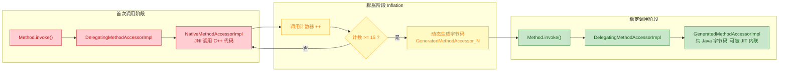

为什么要这样设计？因为生成字节码本身有成本（需要 ASM 动态生成类并加载），如果一个方法只被反射调用一两次，生成字节码反而更慢。但如果被频繁调用，生成的字节码可以被 JIT 编译器进一步优化甚至内联（inline），性能接近直接调用。这是一个典型的 lazy optimization 策略。

```java
// 可以通过 JVM 参数观察 Inflation 过程
// -Dsun.reflect.inflationThreshold=15   （默认值）
// -Dsun.reflect.noInflation=true        （跳过 Native，直接生成字节码）

public class InflationDemo {
    public static void main(String[] args) throws Exception {
        Method method = InflationDemo.class.getMethod("targetMethod");

        // 前 15 次调用走 NativeMethodAccessorImpl
        // 第 16 次开始走 GeneratedMethodAccessorImpl
        for (int i = 0; i < 20; i++) {
            method.invoke(null);
            // 可以通过反射查看内部的 MethodAccessor 实现类来验证切换
        }
    }

    public static void targetMethod() {
        // 空方法，仅用于演示
    }
}
```

### 方法反射的常见异常总结

在实际开发中，方法反射涉及的异常种类较多，清晰地理解每种异常的触发条件能大幅提升调试效率：

| 异常类型 | 触发场景 | 典型原因 |
|---------|---------|---------|
| `NoSuchMethodException` | `getMethod` / `getDeclaredMethod` | 方法名拼错、参数类型不匹配、用 `getMethod` 找 private 方法 |
| `IllegalAccessException` | `invoke` | 调用 private 方法但未 `setAccessible(true)` |
| `IllegalArgumentException` | `invoke` | 实参数量或类型与形参不匹配 |
| `InvocationTargetException` | `invoke` | 被调用的方法内部抛出了异常（原始异常被包装） |
| `NullPointerException` | `invoke` | 对实例方法传了 `null` 作为 obj 参数 |
| `ExceptionInInitializerError` | `invoke` | 目标方法所在类的静态初始化块抛出异常 |

```java
// 异常处理的最佳实践模板
public static Object safeInvoke(Method method, Object target, Object... args) {
    try {
        return method.invoke(target, args);
    } catch (InvocationTargetException e) {
        // 最常见：目标方法内部异常
        // 剥离包装，获取真正的异常
        Throwable cause = e.getCause();
        // 如果是 RuntimeException 或 Error，直接重新抛出
        if (cause instanceof RuntimeException) {
            throw (RuntimeException) cause;
        }
        if (cause instanceof Error) {
            throw (Error) cause;
        }
        // 受检异常包装为 RuntimeException
        throw new RuntimeException("反射调用失败: " + method.getName(), cause);
    } catch (IllegalAccessException e) {
        // 权限问题：提示使用 setAccessible
        throw new RuntimeException(
            "无权访问方法 " + method.getName() + "，请先调用 setAccessible(true)", e);
    } catch (IllegalArgumentException e) {
        // 参数不匹配
        throw new RuntimeException(
            "参数不匹配: 方法 " + method.getName() +
            " 期望 " + java.util.Arrays.toString(method.getParameterTypes()) +
            "，实际传入 " + java.util.Arrays.toString(args), e);
    }
}
```

---

**📝 练习题**

以下代码的输出结果是什么？

```java
public class Parent {
    public String hello() { return "Parent"; }
    private String secret() { return "ParentSecret"; }
}

public class Child extends Parent {
    @Override
    public String hello() { return "Child"; }
    private String secret() { return "ChildSecret"; }
}

// 测试代码
Class<?> clazz = Child.class;
Method m1 = clazz.getMethod("hello");
Method m2 = clazz.getDeclaredMethod("secret");
m2.setAccessible(true);
Object child = clazz.getDeclaredConstructor().newInstance();
System.out.println(m1.invoke(child) + " " + m2.invoke(child));
```

A. Parent ChildSecret


B. Child ParentSecret


C. Child ChildSecret


D. 抛出 NoSuchMethodException

**【答案】** C

**【解析】** `getMethod("hello")` 沿继承链查找 public 方法，`Child` 重写了 `hello()`，所以找到的是 `Child.hello()`，返回 `"Child"`。`getDeclaredMethod("secret")` 只在 `Child` 本类中查找，找到的是 `Child` 自己声明的 `private String secret()`（注意：`Child.secret()` 和 `Parent.secret()` 是两个完全独立的方法，private 方法不参与多态，不存在重写关系），返回 `"ChildSecret"`。因此输出 `Child ChildSecret`。如果想获取父类的 `secret()`，必须在 `Parent.class` 上调用 `getDeclaredMethod("secret")`。

---

## setAccessible（突破私有访问）

Java 的访问控制修饰符（`private`, `protected`, default）在编译期和运行期都会被 JVM 强制执行。当你通过反射尝试访问一个 `private` 字段或方法时，JVM 会抛出 `IllegalAccessException`。而 `setAccessible(true)` 就是反射体系中那把"万能钥匙"——它告诉 JVM："我知道这个成员是私有的，但请允许我访问它。"

这个机制的正式名称叫做 **抑制访问检查（Suppress Access Checks）**。它并没有真正修改字段或方法的访问修饰符，`private` 依然是 `private`，它只是在本次反射操作中跳过了权限校验这一步。

### 为什么需要突破私有访问

在实际开发中，突破私有访问并非"黑魔法"式的滥用，而是很多核心框架赖以生存的基础能力：

- Spring 的依赖注入（DI）需要向 `private` 字段直接赋值，而不要求开发者必须写 setter 方法
- Hibernate / MyBatis 等 ORM 框架需要读写实体类的私有属性来完成对象-关系映射
- 序列化框架（Jackson、Gson）需要访问私有字段来完成 JSON 与对象的互转
- 单元测试中，有时需要修改私有状态来构造特定的测试场景

如果没有 `setAccessible`，上述所有框架都将被迫要求开发者为每个字段提供 `public` 的 getter/setter，这会严重破坏封装性，反而违背了面向对象设计的初衷。

### setAccessible 的 API 定义

`setAccessible` 方法定义在 `java.lang.reflect.AccessibleObject` 类中，而 `Field`、`Method`、`Constructor` 都继承自它：

```java
// AccessibleObject 是 Field, Method, Constructor 的共同父类
public class AccessibleObject {
    
    // 设置单个反射对象的可访问性
    // flag = true 表示抑制访问检查
    // flag = false 表示恢复访问检查（默认行为）
    public void setAccessible(boolean flag) throws SecurityException { ... }
    
    // 批量设置多个反射对象的可访问性，效率更高
    public static void setAccessible(AccessibleObject[] array, boolean flag) 
        throws SecurityException { ... }
    
    // 查询当前反射对象是否已被设置为可访问
    // 注意：这个方法反映的是 setAccessible 的调用状态，而非成员本身的修饰符
    public boolean isAccessible() { ... }
    
    // Java 9+ 新增，语义更清晰：能否在不设置 accessible 的情况下直接访问
    public boolean canAccess(Object obj) { ... }
}
```

继承关系用类图表示如下：

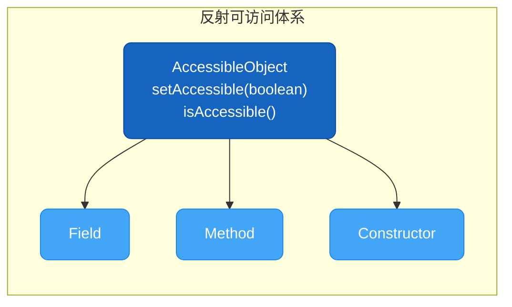

### 突破私有字段访问

这是最常见的使用场景。假设我们有一个封装良好的类，所有字段都是 `private` 且没有提供 setter：

```java
public class DatabaseConfig {
    // 数据库连接地址，私有且无 setter
    private String url = "jdbc:mysql://localhost:3306/default_db";
    // 连接密码，私有且无 setter
    private String password = "root123";
    // 最大连接数，私有且无 setter
    private int maxConnections = 10;

    // 只提供了 getter，外部只能读不能写
    public String getUrl() {
        return url;
    }

    @Override
    public String toString() {
        return "DatabaseConfig{url='" + url + "', password='" + password 
               + "', maxConnections=" + maxConnections + "}";
    }
}
```

现在我们用反射突破限制，直接修改私有字段：

```java
import java.lang.reflect.Field;

public class BreakPrivateFieldDemo {
    public static void main(String[] args) throws Exception {
        // 创建目标对象
        DatabaseConfig config = new DatabaseConfig();
        // 打印修改前的状态
        System.out.println("修改前: " + config);

        // 获取 Class 对象
        Class<?> clazz = config.getClass();

        // ========== 修改私有 String 字段 ==========
        // getDeclaredField 能获取本类声明的任何字段（包括 private）
        // 注意：getField 只能获取 public 字段，访问 private 必须用 getDeclaredField
        Field urlField = clazz.getDeclaredField("url");

        // 此时如果直接 urlField.get(config)，会抛出 IllegalAccessException
        // 因为 url 是 private 的，JVM 拒绝访问
        // urlField.get(config);  // ❌ IllegalAccessException

        // 关键一步：抑制访问检查
        urlField.setAccessible(true);

        // 现在可以自由读取私有字段的值了
        String oldUrl = (String) urlField.get(config);
        System.out.println("读取私有字段 url = " + oldUrl);

        // 也可以直接修改私有字段的值
        urlField.set(config, "jdbc:mysql://192.168.1.100:3306/prod_db");

        // ========== 修改私有 int 字段 ==========
        Field maxConnField = clazz.getDeclaredField("maxConnections");
        // 同样需要先突破访问限制
        maxConnField.setAccessible(true);
        // 对于基本类型，反射会自动装箱/拆箱
        maxConnField.setInt(config, 50);

        // ========== 修改私有 password 字段 ==========
        Field pwdField = clazz.getDeclaredField("password");
        pwdField.setAccessible(true);
        pwdField.set(config, "new_secure_password");

        // 打印修改后的状态，三个私有字段都已被成功修改
        System.out.println("修改后: " + config);
    }
}
```

运行输出：

```
修改前: DatabaseConfig{url='jdbc:mysql://localhost:3306/default_db', password='root123', maxConnections=10}
读取私有字段 url = jdbc:mysql://localhost:3306/default_db
修改后: DatabaseConfig{url='jdbc:mysql://192.168.1.100:3306/prod_db', password='new_secure_password', maxConnections=50}
```

### 突破私有方法访问

除了字段，私有方法同样可以通过反射调用。这在测试私有方法的逻辑时特别有用：

```java
public class EncryptionService {
    // 私有加密方法，外部无法直接调用
    private String encrypt(String plainText, int shift) {
        // 简单的凯撒密码实现（仅作演示）
        StringBuilder sb = new StringBuilder();
        // 遍历每个字符，按 shift 偏移
        for (char c : plainText.toCharArray()) {
            if (Character.isLetter(c)) {
                // 计算偏移后的字符
                char base = Character.isUpperCase(c) ? 'A' : 'a';
                sb.append((char) ((c - base + shift) % 26 + base));
            } else {
                // 非字母字符保持不变
                sb.append(c);
            }
        }
        return sb.toString();
    }

    // 私有无参方法
    private String getSecretKey() {
        return "AES-256-SECRET";
    }
}
```

```java
import java.lang.reflect.Method;

public class BreakPrivateMethodDemo {
    public static void main(String[] args) throws Exception {
        // 创建目标对象
        EncryptionService service = new EncryptionService();
        // 获取 Class 对象
        Class<?> clazz = service.getClass();

        // ========== 调用带参数的私有方法 ==========
        // getDeclaredMethod 的第一个参数是方法名
        // 后续参数是方法的参数类型列表（用于区分重载方法）
        Method encryptMethod = clazz.getDeclaredMethod(
            "encrypt",        // 方法名
            String.class,     // 第一个参数类型
            int.class         // 第二个参数类型（注意是 int.class 不是 Integer.class）
        );

        // 突破私有访问限制
        encryptMethod.setAccessible(true);

        // invoke 的第一个参数是目标对象实例
        // 后续参数是传给方法的实际参数值
        String encrypted = (String) encryptMethod.invoke(
            service,          // 目标对象
            "HelloWorld",     // plainText 参数
            3                 // shift 参数，自动装箱为 Integer 再拆箱
        );
        System.out.println("加密结果: " + encrypted);

        // ========== 调用无参的私有方法 ==========
        Method getKeyMethod = clazz.getDeclaredMethod("getSecretKey");
        // 突破访问限制
        getKeyMethod.setAccessible(true);
        // 无参方法调用时，invoke 只需传目标对象
        String secretKey = (String) getKeyMethod.invoke(service);
        System.out.println("密钥: " + secretKey);
    }
}
```

运行输出：

```
加密结果: KhoorZruog
密钥: AES-256-SECRET
```

### 突破私有构造方法

有些类通过将构造方法设为 `private` 来阻止外部实例化，最典型的就是单例模式。反射甚至可以突破这层防护：

```java
public class Singleton {
    // 静态实例
    private static final Singleton INSTANCE = new Singleton();
    // 实例标识，用于验证是否是同一个对象
    private String id;

    // 私有构造方法，阻止外部 new
    private Singleton() {
        // 为每个实例生成唯一 ID
        this.id = "instance-" + System.nanoTime();
    }

    // 唯一的获取实例入口
    public static Singleton getInstance() {
        return INSTANCE;
    }

    public String getId() {
        return id;
    }
}
```

```java
import java.lang.reflect.Constructor;

public class BreakSingletonDemo {
    public static void main(String[] args) throws Exception {
        // 通过正常途径获取单例
        Singleton s1 = Singleton.getInstance();
        System.out.println("正常单例: " + s1.getId());

        // 通过反射获取私有构造方法
        Class<?> clazz = Singleton.class;
        // getDeclaredConstructor() 无参版本获取无参构造
        Constructor<?> constructor = clazz.getDeclaredConstructor();

        // 突破私有构造方法的访问限制
        constructor.setAccessible(true);

        // 强行创建新实例——单例被破坏了！
        Singleton s2 = (Singleton) constructor.newInstance();
        System.out.println("反射创建: " + s2.getId());

        // 验证两个实例是否相同
        System.out.println("是否同一实例: " + (s1 == s2));  // false
    }
}
```

运行输出：

```
正常单例: instance-1234567890
反射创建: instance-1234567999
是否同一实例: false
```

这说明反射确实能破坏单例模式。防御手段通常是在构造方法中加入检测逻辑：

```java
private Singleton() {
    // 防御反射攻击：如果实例已存在，拒绝再次构造
    if (INSTANCE != null) {
        throw new RuntimeException("禁止通过反射创建单例的第二个实例！");
    }
    this.id = "instance-" + System.nanoTime();
}
```

### setAccessible 的完整工作流程

下面这张流程图展示了从发起反射调用到最终执行的完整决策链路：

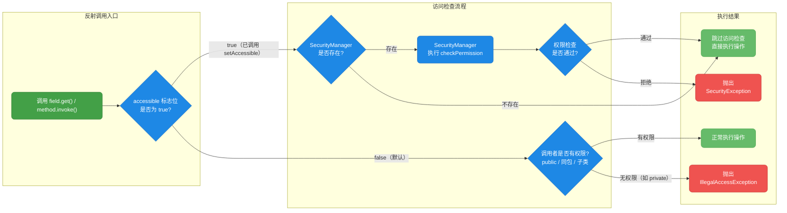

关键要点：`setAccessible(true)` 并不是无条件生效的。如果 JVM 配置了 `SecurityManager`（虽然在 Java 17+ 中已被标记为 deprecated），它仍然可以拦截 `setAccessible` 的调用。

### getDeclaredXxx 与 getXxx 的区别

理解 `setAccessible` 之前，必须先搞清楚这两组 API 的本质区别，否则很容易踩坑：

```java
import java.lang.reflect.Field;
import java.lang.reflect.Method;

public class DeclaredVsPublicDemo {
    public static void main(String[] args) {
        Class<?> clazz = DatabaseConfig.class;

        // ========== getFields vs getDeclaredFields ==========
        System.out.println("=== getFields（仅 public，含继承）===");
        // getFields 返回所有 public 字段，包括从父类继承的
        for (Field f : clazz.getFields()) {
            System.out.println("  " + f.getName());
        }
        // 输出为空，因为 DatabaseConfig 没有 public 字段

        System.out.println("=== getDeclaredFields（本类所有，含 private）===");
        // getDeclaredFields 返回本类声明的所有字段，不论访问修饰符
        // 但不包含从父类继承的字段
        for (Field f : clazz.getDeclaredFields()) {
            System.out.println("  " + f.getName() + " -> " + f.getType().getSimpleName());
        }
        // 输出: url -> String, password -> String, maxConnections -> int

        // ========== getMethods vs getDeclaredMethods ==========
        System.out.println("=== getMethods（仅 public，含继承）===");
        for (Method m : clazz.getMethods()) {
            // 过滤掉 Object 类的方法，只看自己的
            if (m.getDeclaringClass() != Object.class) {
                System.out.println("  " + m.getName());
            }
        }
        // 输出: getUrl, toString（public 方法）

        System.out.println("=== getDeclaredMethods（本类所有，含 private）===");
        for (Method m : clazz.getDeclaredMethods()) {
            System.out.println("  " + m.getName());
        }
        // 输出: getUrl, toString, 以及其他 private 方法（如果有的话）
    }
}
```

用一张对比表总结：

| 特性 | `getXxx` 系列 | `getDeclaredXxx` 系列 |
|------|--------------|----------------------|
| 访问范围 | 仅 `public` 成员 | 所有访问级别（含 `private`） |
| 继承成员 | 包含从父类/接口继承的 | 仅本类声明的，不含继承 |
| 是否需要 `setAccessible` | 不需要（本身就是 public） | 访问非 public 成员时需要 |
| 典型用途 | 获取公开 API | 框架级深度操作 |

一个常见的错误模式是：用 `getField` 去获取 `private` 字段，结果抛出 `NoSuchFieldException`——因为 `getField` 根本看不到非 public 的成员。

### 突破 final 字段

`setAccessible` 甚至可以修改 `final` 字段，但这里有一些微妙的陷阱：

```java
import java.lang.reflect.Field;

public class BreakFinalFieldDemo {

    // 测试用的类，包含 final 字段
    static class AppConfig {
        // 编译期常量：值在编译时就被内联到使用处
        private final String APP_NAME = "MyApp";
        // 运行期 final：值在运行时确定，不会被内联
        private final String appVersion;
        // 基本类型编译期常量
        private final int MAX_RETRY = 3;

        public AppConfig() {
            // appVersion 的值在构造方法中赋值，属于运行期确定
            this.appVersion = "v" + Runtime.version().feature();
        }

        public void printInfo() {
            System.out.println("APP_NAME = " + APP_NAME);
            System.out.println("appVersion = " + appVersion);
            System.out.println("MAX_RETRY = " + MAX_RETRY);
        }
    }

    public static void main(String[] args) throws Exception {
        AppConfig config = new AppConfig();
        System.out.println("=== 修改前 ===");
        config.printInfo();

        Class<?> clazz = config.getClass();

        // ========== 修改运行期 final 字段（可以成功）==========
        Field versionField = clazz.getDeclaredField("appVersion");
        versionField.setAccessible(true);
        // 运行期 final 字段的值不会被编译器内联
        // 所以反射修改后，通过反射读取和通过方法读取都能看到新值
        versionField.set(config, "v999.0");

        // ========== 修改编译期常量 final 字段（有陷阱）==========
        Field nameField = clazz.getDeclaredField("APP_NAME");
        nameField.setAccessible(true);
        // 反射层面确实修改了字段的值
        nameField.set(config, "NewAppName");

        System.out.println("\n=== 修改后 ===");
        config.printInfo();
        // APP_NAME 的输出仍然是 "MyApp"！
        // 因为编译器在编译时就把 "MyApp" 内联到了 printInfo 方法中
        // 反射修改的是堆中的字段值，但字节码中的常量引用不会变

        // 但通过反射读取，能看到修改后的值
        System.out.println("\n=== 通过反射读取 ===");
        System.out.println("APP_NAME (反射) = " + nameField.get(config));
        // 输出: NewAppName —— 堆中的值确实变了
    }
}
```

```
=== 修改前 ===
APP_NAME = MyApp
appVersion = v21
MAX_RETRY = 3

=== 修改后 ===
APP_NAME = MyApp          ← 编译期常量被内联，修改无效
appVersion = v999.0       ← 运行期 final 修改成功
MAX_RETRY = 3             ← 基本类型常量被内联，修改无效

=== 通过反射读取 ===
APP_NAME (反射) = NewAppName  ← 堆中的值确实变了
```

这个行为的根本原因在于 Java 编译器的 **常量折叠（Constant Folding）** 优化。编译期能确定值的 `final` 字段（字面量赋值的 `String` 和基本类型），其值会被直接嵌入到使用处的字节码中，形成独立于字段本身的副本。

```java
// 编译器看到的 printInfo 方法（伪字节码）
// public void printInfo() {
//     System.out.println("APP_NAME = " + "MyApp");  // 直接内联了字面量
//     System.out.println("appVersion = " + this.appVersion);  // 保留字段引用
// }
```

> 需要注意：从 Java 12 开始，对 `final` 字段的反射修改行为变得更加受限。在 Java 16+ 的某些情况下，直接对 `final` 字段调用 `Field.set()` 可能会抛出 `IllegalAccessException`，即使已经调用了 `setAccessible(true)`。这是 JDK 团队有意收紧的安全策略。

### Java 模块系统对 setAccessible 的影响

Java 9 引入的模块系统（JPMS, Java Platform Module System）对 `setAccessible` 施加了更严格的限制。这是现代 Java 开发中必须了解的重要变化：

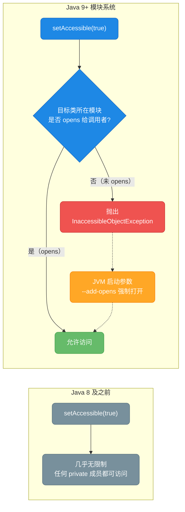

在模块化环境下，如果你尝试反射访问 JDK 内部类的私有成员：

```java
// 在 Java 16+ 中，这段代码会失败
public class ModuleRestrictionDemo {
    public static void main(String[] args) throws Exception {
        // 尝试反射访问 String 类的内部 value 字段
        Field valueField = String.class.getDeclaredField("value");
        // 这一行会抛出 InaccessibleObjectException
        // 因为 java.lang 所在的 java.base 模块没有 opens 给未命名模块
        valueField.setAccessible(true);  // ❌ 异常！
    }
}
```

解决方案是在启动 JVM 时添加参数：

```bash
# 将 java.base 模块的 java.lang 包打开给所有未命名模块
java --add-opens java.base/java.lang=ALL-UNNAMED ModuleRestrictionDemo
```

这也是为什么升级到 Java 11/17 后，很多老项目启动时会看到大量 `--add-opens` 参数的原因。

### 实战：模拟 Spring 风格的字段注入

下面我们综合运用 `setAccessible` 来实现一个简化版的依赖注入容器，模拟 Spring 的 `@Autowired` 行为：

```java
import java.lang.annotation.*;
import java.lang.reflect.Field;
import java.util.HashMap;
import java.util.Map;

// 自定义注入注解，标记需要自动注入的字段
@Retention(RetentionPolicy.RUNTIME)  // 运行时保留，反射才能读到
@Target(ElementType.FIELD)           // 只能标注在字段上
@interface Inject {}

// ========== 模拟的 Service 层 ==========
class UserRepository {
    // 模拟数据库查询
    public String findUserById(int id) {
        return "User-" + id;
    }
}

class EmailService {
    // 模拟发送邮件
    public void sendEmail(String to, String content) {
        System.out.println("发送邮件给 " + to + ": " + content);
    }
}

class UserService {
    // 私有字段，没有 setter，通过 @Inject 标记需要注入
    @Inject
    private UserRepository userRepository;

    @Inject
    private EmailService emailService;

    // 这个字段没有 @Inject，不会被注入
    private String serviceName = "UserService";

    // 业务方法，依赖 userRepository 和 emailService
    public void registerUser(int id) {
        String user = userRepository.findUserById(id);
        emailService.sendEmail(user, "欢迎注册！");
        System.out.println(serviceName + ": 用户 " + user + " 注册成功");
    }
}

// ========== 简易 IoC 容器 ==========
class MiniContainer {
    // 存储"Bean"实例的容器，key 是类型，value 是实例
    private final Map<Class<?>, Object> beans = new HashMap<>();

    // 注册一个 Bean 到容器中
    public void register(Class<?> type, Object instance) {
        beans.put(type, instance);
    }

    // 核心方法：对目标对象执行依赖注入
    public void inject(Object target) throws Exception {
        // 获取目标对象的 Class
        Class<?> clazz = target.getClass();

        // 遍历目标类声明的所有字段（包括 private）
        for (Field field : clazz.getDeclaredFields()) {
            // 检查字段是否标注了 @Inject
            if (field.isAnnotationPresent(Inject.class)) {
                // 从容器中查找匹配类型的 Bean
                Object dependency = beans.get(field.getType());

                if (dependency == null) {
                    // 容器中没有对应类型的 Bean，抛出异常
                    throw new RuntimeException(
                        "无法注入 " + field.getName() 
                        + ": 容器中没有 " + field.getType().getSimpleName() + " 的实例"
                    );
                }

                // 关键步骤：突破 private 访问限制
                field.setAccessible(true);
                // 将依赖实例注入到目标对象的私有字段中
                field.set(target, dependency);

                System.out.println("[容器] 注入 " + field.getType().getSimpleName() 
                                   + " -> " + clazz.getSimpleName() + "." + field.getName());
            }
        }
    }
}

// ========== 测试 ==========
public class MiniSpringDemo {
    public static void main(String[] args) throws Exception {
        // 创建容器
        MiniContainer container = new MiniContainer();

        // 注册 Bean（模拟 Spring 的组件扫描和实例化）
        container.register(UserRepository.class, new UserRepository());
        container.register(EmailService.class, new EmailService());

        // 创建 UserService 实例（此时私有字段都是 null）
        UserService userService = new UserService();

        // 执行依赖注入——容器通过反射将依赖注入到私有字段
        container.inject(userService);

        System.out.println();
        // 调用业务方法，验证注入是否成功
        userService.registerUser(1001);
    }
}
```

运行输出：

```
[容器] 注入 UserRepository -> UserService.userRepository
[容器] 注入 EmailService -> UserService.emailService

发送邮件给 User-1001: 欢迎注册！
UserService: 用户 User-1001 注册成功
```

整个过程中，`UserService` 没有暴露任何 setter 方法，字段全部是 `private`，但容器通过 `setAccessible(true)` 成功完成了注入。这就是 Spring 框架 `@Autowired` 字段注入的核心原理。

### setAccessible 的安全风险与最佳实践

`setAccessible` 是一把双刃剑。它赋予了框架强大的能力，但如果滥用，会带来严重的安全和维护问题：

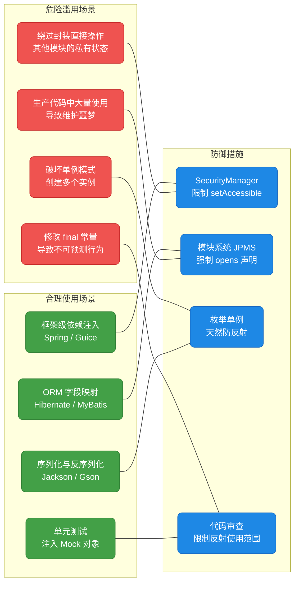

总结几条实践准则：

1. **业务代码中避免使用 `setAccessible`**。如果你发现自己在业务逻辑中需要反射访问私有成员，大概率是设计出了问题——应该优先考虑调整类的 API 设计。

2. **框架代码中谨慎使用**。即使是框架开发，也应该将反射操作集中在少数几个工具类中，而不是散落在各处。Spring 内部就有 `ReflectionUtils` 这样的集中管理类。

3. **用完及时恢复**。虽然 `setAccessible` 只影响当前的 `Field`/`Method` 对象而非类本身，但在安全敏感的环境中，操作完毕后调用 `setAccessible(false)` 是一个好习惯：

```java
Field field = clazz.getDeclaredField("secret");
try {
    // 临时开启访问权限
    field.setAccessible(true);
    // 执行操作
    Object value = field.get(target);
    // ... 使用 value
} finally {
    // 恢复访问限制
    field.setAccessible(false);
}
```

4. **优先使用枚举实现单例**。枚举是唯一一种天然防御反射攻击的单例实现方式，JVM 从底层禁止通过反射创建枚举实例：

```java
public enum SafeSingleton {
    // 枚举常量就是唯一实例
    INSTANCE;

    // 业务方法
    public void doWork() {
        System.out.println("安全的单例在工作");
    }
}

// 尝试反射创建枚举实例
// Constructor<?> c = SafeSingleton.class.getDeclaredConstructor(String.class, int.class);
// c.setAccessible(true);
// c.newInstance("HACK", 1);  // ❌ 抛出 IllegalArgumentException: Cannot reflectively create enum objects
```

5. **拥抱模块系统**。Java 9+ 的模块系统通过 `exports` 和 `opens` 关键字提供了细粒度的访问控制。在 `module-info.java` 中明确声明哪些包允许被反射访问，比依赖 `SecurityManager` 更现代、更可靠：

```java
// module-info.java
module my.application {
    // 允许 Spring 框架反射访问 model 包中的私有成员
    opens com.myapp.model to spring.core;
    // 允许 Jackson 反射访问 dto 包
    opens com.myapp.dto to com.fasterxml.jackson.databind;
    // 不 opens 的包，外部模块无法对其使用 setAccessible
}
```

---

**📝 练习题**

以下代码在 Java 17 环境下运行，结果是什么？

```java
public class Quiz {
    static class Secret {
        private final String code;
        Secret() { this.code = "ALPHA-" + System.nanoTime(); }
    }

    public static void main(String[] args) throws Exception {
        Secret s = new Secret();
        Field f = Secret.class.getDeclaredField("code");
        f.setAccessible(true);
        System.out.println(f.get(s));
        f.set(s, "HACKED");
        System.out.println(f.get(s));
    }
}
```

A. 打印类似 `ALPHA-123456789`，然后打印 `HACKED`

B. 打印类似 `ALPHA-123456789`，然后抛出 `IllegalAccessException`

C. 第一次 `f.get(s)` 就抛出 `IllegalAccessException`

D. 编译错误，`final` 字段不允许反射操作


**【答案】** A

**【解析】** `code` 字段虽然是 `private final`，但它的值是在构造方法中通过表达式 `"ALPHA-" + System.nanoTime()` 赋值的，属于运行期确定的 final 字段，不会被编译器常量折叠内联。`setAccessible(true)` 成功抑制了 `private` 的访问检查。关于 `final` 字段的反射修改，在 Java 17 中，对于非静态的实例 final 字段，`Field.set()` 在调用了 `setAccessible(true)` 之后仍然可以成功执行（JDK 内部对实例字段的限制相对宽松）。因此两次打印都能正常输出，第二次输出 `HACKED`。需要注意的是，如果 `code` 是 `static final` 字段，在 Java 12+ 中 `f.set()` 就会抛出 `IllegalAccessException`，因为 JDK 对静态 final 字段的反射修改做了更严格的限制。

---

## 注解反射（getAnnotation）

反射的真正威力，在于它不仅能操作类的"骨架"（字段、方法、构造器），还能读取附着在这些骨架上的"标签"——也就是注解（Annotation）。Spring、MyBatis、JUnit 等主流框架的核心驱动力，正是"注解 + 反射"这对黄金搭档。理解注解反射，就等于拿到了理解框架底层原理的钥匙。

### 注解的本质与反射的关系

注解本身只是一段"元数据"（metadata），它不会直接改变程序的执行逻辑。真正让注解"活起来"的，是在运行时通过反射去读取它、解析它，然后根据注解携带的信息做出相应的动作。这个过程可以概括为三步：定义注解 → 标注注解 → 反射读取注解。

```java
// 第一步：定义注解（相当于"设计标签的样式"）
@Retention(RetentionPolicy.RUNTIME)   // 关键：必须是 RUNTIME，反射才能读到
@Target(ElementType.METHOD)           // 这个注解只能贴在方法上
public @interface MyTest {
    String value() default "";        // 注解的属性，带默认值
}

// 第二步：使用注解（相当于"把标签贴上去"）
public class UserService {
    @MyTest("测试用户查询")
    public void findUser() { /* ... */ }
}

// 第三步：反射读取注解（相当于"撕下标签看内容"）
// 这一步才是注解真正发挥作用的地方
```

这里最关键的一点是 `@Retention(RetentionPolicy.RUNTIME)`。Java 提供了三种注解保留策略（Retention Policy），只有 RUNTIME 级别的注解才能被反射读取：

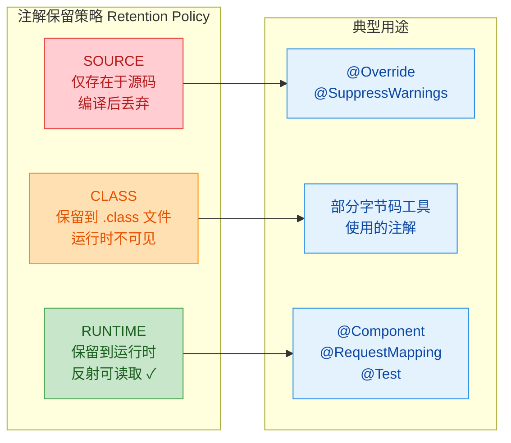

如果你自定义的注解忘了写 `@Retention(RetentionPolicy.RUNTIME)`，默认保留策略是 CLASS——这意味着反射根本读不到它，这是初学者最常踩的坑。

### 核心 API 全景

`java.lang.reflect.AnnotatedElement` 是注解反射的根接口，`Class`、`Method`、`Field`、`Constructor`、`Parameter` 都实现了它。这意味着你可以在类、方法、字段、构造器、参数上读取注解，API 风格完全一致。

```java
public interface AnnotatedElement {
    // 判断是否标注了某个注解（最常用的"快速检查"）
    boolean isAnnotationPresent(Class<? extends Annotation> annotationClass);

    // 获取指定类型的注解实例，不存在则返回 null
    <T extends Annotation> T getAnnotation(Class<T> annotationClass);

    // 获取该元素上的所有注解（返回数组）
    Annotation[] getAnnotations();

    // 获取"直接声明"的注解（不包含从父类继承的）
    Annotation[] getDeclaredAnnotations();

    // Java 8+ 新增：获取指定类型的所有注解（支持 @Repeatable 可重复注解）
    <T extends Annotation> T[] getAnnotationsByType(Class<T> annotationClass);

    // Java 8+ 新增：获取直接声明的指定类型的所有注解
    <T extends Annotation> T[] getDeclaredAnnotationsByType(Class<T> annotationClass);
}
```

这些方法中，日常开发最高频使用的是 `isAnnotationPresent()` 和 `getAnnotation()` 这两个。前者用来"问一句有没有"，后者用来"拿出来看看里面写了什么"。

### 从零实现一个迷你测试框架

理论讲再多不如动手写一遍。下面我们模拟 JUnit 的核心思路，用"注解 + 反射"实现一个极简测试框架，让你直观感受注解反射的完整工作流。

首先，定义两个自定义注解：

```java
import java.lang.annotation.*;

/**
 * 标记一个方法为测试方法（模拟 @Test）
 */
@Retention(RetentionPolicy.RUNTIME)   // 运行时保留，反射才能读取
@Target(ElementType.METHOD)           // 只能标注在方法上
public @interface SimpleTest {
    String description() default "";  // 测试描述，默认为空串
    int order() default 0;           // 执行顺序，数字越小越先执行
}

/**
 * 标记一个方法在所有测试之前执行（模拟 @BeforeAll）
 */
@Retention(RetentionPolicy.RUNTIME)
@Target(ElementType.METHOD)
public @interface BeforeAll {
}
```

然后，编写一个使用这些注解的测试类：

```java
public class CalculatorTest {

    @BeforeAll                                    // 标记为"前置方法"
    public void setup() {
        System.out.println("🔧 初始化测试环境...");  // 模拟初始化操作
    }

    @SimpleTest(description = "测试加法", order = 1)  // 标记为测试方法，指定描述和顺序
    public void testAdd() {
        int result = 1 + 1;                       // 执行被测逻辑
        assert result == 2 : "加法结果应为2";       // 断言验证
        System.out.println("  ✅ 1 + 1 = " + result);
    }

    @SimpleTest(description = "测试除法异常", order = 2)
    public void testDivideByZero() {
        try {
            int result = 10 / 0;                  // 故意触发异常
            System.out.println("  ❌ 应该抛出异常");
        } catch (ArithmeticException e) {
            System.out.println("  ✅ 成功捕获: " + e.getMessage());
        }
    }

    // 这个方法没有 @SimpleTest 注解，框架会自动忽略它
    public void helperMethod() {
        System.out.println("我不是测试方法，不会被执行");
    }
}
```

最后，编写测试框架的核心引擎——这才是注解反射的主战场：

```java
import java.lang.reflect.Method;
import java.util.ArrayList;
import java.util.Comparator;
import java.util.List;

public class SimpleTestRunner {

    public static void runTests(Class<?> testClass) throws Exception {
        System.out.println("========================================");
        System.out.println("运行测试类: " + testClass.getSimpleName());
        System.out.println("========================================");

        // 通过反射创建测试类的实例
        Object testInstance = testClass.getDeclaredConstructor().newInstance();

        // 获取该类声明的所有方法
        Method[] allMethods = testClass.getDeclaredMethods();

        // ========== 第一步：找到并执行 @BeforeAll 方法 ==========
        for (Method method : allMethods) {
            // isAnnotationPresent：快速判断方法上是否贴了 @BeforeAll 标签
            if (method.isAnnotationPresent(BeforeAll.class)) {
                method.invoke(testInstance);       // 反射调用前置方法
            }
        }

        // ========== 第二步：收集所有 @SimpleTest 方法 ==========
        List<Method> testMethods = new ArrayList<>();
        for (Method method : allMethods) {
            if (method.isAnnotationPresent(SimpleTest.class)) {
                testMethods.add(method);           // 只收集带 @SimpleTest 的方法
            }
        }

        // ========== 第三步：按 order 属性排序 ==========
        testMethods.sort(Comparator.comparingInt(m -> {
            // getAnnotation：取出注解实例，读取其中的 order 属性值
            SimpleTest annotation = m.getAnnotation(SimpleTest.class);
            return annotation.order();             // 按 order 值升序排列
        }));

        // ========== 第四步：逐个执行测试方法 ==========
        int passed = 0;                            // 通过计数
        int failed = 0;                            // 失败计数

        for (Method method : testMethods) {
            // 取出注解实例，读取 description 属性
            SimpleTest annotation = method.getAnnotation(SimpleTest.class);
            String desc = annotation.description(); // 获取测试描述
            int order = annotation.order();         // 获取执行顺序

            System.out.println("\n[#" + order + "] " + desc + " (" + method.getName() + ")");

            try {
                method.invoke(testInstance);        // 反射调用测试方法
                passed++;                           // 没有异常，测试通过
            } catch (Exception e) {
                failed++;                           // 捕获异常，测试失败
                System.out.println("  ❌ 测试失败: " + e.getCause().getMessage());
            }
        }

        // ========== 第五步：输出测试报告 ==========
        System.out.println("\n========================================");
        System.out.println("测试完成! 通过: " + passed + ", 失败: " + failed);
        System.out.println("========================================");
    }

    public static void main(String[] args) throws Exception {
        runTests(CalculatorTest.class);            // 启动测试引擎
    }
}
```

运行输出：

```
========================================
运行测试类: CalculatorTest
========================================
🔧 初始化测试环境...

[#1] 测试加法 (testAdd)
  ✅ 1 + 1 = 2

[#2] 测试除法异常 (testDivideByZero)
  ✅ 成功捕获: / by zero

========================================
测试完成! 通过: 2, 失败: 0
========================================
```

注意 `helperMethod()` 没有被执行——因为它没有贴 `@SimpleTest` 标签，框架在扫描时自动跳过了它。这就是注解反射的精髓：注解是"声明式"的标记，反射是"命令式"的执行引擎，两者配合实现了"约定优于配置"（Convention over Configuration）的编程范式。

### getAnnotation 与 getDeclaredAnnotation 的区别

这两个方法的区别涉及注解的继承机制。默认情况下，注解是不会被子类继承的，除非注解定义上标注了 `@Inherited`：

```java
// 定义一个可继承的注解
@Retention(RetentionPolicy.RUNTIME)
@Target(ElementType.TYPE)             // 只能标注在类上
@Inherited                            // 关键：加了这个，子类可以继承父类上的此注解
public @interface Module {
    String name();                    // 模块名称
}

// 定义一个不可继承的注解（没有 @Inherited）
@Retention(RetentionPolicy.RUNTIME)
@Target(ElementType.TYPE)
public @interface Author {
    String value();
}

// 父类同时标注了两个注解
@Module(name = "核心模块")
@Author("张三")
class BaseService { }

// 子类没有标注任何注解
class UserService extends BaseService { }
```

```java
public class InheritedAnnotationDemo {
    public static void main(String[] args) {
        Class<?> clazz = UserService.class;

        // ========== getAnnotation：会沿继承链向上查找 ==========
        Module module = clazz.getAnnotation(Module.class);
        // Module 有 @Inherited，所以子类能"继承"到父类的 @Module
        System.out.println("getAnnotation(Module): " + module);
        // 输出: @Module(name="核心模块")  ✅ 找到了

        Author author = clazz.getAnnotation(Author.class);
        // Author 没有 @Inherited，子类继承不到
        System.out.println("getAnnotation(Author): " + author);
        // 输出: null  ❌ 找不到

        // ========== getDeclaredAnnotation：只看自己，不看父类 ==========
        Module declaredModule = clazz.getDeclaredAnnotation(Module.class);
        // 虽然 Module 有 @Inherited，但 getDeclared 只看"直接声明"的
        System.out.println("getDeclaredAnnotation(Module): " + declaredModule);
        // 输出: null  ❌ UserService 自己没有声明 @Module
    }
}
```

用一张表总结：

| 方法 | 查找范围 | 是否受 @Inherited 影响 |
|------|---------|----------------------|
| `getAnnotation()` | 自身 + 继承链 | 是，@Inherited 注解会从父类继承 |
| `getDeclaredAnnotation()` | 仅自身直接声明 | 否，只看自己 |
| `getAnnotations()` | 自身 + 继承链（全部） | 是 |
| `getDeclaredAnnotations()` | 仅自身直接声明（全部） | 否 |

需要注意的是，`@Inherited` 只对类级别的注解有效。方法、字段上的注解即使标了 `@Inherited`，子类重写方法时也不会继承父类方法上的注解。

### Java 8 可重复注解（@Repeatable）

Java 8 之前，同一个注解不能在同一个元素上标注两次。Java 8 引入了 `@Repeatable` 机制来解决这个限制：

```java
// 第一步：定义"容器注解"（用来装多个 @Role）
@Retention(RetentionPolicy.RUNTIME)
@Target(ElementType.TYPE)
public @interface Roles {
    Role[] value();                   // 容器内部是 Role 数组
}

// 第二步：定义可重复注解，通过 @Repeatable 指向容器
@Retention(RetentionPolicy.RUNTIME)
@Target(ElementType.TYPE)
@Repeatable(Roles.class)             // 指定容器注解是 Roles
public @interface Role {
    String value();                   // 角色名称
}

// 第三步：在同一个类上标注多个 @Role
@Role("管理员")                       // 第一个角色
@Role("审计员")                       // 第二个角色
@Role("普通用户")                     // 第三个角色
public class AdminUser { }
```

```java
public class RepeatableAnnotationDemo {
    public static void main(String[] args) {
        Class<?> clazz = AdminUser.class;

        // 方式一：getAnnotationsByType —— Java 8 推荐方式
        // 直接获取所有 @Role 注解，自动"解包"容器
        Role[] roles = clazz.getAnnotationsByType(Role.class);
        System.out.println("=== getAnnotationsByType ===");
        for (Role role : roles) {
            System.out.println("角色: " + role.value());
        }
        // 输出:
        // 角色: 管理员
        // 角色: 审计员
        // 角色: 普通用户

        // 方式二：getAnnotation(Role.class) —— 返回 null！
        // 因为编译器实际上把多个 @Role 包装成了一个 @Roles 容器
        Role singleRole = clazz.getAnnotation(Role.class);
        System.out.println("\ngetAnnotation(Role): " + singleRole);
        // 输出: null

        // 方式三：getAnnotation(Roles.class) —— 获取容器注解
        Roles container = clazz.getAnnotation(Roles.class);
        System.out.println("\n=== 通过容器注解获取 ===");
        for (Role role : container.value()) {    // 从容器中取出数组
            System.out.println("角色: " + role.value());
        }
    }
}
```

这里有一个容易混淆的点：当使用了 `@Repeatable` 后，编译器会在底层自动将多个 `@Role` 合并为一个 `@Roles` 容器。所以用 `getAnnotation(Role.class)` 反而拿不到，必须用 `getAnnotationsByType(Role.class)` 或者直接获取容器 `getAnnotation(Roles.class)`。

### 参数级别的注解反射

Java 8 开始，`Method.getParameters()` 返回的 `Parameter` 对象也实现了 `AnnotatedElement`，这意味着我们可以读取方法参数上的注解。这在 Web 框架中极为常见（比如 Spring MVC 的 `@RequestParam`、`@PathVariable`）：

```java
import java.lang.annotation.*;
import java.lang.reflect.*;

// 自定义参数绑定注解（模拟 @RequestParam）
@Retention(RetentionPolicy.RUNTIME)
@Target(ElementType.PARAMETER)        // 只能标注在参数上
@interface Param {
    String value();                   // 参数名称
    boolean required() default true;  // 是否必填
}

class UserController {
    // 方法参数上标注了 @Param 注解
    public String findUser(
            @Param(value = "userId", required = true) int id,
            @Param(value = "userName", required = false) String name) {
        return "查询用户: id=" + id + ", name=" + name;
    }
}

public class ParameterAnnotationDemo {
    public static void main(String[] args) throws Exception {
        // 获取 findUser 方法的反射对象
        Method method = UserController.class.getMethod(
                "findUser", int.class, String.class);

        // 获取方法的所有参数
        Parameter[] parameters = method.getParameters();

        System.out.println("方法: " + method.getName());
        System.out.println("参数数量: " + parameters.length);
        System.out.println();

        for (Parameter param : parameters) {
            // 检查参数上是否有 @Param 注解
            if (param.isAnnotationPresent(Param.class)) {
                Param annotation = param.getAnnotation(Param.class);
                System.out.println("参数类型: " + param.getType().getSimpleName());
                System.out.println("绑定名称: " + annotation.value());
                System.out.println("是否必填: " + annotation.required());
                System.out.println("---");
            }
        }
    }
}
```

输出：

```
方法: findUser
参数数量: 2

参数类型: int
绑定名称: userId
是否必填: true
---
参数类型: String
绑定名称: userName
是否必填: false
---
```

这就是 Spring MVC 在处理 HTTP 请求时的核心原理之一：扫描 Controller 方法的参数注解，根据 `@RequestParam` 的 value 从请求中提取对应的值，再通过反射注入到方法参数中。

### 注解反射在主流框架中的应用全景

理解了注解反射的 API，再来看主流框架的设计思路就会豁然开朗：

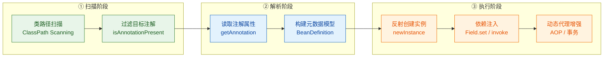

各框架对应的注解反射用法：

| 框架 | 核心注解 | 反射行为 |
|------|---------|---------|
| Spring IoC | `@Component`, `@Autowired` | 扫描类 → 读取注解 → 反射创建 Bean → 注入依赖 |
| Spring MVC | `@RequestMapping`, `@RequestParam` | 读取 URL 映射 → 解析参数注解 → 反射调用 Controller 方法 |
| JUnit 5 | `@Test`, `@BeforeEach` | 扫描测试方法 → 按生命周期注解排序 → 反射执行 |
| MyBatis | `@Select`, `@Insert` | 读取 SQL 注解 → 生成代理对象 → 反射执行 SQL |
| Jackson | `@JsonProperty`, `@JsonIgnore` | 序列化时读取字段注解 → 决定 JSON 字段名和是否忽略 |

### 实战：手写一个字段校验框架

最后用一个更贴近实际业务的例子来巩固。我们实现一个基于注解的字段校验框架，类似于 `javax.validation`（Bean Validation）的简化版：

```java
import java.lang.annotation.*;
import java.lang.reflect.Field;

// ========== 定义校验注解 ==========

@Retention(RetentionPolicy.RUNTIME)
@Target(ElementType.FIELD)            // 标注在字段上
@interface NotNull {
    String message() default "字段不能为空";  // 校验失败时的提示信息
}

@Retention(RetentionPolicy.RUNTIME)
@Target(ElementType.FIELD)
@interface Length {
    int min() default 0;              // 最小长度
    int max() default Integer.MAX_VALUE;  // 最大长度
    String message() default "长度不符合要求";
}

@Retention(RetentionPolicy.RUNTIME)
@Target(ElementType.FIELD)
@interface Range {
    int min() default 0;              // 最小值
    int max() default Integer.MAX_VALUE;  // 最大值
    String message() default "数值超出范围";
}
```

```java
// ========== 使用注解标注实体类 ==========

class User {
    @NotNull(message = "用户名不能为空")          // 非空校验
    @Length(min = 2, max = 20, message = "用户名长度需在2-20之间")  // 长度校验
    private String username;

    @NotNull(message = "邮箱不能为空")
    private String email;

    @Range(min = 1, max = 150, message = "年龄需在1-150之间")  // 数值范围校验
    private int age;

    // 构造方法
    public User(String username, String email, int age) {
        this.username = username;
        this.email = email;
        this.age = age;
    }
}
```

```java
// ========== 校验引擎：通过反射读取注解并执行校验 ==========

class Validator {

    /**
     * 校验对象的所有字段，返回校验错误列表
     * @param obj 待校验的对象
     * @return 错误信息列表，空列表表示校验通过
     */
    public static List<String> validate(Object obj) throws IllegalAccessException {
        List<String> errors = new ArrayList<>();       // 收集所有错误信息
        Class<?> clazz = obj.getClass();               // 获取对象的 Class
        Field[] fields = clazz.getDeclaredFields();    // 获取所有声明的字段

        for (Field field : fields) {
            field.setAccessible(true);                 // 突破 private 访问限制
            Object value = field.get(obj);             // 获取字段的实际值

            // ---------- @NotNull 校验 ----------
            if (field.isAnnotationPresent(NotNull.class)) {
                if (value == null) {                   // 值为 null，校验失败
                    NotNull ann = field.getAnnotation(NotNull.class);
                    errors.add("[" + field.getName() + "] " + ann.message());
                    continue;                          // 已经为 null，跳过后续校验
                }
            }

            // ---------- @Length 校验（仅对 String 类型生效）----------
            if (field.isAnnotationPresent(Length.class) && value instanceof String) {
                Length ann = field.getAnnotation(Length.class);
                String strValue = (String) value;
                int len = strValue.length();           // 获取字符串实际长度
                if (len < ann.min() || len > ann.max()) {
                    errors.add("[" + field.getName() + "] " + ann.message()
                            + " (当前长度: " + len + ")");
                }
            }

            // ---------- @Range 校验（仅对数值类型生效）----------
            if (field.isAnnotationPresent(Range.class) && value instanceof Number) {
                Range ann = field.getAnnotation(Range.class);
                int numValue = ((Number) value).intValue();  // 统一转为 int 比较
                if (numValue < ann.min() || numValue > ann.max()) {
                    errors.add("[" + field.getName() + "] " + ann.message()
                            + " (当前值: " + numValue + ")");
                }
            }
        }

        return errors;                                 // 返回所有校验错误
    }
}
```

```java
// ========== 测试校验框架 ==========

public class ValidationDemo {
    public static void main(String[] args) throws Exception {
        // 测试用例1：正常数据
        User validUser = new User("Alice", "alice@example.com", 25);
        List<String> errors1 = Validator.validate(validUser);
        System.out.println("合法用户校验: " + (errors1.isEmpty() ? "✅ 通过" : errors1));

        // 测试用例2：多个字段不合法
        User invalidUser = new User("A", null, 200);
        List<String> errors2 = Validator.validate(invalidUser);
        System.out.println("\n非法用户校验:");
        errors2.forEach(e -> System.out.println("  ❌ " + e));
    }
}
```

输出：

```
合法用户校验: ✅ 通过

非法用户校验:
  ❌ [username] 用户名长度需在2-20之间 (当前长度: 1)
  ❌ [email] 邮箱不能为空
  ❌ [age] 年龄需在1-150之间 (当前值: 200)
```

这个例子完整展示了注解反射在实际业务中的典型模式：用注解声明规则，用反射引擎执行规则。Spring 的 `@Valid`、Hibernate Validator 的 `@NotBlank`、`@Size` 等注解，底层原理与我们这个迷你框架如出一辙——只不过它们的校验引擎更加完善，支持分组校验、嵌套校验、国际化消息等高级特性。

### 注解属性的类型限制与默认值机制

自定义注解时，属性（也叫"元素"）的类型并不是随意的，Java 规范严格限定了注解属性只能使用以下类型：

```java
@Retention(RetentionPolicy.RUNTIME)
@Target(ElementType.TYPE)
@interface ConfigDemo {
    // ✅ 基本类型
    int maxRetry() default 3;
    boolean enabled() default true;
    double timeout() default 5.0;

    // ✅ String
    String name() default "default";

    // ✅ Class 类型（注意泛型用 ? 通配符）
    Class<?> handler() default Void.class;

    // ✅ 枚举类型
    Thread.State state() default Thread.State.NEW;

    // ✅ 其他注解类型（注解嵌套）
    Deprecated nested() default @Deprecated;

    // ✅ 以上类型的一维数组
    String[] tags() default {"java", "reflection"};
    int[] ports() default {8080, 8443};

    // ❌ 以下类型不允许：
    // List<String> list();       // 不允许集合类型
    // Map<String, Object> map(); // 不允许 Map
    // Object obj();              // 不允许 Object
    // Integer boxed();           // 不允许包装类型
}
```

读取数组类型的注解属性时，返回的就是对应的数组：

```java
@ConfigDemo(tags = {"spring", "boot", "web"}, ports = {80, 443})
class MyApp { }

public class AnnotationArrayDemo {
    public static void main(String[] args) {
        ConfigDemo config = MyApp.class.getAnnotation(ConfigDemo.class);

        // 读取数组属性
        String[] tags = config.tags();             // 返回 String 数组
        int[] ports = config.ports();              // 返回 int 数组

        System.out.println("标签: " + Arrays.toString(tags));
        // 输出: 标签: [spring, boot, web]

        System.out.println("端口: " + Arrays.toString(ports));
        // 输出: 端口: [80, 443]

        // 读取有默认值的属性（未在 @ConfigDemo 中显式指定）
        System.out.println("最大重试: " + config.maxRetry());
        // 输出: 最大重试: 3  （使用了 default 值）

        System.out.println("是否启用: " + config.enabled());
        // 输出: 是否启用: true
    }
}
```

关于 `value()` 属性有一个语法糖：如果注解只有一个名为 `value` 的属性（或者其他属性都有默认值），使用时可以省略 `value =`：

```java
@interface Tag {
    String value();                   // 唯一的无默认值属性，名为 value
    int priority() default 0;        // 有默认值，可以不写
}

// 以下两种写法完全等价
@Tag("important")                     // 省略 value =（语法糖）
@Tag(value = "important")            // 完整写法

// 但如果要同时指定其他属性，value = 不能省略
@Tag(value = "important", priority = 1)
```

### 注解反射的底层原理

当你调用 `getAnnotation()` 拿到一个注解实例时，你拿到的并不是一个"普通对象"，而是 JDK 动态代理生成的代理对象。理解这一点有助于避免一些隐蔽的坑：

```java
@Retention(RetentionPolicy.RUNTIME)
@Target(ElementType.TYPE)
@interface Info {
    String value();
}

@Info("hello")
class Demo { }

public class AnnotationProxyDemo {
    public static void main(String[] args) {
        Info info = Demo.class.getAnnotation(Info.class);

        // 注解实例的真实类型是 JDK 动态代理
        System.out.println("类型: " + info.getClass().getName());
        // 输出类似: com.sun.proxy.$Proxy1

        // 验证它确实是一个代理对象
        System.out.println("是代理? " + Proxy.isProxyClass(info.getClass()));
        // 输出: 是代理? true

        // 注解实例实现了注解接口
        System.out.println("是 Info 实例? " + (info instanceof Info));
        // 输出: 是 Info 实例? true

        // 调用属性方法，实际上是代理的 invoke 在处理
        System.out.println("value = " + info.value());
        // 输出: value = hello

        // 注解自带 toString、equals、hashCode 实现
        System.out.println("toString: " + info);
        // 输出类似: @Info(value="hello")
    }
}
```

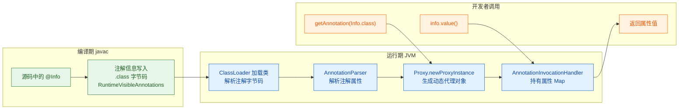

核心流程：编译器将注解信息以 `RuntimeVisibleAnnotations` 属性的形式写入 `.class` 文件 → JVM 加载类时由 `AnnotationParser` 解析这些字节码 → 通过 `Proxy.newProxyInstance()` 创建动态代理 → 代理内部的 `AnnotationInvocationHandler` 持有一个 `Map<String, Object>` 存储所有属性值 → 当你调用 `info.value()` 时，代理拦截调用，从 Map 中取出 `"value"` 对应的值返回。

这也解释了为什么注解属性是不可变的——Map 中的值在创建时就固定了，没有 setter 方法可以修改。

### 元注解详解

元注解（Meta-Annotation）就是"注解的注解"，用来修饰自定义注解的行为。Java 提供了以下几个核心元注解：

```java
// ========== @Target：限定注解可以标注在哪些元素上 ==========
@Target({
    ElementType.TYPE,            // 类、接口、枚举、注解
    ElementType.FIELD,           // 字段（包括枚举常量）
    ElementType.METHOD,          // 方法
    ElementType.PARAMETER,       // 方法参数
    ElementType.CONSTRUCTOR,     // 构造方法
    ElementType.LOCAL_VARIABLE,  // 局部变量（注意：反射读不到）
    ElementType.ANNOTATION_TYPE, // 注解类型（即元注解）
    ElementType.PACKAGE,         // 包声明
    ElementType.TYPE_PARAMETER,  // 泛型类型参数（Java 8+）
    ElementType.TYPE_USE,        // 任何类型使用处（Java 8+）
    ElementType.MODULE,          // 模块声明（Java 9+）
    ElementType.RECORD_COMPONENT // Record 组件（Java 16+）
})
@interface AllTargets { }

// ========== @Retention：控制注解的生命周期 ==========
// RetentionPolicy.SOURCE   → 编译后丢弃
// RetentionPolicy.CLASS    → 保留到 .class，运行时不可见（默认值）
// RetentionPolicy.RUNTIME  → 运行时可见，反射可读取

// ========== @Documented：注解是否出现在 Javadoc 中 ==========
@Documented                      // 加了这个，Javadoc 会显示此注解
@Retention(RetentionPolicy.RUNTIME)
@Target(ElementType.METHOD)
@interface ApiEndpoint {
    String path();
}

// ========== @Inherited：注解是否可被子类继承 ==========
// 前面已详细讲解，仅对类级别注解有效
```

其中 `ElementType.TYPE_USE` 是 Java 8 引入的一个强大特性，它允许注解出现在任何"类型使用"的位置：

```java
@Retention(RetentionPolicy.RUNTIME)
@Target(ElementType.TYPE_USE)        // 可以标注在任何类型使用处
@interface NonNull { }

class TypeUseExample {
    // 标注在字段类型上
    private @NonNull String name;

    // 标注在方法返回类型上
    public @NonNull String getName() { return name; }

    // 标注在泛型参数上
    private List<@NonNull String> items;

    // 标注在类型转换上
    public void process(Object obj) {
        String s = (@NonNull String) obj;
    }

    // 标注在 throws 上
    public void risky() throws @NonNull Exception { }
}
```

这种能力被 Checker Framework、NullAway 等静态分析工具广泛利用，在编译期就能检测出潜在的空指针问题。

### 注解反射的常见陷阱

在实际开发中，注解反射有几个容易踩的坑，值得特别注意：

```java
public class AnnotationPitfalls {
    public static void main(String[] args) throws Exception {

        // ========== 陷阱1：忘记 RUNTIME 保留策略 ==========
        // 如果注解没有 @Retention(RetentionPolicy.RUNTIME)
        // 默认是 CLASS 级别，反射读不到，返回 null
        // 这是最常见的"注解不生效"问题

        // ========== 陷阱2：注解的 equals 比较 ==========
        // 两个注解实例的 equals 比较的是所有属性值
        @SuppressWarnings("all")
        class A { }
        @SuppressWarnings("all")
        class B { }

        SuppressWarnings a = A.class.getAnnotation(SuppressWarnings.class);
        SuppressWarnings b = B.class.getAnnotation(SuppressWarnings.class);
        // 注意：SuppressWarnings 是 SOURCE 级别，这里只是示意
        // 如果是 RUNTIME 注解，属性值相同则 equals 为 true

        // ========== 陷阱3：数组属性的比较陷阱 ==========
        // 注解的数组属性每次调用都返回新数组（防御性拷贝）
        // 所以不能用 == 比较，要用 Arrays.equals()

        // ========== 陷阱4：LOCAL_VARIABLE 注解反射读不到 ==========
        // 标注在局部变量上的注解，即使是 RUNTIME 保留策略
        // 反射也无法读取，因为局部变量信息不保留在字节码中

        // ========== 陷阱5：getDeclaredMethods 不包含继承方法 ==========
        // 如果父类方法上有注解，用子类的 getDeclaredMethods 扫描不到
        // 需要遍历整个继承链：
        Class<?> clazz = SomeClass.class;
        while (clazz != null && clazz != Object.class) {
            for (Method m : clazz.getDeclaredMethods()) {
                // 扫描每一层的方法注解
            }
            clazz = clazz.getSuperclass();         // 向上遍历父类
        }
    }
}
```

---

**📝 练习题**

以下代码的输出结果是什么？

```java
@Retention(RetentionPolicy.RUNTIME)
@Target(ElementType.TYPE)
@Inherited
@interface Label {
    String value();
}

@Label("父类标签")
class Parent { }

class Child extends Parent { }

public class Quiz {
    public static void main(String[] args) {
        Label a = Parent.class.getAnnotation(Label.class);
        Label b = Child.class.getAnnotation(Label.class);
        Label c = Child.class.getDeclaredAnnotation(Label.class);

        System.out.println(a != null ? a.value() : "null");
        System.out.println(b != null ? b.value() : "null");
        System.out.println(c != null ? c.value() : "null");
    }
}
```

A. 父类标签 / 父类标签 / 父类标签


B. 父类标签 / null / null


C. 父类标签 / 父类标签 / null


D. null / null / null


**【答案】** C

**【解析】** `@Label` 标注了 `@Inherited`，所以它可以被子类继承。`Parent.class.getAnnotation(Label.class)` 直接在 Parent 上找到注解，输出"父类标签"。`Child.class.getAnnotation(Label.class)` 虽然 Child 自身没有声明 `@Label`，但 `getAnnotation` 会沿继承链向上查找，由于 `@Inherited` 的存在，它能继承到父类的 `@Label`，输出"父类标签"。而 `Child.class.getDeclaredAnnotation(Label.class)` 使用的是 `getDeclaredAnnotation`，它只查看类自身直接声明的注解，不会向上查找继承链，Child 自身没有声明 `@Label`，所以返回 null。这道题的核心考点就是 `getAnnotation` 与 `getDeclaredAnnotation` 在 `@Inherited` 注解场景下的行为差异。

---

## 反射性能考虑（缓存 Class/Method/Field）

反射是 Java 中最强大的动态能力之一，但这种强大是有代价的。每一次 `getMethod()`、`getField()`、`getConstructor()` 的调用，JVM 都需要在底层做大量的查找、安全检查和对象创建工作。在高频调用场景下（如框架核心循环、ORM 映射、序列化引擎），反射的性能开销会被急剧放大，成为系统瓶颈。因此，理解反射的性能瓶颈在哪里、如何通过缓存策略来优化，是每个 Java 开发者从"会用反射"到"用好反射"的关键一步。

### 反射为什么慢——开销来源深度剖析

很多人只知道"反射慢"，但说不清楚慢在哪里。实际上，反射的性能开销来自多个层面，我们逐一拆解。

第一个开销来源是元数据查找（Metadata Lookup）。当你调用 `clazz.getMethod("doSomething", String.class)` 时，JVM 并不是直接从某个哈希表里取出结果。它需要遍历当前类及其所有父类、接口的方法列表，逐一比对方法名和参数类型。这个过程涉及字符串比较和数组匹配，远比直接方法调用昂贵。

第二个开销来源是安全检查（Security Check）。每次反射调用都会经过 Java Security Manager 的权限校验。JVM 需要检查调用者是否有权限访问目标成员，这包括检查访问修饰符（public/private/protected）、检查调用栈上的类加载器层级关系等。即使你已经调用了 `setAccessible(true)`，在某些 JVM 实现中仍然存在轻量级的检查。

第三个开销来源是对象创建（Object Allocation）。`getMethod()` 每次调用都会返回一个新的 `Method` 对象副本（copy），而不是返回同一个缓存实例。`getDeclaredMethods()` 会创建一个全新的数组并填充新的 `Method` 对象。这些临时对象会增加 GC 压力。

第四个开销来源是 JIT 优化屏障。普通的方法调用可以被 JIT 编译器内联（inline）、逃逸分析（escape analysis）、常量折叠（constant folding）等手段深度优化。但反射调用由于其动态性，JIT 很难对其进行同等程度的优化。`Method.invoke()` 内部使用了委托模式（delegation），前 15 次调用走的是 Native 实现（JNI），之后才会生成字节码版本的 accessor，这个切换本身也有开销。

我们用一张流程图来展示反射调用的完整开销链路：

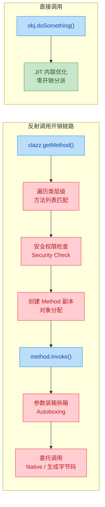

### 性能基准测试——数据说话

空谈性能没有意义，我们用代码来量化反射的开销。下面这个基准测试对比了四种调用方式的耗时：

```java
import java.lang.reflect.Method;

public class ReflectionBenchmark {

    // 目标方法：简单的加法运算，排除业务逻辑干扰
    public int add(int a, int b) {
        return a + b;
    }

    public static void main(String[] args) throws Exception {
        ReflectionBenchmark obj = new ReflectionBenchmark();
        int iterations = 10_000_000; // 一千万次调用

        // ========== 方式一：直接调用 ==========
        long start1 = System.nanoTime();
        for (int i = 0; i < iterations; i++) {
            obj.add(1, 2); // 编译期绑定，JIT 可深度优化
        }
        long directTime = System.nanoTime() - start1;

        // ========== 方式二：每次都通过反射查找 Method（最差情况）==========
        long start2 = System.nanoTime();
        for (int i = 0; i < iterations; i++) {
            // 每次循环都重新查找 Method 对象——极度浪费
            Method m = obj.getClass().getMethod("add", int.class, int.class);
            m.invoke(obj, 1, 2);
        }
        long uncachedTime = System.nanoTime() - start2;

        // ========== 方式三：缓存 Method 对象 ==========
        Method cachedMethod = obj.getClass().getMethod("add", int.class, int.class);
        long start3 = System.nanoTime();
        for (int i = 0; i < iterations; i++) {
            cachedMethod.invoke(obj, 1, 2); // 复用同一个 Method 对象
        }
        long cachedTime = System.nanoTime() - start3;

        // ========== 方式四：缓存 + setAccessible(true) ==========
        Method fastMethod = obj.getClass().getMethod("add", int.class, int.class);
        fastMethod.setAccessible(true); // 跳过访问权限检查
        long start4 = System.nanoTime();
        for (int i = 0; i < iterations; i++) {
            fastMethod.invoke(obj, 1, 2); // 缓存 + 免检 = 最快反射
        }
        long fastTime = System.nanoTime() - start4;

        // 输出结果（转换为毫秒）
        System.out.println("直接调用:              " + directTime / 1_000_000 + " ms");
        System.out.println("未缓存反射:            " + uncachedTime / 1_000_000 + " ms");
        System.out.println("缓存 Method:           " + cachedTime / 1_000_000 + " ms");
        System.out.println("缓存 + setAccessible:  " + fastTime / 1_000_000 + " ms");
    }
}
```

典型的运行结果大致如下（不同机器和 JVM 版本会有差异，但数量级关系稳定）：

```
直接调用:              5 ms
未缓存反射:            3200 ms
缓存 Method:           180 ms
缓存 + setAccessible:  120 ms
```

从数据中可以清晰看到几个关键结论：未缓存的反射比直接调用慢约 600 倍，这个差距主要来自每次循环中 `getMethod()` 的重复查找开销；仅仅缓存 `Method` 对象就能获得约 17 倍的提升；再加上 `setAccessible(true)` 还能进一步压缩约 30% 的耗时。虽然缓存后的反射仍然比直接调用慢 20-30 倍，但在绝大多数业务场景中，这个量级的开销已经完全可以接受了。

### 缓存策略一——静态 final 字段缓存

最简单也最常用的缓存方式，就是把反射获取的 `Class`、`Method`、`Field`、`Constructor` 对象存储为类的静态常量。这种方式适用于目标类和成员在编译期就已确定的场景。

```java
import java.lang.reflect.Method;
import java.lang.reflect.Field;
import java.lang.reflect.Constructor;

/**
 * 静态缓存示例：将反射元数据作为类常量，在类加载时一次性初始化
 */
public class StaticReflectionCache {

    // 缓存 Class 对象（其实 Class 本身就是 JVM 级别缓存的，这里主要是语义清晰）
    private static final Class<?> TARGET_CLASS;

    // 缓存 Method 对象——避免每次调用都 getMethod
    private static final Method PROCESS_METHOD;

    // 缓存 Field 对象——避免每次读写都 getField
    private static final Field NAME_FIELD;

    // 缓存 Constructor 对象——避免每次创建实例都 getConstructor
    private static final Constructor<?> DEFAULT_CONSTRUCTOR;

    // 静态初始化块：类加载时执行一次，之后永远复用
    static {
        try {
            TARGET_CLASS = Class.forName("com.example.UserService");

            // 查找并缓存 process 方法（参数类型：String）
            PROCESS_METHOD = TARGET_CLASS.getDeclaredMethod("process", String.class);
            PROCESS_METHOD.setAccessible(true); // 一次设置，永久生效

            // 查找并缓存 name 字段
            NAME_FIELD = TARGET_CLASS.getDeclaredField("name");
            NAME_FIELD.setAccessible(true);

            // 查找并缓存无参构造器
            DEFAULT_CONSTRUCTOR = TARGET_CLASS.getDeclaredConstructor();
            DEFAULT_CONSTRUCTOR.setAccessible(true);

        } catch (ReflectiveOperationException e) {
            // 静态块中的异常必须包装为 Error 或 RuntimeException
            // 因为 static initializer 不允许抛出 checked exception
            throw new ExceptionInInitializerError(e);
        }
    }

    /**
     * 使用缓存的反射元数据执行操作
     */
    public Object createAndProcess(String input) {
        try {
            // 使用缓存的 Constructor 创建实例——无需再次查找
            Object instance = DEFAULT_CONSTRUCTOR.newInstance();

            // 使用缓存的 Field 设置属性——无需再次查找
            NAME_FIELD.set(instance, "CachedUser");

            // 使用缓存的 Method 调用方法——无需再次查找
            return PROCESS_METHOD.invoke(instance, input);

        } catch (ReflectiveOperationException e) {
            throw new RuntimeException("反射调用失败", e);
        }
    }
}
```

这种模式的优点是实现简单、线程安全（`static final` 由 JVM 类加载机制保证）、零运行时查找开销。缺点是灵活性差，只能缓存编译期已知的固定目标；如果目标类不存在，会导致整个类加载失败（`ExceptionInInitializerError`）。

### 缓存策略二——HashMap 动态缓存

当需要反射的目标类和成员在编译期不确定（比如框架需要处理用户传入的任意类），就需要用 `Map` 来做运行时动态缓存。

```java
import java.lang.reflect.Method;
import java.lang.reflect.Field;
import java.util.Map;
import java.util.concurrent.ConcurrentHashMap;

/**
 * 动态反射缓存：使用 ConcurrentHashMap 缓存运行时发现的反射元数据
 * 适用于框架级场景——需要处理事先未知的任意类
 */
public class DynamicReflectionCache {

    // Method 缓存：key = "全限定类名#方法名(参数类型列表)"
    // 使用 ConcurrentHashMap 保证多线程安全
    private static final Map<String, Method> METHOD_CACHE = new ConcurrentHashMap<>();

    // Field 缓存：key = "全限定类名#字段名"
    private static final Map<String, Field> FIELD_CACHE = new ConcurrentHashMap<>();

    /**
     * 构建 Method 缓存的 key
     * 格式示例："com.example.User#setName(java.lang.String)"
     */
    private static String buildMethodKey(Class<?> clazz, String methodName, Class<?>... paramTypes) {
        StringBuilder sb = new StringBuilder();
        sb.append(clazz.getName())  // 全限定类名
          .append('#')
          .append(methodName)       // 方法名
          .append('(');
        for (int i = 0; i < paramTypes.length; i++) {
            if (i > 0) sb.append(',');
            sb.append(paramTypes[i].getName()); // 参数类型全名
        }
        sb.append(')');
        return sb.toString();
    }

    /**
     * 获取 Method（带缓存）
     * 使用 computeIfAbsent 保证同一个 key 只会执行一次实际查找
     */
    public static Method getCachedMethod(Class<?> clazz, String methodName, Class<?>... paramTypes) {
        String key = buildMethodKey(clazz, methodName, paramTypes);

        // computeIfAbsent：如果 key 不存在，执行 lambda 计算并存入；如果已存在，直接返回
        // ConcurrentHashMap 的 computeIfAbsent 是线程安全的
        return METHOD_CACHE.computeIfAbsent(key, k -> {
            try {
                Method method = clazz.getDeclaredMethod(methodName, paramTypes);
                method.setAccessible(true); // 缓存时就设好，后续调用无需重复设置
                return method;
            } catch (NoSuchMethodException e) {
                throw new RuntimeException("方法未找到: " + key, e);
            }
        });
    }

    /**
     * 获取 Field（带缓存）
     * 支持向上查找父类字段——这是 getDeclaredField 本身不支持的
     */
    public static Field getCachedField(Class<?> clazz, String fieldName) {
        String key = clazz.getName() + "#" + fieldName;

        return FIELD_CACHE.computeIfAbsent(key, k -> {
            // 从当前类开始，逐级向上查找父类
            Class<?> current = clazz;
            while (current != null) {
                try {
                    Field field = current.getDeclaredField(fieldName);
                    field.setAccessible(true);
                    return field;
                } catch (NoSuchFieldException e) {
                    // 当前类没有，继续查找父类
                    current = current.getSuperclass();
                }
            }
            throw new RuntimeException("字段未找到: " + key);
        });
    }

    // ========== 使用示例 ==========
    public static void main(String[] args) throws Exception {
        // 假设有一个简单的 User 类
        // 第一次调用：实际执行反射查找，结果存入缓存
        Method setter = getCachedMethod(User.class, "setName", String.class);

        // 第二次调用：直接从 ConcurrentHashMap 中取出，零查找开销
        Method sameSetter = getCachedMethod(User.class, "setName", String.class);

        // setter == sameSetter（同一个对象引用）
        System.out.println("是否同一对象: " + (setter == sameSetter)); // true

        // 使用缓存的 Method 调用
        User user = new User();
        setter.invoke(user, "Alice");
        System.out.println(user.getName()); // Alice
    }

    // 内部测试用类
    static class User {
        private String name;
        public void setName(String name) { this.name = name; }
        public String getName() { return name; }
    }
}
```

这里有一个关键细节值得展开：为什么用 `ConcurrentHashMap` 而不是普通 `HashMap`？在多线程环境下，普通 `HashMap` 的并发写入可能导致死循环（JDK 7）或数据丢失（JDK 8+）。`ConcurrentHashMap.computeIfAbsent()` 提供了原子性的"查找-不存在则计算并插入"语义，既保证线程安全，又避免了重复计算。

### 缓存策略三——WeakHashMap 防止类加载器泄漏

在 Web 容器（Tomcat、Jetty）或 OSGi 等支持热部署的环境中，应用的类加载器（ClassLoader）会被反复创建和销毁。如果反射缓存持有对 `Class` 对象的强引用，就会阻止对应的 ClassLoader 被 GC 回收，从而导致严重的内存泄漏——这就是经典的 ClassLoader Leak 问题。

```java
import java.lang.reflect.Method;
import java.util.Map;
import java.util.WeakHashMap;
import java.util.Collections;
import java.util.concurrent.ConcurrentHashMap;

/**
 * ClassLoader 安全的反射缓存
 * 外层使用 WeakHashMap 以 Class 为 key，当 Class 被卸载时缓存自动清除
 * 内层使用 ConcurrentHashMap 缓存该 Class 下的所有 Method
 */
public class WeakReflectionCache {

    // 外层：WeakHashMap —— key 是 Class 对象（弱引用）
    // 当 ClassLoader 被卸载、Class 对象不再被强引用时，对应的 entry 会被 GC 自动清除
    // Collections.synchronizedMap 包装保证线程安全
    private static final Map<Class<?>, Map<String, Method>> CACHE =
            Collections.synchronizedMap(new WeakHashMap<>());

    /**
     * 获取缓存的 Method
     */
    public static Method getCachedMethod(Class<?> clazz, String methodName, Class<?>... paramTypes) {
        // 先获取该 Class 对应的方法缓存 Map
        Map<String, Method> methodMap = CACHE.computeIfAbsent(clazz, k -> new ConcurrentHashMap<>());

        // 构建方法签名作为 key
        String key = buildKey(methodName, paramTypes);

        // 在方法缓存中查找或计算
        return methodMap.computeIfAbsent(key, k -> {
            try {
                Method method = clazz.getDeclaredMethod(methodName, paramTypes);
                method.setAccessible(true);
                return method;
            } catch (NoSuchMethodException e) {
                throw new RuntimeException("方法未找到: " + clazz.getName() + "#" + methodName, e);
            }
        });
    }

    private static String buildKey(String methodName, Class<?>... paramTypes) {
        StringBuilder sb = new StringBuilder(methodName).append('(');
        for (int i = 0; i < paramTypes.length; i++) {
            if (i > 0) sb.append(',');
            sb.append(paramTypes[i].getName());
        }
        return sb.append(')').toString();
    }
}
```

用一张图来对比三种缓存策略的 GC 行为差异：

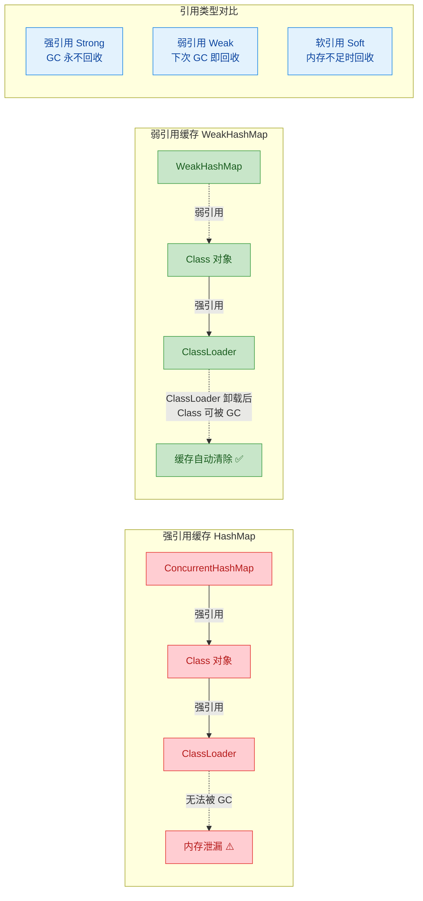

### 缓存策略四——框架级实现参考（Spring ReflectionUtils 模式）

Spring Framework 内部大量使用反射，它的 `ReflectionUtils` 工具类是工业级反射缓存的典范。我们来看看它的核心设计思路，并实现一个简化版本：

```java
import java.lang.reflect.Field;
import java.lang.reflect.Method;
import java.util.Map;
import java.util.concurrent.ConcurrentHashMap;

/**
 * 简化版 Spring ReflectionUtils
 * 展示框架级反射工具的核心设计模式
 */
public class ReflectionUtils {

    // 方法缓存：key = Class，value = 该类声明的所有方法数组
    // 缓存整个方法数组而非单个方法，减少 getDeclaredMethods() 的调用次数
    private static final Map<Class<?>, Method[]> DECLARED_METHODS_CACHE =
            new ConcurrentHashMap<>(256); // 初始容量 256，减少扩容

    // 字段缓存：同理，缓存整个字段数组
    private static final Map<Class<?>, Field[]> DECLARED_FIELDS_CACHE =
            new ConcurrentHashMap<>(256);

    /**
     * 获取类声明的所有方法（带缓存）
     * Spring 的策略是缓存整个数组，而非单个 Method
     * 这样一次缓存就能服务于后续对该类任意方法的查找
     */
    private static Method[] getDeclaredMethods(Class<?> clazz) {
        return DECLARED_METHODS_CACHE.computeIfAbsent(clazz, key -> {
            try {
                // getDeclaredMethods() 返回该类自身声明的所有方法（不含继承的）
                Method[] methods = key.getDeclaredMethods();
                // 批量设置 accessible，避免后续逐个设置
                for (Method method : methods) {
                    method.setAccessible(true);
                }
                return methods;
            } catch (SecurityException e) {
                // 安全管理器阻止访问时的降级处理
                return new Method[0];
            }
        });
    }

    /**
     * 查找指定方法——从缓存的数组中线性搜索
     * 对于方法数量不多的普通类（通常 < 50 个方法），线性搜索足够快
     */
    public static Method findMethod(Class<?> clazz, String name, Class<?>... paramTypes) {
        // 从当前类开始，逐级向上搜索（包括父类和接口）
        Class<?> current = clazz;
        while (current != null) {
            // 从缓存中获取当前类的方法数组
            Method[] methods = getDeclaredMethods(current);
            for (Method method : methods) {
                // 比对方法名和参数类型
                if (method.getName().equals(name) && matchParameterTypes(method, paramTypes)) {
                    return method;
                }
            }
            // 当前类没找到，向上查找父类
            current = current.getSuperclass();
        }
        return null; // 整个继承链都没找到
    }

    /**
     * 对目标类的所有方法执行回调——Visitor 模式
     * 这是 Spring 中大量使用的模式，用于注解扫描等场景
     */
    public static void doWithMethods(Class<?> clazz, MethodCallback callback) {
        Class<?> current = clazz;
        while (current != null) {
            Method[] methods = getDeclaredMethods(current);
            for (Method method : methods) {
                callback.doWith(method); // 对每个方法执行回调
            }
            current = current.getSuperclass();
        }
    }

    /**
     * 方法回调接口——函数式接口，可用 Lambda 表达式
     */
    @FunctionalInterface
    public interface MethodCallback {
        void doWith(Method method);
    }

    /**
     * 参数类型匹配
     */
    private static boolean matchParameterTypes(Method method, Class<?>[] paramTypes) {
        Class<?>[] methodParams = method.getParameterTypes();
        if (methodParams.length != paramTypes.length) return false;
        for (int i = 0; i < paramTypes.length; i++) {
            if (!methodParams[i].equals(paramTypes[i])) return false;
        }
        return true;
    }

    /**
     * 清除缓存——在热部署场景下需要手动调用
     */
    public static void clearCache() {
        DECLARED_METHODS_CACHE.clear();
        DECLARED_FIELDS_CACHE.clear();
    }
}
```

Spring 的设计有一个很精妙的地方：它缓存的是 `getDeclaredMethods()` 返回的整个方法数组，而不是单个 `Method`。这样做的好处是，对同一个类的任何方法查找都只需要一次反射调用来填充缓存，后续全部走内存中的数组遍历。对于典型的 Java 类（几十个方法），数组遍历的开销几乎可以忽略不计。

### 终极优化——MethodHandle 与 LambdaMetafactory

从 JDK 7 开始，`java.lang.invoke.MethodHandle` 提供了一种比传统反射更高效的动态调用机制。MethodHandle 可以被 JIT 编译器深度优化，性能接近直接调用。JDK 8 的 `LambdaMetafactory` 更进一步，可以在运行时生成函数式接口的实现类，完全消除反射开销。

```java
import java.lang.invoke.MethodHandle;
import java.lang.invoke.MethodHandles;
import java.lang.invoke.MethodType;
import java.lang.invoke.LambdaMetafactory;
import java.lang.invoke.CallSite;
import java.util.function.Function;
import java.util.function.BiConsumer;

/**
 * MethodHandle 与 LambdaMetafactory 示例
 * 展示反射的终极性能优化方案
 */
public class MethodHandleDemo {

    // 示例目标类
    static class User {
        private String name;
        public String getName() { return name; }
        public void setName(String name) { this.name = name; }
    }

    public static void main(String[] args) throws Throwable {

        // ========== 方式一：MethodHandle ==========
        // MethodHandles.Lookup 是 MethodHandle 的工厂，类似于反射中的 Class 对象
        MethodHandles.Lookup lookup = MethodHandles.lookup();

        // 定义方法签名：返回值 String，无参数
        MethodType getterType = MethodType.methodType(String.class);

        // 查找 getName 方法的 MethodHandle
        // findVirtual = 实例方法，findStatic = 静态方法
        MethodHandle getNameHandle = lookup.findVirtual(User.class, "getName", getterType);

        // 定义 setter 签名：返回值 void，参数 String
        MethodType setterType = MethodType.methodType(void.class, String.class);
        MethodHandle setNameHandle = lookup.findVirtual(User.class, "setName", setterType);

        // 使用 MethodHandle 调用
        User user = new User();
        setNameHandle.invoke(user, "MethodHandle User"); // 调用 setName
        String name = (String) getNameHandle.invoke(user); // 调用 getName
        System.out.println("MethodHandle 结果: " + name);

        // ========== 方式二：LambdaMetafactory（终极性能方案）==========
        // LambdaMetafactory 可以在运行时动态生成函数式接口的实现类
        // 生成的代码与手写 Lambda 完全等价，JIT 可以完全内联优化

        // 为 getName 生成 Function<User, String> 的实现
        MethodHandle getterMH = lookup.findVirtual(User.class, "getName",
                MethodType.methodType(String.class));

        // metafactory 参数解释：
        // 1. lookup —— 调用者的查找上下文
        // 2. "apply" —— 函数式接口中要实现的方法名（Function.apply）
        // 3. methodType(Function.class) —— 生成的 CallSite 返回类型
        // 4. methodType(Object.class, Object.class) —— 擦除后的泛型签名
        // 5. getterMH —— 实际要调用的目标 MethodHandle
        // 6. methodType(String.class, User.class) —— 具体的类型签名
        CallSite getterSite = LambdaMetafactory.metafactory(
                lookup,
                "apply",                                          // 函数式接口方法名
                MethodType.methodType(Function.class),            // CallSite 返回 Function
                MethodType.methodType(Object.class, Object.class),// 泛型擦除后的签名
                getterMH,                                         // 实际目标
                MethodType.methodType(String.class, User.class)   // 具体签名
        );

        // 从 CallSite 中提取生成的 Function 实例
        @SuppressWarnings("unchecked")
        Function<User, String> getterFunc = (Function<User, String>) getterSite.getTarget().invoke();

        // 为 setName 生成 BiConsumer<User, String> 的实现
        MethodHandle setterMH = lookup.findVirtual(User.class, "setName",
                MethodType.methodType(void.class, String.class));

        CallSite setterSite = LambdaMetafactory.metafactory(
                lookup,
                "accept",                                                    // BiConsumer.accept
                MethodType.methodType(BiConsumer.class),                     // 返回 BiConsumer
                MethodType.methodType(void.class, Object.class, Object.class),// 擦除签名
                setterMH,                                                    // 实际目标
                MethodType.methodType(void.class, User.class, String.class)  // 具体签名
        );

        @SuppressWarnings("unchecked")
        BiConsumer<User, String> setterFunc = (BiConsumer<User, String>) setterSite.getTarget().invoke();

        // 使用生成的函数式接口——性能与直接调用几乎无差别
        User user2 = new User();
        setterFunc.accept(user2, "Lambda User");          // 等价于 user2.setName("Lambda User")
        String result = getterFunc.apply(user2);           // 等价于 user2.getName()
        System.out.println("LambdaMetafactory 结果: " + result);
    }
}
```

LambdaMetafactory 的原理是在运行时通过 `ASM` 字节码生成库动态创建一个匿名内部类，这个类直接实现了目标函数式接口并硬编码了对目标方法的调用。生成的字节码与你手写 `user.getName()` 编译出来的几乎一模一样，因此 JIT 可以对其进行完全的内联优化，最终性能与直接调用持平。

我们用一张图来对比四种动态调用方式的性能层级：

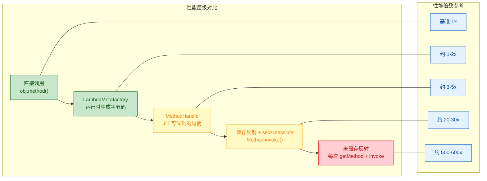

### 实战：构建一个完整的高性能反射工具类

把前面所有策略整合起来，我们构建一个可以直接用于生产环境的反射工具类。它根据不同场景自动选择最优策略：

```java
import java.lang.invoke.*;
import java.lang.reflect.Field;
import java.lang.reflect.Method;
import java.util.Map;
import java.util.concurrent.ConcurrentHashMap;
import java.util.function.Function;
import java.util.function.BiConsumer;

/**
 * 高性能反射工具类
 * 
 * 设计原则：
 * 1. 所有反射元数据只查找一次，之后全部走缓存
 * 2. Getter/Setter 优先使用 LambdaMetafactory 生成函数式接口
 * 3. 通用方法调用使用缓存的 Method + setAccessible
 * 4. 线程安全，无锁设计（ConcurrentHashMap）
 */
public class FastReflection {

    // ========== 缓存容器 ==========

    // Method 缓存
    private static final Map<String, Method> METHOD_CACHE = new ConcurrentHashMap<>(128);

    // Field 缓存
    private static final Map<String, Field> FIELD_CACHE = new ConcurrentHashMap<>(128);

    // Lambda Getter 缓存：高性能属性读取
    private static final Map<String, Function<Object, Object>> GETTER_CACHE = new ConcurrentHashMap<>(64);

    // Lambda Setter 缓存：高性能属性写入
    private static final Map<String, BiConsumer<Object, Object>> SETTER_CACHE = new ConcurrentHashMap<>(64);

    // MethodHandles.Lookup 实例（创建一次，反复使用）
    private static final MethodHandles.Lookup LOOKUP = MethodHandles.lookup();

    // ========== Method 相关操作 ==========

    /**
     * 获取缓存的 Method 并调用
     * 适用于任意方法签名的通用场景
     */
    public static Object invokeMethod(Object target, String methodName,
                                       Class<?>[] paramTypes, Object... args) {
        // 构建缓存 key
        String key = target.getClass().getName() + "#" + methodName;
        
        // 从缓存获取或首次查找
        Method method = METHOD_CACHE.computeIfAbsent(key, k -> {
            try {
                Method m = findMethodInHierarchy(target.getClass(), methodName, paramTypes);
                m.setAccessible(true); // 缓存时设置，后续无需重复
                return m;
            } catch (NoSuchMethodException e) {
                throw new RuntimeException("方法未找到: " + k, e);
            }
        });

        try {
            return method.invoke(target, args);
        } catch (Exception e) {
            throw new RuntimeException("方法调用失败: " + key, e);
        }
    }

    /**
     * 在类继承层级中查找方法（包括父类和接口的默认方法）
     */
    private static Method findMethodInHierarchy(Class<?> clazz, String name,
                                                 Class<?>[] paramTypes) throws NoSuchMethodException {
        Class<?> current = clazz;
        while (current != null) {
            try {
                return current.getDeclaredMethod(name, paramTypes);
            } catch (NoSuchMethodException e) {
                current = current.getSuperclass(); // 向上查找
            }
        }
        throw new NoSuchMethodException(clazz.getName() + "." + name);
    }

    // ========== Field 相关操作 ==========

    /**
     * 读取字段值（缓存 Field 对象）
     */
    public static Object getFieldValue(Object target, String fieldName) {
        String key = target.getClass().getName() + "#" + fieldName;

        Field field = FIELD_CACHE.computeIfAbsent(key, k -> {
            Class<?> current = target.getClass();
            while (current != null) {
                try {
                    Field f = current.getDeclaredField(fieldName);
                    f.setAccessible(true);
                    return f;
                } catch (NoSuchFieldException e) {
                    current = current.getSuperclass();
                }
            }
            throw new RuntimeException("字段未找到: " + k);
        });

        try {
            return field.get(target);
        } catch (IllegalAccessException e) {
            throw new RuntimeException("字段读取失败: " + key, e);
        }
    }

    /**
     * 设置字段值（缓存 Field 对象）
     */
    public static void setFieldValue(Object target, String fieldName, Object value) {
        String key = target.getClass().getName() + "#" + fieldName;

        Field field = FIELD_CACHE.computeIfAbsent(key, k -> {
            Class<?> current = target.getClass();
            while (current != null) {
                try {
                    Field f = current.getDeclaredField(fieldName);
                    f.setAccessible(true);
                    return f;
                } catch (NoSuchFieldException e) {
                    current = current.getSuperclass();
                }
            }
            throw new RuntimeException("字段未找到: " + k);
        });

        try {
            field.set(target, value);
        } catch (IllegalAccessException e) {
            throw new RuntimeException("字段写入失败: " + key, e);
        }
    }
```

接下来是工具类中最核心的部分——基于 LambdaMetafactory 的高性能 Getter/Setter 生成：

```java
    // ========== LambdaMetafactory 高性能 Getter/Setter ==========

    /**
     * 获取高性能 Getter 函数
     * 内部使用 LambdaMetafactory 生成，性能接近直接调用
     * 
     * @param clazz     目标类
     * @param getterName getter 方法名（如 "getName"）
     * @return Function 实例，调用 apply(obj) 等价于 obj.getName()
     */
    @SuppressWarnings("unchecked")
    public static Function<Object, Object> createGetter(Class<?> clazz, String getterName) {
        String key = clazz.getName() + "#" + getterName;

        return GETTER_CACHE.computeIfAbsent(key, k -> {
            try {
                // 查找 getter 方法
                Method getterMethod = clazz.getMethod(getterName);
                Class<?> returnType = getterMethod.getReturnType();

                // 创建 MethodHandle
                MethodHandle mh = LOOKUP.findVirtual(clazz, getterName,
                        MethodType.methodType(returnType));

                // 使用 LambdaMetafactory 生成 Function 实现
                CallSite site = LambdaMetafactory.metafactory(
                        LOOKUP,
                        "apply",                                                // Function.apply
                        MethodType.methodType(Function.class),                  // 返回 Function
                        MethodType.methodType(Object.class, Object.class),      // 擦除签名
                        mh,                                                     // 目标 MethodHandle
                        MethodType.methodType(returnType, clazz)                // 具体签名
                );

                return (Function<Object, Object>) site.getTarget().invoke();

            } catch (Throwable e) {
                throw new RuntimeException("创建 Getter 失败: " + k, e);
            }
        });
    }

    /**
     * 获取高性能 Setter 函数
     * 
     * @param clazz      目标类
     * @param setterName  setter 方法名（如 "setName"）
     * @param paramType   参数类型（如 String.class）
     * @return BiConsumer 实例，调用 accept(obj, value) 等价于 obj.setName(value)
     */
    @SuppressWarnings("unchecked")
    public static BiConsumer<Object, Object> createSetter(Class<?> clazz, String setterName,
                                                           Class<?> paramType) {
        String key = clazz.getName() + "#" + setterName;

        return SETTER_CACHE.computeIfAbsent(key, k -> {
            try {
                MethodHandle mh = LOOKUP.findVirtual(clazz, setterName,
                        MethodType.methodType(void.class, paramType));

                CallSite site = LambdaMetafactory.metafactory(
                        LOOKUP,
                        "accept",                                                       // BiConsumer.accept
                        MethodType.methodType(BiConsumer.class),                         // 返回 BiConsumer
                        MethodType.methodType(void.class, Object.class, Object.class),   // 擦除签名
                        mh,                                                              // 目标
                        MethodType.methodType(void.class, clazz, paramType)              // 具体签名
                );

                return (BiConsumer<Object, Object>) site.getTarget().invoke();

            } catch (Throwable e) {
                throw new RuntimeException("创建 Setter 失败: " + k, e);
            }
        });
    }

    // ========== 缓存管理 ==========

    /**
     * 清除所有缓存
     * 在热部署或测试场景下使用
     */
    public static void clearAllCaches() {
        METHOD_CACHE.clear();
        FIELD_CACHE.clear();
        GETTER_CACHE.clear();
        SETTER_CACHE.clear();
    }

    /**
     * 获取缓存统计信息（用于监控和调试）
     */
    public static String getCacheStats() {
        return String.format("缓存统计 -> Method: %d, Field: %d, Getter: %d, Setter: %d",
                METHOD_CACHE.size(), FIELD_CACHE.size(),
                GETTER_CACHE.size(), SETTER_CACHE.size());
    }
}
```

使用这个工具类的完整示例：

```java
public class FastReflectionDemo {

    static class Product {
        private String name;
        private double price;

        public Product() {}
        public String getName() { return name; }
        public void setName(String name) { this.name = name; }
        public double getPrice() { return price; }
        public void setPrice(double price) { this.price = price; }
    }

    public static void main(String[] args) {
        Product product = new Product();

        // 方式一：通用反射调用（缓存 Method）
        FastReflection.invokeMethod(product, "setName",
                new Class[]{String.class}, "Java 编程思想");

        // 方式二：字段直接操作（缓存 Field，可绕过 setter）
        FastReflection.setFieldValue(product, "price", 99.9);

        // 方式三：LambdaMetafactory 高性能调用（推荐用于热点路径）
        var getName = FastReflection.createGetter(Product.class, "getName");
        var setName = FastReflection.createSetter(Product.class, "setName", String.class);

        setName.accept(product, "Effective Java");       // 性能 ≈ 直接调用
        String name = (String) getName.apply(product);   // 性能 ≈ 直接调用

        System.out.println("产品: " + name + ", 价格: " + product.getPrice());
        // 输出: 产品: Effective Java, 价格: 99.9

        // 查看缓存状态
        System.out.println(FastReflection.getCacheStats());
        // 输出: 缓存统计 -> Method: 1, Field: 1, Getter: 1, Setter: 1
    }
}
```

### 反射性能优化决策指南

面对不同的业务场景，应该选择哪种优化策略？下面这张决策流程图可以帮助你快速判断：

```mermaid
graph LR
    subgraph 决策入口
        direction TB
        Q1{"需要动态调用?"}
    end

    subgraph 频率判断
        direction TB
        Q2{"调用频率?"}
        LOW["低频\n配置加载/启动初始化"]
        HIGH["高频\n请求处理/序列化/ORM"]
    end

    subgraph 低频方案
        direction TB
        S1["缓存 Method/Field\n+ setAccessible"]
        S1A["实现简单\n性能足够"]
    end

    subgraph 高频方案
        direction TB
        Q3{"目标是 Getter/Setter?"}
        YES_GS["LambdaMetafactory\n生成函数式接口"]
        NO_GS["MethodHandle\n缓存并复用"]
        PERF["性能接近直接调用"]
    end

    subgraph 不需要动态
        direction TB
        DIRECT["直接调用\n编译期绑定"]
    end

    Q1 -->|"是"| Q2
    Q1 -->|"否"| DIRECT
    Q2 --> LOW
    Q2 --> HIGH
    LOW --> S1
    S1 --> S1A
    HIGH --> Q3
    Q3 -->|"是"| YES_GS
    Q3 -->|"否"| NO_GS
    YES_GS --> PERF
    NO_GS --> PERF

    classDef question fill:#E8EAF6,stroke:#3949AB,color:#1A237E
    classDef low fill:#FFF9C4,stroke:#F9A825,color:#F57F17
    classDef high fill:#C8E6C9,stroke:#2E7D32,color:#1B5E20
    classDef best fill:#B2DFDB,stroke:#00897B,color:#004D40
    classDef direct fill:#F3E5F5,stroke:#8E24AA,color:#4A148C

    class Q1,Q2,Q3 question
    class LOW,S1,S1A low
    class HIGH,YES_GS,NO_GS high
    class PERF best
    class DIRECT direct
```

### 生产环境中的注意事项

最后，总结几个在生产环境中使用反射缓存时容易踩的坑。

关于缓存 Key 的设计，一个常见的错误是只用方法名作为 key 而忽略了参数类型。Java 支持方法重载（Method Overloading），同名方法可能有多个不同签名的版本。正确的 key 必须包含完整的方法签名：类名 + 方法名 + 参数类型列表。

关于 `setAccessible` 与模块系统的冲突，从 JDK 9 引入 JPMS（Java Platform Module System）之后，`setAccessible(true)` 不再是万能钥匙。如果目标类所在的模块没有通过 `opens` 指令对调用者模块开放，`setAccessible` 会抛出 `InaccessibleObjectException`。在模块化项目中，你需要在 `module-info.java` 中添加 `opens` 声明，或者在启动参数中加入 `--add-opens`。

关于序列化兼容性，`Method`、`Field`、`Constructor` 对象都不是可序列化的（not Serializable）。如果你的缓存需要跨 JVM 传输（比如分布式缓存），不能直接缓存这些反射对象，而应该缓存方法签名字符串，在目标 JVM 上重新查找。

关于并发初始化的幂等性，`ConcurrentHashMap.computeIfAbsent()` 虽然保证同一个 key 的 lambda 只执行一次，但在极端高并发下，不同 key 的 lambda 可能并发执行。确保你的初始化逻辑是无副作用的（side-effect free），不要在 lambda 中修改共享状态。

```java
// ❌ 错误示范：在 computeIfAbsent 的 lambda 中修改外部状态
int counter = 0;
cache.computeIfAbsent(key, k -> {
    counter++;  // 非线程安全，可能导致计数不准确
    return expensiveLookup(k);
});

// ✅ 正确做法：lambda 只做纯计算，副作用放在外面
Method result = cache.computeIfAbsent(key, k -> expensiveLookup(k));
metrics.recordCacheMiss(key); // 副作用在 lambda 外部处理
```

---

**📝 练习题**

以下代码在高并发 Web 应用中被频繁调用，存在严重的性能问题。请选出最关键的优化措施：

```java
public Object callService(Object service, String methodName, String param) throws Exception {
    Class<?> clazz = service.getClass();
    Method method = clazz.getDeclaredMethod(methodName, String.class);
    method.setAccessible(true);
    return method.invoke(service, param);
}
```

A. 将 `getDeclaredMethod` 替换为 `getMethod`，因为 `getMethod` 更快


B. 将 `Method` 对象缓存到 `ConcurrentHashMap` 中，避免每次调用都重新查找，并在缓存时一次性调用 `setAccessible(true)`


C. 去掉 `setAccessible(true)` 调用，因为它会降低性能


D. 将 `service.getClass()` 替换为 `Class.forName()`，因为 `forName` 有内部缓存


**【答案】** B

**【解析】** 这道题考察的是反射性能优化的核心策略。选项 A 错误，`getMethod` 和 `getDeclaredMethod` 的性能差异不大，而且 `getMethod` 只能获取 public 方法，功能上还有限制。选项 C 完全反了，`setAccessible(true)` 是用来跳过安全检查从而提升性能的，去掉它反而会更慢。选项 D 也是错误的，`Class.forName()` 涉及类加载器查找，并不比 `getClass()` 快。正确答案 B 抓住了问题的本质：在高并发场景下，每次调用都执行 `getDeclaredMethod` 是最大的性能瓶颈。将 `Method` 对象缓存起来，配合一次性的 `setAccessible(true)` 设置，可以将性能提升一到两个数量级。这正是 Spring、MyBatis 等主流框架内部采用的标准优化模式。

---

## 本章小结

反射（Reflection）是 Java 语言中最具"元编程"气质的能力——它让程序在运行时拥有了"自我审视"的能力：可以动态地发现类的结构、创建对象、调用方法、读写字段，甚至突破 `private` 的封锁线。这种能力是 Spring、MyBatis、JUnit、Jackson 等几乎所有主流框架的基石。

### 核心知识回顾

我们从最基础的 `Class` 对象获取出发，掌握了三条路径：`类名.class`（编译期确定）、`对象.getClass()`（运行期获取）、`Class.forName()`（完全动态加载）。三者的使用场景各有侧重，但最终都指向同一个 `Class` 实例——因为 JVM 对每个类只加载一次（ClassLoader 相同的前提下）。

```mermaid
graph LR
    subgraph SG1["🔑 Class 对象获取"]
        direction TB
        A["类名.class"] --> D["Class 实例"]
        B["对象.getClass()"] --> D
        C["Class.forName()"] --> D
    end

    subgraph SG2["🔧 反射四大操作"]
        direction TB
        E["Constructor 反射<br/>getConstructor / newInstance"]
        F["Field 反射<br/>getField / get·set"]
        G["Method 反射<br/>getMethod / invoke"]
        H["Annotation 反射<br/>getAnnotation"]
    end

    subgraph SG3["⚡ 进阶要点"]
        direction TB
        I["setAccessible<br/>突破私有访问"]
        J["性能优化<br/>缓存 Class/Method/Field"]
    end

    D --> E
    D --> F
    D --> G
    D --> H
    E --> I
    F --> I
    G --> I
    I --> J

    classDef green fill:#C8E6C9,stroke:#388E3C,color:#1B5E20
    classDef blue fill:#BBDEFB,stroke:#1976D2,color:#0D47A1
    classDef orange fill:#FFE0B2,stroke:#F57C20,color:#E65100

    class A,B,C,D green
    class E,F,G,H blue
    class I,J orange
```

在拿到 `Class` 对象之后，反射的四大核心操作依次展开：

- 构造方法反射让我们可以绕过 `new` 关键字，在运行时根据参数类型动态选择构造器并创建实例。`getDeclaredConstructor()` 配合 `newInstance()` 是框架中"依赖注入"和"对象工厂"的底层实现。

- 字段反射赋予了我们直接读写对象内部状态的能力。`getField()` 只能触及 `public` 字段，而 `getDeclaredField()` 则不受访问修饰符限制（配合 `setAccessible(true)`）。ORM 框架将数据库行映射为 Java 对象时，正是通过字段反射逐一赋值。

- 方法反射是整个反射体系中使用频率最高的部分。`getMethod()` 根据方法名和参数类型定位方法，`invoke()` 完成动态调用。Spring AOP 的代理拦截、MyBatis 的 Mapper 接口实现、JUnit 的测试方法执行，底层都离不开 `Method.invoke()`。

- 注解反射则将反射的能力延伸到了元数据层面。通过 `getAnnotation()` 系列方法，框架可以在运行时读取 `@Autowired`、`@RequestMapping`、`@Test` 等注解信息，进而驱动自动装配、路由映射、测试发现等行为。注解本身只是"标记"，反射才是让标记"活起来"的引擎。

`setAccessible(true)` 是贯穿上述所有操作的一把"万能钥匙"。它通过关闭 JVM 的访问检查（access check），让 `private`、`protected` 成员对反射调用敞开大门。这是框架能够"无侵入"地操作用户代码的关键，但也意味着封装性的让渡——在模块化系统（JPMS, Java 9+）中，`module-info.java` 的 `opens` 指令对此做了更精细的管控。

最后，我们深入讨论了反射的性能代价。每次反射调用都涉及安全检查、参数装箱、方法查找等额外开销，相比直接调用慢数倍甚至数十倍。实战中的核心优化策略是"查找一次，缓存复用"——将 `Class`、`Method`、`Field`、`Constructor` 对象缓存到 `Map` 或成员变量中，避免重复的元数据查找。JVM 的 `MethodAccessor` 膨胀机制（inflation）会在调用次数超过阈值（默认 15 次）后，自动从 Native 实现切换为动态生成的字节码实现，进一步缩小与直接调用的差距。

### 反射在框架中的角色全景

为了更直观地理解反射在真实框架中的位置，下面这张图展示了从"你写的一行注解"到"框架帮你完成工作"之间，反射所扮演的桥梁角色：

```mermaid
graph LR
    subgraph SG1["📝 开发者代码"]
        direction TB
        A["@Service<br/>@Autowired<br/>@RequestMapping"]
        B["POJO 类<br/>Entity / DTO"]
        C["Mapper 接口<br/>无实现类"]
    end

    subgraph SG2["🔍 反射引擎"]
        direction TB
        D["Class.forName()<br/>类扫描与加载"]
        E["getAnnotation()<br/>读取元数据"]
        F["getDeclaredField()<br/>字段注入"]
        G["Method.invoke()<br/>动态调用"]
    end

    subgraph SG3["🚀 框架行为"]
        direction TB
        H["Spring IoC<br/>自动装配"]
        I["Jackson / MyBatis<br/>对象映射"]
        J["Spring MVC<br/>路由分发"]
        K["JUnit<br/>测试执行"]
    end

    A --> D
    B --> D
    C --> D
    D --> E
    E --> F
    E --> G
    F --> H
    F --> I
    G --> J
    G --> K

    classDef green fill:#C8E6C9,stroke:#388E3C,color:#1B5E20
    classDef blue fill:#BBDEFB,stroke:#1976D2,color:#0D47A1
    classDef deepOrange fill:#FFE0B2,stroke:#F57C20,color:#E65100

    class A,B,C green
    class D,E,F,G blue
    class H,I,J,K deepOrange
```

可以看到，反射并不是一个孤立的 API，而是连接"声明式编程"（你写注解和接口）与"命令式执行"（框架替你干活）之间的核心纽带。没有反射，Java 生态中那些"约定优于配置"的优雅体验根本无从谈起。

### 一句话总结每个知识点

| 知识点 | 一句话 |
|---|---|
| Class 对象获取 | 三条路径（`.class` / `getClass()` / `forName()`）通向同一个 Class 实例 |
| 构造方法反射 | `getDeclaredConstructor()` + `newInstance()` = 动态对象工厂 |
| 字段反射 | `Field.get/set()` 让框架可以直接读写对象内部状态 |
| 方法反射 | `Method.invoke()` 是框架世界的"万能遥控器" |
| setAccessible | 关闭访问检查，突破 `private` 封锁，框架无侵入操作的基础 |
| 注解反射 | 让注解从"静态标记"变成"运行时驱动力" |
| 性能优化 | 缓存反射对象，避免重复查找；JVM inflation 机制自动优化热点调用 |

### 学习建议

反射是一个"学了觉得简单，用好却很难"的主题。建议的进阶路径是：

1. 先手写一个微型 IoC 容器（扫描 `@Component`，通过反射创建实例并注入 `@Autowired` 字段），这能让你真正理解 Spring 的核心原理。
2. 再尝试手写一个简易 ORM（通过反射将 `ResultSet` 映射为 Java 对象），体会字段反射在数据映射中的威力。
3. 最后阅读 Spring 源码中 `BeanFactory` 和 `AbstractAutowireCapableBeanFactory` 的实现，你会发现其中大量使用了本章讨论的每一个 API。

反射是通往框架源码的第一把钥匙。掌握了它，你就从"框架的使用者"向"框架的理解者"迈出了关键一步。

---

**📝 练习题**

以下代码片段尝试通过反射调用一个私有方法，请问运行结果是什么？

```java
// 目标类
public class Secret {
    private String whisper(String name) {
        return "Hello, " + name + "!";
    }
}

// 反射调用
public class Main {
    public static void main(String[] args) throws Exception {
        Class<?> clazz = Class.forName("Secret");                    // 获取 Class 对象
        Object obj = clazz.getDeclaredConstructor().newInstance();    // 创建实例
        Method m = clazz.getDeclaredMethod("whisper", String.class); // 获取私有方法
        // 注意：没有调用 setAccessible(true)
        Object result = m.invoke(obj, "Kiro");                       // 调用方法
        System.out.println(result);
    }
}
```

A. 输出 `Hello, Kiro!`

B. 编译错误，`getDeclaredMethod` 不能获取私有方法

C. 运行时抛出 `IllegalAccessException`

D. 运行时抛出 `NoSuchMethodException`


**【答案】** C

**【解析】** `getDeclaredMethod()` 可以获取类中声明的所有方法（包括 `private`），所以 B 和 D 都不对。但"能找到"不等于"能调用"——`Method.invoke()` 在执行前会进行访问权限检查（access check），发现调用者 `Main` 类无权访问 `Secret` 的私有方法 `whisper`，于是抛出 `java.lang.IllegalAccessException`。要让这段代码正常输出 `Hello, Kiro!`，必须在 `invoke()` 之前加上 `m.setAccessible(true)` 来关闭访问检查。这正是本章 `setAccessible` 一节的核心要点：反射能"看到"一切，但要"触碰"私有成员，必须显式打开通行证。

---