---

# 序列化

---

## Serializable 接口

Java 序列化（Serialization）是一种将对象的状态转换为字节流（byte stream）的机制，其逆过程称为反序列化（Deserialization）。这套机制的核心入口，就是 `java.io.Serializable` 接口。

理解序列化之前，先想一个问题：Java 对象活在 JVM 的堆内存里，一旦 JVM 进程结束，所有对象灰飞烟灭。那如果我们想把一个对象"保存"下来——写到文件、存进数据库、或者通过网络发给另一台机器上的 JVM——该怎么办？答案就是：把对象"拍平"成一串字节，这就是序列化的本质。

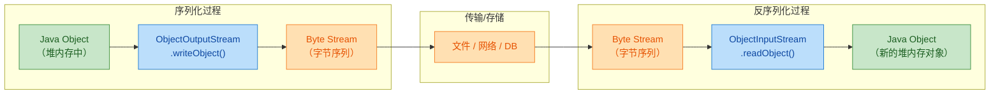

### Serializable 的本质：标记接口（Marker Interface）

打开 JDK 源码，你会发现 `Serializable` 接口的定义极其简洁：

```java
// java.io.Serializable 的完整源码，没有任何方法
public interface Serializable {
    // 空的，什么都没有
}
```

它没有定义任何方法，也没有任何字段。这种"空接口"在 Java 中有一个专门的名字——标记接口（Marker Interface）。它的唯一作用是给 JVM 和 `ObjectOutputStream` 一个信号："这个类的实例允许被序列化。"

当 `ObjectOutputStream.writeObject(obj)` 被调用时，底层会做一个关键检查：

```java
// ObjectOutputStream 内部简化逻辑
if (obj instanceof Serializable) {
    // 允许序列化，开始将对象字段逐个写入字节流
} else {
    // 抛出异常，拒绝序列化
    throw new NotSerializableException(obj.getClass().getName());
}
```

所以，如果你的类没有实现 `Serializable`，尝试序列化时会直接抛出 `java.io.NotSerializableException`。

### 基本使用：完整的序列化与反序列化流程

下面通过一个完整的例子来演示整个过程：

```java
import java.io.*;

// 第一步：让类实现 Serializable 接口
// 这是序列化的"入场券"，没有它就无法序列化
public class Student implements Serializable {

    // 强烈建议显式声明，后续章节会详细讲 serialVersionUID
    private static final long serialVersionUID = 1L;

    private String name;      // 姓名，会被序列化
    private int age;          // 年龄，会被序列化
    private double gpa;       // 绩点，会被序列化

    // 构造方法——注意：反序列化时不会调用任何构造方法
    public Student(String name, int age, double gpa) {
        this.name = name;     // 初始化姓名
        this.age = age;       // 初始化年龄
        this.gpa = gpa;       // 初始化绩点
    }

    // toString 方便打印查看对象状态
    @Override
    public String toString() {
        return "Student{name='" + name + "', age=" + age + ", gpa=" + gpa + "}";
    }
}
```

序列化（写出）过程：

```java
public class SerializeDemo {
    public static void main(String[] args) {
        // 创建一个 Student 对象，此时它活在堆内存中
        Student stu = new Student("Alice", 20, 3.85);

        // try-with-resources 自动关闭流，避免资源泄漏
        // FileOutputStream: 将字节写入文件的底层流
        // ObjectOutputStream: 在 FileOutputStream 之上封装，提供 writeObject 能力
        try (ObjectOutputStream oos = new ObjectOutputStream(
                new FileOutputStream("student.ser"))) {

            // 核心方法：将对象转换为字节并写入文件
            // 内部会检查 obj instanceof Serializable
            oos.writeObject(stu);

            // 写入成功后，student.ser 文件中就保存了 stu 的完整状态
            System.out.println("序列化成功: " + stu);

        } catch (IOException e) {
            // IO 异常：文件无法创建、磁盘满、权限不足等
            e.printStackTrace();
        }
    }
}
```

反序列化（读入）过程：

```java
public class DeserializeDemo {
    public static void main(String[] args) {
        // try-with-resources 同样适用于输入流
        // FileInputStream: 从文件读取字节的底层流
        // ObjectInputStream: 在 FileInputStream 之上封装，提供 readObject 能力
        try (ObjectInputStream ois = new ObjectInputStream(
                new FileInputStream("student.ser"))) {

            // 核心方法：从字节流中重建对象
            // 返回 Object 类型，需要强制类型转换
            // 注意：这里不会调用 Student 的任何构造方法！
            Student stu = (Student) ois.readObject();

            // 打印反序列化后的对象，验证数据完整性
            System.out.println("反序列化成功: " + stu);

        } catch (IOException e) {
            // IO 异常：文件不存在、文件损坏等
            e.printStackTrace();
        } catch (ClassNotFoundException e) {
            // 当前 classpath 中找不到 Student 类的定义
            // 比如：序列化时用的是 com.a.Student，反序列化的环境中没有这个类
            e.printStackTrace();
        }
    }
}
```

输出结果：

```
序列化成功: Student{name='Alice', age=20, gpa=3.85}
反序列化成功: Student{name='Alice', age=20, gpa=3.85}
```

对象的状态被完整地"冷冻"到了文件中，又被完整地"解冻"回来。

### 序列化的底层机制：到底写了什么？

`ObjectOutputStream` 写入的字节流并不是简单的字段值拼接，它包含一套完整的元数据结构：

```java
// student.ser 文件中的逻辑结构（简化表示）
// ┌─────────────────────────────────────────────────┐
// │  Magic Number: 0xACED（标识这是 Java 序列化数据）   │
// │  Version: 0x0005（序列化协议版本号）                │
// ├─────────────────────────────────────────────────┤
// │  类描述符 (Class Descriptor):                     │
// │    - 类名: "Student"                              │
// │    - serialVersionUID: 1L                        │
// │    - 字段数量: 3                                   │
// │    - 字段列表:                                     │
// │        int age                                   │
// │        double gpa                                │
// │        String name                               │
// ├─────────────────────────────────────────────────┤
// │  实例数据 (Instance Data):                        │
// │    age = 20                                      │
// │    gpa = 3.85                                    │
// │    name = "Alice"                                │
// └─────────────────────────────────────────────────┘
```

关键点：字节流中包含了类的全限定名（Fully Qualified Class Name）、`serialVersionUID`、字段的类型和名称，以及字段的实际值。这就是为什么反序列化时不需要调用构造方法——JVM 直接根据元数据"拼装"出对象。

### 哪些东西会被序列化？哪些不会？

这是一个非常重要的规则表：

| 成员类型 | 是否序列化 | 原因 |
|---------|-----------|------|
| 实例字段（instance fields） | ✅ 是 | 这是对象状态的核心 |
| `static` 静态字段 | ❌ 否 | 静态字段属于类，不属于对象实例 |
| `transient` 修饰的字段 | ❌ 否 | 显式标记为"不参与序列化"（后续章节详解） |
| 方法（methods） | ❌ 否 | 方法存储在方法区，不是对象状态 |
| 父类字段 | ⚠️ 视情况 | 父类也实现了 Serializable 才会被序列化 |

关于 `static` 字段，来看一个容易踩坑的例子：

```java
public class Config implements Serializable {

    private static final long serialVersionUID = 1L;

    // static 字段：属于类，不属于任何对象实例
    // 序列化时不会写入字节流
    public static String ENV = "PRODUCTION";

    // 实例字段：属于对象，会被序列化
    private String appName;

    public Config(String appName) {
        this.appName = appName;
    }
}
```

```java
// 假设序列化时 ENV = "PRODUCTION"
// 序列化 config 对象到文件...

// 在另一个 JVM 中反序列化之前，修改了 static 字段
Config.ENV = "DEVELOPMENT";

// 反序列化得到 config 对象
// config.ENV 的值是 "DEVELOPMENT"，不是 "PRODUCTION"
// 因为 static 字段根本没有被写入字节流，它的值取决于当前 JVM 中类的状态
```

### 对象图的递归序列化（Object Graph Serialization）

当一个对象持有对其他对象的引用时，序列化引擎会递归地序列化整个对象图（Object Graph）。这意味着被引用的对象也必须实现 `Serializable`，否则会抛出 `NotSerializableException`。

```java
// Address 类也必须实现 Serializable
// 否则序列化 Employee 时会失败
public class Address implements Serializable {

    private static final long serialVersionUID = 1L;

    private String city;      // 城市
    private String street;    // 街道

    public Address(String city, String street) {
        this.city = city;
        this.street = street;
    }

    @Override
    public String toString() {
        return "Address{city='" + city + "', street='" + street + "'}";
    }
}

public class Employee implements Serializable {

    private static final long serialVersionUID = 1L;

    private String name;       // 姓名
    private Address address;   // 引用了另一个对象——Address 也必须可序列化

    public Employee(String name, Address address) {
        this.name = name;
        this.address = address;
    }

    @Override
    public String toString() {
        return "Employee{name='" + name + "', address=" + address + "}";
    }
}
```

```java
public class ObjectGraphDemo {
    public static void main(String[] args) throws Exception {
        // 创建 Address 对象
        Address addr = new Address("Beijing", "Zhongguancun Street");
        // 创建 Employee 对象，持有 Address 的引用
        Employee emp = new Employee("Bob", addr);

        // 序列化 Employee 时，ObjectOutputStream 会自动发现
        // emp.address 指向一个 Address 对象，于是递归序列化 Address
        try (ObjectOutputStream oos = new ObjectOutputStream(
                new FileOutputStream("employee.ser"))) {
            oos.writeObject(emp);  // Employee 和 Address 都会被写入
        }

        // 反序列化时，Employee 和 Address 都会被重建
        try (ObjectInputStream ois = new ObjectInputStream(
                new FileInputStream("employee.ser"))) {
            Employee restored = (Employee) ois.readObject();
            // 输出: Employee{name='Bob', address=Address{city='Beijing', street='Zhongguancun Street'}}
            System.out.println(restored);
        }
    }
}
```

递归序列化的对象引用关系可以用下图表示：

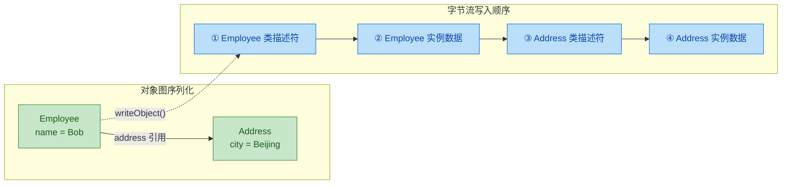

如果 `Address` 没有实现 `Serializable`，序列化 `Employee` 时会直接报错：

```
java.io.NotSerializableException: Address
```

### 继承场景下的序列化行为

继承体系中的序列化规则稍微复杂一些，需要分两种情况讨论：

**情况一：父类实现了 Serializable**

```java
// 父类实现了 Serializable
public class Person implements Serializable {

    private static final long serialVersionUID = 1L;

    protected String name;  // 会被序列化
    protected int age;      // 会被序列化

    public Person(String name, int age) {
        this.name = name;
        this.age = age;
    }
}

// 子类自动继承 Serializable，无需再次声明
// Person 的字段 name、age 和 Teacher 自己的字段 subject 都会被序列化
public class Teacher extends Person {

    private static final long serialVersionUID = 1L;

    private String subject;  // 会被序列化

    public Teacher(String name, int age, String subject) {
        super(name, age);    // 调用父类构造方法
        this.subject = subject;
    }
}
```

这种情况最简单：父类和子类的所有实例字段都会被正常序列化和反序列化。

**情况二：父类没有实现 Serializable**

```java
// 父类没有实现 Serializable
public class Animal {

    protected String species;  // 不会被序列化！

    // 必须有无参构造方法！反序列化时 JVM 会调用它来初始化父类部分
    public Animal() {
        this.species = "Unknown";  // 反序列化后 species 会变成这个默认值
        System.out.println("Animal 无参构造方法被调用");
    }

    public Animal(String species) {
        this.species = species;
    }
}

// 子类实现了 Serializable
public class Dog extends Animal implements Serializable {

    private static final long serialVersionUID = 1L;

    private String nickname;  // 会被序列化

    public Dog(String species, String nickname) {
        super(species);          // 设置 species
        this.nickname = nickname; // 设置 nickname
    }

    @Override
    public String toString() {
        return "Dog{species='" + species + "', nickname='" + nickname + "'}";
    }
}
```

```java
public class InheritanceDemo {
    public static void main(String[] args) throws Exception {
        Dog dog = new Dog("Golden Retriever", "Buddy");
        System.out.println("序列化前: " + dog);
        // 输出: Dog{species='Golden Retriever', nickname='Buddy'}

        // 序列化
        try (ObjectOutputStream oos = new ObjectOutputStream(
                new FileOutputStream("dog.ser"))) {
            oos.writeObject(dog);
        }

        // 反序列化
        try (ObjectInputStream ois = new ObjectInputStream(
                new FileInputStream("dog.ser"))) {
            Dog restored = (Dog) ois.readObject();
            // 注意控制台会打印: "Animal 无参构造方法被调用"
            System.out.println("反序列化后: " + restored);
            // 输出: Dog{species='Unknown', nickname='Buddy'}
            // species 丢失了！因为 Animal 没有实现 Serializable
            // JVM 调用了 Animal 的无参构造方法，species 被重置为 "Unknown"
        }
    }
}
```

这是一个非常经典的坑。规则总结如下：

- 如果父类实现了 `Serializable`：父类字段正常序列化，反序列化时不调用任何构造方法。
- 如果父类没有实现 `Serializable`：父类字段不会被序列化，反序列化时 JVM 会调用父类的无参构造方法（如果没有无参构造方法，会抛出 `InvalidClassException`）。

### 常见陷阱与最佳实践

**陷阱 1：内部类（Inner Class）的序列化**

非静态内部类（non-static inner class）持有对外部类实例的隐式引用（`Outer.this`），这意味着序列化内部类时，外部类也必须实现 `Serializable`：

```java
public class Outer implements Serializable {

    private static final long serialVersionUID = 1L;

    private String data = "outer data";

    // 非静态内部类隐式持有 Outer.this 引用
    // 序列化 Inner 时会连带序列化 Outer
    public class Inner implements Serializable {
        private static final long serialVersionUID = 1L;
        private String innerData = "inner data";
    }

    // 推荐：使用 static 内部类，不持有外部类引用
    // 序列化时更干净，不会意外拖入外部类
    public static class StaticInner implements Serializable {
        private static final long serialVersionUID = 1L;
        private String innerData = "static inner data";
    }
}
```

**陷阱 2：集合与数组中的元素**

如果你序列化一个 `ArrayList`，那么列表中的每一个元素都必须实现 `Serializable`。JDK 中的常用集合类（`ArrayList`、`HashMap`、`HashSet` 等）本身都已经实现了 `Serializable`，但你放进去的自定义对象必须自己保证可序列化。

```java
// ArrayList 本身实现了 Serializable
// 但如果 NonSerializableItem 没有实现 Serializable
// 序列化这个 list 时会抛出 NotSerializableException
List<NonSerializableItem> list = new ArrayList<>();
list.add(new NonSerializableItem());

// 这行会抛出 java.io.NotSerializableException: NonSerializableItem
oos.writeObject(list);
```

**最佳实践清单：**

```java
public class BestPracticeEntity implements Serializable {

    // ✅ 1. 始终显式声明 serialVersionUID
    //    不声明的话，JVM 会根据类结构自动计算一个
    //    类结构稍有变动（加个方法都算），UID 就变了，导致反序列化失败
    private static final long serialVersionUID = 1L;

    // ✅ 2. 敏感字段用 transient 修饰
    private String username;
    private transient String password;  // 不会被序列化

    // ✅ 3. 所有引用类型的字段，其类也必须实现 Serializable
    private Address address;  // Address 必须 implements Serializable

    // ✅ 4. 考虑提供 readObject/writeObject 自定义序列化逻辑（高级用法）
    // ✅ 5. 优先使用 static 内部类而非非静态内部类
    // ✅ 6. 如果不希望类被序列化，可以主动抛出异常
}
```

```java
// 如果你明确不希望某个类被序列化（即使它实现了 Serializable 的父接口）
// 可以通过自定义 writeObject 方法主动拒绝
public class NonSerializableByDesign implements Serializable {

    private static final long serialVersionUID = 1L;

    // 任何尝试序列化此类的操作都会抛出异常
    private void writeObject(ObjectOutputStream oos) throws IOException {
        throw new NotSerializableException("This class should not be serialized!");
    }

    // 任何尝试反序列化此类的操作也会抛出异常
    private void readObject(ObjectInputStream ois) throws IOException {
        throw new NotSerializableException("This class should not be deserialized!");
    }
}
```

---

**📝 练习题**

以下代码的输出结果是什么？

```java
class Animal {
    String type;
    Animal() { this.type = "DEFAULT"; }
    Animal(String type) { this.type = type; }
}

class Cat extends Animal implements Serializable {
    private static final long serialVersionUID = 1L;
    String name;
    Cat(String type, String name) {
        super(type);
        this.name = name;
    }
}

// 序列化
Cat cat = new Cat("Mammal", "Whiskers");
ObjectOutputStream oos = new ObjectOutputStream(new FileOutputStream("cat.ser"));
oos.writeObject(cat);
oos.close();

// 反序列化
ObjectInputStream ois = new ObjectInputStream(new FileInputStream("cat.ser"));
Cat restored = (Cat) ois.readObject();
ois.close();
System.out.println(restored.type + " - " + restored.name);
```

A. `Mammal - Whiskers`


B. `DEFAULT - Whiskers`


C. `null - Whiskers`


D. 抛出 `NotSerializableException`


**【答案】** B

**【解析】** `Animal` 没有实现 `Serializable`，所以 `Animal` 的字段 `type` 不会被写入字节流。反序列化 `Cat` 时，JVM 需要初始化父类 `Animal` 的部分，它会调用 `Animal` 的无参构造方法 `Animal()`，该构造方法将 `type` 设置为 `"DEFAULT"`。而 `Cat` 自己的字段 `name` 正常从字节流中恢复为 `"Whiskers"`。因此最终输出 `DEFAULT - Whiskers`。如果 `Animal` 没有无参构造方法，则会抛出 `InvalidClassException`。

---

## serialVersionUID ⭐（版本控制）

当一个类实现了 `Serializable` 接口后，JVM 在序列化和反序列化时需要一种机制来确认："我现在要还原的这个字节流，和当前加载的这个类，是不是同一个版本？" 这个机制的核心，就是 `serialVersionUID`。

它本质上是一个**版本指纹**（version fingerprint）。序列化时，这个指纹会被写入字节流；反序列化时，JVM 会拿字节流中的指纹和当前类的指纹做比对。如果不匹配，直接抛出 `InvalidClassException`，反序列化失败。

---

### serialVersionUID 的本质与作用

`serialVersionUID` 是 `Serializable` 接口约定的一个特殊静态字段，签名必须严格如下：

```java
// 访问修饰符建议 private，防止子类继承干扰
// static：属于类本身，不参与对象的序列化字段
// final：版本号不应被修改
// long：64 位整型，提供足够大的版本空间
private static final long serialVersionUID = 1L;
```

它的核心职责只有一个：**在反序列化时校验类的版本一致性**（to verify that the sender and receiver of a serialized object have loaded classes that are compatible with respect to serialization）。

你可以把整个过程想象成一把"锁"和"钥匙"的关系：

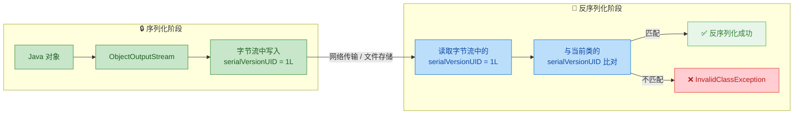

---

### 显式声明 vs 自动生成

这是 `serialVersionUID` 最容易踩坑的地方。你有两种选择：

#### 方式一：显式声明（Explicitly Declare）— 强烈推荐

```java
public class User implements Serializable {
    // 显式声明：你完全掌控版本号
    private static final long serialVersionUID = 1L;

    private String name; // 用户名
    private int age;     // 年龄
}
```

这种方式下，版本号由你自己决定。只要你不手动改它，无论类怎么修改（加字段、删方法），这个值都不会变。

#### 方式二：不声明，让 JVM 自动生成（Auto-generated）— 极度危险

如果你不写 `serialVersionUID`，JVM 会在编译期根据类的结构信息（类名、字段名、字段类型、方法签名等）通过一个**哈希算法**自动计算出一个 `serialVersionUID`。

问题在于：**任何微小的类结构变动，都可能导致自动生成的值发生变化。**

来看一个真实的灾难场景：

```java
// ===== 版本 1：上线时的类 =====
public class Order implements Serializable {
    // 没有显式声明 serialVersionUID
    // JVM 自动计算出：serialVersionUID = 7381642398127456L（假设值）

    private String orderId;   // 订单号
    private double amount;    // 金额
}
```

这个类的对象被序列化后存入了 Redis 缓存。一周后，你做了一次"无害"的重构：

```java
// ===== 版本 2：加了一个字段 =====
public class Order implements Serializable {
    // 仍然没有显式声明
    // JVM 重新计算出：serialVersionUID = -2049876531284756L（值变了！）

    private String orderId;   // 订单号
    private double amount;    // 金额
    private String remark;    // 新增：备注字段
}
```

此时从 Redis 读取旧数据反序列化：

```java
// 反序列化时 JVM 的内部校验逻辑（伪代码）
long streamUID  = 7381642398127456L;  // 字节流中存储的旧版本号
long classUID   = -2049876531284756L; // 当前类自动生成的新版本号

if (streamUID != classUID) {
    // 版本号不匹配，直接抛异常！
    throw new InvalidClassException(
        "Order; local class incompatible: " +
        "stream classdesc serialVersionUID = 7381642398127456, " +
        "local class serialVersionUID = -2049876531284756"
    );
}
```

整个缓存全部失效，线上服务崩溃。而如果你一开始就显式声明了 `serialVersionUID = 1L`，加一个 `remark` 字段根本不会影响反序列化——新字段会被赋默认值 `null`，旧数据照常还原。

---

### 自动生成算法的内部机制

JVM 自动计算 `serialVersionUID` 的过程定义在 Java 官方序列化规范中（Java Object Serialization Specification, Section 4.6）。它并不是简单的 `hashCode()`，而是一套严格的流程：

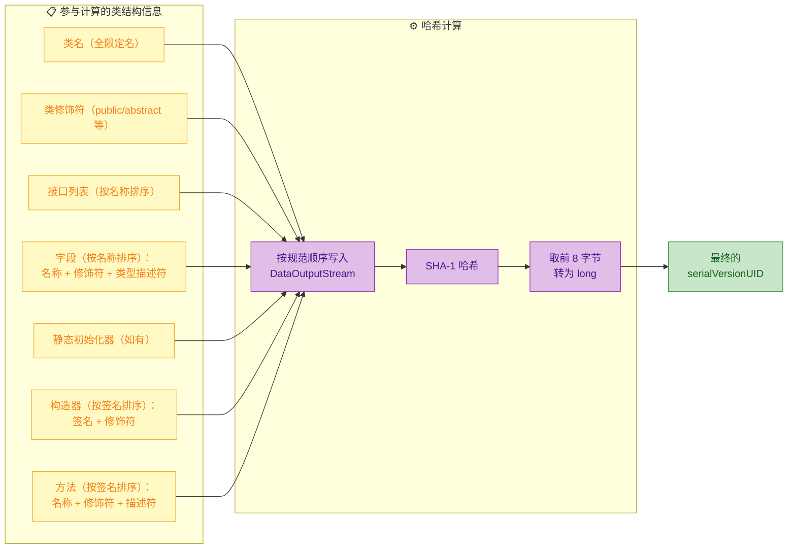

这意味着以下任何改动都会导致自动生成的 UID 变化：

| 改动类型 | 是否影响自动 UID | 示例 |
|---------|:--------------:|------|
| 新增/删除字段 | ✅ 是 | 加了 `private String remark` |
| 修改字段类型 | ✅ 是 | `int age` → `long age` |
| 新增/删除方法 | ✅ 是 | 加了 `getFullName()` |
| 修改方法签名 | ✅ 是 | 参数从 `String` 改为 `Object` |
| 修改类修饰符 | ✅ 是 | `public class` → `public abstract class` |
| 新增/移除接口 | ✅ 是 | 实现了 `Comparable` |
| 仅修改方法体内部逻辑 | ❌ 否 | 改了 `toString()` 的拼接方式 |
| 仅修改注释 | ❌ 否 | 加了 Javadoc |

---

### 版本兼容性的详细规则

显式声明 `serialVersionUID` 后，类的演化（class evolution）就变得可控了。但并非所有修改都能兼容，Java 序列化规范定义了明确的兼容与不兼容变更：

#### 兼容变更（Compatible Changes）

这些修改不会破坏反序列化：

```java
// ===== 原始版本 =====
public class Employee implements Serializable {
    private static final long serialVersionUID = 100L; // 版本号固定

    private String name;  // 姓名
    private int age;      // 年龄
}
```

```java
// ===== 演化版本：新增字段（兼容） =====
public class Employee implements Serializable {
    private static final long serialVersionUID = 100L; // 版本号不变！

    private String name;      // 姓名
    private int age;          // 年龄
    private String department; // 新增：部门（反序列化旧数据时为 null）
    private double salary;     // 新增：薪资（反序列化旧数据时为 0.0）
}
```

反序列化旧字节流时的行为：

```text
旧字节流中的字段          当前类的字段            结果
─────────────────────────────────────────────────────
name = "张三"       →    name = "张三"          ✅ 正常还原
age = 28            →    age = 28               ✅ 正常还原
（不存在）           →    department = null       ⚠️ 赋默认值
（不存在）           →    salary = 0.0           ⚠️ 赋默认值
```

完整的兼容变更列表：

- **新增字段**：旧数据中没有的字段，赋类型默认值
- **新增类（插入继承层级）**：类似新增字段的处理
- **删除字段**：字节流中多余的字段数据被静默忽略
- **修改字段的访问修饰符**：`private` / `protected` / `public` 不影响序列化
- **将实例字段改为静态字段**：等同于"删除"该字段（静态字段不参与序列化）
- **新增 `writeObject` / `readObject` 方法**

#### 不兼容变更（Incompatible Changes）

这些修改即使 `serialVersionUID` 相同，也会导致反序列化异常或数据损坏：

```java
// ===== 危险操作：修改字段类型 =====
public class Employee implements Serializable {
    private static final long serialVersionUID = 100L; // 版本号相同

    private String name;
    private long age;    // ❌ 从 int 改为 long，类型不兼容！
}
```

```java
// 反序列化时会抛出异常
// java.io.InvalidClassException: Employee;
// incompatible types for field age
```

完整的不兼容变更列表：

- **修改字段类型**：即使是 `int` → `long` 这种"看似兼容"的变更也不行
- **修改类的继承层级**（删除父类、改变继承链）
- **将非 `Serializable` 类改为 `Serializable`**（反之亦然）
- **将实例字段改为 `transient`**：等同于"删除"该字段

---

### serialVersionUID 的值该怎么选？

实践中有两种常见风格：

```java
// 风格一：简单递增（推荐用于业务类）
// 优点：直观，一眼看出版本迭代了几次
private static final long serialVersionUID = 1L;
// 下次不兼容变更时改为 2L，再下次 3L...

// 风格二：IDE 自动生成的哈希值
// 优点：唯一性强，适合框架/库代码
private static final long serialVersionUID = -6849794470754667710L;
```

两种风格没有对错之分。关键原则是：

- **同一个类的 `serialVersionUID` 只在发生不兼容变更时才修改**
- 兼容变更（加字段、删字段）时保持不变，让旧数据能平滑过渡
- 不兼容变更（改字段类型、改继承结构）时主动修改，让旧数据快速失败（fail-fast），而不是产生诡异的数据错乱

---

### 实战：完整的版本演化示例

下面用一个完整的代码示例，演示从 V1 到 V3 的类演化过程：

```java
import java.io.*;
import java.nio.file.*;

/**
 * 演示 serialVersionUID 在类版本演化中的作用
 */
public class VersionEvolutionDemo {

    // ===== V1：初始版本 =====
    static class UserV1 implements Serializable {
        private static final long serialVersionUID = 1L; // 版本号：1

        private String username; // 用户名
        private int age;         // 年龄

        // 构造器
        public UserV1(String username, int age) {
            this.username = username; // 初始化用户名
            this.age = age;           // 初始化年龄
        }

        @Override
        public String toString() {
            // 格式化输出对象信息
            return "User{username='" + username + "', age=" + age + "}";
        }
    }

    // ===== V2：新增字段（兼容变更，serialVersionUID 不变） =====
    static class UserV2 implements Serializable {
        private static final long serialVersionUID = 1L; // 版本号仍然是 1！

        private String username; // 用户名
        private int age;         // 年龄
        private String email;    // 新增：邮箱（旧数据反序列化时为 null）

        // 构造器
        public UserV2(String username, int age, String email) {
            this.username = username; // 初始化用户名
            this.age = age;           // 初始化年龄
            this.email = email;       // 初始化邮箱
        }

        @Override
        public String toString() {
            // 格式化输出，包含新字段
            return "User{username='" + username + "', age=" + age +
                   ", email='" + email + "'}";
        }
    }

    // ===== V3：修改字段类型（不兼容变更，必须修改 serialVersionUID） =====
    static class UserV3 implements Serializable {
        private static final long serialVersionUID = 2L; // 版本号改为 2！

        private String username; // 用户名
        private long age;        // ⚠️ 类型从 int 改为 long（不兼容！）
        private String email;    // 邮箱

        // 构造器
        public UserV3(String username, long age, String email) {
            this.username = username; // 初始化用户名
            this.age = age;           // 初始化年龄
            this.email = email;       // 初始化邮箱
        }

        @Override
        public String toString() {
            return "User{username='" + username + "', age=" + age +
                   ", email='" + email + "'}";
        }
    }

    public static void main(String[] args) throws Exception {
        String filePath = "user.ser"; // 序列化文件路径

        // ---- 步骤 1：用 V1 序列化 ----
        UserV1 v1 = new UserV1("Alice", 25); // 创建 V1 对象
        try (ObjectOutputStream oos =
                 new ObjectOutputStream(
                     new FileOutputStream(filePath))) { // 打开输出流
            oos.writeObject(v1); // 将 V1 对象写入文件
        }
        System.out.println("V1 序列化完成: " + v1); // 确认写入

        // ---- 步骤 2：用 V2 反序列化（兼容，因为 UID 都是 1L） ----
        // 注意：实际项目中 V1 和 V2 是同一个类的不同版本
        // 这里用不同类名仅为演示目的
        // 真实场景下，你部署了新版本的 User 类（多了 email 字段），
        // 然后读取旧版本序列化的数据

        // ---- 步骤 3：用 V3 反序列化（不兼容，UID 从 1L 变为 2L） ----
        // 会抛出 InvalidClassException
        try (ObjectInputStream ois =
                 new ObjectInputStream(
                     new FileInputStream(filePath))) { // 打开输入流
            // 尝试用 V3（UID=2L）读取 V1（UID=1L）的数据
            UserV3 restored = (UserV3) ois.readObject(); // ❌ 这里会抛异常
            System.out.println("V3 反序列化: " + restored);
        } catch (InvalidClassException e) {
            // 捕获版本不兼容异常
            System.err.println("版本不兼容！" + e.getMessage());
            // 输出: 版本不兼容！VersionEvolutionDemo$UserV3;
            // local class incompatible:
            // stream classdesc serialVersionUID = 1,
            // local class serialVersionUID = 2
        }

        // 清理临时文件
        Files.deleteIfExists(Path.of(filePath)); // 删除序列化文件
    }
}
```

---

### 最佳实践总结

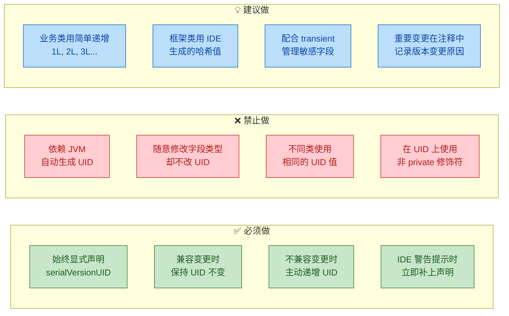

---

### 面试高频考点：serialVersionUID 相关陷阱

在面试中，`serialVersionUID` 几乎是序列化章节的必考点。面试官最喜欢问的切入角度：

- "如果不声明 `serialVersionUID` 会怎样？" — 答：JVM 自动生成，任何类结构变动都可能导致反序列化失败。
- "两个不同的类可以有相同的 `serialVersionUID` 吗？" — 答：可以，UID 只在同一个类的不同版本之间做校验，不同类之间互不影响。反序列化时首先匹配的是类的全限定名（fully qualified class name），然后才校验 UID。
- "`serialVersionUID` 是 `static` 的，为什么能被序列化？" — 答：它并不是被"序列化"的。`ObjectOutputStream` 在写入时会**特殊处理**这个字段，直接从类定义中读取并写入流中，这是序列化协议的硬编码行为，不走常规的字段序列化逻辑。

---

**📝 练习题**

某团队的 `Product` 类最初如下：

```java
public class Product implements Serializable {
    private String name;
    private int price;
}
```

上线后大量 `Product` 对象被序列化存入文件。现在需要新增一个 `String category` 字段，且要保证旧数据能正常反序列化。以下做法正确的是？

A. 直接新增 `category` 字段，无需任何额外操作，Java 会自动处理兼容性


B. 新增 `category` 字段，同时显式声明 `private static final long serialVersionUID`，值设为任意固定值


C. 新增 `category` 字段，同时用 `ObjectInputStream.GetField` 手动读取旧字段，否则会丢失数据


D. 无法实现，必须清除所有旧的序列化数据后重新序列化


**【答案】** B

**【解析】** 新增字段属于兼容变更，反序列化时新字段会被赋默认值 `null`，旧字段正常还原。但前提是 `serialVersionUID` 必须一致。由于原始类没有显式声明 UID，JVM 自动生成的值会因为新增字段而改变，导致反序列化失败。因此正确做法是：在新增字段的同时，显式声明一个固定的 `serialVersionUID`。但这里有个关键细节——你声明的值必须和旧版本 JVM 自动生成的值一致，或者更稳妥的做法是：在还没改类之前，先用 `serialver` 工具查出当前自动生成的 UID，然后把这个值硬编码进去，再做字段变更。选项 A 错在忽略了自动 UID 会变化的问题；C 的 `GetField` 是高级自定义反序列化手段，此场景不需要；D 完全错误，兼容变更不需要清除旧数据。

---

## transient 关键字

在 Java 序列化体系中，默认行为是将对象的**所有非 static 字段**一股脑地写入字节流。但现实开发中，我们经常遇到这样的场景：对象里有些字段**不应该**或**不需要**被持久化。比如用户的明文密码、数据库连接句柄、缓存的计算结果、从其他字段可以推导出来的冗余数据等等。如果把这些字段也序列化出去，轻则浪费空间，重则引发严重的安全漏洞。

`transient` 关键字就是 Java 为此提供的"字段级别的序列化开关"——被它修饰的字段，在序列化时会被 JVM **自动跳过**，不会写入输出流；反序列化时，这些字段会被还原为其类型的**默认零值**（引用类型为 `null`，`int` 为 `0`，`boolean` 为 `false`，以此类推）。

### transient 的基本语法与效果

语法极其简单，只需在字段声明前加上 `transient` 修饰符：

```java
// 一个包含敏感信息的用户类
public class User implements Serializable {

    private static final long serialVersionUID = 1L;

    // 普通字段 —— 会被序列化
    private String username;

    // transient 字段 —— 序列化时被跳过
    private transient String password;

    // transient 字段 —— 缓存数据，无需持久化
    private transient int loginCount;

    // 构造器
    public User(String username, String password, int loginCount) {
        this.username = username;
        this.password = password;
        this.loginCount = loginCount;
    }

    @Override
    public String toString() {
        // 方便观察各字段的值
        return "User{username='" + username + "'"
             + ", password='" + password + "'"
             + ", loginCount=" + loginCount + "}";
    }
}
```

下面通过一个完整的序列化-反序列化流程来验证 `transient` 的效果：

```java
import java.io.*;

public class TransientDemo {
    public static void main(String[] args) throws Exception {

        // ========== 序列化阶段 ==========
        User user = new User("alice", "P@ssw0rd!", 42);
        // 序列化前，所有字段都有值
        System.out.println("序列化前: " + user);

        // 将对象写入文件
        try (ObjectOutputStream oos =
                 new ObjectOutputStream(new FileOutputStream("user.ser"))) {
            oos.writeObject(user); // password 和 loginCount 被 transient 标记，不会写入
        }

        // ========== 反序列化阶段 ==========
        User restored;
        try (ObjectInputStream ois =
                 new ObjectInputStream(new FileInputStream("user.ser"))) {
            restored = (User) ois.readObject(); // 从字节流还原对象
        }

        // 观察反序列化后的结果
        System.out.println("反序列化后: " + restored);
    }
}
```

运行输出：

```text
序列化前: User{username='alice', password='P@ssw0rd!', loginCount=42}
反序列化后: User{username='alice', password='null', loginCount=0}
```

结果一目了然：`username` 正常还原，而 `password`（String 引用类型）变成了 `null`，`loginCount`（int 基本类型）变成了 `0`。这就是 `transient` 的核心效果。

用一张流程图来直观展示序列化引擎处理字段的决策逻辑：

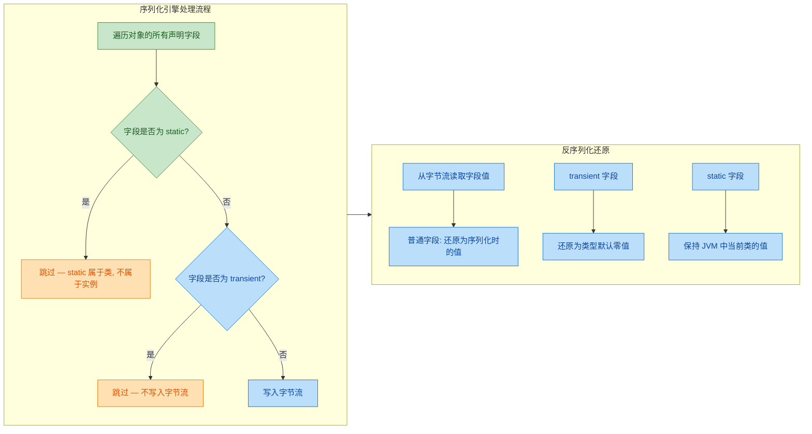

### transient 与 static 的区别

初学者常常把 `transient` 和 `static` 搞混，因为两者在序列化时都会被"跳过"。但它们的本质完全不同：

`static` 字段属于**类本身**，而非某个具体的对象实例。序列化的目标是保存"对象的状态"，所以 `static` 字段天然不在序列化范围内——它压根就不是对象状态的一部分。

`transient` 字段属于**对象实例**，它确实是对象状态的一部分，只不过我们**主动告诉** JVM："这个字段不需要被持久化"。

```java
public class FieldComparison implements Serializable {

    private static final long serialVersionUID = 1L;

    // static 字段 —— 属于类，不参与序列化（与 transient 无关）
    private static String companyName = "Acme Corp";

    // 普通实例字段 —— 参与序列化
    private String employeeName;

    // transient 实例字段 —— 主动排除，不参与序列化
    private transient double salary;

    public FieldComparison(String employeeName, double salary) {
        this.employeeName = employeeName;
        this.salary = salary;
    }
}
```

用一张表格来对比：

| 特性 | `static` 字段 | `transient` 字段 | 普通实例字段 |
|---|---|---|---|
| 归属 | 类 (Class) | 对象实例 (Instance) | 对象实例 (Instance) |
| 是否序列化 | 否 | 否 | 是 |
| 不序列化的原因 | 不属于对象状态 | 开发者主动排除 | — |
| 反序列化后的值 | JVM 中类的当前值 | 类型默认零值 | 序列化时保存的值 |

这里有一个容易踩的坑：反序列化后读取 `static` 字段，你拿到的是**当前 JVM 中该类的 static 值**，而不是序列化时的值。如果在序列化和反序列化之间修改了 `static` 字段，你会看到"不一致"的现象。这不是 bug，而是 `static` 的本质决定的。

### transient 的典型使用场景

在实际项目中，`transient` 的使用场景可以归纳为以下几大类：

**场景一：敏感信息保护**

这是最常见也最重要的场景。密码、密钥、Token 等敏感数据绝不应该出现在序列化字节流中，因为字节流可能被写入磁盘、通过网络传输、或被日志系统捕获。

```java
public class Credential implements Serializable {

    private static final long serialVersionUID = 1L;

    private String userId;                    // 用户ID —— 需要序列化
    private transient String rawPassword;     // 明文密码 —— 绝不能序列化
    private transient byte[] encryptionKey;   // 加密密钥 —— 绝不能序列化
    private String passwordHash;              // 密码哈希 —— 可以序列化（不可逆）
}
```

**场景二：不可序列化的字段**

对象中可能持有一些本身就**无法序列化**的引用，比如数据库连接 (`Connection`)、线程 (`Thread`)、Socket、Stream 等系统资源。如果不标记为 `transient`，序列化时会直接抛出 `NotSerializableException`。

```java
public class DatabaseSession implements Serializable {

    private static final long serialVersionUID = 1L;

    private String jdbcUrl;                        // JDBC 连接字符串 —— 可序列化
    private String username;                       // 数据库用户名 —— 可序列化

    // Connection 没有实现 Serializable，必须标记 transient
    private transient java.sql.Connection conn;

    // Logger 通常也不需要序列化
    private transient org.slf4j.Logger logger;
}
```

**场景三：可推导的冗余数据**

如果某个字段的值可以从其他字段计算得出，就没必要浪费空间去序列化它。反序列化后重新计算即可。

```java
public class Rectangle implements Serializable {

    private static final long serialVersionUID = 1L;

    private double width;                  // 宽 —— 需要序列化
    private double height;                 // 高 —— 需要序列化

    // 面积可以由 width * height 算出，无需序列化
    private transient double area;

    public Rectangle(double width, double height) {
        this.width = width;
        this.height = height;
        this.area = width * height; // 构造时计算
    }

    // 反序列化后需要手动重新计算（见下文 readObject 技巧）
}
```

**场景四：缓存数据**

缓存本质上是"用空间换时间"的临时数据，序列化后再还原时缓存大概率已经过期，持久化它毫无意义。

```java
public class ProductCatalog implements Serializable {

    private static final long serialVersionUID = 1L;

    private List<String> productIds;                          // 商品ID列表 —— 核心数据
    private transient Map<String, Object> cachedDetails;      // 缓存的商品详情 —— 临时数据
}
```

### 反序列化后恢复 transient 字段

`transient` 字段在反序列化后会变成默认零值，但很多时候我们希望它们能被**自动恢复**到一个合理的状态。Java 提供了一个优雅的钩子机制：在类中定义一个**特殊签名**的 `readObject` 方法，JVM 在反序列化时会自动调用它。

```java
import java.io.*;
import java.util.HashMap;
import java.util.Map;

public class SmartCache implements Serializable {

    private static final long serialVersionUID = 1L;

    // 核心数据 —— 会被序列化
    private String cacheName;

    // transient 字段 —— 不会被序列化，但我们希望反序列化后自动恢复
    private transient Map<String, Object> cacheMap;
    private transient long lastAccessTime;

    public SmartCache(String cacheName) {
        this.cacheName = cacheName;
        this.cacheMap = new HashMap<>();          // 初始化缓存容器
        this.lastAccessTime = System.currentTimeMillis(); // 记录创建时间
    }

    /**
     * 自定义反序列化逻辑。
     * 方法签名必须严格为: private void readObject(ObjectInputStream in)
     * JVM 通过反射找到并调用此方法。
     */
    private void readObject(ObjectInputStream in)
            throws IOException, ClassNotFoundException {

        // 第一步：执行默认的反序列化，恢复所有非 transient 字段
        in.defaultReadObject();

        // 第二步：手动恢复 transient 字段
        this.cacheMap = new HashMap<>();                   // 重新初始化空缓存
        this.lastAccessTime = System.currentTimeMillis();  // 设置为当前时间
    }

    @Override
    public String toString() {
        return "SmartCache{name='" + cacheName + "'"
             + ", cacheMap=" + cacheMap
             + ", lastAccessTime=" + lastAccessTime + "}";
    }
}
```

这个模式在实际项目中非常常见。`readObject` 的调用时机和完整的对象恢复流程如下：

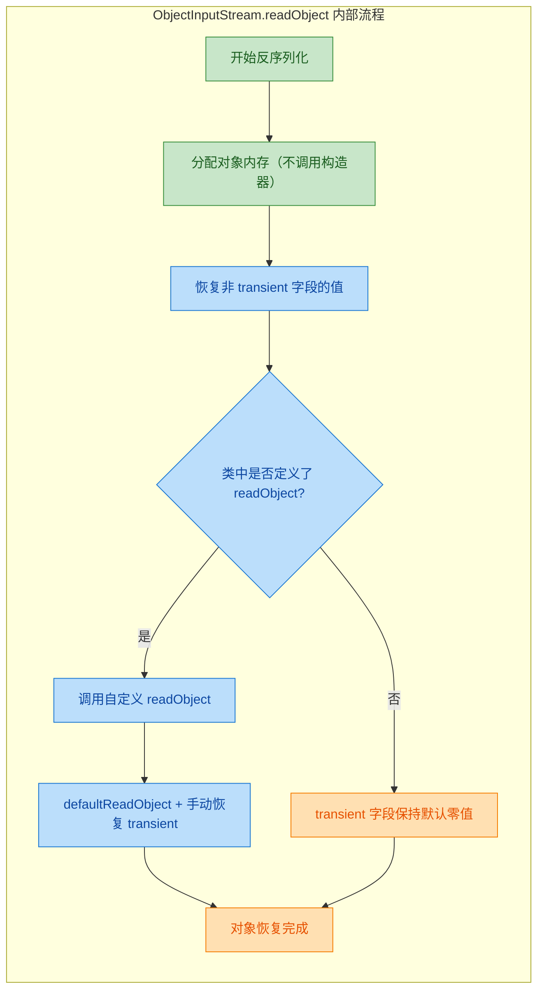

注意一个关键细节：反序列化时**不会调用任何构造器**（包括无参构造器）。对象的内存是直接分配的，字段值是从字节流中灌入的。这就是为什么你不能依赖构造器来初始化 `transient` 字段，而必须借助 `readObject`。

### transient 与 final 的组合

`transient` 可以和 `final` 一起使用，但这会带来一个微妙的问题：`final` 字段一旦在构造器中赋值后就不能再修改，而反序列化时又不调用构造器，那 `transient final` 字段在反序列化后就**永远是默认零值**，且你无法在 `readObject` 中重新赋值（因为 `final` 不允许）。

```java
public class FinalTransientProblem implements Serializable {

    private static final long serialVersionUID = 1L;

    // transient + final —— 反序列化后永远是 null，且无法修改！
    private final transient String token;

    public FinalTransientProblem(String token) {
        this.token = token; // 构造器中赋值
    }

    private void readObject(ObjectInputStream in)
            throws IOException, ClassNotFoundException {
        in.defaultReadObject();
        // this.token = "new-value";  // 编译错误！final 字段不能重新赋值
    }
}
```

实际上，Java 的序列化机制内部使用 `Unsafe` 或反射来绕过 `final` 限制写入字段值，但对于 `transient final` 字段，由于字节流中根本没有它的数据，所以它就只能是零值。

解决方案有两种：

1. 去掉 `final`，在 `readObject` 中手动恢复。
2. 改用 `Externalizable` 接口，完全掌控序列化和反序列化过程（后续章节会详细讲解）。

### transient 在继承体系中的行为

当一个可序列化的子类继承了一个**不可序列化**的父类时，情况会变得有趣。父类的字段本身就不会被序列化（因为父类没有实现 `Serializable`），效果类似于 `transient`，但恢复机制不同：

```java
// 父类 —— 没有实现 Serializable
public class Animal {

    protected String species; // 不会被序列化

    // 必须有无参构造器！反序列化时 JVM 会调用它来初始化父类部分
    public Animal() {
        this.species = "Unknown";
    }

    public Animal(String species) {
        this.species = species;
    }
}

// 子类 —— 实现了 Serializable
public class Dog extends Animal implements Serializable {

    private static final long serialVersionUID = 1L;

    private String name;                    // 会被序列化
    private transient int tricks;           // 不会被序列化（transient）

    public Dog(String species, String name, int tricks) {
        super(species);       // 调用父类构造器设置 species
        this.name = name;
        this.tricks = tricks;
    }

    @Override
    public String toString() {
        return "Dog{species='" + species + "', name='" + name + "', tricks=" + tricks + "}";
    }
}
```

```java
public class InheritanceDemo {
    public static void main(String[] args) throws Exception {

        Dog dog = new Dog("Golden Retriever", "Buddy", 5);
        System.out.println("序列化前: " + dog);

        // 序列化
        ByteArrayOutputStream baos = new ByteArrayOutputStream();
        try (ObjectOutputStream oos = new ObjectOutputStream(baos)) {
            oos.writeObject(dog);
        }

        // 反序列化
        try (ObjectInputStream ois =
                 new ObjectInputStream(new ByteArrayInputStream(baos.toByteArray()))) {
            Dog restored = (Dog) ois.readObject();
            System.out.println("反序列化后: " + restored);
        }
    }
}
```

输出：

```text
序列化前: Dog{species='Golden Retriever', name='Buddy', tricks=5}
反序列化后: Dog{species='Unknown', name='Buddy', tricks=0}
```

`species` 变成了 `"Unknown"` 而不是 `null`——因为 JVM 在反序列化时调用了父类 `Animal` 的**无参构造器**来初始化父类部分。而 `tricks` 作为 `transient` 字段变成了 `0`。

```text
┌─────────────────────────────────────────────────────┐
│              反序列化后的 Dog 对象内存                  │
├─────────────────────────────────────────────────────┤
│  [Animal 部分 — 通过无参构造器初始化]                   │
│    species = "Unknown"    ← 构造器中的默认值            │
├─────────────────────────────────────────────────────┤
│  [Dog 部分 — 从字节流恢复]                             │
│    name = "Buddy"         ← 正常反序列化恢复            │
│    tricks = 0             ← transient, 默认零值        │
└─────────────────────────────────────────────────────┘
```

这里有一个重要的规则：如果父类没有实现 `Serializable`，那么父类**必须有一个可访问的无参构造器**，否则反序列化会抛出 `InvalidClassException`。

### transient 的局限性与注意事项

`transient` 虽然简单好用，但有几个容易被忽视的点：

1. `transient` 只对 Java 原生序列化（`ObjectOutputStream` / `ObjectInputStream`）生效。如果你使用 JSON 序列化库（如 Jackson、Gson），`transient` 的行为取决于库的实现。Jackson 默认**会忽略** `transient` 字段（与 Java 序列化一致），但 Gson 默认**也会跳过** `transient` 字段。不过这些行为都可以通过配置改变，所以不要想当然。

2. `transient` 是一个**二元开关**——要么完全不序列化，要么完全序列化。如果你需要更精细的控制（比如序列化时加密、反序列化时解密），就需要自定义 `writeObject` / `readObject`，或者使用 `Externalizable`。

3. 过度使用 `transient` 可能导致反序列化后的对象处于**不一致状态**。如果你标记了太多字段为 `transient`，反序列化出来的对象可能缺少关键数据，调用其方法时可能抛出 `NullPointerException`。务必配合 `readObject` 做好恢复工作。

```java
// 反面示例：transient 过度使用导致 NPE 风险
public class FragileObject implements Serializable {

    private static final long serialVersionUID = 1L;

    private transient List<String> items; // 反序列化后为 null

    public void addItem(String item) {
        items.add(item); // 如果 items 为 null，直接 NPE！
    }

    // 正确做法：提供 readObject 恢复
    private void readObject(ObjectInputStream in)
            throws IOException, ClassNotFoundException {
        in.defaultReadObject();       // 恢复非 transient 字段
        this.items = new ArrayList<>(); // 确保 items 不为 null
    }
}
```

---

**📝 练习题**

以下代码的输出结果是什么？

```java
public class Quiz implements Serializable {
    private static final long serialVersionUID = 1L;
    private static int counter = 100;
    private String name = "Kiro";
    private transient int score = 95;
    private final transient List<String> tags = new ArrayList<>();
}
```

假设将一个 `Quiz` 对象序列化到文件，然后在**同一个 JVM 进程中**将 `counter` 修改为 200，再反序列化该对象。反序列化后，`counter`、`name`、`score`、`tags` 的值分别是？

A. 100, "Kiro", 95, []


B. 200, "Kiro", 0, null


C. 100, "Kiro", 0, null


D. 200, "Kiro", 0, []


**【答案】** B

**【解析】** 逐字段分析：`counter` 是 `static` 字段，不参与序列化，反序列化后读取的是当前 JVM 中类的值，此时已被修改为 200。`name` 是普通实例字段，正常从字节流恢复为 `"Kiro"`。`score` 是 `transient` 字段，不参与序列化，反序列化后为 `int` 的默认值 `0`。`tags` 是 `transient final` 字段，不参与序列化，反序列化时不会调用构造器（所以字段初始化器 `new ArrayList<>()` 不会执行），也无法在 `readObject` 中重新赋值，因此为 `null`。这道题的关键陷阱在于 `static` 字段反映的是"当前 JVM 状态"而非"序列化时的状态"，以及 `final transient` 组合导致的不可恢复问题。

---

## 序列化安全问题

序列化机制本质上是将一个活生生的 Java 对象"冻结"成一段字节流，然后在另一个时间、另一个地点"解冻"还原。这个过程看似无害，实则暗藏杀机——因为 **反序列化（Deserialization）就是在执行代码**。攻击者只需要精心构造一段恶意字节流，就能在你的 JVM 里为所欲为。这不是理论上的风险，而是真实世界中被反复利用的高危漏洞类别，在 OWASP Top 10 中长期占据一席之地（A8: Insecure Deserialization）。

---

### 反序列化攻击的本质：为什么它如此危险

要理解序列化安全问题，首先要搞清楚 `ObjectInputStream.readObject()` 到底做了什么。当你调用这个方法时，JVM 会：

1. 读取字节流中的类描述信息（类名、字段、serialVersionUID 等）
2. 通过 `Class.forName()` 加载对应的类
3. 绕过构造器，直接分配内存创建对象
4. 将字节流中的字段值填充到对象中
5. 如果该类定义了 `readObject()` 方法，则调用它

关键在第 5 步——如果被反序列化的类自定义了 `readObject()` 方法，那么这个方法中的任意代码都会被执行。攻击者不需要你的源码，不需要你的密码，只需要往你的反序列化入口塞一段精心构造的字节流，就能触发一条 **Gadget Chain（利用链）**，最终实现远程代码执行（Remote Code Execution, RCE）。

这就好比你收到一个包裹，打开的瞬间它就爆炸了——你甚至还没来得及检查里面是什么。

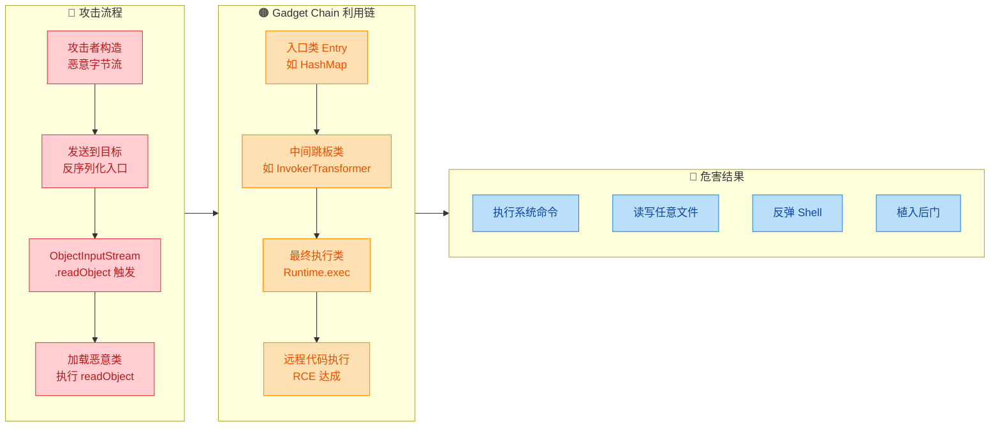

---

### 经典漏洞案例：Apache Commons Collections 利用链

2015 年，安全研究员 Gabriel Lawrence 和 Chris Frohoff 公开了一条基于 Apache Commons Collections 库的反序列化利用链，震动了整个 Java 生态。几乎所有使用了该库的 Java 应用（WebLogic、JBoss、Jenkins、WebSphere……）都受到影响。

其核心原理可以简化为以下步骤：

```java
// ⚠️ 以下代码仅用于安全教育目的，展示攻击原理
// 切勿用于非法用途

import org.apache.commons.collections.Transformer;
import org.apache.commons.collections.functors.ChainedTransformer;
import org.apache.commons.collections.functors.ConstantTransformer;
import org.apache.commons.collections.functors.InvokerTransformer;
import org.apache.commons.collections.map.TransformedMap;

import java.util.HashMap;
import java.util.Map;

public class CommonsCollectionsExploit {

    public static void main(String[] args) throws Exception {

        // 1. 构造 Transformer 链——这是攻击的核心
        //    每个 Transformer 接收上一个的输出作为输入
        Transformer[] transformers = new Transformer[] {
            // 第一步：返回 Runtime.class 常量
            new ConstantTransformer(Runtime.class),

            // 第二步：通过反射调用 Runtime.getRuntime()
            //    等价于：Runtime.class.getMethod("getRuntime")
            new InvokerTransformer(
                "getMethod",                                    // 调用的方法名
                new Class[] { String.class, Class[].class },    // 参数类型
                new Object[] { "getRuntime", new Class[0] }     // 参数值
            ),

            // 第三步：invoke 获取 Runtime 实例
            //    等价于：method.invoke(null)
            new InvokerTransformer(
                "invoke",                                       // 调用 invoke
                new Class[] { Object.class, Object[].class },   // 参数类型
                new Object[] { null, new Object[0] }            // 参数值
            ),

            // 第四步：调用 runtime.exec() 执行系统命令
            //    等价于：runtime.exec("calc.exe")
            new InvokerTransformer(
                "exec",                                         // 调用 exec
                new Class[] { String.class },                   // 参数类型
                new Object[] { "calc.exe" }                     // 要执行的命令
            )
        };

        // 2. 将多个 Transformer 串成链
        Transformer chainedTransformer = new ChainedTransformer(transformers);

        // 3. 用 TransformedMap 包装一个普通 Map
        //    当 Map 的 value 被修改时，会自动触发 Transformer 链
        Map<String, String> innerMap = new HashMap<>();
        innerMap.put("key", "value");

        // decorateMap: 当 entry 的 value 变化时触发 chainedTransformer
        Map outerMap = TransformedMap.decorate(
            innerMap,       // 被包装的原始 Map
            null,           // key 的 Transformer（不需要）
            chainedTransformer  // value 的 Transformer（攻击链）
        );

        // 4. 当反序列化过程中触发了 Map.Entry.setValue()
        //    整条链就会被激活，最终执行 Runtime.exec("calc.exe")
        // 在真实攻击中，这一步由 AnnotationInvocationHandler.readObject() 触发
    }
}
```

整条链的执行流程如下：

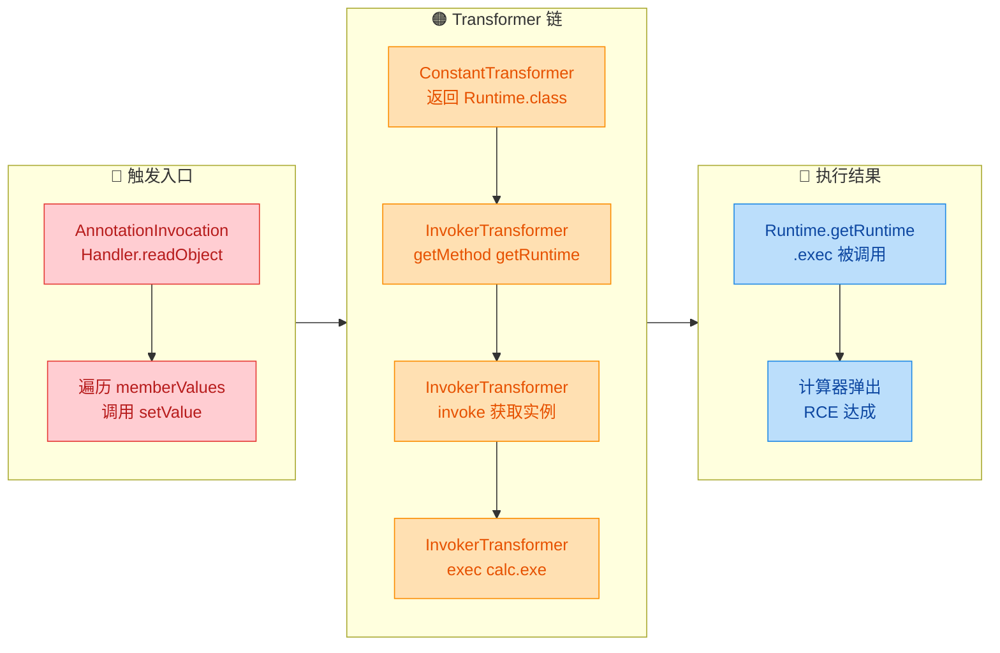

这条链之所以能成功，是因为 `AnnotationInvocationHandler` 的 `readObject()` 方法会遍历内部 Map 并调用 `setValue()`，而 `TransformedMap` 在 `setValue()` 时会触发注册的 `Transformer`。攻击者只需要把这个精心构造的对象图序列化成字节流，发送给目标服务器，服务器一旦调用 `readObject()`，整条链就自动执行了。

---

### 常见的攻击面（Attack Surface）

反序列化漏洞的攻击面远比你想象的广。任何接收外部字节流并进行反序列化的地方，都是潜在的入口：

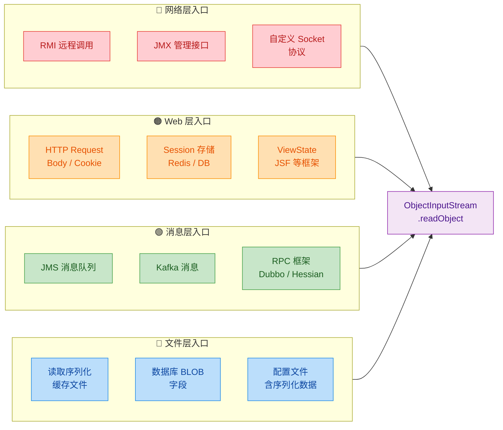

---

### 敏感数据泄露问题

除了远程代码执行，序列化还有一个容易被忽视的安全问题：**敏感数据泄露**。当你序列化一个对象时，它的所有非 transient 字段都会被写入字节流——包括密码、密钥、Token 等敏感信息。

```java
// ⚠️ 反面教材：敏感字段被序列化
public class UserAccount implements Serializable {
    private static final long serialVersionUID = 1L;

    private String username;        // 用户名——会被序列化
    private String password;        // 密码——会被序列化！危险！
    private String creditCardNumber; // 信用卡号——会被序列化！危险！
    private String sessionToken;    // 会话令牌——会被序列化！危险！

    // 这些敏感数据全部会出现在字节流中
    // 任何能拿到这段字节流的人都能读取它们
}
```

字节流是明文的（或者说，是容易解析的结构化数据）。攻击者可以用 `SerializationDumper` 等工具直接查看其中的内容：

```java
// 使用 hexdump 或专用工具查看序列化数据
// 字节流中会清晰地包含字段名和字段值：
// username = "admin"
// password = "P@ssw0rd123"        <-- 明文暴露！
// creditCardNumber = "4111111111111111"  <-- 明文暴露！
```

正确的做法是使用 `transient` 关键字保护敏感字段，并在自定义的 `readObject()` / `writeObject()` 中进行加密处理：

```java
public class SecureUserAccount implements Serializable {
    private static final long serialVersionUID = 1L;

    private String username;                    // 普通字段，正常序列化

    // 敏感字段标记为 transient，不参与默认序列化
    private transient String password;          // 不会出现在字节流中
    private transient String creditCardNumber;  // 不会出现在字节流中
    private transient String sessionToken;      // 不会出现在字节流中

    /**
     * 自定义序列化：对敏感数据加密后再写入
     */
    private void writeObject(ObjectOutputStream oos) throws IOException {
        // 先写入非 transient 字段
        oos.defaultWriteObject();

        // 对密码进行加密后写入（而非明文）
        oos.writeObject(encrypt(password));
        // sessionToken 完全不写入——反序列化后需要重新认证
        // creditCardNumber 只写入掩码版本
        oos.writeObject(maskCreditCard(creditCardNumber));
    }

    /**
     * 自定义反序列化：读取并解密
     */
    private void readObject(ObjectInputStream ois)
            throws IOException, ClassNotFoundException {
        // 先恢复非 transient 字段
        ois.defaultReadObject();

        // 读取加密的密码并解密
        String encryptedPassword = (String) ois.readObject();
        this.password = decrypt(encryptedPassword);

        // 读取掩码信用卡号
        this.creditCardNumber = (String) ois.readObject();

        // sessionToken 不恢复，强制用户重新登录
        this.sessionToken = null;
    }

    // 加密方法（示意，实际应使用 AES 等标准算法）
    private String encrypt(String data) {
        // 使用 AES/GCM 等加密算法
        return "ENC:" + data;  // 简化示意
    }

    // 解密方法
    private String decrypt(String data) {
        // 对应的解密逻辑
        return data.replace("ENC:", "");  // 简化示意
    }

    // 信用卡号掩码
    private String maskCreditCard(String cardNumber) {
        // 只保留后四位：**** **** **** 1111
        if (cardNumber == null || cardNumber.length() < 4) return "****";
        return "****" + cardNumber.substring(cardNumber.length() - 4);
    }
}
```

---

### 防御策略一：ObjectInputFilter（JDK 9+ 白名单过滤）

从 JDK 9 开始（JDK 8u121 也有 backport），Java 引入了 `ObjectInputFilter` 机制，允许你在反序列化之前对类进行白名单/黑名单过滤。这是目前 JDK 原生提供的最重要的防御手段。

```java
import java.io.*;

public class SafeDeserialization {

    /**
     * 使用 ObjectInputFilter 实现白名单反序列化
     * 只允许特定的、已知安全的类被反序列化
     */
    public static Object safeDeserialize(byte[] data) throws Exception {

        // 1. 创建 ObjectInputStream
        ByteArrayInputStream bais = new ByteArrayInputStream(data);
        ObjectInputStream ois = new ObjectInputStream(bais);

        // 2. 设置反序列化过滤器（白名单模式）
        ois.setObjectInputFilter(filterInfo -> {

            // 获取正在被反序列化的类
            Class<?> clazz = filterInfo.serialClass();

            // 如果 clazz 为 null，说明是基本类型或数组描述，放行
            if (clazz == null) {
                return ObjectInputFilter.Status.UNDECIDED;
            }

            // 白名单：只允许这些类被反序列化
            if (clazz == String.class ||                // String 是安全的
                clazz == Integer.class ||               // 基本包装类型
                clazz == Long.class ||                  // 基本包装类型
                clazz.getName().startsWith("com.myapp.dto.")) {  // 自己的 DTO 类
                return ObjectInputFilter.Status.ALLOWED;    // 允许
            }

            // 限制对象图的深度和大小，防止 DoS 攻击
            if (filterInfo.depth() > 10) {              // 对象嵌套不超过 10 层
                return ObjectInputFilter.Status.REJECTED;
            }
            if (filterInfo.references() > 1000) {       // 引用数不超过 1000
                return ObjectInputFilter.Status.REJECTED;
            }
            if (filterInfo.streamBytes() > 1024 * 1024) { // 字节流不超过 1MB
                return ObjectInputFilter.Status.REJECTED;
            }

            // 其他所有类一律拒绝
            return ObjectInputFilter.Status.REJECTED;
        });

        // 3. 执行反序列化——此时有过滤器保护
        return ois.readObject();
    }
}
```

你也可以通过 JVM 启动参数设置全局过滤器，无需修改代码：

```java
// JVM 启动参数方式设置全局反序列化过滤器
// 允许 com.myapp.dto 包下的类，拒绝其他所有类
// -Djdk.serialFilter=com.myapp.dto.*;!*

// 也可以在 $JAVA_HOME/conf/security/java.security 中配置：
// jdk.serialFilter=com.myapp.dto.*;!*

// 过滤器模式语法：
//   com.myapp.dto.*  -> 允许该包下所有类
//   !*               -> 拒绝所有其他类（必须放最后）
//   maxdepth=10      -> 最大嵌套深度
//   maxrefs=1000     -> 最大引用数
//   maxbytes=1048576 -> 最大字节数
```

---

### 防御策略二：自定义 readObject() 中的校验

即使不使用 `ObjectInputFilter`，你也应该在自定义的 `readObject()` 方法中进行严格的输入校验。反序列化恢复的数据不可信，必须像对待用户输入一样进行验证：

```java
public class Order implements Serializable {
    private static final long serialVersionUID = 1L;

    private String orderId;     // 订单号
    private int quantity;       // 数量
    private double price;       // 单价
    private String status;      // 状态

    /**
     * 自定义反序列化：加入严格的数据校验
     * 防止攻击者通过篡改字节流注入非法数据
     */
    private void readObject(ObjectInputStream ois)
            throws IOException, ClassNotFoundException {

        // 1. 先执行默认反序列化，恢复所有字段
        ois.defaultReadObject();

        // 2. 校验 orderId：不能为空，且必须符合格式
        if (orderId == null || !orderId.matches("^ORD-\\d{8,12}$")) {
            throw new InvalidObjectException(
                "非法的订单号格式: " + orderId   // 拒绝不合法的数据
            );
        }

        // 3. 校验 quantity：必须是正整数，且有合理上限
        if (quantity <= 0 || quantity > 10000) {
            throw new InvalidObjectException(
                "非法的数量值: " + quantity       // 防止整数溢出攻击
            );
        }

        // 4. 校验 price：必须为正数，且有合理范围
        if (price <= 0 || price > 1_000_000 || Double.isNaN(price) || Double.isInfinite(price)) {
            throw new InvalidObjectException(
                "非法的价格值: " + price          // 防止 NaN/Infinity 注入
            );
        }

        // 5. 校验 status：必须是预定义的枚举值之一
        if (!Set.of("PENDING", "PAID", "SHIPPED", "COMPLETED", "CANCELLED")
                .contains(status)) {
            throw new InvalidObjectException(
                "非法的订单状态: " + status       // 防止状态篡改
            );
        }
    }
}
```

---

### 防御策略三：彻底避免 Java 原生序列化

最根本的防御策略是：**不要使用 Java 原生序列化**。业界已经形成了广泛共识——Java 序列化机制是一个历史包袱，应该尽可能用更安全的替代方案取代。

Java 之父 James Gosling 曾说过："I'd like to see serialization go away."（我希望序列化消失。）

Brian Goetz（Java 语言架构师）也明确表示序列化是 Java 平台最大的安全隐患之一。

```java
// ❌ 不推荐：Java 原生序列化
ObjectOutputStream oos = new ObjectOutputStream(fileOut);
oos.writeObject(user);  // 危险：生成的字节流可被利用

// ✅ 推荐替代方案 1：JSON（使用 Jackson）
import com.fasterxml.jackson.databind.ObjectMapper;

ObjectMapper mapper = new ObjectMapper();

// 序列化：对象 -> JSON 字符串
String json = mapper.writeValueAsString(user);
// 输出：{"username":"admin","email":"admin@example.com"}
// JSON 是纯文本，不包含类信息，无法触发 Gadget Chain

// 反序列化：JSON 字符串 -> 对象（必须指定目标类型）
User restored = mapper.readValue(json, User.class);
// 明确指定了 User.class，不会加载任意类
```

```java
// ✅ 推荐替代方案 2：Protocol Buffers（Google Protobuf）
// 1. 先定义 .proto 文件
// syntax = "proto3";
// message UserProto {
//     string username = 1;
//     string email = 2;
//     int32 age = 3;
// }

// 2. 使用生成的代码进行序列化/反序列化
UserProto user = UserProto.newBuilder()
    .setUsername("admin")           // 类型安全的 setter
    .setEmail("admin@example.com")  // 编译期检查
    .setAge(30)                     // 不存在任意类加载的风险
    .build();

// 序列化为字节数组（紧凑的二进制格式，非 Java 序列化）
byte[] bytes = user.toByteArray();

// 反序列化（只能还原为 UserProto，无法注入其他类）
UserProto restored = UserProto.parseFrom(bytes);
```

各方案的安全性对比：

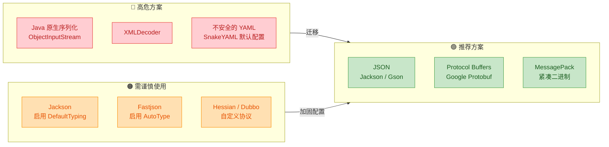

---

### 防御策略四：serialVersionUID 的安全角色

`serialVersionUID` 虽然主要用于版本控制，但在安全层面也有一定作用。如果攻击者构造的恶意字节流中的 `serialVersionUID` 与服务端类不匹配，反序列化会直接抛出 `InvalidClassException`，攻击链在第一步就被打断：

```java
public class DefensiveEntity implements Serializable {

    // 显式声明 serialVersionUID
    // 当类结构发生安全相关变更时，主动修改此值
    // 可以使旧版本的序列化数据（包括攻击载荷）全部失效
    private static final long serialVersionUID = 20240101L;

    // 如果发现安全漏洞，将 serialVersionUID 改为新值：
    // private static final long serialVersionUID = 20240615L;
    // 所有基于旧版本构造的攻击载荷将无法反序列化
}
```

但要注意，这只是一层薄薄的防线。攻击者如果能获取到你的类定义（比如开源项目），就能轻松匹配 `serialVersionUID`。

---

### 防御策略五：Look-Ahead 反序列化模式

在 `ObjectInputFilter` 出现之前，社区广泛使用的一种防御模式是 Look-Ahead ObjectInputStream——通过重写 `resolveClass()` 方法，在类加载之前进行拦截：

```java
/**
 * 安全的 ObjectInputStream 实现
 * 通过重写 resolveClass 实现白名单类加载控制
 */
public class LookAheadObjectInputStream extends ObjectInputStream {

    // 白名单：只有这些类允许被反序列化
    private static final Set<String> ALLOWED_CLASSES = Set.of(
        "com.myapp.dto.UserDTO",        // 用户数据传输对象
        "com.myapp.dto.OrderDTO",       // 订单数据传输对象
        "java.lang.String",             // String 类型
        "java.lang.Integer",            // Integer 类型
        "java.lang.Long",              // Long 类型
        "java.util.ArrayList",          // ArrayList
        "java.util.HashMap"             // HashMap
    );

    // 构造器：传入底层输入流
    public LookAheadObjectInputStream(InputStream in) throws IOException {
        super(in);
    }

    /**
     * 核心防御点：在类被加载之前进行检查
     * 这个方法在 readObject() 内部被调用
     * 如果类不在白名单中，直接抛异常，阻止类加载
     */
    @Override
    protected Class<?> resolveClass(ObjectStreamClass desc)
            throws IOException, ClassNotFoundException {

        // 获取要加载的类名
        String className = desc.getName();

        // 检查是否在白名单中
        if (!ALLOWED_CLASSES.contains(className)) {
            // 记录安全日志——这可能是一次攻击尝试
            System.err.println(
                "[SECURITY] 拒绝反序列化未授权的类: " + className
            );
            // 抛出异常，阻止反序列化继续进行
            throw new InvalidClassException(
                "反序列化被拒绝",
                className   // 记录被拒绝的类名
            );
        }

        // 白名单中的类，正常加载
        return super.resolveClass(desc);
    }
}
```

使用方式：

```java
// 使用安全的 LookAheadObjectInputStream 替代原生 ObjectInputStream
public static Object safeRead(byte[] data) throws Exception {
    ByteArrayInputStream bais = new ByteArrayInputStream(data);

    // 用自定义的安全版本替代 new ObjectInputStream(bais)
    try (LookAheadObjectInputStream ois = new LookAheadObjectInputStream(bais)) {
        return ois.readObject();    // 反序列化时会自动触发白名单检查
    }
}
```

---

### 防御策略全景总结

将所有防御手段按优先级和适用场景整理如下：

```mermaid
graph LR
    subgraph L1["🟢 最佳实践 - 优先采用"]
        direction TB
        A1["彻底避免<br/>Java 原生序列化"]
        A2["使用 JSON<br/>Protobuf 等替代"]
        A3["最小化暴露面<br/>减少反序列化入口"]
    end

    subgraph L2["🔵 纵深防御 - 必须配置"]
        direction TB
        B1["ObjectInputFilter<br/>JDK 9+ 白名单"]
        B2["LookAhead 模式<br/>重写 resolveClass"]
        B3["readObject 中<br/>严格校验字段"]
    end

    subgraph L3["🟠 辅助措施 - 锦上添花"]
        direction TB
        C1["transient 保护<br/>敏感字段"]
        C2["serialVersionUID<br/>主动版本控制"]
        C3["依赖库升级<br/>移除危险 Gadget"]
    end

    subgraph L4["🔴 运维监控 - 兜底保障"]
        direction TB
        D1["RASP 运行时<br/>防护"]
        D2["WAF 流量<br/>检测"]
        D3["安全日志<br/>告警审计"]
    end

    L1 --> L2
    L2 --> L3
    L3 --> L4

    classDef l1Style fill:#C8E6C9,stroke:#43A047,color:#1B5E20
    classDef l2Style fill:#BBDEFB,stroke:#1E88E5,color:#0D47A1
    classDef l3Style fill:#FFE0B2,stroke:#FB8C00,color:#E65100
    classDef l4Style fill:#FFCDD2,stroke:#E53935,color:#B71C1C

    class A1,A2,A3 l1Style
    class B1,B2,B3 l2Style
    class C1,C2,C3 l3Style
    class D1,D2,D3 l4Style
```

---

### 真实世界的重大安全事件

序列化漏洞不是纸上谈兵，以下是几个震动业界的真实案例：

| 年份 | 事件 | 影响 | 根因 |
|------|------|------|------|
| 2015 | Apache Commons Collections 利用链公开 | WebLogic、JBoss、Jenkins 等几乎所有 Java 中间件受影响 | `InvokerTransformer` 可被串成 RCE 链 |
| 2016 | Spring Framework RCE (CVE-2016-1000027) | Spring 的 `HttpInvokerServiceExporter` 直接反序列化 HTTP 请求体 | 未对输入做任何过滤 |
| 2017 | WebLogic 反序列化漏洞 (CVE-2017-10271) | Oracle WebLogic Server 远程代码执行 | T3 协议直接暴露反序列化入口 |
| 2019 | Dubbo 反序列化漏洞 (CVE-2019-17564) | Apache Dubbo HTTP 协议远程代码执行 | HTTP 协议实现使用了 Java 原生反序列化 |
| 2021 | Log4Shell (CVE-2021-44228) | 虽非直接序列化漏洞，但利用了 JNDI 注入加载远程类，原理相通 | 不可信输入触发了远程类加载 |

这些事件的共同教训是：**永远不要信任来自外部的序列化数据**。

---

### 安全编码 Checklist

在项目中处理序列化相关代码时，对照以下清单逐项检查：

```java
// ============================================
// 序列化安全编码 Checklist
// ============================================

// 1. [必查] 是否真的需要 Java 原生序列化？
//    -> 优先考虑 JSON / Protobuf / MessagePack

// 2. [必查] 如果必须使用，是否配置了 ObjectInputFilter？
//    -> JDK 9+: ois.setObjectInputFilter(...)
//    -> JDK 8:  -Djdk.serialFilter=...

// 3. [必查] 反序列化入口是否暴露给了不可信来源？
//    -> RMI / JMX / 自定义 Socket 是否有认证？
//    -> HTTP 接口是否有权限控制？

// 4. [必查] 敏感字段是否标记了 transient？
//    -> 密码、密钥、Token 等绝不能出现在字节流中

// 5. [必查] readObject() 中是否有输入校验？
//    -> 数值范围、字符串格式、枚举值、null 检查

// 6. [必查] classpath 中是否存在已知的危险 Gadget 库？
//    -> commons-collections 3.x（升级到 4.x）
//    -> commons-beanutils（升级到最新版）
//    -> spring-beans（确保版本无已知漏洞）

// 7. [建议] 是否启用了 RASP 或 WAF 进行运行时防护？
//    -> 如 OpenRASP、Contrast Security 等

// 8. [建议] 是否有安全日志记录反序列化异常？
//    -> 异常的反序列化尝试可能是攻击探测
```

---

**📝 练习题**

某 Java Web 应用使用 `ObjectInputStream` 直接反序列化来自 HTTP 请求体的数据。以下哪种防御措施的优先级最高？

A. 将所有敏感字段标记为 `transient`

B. 显式声明 `serialVersionUID` 并定期更换

C. 配置 `ObjectInputFilter` 白名单，只允许已知安全的类被反序列化

D. 在 `readObject()` 方法中对字段值进行范围校验

**【答案】** C

**【解析】** 这道题考察的是防御优先级的判断。当反序列化入口直接暴露给不可信的外部输入（HTTP 请求体）时，最紧迫的威胁是远程代码执行（RCE），而非数据泄露或数据篡改。选项 A（`transient`）只能防止敏感数据泄露，无法阻止 RCE；选项 B（`serialVersionUID`）只是一层薄弱的版本校验，攻击者可以轻松匹配；选项 D（字段校验）虽然重要，但它发生在对象已经被创建之后，此时 Gadget Chain 可能已经执行完毕。只有选项 C（`ObjectInputFilter` 白名单）能在类加载阶段就拦截恶意类，从根源上阻断攻击链。当然，最佳实践是彻底弃用 Java 原生序列化，改用 JSON 等安全格式——但在题目给定的场景下，配置白名单过滤器是优先级最高的加固措施。

---

## Externalizable（自定义序列化）

Java 的默认序列化机制（`Serializable`）虽然使用方便——只需实现一个标记接口，JVM 就会自动帮你把对象的所有非 `transient` 字段写入字节流——但它存在一些根本性的局限：你无法精细控制哪些字段以何种格式、何种顺序被写出，性能上也因为依赖反射而存在开销。`Externalizable` 接口正是 Java 为解决这些问题而提供的"完全手动挡"序列化方案。

实现 `Externalizable` 意味着你要亲手接管序列化和反序列化的全部过程：写什么、怎么写、读什么、怎么读，全部由你的代码决定。这带来了极大的灵活性和潜在的性能优势，但也意味着更高的编码复杂度和更大的出错风险。

### Externalizable 接口定义与核心契约

`Externalizable` 接口位于 `java.io` 包中，它继承自 `Serializable`，因此任何实现了 `Externalizable` 的类，本质上也是 `Serializable` 的。但 JVM 对二者的处理逻辑截然不同。

```java
// Externalizable 接口的源码定义
// 它继承了 Serializable，所以 Externalizable 对象也"是" Serializable 的
public interface Externalizable extends Serializable {

    // 你必须实现此方法：负责将对象状态写入输出流
    // 完全由你决定写哪些字段、以什么顺序写
    void writeExternal(ObjectOutput out) throws IOException;

    // 你必须实现此方法：负责从输入流中恢复对象状态
    // 读取的顺序和类型必须与 writeExternal 中写入的严格一致
    void readExternal(ObjectInput in) throws IOException, ClassNotFoundException;
}
```

这里有一个极其重要的契约，也是面试中经常被考到的点：实现 `Externalizable` 的类**必须提供一个 public 的无参构造器**。原因在于反序列化的机制差异——`Serializable` 反序列化时，JVM 通过底层的 `sun.misc.Unsafe` 或类似机制直接分配内存、绕过构造器来创建对象；而 `Externalizable` 反序列化时，JVM 会**先调用 public 无参构造器创建一个"空白"对象**，然后再调用 `readExternal()` 方法来填充字段值。如果找不到这个无参构造器，反序列化会直接抛出 `InvalidClassException`。

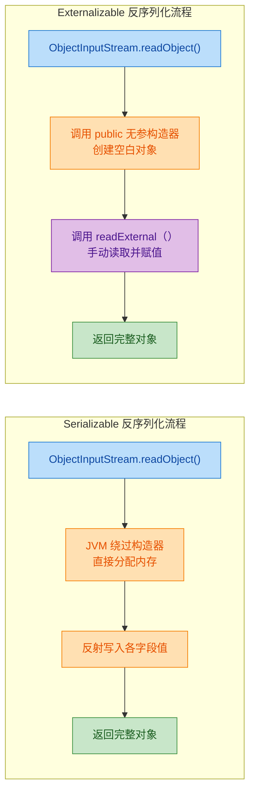

### 基础用法：完整示例

下面通过一个具体的 `User` 类来演示 `Externalizable` 的完整用法。

```java
import java.io.*;

// 实现 Externalizable 接口
public class User implements Externalizable {

    // 注意：虽然 Externalizable 也继承了 Serializable，
    // 但 serialVersionUID 仍然建议声明，用于版本兼容性校验
    private static final long serialVersionUID = 1L;

    private String name;       // 用户名——我们选择序列化它
    private int age;           // 年龄——我们选择序列化它
    private String password;   // 密码——我们选择【不】序列化它（出于安全考虑）

    // ★★★ 必须提供 public 无参构造器 ★★★
    // 如果缺少这个构造器，反序列化时会抛出 InvalidClassException
    public User() {
        // 反序列化时，JVM 会先调用这个构造器
        System.out.println(">>> public 无参构造器被调用");
    }

    // 带参构造器，方便正常业务使用
    public User(String name, int age, String password) {
        this.name = name;         // 设置用户名
        this.age = age;           // 设置年龄
        this.password = password; // 设置密码
    }

    @Override
    public void writeExternal(ObjectOutput out) throws IOException {
        // 手动控制：只写出 name 和 age
        out.writeUTF(name);   // 以 UTF-8 编码写出字符串
        out.writeInt(age);    // 写出 int 值
        // password 故意不写——实现了比 transient 更直观的字段排除
    }

    @Override
    public void readExternal(ObjectInput in) throws IOException, ClassNotFoundException {
        // 读取顺序必须与 writeExternal 中的写入顺序严格一致
        this.name = in.readUTF();  // 先读 name（因为先写的是 name）
        this.age = in.readInt();   // 再读 age（因为第二个写的是 age）
        // password 没有写入，所以这里也不读，它将保持默认值 null
    }

    @Override
    public String toString() {
        // 用于打印验证结果
        return "User{name='" + name + "', age=" + age + "', password='" + password + "'}";
    }
}
```

测试代码：

```java
import java.io.*;

public class ExternalizableDemo {
    public static void main(String[] args) {
        String filePath = "user_ext.dat"; // 序列化文件路径

        // ========== 序列化 ==========
        User original = new User("Alice", 30, "s3cret!"); // 创建原始对象
        try (ObjectOutputStream oos =
                     new ObjectOutputStream(new FileOutputStream(filePath))) {
            oos.writeObject(original); // 内部会调用 user.writeExternal(oos)
            System.out.println("序列化完成: " + original);
        } catch (IOException e) {
            e.printStackTrace(); // 处理 IO 异常
        }

        // ========== 反序列化 ==========
        try (ObjectInputStream ois =
                     new ObjectInputStream(new FileInputStream(filePath))) {
            // readObject() 内部流程：
            // 1. 调用 User 的 public 无参构造器 → 打印 ">>> public 无参构造器被调用"
            // 2. 调用 user.readExternal(ois) → 填充 name 和 age
            User restored = (User) ois.readObject();
            System.out.println("反序列化完成: " + restored);
        } catch (IOException | ClassNotFoundException e) {
            e.printStackTrace(); // 处理异常
        }
    }
}
```

运行输出：

```
序列化完成: User{name='Alice', age=30', password='s3cret!'}
>>> public 无参构造器被调用
反序列化完成: User{name='Alice', age=30', password='null'}
```

注意观察输出：反序列化时无参构造器确实被调用了，而 `password` 因为没有在 `writeExternal` 中写出，所以恢复后为 `null`。

### Serializable vs Externalizable：全面对比

这两个接口的差异不仅仅是"自动 vs 手动"那么简单，它们在底层机制、性能特征、使用场景上都有本质区别。

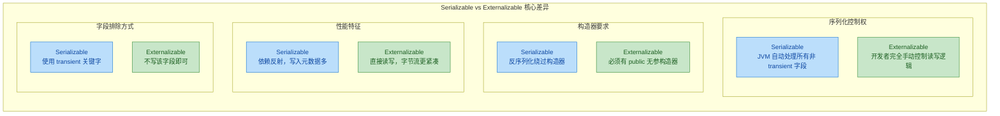

用一张表格做更细致的梳理：

| 对比维度 | `Serializable` | `Externalizable` |
|---|---|---|
| 接口类型 | 标记接口（Marker Interface），无方法 | 包含两个必须实现的方法 |
| 序列化控制 | JVM 自动序列化所有非 `static`、非 `transient` 字段 | 完全由 `writeExternal` / `readExternal` 控制 |
| 反序列化构造 | 绕过所有构造器，直接分配内存 | 先调用 `public` 无参构造器，再调用 `readExternal` |
| 字段排除 | 使用 `transient` 关键字 | 在 `writeExternal` 中不写出即可 |
| `transient` 效果 | 有效，被标记的字段不会被序列化 | 无意义，因为你手动控制所有读写 |
| `serialVersionUID` | 强烈建议声明 | 同样建议声明（因为继承了 `Serializable`） |
| 性能 | 反射开销较大，元数据冗余 | 通常更快，字节流更紧凑 |
| 编码复杂度 | 极低（加个 `implements` 就行） | 较高（必须正确实现两个方法） |
| 继承处理 | 父类如果也是 `Serializable`，自动处理 | 子类必须在 `readExternal`/`writeExternal` 中显式调用父类逻辑 |

### 继承场景下的 Externalizable

当涉及继承时，`Externalizable` 的处理方式需要特别注意。子类必须在自己的 `writeExternal` 和 `readExternal` 中**显式处理父类的字段**，JVM 不会自动帮你做这件事。

```java
import java.io.*;

// 父类：也实现 Externalizable
public class Person implements Externalizable {

    private static final long serialVersionUID = 1L;

    protected String name; // 姓名
    protected int age;     // 年龄

    // ★ 父类也必须有 public 无参构造器
    public Person() {
        System.out.println(">>> Person 无参构造器");
    }

    public Person(String name, int age) {
        this.name = name; // 设置姓名
        this.age = age;   // 设置年龄
    }

    @Override
    public void writeExternal(ObjectOutput out) throws IOException {
        out.writeUTF(name);  // 写出姓名
        out.writeInt(age);   // 写出年龄
    }

    @Override
    public void readExternal(ObjectInput in) throws IOException, ClassNotFoundException {
        this.name = in.readUTF(); // 读取姓名
        this.age = in.readInt();  // 读取年龄
    }
}
```

```java
import java.io.*;

// 子类：继承 Person，扩展 Employee 信息
public class Employee extends Person {

    private static final long serialVersionUID = 2L;

    private String company;  // 公司名
    private double salary;   // 薪资

    // ★ 子类也必须有 public 无参构造器
    public Employee() {
        // 这里会先隐式调用 super()，即 Person 的无参构造器
        System.out.println(">>> Employee 无参构造器");
    }

    public Employee(String name, int age, String company, double salary) {
        super(name, age);        // 调用父类构造器设置 name 和 age
        this.company = company;  // 设置公司名
        this.salary = salary;    // 设置薪资
    }

    @Override
    public void writeExternal(ObjectOutput out) throws IOException {
        // ★★★ 关键：必须显式调用父类的 writeExternal ★★★
        // 如果忘记这一步，父类的 name 和 age 将不会被写入
        super.writeExternal(out);
        out.writeUTF(company);     // 写出公司名
        out.writeDouble(salary);   // 写出薪资
    }

    @Override
    public void readExternal(ObjectInput in) throws IOException, ClassNotFoundException {
        // ★★★ 关键：必须显式调用父类的 readExternal ★★★
        // 读取顺序必须与写入顺序一致：先父类字段，再子类字段
        super.readExternal(in);
        this.company = in.readUTF();    // 读取公司名
        this.salary = in.readDouble();  // 读取薪资
    }

    @Override
    public String toString() {
        return "Employee{name='" + name + "', age=" + age
                + ", company='" + company + "', salary=" + salary + "}";
    }
}
```

如果你忘记调用 `super.writeExternal(out)` 或 `super.readExternal(in)`，父类的字段在反序列化后将全部是默认值（`null`、`0` 等），而且不会有任何编译错误或运行时异常提醒你——这是一个非常隐蔽的 bug。

### 高级技巧：数据压缩与加密

`Externalizable` 的一大优势是你可以在序列化过程中插入任意自定义逻辑，比如对数据进行压缩或简单加密。

```java
import java.io.*;
import java.nio.charset.StandardCharsets;
import java.util.Base64;
import java.util.zip.DeflaterOutputStream;
import java.util.zip.InflaterInputStream;

public class SecureData implements Externalizable {

    private static final long serialVersionUID = 1L;

    private String sensitiveInfo;  // 敏感信息
    private byte[] largePayload;   // 大体积数据（适合压缩）

    public SecureData() {
        // 必须的 public 无参构造器
    }

    public SecureData(String sensitiveInfo, byte[] largePayload) {
        this.sensitiveInfo = sensitiveInfo; // 设置敏感信息
        this.largePayload = largePayload;   // 设置大体积数据
    }

    @Override
    public void writeExternal(ObjectOutput out) throws IOException {
        // --- 对敏感信息做 Base64 编码（简单示意，生产环境应使用真正的加密） ---
        byte[] encoded = Base64.getEncoder()
                .encode(sensitiveInfo.getBytes(StandardCharsets.UTF_8)); // 编码为 Base64
        out.writeInt(encoded.length);  // 先写出编码后的字节长度
        out.write(encoded);            // 再写出编码后的字节数组

        // --- 对大体积数据做 ZLIB 压缩 ---
        ByteArrayOutputStream baos = new ByteArrayOutputStream(); // 内存缓冲区
        try (DeflaterOutputStream deflater = new DeflaterOutputStream(baos)) {
            deflater.write(largePayload); // 将原始数据写入压缩流
            deflater.finish();            // 完成压缩
        }
        byte[] compressed = baos.toByteArray(); // 获取压缩后的字节数组
        out.writeInt(compressed.length);        // 写出压缩后的长度
        out.write(compressed);                  // 写出压缩后的数据
        // 可以在这里打印压缩比，观察效果
        System.out.println("压缩比: " + largePayload.length + " -> " + compressed.length);
    }

    @Override
    public void readExternal(ObjectInput in) throws IOException, ClassNotFoundException {
        // --- 读取并解码敏感信息 ---
        int encodedLen = in.readInt();            // 读取编码后的长度
        byte[] encoded = new byte[encodedLen];    // 创建对应大小的数组
        in.readFully(encoded);                    // 完整读取字节数据
        this.sensitiveInfo = new String(
                Base64.getDecoder().decode(encoded),
                StandardCharsets.UTF_8);           // Base64 解码还原字符串

        // --- 读取并解压大体积数据 ---
        int compressedLen = in.readInt();              // 读取压缩后的长度
        byte[] compressed = new byte[compressedLen];   // 创建对应大小的数组
        in.readFully(compressed);                      // 完整读取压缩数据
        ByteArrayInputStream bais = new ByteArrayInputStream(compressed);
        try (InflaterInputStream inflater = new InflaterInputStream(bais)) {
            this.largePayload = inflater.readAllBytes(); // 解压还原原始数据
        }
    }

    @Override
    public String toString() {
        return "SecureData{sensitiveInfo='" + sensitiveInfo
                + "', payloadSize=" + (largePayload != null ? largePayload.length : 0) + "}";
    }
}
```

这个例子展示了 `Externalizable` 的真正威力：你可以在序列化层面直接嵌入压缩、编码、加密等逻辑，而不需要在业务代码中额外处理。对于 `Serializable`，你只能通过 `writeObject`/`readObject` 这对"半自动"的 hook 方法来实现类似功能，灵活度不如 `Externalizable`。

### 版本演进：字段增减的兼容性处理

在实际项目中，类的字段会随着版本迭代而增减。`Externalizable` 在这方面需要你自己设计兼容策略，因为 JVM 不会像处理 `Serializable` 那样自动做字段匹配。

一种常见的做法是在序列化数据的开头写入一个版本号：

```java
import java.io.*;

public class Config implements Externalizable {

    private static final long serialVersionUID = 1L;

    // 内部版本号，用于控制序列化格式的演进
    // 每次修改 writeExternal/readExternal 的格式时递增
    private static final int EXTERNAL_VERSION = 2;

    private String host;     // v1 就有的字段：主机地址
    private int port;        // v1 就有的字段：端口号
    private boolean useSsl;  // v2 新增的字段：是否使用 SSL
    private int timeout;     // v2 新增的字段：超时时间（毫秒）

    public Config() {
        // 无参构造器中设置合理的默认值
        // 这样即使从旧版本数据恢复，新字段也有安全的默认值
        this.useSsl = false;   // 默认不使用 SSL
        this.timeout = 3000;   // 默认超时 3 秒
    }

    public Config(String host, int port, boolean useSsl, int timeout) {
        this.host = host;       // 设置主机地址
        this.port = port;       // 设置端口号
        this.useSsl = useSsl;   // 设置 SSL 开关
        this.timeout = timeout; // 设置超时时间
    }

    @Override
    public void writeExternal(ObjectOutput out) throws IOException {
        out.writeInt(EXTERNAL_VERSION); // ★ 首先写出版本号
        // --- v1 字段 ---
        out.writeUTF(host);            // 写出主机地址
        out.writeInt(port);            // 写出端口号
        // --- v2 新增字段 ---
        out.writeBoolean(useSsl);      // 写出 SSL 开关
        out.writeInt(timeout);         // 写出超时时间
    }

    @Override
    public void readExternal(ObjectInput in) throws IOException, ClassNotFoundException {
        int version = in.readInt();    // ★ 首先读取版本号

        // --- v1 字段（所有版本都有） ---
        this.host = in.readUTF();      // 读取主机地址
        this.port = in.readInt();      // 读取端口号

        // --- v2 新增字段（仅当版本 >= 2 时才读取） ---
        if (version >= 2) {
            this.useSsl = in.readBoolean(); // 读取 SSL 开关
            this.timeout = in.readInt();    // 读取超时时间
        }
        // 如果 version < 2，useSsl 和 timeout 保持构造器中的默认值
    }

    @Override
    public String toString() {
        return "Config{host='" + host + "', port=" + port
                + ", useSsl=" + useSsl + ", timeout=" + timeout + "}";
    }
}
```

这种"版本号前缀"模式（Version-Prefixed Format）是 `Externalizable` 处理向后兼容的经典方案。相比之下，`Serializable` 的默认机制会自动忽略新增字段、为缺失字段赋默认值，在简单场景下更省心。但当你需要更精细的控制（比如字段重命名、类型变更、数据迁移）时，手动版本号方案反而更可靠。

### 常见陷阱与最佳实践

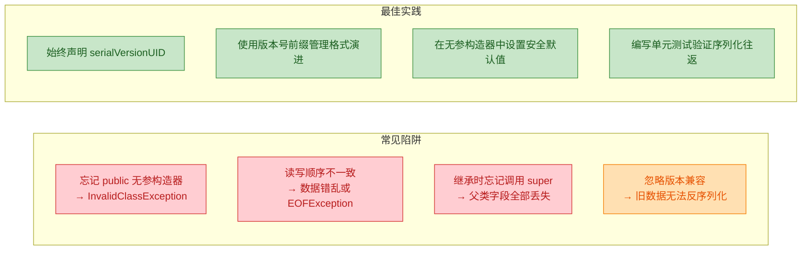

几个关键的实践建议：

1. 读写顺序必须严格对应。`writeExternal` 中先写 `String` 再写 `int`，那 `readExternal` 中就必须先读 `String` 再读 `int`。类型和顺序任何一个不匹配，都会导致数据错乱甚至异常。

2. 不要在 `Externalizable` 类上使用 `transient`。虽然语法上不会报错，但它毫无意义——`transient` 是给 JVM 默认序列化机制看的，而 `Externalizable` 的读写完全由你的代码控制，JVM 不会参考 `transient` 标记。

3. 优先考虑 `Serializable` + `writeObject`/`readObject`。如果你只是想对默认序列化做一些微调（比如加密某个字段），使用 `Serializable` 配合私有的 `writeObject`/`readObject` 方法通常是更好的选择，因为它保留了自动处理大部分字段的便利性。只有当你需要完全控制序列化格式、追求极致性能、或者序列化格式需要与外部系统对接时，才考虑 `Externalizable`。

4. 编写往返测试（Round-Trip Test）。对于任何实现了 `Externalizable` 的类，都应该编写单元测试：创建对象 → 序列化 → 反序列化 → 断言所有字段与原始对象一致。

```java
import org.junit.jupiter.api.Test;
import java.io.*;
import static org.junit.jupiter.api.Assertions.*;

class ConfigRoundTripTest {

    @Test
    void testSerializationRoundTrip() throws Exception {
        // 创建原始对象
        Config original = new Config("db.example.com", 5432, true, 5000);

        // 序列化到内存字节数组
        ByteArrayOutputStream baos = new ByteArrayOutputStream();
        try (ObjectOutputStream oos = new ObjectOutputStream(baos)) {
            oos.writeObject(original); // 触发 writeExternal
        }

        // 从字节数组反序列化
        ByteArrayInputStream bais = new ByteArrayInputStream(baos.toByteArray());
        try (ObjectInputStream ois = new ObjectInputStream(bais)) {
            Config restored = (Config) ois.readObject(); // 触发无参构造 + readExternal

            // 断言所有字段都正确恢复
            assertEquals("db.example.com", restored.getHost());   // 验证主机地址
            assertEquals(5432, restored.getPort());                // 验证端口号
            assertTrue(restored.isUseSsl());                       // 验证 SSL 开关
            assertEquals(5000, restored.getTimeout());             // 验证超时时间
        }
    }
}
```

### 何时选择 Externalizable

总结一下适用场景的决策逻辑：

- 如果你的类字段简单、不需要特殊处理 → 用 `Serializable`，省时省力。
- 如果你需要排除个别字段 → 用 `Serializable` + `transient`。
- 如果你需要对个别字段做自定义处理（加密、压缩等） → 用 `Serializable` + 私有 `writeObject`/`readObject`。
- 如果你需要完全控制序列化格式、追求最小字节流、或需要与特定二进制协议对接 → 用 `Externalizable`。
- 如果你在做高性能场景（如分布式缓存、消息队列的自定义编解码） → `Externalizable` 或者直接使用 Protobuf / Kryo 等第三方框架。

---

**📝 练习题**

以下关于 `Externalizable` 接口的描述，哪一项是正确的？

A. `Externalizable` 与 `Serializable` 没有继承关系，是两个完全独立的接口

B. 实现 `Externalizable` 的类在反序列化时，JVM 会绕过构造器直接创建对象，与 `Serializable` 行为一致

C. 实现 `Externalizable` 的类必须提供一个 `public` 的无参构造器，否则反序列化会失败

D. 在 `Externalizable` 的实现类中，`transient` 关键字仍然会像在 `Serializable` 中一样生效，阻止字段被序列化


**【答案】** C

**【解析】** 逐项分析：

- A 错误：`Externalizable` 继承自 `Serializable`（`public interface Externalizable extends Serializable`），二者存在明确的继承关系。任何实现了 `Externalizable` 的类，`instanceof Serializable` 也会返回 `true`。

- B 错误：这是两者最核心的行为差异之一。`Serializable` 反序列化时，JVM 通过底层机制（如 `Unsafe.allocateInstance`）绕过构造器直接分配内存；而 `Externalizable` 反序列化时，JVM 会**先调用 `public` 无参构造器**创建一个空白对象，然后再调用 `readExternal()` 方法填充字段。

- C 正确：这是 `Externalizable` 的硬性契约。如果类没有提供 `public` 的无参构造器（注意访问修饰符必须是 `public`，`protected` 或包级私有都不行），反序列化时会抛出 `java.io.InvalidClassException: no valid constructor`。

- D 错误：`transient` 关键字是 JVM 默认序列化机制（`Serializable`）识别的标记。在 `Externalizable` 中，所有字段的读写完全由开发者在 `writeExternal` / `readExternal` 中手动控制，JVM 不会参考 `transient` 标记。你不写某个字段，它就不会被序列化——不需要也不依赖 `transient`。

---

## 本章小结

序列化（Serialization）是 Java 平台中一项基础而关键的机制，它在对象持久化、网络通信、分布式系统等场景中扮演着不可替代的角色。本章从接口契约、版本控制、字段过滤、安全攻防到自定义序列化，完整地梳理了 Java 序列化体系的核心知识脉络。

### 知识脉络回顾

```mermaid
graph LR
    subgraph Entry["入口契约"]
        direction TB
        A["Serializable<br/>标记接口,零方法"]
        B["Externalizable<br/>完全自定义读写"]
    end

    subgraph Control["精细控制"]
        direction TB
        C["serialVersionUID<br/>版本兼容性锚点"]
        D["transient<br/>字段级序列化过滤"]
        E["writeObject / readObject<br/>钩子方法"]
    end

    subgraph Security["安全防线"]
        direction TB
        F["反序列化攻击<br/>Gadget Chain"]
        G["ObjectInputFilter<br/>白名单过滤"]
        H["readResolve<br/>单例保护"]
    end

    subgraph Output["落地场景"]
        direction TB
        I["文件持久化"]
        J["网络传输 RMI"]
        K["深拷贝"]
    end

    Entry --> Control
    Control --> Security
    Security --> Output

    classDef entryStyle fill:#C8E6C9,stroke:#388E3C,color:#1B5E20
    classDef controlStyle fill:#BBDEFB,stroke:#1976D2,color:#0D47A1
    classDef securityStyle fill:#FFE0B2,stroke:#F57C00,color:#E65100
    classDef outputStyle fill:#E1BEE7,stroke:#7B1FA2,color:#4A148C

    class A,B entryStyle
    class C,D,E controlStyle
    class F,G,H securityStyle
    class I,J,K outputStyle
```

### 核心要点提炼

以下是贯穿本章的几条主线，也是面试和实战中最常被考察的要点：

**1. Serializable 是"门票"，不是"说明书"**

`Serializable` 作为一个标记接口（Marker Interface），本身不包含任何方法。它的作用纯粹是向 JVM 的 `ObjectOutputStream` 声明："这个类的实例允许被序列化。" 如果一个对象没有实现该接口就尝试写入流，会立即抛出 `NotSerializableException`。这种设计体现了 Java 早期"显式授权"的哲学——序列化会暴露对象内部状态，必须由类的作者主动同意。

**2. serialVersionUID 是版本兼容的生命线**

当一个类被序列化写入磁盘或网络后，未来反序列化时 JVM 会比对流中的 `serialVersionUID` 与当前类的值。如果不匹配，直接抛出 `InvalidClassException`。不显式声明时，JVM 会根据类的结构（字段、方法签名等）自动计算一个哈希值，这意味着哪怕只是新增一个无关紧要的 `private` 方法，UID 都可能变化，导致旧数据无法反序列化。因此，任何可能被持久化的类都应该显式声明 `serialVersionUID`，这是工程实践中的铁律。

**3. transient 是最轻量的安全阀**

对于密码、会话令牌、数据库连接等不应被序列化的字段，`transient` 提供了最简洁的排除方式。被标记的字段在序列化时会被跳过，反序列化后恢复为类型默认值（引用类型为 `null`，基本类型为 `0` / `false`）。如果反序列化后需要恢复这些字段的有效状态，可以配合 `readObject()` 钩子方法进行重建。

**4. 反序列化是一个"隐藏的构造器"**

这是本章安全部分最核心的认知。反序列化过程不经过任何构造器，却能凭空创建一个完整的对象实例。这意味着构造器中的校验逻辑、不变量约束（invariants）全部被绕过。攻击者可以精心构造恶意字节流，利用 classpath 上已有类的 `readObject()` 方法组成 Gadget Chain，最终实现远程代码执行（RCE）。Apache Commons Collections 的历史漏洞就是经典案例。防御手段包括：

- Java 9+ 的 `ObjectInputFilter` 白名单机制
- `readResolve()` 保护单例不被破坏
- `validateObject()` 在反序列化后执行校验
- 在架构层面优先选择 JSON / Protobuf 等替代方案

**5. Externalizable 是"完全接管"模式**

当默认序列化机制无法满足需求时（性能敏感、格式定制、跨版本兼容策略复杂），`Externalizable` 允许开发者完全控制 `writeExternal()` 和 `readExternal()` 的每一个字节。代价是必须手动处理所有字段（包括父类字段），且类必须提供 `public` 无参构造器。它与 `Serializable` 的关系不是替代，而是在不同场景下的取舍。

### 两种序列化接口对比总览

```java
// ┌──────────────────────┬─────────────────────┬──────────────────────────┐
// │        维度          │   Serializable      │   Externalizable         │
// ├──────────────────────┼─────────────────────┼──────────────────────────┤
// │ 方法数量             │ 0 (标记接口)         │ 2 (writeExternal,       │
// │                      │                     │     readExternal)        │
// ├──────────────────────┼─────────────────────┼──────────────────────────┤
// │ 默认行为             │ 自动序列化全部       │ 无默认行为,              │
// │                      │ 非 transient 字段   │ 必须手动实现             │
// ├──────────────────────┼─────────────────────┼──────────────────────────┤
// │ 构造器要求           │ 无特殊要求           │ 必须有 public 无参构造器 │
// ├──────────────────────┼─────────────────────┼──────────────────────────┤
// │ transient 生效       │ 是                   │ 无意义 (你自己控制一切)  │
// ├──────────────────────┼─────────────────────┼──────────────────────────┤
// │ serialVersionUID     │ 强烈建议显式声明     │ 同样建议声明             │
// ├──────────────────────┼─────────────────────┼──────────────────────────┤
// │ 性能                 │ 反射开销较大         │ 直接调用, 性能更优       │
// ├──────────────────────┼─────────────────────┼──────────────────────────┤
// │ 适用场景             │ 大多数常规场景       │ 性能敏感 / 格式定制场景  │
// └──────────────────────┴─────────────────────┴──────────────────────────┘
```

### 现代视角：序列化的演进方向

Java 原生序列化机制诞生于 JDK 1.1 时代，至今已超过 25 年。它的设计在当时是前瞻性的，但随着分布式系统和微服务架构的普及，其固有缺陷日益凸显：

- **安全性**：反序列化攻击已成为 OWASP Top 10 的常客，Java 原生序列化是重灾区
- **跨语言**：二进制格式与 Java 强绑定，无法与其他语言互通
- **可读性**：二进制流无法人工审查和调试
- **体积与性能**：默认机制写入大量元数据（类描述符、字段签名），序列化产物体积偏大

因此，现代 Java 项目中，JSON（Jackson / Gson）、Protocol Buffers、Avro、Kryo 等方案已经在大多数场景中取代了原生序列化。但理解 Java 原生序列化仍然至关重要——它是 JVM 内部机制（如 RMI、某些缓存框架、深拷贝技巧）的基石，也是理解"为什么我们需要更好的替代方案"的前提。

```mermaid
graph LR
    subgraph Legacy["Java 原生序列化"]
        direction TB
        L1["Serializable"]
        L2["Externalizable"]
        L3["ObjectInputStream"]
    end

    subgraph Modern["现代替代方案"]
        direction TB
        M1["JSON<br/>Jackson / Gson"]
        M2["Protocol Buffers<br/>gRPC 生态"]
        M3["Avro<br/>大数据生态"]
        M4["Kryo<br/>高性能场景"]
    end

    subgraph Criteria["选型考量"]
        direction TB
        C1["跨语言兼容"]
        C2["安全性"]
        C3["性能与体积"]
        C4["Schema 演进"]
    end

    Legacy -->|"局限性驱动迁移"| Modern
    Modern -->|"依据"| Criteria

    classDef legacyStyle fill:#FFCDD2,stroke:#C62828,color:#B71C1C
    classDef modernStyle fill:#C8E6C9,stroke:#2E7D32,color:#1B5E20
    classDef criteriaStyle fill:#FFF9C4,stroke:#F9A825,color:#F57F17

    class L1,L2,L3 legacyStyle
    class M1,M2,M3,M4 modernStyle
    class C1,C2,C3,C4 criteriaStyle
```

### 一句话总结

> Java 序列化的本质是**将对象的状态转换为字节流**，`Serializable` 提供自动化的默认路径，`serialVersionUID` 守护版本兼容，`transient` 过滤敏感字段，`Externalizable` 开放完全控制权，而安全意识则贯穿始终——**永远不要反序列化不受信任的数据**（Never deserialize untrusted data）。

---

**📝 练习题**

某系统将用户会话对象通过 Java 原生序列化存储到 Redis 中。该会话类实现了 `Serializable`，包含以下字段：

```java
public class UserSession implements Serializable {
    private String userId;
    private String authToken;
    private transient Connection dbConnection;
    private long lastAccessTime;
}
```

在一次版本升级中，开发团队新增了一个字段 `private String role;`，但没有显式声明 `serialVersionUID`。上线后，系统尝试反序列化 Redis 中旧版本的会话数据时，最可能发生什么？

A. 正常反序列化，`role` 字段为 `null`，`dbConnection` 恢复为之前的连接对象


B. 抛出 `InvalidClassException`，因为自动计算的 `serialVersionUID` 不匹配


C. 抛出 `NotSerializableException`，因为 `Connection` 字段不可序列化


D. 正常反序列化，但 `authToken` 和 `dbConnection` 都为 `null`


**【答案】** B

**【解析】** 这道题综合考察了本章多个核心知识点。由于类没有显式声明 `serialVersionUID`，JVM 会根据类的完整结构（字段列表、方法签名等）自动计算一个哈希值。新增 `role` 字段后，类结构发生变化，自动计算的 UID 与 Redis 中旧数据携带的 UID 不再一致，`ObjectInputStream` 在反序列化的第一步就会校验失败，直接抛出 `InvalidClassException`。

选项 A 描述的行为只有在显式声明了相同 `serialVersionUID` 的前提下才会发生——此时 JVM 会宽容地处理新增字段（赋默认值）和删除字段（忽略）。选项 C 不会发生，因为 `dbConnection` 被 `transient` 修饰，序列化时直接跳过，不会触发对 `Connection` 类型的序列化检查。选项 D 中 `authToken` 没有被 `transient` 修饰，不会为 `null`。

这道题再次印证了本章的核心建议：**任何可能被持久化的 `Serializable` 类，都必须显式声明 `serialVersionUID`**。

---