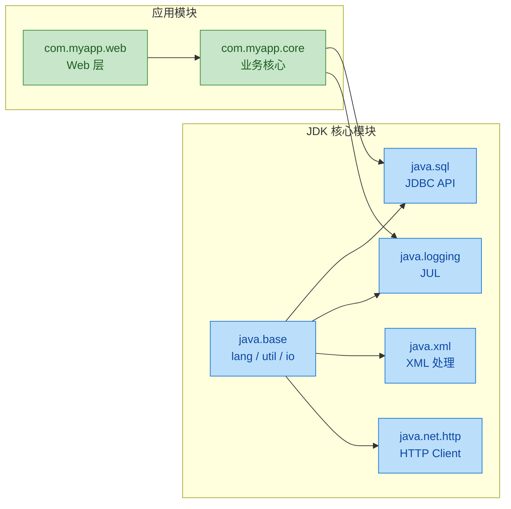
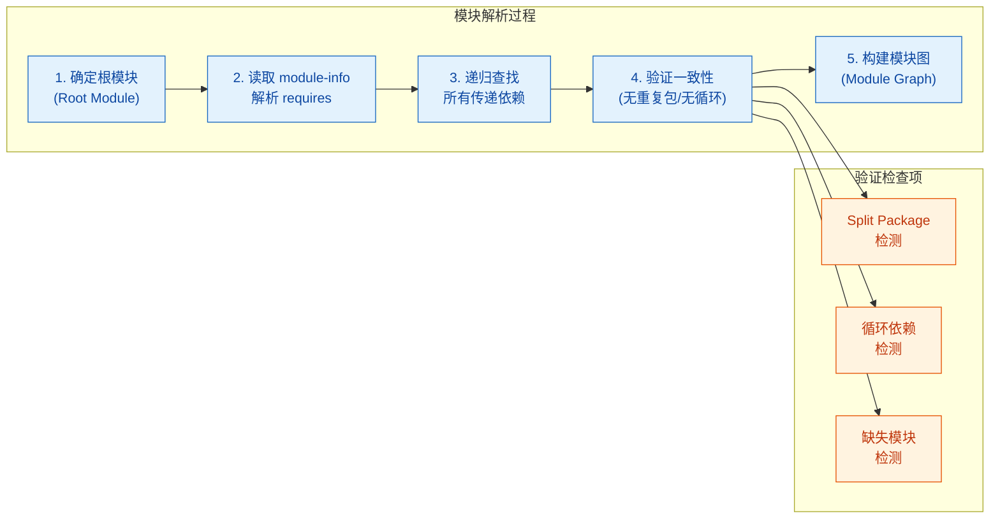
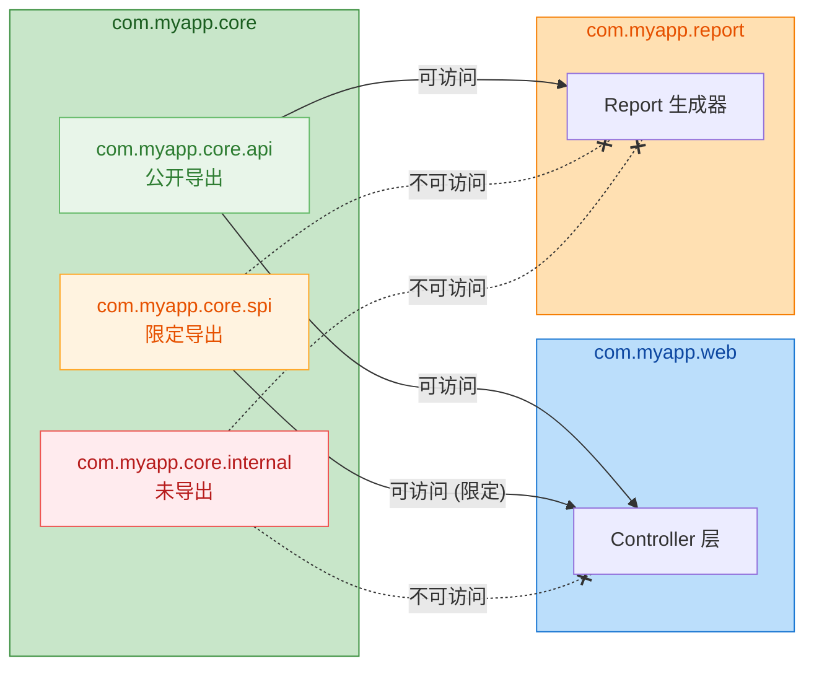
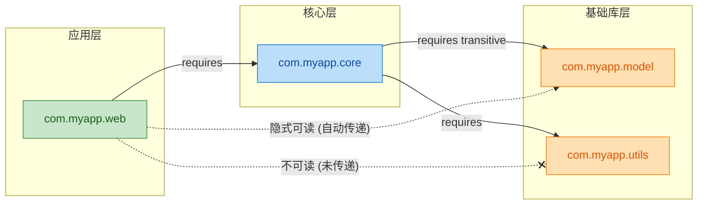
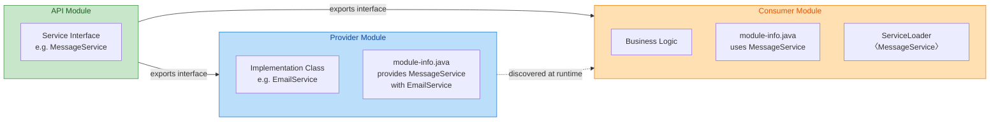
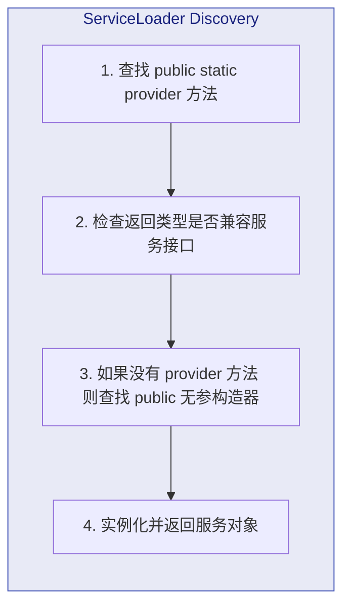
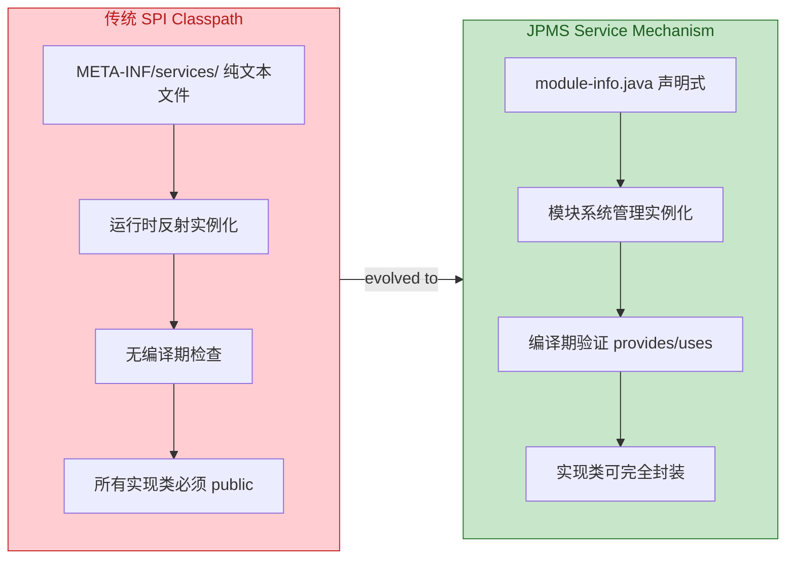
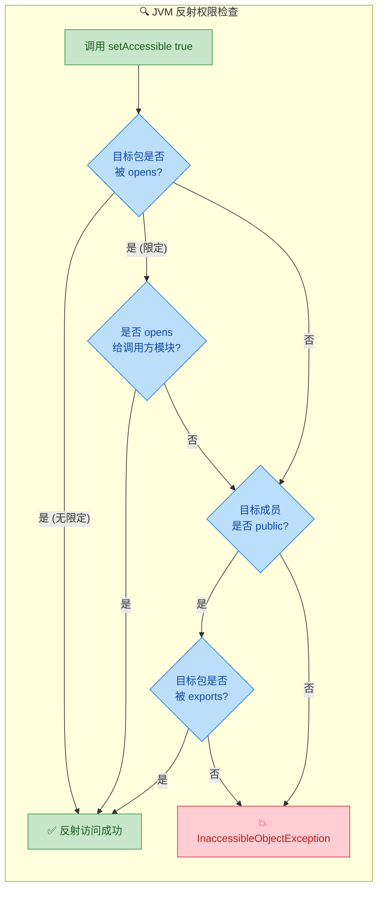
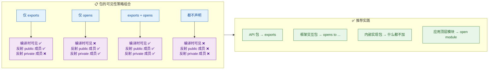
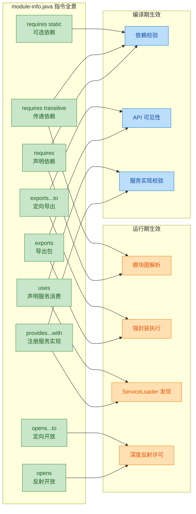

---

# 模块系统(JPMS)

---

## 模块概念（module-info.java）

### 为什么需要模块系统？—— 从 Classpath Hell 说起

在 Java 9 之前，Java 应用程序的依赖管理完全依赖于 **classpath** 机制。你把所有的 JAR 包丢进 classpath，JVM 在运行时按照线性搜索的方式去查找类。这套机制看似简单，实则隐患巨大，业界将其形象地称为 **"Classpath Hell"**（类路径地狱）。

具体来说，classpath 时代存在以下核心痛点：

**第一，没有真正的封装边界。** 只要一个类被声明为 `public`，它就对整个应用可见。框架内部的实现细节（比如 `sun.misc.Unsafe`）本不应被外部访问，但开发者照样能直接引用。这导致框架的内部 API 一旦变动，大量依赖它的第三方库就会崩溃。Public 意味着 "对全世界可见"（accessible to the whole world），而不是 "对我的库的用户可见"。

**第二，JAR 之间没有显式依赖关系。** 一个 JAR 需要哪些其他 JAR 才能正常工作？classpath 机制完全不关心这件事。缺失依赖只会在运行时抛出 `NoClassDefFoundError`，而不是在编译或启动阶段就报错。这让大型项目的依赖排查变得极其痛苦。

**第三，类冲突与版本冲突无法检测。** 当 classpath 上存在两个同名类（split package 问题），JVM 只会加载先找到的那个，默默忽略另一个。如果恰好加载的是错误版本，程序行为将不可预测。

Java 9 引入的 **JPMS（Java Platform Module System）**，项目代号 **Jigsaw**，正是为了从根本上解决这些问题。JPMS 在语言层面引入了 **模块（Module）** 这一概念，提供了编译期 + 运行期双重保障的强封装与显式依赖机制。

---

### 什么是模块（Module）？

一个模块（Module）是一个**命名的、自描述的代码与数据集合**。Oracle 官方定义为：

> A uniquely named, reusable group of related packages, as well as resources and a module descriptor.

用更直白的话说，模块 = 一组相关的 package + 一个描述文件（`module-info.java`）。这个描述文件明确声明了两件至关重要的事：

1. **我依赖谁**（requires）—— 显式声明本模块需要哪些其他模块才能工作。
2. **我暴露谁**（exports）—— 显式声明本模块的哪些包可以被外部访问。

没有被 export 的包，即使内部类声明为 `public`，也**无法被其他模块访问**。这就是 JPMS 的核心理念——**Strong Encapsulation（强封装）**。你终于可以区分 "对模块内部公开" 和 "对外部世界公开" 了。

---

### module-info.java —— 模块描述符

每个模块的根目录下都必须有一个特殊文件：**`module-info.java`**。它是模块的 "身份证" 和 "契约书"，编译后生成 `module-info.class`，放在模块 JAR 的根路径下。

#### 基本语法

```java
// module-info.java —— 模块描述符
// 文件必须位于模块源码根目录（即与顶层 package 目录同级）
module com.myapp.core {          // 声明模块名，推荐使用反向域名命名
    requires java.sql;           // 本模块依赖 java.sql 模块
    requires java.logging;       // 本模块依赖 java.logging 模块
    exports com.myapp.core.api;  // 将 api 包导出给所有依赖本模块的模块
}
```

几个关键语法点：

- `module` 是上下文关键字（context keyword），不是保留字。也就是说你依然可以在普通代码中用 `module` 做变量名，但在 `module-info.java` 中它具有特殊含义。
- 模块名推荐遵循**反向域名约定**（reverse domain name convention），如 `com.company.project.submodule`，这和包名的命名习惯一致，有助于全局唯一性。
- 一个模块可以包含多个 package，但**一个 package 只能属于一个模块**。如果两个模块包含相同的 package，编译器和运行时都会报错（split package 禁止）。

#### 文件位置

`module-info.java` 必须放在模块源码的**根目录**，即与顶层包目录同级：

```text
my-module/
├── module-info.java          ← 模块描述符（根目录）
└── com/
    └── myapp/
        └── core/
            ├── api/
            │   └── UserService.java
            └── internal/
                └── UserRepository.java
```

编译后的结构：

```text
my-module.jar
├── module-info.class         ← 编译后的模块描述符
└── com/
    └── myapp/
        └── core/
            ├── api/
            │   └── UserService.class
            └── internal/
                └── UserRepository.class
```

---

### JDK 本身的模块化

JPMS 不仅是给应用开发者用的——**JDK 自身也被拆分成了约 70+ 个模块**。这是 Jigsaw 项目最庞大的工程之一。以前那个巨大的 `rt.jar`（约 60MB）被分解为一系列职责清晰的小模块。

其中最基础的模块是 **`java.base`**，它包含了 `java.lang`、`java.util`、`java.io` 等最核心的包。**所有模块都隐式依赖 `java.base`**，你不需要（也不应该）在 `module-info.java` 里显式 `requires java.base`，编译器会自动添加。



你可以用 `java --list-modules` 命令查看当前 JDK 的所有模块：

```java
// 在终端执行（不是 Java 代码）
// $ java --list-modules
// 输出类似：
// java.base@21
// java.compiler@21
// java.datatransfer@21
// java.desktop@21
// java.instrument@21
// java.logging@21
// java.management@21
// java.naming@21
// java.net.http@21
// java.sql@21
// ... 以及更多
```

---

### 模块的三大类型

在实际项目中，你会遇到三种不同类型的模块：

#### 1. 命名模块（Named Module / Explicit Module）

拥有 `module-info.java` 的标准模块。开发者显式声明了模块名、依赖和导出。这是 JPMS 的"正统用法"。

```java
// 标准的命名模块
module com.myapp.service {
    requires com.myapp.core;     // 依赖另一个命名模块
    requires java.sql;           // 依赖 JDK 模块
    exports com.myapp.service;   // 导出服务包
}
```

#### 2. 自动模块（Automatic Module）

**没有 `module-info.java` 的普通 JAR 放到模块路径（module path）上时**，会被自动视为 "自动模块"。这是 JPMS 为兼容旧库提供的过渡机制。

自动模块的行为非常特殊：
- **模块名**：优先从 JAR 的 `MANIFEST.MF` 中读取 `Automatic-Module-Name` 属性；如果没有，就从 JAR 文件名推导（去掉 `.jar` 后缀和版本号，把 `-` 替换为 `.`）。例如 `guava-31.1-jre.jar` → 模块名 `guava`。
- **exports 一切**：自动模块会导出它包含的所有 package。
- **requires 一切**：自动模块可以读取所有其他模块（包括 unnamed module）。
- **可被命名模块依赖**：命名模块可以 `requires` 自动模块，这是实现渐进式迁移的关键。

```java
// 假设你的项目依赖 gson-2.10.jar（没有 module-info）
// 只要把它放到 module path，它就变成自动模块
module com.myapp.core {
    requires gson;   // 可以 requires 自动模块（名字来源于 JAR 文件名/Manifest）
}
```

#### 3. 未命名模块（Unnamed Module）

**放在传统 classpath 上的所有 JAR** 统统归入一个 "未命名模块"（Unnamed Module）。这是最大的兼容性保障——你的旧项目不做任何修改，照样能在 Java 9+ 上运行。

未命名模块的特性：
- 没有模块名（`null`）。
- 可以读取（read）所有其他模块的导出包。
- **命名模块不能 `requires` 未命名模块**——这是单向的。命名模块只能依赖命名模块或自动模块。

```text
┌─────────────────────────────────────────────────────────────────┐
│                      Module Path（模块路径）                      │
│  ┌──────────────────┐  ┌──────────────────┐  ┌───────────────┐  │
│  │  Named Module    │  │  Named Module    │  │ Auto Module   │  │
│  │  (有module-info) │  │  (有module-info) │  │ (无module-info│  │
│  │  com.myapp.core  │  │  com.myapp.web   │  │  但在module   │  │
│  │                  │  │                  │  │  path上)      │  │
│  └──────────────────┘  └──────────────────┘  └───────────────┘  │
├─────────────────────────────────────────────────────────────────┤
│                      Classpath（类路径）                          │
│  ┌──────────────────────────────────────────────────────────┐   │
│  │              Unnamed Module（未命名模块）                  │   │
│  │    所有放在 classpath 上的 JAR 统一归入此模块              │   │
│  └──────────────────────────────────────────────────────────┘   │
└─────────────────────────────────────────────────────────────────┘
```

---

### 模块路径（Module Path）vs 类路径（Classpath）

Java 9 引入了一个新的路径概念：**模块路径（Module Path）**，与传统的 classpath 并存。

| 对比维度 | Classpath (`-cp`) | Module Path (`--module-path` / `-p`) |
|---------|-------------------|--------------------------------------|
| 封装性 | 所有 public 类对所有人可见 | 只有 exports 的包中的 public 类可见 |
| 依赖声明 | 隐式（运行时才知道缺依赖） | 显式（`requires`，编译期即检查） |
| 重复包检测 | 不检测（随机加载一个） | 编译/运行时报错（split package 禁止） |
| JAR 的身份 | 都是"未命名模块"的一部分 | 有 `module-info` → Named Module；无 → Automatic Module |
| 适用场景 | 遗留项目、快速原型 | 新项目、需要强封装的库/框架 |

编译和运行命令的变化：

```java
// === 传统 classpath 方式 ===
// 编译
// $ javac -cp lib/gson.jar -d out src/com/myapp/Main.java

// 运行
// $ java -cp out:lib/gson.jar com.myapp.Main

// === 模块化方式 ===
// 编译（-p 是 --module-path 的简写，-d 指定输出目录）
// $ javac -p mods -d out/com.myapp.core src/com.myapp.core/module-info.java \
//         src/com.myapp.core/com/myapp/core/Main.java

// 运行（-m 是 --module 的简写，格式为 模块名/主类全限定名）
// $ java -p mods:out -m com.myapp.core/com.myapp.core.Main
```

---

### 模块解析过程（Module Resolution）

当 JVM 启动一个模块化应用时，它会执行一个叫做 **Module Resolution** 的过程来构建**模块图（Module Graph）**。这个过程从根模块开始，递归地解析所有 `requires` 声明的依赖，直到所有必要的模块都被找到。



如果解析过程中发现缺少依赖模块、存在 split package（同一个包出现在多个模块中）、或检测到循环依赖等问题，JVM 会**在启动阶段就报错**，而不是等到运行中才抛出 `NoClassDefFoundError`。这就是 **Reliable Configuration（可靠配置）** 的含义——尽早失败，尽早发现问题。

---

### 模块化项目的目录结构实践

一个典型的多模块项目结构如下：

```text
my-project/
├── com.myapp.core/                    ← 核心模块
│   ├── module-info.java
│   └── com/myapp/core/
│       ├── api/
│       │   ├── UserService.java       ← 对外暴露的 API
│       │   └── OrderService.java
│       └── internal/
│           ├── UserRepository.java    ← 内部实现，不导出
│           └── CacheManager.java
│
├── com.myapp.web/                     ← Web 模块
│   ├── module-info.java
│   └── com/myapp/web/
│       └── controller/
│           └── UserController.java
│
└── com.myapp.persistence/             ← 持久层模块
    ├── module-info.java
    └── com/myapp/persistence/
        └── JpaUserRepository.java
```

对应的 `module-info.java`：

```java
// com.myapp.core 的 module-info.java
module com.myapp.core {
    // 只导出 api 包，internal 包对外不可见
    exports com.myapp.core.api;
    // 不需要显式 requires java.base（自动隐含）
}
```

```java
// com.myapp.web 的 module-info.java
module com.myapp.web {
    requires com.myapp.core;        // 依赖核心模块
    requires java.net.http;         // 依赖 JDK 的 HTTP 模块
    exports com.myapp.web.controller;
}
```

```java
// com.myapp.persistence 的 module-info.java
module com.myapp.persistence {
    requires com.myapp.core;        // 依赖核心模块
    requires java.sql;              // 依赖 JDBC
    exports com.myapp.persistence;
}
```

此时，`com.myapp.web` 模块中的代码可以使用 `com.myapp.core.api.UserService`，但**无法**访问 `com.myapp.core.internal.UserRepository`——即使 `UserRepository` 是 `public` 的。尝试访问会在**编译期**就报错：

```java
// 在 com.myapp.web 模块中尝试访问未导出的包
// 编译报错：package com.myapp.core.internal is not visible
//   (package com.myapp.core.internal is declared in module com.myapp.core,
//    which does not export it)
import com.myapp.core.internal.UserRepository; // ← 编译失败！
```

这就是模块系统的强封装能力——真正实现了 **"public 不再意味着全局可见"（public is no longer universally accessible）**。

---

### `module-info.java` 完整指令速览

虽然后续章节会深入讲解每个指令，这里先给出一个全景索引，帮你建立整体认知：

```java
// module-info.java 支持的所有指令一览
module com.myapp.example {

    // ① requires —— 声明依赖
    requires java.sql;                        // 普通依赖
    requires transitive java.logging;         // 传递依赖（依赖本模块的人也自动获得 java.logging）
    requires static com.optional.lib;         // 编译期依赖，运行时可选（Optional Dependency）

    // ② exports —— 导出包
    exports com.myapp.example.api;            // 对所有人导出
    exports com.myapp.example.spi to          // 限定导出（Qualified Export），只对指定模块可见
        com.myapp.plugin.a,
        com.myapp.plugin.b;

    // ③ opens —— 反射开放
    opens com.myapp.example.model;            // 对所有人开放反射访问
    opens com.myapp.example.entity to         // 限定开放，只对指定模块（如框架）开放反射
        org.hibernate.core,
        com.google.gson;

    // ④ uses —— 声明使用的服务接口（SPI 消费者）
    uses com.myapp.example.spi.Plugin;

    // ⑤ provides —— 提供服务实现（SPI 提供者）
    provides com.myapp.example.spi.Plugin
        with com.myapp.example.internal.DefaultPlugin;
}
```

---

### 小结：模块带来的核心价值

模块系统不仅仅是一个新的语法特性，它从根本上改变了 Java 应用程序的**架构能力**。JPMS 的核心价值可以归纳为三点：

**Strong Encapsulation（强封装）**——模块内部的实现细节不再泄露到外部，`public` 不再等于 "全世界可见"。API 的边界终于可以在语言层面被严格执行。

**Reliable Configuration（可靠配置）**——所有的模块依赖在启动时就被完整验证。缺依赖、重复包、循环依赖，全部在启动阶段暴露，而非在生产环境的某个深夜突然崩溃。

**Scalable Platform（可伸缩平台）**——JDK 本身的模块化意味着你可以用 `jlink` 工具创建**自定义运行时镜像（Custom Runtime Image）**，只包含你的应用实际需要的模块。一个微服务的运行时可以从完整 JDK 的 300MB+ 缩减到 30-40MB，这对容器化部署（Docker）有巨大意义。

---

**📝 练习题**

以下关于 Java 模块系统（JPMS）的说法，哪一项是**错误的**？

A. 每个模块的 `module-info.java` 必须放在模块源码的根目录下


B. 所有模块都隐式依赖 `java.base`，无需在 `module-info.java` 中显式声明 `requires java.base`


C. 放在 classpath 上的 JAR 如果没有 `module-info.java`，会被视为自动模块（Automatic Module）


D. 命名模块中，即使一个类声明为 `public`，如果它所在的包没有被 `exports`，其他模块也无法访问它

**【答案】** C

**【解析】** 选项 C 的错误在于混淆了**自动模块**和**未命名模块**的概念。放在 **classpath** 上的 JAR（无论有没有 `module-info.java`）都会被归入**未命名模块（Unnamed Module）**，而不是自动模块。**自动模块（Automatic Module）** 是指没有 `module-info.java` 但被放到了 **模块路径（Module Path，即 `--module-path` / `-p`）** 上的 JAR。这两个概念的关键区分点在于 JAR 被放置的路径（classpath vs module path），而非是否包含 `module-info.java`。选项 A、B、D 的描述均正确。

---

## exports / requires —— 模块间的"可见性契约"

在传统的 classpath 时代，只要一个类被声明为 `public`，它就对整个应用中的所有代码可见——这被称为 **"大泥球"（Big Ball of Mud）** 问题。Java 9 引入的模块系统（JPMS）通过 `exports` 和 `requires` 两个关键字，在 `public` 之上新增了一层 **模块级的访问控制（module-level access control）**，让开发者可以精确声明"我对外暴露什么"以及"我需要依赖什么"。

理解这两个关键字，是掌握整个模块系统的核心。可以这样类比：`exports` 是模块的"出口清关单"，决定哪些包裹（package）允许出关；`requires` 是模块的"进口采购单"，声明需要从哪些供应商（module）进货。两者配合，构成了模块之间的 **双向契约（bilateral contract）**。

---

### exports —— 控制包的对外可见性

#### 基本语法与语义

在 `module-info.java` 中，`exports` 指令用于将模块内部的某个包（package）暴露给外部模块。语法非常简洁：

```java
// 文件: module-info.java
module com.myapp.core {
    // 将 com.myapp.core.api 包导出，使其他模块可以访问该包下的 public 类型
    exports com.myapp.core.api;
}
```

这里有一个至关重要的认知转变：**在 JPMS 中，`public` 不再等于"全局可见"**。一个类即使是 `public` 的，如果它所在的包没有被 `exports`，那么其他模块依然无法访问它。换句话说，JPMS 在原有的四级访问控制（`private`、package-private、`protected`、`public`）之上，实质上创造了一种新的可见性语义——**"模块内公开但模块外不可见"（public but not accessible）**。

这就好比你家客厅里的东西对家人（同模块）是可见的，但如果你没有打开大门（`exports`），邻居（其他模块）是看不到也拿不到的。

#### exports 的作用粒度

`exports` 的粒度是 **包（package）级别**，而不是类级别。你不能只导出某个包中的某一个类，要么整个包导出，要么整个包不导出。这是一个深思熟虑的设计决策：包本身就是 Java 中天然的"逻辑分组单元"，以包为粒度可以避免过于碎片化的配置，同时鼓励开发者在设计模块时就做好包的职责划分。

一个模块可以导出多个包：

```java
module com.myapp.core {
    // 导出公共 API 包 —— 面向所有消费者的接口定义
    exports com.myapp.core.api;
    // 导出数据传输对象包 —— DTO 通常也需要跨模块传递
    exports com.myapp.core.dto;
    // 注意: com.myapp.core.internal 包没有被导出
    // 即使其中有 public 类, 外部模块也无法访问
}
```

未被导出的包（如上面的 `com.myapp.core.internal`）属于模块的 **内部实现细节（implementation detail）**，对外完全封装。这种"默认封闭"的哲学与之前"默认开放"的 classpath 模型截然相反，极大地改善了大型项目中的 **封装性（encapsulation）**。

#### 限定导出（Qualified Exports）

有时候，你希望某个包只对特定的"可信"模块开放，而不是对所有模块开放。这就是 **限定导出（qualified exports）** 的用途，使用 `exports ... to ...` 语法：

```java
module com.myapp.core {
    // 公开导出: 所有模块都能访问
    exports com.myapp.core.api;

    // 限定导出: 只有 com.myapp.web 和 com.myapp.admin 能访问此包
    // 其他模块即使 requires 了 com.myapp.core, 也看不到这个包
    exports com.myapp.core.spi to
        com.myapp.web,
        com.myapp.admin;
}
```

限定导出在框架开发中非常常见。例如，Spring Framework 的内部模块可能会将某些底层工具包只暴露给自己的兄弟模块，而不暴露给最终用户。JDK 自身也大量使用了限定导出——许多 `jdk.internal.*` 包只对 JDK 内部的特定模块开放。

下面用一张 Mermaid 图来可视化 `exports` 的两种模式：



从图中可以清晰地看到三种包的可见性差异：公开导出的包所有人都能访问，限定导出的包只有指定模块能访问，未导出的包则完全封闭。

---

### requires —— 声明模块依赖

#### 基本语法与语义

如果说 `exports` 是"供给侧"的声明，那么 `requires` 就是"需求侧"的声明。一个模块要使用另一个模块导出的包，必须在自己的 `module-info.java` 中显式声明依赖：

```java
module com.myapp.web {
    // 声明对 com.myapp.core 模块的依赖
    // 这样才能访问 com.myapp.core 通过 exports 导出的包
    requires com.myapp.core;
}
```

这种显式依赖声明带来了一个革命性的好处：**依赖关系在编译期就会被严格检查**。如果你 `requires` 了一个不存在的模块，或者漏写了某个 `requires`，编译器会直接报错，而不是像 classpath 时代那样等到运行时才抛出 `ClassNotFoundException`。这将大量"运行时炸弹"提前到了编译期，极大地提升了项目的可靠性。

值得注意的是，每个模块都隐式地依赖 `java.base` 模块（它包含 `java.lang`、`java.util`、`java.io` 等最基础的包），因此你不需要也不应该显式写 `requires java.base;`。

#### requires transitive —— 传递性依赖

考虑这样一个场景：模块 A 的公开 API 中使用了模块 B 的类型。例如，`com.myapp.core` 的某个导出接口的方法签名中返回了 `com.myapp.model` 模块中定义的 `User` 类。此时，任何使用 `com.myapp.core` 的模块也必须能看到 `com.myapp.model` 中的 `User` 类型，否则连编译都过不了。

如果让每个消费者模块自己手动加上 `requires com.myapp.model`，会非常繁琐且容易遗漏。`requires transitive` 正是为了解决这个问题：

```java
module com.myapp.core {
    // 传递性依赖: 任何 requires com.myapp.core 的模块
    // 将自动获得对 com.myapp.model 的读取权限
    requires transitive com.myapp.model;

    // 普通依赖: 仅 com.myapp.core 自己能访问, 不会传递给消费者
    requires com.myapp.utils;

    // 导出的 API 中引用了 com.myapp.model 中的类型
    exports com.myapp.core.api;
}
```

```java
module com.myapp.web {
    // 只需要声明对 core 的依赖
    // 由于 core 使用了 requires transitive com.myapp.model
    // web 模块自动获得对 model 的访问权
    requires com.myapp.core;

    // 不需要写: requires com.myapp.model;  (已被传递)
    // 但仍然看不到: com.myapp.utils         (非传递依赖)
}
```

**何时使用 `requires transitive` 的经验法则**：如果模块 A 的 **公开 API**（即导出包中的 public 类型签名——方法参数、返回值、继承关系）中出现了来自模块 B 的类型，那么 A 就应该用 `requires transitive B`。如果模块 B 只在 A 的内部实现中使用而不出现在公开 API 中，则使用普通的 `requires B` 即可。

下面用图来展示传递性依赖的"可见性传播"效果：



#### requires static —— 编译时依赖（可选依赖）

还有一种特殊的依赖形式：`requires static`。它表示"这个依赖在 **编译时必须存在**，但在 **运行时是可选的**"。这非常适合用于注解处理器、编译期代码生成工具，或者那些"有就用、没有也不影响正常运行"的增强型库。

```java
module com.myapp.core {
    // 编译时需要 lombok 的注解, 但运行时不需要 lombok 存在
    requires static lombok;

    // 编译时需要 checker framework 的注解做空安全检查
    // 运行时不需要
    requires static org.checkerframework.checker.qual;
}
```

典型的使用场景包括：SLF4J 的可选 binding、Lombok 的编译期注解、JSR-305 的 `@Nullable` / `@NonNull` 注解等。在这些场景中，相关库只在编译阶段发挥作用，打包后的运行时环境中并不需要它们。

---

### exports 与 requires 的协作机制

两个关键字并不是孤立工作的，它们共同定义了模块间的 **可读性（readability）** 和 **可访问性（accessibility）** 两层关卡：

**第一层关卡——可读性（Readability）**：模块 A 是否 `requires` 了模块 B？如果是，A 就获得了对 B 的"读取权限"（can read）。这相当于拿到了进入 B 大楼的门禁卡。

**第二层关卡——可访问性（Accessibility）**：模块 B 是否 `exports` 了某个包？如果是，A 中的代码才能实际使用该包中的 public 类型。这相当于大楼里的某些楼层是否对你开放。

两层关卡必须同时满足，访问才能成功：

```text
访问成功的条件:
  ① 消费者模块 requires 了提供者模块          (可读性 ✓)
  ② 提供者模块 exports 了目标包               (可访问性 ✓)
  ③ 目标类型本身是 public 的                   (Java 原有的访问控制 ✓)
```

如果任何一个条件不满足，编译器都会报错。我们来看一个完整的多模块协作示例，把所有知识点串联起来：

```java
// ===== 模块 1: com.myapp.model =====
// 定义核心数据模型, 被其他多个模块依赖
module com.myapp.model {
    // 导出实体类包 —— 所有模块都可以使用这些模型类
    exports com.myapp.model.entity;
    // 导出枚举/常量包
    exports com.myapp.model.enums;
    // com.myapp.model.internal 没有导出 —— 纯内部使用
}
```

```java
// ===== 模块 2: com.myapp.core =====
// 核心业务逻辑层, API 中大量使用 model 中的类型
module com.myapp.core {
    // 传递性依赖: 因为 core 的公开 API 的方法签名中
    // 包含 model 模块中的 User, Order 等类型
    // 消费者通过 core 模块间接获得对 model 的读取权限
    requires transitive com.myapp.model;

    // 普通依赖: 日志框架仅在 core 内部使用
    // 不暴露给 core 的消费者
    requires org.slf4j;

    // 可选依赖: Micrometer 监控, 有则启用指标收集, 无则跳过
    requires static io.micrometer.core;

    // 导出业务服务接口包
    exports com.myapp.core.service;
    // 导出异常定义包
    exports com.myapp.core.exception;
}
```

```java
// ===== 模块 3: com.myapp.web =====
// Web 层, 面向最终用户的 HTTP 接口
module com.myapp.web {
    // 依赖 core 模块
    // 由于 core 使用了 requires transitive com.myapp.model
    // web 自动获得对 model 的读取权限, 可以直接使用 User, Order 等类型
    requires com.myapp.core;

    // Web 层自身的依赖
    requires java.net.http;

    // web 模块一般不导出任何包 —— 它是依赖图的"叶子节点"
    // 没有其他模块需要依赖它
}
```

这种分层结构形成了清晰的依赖方向：`web → core → model`。每个箭头都是一个显式的 `requires` 声明，每个模块只暴露必要的包，内部实现完全隐藏。

---

### 常见编译错误与排查

在实际使用 `exports` / `requires` 时，有几种典型的编译错误值得了解：

**错误 1：Package ... is not visible（包不可见）**

当你尝试使用另一个模块中未被 `exports` 的包中的类时，就会遇到这个错误。解决方式：检查目标模块是否遗漏了对应的 `exports` 声明。

**错误 2：Module ... does not read module ...（模块不可读）**

当你的模块缺少对应的 `requires` 声明时触发。解决方式：在你的 `module-info.java` 中添加缺失的 `requires`。

**错误 3：Cyclic dependency（循环依赖）**

JPMS **严格禁止模块间的循环依赖**。如果模块 A `requires` B，同时 B 又 `requires` A，编译器会直接拒绝。这是与传统 classpath 的一个重大区别——在 classpath 时代，循环依赖虽然是坏实践但技术上是允许的。JPMS 的这一限制迫使开发者在设计阶段就理清依赖方向，形成 **有向无环图（DAG, Directed Acyclic Graph）**，这对大型项目的架构健康非常有益。

解决循环依赖的常见手段是 **提取公共模块**：将两个模块共同依赖的接口或类型抽取到一个新的、独立的模块中，让原来的两个模块都单向依赖这个新模块。

---

### 与 Maven/Gradle 依赖管理的关系

一个常见的疑惑是：既然 Maven 的 `pom.xml` 和 Gradle 的 `build.gradle` 已经管理了依赖，为什么还需要 `module-info.java` 中的 `requires`？

答案是它们 **工作在不同的层面**。Maven/Gradle 管理的是 **构建时的 artifact 依赖**（JAR 包从哪里下载、版本是什么），而 `requires` 管理的是 **编译时和运行时的模块可读性**（哪个模块能看到哪个模块的代码）。两者并不冲突，反而是互补的：Maven 保证 JAR 包在 classpath/modulepath 上可用，`requires` 保证模块间的访问权限正确配置。

在实际项目中，如果你使用了 JPMS，通常需要在两个地方都做正确的声明：在构建工具中声明 artifact 依赖，在 `module-info.java` 中声明模块依赖。

---

**📝 练习题**

以下是模块 `com.app.service` 的声明：

```java
module com.app.service {
    requires transitive com.app.model;
    requires com.app.utils;
    exports com.app.service.api;
}
```

模块 `com.app.web` 的声明如下：

```java
module com.app.web {
    requires com.app.service;
}
```

请问，在 `com.app.web` 模块中，以下哪些模块的导出包是可以直接使用的？

A. `com.app.service` 和 `com.app.model`

B. `com.app.service`、`com.app.model` 和 `com.app.utils`

C. 仅 `com.app.service`

D. 仅 `com.app.model`


**【答案】** A

**【解析】** `com.app.web` 显式声明了 `requires com.app.service`，因此可以访问 `com.app.service` 导出的包（即 `com.app.service.api`）。同时，由于 `com.app.service` 使用了 `requires transitive com.app.model`，这意味着任何依赖 `com.app.service` 的模块都会自动获得对 `com.app.model` 的读取权限，所以 `com.app.web` 也能访问 `com.app.model` 的导出包。而 `com.app.utils` 在 `com.app.service` 中只是普通的 `requires`（没有 `transitive`），其可读性不会传递给 `com.app.web`，因此 `com.app.web` 无法访问 `com.app.utils` 的内容。正确答案是 A。

---

## 服务机制（provides/uses、ServiceLoader）

Java 平台模块系统（JPMS）中的**服务机制**是实现**面向接口编程**与**松耦合架构**的核心手段。它将传统的 **Service Provider Interface（SPI）** 模式从"约定俗成的 classpath 发现"提升为"编译期可检查、模块化声明式绑定"的全新高度。在 JPMS 之前，Java 的 SPI 依赖 `META-INF/services/` 目录下的纯文本配置文件来注册实现类，这种方式既不安全（没有编译期检查）也不透明（运行时才知道哪些实现存在）。JPMS 通过 `provides ... with` 和 `uses` 关键字，把服务的**提供**与**消费**关系直接写入 `module-info.java`，使其成为模块契约的一部分。

理解服务机制的关键在于把握三个角色：**服务接口（Service Interface）**、**服务提供者（Service Provider）**、**服务消费者（Service Consumer）**。整个流程可以用一句话概括——消费者声明"我需要某个接口的实现"（`uses`），提供者声明"我为该接口提供了一个具体实现"（`provides ... with`），而 `ServiceLoader` 负责在运行时将两者桥接起来。

---

### 核心概念：三角色模型

在正式看语法之前，先建立整体认知。一个完整的 JPMS 服务交互至少涉及**三个模块**（也可以合并，但逻辑角色不变）：



这个三角结构的精妙之处在于：**Consumer 模块在编译时完全不知道 Provider 模块的存在**。它只依赖 API 模块中的接口。Provider 可以在不修改任何消费端代码的情况下被替换或新增——这就是真正的**插件化架构（Plugin Architecture）**。

---

### `uses` 关键字：声明服务消费

`uses` 出现在**消费者模块**的 `module-info.java` 中，表示"本模块需要加载某个服务接口的实现"。

```java
// 文件: consumer.module/module-info.java
module consumer.module {
    // 声明本模块依赖 API 模块（因为要用到 MessageService 接口）
    requires api.module;

    // 关键: 声明本模块将通过 ServiceLoader 消费 MessageService 的实现
    // uses 后面跟的是接口（或抽象类）的全限定名
    uses com.example.api.MessageService;
}
```

`uses` 声明有几个关键约束和含义：

第一，`uses` 后面的类型**必须是当前模块能访问到的**。通常这意味着 API 模块已经通过 `exports` 将接口包暴露出来，且消费者模块通过 `requires` 依赖了 API 模块。如果你 `uses` 了一个无法访问的类型，编译器会直接报错。

第二，`uses` 声明并**不会**导致模块对任何 Provider 产生编译期依赖。它只是告诉模块系统："在运行时，请帮我找到这个接口的所有可用实现"。这是一个纯运行时的发现机制。

第三，一个模块可以有多个 `uses` 声明，用来消费不同的服务接口。

---

### `provides ... with` 关键字：声明服务提供

`provides ... with` 出现在**提供者模块**的 `module-info.java` 中，表示"本模块为某个服务接口提供了具体的实现类"。

```java
// 文件: provider.email/module-info.java
module provider.email {
    // 依赖 API 模块以获取 MessageService 接口
    requires api.module;

    // 关键: 声明本模块为 MessageService 接口提供 EmailService 实现
    // provides <接口> with <实现类1>, <实现类2>, ...;
    provides com.example.api.MessageService
        with com.example.provider.EmailService;
}
```

`provides ... with` 的规则更为严格：

第一，`with` 后面的实现类**必须**满足以下条件之一：拥有 **public 无参构造器**，或拥有 **public static 的 `provider()` 工厂方法**（Java 9+ 新增，返回类型必须是服务接口或其子类型）。如果两者都有，`provider()` 工厂方法优先。

第二，实现类**不需要被 `exports`**。这是一个非常重要的特性！Provider 模块可以将实现类完全封装在内部包中，只通过 `provides` 声明暴露"我能提供这个服务"的事实，而不暴露具体实现细节。这是比传统 SPI 更强的封装能力。

第三，一个 `provides` 声明可以用逗号列出多个实现类，也可以用多条 `provides` 语句为不同接口提供实现。

```java
// 一个模块可以为同一接口提供多个实现
module provider.multi {
    requires api.module;

    // 为同一个接口提供两个不同实现
    provides com.example.api.MessageService
        with com.example.provider.EmailService,
             com.example.provider.SmsService;

    // 也可以为另一个接口提供实现
    provides com.example.api.LogService
        with com.example.provider.FileLogService;
}
```

---

### `provider()` 静态工厂方法

Java 9 引入了一个灵活的替代方案：如果实现类不方便直接实例化（例如需要配置参数，或者你想返回一个内部类/子类实例），可以定义一个 `public static provider()` 方法。

```java
// 文件: com/example/provider/EmailService.java
package com.example.provider;

import com.example.api.MessageService;

public class EmailService implements MessageService {

    // 私有构造器 — 不提供 public 无参构造
    private final String smtpHost;

    private EmailService(String smtpHost) {
        this.smtpHost = smtpHost;
    }

    // ServiceLoader 优先调用此工厂方法
    // 返回类型必须是 MessageService 或其子类型
    public static MessageService provider() {
        // 可以在这里做复杂的初始化逻辑
        String host = System.getProperty("smtp.host", "localhost");
        return new EmailService(host);
    }

    @Override
    public void send(String message) {
        System.out.println("Sending via " + smtpHost + ": " + message);
    }
}
```

`provider()` 工厂方法的查找优先级如下：



---

### ServiceLoader：运行时服务发现引擎

`java.util.ServiceLoader` 是整个服务机制的**运行时核心**。它负责扫描模块路径（Module Path），找到所有通过 `provides` 声明的实现，并将它们实例化后交给消费者使用。

#### 基本用法

```java
package com.example.consumer;

import com.example.api.MessageService;
import java.util.ServiceLoader;

public class Application {
    public static void main(String[] args) {
        // 创建 ServiceLoader 实例，泛型参数为服务接口类型
        // ServiceLoader.load() 会查找模块路径上所有 provides MessageService 的模块
        ServiceLoader<MessageService> loader = ServiceLoader.load(MessageService.class);

        // 方式一: 遍历所有可用的服务实现
        for (MessageService service : loader) {
            // 每次迭代都会获得一个不同的实现实例
            service.send("Hello from ServiceLoader!");
        }

        // 方式二: 使用 Stream API（Java 9+），获取更多控制权
        loader.stream()
              // stream() 返回 Stream<ServiceLoader.Provider<MessageService>>
              // Provider 是一个延迟加载包装器，调用 get() 才会真正实例化
              .map(ServiceLoader.Provider::get)
              // 过滤出特定类型的实现
              .filter(s -> s.getClass().getSimpleName().equals("EmailService"))
              .forEach(s -> s.send("Filtered message"));

        // 方式三: 只取第一个可用实现（常用于"有且仅有一个实现"的场景）
        MessageService primary = loader.findFirst()
            .orElseThrow(() -> new RuntimeException("No MessageService implementation found!"));
        primary.send("Primary service message");
    }
}
```

#### ServiceLoader 的生命周期与缓存

`ServiceLoader` 不是每次迭代都重新扫描和实例化的。它内部有一个**缓存机制**：首次遍历时实例化的服务对象会被缓存起来，后续遍历直接返回缓存对象。如果需要重新发现（比如在运行时动态增加了新的 Provider 模块），可以调用 `reload()` 方法清空缓存。

```java
// 创建 loader — 此时尚未实例化任何服务
ServiceLoader<MessageService> loader = ServiceLoader.load(MessageService.class);

// 第一次遍历: 触发发现 + 实例化 + 缓存
for (MessageService s : loader) { /* ... */ }

// 第二次遍历: 直接读取缓存，不会重新实例化
for (MessageService s : loader) { /* ... */ }

// 清空缓存，下次遍历将重新发现和实例化
loader.reload();
```

这种 **Lazy Instantiation（延迟实例化）** 策略在 `stream()` API 中体现得更明显。`ServiceLoader.Provider` 包装器允许你在**不实例化对象的前提下**检查实现类的类型信息：

```java
loader.stream()
      // type() 返回实现类的 Class 对象，此时并未创建实例
      .filter(provider -> provider.type().isAnnotationPresent(Priority.class))
      // 仅对符合条件的才调用 get() 实例化
      .map(ServiceLoader.Provider::get)
      .forEach(s -> s.send("Lazy and filtered!"));
```

---

### 完整示例：搭建三模块服务架构

下面用一个完整示例把所有知识串联起来。我们构建一个消息推送系统，包含三个模块。

#### 项目结构

```text
messaging-system/
├── api.module/
│   ├── module-info.java
│   └── com/example/api/
│       └── MessageService.java
├── provider.email/
│   ├── module-info.java
│   └── com/example/provider/email/
│       └── EmailService.java
├── provider.sms/
│   ├── module-info.java
│   └── com/example/provider/sms/
│       └── SmsService.java
└── consumer.app/
    ├── module-info.java
    └── com/example/app/
        └── Application.java
```

#### API 模块：定义服务接口

```java
// api.module/module-info.java
module api.module {
    // 将服务接口所在的包导出给所有人
    exports com.example.api;
}
```

```java
// api.module/com/example/api/MessageService.java
package com.example.api;

/**
 * 消息服务接口 — 所有消息推送实现必须遵循此契约
 * 这是 SPI 模式中的 "Service Interface"
 */
public interface MessageService {
    // 发送消息的核心方法
    void send(String recipient, String message);

    // 默认方法: 返回服务类型标识（Java 8+）
    default String getType() {
        return "UNKNOWN";
    }
}
```

#### Provider 模块一：Email 实现

```java
// provider.email/module-info.java
module provider.email {
    // 依赖 API 模块
    requires api.module;

    // 提供 Email 实现 — 注意 EmailService 所在包没有 exports！
    // 实现类被完全封装，外部无法直接 new EmailService()
    provides com.example.api.MessageService
        with com.example.provider.email.EmailService;
}
```

```java
// provider.email/com/example/provider/email/EmailService.java
package com.example.provider.email;

import com.example.api.MessageService;

// 这个类不在任何 exports 包中 — 模块外部无法直接访问
// 只能通过 ServiceLoader 间接获取
public class EmailService implements MessageService {

    // public 无参构造器 — ServiceLoader 需要此构造器来实例化
    public EmailService() {
        System.out.println("[EmailService] Initialized");
    }

    @Override
    public void send(String recipient, String message) {
        // 模拟发送邮件
        System.out.printf("[EMAIL] To: %s | Content: %s%n", recipient, message);
    }

    @Override
    public String getType() {
        return "EMAIL";
    }
}
```

#### Provider 模块二：SMS 实现（使用 provider() 工厂）

```java
// provider.sms/module-info.java
module provider.sms {
    requires api.module;

    provides com.example.api.MessageService
        with com.example.provider.sms.SmsService;
}
```

```java
// provider.sms/com/example/provider/sms/SmsService.java
package com.example.provider.sms;

import com.example.api.MessageService;

public class SmsService implements MessageService {

    // 短信服务的区号配置
    private final String countryCode;

    // 私有构造器 — 不允许外部直接 new
    private SmsService(String countryCode) {
        this.countryCode = countryCode;
        System.out.println("[SmsService] Initialized with code: " + countryCode);
    }

    // ServiceLoader 优先调用此静态工厂方法
    // 方法签名必须是: public static <服务接口类型> provider()
    public static MessageService provider() {
        // 从系统属性读取配置，提供默认值
        String code = System.getProperty("sms.country.code", "+86");
        return new SmsService(code);
    }

    @Override
    public void send(String recipient, String message) {
        // 模拟发送短信
        System.out.printf("[SMS] To: %s%s | Content: %s%n", countryCode, recipient, message);
    }

    @Override
    public String getType() {
        return "SMS";
    }
}
```

#### Consumer 模块：使用 ServiceLoader

```java
// consumer.app/module-info.java
module consumer.app {
    // 依赖 API 模块以访问 MessageService 接口
    requires api.module;

    // 声明消费 MessageService — 不需要 requires 任何 provider 模块！
    uses com.example.api.MessageService;
}
```

```java
// consumer.app/com/example/app/Application.java
package com.example.app;

import com.example.api.MessageService;
import java.util.ServiceLoader;
import java.util.List;
import java.util.stream.Collectors;

public class Application {
    public static void main(String[] args) {
        // 加载所有 MessageService 的实现
        ServiceLoader<MessageService> loader = ServiceLoader.load(MessageService.class);

        // 将所有发现的服务收集到 List 中
        List<MessageService> services = loader.stream()
                .map(ServiceLoader.Provider::get) // 延迟实例化 -> 立即实例化
                .collect(Collectors.toList());

        // 打印发现了多少个服务实现
        System.out.println("Discovered " + services.size() + " service(s):");

        // 使用每一个发现的服务发送消息
        for (MessageService service : services) {
            System.out.println("  - Type: " + service.getType());
            service.send("user@example.com", "Hello from JPMS Service Mechanism!");
        }

        // 如果没有发现任何实现，给出友好提示
        if (services.isEmpty()) {
            System.err.println("WARNING: No MessageService providers found on module path!");
        }
    }
}
```

#### 编译与运行

```text
# 编译全部模块（--module-source-path 指向模块源码根目录）
javac -d out --module-source-path . $(find . -name "*.java")

# 运行消费者模块（--module-path 包含所有编译后的模块）
# 只要 provider.email 和 provider.sms 在模块路径上，ServiceLoader 就能发现它们
java --module-path out -m consumer.app/com.example.app.Application
```

输出示例：

```text
[EmailService] Initialized
[SmsService] Initialized with code: +86
Discovered 2 service(s):
  - Type: EMAIL
[EMAIL] To: user@example.com | Content: Hello from JPMS Service Mechanism!
  - Type: SMS
[SMS] To: +86user@example.com | Content: Hello from JPMS Service Mechanism!
```

---

### 传统 SPI 与 JPMS 服务机制对比

理解新旧两种方式的差异，有助于在实际项目中做出正确的架构选择。



以下是关键差异的详细说明：

**编译期安全性（Compile-time Safety）**：传统 SPI 的 `META-INF/services/` 文件只是纯文本，如果你拼错了类名，编译器完全不会报错，只有在运行时才会抛出 `ServiceConfigurationError`。而 JPMS 的 `provides ... with` 语句在**编译期**就会检查——实现类是否存在？是否实现了指定接口？是否有合法的构造器或 `provider()` 方法？任何问题都会在编译阶段暴露。

**封装能力（Encapsulation）**：传统 SPI 要求实现类必须是 `public` 且在公开的包中，因为 `ServiceLoader` 需要通过反射调用其构造器。JPMS 下实现类可以位于未被 `exports` 的内部包中——模块系统会为 `ServiceLoader` 特别开放这些类的访问权限，但其他模块仍然无法直接引用它们。

**可发现性（Discoverability）**：查看一个模块提供了哪些服务、消费了哪些服务，只需阅读 `module-info.java`。而传统方式则需要翻遍 `META-INF/services/` 目录、甚至解压多个 JAR 才能拼出完整图景。

**向后兼容性（Backward Compatibility）**：如果你的项目尚未迁移到模块系统（即仍然使用 classpath），传统 SPI 仍然完全有效。实际上，`ServiceLoader` 在非模块化环境下会自动回退到 `META-INF/services/` 发现机制。这意味着同一个 JAR 可以同时包含 `module-info.java`（为模块化项目服务）和 `META-INF/services/` 文件（为传统项目服务），实现无缝兼容。

---

### 进阶：ServiceLoader 在主流框架中的应用

JPMS 服务机制并非仅存在于教科书中。很多 Java 生态的核心组件都在使用它：

**JDBC 驱动发现**：自 Java 9 起，`java.sql` 模块声明了 `uses java.sql.Driver`。JDBC 驱动（如 MySQL Connector/J、PostgreSQL JDBC）通过 `provides java.sql.Driver with ...` 注册自己。`DriverManager` 内部使用 `ServiceLoader` 自动发现驱动，不再需要 `Class.forName("com.mysql.cj.jdbc.Driver")` 这种手动加载方式。

**SLF4J 日志框架**：SLF4J 2.x 使用 `ServiceLoader` 发现日志后端（如 Logback、Log4j2），取代了早期基于 classpath 静态绑定的方式。

**自定义插件系统**：在微服务或平台型应用中，你可以利用 JPMS 服务机制构建插件体系——核心模块定义扩展点接口，各插件模块实现并 `provides`，核心模块通过 `uses` + `ServiceLoader` 动态发现和加载所有插件。

---

### 常见陷阱与排错指南

**陷阱一：忘记声明 `uses`**。如果消费者模块没有在 `module-info.java` 中声明 `uses`，`ServiceLoader.load()` 在模块化环境下将**返回空结果**（不会抛异常），这可能让你困惑为什么明明 Provider 在模块路径上却什么都找不到。

**陷阱二：实现类没有合法的实例化方式**。如果实现类既没有 `public` 无参构造器，也没有 `public static provider()` 方法，编译 `module-info.java` 时会报错。但如果你是在非模块化项目中，这个错误会推迟到运行时。

**陷阱三：混淆模块路径和类路径**。`ServiceLoader` 在模块路径上使用 `module-info.java` 中的 `provides/uses` 声明进行发现，在类路径上则回退到 `META-INF/services/`。如果你把 Provider JAR 放在了类路径而不是模块路径上，JPMS 的声明不会生效。

**陷阱四：`provides` 的接口类型不匹配**。`provides A with B` 中，B 必须是 A 的实现类（或子类）。如果 B 实现的是 A 的某个子接口而非 A 本身，声明 `uses A` 的消费者**仍然可以**发现 B——只要 B 最终确实 `implements A`。

---

**📝 练习题**

以下 `module-info.java` 存在编译错误，请找出原因：

```java
module my.provider {
    requires api.module;

    provides com.example.api.MessageService
        with com.example.internal.MyImpl;
}
```

```java
// com/example/internal/MyImpl.java
package com.example.internal;

import com.example.api.MessageService;

class MyImpl implements MessageService {
    public void send(String recipient, String msg) { }
}
```

A. `MyImpl` 所在包未被 `exports`，无法作为服务提供者


B. `MyImpl` 的类访问修饰符不是 `public`，ServiceLoader 无法实例化


C. `module-info.java` 中缺少 `uses` 声明


D. `provides` 语句语法错误，应写为 `provides ... using`


**【答案】** B

**【解析】** `provides ... with` 后面指定的实现类**必须是 `public` 的**（即使它所在的包不需要被 `exports`）。题目中 `MyImpl` 使用了包级私有访问修饰符（缺少 `public` 关键字），这会导致编译错误。选项 A 是常见误区——JPMS 服务机制的一大优势正是**实现类的包不需要被 `exports`**，模块系统会特别允许 `ServiceLoader` 访问未导出包中的 `public` 类。选项 C 错误是因为 `uses` 只需要在**消费者**模块中声明，而非提供者模块。选项 D 的语法是虚构的，正确关键字就是 `with`。


---


**📝 练习题**

关于 `ServiceLoader` 的 `stream()` 方法，以下说法正确的是：

A. `stream()` 返回的每个元素都是已经实例化好的服务对象


B. `stream()` 返回 `Stream<ServiceLoader.Provider<S>>`，调用 `Provider.get()` 时才触发实例化


C. `stream()` 只能在 JPMS 模块化项目中使用，传统 classpath 项目不支持


D. `stream()` 方法每次调用都会清空 ServiceLoader 的内部缓存


**【答案】** B

**【解析】** `ServiceLoader.stream()` 是 Java 9 引入的 API，它返回的是 `Stream<ServiceLoader.Provider<S>>` 类型。每个 `Provider` 对象是一个**延迟加载包装器（Lazy Wrapper）**，它持有实现类的 `Class` 信息（可通过 `type()` 方法获取），但**不会立即创建实例**。只有在显式调用 `Provider.get()` 时才真正触发实例化。这使得消费者可以在不付出实例化成本的前提下，先通过 `type()` 检查类信息（如注解、类名等）来筛选需要的实现。选项 A 错误，因为这描述的是 `iterator()` 遍历的行为（且即使 `iterator()` 也是惰性的，只是没有显式的 Provider 包装层）。选项 C 错误，`stream()` 是 `ServiceLoader` 类自身的方法，不依赖 JPMS，在 classpath 项目中同样可用。选项 D 错误，`stream()` 不会清缓存，清缓存需要显式调用 `reload()`。

---

## opens（反射开放）

Java 9 引入模块系统后，最剧烈的"副作用"之一就是：**反射（Reflection）默认被模块边界挡住了**。在 Java 8 及之前的世界里，只要你拿到一个 `Class` 对象，就可以通过 `setAccessible(true)` 肆意访问私有字段、调用私有方法——整个 JVM 像一扇敞开的大门。模块系统关上了这扇门，而 `opens` 指令就是你选择性地、有控制地把某些房间的门重新打开的钥匙。

理解 `opens` 的核心在于一句话：**`exports` 管的是编译时（compile-time）的可见性，`opens` 管的是运行时（runtime）的反射可达性（reflective accessibility）**。两者各司其职，互不替代。

---

### 为什么需要 opens？—— 反射在模块系统下的困境

在模块化之前，大量 Java 框架依赖"深度反射"（deep reflection）来工作。所谓深度反射，指的是通过 `java.lang.reflect.AccessibleObject.setAccessible(true)` 突破 Java 语言层面的访问控制（`private`、`protected`、package-private），直接读写对象内部状态。典型场景包括：

- **Spring Framework**：通过反射注入 `@Autowired` 标注的私有字段，无需 setter 方法。
- **Hibernate / JPA**：反射读取实体类的私有字段来完成 ORM 映射。
- **Jackson / Gson**：反射遍历对象字段进行 JSON 序列化与反序列化。
- **JUnit / Mockito**：反射访问被测类的内部状态或创建 Mock 代理。

模块系统上线后，JVM 引入了一套严格的 **强封装（Strong Encapsulation）** 机制。规则很简单：

> 一个模块中未被 `exports` 或 `opens` 的包，对外部模块来说 **既不可编译引用，也不可反射访问**。

这意味着即使你在运行时拿到了某个类的 `Field` 对象，调用 `field.setAccessible(true)` 时，JVM 会直接抛出 `InaccessibleObjectException`（它是 `IllegalAccessException` 的子类）。这在 Java 8 迁移到 Java 9+ 的过程中是最常见的"翻车"现场之一。

```java
// 假设 com.example.model 包属于模块 my.app，且未被 opens
// 外部模块尝试反射访问：
Field nameField = User.class.getDeclaredField("name"); // 获取私有字段
nameField.setAccessible(true);                          // 💥 抛出 InaccessibleObjectException
Object value = nameField.get(someUser);                 // 永远走不到这一行
```

`opens` 指令正是为了解决这个问题而设计的——它允许模块作者 **声明式地** 打开某些包的反射权限，而不必放弃编译时的封装性。

---

### opens 的语法与形式

`opens` 指令写在 `module-info.java` 中，有两种形式：

**形式一：无限定 opens（Unqualified Opens）**

```java
// module-info.java
module my.app {
    // 将 com.example.model 包对所有模块开放反射访问
    opens com.example.model;
}
```

这表示 **任何模块** 都可以在运行时对 `com.example.model` 包中的类使用深度反射，包括访问 `private` 成员。但请注意——这个包在编译时仍然 **不可见**，外部模块不能直接 `import` 里面的类（除非你同时也 `exports` 了它）。

**形式二：限定 opens（Qualified Opens）**

```java
// module-info.java
module my.app {
    // 仅对 spring.core 模块开放 com.example.model 的反射权限
    opens com.example.model to spring.core;

    // 可以同时指定多个模块，用逗号分隔
    opens com.example.internal to spring.core, hibernate.core, jackson.databind;
}
```

限定 opens 遵循 **最小权限原则（Principle of Least Privilege）**：只把反射权限授予真正需要它的框架模块，而非向所有人敞开。这在安全性要求较高的场景中尤其重要。

---

### exports vs opens：编译时 vs 运行时

这是模块系统中最容易混淆的一对概念。下面用一张表格来厘清它们的职责边界：

```
┌──────────────────┬──────────────────────────┬──────────────────────────┐
│       维度       │        exports           │         opens            │
├──────────────────┼──────────────────────────┼──────────────────────────┤
│  作用时机        │  编译时 + 运行时          │  仅运行时                │
│  控制对象        │  public API 的可见性      │  反射(Reflection)可达性  │
│  外部能否 import │  ✅ 能                    │  ❌ 不能(除非也 exports) │
│  外部能否反射    │  仅 public 成员           │  所有成员(含 private)    │
│  典型用途        │  定义模块的公共 API       │  允许框架做依赖注入/ORM  │
│  安全等级        │  中 (仍遵守访问修饰符)    │  低 (突破访问修饰符)     │
└──────────────────┴──────────────────────────┴──────────────────────────┘
```

一个关键的推论：**`exports` 一个包并不意味着外部模块可以对它做深度反射**。如果你只 `exports com.example.model`，外部模块可以在代码中 `import com.example.model.User`，可以调用 `User` 的 `public` 方法，但是 **不能** 通过反射访问 `User` 的 `private` 字段。要想允许深度反射，必须使用 `opens`。

反过来也成立：**`opens` 一个包并不意味着外部模块可以在代码中 import 它**。`opens` 只打开运行时的反射通道，编译时的门仍然是关着的。

所以在实际项目中，你经常会看到同一个包 **既被 exports 又被 opens** 的写法：

```java
module my.app {
    // 编译时可见：外部模块可以 import 这个包中的 public 类
    exports com.example.model;

    // 运行时反射可达：框架可以反射访问 private 字段
    opens com.example.model to spring.core, hibernate.core;
}
```

下面用一张流程图来直观展示 JVM 在进行反射访问时的权限检查逻辑：



---

### open module：整个模块级别的反射开放

如果你的模块中有大量包都需要被框架反射访问，逐个写 `opens` 会非常繁琐。Java 提供了一个"偷懒"的写法——**open module**（开放模块）：

```java
// 在 module 关键字前加 open，整个模块所有包都对所有模块开放反射
open module my.app {
    requires spring.core;
    requires hibernate.core;

    // 不需要再写任何 opens 语句
    // 所有包自动对所有模块开放深度反射
    exports com.example.api;  // exports 仍然可以正常使用
}
```

使用 `open module` 后的效果等价于：模块中 **每一个包** 都被隐式地声明了 `opens ... ;`（无限定 opens）。这意味着任何外部模块都可以对你的所有包做深度反射。

**注意事项**：

- `open module` 中 **不允许** 再出现任何 `opens` 语句，因为整个模块已经全部开放，再写就是冗余的，编译器会报错。
- `open module` **不影响** `exports` 的行为。你仍然需要显式 `exports` 来决定哪些包在编译时可见。换言之，`open` 只管反射通道，不管编译时的可见性。
- 在安全性上，`open module` 相当于把模块的反射防线完全撤除，应当 **谨慎使用**。它适合"应用层"模块（Application Module，不会被其他库依赖的顶层模块），而不适合"库模块"（Library Module）。

```
┌──────────────────────────────────────────────────────────┐
│                    open module my.app                     │
│                                                          │
│  ┌─────────────────┐  ┌─────────────────┐               │
│  │ com.example.api │  │ com.example.svc │               │
│  │   (exports ✅)  │  │   (未 exports)  │               │
│  │   (opens 隐式✅)│  │   (opens 隐式✅)│               │
│  └─────────────────┘  └─────────────────┘               │
│  ┌─────────────────┐  ┌─────────────────┐               │
│  │com.example.model│  │com.example.util │               │
│  │   (未 exports)  │  │   (未 exports)  │               │
│  │   (opens 隐式✅)│  │   (opens 隐式✅)│               │
│  └─────────────────┘  └─────────────────┘               │
│                                                          │
│  编译时可见：仅 com.example.api                          │
│  运行时反射：全部包均可                                  │
└──────────────────────────────────────────────────────────┘
```

---

### opens 在 Spring Boot 项目中的实战

来看一个贴近真实项目的例子。假设我们有一个 Spring Boot 应用，它的模块描述如下：

```java
// module-info.java
module com.mycompany.webapp {
    // ---- 编译依赖 ----
    requires spring.boot;            // Spring Boot 核心
    requires spring.boot.autoconfigure; // 自动配置
    requires spring.beans;           // Bean 工厂
    requires spring.context;         // 应用上下文
    requires spring.web;             // Web MVC
    requires jakarta.persistence;    // JPA 注解 (Jakarta EE)

    // ---- 公共 API ----
    exports com.mycompany.webapp.controller; // REST 控制器对外可见

    // ---- 反射开放 ----
    // Spring 需要反射注入 @Autowired 私有字段
    opens com.mycompany.webapp.config to spring.core, spring.beans;
    opens com.mycompany.webapp.service to spring.core, spring.beans;

    // Hibernate/JPA 需要反射读取实体类的 private 字段
    opens com.mycompany.webapp.entity to hibernate.core, org.hibernate.orm.core;

    // Jackson 需要反射做 JSON 序列化
    opens com.mycompany.webapp.dto to com.fasterxml.jackson.databind;
}
```

这段配置体现了几个重要的设计决策：

1. **controller 层只 exports，不 opens**：因为 Spring MVC 的 DispatcherServlet 查找 `@RestController` 时只需要看到 public 类和 public 方法，不需要深度反射访问 private 成员。
2. **service / config 层 opens 给 Spring**：因为 Spring 的依赖注入要通过反射设置 `private` 字段的值。
3. **entity 层 opens 给 Hibernate**：Hibernate 在做 ORM 映射时，会反射读取实体类的 `private` 字段（通常通过 field access strategy）。
4. **dto 层 opens 给 Jackson**：Jackson 在序列化/反序列化 JSON 时，需要反射访问 DTO 对象的字段。

如果你嫌太麻烦——尤其是在开发阶段——直接用 `open module` 也完全可以：

```java
open module com.mycompany.webapp {
    requires spring.boot;
    requires spring.boot.autoconfigure;
    requires spring.beans;
    requires spring.context;
    requires spring.web;
    requires jakarta.persistence;

    exports com.mycompany.webapp.controller;
    // 不需要任何 opens，整个模块已经全部开放反射
}
```

---

### 命令行方式：--add-opens

在某些场景下，你无法修改目标模块的 `module-info.java`（比如你想反射访问 JDK 内部的 `java.base` 模块中的类），这时可以通过 JVM 启动参数 `--add-opens` 来动态打开反射权限：

```bash
# 语法：--add-opens <source-module>/<package>=<target-module>
# 含义：将 source-module 中的 package 对 target-module 开放反射

# 示例 1：将 java.base 模块的 java.lang 包对所有未命名模块开放
java --add-opens java.base/java.lang=ALL-UNNAMED -jar myapp.jar

# 示例 2：将 java.base 的 java.util 包对指定模块开放
java --add-opens java.base/java.util=my.app -jar myapp.jar

# 示例 3：多个 --add-opens 可以同时使用
java --add-opens java.base/java.lang=ALL-UNNAMED \
     --add-opens java.base/java.lang.reflect=ALL-UNNAMED \
     --add-opens java.base/java.io=ALL-UNNAMED \
     -jar myapp.jar
```

`ALL-UNNAMED` 是一个特殊标识，代表所有 **未命名模块（Unnamed Module）**——也就是所有放在 classpath（而非 module path）上的 JAR。在从 Java 8 迁移到 Java 9+ 的过渡期，大量老项目都需要加上 `--add-opens` 参数才能正常运行。

你在升级 JDK 版本时，如果看到类似下面的警告信息：

```
WARNING: An illegal reflective access operation has occurred
WARNING: Illegal reflective access by com.example.SomeLib to field java.lang.String.value
WARNING: Please consider reporting this to the maintainers of com.example.SomeLib
WARNING: Use --illegal-access=warn to enable warnings of further illegal reflective access
```

这就是 JVM 在告诉你：某个库在做未授权的深度反射。在 Java 9-15 中，JVM 默认以 `--illegal-access=permit` 模式运行（允许但警告）；从 **Java 16** 开始，默认改为 `--illegal-access=deny`（直接拒绝），强制要求使用 `--add-opens` 或在 `module-info.java` 中声明 `opens`。到了 **Java 17+**，`--illegal-access` 参数本身已被移除，强封装成为唯一选项。

---

### opens 与 exports 的组合策略总结



最佳实践可以归纳为四条原则：

**第一，API 包用 `exports`，内部实现包什么都不加**。这是模块化设计的基本功——对外暴露接口，对内隐藏实现。

**第二，框架需要反射的包用 `opens to`（限定形式）**。把反射权限精确地授予需要它的框架模块，而不是对所有人无差别开放。

**第三，应用层顶层模块可以大方地使用 `open module`**。因为应用模块是最终消费者，不会被其他库依赖，强封装的意义不大，而开发便利性更重要。

**第四，库模块（Library Module）绝不要用 `open module`**。库是被别人依赖的，你不知道消费者是谁，全开放等于放弃了模块系统带来的所有封装收益。

---

### opens 的运行时 API

Java 模块系统提供了一组 API 让你在运行时查询和操作 opens 状态：

```java
// 获取当前模块
Module myModule = getClass().getModule();              // 获取当前类所在的模块对象

// 检查某个包是否对指定模块开放了反射
Module springCore = ModuleLayer.boot()                 // 获取启动模块层
        .findModule("spring.core")                     // 在启动层中查找 spring.core 模块
        .orElseThrow();                                // 如果找不到则抛出异常

boolean isOpen = myModule.isOpen(                      // 检查 myModule 是否对 springCore 开放
        "com.example.model",                           // 被检查的包名
        springCore                                     // 目标模块
);
System.out.println("isOpen to spring.core: " + isOpen); // 输出检查结果

// 动态添加 opens（仅限模块自身调用，不能替别人开门）
myModule.addOpens(                                     // 在运行时动态开放一个包
        "com.example.internal",                        // 要开放的包名
        springCore                                     // 授予反射权限的目标模块
);
// 注意：只有模块自身才能调用 addOpens，否则抛出 IllegalCallerException
```

`Module.addOpens()` 是一个强大但受限的方法。它的设计哲学是：**模块只能打开自己的门，不能撬别人的锁**。这确保了模块的封装性不会被外部代码破坏。框架通常利用这个 API 实现"协作式开放"——在模块的启动代码中，主动把必要的包开放给框架模块。

---

**📝 练习题**

以下 `module-info.java` 配置中，外部模块 `framework.core` 尝试通过反射访问 `com.app.entity.User` 类的 `private String name` 字段，哪种情况下能够成功？

```java
// 选项 A
module my.app {
    exports com.app.entity;
}

// 选项 B
module my.app {
    opens com.app.entity to framework.core;
}

// 选项 C
module my.app {
    exports com.app.entity;
    opens com.app.entity to framework.other;
}

// 选项 D
module my.app {
    exports com.app.entity to framework.core;
}
```

A. 选项 A

B. 选项 B

C. 选项 C

D. 选项 D


**【答案】** B

**【解析】** 访问 `private` 字段属于深度反射（deep reflection），必须通过 `opens` 授权。选项 B 将 `com.app.entity` 包通过 `opens ... to framework.core` 精确地授予了 `framework.core` 模块的反射权限，因此 `framework.core` 可以成功调用 `setAccessible(true)` 并读取 `private String name`。选项 A 和 D 只使用了 `exports`，`exports` 仅开放编译时的 public API 可见性，无法授予对 `private` 成员的反射权限。选项 C 虽然使用了 `opens`，但授权目标是 `framework.other` 而非 `framework.core`，限定 opens 的目标模块不匹配，所以 `framework.core` 仍然无法进行深度反射。

---

## 本章小结

Java 平台模块系统（Java Platform Module System, JPMS）是自 Java 9 起引入的一次 **架构级变革**。它从根本上改变了 Java 应用的组织方式——从过去 classpath 上"一锅端"的扁平 JAR 堆砌，进化为具有 **显式依赖声明** 与 **强封装边界** 的模块化体系。本章围绕 `module-info.java` 这一核心描述符，逐步展开了模块系统的四大支柱。以下是对全章知识脉络的系统性回顾。

### 核心概念回顾

**模块（Module）** 是比包（Package）更高一级的代码组织单元。每个模块在其根目录下放置一个 `module-info.java` 文件，这个文件就是模块的"身份证"与"合同书"，它同时声明了三件事：我是谁（`module` 名称）、我需要谁（`requires`）、我向外暴露谁（`exports`）。这套机制让 JVM 在 **编译期和运行期** 都能执行强约束，而非像旧时代那样仅依赖开发者的自觉。

模块名采用 **反向域名** 惯例（如 `com.myapp.core`），与包名体系保持一致但逻辑上独立。一个模块可以包含多个包，但一个包只能归属于一个模块——这是 **split package 禁令** 的根源，JVM 启动时会直接拒绝同一个包出现在两个模块中的情况。

### 依赖与导出：模块间的契约

`requires` 和 `exports` 构成了模块间交互的 **双向契约**。

`requires` 声明的是"我依赖谁"。普通的 `requires` 只建立单层依赖关系：模块 A requires 模块 B，那么 A 能读取 B 导出的包，但 A 的消费者无法自动看到 B。而 `requires transitive` 则将这种可见性向上传递——如果 A requires transitive B，那么任何 requires A 的模块都隐式获得了对 B 的读取权限。这在设计 API 模块时至关重要：当你的公开接口中的方法签名引用了另一个模块的类型时，就 **必须** 使用 `transitive`，否则下游调用者将面临编译错误。此外，`requires static` 提供了编译期必须、运行期可选的弱依赖语义，非常适合注解处理器、可选集成等场景。

`exports` 声明的是"我暴露谁"。未被导出的包对外部模块完全不可见——即使你用反射也无法突破这道墙（除非搭配 `opens`）。`exports ... to ...` 进一步提供了 **定向导出（Qualified Export）** 的能力，让你可以把某些内部 API 仅暴露给特定的"友元模块"，实现精细化的访问控制。这种设计理念的核心哲学是：**默认封闭，显式开放（Closed by default, open by declaration）**。

### 服务机制：面向接口的解耦

`provides ... with ...` 和 `uses` 配合 `java.util.ServiceLoader`，构成了模块系统内建的 **SPI（Service Provider Interface）** 框架。服务消费者通过 `uses` 声明自己需要某个服务接口，服务提供者通过 `provides` 声明自己用哪个实现类来兑现这个接口。`ServiceLoader.load()` 在运行时自动发现并加载所有已注册的实现，消费者代码中 **无需出现任何实现类的名字**。

这套机制替代了传统的 `META-INF/services` 文本文件方案，并带来了两大提升：第一，声明从文本文件迁移到了 `module-info.java`，获得了 **编译期校验**——拼写错误、缺失实现等问题在编译阶段就能被捕获；第二，模块系统在解析模块图时就已知晓服务关系，使得 `jlink` 等工具可以进行更精确的依赖分析与裁剪。

实际项目中，服务机制常被用于 **插件架构**：核心模块定义接口，各插件模块各自提供实现，主程序在运行时动态发现所有插件，实现了真正的"对扩展开放、对修改关闭"（Open-Closed Principle）。

### 反射开放：兼容框架生态

`opens` 是为了在强封装的新世界中为 **反射型框架**（如 Spring、Hibernate、Jackson）留出生存空间而设计的。`exports` 只开放编译期的公共 API 访问，而 `opens` 则在运行期允许深度反射——包括访问私有字段、调用私有构造器等操作。

`opens` 同样支持定向形式 `opens ... to ...`，只向指定模块开放反射权限，最大程度地收窄暴露面。而 `open module` 则是一种"全开放"的便捷写法，将模块内所有包都在运行期开放给反射，适用于那些被框架深度扫描的应用模块（如 Spring Boot 应用的主模块）。

需要特别理解的是 `exports` 与 `opens` 的本质区别：`exports` 是 **编译期+运行期的公共 API 可见性**，`opens` 是 **仅运行期的深度反射可达性**。一个包可以同时被 `exports` 和 `opens`，分别服务于不同的访问场景。

### 全局视图

下面这张图将模块系统的核心指令在一个完整的 module-info.java 中进行全景展示，从依赖声明到服务注册，再到反射开放，形成一个完整的模块定义：



### 迁移与实践建议

对于已有项目向 JPMS 迁移，模块系统提供了平滑的过渡策略。未模块化的 JAR 放在 classpath 上会被归入 **Unnamed Module**，它能读取所有模块但不被任何命名模块 requires；放在 module path 上但没有 `module-info.java` 的 JAR 则成为 **Automatic Module**，其模块名从 JAR 文件名或 `Automatic-Module-Name` manifest 属性推导而来，且默认导出所有包。这两层兼容机制让你可以逐步、渐进地模块化项目，而非被迫一次性全部改造。

实际迁移时的常见策略是 **自底向上**：先将底层工具库模块化（添加 `module-info.java`），然后逐层向上推进，最后处理应用入口模块。对于依赖的第三方库尚未模块化的情况，可以先利用 Automatic Module 作为桥梁，待上游库发布模块化版本后再替换。

---

**📝 练习题 1**

以下 `module-info.java` 存在一个问题，会导致下游模块 `com.app.web` 在编译时报错（无法找到 `com.lib.utils.StringHelper` 类），请问根本原因是什么？

```java
// com.app.core 的 module-info.java
module com.app.core {
    requires com.lib.utils;           // com.lib.utils 导出了 com.lib.utils 包
    exports com.app.core.api;         // api 包中的接口方法返回 StringHelper 类型
}

// com.app.web 的 module-info.java
module com.app.web {
    requires com.app.core;
}
```

A. `com.lib.utils` 模块没有 `exports` 其包

B. `com.app.core` 应使用 `requires transitive com.lib.utils`

C. `com.app.web` 需要直接 `requires com.lib.utils`

D. B 和 C 都可以解决，但 B 是正确的设计实践


**【答案】** D

**【解析】** 问题的核心在于 `com.app.core` 的公开 API（`exports` 出去的包）中的方法签名引用了 `com.lib.utils` 的类型 `StringHelper`。当 `com.app.web` requires `com.app.core` 时，它能看到 API 接口，但方法签名中的 `StringHelper` 类型来自 `com.lib.utils`，而 `com.app.web` 的模块图中并没有对 `com.lib.utils` 的读取权限。选项 C 确实能解决编译问题——让 web 模块直接依赖 utils 模块。但选项 B 是 **正确的设计做法**：既然 core 模块的公开 API 中暴露了 utils 的类型，就应该由 core 模块通过 `requires transitive` 将这个依赖自动传递给所有下游消费者，这是 `transitive` 语义存在的根本意义。如果让每个下游模块都自己手动 requires 一个它本不该直接了解的内部依赖，既违反了封装原则，也增加了维护负担。因此 D 最为准确。

---

**📝 练习题 2**

在模块化应用中，Spring Framework 需要在运行时通过反射访问应用模块 `com.myapp` 中 `com.myapp.model` 包下实体类的私有字段。以下哪种 `module-info.java` 配置能满足需求且**最符合最小权限原则**？

A. `open module com.myapp { ... }`

B. `exports com.myapp.model;`

C. `opens com.myapp.model;`

D. `opens com.myapp.model to spring.core;`


**【答案】** D

**【解析】** Spring 需要的是 **运行期深度反射**（访问私有字段），而非编译期 API 访问，因此 `exports`（选项 B）不够——它只提供 public 类型的编译期可见性，无法授权对私有成员的反射访问。选项 A 的 `open module` 虽然可行，但它将模块内 **所有包** 都对 **所有模块** 开放反射，远超实际需要。选项 C 的 `opens com.myapp.model` 将该包对所有模块开放反射，范围也偏大。选项 D 使用 `opens ... to ...` 定向开放，仅允许 `spring.core` 模块对 `com.myapp.model` 包进行深度反射，精确匹配了需求且严格遵守了 **最小权限原则（Principle of Least Privilege）**。

---

