---

# 泛型 ⭐⭐

---

## 泛型语法（类型参数、泛型类、泛型方法、泛型接口）

Java 泛型（Generics）是 JDK 5 引入的一项核心语言特性，其本质是 **参数化类型（Parameterized Type）**——把原本具体的类型抽象成一个"参数"，在使用时再传入实际类型。这就好比方法有形参和实参，泛型让类型本身也拥有了"形参"和"实参"的概念。

泛型解决的核心痛点只有一个：**类型安全（Type Safety）**。在没有泛型的年代，集合框架只能存储 `Object`，取出时必须强制转换，一旦放错类型，编译器毫无察觉，只会在运行时抛出 `ClassCastException`。泛型将这种错误从运行期提前到了编译期，让编译器帮你"站岗"。

```java
// ========== 没有泛型的旧时代 ==========
List list = new ArrayList();       // 原始类型 Raw Type
list.add("Hello");                  // 放入 String
list.add(42);                       // 放入 Integer —— 编译器不报错！
String s = (String) list.get(1);    // 运行时 ClassCastException 💥

// ========== 有泛型的新时代 ==========
List<String> safeList = new ArrayList<>();  // 参数化类型
safeList.add("Hello");                       // ✅ 合法
// safeList.add(42);                         // ❌ 编译期直接报错，问题扼杀在摇篮里
String s2 = safeList.get(0);                 // 无需强转，编译器自动推断
```

### 类型参数（Type Parameter）

类型参数是泛型的最小语法单元。当你写下 `<T>` 时，`T` 就是一个类型参数，它是一个占位符，代表"某种尚未确定的类型"。

Java 社区对类型参数的命名有一套约定俗成的惯例（Convention），虽然编译器不强制，但遵守它能让代码一目了然：

| 类型参数 | 语义（Semantic） | 典型使用场景 |
|:---:|:---|:---|
| `T` | Type，通用类型 | 泛型类、泛型方法的默认选择 |
| `E` | Element，元素 | 集合框架，如 `List<E>`, `Set<E>` |
| `K` | Key，键 | 映射结构，如 `Map<K, V>` |
| `V` | Value，值 | 映射结构，如 `Map<K, V>` |
| `R` | Result / Return，返回值 | 函数式接口，如 `Function<T, R>` |
| `N` | Number，数字 | 数值相关的泛型 |
| `S, U` | 第二、第三个类型参数 | 多类型参数场景 |

类型参数可以有一个，也可以有多个，用逗号分隔：

```java
// 单类型参数
public class Box<T> { }

// 多类型参数
public class Pair<K, V> { }

// 三个类型参数
public class Triple<A, B, C> { }
```

一个关键概念需要区分清楚：**类型参数（Type Parameter）** 与 **类型实参（Type Argument）** 的关系，就像方法的形参与实参：

```java
// T 是类型参数（Type Parameter）—— 定义时的"形参"
public class Box<T> {
    private T value;
}

// String 是类型实参（Type Argument）—— 使用时的"实参"
Box<String> stringBox = new Box<>();
```

从 JDK 7 开始，Java 引入了 **钻石操作符（Diamond Operator）** `<>`，编译器可以根据左侧的声明自动推断右侧的类型实参，省去了冗余的重复书写：

```java
// JDK 5/6 的写法 —— 右侧必须显式写出类型实参
Map<String, List<Integer>> map = new HashMap<String, List<Integer>>();

// JDK 7+ 的写法 —— 钻石操作符，编译器自动推断
Map<String, List<Integer>> map = new HashMap<>();  // 清爽多了
```

### 泛型类（Generic Class）

泛型类是使用最广泛的泛型形式。在类名后面声明类型参数，整个类体内部都可以使用这个类型参数，就像使用一个真实的类型一样。

我们从零构建一个经典的 `Box<T>` 容器来理解泛型类的完整结构：

```java
/**
 * 一个泛型容器类
 * T 是类型参数，在实例化时由调用者指定具体类型
 */
public class Box<T> {

    // T 可以作为成员变量的类型
    private T content;

    // T 可以作为构造方法的参数类型
    public Box(T content) {
        this.content = content;
    }

    // T 可以作为方法的返回类型
    public T getContent() {
        return content;
    }

    // T 可以作为方法的参数类型
    public void setContent(T content) {
        this.content = content;
    }

    @Override
    public String toString() {
        // 运行时可以通过实例获取实际类型信息
        return "Box{content=" + content +
               ", type=" + (content != null ? content.getClass().getSimpleName() : "null") + "}";
    }
}
```

使用泛型类时，传入不同的类型实参，就得到了不同"版本"的 Box：

```java
public class BoxDemo {
    public static void main(String[] args) {
        // 创建一个装 String 的盒子
        Box<String> stringBox = new Box<>("Hello Generics");
        String s = stringBox.getContent();   // 无需强转，编译器保证类型安全
        System.out.println(stringBox);        // Box{content=Hello Generics, type=String}

        // 创建一个装 Integer 的盒子
        Box<Integer> intBox = new Box<>(42);
        int num = intBox.getContent();        // 自动拆箱，也无需强转
        System.out.println(intBox);           // Box{content=42, type=Integer}

        // 创建一个装自定义对象的盒子
        Box<List<String>> listBox = new Box<>(Arrays.asList("A", "B", "C"));
        List<String> list = listBox.getContent();  // 嵌套泛型也完全没问题
    }
}
```

再来看一个更贴近实战的例子——一个泛型的键值对 `Pair<K, V>`，这也是多类型参数的典型用法：

```java
/**
 * 泛型键值对
 * K —— 键的类型
 * V —— 值的类型
 */
public class Pair<K, V> {

    private final K key;    // 键，类型由 K 决定
    private final V value;  // 值，类型由 V 决定

    public Pair(K key, V value) {
        this.key = key;
        this.value = value;
    }

    public K getKey() {
        return key;
    }

    public V getValue() {
        return value;
    }

    @Override
    public String toString() {
        return "(" + key + " -> " + value + ")";
    }
}
```

```java
public class PairDemo {
    public static void main(String[] args) {
        // K=String, V=Integer
        Pair<String, Integer> score = new Pair<>("Math", 95);
        String subject = score.getKey();     // 编译器知道 key 是 String
        int point = score.getValue();         // 编译器知道 value 是 Integer

        // K=Integer, V=List<String>  —— 类型实参可以是任意复杂的类型
        Pair<Integer, List<String>> group = new Pair<>(1, Arrays.asList("Alice", "Bob"));
    }
}
```

泛型类也支持继承。子类可以选择保留、部分指定或完全指定父类的类型参数：

```java
// 情况1：子类保留父类的所有类型参数，并可以添加自己的
public class SpecialBox<T, U> extends Box<T> {
    private U extra;  // 子类新增的类型参数
    public SpecialBox(T content, U extra) {
        super(content);
        this.extra = extra;
    }
}

// 情况2：子类指定父类的类型参数为具体类型
public class StringBox extends Box<String> {
    public StringBox(String content) {
        super(content);  // 父类的 T 被固定为 String
    }
}

// 情况3：子类不传类型参数（Raw Type，不推荐）
// 编译器会发出 unchecked 警告
public class RawBox extends Box {  // ⚠️ 丢失了类型安全
    public RawBox(Object content) {
        super(content);
    }
}
```

下面用一张 Mermaid 类图来展示泛型类的继承关系：

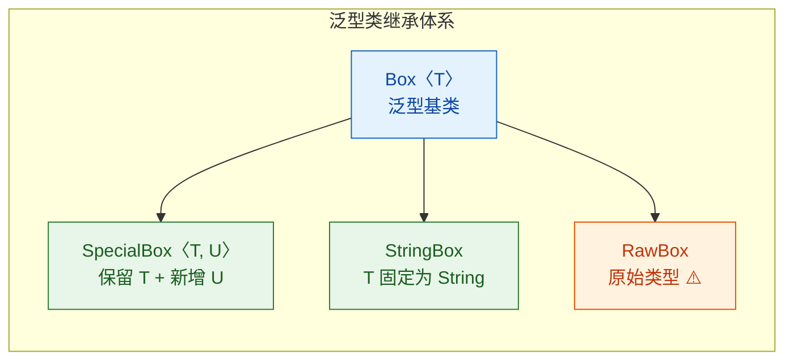

### 泛型方法（Generic Method）

泛型方法是在方法级别声明类型参数的方法。它的类型参数独立于所在类的类型参数——即使所在类不是泛型类，方法也可以是泛型的。

泛型方法的语法特征是：**类型参数 `<T>` 声明在返回类型之前、修饰符之后**。

```java
//  修饰符   类型参数声明   返回类型   方法名
//    ↓         ↓           ↓        ↓
public static  <T>          T       getFirst(List<T> list) { ... }
```

来看一个完整的工具类示例：

```java
public class GenericMethodDemo {

    /**
     * 泛型方法：交换数组中两个位置的元素
     * <T> 声明在 static 和 void 之间，表示这是一个泛型方法
     * T 的实际类型由调用时传入的数组类型决定
     */
    public static <T> void swap(T[] array, int i, int j) {
        T temp = array[i];    // temp 的类型跟随 T
        array[i] = array[j];  // 类型安全的交换
        array[j] = temp;
    }

    /**
     * 泛型方法：将任意类型的数组转为 List
     * 使用 @SafeVarargs 抑制可变参数的泛型警告
     */
    @SafeVarargs
    public static <T> List<T> toList(T... elements) {
        List<T> list = new ArrayList<>();  // 创建对应类型的 List
        for (T element : elements) {       // 遍历可变参数
            list.add(element);             // 逐个添加
        }
        return list;                       // 返回类型为 List<T>
    }

    /**
     * 多类型参数的泛型方法
     * K 和 V 是方法自己的类型参数，与类无关
     */
    public static <K, V> Map<K, V> mapOf(K key, V value) {
        Map<K, V> map = new HashMap<>();   // 创建 Map
        map.put(key, value);               // 放入键值对
        return map;                        // 返回参数化的 Map
    }

    public static void main(String[] args) {
        // 调用泛型方法 —— 编译器自动推断 T 为 String
        String[] names = {"Alice", "Bob", "Charlie"};
        swap(names, 0, 2);  // T 被推断为 String
        System.out.println(Arrays.toString(names));  // [Charlie, Bob, Alice]

        // 调用泛型方法 —— 编译器自动推断 T 为 Integer
        Integer[] nums = {1, 2, 3};
        swap(nums, 0, 1);   // T 被推断为 Integer
        System.out.println(Arrays.toString(nums));   // [2, 1, 3]

        // 也可以显式指定类型参数（通常不需要，但语法上支持）
        GenericMethodDemo.<String>swap(names, 0, 1);

        // toList 方法的调用
        List<String> nameList = toList("X", "Y", "Z");  // T 推断为 String
        List<Integer> numList = toList(1, 2, 3);          // T 推断为 Integer

        // 多类型参数
        Map<String, Integer> map = mapOf("age", 25);  // K=String, V=Integer
    }
}
```

一个非常重要的区分点：**泛型类中的普通方法** vs **泛型方法**。很多初学者容易混淆这两者：

```java
public class Box<T> {

    private T content;

    // 这不是泛型方法！这只是使用了类的类型参数 T 的普通方法
    public T getContent() {
        return content;
    }

    // 这不是泛型方法！参数类型 T 来自类的声明
    public void setContent(T content) {
        this.content = content;
    }

    // 这才是泛型方法！它声明了自己的类型参数 <U>
    // U 与类的 T 完全独立
    public <U> void inspect(U item) {
        System.out.println("T 的类型: " + content.getClass().getSimpleName());
        System.out.println("U 的类型: " + item.getClass().getSimpleName());
    }

    // 这也是泛型方法，同时使用了类的 T 和方法自己的 R
    public <R> Pair<T, R> pairWith(R other) {
        return new Pair<>(this.content, other);
    }
}
```

```java
public class MethodVsGenericMethod {
    public static void main(String[] args) {
        Box<String> box = new Box<>("Hello");

        // getContent() 返回 String —— 类型来自类的 T=String
        String s = box.getContent();

        // inspect() 是泛型方法，U 独立推断为 Double
        box.inspect(3.14);
        // 输出:
        // T 的类型: String
        // U 的类型: Double

        // pairWith() 同时使用 T=String 和 R=Integer
        Pair<String, Integer> pair = box.pairWith(100);
    }
}
```

判断标准很简单：**看方法签名中返回类型前面有没有 `<>` 声明**。有 `<U>` 或 `<R>` 这样的声明，就是泛型方法；没有，就只是使用了类的类型参数的普通方法。

泛型方法的类型推断（Type Inference）机制非常智能，编译器会根据方法参数、返回值赋值目标等上下文信息自动推断类型实参：

```java
// 编译器根据参数 "Hello" 推断 T = String
String first = getFirst(Arrays.asList("Hello", "World"));

// 编译器根据赋值目标 List<Double> 推断 T = Double
List<Double> doubles = toList(1.0, 2.0, 3.0);

// 当推断有歧义时，可以显式指定
// 例如 Collections 的 emptyList()
List<String> empty = Collections.<String>emptyList();
```

### 泛型接口（Generic Interface）

泛型接口的语法与泛型类几乎一致，在接口名后声明类型参数。Java 标准库中大量使用了泛型接口，最经典的莫过于 `Comparable<T>`、`Iterable<T>`、`Comparator<T>` 以及函数式接口家族。

先看泛型接口的定义与实现：

```java
/**
 * 自定义泛型接口：数据转换器
 * 将 F（From）类型转换为 T（To）类型
 */
public interface Converter<F, T> {

    // 接口方法使用类型参数
    T convert(F source);
}
```

实现泛型接口时，有三种常见策略：

```java
// 策略1：实现时指定具体类型 —— 最常见
public class StringToIntConverter implements Converter<String, Integer> {
    @Override
    public Integer convert(String source) {
        return Integer.parseInt(source);  // String -> Integer
    }
}

// 策略2：实现类本身也是泛型，保留接口的类型参数
public class ListConverter<F, T> implements Converter<List<F>, List<T>> {
    private final Converter<F, T> elementConverter;  // 单元素转换器

    public ListConverter(Converter<F, T> elementConverter) {
        this.elementConverter = elementConverter;
    }

    @Override
    public List<T> convert(List<F> source) {
        List<T> result = new ArrayList<>();       // 创建结果列表
        for (F item : source) {                   // 遍历源列表
            result.add(elementConverter.convert(item));  // 逐个转换
        }
        return result;
    }
}

// 策略3：部分指定 —— 固定一个，保留一个
public class JsonDeserializer<T> implements Converter<String, T> {
    // F 被固定为 String（JSON 字符串），T 保留为泛型
    @Override
    public T convert(String json) {
        // 反序列化逻辑...
        return null;
    }
}
```

来看 Java 标准库中最经典的泛型接口 `Comparable<T>` 的实际应用：

```java
/**
 * 实现 Comparable<T> 接口，使 Student 对象可以自然排序
 * T 被指定为 Student 自身 —— 这是一种常见的模式
 */
public class Student implements Comparable<Student> {

    private String name;   // 学生姓名
    private int score;     // 学生分数

    public Student(String name, int score) {
        this.name = name;
        this.score = score;
    }

    /**
     * 实现 compareTo 方法
     * 参数类型是 Student 而不是 Object —— 这就是泛型的好处
     * 无需强制转换，类型安全
     */
    @Override
    public int compareTo(Student other) {
        return Integer.compare(this.score, other.score);  // 按分数升序
    }

    @Override
    public String toString() {
        return name + ":" + score;
    }
}
```

```java
public class ComparableDemo {
    public static void main(String[] args) {
        List<Student> students = Arrays.asList(
            new Student("Alice", 88),
            new Student("Bob", 95),
            new Student("Charlie", 72)
        );

        Collections.sort(students);  // 自然排序，调用 compareTo
        System.out.println(students); // [Charlie:72, Alice:88, Bob:95]
    }
}
```

再看函数式接口与泛型的结合——这是 Java 8 Lambda 表达式的基石：

```java
public class FunctionalGenericDemo {
    public static void main(String[] args) {

        // Converter 接口只有一个抽象方法，天然就是函数式接口
        // 可以用 Lambda 表达式实现
        Converter<String, Integer> strToInt = source -> Integer.parseInt(source);
        // 甚至可以用方法引用
        Converter<String, Integer> strToInt2 = Integer::parseInt;

        Integer result = strToInt.convert("123");  // 123
        System.out.println(result);

        // Java 标准库的函数式泛型接口
        // Function<T, R>：接收 T，返回 R
        Function<String, Integer> lengthFunc = String::length;
        int len = lengthFunc.apply("Hello");  // 5

        // Predicate<T>：接收 T，返回 boolean
        Predicate<String> isLong = s -> s.length() > 10;
        boolean test = isLong.test("Short");  // false

        // Consumer<T>：接收 T，无返回值
        Consumer<String> printer = System.out::println;
        printer.accept("Printed by Consumer");

        // Supplier<T>：无参数，返回 T
        Supplier<List<String>> listFactory = ArrayList::new;
        List<String> newList = listFactory.get();  // 得到一个新的空 ArrayList
    }
}
```

最后，用一张流程图来总结泛型语法的完整知识体系：

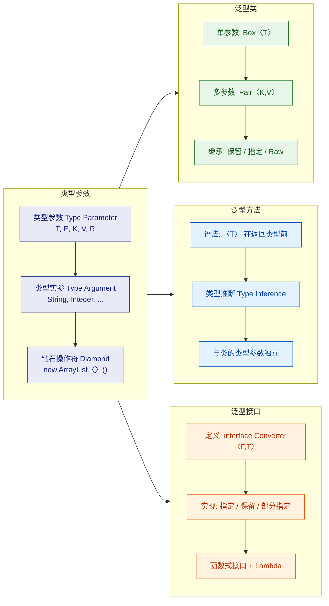

泛型语法的核心就是这四个维度：类型参数是基础原子，泛型类、泛型方法、泛型接口是三种应用形式。理解了它们的声明位置、作用域和类型推断机制，就掌握了泛型大厦的地基。后续的类型约束、通配符、PECS 原则等高级话题，都建立在这个基础之上。

**📝 练习题**

以下代码中，哪一个是真正的泛型方法？

```java
public class Quiz<T> {
    // 方法 A
    public T methodA(T param) {
        return param;
    }

    // 方法 B
    public <U> void methodB(U param) {
        System.out.println(param);
    }

    // 方法 C
    public void methodC(Object param) {
        System.out.println(param);
    }

    // 方法 D
    public T methodD() {
        return null;
    }
}
```

A. methodA —— 因为它的参数和返回值都用了 T


B. methodB —— 因为它在返回类型前声明了自己的类型参数 `<U>`


C. methodC —— 因为它接受 Object，可以传入任何类型


D. methodD —— 因为它返回了泛型类型 T


**【答案】** B

**【解析】** 判断一个方法是否是泛型方法，唯一的标准是看它是否在返回类型前面声明了自己的类型参数（即 `<U>`、`<T>` 等）。methodA 和 methodD 虽然使用了 `T`，但这个 `T` 来自类的声明 `Quiz<T>`，它们只是普通方法，恰好使用了类的类型参数。methodC 使用 `Object` 是原始类型的做法，与泛型无关。只有 methodB 通过 `<U>` 声明了方法级别的独立类型参数，它才是真正的泛型方法。方法 B 的 `U` 与类的 `T` 完全独立，其实际类型在每次调用时由编译器根据传入的实参推断。

---

## 类型参数约束（extends 上界、多重约束）

在上一节中，我们学会了用 `<T>` 声明一个"任意类型"的占位符。但在实际开发中，"任意类型"往往太过宽泛——如果你想在泛型方法里调用 `compareTo()`，编译器怎么知道 `T` 一定有这个方法？这就是类型参数约束（Bounded Type Parameters）要解决的核心问题：**在保留泛型灵活性的同时，给类型参数划定一个能力边界**。

### extends 上界约束（Upper Bound）

关键字 `extends` 在泛型语境中的含义比普通继承更广：它表示"是某个类型，或者是它的子类型"（is-a relationship），对接口同样适用。

语法形式：

```java
// T 必须是 Number 或 Number 的子类（Integer, Double, Long...）
public class Box<T extends Number> {
    private T value;

    public Box(T value) {
        this.value = value;
    }

    // 因为编译器知道 T 至少是 Number，所以可以安全调用 Number 的方法
    public double toDouble() {
        return value.doubleValue(); // ✅ 编译通过，Number 有 doubleValue()
    }
}
```

我们来看看使用时的效果：

```java
// ✅ Integer extends Number，合法
Box<Integer> intBox = new Box<>(42);

// ✅ Double extends Number，合法
Box<Double> doubleBox = new Box<>(3.14);

// ❌ 编译错误！String 不是 Number 的子类
// Box<String> strBox = new Box<>("hello");
```

这里的核心思想是：**上界约束让编译器在泛型内部获得了"最低保证"**。当你写 `T extends Number` 时，编译器会把 `T` 当作 `Number` 来做类型检查，因此 `Number` 上定义的所有方法（`intValue()`, `doubleValue()`, `longValue()` 等）都可以安全调用。

来看一个更实际的例子——写一个求数组最大值的泛型方法：

```java
public class MathUtils {

    // T 必须实现 Comparable 接口，才能进行比较
    public static <T extends Comparable<T>> T findMax(T[] array) {
        if (array == null || array.length == 0) {
            throw new IllegalArgumentException("数组不能为空"); // 防御性检查
        }

        T max = array[0]; // 假设第一个元素是最大值

        for (int i = 1; i < array.length; i++) {
            // compareTo() 来自 Comparable 接口
            // 返回正数表示 array[i] > max
            if (array[i].compareTo(max) > 0) {
                max = array[i]; // 更新最大值
            }
        }

        return max; // 返回最大值
    }
}
```

```java
// 使用示例
Integer[] nums = {3, 7, 1, 9, 4};
System.out.println(MathUtils.findMax(nums)); // 输出: 9

String[] words = {"apple", "orange", "banana"};
System.out.println(MathUtils.findMax(words)); // 输出: orange（按字典序）
```

如果没有 `extends Comparable<T>` 这个约束，编译器根本不知道 `T` 有 `compareTo()` 方法，代码直接报错。这就是上界约束的价值——**它是泛型与多态之间的桥梁**。

### 为什么用 extends 而不是 implements？

这是初学者常见的困惑。在泛型约束语法中，**无论约束目标是类还是接口，统一使用 `extends`**。Java 设计者选择复用 `extends` 关键字，而不是引入新语法，是为了保持语言的简洁性。

```java
// 约束到类 → 用 extends
<T extends Number>

// 约束到接口 → 还是用 extends（不是 implements！）
<T extends Comparable<T>>

// 这是语法规定，没有为什么，记住就好
```

### 多重约束（Multiple Bounds）

现实场景中，一个类型参数可能需要同时满足多个条件。Java 允许用 `&` 符号连接多个约束：

```java
// T 必须同时满足：继承 Number 且实现 Comparable 接口
public static <T extends Number & Comparable<T>> T findMaxNumber(T[] array) {
    T max = array[0]; // 初始化最大值

    for (int i = 1; i < array.length; i++) {
        if (array[i].compareTo(max) > 0) { // Comparable 提供的能力
            max = array[i];
        }
    }

    // Number 提供的能力：可以转换为 double 输出
    System.out.println("最大值的 double 形式: " + max.doubleValue());
    return max;
}
```

多重约束有一条严格的语法规则：

```java
// ✅ 正确：类在前，接口在后
<T extends SomeClass & InterfaceA & InterfaceB>

// ❌ 编译错误：接口不能放在类前面
// <T extends InterfaceA & SomeClass>

// ❌ 编译错误：最多只能有一个类（Java 单继承）
// <T extends ClassA & ClassB>
```

原因很直观：Java 是单继承模型，所以类约束最多一个；接口可以多实现，所以接口约束可以有多个。**类必须写在第一个位置**，这是编译器的硬性要求。

我们用一张图来整理多重约束的规则：

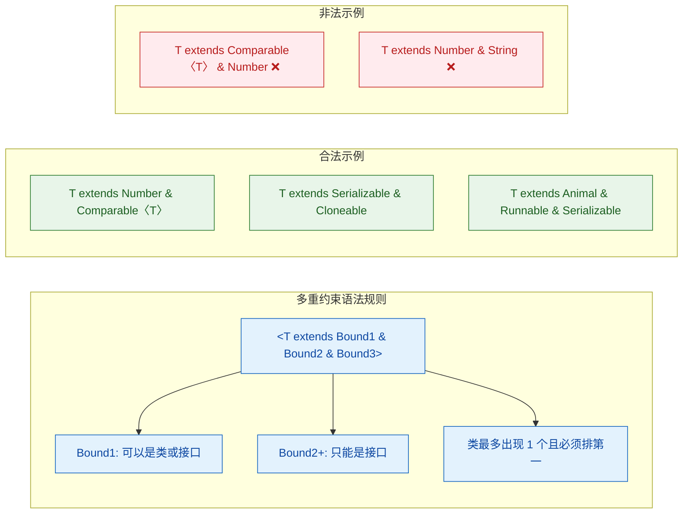

### 约束的传递性与实际应用

类型约束在泛型类的继承体系中是可以传递的。来看一个稍微复杂的例子：

```java
// 定义一个有上界约束的泛型接口
public interface Calculator<T extends Number> {
    T add(T a, T b);       // 加法
    double average(T[] values); // 求平均值
}

// 实现类指定具体类型 Integer（Integer extends Number ✅）
public class IntCalculator implements Calculator<Integer> {

    @Override
    public Integer add(Integer a, Integer b) {
        return a + b; // 自动拆箱 + 装箱
    }

    @Override
    public double average(Integer[] values) {
        int sum = 0;                          // 累加器
        for (Integer val : values) {
            sum += val;                       // 累加每个元素
        }
        return (double) sum / values.length;  // 强转为 double 再除
    }
}
```

再看一个 Android 开发中常见的模式——泛型基类 Activity：

```java
// 泛型基类：约束 VM 必须是 ViewModel 的子类
public abstract class BaseActivity<VM extends ViewModel> extends AppCompatActivity {

    protected VM viewModel; // 子类可以直接使用具体类型的 ViewModel

    // 抽象方法，由子类提供 ViewModel 的 Class 对象
    protected abstract Class<VM> getViewModelClass();

    @Override
    protected void onCreate(Bundle savedInstanceState) {
        super.onCreate(savedInstanceState);
        // 利用约束，安全地创建 ViewModel 实例
        viewModel = new ViewModelProvider(this).get(getViewModelClass());
    }
}

// 具体子类：指定 VM = LoginViewModel
public class LoginActivity extends BaseActivity<LoginViewModel> {

    @Override
    protected Class<LoginViewModel> getViewModelClass() {
        return LoginViewModel.class; // 返回具体的 Class 对象
    }

    @Override
    protected void onCreate(Bundle savedInstanceState) {
        super.onCreate(savedInstanceState);
        // viewModel 的类型已经是 LoginViewModel，无需强转
        viewModel.login("user", "pass"); // ✅ 直接调用子类方法
    }
}
```

这个模式之所以能工作，正是因为 `VM extends ViewModel` 这个约束：编译器知道 `VM` 至少是 `ViewModel`，所以 `ViewModelProvider.get()` 的调用是类型安全的；而子类指定具体类型后，`viewModel` 字段自动变成了具体类型，省去了强制转换。

### 递归类型约束（Recursive Type Bound）

这是一个稍微进阶的话题，但在 Java 标准库中非常常见。最典型的例子就是 `Comparable` 接口：

```java
// Comparable 的定义本身就是递归类型约束
public interface Comparable<T> {
    int compareTo(T o);
}

// 当我们写 class Student implements Comparable<Student> 时
// 意味着 Student 只能和 Student 比较，不能和其他类型比较
public class Student implements Comparable<Student> {
    private String name;  // 学生姓名
    private int score;    // 学生分数

    public Student(String name, int score) {
        this.name = name;
        this.score = score;
    }

    @Override
    public int compareTo(Student other) {
        // 按分数降序排列
        return Integer.compare(other.score, this.score);
    }

    @Override
    public String toString() {
        return name + "(" + score + ")";
    }
}
```

当我们在泛型方法中写 `<T extends Comparable<T>>` 时，这个约束的含义是：**T 必须是能和自身同类型进行比较的类型**。这种"自己约束自己"的模式就叫递归类型约束（Recursive Type Bound）。

```java
// 经典的递归类型约束应用：取集合中的最大值
public static <T extends Comparable<T>> T max(Collection<T> collection) {
    Iterator<T> iterator = collection.iterator(); // 获取迭代器
    T largest = iterator.next();                  // 取第一个元素作为初始最大值

    while (iterator.hasNext()) {
        T next = iterator.next();                 // 取下一个元素
        if (next.compareTo(largest) > 0) {        // 与当前最大值比较
            largest = next;                       // 更新最大值
        }
    }

    return largest;
}
```

### 类型约束与类型擦除的关系

这里提前透露一个重要细节（后续"类型擦除"章节会深入讲解）：**上界约束会影响擦除后的类型**。

```java
// 无约束：擦除后 T → Object
public class Box<T> {
    private T value;
    // 编译后变成: private Object value;
}

// 有约束：擦除后 T → Number（上界类型）
public class NumberBox<T extends Number> {
    private T value;
    // 编译后变成: private Number value;
}

// 多重约束：擦除后 T → 第一个约束类型
public class MultiBox<T extends Number & Comparable<T>> {
    private T value;
    // 编译后变成: private Number value;（取第一个约束）
}
```

这就是为什么多重约束中**类必须放在第一个位置**的另一个原因：擦除后取第一个约束作为原始类型（raw type），如果第一个是接口而不是类，可能会导致一些意想不到的类型转换问题。

### 常见误区与陷阱

```java
// 误区 1：约束中不能使用基本类型
// ❌ 编译错误：int 不是引用类型
// public class Box<T extends int> {}

// ✅ 正确：使用包装类
public class Box<T extends Integer> {}


// 误区 2：静态上下文中不能使用类的类型参数
public class Container<T extends Number> {
    // ❌ 编译错误：静态方法不能引用类级别的类型参数 T
    // public static T getDefault() { return null; }

    // ✅ 正确：静态方法需要声明自己的类型参数
    public static <E extends Number> E getDefault(Class<E> clazz) {
        return null;
    }
}


// 误区 3：不能用 instanceof 检查泛型类型
public <T extends Number> void check(Object obj) {
    // ❌ 编译错误：运行时泛型信息已被擦除
    // if (obj instanceof T) {}

    // ✅ 正确：通过 Class 对象检查
    // if (Number.class.isInstance(obj)) {}
}
```

---

**📝 练习题**

以下泛型方法声明中，哪一个是合法的？

A. `public static <T extends Comparable<T> & Number> T max(T a, T b) { ... }`


B. `public static <T extends Number & Comparable<T>> T max(T a, T b) { ... }`


C. `public static <T extends Number & Integer> T max(T a, T b) { ... }`


D. `public static <T implements Number & Comparable<T>> T max(T a, T b) { ... }`

**【答案】** B

**【解析】** 多重约束的语法规则要求：如果约束中包含类（class），类必须放在第一个位置，后面跟接口。选项 A 中 `Comparable<T>`（接口）放在了 `Number`（类）前面，违反了顺序规则。选项 C 中 `Number` 和 `Integer` 都是类，Java 单继承不允许同时约束两个类。选项 D 使用了 `implements` 关键字，但泛型约束中统一使用 `extends`，不存在 `implements` 的写法。只有选项 B 正确地将类 `Number` 放在第一位，接口 `Comparable<T>` 放在后面，用 `&` 连接。

---

## 通配符（Wildcards）⭐⭐

Java 泛型中的通配符 `?` 是一个极其重要但也容易让人困惑的概念。如果说泛型类型参数 `T` 是在"定义"时使用的占位符，那么通配符 `?` 就是在"使用"时表达一种"我不关心具体类型"或"我只关心类型的某个范围"的语义。它的核心价值在于提升 API 的灵活性——让方法能够接受更广泛的参数化类型，而不是被锁死在某一个具体的类型实参上。

要理解通配符为什么存在，必须先理解一个关键前提：**泛型是不变的（Invariant）**。`Dog` 是 `Animal` 的子类，但 `List<Dog>` 绝不是 `List<Animal>` 的子类。这意味着一个接受 `List<Animal>` 的方法，你无法传入 `List<Dog>`。通配符正是为了在这种严格的类型不变性之上，打开一扇受控的灵活性之门。

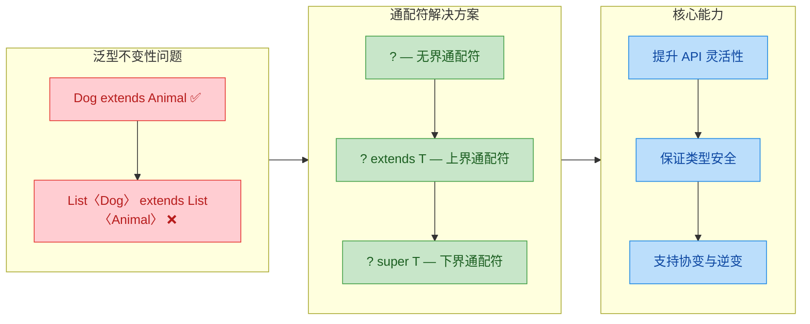

### 无界通配符（Unbounded Wildcard `?`）

无界通配符 `?` 表示"任意类型"，写作 `List<?>`，读作"List of unknown"。它是通配符家族中最宽泛的形式，表达的语义是：我完全不关心这个集合里装的是什么类型，我只想对集合本身做一些与元素类型无关的操作。

最典型的使用场景有两个：

第一，当你的方法逻辑完全不依赖于集合的元素类型时。比如你只想打印集合的大小、判断是否为空、或者遍历打印每个元素（因为所有对象都是 `Object`，调用 `toString()` 总是安全的）。

第二，当你想使用 `Class` 类型的参数，但不关心它代表哪个具体类时，`Class<?>` 比 raw type `Class` 更安全，因为它明确告诉编译器"我知道这里有泛型，但我有意不指定"。

```java
// 打印任意类型 List 的信息 —— 典型的无界通配符用法
public static void printListInfo(List<?> list) {
    // 可以调用 size()，这与元素类型无关
    System.out.println("Size: " + list.size());

    // 可以遍历并打印，因为每个元素至少是 Object
    for (Object item : list) {
        // 取出的元素类型是 Object，这是编译器能保证的最大范围
        System.out.println("  Element: " + item);
    }

    // ❌ 编译错误！不能往 List<?> 中添加任何元素（null 除外）
    // list.add("hello");  // 因为编译器不知道 ? 到底是什么类型
    // list.add(123);      // 同理，任何具体类型都可能与 ? 不匹配

    // ✅ null 是唯一的例外，因为 null 可以赋值给任何引用类型
    list.add(null);
}

public static void main(String[] args) {
    List<String> strings = Arrays.asList("A", "B", "C");
    List<Integer> numbers = Arrays.asList(1, 2, 3);
    List<Dog> dogs = Arrays.asList(new Dog("Buddy"));

    // ✅ 全部合法！List<?> 可以接受任何类型实参的 List
    printListInfo(strings);
    printListInfo(numbers);
    printListInfo(dogs);
}
```

这里有一个非常关键的限制需要深入理解：**`List<?>` 是只读的（read-only semantics）**。你不能向 `List<?>` 中添加任何元素（除了 `null`）。原因很直观——编译器不知道 `?` 到底代表什么类型。如果 `?` 实际上是 `String`，你往里塞一个 `Integer` 就破坏了类型安全；反之亦然。编译器无法做出判断，所以干脆全部禁止。

那么 `List<?>` 和 `List<Object>` 有什么区别？这是一个高频面试考点：

```java
// List<Object> vs List<?>

// List<Object>：明确指定元素类型为 Object
// 可以添加任何对象（因为所有类都是 Object 的子类）
List<Object> objectList = new ArrayList<>();
objectList.add("hello");   // ✅ String 是 Object 子类
objectList.add(123);       // ✅ Integer 是 Object 子类

// 但 List<Object> 不能接受 List<String>！因为泛型不变
// List<Object> ref = new ArrayList<String>();  // ❌ 编译错误

// List<?>：未知类型
// 不能添加元素（除了 null），但可以接受任何 List
List<?> wildcardList;
wildcardList = new ArrayList<String>();   // ✅
wildcardList = new ArrayList<Integer>();  // ✅
wildcardList = new ArrayList<Object>();   // ✅
// wildcardList.add("test");  // ❌ 编译错误
```

简单总结：`List<Object>` 能写不能兼容，`List<?>` 能兼容不能写。

还有一个容易混淆的点：`List<?>` 和 raw type `List` 的区别。虽然两者在运行时完全一样（类型擦除后都是 `List`），但在编译期，`List<?>` 是类型安全的——编译器会阻止你做不安全的写入操作；而 raw type `List` 会绕过所有泛型检查，编译器只会给你一个 warning，不会阻止你犯错。所以在现代 Java 中，**永远不要使用 raw type，用 `List<?>` 替代**。

```java
// Raw type vs 无界通配符 —— 编译器行为对比
List rawList = new ArrayList<String>();
rawList.add(123);  // ⚠️ 编译器只给 warning，不报错，运行时可能 ClassCastException

List<?> safeList = new ArrayList<String>();
// safeList.add(123);  // ❌ 编译器直接报错，把问题拦截在编译期
```

### 上界通配符（Upper Bounded Wildcard `? extends T`）

上界通配符 `? extends T` 表示"T 或 T 的任意子类型"。它为通配符设定了一个上限（upper bound），告诉编译器：这个未知类型虽然我不知道具体是什么，但它一定是 `T` 或 `T` 的子类。

这个特性让泛型获得了类似数组的"协变"（Covariance）能力——如果 `Dog extends Animal`，那么 `List<? extends Animal>` 可以接受 `List<Dog>`、`List<Cat>`、`List<Animal>` 等任何元素类型是 `Animal` 或其子类的 List。

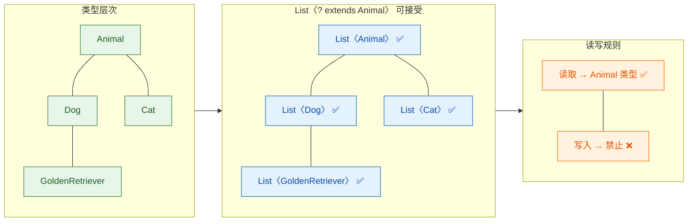

来看一个实际场景：你想写一个方法，计算一个数字列表中所有元素的总和。这些数字可能是 `Integer`、`Double`、`Long` 等，它们都继承自 `Number`。

```java
// 计算任意 Number 子类型列表的总和
// 使用上界通配符，使方法能接受 List<Integer>、List<Double> 等
public static double sumOfList(List<? extends Number> list) {
    double sum = 0.0;
    for (Number num : list) {
        // 取出的每个元素都可以安全地当作 Number 使用
        // 因为 ? extends Number 保证了元素至少是 Number
        sum += num.doubleValue();
    }
    return sum;
}

public static void main(String[] args) {
    List<Integer> intList = Arrays.asList(1, 2, 3);
    List<Double> doubleList = Arrays.asList(1.1, 2.2, 3.3);
    List<Long> longList = Arrays.asList(100L, 200L, 300L);

    // ✅ 全部合法！Integer、Double、Long 都 extends Number
    System.out.println(sumOfList(intList));     // 6.0
    System.out.println(sumOfList(doubleList));  // 6.6
    System.out.println(sumOfList(longList));    // 600.0

    // 如果方法签名是 List<Number>，上面三个调用全部编译失败！
}
```

上界通配符的核心读写规则：**可以安全读取，但不能写入**。

为什么可以读取？因为无论 `?` 实际是 `Integer`、`Double` 还是 `Long`，它们都是 `Number` 的子类，所以取出来当 `Number` 用一定是安全的（向上转型总是合法的）。

为什么不能写入？这是理解上界通配符最关键的一步。假设你有一个 `List<? extends Number>`，它的实际类型可能是 `List<Integer>`，也可能是 `List<Double>`。如果编译器允许你往里写入一个 `Integer`，而实际类型是 `List<Double>`，那就破坏了类型安全。编译器无法在编译期确定 `?` 的具体类型，所以选择全面禁止写入。

```java
public static void cannotWrite(List<? extends Number> list) {
    // ✅ 读取完全没问题
    Number first = list.get(0);  // 编译器知道元素至少是 Number

    // ❌ 以下写入操作全部编译失败
    // list.add(1);        // 万一实际是 List<Double> 呢？
    // list.add(1.0);      // 万一实际是 List<Integer> 呢？
    // list.add(new Number() { ... }); // 同理

    // ✅ null 仍然是唯一的例外
    list.add(null);
}
```

用一句话记忆：**`? extends T` 是生产者（Producer），只出不进**。你可以从中"取出"（produce）`T` 类型的元素，但不能往里"放入"（consume）任何东西。这就是后面 PECS 原则中 "Producer Extends" 的由来。

再看一个 Android 开发中常见的实际应用——`RecyclerView.Adapter` 中处理不同类型的 ViewHolder：

```java
// 一个通用的 ViewHolder 绑定工具方法
// 接受任何 Animal 子类的列表，只读取不修改
public static void bindAnimalViews(
        List<? extends Animal> animals,  // 可以传入 List<Dog>、List<Cat> 等
        AnimalAdapter adapter) {

    for (int i = 0; i < animals.size(); i++) {
        // 取出的元素类型是 Animal，可以安全调用 Animal 的方法
        Animal animal = animals.get(i);
        adapter.bindData(i, animal.getName(), animal.getSound());
    }
}
```

上界通配符还支持接口作为上界，以及多重约束（虽然多重约束更常见于类型参数 `T`，通配符本身只支持单个 `extends`）：

```java
// 接口作为上界
public static void processComparables(List<? extends Comparable<String>> list) {
    for (Comparable<String> item : list) {
        // 可以安全调用 Comparable 接口的方法
        int result = item.compareTo("baseline");
        System.out.println("Compare result: " + result);
    }
}
```

### 下界通配符（Lower Bounded Wildcard `? super T`）

下界通配符 `? super T` 表示"T 或 T 的任意父类型"。它为通配符设定了一个下限（lower bound），告诉编译器：这个未知类型一定是 `T` 本身，或者是 `T` 的某个祖先类（一直到 `Object`）。

如果说 `? extends T` 提供了协变能力，那么 `? super T` 提供的就是"逆变"（Contravariance）能力——类型关系被"反转"了。`List<? super Dog>` 可以接受 `List<Dog>`、`List<Animal>`、`List<Object>`。

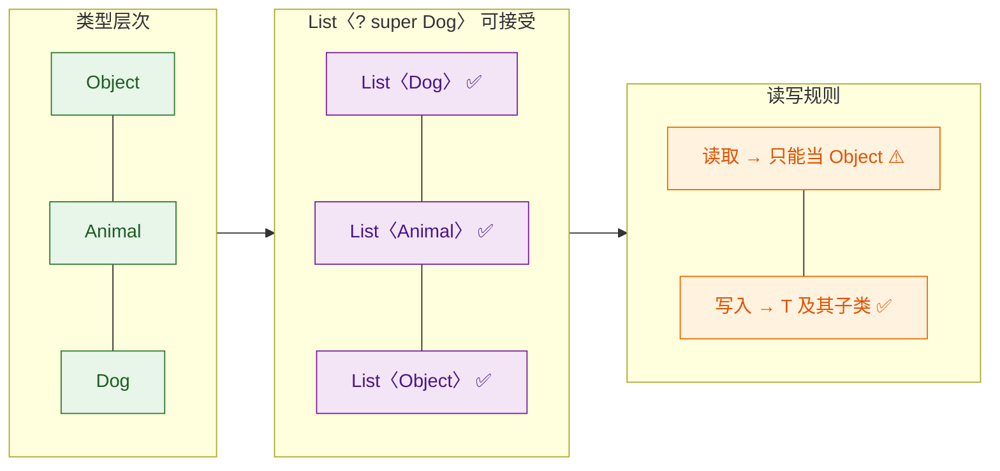

下界通配符的读写规则与上界通配符恰好相反：**可以安全写入 T 及其子类，但读取时只能当 Object 处理**。

为什么可以写入？因为 `? super Dog` 保证了实际类型至少是 `Dog` 的父类。无论实际是 `List<Dog>`、`List<Animal>` 还是 `List<Object>`，往里放一个 `Dog`（或 `Dog` 的子类如 `GoldenRetriever`）都是安全的——子类对象赋值给父类引用，这是 Java 多态的基本功。

为什么读取受限？因为编译器不知道 `?` 到底是 `Dog`、`Animal` 还是 `Object`。如果实际是 `List<Object>`，取出来的元素可能是任何东西，编译器无法保证它一定是 `Dog`。所以编译器只能给你最安全的类型——`Object`。

```java
// 下界通配符的读写行为演示
public static void demonstrateSuperWildcard(List<? super Dog> list) {
    // ✅ 写入 Dog 及其子类 —— 完全安全
    list.add(new Dog("Buddy"));              // Dog 本身，OK
    list.add(new GoldenRetriever("Max"));    // Dog 的子类，OK

    // ❌ 不能写入 Dog 的父类
    // list.add(new Animal("Generic"));  // 编译错误！万一实际是 List<Dog> 呢？

    // ⚠️ 读取只能当 Object 处理
    Object item = list.get(0);  // 只能用 Object 接收
    // Dog dog = list.get(0);   // ❌ 编译错误！不能保证取出的一定是 Dog

    // 如果确实需要当 Dog 用，必须手动强转（不推荐）
    if (item instanceof Dog) {
        Dog dog = (Dog) item;
        System.out.println(dog.getName());
    }
}

public static void main(String[] args) {
    List<Dog> dogList = new ArrayList<>();
    List<Animal> animalList = new ArrayList<>();
    List<Object> objectList = new ArrayList<>();

    // ✅ 全部合法！Dog、Animal、Object 都是 Dog 的"super"
    demonstrateSuperWildcard(dogList);
    demonstrateSuperWildcard(animalList);
    demonstrateSuperWildcard(objectList);

    // ❌ 不合法！GoldenRetriever 是 Dog 的子类，不是 super
    // List<GoldenRetriever> grList = new ArrayList<>();
    // demonstrateSuperWildcard(grList);  // 编译错误
}
```

一句话记忆：**`? super T` 是消费者（Consumer），只进不出**。你可以往里"放入"（consume）`T` 类型的元素，但取出来的东西只能当 `Object` 用。这就是 PECS 原则中 "Consumer Super" 的由来。

下界通配符最经典的应用场景是"把数据写入到某个目标集合"。来看 Java 标准库中 `Collections.copy()` 的签名：

```java
// java.util.Collections 中的 copy 方法签名
// dest 是消费者（接收数据），用 ? super T
// src 是生产者（提供数据），用 ? extends T
public static <T> void copy(List<? super T> dest, List<? extends T> src) {
    // 从 src 中读取（extends 保证可以安全读取为 T）
    // 往 dest 中写入（super 保证可以安全写入 T）
    for (int i = 0; i < src.size(); i++) {
        T item = src.get(i);    // ✅ 从 Producer 读取
        dest.set(i, item);      // ✅ 向 Consumer 写入
    }
}

// 使用示例
public static void main(String[] args) {
    List<Dog> dogs = Arrays.asList(new Dog("A"), new Dog("B"));
    List<Animal> animals = new ArrayList<>(Arrays.asList(null, null));

    // Dog 列表作为源（Producer），Animal 列表作为目标（Consumer）
    // T 被推断为 Dog
    // src: List<? extends Dog> ← List<Dog> ✅
    // dest: List<? super Dog> ← List<Animal> ✅（Animal 是 Dog 的 super）
    Collections.copy(animals, dogs);
}
```

这个例子完美展示了上界和下界通配符的协作——它们各司其职，一个负责安全读取，一个负责安全写入，共同构成了类型安全的数据流动。

最后，用一张对比表来巩固三种通配符的核心区别：

```text
┌──────────────────┬──────────────┬──────────────┬──────────────┐
│      特性         │    List<?>   │ List<? ext T>│ List<? sup T>│
├──────────────────┼──────────────┼──────────────┼──────────────┤
│ 含义             │ 任意类型      │ T 或 T 的子类 │ T 或 T 的父类 │
│ 读取元素类型      │ Object       │ T            │ Object       │
│ 写入能力         │ ❌ (仅 null) │ ❌ (仅 null)  │ ✅ T 及子类   │
│ 典型用途         │ 只读 + 类型   │ 生产者        │ 消费者        │
│                  │ 无关操作      │ (Producer)   │ (Consumer)   │
│ 协变/逆变        │ —            │ 协变          │ 逆变          │
│ PECS 角色        │ —            │ PE           │ CS           │
└──────────────────┴──────────────┴──────────────┴──────────────┘
```

---

**📝 练习题**

以下代码中，哪一行会导致编译错误？

```java
List<? extends Number> list1 = new ArrayList<Integer>();
List<? super Integer> list2 = new ArrayList<Number>();

list1.add(1);                    // Line A
Number n = list1.get(0);         // Line B
list2.add(1);                    // Line C
Integer i = list2.get(0);       // Line D
```

A. Line A


B. Line B


C. Line C


D. Line D


**【答案】** A 和 D

**【解析】**

Line A：`list1` 的类型是 `List<? extends Number>`，这是上界通配符，只能读取不能写入。编译器不知道 `?` 到底是 `Integer`、`Double` 还是其他 `Number` 子类，所以禁止 `add` 操作。编译错误。

Line B：从 `List<? extends Number>` 中读取，编译器保证元素至少是 `Number`，所以用 `Number` 接收完全合法。编译通过。

Line C：`list2` 的类型是 `List<? super Integer>`，这是下界通配符，可以安全写入 `Integer` 及其子类。`1` 会被自动装箱为 `Integer`，写入合法。编译通过。

Line D：从 `List<? super Integer>` 中读取，编译器只能保证返回 `Object`（因为 `?` 可能是 `Integer`、`Number` 或 `Object`）。用 `Integer` 接收需要向下转型，编译器不允许隐式向下转型。编译错误。正确写法是 `Object obj = list2.get(0);`。

---

## PECS 原则 ⭐⭐（Producer Extends, Consumer Super）

PECS 是 Java 泛型中最核心的实战法则之一，由 Joshua Bloch 在 *Effective Java* 中正式提出。它回答了一个在实际开发中极其高频的问题：**当方法参数涉及泛型通配符时，到底该用 `? extends T` 还是 `? super T`？**

这条原则的全称是 **Producer Extends, Consumer Super**，翻译过来就是：

- 如果一个泛型容器是**数据的生产者**（你从中**读取**数据），使用 `? extends T`。
- 如果一个泛型容器是**数据的消费者**（你往里**写入**数据），使用 `? super T`。

理解 PECS 的关键，在于彻底搞清楚"站在谁的视角看问题"。这里的 Producer 和 Consumer 描述的不是你（调用者），而是**那个被传入的集合参数本身**。集合"生产"元素给你用，或者集合"消费"你塞给它的元素。

### 为什么需要 PECS

在没有 PECS 指导的情况下，开发者写出的泛型 API 往往过于死板。来看一个经典场景：

```java
// 一个简单的工具方法：把 src 中的所有元素拷贝到 dest 中
// 这是一个"看起来合理但实际上非常不灵活"的签名
public static <T> void copy(List<T> dest, List<T> src) {
    for (T item : src) {
        dest.add(item);
    }
}
```

这个签名要求 `dest` 和 `src` 的泛型类型**完全一致**。但在实际业务中，我们经常需要这样做：

```java
List<Number> numbers = new ArrayList<>();
List<Integer> integers = Arrays.asList(1, 2, 3);

// 编译错误！List<Integer> 不是 List<Number>
copy(numbers, integers);
```

`Integer` 明明是 `Number` 的子类，把 `Integer` 放进 `List<Number>` 在逻辑上完全合理，但编译器不允许。这就是泛型不变性（Invariance）带来的限制。PECS 原则正是为了在**保证类型安全**的前提下，**最大化 API 的灵活性**。

### 深入理解 Producer Extends

当一个集合扮演"生产者"角色时，意味着你只需要**从中取出元素**。你关心的是"取出来的东西至少是什么类型"，所以用上界通配符 `? extends T` 来约束。

```java
// src 是生产者：我们只从 src 中"读取"元素
// 使用 ? extends T，表示 src 中的元素至少是 T 或 T 的子类
public static <T> void copyFrom(List<T> dest, List<? extends T> src) {
    for (T item : src) {   // 读取操作 —— 安全，取出来的一定是 T 或其子类
        dest.add(item);     // 写入 dest —— dest 的类型是精确的 List<T>，安全
    }
}
```

为什么 `? extends T` 的集合只能读、不能写？编译器的推理过程如下：

```java
List<? extends Number> producer = new ArrayList<Integer>();

// ✅ 读取：编译器知道里面的元素"至少是 Number"，所以可以安全赋值给 Number 引用
Number n = producer.get(0);

// ❌ 写入：编译器不知道这个 List 的实际类型参数到底是 Integer、Double 还是 Float
// 如果实际是 List<Integer>，你塞一个 Double 进去就破坏了类型安全
producer.add(3.14);  // 编译错误
producer.add(42);    // 编译错误，即使是 Integer 也不行
```

编译器的逻辑很严谨：`? extends Number` 代表"某个 Number 的子类型，但我不知道具体是哪个"。既然不知道具体类型，任何写入操作都可能不安全，所以一律禁止（`null` 除外）。

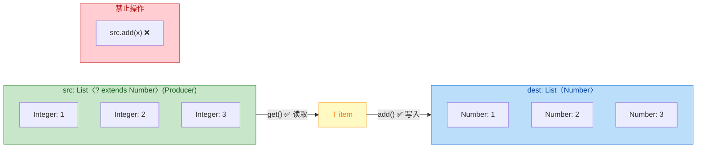

### 深入理解 Consumer Super

当一个集合扮演"消费者"角色时，意味着你需要**往里面塞东西**。你关心的是"塞进去的东西能不能被接受"，所以用下界通配符 `? super T` 来约束。

```java
// dest 是消费者：我们只往 dest 中"写入"元素
// 使用 ? super T，表示 dest 能接受 T 及 T 的子类对象
public static <T> void copyInto(List<? super T> dest, List<T> src) {
    for (T item : src) {    // 从精确类型的 src 中读取
        dest.add(item);      // 写入操作 —— 安全，dest 的实际类型是 T 或 T 的父类
    }
}
```

为什么 `? super T` 的集合可以写入 T 类型的对象？编译器的推理：

```java
List<? super Integer> consumer = new ArrayList<Number>();

// ✅ 写入：编译器知道实际类型至少是 Integer 的父类（Number、Object 等）
// 根据多态，Integer 对象一定可以赋值给 Number 或 Object 类型的引用
consumer.add(42);           // 安全
consumer.add(Integer.valueOf(100)); // 安全

// ❌ 精确读取：编译器不知道实际类型是 Number 还是 Object
// 所以取出来只能当 Object 用，失去了类型信息
// Number n = consumer.get(0);  // 编译错误
Object obj = consumer.get(0);    // 只能用 Object 接收
```

`? super Integer` 代表"某个 Integer 的父类型，但我不知道具体是哪个"。写入 `Integer` 一定安全（多态保证），但读取时无法确定具体类型，只能退化为 `Object`。

### 完整的 PECS 实战：copy 方法

现在把 Producer Extends 和 Consumer Super 结合起来，写出最灵活的 `copy` 方法：

```java
public class PECSDemo {

    // 终极版本：src 是 Producer（extends），dest 是 Consumer（super）
    public static <T> void copy(List<? super T> dest, List<? extends T> src) {
        for (T item : src) {    // 从 Producer 中读取，类型安全
            dest.add(item);      // 向 Consumer 中写入，类型安全
        }
    }

    public static void main(String[] args) {
        // 场景1：Integer 列表拷贝到 Number 列表
        List<Number> numbers = new ArrayList<>();
        List<Integer> integers = Arrays.asList(1, 2, 3);
        copy(numbers, integers);  // ✅ T 推断为 Integer

        // 场景2：Integer 列表拷贝到 Object 列表
        List<Object> objects = new ArrayList<>();
        copy(objects, integers);  // ✅ T 推断为 Integer

        // 场景3：Double 列表也能拷贝到 Number 列表
        List<Double> doubles = Arrays.asList(1.1, 2.2);
        copy(numbers, doubles);   // ✅ T 推断为 Double

        System.out.println(numbers); // [1, 2, 3, 1.1, 2.2]
    }
}
```

事实上，JDK 标准库中的 `java.util.Collections.copy()` 正是这个签名：

```java
// JDK 源码中的签名，完美遵循 PECS
public static <T> void copy(List<? super T> dest, List<? extends T> src)
```

### PECS 在 JDK 标准库中的体现

PECS 不是一个学术概念，它深深嵌入了 JDK 的 API 设计中。以下是几个典型例子：

```java
// ========== 1. Collections.addAll ==========
// target 是 Consumer（接收元素），所以用 ? super T
public static <T> boolean addAll(Collection<? super T> c, T... elements)

// 使用示例：
List<Number> nums = new ArrayList<>();
Collections.addAll(nums, 1, 2, 3);  // ✅ Integer 是 Number 的子类


// ========== 2. Collections.max ==========
// coll 是 Producer（提供元素供比较），所以用 ? extends T
public static <T extends Comparable<? super T>> T max(Collection<? extends T> coll)
// 注意这里的 Comparable<? super T>：比较器消费 T 的父类型，也是 PECS 的体现


// ========== 3. Stream.collect ==========
// Collector 的签名中也大量使用了 PECS
<R, A> R collect(Collector<? super T, A, R> collector)
// Collector 消费流中的元素（Consumer），所以是 ? super T


// ========== 4. Optional.orElseGet ==========
// Supplier 是 Producer（生产一个值），所以概念上对应 extends 思想
public T orElseGet(Supplier<? extends T> supplier)
```

### PECS 速记口诀与决策流程

在实际编码中，面对一个泛型参数，按以下步骤判断：

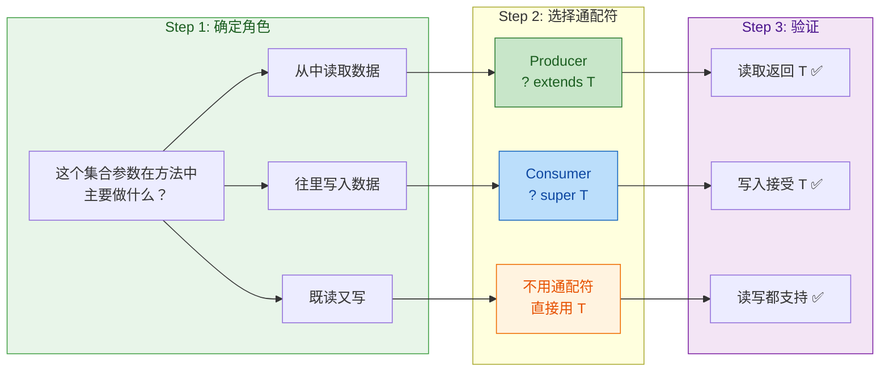

简单总结成一句话：**往外拿用 extends，往里塞用 super，又拿又塞别用通配符**。

### 一个综合实战案例

假设我们要实现一个通用的"过滤并收集"工具方法：从源集合中筛选满足条件的元素，放入目标集合。

```java
import java.util.*;
import java.util.function.Predicate;

public class PECSAdvanced {

    /**
     * 从 src（Producer）中读取元素，用 predicate 过滤，写入 dest（Consumer）
     *
     * @param dest      目标集合，消费者角色，使用 ? super T
     * @param src       源集合，生产者角色，使用 ? extends T
     * @param predicate 过滤条件，消费 T 类型元素进行判断，使用 ? super T
     * @param <T>       元素类型
     */
    public static <T> void filterAndCollect(
            Collection<? super T> dest,        // Consumer: 往里写
            Collection<? extends T> src,        // Producer: 从中读
            Predicate<? super T> predicate) {   // Consumer: 消费元素做判断

        for (T item : src) {                   // 从 Producer 读取，安全
            if (predicate.test(item)) {        // Predicate 消费元素
                dest.add(item);                // 向 Consumer 写入，安全
            }
        }
    }

    public static void main(String[] args) {
        // 源数据：Integer 列表
        List<Integer> source = Arrays.asList(1, -2, 3, -4, 5, -6);

        // 目标：收集到 Number 列表中（Integer 的父类）
        List<Number> positiveNumbers = new ArrayList<>();

        // 过滤条件：用 Number 级别的 Predicate（判断是否大于 0）
        // 这个 Predicate<Number> 可以处理任何 Number 子类
        Predicate<Number> isPositive = n -> n.doubleValue() > 0;

        // 完美运行：
        // src: List<Integer>       匹配 Collection<? extends Integer>  ✅ Producer
        // dest: List<Number>       匹配 Collection<? super Integer>    ✅ Consumer
        // predicate: Predicate<Number> 匹配 Predicate<? super Integer> ✅ Consumer
        filterAndCollect(positiveNumbers, source, isPositive);

        System.out.println(positiveNumbers); // [1, 3, 5]
    }
}
```

注意 `Predicate<? super T>` 这个细节：`Predicate` 的 `test(T t)` 方法是**消费**一个 `T` 类型的值来做判断，所以它是 Consumer，遵循 PECS 用 `? super T`。这也是为什么 JDK 中 `Stream.filter()` 的签名是 `filter(Predicate<? super T> predicate)`。

### 常见误区

**误区一：PECS 只适用于集合类**

不对。PECS 的本质是关于"读"和"写"的方向性，适用于所有泛型场景。`Supplier<? extends T>` 是 Producer（生产值），`Consumer<? super T>` 是 Consumer（消费值），`Comparator<? super T>` 也是 Consumer（消费两个值进行比较）。

**误区二：extends 和 super 可以随意互换**

绝对不行。用反了会导致编译错误或者 API 灵活性大幅下降。记住核心逻辑：extends 保证读取安全（上界确定），super 保证写入安全（下界确定）。

**误区三：既然 `? super T` 读出来是 Object，那它完全不能读**

技术上可以读，只是读出来的类型是 `Object`，丢失了具体类型信息。在大多数场景下这不实用，所以我们说"Consumer 不适合读"，但这是实践建议而非语法限制。

---

**📝 练习题**

以下方法签名中，哪一个最符合 PECS 原则？该方法的功能是：将 `src` 中的所有元素添加到 `dest` 中，并返回添加的元素个数。

A. `public static <T> int addAll(List<T> dest, List<T> src)`


B. `public static <T> int addAll(List<? extends T> dest, List<? super T> src)`


C. `public static <T> int addAll(List<? super T> dest, List<? extends T> src)`


D. `public static <T> int addAll(List<?> dest, List<?> src)`


**【答案】** C

**【解析】** 根据 PECS 原则分析两个参数的角色：`src` 是数据来源，方法从中**读取**元素，它是 Producer，应使用 `? extends T`；`dest` 是数据目的地，方法往里**写入**元素，它是 Consumer，应使用 `? super T`。选项 A 过于严格，要求两个 List 类型完全一致；选项 B 把 extends 和 super 用反了，`dest` 用了 extends 导致无法写入，`src` 用了 super 导致读取只能得到 Object；选项 D 使用无界通配符，既不能安全读取具体类型，也不能写入任何非 null 值。只有选项 C 正确遵循了 "Producer Extends, Consumer Super" 的原则。

---

## 类型擦除概述 ⭐（编译后泛型信息丢失、桥接方法）

Java 泛型是一个极其优雅的语言特性，但它有一个"公开的秘密"——泛型信息只存在于编译期，一旦编译完成，所有的类型参数都会被"擦除"（Type Erasure）。这意味着 JVM 在运行时根本不知道 `List<String>` 和 `List<Integer>` 有什么区别，它们在字节码层面是同一个类 `List`。理解类型擦除，是真正理解 Java 泛型各种"怪异行为"的钥匙。

### 什么是类型擦除（Type Erasure）

类型擦除是 Java 编译器在编译泛型代码时执行的一个核心过程。简单来说，编译器会做以下几件事：

1. 将所有类型参数替换为它们的上界（bound），如果没有显式上界，就替换为 `Object`。
2. 在必要的地方插入强制类型转换（cast）。
3. 生成桥接方法（bridge method）以保持多态性。

这个设计决策源于 Java 的历史包袱。泛型是在 Java 5 才引入的，而 Java 需要保证向后兼容性（backward compatibility）——Java 5 编译出的泛型代码必须能在旧版 JVM 上运行，旧的非泛型代码也必须能和新的泛型代码互操作。这种兼容策略被称为"擦除式泛型"（erasure-based generics），与 C# 的"具化式泛型"（reified generics）形成鲜明对比。

来看一个直观的例子：

```java
// === 你写的源代码 ===
public class Box<T> {
    private T value;           // T 是类型参数

    public void set(T value) { // 方法参数使用 T
        this.value = value;
    }

    public T get() {           // 返回类型使用 T
        return value;
    }
}
```

```java
// === 编译器擦除后的等价代码（字节码层面）===
public class Box {
    private Object value;           // T 被替换为 Object

    public void set(Object value) { // T 被替换为 Object
        this.value = value;
    }

    public Object get() {           // T 被替换为 Object
        return value;
    }
}
```

当你使用这个泛型类时，编译器会自动插入类型转换：

```java
// === 你写的源代码 ===
Box<String> box = new Box<>();  // 声明 Box<String>
box.set("Hello");               // 传入 String
String val = box.get();         // 直接拿到 String，无需手动转型

// === 编译器擦除后的等价代码 ===
Box box = new Box();            // 泛型参数消失了
box.set("Hello");               // 传入的还是 String（String 本身就是 Object 子类）
String val = (String) box.get();// 编译器自动插入了强制转换！
```

这就是类型擦除的核心机制：编译器在编译期帮你做了所有的类型检查和安全保证，然后把泛型信息"擦掉"，在需要的地方补上强制转换。运行时的 JVM 对泛型一无所知。

### 有上界约束时的擦除规则

当类型参数有 `extends` 上界时，擦除后不是替换为 `Object`，而是替换为上界类型：

```java
// === 源代码：T 有上界 Comparable ===
public class SortedBox<T extends Comparable<T>> {
    private T value;

    public int compareTo(T other) {
        return value.compareTo(other); // 编译期知道 T 有 compareTo 方法
    }
}
```

```java
// === 擦除后：T 被替换为上界 Comparable ===
public class SortedBox {
    private Comparable value;          // T → Comparable（不是 Object）

    public int compareTo(Comparable other) {
        return value.compareTo(other); // 调用 Comparable.compareTo
    }
}
```

如果有多重约束（multiple bounds），擦除后取第一个约束：

```java
// T 同时约束了 Serializable 和 Comparable
// 擦除后 T → Serializable（第一个约束）
public class MultiBox<T extends Serializable & Comparable<T>> {
    private T value; // 擦除后变成 private Serializable value;
}
```

这也是为什么在声明多重约束时，应该把最常用的类型放在第一个位置——它会成为擦除后的实际类型，减少不必要的强制转换。

### 运行时泛型信息丢失的直接证据

类型擦除不是一个抽象概念，你可以用代码直接验证它：

```java
public class ErasureProof {
    public static void main(String[] args) {
        List<String> strings = new ArrayList<>();   // List<String>
        List<Integer> integers = new ArrayList<>();  // List<Integer>

        // 获取运行时的 Class 对象
        Class<?> c1 = strings.getClass();   // java.util.ArrayList
        Class<?> c2 = integers.getClass();  // java.util.ArrayList

        // 比较两个 Class 对象 —— 结果为 true！
        System.out.println(c1 == c2);       // true：运行时它们是同一个类

        // instanceof 也无法区分泛型类型
        // if (strings instanceof List<String>) {} // 编译错误！
        if (strings instanceof List<?>) {}          // 只能用无界通配符
        if (strings instanceof List) {}             // 或者用原始类型
    }
}
```

再看一个更"惊悚"的例子——利用反射绕过泛型检查：

```java
public class ErasureHack {
    public static void main(String[] args) throws Exception {
        List<String> list = new ArrayList<>(); // 声明为 List<String>
        list.add("Hello");                     // 正常添加 String

        // 通过反射获取 add 方法 —— 运行时签名是 add(Object)
        // 因为泛型已被擦除，参数类型是 Object 而非 String
        list.getClass()
            .getMethod("add", Object.class)
            .invoke(list, 123);                // 强行塞入一个 Integer！

        System.out.println(list);              // [Hello, 123] —— 居然成功了
        // String s = list.get(1);             // 运行时抛出 ClassCastException
    }
}
```

这个例子清楚地说明：泛型的类型安全只是编译期的"君子协定"，运行时的 JVM 完全不设防。反射可以轻松绕过泛型约束，因为在字节码层面，`List<String>` 就是一个普通的 `List`。

### 桥接方法（Bridge Method）

类型擦除带来了一个微妙的问题：当子类继承泛型父类并指定具体类型参数时，方法签名会发生冲突。为了解决这个问题，编译器会自动生成"桥接方法"。

先看问题是怎么产生的：

```java
// 泛型接口
public interface Transformer<T> {
    T transform(T input); // 擦除后签名：Object transform(Object)
}

// 实现类，指定 T = String
public class StringTransformer implements Transformer<String> {
    @Override
    public String transform(String input) { // 签名：String transform(String)
        return input.toUpperCase();
    }
}
```

问题来了：擦除后，接口的方法签名是 `Object transform(Object)`，但实现类的方法签名是 `String transform(String)`。从 JVM 的角度看，这两个方法的参数类型不同（`Object` vs `String`），实现类并没有真正"覆盖"接口方法！多态就会失效。

为了修复这个问题，编译器自动生成了一个桥接方法：

```java
// === 编译器为 StringTransformer 生成的实际字节码（反编译后）===
public class StringTransformer implements Transformer {

    // 你写的方法（真正的业务逻辑）
    public String transform(String input) {
        return input.toUpperCase();
    }

    // 编译器自动生成的桥接方法（bridge method）
    // 这个方法才是真正"覆盖"了接口中 Object transform(Object) 的方法
    public /* synthetic bridge */ Object transform(Object input) {
        return this.transform((String) input); // 强转后委托给真正的方法
    }
}
```

用下面这张流程图来理解桥接方法的调用链路：

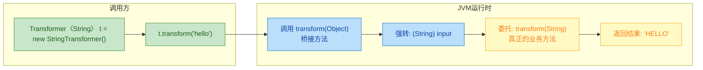

你可以通过反射来验证桥接方法的存在：

```java
import java.lang.reflect.Method;

public class BridgeMethodProof {
    public static void main(String[] args) {
        // 遍历 StringTransformer 的所有方法
        for (Method m : StringTransformer.class.getDeclaredMethods()) {
            System.out.printf(
                "方法名: %-12s 参数类型: %-10s 返回类型: %-10s 是否桥接: %s%n",
                m.getName(),
                m.getParameterTypes()[0].getSimpleName(),
                m.getReturnType().getSimpleName(),
                m.isBridge()   // 关键方法：判断是否为桥接方法
            );
        }
    }
}
```

输出结果：

```text
方法名: transform    参数类型: String     返回类型: String     是否桥接: false
方法名: transform    参数类型: Object     返回类型: Object     是否桥接: true
```

可以看到，`StringTransformer` 中确实存在两个 `transform` 方法——一个是你写的，一个是编译器生成的桥接方法。

### 桥接方法与协变返回类型

桥接方法不仅用于泛型擦除场景，还用于支持协变返回类型（covariant return type）。Java 5 开始允许子类覆盖方法时返回更具体的类型：

```java
public class Parent {
    public Object create() {       // 返回 Object
        return new Object();
    }
}

public class Child extends Parent {
    @Override
    public String create() {       // 返回 String（Object 的子类）—— 协变返回
        return "child";
    }
}
```

在 JVM 层面，方法的唯一标识是"方法名 + 参数列表 + 返回类型"。`Object create()` 和 `String create()` 是两个不同的方法。为了让多态正常工作，编译器同样会生成桥接方法：

```java
// Child 类的实际字节码
public class Child extends Parent {
    public String create() {                    // 你写的方法
        return "child";
    }

    public /* synthetic bridge */ Object create() { // 桥接方法
        return this.create();                       // 委托给 String create()
    }
}
```

### 类型擦除导致的常见"坑"

理解了类型擦除的原理后，很多看似奇怪的编译错误就能解释了：

```java
public class ErasurePitfalls {

    // ❌ 坑1：无法基于泛型参数进行方法重载
    // 擦除后两个方法签名都是 process(List)，冲突！
    // public void process(List<String> list) {}
    // public void process(List<Integer> list) {} // 编译错误

    // ❌ 坑2：无法对类型参数使用 instanceof
    public <T> void check(Object obj) {
        // if (obj instanceof T) {}  // 编译错误：T 在运行时不存在
        // T t = new T();            // 编译错误：无法实例化类型参数
    }

    // ❌ 坑3：静态字段不能使用类的类型参数
    // （因为静态字段属于类本身，而泛型类型属于实例）
    // static T sharedValue;         // 编译错误

    // ✅ 正确做法：通过 Class<T> 传递运行时类型信息
    public <T> T createInstance(Class<T> clazz) throws Exception {
        return clazz.getDeclaredConstructor().newInstance(); // 利用反射创建实例
    }
}
```

下面用一张图总结类型擦除的完整流程：

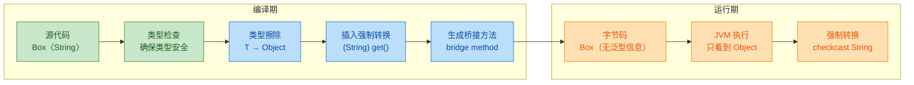

### 保留泛型信息的"后门"：反射获取泛型签名

虽然运行时实例的泛型信息被擦除了，但 Java 在类的元数据中保留了部分泛型签名信息（存储在字节码的 `Signature` 属性中）。这意味着你可以通过反射获取字段声明、方法参数、父类等位置的泛型类型：

```java
import java.lang.reflect.*;
import java.util.List;

public class GenericSignatureRetention {

    // 字段声明中的泛型信息会被保留在类元数据中
    private List<String> names;

    public static void main(String[] args) throws Exception {
        // 获取字段 "names" 的声明类型
        Field field = GenericSignatureRetention.class
                .getDeclaredField("names");

        // getGenericType() 返回带泛型信息的 Type
        Type genericType = field.getGenericType();

        if (genericType instanceof ParameterizedType) {
            ParameterizedType pt = (ParameterizedType) genericType;
            System.out.println("原始类型: " + pt.getRawType());
            // 输出: 原始类型: interface java.util.List

            Type[] typeArgs = pt.getActualTypeArguments();
            System.out.println("类型参数: " + typeArgs[0]);
            // 输出: 类型参数: class java.lang.String
        }
    }
}
```

这个"后门"被大量框架利用——Gson、Jackson 在反序列化时通过 `TypeToken` 获取泛型信息，Spring 通过反射获取注入点的泛型类型。这也是为什么你在使用 Gson 时需要写 `new TypeToken<List<String>>(){}` 这种匿名子类的写法：匿名子类会在字节码中保留父类的泛型签名。

```java
// Gson 的 TypeToken 利用了"子类保留父类泛型签名"的特性
// 匿名子类 {} 的父类是 TypeToken<List<String>>
// 这个泛型信息会被保留在字节码的 Signature 属性中
Type type = new TypeToken<List<String>>(){}.getType();
// type = java.util.List<java.lang.String>  ← 运行时拿到了完整泛型信息
```

### 类型擦除 vs 具化泛型：Java 与 C#/Kotlin 的对比

Java 的擦除式泛型并非唯一选择。C# 从一开始就采用了具化泛型（reified generics），泛型信息在运行时完全保留。Kotlin 虽然运行在 JVM 上受到同样的擦除限制，但通过 `reified` 关键字配合 `inline` 函数提供了部分具化能力：

```java
// Java：无法在运行时获取 T 的具体类型
public <T> void printType() {
    // System.out.println(T.class); // 编译错误！
}
```

```kotlin
// Kotlin：reified + inline 让 T 在运行时可用
inline fun <reified T> printType() {
    println(T::class.java) // 合法！因为 inline 会在调用处展开代码
}
```

Java 选择擦除式泛型的核心原因是向后兼容（backward compatibility）。Java 5 之前已经有海量的非泛型代码在运行，擦除式泛型让新旧代码可以无缝互操作，代价就是运行时丢失了类型信息。这是一个工程上的务实选择，虽然不完美，但保证了 Java 生态的平稳过渡。

---

**📝 练习题**

以下代码的输出结果是什么？

```java
public class Quiz {
    public static void main(String[] args) {
        List<String> a = new ArrayList<>();
        List<Integer> b = new ArrayList<>();
        System.out.println(a.getClass() == b.getClass());
        System.out.println(a.getClass().getName());
    }
}
```

A. `false` 然后 `java.util.ArrayList<String>`

B. `true` 然后 `java.util.ArrayList`

C. `false` 然后 `java.util.ArrayList`

D. `true` 然后 `java.util.ArrayList`


**【答案】** D

**【解析】** 由于类型擦除，`List<String>` 和 `List<Integer>` 在运行时都是 `java.util.ArrayList`，它们的 `Class` 对象是同一个实例，所以 `==` 比较返回 `true`。`getClass().getName()` 返回的是擦除后的原始类型名 `java.util.ArrayList`，不包含任何泛型参数信息。注意选项 B 和 D 的区别在于第一行输出——B 选项的 `true` 和 D 选项的 `true` 相同，但 B 选项第二行输出带了泛型参数 `<String>`，这在运行时是不可能出现的（泛型信息已被擦除）。实际上 B 和 D 第二行不同：B 是 `java.util.ArrayList`，D 也是 `java.util.ArrayList`，两者看起来一样。仔细看选项 A 的第二行带了 `<String>`，所以排除 A；C 的第一行是 `false`，排除 C。正确答案是 D。

---

## 泛型数组限制（为什么不能 `new T[]`）

Java 泛型体系中，有一条让许多开发者困惑的铁律：**你不能创建泛型类型的数组**。写下 `new T[]` 或 `new List<String>[10]` 时，编译器会毫不留情地报错。这并非语言设计的疏忽，而是 Java 类型系统为了在「泛型的类型擦除」与「数组的运行时类型检查」之间维护类型安全，做出的一个深思熟虑的决定。要真正理解这条限制，我们需要先搞清楚数组和泛型在类型系统中的根本差异。

### 数组的协变性与运行时类型检查（Covariant Arrays & Runtime Type Check）

Java 数组从诞生之日起就具备两个关键特性：

第一，**数组是协变的（Covariant）**。如果 `Integer` 是 `Number` 的子类，那么 `Integer[]` 就是 `Number[]` 的子类型。这意味着你可以把一个 `Integer[]` 赋值给一个 `Number[]` 引用。

第二，**数组在运行时保留其元素的真实类型**，这被称为 Reifiable Type。JVM 在每次向数组存入元素时，都会检查该元素是否与数组的实际组件类型兼容。如果不兼容，就会抛出 `ArrayStoreException`。

```java
// 数组协变演示
Integer[] intArr = {1, 2, 3};          // 创建一个 Integer 数组
Number[] numArr = intArr;               // 合法！Integer[] 是 Number[] 的子类型（协变）

numArr[0] = 3.14;                       // 编译通过！编译器只看到 Number[]，Double 是 Number 子类
                                        // 但运行时 JVM 知道底层是 Integer[]
                                        // 抛出 ArrayStoreException ❌
```

这段代码编译完全没问题，但运行时 JVM 发现你试图把一个 `Double` 塞进一个实际类型为 `Integer[]` 的数组，于是果断抛出异常。这就是数组的运行时类型安全网——虽然协变打开了一个类型漏洞，但运行时检查把它兜住了。

我们用一张图来直观理解数组的这套机制：

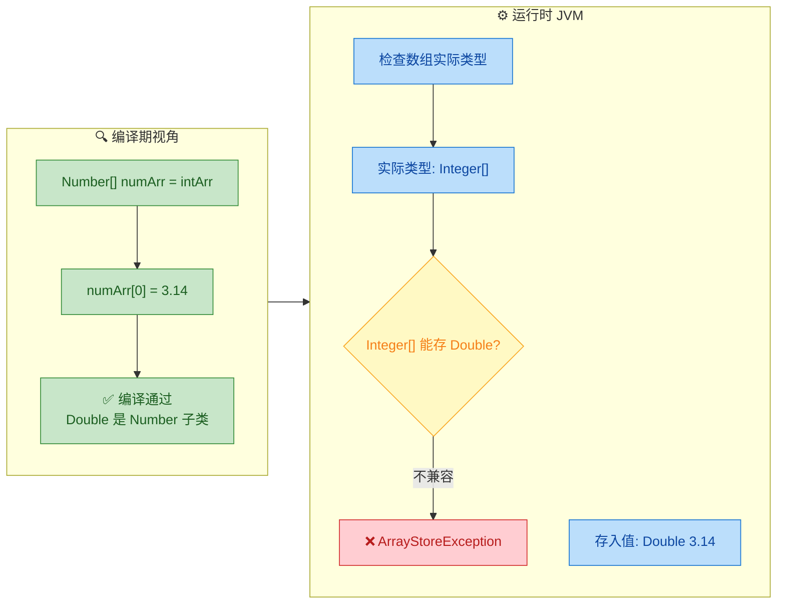

关键点在于：数组之所以能在运行时做这个检查，是因为 **JVM 知道数组的真实元素类型**。`Integer[]` 在运行时就是 `Integer[]`，类型信息完整保留。

### 泛型的类型擦除与数组的根本冲突

现在把泛型拉进来。我们在前面「类型擦除」章节已经知道，泛型信息在编译后会被擦除。`List<String>` 和 `List<Integer>` 在运行时都只是 `List`。这就产生了一个根本性的矛盾：

- **数组需要**在运行时知道元素的精确类型，以执行 `ArrayStoreException` 检查
- **泛型无法**在运行时提供精确的类型参数信息，因为它已经被擦除了

如果 Java 允许创建泛型数组，会发生什么？我们来做一个思想实验（以下代码实际无法编译，仅用于推演）：

```java
// ⚠️ 假设 Java 允许创建泛型数组（实际不允许！）
List<String>[] stringLists = new List<String>[10];  // 假设这行合法

// 步骤 1：利用数组协变，将 List<String>[] 赋给 Object[]
Object[] objArr = stringLists;                       // 数组协变，合法

// 步骤 2：往 Object[] 中塞入一个 List<Integer>
objArr[0] = List.of(42);                             // 运行时能检查吗？
// 运行时数组的实际类型是 List[]（擦除后）
// List.of(42) 的运行时类型也是 List
// List 存入 List[] —— JVM 认为完全合法 ✅（没有 ArrayStoreException！）

// 步骤 3：通过原始引用取出，编译器认为是 List<String>
String s = stringLists[0].get(0);                    // 编译器插入 (String) 强转
// 实际取出的是 Integer 42
// ClassCastException ❌ 类型安全被彻底击穿！
```

这就是灾难所在。让我们逐步拆解这个过程中类型系统的崩塌：

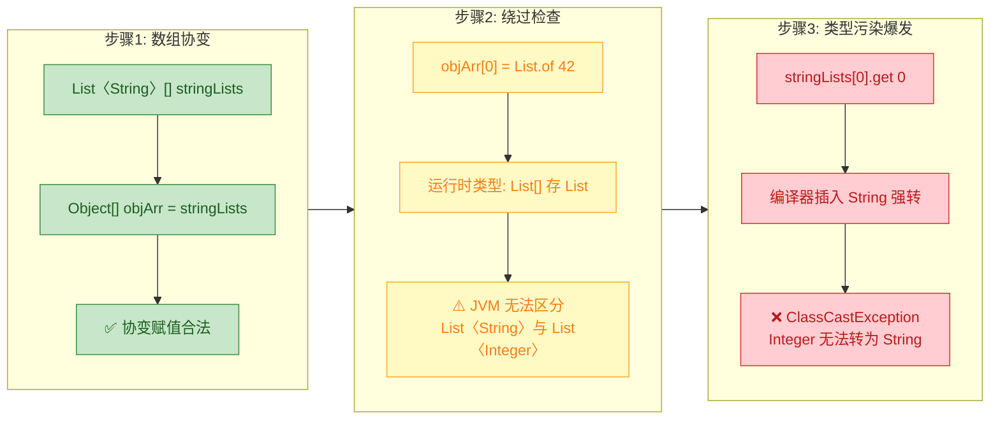

问题的核心在步骤 2：当 JVM 试图对数组做 store check 时，它看到的是「往一个 `List[]` 里存一个 `List`」，完全合法。因为类型擦除后，`List<String>` 和 `List<Integer>` 在运行时是同一个类型 `List`，JVM 根本无法区分它们。数组的运行时类型安全网在泛型面前彻底失效。

这就是 Java 语言规范（JLS）禁止创建泛型数组的根本原因：**如果允许 `new List<String>[10]`，类型擦除会让数组的运行时检查形同虚设，导致类型污染（Heap Pollution）在毫无警告的情况下发生，最终在完全不相关的代码位置抛出 `ClassCastException`**。这种 bug 极难追踪。

### `new T[]` 为什么不行

理解了泛型数组的问题后，`new T[]` 不被允许就很自然了。类型参数 `T` 在编译后被擦除为其上界（通常是 `Object`），所以 `new T[]` 实际上会变成 `new Object[]`。这会导致类型不匹配：

```java
public class Container<T> {
    private T[] elements;

    public Container(int size) {
        // elements = new T[size];    // ❌ 编译错误：Type parameter 'T' cannot be instantiated directly
        // 擦除后等价于 new Object[]，但 elements 的声明类型是 T[]
        // 如果 T 是 String，调用方期望得到 String[]，实际却是 Object[]
    }
}
```

编译器在这里保护了你。如果它允许 `new T[size]`，那么当外部代码尝试将返回的数组当作具体类型数组使用时，就会遇到 `ClassCastException`。

### 实际开发中的替代方案

既然不能直接创建泛型数组，实际开发中我们有几种成熟的替代方案。

**方案一：使用 `Object[]` 内部存储 + 强制转型（ArrayList 的做法）**

这是 Java 标准库 `ArrayList` 采用的策略。内部用 `Object[]` 存储，在取出时强转：

```java
public class SimpleList<E> {
    private Object[] data;            // 内部使用 Object[] 存储，绕过泛型数组限制
    private int size;                 // 当前元素数量

    public SimpleList(int capacity) {
        data = new Object[capacity];  // 创建 Object[]，完全合法
        size = 0;                     // 初始大小为 0
    }

    public void add(E element) {
        data[size++] = element;       // Object[] 可以存任何对象
    }

    @SuppressWarnings("unchecked")    // 抑制未检查转型警告
    public E get(int index) {
        return (E) data[index];       // 取出时强转为 E，类型安全由类自身的 add 方法保证
    }
}
```

这种方式的安全性依赖于一个前提：只有通过 `add(E)` 方法才能往数组里放元素，而 `add` 的参数类型是 `E`，编译器会在调用处检查类型。所以内部的 `(E)` 强转实际上是安全的，`@SuppressWarnings("unchecked")` 在这里是合理的。

**方案二：通过 `Array.newInstance()` 反射创建（需要 `Class<T>` 令牌）**

如果你确实需要一个真正的 `T[]`（比如要把数组暴露给外部 API），可以通过反射在运行时创建：

```java
import java.lang.reflect.Array;

public class TypedArray<T> {
    private T[] array;                // 这次是真正的 T[] 引用

    @SuppressWarnings("unchecked")
    public TypedArray(Class<T> clazz, int size) {
        // Array.newInstance 在运行时根据 Class 对象创建指定类型的数组
        // 返回 Object，需要强转为 T[]
        array = (T[]) Array.newInstance(clazz, size);
        // 如果 clazz 是 String.class，运行时实际创建的就是 String[]
    }

    public void set(int index, T value) {
        array[index] = value;         // 类型安全，T[] 在运行时有真实类型
    }

    public T get(int index) {
        return array[index];          // 无需强转，array 本身就是 T[]
    }

    public T[] getArray() {
        return array;                 // 可以安全地暴露给外部
    }
}

// 使用示例
TypedArray<String> ta = new TypedArray<>(String.class, 10);  // 传入类型令牌
ta.set(0, "hello");                   // 合法
String[] raw = ta.getArray();         // 得到真正的 String[]，不会 ClassCastException
```

这种方式的代价是调用方必须额外传入一个 `Class<T>` 参数（Type Token），因为运行时泛型 `T` 已被擦除，只有 `Class` 对象能携带具体类型信息。

**方案三：直接使用 `List<T>`（最推荐）**

在绝大多数场景下，根本不需要数组。`List<T>` 提供了更好的类型安全和更丰富的 API：

```java
public class FlexibleContainer<T> {
    private final List<T> elements;   // 用 List 替代数组，完全避开泛型数组问题

    public FlexibleContainer() {
        elements = new ArrayList<>(); // ArrayList 内部已经处理好了 Object[] 的细节
    }

    public void add(T item) {
        elements.add(item);           // 类型安全，编译器检查 T
    }

    public T get(int index) {
        return elements.get(index);   // 类型安全，无需手动强转
    }
}
```

Effective Java（Item 28）中 Joshua Bloch 的建议非常明确：**Prefer lists to arrays**。列表与泛型配合天衣无缝，而数组与泛型存在根本性的设计冲突。

### 哪些泛型数组相关的写法合法，哪些不合法

这里做一个清晰的对照总结：

```java
// ❌ 不合法：不能 new 泛型数组
// new T[10]                          // 编译错误
// new List<String>[10]               // 编译错误
// new List<? extends Number>[10]     // 编译错误
// new Map<String, Integer>[5]        // 编译错误

// ✅ 合法：可以声明泛型数组类型的变量（只是不能 new）
List<String>[] arr;                   // 声明合法，但你没法直接 new 出来

// ✅ 合法：无界通配符数组（因为 List<?> 是 reifiable type）
List<?>[] wildcardArr = new List<?>[10];  // 合法！? 不携带具体类型信息

// ✅ 合法：原始类型数组
List[] rawArr = new List[10];         // 合法但不推荐，丢失了泛型信息

// ✅ 合法：通过强转绕过（编译器警告，但可运行）
@SuppressWarnings("unchecked")
List<String>[] hacky = (List<String>[]) new List<?>[10];  // 合法但需自行保证安全
```

`List<?>[]` 之所以合法，是因为 `List<?>` 是一个 reifiable type——它在运行时不需要比编译时更多的类型信息。`?` 本身就表示「我不关心具体类型」，所以擦除不会丢失任何东西。

### 深层设计哲学：数组与泛型的类型系统对比

数组和泛型在 Java 类型系统中走了两条截然不同的路：

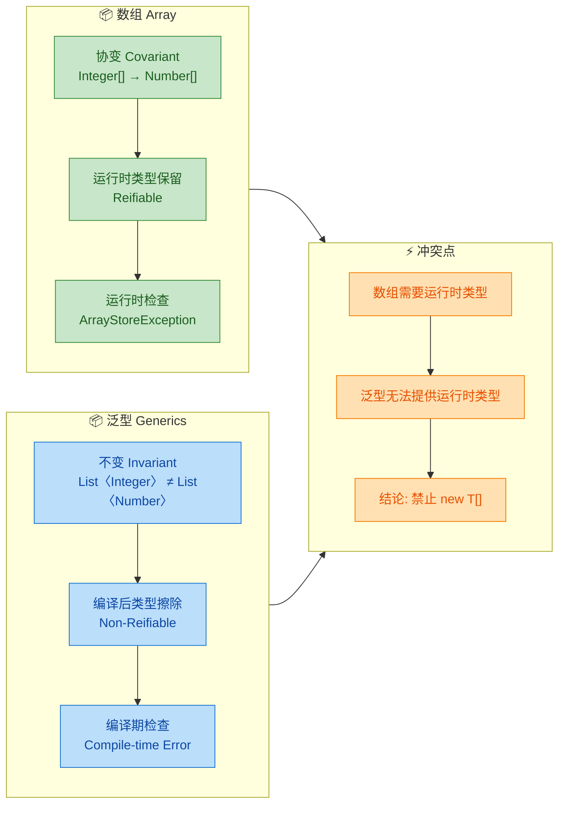

数组选择了「编译期宽松 + 运行时严格」的策略（协变 + `ArrayStoreException`），而泛型选择了「编译期严格 + 运行时宽松」的策略（不变 + 类型擦除）。这两套策略各自自洽，但混在一起就会出现安全漏洞。Java 的选择是：在混合使用的场景下，直接在编译期禁止，从源头杜绝问题。

这也是为什么 Java 社区普遍建议在泛型代码中优先使用集合（Collections）而非数组——集合框架完全建立在泛型之上，两者配合无间；而数组作为 Java 1.0 时代的产物，与后来加入的泛型存在先天的设计张力。

---

**📝 练习题**

以下代码中，哪一行会导致编译错误？

```java
public class Quiz<T> {
    List<String>[] a;                          // 第 1 行
    List<?>[] b = new List<?>[5];              // 第 2 行
    T[] c = (T[]) new Object[5];              // 第 3 行
    List<String>[] d = new List<String>[5];   // 第 4 行
}
```

A. 第 1 行


B. 第 2 行


C. 第 3 行


D. 第 4 行

**【答案】** D

**【解析】** 第 1 行仅仅是声明了一个 `List<String>[]` 类型的变量，并没有用 `new` 创建实例，声明泛型数组类型的引用是合法的。第 2 行创建的是 `List<?>[]`，无界通配符 `List<?>` 是 reifiable type，可以作为数组的组件类型，完全合法。第 3 行虽然有一个未检查的强制转型（`(T[]) new Object[5]`），编译器会给出 unchecked warning，但不会报编译错误。第 4 行 `new List<String>[5]` 试图直接创建参数化类型的数组实例，这正是 Java 明确禁止的——因为运行时 `List<String>` 和 `List<Integer>` 无法区分，数组的 store check 机制会失效，所以编译器直接拒绝，报出 "generic array creation" 错误。

---

## 泛型与继承（List\<String\> 不是 List\<Object\> 的子类）

这是泛型体系中最容易让人"直觉翻车"的知识点。在普通的面向对象世界里，`String` 是 `Object` 的子类，所以 `String` 类型的变量可以赋值给 `Object` 类型的变量——这叫做**协变（Covariance）**。但当类型被放进泛型容器后，这条规则就彻底失效了。理解这一点，是真正掌握泛型、通配符和 PECS 原则的前提。

### 直觉陷阱：为什么我们会觉得它"应该是"子类？

在 Java 中，继承关系是天经地义的：

```java
// String 是 Object 的子类，赋值完全合法
Object obj = "Hello"; // ✅ 向上转型 (Upcasting)
```

于是很多人会自然地推导出：

> "既然 `String` 是 `Object` 的子类，那 `List<String>` 当然也应该是 `List<Object>` 的子类吧？"

这个推导看起来合情合理，但 Java 编译器会毫不留情地拒绝它：

```java
List<String> strings = new ArrayList<>();
// List<Object> objects = strings; // ❌ 编译错误！不兼容的类型
```

编译器报错信息类似于：`incompatible types: List<String> cannot be converted to List<Object>`。这不是编译器的 bug，而是一个精心设计的**类型安全防线**。

### 假如允许，会发生什么灾难？

要理解"为什么不允许"，最好的方式是做一个**反证法思想实验**——假设编译器允许这种赋值，看看会发生什么：

```java
// ⚠️ 以下是思想实验，实际编译不通过
List<String> strings = new ArrayList<>();  // 第1步：创建一个只装 String 的列表
strings.add("Hello");                       // 第2步：放入一个 String

List<Object> objects = strings;             // 第3步：假设这行合法...

objects.add(42);                            // 第4步：通过 Object 引用放入一个 Integer
// objects 的声明类型是 List<Object>，放 Integer 完全合理

String s = strings.get(1);                  // 第5步：通过 String 引用取出
// strings 的声明类型是 List<String>，取出来当然期望是 String
// 但实际取出的是 Integer(42)！
// 💥 ClassCastException！运行时崩溃！
```

整个过程可以用一张图来理解：

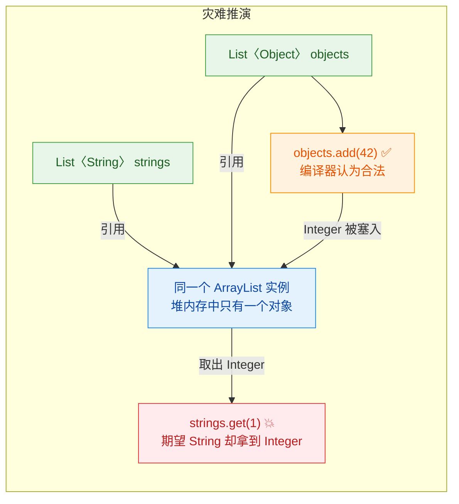

问题的核心在于：`strings` 和 `objects` 指向的是**堆内存中同一个 ArrayList 实例**。通过 `objects` 引用往里塞了一个 `Integer`，再通过 `strings` 引用取出来时，编译器会自动插入一个 `(String)` 强制转型——于是 `ClassCastException` 就在运行时爆炸了。

泛型的设计初衷就是**把类型错误从运行时提前到编译时**。如果允许 `List<String>` 赋值给 `List<Object>`，就等于在类型安全的城墙上开了一个大洞，泛型的存在意义就被彻底瓦解了。

### 专业术语：不变性（Invariance）

在类型理论中，这种行为有一个精确的名字——**不变性（Invariance）**。Java 的泛型是**不变的（invariant）**，意思是：

> 即使 `A` 是 `B` 的子类型，`Generic<A>` 和 `Generic<B>` 之间也**没有任何继承关系**。

类型系统中有三种"变型"（Variance）：

| 变型类型 | 英文 | 含义 | Java 中的体现 |
|---------|------|------|--------------|
| 协变 | Covariance | `A extends B` → `F(A) extends F(B)` | 数组 `String[]` 是 `Object[]` 的子类型；`? extends T` |
| 逆变 | Contravariance | `A extends B` → `F(B) extends F(A)` | `? super T` |
| 不变 | Invariance | `A extends B` → `F(A)` 与 `F(B)` 无关 | 泛型类 `List<String>` 与 `List<Object>` 无关 |

Java 泛型选择了不变性，是为了**在编译期就堵死类型污染的可能**。

### 数组的反面教材：协变的代价

有趣的是，Java 的**数组（Array）是协变的**。这是 Java 语言早期（泛型出现之前，JDK 1.0 时代）的设计决策，现在被广泛认为是一个历史遗留的设计失误：

```java
// 数组是协变的：String[] 是 Object[] 的子类型
Object[] objArray = new String[3]; // ✅ 编译通过！

objArray[0] = "Hello";            // ✅ 没问题，放入 String
objArray[1] = 42;                 // ✅ 编译通过！编译器不报错！
                                   // 💥 运行时抛出 ArrayStoreException！
```

数组的协变把类型检查推迟到了运行时——JVM 会在每次数组赋值时检查元素类型，如果不匹配就抛出 `ArrayStoreException`。这正是泛型设计者想要避免的。泛型选择不变性，就是从数组的教训中吸取了经验：

```java
// 对比：泛型在编译期就拦截了问题
// List<Object> list = new ArrayList<String>(); // ❌ 编译错误，问题在编译期暴露

// 而数组把问题留到了运行时
Object[] arr = new String[3];  // ✅ 编译通过
arr[0] = 42;                   // 💥 运行时才爆炸：ArrayStoreException
```

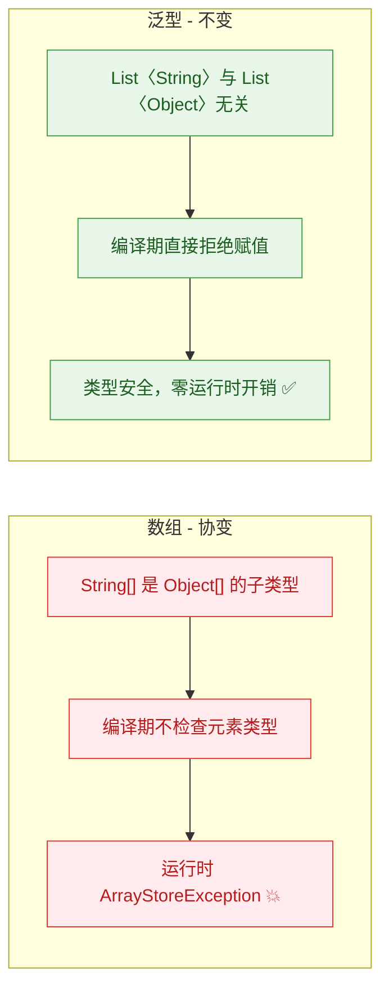

这就是为什么 Effective Java 中 Joshua Bloch 明确建议：**优先使用泛型集合而非数组**（Prefer lists to arrays, Item 28）。

### 那合法的继承关系是什么样的？

泛型的不变性只针对**类型参数不同**的情况。如果泛型容器本身有继承关系，那是完全合法的：

```java
// ✅ 合法：ArrayList 实现了 List 接口，容器类型本身有继承关系
List<String> list = new ArrayList<String>();

// ✅ 合法：ArrayList 实现了 Collection 接口
Collection<String> coll = new ArrayList<String>();

// ✅ 合法：List 继承自 Collection
Iterable<String> iter = new ArrayList<String>();
```

用一句话总结规则：**容器类型可以变（List → Collection → Iterable），但类型参数必须完全一致**。

```java
// 容器类型变化 ✅
List<String> a = new ArrayList<String>();       // ArrayList → List
Collection<String> b = new ArrayList<String>(); // ArrayList → Collection

// 类型参数变化 ❌
// List<Object> c = new ArrayList<String>();    // String → Object? 不行！
// List<Object> d = new LinkedList<String>();   // 容器和参数都变? 更不行！
```

用一张图来展示合法与非法的继承关系：

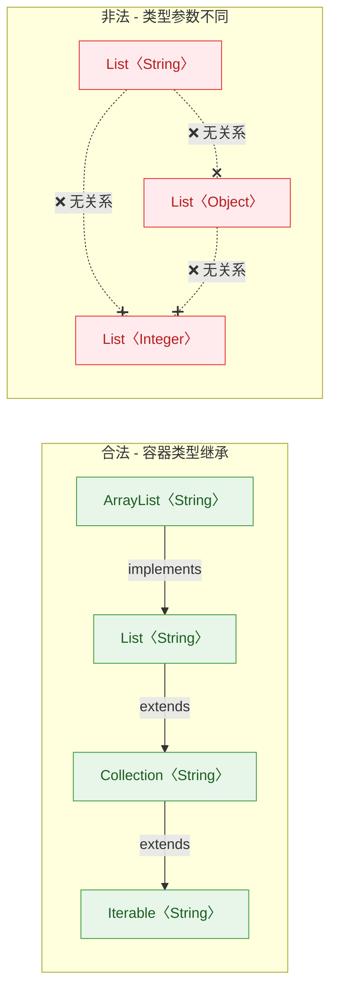

### 不变性带来的不便与通配符的救赎

不变性虽然安全，但有时候确实不方便。比如你想写一个方法，打印任意类型列表中的所有元素：

```java
// ❌ 这个方法只能接受 List<Object>，不能接受 List<String>
public static void printAll(List<Object> list) {
    for (Object item : list) {
        System.out.println(item);
    }
}

List<String> names = List.of("Alice", "Bob");
// printAll(names); // ❌ 编译错误！List<String> 不是 List<Object>
```

这时候就需要**通配符（Wildcard）**来打破不变性的限制：

```java
// ✅ 使用无界通配符，接受任意类型参数的 List
public static void printAll(List<?> list) {
    for (Object item : list) { // 取出来当 Object 用，安全
        System.out.println(item);
    }
}

List<String> names = List.of("Alice", "Bob");
printAll(names);    // ✅ 合法
List<Integer> nums = List.of(1, 2, 3);
printAll(nums);     // ✅ 合法
```

通配符本质上是在不变性的基础上，通过**限制操作能力**来换取**类型灵活性**：

- `List<?>` 可以接受任何 `List<X>`，但你不能往里面 `add` 任何东西（除了 `null`），因为编译器不知道 `?` 到底是什么类型。
- `List<? extends Number>` 可以接受 `List<Integer>`、`List<Double>` 等，但同样不能 `add`——只能安全地读取为 `Number`。
- `List<? super Integer>` 可以接受 `List<Integer>`、`List<Number>`、`List<Object>`，可以安全地 `add(Integer)`——但读取只能当 `Object`。

这就是 PECS 原则（Producer Extends, Consumer Super）的根基，而 PECS 的根基，正是泛型的不变性。

### 类型擦除视角下的理解

从类型擦除的角度看，`List<String>` 和 `List<Object>` 在编译后都变成了原始类型 `List`。既然运行时它们是同一个类型，为什么编译期要区分？

答案是：**类型擦除是编译后的事，类型检查是编译时的事**。编译器在擦除之前，已经利用泛型信息完成了所有的类型安全检查。擦除只是为了兼容旧版 JVM，并不意味着泛型信息不重要。

```java
// 编译前（源码层面）：类型信息完整，编译器严格检查
List<String> strings = new ArrayList<>();  // 编译器知道这是 String 的列表
// List<Object> objects = strings;          // 编译器拒绝：类型参数不匹配

// 编译后（字节码层面）：类型信息被擦除
// List strings = new ArrayList();          // 运行时只有原始类型
// 编译器已经在编译期保证了类型安全，所以运行时不需要泛型信息
```

### 与其他语言的对比

不同语言对这个问题有不同的处理方式，了解这些对比有助于加深理解：

- **Java 泛型**：不变（Invariant），通过通配符 `? extends` / `? super` 实现使用处变型（Use-site variance）。
- **Kotlin 泛型**：支持声明处变型（Declaration-site variance），用 `out` 关键字标记协变（类似 `? extends`），用 `in` 标记逆变（类似 `? super`）。例如 `interface List<out E>` 声明 `List` 在 `E` 上是协变的。
- **C# 泛型**：类似 Kotlin，也支持声明处变型，接口和委托可以用 `out` / `in` 修饰类型参数。
- **Java 数组**：协变（Covariant），但以运行时检查为代价——这是历史包袱。

### 实际开发中的常见场景

在 Android 和日常 Java 开发中，这个知识点经常以各种形式出现：

```java
// 场景1：方法参数设计
// ❌ 过于严格，只接受 List<Number>
public double sum(List<Number> numbers) { /* ... */ }

// ✅ 使用上界通配符，接受 List<Integer>、List<Double> 等
public double sum(List<? extends Number> numbers) {
    double total = 0;
    for (Number n : numbers) { // 安全地读取为 Number
        total += n.doubleValue();
    }
    return total;
}

// 场景2：Android 中的 RecyclerView Adapter
// Adapter<VH extends ViewHolder> 中，VH 是不变的
// 你不能把 Adapter<MyViewHolder> 赋值给 Adapter<ViewHolder>

// 场景3：集合工具方法
// Collections.copy 的签名完美体现了 PECS
// public static <T> void copy(List<? super T> dest, List<? extends T> src)
// dest 是消费者(写入) → super
// src 是生产者(读取) → extends
```

### 核心要点速记

用一个简洁的心智模型来记住这个知识点：

```java
// 🧠 心智模型：
// 继承关系不能"穿透"泛型的尖括号

// 尖括号外面（容器类型）：继承关系正常生效
// ArrayList<String> → List<String> → Collection<String>  ✅

// 尖括号里面（类型参数）：继承关系被"冻结"
// List<String> 和 List<Object> 是两个完全独立的类型  ❌

// 想要灵活性？用通配符在尖括号里"解冻"：
// List<? extends Object> 可以接受 List<String>  ✅
```

---

**📝 练习题**

以下代码中，哪些赋值语句能够通过编译？

```java
ArrayList<String> a = new ArrayList<>();
List<String> b = a;
List<Object> c = a;
Collection<String> d = a;
List<?> e = a;
ArrayList<Object> f = a;
```

A. b, c, d, e

B. b, d, e

C. b, c, d, e, f

D. b, d


**【答案】** B

**【解析】** 逐行分析：
- `b`：`ArrayList<String>` 赋值给 `List<String>`，容器类型向上转型且类型参数一致，合法 ✅
- `c`：`ArrayList<String>` 赋值给 `List<Object>`，类型参数从 `String` 变成了 `Object`，泛型不变性直接拒绝 ❌
- `d`：`ArrayList<String>` 赋值给 `Collection<String>`，容器类型向上转型且类型参数一致，合法 ✅
- `e`：`ArrayList<String>` 赋值给 `List<?>`，无界通配符可以匹配任何类型参数，合法 ✅
- `f`：`ArrayList<String>` 赋值给 `ArrayList<Object>`，类型参数不同，不变性拒绝 ❌

所以能通过编译的是 b、d、e，选 B。这道题的关键在于区分"容器类型的继承"和"类型参数的变化"——前者合法，后者在没有通配符的情况下非法。

---

## getSystemService 与泛型（Framework 中的应用）

在 Android Framework 中，`getSystemService()` 是一个极其高频的 API。它的演进历程，恰好是泛型在真实大型框架中从"缺席"到"落地"的经典案例。通过剖析这个 API，我们能深刻理解泛型如何在框架设计中消除强制转型、提升类型安全，以及 Framework 工程师在设计泛型 API 时的权衡与取舍。

### 旧版 API：基于 String 的非泛型设计

在 Android API 23（Marshmallow）之前，`getSystemService` 的签名是这样的：

```java
// Context.java (API < 23)
// 返回值是 Object，调用方必须自行强制转型
public abstract Object getSystemService(String name);
```

这意味着每次获取系统服务，开发者都要写这样的代码：

```java
// 旧版用法：每次都需要强制类型转换
// 编译器无法帮你检查转型是否正确，全靠开发者"记住"
LocationManager locationManager =
    (LocationManager) getSystemService(Context.LOCATION_SERVICE); // 强转为 LocationManager

WindowManager windowManager =
    (WindowManager) getSystemService(Context.WINDOW_SERVICE);     // 强转为 WindowManager

// 如果不小心写错了转型目标，编译期不会报错，运行时才会 ClassCastException
// 这是一个典型的"把错误推迟到运行时"的反模式
ClipboardManager wrong =
    (ClipboardManager) getSystemService(Context.LOCATION_SERVICE); // 编译通过！运行时崩溃！
```

这种设计存在三个核心问题：

第一，**类型不安全**。返回值是 `Object`，编译器完全无法校验你的强制转型是否匹配。字符串 `"location"` 对应的是 `LocationManager`，但你转成 `ClipboardManager` 编译器也不会拦你。

第二，**冗余的样板代码（Boilerplate）**。每次调用都要写一次 `(XxxManager)`，项目中成百上千处调用，全是重复的强转噪音。

第三，**字符串常量脆弱**。服务名是 `String` 类型，拼写错误不会在编译期暴露，IDE 的自动补全和重构支持也很有限。

### 新版 API：泛型化改造

从 API 23 开始，Android 新增了一个泛型重载版本：

```java
// Context.java (API >= 23)
// 使用 Class<T> 作为参数，返回值直接是 T，无需强转
public final <T> T getSystemService(Class<T> serviceClass) {
    // 内部实现：先通过 Class 查找对应的服务名，再获取服务实例
    String serviceName = getSystemServiceName(serviceClass); // 根据 Class 反查服务名
    return serviceName != null ? (T) getSystemService(serviceName) : null; // 内部做了转型
}
```

调用方的代码瞬间清爽了：

```java
// 新版用法：传入 Class 对象，返回值自动推断为对应类型
// 编译器通过 Class<T> 的 T 推断返回类型，零强转
LocationManager locationManager =
    getSystemService(LocationManager.class);  // 返回类型自动推断为 LocationManager

WindowManager windowManager =
    getSystemService(WindowManager.class);    // 返回类型自动推断为 WindowManager

// 如果写错，IDE 和编译器会立刻标红
// ClipboardManager wrong = getSystemService(LocationManager.class); // 编译错误！类型不匹配
```

这个改造的核心机制值得仔细拆解。

### 类型推断链路深度解析

让我们追踪泛型信息在整个调用链中是如何流动的：

```java
// 当你写下这行代码时，泛型推断链如下：
LocationManager lm = getSystemService(LocationManager.class);

// Step 1: LocationManager.class 的类型是 Class<LocationManager>
//         这里 Class<T> 中的 T 被绑定为 LocationManager

// Step 2: 方法签名 <T> T getSystemService(Class<T> serviceClass)
//         编译器将 T 推断为 LocationManager

// Step 3: 返回值类型 T 也就是 LocationManager
//         所以左侧变量无需强转，类型天然匹配
```

用一张图来展示这个推断过程：

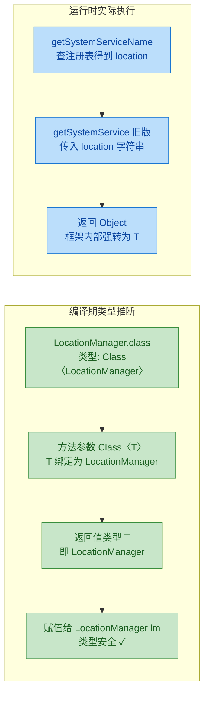

关键洞察：**泛型的类型安全发生在编译期，运行时由于类型擦除，内部仍然是 `Object` 和强制转型**。但这个强转被封装在框架内部，由 Framework 工程师保证正确性，应用开发者再也不需要操心。

### Class〈T〉 —— 类型安全的"令牌"模式

`Class<T>` 在这里扮演的角色，在设计模式中被称为 **Type Token（类型令牌）**。它的精妙之处在于：`Class` 对象既携带了运行时的类型信息（可以用于 `instanceof` 检查和反射），又通过泛型参数 `T` 在编译期约束了返回类型。

```java
// Class<T> 的双重身份：

// 身份一：编译期的泛型约束
// Class<LocationManager> 让编译器知道 T = LocationManager
// 从而推断返回值类型为 LocationManager

// 身份二：运行时的类型信息载体
// locationManager.class 在运行时是一个真实的 Class 对象
// 框架可以用它来查找注册表、做类型检查
public final <T> T getSystemService(Class<T> serviceClass) {
    // 运行时：serviceClass 是真实的 Class 对象，可以查表
    String serviceName = getSystemServiceName(serviceClass);
    // 编译期：返回值被约束为 T，调用方无需强转
    return serviceName != null ? (T) getSystemService(serviceName) : null;
}
```

这种模式在 Java 生态中非常普遍，不仅仅出现在 Android Framework 中：

```java
// 1. Android 的 getSystemService —— 我们正在讨论的
LocationManager lm = context.getSystemService(LocationManager.class);

// 2. Gson 的 fromJson —— JSON 反序列化
// <T> T fromJson(String json, Class<T> classOfT)
User user = gson.fromJson(jsonString, User.class); // 返回 User，无需强转

// 3. SharedPreferences 的封装（假设的泛型版本）
// <T> T get(String key, Class<T> type)
// String name = prefs.get("name", String.class);

// 4. JDK 的 Class.cast() 本身就是泛型方法
// public T cast(Object obj) —— 将 Object 安全转为 T
LocationManager lm2 = LocationManager.class.cast(someObject); // 类型安全的转型
```

### 服务注册表的内部实现

你可能好奇：框架内部是怎么知道 `LocationManager.class` 对应的服务名是 `"location"` 的？答案是一个静态注册表：

```java
// SystemServiceRegistry.java（简化版）
// 这个类在 Android 启动时就完成了所有系统服务的注册
final class SystemServiceRegistry {

    // 两张核心映射表
    // 表1：服务名 -> 服务获取器（ServiceFetcher）
    private static final Map<String, ServiceFetcher<?>> SYSTEM_SERVICE_FETCHERS =
        new ArrayMap<>();

    // 表2：Class -> 服务名（供泛型版 getSystemService 使用）
    private static final Map<Class<?>, String> SYSTEM_SERVICE_NAMES =
        new ArrayMap<>();

    // 静态初始化块：在类加载时注册所有系统服务
    static {
        // 注册 LocationManager
        // 第一个参数：服务名常量
        // 第二个参数：Class 对象（用于泛型版查找）
        // 第三个参数：ServiceFetcher lambda（实际创建服务代理的逻辑）
        registerService(
            Context.LOCATION_SERVICE,          // "location"
            LocationManager.class,             // 类型令牌
            new CachedServiceFetcher<LocationManager>() {
                @Override
                public LocationManager createService(ContextImpl ctx) {
                    // 通过 Binder 获取远程服务的本地代理
                    IBinder b = ServiceManager.getService(Context.LOCATION_SERVICE);
                    ILocationManager service = ILocationManager.Stub.asInterface(b);
                    // 创建并返回 LocationManager 实例
                    return new LocationManager(ctx, service);
                }
            }
        );

        // 注册 WindowManager
        registerService(
            Context.WINDOW_SERVICE,            // "window"
            WindowManager.class,               // 类型令牌
            new CachedServiceFetcher<WindowManager>() {
                @Override
                public WindowManager createService(ContextImpl ctx) {
                    return new WindowManagerImpl(ctx);
                }
            }
        );

        // ... 还有几十个系统服务的注册，模式完全一致
    }

    // 注册方法：同时填充两张映射表
    private static <T> void registerService(
            String serviceName,
            Class<T> serviceClass,              // 泛型参数确保 Class 和 Fetcher 的类型一致
            ServiceFetcher<T> serviceFetcher) {  // T 在这里起到了"桥梁"作用
        SYSTEM_SERVICE_NAMES.put(serviceClass, serviceName);   // Class -> 服务名
        SYSTEM_SERVICE_FETCHERS.put(serviceName, serviceFetcher); // 服务名 -> Fetcher
    }
}
```

注意 `registerService` 方法的泛型签名：`Class<T>` 和 `ServiceFetcher<T>` 共享同一个 `T`，这保证了注册时 Class 类型和 Fetcher 返回类型必须匹配。如果有人试图把 `WindowManager.class` 和一个返回 `LocationManager` 的 Fetcher 注册在一起，编译器会直接报错。

整个调用链路可以用下图概括：

```mermaid
graph LR
    subgraph 应用层调用
        direction TB
        A1["getSystemService<br/>LocationManager.class"]
    end

    subgraph Context 泛型分发
        direction TB
        B1["getSystemServiceName<br/>Class → String 查表"]
        B2["getSystemService 旧版<br/>String → Object"]
        B1 --> B2
    end

    subgraph SystemServiceRegistry
        direction TB
        C1["SYSTEM_SERVICE_NAMES<br/>Map〈Class, String〉"]
        C2["SYSTEM_SERVICE_FETCHERS<br/>Map〈String, Fetcher〉"]
        C3["CachedServiceFetcher<br/>createService 创建实例"]
        C1 --> C2 --> C3
    end

    subgraph Binder IPC
        direction TB
        D1["ServiceManager<br/>getService"]
        D2["ILocationManager<br/>Stub.asInterface"]
        D3["LocationManager<br/>实例返回"]
        D1 --> D2 --> D3
    end

    A1 --> B1
    B2 --> C1
    C3 --> D1

    classDef app fill:#C8E6C9,stroke:#388E3C,color:#1B5E20
    classDef ctx fill:#B3E5FC,stroke:#0288D1,color:#01579B
    classDef reg fill:#FFF9C4,stroke:#F9A825,color:#F57F17
    classDef binder fill:#FFCCBC,stroke:#E64A19,color:#BF360C

    class A1 app
    class B1,B2 ctx
    class C1,C2,C3 reg
    class D1,D2,D3 binder
```

### 类型擦除在这里的影响

虽然泛型版 `getSystemService` 用起来很优雅，但类型擦除意味着运行时并没有真正的泛型检查。让我们看看编译前后的对比：

```java
// === 编译前（你写的代码）===
LocationManager lm = getSystemService(LocationManager.class);

// === 编译后（类型擦除后的字节码等价物）===
// T 被擦除为 Object，编译器在调用处插入了 checkcast 指令
LocationManager lm = (LocationManager) getSystemService(LocationManager.class);
// 注意：这个强转是编译器自动插入的，不是你写的
// 但效果和旧版手动强转一样 —— 区别在于编译器保证了这个强转一定是安全的
```

所以从字节码层面看，新旧版本几乎没有区别。泛型的价值完全体现在编译期：它把"开发者记住正确类型"这个人脑负担，转移给了编译器。

### 自己动手：实现一个类型安全的服务定位器

理解了 `getSystemService` 的设计思路后，我们可以自己实现一个简化版的 **Service Locator（服务定位器）**，这在很多项目中都有实际应用价值：

```java
// 一个类型安全的服务定位器，核心思想与 getSystemService 一致
public class ServiceLocator {

    // 注册表：Class<T> 作为 key，Object 作为 value
    // 使用 Class<?> 是因为我们要存储不同类型的服务
    private final Map<Class<?>, Object> services = new HashMap<>();

    // 注册服务：泛型确保 Class<T> 和实例 T 的类型一致
    // 你不可能把一个 String 实例注册到 Integer.class 上
    public <T> void register(Class<T> serviceClass, T instance) {
        services.put(serviceClass, instance); // 存入映射表
    }

    // 获取服务：返回值类型由 Class<T> 的 T 推断
    // 调用方无需强转
    @SuppressWarnings("unchecked") // 这个强转是安全的，因为 register 保证了类型一致
    public <T> T getService(Class<T> serviceClass) {
        Object service = services.get(serviceClass); // 从映射表取出
        if (service == null) {
            throw new IllegalArgumentException(
                "Service not registered: " + serviceClass.getName()
            );
        }
        return (T) service; // 内部强转，对调用方透明
    }

    // 检查服务是否已注册
    public boolean hasService(Class<?> serviceClass) {
        return services.containsKey(serviceClass); // 简单的 containsKey 检查
    }
}
```

使用示例：

```java
// 创建服务定位器
ServiceLocator locator = new ServiceLocator();

// 注册服务（通常在应用初始化时完成）
locator.register(UserRepository.class, new UserRepositoryImpl());  // 注册用户仓库
locator.register(Logger.class, new FileLogger("/var/log/app.log")); // 注册日志服务
locator.register(HttpClient.class, new OkHttpClientWrapper());      // 注册网络客户端

// 获取服务 —— 类型安全，零强转
UserRepository repo = locator.getService(UserRepository.class);   // 自动推断为 UserRepository
Logger logger = locator.getService(Logger.class);                  // 自动推断为 Logger

// 编译错误示例：类型不匹配
// Logger wrong = locator.getService(HttpClient.class); // 编译错误！Class<HttpClient> 推断 T=HttpClient
```

### 进阶：支持接口注册的服务定位器

实际项目中，我们通常希望用接口类型注册，但存储的是具体实现。这需要稍微调整泛型约束：

```java
public class AdvancedServiceLocator {

    private final Map<Class<?>, Object> services = new HashMap<>();

    // 关键改动：两个泛型参数
    // T 是接口/父类类型（注册的 key）
    // I 是实现类类型（必须是 T 的子类）
    public <T, I extends T> void register(Class<T> serviceType, I implementation) {
        // serviceType 是接口的 Class，implementation 是具体实现
        // I extends T 保证了实现类一定是接口的子类型
        services.put(serviceType, implementation);
    }

    @SuppressWarnings("unchecked")
    public <T> T getService(Class<T> serviceType) {
        Object service = services.get(serviceType);
        if (service == null) {
            throw new IllegalArgumentException(
                "No implementation registered for: " + serviceType.getName()
            );
        }
        return serviceType.cast(service); // 使用 Class.cast() 代替裸强转，更安全
    }
}
```

```java
// 使用示例：面向接口编程
AdvancedServiceLocator locator = new AdvancedServiceLocator();

// 用接口类型注册，传入具体实现
locator.register(UserRepository.class, new SqlUserRepository());  // 接口 -> 实现
locator.register(Cache.class, new RedisCache("localhost", 6379)); // 接口 -> 实现

// 获取时用接口类型，返回值也是接口类型
UserRepository repo = locator.getService(UserRepository.class); // 调用方只知道接口
Cache cache = locator.getService(Cache.class);                   // 完全解耦

// 编译期就能拦截错误的注册
// locator.register(UserRepository.class, new RedisCache()); // 编译错误！RedisCache 不是 UserRepository 的子类
```

注意这里用了 `serviceType.cast(service)` 而不是 `(T) service`。区别在于：`(T)` 在运行时由于类型擦除实际上是 `(Object)`，不会真正检查类型；而 `Class.cast()` 会在运行时执行真正的 `instanceof` 检查，如果类型不匹配会抛出 `ClassCastException` 并附带清晰的错误信息。

### 设计启示与总结

`getSystemService` 的泛型化改造，浓缩了几个重要的框架设计原则：

**用 `Class<T>` 做类型令牌（Type Token）** 是 Java 泛型在框架设计中最常见的模式之一。它巧妙地利用了 `Class` 对象的双重身份——编译期的泛型载体和运行时的类型信息——在类型擦除的限制下，依然实现了端到端的类型安全。

**将不安全的操作封装在框架内部**。类型擦除导致的 `(T)` 强转不可避免，但框架把它藏在了内部实现中，由框架开发者通过注册表的一致性来保证安全。应用开发者面对的是一个干净的、类型安全的 API 表面。

**向后兼容的渐进式改造**。Android 没有删除旧的 `getSystemService(String)` 方法，而是新增了泛型重载版本。旧代码继续工作，新代码享受类型安全。这种"加法式"的 API 演进策略，在大型框架中非常重要。

---

**📝 练习题**

以下代码在 Android API 23+ 环境中，哪一行会产生编译错误？

```java
// Line 1
Object a = context.getSystemService(Context.LOCATION_SERVICE);

// Line 2
LocationManager b = context.getSystemService(LocationManager.class);

// Line 3
WindowManager c = context.getSystemService(LocationManager.class);

// Line 4
LocationManager d = (LocationManager) context.getSystemService(Context.LOCATION_SERVICE);
```

A. Line 1


B. Line 2


C. Line 3


D. Line 4


**【答案】** C

**【解析】** Line 3 调用的是泛型版 `getSystemService(Class<T>)`，传入 `LocationManager.class` 后，`T` 被推断为 `LocationManager`，返回值类型是 `LocationManager`。但左侧变量声明为 `WindowManager`，`LocationManager` 无法赋值给 `WindowManager`，编译器直接报类型不匹配错误。Line 1 返回 `Object` 赋给 `Object`，合法。Line 2 是泛型版的标准用法，类型完美匹配。Line 4 是旧版用法加手动强转，编译期合法（运行时也恰好正确，因为 `LOCATION_SERVICE` 确实对应 `LocationManager`）。这道题的核心就是：泛型版 API 把类型检查提前到了编译期，Line 3 这种错误在旧版 API 中只能在运行时才能发现。

---

## 本章小结

泛型（Generics）是 Java 类型系统中最精妙的设计之一，它在 **编译期** 为我们筑起一道类型安全的防线，同时通过参数化类型实现了代码的高度复用。回顾本章，我们从语法基础一路走到框架级应用，下面用一张全景图将所有知识点串联起来。

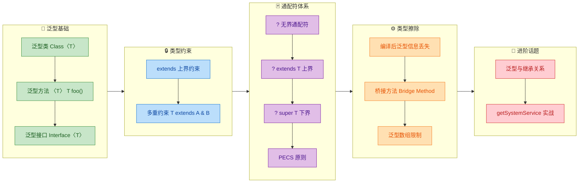

### 核心知识脉络回顾

整章内容可以归纳为三条主线，它们层层递进，构成了一个完整的泛型知识体系。

**第一条主线：从"写得出"到"写得好"——语法与约束。** 我们首先学习了泛型类、泛型方法、泛型接口这三种基本载体。`class Box<T>`、`<T> T pick(T a, T b)`、`interface Comparable<T>` 分别代表了在类、方法、接口三个层面对类型进行参数化。紧接着，`extends` 上界约束和多重约束（`T extends Comparable<T> & Serializable`）让我们能够在保持泛型灵活性的同时，对类型参数施加合理的限制——既不过于宽泛导致无法调用目标方法，也不过于狭窄导致丧失复用性。这条主线解决的是 **"如何定义泛型"** 的问题。

**第二条主线：从"能用"到"会用"——通配符与 PECS。** 通配符是泛型中最容易让人困惑的部分，但理解了它的本质后会发现逻辑非常清晰。无界通配符 `?` 表达的是"我不关心具体类型"；上界通配符 `? extends T` 表达的是"我只读不写，任何 T 的子类都行"；下界通配符 `? super T` 表达的是"我只写不读（或读出来当 Object），任何 T 的父类都行"。而 **PECS 原则**（Producer Extends, Consumer Super）则是对通配符使用场景的终极总结——当集合作为数据的 **生产者**（你从中取数据）时用 `extends`，当集合作为数据的 **消费者**（你往里放数据）时用 `super`。Joshua Bloch 在 *Effective Java* 中提出的这条原则，是 API 设计的黄金法则。这条主线解决的是 **"如何在 API 边界上正确使用泛型"** 的问题。

**第三条主线：从"表象"到"本质"——类型擦除与限制。** Java 泛型是通过 **类型擦除（Type Erasure）** 实现的，这意味着泛型信息只存在于编译期，运行时 `List<String>` 和 `List<Integer>` 的 Class 对象完全相同。擦除机制带来了一系列限制：不能 `new T()`、不能 `new T[]`、不能 `instanceof List<String>`。编译器会在必要时生成 **桥接方法（Bridge Method）** 来维护多态语义。而 `List<Dog>` 不是 `List<Animal>` 的子类型这一事实（泛型的不变性，Invariance），则是类型安全的根本保障——如果允许协变，就可能在运行时往 `List<Dog>` 里塞进一只 `Cat`。这条主线解决的是 **"为什么泛型有这些看似奇怪的限制"** 的问题。

### 关键结论速查表

```java
// ============================================================
// 泛型本章核心结论速查 (Quick Reference)
// ============================================================

// 1. 泛型的本质：编译期类型检查 + 运行时类型擦除
//    Generics = Compile-time type safety + Runtime type erasure

// 2. PECS 原则 —— API 设计的黄金法则
//    Producer (读取数据) → ? extends T
//    Consumer (写入数据) → ? super T
//    示例: Collections.copy(List<? super T> dest, List<? extends T> src)

// 3. 类型擦除的核心影响
//    List<String> 和 List<Integer> 运行时是同一个类
//    不能 new T()、不能 new T[]、不能 instanceof 带泛型参数的类型

// 4. 泛型不变性 (Invariance)
//    List<Dog> 不是 List<Animal> 的子类型
//    需要协变用 ? extends，需要逆变用 ? super

// 5. 桥接方法 (Bridge Method)
//    编译器自动生成，用于在擦除后维护多态的正确性

// 6. Android 实战: getSystemService 利用泛型消除强制转换
//    旧: (PowerManager) getSystemService(Context.POWER_SERVICE)
//    新: getSystemService(PowerManager.class) —— 泛型推断返回类型
```

### 一句话总结

> 泛型的精髓在于：**用编译期的约束换取运行时的自由。** 你在声明处多写的每一个 `<T>`、`? extends`、`? super`，都是在告诉编译器"帮我守住类型安全的门"，从而让代码在运行时既不需要强制转换，也不会抛出 `ClassCastException`。理解了类型擦除，你就理解了泛型所有"奇怪限制"的根源；掌握了 PECS，你就掌握了泛型 API 设计的核心心法。

---

**📝 练习题**

以下代码能否通过编译？如果不能，问题出在哪里？如果能，运行时会发生什么？

```java
public static <T> void addToList(List<? extends Number> list, T item) {
    list.add((Number) item);  // Line A
}

public static void main(String[] args) {
    List<Integer> nums = new ArrayList<>();
    addToList(nums, 3.14);
}
```

A. 编译通过，运行时 `nums` 中成功添加 `3.14`


B. 编译失败，Line A 报错：不能向 `List<? extends Number>` 中添加元素


C. 编译通过，运行时抛出 `ClassCastException`


D. 编译失败，`addToList` 方法签名中 `T` 与 `? extends Number` 冲突


**【答案】** B

**【解析】** `List<? extends Number>` 是一个上界通配符类型，编译器无法确定这个 List 的实际元素类型到底是 `Integer`、`Double` 还是其他 `Number` 子类，因此为了类型安全，**禁止向其中添加任何元素**（`null` 除外）。即使你用 `(Number)` 做了强制转换，编译器检查的是 `list.add()` 的参数类型约束，而不是你传入的实际值。这正是 PECS 原则的体现——`? extends` 只能读（Producer），不能写。如果需要写入，应该使用 `List<? super Number>` 或具体类型 `List<Number>`。选项 A 和 C 都不对，因为代码根本无法通过编译阶段。选项 D 的说法也不成立，`T` 和通配符之间不存在所谓的"冲突"，它们是独立的类型参数。

---

