---

# 注解

---

## 注解概念（元数据）

在 Java 的世界里，代码本身描述的是"程序要做什么"，但很多时候我们还需要一种机制来描述"这段代码本身的信息"——比如这个方法是重写父类的、那个类已经过时了、这个字段应该映射到数据库的哪一列。这种"描述代码的数据"，就是 **元数据（Metadata）**。

Java 从 JDK 5 开始引入了 **注解（Annotation）** 机制，它是 Java 语言层面对元数据的原生支持。简单来说，注解就是一种特殊的"标签"，你可以把它贴在类、方法、字段、参数、包等几乎任何程序元素上，为它们附加额外的信息。

### 什么是元数据

元数据这个词来自英文 Metadata，拆开来看就是 "Meta"（关于……的）+ "Data"（数据），即 **"关于数据的数据"（data about data）**。这个概念并不局限于编程领域，生活中随处可见：

- 一张照片的像素内容是"数据"，而它的拍摄时间、GPS 坐标、相机型号就是"元数据"。
- 一本书的正文是"数据"，而它的作者、ISBN、出版日期就是"元数据"。
- 一段 Java 代码是"数据"，而标注在它上面的 `@Override`、`@Deprecated` 就是"元数据"。

元数据本身不会改变程序的业务逻辑，它只是提供了一层"描述信息"。但这层信息可以被编译器、框架、工具在不同阶段读取并利用，从而产生强大的效果。

### 注解的本质

从语法层面看，注解以 `@` 符号开头，紧跟注解名称，写在被修饰元素的前面。但从 Java 语言规范的角度看，注解的本质其实是一个 **特殊的接口（interface）**。

所有注解类型都隐式地继承自 `java.lang.annotation.Annotation` 接口。当你写下 `@interface MyAnnotation {}` 时，编译器会自动让它 extends `Annotation`。我们可以通过一段简单的代码来验证这一点：

```java
// 定义一个最简单的自定义注解
public @interface MyTag {
}
```

编译后用 `javap` 反编译，你会看到类似这样的输出：

```java
// 编译器实际生成的内容（反编译结果）
public interface MyTag extends java.lang.annotation.Annotation {
    // 注解本质上就是一个继承了 Annotation 的接口
}
```

这揭示了一个关键事实：**注解就是接口，`@interface` 只是语法糖**。理解这一点，对后续学习自定义注解和注解处理器非常重要。

### 注解与注释的区别

初学者容易把"注解（Annotation）"和"注释（Comment）"搞混，毕竟中文只差一个字。但它们有本质区别：

```java
// 这是注释（Comment）—— 给人看的，编译器直接丢弃
// 计算两个数的和

@Override  // 这是注解（Annotation）—— 给程序看的，编译器/JVM/框架会读取
public String toString() {
    return "Hello";
}
```

| 对比维度 | 注释（Comment） | 注解（Annotation） |
|---------|----------------|-------------------|
| 目标受众 | 人类开发者 | 编译器、JVM、框架、工具 |
| 编译后是否保留 | 完全丢弃 | 取决于 `@Retention` 策略 |
| 是否影响程序行为 | 不影响 | 可以间接影响（如编译检查、运行时反射） |
| 语法形式 | `//` 或 `/* */` | `@注解名` |
| 本质 | 纯文本 | 特殊的接口类型，可携带结构化数据 |

### 注解的三大作用阶段

注解的威力在于它可以在程序生命周期的不同阶段被不同的"消费者"读取和处理。根据作用时机，可以分为三个阶段：

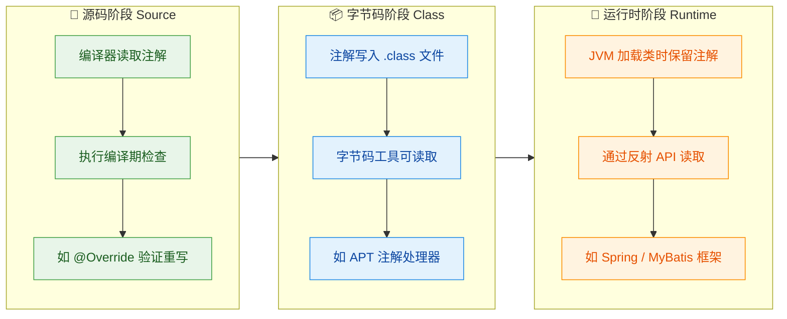

这三个阶段分别对应 `@Retention` 元注解的三个取值：`SOURCE`、`CLASS`、`RUNTIME`，后续章节会深入展开。

### 注解能贴在哪里

Java 注解几乎可以修饰所有的程序元素。下面这段代码展示了注解可以出现的典型位置：

```java
@Entity                          // 注解在【类】上
public class User {

    @Column(name = "user_name")  // 注解在【字段】上
    private String name;

    @Autowired                   // 注解在【构造方法】上
    public User(@Param("name") String name) {  // 注解在【参数】上
        this.name = name;
    }

    @Override                    // 注解在【方法】上
    public String toString() {
        return name;
    }
}
```

具体来说，注解可以标注在以下目标上（由 `@Target` 元注解控制，后续章节详解）：

- **TYPE** —— 类、接口、枚举、注解类型
- **FIELD** —— 字段（包括枚举常量）
- **METHOD** —— 方法
- **PARAMETER** —— 方法参数
- **CONSTRUCTOR** —— 构造方法
- **LOCAL_VARIABLE** —— 局部变量
- **ANNOTATION_TYPE** —— 注解类型（即注解的注解，也就是元注解）
- **PACKAGE** —— 包声明
- **TYPE_PARAMETER** —— 类型参数（JDK 8+，如泛型 `<@NonNull T>`）
- **TYPE_USE** —— 类型使用处（JDK 8+，几乎任何用到类型的地方）

### 注解的核心价值：为什么需要注解

在注解出现之前（JDK 5 以前），Java 开发者如果想给代码附加元数据信息，通常只有两种笨办法：

**方式一：XML 外部配置文件**

早期的 Java EE 和 Spring 框架大量依赖 XML 来描述配置。比如一个 Servlet 的映射需要在 `web.xml` 中这样写：

```xml
<!-- 早期 Servlet 配置：代码和配置分离，维护成本高 -->
<servlet>
    <servlet-name>userServlet</servlet-name>
    <servlet-class>com.example.UserServlet</servlet-class>
</servlet>
<servlet-mapping>
    <servlet-name>userServlet</servlet-name>
    <url-pattern>/user</url-pattern>
</servlet-mapping>
```

**方式二：命名约定或标记接口**

比如 `Serializable` 接口没有任何方法，它纯粹是一个"标记"，告诉 JVM "这个类的对象可以被序列化"。这种方式语义不够清晰，也不够灵活。

注解的出现彻底改变了这一局面。同样的 Servlet 配置，用注解只需一行：

```java
// 现代方式：注解直接标注在代码上，配置与代码合一
@WebServlet("/user")  // 一行注解替代了整段 XML 配置
public class UserServlet extends HttpServlet {
    // ...
}
```

注解带来的核心价值可以归纳为：

1. **代码即配置（Configuration by Convention）**：元数据直接写在代码旁边，不用在代码和 XML 之间来回跳转，大幅提升可读性和维护性。
2. **编译期安全检查**：像 `@Override` 这样的注解能让编译器帮你捕获错误，比如方法签名写错了，编译器会直接报错，而不是等到运行时才发现 bug。
3. **框架自动化的基石**：现代 Java 框架（Spring、MyBatis、JPA、JUnit 等）几乎全部建立在注解之上。框架通过反射读取注解信息，自动完成依赖注入、ORM 映射、事务管理等繁重工作。
4. **代码生成**：Lombok 的 `@Data`、MapStruct 的 `@Mapper` 等注解能在编译期自动生成样板代码，减少重复劳动。

### 一个完整的直觉示例

为了把上面的概念串起来，我们看一个贴近实际的例子。假设你在用 Spring Boot + JPA 开发一个用户管理模块：

```java
@Entity                              // 元数据：告诉 JPA "这个类映射到数据库表"
@Table(name = "t_user")              // 元数据：指定表名为 t_user
public class User {

    @Id                              // 元数据：这是主键字段
    @GeneratedValue(strategy =       // 元数据：主键自增策略
        GenerationType.IDENTITY)
    private Long id;                 // 实际数据：用户 ID

    @Column(nullable = false,        // 元数据：非空，最大长度 50
            length = 50)
    private String username;         // 实际数据：用户名

    @Deprecated                      // 元数据：标记此方法已过时
    public String getDisplayName() { // 实际逻辑：获取显示名
        return username;
    }
}
```

在这段代码中，`@Entity`、`@Table`、`@Id`、`@Column`、`@Deprecated` 都是注解，它们不参与任何业务逻辑的执行，但它们携带的元数据信息会被 JPA 框架在运行时通过反射读取，自动完成"Java 对象 ↔ 数据库表"的映射工作。这就是注解作为元数据的典型应用。

### 小结

用一句话概括注解的本质：

> **注解是 Java 对元数据的语言级支持，它以 `@` 标签的形式将描述性信息附加到程序元素上，供编译器、工具或运行时框架读取和处理。**

理解了"注解 = 元数据"这个核心概念后，接下来我们将逐步深入：先看 Java 内置提供了哪些现成的注解，再学习如何用元注解控制注解的行为，最后动手创建自己的自定义注解。

---

## 内置注解（@Override、@Deprecated、@SuppressWarnings）

Java 语言本身在 `java.lang` 包中预置了一组注解，它们是编译器和运行时环境"开箱即用"的标记。虽然数量不多，但几乎每个 Java 开发者每天都在与它们打交道。理解它们的语义、作用时机以及底层行为，是掌握整个注解体系的第一步。

### @Override —— 方法重写的编译期守卫

`@Override` 是最常见也最简单的内置注解。它的唯一职责是：告诉编译器"我这个方法意图重写（override）父类或接口中的方法，请帮我检查一下是否真的重写成功了"。

它的保留策略是 `RetentionPolicy.SOURCE`，意味着这个注解只存在于源码阶段，编译成 `.class` 文件后就被丢弃了。它不会进入字节码，更不会在运行时被反射读取到。它纯粹是一个给编译器看的"契约声明"。

来看一个经典场景：

```java
public class Animal {
    // 父类定义了 speak 方法
    public void speak() {
        System.out.println("...");
    }
}

public class Dog extends Animal {

    // 正确：方法签名与父类完全一致，编译通过
    @Override
    public void speak() {
        System.out.println("Woof!");
    }

    // 错误示范：方法名拼写错误，写成了 speck
    // 如果没有 @Override，编译器会认为这是一个全新的方法，不会报错
    // 加上 @Override 后，编译器立刻报错：
    // "Method does not override or implement a method from a supertype"
    @Override
    public void speck() {  // ← 编译错误！
        System.out.println("Woof!");
    }
}
```

这就是 `@Override` 的核心价值：把一个"运行时才会暴露的 bug"提前到了"编译期"。如果没有这个注解，`speck()` 会被当作 Dog 类自己的新方法，程序不会报错，但多态调用时永远调不到它——这类 bug 排查起来非常痛苦。

关于 `@Override` 有几个容易混淆的细节值得展开：

第一，`@Override` 不仅适用于继承父类的方法重写，也适用于实现接口方法。从 Java 6 开始，对接口方法的实现也可以标注 `@Override`，并且这是推荐做法：

```java
public interface Runnable {
    void run(); // 接口中定义的抽象方法
}

public class MyTask implements Runnable {

    @Override  // Java 6+ 允许且推荐：标记接口方法的实现
    public void run() {
        System.out.println("Task is running");
    }
}
```

第二，`@Override` 不能用于静态方法。静态方法属于类本身，不参与多态，因此不存在"重写"的概念。子类中定义与父类签名相同的静态方法，这叫"隐藏（hiding）"而非"重写（overriding）"：

```java
public class Parent {
    public static void greet() {
        System.out.println("Hello from Parent");
    }
}

public class Child extends Parent {
    // 这里如果加 @Override 会编译报错
    // 因为静态方法不能被 override，只能被 hide
    public static void greet() {
        System.out.println("Hello from Child");
    }
}
```

第三，关于 `@Override` 的最佳实践：在团队开发中，建议对所有重写方法都加上 `@Override`。现代 IDE（如 IntelliJ IDEA）在自动生成重写方法时也会默认添加。这不仅是防御性编程，也是一种代码可读性的提升——阅读代码时一眼就能看出"这个方法是从父类/接口继承来的"。

### @Deprecated —— 标记过时 API 的"退役通知"

`@Deprecated` 用于标记一个类、方法、字段或构造器已经过时（obsolete），不建议继续使用。它的保留策略是 `RetentionPolicy.RUNTIME`，这意味着它不仅在编译期生效，还会被写入字节码，并且在运行时可以通过反射读取到。

当你调用一个被 `@Deprecated` 标记的 API 时，编译器会产生一个警告（warning），IDE 中通常表现为删除线样式的文字：

```java
public class StringUtils {

    /**
     * @deprecated 此方法效率低下，请使用 {@link #isBlank(String)} 替代。
     */
    @Deprecated
    public static boolean isEmpty(String str) {
        // 旧的实现：只判断了 null 和空字符串
        return str == null || str.length() == 0;
    }

    // 新的推荐方法：额外处理了空白字符
    public static boolean isBlank(String str) {
        return str == null || str.trim().isEmpty();
    }
}

public class Main {
    public static void main(String[] args) {
        // 编译器警告：'isEmpty(String)' is deprecated
        // IDE 中 isEmpty 会显示删除线
        StringUtils.isEmpty("hello");

        // 推荐使用新方法
        StringUtils.isBlank("hello");
    }
}
```

注意上面代码中 Javadoc 里的 `@deprecated`（小写 d）标签。这是一个容易混淆的点：`@Deprecated`（大写 D）是注解，作用于编译器和运行时；`@deprecated`（小写 d）是 Javadoc 标签，作用于文档生成。最佳实践是两者同时使用——注解负责触发编译警告，Javadoc 标签负责告诉开发者"为什么过时"以及"应该用什么替代"。

Java 9 对 `@Deprecated` 做了一次重要增强，新增了两个属性：

```java
public @interface Deprecated {
    /**
     * since: 标明从哪个版本开始过时
     * 例如 "9" 表示从 Java 9 开始标记为过时
     */
    String since() default "";

    /**
     * forRemoval: 是否计划在未来版本中彻底移除
     * true 表示"这个 API 将被删除，必须尽快迁移"
     * false 表示"不推荐使用，但暂时不会删除"
     */
    boolean forRemoval() default false;
}
```

JDK 源码中大量使用了这两个属性，来看一个真实的例子：

```java
// java.lang.Thread 中的 stop() 方法（JDK 源码）
@Deprecated(since = "1.2", forRemoval = true)
public final void stop() {
    // ...
}
```

这段声明清晰地传达了三层信息：这个方法已过时；从 Java 1.2 就开始过时了；未来版本会彻底移除它。当 `forRemoval = true` 时，编译器产生的不再是普通警告，而是更强烈的"removal warning"，提醒开发者必须尽快迁移。

`@Deprecated` 的一个重要特性是它的"传播性"问题。如果一个类被标记为 `@Deprecated`，那么使用这个类的任何地方都会触发警告，但类内部的成员方法互相调用不会触发警告。这是合理的设计——既然整个类都过时了，内部实现自然不需要重复警告：

```java
@Deprecated
public class OldParser {
    // 类内部方法互相调用，不会产生 deprecated 警告
    public void parse() {
        validate(); // 不会警告
    }

    public void validate() {
        // ...
    }
}

public class Main {
    public static void main(String[] args) {
        OldParser parser = new OldParser(); // 警告：OldParser is deprecated
        parser.parse();                      // 警告：parse() is deprecated
    }
}
```

### @SuppressWarnings —— 精准压制编译器警告

`@SuppressWarnings` 的作用是告诉编译器"我知道这里有警告，但我是故意这么写的，请不要提示了"。它的保留策略同样是 `RetentionPolicy.SOURCE`，只在编译期生效。

这个注解接收一个 `String[]` 类型的 `value` 属性，用于指定要压制哪些类别的警告：

```java
// 压制单个警告类型
@SuppressWarnings("unchecked")
List<String> list = (List<String>) rawList;

// 压制多个警告类型
@SuppressWarnings({"unchecked", "deprecation"})
public void legacyMethod() {
    // 同时包含未检查转换和调用过时 API 的代码
}
```

下面是开发中最常用的警告类型及其含义：

```text
┌──────────────────┬──────────────────────────────────────────────┐
│   警告类型        │   含义与触发场景                               │
├──────────────────┼──────────────────────────────────────────────┤
│ "unchecked"      │ 未经检查的泛型操作，如原始类型转泛型类型          │
│ "deprecation"    │ 调用了 @Deprecated 标记的 API                  │
│ "rawtypes"       │ 使用了原始类型（Raw Type），未指定泛型参数        │
│ "unused"         │ 声明了但未使用的变量、方法、导入等                │
│ "serial"         │ 可序列化类缺少 serialVersionUID 字段            │
│ "all"            │ 压制所有类型的警告（慎用）                       │
│ "fallthrough"    │ switch 语句中 case 缺少 break 导致穿透          │
│ "resource"       │ 未关闭的可关闭资源（如流、连接）                  │
└──────────────────┴──────────────────────────────────────────────┘
```

来看几个典型的使用场景：

```java
public class SuppressWarningsDemo {

    // ========== 场景一：压制 unchecked 警告 ==========
    @SuppressWarnings("unchecked")
    public static <T> T[] createArray(Class<T> clazz, int size) {
        // 泛型数组无法直接创建，必须通过 Object[] 强转
        // 这里编译器会警告 unchecked cast，但我们知道这是安全的
        return (T[]) java.lang.reflect.Array.newInstance(clazz, size);
    }

    // ========== 场景二：压制 deprecation 警告 ==========
    @SuppressWarnings("deprecation")
    public void connectLegacySystem() {
        // 必须调用旧系统的过时 API，短期内无法迁移
        // 压制警告避免编译输出中充斥大量无意义的 warning
        LegacyConnector connector = new LegacyConnector();
        connector.oldConnect(); // 这是一个 @Deprecated 方法
    }

    // ========== 场景三：压制 rawtypes 警告 ==========
    @SuppressWarnings("rawtypes")
    public void processRawList(List rawList) {
        // 与老代码交互时，可能不得不接收原始类型的 List
        // 加上注解表明这是有意为之
        for (Object item : rawList) {
            System.out.println(item);
        }
    }
}
```

`@SuppressWarnings` 有一个非常重要的使用原则——最小作用域原则（Minimum Scope Principle）。这个注解可以标注在包、类、方法、构造器、局部变量等多个层级上，但应该尽量缩小它的作用范围：

```java
// ❌ 不推荐：在整个方法上压制警告
// 这会掩盖方法内其他潜在的 unchecked 问题
@SuppressWarnings("unchecked")
public void processData() {
    List<String> names = (List<String>) getRawList();  // 真正需要压制的行
    Map<String, Object> config = loadConfig();          // 如果这里也有问题，会被掩盖
    // ... 100 行其他代码 ...
}

// ✅ 推荐：只在需要的局部变量上压制
public void processData() {
    @SuppressWarnings("unchecked")  // 精确标注在这一行
    List<String> names = (List<String>) getRawList();

    Map<String, Object> config = loadConfig(); // 这里的警告不会被压制，能正常暴露问题
    // ... 100 行其他代码 ...
}
```

这个原则的道理很直观：警告是编译器帮你发现潜在问题的手段，压制范围越大，你"失聪"的范围就越大。只在确实需要的地方精准压制，才能在"消除噪音"和"保留安全网"之间取得平衡。

### 三个内置注解的对比总览

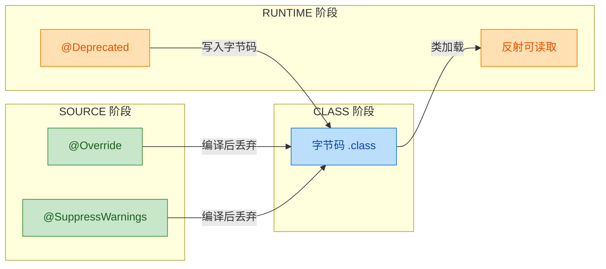

用一张表做个快速对比：

```text
┌─────────────────────┬────────────┬──────────────┬──────────────────────┐
│       注解           │ 保留策略    │  作用目标     │  核心用途             │
├─────────────────────┼────────────┼──────────────┼──────────────────────┤
│ @Override           │ SOURCE     │ 方法          │ 确保正确重写父类方法   │
│ @Deprecated         │ RUNTIME    │ 类/方法/字段等 │ 标记过时 API          │
│ @SuppressWarnings   │ SOURCE     │ 类/方法/变量等 │ 压制指定编译器警告     │
└─────────────────────┴────────────┴──────────────┴──────────────────────┘
```

三者的设计哲学各有侧重：`@Override` 是防御性编程的典范，把错误拦截在编译期；`@Deprecated` 是 API 演进的沟通工具，在"不能立刻删除旧代码"和"引导用户迁移到新代码"之间架起桥梁；`@SuppressWarnings` 则是开发者与编译器之间的"协商机制"，在你比编译器更了解上下文时，允许你有选择地忽略某些警告。

---

**📝 练习题**

以下代码编译时会发生什么？

```java
public class Parent {
    public static void doWork() {
        System.out.println("Parent working");
    }
}

public class Child extends Parent {
    @Override
    public static void doWork() {
        System.out.println("Child working");
    }
}
```

A. 正常编译，运行时输出 "Child working"

B. 正常编译，运行时输出 "Parent working"

C. 编译错误：静态方法不能使用 @Override 注解

D. 编译通过但运行时抛出异常


**【答案】** C

**【解析】** 静态方法属于类本身，不参与多态机制，因此不存在"重写（override）"的概念。子类中定义与父类签名相同的静态方法，在 Java 语言规范中被称为"隐藏（hiding）"。`@Override` 注解要求被标注的方法必须真正重写（override）父类实例方法或实现接口方法，而静态方法不满足这个条件，所以编译器会直接报错：`Method does not override or implement a method from a supertype`。去掉 `@Override` 后代码可以正常编译，此时 `Child.doWork()` 隐藏了 `Parent.doWork()`，通过父类引用调用时仍然执行父类版本。

---

## 元注解 ⭐（Meta-Annotations）

元注解（Meta-Annotation）是一个非常精妙的概念——它是"用来注解注解的注解"（annotations that annotate other annotations）。如果说普通注解是贴在代码上的标签，那么元注解就是贴在标签上的标签，它定义了一个注解本身的行为规则：这个注解能贴在哪里？能活多久？能不能被继承？能不能重复使用？

Java 在 `java.lang.annotation` 包中提供了若干元注解。本节聚焦四个最核心的：`@Target`、`@Retention`、`@Inherited` 和 `@Repeatable`。理解它们，是掌握自定义注解和框架级注解设计的前提。

在深入每个元注解之前，先从全局视角看看它们各自管辖的"维度"：

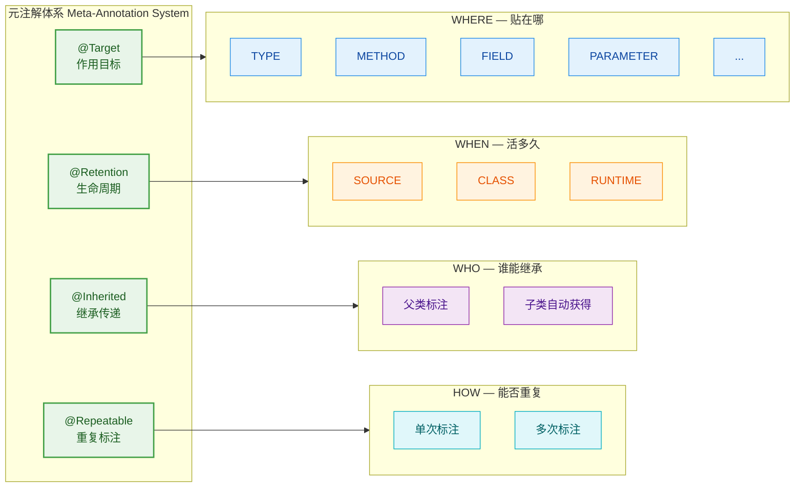

四个元注解，四个正交维度，各管一摊事。接下来逐一拆解。

---

### @Target — 注解能贴在哪里

`@Target` 限定了一个注解可以标注的程序元素类型（element type）。如果你不指定 `@Target`，注解默认几乎可以贴在任何地方，这通常不是你想要的——就像一张"仅限冷藏"的标签被贴到了微波炉上，语义就乱了。

`@Target` 接收一个 `ElementType[]` 数组，`ElementType` 是一个枚举，定义在 `java.lang.annotation` 包中：

```java
// ElementType 枚举 —— 定义注解可以标注的目标类型
public enum ElementType {
    TYPE,            // 类、接口、枚举、record（Class, Interface, Enum, Record）
    FIELD,           // 字段（包括枚举常量）
    METHOD,          // 方法
    PARAMETER,       // 方法参数
    CONSTRUCTOR,     // 构造器
    LOCAL_VARIABLE,  // 局部变量
    ANNOTATION_TYPE, // 注解类型（即元注解的目标）
    PACKAGE,         // 包声明（package-info.java）
    TYPE_PARAMETER,  // 泛型类型参数（Java 8+），如 〈@MyAnno T〉
    TYPE_USE,        // 任何类型使用处（Java 8+），如 @NonNull String
    MODULE,          // 模块声明（Java 9+）
    RECORD_COMPONENT // Record 组件（Java 16+）
}
```

来看一个实际例子，假设我们要设计一个只能标注在方法上的注解：

```java
import java.lang.annotation.Target;
import java.lang.annotation.ElementType;

// @Target 限定：此注解只能贴在方法上
@Target(ElementType.METHOD)
public @interface TestCase {
    // 测试用例的描述信息
    String description() default "";
}
```

如果有人试图把 `@TestCase` 贴到类或字段上，编译器会直接报错：

```java
// ✅ 正确：贴在方法上
@TestCase(description = "测试用户登录")
public void testLogin() { }

// ❌ 编译错误：@TestCase 不允许标注在字段上
@TestCase
private String name;
```

当需要允许多个目标时，传入数组即可：

```java
// 允许标注在类和方法上
@Target({ElementType.TYPE, ElementType.METHOD})
public @interface Auditable {
    String operator() default "system";
}
```

关于 Java 8 引入的 `TYPE_PARAMETER` 和 `TYPE_USE`，它们大幅扩展了注解的使用范围。`TYPE_USE` 尤其强大，它允许注解出现在任何"使用类型"的地方：

```java
// TYPE_USE 示例 —— 注解可以出现在类型使用的任何位置
@Target(ElementType.TYPE_USE)
public @interface NonNull { }

// 用法展示
@NonNull String name;                          // 字段类型
List<@NonNull String> names;                   // 泛型参数类型
String text = (@NonNull String) obj;           // 强制转型
public @NonNull String getName() { return ""; } // 返回值类型
```

这种能力是 Checker Framework、NullAway 等静态分析工具的基石——它们正是通过 `TYPE_USE` 注解在编译期捕获空指针风险。

---

### @Retention — 注解能活多久

如果说 `@Target` 管的是空间维度（贴在哪），那 `@Retention` 管的就是时间维度（活多久）。它决定了注解信息在编译和运行的哪个阶段被保留或丢弃。

`@Retention` 接收一个 `RetentionPolicy` 枚举值：

```java
// RetentionPolicy 枚举 —— 定义注解的保留策略
public enum RetentionPolicy {
    SOURCE,  // 仅存在于源码中，编译时丢弃（Discarded by the compiler）
    CLASS,   // 编译后保留在 .class 文件中，但 JVM 加载时不保留（默认值）
    RUNTIME  // 保留到运行时，可通过反射读取（Retained at runtime, accessible via reflection）
}
```

三个级别形成一个递进的生命周期链：

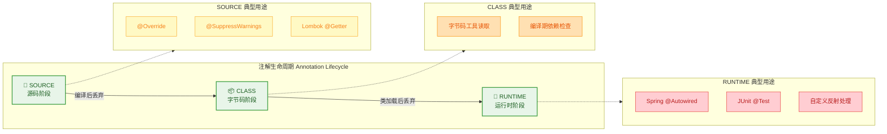

逐一理解：

`RetentionPolicy.SOURCE` —— 注解只在 `.java` 源文件中存在。编译器处理完后就丢掉了，`.class` 文件里找不到它的踪迹。典型代表是 `@Override`：编译器用它做方法覆写检查，检查完就没用了，不需要带到字节码里。Lombok 的 `@Getter`、`@Setter` 也是这个级别——它们在编译期通过注解处理器（Annotation Processor）生成代码，之后注解本身就完成使命了。

`RetentionPolicy.CLASS` —— 这是不指定 `@Retention` 时的默认值。注解会被编译进 `.class` 文件，但 JVM 在加载类时不会把它放进内存，所以运行时通过反射是读不到的。这个级别比较少见，主要用于字节码级别的工具（如 ASM、ByteBuddy）在不加载类的情况下扫描注解信息。

`RetentionPolicy.RUNTIME` —— 注解一路存活到运行时，可以通过 `java.lang.reflect` API 读取。这是框架开发中最常用的级别。Spring 的 `@Component`、`@Autowired`，JUnit 的 `@Test`，JPA 的 `@Entity` 等等，全部是 `RUNTIME` 级别——因为框架需要在运行时通过反射发现并处理这些注解。

来看一个对比示例：

```java
import java.lang.annotation.Retention;
import java.lang.annotation.RetentionPolicy;

// SOURCE 级别：编译后消失
@Retention(RetentionPolicy.SOURCE)
public @interface CompileOnly {
    String value() default "";
}

// CLASS 级别（默认）：存在于 .class 文件，运行时不可见
@Retention(RetentionPolicy.CLASS)
public @interface BytecodeVisible {
    String value() default "";
}

// RUNTIME 级别：运行时可通过反射读取
@Retention(RetentionPolicy.RUNTIME)
public @interface RuntimeAccessible {
    String value() default "";
}
```

验证运行时可见性：

```java
import java.lang.reflect.Method;

public class RetentionDemo {

    @CompileOnly("编译后就没了")       // SOURCE
    @BytecodeVisible("反射看不到我")   // CLASS
    @RuntimeAccessible("反射能看到我") // RUNTIME
    public void testMethod() { }

    public static void main(String[] args) throws Exception {
        // 获取 testMethod 上的所有注解
        Method method = RetentionDemo.class.getMethod("testMethod");

        // 获取该方法上所有运行时可见的注解
        java.lang.annotation.Annotation[] annotations = method.getAnnotations();

        // 输出注解数量
        System.out.println("运行时可见注解数量: " + annotations.length); // 输出: 1

        // 遍历并打印
        for (java.lang.annotation.Annotation anno : annotations) {
            // 只有 @RuntimeAccessible 能被读到
            System.out.println(anno); // @RuntimeAccessible(value="反射能看到我")
        }
    }
}
```

一个实用的选择原则：如果你的注解需要在运行时被框架或你自己的代码通过反射读取，用 `RUNTIME`；如果只是给编译器或注解处理器看的，用 `SOURCE`；极少数情况下需要字节码工具处理但不需要运行时反射，用 `CLASS`。实际开发中，绝大多数自定义注解都选 `RUNTIME`。

---

### @Inherited — 注解能不能被子类继承

`@Inherited` 解决的问题很具体：当一个注解标注在父类上时，子类是否自动拥有这个注解？

默认情况下，注解是不会被继承的。即使父类上贴了 `@MyAnnotation`，子类通过反射调用 `getAnnotation(MyAnnotation.class)` 也会返回 `null`。但如果 `@MyAnnotation` 的定义上加了 `@Inherited`，子类就能"继承"到父类的这个注解。

几个关键限制必须明确：

- `@Inherited` 只对类（class）上的注解生效。接口上的注解不会被实现类继承，方法上的注解不会被覆写方法继承。
- 如果子类自己也标注了同一个注解，子类的注解会覆盖父类的（就近原则）。
- 它只影响通过 `getAnnotation()` / `getAnnotations()` 的查找行为，`getDeclaredAnnotations()` 始终只返回直接声明在当前类上的注解。

```java
import java.lang.annotation.*;

// 定义一个带 @Inherited 的注解
@Inherited                              // 关键：声明此注解可被子类继承
@Retention(RetentionPolicy.RUNTIME)     // 必须是 RUNTIME，否则反射读不到
@Target(ElementType.TYPE)               // 只能标注在类上
public @interface Component {
    String value() default "default";   // 组件名称
}

// 定义一个不带 @Inherited 的注解（作为对照）
@Retention(RetentionPolicy.RUNTIME)
@Target(ElementType.TYPE)
public @interface Tag {
    String value() default "";
}
```

```java
// 父类同时标注了 @Component 和 @Tag
@Component("baseService")
@Tag("base")
class BaseService { }

// 子类什么注解都没加
class UserService extends BaseService { }

public class InheritedDemo {
    public static void main(String[] args) {
        Class<?> clazz = UserService.class;

        // @Component 有 @Inherited，子类能继承到
        Component comp = clazz.getAnnotation(Component.class);
        System.out.println("@Component: " + comp);
        // 输出: @Component(value="baseService") ✅ 继承到了

        // @Tag 没有 @Inherited，子类继承不到
        Tag tag = clazz.getAnnotation(Tag.class);
        System.out.println("@Tag: " + tag);
        // 输出: @Tag: null ❌ 没有继承

        // getDeclaredAnnotations() 只看直接声明的，两个都没有
        Annotation[] declared = clazz.getDeclaredAnnotations();
        System.out.println("直接声明的注解数量: " + declared.length);
        // 输出: 0（UserService 自己没声明任何注解）
    }
}
```

`@Inherited` 在框架设计中有实际意义。比如 Spring 的 `@Transactional` 虽然本身没有 `@Inherited`，但 Spring 内部通过 `AnnotationUtils.findAnnotation()` 实现了类似的"向上查找"逻辑。而一些标记型注解（marker annotation），比如标记某个类族都属于某个模块，就很适合用 `@Inherited` 让子类自动获得标记。

下面这张图展示了继承查找的判定逻辑：

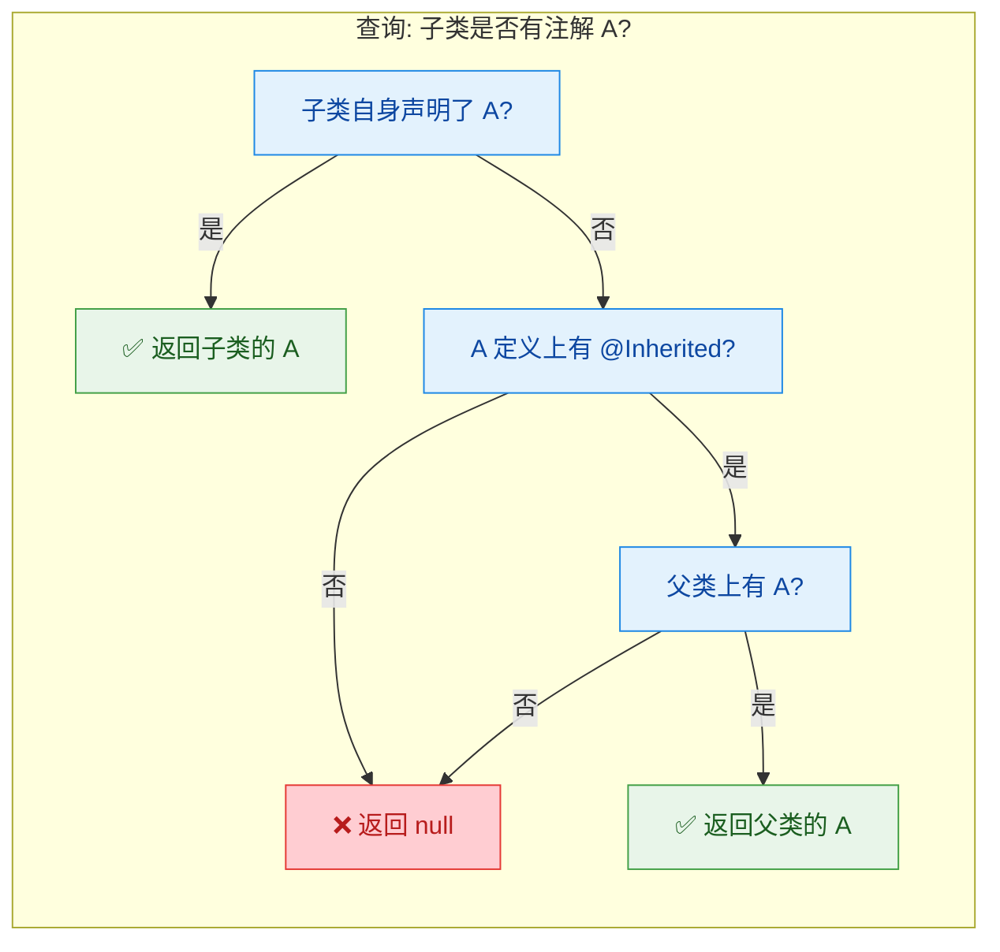

---

### @Repeatable — 同一个注解能不能贴多次

在 Java 8 之前，同一个注解在同一个位置只能出现一次。如果你想给一个类标注多个角色，只能用数组：`@Roles({"admin", "user"})`。这种写法虽然能用，但不够直观。

Java 8 引入了 `@Repeatable`，允许同一个注解在同一个目标上重复使用。但它的实现机制有一个巧妙的设计——需要一个"容器注解"（Container Annotation）来存放重复的注解。

先看完整的定义流程：

```java
import java.lang.annotation.*;

// 第一步：定义容器注解（Container Annotation）
// 容器注解内部有一个 value() 方法，返回被重复注解的数组
@Retention(RetentionPolicy.RUNTIME)
@Target(ElementType.TYPE)
public @interface Roles {
    // 容器的 value() 返回 Role 数组
    Role[] value();
}

// 第二步：定义可重复注解，通过 @Repeatable 指向容器注解
@Repeatable(Roles.class)              // 指定容器注解为 Roles
@Retention(RetentionPolicy.RUNTIME)   // 保留策略必须与容器一致或更宽松
@Target(ElementType.TYPE)             // 目标类型必须与容器一致
public @interface Role {
    String value();                   // 角色名称
}
```

使用时就可以自然地重复标注了：

```java
// 同一个类上重复使用 @Role
@Role("admin")
@Role("user")
@Role("auditor")
public class AdminController {
    // ...
}
```

编译器在背后做的事情是把多个 `@Role` 自动包装成一个 `@Roles`，等价于：

```java
// 编译器实际生成的等价形式
@Roles({
    @Role("admin"),
    @Role("user"),
    @Role("auditor")
})
public class AdminController { }
```

读取时需要注意 API 的选择：

```java
public class RepeatableDemo {
    public static void main(String[] args) {
        Class<?> clazz = AdminController.class;

        // 方式一：getAnnotationsByType() —— 直接获取所有重复注解（推荐）
        // 这个方法会"穿透"容器注解，直接返回所有 @Role
        Role[] roles = clazz.getAnnotationsByType(Role.class);
        System.out.println("角色数量: " + roles.length); // 输出: 3
        for (Role role : roles) {
            System.out.println("角色: " + role.value());
            // 输出: admin, user, auditor
        }

        // 方式二：getAnnotation(Role.class) —— 返回 null！
        // 因为实际存储的是容器注解 @Roles，不是单个 @Role
        Role singleRole = clazz.getAnnotation(Role.class);
        System.out.println("单个 @Role: " + singleRole); // 输出: null

        // 方式三：getAnnotation(Roles.class) —— 获取容器注解
        Roles container = clazz.getAnnotation(Roles.class);
        System.out.println("容器注解: " + container);
        // 输出: @Roles(value=[@Role("admin"), @Role("user"), @Role("auditor")])
    }
}
```

这里有一个容易踩的坑：当使用了 `@Repeatable` 且实际重复标注时，`getAnnotation(Role.class)` 返回的是 `null`，因为 JVM 层面存储的是容器注解 `@Roles`。所以读取重复注解时，始终优先使用 `getAnnotationsByType()`，它是 Java 8 专门为 `@Repeatable` 设计的 API。

容器注解的约束规则：

- 容器注解必须有一个名为 `value()` 的方法，返回类型是被重复注解的数组。
- 容器注解的 `@Retention` 范围必须大于等于被重复注解的范围（比如被重复注解是 `RUNTIME`，容器也必须是 `RUNTIME`）。
- 容器注解的 `@Target` 范围必须是被重复注解 `@Target` 的子集或相同。

下面这张图总结了 `@Repeatable` 的完整工作机制：

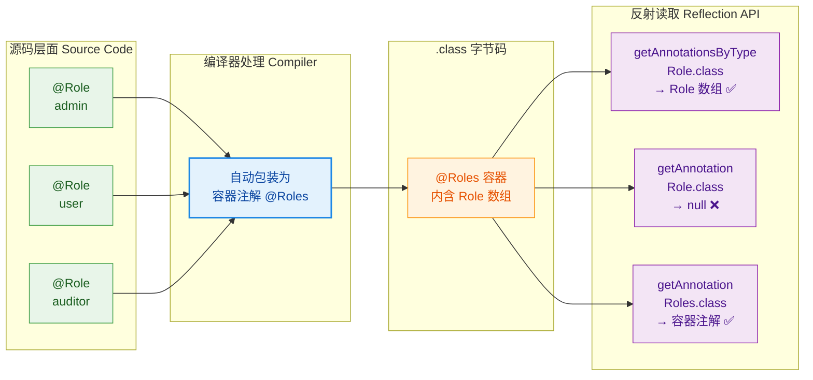

---

### 四大元注解协同工作

在实际的注解设计中，四个元注解几乎总是组合使用的。来看一个综合示例——设计一个可重复的、运行时可用的、可被子类继承的 API 版本标记注解：

```java
import java.lang.annotation.*;

// 容器注解
@Retention(RetentionPolicy.RUNTIME)
@Target(ElementType.TYPE)
@Inherited
public @interface ApiVersions {
    ApiVersion[] value();
}

// 可重复注解 —— 四个元注解全部用上
@Repeatable(ApiVersions.class)          // 可重复，容器为 ApiVersions
@Retention(RetentionPolicy.RUNTIME)     // 运行时保留
@Target(ElementType.TYPE)               // 只能标注在类上
@Inherited                              // 子类可继承
public @interface ApiVersion {
    String version();                   // API 版本号
    boolean deprecated() default false; // 是否已废弃
}
```

```java
// 父类标注了多个 API 版本
@ApiVersion(version = "v1", deprecated = true)
@ApiVersion(version = "v2")
@ApiVersion(version = "v3")
class BaseApi { }

// 子类没有标注任何注解，但因为 @Inherited，会继承父类的
class UserApi extends BaseApi { }

public class CombinedDemo {
    public static void main(String[] args) {
        // 子类通过继承获得父类的所有 @ApiVersion
        ApiVersion[] versions = UserApi.class.getAnnotationsByType(ApiVersion.class);

        System.out.println("UserApi 支持的 API 版本:");
        for (ApiVersion v : versions) {
            // 打印每个版本及其废弃状态
            String status = v.deprecated() ? " [DEPRECATED]" : "";
            System.out.println("  " + v.version() + status);
        }
        // 输出:
        //   v1 [DEPRECATED]
        //   v2
        //   v3
    }
}
```

这个例子展示了四个元注解如何协同：`@Target` 限定只能贴在类上，`@Retention` 确保运行时可读，`@Inherited` 让子类自动获得父类的版本标记，`@Repeatable` 允许标注多个版本。这就是元注解体系的威力——通过正交组合，精确控制注解的行为。

---

**📝 练习题**

以下代码中，`ChildService` 类通过反射能获取到哪些注解？

```java
@Inherited
@Retention(RetentionPolicy.RUNTIME)
@Target(ElementType.TYPE)
@interface Cacheable { String value() default ""; }

@Retention(RetentionPolicy.RUNTIME)
@Target(ElementType.TYPE)
@interface Loggable { }

@Cacheable("60s")
@Loggable
class ParentService { }

class ChildService extends ParentService { }
```

A. `@Cacheable("60s")` 和 `@Loggable`

B. 只有 `@Cacheable("60s")`

C. 只有 `@Loggable`

D. 什么都获取不到


**【答案】** B

**【解析】** `@Cacheable` 的定义上有 `@Inherited` 元注解，所以当它标注在父类 `ParentService` 上时，子类 `ChildService` 通过 `getAnnotation(Cacheable.class)` 可以继承到它。而 `@Loggable` 没有 `@Inherited`，所以即使父类有这个注解，子类也无法通过反射获取。`@Inherited` 只对类继承生效，且只影响 `getAnnotation()` / `getAnnotations()` 的行为。因此 `ChildService` 只能获取到 `@Cacheable("60s")`。

---

## 自定义注解（@interface、注解元素）

Java 从 1.5 开始允许开发者通过 `@interface` 关键字定义自己的注解类型。如果说内置注解和元注解是 JDK 提供的"标准零件"，那么自定义注解就是你亲手打造的"专属工具"——它让你能够以声明式的方式为代码附加任意语义信息，并在编译期或运行时通过反射读取这些信息，从而驱动框架逻辑、代码生成、校验规则等各种高级玩法。

Spring 的 `@Component`、`@Autowired`，MyBatis 的 `@Select`，JUnit 的 `@Test`……这些耳熟能详的注解，本质上都是自定义注解。理解了自定义注解的语法和原理，你就掌握了"造轮子"的核心能力。

---

### 基本语法：@interface 声明

定义一个注解的语法形式与定义接口非常相似，只是在 `interface` 前面加了一个 `@` 符号：

```java
// 使用 @interface 关键字声明一个注解类型
// 注解名遵循大驼峰命名规范，通常以形容词或名词命名
public @interface MyAnnotation {
    // 注解体：在这里声明"注解元素"（annotation elements）
}
```

这段代码声明了一个名为 `MyAnnotation` 的注解。编译后，它会生成一个 `.class` 文件，本质上是一个继承了 `java.lang.annotation.Annotation` 接口的特殊接口。你可以通过反编译来验证这一点：

```java
// 反编译后的等价形式（javap -c 查看）
// 编译器自动让自定义注解继承 Annotation 接口
public interface MyAnnotation extends java.lang.annotation.Annotation {
}
```

这意味着注解在 JVM 层面就是接口，注解的实例实际上是 JDK 动态代理生成的代理对象（Proxy）。这个认知对后续理解反射读取注解值的机制非常关键。

---

### 注解元素（Annotation Elements）

一个空注解只能起到"标记"作用（Marker Annotation），就像 `@Override` 那样。但大多数场景下，我们需要注解携带配置信息，这就需要在注解体内声明"注解元素"。

注解元素的声明形式看起来像接口中的抽象方法，但语义完全不同——它定义的是注解的"属性"：

```java
import java.lang.annotation.ElementType;
import java.lang.annotation.Retention;
import java.lang.annotation.RetentionPolicy;
import java.lang.annotation.Target;

// @Retention 指定注解保留到运行时，这样才能通过反射读取
@Retention(RetentionPolicy.RUNTIME)
// @Target 指定该注解可以标注在类和方法上
@Target({ElementType.TYPE, ElementType.METHOD})
public @interface ApiEndpoint {

    // 注解元素1：接口路径，无默认值（使用时必须显式赋值）
    String path();

    // 注解元素2：HTTP 请求方法，提供了默认值 "GET"
    String method() default "GET";

    // 注解元素3：接口描述，提供了默认值空字符串
    String description() default "";

    // 注解元素4：版本号，提供了默认值 1
    int version() default 1;
}
```

上面的 `ApiEndpoint` 注解声明了四个注解元素。使用时的写法如下：

```java
// 使用自定义注解标注一个控制器类
@ApiEndpoint(
    path = "/api/users",          // 必须赋值，因为没有 default
    method = "POST",              // 覆盖默认值 "GET"
    description = "创建新用户",    // 覆盖默认值 ""
    version = 2                   // 覆盖默认值 1
)
public class UserController {

    // 只提供必填元素，其余使用默认值
    @ApiEndpoint(path = "/api/users/list")
    public void listUsers() {
        // method 默认 "GET"，description 默认 ""，version 默认 1
    }
}
```

---

### 注解元素的语法规则

注解元素的声明有一套严格的语法约束，违反任何一条都会导致编译错误。下面逐条拆解：

#### 规则一：无参数、无异常

注解元素的声明形式是"无参方法"，不能有任何参数，也不能声明 `throws` 子句：

```java
public @interface BadAnnotation {
    // ❌ 编译错误：注解元素不能有参数
    // String value(int index);

    // ❌ 编译错误：注解元素不能声明抛出异常
    // String name() throws Exception;

    // ✅ 正确：无参、无异常
    String value();
}
```

#### 规则二：返回类型受限

注解元素的返回类型只能是以下几种（这部分内容会在下一节"注解元素类型"中深入展开）：

```text
✅ 允许的返回类型：
├── 基本类型（int, long, float, double, boolean, byte, short, char）
├── String
├── Class（或带泛型的 Class<?>）
├── 枚举类型（enum）
├── 注解类型（嵌套注解）
└── 以上任意类型的一维数组
```

```java
public @interface TypeDemo {
    int count();                          // ✅ 基本类型
    String name();                        // ✅ String
    Class<?> targetClass();               // ✅ Class
    ElementType targetType();             // ✅ 枚举
    Deprecated nested();                  // ✅ 注解类型
    String[] tags();                      // ✅ 数组

    // ❌ 以下类型全部非法：
    // Object obj();                      // 不允许 Object
    // List<String> list();               // 不允许集合类
    // Map<String, Object> map();         // 不允许 Map
    // int[][] matrix();                  // 不允许多维数组
}
```

#### 规则三：default 默认值必须是编译期常量

`default` 后面跟的值必须在编译期就能确定，不能是运行时计算的结果：

```java
public @interface DefaultDemo {
    // ✅ 编译期常量
    int timeout() default 30;
    String charset() default "UTF-8";
    boolean enabled() default true;
    String[] roles() default {"USER", "GUEST"};

    // ❌ 编译错误：null 不能作为默认值
    // String name() default null;

    // ❌ 编译错误：运行时表达式不能作为默认值
    // long timestamp() default System.currentTimeMillis();
}
```

特别注意：`null` 不能作为注解元素的默认值。这是 Java 语言规范的硬性规定。如果你需要表达"未设置"的语义，通常的做法是用一个特殊的哨兵值（sentinel value），比如空字符串 `""` 或 `-1`。

---

### value() 特殊元素与简写规则

当注解中有一个名为 `value` 的元素时，Java 提供了一个语法糖——如果使用注解时只需要给 `value` 赋值，可以省略 `value =`：

```java
// 定义一个只有 value 元素的注解
@Retention(RetentionPolicy.RUNTIME)
@Target(ElementType.FIELD)
public @interface Label {
    // 命名为 value 的元素享有语法糖特权
    String value();
}
```

```java
public class Product {
    // ✅ 完整写法
    @Label(value = "商品名称")
    private String name;

    // ✅ 简写：只给 value 赋值时可省略 "value ="
    @Label("商品价格")
    private double price;
}
```

但如果注解有多个元素且其他元素没有默认值，就不能使用简写：

```java
@Retention(RetentionPolicy.RUNTIME)
@Target(ElementType.FIELD)
public @interface Column {
    String value();                    // 列名
    boolean nullable() default true;   // 是否可空
}
```

```java
public class User {
    // ✅ 只给 value 赋值，nullable 使用默认值 → 可以简写
    @Column("user_name")
    private String name;

    // ✅ 同时给多个元素赋值 → 必须使用完整写法
    @Column(value = "user_email", nullable = false)
    private String email;

    // ❌ 编译错误：多元素赋值时不能省略 key
    // @Column("user_age", false)
    // private int age;
}
```

---

### 标记注解与单值注解

根据注解元素的数量，注解可以分为三类：

```java
// 1. 标记注解（Marker Annotation）：没有任何元素
//    作用：纯粹的"标记"，表示某种语义
@Retention(RetentionPolicy.RUNTIME)
@Target(ElementType.METHOD)
public @interface Idempotent {
    // 空体，仅作标记用途
    // 表示该方法是幂等的，可安全重试
}

// 2. 单值注解（Single-Value Annotation）：只有一个元素（通常命名为 value）
@Retention(RetentionPolicy.RUNTIME)
@Target(ElementType.TYPE)
public @interface Author {
    String value();   // 唯一元素，享受简写语法糖
}

// 3. 多值注解（Multi-Value / Full Annotation）：有多个元素
@Retention(RetentionPolicy.RUNTIME)
@Target(ElementType.METHOD)
public @interface Cache {
    String key();                      // 缓存键
    int expireSeconds() default 3600;  // 过期时间
    boolean condition() default true;  // 是否启用
}
```

```java
// 使用示例
@Author("张三")                        // 单值注解简写
public class OrderService {

    @Idempotent                         // 标记注解，无需括号（加了也行）
    @Cache(key = "order", expireSeconds = 600)  // 多值注解
    public Order getOrder(long id) {
        return null;
    }
}
```

---

### 自定义注解的完整实战：字段校验框架

下面通过一个完整的例子，演示如何从零定义注解、标注字段、再通过反射读取注解并执行校验逻辑。这是理解"注解如何驱动框架行为"的经典范式。

#### 第一步：定义校验注解

```java
import java.lang.annotation.ElementType;
import java.lang.annotation.Retention;
import java.lang.annotation.RetentionPolicy;
import java.lang.annotation.Target;

// 非空校验注解
@Retention(RetentionPolicy.RUNTIME)   // 运行时保留，反射可读
@Target(ElementType.FIELD)            // 只能标注在字段上
public @interface NotNull {
    // 校验失败时的提示信息，默认为通用提示
    String message() default "字段不能为空";
}
```

```java
import java.lang.annotation.ElementType;
import java.lang.annotation.Retention;
import java.lang.annotation.RetentionPolicy;
import java.lang.annotation.Target;

// 字符串长度范围校验注解
@Retention(RetentionPolicy.RUNTIME)
@Target(ElementType.FIELD)
public @interface Length {
    int min() default 0;              // 最小长度，默认 0
    int max() default Integer.MAX_VALUE;  // 最大长度，默认不限
    String message() default "字符串长度不符合要求";
}
```

#### 第二步：在实体类上使用注解

```java
public class UserDTO {

    @NotNull(message = "用户名不能为空")          // 标注非空校验
    @Length(min = 2, max = 20, message = "用户名长度需在2-20之间")  // 标注长度校验
    private String username;

    @NotNull                                      // 使用默认提示信息
    @Length(min = 6, max = 50)
    private String email;

    @Length(max = 200, message = "个性签名最多200字")
    private String signature;                     // 允许为空，但有长度限制

    // 构造方法
    public UserDTO(String username, String email, String signature) {
        this.username = username;
        this.email = email;
        this.signature = signature;
    }

    // getter 省略...
}
```

#### 第三步：编写校验引擎（通过反射读取注解）

```java
import java.lang.reflect.Field;
import java.util.ArrayList;
import java.util.List;

public class ValidationEngine {

    /**
     * 校验任意对象上标注的注解约束
     * @param obj 待校验的对象实例
     * @return 校验失败的错误信息列表，空列表表示全部通过
     */
    public static List<String> validate(Object obj) throws IllegalAccessException {
        // 存放所有校验错误信息
        List<String> errors = new ArrayList<>();
        // 获取对象的 Class 对象
        Class<?> clazz = obj.getClass();
        // 获取该类声明的所有字段（包括 private）
        Field[] fields = clazz.getDeclaredFields();

        // 遍历每一个字段
        for (Field field : fields) {
            // 突破 private 访问限制，允许反射读取字段值
            field.setAccessible(true);
            // 获取该字段在当前对象上的实际值
            Object value = field.get(obj);

            // ---------- 处理 @NotNull 注解 ----------
            // 判断该字段是否标注了 @NotNull
            if (field.isAnnotationPresent(NotNull.class)) {
                // 通过反射获取 @NotNull 注解实例
                NotNull notNull = field.getAnnotation(NotNull.class);
                // 如果字段值为 null，校验失败
                if (value == null) {
                    // 将注解中定义的 message 加入错误列表
                    errors.add("[" + field.getName() + "] " + notNull.message());
                    // 值为 null 时跳过后续校验，避免 NPE
                    continue;
                }
            }

            // ---------- 处理 @Length 注解 ----------
            // 判断该字段是否标注了 @Length
            if (field.isAnnotationPresent(Length.class)) {
                // 获取 @Length 注解实例
                Length length = field.getAnnotation(Length.class);
                // @Length 只对非 null 的 String 类型生效
                if (value instanceof String) {
                    // 强转为 String 并获取长度
                    int len = ((String) value).length();
                    // 判断长度是否在 [min, max] 范围内
                    if (len < length.min() || len > length.max()) {
                        // 校验失败，拼接详细错误信息
                        errors.add("[" + field.getName() + "] " + length.message()
                                + " (当前长度: " + len + ")");
                    }
                }
            }
        }
        // 返回所有错误信息
        return errors;
    }
}
```

#### 第四步：测试运行

```java
public class ValidationTest {
    public static void main(String[] args) throws IllegalAccessException {
        // 构造一个不合法的 UserDTO 对象
        UserDTO user = new UserDTO(
            "A",       // 用户名太短，不满足 min=2
            null,      // email 为 null，触发 @NotNull
            "这是一段正常的签名"
        );

        // 调用校验引擎
        List<String> errors = ValidationEngine.validate(user);

        // 输出校验结果
        if (errors.isEmpty()) {
            System.out.println("✅ 校验通过！");
        } else {
            System.out.println("❌ 校验失败：");
            // 逐条打印错误信息
            for (String error : errors) {
                System.out.println("  - " + error);
            }
        }
    }
}
```

运行输出：

```text
❌ 校验失败：
  - [username] 用户名长度需在2-20之间 (当前长度: 1)
  - [email] 字段不能为空
```

这个例子完整展示了自定义注解的核心工作流：定义注解 → 标注目标 → 反射读取 → 驱动逻辑。Spring Validation（`@NotBlank`、`@Size` 等）的底层原理与此如出一辙，只是在此基础上增加了更完善的校验器注册机制和国际化支持。

---

### 自定义注解的底层原理

理解注解在 JVM 层面的真实面貌，有助于你在排查问题时不再"雾里看花"。

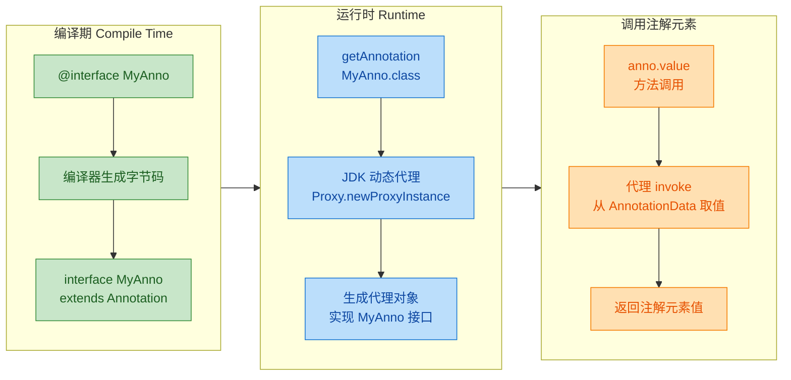

当你调用 `field.getAnnotation(NotNull.class)` 时，JVM 并不是返回一个"真正的 NotNull 实例"（注解是接口，不能直接实例化），而是返回一个由 `sun.reflect.annotation.AnnotationInvocationHandler` 驱动的动态代理对象。这个代理对象内部持有一个 `Map<String, Object>`，key 是注解元素名，value 是对应的值。当你调用 `notNull.message()` 时，代理的 `invoke` 方法从这个 Map 中取出 `"message"` 对应的值并返回。

你可以用以下代码验证这一点：

```java
import java.lang.reflect.Field;
import java.lang.reflect.InvocationHandler;
import java.lang.reflect.Proxy;

public class AnnotationProxyDemo {
    public static void main(String[] args) throws Exception {
        // 获取 UserDTO 的 username 字段
        Field field = UserDTO.class.getDeclaredField("username");
        // 获取该字段上的 @NotNull 注解实例
        NotNull notNull = field.getAnnotation(NotNull.class);

        // 验证注解实例是否是代理对象
        System.out.println("是否为代理对象: " + Proxy.isProxyClass(notNull.getClass()));
        // 输出: 是否为代理对象: true

        // 获取代理背后的 InvocationHandler
        InvocationHandler handler = Proxy.getInvocationHandler(notNull);
        // 输出 handler 的类型
        System.out.println("Handler 类型: " + handler.getClass().getName());
        // 输出: Handler 类型: sun.reflect.annotation.AnnotationInvocationHandler
    }
}
```

---

### 自定义注解的设计原则与最佳实践

在实际项目中设计自定义注解时，以下几条经验值得牢记：

1. 命名要有语义：注解名应当清晰表达意图。`@Cacheable` 比 `@MyAnno1` 好一万倍。注解是给人读的元数据，命名即文档。

2. 合理使用 default：对于大多数场景下都相同的配置项，务必提供默认值，降低使用者的心智负担。只有真正需要使用者"必须思考"的元素才应该省略 default。

3. 优先使用 value 命名：如果注解只有一个核心元素，命名为 `value` 可以让使用者享受简写语法糖，代码更简洁。

4. 搭配元注解：每个自定义注解都应该显式标注 `@Target` 和 `@Retention`。不标注虽然不会编译报错（默认 `@Retention(CLASS)`、`@Target` 全部类型），但会让使用者困惑，也容易引发误用。

5. 注解不是万能的：注解适合声明式的、横切关注点的配置（如校验、缓存、权限、日志等）。如果逻辑本身是命令式的、流程复杂的，硬塞进注解反而会让代码更难理解。

---

**📝 练习题**

以下自定义注解的定义中，哪一个能够通过编译？

A. 
```java
@interface Config {
    Object value();
}
```


B. 
```java
@interface Config {
    String[] value() default null;
}
```


C. 
```java
@interface Config {
    String value() default "";
    int[] ports() default {8080, 8443};
}
```


D. 
```java
@interface Config {
    List<String> names();
}
```


**【答案】** C

**【解析】** 注解元素的返回类型只能是基本类型、String、Class、枚举、注解类型以及这些类型的一维数组。A 选项的 `Object` 不在允许列表中；B 选项的 `default null` 违反了"注解元素默认值不能为 null"的规定；D 选项的 `List<String>` 是集合类型，同样不被允许。只有 C 选项的所有元素类型合法（`String` 和 `int[]`），默认值也都是编译期常量，能够正常通过编译。

---

## 注解元素类型（基本类型、String、Class、枚举、注解、数组）

当我们用 `@interface` 声明一个自定义注解时，注解体内部可以定义若干"注解元素"（Annotation Element）。这些元素本质上是注解接口中的抽象方法，但 Java 语言规范对它们的返回类型做了严格限制——并非任意类型都能充当注解元素的类型。理解这些合法类型，是写出正确、灵活的自定义注解的前提。

Java 语言规范（JLS §9.6.1）明确规定，注解元素的返回类型只能是以下几种：

```
1. 基本数据类型（Primitive Types）：int, long, short, byte, float, double, char, boolean
2. String
3. Class（或带泛型边界的 Class<?>、Class<? extends Xxx>）
4. 枚举类型（Enum）
5. 注解类型（Annotation）
6. 以上任意类型的一维数组（Array）
```

注意：`包装类型`（Integer、Long 等）、`集合`（List、Map 等）、`自定义对象`、`null` 值，统统不允许出现在注解元素的类型声明中。这是因为注解的值必须在编译期就能完全确定（compile-time constant），而上述类型无法满足这一约束。

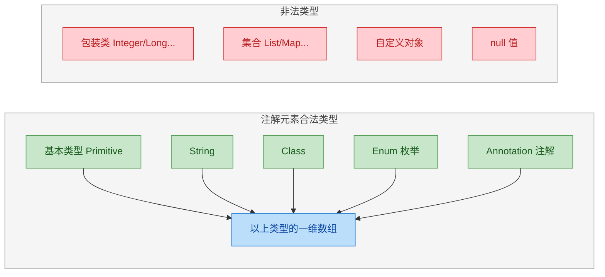

下面我们逐一深入每种合法类型，配合完整的代码示例和原理分析。

---

### 基本数据类型（Primitive Types）

八种基本类型 `int`、`long`、`short`、`byte`、`float`、`double`、`char`、`boolean` 都可以直接作为注解元素的类型。这是最简单、最直观的一类。

```java
import java.lang.annotation.Retention;
import java.lang.annotation.RetentionPolicy;

// 定义一个用于描述数据库字段约束的注解
@Retention(RetentionPolicy.RUNTIME)
public @interface Column {

    // int 类型：指定字段长度，默认 255
    int length() default 255;

    // boolean 类型：是否允许为空，默认 true
    boolean nullable() default true;

    // double 类型：数值精度，默认 0.0
    double precision() default 0.0;

    // char 类型：填充字符，默认空格
    char padChar() default ' ';

    // byte 类型：标志位
    byte flag() default 0;

    // short 类型：排序权重
    short order() default 0;

    // long 类型：最大值限制
    long maxValue() default Long.MAX_VALUE;

    // float 类型：比例因子
    float scale() default 1.0f;
}
```

使用时直接传入字面量即可：

```java
public class User {

    // 使用注解标注字段，指定长度为 50，不允许为空
    @Column(length = 50, nullable = false, padChar = '_')
    private String username;

    // 使用默认值，无需显式传参
    @Column
    private String email;
}
```

有一个非常重要的细节需要强调：注解元素只接受基本类型，不接受对应的包装类型。下面的写法会直接编译报错：

```java
// ❌ 编译错误！Integer 不是合法的注解元素类型
public @interface WrongAnnotation {
    Integer count() default 0;  // 非法：不能使用包装类型
}
```

编译器会报出类似 `invalid type for annotation member` 的错误。原因在于包装类型是对象引用，其值在编译期无法像基本类型字面量那样被完全内联到 class 文件的注解结构中。

```
编译期常量要求（Compile-time Constant Requirement）:

  基本类型字面量 42        →  直接写入 class 文件的常量池  ✅
  包装类型 Integer.valueOf(42) →  需要运行时方法调用       ❌
```

---

### String 类型

`String` 是注解中使用频率最高的元素类型之一。几乎所有框架级注解都会用到它来传递名称、路径、表达式等文本信息。

```java
import java.lang.annotation.Retention;
import java.lang.annotation.RetentionPolicy;

@Retention(RetentionPolicy.RUNTIME)
public @interface RequestMapping {

    // 请求路径，默认为空字符串
    String path() default "";

    // HTTP 方法，默认 GET
    String method() default "GET";

    // 描述信息
    String description() default "No description provided";
}
```

```java
// 使用示例
@RequestMapping(path = "/api/users", method = "POST", description = "创建新用户")
public class UserController {
    // ...
}
```

String 类型的注解元素有一条铁律：默认值不能为 `null`。这是 Java 注解规范的硬性约束。

```java
// ❌ 编译错误！注解元素的默认值不能是 null
public @interface BadAnnotation {
    String value() default null;  // 非法
}
```

这条规则的根源在于：注解值存储在 class 文件的 `RuntimeVisibleAnnotations` 或 `RuntimeInvisibleAnnotations` 属性中，其二进制格式没有为 `null` 预留编码方式。因此，当你需要表达"未设置"的语义时，通常的做法是使用一个特殊的哨兵字符串（sentinel value）：

```java
@Retention(RetentionPolicy.RUNTIME)
public @interface Config {

    // 用空字符串作为"未设置"的哨兵值
    String name() default "";

    // 或者用一个明确的标记字符串
    String dataSource() default "<undefined>";
}
```

然后在运行时通过反射读取时判断：

```java
// 读取注解并判断是否设置了值
Config config = clazz.getAnnotation(Config.class);
if (config != null) {
    // 判断是否使用了默认的哨兵值
    String ds = config.dataSource();
    if (!"<undefined>".equals(ds)) {
        // 用户显式设置了 dataSource，执行相应逻辑
        System.out.println("DataSource: " + ds);
    }
}
```

---

### Class 类型

`Class` 类型让注解能够引用一个具体的类或接口，这在框架设计中极为常见——比如指定序列化器、策略实现类、工厂类等。

```java
import java.lang.annotation.Retention;
import java.lang.annotation.RetentionPolicy;

@Retention(RetentionPolicy.RUNTIME)
public @interface JsonSerialize {

    // 指定序列化器的 Class，默认使用 Void.class 表示"未指定"
    Class<?> using() default Void.class;

    // 带泛型上界约束：只接受 Number 的子类
    Class<? extends Number> numberType() default Integer.class;
}
```

```java
// 自定义序列化器
public class CustomDateSerializer {
    // 序列化逻辑...
}

// 使用注解指定序列化器类
@JsonSerialize(using = CustomDateSerializer.class, numberType = Double.class)
public class Order {
    private String orderDate;
    private double totalAmount;
}
```

注意 `Class` 元素传入的是 `.class` 字面量（class literal），它在编译期就能确定，满足注解的常量要求。

`Class` 类型的默认值选择是一个设计技巧。由于不能用 `null`，框架通常会选择一个语义上表示"空/未指定"的类：

```java
// 常见的"哨兵类"选择策略
public @interface Component {

    // 方案一：使用 Void.class 表示未指定（最常见）
    Class<?> factoryClass() default Void.class;

    // 方案二：使用注解自身作为标记（Spring 的做法）
    // Class<?> value() default Component.class;

    // 方案三：定义一个专用的空标记类
    // Class<?> handler() default DefaultMarker.class;
}
```

运行时判断逻辑：

```java
// 通过反射读取 Class 类型的注解元素
Component comp = clazz.getAnnotation(Component.class);
if (comp != null && comp.factoryClass() != Void.class) {
    // 用户指定了自定义工厂类
    Class<?> factory = comp.factoryClass();
    Object instance = factory.getDeclaredConstructor().newInstance();
    System.out.println("使用自定义工厂: " + factory.getName());
}
```

---

### 枚举类型（Enum）

枚举是注解元素中表达"有限选项集"的最佳类型。相比用 String 传入 `"GET"`、`"POST"` 这样的魔法字符串，枚举提供了编译期类型安全和 IDE 自动补全。

```java
// 定义一个表示 HTTP 方法的枚举
public enum HttpMethod {
    GET, POST, PUT, DELETE, PATCH, HEAD, OPTIONS
}

// 定义一个表示日志级别的枚举
public enum LogLevel {
    TRACE, DEBUG, INFO, WARN, ERROR
}
```

```java
import java.lang.annotation.Retention;
import java.lang.annotation.RetentionPolicy;

@Retention(RetentionPolicy.RUNTIME)
public @interface Api {

    // 使用枚举类型指定 HTTP 方法，默认 GET
    HttpMethod method() default HttpMethod.GET;

    // 使用枚举类型指定日志级别，默认 INFO
    LogLevel logLevel() default LogLevel.INFO;
}
```

```java
// 使用示例：枚举值直接引用，编译期即可检查合法性
@Api(method = HttpMethod.POST, logLevel = LogLevel.DEBUG)
public class PaymentService {
    // ...
}
```

枚举在注解中的优势可以用一个对比来说明：

```java
// ❌ 不推荐：使用 String，容易拼写错误，且无编译期检查
public @interface BadApi {
    String method() default "GET";  // 传入 "GETT" 也不会报错
}

// ✅ 推荐：使用枚举，拼写错误直接编译失败
public @interface GoodApi {
    HttpMethod method() default HttpMethod.GET;  // 类型安全
}
```

在 class 文件中，枚举类型的注解值存储为枚举常量的名称字符串加上枚举类的全限定名，JVM 在加载时通过 `Enum.valueOf()` 还原为枚举实例。这个过程完全确定，不依赖运行时状态。

---

### 注解类型（Annotation as Element）

注解本身也可以作为另一个注解的元素类型，这就形成了"注解嵌套"（Nested Annotation）。这种机制让注解具备了组合和层次化描述的能力，是构建复杂声明式配置的关键手段。

```java
import java.lang.annotation.Retention;
import java.lang.annotation.RetentionPolicy;

// 内层注解：描述单个字段的校验规则
@Retention(RetentionPolicy.RUNTIME)
public @interface Constraint {

    // 校验规则名称
    String name();

    // 规则参数值
    String value() default "";

    // 错误提示信息
    String message() default "Validation failed";
}
```

```java
// 外层注解：将 Constraint 注解作为元素类型嵌套使用
@Retention(RetentionPolicy.RUNTIME)
public @interface ValidField {

    // 字段名
    String fieldName();

    // 嵌套单个注解：主要校验规则
    Constraint primaryRule();

    // 嵌套注解数组：附加校验规则（可选）
    Constraint[] additionalRules() default {};
}
```

```java
// 使用嵌套注解进行声明式校验配置
@ValidField(
    fieldName = "email",
    // 内层注解通过 @Constraint(...) 的形式传入
    primaryRule = @Constraint(
        name = "pattern",
        value = "^[\\w.-]+@[\\w.-]+\\.\\w+$",
        message = "邮箱格式不正确"
    ),
    additionalRules = {
        @Constraint(name = "notBlank", message = "邮箱不能为空"),
        @Constraint(name = "maxLength", value = "100", message = "邮箱长度不能超过100")
    }
)
private String email;
```

嵌套注解在实际框架中非常普遍。以 Spring 的 `@ComponentScan` 为例，它内部就嵌套了 `@Filter` 注解来描述包扫描的过滤规则。我们来看一个简化的模拟：

```java
// 模拟 Spring 的 Filter 注解
@Retention(RetentionPolicy.RUNTIME)
public @interface Filter {
    String type() default "ANNOTATION";  // 过滤类型
    Class<?>[] classes() default {};     // 过滤的目标类
}

// 模拟 Spring 的 ComponentScan 注解
@Retention(RetentionPolicy.RUNTIME)
public @interface ComponentScan {
    String[] basePackages() default {};

    // 嵌套 Filter 注解数组：包含过滤器
    Filter[] includeFilters() default {};

    // 嵌套 Filter 注解数组：排除过滤器
    Filter[] excludeFilters() default {};
}
```

```java
// 使用示例：声明式地配置组件扫描策略
@ComponentScan(
    basePackages = {"com.example.service", "com.example.dao"},
    includeFilters = {
        @Filter(type = "ANNOTATION", classes = {Service.class})
    },
    excludeFilters = {
        @Filter(type = "REGEX", classes = {})
    }
)
public class AppConfig {
    // Spring 容器启动时会解析这些嵌套注解
}
```

嵌套注解的结构可以用下图直观理解：

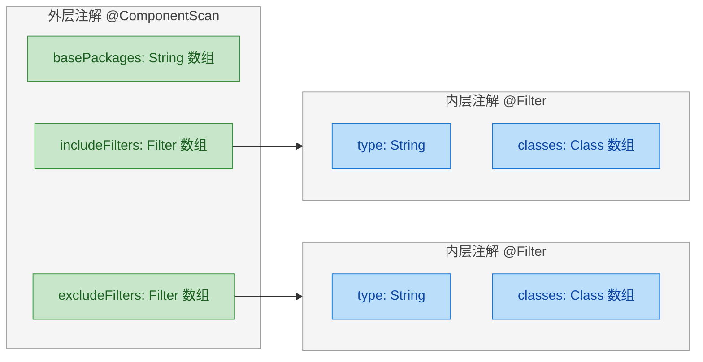

---

### 数组类型（Array）

前面提到的所有合法类型——基本类型、String、Class、枚举、注解——都可以声明为一维数组形式。数组让单个注解元素能够接收多个值，极大地增强了注解的表达力。

```java
import java.lang.annotation.Retention;
import java.lang.annotation.RetentionPolicy;

@Retention(RetentionPolicy.RUNTIME)
public @interface Permission {

    // String 数组：允许的角色列表
    String[] roles() default {};

    // int 数组：允许的权限级别
    int[] levels() default {1, 2, 3};

    // Class 数组：允许的处理器类
    Class<?>[] handlers() default {};

    // 枚举数组：允许的 HTTP 方法
    HttpMethod[] methods() default {HttpMethod.GET};

    // 注解数组：多个校验约束（前面已演示过）
    Constraint[] constraints() default {};
}
```

数组类型在使用时有一个语法糖值得注意：当数组只有一个元素时，可以省略花括号。

```java
// 多个元素：必须使用花括号
@Permission(roles = {"ADMIN", "MANAGER"}, methods = {HttpMethod.GET, HttpMethod.POST})
public void manageUsers() {}

// 单个元素：可以省略花括号（语法糖）
@Permission(roles = "ADMIN", methods = HttpMethod.GET)
public void viewDashboard() {}

// 空数组：使用空花括号
@Permission(roles = {}, methods = {})
public void publicEndpoint() {}
```

需要特别强调的是：注解只支持一维数组，不支持多维数组。

```java
// ❌ 编译错误！不支持二维数组
public @interface Matrix {
    int[][] data();  // 非法
}

// ✅ 如果确实需要表达矩阵，只能用 String 编码后运行时解析
public @interface Matrix {
    String[] rows() default {};  // 每个 String 编码一行，如 "1,2,3"
}
```

---

### 综合实战：完整的注解元素类型演示

下面用一个完整的例子把所有合法类型串联起来，模拟一个"API 接口文档注解"：

```java
import java.lang.annotation.*;

// 响应码描述（内层注解）
@Retention(RetentionPolicy.RUNTIME)
public @interface ResponseCode {
    int code();                    // 基本类型 int
    String description();          // String 类型
}
```

```java
// API 版本枚举
public enum ApiVersion {
    V1, V2, V3
}
```

```java
import java.lang.annotation.*;

// API 文档注解（外层注解，综合使用所有合法类型）
@Retention(RetentionPolicy.RUNTIME)
@Target(ElementType.METHOD)
public @interface ApiDoc {

    // 1. String 类型：接口名称
    String name();

    // 2. String 类型：接口描述，带默认值
    String description() default "暂无描述";

    // 3. 基本类型 int：超时时间（毫秒）
    int timeout() default 3000;

    // 4. 基本类型 boolean：是否需要认证
    boolean requireAuth() default true;

    // 5. 枚举类型：API 版本
    ApiVersion version() default ApiVersion.V1;

    // 6. Class 类型：响应体的序列化器
    Class<?> serializer() default Void.class;

    // 7. 注解类型（嵌套注解）：成功响应码
    ResponseCode successResponse() default @ResponseCode(code = 200, description = "OK");

    // 8. String 数组：标签
    String[] tags() default {};

    // 9. 枚举数组：支持的 HTTP 方法
    HttpMethod[] methods() default {HttpMethod.GET};

    // 10. 注解数组：错误响应码列表
    ResponseCode[] errorResponses() default {};
}
```

```java
// 实际使用：一个注解涵盖了所有合法元素类型
public class UserApi {

    @ApiDoc(
        name = "获取用户信息",                              // String
        description = "根据用户ID查询详细信息",               // String
        timeout = 5000,                                    // int
        requireAuth = true,                                // boolean
        version = ApiVersion.V2,                           // 枚举
        serializer = CustomSerializer.class,               // Class
        successResponse = @ResponseCode(                   // 嵌套注解
            code = 200,
            description = "成功返回用户信息"
        ),
        tags = {"用户模块", "查询接口"},                     // String 数组
        methods = {HttpMethod.GET, HttpMethod.POST},       // 枚举数组
        errorResponses = {                                 // 注解数组
            @ResponseCode(code = 404, description = "用户不存在"),
            @ResponseCode(code = 403, description = "无权限访问")
        }
    )
    public Object getUserById(long id) {
        return null;
    }
}
```

通过反射读取这个注解的完整信息：

```java
import java.lang.reflect.Method;

public class ApiDocReader {
    public static void main(String[] args) throws Exception {
        // 获取目标方法
        Method method = UserApi.class.getMethod("getUserById", long.class);

        // 读取 @ApiDoc 注解
        ApiDoc doc = method.getAnnotation(ApiDoc.class);

        if (doc != null) {
            // 读取各种类型的元素值
            System.out.println("接口名称: " + doc.name());                    // String
            System.out.println("超时时间: " + doc.timeout() + "ms");          // int
            System.out.println("需要认证: " + doc.requireAuth());             // boolean
            System.out.println("API版本: " + doc.version());                  // 枚举
            System.out.println("序列化器: " + doc.serializer().getName());    // Class

            // 读取嵌套注解
            ResponseCode success = doc.successResponse();                     // 注解
            System.out.println("成功码: " + success.code() + " - " + success.description());

            // 读取数组
            System.out.println("标签: " + String.join(", ", doc.tags()));     // String[]

            // 读取注解数组
            for (ResponseCode err : doc.errorResponses()) {                   // 注解数组
                System.out.println("错误码: " + err.code() + " - " + err.description());
            }
        }
    }
}
```

输出结果：

```
接口名称: 获取用户信息
超时时间: 5000ms
需要认证: true
API版本: V2
序列化器: com.example.CustomSerializer
成功码: 200 - 成功返回用户信息
标签: 用户模块, 查询接口
错误码: 404 - 用户不存在
错误码: 403 - 无权限访问
```

---

### 注解元素的默认值规则总结

关于 `default` 关键字，有几条规则需要牢记：

```java
@Retention(RetentionPolicy.RUNTIME)
public @interface DefaultRules {

    // ✅ 基本类型可以用字面量作默认值
    int count() default 10;

    // ✅ String 可以用字符串字面量
    String name() default "default";

    // ✅ Class 可以用 .class 字面量
    Class<?> type() default Object.class;

    // ✅ 枚举可以用枚举常量
    HttpMethod method() default HttpMethod.GET;

    // ✅ 注解可以用 @Xxx(...) 形式
    ResponseCode code() default @ResponseCode(code = 0, description = "none");

    // ✅ 数组可以用花括号
    String[] tags() default {"default"};

    // ✅ 空数组
    int[] ids() default {};

    // ❌ 不能用 null
    // String bad() default null;  // 编译错误
}
```

所有默认值都必须是编译期常量表达式（Constant Expression），这意味着不能调用方法、不能引用非 final 变量、不能使用 `new` 关键字。

```mermaid
graph LR
    subgraph Legal["合法默认值"]
        direction TB
        L1["字面量: 42, 3.14, true"]
        L2["字符串: 'hello'"]
        L3["类字面量: String.class"]
        L4["枚举常量: HttpMethod.GET"]
        L5["注解实例: @Code&#40;val=1&#41;"]
        L6["数组: &#123;1, 2, 3&#125;"]
        L7["常量表达式: 2 + 3"]
    end

    subgraph Illegal2["非法默认值"]
        direction TB
        I1["null"]
        I2["方法调用: getValue&#40;&#41;"]
        I3["new 对象: new String&#40;&#41;"]
        I4["非 final 变量引用"]
    end

    classDef legalCls fill:#C8E6C9,stroke:#388E3C,color:#1B5E20
    classDef illegalCls fill:#FFCDD2,stroke:#D32F2F,color:#B71C1C
    classDef groupCls fill:#F5F5F5,stroke:#9E9E9E,color:#424242

    class L1,L2,L3,L4,L5,L6,L7 legalCls
    class I1,I2,I3,I4 illegalCls
    class Legal,Illegal2 groupCls
```

---

### 底层视角：注解元素在 Class 文件中的存储

理解注解元素类型限制的根本原因，需要看一眼 class 文件的二进制结构。注解信息存储在 `RuntimeVisibleAnnotations` 属性中，每个元素值（element_value）用一个 tag 字节标识类型：

```java
// Class 文件中 element_value 的 tag 编码表
// tag 字节  |  类型
// ---------+------------------
//   'B'    |  byte
//   'C'    |  char
//   'D'    |  double
//   'F'    |  float
//   'I'    |  int
//   'J'    |  long
//   'S'    |  short
//   'Z'    |  boolean
//   's'    |  String
//   'e'    |  enum (枚举类型描述符 + 常量名)
//   'c'    |  class (类描述符字符串)
//   '@'    |  annotation (嵌套注解结构)
//   '['    |  array (元素数量 + element_value 列表)
```

这张表完美对应了我们讨论的六大类型。JVM 规范只为这些 tag 定义了解析逻辑，所以任何超出此范围的类型都无法被编码和存储——这就是类型限制的根本原因。

---

**📝 练习题**

以下哪个注解定义能够通过编译？

A. `@interface A { Integer value() default 0; }`


B. `@interface B { String value() default null; }`


C. `@interface C { int[][] matrix() default {}; }`


D. `@interface D { Class<? extends Runnable> task() default Void.class; }`


**【答案】** D

**【解析】** 逐项分析：
- A 错误：`Integer` 是包装类型，不是基本类型，不能作为注解元素类型。注解只接受 `int`，不接受 `Integer`。
- B 错误：注解元素的默认值不允许为 `null`，这是 JLS 的硬性规定。
- C 错误：注解只支持一维数组，`int[][]` 是二维数组，不合法。
- D 正确：`Class<? extends Runnable>` 是合法的 注解元素的返回类型只能是基本类型、String、Class、枚举、注解类型以及这些类型的一维数组。

---

## @Retention 详解 ⭐（SOURCE / CLASS / RUNTIME）

`@Retention` 是所有元注解中最关键的一个，它决定了注解的"寿命"——即注解信息在 Java 程序的哪个阶段依然存活。理解它，就等于理解了注解从源码到运行时的完整生命周期。

`@Retention` 本身接收一个 `RetentionPolicy` 枚举值，该枚举定义了三个常量：`SOURCE`、`CLASS`、`RUNTIME`。这三个值分别对应 Java 程序生命周期中的三个阶段。我们先从宏观视角看清全貌，再逐一深入。

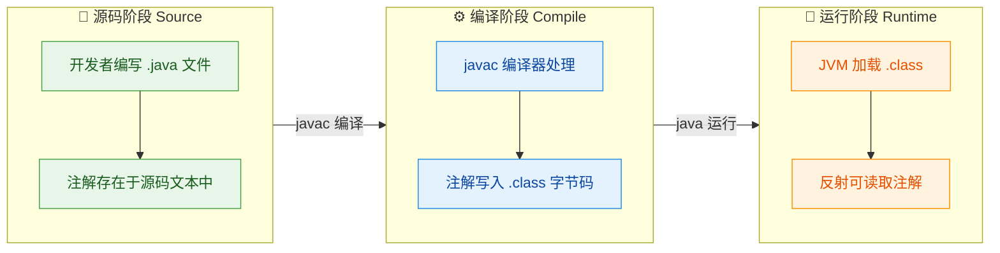

上图展示了 Java 程序从 `.java` 源码到 `.class` 字节码再到 JVM 运行的三个阶段。`@Retention` 的三个策略值，分别控制注解在哪个阶段被"丢弃"。

### RetentionPolicy.SOURCE —— 阅后即焚，编译即丢

`SOURCE` 策略意味着注解仅保留在源码中。当 `javac` 编译器完成编译后，这类注解会被彻底丢弃，不会出现在 `.class` 字节码文件里。

这类注解的核心用途是：给编译器看的"便签纸"。编译器读取它、执行相应检查或代码生成，然后扔掉。

典型代表就是我们熟悉的 `@Override`：

```java
// @Override 的定义（JDK 源码节选）
@Target(ElementType.METHOD)        // 只能标注在方法上
@Retention(RetentionPolicy.SOURCE) // 仅在源码阶段存活
public @interface Override {
    // 无注解元素，纯标记型注解
}
```

```java
public class Animal {
    public void speak() {
        System.out.println("...");
    }
}

public class Dog extends Animal {

    @Override  // 编译器在此处检查：speak() 是否真的覆盖了父类方法？
    public void speak() {
        System.out.println("Woof!");
    }

    // 如果手误写成 speck()，编译器会立刻报错：
    // "method does not override or implement a method from a supertype"
    // @Override
    // public void speck() { }  // ← 编译失败
}
```

编译完成后，你用 `javap -v Dog.class` 反编译字节码，会发现 `@Override` 的痕迹已经完全消失。它完成了使命，就安静退场了。

另一个经典例子是 Lombok 的 `@Getter`、`@Setter`。Lombok 通过注解处理器（Annotation Processor）在编译期读取这些 SOURCE 级注解，自动生成 getter/setter 的字节码，注解本身不会残留在 `.class` 中：

```java
// Lombok 的 @Getter 也是 SOURCE 级别
// 编译期间，Annotation Processor 读取它并生成 getName() 方法
// 编译完成后，@Getter 注解从 .class 中消失
@Getter
@Setter
public class User {
    private String name; // 编译后自动拥有 getName() 和 setName()
}
```

SOURCE 级注解的工作机制可以用一句话概括：它是写给编译器或注解处理器的"指令"，任务完成即销毁。

### RetentionPolicy.CLASS —— 默认策略，沉默的中间层

`CLASS` 是 `@Retention` 的默认值。如果你定义注解时不写 `@Retention`，那它就是 `CLASS` 级别。

CLASS 策略意味着：注解会被编译器写入 `.class` 字节码文件，但当 JVM 加载这个类时，不会把注解信息加载到内存中。换句话说，运行时通过反射是读不到这类注解的。

```java
// 没有显式声明 @Retention，默认就是 CLASS
@Target(ElementType.FIELD)
public @interface MyClassAnnotation {
    String value() default "default";
}
```

这个策略听起来有点尴尬——编译后保留了，运行时又读不到，那它存在的意义是什么？

答案是：它服务于字节码级别的工具。有些框架和工具并不在运行时工作，而是直接分析或操作 `.class` 文件。比如：

- 字节码增强工具（ASM、ByteBuddy）可以在类加载前扫描 `.class` 文件中的注解信息，据此修改字节码。
- 静态分析工具（FindBugs / SpotBugs）读取 `.class` 文件中的注解来执行代码质量检查。
- Android 开发中的一些编译时注解也采用 CLASS 级别，因为 Android 的 Dalvik/ART 虚拟机对注解的处理方式与标准 JVM 不同。

一个实际的例子是 `@NonNull`（来自 `javax.annotation` 或 `androidx.annotation`）。部分实现采用 CLASS 级别，让静态分析工具在字节码层面检测空指针风险，而不需要在运行时付出反射的性能开销。

```java
// 某些 @NonNull 实现采用 CLASS 级别
// 静态分析工具读取 .class 中的注解信息来检查空安全
public void process(@NonNull String input) {
    // 如果调用方传入 null，静态分析工具会发出警告
    // 但运行时反射无法感知这个注解
    System.out.println(input.length());
}
```

我们可以用代码验证 CLASS 级注解在运行时的"隐身"效果：

```java
import java.lang.annotation.*;

// 显式声明为 CLASS 级别
@Retention(RetentionPolicy.CLASS)
@Target(ElementType.TYPE)
@interface InvisibleAtRuntime {
    String info() default "you can't see me";
}

@InvisibleAtRuntime(info = "I exist in bytecode only")
public class Ghost {
    public static void main(String[] args) {
        // 尝试通过反射获取注解
        Annotation[] annotations = Ghost.class.getAnnotations();

        System.out.println("运行时可见的注解数量: " + annotations.length);
        // 输出: 运行时可见的注解数量: 0

        // 直接尝试获取特定注解
        InvisibleAtRuntime ann = Ghost.class.getAnnotation(InvisibleAtRuntime.class);
        System.out.println("获取结果: " + ann);
        // 输出: 获取结果: null
    }
}
```

尽管 `@InvisibleAtRuntime` 确实被写入了 `Ghost.class` 字节码（你可以用 `javap -v Ghost.class` 看到它），但 JVM 在加载类时选择性地忽略了它，反射 API 自然也就无从获取。

在实际开发中，CLASS 级别的使用频率远低于 SOURCE 和 RUNTIME。大多数时候，你要么只需要编译期检查（SOURCE），要么需要运行时反射读取（RUNTIME）。CLASS 级别更像是一个为特定工具链预留的"中间地带"。

### RetentionPolicy.RUNTIME —— 全程存活，反射可达

`RUNTIME` 是最强的保留策略。注解不仅写入 `.class` 字节码，还会在 JVM 加载类时被保留到内存中，使得运行时可以通过反射 API 完整读取。

这是实际开发中使用最广泛的策略。几乎所有需要在程序运行期间动态读取注解信息的框架，都依赖 RUNTIME 级别：Spring 的 `@Component`、`@Autowired`，JUnit 的 `@Test`，JPA 的 `@Entity`，Jackson 的 `@JsonProperty`……全部都是 RUNTIME。

```java
import java.lang.annotation.*;
import java.lang.reflect.*;

// 定义一个 RUNTIME 级别的注解
@Retention(RetentionPolicy.RUNTIME) // 运行时可通过反射读取
@Target(ElementType.METHOD)         // 只能标注在方法上
@interface ApiEndpoint {
    String path();                  // 请求路径
    String method() default "GET";  // HTTP 方法，默认 GET
}

public class UserController {

    @ApiEndpoint(path = "/users", method = "GET")
    public void listUsers() {
        System.out.println("返回用户列表");
    }

    @ApiEndpoint(path = "/users", method = "POST")
    public void createUser() {
        System.out.println("创建新用户");
    }

    // 模拟一个简易的"框架引擎"：扫描注解并注册路由
    public static void main(String[] args) {
        // 获取 UserController 类中所有声明的方法
        Method[] methods = UserController.class.getDeclaredMethods();

        for (Method m : methods) {
            // 检查方法上是否存在 @ApiEndpoint 注解
            if (m.isAnnotationPresent(ApiEndpoint.class)) {
                // 通过反射读取注解实例
                ApiEndpoint ep = m.getAnnotation(ApiEndpoint.class);

                // 读取注解元素的值
                System.out.println("注册路由: " + ep.method() + " " + ep.path()
                        + " -> " + m.getName() + "()");
            }
        }
    }
}
```

运行输出：

```
注册路由: GET /users -> listUsers()
注册路由: POST /users -> createUser()
```

这段代码浓缩了 Spring MVC `@RequestMapping` 的核心思想。框架在启动时扫描所有类的方法，通过反射读取 RUNTIME 注解，将路径与方法绑定，构建路由表。没有 RUNTIME 级别的注解，这一切都不可能实现。

反射 API 提供了一组完整的方法来操作 RUNTIME 注解：

```java
// ===== 反射读取注解的核心 API =====

Class<?> clazz = UserController.class;

// 1. 获取类上所有 RUNTIME 注解
Annotation[] classAnns = clazz.getAnnotations();

// 2. 获取类上特定类型的注解（找不到返回 null）
ApiEndpoint ep = clazz.getAnnotation(ApiEndpoint.class);

// 3. 判断类上是否存在某注解
boolean hasIt = clazz.isAnnotationPresent(ApiEndpoint.class);

// 4. 获取方法上的注解
Method method = clazz.getMethod("listUsers");
ApiEndpoint methodEp = method.getAnnotation(ApiEndpoint.class);

// 5. 获取字段上的注解
Field field = clazz.getDeclaredField("someField");
Annotation[] fieldAnns = field.getAnnotations();

// 6. 获取方法参数上的注解
Parameter[] params = method.getParameters();
for (Parameter p : params) {
    Annotation[] paramAnns = p.getAnnotations(); // 参数级别的注解
}
```

### 三种策略的对比总览

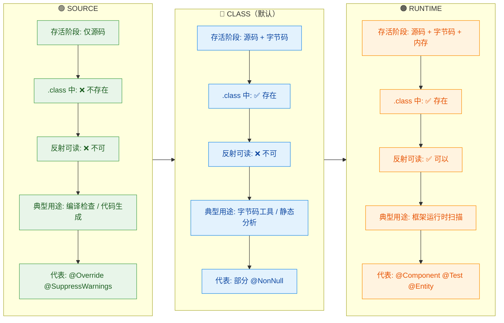

用一个更直观的比喻来理解三者的关系：

- `SOURCE` 像是工地上的施工图纸标注——建筑完工后，标注就没用了，不会嵌入墙体。
- `CLASS` 像是混凝土里预埋的钢筋标记——建筑完工后标记还在结构里，但住户看不到也摸不到。
- `RUNTIME` 像是楼层指示牌——建筑完工后依然可见，任何人（反射）都能读取。

### 实战：用 RUNTIME 注解实现一个简易测试框架

为了把 `@Retention(RUNTIME)` 的价值展现得更具体，我们来实现一个极简版的测试框架，模拟 JUnit 的核心逻辑：

```java
import java.lang.annotation.*;
import java.lang.reflect.*;

// 1. 定义 @SimpleTest 注解 —— 标记哪些方法是测试方法
@Retention(RetentionPolicy.RUNTIME) // 必须 RUNTIME，否则反射读不到
@Target(ElementType.METHOD)         // 只能标注在方法上
@interface SimpleTest {
    String description() default ""; // 可选的测试描述
}

// 2. 编写测试类
class CalculatorTest {

    @SimpleTest(description = "测试加法")
    public void testAdd() {
        int result = 1 + 1;          // 执行加法
        assert result == 2 : "加法结果应为2"; // 断言验证
        System.out.println("  ✅ 1 + 1 = " + result);
    }

    @SimpleTest(description = "测试除零异常")
    public void testDivideByZero() {
        try {
            int result = 10 / 0;     // 故意触发异常
            System.out.println("  ❌ 未抛出异常");
        } catch (ArithmeticException e) {
            System.out.println("  ✅ 正确捕获: " + e.getMessage());
        }
    }

    // 这个方法没有 @SimpleTest，框架会忽略它
    public void helperMethod() {
        System.out.println("我不是测试方法，不会被执行");
    }
}

// 3. 测试框架引擎 —— 扫描并执行所有 @SimpleTest 方法
public class SimpleTestRunner {
    public static void main(String[] args) throws Exception {
        Class<?> testClass = CalculatorTest.class; // 要扫描的测试类
        Object instance = testClass.getDeclaredConstructor().newInstance(); // 创建实例

        int passed = 0;  // 通过计数
        int failed = 0;  // 失败计数

        // 遍历所有声明的方法
        for (Method method : testClass.getDeclaredMethods()) {
            // 只处理带有 @SimpleTest 注解的方法
            if (method.isAnnotationPresent(SimpleTest.class)) {
                SimpleTest ann = method.getAnnotation(SimpleTest.class); // 读取注解
                String desc = ann.description().isEmpty()
                        ? method.getName()   // 没有描述就用方法名
                        : ann.description(); // 有描述就用描述

                System.out.println("▶ 运行: " + desc);
                try {
                    method.invoke(instance);  // 通过反射调用测试方法
                    passed++;                 // 没有异常，测试通过
                } catch (Exception e) {
                    failed++;                 // 抛出异常，测试失败
                    System.out.println("  ❌ 失败: " + e.getCause().getMessage());
                }
            }
        }

        // 输出测试报告
        System.out.println("\n===== 测试报告 =====");
        System.out.println("通过: " + passed + ", 失败: " + failed);
    }
}
```

运行输出：

```
▶ 运行: 测试加法
  ✅ 1 + 1 = 2
▶ 运行: 测试除零异常
  ✅ 正确捕获: / by zero

===== 测试报告 =====
通过: 2, 失败: 0
```

这就是 JUnit 的核心原理。`@Test` 注解之所以能让框架"发现"测试方法，正是因为它被声明为 `@Retention(RUNTIME)`，使得 JUnit 引擎可以在运行时通过反射扫描到它。如果把 `@SimpleTest` 的 Retention 改为 SOURCE 或 CLASS，`method.isAnnotationPresent(SimpleTest.class)` 将永远返回 `false`，整个框架立刻失效。

### 如何选择 Retention 策略

在实际开发中，选择策略的决策路径非常清晰：

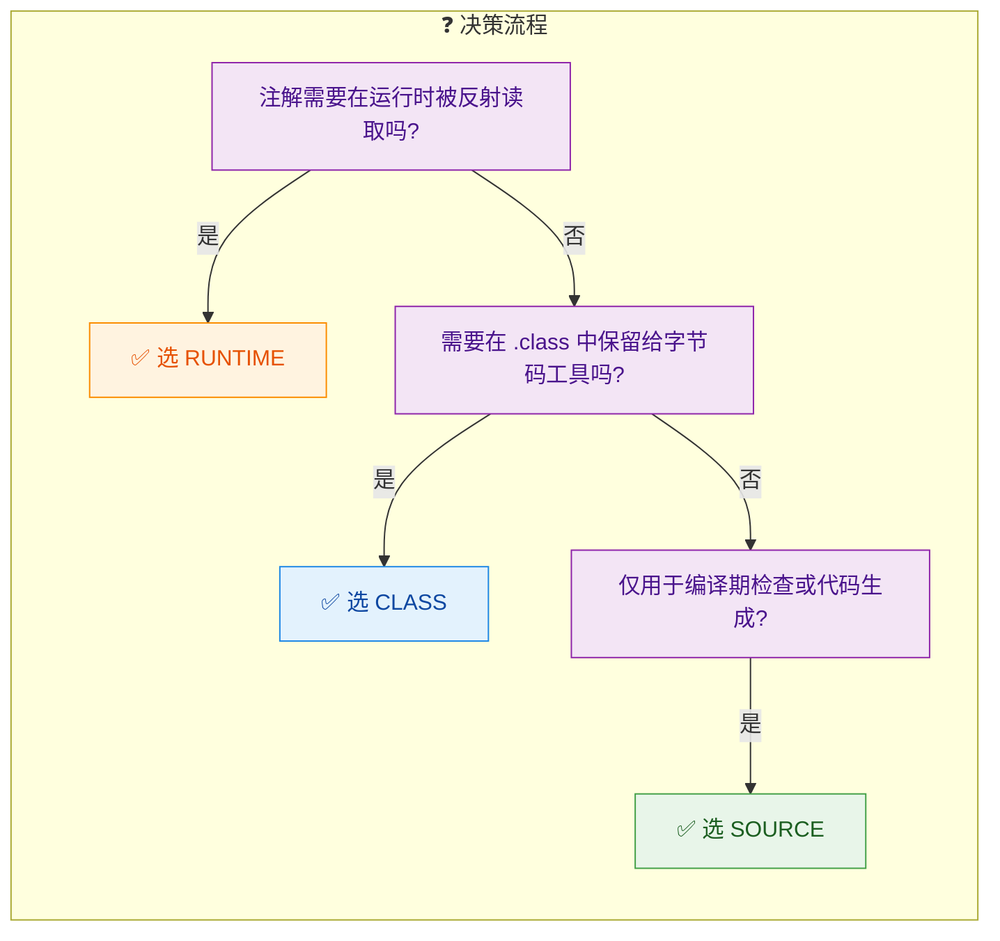

一条经验法则：如果你不确定选什么，选 `RUNTIME`。它的"能力范围"最大，虽然会有微小的内存开销（注解信息常驻内存），但在绝大多数场景下这点开销完全可以忽略。只有当你明确知道注解不需要在运行时存在时，才考虑降级到 CLASS 或 SOURCE。

---

**📝 练习题**

以下代码中，`@Audit` 注解能否在运行时通过反射被读取？

```java
@Target(ElementType.METHOD)
@interface Audit {
    String operator();
}

class OrderService {
    @Audit(operator = "admin")
    public void deleteOrder(long orderId) { /* ... */ }
}

// 测试代码
Method m = OrderService.class.getMethod("deleteOrder", long.class);
Audit a = m.getAnnotation(Audit.class);
System.out.println(a);
```

A. 可以读取，输出 `@Audit(operator="admin")`

B. 不能读取，输出 `null`，因为 `@Audit` 没有声明 `@Retention`，默认为 CLASS 级别

C. 编译报错，因为 `@Audit` 缺少 `@Retention` 声明

D. 运行时抛出 `NullPointerException`


**【答案】** B

**【解析】** `@Audit` 没有显式声明 `@Retention`，Java 默认使用 `RetentionPolicy.CLASS`。CLASS 级别的注解会被写入 `.class` 字节码，但 JVM 加载类时不会将其保留到内存中，因此反射 API `getAnnotation()` 返回 `null`。代码不会编译报错（`@Retention` 不是必须的），也不会抛异常（`getAnnotation` 找不到注解时返回 `null` 而非抛异常）。要让反射能读取到 `@Audit`，需要显式添加 `@Retention(RetentionPolicy.RUNTIME)`。这道题的核心考点就是：忘记写 `@Retention` 是一个非常常见的 bug，默认的 CLASS 策略在大多数业务场景下并不是你想要的。

---

## 本章小结

注解（Annotation）是 Java 5 引入的一项核心语言特性，它的本质是一种**结构化的元数据**（metadata），即"描述数据的数据"。回顾整章内容，我们从概念出发，逐步深入到注解的内部机制与实战应用，这里做一次系统性的回顾与升华。

### 注解的本质与定位

注解并不直接改变程序的运行逻辑，它更像是贴在代码元素上的一张张"标签"。这些标签本身没有行为，但**工具链**（编译器、框架、自定义处理器）可以读取这些标签，并据此做出决策。这种设计体现了一种重要的软件工程思想——**声明式编程**（Declarative Programming）：开发者只需声明"是什么"，而不必关心"怎么做"。

从 Java 的类型体系来看，所有注解都隐式继承自 `java.lang.annotation.Annotation` 接口。用 `@interface` 定义注解时，编译器会自动完成这个继承关系。因此注解在 JVM 层面就是一个特殊的接口，而我们在运行时通过反射拿到的注解实例，实际上是 JDK 动态代理生成的代理对象。

```java
// 我们写的注解定义
public @interface MyAnnotation {
    String value();
}

// 编译器实际生成的等价形式（概念性展示）
public interface MyAnnotation extends java.lang.annotation.Annotation {
    String value();
}
```

### 三层注解体系总览

整章内容可以按照"使用者视角"划分为三个层次，它们之间的关系如下：

```mermaid
graph LR
    subgraph L1["第一层：直接使用"]
        direction TB
        A["内置注解"]
        A1["@Override"]
        A2["@Deprecated"]
        A3["@SuppressWarnings"]
        A --> A1
        A --> A2
        A --> A3
    end

    subgraph L2["第二层：自定义注解"]
        direction TB
        B["@interface 定义注解"]
        B1["注解元素声明"]
        B2["default 默认值"]
        B3["元素类型约束"]
        B --> B1
        B --> B2
        B --> B3
    end

    subgraph L3["第三层：元注解控制"]
        direction TB
        C["元注解"]
        C1["@Target"]
        C2["@Retention"]
        C3["@Inherited"]
        C4["@Repeatable"]
        C --> C1
        C --> C2
        C --> C3
        C --> C4
    end

    L1 -->|"想自己造？"| L2
    L2 -->|"需要精确控制"| L3

    classDef layerOne fill:#C8E6C9,stroke:#388E3C,color:#1B5E20
    classDef layerTwo fill:#BBDEFB,stroke:#1976D2,color:#0D47A1
    classDef layerThree fill:#FFE0B2,stroke:#F57C20,color:#E65100
    classDef itemOne fill:#E8F5E9,stroke:#66BB6A,color:#2E7D32
    classDef itemTwo fill:#E3F2FD,stroke:#64B5F6,color:#1565C0
    classDef itemThree fill:#FFF3E0,stroke:#FFB74D,color:#BF360C

    class A layerOne
    class A1,A2,A3 itemOne
    class B layerTwo
    class B1,B2,B3 itemTwo
    class C layerThree
    class C1,C2,C3,C4 itemThree
```

这三层的关系非常清晰：内置注解是 JDK 提供的"开箱即用"工具；当内置注解不够用时，我们通过 `@interface` 自定义注解；而元注解则是用来精确控制自定义注解行为的"注解的注解"。

### 内置注解：编译期的守护者

三个最常用的内置注解各司其职：

`@Override` 是一个纯编译期检查注解（Retention 为 SOURCE），它的价值在于**让编译器帮你捕获拼写错误和签名不匹配**。没有它，一个本意是重写父类方法的 `tostring()` 会被编译器当作全新方法，悄无声息地通过编译，直到运行时才暴露问题。这个注解的成本为零，收益极高，应当成为编码习惯。

`@Deprecated` 标记已过时的 API，从 Java 9 开始增加了 `since` 和 `forRemoval` 两个属性，使得废弃信息更加精确。它的 Retention 为 RUNTIME，意味着框架可以在运行时检测到某个 API 已被废弃。

`@SuppressWarnings` 用于抑制编译器警告，它的 Retention 为 SOURCE，仅在编译阶段生效。使用时应遵循**最小作用域原则**——能加在局部变量上就不要加在方法上，能加在方法上就不要加在类上。

### 元注解：注解的"基因编辑器"

元注解决定了一个自定义注解的**能力边界**，是整章最核心的知识点。

`@Target` 控制注解能贴在哪里。`ElementType` 枚举提供了 TYPE、METHOD、FIELD、PARAMETER 等多种选项。如果不指定 `@Target`，注解默认可以用在几乎所有位置，但这通常不是好的设计——**明确的约束就是最好的文档**。

`@Retention` 控制注解能活多久，这是理解注解工作机制的关键：

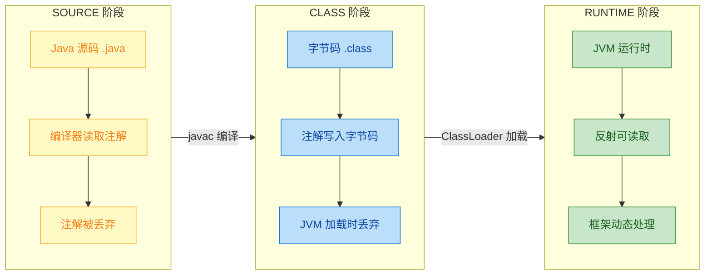

三种保留策略对应三种典型场景：SOURCE 用于编译期检查（如 `@Override`、Lombok 的 `@Data`）；CLASS 用于字节码增强工具（如某些 AOP 框架在类加载前的织入）；RUNTIME 用于运行时反射驱动的框架（如 Spring 的 `@Autowired`、JUnit 的 `@Test`）。绝大多数自定义注解选择 RUNTIME，因为我们通常需要在运行时读取注解信息。

`@Inherited` 让注解具备继承性，但仅对**类**生效，对接口和方法无效。这在框架设计中很有用——比如一个标记在基类上的 `@Transactional`，子类可以自动继承这个事务语义。

`@Repeatable`（Java 8+）允许同一个注解在同一位置重复使用，但需要定义一个"容器注解"来承载多个重复注解。这本质上是一个语法糖，编译器会自动将多个重复注解包装进容器注解中。

### 自定义注解：从定义到约束

自定义注解通过 `@interface` 关键字定义，注解内部的"方法"称为**注解元素**（Annotation Element），它们看起来像方法声明，但实际上定义的是注解的属性。

注解元素的类型有严格限制，只允许以下八种：

| 类别 | 具体类型 |
|------|---------|
| 基本类型 | `int`, `long`, `double`, `boolean` 等八种 |
| String | `String` |
| Class | `Class` 或带通配符的 `Class<? extends X>` |
| 枚举 | 任意枚举类型 |
| 注解 | 其他注解类型（实现注解嵌套） |
| 以上类型的数组 | 如 `String[]`, `int[]` |

不允许使用包装类型（`Integer`）、集合类型（`List`）或自定义对象。这个限制源于注解信息需要在编译期写入字节码，必须是**编译期常量**或可序列化为常量池的类型。

`default` 关键字为注解元素提供默认值，有默认值的元素在使用时可以省略。特别地，当注解只有一个名为 `value` 的元素（或其他元素都有默认值）时，可以省略 `value =`，直接传值，这是 Java 为注解提供的语法便利。

### @Retention 的深层理解

`@Retention` 值得单独强调，因为它直接决定了注解的**可用性边界**。一个常见的错误是：定义了注解却忘记指定 `@Retention(RetentionPolicy.RUNTIME)`，然后在运行时通过反射怎么也读不到——因为默认的保留策略是 CLASS，注解信息虽然写入了字节码，但 JVM 加载类时会将其丢弃。

从性能角度看，SOURCE 级别的注解对运行时零开销；CLASS 级别会增加 `.class` 文件体积但不影响运行时内存；RUNTIME 级别的注解会被加载到内存中，通过反射访问时有一定的性能成本（JDK 内部有缓存机制来缓解）。

### 注解在现代 Java 生态中的地位

注解已经成为 Java 生态的基石。Spring 框架用 `@Component`、`@Autowired`、`@RequestMapping` 等注解替代了冗长的 XML 配置；JPA 用 `@Entity`、`@Table`、`@Column` 实现对象关系映射；JUnit 用 `@Test`、`@BeforeEach` 组织测试生命周期；Lombok 用 `@Data`、`@Builder` 在编译期生成样板代码。

理解注解的底层机制——从 `@interface` 的定义语法，到元注解的精确控制，再到 `@Retention` 决定的生命周期——是深入理解这些框架的前提。当你知道 Spring 的 `@Autowired` 是一个 RUNTIME 级别的注解，通过反射被 `AutowiredAnnotationBeanPostProcessor` 读取并触发依赖注入时，Spring 的"魔法"就不再神秘了。

### 核心知识速查表

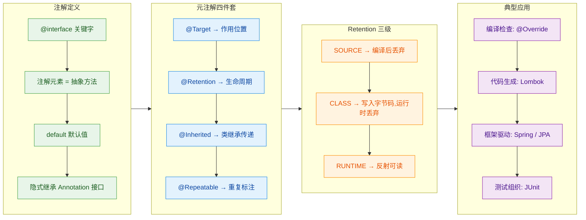

掌握了本章内容，你就拥有了阅读和理解任何 Java 框架注解源码的能力。下一步可以尝试：用自定义注解 + 反射实现一个简易的依赖注入容器，或者用注解处理器（Annotation Processor）在编译期生成代码——这些都是本章知识的自然延伸。

---

**📝 练习题**

以下代码定义了一个自定义注解并在类上使用，程序运行后输出什么？

```java
import java.lang.annotation.*;

@Retention(RetentionPolicy.CLASS)
@Target(ElementType.TYPE)
@interface Info {
    String author() default "unknown";
}

@Info(author = "Alice")
public class Demo {
    public static void main(String[] args) {
        Info info = Demo.class.getAnnotation(Info.class);
        if (info != null) {
            System.out.println(info.author());
        } else {
            System.out.println("No annotation found");
        }
    }
}
```

A. `Alice`


B. `unknown`


C. `No annotation found`


D. 编译错误

**【答案】** C

**【解析】** `@Info` 注解的 `@Retention` 被设置为 `RetentionPolicy.CLASS`，这意味着注解信息会被写入 `.class` 字节码文件，但在 JVM 加载类时会被丢弃，运行时不可见。因此 `Demo.class.getAnnotation(Info.class)` 通过反射无法找到该注解，返回 `null`，程序走入 `else` 分支输出 `No annotation found`。如果希望运行时能读取到注解，必须将保留策略改为 `RetentionPolicy.RUNTIME`。这道题考查的正是 `@Retention` 三种策略中最容易踩坑的地方——很多开发者忘记显式指定 RUNTIME，导致反射读取失败。

---

**📝 练习题**

关于 `@Inherited` 元注解，以下说法正确的是？

A. 标记了 `@Inherited` 的注解，子类和实现接口的类都能继承该注解


B. 标记了 `@Inherited` 的注解，仅当注解用在类上时，子类才能继承；用在接口上时，实现类不会继承


C. `@Inherited` 会让子类继承父类方法上的注解


D. `@Inherited` 是 Java 8 引入的新特性

**【答案】** B

**【解析】** `@Inherited` 的继承语义非常有限——它只在**类到子类**的继承链上生效。具体来说，当一个注解被 `@Inherited` 修饰，且该注解标注在某个父类上时，子类即使没有显式标注该注解，通过 `getAnnotation()` 也能获取到。但这个机制对接口不生效：一个类实现了带有 `@Inherited` 注解的接口，该类并不会继承接口上的注解。同样，父类方法上的注解也不会被子类重写的方法继承。选项 A 错在"实现接口的类也能继承"；选项 C 错在"方法上的注解也能继承"；选项 D 错误，`@Inherited` 从 Java 5（JDK 1.5）就已存在。

---

