---

# 现代Java特性精选

---

## var 局部变量推断（Java 10+）

Java 一直以来被人诟病的一点就是"太啰嗦"（verbose）。声明一个变量，类型写在左边，`new` 后面再写一遍，冗余感拉满：

```java
// 传统写法：类型信息重复出现
ArrayList<String> names = new ArrayList<String>();
BufferedReader reader = new BufferedReader(new InputStreamReader(System.in));
```

Java 10 引入了 `var` 关键字，允许编译器根据右侧的初始化表达式**自动推断**局部变量的类型，这就是所谓的 **Local Variable Type Inference**。

```java
// 使用 var：编译器自动推断类型
var names = new ArrayList<String>();   // 推断为 ArrayList<String>
var reader = new BufferedReader(new InputStreamReader(System.in)); // 推断为 BufferedReader
```

### var 的本质：编译期语法糖

这是理解 `var` 最关键的一点——它**不是动态类型**，Java 依然是强类型语言（statically typed）。`var` 只是让你在源码层面省略类型声明，编译器在编译阶段就已经确定了变量的**具体类型**，写入字节码后和你手动声明类型完全一致。

```java
var count = 10;          // 编译器推断为 int（不是 Integer）
var message = "Hello";   // 编译器推断为 String
var pi = 3.14;           // 编译器推断为 double

// 编译后的字节码与下面的写法完全等价：
int count = 10;
String message = "Hello";
double pi = 3.14;
```

你可以用 `javap -c` 反编译 `.class` 文件来验证——字节码中不存在 `var`，只有确定的类型。

### var 的适用范围与限制

`var` 并非万能，它有严格的使用边界。核心原则是：**编译器必须能从上下文中明确推断出类型**。

```java
// ✅ 合法场景
var list = new ArrayList<String>();       // 局部变量声明 + 初始化
var stream = list.stream();               // 方法返回值推断
var entry = Map.entry("key", "value");    // 工厂方法返回值推断

for (var item : list) {                   // 增强 for 循环中的迭代变量
    System.out.println(item);
}

for (var i = 0; i < 10; i++) {            // 传统 for 循环中的索引变量
    System.out.println(i);
}

try (var in = new FileInputStream("f")) { // try-with-resources 中的资源变量
    // ...
}
```

```java
// ❌ 非法场景
var x;                        // 没有初始化，编译器无法推断
var nothing = null;           // null 没有类型信息
var lambda = () -> "hello";   // Lambda 需要目标类型（functional interface）
var methodRef = String::length; // 方法引用同理

// ❌ 不能用于方法参数、返回值、成员变量
public var getName() { ... }  // 编译错误
private var age = 25;         // 编译错误（成员变量不行）
public void setName(var n) {} // 编译错误
```

把这些规则总结成一张图：

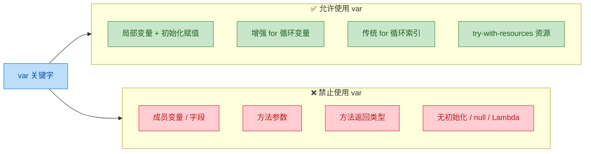

### var 与泛型的交互

使用 `var` 时要特别注意泛型推断的"退化"问题。菱形运算符 `<>` 和 `var` 同时使用时，编译器可能推断出比你预期更宽泛的类型：

```java
// 明确指定泛型参数 → 推断为 ArrayList<String>
var list1 = new ArrayList<String>();

// 菱形运算符 + var → 推断为 ArrayList<Object>！
// 因为编译器两边都没有足够的类型信息
var list2 = new ArrayList<>();  // ⚠️ 实际类型是 ArrayList<Object>

list2.add("hello");  // 编译通过
list2.add(123);      // 也通过！因为是 Object
```

这是一个常见陷阱。当你使用 `var` 时，**不要省略菱形运算符中的泛型参数**，否则类型安全就打了折扣。

### var 的最佳实践

`var` 是一把双刃剑。用得好能让代码更简洁，用不好会严重损害可读性。

```java
// ✅ 好的用法：右侧已经清楚表明类型，var 减少冗余
var connection = DriverManager.getConnection(url);  // 显然是 Connection
var mapper = new ObjectMapper();                     // 显然是 ObjectMapper
var users = userRepository.findAll();                // 返回类型在方法名中已暗示

// ❌ 坏的用法：右侧看不出类型，var 让人一头雾水
var result = process(data);       // result 是什么类型？完全不知道
var x = calculate();              // x 是 int？double？BigDecimal？
var obj = getPayload();           // 毫无类型线索
```

一条实用的判断标准：**如果去掉类型声明后，读代码的人仍然能一眼看出变量类型，就用 `var`；否则，老老实实写类型。**

---

## switch 表达式 ⭐（箭头语法、yield）

传统的 `switch` 语句在 Java 中存在已久，但它有几个让人头疼的设计缺陷：必须手动 `break`（忘了就 fall-through）、不能作为表达式返回值、语法冗长。Java 14 正式引入了 **switch 表达式**（Switch Expressions），从根本上解决了这些问题。

### 传统 switch 的痛点

先回顾一下传统写法的问题：

```java
// 传统 switch 语句
String dayType;
switch (day) {
    case MONDAY:
    case TUESDAY:
    case WEDNESDAY:
    case THURSDAY:
    case FRIDAY:
        dayType = "工作日";  // 必须在外部声明变量
        break;               // 忘写 break 就会 fall-through 到下一个 case
    case SATURDAY:
    case SUNDAY:
        dayType = "周末";
        break;
    default:
        dayType = "未知";
        break;
}
```

这段代码的问题：
- `dayType` 必须在 `switch` 外部声明，作用域被迫扩大。
- 每个分支都要写 `break`，遗漏就是 bug，而且编译器不会警告。
- `switch` 是语句（statement），不能直接返回值。

### 箭头语法（Arrow Labels）

新的 switch 表达式使用 `->` 箭头替代 `:` 冒号，彻底消灭了 fall-through 问题：

```java
// switch 表达式 + 箭头语法
String dayType = switch (day) {
    case MONDAY, TUESDAY, WEDNESDAY, THURSDAY, FRIDAY -> "工作日";  // 多个 case 用逗号合并
    case SATURDAY, SUNDAY -> "周末";                                 // 无需 break，不会 fall-through
    // 注意：作为表达式使用时，必须穷举所有可能值，否则需要 default
};  // switch 表达式是一个值，赋给 dayType，末尾有分号
```

对比一下核心变化：

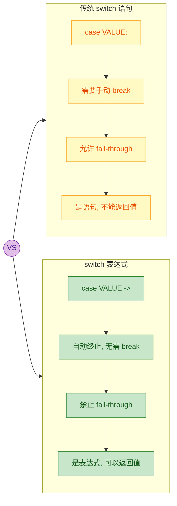

箭头右侧可以是三种形式：

```java
var result = switch (status) {
    case "OK" -> 200;                          // 1. 单个表达式（最常见）

    case "NOT_FOUND" -> {                      // 2. 代码块（多条语句时使用）
        log.warn("Resource not found");        //    块内可以写任意逻辑
        yield 404;                             //    用 yield 返回值（后面详解）
    }

    case "ERROR" -> throw new RuntimeException("Server error"); // 3. 抛出异常

    default -> 0;
};
```

### yield 关键字

当箭头右侧需要一个代码块（`{}`）来执行多条语句时，不能用 `return`（那是方法级别的），而要用 Java 14 新增的 `yield` 关键字来"产出"这个分支的值：

```java
int numericGrade = switch (letterGrade) {
    case "A" -> 4;   // 单表达式，直接返回
    case "B" -> 3;
    case "C" -> 2;
    case "D" -> 1;
    case "F" -> {
        // 代码块中需要执行额外逻辑
        System.out.println("挂科了，需要补考");  // 附加操作
        logFailure(studentId);                    // 附加操作
        yield 0;                                  // 用 yield 返回值
    }
    default -> {
        System.out.println("无效的成绩等级: " + letterGrade);
        yield -1;                                 // default 分支也用 yield
    }
};
```

`yield` 的语义很明确：**从当前 switch 分支中产出一个值**。它只能出现在 switch 表达式的代码块中，不能用在其他地方。

### 冒号语法中也能用 yield

如果你出于某种原因仍然想用传统的冒号语法（`case VALUE:`），但又想让 switch 作为表达式返回值，也可以用 `yield` 替代 `break`：

```java
// 冒号语法 + yield（不推荐，但合法）
int result = switch (input) {
    case 1:
        System.out.println("处理情况 1");
        yield 10;     // 用 yield 代替 break，同时返回值
    case 2:
        yield 20;
    default:
        yield 0;
};
// 注意：冒号语法仍然存在 fall-through 风险，所以推荐用箭头语法
```

### 穷举性检查（Exhaustiveness）

当 switch 被用作**表达式**（即需要产出一个值）时，编译器会强制要求**穷举所有可能的输入值**。这是一个非常重要的安全保障：

```java
// 枚举类型
enum Season { SPRING, SUMMER, AUTUMN, WINTER }

// ✅ 穷举了所有枚举值，不需要 default
String description = switch (season) {
    case SPRING -> "万物复苏";
    case SUMMER -> "烈日炎炎";
    case AUTUMN -> "秋高气爽";
    case WINTER -> "银装素裹";
};
// 如果未来枚举新增了一个值（如 MONSOON），这里会编译报错，强制你处理

// ❌ 非枚举类型（如 String、int），无法穷举，必须有 default
int code = switch (command) {
    case "start" -> 1;
    case "stop"  -> 2;
    // 编译错误！String 无法穷举，必须加 default
};
```

这个穷举性检查在配合 `sealed` 类和模式匹配时会发挥更大的威力（后面章节会讲到）。

### 实战：用 switch 表达式重构策略逻辑

```java
// 计算不同会员等级的折扣
public double calculateDiscount(String memberLevel, double originalPrice) {
    // switch 表达式直接返回折扣率
    double discountRate = switch (memberLevel.toUpperCase()) {
        case "DIAMOND" -> 0.30;    // 钻石会员 7 折
        case "GOLD"    -> 0.20;    // 金牌会员 8 折
        case "SILVER"  -> 0.10;    // 银牌会员 9 折
        case "BRONZE"  -> 0.05;    // 铜牌会员 95 折
        default -> {
            // 非会员或未知等级，记录日志后不打折
            log.info("非会员用户，等级标识: {}", memberLevel);
            yield 0.0;             // yield 返回 0 折扣
        }
    };

    // 直接使用表达式的结果进行计算
    return originalPrice * (1 - discountRate);
}
```

---

## 文本块（多行字符串）

在 Java 13 之前，处理多行字符串是一件令人崩溃的事情。写 SQL、JSON、HTML 模板时，你不得不用大量的字符串拼接和转义字符：

```java
// 传统写法：拼接 + 转义，可读性极差
String json = "{\n" +
    "  \"name\": \"张三\",\n" +
    "  \"age\": 25,\n" +
    "  \"skills\": [\"Java\", \"Spring\"]\n" +
    "}";

String sql = "SELECT u.id, u.name, u.email\n" +
    "FROM users u\n" +
    "JOIN orders o ON u.id = o.user_id\n" +
    "WHERE o.status = 'ACTIVE'\n" +
    "ORDER BY u.name";
```

Java 15 正式引入了 **文本块**（Text Blocks），使用三引号 `"""` 来定义多行字符串，让你可以"所见即所得"地书写文本内容。

### 基本语法

```java
// 文本块语法：三引号开头，换行后开始内容，三引号结尾
String json = """
        {
            "name": "张三",
            "age": 25,
            "skills": ["Java", "Spring"]
        }
        """;

String sql = """
        SELECT u.id, u.name, u.email
        FROM users u
        JOIN orders o ON u.id = o.user_id
        WHERE o.status = 'ACTIVE'
        ORDER BY u.name
        """;
```

几个语法要点：
- 开头的 `"""` 后面**必须换行**，不能在同一行写内容。
- 结尾的 `"""` 可以单独一行，也可以跟在最后一行内容后面。
- 文本块内部的双引号 `"` **不需要转义**（这是最大的便利之一）。

### 缩进处理：附带缩进剥离（Incidental Indentation）

文本块最精妙的设计之一是**自动剥离附带缩进**。编译器会找到所有内容行和结尾 `"""` 中最左侧的位置，以此为基准去除公共前缀空格：

```java
public void example() {
    // 结尾 """ 的位置决定了缩进基准线
    String text = """
            Line 1
            Line 2
            Line 3
            """;
    // 结果：每行前面没有空格（""" 和内容对齐，公共缩进被剥离）
    // "Line 1\nLine 2\nLine 3\n"
}
```

用一个 ASCII 图来直观理解缩进剥离的机制：

```text
源码中的文本块：
│                                          │
│    String s = """                         │
│            Hello        ← 12个空格前缀     │
│            World        ← 12个空格前缀     │
│            """;         ← 结尾"""在第12列   │
│                                          │
│  编译器计算：                              │
│  最小公共缩进 = min(12, 12, 12) = 12      │
│  剥离12个空格后：                          │
│  → "Hello\nWorld\n"                       │
```

结尾 `"""` 的位置是一个隐含的"锚点"。如果你把它往左移，就能给内容保留缩进：

```java
String indented = """
        Hello
        World
    """;  // 结尾 """ 比内容少缩进 4 格
// 结果："    Hello\n    World\n"（每行保留 4 个空格）
```

### 转义字符与新增转义序列

文本块中，传统的转义字符（`\n`, `\t` 等）依然有效。Java 还为文本块新增了两个转义序列：

```java
// \s → 保留尾部空格（trailing space）
// 普通情况下，编译器会自动去除每行末尾的空白字符
// 用 \s 可以强制保留
String table = """
        Name   \s
        Age    \s
        Email  \s
        """;
// 每行末尾的空格被 \s 保护，不会被剥离

// \ → 行尾续行符（line continuation）
// 取消该位置的换行，将下一行拼接到当前行
String singleLine = """
        This is a very long sentence that \
        we want to keep on a single line \
        in the resulting string.""";
// 结果："This is a very long sentence that we want to keep on a single line in the resulting string."
```

这两个新转义序列只在文本块中有效，普通字符串字面量中不能使用。

### 文本块中的字符串插值

Java 的文本块**不支持**内建的字符串插值（不像 Kotlin 的 `$variable` 或 JavaScript 的 `` `${expr}` ``）。你需要配合 `String.formatted()` 或 `String.format()` 来实现：

```java
// 使用 formatted()（Java 15+ 的实例方法，推荐）
String name = "张三";
int age = 25;

String json = """
        {
            "name": "%s",
            "age": %d
        }
        """.formatted(name, age);
// 结果：
// {
//     "name": "张三",
//     "age": 25
// }

// 也可以用传统的 String.format()
String html = String.format("""
        <html>
            <body>
                <h1>Hello, %s!</h1>
            </body>
        </html>
        """, name);
```

### 文本块的常见应用场景

```java
// 1. SQL 查询（最常见的场景之一）
String query = """
        SELECT p.id,
               p.product_name,
               p.price,
               c.category_name
        FROM products p
        INNER JOIN categories c ON p.category_id = c.id
        WHERE p.price > ?
          AND c.active = true
        ORDER BY p.price DESC
        LIMIT 50
        """;

// 2. JSON 模板
String requestBody = """
        {
            "method": "POST",
            "headers": {
                "Content-Type": "application/json",
                "Authorization": "Bearer %s"
            },
            "body": {
                "userId": %d,
                "action": "purchase"
            }
        }
        """.formatted(token, userId);

// 3. HTML 片段
String emailTemplate = """
        <div style="font-family: Arial, sans-serif;">
            <h2>订单确认</h2>
            <p>尊敬的 %s，您的订单 #%s 已确认。</p>
            <p>预计送达时间：%s</p>
        </div>
        """.formatted(customerName, orderId, deliveryDate);

// 4. 多行正则表达式（提高可读性）
String regex = """
        ^(?<year>\\d{4})     # 年份
        -(?<month>\\d{2})    # 月份
        -(?<day>\\d{2})      # 日期
        $""";
```

### 文本块 vs 普通字符串：编译结果一致

和 `var` 一样，文本块也是纯粹的编译期语法糖。编译后，文本块会被转换为普通的 `String` 对象，存储在字符串常量池中，运行时没有任何额外开销：

```java
// 这两种写法编译后完全等价
String a = """
        Hello
        World""";

String b = "Hello\nWorld";

System.out.println(a.equals(b));  // true
System.out.println(a == b);       // true（常量池中是同一个对象）
```

---

**📝 练习题**

以下代码的输出结果是什么？

```java
var x = switch ("hello") {
    case "hello" -> {
        var greeting = """
                Hi,
                World""";
        yield greeting.lines().count();
    }
    default -> 0L;
};
System.out.println(x);
```

A. 1

B. 2

C. 3

D. 编译错误

**【答案】** B

**【解析】** 这道题综合考察了本节的三个知识点。`var x` 推断为 `long`（因为 `lines().count()` 返回 `long`）。switch 表达式使用箭头语法，代码块内用 `yield` 返回值。文本块 `""" Hi,\n World"""` 包含两行内容（`Hi,` 和 `World`），`lines()` 方法返回一个 `Stream<String>`，`count()` 计算流中的元素数量，结果为 2。注意文本块结尾的 `"""` 紧跟在 `World` 后面（没有单独一行），所以不会产生额外的空行。

---

## record 类 ⭐⭐（数据载体、自动生成方法）

在日常 Java 开发中，有一类对象的职责极其单纯——它们不承载业务逻辑，只是忠实地"搬运"数据。典型场景包括：DTO（Data Transfer Object）、API 响应体、数据库查询结果行、配置参数包等。然而在 Java 16 之前，为了写一个仅仅持有两三个字段的数据类，你不得不手动编写（或让 IDE 生成）大量样板代码：私有字段、构造器、getter、`equals()`、`hashCode()`、`toString()`……这些代码加起来往往几十行，而真正有信息量的只有字段声明那一两行。

Java 14 以预览特性引入、Java 16 正式发布的 `record` 关键字，正是为了彻底解决这个问题。它用一行声明，让编译器自动生成上述所有样板代码，同时在语义层面明确告诉阅读者："这是一个不可变的纯数据载体（immutable data carrier）。"

---

### 从痛点出发：传统 POJO 的样板代码之殇

假设我们需要一个表示二维坐标点的数据类，在传统 Java 中你需要这样写：

```java
// 传统 POJO 写法 —— 仅仅为了承载 x, y 两个字段
public final class Point {

    // 1. 私有不可变字段
    private final int x;
    private final int y;

    // 2. 全参构造器
    public Point(int x, int y) {
        this.x = x;
        this.y = y;
    }

    // 3. getter（Java Bean 风格）
    public int getX() {
        return x;
    }

    public int getY() {
        return y;
    }

    // 4. equals —— 逐字段比较
    @Override
    public boolean equals(Object o) {
        if (this == o) return true;                          // 同一引用直接返回 true
        if (o == null || getClass() != o.getClass()) return false; // 类型不同返回 false
        Point point = (Point) o;
        return x == point.x && y == point.y;                 // 逐字段比较
    }

    // 5. hashCode —— 与 equals 保持一致
    @Override
    public int hashCode() {
        return Objects.hash(x, y);                           // 基于所有字段计算哈希
    }

    // 6. toString —— 方便调试输出
    @Override
    public String toString() {
        return "Point[x=" + x + ", y=" + y + "]";           // 可读的字符串表示
    }
}
```

40 多行代码，真正的"信息"只有 `int x` 和 `int y`。这就是 Java 社区长期诟病的 boilerplate problem。虽然 Lombok 的 `@Data`、`@Value` 注解能缓解，但它们依赖注解处理器，属于编译期"魔法"，IDE 支持和调试体验并不总是完美。`record` 则是语言层面的原生解决方案。

---

### record 的基本语法与自动生成机制

#### 一行声明，替代整个类

```java
// 这一行等价于上面 40+ 行的传统 POJO
public record Point(int x, int y) { }
```

就这么简单。编译器会根据你在小括号中声明的"组件列表（component list）"自动生成以下全部内容：

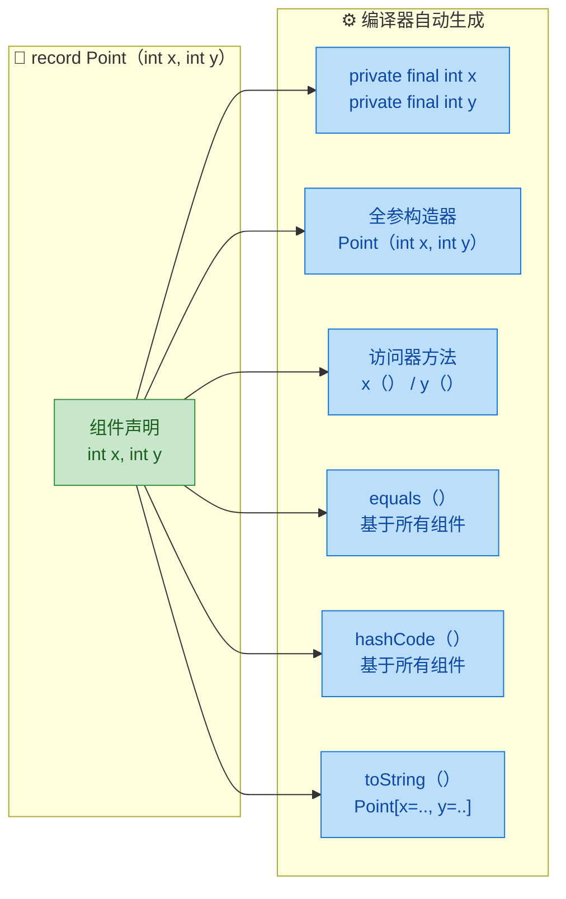

逐项拆解编译器的工作：

| 自动生成项 | 具体行为 | 备注 |
|---|---|---|
| 字段 | 为每个组件生成 `private final` 字段 | 天然不可变 |
| 规范构造器（Canonical Constructor） | 参数列表与组件列表完全一致 | 可自定义覆盖 |
| 访问器方法（Accessor） | 方法名 = 组件名，无 `get` 前缀 | `x()` 而非 `getX()` |
| `equals()` | 逐组件比较，使用 `Objects.equals()` | 引用类型安全处理 null |
| `hashCode()` | 基于所有组件计算 | 与 `equals()` 一致 |
| `toString()` | 格式为 `ClassName[comp1=val1, comp2=val2]` | 调试友好 |

来看一段验证代码：

```java
public class RecordDemo {
    // 声明一个 record
    public record Point(int x, int y) { }

    public static void main(String[] args) {
        Point p1 = new Point(3, 4);          // 使用自动生成的全参构造器
        Point p2 = new Point(3, 4);          // 创建另一个相同值的实例

        // 访问器方法：注意没有 get 前缀
        System.out.println(p1.x());          // 输出: 3
        System.out.println(p1.y());          // 输出: 4

        // toString() 自动生成
        System.out.println(p1);              // 输出: Point[x=3, y=4]

        // equals() 基于值比较，而非引用比较
        System.out.println(p1.equals(p2));   // 输出: true
        System.out.println(p1 == p2);        // 输出: false（不同对象引用）

        // hashCode() 一致性
        System.out.println(p1.hashCode() == p2.hashCode()); // 输出: true
    }
}
```

---

### record 的本质：一个特殊的 final 类

`record` 并不是什么全新的类型系统概念，它本质上就是一个带有特殊约束的 `class`。编译后你用 `javap` 反编译会看到：

```java
// javap -p Point.class 的输出（简化）
public final class Point extends java.lang.Record {
    private final int x;       // 不可变字段
    private final int y;       // 不可变字段

    public Point(int x, int y);
    public int x();            // 访问器
    public int y();            // 访问器
    public boolean equals(Object o);
    public int hashCode();
    public String toString();
}
```

几个关键事实：

- `record` 隐式继承 `java.lang.Record`，因此不能再 `extends` 其他类（Java 单继承）
- `record` 隐式为 `final`，不能被继承
- 所有组件字段隐式为 `private final`，不能被重新赋值
- `record` 可以实现接口（`implements`）

这些约束共同保证了 record 的核心语义：**不可变的透明数据载体（immutable transparent data carrier）**。"透明"意味着对象的全部状态都通过组件列表暴露，没有隐藏状态。

```java
// record 可以实现接口
public interface Printable {
    void prettyPrint();                      // 自定义打印方法
}

// 实现接口的 record
public record User(String name, int age) implements Printable {
    @Override
    public void prettyPrint() {              // 实现接口方法
        System.out.println("用户: " + name + ", 年龄: " + age);
    }
}
```

---

### 自定义构造器：紧凑构造器与规范构造器

虽然编译器会自动生成构造器，但实际开发中我们经常需要在构造时做参数校验或数据规范化。record 提供了两种方式来自定义构造逻辑。

#### 紧凑构造器（Compact Constructor）

这是 record 独有的语法糖——省略参数列表，直接在花括号中编写校验逻辑。编译器会在你的代码末尾自动追加字段赋值语句。

```java
public record Range(int min, int max) {

    // 紧凑构造器：没有参数列表！
    // 编译器会在末尾自动添加 this.min = min; this.max = max;
    public Range {
        // 参数校验
        if (min > max) {
            throw new IllegalArgumentException(
                "min（" + min + "）不能大于 max（" + max + "）"
            );
        }
        // 数据规范化：可以直接修改参数变量（注意不是字段）
        // 例如确保 min 不为负数
        if (min < 0) {
            min = 0;                         // 修改的是参数，不是字段
        }
        // 编译器在此处隐式插入：
        // this.min = min;
        // this.max = max;
    }
}
```

紧凑构造器的执行模型可以用下图理解：

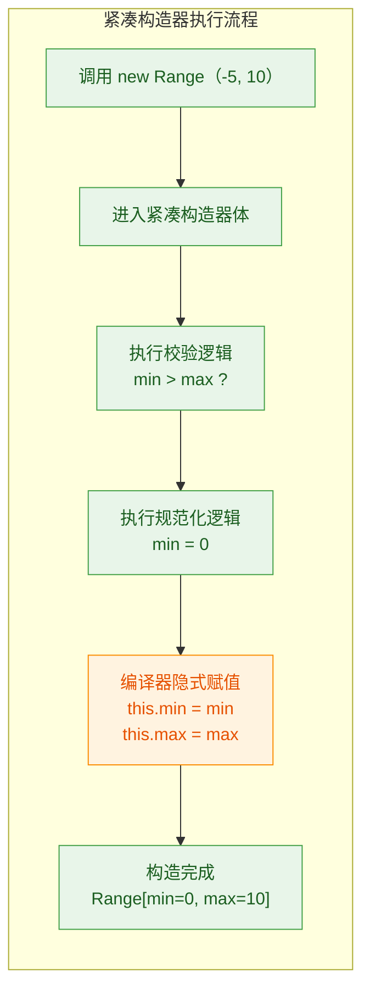

#### 规范构造器（Canonical Constructor）

如果你需要更精细的控制，也可以写出完整的带参数列表的构造器，但参数列表必须与组件列表完全匹配：

```java
public record Email(String localPart, String domain) {

    // 规范构造器：参数列表必须与组件列表一致
    public Email(String localPart, String domain) {
        // 手动校验
        Objects.requireNonNull(localPart, "localPart 不能为 null");
        Objects.requireNonNull(domain, "domain 不能为 null");

        // 规范化：统一转小写
        this.localPart = localPart.trim().toLowerCase();  // 必须手动赋值
        this.domain = domain.trim().toLowerCase();         // 必须手动赋值
    }
}
```

紧凑构造器 vs 规范构造器的选择很简单：如果你只需要校验或简单规范化，用紧凑构造器更简洁；如果你需要对赋值过程做精细控制（比如转换后再赋值），用规范构造器。

#### 自定义额外构造器

record 也支持非规范构造器（non-canonical constructor），但它必须在第一行委托给规范构造器：

```java
public record Point(int x, int y) {

    // 额外构造器：创建原点
    public Point() {
        this(0, 0);                          // 必须委托给规范构造器
    }

    // 额外构造器：从极坐标创建
    public Point(double r, double theta) {
        this(                                // 必须委托给规范构造器
            (int) (r * Math.cos(theta)),     // 极坐标转直角坐标 x
            (int) (r * Math.sin(theta))      // 极坐标转直角坐标 y
        );
    }
}
```

---

### record 的体内可以有什么？

record 的花括号内并非只能放构造器。你可以添加：

```java
public record Product(String name, double price, int quantity) {

    // 1. 静态字段 —— 允许
    public static final double TAX_RATE = 0.13;       // 税率常量

    // 2. 静态方法 —— 允许
    public static Product free(String name) {          // 工厂方法
        return new Product(name, 0, 0);
    }

    // 3. 实例方法 —— 允许（这是 record 非常实用的能力）
    public double totalPrice() {                       // 计算总价
        return price * quantity;                       // 直接访问组件
    }

    public double totalWithTax() {                     // 含税总价
        return totalPrice() * (1 + TAX_RATE);          // 调用自身方法
    }

    // 4. 紧凑构造器 —— 校验
    public Product {
        if (price < 0) {                               // 价格不能为负
            throw new IllegalArgumentException("价格不能为负数");
        }
        if (quantity < 0) {                            // 数量不能为负
            throw new IllegalArgumentException("数量不能为负数");
        }
    }

    // 5. 覆盖自动生成的 toString()
    @Override
    public String toString() {
        return name + " | 单价: " + price + " | 数量: " + quantity
             + " | 总价: " + totalPrice();
    }

    // ❌ 不允许：实例字段（非组件字段）
    // private int discount;  // 编译错误！record 不允许声明额外的实例字段
}
```

这里有一个重要限制：**record 不允许声明额外的实例字段**。所有实例状态必须通过组件列表声明。这是"透明数据载体"语义的核心保证——对象的完整状态由组件列表唯一确定。

---

### 不可变性的深层理解：浅层不可变 vs 深层不可变

record 的字段是 `final` 的，这保证了引用不可变（reference immutability），但如果组件本身是可变对象，record 并不能阻止通过引用修改其内部状态。这就是所谓的"浅层不可变（shallow immutability）"。

```java
import java.util.List;
import java.util.ArrayList;
import java.util.Collections;

public record Team(String name, List<String> members) {

    // 紧凑构造器：实现防御性拷贝，达到深层不可变
    public Team {
        Objects.requireNonNull(name, "队名不能为 null");
        Objects.requireNonNull(members, "成员列表不能为 null");
        // 防御性拷贝：创建不可变副本，切断外部引用
        members = List.copyOf(members);
    }
}
```

来看看为什么防御性拷贝如此重要：

```java
public class ImmutabilityDemo {
    public static void main(String[] args) {
        List<String> names = new ArrayList<>();
        names.add("Alice");                              // 初始成员
        names.add("Bob");                                // 初始成员

        Team team = new Team("Dev", names);              // 创建 record

        // 尝试通过原始列表修改
        names.add("Charlie");                            // 修改外部列表
        System.out.println(team.members());              // [Alice, Bob] —— 不受影响！

        // 尝试通过访问器修改
        // team.members().add("Dave");                   // 抛出 UnsupportedModificationException
    }
}
```

内存模型对比：

```java
// ===== 无防御性拷贝（浅层不可变，危险！）=====
//
//   外部变量 names ──────┐
//                        ▼
//   Team.members ──→ [ArrayList] ← 同一个对象！外部修改会影响 record
//
//
// ===== 有防御性拷贝（深层不可变，安全）=====
//
//   外部变量 names ──→ [ArrayList]        ← 外部的，随便改
//
//   Team.members ────→ [UnmodifiableList] ← record 持有独立副本，且不可修改
```

---

### record 与泛型

record 完美支持泛型，这使得它在构建通用数据结构时非常强大：

```java
// 泛型 record：通用的键值对
public record Pair<A, B>(A first, B second) {

    // 静态工厂方法，利用类型推断简化创建
    public static <A, B> Pair<A, B> of(A first, B second) {
        return new Pair<>(first, second);    // 类型由参数推断
    }

    // 交换键值
    public Pair<B, A> swap() {
        return new Pair<>(second, first);    // 返回类型参数互换的新 Pair
    }
}

// 泛型 record：API 统一响应体
public record ApiResponse<T>(int code, String message, T data) {

    // 成功响应的工厂方法
    public static <T> ApiResponse<T> success(T data) {
        return new ApiResponse<>(200, "OK", data);
    }

    // 失败响应的工厂方法
    public static <T> ApiResponse<T> error(int code, String message) {
        return new ApiResponse<>(code, message, null);
    }

    // 判断是否成功
    public boolean isSuccess() {
        return code >= 200 && code < 300;    // 2xx 状态码视为成功
    }
}
```

使用示例：

```java
public class GenericRecordDemo {
    public static void main(String[] args) {
        // Pair 的使用
        Pair<String, Integer> entry = Pair.of("age", 25);  // 类型推断
        System.out.println(entry);                          // Pair[first=age, second=25]
        System.out.println(entry.swap());                   // Pair[first=25, second=age]

        // ApiResponse 的使用
        var resp = ApiResponse.success(List.of("Java", "Kotlin"));
        System.out.println(resp.code());                    // 200
        System.out.println(resp.data());                    // [Java, Kotlin]
        System.out.println(resp.isSuccess());               // true
    }
}
```

---

### record 与 sealed 类、模式匹配的协同

record 的真正威力在与 Java 17 的 `sealed` 类和 Java 21 的模式匹配 `switch` 结合时才完全释放。这三者组合在一起，可以在 Java 中实现类似函数式语言的代数数据类型（Algebraic Data Type, ADT）。

```java
// 用 sealed interface + record 定义一个表达式 AST（抽象语法树）
public sealed interface Expr
    permits Expr.Num, Expr.Add, Expr.Mul, Expr.Neg {

    // 数字字面量
    record Num(double value) implements Expr { }

    // 加法：左操作数 + 右操作数
    record Add(Expr left, Expr right) implements Expr { }

    // 乘法：左操作数 × 右操作数
    record Mul(Expr left, Expr right) implements Expr { }

    // 取反：-操作数
    record Neg(Expr operand) implements Expr { }
}
```

配合 Java 21 的模式匹配 switch 进行递归求值：

```java
public class ExprEvaluator {

    // 递归求值方法 —— 模式匹配 switch（Java 21+）
    public static double eval(Expr expr) {
        return switch (expr) {
            case Expr.Num(var value)            // 解构 Num，提取 value
                 -> value;
            case Expr.Add(var left, var right)  // 解构 Add，提取左右子表达式
                 -> eval(left) + eval(right);   // 递归求值后相加
            case Expr.Mul(var left, var right)  // 解构 Mul
                 -> eval(left) * eval(right);   // 递归求值后相乘
            case Expr.Neg(var operand)          // 解构 Neg
                 -> -eval(operand);             // 递归求值后取反
        };
        // 注意：因为 Expr 是 sealed 的，编译器知道所有子类型已穷举
        // 所以不需要 default 分支！
    }

    public static void main(String[] args) {
        // 构建表达式：-(3 + 4) * 2
        Expr expr = new Expr.Mul(
            new Expr.Neg(
                new Expr.Add(
                    new Expr.Num(3),             // 数字 3
                    new Expr.Num(4)              // 数字 4
                )
            ),
            new Expr.Num(2)                      // 数字 2
        );

        System.out.println(eval(expr));          // 输出: -14.0
    }
}
```

这个组合的架构关系：

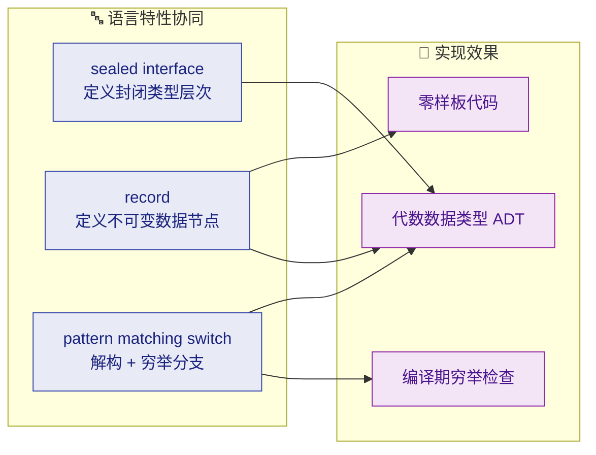

---

### record 与序列化

record 天然适合序列化场景。Java 的序列化机制对 record 做了特殊优化：反序列化时直接调用规范构造器（而非绕过构造器用反射注入字段），这意味着你在构造器中编写的校验逻辑在反序列化时同样生效，安全性大幅提升。

```java
import java.io.Serializable;

// record 实现 Serializable
public record Config(String host, int port) implements Serializable {

    // 紧凑构造器中的校验，在反序列化时同样执行
    public Config {
        if (port < 0 || port > 65535) {
            throw new IllegalArgumentException("端口号必须在 0-65535 之间");
        }
    }
}
```

对比传统类的反序列化行为：

```java
// ===== 传统类反序列化 =====
// ObjectInputStream 使用 Unsafe/反射 直接写入字段
// 完全绕过构造器 → 校验逻辑不执行 → 可能产生非法对象！
//
// ===== record 反序列化 =====
// ObjectInputStream 调用规范构造器重建对象
// 构造器中的校验逻辑正常执行 → 非法数据被拦截 → 安全！
```

在 JSON 序列化方面，主流框架（Jackson 2.12+、Gson 等）都已原生支持 record：

```java
// Jackson 示例
import com.fasterxml.jackson.databind.ObjectMapper;

public record UserDTO(String username, String email, int age) { }

// 序列化 / 反序列化
ObjectMapper mapper = new ObjectMapper();

UserDTO user = new UserDTO("kiro", "kiro@example.com", 3);
String json = mapper.writeValueAsString(user);             // 序列化为 JSON
// {"username":"kiro","email":"kiro@example.com","age":3}

UserDTO restored = mapper.readValue(json, UserDTO.class);  // 从 JSON 反序列化
System.out.println(restored.username());                    // kiro
```

---

### record 的局限性与不适用场景

record 虽然强大，但它有明确的设计边界。理解这些边界能帮你在正确的场景使用它：

| 限制 | 原因 | 替代方案 |
|---|---|---|
| 不能继承其他类 | 隐式继承 `java.lang.Record` | 用接口组合 |
| 不能被继承 | 隐式 `final` | 用 sealed interface + 多个 record |
| 不能声明额外实例字段 | 保证状态透明性 | 用普通 class |
| 字段不可变 | 核心设计目标 | 需要可变状态时用普通 class |
| 不能是 `abstract` | 必须可实例化 | 用 sealed interface 做抽象层 |

适用与不适用的判断标准：

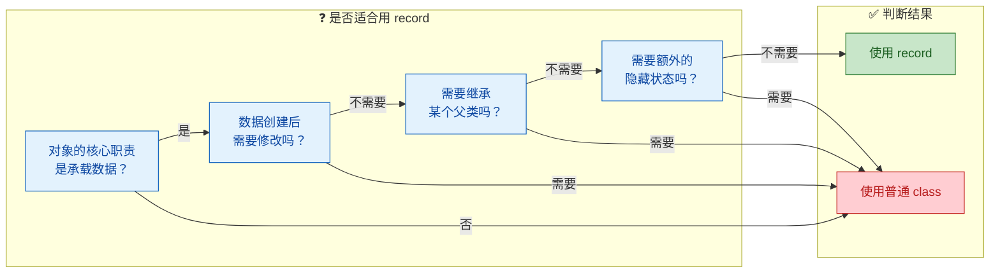

---

### 实战：用 record 重构真实场景

下面是一个综合示例，展示 record 在实际项目中的典型用法——构建一个简易的事件系统：

```java
import java.time.Instant;
import java.util.List;
import java.util.Map;
import java.util.UUID;

// 1. 事件基础接口（sealed）
public sealed interface DomainEvent
    permits OrderCreated, OrderPaid, OrderCancelled {

    UUID eventId();                                      // 事件唯一标识
    Instant occurredAt();                                // 发生时间
}

// 2. 具体事件 —— 全部用 record 实现
public record OrderCreated(
    UUID eventId,                                        // 事件 ID
    Instant occurredAt,                                  // 发生时间
    String orderId,                                      // 订单号
    List<LineItem> items                                 // 订单行项目
) implements DomainEvent {

    // 紧凑构造器：防御性拷贝 + 校验
    public OrderCreated {
        items = List.copyOf(items);                      // 不可变副本
        if (items.isEmpty()) {
            throw new IllegalArgumentException("订单至少需要一个商品");
        }
    }

    //便捷工厂方法
    public static OrderCreated now(String orderId, List<LineItem> items) {
        return new OrderCreated(
            UUID.randomUUID(),                           // 自动生成事件 ID
            Instant.now(),                               // 当前时间戳
            orderId,
            items
        );
    }
}

// 订单已支付
public record OrderPaid(
    UUID eventId,
    Instant occurredAt,
    String orderId,
    double amount,                                       // 支付金额
    String paymentMethod                                 // 支付方式
) implements DomainEvent {

    public static OrderPaid now(String orderId, double amount, String method) {
        return new OrderPaid(UUID.randomUUID(), Instant.now(), orderId, amount, method);
    }
}

// 订单已取消
public record OrderCancelled(
    UUID eventId,
    Instant occurredAt,
    String orderId,
    String reason                                        // 取消原因
) implements DomainEvent {

    public OrderCancelled {
        if (reason == null || reason.isBlank()) {        // 取消必须给出原因
            throw new IllegalArgumentException("取消原因不能为空");
        }
    }

    public static OrderCancelled now(String orderId, String reason) {
        return new OrderCancelled(UUID.randomUUID(), Instant.now(), orderId, reason);
    }
}

// 3. 订单行项目 —— 也是 record
public record LineItem(String productName, int quantity, double unitPrice) {

    public LineItem {
        if (quantity <= 0) {                             // 数量必须为正
            throw new IllegalArgumentException("数量必须大于 0");
        }
        if (unitPrice < 0) {                             // 单价不能为负
            throw new IllegalArgumentException("单价不能为负数");
        }
    }

    public double subtotal() {                           // 小计金额
        return quantity * unitPrice;
    }
}
```

事件处理器利用模式匹配 switch 实现分发：

```java
// 4. 事件处理器 —— 模式匹配 switch 分发
public class EventProcessor {

    public static String describe(DomainEvent event) {
        return switch (event) {
            case OrderCreated e -> String.format(        // 解构 OrderCreated
                "新订单 [%s] 创建，包含 %d 件商品",
                e.orderId(), e.items().size()
            );
            case OrderPaid e -> String.format(           // 解构 OrderPaid
                "订单 [%s] 已支付 %.2f 元（%s）",
                e.orderId(), e.amount(), e.paymentMethod()
            );
            case OrderCancelled e -> String.format(      // 解构 OrderCancelled
                "订单 [%s] 已取消，原因: %s",
                e.orderId(), e.reason()
            );
            // sealed 接口 → 编译器确认穷举，无需 default
        };
    }

    public static void main(String[] args) {
        // 创建订单行项目
        var items = List.of(
            new LineItem("Java 编程思想", 1, 108.0),     // 书籍
            new LineItem("机械键盘", 1, 599.0)           // 外设
        );

        // 模拟事件流
        var events = List.of(
            OrderCreated.now("ORD-001", items),          // 创建订单
            OrderPaid.now("ORD-001", 707.0, "支付宝"),    // 支付订单
            OrderCancelled.now("ORD-002", "用户主动取消") // 取消另一个订单
        );

        // 处理每个事件
        events.forEach(e -> {
            System.out.println(describe(e));             // 分发并打印描述
            System.out.println("  事件ID: " + e.eventId());
            System.out.println("  时间: " + e.occurredAt());
            System.out.println();
        });
    }
}
```

输出效果：

```
新订单 [ORD-001] 创建，包含 2 件商品
  事件ID: 3a7f...
  时间: 2024-01-15T08:30:00Z

订单 [ORD-001] 已支付 707.00 元（支付宝）
  事件ID: 9b2c...
  时间: 2024-01-15T08:30:00Z

订单 [ORD-002] 已取消，原因: 用户主动取消
  事件ID: f1d8...
  时间: 2024-01-15T08:30:00Z
```

这个例子展示了 record 在领域驱动设计（DDD）中的自然契合度：事件本身就是不可变的事实记录，record 的语义与之完美匹配。配合 sealed interface 的穷举保证和模式匹配的解构能力，整个事件系统既类型安全又极其简洁。

---

### 与 Lombok 的对比：何时选谁？

很多团队已经在使用 Lombok 的 `@Value`（不可变）或 `@Data`（可变）来减少样板代码。record 出现后，两者如何选择？

| 维度 | record | Lombok @Value |
|---|---|---|
| 来源 | 语言原生特性 | 第三方注解处理器 |
| 可变性 | 强制不可变 | 强制不可变（@Value）/ 可变（@Data） |
| 继承 | 不能继承类，不能被继承 | 无限制 |
| 额外字段 | 不允许 | 允许 |
| IDE 支持 | 原生完美支持 | 需要插件 |
| 调试体验 | 源码即真相 | 生成代码不可见，调试时可能困惑 |
| 序列化安全 | 反序列化走构造器 | 反序列化绕过构造器 |
| 模式匹配 | 完美支持解构 | 不支持 |
| 最低 Java 版本 | Java 16+ | Java 8+ |

简单的决策原则：

- 如果你的项目已经在 Java 16+，且数据类是不可变的纯数据载体 → 优先用 record
- 如果需要可变对象、继承、或项目还在 Java 8/11 → 继续用 Lombok
- 两者可以在同一项目中共存，不冲突

---

### 本节核心要点回顾

```mermaid
graph LR
    subgraph Core["🧬 record 核心特征"]
        direction TB
        C1["隐式 final 类"]
        C2["继承 java.lang.Record"]
        C3["组件即全部状态"]
        C4["自动生成六大成员"]
    end

    subgraph Power["💪 进阶能力"]
        direction TB
        P1["紧凑构造器<br/>校验 + 规范化"]
        P2["泛型支持"]
        P3["接口实现"]
        P4["实例方法 + 静态方法"]
    end

    subgraph Synergy["🔗 生态协同"]
        direction TB
        S1["sealed 类<br/>封闭类型层次"]
        S2["模式匹配<br/>解构 + 穷举"]
        S3["序列化<br/>构造器安全"]
        S4["JSON 框架<br/>原生支持"]
    end

    Core --> Power
    Power --> Synergy

    classDef coreStyle fill:#C8E6C9,stroke:#2E7D32,color:#1B5E20
    classDef powerStyle fill:#BBDEFB,stroke:#1565C0,color:#0D47A1
    classDef synStyle fill:#FFE0B2,stroke:#EF6C00,color:#E65100

    class C1,C2,C3,C4 coreStyle
    class P1,P2,P3,P4 powerStyle
    class S1,S2,S3,S4 synStyle
```

---

**📝 练习题**

以下关于 Java record 的说法，哪一项是正确的？

A. record 可以声明额外的实例字段来存储缓存数据

B. record 的紧凑构造器中可以直接修改参数变量的值，编译器会在末尾将修改后的值赋给对应字段

C. record 可以继承一个抽象类，只要该抽象类没有实例字段

D. record 的反序列化行为与普通类相同，都是通过反射直接注入字段值


**【答案】** B

**【解析】** 逐项分析：

- A 错误：record 严格禁止声明额外的实例字段，所有实例状态必须通过组件列表（header）声明，这是"透明数据载体"语义的核心约束。如果需要缓存，可以用实例方法每次计算，或在外部维护缓存。
- B 正确：紧凑构造器（compact constructor）中，参数名与组件名相同但它们是局部变量。你可以修改这些参数变量（如 `min = 0`），编译器会在紧凑构造器体的末尾隐式插入 `this.xxx = xxx` 赋值语句，将修改后的值赋给字段。
- C 错误：record 隐式继承 `java.lang.Record`，由于 Java 单继承机制，record 不能再 `extends` 任何其他类（包括抽象类）。record 只能通过 `implements` 实现接口。
- D 错误：这是 record 相对于普通类的重要安全优势。普通类反序列化时通过 `Unsafe`/反射直接写入字段，绕过构造器；而 record 反序列化时会调用规范构造器（canonical constructor），因此构造器中的校验逻辑在反序列化时同样生效。

---

## sealed 类（密封类、permits）

Java 长久以来在类的继承控制上只有两个极端：要么 `final` 彻底禁止继承，要么完全开放任由子类扩展。这在领域建模时非常尴尬——你明明知道"形状只有圆形、矩形、三角形三种"，却无法在语言层面表达这个约束。任何人都可以写一个 `class Hexagon extends Shape`，编译器对此毫无意见。

`sealed` 类（密封类）正是为了填补这个空白而生。它在 Java 15 作为预览特性首次亮相，Java 17 正式转正（JEP 409）。核心思想一句话概括：**让类的作者显式声明"谁可以继承我"**，从而构建一个封闭的（closed）类型层次结构。

### sealed 的基本语法与规则

声明一个密封类非常直观——在 `class`（或 `interface`）前加上 `sealed` 修饰符，然后用 `permits` 子句列出所有被允许的直接子类：

```java
// 声明一个密封类 Shape，只允许 Circle、Rectangle、Triangle 继承
public sealed class Shape permits Circle, Rectangle, Triangle {
    // Shape 的公共属性和方法
    private final String color; // 颜色属性

    public Shape(String color) { // 构造方法
        this.color = color;      // 初始化颜色
    }

    public String getColor() {   // 获取颜色
        return color;
    }

    public abstract double area(); // 抽象方法：计算面积
}
```

被 `permits` 列出的子类，**必须**使用以下三个修饰符之一来明确自己的继承策略：

```java
// 1. final —— 终结继承链，不允许再被继承
public final class Circle extends Shape {
    private final double radius; // 半径

    public Circle(String color, double radius) {
        super(color);            // 调用父类构造
        this.radius = radius;    // 初始化半径
    }

    @Override
    public double area() {       // 实现面积计算
        return Math.PI * radius * radius; // πr²
    }
}

// 2. sealed —— 继续密封，再次限定下一层子类
public sealed class Rectangle extends Shape permits Square {
    private final double width;  // 宽
    private final double height; // 高

    public Rectangle(String color, double width, double height) {
        super(color);            // 调用父类构造
        this.width = width;      // 初始化宽
        this.height = height;    // 初始化高
    }

    @Override
    public double area() {       // 实现面积计算
        return width * height;   // 宽 × 高
    }
}

// Square 是 Rectangle 的唯一允许子类，用 final 终结
public final class Square extends Rectangle {
    public Square(String color, double side) {
        super(color, side, side); // 正方形：宽 = 高 = 边长
    }
}

// 3. non-sealed —— 打开口子，恢复为普通的开放继承
public non-sealed class Triangle extends Shape {
    private final double base;   // 底边
    private final double height; // 高

    public Triangle(String color, double base, double height) {
        super(color);            // 调用父类构造
        this.base = base;        // 初始化底边
        this.height = height;    // 初始化高
    }

    @Override
    public double area() {       // 实现面积计算
        return 0.5 * base * height; // ½ × 底 × 高
    }
}
```

用一张图来展示这个继承层次和三种修饰符的关系：

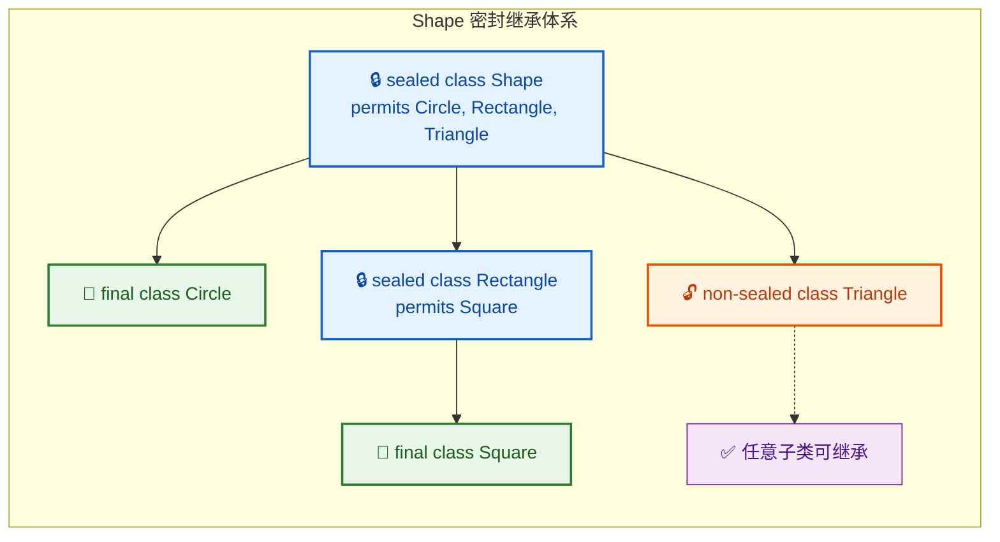

这里有几条硬性规则需要牢记：

- `permits` 中列出的子类必须是**直接子类**（direct subclass），不能跳级。
- 每个被许可的子类**必须**选择 `final`、`sealed` 或 `non-sealed` 之一，否则编译报错。
- 在同一个编译单元（同一个 `.java` 文件）中定义的子类，`permits` 子句可以**省略**，编译器会自动推断。
- 密封类的子类必须与密封类位于**同一个模块**（如果使用模块系统）或**同一个包**中。

### permits 子句的省略规则

当所有子类和密封父类写在同一个 `.java` 文件中时，`permits` 可以省略，编译器会自动推断出允许的子类列表：

```java
// 文件：Expression.java
// 所有子类都在同一个文件中，permits 可以省略
public sealed abstract class Expression {
    // 编译器自动推断 permits Literal, Add, Multiply
}

// 字面量表达式
final class Literal extends Expression {
    private final int value;     // 字面值

    Literal(int value) {         // 构造方法
        this.value = value;      // 初始化
    }

    int value() { return value; } // 获取值
}

// 加法表达式
final class Add extends Expression {
    private final Expression left;  // 左操作数
    private final Expression right; // 右操作数

    Add(Expression left, Expression right) {
        this.left = left;           // 初始化左操作数
        this.right = right;         // 初始化右操作数
    }

    Expression left() { return left; }   // 获取左操作数
    Expression right() { return right; } // 获取右操作数
}

// 乘法表达式
final class Multiply extends Expression {
    private final Expression left;  // 左操作数
    private final Expression right; // 右操作数

    Multiply(Expression left, Expression right) {
        this.left = left;           // 初始化左操作数
        this.right = right;         // 初始化右操作数
    }

    Expression left() { return left; }   // 获取左操作数
    Expression right() { return right; } // 获取右操作数
}
```

这种写法在实际项目中非常常见，尤其是用 `sealed` + `record` 组合构建代数数据类型（Algebraic Data Type, ADT）时，把所有变体放在一个文件里既紧凑又清晰。

### sealed interface（密封接口）

`sealed` 不仅可以修饰 `class`，也可以修饰 `interface`。密封接口的规则与密封类完全一致：

```java
// 密封接口：定义 JSON 值的所有可能类型
public sealed interface JsonValue
        permits JsonString, JsonNumber, JsonBoolean, JsonNull, JsonArray, JsonObject {
    // 将 JSON 值转为字符串表示
    String toJsonString();
}

// JSON 字符串 —— 用 record 实现，天然 final
public record JsonString(String value) implements JsonValue {
    @Override
    public String toJsonString() {       // 实现接口方法
        return "\"" + value + "\"";      // 加双引号
    }
}

// JSON 数字
public record JsonNumber(double value) implements JsonValue {
    @Override
    public String toJsonString() {       // 实现接口方法
        return String.valueOf(value);    // 数字转字符串
    }
}

// JSON 布尔值
public record JsonBoolean(boolean value) implements JsonValue {
    @Override
    public String toJsonString() {       // 实现接口方法
        return String.valueOf(value);    // true 或 false
    }
}

// JSON null
public record JsonNull() implements JsonValue {
    @Override
    public String toJsonString() {       // 实现接口方法
        return "null";                   // 固定返回 "null"
    }
}

// JSON 数组 —— 用 sealed 继续限制，或 non-sealed 开放
public record JsonArray(java.util.List<JsonValue> elements) implements JsonValue {
    @Override
    public String toJsonString() {       // 实现接口方法
        return elements.stream()         // 流式处理每个元素
                .map(JsonValue::toJsonString) // 递归转字符串
                .collect(java.util.stream.Collectors.joining(", ", "[", "]")); // 拼接为 [a, b, c]
    }
}

// JSON 对象
public record JsonObject(java.util.Map<String, JsonValue> entries) implements JsonValue {
    @Override
    public String toJsonString() {       // 实现接口方法
        return entries.entrySet().stream() // 流式处理每个键值对
                .map(e -> "\"" + e.getKey() + "\": " + e.getValue().toJsonString()) // "key": value
                .collect(java.util.stream.Collectors.joining(", ", "{", "}")); // 拼接为 {k: v}
    }
}
```

注意这里 `record` 天然就是 `final` 的，所以 `record` 实现密封接口时不需要额外声明 `final`——它已经满足了"三选一"的要求。

### sealed 与 record 的黄金组合

`sealed` + `record` 是现代 Java 中构建**代数数据类型（ADT）**的标准范式。这个组合的威力在于：`sealed` 限定了类型的所有变体，`record` 让每个变体自动获得构造器、`equals`、`hashCode`、`toString`，两者结合几乎零样板代码：

```java
// 用 sealed + record 建模一个简单的算术表达式 AST
public sealed interface Expr {
    // permits 省略，因为所有实现都在同一文件

    // 数字字面量
    record Num(double value) implements Expr {}

    // 二元运算：左操作数 + 运算符 + 右操作数
    record BinOp(Expr left, String operator, Expr right) implements Expr {}

    // 一元取负
    record Negate(Expr operand) implements Expr {}

    // 求值方法 —— 利用模式匹配 switch（Java 21+）
    default double eval() {
        return switch (this) {                          // 对当前表达式进行模式匹配
            case Num(var v) -> v;                       // 数字直接返回值
            case BinOp(var l, var op, var r) ->         // 二元运算
                switch (op) {                           // 根据运算符分派
                    case "+" -> l.eval() + r.eval();    // 加法
                    case "-" -> l.eval() - r.eval();    // 减法
                    case "*" -> l.eval() * r.eval();    // 乘法
                    case "/" -> l.eval() / r.eval();    // 除法
                    default -> throw new IllegalArgumentException("Unknown op: " + op);
                };
            case Negate(var operand) -> -operand.eval(); // 取负
        };
        // 注意：因为 sealed 穷举了所有子类型，这里不需要 default 分支！
    }
}
```

使用起来非常自然：

```java
public class ExprDemo {
    public static void main(String[] args) {
        // 构建表达式：(3 + 5) * -2
        Expr expr = new Expr.BinOp(                     // 最外层是乘法
                new Expr.BinOp(                         // 左操作数是加法
                        new Expr.Num(3),                // 3
                        "+",                            // +
                        new Expr.Num(5)                 // 5
                ),
                "*",                                    // ×
                new Expr.Negate(new Expr.Num(2))        // -2
        );

        System.out.println(expr);        // 自动 toString
        System.out.println(expr.eval()); // 输出: -16.0
    }
}
```

这种模式在编译器前端、规则引擎、协议解析等场景中极为常见，本质上就是函数式编程中 Sum Type 的 Java 实现。

### sealed 的编译期穷举检查

`sealed` 类最大的实际价值之一，是让编译器能够进行**穷举性检查（exhaustiveness check）**。当你在 `switch` 表达式中匹配一个密封类型的所有子类时，编译器知道不会有遗漏，因此不需要 `default` 分支：

```java
// 密封接口：支付方式
public sealed interface Payment
        permits CreditCard, BankTransfer, DigitalWallet {
}

public record CreditCard(String number, String expiry) implements Payment {}
public record BankTransfer(String iban) implements Payment {}
public record DigitalWallet(String provider, String account) implements Payment {}

// 处理支付 —— 编译器保证穷举
public class PaymentProcessor {
    public static String process(Payment payment) {
        return switch (payment) {                                // 模式匹配 switch
            case CreditCard cc    -> "Charging card: " + cc.number();    // 信用卡
            case BankTransfer bt  -> "Transferring to: " + bt.iban();    // 银行转账
            case DigitalWallet dw -> "Paying via " + dw.provider();      // 数字钱包
            // 无需 default！编译器知道 Payment 只有这三种实现
        };
    }
}
```

如果将来你新增了一种支付方式，比如 `record Crypto(...) implements Payment {}`，那么所有没有处理 `Crypto` 的 `switch` 表达式都会**编译报错**。这就是 sealed 的杀手级特性——**把运行时的 "忘记处理某种情况" 错误，提前到编译期暴露出来**。

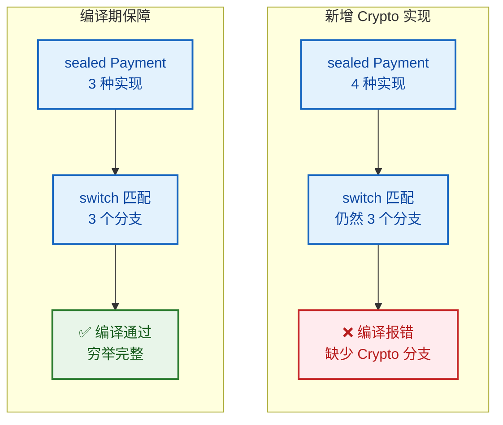

### sealed vs. enum：何时用哪个

初学者常问："`sealed` 和 `enum` 不是都能限定一组固定类型吗？"确实有相似之处，但它们的适用场景截然不同：

| 维度 | `enum` | `sealed class/interface` |
|------|--------|--------------------------|
| 实例数量 | 每个枚举常量是**单例** | 每个子类可以有**无限个实例** |
| 携带数据 | 所有常量共享相同字段结构 | 每个子类可以有**完全不同的字段** |
| 继承能力 | 不能继承其他类（隐式继承 `Enum`） | 可以继承类、实现接口 |
| 适用场景 | 有限的、无状态差异的常量集 | 有限的、有结构差异的类型集 |

简单来说：如果你的变体只是"名字不同"（如星期几、方向），用 `enum`；如果变体"结构不同"（如不同形状有不同参数），用 `sealed`。

### 反射与 sealed 的运行时 API

Java 在 `Class` 类上新增了两个方法来支持 sealed 类的运行时反射：

```java
public class SealedReflection {
    public static void main(String[] args) {
        Class<?> shapeClass = Shape.class;

        // isSealed() —— 判断是否为密封类
        System.out.println(shapeClass.isSealed());       // true

        // getPermittedSubclasses() —— 获取所有允许的子类
        Class<?>[] permitted = shapeClass.getPermittedSubclasses();
        for (Class<?> sub : permitted) {                 // 遍历所有允许的子类
            System.out.println("Permitted: " + sub.getName()); // 打印子类全限定名
        }
        // 输出:
        // Permitted: Circle
        // Permitted: Rectangle
        // Permitted: Triangle
    }
}
```

这在框架开发中很有用——比如序列化框架可以通过 `getPermittedSubclasses()` 自动发现所有可能的子类型，而不需要手动注册。

### 实际应用：用 sealed 建模状态机

密封类非常适合建模有限状态机（Finite State Machine），因为状态的种类是固定的，而每种状态可能携带不同的上下文数据：

```java
// 订单状态 —— 密封接口
public sealed interface OrderState {

    // 已创建：携带创建时间
    record Created(java.time.Instant createdAt) implements OrderState {}

    // 已支付：携带支付金额和交易号
    record Paid(double amount, String transactionId) implements OrderState {}

    // 已发货：携带物流单号
    record Shipped(String trackingNumber) implements OrderState {}

    // 已完成：携带完成时间
    record Completed(java.time.Instant completedAt) implements OrderState {}

    // 已取消：携带取消原因
    record Cancelled(String reason) implements OrderState {}
}

// 订单状态流转逻辑
public class OrderStateMachine {

    // 根据当前状态决定下一步操作
    public static String describeNextAction(OrderState state) {
        return switch (state) {                                          // 穷举匹配
            case OrderState.Created c   ->                               // 已创建
                    "Order created at " + c.createdAt() + ", awaiting payment";
            case OrderState.Paid p      ->                               // 已支付
                    "Payment of $" + p.amount() + " received (tx: " + p.transactionId() + "), ready to ship";
            case OrderState.Shipped s   ->                               // 已发货
                    "Shipped with tracking: " + s.trackingNumber() + ", awaiting delivery";
            case OrderState.Completed c ->                               // 已完成
                    "Order completed at " + c.completedAt();
            case OrderState.Cancelled c ->                               // 已取消
                    "Order cancelled: " + c.reason();
            // 无需 default —— 编译器确保所有状态都已处理
        };
    }
}
```

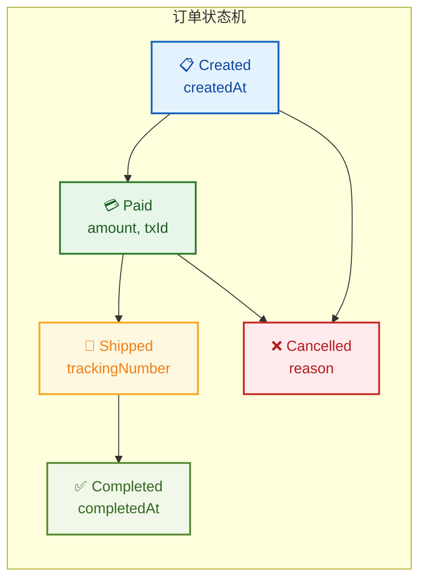

这种建模方式的优势非常明显：每种状态携带的数据类型不同（`Created` 只有时间，`Paid` 有金额和交易号），而 `sealed` 保证了你不会遗漏任何状态的处理。如果产品经理说"加一个退款状态"，你只需新增一个 `record Refunded(...) implements OrderState {}`，编译器会立刻告诉你所有需要修改的地方。

---

**📝 练习题**

以下关于 `sealed` 类的说法，哪一项是**错误**的？

A. `sealed` 类的直接子类必须声明为 `final`、`sealed` 或 `non-sealed` 之一

B. 如果所有子类与密封父类在同一个 `.java` 文件中，`permits` 子句可以省略

C. `sealed` 类的子类可以位于任意包中，不受位置限制

D. `record` 类型实现密封接口时，不需要额外声明 `final`，因为 `record` 天然是 `final` 的

**【答案】** C

**【解析】** `sealed` 类的子类必须与密封父类位于**同一个包**中（如果没有使用模块系统），或者位于**同一个模块**中（如果使用了 Java 模块系统）。这是一条硬性约束，目的是确保密封类的作者对其类型层次拥有完全的控制权。如果子类可以散落在任意包中，那密封的"封闭性"就形同虚设了——你无法阻止别人在另一个包里偷偷加一个子类。选项 A、B、D 的描述都是正确的。

---

## 模式匹配 instanceof ⭐（类型模式、变量绑定）

### 传统 instanceof 的痛点

在 Java 16 之前，`instanceof` 检查和类型转换是两步分离的操作。这种写法虽然安全，但极其冗余——你明明已经确认了类型，编译器却还要你手动再 cast 一次。这在业界被称为 **"test-and-cast idiom"**（测试-转换惯用法）。

```java
// 传统写法：三步走，啰嗦且容易出错
public void process(Object obj) {
    // 第一步：类型检查
    if (obj instanceof String) {
        // 第二步：显式强制转换（明明已经确认是 String 了）
        String s = (String) obj;
        // 第三步：才能使用
        System.out.println(s.toUpperCase());
    }
}
```

这段代码的问题不仅仅是多写了一行。在复杂的 `if-else` 链中，开发者很容易在 cast 时写错目标类型，而编译器对此无能为力。更深层的问题是：**编译器明明拥有足够的类型信息，却不帮你做推断**。

### 模式匹配 instanceof 的语法革新

Java 16 正式引入了 **Pattern Matching for instanceof**（JEP 394），将类型检查、转换、变量绑定三步合为一步。这不是语法糖那么简单——它是 Java 向 **模式匹配（Pattern Matching）** 这一编程范式迈出的关键一步。

```java
// 现代写法：一步到位
public void process(Object obj) {
    // instanceof 后直接声明「模式变量」s
    // 如果 obj 是 String 类型，自动绑定到变量 s，无需手动 cast
    if (obj instanceof String s) {
        // 直接使用 s，类型已经是 String
        System.out.println(s.toUpperCase());
    }
}
```

语法结构拆解：

```
obj instanceof TypePattern
                 ├── 目标类型：String
                 └── 模式变量：s（自动绑定，作用域由编译器推断）
```

这里的 `String s` 被称为 **类型模式（Type Pattern）**，它由两部分组成：一个类型（`String`）和一个 **模式变量（Pattern Variable）**（`s`）。当 `instanceof` 测试通过时，`obj` 会被自动转换为 `String` 并绑定到 `s`。

### 模式变量的作用域（Flow Scoping）

模式变量的作用域规则是这个特性中最精妙也最容易踩坑的部分。Java 采用了 **流式作用域（Flow Scoping）** 机制——变量的可用范围取决于编译器能否在该位置 **确定性地证明** 模式匹配成功。

```java
public void flowScopeDemo(Object obj) {

    // ✅ 场景一：if 块内部 —— 最基本的作用域
    if (obj instanceof String s) {
        // s 在这里可用，因为进入此块意味着匹配成功
        System.out.println(s.length());
    }
    // ❌ s 在这里不可用，因为可能走了 else 分支，匹配未必成功

    // ✅ 场景二：短路与运算符 && —— 编译器能推断左侧为 true
    if (obj instanceof String s && s.length() > 5) {
        // && 的右侧能使用 s，因为 && 短路求值保证左侧为 true
        System.out.println("长字符串: " + s);
    }

    // ❌ 场景三：短路或运算符 || —— 编译器无法保证
    // if (obj instanceof String s || s.length() > 5) {
    //     编译错误！|| 的右侧不能使用 s
    //     因为走到右侧说明左侧为 false，即 obj 不是 String，s 未绑定
    // }

    // ✅ 场景四：取反后在 else 块中使用
    if (!(obj instanceof String s)) {
        // s 在这里不可用
        System.out.println("不是字符串");
        return; // 提前返回
    }
    // s 在这里可用！因为能走到这里说明上面的 if 为 false
    // 即 !(obj instanceof String s) 为 false → obj instanceof String s 为 true
    System.out.println(s.toUpperCase());
}
```

用一张流程图来理解 Flow Scoping 的判定逻辑：

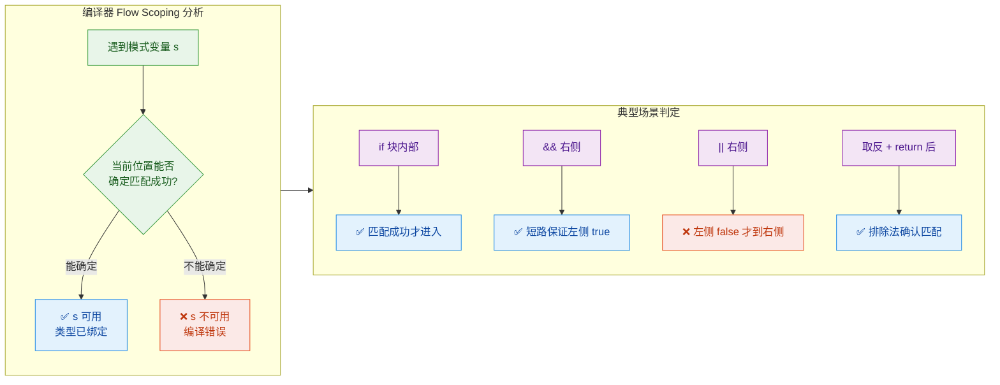

### 实战：用模式匹配重构多态分派

传统的 `if-else` 类型判断链是模式匹配 instanceof 最直接的应用场景。来看一个图形面积计算的例子：

```java
// 定义几种图形（这里用 sealed 接口更佳，后面会联动讲解）
sealed interface Shape permits Circle, Rectangle, Triangle {}

// 圆形：只需半径
record Circle(double radius) implements Shape {}

// 矩形：需要宽和高
record Rectangle(double width, double height) implements Shape {}

// 三角形：需要底和高
record Triangle(double base, double height) implements Shape {}

public class ShapeCalculator {

    // 传统写法：冗长的 cast 链
    public static double areaOld(Shape shape) {
        if (shape instanceof Circle) {
            Circle c = (Circle) shape;                    // 手动 cast
            return Math.PI * c.radius() * c.radius();
        } else if (shape instanceof Rectangle) {
            Rectangle r = (Rectangle) shape;              // 手动 cast
            return r.width() * r.height();
        } else if (shape instanceof Triangle) {
            Triangle t = (Triangle) shape;                // 手动 cast
            return 0.5 * t.base() * t.height();
        }
        throw new IllegalArgumentException("未知图形");
    }

    // 现代写法：模式匹配 instanceof，干净利落
    public static double areaNew(Shape shape) {
        // 类型检查 + 转换 + 变量绑定，一气呵成
        if (shape instanceof Circle c) {
            return Math.PI * c.radius() * c.radius();     // 直接用 c
        } else if (shape instanceof Rectangle r) {
            return r.width() * r.height();                 // 直接用 r
        } else if (shape instanceof Triangle t) {
            return 0.5 * t.base() * t.height();            // 直接用 t
        }
        throw new IllegalArgumentException("未知图形");
    }
}
```

代码量的减少只是表面收益。更重要的是：**模式变量的类型由编译器保证正确**，彻底消除了手动 cast 时写错类型的风险。

### 与 null 的交互

模式匹配 instanceof 对 `null` 的处理非常直觉——**null 不匹配任何类型模式**，这与传统 `instanceof` 的行为完全一致：

```java
public void nullSafety(Object obj) {
    // obj 为 null 时，instanceof 返回 false，不会进入 if 块
    // 因此模式变量 s 不会被绑定，也不存在 NullPointerException 的风险
    if (obj instanceof String s) {
        // 这里 s 一定不是 null，可以安全调用方法
        System.out.println(s.length());
    }
}
```

这意味着模式匹配 instanceof 天然具备 **null 安全性（null-safety）**，你不需要额外写 `obj != null` 的前置检查。

### 与 equals 方法的经典搭配

重写 `equals()` 是模式匹配 instanceof 最常见的实战场景之一：

```java
public class Point {
    private final int x; // x 坐标
    private final int y; // y 坐标

    public Point(int x, int y) {
        this.x = x;
        this.y = y;
    }

    @Override
    public boolean equals(Object obj) {
        // 传统写法需要三行：instanceof 检查 → cast → 比较
        // 现代写法一行搞定类型检查和转换
        return obj instanceof Point p    // 类型检查 + 绑定
            && this.x == p.x            // 字段逐一比较
            && this.y == p.y;           // && 短路保证 p 已绑定
    }

    @Override
    public int hashCode() {
        return Objects.hash(x, y); // 与 equals 保持一致
    }
}
```

这种写法简洁、安全，且充分利用了 `&&` 短路求值的特性来保证模式变量的作用域正确。

---

## 模式匹配 switch（Java 21+）

### 从 instanceof 链到 switch 的进化

上一节我们用模式匹配 instanceof 重构了 `if-else` 类型判断链，代码已经简洁了不少。但如果你仔细看，那个 `if-else if-else if` 的结构本质上就是一个 **多路分支**——而多路分支正是 `switch` 的主场。

Java 21 正式发布了 **Pattern Matching for switch**（JEP 441），让 `switch` 不再局限于匹配 `int`、`String`、`enum` 这些简单值，而是能够匹配 **类型模式（Type Pattern）**、**守卫条件（Guarded Pattern）**，甚至 **解构 record（Record Pattern）**。这是 Java 模式匹配体系中最具革命性的一步。

```java
// 用 switch 表达式重写图形面积计算
public static double area(Shape shape) {
    return switch (shape) {
        // 每个 case 直接匹配类型并绑定变量，无需 instanceof 也无需 cast
        case Circle c    -> Math.PI * c.radius() * c.radius();
        case Rectangle r -> r.width() * r.height();
        case Triangle t  -> 0.5 * t.base() * t.height();
        // 如果 Shape 是 sealed 接口且所有子类都已覆盖，可以不写 default
    };
}
```

对比一下三代写法的演进：

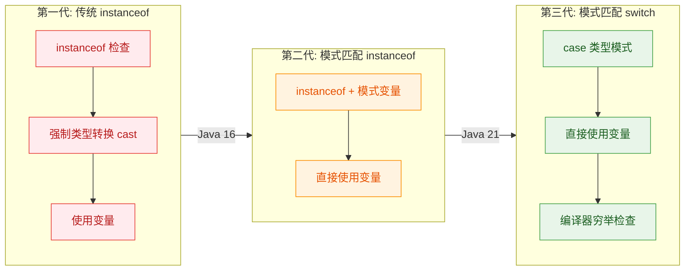

### 完整语法解析

模式匹配 switch 支持多种 case 标签形式，我们逐一拆解：

```java
public static String describe(Object obj) {
    return switch (obj) {

        // 1️⃣ null 标签 —— switch 终于能处理 null 了！
        //    传统 switch 遇到 null 会抛 NullPointerException
        //    模式匹配 switch 允许显式匹配 null
        case null           -> "这是 null";

        // 2️⃣ 类型模式 —— 匹配类型并绑定变量
        case Integer i      -> "整数: " + i;

        // 3️⃣ 守卫模式（Guarded Pattern）—— 类型模式 + when 条件
        //    when 关键字是 Java 21 新增的，用于在类型匹配后追加布尔条件
        case String s when s.isEmpty()  -> "空字符串";
        case String s when s.length() > 10 -> "长字符串: " + s.substring(0, 10) + "...";

        // 4️⃣ 普通类型模式 —— 兜底匹配所有 String（上面的守卫没命中的）
        case String s       -> "字符串: " + s;

        // 5️⃣ Record 解构模式 —— 直接提取 record 的组件
        case Point(int x, int y) -> "坐标: (" + x + ", " + y + ")";

        // 6️⃣ default 兜底 —— 处理所有未匹配的情况
        default             -> "未知类型: " + obj.getClass().getSimpleName();
    };
}
```

### when 守卫条件详解

`when` 关键字是模式匹配 switch 的核心增强之一。它允许你在类型匹配成功后，进一步用布尔表达式筛选。这解决了传统 switch 只能做等值匹配、无法表达范围或条件判断的局限。

```java
public static String classifyNumber(Number num) {
    return switch (num) {
        // 先匹配类型为 Integer，再用 when 检查值的范围
        case Integer i when i < 0    -> "负整数";
        case Integer i when i == 0   -> "零";
        case Integer i when i > 0    -> "正整数";

        // Double 类型的守卫条件
        case Double d when d.isNaN()       -> "不是数字 (NaN)";
        case Double d when d.isInfinite()  -> "无穷大";
        case Double d                      -> "浮点数: " + d;

        // Long 类型
        case Long l -> "长整数: " + l;

        // 兜底
        default -> "其他数值类型";
    };
}
```

**case 的顺序至关重要**。编译器会从上到下依次尝试匹配，一旦命中就不再继续。因此，带 `when` 守卫的更具体的 case 必须写在同类型的通用 case 之前，否则编译器会报错（unreachable pattern）。

```java
// ❌ 编译错误：通用模式在前，守卫模式永远不可达
// case String s       -> "字符串";
// case String s when s.isEmpty() -> "空字符串";  // unreachable!

// ✅ 正确：具体的守卫模式在前
// case String s when s.isEmpty() -> "空字符串";
// case String s       -> "字符串";
```

### Record 解构模式（Record Pattern）

这是模式匹配 switch 最令人兴奋的能力之一。当 case 匹配的是一个 `record` 类型时，你可以直接在 case 标签中 **解构（deconstruct）** 它的组件，无需调用 accessor 方法。

```java
// 定义嵌套的 record 结构
record Point(int x, int y) {}
record Line(Point start, Point end) {}
record ColoredPoint(Point point, String color) {}

public static String describeShape(Object obj) {
    return switch (obj) {

        // 解构 Point：直接提取 x 和 y
        case Point(int x, int y)
            -> "点: (" + x + ", " + y + ")";

        // 嵌套解构 Line：先解构 Line 得到两个 Point，再解构每个 Point
        case Line(Point(int x1, int y1), Point(int x2, int y2))
            -> "线段: (" + x1 + "," + y1 + ") → (" + x2 + "," + y2 + ")";

        // 嵌套解构 + 守卫条件的组合
        case ColoredPoint(Point(int x, int y), String c) when c.equals("red")
            -> "红色点: (" + x + ", " + y + ")";

        // 部分解构：只解构外层，内层保留为变量
        case ColoredPoint(var p, var c)
            -> c + "色点: " + p;

        default -> "未知";
    };
}
```

嵌套解构的能力让你可以用一行 case 标签穿透多层数据结构，直达你需要的字段。这在处理 AST（抽象语法树）、JSON 结构、领域模型等场景中威力巨大。

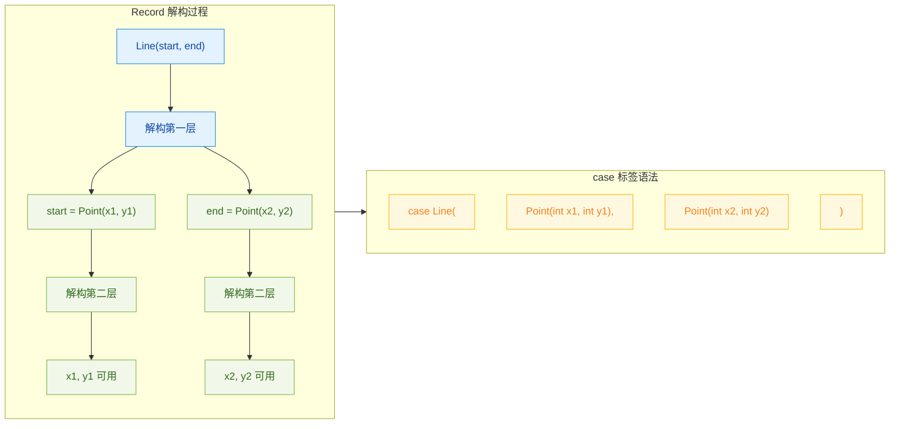

### sealed 类 + switch 的穷举性检查

当 switch 的目标类型是 `sealed` 类或接口时，编译器能够进行 **穷举性检查（exhaustiveness check）**。如果你覆盖了所有 permitted 子类，就不需要写 `default` 分支。这带来了一个极其重要的好处：**当你新增一个子类时，所有未覆盖的 switch 都会编译报错**，强制你处理新情况。

```java
// sealed 接口，只允许三个实现
sealed interface Shape permits Circle, Rectangle, Triangle {}
record Circle(double radius) implements Shape {}
record Rectangle(double width, double height) implements Shape {}
record Triangle(double base, double height) implements Shape {}

public static double area(Shape shape) {
    // 编译器知道 Shape 只有三个子类
    // 三个 case 全部覆盖，不需要 default
    return switch (shape) {
        case Circle c    -> Math.PI * c.radius() * c.radius();
        case Rectangle r -> r.width() * r.height();
        case Triangle t  -> 0.5 * t.base() * t.height();
        // 如果未来新增 Pentagon implements Shape
        // 这里会立刻编译报错，提醒你补充处理逻辑
    };
}
```

这就是 `sealed` + `switch` 模式匹配的黄金组合：**编译期安全的代数数据类型（Algebraic Data Type, ADT）**。在函数式编程语言（如 Scala、Rust、Haskell）中，这种模式早已是标配，Java 终于在 21 版本补齐了这块拼图。

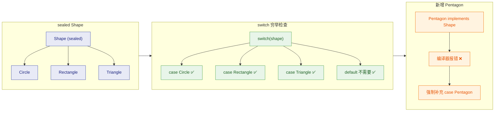

### switch 中的 null 处理

传统 switch 对 `null` 的处理一直是个痛点——直接抛 `NullPointerException`，没有任何商量余地。模式匹配 switch 终于允许你显式处理 `null`：

```java
public static String format(Object obj) {
    return switch (obj) {
        // 显式匹配 null，不再抛 NPE
        case null          -> "值为 null";

        // null 也可以和 default 合并
        // case null, default -> "null 或未知类型";

        case String s      -> "字符串: " + s;
        case Integer i     -> "整数: " + i;
        default            -> "其他: " + obj;
    };
}
```

如果你没有写 `case null`，那么传入 `null` 时仍然会抛 `NullPointerException`，行为与传统 switch 一致。这是为了向后兼容。

### 综合实战：构建一个表达式求值器

把本章学到的所有现代特性串联起来，构建一个小型的算术表达式求值器：

```java
// 用 sealed 接口定义表达式的代数数据类型
sealed interface Expr permits Num, Add, Mul, Neg {}

// 数字字面量
record Num(double value) implements Expr {}

// 加法：左操作数 + 右操作数
record Add(Expr left, Expr right) implements Expr {}

// 乘法：左操作数 × 右操作数
record Mul(Expr left, Expr right) implements Expr {}

// 取反：-操作数
record Neg(Expr operand) implements Expr {}

public class ExprEvaluator {

    // 递归求值：sealed + record 解构 + switch 模式匹配
    public static double eval(Expr expr) {
        return switch (expr) {
            // 数字字面量：直接解构取值
            case Num(var v)          -> v;

            // 加法：递归求值左右操作数，然后相加
            case Add(var l, var r)   -> eval(l) + eval(r);

            // 乘法：递归求值左右操作数，然后相乘
            case Mul(var l, var r)   -> eval(l) * eval(r);

            // 取反：递归求值操作数，然后取负
            case Neg(var operand)    -> -eval(operand);

            // sealed 接口已穷举所有子类，无需 default
        };
    }

    public static void main(String[] args) {
        // 构建表达式：(3 + 5) * -(2)
        // 即 Mul(Add(Num(3), Num(5)), Neg(Num(2)))
        var expr = new Mul(
            new Add(new Num(3), new Num(5)),  // 3 + 5 = 8
            new Neg(new Num(2))                // -(2) = -2
        );

        // 求值结果：8 * (-2) = -16.0
        System.out.println(eval(expr)); // 输出: -16.0
    }
}
```

这段代码展示了现代 Java 特性的完美协作：`sealed` 保证类型安全和穷举性，`record` 提供不可变数据载体和自动解构，`switch` 模式匹配提供优雅的递归分派。这种风格在编译器、解释器、规则引擎等领域极为常见。

### 模式匹配的未来展望

Java 的模式匹配仍在持续演进。以下是已经在预览或讨论中的方向：

- **Unnamed Patterns（未命名模式）**：用 `_` 忽略不关心的组件，如 `case Point(var x, _)` 只提取 x 坐标（Java 22+ 预览）
- **Primitive Patterns（原始类型模式）**：允许在模式中直接匹配 `int`、`long` 等原始类型
- **Array Patterns（数组模式）**：解构数组元素
- **更深层的嵌套解构**：支持更复杂的数据结构穿透

Java 正在一步步构建完整的模式匹配体系，目标是让 Java 开发者也能享受到函数式语言中 pattern matching 的表达力和安全性。

---

## 本章小结

现代 Java 从 Java 10 到 Java 21，经历了一场深刻的语言层面革新。这些特性并非孤立存在，它们共同构成了一套**更简洁、更安全、更具表达力**的编程范式。让我们从全局视角，将本章所有知识点串联起来，形成一张完整的认知地图。

### 特性全景总览

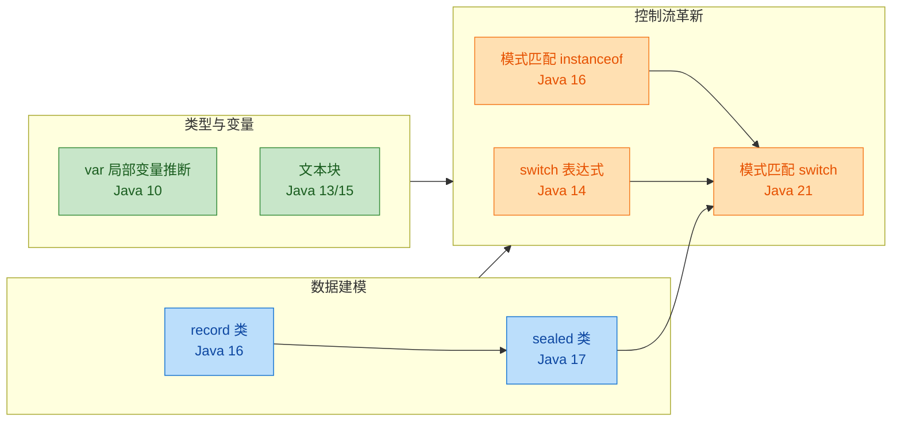

这张图揭示了一个关键事实：**模式匹配 switch 是所有特性的汇聚点**。`sealed` 类提供了穷举性保证，`record` 类提供了解构能力，`switch` 表达式提供了语法基础，`instanceof` 模式匹配提供了类型测试的雏形。Java 语言团队用了近十年时间，一步步铺设这条道路。

### 各特性核心要义速查

```mermaid
graph LR
    subgraph SG_VAR["var"]
        direction TB
        V1["编译期推断, 非动态类型"]
        V2["仅限局部变量"]
        V3["提升可读性而非隐藏类型"]
    end

    subgraph SG_SW["switch 表达式"]
        direction TB
        S1["箭头语法取代 break"]
        S2["yield 返回复杂值"]
        S3["整体作为表达式赋值"]
    end

    subgraph SG_TB["文本块"]
        direction TB
        T1["三引号界定多行字符串"]
        T2["自动对齐缩进管理"]
        T3["适用于 SQL / JSON / HTML"]
    end

    subgraph SG_REC["record 类"]
        direction TB
        R1["自动生成 equals hashCode toString"]
        R2["组件字段隐式 final"]
        R3["透明数据载体"]
    end

    subgraph SG_SEAL["sealed 类"]
        direction TB
        SE1["permits 显式声明子类"]
        SE2["子类必须 final / sealed / non-sealed"]
        SE3["编译器穷举检查"]
    end

    subgraph SG_PM["模式匹配"]
        direction TB
        P1["instanceof 类型测试 + 变量绑定"]
        P2["switch 支持类型模式"]
        P3["record 解构模式"]
        P4["when 守卫条件"]
    end

    SG_VAR --- SG_SW --- SG_TB
    SG_REC --- SG_SEAL --- SG_PM

    classDef green fill:#E8F5E9,stroke:#43A047,color:#1B5E20
    classDef blue fill:#E3F2FD,stroke:#1E88E5,color:#0D47A1
    classDef orange fill:#FFF3E0,stroke:#FB8C00,color:#E65100

    class V1,V2,V3,S1,S2,S3,T1,T2,T3 green
    class R1,R2,R3,SE1,SE2,SE3 blue
    class P1,P2,P3,P4 orange
```

### 特性之间的协同效应

现代 Java 特性的真正威力，在于它们**组合使用**时产生的化学反应。单独看每个特性，可能只是"语法糖"；但当它们协同工作时，会从根本上改变你建模和处理数据的方式。

来看一个综合示例，展示所有特性如何在一个真实场景中协作：

```java
// === 1. sealed + record: 构建类型安全的领域模型 ===
// 密封接口限定了支付方式只有三种, 编译器可以穷举检查
public sealed interface Payment permits CreditCard, BankTransfer, CryptoWallet {

    // 文本块: 优雅地定义多行格式化模板
    String RECEIPT_TEMPLATE = """
            ================================
              Payment Receipt
              Type: %s
              Amount: ¥%.2f
              Status: %s
            ================================
            """;
}

// record: 自动获得 equals/hashCode/toString, 天然不可变
// 每个 record 就是一个纯粹的数据载体
public record CreditCard(
    String cardNumber,   // 卡号
    String holder,       // 持卡人
    double amount        // 金额
) implements Payment {}

public record BankTransfer(
    String bankCode,     // 银行编码
    String accountId,    // 账户 ID
    double amount        // 金额
) implements Payment {}

public record CryptoWallet(
    String walletAddress, // 钱包地址
    String coinType,      // 币种
    double amount         // 金额
) implements Payment {}
```

```java
// === 2. 模式匹配 switch + record 解构: 处理业务逻辑 ===
public class PaymentProcessor {

    // 模式匹配 switch: 根据类型解构并处理
    // sealed 接口保证了穷举性, 无需 default 分支
    public String process(Payment payment) {
        return switch (payment) {
            // record 解构模式: 直接提取组件字段
            case CreditCard(var num, var holder, var amt)
                    when amt > 50000 ->  // when 守卫: 大额信用卡需要额外审核
                "PENDING_REVIEW: %s's card ending %s, ¥%.2f requires approval"
                    .formatted(holder, num.substring(num.length() - 4), amt);

            case CreditCard(var num, var holder, var amt) ->
                // var 推断: 编译器知道 num 是 String, amt 是 double
                "APPROVED: %s's card ending %s, ¥%.2f"
                    .formatted(holder, num.substring(num.length() - 4), amt);

            case BankTransfer(var bank, var acc, var amt) ->
                "PROCESSING: Bank %s, Account %s, ¥%.2f"
                    .formatted(bank, acc, amt);

            // when 守卫: 加密货币小额直接通过, 大额需确认
            case CryptoWallet(var addr, var coin, var amt)
                    when amt < 1000 ->
                "INSTANT: %s %s to %s".formatted(coin, amt, addr);

            case CryptoWallet(var addr, var coin, var amt) ->
                "CONFIRMING: %s %.4f to %s...".formatted(coin, amt, addr.substring(0, 8));
        };
        // 注意: 没有 default! sealed 接口 + 穷举模式 = 编译期安全
    }
}
```

这段代码中，**七个特性全部登场**：

- `sealed interface` 限定了类型层次结构
- `record` 定义了不可变数据载体
- 文本块定义了多行模板字符串
- `var` 在解构模式中推断变量类型
- `switch` 表达式作为整体返回值
- `instanceof` 模式匹配的思想延伸到了 switch 中
- `when` 守卫条件实现了细粒度的分支控制

### 设计哲学：从"仪式感"到"表达力"

回顾整章内容，可以提炼出 Java 语言演进的三条主线：

**第一条主线：减少样板代码 (Reduce Ceremony)**

传统 Java 被戏称为"仪式感语言"（ceremonial language）——写一个简单的数据类需要几十行 getter/setter/equals/hashCode。`record` 一行搞定，`var` 省去冗余类型声明，文本块消灭了字符串拼接的噩梦。这不是偷懒，而是让代码的**信噪比**（signal-to-noise ratio）大幅提升。

**第二条主线：将运行时错误提前到编译期 (Shift Left)**

`sealed` 类让编译器能够检查你是否处理了所有子类型。模式匹配 `switch` 的穷举性检查意味着，当你新增一个 `Payment` 的实现类时，所有未处理该类型的 `switch` 都会**编译失败**——这是好事，因为 bug 在编译期就被捕获了，而不是在凌晨三点的生产环境。

**第三条主线：面向数据的编程 (Data-Oriented Programming)**

`record` + `sealed` + 模式匹配，三者组合构成了 Java 对**代数数据类型**（Algebraic Data Types, ADT）的回答。这种编程范式的核心思想是：用不可变的数据结构建模，用模式匹配处理逻辑分支。它与传统 OOP 的"把行为封装在对象内部"形成了互补。

```mermaid
graph LR
    subgraph SG_OLD["传统 Java 范式"]
        direction TB
        O1["继承层次深"]
        O2["可变状态"]
        O3["行为封装在对象内"]
        O4["instanceof + 强制转换"]
    end

    subgraph SG_TRANS["演进方向"]
        direction TB
        T1["减少样板代码"]
        T2["编译期安全"]
        T3["数据与行为分离"]
    end

    subgraph SG_NEW["现代 Java 范式"]
        direction TB
        N1["扁平 sealed 层次"]
        N2["不可变 record"]
        N3["外部模式匹配处理"]
        N4["穷举 switch 表达式"]
    end

    SG_OLD --> SG_TRANS --> SG_NEW

    classDef oldStyle fill:#FFCDD2,stroke:#E53935,color:#B71C1C
    classDef transStyle fill:#FFF9C4,stroke:#FDD835,color:#F57F17
    classDef newStyle fill:#C8E6C9,stroke:#43A047,color:#1B5E20

    class O1,O2,O3,O4 oldStyle
    class T1,T2,T3 transStyle
    class N1,N2,N3,N4 newStyle
```

### 版本路线图与采纳建议

各特性的正式可用版本（非预览）：

| 特性 | 正式版本 | 优先采纳建议 |
|------|---------|-------------|
| `var` 局部变量推断 | Java 10 | ⭐⭐⭐ 立即使用，几乎无风险 |
| `switch` 表达式 | Java 14 | ⭐⭐⭐ 替代所有传统 switch |
| 文本块 | Java 15 | ⭐⭐⭐ SQL/JSON/HTML 场景必用 |
| `record` 类 | Java 16 | ⭐⭐⭐ DTO/VO 场景首选 |
| 模式匹配 `instanceof` | Java 16 | ⭐⭐⭐ 替代所有手动强转 |
| `sealed` 类 | Java 17 | ⭐⭐ 领域建模时使用 |
| 模式匹配 `switch` | Java 21 | ⭐⭐ 配合 sealed/record 威力最大 |

如果你的项目还在 Java 8，建议至少升级到 **Java 17**（LTS 长期支持版本），一次性获得前六项特性。如果能上 **Java 21**（最新 LTS），则可以解锁完整的模式匹配能力。

### 一句话记住每个特性

- **var**：让编译器替你写右边已经写过的类型
- **switch 表达式**：switch 终于能返回值了，再也不怕漏写 break
- **文本块**：三个引号，多行字符串，所见即所得
- **record**：一行定义，五个方法免费送（构造器、getter、equals、hashCode、toString）
- **sealed**：我的子类我做主，编译器帮你查漏补缺
- **模式匹配 instanceof**：判断类型的同时直接拿到变量，告别强制转换
- **模式匹配 switch**：终极形态——类型判断、解构、守卫条件，一个 switch 全搞定

---

**📝 练习题 1**

以下代码在 Java 21 环境下编译运行，输出结果是什么？

```java
sealed interface Shape permits Circle, Rectangle {}
record Circle(double radius) implements Shape {}
record Rectangle(double w, double h) implements Shape {}

public class Main {
    static String describe(Shape s) {
        return switch (s) {
            case Rectangle(var w, var h) when w == h -> "正方形, 边长 " + w;
            case Rectangle(var w, var h)             -> "矩形, " + w + "x" + h;
            case Circle(var r)                       -> "圆, 半径 " + r;
        };
    }
    public static void main(String[] args) {
        System.out.println(describe(new Rectangle(5, 5)));
        System.out.println(describe(new Rectangle(3, 7)));
        System.out.println(describe(new Circle(2.5)));
    }
}
```

A. 编译错误，switch 缺少 default 分支

B. 输出：正方形, 边长 5.0 → 矩形, 3.0x7.0 → 圆, 半径 2.5

C. 运行时抛出 MatchException

D. 编译错误，record 解构模式不能与 when 一起使用


**【答案】** B

**【解析】** 这道题综合考察了 `sealed`、`record`、模式匹配 `switch` 和 `when` 守卫四个特性。因为 `Shape` 是 sealed 接口，且 `Circle` 和 `Rectangle` 都是 final 的 record（record 隐式 final），编译器可以确认三个 case 分支已经穷举了所有可能，所以不需要 `default`（排除 A）。`when` 守卫与 record 解构模式完全兼容（排除 D）。`new Rectangle(5, 5)` 匹配第一个分支（w == h），输出"正方形, 边长 5.0"；`new Rectangle(3, 7)` 不满足 when 条件，落入第二个 Rectangle 分支；`new Circle(2.5)` 匹配 Circle 分支。注意 `5` 是 int 但 record 组件类型是 double，自动提升为 `5.0`。

---

**📝 练习题 2**

关于以下代码，哪个说法是正确的？

```java
public class Test {
    public static void main(String[] args) {
        var list = List.of(1, 2, 3);
        var result = new StringBuilder();
        for (var item : list) {
            result.append(item);
        }
        System.out.println(result);
    }
}
```

A. 编译错误，`var` 不能用于 for-each 循环变量

B. `list` 的推断类型是 `List<Object>`

C. `item` 的推断类型是 `Integer`，`list` 的推断类型是 `List<Integer>`

D. `result` 的推断类型是 `Object`


**【答案】** C

**【解析】** `var` 可以用于普通局部变量、for 循环变量和 for-each 循环变量（排除 A）。`List.of(1, 2, 3)` 的返回类型是 `List<Integer>`（int 自动装箱为 Integer），所以 `list` 被推断为 `List<Integer>`（排除 B）。for-each 中的 `item` 从 `List<Integer>` 的迭代器推断为 `Integer`。`new StringBuilder()` 的类型显然是 `StringBuilder`，不是 `Object`（排除 D）。这道题的核心考点是：`var` 的推断基于右侧表达式的**完整泛型类型**，而非擦除后的原始类型。

---

