---

# Android专属集合 ⭐⭐

---

## SparseArray ⭐⭐

Android 框架中有一个经典的设计哲学：**在移动端有限的内存预算下，用 CPU 换内存（trade CPU time for memory）**。`SparseArray` 就是这一哲学的典型产物。它是 `android.util` 包下专门为 **key 为 `int` 类型** 的映射场景设计的容器，目标很明确——替代 `HashMap<Integer, Object>`，干掉自动装箱（autoboxing）带来的内存浪费。

在标准 Java 的 `HashMap<Integer, Object>` 中，每存一个键值对，你需要付出的内存代价包括：

- 一个 `Integer` 包装对象（16 bytes on 64-bit JVM）
- 一个 `HashMap.Node` 节点对象（32~48 bytes）
- Node 数组中的一个指针槽位（4~8 bytes）

这对于桌面端或服务端来说不算什么，但在 Android 这种内存寸土寸金的环境下，如果你有几百上千个 int→Object 的映射，这些开销累积起来就很可观了。`SparseArray` 的做法非常朴素：**不要任何包装对象，直接用两个平行数组存储原始 `int` 键和 `Object` 值，通过二分查找定位元素**。

我们先从它的核心数据结构——双数组设计开始。

### 双数组设计（int[] keys + Object[] values）

`SparseArray` 的内部结构极其简洁，核心就是两个平行数组（parallel arrays）加一个 size 计数器：

```java
public class SparseArray<E> implements Cloneable {
    // 标记"已删除"的哨兵对象，后面延迟删除章节会详细讲
    private static final Object DELETED = new Object();

    // 是否存在被标记为 DELETED 但尚未物理清除的槽位
    private boolean mGarbage = false;

    // 存储 int 类型的 key，始终保持升序排列
    private int[] mKeys;

    // 存储对应的 value，mValues[i] 对应 mKeys[i]
    private Object[] mValues;

    // 当前实际存储的有效键值对数量（不含 DELETED 槽位）
    private int mSize;
}
```

这里的关键设计点：

**平行数组（Parallel Arrays）** 意味着 `mKeys[i]` 和 `mValues[i]` 构成一对键值映射。不需要像 `HashMap` 那样为每个 Entry 创建一个 Node 对象，也不需要维护链表或红黑树。整个数据结构零额外对象分配（zero object overhead per entry）。

我们用一张图来直观对比 `HashMap<Integer, Object>` 和 `SparseArray` 的内存布局差异：

```java
// ========== HashMap<Integer, Object> 的内存布局 ==========
//
//  HashMap 对象
//  ┌─────────────────────────────┐
//  │ Node[] table (长度16+)       │
//  │ ┌───┬───┬───┬───┬───┬─···  │
//  │ │ 0 │ 1 │ 2 │ 3 │ 4 │     │  ← 每个槽位 4~8 bytes 指针
//  │ └─┬─┴───┴─┬─┴───┴───┴─··· │
//  └───┼───────┼────────────────┘
//      ↓       ↓
//   Node obj  Node obj               ← 每个 Node: 32~48 bytes
//   ┌──────┐  ┌──────┐
//   │hash  │  │hash  │
//   │key ──┼→ Integer(3)             ← Integer 包装: 16 bytes
//   │val ──┼→ "Alice"                ← 值对象
//   │next  │  │next  │
//   └──────┘  └──────┘
//
//  每个条目总开销 ≈ 指针(8) + Node(32) + Integer(16) = ~56 bytes 额外开销
//
//
// ========== SparseArray 的内存布局 ==========
//
//  SparseArray 对象
//  ┌──────────────────────────────────────┐
//  │ int[] mKeys     (原始int, 无装箱)     │
//  │ ┌─────┬─────┬─────┬─────┬─────┐     │
//  │ │  1  │  3  │  10 │  25 │  42 │     │  ← 每个 key 仅 4 bytes
//  │ └─────┴─────┴─────┴─────┴─────┘     │
//  │                                      │
//  │ Object[] mValues (直接引用)           │
//  │ ┌─────┬─────┬─────┬─────┬─────┐     │
//  │ │"Tom"│"Ali"│"Bob"│"Cat"│"Dog"│     │  ← 每个 value 仅 4~8 bytes 指针
//  │ └─────┴─────┴─────┴─────┴─────┘     │
//  │                                      │
//  │ mSize = 5                            │
//  └──────────────────────────────────────┘
//
//  每个条目总开销 ≈ int(4) + 指针(4~8) = ~8~12 bytes 额外开销
```

差距一目了然：**每个条目从 ~56 bytes 的额外开销降到 ~8-12 bytes**，在存储数百个条目时，节省的内存是 KB 级别的。

来看构造函数，理解初始容量的分配逻辑：

```java
// 默认构造，初始容量为 10
public SparseArray() {
    this(10); // 默认分配 10 个槽位
}

public SparseArray(int initialCapacity) {
    if (initialCapacity == 0) {
        // 容量为 0 时使用共享的空数组常量，避免分配
        mKeys = EmptyArray.INT;       // 静态共享的 int[0]
        mValues = EmptyArray.OBJECT;  // 静态共享的 Object[0]
    } else {
        // 根据指定容量分配两个等长数组
        mValues = ArrayUtils.newUnpaddedObjectArray(initialCapacity);
        mKeys = new int[mValues.length]; // key 数组与 value 数组等长
    }
    mSize = 0; // 初始元素数量为 0
}
```

这里有个细节：`ArrayUtils.newUnpaddedObjectArray()` 是 Android 内部的工具方法，它会利用 `VMRuntime` 分配一个"不填充"的数组。普通的 `new Object[n]` 在某些 VM 实现中会将数组大小向上对齐到 8 的倍数，而 unpadded 版本尽量避免这种浪费。这又是一个 Android 在内存层面"抠细节"的体现。

**双数组设计的核心优势总结：**

- **零装箱**：key 直接存 `int`，不需要 `Integer` 包装对象
- **零节点对象**：没有 Node/Entry 对象，纯数组存储
- **缓存友好**：连续内存布局对 CPU cache line 更友好（cache-friendly），遍历时预取效率高
- **结构简单**：整个容器只有两个数组 + 一个 int 计数器，GC 扫描压力极小

当然，天下没有免费的午餐。双数组设计意味着插入和删除需要移动数组元素（array shifting），查找依赖二分查找而非 O(1) 哈希。这就是典型的 **空间换时间的逆向操作——用时间（CPU）换空间（内存）**。在数据量较小（< 1000）的场景下，这个 trade-off 是完全值得的。

### 二分查找（binarySearch）

`SparseArray` 的 `mKeys` 数组始终保持 **升序排列（sorted in ascending order）**，这是整个数据结构能够工作的前提。有了有序数组，查找自然就用二分查找，时间复杂度 O(log n)。

但 `SparseArray` 的二分查找实现并不是简单地调用 `Arrays.binarySearch()`，而是自己写了一个定制版本 `ContainerHelpers.binarySearch()`，其中有一个非常精妙的设计——**对"未找到"情况的返回值做了特殊编码**。

来看源码：

```java
// ContainerHelpers.java —— Android 容器工具类中的二分查找
static int binarySearch(int[] array, int size, int value) {
    int lo = 0;           // 搜索范围的左边界（包含）
    int hi = size - 1;    // 搜索范围的右边界（包含）

    while (lo <= hi) {
        // 无符号右移求中点，避免 (lo + hi) 整数溢出
        final int mid = (lo + hi) >>> 1;
        // 取中点处的 key 值
        final int midVal = array[mid];

        if (midVal < value) {
            // 目标值在右半区，收缩左边界
            lo = mid + 1;
        } else if (midVal > value) {
            // 目标值在左半区，收缩右边界
            hi = mid - 1;
        } else {
            // 找到了，直接返回索引（非负值）
            return mid;  // value found
        }
    }
    // 没找到，返回 ~lo（按位取反）
    // ~lo 一定是负数，表示"如果要插入，应该插在 lo 位置"
    return ~lo;  // value not present
}
```

这段代码有两个值得深入理解的点：

**1. `(lo + hi) >>> 1` 而非 `(lo + hi) / 2`**

这是一个经典的防溢出技巧。如果 `lo` 和 `hi` 都很大，`lo + hi` 可能超过 `Integer.MAX_VALUE` 导致溢出变成负数，`/ 2` 就会得到错误结果。而 `>>>` 是无符号右移，即使溢出后的二进制表示也能正确地"除以2"。这个 bug 曾经存在于 JDK 的 `Arrays.binarySearch()` 中长达近十年，直到 2006 年才被 Joshua Bloch 本人修复（详见他的博文 "Extra, Extra - Read All About It: Nearly All Binary Searches and Mergesorts are Broken"）。

**2. 返回 `~lo` 的精妙设计**

`~` 是按位取反运算符（bitwise complement）。对于任何非负整数 `lo`，`~lo` 一定是负数（具体值为 `-(lo + 1)`）。这个设计一石二鸟：

- **调用方通过正负判断是否找到**：返回值 >= 0 表示找到了，返回值 < 0 表示没找到
- **编码了插入位置信息**：对返回的负值再做一次 `~` 运算，就能还原出"应该插入的位置索引"

```java
// 使用示例：
int index = ContainerHelpers.binarySearch(mKeys, mSize, key);

if (index >= 0) {
    // 找到了，index 就是 key 在 mKeys 中的位置
    return mValues[index];
} else {
    // 没找到，~index 就是应该插入的位置
    int insertPos = ~index;
    // 在 insertPos 处插入新的 key-value
}
```

我们用一个具体例子来走一遍这个过程：

```java
// 假设当前 SparseArray 的状态：
// mKeys   = [1, 5, 10, 20, 50]
// mValues = [A,  B,  C,  D,  E]
// mSize   = 5

// === 场景1: 查找 key=10（存在） ===
// lo=0, hi=4
// mid=2, midVal=10 == 10 → 命中! 返回 2
// 结果: mValues[2] = "C" ✓

// === 场景2: 查找 key=15（不存在，应插在 index=3） ===
// lo=0, hi=4
//   mid=2, midVal=10 < 15 → lo=3
// lo=3, hi=4
//   mid=3, midVal=20 > 15 → hi=2
// lo=3 > hi=2 → 循环结束
// 返回 ~3 = -4（二进制取反）
// 调用方: ~(-4) = 3 → 插入位置是 index=3 ✓

// === 场景3: 查找 key=0（不存在，应插在 index=0） ===
// lo=0, hi=4
//   mid=2, midVal=10 > 0 → hi=1
// lo=0, hi=1
//   mid=0, midVal=1 > 0 → hi=-1
// lo=0 > hi=-1 → 循环结束
// 返回 ~0 = -1
// 调用方: ~(-1) = 0 → 插入位置是 index=0 ✓
```

下面用流程图展示 `put()` 操作中二分查找的完整决策路径：

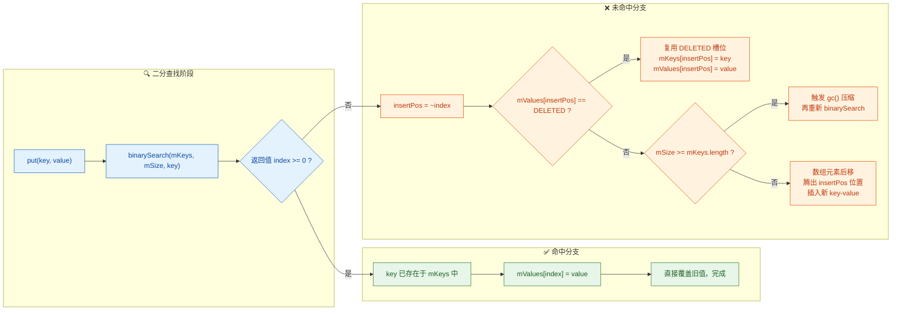
```mermaid
graph LR
    subgraph SEARCH["🔍 二分查找阶段"]
        direction TB
        A["put(key, value)"] --> B["binarySearch(mKeys, mSize, key)"]
        B --> C{"返回值 index >= 0 ?"}
    end

    subgraph HIT["✅ 命中分支"]
        direction TB
        D["key 已存在于 mKeys 中"] --> E["mValues#91;index#93; = value"]
        E --> F["直接覆盖旧值，完成"]
    end

    subgraph MISS["❌ 未命中分支"]
        direction TB
        G["insertPos = ~index"] --> H{"mValues#91;insertPos#93; == DELETED ?"}
        H -- "是" --> I["复用 DELETED 槽位\nmKeys#91;insertPos#93; = key\nmValues#91;insertPos#93; = value"]
        H -- "否" --> J{"mSize >= mKeys.length ?"}
        J -- "是" --> K["触发 gc() 压缩\n再重新 binarySearch"]
        J -- "否" --> L["数组元素后移\n腾出 insertPos 位置\n插入新 key-value"]
    end

    C -- "是" --> D
    C -- "否" --> G

    classDef searchCls fill:#E3F2FD,stroke:#1565C0,color:#0D47A1
    classDef hitCls fill:#E8F5E9,stroke:#2E7D32,color:#1B5E20
    classDef missCls fill:#FFF3E0,stroke:#E65100,color:#BF360C
    classDef deletedCls fill:#FCE4EC,stroke:#C62828,color:#B71C1C

    class A,B,C searchCls
    class D,E,F hitCls
    class G,H,I,J,K,L missCls
```

现在来看 `put()` 方法的完整源码，体会二分查找如何与插入逻辑配合：

```java
public void put(int key, E value) {
    // 第一步：二分查找 key 的位置
    int i = ContainerHelpers.binarySearch(mKeys, mSize, key);

    if (i >= 0) {
        // 找到了相同的 key，直接覆盖 value（等价于 HashMap 的 put 覆盖语义）
        mValues[i] = value;
    } else {
        // 没找到，将负数索引还原为插入位置
        i = ~i;

        // 优化：如果插入位置恰好是一个 DELETED 槽位，直接复用
        // 这样就不需要移动数组元素了
        if (i < mSize && mValues[i] == DELETED) {
            mKeys[i] = key;     // 覆盖 key
            mValues[i] = value; // 覆盖 value
            return;             // 完成，无需调整 mSize
        }

        // 如果存在垃圾槽位且数组已满，先做一次压缩
        if (mGarbage && mSize >= mKeys.length) {
            gc(); // 压缩数组，清除所有 DELETED 槽位

            // gc() 之后数组布局变了，需要重新二分查找插入位置
            i = ~ContainerHelpers.binarySearch(mKeys, mSize, key);
        }

        // 在位置 i 处插入新元素（可能触发数组扩容 + 元素后移）
        mKeys = GrowingArrayUtils.insert(mKeys, mSize, i, key);
        mValues = GrowingArrayUtils.insert(mValues, mSize, i, value);
        mSize++; // 有效元素数 +1
    }
}
```

`get()` 方法就简单多了：

```java
public E get(int key) {
    return get(key, null); // 默认 fallback 为 null
}

@SuppressWarnings("unchecked")
public E get(int key, E valueIfKeyNotFound) {
    // 二分查找 key 的位置
    int i = ContainerHelpers.binarySearch(mKeys, mSize, key);

    // 没找到，或者找到的位置已被标记为 DELETED
    if (i < 0 || mValues[i] == DELETED) {
        return valueIfKeyNotFound; // 返回默认值
    } else {
        return (E) mValues[i]; // 找到了，强转返回
    }
}
```

**二分查找的性能特征：**

| 操作 | 时间复杂度 | 说明 |
|------|-----------|------|
| `get(key)` | O(log n) | 纯二分查找 |
| `put(key, value)` | O(log n) + O(n) | 二分查找 + 最坏情况数组移动 |
| `delete(key)` | O(log n) | 二分查找 + O(1) 标记删除 |
| `indexOfKey(key)` | O(log n) | 纯二分查找 |
| `indexOfValue(value)` | O(n) | 线性扫描 |
| `keyAt(index)` / `valueAt(index)` | O(1) | 直接数组下标访问 |

对比 `HashMap` 的理论 O(1)，`SparseArray` 的 O(log n) 查找确实慢一些。但在 n < 1000 的场景下，log₂(1000) ≈ 10 次比较，而且是对连续内存中的 `int` 数组做比较（cache-friendly），实际耗时往往比 `HashMap` 的哈希计算 + 可能的链表/红黑树遍历还要快。这就是为什么 Android 官方推荐在小数据量场景下优先使用 `SparseArray`。

---

**📝 练习题**

以下关于 `SparseArray` 的二分查找实现，说法正确的是？

A. `binarySearch` 未找到时返回 -1，调用方需要额外计算插入位置

B. `(lo + hi) >>> 1` 和 `(lo + hi) / 2` 完全等价，只是写法不同

C. `binarySearch` 未找到时返回 `~lo`，对返回值再次取反即可得到插入位置

D. `SparseArray` 的 `mKeys` 数组无需保持有序，二分查找会自动排序


**【答案】** C

**【解析】** `ContainerHelpers.binarySearch()` 在未找到目标 key 时返回 `~lo`（按位取反），这是一个负数。调用方对这个负数再做一次 `~` 运算就能还原出正确的插入位置索引，这个设计将"是否找到"和"插入位置"两个信息编码在一个 `int` 返回值中，非常优雅。A 错在返回的不是 -1 而是 `~lo`；B 错在当 `lo + hi` 溢出时 `>>> 1` 仍能正确工作而 `/ 2` 会得到负数；D 错在 `mKeys` 必须始终保持升序，这是二分查找的前提条件。

---

## 延迟删除（Lazy Deletion）

SparseArray 的删除策略是它区别于普通数组最精妙的设计之一。核心思想可以用一句话概括：**不急着真删，先做个标记，等合适的时机再统一清理**。这种策略在计算机科学中被称为 Lazy Deletion（惰性删除 / 延迟删除），它在 SparseArray 的场景下带来了显著的性能收益。

### 为什么不直接删除？

要理解延迟删除的价值，我们先想想"直接删除"意味着什么。SparseArray 的底层是两个紧凑的平行数组：

```java
// SparseArray 底层存储
int[]    keys;    // [10, 20, 30, 40, 50]  — 有序排列
Object[] values;  // [A,  B,  C,  D,  E ]  — 与 keys 一一对应
```

如果我们要删除 key=30 对应的元素，"直接删除"就意味着必须把后面的元素全部往前搬一位，以维持数组的紧凑性和有序性：

```java
// 直接删除 key=30 → 需要数组搬移 (System.arraycopy)
// 删除前: [10, 20, 30, 40, 50]
//                  ↑ 删这个
// 删除后: [10, 20, 40, 50, __]
//                  ←←←←←← 后面全部左移
```

这个搬移操作的时间复杂度是 O(n)。如果你在一个循环里连续删除多个元素，每次都触发 `System.arraycopy`，性能开销会非常可观。尤其在 Android 这种对性能敏感的平台上，这是不可接受的。

### DELETED 标记机制

SparseArray 的做法非常聪明——它在内部定义了一个特殊的哨兵对象（Sentinel Object）：

```java
// SparseArray.java 源码
private static final Object DELETED = new Object(); // 全局唯一的"墓碑"标记
```

当你调用 `delete()` 或 `remove()` 时，SparseArray 并不会真正移动数组元素，而是简单地把对应位置的 value 替换为这个 `DELETED` 标记：

```java
// SparseArray.delete() 源码简化
public void delete(int key) {
    // 用二分查找定位 key 在 keys[] 中的索引
    int i = ContainerHelpers.binarySearch(mKeys, mSize, key);

    // 如果找到了（索引 >= 0）
    if (i >= 0) {
        // 不搬移数组！只是把 value 标记为 DELETED
        if (mValues[i] != DELETED) {
            mValues[i] = DELETED; // 打上"墓碑"标记
            mGarbage = true;      // 设置"有垃圾需要清理"的标志位
        }
    }
}
```

执行完 `delete(30)` 后，数组的实际状态是这样的：

```java
// delete(30) 之后的内存状态
// keys:   [10,  20,  30,      40,  50]   ← key 还在原位！
// values: [ A,   B,  DELETED,  D,   E]   ← 只是 value 被替换了
//                     ^^^^^^^^
//                     墓碑标记，不是 null
// mGarbage = true  ← 标记"有垃圾待清理"
// mSize 不变       ← 逻辑大小暂时不变
```

注意几个关键细节：

- `keys[2]` 仍然是 30，并没有被清除
- `values[2]` 被设为 `DELETED` 而不是 `null`（这个区分很重要，后面会讲）
- `mGarbage` 标志位被设为 `true`，表示数组中存在"垃圾"
- 整个操作是 O(log n) 的——只有一次二分查找 + 一次赋值，没有任何数组搬移

### DELETED 与 null 的区别

你可能会问：为什么不直接设为 `null`，而要用一个专门的 `DELETED` 对象？原因在于 SparseArray 允许用户存储 `null` 作为合法的 value：

```java
SparseArray<String> sparse = new SparseArray<>();

sparse.put(1, "hello");  // 正常存值
sparse.put(2, null);     // 合法！用户主动存了一个 null
sparse.delete(1);        // 删除 key=1

// 此时内部状态：
// keys:   [1,       2   ]
// values: [DELETED, null ]
//          ↑ 已删除  ↑ 用户存的合法 null
```

如果用 `null` 做删除标记，就无法区分"这个位置被删除了"和"用户存了一个 null"。`DELETED` 哨兵对象解决了这个歧义问题。

### gc() 压缩——真正的清理时刻

"垃圾"不能永远留在数组里，否则会浪费空间，也会影响二分查找的准确性。SparseArray 内部有一个 `gc()` 方法（注意，这不是 JVM 的 GC，而是 SparseArray 自己的内部压缩方法），负责把所有 `DELETED` 标记的"空洞"挤压掉：

```java
// SparseArray.gc() 源码简化
private void gc() {
    int n = mSize;           // 当前逻辑大小（含 DELETED 的）
    int o = 0;               // 压缩后的写入指针，指向下一个有效位置
    int[] keys = mKeys;
    Object[] values = mValues;

    // 遍历所有元素
    for (int i = 0; i < n; i++) {
        Object val = values[i];

        // 只保留非 DELETED 的元素
        if (val != DELETED) {
            // 如果当前位置 i 和写入位置 o 不同，说明前面有空洞
            if (i != o) {
                keys[o] = keys[i];     // 把 key 搬到前面
                values[o] = values[i]; // 把 value 搬到前面
                values[i] = null;      // 清理旧位置，帮助 JVM GC
            }
            o++; // 写入指针前进
        }
    }

    mGarbage = false; // 清理完毕，重置标志位
    mSize = o;        // 更新真实大小
}
```

用一个具体例子来可视化这个过程：

```java
// gc() 压缩过程演示
// 假设连续删除了 key=20 和 key=40

// gc() 之前:
// index:  [0]  [1]      [2]  [3]      [4]
// keys:   [10, 20,      30,  40,      50]
// values: [A,  DELETED, C,   DELETED, E ]
// mSize = 5, mGarbage = true

// ---- gc() 开始遍历 ----
// i=0: values[0]=A (有效) → keys[0]=10, values[0]=A, o=1
// i=1: values[1]=DELETED  → 跳过
// i=2: values[2]=C (有效) → keys[1]=30, values[1]=C, o=2  ← 搬移！
// i=3: values[3]=DELETED  → 跳过
// i=4: values[4]=E (有效) → keys[2]=50, values[2]=E, o=3  ← 搬移！

// gc() 之后:
// index:  [0]  [1]  [2]  [3]    [4]
// keys:   [10, 30,  50,  (40),  (50) ]  ← 后面是残留数据，不影响
// values: [A,  C,   E,   null,  null ]  ← 旧位置已清 null
// mSize = 3, mGarbage = false
```

整个 `gc()` 是一次 O(n) 的线性扫描，用双指针（读指针 `i` + 写指针 `o`）完成原地压缩，不需要额外的内存分配。

### gc() 的触发时机

`gc()` 不是随时调用的，SparseArray 精心选择了触发时机——只在"不得不整理"的时候才执行：

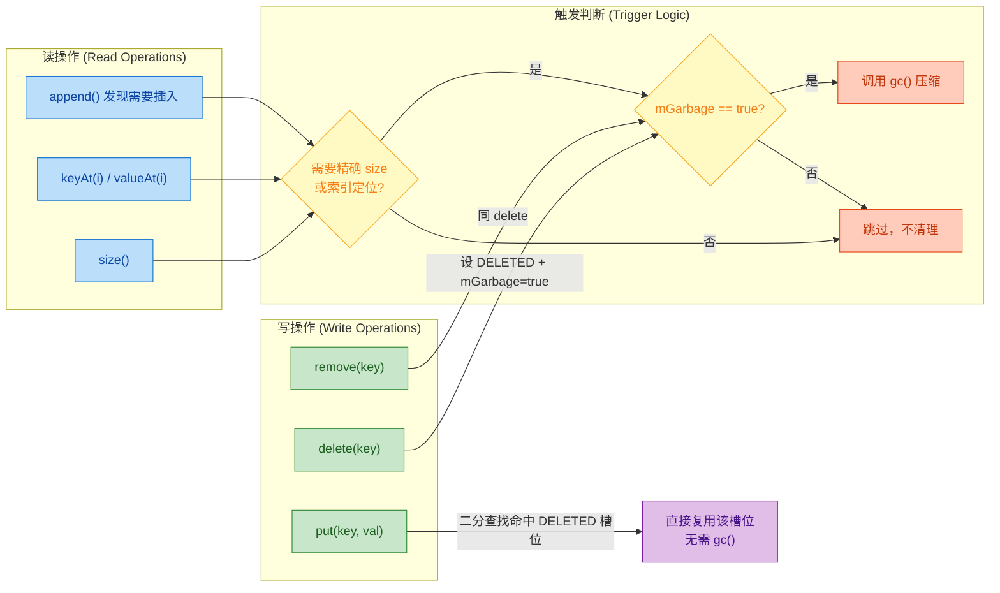
```mermaid
graph LR
    subgraph 写操作["写操作 (Write Operations)"]
        direction TB
        PUT["put(key, val)"]
        DEL["delete(key)"]
        REM["remove(key)"]
    end

    subgraph 判断逻辑["触发判断 (Trigger Logic)"]
        direction TB
        CHECK{"mGarbage == true?"}
        NEED{"需要精确 size\n或索引定位?"}
        GC["调用 gc() 压缩"]
        SKIP["跳过，不清理"]
    end

    subgraph 读操作["读操作 (Read Operations)"]
        direction TB
        SIZE["size()"]
        KAI["keyAt(i) / valueAt(i)"]
        APPEND["append() 发现需要插入"]
    end

    DEL -->|"设 DELETED + mGarbage=true"| CHECK
    REM -->|"同 delete"| CHECK
    PUT -->|"二分查找命中 DELETED 槽位"| REUSE["直接复用该槽位\n无需 gc()"]
    SIZE --> NEED
    KAI --> NEED
    APPEND --> NEED
    NEED -->|"是"| CHECK
    NEED -->|"否"| SKIP
    CHECK -->|"是"| GC
    CHECK -->|"否"| SKIP

    classDef writeStyle fill:#C8E6C9,stroke:#388E3C,color:#1B5E20
    classDef readStyle fill:#BBDEFB,stroke:#1976D2,color:#0D47A1
    classDef logicStyle fill:#FFF9C4,stroke:#F9A825,color:#F57F17
    classDef actionStyle fill:#FFCCBC,stroke:#E64A19,color:#BF360C
    classDef reuseStyle fill:#E1BEE7,stroke:#7B1FA2,color:#4A148C

    class PUT,DEL,REM writeStyle
    class SIZE,KAI,APPEND readStyle
    class CHECK,NEED logicStyle
    class GC,SKIP actionStyle
    class REUSE reuseStyle
```

具体来说，以下操作会检查并触发 `gc()`：

```java
// 1. size() — 需要返回精确的元素个数
public int size() {
    if (mGarbage) {
        gc(); // 必须先压缩，才能得到真实 size
    }
    return mSize;
}

// 2. keyAt(index) / valueAt(index) — 按索引访问
// 需要确保索引对应的是有效元素，而非 DELETED 空洞
public int keyAt(int index) {
    if (mGarbage) {
        gc(); // 先压缩，保证索引连续
    }
    return mKeys[index];
}

// 3. put() 中发现需要插入新元素且数组已满
// 在扩容之前先 gc()，看看压缩后是否还需要扩容
public void put(int key, E value) {
    int i = ContainerHelpers.binarySearch(mKeys, mSize, key);

    if (i >= 0) {
        // key 已存在，直接覆盖 value
        mValues[i] = value;
    } else {
        i = ~i; // 取反得到插入位置

        // 关键优化：如果插入位置恰好是 DELETED 槽位，直接复用！
        if (i < mSize && mValues[i] == DELETED) {
            mKeys[i] = key;
            mValues[i] = value; // 废物利用，零成本插入
            return;
        }

        // 如果有垃圾且数组满了，先 gc() 再决定是否扩容
        if (mGarbage && mSize >= mKeys.length) {
            gc();
            i = ~ContainerHelpers.binarySearch(mKeys, mSize, key); // 重新定位
        }

        // 插入新元素（可能需要数组搬移）
        mKeys = GrowingArrayUtils.insert(mKeys, mSize, i, key);
        mValues = GrowingArrayUtils.insert(mValues, mSize, i, value);
        mSize++;
    }
}
```

### DELETED 槽位复用——最精彩的优化

上面 `put()` 源码中有一个容易被忽略但极其精彩的优化：当 `put()` 通过二分查找确定了插入位置后，如果发现该位置恰好是一个 `DELETED` 槽位，就直接复用它，连 `gc()` 都不需要调用。

```java
// 槽位复用场景演示
SparseArray<String> sparse = new SparseArray<>();
sparse.put(10, "A");
sparse.put(20, "B");
sparse.put(30, "C");

// 内部: keys=[10, 20, 30], values=[A, B, C]

sparse.delete(20);
// 内部: keys=[10, 20, 30], values=[A, DELETED, C]
//                ↑ 这个位置被标记为 DELETED

sparse.put(20, "X");
// 二分查找 key=20 → 命中 index=1
// 发现 values[1] == DELETED → 直接复用！
// 内部: keys=[10, 20, 30], values=[A, X, C]
// 没有触发 gc()，没有数组搬移，O(log n) 完成！
```

这个优化在实际 Android 开发中非常有价值。比如 RecyclerView 的 ViewHolder 缓存场景中，经常会出现"删了又加回来"的模式，DELETED 槽位复用让这种操作几乎零开销。

### 延迟删除的性能分析

我们来对比一下"直接删除"和"延迟删除"在不同场景下的性能表现：

```java
// 场景：在一个 size=500 的 SparseArray 中连续删除 100 个元素

// ❌ 直接删除策略（假设的）
// 每次删除都要 System.arraycopy
// 最坏情况：500 + 499 + 498 + ... + 401 = 约 45,000 次元素搬移
// 时间复杂度：O(n × k)，其中 k 是删除次数

// ✅ 延迟删除策略（SparseArray 实际实现）
// 100 次 delete()：每次只做二分查找 + 赋值 = O(log n) × 100
// 最后触发一次 gc()：O(n) 的线性扫描
// 总计：O(k × log n + n) ≈ O(k × log n)，远优于直接删除
```

### 延迟删除的完整生命周期

用一个完整的例子串联整个流程：

```java
SparseArray<String> cache = new SparseArray<>();

// ① 初始填充
cache.put(100, "alpha");   // keys=[100], values=[alpha]
cache.put(200, "beta");    // keys=[100,200], values=[alpha,beta]
cache.put(300, "gamma");   // keys=[100,200,300], values=[alpha,beta,gamma]
cache.put(400, "delta");   // keys=[100,200,300,400], values=[alpha,beta,gamma,delta]

// ② 延迟删除
cache.delete(200);         // values[1] = DELETED, mGarbage = true
cache.delete(300);         // values[2] = DELETED, mGarbage = true
// 内部状态: keys=[100,200,300,400], values=[alpha,DELETED,DELETED,delta]
// 注意：mSize 仍然是 4！

// ③ 槽位复用
cache.put(200, "epsilon"); // 二分查找命中 index=1，发现 DELETED → 直接复用
// 内部状态: keys=[100,200,300,400], values=[alpha,epsilon,DELETED,delta]

// ④ 触发 gc()
int size = cache.size();   // size() 检测到 mGarbage=true → 触发 gc()
// gc() 压缩后: keys=[100,200,400], values=[alpha,epsilon,delta]
// mSize = 3, mGarbage = false
// size 返回 3
```

### 延迟删除的局限性

延迟删除并非没有代价，了解它的局限性同样重要：

1. **内存释放不及时**：被标记为 `DELETED` 的 value 对象不会立即被 JVM 回收。如果 value 是一个大对象（比如 Bitmap），在 `gc()` 被触发之前，它仍然占据内存。不过 SparseArray 在 `delete()` 时会把 value 设为 `DELETED`（一个轻量的 Object），原来的 value 引用已经断开，所以大对象其实是可以被 JVM GC 回收的。

2. **遍历时可能遇到 DELETED**：如果你直接通过索引遍历 `values` 数组（虽然正常 API 不会暴露这个问题），可能会遇到 `DELETED` 标记。SparseArray 的公开 API（如 `valueAt()`）会在遍历前先触发 `gc()`，所以使用者无需担心。

3. **size() 的语义**：在 `delete()` 之后、`gc()` 之前，`mSize` 字段并不反映真实的有效元素数量。但由于 `size()` 方法会先触发 `gc()`，对外暴露的 size 始终是准确的。

---

**📝 练习题**

以下代码执行后，`sparse.size()` 返回什么值？

```java
SparseArray<String> sparse = new SparseArray<>();
sparse.put(1, "A");
sparse.put(2, "B");
sparse.put(3, "C");
sparse.delete(2);
sparse.delete(3);
sparse.put(2, "D");
// 此时调用 sparse.size() = ?
```

A. 1


B. 2


C. 3


D. 4


**【答案】** B

**【解析】** 逐步分析内部状态：`put(1,"A")`, `put(2,"B")`, `put(3,"C")` 后，数组有 3 个有效元素。`delete(2)` 将 `values[1]` 标记为 `DELETED`，`delete(3)` 将 `values[2]` 标记为 `DELETED`，此时 `mSize` 仍为 3，但有 2 个墓碑。接着 `put(2, "D")` 通过二分查找命中 index=1，发现该位置是 `DELETED`，直接复用槽位，不改变 `mSize`。最后调用 `size()` 时，检测到 `mGarbage == true`，触发 `gc()` 压缩。`gc()` 遍历后只保留 `values != DELETED` 的元素：`key=1 → "A"` 和 `key=2 → "D"`，压缩后 `mSize` 更新为 2。所以 `size()` 返回 2。

---

## SparseArray vs HashMap：内存优化与避免装箱

### 核心矛盾：HashMap 用 int 做 key 时发生了什么？

在标准 Java 中，`HashMap<Integer, Object>` 是我们用整型做 key 时的常规选择。但在 Android 这种内存敏感的环境下，这个"常规选择"隐藏着巨大的内存开销。问题的根源在于 Java 泛型的类型擦除（Type Erasure）——`HashMap<K, V>` 的 K 不能是 primitive type，必须是包装类型 `Integer`。

这就引出了两个核心问题：自动装箱（Autoboxing）带来的对象膨胀，以及 HashMap 自身数据结构的内存开销。

### 自动装箱的内存代价

当你写下 `map.put(1, value)` 时，编译器会自动将 `1` 装箱为 `Integer.valueOf(1)`。我们来精确计算一个 `Integer` 对象在内存中的真实占用：

```java
// 一个 int 基本类型：4 bytes，就这么简单
int key = 42;

// 一个 Integer 对象的内存布局（64位 JVM，开启指针压缩）：
// ┌─────────────────────────────────────────────┐
// │ Object Header (Mark Word)     : 8 bytes     │  // 锁状态、GC 年龄、hashCode 等
// │ Object Header (Klass Pointer) : 4 bytes     │  // 指向 Integer.class 的压缩指针
// │ int value 字段                 : 4 bytes     │  // 实际存储的 int 值
// │ Padding (对齐填充)             : 0 bytes     │  // 已经是 8 的倍数，无需填充
// ├─────────────────────────────────────────────┤
// │ 合计                           : 16 bytes    │  // 是 int 的 4 倍！
// └─────────────────────────────────────────────┘
```

一个 `int` 只要 4 bytes，而装箱后的 `Integer` 需要 16 bytes——膨胀了 4 倍。虽然 `Integer` 内部有一个缓存池（IntegerCache，默认缓存 -128 到 127），但超出这个范围的每个 key 都会在堆上创建一个新的 `Integer` 对象。

```java
// Integer 缓存机制源码简化
public static Integer valueOf(int i) {
    // 只有 -128 ~ 127 范围内的值会复用缓存对象
    if (i >= IntegerCache.low && i <= IntegerCache.high)
        return IntegerCache.cache[i + (-IntegerCache.low)];
    // 超出范围？每次都 new 一个新对象，产生 GC 压力
    return new Integer(i);
}
```

在 Android 场景中，key 往往是 View ID、资源 ID 这类值，它们通常远超 127（如 `R.id.textView` 可能是 `0x7f080001`），所以缓存几乎帮不上忙。

### HashMap 的结构性内存开销

装箱只是问题的一半。HashMap 自身的数据结构也非常"重量级"：

```text
HashMap 内部结构（每存一个键值对的开销）

┌──────────────────────────────────────────────────────────┐
│                    HashMap 对象本身                        │
│  table (Node[] 数组引用)          : 4 bytes               │
│  size, threshold, loadFactor...  : ~20 bytes              │
│  ─────────────────────────────────────────────            │
│  Node[] table 数组               : 16 + 4*capacity bytes  │
│  (数组对象头 + 每个槽位的引用)                               │
└──────────────────────────────────────────────────────────┘

┌──────────────────────────────────────────────────────────┐
│              每个 Entry (HashMap.Node)                     │
│  Object Header                   : 12 bytes               │
│  int hash (缓存的哈希值)          : 4 bytes                │
│  Object next (链表下一个节点)     : 4 bytes                │
│  Object key (指向 Integer 对象)   : 4 bytes                │
│  Object value (指向 value 对象)   : 4 bytes                │
│  Padding                         : 4 bytes                │
│  ────────────────────────────────────────────             │
│  合计                             : 32 bytes per entry    │
└──────────────────────────────────────────────────────────┘
```

也就是说，HashMap 中每存一对 `int → Object` 映射，真实内存消耗大约是：

```java
// HashMap 存储一个 int->Object 映射的内存成本估算
// Integer key 对象       : 16 bytes   // 装箱产生的包装对象
// HashMap.Node 对象      : 32 bytes   // Entry 节点本身
// Node[] 中的槽位引用     : ~4 bytes   // 数组中指向 Node 的指针（均摊）
// ──────────────────────────────────
// 合计约                  : ~52 bytes  // 每个键值对的总开销
```

### SparseArray 的内存布局对比

SparseArray 用两个平行数组直接存储，没有任何中间对象：

```text
SparseArray 内部结构

┌──────────────────────────────────────────────────────┐
│                 SparseArray 对象                       │
│  int[] mKeys     ──→ [3, 10, 42, 100, ...]           │
│                       每个元素 4 bytes，无装箱          │
│                                                       │
│  Object[] mValues ──→ [valA, valB, valC, valD, ...]   │
│                       每个元素 4 bytes (对象引用)       │
│                                                       │
│  int mSize        : 4 bytes                           │
└──────────────────────────────────────────────────────┘

每个键值对的内存成本：
  int key (在 int[] 中)       : 4 bytes    // 原始类型，零额外开销
  Object ref (在 Object[] 中) : 4 bytes    // 仅一个引用
  ─────────────────────────────────────
  合计约                       : ~8 bytes   // 每个键值对
```

### 量化对比：存储 500 个 int→Object 映射

我们用一张表来直观感受差距：

```text
┌─────────────────────┬──────────────────┬──────────────────┐
│       开销项目       │    HashMap       │   SparseArray    │
├─────────────────────┼──────────────────┼──────────────────┤
│ Key 存储            │ 500 × 16B = 8KB  │ 500 × 4B = 2KB  │
│ (Integer 对象)      │ (装箱对象)        │ (int[] 原始数组)  │
├─────────────────────┼──────────────────┼──────────────────┤
│ Entry/Node 对象     │ 500 × 32B = 16KB │ 0 (无 Entry)     │
├─────────────────────┼──────────────────┼──────────────────┤
│ 桶数组 (table)      │ ~4KB             │ 0 (无桶)          │
│ (capacity=1024)     │                  │                   │
├─────────────────────┼──────────────────┼──────────────────┤
│ Value 引用          │ (含在 Node 中)    │ 500 × 4B = 2KB   │
├─────────────────────┼──────────────────┼──────────────────┤
│ 总计 (约)           │ ~28 KB           │ ~4 KB             │
├─────────────────────┼──────────────────┼──────────────────┤
│ 内存节省            │ 基准              │ 节省约 85%        │
└─────────────────────┴──────────────────┴──────────────────┘
```

节省 85% 的内存，这在 Android 设备上是非常显著的优化。

### GC 压力对比

内存占用只是一方面，对象数量对 GC（Garbage Collection）的影响同样关键：

```java
// 存储 500 个映射时，堆上的对象数量对比

// HashMap 方案：
// 1 个 HashMap 对象
// 1 个 Node[] 数组
// 500 个 HashMap.Node 对象
// 500 个 Integer 对象（假设都超出缓存范围）
// ──────────────────
// 合计：约 1002 个对象    ← GC 需要遍历和标记这些对象

// SparseArray 方案：
// 1 个 SparseArray 对象
// 1 个 int[] 数组（基本类型数组，内部无对象引用）
// 1 个 Object[] 数组
// ──────────────────
// 合计：约 3 个对象       ← GC 几乎无额外负担
```

在 Android 的 ART/Dalvik 虚拟机中，GC 暂停（GC Pause）会直接导致 UI 卡顿。减少堆上的对象数量，意味着 GC 扫描和标记的工作量大幅降低，应用运行更流畅。

### 性能维度的权衡

内存上 SparseArray 完胜，但性能上需要客观看待：

```text
┌──────────────────┬────────────────────────┬────────────────────────┐
│     操作          │      HashMap           │     SparseArray        │
├──────────────────┼────────────────────────┼────────────────────────┤
│ put / get        │ O(1) 均摊              │ O(log n) 二分查找       │
│                  │ 哈希计算 + 数组定位      │ 查找快，但插入可能搬移   │
├──────────────────┼────────────────────────┼────────────────────────┤
│ delete           │ O(1) 均摊              │ O(log n) 查找           │
│                  │                        │ + O(1) 标记 DELETED     │
├──────────────────┼────────────────────────┼────────────────────────┤
│ 插入（中间位置）  │ O(1) 均摊              │ O(n) 数组搬移           │
│                  │                        │ 最坏情况需移动所有元素    │
├──────────────────┼────────────────────────┼────────────────────────┤
│ 遍历             │ 需跳过空桶，不保序       │ 天然有序，顺序遍历高效    │
│                  │ 缓存不友好              │ 数组连续内存，缓存友好    │
├──────────────────┼────────────────────────┼────────────────────────┤
│ 哈希冲突         │ 链表/红黑树退化风险      │ 不存在（无哈希机制）      │
└──────────────────┴────────────────────────┴────────────────────────┘
```

这里有一个容易被忽略的点：虽然 SparseArray 的理论时间复杂度不如 HashMap，但在小数据量下，数组的 CPU 缓存命中率（Cache Locality）远高于 HashMap 的链式结构。现代 CPU 从 L1/L2 缓存读取连续内存的速度，比跳转到堆上随机位置快一个数量级。所以在实际 benchmark 中，几百个元素时 SparseArray 的 `get()` 性能往往与 HashMap 持平甚至更快。

### 代码层面的直观对比

```java
// ========== HashMap 方案 ==========
// 泛型要求 key 必须是 Integer，触发自动装箱
HashMap<Integer, String> hashMap = new HashMap<>();
hashMap.put(1001, "Alice");    // 1001 被装箱为 new Integer(1001)
hashMap.put(2002, "Bob");      // 2002 被装箱为 new Integer(2002)

// 取值时，传入的 int 也会被装箱为 Integer，再调用 equals() 比较
String name = hashMap.get(1001);  // int 1001 → Integer.valueOf(1001) → equals()

// 遍历需要通过 entrySet()，每个 Entry 都是堆上的独立对象
for (Map.Entry<Integer, String> entry : hashMap.entrySet()) {
    int key = entry.getKey();       // Integer → int，触发拆箱
    String value = entry.getValue();
}

// ========== SparseArray 方案 ==========
// key 直接是 int，value 是泛型，无任何装箱
SparseArray<String> sparse = new SparseArray<>();
sparse.put(1001, "Alice");    // 直接存入 int[] keys，零装箱
sparse.put(2002, "Bob");      // 同上

// 取值时直接用 int 做二分查找，无装箱、无 equals()
String name2 = sparse.get(1001);  // 纯 int 比较，高效

// 遍历通过 index 访问，无中间对象
for (int i = 0; i < sparse.size(); i++) {
    int key = sparse.keyAt(i);       // 直接从 int[] 读取
    String value = sparse.valueAt(i); // 直接从 Object[] 读取
    // 无 Entry 对象，无 Iterator 对象，GC 友好
}
```

### 一个容易踩的坑：SparseArray 没有实现标准 Map 接口

```java
// SparseArray 不是 java.util.Map 的实现类
// 以下代码会编译报错：
// Map<Integer, String> map = new SparseArray<>();  // ✗ 编译错误

// 这意味着：
// 1. 不能传给接受 Map 参数的方法
// 2. 不能用 Collections 工具类操作
// 3. 不支持 Stream API（Java 8）
// 4. 不支持 putIfAbsent、compute 等 Map 默认方法

// 如果你的代码需要面向 Map 接口编程，HashMap 仍然是正确选择
// SparseArray 是 Android 平台的特化优化，不是 Map 的通用替代品
```

---

## 适用场景：key 为 int、数据量 < 1000

### 黄金法则：什么时候该用 SparseArray？

SparseArray 并不是万能的 HashMap 替代品。它的优势建立在特定前提之上，用错场景反而会适得其反。

### 最佳适用场景

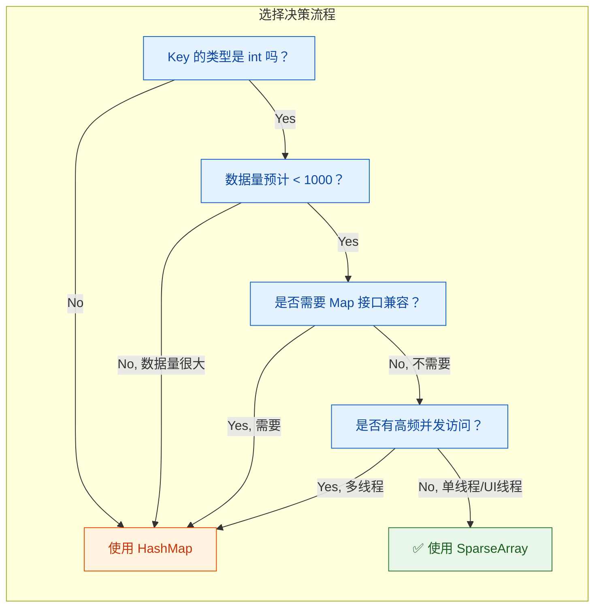
```mermaid
graph LR
    subgraph Decision["选择决策流程"]
        direction TB
        Q1["Key 的类型是 int 吗？"]
        Q2["数据量预计 < 1000？"]
        Q3["是否需要 Map 接口兼容？"]
        Q4["是否有高频并发访问？"]
        R1["✅ 使用 SparseArray"]
        R2["使用 HashMap"]
    end

    Q1 -->|"Yes"| Q2
    Q1 -->|"No"| R2
    Q2 -->|"Yes"| Q3
    Q2 -->|"No, 数据量很大"| R2
    Q3 -->|"No, 不需要"| Q4
    Q3 -->|"Yes, 需要"| R2
    Q4 -->|"No, 单线程/UI线程"| R1
    Q4 -->|"Yes, 多线程"| R2

    classDef decision fill:#E3F2FD,stroke:#1565C0,color:#0D47A1
    classDef good fill:#E8F5E9,stroke:#2E7D32,color:#1B5E20
    classDef alt fill:#FFF3E0,stroke:#E65100,color:#BF360C

    class Q1,Q2,Q3,Q4 decision
    class R1 good
    class R2 alt
```

### Android 开发中的典型使用场景

```java
// ━━━━━━━━━━━━━━━━━━━━━━━━━━━━━━━━━━━━━━━━━━━━━━━━━━━━━━
// 场景 1：View ID → View 引用的映射
// ━━━━━━━━━━━━━━━━━━━━━━━━━━━━━━━━━━━━━━━━━━━━━━━━━━━━━━
// Android 的 View ID 本质上就是 int（R.id.xxx 编译后是 int 常量）
// 这是 SparseArray 最经典的用武之地
SparseArray<View> viewCache = new SparseArray<>();
viewCache.put(R.id.text_title, findViewById(R.id.text_title));     // key 是 int 型资源 ID
viewCache.put(R.id.btn_submit, findViewById(R.id.btn_submit));     // 无装箱，直接存储
viewCache.put(R.id.img_avatar, findViewById(R.id.img_avatar));     // 内存紧凑

// 实际上 Android 的 ViewHolder 模式内部就大量使用 SparseArray

// ━━━━━━━━━━━━━━━━━━━━━━━━━━━━━━━━━━━━━━━━━━━━━━━━━━━━━━
// 场景 2：消息类型 → Handler 的映射
// ━━━━━━━━━━━━━━━━━━━━━━━━━━━━━━━━━━━━━━━━━━━━━━━━━━━━━━
// Message.what 是 int 类型，完美匹配 SparseArray
SparseArray<MessageHandler> handlers = new SparseArray<>();
handlers.put(MSG_LOAD_DATA, new DataLoadHandler());     // what = 1
handlers.put(MSG_UPDATE_UI, new UIUpdateHandler());     // what = 2
handlers.put(MSG_NETWORK_ERROR, new ErrorHandler());    // what = 3

// 收到消息时直接查找对应的 handler
public void handleMessage(Message msg) {
    MessageHandler handler = handlers.get(msg.what);    // O(log n) 查找
    if (handler != null) {
        handler.handle(msg);    // 分发处理
    }
}

// ━━━━━━━━━━━━━━━━━━━━━━━━━━━━━━━━━━━━━━━━━━━━━━━━━━━━━━
// 场景 3：状态码 → 描述信息的映射
// ━━━━━━━━━━━━━━━━━━━━━━━━━━━━━━━━━━━━━━━━━━━━━━━━━━━━━━
// HTTP 状态码、业务错误码等，天然是 int
SparseArray<String> statusMessages = new SparseArray<>();
statusMessages.put(200, "OK");                          // 成功
statusMessages.put(404, "Not Found");                   // 未找到
statusMessages.put(500, "Internal Server Error");       // 服务器错误
statusMessages.put(10001, "Token Expired");             // 自定义业务码
```

### 为什么是 1000 这个阈值？

"数据量 < 1000"这个建议并不是拍脑袋的数字，而是基于二分查找的性能特征：

```java
// 二分查找的比较次数 = log2(n)
// n = 100   → log2(100)  ≈ 7 次比较    ← 非常快
// n = 500   → log2(500)  ≈ 9 次比较    ← 依然很快
// n = 1000  → log2(1000) ≈ 10 次比较   ← 可以接受
// n = 5000  → log2(5000) ≈ 13 次比较   ← 查找本身还行
// n = 10000 → log2(10000)≈ 14 次比较   ← 查找还行，但插入搬移成本高

// 真正的瓶颈不在查找，而在插入时的数组搬移：
// 在 SparseArray 中间位置插入一个元素，需要将后面所有元素后移
// System.arraycopy(mKeys, insertPos, mKeys, insertPos + 1, mSize - insertPos);
// 当 n = 1000 时，最坏情况需要搬移 1000 个 int（约 4KB 数据）
// 当 n = 10000 时，最坏情况需要搬移 10000 个 int（约 40KB 数据）
// 这个 O(n) 的搬移操作才是大数据量下的性能杀手
```

Google 官方文档的原话是：

> "It is generally slower than a traditional HashMap, since lookups require a binary search and adds and removes require inserting and deleting entries in the array. For containers holding up to hundreds of items, the performance difference is less than 50%."

翻译过来就是：几百个元素以内，性能差距不超过 50%，而内存节省远超这个比例，所以是值得的。超过这个范围，插入和删除的数组搬移成本会逐渐抵消内存优势。

### 不适合使用 SparseArray 的场景

```java
// ✗ 场景 1：key 不是 int 类型
// String key、Long key、自定义对象 key → 只能用 HashMap
HashMap<String, User> userMap = new HashMap<>();  // key 是 String，无法用 SparseArray

// ✗ 场景 2：数据量很大（数万级别）
// 频繁插入删除时，数组搬移的 O(n) 成本太高
// 此时 HashMap 的 O(1) 优势会非常明显
HashMap<Integer, Record> bigDataMap = new HashMap<>(20000);

// ✗ 场景 3：需要线程安全
// SparseArray 没有任何同步机制，多线程下不安全
// 应使用 ConcurrentHashMap 或加锁的 HashMap
ConcurrentHashMap<Integer, Session> sessionMap = new ConcurrentHashMap<>();

// ✗ 场景 4：需要面向 Map 接口编程
// 框架层代码、库代码通常需要接受 Map 类型参数
public void processData(Map<Integer, String> data) {
    // SparseArray 无法传入这里
}

// ✗ 场景 5：需要 null key
// HashMap 允许一个 null key
// SparseArray 的 key 是 int，不存在 null 的概念
```

### Android Framework 中的实际使用

SparseArray 在 Android 系统源码中被大量使用，这本身就是最好的"适用场景"证明：

```java
// Android 源码中的真实使用案例：

// 1. View.java — 存储 View 的 tag
// 每个 View 可以通过 setTag(int key, Object tag) 存储多个 tag
// 内部就是用 SparseArray 实现的
private SparseArray<Object> mKeyedTags;  // key 是 int 型的 tag ID

// 2. Activity.java — 管理 Fragment
// FragmentManager 内部用 SparseArray 存储 Fragment
SparseArray<Fragment> mActive;           // key 是 Fragment 的 index

// 3. Resources.java — 缓存已加载的资源
// 资源 ID (R.drawable.xxx) 是 int，用 SparseArray 缓存 Drawable
SparseArray<WeakReference<Drawable>> mDrawableCache;

// 4. PackageManager — 存储权限信息
// uid 是 int 类型，完美匹配
SparseArray<String[]> mPermissions;      // uid → 权限列表
```

### 速查决策表

```text
┌────────────────────────────┬──────────────┬──────────────┐
│         判断条件            │  SparseArray │   HashMap    │
├────────────────────────────┼──────────────┼──────────────┤
│ Key 类型是 int              │     ✅       │     ✅       │
│ Key 类型是 String/Object    │     ✗        │     ✅       │
│ 数据量 < 几百               │     ✅ 首选   │     可用     │
│ 数据量 几百~1000            │     ✅ 推荐   │     可用     │
│ 数据量 > 1000               │     谨慎     │     ✅ 首选   │
│ 内存敏感（移动端）           │     ✅ 首选   │     次选     │
│ 需要 Map 接口兼容           │     ✗        │     ✅       │
│ 多线程并发                  │     ✗        │  ConcurrentHM│
│ 需要有序遍历（按 key 排序）  │     ✅ 天然   │  需 TreeMap  │
│ 高频随机插入删除             │     次选     │     ✅       │
└────────────────────────────┴──────────────┴──────────────┘
```

总结一句话：在 Android 开发中，只要你的 key 是 `int` 且数据量在千级以内，优先选择 `SparseArray`。它用更少的内存、更少的对象、更低的 GC 压力，换来几乎无感知的查找性能差异。这正是 Google 专门为 Android 设计这套集合框架的初衷——在资源受限的移动设备上，每一个字节都值得珍惜。

---

**📝 练习题**

以下关于 SparseArray 与 HashMap 的对比，说法正确的是？

A. SparseArray 实现了 java.util.Map 接口，可以作为 Map 的替代品使用


B. 当 key 为 int 类型且数据量为 200 时，SparseArray 的 get() 操作比 HashMap 慢很多，因为二分查找的时间复杂度是 O(log n)


C. SparseArray 通过使用 int[] 存储 key 避免了自动装箱，同时省去了 HashMap.Node 等中间对象，从而大幅降低内存占用和 GC 压力


D. SparseArray 内部使用哈希表实现，只是针对 int key 做了特殊优化


**【答案】** C

**【解析】** 逐项分析：

- A 错误：SparseArray 是 Android 平台的独立类，没有实现 `java.util.Map` 接口，不能传给接受 `Map` 参数的方法。
- B 错误：虽然二分查找理论上是 O(log n)，但 200 个元素只需约 8 次比较，加上数组连续内存带来的 CPU 缓存友好性，实际性能与 HashMap 的 O(1) 几乎无差别。Google 官方文档也指出"几百个元素内性能差距不超过 50%"。
- C 正确：这是 SparseArray 的核心优势——`int[]` 避免装箱（每个 key 省 12 bytes），无 Node 对象（每个 entry 省 32 bytes），堆上对象数量从 ~1000 降到 ~3，GC 压力大幅降低。
- D 错误：SparseArray 内部使用的是两个平行数组 + 二分查找，完全没有哈希表机制。

---

## SparseBooleanArray / SparseIntArray / SparseLongArray

在上一节中，我们深入剖析了 `SparseArray<E>` 的核心设计——双数组、二分查找、延迟删除。Android 团队在此基础上，针对 **value 也是基本类型** 的场景，进一步衍生出了三个"全原始类型"的专属集合。它们的设计哲学完全一致，但在 value 端彻底消灭了装箱（boxing），将内存节省推向极致。

### 为什么需要这三个变体

`SparseArray<E>` 的 key 端已经是 `int`，避免了 key 的装箱。但 value 端仍然是 `Object[]`，这意味着如果你存储的 value 是 `boolean`、`int` 或 `long`，每个值仍然会被自动装箱为 `Boolean`、`Integer`、`Long` 对象。

```java
// 使用 SparseArray<Boolean> 存储布尔值
SparseArray<Boolean> flags = new SparseArray<>();
flags.put(1, true);  // true 被自动装箱为 Boolean.TRUE 对象
flags.put(2, false); // false 被自动装箱为 Boolean.FALSE 对象
// 虽然 Boolean.TRUE/FALSE 是缓存的，但 Integer 超出 -128~127 就会创建新对象
```

我们用一张图来直观感受装箱带来的内存开销差异：

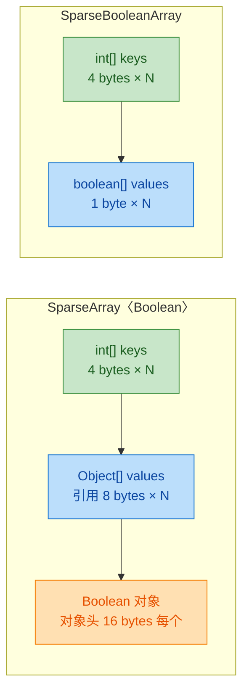
```mermaid
graph LR
    subgraph SparseArray_Boolean["SparseArray〈Boolean〉"]
        direction TB
        KA["int[] keys<br/>4 bytes × N"]
        VA["Object[] values<br/>引用 8 bytes × N"]
        BO["Boolean 对象<br/>对象头 16 bytes 每个"]
        KA --> VA
        VA --> BO
    end

    subgraph SparseBooleanArray_Native["SparseBooleanArray"]
        direction TB
        KB["int[] keys<br/>4 bytes × N"]
        VB["boolean[] values<br/>1 byte × N"]
        KB --> VB
    end

    classDef greenBox fill:#C8E6C9,stroke:#388E3C,color:#1B5E20
    classDef blueBox fill:#BBDEFB,stroke:#1976D2,color:#0D47A1
    classDef orangeBox fill:#FFE0B2,stroke:#F57C00,color:#E65100

    class KA,KB greenBox
    class VA,VB blueBox
    class BO orangeBox
```

右侧的 `SparseBooleanArray` 直接使用 `boolean[]` 存储值，每个 value 仅占 1 byte，没有对象头、没有引用指针、没有 GC 压力。当数据量达到数百条时，这个差距会非常显著。

### 三个变体的内部结构对比

三个变体的源码结构几乎是 `SparseArray` 的"复制粘贴"，唯一的区别在于 `values` 数组的类型。我们直接看核心字段：

```java
// === SparseBooleanArray 核心字段 ===
public class SparseBooleanArray implements Cloneable {
    private int[] mKeys;        // key 数组，与 SparseArray 完全一致
    private boolean[] mValues;  // value 数组：boolean 原始类型，1 byte 每个元素
    private int mSize;          // 当前有效元素数量
}

// === SparseIntArray 核心字段 ===
public class SparseIntArray implements Cloneable {
    private int[] mKeys;        // key 数组
    private int[] mValues;      // value 数组：int 原始类型，4 bytes 每个元素
    private int mSize;
}

// === SparseLongArray 核心字段 ===
public class SparseLongArray implements Cloneable {
    private int[] mKeys;        // key 数组
    private long[] mValues;     // value 数组：long 原始类型，8 bytes 每个元素
    private int mSize;
}
```

注意一个关键细节：这三个类 **都没有** `SparseArray` 中的 `DELETED` 标记和 `gc()` 压缩机制。原因很简单——`boolean`、`int`、`long` 都是值类型，不存在一个特殊的"哨兵对象"可以用来标记"已删除"。因此，`delete()` 操作会 **立即执行数组搬移**（`System.arraycopy`），而不是延迟删除。

```java
// SparseBooleanArray.delete() 源码简化
public void delete(int key) {
    // 二分查找定位 key 的位置
    int i = ContainerHelpers.binarySearch(mKeys, mSize, key);
    if (i >= 0) {
        // 立即搬移数组，将 i 之后的元素前移一位
        System.arraycopy(mKeys, i + 1, mKeys, i, mSize - (i + 1));    // key 数组搬移
        System.arraycopy(mValues, i + 1, mValues, i, mSize - (i + 1)); // value 数组搬移
        mSize--;  // 有效长度减一
    }
}
```

这意味着在频繁删除的场景下，这三个变体的性能会略逊于 `SparseArray`（后者可以批量延迟处理）。但在实际 Android 开发中，这类集合通常用于"写少读多"的配置型数据，删除操作并不频繁，所以这个差异几乎可以忽略。

### 各变体的 API 与使用方式

三个变体的 API 风格高度统一，与 `SparseArray` 几乎一一对应，但返回值类型不同：

```java
// ==================== SparseBooleanArray 使用示例 ====================
SparseBooleanArray checkedStates = new SparseBooleanArray();

// put：存入 key-value 对
checkedStates.put(0, true);    // position 0 被选中
checkedStates.put(3, false);   // position 3 未选中
checkedStates.put(7, true);    // position 7 被选中

// get：获取值，返回 boolean 原始类型，无装箱
boolean isChecked = checkedStates.get(0);          // 返回 true
boolean fallback  = checkedStates.get(99, false);  // key 不存在，返回默认值 false

// 遍历：通过 index 遍历
for (int i = 0; i < checkedStates.size(); i++) {
    int key = checkedStates.keyAt(i);       // 获取第 i 个 key
    boolean val = checkedStates.valueAt(i); // 获取第 i 个 value，无装箱
}

// ==================== SparseIntArray 使用示例 ====================
SparseIntArray scoreboard = new SparseIntArray();

scoreboard.put(1001, 95);   // 学号 1001 -> 分数 95
scoreboard.put(1002, 87);   // 学号 1002 -> 分数 87
scoreboard.put(1003, 72);   // 学号 1003 -> 分数 72

int score = scoreboard.get(1001);          // 返回 95，int 原始类型
int miss  = scoreboard.get(9999, -1);      // key 不存在，返回 -1

// ==================== SparseLongArray 使用示例 ====================
SparseLongArray timestamps = new SparseLongArray();

timestamps.put(1, System.currentTimeMillis());       // 事件 1 的时间戳
timestamps.put(2, System.currentTimeMillis() + 1000); // 事件 2 的时间戳

long time = timestamps.get(1);             // 返回 long 原始类型，无装箱
long none = timestamps.get(99, -1L);       // key 不存在，返回 -1L
```

### 典型应用场景

每个变体都有其最自然的使用场景，以下是 Android 开发中最常见的用法：

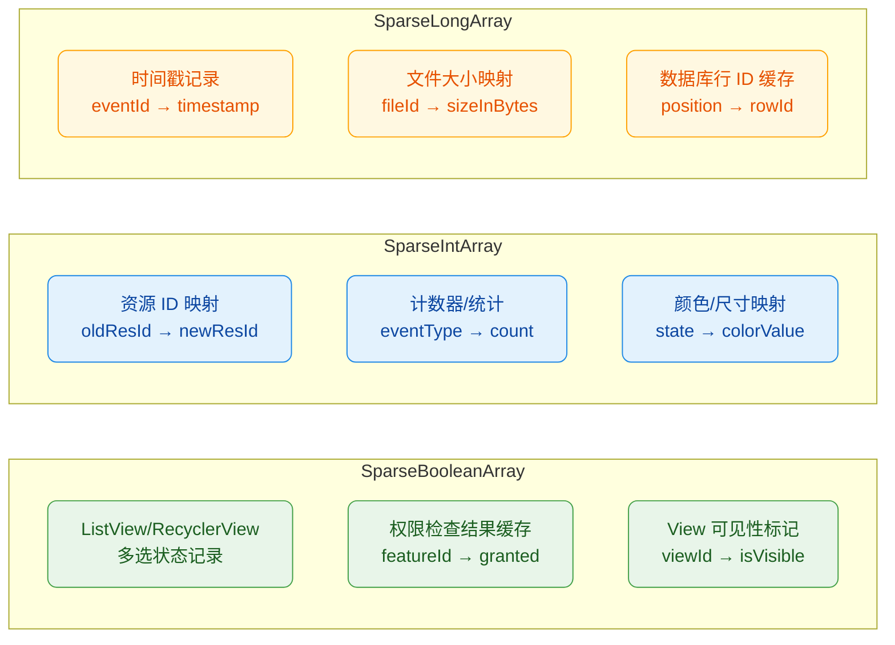
```mermaid
graph LR
    subgraph SparseBooleanArray_Scene["SparseBooleanArray"]
        direction TB
        S1["ListView/RecyclerView<br/>多选状态记录"]
        S2["权限检查结果缓存<br/>featureId → granted"]
        S3["View 可见性标记<br/>viewId → isVisible"]
    end

    subgraph SparseIntArray_Scene["SparseIntArray"]
        direction TB
        S4["资源 ID 映射<br/>oldResId → newResId"]
        S5["计数器/统计<br/>eventType → count"]
        S6["颜色/尺寸映射<br/>state → colorValue"]
    end

    subgraph SparseLongArray_Scene["SparseLongArray"]
        direction TB
        S7["时间戳记录<br/>eventId → timestamp"]
        S8["文件大小映射<br/>fileId → sizeInBytes"]
        S9["数据库行 ID 缓存<br/>position → rowId"]
    end

    classDef greenCard fill:#E8F5E9,stroke:#43A047,color:#1B5E20,rx:8
    classDef blueCard fill:#E3F2FD,stroke:#1E88E5,color:#0D47A1,rx:8
    classDef amberCard fill:#FFF8E1,stroke:#FFA000,color:#E65100,rx:8

    class S1,S2,S3 greenCard
    class S4,S5,S6 blueCard
    class S7,S8,S9 amberCard
```

其中最经典的场景是 `SparseBooleanArray` 在列表多选中的应用。Android 框架自身的 `AbsListView`（ListView 的父类）内部就使用了 `SparseBooleanArray` 来追踪哪些 position 被选中：

```java
// Android 框架源码 AbsListView 中的实际用法（简化）
public class AbsListView extends AdapterView<ListAdapter> {
    // 用 SparseBooleanArray 记录每个 position 的选中状态
    SparseBooleanArray mCheckStates;

    // 当用户点击某个 item 时
    boolean performItemClick(View view, int position, long id) {
        if (mChoiceMode == CHOICE_MODE_MULTIPLE) {
            // 读取当前状态并取反
            boolean checked = !mCheckStates.get(position, false);
            // 更新选中状态
            mCheckStates.put(position, checked);
            // ...
        }
    }

    // 获取所有选中的 position
    public SparseBooleanArray getCheckedItemPositions() {
        return mCheckStates;  // 直接返回，外部可遍历
    }
}
```

### 内存占用量化对比

我们来做一个精确的内存计算。假设存储 **500 个 int → boolean 映射**：

```java
// ===== 方案一：HashMap<Integer, Boolean> =====
// 每个 Entry 对象：
//   对象头                    = 16 bytes
//   Integer key 对象          = 16 bytes (对象头) + 4 bytes (int值) + 4 bytes (对齐) = 24 bytes
//   Boolean value 对象        = 16 bytes (对象头) + 1 byte (boolean值) + 7 bytes (对齐) = 24 bytes
//   hash 字段                 = 4 bytes
//   next 引用                 = 8 bytes
//   key 引用                  = 8 bytes
//   value 引用                = 8 bytes
// 单个 Entry 合计             ≈ 16 + 24 + 24 + 4 + 8 + 8 + 8 = 92 bytes
// （注：Boolean.TRUE/FALSE 有缓存，实际可能共享，但 Integer 超出缓存范围则不共享）
//
// 500 个 Entry               ≈ 92 × 500 = 46,000 bytes
// table 数组 (容量 1024)      = 8 × 1024 = 8,192 bytes
// HashMap 对象本身             ≈ 48 bytes
// 总计                        ≈ 54,240 bytes ≈ 53 KB

// ===== 方案二：SparseBooleanArray =====
// int[] mKeys                 = 16 bytes (数组头) + 4 × 500 = 2,016 bytes
// boolean[] mValues           = 16 bytes (数组头) + 1 × 500 + 4 (对齐) = 520 bytes
// SparseBooleanArray 对象本身  ≈ 32 bytes
// 总计                        ≈ 2,568 bytes ≈ 2.5 KB
```

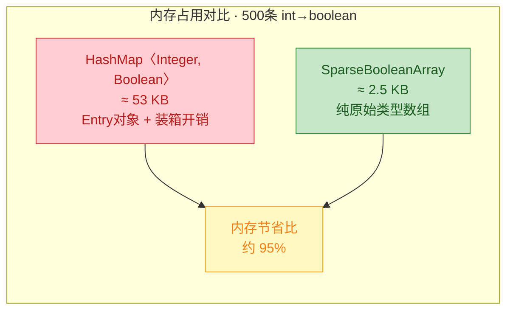
```mermaid
graph LR
    subgraph Memory_Compare["内存占用对比 · 500条 int→boolean"]
        direction TB
        HM["HashMap〈Integer, Boolean〉<br/>≈ 53 KB<br/>Entry对象 + 装箱开销"]
        SBA["SparseBooleanArray<br/>≈ 2.5 KB<br/>纯原始类型数组"]
        RATIO["内存节省比<br/>约 95%"]
    end

    HM --> RATIO
    SBA --> RATIO

    classDef redBox fill:#FFCDD2,stroke:#D32F2F,color:#B71C1C
    classDef greenBox fill:#C8E6C9,stroke:#388E3C,color:#1B5E20
    classDef goldBox fill:#FFF9C4,stroke:#F9A825,color:#F57F17

    class HM redBox
    class SBA greenBox
    class RATIO goldBox
```

**95% 的内存节省**——这就是为什么 Android 框架内部大量使用这些 Sparse 变体的原因。在移动设备有限的内存预算下，这种优化意义重大。

### 与 SparseArray 的关键差异总结

虽然三个变体与 `SparseArray` 同源，但有几个值得注意的行为差异：

```java
// 差异一：没有 DELETED 标记，delete 立即生效
SparseBooleanArray sba = new SparseBooleanArray();
sba.put(1, true);
sba.put(2, false);
sba.put(3, true);
sba.delete(2);
// 此时 mSize 立即变为 2，数组已经完成搬移
// 而 SparseArray.delete() 只是标记 DELETED，mSize 不变

// 差异二：get() 的默认返回值不同
SparseArray<Object> sa = new SparseArray<>();
Object obj = sa.get(999);          // 返回 null

SparseBooleanArray sba2 = new SparseBooleanArray();
boolean b = sba2.get(999);         // 返回 false（boolean 的默认值）

SparseIntArray sia = new SparseIntArray();
int i = sia.get(999);              // 返回 0（int 的默认值）

SparseLongArray sla = new SparseLongArray();
long l = sla.get(999);             // 返回 0L（long 的默认值）

// 差异三：不支持泛型，因此没有类型擦除问题
// SparseArray<E> 的 values 是 Object[]，取出时需要强转
// 三个变体的 values 是原始类型数组，取出即用，类型安全且零开销

// 差异四：不实现 Map 接口（与 SparseArray 一致）
// 三者都不能直接传给需要 Map 参数的方法
// 如需转换，需手动遍历构建
```

### 选型决策指南

在实际开发中，面对 `int → 基本类型` 的映射需求，选型逻辑非常清晰：

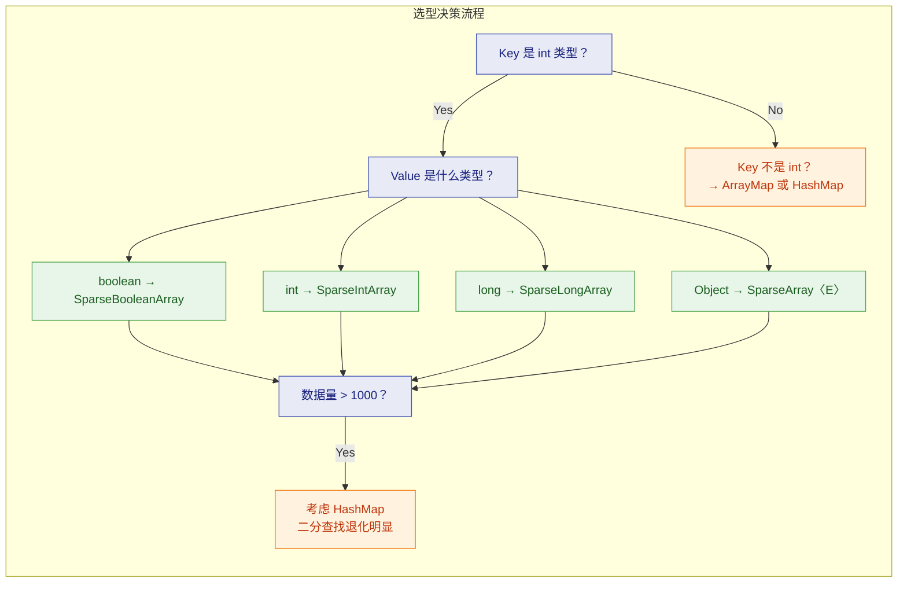
```mermaid
graph LR
    subgraph Decision["选型决策流程"]
        direction TB
        Q1["Key 是 int 类型？"]
        Q2["Value 是什么类型？"]
        R1["boolean → SparseBooleanArray"]
        R2["int → SparseIntArray"]
        R3["long → SparseLongArray"]
        R4["Object → SparseArray〈E〉"]
        Q5["数据量 > 1000？"]
        R5["考虑 HashMap<br/>二分查找退化明显"]
        R6["Key 不是 int？<br/>→ ArrayMap 或 HashMap"]
    end

    Q1 -->|Yes| Q2
    Q1 -->|No| R6
    Q2 --> R1
    Q2 --> R2
    Q2 --> R3
    Q2 --> R4
    R1 --> Q5
    R2 --> Q5
    R3 --> Q5
    R4 --> Q5
    Q5 -->|Yes| R5

    classDef questionNode fill:#E8EAF6,stroke:#3F51B5,color:#1A237E
    classDef answerNode fill:#E8F5E9,stroke:#43A047,color:#1B5E20
    classDef warnNode fill:#FFF3E0,stroke:#EF6C00,color:#BF360C

    class Q1,Q2,Q5 questionNode
    class R1,R2,R3,R4 answerNode
    class R5,R6 warnNode
```

一句话总结选型原则：**key 是 int，value 是基本类型，数据量不大——直接用对应的 Sparse 变体，不要犹豫。**

### 一个容易踩的坑：默认值陷阱

由于 `get()` 在 key 不存在时返回的是基本类型的默认值（`false` / `0` / `0L`），这可能导致语义歧义：

```java
SparseIntArray errorCounts = new SparseIntArray();
// 假设 moduleId=5 从未记录过错误
int count = errorCounts.get(5);  // 返回 0

// 问题：0 到底是"没有错误"还是"从未记录过"？
// 两种含义被混淆了！

// 解决方案一：使用 indexOfKey 先判断是否存在
int index = errorCounts.indexOfKey(5);
if (index >= 0) {
    // key 存在，取出真实值
    int realCount = errorCounts.valueAt(index);
} else {
    // key 不存在，做相应处理
}

// 解决方案二：使用一个不可能出现的默认值
int count2 = errorCounts.get(5, -1);  // 用 -1 表示"不存在"
if (count2 == -1) {
    // key 不存在
}
```

这个陷阱在 `SparseBooleanArray` 中尤其隐蔽——`get(key)` 返回 `false` 时，你无法区分"key 存在且值为 false"和"key 根本不存在"。务必养成使用 `indexOfKey()` 或带默认值的 `get(key, defaultValue)` 的习惯。

---

**📝 练习题**

以下关于 `SparseBooleanArray`、`SparseIntArray`、`SparseLongArray` 的描述，哪一项是正确的？

A. 三者内部都采用了与 `SparseArray` 相同的 `DELETED` 标记延迟删除机制，删除时不会立即搬移数组

B. `SparseIntArray.get(key)` 在 key 不存在时返回 `null`，与 `HashMap.get()` 行为一致

C. 三者的 value 数组均为原始类型数组（`boolean[]` / `int[]` / `long[]`），彻底避免了 value 端的自动装箱

D. `SparseBooleanArray` 实现了 `Map<Integer, Boolean>` 接口，可以直接替代 `HashMap<Integer, Boolean>` 使用


**【答案】** C

**【解析】** 逐项分析：

- A 错误：三个变体 **没有** `DELETED` 标记机制。因为 `boolean`、`int`、`long` 是原始类型，不存在可以充当哨兵的特殊对象值，所以 `delete()` 会立即执行 `System.arraycopy` 搬移数组。
- B 错误：`SparseIntArray.get(key)` 返回的是 `int` 原始类型，key 不存在时返回 `0`（int 的默认值），而不是 `null`。原始类型不可能为 `null`。
- C 正确：这正是三个变体存在的核心意义——value 端使用原始类型数组，完全消除装箱开销，配合 key 端的 `int[]`，实现了"全原始类型"的零装箱映射。
- D 错误：三者均 **不实现** `Map` 接口（甚至不实现任何集合框架接口），只实现了 `Cloneable`。它们是 Android 独立于 Java Collections Framework 之外的轻量级数据结构。

---

## ArrayMap ⭐⭐

ArrayMap 是 Android 框架层提供的另一个核心集合类，位于 `android.util.ArrayMap`（后迁移至 `androidx.collection.ArrayMap`）。如果说 SparseArray 是针对 `int → Object` 场景的优化，那么 ArrayMap 就是针对 `Object → Object` 通用 Map 场景的优化——它直接对标 `java.util.HashMap`，在小数据量下以更紧凑的内存布局取而代之。

ArrayMap 的设计哲学与 SparseArray 一脉相承：**用 CPU 时间换内存空间**。它抛弃了 HashMap 的哈希桶 + 链表/红黑树结构，转而使用两个紧凑的数组来存储所有数据。这种设计在 Android 这种内存敏感的移动平台上，能显著减少内存碎片和对象分配开销。

---

### 双数组结构（int[] hashes + Object[] array）

ArrayMap 的核心数据结构由两个数组组成，这是理解它一切行为的基础。

#### 两个数组各司其职

```java
// ArrayMap 内部核心字段
int[] mHashes;      // 哈希数组：存储每个 key 的 hashCode，按升序排列
Object[] mArray;     // 键值对数组：交替存储 key 和 value，长度是 mHashes 的 2 倍
int mSize;           // 当前存储的键值对数量
```

这两个数组之间存在严格的索引映射关系：

- `mHashes[index]` 存储第 `index` 个键值对的 key 的 `hashCode`
- `mArray[index * 2]` 存储第 `index` 个键值对的 **key** 本身
- `mArray[index * 2 + 1]` 存储第 `index` 个键值对的 **value**

用一个具体例子来看。假设我们依次插入三个键值对：`"name" → "Kiro"`、`"age" → 25`、`"city" → "Shanghai"`，假设它们的 hashCode 排序后顺序恰好是 `age < city < name`，那么内存布局如下：

```text
mHashes (int[]):
┌─────────┬─────────┬─────────┐
│  index 0│  index 1│  index 2│
│ hash=97 │hash=3059│hash=3373│
│ ("age") │("city") │("name") │
└─────────┴─────────┴─────────┘
     │          │          │
     │          │          │        映射关系: mArray[index * 2] = key
     ▼          ▼          ▼                   mArray[index * 2 + 1] = value
mArray (Object[]):
┌───────┬───────┬───────┬──────────┬───────┬──────────┐
│  [0]  │  [1]  │  [2]  │   [3]    │  [4]  │   [5]    │
│ "age" │  25   │"city" │"Shanghai"│"name" │  "Kiro"  │
│  key  │ value │  key  │  value   │  key  │  value   │
└───────┴───────┴───────┴──────────┴───────┴──────────┘
```

#### 对比 HashMap 的结构差异

为了理解 ArrayMap 为什么更省内存，我们先回顾 HashMap 的结构：

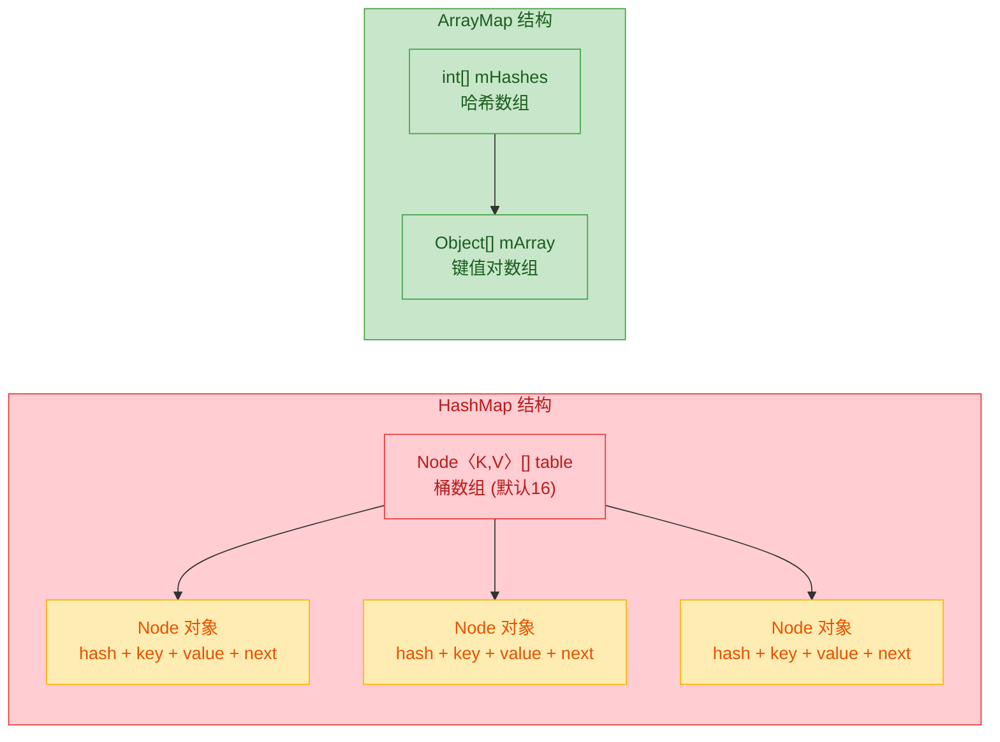
```mermaid
graph LR
    subgraph HM["HashMap 结构"]
        direction TB
        T["Node〈K,V〉[] table<br/>桶数组 (默认16)"]
        N1["Node 对象<br/>hash + key + value + next"]
        N2["Node 对象<br/>hash + key + value + next"]
        N3["Node 对象<br/>hash + key + value + next"]
        T --> N1
        T --> N2
        T --> N3
    end

    subgraph AM["ArrayMap 结构"]
        direction TB
        H["int[] mHashes<br/>哈希数组"]
        A["Object[] mArray<br/>键值对数组"]
        H --> A
    end

    classDef hmStyle fill:#FFCDD2,stroke:#E53935,color:#B71C1C
    classDef amStyle fill:#C8E6C9,stroke:#43A047,color:#1B5E20
    classDef nodeStyle fill:#FFECB3,stroke:#FFB300,color:#E65100

    class T,HM hmStyle
    class H,A,AM amStyle
    class N1,N2,N3 nodeStyle
```

HashMap 中每个键值对都需要一个独立的 `Node` 对象（或 `TreeNode`），每个 Node 对象自身就有 **32~48 字节** 的对象头和字段开销。而 ArrayMap 把所有数据"摊平"到两个连续数组中，完全消除了这些中间对象。

#### put 操作的完整流程

理解了数据结构，我们来看 `put(K key, V value)` 的核心源码逻辑：

```java
// ArrayMap.put() 核心逻辑（简化版）
public V put(K key, V value) {
    final int osize = mSize;           // 记录当前大小
    final int hash;                     // 用于存储 key 的 hashCode
    int index;                          // 用于存储查找到的索引位置

    // ① 计算 hash 并查找插入位置
    if (key == null) {
        hash = 0;                       // null key 的 hash 固定为 0
        index = indexOfNull();          // 专门查找 null key 的位置
    } else {
        hash = key.hashCode();         // 计算 key 的 hashCode
        index = indexOf(key, hash);    // 二分查找 + 线性探测定位
    }

    // ② 如果 key 已存在（index >= 0），直接覆盖 value
    if (index >= 0) {
        // index * 2 + 1 就是 value 在 mArray 中的位置
        index = (index << 1) + 1;      // 等价于 index * 2 + 1，位运算更快
        V old = (V) mArray[index];     // 取出旧值用于返回
        mArray[index] = value;         // 覆盖为新值
        return old;                     // 返回旧值
    }

    // ③ key 不存在，index 取反得到应插入的位置
    index = ~index;                    // indexOf 返回的负数取反 = 插入点

    // ④ 容量不足时扩容
    if (osize >= mHashes.length) {
        // 扩容策略：<4 → 4，<8 → 8，否则 × 1.5
        final int n = osize >= 8 ? (osize + (osize >> 1))
                     : (osize >= 4 ? 8 : 4);
        allocArrays(n);                // 分配新数组（可能命中缓存）
    }

    // ⑤ 如果插入位置不在末尾，需要搬移后续元素腾出空间
    if (index < osize) {
        // 在 mHashes 中，把 index 及之后的元素后移一位
        System.arraycopy(mHashes, index, mHashes, index + 1, osize - index);
        // 在 mArray 中，把 index*2 及之后的元素后移两位（key+value 一对）
        System.arraycopy(mArray, index << 1, mArray, (index + 1) << 1,
                         (mSize - index) << 1);
    }

    // ⑥ 写入新的键值对
    mHashes[index] = hash;            // 在哈希数组的正确位置写入 hash
    mArray[index << 1] = key;         // 写入 key
    mArray[(index << 1) + 1] = value; // 写入 value
    mSize++;                           // 元素计数 +1

    return null;                       // 新插入返回 null
}
```

#### indexOf —— 二分查找 + 线性探测

ArrayMap 查找的核心在于 `indexOf` 方法。由于 `mHashes` 数组是有序的，可以用二分查找快速定位 hash 值；但不同的 key 可能产生相同的 hashCode（哈希冲突），所以找到 hash 之后还需要线性探测来确认真正的 key：

```java
// ArrayMap.indexOf() 核心逻辑（简化版）
int indexOf(Object key, int hash) {
    final int N = mSize;

    // 空集合直接返回 ~0 = -1，表示应插入到位置 0
    if (N == 0) {
        return ~0;
    }

    // ① 二分查找：在 mHashes 中找到 hash 值的位置
    int index = binarySearch(mHashes, N, hash);

    // ② 没找到该 hash，返回负数（取反后为插入点）
    if (index < 0) {
        return index;
    }

    // ③ 找到了 hash，检查对应的 key 是否真的 equals
    if (key.equals(mArray[index << 1])) {
        return index;                  // 完美匹配，直接返回
    }

    // ④ hash 冲突处理：从 index 向后线性探测
    int end;
    for (end = index + 1; end < N && mHashes[end] == hash; end++) {
        if (key.equals(mArray[end << 1])) {
            return end;                // 在后方找到匹配的 key
        }
    }

    // ⑤ 从 index 向前线性探测
    for (int i = index - 1; i >= 0 && mHashes[i] == hash; i--) {
        if (key.equals(mArray[i << 1])) {
            return i;                  // 在前方找到匹配的 key
        }
    }

    // ⑥ hash 存在但 key 不匹配 → 返回 end 的取反值作为新插入点
    // 这样新元素会插入到同 hash 值区段的末尾
    return ~end;
}
```

这个查找过程可以用流程图来表示：

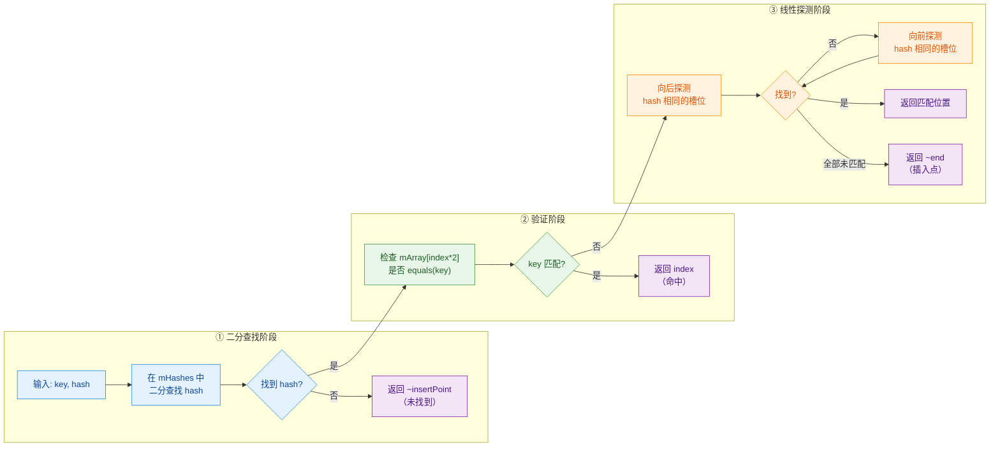
```mermaid
graph LR
    subgraph BinarySearch["① 二分查找阶段"]
        direction TB
        S["输入: key, hash"]
        BS["在 mHashes 中<br/>二分查找 hash"]
        NF{"找到 hash?"}
        RN["返回 ~insertPoint<br/>（未找到）"]
        S --> BS --> NF
        NF -- "否" --> RN
    end

    subgraph Verify["② 验证阶段"]
        direction TB
        CK["检查 mArray[index*2]<br/>是否 equals(key)"]
        EQ{"key 匹配?"}
        RS["返回 index<br/>（命中）"]
        CK --> EQ
        EQ -- "是" --> RS
    end

    subgraph Probe["③ 线性探测阶段"]
        direction TB
        FW["向后探测<br/>hash 相同的槽位"]
        BW["向前探测<br/>hash 相同的槽位"]
        FD{"找到?"}
        RF["返回匹配位置"]
        RE["返回 ~end<br/>（插入点）"]
        FW --> FD
        FD -- "否" --> BW
        BW --> FD
        FD -- "是" --> RF
        FD -- "全部未匹配" --> RE
    end

    NF -- "是" --> CK
    EQ -- "否" --> FW

    classDef searchStyle fill:#E3F2FD,stroke:#1E88E5,color:#0D47A1
    classDef verifyStyle fill:#E8F5E9,stroke:#43A047,color:#1B5E20
    classDef probeStyle fill:#FFF3E0,stroke:#FB8C00,color:#E65100
    classDef resultStyle fill:#F3E5F5,stroke:#8E24AA,color:#4A148C

    class S,BS,NF searchStyle
    class CK,EQ verifyStyle
    class FW,BW,FD probeStyle
    class RN,RS,RF,RE resultStyle
```

这里有一个关键的设计细节：当发生哈希冲突时，ArrayMap 采用的是**线性探测**而非 HashMap 的链表/红黑树。这意味着所有哈希冲突的元素在 `mHashes` 数组中是**连续排列**的，查找时只需要在这个连续区段内逐个比较 `equals`。对于小数据量来说，这种线性扫描的 cache locality 非常好，实际性能并不差。

---

### 内存压缩原理

ArrayMap 的内存优势不是一个单一的技巧，而是多个设计决策叠加的结果。我们从定量分析的角度来拆解。

#### 消除 Entry 对象开销

这是 ArrayMap 最核心的内存优化。HashMap 中每个键值对都需要一个 `Node<K,V>` 对象：

```java
// HashMap.Node 的内存布局（64位 JVM，压缩指针开启）
static class Node<K,V> implements Map.Entry<K,V> {
    // 对象头:           12 bytes (mark word 8 + klass pointer 4)
    // padding:           4 bytes (对齐到 16 的倍数)
    int hash;          // 4 bytes
    K key;             // 4 bytes (压缩引用)
    V value;           // 4 bytes (压缩引用)
    Node<K,V> next;    // 4 bytes (压缩引用)
    // ─────────────────────────
    // 合计:             32 bytes（每个 Node 对象）
}
```

而 ArrayMap 中，一个键值对只占用：
- `mHashes` 中的 1 个 `int` 槽位 = **4 bytes**
- `mArray` 中的 2 个 `Object` 引用槽位 = **8 bytes**（压缩指针下每个引用 4 bytes）
- 合计 **12 bytes**，没有任何对象头开销

我们来做一个对比计算，假设存储 100 个键值对：

```text
═══════════════════════════════════════════════════════════════
                    HashMap vs ArrayMap 内存对比 (100 entries)
═══════════════════════════════════════════════════════════════

HashMap:
  ┌─ Node[] table (容量128, loadFactor=0.75)
  │    → 128 × 4 bytes (引用)              =   512 bytes
  │
  ├─ 100 个 Node 对象
  │    → 100 × 32 bytes                    = 3,200 bytes
  │
  ├─ HashMap 对象自身                       ≈    48 bytes
  │
  └─ 总计                                  ≈ 3,760 bytes
     （不含 key/value 对象本身）

ArrayMap:
  ┌─ int[] mHashes (容量100)
  │    → 数组头 16 bytes + 100 × 4 bytes   =   416 bytes
  │
  ├─ Object[] mArray (容量200)
  │    → 数组头 16 bytes + 200 × 4 bytes   =   816 bytes
  │
  ├─ ArrayMap 对象自身                      ≈    48 bytes
  │
  └─ 总计                                  ≈ 1,280 bytes
     （不含 key/value 对象本身）

───────────────────────────────────────────────────────────────
  内存节省: 3,760 - 1,280 = 2,480 bytes ≈ 节省 66%
═══════════════════════════════════════════════════════════════
```

**节省约 66% 的结构性内存开销**，这在 Android 设备上是非常可观的。

#### 消除自动装箱

虽然 ArrayMap 的 key 仍然是 Object 类型（不像 SparseArray 那样用原始 int），但 `mHashes` 数组是 `int[]` 而非 `Integer[]`。这意味着哈希值的存储完全避免了装箱。在 HashMap 中，hash 值虽然也存储为 `int`（在 Node 内部），但 Node 本身就是一个额外对象，所以这个优势更多体现在整体结构的精简上。

#### 紧凑的数组布局 —— Cache Friendly

现代 CPU 的性能瓶颈往往不在计算，而在内存访问。ArrayMap 的两个数组在内存中是**连续分配**的，这对 CPU 缓存非常友好：

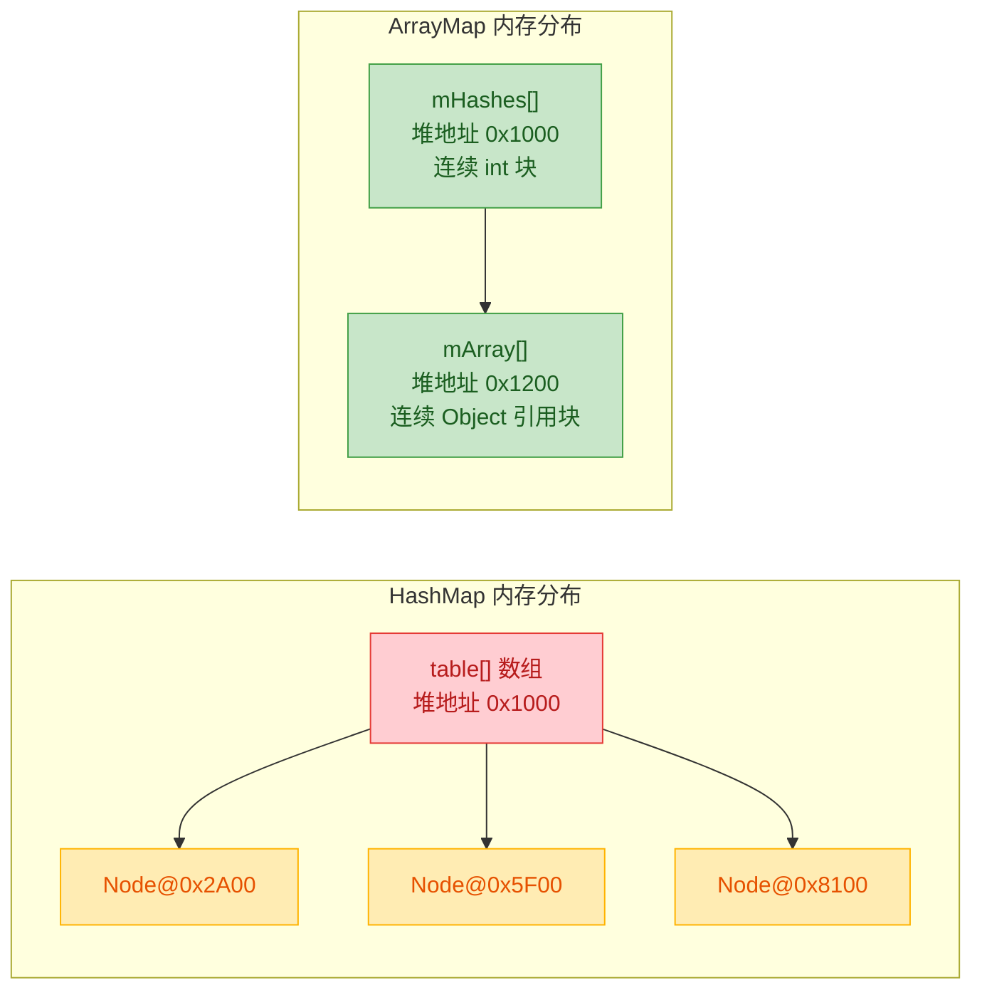
```mermaid
graph LR
    subgraph HMem["HashMap 内存分布"]
        direction TB
        HT["table[] 数组<br/>堆地址 0x1000"]
        N1["Node@0x2A00"]
        N2["Node@0x5F00"]
        N3["Node@0x8100"]
        HT --> N1
        HT --> N2
        HT --> N3
    end

    subgraph AMem["ArrayMap 内存分布"]
        direction TB
        AH["mHashes[]<br/>堆地址 0x1000<br/>连续 int 块"]
        AA["mArray[]<br/>堆地址 0x1200<br/>连续 Object 引用块"]
        AH --> AA
    end

    classDef hmNode fill:#FFCDD2,stroke:#E53935,color:#B71C1C
    classDef amArr fill:#C8E6C9,stroke:#43A047,color:#1B5E20
    classDef scattered fill:#FFECB3,stroke:#FFB300,color:#E65100

    class HT hmNode
    class N1,N2,N3 scattered
    class AH,AA amArr
```

HashMap 的 Node 对象散落在堆的各个位置（由 GC 和分配器决定），遍历时 CPU 缓存命中率低，容易产生大量 cache miss。而 ArrayMap 的数据紧密排列，二分查找 `mHashes` 时几乎可以全部命中 L1/L2 缓存，遍历 `mArray` 时也是顺序访问，对 prefetcher 非常友好。

#### 按需分配，无 Load Factor 浪费

HashMap 默认 load factor 为 0.75，意味着桶数组始终有 **25% 的空间是浪费的**。例如存储 12 个元素，HashMap 需要分配 16 个桶的数组；存储 13 个元素就会触发扩容到 32 个桶，此时浪费率接近 60%。

ArrayMap 没有 load factor 的概念，它的数组容量更贴近实际元素数量。扩容策略也更保守：

```java
// ArrayMap 扩容策略（伪代码）
if (currentSize < 4) {
    newCapacity = 4;       // 最小容量为 4
} else if (currentSize < 8) {
    newCapacity = 8;       // 第二档为 8
} else {
    newCapacity = currentSize + (currentSize >> 1);  // 1.5 倍增长
}
```

对比 HashMap 的 2 倍增长，ArrayMap 的 1.5 倍增长策略在大数据量时也能减少约 25% 的冗余空间。

#### GC 压力的降低

这是一个容易被忽视但在 Android 上极其重要的优势。HashMap 每次 `put` 新元素都会 `new Node()`，每次 `remove` 都会让 Node 变成垃圾对象。在频繁增删的场景下，这会给 GC 带来显著压力，而 Android 的 GC（尤其是早期版本的 Dalvik GC）会导致界面卡顿。

ArrayMap 的增删操作只是在数组内部搬移数据（`System.arraycopy`），不会创建或销毁任何中间对象。配合后面要讲的缓存复用机制，连数组本身的分配和回收都被大幅减少了。

```text
操作频率对比（插入 + 删除 N 个元素）:
═══════════════════════════════════════════════
  HashMap:
    对象创建: N 次 new Node()
    对象销毁: N 个 Node 等待 GC
    GC 压力:  高

  ArrayMap:
    对象创建: 0 次（仅数组扩容时）
    对象销毁: 0 个中间对象
    GC 压力:  极低
═══════════════════════════════════════════════
```

总结来看，ArrayMap 的内存压缩并非某个单一技巧，而是**结构精简（无 Entry 对象）+ 紧凑布局（连续数组）+ 保守扩容（1.5x + 无 load factor）+ 零中间对象（低 GC 压力）**四重优势的叠加。这些优势在数据量较小（< 1000）时非常显著，但随着数据量增大，二分查找 O(log n) 和数组搬移 O(n) 的成本会逐渐抵消内存优势——这也是 ArrayMap 有明确适用边界的原因。

---

## ArrayMap 的缓存复用机制（Cache Recycling）

Android 应用中，`ArrayMap` 的创建和销毁极其频繁——每次 `Bundle` 传参、每次 `Intent` 携带数据，底层都可能涉及 `ArrayMap` 的分配与回收。如果每次都走 `new int[]` + `new Object[]` 的路径，GC 压力会非常可观。为此，ArrayMap 在类级别设计了一套精巧的 **静态缓存池（Static Cache Pool）**，专门回收和复用那些被释放的内部数组，从根本上减少堆内存的分配次数。

这个机制是 ArrayMap 区别于普通集合的核心亮点之一，也是面试中高频考察的知识点。

---

### 为什么需要缓存复用

先回顾 ArrayMap 的双数组结构：

```text
int[] mHashes     — 存储 hash 值
Object[] mArray   — 存储 key-value 交替对（长度 = mHashes.length * 2）
```

一个典型的 Android 页面跳转流程：

```java
// 发送端：创建 Bundle（内部就是 ArrayMap）
Bundle args = new Bundle();       // 分配 mHashes + mArray
args.putString("id", "123");
fragment.setArguments(args);

// 接收端：读取后 Bundle 被 GC 回收   // 释放 mHashes + mArray
```

如果一个列表页有 50 个 item，每个 item 点击都走这个流程，就会产生 50 次数组分配 + 50 次 GC 回收。在低端设备上，这种 **内存抖动（Memory Churn）** 会直接导致卡顿。

ArrayMap 的解决思路很直接：**别急着扔，先存起来，下次还能用。**

---

### 两级缓存池的设计

ArrayMap 维护了两个独立的静态缓存池，分别针对最常见的两种容量：

```java
// ---- ArrayMap.java 源码（简化） ----

// 缓存池 1：专门缓存 BASE_SIZE（4）容量的数组
static Object[] mBaseCache;       // 链表头指针
static int mBaseCacheSize;        // 当前缓存数量

// 缓存池 2：专门缓存 BASE_SIZE*2（8）容量的数组
static Object[] mTwiceBaseCache;  // 链表头指针
static int mTwiceBaseCacheSize;   // 当前缓存数量

static final int BASE_SIZE = 4;          // 基础容量
static final int CACHE_SIZE = 10;        // 每个池最多缓存 10 组
```

为什么只缓存容量 4 和容量 8？因为 Android 团队通过大量统计发现，**绝大多数 ArrayMap 实例的元素数量不超过 8 个**（Bundle 传 2-3 个参数是最常见的场景）。缓存这两种规格就能覆盖大部分情况，同时避免缓存池本身占用过多内存。

---

### 缓存的数据结构：数组链表（Array-as-LinkedList）

这是整个机制中最巧妙的部分。普通链表需要 `Node` 对象来串联，但 ArrayMap 的缓存池 **直接复用被回收的 `Object[] mArray` 本身来充当链表节点**，零额外开销。

具体做法是：当一组数组被回收时，把 `Object[] array` 的前两个槽位征用为链表指针：

```java
// array[0] = 指向下一组缓存的 Object[] （即 next 指针）
// array[1] = 与之配对的 int[] hashes
// array[2..n] = 无意义（已清空）
```

用 ASCII 图来直观展示这个链表结构：

```text
mBaseCache (静态变量，链表头)
    │
    ▼
┌──────────────────────────────┐
│  Object[] array_A  (size=8)  │    ← 最近一次回收的数组
│  [0] ──► 指向 array_B (next) │
│  [1] ──► int[] hashes_A      │
│  [2] = null                  │
│  ...                         │
│  [7] = null                  │
└──────────────────────────────┘
    │  array_A[0]
    ▼
┌──────────────────────────────┐
│  Object[] array_B  (size=8)  │    ← 更早回收的数组
│  [0] ──► 指向 array_C (next) │
│  [1] ──► int[] hashes_B      │
│  [2] = null                  │
│  ...                         │
└──────────────────────────────┘
    │  array_B[0]
    ▼
┌──────────────────────────────┐
│  Object[] array_C  (size=8)  │    ← 最早回收的数组
│  [0] = null  (链表尾)        │
│  [1] ──► int[] hashes_C      │
│  ...                         │
└──────────────────────────────┘
```

这种设计的精髓在于：**被回收的数组本身就是容器，不需要任何额外的 `Node` 或 `Entry` 对象**。这和 ArrayMap "极致节省内存" 的设计哲学一脉相承。

---

### 回收流程：freeArrays()

当 ArrayMap 扩容、缩容或被清空时，旧数组不再需要，此时调用 `freeArrays()` 将其放入缓存池：

```java
// ---- ArrayMap.java 源码（简化注释版） ----
private static void freeArrays(
        final int[] hashes,   // 要回收的 hash 数组
        final Object[] array, // 要回收的 key-value 数组
        final int size         // 当前实际存储的元素数量
) {
    // 判断是否属于可缓存的规格
    if (hashes.length == (BASE_SIZE * 2)) {
        // ---- 容量为 8 的数组，放入 mTwiceBaseCache 池 ----
        synchronized (ArrayMap.class) {
            // 池未满（最多缓存 CACHE_SIZE=10 组）才放入
            if (mTwiceBaseCacheSize < CACHE_SIZE) {
                // 把 array 变成链表节点：
                array[0] = mTwiceBaseCache;  // [0] 指向原来的链表头（next 指针）
                array[1] = hashes;           // [1] 保存配对的 hashes 数组

                // 清空 [2..n]，防止内存泄漏（断开对 key/value 的强引用）
                for (int i = (size << 1) - 1; i >= 2; i--) {
                    array[i] = null;         // 逐个清空旧数据
                }

                mTwiceBaseCache = array;     // 新节点成为链表头
                mTwiceBaseCacheSize++;        // 计数 +1
            }
        }
    } else if (hashes.length == BASE_SIZE) {
        // ---- 容量为 4 的数组，放入 mBaseCache 池 ----
        synchronized (ArrayMap.class) {
            if (mBaseCacheSize < CACHE_SIZE) {
                array[0] = mTwiceBaseCache;  // 同样的链表串联逻辑
                array[1] = hashes;
                for (int i = (size << 1) - 1; i >= 2; i--) {
                    array[i] = null;
                }
                mBaseCache = array;
                mBaseCacheSize++;
            }
        }
    }
    // 其他容量的数组：不缓存，直接交给 GC
}
```

几个关键细节：

- `synchronized (ArrayMap.class)`：缓存池是 **类级别静态变量**，多个线程可能同时回收，必须加锁。锁的粒度是整个 `ArrayMap.class`，简单粗暴但足够安全。
- 清空 `array[2..n]`：这一步至关重要。如果不清空，被缓存的数组仍然持有对旧 key/value 对象的强引用，这些对象就无法被 GC 回收，造成 **内存泄漏**。
- `size << 1`：因为 `Object[] array` 的有效长度是 `size * 2`（每个元素占两个槽位：key + value），所以清空范围是 `[2, size*2-1]`。

---

### 申请流程：allocArrays()

当 ArrayMap 需要分配新数组时（构造、扩容），优先从缓存池中取：

```java
// ---- ArrayMap.java 源码（简化注释版） ----
private void allocArrays(final int size) {
    // ---- 尝试从容量 8 的缓存池取 ----
    if (size == (BASE_SIZE * 2)) {
        synchronized (ArrayMap.class) {
            if (mTwiceBaseCache != null) {
                // 命中缓存！
                final Object[] array = mTwiceBaseCache;       // 取出链表头节点
                mArray = array;                                // 直接复用为 mArray
                mTwiceBaseCache = (Object[]) array[0];         // 链表头后移（摘除当前节点）
                mHashes = (int[]) array[1];                    // 取出配对的 hashes 数组

                // 清理链表指针槽位（它们的使命已完成）
                array[0] = null;
                array[1] = null;

                mTwiceBaseCacheSize--;                         // 计数 -1
                return;                                        // 复用成功，直接返回
            }
        }
    }
    // ---- 尝试从容量 4 的缓存池取 ----
    else if (size == BASE_SIZE) {
        synchronized (ArrayMap.class) {
            if (mBaseCache != null) {
                final Object[] array = mBaseCache;
                mArray = array;
                mBaseCache = (Object[]) array[0];
                mHashes = (int[]) array[1];
                array[0] = null;
                array[1] = null;
                mBaseCacheSize--;
                return;
            }
        }
    }

    // ---- 缓存未命中，只能 new ----
    mHashes = new int[size];            // 新分配 hash 数组
    mArray = new Object[size << 1];     // 新分配 key-value 数组（长度 = size * 2）
}
```

整个流程可以用一张流程图概括：

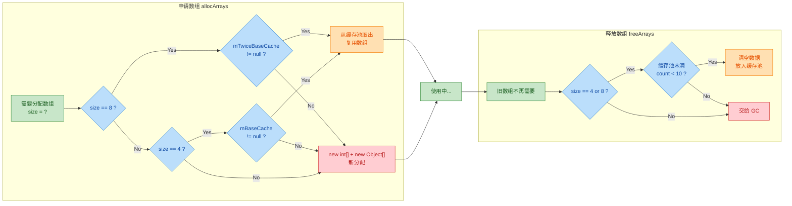
```mermaid
graph LR
    subgraph Request["申请数组 allocArrays"]
        direction TB
        A["需要分配数组<br/>size = ?"] --> B{"size == 8 ?"}
        B -->|Yes| C{"mTwiceBaseCache<br/>!= null ?"}
        C -->|Yes| D["从缓存池取出<br/>复用数组"]
        C -->|No| G["new int[] + new Object[]<br/>新分配"]
        B -->|No| E{"size == 4 ?"}
        E -->|Yes| F{"mBaseCache<br/>!= null ?"}
        F -->|Yes| D
        F -->|No| G
        E -->|No| G
    end

    subgraph Release["释放数组 freeArrays"]
        direction TB
        H["旧数组不再需要"] --> I{"size == 4 or 8 ?"}
        I -->|Yes| J{"缓存池未满<br/>count < 10 ?"}
        J -->|Yes| K["清空数据<br/>放入缓存池"]
        J -->|No| L["交给 GC"]
        I -->|No| L
    end

    D --> M["使用中..."]
    G --> M
    M --> H

    classDef greenNode fill:#C8E6C9,stroke:#388E3C,color:#1B5E20
    classDef blueNode fill:#BBDEFB,stroke:#1976D2,color:#0D47A1
    classDef orangeNode fill:#FFE0B2,stroke:#F57C00,color:#E65100
    classDef redNode fill:#FFCDD2,stroke:#D32F2F,color:#B71C1C

    class A,H greenNode
    class B,E,I,J blueNode
    class C,F blueNode
    class D,K orangeNode
    class G,L redNode
    class M greenNode
```

---

### 完整生命周期示例

用一个具体场景串联整个流程，帮助建立直觉：

```java
// ===== 第一轮：首次创建，缓存池为空 =====
ArrayMap<String, String> map1 = new ArrayMap<>();
// 默认初始容量 = 0，put 时触发扩容到 BASE_SIZE(4)
map1.put("a", "1");
// allocArrays(4) → mBaseCache == null → new int[4] + new Object[8]

map1.put("b", "2");
map1.put("c", "3");
map1.put("d", "4");
// 容量 4 已满，再 put 触发扩容到 BASE_SIZE*2(8)
map1.put("e", "5");
// allocArrays(8) → mTwiceBaseCache == null → new int[8] + new Object[16]
// freeArrays(旧的 int[4], Object[8], 4) → 放入 mBaseCache 池
// 此时：mBaseCacheSize = 1, mTwiceBaseCacheSize = 0

// ===== 第二轮：map1 被清空 =====
map1.clear();
// freeArrays(int[8], Object[16], 5) → 放入 mTwiceBaseCache 池
// 此时：mBaseCacheSize = 1, mTwiceBaseCacheSize = 1

// ===== 第三轮：新建 map2，命中缓存 =====
ArrayMap<String, String> map2 = new ArrayMap<>(4);
// allocArrays(4) → mBaseCache != null → 命中！复用之前 map1 扩容时释放的 int[4] + Object[8]
// 此时：mBaseCacheSize = 0（被取走了）

ArrayMap<String, String> map3 = new ArrayMap<>(8);
// allocArrays(8) → mTwiceBaseCache != null → 命中！复用之前 map1.clear() 释放的 int[8] + Object[16]
// 此时：mTwiceBaseCacheSize = 0
```

```text
时间线：

map1.put("a")     map1.put("e")       map1.clear()      new map2(4)     new map3(8)
     │                  │                   │                  │               │
     ▼                  ▼                   ▼                  ▼               ▼
 new int[4]      new int[8]           ┌─────────┐        ┌─────────┐    ┌─────────┐
 new Object[8]   new Object[16]       │ 回收8容量 │        │ 复用4容量 │    │ 复用8容量 │
                 回收旧4容量数组        │ 到Twice池 │        │ 从Base池  │    │ 从Twice池 │
                 到Base池              └─────────┘        └─────────┘    └─────────┘
                      │                     │                  │               │
                      ▼                     ▼                  ▼               ▼
              mBaseCacheSize=1    mTwiceCacheSize=1    mBaseCacheSize=0  mTwiceCacheSize=0
```

---

### 线程安全的考量

缓存池操作使用 `synchronized (ArrayMap.class)` 保护，但需要注意：

```java
// 这个锁只保护缓存池的读写，不保护 ArrayMap 实例本身的操作
synchronized (ArrayMap.class) {   // 类锁，全局唯一
    // 操作 mBaseCache / mTwiceBaseCache
}
```

这意味着：
- 多个线程同时创建/销毁不同的 ArrayMap 实例是安全的（缓存池有锁保护）。
- 但多个线程同时操作 **同一个** ArrayMap 实例仍然不安全（ArrayMap 本身不是线程安全的集合）。
- 锁的粒度选择是刻意的：缓存池操作非常快（几次数组赋值），持锁时间极短，不会成为性能瓶颈。

---

### 缓存池容量上限的权衡

每个池最多缓存 10 组（`CACHE_SIZE = 10`），这个数字是 Android 团队经过权衡后选定的：

| 因素 | 缓存太少 | 缓存太多 |
|------|---------|---------|
| 命中率 | 低，频繁 new | 高 |
| 内存占用 | 小 | 大（10组容量4的池 ≈ 10×(16+48)=640字节） |
| GC 压力 | 高 | 低 |

10 组是一个 **经验值**，在大多数 Android 应用场景下能提供足够的命中率，同时不会让缓存池本身成为内存负担。

---

### 与对象池模式（Object Pool Pattern）的对比

ArrayMap 的缓存机制本质上是一种 **对象池**，但它的实现比通用对象池更加轻量：

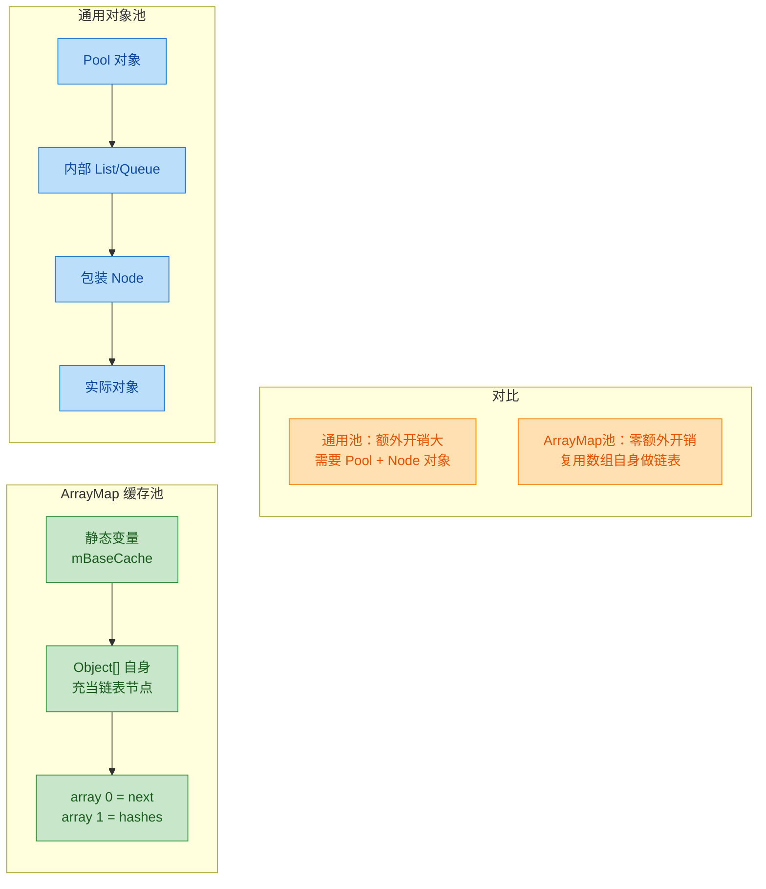
```mermaid
graph LR
    subgraph Generic["通用对象池"]
        direction TB
        G1["Pool 对象"] --> G2["内部 List/Queue"]
        G2 --> G3["包装 Node"]
        G3 --> G4["实际对象"]
    end

    subgraph ArrayMapPool["ArrayMap 缓存池"]
        direction TB
        A1["静态变量<br/>mBaseCache"] --> A2["Object[] 自身<br/>充当链表节点"]
        A2 --> A3["array 0 = next<br/>array 1 = hashes"]
    end

    subgraph Comparison["对比"]
        direction TB
        C1["通用池：额外开销大<br/>需要 Pool + Node 对象"]
        C2["ArrayMap池：零额外开销<br/>复用数组自身做链表"]
    end

    Generic ~~~ Comparison
    ArrayMapPool ~~~ Comparison

    classDef greenNode fill:#C8E6C9,stroke:#388E3C,color:#1B5E20
    classDef blueNode fill:#BBDEFB,stroke:#1976D2,color:#0D47A1
    classDef orangeNode fill:#FFE0B2,stroke:#F57C00,color:#E65100

    class G1,G2,G3,G4 blueNode
    class A1,A2,A3 greenNode
    class C1,C2 orangeNode
```

Android 中类似的缓存复用思想还出现在很多地方：`Message.obtain()`（Handler 消息池）、`MotionEvent.obtain()`（触摸事件池）、`Parcel.obtain()` 等。ArrayMap 的实现是其中最精简的——连链表节点都省了。

---

### 面试高频追问点

面试官常见的深入追问方向：

**Q: 为什么只缓存容量 4 和 8，不缓存其他容量？**

统计驱动的设计决策。Android 系统中大量使用 ArrayMap 的场景（Bundle、Intent extras、View attributes）通常只携带少量键值对。缓存 4 和 8 能覆盖绝大多数场景，缓存更大容量的收益递减但内存成本线性增长。

**Q: 如果缓存池满了（10 组），多出来的数组怎么办？**

直接丢弃，交给 GC。`freeArrays()` 中 `if (mBaseCacheSize < CACHE_SIZE)` 不满足时，方法直接 return，数组失去所有引用后被正常回收。

**Q: 缓存池会不会导致内存泄漏？**

不会，原因有二：(1) 池有上限（10 组），不会无限增长；(2) `freeArrays()` 中会清空 `array[2..n]`，断开对业务对象的引用。但缓存池本身是 static 的，会伴随类的生命周期存在——这是有意为之的 trade-off。

---

**📝 练习题**

以下关于 ArrayMap 缓存复用机制的描述，哪一项是正确的？

A. ArrayMap 会缓存所有容量规格的数组，以最大化复用率


B. 缓存池使用独立的 `LinkedList<Object[]>` 来存储被回收的数组


C. 被回收的 `Object[]` 数组利用自身的 `[0]` 和 `[1]` 槽位充当链表节点，实现零额外开销的链式存储


D. 缓存池没有容量上限，会持续缓存直到内存不足时才释放


**【答案】** C

**【解析】** ArrayMap 的缓存池设计最精妙之处就在于 **复用被回收数组自身作为链表节点**：`array[0]` 存储 next 指针（指向下一组缓存的 `Object[]`），`array[1]` 存储配对的 `int[] hashes`。这种做法不需要任何额外的 Node 对象或集合容器，实现了真正的零开销链表。选项 A 错误，只缓存容量 4 和 8 两种规格；选项 B 错误，没有使用独立的 LinkedList；选项 D 错误，每个池有 `CACHE_SIZE = 10` 的硬上限。

---

## ArrayMap 的扩容与收缩策略

ArrayMap 的扩容与收缩机制是它区别于 HashMap 的核心设计之一。HashMap 扩容时需要对所有 Entry 进行 rehash 并重新分配桶位置，代价高昂；而 ArrayMap 基于数组的线性结构，扩容和收缩本质上就是数组的拷贝与裁剪，逻辑更加直观，但其中的阈值设计和缓存复用（上一节已讲）紧密配合，形成了一套精巧的内存管理体系。

### 扩容策略（Growth Policy）

当调用 `put(key, value)` 插入新元素时，如果当前元素数量 `mSize` 已经等于 `mHashes.length`（即数组已满），就必须触发扩容。ArrayMap 的扩容并不像 HashMap 那样简单地翻倍，而是采用了一套分段式增长策略（Tiered Growth），源码中的核心逻辑如下：

```java
// ArrayMap.allocArrays() 触发前的容量计算逻辑（简化自 AOSP 源码）
// oSize 为当前数组容量（即扩容前的 mHashes.length）
final int newSize;
if (oSize >= (BASE_SIZE * 2)) {
    // 当前容量 >= 8 时，扩容为原来的 1.5 倍
    // oSize >> 1 等价于 oSize / 2，所以 oSize + oSize/2 = 1.5 * oSize
    newSize = oSize + (oSize >> 1);
} else if (oSize >= BASE_SIZE) {
    // 当前容量 >= 4 且 < 8 时，直接扩容到 8
    // BASE_SIZE * 2 = 8
    newSize = BASE_SIZE * 2;  // 即 8
} else {
    // 当前容量 < 4 时（包括初始容量为 0 的情况），直接扩容到 4
    newSize = BASE_SIZE;      // 即 4
}
```

这里的 `BASE_SIZE` 是一个常量，值为 4。我们可以把整个扩容路径梳理成一条清晰的增长曲线：

```
初始容量: 0
第1次扩容: 0 → 4   (直接跳到 BASE_SIZE)
第2次扩容: 4 → 8   (直接跳到 BASE_SIZE * 2)
第3次扩容: 8 → 12  (8 + 8/2 = 12, 1.5倍增长)
第4次扩容: 12 → 18 (12 + 12/2 = 18, 1.5倍增长)
第5次扩容: 18 → 27 (18 + 18/2 = 27, 1.5倍增长)
...后续持续 1.5 倍增长
```

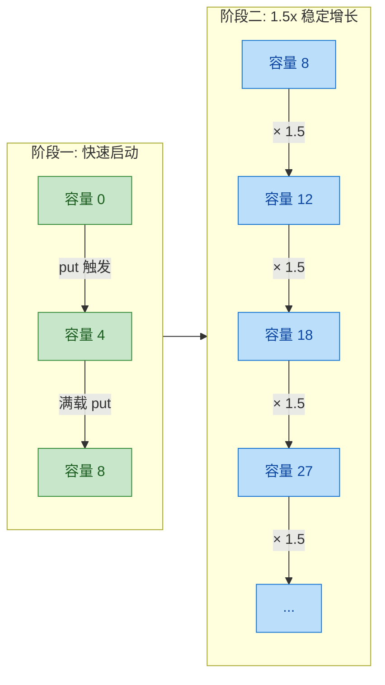
```mermaid
graph LR
    subgraph Phase1["阶段一: 快速启动"]
        direction TB
        A["容量 0"] -->|"put 触发"| B["容量 4"]
        B -->|"满载 put"| C["容量 8"]
    end

    subgraph Phase2["阶段二: 1.5x 稳定增长"]
        direction TB
        D["容量 8"] -->|"× 1.5"| E["容量 12"]
        E -->|"× 1.5"| F["容量 18"]
        F -->|"× 1.5"| G["容量 27"]
        G -->|"× 1.5"| H["..."]
    end

    Phase1 --> Phase2

    classDef phase1Style fill:#C8E6C9,stroke:#388E3C,color:#1B5E20
    classDef phase2Style fill:#BBDEFB,stroke:#1976D2,color:#0D47A1
    classDef arrowStyle fill:#FFF9C4,stroke:#F9A825,color:#F57F17

    class A,B,C phase1Style
    class D,E,F,G,H phase2Style
```

为什么选择 1.5 倍而不是 2 倍？这是一个经典的空间-时间权衡问题。HashMap 选择 2 倍扩容是因为它需要保持容量为 2 的幂次方来配合位运算定位桶索引；而 ArrayMap 没有这个约束，选择 1.5 倍可以在减少扩容次数和节省内存之间取得更好的平衡。假设你需要存储 100 个元素：

- 2 倍增长路径：4 → 8 → 16 → 32 → 64 → 128，最终分配 128 个槽位，浪费 28 个
- 1.5 倍增长路径：4 → 8 → 12 → 18 → 27 → 40 → 60 → 90 → 135，最终分配 135 个槽位，虽然扩容次数多了几次，但每次扩容的数组拷贝成本远低于 HashMap 的 rehash 成本

扩容的实际执行过程非常直接——分配新数组，然后用 `System.arraycopy()` 把旧数据搬过去：

```java
// 扩容执行过程（简化）
public V put(K key, V value) {
    // ... 省略查找逻辑 ...

    if (mSize >= mHashes.length) {
        // 按上述规则计算 newCapacity
        final int newCapacity = calculateNewCapacity(mSize);

        // 保存旧数组引用
        final int[] oldHashes = mHashes;
        final Object[] oldArray = mArray;

        // 分配新数组（这里会优先尝试从缓存池取，上一节已讲）
        allocArrays(newCapacity);

        // 将旧数据拷贝到新数组
        if (oldHashes.length > 0) {
            // 拷贝 hash 数组：长度为 mSize（实际元素数）
            System.arraycopy(oldHashes, 0, mHashes, 0, mSize);
            // 拷贝 key-value 数组：长度为 mSize * 2（每个元素占两个槽位）
            System.arraycopy(oldArray, 0, mArray, 0, mSize << 1);
        }

        // 旧数组归还到缓存池（如果大小为 4 或 8）
        freeArrays(oldHashes, oldArray, mSize);
    }

    // ... 在正确位置插入新元素 ...
}
```

注意 `freeArrays()` 这个调用——扩容后旧数组不会被直接丢弃等待 GC 回收，而是被放入缓存池供后续复用，这与上一节讲的缓存复用机制形成了完整的闭环。

### 收缩策略（Shrink Policy）

扩容是为了容纳更多元素，收缩则是为了在元素大量删除后释放多余的内存。ArrayMap 在每次 `remove()` 操作后都会检查是否需要收缩，这一点比 HashMap 更加积极——标准的 HashMap 从不主动收缩，即使你删除了 99% 的元素，它的桶数组依然保持原来的大小。

收缩的判断逻辑如下：

```java
// remove() 中的收缩判断逻辑（简化自 AOSP 源码）
public V remove(Object key) {
    int index = indexOfKey(key);
    if (index >= 0) {
        return removeAt(index);
    }
    return null;
}

public V removeAt(int index) {
    final int oldSize = mSize;
    final int newSize = oldSize - 1;

    // 判断是否需要收缩
    if (mHashes.length > (BASE_SIZE * 2)  // 当前容量 > 8
            && oldSize < mHashes.length / 3) {  // 元素数量不足容量的 1/3
        // 需要收缩！
        // 新容量 = 当前元素数量的 1.5 倍（留一些余量避免频繁扩缩）
        final int newCapacity = oldSize > (BASE_SIZE * 2)
                ? (oldSize + (oldSize >> 1))  // > 8 则取 1.5 倍
                : (BASE_SIZE * 2);            // 否则收缩到 8

        // 分配新的更小的数组
        final int[] oldHashes = mHashes;
        final Object[] oldArray = mArray;
        allocArrays(newCapacity);

        // 拷贝 index 之前的元素
        if (index > 0) {
            System.arraycopy(oldHashes, 0, mHashes, 0, index);
            System.arraycopy(oldArray, 0, mArray, 0, index << 1);
        }
        // 拷贝 index 之后的元素（跳过被删除的那个）
        if (index < newSize) {
            System.arraycopy(oldHashes, index + 1,
                    mHashes, index, newSize - index);
            System.arraycopy(oldArray, (index + 1) << 1,
                    mArray, index << 1, (newSize - index) << 1);
        }

        // 旧数组归还缓存池
        freeArrays(oldHashes, oldArray, oldSize);
    } else {
        // 不需要收缩，只做元素移动
        if (index < newSize) {
            System.arraycopy(mHashes, index + 1,
                    mHashes, index, newSize - index);
            System.arraycopy(mArray, (index + 1) << 1,
                    mArray, index << 1, (newSize - index) << 1);
        }
        // 清空末尾槽位，帮助 GC
        mArray[newSize << 1] = null;      // key 置 null
        mArray[(newSize << 1) + 1] = null; // value 置 null
    }

    mSize = newSize;
    return (V) oldValue;
}
```

收缩触发的两个条件必须同时满足：

1. 当前容量大于 8（`mHashes.length > BASE_SIZE * 2`）——如果容量本身就很小（4 或 8），收缩没有意义，反而可能导致频繁的扩缩震荡
2. 实际元素数量不足容量的三分之一（`mSize < mHashes.length / 3`）——这意味着超过 2/3 的空间被浪费了

我们用一个具体的例子来感受整个扩缩过程：

```java
// 模拟 ArrayMap 的扩缩生命周期
ArrayMap<Integer, String> map = new ArrayMap<>();

// === 扩容阶段 ===
// 连续插入 20 个元素
for (int i = 0; i < 20; i++) {
    map.put(i, "val_" + i);
}
// 容量变化: 0 → 4 → 8 → 12 → 18 → 27
// 最终: mSize=20, capacity=27

// === 收缩阶段 ===
// 删除 15 个元素，只剩 5 个
for (int i = 0; i < 15; i++) {
    map.remove(i);
}
// 当 mSize 降到 8 时: 8 < 27/3(=9)? → YES → 触发收缩
// 新容量: 8 + 8/2 = 12? 不对，8 > 8 为 false，所以新容量 = 8
// 收缩后: mSize=5, capacity=8
```

下面这张图展示了收缩的决策流程：

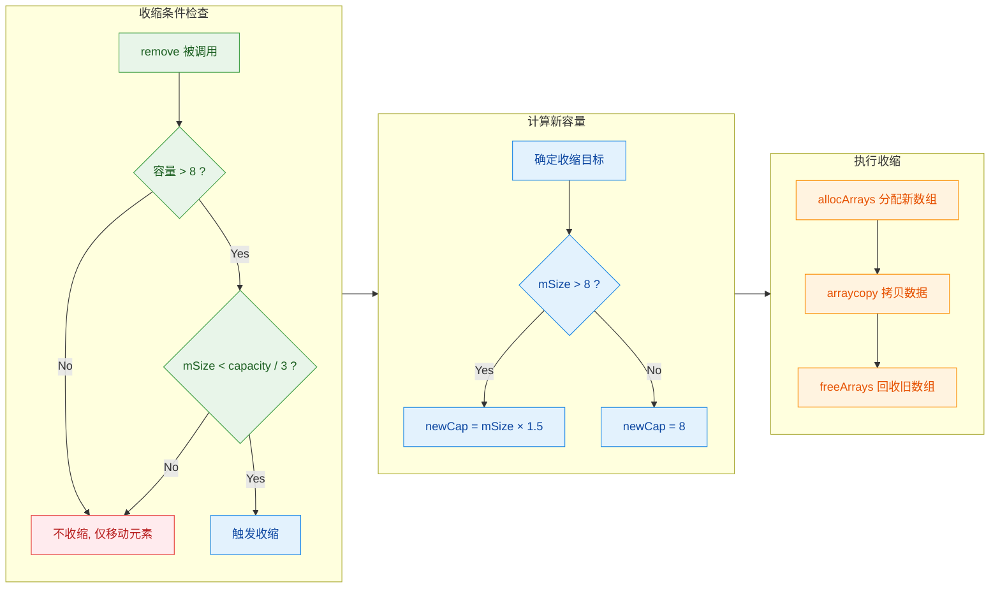
```mermaid
graph LR
    subgraph Check["收缩条件检查"]
        direction TB
        R["remove 被调用"] --> C1{"容量 > 8 ?"}
        C1 -->|"No"| SKIP["不收缩, 仅移动元素"]
        C1 -->|"Yes"| C2{"mSize < capacity / 3 ?"}
        C2 -->|"No"| SKIP
        C2 -->|"Yes"| SHRINK["触发收缩"]
    end

    subgraph Calc["计算新容量"]
        direction TB
        SHRINK2["确定收缩目标"] --> S1{"mSize > 8 ?"}
        S1 -->|"Yes"| S2["newCap = mSize × 1.5"]
        S1 -->|"No"| S3["newCap = 8"]
    end

    subgraph Exec["执行收缩"]
        direction TB
        E1["allocArrays 分配新数组"] --> E2["arraycopy 拷贝数据"]
        E2 --> E3["freeArrays 回收旧数组"]
    end

    Check --> Calc
    Calc --> Exec

    classDef checkStyle fill:#E8F5E9,stroke:#43A047,color:#1B5E20
    classDef calcStyle fill:#E3F2FD,stroke:#1E88E5,color:#0D47A1
    classDef execStyle fill:#FFF3E0,stroke:#FB8C00,color:#E65100
    classDef skipStyle fill:#FFEBEE,stroke:#E53935,color:#B71C1C

    class R,C1,C2 checkStyle
    class SHRINK,SHRINK2,S1,S2,S3 calcStyle
    class E1,E2,E3 execStyle
    class SKIP skipStyle
```

### 扩缩震荡问题（Thrashing Prevention）

一个值得关注的设计细节是 ArrayMap 如何避免扩缩震荡（thrashing）。所谓震荡，就是元素数量恰好在某个临界点附近反复波动，导致不断地扩容→收缩→扩容→收缩。

ArrayMap 通过两个手段来防止这种情况：

第一，扩容和收缩的阈值不对称。扩容在 100% 满载时触发，收缩在不足 33% 时触发，中间有一个巨大的缓冲区间。假设容量为 27，那么只有元素数量降到 8 以下才会收缩，而收缩后的新容量是 8（或 `mSize * 1.5`），远大于触发收缩时的元素数量，这就为后续的插入留出了充足的空间。

第二，收缩后的新容量取的是当前元素数量的 1.5 倍，而不是刚好等于元素数量。这意味着收缩后仍有 33% 的空余空间，不会因为一两次 `put` 就立刻触发扩容。

```java
// 震荡防护示意
// 假设当前: capacity=27, mSize=9
// 删除 1 个元素: mSize=8, 8 < 27/3=9 → 触发收缩
// 收缩后: capacity=8(因为 8 <= 8), mSize=8
// 此时数组刚好满载

// 如果再 put 1 个: mSize=9 > capacity=8 → 触发扩容
// 扩容后: capacity=12(因为 8 >= BASE_SIZE*2, 所以 8+8/2=12)
// 现在: capacity=12, mSize=9

// 如果再 remove 1 个: mSize=8, 8 < 12/3=4? → NO → 不收缩
// 稳定了！不会再震荡
```

---

## ArrayMap vs HashMap：内存与性能的权衡

这是 Android 开发面试中的高频考点，也是实际开发中做技术选型的关键依据。ArrayMap 和 HashMap 在设计哲学上走了两条截然不同的路：HashMap 追求极致的查找性能，不惜以内存为代价；ArrayMap 则在可接受的性能范围内尽可能压缩内存开销。

### 内存占用对比

我们先从数据结构层面做一个精确的内存计算。假设存储 N 个 `<Integer, String>` 键值对（以 64 位 JVM、开启指针压缩为例）：

HashMap 的内存开销：

```java
// HashMap 的内部结构
// 1. HashMap 对象本身: 约 48 bytes (对象头 + 字段)
// 2. Node[] table 数组: 默认容量 16，负载因子 0.75
//    实际容量 = 大于 N/0.75 的最小 2 的幂
//    数组本身: 16 + capacity * 4 bytes (压缩指针)
// 3. 每个 Node 对象: 32 bytes
//    - 对象头: 12 bytes
//    - int hash: 4 bytes
//    - Object key: 4 bytes (压缩指针)
//    - Object value: 4 bytes (压缩指针)
//    - Node next: 4 bytes (压缩指针)
//    - 对齐填充: 4 bytes
// 4. 每个 Integer key (自动装箱): 16 bytes
//    - 对象头: 12 bytes
//    - int value: 4 bytes

// 存储 N=10 个元素:
// table 容量 = 16 (大于 10/0.75=13.3 的最小 2 的幂)
// 总内存 ≈ 48 + (16 + 16*4) + 10*(32 + 16) = 48 + 80 + 480 = 608 bytes
```

ArrayMap 的内存开销：

```java
// ArrayMap 的内部结构
// 1. ArrayMap 对象本身: 约 36 bytes
// 2. int[] mHashes 数组: 16 + capacity * 4 bytes
// 3. Object[] mArray 数组: 16 + capacity * 2 * 4 bytes (压缩指针)
// 4. 没有 Node 包装对象！key 和 value 直接存在 mArray 中
// 5. Integer key 仍然需要装箱: 16 bytes each
//    (但如果 key 是 int 且用 SparseArray，连这个都省了)

// 存储 N=10 个元素 (假设容量刚好为 12，经过 4→8→12 扩容):
// 总内存 ≈ 36 + (16 + 12*4) + (16 + 24*4) + 10*16
//        = 36 + 64 + 112 + 160 = 372 bytes
```

对比结果非常明显：

```
┌─────────────────────────────────────────────────────┐
│         存储 10 个 <Integer, String> 的内存对比        │
├──────────────┬──────────────┬───────────────────────┤
│              │   HashMap    │      ArrayMap          │
├──────────────┼──────────────┼───────────────────────┤
│ 容器对象      │    48 B      │       36 B            │
│ 桶/哈希数组   │    80 B      │       64 B            │
│ KV 存储数组   │     -        │      112 B            │
│ Node 对象    │   320 B      │        0 B (无Node)    │
│ Key 装箱     │   160 B      │      160 B            │
│ 总计         │  ~608 B      │     ~372 B            │
│ 节省         │     -        │      ~39%             │
└──────────────┴──────────────┴───────────────────────┘
```

ArrayMap 省内存的根本原因在于它消除了 Node 对象。HashMap 中每个键值对都需要一个 Node 包装器，而 ArrayMap 把 key 和 value 直接平铺在 `Object[] mArray` 中，省去了大量的对象头和指针开销。当数据量增大时，这个优势会更加显著——100 个元素时，HashMap 的 Node 开销就是 3200 bytes，而 ArrayMap 始终为 0。

### 性能对比

内存上 ArrayMap 完胜，但性能上 HashMap 有着不可撼动的优势：

```java
// 查找性能对比
// HashMap: O(1) 平均时间复杂度
//   hash → bucket index → 链表/红黑树遍历
//   最坏情况 O(log n)（红黑树）

// ArrayMap: O(log n) 二分查找
//   hash → binarySearch(mHashes) → 找到 index → mArray[index*2] 取 key
//   即使 hash 命中，还可能需要线性探测处理 hash 冲突
```

```java
// 插入性能对比
// HashMap: O(1) 平均
//   计算 hash → 定位桶 → 头插/尾插
//   扩容时 O(n) rehash，但均摊后仍为 O(1)

// ArrayMap: O(n) 最坏情况
//   二分查找插入位置: O(log n)
//   System.arraycopy 移动后续元素: O(n)
//   这是数组结构的固有缺陷——中间插入必须移动元素
```

```java
// 删除性能对比
// HashMap: O(1) 平均
//   定位桶 → 从链表/红黑树中移除节点

// ArrayMap: O(n) 最坏情况
//   二分查找定位: O(log n)
//   System.arraycopy 移动后续元素: O(n)
//   可能触发收缩: 额外的数组拷贝
```

我们用一张表来总结关键操作的时间复杂度：

```
┌──────────────┬──────────────┬──────────────┐
│    操作       │   HashMap    │   ArrayMap   │
├──────────────┼──────────────┼──────────────┤
│ put          │   O(1)*      │   O(n)       │
│ get          │   O(1)*      │   O(log n)   │
│ remove       │   O(1)*      │   O(n)       │
│ containsKey  │   O(1)*      │   O(log n)   │
│ 遍历         │   O(n)       │   O(n)       │
│ 内存占用      │   高          │   低         │
│ GC 压力       │   高(多对象)  │   低(少对象)  │
├──────────────┴──────────────┴──────────────┤
│ * HashMap 为均摊复杂度，最坏 O(log n)        │
└─────────────────────────────────────────────┘
```

值得一提的是遍历性能。ArrayMap 的遍历实际上比 HashMap 更快，因为它的数据在内存中是连续存储的（两个数组），对 CPU 缓存非常友好（cache-friendly）。而 HashMap 的 Node 对象散落在堆内存各处，遍历时会产生大量的 cache miss。这在 Android 这种内存带宽有限的移动设备上尤为重要。

### GC 压力对比

这是 Android 场景下一个容易被忽视但极其重要的维度。Android 的 Dalvik/ART 虚拟机在进行垃圾回收时，需要暂停应用线程（虽然 ART 的 Concurrent GC 已经大幅减少了暂停时间，但并未完全消除）。对象数量越多，GC 扫描和标记的工作量就越大。

```java
// HashMap 存储 100 个元素产生的对象数量:
// 1 个 HashMap 对象
// 1 个 Node[] 数组对象
// 100 个 Node 对象
// 100 个 Integer 对象 (key 装箱)
// 总计: 202 个对象

// ArrayMap 存储 100 个元素产生的对象数量:
// 1 个 ArrayMap 对象
// 1 个 int[] 数组对象
// 1 个 Object[] 数组对象
// 100 个 Integer 对象 (key 装箱)
// 总计: 103 个对象

// 对象数量减少了约 49%！
// 如果 key 是 int 且改用 SparseArray，还能再省掉 100 个 Integer 对象
```

在 Android 应用中，如果你有大量的小型 Map（比如 RecyclerView 的 ViewHolder 缓存、Fragment 参数传递等），每个 Map 省下的几十个对象累积起来，对 GC 的减压效果是非常可观的。

### 何时选择 ArrayMap，何时选择 HashMap

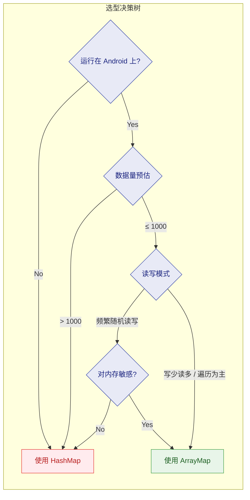
```mermaid
graph LR
    subgraph Decision["选型决策树"]
        direction TB
        Q1{"运行在 Android 上?"} -->|"No"| USE_MAP["使用 HashMap"]
        Q1 -->|"Yes"| Q2{"数据量预估"}
        Q2 -->|"> 1000"| USE_MAP
        Q2 -->|"≤ 1000"| Q3{"读写模式"}
        Q3 -->|"频繁随机读写"| Q4{"对内存敏感?"} 
        Q4 -->|"No"| USE_MAP
        Q4 -->|"Yes"| USE_AMAP["使用 ArrayMap"]
        Q3 -->|"写少读多 / 遍历为主"| USE_AMAP
    end

    classDef questionStyle fill:#E8EAF6,stroke:#3949AB,color:#1A237E
    classDef mapStyle fill:#FFEBEE,stroke:#E53935,color:#B71C1C
    classDef amapStyle fill:#E8F5E9,stroke:#43A047,color:#1B5E20

    class Q1,Q2,Q3,Q4 questionStyle
    class USE_MAP mapStyle
    class USE_AMAP amapStyle
```

---

## ArrayMap 的适用场景（数据量 < 1000）

"数据量 < 1000"这个经验阈值并不是随意拍脑袋定的，它背后有着清晰的性能分析依据。

### 为什么是 1000？

ArrayMap 的核心查找操作是对 `mHashes` 数组的二分查找，时间复杂度为 O(log n)。当 n = 1000 时，`log₂(1000) ≈ 10`，也就是说最多需要 10 次比较就能定位到目标元素。这个开销在现代 CPU 上几乎可以忽略不计。

但插入和删除操作涉及 `System.arraycopy()`，这是一个 O(n) 操作。当 n = 1000 时，最坏情况下需要移动 1000 个元素（在数组头部插入时）。虽然 `System.arraycopy()` 底层使用了 `memcpy/memmove` 等高度优化的内存拷贝指令，但当 n 继续增大到数千甚至上万时，这个开销就不可忽视了。

```java
// 不同数据量下 ArrayMap vs HashMap 的性能表现（示意）
// 数据来源: Android 官方性能测试 & 社区 benchmark

// N = 100:
//   ArrayMap.get()  ≈ HashMap.get()   (差距在纳秒级，可忽略)
//   ArrayMap.put()  略慢于 HashMap    (arraycopy 开销很小)
//   内存节省: ~40%

// N = 1000:
//   ArrayMap.get()  比 HashMap 慢 ~2-3x  (10次比较 vs 1次hash)
//   ArrayMap.put()  比 HashMap 慢 ~5-10x (arraycopy 开始明显)
//   内存节省: ~30-40%

// N = 10000:
//   ArrayMap.get()  比 HashMap 慢 ~5-10x
//   ArrayMap.put()  比 HashMap 慢 ~50-100x (arraycopy 成为瓶颈)
//   内存节省: ~30%，但性能代价太大
```

### Android 中的典型适用场景

以下是 ArrayMap 在 Android 开发中最常见的使用场景：

```java
// 场景 1: Bundle 的底层实现
// Android 的 Bundle 内部就使用了 ArrayMap
// Bundle 通常用于 Activity/Fragment 间传递少量参数
// 传递的参数通常不超过几十个，完美匹配 ArrayMap 的设计
Bundle args = new Bundle();
args.putString("user_name", "Kiro");
args.putInt("user_age", 25);
// Bundle 内部调用的就是 ArrayMap.put()

// 场景 2: Intent 的 extras
// Intent 传递数据同样基于 Bundle → ArrayMap
Intent intent = new Intent(this, DetailActivity.class);
intent.putExtra("item_id", 1001);       // 通常只有几个 extra
intent.putExtra("item_title", "Hello");

// 场景 3: Fragment 的 arguments
// Google 官方推荐用 Bundle 传参，而非构造函数
public static MyFragment newInstance(int id) {
    MyFragment fragment = new MyFragment();
    Bundle args = new Bundle();  // ArrayMap 支撑
    args.putInt("id", id);
    fragment.setArguments(args);
    return fragment;
}
```

```java
// 场景 4: SharedPreferences 的内存缓存
// SharedPreferencesImpl 内部使用 ArrayMap 缓存所有键值对
// 一个 SP 文件通常存储几十到几百个配置项，非常适合 ArrayMap
SharedPreferences prefs = getSharedPreferences("config", MODE_PRIVATE);
// 底层读取 XML 后，数据存入 ArrayMap

// 场景 5: ViewHolder 的临时数据映射
// RecyclerView 的 Adapter 中，经常需要为每个 item 维护少量状态
ArrayMap<String, Object> itemState = new ArrayMap<>();
itemState.put("expanded", false);    // 是否展开
itemState.put("selected", true);     // 是否选中
itemState.put("progress", 0.75f);    // 下载进度
// 每个 item 最多几个状态，ArrayMap 完美胜任

// 场景 6: 自定义 View 的属性缓存
// 自定义 View 解析 XML 属性后，缓存到 Map 中
// 属性数量通常在个位数到几十个之间
ArrayMap<String, Integer> attrCache = new ArrayMap<>();
attrCache.put("cornerRadius", 8);
attrCache.put("strokeWidth", 2);
attrCache.put("shadowElevation", 4);
```

```java
// 场景 7: Android Framework 内部的大量使用
// ActivityManagerService 中管理 Activity 的各种映射
// WindowManagerService 中管理窗口属性
// PackageManagerService 中管理权限映射
// 这些场景的共同特点：
//   - 映射关系数量有限（通常远小于 1000）
//   - 系统服务对内存极度敏感
//   - 需要频繁遍历（ArrayMap 遍历性能优于 HashMap）
```

### 不适用的场景

同样重要的是知道什么时候不该用 ArrayMap：

```java
// ❌ 反面场景 1: 大数据量的缓存
// 图片 URL → Bitmap 的映射，可能有上万条
// 应该使用 HashMap 或 LruCache（内部也是 LinkedHashMap）
HashMap<String, Bitmap> imageCache = new HashMap<>(256);

// ❌ 反面场景 2: 高频写入的日志收集
// 每秒可能有数百次 put 操作
// ArrayMap 的 arraycopy 开销会成为性能瓶颈
HashMap<Long, LogEntry> logBuffer = new HashMap<>();

// ❌ 反面场景 3: 需要线程安全的并发场景
// ArrayMap 不是线程安全的，且没有 ConcurrentArrayMap 这种东西
// 应该使用 ConcurrentHashMap
ConcurrentHashMap<String, Session> sessions = new ConcurrentHashMap<>();

// ❌ 反面场景 4: 非 Android 平台
// ArrayMap 是 android.util 包下的类，标准 Java 中不存在
// AndroidX 提供了 androidx.collection.ArrayMap，但在服务端没有使用的必要
```

### 选型速查表

```
┌────────────────────────┬─────────────┬─────────────┐
│        场景             │  推荐集合    │    原因      │
├────────────────────────┼─────────────┼─────────────┤
│ key 为 int, N < 1000   │ SparseArray │ 零装箱+省内存 │
│ key 为 Object, N < 1000│ ArrayMap    │ 省内存+低GC   │
│ key 为 Object, N > 1000│ HashMap     │ O(1) 性能    │
│ 需要线程安全            │ Concurrent- │ 并发优化      │
│                        │ HashMap     │              │
│ 需要插入顺序            │ LinkedHash- │ 双向链表维护   │
│                        │ Map         │ 顺序         │
│ 需要排序               │ TreeMap     │ 红黑树有序    │
│ Bundle/Intent 传参     │ ArrayMap    │ 框架默认实现   │
│ SharedPreferences      │ ArrayMap    │ 框架默认实现   │
└────────────────────────┴─────────────┴─────────────┘
```

最后用一张全景图来总结 ArrayMap 在 Android 集合体系中的定位：


```mermaid
graph LR
    subgraph App["应用层 - 开发者直接使用"]
        direction TB
        A1["Bundle / Intent"] 
        A2["SharedPreferences"]
        A3["自定义业务 Map"]
    end

    subgraph Collection["Android 集合层"]
        direction TB
        B1["ArrayMap〈K,V〉"]
        B2["ArraySet〈E〉"]
        B3["SparseArray〈V〉"]
        B4["SparseIntArray"]
        B5["SparseBooleanArray"]
    end

    subgraph Core["核心机制"]
        direction TB
        C1["二分查找定位"]
        C2["双数组存储"]
        C3["缓存池复用"]
        C4["分段式扩缩容"]
    end

    subgraph JDK["JDK 集合 - 大数据量回退"]
        direction TB
        D1["HashMap"]
        D2["ConcurrentHashMap"]
        D3["TreeMap"]
    end

    App --> Collection
    Collection --> Core
    Collection -.->|"N > 1000 回退"| JDK

    classDef appStyle fill:#C8E6C9,stroke:#388E3C,color:#1B5E20
    classDef collStyle fill:#BBDEFB,stroke:#1976D2,color:#0D47A1
    classDef coreStyle fill:#FFF9C4,stroke:#F9A825,color:#F57F17
    classDef jdkStyle fill:#FFCCBC,stroke:#E64A19,color:#BF360C

    class A1,A2,A3 appStyle
    class B1,B2,B3,B4,B5 collStyle
    class C1,C2,C3,C4 coreStyle
    class D1,D2,D3 jdkStyle
```

---

**📝 练习题**

以下关于 ArrayMap 扩容与收缩策略的描述，哪一项是正确的？

A. ArrayMap 每次扩容都将容量翻倍（2 倍增长），与 HashMap 策略一致

B. ArrayMap 在元素数量不足容量的 1/2 时触发收缩，收缩后容量等于当前元素数量

C. ArrayMap 容量从 0 开始，依次经历 4 → 8 → 1.5 倍增长的分段式扩容，收缩在元素不足容量 1/3 且容量大于 8 时触发

D. ArrayMap 的扩容和收缩阈值是对称的，都在 50% 负载率时触发，因此容易产生扩缩震荡


**【答案】** C

**【解析】** ArrayMap 采用分段式扩容策略：容量小于 4 时直接扩到 4（`BASE_SIZE`），容量在 4 到 7 之间时直接扩到 8（`BASE_SIZE * 2`），容量 ≥ 8 后按 1.5 倍增长。收缩条件需要同时满足两点：当前容量大于 8，且实际元素数量不足容量的 1/3。选项 A 错误，ArrayMap 用的是 1.5 倍而非 2 倍；选项 B 错误，收缩阈值是 1/3 而非 1/2，且收缩后容量为 `mSize * 1.5` 或 8（取较大值），而非刚好等于元素数量；选项 D 错误，扩容在 100% 满载时触发，收缩在不足 33% 时触发，两者不对称，这正是防止扩缩震荡的关键设计。

---

**📝 练习题**

在 Android 开发中，以下哪个场景最不适合使用 ArrayMap？

A. 一个 Fragment 通过 Bundle 传递 5 个参数给另一个 Fragment

B. 一个即时通讯 App 需要维护 5000 个在线用户的 `<userId, UserInfo>` 映射，且需要支持多线程并发读写

C. SharedPreferences 缓存 30 个应用配置项

D. 自定义 View 缓存 10 个 XML 属性值


**【答案】** B

**【解析】** 选项 B 有两个致命问题。第一，数据量为 5000，远超 ArrayMap 的建议上限 1000，此时二分查找的 O(log n) 和插入删除的 O(n) arraycopy 开销会显著拖慢性能。第二，ArrayMap 不是线程安全的，多线程并发读写会导致数据不一致甚至 `ConcurrentModificationException`，这个场景应该使用 `ConcurrentHashMap`。选项 A、C、D 的数据量分别为 5、30、10，都远小于 1000，且都是单线程场景，完美匹配 ArrayMap 的设计定位。

---

## ArraySet

ArraySet 是 Android 框架提供的一个 `Set` 接口实现，其设计哲学与 ArrayMap 一脉相承——用**双数组**替代 HashSet 内部的 HashMap，从而在小数据量场景下大幅降低内存开销。如果说 ArrayMap 是 HashMap 的"Android 瘦身版"，那 ArraySet 就是 HashSet 的"Android 瘦身版"。它位于 `android.util` 包（也有 `androidx.collection.ArraySet` 兼容版本），从 API 23 开始进入公开 API。

### 核心数据结构：与 ArrayMap 的孪生设计

ArraySet 的内部结构几乎是 ArrayMap 的"单值版"——去掉了 value 那一半，只保留 key。

```java
// ArraySet 内部核心字段（简化）
int[] mHashes;      // 存储每个元素的 hashCode，有序排列
Object[] mArray;    // 存储实际元素（与 mHashes 一一对应）
int mSize;          // 当前元素数量
```

与 ArrayMap 对比：

| 字段 | ArrayMap | ArraySet |
|------|----------|----------|
| `mHashes` | `int[]` — 存 key 的 hashCode | `int[]` — 存元素的 hashCode |
| `mArray` | `Object[]` — 交替存 key/value，长度 = `mHashes.length * 2` | `Object[]` — 只存元素，长度 = `mHashes.length` |
| 映射关系 | `mHashes[i]` → `mArray[i*2]`(key）/ `mArray[i*2+1]`（value） | `mHashes[i]` → `mArray[i]`（元素） |

这意味着 ArraySet 比 ArrayMap 还要省内存——`mArray` 的长度只有 `mHashes` 的 1 倍而非 2 倍。

```text
┌─────────────────────────────────────────────────────┐
│                    ArraySet 内存布局                   │
├─────────────────────────────────────────────────────┤
│                                                     │
│  mHashes (int[]):    有序 hashCode 数组              │
│  ┌─────┬─────┬─────┬─────┬─────┐                   │
│  │  3  │ 18  │ 42  │ 97  │  …  │                   │
│  └──┬──┴──┬──┴──┬──┴──┬──┴─────┘                   │
│     │     │     │     │                             │
│     ▼     ▼     ▼     ▼                             │
│  mArray (Object[]):  实际元素，1:1 对应              │
│  ┌─────┬─────┬─────┬─────┬─────┐                   │
│  │ "A" │ "B" │ "C" │ "D" │  …  │                   │
│  └─────┴─────┴─────┴─────┴─────┘                   │
│                                                     │
│  mSize = 4                                          │
└─────────────────────────────────────────────────────┘
```

### 查找流程：二分查找定位

ArraySet 的 `contains()`、`add()`、`remove()` 操作都依赖同一个核心——对 `mHashes` 数组做**二分查找**（Binary Search），这与 SparseArray、ArrayMap 的策略完全一致。

```java
// ArraySet.indexOf() 核心逻辑（简化）
private int indexOf(Object key, int hash) {
    final int N = mSize;                    // 当前元素数量
    if (N == 0) {                           // 空集合直接返回 ~0（即 -1）
        return ~0;
    }

    // 第一步：在 mHashes 中二分查找 hash 值
    int index = binarySearch(mHashes, N, hash);

    // 未找到匹配的 hash，返回取反值（表示插入位置）
    if (index < 0) {
        return index;
    }

    // 第二步：hash 命中，用 equals() 确认是否是同一个元素
    if (key.equals(mArray[index])) {
        return index;                       // 完全匹配，返回索引
    }

    // 第三步：处理 hash 冲突——向后线性探测
    int end;
    for (end = index + 1; end < N && mHashes[end] == hash; end++) {
        if (key.equals(mArray[end])) {
            return end;                     // 在后方找到匹配
        }
    }

    // 第四步：向前线性探测
    for (int i = index - 1; i >= 0 && mHashes[i] == hash; i--) {
        if (key.equals(mArray[i])) {
            return i;                       // 在前方找到匹配
        }
    }

    // 确实不存在，返回取反的插入位置
    return ~end;
}
```

整个查找过程可以用流程图表达：

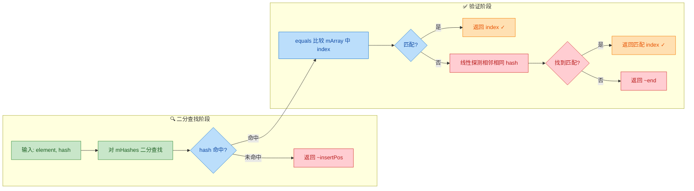
```mermaid
graph LR
    subgraph BinarySearch["🔍 二分查找阶段"]
        direction TB
        A["输入: element, hash"] --> B["对 mHashes 二分查找"]
        B --> C{hash 命中?}
        C -->|未命中| D["返回 ~insertPos"]
    end

    subgraph Verify["✅ 验证阶段"]
        direction TB
        E["equals 比较 mArray 中 index"] --> F{匹配?}
        F -->|是| G["返回 index ✓"]
        F -->|否| H["线性探测相邻相同 hash"]
        H --> I{找到匹配?}
        I -->|是| J["返回匹配 index ✓"]
        I -->|否| K["返回 ~end"]
    end

    C -->|命中| E

    classDef greenNode fill:#C8E6C9,stroke:#388E3C,color:#1B5E20
    classDef blueNode fill:#BBDEFB,stroke:#1976D2,color:#0D47A1
    classDef orangeNode fill:#FFE0B2,stroke:#F57C00,color:#E65100
    classDef redNode fill:#FFCDD2,stroke:#D32F2F,color:#B71C1C

    class A,B greenNode
    class C,E,F blueNode
    class G,J orangeNode
    class D,K,H,I redNode
```

时间复杂度分析：

- 二分查找阶段：O(log n)
- hash 冲突线性探测：最坏 O(n)，但实际场景中冲突极少
- 综合平均：O(log n)

### 添加与删除：数组搬移的代价

**添加元素 `add(E value)`：**

```java
// ArraySet.add() 核心逻辑（简化）
public boolean add(E value) {
    final int hash;
    int index;

    // 第一步：计算 hash 并查找
    if (value == null) {
        hash = 0;                           // null 的 hash 固定为 0
        index = indexOfNull();              // 专门处理 null 查找
    } else {
        hash = value.hashCode();            // 计算元素的 hashCode
        index = indexOf(value, hash);       // 二分查找定位
    }

    // 第二步：如果已存在，直接返回 false（Set 语义：不允许重复）
    if (index >= 0) {
        return false;                       // 元素已存在，添加失败
    }

    // 第三步：取反得到插入位置
    index = ~index;                         // 将负数还原为应插入的位置

    // 第四步：必要时扩容
    if (mSize >= mHashes.length) {
        final int n = mSize >= 8            // 扩容策略：
                ? (mSize + (mSize >> 1))    //   >= 8 时扩容 1.5 倍
                : (mSize >= 4 ? 8 : 4);    //   < 4 → 4, < 8 → 8
        final int[] ohashes = mHashes;
        final Object[] oarray = mArray;
        allocArrays(n);                     // 分配新数组（可能命中缓存）

        // 将旧数据拷贝到新数组
        System.arraycopy(ohashes, 0, mHashes, 0, ohashes.length);
        System.arraycopy(oarray, 0, mArray, 0, oarray.length);

        freeArrays(ohashes, oarray, mSize); // 回收旧数组（放入缓存池）
    }

    // 第五步：腾出插入位置（数组搬移）
    if (index < mSize) {
        // 将 index 及之后的元素整体后移一位
        System.arraycopy(mHashes, index, mHashes, index + 1, mSize - index);
        System.arraycopy(mArray, index, mArray, index + 1, mSize - index);
    }

    // 第六步：写入新元素
    mHashes[index] = hash;                  // 在 mHashes 对应位置写入 hash
    mArray[index] = value;                  // 在 mArray 对应位置写入元素
    mSize++;                                // 元素计数 +1

    return true;                            // 添加成功
}
```

**删除元素 `remove(Object value)`：**

```java
// ArraySet.remove() 核心逻辑（简化）
public boolean remove(Object value) {
    // 第一步：查找元素位置
    final int index = indexOf(value);

    // 不存在则直接返回
    if (index < 0) {
        return false;                       // 元素不存在，删除失败
    }

    // 第二步：判断是否需要收缩
    if (mSize <= mHashes.length / 3) {
        // 利用率过低，分配更小的数组
        final int n = mSize > 8 ? (mSize + (mSize >> 1)) : (mSize <= 4 ? 4 : 8);
        final int[] ohashes = mHashes;
        final Object[] oarray = mArray;
        allocArrays(n);                     // 分配新的更小数组

        // 拷贝 index 之前的部分
        if (index > 0) {
            System.arraycopy(ohashes, 0, mHashes, 0, index);
            System.arraycopy(oarray, 0, mArray, 0, index);
        }
        // 拷贝 index 之后的部分（跳过被删除元素）
        if (index < mSize - 1) {
            System.arraycopy(ohashes, index + 1, mHashes, index, mSize - index - 1);
            System.arraycopy(oarray, index + 1, mArray, index, mSize - index - 1);
        }
    } else {
        // 第三步：不收缩，直接前移覆盖
        mSize--;
        if (index < mSize) {
            System.arraycopy(mHashes, index + 1, mHashes, index, mSize - index);
            System.arraycopy(mArray, index + 1, mArray, index, mSize - index);
        }
        mArray[mSize] = null;               // 清除末尾引用，帮助 GC
    }

    return true;                            // 删除成功
}
```

### 缓存复用机制：与 ArrayMap 共享设计

ArraySet 同样实现了与 ArrayMap 几乎相同的**数组缓存池**机制，避免频繁的内存分配和 GC。

```java
// ArraySet 的静态缓存池（简化）
static Object[] sBaseCache;         // 缓存容量为 4 的旧数组
static int sBaseCacheSize;          // 当前缓存了多少组（上限 10）
static Object[] sTwiceBaseCache;    // 缓存容量为 8 的旧数组
static int sTwiceCacheSize;         // 当前缓存了多少组（上限 10）
```

缓存池的工作方式：

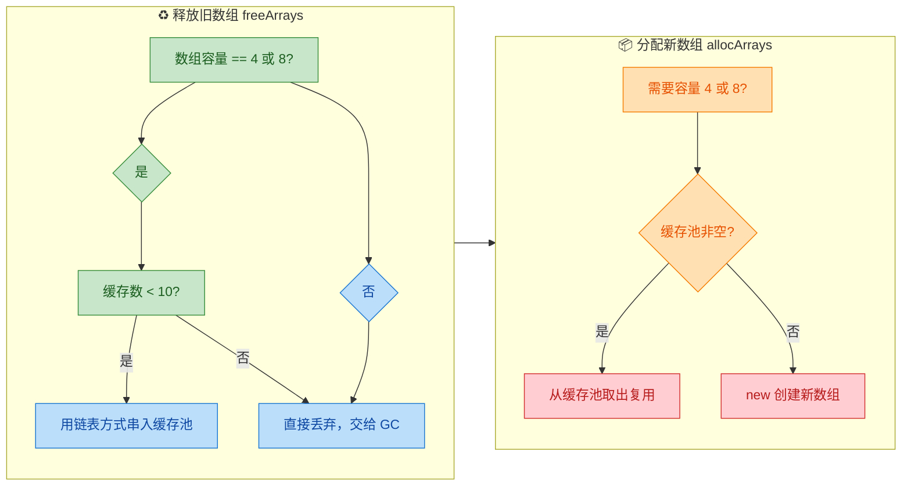
```mermaid
graph LR
    subgraph Release["♻️ 释放旧数组 freeArrays"]
        direction TB
        R1["数组容量 == 4 或 8?"] --> R2{是}
        R2 --> R3["缓存数 < 10?"]
        R3 -->|是| R4["用链表方式串入缓存池"]
        R3 -->|否| R5["直接丢弃，交给 GC"]
        R1 --> R6{否}
        R6 --> R5
    end

    subgraph Alloc["📦 分配新数组 allocArrays"]
        direction TB
        A1["需要容量 4 或 8?"] --> A2{缓存池非空?}
        A2 -->|是| A3["从缓存池取出复用"]
        A2 -->|否| A4["new 创建新数组"]
    end

    Release --> Alloc

    classDef greenNode fill:#C8E6C9,stroke:#388E3C,color:#1B5E20
    classDef blueNode fill:#BBDEFB,stroke:#1976D2,color:#0D47A1
    classDef orangeNode fill:#FFE0B2,stroke:#F57C00,color:#E65100
    classDef redNode fill:#FFCDD2,stroke:#D32F2F,color:#B71C1C

    class R1,R2,R3 greenNode
    class R4,R5,R6 blueNode
    class A1,A2 orangeNode
    class A3,A4 redNode
```

缓存池的链表结构与 ArrayMap 完全一致——利用 `mArray[0]` 存下一个缓存节点的引用，`mArray[1]` 存对应的 `int[]` 数组，形成一个"废物利用"的单链表。

### 扩容与收缩策略

ArraySet 的容量管理策略与 ArrayMap 基本一致：

```java
// 扩容策略（简化）
int newCapacity;
if (currentSize >= 8) {
    newCapacity = currentSize + (currentSize >> 1);  // 1.5 倍扩容
} else if (currentSize >= 4) {
    newCapacity = 8;                                  // 4 → 8
} else {
    newCapacity = 4;                                  // 0 → 4
}
```

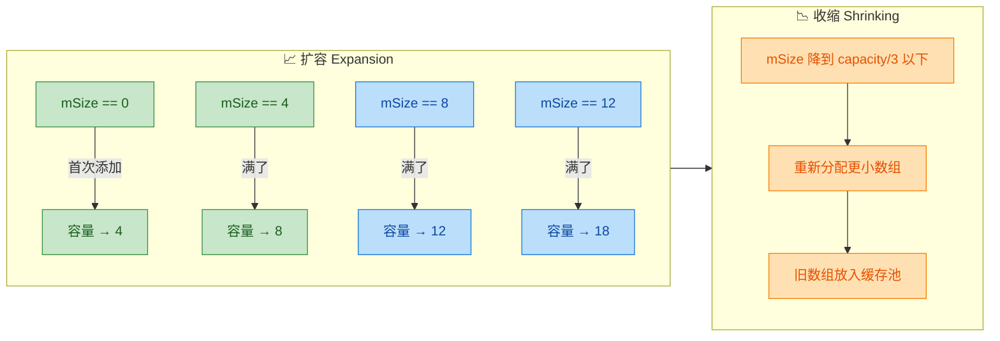
```mermaid
graph LR
    subgraph Expand["📈 扩容 Expansion"]
        direction TB
        E1["mSize == 0"] -->|首次添加| E2["容量 → 4"]
        E3["mSize == 4"] -->|满了| E4["容量 → 8"]
        E5["mSize == 8"] -->|满了| E6["容量 → 12"]
        E7["mSize == 12"] -->|满了| E8["容量 → 18"]
    end

    subgraph Shrink["📉 收缩 Shrinking"]
        direction TB
        S1["mSize 降到 capacity/3 以下"] --> S2["重新分配更小数组"]
        S2 --> S3["旧数组放入缓存池"]
    end

    Expand --> Shrink

    classDef greenNode fill:#C8E6C9,stroke:#388E3C,color:#1B5E20
    classDef blueNode fill:#BBDEFB,stroke:#1976D2,color:#0D47A1
    classDef orangeNode fill:#FFE0B2,stroke:#F57C00,color:#E65100

    class E1,E2,E3,E4 greenNode
    class E5,E6,E7,E8 blueNode
    class S1,S2,S3 orangeNode
```

收缩的触发条件是：当前元素数量 ≤ 数组容量的 1/3。这个阈值比较激进，确保不会长期浪费内存。

### ArraySet vs HashSet：全面对比

| 维度 | ArraySet | HashSet |
|------|----------|---------|
| 底层结构 | `int[]` + `Object[]` 双数组 | `HashMap<E, Object>` |
| 内存开销 | 极低，无 Entry 对象 | 高，每个元素一个 Entry（32+ bytes） |
| 查找复杂度 | O(log n) 二分查找 | O(1) 哈希直达 |
| 插入/删除 | O(n) 数组搬移 | O(1) 链表/红黑树操作 |
| 自动装箱 | 无（hash 存 int[]） | 无（但内部 HashMap 有 Entry 开销） |
| 缓存友好性 | 高（连续内存） | 低（Entry 散布堆中） |
| 迭代性能 | 快（顺序遍历数组） | 较慢（遍历桶 + 链表） |
| 适用数据量 | < 1000 | 不限 |
| 收缩能力 | 有（自动收缩） | 无（只扩不缩） |

内存占用的直观对比（存储 100 个 String 元素）：

```text
┌──────────────────────────────────────────────────────────┐
│              内存占用对比 (100 个 String 元素)              │
├──────────────────────────────────────────────────────────┤
│                                                          │
│  HashSet:                                                │
│  ┌──────────────────────────────────────────────┐        │
│  │ HashMap 对象头                    ~48 bytes   │        │
│  │ Node[] table (128 桶)            ~512 bytes   │        │
│  │ 100 × Node 对象 (32 bytes each) ~3200 bytes   │        │
│  │ 100 × dummy Value (PRESENT)       ~16 bytes   │        │
│  │                                               │        │
│  │ 总计: ≈ 3776 bytes (不含 key 本身)             │        │
│  └──────────────────────────────────────────────┘        │
│                                                          │
│  ArraySet:                                               │
│  ┌──────────────────────────────────────────────┐        │
│  │ ArraySet 对象头                   ~32 bytes   │        │
│  │ int[] mHashes (150 容量)         ~616 bytes   │        │
│  │ Object[] mArray (150 容量)       ~616 bytes   │        │
│  │                                               │        │
│  │ 总计: ≈ 1264 bytes (不含元素本身)              │        │
│  └──────────────────────────────────────────────┘        │
│                                                          │
│  节省: ≈ 66% 内存 ✓                                      │
└──────────────────────────────────────────────────────────┘
```

### 实际使用示例

```java
// 创建 ArraySet
ArraySet<String> permissions = new ArraySet<>();

// 添加元素
permissions.add("android.permission.CAMERA");           // 添加相机权限
permissions.add("android.permission.INTERNET");         // 添加网络权限
permissions.add("android.permission.LOCATION");         // 添加定位权限
permissions.add("android.permission.CAMERA");           // 重复添加，返回 false

// 查询
boolean hasCam = permissions.contains("android.permission.CAMERA");  // true
int size = permissions.size();                                        // 3

// 批量操作
ArraySet<String> required = new ArraySet<>();
required.add("android.permission.CAMERA");
required.add("android.permission.STORAGE");

permissions.addAll(required);       // 并集操作
permissions.retainAll(required);    // 交集操作
permissions.removeAll(required);    // 差集操作

// 按索引访问（ArraySet 特有，HashSet 做不到）
for (int i = 0; i < permissions.size(); i++) {
    String perm = permissions.valueAt(i);               // O(1) 按索引取值
    Log.d("Permission", perm);
}

// 标准迭代器遍历
for (String perm : permissions) {
    Log.d("Permission", perm);
}
```

`valueAt(int index)` 是 ArraySet 相比 HashSet 的一个独特优势——因为底层是数组，所以支持 O(1) 的按索引随机访问，这在某些场景下非常方便。

### 适用场景与选型建议

ArraySet 最适合以下场景：

- Android 组件中存储**权限列表**、**Feature 集合**、**Tag 集合**等小规模不重复数据
- 需要频繁**迭代遍历**的场景（数组连续内存，缓存命中率高）
- 内存敏感的移动端应用，尤其是可能创建大量 Set 实例的情况
- 数据量在 **几百到一千** 以内的场景

不适合的场景：

- 数据量超过 1000，此时 O(log n) 查找和 O(n) 插入/删除的劣势会显现
- 高频插入/删除操作，数组搬移的开销会累积
- 对查找性能有极致要求的热点路径

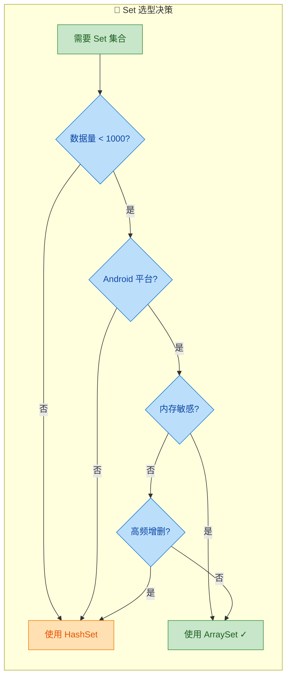
```mermaid
graph LR
    subgraph Decision["🤔 Set 选型决策"]
        direction TB
        Q1["需要 Set 集合"] --> Q2{"数据量 < 1000?"}
        Q2 -->|是| Q3{"Android 平台?"}
        Q2 -->|否| Q4["使用 HashSet"]
        Q3 -->|是| Q5{"内存敏感?"}
        Q3 -->|否| Q4
        Q5 -->|是| Q6["使用 ArraySet ✓"]
        Q5 -->|否| Q7{"高频增删?"}
        Q7 -->|是| Q4
        Q7 -->|否| Q6
    end

    classDef greenNode fill:#C8E6C9,stroke:#388E3C,color:#1B5E20
    classDef blueNode fill:#BBDEFB,stroke:#1976D2,color:#0D47A1
    classDef orangeNode fill:#FFE0B2,stroke:#F57C00,color:#E65100
    classDef redNode fill:#FFCDD2,stroke:#D32F2F,color:#B71C1C

    class Q1 greenNode
    class Q2,Q3,Q5,Q7 blueNode
    class Q6 greenNode
    class Q4 orangeNode
```

---

**📝 练习题**

以下关于 ArraySet 的描述，哪一项是错误的？

A. ArraySet 内部使用 `int[] mHashes` 和 `Object[] mArray` 两个数组，其中 `mArray` 的长度等于 `mHashes` 的长度

B. ArraySet 的 `contains()` 方法时间复杂度为 O(1)，因为它使用了哈希表

C. ArraySet 支持 `valueAt(int index)` 按索引访问元素，这是 HashSet 不具备的能力

D. ArraySet 具有数组收缩机制，当元素数量降到容量的 1/3 以下时会触发收缩


**【答案】** B

**【解析】** ArraySet 并不使用哈希表结构，它的底层是两个有序数组。`contains()` 的实现依赖对 `mHashes` 数组的**二分查找**（Binary Search），时间复杂度为 O(log n)，而非哈希表的 O(1)。这正是 ArraySet 用"查找性能"换"内存节省"的核心 trade-off。选项 A 正确，ArraySet 的 `mArray` 与 `mHashes` 是 1:1 对应关系（不像 ArrayMap 是 1:2）。选项 C 正确，数组结构天然支持按索引随机访问。选项 D 正确，收缩阈值为 capacity / 3。

---

## 本章小结

Android 专属集合是 Google 工程师针对移动设备的内存与性能瓶颈，对 Java 标准集合框架进行的一次"量体裁衣"式重构。本章围绕 `SparseArray` 家族与 `ArrayMap`/`ArraySet` 两大阵营，深入剖析了它们的内部实现与设计哲学。我们用一张全景图来回顾整体知识脉络：

```mermaid
graph LR
    subgraph SparseFamily["SparseArray 家族"]
        direction TB
        SA["SparseArray〈E〉<br/>int[] keys + Object[] values"]
        SBA["SparseBooleanArray<br/>int[] keys + boolean[] values"]
        SIA["SparseIntArray<br/>int[] keys + int[] values"]
        SLA["SparseLongArray<br/>int[] keys + long[] values"]
        SA --- SBA
        SBA --- SIA
        SIA --- SLA
    end

    subgraph ArrayFamily["ArrayMap / ArraySet 家族"]
        direction TB
        AM["ArrayMap〈K,V〉<br/>int[] hashes + Object[] array"]
        AS["ArraySet〈E〉<br/>int[] hashes + Object[] array"]
        AM --- AS
    end

    subgraph CoreTech["核心技术手段"]
        direction TB
        T1["双数组替代链表/红黑树"]
        T2["二分查找定位元素"]
        T3["延迟删除 + gc 压缩"]
        T4["静态缓存池复用"]
        T5["紧凑扩容与主动收缩"]
        T1 --- T2
        T2 --- T3
        T3 --- T4
        T4 --- T5
    end

    subgraph Goal["设计目标"]
        direction TB
        G1["减少内存占用"]
        G2["避免自动装箱"]
        G3["降低 GC 压力"]
        G1 --- G2
        G2 --- G3
    end

    SparseFamily --> CoreTech
    ArrayFamily --> CoreTech
    CoreTech --> Goal

    classDef sparseStyle fill:#C8E6C9,stroke:#388E3C,color:#1B5E20
    classDef arrayStyle fill:#BBDEFB,stroke:#1976D2,color:#0D47A1
    classDef techStyle fill:#FFE0B2,stroke:#F57C00,color:#E65100
    classDef goalStyle fill:#F8BBD0,stroke:#C2185B,color:#880E4F

    class SA,SBA,SIA,SLA sparseStyle
    class AM,AS arrayStyle
    class T1,T2,T3,T4,T5 techStyle
    class G1,G2,G3 goalStyle
```

### 核心设计思想回顾

本章所有集合的底层哲学可以归结为一句话：**用"紧凑的连续数组 + 二分查找"替代"散列表 + 链表/红黑树"，以牺牲微量查找时间换取显著的内存节省**。

这一思想贯穿了每一个类的实现：

`SparseArray` 用两个平行数组 `int[] mKeys` 和 `Object[] mValues` 取代了 `HashMap` 中 `Entry` 节点链表的设计。key 本身就是原始 `int`，彻底消灭了 `Integer` 自动装箱。查找时对有序的 `mKeys` 做二分查找（binary search），时间复杂度 O(log n)，在数据量较小时与 HashMap 的 O(1) 差距几乎不可感知。

`ArrayMap` 则面向更通用的 `<K, V>` 场景，用 `int[] mHashes` 存储 key 的 hashCode，用 `Object[] mArray` 以 key-value 交替紧邻的方式存储键值对。查找时先对 `mHashes` 二分查找定位候选区间，再在候选区间内线性比对 key 的 `equals()`，兼顾了散列的快速定位与数组的内存紧凑。

两者的共同点是：**没有任何额外的包装对象**（no `Entry`, no `Node`），数据直接"平铺"在数组中，对 CPU 缓存行（cache line）也更加友好。

### 关键机制对比总结

下面这张表将本章涉及的所有关键机制做一次横向对比，帮助你在面试或实际选型时快速决策：

| 维度 | SparseArray | ArrayMap | HashMap |
|------|------------|----------|---------|
| Key 类型 | 仅 `int`（原始类型） | 任意 `Object` | 任意 `Object` |
| Value 类型 | 任意 `Object` | 任意 `Object` | 任意 `Object` |
| 底层结构 | `int[]` + `Object[]` | `int[]`(hash) + `Object[]`(kv交替) | `Node[]` 桶 + 链表/红黑树 |
| 查找算法 | 二分查找 O(log n) | 二分查找 O(log n) + 线性探测 | 哈希定位 O(1) 均摊 |
| 自动装箱 | 完全避免（key 为 int） | 无法避免（key 为 Object） | 无法避免 |
| 内存开销 | 极低（无 Entry 对象） | 低（无 Entry 对象） | 高（每个 Entry 约 32-50 字节） |
| 删除策略 | 延迟删除（DELETED 标记） | 即时 `System.arraycopy` 压缩 | 直接移除节点 |
| 缓存复用 | 无 | 有（`mBaseCache` / `mTwiceBaseCache` 静态缓存池） | 无 |
| 扩容策略 | 容量翻倍式增长 | 分段式（4→8 翻倍，≥8 则 ×1.5） | 容量翻倍 + rehash |
| 收缩策略 | 无主动收缩 | 有（元素数 < 容量 1/3 时收缩） | 无主动收缩 |
| 推荐数据量 | < 1000 | < 1000 | 不限 |

### SparseArray 的三大精髓

回顾 `SparseArray`，它的设计精髓可以浓缩为三点：

**第一，零装箱（Zero Boxing）。** key 直接存储在 `int[]` 中，不需要包装成 `Integer` 对象。在 Android 这种内存敏感的环境下，每省下一个 `Integer`（约 16 字节）都是有意义的。当你有 500 个映射时，仅 key 一项就节省了约 8KB 内存。

**第二，延迟删除（Lazy Deletion）。** 删除元素时不立即搬移数组，而是将 value 标记为 `DELETED` 哨兵对象。后续的 `put()` 操作可以直接复用这个槽位，避免了 `System.arraycopy` 的开销。只有在必须扩容或遍历时，才触发 `gc()` 方法一次性压缩数组。这种"攒一波再处理"的策略，在频繁增删的场景下效果显著。

**第三，极简的内存布局。** 两个平行数组紧密排列在内存中，CPU 预取（prefetch）效率高，缓存命中率远优于 `HashMap` 中散落在堆上的 `Entry` 节点。

### ArrayMap 的三大精髓

`ArrayMap` 的设计同样有三个值得铭记的亮点：

**第一，双数组紧凑存储。** `int[] mHashes` 存 hashCode，`Object[] mArray` 以 `[key0, value0, key1, value1, ...]` 的方式交替存储。一个包含 n 个键值对的 `ArrayMap`，只需要 `n` 个 int 和 `2n` 个 Object 引用，而 `HashMap` 需要 `n` 个 `Node` 对象（每个 Node 包含 hash、key、value、next 四个字段加上对象头）。

**第二，静态缓存池复用（Cache Pool）。** 这是 `ArrayMap` 最精妙的设计。当容量为 4 或 8 的 `ArrayMap` 被清空或回收时，它的数组不会被丢弃，而是被挂到 `mBaseCache`（容量 4）或 `mTwiceBaseCache`（容量 8）这两个静态链表上。下次创建同容量的 `ArrayMap` 时，直接从缓存池取出数组复用，避免了频繁的内存分配与 GC。缓存池上限为 10 个，防止内存泄漏。

**第三，主动收缩（Shrinking）。** 这是 `HashMap` 完全不具备的能力。当 `ArrayMap` 的元素数量降到容量的 1/3 以下时，会主动缩小底层数组。这意味着如果你曾经往 `ArrayMap` 里塞了大量数据，后来又删掉了大部分，它会自动释放多余的内存，而不是像 `HashMap` 那样永远占着扩容后的大桶数组。

### 选型决策树

在实际开发中，面对"该用哪个集合"这个问题，可以按照以下决策路径来判断：

```mermaid
graph LR
    subgraph Decision["选型决策流程"]
        direction TB
        Q1{"Key 是 int 类型？"}
        Q2{"Value 是基本类型？"}
        Q3{"数据量 < 1000？"}
        Q4{"需要 Map 还是 Set？"}

        R1["SparseArray〈V〉"]
        R2["SparseBooleanArray<br/>SparseIntArray<br/>SparseLongArray"]
        R3["ArrayMap〈K,V〉"]
        R4["ArraySet〈E〉"]
        R5["HashMap〈K,V〉<br/>HashSet〈E〉"]

        Q1 -->|"是"| Q2
        Q1 -->|"否"| Q3
        Q2 -->|"boolean/int/long"| R2
        Q2 -->|"Object"| R1
        Q3 -->|"是"| Q4
        Q3 -->|"否（大数据量）"| R5
        Q4 -->|"Map"| R3
        Q4 -->|"Set"| R4
    end

    classDef questionStyle fill:#E3F2FD,stroke:#1565C0,color:#0D47A1
    classDef sparseResult fill:#C8E6C9,stroke:#2E7D32,color:#1B5E20
    classDef arrayResult fill:#FFF9C4,stroke:#F9A825,color:#F57F17
    classDef hashResult fill:#FFCDD2,stroke:#C62828,color:#B71C1C

    class Q1,Q2,Q3,Q4 questionStyle
    class R1,R2 sparseResult
    class R3,R4 arrayResult
    class R5 hashResult
```

简单来说：
- key 是 `int` → 优先 `SparseArray` 家族，彻底避免装箱。
- key 是 `Object` 且数据量小（< 1000） → 优先 `ArrayMap` / `ArraySet`，省内存。
- 数据量大或对查找性能有极致要求 → 老老实实用 `HashMap` / `HashSet`，O(1) 的均摊查找在大数据量下优势明显。

### 常见误区澄清

**误区一："Android 专属集合总是比 HashMap 好"。** 不是的。当数据量超过 1000 时，二分查找的 O(log n) 与哈希表的 O(1) 差距会逐渐拉大。而且 `ArrayMap` 的插入和删除涉及 `System.arraycopy`，在大数据量下开销不可忽视。Android 专属集合是"小而美"的工具，不是万能替代品。

**误区二："SparseArray 的延迟删除会导致内存泄漏"。** 不会。`DELETED` 标记只是一个静态哨兵对象，原来的 value 引用已经被清除（设为 `DELETED`），不会阻止 value 对象被 GC 回收。而且 `gc()` 压缩会在 `put()`、`size()`、遍历等操作中被自动触发。

**误区三："ArrayMap 的缓存池是无限的"。** 不是。`mBaseCache` 和 `mTwiceBaseCache` 各自最多缓存 10 个数组实例（`CACHE_SIZE = 10`），超出的直接丢弃交给 GC。这是一个经过权衡的设计——缓存太多浪费内存，太少则失去复用意义。

### 一句话记忆口诀

> **Sparse 灭装箱，ArrayMap 省内存，千条以下随便选，超千还得 HashMap 扛。**

这句话概括了本章的核心选型原则：`SparseArray` 的核心价值是消灭 `int → Integer` 的自动装箱；`ArrayMap` 的核心价值是用紧凑数组替代 `Entry` 节点省内存；两者的适用边界都是数据量在 1000 以内；超过这个量级，`HashMap` 的 O(1) 查找和成熟的扩容机制才是更稳妥的选择。

---

**📝 练习题**

在 Android 开发中，某个页面需要维护一个从 `View ID`（int 类型）到 `View` 对象的映射关系，预计最多有 200 个条目，且存在频繁的增删操作。以下哪种集合选择最合适？

A. `HashMap<Integer, View>`，因为它查找速度最快，适合频繁增删场景


B. `SparseArray<View>`，因为 key 是 int 类型，可以避免装箱，且延迟删除机制适合频繁增删


C. `ArrayMap<Integer, View>`，因为它有缓存复用机制，适合频繁创建和销毁的场景


D. `LinkedHashMap<Integer, View>`，因为它能保持插入顺序，遍历效率更高


**【答案】** B

**【解析】** 这道题的关键信息有三个：key 是 `int` 类型（View ID）、数据量约 200（远小于 1000）、频繁增删。

选 B（`SparseArray<View>`）的理由：首先，key 是原始 `int` 类型，`SparseArray` 可以直接用 `int[]` 存储，完全避免了 `int → Integer` 的自动装箱，这是它相对于 A 和 C 的独特优势。其次，200 个条目远在 `SparseArray` 的舒适区内，二分查找的 O(log 200) ≈ 8 次比较，性能完全够用。最后，`SparseArray` 的延迟删除（DELETED 标记）机制天然适合频繁增删——删除时只做标记不搬移数组，后续 `put()` 可以直接复用被删除的槽位，减少了 `System.arraycopy` 的次数。

A 选项的 `HashMap<Integer, View>` 虽然查找是 O(1)，但每个条目需要创建 `Integer` 包装对象和 `Node` 节点对象，在 200 条数据量下内存浪费明显，且没有性能优势。C 选项的 `ArrayMap<Integer, View>` 虽然也省内存，但 key 仍然需要装箱为 `Integer`，不如 `SparseArray` 彻底；而且 `ArrayMap` 的删除是即时压缩（`System.arraycopy`），在频繁增删场景下反而不如 `SparseArray` 的延迟删除高效。D 选项的 `LinkedHashMap` 在本题场景中没有保持顺序的需求，且内存开销最大（额外维护双向链表），属于过度设计。


---