---

# List实现

---

## ArrayList ⭐⭐

ArrayList 是 Java 集合框架中使用频率最高的 List 实现，没有之一。它的本质非常直白——用一个普通的数组来存储元素，然后在上面包了一层自动管理容量的外壳。理解 ArrayList，就是理解"数组如何在运行时动态生长"。

### 底层结构（Object[] 数组）

打开 JDK 源码（以 JDK 17 为参考），ArrayList 的核心字段只有两个：

```java
// 真正存放元素的数组，类型是 Object[]
// 这意味着 ArrayList 可以存任何引用类型（泛型擦除后都是 Object）
transient Object[] elementData;

// 当前实际存储的元素个数（注意：不是数组长度）
private int size;
```

这里有一个非常关键的区分：`elementData.length` 是数组的**容量（capacity）**，而 `size` 是实际存入的**元素个数**。两者的关系永远是 `size <= elementData.length`。

```text
capacity (elementData.length) = 10
size = 6

┌─────┬─────┬─────┬─────┬─────┬─────┬──────┬──────┬──────┬──────┐
│  A  │  B  │  C  │  D  │  E  │  F  │ null │ null │ null │ null │
└─────┴─────┴─────┴─────┴─────┴─────┴──────┴──────┴──────┴──────┘
  [0]   [1]   [2]   [3]   [4]   [5]    [6]    [7]    [8]    [9]
  ◄──────── size = 6 ────────►  ◄──── 空闲空间（未使用）────────►
```

当你调用 `new ArrayList<>()` 时，JDK 10 以后的实现采用了**懒初始化（lazy initialization）**策略：

```java
// 无参构造器 —— 并不会立即分配容量为 10 的数组
public ArrayList() {
    // DEFAULTCAPACITY_EMPTY_ELEMENTDATA 是一个共享的空数组 {}
    // 真正的分配推迟到第一次 add() 时
    this.elementData = DEFAULTCAPACITY_EMPTY_ELEMENTDATA;
}

// 指定初始容量的构造器
public ArrayList(int initialCapacity) {
    if (initialCapacity > 0) {
        // 直接分配指定大小的数组
        this.elementData = new Object[initialCapacity];
    } else if (initialCapacity == 0) {
        // 容量为 0 时，使用另一个共享空数组
        this.elementData = EMPTY_ELEMENTDATA;
    } else {
        // 负数直接抛异常
        throw new IllegalArgumentException("Illegal Capacity: " + initialCapacity);
    }
}
```

为什么要区分 `DEFAULTCAPACITY_EMPTY_ELEMENTDATA` 和 `EMPTY_ELEMENTDATA` 两个空数组？因为 JDK 需要在第一次 `add()` 时判断：如果是无参构造创建的，就直接扩容到默认容量 10；如果是 `new ArrayList<>(0)` 创建的，则按正常的 1.5 倍策略从 0 开始增长。这是一个精巧的设计细节。

从内存模型的角度看，ArrayList 对象在堆中的布局大致如下：

```java
// Stack                         Heap
// ──────                        ──────────────────────────────────
//
// list ──────────────────►  ┌─ ArrayList 对象 ─────────────────┐
//                           │  size = 3                        │
//                           │  elementData ─────┐              │
//                           └───────────────────┼──────────────┘
//                                               │
//                                               ▼
//                           ┌─ Object[] 数组 ──────────────────┐
//                           │ [0] ──► "Hello"                  │
//                           │ [1] ──► "World"                  │
//                           │ [2] ──► "Java"                   │
//                           │ [3]     null                     │
//                           │ [4]     null                     │
//                           └──────────────────────────────────┘
```

数组中存放的是对象的**引用（reference）**，而非对象本身。这也是为什么 ArrayList 不能直接存储 `int`、`double` 等基本类型——你必须使用包装类 `Integer`、`Double`，由自动装箱（autoboxing）来完成转换。

还有一个值得注意的关键字：`transient`。`elementData` 被标记为 `transient`，意味着默认的序列化机制会跳过它。ArrayList 自己实现了 `writeObject()` / `readObject()` 方法，只序列化 `size` 个有效元素，而不是整个数组（包括尾部的 null 空位）。这是一个节省网络带宽和存储空间的优化。

---

### 扩容机制（1.5 倍、为什么不是 2 倍）

当你不断往 ArrayList 中 `add()` 元素，总有一刻 `size == elementData.length`，数组满了。这时候就触发了**扩容（grow）**。整个过程可以用一句话概括：**分配一个更大的新数组，把旧数组的内容拷贝过去，然后丢弃旧数组**。

我们来逐行拆解 JDK 源码中的扩容流程：

```java
// 入口：添加元素
public boolean add(E e) {
    // 确保内部数组容量至少为 size + 1
    ensureCapacityInternal(size + 1);
    // 在 size 位置放入新元素，然后 size 自增
    elementData[size++] = e;
    return true;
}

// 第一步：计算所需的最小容量
private void ensureCapacityInternal(int minCapacity) {
    // 如果是无参构造创建的（懒初始化），第一次 add 时
    // 直接将最小容量提升到 DEFAULT_CAPACITY（10）
    if (elementData == DEFAULTCAPACITY_EMPTY_ELEMENTDATA) {
        minCapacity = Math.max(DEFAULT_CAPACITY, minCapacity);
    }
    ensureExplicitCapacity(minCapacity);
}

// 第二步：判断是否真的需要扩容
private void ensureExplicitCapacity(int minCapacity) {
    modCount++; // 结构性修改计数器（用于 fail-fast 迭代器）

    // 只有当所需最小容量 > 当前数组长度时，才触发扩容
    if (minCapacity - elementData.length > 0)
        grow(minCapacity);
}

// 第三步：核心扩容逻辑
private void grow(int minCapacity) {
    int oldCapacity = elementData.length;           // 旧容量
    int newCapacity = oldCapacity + (oldCapacity >> 1); // 新容量 = 旧容量 * 1.5
    // oldCapacity >> 1 就是右移一位，等价于 oldCapacity / 2
    // 所以 newCapacity = oldCapacity + oldCapacity/2 = 1.5 * oldCapacity

    // 如果 1.5 倍仍然不够（比如 addAll 一次加了很多元素）
    if (newCapacity - minCapacity < 0)
        newCapacity = minCapacity;                  // 直接用所需的最小容量

    // 如果新容量超过了 MAX_ARRAY_SIZE（Integer.MAX_VALUE - 8）
    if (newCapacity - MAX_ARRAY_SIZE > 0)
        newCapacity = hugeCapacity(minCapacity);    // 特殊处理超大数组

    // 关键操作：创建新数组并拷贝旧数据
    // Arrays.copyOf 内部调用 System.arraycopy（native 方法，非常快）
    elementData = Arrays.copyOf(elementData, newCapacity);
}
```

用一个具体的例子来走一遍完整的扩容过程：

```text
操作序列：连续 add 11 个元素到 new ArrayList<>()

第 1 次 add:  容量 0 → 10  (懒初始化，直接跳到默认容量 10)
第 2 次 add:  容量 10，size=2，不扩容
第 3 次 add:  容量 10，size=3，不扩容
  ...
第 10 次 add: 容量 10，size=10，不扩容
第 11 次 add: 容量 10 已满！触发扩容 → 10 + 10/2 = 15
第 16 次 add: 容量 15 已满！触发扩容 → 15 + 15/2 = 22
第 23 次 add: 容量 22 已满！触发扩容 → 22 + 22/2 = 33
  ...
```

下面这张流程图展示了 `add()` 方法的完整决策路径：

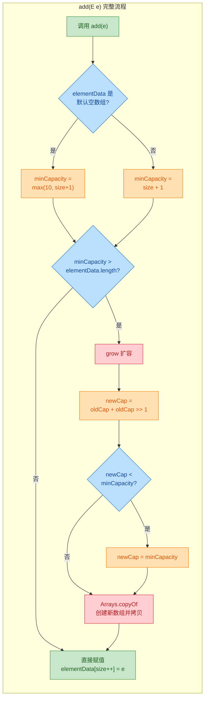

现在来回答那个经典面试题：**为什么扩容倍数是 1.5 而不是 2？**

这个问题的答案涉及内存分配器的工作原理。当数组扩容时，旧数组被丢弃，新数组被分配。如果倍数选择不当，旧数组释放的内存空间将永远无法被新数组复用，造成**内存碎片（memory fragmentation）**。

关键数学推导如下：假设初始容量为 $c$，扩容倍数为 $k$，经过 $n$ 次扩容后，之前所有被释放的旧数组总大小为：

$$S_n = c + ck + ck^2 + \cdots + ck^{n-1} = c \cdot \frac{k^n - 1}{k - 1}$$

而第 $n+1$ 次扩容需要的新数组大小为 $ck^n$。如果我们希望旧内存能被复用，就需要：

$$S_n \geq ck^n \quad \Rightarrow \quad \frac{k^n - 1}{k - 1} \geq k^n$$

当 $k = 2$ 时：$S_n = c(2^n - 1)$，而新数组大小 = $c \cdot 2^n$。旧内存总和永远比新数组小 $c$，**永远无法复用**。

当 $k = 1.5$ 时：从第 4 次扩容开始，之前释放的内存总和就足够容纳新数组了。

用具体数字来看更直观：

```text
倍数 = 2 时（无法复用旧内存）:
───────────────────────────────────────────────
扩容次数 │ 新数组大小 │ 已释放内存总和 │ 能复用?
───────────────────────────────────────────────
   1     │    20     │     10        │  ✗ (10 < 20)
   2     │    40     │     30        │  ✗ (30 < 40)
   3     │    80     │     70        │  ✗ (70 < 80)
   4     │   160     │    150        │  ✗ (150 < 160)
───────────────────────────────────────────────
差距永远是初始容量 c，永远追不上。

倍数 = 1.5 时（可以复用旧内存）:
───────────────────────────────────────────────
扩容次数 │ 新数组大小 │ 已释放内存总和 │ 能复用?
───────────────────────────────────────────────
   1     │    15     │     10        │  ✗
   2     │    22     │     25        │  ✓ (25 > 22) ✓
   3     │    33     │     47        │  ✓ (47 > 33) ✓
   4     │    49     │     80        │  ✓ (80 > 49) ✓
───────────────────────────────────────────────
从第 2 次扩容开始，旧内存就够用了！
```

除了内存复用，还有其他几个工程层面的考量：

- **空间浪费率（waste ratio）**：2 倍扩容最坏情况下有近 50% 的空间浪费（刚扩完容只用了一半多一点）。1.5 倍扩容最坏情况下浪费约 33%，对内存更友好。
- **位运算的高效性**：`oldCapacity >> 1` 是一次右移操作，CPU 一个时钟周期就能完成，比除法快得多。而 1.5 倍恰好等于 `old + old/2 = old + (old >> 1)`，非常适合用位运算表达。
- **扩容频率与拷贝成本的平衡**：倍数太小（比如 1.1 倍），扩容太频繁，每次都要 `System.arraycopy`，性能差。倍数太大（比如 3 倍），浪费内存。1.5 倍是一个经过工程实践验证的 sweet spot。

最后，一个实战建议：如果你事先知道要存多少元素，**务必使用带初始容量的构造器**：

```java
// 反面示例：默认容量，可能触发多次扩容
List<String> list = new ArrayList<>(); // 容量 0 → 10 → 15 → 22 → ...

// 正面示例：预分配容量，零次扩容
List<String> list = new ArrayList<>(10000); // 一步到位，不再扩容
```

这在批量数据处理、数据库查询结果集封装等场景中，能显著减少不必要的数组拷贝开销。

---

**📝 练习题**

以下代码执行完毕后，`list` 内部 `elementData` 数组的长度（capacity）是多少？

```java
ArrayList<Integer> list = new ArrayList<>();
for (int i = 0; i < 11; i++) {
    list.add(i);
}
```

A. 10

B. 11

C. 15

D. 16


**【答案】** C

**【解析】** 无参构造的 ArrayList 在第一次 `add()` 时懒初始化为默认容量 10。当添加第 11 个元素时，`size(10) == elementData.length(10)`，触发扩容。新容量 = `10 + (10 >> 1)` = `10 + 5` = `15`。此时 `size = 11`，但底层数组长度已经是 15。选 A 的同学混淆了"第一次扩容前的容量"和"扩容后的容量"；选 B 的同学把 capacity 和 size 搞混了；选 D 的同学可能误以为扩容倍数是 1.6 或者按 2 的幂对齐。

---

## ArrayList 的 add/remove 时间复杂度

### 从数据结构本质出发

要理解 ArrayList 各操作的时间复杂度，必须时刻记住它的本质——一段**连续的内存数组**（contiguous array）。数组的物理特性决定了：

- **按索引定位**是瞬时的（pointer arithmetic），因为第 `i` 个元素的内存地址 = 首地址 + i × 元素大小。
- **插入和删除**往往需要"搬家"——把后续元素整体前移或后移，这就是性能开销的根源。

我们逐个拆解每种操作。

---

### add 操作全景分析

ArrayList 提供了两种主要的添加方式，它们的性能特征截然不同。

**1) 尾部追加 `add(E e)` — 均摊 O(1)**

这是最常用的操作。绝大多数时候，它只需要做一件事：把元素放到 `elementData[size]` 的位置，然后 `size++`。

```java
// JDK 源码简化版
public boolean add(E e) {
    ensureCapacityInternal(size + 1); // 检查是否需要扩容
    elementData[size++] = e;          // 直接在尾部赋值，O(1)
    return true;
}
```

但偶尔会触发扩容（grow），此时需要 `Arrays.copyOf` 把整个旧数组复制到新数组，这一次操作是 O(n)。那为什么我们仍然说它是 O(1)？

这里用到的是**均摊分析（Amortized Analysis）**的思想。假设初始容量为 10，扩容因子 1.5 倍：

```text
操作序号:  1  2  3  4  5  6  7  8  9  10  11(扩容!) 12 ... 15  16(扩容!) ...
单次耗时:  1  1  1  1  1  1  1  1  1   1   10+1     1  ...  1   15+1    ...
```

扩容的代价被"分摊"到了之前所有不需要扩容的廉价操作上。数学上可以证明，n 次尾部追加的总代价是 O(n)，所以每次操作的均摊代价是 **O(1)**。这就是 amortized constant time 的含义。

**2) 指定位置插入 `add(int index, E element)` — O(n)**

这个操作的代价就高得多了，因为必须为新元素"腾位置"：

```java
// JDK 源码简化版
public void add(int index, E element) {
    rangeCheckForAdd(index);                    // 边界检查
    ensureCapacityInternal(size + 1);           // 可能扩容
    // 核心：把 index 及之后的元素整体后移一位
    System.arraycopy(elementData, index,        // 源数组，从 index 开始
                     elementData, index + 1,    // 目标位置，从 index+1 开始
                     size - index);             // 需要移动的元素个数
    elementData[index] = element;               // 在空出的位置放入新元素
    size++;                                     // 更新长度
}
```

用一个具体例子来看这个"搬家"过程：

```java
// 在索引 1 处插入 "X"
// 操作前: ["A", "B", "C", "D", _,  _ ]   size=4, capacity=6
//           0     1     2     3

// Step 1: 从索引 1 开始，所有元素后移一位 (搬运 3 个元素)
//         ["A", "B", "B", "C", "D", _ ]

// Step 2: 在索引 1 处写入 "X"
//         ["A", "X", "B", "C", "D", _ ]   size=5
```

需要搬运的元素数量 = `size - index`。最坏情况下（在头部插入，index=0），需要移动全部 n 个元素，所以时间复杂度是 **O(n)**。平均情况下也需要移动 n/2 个元素，仍然是 O(n)。

---

### remove 操作全景分析

**1) 按索引删除 `remove(int index)` — O(n)**

与 `add(index, e)` 镜像对称——需要把被删元素之后的所有元素**前移一位**来填补空洞：

```java
// JDK 源码简化版
public E remove(int index) {
    rangeCheck(index);                          // 边界检查
    E oldValue = elementData(index);            // 保存被删元素用于返回
    int numMoved = size - index - 1;            // 需要前移的元素个数
    if (numMoved > 0) {
        // 核心：把 index+1 及之后的元素整体前移一位
        System.arraycopy(elementData, index + 1,  // 源：从 index+1 开始
                         elementData, index,       // 目标：从 index 开始
                         numMoved);                // 移动个数
    }
    elementData[--size] = null;                 // 清除末尾引用，帮助 GC
    return oldValue;                            // 返回被删除的元素
}
```

```java
// 删除索引 1 处的元素
// 操作前: ["A", "X", "B", "C", "D"]   size=5
//           0     1     2     3     4

// Step 1: 从索引 2 开始，所有元素前移一位 (搬运 3 个元素)
//         ["A", "B", "C", "D", "D"]

// Step 2: 末尾置 null
//         ["A", "B", "C", "D", null]   size=4
```

最坏情况（删除头部元素）需要移动 n-1 个元素，时间复杂度 **O(n)**。

**2) 按值删除 `remove(Object o)` — O(n)**

这个更慢，因为它需要**先遍历查找**，再执行搬移：

```java
// JDK 源码简化版
public boolean remove(Object o) {
    // 第一阶段：线性扫描找到目标元素的索引 — O(n)
    if (o == null) {
        for (int index = 0; index < size; index++)
            if (elementData[index] == null) {
                fastRemove(index);              // 找到后执行删除
                return true;
            }
    } else {
        for (int index = 0; index < size; index++)
            if (o.equals(elementData[index])) { // 用 equals 比较
                fastRemove(index);              // 找到后执行删除
                return true;
            }
    }
    return false;                               // 没找到
}
```

查找 O(n) + 搬移 O(n) = 仍然是 **O(n)**。

**3) 尾部删除 `remove(size - 1)` — O(1)**

删除最后一个元素时，`numMoved = size - index - 1 = 0`，不需要搬移任何元素，只需置 null 即可。这是一个特殊的高效场景。

---

### 时间复杂度速查表

```text
┌──────────────────────────────┬──────────────┬──────────────┬──────────────────────┐
│          操作                │   最好情况   │   最坏情况   │      均摊/平均       │
├──────────────────────────────┼──────────────┼──────────────┼──────────────────────┤
│  add(e)        尾部追加      │     O(1)     │  O(n) 扩容   │   O(1) 均摊          │
│  add(index, e) 中间插入      │     O(1) 尾部│  O(n) 头部   │   O(n)               │
│  remove(index) 按索引删除    │     O(1) 尾部│  O(n) 头部   │   O(n)               │
│  remove(Object) 按值删除     │     O(1) 恰好首元素且在尾部不可能│  O(n)│   O(n)    │
│  get(index)    随机访问      │     O(1)     │  O(1)        │   O(1)               │
│  set(index, e) 随机修改      │     O(1)     │  O(1)        │   O(1)               │
│  contains(o)   查找          │     O(1)     │  O(n)        │   O(n)               │
└──────────────────────────────┴──────────────┴──────────────┴──────────────────────┘
```

这张表揭示了 ArrayList 的核心性能特征：**读快写慢（中间位置）**。`get` 和 `set` 永远是 O(1)，这是数组的天然优势；而涉及元素搬移的 `add`/`remove` 在非尾部操作时都是 O(n)。

---

### System.arraycopy — 搬移操作的幕后英雄

你可能注意到，ArrayList 的插入和删除都依赖 `System.arraycopy`。这是一个 **native 方法**，由 JVM 直接调用操作系统层面的内存拷贝指令（如 x86 的 `rep movsb/movsq`），比 Java 层面的 for 循环逐个赋值快得多。

```java
// 方法签名
public static native void arraycopy(
    Object src,     // 源数组
    int srcPos,     // 源数组起始位置
    Object dest,    // 目标数组
    int destPos,    // 目标数组起始位置
    int length      // 拷贝长度
);
```

虽然它很快，但时间复杂度仍然是 O(n)——常数因子小不改变量级。这也是为什么在需要频繁中间插入/删除的场景下，ArrayList 不是最佳选择。

---

### 一个常见的性能陷阱：循环中删除元素

很多初学者会写出这样的代码：

```java
// ❌ 错误示范：正序遍历删除，会跳过元素
ArrayList<String> list = new ArrayList<>(Arrays.asList("A", "B", "B", "C"));
for (int i = 0; i < list.size(); i++) {
    if ("B".equals(list.get(i))) {
        list.remove(i);  // 删除索引1处的"B"后，后面的元素前移
                          // 原来索引2的"B"变成了索引1，但 i 已经变成2
                          // 第二个"B"被跳过了！
    }
}
// 结果: ["A", "B", "C"]  — 漏删了一个 "B"
```

```java
// ✅ 正确做法 1：倒序遍历删除
for (int i = list.size() - 1; i >= 0; i--) {
    if ("B".equals(list.get(i))) {
        list.remove(i);  // 前移只影响已经遍历过的元素，不影响后续遍历
    }
}

// ✅ 正确做法 2：使用 Iterator（推荐）
Iterator<String> it = list.iterator();
while (it.hasNext()) {
    if ("B".equals(it.next())) {
        it.remove();     // Iterator 内部会正确维护游标位置
    }
}

// ✅ 正确做法 3：Java 8+ removeIf（最简洁）
list.removeIf("B"::equals);  // 内部优化：先标记再批量搬移，只做一次 arraycopy
```

`removeIf` 值得特别关注。如果你需要删除多个匹配元素，逐个 `remove` 每次都要搬移数组，总代价可能达到 O(n²)。而 `removeIf` 的实现非常聪明——它先用 BitSet 标记所有要删除的位置，然后一次性把保留的元素紧凑排列，整体只需 **O(n)**。

---

### add/remove 性能的直觉可视化

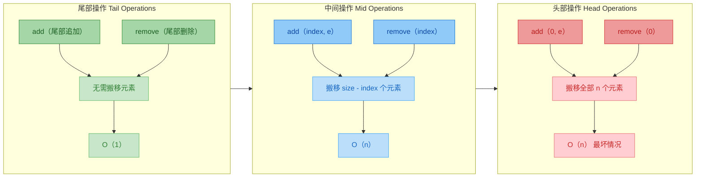

核心结论：操作位置越靠近尾部，性能越好。这就是为什么 ArrayList 天然适合"栈"式操作（LIFO），而不适合"队列"式操作（FIFO）。

---

## RandomAccess 标记接口

### 什么是标记接口（Marker Interface）

在 Java 的类型系统中，有一类特殊的接口——它们**没有任何方法声明**，仅仅通过"实现了这个接口"这一事实来传递某种语义信息。这就是标记接口（Marker Interface）。

```java
// RandomAccess 的完整源码 — 就这么多，一个方法都没有
package java.util;

public interface RandomAccess {
    // 空的，什么都没有
}
```

你可能会问：一个空接口有什么用？它的价值不在于约束行为，而在于**声明能力**。当一个 List 实现了 RandomAccess，它在向整个 Java 生态宣告："我支持高效的随机访问，用索引访问我的元素是 O(1) 的。"

Java 中常见的标记接口还有：

| 标记接口 | 语义声明 |
|---|---|
| `Serializable` | "我可以被序列化" |
| `Cloneable` | "我可以被 clone()" |
| `RandomAccess` | "我支持 O(1) 随机访问" |

---

### 谁实现了 RandomAccess，谁没有

```java
// ArrayList 实现了 RandomAccess
public class ArrayList<E> extends AbstractList<E>
        implements List<E>, RandomAccess, Cloneable, java.io.Serializable {
    // 底层是数组，天然支持 O(1) 随机访问
}

// LinkedList 没有实现 RandomAccess
public class LinkedList<E> extends AbstractSequentialList<E>
        implements List<E>, Deque<E>, Cloneable, java.io.Serializable {
    // 底层是双向链表，随机访问需要从头/尾遍历，是 O(n)
}
```

这个区分非常关键。对于 ArrayList，`get(500)` 就是直接读 `elementData[500]`，一步到位。而对于 LinkedList，`get(500)` 需要从头节点（或尾节点）开始，沿着 `next`（或 `prev`）指针走 500 步才能到达目标节点。

---

### RandomAccess 的实际应用：算法分派

RandomAccess 最重要的应用场景是让**通用算法根据 List 的实际类型选择最优遍历策略**。JDK 的 `Collections` 工具类中大量使用了这种模式：

```java
// Collections.binarySearch 的源码（简化）
public static <T> int binarySearch(List<? extends Comparable<? super T>> list, T key) {
    // 关键判断：根据是否实现 RandomAccess 选择不同算法
    if (list instanceof RandomAccess || list.size() < BINARYSEARCH_THRESHOLD) {
        return Collections.indexedBinarySearch(list, key);  // 用索引访问
    } else {
        return Collections.iteratorBinarySearch(list, key); // 用迭代器访问
    }
}
```

两种策略的差异：

```java
// 策略 1：索引二分查找 — 适合 ArrayList
// 通过 list.get(mid) 直接跳到中间位置，每次 O(1)
private static <T> int indexedBinarySearch(List<? extends Comparable<? super T>> list, T key) {
    int low = 0;                                // 左边界
    int high = list.size() - 1;                 // 右边界
    while (low <= high) {
        int mid = (low + high) >>> 1;           // 无符号右移，防溢出
        Comparable<? super T> midVal = list.get(mid); // O(1) 随机访问！
        int cmp = midVal.compareTo(key);        // 比较
        if (cmp < 0) low = mid + 1;             // 目标在右半部分
        else if (cmp > 0) high = mid - 1;       // 目标在左半部分
        else return mid;                        // 找到了
    }
    return -(low + 1);                          // 没找到，返回插入点
}

// 策略 2：迭代器二分查找 — 适合 LinkedList
// 用 ListIterator 顺序移动到中间位置，避免 get(mid) 的 O(n) 代价
private static <T> int iteratorBinarySearch(List<? extends Comparable<? super T>> list, T key) {
    int low = 0;
    int high = list.size() - 1;
    ListIterator<? extends Comparable<? super T>> i = list.listIterator(); // 获取迭代器
    while (low <= high) {
        int mid = (low + high) >>> 1;
        // 迭代器从当前位置移动到 mid，比从头开始的 get(mid) 更高效
        Comparable<? super T> midVal = get(i, mid);
        int cmp = midVal.compareTo(key);
        if (cmp < 0) low = mid + 1;
        else if (cmp > 0) high = mid - 1;
        else return mid;
    }
    return -(low + 1);
}
```

如果对 LinkedList 使用索引二分查找，每次 `get(mid)` 都是 O(n)，总复杂度退化为 O(n log n)。而用迭代器方式，虽然也不理想，但至少迭代器可以从上一次的位置继续移动，减少了重复遍历。

类似的分派逻辑在 `Collections.fill`、`Collections.copy`、`Collections.shuffle` 等方法中都有体现：

```java
// Collections.fill 的源码（简化）
public static <T> void fill(List<? super T> list, T obj) {
    int size = list.size();
    if (size < FILL_THRESHOLD || list instanceof RandomAccess) {
        for (int i = 0; i < size; i++)
            list.set(i, obj);           // 索引遍历，适合 ArrayList
    } else {
        ListIterator<? super T> itr = list.listIterator();
        for (int i = 0; i < size; i++) {
            itr.next();                 // 迭代器遍历，适合 LinkedList
            itr.set(obj);
        }
    }
}
```

---

### 为什么不用 `instanceof ArrayList` 直接判断

你可能会想：既然主要就是区分 ArrayList 和 LinkedList，为什么不直接 `instanceof ArrayList`？

原因是**开闭原则（Open-Closed Principle）**。Java 集合框架的设计者不可能预知未来所有的 List 实现。如果你自己写了一个基于数组的高性能 List：

```java
// 自定义的 List 实现，底层也是数组
public class MyFastList<E> extends AbstractList<E> implements RandomAccess {
    private Object[] data;  // 数组存储

    @Override
    public E get(int index) {
        return (E) data[index];  // O(1) 随机访问
    }

    // ... 其他方法
}
```

只要你实现了 `RandomAccess`，JDK 的所有算法就会自动为你选择索引遍历策略，无需修改 JDK 源码。这就是标记接口的扩展性优势。

---

### 在自己的代码中利用 RandomAccess

当你编写需要遍历 List 的通用方法时，也可以借鉴 JDK 的做法：

```java
public static <T> void processAll(List<T> list, Consumer<T> action) {
    // 根据 RandomAccess 标记选择最优遍历方式
    if (list instanceof RandomAccess) {
        // ArrayList 等：用 for-index 遍历，充分利用 O(1) 随机访问
        for (int i = 0, size = list.size(); i < size; i++) {
            action.accept(list.get(i));
        }
    } else {
        // LinkedList 等：用 for-each（底层是 Iterator），避免 get(i) 的 O(n) 陷阱
        for (T item : list) {
            action.accept(item);
        }
    }
}
```

这个模式在处理大数据量时差异巨大。对一个 100,000 元素的 LinkedList：
- for-index 遍历：每次 `get(i)` 平均遍历 n/2 个节点，总计约 50 亿次指针跳转
- for-each 遍历：每次 `next()` 只跳一步，总计 100,000 次指针跳转

性能差距可达**数万倍**。

---

### 标记接口 vs 注解：一个设计思考

Java 5 引入注解后，标记接口的角色受到了一些质疑。为什么不用 `@RandomAccess` 注解代替？

```java
// 假设用注解实现
@RandomAccess
public class ArrayList<E> extends AbstractList<E> { ... }

// 判断方式变成
if (list.getClass().isAnnotationPresent(RandomAccess.class)) { ... }
```

标记接口相比注解有两个不可替代的优势：

1. **编译期类型检查**：你可以声明方法参数类型为 `List & RandomAccess`（Java 的交叉类型），让编译器帮你检查。注解只能在运行时通过反射检查。

2. **`instanceof` 的高性能**：`instanceof` 是 JVM 层面的类型检查，经过高度优化（通常只需几个 CPU 指令）。而注解的反射查询要慢得多。

这也是为什么 `Serializable`、`Cloneable`、`RandomAccess` 这些标记接口在 Java 中一直沿用至今。

---

### RandomAccess 在集合框架中的位置

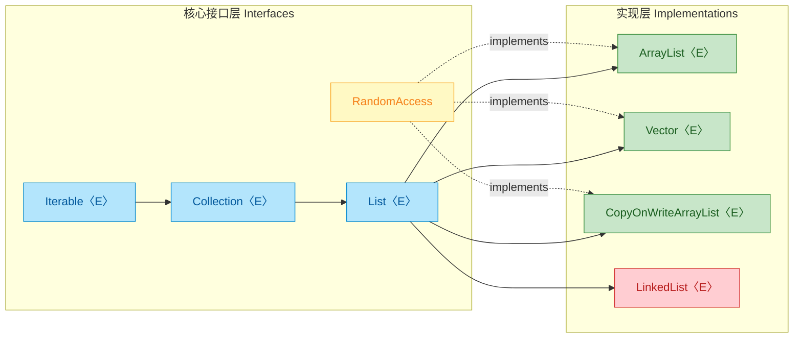

注意 LinkedList 没有虚线连接到 RandomAccess——它不具备 O(1) 随机访问能力，所以不应该也没有实现这个标记接口。而 `Vector` 和 `CopyOnWriteArrayList` 底层同样是数组，所以它们也实现了 RandomAccess。

---

**📝 练习题**

以下代码的输出结果是什么？

```java
List<Integer> list = new ArrayList<>(Arrays.asList(1, 2, 3, 4, 5));
list.add(2, 99);
list.remove(4);
list.remove(Integer.valueOf(1));
System.out.println(list);
```

A. [2, 99, 3, 5]

B. [99, 2, 3, 5]

C. [2, 99, 3, 4]

D. [2, 99, 4, 5]


**【答案】** A

**【解析】** 逐步追踪状态变化：

1. 初始状态：`[1, 2, 3, 4, 5]`
2. `add(2, 99)`：在索引 2 处插入 99，索引 2 及之后的元素后移 → `[1, 2, 99, 3, 4, 5]`
3. `remove(4)`：这里参数是 `int`，调用的是 `remove(int index)`（按索引删除），删除索引 4 处的元素（值为 4）→ `[1, 2, 99, 3, 5]`
4. `remove(Integer.valueOf(1))`：参数是 `Integer` 对象，调用的是 `remove(Object o)`（按值删除），删除第一个等于 1 的元素 → `[2, 99, 3, 5]`

这道题的关键考点是 `remove(int)` 和 `remove(Object)` 的重载区分。当传入基本类型 `int` 时按索引删除；传入包装类型 `Integer` 时按值删除。这是 ArrayList 使用中一个非常经典的易混淆点。

---

## LinkedList（双向链表、Deque 实现）

`LinkedList` 是 Java 集合框架中与 `ArrayList` 齐名的 `List` 实现，但它的底层数据结构截然不同——不是数组，而是一条 **双向链表（Doubly Linked List）**。除了实现 `List` 接口外，它还同时实现了 `Deque`（双端队列）接口，这意味着它既能当列表用，也能当栈（Stack）和队列（Queue）用。理解 LinkedList 的关键，在于理解链表这种数据结构本身的特性，以及它在 JDK 中的具体实现细节。

### 底层结构：双向链表与 Node 内部类

LinkedList 的每一个元素都被包装在一个叫做 `Node` 的私有静态内部类中。每个 Node 持有三个引用：当前元素的值、指向前一个节点的指针、指向后一个节点的指针。整个链表通过 `first`（头指针）和 `last`（尾指针）两个哨兵引用来维护。

我们先看 JDK 源码中 `Node` 的定义（已简化注释）：

```java
// LinkedList 的内部节点类
private static class Node<E> {
    E item;        // 当前节点存储的实际数据
    Node<E> next;  // 指向下一个节点的引用（后继）
    Node<E> prev;  // 指向上一个节点的引用（前驱）

    // 构造时同时绑定前驱、数据、后继
    Node(Node<E> prev, E element, Node<E> next) {
        this.item = element;   // 赋值数据
        this.next = next;      // 绑定后继节点
        this.prev = prev;      // 绑定前驱节点
    }
}
```

LinkedList 类本身维护的核心字段：

```java
public class LinkedList<E>
    extends AbstractSequentialList<E>
    implements List<E>, Deque<E>, Cloneable, java.io.Serializable {

    transient int size = 0;      // 当前链表中的元素个数
    transient Node<E> first;     // 指向链表的第一个节点（头节点）
    transient Node<E> last;      // 指向链表的最后一个节点（尾节点）
}
```

用一张 ASCII 图来直观感受三个节点组成的双向链表在内存中的引用关系：

```text
  LinkedList 对象
  ┌──────────────────┐
  │ size = 3         │
  │ first ──────────────┐
  │ last ───────────────────────────────────────┐
  └──────────────────┘  │                       │
                        ▼                       ▼
                   ┌─────────┐  next  ┌─────────┐  next  ┌─────────┐
           null ◄──│  prev   │◄───────│  prev   │◄───────│  prev   │
                   │ item="A"│        │ item="B"│        │ item="C"│
                   │  next   │───────▶│  next   │───────▶│  next   │──► null
                   └─────────┘        └─────────┘        └─────────┘
                     Node 0             Node 1             Node 2
```

这里有几个关键点值得注意：

- 链表中没有"索引"这个物理概念。所谓的 `get(index)` 操作，本质上是从 `first` 或 `last` 出发，沿着 `next` 或 `prev` 指针一步步走到目标位置。
- `first.prev` 为 null，`last.next` 为 null，这是链表两端的边界标志。
- 当链表为空时，`first` 和 `last` 都是 null；只有一个元素时，`first` 和 `last` 指向同一个 Node。

与 ArrayList 的 `Object[]` 数组相比，LinkedList 不需要连续的内存空间，每个 Node 可以散落在堆内存的任意位置，通过引用串联起来。这带来了插入删除的灵活性，但也牺牲了空间局部性（cache locality），这一点在后续的性能对比中会详细展开。

### 核心操作的实现原理

#### 尾部添加：add(E e) — O(1)

LinkedList 最常用的添加操作是在尾部追加元素，这也是 `add(E e)` 的默认行为。由于维护了 `last` 指针，尾部插入不需要遍历，直接在 `last` 后面挂一个新节点即可：

```java
// add(E e) 内部调用的 linkLast 方法
void linkLast(E e) {
    final Node<E> l = last;                    // 暂存当前尾节点
    final Node<E> newNode = new Node<>(l, e, null); // 创建新节点：prev=旧尾节点, next=null
    last = newNode;                            // 更新尾指针指向新节点
    if (l == null)                             // 如果链表原本为空
        first = newNode;                       // 新节点同时也是头节点
    else
        l.next = newNode;                      // 否则，旧尾节点的 next 指向新节点
    size++;                                    // 元素计数 +1
    modCount++;                                // 修改计数 +1（用于 fail-fast 迭代器）
}
```

时间复杂度 O(1)，不涉及任何遍历或数组拷贝。这是 LinkedList 的强项之一。

#### 头部添加：addFirst(E e) — O(1)

同理，头部插入也是 O(1)，因为有 `first` 指针：

```java
// addFirst 内部调用的 linkFirst 方法
private void linkFirst(E e) {
    final Node<E> f = first;                   // 暂存当前头节点
    final Node<E> newNode = new Node<>(null, e, f); // 创建新节点：prev=null, next=旧头节点
    first = newNode;                           // 更新头指针
    if (f == null)                             // 如果链表原本为空
        last = newNode;                        // 新节点同时也是尾节点
    else
        f.prev = newNode;                      // 否则，旧头节点的 prev 指向新节点
    size++;                                    // 元素计数 +1
    modCount++;                                // 修改计数 +1
}
```

#### 按索引插入：add(int index, E element) — O(n)

当你调用 `add(2, "X")` 在中间位置插入时，LinkedList 需要先找到 index 位置的节点，然后执行链接操作。"找到节点"这一步就是性能瓶颈所在：

```java
// 根据索引查找节点 —— 这是 LinkedList 的性能瓶颈
Node<E> node(int index) {
    // 优化：判断 index 在前半段还是后半段，从更近的一端开始遍历
    if (index < (size >> 1)) {                 // index 在前半段
        Node<E> x = first;                     // 从头节点出发
        for (int i = 0; i < index; i++)        // 向后走 index 步
            x = x.next;
        return x;                              // 返回目标节点
    } else {                                   // index 在后半段
        Node<E> x = last;                      // 从尾节点出发
        for (int i = size - 1; i > index; i--) // 向前走 (size-1-index) 步
            x = x.prev;
        return x;                              // 返回目标节点
    }
}
```

JDK 做了一个小优化：通过 `index < (size >> 1)` 判断目标在前半段还是后半段，从更近的一端开始遍历，最坏情况下也只需要走 n/2 步。但本质上仍然是 O(n) 的线性查找。

找到节点后，插入操作本身（修改前后指针）只需要 O(1)：

```java
// 在指定节点 succ 之前插入新元素
void linkBefore(E e, Node<E> succ) {
    final Node<E> pred = succ.prev;            // 获取目标节点的前驱
    final Node<E> newNode = new Node<>(pred, e, succ); // 新节点夹在 pred 和 succ 之间
    succ.prev = newNode;                       // 目标节点的前驱改为新节点
    if (pred == null)                          // 如果目标节点原本就是头节点
        first = newNode;                       // 新节点成为新的头节点
    else
        pred.next = newNode;                   // 否则，前驱节点的 next 指向新节点
    size++;                                    // 元素计数 +1
    modCount++;                                // 修改计数 +1
}
```

#### 删除操作：remove(int index) — O(n)

删除的逻辑与插入类似：先通过 `node(index)` 找到目标节点（O(n)），然后执行 `unlink` 断开前后引用（O(1)）：

```java
// 断开节点 x 的所有引用，使其可被 GC 回收
E unlink(Node<E> x) {
    final E element = x.item;                  // 暂存要返回的元素值
    final Node<E> next = x.next;               // 暂存后继节点
    final Node<E> prev = x.prev;               // 暂存前驱节点

    if (prev == null) {                        // 如果 x 是头节点
        first = next;                          // 头指针直接跳到后继
    } else {
        prev.next = next;                      // 前驱的 next 跳过 x，指向后继
        x.prev = null;                         // 清空 x 的前驱引用，帮助 GC
    }

    if (next == null) {                        // 如果 x 是尾节点
        last = prev;                           // 尾指针直接跳到前驱
    } else {
        next.prev = prev;                      // 后继的 prev 跳过 x，指向前驱
        x.next = null;                         // 清空 x 的后继引用，帮助 GC
    }

    x.item = null;                             // 清空数据引用，帮助 GC
    size--;                                    // 元素计数 -1
    modCount++;                                // 修改计数 +1
    return element;                            // 返回被删除的元素
}
```

注意源码中对 `x.prev`、`x.next`、`x.item` 的显式置 null 操作——这是为了帮助垃圾回收器（GC）更快地回收被删除的节点，避免无意义的引用残留。

### Deque 双端队列实现

LinkedList 实现了 `Deque<E>` 接口（Deque 是 "Double Ended Queue" 的缩写，读作 "deck"），这使得它可以高效地在两端进行插入和删除操作。这个特性让 LinkedList 成为了一个"多面手"——它可以同时扮演队列、栈、双端队列三种角色。

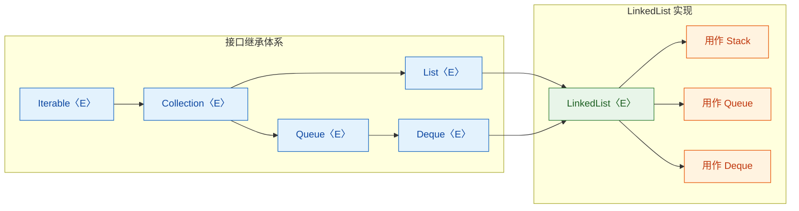

下面是 LinkedList 作为不同数据结构使用时对应的 API 映射：

```java
// ========== 用作 Queue（FIFO 队列）==========
LinkedList<String> queue = new LinkedList<>();
queue.offer("A");          // 等价于 addLast("A")，入队到尾部
queue.offer("B");          // 队列状态: A -> B
queue.offer("C");          // 队列状态: A -> B -> C
String head = queue.poll(); // 等价于 removeFirst()，从头部出队，返回 "A"
String peek = queue.peek(); // 等价于 getFirst()，查看队头但不移除，返回 "B"

// ========== 用作 Stack（LIFO 栈）==========
LinkedList<String> stack = new LinkedList<>();
stack.push("X");           // 等价于 addFirst("X")，压栈到头部
stack.push("Y");           // 栈状态: Y -> X（Y 在栈顶）
stack.push("Z");           // 栈状态: Z -> Y -> X（Z 在栈顶）
String top = stack.pop();  // 等价于 removeFirst()，弹栈，返回 "Z"
String peekTop = stack.peek(); // 查看栈顶但不移除，返回 "Y"

// ========== 用作 Deque（双端队列）==========
LinkedList<String> deque = new LinkedList<>();
deque.offerFirst("B");     // 从头部插入: B
deque.offerFirst("A");     // 从头部插入: A -> B
deque.offerLast("C");      // 从尾部插入: A -> B -> C
deque.pollFirst();          // 从头部移除，返回 "A"，剩余: B -> C
deque.pollLast();           // 从尾部移除，返回 "C"，剩余: B
```

这里有一个重要的 API 设计哲学需要理解：`Deque` 接口为每种操作都提供了两套方法——一套在失败时抛异常，另一套在失败时返回特殊值（null 或 false）：

| 操作 | 抛异常版本 | 返回特殊值版本 |
|------|-----------|---------------|
| 头部插入 | `addFirst(e)` | `offerFirst(e)` |
| 尾部插入 | `addLast(e)` | `offerLast(e)` |
| 头部移除 | `removeFirst()` | `pollFirst()` |
| 尾部移除 | `removeLast()` | `pollLast()` |
| 头部查看 | `getFirst()` | `peekFirst()` |
| 尾部查看 | `getLast()` | `peekLast()` |

对于 LinkedList 来说，由于它是无界的（unbounded），`offer` 系列永远返回 true，和 `add` 系列行为一致。但在有界队列（如 `ArrayDeque` 配合容量限制使用时）中，这个区别就很重要了。养成使用 `offer/poll/peek` 的习惯是更安全的编程风格。

### 为什么 JDK 推荐用 ArrayDeque 替代 LinkedList 做栈和队列

虽然 LinkedList 能当栈和队列用，但 JDK 官方文档中有一句经常被引用的话：

> "ArrayDeque is likely to be faster than Stack when used as a stack, and faster than LinkedList when used as a queue."

原因在于 LinkedList 的每个元素都需要创建一个 `Node` 对象，这带来了两个开销：

1. 每个 Node 除了存储数据本身，还额外存储了 `prev` 和 `next` 两个引用，以及对象头（object header）。在 64 位 JVM 上，一个 Node 对象的额外开销大约是 24-32 字节，内存利用率较低。

2. Node 对象散落在堆内存各处，CPU 缓存命中率（cache hit rate）低。现代 CPU 的 L1/L2/L3 缓存对连续内存访问有极大的加速效果，而 LinkedList 的链式结构天然不利于缓存预取（prefetching）。

`ArrayDeque` 底层是循环数组，内存连续、缓存友好，且没有 Node 包装的额外开销。所以在纯粹的栈/队列场景下，`ArrayDeque` 几乎总是更好的选择。LinkedList 的 Deque 能力更多是一种"附赠"，而非它的核心竞争力。

### 迭代器与 ListIterator

LinkedList 的迭代器是它相对于 ArrayList 的一个隐藏优势场景。当你需要在遍历过程中频繁插入或删除元素时，`ListIterator` 可以在当前游标位置直接操作，避免了按索引查找的 O(n) 开销：

```java
LinkedList<String> list = new LinkedList<>(List.of("A", "B", "C", "D", "E"));

// 获取 ListIterator，从索引 0 开始
ListIterator<String> it = list.listIterator();

while (it.hasNext()) {                         // 正向遍历
    String val = it.next();                    // 移动游标并获取当前元素
    if ("C".equals(val)) {
        it.remove();                           // 删除当前元素 "C"，O(1) 操作
        it.add("C1");                          // 在游标位置插入 "C1"，O(1) 操作
        it.add("C2");                          // 继续插入 "C2"，O(1) 操作
    }
}
// 结果: [A, B, C1, C2, D, E]

// ListIterator 还支持反向遍历
ListIterator<String> backIt = list.listIterator(list.size()); // 从末尾开始
while (backIt.hasPrevious()) {                 // 反向遍历
    System.out.println(backIt.previous());     // E, D, C2, C1, B, A
}
```

这里的关键在于：`ListIterator` 内部直接持有当前 Node 的引用，所以 `remove()` 和 `add()` 操作不需要重新从头遍历查找，直接修改前后指针即可，是真正的 O(1)。这是 LinkedList 在特定场景下的杀手锏。

### 线程安全性

LinkedList 不是线程安全的（not thread-safe）。如果多个线程同时修改一个 LinkedList，必须在外部进行同步。JDK 提供了一个包装方法：

```java
// 通过 Collections.synchronizedList 包装为线程安全版本
List<String> syncList = Collections.synchronizedList(new LinkedList<>());

// 注意：迭代时仍然需要手动加锁
synchronized (syncList) {                      // 必须对 syncList 对象加锁
    for (String s : syncList) {                // 迭代期间其他线程不能修改
        System.out.println(s);
    }
}
```

但在并发场景下，更推荐使用 `ConcurrentLinkedDeque` 或 `ConcurrentLinkedQueue`，它们基于 CAS（Compare-And-Swap）无锁算法实现，性能远优于 synchronized 包装。

### 时间复杂度速查

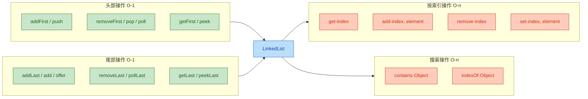

总结一下 LinkedList 的核心时间复杂度：

- `addFirst` / `addLast` / `removeFirst` / `removeLast`：O(1)，直接操作头尾指针
- `get(index)` / `set(index)` / `add(index)` / `remove(index)`：O(n)，需要先遍历到目标位置
- `contains(Object)` / `indexOf(Object)`：O(n)，需要从头到尾线性扫描
- 通过 `ListIterator` 在当前位置插入/删除：O(1)，已经持有节点引用

---

**📝 练习题**

以下代码的输出结果是什么？

```java
LinkedList<String> list = new LinkedList<>();
list.add("A");
list.add("B");
list.add("C");
list.push("D");
list.offer("E");
System.out.println(list.poll());
System.out.println(list.peek());
System.out.println(list);
```

A. A, B, [C, D, E]

B. D, A, [A, B, C, E]

C. E, D, [D, A, B, C]

D. D, A, [B, C, E]


**【答案】** B

**【解析】** 逐步分析链表状态的变化：
1. `add("A")` → addLast → [A]
2. `add("B")` → addLast → [A, B]
3. `add("C")` → addLast → [A, B, C]
4. `push("D")` → addFirst → [D, A, B, C]（push 是栈操作，压入头部）
5. `offer("E")` → addLast → [D, A, B, C, E]（offer 是队列操作，入队到尾部）
6. `poll()` → removeFirst → 移除并返回 "D"，链表变为 [A, B, C, E]
7. `peek()` → getFirst → 返回 "A"，但不移除，链表仍为 [A, B, C, E]
8. 打印链表 → [A, B, C, E]

所以输出依次是 `D`、`A`、`[A, B, C, E]`，对应选项 B。这道题的核心考点是理解 `push` 操作是 addFirst（栈语义，头部压入），而 `offer` 是 addLast（队列语义，尾部入队），`poll` 是 removeFirst（队列语义，头部出队）。混淆这些方法的操作端是最常见的错误。

---

## ArrayList vs LinkedList ⭐（场景选择）

这是 Java 面试中的"经典保留曲目"，也是日常开发中最常见的集合选型决策。很多开发者背诵过"ArrayList 查询快、LinkedList 增删快"这句口诀，但这个结论其实过于粗糙，甚至在很多场景下是错误的。要做出正确的选型，必须从底层数据结构、CPU 缓存机制、实际基准测试三个维度来理解。

### 数据结构本质对比

ArrayList 的底层是一块连续的 `Object[]` 数组，元素在内存中紧密排列（contiguous memory layout）。LinkedList 的底层是散落在堆内存各处的 `Node` 对象，每个节点通过 `prev` 和 `next` 两个引用串联起来。

这个本质差异决定了一切性能表现。我们用一张内存模型图来直观感受：

```text
【ArrayList 内存布局 — 连续数组】

  Object[] elementData (堆上一整块连续内存)
  ┌────────┬────────┬────────┬────────┬────────┬────────┐
  │ ref[0] │ ref[1] │ ref[2] │ ref[3] │ ref[4] │  null  │  ← 预分配的槽位
  └───┬────┴───┬────┴───┬────┴───┬────┴───┬────┴────────┘
      │        │        │        │        │
      ▼        ▼        ▼        ▼        ▼
    Obj_A    Obj_B    Obj_C    Obj_D    Obj_E
  
  特点: 引用本身连续存储, CPU 缓存行(Cache Line)可一次加载多个引用


【LinkedList 内存布局 — 离散双向链表】

  堆内存中散落的 Node 对象:

  ┌──────────────┐    ┌──────────────┐    ┌──────────────┐
  │ Node@0x3A00  │    │ Node@0x7F20  │    │ Node@0x1B80  │
  │  prev: null  │◄───│  prev: 0x3A00│◄───│  prev: 0x7F20│
  │  item: Obj_A │    │  item: Obj_B │    │  item: Obj_C │
  │  next: 0x7F20│───►│  next: 0x1B80│───►│  next: null  │
  └──────────────┘    └──────────────┘    └──────────────┘
       ↑ first                                  ↑ last

  特点: Node 对象地址不连续, 每次遍历都可能触发 Cache Miss
```

从图中可以清晰看到：ArrayList 的引用是"排排坐"的，而 LinkedList 的节点是"满天星"式散落的。这个差异在现代 CPU 架构下影响巨大。

### 核心操作时间复杂度对比

我们逐一拆解每种操作的真实性能表现，而不是简单地贴一个 O(n) 标签了事。

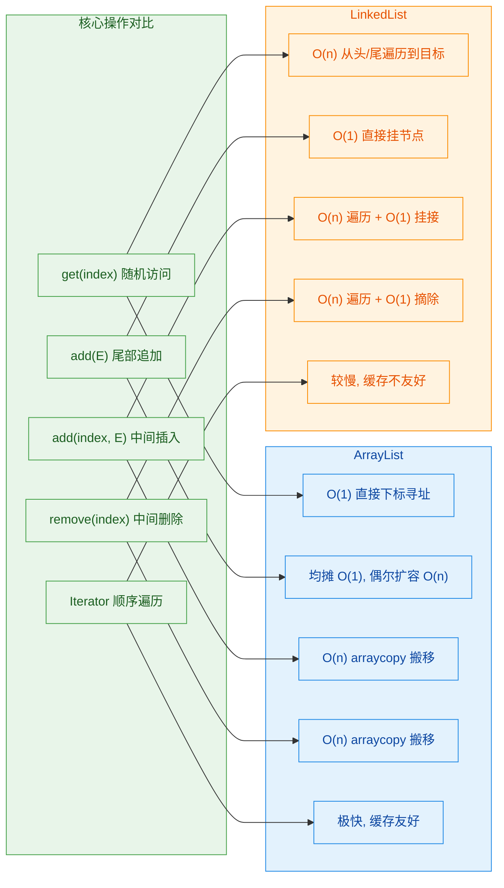

下面逐项深入分析。

**随机访问 `get(index)`**

ArrayList 的随机访问是真正的 O(1)。底层就是 `elementData[index]`，一次数组下标运算直接拿到引用。这也是它实现了 `RandomAccess` 标记接口的原因。

LinkedList 的 `get(index)` 需要从 `first` 或 `last` 开始逐个遍历节点。虽然源码做了优化——如果 index 在前半段就从头遍历，在后半段就从尾遍历——但最坏情况仍然是 O(n/2)，即 O(n)。

```java
// LinkedList.node(int index) 源码简化
Node<E> node(int index) {
    if (index < (size >> 1)) {          // index 在前半段
        Node<E> x = first;             // 从头节点开始
        for (int i = 0; i < index; i++) // 逐个往后跳
            x = x.next;
        return x;
    } else {                            // index 在后半段
        Node<E> x = last;              // 从尾节点开始
        for (int i = size - 1; i > index; i--) // 逐个往前跳
            x = x.prev;
        return x;
    }
}
```

这意味着如果你在 LinkedList 上写 `for (int i = 0; i < list.size(); i++) { list.get(i); }`，时间复杂度会退化为 O(n²)，这是一个非常常见的性能陷阱。

**尾部追加 `add(E)`**

ArrayList 尾部追加的均摊时间复杂度（amortized time complexity）是 O(1)。大多数时候只需要 `elementData[size++] = e`，只有在容量不够时才触发一次 O(n) 的扩容拷贝，但扩容频率随着容量增长越来越低，均摊下来仍然是常数级。

LinkedList 尾部追加是严格的 O(1)：创建一个新 Node，挂到 `last` 后面，更新 `last` 指针即可。但这里有一个隐藏成本——每次 `add` 都要 `new Node<>()`，这意味着频繁的堆内存分配和未来的 GC 压力。

**中间插入 `add(index, E)` 和中间删除 `remove(index)`**

这是最容易被误解的部分。很多人认为"LinkedList 增删快"，但实际情况是：

- LinkedList 的"挂接/摘除"操作本身确实是 O(1)——修改前后节点的 `prev`/`next` 引用即可
- 但在挂接之前，你必须先"定位"到那个节点，定位本身是 O(n)
- 所以总时间 = O(n) 定位 + O(1) 挂接 = O(n)

ArrayList 的中间插入/删除需要调用 `System.arraycopy()` 来搬移元素，这也是 O(n)。但 `arraycopy` 是一个 native 方法，底层通常使用 `memmove` 或 SIMD 指令实现，对连续内存的批量搬移效率极高。

```java
// ArrayList.add(int index, E element) 核心逻辑
public void add(int index, E element) {
    rangeCheckForAdd(index);            // 边界检查
    ensureCapacityInternal(size + 1);   // 确保容量足够, 可能触发扩容
    // 关键: 将 index 及之后的元素整体后移一位
    System.arraycopy(elementData, index,
                     elementData, index + 1,
                     size - index);     // 搬移的元素个数
    elementData[index] = element;       // 在空出的位置放入新元素
    size++;                             // 更新大小
}
```

所以在中间位置增删这件事上，两者的大 O 复杂度相同，但 ArrayList 的常数因子（constant factor）往往更小，因为 `arraycopy` 的实际执行速度非常快。

### CPU 缓存：被忽视的决定性因素

这是理解 ArrayList 为何在绝大多数场景下碾压 LinkedList 的关键。

现代 CPU 的 L1/L2/L3 缓存以"缓存行"（Cache Line，通常 64 字节）为单位从主存加载数据。当你访问一个内存地址时，CPU 会把该地址所在的整个缓存行都加载进来。如果接下来访问的数据恰好在同一个缓存行内，就是 Cache Hit（缓存命中），速度极快；否则就是 Cache Miss（缓存未命中），需要重新从主存加载，延迟可能相差 100 倍。

```text
【CPU 缓存与数据结构的关系】

  ArrayList 遍历:
  ┌─────────────────────────────────────────────────────┐
  │  Cache Line (64 bytes)                              │
  │  ┌──────┬──────┬──────┬──────┬──────┬──────┬──────┐ │
  │  │ref[0]│ref[1]│ref[2]│ref[3]│ref[4]│ref[5]│ref[6]│ │  ← 一次加载 ~8 个引用
  │  └──────┴──────┴──────┴──────┴──────┴──────┴──────┘ │
  └─────────────────────────────────────────────────────┘
  访问 ref[0] 时, ref[1]~ref[6] 已经在缓存中 → 连续 Cache Hit ✓


  LinkedList 遍历:
  ┌──────────────┐         ┌──────────────┐
  │ Cache Line 1 │         │ Cache Line 2 │
  │ Node@0x3A00  │ ──?──►  │ Node@0x7F20  │ ──?──► ...
  └──────────────┘         └──────────────┘
  每个 Node 地址随机, 几乎每次 node.next 都触发 Cache Miss ✗
```

这就是为什么即使在理论复杂度相同的操作上（比如顺序遍历，都是 O(n)），ArrayList 的实际速度也远快于 LinkedList。这个现象被称为"缓存局部性"（Cache Locality / Spatial Locality）。

### 内存开销对比

除了时间性能，内存占用也是选型的重要考量。

ArrayList 的额外开销主要来自预分配的空槽位。最坏情况下（刚扩容完、只用了一半多一点），大约有 33% 的空间被浪费。但每个元素的边际成本（marginal cost）只是一个对象引用（64 位 JVM 上通常 4 或 8 字节，取决于是否开启压缩指针 CompressedOops）。

LinkedList 的每个元素都需要一个完整的 `Node` 对象，包含 `item`、`prev`、`next` 三个引用，再加上对象头（Object Header，通常 12~16 字节）。粗略估算：

```java
// LinkedList.Node 的内存布局 (64-bit JVM, CompressedOops ON)
class Node<E> {
    // 对象头 (Mark Word + Klass Pointer): ~12 bytes
    E item;       // 引用: 4 bytes (压缩指针)
    Node<E> next; // 引用: 4 bytes
    Node<E> prev; // 引用: 4 bytes
    // 对齐填充 (padding to 8-byte boundary): ~0 bytes
    // 总计: ~24 bytes per Node (不含 item 指向的实际对象)
}
```

对比一下：ArrayList 存储一个元素的边际成本约 4 字节（一个压缩引用），LinkedList 约 24 字节（一个 Node 对象）。LinkedList 的内存开销是 ArrayList 的约 6 倍。当集合规模达到百万级时，这个差距非常可观。

### 真实场景选型指南

抛开理论，我们来看实际开发中的典型场景该如何选择。

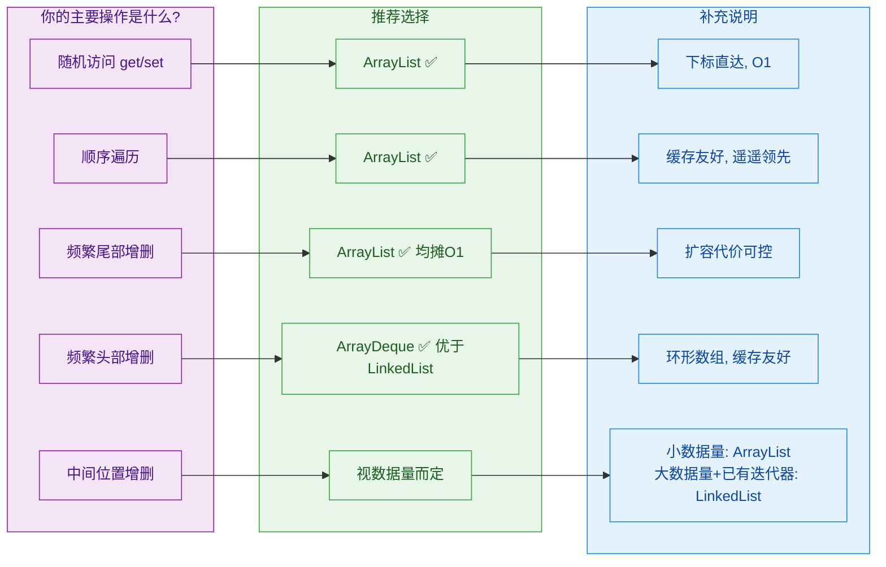

几个关键结论：

**结论一：绝大多数场景用 ArrayList。** 这不是偏见，而是现代硬件架构决定的。连续内存布局带来的缓存优势，在实际运行中往往能抵消甚至反超 LinkedList 在理论复杂度上的优势。Java 官方文档和 JDK 核心开发者（如 Joshua Bloch）也明确推荐 ArrayList 作为默认选择。

**结论二：需要频繁头部操作时，用 `ArrayDeque` 而不是 LinkedList。** `ArrayDeque` 基于环形数组（circular array），头尾操作都是 O(1)，且同样享有缓存局部性优势。它在作为栈（Stack）和队列（Queue）使用时，性能全面优于 LinkedList。

**结论三：LinkedList 的真正优势场景非常狭窄。** 只有当你已经持有一个迭代器（Iterator）的引用，并且需要在迭代器当前位置进行大量插入/删除操作时，LinkedList 才有真正的 O(1) 优势——因为此时不需要"定位"这一步。典型例子是实现 LRU 缓存时配合 HashMap 使用的场景。

### 一个常见的错误基准测试

很多博客文章会写出类似这样的"证明 LinkedList 中间插入更快"的测试代码：

```java
// ❌ 错误的基准测试 — 对 ArrayList 不公平
List<Integer> arrayList = new ArrayList<>();
List<Integer> linkedList = new LinkedList<>();

// 先填充 10 万个元素
for (int i = 0; i < 100_000; i++) {
    arrayList.add(i);
    linkedList.add(i);
}

// 测试: 在中间位置插入
long start1 = System.nanoTime();
for (int i = 0; i < 10_000; i++) {
    // 每次都在正中间插入, ArrayList 需要搬移 n/2 个元素
    arrayList.add(arrayList.size() / 2, 999);
}
long time1 = System.nanoTime() - start1;

long start2 = System.nanoTime();
for (int i = 0; i < 10_000; i++) {
    // LinkedList 也在正中间插入, 但需要先遍历到中间
    linkedList.add(linkedList.size() / 2, 999);
}
long time2 = System.nanoTime() - start2;

// 结果: 很多人惊讶地发现 ArrayList 反而更快!
// 原因: arraycopy 的常数因子极小, 而 LinkedList 的遍历定位 + Cache Miss 代价巨大
```

这个测试的结果往往是 ArrayList 更快或两者差距不大，完全颠覆了"LinkedList 增删快"的直觉。正确的理解是：LinkedList 只有在"已经定位到节点"的前提下，纯粹的插入/删除操作才是 O(1)。

### 总结对比表

| 维度 | ArrayList | LinkedList |
|------|-----------|------------|
| 底层结构 | `Object[]` 连续数组 | 双向链表，离散 Node |
| 随机访问 | O(1) ✅ | O(n) ❌ |
| 尾部追加 | 均摊 O(1) ✅ | O(1)，但有 GC 开销 |
| 中间插入/删除 | O(n)，但 arraycopy 快 | O(n) 定位 + O(1) 挂接 |
| 已定位的插入/删除 | 不支持 | O(1) ✅ 唯一优势 |
| 缓存局部性 | 极好 ✅ | 极差 ❌ |
| 单元素内存开销 | ~4 bytes（压缩引用） | ~24 bytes（Node 对象） |
| 实现的额外接口 | `RandomAccess` | `Deque` |
| 推荐程度 | 默认首选 ⭐⭐⭐ | 极少数特殊场景 ⭐ |

---

**📝 练习题**

以下代码在数据量为 100 万时，哪个性能表现最差？

```java
// 方案 A
ArrayList<Integer> list = new ArrayList<>();
for (int i = 0; i < 1_000_000; i++) list.add(0, i);

// 方案 B
LinkedList<Integer> list = new LinkedList<>();
for (int i = 0; i < 1_000_000; i++) list.add(0, i);

// 方案 C
LinkedList<Integer> list = new LinkedList<>();
for (int i = 0; i < 1_000_000; i++) list.get(i / 2);

// 方案 D
ArrayList<Integer> list = new ArrayList<>();
for (int i = 0; i < 1_000_000; i++) list.add(i);
```

A. 方案 A — ArrayList 头部插入


B. 方案 B — LinkedList 头部插入


C. 方案 C — LinkedList 随机访问中间位置


D. 方案 D — ArrayList 尾部追加


**【答案】** C

**【解析】** 逐一分析：

- 方案 D 是 ArrayList 尾部追加，均摊 O(1)，总时间 O(n)，最快。
- 方案 B 是 LinkedList 头部插入，每次直接挂到 `first` 前面，严格 O(1)，总时间 O(n)，也很快。
- 方案 A 是 ArrayList 头部插入，每次都要 `arraycopy` 搬移所有已有元素，总时间 O(n²)，很慢。
- 方案 C 是 LinkedList 的 `get(i/2)`，每次都要从头或尾遍历到中间位置，单次 O(n/2)，循环 n 次总时间 O(n²/2)。但由于 LinkedList 遍历时每一步都可能触发 Cache Miss，实际常数因子远大于 ArrayList 的 `arraycopy`（后者操作连续内存，CPU 预取和 SIMD 优化效果显著）。因此方案 C 的实际运行时间最长，是性能表现最差的选项。

这道题的核心考点：不要在 LinkedList 上使用下标随机访问，这是最典型的性能反模式（anti-pattern）。如果你看到 `for + list.get(i)` 作用于 LinkedList，几乎可以断定是一个 bug。

---

## Vector（同步、历史遗留）

Vector 是 Java 1.0 时代就存在的"元老级"集合类，比整个 Collections Framework（Java 1.2）还要早。它和 ArrayList 在底层结构上几乎一模一样——都是基于 `Object[]` 动态数组实现的，但 Vector 在每个公开方法上都加了 `synchronized` 关键字，使其成为一个线程安全（thread-safe）的 List 实现。

然而，正是这种"无差别同步"的设计，让它在现代 Java 开发中几乎被完全淘汰。理解 Vector 的意义，不在于学会使用它，而在于理解它为什么被抛弃，以及 Java 并发设计思想的演进。

### Vector 的底层结构

Vector 的内部数据结构与 ArrayList 完全一致，核心字段如下：

```java
public class Vector<E>
    extends AbstractList<E>
    implements List<E>, RandomAccess, Cloneable, java.io.Serializable
{
    // 存储元素的底层数组，和 ArrayList 的 elementData 完全对应
    protected Object[] elementData;

    // 当前实际存储的元素个数
    protected int elementCount;

    // 扩容增量：每次扩容时增加的容量
    // 如果 <= 0，则默认翻倍（2倍扩容）
    protected int capacityIncrement;
}
```

注意这三个字段都是 `protected` 而非 `private`，这是 Java 早期设计不够严谨的体现——直接暴露了内部实现细节，违反了封装原则（encapsulation）。ArrayList 吸取了这个教训，将 `elementData` 声明为 `transient Object[]`，访问权限为包私有。

### Vector 的扩容机制：默认 2 倍

这是 Vector 与 ArrayList 最显著的行为差异之一。ArrayList 扩容为原容量的 1.5 倍，而 Vector 默认扩容为原容量的 2 倍。来看源码：

```java
// Vector 的扩容核心方法（JDK 源码简化版）
private void grow(int minCapacity) {
    int oldCapacity = elementData.length;  // 获取当前数组长度

    // 关键区别在这里：
    // 如果构造时指定了 capacityIncrement 且 > 0，就增加固定值
    // 否则，直接翻倍（oldCapacity + oldCapacity = 2 * oldCapacity）
    int newCapacity = oldCapacity + (
        (capacityIncrement > 0) ? capacityIncrement : oldCapacity
    );

    // 如果翻倍后仍不够，就直接用所需的最小容量
    if (newCapacity - minCapacity < 0)
        newCapacity = minCapacity;

    // 上限检查
    if (newCapacity - MAX_ARRAY_SIZE > 0)
        newCapacity = hugeCapacity(minCapacity);

    // 数组拷贝
    elementData = Arrays.copyOf(elementData, newCapacity);
}
```

对比一下两者的扩容策略：

```
java
// ArrayList 扩容公式
int newCapacity = oldCapacity + (oldCapacity >> 1);  // 1.5 倍

// Vector 扩容公式（capacityIncrement <= 0 时）
int newCapacity = oldCapacity + oldCapacity;          // 2.0 倍
```

2 倍扩容意味着更激进的内存分配。假设初始容量为 10，连续扩容几次后的对比：

```
扩容次数    ArrayList (×1.5)    Vector (×2.0)
  0              10                  10
  1              15                  20
  2              22                  40
  3              33                  80
  4              49                 160
  5              73                 320
```

可以看到，仅仅 5 次扩容后，Vector 的内部数组就膨胀到了 320，而 ArrayList 只有 73。在元素数量不确定的场景下，Vector 会造成更多的内存浪费（memory overhead）。这也是 Java 设计团队在 ArrayList 中选择 1.5 倍的原因之一——在扩容频率和内存利用率之间取得更好的平衡。

Vector 还提供了一个特殊的构造函数，允许你自定义扩容增量：

```java
// 指定初始容量为 20，每次扩容增加 5 个位置
Vector<String> v = new Vector<>(20, 5);
```

这个设计在理论上提供了灵活性，但实际开发中几乎没人用——因为你很少能准确预测集合的增长模式。

### synchronized：无差别的方法级同步

Vector 的"线程安全"是通过在几乎所有公开方法上添加 `synchronized` 关键字实现的：

```java
// 以下方法全部带有 synchronized 修饰
public synchronized boolean add(E e) { ... }       // 添加元素
public synchronized E get(int index) { ... }        // 获取元素
public synchronized E remove(int index) { ... }     // 删除元素
public synchronized int size() { ... }              // 获取大小
public synchronized E set(int index, E element) { ... } // 替换元素
public synchronized boolean contains(Object o) { ... }  // 包含判断
public synchronized int indexOf(Object o) { ... }       // 查找索引
public synchronized void trimToSize() { ... }            // 裁剪容量
// ... 几乎所有方法都是 synchronized 的
```

`synchronized` 加在实例方法上，等价于对 `this` 对象加锁。也就是说，同一时刻只有一个线程能执行 Vector 实例的任何一个同步方法。这种锁的粒度非常粗，带来了两个严重问题：

**问题一：单线程场景下的无谓性能损耗**

即使你的程序从头到尾只有一个线程在操作 Vector，每次调用 `get()`、`add()` 等方法时，JVM 仍然需要执行锁的获取和释放操作。虽然 JVM 对无竞争锁（uncontended lock）做了偏向锁（biased locking）等优化，但这些优化本身也有开销，而且在某些场景下会被撤销（revoke）。

```java
// 单线程环境下，这段代码完全不需要同步
// 但 Vector 的每次 add 都会走 synchronized 流程
Vector<Integer> vector = new Vector<>();
for (int i = 0; i < 100000; i++) {
    vector.add(i);  // 每次调用都有锁开销，完全浪费
}
```

**问题二：多线程场景下的"伪安全"**

这是更致命的问题。Vector 的单方法同步并不能保证复合操作（compound action）的线程安全。来看一个经典的反例：

```java
// 线程 A：先检查再操作（check-then-act）
if (vector.size() > 0) {          // 步骤1：检查大小（synchronized）
    // ⚠️ 此处锁已释放！线程 B 可能在这个间隙删除了所有元素
    String s = vector.get(0);      // 步骤2：获取元素（synchronized）
    // 可能抛出 ArrayIndexOutOfBoundsException！
}

// 线程 B：在线程 A 的步骤1和步骤2之间执行
vector.clear();  // 清空所有元素（synchronized）
```

虽然 `size()` 和 `get()` 各自都是同步的，但它们之间存在一个"锁的空窗期"。线程 B 完全可以在这个空窗期插入执行，导致线程 A 的逻辑出错。这就是经典的 TOCTOU（Time-of-check to time-of-use）竞态条件。

要真正保证复合操作的安全，你必须手动加锁：

```java
// 正确做法：手动对 vector 对象加锁，保证复合操作的原子性
synchronized (vector) {
    if (vector.size() > 0) {
        String s = vector.get(0);  // 现在是安全的
    }
}
```

但如果你都需要手动加锁了，那 Vector 自带的 `synchronized` 方法就完全是多余的开销——你用 ArrayList 手动加锁，效果一样，性能还更好。

### 遍历方式的历史痕迹：Enumeration

Vector 诞生于 Iterator 接口出现之前，所以它最初使用的遍历方式是 `Enumeration`：

```java
Vector<String> vector = new Vector<>();
vector.add("Java");
vector.add("Kotlin");
vector.add("Scala");

// 古老的 Enumeration 遍历方式（Java 1.0）
Enumeration<String> e = vector.elements();
while (e.hasMoreElements()) {           // 类似 hasNext()
    String item = e.nextElement();       // 类似 next()
    System.out.println(item);
}

// 现代的 Iterator 遍历方式（Java 1.2+ 补充支持）
Iterator<String> it = vector.iterator();
while (it.hasNext()) {
    String item = it.next();
    System.out.println(item);
}
```

`Enumeration` 和 `Iterator` 的核心区别：

```
特性              Enumeration          Iterator
───────────────────────────────────────────────────
引入版本          Java 1.0             Java 1.2
删除能力          ❌ 无 remove()       ✅ 有 remove()
fail-fast         ❌ 不支持            ✅ 支持
方法命名          冗长(hasMoreElements) 简洁(hasNext)
适用范围          Vector/Hashtable     所有 Collection
```

`fail-fast` 机制是指：当一个线程在用 Iterator 遍历集合时，如果另一个线程修改了集合结构（增删元素），Iterator 会立即抛出 `ConcurrentModificationException`，而不是给出不确定的结果。Enumeration 没有这个保护机制，在并发修改时可能产生静默的错误数据。

### Vector 的子类：Stack

Java 中的 `Stack` 类直接继承自 Vector，这是一个被广泛认为是设计失误的决定：

```java
// Stack 继承了 Vector 的所有方法
public class Stack<E> extends Vector<E> {
    public E push(E item) { ... }   // 压栈
    public E pop() { ... }          // 弹栈
    public E peek() { ... }         // 查看栈顶
    public boolean empty() { ... }  // 是否为空
    public int search(Object o) { ... } // 搜索
}
```

问题在于，Stack 继承了 Vector 的所有公开方法，包括 `add(int index, E element)`、`remove(int index)` 等。这意味着你可以在"栈"的任意位置插入或删除元素，完全破坏了栈的 LIFO（Last-In-First-Out）语义：

```java
Stack<String> stack = new Stack<>();
stack.push("A");
stack.push("B");
stack.push("C");

// 以下操作在语义上完全不应该被允许，但编译和运行都没问题
stack.add(0, "X");      // 在栈底插入？这不是栈该有的行为
stack.remove(1);         // 从中间删除？栈只应该操作栈顶
stack.get(0);            // 随机访问？栈只应该 peek 栈顶
```

这是一个典型的"组合优于继承"（composition over inheritance）的反面教材。Stack 应该内部持有一个 List（组合），只暴露 `push/pop/peek` 方法，而不是继承 Vector 暴露所有方法。

现代 Java 中，如果需要栈的语义，推荐使用 `Deque` 接口的实现：

```java
// ✅ 推荐：使用 ArrayDeque 作为栈
Deque<String> stack = new ArrayDeque<>();
stack.push("A");    // 压栈
stack.pop();        // 弹栈
stack.peek();       // 查看栈顶
// ArrayDeque 没有 get(index) 方法，天然保护了栈的语义
```

### 现代替代方案

既然 Vector 的同步机制既有性能问题又有安全问题，现代 Java 提供了更好的替代方案：

```java
// 方案1：Collections.synchronizedList（包装器模式）
// 将任意 List 包装为同步版本，锁的行为与 Vector 类似
List<String> syncList = Collections.synchronizedList(new ArrayList<>());

// 注意：复合操作仍然需要手动同步
synchronized (syncList) {
    if (syncList.size() > 0) {
        syncList.get(0);
    }
}

// 方案2：CopyOnWriteArrayList（读写分离，java.util.concurrent 包）
// 写操作时复制整个底层数组，读操作完全无锁
// 适合读多写少的场景（如监听器列表、配置缓存）
List<String> cowList = new CopyOnWriteArrayList<>();
cowList.add("item");       // 写操作：复制数组 + 修改 + 替换引用
String s = cowList.get(0); // 读操作：直接读，无锁，无阻塞
```

三种线程安全 List 方案的对比：

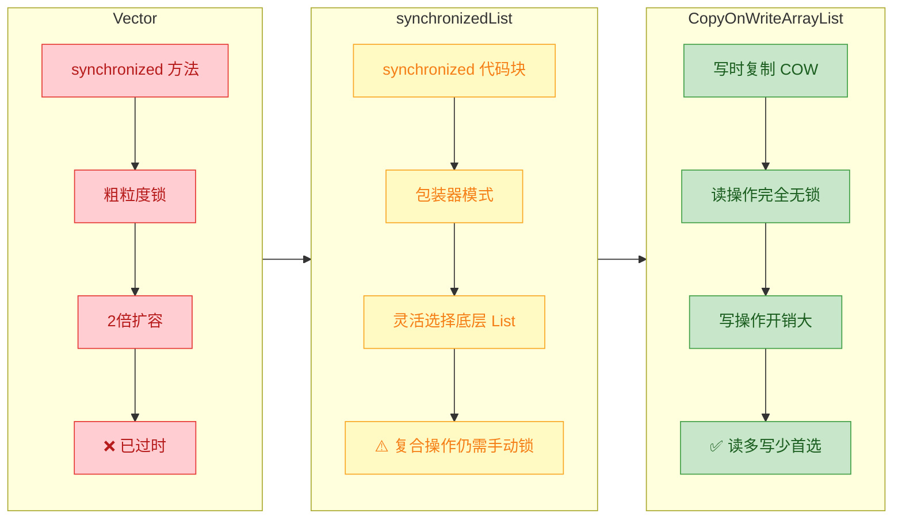

### 为什么 Vector 没有被标记为 @Deprecated

这是一个常见的疑问。尽管 Java 官方文档明确建议不要使用 Vector，但它至今没有被标记为 `@Deprecated`。原因主要有两个：

第一，向后兼容性（backward compatibility）是 Java 平台的核心承诺。大量遗留系统（legacy systems）仍在使用 Vector，标记为废弃会产生海量编译警告，给维护者带来不必要的压力。

第二，Vector 本身并没有"功能性错误"——它确实能正常工作，只是在设计理念上过时了。Java 的 `@Deprecated` 更多用于标记有功能缺陷或安全隐患的 API（如 `Thread.stop()`），而非仅仅是"有更好替代"的 API。

不过，从 Java 9 开始，`@Deprecated` 注解增加了 `forRemoval` 属性，未来 Java 版本可能会对 Vector 采取更明确的态度。目前的共识是：新代码中绝对不要使用 Vector。

### Vector 与 ArrayList 的完整对比

```
维度              Vector                  ArrayList
──────────────────────────────────────────────────────────
引入版本          Java 1.0                Java 1.2
线程安全          ✅ synchronized 方法     ❌ 非同步
默认初始容量      10                      10（懒初始化）
扩容倍数          2 倍（或固定增量）       1.5 倍
遍历方式          Enumeration + Iterator   Iterator
序列化            直接序列化 elementData   transient + 自定义
字段可见性        protected（暴露）        private/包私有
性能（单线程）    较慢（锁开销）           较快
现代推荐度        ❌ 不推荐                ✅ 首选
```

---

**📝 练习题**

以下关于 Vector 的说法，哪一项是正确的？

A. Vector 的扩容策略与 ArrayList 相同，都是 1.5 倍扩容

B. Vector 的 synchronized 方法能保证多线程下复合操作（如 check-then-act）的原子性

C. 在需要线程安全 List 的场景下，现代 Java 推荐使用 CopyOnWriteArrayList 或 Collections.synchronizedList 替代 Vector

D. Stack 类使用组合模式持有 Vector，因此不会暴露 Vector 的非栈操作方法


**【答案】** C

**【解析】** 逐项分析：A 错误，Vector 默认扩容为 2 倍，而 ArrayList 是 1.5 倍（`oldCapacity >> 1`）。B 错误，这是 Vector 最大的"伪安全"陷阱——每个方法单独同步，但方法之间的锁会释放，复合操作（如先 `size()` 再 `get()`）仍然存在竞态条件，必须手动对 Vector 对象加 `synchronized` 块才能保证原子性。C 正确，`Collections.synchronizedList` 提供了与 Vector 类似的同步包装但更灵活，`CopyOnWriteArrayList` 则通过写时复制实现了读操作的无锁化，两者都是 Vector 的现代替代方案。D 错误，Stack 是通过继承（`extends Vector`）而非组合实现的，这导致它暴露了 `add(index, element)`、`remove(index)` 等破坏栈语义的方法，是一个经典的设计反模式。

---

## subList 陷阱（视图、非独立副本）

`List.subList()` 是 Java 集合框架中一个看似简单、实则暗藏杀机的 API。很多开发者在初次使用时，会直觉地认为它返回了一个"新的、独立的列表"，但事实恰恰相反——它返回的是原始列表的一个 **视图（View）**。这个认知偏差，是大量线上 `ConcurrentModificationException` 的根源。

### subList 的本质：视图而非副本

调用 `list.subList(fromIndex, toIndex)` 后，你拿到的并不是一个拥有独立内存空间的新 `ArrayList`，而是一个名为 `SubList` 的内部类实例。这个实例 **没有自己的底层数组**，它的所有读写操作，都直接作用于原始列表（parent list）的底层 `Object[]` 数组之上。

我们先看一下 JDK 源码中 `ArrayList.subList()` 的核心结构：

```java
// ArrayList.java (JDK 17 简化版)
public List<E> subList(int fromIndex, int toIndex) {
    // 边界检查
    subListRangeCheck(fromIndex, toIndex, size);
    // 返回的是一个内部类实例，持有对 this (原始列表) 的引用
    return new SubList(this, fromIndex, toIndex);
}

// SubList 是 ArrayList 的一个私有内部类
private class SubList extends AbstractList<E> implements RandomAccess {
    private final ArrayList<E> root;  // 指向原始 ArrayList 的引用
    private final SubList parent;     // 支持 subList 的 subList（嵌套视图）
    private final int offset;         // 视图在原始数组中的起始偏移量
    private int size;                 // 视图的逻辑大小

    // 构造器：记录偏移量和范围，不复制任何数据
    SubList(ArrayList<E> root, int fromIndex, int toIndex) {
        this.root = root;             // 绑定到原始列表
        this.parent = null;
        this.offset = fromIndex;      // 记录起始位置
        this.size = toIndex - fromIndex; // 记录视图长度
        // 关键：记录原始列表当前的 modCount，用于后续的并发修改检测
        this.modCount = ArrayList.this.modCount;
    }

    // get 操作：直接读原始数组
    public E get(int index) {
        checkForComodification(); // 先检查结构是否被外部修改
        Objects.checkIndex(index, size);
        return root.elementData(offset + index); // 通过偏移量定位到原始数组
    }

    // set 操作：直接写原始数组
    public E set(int index, E element) {
        checkForComodification();
        Objects.checkIndex(index, size);
        E oldValue = root.elementData(offset + index);
        root.elementData[offset + index] = element; // 修改的是原始数组
        return oldValue;
    }

    // 并发修改检测的核心方法
    private void checkForComodification() {
        // 如果原始列表的 modCount 与视图创建时记录的不一致，说明原始列表被外部修改过
        if (root.modCount != modCount)
            throw new ConcurrentModificationException();
    }
}
```

用一张内存模型图来直观理解这种"共享底层数组"的关系：

```java
// ========== 内存模型：subList 视图 ==========
//
//  ArrayList (original)
//  ┌──────────────────────────────┐
//  │  size = 5                    │
//  │  modCount = 3                │
//  │  elementData ──────────┐     │
//  └────────────────────────│─────┘
//                           ▼
//            Object[] (底层数组，同一块内存)
//            ┌─────┬─────┬─────┬─────┬─────┬─────┐
//   index:   │  0  │  1  │  2  │  3  │  4  │ ... │
//   value:   │ "A" │ "B" │ "C" │ "D" │ "E" │null │
//            └─────┴──▲──┴─────┴──▲──┴─────┴─────┘
//                     │           │
//                  offset=1    offset+size=4
//                     │           │
//  SubList (view)     │           │
//  ┌──────────────────┼───────────┼──┐
//  │  root ──► original              │
//  │  offset = 1                     │
//  │  size = 3                       │
//  │  视图范围: ["B", "C", "D"]      │
//  │  modCount = 3 (创建时快照)      │
//  └─────────────────────────────────┘
//
//  subList.get(0) → elementData[1+0] → "B"
//  subList.set(1, "X") → elementData[1+1] = "X" → 原始列表也变了!
```

这张图清晰地表明：`SubList` 只是一个"带偏移量的窗口"，透过这个窗口看到的、修改的，都是原始列表的数据。

### 陷阱一：修改 subList 会影响原始列表

这是最基本也最容易被忽视的特性。因为 subList 是视图，所以通过 subList 进行的任何修改（`set`、`add`、`remove`、`clear`）都会 **直接反映到原始列表上**：

```java
public class SubListTrap1 {
    public static void main(String[] args) {
        // 创建原始列表
        ArrayList<String> original = new ArrayList<>(
            List.of("A", "B", "C", "D", "E")
        );
        System.out.println("原始列表: " + original);
        // 输出: [A, B, C, D, E]

        // 获取 index 1 到 4 的子列表视图 (左闭右开)
        List<String> sub = original.subList(1, 4);
        System.out.println("子列表视图: " + sub);
        // 输出: [B, C, D]

        // --- 通过视图修改元素 ---
        sub.set(0, "BB");  // 将视图的第 0 个元素改为 "BB"
        System.out.println("sub.set(0, 'BB') 后:");
        System.out.println("  子列表: " + sub);       // [BB, C, D]
        System.out.println("  原始列表: " + original); // [A, BB, C, D, E] ← 原始列表也变了!

        // --- 通过视图删除元素 ---
        sub.remove(1);  // 删除视图中 index=1 的元素 "C"
        System.out.println("sub.remove(1) 后:");
        System.out.println("  子列表: " + sub);       // [BB, D]
        System.out.println("  原始列表: " + original); // [A, BB, D, E] ← 原始列表也少了 "C"

        // --- 通过视图清空 ---
        sub.clear();  // 清空视图范围内的所有元素
        System.out.println("sub.clear() 后:");
        System.out.println("  子列表: " + sub);       // []
        System.out.println("  原始列表: " + original); // [A, E] ← 只剩首尾了!
    }
}
```

`sub.clear()` 这个技巧其实非常实用——它是 **批量删除列表中间一段元素** 最简洁的写法。Josh Bloch 在 *Effective Java* 中也推荐过这种用法。但前提是你必须清楚地知道自己在操作原始列表。

### 陷阱二：修改原始列表导致 ConcurrentModificationException

这是 subList 最危险的陷阱，也是面试高频考点。规则很简单：**subList 创建之后，任何通过原始列表引用进行的结构性修改（Structural Modification），都会导致后续对 subList 的操作抛出 `ConcurrentModificationException`。**

所谓"结构性修改"，指的是改变列表 `size` 的操作，比如 `add`、`remove`、`clear`。而 `set` 只是替换元素，不改变 size，所以不算。

```java
public class SubListTrap2 {
    public static void main(String[] args) {
        ArrayList<Integer> original = new ArrayList<>(List.of(1, 2, 3, 4, 5));

        // 创建子列表视图，此时记录 modCount 快照
        List<Integer> sub = original.subList(1, 4); // [2, 3, 4]
        System.out.println("子列表: " + sub);

        // ===== 危险操作：通过原始列表引用进行结构性修改 =====
        original.add(6);  // 原始列表新增元素 → modCount++
        // 此时 original.modCount 已经与 sub 创建时记录的 modCount 不一致了

        try {
            // 任何对 sub 的操作都会先调用 checkForComodification()
            // 检测到 modCount 不匹配 → 立即抛异常
            System.out.println(sub.get(0));  // 💥 ConcurrentModificationException
        } catch (ConcurrentModificationException e) {
            System.out.println("💥 捕获异常: " + e.getClass().getSimpleName());
            System.out.println("原因: 创建 subList 后，通过原始列表引用进行了结构性修改");
        }

        // ===== 对比：set 不是结构性修改，不会触发异常 =====
        ArrayList<Integer> list2 = new ArrayList<>(List.of(10, 20, 30, 40, 50));
        List<Integer> sub2 = list2.subList(1, 4); // [20, 30, 40]

        list2.set(0, 99);  // set 只替换元素，不改变 size，modCount 不变
        System.out.println("set 后访问 subList: " + sub2.get(0)); // 正常输出: 20
    }
}
```

整个检测机制的时序可以用下图表示：

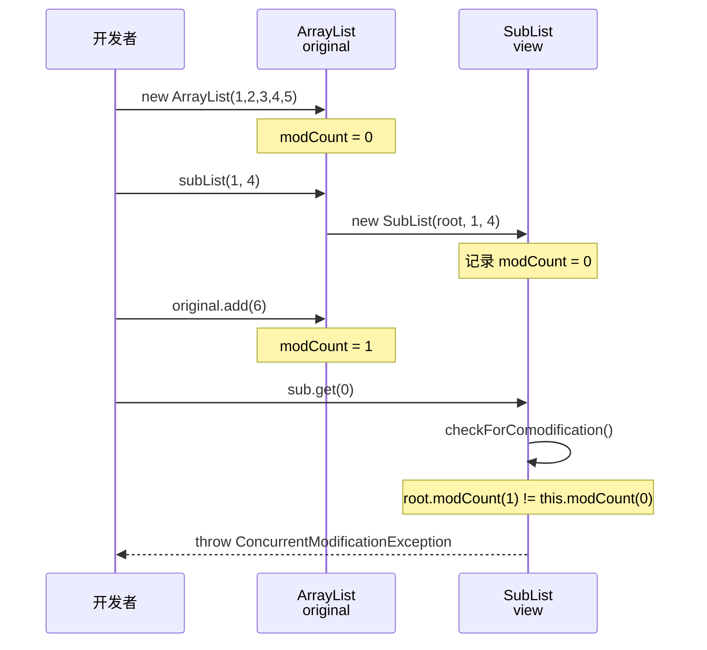

### 陷阱三：subList 持有原始列表的强引用，可能导致内存泄漏

这个陷阱更加隐蔽。由于 `SubList` 内部持有对原始 `ArrayList`（即 `root`）的强引用，即使你在业务代码中已经不再使用原始列表，只要 subList 还活着，原始列表及其底层的整个 `Object[]` 数组就 **无法被 GC 回收**。

```java
public class SubListTrap3 {
    public static void main(String[] args) {
        // 假设这是一个非常大的列表，占用大量内存
        ArrayList<byte[]> hugeList = new ArrayList<>();
        for (int i = 0; i < 10000; i++) {
            hugeList.add(new byte[1024]); // 每个元素 1KB，总共约 10MB
        }

        // 你只需要前 5 个元素
        List<byte[]> smallView = hugeList.subList(0, 5);

        // 你以为把 hugeList 置空就能释放内存了？
        hugeList = null;

        // 然而 smallView 内部仍然持有对原始 ArrayList 的强引用
        // 那个包含 10000 个元素的 Object[] 数组依然无法被 GC 回收!
        // 你以为只保留了 5 个元素，实际上 10MB 内存全被钉住了

        System.gc(); // 即使手动触发 GC 也无济于事
        System.out.println("smallView.size() = " + smallView.size()); // 5
        // 但底层数组仍然是 10000 个槽位的那个大数组
    }
}
```

```java
// ========== 内存泄漏模型 ==========
//
//  hugeList = null (引用已断开)
//       ✗
//       │ (不再指向)
//       ▼
//  ┌─────────────────────────────────────┐
//  │  ArrayList (原始对象)                │
//  │  elementData → Object[10000]        │◄─── 仍然被 SubList.root 引用!
//  │  (约 10MB 数据)                     │     无法被 GC 回收!
//  └──────────────────▲──────────────────┘
//                     │
//                     │ root (强引用)
//                     │
//  ┌──────────────────┴──────────────────┐
//  │  SubList (smallView)                │
//  │  offset = 0, size = 5              │
//  │  逻辑上只"看到" 5 个元素            │
//  │  但钉住了整个 10MB 的底层数组       │
//  └─────────────────────────────────────┘
//         ▲
//         │
//    smallView (仍然存活的引用)
```

### 正确的使用姿势

了解了这些陷阱之后，我们来总结安全使用 subList 的最佳实践：

```java
public class SubListBestPractice {
    public static void main(String[] args) {
        ArrayList<String> original = new ArrayList<>(
            List.of("A", "B", "C", "D", "E")
        );

        // ✅ 方法一：如果需要独立副本，用 new ArrayList 包装
        // 这会触发数组拷贝，生成一个完全独立的新列表
        List<String> independentCopy = new ArrayList<>(original.subList(1, 4));
        original.add("F");                    // 随便改原始列表
        System.out.println(independentCopy);  // [B, C, D] ← 不受影响

        // ✅ 方法二 (Java 10+)：使用 List.copyOf 创建不可变副本
        // 既独立又不可变，双重保险
        List<String> immutableCopy = List.copyOf(original.subList(1, 4));
        // immutableCopy.add("X"); // 编译通过但运行时抛 UnsupportedOperationException

        // ✅ 方法三 (Java 16+)：使用 Stream + toList()
        List<String> streamCopy = original.stream()
            .skip(1)                          // 跳过前 1 个
            .limit(3)                         // 取 3 个
            .toList();                        // 返回不可变列表

        // ✅ 方法四：subList 用完即弃，不要保存引用
        // 适合"批量删除中间段"这种一次性操作
        original.subList(1, 3).clear();       // 删除 index 1~2 的元素，用完就丢
        System.out.println(original);         // [A, D, E, F]
    }
}
```

下面这张决策流程图可以帮助你在实际开发中快速做出选择：

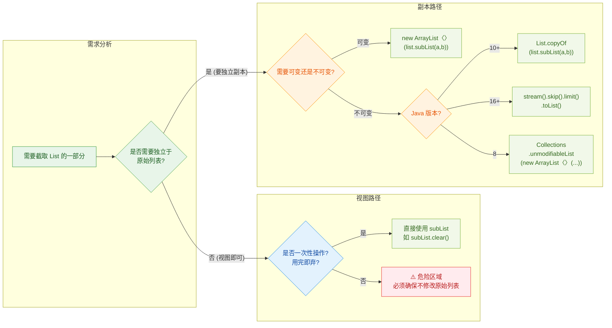

### 面试延伸：为什么 subList 要设计成视图？

这个设计决策背后有深思熟虑的工程考量：

第一，**性能**。创建视图是 O(1) 操作——只需要记录 offset 和 size，不需要拷贝任何数据。如果每次 subList 都创建独立副本，对于大列表来说就是 O(n) 的开销，在很多场景下这是不可接受的。

第二，**语义一致性**。视图设计使得"通过子列表修改原始列表"成为可能，这在某些算法中非常有用。比如 `Collections.sort(list.subList(2, 8))` 可以只对列表的一部分进行排序，排序结果直接反映在原始列表上，无需额外的拷贝和回写。

第三，**与 Java 集合框架的整体设计哲学一致**。`Map.keySet()`、`Map.values()`、`Map.entrySet()` 返回的也都是视图。`Arrays.asList()` 同样返回的是数组的视图。视图模式（View Pattern）是整个 Java Collections Framework 的核心设计理念之一。

---

**📝 练习题**

以下代码的运行结果是什么？

```java
ArrayList<Integer> list = new ArrayList<>(List.of(1, 2, 3, 4, 5));
List<Integer> sub = list.subList(1, 4);
sub.set(1, 99);
list.set(0, 100);
System.out.println(list);
System.out.println(sub);
```

A. `[100, 2, 99, 4, 5]` 和 `[2, 99, 4]`


B. `[100, 2, 99, 4, 5]` 和 `ConcurrentModificationException`


C. `[1, 2, 99, 4, 5]` 和 `[2, 99, 4]`


D. `ConcurrentModificationException`

**【答案】** A

**【解析】** 分步推演：初始状态 `list = [1, 2, 3, 4, 5]`，`sub` 是 index 1~3 的视图，即 `[2, 3, 4]`。执行 `sub.set(1, 99)` 时，视图的 index 1 对应原始列表的 index 2（offset=1），所以 `list[2]` 从 3 变为 99，此时 `list = [1, 2, 99, 4, 5]`。接着执行 `list.set(0, 100)`，这是一个 `set` 操作，**不是结构性修改**（不改变 size），所以 `modCount` 不会增加，subList 不会失效。最终 `list = [100, 2, 99, 4, 5]`，`sub` 视图看到的是 index 1~3 即 `[2, 99, 4]`。关键点在于区分 `set`（非结构性修改，安全）和 `add/remove`（结构性修改，会导致 subList 失效）。

---

## Arrays.asList 陷阱（固定大小、不可 add）

`Arrays.asList()` 是 Java 开发中使用频率极高的一个工具方法，它能将数组或一组元素快速转换为 List。表面上看它返回的是一个 `java.util.List`，但这个 List 的真实身份却暗藏玄机——它既不是 `ArrayList`，也不是你所期望的"正常"List。无数开发者在这里踩过坑，轻则抛出 `UnsupportedOperationException`，重则引发难以排查的数据联动 Bug。这一节我们就来彻底拆解这个经典陷阱。

### 返回的不是 java.util.ArrayList

很多人写下 `Arrays.asList("a", "b", "c")` 时，下意识认为拿到的就是一个普通的 `java.util.ArrayList`。但事实上，它返回的是 `java.util.Arrays` 的一个私有静态内部类，全限定名为 `java.util.Arrays$ArrayList`——注意，这和 `java.util.ArrayList` 是完全不同的两个类。

```java
// 我们来验证返回类型
List<String> list = Arrays.asList("a", "b", "c");

// 打印实际类型：java.util.Arrays$ArrayList
System.out.println(list.getClass().getName());

// 这个判断为 false！它不是 java.util.ArrayList
System.out.println(list instanceof ArrayList); // false
```

我们直接看 JDK 源码中这个内部类的核心结构：

```java
// 位于 java.util.Arrays 内部
private static class ArrayList<E> extends AbstractList<E>
        implements RandomAccess, java.io.Serializable {

    private static final long serialVersionUID = -2764017481108945198L;

    // 核心：直接持有外部传入的数组引用，没有拷贝！
    private final E[] a;

    // 构造器：直接赋值，不做 defensive copy
    ArrayList(E[] array) {
        a = Objects.requireNonNull(array);
    }

    @Override
    public int size() {
        return a.length; // 大小由数组长度决定，不可变
    }

    @Override
    public E get(int index) {
        return a[index]; // 直接读数组
    }

    @Override
    public E set(int index, E element) {
        E oldValue = a[index]; // 支持 set，因为数组元素可替换
        a[index] = element;
        return oldValue;
    }

    // 注意：没有 override add() 和 remove()
    // 它们继承自 AbstractList，而 AbstractList 的默认实现是直接抛异常
}
```

关键信息一目了然：这个内部类的底层就是一个 `final` 数组引用，数组长度在创建时就固定了，没有任何扩容机制。它只重写了 `get()`、`set()`、`size()` 等基本方法，而 `add()`、`remove()` 等结构性修改方法完全没有重写，直接继承了 `AbstractList` 中抛异常的默认实现。

### 固定大小：不可 add，不可 remove

这是最常见的踩坑场景。既然底层数组长度固定，任何试图改变 List 大小的操作都会失败：

```java
List<String> list = Arrays.asList("Java", "Python", "Go");

// ✅ get 正常
System.out.println(list.get(0)); // Java

// ✅ set 正常（替换元素，不改变大小）
list.set(1, "Kotlin");
System.out.println(list); // [Java, Kotlin, Go]

// ❌ add 抛出 UnsupportedOperationException
try {
    list.add("Rust"); // 试图增加元素
} catch (UnsupportedOperationException e) {
    System.out.println("add 失败: " + e.getClass().getSimpleName());
    // 输出: add 失败: UnsupportedOperationException
}

// ❌ remove 同样抛出 UnsupportedOperationException
try {
    list.remove(0); // 试图删除元素
} catch (UnsupportedOperationException e) {
    System.out.println("remove 失败: " + e.getClass().getSimpleName());
    // 输出: remove 失败: UnsupportedOperationException
}

// ❌ clear 也不行
try {
    list.clear();
} catch (UnsupportedOperationException e) {
    System.out.println("clear 失败: " + e.getClass().getSimpleName());
}
```

我们可以用一张表来总结哪些操作可用、哪些会炸：

```
┌─────────────────────────────────────────────────────────┐
│          Arrays.asList() 返回 List 的操作支持表          │
├──────────────┬──────────┬───────────────────────────────┤
│     操作      │  是否支持  │            原因              │
├──────────────┼──────────┼───────────────────────────────┤
│  get(index)  │    ✅    │ 直接读数组，正常               │
│  set(i, e)   │    ✅    │ 替换数组元素，大小不变          │
│  size()      │    ✅    │ 返回数组 length                │
│  contains()  │    ✅    │ 遍历查找，正常                 │
│  indexOf()   │    ✅    │ 遍历查找，正常                 │
│  iterator()  │    ✅    │ AbstractList 提供              │
│  add(e)      │    ❌    │ AbstractList 默认抛异常        │
│  remove(i)   │    ❌    │ AbstractList 默认抛异常        │
│  clear()     │    ❌    │ 底层调 removeRange → 抛异常    │
│  addAll()    │    ❌    │ 最终调 add → 抛异常            │
│  sort()      │    ✅    │ Arrays.sort 原地排序，大小不变  │
└──────────────┴──────────┴───────────────────────────────┘
```

简单记忆：**可读可改，不可增删**（read/set OK, add/remove NO）。

### 数组与 List 的双向联动（共享引用陷阱）

这是第二个极其隐蔽的坑。由于 `Arrays.asList()` 内部直接持有原数组的引用（没有做拷贝），所以修改数组会影响 List，修改 List 也会影响数组——它们是同一块内存的两个视图。

```java
String[] arr = {"A", "B", "C"};
List<String> list = Arrays.asList(arr);

// 此时 list 和 arr 指向同一个底层数组
System.out.println(list); // [A, B, C]

// 通过数组修改 → List 跟着变
arr[0] = "X";
System.out.println(list.get(0)); // X  ← 被联动修改了！

// 通过 List 修改 → 数组跟着变
list.set(2, "Z");
System.out.println(arr[2]); // Z  ← 被联动修改了！
```

用内存模型来理解这个共享关系：

```java
// 内存引用关系图

//   栈 (Stack)                    堆 (Heap)
//  ┌──────────┐              ┌──────────────────┐
//  │  arr ─────┼─────────┬──▶│ String[] 数组      │
//  ├──────────┤          │   │ [0] "X"           │
//  │  list ────┼──┐      │   │ [1] "B"           │
//  └──────────┘  │      │   │ [2] "Z"           │
//                │      │   └──────────────────┘
//                ▼      │
//         ┌─────────────┴────┐
//         │ Arrays$ArrayList  │
//         │   final E[] a ────┼── 同一个引用！
//         └──────────────────┘
//
//  arr 和 list.a 指向堆中同一个 String[] 对象
//  任何一方修改元素，另一方都能看到
```

这种联动在实际开发中非常危险。想象一个场景：你把数组转成 List 传给了另一个方法，然后在原地修改了数组——另一个方法拿到的 List 数据就被悄悄篡改了，而且不会有任何编译警告或运行时异常。这类 Bug 排查起来极其痛苦。

### 基本类型数组的陷阱

`Arrays.asList()` 还有一个容易被忽视的坑：它不能正确处理基本类型数组（primitive array）。

```java
int[] nums = {1, 2, 3};
// 你以为得到 List<Integer>，实际得到 List<int[]>
List<int[]> wrongList = Arrays.asList(nums);

// 大小是 1，不是 3！整个 int[] 被当成一个元素
System.out.println(wrongList.size()); // 1
System.out.println(wrongList.get(0) == nums); // true，元素就是数组本身
```

原因在于泛型擦除（Type Erasure）。Java 泛型不支持基本类型，`Arrays.asList(T... a)` 的类型参数 `T` 无法推断为 `int`，只能推断为 `int[]`，于是整个数组被当作一个元素塞进了 List。

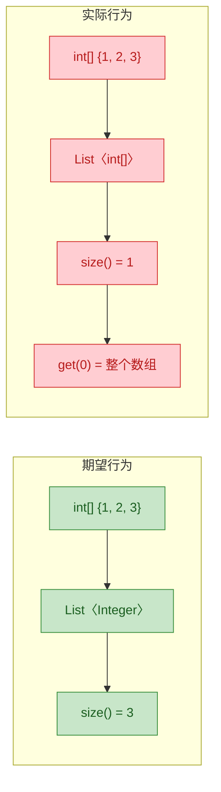

解决方案是使用包装类型数组：

```java
// ❌ 基本类型数组 → 结果错误
int[] primitiveArr = {1, 2, 3};
List<int[]> wrong = Arrays.asList(primitiveArr); // size = 1

// ✅ 包装类型数组 → 结果正确
Integer[] wrapperArr = {1, 2, 3};
List<Integer> correct = Arrays.asList(wrapperArr); // size = 3

// ✅ Java 8+ 使用 Stream 转换
List<Integer> fromStream = Arrays.stream(primitiveArr) // IntStream
        .boxed()                                        // Stream<Integer>
        .collect(Collectors.toList());                  // List<Integer>
System.out.println(fromStream.size()); // 3
```

### 正确的转换姿势

既然 `Arrays.asList()` 有这么多坑，实际开发中我们该怎么安全地把数组或元素列表转成一个真正可变的 `ArrayList` 呢？以下是几种常用方案：

```java
String[] arr = {"Java", "Go", "Rust"};

// ========== 方案一：用 ArrayList 构造器包一层（最经典） ==========
// new ArrayList<>() 会将 asList 返回的内容拷贝到新数组中
// 得到的是真正的 java.util.ArrayList，完全独立，可增可删
List<String> list1 = new ArrayList<>(Arrays.asList(arr));
list1.add("Kotlin"); // ✅ 正常
arr[0] = "C++";
System.out.println(list1.get(0)); // Java ← 不受原数组影响

// ========== 方案二：Java 8 Stream（灵活，可顺便做过滤/转换） ==========
List<String> list2 = Arrays.stream(arr)
        .collect(Collectors.toList()); // 返回可变 ArrayList
list2.add("Swift"); // ✅ 正常

// ========== 方案三：Java 9+ List.of()（不可变 List） ==========
// 注意：这个返回的也是不可变的！但它是真正的不可变，语义更清晰
List<String> list3 = List.of("Java", "Go", "Rust");
// list3.add("X"); // ❌ UnsupportedOperationException
// list3.set(0, "X"); // ❌ 连 set 也不行，比 asList 更严格

// ========== 方案四：Java 10+ List.copyOf()（从已有集合创建不可变副本） ==========
List<String> list4 = List.copyOf(Arrays.asList(arr));
// 独立副本 + 不可变，适合防御性编程

// ========== 方案五：手动 Collections.addAll()（老派但有效） ==========
List<String> list5 = new ArrayList<>();
Collections.addAll(list5, arr); // 将数组元素逐个添加到 list5
list5.add("Dart"); // ✅ 正常
```

各方案对比一览：

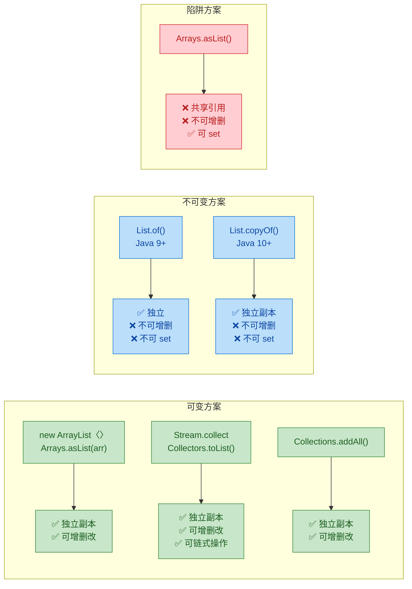

### 实际开发中的典型翻车场景

来看几个真实项目中容易出现的 Bug 模式：

```java
// ========== 翻车场景一：方法返回 asList 结果，调用方尝试修改 ==========
public class UserService {
    // 看起来返回的是 List<String>，调用方不知道它不可增删
    public List<String> getDefaultRoles() {
        return Arrays.asList("USER", "GUEST"); // 返回固定大小 List
    }
}

// 调用方
List<String> roles = userService.getDefaultRoles();
roles.add("ADMIN"); // 💥 UnsupportedOperationException

// ✅ 修复：返回独立可变副本
public List<String> getDefaultRoles() {
    return new ArrayList<>(Arrays.asList("USER", "GUEST"));
}


// ========== 翻车场景二：在循环中对 asList 结果做增删 ==========
List<String> items = Arrays.asList("a", "b", "c", "d");
// 试图移除所有包含 "a" 的元素
Iterator<String> it = items.iterator();
while (it.hasNext()) {
    if (it.next().equals("a")) {
        it.remove(); // 💥 UnsupportedOperationException
    }
}

// ✅ 修复：先转成真正的 ArrayList
List<String> items = new ArrayList<>(Arrays.asList("a", "b", "c", "d"));
items.removeIf(s -> s.equals("a")); // 安全


// ========== 翻车场景三：联动修改导致数据不一致 ==========
String[] config = {"debug", "verbose", "trace"};
List<String> configList = Arrays.asList(config);

// 传给另一个模块
logger.configure(configList);

// 后来在原数组上做了修改
config[0] = "production"; // logger 模块拿到的 configList 也变了！

// ✅ 修复：传递独立副本
logger.configure(new ArrayList<>(Arrays.asList(config)));
```

### Arrays.asList vs List.of 对比

Java 9 引入的 `List.of()` 同样返回不可变 List，但它和 `Arrays.asList()` 有本质区别：

```java
// Arrays.asList：半可变（可 set，不可增删），共享引用
String[] arr = {"A", "B"};
List<String> asList = Arrays.asList(arr);
asList.set(0, "X");       // ✅ 可以
// asList.add("C");        // ❌ UnsupportedOperationException
arr[1] = "Y";
System.out.println(asList); // [X, Y] ← 联动了

// List.of：完全不可变（set 也不行），独立副本
List<String> listOf = List.of("A", "B");
// listOf.set(0, "X");     // ❌ UnsupportedOperationException
// listOf.add("C");         // ❌ UnsupportedOperationException

// List.of 不允许 null 元素
// List.of("A", null);     // ❌ NullPointerException

// Arrays.asList 允许 null 元素
List<String> withNull = Arrays.asList("A", null, "C"); // ✅ 正常
```

```
┌──────────────────┬──────────────────┬──────────────────┐
│       特性        │  Arrays.asList() │    List.of()     │
├──────────────────┼──────────────────┼──────────────────┤
│  Java 版本       │     1.2+          │     9+           │
│  get()           │     ✅            │     ✅           │
│  set()           │     ✅            │     ❌           │
│  add()/remove()  │     ❌            │     ❌           │
│  null 元素       │     ✅ 允许       │     ❌ 抛 NPE    │
│  与原数组联动     │     ✅ 共享引用   │     ❌ 独立副本   │
│  序列化          │     ✅            │     ✅           │
│  语义清晰度      │     ⚠️ 模糊      │     ✅ 明确不可变 │
└──────────────────┴──────────────────┴──────────────────┘
```

从 API 设计的角度看，`List.of()` 的语义更加诚实——它明确告诉你"这是一个不可变 List"，而 `Arrays.asList()` 返回的 List 处于一种尴尬的"半可变"状态，容易让人产生错误预期。如果你的项目已经在 Java 9+，需要不可变 List 时优先使用 `List.of()`，需要可变 List 时用 `new ArrayList<>(List.of(...))` 或 Stream 方式。

---

**📝 练习题**

以下代码的输出结果是什么？

```java
int[] nums = {1, 2, 3};
List list = Arrays.asList(nums);
System.out.println(list.size());
System.out.println(list.get(0).getClass().getSimpleName());
```

A. 输出 `3` 和 `Integer`

B. 输出 `1` 和 `int[]`

C. 输出 `3` 和 `int[]`

D. 编译错误


**【答案】** B

**【解析】** `Arrays.asList(T... a)` 的类型参数 `T` 无法匹配基本类型 `int`，因此编译器将整个 `int[]` 数组视为一个 `T` 类型的元素，推断 `T = int[]`。最终返回的是 `List<int[]>`，其中只包含一个元素——就是 `nums` 数组本身。所以 `size()` 返回 `1`，`get(0)` 返回的对象类型是 `int[]`。如果想得到 `List<Integer>` 且 `size() = 3`，应使用 `Integer[]` 包装类型数组，或通过 `Arrays.stream(nums).boxed().collect(Collectors.toList())` 进行转换。

---

## 本章小结

本章系统梳理了 Java 集合框架中 `List` 接口的核心实现类及其使用陷阱。我们从底层数据结构出发，逐步深入到源码级别的实现细节，最后落地到实际开发中的选型策略。下面用一张全景图和一张对比表做最终收束。

### 全景知识图谱

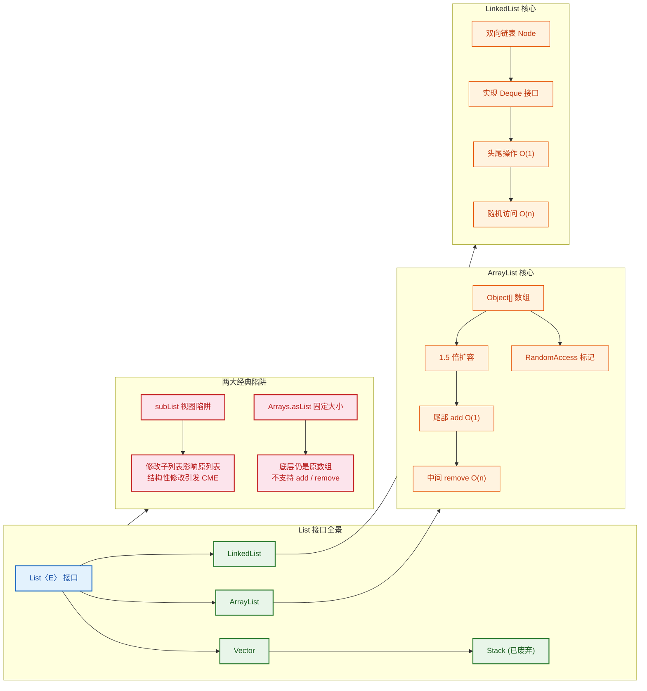

### 核心对比速查表

```
┌──────────────────┬──────────────────┬──────────────────┬──────────────────┐
│       维度        │   ArrayList      │   LinkedList     │     Vector       │
├──────────────────┼──────────────────┼──────────────────┼──────────────────┤
│   底层结构        │   Object[] 数组   │   双向链表 Node   │   Object[] 数组   │
├──────────────────┼──────────────────┼──────────────────┼──────────────────┤
│   默认容量        │       10         │       无          │       10         │
├──────────────────┼──────────────────┼──────────────────┼──────────────────┤
│   扩容策略        │    1.5 倍         │     不需要        │     2 倍          │
├──────────────────┼──────────────────┼──────────────────┼──────────────────┤
│   随机访问        │    O(1) ✅        │     O(n) ❌       │    O(1) ✅        │
├──────────────────┼──────────────────┼──────────────────┼──────────────────┤
│   尾部插入        │  均摊 O(1)        │     O(1)         │   均摊 O(1)       │
├──────────────────┼──────────────────┼──────────────────┼──────────────────┤
│   中间插入/删除   │    O(n)           │  O(1)+定位O(n)    │    O(n)           │
├──────────────────┼──────────────────┼──────────────────┼──────────────────┤
│   线程安全        │     否 ❌         │     否 ❌         │    是 ✅          │
├──────────────────┼──────────────────┼──────────────────┼──────────────────┤
│   RandomAccess   │     实现 ✅       │    未实现 ❌       │    实现 ✅        │
├──────────────────┼──────────────────┼──────────────────┼──────────────────┤
│   内存开销        │    紧凑(连续)     │  大(prev+next指针) │   紧凑(连续)      │
├──────────────────┼──────────────────┼──────────────────┼──────────────────┤
│   推荐程度        │   ⭐⭐⭐ 首选     │   特定场景使用     │   ❌ 不推荐       │
└──────────────────┴──────────────────┴──────────────────┴──────────────────┘
```

### 选型决策树

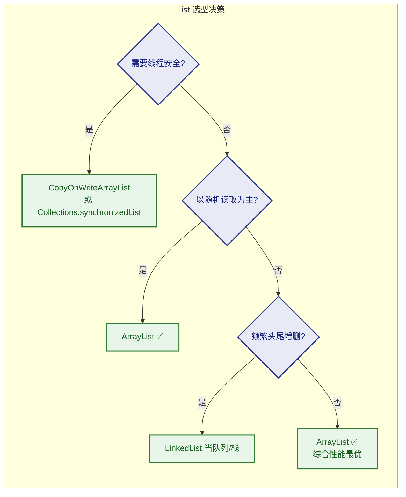

### 关键结论

回顾全章，有几条核心认知值得刻入肌肉记忆：

1. **ArrayList 是绝对的默认选择**。90% 以上的业务场景，`ArrayList` 的连续内存布局带来的 CPU cache 友好性，远比 `LinkedList` 理论上的 O(1) 插入更有实际价值。现代 CPU 的缓存行预取机制（cache line prefetching）让数组的顺序遍历速度碾压链表的指针跳跃。

2. **1.5 倍扩容是工程上的精妙平衡**。相比 `Vector` 的 2 倍扩容，`ArrayList` 的 `oldCapacity + (oldCapacity >> 1)` 策略在空间浪费和扩容频率之间找到了甜蜜点，同时保证了 Buddy Memory Allocation 的友好性。

3. **LinkedList 的真正价值在于 Deque 语义**。当你需要一个双端队列（queue/deque/stack）时，`LinkedList` 才是合理选择。纯粹作为 `List` 使用，它几乎没有优势。

4. **Vector 和 Stack 属于历史遗留**。在新代码中永远不要使用它们。线程安全用 `CopyOnWriteArrayList` 或外部同步包装，栈语义用 `ArrayDeque`。

5. **subList 和 Arrays.asList 是面试高频考点，也是生产事故高发区**。核心记忆点只有一个词——**视图（View）**。它们返回的不是独立副本，而是原数据的一个窗口。任何对原数据结构的修改都可能导致 `ConcurrentModificationException`。安全做法是 `new ArrayList<>(list.subList(...))` 和 `new ArrayList<>(Arrays.asList(...))` 立即拷贝。

```java
// 本章最核心的一行"防御性编程"代码：
// 永远用 new ArrayList<>() 包装视图，切断与原数据的引用关系
List<String> safe = new ArrayList<>(originalList.subList(1, 4));
```

---

**📝 练习题**

以下代码的输出结果是什么？

```java
public class ListTrap {
    public static void main(String[] args) {
        // 通过 Arrays.asList 创建列表
        List<String> list = Arrays.asList("A", "B", "C", "D");

        // 获取 subList 视图
        List<String> sub = list.subList(1, 3);

        // 通过 set 修改 subList 中的元素
        sub.set(0, "X");

        // 打印原列表
        System.out.println(list);

        // 尝试向 sub 中添加元素
        sub.add("Y");
    }
}
```

A. `[A, X, C, D]`，然后打印 `[A, X, C, D, Y]`

B. `[A, X, C, D]`，然后抛出 `UnsupportedOperationException`

C. `[A, B, C, D]`，然后抛出 `ConcurrentModificationException`

D. 编译错误，`Arrays.asList` 返回的列表不支持 `subList`


**【答案】** B

**【解析】**

这道题综合考察了本章两大陷阱的叠加效应：

- `Arrays.asList("A","B","C","D")` 返回的是 `java.util.Arrays$ArrayList`（注意不是 `java.util.ArrayList`），它的底层是传入的原始数组，**支持 `set`（修改元素）但不支持 `add`/`remove`（改变结构）**。
- `sub = list.subList(1, 3)` 返回的是原列表 `[1, 3)` 区间的视图，即 `["B", "C"]`。
- `sub.set(0, "X")` 将视图的第 0 个元素（即原列表索引 1 的 `"B"`）改为 `"X"`。因为是视图，原列表同步变为 `[A, X, C, D]`，打印结果正确。
- `sub.add("Y")` 试图向列表中添加新元素，但底层数组大小固定（长度为 4），无法扩展，因此抛出 `UnsupportedOperationException`。

这正是 `Arrays.asList` 的经典陷阱：**可改（set），不可增删（add/remove）**。再叠加 `subList` 的视图特性，`set` 操作会穿透到原列表。两个陷阱在同一段代码中同时生效，是面试中非常经典的组合考法。

---

