---

# Map实现 ⭐⭐⭐

---

## HashMap 深度解析 ⭐⭐⭐

### 底层结构（数组 + 链表 + 红黑树）

HashMap 是 Java 集合框架中使用频率最高的 Map 实现，几乎每个 Java 项目都离不开它。要真正理解 HashMap，第一步就是彻底搞清楚它的底层数据结构——这是后续理解 put、get、扩容、树化等所有行为的根基。

在 JDK 8 及之后的版本中，HashMap 的底层采用了一种复合数据结构：**Node 数组（Hash Table）+ 链表（Linked List）+ 红黑树（Red-Black Tree）**。这三者并非独立存在，而是协同工作，在不同场景下自动切换，以兼顾时间效率和空间效率。

---

我们先从最核心的源码入手，看看 HashMap 内部到底长什么样：

```java
// HashMap 的核心存储结构：一个 Node 类型的数组
// 这个数组通常被称为 "桶数组"（bucket array）
// 每个数组槽位（slot）就是一个 "桶"（bucket）
transient Node<K,V>[] table;

// 记录当前 HashMap 中存储的键值对总数
transient int size;

// 扩容阈值 = 容量(capacity) × 负载因子(loadFactor)
// 当 size 超过 threshold 时，触发扩容（resize）
int threshold;

// 负载因子，默认 0.75f
// 它控制着 "空间利用率" 与 "哈希冲突概率" 之间的平衡
final float loadFactor;
```

这里的 `table` 就是 HashMap 的骨架。你可以把它想象成一排编了号的抽屉（index 0, 1, 2, ...），每个抽屉里可以放东西，也可以是空的。当我们调用 `map.put(key, value)` 时，HashMap 会根据 key 的哈希值计算出一个数组下标，然后把键值对放进对应的抽屉里。

---

接下来看 Node 节点的定义，这是 HashMap 中最基础的存储单元：

```java
// Node 是 HashMap 的内部静态类，实现了 Map.Entry 接口
// 每一个键值对都被封装成一个 Node 对象
static class Node<K,V> implements Map.Entry<K,V> {
    // 缓存 key 的哈希值，避免重复计算
    // 在扩容（resize）和查找时会频繁用到
    final int hash;

    // 键（key），被 final 修饰，一旦创建不可更改
    // 这也是为什么 HashMap 的 key 应该是不可变对象的原因之一
    final K key;

    // 值（value），可以被更新（put 相同 key 时覆盖）
    V value;

    // 指向同一个桶中下一个节点的引用（单向链表结构）
    // 当多个 key 的哈希值映射到同一个数组下标时
    // 这些 Node 就通过 next 指针串成一条链表
    Node<K,V> next;

    // 构造方法：创建一个新的节点
    Node(int hash, K key, V value, Node<K,V> next) {
        this.hash = hash;   // 存储哈希值
        this.key = key;     // 存储键
        this.value = value; // 存储值
        this.next = next;   // 指向链表中的下一个节点
    }
}
```

注意 `next` 字段——它是链表结构的关键。当两个不同的 key 经过哈希计算后落到了同一个数组下标（即发生了 **哈希冲突 / Hash Collision**），HashMap 不会覆盖已有数据，而是把新节点挂到这个位置的链表上。

---

当链表过长时，查找效率会从 O(1) 退化到 O(n)，这在高冲突场景下是不可接受的。JDK 8 引入了红黑树来解决这个问题。当某个桶中的链表长度达到阈值（默认 8）且数组容量 ≥ 64 时，链表会被转化为红黑树，查找复杂度从 O(n) 优化到 O(log n)。

红黑树节点 TreeNode 的定义如下（简化版）：

```java
// TreeNode 继承自 LinkedHashMap.Entry，后者又继承自 HashMap.Node
// 所以 TreeNode 本质上也是一个 Node，只是额外维护了树结构的指针
static final class TreeNode<K,V> extends LinkedHashMap.Entry<K,V> {
    // 指向父节点
    TreeNode<K,V> parent;

    // 指向左子节点（key 的哈希值更小的方向）
    TreeNode<K,V> left;

    // 指向右子节点（key 的哈希值更大的方向）
    TreeNode<K,V> right;

    // 指向前一个节点（用于删除时断开链表连接）
    // 在树化/退化过程中，TreeNode 同时维护着双向链表结构
    TreeNode<K,V> prev;

    // 节点颜色标记：红色(true) 或 黑色(false)
    // 红黑树通过颜色约束来保持近似平衡
    boolean red;
}
```

TreeNode 的继承链值得注意：`TreeNode → LinkedHashMap.Entry → HashMap.Node`。这意味着 TreeNode 同时具备链表节点和树节点的双重身份。这种设计让树化（treeify）和退化（untreeify）的转换过程更加平滑——不需要重新创建对象，只需要调整指针关系。

---

下面用一张 Mermaid 图来展示 HashMap 的整体结构，直观感受数组、链表、红黑树三者如何协同工作：

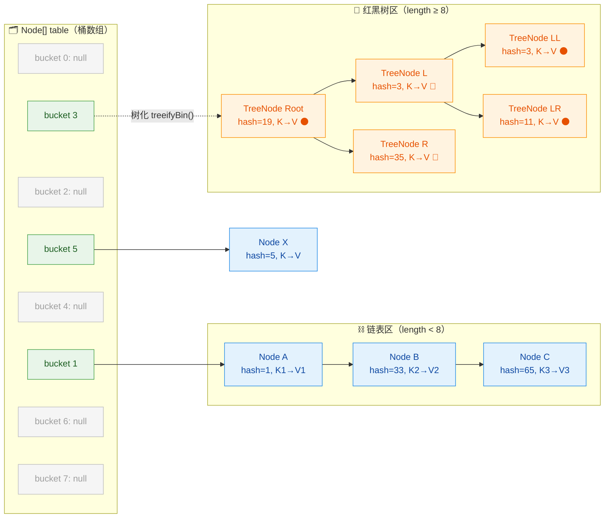
```mermaid
graph LR
    subgraph BucketArray["🗂️ Node[] table（桶数组）"]
        direction TB
        B0["bucket 0: null"]
        B1["bucket 1"]
        B2["bucket 2: null"]
        B3["bucket 3"]
        B4["bucket 4: null"]
        B5["bucket 5"]
        B6["bucket 6: null"]
        B7["bucket 7: null"]
    end

    subgraph Chain["⛓️ 链表区（length < 8）"]
        direction TB
        N1A["Node A<br/>hash=1, K1→V1"]
        N1B["Node B<br/>hash=33, K2→V2"]
        N1C["Node C<br/>hash=65, K3→V3"]
        N1A --> N1B --> N1C
    end

    subgraph Tree["🌲 红黑树区（length ≥ 8）"]
        direction TB
        TR["TreeNode Root<br/>hash=19, K→V ⚫"]
        TL["TreeNode L<br/>hash=3, K→V 🔴"]
        TRR["TreeNode R<br/>hash=35, K→V 🔴"]
        TLL["TreeNode LL<br/>hash=3, K→V ⚫"]
        TLR["TreeNode LR<br/>hash=11, K→V ⚫"]
        TR --> TL
        TR --> TRR
        TL --> TLL
        TL --> TLR
    end

    B1 --> N1A
    B3 -.->|"树化 treeifyBin()"| TR
    B5 --> N5A["Node X<br/>hash=5, K→V"]

    classDef bucketStyle fill:#E8F5E9,stroke:#43A047,color:#1B5E20
    classDef nodeStyle fill:#E3F2FD,stroke:#1E88E5,color:#0D47A1
    classDef treeStyle fill:#FFF3E0,stroke:#FB8C00,color:#E65100
    classDef emptyStyle fill:#F5F5F5,stroke:#BDBDBD,color:#9E9E9E

    class B0,B2,B4,B6,B7 emptyStyle
    class B1,B3,B5 bucketStyle
    class N1A,N1B,N1C,N5A nodeStyle
    class TR,TL,TRR,TLL,TLR treeStyle
```

从图中可以清晰看到三层结构的关系：

- **第一层（数组）**：`table` 数组是入口，通过 `hash & (n-1)` 快速定位到某个桶，时间复杂度 O(1)。
- **第二层（链表）**：当发生哈希冲突时，冲突的节点以链表形式挂在同一个桶下。JDK 8 采用尾插法（tail insertion），新节点追加到链表末尾。
- **第三层（红黑树）**：当链表长度 ≥ 8 且数组容量 ≥ 64 时，链表转化为红黑树。红黑树是一种自平衡二叉搜索树（Self-Balancing BST），通过颜色约束和旋转操作保证树高不超过 2log(n+1)。

---

为了更直观地理解一个具体桶位内部的内存引用关系，我们用 ASCII 图来描绘链表结构下的节点串联方式：

```java
// ========== bucket[1] 的内存引用模型 ==========
//
// table[1]
//    │
//    ▼
// ┌──────────────────────────┐    ┌──────────────────────────┐    ┌──────────────────────────┐
// │  Node A                  │    │  Node B                  │    │  Node C                  │
// │  hash  = 1               │    │  hash  = 33              │    │  hash  = 65              │
// │  key   = "apple"         │    │  key   = "banana"        │    │  key   = "cherry"        │
// │  value = 100             │    │  value = 200             │    │  value = 300             │
// │  next ─────────────────────►  │  next ─────────────────────►  │  next  = null            │
// └──────────────────────────┘    └──────────────────────────┘    └──────────────────────────┘
//
// 假设 table.length = 16
// "apple".hashCode()  经扰动后 & 15 = 1  → 落入 bucket[1]
// "banana".hashCode() 经扰动后 & 15 = 1  → 冲突，链到 Node A 后面
// "cherry".hashCode() 经扰动后 & 15 = 1  → 冲突，链到 Node B 后面
```

三个不同的 key 经过哈希计算后恰好映射到了同一个桶（index = 1），于是它们通过 `next` 指针形成了一条单向链表。查找时需要沿着链表逐个比较 key，直到找到匹配项或到达链表末尾。

---

我们再来看几个关键的默认常量，它们直接决定了 HashMap 的行为特征：

```java
// 默认初始容量：16（必须是 2 的幂次）
// 为什么是 16？这是一个经验值，在大多数场景下能较好地平衡内存占用和冲突概率
static final int DEFAULT_INITIAL_CAPACITY = 1 << 4; // 即 16

// 最大容量：2^30（约 10.7 亿）
// 超过这个值就不再扩容了
static final int MAXIMUM_CAPACITY = 1 << 30;

// 默认负载因子：0.75
// 这个值是时间和空间的折中：
//   - 太小（如 0.5）：浪费空间，但冲突少，查找快
//   - 太大（如 1.0）：空间利用率高，但冲突多，查找慢
//   - 0.75 是统计学上比较理想的平衡点
static final float DEFAULT_LOAD_FACTOR = 0.75f;

// 树化阈值：链表长度达到 8 时，考虑转为红黑树
// 为什么是 8？与泊松分布有关，后面章节详细分析
static final int TREEIFY_THRESHOLD = 8;

// 退化阈值：红黑树节点数缩减到 6 时，退化回链表
// 为什么是 6 而不是 7？留一个缓冲区间，避免频繁树化/退化的震荡
static final int UNTREEIFY_THRESHOLD = 6;

// 最小树化容量：数组长度至少为 64 时才允许树化
// 如果数组太小（如 16），即使链表长度达到 8，也优先扩容而非树化
// 因为扩容能更有效地分散冲突
static final int MIN_TREEIFY_CAPACITY = 64;
```

这些常量之间存在精妙的配合关系。比如默认容量 16 × 负载因子 0.75 = 阈值 12，意味着当 HashMap 中存了 12 个键值对时就会触发第一次扩容。再比如树化阈值 8 和退化阈值 6 之间留了一个 gap（7），这是为了防止在临界点附近反复进行树化和退化操作（thrashing）。

---

下面这张图总结了三种数据结构在不同冲突程度下的切换逻辑：

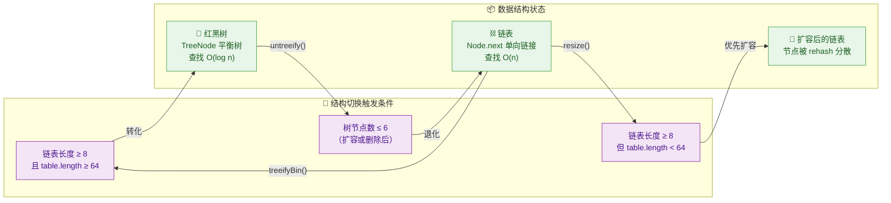
```mermaid
graph LR
    subgraph Trigger["🔀 结构切换触发条件"]
        direction TB
        T1["链表长度 ≥ 8<br/>且 table.length ≥ 64"]
        T2["树节点数 ≤ 6<br/>（扩容或删除后）"]
        T3["链表长度 ≥ 8<br/>但 table.length < 64"]
    end

    subgraph Structures["📦 数据结构状态"]
        direction TB
        S1["⛓️ 链表<br/>Node.next 单向链接<br/>查找 O(n)"]
        S2["🌲 红黑树<br/>TreeNode 平衡树<br/>查找 O(log n)"]
        S3["📏 扩容后的链表<br/>节点被 rehash 分散"]
    end

    S1 -->|"treeifyBin()"| T1
    T1 -->|"转化"| S2
    S2 -->|"untreeify()"| T2
    T2 -->|"退化"| S1
    S1 -->|"resize()"| T3
    T3 -->|"优先扩容"| S3

    classDef triggerStyle fill:#F3E5F5,stroke:#8E24AA,color:#4A148C
    classDef structStyle fill:#E8F5E9,stroke:#43A047,color:#1B5E20

    class T1,T2,T3 triggerStyle
    class S1,S2,S3 structStyle
```

这张图揭示了一个重要的设计哲学：**HashMap 总是优先选择扩容来解决冲突，树化是最后的手段**。只有当数组已经足够大（≥ 64）且某个桶的冲突依然严重（链表长度 ≥ 8）时，才会启动树化。这是因为扩容能从根本上降低冲突概率（桶变多了，每个桶分到的元素自然就少了），而树化只是在冲突已经发生的前提下优化查找效率。

---

最后，我们从时间复杂度的角度做一个对比总结：

```java
// ========== 三种结构的时间复杂度对比 ==========
//
// ┌─────────────┬──────────────┬──────────────┬──────────────┐
// │   操作       │   数组定位    │   链表遍历    │   红黑树查找  │
// ├─────────────┼──────────────┼──────────────┼──────────────┤
// │   查找 get   │    O(1)      │    O(n)      │   O(log n)   │
// │   插入 put   │    O(1)      │    O(n)      │   O(log n)   │
// │   删除 remove│    O(1)      │    O(n)      │   O(log n)   │
// └─────────────┴──────────────┴──────────────┴──────────────┘
//
// 理想情况（无冲突）：所有操作均为 O(1)
// 最坏情况（全部冲突到一个桶）：
//   - JDK 7（纯链表）：O(n) —— 退化成线性查找
//   - JDK 8（链表+红黑树）：O(log n) —— 树化兜底
//
// 这就是 JDK 8 引入红黑树的核心价值：
// 为最坏情况提供性能保障（worst-case guarantee）
```

HashMap 的底层结构设计体现了一种典型的工程思维——**分层降级**（Layered Degradation）。数组提供 O(1) 的快速定位，链表以最小的额外开销处理少量冲突，红黑树在极端冲突场景下兜底。三者各司其职，组合出了一个在绝大多数场景下都表现优异的数据结构。理解了这个骨架，后面的哈希扰动、put/get 流程、扩容机制等内容就都有了清晰的落脚点。

---

### 哈希扰动函数（Hash Perturbation Function）

在上一节中我们知道，HashMap 底层用数组存储数据，通过 key 的哈希值来决定元素落在数组的哪个位置（bucket）。那么一个自然的问题就来了：**Java 是怎么把一个 `hashCode()` 的返回值，映射到一个有限长度的数组下标上的？** 这个过程中又做了哪些"手脚"来让元素分布得更均匀？这就是哈希扰动函数要解决的核心问题。

---

#### 从 hashCode() 到数组下标：朴素方案的缺陷

`Object.hashCode()` 返回一个 `int` 值，范围是 `-2^31` 到 `2^31 - 1`，大约 42 亿个取值空间。显然我们不可能创建一个 42 亿长度的数组，所以必须对这个值做"压缩"，把它映射到 `[0, n-1]` 的范围内（`n` 是数组长度）。

最直觉的做法是取模运算：

```java
// 朴素方案：直接取模
int index = Math.abs(key.hashCode()) % table.length;
```

这个方案能工作，但有两个问题：

1. **取模运算（`%`）性能较差**：整数除法在 CPU 层面比位运算慢得多。
2. **哈希值的高位信息被浪费**：当数组长度较小时（比如默认的 16），取模实际上只用到了哈希值的低几位 bit，高位完全没有参与运算。

第二点才是致命的。我们来看一个具体的例子：

```java
// 假设数组长度 n = 16（即 0x10，二进制 10000）
// 取模等价于只看低 4 位

// hashCode1 = 0b 1010_1100_0011_0111_0000_0000_0000_1010  → 低4位: 1010 → index = 10
// hashCode2 = 0b 0001_0011_1110_1001_0000_0000_0000_1010  → 低4位: 1010 → index = 10
// 高位完全不同，但映射到了同一个桶！
```

当数组长度为 16 时，`hashCode % 16` 等价于只取最低 4 位。这意味着无论高 28 位怎么变化，只要低 4 位相同，就会产生哈希碰撞。如果某些场景下 key 的 hashCode 恰好在低位区分度不高（这在实际业务中并不罕见），碰撞率就会飙升，HashMap 退化成链表，性能从 O(1) 跌到 O(n)。

---

#### JDK 8 的扰动函数：高位参与运算

为了解决高位信息浪费的问题，HashMap 在使用 hashCode 之前，先对它做了一次"扰动"（perturbation）。JDK 8 的实现非常精炼，只有两行：

```java
// java.util.HashMap#hash —— JDK 8 源码
static final int hash(Object key) {
    int h;
    // 1. 如果 key 为 null，哈希值直接返回 0（所以 null 键总是在 table[0]）
    // 2. 否则，取 key.hashCode()，然后将其与自身的高 16 位做异或
    return (key == null) ? 0 : (h = key.hashCode()) ^ (h >>> 16);
}
```

核心操作就是这一句：

```java
h ^ (h >>> 16)
```

`h >>> 16` 是无符号右移 16 位，把原始哈希值的**高 16 位**搬到了**低 16 位**的位置，然后与原值做 XOR。这样一来，最终结果的**低 16 位同时混合了原始哈希值的高 16 位和低 16 位信息**。

我们用一张图来直观理解这个过程：

```text
原始 hashCode h:
┌────────────────────────────────┬────────────────────────────────┐
│         高 16 位 (H)            │         低 16 位 (L)            │
│  1010 1100 0011 0111           │  0000 0000 0000 1010           │
└────────────────────────────────┴────────────────────────────────┘

h >>> 16（无符号右移 16 位）:
┌────────────────────────────────┬────────────────────────────────┐
│     全部补零 (0000...)          │     原来的高 16 位 (H)          │
│  0000 0000 0000 0000           │  1010 1100 0011 0111           │
└────────────────────────────────┴────────────────────────────────┘

h ^ (h >>> 16) 的结果:
┌────────────────────────────────┬────────────────────────────────┐
│     H ^ 0 = H（高位不变）       │     L ^ H（低位混入高位信息）    │
│  1010 1100 0011 0111           │  1010 1100 0011 1101           │
└────────────────────────────────┴────────────────────────────────┘
                                       ↑ 低位发生了变化！
```

可以看到：
- **高 16 位保持不变**（因为与 0 异或等于自身）
- **低 16 位融合了高位的特征**（L XOR H），区分度大幅提升

这就是所谓的"高位异或"扰动。

---

#### 为什么选择 XOR 而不是 AND 或 OR？

这是一个经典的面试追问。三种位运算的特性对比：

| 运算 | 输出 0 的概率 | 输出 1 的概率 | 信息保留度 |
|------|:----------:|:----------:|:--------:|
| AND (`&`) | 75% | 25% | 偏向 0，信息丢失 |
| OR (`\|`) | 25% | 75% | 偏向 1，信息丢失 |
| XOR (`^`) | 50% | 50% | 均匀分布，信息保留最好 |

XOR 的输出是**完全均匀**的：当两个输入 bit 随机时，输出 0 和 1 的概率各为 50%。这意味着 XOR 不会引入任何偏置（bias），能最大程度地保留两个输入的信息量。从信息论的角度看，XOR 的熵（entropy）最高。

AND 会让结果偏向 0（只有两个都是 1 才输出 1），OR 会让结果偏向 1（只有两个都是 0 才输出 0），它们都会"吞掉"一部分信息，导致扰动效果打折扣。

---

#### JDK 7 vs JDK 8：扰动次数的演进

JDK 7 的扰动函数要复杂得多，做了 **4 次**位移和异或：

```java
// JDK 7 的 hash 方法 —— 4 次扰动
static int hash(int h) {
    // 第一次扰动：右移 20 位后异或
    h ^= (h >>> 20) ^ (h >>> 12);
    // 第二次扰动：右移 7 位和 4 位后异或
    return h ^ (h >>> 7) ^ (h >>> 4);
}
```

JDK 8 简化为 **1 次**：

```java
// JDK 8 的 hash 方法 —— 1 次扰动
static final int hash(Object key) {
    int h;
    return (key == null) ? 0 : (h = key.hashCode()) ^ (h >>> 16);
}
```

为什么 JDK 8 敢大幅简化？原因有两个：

1. **红黑树兜底**：JDK 8 引入了链表转红黑树的机制（链表长度 ≥ 8 时树化）。即使扰动不够完美导致碰撞增多，最坏情况也只是 O(log n) 而非 O(n)，风险可控。
2. **性能权衡**：hash() 方法在每次 `put`、`get`、`containsKey` 时都会被调用，属于热点路径（hot path）。4 次扰动带来的均匀性提升相对于额外的 CPU 开销来说，收益递减（diminishing returns）。1 次扰动已经能解决绝大多数场景下的碰撞问题。

这是一个典型的工程权衡（engineering trade-off）：**用"足够好"的扰动 + 红黑树兜底，换取更高的执行效率**。

---

#### 扰动之后：如何定位数组下标

扰动完成后，HashMap 用扰动后的 hash 值来计算数组下标：

```java
// 定位桶的位置 —— 位运算取代取模
int index = (n - 1) & hash;
// 其中 n 是数组长度（必须是 2 的幂次），hash 是扰动后的值
```

这里用 `(n - 1) & hash` 代替了 `hash % n`，前提是 `n` 必须是 2 的幂次（这个话题在下一节详细展开）。位运算 `&` 的速度远快于取模 `%`，而当 `n = 2^k` 时，两者在数学上完全等价。

我们把整个流程串起来：

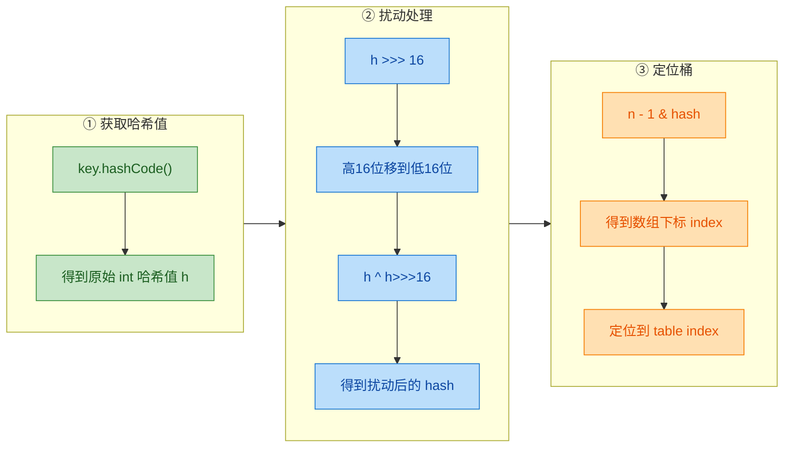
```mermaid
graph LR
    subgraph Step1["① 获取哈希值"]
        direction TB
        A["key.hashCode()"] --> B["得到原始 int 哈希值 h"]
    end

    subgraph Step2["② 扰动处理"]
        direction TB
        C["h >>> 16"] --> D["高16位移到低16位"]
        D --> E["h ^ h>>>16"]
        E --> F["得到扰动后的 hash"]
    end

    subgraph Step3["③ 定位桶"]
        direction TB
        G["n - 1 & hash"] --> H["得到数组下标 index"]
        H --> I["定位到 table index"]
    end

    Step1 --> Step2
    Step2 --> Step3

    classDef greenNode fill:#C8E6C9,stroke:#388E3C,color:#1B5E20
    classDef blueNode fill:#BBDEFB,stroke:#1976D2,color:#0D47A1
    classDef orangeNode fill:#FFE0B2,stroke:#F57C00,color:#E65100

    class A,B greenNode
    class C,D,E,F blueNode
    class G,H,I orangeNode
```

---

#### 扰动效果的量化验证

我们可以写一段代码来直观感受扰动函数的效果：

```java
public class HashPerturbationDemo {

    // 模拟 JDK 8 的扰动函数
    static int hashWithPerturbation(Object key) {
        int h;
        // 与 HashMap 源码一致：hashCode 异或其高 16 位
        return (key == null) ? 0 : (h = key.hashCode()) ^ (h >>> 16);
    }

    public static void main(String[] args) {
        int n = 16; // 数组长度，模拟默认容量

        System.out.println("=== 不扰动 vs 扰动后的桶分布对比 ===");
        System.out.println();

        // 构造一批低位相同、高位不同的 key
        // 这些 key 的 hashCode 低 4 位都是 0101 (即 5)
        int[] trickyHashCodes = {
            0x00050005, // 高位不同，低4位 = 0101
            0x11110005, // 高位不同，低4位 = 0101
            0x22220005, // 高位不同，低4位 = 0101
            0x33330005, // 高位不同，低4位 = 0101
            0x44440005, // 高位不同，低4位 = 0101
            0xAAAA0005, // 高位不同，低4位 = 0101
            0xBBBB0005, // 高位不同，低4位 = 0101
            0xCCCC0005  // 高位不同，低4位 = 0101
        };

        // 统计不扰动时的桶分布
        int[] bucketsRaw = new int[n];
        // 统计扰动后的桶分布
        int[] bucketsPerturbed = new int[n];

        for (int h : trickyHashCodes) {
            // 不扰动：直接用原始 hashCode 定位
            int rawIndex = (n - 1) & h;
            bucketsRaw[rawIndex]++;

            // 扰动后：高位异或低位再定位
            int perturbedHash = h ^ (h >>> 16);
            int perturbedIndex = (n - 1) & perturbedHash;
            bucketsPerturbed[perturbedIndex]++;
        }

        // 打印不扰动的分布
        System.out.println("【不扰动】桶分布（8个元素全部挤在同一个桶）:");
        for (int i = 0; i < n; i++) {
            if (bucketsRaw[i] > 0) {
                // 只打印有元素的桶
                System.out.printf("  bucket[%2d]: %d 个元素%n", i, bucketsRaw[i]);
            }
        }

        System.out.println();

        // 打印扰动后的分布
        System.out.println("【扰动后】桶分布（元素被分散到不同桶）:");
        for (int i = 0; i < n; i++) {
            if (bucketsPerturbed[i] > 0) {
                // 扰动后元素分散到了多个桶
                System.out.printf("  bucket[%2d]: %d 个元素%n", i, bucketsPerturbed[i]);
            }
        }
    }
}
```

运行结果类似：

```text
=== 不扰动 vs 扰动后的桶分布对比 ===

【不扰动】桶分布（8个元素全部挤在同一个桶）:
  bucket[ 5]: 8 个元素

【扰动后】桶分布（元素被分散到不同桶）:
  bucket[ 0]: 1 个元素
  bucket[ 5]: 1 个元素
  bucket[ 7]: 1 个元素
  bucket[ 8]: 1 个元素
  bucket[10]: 1 个元素
  bucket[11]: 1 个元素
  bucket[13]: 2 个元素
```

不扰动时，8 个元素全部堆在 bucket[5]，形成一条长链表。扰动后，元素被打散到了 7 个不同的桶中，碰撞率从 100% 骤降到接近理想水平。这就是一次简单的 `h ^ (h >>> 16)` 带来的效果。

---

#### 扰动函数的本质：信息混合（Bit Mixing）

从更抽象的角度看，扰动函数的本质是一种 **bit mixing** 技术。它的目标是：

- **让输入的每一个 bit 都能影响输出的低位**，从而在数组长度较小时，高位信息不会被白白丢弃。
- **保持运算的轻量级**，因为它处于极热的调用路径上。
- **不改变 null 的语义**，null key 始终映射到 index 0。

这种思想在很多哈希相关的场景中都能看到，比如 MurmurHash、FNV Hash 等通用哈希算法内部都有类似的 bit mixing 步骤。HashMap 的扰动函数可以看作是一个极简版的 mixer——只用一次移位和一次异或，就在性能和分布均匀性之间取得了很好的平衡。

---

**📝 练习题**

以下关于 HashMap 扰动函数的说法，哪一项是正确的？

A. JDK 8 的扰动函数对 hashCode 做了 4 次位移异或操作，比 JDK 7 更复杂

B. 扰动函数使用 AND 运算混合高低位，因为 AND 运算速度最快

C. 扰动函数的目的是让 hashCode 的高 16 位信息参与到低位运算中，减少哈希碰撞

D. 扰动函数会改变 null key 的哈希值，使其均匀分布到任意桶中


**【答案】** C

**【解析】** JDK 8 的扰动函数 `(h = key.hashCode()) ^ (h >>> 16)` 只做了 1 次右移和 1 次异或，比 JDK 7 的 4 次扰动更简洁（A 错误）。选择 XOR 而非 AND 是因为 XOR 输出 0 和 1 的概率各为 50%，信息保留度最高，不会引入偏置（B 错误）。对于 null key，hash 方法直接返回 0，不会做任何扰动处理（D 错误）。C 准确描述了扰动函数的核心目的：通过 `h ^ (h >>> 16)` 将高 16 位的信息混入低 16 位，使得在数组长度较小时（只用到低几位做 `& (n-1)` 运算），高位的差异也能体现在最终的桶定位中，从而有效降低碰撞率。

---

## 为什么容量是 2 的幂次 ⭐（位运算取模优化）

HashMap 的容量（capacity）在任何时刻都严格保持为 2 的幂次方（1, 2, 4, 8, 16, 32, …），这并非巧合，而是一个精心设计的工程决策。它的核心目的只有一个：**用极致高效的位运算替代昂贵的取模运算，同时保证哈希分布的均匀性**。

### 从取模运算说起：索引定位的本质需求

当我们往 HashMap 中 put 一个键值对时，第一步就是要回答一个问题：**这个 key 应该放在底层数组的哪个位置（bucket index）？**

最直觉的做法是取模：

```java
// 假设 hash 是 key 经过哈希扰动后的值，n 是数组长度
int index = hash % n;
```

取模运算能保证结果落在 `[0, n-1]` 范围内，逻辑上完全正确。但问题在于：**`%` 取模运算在 CPU 层面对应的是除法指令（div），这是 CPU 中最慢的算术指令之一**，通常需要 20~40 个时钟周期，而一次加法或位运算只需要 1 个周期。HashMap 作为使用频率极高的数据结构，每次 `put`、`get`、`remove` 都要做索引定位，这个性能差距会被放大到不可忽视的程度。

### 位运算取模的数学等价性

这里有一个经典的数学性质：

> 当 n 是 2 的幂次方时，`hash % n` 严格等价于 `hash & (n - 1)`。

我们来看为什么。假设 `n = 16`，即 `2^4`：

```java
// n 的二进制表示
// n     = 16 = 0001 0000
// n - 1 = 15 = 0000 1111

// 假设 hash = 0110 1101 (十进制 109)
// hash % 16  = 109 % 16 = 13
// hash & 15  = 0110 1101
//            & 0000 1111
//            = 0000 1101 = 13   ✅ 结果一致
```

本质上，`n - 1` 的二进制形式是一串连续的 1（低位全 1，高位全 0），与 hash 做 AND 运算，效果就是**截取 hash 值的低 k 位**（其中 `k = log2(n)`）。这恰好等于对 n 取模的结果。

用更通用的视角来理解：

```text
n = 2^k

n     的二进制: 1 后面跟 k 个 0    → 例如 2^4 = 10000
n - 1 的二进制: k 个连续的 1        → 例如 15  = 01111

hash & (n-1) 的效果: 保留 hash 的低 k 位, 高位全部清零
                     → 结果范围 [0, 2^k - 1] = [0, n-1]
                     → 与 hash % n 完全等价
```

这就是 HashMap 源码中那行关键代码的由来：

```java
// java.util.HashMap — JDK 8
// 在 putVal / getNode 等方法中，定位桶索引的核心表达式：
// tab 是底层 Node 数组，n 是数组长度（始终为 2 的幂次）
// hash 是经过扰动函数处理后的哈希值
Node<K,V> p = tab[(n - 1) & hash]; // 位运算取模，O(1) 且极快
```

### 如果容量不是 2 的幂次会怎样？

假设容量 `n = 10`（不是 2 的幂次），我们看看 `hash & (n - 1)` 会发生什么：

```java
// n     = 10 = 1010
// n - 1 =  9 = 1001

// 注意 n-1 = 1001，第 1 位和第 2 位是 0
// 这意味着：无论 hash 的第 1 位和第 2 位是什么，AND 之后都会被清零

// hash = 0101 (5)  → 0101 & 1001 = 0001 (1)
// hash = 0111 (7)  → 0111 & 1001 = 0001 (1)  ← 不同的 hash，同一个桶！
// hash = 1010 (10) → 1010 & 1001 = 1000 (8)
// hash = 1110 (14) → 1110 & 1001 = 1000 (8)  ← 又冲突了！
```

问题暴露了：**当 `n - 1` 的二进制中存在 0 位时，hash 对应位上的信息被直接丢弃**，导致多个不同的 hash 值映射到同一个桶，分布严重不均匀。而只有当 `n` 是 2 的幂次时，`n - 1` 的低位才是全 1，能完整保留 hash 低位的每一个 bit，最大程度保证散列均匀。

我们用一张图来对比两种情况下的桶分布：

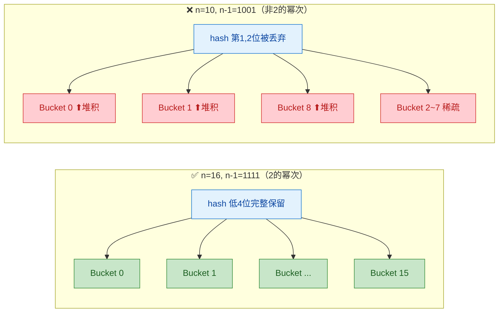
```mermaid
graph LR
    subgraph POW2["✅ n=16, n-1=1111（2的幂次）"]
        direction TB
        H1["hash 低4位完整保留"]
        H1 --> B0["Bucket 0"]
        H1 --> B1["Bucket 1"]
        H1 --> B2["Bucket ..."]
        H1 --> B15["Bucket 15"]
    end

    subgraph NPOW2["❌ n=10, n-1=1001（非2的幂次）"]
        direction TB
        H2["hash 第1,2位被丢弃"]
        H2 --> C0["Bucket 0 ⬆堆积"]
        H2 --> C1["Bucket 1 ⬆堆积"]
        H2 --> C8["Bucket 8 ⬆堆积"]
        H2 --> CX["Bucket 2~7 稀疏"]
    end

    classDef green fill:#C8E6C9,stroke:#388E3C,color:#1B5E20
    classDef red fill:#FFCDD2,stroke:#D32F2F,color:#B71C1C
    classDef label fill:#E3F2FD,stroke:#1976D2,color:#0D47A1

    class B0,B1,B2,B15 green
    class C0,C1,C8 red
    class CX red
    class H1,H2 label
```

### tableSizeFor：强制对齐到 2 的幂次

既然容量必须是 2 的幂次，那用户传入一个非 2 的幂次的初始容量怎么办？HashMap 在构造时会通过 `tableSizeFor` 方法将其**向上取整到最近的 2 的幂次**：

```java
// java.util.HashMap — JDK 8
// 将给定的 cap 向上取整为 ≥ cap 的最小 2 的幂次方
static final int tableSizeFor(int cap) {
    int n = cap - 1;   // 先减 1，防止 cap 本身就是 2 的幂次时被翻倍
    n |= n >>> 1;      // 将最高位的 1 向右"涂抹"1 位
    n |= n >>> 2;      // 继续涂抹 2 位
    n |= n >>> 4;      // 继续涂抹 4 位
    n |= n >>> 8;      // 继续涂抹 8 位
    n |= n >>> 16;     // 继续涂抹 16 位（覆盖 int 的全部 32 位）
    // 此时 n 的最高位 1 及其右边所有位都变成了 1
    // 例如: 0001xxxx → 00011111
    // 最后 +1 就进位成下一个 2 的幂次: 00100000
    return (n < 0) ? 1 : (n >= MAXIMUM_CAPACITY) ? MAXIMUM_CAPACITY : n + 1;
}
```

这个算法的精妙之处在于：通过 5 次无符号右移和或运算，将最高有效位右边的所有位全部"填充"为 1，然后加 1 进位，就得到了下一个 2 的幂次。整个过程没有任何循环或分支，纯位运算，效率极高。

我们用一个具体例子走一遍流程：

```java
// 假设用户传入 cap = 20，期望结果是 32（最近的 ≥20 的 2 的幂次）

// 第 0 步: n = cap - 1 = 19
//   19 的二进制: 0000 0000 0000 0000 0000 0000 0001 0011

// 第 1 步: n |= n >>> 1
//   n >>> 1:    0000 0000 0000 0000 0000 0000 0000 1001
//   n | (n>>>1):0000 0000 0000 0000 0000 0000 0001 1011

// 第 2 步: n |= n >>> 2
//   n >>> 2:    0000 0000 0000 0000 0000 0000 0000 0110
//   n | (n>>>2):0000 0000 0000 0000 0000 0000 0001 1111

// 第 3 步: n |= n >>> 4
//   n >>> 4:    0000 0000 0000 0000 0000 0000 0000 0001
//   n | (n>>>4):0000 0000 0000 0000 0000 0000 0001 1111
//   （已经全部填满，后续步骤不再变化）

// 第 4 步: n |= n >>> 8  → 不变
// 第 5 步: n |= n >>> 16 → 不变

// 最终: n = 0001 1111 = 31
// return n + 1 = 32 ✅
```

### 与哈希扰动函数的协同设计

前面讲过，HashMap 的扰动函数将 hashCode 的高 16 位异或到低 16 位：

```java
static final int hash(Object key) {
    int h;
    return (key == null) ? 0 : (h = key.hashCode()) ^ (h >>> 16);
}
```

这个设计和"容量为 2 的幂次"是**配套的**。因为 `(n - 1) & hash` 只取 hash 的低位，如果容量较小（比如 16），那只有低 4 位参与索引计算，高位信息完全浪费。扰动函数通过高低位异或，让高位信息"混入"低位，弥补了位运算取模只看低位的天然缺陷。

两者的协同关系可以这样理解：

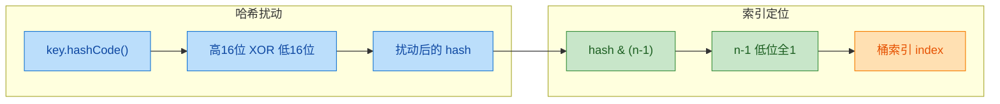
```mermaid
graph LR
    subgraph HASH["哈希扰动"]
        direction TB
        A["key.hashCode()"] --> B["高16位 XOR 低16位"]
        B --> C["扰动后的 hash"]
    end

    subgraph INDEX["索引定位"]
        direction TB
        D["hash & (n-1)"]
        D --> E["n-1 低位全1"]
        E --> F["桶索引 index"]
    end

    C --> D

    classDef blue fill:#BBDEFB,stroke:#1976D2,color:#0D47A1
    classDef green fill:#C8E6C9,stroke:#388E3C,color:#1B5E20
    classDef orange fill:#FFE0B2,stroke:#F57C00,color:#E65100

    class A,B,C blue
    class D,E green
    class F orange
```

- 扰动函数负责：让 hash 值的信息分布更均匀（高位参与低位计算）
- 2 的幂次容量负责：让 `& (n-1)` 能完整利用低位的每一个 bit，不丢失信息
- 二者缺一不可，共同保证了桶分布的均匀性

### 对扩容机制的影响

容量为 2 的幂次还带来了一个重要的附加收益：**扩容时的 rehash 可以极大简化**。

当 HashMap 扩容时，容量从 `n` 变为 `2n`（始终保持 2 的幂次）。对于原数组中某个桶里的每个节点，它在新数组中的位置只有两种可能：

```java
// 旧容量 oldCap = 16 = 0001 0000
// 新容量 newCap = 32 = 0010 0000

// 旧掩码 oldCap - 1 = 0000 1111  (取低 4 位)
// 新掩码 newCap - 1 = 0001 1111  (取低 5 位)

// 新掩码比旧掩码多了 1 个 bit（第 4 位）
// 所以新索引 = 旧索引 或 旧索引 + oldCap
// 取决于 hash 的那个"多出来的 bit"是 0 还是 1

// 判断方式极其简单：
if ((hash & oldCap) == 0) {
    // 该 bit 为 0 → 留在原位置 (index 不变)
} else {
    // 该 bit 为 1 → 移动到 index + oldCap
}
```

这就是 JDK 8 中著名的"高低位链表"扩容优化的数学基础，不需要重新计算 `hash % newCap`，只需要检查一个 bit 就能决定节点的去向。这个优化同样依赖于容量是 2 的幂次这一前提。

### 性能对比：位运算 vs 取模

我们从 CPU 指令层面做一个直观对比：

```text
┌──────────────────┬──────────────┬──────────────────────────────┐
│     操作          │  CPU 周期数   │           说明               │
├──────────────────┼──────────────┼──────────────────────────────┤
│ hash & (n-1)     │    1 cycle   │ 单条 AND 指令，流水线友好      │
│ hash % n         │  20-40 cycle │ 除法指令(IDIV)，最慢的算术指令  │
│ 性能差距          │   20~40x     │ 在高频调用场景下差距显著        │
└──────────────────┴──────────────┴──────────────────────────────┘
```

对于 HashMap 这种每次操作都要做索引定位的数据结构，20~40 倍的单次性能差距，在高并发、大数据量场景下会被放大为可观的整体性能提升。

### 设计总结：一个约束，三重收益

"容量必须是 2 的幂次"这个看似简单的约束，实际上是一个牵一发而动全身的设计支点：

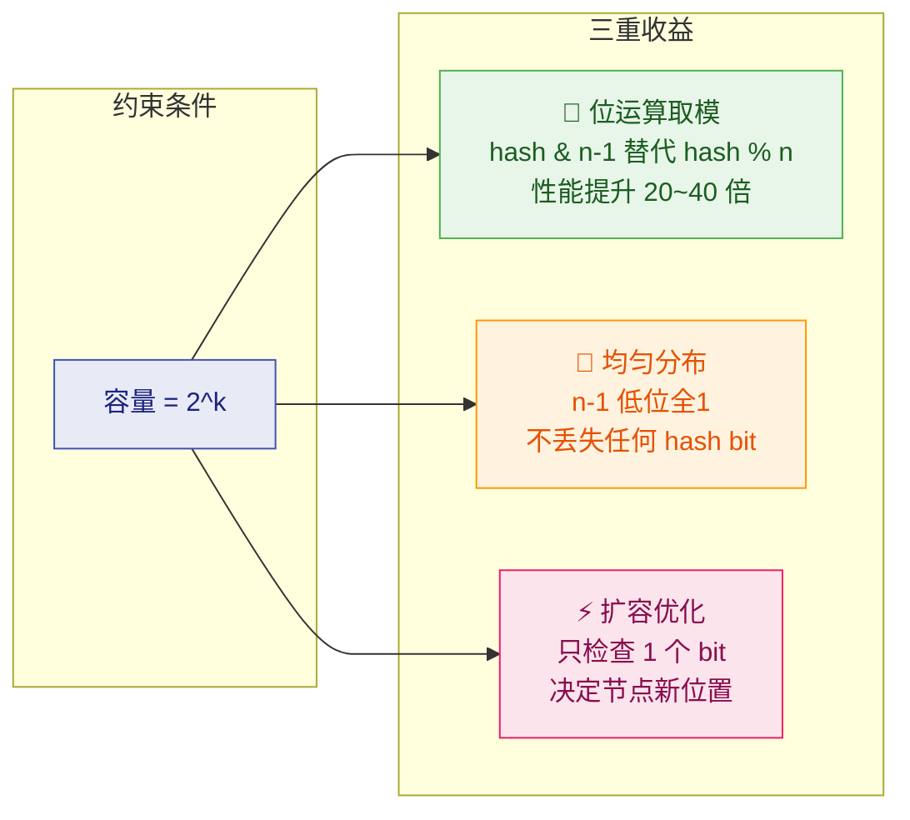
```mermaid
graph LR
    subgraph CONSTRAINT["约束条件"]
        direction TB
        A["容量 = 2^k"]
    end

    subgraph BENEFIT["三重收益"]
        direction TB
        B1["🚀 位运算取模<br/>hash & n-1 替代 hash % n<br/>性能提升 20~40 倍"]
        B2["🎯 均匀分布<br/>n-1 低位全1<br/>不丢失任何 hash bit"]
        B3["⚡ 扩容优化<br/>只检查 1 个 bit<br/>决定节点新位置"]
    end

    A --> B1
    A --> B2
    A --> B3

    classDef constraint fill:#E8EAF6,stroke:#3F51B5,color:#1A237E
    classDef perf fill:#E8F5E9,stroke:#4CAF50,color:#1B5E20
    classDef dist fill:#FFF3E0,stroke:#FF9800,color:#E65100
    classDef resize fill:#FCE4EC,stroke:#E91E63,color:#880E4F

    class A constraint
    class B1 perf
    class B2 dist
    class B3 resize
```

这是一个典型的"用空间约束换时间性能"的工程权衡——容量可能比用户期望的稍大一些（向上取整），但换来的是每次操作都更快、分布更均匀、扩容更高效。这种 trade-off 在 HashMap 的使用场景下是完全值得的。

---

**📝 练习题**

以下关于 HashMap 容量设计的说法，哪一项是错误的？

A. `tableSizeFor(20)` 的返回值是 32，因为 32 是大于等于 20 的最小 2 的幂次方

B. 当容量 n 为 2 的幂次时，`hash % n` 与 `hash & (n - 1)` 的结果完全等价

C. 如果容量不是 2 的幂次，`hash & (n - 1)` 仍然能保证哈希值均匀分布到每个桶

D. 容量为 2 的幂次使得扩容时只需检查 hash 的一个额外 bit 就能确定节点的新位置


**【答案】** C

**【解析】** 当容量 n 不是 2 的幂次时，`n - 1` 的二进制中会存在值为 0 的位。做 AND 运算时，hash 在这些位上的信息会被直接丢弃（无论是 0 还是 1，AND 0 的结果都是 0），导致多个不同的 hash 值被映射到同一个桶，分布严重不均匀。例如 `n = 10` 时，`n - 1 = 9 = 1001`，第 1 位和第 2 位始终为 0，hash 在这两位上的差异完全被抹掉。只有当 n 是 2 的幂次时，`n - 1` 的低位才是连续的全 1，能完整保留 hash 低位的每一个 bit，从而保证均匀分布。A、B、D 三项描述均正确。

---

## put 流程（hash 计算 → 定位 → 插入/更新 → 扩容判断）

HashMap 的 `put` 方法是整个类最核心的操作，它将"计算哈希 → 定位桶 → 处理冲突 → 触发扩容"四个阶段串联成一条完整的写入链路。理解 put 流程，基本上就理解了 HashMap 一半以上的设计哲学。

### 源码全景：putVal 方法逐行拆解

`put(K key, V value)` 本身只是一个委托方法，真正的逻辑全部在 `putVal` 中完成。我们先看 JDK 8 的完整源码，再逐段深入分析：

```java
// 对外暴露的 put 方法，仅做一层委托
public V put(K key, V value) {
    // 先对 key 做 hash 扰动，再交给 putVal 处理
    return putVal(hash(key), key, value, false, true);
}

/**
 * @param hash         key 经过扰动后的哈希值
 * @param key          键
 * @param value        值
 * @param onlyIfAbsent 如果为 true，不覆盖已有值（putIfAbsent 语义）
 * @param evict        如果为 false，表示处于创建模式（LinkedHashMap 回调用）
 */
final V putVal(int hash, K key, V value, boolean onlyIfAbsent, boolean evict) {
    Node<K,V>[] tab;  // 指向当前哈希桶数组的局部引用
    Node<K,V> p;      // 目标桶位上的第一个节点（头节点）
    int n, i;          // n = 数组长度，i = 桶下标

    // ========== 阶段一：懒初始化 ==========
    // 第一次 put 时 table 为 null，触发 resize() 完成初始化
    if ((tab = table) == null || (n = tab.length) == 0)
        n = (tab = resize()).length;

    // ========== 阶段二：定位桶，判断是否为空槽 ==========
    // (n - 1) & hash 等价于 hash % n，但位运算更快
    if ((p = tab[i = (n - 1) & hash]) == null)
        // 空槽：直接创建新节点放入，无冲突
        tab[i] = newNode(hash, key, value, null);
    else {
        // ========== 阶段三：桶非空，处理冲突 ==========
        Node<K,V> e; // 用于记录"找到的已存在节点"（key 相同的节点）
        K k;

        // --- 情况 A：头节点就是目标 key ---
        if (p.hash == hash &&
            ((k = p.key) == key || (key != null && key.equals(k))))
            e = p; // 直接命中头节点

        // --- 情况 B：头节点是树节点，走红黑树的插入逻辑 ---
        else if (p instanceof TreeNode)
            e = ((TreeNode<K,V>)p).putTreeVal(this, tab, hash, key, value);

        // --- 情况 C：普通链表，遍历到尾部 ---
        else {
            for (int binCount = 0; ; ++binCount) {
                // 走到链表末尾，没找到相同 key
                if ((e = p.next) == null) {
                    // 尾插法：在链表末尾追加新节点
                    p.next = newNode(hash, key, value, null);
                    // 插入后检查链表长度是否达到树化阈值（8）
                    if (binCount >= TREEIFY_THRESHOLD - 1) // binCount 从 0 开始
                        treeifyBin(tab, hash); // 尝试树化
                    break;
                }
                // 遍历过程中发现相同 key，跳出循环
                if (e.hash == hash &&
                    ((k = e.key) == key || (key != null && key.equals(k))))
                    break;
                p = e; // 指针后移
            }
        }

        // ========== 阶段四：如果 key 已存在，执行值覆盖 ==========
        if (e != null) {
            V oldValue = e.value;
            // onlyIfAbsent 为 false 或旧值为 null 时，覆盖
            if (!onlyIfAbsent || oldValue == null)
                e.value = value;
            afterNodeAccess(e); // LinkedHashMap 的回调钩子
            return oldValue;    // 返回被覆盖的旧值
        }
    }

    // ========== 阶段五：结构性修改的收尾工作 ==========
    ++modCount;              // 修改计数器 +1（fail-fast 机制）
    if (++size > threshold)  // 元素总数超过阈值，触发扩容
        resize();
    afterNodeInsertion(evict); // LinkedHashMap 的回调钩子（可用于 LRU 淘汰）
    return null;               // 新插入返回 null
}
```

### 阶段一：懒初始化（Lazy Initialization）

HashMap 在构造时并不会立即分配底层数组，而是将真正的内存分配推迟到第一次 `put` 调用时。这是一种经典的"懒加载"策略——如果你创建了一个 HashMap 但从未往里放东西，就不会浪费任何堆内存。

```java
// 构造器只记录参数，不分配数组
public HashMap(int initialCapacity, float loadFactor) {
    // ... 参数校验省略 ...
    this.loadFactor = loadFactor;           // 记录负载因子
    this.threshold = tableSizeFor(initialCapacity); // 计算初始阈值（最近的 2 的幂）
    // 注意：这里并没有 new Node[capacity]
}
```

当第一次执行 `put` 时，`table == null` 条件成立，进入 `resize()` 完成数组的首次创建。这个设计在实际工程中非常常见——Spring 的很多容器、Netty 的 ByteBuf 都采用类似的延迟分配思路。

### 阶段二：定位桶（Index Calculation）

定位桶的核心就是一行代码：

```java
// i 就是最终的数组下标
i = (n - 1) & hash
```

这里 `n` 是数组长度（始终为 2 的幂），`(n - 1)` 的二进制全是 1。例如当 `n = 16` 时，`n - 1 = 15 = 0000 1111`，与 hash 做按位与运算，效果等同于 `hash % 16`，但位运算的性能远高于取模运算。

如果目标桶为空（`tab[i] == null`），说明没有任何冲突，直接 `newNode` 放入即可，这是最理想的 O(1) 路径。

### 阶段三：冲突处理（Collision Resolution）

当桶位非空时，说明发生了哈希冲突，HashMap 需要在这个桶内进一步查找或插入。这里分三种情况：

#### 情况 A：头节点直接命中

```java
// 先比 hash（int 比较，极快），再比引用或 equals
if (p.hash == hash &&
    ((k = p.key) == key || (key != null && key.equals(k))))
    e = p;
```

这是一个精心设计的短路优化。`hash` 是 int 类型的比较，速度极快；只有 hash 相等时才会进一步调用 `equals()`（可能涉及字符串逐字符比较等重操作）。而 `==` 引用比较排在 `equals()` 前面，对于同一个对象或 interned String 可以直接命中，避免不必要的 equals 开销。

#### 情况 B：红黑树插入

```java
else if (p instanceof TreeNode)
    e = ((TreeNode<K,V>)p).putTreeVal(this, tab, hash, key, value);
```

如果头节点已经是 `TreeNode` 类型，说明该桶已经树化。此时调用红黑树的插入逻辑 `putTreeVal`，时间复杂度为 O(log n)。树节点内部会按照 hash 值大小进行左右子树的路由，如果 hash 相同且 key 不可比较（没有实现 Comparable），则通过 `tieBreakOrder` 使用 `System.identityHashCode` 来打破平局。

#### 情况 C：链表尾插

```java
for (int binCount = 0; ; ++binCount) {
    if ((e = p.next) == null) {
        p.next = newNode(hash, key, value, null); // 尾插法
        if (binCount >= TREEIFY_THRESHOLD - 1)     // 达到 8 个节点
            treeifyBin(tab, hash);                  // 尝试树化
        break;
    }
    if (e.hash == hash &&
        ((k = e.key) == key || (key != null && key.equals(k))))
        break; // 找到相同 key，跳出
    p = e;
}
```

这里有几个关键细节：

JDK 8 使用尾插法（Tail Insertion），新节点追加到链表末尾。而 JDK 7 使用头插法（Head Insertion），新节点插入到链表头部。尾插法的好处是在多线程扩容场景下不会形成环形链表（虽然 HashMap 本身仍然线程不安全，但至少不会出现死循环）。

`binCount` 从 0 开始计数，当 `binCount >= 7`（即 `TREEIFY_THRESHOLD - 1`）时触发树化检查。此时链表上已有 8 个旧节点 + 1 个刚插入的新节点 = 9 个节点。但 `treeifyBin` 内部还会检查数组长度是否 >= 64（`MIN_TREEIFY_CAPACITY`），如果数组太小，会优先扩容而非树化。

### 阶段四：值覆盖（Value Override）

```java
if (e != null) {
    V oldValue = e.value;
    if (!onlyIfAbsent || oldValue == null)
        e.value = value;          // 用新值替换旧值
    afterNodeAccess(e);           // LinkedHashMap 回调：将节点移到链表尾部
    return oldValue;              // 返回旧值，调用方可据此判断是"更新"还是"新增"
}
```

当找到了相同 key 的已有节点时，默认行为是覆盖旧值。`onlyIfAbsent` 参数为 `putIfAbsent()` 方法服务——只在 key 不存在或旧值为 null 时才写入。

注意这里 `return oldValue` 直接返回了，不会走到后面的 `++size` 和 `resize()` 逻辑，因为这不是一次"新增"操作，元素总数没有变化。

### 阶段五：收尾与扩容判断

```java
++modCount;              // 结构性修改计数器，用于 Iterator 的 fail-fast 检测
if (++size > threshold)  // size 先自增，再与阈值比较
    resize();            // 超过阈值，触发 2 倍扩容
afterNodeInsertion(evict); // LinkedHashMap 回调：可能移除最老的 Entry（LRU）
return null;               // 新插入的 key，返回 null
```

`modCount` 是 fail-fast 机制的核心。当你在用 Iterator 遍历 HashMap 的同时，另一段代码调用了 `put` 导致 `modCount` 变化，Iterator 的 `next()` 方法会检测到不一致并抛出 `ConcurrentModificationException`。

`threshold = capacity * loadFactor`，默认情况下就是 `16 * 0.75 = 12`。当第 13 个元素插入时，`++size > 12` 成立，触发扩容。

### put 流程全景图

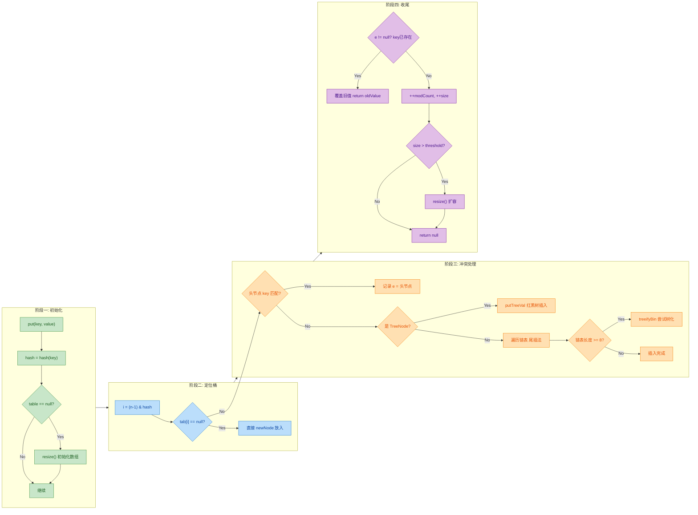
```mermaid
graph LR
    subgraph Phase1["阶段一: 初始化"]
        direction TB
        A["put(key, value)"] --> B["hash = hash(key)"]
        B --> C{"table == null?"}
        C -->|Yes| D["resize() 初始化数组"]
        C -->|No| E["继续"]
        D --> E
    end

    subgraph Phase2["阶段二: 定位桶"]
        direction TB
        F["i = (n-1) & hash"] --> G{"tab[i] == null?"}
        G -->|Yes| H["直接 newNode 放入"]
    end

    subgraph Phase3["阶段三: 冲突处理"]
        direction TB
        G -->|No| I{"头节点 key 匹配?"}
        I -->|Yes| J["记录 e = 头节点"]
        I -->|No| K{"是 TreeNode?"}
        K -->|Yes| L["putTreeVal 红黑树插入"]
        K -->|No| M["遍历链表 尾插法"]
        M --> N{"链表长度 >= 8?"}
        N -->|Yes| O["treeifyBin 尝试树化"]
        N -->|No| P["插入完成"]
    end

    subgraph Phase4["阶段四: 收尾"]
        direction TB
        Q{"e != null? key已存在"} -->|Yes| R["覆盖旧值 return oldValue"]
        Q -->|No| S["++modCount, ++size"]
        S --> T{"size > threshold?"}
        T -->|Yes| U["resize() 扩容"]
        T -->|No| V["return null"]
        U --> V
    end

    Phase1 --> Phase2
    Phase2 --> Phase3
    Phase3 --> Phase4

    classDef initStyle fill:#C8E6C9,stroke:#388E3C,color:#1B5E20
    classDef locateStyle fill:#BBDEFB,stroke:#1976D2,color:#0D47A1
    classDef conflictStyle fill:#FFE0B2,stroke:#F57C00,color:#E65100
    classDef finishStyle fill:#E1BEE7,stroke:#7B1FA2,color:#4A148C

    class A,B,C,D,E initStyle
    class F,G,H locateStyle
    class I,J,K,L,M,N,O,P conflictStyle
    class Q,R,S,T,U,V finishStyle
```

### put 流程中的关键设计总结

put 流程中蕴含了大量工程智慧，我们把最值得记忆的设计点提炼出来：

`hash()` 扰动函数将高 16 位异或到低 16 位，让桶定位 `(n-1) & hash` 能同时利用高低位信息，减少冲突。懒初始化避免了"创建但不使用"的内存浪费。尾插法消除了 JDK 7 头插法在并发扩容时产生环形链表的隐患。链表长度达到 8 时尝试树化，但数组长度不足 64 时优先扩容——这是一种"小表扩容、大表树化"的分级策略。`afterNodeAccess` 和 `afterNodeInsertion` 是模板方法模式（Template Method Pattern）的典型应用，HashMap 自身不做任何事，但 LinkedHashMap 通过重写这两个钩子实现了访问顺序维护和 LRU 淘汰。

---

## get 流程

相比 put 的复杂度，get 流程要简洁得多。它的核心任务就是：根据 key 找到对应的 Node，返回其 value。但"简洁"不代表"简单"，get 流程同样体现了 HashMap 在性能优化上的极致追求。

### 源码逐行解析

```java
// 对外暴露的 get 方法
public V get(Object key) {
    Node<K,V> e;
    // hash(key) 计算扰动后的哈希值，再交给 getNode 查找
    return (e = getNode(hash(key), key)) == null ? null : e.value;
}

/**
 * 核心查找逻辑
 * @param hash 扰动后的哈希值
 * @param key  要查找的键
 * @return 匹配的节点，未找到返回 null
 */
final Node<K,V> getNode(int hash, Object key) {
    Node<K,V>[] tab;  // 桶数组的局部引用
    Node<K,V> first, e; // first = 桶的头节点，e = 遍历指针
    int n;              // 数组长度
    K k;

    // 前置条件检查：数组不为空 且 目标桶不为空
    if ((tab = table) != null && (n = tab.length) > 0 &&
        (first = tab[(n - 1) & hash]) != null) {

        // ===== 第一步：检查头节点 =====
        // 大多数情况下桶里只有一个节点，头节点命中率极高
        if (first.hash == hash &&
            ((k = first.key) == key || (key != null && key.equals(k))))
            return first; // 头节点直接命中，O(1)

        // ===== 第二步：头节点未命中，检查后续节点 =====
        if ((e = first.next) != null) {
            // 情况 A：桶已树化，走红黑树查找，O(log n)
            if (first instanceof TreeNode)
                return ((TreeNode<K,V>)first).getTreeNode(hash, key);

            // 情况 B：普通链表，逐个遍历，O(n)
            do {
                if (e.hash == hash &&
                    ((k = e.key) == key || (key != null && key.equals(k))))
                    return e; // 找到匹配节点
            } while ((e = e.next) != null);
        }
    }
    // 未找到，返回 null
    return null;
}
```

### 查找路径的三层分流

get 流程的设计思路是"快速路径优先"——尽可能在最少的比较次数内返回结果：

#### 第一层：头节点快速命中

```java
if (first.hash == hash &&
    ((k = first.key) == key || (key != null && key.equals(k))))
    return first;
```

在负载因子 0.75 的默认配置下，大部分桶要么为空，要么只有一个节点。统计上看，超过 60% 的 get 操作会在这一步直接返回。这就是为什么 HashMap 的平均查找时间复杂度是 O(1)——不是因为没有冲突，而是冲突足够少，大多数时候第一个节点就是目标。

#### 第二层：红黑树查找

```java
if (first instanceof TreeNode)
    return ((TreeNode<K,V>)first).getTreeNode(hash, key);
```

当桶已经树化时，`getTreeNode` 会从树的根节点开始，按照 hash 值的大小关系向左或向右搜索，时间复杂度为 O(log n)。对于极端冲突场景（比如所有 key 的 hash 都相同），红黑树将查找性能从链表的 O(n) 提升到 O(log n)，这是 JDK 8 引入树化机制的核心收益。

`getTreeNode` 内部的查找逻辑大致如下：

```java
// 简化版的树查找逻辑（伪代码）
final TreeNode<K,V> getTreeNode(int h, Object k) {
    // 先找到根节点（root 方法沿 parent 指针上溯）
    TreeNode<K,V> p = root();
    while (p != null) {
        int ph = p.hash;   // 当前节点的 hash
        K pk = p.key;       // 当前节点的 key
        if (h < ph)         // 目标 hash 更小，走左子树
            p = p.left;
        else if (h > ph)    // 目标 hash 更大，走右子树
            p = p.right;
        else if (pk == k || (k != null && k.equals(pk)))
            return p;       // hash 相等且 key 匹配，命中
        else if (p.left == null)
            p = p.right;    // 左子树为空，只能走右
        else if (p.right == null)
            p = p.left;     // 右子树为空，只能走左
        else {
            // hash 相等但 key 不匹配，尝试用 Comparable 接口比较
            // 如果 key 没有实现 Comparable，则递归搜索两侧
            // ...
        }
    }
    return null;
}
```

#### 第三层：链表线性遍历

```java
do {
    if (e.hash == hash &&
        ((k = e.key) == key || (key != null && key.equals(k))))
        return e;
} while ((e = e.next) != null);
```

这是最朴素的查找方式——从第二个节点开始，逐个比较 hash 和 key，直到找到匹配节点或遍历完整条链表。时间复杂度为 O(n)，其中 n 是链表长度。在正常使用场景下，链表长度很少超过 3-4 个节点，所以实际性能依然很好。

### get 流程图

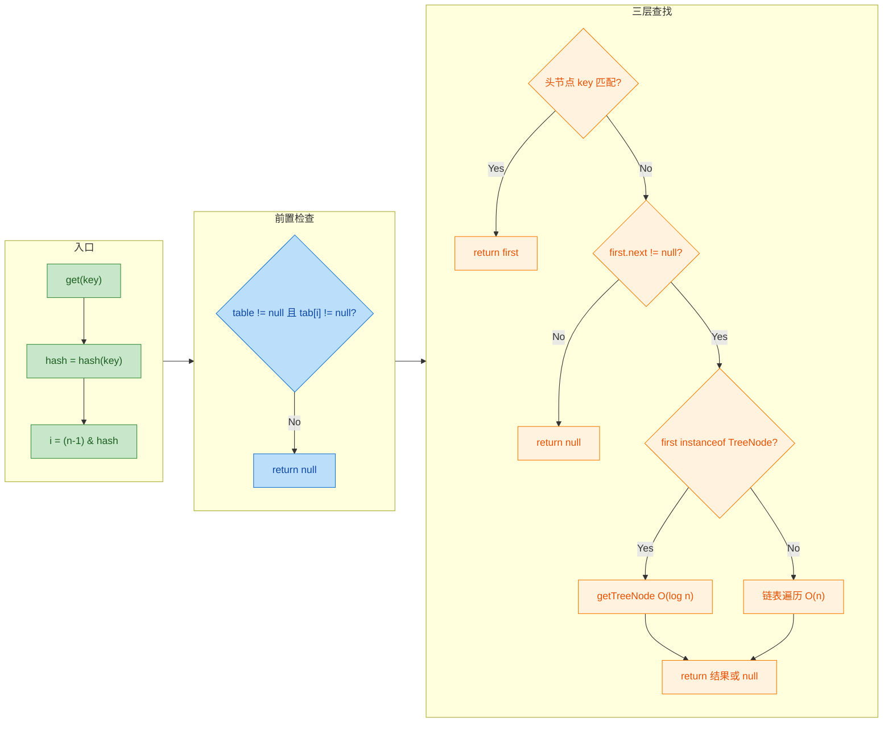
```mermaid
graph LR
    subgraph Entry["入口"]
        direction TB
        A["get(key)"] --> B["hash = hash(key)"]
        B --> C["i = (n-1) & hash"]
    end

    subgraph Check["前置检查"]
        direction TB
        D{"table != null 且 tab[i] != null?"} -->|No| E["return null"]
    end

    subgraph Search["三层查找"]
        direction TB
        F{"头节点 key 匹配?"} -->|Yes| G["return first"]
        F -->|No| H{"first.next != null?"}
        H -->|No| I["return null"]
        H -->|Yes| J{"first instanceof TreeNode?"}
        J -->|Yes| K["getTreeNode O(log n)"]
        J -->|No| L["链表遍历 O(n)"]
        K --> M["return 结果或 null"]
        L --> M
    end

    Entry --> Check
    Check --> Search

    classDef entryStyle fill:#C8E6C9,stroke:#388E3C,color:#1B5E20
    classDef checkStyle fill:#BBDEFB,stroke:#1976D2,color:#0D47A1
    classDef searchStyle fill:#FFF3E0,stroke:#F57C00,color:#E65100
    classDef resultStyle fill:#E1BEE7,stroke:#7B1FA2,color:#4A148C

    class A,B,C entryStyle
    class D,E checkStyle
    class F,G,H,I,J,K,L,M searchStyle
```

### get 中的性能优化细节

get 流程虽然代码量不大，但每一行都经过了精心打磨：

局部变量缓存是一个容易被忽略的优化。`getNode` 方法开头将 `table` 赋值给局部变量 `tab`，将 `tab.length` 赋值给 `n`。这不是多此一举——局部变量存储在栈帧中，访问速度比实例字段（需要通过 `this` 指针间接寻址）更快。在高频调用的热点方法中，这种微优化累积起来效果显著。

短路求值的顺序也值得注意。`first.hash == hash` 排在最前面，因为 int 比较是最廉价的操作；`==` 引用比较排在 `equals()` 前面，因为引用比较只需一条机器指令；`equals()` 排在最后，因为它可能涉及复杂的逻辑（如 String 的逐字符比较）。这种"从便宜到昂贵"的比较顺序，是高性能代码的常见模式。

`null` key 的处理也很优雅。`hash(null)` 返回 0，所以 null key 永远落在 `tab[0]` 桶位。get 时同样会计算 `hash(null) = 0`，定位到 `tab[0]`，然后通过 `key == null` 的引用比较直接命中（因为 null 只能用 `==` 比较，不能调用 `equals`）。

### put 与 get 的对称性

把 put 和 get 放在一起看，会发现它们在结构上高度对称：

```text
┌──────────────┬──────────────────────────┬──────────────────────────┐
│     阶段     │           put            │           get            │
├──────────────┼──────────────────────────┼──────────────────────────┤
│  哈希计算    │  hash = hash(key)        │  hash = hash(key)        │
│  桶定位      │  i = (n-1) & hash        │  i = (n-1) & hash        │
│  空桶处理    │  newNode 直接放入         │  return null             │
│  头节点检查  │  hash + equals 比较       │  hash + equals 比较       │
│  树节点处理  │  putTreeVal              │  getTreeNode             │
│  链表处理    │  尾插遍历 + 可能树化      │  顺序遍历                 │
│  命中后操作  │  覆盖旧值 / 插入新值      │  返回 value               │
│  收尾        │  modCount++, 可能扩容     │  无                      │
└──────────────┴──────────────────────────┴──────────────────────────┘
```

这种对称性不是巧合，而是 HashMap 设计的一致性体现：put 和 get 共享同一套"定位 → 分流 → 匹配"的骨架，只是在"匹配后做什么"这一步分道扬镳。理解了 put，get 几乎不需要额外学习成本。

### 关于 containsKey 和 getOrDefault

`containsKey(key)` 的实现就是调用 `getNode`，判断返回值是否为 null：

```java
public boolean containsKey(Object key) {
    return getNode(hash(key), key) != null; // 复用 getNode 逻辑
}
```

`getOrDefault(key, defaultValue)` 同样复用 `getNode`：

```java
public V getOrDefault(Object key, V defaultValue) {
    Node<K,V> e;
    // 找到就返回 value，找不到返回默认值
    return (e = getNode(hash(key), key)) == null ? defaultValue : e.value;
}
```

这种"核心逻辑集中在一个方法，对外 API 只是薄薄的包装"的设计，是 JDK 源码中反复出现的模式，值得在自己的代码中借鉴。

---

**📝 练习题**

以下关于 HashMap 的 put 流程，说法正确的是？

A. 当链表长度达到 8 时，HashMap 一定会将链表转化为红黑树

B. JDK 8 的 HashMap 在链表插入时使用头插法，新节点插入到链表头部

C. put 方法在 key 已存在时会覆盖旧值，并且触发 resize 扩容检查

D. put 方法在 key 已存在时会覆盖旧值，并直接返回旧值，不会执行 ++size 和扩容检查


**【答案】** D

**【解析】** 逐项分析：

A 错误。链表长度达到 8 时会调用 `treeifyBin`，但该方法内部会先检查数组长度是否 >= `MIN_TREEIFY_CAPACITY`（64）。如果数组长度不足 64，会优先执行 `resize()` 扩容而非树化。所以"达到 8 就一定树化"是不准确的。

B 错误。JDK 7 使用头插法，JDK 8 改为尾插法。从源码 `p.next = newNode(...)` 可以看出，新节点被追加到链表末尾。尾插法避免了并发扩容时头插法可能产生的环形链表问题。

C 错误。当 key 已存在时，`putVal` 在覆盖旧值后直接 `return oldValue`，不会执行后面的 `++modCount`、`++size` 和 `resize()` 逻辑。因为这是一次"更新"而非"新增"，元素总数没有变化，不需要扩容检查。

D 正确。源码中 `if (e != null)` 分支会执行 `e.value = value` 覆盖旧值，然后 `return oldValue` 直接返回。`++size` 和 `resize()` 位于该 return 语句之后，不会被执行。

---

## 扩容机制 ⭐⭐（2倍扩容、rehash优化、高低位链表）

HashMap 的扩容（resize）是整个数据结构中最精密、也最容易出面试题的环节。它不仅仅是"数组变大"这么简单——JDK 8 对 rehash 过程做了一次极其优雅的位运算优化，彻底消除了 JDK 7 中逐个重新计算 hash 槽位的开销。理解扩容机制，是理解 HashMap 性能特征的关键。

### 什么时候触发扩容

HashMap 内部维护着两个关键字段来决定扩容时机：

```java
// HashMap 核心字段
int threshold;        // 扩容阈值 = capacity * loadFactor
final float loadFactor; // 负载因子，默认 0.75f
int size;             // 当前已存储的键值对数量
```

扩容的触发条件非常直接：当 `size > threshold` 时，即当前存储的键值对数量超过了阈值，就会调用 `resize()` 方法进行扩容。以默认参数为例，初始容量 16、负载因子 0.75，那么当第 13 个元素被 put 进来时（size 从 12 变为 13，超过 threshold = 12），就会触发扩容。

为什么负载因子默认是 0.75？这是时间与空间的一个经验平衡点（a tradeoff between time and space costs）。太小（如 0.5）意味着数组利用率低、频繁扩容，浪费内存；太大（如 1.0）意味着哈希冲突概率显著上升，链表变长，查询退化。0.75 在统计学上能让桶中元素数量的期望值保持在一个较低水平，同时数组空间利用率也不错。

### 2 倍扩容的核心逻辑

每次扩容，新容量（newCap）固定为旧容量（oldCap）的 2 倍。这不是随意选择，而是与"容量必须是 2 的幂次"这一设计约束紧密配合的。

```java
// JDK 8 resize() 方法中的容量计算（简化）
final Node<K,V>[] resize() {
    Node<K,V>[] oldTab = table;                // 旧数组引用
    int oldCap = (oldTab == null) ? 0 : oldTab.length; // 旧容量
    int oldThr = threshold;                    // 旧阈值
    int newCap, newThr = 0;                    // 新容量、新阈值

    if (oldCap > 0) {
        // 如果旧容量已经达到最大值（2^30），不再扩容，直接返回
        if (oldCap >= MAXIMUM_CAPACITY) {
            threshold = Integer.MAX_VALUE;     // 阈值设为 int 最大值，永不再触发
            return oldTab;
        }
        // 核心：新容量 = 旧容量 << 1（左移一位，即乘以 2）
        else if ((newCap = oldCap << 1) < MAXIMUM_CAPACITY &&
                 oldCap >= DEFAULT_INITIAL_CAPACITY)
            newThr = oldThr << 1;              // 新阈值也翻倍
    }
    // ... 省略首次初始化的分支 ...

    threshold = newThr;                        // 更新阈值
    Node<K,V>[] newTab = (Node<K,V>[]) new Node[newCap]; // 创建新数组
    table = newTab;                            // 替换引用
    // ... 接下来是数据迁移（rehash）...
}
```

用一张图来直观感受扩容前后的变化：


```mermaid
graph LR
    subgraph OLD["旧数组 capacity = 16"]
        direction TB
        O0["bucket 0"]
        O1["bucket 1"]
        O2["..."]
        O15["bucket 15"]
    end

    subgraph NEW["新数组 capacity = 32"]
        direction TB
        N0["bucket 0"]
        N1["bucket 1"]
        N2["..."]
        N15["bucket 15"]
        N16["bucket 16"]
        N17["bucket 17"]
        N18["..."]
        N31["bucket 31"]
    end

    OLD -- "newCap = oldCap ≪ 1" --> NEW

    classDef oldStyle fill:#E8F5E9,stroke:#43A047,color:#1B5E20
    classDef newStyle fill:#E3F2FD,stroke:#1E88E5,color:#0D47A1
    class O0,O1,O2,O15 oldStyle
    class N0,N1,N2,N15,N16,N17,N18,N31 newStyle
```

扩容后，每个旧桶中的节点需要被重新分配到新数组中。这个过程就是 rehash。JDK 7 和 JDK 8 在这一步的实现差异巨大。

### JDK 7 的 rehash：逐个重算

在 JDK 7 中，扩容时会遍历旧数组的每个桶，对每个节点重新调用 `indexFor(hash, newCapacity)` 计算新的桶下标，然后用头插法插入新数组。这意味着每个节点都要做一次完整的取模运算（虽然是位运算 `hash & (newCap - 1)`，但逻辑上是"重新定位"）。

```java
// JDK 7 的 transfer 方法（简化）
void transfer(Entry[] newTable) {
    for (Entry<K,V> e : table) {       // 遍历旧数组每个桶
        while (null != e) {            // 遍历链表每个节点
            Entry<K,V> next = e.next;  // 保存下一个节点
            int i = indexFor(e.hash, newTable.length); // 重新计算下标
            e.next = newTable[i];      // 头插法：当前节点指向新桶的头
            newTable[i] = e;           // 新桶头指向当前节点
            e = next;                  // 移动到下一个节点
        }
    }
}
```

这种方式有两个问题：一是每个节点都要重新计算下标（虽然开销不大，但不够优雅）；二是头插法在多线程环境下会导致链表成环（死循环问题，后续章节详述）。

### JDK 8 的 rehash 优化：高低位链表拆分

JDK 8 引入了一个非常巧妙的优化——利用位运算的数学特性，将旧桶中的链表一次性拆分为两条子链表，分别放入新数组的两个确定位置，完全不需要重新计算 hash 下标。

这个优化的数学基础是什么？我们来仔细推导。

假设旧容量 `oldCap = 16`（二进制 `10000`），某个 key 的 hash 值为 `h`。在旧数组中，它的桶下标是：

```
index_old = h & (oldCap - 1) = h & 0b01111
```

扩容后新容量 `newCap = 32`（二进制 `100000`），新下标是：

```
index_new = h & (newCap - 1) = h & 0b11111
```

对比两个掩码：

```java
// oldCap = 16 时的掩码对比
oldCap - 1 = 0b 0 1111   // 低 4 位参与定位
newCap - 1 = 0b 1 1111   // 低 5 位参与定位
//              ^
//              多出来的这一位，恰好就是 oldCap 那一位（第 5 位）
```

新掩码比旧掩码多了一个 bit，而这个 bit 的位置恰好就是 `oldCap` 本身（`10000`）。所以新下标只有两种可能：

- 如果 `h & oldCap == 0`（hash 值在那个多出来的 bit 上是 0），新下标 = 旧下标，节点留在原位
- 如果 `h & oldCap != 0`（hash 值在那个多出来的 bit 上是 1），新下标 = 旧下标 + oldCap

用一个具体例子来说明：

```java
// 假设 oldCap = 16 (0b10000)，两个 key 的 hash 值分别为：
// hash1 = 0b 0_0101 = 5    →  旧下标 = 5 & 15 = 5
// hash2 = 0b 1_0101 = 21   →  旧下标 = 21 & 15 = 5  （同一个桶！）

// 扩容后 newCap = 32：
// hash1: 5 & 0b10000 = 0   →  新下标 = 5           （留在原位，低位链表）
// hash2: 21 & 0b10000 = 16 →  新下标 = 5 + 16 = 21 （迁移到新位置，高位链表）
```

这就是"高低位链表"名称的由来：根据 `hash & oldCap` 的结果，将旧桶中的链表拆分为"低位链表"（lo，留在原下标）和"高位链表"（hi，迁移到原下标 + oldCap）。

下面这张图展示了拆分过程的全貌：

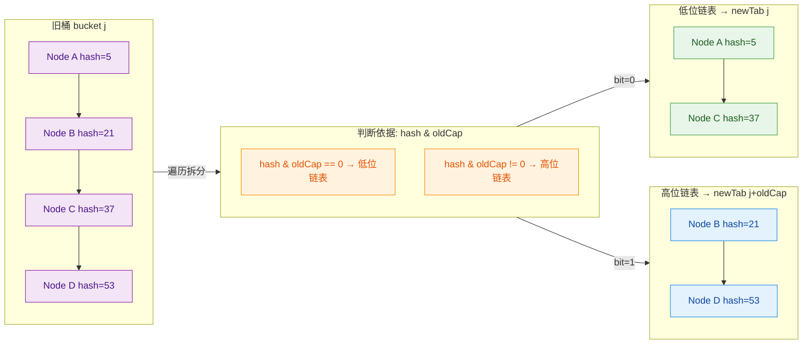
```mermaid
graph LR
    subgraph JUDGE["判断依据: hash & oldCap"]
        direction TB
        J1["hash & oldCap == 0 → 低位链表"]
        J2["hash & oldCap != 0 → 高位链表"]
    end

    subgraph OLD["旧桶 bucket j"]
        direction TB
        A["Node A hash=5"] --> B["Node B hash=21"]
        B --> C["Node C hash=37"]
        C --> D["Node D hash=53"]
    end

    subgraph LO["低位链表 → newTab j"]
        direction TB
        LA["Node A hash=5"] --> LC["Node C hash=37"]
    end

    subgraph HI["高位链表 → newTab j+oldCap"]
        direction TB
        HB["Node B hash=21"] --> HD["Node D hash=53"]
    end

    OLD -- "遍历拆分" --> JUDGE
    JUDGE -- "bit=0" --> LO
    JUDGE -- "bit=1" --> HI

    classDef judgeStyle fill:#FFF3E0,stroke:#FB8C00,color:#E65100
    classDef oldStyle fill:#F3E5F5,stroke:#8E24AA,color:#4A148C
    classDef loStyle fill:#E8F5E9,stroke:#43A047,color:#1B5E20
    classDef hiStyle fill:#E3F2FD,stroke:#1E88E5,color:#0D47A1
    class J1,J2 judgeStyle
    class A,B,C,D oldStyle
    class LA,LC loStyle
    class HB,HD hiStyle
```

### 源码级解读：resize() 的数据迁移部分

下面是 JDK 8 `resize()` 方法中数据迁移的核心代码，逐行注释：

```java
// 遍历旧数组的每一个桶
for (int j = 0; j < oldCap; ++j) {
    Node<K,V> e;                           // 当前遍历的节点
    if ((e = oldTab[j]) != null) {         // 如果该桶不为空
        oldTab[j] = null;                  // 释放旧桶引用，帮助 GC

        // ===== 情况1：桶中只有一个节点（无链表、无树）=====
        if (e.next == null)
            // 直接用 hash & (newCap-1) 定位到新桶，放进去
            newTab[e.hash & (newCap - 1)] = e;

        // ===== 情况2：桶中是红黑树节点 =====
        else if (e instanceof TreeNode)
            // 树节点也用类似的高低位拆分逻辑，拆成两棵子树
            ((TreeNode<K,V>)e).split(this, newTab, j, oldCap);

        // ===== 情况3：桶中是普通链表（核心优化所在）=====
        else {
            // 低位链表的头和尾（留在原下标 j）
            Node<K,V> loHead = null, loTail = null;
            // 高位链表的头和尾（迁移到下标 j + oldCap）
            Node<K,V> hiHead = null, hiTail = null;
            Node<K,V> next;                // 临时变量，保存下一个节点

            do {
                next = e.next;             // 先保存下一个节点的引用

                // 关键判断：hash 值在 oldCap 对应的那个 bit 上是 0 还是 1
                if ((e.hash & oldCap) == 0) {
                    // === 低位链表：该节点留在原位 ===
                    if (loTail == null)
                        loHead = e;        // 第一个低位节点，设为头
                    else
                        loTail.next = e;   // 尾插法：追加到低位链表末尾
                    loTail = e;            // 更新尾指针
                }
                else {
                    // === 高位链表：该节点迁移到 j + oldCap ===
                    if (hiTail == null)
                        hiHead = e;        // 第一个高位节点，设为头
                    else
                        hiTail.next = e;   // 尾插法：追加到高位链表末尾
                    hiTail = e;            // 更新尾指针
                }
            } while ((e = next) != null);  // 遍历链表直到末尾

            // 将低位链表整体挂到新数组的原下标位置
            if (loTail != null) {
                loTail.next = null;        // 断开尾节点的 next（可能还指向旧链表节点）
                newTab[j] = loHead;        // 低位链表放在原位
            }
            // 将高位链表整体挂到新数组的 j + oldCap 位置
            if (hiTail != null) {
                hiTail.next = null;        // 同样断开尾节点
                newTab[j + oldCap] = hiHead; // 高位链表放在偏移位置
            }
        }
    }
}
```

这段代码有几个值得注意的细节：

第一，使用尾插法（tail insertion）而非 JDK 7 的头插法。尾插法保持了节点在链表中的相对顺序不变，这不仅更符合直觉，更重要的是避免了多线程场景下头插法可能导致的链表成环问题。

第二，`loTail.next = null` 这一行看似不起眼，实则至关重要。因为拆分后，尾节点的 `next` 可能还指向另一条链表中的节点（它在旧链表中的下一个节点可能被分到了另一条链表），必须显式断开。

第三，整个过程中没有任何一次 `hash & (newCap - 1)` 的重新计算（单节点桶除外），仅用 `hash & oldCap` 这一个位运算就完成了所有节点的分流。

### 扩容的完整流程图

将触发条件、容量计算、数据迁移串联起来，完整的扩容流程如下：

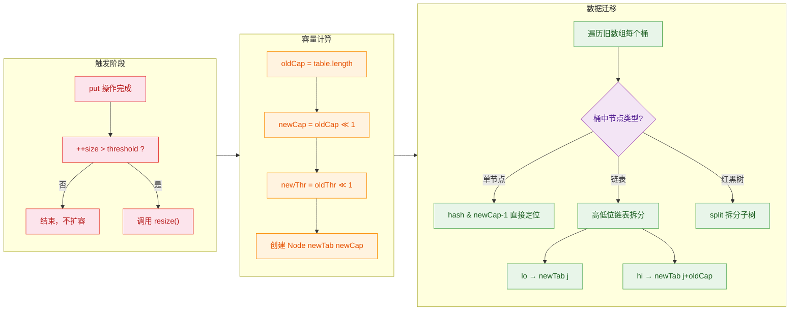
```mermaid
graph LR
    subgraph TRIGGER["触发阶段"]
        direction TB
        T1["put 操作完成"] --> T2["++size > threshold ?"]
        T2 -- "否" --> T3["结束，不扩容"]
        T2 -- "是" --> T4["调用 resize()"]
    end

    subgraph CALC["容量计算"]
        direction TB
        C1["oldCap = table.length"]
        C1 --> C2["newCap = oldCap ≪ 1"]
        C2 --> C3["newThr = oldThr ≪ 1"]
        C3 --> C4["创建 Node newTab newCap"]
    end

    subgraph MIGRATE["数据迁移"]
        direction TB
        M1["遍历旧数组每个桶"]
        M1 --> M2{"桶中节点类型?"}
        M2 -- "单节点" --> M3["hash & newCap-1 直接定位"]
        M2 -- "链表" --> M4["高低位链表拆分"]
        M2 -- "红黑树" --> M5["split 拆分子树"]
        M4 --> M6["lo → newTab j"]
        M4 --> M7["hi → newTab j+oldCap"]
    end

    TRIGGER --> CALC --> MIGRATE

    classDef triggerStyle fill:#FCE4EC,stroke:#E53935,color:#B71C1C
    classDef calcStyle fill:#FFF3E0,stroke:#FB8C00,color:#E65100
    classDef migrateStyle fill:#E8F5E9,stroke:#43A047,color:#1B5E20
    classDef decisionStyle fill:#F3E5F5,stroke:#8E24AA,color:#4A148C
    class T1,T2,T3,T4 triggerStyle
    class C1,C2,C3,C4 calcStyle
    class M1,M3,M4,M5,M6,M7 migrateStyle
    class M2 decisionStyle
```

### 扩容的性能代价

扩容不是免费的。每次 resize 都意味着：

1. 分配一块两倍大小的新数组（内存开销）
2. 遍历旧数组所有非空桶，对每个节点进行拆分和迁移（CPU 开销）
3. 旧数组变成垃圾等待 GC 回收（GC 压力）

如果你事先知道要存储的元素数量，强烈建议在构造时指定 `initialCapacity`，避免多次扩容：

```java
// 反面示例：默认容量 16，存 1000 个元素需要扩容多次
// 16 → 32 → 64 → 128 → 256 → 512 → 1024，共 6 次扩容
Map<String, Object> bad = new HashMap<>();

// 正面示例：预估 1000 个元素，考虑负载因子 0.75
// 1000 / 0.75 = 1333.3，向上取 2 的幂次 = 2048
Map<String, Object> good = new HashMap<>(2048);

// 更精确的写法：让 HashMap 自己向上取整
// 传入 1000，HashMap 内部会 tableSizeFor(1000) = 1024
// 但 1024 * 0.75 = 768 < 1000，仍会扩容一次到 2048
// 所以建议传入 capacity = expectedSize / loadFactor + 1
Map<String, Object> best = new HashMap<>((int)(1000 / 0.75f) + 1);
```

Guava 提供了一个便捷方法 `Maps.newHashMapWithExpectedSize(int expectedSize)`，内部就是做了这个计算，推荐在项目中使用。

### 红黑树的扩容拆分

当桶中已经树化为红黑树时，扩容的拆分逻辑由 `TreeNode.split()` 方法处理。它的核心思路与链表拆分完全一致——同样是用 `hash & oldCap` 将树节点分为高低两组。但后续处理多了一步判断：

```java
// TreeNode.split() 的核心逻辑（简化）
final void split(HashMap<K,V> map, Node<K,V>[] tab, int index, int bit) {
    // bit 就是 oldCap
    TreeNode<K,V> loHead = null, loTail = null; // 低位树节点链
    TreeNode<K,V> hiHead = null, hiTail = null; // 高位树节点链
    int lc = 0, hc = 0;                         // 低位/高位节点计数

    // 遍历树节点（TreeNode 同时维护了双向链表，所以可以线性遍历）
    for (TreeNode<K,V> e = this, next; e != null; e = next) {
        next = (TreeNode<K,V>)e.next;
        if ((e.hash & bit) == 0) {               // 低位
            // ... 尾插法追加到 lo 链 ...
            ++lc;                                 // 低位计数 +1
        } else {                                  // 高位
            // ... 尾插法追加到 hi 链 ...
            ++hc;                                 // 高位计数 +1
        }
    }

    // 关键判断：拆分后的子链是否需要退化为普通链表
    if (loHead != null) {
        if (lc <= UNTREEIFY_THRESHOLD)            // 节点数 <= 6
            tab[index] = loHead.untreeify(map);   // 退化为普通链表
        else {
            tab[index] = loHead;
            if (hiHead != null)                   // 如果另一半不为空，说明树被拆分了
                loHead.treeify(tab);              // 重新构建红黑树
        }
    }
    // hiHead 同理...
}
```

拆分后，如果某一侧的节点数量降到了 `UNTREEIFY_THRESHOLD`（6）以下，就会调用 `untreeify()` 将红黑树退化回普通链表，避免在节点很少时维护红黑树的额外开销。

### 扩容过程中的内存布局变化

用一个 ASCII 图来展示 oldCap = 4 扩容到 newCap = 8 时，某个桶的节点迁移情况：

```java
// oldCap = 4 (0b100), 桶 index = 1
// 桶中有 4 个节点，hash 值分别为: 1, 5, 9, 13

// 判断 hash & oldCap (即 hash & 0b100):
//   hash=1  → 0b 001 & 0b 100 = 0  → 低位 (留在 bucket 1)
//   hash=5  → 0b 101 & 0b 100 = 4  → 高位 (迁移到 bucket 1+4=5)
//   hash=9  → 0b 1001 & 0b 100 = 0 → 低位 (留在 bucket 1)
//   hash=13 → 0b 1101 & 0b 100 = 4 → 高位 (迁移到 bucket 5)

// ========== 扩容前 (oldCap=4) ==========
//
//  bucket[0]  bucket[1]         bucket[2]  bucket[3]
//  +------+   +------+          +------+   +------+
//  | null |   |  h=1 |→[h=5]→[h=9]→[h=13] | null |   | null |
//  +------+   +------+          +------+   +------+
//
// ========== 扩容后 (newCap=8) ==========
//
//  bucket[0]  bucket[1]    bucket[2]  bucket[3]
//  +------+   +------+     +------+   +------+
//  | null |   |  h=1 |→[h=9]        | null |   | null |
//  +------+   +------+     +------+   +------+
//
//  bucket[4]  bucket[5]    bucket[6]  bucket[7]
//  +------+   +------+     +------+   +------+
//  | null |   |  h=5 |→[h=13]       | null |   | null |
//  +------+   +------+     +------+   +------+
//
//  注意：节点相对顺序保持不变（尾插法的功劳）
```

### 面试高频追问：为什么是 2 倍而不是 1.5 倍或 3 倍？

这个问题的答案与"容量必须是 2 的幂次"直接相关：

1. 2 的幂次乘以 2 仍然是 2 的幂次（`2^n * 2 = 2^(n+1)`），保证了扩容后容量依然满足约束条件。如果是 1.5 倍，`16 * 1.5 = 24`，不是 2 的幂次，`hash & (cap - 1)` 的位运算取模优化就失效了。

2. 2 倍扩容使得新旧容量之间恰好只差一个 bit，这才让 `hash & oldCap` 的高低位拆分优化成为可能。如果是 3 倍或 4 倍，这个优雅的位运算技巧就不成立了。

3. 2 倍是一个合理的增长速率——既不会像 1.5 倍那样扩容过于频繁，也不会像 4 倍那样一次性浪费太多内存。

可以说，2 倍扩容不是一个孤立的设计决策，而是与"2 的幂次容量"、"位运算取模"、"高低位链表拆分"形成了一个环环相扣的设计闭环。

---

**📝 练习题**

以下关于 HashMap 扩容机制的描述，哪一项是正确的？

A. JDK 8 扩容时，链表中的每个节点都需要重新计算 `hash & (newCap - 1)` 来确定新下标


B. 扩容时，通过 `hash & oldCap` 判断节点应留在原位还是迁移到 `原下标 + oldCap` 的位置


C. 扩容后红黑树节点不会退化为链表，因为树化是不可逆的


D. HashMap 的负载因子默认为 0.5，当元素数量超过容量的一半时触发扩容


**【答案】** B

**【解析】** 选项 B 准确描述了 JDK 8 的 rehash 优化核心。扩容时新容量是旧容量的 2 倍，新掩码比旧掩码多一个 bit，而这个 bit 的位置恰好是 `oldCap`。因此只需要检查 `hash & oldCap` 是 0 还是非 0，就能确定节点的去向：0 则留在原下标（低位链表），非 0 则迁移到原下标 + oldCap（高位链表）。选项 A 描述的是 JDK 7 的行为，JDK 8 链表节点不需要逐个重算下标。选项 C 错误，`TreeNode.split()` 拆分后如果某一侧节点数 ≤ 6（`UNTREEIFY_THRESHOLD`），会调用 `untreeify()` 退化为普通链表。选项 D 错误，默认负载因子是 0.75 而非 0.5。

---

## 树化阈值 ⭐（为什么是 8、泊松分布）

### 链表转红黑树的触发条件

HashMap 在 JDK 8 中引入了一个关键优化：当某个桶（bucket）中的链表长度过长时，会将链表转化为红黑树（Red-Black Tree），从而将该桶的查找时间复杂度从 O(n) 降低到 O(log n)。这个"过长"的临界值就是 `TREEIFY_THRESHOLD = 8`。

但很多人忽略了一个细节——链表长度达到 8 并不是树化的唯一条件。源码中还有一个前置判断：

```java
// HashMap.treeifyBin() 方法节选
final void treeifyBin(Node<K,V>[] tab, int hash) {
    int n, index; Node<K,V> e;
    // 如果数组长度小于 64，优先扩容而不是树化
    if (tab == null || (n = tab.length) < MIN_TREEIFY_CAPACITY)
        resize(); // 扩容，打散链表
    else if ((e = tab[index = (n - 1) & hash]) != null) {
        // 真正执行链表 → 红黑树的转换
        TreeNode<K,V> hd = null, tl = null;
        do {
            TreeNode<K,V> p = replacementTreeNode(e, null); // 将普通 Node 包装为 TreeNode
            if (tl == null)
                hd = p;        // 头节点
            else {
                p.prev = tl;   // 双向链表串联
                tl.next = p;
            }
            tl = p;
        } while ((e = e.next) != null);
        if ((tab[index] = hd) != null)
            hd.treeify(tab);  // 将双向链表结构化为红黑树
    }
}
```

所以树化的完整条件是两个同时满足：

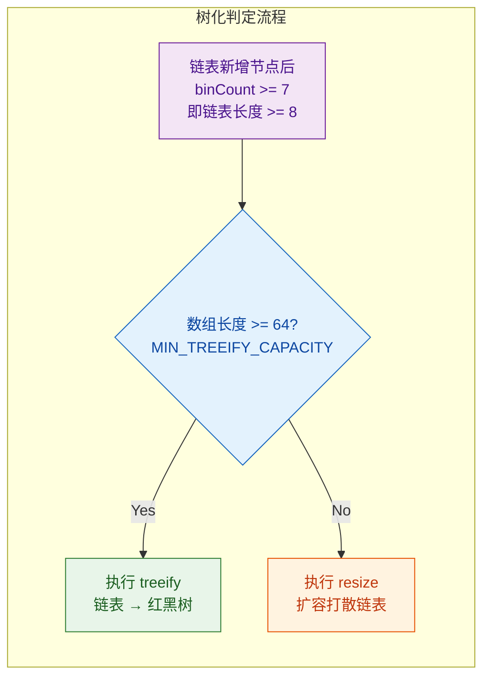
```mermaid
graph LR
    subgraph 树化判定流程
        direction TB
        A["链表新增节点后<br/>binCount >= 7<br/>即链表长度 >= 8"] --> B{"数组长度 >= 64?<br/>MIN_TREEIFY_CAPACITY"}
        B -->|"Yes"| C["执行 treeify<br/>链表 → 红黑树"]
        B -->|"No"| D["执行 resize<br/>扩容打散链表"]
    end

    classDef condNode fill:#E3F2FD,stroke:#1565C0,color:#0D47A1
    classDef treeNode fill:#E8F5E9,stroke:#2E7D32,color:#1B5E20
    classDef resizeNode fill:#FFF3E0,stroke:#E65100,color:#BF360C
    classDef startNode fill:#F3E5F5,stroke:#6A1B9A,color:#4A148C

    class A startNode
    class B condNode
    class C treeNode
    class D resizeNode
```

这个设计非常精妙——在数组较小时（< 64），冲突严重往往是因为桶太少，扩容就能解决问题，没必要引入红黑树这种重量级结构。只有当数组已经足够大、某个桶仍然堆积了 8 个以上节点时，才说明这些 key 的 hash 确实高度碰撞，此时树化才有意义。

### 为什么阈值选 8：泊松分布的理论支撑

这是面试中的高频问题。答案藏在 HashMap 源码的一段注释里，JDK 作者直接给出了理论推导：

```java
/*
 * Because TreeNodes are about twice the size of regular nodes, we
 * use them only when bins contain enough nodes to warrant use
 * (see TREEIFY_THRESHOLD). And when they become too small (due to
 * removal or resizing) they are converted back to plain bins. In
 * usages with well-distributed user hashCodes, tree bins are
 * rarely used. Ideally, under random hashCodes, the frequency of
 * nodes in bins follows a Poisson distribution
 * (http://en.wikipedia.org/wiki/Poisson_distribution) with a
 * parameter of about 0.5 on average for the default resizing
 * threshold of 0.75, although with a large variance because of
 * resizing granularity. Ignoring variance, the expected
 * occurrences of list size k are (exp(-0.5) * pow(0.5, k) /
 * factorial(k)). The first values are:
 *
 * 0:    0.60653066
 * 1:    0.30326533
 * 2:    0.07581633
 * 3:    0.01263606
 * 4:    0.00157951
 * 5:    0.00015795
 * 6:    0.00001316
 * 7:    0.00000094
 * 8:    0.00000006
 * more: less than 1 in ten million
 */
```

这段注释的核心逻辑是这样的：

在理想的随机 hash 分布下，每个桶中元素的数量服从泊松分布（Poisson Distribution）。泊松分布描述的是"在固定时间/空间内，某事件发生次数的概率分布"，其公式为：

```
P(X = k) = (e^(-λ) × λ^k) / k!
```

其中 λ（lambda）是期望值，即平均每个桶中的元素数量。当 HashMap 使用默认负载因子 0.75 时，扩容前每个桶的平均元素数约为 0.5（这个值考虑了扩容粒度后的近似）。代入 λ = 0.5，我们可以计算出每个桶中恰好有 k 个元素的概率：

| 链表长度 k | 概率 P(X=k) | 直观理解 |
|:-:|:-:|:-:|
| 0 | 0.60653066 | 约 60.7% 的桶是空的 |
| 1 | 0.30326533 | 约 30.3% 的桶只有 1 个元素 |
| 2 | 0.07581633 | 约 7.6% |
| 3 | 0.01263606 | 约 1.3% |
| 4 | 0.00157951 | 约 0.16% |
| 5 | 0.00015795 | 约 0.016% |
| 6 | 0.00001316 | 约 0.0013% |
| 7 | 0.00000094 | 约千万分之一 |
| 8 | 0.00000006 | 约亿分之六 |

链表长度达到 8 的概率只有 0.00000006，也就是说在正常使用场景下，这几乎不可能发生。选择 8 作为阈值意味着：

- 正常情况下，树化代码几乎永远不会被触发，HashMap 保持轻量的数组+链表结构
- 只有在 hash 函数极差或遭受 hash 碰撞攻击（HashDoS）时，链表才会增长到 8，此时树化作为一种防御机制介入，防止性能退化到 O(n)

### 为什么不选更小的值（比如 4 或 6）

TreeNode 的内存开销大约是普通 Node 的两倍。每个 TreeNode 除了 key、value、hash、next 之外，还需要维护 parent、left、right、prev 指针以及一个 red/black 颜色标记：

```java
// HashMap.TreeNode 的字段（简化）
static final class TreeNode<K,V> extends LinkedHashMap.Entry<K,V> {
    TreeNode<K,V> parent;  // 父节点引用
    TreeNode<K,V> left;    // 左子节点
    TreeNode<K,V> right;   // 右子节点
    TreeNode<K,V> prev;    // 双向链表的前驱（用于删除时拆链）
    boolean red;           // 红黑标记
}
```

如果阈值设得太低，大量桶会频繁触发树化，带来不必要的内存浪费和树化/退化的 CPU 开销。而阈值设为 8，在概率上几乎过滤掉了所有正常场景，只在真正需要时才启用红黑树。

### 为什么不选更大的值（比如 16 或 32）

如果阈值太高，当 hash 碰撞攻击真的发生时，链表已经很长了，查询性能早已严重退化。8 是一个平衡点——在链表长度为 8 时，链表查找平均需要 4 次比较，而红黑树只需要 3 次（log₂8 = 3）。此时树化带来的性能提升刚好开始变得显著。

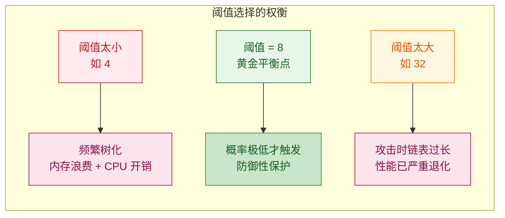
```mermaid
graph LR
    subgraph 阈值选择的权衡
        direction TB
        A["阈值太小<br/>如 4"] --> B["频繁树化<br/>内存浪费 + CPU 开销"]
        C["阈值 = 8<br/>黄金平衡点"] --> D["概率极低才触发<br/>防御性保护"]
        E["阈值太大<br/>如 32"] --> F["攻击时链表过长<br/>性能已严重退化"]
    end

    classDef badNode fill:#FFEBEE,stroke:#C62828,color:#B71C1C
    classDef goodNode fill:#E8F5E9,stroke:#2E7D32,color:#1B5E20
    classDef warnNode fill:#FFF8E1,stroke:#F57F17,color:#E65100
    classDef resultBad fill:#FCE4EC,stroke:#AD1457,color:#880E4F
    classDef resultGood fill:#C8E6C9,stroke:#388E3C,color:#1B5E20

    class A badNode
    class B resultBad
    class C goodNode
    class D resultGood
    class E warnNode
    class F resultBad
```

### 泊松分布成立的前提条件

需要特别强调的是，上述概率分析有一个重要前提：hash 函数的分布足够随机均匀。HashMap 通过哈希扰动函数（高 16 位异或低 16 位）来尽量保证这一点。如果用户自定义的 `hashCode()` 实现很差（比如所有对象返回相同的 hash 值），那泊松分布的假设就不成立了，链表长度可以轻松超过 8。这恰恰是树化机制存在的意义——它是一道安全网（safety net）。

---

## 退化阈值（为什么是 6）

### 红黑树退化回链表的触发条件

既然链表可以树化，那红黑树在节点减少时也需要退化回链表，否则会白白浪费 TreeNode 的额外内存。HashMap 中定义了退化阈值：

```java
// HashMap 常量定义
static final int UNTREEIFY_THRESHOLD = 6; // 退化阈值
```

当红黑树中的节点数量减少到 6 或以下时，会触发 untreeify 操作，将红黑树重新转换为普通链表。

退化发生在两个场景中：

**场景一：扩容时的 split 操作**

这是最常见的退化触发点。扩容时，原来一棵红黑树中的节点会被拆分到两个桶中（高位桶和低位桶）。拆分后，如果某一侧的节点数 &lt;= `UNTREEIFY_THRESHOLD`，就退化为链表：

```java
// HashMap.TreeNode.split() 方法核心逻辑（简化）
final void split(HashMap<K,V> map, Node<K,V>[] tab, int index, int bit) {
    TreeNode<K,V> b = this;
    TreeNode<K,V> loHead = null, loTail = null; // 低位链表
    TreeNode<K,V> hiHead = null, hiTail = null; // 高位链表
    int lc = 0, hc = 0; // 低位计数、高位计数

    // 遍历红黑树的双向链表结构，按 hash & bit 分成两组
    for (TreeNode<K,V> e = b, next; e != null; e = next) {
        next = (TreeNode<K,V>)e.next;
        e.next = null;
        if ((e.hash & bit) == 0) {
            // 分到低位桶
            if ((e.prev = loTail) == null)
                loHead = e;
            else
                loTail.next = e;
            loTail = e;
            ++lc; // 低位计数 +1
        } else {
            // 分到高位桶
            if ((e.prev = hiTail) == null)
                hiHead = e;
            else
                hiTail.next = e;
            hiTail = e;
            ++hc; // 高位计数 +1
        }
    }

    // 低位桶处理
    if (loHead != null) {
        if (lc <= UNTREEIFY_THRESHOLD) // 节点数 <= 6
            tab[index] = loHead.untreeify(map); // 退化为链表
        else {
            tab[index] = loHead;
            if (hiHead != null) // 如果高位桶非空，说明树被拆分了，需要重新树化
                loHead.treeify(tab);
        }
    }

    // 高位桶处理（逻辑同上）
    if (hiHead != null) {
        if (hc <= UNTREEIFY_THRESHOLD) // 节点数 <= 6
            tab[index + bit] = hiHead.untreeify(map); // 退化为链表
        else {
            tab[index + bit] = hiHead;
            if (loHead != null)
                hiHead.treeify(tab);
        }
    }
}
```

**场景二：remove 操作后的检查**

在 `removeTreeNode()` 方法中，删除节点后会检查树的结构是否"太稀疏"。但这里的判断逻辑并不是直接数节点数，而是通过检查根节点及其子节点的存在性来快速判断：

```java
// HashMap.TreeNode.removeTreeNode() 方法节选
final void removeTreeNode(HashMap<K,V> map, Node<K,V>[] tab,
                           boolean movable) {
    // ... 省略前置逻辑 ...

    // 快速判断树是否太小，需要退化
    if (root == null
        || (movable
            && (root.right == null           // 根节点没有右子树
                || (rl = root.left) == null  // 根节点没有左子树
                || rl.left == null))) {      // 左子树的左子节点为空
        tab[index] = first.untreeify(map);   // 退化为链表
        return;
    }
    // ... 继续执行红黑树的删除和再平衡 ...
}
```

### 为什么退化阈值是 6 而不是 7

这是一个经典的面试考点。树化阈值是 8，退化阈值是 6，中间留了一个间隔 7。这个设计是为了防止频繁的树化和退化之间的振荡（thrashing）。

假设退化阈值也设为 8（或者设为 7），考虑这样一个场景：某个桶中恰好有 8 个节点，刚刚完成树化。此时如果删除一个节点变成 7 个，立刻退化回链表；紧接着又插入一个节点变成 8 个，又要树化。这种反复转换的开销是巨大的——树化需要构建红黑树，退化需要遍历树重建链表，两者都是 O(n) 操作。

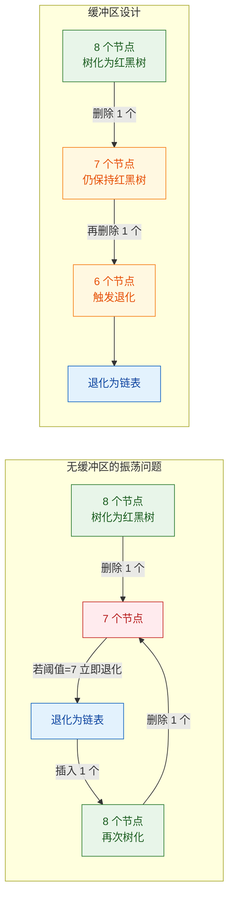
```mermaid
graph LR
    subgraph 无缓冲区的振荡问题
        direction TB
        A["8 个节点<br/>树化为红黑树"] -->|"删除 1 个"| B["7 个节点"]
        B -->|"若阈值=7 立即退化"| C["退化为链表"]
        C -->|"插入 1 个"| D["8 个节点<br/>再次树化"]
        D -->|"删除 1 个"| B
    end

    subgraph 缓冲区设计
        direction TB
        E["8 个节点<br/>树化为红黑树"] -->|"删除 1 个"| F["7 个节点<br/>仍保持红黑树"]
        F -->|"再删除 1 个"| G["6 个节点<br/>触发退化"]
        G --> H["退化为链表"]
    end

    classDef treeState fill:#E8F5E9,stroke:#2E7D32,color:#1B5E20
    classDef listState fill:#E3F2FD,stroke:#1565C0,color:#0D47A1
    classDef bufferState fill:#FFF8E1,stroke:#F57F17,color:#E65100
    classDef dangerState fill:#FFEBEE,stroke:#C62828,color:#B71C1C

    class A treeState
    class B dangerState
    class C listState
    class D treeState
    class E treeState
    class F bufferState
    class G bufferState
    class H listState
```

通过将退化阈值设为 6，在 7 这个位置形成了一个缓冲区（hysteresis / buffer zone）：

- 节点数 = 8 → 树化
- 节点数 = 7 → 保持当前状态（如果是树就继续是树，如果是链表就继续是链表）
- 节点数 = 6 → 退化

这种设计模式在工程中非常常见，类似于空调的温度控制——设定 26°C 制冷，不会在温度降到 26°C 时立刻停止，而是降到 24°C 才停，升到 28°C 才重新启动，避免压缩机频繁开关。在计算机科学中，这叫做滞后（hysteresis）策略。

### 退化阈值选 6 的另一个考量

从性能角度看，当节点数为 6 时，链表的平均查找次数为 3 次，红黑树的查找次数为 log₂6 ≈ 2.6 次。两者的差距已经非常小了，红黑树的优势几乎可以忽略不计，但红黑树的内存开销（每个 TreeNode 多出 parent、left、right、prev、red 五个字段）却是实实在在的。此时退化回链表是性价比最高的选择。

### 完整的状态转换总结

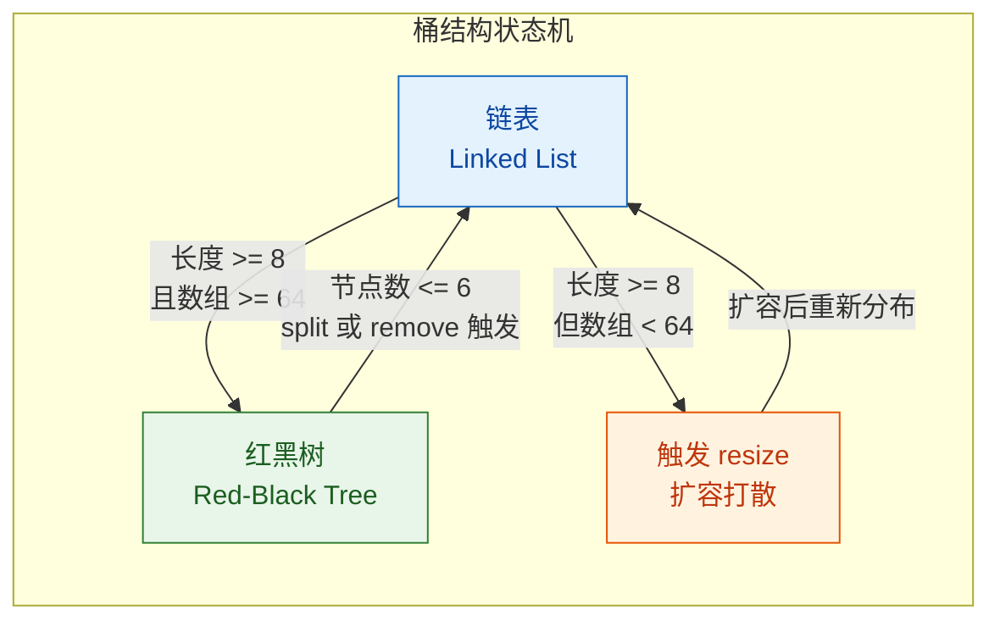
```mermaid
graph LR
    subgraph 桶结构状态机
        direction TB
        L["链表<br/>Linked List"] -->|"长度 >= 8<br/>且数组 >= 64"| T["红黑树<br/>Red-Black Tree"]
        T -->|"节点数 <= 6<br/>split 或 remove 触发"| L
        L -->|"长度 >= 8<br/>但数组 < 64"| R["触发 resize<br/>扩容打散"]
        R -->|"扩容后重新分布"| L
    end

    classDef listNode fill:#E3F2FD,stroke:#1565C0,color:#0D47A1
    classDef treeNode fill:#E8F5E9,stroke:#2E7D32,color:#1B5E20
    classDef resizeNode fill:#FFF3E0,stroke:#E65100,color:#BF360C

    class L listNode
    class T treeNode
    class R resizeNode
```

| 参数 | 值 | 设计意图 |
|:-:|:-:|:-:|
| TREEIFY_THRESHOLD | 8 | 泊松分布下概率极低，仅防御极端碰撞 |
| UNTREEIFY_THRESHOLD | 6 | 与 8 之间留缓冲区，防止振荡 |
| MIN_TREEIFY_CAPACITY | 64 | 小数组优先扩容，避免不必要的树化 |

---

**📝 练习题**

以下关于 HashMap 树化与退化机制的描述，哪一项是正确的？

A. 当链表长度达到 8 时，HashMap 一定会将该链表转化为红黑树

B. 红黑树退化为链表的阈值是 7，与树化阈值 8 相差 1 是为了防止振荡

C. 树化阈值选择 8 是基于泊松分布的概率分析，在理想 hash 分布下链表长度达到 8 的概率约为亿分之六

D. 当红黑树节点数减少到 6 时，HashMap 会立即在 remove 方法中精确计数并触发退化


**【答案】** C

**【解析】** A 选项错误，链表长度达到 8 只是树化的必要条件之一，还需要数组长度 >= 64（`MIN_TREEIFY_CAPACITY`），否则会优先执行扩容而非树化。B 选项错误，退化阈值是 6 而不是 7，与 8 之间相差 2，7 作为缓冲区存在。C 选项正确，JDK 源码注释中明确给出了泊松分布参数 λ ≈ 0.5 时，链表长度为 8 的概率约为 0.00000006。D 选项错误，`removeTreeNode()` 中并不是精确计数节点数来判断是否退化，而是通过检查根节点及其子节点的结构（root.right == null、root.left == null、root.left.left == null）来快速判断树是否足够稀疏，这是一种近似但高效的判断方式。精确的计数判断（`<= UNTREEIFY_THRESHOLD`）发生在扩容时的 `split()` 方法中。

---

## 头插法 vs 尾插法 ⭐（JDK7 → JDK8、死循环问题）

HashMap 在 JDK7 到 JDK8 的演进中，有一个看似微小却影响深远的改动——链表插入方式从**头插法（Head Insertion）**变为了**尾插法（Tail Insertion）**。这个改动的核心动机，是为了解决 JDK7 中多线程并发扩容时可能产生的**链表成环（Circular Linked List）**问题，即俗称的"死循环"。要真正理解这个问题，我们需要从扩容时链表的迁移过程入手，逐帧分析节点是如何被重新排列的。

### 头插法（JDK7 的 transfer 方法）

在 JDK7 中，HashMap 扩容时会调用 `transfer()` 方法，将旧数组中的每个桶里的链表节点逐个迁移到新数组中。其核心逻辑非常简洁，但正是这份简洁埋下了隐患：

```java
// JDK7 HashMap#transfer 核心逻辑（简化版）
void transfer(Entry[] newTable) {
    // 遍历旧数组的每一个桶
    for (Entry<K,V> e : table) {
        // 遍历该桶中链表的每一个节点
        while (null != e) {
            // 1. 先保存 e 的下一个节点，因为后面 e.next 会被改写
            Entry<K,V> next = e.next;

            // 2. 用新数组长度重新计算该节点落在新数组的哪个桶
            int i = indexFor(e.hash, newTable.length);

            // 3. 【头插法核心】将 e 的 next 指向新桶当前的头节点
            //    这意味着 e 会被插到链表最前面
            e.next = newTable[i];

            // 4. 新桶的头节点更新为 e
            newTable[i] = e;

            // 5. 移动到旧链表的下一个节点，继续迁移
            e = next;
        }
    }
}
```

头插法的特点是：每个新迁移的节点都被放到链表头部，后迁移的节点反而在前面。这会导致迁移后链表的**顺序与原链表相反**。

用一个具体例子来说明。假设旧数组某个桶中有一条链表 `A → B → C`，扩容后这三个节点恰好仍然落在新数组的同一个桶中：

```text
【JDK7 头插法迁移过程】

旧桶: A → B → C → null

第1步: 取出 A，头插到新桶
  新桶: A → null

第2步: 取出 B，头插到新桶（B 插到 A 前面）
  新桶: B → A → null

第3步: 取出 C，头插到新桶（C 插到 B 前面）
  新桶: C → B → A → null

结果: 链表顺序被反转了！
```

单线程下这没有任何问题，只是顺序反了而已，功能完全正确。但在多线程并发扩容时，这种"先断链再重连"的操作就会出大问题。

### 多线程并发扩容导致的死循环

这是 JDK7 HashMap 最经典的并发 Bug。我们用一个最小化的场景来复现。

假设旧数组 `table` 的某个桶中有链表 `A → B → null`，现在线程 T1 和线程 T2 同时触发了扩容，各自创建了自己的 `newTable`，并且 A 和 B 在扩容后恰好仍然映射到同一个桶索引。

```text
【初始状态】
旧桶: A → B → null

T1 和 T2 都执行 transfer()，各自从 A 开始遍历
```

关键代码再看一遍，聚焦这三行：

```java
Entry<K,V> next = e.next;   // ① 记住下一个
e.next = newTable[i];       // ② 头插：e 指向新桶头
newTable[i] = e;            // ③ 更新新桶头为 e
```

下面逐步推演并发场景：

```text
【Step 1】T1 执行到 ① 后被挂起（时间片用完）

  T1 的局部变量快照:
    e    = A
    next = B       （A.next 此时还是 B）

  T1 暂停，T2 开始完整执行 transfer()

【Step 2】T2 完整执行完 transfer()

  T2 用头插法迁移: 先插 A，再插 B
  T2 的新桶: B → A → null    （链表被反转了）

  注意！此时共享的 Entry 对象的 next 指针已经被 T2 改写：
    B.next = A     （原来是 A.next = B，现在 B.next = A）
    A.next = null

【Step 3】T1 恢复执行，继续 transfer()

  T1 还记得自己的局部变量: e = A, next = B

  --- T1 第一轮循环 ---
  e = A
  e.next = newTable[i]  → A.next = null（T1 的新桶是空的）
  newTable[i] = A
  e = next = B

  T1 的新桶: A → null

  --- T1 第二轮循环 ---
  e = B
  next = e.next = B.next = A   ← 关键！这是 T2 改写后的结果！
  e.next = newTable[i]  → B.next = A（B 指向 A）
  newTable[i] = B
  e = next = A

  T1 的新桶: B → A → null

  --- T1 第三轮循环 ---
  e = A（A 又被访问了！）
  next = e.next = A.next = null（上面第一轮 T1 自己设的）
  e.next = newTable[i]  → A.next = B  ← 环形成了！
  newTable[i] = A
  e = next = null → 循环结束

  T1 的新桶: A → B → A → B → A → ...（无限循环！）
```

用 Mermaid 图来直观展示这个环的形成过程：

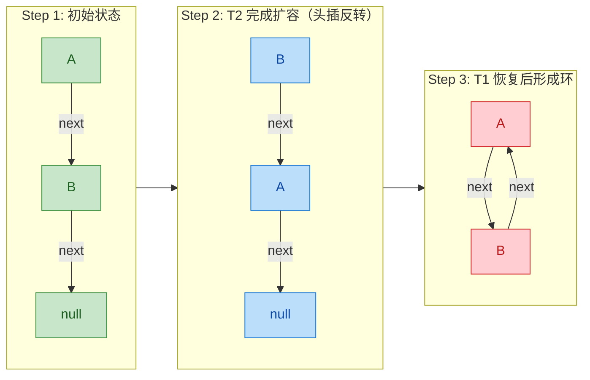
```mermaid
graph LR
    subgraph S1["Step 1: 初始状态"]
        direction TB
        A1["A"] -->|next| B1["B"]
        B1 -->|next| N1["null"]
    end

    subgraph S2["Step 2: T2 完成扩容（头插反转）"]
        direction TB
        B2["B"] -->|next| A2["A"]
        A2 -->|next| N2["null"]
    end

    subgraph S3["Step 3: T1 恢复后形成环"]
        direction TB
        A3["A"] -->|next| B3["B"]
        B3 -->|next| A3
    end

    S1 --> S2 --> S3

    classDef greenNode fill:#C8E6C9,stroke:#388E3C,color:#1B5E20
    classDef blueNode fill:#BBDEFB,stroke:#1976D2,color:#0D47A1
    classDef redNode fill:#FFCDD2,stroke:#D32F2F,color:#B71C1C

    class A1,B1,N1 greenNode
    class B2,A2,N2 blueNode
    class A3,B3 redNode
```

一旦链表成环，后续任何对该桶的 `get()` 操作如果命中了一个不存在的 key，就会在 `while (e != null)` 中无限遍历，CPU 飙升到 100%，线程永远无法返回——这就是所谓的**死循环（Infinite Loop）**。

值得强调的是：这个 Bug 不会抛异常，不会报错，程序只是"卡死"了，排查起来非常困难。在生产环境中，这类问题往往表现为某个线程的 CPU 占用率持续 100%，通过 `jstack` 抓线程栈才能发现线程卡在 `HashMap.get()` 的循环里。

### 尾插法（JDK8 的改进）

JDK8 对扩容逻辑做了彻底重写。链表迁移不再逐个头插，而是先把旧链表中的节点按照 `(e.hash & oldCap)` 的结果分成两组——**低位链表（lo）**和**高位链表（hi）**，然后将整条链表一次性挂到新数组对应的桶上。

```java
// JDK8 HashMap#resize 中链表迁移的核心逻辑（简化版）
Node<K,V> loHead = null, loTail = null; // 低位链表的头和尾
Node<K,V> hiHead = null, hiTail = null; // 高位链表的头和尾
Node<K,V> next;

do {
    // 1. 保存下一个节点
    next = e.next;

    // 2. 用旧容量的最高位来判断该节点去低位还是高位
    //    如果 e.hash 在 oldCap 对应的那一位是 0，留在原索引
    if ((e.hash & oldCap) == 0) {
        // 3. 【尾插法核心】追加到低位链表的尾部
        if (loTail == null)
            loHead = e;       // 第一个节点，设为头
        else
            loTail.next = e;  // 否则接在尾部后面
        loTail = e;           // 更新尾指针
    } else {
        // 4. 追加到高位链表的尾部
        if (hiTail == null)
            hiHead = e;
        else
            hiTail.next = e;
        hiTail = e;
    }
} while ((e = next) != null);

// 5. 将两条链表分别挂到新数组的对应位置
if (loTail != null) {
    loTail.next = null;          // 断开尾部，防止残留引用
    newTab[j] = loHead;          // 低位链表放在原索引 j
}
if (hiTail != null) {
    hiTail.next = null;
    newTab[j + oldCap] = hiHead; // 高位链表放在原索引 + oldCap
}
```

同样用 `A → B → C` 的例子来看尾插法的迁移过程（假设三个节点都落在低位链表）：

```text
【JDK8 尾插法迁移过程】

旧桶: A → B → C → null

第1步: 取出 A，A 是第一个节点
  loHead = A, loTail = A

第2步: 取出 B，接在 A 后面
  loHead = A, loTail = B
  链表: A → B

第3步: 取出 C，接在 B 后面
  loHead = A, loTail = C
  链表: A → B → C

最后: loTail.next = null
  新桶: A → B → C → null

结果: 链表顺序保持不变！
```

### 为什么尾插法能避免死循环

尾插法之所以能规避 JDK7 的死循环问题，根本原因在于两点：

第一，**节点的相对顺序不变**。头插法会反转链表，这意味着两个线程各自反转同一条链表时，节点的 next 指针会被交叉改写，形成环。而尾插法始终保持原有顺序，即使两个线程同时操作，节点间的指向关系也不会出现"A 指向 B，同时 B 又指向 A"的矛盾。

第二，**使用 head/tail 双指针构建新链表**。整个过程中，旧链表的遍历是单向的（通过预先保存的 `next`），新链表的构建也是单向追加的。不存在"把当前节点插到已有链表头部"这种需要修改已迁移节点 next 指针的操作。

用一张对比图来总结：

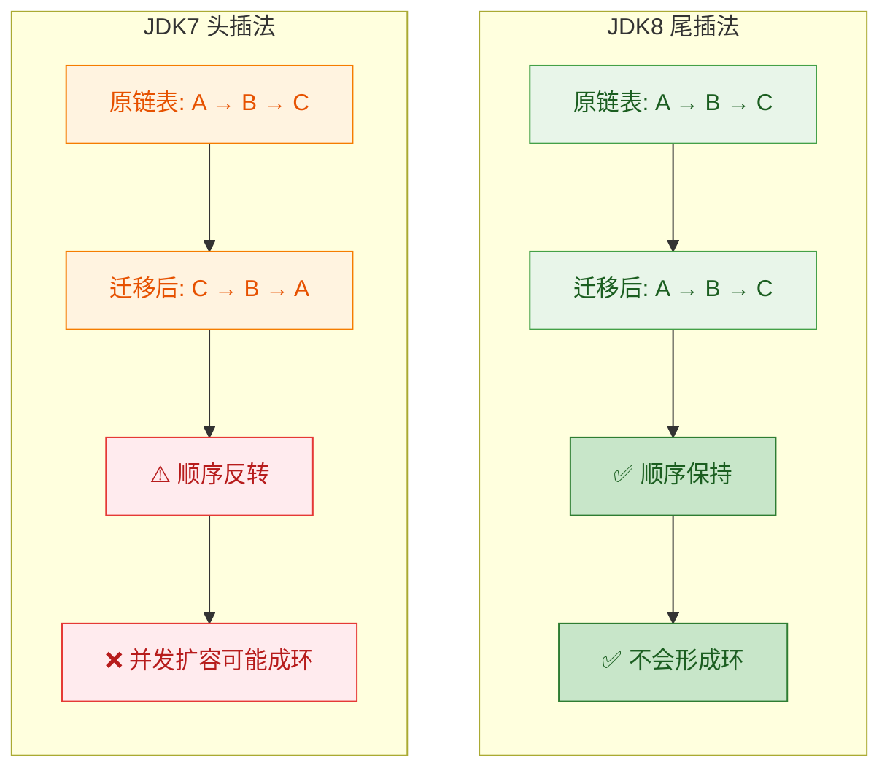
```mermaid
graph LR
    subgraph JDK7["JDK7 头插法"]
        direction TB
        O1["原链表: A → B → C"] --> R1["迁移后: C → B → A"]
        R1 --> D1["⚠️ 顺序反转"]
        D1 --> E1["❌ 并发扩容可能成环"]
    end

    subgraph JDK8["JDK8 尾插法"]
        direction TB
        O2["原链表: A → B → C"] --> R2["迁移后: A → B → C"]
        R2 --> D2["✅ 顺序保持"]
        D2 --> E2["✅ 不会形成环"]
    end

    JDK7 ~~~ JDK8

    classDef warnNode fill:#FFF3E0,stroke:#F57C00,color:#E65100
    classDef safeNode fill:#E8F5E9,stroke:#43A047,color:#1B5E20
    classDef dangerNode fill:#FFEBEE,stroke:#E53935,color:#B71C1C
    classDef okNode fill:#C8E6C9,stroke:#2E7D32,color:#1B5E20

    class O1,R1 warnNode
    class D1,E1 dangerNode
    class O2,R2 safeNode
    class D2,E2 okNode
```

### 尾插法并不意味着线程安全

这是一个非常重要的认知纠偏。很多人看到 JDK8 解决了死循环问题，就误以为 JDK8 的 HashMap 在多线程下是安全的。事实并非如此。

JDK8 的尾插法只是消除了"链表成环导致死循环"这一个特定的并发 Bug，但 HashMap 本身仍然是**线程不安全**的数据结构。在多线程环境下，它依然存在以下问题：

- **数据丢失（Lost Update）**：两个线程同时 `put`，计算出相同的桶索引，可能互相覆盖对方的写入，导致其中一个 Entry 丢失。
- **size 不准确**：`size++` 不是原子操作，并发下计数会出错。
- **put 和 get 并发时读到中间状态**：一个线程正在扩容迁移节点，另一个线程可能读到迁移了一半的数据，得到 null 或错误的值。
- **树化过程中的并发问题**：链表转红黑树的过程涉及大量指针操作，并发下可能导致树结构损坏。

所以结论很明确：**多线程场景下，请使用 `ConcurrentHashMap`，而不是 HashMap。** JDK8 的改进只是让 HashMap 在被误用于并发场景时不至于"卡死整个线程"，但数据正确性仍然无法保证。

### JDK7 vs JDK8 链表操作全面对比

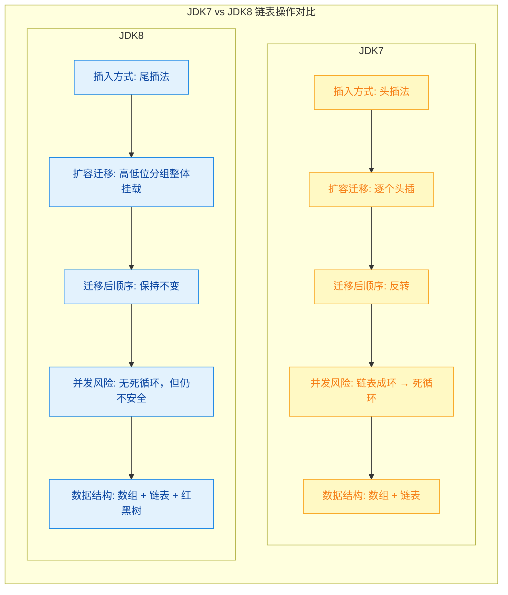
```mermaid
graph LR
    subgraph CMP["JDK7 vs JDK8 链表操作对比"]
        direction TB

        subgraph V7["JDK7"]
            direction TB
            V7A["插入方式: 头插法"] --> V7B["扩容迁移: 逐个头插"]
            V7B --> V7C["迁移后顺序: 反转"]
            V7C --> V7D["并发风险: 链表成环 → 死循环"]
            V7D --> V7E["数据结构: 数组 + 链表"]
        end

        subgraph V8["JDK8"]
            direction TB
            V8A["插入方式: 尾插法"] --> V8B["扩容迁移: 高低位分组整体挂载"]
            V8B --> V8C["迁移后顺序: 保持不变"]
            V8C --> V8D["并发风险: 无死循环，但仍不安全"]
            V8D --> V8E["数据结构: 数组 + 链表 + 红黑树"]
        end
    end

    classDef oldStyle fill:#FFF9C4,stroke:#F9A825,color:#F57F17
    classDef newStyle fill:#E3F2FD,stroke:#1E88E5,color:#0D47A1

    class V7A,V7B,V7C,V7D,V7E oldStyle
    class V8A,V8B,V8C,V8D,V8E newStyle
```

---

**📝 练习题**

以下关于 JDK7 HashMap 多线程并发扩容导致死循环的描述，哪一项是正确的？

A. 死循环发生在 `put()` 方法计算 hash 值的过程中

B. 死循环的根本原因是头插法在扩容迁移时会反转链表顺序，并发下导致节点间形成循环引用

C. JDK8 改用尾插法后，HashMap 在多线程环境下完全线程安全

D. 死循环只会在链表长度超过 8 并树化时才会发生


**【答案】** B

**【解析】** JDK7 的 `transfer()` 方法使用头插法迁移链表节点，单线程下只是链表顺序反转，功能正常。但当两个线程同时对同一条链表执行扩容迁移时，线程 T2 完成迁移后已经反转了节点的 next 指针，而线程 T1 仍持有旧的局部变量引用，继续执行头插操作时会将已经反转的节点再次反转，最终导致两个节点互相指向对方，形成环形链表。后续 `get()` 遍历到该桶时，`while (e != null)` 永远无法终止，表现为 CPU 100% 的死循环。选项 A 错误，死循环发生在扩容的 `transfer()` 阶段而非 hash 计算阶段。选项 C 错误，JDK8 只是消除了链表成环这一个 Bug，HashMap 仍然线程不安全，存在数据丢失、size 不准确等问题。选项 D 错误，死循环与树化无关，它发生在普通链表的迁移过程中，JDK7 根本没有树化机制。

---

## 线程不安全表现

HashMap 是 Java 集合框架中使用频率最高的 Map 实现，但它从设计之初就**不是线程安全的**（not thread-safe）。在多线程并发环境下直接使用 HashMap，会引发一系列严重且难以排查的问题——从数据丢失、数据覆盖，到 JDK 7 中臭名昭著的死循环（infinite loop），再到 JDK 8 中依然存在的数据不一致。理解这些问题的根因，是掌握并发编程和正确选型（ConcurrentHashMap、Collections.synchronizedMap）的前提。

### put 操作的数据覆盖（Lost Update）

这是最常见也最容易理解的线程不安全场景。当两个线程同时对 HashMap 执行 `put` 操作，且两个 key 恰好落在同一个桶（bucket）时，就可能发生写覆盖。

我们先回顾 JDK 8 中 `putVal` 的关键片段：

```java
// JDK 8 HashMap.putVal 简化逻辑
final V putVal(int hash, K key, V value, boolean onlyIfAbsent, boolean evict) {
    Node<K,V>[] tab; Node<K,V> p; int n, i;

    // ① 判断桶位是否为空
    if ((p = tab[i = (n - 1) & hash]) == null)
        // ② 为空则直接创建新节点放入桶位
        tab[i] = newNode(hash, key, value, null);
    else {
        // ... 链表/红黑树的插入逻辑
    }

    // ③ 修改 modCount 和 size
    ++modCount;
    if (++size > threshold)
        resize();
    return null;
}
```

问题就出在 ① 和 ② 之间——这两步不是原子操作（non-atomic）。考虑以下时序：

```
时间线 ──────────────────────────────────────────────────────►

线程 A (put key1, hash 落在桶 5)        线程 B (put key2, hash 也落在桶 5)
─────────────────────────────          ─────────────────────────────
1. 读取 tab[5] == null  ✓
                                       2. 读取 tab[5] == null  ✓
                                       3. tab[5] = newNode(key2, val2)
4. tab[5] = newNode(key1, val1)
   ↑ 直接覆盖了线程 B 的写入！
```

线程 A 和线程 B 都判断桶位为空，于是都执行了 `tab[i] = newNode(...)`。线程 A 后执行的赋值直接覆盖了线程 B 的节点，导致 key2 的数据**凭空消失**（silently lost）。这就是经典的"竞态条件"（Race Condition）。

用代码复现这个问题非常简单：

```java
public class HashMapLostUpdate {
    public static void main(String[] args) throws InterruptedException {
        // 创建一个普通的 HashMap
        Map<Integer, Integer> map = new HashMap<>();
        // 预期写入总量
        int totalPuts = 100_000;

        // 线程 1：写入 0 ~ 49999
        Thread t1 = new Thread(() -> {
            for (int i = 0; i < totalPuts / 2; i++) {
                map.put(i, i); // 非线程安全的 put
            }
        });

        // 线程 2：写入 50000 ~ 99999
        Thread t2 = new Thread(() -> {
            for (int i = totalPuts / 2; i < totalPuts; i++) {
                map.put(i, i); // 非线程安全的 put
            }
        });

        t1.start(); // 启动线程 1
        t2.start(); // 启动线程 2
        t1.join();   // 等待线程 1 结束
        t2.join();   // 等待线程 2 结束

        // 预期 size = 100000，实际往往小于这个值
        System.out.println("Expected: " + totalPuts);
        System.out.println("Actual:   " + map.size()); // 几乎每次都 < 100000
    }
}
```

多次运行你会发现 `map.size()` 几乎不可能等于 100000，丢失的条目数量每次还不一样——这就是并发写覆盖的直接体现。

### size 计数不准确

HashMap 的 `size` 字段是一个普通的 `int`，而非 `AtomicInteger` 或 `volatile int`：

```java
// HashMap 内部字段（非线程安全）
transient int size;       // 当前键值对数量
transient int modCount;   // 结构修改次数（用于 fail-fast）
```

`++size` 这个操作看似简单，实际上在 JVM 层面分为三步：

```
// ++size 的字节码等价操作
1. 从主内存读取 size 的当前值到工作内存（read）
2. 在工作内存中执行 +1 运算（add）
3. 将新值写回主内存（write）
```

两个线程同时执行 `++size` 时，可能出现如下交错：

```
线程 A                          线程 B
──────                          ──────
读取 size = 10
                                读取 size = 10
计算 10 + 1 = 11
                                计算 10 + 1 = 11
写回 size = 11
                                写回 size = 11   ← 应该是 12！
```

两次 put 都成功了，但 size 只增加了 1。这会导致两个后果：

1. `map.size()` 返回值不准确，业务逻辑如果依赖 size 做判断就会出错。
2. 扩容判断 `if (++size > threshold)` 可能延迟触发，导致链表过长，性能退化。

### JDK 7 的死循环问题（Infinite Loop）

这是 HashMap 线程不安全最经典、也是面试中被问得最多的问题。它只发生在 JDK 7 及之前的版本中，根因是 JDK 7 扩容时使用的**头插法**（head insertion）。

JDK 7 的 `transfer` 方法在扩容时会遍历旧桶的链表，将每个节点重新 hash 到新桶中，并且每次都插入到链表头部：

```java
// JDK 7 HashMap.transfer() —— 扩容时的节点迁移
void transfer(Entry[] newTable) {
    for (Entry<K,V> e : table) {       // 遍历旧数组的每个桶
        while (e != null) {            // 遍历桶中的链表
            Entry<K,V> next = e.next;  // ① 先记住下一个节点
            int i = indexFor(e.hash, newTable.length); // 计算新桶位
            e.next = newTable[i];      // ② 头插：当前节点指向新桶的头节点
            newTable[i] = e;           // ③ 当前节点成为新桶的头节点
            e = next;                  // ④ 移动到下一个节点继续处理
        }
    }
}
```

头插法有一个特性：迁移后链表的顺序会**反转**。假设旧桶中链表顺序是 A → B → C，迁移后变成 C → B → A。

当两个线程同时触发扩容，并且操作同一条链表时，就可能形成**环形链表**（circular linked list）：

```
初始状态（旧桶 bucket[3]）:  A → B → null

═══════════════════════════════════════════════════════════════
线程 A 执行到 ① 处被挂起（e = A, next = B）
═══════════════════════════════════════════════════════════════

线程 B 完整执行完 transfer：
  新桶 bucket[3]:  B → A → null    （头插法导致顺序反转）

═══════════════════════════════════════════════════════════════
线程 A 恢复执行，但它持有的 e 和 next 还是旧的引用：
  e = A, next = B
═══════════════════════════════════════════════════════════════

线程 A 继续执行：
  第一轮: 将 A 头插到新桶 → 新桶: A → (原有内容)
  第二轮: e = B, next = B.next = A（因为线程 B 已经让 B.next = A）
          将 B 头插 → 新桶: B → A
  第三轮: e = A, next = A.next = ?
          将 A 头插 → 新桶: A → B → A  💀 环形链表形成！
```

用 Mermaid 图来直观展示这个过程：

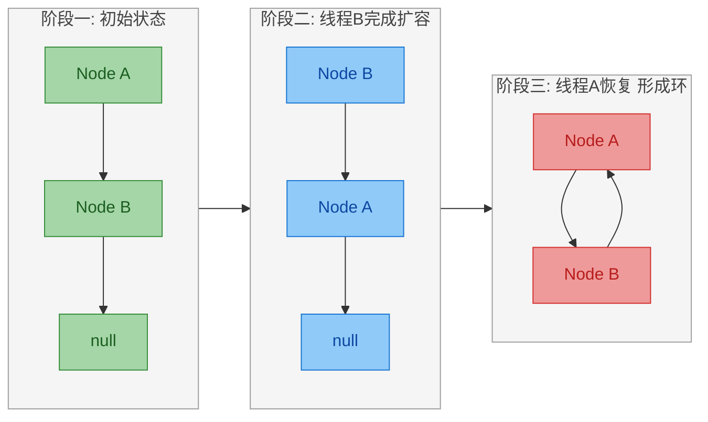
```mermaid
graph LR
    subgraph phase1["阶段一: 初始状态"]
        direction TB
        A1["Node A"] --> B1["Node B"] --> NULL1["null"]
    end

    subgraph phase2["阶段二: 线程B完成扩容"]
        direction TB
        B2["Node B"] --> A2["Node A"] --> NULL2["null"]
    end

    subgraph phase3["阶段三: 线程A恢复 形成环"]
        direction TB
        A3["Node A"] --> B3["Node B"]
        B3 --> A3
    end

    phase1 --> phase2 --> phase3

    classDef greenNode fill:#A5D6A7,stroke:#388E3C,color:#1B5E20
    classDef blueNode fill:#90CAF9,stroke:#1976D2,color:#0D47A1
    classDef redNode fill:#EF9A9A,stroke:#D32F2F,color:#B71C1C
    classDef phaseBox fill:#F5F5F5,stroke:#9E9E9E,color:#424242

    class A1,B1,NULL1 greenNode
    class B2,A2,NULL2 blueNode
    class A3,B3 redNode
    class phase1,phase2,phase3 phaseBox
```

一旦环形链表形成，后续任何对该桶的 `get` 操作如果命中了一个不存在的 key，就会在 `while (e != null)` 中无限循环，CPU 飙升到 100%，线程永远无法退出——这就是著名的**死循环**。

JDK 8 改用**尾插法**（tail insertion），保持了链表的原始顺序，从根本上消除了环形链表的可能。但这并不意味着 JDK 8 的 HashMap 就线程安全了。

### JDK 8 中依然存在的并发问题

JDK 8 虽然解决了死循环，但以下问题依然存在：

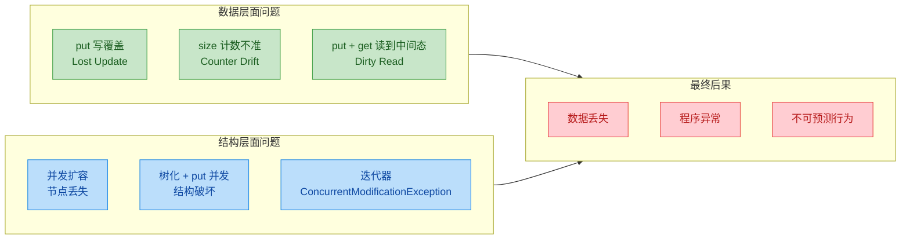
```mermaid
graph LR
    subgraph data_issues["数据层面问题"]
        direction TB
        D1["put 写覆盖\nLost Update"]
        D2["size 计数不准\nCounter Drift"]
        D3["put + get 读到中间态\nDirty Read"]
    end

    subgraph structure_issues["结构层面问题"]
        direction TB
        S1["并发扩容\n节点丢失"]
        S2["树化 + put 并发\n结构破坏"]
        S3["迭代器\nConcurrentModificationException"]
    end

    subgraph result["最终后果"]
        direction TB
        R1["数据丢失"]
        R2["程序异常"]
        R3["不可预测行为"]
    end

    data_issues --> result
    structure_issues --> result

    classDef greenBox fill:#C8E6C9,stroke:#43A047,color:#1B5E20
    classDef blueBox fill:#BBDEFB,stroke:#1E88E5,color:#0D47A1
    classDef redBox fill:#FFCDD2,stroke:#E53935,color:#B71C1C

    class D1,D2,D3 greenBox
    class S1,S2,S3 blueBox
    class R1,R2,R3 redBox
```

#### 并发扩容导致节点丢失

JDK 8 的 `resize()` 使用高低位链表（high/low list）来分配节点。两个线程同时扩容时，可能出现：

```java
// resize() 中的关键片段
Node<K,V> loHead = null, loTail = null; // 低位链表
Node<K,V> hiHead = null, hiTail = null; // 高位链表

// 遍历旧桶链表，按 (e.hash & oldCap) 分成两条链
for (Node<K,V> e = oldTab[j]; e != null; e = next) {
    next = e.next;
    if ((e.hash & oldCap) == 0) {
        // 放入低位链表（留在原桶位）
        if (loTail == null) loHead = e;
        else loTail.next = e;
        loTail = e;
    } else {
        // 放入高位链表（迁移到 原桶位 + oldCap）
        if (hiTail == null) hiHead = e;
        else hiTail.next = e;
        hiTail = e;
    }
}
// 将两条链表分别挂到新数组的对应桶位
newTab[j] = loHead;              // ← 非原子赋值
newTab[j + oldCap] = hiHead;    // ← 非原子赋值
```

两个线程各自构建了自己的 loHead/hiHead，最后赋值到 `newTab[j]` 时，后写入的线程会覆盖先写入的，导致一整条链表的节点全部丢失。

#### 并发 put 与树化的冲突

当链表长度达到 8 且数组长度 ≥ 64 时，HashMap 会将链表转为红黑树。`treeifyBin` 方法会修改节点的 `prev`、`left`、`right`、`parent` 等指针。如果此时另一个线程正在对同一个桶执行 `put`，可能导致树结构被破坏，后续的查找、插入操作行为完全不可预测。

#### fail-fast 迭代器

HashMap 的迭代器在创建时会记录当前的 `modCount`，每次 `next()` 调用时检查：

```java
// HashIterator.nextNode() 中的检查
final Node<K,V> nextNode() {
    Node<K,V>[] t;
    Node<K,V> e = next;
    // 如果迭代过程中 modCount 被其他线程修改，立即抛异常
    if (modCount != expectedModCount)
        throw new ConcurrentModificationException();
    // ...
}
```

这是一种"尽力而为"的检测机制（best-effort），并不保证一定能捕获所有并发修改。在某些时序下，并发修改可能恰好不被检测到，导致迭代器返回脏数据或跳过元素。

### 正确的替代方案

既然 HashMap 线程不安全，在并发场景下应该用什么？

```java
// ❌ 错误：多线程直接使用 HashMap
Map<String, Object> unsafeMap = new HashMap<>();

// ✅ 方案一：ConcurrentHashMap（推荐，高性能）
// JDK 8 使用 CAS + synchronized 锁单个桶，读操作几乎无锁
Map<String, Object> concurrentMap = new ConcurrentHashMap<>();

// ✅ 方案二：Collections.synchronizedMap（简单但性能较低）
// 内部对每个方法加 synchronized，相当于全局锁
Map<String, Object> syncMap = Collections.synchronizedMap(new HashMap<>());

// ✅ 方案三：Hashtable（古老，不推荐）
// 所有方法都是 synchronized，性能最差
Map<String, Object> hashtable = new Hashtable<>();
```

三者的对比：

| 特性 | ConcurrentHashMap | synchronizedMap | Hashtable |
|------|------------------|----------------|-----------|
| 锁粒度 | 桶级别（JDK 8） | 整个 Map | 整个 Map |
| 允许 null key | ❌ | ✅ | ❌ |
| 允许 null value | ❌ | ✅ | ❌ |
| 迭代器 | 弱一致性 | fail-fast | fail-fast |
| 并发读性能 | 极高（几乎无锁） | 低（读也加锁） | 低 |
| 推荐程度 | ⭐⭐⭐ | ⭐⭐ | ⭐ |

### 总结：HashMap 线程不安全的全景图

```mermaid
graph LR
    subgraph jdk7["JDK 7 特有问题"]
        direction TB
        J7A["头插法扩容"]
        J7B["环形链表"]
        J7C["死循环 CPU 100%"]
        J7A --> J7B --> J7C
    end

    subgraph common["JDK 7 和 JDK 8 共有问题"]
        direction TB
        C1["put 竞态写覆盖"]
        C2["size 计数漂移"]
        C3["并发扩容节点丢失"]
        C4["迭代器 CME 异常"]
    end

    subgraph jdk8["JDK 8 新增风险"]
        direction TB
        J8A["树化与 put 并发冲突"]
        J8B["红黑树结构破坏"]
        J8A --> J8B
    end

    subgraph solution["解决方案"]
        direction TB
        SOL1["ConcurrentHashMap\n桶级锁 + CAS"]
        SOL2["synchronizedMap\n全局互斥锁"]
        SOL3["读写分离设计\nCopyOnWriteMap"]
    end

    jdk7 --> solution
    common --> solution
    jdk8 --> solution

    classDef orangeNode fill:#FFE0B2,stroke:#F57C00,color:#E65100
    classDef blueNode fill:#BBDEFB,stroke:#1E88E5,color:#0D47A1
    classDef purpleNode fill:#E1BEE7,stroke:#8E24AA,color:#4A148C
    classDef greenNode fill:#C8E6C9,stroke:#43A047,color:#1B5E20

    class J7A,J7B,J7C orangeNode
    class C1,C2,C3,C4 blueNode
    class J8A,J8B purpleNode
    class SOL1,SOL2,SOL3 greenNode
```

记住一条铁律：**HashMap 只适用于单线程或只读场景。任何存在并发写入的场景，都必须使用 ConcurrentHashMap 或其他线程安全的替代方案。** 不要心存侥幸——并发 bug 往往在测试环境中不出现，却在生产环境的高并发压力下突然爆发，而且极难复现和定位。

---

**📝 练习题**

以下关于 HashMap 线程不安全的描述，哪一项是正确的？

A. JDK 8 的 HashMap 使用尾插法，因此在多线程环境下是完全线程安全的

B. 两个线程同时 put 不同的 key（hash 到不同桶位），不会产生任何并发问题

C. JDK 7 中 HashMap 扩容时头插法可能导致环形链表，进而使 get 操作陷入死循环

D. ConcurrentHashMap 通过对整个 Map 加 synchronized 来实现线程安全


**【答案】** C

**【解析】** A 错误，JDK 8 的尾插法只是消除了环形链表问题，put 写覆盖、size 不准、并发扩容丢数据等问题依然存在。B 错误，即使 key 落在不同桶位，`++size` 操作本身就是非原子的，两个线程同时 `++size` 会导致计数丢失；此外如果两个线程同时触发 `resize()`，对 `table` 引用的替换也会产生竞争。C 正确，这是 JDK 7 HashMap 最经典的并发问题，头插法在并发扩容时会反转链表顺序，两个线程交错执行 `transfer()` 可能形成 A → B → A 的环，后续 `get` 遍历该桶时进入无限循环。D 错误，ConcurrentHashMap 在 JDK 8 中使用的是 CAS + synchronized 锁单个桶（Node），锁粒度是桶级别而非整个 Map，这正是它高性能的关键。

---

## LinkedHashMap ⭐⭐

`HashMap` 有一个众所周知的"缺点"——它不保证遍历顺序。你先放进去的 key，遍历时可能排到最后面，因为元素的位置完全由 hash 值决定。在很多业务场景中，我们希望 Map 能"记住"元素的插入顺序，甚至能按照访问顺序自动调整——这就是 `LinkedHashMap` 的舞台。

`LinkedHashMap` 是 `HashMap` 的直接子类，它在 HashMap 的哈希表结构之上，额外维护了一条贯穿所有 Entry 的双向链表（doubly-linked list）。这条链表就像一根"线"，把散落在哈希桶各处的节点按照某种逻辑顺序串了起来。正因如此，`LinkedHashMap` 的迭代顺序是确定的、可预测的。

```java
// LinkedHashMap 的继承关系
public class LinkedHashMap<K,V> extends HashMap<K,V> implements Map<K,V> {
    // 双向链表的头节点（最老的元素）
    transient LinkedHashMap.Entry<K,V> head;
    // 双向链表的尾节点（最新的元素）
    transient LinkedHashMap.Entry<K,V> tail;
    // 控制迭代顺序：false=插入顺序，true=访问顺序
    final boolean accessOrder;
}
```

从类声明就能看出核心设计：`head`、`tail` 构成双向链表的两端，`accessOrder` 这个布尔值决定了链表的排列策略。接下来我们逐一深入。

### Entry 双向链表维护

要理解 LinkedHashMap 的精髓，必须先看它的 Entry 节点结构。我们知道 HashMap 内部的节点类是 `HashMap.Node<K,V>`，而 LinkedHashMap 在此基础上做了扩展：

```java
// HashMap 的基础节点
static class Node<K,V> implements Map.Entry<K,V> {
    final int hash;    // 哈希值
    final K key;       // 键
    V value;           // 值
    Node<K,V> next;    // 哈希桶内的单向链表指针（解决哈希冲突）
}

// LinkedHashMap 的扩展节点，继承自 HashMap.Node
static class Entry<K,V> extends HashMap.Node<K,V> {
    Entry<K,V> before; // 双向链表中的前驱节点
    Entry<K,V> after;  // 双向链表中的后继节点
}
```

注意这里有两套完全独立的指针体系：

- `next`：继承自 `HashMap.Node`，用于哈希桶内部的冲突链表（或红黑树），这是 HashMap 本身的结构。
- `before` / `after`：LinkedHashMap 新增的，用于维护跨桶的全局双向链表，这是"有序"的关键。

这两套指针互不干扰，各司其职。用一张 ASCII 图来直观感受：

```text
  ┌─────────────────────────────────────────────────────────────────┐
  │           LinkedHashMap 双向链表（维护插入/访问顺序）              │
  │                                                                 │
  │   head                                                   tail   │
  │    ↓                                                      ↓     │
  │  ┌─────┐  after   ┌─────┐  after   ┌─────┐  after  ┌─────┐    │
  │  │  A  │ ───────→ │  B  │ ───────→ │  C  │ ──────→ │  D  │    │
  │  │     │ ←─────── │     │ ←─────── │     │ ←────── │     │    │
  │  └─────┘  before  └─────┘  before  └─────┘  before └─────┘    │
  └─────────────────────────────────────────────────────────────────┘

  ┌───────────────────────────────────────────────────────────┐
  │              HashMap 哈希桶数组（table[]）                  │
  │                                                           │
  │  bucket[0]    bucket[1]    bucket[2]    bucket[3]  ...    │
  │     │            │            │            │              │
  │     ↓            ↓            ↓            ↓              │
  │  ┌─────┐      ┌─────┐        ∅         ┌─────┐           │
  │  │  A  │      │  C  │                  │  B  │           │
  │  └──┬──┘      └─────┘                  └──┬──┘           │
  │     │ next                                │ next         │
  │     ↓                                     ↓              │
  │  ┌─────┐                               ┌─────┐          │
  │  │  D  │                               │ ... │          │
  │  └─────┘                               └─────┘          │
  └───────────────────────────────────────────────────────────┘
```

上半部分是 LinkedHashMap 额外维护的双向链表，A→B→C→D 按插入顺序排列；下半部分是 HashMap 的桶数组，A 和 D 恰好落在同一个桶里通过 `next` 串联。同一个 Entry 对象同时存在于两个结构中。

那么，这条双向链表是如何被维护的呢？LinkedHashMap 巧妙地利用了 HashMap 预留的三个回调钩子方法（callback hooks）：

```java
// 这三个方法在 HashMap 中是空实现，LinkedHashMap 重写了它们

// 钩子1：节点被访问后调用（get、put已有key、replace等操作触发）
void afterNodeAccess(Node<K,V> e) {
    LinkedHashMap.Entry<K,V> last;
    // 仅当 accessOrder=true 且被访问的节点不是尾节点时，才需要移动
    if (accessOrder && (last = tail) != e) {
        // p: 当前节点, b: 前驱, a: 后继
        LinkedHashMap.Entry<K,V> p = (LinkedHashMap.Entry<K,V>)e;
        LinkedHashMap.Entry<K,V> b = p.before;
        LinkedHashMap.Entry<K,V> a = p.after;

        p.after = null;          // 先断开 p 的后继指针（因为 p 要移到末尾）

        if (b == null)           // 如果 p 是头节点
            head = a;            //     头指针指向 p 的后继
        else
            b.after = a;         // 否则，前驱的 after 跳过 p，指向 p 的后继

        if (a != null)           // 如果 p 不是尾节点
            a.before = b;        //     后继的 before 跳过 p，指向 p 的前驱
        else
            last = b;            // 否则，last 指向 p 的前驱

        if (last == null)        // 如果链表为空
            head = p;            //     p 既是头也是尾
        else {
            p.before = last;     // 否则，把 p 接到原尾节点后面
            last.after = p;
        }
        tail = p;                // 更新尾指针为 p
        ++modCount;              // 结构性修改计数+1
    }
}

// 钩子2：节点被插入后调用
void afterNodeInsertion(boolean evict) {
    LinkedHashMap.Entry<K,V> first;
    // evict 为 true 且头节点存在时，检查是否需要移除最老的元素
    if (evict && (first = head) != null && removeEldestEntry(first)) {
        K key = first.key;       // 取出最老元素的 key
        removeNode(hash(key), key, null, false, true); // 调用 HashMap 的删除逻辑
    }
}

// 钩子3：节点被删除后调用
void afterNodeRemoval(Node<K,V> e) {
    // 从双向链表中摘除节点 e
    LinkedHashMap.Entry<K,V> p = (LinkedHashMap.Entry<K,V>)e;
    LinkedHashMap.Entry<K,V> b = p.before; // 前驱
    LinkedHashMap.Entry<K,V> a = p.after;  // 后继

    p.before = p.after = null;   // 清空 p 的前后指针，帮助 GC

    if (b == null)               // 如果 p 是头节点
        head = a;                //     头指针后移
    else
        b.after = a;             // 否则，前驱跳过 p

    if (a == null)               // 如果 p 是尾节点
        tail = b;                //     尾指针前移
    else
        a.before = b;            // 否则，后继跳过 p
}
```

这种设计非常优雅——HashMap 在 `putVal`、`removeNode` 等核心方法中预埋了这些钩子调用点，LinkedHashMap 只需重写钩子即可，完全不需要修改 HashMap 的核心逻辑。这是模板方法模式（Template Method Pattern）的经典应用。

同时，LinkedHashMap 还重写了 `newNode()` 方法，确保每次创建的节点都是 `LinkedHashMap.Entry` 类型，并在创建时将新节点链接到双向链表的尾部：

```java
// 重写 HashMap 的 newNode，创建带 before/after 指针的 Entry
Node<K,V> newNode(int hash, K key, V value, Node<K,V> e) {
    LinkedHashMap.Entry<K,V> p =
        new LinkedHashMap.Entry<>(hash, key, value, e); // 创建 LinkedHashMap.Entry
    linkNodeLast(p);  // 将新节点追加到双向链表末尾
    return p;
}

// 将节点 p 链接到双向链表的尾部
private void linkNodeLast(LinkedHashMap.Entry<K,V> p) {
    LinkedHashMap.Entry<K,V> last = tail; // 记录当前尾节点
    tail = p;                             // 尾指针指向新节点
    if (last == null)                     // 如果链表为空
        head = p;                         //     新节点同时也是头节点
    else {
        p.before = last;                  // 新节点的前驱指向原尾节点
        last.after = p;                   // 原尾节点的后继指向新节点
    }
}
```

LinkedHashMap 的迭代器也与 HashMap 不同。HashMap 的迭代器需要遍历整个桶数组（包括大量空桶），而 LinkedHashMap 的迭代器直接沿着双向链表从 `head` 走到 `tail`，效率更高且与桶数组容量无关：

```java
// LinkedHashMap 的迭代器基类
abstract class LinkedHashIterator {
    LinkedHashMap.Entry<K,V> next;     // 下一个要返回的节点
    LinkedHashMap.Entry<K,V> current;  // 当前节点
    int expectedModCount;

    LinkedHashIterator() {
        next = head;                    // 从双向链表头部开始
        expectedModCount = modCount;
    }

    final LinkedHashMap.Entry<K,V> nextNode() {
        LinkedHashMap.Entry<K,V> e = next;
        if (e == null)
            throw new NoSuchElementException();
        current = e;
        next = e.after;                 // 沿着 after 指针前进，不需要跳过空桶
        return e;
    }
}
```

这意味着：如果你创建了一个容量为 10000 的 HashMap 但只放了 3 个元素，迭代时需要扫描 10000 个桶位；而 LinkedHashMap 只需走 3 步。

### 插入顺序 vs 访问顺序（accessOrder）

LinkedHashMap 支持两种迭代顺序，由构造函数中的 `accessOrder` 参数控制：

```java
// 默认构造：accessOrder = false，按插入顺序
public LinkedHashMap() {
    super();                    // 调用 HashMap 的无参构造
    accessOrder = false;        // 默认插入顺序
}

// 带参构造：可以指定 accessOrder
public LinkedHashMap(int initialCapacity, float loadFactor, boolean accessOrder) {
    super(initialCapacity, loadFactor); // 调用 HashMap 的带参构造
    this.accessOrder = accessOrder;     // 由调用者决定排序策略
}
```

我们通过一个完整的对比示例来感受两种模式的差异：

```java
public class LinkedHashMapOrderDemo {
    public static void main(String[] args) {
        // ========== 模式1：插入顺序（默认） ==========
        // accessOrder = false，遍历顺序 = 插入顺序
        LinkedHashMap<String, Integer> insertionOrder = new LinkedHashMap<>();
        insertionOrder.put("Java", 1);      // 第1个插入
        insertionOrder.put("Python", 2);    // 第2个插入
        insertionOrder.put("Go", 3);        // 第3个插入

        insertionOrder.get("Java");         // 访问 Java，但不会影响顺序

        System.out.println("插入顺序模式:");
        insertionOrder.forEach((k, v) ->
            System.out.println("  " + k + " = " + v)
        );
        // 输出：Java=1, Python=2, Go=3（始终按插入顺序）

        // 对已有 key 执行 put，不改变插入顺序（只更新 value）
        insertionOrder.put("Java", 100);    // 更新 Java 的值
        System.out.println("更新 Java 后:");
        insertionOrder.forEach((k, v) ->
            System.out.println("  " + k + " = " + v)
        );
        // 输出：Java=100, Python=2, Go=3（Java 仍在第一位）

        // ========== 模式2：访问顺序 ==========
        // accessOrder = true，每次 get/put(已有key) 都会把该节点移到链表末尾
        LinkedHashMap<String, Integer> accessOrderMap =
            new LinkedHashMap<>(16, 0.75f, true); // 第三个参数 true 开启访问顺序
        accessOrderMap.put("Java", 1);      // 插入顺序：Java
        accessOrderMap.put("Python", 2);    // 插入顺序：Java, Python
        accessOrderMap.put("Go", 3);        // 插入顺序：Java, Python, Go

        System.out.println("\n访问顺序模式（访问前）:");
        // 注意：这里不能用 forEach 遍历后再 get，会 ConcurrentModificationException
        // 先打印当前顺序
        System.out.println("  " + accessOrderMap.keySet()); // [Java, Python, Go]

        accessOrderMap.get("Java");         // 访问 Java → Java 被移到末尾

        System.out.println("get(Java) 后:");
        System.out.println("  " + accessOrderMap.keySet()); // [Python, Go, Java]

        accessOrderMap.get("Python");       // 访问 Python → Python 被移到末尾

        System.out.println("get(Python) 后:");
        System.out.println("  " + accessOrderMap.keySet()); // [Go, Java, Python]
    }
}
```

用流程图来展示访问顺序模式下 `get("Java")` 的链表变化：

```mermaid
graph LR
    subgraph Before["get 之前"]
        direction TB
        H1["head"] --> A1["Java"]
        A1 -->|after| B1["Python"]
        B1 -->|after| C1["Go"]
        C1 --> T1["tail"]
    end

    subgraph Operation["执行 get Java"]
        direction TB
        OP1["1. 从链表中摘除 Java"]
        OP1 --> OP2["2. 将 Java 追加到 tail"]
        OP2 --> OP3["3. 更新 head/tail 指针"]
    end

    subgraph After["get 之后"]
        direction TB
        H2["head"] --> B2["Python"]
        B2 -->|after| C2["Go"]
        C2 -->|after| A2["Java"]
        A2 --> T2["tail"]
    end

    Before --> Operation --> After

    classDef greenNode fill:#C8E6C9,stroke:#388E3C,color:#1B5E20
    classDef blueNode fill:#BBDEFB,stroke:#1976D2,color:#0D47A1
    classDef orangeNode fill:#FFE0B2,stroke:#F57C00,color:#E65100
    classDef purpleNode fill:#E1BEE7,stroke:#7B1FA2,color:#4A148C

    class A1,A2 orangeNode
    class B1,B2 blueNode
    class C1,C2 greenNode
    class H1,H2,T1,T2 purpleNode
    class OP1,OP2,OP3 purpleNode
```

两种模式的核心区别总结如下：

| 特性 | 插入顺序 (`accessOrder=false`) | 访问顺序 (`accessOrder=true`) |
|------|------|------|
| 默认值 | 是（默认构造） | 否（需显式指定） |
| `get()` 是否影响顺序 | 不影响 | 被访问的节点移到末尾 |
| `put()` 已有 key | 不影响顺序（仅更新 value） | 节点移到末尾 |
| `put()` 新 key | 追加到末尾 | 追加到末尾 |
| `replace()` | 不影响顺序 | 节点移到末尾 |
| 典型用途 | 保持插入顺序的 Map | LRU 缓存 |
| 链表含义 | head=最早插入, tail=最晚插入 | head=最久未访问, tail=最近访问 |

有一个容易踩的坑值得注意：在 `accessOrder=true` 模式下，如果你在 `forEach` 或增强 for 循环中调用 `get()`，会触发 `afterNodeAccess` 修改链表结构，导致 `ConcurrentModificationException`。因为迭代器检测到 `modCount` 变化了：

```java
// 这段代码会抛出 ConcurrentModificationException！
LinkedHashMap<String, Integer> map = new LinkedHashMap<>(16, 0.75f, true);
map.put("A", 1);
map.put("B", 2);

for (Map.Entry<String, Integer> entry : map.entrySet()) {
    map.get(entry.getKey()); // 触发 afterNodeAccess → modCount++ → 迭代器检测到并发修改
}
```

最后，关于性能开销：LinkedHashMap 相比 HashMap，每次 `put` 和 `remove` 都需要额外维护双向链表的指针（常数时间操作），内存上每个 Entry 多了 `before` 和 `after` 两个引用（64 位 JVM 上约 16 字节）。对于绝大多数场景，这点开销可以忽略不计。但如果你不需要有序遍历，直接用 HashMap 就好——不要为了"以防万一"而选择 LinkedHashMap。

---

**📝 练习题**

以下代码的输出结果是什么？

```java
LinkedHashMap<String, Integer> map = new LinkedHashMap<>(16, 0.75f, true);
map.put("X", 1);
map.put("Y", 2);
map.put("Z", 3);
map.get("X");
map.put("Y", 20);
System.out.println(map.keySet());
```

A. `[X, Y, Z]`


B. `[Z, X, Y]`


C. `[X, Z, Y]`


D. `[Z, Y, X]`


**【答案】** B

**【解析】** 该 LinkedHashMap 的 `accessOrder=true`，处于访问顺序模式。逐步分析链表变化：

1. `put("X",1)` → 链表：X
2. `put("Y",2)` → 链表：X → Y
3. `put("Z",3)` → 链表：X → Y → Z
4. `get("X")` → X 被访问，移到末尾 → 链表：Y → Z → X
5. `put("Y",20)` → Y 是已有 key，在 accessOrder=true 下 put 已有 key 也会触发 `afterNodeAccess`，Y 移到末尾 → 链表：Z → X → Y

因此 `keySet()` 的迭代顺序为 `[Z, X, Y]`，选 B。这道题的关键点在于：accessOrder 模式下，`put` 一个已存在的 key 同样会将该节点移到链表末尾，而不仅仅是 `get` 才会触发。

---

## LRU 缓存实现 ⭐（removeEldestEntry）

### 什么是 LRU

LRU（Least Recently Used，最近最少使用）是一种经典的缓存淘汰策略。其核心思想非常直觉：当缓存空间满了，优先淘汰那个"最久没被访问过"的元素。你可以把它想象成一个书架——你最近翻过的书放在最前面，很久没碰的书自然被挤到最后面，书架满了就把最后面那本扔掉。

LRU 在工程中无处不在：操作系统的页面置换（Page Replacement）、数据库的 Buffer Pool、Web 框架的 Session 管理、CDN 缓存、ORM 的一级缓存……几乎所有需要"有限空间 + 自动淘汰"的场景都能看到它的身影。

那么问题来了：如果让你手写一个 LRU Cache，你会怎么做？

最经典的方案是 `HashMap + 双向链表`，这也是 LeetCode 146 题的标准解法。但 Java 标准库里其实已经帮你把这两个数据结构合二为一了——它就是上一节讲的 `LinkedHashMap`。只要把 `accessOrder` 设为 `true`，再重写一个方法，一个生产级的 LRU Cache 就完成了。

---

### LinkedHashMap 天然适配 LRU 的原因

回顾上一节的内容，`LinkedHashMap` 在 `HashMap` 的基础上额外维护了一条双向链表。当 `accessOrder = true` 时，每次 `get()` 或 `put()` 已有 key 都会把对应节点移到链表尾部（tail）。这意味着：

- 链表尾部（tail）：最近刚访问过的元素（Most Recently Used）
- 链表头部（head）：最久没被访问的元素（Least Recently Used）

这恰好就是 LRU 需要的数据结构语义。唯一缺少的一块拼图是：什么时候触发淘汰？淘汰谁？

答案就是 `removeEldestEntry()` 方法。

---

### removeEldestEntry 源码剖析

先看这个方法在 `LinkedHashMap` 中的默认实现：

```java
// LinkedHashMap.java (JDK 8+)
// 该方法在每次 put / putAll 插入新元素之后被调用
// 参数 eldest 就是双向链表的头节点，即"最老的那个 Entry"
protected boolean removeEldestEntry(Map.Entry<K,V> eldest) {
    // 默认永远返回 false，意味着永远不自动删除
    return false;
}
```

这是一个典型的模板方法模式（Template Method Pattern）。`LinkedHashMap` 把"是否删除最老元素"的决策权交给子类。你只需要继承并重写它，返回 `true` 时框架就会自动帮你把 `eldest`（链表头节点）删掉。

那它是在哪里被调用的？看 `put` 流程中的关键片段：

```java
// LinkedHashMap.java — afterNodeInsertion 方法
// 这个方法在 HashMap.putVal() 成功插入新节点后被回调
void afterNodeInsertion(boolean evict) { // evict: 是否允许淘汰
    LinkedHashMap.Entry<K,V> first;      // first 指向链表头节点（最老元素）
    // 条件判断：evict 为 true && 链表非空 && removeEldestEntry 返回 true
    if (evict && (first = head) != null && removeEldestEntry(first)) {
        K key = first.key;               // 取出最老节点的 key
        removeNode(hash(key), key, null, false, true); // 调用 HashMap 的删除逻辑
    }
}
```

整个调用链可以用下面的流程图表示：

```mermaid
graph LR
    subgraph PutFlow["put 流程"]
        direction TB
        A["map.put(key, value)"] --> B["HashMap.putVal()"]
        B --> C{"是新插入<br/>还是更新?"}
        C -->|"新插入"| D["afterNodeInsertion(true)"]
        C -->|"更新已有key"| E["afterNodeAccess(node)"]
    end

    subgraph EvictCheck["淘汰检查"]
        direction TB
        D --> F{"head != null<br/>&&<br/>removeEldestEntry(head)?"}
        F -->|"true"| G["removeNode(head)<br/>删除最老元素"]
        F -->|"false"| H["不做任何操作"]
    end

    subgraph AccessOrder["访问顺序维护"]
        direction TB
        E --> I["将被更新的节点<br/>移到链表尾部"]
    end

    classDef greenNode fill:#C8E6C9,stroke:#388E3C,color:#1B5E20
    classDef blueNode fill:#BBDEFB,stroke:#1976D2,color:#0D47A1
    classDef orangeNode fill:#FFE0B2,stroke:#F57C00,color:#E65100
    classDef redNode fill:#FFCDD2,stroke:#D32F2F,color:#B71C1C

    class A,B,C greenNode
    class D,F,G,H blueNode
    class E,I orangeNode
```

关键点：`removeEldestEntry` 的参数 `eldest` 永远是链表头节点 `head`，也就是最久没被访问的那个 Entry。你不需要自己去遍历找"最老的"，框架直接把它递给你了。

---

### 最简 LRU Cache 实现

理解了原理，实现就非常简洁了：

```java
import java.util.LinkedHashMap;
import java.util.Map;

// 继承 LinkedHashMap，泛型 K 和 V 由使用者决定
public class LRUCache<K, V> extends LinkedHashMap<K, V> {

    // 缓存的最大容量
    private final int maxCapacity;

    /**
     * 构造方法
     * @param maxCapacity 缓存最多能存多少个元素
     */
    public LRUCache(int maxCapacity) {
        // 三个参数的含义：
        // initialCapacity: 初始容量，设为 maxCapacity 避免不必要的扩容
        // loadFactor: 0.75f 是默认负载因子
        // accessOrder: true —— 这是关键！开启"访问顺序"模式
        super(maxCapacity, 0.75f, true);
        this.maxCapacity = maxCapacity;  // 记录最大容量
    }

    /**
     * 重写 removeEldestEntry —— LRU 的灵魂所在
     * 当 map 的 size 超过 maxCapacity 时，返回 true，触发淘汰
     */
    @Override
    protected boolean removeEldestEntry(Map.Entry<K, V> eldest) {
        // size() > maxCapacity 说明刚插入了一个新元素导致超容
        // 返回 true 后，LinkedHashMap 会自动删除 eldest（链表头节点）
        return size() > maxCapacity;
    }
}
```

就这么几行代码，一个线程不安全但功能完整的 LRU Cache 就完成了。来看看它的使用效果：

```java
public class LRUCacheDemo {
    public static void main(String[] args) {
        // 创建一个容量为 3 的 LRU 缓存
        LRUCache<String, String> cache = new LRUCache<>(3);

        cache.put("A", "Apple");   // 链表: A
        cache.put("B", "Banana");  // 链表: A -> B
        cache.put("C", "Cherry");  // 链表: A -> B -> C（已满）

        // 访问 A，A 被移到尾部
        cache.get("A");            // 链表: B -> C -> A

        // 插入 D，容量超限，淘汰链表头部的 B
        cache.put("D", "Durian");  // 链表: C -> A -> D

        System.out.println(cache.containsKey("B")); // false，B 已被淘汰
        System.out.println(cache.containsKey("A")); // true，A 因为被访问过所以存活
        System.out.println(cache);                   // {C=Cherry, A=Apple, D=Durian}
    }
}
```

用 ASCII 图来直观展示这个过程中链表的变化：

```java
// === 初始状态：依次 put A, B, C（容量 3，刚好满） ===
//
//   head                          tail
//    ↓                             ↓
//   [A] <——> [B] <——> [C]
//   最老                          最新
//
// === 执行 cache.get("A")：A 被移到尾部 ===
//
//   head                          tail
//    ↓                             ↓
//   [B] <——> [C] <——> [A]
//   最老                          最新
//
// === 执行 cache.put("D", ...)：size=4 > maxCapacity=3，淘汰 head ===
//
//   head                          tail
//    ↓                             ↓
//   [B] <——> [C] <——> [A]         （先淘汰 B）
//
//   head                          tail
//    ↓                             ↓
//   [C] <——> [A] <——> [D]         （D 插入尾部，最终状态）
```

---

### 构造参数的细节考量

上面的构造方法中有几个值得深挖的点：

**initialCapacity 该设多大？**

一个常见的优化写法是：

```java
// 目标：让 HashMap 在存满 maxCapacity 个元素时恰好不触发扩容
// 公式：initialCapacity = (int) Math.ceil(maxCapacity / loadFactor) + 1
// 但对于 LRU 来说，因为 removeEldestEntry 保证 size 永远 <= maxCapacity，
// 所以直接用 maxCapacity 作为 initialCapacity 就够了。
// 最多在第一次达到 threshold 时扩容一次，之后 size 被锁死，不会再扩容。
super(maxCapacity, 0.75f, true);
```

如果你想完全避免扩容（连那一次都不想要），可以这样写：

```java
// 精确计算：确保 capacity * loadFactor >= maxCapacity
// 例如 maxCapacity=3, 则 initialCapacity = 3/0.75 + 1 = 5
// 这样 threshold = 5 * 0.75 = 3，刚好能容纳 3 个元素不扩容
int initCap = (int) Math.ceil(maxCapacity / 0.75) + 1;
super(initCap, 0.75f, true);
```

**为什么 accessOrder 必须是 true？**

如果 `accessOrder = false`（默认值），链表维护的是插入顺序。`get()` 操作不会改变节点位置。这意味着"最近被访问"这个信息完全丢失了，淘汰策略退化成了 FIFO（先进先出），而不是 LRU。

---

### 线程安全版本

`LinkedHashMap` 本身不是线程安全的。在并发场景下，你至少有三种选择：

**方案一：Collections.synchronizedMap 包装**

```java
// 最简单的方式：用 synchronized 包装
// 缺点：所有操作都加同一把锁，并发性能差
Map<String, String> syncLRU = Collections.synchronizedMap(
    new LRUCache<>(100)
);
```

**方案二：手动加锁（ReentrantReadWriteLock）**

```java
import java.util.concurrent.locks.ReentrantReadWriteLock;

public class ConcurrentLRUCache<K, V> {

    private final LRUCache<K, V> cache;                    // 内部持有 LRU 缓存
    private final ReentrantReadWriteLock lock =
            new ReentrantReadWriteLock();                   // 读写锁
    private final ReentrantReadWriteLock.ReadLock readLock =
            lock.readLock();                                // 读锁
    private final ReentrantReadWriteLock.WriteLock writeLock =
            lock.writeLock();                               // 写锁

    public ConcurrentLRUCache(int maxCapacity) {
        this.cache = new LRUCache<>(maxCapacity);           // 初始化内部缓存
    }

    public V get(K key) {
        // 注意：accessOrder=true 时 get 会修改链表结构，所以需要写锁！
        writeLock.lock();                                   // 加写锁
        try {
            return cache.get(key);                          // 委托给内部缓存
        } finally {
            writeLock.unlock();                             // 释放写锁
        }
    }

    public void put(K key, V value) {
        writeLock.lock();                                   // 加写锁
        try {
            cache.put(key, value);                          // 委托给内部缓存
        } finally {
            writeLock.unlock();                             // 释放写锁
        }
    }

    public int size() {
        readLock.lock();                                    // size 是只读操作，用读锁
        try {
            return cache.size();
        } finally {
            readLock.unlock();
        }
    }
}
```

这里有个容易踩的坑：当 `accessOrder = true` 时，`get()` 也会修改链表结构（把访问的节点移到尾部），所以 `get()` 也必须加写锁，不能用读锁。

**方案三：使用 Caffeine / Guava Cache**

在生产环境中，通常不会自己手写 LRU，而是直接使用成熟的缓存库：

```java
// Caffeine —— 目前 Java 生态中性能最好的本地缓存库
// 内部使用 W-TinyLFU 算法（比纯 LRU 命中率更高）
Cache<String, String> cache = Caffeine.newBuilder()
    .maximumSize(1000)                    // 最大容量
    .expireAfterAccess(Duration.ofMinutes(5)) // 5 分钟未访问则过期
    .build();
```

---

### removeEldestEntry 的高级玩法

`removeEldestEntry` 的参数 `eldest` 不仅仅能用来判断 size，你还可以基于它做更灵活的淘汰策略：

```java
// 示例：基于时间的淘汰 —— 如果最老的 Entry 超过 5 分钟没更新就淘汰
public class TTLCache<K, V> extends LinkedHashMap<K, V> {

    private final long ttlMillis;                          // 存活时间（毫秒）
    private final Map<K, Long> timestamps = new HashMap<>(); // 记录每个 key 的写入时间

    public TTLCache(long ttlMillis) {
        super(16, 0.75f, true);                            // 开启访问顺序
        this.ttlMillis = ttlMillis;                        // 记录 TTL
    }

    @Override
    public V put(K key, V value) {
        timestamps.put(key, System.currentTimeMillis());   // 记录写入时间
        return super.put(key, value);                      // 调用父类 put
    }

    @Override
    protected boolean removeEldestEntry(Map.Entry<K, V> eldest) {
        Long ts = timestamps.get(eldest.getKey());         // 获取最老元素的写入时间
        if (ts != null && System.currentTimeMillis() - ts > ttlMillis) {
            timestamps.remove(eldest.getKey());            // 清理时间戳记录
            return true;                                   // 超时，淘汰
        }
        return false;                                      // 未超时，保留
    }
}
```

另一个实用场景是限制缓存占用的内存大小（而不是元素个数）：

```java
// 示例：基于内存大小的淘汰（简化版，假设每个 Entry 占固定字节）
@Override
protected boolean removeEldestEntry(Map.Entry<K, V> eldest) {
    // estimateMemoryUsage() 是自定义方法，估算当前缓存占用的字节数
    return estimateMemoryUsage() > maxMemoryBytes;
}
```

---

### LRU 的时间复杂度分析

这是面试中经常被追问的点。基于 `LinkedHashMap` 的 LRU Cache，所有核心操作都是 O(1)：

| 操作 | 时间复杂度 | 原因 |
|------|-----------|------|
| `get(key)` | O(1) | HashMap 哈希定位 + 双向链表移动节点到尾部 |
| `put(key, value)` | O(1) | HashMap 插入 + 链表尾部追加 + 可能的头部淘汰 |
| `remove(key)` | O(1) | HashMap 删除 + 双向链表删除节点 |
| 淘汰最老元素 | O(1) | 直接删除链表 head，不需要遍历 |

这就是为什么 `HashMap + 双向链表` 是 LRU 的最优解——哈希表保证了随机访问 O(1)，双向链表保证了顺序维护和头尾操作 O(1)。两者缺一不可：单用链表查找是 O(n)，单用哈希表无法维护访问顺序。

---

### LeetCode 146 对比：手写 vs LinkedHashMap

面试中 LeetCode 146 要求你实现 LRU Cache，通常期望你手写 `HashMap + 双向链表`。但理解 `LinkedHashMap` 的方案能帮你更深刻地理解底层原理。两种方案的对比：

```mermaid
graph LR
    subgraph HandWritten["手写实现"]
        direction TB
        H1["自定义 Node 类<br/>prev / next / key / value"] --> H2["维护 HashMap〈K, Node〉"]
        H2 --> H3["手动实现<br/>addToTail / removeNode"]
        H3 --> H4["put 时手动检查 size<br/>超限则 removeHead"]
    end

    subgraph LHMApproach["LinkedHashMap 实现"]
        direction TB
        L1["继承 LinkedHashMap"] --> L2["构造时 accessOrder=true"]
        L2 --> L3["重写 removeEldestEntry"]
        L3 --> L4["return size() > capacity"]
    end

    subgraph Comparison["核心对比"]
        direction TB
        C1["代码量: 60+ 行 vs 10 行"]
        C2["复杂度: 都是 O(1)"]
        C3["面试: 手写展示功底"]
        C4["生产: 用库或 Caffeine"]
    end

    classDef greenNode fill:#C8E6C9,stroke:#388E3C,color:#1B5E20
    classDef blueNode fill:#BBDEFB,stroke:#1976D2,color:#0D47A1
    classDef amberNode fill:#FFF9C4,stroke:#F9A825,color:#F57F17

    class H1,H2,H3,H4 greenNode
    class L1,L2,L3,L4 blueNode
    class C1,C2,C3,C4 amberNode
```

手写版本的核心骨架（面试高频）：

```java
public class LRUCacheHandWritten {

    // 双向链表节点
    private static class Node {
        int key, value;       // 存储键值对
        Node prev, next;      // 前驱和后继指针

        Node(int key, int value) {
            this.key = key;
            this.value = value;
        }
    }

    private final int capacity;                    // 最大容量
    private final Map<Integer, Node> map;          // 哈希表：key -> Node
    private final Node head;                       // 虚拟头节点（哨兵）
    private final Node tail;                       // 虚拟尾节点（哨兵）

    public LRUCacheHandWritten(int capacity) {
        this.capacity = capacity;
        this.map = new HashMap<>();
        // 初始化哨兵节点，避免空指针判断
        head = new Node(-1, -1);                   // 虚拟头
        tail = new Node(-1, -1);                   // 虚拟尾
        head.next = tail;                          // 头 -> 尾
        tail.prev = head;                          // 尾 -> 头
    }

    public int get(int key) {
        Node node = map.get(key);                  // O(1) 查找
        if (node == null) return -1;               // 不存在返回 -1
        moveToTail(node);                          // 移到尾部（标记为最近使用）
        return node.value;                         // 返回值
    }

    public void put(int key, int value) {
        Node node = map.get(key);                  // 先查是否已存在
        if (node != null) {
            node.value = value;                    // 已存在：更新值
            moveToTail(node);                      // 移到尾部
        } else {
            Node newNode = new Node(key, value);   // 不存在：创建新节点
            map.put(key, newNode);                 // 放入哈希表
            addToTail(newNode);                    // 追加到链表尾部
            if (map.size() > capacity) {           // 超容量：淘汰头部
                Node eldest = head.next;           // 头部哨兵的下一个就是最老节点
                removeNode(eldest);                // 从链表中删除
                map.remove(eldest.key);            // 从哈希表中删除
            }
        }
    }

    // 将节点追加到尾部（tail 哨兵之前）
    private void addToTail(Node node) {
        node.prev = tail.prev;                     // node 的前驱 = 原来的最后一个节点
        node.next = tail;                          // node 的后继 = 尾哨兵
        tail.prev.next = node;                     // 原最后节点的后继 = node
        tail.prev = node;                          // 尾哨兵的前驱 = node
    }

    // 从链表中删除指定节点
    private void removeNode(Node node) {
        node.prev.next = node.next;                // 前驱的后继跳过 node
        node.next.prev = node.prev;                // 后继的前驱跳过 node
    }

    // 移动到尾部 = 先删除再追加
    private void moveToTail(Node node) {
        removeNode(node);                          // 先从原位置摘除
        addToTail(node);                           // 再追加到尾部
    }
}
```

这里使用了哨兵节点（sentinel / dummy node）技巧——`head` 和 `tail` 是两个不存储实际数据的虚拟节点，它们的存在让链表操作不需要处理 `null` 边界情况，代码更简洁也更不容易出 bug。

---

### 小结：removeEldestEntry 的设计哲学

`removeEldestEntry` 是 JDK 设计中模板方法模式的一个精彩案例。它体现了几个重要的设计原则：

- 开闭原则（Open-Closed Principle）：`LinkedHashMap` 对扩展开放（你可以重写淘汰策略），对修改关闭（核心逻辑不需要改动）
- 好莱坞原则（Hollywood Principle）："Don't call us, we'll call you"——你不需要主动调用删除逻辑，框架在合适的时机自动回调你的 `removeEldestEntry`
- 最小惊讶原则：方法名 `removeEldestEntry` 清晰地表达了意图，参数 `eldest` 直接把最老的 Entry 递给你，API 设计非常直觉

---

**📝 练习题**

以下代码的输出是什么？

```java
LinkedHashMap<String, Integer> map = new LinkedHashMap<String, Integer>(4, 0.75f, true) {
    @Override
    protected boolean removeEldestEntry(Map.Entry<String, Integer> eldest) {
        return size() > 3;
    }
};
map.put("W", 1);
map.put("X", 2);
map.put("Y", 3);
map.get("W");
map.put("Z", 4);
System.out.println(map.keySet());
```

A. [W, X, Y, Z]

B. [X, Y, W, Z]

C. [Y, W, Z]

D. [W, Y, Z]


**【答案】** C

**【解析】** 逐步分析链表状态：`put("W",1)` → [W]，`put("X",2)` → [W, X]，`put("Y",3)` → [W, X, Y]（已满 3 个）。`get("W")` 触发 `accessOrder` 机制，W 被移到尾部 → [X, Y, W]。`put("Z",4)` 插入后 size=4 > 3，`removeEldestEntry` 返回 true，淘汰链表头部的 X → [Y, W, Z]。`keySet()` 按链表顺序输出，所以结果是 `[Y, W, Z]`。选项 B 是常见的干扰项——它保留了 X 而淘汰了别的元素，但实际上 X 在 `get("W")` 之后就成了链表头部（最老元素），自然是第一个被淘汰的。

---

继续输出 TreeMap 剩余内容。

---

### TreeMap vs HashMap 对比总结

```mermaid
graph LR
    subgraph HashMap["HashMap"]
        direction TB
        H1["底层: 数组+链表+红黑树"]:::blue1
        H2["复杂度: O(1) 均摊"]:::blue1
        H3["有序性: 无序"]:::blue1
        H4["null key: 允许1个"]:::blue1
        H5["判等: equals + hashCode"]:::blue1
        H6["适用: 快速查找"]:::blue1
    end

    subgraph TreeMap["TreeMap"]
        direction TB
        T1["底层: 纯红黑树"]:::green1
        T2["复杂度: O(log n)"]:::green1
        T3["有序性: key有序"]:::green1
        T4["null key: 不允许"]:::green1
        T5["判等: compareTo / compare"]:::green1
        T6["适用: 范围查询 + 排序"]:::green1
    end

    subgraph Choose["选型决策"]
        direction TB
        Q1["需要范围查询?"]:::orange1
        Q2["需要有序遍历?"]:::orange1
        Q3["只需快速存取?"]:::orange1
        A1["选 TreeMap"]:::green1
        A2["选 HashMap"]:::blue1
    end

    HashMap --- Choose
    TreeMap --- Choose
    Q1 -->|"是"| A1
    Q2 -->|"是"| A1
    Q3 -->|"是"| A2

    classDef blue1 fill:#42A5F5,stroke:#1565C0,color:#FFFFFF,stroke-width:2px
    classDef green1 fill:#66BB6A,stroke:#2E7D32,color:#FFFFFF,stroke-width:2px
    classDef orange1 fill:#FFA726,stroke:#E65100,color:#FFFFFF,stroke-width:2px
```

用一张表格更直观地对比两者的核心差异：

| 维度 | HashMap | TreeMap |
|------|---------|---------|
| 底层结构 | 数组 + 链表 + 红黑树（hash冲突时） | 纯红黑树 |
| get/put 复杂度 | O(1) 均摊，最坏 O(log n) | O(log n) 稳定 |
| 遍历顺序 | 不保证任何顺序 | 按 key 排序 |
| null key | 允许 1 个 | 不允许（自然排序时） |
| null value | 允许 | 允许 |
| 判等依据 | `equals()` + `hashCode()` | `compareTo()` 或 `Comparator.compare()` |
| 范围查询 | 不支持 | `subMap`, `headMap`, `tailMap`, `floorKey`, `ceilingKey` 等 |
| 实现接口 | `Map` | `NavigableMap` → `SortedMap` → `Map` |
| 线程安全 | 否 | 否 |
| 典型场景 | 缓存、索引、去重 | 排行榜、区间统计、一致性哈希、有序事件流 |

**选型原则**：如果你不需要 key 有序，也不需要范围查询，HashMap 几乎总是更好的选择——它更快、内存开销更可控。只有当你明确需要"按 key 排序遍历"或"范围查找"时，才应该选择 TreeMap。

---

### 红黑树删除简述

TreeMap 的 `remove()` 操作是红黑树中最复杂的部分。删除一个节点后，同样需要通过变色和旋转来恢复红黑树的五条性质。删除的核心思路：

1. **BST 标准删除**：找到目标节点后，如果它有两个子节点，则用其**后继节点（successor）**的 key-value 替换它，然后转化为删除后继节点（后继节点最多只有一个子节点）。
2. **红黑修复**：如果被实际删除的节点是红色的，不需要任何修复（删除红色节点不影响黑高）。如果是黑色的，则需要通过 `fixAfterDeletion()` 进行修复，这个过程涉及 4 种对称情况，比插入修复更复杂。

```java
// 删除修复的核心思想（伪代码）
// 被删节点是黑色 → 该路径黑高减少了 1 → 需要修复
// 修复策略：看兄弟节点(sibling)的颜色和其子节点的颜色
//
// Case 1: 兄弟是红色 → 旋转 + 变色，转化为 Case 2/3/4
// Case 2: 兄弟是黑色，兄弟的两个子节点都是黑色 → 兄弟染红，上溯
// Case 3: 兄弟是黑色，兄弟的"近侄子"是红色 → 旋转兄弟，转化为 Case 4
// Case 4: 兄弟是黑色，兄弟的"远侄子"是红色 → 旋转父节点 + 变色，修复完成
```

删除操作的时间复杂度同样是 O(log n)：BST 查找 O(log n) + 找后继 O(log n) + 修复最多 3 次旋转 O(1)。

---

### 性能特征与注意事项

**时间复杂度一览**：

| 操作 | 时间复杂度 | 说明 |
|------|-----------|------|
| `get(key)` | O(log n) | BST 查找 |
| `put(key, value)` | O(log n) | BST 插入 + 红黑修复（最多 2 次旋转） |
| `remove(key)` | O(log n) | BST 删除 + 红黑修复（最多 3 次旋转） |
| `containsKey(key)` | O(log n) | 等价于 get |
| `firstKey()` / `lastKey()` | O(log n) | 沿左/右子树一路走到底 |
| `floorKey()` / `ceilingKey()` | O(log n) | BST 查找变体 |
| `subMap()` / `headMap()` / `tailMap()` | O(1) 创建视图 | 视图本身是惰性的，遍历视图是 O(k)，k 为范围内元素数 |
| 遍历全部元素 | O(n) | 中序遍历（in-order traversal） |

**注意事项**：

1. **Comparator 一致性**：如果使用自定义 Comparator，务必确保 `compare(a, b) == 0` 当且仅当你认为 a 和 b 是"同一个 key"。否则会出现数据丢失或查找失败的诡异 bug。官方文档建议 Comparator 的行为应与 `equals()` 一致（consistent with equals）。

2. **不可变 key**：和 HashMap 一样，TreeMap 的 key 在插入后不应该被修改（尤其是影响比较结果的字段）。如果 key 的比较结果在插入后发生了变化，红黑树的结构就被破坏了，后续的查找、删除都可能失败。

3. **线程不安全**：TreeMap 不是线程安全的。多线程环境下可以使用 `Collections.synchronizedSortedMap(new TreeMap<>())` 包装，或者考虑 `ConcurrentSkipListMap`（基于跳表的并发有序 Map，功能类似但线程安全）。

4. **内存开销**：每个 TreeMap 节点需要存储 left、right、parent 三个指针和一个 color 标志位，相比 HashMap 的 Entry（只有 next 指针 + hash 值），内存开销更大。

---

### 与 ConcurrentSkipListMap 的简要对比

在并发场景下需要有序 Map 时，`ConcurrentSkipListMap` 是 TreeMap 的并发替代品：

```java
// ConcurrentSkipListMap：线程安全的有序 Map
ConcurrentSkipListMap<Integer, String> concurrentMap = new ConcurrentSkipListMap<>();
concurrentMap.put(30, "三十");
concurrentMap.put(10, "十");
concurrentMap.put(20, "二十");

// 同样支持 NavigableMap 的所有导航方法
System.out.println(concurrentMap.floorKey(25));   // 20
System.out.println(concurrentMap.ceilingKey(25)); // 30
```

| 维度 | TreeMap | ConcurrentSkipListMap |
|------|---------|----------------------|
| 底层结构 | 红黑树 | 跳表（Skip List） |
| 线程安全 | 否 | 是（无锁 CAS） |
| 时间复杂度 | O(log n) 确定性 | O(log n) 期望值 |
| 适用场景 | 单线程有序 Map | 多线程有序 Map |

---

**📝 练习题**

以下关于 TreeMap 的说法，哪一项是正确的？

A. TreeMap 允许 null key，因为红黑树可以将 null 放在最左侧叶子节点

B. TreeMap 的 subMap() 方法返回的是原 Map 数据的深拷贝，修改子视图不影响原 Map

C. TreeMap 判断两个 key 是否相等，依据的是 compareTo() 或 Comparator.compare() 返回 0，而不是 equals()

D. TreeMap 的 get() 操作时间复杂度为 O(1)，因为红黑树内部维护了哈希索引


**【答案】** C

**【解析】** TreeMap 的判等逻辑完全基于比较器。当 `compareTo()`（自然排序）或 `Comparator.compare()`（自定义排序）返回 0 时，TreeMap 就认为两个 key 相等。这与 HashMap 依赖 `equals()` + `hashCode()` 的机制截然不同。选项 A 错误：使用自然排序时，TreeMap 不允许 null key，因为无法对 null 调用 `compareTo()`。选项 B 错误：`subMap()` 返回的是视图（view），对视图的修改会直接反映到原 Map。选项 D 错误：TreeMap 的 get() 是 O(log n)，它是沿红黑树做 BST 查找，不存在哈希索引。

---

## WeakHashMap（弱引用键、缓存场景）

### Java 引用体系回顾

要理解 WeakHashMap，必须先搞清楚 Java 的四种引用类型（Reference Types）。它们决定了 GC 对对象的"态度"：

```mermaid
graph LR
    subgraph RefTypes["Java 四种引用类型"]
        direction TB
        S["Strong Reference<br/>强引用"]
        So["Soft Reference<br/>软引用"]
        W["Weak Reference<br/>弱引用"]
        P["Phantom Reference<br/>虚引用"]
    end

    subgraph GCBehavior["GC 回收行为"]
        direction TB
        G1["永不回收<br/>（除非不可达）"]
        G2["内存不足时回收"]
        G3["下次 GC 即回收"]
        G4["随时回收<br/>（仅用于跟踪）"]
    end

    subgraph Scenario["典型场景"]
        direction TB
        SC1["日常对象引用"]
        SC2["图片缓存 / 大对象缓存"]
        SC3["WeakHashMap / 监听器"]
        SC4["堆外内存清理"]
    end

    S --> G1
    So --> G2
    W --> G3
    P --> G4

    G1 --> SC1
    G2 --> SC2
    G3 --> SC3
    G4 --> SC4

    classDef refNode fill:#C8E6C9,stroke:#388E3C,color:#1B5E20
    classDef gcNode fill:#BBDEFB,stroke:#1976D2,color:#0D47A1
    classDef scNode fill:#FFE0B2,stroke:#F57C00,color:#E65100

    class S,So,W,P refNode
    class G1,G2,G3,G4 gcNode
    class SC1,SC2,SC3,SC4 scNode
```

用代码直观感受弱引用的行为：

```java
// 强引用：只要 strongRef 存在，对象就不会被回收
Object strongRef = new Object();

// 弱引用：即使 weakRef 持有对象，GC 时也会回收
WeakReference<Object> weakRef = new WeakReference<>(new Object());

System.out.println(weakRef.get()); // 可能输出对象地址，此时对象还活着

System.gc(); // 建议 JVM 执行垃圾回收

// 短暂等待让 GC 线程有机会执行
Thread.sleep(100);

System.out.println(weakRef.get()); // 大概率输出 null，对象已被回收
```

核心要点：弱引用持有的对象，只要没有任何强引用指向它，下一次 GC 就会被回收。WeakHashMap 正是利用了这个特性。

---

### WeakHashMap 的设计思想

普通的 HashMap 会对 key 保持强引用（Strong Reference），这意味着只要 entry 还在 map 里，key 对象就永远不会被 GC 回收——即使程序的其他地方已经不再使用这个 key 了。这在某些场景下会造成内存泄漏（Memory Leak）。

WeakHashMap 的核心设计思想是：**key 使用弱引用包装，当 key 对象在外部不再被强引用时，GC 可以自动回收该 key，随后 WeakHashMap 会自动清除对应的 entry**。

这就像一个"自清洁"的 Map——你不需要手动 remove，GC 帮你打扫。

```java
// 内存引用关系对比
```

```text
┌─────────────────────────────────────────────────────────┐
│                     HashMap                             │
│                                                         │
│   table[i] ──(强引用)──▶ Entry                          │
│                            ├── key   ◀──(强引用)── ✖    │
│                            └── value                    │
│                                                         │
│   即使外部不再引用 key，Entry 仍然强引用它 → 无法回收     │
└─────────────────────────────────────────────────────────┘

┌─────────────────────────────────────────────────────────┐
│                   WeakHashMap                            │
│                                                         │
│   table[i] ──(强引用)──▶ Entry                          │
│                            ├── key   ◀──(弱引用)── ✖    │
│                            └── value                    │
│                                                         │
│   外部不再引用 key → GC 回收 key → Entry 随后被清除      │
└─────────────────────────────────────────────────────────┘
```

---

### 底层结构与核心源码

WeakHashMap 的整体结构和 HashMap（JDK 7 版本）非常相似：数组 + 链表，但没有红黑树优化。关键区别在于 Entry 的实现。

#### Entry 继承自 WeakReference

```java
// WeakHashMap 的 Entry 定义（简化版）
// 注意：它直接继承了 WeakReference，key 本身就是弱引用的 referent
private static class Entry<K,V> extends WeakReference<Object> implements Map.Entry<K,V> {

    V value;           // value 仍然是强引用
    final int hash;    // key 的哈希值（需要缓存，因为 key 可能被回收）
    Entry<K,V> next;   // 链表的下一个节点

    // 构造方法：将 key 作为弱引用的 referent，并注册到 ReferenceQueue
    Entry(Object key, V value,
          ReferenceQueue<Object> queue,
          int hash, Entry<K,V> next) {
        // 调用 WeakReference 的构造器，key 是被弱引用包装的对象
        // queue 是引用队列，key 被回收后，这个 Entry 会被放入 queue
        super(key, queue);
        this.value = value;
        this.hash  = hash;
        this.next  = next;
    }

    // getKey() 通过 WeakReference.get() 获取 key
    // 如果 key 已被 GC 回收，返回 null
    public K getKey() {
        return (K) WeakHashMap.unmaskNull(get());
    }
}
```

这里有一个精妙的设计：hash 值在 Entry 创建时就被缓存下来了。因为 key 随时可能被 GC 回收变成 null，到那时就无法再计算 hash 了。缓存 hash 确保了后续清理操作能正确定位到 entry 所在的桶。

#### ReferenceQueue —— 自动清理的关键

```java
public class WeakHashMap<K,V> extends AbstractMap<K,V> implements Map<K,V> {

    Entry<K,V>[] table;                          // 哈希桶数组
    private int size;                             // 当前元素数量
    private int threshold;                        // 扩容阈值
    private final float loadFactor;               // 负载因子
    // 这是核心！GC 回收 key 后，对应的 Entry（WeakReference）会被放入这个队列
    private final ReferenceQueue<Object> queue = new ReferenceQueue<>();
}
```

工作机制如下：

```mermaid
graph LR
    subgraph Phase1["阶段一：正常使用"]
        direction TB
        A1["外部持有 key 的强引用"] --> A2["Entry 弱引用指向 key"]
        A2 --> A3["key 不会被 GC 回收"]
    end

    subgraph Phase2["阶段二：外部释放 key"]
        direction TB
        B1["外部强引用置为 null"] --> B2["key 仅剩 Entry 的弱引用"]
        B2 --> B3["GC 回收 key 对象"]
    end

    subgraph Phase3["阶段三：自动清理"]
        direction TB
        C1["Entry 被加入 ReferenceQueue"] --> C2["下次操作 Map 时触发 expungeStaleEntries"]
        C2 --> C3["从 table 中移除该 Entry"]
        C3 --> C4["value 也被置 null 以便回收"]
    end

    Phase1 --> Phase2
    Phase2 --> Phase3

    classDef p1 fill:#C8E6C9,stroke:#388E3C,color:#1B5E20
    classDef p2 fill:#BBDEFB,stroke:#1976D2,color:#0D47A1
    classDef p3 fill:#FFE0B2,stroke:#F57C00,color:#E65100

    class A1,A2,A3 p1
    class B1,B2,B3 p2
    class C1,C2,C3,C4 p3
```

---

### expungeStaleEntries —— 清理过期 Entry 的核心方法

这个方法是 WeakHashMap "自清洁"能力的核心实现。几乎每个公开方法（get、put、size、resize 等）在执行前都会先调用它：

```java
// 清除所有已被 GC 回收的 key 对应的 Entry
private void expungeStaleEntries() {
    // 从引用队列中逐个取出已被回收的 Entry
    // poll() 是非阻塞的，队列为空时返回 null
    for (Object x; (x = queue.poll()) != null; ) {
        synchronized (queue) {                    // 加锁保护队列操作
            Entry<K,V> e = (Entry<K,V>) x;       // 强转为 Entry 类型
            // 通过缓存的 hash 值定位到桶的索引
            int i = indexFor(e.hash, table.length);

            // 在链表中找到并移除这个 Entry
            Entry<K,V> prev = table[i];           // 链表头节点
            Entry<K,V> p = prev;
            while (p != null) {
                Entry<K,V> next = p.next;
                if (p == e) {                     // 找到了要删除的节点
                    if (prev == e)                // 如果是头节点
                        table[i] = next;          // 直接让桶指向下一个
                    else
                        prev.next = next;         // 否则跳过当前节点
                    // 关键：将 value 也置为 null，断开强引用
                    // 这样 value 对象也可以被 GC 回收
                    e.value = null;
                    size--;                       // 更新元素计数
                    break;
                }
                prev = p;
                p = next;
            }
        }
    }
}
```

有一个容易忽略的细节：虽然 key 是弱引用会被自动回收，但 value 是强引用。如果不在 expunge 时把 `e.value = null`，那 value 对象就会一直被 Entry 强引用着无法回收，造成间接的内存泄漏。

---

### put 与 get 流程

#### put 流程

```java
public V put(K key, V value) {
    // WeakHashMap 允许 null key，用特殊对象 NULL_KEY 代替
    Object k = maskNull(key);
    int h = hash(k);                              // 计算哈希值
    Entry<K,V>[] tab = getTable();                // getTable() 内部会先调用 expungeStaleEntries()
    int i = indexFor(h, tab.length);              // 定位桶索引

    // 遍历链表，查找是否已存在相同 key
    for (Entry<K,V> e = tab[i]; e != null; e = e.next) {
        // 通过 WeakReference.get() 获取实际的 key 对象
        if (h == e.hash && eq(k, e.get())) {
            V oldValue = e.value;                 // 保存旧值
            if (value != oldValue)
                e.value = value;                  // 更新 value
            return oldValue;                      // 返回旧值
        }
    }

    modCount++;
    Entry<K,V> e = tab[i];                        // 当前桶的头节点
    // 创建新 Entry，采用头插法插入链表
    // 注意：queue 被传入 Entry 构造器，用于 GC 通知
    tab[i] = new Entry<>(k, value, queue, h, e);
    if (++size >= threshold)                      // 判断是否需要扩容
        resize(tab.length * 2);                   // 2 倍扩容
    return null;
}
```

#### get 流程

```java
public V get(Object key) {
    Object k = maskNull(key);
    int h = hash(k);
    Entry<K,V>[] tab = getTable();                // 先清理过期 Entry
    int index = indexFor(h, tab.length);
    Entry<K,V> e = tab[index];

    // 遍历链表查找
    while (e != null) {
        if (e.hash == h && eq(k, e.get()))        // e.get() 获取弱引用的 key
            return e.value;
        e = e.next;
    }
    return null;                                  // 未找到返回 null
}
```

注意 `getTable()` 方法：

```java
private Entry<K,V>[] getTable() {
    expungeStaleEntries();   // 每次获取 table 前都先清理
    return table;
}
```

这意味着 WeakHashMap 的清理是"懒惰"的（Lazy Expunge）——不是 GC 回收 key 的瞬间就清理，而是下次你操作这个 Map 时才清理。如果你长时间不操作 WeakHashMap，那些已经失效的 Entry（key 被回收但 value 还在）会一直占用内存。

---

### WeakHashMap 与 HashMap 的关键差异

```mermaid
graph LR
    subgraph HashMap_["HashMap"]
        direction TB
        H1["key: 强引用"]
        H2["结构: 数组+链表+红黑树"]
        H3["null key: 允许 1 个"]
        H4["线程安全: 否"]
        H5["清理机制: 手动 remove"]
        H6["迭代器: fail-fast"]
    end

    subgraph WeakHashMap_["WeakHashMap"]
        direction TB
        W1["key: 弱引用"]
        W2["结构: 数组+链表（无红黑树）"]
        W3["null key: 允许 1 个"]
        W4["线程安全: 否"]
        W5["清理机制: GC + expunge 自动清理"]
        W6["迭代器: 不保证一致性"]
    end

    classDef hm fill:#C8E6C9,stroke:#388E3C,color:#1B5E20
    classDef wm fill:#BBDEFB,stroke:#1976D2,color:#0D47A1

    class H1,H2,H3,H4,H5,H6 hm
    class W1,W2,W3,W4,W5,W6 wm
```

几个值得注意的点：

- WeakHashMap 没有红黑树优化，链表再长也不会树化。这是因为 WeakHashMap 的设计初衷是缓存场景，entry 会不断被 GC 清理，链表通常不会太长。
- WeakHashMap 的 `size()` 方法返回的值可能不准确——在你调用 `size()` 和使用返回值之间，GC 可能又回收了一些 key。
- 迭代 WeakHashMap 时，entry 可能在迭代过程中"消失"，这是正常行为。

---

### 典型应用场景

#### 场景一：对象元数据关联（Metadata Association）

当你需要给某些对象附加额外信息，但又不想影响这些对象的生命周期时，WeakHashMap 是理想选择：

```java
// 场景：为 ClassLoader 关联一些元数据
// 当 ClassLoader 被卸载（不再被强引用）时，元数据自动清除
WeakHashMap<ClassLoader, Map<String, Object>> classLoaderMetadata = new WeakHashMap<>();

public void attachMetadata(ClassLoader loader, String key, Object value) {
    // computeIfAbsent: 如果 loader 对应的 map 不存在，就创建一个
    classLoaderMetadata
        .computeIfAbsent(loader, k -> new HashMap<>())  // 懒初始化
        .put(key, value);                                // 存入元数据
    // 当 loader 被 GC 回收后，整个 entry（包括元数据 map）都会被自动清理
}
```

#### 场景二：简易缓存（Simple Cache）

```java
// 用 WeakHashMap 实现一个简单的缓存
// key 是缓存的标识对象，value 是计算结果
WeakHashMap<Object, String> cache = new WeakHashMap<>();

public void demo() {
    Object key1 = new Object();                   // 创建 key 对象
    cache.put(key1, "expensive computation result"); // 缓存计算结果

    System.out.println(cache.size());             // 输出 1

    key1 = null;                                  // 释放 key 的强引用
    System.gc();                                  // 建议 GC 执行

    // 等待一小段时间让 GC 和 expunge 生效
    try { Thread.sleep(200); } catch (InterruptedException e) {}

    System.out.println(cache.size());             // 大概率输出 0，entry 已被自动清理
}
```

#### 场景三：监听器/回调注册（Listener Registry）

```java
// 事件监听器注册表
// 当监听器对象不再被外部引用时，自动从注册表中移除
// 避免了经典的"忘记反注册导致内存泄漏"问题
public class EventBus {
    // key: 监听器对象（弱引用），value: 监听的事件类型
    private final WeakHashMap<EventListener, Set<String>> listeners = new WeakHashMap<>();

    // 注册监听器
    public void register(EventListener listener, String eventType) {
        listeners
            .computeIfAbsent(listener, k -> new HashSet<>())
            .add(eventType);
    }

    // 触发事件时遍历所有存活的监听器
    public void fireEvent(String eventType, Object event) {
        // 遍历时，已被 GC 回收的监听器会在 getTable() 中被自动清理
        listeners.forEach((listener, eventTypes) -> {
            if (eventTypes.contains(eventType)) {
                listener.onEvent(event);          // 调用监听器
            }
        });
    }
    // 不需要 unregister 方法！GC 会自动帮你清理
}
```

---

### 使用陷阱与注意事项

#### 陷阱一：String 字面量作为 key

```java
WeakHashMap<String, Integer> map = new WeakHashMap<>();

// ❌ 错误用法：字符串字面量存在于常量池中，永远有强引用，永远不会被 GC 回收
map.put("hello", 1);
// 这个 entry 永远不会被自动清理，违背了使用 WeakHashMap 的初衷

// ✅ 正确用法：使用 new String() 创建堆上的独立对象
String key = new String("hello");
map.put(key, 1);
// 当 key 变量不再引用这个 String 对象时，GC 可以回收它
```

同理，Integer 在 -128 到 127 范围内也有缓存（IntegerCache），作为 key 时也不会被回收。

#### 陷阱二：value 反向引用 key

```java
// ❌ 危险：value 对象强引用了 key，导致 key 永远无法被 GC 回收
Object key = new Object();
Object value = new Object[] { key };              // value 数组持有 key 的强引用
WeakHashMap<Object, Object> map = new WeakHashMap<>();
map.put(key, value);

key = null;                                       // 虽然外部释放了，但 value 还引用着 key
System.gc();
// entry 不会被清理！因为 key 仍然可达（通过 entry.value -> array -> key）
```

```text
┌──────────────────────────────────────────────────┐
│  反向引用导致的"引用环"                            │
│                                                  │
│  Entry ──(弱引用)──▶ key ◀──(强引用)── value     │
│    │                                    ▲        │
│    └────────(强引用)────────────────────┘         │
│                                                  │
│  key 始终可达 → 弱引用永远不会被清除               │
└──────────────────────────────────────────────────┘
```

#### 陷阱三：线程不安全

WeakHashMap 不是线程安全的。如果需要在多线程环境中使用，可以用 `Collections.synchronizedMap()` 包装：

```java
// 线程安全的 WeakHashMap
Map<Object, String> syncWeakMap = Collections.synchronizedMap(new WeakHashMap<>());
```

但要注意，即使加了 synchronized 包装，迭代时仍然需要手动同步：

```java
synchronized (syncWeakMap) {
    for (Map.Entry<Object, String> entry : syncWeakMap.entrySet()) {
        // 安全迭代
    }
}
```

---

### WeakHashMap 在 JDK 中的实际应用

WeakHashMap 在 JDK 内部有不少实际应用，最经典的是 `ThreadLocal` 的清理机制和 `ClassLoader` 相关的缓存。来看一个简化的例子：

```java
// java.lang.ClassLoader 中的并行加载锁（简化）
// 每个类名对应一把锁，当类加载完成后，锁对象不再被需要
// 使用 WeakHashMap 确保锁对象可以被 GC 回收
private final Map<String, Object> parallelLockMap = new WeakHashMap<>();
```

另一个典型应用是 `java.util.ResourceBundle` 内部的缓存：

```java
// ResourceBundle 使用 WeakHashMap 缓存已加载的资源包
// 当 ClassLoader 被卸载时，对应的缓存自动清除
private static final Map<CacheKey, BundleReference> cacheList
    = new ConcurrentHashMap<>();
// 其中 CacheKey 内部持有 ClassLoader 的弱引用
```

---

### 与其他弱引用容器的对比

除了 WeakHashMap，Java 生态中还有一些类似的弱引用容器：

```java
// Guava 提供了更强大的弱引用 Map
// 支持弱引用 key、弱引用 value、软引用 value 等多种组合
// 还支持过期策略、最大容量限制等
ConcurrentMap<Key, Value> cache = new MapMaker()
    .weakKeys()                                   // key 使用弱引用
    .weakValues()                                 // value 也使用弱引用
    .makeMap();

// 或者使用 Caffeine（更现代的缓存库）
Cache<Key, Value> cache = Caffeine.newBuilder()
    .weakKeys()                                   // 弱引用 key
    .weakValues()                                 // 弱引用 value
    .build();
```

在实际项目中，如果需要更精细的缓存控制（过期时间、最大容量、统计信息等），推荐使用 Guava Cache 或 Caffeine 而不是裸用 WeakHashMap。WeakHashMap 更适合 JDK 内部或简单的元数据关联场景。

---

**📝 练习题**

以下关于 WeakHashMap 的说法，哪一项是正确的？

A. WeakHashMap 的 key 和 value 都使用弱引用，GC 时都会被回收


B. 使用 String 字面量（如 `"hello"`）作为 WeakHashMap 的 key 时，该 entry 可以被正常自动清理


C. WeakHashMap 在 key 被 GC 回收后，会立即同步地从 table 中移除对应的 entry


D. WeakHashMap 的 Entry 继承自 WeakReference，并通过 ReferenceQueue 实现过期 entry 的懒清理


**【答案】** D

**【解析】** 逐项分析：

- A 错误：WeakHashMap 只有 key 是弱引用，value 仍然是强引用。这也是为什么 `expungeStaleEntries()` 中要显式地将 `e.value = null`，否则 value 对象无法被回收。
- B 错误：String 字面量存储在字符串常量池（String Pool）中，JVM 对常量池中的字符串始终保持强引用，因此它们永远不会被 GC 回收，对应的 entry 也永远不会被自动清理。这是使用 WeakHashMap 时最常见的陷阱之一。
- C 错误：WeakHashMap 的清理机制是懒惰的（Lazy）。GC 回收 key 后，只是将对应的 Entry（WeakReference）放入 ReferenceQueue。真正从 table 中移除 entry 的操作发生在下一次调用 `get()`、`put()`、`size()` 等方法时触发的 `expungeStaleEntries()` 中。
- D 正确：这正是 WeakHashMap 的核心实现机制。Entry 继承 `WeakReference<Object>`，key 作为 referent 被弱引用持有，同时注册到 ReferenceQueue。当 key 被 GC 回收后，Entry 被加入队列，后续操作时通过 `expungeStaleEntries()` 遍历队列完成清理。

---

## 本章小结

本章围绕 Java 中 `Map` 接口的四大核心实现类展开，从底层数据结构、核心算法到实际应用场景进行了全面深入的剖析。下面通过一张全景图回顾整体知识脉络，再对每个实现类的关键要点做凝练总结。

### 知识全景图

```mermaid
graph LR
    subgraph SG_Map["Map 接口实现全景"]
        direction TB
        MAP["Map〈K, V〉"]
    end

    subgraph SG_HashMap["HashMap"]
        direction TB
        HM1["数组 + 链表 + 红黑树"]
        HM2["哈希扰动: h ^ h>>>16"]
        HM3["容量 2^n, 位运算取模"]
        HM4["put / get 流程"]
        HM5["2倍扩容, 高低位链表"]
        HM6["树化阈值 8 / 退化阈值 6"]
        HM7["JDK8 尾插法解决死循环"]
        HM8["线程不安全"]
        HM1 --> HM2 --> HM3 --> HM4 --> HM5 --> HM6 --> HM7 --> HM8
    end

    subgraph SG_LinkedHashMap["LinkedHashMap"]
        direction TB
        LH1["继承 HashMap"]
        LH2["Entry 双向链表"]
        LH3["插入顺序 / 访问顺序"]
        LH4["removeEldestEntry 实现 LRU"]
        LH1 --> LH2 --> LH3 --> LH4
    end

    subgraph SG_TreeMap["TreeMap"]
        direction TB
        TM1["红黑树, O log n"]
        TM2["NavigableMap 范围查询"]
        TM3["自然排序 / 自定义 Comparator"]
        TM1 --> TM2 --> TM3
    end

    subgraph SG_WeakHashMap["WeakHashMap"]
        direction TB
        WH1["WeakReference 键"]
        WH2["ReferenceQueue 联动"]
        WH3["GC 自动清理, 缓存场景"]
        WH1 --> WH2 --> WH3
    end

    MAP --> SG_HashMap
    MAP --> SG_LinkedHashMap
    MAP --> SG_TreeMap
    MAP --> SG_WeakHashMap

    classDef mapRoot fill:#E8F5E9,stroke:#2E7D32,color:#1B5E20,stroke-width:2px
    classDef hashNode fill:#E3F2FD,stroke:#1565C0,color:#0D47A1
    classDef linkedNode fill:#F3E5F5,stroke:#7B1FA2,color:#4A148C
    classDef treeNode fill:#FFF3E0,stroke:#E65100,color:#BF360C
    classDef weakNode fill:#FFEBEE,stroke:#C62828,color:#B71C1C

    class MAP mapRoot
    class HM1,HM2,HM3,HM4,HM5,HM6,HM7,HM8 hashNode
    class LH1,LH2,LH3,LH4 linkedNode
    class TM1,TM2,TM3 treeNode
    class WH1,WH2,WH3 weakNode
```

### HashMap 核心要点回顾

HashMap 是日常开发中使用频率最高的 Map 实现，也是面试中考察密度最大的数据结构之一。它的设计哲学可以归纳为一句话：**用空间换时间，用工程妥协换极致的平均性能**。

回顾其核心设计决策链：

```mermaid
graph LR
    subgraph SG_Design["HashMap 设计决策链"]
        direction TB
        D1["目标: O 1 的平均存取"]
        D2["手段: 数组直接寻址"]
        D3["问题: 哈希冲突不可避免"]
        D4["方案: 链表法解决冲突"]
        D5["退化: 链表过长 O n"]
        D6["优化: 链表 → 红黑树 O log n"]
        D7["扰动函数: 降低冲突概率"]
        D8["2^n 容量: 位运算替代取模"]
        D9["扩容: 高低位链表避免 rehash"]
        D1 --> D2 --> D3 --> D4 --> D5 --> D6
        D2 --> D7 --> D8 --> D9
    end

    classDef designNode fill:#E8EAF6,stroke:#283593,color:#1A237E
    class D1,D2,D3,D4,D5,D6,D7,D8,D9 designNode
```

几个必须牢记的数字与结论：

- **默认初始容量 16**，负载因子 0.75，扩容阈值 = 容量 × 负载因子 = 12。这组参数是 JDK 团队在时间与空间之间反复实验得出的平衡点。负载因子太小浪费空间，太大则冲突加剧。
- **扰动函数 `h ^ (h >>> 16)`** 将高 16 位的信息混入低 16 位，使得在表容量较小时（只用到低位 bit），高位的差异也能参与索引计算，显著降低冲突率。这是一种 cost 极低（一次移位 + 一次异或）但收益极高的工程优化。
- **容量必须是 2 的幂次**，这样 `(n - 1) & hash` 就等价于 `hash % n`，位运算比取模运算快得多。同时在扩容时，每个节点只需要看 hash 值新增的那一个 bit 是 0 还是 1，就能决定留在原位还是迁移到 `原位 + oldCap`，这就是高低位链表 (low list / high list) 优化的本质。
- **树化阈值 8** 来自泊松分布的概率分析：在负载因子 0.75 下，单个桶中节点数达到 8 的概率约为千万分之六 (0.00000006)，属于极端情况。选择 8 意味着几乎不会触发树化，但一旦触发就说明哈希分布极差或遭遇了哈希攻击，此时红黑树能将最坏情况从 O(n) 降到 O(log n)。**退化阈值 6**（而非 7）留出了一个缓冲区间，避免在 7-8 之间反复树化/退化造成性能抖动。
- **JDK 7 头插法在多线程扩容时会形成环形链表导致死循环**，JDK 8 改为尾插法彻底消除了这个问题。但 HashMap 本身仍然是线程不安全的——多线程下可能出现数据覆盖、size 不一致、put/get 并发异常等问题。并发场景应使用 `ConcurrentHashMap`。

### LinkedHashMap 核心要点回顾

LinkedHashMap 在 HashMap 的基础上，通过让每个 Entry 节点额外持有 `before` 和 `after` 两个指针，维护了一条贯穿所有节点的双向链表。这条链表赋予了它两个 HashMap 不具备的能力：

- **插入顺序遍历**（默认行为，`accessOrder = false`）：迭代顺序与 put 顺序一致，这在需要保持配置项顺序、JSON 字段顺序等场景下非常实用。
- **访问顺序遍历**（`accessOrder = true`）：每次 `get` 或 `put` 已有 key 时，被访问的节点会被移动到链表尾部。链表头部自然就是"最久未被访问"的节点——这正是 LRU (Least Recently Used) 缓存淘汰策略的核心语义。

实现 LRU 缓存只需要重写一个方法：

```java
// 继承 LinkedHashMap, 指定最大容量
public class LRUCache<K, V> extends LinkedHashMap<K, V> {
    private final int maxSize; // 缓存最大容量

    public LRUCache(int maxSize) {
        // initialCapacity, loadFactor, accessOrder=true 开启访问顺序
        super(maxSize, 0.75f, true);
        this.maxSize = maxSize;
    }

    @Override
    protected boolean removeEldestEntry(Map.Entry<K, V> eldest) {
        // 当元素数量超过最大容量时, 自动移除最老(最久未访问)的节点
        return size() > maxSize;
    }
}
```

这是 JDK 中为数不多的"框架级钩子方法"设计典范——基类预留了扩展点，子类只需一行逻辑就能改变行为。面试中被问到"如何用 Java 标准库实现 LRU 缓存"，这就是标准答案。

### TreeMap 核心要点回顾

TreeMap 底层是红黑树 (Red-Black Tree)，它是 `NavigableMap` 接口的标准实现。与 HashMap 的本质区别在于：**TreeMap 的所有节点始终处于有序状态**。

- 所有基本操作（`get`、`put`、`remove`）的时间复杂度为 O(log n)，不如 HashMap 的 O(1) 快，但胜在有序。
- 支持丰富的范围查询 API：`subMap(fromKey, toKey)`、`headMap(toKey)`、`tailMap(fromKey)`、`floorKey()`、`ceilingKey()` 等，这些操作在 HashMap 中完全无法实现。
- 排序规则由 key 的 `Comparable` 自然排序或构造时传入的 `Comparator` 决定。

适用场景：需要按 key 排序遍历、需要范围查询、需要找最近邻 key 的场景，例如区间调度、排行榜、时间线索引等。

### WeakHashMap 核心要点回顾

WeakHashMap 的 key 被包装为 `WeakReference`。当一个 key 对象在外部不再有强引用指向它时，GC 可以回收该 key，随后 WeakHashMap 会在下一次操作时通过 `ReferenceQueue` 感知到这一事件，并自动清理对应的 entry。

这种"随 GC 自动缩减"的特性使它天然适合做**内存敏感的缓存**：

- 缓存的生命周期与 key 的可达性绑定，不需要手动管理过期策略。
- `ThreadLocal` 内部的 `ThreadLocalMap` 就采用了类似的弱引用 key 设计。
- 注意：如果 key 是字符串字面量（存在于常量池中，永远有强引用），则永远不会被回收，WeakHashMap 就退化成了普通 Map。

### 四大实现类选型速查

```mermaid
graph LR
    subgraph SG_Decision["Map 实现类选型决策"]
        direction TB
        Q1{"需要线程安全?"}
        Q2{"需要有序遍历?"}
        Q3{"按插入顺序还是按 Key 排序?"}
        Q4{"需要自动过期缓存?"}
        A1["ConcurrentHashMap"]
        A2["HashMap"]
        A3["LinkedHashMap"]
        A4["TreeMap"]
        A5["WeakHashMap"]

        Q1 -- "是" --> A1
        Q1 -- "否" --> Q2
        Q2 -- "否" --> Q4
        Q4 -- "否" --> A2
        Q4 -- "是" --> A5
        Q2 -- "是" --> Q3
        Q3 -- "插入顺序 / LRU" --> A3
        Q3 -- "Key 自然排序 / 范围查询" --> A4
    end

    classDef question fill:#FFF9C4,stroke:#F9A825,color:#E65100,stroke-width:2px
    classDef answer fill:#C8E6C9,stroke:#2E7D32,color:#1B5E20,stroke-width:2px

    class Q1,Q2,Q3,Q4 question
    class A1,A2,A3,A4,A5 answer
```

### 性能与特性对比总结

```java
// ┌──────────────────┬────────────┬────────────┬────────────┬──────────────┐
// │     特性          │  HashMap   │LinkedHashMap│  TreeMap   │ WeakHashMap  │
// ├──────────────────┼────────────┼────────────┼────────────┼──────────────┤
// │ 底层结构          │数组+链表    │HashMap      │  红黑树     │ 数组+链表     │
// │                  │  +红黑树    │+双向链表     │            │ (弱引用key)   │
// ├──────────────────┼────────────┼────────────┼────────────┼──────────────┤
// │ get/put 时间      │ O(1) 均摊  │ O(1) 均摊   │ O(log n)   │ O(1) 均摊    │
// ├──────────────────┼────────────┼────────────┼────────────┼──────────────┤
// │ 遍历顺序          │  无序      │ 插入序/访问序│  Key有序    │   无序        │
// ├──────────────────┼────────────┼────────────┼────────────┼──────────────┤
// │ null key         │  允许1个   │  允许1个     │  不允许     │  允许1个      │
// ├──────────────────┼────────────┼────────────┼────────────┼──────────────┤
// │ null value       │  允许      │  允许       │  允许       │  允许         │
// ├──────────────────┼────────────┼────────────┼────────────┼──────────────┤
// │ 线程安全          │  否        │  否         │  否         │  否           │
// ├──────────────────┼────────────┼────────────┼────────────┼──────────────┤
// │ 典型场景          │通用KV存储   │LRU缓存      │排序/范围查询 │内存敏感缓存    │
// │                  │最常用       │有序遍历      │排行榜       │元数据关联      │
// └──────────────────┴────────────┴────────────┴────────────┴──────────────┘
```

### 面试高频考点清单

本章涉及的知识点几乎覆盖了 Java 集合框架面试的半壁江山。以下是按出现频率排列的高频考点：

1. HashMap 的底层结构是什么？JDK 7 和 JDK 8 有什么区别？
2. 为什么 HashMap 的容量必须是 2 的幂次？
3. HashMap 的 put 流程是怎样的？
4. HashMap 的扩容机制是怎样的？为什么是 2 倍扩容？
5. 为什么树化阈值是 8？退化阈值为什么是 6 而不是 7？
6. JDK 7 中 HashMap 多线程扩容为什么会死循环？
7. HashMap 和 Hashtable 的区别？HashMap 和 ConcurrentHashMap 的区别？
8. 如何用 LinkedHashMap 实现 LRU 缓存？
9. HashMap 的 key 需要满足什么条件？（重写 `hashCode()` 和 `equals()`）
10. TreeMap 和 HashMap 的区别？什么时候用 TreeMap？

掌握这些问题背后的原理，而不仅仅是记住答案，才是真正理解 Map 实现的标志。每一个设计决策——从扰动函数到树化阈值，从高低位链表到弱引用清理——都是工程权衡 (engineering trade-off) 的产物。理解"为什么这样设计"，比记住"是什么"重要得多。

---

**📝 练习题 1**

以下关于 HashMap 扩容机制的描述，哪一项是正确的？

A. 扩容时每个节点都需要重新计算 hash 值并对新容量取模


B. 扩容后节点要么留在原索引位置，要么迁移到原索引 + 原容量的位置


C. 当链表长度达到 8 时一定会转化为红黑树


D. HashMap 每次扩容为原容量的 3 倍

**【答案】** B

**【解析】** JDK 8 的扩容优化是本章的重点。由于容量始终是 2 的幂次，扩容为 2 倍后，新容量的掩码 `(newCap - 1)` 比旧掩码 `(oldCap - 1)` 恰好多出一个高位 bit。对于每个节点，只需检查其 hash 值在这个新增 bit 位上是 0 还是 1：如果是 0，节点留在原位 (low list)；如果是 1，节点迁移到 `原索引 + oldCap` 的位置 (high list)。这就是高低位链表优化，完全不需要重新计算 hash 值或做取模运算，所以 A 错误。C 错误是因为链表长度达到 8 时还需要判断数组容量是否 >= 64，如果不满足则优先扩容而非树化。D 错误，HashMap 每次扩容为 2 倍而非 3 倍。

---

**📝 练习题 2**

现有如下代码，运行后输出结果是什么？

```java
// 创建一个容量为3的LRU缓存, accessOrder=true
LinkedHashMap<String, Integer> lru = new LinkedHashMap<String, Integer>(16, 0.75f, true) {
    @Override
    protected boolean removeEldestEntry(Map.Entry<String, Integer> eldest) {
        return size() > 3; // 超过3个元素时移除最老的
    }
};

lru.put("A", 1);  // 链表: A
lru.put("B", 2);  // 链表: A -> B
lru.put("C", 3);  // 链表: A -> B -> C
lru.get("A");      // 访问A, 链表: B -> C -> A
lru.put("D", 4);   // 超过3个, 移除链表头部(最久未访问)的B, 链表: C -> A -> D

System.out.println(lru.keySet());
```

A. `[A, B, C]`


B. `[B, C, D]`


C. `[C, A, D]`


D. `[A, C, D]`

**【答案】** C

**【解析】** 这道题考察 LinkedHashMap 在 `accessOrder = true` 模式下的行为。初始依次 put A、B、C，链表顺序为 A→B→C。接着 `get("A")` 触发访问顺序调整，A 被移到链表尾部，顺序变为 B→C→A。然后 `put("D", 4)` 插入新元素 D 到链表尾部，此时 size=4 > 3，触发 `removeEldestEntry` 返回 true，移除链表头部的 B（最久未被访问的元素）。最终链表顺序为 C→A→D，`keySet()` 按链表顺序输出 `[C, A, D]`。这正是 LRU 缓存的核心行为：最近被访问的元素（A 和 D）得以保留，最久未访问的元素（B）被淘汰。

---

