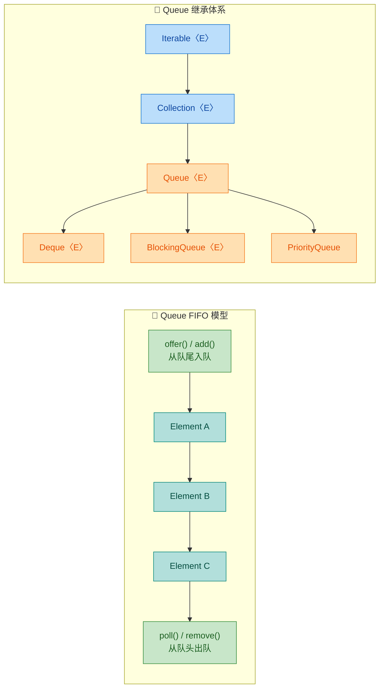
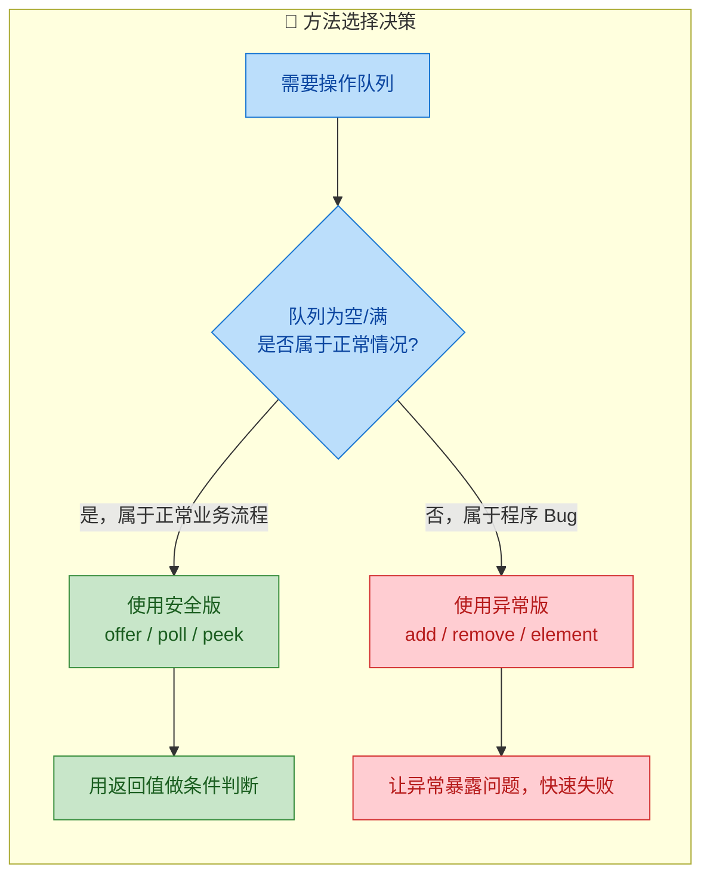
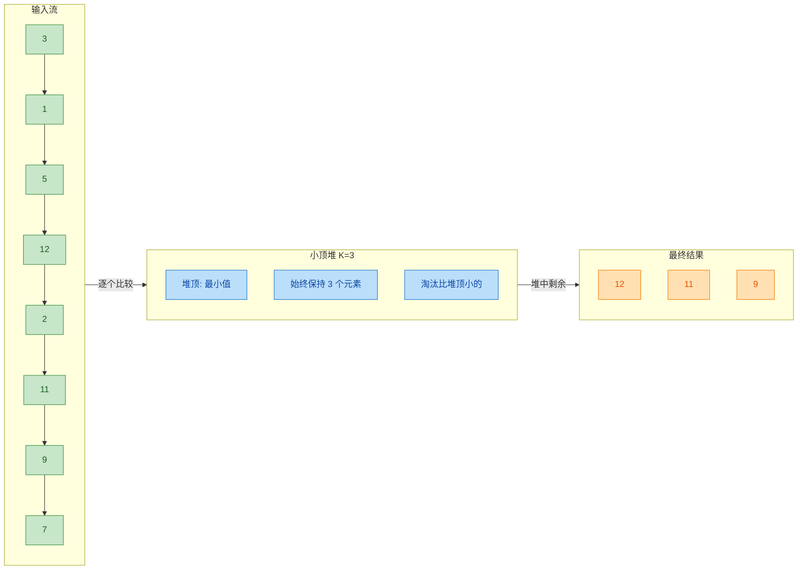
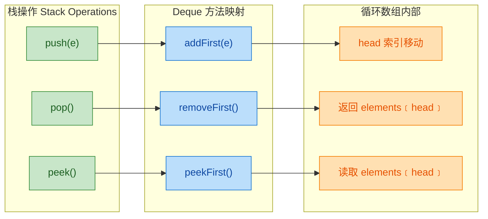
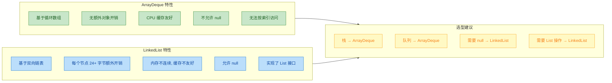
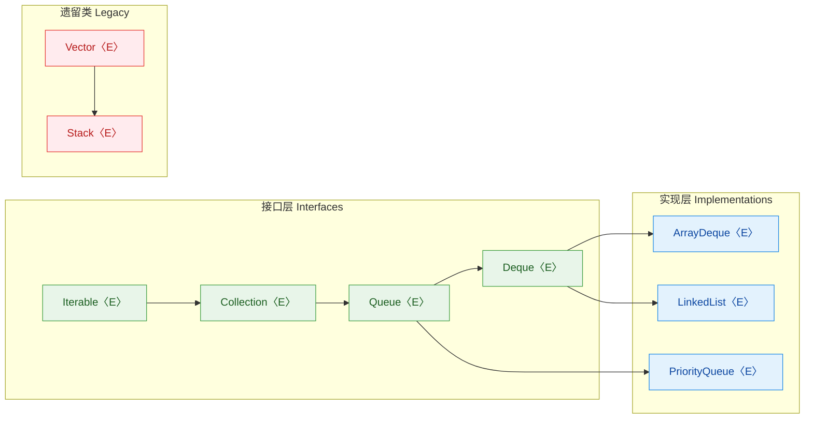
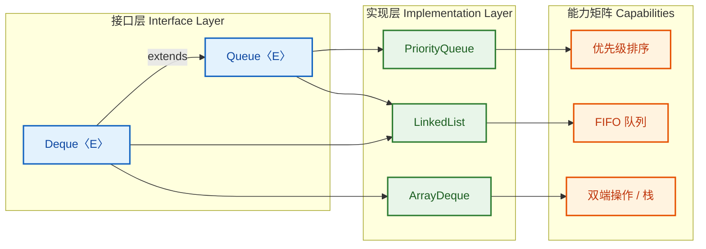
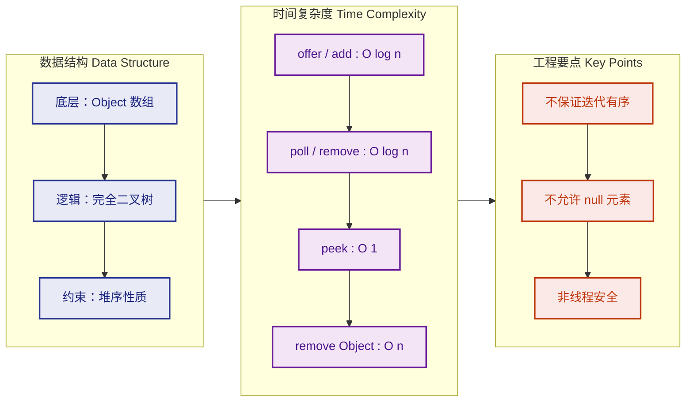
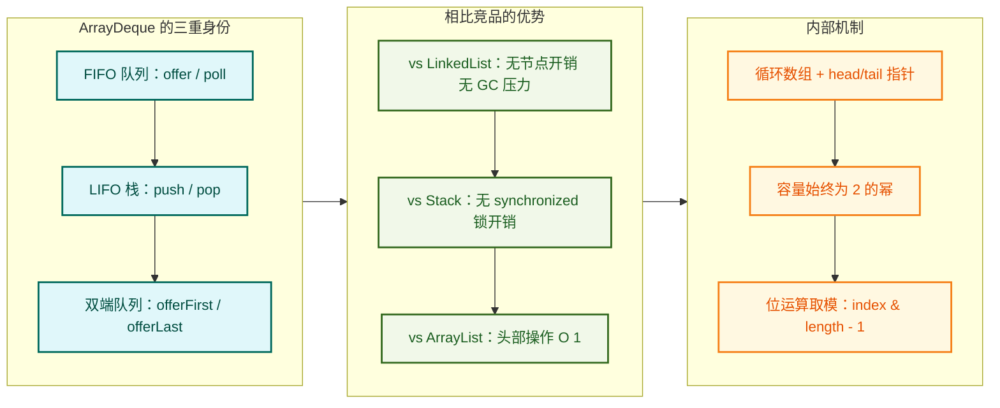
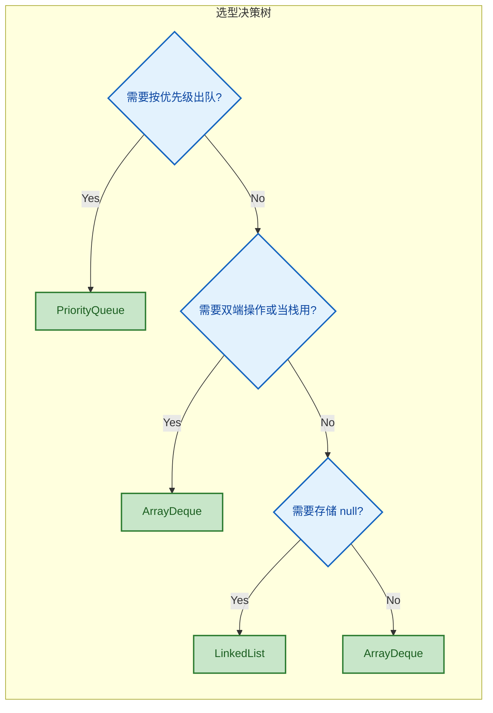

---

# Queue与Deque

---

## Queue 接口

Queue（队列）是 Java 集合框架中用于表示 **先进先出（FIFO, First-In-First-Out）** 数据结构的核心接口。它继承自 `Collection` 接口，定义在 `java.util` 包中。队列的本质就像现实生活中的排队——先到的人先被服务，后到的人排在队尾等待。



Queue 接口在 `Collection` 的基础上额外定义了 **6 个方法**，这 6 个方法按功能可以分为三组，每组都有两个版本——一个在操作失败时 **抛出异常**，另一个在操作失败时 **返回特殊值**（`null` 或 `false`）。这种"双版本"设计是 Queue 接口最核心的设计哲学，理解它就等于理解了 Queue 的一半。

### 三组六方法：异常版 vs 安全版

| 操作类型 | 抛异常版本 (Throws Exception) | 返回特殊值版本 (Returns Special Value) |
|:--------:|:----------------------------:|:-------------------------------------:|
| 入队（Insert） | `add(e)` | `offer(e)` |
| 出队（Remove） | `remove()` | `poll()` |
| 查看队头（Examine） | `element()` | `peek()` |

这张表是整个 Queue 接口的灵魂，务必牢记。下面逐组深入讲解。

---

### add(e) 与 offer(e)：入队操作

这两个方法都用于将元素插入到队列的 **尾部**，区别在于当队列容量已满、无法再插入时的行为不同。

`add(E e)` 方法继承自 `Collection` 接口。当插入成功时返回 `true`；当队列容量受限且已满时，它会直接抛出 `IllegalStateException`。对于无界队列（如 `LinkedList`、`PriorityQueue`），`add()` 几乎不会失败，因为它们没有容量上限（除非内存耗尽）。

`offer(E e)` 是 Queue 接口自己定义的方法。它是一种更"温和"的插入方式——插入成功返回 `true`，插入失败（队列已满）返回 `false`，不会抛出异常。这在有界队列（Bounded Queue）场景下尤其有用，比如 `ArrayBlockingQueue`。

```java
import java.util.LinkedList;
import java.util.Queue;
import java.util.concurrent.ArrayBlockingQueue;

public class InsertDemo {
    public static void main(String[] args) {

        // ========== 无界队列演示 ==========
        // LinkedList 实现了 Queue 接口，是一个无界队列
        Queue<String> unbounded = new LinkedList<>();

        // add() 和 offer() 在无界队列中行为几乎一致
        unbounded.add("Alice");      // 返回 true，插入成功
        unbounded.offer("Bob");      // 返回 true，插入成功
        System.out.println(unbounded); // 输出: [Alice, Bob]

        // ========== 有界队列演示 ==========
        // ArrayBlockingQueue 是一个容量固定的有界队列，这里容量设为 2
        Queue<String> bounded = new ArrayBlockingQueue<>(2);

        bounded.offer("X");  // 返回 true，当前队列: [X]
        bounded.offer("Y");  // 返回 true，当前队列: [X, Y]

        // 队列已满，offer() 优雅地返回 false
        boolean result = bounded.offer("Z");
        System.out.println("offer Z 结果: " + result); // 输出: false

        // 队列已满，add() 直接抛出 IllegalStateException
        try {
            bounded.add("Z"); // 这里会抛异常！
        } catch (IllegalStateException e) {
            // 捕获异常，打印错误信息
            System.out.println("add Z 异常: " + e.getMessage());
            // 输出: add Z 异常: Queue full
        }
    }
}
```

一个很自然的问题是：既然 `offer()` 更安全，为什么还要保留 `add()`？答案是 **接口兼容性**。`add()` 来自 `Collection` 接口，所有集合类都有这个方法。而 `offer()` 是 Queue 专属的语义化方法，它更明确地表达了"尝试入队"这个意图。在实际开发中，如果你使用的是有界队列，**强烈推荐使用 `offer()`**；如果是无界队列，两者皆可。

---

### remove() 与 poll()：出队操作

这两个方法都用于移除并返回队列 **头部** 的元素，区别在于当队列为空时的行为。

`remove()` 在队列为空时抛出 `NoSuchElementException`。它同样继承自 `Collection` 接口（准确说是通过 Queue 重新定义了语义，使其专门移除队头元素，而非 Collection 中"移除指定元素"的含义）。

`poll()` 在队列为空时返回 `null`，不抛异常。这是更安全的出队方式。

```java
import java.util.LinkedList;
import java.util.Queue;

public class RemoveDemo {
    public static void main(String[] args) {

        Queue<String> queue = new LinkedList<>();
        // 依次入队三个元素
        queue.offer("First");   // 队列: [First]
        queue.offer("Second");  // 队列: [First, Second]
        queue.offer("Third");   // 队列: [First, Second, Third]

        // remove() 移除并返回队头元素
        String r1 = queue.remove();
        System.out.println("remove: " + r1);  // 输出: First（FIFO，先进先出）
        // 此时队列: [Second, Third]

        // poll() 同样移除并返回队头元素
        String r2 = queue.poll();
        System.out.println("poll: " + r2);    // 输出: Second
        // 此时队列: [Third]

        // 继续取出最后一个
        queue.poll(); // 取出 Third，队列变空

        // ========== 队列为空时的差异 ==========

        // poll() 对空队列返回 null
        String safe = queue.poll();
        System.out.println("空队列 poll: " + safe);  // 输出: null

        // remove() 对空队列抛出 NoSuchElementException
        try {
            queue.remove(); // 这里会抛异常！
        } catch (java.util.NoSuchElementException e) {
            System.out.println("空队列 remove 异常: " + e);
            // 输出: 空队列 remove 异常: java.util.NoSuchElementException
        }
    }
}
```

这里有一个容易被忽视的陷阱：如果你的队列允许存储 `null` 元素（比如 `LinkedList` 允许），那么 `poll()` 返回 `null` 时，你就无法区分"队列为空"还是"队头元素恰好是 `null`"。这也是为什么 **大多数 Queue 实现都禁止插入 `null` 元素**（如 `PriorityQueue`、`ArrayDeque`），`LinkedList` 是少数例外之一。在实际开发中，**永远不要往队列里放 `null`**，这是一条重要的最佳实践。

---

### element() 与 peek()：查看队头

这两个方法都用于 **查看但不移除** 队列头部的元素，区别同样在于队列为空时的行为。

`element()` 在队列为空时抛出 `NoSuchElementException`。

`peek()` 在队列为空时返回 `null`。

```java
import java.util.LinkedList;
import java.util.Queue;

public class ExamineDemo {
    public static void main(String[] args) {

        Queue<Integer> queue = new LinkedList<>();
        queue.offer(100);  // 队列: [100]
        queue.offer(200);  // 队列: [100, 200]

        // element() 查看队头，不移除
        int head1 = queue.element();
        System.out.println("element: " + head1);     // 输出: 100
        System.out.println("队列大小: " + queue.size()); // 输出: 2（元素没有被移除）

        // peek() 同样查看队头，不移除
        int head2 = queue.peek();
        System.out.println("peek: " + head2);         // 输出: 100
        System.out.println("队列大小: " + queue.size()); // 输出: 2

        // 清空队列
        queue.clear();

        // ========== 队列为空时的差异 ==========

        // peek() 对空队列返回 null
        Integer safe = queue.peek();
        System.out.println("空队列 peek: " + safe);   // 输出: null

        // element() 对空队列抛出 NoSuchElementException
        try {
            queue.element(); // 这里会抛异常！
        } catch (java.util.NoSuchElementException e) {
            System.out.println("空队列 element 异常!");
            // 输出: 空队列 element 异常!
        }
    }
}
```

`peek()` 是日常开发中使用频率极高的方法。一个典型场景是：在循环中处理队列元素之前，先用 `peek()` 预览队头元素是否满足某个条件，满足才 `poll()` 取出处理。

---

### 方法选择决策指南

什么时候用哪个版本？这取决于你的业务语义：



简单来说：

- 如果队列为空/满是 **预期内的正常情况**（比如消费者线程发现队列暂时没数据），用 `offer/poll/peek`，通过返回值做逻辑判断。
- 如果队列为空/满意味着 **程序逻辑有 Bug**（比如你确信此时队列不可能为空），用 `add/remove/element`，让异常尽早暴露问题，这就是所谓的 **Fail-Fast** 思想。

---

### Queue 的常见实现类一览

Queue 只是一个接口，真正干活的是它的实现类。不同实现类有不同的特性和适用场景：

| 实现类 | 底层结构 | 是否有界 | 是否允许 null | 线程安全 | 排序规则 |
|:------:|:--------:|:--------:|:------------:|:--------:|:--------:|
| `LinkedList` | 双向链表 | 无界 | 允许 | 否 | FIFO |
| `PriorityQueue` | 二叉堆（数组） | 无界 | 不允许 | 否 | 自然排序/比较器 |
| `ArrayDeque` | 循环数组 | 无界（自动扩容） | 不允许 | 否 | FIFO |
| `ArrayBlockingQueue` | 数组 | 有界 | 不允许 | 是 | FIFO |
| `LinkedBlockingQueue` | 链表 | 可选有界 | 不允许 | 是 | FIFO |
| `ConcurrentLinkedQueue` | 无锁链表 | 无界 | 不允许 | 是（CAS） | FIFO |

在单线程环境下，如果你只需要一个普通的 FIFO 队列，**`ArrayDeque` 是首选**，它比 `LinkedList` 性能更好（缓存友好、无节点对象开销）。`PriorityQueue` 用于需要按优先级出队的场景。`LinkedList` 虽然也实现了 Queue，但由于链表节点的内存开销，通常不是最优选择。

---

### 经典使用模式：BFS 广度优先搜索

Queue 最经典的应用场景之一就是 **广度优先搜索（BFS, Breadth-First Search）**。下面用一个简单的二叉树层序遍历来展示 Queue 的实战用法：

```java
import java.util.ArrayDeque;
import java.util.ArrayList;
import java.util.List;
import java.util.Queue;

public class BfsDemo {

    // 简单的二叉树节点定义
    static class TreeNode {
        int val;           // 节点值
        TreeNode left;     // 左子节点
        TreeNode right;    // 右子节点

        TreeNode(int val) {
            this.val = val; // 构造时赋值
        }
    }

    /**
     * 层序遍历二叉树（BFS）
     * 利用队列的 FIFO 特性，逐层访问节点
     */
    static List<List<Integer>> levelOrder(TreeNode root) {
        // 存放最终结果：每一层是一个 List
        List<List<Integer>> result = new ArrayList<>();

        // 边界条件：空树直接返回
        if (root == null) return result;

        // 创建队列，ArrayDeque 是 Queue 的最佳通用实现
        Queue<TreeNode> queue = new ArrayDeque<>();
        // 根节点入队，作为第一层的起点
        queue.offer(root);

        // 只要队列不为空，说明还有节点未处理
        while (!queue.isEmpty()) {
            // 当前层的节点数量（此时队列中恰好全是当前层的节点）
            int levelSize = queue.size();
            // 存放当前层的所有节点值
            List<Integer> currentLevel = new ArrayList<>();

            // 逐个处理当前层的每个节点
            for (int i = 0; i < levelSize; i++) {
                // poll() 取出队头节点
                TreeNode node = queue.poll();
                // 将节点值加入当前层结果
                currentLevel.add(node.val);

                // 如果左子节点存在，入队（它属于下一层）
                if (node.left != null) {
                    queue.offer(node.left);
                }
                // 如果右子节点存在，入队（它属于下一层）
                if (node.right != null) {
                    queue.offer(node.right);
                }
            }
            // 当前层处理完毕，加入结果集
            result.add(currentLevel);
        }
        return result; // 返回所有层的遍历结果
    }

    public static void main(String[] args) {
        //       1
        //      / \
        //     2   3
        //    / \   \
        //   4   5   6
        TreeNode root = new TreeNode(1);          // 构建根节点
        root.left = new TreeNode(2);              // 左子节点
        root.right = new TreeNode(3);             // 右子节点
        root.left.left = new TreeNode(4);         // 左子节点的左子节点
        root.left.right = new TreeNode(5);        // 左子节点的右子节点
        root.right.right = new TreeNode(6);       // 右子节点的右子节点

        // 执行层序遍历
        List<List<Integer>> levels = levelOrder(root);
        // 输出: [[1], [2, 3], [4, 5, 6]]
        System.out.println(levels);
    }
}
```

这段代码完美展示了 Queue 的 FIFO 特性如何保证节点按层级顺序被访问。`offer()` 负责将下一层的子节点排入队尾，`poll()` 负责从队头取出当前层的节点进行处理，两者配合实现了"一层一层向下推进"的遍历效果。

---

**📝 练习题**

以下代码的输出结果是什么？

```java
Queue<Integer> q = new LinkedList<>();
q.offer(1);
q.offer(2);
q.offer(3);
q.poll();
q.offer(4);
System.out.println(q.peek() + " " + q.size());
```

A. 1 3


B. 2 3


C. 2 4


D. 3 3


**【答案】** B

**【解析】** 逐步分析队列状态变化：`offer(1)` → [1]，`offer(2)` → [1, 2]，`offer(3)` → [1, 2, 3]，`poll()` 移除队头 1 → [2, 3]，`offer(4)` → [2, 3, 4]。此时 `peek()` 查看队头为 2，`size()` 为 3，所以输出 `2 3`。关键在于 `poll()` 移除的是最先入队的元素 1（FIFO），而不是最后入队的 3。

---

## PriorityQueue（优先级队列）

`PriorityQueue` 是 Java 集合框架中一个非常独特的队列实现——它不遵循 FIFO 原则，而是每次出队时，自动弹出优先级最高（或最低）的元素。其底层基于 **二叉小顶堆（Min-Heap）** 实现，是算法题、任务调度、事件驱动系统中的核心数据结构。

```java
// 最基本的使用：默认是小顶堆，每次 poll() 取出最小值
PriorityQueue<Integer> pq = new PriorityQueue<>();
pq.offer(30);  // 入队 30
pq.offer(10);  // 入队 10
pq.offer(20);  // 入队 20

System.out.println(pq.poll()); // 输出 10（最小值先出）
System.out.println(pq.poll()); // 输出 20
System.out.println(pq.poll()); // 输出 30
```

这段代码的输出顺序是 `10 → 20 → 30`，而不是插入顺序 `30 → 10 → 20`。这就是 PriorityQueue 的核心行为：**出队顺序由元素的优先级决定，而非插入顺序**。

---

### 堆（Heap）实现原理

要真正理解 PriorityQueue，必须先理解它的底层数据结构——**二叉堆（Binary Heap）**。

#### 什么是二叉堆

二叉堆是一棵 **完全二叉树（Complete Binary Tree）**，它满足一个关键性质——**堆序性（Heap Order Property）**：

- **小顶堆（Min-Heap）**：任意节点的值 ≤ 其所有子节点的值。根节点是全局最小值。
- **大顶堆（Max-Heap）**：任意节点的值 ≥ 其所有子节点的值。根节点是全局最大值。

Java 的 `PriorityQueue` 默认实现的是 **小顶堆**。

```text
            10              ← 根节点，全局最小
           /  \
         20    30
        /  \
      40    50
```

注意一个关键点：**堆并不是完全排序的**。上图中 20 和 30 之间没有大小保证，40 和 50 之间也没有。堆只保证父节点 ≤ 子节点这一层关系，这就是为什么 `PriorityQueue` 的迭代器遍历结果不是有序的。

#### 数组存储完全二叉树

二叉堆的精妙之处在于：它用 **一维数组** 就能完美表示一棵完全二叉树，不需要任何指针或引用。

```java
// PriorityQueue 内部核心字段（JDK 源码简化）
transient Object[] queue;  // 用数组存储堆元素
int size;                  // 当前元素个数
```

数组下标与树节点的映射关系如下：

```text
数组索引:    [0]   [1]   [2]   [3]   [4]
数组内容:     10    20    30    40    50

对应的树结构:
                 10          ← index 0
                /  \
              20    30       ← index 1, 2
             /  \
           40    50          ← index 3, 4

索引公式（0-based）:
  父节点索引:     parent(i) = (i - 1) / 2
  左子节点索引:   left(i)   = 2 * i + 1
  右子节点索引:   right(i)  = 2 * i + 2
```

这组公式是堆操作的基石。比如索引 `3` 的父节点是 `(3-1)/2 = 1`，对应值 `20`，确实是 `40` 的父节点。这种用数组模拟树的方式，**缓存友好（cache-friendly）**，性能极高。

#### offer() — 上浮操作（Sift Up）

当新元素入队时，先放到数组末尾（即完全二叉树的最后一个位置），然后不断与父节点比较，如果比父节点小就交换，直到满足堆序性。这个过程叫 **上浮（Sift Up / Bubble Up / Percolate Up）**。

```java
// 模拟 offer(15) 的过程
// 初始状态:
//        10
//       /  \
//     20    30
//    /  \
//  40    50

// Step 1: 将 15 放到数组末尾 index=5（即 30 的左子节点）
//        10
//       /  \
//     20    30
//    /  \   /
//  40  50  15    ← 新元素

// Step 2: 比较 15 和父节点 30（index=(5-1)/2=2），15 < 30，交换
//        10
//       /  \
//     20    15   ← 上浮到 index=2
//    /  \   /
//  40  50  30

// Step 3: 比较 15 和父节点 10（index=(2-1)/2=0），15 > 10，停止
// 最终结果: [10, 20, 15, 40, 50, 30]
```

对应的 JDK 源码核心逻辑（简化版）：

```java
// JDK PriorityQueue.siftUp 简化版
private void siftUpComparable(int k, E x) {
    Comparable<? super E> key = (Comparable<? super E>) x; // 将元素转为 Comparable
    while (k > 0) {                          // 只要还没到根节点就继续
        int parent = (k - 1) >>> 1;          // 计算父节点索引（无符号右移1位等价于除以2）
        Object e = queue[parent];            // 取出父节点的值
        if (key.compareTo((E) e) >= 0)       // 如果新元素 >= 父节点，堆序性满足
            break;                           // 停止上浮
        queue[k] = e;                        // 否则，将父节点下移到当前位置
        k = parent;                          // 当前位置上移到父节点位置
    }
    queue[k] = key;                          // 最终将新元素放到正确位置
}
```

时间复杂度：**O(log n)**，因为完全二叉树的高度是 log₂n，最多上浮这么多层。

#### poll() — 下沉操作（Sift Down）

出队时，取走根节点（最小值），然后把数组最后一个元素移到根的位置，再不断与较小的子节点交换，直到堆序性恢复。这个过程叫 **下沉（Sift Down / Bubble Down / Percolate Down）**。

```java
// 模拟 poll() 的过程
// 初始状态: [10, 20, 15, 40, 50, 30]
//        10          ← 取走这个（返回值）
//       /  \
//     20    15
//    /  \   /
//  40  50  30

// Step 1: 取走根节点 10，将末尾元素 30 放到根
//        30          ← 末尾元素放到根
//       /  \
//     20    15
//    /  \
//  40  50

// Step 2: 比较 30 与子节点 20、15，选较小的 15（index=2），30 > 15，交换
//        15
//       /  \
//     20    30       ← 下沉到 index=2
//    /  \
//  40  50

// Step 3: 30 在 index=2，无子节点，停止
// 最终结果: [15, 20, 30, 40, 50]，返回 10
```

对应的 JDK 源码核心逻辑（简化版）：

```java
// JDK PriorityQueue.siftDown 简化版
private void siftDownComparable(int k, E x) {
    Comparable<? super E> key = (Comparable<? super E>) x; // 将元素转为 Comparable
    int half = size >>> 1;                   // 只有索引 < size/2 的节点才有子节点
    while (k < half) {                       // 只要当前节点不是叶子节点
        int child = (k << 1) + 1;            // 左子节点索引 = 2*k + 1
        Object c = queue[child];             // 取左子节点的值
        int right = child + 1;               // 右子节点索引
        if (right < size &&                  // 如果右子节点存在
            ((Comparable<? super E>) c).compareTo((E) queue[right]) > 0) // 且左 > 右
            c = queue[child = right];        // 选择较小的右子节点
        if (key.compareTo((E) c) <= 0)       // 如果当前元素 <= 较小子节点
            break;                           // 堆序性满足，停止下沉
        queue[k] = c;                        // 否则，将较小子节点上移
        k = child;                           // 当前位置下移到子节点位置
    }
    queue[k] = key;                          // 最终将元素放到正确位置
}
```

时间复杂度同样是 **O(log n)**。

#### 完整操作复杂度一览

```text
┌─────────────┬──────────────┬──────────────────────────────────┐
│   操作       │  时间复杂度   │  说明                            │
├─────────────┼──────────────┼──────────────────────────────────┤
│ offer(e)    │  O(log n)    │  尾部插入 + 上浮                  │
│ poll()      │  O(log n)    │  取根 + 末尾补根 + 下沉            │
│ peek()      │  O(1)        │  直接返回 queue[0]                │
│ remove(o)   │  O(n)        │  线性查找 O(n) + 下沉/上浮 O(log n)│
│ contains(o) │  O(n)        │  线性扫描数组                     │
│ size()      │  O(1)        │  直接返回 size 字段               │
└─────────────┴──────────────┴──────────────────────────────────┘
```

#### 扩容机制

PriorityQueue 的默认初始容量是 **11**。当数组满了需要扩容时：

```java
// JDK 源码简化
private void grow(int minCapacity) {
    int oldCapacity = queue.length;          // 旧容量
    int newCapacity = oldCapacity +          // 新容量 =
        ((oldCapacity < 64) ?                // 如果旧容量 < 64
         (oldCapacity + 2) :                 //   翻倍 + 2（小数组快速增长）
         (oldCapacity >> 1));                //   否则增长 50%（大数组温和增长）
    // ... 边界检查后创建新数组并拷贝
    queue = Arrays.copyOf(queue, newCapacity);
}
```

这个策略很聪明：小堆时激进扩容减少频繁拷贝，大堆时保守扩容节省内存。

---

### 自定义比较器（Comparator）

默认的 PriorityQueue 是小顶堆，依赖元素的 `Comparable` 自然排序。但实际开发中，我们经常需要自定义优先级规则，这时就需要传入 `Comparator`。

#### 大顶堆：反转排序

最常见的需求就是把小顶堆变成大顶堆：

```java
// 方式一：使用 Comparator.reverseOrder()（推荐，最简洁）
PriorityQueue<Integer> maxHeap = new PriorityQueue<>(Comparator.reverseOrder());

// 方式二：使用 Lambda 表达式
PriorityQueue<Integer> maxHeap2 = new PriorityQueue<>((a, b) -> b - a);
// ⚠️ 注意：b - a 在极端值时可能溢出，生产代码建议用 Integer.compare(b, a)

// 方式三：安全的 Lambda 写法
PriorityQueue<Integer> maxHeap3 = new PriorityQueue<>((a, b) -> Integer.compare(b, a));

// 验证
maxHeap.offer(10);  // 入队
maxHeap.offer(30);  // 入队
maxHeap.offer(20);  // 入队
System.out.println(maxHeap.poll()); // 输出 30（最大值先出）
System.out.println(maxHeap.poll()); // 输出 20
System.out.println(maxHeap.poll()); // 输出 10
```

关于 `(a, b) -> b - a` 的溢出问题值得展开说明：

```java
// 当 b = Integer.MAX_VALUE, a = -1 时
// b - a = Integer.MAX_VALUE - (-1) = Integer.MAX_VALUE + 1 → 溢出为负数！
// 这会导致比较结果错误，堆的排序被破坏
// 所以生产代码务必使用 Integer.compare(b, a)
```

#### 自定义对象排序

实际项目中，PriorityQueue 里放的往往不是简单的 Integer，而是自定义对象。比如一个任务调度场景：

```java
// 定义任务类
class Task {
    String name;       // 任务名称
    int priority;      // 优先级数值（越小越优先）
    long timestamp;    // 创建时间戳

    Task(String name, int priority) {
        this.name = name;                          // 设置任务名
        this.priority = priority;                  // 设置优先级
        this.timestamp = System.nanoTime();        // 记录创建时间
    }

    @Override
    public String toString() {
        return name + "(P" + priority + ")";       // 便于打印查看
    }
}

// 创建优先级队列：先按 priority 升序，priority 相同则按 timestamp 升序（先来先服务）
PriorityQueue<Task> taskQueue = new PriorityQueue<>(
    Comparator.comparingInt((Task t) -> t.priority)   // 主排序：优先级数值小的先出
              .thenComparingLong(t -> t.timestamp)     // 次排序：时间戳小的（更早的）先出
);

taskQueue.offer(new Task("发送邮件", 3));      // 低优先级任务
taskQueue.offer(new Task("数据库备份", 1));    // 高优先级任务
taskQueue.offer(new Task("日志清理", 3));      // 低优先级任务（与"发送邮件"同级）
taskQueue.offer(new Task("安全扫描", 2));      // 中优先级任务

// 按优先级依次处理
while (!taskQueue.isEmpty()) {
    System.out.println("处理: " + taskQueue.poll());
}
// 输出:
// 处理: 数据库备份(P1)
// 处理: 安全扫描(P2)
// 处理: 发送邮件(P3)     ← 同为 P3，但比"日志清理"先入队
// 处理: 日志清理(P3)
```

`Comparator.comparingInt().thenComparingLong()` 这种链式写法是 Java 8+ 的推荐方式，比手写 `compare` 方法更清晰、更不容易出错。

#### Comparator 的多种构建方式对比

```java
// ① Lambda（适合简单逻辑）
Comparator<Task> c1 = (a, b) -> Integer.compare(a.priority, b.priority);

// ② 方法引用 + comparingInt（推荐，类型安全且可读性好）
Comparator<Task> c2 = Comparator.comparingInt(Task::getPriority);

// ③ 多级排序链式调用（复杂排序的最佳实践）
Comparator<Task> c3 = Comparator
    .comparingInt(Task::getPriority)          // 第一排序键
    .thenComparingLong(Task::getTimestamp)    // 第二排序键
    .thenComparing(Task::getName);            // 第三排序键（字典序）

// ④ 反转任意 Comparator
Comparator<Task> c4 = c2.reversed();         // 优先级高（数值大）的先出
```

#### 经典应用场景：Top-K 问题

PriorityQueue 最经典的算法应用之一就是 **Top-K 问题**——从海量数据中找出最大（或最小）的 K 个元素。

```java
/**
 * 找出数组中最大的 K 个元素
 * 核心思路：维护一个大小为 K 的小顶堆
 *   - 堆顶始终是堆中最小的元素
 *   - 遍历完成后，堆中剩下的就是最大的 K 个
 */
public static int[] topK(int[] nums, int k) {
    // 创建小顶堆（默认行为）
    PriorityQueue<Integer> minHeap = new PriorityQueue<>(k);

    for (int num : nums) {                    // 遍历每个元素
        if (minHeap.size() < k) {             // 堆还没满
            minHeap.offer(num);               // 直接入堆
        } else if (num > minHeap.peek()) {    // 堆满了，但当前元素比堆顶大
            minHeap.poll();                   // 弹出堆顶（当前堆中最小的）
            minHeap.offer(num);               // 将更大的元素入堆
        }
        // 如果 num <= 堆顶，说明它不可能是 Top-K，直接跳过
    }

    // 将堆中元素转为数组返回
    int[] result = new int[k];                // 创建结果数组
    for (int i = k - 1; i >= 0; i--) {        // 从后往前填充（poll 出来是从小到大）
        result[i] = minHeap.poll();           // 依次取出
    }
    return result;                            // 返回结果，已从大到小排列
}

// 使用示例
int[] data = {3, 1, 5, 12, 2, 11, 9, 7};
int[] top3 = topK(data, 3);
System.out.println(Arrays.toString(top3));    // 输出 [12, 11, 9]
```

为什么用小顶堆找最大的 K 个，而不是用大顶堆？这是一个关键的思维点：

```text
目标：找最大的 K 个元素

方案 A（大顶堆）：全部入堆，然后 poll K 次 → 时间 O(n log n)，空间 O(n)
方案 B（小顶堆）：维护大小为 K 的堆      → 时间 O(n log K)，空间 O(K) ✅

当 n 远大于 K 时（比如从 1 亿条数据中找 Top 10），
方案 B 的优势是压倒性的：log(10) vs log(1亿) ≈ 3.3 vs 26.6
```



#### 另一个经典场景：合并 K 个有序链表

这是 LeetCode 第 23 题，也是面试高频题。PriorityQueue 在这里充当一个 **多路归并（K-way Merge）** 的调度器：

```java
/**
 * 合并 K 个升序链表为一个升序链表
 * 思路：用小顶堆维护每个链表的当前头节点，每次取最小的接到结果链表
 */
public ListNode mergeKLists(ListNode[] lists) {
    // 创建小顶堆，按节点值排序
    PriorityQueue<ListNode> pq = new PriorityQueue<>(
        Comparator.comparingInt(node -> node.val)       // 按节点值升序
    );

    // 将每个链表的头节点入堆
    for (ListNode head : lists) {        // 遍历所有链表
        if (head != null) {              // 跳过空链表
            pq.offer(head);              // 头节点入堆
        }
    }

    ListNode dummy = new ListNode(0);    // 哨兵节点，简化链表操作
    ListNode tail = dummy;               // tail 指针指向结果链表的尾部

    while (!pq.isEmpty()) {              // 堆不为空就继续
        ListNode min = pq.poll();        // 取出当前最小节点
        tail.next = min;                 // 接到结果链表尾部
        tail = tail.next;               // tail 后移
        if (min.next != null) {          // 如果该节点还有后继
            pq.offer(min.next);          // 后继节点入堆
        }
    }

    return dummy.next;                   // 返回哨兵节点的下一个，即真正的头节点
}
```

#### 使用 PriorityQueue 的注意事项

有几个容易踩的坑需要特别注意：

```java
// ❌ 坑 1：迭代器遍历不保证顺序！
PriorityQueue<Integer> pq = new PriorityQueue<>(List.of(30, 10, 20));
for (int val : pq) {
    System.out.print(val + " ");  // 可能输出 10 30 20，不是 10 20 30！
}
// 堆的数组存储只保证 queue[0] 是最小值，其余位置没有严格排序
// ✅ 如果需要有序遍历，必须反复 poll()

// ❌ 坑 2：不允许 null 元素
PriorityQueue<String> pq2 = new PriorityQueue<>();
pq2.offer(null);  // 抛出 NullPointerException！

// ❌ 坑 3：不是线程安全的
// 多线程环境请使用 PriorityBlockingQueue（java.util.concurrent 包）

// ❌ 坑 4：修改已入堆元素的排序字段后，堆不会自动调整
Task task = new Task("test", 5);
taskQueue.offer(task);
task.priority = 1;    // 直接修改优先级
// 堆结构已经被破坏！poll() 的结果可能不正确
// ✅ 正确做法：先 remove，修改后再 offer
taskQueue.remove(task);       // 先移除
task.priority = 1;            // 修改优先级
taskQueue.offer(task);        // 重新入堆
```

---

**📝 练习题**

以下代码的输出结果是什么？

```java
PriorityQueue<int[]> pq = new PriorityQueue<>(
    (a, b) -> a[0] != b[0] ? a[0] - b[0] : b[1] - a[1]
);
pq.offer(new int[]{1, 100});
pq.offer(new int[]{2, 50});
pq.offer(new int[]{1, 200});
pq.offer(new int[]{3, 10});

System.out.println(Arrays.toString(pq.poll()));
System.out.println(Arrays.toString(pq.poll()));
```

A. `[1, 100]` 然后 `[1, 200]`

B. `[1, 200]` 然后 `[1, 100]`

C. `[1, 100]` 然后 `[2, 50]`

D. `[3, 10]` 然后 `[2, 50]`


**【答案】** B

**【解析】** Comparator 的逻辑是：先按 `a[0]` 升序排列（`a[0] - b[0]`），当 `a[0]` 相同时，按 `a[1]` 降序排列（`b[1] - a[1]`）。队列中有两个 `a[0] = 1` 的元素：`{1, 100}` 和 `{1, 200}`。由于第二维是降序，`200 > 100`，所以 `{1, 200}` 优先级更高，先被 poll 出来。第二次 poll 取出 `{1, 100}`，因为它的第一维仍然是最小值 1。这种"第一维升序、第二维降序"的排序策略在算法题中非常常见，比如 LeetCode 406（根据身高重建队列）。

---

## ArrayDeque —— 双端队列与栈的最佳替代方案

`ArrayDeque`（Array Double Ended Queue）是 Java 集合框架中基于 **可变长循环数组（resizable circular array）** 实现的双端队列。它同时实现了 `Deque` 接口，这意味着它既可以当作 **队列（Queue）** 使用，也可以当作 **栈（Stack）** 使用。

Java 官方文档中有一句非常经典的推荐：

> "This class is likely to be faster than Stack when used as a stack, and faster than LinkedList when used as a queue."

这句话道出了 `ArrayDeque` 的核心定位：它是 `java.util.Stack` 和 `LinkedList`（作为队列使用时）的全面替代者。`Stack` 继承自 `Vector`，所有方法都带有 `synchronized` 同步锁，在单线程场景下是不必要的性能开销；而 `LinkedList` 每个节点都需要额外的对象头和前后指针，内存开销远大于数组。`ArrayDeque` 用一个简洁的循环数组就解决了这两个问题。

---

### 循环数组的内部结构

理解 `ArrayDeque` 的关键在于理解它底层的 **循环数组（Circular Array）** 机制。它维护了三个核心字段：

```java
// ArrayDeque 核心字段（JDK 源码简化）
transient Object[] elements;  // 存储元素的底层数组
transient int head;           // 指向队列头部元素的索引
transient int tail;           // 指向队列尾部下一个空位的索引
```

这里的 `head` 和 `tail` 并不是从 0 开始单调递增的，而是在数组中 **循环移动** 的。当索引到达数组末尾时，会绕回到数组开头，形成一个逻辑上的"环"。这就是"循环"的含义。

我们用一个 ASCII 图来直观感受。假设底层数组长度为 8，当前存储了 `A, B, C, D` 四个元素：

```text
  ┌───────────────────── 物理数组 (length = 8) ─────────────────────┐
  │ Index:   0       1       2       3       4       5       6       7  │
  │        ┌─────┬─────┬─────┬─────┬─────┬─────┬─────┬─────┐          │
  │ Value: │     │     │  A  │  B  │  C  │  D  │     │     │          │
  │        └─────┴─────┴─────┴─────┴─────┴─────┴─────┴─────┘          │
  │                      ↑                       ↑                      │
  │                    head=2                   tail=6                   │
  └─────────────────────────────────────────────────────────────────────┘

  逻辑视图（循环）：
        ┌───┐   ┌───┐   ┌───┐   ┌───┐
  HEAD→ │ A │──→│ B │──→│ C │──→│ D │ ←TAIL
        └───┘   └───┘   └───┘   └───┘
```

当我们在头部插入元素 `Z` 时，`head` 会向左移动一格（即 `head = (head - 1) & (length - 1)`），变成索引 1：

```text
  ┌───────────────────── 插入 Z 到头部后 ───────────────────────────┐
  │ Index:   0       1       2       3       4       5       6       7  │
  │        ┌─────┬─────┬─────┬─────┬─────┬─────┬─────┬─────┐          │
  │ Value: │     │  Z  │  A  │  B  │  C  │  D  │     │     │          │
  │        └─────┴─────┴─────┴─────┴─────┴─────┴─────┴─────┘          │
  │                 ↑                             ↑                      │
  │               head=1                        tail=6                   │
  └─────────────────────────────────────────────────────────────────────┘
```

这里有一个非常精妙的设计：`ArrayDeque` 强制底层数组长度始终为 **2 的幂次方**。这样做的好处是可以用 **位运算** 代替取模运算来实现索引的循环：

```java
// 传统取模方式（有除法，较慢）
int nextIndex = (index + 1) % elements.length;

// ArrayDeque 的位运算方式（极快）
// 当 length 是 2 的幂时，(length - 1) 的二进制全是 1
// 例如 length=8 → length-1=7 → 二进制 0111
// 任何数 & 0111 的效果等同于 % 8
int nextIndex = (index + 1) & (elements.length - 1);
```

这个位运算技巧在 `HashMap` 中也被广泛使用，是 Java 集合框架中的经典优化手段。

---

### 核心操作源码剖析

`ArrayDeque` 实现了 `Deque` 接口，支持在两端进行插入和删除。我们逐一分析关键方法。

#### 头部插入：addFirst / offerFirst

```java
// 在队列头部插入元素
public void addFirst(E e) {
    if (e == null)                              // ArrayDeque 不允许 null 元素
        throw new NullPointerException();       // 因为 null 被用作内部的"空位"标记
    head = (head - 1) & (elements.length - 1);  // head 左移一位（循环）
    elements[head] = e;                         // 将元素放入新的 head 位置
    if (head == tail)                           // 如果 head 追上了 tail，说明数组满了
        doubleCapacity();                       // 扩容为原来的两倍
}
```

注意 `ArrayDeque` **不允许存储 `null`**。这是因为内部数组用 `null` 来标识空位，如果允许存储 `null`，就无法区分"这个位置是空的"还是"这个位置存了一个 null"。这是它与 `LinkedList` 的一个重要区别。

#### 尾部插入：addLast / offerLast

```java
// 在队列尾部插入元素
public void addLast(E e) {
    if (e == null)                              // 同样禁止 null
        throw new NullPointerException();
    elements[tail] = e;                         // 将元素放入当前 tail 位置
    tail = (tail + 1) & (elements.length - 1);  // tail 右移一位（循环）
    if (tail == head)                           // 满了就扩容
        doubleCapacity();
}
```

对比 `addFirst` 和 `addLast`，你会发现一个有趣的对称性：`addFirst` 是先移动 `head` 再赋值，`addLast` 是先赋值再移动 `tail`。这是因为 `head` 指向的是第一个有效元素，而 `tail` 指向的是尾部的下一个空位。

#### 头部删除：pollFirst

```java
// 从队列头部移除并返回元素
public E pollFirst() {
    final Object[] es = elements;               // 获取底层数组引用
    final int h = head;                         // 缓存 head 索引
    E e = (E) es[h];                            // 取出 head 位置的元素
    if (e != null) {                            // 如果不为 null，说明队列非空
        es[h] = null;                           // 将该位置置为 null（帮助 GC）
        head = (h + 1) & (es.length - 1);       // head 右移一位
    }
    return e;                                   // 队列为空时返回 null
}
```

这里 `es[h] = null` 这一步非常重要。如果不把已移除的位置置为 `null`，那么数组仍然持有对该对象的引用，垃圾回收器就无法回收它，造成 **内存泄漏（memory leak）**。这也是为什么 `ArrayDeque` 不允许存 `null` 的另一个原因——`null` 在这里承担了"标记空位"的职责。

#### 扩容机制：doubleCapacity

```java
// 容量翻倍
private void doubleCapacity() {
    assert head == tail;                        // 断言：只有满了才会调用
    int p = head;                               // 记录旧 head 位置
    int n = elements.length;                    // 旧数组长度
    int r = n - p;                              // head 右侧的元素个数
    int newCapacity = n << 1;                   // 新容量 = 旧容量 × 2（左移一位）
    if (newCapacity < 0)                        // 溢出检查
        throw new IllegalStateException("Sorry, deque too big");
    Object[] a = new Object[newCapacity];       // 创建新数组
    System.arraycopy(elements, p, a, 0, r);     // 复制 head 右侧部分到新数组开头
    System.arraycopy(elements, 0, a, r, p);     // 复制 head 左侧部分紧随其后
    elements = a;                               // 替换底层数组
    head = 0;                                   // 重置 head 到 0
    tail = n;                                   // tail 指向旧容量位置
}
```

扩容过程可以用图来理解。假设旧数组长度为 8，已满，`head=5`：

```text
  扩容前 (length=8, head=5, tail=5 即满):
  ┌─────┬─────┬─────┬─────┬─────┬─────┬─────┬─────┐
  │  E  │  F  │  G  │  H  │     │  A  │  B  │  C  │
  └─────┴─────┴─────┴─────┴─────┴─────┴─────┴─────┘
    0      1      2     3     4  ↑  5     6     7
                                 head=tail=4 (假设)

  实际假设 head=5, tail=5:
  Index:  0     1     2     3     4     5     6     7
        ┌─────┬─────┬─────┬─────┬─────┬─────┬─────┬─────┐
        │  D  │  E  │  F  │  G  │  H  │  A  │  B  │  C  │
        └─────┴─────┴─────┴─────┴─────┴─────┴─────┴─────┘
                                        ↑head              
                                        ↑tail (head==tail → 满)

  第一次 arraycopy: 复制 [5,6,7] → 即 A,B,C → 到新数组 [0,1,2]
  第二次 arraycopy: 复制 [0,1,2,3,4] → 即 D,E,F,G,H → 到新数组 [3,4,5,6,7]

  扩容后 (length=16, head=0, tail=8):
  Index:  0     1     2     3     4     5     6     7     8    ...   15
        ┌─────┬─────┬─────┬─────┬─────┬─────┬─────┬─────┬─────┬───┬─────┐
        │  A  │  B  │  C  │  D  │  E  │  F  │  G  │  H  │     │...│     │
        └─────┴─────┴─────┴─────┴─────┴─────┴─────┴─────┴─────┴───┴─────┘
        ↑head                                              ↑tail
```

扩容后元素被"拉直"了，从逻辑顺序上变得连续，`head` 回到 0，`tail` 指向第一个空位。

---

### Deque 接口的方法全景

`ArrayDeque` 实现了完整的 `Deque` 接口。下面这张表梳理了所有双端操作的对应关系：

```text
  ┌──────────────┬──────────────────────┬──────────────────────┐
  │    操作类型    │      头部 (First)     │      尾部 (Last)      │
  ├──────────────┼──────────────────────┼──────────────────────┤
  │  插入(异常)   │  addFirst(e)         │  addLast(e)          │
  │  插入(返回值)  │  offerFirst(e)       │  offerLast(e)        │
  ├──────────────┼──────────────────────┼──────────────────────┤
  │  删除(异常)   │  removeFirst()       │  removeLast()        │
  │  删除(返回值)  │  pollFirst()         │  pollLast()          │
  ├──────────────┼──────────────────────┼──────────────────────┤
  │  查看(异常)   │  getFirst()          │  getLast()           │
  │  查看(返回值)  │  peekFirst()         │  peekLast()          │
  └──────────────┴──────────────────────┴──────────────────────┘
```

由于 `ArrayDeque` 是无界的（会自动扩容），`add` 系列和 `offer` 系列在行为上几乎没有区别——`offer` 永远返回 `true`。但在语义上，如果你把它当作有界队列的接口来编程，使用 `offer/poll/peek` 是更规范的选择。

---

### ArrayDeque 作为栈的替代方案

Java 早期提供的 `java.util.Stack` 类继承自 `Vector`，存在两个严重的设计问题：

第一，`Vector` 的所有方法都是 `synchronized` 的，这意味着即使在单线程环境下，每次 `push`、`pop` 操作都要获取和释放锁，带来不必要的性能损耗。

第二，`Stack` 继承了 `Vector` 的全部公开方法，包括 `add(int index, E element)`、`remove(int index)` 等按索引随机访问的方法。这完全破坏了栈"只能从顶部操作"的抽象，违反了 **里氏替换原则（Liskov Substitution Principle）**。

`ArrayDeque` 完美解决了这两个问题。它没有同步开销，且通过 `Deque` 接口提供了干净的栈操作语义：

```java
// ========== 用 ArrayDeque 替代 Stack ==========

// 创建一个"栈"
Deque<String> stack = new ArrayDeque<>();  // 推荐用 Deque 接口声明

// 入栈（push）—— 等价于 addFirst
stack.push("第一层");    // 底层调用 addFirst()
stack.push("第二层");    // 新元素压到栈顶
stack.push("第三层");    // 栈顶现在是"第三层"

// 查看栈顶（peek）—— 等价于 peekFirst
String top = stack.peek();               // 返回"第三层"，不移除
System.out.println("栈顶: " + top);      // 输出: 栈顶: 第三层

// 出栈（pop）—— 等价于 removeFirst
String popped = stack.pop();             // 移除并返回"第三层"
System.out.println("弹出: " + popped);   // 输出: 弹出: 第三层

// 此时栈内容: [第二层, 第一层]（从顶到底）
System.out.println("剩余大小: " + stack.size());  // 输出: 剩余大小: 2
```

下面这张流程图展示了 `push`、`pop`、`peek` 在 `ArrayDeque` 中的方法映射关系：



注意 `push` 和 `pop` 都操作的是 **头部（head）**，而不是尾部。这是因为对循环数组来说，头部操作和尾部操作的时间复杂度都是 O(1)，选择头部只是一种约定。

---

### ArrayDeque 作为队列的替代方案

当需要一个普通的 FIFO 队列时，`ArrayDeque` 同样优于 `LinkedList`：

```java
// ========== 用 ArrayDeque 作为 FIFO 队列 ==========

Queue<String> queue = new ArrayDeque<>();  // 用 Queue 接口声明

// 入队（enqueue）—— 从尾部添加
queue.offer("任务A");    // 底层调用 offerLast()
queue.offer("任务B");    // 排在 A 后面
queue.offer("任务C");    // 排在 B 后面

// 查看队首
String front = queue.peek();              // 返回"任务A"，不移除
System.out.println("队首: " + front);     // 输出: 队首: 任务A

// 出队（dequeue）—— 从头部移除
String first = queue.poll();              // 移除并返回"任务A"
System.out.println("出队: " + first);     // 输出: 出队: 任务A

// 此时队列: [任务B, 任务C]
System.out.println("队列大小: " + queue.size());  // 输出: 队列大小: 2
```

---

### ArrayDeque vs LinkedList：全面对比

很多初学者会疑惑：`LinkedList` 也实现了 `Deque` 接口，为什么要优先选择 `ArrayDeque`？我们从多个维度来对比：



从内存布局的角度来深入理解这个差异：

```text
  ArrayDeque 内存布局（连续数组）:
  ┌──────────────────────────────────────────────┐
  │  [ref0] [ref1] [ref2] [ref3] [ref4] [ref5]  │  ← 一块连续内存
  └──────────────────────────────────────────────┘
  CPU 预取 (prefetch) 可以一次性加载相邻元素到缓存行 (cache line)

  LinkedList 内存布局（散落的节点对象）:
  ┌──────────┐     ┌──────────┐     ┌──────────┐
  │ Node@A03 │────→│ Node@F71 │────→│ Node@2B9 │
  │ prev     │     │ prev     │     │ prev     │
  │ item     │     │ item     │     │ item     │
  │ next  ───┼────→│ next  ───┼────→│ next     │
  └──────────┘     └──────────┘     └──────────┘
    堆中随机位置       堆中随机位置       堆中随机位置
  每次访问下一个节点都可能触发 cache miss
```

`ArrayDeque` 的数组元素在内存中是连续存放的，CPU 的缓存预取机制（hardware prefetching）可以高效地将相邻数据加载到 L1/L2 缓存中。而 `LinkedList` 的每个 `Node` 对象散落在堆的不同位置，遍历时几乎每一步都会产生 **缓存未命中（cache miss）**，这在现代 CPU 架构下是非常昂贵的。

此外，`LinkedList` 的每个节点除了存储元素引用外，还需要 `prev` 指针、`next` 指针和对象头（object header），在 64 位 JVM 上每个节点至少额外消耗 24 字节。当存储大量小对象时，这个开销是相当可观的。

---

### 实战：用 ArrayDeque 实现经典算法

#### 括号匹配检查器

括号匹配是栈的经典应用场景。我们用 `ArrayDeque` 来实现：

```java
public class BracketChecker {

    /**
     * 检查字符串中的括号是否匹配
     * 支持 (), [], {} 三种括号
     */
    public static boolean isValid(String s) {
        // 使用 ArrayDeque 作为栈
        Deque<Character> stack = new ArrayDeque<>();

        // 遍历字符串中的每个字符
        for (char c : s.toCharArray()) {
            // 遇到左括号，压入对应的右括号（技巧：方便后续直接比较）
            if (c == '(') {
                stack.push(')');          // 期望后续遇到 ')'
            } else if (c == '[') {
                stack.push(']');          // 期望后续遇到 ']'
            } else if (c == '{') {
                stack.push('}');          // 期望后续遇到 '}'
            } else {
                // 遇到右括号时：
                // 1. 栈为空 → 没有匹配的左括号 → 无效
                // 2. 栈顶不等于当前字符 → 括号类型不匹配 → 无效
                if (stack.isEmpty() || stack.pop() != c) {
                    return false;         // 不匹配，直接返回
                }
            }
        }

        // 遍历结束后，栈必须为空（所有左括号都被匹配了）
        return stack.isEmpty();
    }

    public static void main(String[] args) {
        System.out.println(isValid("({[]})"));   // true  —— 完美嵌套
        System.out.println(isValid("([)]"));     // false —— 交叉嵌套
        System.out.println(isValid("(("));       // false —— 左括号多余
    }
}
```

#### 滑动窗口最大值（单调队列）

这是一道经典的面试题（LeetCode 239），展示了 `ArrayDeque` 作为双端队列的强大能力：

```java
public class SlidingWindowMax {

    /**
     * 给定数组 nums 和窗口大小 k，返回每个窗口中的最大值
     * 使用单调递减队列（Monotonic Deque）实现 O(n) 时间复杂度
     */
    public static int[] maxSlidingWindow(int[] nums, int k) {
        if (nums == null || nums.length == 0) {
            return new int[0];                    // 边界检查
        }

        int n = nums.length;                      // 数组长度
        int[] result = new int[n - k + 1];        // 结果数组，共有 n-k+1 个窗口
        // 双端队列存储的是索引（不是值），方便判断元素是否过期
        Deque<Integer> deque = new ArrayDeque<>();

        for (int i = 0; i < n; i++) {
            // 步骤1：移除队首过期元素（超出窗口范围）
            while (!deque.isEmpty() && deque.peekFirst() < i - k + 1) {
                deque.pollFirst();                // 队首索引已不在窗口内，移除
            }

            // 步骤2：维护单调递减性 —— 移除队尾所有比当前元素小的索引
            // 因为这些元素不可能成为任何后续窗口的最大值
            while (!deque.isEmpty() && nums[deque.peekLast()] < nums[i]) {
                deque.pollLast();                 // 队尾元素比当前小，永远不会被选中
            }

            // 步骤3：将当前索引加入队尾
            deque.offerLast(i);

            // 步骤4：当窗口形成后（i >= k-1），记录结果
            if (i >= k - 1) {
                result[i - k + 1] = nums[deque.peekFirst()]; // 队首始终是窗口最大值
            }
        }

        return result;                            // 返回所有窗口的最大值
    }

    public static void main(String[] args) {
        int[] nums = {1, 3, -1, -3, 5, 3, 6, 7};
        int k = 3;
        int[] result = maxSlidingWindow(nums, k);
        // 输出: [3, 3, 5, 5, 6, 7]
        System.out.println(java.util.Arrays.toString(result));
    }
}
```

这个算法的核心思想是维护一个 **单调递减队列**：队列中的元素从队首到队尾严格递减。每次新元素入队时，先把队尾所有比它小的元素清除掉（因为它们不可能再成为任何窗口的最大值了），然后入队。这样队首永远是当前窗口的最大值。整个过程中每个元素最多入队一次、出队一次，总时间复杂度为 O(n)。

---

### 使用注意事项与最佳实践

在实际开发中使用 `ArrayDeque` 时，有几个要点需要牢记：

**不允许 null 值**。这是最常见的"坑"。如果你的业务场景中需要存储 `null`，只能退而求其次使用 `LinkedList`。

**非线程安全**。`ArrayDeque` 没有任何同步机制。在多线程环境下，如果需要一个线程安全的双端队列，应该使用 `java.util.concurrent.ConcurrentLinkedDeque`，或者用 `Collections.synchronizedDeque()` 包装（JDK 17+ 不提供此方法，需自行加锁）。对于阻塞队列场景，则应使用 `LinkedBlockingDeque`。

**初始容量的选择**。`ArrayDeque` 提供了一个接受初始容量的构造器。如果你能预估元素数量，提前指定容量可以避免多次扩容带来的数组复制开销：

```java
// 预估需要存储约 1000 个元素
// ArrayDeque 会自动向上取整到最近的 2 的幂次方，即 1024
Deque<String> deque = new ArrayDeque<>(1000);
```

**迭代器的 fail-fast 行为**。和大多数非并发集合一样，`ArrayDeque` 的迭代器是 fail-fast 的。在迭代过程中如果通过非迭代器方式修改了结构（增删元素），会抛出 `ConcurrentModificationException`：

```java
Deque<String> deque = new ArrayDeque<>(List.of("A", "B", "C"));

// 错误示范：迭代时直接修改集合
for (String s : deque) {
    if ("B".equals(s)) {
        deque.remove(s);   // 抛出 ConcurrentModificationException!
    }
}

// 正确做法：使用迭代器的 remove 方法
Iterator<String> it = deque.iterator();  // 获取迭代器
while (it.hasNext()) {                   // 逐个遍历
    String s = it.next();                // 取出当前元素
    if ("B".equals(s)) {
        it.remove();                     // 通过迭代器安全移除
    }
}
```

**声明类型的选择**。根据你的使用意图选择合适的接口类型来声明变量，这是良好的面向接口编程习惯：

```java
// 当作栈使用 → 声明为 Deque
Deque<Integer> stack = new ArrayDeque<>();

// 当作普通队列使用 → 声明为 Queue
Queue<Integer> queue = new ArrayDeque<>();

// 需要双端操作 → 声明为 Deque
Deque<Integer> deque = new ArrayDeque<>();

// 不推荐：直接声明为 ArrayDeque（暴露了实现细节）
ArrayDeque<Integer> bad = new ArrayDeque<>();
```

---

### ArrayDeque 在集合框架中的位置

最后，我们用一张类图来看 `ArrayDeque` 在 Java 集合框架继承体系中的位置：



`ArrayDeque` 直接实现了 `Deque` 接口，而 `Deque` 继承自 `Queue`，`Queue` 继承自 `Collection`。这条继承链赋予了 `ArrayDeque` 丰富的能力：它既是队列，又是双端队列，还是一个标准的集合。而右侧红色的 `Stack` 继承自 `Vector`，走的是一条完全不同的（且已被弃用的）继承路线。

---

**📝 练习题**

以下代码的输出结果是什么？

```java
Deque<Integer> deque = new ArrayDeque<>();
deque.offerFirst(1);
deque.offerFirst(2);
deque.offerLast(3);
deque.offerFirst(4);
System.out.println(deque.pollLast());
System.out.println(deque.peekFirst());
System.out.println(deque.size());
```

A. 3, 4, 2


B. 1, 4, 3


C. 3, 4, 3


D. 4, 3, 2


**【答案】** C

**【解析】** 我们逐步追踪 deque 的状态变化：

1. `offerFirst(1)` → deque: `[1]`
2. `offerFirst(2)` → 2 插入头部 → deque: `[2, 1]`
3. `offerLast(3)` → 3 插入尾部 → deque: `[2, 1, 3]`
4. `offerFirst(4)` → 4 插入头部 → deque: `[4, 2, 1, 3]`

此时 deque 从头到尾为：`4 → 2 → 1 → 3`

- `pollLast()` 移除并返回尾部元素 `3`，deque 变为 `[4, 2, 1]`，输出 `3`
- `peekFirst()` 查看头部元素 `4`（不移除），输出 `4`
- `size()` 返回当前元素个数 `3`，输出 `3`

因此最终输出为 `3, 4, 3`，选 C。这道题考察的核心是区分 `offerFirst`（头部插入）和 `offerLast`（尾部插入）的方向，以及 `poll`（移除）和 `peek`（仅查看）的区别。

---

## 本章小结

本章围绕 Java 集合框架中的 `Queue` 与 `Deque` 两大接口展开，从接口契约、底层数据结构到工程实践进行了系统梳理。下面对核心知识做一次全景式回顾与深度串联。

---

### 三大核心组件关系总览



---

### Queue 接口：三对方法的本质区别

`Queue` 接口的设计哲学是为同一操作提供两种风格——"抛异常"与"返回特殊值"。这在 Java 集合框架中是一种非常经典的 Dual-API 设计模式（dual-API pattern）。

| 操作语义 | 抛异常版本 | 安全版本 | 失败时行为差异 |
|:---:|:---:|:---:|:---|
| 入队 Enqueue | `add(e)` | `offer(e)` | `add` 抛 `IllegalStateException`；`offer` 返回 `false` |
| 出队 Dequeue | `remove()` | `poll()` | `remove` 抛 `NoSuchElementException`；`poll` 返回 `null` |
| 查看队首 Peek | `element()` | `peek()` | `element` 抛 `NoSuchElementException`；`peek` 返回 `null` |

工程实践中的选择原则非常清晰：

- 当队列为空是一种"不应该发生的程序错误"（programming error）时，使用抛异常版本，让问题尽早暴露（fail-fast）。
- 当队列为空是一种"正常的业务状态"（expected condition）时，使用安全版本，由调用方自行判断后续逻辑。

绝大多数生产代码倾向于使用 `offer / poll / peek` 这一组安全方法，因为队列在并发场景和生产者-消费者模型中，空队列是极其常见的正常状态。

---

### PriorityQueue：堆的工程化封装

`PriorityQueue` 是 Java 对经典二叉小顶堆（binary min-heap）的标准实现。它的核心特征可以归纳为以下几点：



关于排序机制，`PriorityQueue` 支持两种方式确定元素优先级：

1. 自然排序（Natural Ordering）：元素类实现 `Comparable<T>` 接口，这是默认行为。
2. 定制排序（Custom Ordering）：构造时传入 `Comparator<T>`，优先级高于自然排序。

一个极其重要但容易被忽视的陷阱是：`PriorityQueue` 的迭代器（iterator）不保证按优先级顺序遍历。堆序性质只保证堆顶元素是最小（或最大）的，但堆内部的兄弟节点之间没有严格的大小关系。如果需要有序遍历，必须反复调用 `poll()` 逐个取出。

```java
// 错误示范：迭代器不保证有序
PriorityQueue<Integer> pq = new PriorityQueue<>(List.of(5, 1, 3, 2, 4));
for (int val : pq) {
    // 输出顺序可能是 1, 2, 3, 5, 4 —— 并非严格升序！
    System.out.print(val + " ");
}

System.out.println();

// 正确做法：逐个 poll 才能得到有序序列
while (!pq.isEmpty()) {
    // 每次 poll 都会触发 siftDown，保证取出的是当前最小值
    System.out.print(pq.poll() + " "); // 输出：1 2 3 4 5
}
```

关于扩容策略，源码中有一个有趣的细节：当容量小于 64 时，扩容为 `oldCapacity + oldCapacity + 2`（即翻倍再加 2）；当容量大于等于 64 时，扩容为 `oldCapacity + oldCapacity >> 1`（即增长 50%）。小容量时激进扩容减少频繁 resize，大容量时保守扩容节省内存，这是一种非常务实的工程权衡。

---

### ArrayDeque：被低估的全能选手

`ArrayDeque` 是基于可变长循环数组（resizable circular array）实现的双端队列，也是 Java 官方推荐的栈和队列的首选实现。

它之所以被称为"全能选手"，是因为它同时扮演了三个角色：



循环数组的核心思想是通过 `head` 和 `tail` 两个指针在数组上"绕圈"，避免了普通数组在头部插入/删除时需要整体搬移元素的 O(n) 开销。容量强制为 2 的幂这一设计，使得取模运算可以用位与操作 `index & (length - 1)` 替代，这在 CPU 层面比 `%` 运算快得多。

```java
// ArrayDeque 循环数组的核心索引计算原理（简化示意）
// 假设数组长度为 8（二进制 1000），则 length - 1 = 7（二进制 0111）
int length = 8;
int mask = length - 1; // 0b0111 = 7

// 正向移动（tail 前进）
int tail = 5;
tail = (tail + 1) & mask; // (5+1) & 7 = 6 & 7 = 6  正常前进
tail = (tail + 1) & mask; // (6+1) & 7 = 7 & 7 = 7  到达末尾
tail = (tail + 1) & mask; // (7+1) & 7 = 8 & 7 = 0  自动绕回数组头部！

// 反向移动（head 后退）
int head = 1;
head = (head - 1) & mask; // (1-1) & 7 = 0 & 7 = 0  正常后退
head = (head - 1) & mask; // (0-1) & 7 = -1 & 7 = 7  自动绕回数组尾部！
// 这里 -1 的补码是全 1，与 0111 做 & 运算得到 0111 = 7
```

关于 `ArrayDeque` 不允许存储 `null` 元素这一限制，原因在于 `poll()` 方法用 `null` 作为"队列为空"的信号返回值。如果允许存储 `null`，调用方就无法区分"取出了一个 null 元素"和"队列已空"这两种情况。这是一个典型的 API 设计中"哨兵值"（sentinel value）与"合法数据"冲突的问题。

---

### 三大实现类选型决策

在实际工程中，面对"该用哪个"这个问题，可以遵循以下决策路径：



简单总结就是：

- 需要排序 → `PriorityQueue`
- 不需要排序 → 默认 `ArrayDeque`（性能最优的通用选择）
- 必须存 `null` 或需要 `List` 接口 → `LinkedList`（但这种场景很少见）

`LinkedList` 虽然同时实现了 `List` 和 `Deque`，看似万能，但由于链表节点的内存开销和缓存不友好（cache-unfriendly）特性，在绝大多数场景下性能都不如 `ArrayDeque`。Java 官方文档（Javadoc）也明确建议：

> "This class is likely to be faster than Stack when used as a stack, and faster than LinkedList when used as a queue."

---

### 关键陷阱与易错点汇总

| 陷阱 | 说明 | 后果 |
|:---|:---|:---|
| `PriorityQueue` 迭代无序 | 堆只保证堆顶最小，兄弟节点无序 | 遍历结果不是排序结果 |
| `ArrayDeque` 不接受 `null` | `null` 被用作 `poll()` 的空队列哨兵 | 存入 `null` 抛 `NullPointerException` |
| `Stack` 类已过时 | 继承自 `Vector`，所有方法带 `synchronized` | 单线程场景有不必要的锁开销 |
| `PriorityQueue` 的 `remove(Object)` 是 O(n) | 需要线性扫描定位元素再执行堆调整 | 频繁删除指定元素时性能差 |
| `Deque` 当栈用时方法选择 | 应使用 `push/pop/peek`，而非 `add/remove` | 语义不清晰，维护成本高 |

---

### 并发场景的延伸

本章讨论的三个实现类都不是线程安全的（not thread-safe）。在多线程环境下：

- 普通队列需求 → `ConcurrentLinkedQueue`（无锁 CAS 实现）
- 阻塞队列需求 → `BlockingQueue` 家族（`ArrayBlockingQueue`、`LinkedBlockingQueue`、`PriorityBlockingQueue` 等）
- 双端阻塞队列 → `LinkedBlockingDeque`

这些并发集合将在后续并发编程章节中详细展开。

---

**📝 练习题**

以下代码的输出结果是什么？

```java
ArrayDeque<Integer> deque = new ArrayDeque<>();
deque.offer(1);      // 队尾入队
deque.offer(2);      // 队尾入队
deque.push(3);       // 栈顶压入（等价于 addFirst）
deque.offerFirst(4); // 队首入队

System.out.println(deque.poll());   // 第一次出队
System.out.println(deque.pop());    // 第一次弹栈
System.out.println(deque.peek());   // 查看队首
System.out.println(deque.peekLast());// 查看队尾
```

A. 4, 3, 1, 2


B. 1, 2, 3, 4


C. 4, 3, 3, 2


D. 3, 4, 1, 2


**【答案】** A

**【解析】** 逐步追踪 `ArrayDeque` 内部的双端状态：

1. `offer(1)` → 队尾加入 1，队列状态：`[1]`
2. `offer(2)` → 队尾加入 2，队列状态：`[1, 2]`
3. `push(3)` → `push` 等价于 `addFirst`，在队首插入 3，队列状态：`[3, 1, 2]`
4. `offerFirst(4)` → 队首插入 4，队列状态：`[4, 3, 1, 2]`

此时从头到尾为：4 → 3 → 1 → 2

- `poll()` 从队首取出 → 4，剩余 `[3, 1, 2]`
- `pop()` 等价于 `removeFirst()`，从队首取出 → 3，剩余 `[1, 2]`
- `peek()` 查看队首但不移除 → 1
- `peekLast()` 查看队尾但不移除 → 2

输出为 `4, 3, 1, 2`，选 A。这道题的关键在于理解 `push` 操作的是队首（First 端），而非队尾。`ArrayDeque` 作为栈使用时，栈顶就是队首。

---

**📝 练习题**

关于 `PriorityQueue`，以下说法正确的是？

A. `PriorityQueue` 的迭代器保证按优先级从高到低遍历元素


B. `PriorityQueue` 允许存入 `null` 元素，取出时返回 `null` 表示队列为空


C. 使用自定义 `Comparator` 构造的 `PriorityQueue`，其元素类不需要实现 `Comparable` 接口


D. `PriorityQueue` 的 `remove(Object)` 操作时间复杂度为 O(log n)


**【答案】** C

**【解析】** 逐项分析：

- A 错误：`PriorityQueue` 的迭代器不保证有序遍历，这是本章反复强调的核心陷阱。堆的内部数组排列只满足堆序性质（parent ≤ children），并非完全排序。想要有序输出必须反复 `poll()`。
- B 错误：`PriorityQueue` 明确禁止存入 `null`，调用 `offer(null)` 会立即抛出 `NullPointerException`。这是因为优先级比较逻辑无法对 `null` 执行 `compareTo` 或 `compare`。
- C 正确：当构造 `PriorityQueue` 时传入了 `Comparator`，排序逻辑完全由该比较器接管，元素类本身不需要实现 `Comparable`。这是"定制排序优先于自然排序"原则的直接体现。
- D 错误：`remove(Object)` 需要先线性扫描数组找到目标元素（O(n)），然后再执行堆调整（O(log n)），总体时间复杂度为 O(n)，而非 O(log n)。

---

