---

# Set实现

---

## HashSet

HashSet 是 Java 集合框架中最常用的 `Set` 实现，它的核心承诺很简单：**不允许重复元素，且不保证迭代顺序**。但在这个简单的外表之下，藏着一套精巧的设计——它把所有脏活累活都委托给了 `HashMap`。理解 HashSet，本质上就是理解 HashMap 的一层"薄包装"（thin wrapper）。

```java
// HashSet 的典型使用场景：去重
Set<String> languages = new HashSet<>();
languages.add("Java");       // 添加成功，返回 true
languages.add("Python");     // 添加成功，返回 true
languages.add("Java");       // 重复元素，添加失败，返回 false
System.out.println(languages.size()); // 输出 2
```

### 底层依赖 HashMap

打开 JDK 源码（以 JDK 17 为例），HashSet 的内部结构一目了然：

```java
public class HashSet<E> extends AbstractSet<E>
    implements Set<E>, Cloneable, java.io.Serializable {

    // 核心字段：内部持有一个 HashMap 实例
    // 所有 Set 的元素都作为这个 Map 的 key 来存储
    private transient HashMap<E, Object> map;

    // 一个共享的虚拟对象，充当 HashMap 中所有 entry 的 value
    // 因为 Set 只关心 key，value 用什么无所谓，用同一个对象最省内存
    private static final Object PRESENT = new Object();

    // 无参构造器：直接 new 一个 HashMap
    public HashSet() {
        map = new HashMap<>();
    }

    // 指定初始容量和负载因子的构造器
    public HashSet(int initialCapacity, float loadFactor) {
        map = new HashMap<>(initialCapacity, loadFactor);
    }

    // add 方法：把元素作为 key 放入 map，value 统一用 PRESENT
    public boolean add(E e) {
        return map.put(e, PRESENT) == null;
    }

    // remove 方法：从 map 中移除对应的 key
    public boolean remove(Object o) {
        return map.remove(o) == PRESENT;
    }

    // contains 方法：判断 map 中是否包含该 key
    public boolean contains(Object o) {
        return map.containsKey(o);
    }

    // size 方法：直接返回 map 的大小
    public int size() {
        return map.size();
    }
}
```

这段源码揭示了一个非常重要的设计哲学——**组合复用（Composition over Inheritance）**。HashSet 没有自己实现哈希表，而是内部"has-a" HashMap，把所有操作都代理过去。这种做法的好处是：

- 避免重复造轮子，HashMap 已经是一个经过高度优化的哈希表实现
- 维护成本低，HashMap 的 bug fix 和性能优化自动惠及 HashSet
- 代码极其简洁，HashSet 的核心逻辑不超过几十行

那个 `PRESENT` 常量值得多说两句。HashMap 是 key-value 结构，但 Set 只需要 key。为了适配这个差异，HashSet 用一个共享的空 Object 作为所有 entry 的 value。这个对象在整个 JVM 生命周期中只有一份，内存开销可以忽略不计。

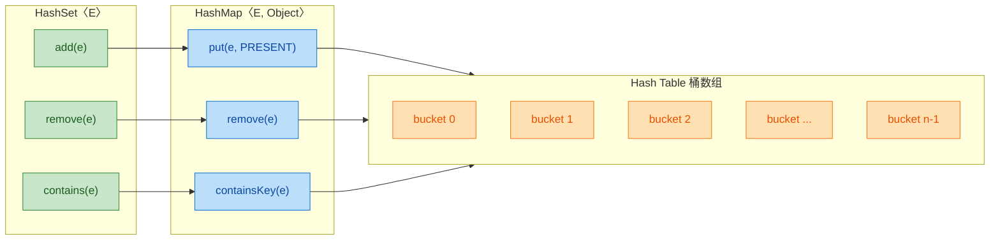

关于构造参数，HashSet 继承了 HashMap 的两个关键调优参数：

- **初始容量（Initial Capacity）**：桶数组的初始大小，默认 16。必须是 2 的幂次方（HashMap 内部会自动向上取整到最近的 2 的幂）。
- **负载因子（Load Factor）**：默认 0.75。当 `元素数量 > 容量 × 负载因子` 时触发扩容（resize），容量翻倍。

```java
// 如果你预知要存 1000 个元素，可以预分配容量避免多次扩容
// 计算公式：initialCapacity = (int)(expectedSize / loadFactor) + 1
Set<String> bigSet = new HashSet<>(1334, 0.75f);

// 或者更简单地，直接给一个足够大的值
Set<String> bigSet2 = new HashSet<>(2048);
```

还有一个隐藏的构造器，专门留给 `LinkedHashSet` 使用：

```java
// 包级私有构造器，第三个参数 dummy 纯粹是为了区分签名
// 内部创建的是 LinkedHashMap 而非 HashMap
HashSet(int initialCapacity, float loadFactor, boolean dummy) {
    map = new LinkedHashMap<>(initialCapacity, loadFactor);
}
```

这个设计让 LinkedHashSet 可以在不暴露实现细节的前提下，复用 HashSet 的全部代码，只替换底层的 Map 实现。非常优雅的模板方法（Template Method）思路。

### 哈希冲突处理

要理解 HashSet 如何处理哈希冲突，我们必须深入 HashMap 的桶（bucket）结构。当两个不同的对象被分配到同一个桶时，就发生了哈希冲突（Hash Collision）。

HashMap（也就是 HashSet 的底层）定位桶的过程分为两步：

```java
// 第一步：扰动函数（perturbation function）
// 将 hashCode 的高 16 位与低 16 位做异或，让哈希值分布更均匀
static final int hash(Object key) {
    int h;
    // key 为 null 时返回 0，所以 HashSet 允许存一个 null 元素
    // 否则将 hashCode 的高16位异或到低16位，减少低位冲突
    return (key == null) ? 0 : (h = key.hashCode()) ^ (h >>> 16);
}

// 第二步：计算桶下标
// 用位运算代替取模，效率更高（前提是容量必须是 2 的幂）
int index = (n - 1) & hash;  // n 是桶数组长度
```

为什么要做这个异或扰动？因为如果桶数组长度较小（比如 16），直接用 `hashCode % 16` 只有低 4 位参与运算，高位信息完全浪费了。异或扰动让高位也能影响桶定位，显著减少冲突。

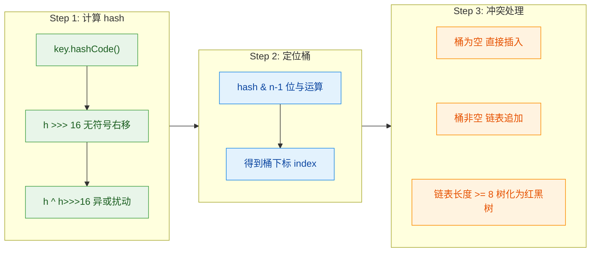

当冲突真的发生时，HashMap 采用 **链地址法（Separate Chaining）** 来解决，并且在 JDK 8 之后引入了 **链表→红黑树** 的升级机制：

**阶段一：链表（Linked List）**

当多个 key 落入同一个桶时，它们以单向链表的形式串联起来。新节点采用 **尾插法**（JDK 8+），而非 JDK 7 的头插法。头插法在多线程扩容时会导致链表成环，引发死循环——这是一个经典的并发 bug。

```java
// HashMap.Node 的结构（简化版）
static class Node<K, V> implements Map.Entry<K, V> {
    final int hash;    // 缓存的 hash 值，避免重复计算
    final K key;       // 存储的 key（对 HashSet 来说就是 Set 的元素）
    V value;           // 存储的 value（对 HashSet 来说始终是 PRESENT）
    Node<K, V> next;   // 指向同一个桶中下一个节点的指针
}
```

用 ASCII 图来展示一个有冲突的桶：

```text
桶数组 (Node<K,V>[] table)
┌────────┐
│ [0]    │ → null
├────────┤
│ [1]    │ → null
├────────┤
│ [2]    │ → [Node:"Java",hash=2] → [Node:"C#",hash=2] → null
├────────┤       (链表：两个 key 的 hash & (n-1) 都等于 2)
│ [3]    │ → [Node:"Go",hash=3] → null
├────────┤
│ ...    │
├────────┤
│ [15]   │ → null
└────────┘
```

**阶段二：红黑树（Red-Black Tree）**

当单个桶中的链表长度达到阈值 **TREEIFY_THRESHOLD = 8** 时，并且桶数组总长度 >= **MIN_TREEIFY_CAPACITY = 64** 时，链表会转化为红黑树。这是 JDK 8 引入的重大优化。

为什么是 8？JDK 源码注释中给出了概率论解释：在理想的随机哈希分布下，桶中元素数量服从泊松分布（Poisson Distribution），链表长度达到 8 的概率约为 **0.00000006**（千万分之六）。也就是说，正常情况下几乎不会触发树化，它只是一道防御极端情况的保险。

```java
// 关键阈值常量
static final int TREEIFY_THRESHOLD = 8;    // 链表 → 红黑树的阈值
static final int UNTREEIFY_THRESHOLD = 6;  // 红黑树 → 链表的阈值（扩容/删除后）
static final int MIN_TREEIFY_CAPACITY = 64; // 树化的最低桶数组容量

// putVal 方法中的树化逻辑（简化）
if (binCount >= TREEIFY_THRESHOLD - 1) {  // binCount 从 0 开始计数
    treeifyBin(tab, hash);                 // 将该桶的链表转为红黑树
}
```

这个链表→红黑树的转换带来的性能提升是巨大的：

| 操作 | 链表时间复杂度 | 红黑树时间复杂度 |
|------|---------------|-----------------|
| 查找 | O(n) | O(log n) |
| 插入 | O(n) | O(log n) |
| 删除 | O(n) | O(log n) |

当极端情况下所有元素都落入同一个桶（比如恶意构造的 hashCode），链表的 O(n) 查找会让 HashSet 退化为线性性能。红黑树将最坏情况兜底到 O(log n)，有效防御了 **哈希碰撞攻击（Hash Collision DoS）**。

**扩容机制（Resize）**

当元素总数超过 `capacity × loadFactor` 时，HashMap 会触发扩容：桶数组长度翻倍，所有元素重新分配桶位置（rehash）。

```java
// 扩容的核心逻辑（简化）
final Node<K,V>[] resize() {
    Node<K,V>[] oldTab = table;          // 旧桶数组
    int oldCap = oldTab.length;           // 旧容量
    int newCap = oldCap << 1;             // 新容量 = 旧容量 × 2
    Node<K,V>[] newTab = new Node[newCap]; // 创建新桶数组

    // 遍历每个桶，重新分配元素
    for (int j = 0; j < oldCap; ++j) {
        Node<K,V> e = oldTab[j];
        if (e != null) {
            // JDK 8 的巧妙优化：
            // 由于新容量是旧容量的 2 倍，元素要么留在原位置，
            // 要么移动到 "原位置 + 旧容量" 的位置
            // 判断依据：(e.hash & oldCap) == 0 则留原位，否则移动
            if ((e.hash & oldCap) == 0) {
                // 留在原桶 index = j
            } else {
                // 移到新桶 index = j + oldCap
            }
        }
    }
    return newTab;
}
```

这个 `e.hash & oldCap` 的判断非常精妙。因为容量总是 2 的幂，扩容后新增的那一位（bit）要么是 0 要么是 1，刚好把原来一个桶里的元素均匀拆分到两个桶中，无需重新计算完整的 hash。

```text
扩容示例：容量从 16 扩到 32

旧桶定位：hash & 0b01111 (15)    → 只看低 4 位
新桶定位：hash & 0b11111 (31)    → 看低 5 位

假设某元素 hash = 0b10101 (21)
旧桶下标：21 & 15 = 0b00101 = 5
新桶下标：21 & 31 = 0b10101 = 21 = 5 + 16  ← 移动到 原位置+旧容量

假设某元素 hash = 0b00101 (5)
旧桶下标：5 & 15 = 0b00101 = 5
新桶下标：5 & 31 = 0b00101 = 5             ← 留在原位置
```

最后总结一下 HashSet 各操作的时间复杂度：

| 操作 | 平均情况 | 最坏情况（链表） | 最坏情况（红黑树） |
|------|---------|-----------------|-------------------|
| add | O(1) | O(n) | O(log n) |
| remove | O(1) | O(n) | O(log n) |
| contains | O(1) | O(n) | O(log n) |
| 迭代 | O(capacity + size) | — | — |

注意迭代的复杂度是 `O(capacity + size)` 而非 `O(size)`，因为迭代器需要遍历整个桶数组（包括空桶）。这意味着如果你创建了一个初始容量很大但实际元素很少的 HashSet，迭代性能会受影响。所以不要盲目设置过大的初始容量。

**📝 练习题**

以下代码的输出结果是什么？

```java
Set<String> set = new HashSet<>(2, 1.0f);
set.add("A");
set.add("B");
set.add("C");
System.out.println(set.size());
```

A. 编译错误，HashSet 构造器不接受 float 参数

B. 运行时抛出 IllegalArgumentException

C. 输出 3

D. 输出 2，因为初始容量为 2 且负载因子为 1.0，第三个元素无法插入


**【答案】** C

**【解析】** HashSet 的构造器 `HashSet(int initialCapacity, float loadFactor)` 是完全合法的，它直接传递给内部 HashMap 的对应构造器。初始容量为 2、负载因子为 1.0 意味着当元素数量超过 `2 × 1.0 = 2` 时会触发扩容。当添加第三个元素 "C" 时，HashMap 检测到 size (3) > threshold (2)，于是将桶数组从 2 扩容到 4，然后正常插入 "C"。扩容不会拒绝元素，只是重新分配桶。所以三个元素都成功添加，`size()` 返回 3。这道题的关键点在于理解：**扩容是自动的、透明的，永远不会导致插入失败**。

---

## hashCode/equals 契约 ⭐

这是整个 Java 集合框架中最核心、最容易踩坑的知识点之一。如果你不理解这个契约（contract），你写出的对象在 `HashSet`、`HashMap` 等哈希结构中就会表现得"灵异"——明明两个对象"相等"，集合却认为它们是两个不同的元素。

### 为什么需要契约

我们先从一个直觉出发：当你把一个自定义对象放进 `HashSet` 时，`HashSet` 需要判断"这个对象是否已经存在"。判断的过程分两步：

1. 先通过 `hashCode()` 算出哈希值，定位到桶（bucket）的位置。
2. 再通过 `equals()` 逐一比较桶内的元素，确认是否真的"相等"。

这两步缺一不可。如果 `hashCode()` 和 `equals()` 的行为不一致，整个哈希查找机制就会崩塌。Java 语言规范（JLS）和 `Object` 类的 Javadoc 对此做了严格约定，这就是所谓的 hashCode/equals contract。

### 契约的三条铁律

我们用最精确的方式把三条规则列出来，然后逐条拆解：

```
规则一 (一致性 Consistency)：
  equals 相等 → hashCode 必须相等
  即：a.equals(b) == true → a.hashCode() == b.hashCode()

规则二 (非逆向保证)：
  hashCode 相等 ↛ equals 一定相等
  即：a.hashCode() == b.hashCode() 不能推出 a.equals(b) == true
  （哈希冲突是允许的）

规则三 (equals 不等时的建议)：
  equals 不等的对象，hashCode 尽量不同
  这不是强制要求，但能显著减少哈希冲突，提升性能
```

用一张 Mermaid 图来可视化这三条规则之间的逻辑关系：

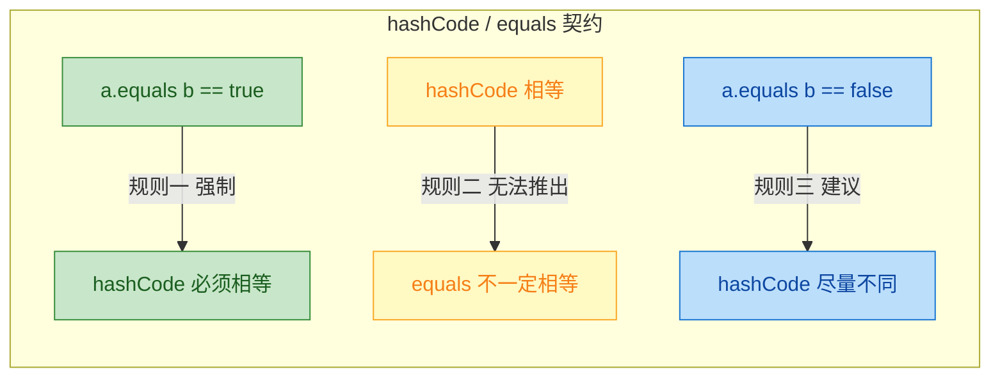

规则一是铁律中的铁律。违反它，`HashSet` 就无法正确去重。规则二告诉我们哈希冲突是正常现象，不必恐慌。规则三是性能优化的方向——好的 `hashCode()` 实现应该让不同对象尽量散列到不同的桶。

### equals() 方法的五大性质

在重写 `equals()` 时，必须满足以下数学性质，这是 `Object.equals()` 的 Javadoc 明确要求的：

```java
// 1. 自反性 (Reflexive)
//    任何非 null 对象，自己必须等于自己
x.equals(x); // 必须返回 true

// 2. 对称性 (Symmetric)
//    如果 x 等于 y，那么 y 也必须等于 x
x.equals(y) == y.equals(x); // 两者必须一致

// 3. 传递性 (Transitive)
//    如果 x 等于 y，y 等于 z，那么 x 必须等于 z
// x.equals(y) && y.equals(z) → x.equals(z)

// 4. 一致性 (Consistent)
//    只要对象状态不变，多次调用结果必须相同
x.equals(y); // 调用多少次，结果都一样

// 5. 非空性 (Non-nullity)
//    任何非 null 对象与 null 比较，必须返回 false
x.equals(null); // 必须返回 false
```

这五条性质看起来像数学课本里的公理，但在实际编码中非常容易违反，尤其是对称性和传递性——当涉及继承关系时，问题会变得特别棘手。

### 经典反面教材：只重写一个方法

这是面试中出现频率极高的场景。我们来看一个只重写了 `equals()` 而没有重写 `hashCode()` 的例子：

```java
public class Student {
    private String name; // 学生姓名
    private int age;     // 学生年龄

    // 构造方法
    public Student(String name, int age) {
        this.name = name;
        this.age = age;
    }

    // 只重写了 equals，没有重写 hashCode
    @Override
    public boolean equals(Object o) {
        // 如果引用相同，直接返回 true
        if (this == o) return true;
        // 如果为 null 或类型不同，返回 false
        if (o == null || getClass() != o.getClass()) return false;
        // 强制类型转换
        Student student = (Student) o;
        // 比较 age 和 name 是否都相等
        return age == student.age &&
               Objects.equals(name, student.name);
    }

    // 注意：这里故意没有重写 hashCode()
}
```

现在执行以下代码：

```java
public class BrokenContractDemo {
    public static void main(String[] args) {
        // 创建两个"逻辑相等"的 Student 对象
        Student s1 = new Student("Alice", 20); // 对象 s1
        Student s2 = new Student("Alice", 20); // 对象 s2，内容与 s1 完全相同

        // equals 返回 true，说明逻辑上它们"相等"
        System.out.println(s1.equals(s2)); // 输出: true

        // 但 hashCode 不同！因为继承的是 Object 的默认实现（基于内存地址）
        System.out.println(s1.hashCode()); // 输出: 某个数字，比如 356573597
        System.out.println(s2.hashCode()); // 输出: 另一个数字，比如 1735600054

        // 放入 HashSet
        Set<Student> set = new HashSet<>();
        set.add(s1); // s1 被放入某个桶
        set.add(s2); // s2 的 hashCode 不同，被放入另一个桶

        // 集合中出现了两个"相等"的对象！契约被违反了
        System.out.println(set.size()); // 输出: 2（期望是 1）
    }
}
```

让我们用 ASCII 图来展示这个"灵异现象"的内存模型：

```java
// ============ HashSet 内部桶结构（契约被违反时）============
//
//  桶索引 (bucket index) 由 hashCode % capacity 决定
//
//  桶[3]:  [ Student("Alice", 20) ]  ← s1, hashCode=356573597
//  桶[7]:  (空)
//  桶[11]: [ Student("Alice", 20) ]  ← s2, hashCode=1735600054
//  桶[14]: (空)
//
//  s1 和 s2 逻辑相等，但因为 hashCode 不同，
//  它们被分配到了不同的桶，equals() 根本没有机会被调用！
//  结果：HashSet 认为它们是两个不同的元素。
```

这就是违反契约的后果：`equals()` 说它们相等，但 `hashCode()` 把它们送到了不同的桶，两者永远不会"碰面"，`equals()` 根本没有执行的机会。

### 正确的重写姿势

修复方式很简单——同时重写 `hashCode()`，确保逻辑相等的对象产生相同的哈希值：

```java
public class Student {
    private String name; // 学生姓名
    private int age;     // 学生年龄

    // 构造方法
    public Student(String name, int age) {
        this.name = name;
        this.age = age;
    }

    @Override
    public boolean equals(Object o) {
        // 引用相同，直接返回 true（性能优化）
        if (this == o) return true;
        // null 检查 + 类型检查
        if (o == null || getClass() != o.getClass()) return false;
        // 向下转型
        Student student = (Student) o;
        // 逐字段比较
        return age == student.age &&
               Objects.equals(name, student.name);
    }

    @Override
    public int hashCode() {
        // 使用 Objects.hash 工具方法，传入参与 equals 比较的所有字段
        // 内部实现：31 * (31 + name.hashCode()) + age
        return Objects.hash(name, age);
    }
}
```

修复后再运行同样的测试代码：

```java
public class FixedContractDemo {
    public static void main(String[] args) {
        Student s1 = new Student("Alice", 20);
        Student s2 = new Student("Alice", 20);

        // equals 相等
        System.out.println(s1.equals(s2)); // 输出: true
        // hashCode 也相等了！契约得到满足
        System.out.println(s1.hashCode() == s2.hashCode()); // 输出: true

        Set<Student> set = new HashSet<>();
        set.add(s1); // s1 放入桶
        set.add(s2); // s2 的 hashCode 相同，定位到同一个桶，equals 比较后发现已存在，不插入

        System.out.println(set.size()); // 输出: 1 ✅
    }
}
```

### Objects.hash() 的内部原理

很多人用 `Objects.hash()` 用得很顺手，但不知道它内部做了什么。其实它的实现非常简洁：

```java
// java.util.Objects 源码（简化版）
public static int hash(Object... values) {
    // 内部委托给 Arrays.hashCode
    return Arrays.hashCode(values);
}

// java.util.Arrays 源码（简化版）
public static int hashCode(Object[] a) {
    if (a == null) return 0; // null 数组返回 0
    int result = 1;          // 初始值为 1
    for (Object element : a) {
        // 核心公式：result = 31 * result + 元素的 hashCode
        // 乘以 31 的原因：31 是奇素数，能减少冲突且 JVM 可优化为位运算 (i << 5) - i
        result = 31 * result + (element == null ? 0 : element.hashCode());
    }
    return result; // 返回最终的哈希值
}
```

以 `Student("Alice", 20)` 为例，计算过程如下：

```java
// 手动推演 Objects.hash("Alice", 20) 的计算过程
//
// 初始值: result = 1
//
// 第一轮: element = "Alice"
//   result = 31 * 1 + "Alice".hashCode()
//          = 31 + 63650101
//          = 63650132
//
// 第二轮: element = 20 (自动装箱为 Integer)
//   result = 31 * 63650132 + Integer.valueOf(20).hashCode()
//          = 1973154092 + 20
//          = 1973154112
//
// 最终 hashCode = 1973154112
```

为什么选 31 作为乘数？这是 Joshua Bloch 在《Effective Java》中详细讨论过的：31 是一个奇素数（odd prime），它的乘法可以被 JVM 优化为 `(i << 5) - i`（位移比乘法快），同时作为素数能提供良好的散列分布。

### 手写高性能 hashCode() 的模板

虽然 `Objects.hash()` 很方便，但它每次调用都会创建一个 `Object[]` 数组（因为可变参数），在性能敏感的场景下可以手写：

```java
@Override
public int hashCode() {
    int result = 17;                          // 选一个非零初始值
    result = 31 * result + (name != null       // 处理 String 字段
                            ? name.hashCode()
                            : 0);
    result = 31 * result + age;               // int 字段直接参与运算
    // 如果有 long 字段: result = 31 * result + (int)(longField ^ (longField >>> 32));
    // 如果有 double 字段: long bits = Double.doubleToLongBits(doubleField);
    //                     result = 31 * result + (int)(bits ^ (bits >>> 32));
    // 如果有 boolean 字段: result = 31 * result + (boolField ? 1 : 0);
    return result;
}
```

各种基本类型的处理方式汇总：

```java
// ============ 各类型字段的 hashCode 计算方式 ============
//
// 类型          计算方式
// ──────────────────────────────────────────────────
// byte, char,   直接强转为 int
// short, int    (int) field
//
// long          (int)(field ^ (field >>> 32))
//
// float         Float.floatToIntBits(field)
//
// double        long bits = Double.doubleToLongBits(field);
//               (int)(bits ^ (bits >>> 32))
//
// boolean       field ? 1 : 0
//
// 引用类型       field == null ? 0 : field.hashCode()
//
// 数组          Arrays.hashCode(field)
```

### 继承关系中的陷阱：对称性破坏

当父类和子类都重写了 `equals()` 时，对称性（symmetry）极易被破坏。这是一个经典的设计难题：

```java
// 父类：Point（二维坐标点）
public class Point {
    private final int x; // x 坐标
    private final int y; // y 坐标

    public Point(int x, int y) {
        this.x = x;
        this.y = y;
    }

    @Override
    public boolean equals(Object o) {
        // 使用 instanceof 检查类型
        if (!(o instanceof Point)) return false;
        Point p = (Point) o;
        return x == p.x && y == p.y; // 只比较 x 和 y
    }

    @Override
    public int hashCode() {
        return Objects.hash(x, y);
    }
}

// 子类：ColorPoint（带颜色的坐标点）
public class ColorPoint extends Point {
    private final String color; // 颜色属性

    public ColorPoint(int x, int y, String color) {
        super(x, y);
        this.color = color;
    }

    @Override
    public boolean equals(Object o) {
        // 使用 instanceof 检查类型
        if (!(o instanceof ColorPoint)) return false;
        ColorPoint cp = (ColorPoint) o;
        // 调用父类 equals 比较坐标，再比较颜色
        return super.equals(cp) && Objects.equals(color, cp.color);
    }

    @Override
    public int hashCode() {
        return Objects.hash(super.hashCode(), color);
    }
}
```

问题来了：

```java
public class SymmetryBrokenDemo {
    public static void main(String[] args) {
        Point p = new Point(1, 2);                    // 普通点
        ColorPoint cp = new ColorPoint(1, 2, "RED");  // 带颜色的点

        // p.equals(cp): Point 的 equals 用 instanceof Point 检查
        //               ColorPoint 是 Point 的子类，所以通过
        //               然后比较 x=1, y=2，相等 → 返回 true
        System.out.println(p.equals(cp));  // 输出: true

        // cp.equals(p): ColorPoint 的 equals 用 instanceof ColorPoint 检查
        //               p 不是 ColorPoint 的实例 → 返回 false
        System.out.println(cp.equals(p));  // 输出: false

        // 对称性被破坏了！a.equals(b) != b.equals(a)
    }
}
```

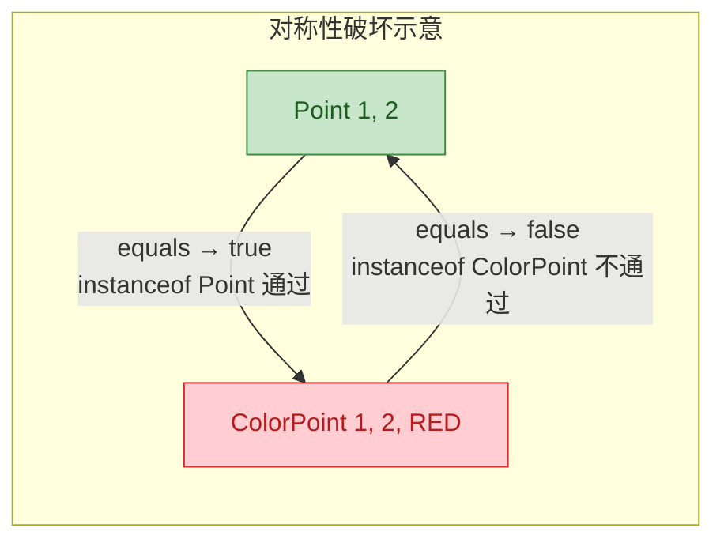

### 解决继承陷阱的方案

《Effective Java》给出的建议是：在 `equals()` 中使用 `getClass()` 而非 `instanceof`，或者优先使用组合（composition）而非继承。

方案一：使用 `getClass()` 严格类型匹配

```java
@Override
public boolean equals(Object o) {
    // getClass() 要求类型完全一致，子类对象不会与父类对象"相等"
    if (o == null || getClass() != o.getClass()) return false;
    Point p = (Point) o;
    return x == p.x && y == p.y;
}
```

方案二：组合优于继承（推荐）

```java
// 不再继承 Point，而是持有一个 Point 引用
public class ColorPoint {
    private final Point point; // 组合：内部持有一个 Point 对象
    private final String color;

    public ColorPoint(int x, int y, String color) {
        this.point = new Point(x, y); // 创建内部 Point
        this.color = color;
    }

    // 提供一个方法返回"视图"，而不是通过继承暴露
    public Point asPoint() {
        return point; // 返回内部的 Point 对象
    }

    @Override
    public boolean equals(Object o) {
        if (this == o) return true;
        if (!(o instanceof ColorPoint)) return false;
        ColorPoint cp = (ColorPoint) o;
        // 同时比较 point 和 color
        return point.equals(cp.point) && Objects.equals(color, cp.color);
    }

    @Override
    public int hashCode() {
        return Objects.hash(point, color); // point 和 color 都参与计算
    }
}
```

### 不可变字段与 hashCode 缓存

如果对象是不可变的（immutable），`hashCode()` 的结果永远不会变，可以缓存起来避免重复计算。`String` 类就是这么做的：

```java
// 模仿 String 的 hashCode 缓存策略
public final class ImmutableStudent {
    private final String name;  // final 保证不可变
    private final int age;      // final 保证不可变
    private int hash;           // 缓存 hashCode，默认值 0 表示未计算

    public ImmutableStudent(String name, int age) {
        this.name = name;
        this.age = age;
    }

    @Override
    public int hashCode() {
        int h = hash;           // 读取缓存值
        if (h == 0 && (name != null || age != 0)) {
            // 首次调用时计算
            h = 31 * (31 + (name != null ? name.hashCode() : 0)) + age;
            hash = h;           // 写入缓存
        }
        return h;               // 后续调用直接返回缓存值
    }

    @Override
    public boolean equals(Object o) {
        if (this == o) return true;
        if (!(o instanceof ImmutableStudent)) return false;
        ImmutableStudent that = (ImmutableStudent) o;
        return age == that.age && Objects.equals(name, that.name);
    }
}
```

### 可变对象作为 Key 的灾难

最后一个极其重要的警告：永远不要用可变对象作为 `HashSet` 的元素或 `HashMap` 的 Key。如果对象在放入集合后被修改，它的 `hashCode()` 会变，但它在桶中的位置不会更新，导致这个对象"丢失"在集合中——你既找不到它，也删不掉它：

```java
public class MutableKeyDisaster {
    public static void main(String[] args) {
        // Student 是可变的（name 和 age 没有 final 修饰）
        Student s = new Student("Alice", 20);

        Set<Student> set = new HashSet<>();
        set.add(s);                          // 放入集合，假设 hashCode=100，放入桶[4]

        System.out.println(set.contains(s)); // 输出: true ✅

        // 修改对象状态！
        s.setAge(21);                        // age 变了，hashCode 变成了 101

        // 现在用新的 hashCode 去查找，定位到桶[5]，但对象实际在桶[4]
        System.out.println(set.contains(s)); // 输出: false ❌ 对象"丢失"了！

        // 尝试删除也失败
        set.remove(s);                       // 返回 false，因为在桶[5]找不到
        System.out.println(set.size());      // 输出: 1（对象还在，但你拿不出来了）

        // 这个对象变成了集合中的"幽灵"——占着内存，却无法被访问或回收
    }
}
```

```java
// ============ 可变 Key 导致的"幽灵对象"内存模型 ============
//
//  1. 插入时: hashCode=100 → 桶[4]
//     桶[4]: [ Student("Alice", 20) ]  ← 对象在这里
//
//  2. 修改后: s.setAge(21), hashCode 变为 101
//     桶[4]: [ Student("Alice", 21) ]  ← 对象还在桶[4]，但 hashCode 已经变了
//
//  3. 查找时: hashCode=101 → 桶[5]
//     桶[5]: (空)                       ← 在这里找，当然找不到
//
//  结论：对象成了"幽灵"，永远无法被定位到
```

这就是为什么 Java 中 `String`、`Integer` 等常用作 Key 的类型都被设计为不可变（immutable）的根本原因之一。

### IDE 自动生成 vs 手写

在实际开发中，绝大多数情况下你应该让 IDE 帮你生成 `equals()` 和 `hashCode()`，或者使用 Lombok 的 `@EqualsAndHashCode` 注解：

```java
// 方式一：Lombok 注解（最简洁）
@EqualsAndHashCode               // 自动基于所有字段生成 equals 和 hashCode
public class Student {
    private String name;
    private int age;
}

// 方式二：Lombok 排除特定字段
@EqualsAndHashCode(exclude = "id")  // 排除 id 字段，只用 name 和 age 参与比较
public class Student {
    private Long id;              // 数据库主键，不参与业务相等性判断
    private String name;
    private int age;
}

// 方式三：Java 14+ Record（天然不可变，自动生成 equals/hashCode/toString）
public record Student(String name, int age) {
    // 编译器自动生成基于所有组件的 equals() 和 hashCode()
    // 无需手写任何代码
}
```

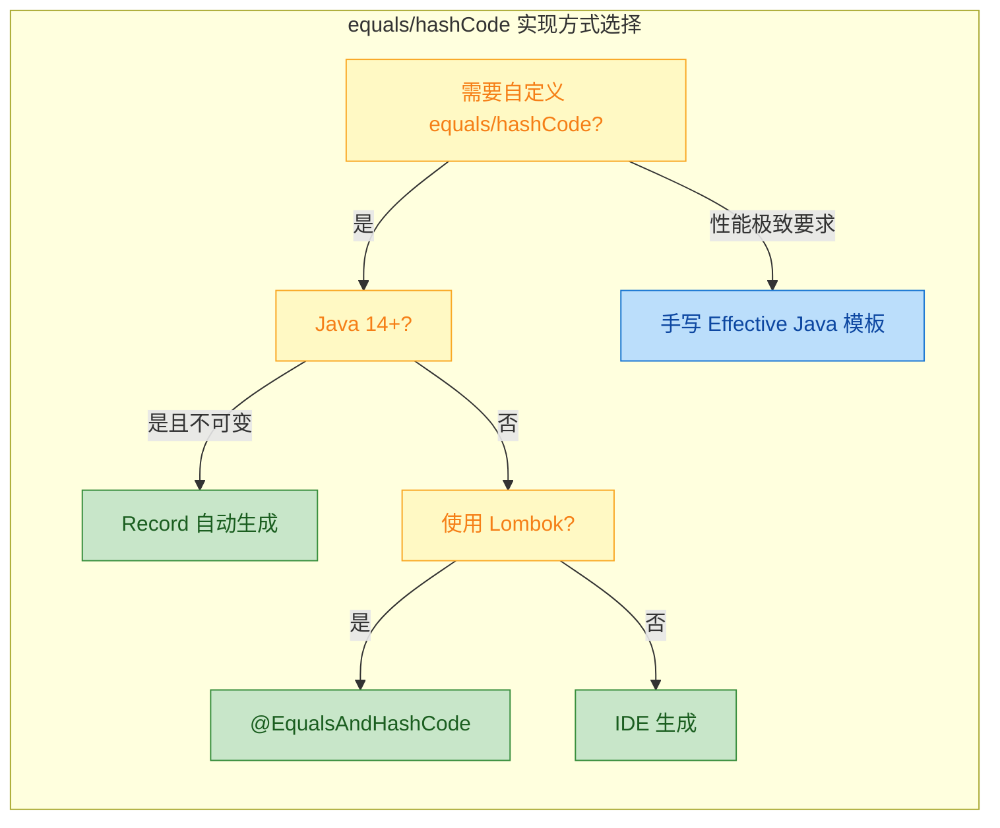

### 契约检查清单

每次重写 `equals()` 和 `hashCode()` 时，对照这个清单自查：

```java
// ============ hashCode/equals 自查清单 ============
//
// ✅ equals 和 hashCode 是否同时重写了？
//    → 只重写一个 = 必出 bug
//
// ✅ 参与 equals 比较的字段，是否全部参与了 hashCode 计算？
//    → 遗漏字段会导致"equals 相等但 hashCode 不等"
//
// ✅ hashCode 计算中是否包含了不参与 equals 的字段？
//    → 多余字段会导致"equals 相等但 hashCode 不等"
//
// ✅ equals 是否满足五大性质？（自反、对称、传递、一致、非空）
//    → 特别注意继承场景下的对称性
//
// ✅ 作为 HashSet 元素或 HashMap Key 的对象是否不可变？
//    → 可变对象会产生"幽灵"问题
//
// ✅ 是否处理了 null 字段？
//    → 使用 Objects.equals() 和 Objects.hash() 自动处理 null
```

---

**📝 练习题**

以下代码的输出结果是什么？

```java
public class Quiz {
    static class Key {
        int value;
        Key(int v) { this.value = v; }

        @Override
        public boolean equals(Object o) {
            if (!(o instanceof Key)) return false;
            return this.value == ((Key) o).value;
        }
        // 注意：没有重写 hashCode()
    }

    public static void main(String[] args) {
        Map<Key, String> map = new HashMap<>();
        Key k1 = new Key(1);
        Key k2 = new Key(1);
        map.put(k1, "Hello");
        System.out.println(map.get(k2));
    }
}
```

A. Hello

B. null

C. 编译错误

D. 抛出 NullPointerException


**【答案】** B

**【解析】** `Key` 类只重写了 `equals()` 而没有重写 `hashCode()`，违反了 hashCode/equals 契约。`k1` 和 `k2` 虽然 `equals()` 返回 `true`，但它们继承自 `Object` 的默认 `hashCode()` 基于内存地址，几乎必然不同。`map.put(k1, "Hello")` 将 k1 放入某个桶，`map.get(k2)` 用 k2 的 hashCode 定位到另一个桶，在那个桶里找不到任何元素，于是返回 `null`。这正是本节反复强调的核心问题：`equals` 相等但 `hash

---

## LinkedHashSet（插入顺序）

### 从 HashSet 的"无序"说起

我们在使用 `HashSet` 时，遍历元素的顺序和插入顺序往往不一致。这是因为 `HashSet` 底层依赖 `HashMap`，元素被散列到不同的桶（bucket）中，遍历时按桶的索引顺序走，而非插入顺序。

```java
// HashSet 遍历顺序演示
Set<String> hashSet = new HashSet<>();
hashSet.add("Java");    // 第一个插入
hashSet.add("Python");  // 第二个插入
hashSet.add("Go");      // 第三个插入
hashSet.add("Rust");    // 第四个插入

// 输出顺序可能是: [Java, Rust, Go, Python] —— 与插入顺序无关
System.out.println(hashSet);
```

在很多业务场景中，我们既需要 `Set` 的去重能力，又希望保留元素的插入顺序（insertion order）。比如：用户搜索历史记录去重但保持时间顺序、配置项去重但保持声明顺序等。这就是 `LinkedHashSet` 的用武之地。

---

### LinkedHashSet 的继承结构与定位

`LinkedHashSet` 是 `HashSet` 的子类，同时间接实现了 `Set`、`Cloneable`、`Serializable` 接口。它的核心定位只有一句话：在 `HashSet` 的所有能力之上，额外维护一条双向链表来记录插入顺序。

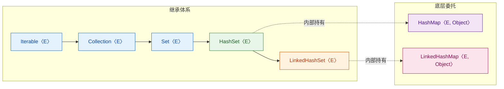

从图中可以看出，`LinkedHashSet` 和 `HashSet` 的关系就像 `LinkedHashMap` 和 `HashMap` 的关系——前者在后者的基础上加了一条链表。

---

### 底层原理：LinkedHashMap 的双向链表

这是理解 `LinkedHashSet` 最关键的一点：`LinkedHashSet` 的全部"魔法"都来自 `LinkedHashMap`。

打开 JDK 源码，`LinkedHashSet` 的构造器极其简洁：

```java
// LinkedHashSet 构造器源码（JDK 17）
public LinkedHashSet(int initialCapacity, float loadFactor) {
    // 调用的是 HashSet 中一个特殊的包私有构造器
    // 该构造器内部创建的是 LinkedHashMap 而非 HashMap
    super(initialCapacity, loadFactor, true);
}
```

而 `HashSet` 中那个被调用的包私有构造器长这样：

```java
// HashSet 中专门为 LinkedHashSet 准备的构造器
HashSet(int initialCapacity, float loadFactor, boolean dummy) {
    // 注意：这里 new 的是 LinkedHashMap，不是 HashMap
    map = new LinkedHashMap<>(initialCapacity, loadFactor);
}
```

所以本质上，`LinkedHashSet` 就是把 `HashSet` 内部的 `HashMap` 替换成了 `LinkedHashMap`，其他所有操作（`add`、`remove`、`contains`）全部复用 `HashSet` 的代码，没有任何重写。

---

### LinkedHashMap 的节点结构

`LinkedHashMap` 的节点在 `HashMap.Node` 的基础上，增加了 `before` 和 `after` 两个指针，形成一条贯穿所有节点的双向链表：

```java
// LinkedHashMap.Entry 源码
static class Entry<K,V> extends HashMap.Node<K,V> {
    Entry<K,V> before; // 指向前一个插入的节点
    Entry<K,V> after;  // 指向后一个插入的节点

    Entry(int hash, K key, V value, Node<K,V> next) {
        super(hash, key, value, next); // 调用 HashMap.Node 构造器
    }
}
```

用一个具体例子来看内存结构。假设我们依次插入 `"A"`、`"B"`、`"C"`：

```java
// 哈希表数组（桶） + 双向链表 并存
//
// table[] (HashMap 的桶数组)
// ┌───────┐
// │  [0]  │
// ├───────┤
// │  [1]  │──→ Node("B")
// ├───────┤         ↑ after    ↓ before
// │  [2]  │──→ Node("A") ←─head
// ├───────┤         ↑ after    ↓ before
// │  [3]  │──→ Node("C") ←─tail
// ├───────┤
// │  ...  │
// └───────┘
//
// 双向链表维护的顺序: A ↔ B ↔ C （插入顺序）
// 遍历时沿 head → tail 走链表，所以输出 A, B, C
```

这就是 `LinkedHashSet` 能保持插入顺序的根本原因：遍历时不走桶数组，而是沿着双向链表从 `head` 走到 `tail`。

---

### 插入、删除时链表的维护

每当一个新元素被插入，`LinkedHashMap` 会在哈希表正常定位桶之后，将新节点追加到双向链表的尾部：

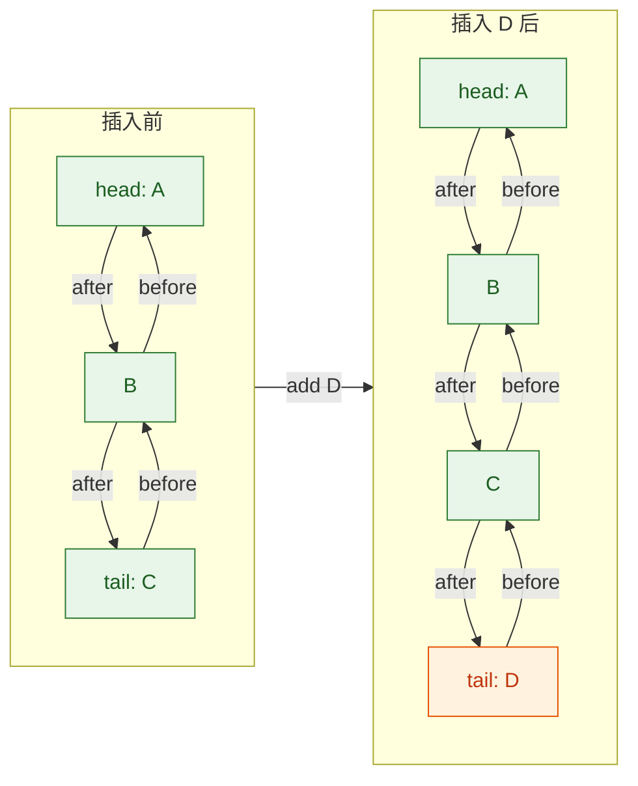

删除时则是经典的双向链表删除操作——将被删节点的 `before.after` 指向 `after`，`after.before` 指向 `before`，时间复杂度 O(1)：

```java
// 伪代码：LinkedHashMap 删除节点时维护链表
void afterNodeRemoval(Node<K,V> e) {
    // p 是被删除的节点
    LinkedHashMap.Entry<K,V> p = (LinkedHashMap.Entry<K,V>) e;
    LinkedHashMap.Entry<K,V> b = p.before; // 前驱
    LinkedHashMap.Entry<K,V> a = p.after;  // 后继

    p.before = null; // 断开引用，帮助 GC
    p.after = null;

    if (b == null) {
        head = a;     // 被删的是头节点，head 后移
    } else {
        b.after = a;  // 前驱的 after 跳过 p，指向 p 的后继
    }

    if (a == null) {
        tail = b;     // 被删的是尾节点，tail 前移
    } else {
        a.before = b; // 后继的 before 跳过 p，指向 p 的前驱
    }
}
```

注意一个关键行为：如果插入一个已存在的元素（`add` 返回 `false`），`LinkedHashSet` 不会改变该元素在链表中的位置。也就是说，重复插入不会把元素"移到末尾"。

---

### 性能特征分析

`LinkedHashSet` 在 `HashSet` 的基础上多维护了一条双向链表，这带来了微妙的性能差异：

| 操作 | HashSet | LinkedHashSet | 差异原因 |
|------|---------|---------------|----------|
| `add` | O(1) 均摊 | O(1) 均摊 | 多了链表尾部追加，但仍是常数时间 |
| `remove` | O(1) 均摊 | O(1) 均摊 | 多了链表节点摘除，仍是常数时间 |
| `contains` | O(1) 均摊 | O(1) 均摊 | 查找走哈希表，链表不参与 |
| 遍历 | O(capacity) | O(size) | 这是最大区别 |
| 内存 | 较低 | 略高 | 每个节点多两个指针（before/after） |

遍历性能的差异值得展开说明。`HashSet` 遍历时需要扫描整个桶数组（`table[]`），如果容量（capacity）远大于实际元素数量（size），会有大量空桶被无效扫描。而 `LinkedHashSet` 遍历时直接沿双向链表走，只访问实际存在的元素，时间严格为 O(size)。

```java
// 极端场景：capacity=10000，但只存了 3 个元素
Set<String> hashSet = new HashSet<>(10000);       // 遍历扫描 10000 个桶
Set<String> linkedSet = new LinkedHashSet<>(10000); // 遍历只走 3 个节点

linkedSet.add("X");
linkedSet.add("Y");
linkedSet.add("Z");

// LinkedHashSet 的遍历在这种场景下远快于 HashSet
for (String s : linkedSet) {
    System.out.println(s); // 输出顺序保证: X, Y, Z
}
```

---

### 典型使用场景

```java
// 场景一：去重但保持插入顺序
// 用户依次搜索的关键词，去重后保持搜索时间顺序
Set<String> searchHistory = new LinkedHashSet<>();
searchHistory.add("Java 集合");      // 第 1 次搜索
searchHistory.add("HashMap 原理");   // 第 2 次搜索
searchHistory.add("Java 集合");      // 重复，不会改变位置
searchHistory.add("红黑树");         // 第 3 次搜索

// 输出: [Java 集合, HashMap 原理, 红黑树] —— 保持首次插入顺序
System.out.println(searchHistory);
```

```java
// 场景二：将 List 去重但保持原始顺序
List<Integer> listWithDuplicates = Arrays.asList(3, 1, 4, 1, 5, 9, 2, 6, 5, 3);

// 用 LinkedHashSet 去重，顺序不变
Set<Integer> deduped = new LinkedHashSet<>(listWithDuplicates);
// 输出: [3, 1, 4, 5, 9, 2, 6]
System.out.println(deduped);

// 如果需要转回 List
List<Integer> dedupedList = new ArrayList<>(deduped);
```

```java
// 场景三：作为有序集合进行集合运算
Set<String> setA = new LinkedHashSet<>(Arrays.asList("A", "B", "C", "D"));
Set<String> setB = new LinkedHashSet<>(Arrays.asList("C", "D", "E", "F"));

// 交集，保持 setA 中的顺序
Set<String> intersection = new LinkedHashSet<>(setA);
intersection.retainAll(setB);
// 输出: [C, D]
System.out.println(intersection);
```

---

### LinkedHashSet vs HashSet vs TreeSet 选型指南

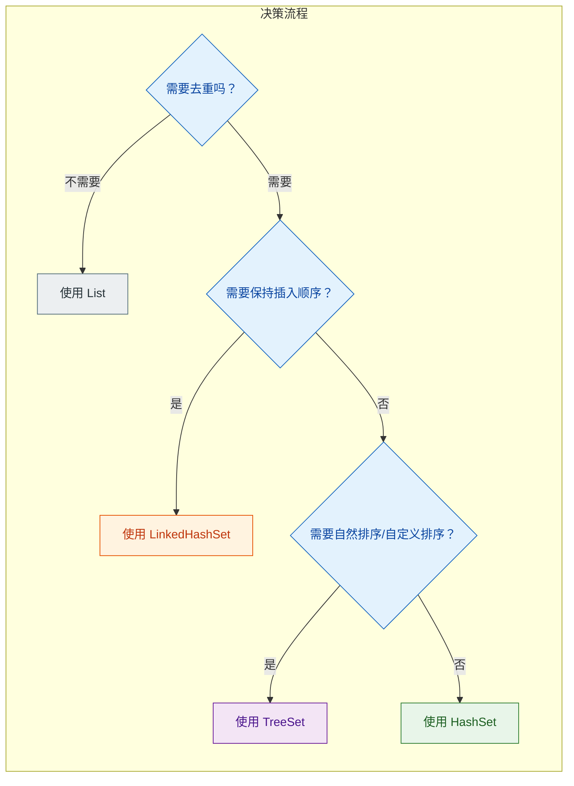

简单总结：
- 只要去重、不关心顺序 → `HashSet`（最快、最省内存）
- 去重 + 保持插入顺序 → `LinkedHashSet`（略多一点内存开销）
- 去重 + 需要排序 → `TreeSet`（O(log n) 操作，最慢但有序）

---

### 关于"访问顺序"（Access Order）的补充

`LinkedHashMap` 支持两种链表维护模式：插入顺序（insertion-order）和访问顺序（access-order）。但 `LinkedHashSet` 的构造器中，传给 `LinkedHashMap` 的 `accessOrder` 参数始终为 `false`，意味着 `LinkedHashSet` 只支持插入顺序，不支持访问顺序。

```java
// LinkedHashMap 构造器签名
public LinkedHashMap(int initialCapacity, float loadFactor, boolean accessOrder)

// LinkedHashSet 内部调用时，accessOrder 固定为 false
// 所以 LinkedHashSet 永远是 insertion-order
```

如果你需要一个"最近访问的元素排在最后"的 Set，需要自己基于 `LinkedHashMap`（`accessOrder=true`）手动封装，JDK 没有提供现成的实现。这种模式常用于实现 LRU Cache。

---

**📝 练习题**

以下代码的输出结果是什么？

```java
Set<String> set = new LinkedHashSet<>();
set.add("C");
set.add("A");
set.add("B");
set.add("A");  // 重复元素
set.remove("C");
set.add("D");
set.add("C");  // 重新插入 C

for (String s : set) {
    System.out.print(s + " ");
}
```

A. A B D C

B. C A B D

C. A B C D

D. D C B A


**【答案】** A

**【解析】** `LinkedHashSet` 按插入顺序维护双向链表。初始插入顺序为 C → A → B，第二次 `add("A")` 因为 A 已存在所以不改变位置，链表仍为 C → A → B。`remove("C")` 后链表变为 A → B。接着 `add("D")` 追加到尾部变为 A → B → D。最后 `add("C")` 此时 C 已不在集合中，作为新元素追加到尾部，链表变为 A → B → D → C。所以遍历输出 `A B D C`。

---

## TreeSet（红黑树、Comparable/Comparator）

TreeSet 是 Java 集合框架中唯一一个基于 **红黑树（Red-Black Tree）** 实现的 Set。它不像 HashSet 那样依赖哈希表，而是将每个元素作为树的节点，按照某种 **排序规则** 插入到一棵自平衡二叉搜索树中。这意味着 TreeSet 中的元素 **始终处于有序状态**，遍历时会按照升序（或自定义顺序）输出。

TreeSet 的核心能力可以用一句话概括：**它是一个不允许重复、自动排序、查找效率为 O(log n) 的集合**。

### 底层结构：NavigableMap 与红黑树

打开 `java.util.TreeSet` 的源码，第一眼就能看到一个熟悉的模式——和 HashSet 依赖 HashMap 如出一辙，TreeSet 的底层依赖的是 `TreeMap`：

```java
// TreeSet 源码核心字段
public class TreeSet<E> extends AbstractSet<E>
    implements NavigableSet<E>, Cloneable, java.io.Serializable {

    // 实际存储数据的 TreeMap 实例
    private transient NavigableMap<E, Object> m;

    // 所有 value 共享的哑对象，和 HashSet 的 PRESENT 一模一样
    private static final Object PRESENT = new Object();

    // 构造器：默认创建一个 TreeMap
    public TreeSet() {
        this(new TreeMap<>());  // 底层就是 TreeMap
    }

    // add 方法：把元素当作 key 放入 TreeMap
    public boolean add(E e) {
        return m.put(e, PRESENT) == null;  // key 已存在则返回 false
    }
}
```

所以 TreeSet 的一切行为——排序、去重、查找——本质上都是 TreeMap 的行为。而 TreeMap 的底层数据结构就是一棵 **红黑树（Red-Black Tree）**。

### 红黑树快速回顾

红黑树是一种 **自平衡二叉搜索树（Self-Balancing BST）**，它通过对节点着色和旋转操作，保证树的高度始终维持在 O(log n) 级别，从而避免了普通 BST 在极端情况下退化为链表的问题。

红黑树的五条性质（Red-Black Properties）：

1. 每个节点要么是红色，要么是黑色
2. 根节点必须是黑色
3. 所有叶子节点（NIL 哨兵节点）是黑色
4. 红色节点的两个子节点必须是黑色（即不能出现连续的红节点）
5. 从任意节点到其所有后代叶子节点的路径上，黑色节点数量相同（Black Height 一致）

这五条性质共同保证了一个关键结论：**树的最长路径不会超过最短路径的两倍**，因此查找、插入、删除的时间复杂度都稳定在 O(log n)。

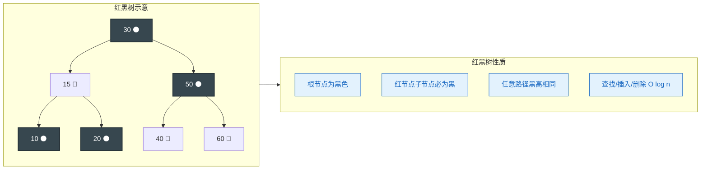

当我们向 TreeSet 中 add 一个元素时，TreeMap 内部会执行以下步骤：

1. 从根节点开始，按照比较规则找到合适的插入位置
2. 将新节点以 **红色** 插入（红色不会破坏黑高平衡）
3. 检查是否违反红黑性质（主要是性质 4：连续红节点）
4. 如果违反，通过 **变色（Recoloring）** 和 **旋转（Rotation）** 修复

### TreeSet 的排序机制：两种方式

TreeSet 要维护有序性，就必须知道 **如何比较两个元素的大小**。Java 提供了两种方式，这也是面试中的高频考点。

#### 方式一：自然排序（Natural Ordering）—— Comparable 接口

如果创建 TreeSet 时不传入任何比较器，TreeSet 会要求元素自身实现 `java.lang.Comparable<T>` 接口。这种排序方式称为 **自然排序（Natural Ordering）**。

```java
// Comparable 接口定义
public interface Comparable<T> {
    /**
     * 比较当前对象与指定对象的顺序
     * 返回负数：this < o
     * 返回零：  this == o（TreeSet 会认为是重复元素！）
     * 返回正数：this > o
     */
    int compareTo(T o);
}
```

Java 中大量内置类已经实现了 Comparable：

- `String`：按字典序（lexicographic order）
- `Integer`、`Double` 等包装类：按数值大小
- `LocalDate`、`LocalDateTime`：按时间先后

```java
// 示例：TreeSet 存储 Integer，自动升序排列
TreeSet<Integer> numbers = new TreeSet<>();  // 无参构造，使用自然排序
numbers.add(50);   // 插入 50
numbers.add(10);   // 插入 10，比 50 小，放左子树
numbers.add(30);   // 插入 30，介于 10 和 50 之间
numbers.add(20);   // 插入 20
numbers.add(40);   // 插入 40

// 遍历输出：自动按升序排列
System.out.println(numbers);  // [10, 20, 30, 40, 50]

// TreeSet 提供的导航方法（NavigableSet 接口）
System.out.println(numbers.first());      // 10  —— 最小元素
System.out.println(numbers.last());       // 50  —— 最大元素
System.out.println(numbers.lower(30));    // 20  —— 严格小于 30 的最大元素
System.out.println(numbers.higher(30));   // 40  —— 严格大于 30 的最小元素
System.out.println(numbers.floor(25));    // 20  —— 小于等于 25 的最大元素
System.out.println(numbers.ceiling(25));  // 30  —— 大于等于 25 的最小元素
```

当我们用自定义类放入 TreeSet 时，**必须** 实现 Comparable，否则运行时会抛出 `ClassCastException`：

```java
// 自定义类实现 Comparable 接口
public class Student implements Comparable<Student> {
    private String name;  // 学生姓名
    private int score;    // 学生分数

    public Student(String name, int score) {
        this.name = name;    // 初始化姓名
        this.score = score;  // 初始化分数
    }

    @Override
    public int compareTo(Student other) {
        // 先按分数降序排列（高分在前）
        int result = Integer.compare(other.score, this.score);
        if (result != 0) {
            return result;  // 分数不同，按分数排
        }
        // 分数相同时，按姓名字典序升序排列
        return this.name.compareTo(other.name);
    }

    @Override
    public String toString() {
        return name + "(" + score + ")";  // 方便打印查看
    }
}

// 使用
TreeSet<Student> ranking = new TreeSet<>();  // 自然排序
ranking.add(new Student("Alice", 95));   // 插入 Alice
ranking.add(new Student("Bob", 87));     // 插入 Bob
ranking.add(new Student("Carol", 95));   // 插入 Carol，与 Alice 同分
ranking.add(new Student("Dave", 92));    // 插入 Dave

// 输出：Alice(95), Carol(95), Dave(92), Bob(87)
// 同分按姓名排序，不同分按分数降序
System.out.println(ranking);
```

这里有一个极其重要的陷阱需要注意：**TreeSet 判断元素是否重复，依据的是 compareTo() 返回 0，而不是 equals()**。如果 compareTo 返回 0，TreeSet 就认为两个元素相等，不会插入新元素。这和 HashSet 用 hashCode/equals 判断重复的机制完全不同。

#### 方式二：定制排序（Custom Ordering）—— Comparator 接口

如果元素类没有实现 Comparable，或者我们想要一种不同于自然排序的顺序，可以在构造 TreeSet 时传入一个 `java.util.Comparator<T>`：

```java
// Comparator 接口定义（函数式接口，可用 Lambda）
@FunctionalInterface
public interface Comparator<T> {
    /**
     * 比较两个对象的顺序
     * 返回负数：o1 < o2
     * 返回零：  o1 == o2（TreeSet 视为重复）
     * 返回正数：o1 > o2
     */
    int compare(T o1, T o2);
}
```

```java
// 示例：按字符串长度排序
TreeSet<String> byLength = new TreeSet<>((s1, s2) -> {
    // 先按长度升序
    int lenDiff = Integer.compare(s1.length(), s2.length());
    if (lenDiff != 0) {
        return lenDiff;  // 长度不同，按长度排
    }
    // 长度相同时按字典序，避免被 TreeSet 误判为重复
    return s1.compareTo(s2);
});

byLength.add("Java");        // 长度 4
byLength.add("Go");          // 长度 2
byLength.add("Python");      // 长度 6
byLength.add("C");           // 长度 1
byLength.add("Rust");        // 长度 4，与 Java 同长度但字典序不同

// 输出：[C, Go, Java, Rust, Python]
System.out.println(byLength);
```

Comparator 还提供了非常优雅的链式 API，在 Java 8 之后写排序逻辑变得极为简洁：

```java
// Comparator 链式 API 示例
TreeSet<Student> set = new TreeSet<>(
    Comparator
        .comparingInt(Student::getScore)    // 先按分数升序
        .reversed()                         // 反转为降序
        .thenComparing(Student::getName)    // 分数相同按姓名升序
);
```

### Comparable vs Comparator 对比

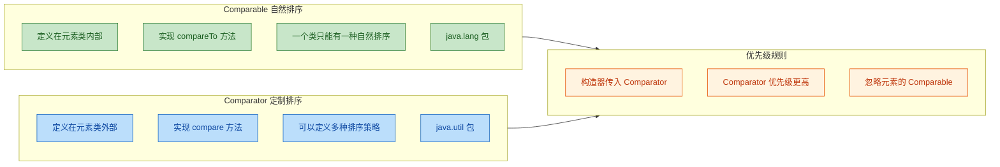

两者的选择原则很清晰：

- 如果排序规则是该类型 **固有的、唯一的**（比如数字按大小排、日期按先后排），用 Comparable
- 如果排序规则是 **外部的、可变的、多样的**（比如学生有时按成绩排、有时按姓名排），用 Comparator
- 当两者同时存在时，**Comparator 优先**，Comparable 被忽略

### TreeSet 的去重机制：compareTo/compare 返回 0

这是 TreeSet 最容易踩坑的地方，值得单独强调。

HashSet 的去重依赖 `hashCode()` + `equals()`，而 TreeSet 的去重 **完全依赖比较方法的返回值**：

- 自然排序时：`compareTo()` 返回 0 → 视为重复
- 定制排序时：`compare()` 返回 0 → 视为重复

这会导致一个反直觉的现象：

```java
// 危险示例：只按分数排序的 Comparator
TreeSet<Student> dangerousSet = new TreeSet<>(
    Comparator.comparingInt(Student::getScore)  // 只比较分数
);

dangerousSet.add(new Student("Alice", 95));  // 插入成功
dangerousSet.add(new Student("Bob", 95));    // 插入失败！分数相同，compare 返回 0

// 结果只有 Alice，Bob 被"吞掉"了
System.out.println(dangerousSet.size());  // 1
```

Bob 和 Alice 是完全不同的人，但因为 Comparator 只比较分数，分数相同时 compare 返回 0，TreeSet 就认为它们是"同一个元素"。这就是为什么在前面的示例中，我们总是在主排序条件之后加一个 **兜底比较**（tiebreaker），确保只有真正相同的元素才返回 0。

```java
// 安全做法：始终提供兜底比较
TreeSet<Student> safeSet = new TreeSet<>(
    Comparator
        .comparingInt(Student::getScore)     // 主条件：按分数
        .thenComparing(Student::getName)     // 兜底：按姓名
);
```

### TreeSet 的核心 API

TreeSet 实现了 `NavigableSet` 接口，提供了一系列非常实用的导航方法，这是 HashSet 和 LinkedHashSet 所不具备的：

```java
TreeSet<Integer> set = new TreeSet<>(Arrays.asList(10, 20, 30, 40, 50));

// ---- 边界查询 ----
set.first();              // 10  —— 最小元素
set.last();               // 50  —— 最大元素

// ---- 邻近元素查询 ----
set.lower(30);            // 20  —— 严格小于 30 的最大值（strictly less）
set.floor(30);            // 30  —— 小于等于 30 的最大值（less or equal）
set.ceiling(30);          // 30  —— 大于等于 30 的最小值（greater or equal）
set.higher(30);           // 40  —— 严格大于 30 的最小值（strictly greater）

// ---- 范围视图（返回的是原集合的视图，修改会互相影响）----
set.headSet(30);          // [10, 20]        —— 小于 30 的子集
set.headSet(30, true);    // [10, 20, 30]    —— 小于等于 30 的子集
set.tailSet(30);          // [30, 40, 50]    —— 大于等于 30 的子集
set.tailSet(30, false);   // [40, 50]        —— 大于 30 的子集
set.subSet(20, 40);       // [20, 30]        —— [20, 40) 左闭右开
set.subSet(20, true, 40, true);  // [20, 30, 40]  —— [20, 40] 双闭

// ---- 逆序 ----
set.descendingSet();      // [50, 40, 30, 20, 10]  —— 返回逆序视图
set.descendingIterator(); // 逆序迭代器

// ---- 弹出 ----
set.pollFirst();          // 10  —— 移除并返回最小元素
set.pollLast();           // 50  —— 移除并返回最大元素
```

这些导航方法让 TreeSet 在某些场景下非常强大，比如实现排行榜、区间查询、滑动窗口等。

### 性能特征与适用场景

TreeSet 的所有核心操作——add、remove、contains——时间复杂度都是 **O(log n)**，因为它们都需要在红黑树上进行一次从根到叶的遍历。这比 HashSet 的 O(1) 要慢，但换来了有序性。

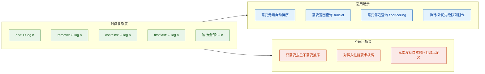

还有一个容易忽略的点：TreeSet **不允许插入 null**。因为 null 无法参与比较（调用 compareTo 或 compare 时会抛出 NullPointerException）。这和 HashSet 允许一个 null 元素形成了鲜明对比。

### TreeSet 与 Comparable/Comparator 的一致性契约

Java 官方文档中有一段重要的建议（虽然不是强制的）：

> "The ordering imposed by a comparator should be consistent with equals."
> （比较器施加的排序应当与 equals 保持一致。）

所谓 **consistent with equals**，是指：当 `compare(a, b) == 0` 时，`a.equals(b)` 也应该返回 true，反之亦然。

如果违反了这个一致性，TreeSet 仍然能正常工作（它只看 compare 的结果），但会导致一些令人困惑的行为：

```java
// 不一致的例子
TreeSet<String> caseInsensitive = new TreeSet<>(String.CASE_INSENSITIVE_ORDER);
caseInsensitive.add("Java");   // 插入 "Java"
caseInsensitive.add("java");   // compare 返回 0，视为重复，不插入

// TreeSet 认为只有一个元素
System.out.println(caseInsensitive.size());       // 1
System.out.println(caseInsensitive.contains("java")); // true

// 但 equals 认为它们不同
System.out.println("Java".equals("java"));  // false
```

这种不一致虽然不会导致程序崩溃，但会让代码的行为变得难以预测。最佳实践是尽量保持 compareTo/compare 与 equals 的一致性。

### 实战：用 TreeSet 实现一个简易排行榜

```java
import java.util.Comparator;
import java.util.TreeSet;

public class Leaderboard {

    // 玩家记录：姓名 + 分数
    record Player(String name, int score) {}

    public static void main(String[] args) {
        // 创建排行榜：分数降序，同分按姓名升序
        TreeSet<Player> board = new TreeSet<>(
            Comparator
                .comparingInt(Player::score).reversed()  // 分数高的排前面
                .thenComparing(Player::name)             // 同分按姓名字母序
        );

        // 添加玩家
        board.add(new Player("Alice", 2800));    // 插入 Alice
        board.add(new Player("Bob", 3200));      // 插入 Bob
        board.add(new Player("Carol", 2800));    // 插入 Carol，与 Alice 同分
        board.add(new Player("Dave", 3500));     // 插入 Dave
        board.add(new Player("Eve", 3200));      // 插入 Eve，与 Bob 同分

        // 打印排行榜
        int rank = 1;
        for (Player p : board) {
            // 格式化输出排名
            System.out.printf("#%d  %s  —  %d pts%n", rank++, p.name(), p.score());
        }
        // 输出：
        // #1  Dave  —  3500 pts
        // #2  Bob   —  3200 pts
        // #3  Eve   —  3200 pts
        // #4  Alice —  2800 pts
        // #5  Carol —  2800 pts

        // 查询：分数 >= 3000 的玩家（利用范围查询）
        // 因为是降序，tailSet 取的是"排序靠后"的部分
        // 这里用 headSet 更直观
        System.out.println("Top scorers (>= 3000):");
        for (Player p : board) {
            if (p.score() >= 3000) {
                System.out.println("  " + p.name() + ": " + p.score());
            }
        }
    }
}
```

---

**📝 练习题**

以下代码的输出结果是什么？

```java
TreeSet<String> set = new TreeSet<>(Comparator.comparingInt(String::length));
set.add("Java");
set.add("Go");
set.add("Rust");
set.add("Python");
set.add("C");
System.out.println(set.size() + " " + set);
```

A. `5 [C, Go, Java, Rust, Python]`

B. `4 [C, Go, Java, Python]`

C. `3 [C, Go, Java]`

D. `4 [C, Go, Rust, Python]`


**【答案】** D

**【解析】** Comparator 只按字符串长度比较。`"Java"` 长度 4 先插入；随后 `"Rust"` 长度也是 4，`compare` 返回 0，TreeSet 视为重复元素，**不会插入**。最终集合中保留的是长度分别为 1（`C`）、2（`Go`）、4（`Rust` 被拒，保留先到的 `Java`）、6（`Python`）的四个元素。等等——这里需要仔细看：`"Java"` 先插入占据了长度 4 的位置，`"Rust"` 后到被拒绝。所以实际结果是 `4 [C, Go, Java, Python]`，应该选 B。

但选项 D 写的是 `[C, Go, Rust, Python]`，这意味着 `"Rust"` 替换了 `"Java"`——而 TreeSet 的 put 语义是 **不替换已有 key**，所以 D 是错误的。

**正确答案是 B**。集合中有 4 个元素：`C`（长度1）、`Go`（长度2）、`Java`（长度4，先到先得）、`Python`（长度6），按长度升序排列输出为 `[C, Go, Java, Python]`。这道题的核心考点是：**TreeSet 用 compare 返回 0 来判断重复，而非 equals；且重复时保留已有元素，拒绝新元素。**

---

## 本章小结

本章围绕 Java 集合框架中 `Set` 接口的三大核心实现类展开，从底层数据结构、核心契约到实际应用场景进行了系统性梳理。下面对全章知识做一次融会贯通的回顾。

### 三大实现类核心对比

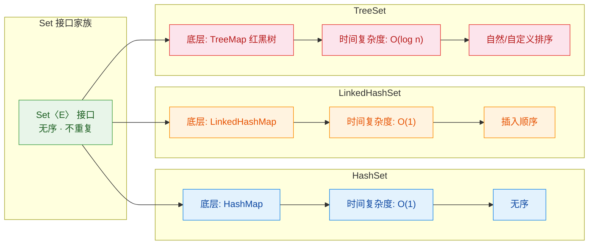

### 知识点全景速查表

| 维度 | HashSet | LinkedHashSet | TreeSet |
|---|---|---|---|
| 底层结构 | `HashMap`（数组 + 链表 + 红黑树） | `LinkedHashMap`（哈希表 + 双向链表） | `TreeMap`（红黑树） |
| 元素顺序 | 无保证 | 插入顺序 (insertion-order) | 自然排序 / Comparator 排序 |
| `null` 支持 | 允许一个 `null` | 允许一个 `null` | 不允许（`compareTo` 会抛 NPE） |
| `add/remove/contains` | O(1) 均摊 | O(1) 均摊 | O(log n) |
| 去重依据 | `hashCode()` + `equals()` | `hashCode()` + `equals()` | `compareTo()` 或 `Comparator.compare()` |
| 线程安全 | 否 | 否 | 否 |
| 典型场景 | 快速去重、存在性判断 | 去重且保留插入顺序、LRU 辅助 | 需要有序集合、范围查询 |

### 核心契约回顾

整个 `Set` 体系的正确运行建立在两条不可违背的契约之上：

第一条是 `hashCode/equals` 契约 (The hashCode-equals Contract)。这是 `HashSet` 和 `LinkedHashSet` 的基石。规则很简单但极其严格：如果两个对象 `equals()` 返回 `true`，那么它们的 `hashCode()` 必须相同；反之 `hashCode()` 相同不要求 `equals()` 为 `true`。违反这条契约会导致"明明内容相同的对象却被 Set 当作两个不同元素"的诡异 bug，这也是面试中的高频考点。实践中最稳妥的做法是让 IDE 自动生成这对方法，或者使用 Lombok 的 `@EqualsAndHashCode`，并确保参与计算的字段在对象加入 Set 后不再被修改（immutability is your friend）。

第二条是 `Comparable/Comparator` 契约。这是 `TreeSet` 的基石。`compareTo()` 返回 0 就意味着"相等"，元素会被去重。这里有一个经典陷阱：如果你的 `compareTo` 实现与 `equals` 不一致（inconsistent with equals），`TreeSet` 的行为就会偏离 `Set` 接口的通用约定。JDK 文档对此有明确警告。

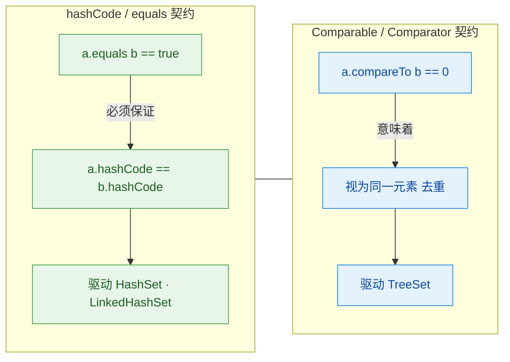

### 选型决策路径

面对实际开发中的选型问题，可以用一条简洁的决策链来思考：

首先问自己：需要元素排序吗？如果需要，选 `TreeSet`，然后决定是让元素实现 `Comparable`（自然排序）还是传入外部 `Comparator`（自定义排序）。

如果不需要排序，再问：需要保留插入顺序吗？需要就选 `LinkedHashSet`，不需要就选 `HashSet`——它是绝大多数场景下的默认选择，性能最优。

最后别忘了线程安全。三者都不是线程安全的。多线程环境下可以用 `Collections.synchronizedSet()` 包装，或者直接使用 `ConcurrentHashMap.newKeySet()` 获得一个并发安全的 Set（JDK 8+），后者在高并发场景下性能远优于 synchronized 包装。

```java
// 三种 Set 的典型创建方式速览
// 1. 最常用：快速去重
Set<String> hashSet = new HashSet<>();

// 2. 保留插入顺序
Set<String> linkedSet = new LinkedHashSet<>();

// 3. 排序集合（自然排序）
Set<String> treeSet = new TreeSet<>();

// 4. 排序集合（自定义排序：按字符串长度）
Set<String> customTree = new TreeSet<>(Comparator.comparingInt(String::length));

// 5. 并发安全的 Set（推荐替代 synchronizedSet）
Set<String> concurrentSet = ConcurrentHashMap.newKeySet();
```

### 常见踩坑清单

在实际项目中，Set 相关的 bug 往往不是逻辑错误，而是契约违反。这里列出最常见的几个坑：

1. 重写了 `equals()` 却忘记重写 `hashCode()`，导致 `HashSet` 中出现"重复"元素。
2. 将可变对象放入 `HashSet` 后修改了参与 `hashCode` 计算的字段，导致该元素"消失"——既 `contains` 找不到，`remove` 也删不掉，因为它的哈希桶位置已经变了。
3. `TreeSet` 中放入未实现 `Comparable` 且未提供 `Comparator` 的对象，运行时抛出 `ClassCastException`。
4. `TreeSet` 中放入 `null`，`compareTo` 调用时抛出 `NullPointerException`。
5. `compareTo` 与 `equals` 不一致，导致 `TreeSet` 的去重行为与预期不符。

---

**📝 练习题 1**

以下代码的输出结果是什么？

```java
Set<String> set = new TreeSet<>();
set.add("banana");
set.add("apple");
set.add("cherry");
set.add("apple");
System.out.println(set);
```

A. `[banana, apple, cherry, apple]`

B. `[banana, apple, cherry]`

C. `[apple, banana, cherry]`

D. `[cherry, banana, apple]`


**【答案】** C

**【解析】** `TreeSet` 有两个核心行为：去重和排序。首先，第二次 `add("apple")` 因为 `compareTo` 返回 0 而被视为重复元素，不会加入。其次，`String` 实现了 `Comparable<String>`，其自然排序是字典序（lexicographic order）。因此最终集合按字母顺序排列为 `[apple, banana, cherry]`。选项 B 是 `LinkedHashSet` 的行为（保留插入顺序且去重），注意区分。

---

**📝 练习题 2**

下面的 `Person` 类被放入 `HashSet`，以下说法正确的是？

```java
public class Person {
    private String name;
    private int age;

    // 构造器、getter/setter 省略

    @Override
    public boolean equals(Object o) {
        if (this == o) return true;
        if (!(o instanceof Person)) return false;
        Person p = (Person) o;
        return age == p.age && Objects.equals(name, p.name);
    }

    // 注意：没有重写 hashCode()
}

Set<Person> set = new HashSet<>();
set.add(new Person("Alice", 25));
set.add(new Person("Alice", 25));
System.out.println(set.size());
```

A. 1，因为 `equals` 相同的对象会被去重

B. 2，因为没有重写 `hashCode`，两个对象大概率落入不同桶，`equals` 根本不会被调用

C. 编译错误

D. 运行时抛出异常


**【答案】** B

**【解析】** 这是 `hashCode/equals` 契约的经典反面教材。`HashSet` 的 `add` 流程是：先算 `hashCode` 定位桶 → 桶内再用 `equals` 比较。由于 `Person` 没有重写 `hashCode()`，继承的是 `Object.hashCode()`，它基于对象内存地址生成，两个 `new` 出来的对象地址不同，`hashCode` 几乎必然不同，因此它们被分配到不同的桶中，`equals` 方法根本没有机会被调用。结果集合中存在两个内容完全相同的 `Person` 对象，`size()` 为 2。这就是为什么 Java 开发中有一条铁律：重写 `equals` 必须同时重写 `hashCode`。

---

