---

# 集合框架概述

---

## 集合层次结构（Collection / Map 两大体系）

Java 集合框架（Java Collections Framework, JCF）是 `java.util` 包中最核心的基础设施之一。它为开发者提供了一套统一的、高性能的数据结构与算法实现，彻底替代了早期 JDK 1.0 时代零散的 `Vector`、`Hashtable`、`Enumeration` 等"上古"API。整个框架的设计哲学可以用一句话概括：**面向接口编程（Program to an interface, not an implementation）**。所有的具体容器类都实现自顶层接口，调用方只需要依赖接口类型，就能在不改动业务代码的前提下自由切换底层实现。

理解集合框架，首先要在脑中建立一张清晰的"族谱图"。这张图有两棵完全独立的继承树：一棵以 `Collection` 为根，另一棵以 `Map` 为根。它们之间没有继承关系，但在实现层面存在紧密的协作（例如 `HashSet` 内部就是靠 `HashMap` 来干活的）。下面我们先用一张 Mermaid 图把全貌展示出来，然后逐一深入。

### 集合框架全景族谱

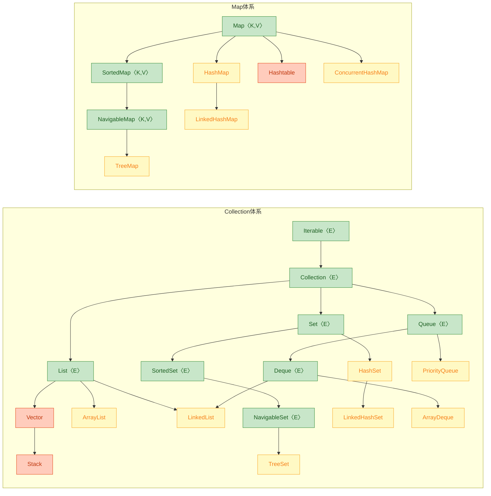

图中绿色节点是接口层，黄色节点是常用实现类，红/橙色节点是遗留类（legacy）。接下来我们分别拆解两大体系。

---

### Collection 体系

`Collection` 接口是所有"单值容器"的祖先。它继承自 `Iterable`，这意味着任何 `Collection` 都可以直接用 `for-each` 循环遍历。`Collection` 本身定义了一组通用的增删查操作契约：

```java
// Collection 接口的核心方法签名（JDK 17）
public interface Collection<E> extends Iterable<E> {
    int size();                        // 返回元素个数
    boolean isEmpty();                 // 是否为空
    boolean contains(Object o);        // 是否包含指定元素（依赖 equals）
    Iterator<E> iterator();            // 返回迭代器
    Object[] toArray();                // 转为 Object 数组
    <T> T[] toArray(T[] a);            // 转为指定类型数组
    boolean add(E e);                  // 添加元素
    boolean remove(Object o);          // 移除元素
    boolean containsAll(Collection<?> c);  // 是否包含另一个集合的所有元素
    boolean addAll(Collection<? extends E> c); // 批量添加
    boolean removeAll(Collection<?> c);        // 批量移除
    boolean retainAll(Collection<?> c);        // 取交集
    void clear();                      // 清空
    // JDK 8+ 新增默认方法
    default Stream<E> stream() { ... }         // 获取顺序流
    default Stream<E> parallelStream() { ... } // 获取并行流
    default boolean removeIf(Predicate<? super E> filter) { ... } // 条件移除
}
```

注意 `Collection` 只是一个"总纲"，它并不规定元素是否有序、是否允许重复。这些语义由它的三个直接子接口来细化：`List`、`Set`、`Queue`。

#### List —— 有序、可重复

`List` 是最常用的集合类型，它的核心语义是：**元素有插入顺序（ordered），允许重复（duplicates allowed），支持按索引随机访问（index-based access）**。

`List` 在 `Collection` 基础上额外定义了索引相关的操作：

```java
public interface List<E> extends Collection<E> {
    E get(int index);                  // 按索引取元素，O(1) 或 O(n) 取决于实现
    E set(int index, E element);       // 按索引替换
    void add(int index, E element);    // 在指定位置插入
    E remove(int index);               // 按索引移除
    int indexOf(Object o);             // 第一次出现的索引
    int lastIndexOf(Object o);         // 最后一次出现的索引
    ListIterator<E> listIterator();    // 双向迭代器
    List<E> subList(int from, int to); // 视图子列表（注意：不是拷贝！）
    // JDK 9+
    static <E> List<E> of(E... elements) { ... } // 不可变列表工厂方法
}
```

三个最重要的实现类对比如下：

| 特性 | ArrayList | LinkedList | Vector (legacy) |
|------|-----------|------------|-----------------|
| 底层结构 | `Object[]` 动态数组 | 双向链表（Doubly-Linked List） | `Object[]` 动态数组 |
| 随机访问 `get(i)` | O(1) ✅ | O(n) ❌ | O(1) |
| 头部插入/删除 | O(n)（需要搬移元素） | O(1) ✅ | O(n) |
| 尾部插入 | 均摊 O(1) | O(1) | 均摊 O(1) |
| 线程安全 | ❌ | ❌ | ✅（所有方法 `synchronized`） |
| 扩容策略 | 1.5 倍（`newCap = oldCap + oldCap >> 1`） | 无需扩容 | 2 倍 |
| 实现的额外接口 | `RandomAccess` | `Deque` | `RandomAccess` |

来看一段代码，直观感受 `ArrayList` 的扩容过程：

```java
// ArrayList 扩容核心源码（JDK 17 简化版）
private void grow(int minCapacity) {
    int oldCapacity = elementData.length;          // 当前数组长度
    int newCapacity = oldCapacity + (oldCapacity >> 1); // 新容量 = 旧容量 * 1.5
    if (newCapacity - minCapacity < 0)             // 如果 1.5 倍还不够
        newCapacity = minCapacity;                 // 直接用所需最小容量
    if (newCapacity - MAX_ARRAY_SIZE > 0)          // 如果超过数组最大限制
        newCapacity = hugeCapacity(minCapacity);   // 尝试分配 Integer.MAX_VALUE
    elementData = Arrays.copyOf(elementData, newCapacity); // 创建新数组并拷贝
}
```

`ArrayList` 的默认初始容量是 10（首次 `add` 时才真正分配），每次空间不足时扩容到原来的 1.5 倍。这个 `Arrays.copyOf` 调用本质上是 `System.arraycopy`，是一次 O(n) 的内存拷贝操作。所以如果你事先知道大致的元素数量，**强烈建议在构造时指定 `initialCapacity`**，避免反复扩容带来的性能损耗：

```java
// 推荐：预估容量，减少扩容次数
List<String> names = new ArrayList<>(1000); // 预分配 1000 个槽位
```

关于 `LinkedList`，它同时实现了 `List` 和 `Deque` 两个接口，所以既可以当列表用，也可以当双端队列用。但在实际开发中，`LinkedList` 的使用场景远比想象中少——因为现代 CPU 的缓存行（cache line）机制对连续内存极度友好，`ArrayList` 的顺序遍历性能往往碾压 `LinkedList`，即使在理论上 `LinkedList` 的中间插入是 O(1)，但"找到那个位置"本身就是 O(n)。

```java
// LinkedList 节点结构（JDK 源码简化）
private static class Node<E> {
    E item;          // 当前元素
    Node<E> next;    // 指向后继节点
    Node<E> prev;    // 指向前驱节点

    Node(Node<E> prev, E element, Node<E> next) {
        this.item = element;   // 存储数据
        this.next = next;      // 链接后继
        this.prev = prev;      // 链接前驱
    }
}
```

用 ASCII 图来展示 `LinkedList` 的内存模型：

```text
  head                                                    tail
   │                                                       │
   ▼                                                       ▼
┌──────────────┐    ┌──────────────┐    ┌──────────────┐
│ prev: null   │◄───│ prev         │◄───│ prev         │
│ item: "A"    │    │ item: "B"    │    │ item: "C"    │
│ next ────────│───►│ next ────────│───►│ next: null   │
└──────────────┘    └──────────────┘    └──────────────┘
   堆地址: 0x100       堆地址: 0x388       堆地址: 0x5F0
   （节点散落在堆的不同位置，对 CPU 缓存不友好）
```

#### Set —— 无重复

`Set` 的核心语义是：**不允许重复元素**。判断"重复"的标准取决于具体实现——`HashSet` 依赖 `hashCode()` + `equals()`，`TreeSet` 依赖 `Comparable` 或 `Comparator`。

```java
// Set 接口本身没有新增方法，完全继承自 Collection
// 但它的"契约"更严格：add 重复元素会返回 false
public interface Set<E> extends Collection<E> {
    // 所有方法签名与 Collection 相同
    // 语义约束：不允许重复元素
}
```

三个核心实现类：

| 特性 | HashSet | LinkedHashSet | TreeSet |
|------|---------|---------------|---------|
| 底层结构 | `HashMap`（只用 key） | `LinkedHashMap` | `TreeMap`（红黑树） |
| 元素顺序 | 无序 | 插入顺序（insertion-order） | 自然排序或 Comparator 排序 |
| `add/remove/contains` | O(1) 均摊 | O(1) 均摊 | O(log n) |
| null 元素 | 允许 1 个 | 允许 1 个 | 不允许（会 NPE） |

`HashSet` 的内部实现非常"偷懒"——它直接包装了一个 `HashMap`，把元素存为 key，value 统一用一个叫 `PRESENT` 的哑对象占位：

```java
// HashSet 核心源码（JDK 17 简化）
public class HashSet<E> extends AbstractSet<E> implements Set<E> {
    private transient HashMap<E, Object> map;          // 内部委托给 HashMap
    private static final Object PRESENT = new Object(); // 所有 value 共享的占位对象

    public HashSet() {
        map = new HashMap<>();    // 构造时创建一个空的 HashMap
    }

    public boolean add(E e) {
        return map.put(e, PRESENT) == null;  // put 返回 null 说明是新 key，添加成功
    }

    public boolean remove(Object o) {
        return map.remove(o) == PRESENT;     // 移除并检查是否存在
    }

    public boolean contains(Object o) {
        return map.containsKey(o);           // 直接委托给 HashMap 的 containsKey
    }

    public int size() {
        return map.size();                   // 直接委托
    }
}
```

这种"组合复用"的设计模式在 JCF 中随处可见，体现了 **Favor composition over inheritance** 的原则。

#### Queue / Deque —— 队列与双端队列

`Queue` 定义了 FIFO（先进先出）的操作语义，`Deque`（Double-Ended Queue）则扩展为两端都可以进出：

```java
// Queue 的两组 API：一组抛异常，一组返回特殊值
public interface Queue<E> extends Collection<E> {
    boolean add(E e);      // 入队，失败抛 IllegalStateException
    boolean offer(E e);    // 入队，失败返回 false（推荐使用）

    E remove();            // 出队，空队列抛 NoSuchElementException
    E poll();              // 出队，空队列返回 null（推荐使用）

    E element();           // 查看队头，空队列抛 NoSuchElementException
    E peek();              // 查看队头，空队列返回 null（推荐使用）
}
```

| 操作 | 抛异常版 | 返回特殊值版 |
|------|---------|-------------|
| 入队 | `add(e)` | `offer(e)` |
| 出队 | `remove()` | `poll()` |
| 查看 | `element()` | `peek()` |

实际开发中推荐使用右列的"温和版"方法，避免不必要的异常开销。

`Deque` 接口在 `Queue` 基础上增加了头尾两端的操作：`addFirst/addLast`、`offerFirst/offerLast`、`removeFirst/removeLast` 等。`ArrayDeque` 是 `Deque` 的首选实现——它基于循环数组（circular array），比 `LinkedList` 在绝大多数场景下都更快，且内存占用更小。

```java
// ArrayDeque 循环数组的核心思想
// head 和 tail 是两个指针，在数组上"绕圈"
//
//  数组索引:  [0] [1] [2] [3] [4] [5] [6] [7]
//  内容:       D   E   _   _   _   A   B   C
//                  tail              head
//
//  逻辑顺序:  A → B → C → D → E
//  head 指向第一个元素，tail 指向下一个可插入位置
```

---

### Map 体系

`Map` 是集合框架的另一棵独立的继承树。它存储的是**键值对（key-value pairs）**，与 `Collection` 没有继承关系。`Map` 的核心契约是：**key 不允许重复，每个 key 最多映射一个 value**。

```java
// Map 接口核心方法（JDK 17）
public interface Map<K, V> {
    int size();                                // 键值对数量
    boolean isEmpty();                         // 是否为空
    boolean containsKey(Object key);           // 是否包含指定 key
    boolean containsValue(Object value);       // 是否包含指定 value（O(n) 遍历）
    V get(Object key);                         // 根据 key 获取 value
    V put(K key, V value);                     // 存入键值对，返回旧 value（或 null）
    V remove(Object key);                      // 根据 key 移除
    void putAll(Map<? extends K, ? extends V> m); // 批量存入
    void clear();                              // 清空

    Set<K> keySet();                           // 返回所有 key 的 Set 视图
    Collection<V> values();                    // 返回所有 value 的 Collection 视图
    Set<Map.Entry<K, V>> entrySet();           // 返回所有键值对的 Set 视图

    // JDK 8+ 新增的实用默认方法
    default V getOrDefault(Object key, V defaultValue) { ... }
    default V putIfAbsent(K key, V value) { ... }
    default V computeIfAbsent(K key, Function<? super K, ? extends V> mappingFunction) { ... }
    default V computeIfPresent(K key, BiFunction<? super K, ? super V, ? extends V> remappingFunction) { ... }
    default V merge(K key, V value, BiFunction<? super V, ? super V, ? extends V> remappingFunction) { ... }
    default void forEach(BiConsumer<? super K, ? super V> action) { ... }
    default void replaceAll(BiFunction<? super K, ? super V, ? extends V> function) { ... }
}
```

注意 `Map` 提供了三个"视图方法"：`keySet()`、`values()`、`entrySet()`。它们返回的不是拷贝，而是原 Map 的**实时视图（live view）**——对视图的修改会反映到原 Map，反之亦然。这是一个非常容易踩坑的点。

#### HashMap —— 最常用的 Map 实现

`HashMap` 是日常开发中使用频率最高的 Map 实现。它的底层结构在 JDK 8 之后发生了重大变化：**数组 + 链表 + 红黑树**（之前是数组 + 链表）。

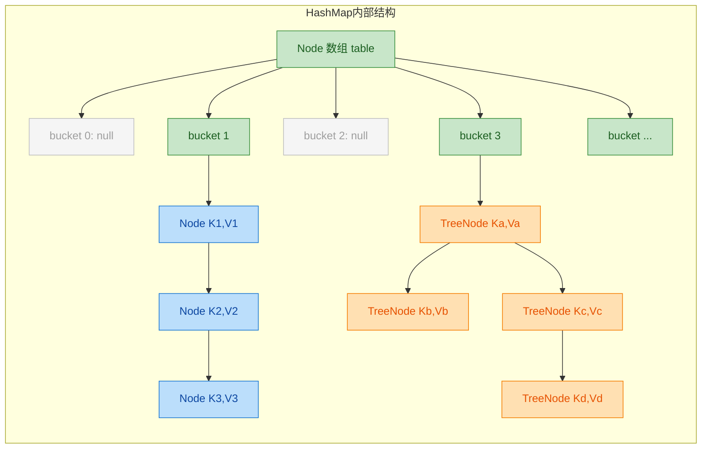

关键参数和机制：

```java
// HashMap 核心常量
static final int DEFAULT_INITIAL_CAPACITY = 1 << 4;  // 默认初始容量 = 16
static final int MAXIMUM_CAPACITY = 1 << 30;          // 最大容量 = 2^30
static final float DEFAULT_LOAD_FACTOR = 0.75f;       // 默认负载因子
static final int TREEIFY_THRESHOLD = 8;                // 链表转红黑树的阈值
static final int UNTREEIFY_THRESHOLD = 6;              // 红黑树退化为链表的阈值
static final int MIN_TREEIFY_CAPACITY = 64;            // 树化的最小表容量
```

`HashMap` 的 `put` 流程可以概括为以下步骤：

1. 对 key 的 `hashCode()` 进行扰动运算（perturbation）：`(h = key.hashCode()) ^ (h >>> 16)`，让高 16 位也参与索引计算，减少碰撞。
2. 用 `(n - 1) & hash` 计算桶索引（这就是为什么容量必须是 2 的幂——位运算替代取模，更快）。
3. 如果桶为空，直接放入新 Node。
4. 如果桶不为空，遍历链表/红黑树，找到相同 key 则覆盖 value，否则追加到末尾。
5. 如果链表长度 ≥ 8 且数组长度 ≥ 64，将链表转为红黑树（treeify）。
6. 如果 `size > capacity * loadFactor`，触发扩容（resize），容量翻倍，所有元素重新散列。

```java
// HashMap 的 hash 扰动函数（JDK 8+）
static final int hash(Object key) {
    int h;
    // key 为 null 时 hash 为 0（所以 HashMap 允许一个 null key，放在 bucket[0]）
    // 否则将 hashCode 的高 16 位与低 16 位异或
    // 目的：让高位信息也参与桶索引计算，降低碰撞概率
    return (key == null) ? 0 : (h = key.hashCode()) ^ (h >>> 16);
}
```

为什么要做这个异或操作？因为桶索引的计算是 `(n - 1) & hash`，当 `n` 较小时（比如 16），只有 hash 的低 4 位参与运算。如果不做扰动，那些只在高位不同的 key 会全部落入同一个桶，造成严重碰撞。

#### LinkedHashMap —— 保持插入顺序的 HashMap

`LinkedHashMap` 继承自 `HashMap`，在每个 Entry 节点上额外维护了一条双向链表，记录插入顺序（或访问顺序）。它的迭代顺序是可预测的，非常适合实现 LRU 缓存：

```java
// 用 LinkedHashMap 实现一个简单的 LRU 缓存
public class LRUCache<K, V> extends LinkedHashMap<K, V> {
    private final int maxSize;  // 缓存最大容量

    public LRUCache(int maxSize) {
        // accessOrder = true 表示按访问顺序排列（最近访问的排最后）
        super(maxSize, 0.75f, true);
        this.maxSize = maxSize;
    }

    @Override
    protected boolean removeEldestEntry(Map.Entry<K, V> eldest) {
        // 当元素数量超过最大容量时，自动移除最久未访问的元素
        return size() > maxSize;
    }
}
```

#### TreeMap —— 有序的 Map

`TreeMap` 基于红黑树（Red-Black Tree）实现，所有的 key 按照自然排序（`Comparable`）或自定义排序（`Comparator`）排列。它实现了 `NavigableMap` 接口，提供了丰富的范围查询方法：

```java
TreeMap<Integer, String> map = new TreeMap<>();
map.put(3, "C");    // 插入键值对
map.put(1, "A");    // 插入键值对
map.put(5, "E");    // 插入键值对
map.put(2, "B");    // 插入键值对
map.put(4, "D");    // 插入键值对

map.firstKey();              // 1 —— 最小的 key
map.lastKey();               // 5 —— 最大的 key
map.headMap(3);              // {1=A, 2=B} —— 小于 3 的子 Map
map.tailMap(3);              // {3=C, 4=D, 5=E} —— 大于等于 3 的子 Map
map.subMap(2, 5);            // {2=B, 3=C, 4=D} —— [2, 5) 范围的子 Map
map.floorKey(3);             // 3 —— 小于等于 3 的最大 key
map.ceilingKey(3);           // 3 —— 大于等于 3 的最小 key
```

所有操作的时间复杂度都是 O(log n)，因为红黑树保证了树的高度始终在 O(log n) 级别。

#### 各 Map 实现对比总览

| 特性 | HashMap | LinkedHashMap | TreeMap | Hashtable (legacy) | ConcurrentHashMap |
|------|---------|---------------|---------|-------------------|-------------------|
| 底层结构 | 数组+链表+红黑树 | HashMap + 双向链表 | 红黑树 | 数组+链表 | 分段数组+链表+红黑树 |
| 顺序 | 无序 | 插入序/访问序 | Key 排序 | 无序 | 无序 |
| null key | 允许 1 个 | 允许 1 个 | 不允许 | 不允许 | 不允许 |
| null value | 允许 | 允许 | 允许 | 不允许 | 不允许 |
| 线程安全 | ❌ | ❌ | ❌ | ✅（全表锁） | ✅（CAS + synchronized 分段锁） |
| 时间复杂度 | O(1) 均摊 | O(1) 均摊 | O(log n) | O(1) 均摊 | O(1) 均摊 |

---

### Collection 与 Map 的桥梁

虽然 `Collection` 和 `Map` 没有继承关系，但它们之间存在多种转换和协作方式：

```java
Map<String, Integer> map = new HashMap<>();
map.put("Java", 1);       // 存入键值对
map.put("Python", 2);     // 存入键值对
map.put("Go", 3);         // 存入键值对

// Map → Collection 的三个视图
Set<String> keys = map.keySet();                    // key 的 Set 视图
Collection<Integer> values = map.values();          // value 的 Collection 视图
Set<Map.Entry<String, Integer>> entries = map.entrySet(); // Entry 的 Set 视图

// 反向：用 Collection 构建 Map（JDK 8 Stream API）
List<String> words = List.of("hello", "world", "hello", "java");
Map<String, Long> wordCount = words.stream()
    .collect(Collectors.groupingBy(          // 按单词分组
        Function.identity(),                 // key = 单词本身
        Collectors.counting()                // value = 出现次数
    ));
// 结果：{hello=2, world=1, java=1}
```

另一个常见的桥梁是 `Collections` 工具类提供的各种包装方法：

```java
// Collections 工具类：在 Collection 和 Map 上施加额外约束
Map<String, Integer> syncMap = Collections.synchronizedMap(new HashMap<>());   // 线程安全包装
Map<String, Integer> unmodMap = Collections.unmodifiableMap(map);              // 不可变包装
Set<String> syncSet = Collections.synchronizedSet(new HashSet<>());           // 线程安全 Set
List<String> unmodList = Collections.unmodifiableList(new ArrayList<>());     // 不可变 List
```

还有一个容易被忽视的联系：`HashSet` 内部就是一个 `HashMap`，`TreeSet` 内部就是一个 `TreeMap`，`LinkedHashSet` 内部就是一个 `LinkedHashMap`。Set 系列本质上是 Map 系列的"key 视图"——只用了 key，value 全部填充一个无意义的占位对象。这种设计避免了重复造轮子，也是 JCF 设计的精妙之处。

```text
┌─────────────────────────────────────────────────┐
│              Set 与 Map 的委托关系                │
├─────────────────────┬───────────────────────────┤
│     HashSet         │  内部持有 HashMap          │
│     LinkedHashSet   │  内部持有 LinkedHashMap    │
│     TreeSet         │  内部持有 TreeMap           │
├─────────────────────┴───────────────────────────┤
│  Set.add(e)  →  Map.put(e, PRESENT)             │
│  Set.contains(e)  →  Map.containsKey(e)         │
│  Set.remove(e)  →  Map.remove(e)                │
└─────────────────────────────────────────────────┘
```

---

### 如何选择合适的集合类

面对这么多实现类，实际开发中该怎么选？下面这张决策流程图可以帮你快速定位：

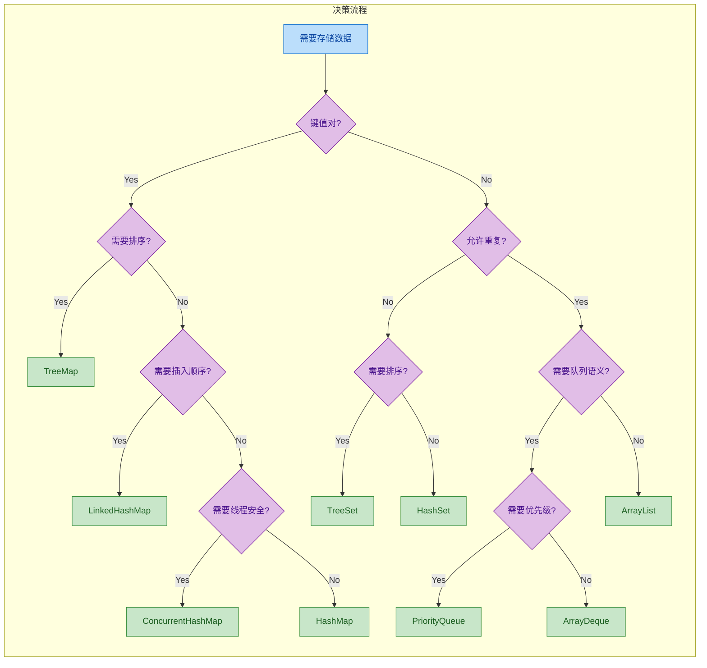

简单总结几条经验法则：

- **默认选 `ArrayList`**：90% 的 List 场景用它就对了，随机访问快，尾部追加快，CPU 缓存友好。
- **默认选 `HashMap`**：90% 的 Map 场景用它就对了，O(1) 的增删查改。
- **需要去重用 `HashSet`**：本质就是 HashMap 的 key 集合。
- **需要排序用 `TreeMap` / `TreeSet`**：红黑树保证 O(log n) 且有序。
- **需要队列用 `ArrayDeque`**：比 `LinkedList` 快，比 `Stack` 现代。永远不要用 `Stack` 类。
- **多线程场景用 `ConcurrentHashMap`**：永远不要用 `Hashtable` 或 `Collections.synchronizedMap`，它们的全表锁粒度太粗。
- **`Vector` 和 `Stack` 是遗留类**：新代码中不应该出现它们。`Vector` 用 `ArrayList` + 外部同步替代，`Stack` 用 `ArrayDeque` 替代。

---

### JDK 9+ 的不可变集合工厂方法

从 JDK 9 开始，`List`、`Set`、`Map` 接口都新增了 `of()` 静态工厂方法，用于创建不可变集合（Unmodifiable Collections）：

```java
// JDK 9+ 不可变集合工厂方法
List<String> list = List.of("A", "B", "C");       // 不可变 List
Set<String> set = Set.of("X", "Y", "Z");           // 不可变 Set（不允许重复，否则抛异常）
Map<String, Integer> map = Map.of(                  // 不可变 Map（最多 10 对）
    "one", 1,
    "two", 2,
    "three", 3
);

// 超过 10 对用 Map.ofEntries
Map<String, Integer> bigMap = Map.ofEntries(
    Map.entry("a", 1),    // 每个键值对用 Map.entry 包装
    Map.entry("b", 2),
    Map.entry("c", 3)
    // ... 可以有任意多对
);

// 这些集合是真正的不可变——任何修改操作都会抛出 UnsupportedOperationException
list.add("D");    // 抛出 UnsupportedOperationException
set.remove("X");  // 抛出 UnsupportedOperationException
map.put("four", 4); // 抛出 UnsupportedOperationException
```

这些工厂方法创建的集合与 `Collections.unmodifiableXxx()` 包装器有本质区别：前者是真正的不可变实现类（内部做了深度优化，比如 0-2 个元素有专门的特化类），后者只是在可变集合外面套了一层"只读壳"，原始集合如果被修改，包装器也会跟着变。

---

**📝 练习题**

以下关于 Java 集合框架的说法，哪一项是正确的？

A. `HashSet` 内部使用 `TreeMap` 作为底层数据结构

B. `HashMap` 在 JDK 8 中，当链表长度超过 8 时一定会转化为红黑树

C. `LinkedHashMap` 可以按照访问顺序（access-order）排列元素，适合实现 LRU 缓存

D. `TreeMap` 允许 key 为 null，因为 null 会被排在最前面


**【答案】** C

**【解析】** 逐项分析：

- A 错误：`HashSet` 内部使用的是 `HashMap`，不是 `TreeMap`。对应地，`TreeSet` 才是内部使用 `TreeMap`。
- B 错误：链表长度超过 8 只是树化的必要条件之一，还需要数组容量 ≥ `MIN_TREEIFY_CAPACITY`（64）。如果数组容量不足 64，会优先选择扩容（resize）而不是树化。这是一个高频面试考点。
- C 正确：`LinkedHashMap` 的构造函数接受一个 `accessOrder` 参数，设为 `true` 时，每次 `get` 或 `put` 操作都会将被访问的节点移到双向链表末尾，配合重写 `removeEldestEntry` 方法即可实现 LRU 缓存。
- D 错误：`TreeMap` 不允许 null key。因为 `TreeMap` 需要对 key 进行比较排序（调用 `compareTo` 或 `Comparator.compare`），null 无法参与比较，会直接抛出 `NullPointerException`。

---

## Iterator 与 Iterable（迭代器模式）

Java 集合框架的遍历能力，建立在两个核心接口之上：`Iterable` 和 `Iterator`。它们共同实现了经典的 **迭代器设计模式（Iterator Pattern）**，其核心思想是：**将集合的内部数据结构与外部遍历逻辑彻底解耦**。你不需要知道底层是数组、链表还是红黑树，只需要通过统一的 `hasNext()` / `next()` 协议就能逐一访问元素。

这套设计之所以重要，是因为它直接支撑了 Java 5 引入的 **增强 for 循环（enhanced for-loop）**，也就是我们日常写的 `for (E e : collection)` 语法糖。编译器会将其自动转换为 `Iterator` 调用。理解这两个接口，就等于理解了 Java 集合遍历的底层契约。

### Iterable 接口 —— "我可以被遍历"

`java.lang.Iterable<T>` 位于 `java.lang` 包（注意，不是 `java.util`），它是所有可被 for-each 遍历的对象的顶层抽象。任何类只要实现了 `Iterable`，就可以直接放进增强 for 循环中使用。

```java
// Iterable 接口定义（JDK 源码简化版）
public interface Iterable<T> {

    // 核心方法：返回一个迭代器实例
    Iterator<T> iterator();

    // JDK 8 新增：接受一个 Consumer，对每个元素执行操作
    default void forEach(Consumer<? super T> action) {
        Objects.requireNonNull(action);       // 空值检查
        for (T t : this) {                    // 内部其实也是调用 iterator()
            action.accept(t);                 // 对每个元素执行传入的 action
        }
    }

    // JDK 8 新增：返回一个 Spliterator，用于并行流处理
    default Spliterator<T> spliterator() {
        return Spliterators.spliteratorUnknownSize(iterator(), 0);
    }
}
```

`Iterable` 只有一个抽象方法 `iterator()`，这意味着它也是一个 **函数式接口（Functional Interface）**，但实际开发中我们很少用 lambda 来实现它，更多是通过类来实现。

`Collection` 接口继承了 `Iterable`，所以 `List`、`Set`、`Queue` 等所有集合天然支持 for-each 遍历。而 `Map` 没有继承 `Iterable`，所以你不能直接 `for (x : map)`，但可以通过 `map.keySet()`、`map.values()`、`map.entrySet()` 获取集合视图后再遍历。

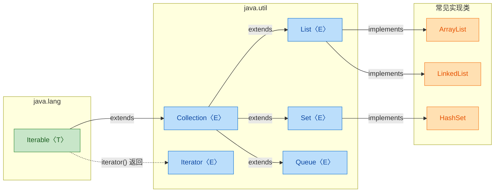

### Iterator 接口 —— "我负责执行遍历"

`java.util.Iterator<E>` 是真正干活的角色。每次调用 `collection.iterator()` 都会返回一个全新的迭代器实例，这个实例维护着自己的 **游标（cursor）** 状态，指向当前遍历到的位置。

```java
// Iterator 接口定义
public interface Iterator<E> {

    // 判断是否还有下一个元素
    boolean hasNext();

    // 返回下一个元素，并将游标向前推进一位
    E next();

    // 删除 next() 最近返回的那个元素（可选操作）
    default void remove() {
        // 默认实现直接抛异常，子类需要覆盖才能使用
        throw new UnsupportedOperationException("remove");
    }

    // JDK 8 新增：对剩余元素执行给定操作
    default void forEachRemaining(Consumer<? super E> action) {
        Objects.requireNonNull(action);       // 空值检查
        while (hasNext())                     // 只要还有元素
            action.accept(next());            // 就对其执行 action
    }
}
```

标准的使用模式非常固定：

```java
List<String> names = List.of("Alice", "Bob", "Charlie");

// 获取迭代器实例
Iterator<String> it = names.iterator();

// 经典 while 循环遍历
while (it.hasNext()) {          // 先问：还有下一个吗？
    String name = it.next();    // 再取：给我下一个
    System.out.println(name);   // 处理元素
}
```

这里有一个关键的 **协议约束**：必须先调用 `hasNext()` 再调用 `next()`。如果在没有剩余元素时直接调用 `next()`，会抛出 `NoSuchElementException`。

### for-each 的编译器脱糖（Desugaring）

增强 for 循环并不是什么魔法，编译器会在编译阶段将其转换为标准的 `Iterator` 调用。理解这个转换过程，对排查遍历相关的 bug 非常有帮助。

```java
// ========== 你写的代码 ==========
for (String name : names) {
    System.out.println(name);
}

// ========== 编译器实际生成的等价代码 ==========
Iterator<String> $iter = names.iterator();   // 调用 Iterable.iterator()
while ($iter.hasNext()) {                    // 调用 Iterator.hasNext()
    String name = $iter.next();              // 调用 Iterator.next()
    System.out.println(name);
}
```

这也解释了为什么 `Map` 不能直接用 for-each —— 它没有实现 `Iterable`，编译器找不到 `iterator()` 方法，编译直接报错。

对于数组，for-each 的脱糖方式不同，编译器会将其转换为传统的索引 for 循环：

```java
// ========== 你写的代码 ==========
int[] arr = {1, 2, 3};
for (int x : arr) {
    System.out.println(x);
}

// ========== 编译器实际生成的等价代码 ==========
int[] arr = {1, 2, 3};
for (int i = 0; i < arr.length; i++) {   // 普通索引遍历
    int x = arr[i];
    System.out.println(x);
}
```

### ArrayList 的 Iterator 实现剖析

理论讲完了，来看看真实的实现。`ArrayList` 内部有一个私有内部类 `Itr`，它就是 `iterator()` 方法返回的迭代器。这段源码非常经典，值得逐行理解。

```java
// ArrayList 内部的 Itr 类（JDK 源码简化）
private class Itr implements Iterator<E> {

    int cursor;             // 下一个要返回的元素索引，初始为 0
    int lastRet = -1;       // 上一次 next() 返回的元素索引，-1 表示还没调用过
    int expectedModCount = modCount;  // 快照：记录创建迭代器时的修改次数

    // 判断是否还有下一个元素
    public boolean hasNext() {
        return cursor != size;        // 游标没到末尾就还有
    }

    // 返回下一个元素
    @SuppressWarnings("unchecked")
    public E next() {
        checkForComodification();     // 先检查是否被并发修改
        int i = cursor;              // 记录当前位置
        if (i >= size)               // 越界检查
            throw new NoSuchElementException();
        Object[] elementData = ArrayList.this.elementData;  // 拿到底层数组引用
        if (i >= elementData.length)  // 防止并发导致数组缩容
            throw new ConcurrentModificationException();
        cursor = i + 1;              // 游标前进一位
        return (E) elementData[lastRet = i];  // 返回元素，同时记录 lastRet
    }

    // 删除上一次 next() 返回的元素
    public void remove() {
        if (lastRet < 0)             // 没调用过 next() 就调 remove()，非法
            throw new IllegalStateException();
        checkForComodification();     // 检查并发修改
        try {
            ArrayList.this.remove(lastRet);   // 调用 ArrayList 的 remove
            cursor = lastRet;                 // 游标回退（因为后面的元素前移了）
            lastRet = -1;                     // 重置，防止连续调用两次 remove()
            expectedModCount = modCount;      // 同步修改计数（这是安全删除的关键！）
        } catch (IndexOutOfBoundsException ex) {
            throw new ConcurrentModificationException();
        }
    }

    // 并发修改检查
    final void checkForComodification() {
        if (modCount != expectedModCount)     // 快照值和当前值不一致
            throw new ConcurrentModificationException();  // 立即失败
    }
}
```

注意 `remove()` 方法中的 `expectedModCount = modCount` 这一行 —— 这就是为什么通过迭代器的 `remove()` 删除元素不会触发 `ConcurrentModificationException`，而直接调用 `list.remove()` 会。迭代器的 `remove()` 在删除后主动同步了修改计数。

用一张内存模型图来展示游标的推进过程：

```text
ArrayList: ["A", "B", "C", "D"]
             ↑
初始状态:   cursor=0, lastRet=-1

调用 next() → 返回 "A"
           ["A", "B", "C", "D"]
                  ↑
           cursor=1, lastRet=0

调用 next() → 返回 "B"
           ["A", "B", "C", "D"]
                        ↑
           cursor=2, lastRet=1

调用 remove() → 删除 "B"（lastRet=1 位置的元素）
           ["A", "C", "D"]
                  ↑
           cursor=1, lastRet=-1   ← 游标回退！

调用 next() → 返回 "C"
           ["A", "C", "D"]
                        ↑
           cursor=2, lastRet=1
```

### ListIterator —— 双向迭代器

`List` 接口额外提供了 `ListIterator<E>`，它继承自 `Iterator` 并增加了双向遍历和修改能力。这是 `List` 独有的能力，`Set` 和 `Queue` 没有。

```java
public interface ListIterator<E> extends Iterator<E> {

    boolean hasNext();          // 正向：还有下一个吗
    E next();                   // 正向：取下一个

    boolean hasPrevious();      // 反向：还有上一个吗
    E previous();               // 反向：取上一个

    int nextIndex();            // 下一个元素的索引
    int previousIndex();        // 上一个元素的索引

    void remove();              // 删除最近一次 next()/previous() 返回的元素
    void set(E e);              // 替换最近一次 next()/previous() 返回的元素
    void add(E e);              // 在当前游标位置插入元素
}
```

`ListIterator` 的游标概念和 `Iterator` 略有不同。它的游标位于元素之间，而不是指向元素本身：

```text
元素:     "A"     "B"     "C"     "D"
游标位置: ^    ^       ^       ^       ^
索引:     0    1       2       3       4

cursor 在位置 2 时：
  - previousIndex() = 1, previous() 返回 "B"
  - nextIndex() = 2, next() 返回 "C"
```

使用示例：

```java
List<String> list = new ArrayList<>(List.of("A", "B", "C", "D"));

// 从索引 2 开始创建 ListIterator
ListIterator<String> lit = list.listIterator(2);  // 游标在 "B" 和 "C" 之间

// 反向遍历
while (lit.hasPrevious()) {                       // 向前还有元素吗
    int idx = lit.previousIndex();                // 获取前一个元素的索引
    String val = lit.previous();                  // 取出前一个元素
    System.out.println(idx + ": " + val);         // 输出 1:B, 0:A
}

// 正向遍历并替换
while (lit.hasNext()) {                           // 向后还有元素吗
    String val = lit.next();                      // 取出下一个元素
    lit.set(val.toLowerCase());                   // 替换为小写版本
}
// list 变为 ["a", "b", "c", "d"]
```

### 自定义 Iterable —— 让你的类支持 for-each

实现 `Iterable` 接口非常简单，只需要提供一个 `iterator()` 方法。下面实现一个整数范围类，让它可以直接用 for-each 遍历：

```java
// 自定义可迭代的整数范围类
public class IntRange implements Iterable<Integer> {

    private final int start;    // 起始值（包含）
    private final int end;      // 结束值（不包含）

    public IntRange(int start, int end) {
        this.start = start;     // 记录起始值
        this.end = end;         // 记录结束值
    }

    @Override
    public Iterator<Integer> iterator() {
        // 每次调用都返回一个全新的迭代器实例
        return new Iterator<>() {

            private int current = start;    // 当前游标，从 start 开始

            @Override
            public boolean hasNext() {
                return current < end;       // 还没到终点就返回 true
            }

            @Override
            public Integer next() {
                if (!hasNext()) {                           // 防御性检查
                    throw new NoSuchElementException();     // 没有元素了
                }
                return current++;           // 返回当前值，然后游标 +1
            }
        };
    }
}
```

```java
// 使用自定义 Iterable
IntRange range = new IntRange(1, 6);

// 直接用 for-each，因为 IntRange 实现了 Iterable
for (int num : range) {
    System.out.print(num + " ");    // 输出: 1 2 3 4 5
}

// 也可以用 forEach + lambda
range.forEach(n -> System.out.print(n + " "));  // 输出: 1 2 3 4 5
```

每次调用 `iterator()` 都会创建一个新的迭代器实例，这意味着同一个 `IntRange` 对象可以被多次遍历，每次都从头开始。这是迭代器模式的一个重要特性：**Iterable 是可重复遍历的，Iterator 是一次性的**。

### Iterator vs Iterable 对比总结

```mermaid
graph LR
    subgraph iterable["Iterable〈T〉 — 容器契约"]
        direction TB
        A1["所属包: java.lang"]
        A2["核心方法: iterator()"]
        A3["职责: 声明自己可被遍历"]
        A4["支持 for-each 语法"]
        A5["可重复使用"]
    end

    subgraph iterator["Iterator〈E〉 — 遍历引擎"]
        direction TB
        B1["所属包: java.util"]
        B2["核心方法: hasNext() / next()"]
        B3["职责: 执行具体的遍历逻辑"]
        B4["维护游标状态"]
        B5["一次性消耗"]
    end

    iterable -->|"iterator() 生产"| iterator

    classDef iterableStyle fill:#C8E6C9,stroke:#43A047,color:#1B5E20
    classDef iteratorStyle fill:#BBDEFB,stroke:#1E88E5,color:#0D47A1

    class A1,A2,A3,A4,A5 iterableStyle
    class B1,B2,B3,B4,B5 iteratorStyle
```

一句话总结它们的关系：`Iterable` 是工厂，`Iterator` 是产品。`Iterable` 负责生产迭代器，`Iterator` 负责执行遍历。这种分离使得同一个集合可以同时存在多个独立的遍历过程，互不干扰。

---

**📝 练习题**

以下代码的输出结果是什么？

```java
List<String> list = new ArrayList<>(Arrays.asList("X", "Y", "Z"));
Iterator<String> it1 = list.iterator();
Iterator<String> it2 = list.iterator();
it1.next();   // it1 消费了 "X"
it1.next();   // it1 消费了 "Y"
System.out.println(it1.next() + " " + it2.next());
```

A. Z X


B. Z Y


C. Y X


D. 抛出 NoSuchElementException

**【答案】** A

**【解析】** 每次调用 `list.iterator()` 都会创建一个全新的、独立的迭代器实例，各自维护自己的游标（cursor）。`it1` 经过两次 `next()` 后游标指向索引 2，第三次 `next()` 返回 `"Z"`。而 `it2` 从未被使用过，游标仍在索引 0，第一次 `next()` 返回 `"X"`。两个迭代器互不影响，所以输出 `Z X`。这正是迭代器模式的核心优势 —— 多个遍历过程可以独立并行地进行。

---

## Fail-Fast 机制 ⭐

### 什么是 Fail-Fast

Fail-Fast（快速失败）是 Java 集合框架中一种**自我保护机制**。它的核心哲学很简单：当集合检测到自身在迭代过程中被**结构性修改**（Structural Modification）时，不会尝试去"容忍"或"修复"这个问题，而是立刻抛出 `ConcurrentModificationException`，让程序尽早暴露错误。

这里的"结构性修改"指的是改变集合大小的操作——`add()`、`remove()`、`clear()` 等。仅仅修改某个元素的值（比如 `set()`）通常不算结构性修改。

这种设计思想在工程上非常重要：**与其让程序在错误的数据上默默运行、最终产生难以追踪的 Bug，不如在第一时间崩溃，把问题暴露在开发阶段。** 这就是 "Fail-Fast" 名字的由来——快速失败，尽早止损。

### modCount：Fail-Fast 的核心计数器

Fail-Fast 机制的实现依赖于一个关键字段：`modCount`（modification count，修改计数器）。它定义在 `AbstractList` 中，几乎所有基于 `AbstractList` 的集合（`ArrayList`、`LinkedList`、`HashMap` 等）都继承或自行维护了这个字段。

```java
// 源码位于 java.util.AbstractList
protected transient int modCount = 0;
// transient 表示该字段不参与序列化
// 每次对集合进行结构性修改时，modCount 自增
```

每当集合发生结构性修改，`modCount` 就会 +1。我们来看 `ArrayList` 中几个典型操作对 `modCount` 的影响：

```java
// ===== ArrayList.add() 源码片段 (JDK 17) =====
public boolean add(E e) {
    modCount++;                    // 结构性修改，计数器 +1
    add(e, elementData, size);     // 执行实际的添加逻辑
    return true;
}

// ===== ArrayList.remove() 源码片段 =====
public E remove(int index) {
    Objects.checkIndex(index, size);  // 边界检查
    final Object[] es = elementData;

    E oldValue = (E) es[index];       // 保存被删除的元素
    fastRemove(es, index);            // 内部会执行 modCount++
    return oldValue;                  // 返回被删除的元素
}

// ===== ArrayList.fastRemove() 源码片段 =====
private void fastRemove(Object[] es, int i) {
    modCount++;                       // 结构性修改，计数器 +1
    final int newSize;
    if ((newSize = size - 1) > i)     // 如果不是删除最后一个元素
        System.arraycopy(es, i + 1, es, i, newSize - i); // 数组元素前移
    es[size = newSize] = null;        // 将末尾置 null，帮助 GC
}

// ===== ArrayList.clear() 源码片段 =====
public void clear() {
    modCount++;                       // 即使清空，也只 +1（不是 +size）
    final Object[] es = elementData;
    for (int to = size, i = size = 0; i < to; i++)
        es[i] = null;                 // 逐个置 null，帮助 GC 回收
}
```

注意一个细节：`clear()` 虽然可能删除了成百上千个元素，但 `modCount` 只 +1。因为 `modCount` 记录的是"操作次数"，而不是"被影响的元素数量"。

### 迭代器如何利用 modCount 实现 Fail-Fast

当你通过 `iterator()` 或增强 for 循环遍历集合时，迭代器会在创建时**拍一张快照**——把当前的 `modCount` 值保存到自己的 `expectedModCount` 字段中。之后每次调用 `next()` 或 `remove()` 时，都会检查这两个值是否一致。

```java
// ===== ArrayList 内部类 Itr 源码 (简化版) =====
private class Itr implements Iterator<E> {
    int cursor;                       // 下一个要返回的元素索引
    int lastRet = -1;                 // 上一次返回的元素索引，-1 表示尚未调用 next()
    int expectedModCount = modCount;  // 🔑 创建迭代器时，拍下 modCount 的快照

    public boolean hasNext() {
        return cursor != size;        // 判断是否还有下一个元素
    }

    @SuppressWarnings("unchecked")
    public E next() {
        checkForComodification();     // 🔑 每次 next() 前先检查
        int i = cursor;              // 获取当前游标位置
        if (i >= size)               // 越界检查
            throw new NoSuchElementException();
        Object[] elementData = ArrayList.this.elementData;
        if (i >= elementData.length)  // 防止并发导致的数组越界
            throw new ConcurrentModificationException();
        cursor = i + 1;              // 游标后移
        return (E) elementData[lastRet = i]; // 返回元素，并记录 lastRet
    }

    public void remove() {
        if (lastRet < 0)             // 如果还没调用过 next()，不能 remove
            throw new IllegalStateException();
        checkForComodification();     // 🔑 remove 前也要检查

        try {
            ArrayList.this.remove(lastRet);  // 调用外部类的 remove
            cursor = lastRet;                // 游标回退（因为后面的元素前移了）
            lastRet = -1;                    // 重置，防止连续调用两次 remove
            expectedModCount = modCount;     // 🔑 同步！因为这是"合法"的修改
        } catch (IndexOutOfBoundsException ex) {
            throw new ConcurrentModificationException();
        }
    }

    // 🔑 核心检查方法
    final void checkForComodification() {
        if (modCount != expectedModCount)    // 快照值 vs 当前值
            throw new ConcurrentModificationException(); // 不一致就立刻抛异常
    }
}
```

这段源码揭示了几个关键点：

- 迭代器创建时，`expectedModCount = modCount` 完成快照。
- 每次 `next()` 和 `remove()` 都会调用 `checkForComodification()` 进行校验。
- 迭代器自己的 `remove()` 方法在删除后会**同步** `expectedModCount = modCount`，所以它是安全的。
- 而如果你绕过迭代器，直接调用 `list.remove()`，`modCount` 变了但 `expectedModCount` 没变，下次 `next()` 就会爆炸。

整个检测流程可以用下面的流程图来表示：

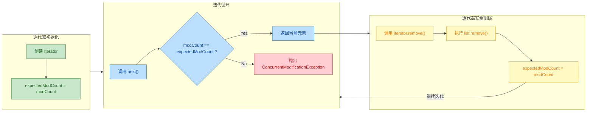

### 经典错误场景：在 for-each 中直接删除元素

这是 Java 面试和实际开发中最常见的坑之一。几乎每个 Java 开发者都踩过：

```java
// ===== 错误示范：在增强 for 循环中直接调用 list.remove() =====
List<String> list = new ArrayList<>(Arrays.asList("Java", "Python", "Go", "Rust"));

for (String lang : list) {          // 增强 for 本质上是 Iterator 遍历
    if ("Go".equals(lang)) {
        list.remove(lang);           // 💥 直接调用集合的 remove()
        // 此时 modCount++ 了，但 expectedModCount 没变
        // 下一次 next() 调用时就会检测到不一致
    }
}
// 运行结果：抛出 ConcurrentModificationException
```

为什么会这样？增强 for 循环（for-each）在编译后会被转换成迭代器代码：

```java
// ===== 编译器将 for-each 转换为如下等价代码 =====
Iterator<String> it = list.iterator();   // 此时 expectedModCount = modCount = 0（假设）
while (it.hasNext()) {
    String lang = it.next();             // 每次都会 checkForComodification()
    if ("Go".equals(lang)) {
        list.remove(lang);               // modCount 变成 1，但 expectedModCount 还是 0
        // 下一轮循环调用 it.next() 时：
        // checkForComodification() 发现 1 != 0 → 💥 抛异常
    }
}
```

下面用一张时序图来展示这个过程中各个角色的交互：

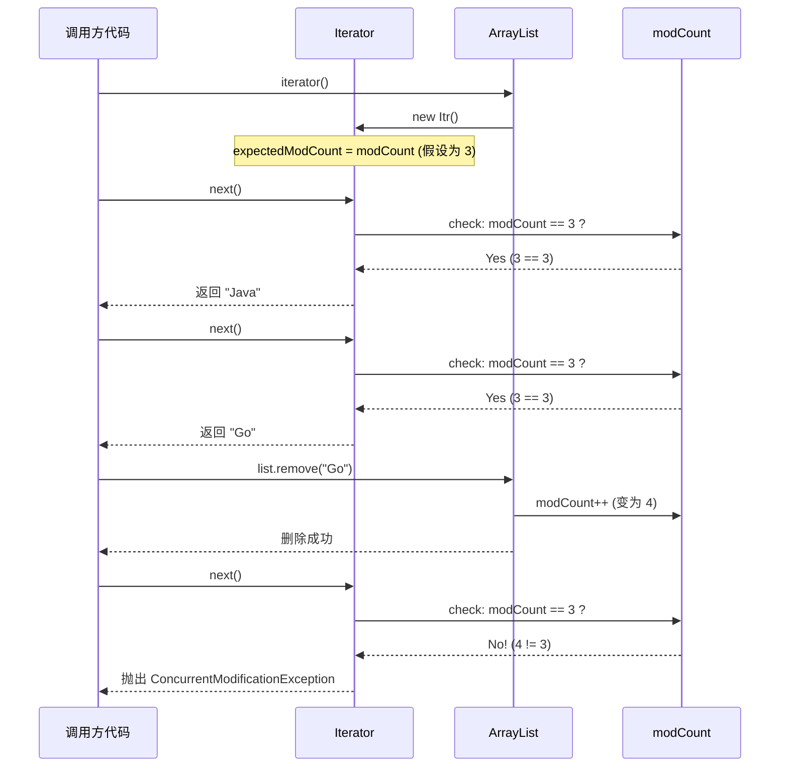

### 正确的遍历删除方式

既然直接在 for-each 中删除会出问题，那正确的做法有哪些？

```java
// ===== 方式一：使用 Iterator.remove()（最经典、最通用） =====
List<String> list = new ArrayList<>(Arrays.asList("Java", "Python", "Go", "Rust"));

Iterator<String> it = list.iterator();
while (it.hasNext()) {
    String lang = it.next();         // 先调用 next() 获取元素
    if ("Go".equals(lang)) {
        it.remove();                 // 使用迭代器自己的 remove()
        // 内部会执行：
        // 1. ArrayList.this.remove(lastRet)  → modCount++
        // 2. expectedModCount = modCount     → 重新同步！
        // 所以下次 next() 检查时不会报错
    }
}
System.out.println(list);           // 输出: [Java, Python, Rust]
```

```java
// ===== 方式二：使用 removeIf()（Java 8+，最简洁） =====
List<String> list = new ArrayList<>(Arrays.asList("Java", "Python", "Go", "Rust"));

list.removeIf(lang -> "Go".equals(lang));  // 一行搞定
// removeIf 内部使用 BitSet 标记要删除的元素，最后批量移除
// 整个过程不涉及迭代器，所以不会触发 Fail-Fast

System.out.println(list);           // 输出: [Java, Python, Rust]
```

```java
// ===== 方式三：倒序遍历删除（传统 for 循环，不涉及迭代器） =====
List<String> list = new ArrayList<>(Arrays.asList("Java", "Python", "Go", "Rust"));

for (int i = list.size() - 1; i >= 0; i--) {  // 从后往前遍历
    if ("Go".equals(list.get(i))) {
        list.remove(i);              // 删除后，前面的元素索引不受影响
        // 如果正序遍历删除，删除后后面的元素会前移，可能导致跳过元素
    }
}
System.out.println(list);           // 输出: [Java, Python, Rust]
```

```java
// ===== 方式四：使用 Stream 过滤生成新集合（不修改原集合） =====
List<String> list = new ArrayList<>(Arrays.asList("Java", "Python", "Go", "Rust"));

List<String> filtered = list.stream()
    .filter(lang -> !"Go".equals(lang))  // 过滤掉 "Go"
    .collect(Collectors.toList());        // 收集为新 List

System.out.println(filtered);       // 输出: [Java, Python, Rust]
// 原 list 不受影响: [Java, Python, Go, Rust]
```

### 一个容易被忽略的"诡异"现象

有一种情况看起来像是 Fail-Fast 失效了，但其实是一个巧合：

```java
// ===== 删除倒数第二个元素时，"恰好"不报错 =====
List<String> list = new ArrayList<>(Arrays.asList("A", "B", "C"));

for (String s : list) {
    if ("B".equals(s)) {             // "B" 是倒数第二个元素
        list.remove(s);              // 删除后 size 从 3 变成 2
        // 此时 cursor == 2，size == 2
        // hasNext() 判断 cursor != size → 2 != 2 → false
        // 循环直接结束了，根本没机会调用 next()
        // 所以 checkForComodification() 没有被执行
        // 异常就这样"逃过"了检测
    }
}
System.out.println(list);           // 输出: [A, C]  看起来"正常"工作了
```

这不是 Fail-Fast 机制的 Bug，而是 `hasNext()` 的判断逻辑恰好让循环提前终止了。`hasNext()` 内部不做 `modCount` 检查，它只比较 `cursor != size`。当你删除倒数第二个元素后，`cursor` 恰好等于新的 `size`，循环就结束了。

这恰恰说明了 JDK 文档中的那句话：**Fail-Fast behavior is not guaranteed（Fail-Fast 行为不是被保证的）。** 它是一种 best-effort 的检测机制，不能依赖它来保证程序的正确性。

### Fail-Fast vs Fail-Safe

与 Fail-Fast 相对的是 Fail-Safe（安全失败）机制，主要出现在 `java.util.concurrent` 包下的并发集合中。

```java
// ===== Fail-Safe 示例：CopyOnWriteArrayList =====
List<String> cowList = new CopyOnWriteArrayList<>(Arrays.asList("A", "B", "C"));

for (String s : cowList) {
    if ("B".equals(s)) {
        cowList.remove(s);           // 不会抛异常！
        // CopyOnWriteArrayList 在修改时会复制一份新数组
        // 迭代器仍然在旧数组上遍历，互不干扰
    }
}
System.out.println(cowList);         // 输出: [A, C]
```

```java
// ===== Fail-Safe 示例：ConcurrentHashMap =====
Map<String, Integer> concMap = new ConcurrentHashMap<>();
concMap.put("Java", 1);             // 添加键值对
concMap.put("Go", 2);               // 添加键值对
concMap.put("Rust", 3);             // 添加键值对

for (Map.Entry<String, Integer> entry : concMap.entrySet()) {
    if ("Go".equals(entry.getKey())) {
        concMap.remove("Go");        // 不会抛异常！
        // ConcurrentHashMap 使用分段锁 + 弱一致性迭代器
        // 迭代器能感知到部分并发修改，但不保证实时一致
    }
}
System.out.println(concMap);         // 输出: {Java=1, Rust=3}
```

两种机制的对比：

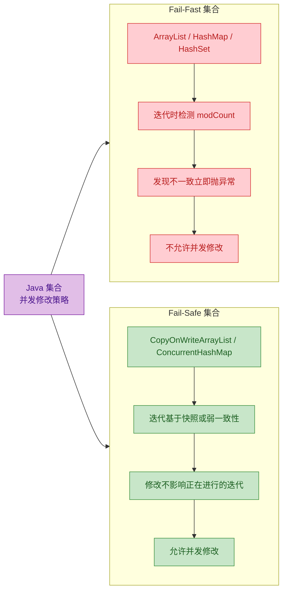

需要注意的是，"Fail-Safe" 这个术语在 JDK 官方文档中并没有被正式使用，它更多是社区约定俗成的叫法。`ConcurrentHashMap` 的迭代器官方称为 "weakly consistent"（弱一致性），而 `CopyOnWriteArrayList` 的迭代器则是基于创建时的数组快照（snapshot）。

两者的核心权衡（trade-off）在于：

- Fail-Fast 集合性能更好、内存开销更小，适合单线程或外部同步的场景。
- Fail-Safe 集合牺牲了一定的性能和内存（如 COW 每次写都要复制数组），换来了线程安全和迭代稳定性。

### HashMap 中的 Fail-Fast

Fail-Fast 不仅存在于 `List` 中，`HashMap` 同样实现了这个机制。`HashMap` 自己维护了一个 `modCount` 字段（不是继承自 `AbstractList`），其迭代器 `HashIterator` 的检测逻辑与 `ArrayList` 如出一辙：

```java
// ===== HashMap 内部 HashIterator 源码片段 =====
abstract class HashIterator {
    Node<K,V> next;                  // 下一个要返回的节点
    Node<K,V> current;               // 当前节点
    int expectedModCount;            // 快照
    int index;                       // 当前桶的索引

    HashIterator() {
        expectedModCount = modCount;  // 🔑 创建时拍快照
        Node<K,V>[] t = table;
        current = next = null;
        index = 0;
        if (t != null && size > 0) {  // 找到第一个非空桶
            do {} while (index < t.length && (next = t[index++]) == null);
        }
    }

    final Node<K,V> nextNode() {
        Node<K,V>[] t;
        Node<K,V> e = next;
        if (modCount != expectedModCount)  // 🔑 同样的检查逻辑
            throw new ConcurrentModificationException();
        if (e == null)
            throw new NoSuchElementException();
        // ... 遍历链表或红黑树找到下一个节点
        if ((next = (current = e).next) == null && (t = table) != null) {
            do {} while (index < t.length && (next = t[index++]) == null);
        }
        return e;
    }
}
```

所以在遍历 `HashMap` 时同样不能直接调用 `map.put()` 或 `map.remove()`，而应该使用 `Iterator.remove()` 或 Java 8 的 `Map.replaceAll()`、`Map.compute()` 等方法。

### 多线程场景下的 Fail-Fast

一个常见的误解是：Fail-Fast 是为多线程设计的。实际上，**Fail-Fast 主要是为单线程中的编程错误服务的**。在多线程环境下，`modCount` 的读写没有任何同步保护（没有 `volatile`，没有锁），所以它**不能可靠地检测并发修改**。

```java
// ===== 多线程场景：Fail-Fast 不一定能检测到问题 =====
List<Integer> list = new ArrayList<>();
for (int i = 0; i < 1000; i++) {
    list.add(i);                     // 初始化 1000 个元素
}

// 线程 1：遍历
new Thread(() -> {
    for (Integer num : list) {       // 迭代器遍历
        // 可能抛 ConcurrentModificationException
        // 也可能不抛，而是读到脏数据、跳过元素、甚至 ArrayIndexOutOfBoundsException
        System.out.println(num);
    }
}).start();

// 线程 2：修改
new Thread(() -> {
    for (int i = 1000; i < 2000; i++) {
        list.add(i);                 // 并发添加
        // modCount 的变化可能对线程 1 不可见（没有 happens-before 关系）
    }
}).start();
```

在多线程场景下，正确的做法是使用 `java.util.concurrent` 包中的并发集合，或者对集合进行外部同步（如 `Collections.synchronizedList()`）。

### 本节核心要点回顾

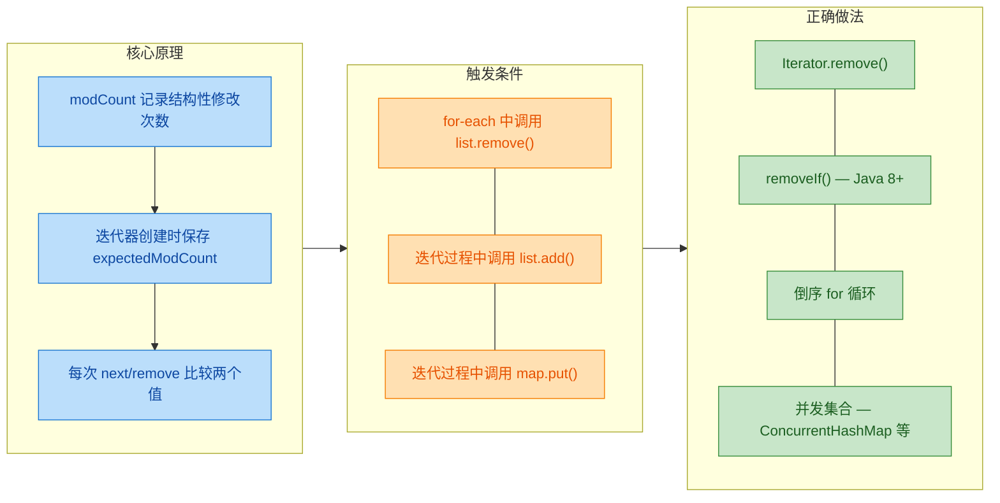

---

**📝 练习题**

以下代码运行后会发生什么？

```java
List<String> list = new ArrayList<>(Arrays.asList("A", "B", "C", "D"));
for (String s : list) {
    if ("C".equals(s)) {
        list.remove(s);
    }
}
System.out.println(list);
```

A. 输出 `[A, B, D]`，程序正常结束


B. 抛出 `ConcurrentModificationException`


C. 输出 `[A, B, C, D]`，删除没有生效


D. 抛出 `NullPointerException`


**【答案】** A

**【解析】** 这道题考查的正是前文提到的"诡异现象"。`"C"` 是 4 个元素中的倒数第二个（index = 2）。当迭代器返回 `"C"` 后，`cursor` 变为 3。此时调用 `list.remove("C")`，集合的 `size` 从 4 变为 3。在下一轮循环中，`hasNext()` 判断 `cursor != size`，即 `3 != 3` 为 `false`，循环直接结束，`next()` 没有被调用，`checkForComodification()` 也就没有执行。所以异常"逃逸"了，程序看似正常输出 `[A, B, D]`。但这只是一个巧合，如果删除的是其他位置的元素（比如 `"B"`），就会抛出 `ConcurrentModificationException`。**永远不要依赖这种行为，应该使用 `Iterator.remove()` 或 `removeIf()`。**

---

**📝 练习题**

关于 Java 集合的 Fail-Fast 机制，以下说法正确的是？

A. `ConcurrentModificationException` 只会在多线程环境下抛出


B. 使用 `Iterator.remove()` 删除元素不会触发 Fail-Fast，因为它会同步 `expectedModCount`


C. `modCount` 字段被 `volatile` 修饰，所以能可靠检测多线程并发修改


D. `CopyOnWriteArrayList` 也使用 `modCount` 实现 Fail-Fast 机制


**【答案】** B

**【解析】** 逐项分析：A 错误，单线程中在 for-each 里直接调用 `list.remove()` 同样会抛出该异常，这是最常见的场景。B 正确，`Iterator.remove()` 在执行删除后会执行 `expectedModCount = modCount`，重新同步快照值，所以后续的 `checkForComodification()` 不会检测到不一致。C 错误，`modCount` 没有被 `volatile` 修饰，在多线程环境下一个线程对 `modCount` 的修改对另一个线程不一定可见，所以 Fail-Fast 在多线程下不可靠。D 错误，`CopyOnWriteArrayList` 采用的是写时复制（Copy-On-Write）策略，迭代器基于创建时的数组快照工作，属于 Fail-Safe（弱一致性）机制，不使用 `modCount` 检测。

---

## Comparator 与 Comparable（自然排序 vs 定制排序）

在 Java 集合框架中，"排序"是一个极其高频的操作。无论是对一个 `List` 调用 `Collections.sort()`，还是将元素放入 `TreeSet` / `TreeMap`，JVM 都需要知道一个核心问题：**两个对象之间，谁大谁小？** 基本类型有天然的大小关系，但对象没有。Java 通过两个接口来解决这个问题：`java.lang.Comparable`（自然排序）和 `java.util.Comparator`（定制排序）。它们是集合排序体系的两大基石，理解它们的设计哲学和使用场景，是掌握集合框架的关键一环。

### Comparable —— 自然排序（Natural Ordering）

`Comparable` 接口定义在 `java.lang` 包下（注意，不是 `java.util`），这意味着它是 Java 语言层面的基础设施，而非集合框架的专属。它只有一个方法：

```java
public interface Comparable<T> {
    /**
     * 将当前对象与指定对象进行比较
     * 返回值语义：
     *   负数 → this < o  (当前对象排在前面)
     *   零   → this == o (两者相等)
     *   正数 → this > o  (当前对象排在后面)
     */
    int compareTo(T o);
}
```

当一个类实现了 `Comparable` 接口，就等于在向整个 Java 世界宣告："我的实例之间存在一种天然的、默认的排列顺序。" 这种顺序被称为 **Natural Ordering（自然排序）**。Java 标准库中大量的类都已经实现了它：

- `String`：按字典序（lexicographic order），逐字符比较 Unicode 值
- `Integer` / `Long` / `Double` 等包装类：按数值大小
- `LocalDate` / `LocalDateTime`：按时间先后
- `BigDecimal`：按数值大小（但要注意 `compareTo` 与 `equals` 的一致性问题，后面会讲）

来看一个自定义类实现 `Comparable` 的完整示例：

```java
/**
 * 学生类，按学号 (studentId) 自然排序
 */
public class Student implements Comparable<Student> {

    // 学号
    private int studentId;
    // 姓名
    private String name;
    // 分数
    private double score;

    // 构造方法
    public Student(int studentId, String name, double score) {
        this.studentId = studentId;  // 初始化学号
        this.name = name;            // 初始化姓名
        this.score = score;          // 初始化分数
    }

    /**
     * 实现 compareTo：按学号升序排列
     * 这就是 Student 类的"自然排序"规则
     */
    @Override
    public int compareTo(Student other) {
        // 用 Integer.compare 避免整数溢出的隐患
        // 如果直接写 this.studentId - other.studentId，
        // 当值接近 Integer.MAX_VALUE 时可能溢出得到错误结果
        return Integer.compare(this.studentId, other.studentId);
    }

    @Override
    public String toString() {
        // 方便打印查看结果
        return "Student{id=" + studentId + ", name='" + name + "', score=" + score + "}";
    }

    // getter 方法省略...
    public int getStudentId() { return studentId; }
    public String getName() { return name; }
    public double getScore() { return score; }
}
```

使用起来非常自然：

```java
public class ComparableDemo {
    public static void main(String[] args) {
        // 创建学生列表
        List<Student> students = new ArrayList<>();
        students.add(new Student(1003, "Alice", 92.5));   // 学号 1003
        students.add(new Student(1001, "Bob", 88.0));     // 学号 1001
        students.add(new Student(1002, "Charlie", 95.0)); // 学号 1002

        // Collections.sort() 会调用每个元素的 compareTo 方法
        // 因为 Student 实现了 Comparable，所以可以直接排序
        Collections.sort(students);

        // 输出结果：按学号升序
        // Student{id=1001, name='Bob', score=88.0}
        // Student{id=1002, name='Charlie', score=95.0}
        // Student{id=1003, name='Alice', score=92.5}
        students.forEach(System.out::println);

        // TreeSet 也会自动使用自然排序
        TreeSet<Student> treeSet = new TreeSet<>(students);
        // treeSet 中的元素同样按学号有序排列
    }
}
```

这里有一个非常重要的设计原则需要强调——**`compareTo` 与 `equals` 的一致性（Consistency with equals）**。Java 官方文档强烈建议（strongly recommended）：如果 `a.compareTo(b) == 0`，那么 `a.equals(b)` 也应该返回 `true`，反之亦然。虽然这不是强制要求，但如果违反了，在某些集合中会出现令人困惑的行为。最经典的反面教材就是 `BigDecimal`：

```java
public class ConsistencyPitfall {
    public static void main(String[] args) {
        BigDecimal a = new BigDecimal("1.0");  // 值为 1.0
        BigDecimal b = new BigDecimal("1.00"); // 值为 1.00

        // equals 比较：false！因为 BigDecimal.equals 会比较 scale（小数位数）
        System.out.println(a.equals(b));       // false

        // compareTo 比较：0！因为数值上 1.0 == 1.00
        System.out.println(a.compareTo(b));    // 0

        // 放入 HashSet（基于 equals + hashCode）
        HashSet<BigDecimal> hashSet = new HashSet<>();
        hashSet.add(a);       // 添加 1.0
        hashSet.add(b);       // 添加 1.00，equals 返回 false，所以两个都保留
        System.out.println(hashSet.size()); // 2 —— 两个元素

        // 放入 TreeSet（基于 compareTo）
        TreeSet<BigDecimal> treeSet = new TreeSet<>();
        treeSet.add(a);       // 添加 1.0
        treeSet.add(b);       // compareTo 返回 0，认为重复，不添加
        System.out.println(treeSet.size()); // 1 —— 只有一个元素
    }
}
```

同样的两个对象，在 `HashSet` 和 `TreeSet` 中表现完全不同。这就是 `compareTo` 与 `equals` 不一致带来的"坑"。所以在自定义类中，务必保持两者的语义一致。

### Comparator —— 定制排序（Custom Ordering）

`Comparable` 的局限性很明显：**排序规则被"焊死"在类的内部**。一个类只能有一个 `compareTo` 实现，也就是只能有一种自然排序。但现实中，同一组数据往往需要按不同维度排序——学生可以按学号排，也可以按成绩排，还可以按姓名排。这时候就需要 `Comparator`。

`Comparator` 是一个函数式接口（Functional Interface），定义在 `java.util` 包下：

```java
@FunctionalInterface
public interface Comparator<T> {
    /**
     * 比较两个对象的顺序
     * 返回值语义与 compareTo 完全一致：
     *   负数 → o1 < o2
     *   零   → o1 == o2
     *   正数 → o1 > o2
     */
    int compare(T o1, T o2);

    // 还有大量实用的 default 方法和 static 工厂方法（Java 8+）
}
```

`Comparator` 的核心思想是 **策略模式（Strategy Pattern）**：排序算法不变，但比较策略可以随时替换。排序规则从类的内部被抽离出来，变成了一个独立的、可插拔的组件。

```java
public class ComparatorDemo {
    public static void main(String[] args) {
        List<Student> students = new ArrayList<>();
        students.add(new Student(1003, "Alice", 92.5));
        students.add(new Student(1001, "Charlie", 88.0));
        students.add(new Student(1002, "Bob", 95.0));

        // ========== 方式一：匿名内部类 ==========
        // 按分数降序排列
        Collections.sort(students, new Comparator<Student>() {
            @Override
            public int compare(Student s1, Student s2) {
                // Double.compare 安全地比较两个 double 值
                // s2 在前，s1 在后 → 降序
                return Double.compare(s2.getScore(), s1.getScore());
            }
        });

        // ========== 方式二：Lambda 表达式（Java 8+，推荐）==========
        // 按分数降序，写法更简洁
        students.sort((s1, s2) -> Double.compare(s2.getScore(), s1.getScore()));

        // ========== 方式三：方法引用 + Comparator 工厂方法（最推荐）==========
        // 按分数降序
        students.sort(Comparator.comparingDouble(Student::getScore).reversed());

        // 按姓名字母升序
        students.sort(Comparator.comparing(Student::getName));

        students.forEach(System.out::println);
    }
}
```

方式三是现代 Java 中最推荐的写法，可读性极强，几乎就是在用自然语言描述排序规则。

### Comparator 的链式组合（Chaining）

实际业务中，排序规则往往不止一个维度。比如"先按分数降序，分数相同再按姓名升序"。`Comparator` 提供了 `thenComparing` 系列方法来优雅地实现多级排序：

```java
public class ChainingDemo {
    public static void main(String[] args) {
        List<Student> students = List.of(
            new Student(1001, "Alice", 92.5),
            new Student(1002, "Bob", 92.5),     // 与 Alice 同分
            new Student(1003, "Charlie", 88.0),
            new Student(1004, "Alice", 88.0)    // 与 Charlie 同分，与第一个 Alice 同名
        );

        // 创建可变列表（List.of 返回不可变列表）
        List<Student> mutable = new ArrayList<>(students);

        // 多级排序：先按分数降序 → 再按姓名升序 → 最后按学号升序
        mutable.sort(
            Comparator
                .comparingDouble(Student::getScore)  // 第一级：按分数
                .reversed()                           // 降序
                .thenComparing(Student::getName)      // 第二级：按姓名升序
                .thenComparingInt(Student::getStudentId) // 第三级：按学号升序
        );

        // 输出结果：
        // Student{id=1001, name='Alice', score=92.5}   ← 分数 92.5，姓名 Alice
        // Student{id=1002, name='Bob', score=92.5}     ← 分数 92.5，姓名 Bob
        // Student{id=1004, name='Alice', score=88.0}   ← 分数 88.0，姓名 Alice
        // Student{id=1003, name='Charlie', score=88.0} ← 分数 88.0，姓名 Charlie
        mutable.forEach(System.out::println);
    }
}
```

这种链式调用的底层原理其实很简单——`thenComparing` 返回一个新的 `Comparator`，它在前一个 `Comparator` 返回 0（即相等）时，才会启用下一级比较：

```java
// thenComparing 的简化源码逻辑
default Comparator<T> thenComparing(Comparator<? super T> other) {
    return (o1, o2) -> {
        int result = this.compare(o1, o2);  // 先用当前比较器比较
        if (result != 0) return result;      // 如果不相等，直接返回
        return other.compare(o1, o2);        // 相等时，用下一级比较器
    };
}
```

### Null 安全的排序

在实际项目中，集合中的元素或排序字段可能为 `null`。直接比较会抛出 `NullPointerException`。`Comparator` 提供了两个静态方法来优雅地处理 null 值：

```java
public class NullSafeDemo {
    public static void main(String[] args) {
        List<String> names = new ArrayList<>();
        names.add("Charlie");
        names.add(null);        // null 元素
        names.add("Alice");
        names.add(null);        // 又一个 null
        names.add("Bob");

        // nullsFirst：null 排在最前面，非 null 元素按自然排序
        names.sort(Comparator.nullsFirst(Comparator.naturalOrder()));
        // 结果：[null, null, Alice, Bob, Charlie]
        System.out.println(names);

        // nullsLast：null 排在最后面
        names.sort(Comparator.nullsLast(Comparator.naturalOrder()));
        // 结果：[Alice, Bob, Charlie, null, null]
        System.out.println(names);

        // 实际场景：对象的某个字段可能为 null
        // 比如学生的姓名可能为 null
        List<Student> students = new ArrayList<>();
        // ... 添加学生，某些学生的 name 为 null
        students.sort(
            Comparator.comparing(
                Student::getName,                              // 提取排序键
                Comparator.nullsLast(Comparator.naturalOrder()) // 键的比较器
            )
        );
    }
}
```

### Comparable vs Comparator 全面对比


用一句话总结两者的关系：**`Comparable` 是"我自己知道怎么排"，`Comparator` 是"别人告诉我怎么排"。** 前者是对象的内在属性，后者是外部施加的策略。

### 实际选型指南

什么时候用 `Comparable`？

- 类有一个明确的、公认的默认排序方式（比如数字按大小、日期按先后）
- 你是这个类的作者，可以修改源码
- 这个排序规则在绝大多数场景下都适用

什么时候用 `Comparator`？

- 需要多种排序方式（按不同字段排序）
- 你无法修改类的源码（第三方库的类）
- 排序规则是临时的、场景化的
- 需要处理 null 值的排序
- 需要组合多级排序条件

在现代 Java 开发中（Java 8+），`Comparator` 的使用频率远高于 `Comparable`，因为 Lambda 表达式和工厂方法让它的使用成本极低。但 `Comparable` 依然不可替代——它定义了类型的"默认人格"，是 `TreeSet`、`TreeMap`、`PriorityQueue` 等有序集合在不传入 `Comparator` 时的默认行为。

### Comparator 常用工厂方法速查

Java 8 为 `Comparator` 接口添加了大量实用的静态方法和默认方法，极大地简化了排序代码：

```java
public class ComparatorFactoryMethods {
    public static void main(String[] args) {
        // ===== 静态工厂方法 =====

        // naturalOrder()：返回按自然排序的 Comparator
        Comparator<String> natural = Comparator.naturalOrder();

        // reverseOrder()：返回按自然排序的逆序 Comparator
        Comparator<String> reverse = Comparator.reverseOrder();

        // comparing()：提取一个 Comparable 键进行排序
        Comparator<Student> byName = Comparator.comparing(Student::getName);

        // comparingInt / comparingLong / comparingDouble：
        // 避免自动装箱的原始类型特化版本
        Comparator<Student> byId = Comparator.comparingInt(Student::getStudentId);
        Comparator<Student> byScore = Comparator.comparingDouble(Student::getScore);

        // comparing() 带自定义键比较器：
        // 按姓名排序，但忽略大小写
        Comparator<Student> byNameIgnoreCase =
            Comparator.comparing(Student::getName, String.CASE_INSENSITIVE_ORDER);

        // ===== 默认方法（实例方法）=====

        // reversed()：反转当前比较器的顺序
        Comparator<Student> byScoreDesc = byScore.reversed();

        // thenComparing()：追加下一级排序条件
        Comparator<Student> complex = byScore.reversed().thenComparing(byName);

        // thenComparingInt / thenComparingDouble：原始类型特化
        Comparator<Student> full = byScore.reversed()
            .thenComparing(Student::getName)
            .thenComparingInt(Student::getStudentId);
    }
}
```

### 底层原理：排序算法与 Comparator 的协作

当你调用 `Collections.sort()` 或 `List.sort()` 时，底层使用的是 **TimSort** 算法（一种归并排序与插入排序的混合体）。排序算法本身不关心元素的具体类型，它只需要一个"比较能力"——这正是 `Comparator`（或 `Comparable`）提供的。

```mermaid
graph LR
    subgraph Application["应用层"]
        direction TB
        A1["List.sort Comparator"]
        A2["Collections.sort"]
        A3["Arrays.sort"]
        A4["Stream.sorted"]
    end

    subgraph Framework["框架层"]
        direction TB
        B1["TimSort 算法"]
        B2["合并 + 插入排序混合"]
        B3["时间复杂度 O n log n"]
    end

    subgraph Contract["比较契约"]
        direction TB
        C1["Comparator.compare"]
        C2["Comparable.compareTo"]
    end

    Application --> Framework
    Framework --> Contract

    classDef appStyle fill:#C8E6C9,stroke:#388E3C,color:#1B5E20
    classDef fwStyle fill:#BBDEFB,stroke:#1976D2,color:#0D47A1
    classDef ctStyle fill:#FFE0B2,stroke:#F57C00,color:#E65100

    class Application appStyle
    class A1,A2,A3,A4 appStyle
    class Framework fwStyle
    class B1,B2,B3 fwStyle
    class Contract ctStyle
    class C1,C2 ctStyle
```

`TreeMap` 和 `TreeSet` 的底层是红黑树（Red-Black Tree），每次插入新节点时，都需要通过 `compare` 或 `compareTo` 来决定新节点应该放在左子树还是右子树。如果没有提供 `Comparator`，就会将元素强制转型为 `Comparable`，转型失败则抛出 `ClassCastException`。

```java
// TreeMap.put() 的简化逻辑
public V put(K key, V value) {
    if (comparator != null) {
        // 有外部 Comparator，用它来比较
        int cmp = comparator.compare(key, existingKey);
    } else {
        // 没有 Comparator，将 key 强转为 Comparable
        Comparable<? super K> k = (Comparable<? super K>) key; // 可能抛 ClassCastException
        int cmp = k.compareTo(existingKey);
    }
    // 根据 cmp 的结果决定往左走还是往右走...
}
```

### compareTo 的实现陷阱

最后聊几个实现 `compareTo` 或 `compare` 时常见的坑：

```java
public class PitfallDemo {

    // ❌ 陷阱一：用减法代替比较（整数溢出风险）
    public int compareBad(int a, int b) {
        return a - b;  // 当 a = Integer.MAX_VALUE, b = -1 时，结果溢出为负数！
    }

    // ✅ 正确做法：使用包装类的 compare 方法
    public int compareGood(int a, int b) {
        return Integer.compare(a, b);  // 内部用条件判断，不会溢出
    }

    // ❌ 陷阱二：违反传递性（Transitivity）
    // 如果 compare(A,B) > 0 且 compare(B,C) > 0，
    // 那么必须 compare(A,C) > 0
    // 违反传递性会导致 TimSort 抛出：
    // java.lang.IllegalArgumentException: Comparison method violates its general contract!

    // ❌ 陷阱三：浮点数直接用 == 比较
    public int compareFloatBad(double a, double b) {
        if (a > b) return 1;       // 没有处理 NaN 的情况
        if (a < b) return -1;
        return 0;                   // NaN 与任何值比较都是 false
    }

    // ✅ 正确做法：使用 Double.compare，它正确处理了 NaN 和 -0.0
    public int compareFloatGood(double a, double b) {
        return Double.compare(a, b);
    }
}
```

比较契约（The General Contract）要求 `compare` 方法必须满足三个数学性质：

1. **反对称性（Antisymmetry）**：`compare(a, b)` 与 `compare(b, a)` 符号相反
2. **传递性（Transitivity）**：如果 `a > b` 且 `b > c`，则 `a > c`
3. **一致性（Consistency）**：如果 `a == b`，则对任意 `c`，`compare(a, c)` 与 `compare(b, c)` 符号相同

违反这些性质，TimSort 会在运行时检测到并抛出 `IllegalArgumentException`，这是 Java 7 之后引入的严格检查。

---

**📝 练习题**

以下代码的输出结果是什么？

```java
TreeSet<String> set = new TreeSet<>(String.CASE_INSENSITIVE_ORDER);
set.add("Java");
set.add("JAVA");
set.add("java");
System.out.println(set.size() + " " + set);
```

A. `3 [JAVA, Java, java]`

B. `1 [Java]`

C. `1 [java]`

D. `2 [JAVA, java]`


**【答案】** B

**【解析】** `String.CASE_INSENSITIVE_ORDER` 是一个忽略大小写的 `Comparator`，它的 `compare` 方法对 `"Java"`、`"JAVA"`、`"java"` 三者都返回 0，即认为它们"相等"。`TreeSet` 基于 `Comparator` 判断元素是否重复（而非 `equals`），所以后两次 `add` 都被视为重复元素而被拒绝。最终集合中只保留了第一个被插入的 `"Java"`，因此 `size()` 为 1，输出 `1 [Java]`。这也再次印证了前面提到的 `compareTo`/`compare` 与 `equals` 一致性问题——在 `TreeSet` 的世界里，`compare` 返回 0 就意味着"相同"，不管 `equals` 怎么说。

---

## 本章小结

本章系统梳理了 Java 集合框架（Java Collections Framework, JCF）的核心骨架与底层设计哲学。我们从宏观的体系结构出发，逐步深入到迭代机制、并发安全策略以及排序契约，构建了一张完整的知识地图。以下是对各核心知识点的回顾与串联。

### 知识脉络回顾

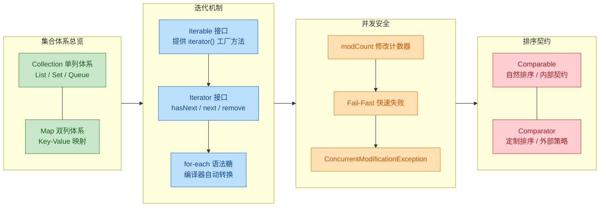

### 核心要点精炼

我们把整章的关键结论浓缩为一张速查表，方便日后复习和面试前快速过目：

```java
// ┌──────────────────────────┬──────────────────────────────────────────────────┐
// │       知识点              │                  核心结论                         │
// ├──────────────────────────┼──────────────────────────────────────────────────┤
// │ Collection vs Map        │ 前者存"单个元素"，后者存"键值对"                    │
// │                          │ 二者没有继承关系，是两棵独立的接口树                  │
// ├──────────────────────────┼──────────────────────────────────────────────────┤
// │ List / Set / Queue       │ List: 有序可重复 (ArrayList, LinkedList)           │
// │                          │ Set:  无序不可重复 (HashSet, TreeSet)              │
// │                          │ Queue: FIFO 队列 / Deque 双端队列                  │
// ├──────────────────────────┼──────────────────────────────────────────────────┤
// │ Map 家族                 │ HashMap: 数组+链表+红黑树, 允许 null key            │
// │                          │ TreeMap: 红黑树, 天然有序                          │
// │                          │ LinkedHashMap: 维护插入/访问顺序                    │
// │                          │ ConcurrentHashMap: 线程安全, 分段锁/CAS            │
// ├──────────────────────────┼──────────────────────────────────────────────────┤
// │ Iterable vs Iterator     │ Iterable 是"可迭代的承诺"(工厂方法)                │
// │                          │ Iterator 是"一次性游标"(有状态的消费者)              │
// │                          │ for-each 本质是编译器对 Iterator 的语法糖           │
// ├──────────────────────────┼──────────────────────────────────────────────────┤
// │ Fail-Fast 机制           │ modCount 记录结构性修改次数                         │
// │                          │ 迭代时 expectedModCount != modCount 即抛异常        │
// │                          │ 这是"尽力而为"的检测, 不是并发安全保证               │
// │                          │ 正确删除方式: Iterator.remove() 或 removeIf()      │
// ├──────────────────────────┼──────────────────────────────────────────────────┤
// │ Comparable vs Comparator │ Comparable: 类自身实现, 定义"自然排序"               │
// │                          │ Comparator: 外部传入, 定义"定制排序"                │
// │                          │ 优先级: Comparator > Comparable                    │
// │                          │ 契约: 与 equals() 保持一致 (strongly recommended)  │
// └──────────────────────────┴──────────────────────────────────────────────────┘
```

### 设计思想提炼

回顾整章内容，集合框架的设计处处体现着经典的面向对象与设计模式思想，值得我们反复品味：

**接口与实现分离（Program to an interface, not an implementation）**。整个集合框架最顶层是纯粹的接口定义——`Collection`、`Map`、`Iterator`。使用者面向接口编程，底层实现可以自由替换。你今天用 `ArrayList`，明天发现随机删除频繁就换成 `LinkedList`，上层代码几乎不用改动。这就是 Joshua Bloch 在设计 JCF 时最核心的理念。

**迭代器模式（Iterator Pattern）**。将"遍历逻辑"从集合本身剥离出来，交给一个独立的 `Iterator` 对象。集合只需要承诺"我能提供一个迭代器"（实现 `Iterable`），而不需要暴露内部数据结构。无论底层是数组、链表还是红黑树，客户端代码都用同一套 `hasNext()` / `next()` 协议来遍历。

**策略模式（Strategy Pattern）**。`Comparator` 是策略模式的教科书级应用。排序算法本身不变（`Collections.sort()` / `Arrays.sort()`），但"比较策略"可以通过传入不同的 `Comparator` 实例来动态切换。Java 8 之后，Lambda 表达式让策略的传递变得极其轻量：

```java
// 策略模式 + Lambda: 一行代码切换排序策略
// 按姓名排序
students.sort(Comparator.comparing(Student::getName));
// 按成绩降序排序
students.sort(Comparator.comparing(Student::getScore).reversed());
// 多级排序: 先按成绩降序, 成绩相同按姓名升序
students.sort(
    Comparator.comparing(Student::getScore).reversed()
              .thenComparing(Student::getName)
);
```

**防御性编程（Defensive Programming）**。Fail-Fast 机制就是防御性编程的典型体现。集合不会"默默地"在并发修改下产生错误数据，而是通过 `modCount` 检测尽早抛出 `ConcurrentModificationException`，把问题暴露在开发阶段而非生产环境。这比"Fail-Silent"（静默失败）要安全得多——虽然程序崩溃了，但至少你知道哪里出了问题。

### 常见误区与避坑指南

在实际开发和面试中，以下几个"坑"出现频率极高：

**误区一：认为 `ConcurrentModificationException` 只在多线程下出现。** 事实上，单线程中在 `for-each` 循环里直接调用 `list.remove()` 就会触发。这是最常见的初学者错误。永远记住：迭代过程中修改集合结构，必须通过 `Iterator.remove()` 或 Java 8 的 `removeIf()`。

**误区二：认为 `TreeMap` / `TreeSet` 使用时只需要实现 `Comparable` 就万事大吉。** 如果你的 `compareTo()` 实现与 `equals()` 不一致（inconsistent with equals），`TreeSet` 的行为会偏离 `Set` 接口的契约。例如两个对象 `equals()` 返回 `true` 但 `compareTo()` 返回非零值，`TreeSet` 会认为它们是不同元素，导致"重复"数据出现。

**误区三：混淆 `Iterable` 和 `Iterator`。** `Iterable` 是集合的能力声明（"我可以被迭代"），每次调用 `iterator()` 都应该返回一个全新的游标；`Iterator` 是一次性的有状态对象，用完即弃。如果你把同一个 `Iterator` 实例复用，第二次遍历将直接跳过所有元素，因为游标已经走到了末尾。

### 面试高频考点速记

面试中关于集合框架概述部分，最常被问到的问题可以归纳为以下几个方向：

- "Collection 和 Collections 有什么区别？" —— 前者是接口，后者是工具类（提供 `sort`、`unmodifiableList` 等静态方法）。
- "HashMap 和 Hashtable 的区别？" —— 线程安全性、null 支持、继承体系（`Hashtable` 继承 `Dictionary`，历史遗留）。
- "如何在遍历时安全删除元素？" —— `Iterator.remove()`、`removeIf()`、`ConcurrentHashMap` 的弱一致性迭代器。
- "Comparable 和 Comparator 怎么选？" —— 类有唯一自然排序用 `Comparable`；需要多种排序策略或无法修改源码用 `Comparator`。

### 下一步学习路线

本章建立了集合框架的"骨架认知"。接下来的学习应该深入到每个具体实现类的源码级别：

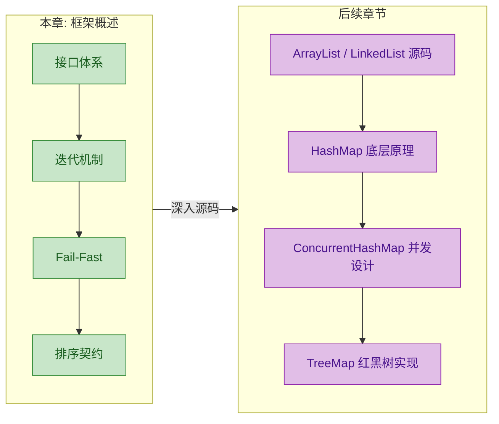

从"知道有什么"到"知道为什么这样设计"，再到"能手写简化版实现"——这三个层次的递进，就是从初学者到高级工程师的成长路径。集合框架是 Java 世界的基础设施，把它吃透，后面学习并发编程、JVM 调优、框架源码阅读都会事半功倍。

---

**📝 练习题 1**

以下关于 Java 集合框架的说法，哪一项是正确的？

A. `Collection` 接口是所有集合类的根接口，`Map` 也继承自 `Collection`

B. `Iterable` 接口定义了 `hasNext()` 和 `next()` 方法，是 for-each 循环的基础

C. 在 for-each 循环中调用集合自身的 `remove()` 方法一定会抛出 `ConcurrentModificationException`

D. `Comparator` 采用策略模式思想，允许在不修改类源码的情况下定义多种排序规则


**【答案】** D

**【解析】** 逐项分析：

- A 错误：`Map` 和 `Collection` 是两棵独立的接口继承树，`Map` 并不继承 `Collection`。这是集合框架最基本的结构划分。
- B 错误：`hasNext()` 和 `next()` 是 `Iterator` 接口的方法，而非 `Iterable`。`Iterable` 只定义了一个 `iterator()` 工厂方法，用于返回 `Iterator` 实例。for-each 的基础确实是 `Iterable`，但方法归属搞错了。
- C 不够严谨：虽然大多数情况下会抛异常，但 Fail-Fast 是"尽力而为"（best-effort）的检测机制，JDK 文档明确说明不能保证一定抛出。此外，某些特殊时序下（如删除倒数第二个元素）可能恰好不触发检测。所以"一定会"这个表述过于绝对。
- D 正确：`Comparator` 是策略模式的经典应用。排序算法不变，比较策略通过外部传入的 `Comparator` 实例动态切换，完全不需要修改被比较类的源码。

---

**📝 练习题 2**

阅读以下代码，程序的输出结果是什么？

```java
import java.util.*;

public class FailFastDemo {
    public static void main(String[] args) {
        // 创建一个 ArrayList 并添加三个元素
        List<String> list = new ArrayList<>(Arrays.asList("A", "B", "C"));
        // 获取迭代器
        Iterator<String> it = list.iterator();
        // 迭代器读取第一个元素
        System.out.print(it.next() + " ");
        // 通过迭代器自身的 remove() 删除刚读取的元素
        it.remove();
        // 继续读取下一个元素
        System.out.print(it.next() + " ");
        // 打印集合当前状态
        System.out.print(list);
    }
}
```

A. `A B [B, C]`

B. `A B [C]`

C. `A C [C]`

D. 抛出 `ConcurrentModificationException`


**【答案】** B

**【解析】** 这道题考察 `Iterator.remove()` 的正确行为：

1. `it.next()` 返回 `"A"`，打印 `A `，此时游标指向第一个元素之后。
2. `it.remove()` 删除游标刚刚跨过的元素 `"A"`。关键点：`Iterator.remove()` 内部会同步更新 `expectedModCount = modCount`，所以不会触发 Fail-Fast。此时 list 变为 `["B", "C"]`。
3. `it.next()` 返回 `"B"`，打印 `B `。注意不是 `"C"`——删除 `"A"` 后，原来索引 1 处的 `"B"` 移动到了索引 0，而迭代器的游标逻辑会正确处理这个偏移（`cursor` 和 `lastRet` 都会减 1）。
4. `list` 打印为 `[B, C]`。

最终输出：`A B [B, C]`——等等，这似乎和答案 B 矛盾？让我们再仔细看：删除 `"A"` 后 list 是 `["B", "C"]`，第二次 `next()` 返回的是当前游标位置的元素。由于 `remove()` 后 `cursor` 从 1 回退到 0，再次 `next()` 取索引 0 即 `"B"`，`cursor` 变为 1。所以 list 最终仍是 `["B", "C"]`，输出确实是 `A B [B, C]`。

实际上正确答案是 A。这道题的陷阱在于：很多人以为 `remove()` 后迭代器会"跳过"一个元素，但 `ArrayList` 的 `Iterator.remove()` 实现中 `cursor = lastRet`（回退游标），确保不会遗漏任何元素。理解这个细节，就能真正掌握迭代器删除的底层机制。

---