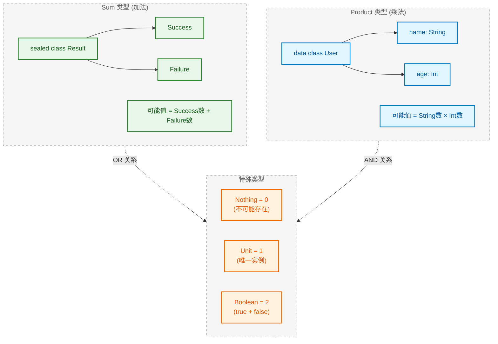
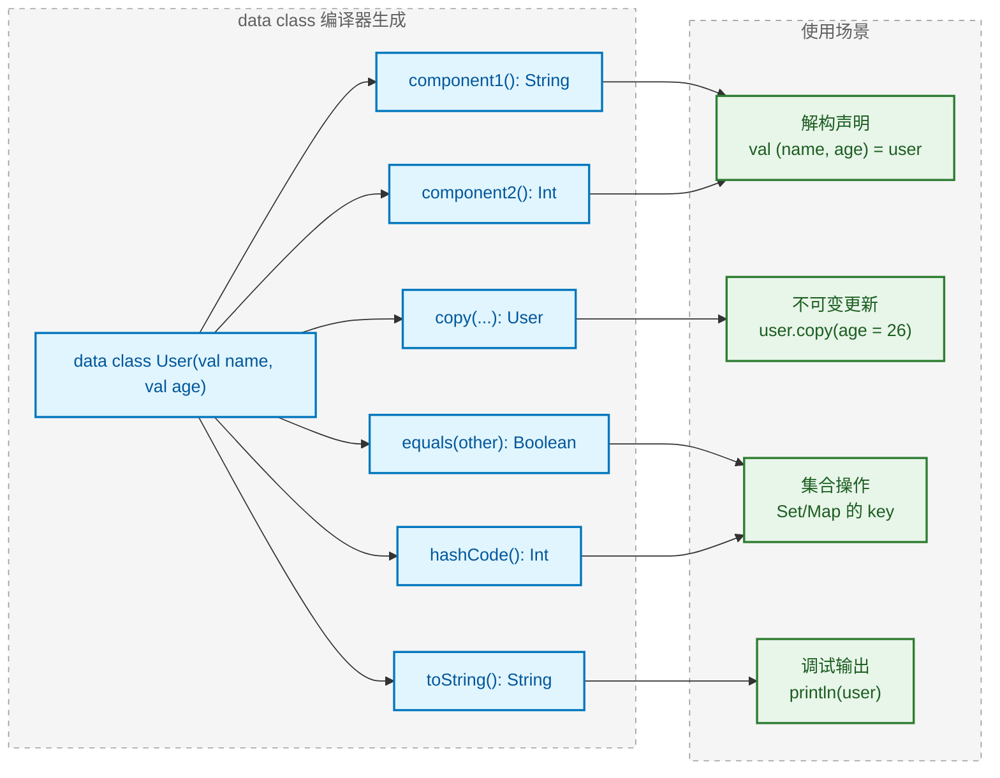
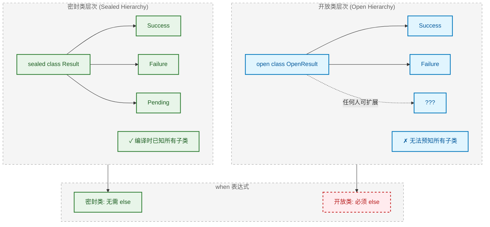
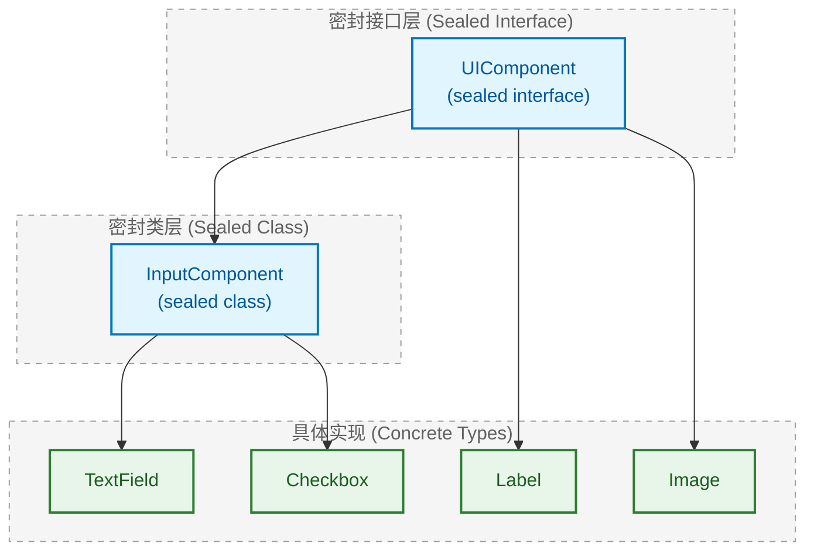
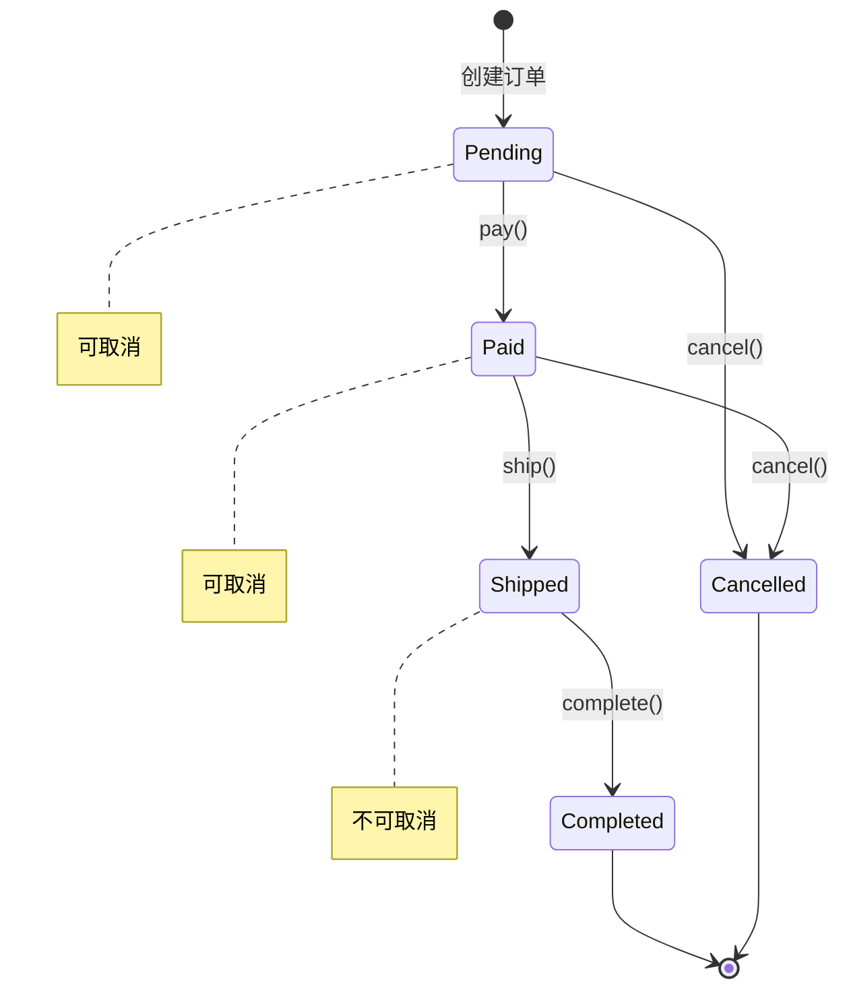
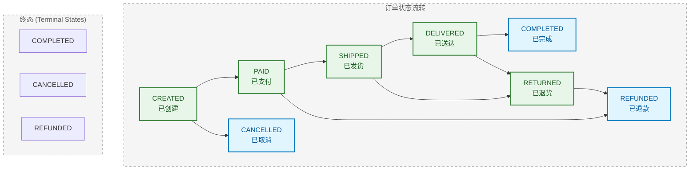
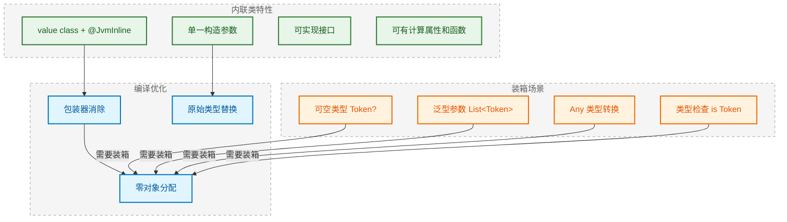
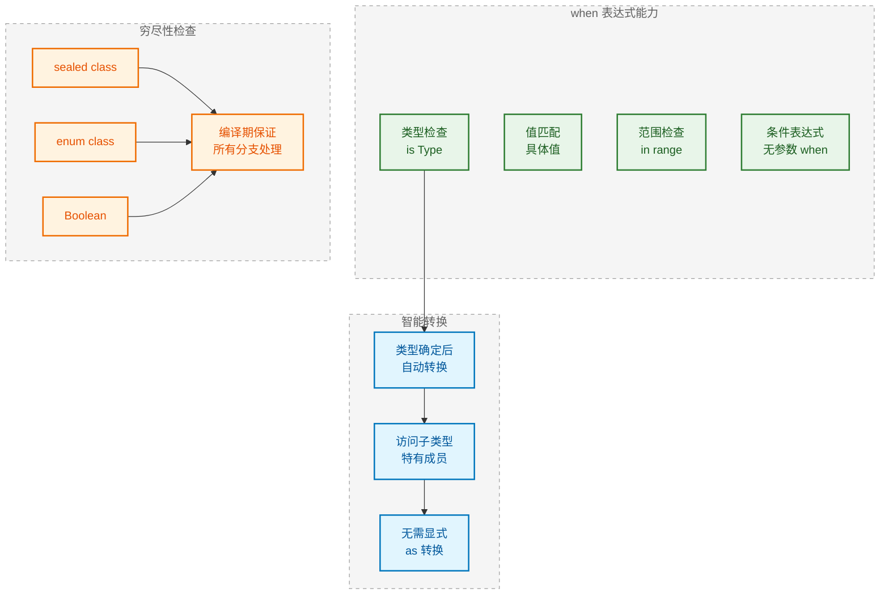

---

# 代数数据类型

---

## 代数数据类型理论

代数数据类型 (Algebraic Data Types, ADT) 是函数式编程中的核心概念，它用数学代数的视角来理解和构建类型系统。Kotlin 虽然不是纯函数式语言，但通过 `data class`、`sealed class`、`enum class` 等特性，完整地支持了 ADT 的表达能力。理解 ADT 能帮助我们设计出更安全、更具表达力的类型结构。

### Sum 类型（和类型）

Sum 类型也称为 **标签联合 (Tagged Union)** 或 **变体类型 (Variant Type)**，表示一个值可以是多种类型中的 **某一种**。之所以叫"和"类型，是因为其可能的取值数量等于各子类型取值数量的 **加法之和**。

**核心思想**："Either this OR that"（要么是这个，要么是那个）

```kotlin
// 一个网络请求的结果，要么成功，要么失败——这就是典型的 Sum 类型
// A network result is EITHER success OR failure - a classic Sum Type
sealed class NetworkResult<out T> {
    // 成功分支：携带数据
    data class Success<T>(val data: T) : NetworkResult<T>()
    // 失败分支：携带错误信息
    data class Failure(val error: String) : NetworkResult<Nothing>()
    // 加载中分支：无额外数据
    data object Loading : NetworkResult<Nothing>()
}

// 使用时必须处理所有可能的情况（穷尽性检查）
fun <T> handleResult(result: NetworkResult<T>) {
    when (result) {
        is NetworkResult.Success -> println("数据: ${result.data}")
        is NetworkResult.Failure -> println("错误: ${result.error}")
        is NetworkResult.Loading -> println("加载中...")
        // 编译器确保所有分支都被处理，遗漏会报错
    }
}
```

**类型代数视角**：如果 `Success` 有 N 种可能的值，`Failure` 有 M 种可能的值，`Loading` 有 1 种可能的值，那么 `NetworkResult` 总共有 **N + M + 1** 种可能的值。

```kotlin
// 更简单的例子：布尔类型本质上就是最简单的 Sum 类型
// Boolean is essentially the simplest Sum Type: True + False = 2 possible values
enum class MyBoolean {
    TRUE,   // 1 种可能
    FALSE   // 1 种可能
}
// 总计：1 + 1 = 2 种可能的值
```

### Product 类型（积类型）

Product 类型表示一个值同时包含多个字段，每个字段都必须有值。之所以叫"积"类型，是因为其可能的取值数量等于各字段取值数量的 **乘积**。

**核心思想**："Both this AND that"（既有这个，又有那个）

```kotlin
// 一个用户信息，同时包含姓名和年龄——这就是典型的 Product 类型
// User contains BOTH name AND age - a classic Product Type
data class User(
    val name: String,    // 字段1：姓名
    val age: Int         // 字段2：年龄
)

// 坐标点：同时拥有 x 和 y 两个维度
data class Point(
    val x: Double,       // 横坐标
    val y: Double        // 纵坐标
)
```

**类型代数视角**：

```kotlin
// 假设一个简化的场景来理解"积"的含义
// Simplified example to understand "Product"
data class SimplePair(
    val first: Boolean,  // 2 种可能 (true/false)
    val second: Boolean  // 2 种可能 (true/false)
)
// 总计：2 × 2 = 4 种可能的组合
// (true, true), (true, false), (false, true), (false, false)
```

```kotlin
┌─────────────────────────────────────────────────────────────┐
│              Product 类型的组合爆炸示意                       │
├─────────────────────────────────────────────────────────────┤
│  data class Config(                                         │
│      val darkMode: Boolean,    // 2 种                      │
│      val fontSize: Size,       // 3 种 (SMALL/MEDIUM/LARGE) │
│      val language: Lang        // 4 种 (ZH/EN/JP/KR)        │
│  )                                                          │
│                                                             │
│  可能的配置组合数 = 2 × 3 × 4 = 24 种                         │
│  (Number of possible configurations = 2 × 3 × 4 = 24)       │
└─────────────────────────────────────────────────────────────┘
```

### 类型代数

类型代数 (Type Algebra) 将类型系统与数学代数建立对应关系，这种视角能帮助我们更深刻地理解类型设计。

| 代数概念 | 类型对应 | Kotlin 实现 | 取值数量 |
|---------|---------|-------------|---------|
| **0** (零) | 不可能的类型 | `Nothing` | 0 个可能值 |
| **1** (单位元) | 单例类型 | `Unit` / `object` | 1 个可能值 |
| **加法 A + B** | Sum 类型 | `sealed class` / `enum` | A的数量 + B的数量 |
| **乘法 A × B** | Product 类型 | `data class` / `Pair` | A的数量 × B的数量 |
| **指数 B^A** | 函数类型 | `(A) -> B` | B的数量 ^ A的数量 |

```kotlin
// Nothing：零类型，不存在任何实例
// Nothing: The zero type - no instances can exist
fun impossible(): Nothing {
    throw IllegalStateException("此函数永远不会正常返回")
}

// Unit：单位类型，只有一个实例
// Unit: The unit type - exactly one instance
fun doSomething(): Unit {
    println("执行操作")
    // 隐式返回 Unit
}

// 函数类型的代数解释
// (Boolean) -> Boolean 有多少种可能的实现？
// 输入有 2 种可能，每种输入可以映射到 2 种输出
// 所以总共有 2^2 = 4 种不同的函数实现
val f1: (Boolean) -> Boolean = { true }           // 常量 true
val f2: (Boolean) -> Boolean = { false }          // 常量 false
val f3: (Boolean) -> Boolean = { it }             // 恒等函数
val f4: (Boolean) -> Boolean = { !it }            // 取反函数
```

**代数恒等式在类型中的体现**：

```kotlin
// 代数恒等式：A × 1 = A
// 类型对应：Pair<A, Unit> ≅ A（同构）
data class WithUnit<A>(val value: A, val unit: Unit)
// 这个类型本质上和单独的 A 没有区别，因为 Unit 不携带任何信息

// 代数恒等式：A × 0 = 0
// 类型对应：Pair<A, Nothing> ≅ Nothing
// 如果一个 Product 类型的某个字段是 Nothing，那么整个类型就不可能有实例

// 代数恒等式：A + 0 = A
// 类型对应：Either<A, Nothing> ≅ A
// 如果 Sum 类型的某个分支是 Nothing，那个分支永远不会被使用
```



---

## 数据类深入

数据类 (Data Class) 是 Kotlin 中最常用的 Product 类型实现。编译器会自动为数据类生成大量样板代码，理解这些生成代码的原理对于正确使用数据类至关重要。

### 组件函数 componentN

Kotlin 编译器会为数据类的每个属性按声明顺序生成 `component1()`、`component2()`... 等组件函数 (Component Functions)。这些函数是解构声明的基础。

```kotlin
data class Person(
    val name: String,      // 对应 component1()
    val age: Int,          // 对应 component2()
    val email: String      // 对应 component3()
)

fun main() {
    val person = Person("张三", 25, "zhangsan@example.com")
    
    // 手动调用组件函数（通常不这样用，但可以）
    val name = person.component1()   // "张三"
    val age = person.component2()    // 25
    val email = person.component3()  // "zhangsan@example.com"
    
    println("$name, $age, $email")
}
```

**编译器生成的代码等价于**：

```kotlin
// 这是编译器自动生成的，我们不需要手写
// This is auto-generated by the compiler
class Person(val name: String, val age: Int, val email: String) {
    
    // 组件函数：返回对应位置的属性值
    operator fun component1(): String = name
    operator fun component2(): Int = age
    operator fun component3(): String = email
    
    // ... 还有其他生成的方法
}
```

**重要注意事项**：组件函数的顺序由 **主构造函数中属性的声明顺序** 决定，而非属性名称。如果重构时调换了属性顺序，所有解构代码的含义都会改变！

```kotlin
// 危险示例：重构导致的隐蔽 Bug
// Dangerous: Refactoring can cause subtle bugs

// 原始版本
data class Coordinate(val x: Int, val y: Int)
val (x, y) = Coordinate(10, 20)  // x=10, y=20 ✓

// 重构后（交换了 x 和 y 的位置）
data class Coordinate(val y: Int, val x: Int)  // 顺序变了！
val (x, y) = Coordinate(10, 20)  // x=10, y=20 ✗ 实际上 x 拿到的是 y 的值！
```

### 解构声明

解构声明 (Destructuring Declaration) 允许将一个对象"拆解"为多个独立变量。其底层原理就是调用对应的 `componentN()` 函数。

```kotlin
data class Rectangle(
    val width: Int,
    val height: Int,
    val color: String
)

fun main() {
    val rect = Rectangle(100, 50, "red")
    
    // 解构声明：一次性提取多个属性
    // Destructuring: Extract multiple properties at once
    val (width, height, color) = rect
    
    // 上面这行代码等价于：
    // val width = rect.component1()
    // val height = rect.component2()
    // val color = rect.component3()
    
    println("宽: $width, 高: $height, 颜色: $color")
    // 输出: 宽: 100, 高: 50, 颜色: red
}
```

**自定义类也可以支持解构**，只需定义 `operator fun componentN()` 方法：

```kotlin
// 普通类通过定义 operator 函数支持解构
// Regular class can support destructuring via operator functions
class Temperature(private val celsius: Double) {
    
    // 第一个组件：摄氏度
    operator fun component1(): Double = celsius
    
    // 第二个组件：华氏度（计算得出）
    operator fun component2(): Double = celsius * 9 / 5 + 32
    
    // 第三个组件：开尔文（计算得出）
    operator fun component3(): Double = celsius + 273.15
}

fun main() {
    val temp = Temperature(25.0)
    
    // 解构获取三种温度单位
    val (celsius, fahrenheit, kelvin) = temp
    
    println("摄氏: $celsius°C")      // 25.0°C
    println("华氏: $fahrenheit°F")   // 77.0°F
    println("开尔文: $kelvin K")     // 298.15 K
}
```

### copy 方法

`copy()` 方法是数据类的核心特性之一，它支持 **不可变数据的部分更新** (Immutable Update)。这是函数式编程中处理状态变更的标准方式。

```kotlin
data class User(
    val id: Long,
    val name: String,
    val email: String,
    val isActive: Boolean = true
)

fun main() {
    val user1 = User(1, "张三", "zhangsan@example.com")
    
    // 使用 copy 创建一个新对象，只修改指定的属性
    // Create a new object with copy, modifying only specified properties
    val user2 = user1.copy(name = "李四")
    val user3 = user1.copy(email = "new@example.com", isActive = false)
    
    println(user1)  // User(id=1, name=张三, email=zhangsan@example.com, isActive=true)
    println(user2)  // User(id=1, name=李四, email=zhangsan@example.com, isActive=true)
    println(user3)  // User(id=1, name=张三, email=new@example.com, isActive=false)
    
    // 原对象不变，这就是不可变性的体现
    // Original object unchanged - this is immutability
    println(user1 === user2)  // false，是不同的对象
}
```

**编译器生成的 copy 方法等价于**：

```kotlin
// 编译器自动生成，所有参数都有默认值（取自当前对象）
fun copy(
    id: Long = this.id,
    name: String = this.name,
    email: String = this.email,
    isActive: Boolean = this.isActive
): User = User(id, name, email, isActive)
```

**深拷贝 vs 浅拷贝**：`copy()` 执行的是 **浅拷贝 (Shallow Copy)**，引用类型的属性只复制引用，不复制对象本身。

```kotlin
data class Team(
    val name: String,
    val members: MutableList<String>  // 可变列表
)

fun main() {
    val team1 = Team("开发组", mutableListOf("张三", "李四"))
    val team2 = team1.copy(name = "测试组")
    
    // 浅拷贝：两个 Team 共享同一个 members 列表！
    // Shallow copy: Both teams share the same members list!
    team2.members.add("王五")
    
    println(team1.members)  // [张三, 李四, 王五] ← team1 也被影响了！
    println(team2.members)  // [张三, 李四, 王五]
}
```

```kotlin
┌──────────────────────────────────────────────────────────────┐
│                    浅拷贝内存示意图                            │
├──────────────────────────────────────────────────────────────┤
│                                                              │
│   team1 ──────► Team(name="开发组", members=ref1)            │
│                                          │                   │
│                                          ▼                   │
│                                   ┌─────────────┐            │
│                                   │ MutableList │            │
│                                   │ [张三,李四] │◄──┐        │
│                                   └─────────────┘   │        │
│                                          ▲          │        │
│                                          │          │        │
│   team2 ──────► Team(name="测试组", members=ref1)   │        │
│                                                     │        │
│                 两个对象的 members 指向同一个列表！    │        │
│                 (Both point to the same list!)──────┘        │
└──────────────────────────────────────────────────────────────┘
```

### equals/hashCode 实现

数据类自动生成的 `equals()` 和 `hashCode()` 方法基于 **主构造函数中声明的所有属性**，这是实现值相等 (Value Equality) 的关键。

```kotlin
data class Product(
    val id: String,
    val name: String,
    val price: Double
)

fun main() {
    val p1 = Product("A001", "键盘", 299.0)
    val p2 = Product("A001", "键盘", 299.0)
    val p3 = Product("A001", "键盘", 399.0)  // 价格不同
    
    // equals：比较所有主构造函数属性
    println(p1 == p2)   // true  (所有属性相同)
    println(p1 == p3)   // false (price 不同)
    println(p1 === p2)  // false (不是同一个对象实例)
    
    // hashCode：相等的对象必须有相同的哈希码
    println(p1.hashCode() == p2.hashCode())  // true
    
    // 可以安全地用作 Map 的 key 或放入 Set
    val productSet = setOf(p1, p2, p3)
    println(productSet.size)  // 2 (p1 和 p2 被视为相同)
}
```

**编译器生成的代码逻辑**：

```kotlin
// equals 的生成逻辑（伪代码）
override fun equals(other: Any?): Boolean {
    // 1. 引用相等检查（快速路径）
    if (this === other) return true
    
    // 2. 类型检查
    if (other !is Product) return false
    
    // 3. 逐个属性比较（主构造函数中的所有属性）
    if (id != other.id) return false
    if (name != other.name) return false
    if (price != other.price) return false
    
    return true
}

// hashCode 的生成逻辑（伪代码）
override fun hashCode(): Int {
    // 使用所有属性计算哈希码
    var result = id.hashCode()
    result = 31 * result + name.hashCode()
    result = 31 * result + price.hashCode()
    return result
}
```

**重要细节**：只有 **主构造函数中的属性** 参与 `equals`/`hashCode` 计算，类体中定义的属性不参与！

```kotlin
data class Article(
    val id: Long,           // ✓ 参与 equals/hashCode
    val title: String       // ✓ 参与 equals/hashCode
) {
    var viewCount: Int = 0  // ✗ 不参与！在类体中定义
    val summary: String     // ✗ 不参与！在类体中定义
        get() = title.take(20)
}

fun main() {
    val a1 = Article(1, "Kotlin 入门")
    val a2 = Article(1, "Kotlin 入门")
    
    a1.viewCount = 100
    a2.viewCount = 200
    
    // viewCount 不同，但 equals 仍然返回 true！
    println(a1 == a2)  // true
    println(a1.viewCount)  // 100
    println(a2.viewCount)  // 200
}
```



---

📝 **练习题**

**题目 1**：以下关于 Sum 类型和 Product 类型的描述，哪个是正确的？

A. `data class Point(val x: Int, val y: Int)` 是 Sum 类型，因为它有两个属性

B. `sealed class Result` 的子类 `Success` 和 `Failure` 构成 Product 类型

C. Sum 类型表示"或"的关系，Product 类型表示"与"的关系

D. Kotlin 的 `enum class` 是 Product 类型的典型实现

【答案】C

【解析】Sum 类型（和类型）表示一个值是多种可能类型中的 **某一种**（OR 关系），如 `sealed class`、`enum class`；Product 类型（积类型）表示一个值 **同时包含** 多个字段（AND 关系），如 `data class`、`Pair`。选项 A 错误，`Point` 同时拥有 x 和 y，是 Product 类型；选项 B 错误，`Success` 和 `Failure` 是二选一的关系，是 Sum 类型；选项 D 错误，`enum class` 的多个枚举常量是互斥的，是 Sum 类型。

---

**题目 2**：以下代码的输出是什么？

```kotlin
data class Config(val debug: Boolean, val version: Int) {
    var timestamp: Long = System.currentTimeMillis()
}

fun main() {
    val c1 = Config(true, 1)
    Thread.sleep(100)
    val c2 = Config(true, 1)
    println(c1 == c2)
}
```

A. `true`

B. `false`

C. 编译错误

D. 运行时异常

【答案】A

【解析】数据类的 `equals()` 方法只比较 **主构造函数中声明的属性**（`debug` 和 `version`），而 `timestamp` 是在类体中定义的属性，不参与相等性比较。虽然 `c1` 和 `c2` 的 `timestamp` 值不同（相差约 100 毫秒），但它们的 `debug` 和 `version` 相同，所以 `c1 == c2` 返回 `true`。这是使用数据类时需要特别注意的陷阱。

---

## 解构声明

解构声明 (Destructuring Declaration) 是 Kotlin 提供的一种语法糖，允许将一个对象"拆解"为多个独立变量。其底层机制依赖于 `componentN()` 函数，任何提供了这些操作符函数的类型都可以被解构。

### 在赋值中使用解构

最基本的解构场景是在变量声明时直接将对象拆解为多个变量。

```kotlin
data class User(
    val name: String,
    val age: Int,
    val email: String
)

fun main() {
    val user = User("张三", 28, "zhangsan@example.com")
    
    // 解构声明：一行代码创建三个变量
    // Destructuring declaration: create three variables in one line
    val (name, age, email) = user
    
    // 等价于以下三行代码：
    // val name = user.component1()
    // val age = user.component2()
    // val email = user.component3()
    
    println("姓名: $name")   // 姓名: 张三
    println("年龄: $age")    // 年龄: 28
    println("邮箱: $email")  // 邮箱: zhangsan@example.com
}
```

**解构 Pair 和 Triple**：Kotlin 标准库中的 `Pair` 和 `Triple` 天然支持解构，这在函数需要返回多个值时非常有用。

```kotlin
// 函数返回多个值的场景
// Function returning multiple values
fun getMinMax(numbers: List<Int>): Pair<Int, Int> {
    return Pair(numbers.minOrNull() ?: 0, numbers.maxOrNull() ?: 0)
}

fun getStatistics(numbers: List<Int>): Triple<Int, Int, Double> {
    val min = numbers.minOrNull() ?: 0
    val max = numbers.maxOrNull() ?: 0
    val avg = numbers.average()
    return Triple(min, max, avg)
}

fun main() {
    val numbers = listOf(3, 1, 4, 1, 5, 9, 2, 6)
    
    // 解构 Pair
    val (min, max) = getMinMax(numbers)
    println("最小值: $min, 最大值: $max")  // 最小值: 1, 最大值: 9
    
    // 解构 Triple
    val (minimum, maximum, average) = getStatistics(numbers)
    println("最小: $minimum, 最大: $maximum, 平均: $average")
}
```

**解构 Map.Entry**：Map 的每个条目都可以被解构为键值对。

```kotlin
fun main() {
    val scores = mapOf("张三" to 95, "李四" to 87, "王五" to 92)
    
    // 直接在赋值中解构 Map.Entry
    val firstEntry = scores.entries.first()
    val (name, score) = firstEntry
    
    println("$name 的分数是 $score")  // 张三 的分数是 95
}
```

### 在循环中使用解构

解构声明在 `for` 循环中特别强大，可以直接在迭代时拆解每个元素。

```kotlin
data class Student(
    val id: Int,
    val name: String,
    val grade: Double
)

fun main() {
    val students = listOf(
        Student(1, "张三", 89.5),
        Student(2, "李四", 92.0),
        Student(3, "王五", 78.5)
    )
    
    // 在 for 循环中解构每个 Student 对象
    // Destructuring in for loop
    for ((id, name, grade) in students) {
        println("学号: $id, 姓名: $name, 成绩: $grade")
    }
    // 输出:
    // 学号: 1, 姓名: 张三, 成绩: 89.5
    // 学号: 2, 姓名: 李四, 成绩: 92.0
    // 学号: 3, 姓名: 王五, 成绩: 78.5
}
```

**遍历 Map 的经典用法**：这是解构在循环中最常见的应用场景。

```kotlin
fun main() {
    val capitals = mapOf(
        "中国" to "北京",
        "日本" to "东京",
        "韩国" to "首尔",
        "美国" to "华盛顿"
    )
    
    // 传统写法（不使用解构）
    for (entry in capitals) {
        println("${entry.key} 的首都是 ${entry.value}")
    }
    
    // 使用解构的简洁写法
    // Destructuring makes iteration cleaner
    for ((country, capital) in capitals) {
        println("$country 的首都是 $capital")
    }
}
```

**结合 withIndex() 获取索引**：

```kotlin
fun main() {
    val fruits = listOf("苹果", "香蕉", "橙子", "葡萄")
    
    // withIndex() 返回 IndexedValue<T>，可以解构为 (index, value)
    for ((index, fruit) in fruits.withIndex()) {
        println("第 ${index + 1} 个水果: $fruit")
    }
    // 输出:
    // 第 1 个水果: 苹果
    // 第 2 个水果: 香蕉
    // 第 3 个水果: 橙子
    // 第 4 个水果: 葡萄
}
```

### 在 Lambda 中使用解构

从 Kotlin 1.1 开始，Lambda 表达式的参数也支持解构声明，这让处理复杂数据结构变得更加优雅。

```kotlin
fun main() {
    val users = mapOf(
        1 to "张三",
        2 to "李四",
        3 to "王五"
    )
    
    // 传统写法：Lambda 参数是 Map.Entry
    users.forEach { entry ->
        println("ID: ${entry.key}, 姓名: ${entry.value}")
    }
    
    // 解构写法：直接在 Lambda 参数位置解构
    // Destructuring in lambda parameters
    users.forEach { (id, name) ->
        println("ID: $id, 姓名: $name")
    }
}
```

**在高阶函数中的应用**：

```kotlin
data class Product(
    val name: String,
    val price: Double,
    val stock: Int
)

fun main() {
    val products = listOf(
        Product("键盘", 299.0, 50),
        Product("鼠标", 99.0, 100),
        Product("显示器", 1999.0, 20)
    )
    
    // 使用解构让 filter 条件更清晰
    val expensiveProducts = products.filter { (_, price, _) ->
        price > 200  // 只关心价格，其他用下划线忽略
    }
    
    // 使用解构让 map 转换更直观
    val productInfo = products.map { (name, price, stock) ->
        "$name: ¥$price (库存: $stock)"
    }
    
    productInfo.forEach { println(it) }
    // 输出:
    // 键盘: ¥299.0 (库存: 50)
    // 鼠标: ¥99.0 (库存: 100)
    // 显示器: ¥1999.0 (库存: 20)
}
```

**注意 Lambda 解构的语法细节**：

```kotlin
fun main() {
    val pairs = listOf(1 to "一", 2 to "二", 3 to "三")
    
    // ✗ 错误：解构参数必须用括号包裹
    // pairs.forEach { a, b -> println("$a = $b") }
    
    // ✓ 正确：解构参数需要括号
    pairs.forEach { (a, b) -> println("$a = $b") }
    
    // 如果 Lambda 只有一个参数且不解构，可以用 it
    pairs.forEach { println("${it.first} = ${it.second}") }
}
```

### 下划线忽略不需要的组件

当解构时只需要部分变量，可以使用下划线 `_` 占位符忽略不需要的组件。这不仅让代码意图更清晰，还能避免编译器的"未使用变量"警告。

```kotlin
data class Employee(
    val id: Int,
    val name: String,
    val department: String,
    val salary: Double
)

fun main() {
    val employee = Employee(1001, "张三", "技术部", 15000.0)
    
    // 只需要姓名和薪资，忽略 id 和 department
    // Use underscore to ignore unwanted components
    val (_, name, _, salary) = employee
    
    println("$name 的薪资是 ¥$salary")  // 张三 的薪资是 ¥15000.0
    
    // 在循环中忽略不需要的部分
    val employees = listOf(
        Employee(1001, "张三", "技术部", 15000.0),
        Employee(1002, "李四", "市场部", 12000.0)
    )
    
    // 只关心姓名和部门
    for ((_, name, dept, _) in employees) {
        println("$name 在 $dept 工作")
    }
}
```

**在 Map 遍历中的应用**：

```kotlin
fun main() {
    val config = mapOf(
        "host" to "localhost",
        "port" to "8080",
        "timeout" to "30"
    )
    
    // 只需要值，忽略键
    println("配置值列表:")
    for ((_, value) in config) {
        println("  - $value")
    }
    
    // 只需要键，忽略值
    println("配置项列表:")
    for ((key, _) in config) {
        println("  - $key")
    }
}
```

**下划线的本质**：每个下划线都是独立的，不会创建实际变量，编译器会完全跳过对应的 `componentN()` 调用。

```kotlin
// 多个下划线是独立的，不会冲突
// Multiple underscores are independent
val (_, _, third, _) = listOf(1, 2, 3, 4).let { 
    object {
        operator fun component1() = it[0]
        operator fun component2() = it[1]
        operator fun component3() = it[2]
        operator fun component4() = it[3]
    }
}
println(third)  // 3
```

```kotlin
┌────────────────────────────────────────────────────────────┐
│                    解构声明使用场景总结                       │
├────────────────────────────────────────────────────────────┤
│                                                            │
│  赋值中:    val (a, b, c) = dataObject                     │
│                                                            │
│  循环中:    for ((key, value) in map) { ... }             │
│                                                            │
│  Lambda中:  map.forEach { (k, v) -> ... }                 │
│                                                            │
│  忽略组件:  val (_, name, _) = triple                      │
│                                                            │
│  ⚠️ 注意: 解构顺序由 componentN() 决定，与变量名无关！        │
│                                                            │
└────────────────────────────────────────────────────────────┘
```

---

📝 **练习题**

**题目 1**：以下代码的输出是什么？

```kotlin
data class Point(val x: Int, val y: Int)

fun main() {
    val points = listOf(Point(1, 2), Point(3, 4))
    for ((y, x) in points) {
        print("($x,$y) ")
    }
}
```

A. `(1,2) (3,4)`

B. `(2,1) (4,3)`

C. `(x,y) (x,y)`

D. 编译错误

【答案】B

【解析】解构声明的顺序由 `componentN()` 函数决定，而非变量名。`Point` 的 `component1()` 返回 `x`，`component2()` 返回 `y`。所以 `val (y, x) = Point(1, 2)` 实际上是 `y = component1() = 1`，`x = component2() = 2`。因此输出是 `(2,1) (4,3)`。这是一个常见的陷阱，变量名只是标识符，不影响解构的实际行为。

---

## 密封类

密封类 (Sealed Class) 是 Kotlin 中实现 **受限类层次结构 (Restricted Class Hierarchy)** 的关键特性。它是 Sum 类型在 Kotlin 中的核心实现方式，通过限制继承来保证类型安全和穷尽性检查。

### sealed class 基础

密封类使用 `sealed` 修饰符声明，其核心特点是：**所有直接子类必须在编译时已知**。这意味着密封类的继承层次是封闭的、有限的。

```kotlin
// 定义一个密封类表示网络请求结果
// Sealed class representing network request result
sealed class NetworkResult<out T> {
    // 成功：携带数据
    data class Success<T>(val data: T) : NetworkResult<T>()
    
    // 失败：携带错误信息
    data class Error(val message: String, val code: Int) : NetworkResult<Nothing>()
    
    // 加载中：无额外数据
    data object Loading : NetworkResult<Nothing>()
}

fun <T> handleResult(result: NetworkResult<T>): String {
    // when 表达式可以穷尽所有可能，无需 else 分支
    return when (result) {
        is NetworkResult.Success -> "成功: ${result.data}"
        is NetworkResult.Error -> "错误 ${result.code}: ${result.message}"
        is NetworkResult.Loading -> "加载中..."
    }
}
```

**密封类的声明规则**：

```kotlin
// 密封类本身是抽象的，不能直接实例化
// Sealed classes are implicitly abstract
sealed class Shape {
    // 可以有抽象成员
    abstract fun area(): Double
    
    // 也可以有具体成员
    fun describe(): String = "这是一个 ${this::class.simpleName}"
}

// 子类可以是 data class
data class Circle(val radius: Double) : Shape() {
    override fun area() = Math.PI * radius * radius
}

// 子类可以是普通 class
class Rectangle(val width: Double, val height: Double) : Shape() {
    override fun area() = width * height
}

// 子类可以是 object（单例）
data object Unknown : Shape() {
    override fun area() = 0.0
}
```

### 限制继承层次

密封类的继承限制经历了版本演进。在 Kotlin 1.5 之前，所有子类必须定义在同一个文件中；从 Kotlin 1.5 开始，子类可以定义在 **同一模块的同一包** 中。

```kotlin
// 文件: Result.kt
package com.example.result

// 密封类定义
sealed class Result<out T>

// 直接子类可以在同一文件中
data class Success<T>(val value: T) : Result<T>()
data class Failure(val error: Throwable) : Result<Nothing>()
```

```kotlin
// 文件: ResultExtensions.kt (同一包中的另一个文件)
package com.example.result

// Kotlin 1.5+ 允许在同一包的不同文件中定义子类
data object Pending : Result<Nothing>()

// 但是！其他模块或其他包中无法继承 Result
// ✗ 以下代码在其他包中会编译失败
// class CustomResult : Result<String>()  // Error!
```

**为什么要限制继承？**

```kotlin
// 假设 Result 不是密封类，而是普通的 open class
open class OpenResult<out T>
class Success<T>(val value: T) : OpenResult<T>()
class Failure(val error: Throwable) : OpenResult<Nothing>()

fun handleOpen(result: OpenResult<String>): String {
    return when (result) {
        is Success -> result.value
        is Failure -> result.error.message ?: "Unknown error"
        else -> "未知类型"  // 必须有 else！因为可能有其他子类
    }
}

// 问题：任何人都可以在任何地方添加新的子类
class HackedResult : OpenResult<String>()  // 完全合法！

// 这会导致 handleOpen 函数的 else 分支被触发
// 而开发者可能完全没有预料到这种情况
```



### 穷尽性保证

穷尽性检查 (Exhaustiveness Check) 是密封类最重要的特性之一。当在 `when` 表达式中处理密封类时，编译器会确保所有可能的子类都被处理，否则会报编译错误。

```kotlin
sealed class PaymentMethod {
    data class CreditCard(val number: String, val cvv: String) : PaymentMethod()
    data class DebitCard(val number: String, val pin: String) : PaymentMethod()
    data class Cash(val amount: Double) : PaymentMethod()
    data object WeChatPay : PaymentMethod()
    data object Alipay : PaymentMethod()
}

fun processPayment(method: PaymentMethod): String {
    // 编译器知道所有可能的子类，强制处理每一种
    // Compiler knows all possible subclasses, enforces handling each
    return when (method) {
        is PaymentMethod.CreditCard -> "信用卡支付: ${method.number}"
        is PaymentMethod.DebitCard -> "借记卡支付: ${method.number}"
        is PaymentMethod.Cash -> "现金支付: ¥${method.amount}"
        PaymentMethod.WeChatPay -> "微信支付"
        PaymentMethod.Alipay -> "支付宝支付"
        // 无需 else 分支！所有情况都已覆盖
    }
}
```

**新增子类时的编译时安全**：

```kotlin
// 假设后来添加了新的支付方式
sealed class PaymentMethod {
    // ... 原有子类 ...
    data object ApplePay : PaymentMethod()  // 新增！
}

// 此时 processPayment 函数会编译失败！
// Compilation error: 'when' expression must be exhaustive
// 错误信息会明确指出缺少 ApplePay 分支

// 这就是穷尽性保证的价值：
// 编译器强制你处理所有情况，不会遗漏任何分支
```

**when 作为表达式 vs 语句**：

```kotlin
sealed class State {
    data object Idle : State()
    data object Loading : State()
    data class Success(val data: String) : State()
    data class Error(val message: String) : State()
}

fun demo(state: State) {
    // when 作为表达式（有返回值）：必须穷尽
    val message: String = when (state) {
        State.Idle -> "空闲"
        State.Loading -> "加载中"
        is State.Success -> "成功: ${state.data}"
        is State.Error -> "错误: ${state.message}"
    }
    
    // when 作为语句（无返回值）：不强制穷尽，但建议穷尽
    when (state) {
        State.Idle -> println("空闲状态")
        State.Loading -> println("正在加载...")
        // 即使不处理 Success 和 Error 也能编译通过
        // 但这通常不是好的实践
        else -> { }  // 或者用 else 兜底
    }
}
```

**嵌套密封类的穷尽性**：

```kotlin
sealed class UIEvent {
    sealed class Click : UIEvent() {
        data class Button(val id: String) : Click()
        data class Link(val url: String) : Click()
    }
    
    sealed class Input : UIEvent() {
        data class Text(val content: String) : Input()
        data class Number(val value: Int) : Input()
    }
    
    data object Scroll : UIEvent()
}

fun handleEvent(event: UIEvent): String {
    return when (event) {
        // 可以直接匹配叶子类型
        is UIEvent.Click.Button -> "点击按钮: ${event.id}"
        is UIEvent.Click.Link -> "点击链接: ${event.url}"
        is UIEvent.Input.Text -> "输入文本: ${event.content}"
        is UIEvent.Input.Number -> "输入数字: ${event.value}"
        UIEvent.Scroll -> "滚动事件"
        // 所有叶子节点都被覆盖，无需 else
    }
}

// 也可以按中间层级匹配
fun handleEventSimple(event: UIEvent): String {
    return when (event) {
        is UIEvent.Click -> "点击事件"    // 匹配所有 Click 子类
        is UIEvent.Input -> "输入事件"    // 匹配所有 Input 子类
        UIEvent.Scroll -> "滚动事件"
    }
}
```

**实际应用：状态机建模**：

```kotlin
// 使用密封类建模有限状态机
// Modeling finite state machine with sealed class
sealed class OrderState {
    // 初始状态：待支付
    data object Pending : OrderState()
    
    // 已支付，等待发货
    data class Paid(val paymentId: String) : OrderState()
    
    // 已发货
    data class Shipped(val trackingNumber: String) : OrderState()
    
    // 已送达
    data class Delivered(val signedBy: String) : OrderState()
    
    // 已取消
    data class Cancelled(val reason: String) : OrderState()
}

// 状态转换函数：编译器确保处理所有状态
fun getNextActions(state: OrderState): List<String> {
    return when (state) {
        OrderState.Pending -> listOf("支付", "取消订单")
        is OrderState.Paid -> listOf("发货", "退款")
        is OrderState.Shipped -> listOf("确认收货", "申请退货")
        is OrderState.Delivered -> listOf("评价", "申请售后")
        is OrderState.Cancelled -> listOf("重新下单")
    }
}
```

```kotlin
┌─────────────────────────────────────────────────────────────────┐
│                    密封类核心价值总结                             │
├─────────────────────────────────────────────────────────────────┤
│                                                                 │
│  1. 类型安全 (Type Safety)                                      │
│     └─ 编译时已知所有子类，无法在外部扩展                          │
│                                                                 │
│  2. 穷尽性检查 (Exhaustiveness)                                 │
│     └─ when 表达式必须处理所有分支，遗漏会编译失败                  │
│                                                                 │
│  3. 重构安全 (Refactoring Safety)                               │
│     └─ 新增子类时，所有未处理的 when 都会报错                      │
│                                                                 │
│  4. 代替枚举 (Enum Alternative)                                 │
│     └─ 比枚举更灵活：每个子类可以有不同的属性和行为                  │
│                                                                 │
│  适用场景: 状态机、结果类型、事件系统、AST 节点、协议消息           │
│                                                                 │
└─────────────────────────────────────────────────────────────────┘
```

---

📝 **练习题**

**题目 1**：以下关于密封类的描述，哪个是 **错误** 的？

A. 密封类的所有直接子类必须在编译时已知

B. 密封类本身是抽象的，不能直接实例化

C. 在 Kotlin 1.5+ 中，密封类的子类必须定义在同一个文件中

D. 对密封类使用 when 表达式时，如果覆盖了所有子类，则不需要 else 分支

【答案】C

【解析】选项 C 是错误的。在 Kotlin 1.5 之前，密封类的子类确实必须定义在同一个文件中。但从 Kotlin 1.5 开始，这个限制放宽了：子类可以定义在 **同一模块的同一包** 中的不同文件里。其他选项都是正确的：A 描述了密封类的核心特性；B 是正确的，密封类隐式为 abstract；D 描述了穷尽性检查的行为。

---

**题目 2**：以下代码会发生什么？

```kotlin
sealed class Animal {
    data class Dog(val name: String) : Animal()
    data class Cat(val name: String) : Animal()
}

fun describe(animal: Animal): String = when (animal) {
    is Animal.Dog -> "狗: ${animal.name}"
}
```

A. 正常编译，运行时如果传入 Cat 会抛出异常

B. 编译错误：when 表达式不完整，缺少 Cat 分支

C. 正常编译运行，Cat 会被默认处理

D. 编译错误：密封类不能用于 when 表达式

【答案】B

【解析】当 `when` 作为表达式（有返回值）使用时，编译器会进行穷尽性检查。由于 `Animal` 是密封类，编译器知道它只有 `Dog` 和 `Cat` 两个子类。代码中只处理了 `Dog`，缺少 `Cat` 分支，因此会产生编译错误："'when' expression must be exhaustive, add necessary 'is Cat' branch or 'else' branch instead"。这正是密封类的价值所在——在编译时就能发现遗漏的分支处理。

---

## 密封接口

密封接口 (Sealed Interface) 是 Kotlin 1.5 引入的特性，它将密封类的"限制继承"能力扩展到了接口层面。与密封类相比，密封接口提供了更灵活的类型层次设计能力，因为一个类可以实现多个密封接口，但只能继承一个密封类。

### sealed interface 基础

密封接口的核心特性与密封类相同：**所有直接实现者必须在编译时已知**，这使得编译器能够进行穷尽性检查 (exhaustiveness checking)。

```kotlin
// 定义一个密封接口，表示所有可序列化的事件
// A sealed interface representing all serializable events
sealed interface Event {
    val timestamp: Long  // 接口可以声明抽象属性
}

// 直接实现者必须在同一编译单元（同一模块）内定义
data class ClickEvent(
    override val timestamp: Long,
    val x: Int,
    val y: Int
) : Event

data class KeyEvent(
    override val timestamp: Long,
    val keyCode: Int
) : Event

data class ScrollEvent(
    override val timestamp: Long,
    val delta: Int
) : Event

// 处理事件时，编译器确保所有类型都被处理
fun logEvent(event: Event): String = when (event) {
    is ClickEvent -> "点击事件: (${event.x}, ${event.y})"
    is KeyEvent -> "按键事件: keyCode=${event.keyCode}"
    is ScrollEvent -> "滚动事件: delta=${event.delta}"
    // 无需 else 分支，编译器知道所有可能的实现
}
```

### 更灵活的层次

密封接口相比密封类的最大优势在于 **支持多继承**。一个类可以同时实现多个密封接口，这在设计复杂的类型系统时非常有用。

```kotlin
// 定义多个正交的密封接口，表示不同的能力维度
// Multiple orthogonal sealed interfaces for different capability dimensions

// 可持久化的（能保存到数据库）
sealed interface Persistable {
    val id: String
    fun toJson(): String
}

// 可验证的（能进行数据校验）
sealed interface Validatable {
    fun validate(): Boolean
}

// 可审计的（能记录操作日志）
sealed interface Auditable {
    val createdAt: Long
    val modifiedAt: Long
}

// 一个类可以同时实现多个密封接口！
// A class can implement multiple sealed interfaces simultaneously!
data class UserProfile(
    override val id: String,
    override val createdAt: Long,
    override val modifiedAt: Long,
    val name: String,
    val email: String
) : Persistable, Validatable, Auditable {
    
    override fun toJson(): String = 
        """{"id":"$id","name":"$name","email":"$email"}"""
    
    override fun validate(): Boolean = 
        name.isNotBlank() && email.contains("@")
}

// 订单数据：可持久化 + 可验证，但不需要审计
data class OrderData(
    override val id: String,
    val items: List<String>,
    val total: Double
) : Persistable, Validatable {
    
    override fun toJson(): String = 
        """{"id":"$id","total":$total}"""
    
    override fun validate(): Boolean = 
        items.isNotEmpty() && total > 0
}
```

**密封类无法做到这一点**，因为 Kotlin（和 Java）不支持多重类继承：

```kotlin
// 如果用密封类，就无法组合多个维度
sealed class Persistable      // 类 A
sealed class Validatable      // 类 B

// ❌ 编译错误：一个类不能继承多个类
// class UserProfile : Persistable(), Validatable()
```

### 密封接口与密封类的组合

在实际项目中，密封接口和密封类经常配合使用，形成更精细的类型层次：

```kotlin
// 顶层使用密封接口，定义最抽象的分类
// Top level: sealed interface for the most abstract categorization
sealed interface UIComponent {
    val id: String
    fun render(): String
}

// 中间层使用密封类，为某一类组件提供公共实现
// Middle level: sealed class for shared implementation
sealed class InputComponent(
    override val id: String,
    val label: String
) : UIComponent {
    // 公共属性和方法
    val isRequired: Boolean = false
}

// 叶子节点：具体的输入组件
data class TextField(
    override val id: String,
    val placeholder: String,
    private val labelText: String
) : InputComponent(id, labelText) {
    override fun render() = "<input type='text' placeholder='$placeholder'/>"
}

data class Checkbox(
    override val id: String,
    val checked: Boolean,
    private val labelText: String
) : InputComponent(id, labelText) {
    override fun render() = "<input type='checkbox' checked='$checked'/>"
}

// 另一个分支：展示组件（直接实现接口）
data class Label(
    override val id: String,
    val text: String
) : UIComponent {
    override fun render() = "<span>$text</span>"
}

data class Image(
    override val id: String,
    val src: String,
    val alt: String
) : UIComponent {
    override fun render() = ""
}
```



### 密封接口的限制与规则

密封接口遵循与密封类相同的可见性规则：

```kotlin
// 规则1：直接子类型必须在同一编译单元（模块）内
// Rule 1: Direct subtypes must be in the same compilation unit (module)
sealed interface Payment

// ✓ 同一模块内，可以实现
class CreditCardPayment : Payment
class WeChatPayment : Payment

// ✗ 其他模块无法直接实现 Payment 接口

// 规则2：可以有非密封的中间层
// Rule 2: Can have non-sealed intermediate layers
sealed interface Animal

// 非密封的中间接口
interface Mammal : Animal  // 普通接口继承密封接口

// 任何地方都可以实现 Mammal（因为 Mammal 不是密封的）
class Dog : Mammal
class Cat : Mammal

// 但是！when 表达式对 Animal 的穷尽性检查会失效
// Because Mammal is not sealed, exhaustiveness is lost for Animal
fun describe(animal: Animal): String = when (animal) {
    is Mammal -> "这是哺乳动物"
    else -> "未知动物"  // 必须有 else，因为 Mammal 不是密封的
}
```

---

📝 **练习题**

**题目**：以下关于密封接口的描述，哪个是 **错误** 的？

A. 一个类可以同时实现多个密封接口

B. 密封接口的所有直接实现者必须在同一模块内定义

C. 密封接口可以声明抽象属性和抽象方法

D. 如果一个普通接口继承了密封接口，那么对该密封接口的 when 表达式仍然能进行穷尽性检查

【答案】D

【解析】选项 D 是错误的。当一个普通（非密封）接口继承密封接口时，由于普通接口可以在任何地方被实现，编译器无法在编译时确定所有可能的实现类型，因此穷尽性检查会失效，必须添加 `else` 分支。选项 A 正确，这是密封接口相比密封类的主要优势；选项 B 正确，这是密封类型的核心限制；选项 C 正确，密封接口本质上还是接口，可以声明抽象成员。

---

## 密封类层次设计

密封类层次设计是将代数数据类型理论应用于实际软件架构的核心技能。通过精心设计的密封类层次，我们可以构建类型安全 (type-safe)、易于扩展且编译器可验证的数据结构。

### 表达式问题

表达式问题 (Expression Problem) 是编程语言理论中的经典难题，由 Philip Wadler 在 1998 年提出。它描述了在不修改现有代码的情况下，同时扩展数据类型和操作的困难。

**问题定义**：假设我们有一组数据类型和一组操作，如何在不修改、不重新编译现有代码的前提下：
1. 添加新的数据类型（新的 case）
2. 添加新的操作（新的函数）

```kotlin
// 场景：一个简单的算术表达式系统
// Scenario: A simple arithmetic expression system

// 使用密封类定义表达式的所有可能形式
sealed class Expr {
    data class Num(val value: Double) : Expr()           // 数字字面量
    data class Add(val left: Expr, val right: Expr) : Expr()  // 加法
    data class Mul(val left: Expr, val right: Expr) : Expr()  // 乘法
}

// 操作1：求值
fun Expr.eval(): Double = when (this) {
    is Expr.Num -> value
    is Expr.Add -> left.eval() + right.eval()
    is Expr.Mul -> left.eval() * right.eval()
}

// 操作2：转为字符串
fun Expr.show(): String = when (this) {
    is Expr.Num -> value.toString()
    is Expr.Add -> "(${left.show()} + ${right.show()})"
    is Expr.Mul -> "(${left.show()} * ${right.show()})"
}

fun main() {
    // 构建表达式: (1 + 2) * 3
    val expr = Expr.Mul(
        Expr.Add(Expr.Num(1.0), Expr.Num(2.0)),
        Expr.Num(3.0)
    )
    
    println(expr.show())  // ((1.0 + 2.0) * 3.0)
    println(expr.eval())  // 9.0
}
```

**密封类如何帮助解决表达式问题**：

| 扩展维度 | 面向对象方式 | 函数式方式（密封类） |
|---------|-------------|-------------------|
| **添加新类型** | 容易（添加新子类） | 困难（需修改所有 when） |
| **添加新操作** | 困难（需修改所有类） | 容易（添加新扩展函数） |
| **编译时安全** | 无保证 | ✓ 穷尽性检查 |

密封类的优势在于：**当你添加新的子类型时，编译器会强制你更新所有的 when 表达式**，确保不会遗漏任何情况。

```kotlin
// 假设我们要添加新的表达式类型：减法
sealed class Expr {
    data class Num(val value: Double) : Expr()
    data class Add(val left: Expr, val right: Expr) : Expr()
    data class Mul(val left: Expr, val right: Expr) : Expr()
    data class Sub(val left: Expr, val right: Expr) : Expr()  // 新增！
}

// 编译器会立即报错，提示 eval() 和 show() 中的 when 不完整
// Compiler immediately errors: when is not exhaustive
fun Expr.eval(): Double = when (this) {
    is Expr.Num -> value
    is Expr.Add -> left.eval() + right.eval()
    is Expr.Mul -> left.eval() * right.eval()
    // ❌ 编译错误：'when' expression must be exhaustive, 
    //    add necessary 'is Sub' branch or 'else' branch
    is Expr.Sub -> left.eval() - right.eval()  // 必须添加这行
}
```

### 类型安全的树结构

密封类非常适合表示树形数据结构 (Tree Structure)，如 AST（抽象语法树）、JSON、XML、文件系统等。通过密封类，我们可以确保对树的所有操作都是类型安全的。

**示例：类型安全的 JSON 表示**

```kotlin
// 使用密封类精确建模 JSON 的所有可能值类型
// Model all possible JSON value types with sealed class
sealed class JsonValue {
    // JSON 对象：键值对的集合
    data class JsonObject(val members: Map<String, JsonValue>) : JsonValue()
    
    // JSON 数组：值的有序列表
    data class JsonArray(val elements: List<JsonValue>) : JsonValue()
    
    // JSON 字符串
    data class JsonString(val value: String) : JsonValue()
    
    // JSON 数字
    data class JsonNumber(val value: Double) : JsonValue()
    
    // JSON 布尔值
    data class JsonBoolean(val value: Boolean) : JsonValue()
    
    // JSON null
    data object JsonNull : JsonValue()
}

// 类型安全的 JSON 操作：获取嵌套值
// Type-safe JSON operation: get nested value
fun JsonValue.getPath(vararg keys: String): JsonValue? {
    var current: JsonValue = this
    
    for (key in keys) {
        current = when (current) {
            is JsonValue.JsonObject -> current.members[key] ?: return null
            is JsonValue.JsonArray -> {
                val index = key.toIntOrNull() ?: return null
                current.elements.getOrNull(index) ?: return null
            }
            // 其他类型无法继续深入
            is JsonValue.JsonString,
            is JsonValue.JsonNumber,
            is JsonValue.JsonBoolean,
            JsonValue.JsonNull -> return null
        }
    }
    return current
}

// 类型安全的转换：尝试获取字符串值
fun JsonValue.asString(): String? = when (this) {
    is JsonValue.JsonString -> value
    else -> null
}

// 类型安全的转换：尝试获取数字值
fun JsonValue.asNumber(): Double? = when (this) {
    is JsonValue.JsonNumber -> value
    else -> null
}

fun main() {
    // 构建 JSON: {"user": {"name": "张三", "age": 25}}
    val json = JsonValue.JsonObject(mapOf(
        "user" to JsonValue.JsonObject(mapOf(
            "name" to JsonValue.JsonString("张三"),
            "age" to JsonValue.JsonNumber(25.0)
        ))
    ))
    
    // 类型安全地访问嵌套值
    val name = json.getPath("user", "name")?.asString()
    val age = json.getPath("user", "age")?.asNumber()
    
    println("姓名: $name")  // 姓名: 张三
    println("年龄: $age")   // 年龄: 25.0
}
```

**示例：文件系统树**

```kotlin
// 文件系统的类型安全表示
// Type-safe representation of a file system
sealed class FileSystemNode {
    abstract val name: String
    
    // 文件：叶子节点
    data class File(
        override val name: String,
        val size: Long,
        val extension: String
    ) : FileSystemNode()
    
    // 目录：可以包含子节点
    data class Directory(
        override val name: String,
        val children: List<FileSystemNode>
    ) : FileSystemNode()
    
    // 符号链接：指向另一个节点
    data class SymLink(
        override val name: String,
        val target: String
    ) : FileSystemNode()
}

// 递归计算总大小
// Recursively calculate total size
fun FileSystemNode.totalSize(): Long = when (this) {
    is FileSystemNode.File -> size
    is FileSystemNode.Directory -> children.sumOf { it.totalSize() }
    is FileSystemNode.SymLink -> 0L  // 符号链接本身不占空间
}

// 递归查找所有文件
// Recursively find all files
fun FileSystemNode.findAllFiles(): List<FileSystemNode.File> = when (this) {
    is FileSystemNode.File -> listOf(this)
    is FileSystemNode.Directory -> children.flatMap { it.findAllFiles() }
    is FileSystemNode.SymLink -> emptyList()
}

// 格式化打印树结构
// Pretty print tree structure
fun FileSystemNode.printTree(indent: String = ""): String = when (this) {
    is FileSystemNode.File -> 
        "$indent📄 $name ($size bytes)\n"
    is FileSystemNode.Directory -> 
        "$indent📁 $name/\n" + children.joinToString("") { 
            it.printTree("$indent  ") 
        }
    is FileSystemNode.SymLink -> 
        "$indent🔗 $name -> $target\n"
}

fun main() {
    // 构建文件系统树
    val root = FileSystemNode.Directory("project", listOf(
        FileSystemNode.File("README.md", 1024, "md"),
        FileSystemNode.Directory("src", listOf(
            FileSystemNode.File("Main.kt", 2048, "kt"),
            FileSystemNode.File("Utils.kt", 512, "kt")
        )),
        FileSystemNode.SymLink("latest", "src/Main.kt")
    ))
    
    println(root.printTree())
    println("总大小: ${root.totalSize()} bytes")
    println("文件数: ${root.findAllFiles().size}")
}
```

输出：
```
📁 project/
  📄 README.md (1024 bytes)
  📁 src/
    📄 Main.kt (2048 bytes)
    📄 Utils.kt (512 bytes)
  🔗 latest -> src/Main.kt
总大小: 3584 bytes
文件数: 3
```

### 状态机建模

密封类是实现有限状态机 (Finite State Machine, FSM) 的理想工具。每个状态是一个子类，状态转换通过返回新的状态对象来实现。

```kotlin
// 订单状态机：类型安全地建模所有可能的状态和转换
// Order state machine: type-safe modeling of all states and transitions
sealed class OrderState {
    // 待支付状态
    data class Pending(
        val orderId: String,
        val amount: Double,
        val createdAt: Long
    ) : OrderState()
    
    // 已支付状态
    data class Paid(
        val orderId: String,
        val amount: Double,
        val paidAt: Long,
        val transactionId: String
    ) : OrderState()
    
    // 已发货状态
    data class Shipped(
        val orderId: String,
        val shippedAt: Long,
        val trackingNumber: String
    ) : OrderState()
    
    // 已完成状态
    data class Completed(
        val orderId: String,
        val completedAt: Long
    ) : OrderState()
    
    // 已取消状态
    data class Cancelled(
        val orderId: String,
        val cancelledAt: Long,
        val reason: String
    ) : OrderState()
}

// 状态转换函数：只有合法的转换才能编译通过
// State transition: only valid transitions compile

// 支付操作：只能从 Pending 转换到 Paid
fun OrderState.Pending.pay(transactionId: String): OrderState.Paid {
    return OrderState.Paid(
        orderId = orderId,
        amount = amount,
        paidAt = System.currentTimeMillis(),
        transactionId = transactionId
    )
}

// 发货操作：只能从 Paid 转换到 Shipped
fun OrderState.Paid.ship(trackingNumber: String): OrderState.Shipped {
    return OrderState.Shipped(
        orderId = orderId,
        shippedAt = System.currentTimeMillis(),
        trackingNumber = trackingNumber
    )
}

// 完成操作：只能从 Shipped 转换到 Completed
fun OrderState.Shipped.complete(): OrderState.Completed {
    return OrderState.Completed(
        orderId = orderId,
        completedAt = System.currentTimeMillis()
    )
}

// 取消操作：只能从 Pending 或 Paid 状态取消
fun OrderState.Pending.cancel(reason: String): OrderState.Cancelled {
    return OrderState.Cancelled(orderId, System.currentTimeMillis(), reason)
}

fun OrderState.Paid.cancel(reason: String): OrderState.Cancelled {
    return OrderState.Cancelled(orderId, System.currentTimeMillis(), reason)
}

// 获取状态描述
fun OrderState.describe(): String = when (this) {
    is OrderState.Pending -> "订单 $orderId 待支付，金额 ¥$amount"
    is OrderState.Paid -> "订单 $orderId 已支付，交易号 $transactionId"
    is OrderState.Shipped -> "订单 $orderId 已发货，运单号 $trackingNumber"
    is OrderState.Completed -> "订单 $orderId 已完成"
    is OrderState.Cancelled -> "订单 $orderId 已取消，原因: $reason"
}
```



**类型安全的好处**：

```kotlin
fun main() {
    // 创建订单
    val order = OrderState.Pending("ORD-001", 99.9, System.currentTimeMillis())
    
    // ✓ 合法操作：待支付 -> 已支付
    val paidOrder = order.pay("TXN-12345")
    
    // ✓ 合法操作：已支付 -> 已发货
    val shippedOrder = paidOrder.ship("SF-98765")
    
    // ❌ 编译错误：已发货状态没有 cancel() 方法
    // shippedOrder.cancel("不想要了")  // 无法编译！
    
    // ❌ 编译错误：待支付状态没有 ship() 方法
    // order.ship("SF-00000")  // 无法编译！
    
    // 类型系统确保了状态转换的合法性
    // The type system ensures valid state transitions
}
```

---

📝 **练习题**

**题目 1**：关于表达式问题 (Expression Problem)，以下描述正确的是？

A. 密封类让添加新的数据类型变得容易，但添加新操作变得困难

B. 密封类让添加新操作变得容易，但添加新数据类型时编译器会强制更新所有相关代码

C. 密封类完美解决了表达式问题，可以同时轻松添加新类型和新操作

D. 表达式问题只存在于函数式编程语言中

【答案】B

【解析】密封类采用的是函数式风格，通过扩展函数可以轻松添加新操作（如新增 `eval()`、`show()` 等函数）。但当添加新的子类型时，所有使用 `when` 表达式处理该密封类的地方都会产生编译错误，强制开发者更新代码。这不是"困难"，而是一种 **编译时安全保证**。选项 A 描述的是面向对象方式的特点；选项 C 错误，没有任何方案能完美解决表达式问题；选项 D 错误，表达式问题是所有编程范式都面临的挑战。

---

**题目 2**：以下代码中，哪个操作会导致编译错误？

```kotlin
sealed class State {
    object Loading : State()
    data class Success(val data: String) : State()
    data class Error(val message: String) : State()
}

fun State.Loading.retry(): State = State.Loading
fun State.Error.retry(): State = State.Loading
```

A. `State.Loading.retry()`

B. `State.Success("data").retry()`

C. `State.Error("error").retry()`

D. 以上都不会编译错误

【答案】B

【解析】代码中只为 `State.Loading` 和 `State.Error` 定义了 `retry()` 扩展函数，没有为 `State.Success` 定义。因此 `State.Success("data").retry()` 会导致编译错误，因为 `State.Success` 类型上不存在 `retry()` 方法。这正是密封类配合扩展函数实现类型安全状态机的方式——只有特定状态才能执行特定操作。

---

## 枚举类

枚举类 (Enum Class) 是 Kotlin 中实现 Sum 类型最直接的方式，用于表示一组 **固定的、有限的** 常量集合。与 Java 的枚举相比，Kotlin 的枚举类更加强大，支持属性、方法、接口实现等高级特性。枚举的核心价值在于 **类型安全** (Type Safety)——编译器能确保你只使用预定义的合法值。

### 枚举常量

枚举常量 (Enum Constants) 是枚举类的核心组成部分，每个常量都是该枚举类的一个 **单例实例** (Singleton Instance)。

```kotlin
// 最简单的枚举定义：一周的七天
// Simplest enum: Days of the week
enum class DayOfWeek {
    MONDAY,      // 每个常量都是 DayOfWeek 类型的单例
    TUESDAY,
    WEDNESDAY,
    THURSDAY,
    FRIDAY,
    SATURDAY,
    SUNDAY       // 最后一个常量后面不需要逗号
}

fun main() {
    // 使用枚举常量
    val today: DayOfWeek = DayOfWeek.FRIDAY
    
    // 枚举常量是单例，可以用 === 比较引用
    val anotherFriday = DayOfWeek.FRIDAY
    println(today === anotherFriday)  // true，同一个实例
    
    // 在 when 表达式中使用（推荐用法）
    val message = when (today) {
        DayOfWeek.MONDAY -> "新的一周开始了"
        DayOfWeek.FRIDAY -> "周五啦！"
        DayOfWeek.SATURDAY, DayOfWeek.SUNDAY -> "周末愉快"
        else -> "工作日继续加油"
    }
    println(message)  // 周五啦！
}
```

**枚举常量的本质**：每个枚举常量在编译后都是一个 `public static final` 字段，指向该枚举类的一个实例。

```kotlin
// 枚举常量的命名约定 (Naming Convention)
enum class HttpStatus {
    OK,                    // ✓ 全大写，下划线分隔
    NOT_FOUND,             // ✓ 标准命名
    INTERNAL_SERVER_ERROR  // ✓ 清晰表达含义
}

// 避免的命名方式
enum class BadNaming {
    ok,           // ✗ 小写不符合约定
    NotFound,     // ✗ 驼峰命名不推荐
    error500      // ✗ 数字开头的含义不清
}
```

### 属性和方法

Kotlin 枚举类可以拥有属性和方法，这使得枚举不仅仅是简单的常量标签，而是可以携带丰富信息的完整对象。

**带属性的枚举**：

```kotlin
// 枚举常量可以通过主构造函数接收参数
// Enum constants can receive parameters via primary constructor
enum class Planet(
    val mass: Double,           // 质量（相对于地球）
    val radius: Double,         // 半径（相对于地球）
    val chineseName: String     // 中文名称
) {
    // 每个常量都必须传入构造函数参数
    MERCURY(0.055, 0.383, "水星"),
    VENUS(0.815, 0.949, "金星"),
    EARTH(1.0, 1.0, "地球"),
    MARS(0.107, 0.532, "火星"),
    JUPITER(317.8, 11.21, "木星"),
    SATURN(95.2, 9.45, "土星"),
    URANUS(14.5, 4.01, "天王星"),
    NEPTUNE(17.1, 3.88, "海王星");  // 注意：如果后面有成员，最后一个常量要加分号
    
    // 枚举类可以定义方法
    // Enum class can define methods
    fun surfaceGravity(): Double {
        // 表面重力 = 质量 / 半径²（简化公式）
        return mass / (radius * radius)
    }
    
    // 也可以定义计算属性
    val description: String
        get() = "$chineseName: 质量=${mass}地球, 半径=${radius}地球"
}

fun main() {
    val earth = Planet.EARTH
    println(earth.chineseName)        // 地球
    println(earth.surfaceGravity())   // 1.0
    
    // 遍历所有行星
    Planet.entries.forEach { planet ->
        println("${planet.chineseName} 的表面重力: %.2f".format(planet.surfaceGravity()))
    }
}
```

**带抽象方法的枚举**——每个常量可以有不同的实现：

```kotlin
// 枚举常量可以覆盖抽象方法，实现多态行为
// Enum constants can override abstract methods for polymorphic behavior
enum class Operation {
    ADD {
        // 每个常量提供自己的实现
        override fun apply(a: Double, b: Double): Double = a + b
        override val symbol: String = "+"
    },
    SUBTRACT {
        override fun apply(a: Double, b: Double): Double = a - b
        override val symbol: String = "-"
    },
    MULTIPLY {
        override fun apply(a: Double, b: Double): Double = a * b
        override val symbol: String = "×"
    },
    DIVIDE {
        override fun apply(a: Double, b: Double): Double {
            require(b != 0.0) { "除数不能为零" }
            return a / b
        }
        override val symbol: String = "÷"
    };
    
    // 抽象方法：每个常量必须实现
    abstract fun apply(a: Double, b: Double): Double
    
    // 抽象属性：每个常量必须提供
    abstract val symbol: String
    
    // 普通方法：所有常量共享
    fun describe(a: Double, b: Double): String {
        return "$a $symbol $b = ${apply(a, b)}"
    }
}

fun main() {
    val op = Operation.ADD
    println(op.apply(10.0, 5.0))      // 15.0
    println(op.describe(10.0, 5.0))   // 10.0 + 5.0 = 15.0
    
    // 遍历所有操作
    Operation.entries.forEach { operation ->
        println(operation.describe(20.0, 4.0))
    }
    // 输出:
    // 20.0 + 4.0 = 24.0
    // 20.0 - 4.0 = 16.0
    // 20.0 × 4.0 = 80.0
    // 20.0 ÷ 4.0 = 5.0
}
```

### 实现接口

枚举类可以实现一个或多个接口 (Interface)，这为枚举提供了更强的抽象能力和多态性。

```kotlin
// 定义一个可描述接口
interface Describable {
    fun describe(): String
}

// 定义一个可执行接口
interface Executable {
    fun execute()
}

// 枚举类实现多个接口
// Enum class implementing multiple interfaces
enum class LogLevel(
    val priority: Int,
    val color: String
) : Describable, Comparable<LogLevel> {
    
    DEBUG(0, "灰色") {
        override fun describe() = "调试信息，仅开发时使用"
    },
    INFO(1, "蓝色") {
        override fun describe() = "一般信息，记录正常流程"
    },
    WARNING(2, "黄色") {
        override fun describe() = "警告信息，需要关注但不影响运行"
    },
    ERROR(3, "红色") {
        override fun describe() = "错误信息，功能受损但程序可继续"
    },
    FATAL(4, "深红色") {
        override fun describe() = "致命错误，程序即将崩溃"
    };
    
    // 接口方法也可以在枚举类体中统一实现
    // 如果所有常量的实现相同，可以这样写：
    // override fun describe() = "日志级别: $name, 优先级: $priority"
}

fun main() {
    val level = LogLevel.WARNING
    
    // 使用接口方法
    println(level.describe())  // 警告信息，需要关注但不影响运行
    
    // 枚举天然实现 Comparable，可以比较
    println(LogLevel.ERROR > LogLevel.INFO)  // true
    
    // 过滤高优先级日志
    val highPriority = LogLevel.entries.filter { it.priority >= 2 }
    println(highPriority)  // [WARNING, ERROR, FATAL]
}
```

**实际应用场景**——状态机 (State Machine)：

```kotlin
// 订单状态枚举，实现状态转换逻辑
// Order state enum implementing state transition logic
interface StateTransition<T> {
    fun canTransitionTo(target: T): Boolean
    fun nextStates(): List<T>
}

enum class OrderState : StateTransition<OrderState> {
    CREATED {
        override fun nextStates() = listOf(PAID, CANCELLED)
    },
    PAID {
        override fun nextStates() = listOf(SHIPPED, REFUNDED)
    },
    SHIPPED {
        override fun nextStates() = listOf(DELIVERED, RETURNED)
    },
    DELIVERED {
        override fun nextStates() = listOf(COMPLETED, RETURNED)
    },
    COMPLETED {
        override fun nextStates() = emptyList<OrderState>()  // 终态
    },
    CANCELLED {
        override fun nextStates() = emptyList<OrderState>()  // 终态
    },
    REFUNDED {
        override fun nextStates() = emptyList<OrderState>()  // 终态
    },
    RETURNED {
        override fun nextStates() = listOf(REFUNDED)
    };
    
    // 统一实现状态转换检查
    override fun canTransitionTo(target: OrderState): Boolean {
        return target in nextStates()
    }
}

fun main() {
    val currentState = OrderState.PAID
    
    println("当前状态: $currentState")
    println("可转换到: ${currentState.nextStates()}")
    println("能否发货: ${currentState.canTransitionTo(OrderState.SHIPPED)}")  // true
    println("能否完成: ${currentState.canTransitionTo(OrderState.COMPLETED)}")  // false
}
```



---

## 枚举的特殊功能

Kotlin 为枚举类提供了一系列内置的属性和方法，这些功能使得枚举的使用更加便捷。理解这些特殊功能对于高效使用枚举至关重要。

### values() 与 entries

`values()` 是传统的获取所有枚举常量的方法，而 `entries` 是 Kotlin 1.9 引入的新属性，推荐优先使用。

```kotlin
enum class Season {
    SPRING, SUMMER, AUTUMN, WINTER
}

fun main() {
    // 传统方式：values() 返回 Array<Season>
    // Traditional way: values() returns Array<Season>
    val seasonsArray: Array<Season> = Season.values()
    println(seasonsArray.contentToString())  // [SPRING, SUMMER, AUTUMN, WINTER]
    
    // 推荐方式：entries 返回 EnumEntries<Season>（不可变列表）
    // Recommended: entries returns EnumEntries<Season> (immutable list)
    val seasonsList: EnumEntries<Season> = Season.entries
    println(seasonsList)  // [SPRING, SUMMER, AUTUMN, WINTER]
    
    // entries 的优势：
    // 1. 不会每次调用都创建新数组（性能更好）
    // 2. 返回的是 List 接口，可以使用所有集合操作
    // 3. 类型更安全，不可变
    
    // 使用集合操作
    val summerIndex = Season.entries.indexOf(Season.SUMMER)
    println("夏天的索引: $summerIndex")  // 1
    
    val filtered = Season.entries.filter { it.name.length > 5 }
    println("名称超过5个字符的季节: $filtered")  // [SPRING, SUMMER, AUTUMN, WINTER]
}
```

**values() vs entries 的区别**：

```kotlin
┌─────────────────────────────────────────────────────────────────┐
│                    values() vs entries 对比                      │
├─────────────────────────────────────────────────────────────────┤
│  特性              │  values()           │  entries             │
├─────────────────────────────────────────────────────────────────┤
│  返回类型          │  Array<E>           │  EnumEntries<E>      │
│  每次调用          │  创建新数组          │  返回同一实例         │
│  可变性            │  数组可被修改        │  不可变列表           │
│  集合操作          │  需要转换            │  直接支持             │
│  推荐程度          │  旧代码兼容          │  ✓ 推荐使用           │
│  引入版本          │  Kotlin 1.0         │  Kotlin 1.9          │
└─────────────────────────────────────────────────────────────────┘
```

### valueOf()

`valueOf()` 方法根据枚举常量的 **名称字符串** 返回对应的枚举实例。名称必须完全匹配（区分大小写），否则抛出 `IllegalArgumentException`。

```kotlin
enum class Direction {
    NORTH, SOUTH, EAST, WEST
}

fun main() {
    // 根据名称获取枚举常量
    // Get enum constant by name
    val north = Direction.valueOf("NORTH")
    println(north)  // NORTH
    
    // 名称必须完全匹配，区分大小写
    // Name must match exactly, case-sensitive
    try {
        val invalid = Direction.valueOf("north")  // 小写会失败
    } catch (e: IllegalArgumentException) {
        println("错误: ${e.message}")  
        // 错误: No enum constant Direction.north
    }
    
    // 安全的转换方式：使用 entries 查找
    // Safe conversion: use entries to find
    fun safeValueOf(name: String): Direction? {
        return Direction.entries.find { 
            it.name.equals(name, ignoreCase = true)  // 忽略大小写
        }
    }
    
    println(safeValueOf("north"))  // NORTH
    println(safeValueOf("invalid"))  // null
}
```

**泛型版本的 enumValueOf**：

```kotlin
// Kotlin 标准库提供的泛型函数
// Generic function provided by Kotlin standard library
inline fun <reified T : Enum<T>> safeEnumValueOf(name: String): T? {
    return enumValues<T>().find { it.name == name }
}

fun main() {
    val season: Season? = safeEnumValueOf<Season>("SUMMER")
    println(season)  // SUMMER
    
    val invalid: Season? = safeEnumValueOf<Season>("INVALID")
    println(invalid)  // null
}
```

### name 属性

`name` 是每个枚举常量的内置属性，返回该常量在代码中声明的 **确切名称**（字符串形式）。

```kotlin
enum class HttpMethod {
    GET, POST, PUT, DELETE, PATCH
}

fun main() {
    val method = HttpMethod.POST
    
    // name 返回常量的声明名称
    // name returns the declared name of the constant
    println(method.name)  // POST
    println(method.name::class)  // class kotlin.String
    
    // name 与 toString() 默认相同
    println(method.toString())  // POST
    println(method.name == method.toString())  // true
    
    // 实际应用：构建 HTTP 请求
    fun buildRequest(method: HttpMethod, url: String): String {
        return "${method.name} $url HTTP/1.1"
    }
    println(buildRequest(HttpMethod.GET, "/api/users"))
    // GET /api/users HTTP/1.1
}
```

**name vs 自定义属性**：

```kotlin
// 当需要不同于常量名的显示文本时，使用自定义属性
// Use custom property when display text differs from constant name
enum class PaymentMethod(val displayName: String, val code: String) {
    CREDIT_CARD("信用卡", "CC"),
    DEBIT_CARD("借记卡", "DC"),
    ALIPAY("支付宝", "AP"),
    WECHAT_PAY("微信支付", "WX");
    
    // 覆盖 toString() 返回友好名称
    override fun toString(): String = displayName
}

fun main() {
    val payment = PaymentMethod.WECHAT_PAY
    
    println(payment.name)         // WECHAT_PAY（代码中的常量名）
    println(payment.displayName)  // 微信支付（用户友好的显示名）
    println(payment.code)         // WX（系统间传输的代码）
    println(payment.toString())   // 微信支付（覆盖后的 toString）
}
```

### ordinal 属性

`ordinal` 返回枚举常量的 **声明顺序索引**（从 0 开始）。这个值反映了常量在枚举类中的位置。

```kotlin
enum class Priority {
    LOW,      // ordinal = 0
    MEDIUM,   // ordinal = 1
    HIGH,     // ordinal = 2
    URGENT    // ordinal = 3
}

fun main() {
    println(Priority.LOW.ordinal)     // 0
    println(Priority.MEDIUM.ordinal)  // 1
    println(Priority.HIGH.ordinal)    // 2
    println(Priority.URGENT.ordinal)  // 3
    
    // 可以用于比较优先级
    val task1Priority = Priority.HIGH
    val task2Priority = Priority.LOW
    
    if (task1Priority.ordinal > task2Priority.ordinal) {
        println("任务1优先级更高")
    }
}
```

**⚠️ ordinal 的陷阱与最佳实践**：

```kotlin
// 危险：ordinal 依赖声明顺序，重构时容易出错
// Dangerous: ordinal depends on declaration order, fragile during refactoring

enum class Status {
    PENDING,   // ordinal = 0
    APPROVED,  // ordinal = 1
    REJECTED   // ordinal = 2
}

// ❌ 错误做法：将 ordinal 存入数据库
fun saveToDatabase(status: Status) {
    // 如果将来在 PENDING 前面添加新状态，所有旧数据都会错乱！
    database.save("status", status.ordinal)
}

// ✓ 正确做法：使用 name 或自定义的稳定标识符
fun saveToDatabase(status: Status) {
    database.save("status", status.name)  // 存储 "PENDING"、"APPROVED" 等
}

// ✓ 更好的做法：使用显式的持久化值
enum class Status(val dbValue: Int) {
    PENDING(10),    // 显式指定，不依赖顺序
    APPROVED(20),
    REJECTED(30);
    
    companion object {
        fun fromDbValue(value: Int): Status? = 
            entries.find { it.dbValue == value }
    }
}
```

```kotlin
┌─────────────────────────────────────────────────────────────────┐
│                    ordinal 使用建议                              │
├─────────────────────────────────────────────────────────────────┤
│  ✓ 适合使用 ordinal 的场景：                                     │
│    • 临时的内存中比较                                            │
│    • 数组索引（当数组与枚举一一对应时）                            │
│    • 测试代码中的断言                                            │
├─────────────────────────────────────────────────────────────────┤
│  ✗ 不适合使用 ordinal 的场景：                                   │
│    • 数据库存储（使用 name 或自定义值）                           │
│    • 网络传输（使用 name 或自定义值）                             │
│    • 配置文件（使用 name）                                       │
│    • 任何需要长期稳定的场景                                       │
└─────────────────────────────────────────────────────────────────┘
```

### 综合示例：枚举的完整应用

```kotlin
// 完整的枚举应用示例：HTTP 状态码
// Complete enum example: HTTP Status Codes
enum class HttpStatus(
    val code: Int,           // HTTP 状态码
    val category: Category,  // 状态类别
    val message: String      // 默认消息
) {
    // 2xx 成功
    OK(200, Category.SUCCESS, "OK"),
    CREATED(201, Category.SUCCESS, "Created"),
    ACCEPTED(202, Category.SUCCESS, "Accepted"),
    NO_CONTENT(204, Category.SUCCESS, "No Content"),
    
    // 3xx 重定向
    MOVED_PERMANENTLY(301, Category.REDIRECTION, "Moved Permanently"),
    FOUND(302, Category.REDIRECTION, "Found"),
    NOT_MODIFIED(304, Category.REDIRECTION, "Not Modified"),
    
    // 4xx 客户端错误
    BAD_REQUEST(400, Category.CLIENT_ERROR, "Bad Request"),
    UNAUTHORIZED(401, Category.CLIENT_ERROR, "Unauthorized"),
    FORBIDDEN(403, Category.CLIENT_ERROR, "Forbidden"),
    NOT_FOUND(404, Category.CLIENT_ERROR, "Not Found"),
    
    // 5xx 服务器错误
    INTERNAL_SERVER_ERROR(500, Category.SERVER_ERROR, "Internal Server Error"),
    BAD_GATEWAY(502, Category.SERVER_ERROR, "Bad Gateway"),
    SERVICE_UNAVAILABLE(503, Category.SERVER_ERROR, "Service Unavailable");
    
    // 嵌套枚举：状态类别
    enum class Category(val range: IntRange) {
        SUCCESS(200..299),
        REDIRECTION(300..399),
        CLIENT_ERROR(400..499),
        SERVER_ERROR(500..599)
    }
    
    // 判断是否成功
    fun isSuccess(): Boolean = category == Category.SUCCESS
    
    // 判断是否错误
    fun isError(): Boolean = 
        category == Category.CLIENT_ERROR || category == Category.SERVER_ERROR
    
    // 格式化输出
    override fun toString(): String = "$code $message"
    
    companion object {
        // 根据状态码查找枚举
        fun fromCode(code: Int): HttpStatus? = 
            entries.find { it.code == code }
        
        // 获取某类别的所有状态
        fun ofCategory(category: Category): List<HttpStatus> =
            entries.filter { it.category == category }
    }
}

fun main() {
    // 基本使用
    val status = HttpStatus.NOT_FOUND
    println(status)                    // 404 Not Found
    println(status.code)               // 404
    println(status.isError())          // true
    println(status.category)           // CLIENT_ERROR
    
    // 从状态码查找
    val found = HttpStatus.fromCode(200)
    println(found?.name)               // OK
    
    // 获取所有成功状态
    val successStatuses = HttpStatus.ofCategory(HttpStatus.Category.SUCCESS)
    println(successStatuses.map { it.code })  // [200, 201, 202, 204]
    
    // 使用 name 和 ordinal
    println(status.name)               // NOT_FOUND
    println(status.ordinal)            // 10（第11个常量）
}
```

---

📝 **练习题**

**题目 1**：以下关于 Kotlin 枚举类的描述，哪个是 **错误** 的？

A. 枚举常量可以拥有自己的属性和方法

B. 枚举类可以实现接口，但不能继承其他类

C. `entries` 属性每次调用都会创建一个新的列表实例

D. 枚举常量的 `name` 属性返回其在代码中声明的名称

【答案】C

【解析】选项 C 是错误的。`entries` 属性返回的是同一个 `EnumEntries` 实例，不会每次调用都创建新对象，这正是它相比 `values()` 的优势之一。`values()` 方法每次调用都会创建一个新的数组。选项 A 正确，枚举常量可以有属性和方法，甚至可以覆盖抽象方法；选项 B 正确，枚举类隐式继承自 `Enum` 类，因此不能再继承其他类，但可以实现接口；选项 D 正确，`name` 返回常量的声明名称。

---

**题目 2**：以下代码的输出是什么？

```kotlin
enum class Size { SMALL, MEDIUM, LARGE }

fun main() {
    val size = Size.MEDIUM
    println("${size.ordinal}-${size.name}")
}
```

A. `0-MEDIUM`

B. `1-MEDIUM`

C. `2-MEDIUM`

D. `MEDIUM-1`

【答案】B

【解析】`ordinal` 返回枚举常量的声明顺序索引，从 0 开始。`Size` 枚举中，`SMALL` 的 ordinal 是 0，`MEDIUM` 的 ordinal 是 1，`LARGE` 的 ordinal 是 2。`name` 属性返回常量的声明名称，即 `"MEDIUM"`。因此输出是 `"1-MEDIUM"`。注意字符串模板中 `${size.ordinal}` 在前，`${size.name}` 在后，中间用 `-` 连接。

---

## 内联类

内联类 (Inline Class)，在 Kotlin 1.5+ 中正式称为 **值类 (Value Class)**，是一种特殊的包装器类型，它在编译时会被"消除"，从而避免运行时的对象分配开销。内联类的核心价值在于：**既能获得类型安全的好处，又不必付出额外的性能代价**。

### value class 基础

值类使用 `value class` 关键字声明（需要配合 `@JvmInline` 注解以支持 JVM 平台），并且 **只能有一个主构造函数参数**。

```kotlin
// 声明一个内联类/值类
// Declare an inline/value class
@JvmInline
value class UserId(val id: Long)

@JvmInline
value class Email(val address: String)

@JvmInline
value class Password(val value: String)

// 使用内联类可以避免参数混淆的问题
// Using value classes prevents parameter confusion
fun createUser(userId: UserId, email: Email, password: Password) {
    println("创建用户: ID=${userId.id}, 邮箱=${email.address}")
}

fun main() {
    val userId = UserId(12345L)
    val email = Email("user@example.com")
    val password = Password("secret123")
    
    createUser(userId, email, password)  // ✓ 类型安全
    
    // 下面的调用会编译错误，因为类型不匹配
    // createUser(email, userId, password)  // ✗ 编译错误！
    // createUser(userId, password, email)  // ✗ 编译错误！
}
```

**为什么需要内联类？** 考虑没有内联类时的问题：

```kotlin
// 不使用内联类的危险情况
// Dangerous situation without value classes
fun createUserUnsafe(userId: Long, email: String, password: String) {
    // ...
}

fun main() {
    // 参数顺序错误，但编译器无法检测！
    // Wrong parameter order, but compiler can't detect it!
    createUserUnsafe(
        12345L,           // 本意是 userId
        "secret123",      // 本意是 password，但放在了 email 位置！
        "user@example.com" // 本意是 email，但放在了 password 位置！
    )
    // 这段代码能编译通过，但逻辑完全错误
}
```

### 包装器消除

内联类的核心优势是 **包装器消除 (Wrapper Elimination)**：在大多数情况下，编译器会将内联类的实例替换为其底层值，从而避免对象分配。

```kotlin
@JvmInline
value class Meters(val value: Double)

fun calculateArea(width: Meters, height: Meters): Double {
    // 在运行时，width 和 height 就是普通的 Double 值
    return width.value * height.value
}

fun main() {
    val width = Meters(10.0)   // 编译后：double width = 10.0
    val height = Meters(5.0)   // 编译后：double height = 5.0
    
    val area = calculateArea(width, height)
    println("面积: $area 平方米")  // 50.0
}
```

**编译前后对比**：

```kotlin
// ==================== Kotlin 源码 ====================
@JvmInline
value class UserId(val id: Long)

fun processUser(userId: UserId) {
    println(userId.id)
}

fun main() {
    val userId = UserId(42L)
    processUser(userId)
}
```

```java
// ==================== 编译后的等效 Java 代码 ====================
// 内联类被消除，直接使用原始类型
public static void processUser_impl(long userId) {  // 参数变成了 long
    System.out.println(userId);
}

public static void main(String[] args) {
    long userId = 42L;  // 没有对象分配！
    processUser_impl(userId);
}
```

```kotlin
┌────────────────────────────────────────────────────────────────┐
│                    包装器消除示意图                              │
├────────────────────────────────────────────────────────────────┤
│                                                                │
│   Kotlin 源码层面:                                              │
│   ┌─────────────┐                                              │
│   │ UserId(42L) │  ← 看起来是一个对象                           │
│   └─────────────┘                                              │
│          │                                                     │
│          │ 编译器优化 (Compiler Optimization)                   │
│          ▼                                                     │
│   JVM 运行时层面:                                               │
│   ┌─────────────┐                                              │
│   │   long: 42  │  ← 实际上只是一个原始值，无对象分配             │
│   └─────────────┘                                              │
│                                                                │
│   内存开销: 0 个额外对象 (Zero object allocation overhead)       │
└────────────────────────────────────────────────────────────────┘
```

### 性能优化

内联类在性能敏感的场景中特别有价值，尤其是在需要大量创建包装对象的情况下。

```kotlin
@JvmInline
value class Percentage(val value: Double) {
    // 内联类可以有成员函数和属性
    init {
        require(value in 0.0..100.0) { "百分比必须在 0-100 之间" }
    }
    
    // 计算属性
    val asDecimal: Double
        get() = value / 100.0
    
    // 成员函数
    fun format(): String = "$value%"
}

// 性能对比示例
fun performanceDemo() {
    val iterations = 1_000_000
    
    // 使用内联类：几乎零开销
    // With value class: near-zero overhead
    repeat(iterations) {
        val p = Percentage(50.0)
        val decimal = p.asDecimal
    }
    
    // 如果是普通类，会创建 100 万个对象
    // With regular class, would create 1 million objects
}
```

**典型应用场景**：

```kotlin
// 1. 类型安全的 ID 包装
@JvmInline
value class OrderId(val value: String)

@JvmInline
value class CustomerId(val value: String)

// 2. 单位类型（避免单位混淆）
@JvmInline
value class Kilometers(val value: Double) {
    fun toMiles(): Miles = Miles(value * 0.621371)
}

@JvmInline
value class Miles(val value: Double) {
    fun toKilometers(): Kilometers = Kilometers(value * 1.60934)
}

// 3. 领域特定类型
@JvmInline
value class PhoneNumber(val number: String) {
    init {
        require(number.matches(Regex("^\\d{11}$"))) {
            "手机号必须是 11 位数字"
        }
    }
    
    // 隐藏中间四位
    fun masked(): String = number.replaceRange(3, 7, "****")
}

fun main() {
    val phone = PhoneNumber("13812345678")
    println(phone.masked())  // 138****5678
}
```

### 限制

内联类有一些重要的限制，理解这些限制对于正确使用内联类至关重要。

**限制 1：只能有一个主构造函数参数**

```kotlin
// ✓ 正确：只有一个参数
@JvmInline
value class Valid(val value: String)

// ✗ 错误：不能有多个参数
// @JvmInline
// value class Invalid(val a: String, val b: Int)  // 编译错误！
```

**限制 2：不能有带有幕后字段的属性**

```kotlin
@JvmInline
value class Example(val value: Int) {
    // ✓ 正确：计算属性（没有幕后字段）
    val doubled: Int
        get() = value * 2
    
    // ✗ 错误：不能有带幕后字段的属性
    // var mutableProp: String = ""  // 编译错误！
    // val storedProp: String = "stored"  // 编译错误！
}
```

**限制 3：不能参与类继承（但可以实现接口）**

```kotlin
interface Printable {
    fun print()
}

// ✓ 正确：可以实现接口
@JvmInline
value class PrintableId(val id: Long) : Printable {
    override fun print() {
        println("ID: $id")
    }
}

// ✗ 错误：不能继承类
// open class Base
// @JvmInline
// value class Derived(val v: Int) : Base()  // 编译错误！

// ✗ 错误：内联类本身也不能被继承
// class Child : PrintableId  // 编译错误！
```

**限制 4：装箱发生的场景**

虽然内联类在大多数情况下会被消除，但在某些场景下仍然需要装箱 (Boxing)：

```kotlin
@JvmInline
value class Token(val value: String)

fun main() {
    val token = Token("abc123")
    
    // 场景 1：作为可空类型使用时会装箱
    // Boxing occurs when used as nullable type
    val nullableToken: Token? = token  // 装箱！
    
    // 场景 2：作为泛型类型参数时会装箱
    // Boxing occurs when used as generic type argument
    val list: List<Token> = listOf(token)  // 装箱！
    
    // 场景 3：作为 Any 类型使用时会装箱
    // Boxing occurs when used as Any
    val any: Any = token  // 装箱！
    
    // 场景 4：类型检查时
    if (any is Token) {  // 需要装箱才能进行类型检查
        println(any.value)
    }
}
```



---

📝 **练习题**

**题目 1**：以下关于内联类（值类）的描述，哪个是 **错误** 的？

A. 内联类在运行时通常会被消除，直接使用底层值

B. 内联类可以实现接口，但不能继承其他类

C. 内联类可以有多个构造参数，只要它们都是 `val`

D. 当内联类作为可空类型使用时，会发生装箱

【答案】C

【解析】内联类（值类）**只能有一个主构造函数参数**，这是其核心限制之一。这个限制确保了编译器可以简单地将内联类替换为其底层值。选项 A 正确，包装器消除是内联类的核心优化；选项 B 正确，内联类可以实现接口但不能参与类继承；选项 D 正确，可空类型、泛型参数、Any 类型等场景都会导致装箱。

---

## when 与模式匹配

Kotlin 的 `when` 表达式是一个强大的控制流结构，它不仅仅是传统 `switch` 语句的替代品，更是一种 **模式匹配 (Pattern Matching)** 机制。结合智能转换 (Smart Cast)，`when` 能够以类型安全的方式处理复杂的条件逻辑。

### 类型检查

`when` 表达式可以对值进行类型检查 (Type Check)，使用 `is` 关键字判断对象的运行时类型。

```kotlin
// 基础类型检查
// Basic type checking with 'is'
fun describe(obj: Any): String = when (obj) {
    is String -> "字符串，长度为 ${obj.length}"      // 自动智能转换为 String
    is Int -> "整数，值为 $obj"
    is Boolean -> "布尔值: $obj"
    is List<*> -> "列表，包含 ${obj.size} 个元素"   // 自动智能转换为 List
    is Array<*> -> "数组，长度为 ${obj.size}"
    else -> "未知类型: ${obj::class.simpleName}"
}

fun main() {
    println(describe("Hello"))        // 字符串，长度为 5
    println(describe(42))             // 整数，值为 42
    println(describe(listOf(1,2,3)))  // 列表，包含 3 个元素
    println(describe(3.14))           // 未知类型: Double
}
```

**多类型匹配**：可以用逗号组合多个条件

```kotlin
fun classifyInput(input: Any): String = when (input) {
    // 多个类型合并处理
    is Byte, is Short, is Int, is Long -> "整数类型"
    is Float, is Double -> "浮点类型"
    is Char, is String -> "文本类型"
    is Boolean -> "布尔类型"
    is Collection<*> -> "集合类型"
    else -> "其他类型"
}
```

### 智能转换

智能转换 (Smart Cast) 是 Kotlin 类型系统的核心特性之一。当编译器能够确定一个变量的类型时，会自动将其转换为该类型，无需显式转换。

```kotlin
// 智能转换在 when 中的应用
// Smart cast in when expressions
sealed class Shape {
    data class Circle(val radius: Double) : Shape()
    data class Rectangle(val width: Double, val height: Double) : Shape()
    data class Triangle(val base: Double, val height: Double) : Shape()
}

fun calculateArea(shape: Shape): Double = when (shape) {
    // 每个分支中，shape 自动转换为对应的子类型
    // In each branch, shape is automatically cast to the specific subtype
    is Shape.Circle -> {
        // 这里 shape 已经是 Circle 类型，可以直接访问 radius
        Math.PI * shape.radius * shape.radius
    }
    is Shape.Rectangle -> {
        // 这里 shape 已经是 Rectangle 类型
        shape.width * shape.height
    }
    is Shape.Triangle -> {
        // 这里 shape 已经是 Triangle 类型
        0.5 * shape.base * shape.height
    }
}

fun main() {
    val circle = Shape.Circle(5.0)
    val rect = Shape.Rectangle(4.0, 3.0)
    val triangle = Shape.Triangle(6.0, 4.0)
    
    println("圆形面积: ${calculateArea(circle)}")      // 78.54...
    println("矩形面积: ${calculateArea(rect)}")        // 12.0
    println("三角形面积: ${calculateArea(triangle)}")  // 12.0
}
```

**智能转换的条件**：编译器只有在能够保证类型安全的情况下才会进行智能转换

```kotlin
class Example {
    var mutableValue: Any = "initial"  // 可变属性
    val immutableValue: Any = "fixed"  // 不可变属性
    
    fun demo() {
        // ✗ 可变属性不能智能转换（可能被其他线程修改）
        if (mutableValue is String) {
            // println(mutableValue.length)  // 编译错误！
            // 必须显式转换
            println((mutableValue as String).length)
        }
        
        // ✓ 不可变属性可以智能转换
        if (immutableValue is String) {
            println(immutableValue.length)  // OK！自动智能转换
        }
    }
}

fun smartCastDemo(input: Any) {
    // ✓ 局部变量可以智能转换
    if (input is String) {
        println(input.uppercase())  // OK！
    }
    
    // ✓ 在 && 条件中，后续条件可以使用智能转换
    if (input is String && input.length > 5) {
        println("长字符串: $input")
    }
    
    // ✓ 在 || 条件后的代码块中，如果能确定类型也可以智能转换
    if (input !is String) return
    // 此处 input 已经确定是 String
    println(input.uppercase())
}
```

### 范围检查

`when` 表达式支持使用 `in` 关键字进行范围检查 (Range Check)，这在处理数值区间时特别有用。

```kotlin
// 使用 in 进行范围检查
// Range checking with 'in' keyword
fun gradeToDescription(score: Int): String = when (score) {
    in 90..100 -> "优秀 (Excellent)"
    in 80 until 90 -> "良好 (Good)"
    in 70 until 80 -> "中等 (Average)"
    in 60 until 70 -> "及格 (Pass)"
    in 0 until 60 -> "不及格 (Fail)"
    else -> "无效分数 (Invalid score)"
}

// 也可以检查是否在集合中
fun isVowel(char: Char): Boolean = when (char.lowercaseChar()) {
    in listOf('a', 'e', 'i', 'o', 'u') -> true
    in 'a'..'z' -> false  // 其他字母
    else -> throw IllegalArgumentException("不是字母: $char")
}

// 组合使用范围和类型检查
fun analyzeValue(value: Any): String = when {
    value is Int && value in 1..10 -> "1-10 之间的整数"
    value is Int && value in 11..100 -> "11-100 之间的整数"
    value is String && value.length in 1..5 -> "短字符串"
    value is String && value.length > 5 -> "长字符串"
    else -> "其他情况"
}

fun main() {
    println(gradeToDescription(95))   // 优秀 (Excellent)
    println(gradeToDescription(73))   // 中等 (Average)
    println(gradeToDescription(45))   // 不及格 (Fail)
    
    println(isVowel('A'))  // true
    println(isVowel('B'))  // false
}
```

**无参数的 when 表达式**：当 `when` 没有参数时，每个分支都是一个布尔表达式

```kotlin
// 无参数 when：每个分支是独立的布尔条件
// when without argument: each branch is an independent boolean condition
fun classifyNumber(n: Int): String = when {
    n < 0 -> "负数"
    n == 0 -> "零"
    n % 2 == 0 -> "正偶数"
    n % 2 == 1 -> "正奇数"
    else -> "不可能到达这里"
}

// 复杂条件组合
fun validateUser(name: String?, age: Int?): String = when {
    name.isNullOrBlank() -> "姓名不能为空"
    age == null -> "年龄不能为空"
    age < 0 -> "年龄不能为负数"
    age < 18 -> "未成年用户"
    age > 120 -> "年龄不合理"
    else -> "有效用户: $name, $age 岁"
}
```

### 密封类穷尽

当 `when` 表达式的参数是密封类 (Sealed Class) 或密封接口 (Sealed Interface) 时，编译器会强制要求处理所有可能的子类型，这就是 **穷尽性检查 (Exhaustiveness Check)**。

```kotlin
// 定义一个密封类层次结构
sealed class Result<out T> {
    data class Success<T>(val data: T) : Result<T>()
    data class Error(val message: String, val cause: Throwable? = null) : Result<Nothing>()
    data object Loading : Result<Nothing>()
}

// 穷尽性检查：必须处理所有分支，否则编译错误
// Exhaustiveness check: must handle all branches, or compilation error
fun <T> handleResult(result: Result<T>): String = when (result) {
    is Result.Success -> "成功: ${result.data}"
    is Result.Error -> "错误: ${result.message}"
    is Result.Loading -> "加载中..."
    // 不需要 else 分支！编译器知道所有情况都已处理
    // No else branch needed! Compiler knows all cases are handled
}

// 如果添加新的子类型，所有 when 表达式都会报错，强制你处理新情况
// If a new subtype is added, all when expressions will error, forcing you to handle it
```

**穷尽性检查的价值**：

```kotlin
// 假设我们后来添加了一个新的状态
sealed class Result<out T> {
    data class Success<T>(val data: T) : Result<T>()
    data class Error(val message: String) : Result<Nothing>()
    data object Loading : Result<Nothing>()
    data object Empty : Result<Nothing>()  // 新增！
}

// 现在所有使用 when 处理 Result 的地方都会编译错误
// 这迫使开发者检查并处理新的情况，避免遗漏
fun <T> handleResult(result: Result<T>): String = when (result) {
    is Result.Success -> "成功: ${result.data}"
    is Result.Error -> "错误: ${result.message}"
    is Result.Loading -> "加载中..."
    // 编译错误！'when' expression must be exhaustive
    // 必须添加: is Result.Empty -> "空结果"
    is Result.Empty -> "空结果"  // 添加这行才能编译通过
}
```

**when 作为表达式 vs 语句**：

```kotlin
sealed class Command {
    data class Print(val message: String) : Command()
    data class Calculate(val a: Int, val b: Int) : Command()
    data object Exit : Command()
}

// 作为表达式使用时，必须穷尽所有分支
// When used as expression, must be exhaustive
fun executeAsExpression(cmd: Command): String = when (cmd) {
    is Command.Print -> "打印: ${cmd.message}"
    is Command.Calculate -> "计算: ${cmd.a + cmd.b}"
    is Command.Exit -> "退出"
    // 必须处理所有分支
}

// 作为语句使用时，可以不穷尽（但不推荐）
// When used as statement, can be non-exhaustive (not recommended)
fun executeAsStatement(cmd: Command) {
    when (cmd) {
        is Command.Print -> println(cmd.message)
        is Command.Exit -> println("Goodbye!")
        // Command.Calculate 没有处理，但不会编译错误
        // 这是危险的！可能导致逻辑遗漏
        else -> { /* 忽略 */ }
    }
}
```



**完整示例：结合所有特性**

```kotlin
// 一个完整的表达式求值器示例
// A complete expression evaluator example
sealed class Expr {
    data class Num(val value: Double) : Expr()
    data class Add(val left: Expr, val right: Expr) : Expr()
    data class Subtract(val left: Expr, val right: Expr) : Expr()
    data class Multiply(val left: Expr, val right: Expr) : Expr()
    data class Divide(val left: Expr, val right: Expr) : Expr()
}

// 递归求值函数，展示 when + 智能转换 + 穷尽性检查
fun evaluate(expr: Expr): Double = when (expr) {
    is Expr.Num -> expr.value                                    // 智能转换为 Num
    is Expr.Add -> evaluate(expr.left) + evaluate(expr.right)    // 智能转换为 Add
    is Expr.Subtract -> evaluate(expr.left) - evaluate(expr.right)
    is Expr.Multiply -> evaluate(expr.left) * evaluate(expr.right)
    is Expr.Divide -> {
        val right = evaluate(expr.right)
        require(right != 0.0) { "除数不能为零" }
        evaluate(expr.left) / right
    }
    // 穷尽性：如果添加新的 Expr 子类型，这里会编译错误
}

fun main() {
    // 构建表达式: (3 + 5) * 2
    val expr = Expr.Multiply(
        Expr.Add(Expr.Num(3.0), Expr.Num(5.0)),
        Expr.Num(2.0)
    )
    
    println("结果: ${evaluate(expr)}")  // 结果: 16.0
}
```

---

📝 **练习题**

**题目 1**：以下代码的输出是什么？

```kotlin
fun process(value: Any): String = when (value) {
    is String -> "String: ${value.uppercase()}"
    in 1..10 -> "Small number"
    is Int -> "Large number: $value"
    else -> "Unknown"
}

fun main() {
    println(process(5))
    println(process(15))
}
```

A. `Small number` 和 `Large number: 15`

B. `Large number: 5` 和 `Large number: 15`

C. `Small number` 和 `Unknown`

D. 编译错误

【答案】A

【解析】`when` 表达式按顺序匹配分支。对于 `process(5)`：首先检查 `is String`（不匹配），然后检查 `in 1..10`（5 在 1-10 范围内，匹配！），返回 "Small number"。对于 `process(15)`：首先检查 `is String`（不匹配），然后检查 `in 1..10`（15 不在范围内，不匹配），接着检查 `is Int`（15 是 Int，匹配！），返回 "Large number: 15"。注意 `when` 的分支顺序很重要，先匹配的分支优先。

---

**题目 2**：以下关于密封类与 `when` 穷尽性检查的描述，哪个是正确的？

A. 只有当 `when` 作为表达式使用时，才会进行穷尽性检查

B. 使用 `else` 分支可以避免穷尽性检查，且这是推荐的做法

C. 穷尽性检查只适用于 `sealed class`，不适用于 `enum class`

D. 当密封类添加新子类型时，所有 `when` 语句都会自动处理新类型

【答案】A

【解析】穷尽性检查 (Exhaustiveness Check) 只在 `when` **作为表达式**（即需要返回值）时强制执行。选项 B 错误，虽然 `else` 可以通过编译，但这会失去穷尽性检查的好处——当添加新子类型时不会收到编译错误提醒，这是不推荐的做法。选项 C 错误，`enum class` 同样支持穷尽性检查。选项 D 错误，添加新子类型时，没有处理该类型的 `when` 表达式会**编译错误**，而不是"自动处理"，这正是穷尽性检查的价值所在。

---

## 本章小结

本章深入探讨了 Kotlin 中的代数数据类型 (Algebraic Data Types, ADT)，这是构建类型安全、表达力强的程序的基础。

### 核心概念回顾

**代数数据类型理论**为我们提供了理解类型系统的数学视角：

- **Sum 类型（和类型）**：表示"或"的关系，一个值是多种可能类型中的某一种。Kotlin 通过 `sealed class`、`sealed interface` 和 `enum class` 实现。可能值的数量是各子类型的**加法之和**。

- **Product 类型（积类型）**：表示"与"的关系，一个值同时包含多个字段。Kotlin 通过 `data class`、普通类和 `Pair`/`Triple` 实现。可能值的数量是各字段的**乘积**。

- **类型代数**：`Nothing` 对应 0，`Unit` 对应 1，函数类型 `(A) -> B` 对应指数 B^A。

### 关键特性总结

```kotlin
┌─────────────────────────────────────────────────────────────────┐
│                    Kotlin ADT 特性速查表                         │
├─────────────────────────────────────────────────────────────────┤
│  特性              │  关键字/语法           │  核心价值           │
├─────────────────────────────────────────────────────────────────┤
│  数据类            │  data class           │  自动生成样板代码    │
│  密封类            │  sealed class         │  限制继承 + 穷尽检查 │
│  密封接口          │  sealed interface     │  多继承的密封层次    │
│  枚举类            │  enum class           │  有限常量集合        │
│  内联类            │  value class          │  零开销类型包装      │
│  解构声明          │  val (a, b) = obj     │  便捷属性提取        │
│  模式匹配          │  when + is/in         │  类型安全的分支处理  │
└─────────────────────────────────────────────────────────────────┘
```

### 设计原则

1. **优先使用 `sealed class` 而非 `enum class`**：当子类型需要携带不同数据时，密封类更灵活。

2. **利用穷尽性检查**：避免在 `when` 表达式中使用 `else` 分支处理密封类，让编译器帮你发现遗漏。

3. **内联类用于类型安全**：当需要区分相同底层类型的不同语义时（如 `UserId` vs `OrderId`），使用内联类获得零开销的类型安全。

4. **数据类用于值对象**：当一个类主要用于承载数据且需要值相等语义时，使用 `data class`。

5. **注意 `copy()` 是浅拷贝**：包含可变引用类型属性时要特别小心。

### 实践建议

```kotlin
// 推荐的 ADT 设计模式
// Recommended ADT design pattern

// 1. 使用密封类表示有限的状态集合
sealed class UiState<out T> {
    data object Loading : UiState<Nothing>()
    data class Success<T>(val data: T) : UiState<T>()
    data class Error(val exception: Throwable) : UiState<Nothing>()
}

// 2. 使用内联类增强类型安全
@JvmInline
value class UserId(val value: Long)

// 3. 使用数据类作为不可变的值对象
data class User(
    val id: UserId,
    val name: String,
    val email: String
)

// 4. 使用 when 表达式进行穷尽性处理
fun render(state: UiState<User>): String = when (state) {
    is UiState.Loading -> "加载中..."
    is UiState.Success -> "用户: ${state.data.name}"
    is UiState.Error -> "错误: ${state.exception.message}"
}
```

掌握代数数据类型的设计思想，能够帮助我们写出更加类型安全、易于维护、表达力强的 Kotlin 代码。这些概念不仅适用于 Kotlin，也是理解现代编程语言类型系统的基础。

---