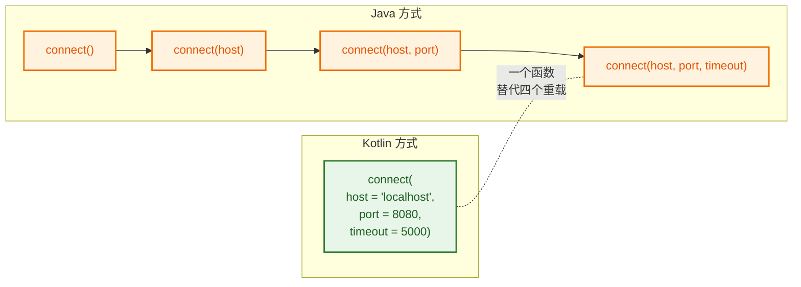
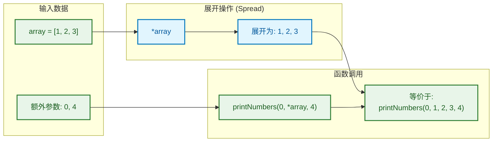
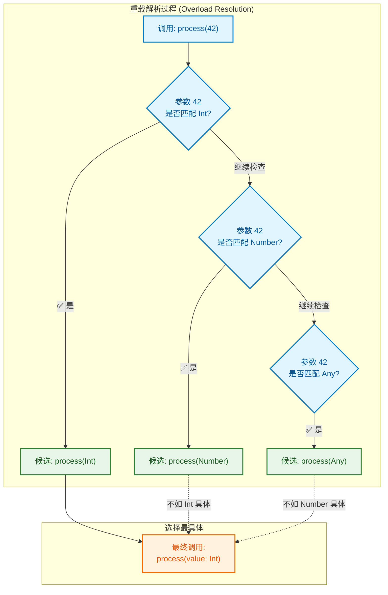
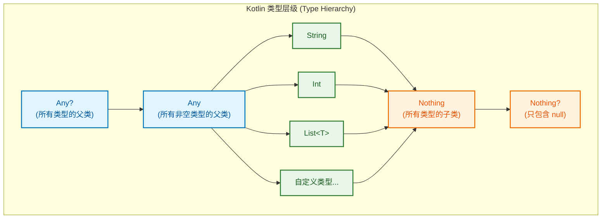
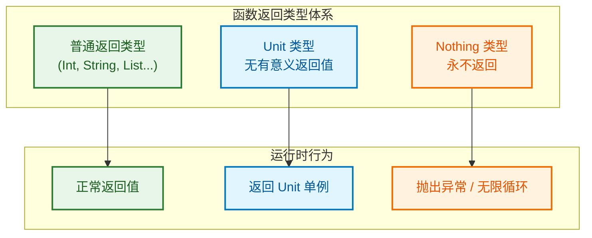

---

# 函数基础

---

## 函数声明 (Function Declaration)

在 Kotlin 中，函数是**一等公民 (first-class citizen)**，这意味着函数可以像普通变量一样被传递、存储和操作。函数声明是 Kotlin 编程的基础构建块。

### fun 关键字

Kotlin 使用 `fun` 关键字声明函数，这比 Java 的方法声明更加简洁直观：

```kotlin
// Kotlin 函数声明的基本结构
fun 函数名(参数列表): 返回类型 {
    // 函数体 (function body)
    return 返回值
}

// 最简单的函数示例
fun greet() {
    println("Hello, Kotlin!")
}

// 带参数和返回值的函数
fun add(a: Int, b: Int): Int {
    return a + b
}
```

与 Java 对比，Kotlin 的函数声明有几个显著特点：

```java
// Java 方法声明
public int add(int a, int b) {
    return a + b;
}
```

```kotlin
// Kotlin 函数声明 - 更简洁
fun add(a: Int, b: Int): Int {
    return a + b
}
```

关键差异：
- **无需访问修饰符**：Kotlin 函数默认是 `public`，无需显式声明
- **返回类型后置**：类型写在参数列表之后，用冒号 `:` 分隔
- **参数声明格式**：`参数名: 类型` 而非 Java 的 `类型 参数名`

### 参数列表 (Parameter List)

参数列表定义了函数接收的输入，每个参数必须**显式声明类型** (explicitly typed)：

```kotlin
// 无参数函数
fun getCurrentTime(): Long {
    return System.currentTimeMillis()
}

// 单参数函数
fun square(number: Int): Int {
    return number * number
}

// 多参数函数 - 参数之间用逗号分隔
fun calculateBMI(weight: Double, height: Double): Double {
    // BMI = 体重(kg) / 身高(m)²
    return weight / (height * height)
}

// 不同类型的参数混合
fun createUser(name: String, age: Int, isActive: Boolean): String {
    return "User(name=$name, age=$age, active=$isActive)"
}
```

> ⚠️ **重要**：Kotlin 的函数参数默认是 **val (不可变的)**，你无法在函数体内重新赋值：

```kotlin
fun tryModifyParam(value: Int): Int {
    // value = value + 1  // ❌ 编译错误！Val cannot be reassigned
    val newValue = value + 1  // ✅ 正确做法：创建新变量
    return newValue
}
```

### 返回类型 (Return Type)

返回类型声明在参数列表之后，使用冒号 `:` 分隔：

```kotlin
// 显式声明返回类型
fun multiply(a: Int, b: Int): Int {
    return a * b
}

// 返回复杂类型
fun getNumbers(): List<Int> {
    return listOf(1, 2, 3, 4, 5)
}

// 返回可空类型 (nullable type)
fun findUser(id: Int): String? {
    // 可能返回 null
    return if (id > 0) "User_$id" else null
}
```

当函数不需要返回有意义的值时，可以省略返回类型（编译器会推断为 `Unit`）：

```kotlin
// 以下两种写法等价
fun printMessage(msg: String) {
    println(msg)
}

fun printMessageExplicit(msg: String): Unit {
    println(msg)
}
```

---

## 单表达式函数 (Single-Expression Functions)

当函数体只有**一个表达式**时，Kotlin 提供了一种极其简洁的语法糖 (syntactic sugar)。

### = 语法

使用等号 `=` 直接连接函数签名和表达式，省略花括号和 `return` 关键字：

```kotlin
// 传统写法
fun double(x: Int): Int {
    return x * 2
}

// 单表达式函数写法 - 使用 = 语法
fun double(x: Int): Int = x * 2
```

这种写法特别适合简短的工具函数和转换函数：

```kotlin
// 数学计算
fun cube(n: Int): Int = n * n * n
fun isEven(n: Int): Boolean = n % 2 == 0
fun absoluteValue(n: Int): Int = if (n >= 0) n else -n

// 字符串处理
fun greet(name: String): String = "Hello, $name!"
fun toUpperCase(s: String): String = s.uppercase()

// 条件表达式 (if-else 也是表达式！)
fun max(a: Int, b: Int): Int = if (a > b) a else b
fun getGrade(score: Int): String = when {
    score >= 90 -> "A"
    score >= 80 -> "B"
    score >= 70 -> "C"
    score >= 60 -> "D"
    else -> "F"
}
```

### 省略 return

单表达式函数的核心优势是**无需 `return` 关键字**，表达式的值自动成为返回值：

```kotlin
// ❌ 错误：单表达式函数不能使用 return
fun wrong(x: Int): Int = return x * 2  // 编译错误

// ✅ 正确：直接写表达式
fun correct(x: Int): Int = x * 2
```

```kotlin
┌─────────────────────────────────────────────────────────┐
│           单表达式函数的执行流程                           │
├─────────────────────────────────────────────────────────┤
│                                                         │
│   fun double(x: Int): Int = x * 2                       │
│                              ↓                          │
│                         计算 x * 2                       │
│                              ↓                          │
│                      结果自动作为返回值                    │
│                                                         │
│   调用: double(5) ──────────► 返回: 10                   │
│                                                         │
└─────────────────────────────────────────────────────────┘
```

### 类型推断 (Type Inference)

单表达式函数的另一个强大特性是**返回类型可以省略**，编译器会自动推断：

```kotlin
// 显式声明返回类型
fun add(a: Int, b: Int): Int = a + b

// 省略返回类型 - 编译器推断为 Int
fun add(a: Int, b: Int) = a + b

// 更多类型推断示例
fun isPositive(n: Int) = n > 0           // 推断为 Boolean
fun formatPrice(price: Double) = "$${price}"  // 推断为 String
fun getFirst(list: List<String>) = list[0]    // 推断为 String
```

> 💡 **最佳实践**：对于**公开 API (public API)**，建议显式声明返回类型以提高代码可读性和 API 稳定性；对于**私有函数或局部函数**，可以利用类型推断简化代码。

```kotlin
// 公开 API - 显式声明类型
public fun calculateTax(income: Double): Double = income * 0.2

// 私有函数 - 可以省略类型
private fun formatInternal(value: Int) = "Value: $value"
```

**单表达式 vs 代码块函数的选择**：

| 场景 | 推荐写法 |
|------|---------|
| 简单计算、转换 | 单表达式函数 `fun f() = expr` |
| 需要多条语句 | 代码块函数 `fun f() { ... }` |
| 需要局部变量 | 代码块函数 |
| 复杂逻辑分支 | 代码块函数（即使技术上可以用单表达式） |

---

## 默认参数 (Default Arguments)

默认参数是 Kotlin 中**减少函数重载 (reduce overloading)** 的利器，允许在声明参数时指定默认值。

### 参数默认值

在参数类型后使用 `=` 指定默认值：

```kotlin
// 带默认参数的函数
fun greet(name: String = "World", greeting: String = "Hello") {
    println("$greeting, $name!")
}

// 调用方式
greet()                        // 输出: Hello, World!
greet("Kotlin")                // 输出: Hello, Kotlin!
greet("Kotlin", "Hi")          // 输出: Hi, Kotlin!
```

默认参数可以是任意表达式，甚至可以引用前面的参数：

```kotlin
// 默认值可以是表达式
fun createTimestamp(
    time: Long = System.currentTimeMillis(),  // 调用时计算
    prefix: String = "TS"
): String = "${prefix}_$time"

// 默认值可以引用前面的参数
fun repeat(text: String, times: Int = text.length): String {
    return text.repeat(times)
}

// 调用示例
repeat("Hi")      // times 默认为 2 (text.length)，返回 "HiHi"
repeat("Hi", 3)   // times = 3，返回 "HiHiHi"
```

### 减少重载 (Reducing Overloads)

在 Java 中，为了提供灵活的调用方式，通常需要编写多个重载方法：

```java
// Java: 需要多个重载方法
public class JavaExample {
    public void connect(String host, int port, int timeout) {
        // 实际连接逻辑
    }
    
    public void connect(String host, int port) {
        connect(host, port, 5000);  // 默认超时 5 秒
    }
    
    public void connect(String host) {
        connect(host, 8080);  // 默认端口 8080
    }
    
    public void connect() {
        connect("localhost");  // 默认主机 localhost
    }
}
```

Kotlin 使用默认参数，**一个函数搞定**：

```kotlin
// Kotlin: 一个函数替代所有重载
fun connect(
    host: String = "localhost",
    port: Int = 8080,
    timeout: Int = 5000
) {
    println("Connecting to $host:$port with timeout ${timeout}ms")
}

// 所有调用方式都支持
connect()                              // localhost:8080, 5000ms
connect("192.168.1.1")                 // 192.168.1.1:8080, 5000ms
connect("192.168.1.1", 3306)           // 192.168.1.1:3306, 5000ms
connect("192.168.1.1", 3306, 10000)    // 192.168.1.1:3306, 10000ms
```



**与 Java 互操作**：如果需要从 Java 代码调用带默认参数的 Kotlin 函数，使用 `@JvmOverloads` 注解让编译器自动生成重载方法：

```kotlin
// 添加 @JvmOverloads 注解
@JvmOverloads
fun connect(
    host: String = "localhost",
    port: Int = 8080,
    timeout: Int = 5000
) {
    // ...
}

// 编译器会自动生成以下 Java 可见的重载方法：
// void connect()
// void connect(String host)
// void connect(String host, int port)
// void connect(String host, int port, int timeout)
```

**默认参数的位置建议**：

```kotlin
// ✅ 推荐：有默认值的参数放后面
fun createUser(name: String, age: Int = 18, active: Boolean = true)

// ⚠️ 不推荐：有默认值的参数在前面（调用时必须使用命名参数）
fun createUser(active: Boolean = true, name: String, age: Int = 18)
// 调用: createUser(name = "Tom", age = 20)  // 必须命名
```

---

## 📝 练习题

**题目 1**：以下哪个是合法的 Kotlin 单表达式函数？

A. `fun sum(a: Int, b: Int): Int = { return a + b }`

B. `fun sum(a: Int, b: Int) = a + b`

C. `fun sum(a: Int, b: Int): Int = return a + b`

D. `fun sum(a: Int, b: Int) { = a + b }`

【答案】B

【解析】单表达式函数使用 `=` 直接连接表达式，不需要花括号 `{}`，也不需要 `return` 关键字。选项 A 错误在于使用了花括号和 return；选项 C 错误在于使用了 return；选项 D 语法完全错误。选项 B 是标准的单表达式函数写法，返回类型由编译器推断为 `Int`。

---

**题目 2**：给定以下函数定义，哪个调用是**错误**的？

```kotlin
fun sendMessage(
    to: String,
    message: String = "Hello",
    urgent: Boolean = false
)
```

A. `sendMessage("Alice")`

B. `sendMessage("Alice", "Hi")`

C. `sendMessage("Alice", true)`

D. `sendMessage("Alice", urgent = true)`

【答案】C

【解析】选项 C 尝试将 `true`（Boolean 类型）传递给第二个参数 `message`（String 类型），类型不匹配导致编译错误。如果想跳过 `message` 参数直接设置 `urgent`，必须使用**命名参数 (named argument)**，如选项 D 所示：`sendMessage("Alice", urgent = true)`。选项 A 和 B 都是按位置顺序传参，类型匹配正确。

---

## 命名参数 (Named Arguments)

命名参数是 Kotlin 提升代码可读性的重要特性，允许在调用函数时**显式指定参数名称**，而非依赖参数位置。

### 提高可读性 (Improving Readability)

当函数有多个相同类型的参数时，位置参数容易造成混淆：

```kotlin
// 函数定义
fun createRectangle(width: Int, height: Int, x: Int, y: Int): String {
    return "Rectangle at ($x, $y) with size ${width}x$height"
}

// ❌ 位置参数调用 - 难以理解每个数字的含义
val rect1 = createRectangle(100, 50, 10, 20)

// ✅ 命名参数调用 - 清晰明了
val rect2 = createRectangle(
    width = 100,
    height = 50,
    x = 10,
    y = 20
)
```

命名参数在以下场景特别有价值：

```kotlin
// 场景1: Boolean 参数 - 避免 "magic boolean"
fun sendEmail(
    to: String,
    subject: String,
    isHtml: Boolean,
    isUrgent: Boolean
)

// ❌ 调用时难以理解 true/false 的含义
sendEmail("test@example.com", "Hello", true, false)

// ✅ 命名参数让意图清晰
sendEmail(
    to = "test@example.com",
    subject = "Hello",
    isHtml = true,
    isUrgent = false
)

// 场景2: 多个字符串参数
fun formatAddress(
    street: String,
    city: String,
    state: String,
    zipCode: String
)

// ✅ 命名参数避免参数顺序错误
formatAddress(
    street = "123 Main St",
    city = "Springfield",
    state = "IL",
    zipCode = "62701"
)
```

**命名参数可以改变参数顺序**，只要所有参数都使用命名形式：

```kotlin
fun greet(firstName: String, lastName: String, title: String) {
    println("Hello, $title $firstName $lastName!")
}

// 改变参数顺序 - 完全合法
greet(
    title = "Dr.",
    lastName = "Smith",
    firstName = "John"
)
// 输出: Hello, Dr. John Smith!
```

### 跳过默认参数 (Skipping Default Arguments)

命名参数的另一个强大用途是**跳过中间的默认参数**，只为特定参数赋值：

```kotlin
fun httpRequest(
    url: String,
    method: String = "GET",
    timeout: Int = 5000,
    retries: Int = 3,
    headers: Map<String, String> = emptyMap()
) {
    println("$method $url (timeout=${timeout}ms, retries=$retries)")
}

// 只想修改 retries，保持其他默认值
// ❌ 位置参数必须按顺序提供所有前置参数
httpRequest("https://api.example.com", "GET", 5000, 5)

// ✅ 命名参数可以跳过中间参数
httpRequest(
    url = "https://api.example.com",
    retries = 5  // 只修改这一个，其他保持默认
)
```

```kotlin
┌──────────────────────────────────────────────────────────────┐
│                    命名参数跳过机制                            │
├──────────────────────────────────────────────────────────────┤
│                                                              │
│  fun config(a: Int = 1, b: Int = 2, c: Int = 3, d: Int = 4)  │
│                                                              │
│  位置参数调用 config(1, 2, 3, 10)                             │
│              必须提供 ↑  ↑  ↑  才能设置 d                      │
│                                                              │
│  命名参数调用 config(d = 10)                                  │
│              直接跳过 a, b, c ────► 使用默认值                 │
│                                                              │
└──────────────────────────────────────────────────────────────┘
```

**混合使用位置参数和命名参数**：

```kotlin
fun createUser(
    id: Long,
    name: String,
    email: String = "",
    age: Int = 0,
    active: Boolean = true
)

// ✅ 前面用位置参数，后面用命名参数
createUser(1001, "Alice", active = false)

// ✅ 位置参数必须在命名参数之前
createUser(1001, name = "Alice", age = 25)

// ❌ 位置参数不能出现在命名参数之后
// createUser(id = 1001, "Alice")  // 编译错误！
```

> 📌 **规则**：一旦使用了命名参数，其后的所有参数都必须使用命名形式（Kotlin 1.4+ 放宽了此限制，但为了可读性建议遵守）。

---

## 可变参数 (Varargs)

可变参数允许函数接收**任意数量**的同类型参数，这在构建灵活 API 时非常有用。

### vararg 关键字

使用 `vararg` 修饰符声明可变参数：

```kotlin
// 声明可变参数函数
fun printAll(vararg messages: String) {
    for (msg in messages) {
        println(msg)
    }
}

// 调用时可以传入任意数量的参数
printAll("Hello")                          // 1 个参数
printAll("Hello", "World")                 // 2 个参数
printAll("A", "B", "C", "D", "E")          // 5 个参数
printAll()                                 // 0 个参数也可以！
```

在函数体内，`vararg` 参数被视为**数组 (Array)**：

```kotlin
fun sum(vararg numbers: Int): Int {
    // numbers 的类型是 IntArray
    println("收到 ${numbers.size} 个数字")
    
    var total = 0
    for (num in numbers) {
        total += num
    }
    return total
}

// 更简洁的写法
fun sumSimple(vararg numbers: Int): Int = numbers.sum()

// 调用
sum(1, 2, 3, 4, 5)  // 输出: 收到 5 个数字，返回 15
```

**vararg 参数的位置**：

```kotlin
// ✅ 推荐：vararg 作为最后一个参数
fun format(prefix: String, vararg items: String): String {
    return items.joinToString(", ", prefix = "$prefix: ")
}
format("Items", "A", "B", "C")  // "Items: A, B, C"

// ⚠️ 可以但不推荐：vararg 不在最后
fun formatAlt(vararg items: String, suffix: String): String {
    return items.joinToString(", ") + suffix
}
// 必须使用命名参数指定 suffix
formatAlt("A", "B", "C", suffix = "!")  // "A, B, C!"
```

### 展开操作符 * (Spread Operator)

当你已经有一个数组，想将其元素作为可变参数传递时，使用**展开操作符 `*`**：

```kotlin
fun printNumbers(vararg nums: Int) {
    nums.forEach { print("$it ") }
    println()
}

val array = intArrayOf(1, 2, 3)

// ❌ 直接传数组会报错 - 类型不匹配
// printNumbers(array)  // 编译错误！

// ✅ 使用展开操作符
printNumbers(*array)  // 输出: 1 2 3
```

展开操作符可以与其他参数混合使用：

```kotlin
val middle = intArrayOf(3, 4, 5)

// 在展开的数组前后添加额外元素
printNumbers(1, 2, *middle, 6, 7)  // 输出: 1 2 3 4 5 6 7

// 合并多个数组
val first = intArrayOf(1, 2)
val second = intArrayOf(8, 9)
printNumbers(*first, *middle, *second)  // 输出: 1 2 3 4 5 8 9
```



### 传递数组 (Passing Arrays)

不同类型的数组需要注意转换：

```kotlin
fun printStrings(vararg strings: String) {
    strings.forEach { println(it) }
}

// Array<String> 可以直接展开
val stringArray: Array<String> = arrayOf("A", "B", "C")
printStrings(*stringArray)  // ✅ 正常工作

// List 需要先转换为数组
val stringList: List<String> = listOf("X", "Y", "Z")
printStrings(*stringList.toTypedArray())  // ✅ 先转数组再展开
```

**基本类型数组的特殊处理**：

```kotlin
fun sumInts(vararg nums: Int) = nums.sum()

// IntArray 直接展开
val intArray: IntArray = intArrayOf(1, 2, 3)
sumInts(*intArray)  // ✅

// Array<Int> (装箱类型) 需要转换
val boxedArray: Array<Int> = arrayOf(1, 2, 3)
sumInts(*boxedArray.toIntArray())  // ✅ 先转 IntArray

// List<Int> 也需要转换
val intList: List<Int> = listOf(1, 2, 3)
sumInts(*intList.toIntArray())  // ✅
```

---

## 函数重载 (Function Overloading)

函数重载 (Function Overloading) 允许在同一作用域内定义**多个同名函数**，只要它们的**参数签名不同**。

### 参数数量 (Parameter Count)

通过不同的参数数量实现重载：

```kotlin
class Calculator {
    // 两个参数的版本
    fun add(a: Int, b: Int): Int {
        return a + b
    }
    
    // 三个参数的版本
    fun add(a: Int, b: Int, c: Int): Int {
        return a + b + c
    }
    
    // 四个参数的版本
    fun add(a: Int, b: Int, c: Int, d: Int): Int {
        return a + b + c + d
    }
}

val calc = Calculator()
calc.add(1, 2)           // 调用两参数版本，返回 3
calc.add(1, 2, 3)        // 调用三参数版本，返回 6
calc.add(1, 2, 3, 4)     // 调用四参数版本，返回 10
```

> 💡 **提示**：在 Kotlin 中，这种场景更推荐使用 `vararg` 或默认参数来替代多个重载。

### 参数类型 (Parameter Types)

通过不同的参数类型实现重载：

```kotlin
class Printer {
    fun print(value: Int) {
        println("Integer: $value")
    }
    
    fun print(value: Double) {
        println("Double: $value")
    }
    
    fun print(value: String) {
        println("String: $value")
    }
    
    fun print(value: List<*>) {
        println("List with ${value.size} elements")
    }
}

val printer = Printer()
printer.print(42)              // Integer: 42
printer.print(3.14)            // Double: 3.14
printer.print("Hello")         // String: Hello
printer.print(listOf(1,2,3))   // List with 3 elements
```

**参数类型和数量可以组合**：

```kotlin
class Logger {
    fun log(message: String) {
        println("[LOG] $message")
    }
    
    fun log(message: String, level: Int) {
        println("[LOG-$level] $message")
    }
    
    fun log(error: Exception) {
        println("[ERROR] ${error.message}")
    }
    
    fun log(error: Exception, stackTrace: Boolean) {
        println("[ERROR] ${error.message}")
        if (stackTrace) error.printStackTrace()
    }
}
```

### 重载解析 (Overload Resolution)

当调用重载函数时，编译器通过**重载解析 (overload resolution)** 确定调用哪个版本。解析规则遵循**最具体匹配原则 (most specific match)**：

```kotlin
fun process(value: Any) {
    println("Any: $value")
}

fun process(value: Number) {
    println("Number: $value")
}

fun process(value: Int) {
    println("Int: $value")
}

// 编译器选择最具体的匹配
process(42)        // 输出: Int: 42 (Int 最具体)
process(3.14)      // 输出: Number: 3.14 (Double 是 Number)
process("Hello")   // 输出: Any: Hello (String 只匹配 Any)
```



**歧义调用 (Ambiguous Call)** 会导致编译错误：

```kotlin
fun ambiguous(a: Int, b: Long) = println("Int, Long")
fun ambiguous(a: Long, b: Int) = println("Long, Int")

// ❌ 编译错误：歧义调用
// ambiguous(1, 2)  // 两个函数都可以匹配！

// ✅ 显式类型消除歧义
ambiguous(1, 2L)   // 调用 (Int, Long) 版本
ambiguous(1L, 2)   // 调用 (Long, Int) 版本
```

**重载 vs 默认参数的选择**：

| 场景 | 推荐方案 |
|------|---------|
| 参数类型不同 | 函数重载 |
| 参数数量不同但类型相同 | 默认参数 |
| 需要完全不同的实现逻辑 | 函数重载 |
| 只是参数可选 | 默认参数 |
| 需要 Java 互操作 | 重载 或 `@JvmOverloads` |

```kotlin
// ✅ 适合重载：不同类型需要不同处理
fun parse(input: String): Data = parseString(input)
fun parse(input: ByteArray): Data = parseBytes(input)
fun parse(input: InputStream): Data = parseStream(input)

// ✅ 适合默认参数：同一逻辑，部分参数可选
fun connect(
    host: String,
    port: Int = 8080,
    secure: Boolean = false
)
```

---

## 📝 练习题

**题目 1**：以下代码的输出是什么？

```kotlin
fun greet(name: String = "World", punctuation: String = "!") {
    println("Hello, $name$punctuation")
}

fun main() {
    greet(punctuation = "?")
}
```

A. `Hello, World!`

B. `Hello, World?`

C. `Hello, ?`

D. 编译错误

【答案】B

【解析】命名参数允许跳过有默认值的参数。调用 `greet(punctuation = "?")` 时，`name` 使用默认值 `"World"`，`punctuation` 被显式设置为 `"?"`，因此输出 `Hello, World?`。

---

**题目 2**：以下哪个调用是**正确**的？

```kotlin
fun combine(vararg strings: String, separator: String = ", "): String {
    return strings.joinToString(separator)
}
```

A. `combine("A", "B", "C")`

B. `combine(arrayOf("A", "B", "C"))`

C. `combine(*listOf("A", "B", "C"))`

D. `combine("A", "B", separator = "-", "C")`

【答案】A

【解析】
- **A 正确**：直接传递多个字符串作为可变参数，`separator` 使用默认值。
- **B 错误**：`arrayOf()` 返回 `Array<String>`，需要使用展开操作符 `*` 才能传递给 `vararg`。
- **C 错误**：`listOf()` 返回 `List`，展开操作符 `*` 只能用于数组，需要先调用 `.toTypedArray()`。
- **D 错误**：命名参数 `separator = "-"` 之后不能再使用位置参数 `"C"`。

---

## Unit 类型 (Unit Type)

在 Kotlin 中，`Unit` 是一个特殊的类型，用于表示函数**不返回有意义的值**。它类似于 Java 中的 `void`，但有本质区别。

### 无返回值 (No Meaningful Return)

当函数执行某些操作但不需要返回结果时，其返回类型为 `Unit`：

```kotlin
// 显式声明返回 Unit
fun printMessage(msg: String): Unit {
    println(msg)
}

// 省略 Unit 声明 - 编译器自动推断
fun printMessage2(msg: String) {
    println(msg)
}

// 两种写法完全等价
```

与 Java 的 `void` 对比：

```java
// Java: void 是关键字，不是类型
public void printMessage(String msg) {
    System.out.println(msg);
}

// void 方法不能作为表达式使用
// String result = printMessage("Hi");  // ❌ 编译错误
```

```kotlin
// Kotlin: Unit 是真正的类型
fun printMessage(msg: String): Unit {
    println(msg)
}

// Unit 函数可以作为表达式，返回 Unit 值
val result: Unit = printMessage("Hi")  // ✅ 合法
println(result)  // 输出: kotlin.Unit
```

### Unit 的意义 (Significance of Unit)

`Unit` 作为真正的类型而非关键字，带来了重要的设计优势：

**1. 类型系统的一致性 (Type System Consistency)**

每个函数都有返回类型，使得函数式编程更加统一：

```kotlin
// 所有函数都可以赋值给变量
val action: () -> Unit = { println("Hello") }
val calculator: (Int, Int) -> Int = { a, b -> a + b }

// 高阶函数可以统一处理
fun execute(block: () -> Unit) {
    block()
}

execute { println("执行操作") }
```

**2. 泛型兼容性 (Generic Compatibility)**

`Unit` 可以作为泛型类型参数：

```kotlin
// 定义一个通用的结果包装类
sealed class Result<T> {
    data class Success<T>(val data: T) : Result<T>()
    data class Error<T>(val message: String) : Result<T>()
}

// 对于不需要返回数据的操作，使用 Unit 作为类型参数
fun saveData(): Result<Unit> {
    // 保存操作...
    return Result.Success(Unit)  // 返回 Unit 表示成功但无数据
}

// 使用示例
when (val result = saveData()) {
    is Result.Success -> println("保存成功")
    is Result.Error -> println("保存失败: ${result.message}")
}
```

**3. Unit 是单例对象 (Singleton Object)**

`Unit` 类型只有一个值，也叫 `Unit`：

```kotlin
// Unit 的定义（简化版）
public object Unit {
    override fun toString() = "kotlin.Unit"
}
```

```kotlin
┌─────────────────────────────────────────────────────────┐
│                    Unit 类型特性                         │
├─────────────────────────────────────────────────────────┤
│                                                         │
│   类型名称: Unit          值: Unit (单例)                │
│                                                         │
│   fun doSomething(): Unit {                             │
│       println("working...")                             │
│       // 隐式返回 Unit                                   │
│   }                                                     │
│                                                         │
│   等价于:                                                │
│   fun doSomething(): Unit {                             │
│       println("working...")                             │
│       return Unit  // 显式返回                           │
│   }                                                     │
│                                                         │
└─────────────────────────────────────────────────────────┘
```

**4. Lambda 表达式中的 Unit**

当 Lambda 的最后一个表达式不是 `Unit` 类型时，需要注意：

```kotlin
// 期望返回 Unit 的高阶函数
fun runTask(task: () -> Unit) {
    task()
}

// ✅ 正确：最后一个表达式是 println，返回 Unit
runTask {
    val result = 1 + 1
    println(result)
}

// ⚠️ 注意：如果最后是非 Unit 表达式，Kotlin 会自动忽略返回值
runTask {
    val result = 1 + 1
    result  // 这个值会被忽略，Lambda 仍然返回 Unit
}
```

---

## Nothing 类型 (Nothing Type)

`Nothing` 是 Kotlin 类型系统中的**底层类型 (bottom type)**，表示**永远不会返回**的函数或表达式。

### 永不返回 (Never Returns)

`Nothing` 类型用于标记那些**永远不会正常完成**的函数：

```kotlin
// 总是抛出异常的函数
fun fail(message: String): Nothing {
    throw IllegalStateException(message)
}

// 无限循环的函数
fun infiniteLoop(): Nothing {
    while (true) {
        // 永远不会结束
    }
}

// 终止程序的函数
fun terminate(): Nothing {
    System.exit(1)
    // 这行代码永远不会执行，但编译器需要 Nothing 来理解这一点
    throw AssertionError("Unreachable")
}
```

### 类型系统底层 (Bottom of Type Hierarchy)

`Nothing` 是所有类型的**子类型 (subtype)**，这个特性使得类型推断更加智能：



**Nothing 作为子类型的实际应用**：

```kotlin
// 场景1：Elvis 操作符中使用
fun getUserName(user: User?): String {
    // 如果 user 为 null，fail() 返回 Nothing
    // Nothing 是 String 的子类型，所以整个表达式类型是 String
    return user?.name ?: fail("User cannot be null")
}

// 场景2：when 表达式的完整性
fun describe(obj: Any): String = when (obj) {
    is Int -> "Integer: $obj"
    is String -> "String: $obj"
    else -> fail("Unknown type")  // Nothing 兼容 String 返回类型
}

// 场景3：类型推断
val result: String = if (condition) {
    "success"
} else {
    throw Exception("failed")  // throw 表达式的类型是 Nothing
}
// 编译器推断 result 类型为 String（Nothing 被忽略）
```

### 抛出异常 (Throwing Exceptions)

`throw` 表达式的类型是 `Nothing`，这使得它可以用在任何需要值的地方：

```kotlin
// throw 是表达式，类型为 Nothing
val message: String = throw Exception("Error")  // 合法但永远不会赋值

// 实际应用：简化空值处理
fun processData(data: String?) {
    // data ?: throw 的类型推断
    // String? ?: Nothing -> String
    val nonNullData: String = data ?: throw IllegalArgumentException("Data required")
    println(nonNullData.uppercase())
}

// TODO() 函数返回 Nothing
fun notImplementedYet(): Int {
    TODO("This feature is not implemented")
    // 不需要 return 语句，因为 TODO() 返回 Nothing
}
```

**Nothing 与 Unit 的对比**：

```kotlin
┌─────────────────────────────────────────────────────────────┐
│              Unit vs Nothing 对比                            │
├─────────────────────────────────────────────────────────────┤
│                                                             │
│   Unit                          Nothing                     │
│   ─────                         ───────                     │
│   • 函数正常返回                 • 函数永不返回                │
│   • 有一个值: Unit               • 没有任何值                  │
│   • 类似 Java void              • 没有 Java 对应物            │
│   • 是普通类型                   • 是所有类型的子类型           │
│                                                             │
│   fun log(): Unit {             fun fail(): Nothing {       │
│       println("done")               throw Error()           │
│       // 隐式 return Unit       }                           │
│   }                                                         │
│                                                             │
└─────────────────────────────────────────────────────────────┘
```

**Nothing? 类型**：

`Nothing?` 是一个特殊类型，它只能持有一个值：`null`。

```kotlin
// Nothing? 只能是 null
val nothing: Nothing? = null

// 这就是为什么 null 可以赋值给任何可空类型
val str: String? = null      // null 的类型是 Nothing?，是 String? 的子类型
val num: Int? = null         // 同理
val list: List<Int>? = null  // 同理
```

---

## 中缀函数 (Infix Functions)

中缀函数 (Infix Function) 允许使用**中缀表示法 (infix notation)** 调用函数，省略点号和括号，使代码更接近自然语言。

### infix 关键字

使用 `infix` 修饰符声明中缀函数，必须满足以下条件：
- 必须是**成员函数**或**扩展函数**
- 必须只有**一个参数**
- 参数不能是可变参数，不能有默认值

```kotlin
// 成员函数形式
class Person(val name: String) {
    infix fun greet(other: Person): String {
        return "${this.name} says hello to ${other.name}"
    }
}

// 扩展函数形式
infix fun Int.times(str: String): String {
    return str.repeat(this)
}

// 调用方式
val alice = Person("Alice")
val bob = Person("Bob")

// 传统调用
alice.greet(bob)

// 中缀调用 - 更自然的语法
alice greet bob  // "Alice says hello to Bob"

// 数字扩展
3 times "Hi "    // "Hi Hi Hi "
```

**标准库中的中缀函数**：

```kotlin
// to - 创建 Pair
val pair1 = "key" to "value"           // 中缀调用
val pair2 = "key".to("value")          // 等价的传统调用

// until / downTo / step - 范围操作
for (i in 1 until 10) { }              // 1 到 9
for (i in 10 downTo 1) { }             // 10 到 1
for (i in 1 until 10 step 2) { }       // 1, 3, 5, 7, 9

// and / or / xor / shl / shr - 位运算
val result = 0b1010 and 0b1100         // 位与: 0b1000
val shifted = 1 shl 4                   // 左移: 16

// contains 的中缀形式 in
val list = listOf(1, 2, 3)
val hasTwo = 2 in list                  // true (调用 list.contains(2))
```

### DSL 构建 (Building DSLs)

中缀函数是构建**领域特定语言 (Domain-Specific Language, DSL)** 的重要工具：

```kotlin
// 构建一个简单的测试 DSL
infix fun <T> T.shouldBe(expected: T) {
    if (this != expected) {
        throw AssertionError("Expected $expected but was $this")
    }
}

infix fun <T> T.shouldNotBe(expected: T) {
    if (this == expected) {
        throw AssertionError("Expected not to be $expected")
    }
}

infix fun String.shouldContain(substring: String) {
    if (!this.contains(substring)) {
        throw AssertionError("'$this' should contain '$substring'")
    }
}

// 使用 DSL 编写测试 - 读起来像自然语言
fun testExample() {
    val result = 2 + 2
    
    result shouldBe 4
    result shouldNotBe 5
    
    val message = "Hello, Kotlin!"
    message shouldContain "Kotlin"
}
```

**构建 HTML DSL 示例**：

```kotlin
// 简化的 HTML 构建器
class Tag(val name: String) {
    private val children = mutableListOf<Tag>()
    private var text: String = ""
    
    infix fun containing(child: Tag): Tag {
        children.add(child)
        return this
    }
    
    infix fun withText(content: String): Tag {
        text = content
        return this
    }
    
    override fun toString(): String {
        val childrenStr = children.joinToString("")
        return "<$name>$text$childrenStr</$name>"
    }
}

fun tag(name: String) = Tag(name)

// 使用中缀函数构建 HTML
val html = tag("div") containing (
    tag("h1") withText "Title"
) containing (
    tag("p") withText "Content"
)

println(html)  // <div><h1>Title</h1><p>Content</p></div>
```

### 使用场景 (Use Cases)

**1. 提高可读性的工具函数**：

```kotlin
// 时间相关
infix fun Int.days(from: String): LocalDate {
    return when (from) {
        "ago" -> LocalDate.now().minusDays(this.toLong())
        "later" -> LocalDate.now().plusDays(this.toLong())
        else -> throw IllegalArgumentException("Unknown: $from")
    }
}

val lastWeek = 7 days "ago"
val nextWeek = 7 days "later"

// 集合操作
infix fun <T> List<T>.intersect(other: List<T>): List<T> {
    return this.filter { it in other }
}

val common = listOf(1, 2, 3) intersect listOf(2, 3, 4)  // [2, 3]
```

**2. 类型安全的构建器**：

```kotlin
// 配置构建器
class Config {
    var host: String = ""
    var port: Int = 0
    
    infix fun host(value: String): Config {
        host = value
        return this
    }
    
    infix fun port(value: Int): Config {
        port = value
        return this
    }
}

// 链式中缀调用
val config = Config() host "localhost" port 8080
```

**中缀函数的优先级**：

```kotlin
// 中缀函数优先级低于算术运算符
1 shl 2 + 3    // 等价于 1 shl (2 + 3) = 1 shl 5 = 32

// 中缀函数优先级高于比较运算符和逻辑运算符
1 until 10 step 2  // 等价于 (1 until 10) step 2

// 中缀函数是左结合的
a foo b bar c  // 等价于 (a foo b) bar c
```

> ⚠️ **最佳实践**：中缀函数应该用于提高代码可读性，而非炫技。只有当中缀形式确实比传统调用更清晰时才使用。

---

## 📝 练习题

**题目 1**：以下关于 `Unit` 和 `Nothing` 的说法，哪个是**正确**的？

A. `Unit` 和 Java 的 `void` 完全相同

B. `Nothing` 类型有一个值叫做 `nothing`

C. 返回 `Nothing` 的函数可以正常结束执行

D. `throw` 表达式的类型是 `Nothing`

【答案】D

【解析】
- **A 错误**：`Unit` 是真正的类型，有一个单例值；`void` 是关键字，不是类型。
- **B 错误**：`Nothing` 类型没有任何值，这正是它的特点。
- **C 错误**：返回 `Nothing` 的函数永远不会正常结束，要么抛出异常，要么无限循环。
- **D 正确**：`throw` 表达式的类型确实是 `Nothing`，这使得它可以用在任何需要值的地方。

---

**题目 2**：以下哪个是**合法**的中缀函数声明？

A. `infix fun greet(name: String, title: String): String`

B. `infix fun String.repeat(times: Int = 1): String`

C. `infix fun Int.power(exponent: Int): Int`

D. `infix fun calculate(vararg numbers: Int): Int`

【答案】C

【解析】中缀函数必须满足三个条件：①是成员函数或扩展函数；②只有一个参数；③参数不能有默认值或是可变参数。
- **A 错误**：有两个参数，且不是成员/扩展函数。
- **B 错误**：参数有默认值 `= 1`。
- **C 正确**：是扩展函数，只有一个参数，无默认值。
- **D 错误**：使用了 `vararg` 可变参数，且不是成员/扩展函数。

---

## 本地函数 (Local Functions)

本地函数 (Local Function) 是定义在另一个函数内部的函数，也称为**嵌套函数 (Nested Function)**。这是 Kotlin 相比 Java 的一个重要特性，Java 不支持在方法内部定义方法。

### 函数内定义函数 (Functions Inside Functions)

当某段逻辑只在一个函数内部使用，且需要复用时，本地函数是理想选择：

```kotlin
fun processUser(user: User): Result {
    // 本地函数：只在 processUser 内部可见
    fun validateName(name: String): Boolean {
        return name.isNotBlank() && name.length >= 2
    }
    
    fun validateEmail(email: String): Boolean {
        return email.contains("@") && email.contains(".")
    }
    
    fun validateAge(age: Int): Boolean {
        return age in 0..150
    }
    
    // 使用本地函数
    if (!validateName(user.name)) {
        return Result.Error("Invalid name")
    }
    if (!validateEmail(user.email)) {
        return Result.Error("Invalid email")
    }
    if (!validateAge(user.age)) {
        return Result.Error("Invalid age")
    }
    
    return Result.Success(user)
}
```

**本地函数 vs 私有函数的选择**：

```kotlin
// 方案1：使用私有函数（类级别）
class UserService {
    private fun validateName(name: String): Boolean = name.isNotBlank()
    private fun validateEmail(email: String): Boolean = email.contains("@")
    
    fun processUser(user: User): Result {
        if (!validateName(user.name)) return Result.Error("Invalid name")
        if (!validateEmail(user.email)) return Result.Error("Invalid email")
        return Result.Success(user)
    }
    
    // 问题：validateName/validateEmail 对整个类可见
    // 其他方法可能误用这些验证函数
}

// 方案2：使用本地函数（推荐）
class UserService {
    fun processUser(user: User): Result {
        // 验证逻辑封装在使用它的函数内部
        fun validateName(name: String) = name.isNotBlank()
        fun validateEmail(email: String) = email.contains("@")
        
        if (!validateName(user.name)) return Result.Error("Invalid name")
        if (!validateEmail(user.email)) return Result.Error("Invalid email")
        return Result.Success(user)
    }
    // validateName/validateEmail 对其他方法完全不可见
}
```

### 闭包访问 (Closure Access)

本地函数最强大的特性是可以**访问外部函数的变量和参数**，形成闭包 (Closure)：

```kotlin
fun sendEmails(users: List<User>, template: String): Report {
    // 外部函数的变量
    var successCount = 0
    var failureCount = 0
    val errors = mutableListOf<String>()
    
    // 本地函数可以访问并修改外部变量
    fun sendToUser(user: User) {
        try {
            // 访问外部参数 template
            val message = template.replace("{name}", user.name)
            EmailService.send(user.email, message)
            successCount++  // 修改外部变量
        } catch (e: Exception) {
            failureCount++  // 修改外部变量
            errors.add("Failed to send to ${user.email}: ${e.message}")
        }
    }
    
    // 调用本地函数
    users.forEach { sendToUser(it) }
    
    return Report(successCount, failureCount, errors)
}
```

闭包访问使得代码更加简洁，无需通过参数传递所有状态：

```kotlin
// ❌ 不使用闭包：需要传递和返回大量状态
fun processWithoutClosure(items: List<Item>): ProcessResult {
    var processed = 0
    var skipped = 0
    
    fun processItem(item: Item, currentProcessed: Int, currentSkipped: Int): Pair<Int, Int> {
        return if (item.isValid) {
            // 处理逻辑...
            Pair(currentProcessed + 1, currentSkipped)
        } else {
            Pair(currentProcessed, currentSkipped + 1)
        }
    }
    
    for (item in items) {
        val (newProcessed, newSkipped) = processItem(item, processed, skipped)
        processed = newProcessed
        skipped = newSkipped
    }
    
    return ProcessResult(processed, skipped)
}

// ✅ 使用闭包：代码简洁清晰
fun processWithClosure(items: List<Item>): ProcessResult {
    var processed = 0
    var skipped = 0
    
    fun processItem(item: Item) {
        if (item.isValid) {
            // 处理逻辑...
            processed++  // 直接访问外部变量
        } else {
            skipped++
        }
    }
    
    items.forEach { processItem(it) }
    
    return ProcessResult(processed, skipped)
}
```

```kotlin
┌─────────────────────────────────────────────────────────────┐
│                    闭包访问示意图                             │
├─────────────────────────────────────────────────────────────┤
│                                                             │
│   fun outer(param: String) {                                │
│       var counter = 0          ◄─────┐                      │
│       val prefix = "LOG: "     ◄─────┤                      │
│                                      │ 闭包捕获              │
│       fun inner(msg: String) {       │ (Closure Capture)    │
│           counter++            ──────┤                      │
│           println(prefix + msg)──────┘                      │
│       }                                                     │
│                                                             │
│       inner("Hello")  // counter = 1                        │
│       inner("World")  // counter = 2                        │
│   }                                                         │
│                                                             │
│   inner 函数"捕获"了 outer 的 counter 和 prefix              │
│   可以读取和修改这些变量                                      │
│                                                             │
└─────────────────────────────────────────────────────────────┘
```

### 作用域限制 (Scope Restriction)

本地函数的作用域严格限制在其外部函数内，这提供了更好的**封装性 (Encapsulation)**：

```kotlin
fun calculateStatistics(numbers: List<Int>): Statistics {
    // 这些本地函数只在 calculateStatistics 内部存在
    fun sum() = numbers.sum()
    fun average() = if (numbers.isEmpty()) 0.0 else sum().toDouble() / numbers.size
    fun max() = numbers.maxOrNull() ?: 0
    fun min() = numbers.minOrNull() ?: 0
    
    return Statistics(
        sum = sum(),
        average = average(),
        max = max(),
        min = min()
    )
}

// ❌ 在外部无法访问这些本地函数
// sum()  // 编译错误：Unresolved reference
```

**本地函数可以嵌套定义**：

```kotlin
fun outerFunction() {
    fun level1() {
        println("Level 1")
        
        fun level2() {
            println("Level 2")
            
            fun level3() {
                println("Level 3")
            }
            
            level3()
        }
        
        level2()
    }
    
    level1()
}

// 输出:
// Level 1
// Level 2
// Level 3
```

> ⚠️ **注意**：虽然支持多层嵌套，但过深的嵌套会降低代码可读性。通常建议最多嵌套一层。

**本地函数的声明顺序**：

```kotlin
fun demo() {
    // ❌ 错误：在声明之前调用
    // helper()  // 编译错误：Unresolved reference
    
    fun helper() {
        println("Helper")
    }
    
    // ✅ 正确：在声明之后调用
    helper()
}
```

**递归本地函数**：

```kotlin
fun factorial(n: Int): Long {
    // 本地递归函数
    fun factorialHelper(num: Int, accumulator: Long): Long {
        return if (num <= 1) {
            accumulator
        } else {
            factorialHelper(num - 1, num * accumulator)  // 尾递归
        }
    }
    
    require(n >= 0) { "n must be non-negative" }
    return factorialHelper(n, 1)
}

// 使用 tailrec 优化
fun factorialOptimized(n: Int): Long {
    tailrec fun helper(num: Int, acc: Long): Long {
        return if (num <= 1) acc else helper(num - 1, num * acc)
    }
    
    require(n >= 0) { "n must be non-negative" }
    return helper(n, 1)
}
```

---

## 本章小结 (Chapter Summary)

本章系统介绍了 Kotlin 函数的核心概念和特性，以下是关键知识点的回顾：

### 核心概念速查表

| 特性 | 语法 | 用途 |
|------|------|------|
| **函数声明** | `fun name(params): Type { }` | 定义可复用的代码块 |
| **单表达式函数** | `fun name() = expression` | 简化单行函数 |
| **默认参数** | `fun f(x: Int = 0)` | 减少函数重载 |
| **命名参数** | `f(name = "value")` | 提高可读性，跳过默认参数 |
| **可变参数** | `vararg items: T` | 接收任意数量参数 |
| **展开操作符** | `*array` | 将数组展开为可变参数 |
| **Unit 类型** | `: Unit` 或省略 | 表示无有意义返回值 |
| **Nothing 类型** | `: Nothing` | 表示永不返回 |
| **中缀函数** | `infix fun T.f(p: P)` | DSL 构建，提高可读性 |
| **本地函数** | 函数内定义函数 | 封装局部逻辑，闭包访问 |

### 类型系统要点



### 最佳实践总结

**1. 参数设计**
- 有默认值的参数放在参数列表末尾
- 使用命名参数提高多参数函数的可读性
- 优先使用默认参数而非函数重载

**2. 函数简化**
- 单行逻辑使用单表达式函数
- 公开 API 显式声明返回类型
- 私有函数可利用类型推断

**3. 特殊函数**
- 中缀函数用于 DSL 和提高可读性场景
- 本地函数封装只在单个函数内使用的逻辑
- 善用闭包简化状态管理

**4. 类型选择**
- 无返回值用 `Unit`（可省略）
- 永不返回用 `Nothing`
- `TODO()` 返回 `Nothing`，可用作占位符

### Kotlin vs Java 函数特性对比

```kotlin
┌────────────────────┬─────────────────────┬─────────────────────┐
│       特性          │       Kotlin        │        Java         │
├────────────────────┼─────────────────────┼─────────────────────┤
│ 默认参数            │         ✅          │         ❌          │
│ 命名参数            │         ✅          │         ❌          │
│ 单表达式函数        │         ✅          │         ❌          │
│ 本地函数            │         ✅          │         ❌          │
│ 中缀函数            │         ✅          │         ❌          │
│ 函数重载            │         ✅          │         ✅          │
│ 可变参数            │    vararg + *       │      ... 语法       │
│ 无返回值类型        │   Unit (真正类型)    │   void (关键字)     │
│ 永不返回类型        │      Nothing        │         ❌          │
│ 顶层函数            │         ✅          │    ❌ (需要类)       │
└────────────────────┴─────────────────────┴─────────────────────┘
```

---

## 📝 练习题

**题目 1**：以下代码的输出是什么？

```kotlin
fun outer() {
    var count = 0
    
    fun increment() {
        count++
    }
    
    increment()
    increment()
    increment()
    
    println(count)
}

fun main() {
    outer()
}
```

A. `0`

B. `1`

C. `3`

D. 编译错误

【答案】C

【解析】本地函数 `increment()` 通过闭包 (Closure) 捕获了外部函数的变量 `count`。每次调用 `increment()` 都会修改同一个 `count` 变量。调用三次后，`count` 的值变为 3。这展示了本地函数访问和修改外部变量的能力。

---

**题目 2**：关于本章内容，以下哪个说法是**错误**的？

A. 默认参数可以减少函数重载的数量

B. `Nothing` 是所有类型的子类型

C. 中缀函数可以有多个参数

D. 本地函数可以访问外部函数的局部变量

【答案】C

【解析】
- **A 正确**：默认参数允许一个函数处理多种调用情况，减少了重载需求。
- **B 正确**：`Nothing` 是 Kotlin 类型系统的底层类型 (bottom type)，是所有类型的子类型。
- **C 错误**：中缀函数必须**只有一个参数**，这是中缀函数的硬性要求之一。
- **D 正确**：本地函数通过闭包机制可以访问（甚至修改）外部函数的参数和局部变量。

---